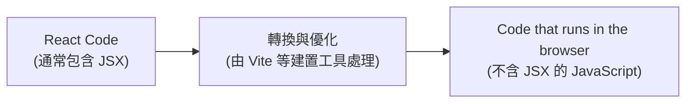
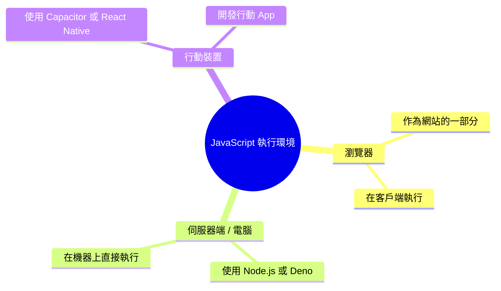
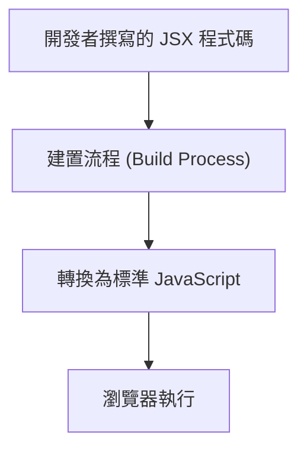

### JavaScript 模組化開發

- 在進階專案中，將程式碼拆分至多個檔案是最佳實踐
    - 目的是為了保持程式碼的可維護性（maintainable）與可管理性（manageable）
    - 使用 `import` 與 `export` 關鍵字來實現檔案間的內容共享
- **[範例：管理共用變數]**
    - 可以在 `util.js` 檔案中定義需要在其他檔案使用的值
    - 例如在 `app.js` 中需要一個用於發送 HTTP 請求到後端的 API 金鑰
    - 變數可以使用 `let` 關鍵字來建立（後續會詳細討論變數與常數的差異）

```javascript
// 在 util.js 中的範例內容
let apiKey = "adnaskasflak1";
```

### JavaScript 模組化：匯出與匯入

- **匯出內容 (Exporting)**
    - 若要讓定義在檔案中的變數（或函數）能被其他檔案使用，必須在關鍵字前加上 `export`
    - 例如在 `util.js` 中匯出 `apiKey`：

```javascript
export let apiKey = "adnaskasflak1";
```

- **匯入內容 (Importing)**
    - 在需要使用該內容的檔案（例如 `app.js`）中，使用 `import` 關鍵字
    - 匯入時必須使用大括號 `{}`，並在其中填入被匯出的名稱
    - **[注意]** JavaScript 是區分大小寫的（case sensitive），匯入的名稱必須與匯出時完全一致

```javascript
// 在 app.js 中匯入 apiKey
import { apiKey } from "./util.js";
```
-----------------------------------------------------------

## React 簡介

- **定義**：一個用於構建 Web 與 Native 使用者介面的 JavaScript 函式庫
- **核心用途**：專注於建立使用者介面 (User Interfaces)
- **為什麼要使用 React？**
    - 提供極其流暢且近乎即時的介面轉換體驗
    - 在瀏覽網站（如 Netflix）時，使用者感覺不到在加載新頁面的過程，避免了傳統網頁切換時的等待感

### React 的運作原理與使用者體驗

- **核心機制**：利用 JavaScript 在瀏覽器中直接更新頁面與使用者介面
    - 不需要重新整理（Reload）整個頁面
    - JavaScript 能在頁面加載後，於背景讀取並操作網頁內容
- **[為什麼能實現流暢體驗？]** 因為可以實現「局部更新」而非「整頁替換」
    - 例如在 Netflix 切換至「電影」分頁時：

        1. JavaScript 在背景（Behind the scenes）抓取電影數據
        2. 抓取完畢後直接更新螢幕上的顯示內容
        3. 使用者感受到的轉場非常平滑，不會有等待新頁面傳回伺服器的斷層感

- **使用者體驗目標**：創造類似行動應用程式 (Mobile App) 的感覺
    - 提供即時的反饋 (Instant feedback)
    - 擁有流暢的介面轉換 (Smooth transitions)

-----------------------------------------------------------

### 課程結構與學習路徑

- 本課程採高度模組化設計
    - 學習者可以循序漸進地逐章學習
    - 也可以根據個人興趣直接挑選感興趣的章節
- **JavaScript Refresher 模組**
    - 屬於選修章節
    - 若距離上次使用 JavaScript 已有一段時間，建議先複習此模組，以鞏固學習 React 所需的重要基礎知識

-----------------------------------------------------------

### 實作第一個 React App

- 準備開始從零開始學習 React 的基礎知識
- 在深入理論之前，先動手實作第一個 React 應用程式

-----------------------------------------------------------

### 課程學習路徑

- 本課程採模組化設計，可以根據興趣選擇特定章節進行深入學習
- 針對 React 初學者提供兩條學習路徑：
    - **標準路徑 (Standard Path)**
        - **推薦方式**
        - 從第一章第一講開始，依序完成課程
        - 優點：能從基礎開始，循序漸進且深入地學習 React
    - **摘要路徑 (Summary Path)**
        - 適用於時間有限或需要快速掌握重點的學習者

-----------------------------------------------------------

### 如何充分利用本課程

- **滿足先修條件 (Meet the Prerequisites)**
    - 需要具備基礎的網頁開發 (Basic web dev) 與 JavaScript 知識
    - 若需要複習，可以使用提供的 `JavaScript Refresher` 模組
        - 適合一段時間沒寫 JavaScript，或剛開始學習幾個月的學生
        - **注意**：此模組不能取代完整的 JavaScript 課程；若完全沒有 JavaScript 基礎，則不建議修讀本課程

### 學習建議

- **觀看影片 (Watch the Videos)**
    - 依照自己的節奏觀看
        - 可根據需求調整播放速度（變快或變慢）
        - 利用暫停 (Pause) 與倒退 (Rewind) 功能
        - 針對不清楚的解釋或需要思考概念時，可以重複觀看影片或整個章節
- **重視實作 (Practice!)**
    - 觀看影片後必須進行練習
    - **[核心觀念]** 唯有透過不斷的實作才能達到精通 (Only practice makes perfect)

### 實作建議

- **不要只靠看影片學習**
    - 僅僅觀看影片不足以學會 React
- **多樣化的實作方式**
    - 完成課程中提供的程式練習 (Coding exercises)
    - 深入參與我們正在建立的 Demo 專案
    - **[主動學習技巧]** 在觀看 Demo 專案時，頻繁暫停影片，嘗試在自己動手做之前先預測並完成下一步
    - 建立自己的「模擬專案」(Dummy demo projects)
        - 可以從課程中的專案或看到的其他網站獲得靈感
- **[核心觀念]** 唯有透過親手建立專案並應用所學的 React 知識，才能真正精通 React
- **尋求協助 (Help each other)**
    - 在練習過程中遇到瓶頸或卡住是正常的
    - 遇到問題時可以尋求幫助，也歡迎幫助他人

-----------------------------------------------------------

### 建立 React 專案

- **快速入門方式**
    - 在瀏覽器網址列輸入 `react.new` 並按下 Enter
- **使用 CodeSandbox**
    - 這會透過 CodeSandbox 建立一個全新的 React 專案工作區
    - 提供瀏覽器內的開發環境 (In-browser development environment)
    - **[優點]** 無需在本地電腦安裝任何東西，即可直接編寫程式碼並在瀏覽器中預覽網站效果

### 開發環境的選擇

- **CodeSandbox (瀏覽器環境)**
    - **[適用場景]** 當你無法在本地安裝軟體時（例如公司配發、沒有管理員權限的電腦）
    - **[課程支援]** 本課程會提供基於 CodeSandbox 的起始專案，讓學生無需安裝任何東西即可跟隨教學進行
- **本地 React 專案 (Local Project)**
    - **[優點]** 可以根據個人需求進行精確配置
    - **[工具推薦]** 可以使用自己習慣的程式碼編輯器
        - **Visual Studio Code (VS Code)**
            - 本課程建議使用的編輯器
                - 完全免費
                - 支援所有主要作業系統
                - 功能強大且廣受歡迎

### 本地開發環境的設置

- **安裝 Node.js**
    - 必須從 `nodejs.org` 下載並安裝
    - 可以選擇最新版本或 LTS (Long Term Support) 版本
    - **[為什麼需要它?]** 雖然本課程不涉及 Node.js 程式碼編寫，但建立本地專案的工具（例如 Vite）在底層都需要依賴 Node.js 才能運作
- **建立專案的工具**
    - **Vite**
        - 目前極受歡迎的工具
        - 旨在提供更快速、更現代的開發體驗
    - **Create React App (CRA)**
        - 另一種建立 React 專案的替代方案
- **開發工具的優勢**
    - 使用本地專案可以安裝各種 VS Code 擴充功能 (Extensions)
    - 擴充功能可以讓開發流程更輕鬆、更有效率

### 使用 Vite 建立 React 專案

- **建立專案指令**
    - 在終端機 (Terminal) 輸入以下指令：

```bash
npm create vite@latest
```

    - 隨後會出現提示，需選擇建立 **React** 專案及對應的變體 (Variant，例如 JavaScript)
- **建立專案後的必要步驟**
    - **1. 安裝套件**
        - 必須執行 `npm install`
        - **[為什麼需要它?]** 因為新建立的專案目錄尚未包含所需的套件（例如 `react` 函式庫），此指令會下載並安裝所有必要的依賴項目
    - **2. 啟動開發伺服器**
        - 使用指令：`npm run dev`
        - **[功能]** 這會啟動一個本地開發伺服器，讓你可以透過瀏覽器預覽網站效果
        - **[開發流程建議]** 在開發過程中應保持該伺服器持續運行
        - 伺服器具備「監聽」功能 (Watch mode)，當你儲存程式碼檔案時，預覽網站會自動更新 (HMR - Hot Module Replacement)，提供極其高效的開發體驗

-----------------------------------------------------------

### React 代碼必須經過轉換

- **[核心問題]** 為什麼不能只用單純的 HTML 與 JavaScript 檔案來寫 React？
    - 因為 React 開發中會使用一種特殊的語法：**JSX**（在 JavaScript 中寫 HTML 的語法）
    - **JSX 無法直接在瀏覽器中執行**
- **解決方案：轉換與優化**
    - 撰寫的 React 代碼必須被轉換成瀏覽器能理解的 JavaScript 代碼
    - 轉換過程也會進行優化（例如移除不必要的空白字元）
    - 這個過程通常由建置工具（如 Vite）來處理



-----------------------------------------------------------

### JavaScript Refresher

- 旨在幫助學習者複習 JavaScript 知識，以便更好地學習 React
- **[性質]** 此章節是選擇性的 (Optional)
    - 如果你已經對 JavaScript 很熟悉，可以跳過
    - 如果在後續 React 學習中感到困難，可以隨時回來複習
- **[建議對象]** 適合有一點 JavaScript 經驗，但有一段時間沒使用的學習者
- **[注意事項]** 此章節並不能取代完整的 JavaScript 課程
    - 如果你完全沒有 JavaScript 基礎，建議先學習 JavaScript 基礎知識後再繼續本課程

-----------------------------------------------------------

### JavaScript 複習環境設定

- 使用 CodeSandbox 作為練習環境
    - 專案包含基礎的 HTML 檔案與資產（assets），目前尚未包含 JavaScript 程式碼
    - 主要透過 CodeSandbox 中的 **Console** 來查看程式執行結果
- **[學習目標]** 複習 JavaScript 核心知識，確保具備建構 React 應用程式所需的必要基礎

-----------------------------------------------------------

## JavaScript 的執行環境

- JavaScript 可以於多種不同的環境中執行
- **在瀏覽器中 (In the Browser)**
    - 最原始的設計用途，作為網站的一部分
    - 程式碼在造訪者的電腦（客戶端）上執行
- **在任何電腦上 (On any Computer)**
    - 例如伺服器端 (server-side code)
    - 透過 Node.js 或 Deno 等技術，讓 JavaScript 能在瀏覽器之外執行，直接在機器上運行
- **在行動裝置上 (On mobile Devices)**
    - 透過嵌入式網站 (embedded websites) 的方式
    - 利用 Capacitor 或 React Native 等技術，可以基於 JavaScript 開發行動應用程式



### 在網站中加入 JavaScript

- 使用 `<script>` 標籤（script element）將 JavaScript 加入 HTML 中，主要有兩種方式：

#### 1. 直接寫在 `<script>` 標籤之間 (Between `<script>` Tags)

- 將程式碼直接寫在標籤內，例如：

```html
<script>
    alert('Hello')
  </script>
```

- **[缺點]** 這種做法會讓 HTML 檔案迅速變得複雜且難以維護
- **[適用場景]** 通常僅用於非常短小的腳本

#### 2. 透過 `<script>` 匯入 (Via `<script>` Import)

- 使用 `src` 屬性來載入外部的 JavaScript 檔案：

```html
<script src="script.js"></script>
```

- **[優點]** 可以將 HTML 與 JavaScript 程式碼分離
- **[優點]** 對於維護複雜的 JavaScript 驅動應用程式來說更加容易

### 組織與匯入 JavaScript 檔案

#### 專案檔案結構

- 建議在 `assets` 資料夾下建立一個子資料夾（例如 `scripts`）來存放 JavaScript 程式碼
- 建立 JavaScript 檔案時，副檔名必須為 `.js`
    - **[原因]** 這能讓瀏覽器與程式碼編輯器（如 VS Code）辨識檔案類型，進而提供正確的語法高亮與格式化功能

#### 使用 `<script>` 標籤匯入

- 在 HTML 檔案中，必須使用成對的標籤來匯入外部檔案，**不能使用自閉合標籤 (self-closing tag)**
- 可以在 HTML 的任何位置加入標籤（如 `<head>` 或 `<body>` 中）
- 使用 `src` 屬性來指定檔案的路徑

```html
<script src="assets/scripts/app.js"></script>
```

- 當網頁載入時，指定的 JavaScript 檔案也會隨之被載入並執行

### `<script>` 標籤的進階屬性

除了 `src` 之外，還可以透過其他屬性來控制腳本的載入與執行行為：

#### 1. `defer` 屬性

- **作用**：確保被匯入的腳本在 HTML 文件被完整讀取（read）與解析（parse）之後才執行
- **[為什麼需要它?]**：如果腳本需要操作 HTML 元素（例如操作一個 `<ul>` 列表），使用 `defer` 可以確保當 JavaScript 開始執行時，這些 HTML 元素已經存在於 DOM 中，避免因為腳本執行過早而找不到元素的問題

```html
<script src="assets/scripts/app.js" defer></script>
```

#### 2. `type="module"` 屬性

- 在現代 JavaScript 專案中，非常常見的做法是將 `type` 屬性設置為 `module`
- **作用**：告訴瀏覽器將該 JavaScript 檔案視為一個「模組 (Module)」來處理
- **[核心優勢]**：啟用模組化後，可以使用全新的 `import` 語法，讓開發者可以在不同的腳本檔案之間共享與匯入程式碼（例如從腳本 A 匯入功能到腳本 B）

```html
<script src="assets/scripts/app.js" type="module"></script>
```

-----------------------------------------------------------

### React 專案的執行機制

- 在典型的 React 專案中，`index.html` 檔案通常不包含 `<script>` 標籤
    - `<head>` 區段僅包含 `meta` 標籤與 `link` 標籤
    - `<body>` 區段僅包含用於處理 JavaScript 被停用時的 `<noscript>` 標籤
- **[矛盾點]** 儘管沒有手動添加 script 標籤，React App 仍能正常執行 JavaScript 邏輯
- **[原因]** React 專案使用建置流程 (build process)

```html
<!-- index.html 的典型結構 -->
<head>
  <link rel="manifest" href="%PUBLIC_URL%/manifest.json">
  <link rel="shortcut icon" href="%PUBLIC_URL%/favicon.ico">
  <title>React App</title>
</head>
<body>
  <noscript>
    You need to enable JavaScript to run this app.
  </noscript>
  <div id="root"></div>
</body>
```

### React 的建置流程 (Build Process)

- **[核心概念]** 你撰寫的程式碼並非直接在瀏覽器中執行的程式碼
    - 程式碼在交給瀏覽器之前，會在幕後進行轉換 (transformed)
- **透過&#32;`package.json`&#32;管理工具**
    - `package.json` 檔案列出了專案所有的依賴套件 (dependencies)
    - 例如在 React 專案中，除了 `react` 相關套件外，還會包含 `react-scripts`
- **`react-scripts`&#32;的作用**
    - 它並非在瀏覽器執行時使用的庫，而是一組在背景運行的工具
    - **[功能]** 負責將你的程式碼進行轉換，並透過 `<script>` 標籤將結果注入到 HTML 檔案中

```json
// package.json 範例結構
{
  "name": "react-vs-vanilla-demo",
  "version": "1.0.0",
  "dependencies": {
    "loader-utils": "3.2.1",
    "react": "18.2.0",
    "react-dom": "18.2.0",
    "react-scripts": "5.0.1"
  }
}
```

### 建置流程的自動化注入

- **[自動化機制]** 建置流程會在背景自動生成並注入多個 `<script>` 標籤到 HTML 檔案中
    - 開發者在瀏覽器開發者工具 (Developer Tools) 的 Elements 面板中可以看到這些被動態加入的標籤
- **開發伺服器 (Development Server) 的角色**
    - 負責在背景運行並「監控 (watching)」原始碼的變動
    - 進行原始碼的轉換 (transforming)
    - 動態調整 HTML 內容，使其包含載入轉換後程式碼所需的 `<script>` 元素

### 為什麼需要建置流程？

- **[原因 1] 瀏覽器無法直接執行原始 React 程式碼**
    - 原始程式碼包含特殊的 **JSX** 功能，這不是標準的 JavaScript，因此必須經過轉換才能在瀏覽器中執行
- **[原因 1] 瀏覽器無法直接執行原始 React 程式碼**
    - React 程式碼通常會使用 **JSX** 功能
    - **JSX 的定義**：在 JavaScript 檔案中撰寫類似 HTML 的程式碼
    - **[問題點]** JSX 並非標準的 JavaScript 功能，因此無法「開箱即用 (out of the box)"
        - 如果直接在標準 JavaScript 專案（如 `app.js`）中加入 `<div>` 標籤，瀏覽器會拋出錯誤（例如 `SyntaxError: Support for the experimental syntax 'jsx' isn't currently enabled`）
    - **[解決方案]** 建置流程會將 JSX 轉換為瀏覽器能理解的 JavaScript，讓開發者能保有撰寫 JSX 的便利性，同時確保程式碼能正常執行



- **[原因 2] 程式碼未針對生產環境進行優化**
    - 開發時撰寫的程式碼並非針對生產環境 (production) 優化的版本
    - **[優化手段] 縮減 (Minification)**
        - 透過縮減程式碼（例如簡化變數名稱、移除多餘空格等）來減少檔案大小，提升效能


-----------------------------------------------------------

### JavaScript Import 與 Export 語法

- **[目的]** 為了讓程式碼更具可維護性與管理性，在 React 等進階專案中，最佳實踐是將程式碼拆分到多個檔案中
- **使用關鍵字**
    - `export`: 用於將檔案中的變數、函式或物件導出，使其能被其他檔案使用
    - `import`: 用於從其他檔案匯入已導出的內容
- **範例情境**
    - 假設在 `util.js` 中定義了一個 API 金鑰變數，並希望在 `app.js` 中使用它
    - 程式碼結構示範：

```javascript
// util.js
    let apiKey = "adnasdoasflak1";
```

### 匯出與匯入的實作細節

- **匯出 (Exporting)**
    - 若要讓檔案內的變數（如 `apiKey`）能被其他檔案存取，必須在定義前加上 `export` 關鍵字
    - 範例：

```javascript
// util.js
    export let apiKey = "adnasdoasflak1";
```

- **匯入 (Importing)**
    - 在需要使用該變數的檔案（如 `app.js`）中，使用 `import` 關鍵字進行匯入
    - **語法結構**：
        - 使用大括號 `{}` 包裹要匯入的名稱（例如變數名或函式名）
        - 必須使用 `from` 關鍵字來指定來源檔案的路徑
        - 檔案路徑需放在引號（單引號或雙引號皆可）中，通常使用以 `./` 開頭的相對路徑
    - **範例**：

```javascript
// app.js
    import { apiKey } from "./util.js";
```

    - **注意事項**
        - **大小寫敏感**：JavaScript 是一門區分大小寫（case sensitive）的語言，匯入時的名稱必須與匯出時完全一致
        - **路徑規範**：若檔案位於同一個資料夾，路徑應以 `./` 開頭

### 匯入路徑與副檔名規範

- **副檔名的使用**
    - **純 JavaScript 環境**：若沒有經過建置流程，匯入時必須明確加上副檔名（例如 `./util.js`）
    - **React 專案環境**：通常可以省略 `.js` 副檔名（例如 `./util`）
        - **[原因]** 因為背後運行的建置流程（build process）會自動幫我們補上副檔名
- **使用 ES Modules 的必要條件**
    - 若要在 HTML 中使用 `import` 與 `export` 語法，必須在 `<script>` 標籤中加入 `type="module"` 屬性
    - **範例**：

```html
<script type="module" src="app.js"></script>
```

### React 建置流程與模組處理

- **[為何 React 專案不需要&#32;`type="module"`？]** 因為背後的建置流程會進行以下處理：
    - **模組合併 (Bundling)**：將開發期間分散在多個檔案中的 `import` 與 `export` 內容，合併成一個或少數幾個大型檔案
    - **語法轉換**：將模組化語法轉換為傳統（old school）的 JavaScript 語法
- **建置流程帶來的優點**
    - **瀏覽器相容性**：確保程式碼能在不原生支援 ES Modules 語法的舊版瀏覽器上執行
    - **效能優化**：減少瀏覽器需要下載的小型 JavaScript 檔案數量，改為下載較大的檔案，提升載入效率
- **實作差異總結**
    - **Vanilla JavaScript (無建置流程)**：必須手動在 `<script>` 標籤加入 `type="module"` 以支援模組語法
    - **React 專案 (有建置流程)**：建置工具會自動處理模組，因此 HTML 中的 script 標籤不需要 `type="module"` 屬性

### 預設匯出 (Default Export)

除了使用 `export` 關鍵字在變數或函式前進行匯出外，也可以使用 `default` 關鍵字來建立「預設匯出」。

- **用法與特性**
    - 在匯出時直接加上 `default` 關鍵字
    - **[語法差異]** 使用預設匯出時，不需要（也不能）在關鍵字後定義變數名稱
    - **[重要限制]** 每個檔案**只能有一個**預設匯出
- **範例實作**
    - 在 `util.js` 中進行預設匯出：

```javascript
// util.js
export default "adnasdoasflak1";
```

    - **[錯誤示範]** 若嘗試在同一個檔案中加入第二個 `default export`，會導致語法錯誤 (SyntaxError)
- **匯入預設匯出的語法**
    - 當檔案使用預設匯出時，匯入端的語法也會隨之改變
    - **[關鍵差異]** 匯入時**不需要**使用大括號 `{}`

```javascript
// app.js
import apiKey from "./util.js";

console.log(apiKey);
```

- **具名匯出 vs. 預設匯出 比較**

| 特性 | 具名匯出 (Named Export) |
| --- | --- |
| 數量限制 | 一個檔案可以匯出多個內容 |
| 匯入語法 | 必須使用大括號 {} 包裹名稱 |
| 關鍵字 | export |

|  |

| 特性 | 預設匯出 (Default Export) |
| --- | --- |
| 數量限制 | 一個檔案僅限一個 |
| 匯入語法 | 不使用大括號 |
| 關鍵字 | export default |

### 預設匯出的匯入特性

- **自定義匯入名稱**
    - 因為預設匯出的內容在匯出時沒有指定的名稱，所以在匯入端可以使用任何你想要的名稱
    - **[關鍵點]** 雖然名稱可以自定義，但仍必須指定正確的檔案路徑
    - **範例**：

```javascript
// util.js (預設匯出一個值)
export default "adnasdoasflak1";

// app.js (使用自定義名稱匯入)
import anyNameYouWant from "./util.js";

console.log(anyNameYouWant);
```

- **常見應用場景：React 組件**
    - 在 React 開發中，預設匯出非常常見
    - **[原因]** 因為在 React 的開發模式下，一個檔案通常只會包含一個組件（一個 JavaScript 函式）
    - 當檔案內沒有其他需要匯出的內容時，將該組件作為預設匯出是最直覺且常見的做法

### 匯入多個具名匯出

- **[多重匯入]** 當一個檔案提供多個具名匯出時，可以在同一個 `import` 語句中透過逗號分隔來一次匯入多個成員
    - **範例**：

```javascript
// app.js
import { apiKey, abc } from "./util.js";

console.log(apiKey);
```

- **[混合匯入]** 可以在同一個語句中混合使用「預設匯出」與「具名匯出」
    - **[限制]** 必須遵守檔案中預設匯出的數量限制（每個檔案僅限一個），但可以搭配任意數量的具名匯出
    - **範例**：

```javascript
// 假設 util.js 同時有 default export 與 named exports
import anyDefaultName, { apiKey, abc } from "./util.js";
```

### 星號匯入 (Namespace Import)

- **[概念]** 使用星號 (`*`) 可以將模組中所有匯出的內容（無論是具名還是預設）打包成一個單一的 JavaScript 物件
- **[語法結構]** 使用 `import * as <名稱> from "<路徑>"`
    - **[關鍵字]** `as` 用於為這個打包後的物件指定一個自定義的名稱
- **[優點]** 當模組內容非常多時，這種方式可以避免在 `import` 語句中列出長長的清單，讓程式碼更整潔，並將相關功能集中在一個命名空間下
- **範例**：

```javascript
// app.js
import * as utils from "./util.js";

// 使用時需透過該物件名稱來存取內容
console.log(utils.apiKey);
```
-----------------------------------------------------------

### JavaScript 基礎概念回顧

- 準備重新學習 JavaScript 的核心基礎，這對於開發 JavaScript 應用程式或 React 應用程式至關重要
- 核心學習主題包含：
    - 變數 (Variables)
    - 值 (Values)
    - 運算子 (Operators)
    - 函數 (Functions)
    - 物件 (Objects)
    - 陣列 (Arrays)
    - 控制結構 (Control Structures)
    - 瀏覽器 API 與 DOM
    - React 使用的必要特性

### 數據與值 (Data & Values)

- 應用程式的本質在於處理數據
    - 例如 Twitter 中的推文內容、Google Maps 中的位置資訊或計算出的路線數據
- **[JavaScript 中的主要值類型]**
    - **String (字串)**: 文字值，使用單引號 (`'`)、雙引號 (`"`) 或反引號 (\`\` \` \`\`) 包裹
        - 範例：`"Hello World"`, `'Max'`, `` `Hi there` \`\`
    - **Number (數字)**: 正數或負數，包含整數 (integer) 與帶有小數點的浮點數 (float)
        - 範例：`5`, `-23`, `3.14`, `-8.12`
    - **Boolean (布林值)**: 代表真或假，常用於條件判斷
        - 範例：`true`, `false`
    - **Null & Undefined (空值與未定義)**: 代表「沒有值」的情況
        - `undefined`: 變數已宣告但尚未被賦予值時的預設狀態
        - `null`: 由開發者明確賦予，用來表示該變數目前不包含任何值（用於重置值）
    - **Objects (物件)**: 另一種特殊的數據類型（後續會詳細介紹）

### 變數 (Variables)

- 變數是數據的容器 (Data containers)，用來儲存一個值
    - 你可以為變數指定任何名稱
    - 該名稱在程式碼中作為「識別碼」(Identifier)，讓你隨時引用該容器內儲存的值
- **[為什麼要使用變數？]**
    - **可重用性 (Reusability)**: 只需要儲存一次值，就可以在程式碼中多次使用
    - **可讀性 (Readability)**: 可以預先定義值，避免在需要使用的地方直接寫死數據，讓程式碼結構更清晰，而不是將所有內容擠在單一行

### 變數的建立與命名規則

- 使用 `let` 關鍵字來建立變數
    - 例如：`let userMessage = "Hello World!";`
- **[識別碼命名規則 (Identifier Rules)]**
    - **必須遵守的規則**:
        - 不能包含空格或連字號 (`-`)
        - 不能包含特殊字元（例如 `!` 或 `?`）
            - **例外**：可以使用錢字號 (`$`) 與底線 (`_`)
        - 可以包含數字，但**不能以數字開頭**
        - 不能與 JavaScript 的保留關鍵字衝突（例如 `let`, `const`, `if` 等）
    - **推薦的慣例 (Recommendations)**:
        - **使用小駝峰式命名法 (camelCase)**
            - 第一個單字以小寫字母開始，後續單字的首字母大寫
            - 範例：`userName`, `isCorrect`, `loadData`
            - 不推薦使用底線命名（如 `user_name`），雖然語法正確但不符合常見慣例
        - **具備描述性**
            - 變數名稱應該能描述它所代表的「事物」或其「行為」

### 變數的使用與優勢

- **引用變數中的值**
    - 一旦建立變數，只需使用該變數的名稱（識別碼）即可引用其儲存的值
    - 例如：

```javascript
let userMessage = "Hello World!";
      console.log(userMessage);
```

- **[變數的核心優點：可重用性 (Reusability)]**
    - **避免重複撰寫**：不需要為了多次使用同一個值而進行複製貼上，只需定義一次變數
    - **集中管理 (Single Point of Update)**：
        - 如果該值需要更改，只需修改變數賦值的那個地方
        - 所有引用該變數的地方都會自動同步更新，這大大降低了維護程式碼出錯的風險

-----------------------------------------------------------

- 例如：`"hello" + "world"` 會得到 `"helloworld"`（注意：若無空格則會直接相連）

### JavaScript 函式

- 一種定義程式碼但不立即執行的方式
    - 而是在未來某個特定時間點,當函式被「呼叫」時才執行
    - 一旦定義完成,函式可以依需求被執行任意多次
- **基本語法(使用&#32;`function`&#32;關鍵字)**
    - 需要 `function` 關鍵字,後面接函式名稱
    - 使用括號 `()` 包裹的參數列表
    - 函式主體包含在大括號 `{}` 中

```javascript
function name() {
  // 要執行的程式碼
}
```

### 函式呼叫

- **定義 vs. 呼叫**
    - **定義(Defining)**:使用 `function` 關鍵字建立函式。這只是把程式碼儲存起來供未來使用,並不會立即執行。
    - **呼叫(Invoking / Calling)**:觸發函式程式碼的執行。
- **如何呼叫函式**
    - 使用函式名稱,後面加上一對括號 `()`
    - 呼叫時**不要**使用 `function` 關鍵字

```javascript
function greet() {
  console.log("Hello!");
}

// 這只是定義了函式;主控台中不會有任何輸出

// 這是呼叫函式,會在主控台印出 "Hello!"
greet();
```

### 多次呼叫

- 函式可以依需求被呼叫任意多次
    - 每次呼叫都會執行該函式的程式碼區塊
    - 多次呼叫會產生多次輸出(例如呼叫 `greet()` 五次,主控台就會輸出五次 "Hello!")

### 函式參數

- **參數(Parameters)** 是傳入函式的輸入值,用來讓函式變得動態化
- **語法與用法**
    - 參數在函式定義時,寫在括號 `()` 內
    - 多個參數之間用逗號分隔
    - 參數的作用範圍(scope)僅限於函式主體內部

```javascript
function greet(userName, message) {
  console.log("Hello!");
}

// 註:在實際情境中,userName 和 message 應該會在函式主體內被使用
```

### 參數與函式的命名

- **命名規則**
    - 參數名稱與函式名稱遵循和變數相同的命名規則
    - 對於由多個單字組成的名稱,使用 `camelCase`(駝峰式)命名法
- **[為什麼要使用參數?]** 為了建立一個可重複使用的函式,能對不同的輸入值進行操作

### 使用引數(Arguments)來提升可重用性

- 當函式定義時包含參數,呼叫時就必須提供對應的值(引數,arguments)
- 這使得同一段邏輯可以套用在不同的資料上

```javascript
function greetUser(userName, message) {
  console.log(userName);
  console.log(message);
}

// 用不同的輸入重複使用同一個函式
greetUser("Max", "Hello!");
greetUser("Manuel", "Hello, what's up?");
```

### 預設參數

- 你可以在函式定義時,使用 `=` 運算子為參數指定一個預設值
- **[為什麼要使用它?]** 這樣一來,呼叫函式時就算不提供該參數的值也沒關係
    - 如果有提供引數,就會覆蓋掉預設值
    - 如果沒有提供引數,就會使用預設值

```javascript
function greetUser(userName, message = "Hello!") {
  console.log(userName);
  console.log(message);
}

// 'message' 使用預設值
greetUser("Max");
// 輸出:"Max", "Hello!"

// 覆蓋掉預設值
greetUser("Manuel", "Hello, what's up?");
// 輸出:"Manuel", "Hello, what's up?"
```

### 回傳值(Returning Values)

- 函式可以使用 `return` 關鍵字,將資料回傳給呼叫者
- 函式不必只是執行某個動作(例如 `console.log`),也可以計算出一個結果並「回傳(return)」該結果供後續使用

### 使用 `return` 建構回傳值

- 函式可以不只是印到主控台,而是使用 `return` 把處理過的值回傳給呼叫者
- **[範例]** 使用參數透過字串串接來產生回傳值:

```javascript
function greetUser(userName, message = "Hello!") {
  return "Hi, I am " + userName + ". " + message;
}

// 這個函式現在會建構並回傳一個問候字串
greetUser("Max");
```

- **[`return` 與參數彼此獨立]** `return` 關鍵字的運作與函式是否有參數無關
    - 函式可以完全沒有參數,但仍然使用 `return` 來輸出一個值
    - 函式也可以接收參數,並利用這些參數來計算回傳值

### 函式命名的最佳實踐

- 函式名稱應該準確地描述這個函式做了什麼,或它會產生什麼樣的值
- 如果函式的用途改變了(例如從單純印出問候語,變成建構並回傳一個問候字串),函式名稱也應該隨之更新,以反映這個新的行為

-----------------------------------------------------------

### 箭頭函式 (Arrow Functions)

- 一種定義函式的替代語法
- **[優點]** 在處理**匿名函式**（Anonymous Functions）時特別流行
    - 匿名函式是指不需要名稱的函式，僅包含函式程式碼本身
- **[實際應用]** 在 React 中常用於事件處理器
    - 例如在按鈕的 `onClick` 屬性中，可以直接定義一個箭頭函式作為值
    - 雖然匿名函式也可以使用 `function` 關鍵字來定義，但箭頭函式語法更為簡潔

```javascript
// 在 React 事件處理器中的應用範例
<button onClick={() => setActiveContentIndex(0)}>
```

-----------------------------------------------------------

## JavaScript 物件 (Objects)

- 用於將多個數值組合在一起的資料結構
- **[結構組成]** 由「鍵值對 (key-value pairs)」組成
    - **Key (鍵)**：用於標識資料的名稱，需遵循命名規則且具備描述性
    - **Value (值)**：儲存在該鍵下方的實際資料
    - 兩者之間使用冒號 `:` 分隔
- **[建立方式]** 使用大括號 `{}` 來定義物件內容

### 物件範例：使用者資訊

```javascript
const user = {
  name: "Max",
  age: 34
};

console.log(user);
```

### 存取物件屬性

- **[點符號 Dot Notation]**：透過在物件名稱後加上點 `.` 與屬性名稱，即可存取該屬性的值
    - 例如：`user.name` 會取得物件中的 `name` 欄位值

### 物件中的方法 (Methods)

- 除了鍵值對，物件也可以儲存函數，這時該函數被稱為「方法 (method)」
- **[建立方法]**：在物件內直接定義函數，不需要使用 `function` 關鍵字

```javascript
const user = {
  name: "Max",
  age: 34,
  greet() {
    console.log("Hello!");
  }
};

// 執行方法：必須加上括號 `()`
user.greet();
```

- **[執行方法]**：存取方法後，必須加上括號 `()` 才能執行該函數內容

### `this` 關鍵字

- 在物件的方法中，可以使用 `this` 來存取該物件自身的其他屬性或方法
- **[用途]** 讓方法能夠與所屬物件的資料進行互動

```javascript
const user = {
  name: "Max",
  age: 34,
  greet() {
    console.log("Hello!");
    // 使用 this 存取同物件內的 age 屬性
    console.log(this.age);
  }
};
```

### 使用 Class 建立物件藍圖

- 除了直接建立物件，也可以使用 `class` 關鍵字來建立一個「藍圖 (blueprint)"
- 透過這個藍圖，之後可以根據相同的結構大量建立實際的物件
- **[命名規範]** Class 的名稱首字母應使用**大寫** (PascalCase)

```javascript
class User {
  // constructor 是特殊的建構函式，用於初始化物件
  constructor() {
    // 初始化邏輯
  }

  greet() {
    console.log("Hi!");
  }
}
```

-----------------------------------------------------------

## Arrays

- JavaScript 中的陣列是特殊的物件類型
    - 使用方括號 `[]` 來建立
    - 用於建立一個值的列表（list of values）
- **[與物件的差異]**
    - 物件（Objects）是將值與鍵值對（key-value pairs）組合在一起
    - 陣列（Arrays）則是儲存一系列有序的值，並透過位置來存取
- 存取陣列元素
    - 使用方括號 `[]` 並在其中填入**索引（index）**
    - 索引是從 `0` 開始計數

```javascript
const hobbies = ["Sports", "Cooking", "Reading"];

// 索引對應關係：
// 0: "Sports"
// 1: "Cooking"
// 2: "Reading"

console.log(hobbies[0]); // 輸出 "Sports"
```

### 陣列的特性與內容

- **[高度靈活性]** 陣列可以包含任何類型的資料值
    - 字串（Strings）
    - 數字（Numbers）
    - 物件（Objects）
    - 甚至是其他陣列（Arrays）
- **嵌套陣列（Nested Arrays）**
    - 陣列內部可以再包含陣列，形成多維度的結構
    - 陣列中的個別元素透過**逗號（comma）**進行分隔

```javascript
// 範例：包含嵌套陣列的 content 陣列
const content = [
  ["React is extremely popular", "It makes building complex, interactive UIs a breeze", "It's powerful & flexible", "It has a very active and versatile ecosystem"],
  ["Components, JSX & Props", "State", "Hooks (e.g., useEffect())", "Dynamic rendering"],
  ["Official web page (react.dev)", "Next.js (Fullstack framework with React)"]
];
```

### 陣列工具方法 (Array Utility Methods)

- JavaScript 提供了內建的方法來協助開發者
    - 用於**轉換（transform）**陣列中的值
    - 用於**讀取（read）**陣列中儲存的值
- **[使用方式]** 透過在陣列名稱後方加上點號（`.`）來呼叫這些方法
    - 例如：`arrayName.method()`

### 常用陣列方法範例

- **`push()`&#32;方法**
    - 用於在陣列的末尾添加一個或多個新元素
    - **[範例]** 將 "Working" 加入 `hobbies` 陣列

```javascript
const hobbies = ["Sports", "Cooking", "Reading"];

hobbies.push("Working");

console.log(hobbies);
// 輸出: ["Sports", "Cooking", "Reading", "Working"]
// 此時陣列長度增加，"Working" 的索引為 3
```

- **`findIndex()`&#32;方法**
    - 用於尋找陣列中符合特定條件的元素的索引
    - **[運作機制]** 此方法接受一個**回呼函數（callback function）**作為輸入
        - JavaScript 會在底層執行這個回呼函數，並自動將陣列中的當前元素值傳遞給該函數的參數
    - **[使用技巧]** 搭配**箭頭函數（arrow function）**使用非常方便，因為語法簡潔且易於撰寫

```javascript
// 假設要尋找包含 "Cooking" 的元素索引
hobbies.findIndex((item) => {
  // 這裡的 item 會是陣列中的每一個元素
  return item === "Cooking";
});
```

### `findIndex()` 的運作機制

- **[回呼函數的邏輯]** 在 `findIndex()` 的回呼函數中，必須根據條件回傳布林值
    - 如果找到目標元素，回傳 `true`
    - 若非目標元素，則回傳 `false`
- **[底層執行流程]** `findIndex()` 會在幕後自動對陣列中的每一個元素執行該函數
    - 它會依序取出每個元素（包含透過 `push()` 新增的元素）
    - 將該元素作為參數傳入回呼函數進行比較
    - 當比較結果為 `true` 時，`findIndex()` 就會停止搜尋並回傳該元素的索引

```javascript
const hobbies = ["Sports", "Cooking", "Reading"];

hobbies.push("Working");

// 尋找 "Sports" 的索引
const index = hobbies.findIndex((item) => {
  return item === 'Sports';
});

console.log(index); // 輸出 0
```

- **[範例解析]** 在上述程式碼中，由於 "Sports" 是陣列中的第一個元素，因此 `index` 的結果為 `0`

### `findIndex()` 的運作機制與簡化寫法

- **[核心邏輯]** `findIndex()` 需要一個函數作為輸入，以便它能代表開發者執行任務
    - 它會針對陣列中的**每一個元素**依序執行該函數
    - 在每次執行時，它會自動將當前的元素值傳遞給函數的參數（例如 `item`）
    - 開發者可以定義一個目標值，並在函數內部將該元素與目標值進行比較
- **[簡化語法：隱式回傳]** 當箭頭函數的內容僅包含單一的 `return` 語句時，可以進行大幅度的簡化
    - **[優點]** 程式碼更短、更精簡，且易於閱讀
    - **[做法]** 移除大括號 `{}` 以及 `return` 關鍵字，並移除結尾的分號（若在單行中）

#### 寫法對照

**完整寫法 (Explicit Return):**

```javascript
const index = hobbies.findIndex((item) => {
  return item === "Sports";
});
```

**精簡寫法 (Implicit Return):**

```javascript
const index = hobbies.findIndex((item) => item === "Sports");
```

### `map()` 方法

- 用於**轉換（transform）**陣列中的每一個元素為另一個新值
- **[運作機制]** 與 `findIndex()` 類似，它接受一個回呼函數作為輸入
    - `map()` 會自動對陣列中的每一個元素執行該函數
    - 每次執行時，都會將當前的元素值作為參數傳遞給函數
    - 開發者在函數中定義該元素應該被轉換成什麼樣子（透過 `return` 回傳新值）
- **[重要特性]** `map()` **不會修改原始陣列**
    - 它會回傳一個包含所有轉換後元素的新陣列，而原本的陣列保持不變

#### 範例：字串轉換

將陣列中的每個字串末尾都加上一個驚嘆號：

```javascript
const hobbies = ["Sports", "Cooking", "Reading"];

hobbies.push("Working");

// 使用 map 轉換每個元素
const newHobbies = hobbies.map((item) => item + "!");

console.log(newHobbies);
// 輸出: ["Sports!", "Cooking!", "Reading!", "Working!"]

console.log(hobbies);
// 原始陣列依然不變: ["Sports", "Cooking", "Reading", "Working"]
```

- **[實際應用]** 在 React 開發中非常常用
    - 用於將資料陣列轉換為對應的 JSX 元素，以便在介面上輸出列表內容

-----------------------------------------------------------

### 陣列解構 (Array Destructuring)

- 可以從陣列中直接提取元素並賦值給新的常數或變數
- **[範例]** 從包含使用者名稱資料的陣列中提取姓與名：

```javascript
const userNameData = ["Max", "Schwarzmüller"];
  const firstName = userNameData[0];
  const lastName = userNameData[1];
```

    - 傳統做法需要透過索引（如 `[0]` 或 `[1]`）來手動提取每個元素

### 陣列解構賦值 (Array Destructuring)

- 可以透過在等號左側使用方括號 `[]`，在單一步驟中從陣列提取多個元素
- **[語法特性]** 左側的變數會依序對應到右側陣列中的元素（第一個變數對應索引 0，第二個對應索引 1，依此類推）
- **[範例]** 使用解構賦值簡化原本需要手動透過索引提取的過程：

```javascript
const [firstName, lastName] = ["Max", "Schwarzmüller"];
```

- 這種寫法比傳統逐一賦值的方式更簡短且易讀

### 物件解構賦值 (Object Destructuring)

- 除了陣列，解構語法同樣適用於物件
- 可以從物件中直接提取屬性值並賦值給新的常數或變數
- **[範例]** 傳統做法：使用點符號 (`.`) 分別提取物件屬性：

```javascript
const user = {
  name: "Max",
  age: 34
};

const name = user.name;
const age = user.age;
```

- **[範例]** 使用解構賦值簡化上述過程：

```javascript
const { name, age } = user;
```

    - 在等號左側使用花括號 `{}`，並指定想要提取的屬性名稱
    - 這比逐一使用點符號存取更加簡短且直觀

### 物件解構的命名規則

- **[關鍵差異]** 與陣列解構不同，物件解構是根據**屬性名稱 (Property Name)** 來提取值，而非依據位置
    - 陣列解構：變數名稱可以自由命名，因為是按索引順序對應
    - 物件解構：左側的變數名稱必須與物件中的屬性名稱完全一致
- **[範例]** 正確的物件解構寫法：

```javascript
const user = {
  name: "Max",
  age: 34
};

const { name, age } = user;
```

- **[進階技巧] 使用別名 (Aliasing)**
    - 如果想要使用不同的變數名稱來接收解構出的值，可以使用冒號 `:` 來指定別名
    - 語法：`{ 原始屬性名: 新變數名 }`

