### Redux 與非同步與副作用的整合

- **目標：實現資料持久化**
    - 當購物車發生變化（新增項目、減少數量或移除項目）時，將更新後的狀態發送到後端伺服器
    - 確保前端應用程式重新整理後，能從伺服器抓取已儲存的資料並恢復顯示
- **後端技術選擇：Firebase**
    - 選擇 Firebase 是因為其易於使用，且不需要撰寫複雜的後端程式碼，能大幅簡化開發流程

### 整合 Firebase 與 HTTP 請求

- **資料持久化的需求**
    - 目前購物車資料僅存在於前端記憶體中，重新整理頁面後所有變動（新增、減少或移除項目）都會遺失
    - 透過 Firebase 後端，可以在購物車發生變動時發送請求進行更新，並在重新載入應用程式時抓取已儲存的資料
- **實作流程**
    - 當購物車狀態改變時 $\rightarrow$ 發送 HTTP 請求更新 Firebase 後端
    - 當應用程式重新載入時 $\rightarrow$ 從 Firebase 抓取資料並恢復購物車狀態

### Redux 與副作用（Side Effects）的限制

- **Reducer 的特性**
    - Reducer 必須是純函數（pure functions）
    - 必須是無副作用（side-effect free）且同步（synchronous）的
- **[為什麼這很重要？]** 因為這意味著我們不能直接在 Reducer 內部進行 HTTP 請求或任何非同步操作，必須透過其他機制來處理這些副作用

### Reducer 的核心限制

- **Reducer 的特性**
    - 必須是純函數（pure)
    - 必須是無副作用（side-effect free)
    - 必須是同步（synchronous)
- **[警告] 不可執行的操作**
    - 不要在 Reducer 內部進行任何會產生副作用的操作，無論是同步或非同步
    - **禁止**在 Reducer 中使用 `fetch` API 或任何非同步程式碼來發送 HTTP 請求

### 副作用與非同步任務的執行位置

當需要執行會產生副作用或非同步的程式碼時，主要有兩個選擇：

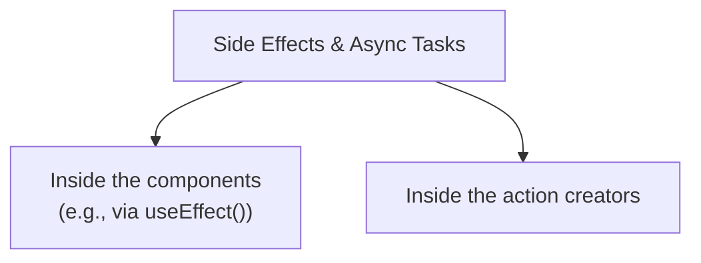

### 副作用與非同步任務的執行位置

由於 Reducer 必須是純函數（pure, side-effect free, synchronous），任何副作用或非同步程式碼都不能寫在 Reducer 內部。處理這些任務有兩個主要選項：

- **在組件（Components）內執行**
    - 例如使用 `useEffect()` 鉤子來處理非同步邏輯
    - 這是一種相對直接的方法，但可能會讓組件邏輯變得複雜
- **在 Action Creators 內執行**
    - 透過建立專門的 Action Creator 來封裝非同步邏輯
    - 這能將副作用與 UI 組件分離，使架構更符合 Redux 的設計模式

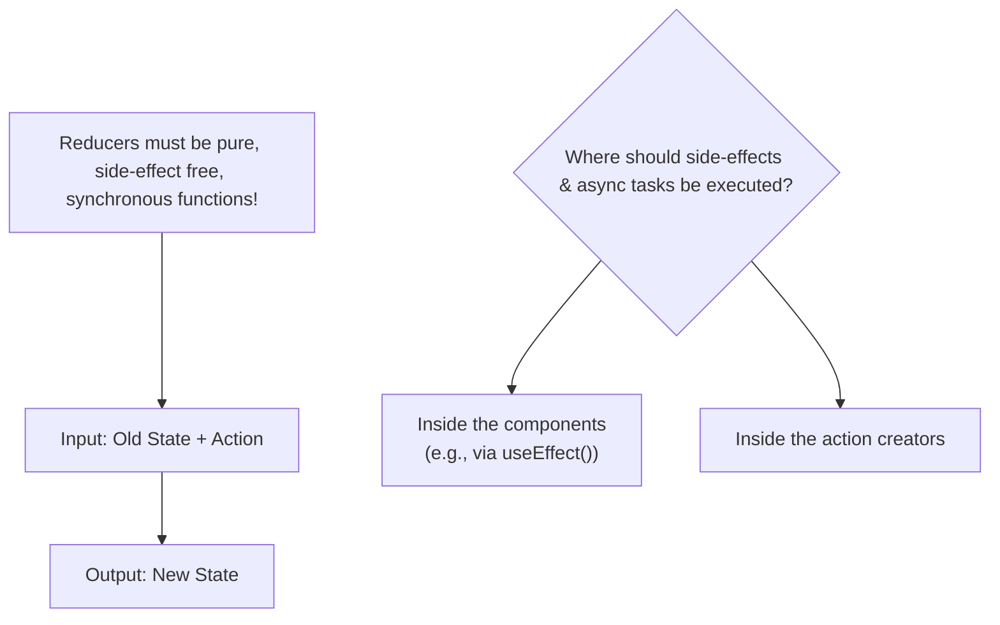

### 在組件內執行非同步程式碼

- **實作範例：在&#32;`ProductItem`&#32;組件中處理「加入購物車」**
    - 在組件的 `addToCartHandler` 函式中，除了執行 `dispatch` 將 action 發送到 Redux store，還可以嘗試同時將商品資料發送到 Firebase 後端
- **[潛在問題] 資料一致性風險**
    - 如果僅將單純的產品資料（product data）發送到 Firebase，可能會導致後端儲存的資訊與 Redux 狀態中的邏輯不符
    - 例如，Redux 可能會處理「如果商品已存在則增加數量」的邏輯，但若直接發送原始產品資料給 Firebase，後端可能只會記錄該商品被新增，而非數量的增加

### Firebase 後端與邏輯缺失的問題

- **後端僅作為資料儲存庫**
    - 在目前的實作中，Firebase 後端並不執行任何額外的程式碼或業務邏輯
    - 若直接將產品資料發送到 Firebase，資料只會被單純地新增到資料庫中
- **[核心問題] 缺乏業務邏輯的同步風險**
    - Redux Reducer 中包含的關鍵邏輯（例如：檢查產品是否已在購物車中、若已存在則更新數量、若不存在則新增項目）**不會**在 Firebase 後端執行
    - **因為 Firebase 在這裡扮演的是一個「智障後端」（dumb backend）的角色**，它不具備處理這些複雜邏輯的能力
    - 這會導致前端 Redux 狀態與 Firebase 後端儲存的資料之間可能出現不一致的情況

### 解決後端邏輯缺失的方案

為了避免前端 Redux 狀態與後端資料不一致，必須在後端加入處理業務邏輯的能力，而不僅僅是單純的資料儲存。

- **使用 Firebase Functions**
    - 這是一項服務，允許開發者在 Firebase 後端加入自定義程式碼
    - 可以透過監聽傳入的請求來觸發（trigger）特定邏輯
    - **[作用]** 可以在資料存入資料庫之前，先進行資料轉換或執行業務規則
- **使用自建後端 API**
    - 若使用 Node.js、PHP 等技術開發自己的後端
    - 可以在 API 層級完全自由地處理傳入的資料，執行比單純儲存更複雜的操作

透過在後端實作邏輯，可以確保無論前端如何發送請求，資料在進入資料庫前都會經過一致的規則檢查與處理。

### 前端程式碼對後端設計的依賴

前端的開發方式與程式碼寫作位置，會直接受到後端 API 設計能力的影響。

- **互動機制**
    - 前端應用程式（Frontend React App）透過 HTTP 請求（Requests）與回應（Responses）與後端伺服器（Backend API）進行溝通。
- **後端能力的影響**
    - 如果後端 API 具備強大的處理能力（例如：能自行執行資料轉換與儲存邏輯），前端的開發負擔與邏輯複雜度將會降低。

### 利用後端 API 簡化前端邏輯

透過設計具備轉換能力的後端 API，可以大幅減輕前端應用程式與 Reducer 的工作量。

- **運作流程**
    - 前端僅需發送原始資料（例如：要加入購物車的產品資訊）至後端
    - 後端 API 執行複雜的業務邏輯與資料轉換（Data Transformation）
    - 後端回傳處理完成後的最終結果（例如：更新後的完整購物車狀態）
    - 前端直接將此回傳值交給 Reducer 進行儲存
- **[優點] 簡化 Reducer 邏輯**
    - Reducer 不再需要處理複雜的計算或邏輯判斷
    - Reducer 的職責變得更單純：僅負責接收來自後端的資料並更新狀態

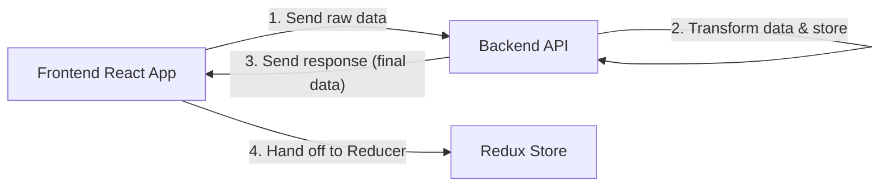

### 後端能力對前端開發負擔的影響

當後端 API 不具備業務邏輯處理能力時，前端開發者的工作量會顯著增加。

- **[情境] 後端僅執行簡單儲存**
    - 後端僅以接收到的原始格式儲存資料，不做任何轉換或邏輯判斷
    - **[影響] 前端必須承擔資料轉換 (Data Transformation)**
        - 前端不只是將資料存入 Redux store，還必須負責「準備」與「轉換」資料
        - 例如在 `addItemToCart` 或 `removeItemFromCart` 的情境中，Action 的 `payload` 不會是處理好的完整購物車狀態，而可能僅是一個單個產品物件
        - 前端必須自行判斷如何根據該產品來更新購物車狀態

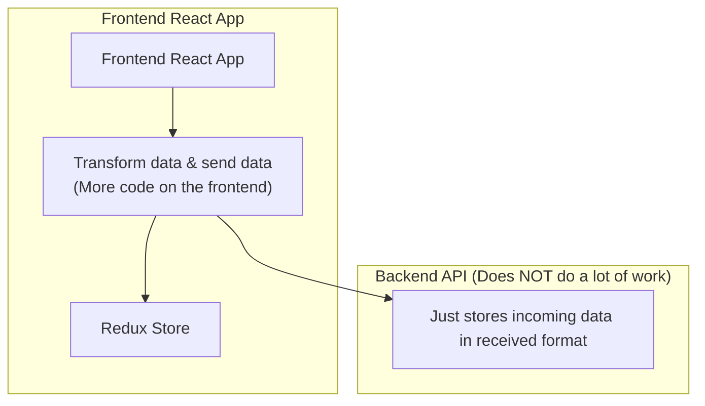

- **[對比] 理想的後端設計**
    - 若後端能處理邏輯，前端只需「發送資料」並「接收並使用回應」，從而減少 Reducer 前端的程式碼量

### 前端資料轉換與 Reducer 的限制

在沒有後端處理業務邏輯的情況下，前端必須負責資料的轉換與準備，但必須注意執行位置。

- **[核心挑戰] 處理轉換與同步發送**
    - 前端需要找到一種方式，在不違反 Reducer 規則的前提下，先在前端完成資料轉換，然後再將轉換後的資料發送至後端。
- **[重要限制] 禁止在 Reducer 中執行非同步操作**
    - 我們已經學習到，不能在 Reducer 內部執行發送請求到後端的非同步操作。
    - **[解決思路]** 由於 Reducer 必須是純函式，所有的資料轉換與 API 請求邏輯必須移至 Reducer 之外（例如在 React 組件或特定的非同步中間件中）進行。

### Reducer 的限制與非同步請求

當後端不具備處理業務邏輯的能力時，前端必須負責將更新後的狀態發送到後端。然而，在 Redux 的設計架構中，這會遇到一個關鍵限制。

- **[限制] 不能在 Reducer 內發送請求**
    - Reducer 必須是純函式（Pure Function）
    - 我們不被允許在 Reducer 函式內部執行非同步操作，例如向後端發送更新後的購物車資料（HTTP Requests）
- **[問題點]**
    - 如果後端不幫我們處理資料轉換，我們就必須在前端完成這些工作，但這項工作（發送 API 請求）又無法直接寫在 Reducer 裡面

### 非同步任務與副作用的執行位置

由於 Reducer 必須保持純粹（Pure）且不能執行非同步操作（如 HTTP 請求），我們必須在其他地方處理這些副作用。

- **[解決方案] 執行非同步程式碼的兩個主要選擇**
    - **React 組件 (Components)**
        - 例如在 `useEffect` 鉤子中執行非同步邏輯
        - 也可以在組件的事件處理函式（Handler）中處理
    - **Action Creators**
        - 將非同步邏輯封裝在 Action Creator 中，由其發起請求並在完成後發送 Action
- **[範例] 在組件中處理事件**
    - 在 `ProductItem` 組件中，可以透過 `addToCartHandler` 來處理加入購物車的動作

```javascript
const ProductItem = (props) => {
  const dispatch = useDispatch();
  const { title, price, description, id } = props;

  const addToCartHandler = () => {
    dispatch(
      cartActions.addItemToCart({
        id,
        title,
        price,
      })
    );
  };
};
```

### 在組件中結合資料轉換與非同步請求

除了在 Action Creator 中處理，也可以在 React 組件內部完成資料轉換，接著再執行非同步操作。

- **[實作思路]**
    - 使用 `useSelector` 從 Redux store 取得目前的狀態（例如目前的購物車內容）。
    - 在組件的事件處理函式中，根據目前的狀態進行必要的資料轉換。
    - 執行轉換後的非同步請求（例如將資料同步到 Firebase）。
- **[核心注意事項] 嚴禁直接修改狀態 (Mutation)**
    - 在組件中進行轉換時，必須確保不會直接修改從 `useSelector` 取得的原始狀態物件。
    - **[正確做法]** 應該建立狀態的一個副本（copy）進行操作，例如使用 `.slice()` 或展開運算子（spread operator）。

```javascript
const addToCartHandler = () => {
  // 1. 取得目前的狀態
  const cart = useSelector(state => state.cart);

  // 2. 進行資料轉換 (建立副本以避免 mutation)
  const updatedItems = cart.items.slice(); // 使用 slice() 建立陣列副本

  // ... 進行後續的轉換邏輯 ...

  // 3. 執行非同步請求
  // (例如發送 API 請求到後端)
};
```

> **注意：** 雖然這種做法可以解決資料轉換的問題，但它並非最終的完美實作方案（後續會探討更優化的方式）。

### 在組件中實作資料轉換邏輯

在 `ProductItem` 組件的 `addToCartHandler` 中，我們需要先取得目前的購物車狀態，並在不直接修改（mutate）原始狀態的情況下，計算出更新後的資料。

- **[步驟 1] 取得目前狀態**
    - 使用 `useSelector` 從 Redux store 中選取整個 `cart` 狀態物件（包含 `items` 與 `totalQuantity`）。
- **[步驟 2] 建立副本並進行轉換**
    - **[核心原則] 嚴禁直接修改狀態**
        - 必須建立狀態的副本來進行計算，否則會違反 Redux 的不可變性（Immutability）原則。
        - 例如使用 `cart.items.slice()` 來建立陣列的副本。
    - 在副本上進行邏輯判斷（例如檢查商品是否已存在於購物車中）並計算新的總數量 (`newTotalQuantity`)。

```javascript
const addToCartHandler = () => {
  // 1. 取得目前的狀態
  const cart = useSelector(state => state.cart);

  // 2. 建立副本以避免 mutation
  const updatedItems = cart.items.slice();

  // 3. 計算新的總數量 (不直接修改 cart.totalQuantity)
  const newTotalQuantity = cart.totalQuantity + 1;

  // ... 進行後續的轉換邏輯 (例如處理 existingItem) ...
};
```

- **[補充] Redux Toolkit 的差異**
    - 需要注意的是，如果你使用的是 **Redux Toolkit (RTK)**，在 `createSlice` 的 reducer 內部，你可以直接寫看似「修改狀態」的程式碼（例如 `state.totalQuantity++`），因為 RTK 內部使用了 Immer 函式庫來自動處理不可變性的轉換。但在組件層級的操作，仍應遵循建立副本的原則。

### 在組件中嚴禁直接修改狀態 (Mutation)

在 React 組件（如 `ProductItem`）中，絕對不能直接對從 `useSelector` 取得的狀態進行賦值操作。

- **[錯誤示範] 直接修改狀態物件**
    - 如果在組件內直接執行類似 `cart.totalQuantity = cart.totalQuantity + 1` 的程式碼，會導致嚴重的問題。
    - **[原因]** 這會直接修改記憶體中該 JavaScript 物件的值，而該物件正是 Redux store 的一部分。
    - **[後果]** 這種行為繞過了 Reducer，直接改變了單一事實來源（Single Source of Truth），是極其糟糕的程式碼實作，必須絕對避免。

```javascript
const addToCartHandler = () => {
  const cart = useSelector(state => state.cart);

  // ❌ 極其錯誤的做法：直接修改從 useSelector 取得的狀態
  // 這會直接改變 Redux store 中的原始資料
  cart.totalQuantity = cart.totalQuantity + 1;
};
```

> **核心觀念：** 所有的狀態變更（Mutation）都必須透過 Reducer 函式來進行，組件僅負責發送 Action 並觸發 Reducer。

### 在組件中處理資料轉換的細節

在 `addToCartHandler` 中，為了遵循不可變性原則，我們需要對狀態進行多層次的副本處理。

- **[處理數量] 建立數值副本**
    - 因為數量（如 `totalQuantity`）是原始型別（primitive type），直接賦值給一個新常數即可，不會影響 Redux store。
    - 例如：`const newTotalQuantity = cart.totalQuantity + 1;`
- **[處理陣列] 使用&#32;`slice()`&#32;建立陣列副本**
    - 使用 `cart.items.slice()` 可以建立一個全新的陣列，這能確保我們在對陣列進行新增或刪除操作時，不會直接修改原始的 `cart.items` 陣列。
- **[處理物件] 注意引用值 (Reference Values) 的問題**
    - **[關鍵陷阱]** 當我們從 `updatedItems` 副本陣列中透過 `.find()` 找到一個現有的商品物件時，這個物件在記憶體中**仍然是指向 Redux store 中的原始物件**。
    - 因為在 JavaScript 中，物件是透過引用（reference）來存取的，僅僅複製陣列（shallow copy）並不會複製陣列內部的物件本身。

```javascript
const addToCartHandler = () => {
  const cart = useSelector(state => state.cart);

  // 1. 建立數值副本
  const newTotalQuantity = cart.totalQuantity + 1;

  // 2. 建立陣列副本 (Shallow Copy)
  const updatedItems = cart.items.slice();

  // 3. 尋找現有項目
  // 注意：existingItem 仍然是指向 Redux store 中的原始物件引用
  const existingItem = updatedItems.find(item => item.id === id);

  if (existingItem) {
    // 這裡如果直接對 existingItem 做修改，會導致 mutation 問題
    const updatedItem = { ...existingItem }; // 必須使用展開運算子建立新物件
    updatedItem.quantity++;
    updatedItem.price = updatedItem.price + price;
    // ...
  }
};
```

> **核心警示：** 僅僅對陣列進行 `slice()` 是不夠的。如果陣列內包含物件，你必須同時對該物件進行展開（spread）操作，建立一個新的物件實例，否則你仍然在直接修改 Redux store 中的原始資料。

### 在組件中實作完整的資料轉換邏輯

為了在不直接修改 Redux store 的情況下更新購物車，必須確保所有層級的資料都經過副本處理。

- **[步驟 1] 建立物件副本**
    - 透過展開運算子 `{ ...existingItem }` 建立一個全新的物件。
    - **[原因]** 這樣 `updatedItem` 在記憶體中就是一個全新的物件，修改其屬性（如 `quantity` 或 `price`）時，不會影響到 Redux store 中的原始物件。
- **[步驟 2] 尋找索引並更新陣列**
    - 使用 `findIndex` 找出該項目在副本陣列中的位置。
    - 將該位置的項目替換為我們建立的 `updatedItem`。
- **[步驟 3] 處理全新項目**
    - 如果項目不在購物車中，則使用 `push` 將一個包含所有必要屬性的全新物件加入 `updatedItems` 陣列中。
- **[步驟 4] 產生最終狀態**
    - 最後透過建立一個包含所有更新後資訊（如 `totalQuantity`、`items`、`totalPrice` 等）的新物件來代表新的購物車狀態。

```javascript
const addToCartHandler = () => {
  const cart = useSelector(state => state.cart);

  const newTotalQuantity = cart.totalQuantity + 1;
  const updatedItems = cart.items.slice(); // 建立陣列副本

  const existingItem = updatedItems.find(item => item.id === id);

  if (existingItem) {
    // 建立物件副本，避免直接修改 store 中的引用
    const updatedItem = { ...existingItem };
    updatedItem.quantity++;
    updatedItem.price = updatedItem.price + price;

    const existingItemIndex = updatedItems.findIndex(item => item.id === id);
    updatedItems[existingItemIndex] = updatedItem;
  } else {
    // 若為新項目，直接 push 一個新物件
    updatedItems.push({
      id: id,
      price: price,
      quantity: 1,
      totalPrice: price,
      title: title,
      description: description,
    });
  }

  const newCart = {
    totalQuantity: newTotalQuantity,
    items: updatedItems,
    // ... 其他屬性
  };

  dispatch(cartActions.replaceCart(newCart));
};
```

### 發送更新後的購物車狀態

在組件中完成資料轉換邏輯後，需要將新的狀態同步到 Redux store。

- **[步驟 1] 封裝新狀態**
    - 建立一個名為 `newCart` 的新物件，包含所有更新後的資訊。
    - 包含 `totalQuantity`（新的總數量）以及 `items`（更新後的項目陣列）。
- **[步驟 2] 觸發 Reducer 更新**
    - 使用 `dispatch(cartActions.replaceCart(newCart))` 發送 action。
    - **[Reducer 邏輯]** `replaceCart` reducer 會從 `action.payload` 中取得新的 `totalQuantity` 與 `items`，並直接覆蓋目前的 Redux 狀態。

```javascript
const newCart = {
  totalQuantity: newTotalQuantity,
  items: updatedItems,
};

dispatch(cartActions.replaceCart(newCart));

// 註：目前尚未發送 HTTP 請求以同步至後端
```

> **注意：** 雖然此處已更新了前端的 Redux 狀態，但目前尚未實作將這些變動透過 HTTP 請求同步到後端伺服器的邏輯。

### 在組件中重複實作邏輯的問題

雖然在組件中直接撰寫資料轉換邏輯（例如處理購物車新增/減少項目的邏輯）在小型應用中可行，但會面臨以下挑戰：

- **程式碼冗餘 (Code Duplication)**
    - 如果應用程式的其他部分（例如 `CartItem` 組件）也需要執行相同的邏輯，就必須在該組件中再次複製貼上相同的程式碼。
    - 這會導致程式碼量增加，且當邏輯需要修改時，必須在多個地方同步更新，容易造成錯誤。
- **維護困難**
    - 為了避免重複，通常需要將這些邏輯「外包」出去，例如：
        - 抽離成獨立的工具函式 (Extra file/Utility function)
        - 整合進 Redux 的 Reducer 中，讓組件只需發送 action，而不必處理細節

### `replaceCart` 方案的優缺點分析

如果應用程式中的所有地方都採用 `replaceCart` 這種「直接替換完整狀態」的方法，可以避免在多個組件中重複撰寫 `addItemToCart` 的邏輯。

- **優點**
    - **減少程式碼重複**：組件不需要處理複雜的資料轉換，只需計算好最終結果並發送 `replaceCart`。
    - **簡化 Reducer**：Reducer 的工作量大幅減少，僅需負責接收資料並存入 Store。
- **缺點與設計哲學衝突**
    - **違背 Redux 的核心理念**：Redux 的主要價值之一在於將「狀態變更邏輯」集中管理。如果邏輯全部移到組件中，Reducer 就變成了一個單純的「資料儲存容器 (Data Store)」，失去了其應有的功能。

## Fat Reducers vs Fat Components vs Fat Actions

在決定程式碼（邏輯）應該放在哪裡時，核心的判斷標準在於區分「同步且無副作用」與「非同步或具有副作用」的程式碼。

- **分類標準**
    - **同步且無副作用的程式碼 (Synchronous, side-effect free code)**
        - 例如：資料轉換 (Data transformations)
        - 這種程式碼只負責計算或改變資料結構，不會影響外部環境
    - **非同步或具有副作用的程式碼 (Async code or code with side-effects)**
        - 例如：發送 HTTP 請求、存取外部 API、修改全域變數等

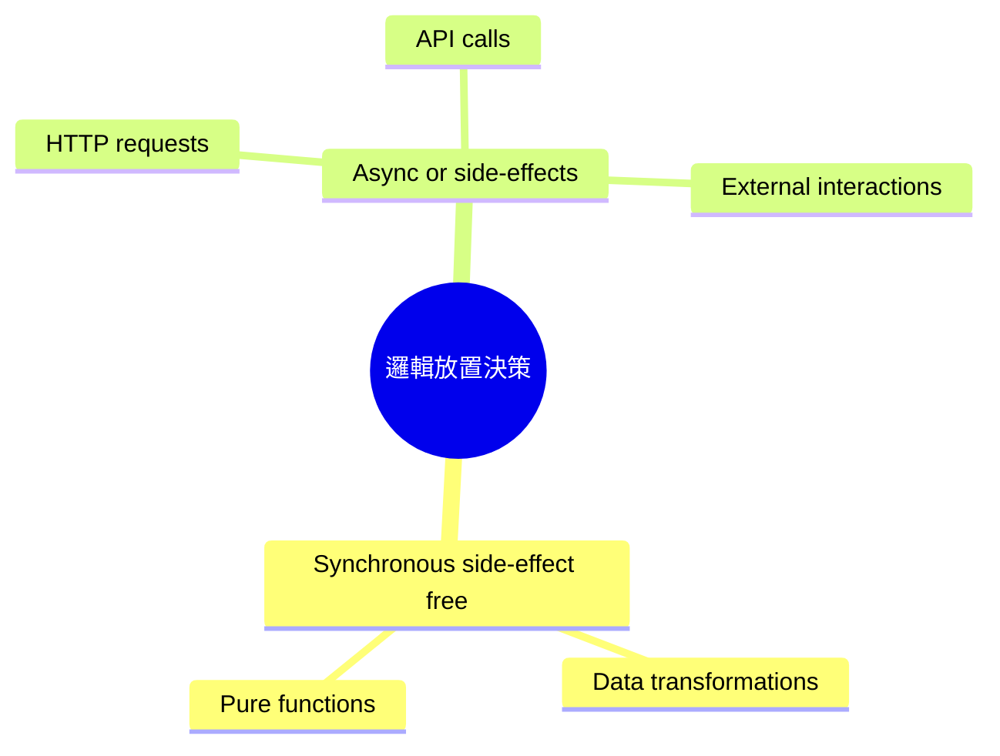

> **目前的實作狀態：** 在 `ProductItem` 組件中撰寫的 `addToCartHandler` 目前僅屬於「同步且無副作用」的範疇，因為它目前只負責資料轉換，尚未實作實際的 HTTP 請求。

### 邏輯放置的最佳實踐建議

- **針對同步且無副作用的程式碼 (Synchronous, side-effect free code)**
    - 例如：資料轉換 (Data transformations)
    - **建議做法**：優先選擇將此類邏輯放在 **Reducers** 中
    - **應避免的做法**：避免將其放在 Action Creators 或 React 組件中
- **針對非同步程式碼 (Async code)**
    - 處理方式會與同步程式碼完全不同（需透過非同步機制處理副作用）

> **核心原則：** 為了保持組件的簡潔與關注點分離，應盡量避免在組件中撰寫資料轉換邏輯，轉而利用 Reducer 來處理這些同步的變更。

### 邏輯放置的決策準則

根據程式碼的性質，應採取不同的放置策略：

- **同步且無副作用的程式碼 (Synchronous, side-effect free code)**
    - 例如：資料轉換 (Data transformations)
    - **建議做法**：放在 **Reducers** 中
    - **應避免做法**：避免放在 Action Creators 或組件中
- **非同步或具有副作用的程式碼 (Async code or code with side-effects)**
    - 例如：向 Firebase 發送請求、API 呼叫
    - **建議做法**：放在 **Action Creators** 或 **React 組件** 中
    - **絕對禁忌**：**絕對不能使用 Reducers**

> **目前的技術挑戰：**
> 當我們需要將資料傳送到 Firebase 前必須先進行資料轉換時，會陷入一個兩難：
> 1. 我們不能在 Reducer 內發送非同步請求。
> 2. 若在組件中處理轉換（如目前的 `replaceCart` 做法），雖然可行，但屬於次佳方案 (suboptimal)，因為這會導致邏輯分散且難以維護。

### 優化資料同步與處理流程

- **改進方案：將複雜邏輯移回 Reducer**
    - 避免在組件中進行繁瑣的資料轉換（例如先前實作的 `replaceCart` 做法）
    - 透過 `dispatch` 一個特定的 Action（如 `addItemToCart`），讓 Reducer 負責處理所有的「重型工作」(heavy work)
    - **優點**：
        - 可以移除組件中不必要的 `useSelector` 與 `cartSelector` 邏輯
        - 保持組件的單純，使其僅負責觸發動作，而非計算資料
- **目前的處理目標**
    - 在完成 Reducer 內的狀態更新後，下一步需要思考如何將這些新的狀態同步（sync）到伺服器端

### 在組件層級銜接同步更新與非同步請求

當需要在 Redux 更新狀態後同步資料至伺服器時，可以採取以下流程：

1. **前端先行處理與狀態更新**

    - 在組件中觸發 Action，讓 Reducer 執行同步的資料轉換與狀態更新
    - Redux Store 完成更新

2. **監聽狀態變化並執行非同步請求**

    - 在組件中使用 `useSelector` 監聽特定的狀態（例如 `cart`）
    - 當偵測到狀態改變時，隨後發送請求至伺服器進行同步

**[執行位置建議]**

- **不可放在**：Reducer 函式內（因為 Reducer 必須是同步且無副作用的）
- **建議放在**：React 組件（例如 `App.js`）中，利用組件的生命週期或 Hook 機制來處理

```javascript
// 在 App.js 中的邏輯概念
import { useSelector } from 'react-redux';

function App() {
  // 透過 useSelector 監聽購物車狀態
  const cart = useSelector((state) => state.cart);

  // 當 cart 發生變化時，可以在此處觸發非同步的同步邏輯
  // ...
}
```

### 在組件中使用 `useEffect` 處理同步邏輯

當 Redux 狀態更新後，我們需要在組件層級執行非同步請求（例如 HTTP 請求）來將資料同步至伺服器。這可以透過以下步驟達成：

1. **獲取 Redux 狀態**

    - 使用 `useSelector` 從 Redux Store 中取出需要監聽的狀態（例如整個 `cart` 物件）。

2. **使用&#32;`useEffect`&#32;監聽變化**

    - 引入 `useEffect` Hook。
    - 將獲取的狀態作為 `useEffect` 的依賴項（dependency）。
    - 當該狀態發生改變時，`useEffect` 會被觸發，進而執行內部的非同步邏輯。

```javascript
// App.js 中的實作概念
import { useEffect } from 'react';
import { useSelector } from 'react-redux';

function App() {
  // 1. 獲取整個購物車狀態
  const cart = useSelector((state) => state.cart);

  // 2. 監聽 cart 狀態的變化
  useEffect(() => {
    // 當 cart 改變時，在此處執行非同步操作 (例如 HTTP 請求)
    // syncCartWithServer(cart);
  }, [cart]); // 將 cart 作為依賴項

  return (
    // ... 組件內容
  );
}
```

**[為什麼使用&#32;`useEffect`？]**

- `useEffect` 專門設計用來處理副作用 (side effects)。
- 它允許我們在特定的依賴項發生變化時，自動執行特定的程式碼區塊，非常適合用來處理「當狀態 A 改變時，執行動作 B」這種同步需求。

### 使用 `useEffect` 與 `fetch` 進行 Firebase 同步

可以在任何組件中實作同步邏輯（例如根組件 `App.js`），透過 `useEffect` 監聽狀態變化並發送 HTTP 請求。

- **實作流程**
    - 定義 `useEffect` 並設定依賴項陣列（dependency array）。
    - 在 `useEffect` 內部使用 `fetch` API 發送請求。
    - **目標地址**：使用 Firebase 提供的 URL，並在結尾加上 `.json`（這是 Firebase Realtime Database 的特性），例如 `cart.json`，這會建立一個新的 `cart` 節點並儲存資料。
    - **請求方法**：使用 `POST` 請求來將資料傳送到伺服器。

```javascript
// App.js 中的同步邏輯實作
import { useEffect } from 'react';
import { useSelector } from 'react-redux';

function App() {
  const cart = useSelector((state) => state.cart);

  useEffect(() => {
    // 使用 fetch API 將資料同步至 Firebase
    fetch('https://react-http-6b4a6.firebaseio.com/cart.json', {
      method: 'POST',
      // ... 其他 fetch 設定
    });
  }, [cart]); // 當 cart 狀態改變時觸發同步

  return (
    // ... 組件內容
  );
}
```

### 使用 `PUT` 請求覆寫 Firebase 資料

在將 Redux 狀態同步至 Firebase 時，可以使用 `PUT` 請求來確保伺服器上的資料與前端狀態完全一致。

- **`PUT`&#32;vs&#32;`POST`&#32;的差異**
    - **`POST`**：會在 Firebase 中新增一筆新的資料紀錄（例如在清單中增加一個新項目）。
    - **`PUT`**：會覆寫（override）現有的資料。這在同步整個購物車狀態時更為理想，因為它能確保 Firebase 上的資料就是當前 Redux Store 的完整副本，而不是不斷堆疊舊的紀錄。
- **實作方式**
    - 在 `fetch` 的選項中將 `method` 設定為 `'PUT'`。
    - 使用 `JSON.stringify()` 將目前的狀態物件轉換為 JSON 字串，並透過 `body` 傳送。

```javascript
// App.js 中的同步邏輯實作
import { useEffect } from 'react';
import { useSelector } from 'react-redux';

function App() {
  const cart = useSelector((state) => state.cart);

  useEffect(() => {
    // 使用 PUT 請求來覆寫 Firebase 上的 cart 資料
    fetch('https://react-http-6b4a6.firebaseio.com/cart.json', {
      method: 'PUT',
      body: JSON.stringify(cart)
    });
  }, [cart]); // 當 cart 狀態改變時觸發同步

  return (
    // ... 組件內容
  );
}
```

### `useSelector` 的訂閱機制與自動同步

`useSelector` 不僅用於從 Redux Store 中提取資料，它還會在組件與 Store 之間建立一套**訂閱機制**。

- **自動重新執行**
    - 當 `useSelector` 所監聽的狀態（state）發生變化時，該組件函式會自動重新執行（re-execute）。
    - 這確保了組件內部的變數（例如從 `state.cart` 取得的資料）始終保持最新狀態。
- **與&#32;`useEffect`&#32;的結合**
    - 將從 `useSelector` 取得的狀態放入 `useEffect` 的依賴項陣列中，可以實現「狀態一變，立即同步」的效果。
    - 當 `cart` 改變時，`useEffect` 會重新觸發，進而執行內部的非同步請求（如 `fetch`），將最新的資料同步至伺服器。

```javascript
function App() {
  // 1. 建立對 state.ui.cartIsVisible 與 state.cart 的訂閱
  const showCart = useSelector((state) => state.ui.cartIsVisible);
  const cart = useSelector((state) => state.cart);

  useEffect(() => {
    // 2. 當 cart 改變時，此處會自動執行，將最新狀態同步至伺服器
    fetch('https://react-http-6b4a6.firebaseio.com/cart.json', {
      method: 'PUT',
      body: JSON.stringify(cart)
    });
  }, [cart]); // 將 cart 加入依賴項，確保同步邏輯與狀態同步

  return (
    <Layout>
      {/* ... 組件內容 */}
    </Layout>
  );
}
```

### 實作「胖 Reducer，瘦組件」的同步模式

為了保持 React 組件的簡潔，應避免在組件中撰寫複雜的資料轉換邏輯。相反地，應該將邏輯集中在 Reducer 中，並讓組件僅負責觸發動作與處理副作用。

- **設計策略**
    - **胖 Reducer (Fat Reducer)**：將所有的業務邏輯（例如計算總價、更新項目數量、轉換資料格式）都放在 Reducer 內執行。
    - **瘦組件 (Lean Component)**：組件只需負責 `dispatch` 一個 action，並在狀態改變後，利用 `useEffect` 監聽狀態變化來執行非同步副作用（如發送 HTTP 請求）。
- **執行流程**

    1. **更新 Redux Store**：透過 `dispatch` 觸發 Reducer，在 Reducer 內部完成所有複雜的資料運算並更新狀態。
    2. **觸發同步副作用**：組件內的 `useEffect` 偵測到 Store 狀態已更新，隨即根據最新的狀態發送請求至伺服器。

這種做法的好處是，當我們需要同步資料時，我們是在使用「已經處理好且正確的最新狀態」，而不是在組件中邊計算邊發送請求，從而確保了前端狀態與後端資料的一致性。

### 驗證同步模式的有效性

透過觀察開發工具，可以確認「胖 Reducer，瘦組件」模式在實際運作中的優勢：

- **即時同步機制**
    - 每當購物車狀態更新（例如點擊「加入購物車」），瀏覽器會立即發送一個 HTTP 請求。
    - Firebase Realtime Database 會同步反映這些變動，確保後端資料與前端 Redux 狀態一致。
- **開發模式優勢**
    - **組件簡潔**：組件內不需要撰寫複雜的資料運算，只需透過 `useEffect` 處理單純的副作用（發送請求）。
    - **邏輯集中**：所有的資料轉換（Data Transformation）邏輯都封裝在 Reducer 中，這是 Redux 運作的核心原則，有助於維護與測試。

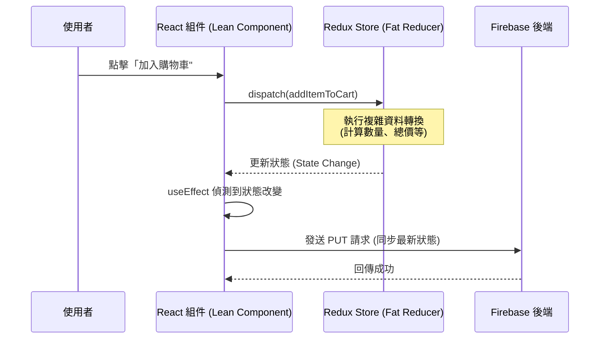

### 處理非同步請求的回應與錯誤

目前的同步邏輯僅發送了請求，但缺乏對請求結果的處理，這會導致使用者無法得知請求是否成功或失敗。

- **目前存在的問題**
    - 未處理 HTTP 請求的回應（Response）
    - 未處理潛在的網路或伺服器錯誤（Error handling)
- **解決方案：引入 Notification 組件**
    - 目的：在 UI 上即時回饋請求狀態（例如：顯示「正在發送請求...」或顯示錯誤訊息）
    - **組件特性**
        - 顯示標題（Title）與訊息（Message）
        - 根據傳入的 `status` prop 自動切換不同的 CSS 樣式類別（CSS classes）
        - 通常以頂部通知列（Bar）的形式呈現

### 在 useEffect 中處理非同步回應

為了處理 HTTP 請求的回應（Response）或錯誤，需要在 `useEffect` 內部建立一個非同步函式。

- **實作限制**：不能直接將 `useEffect` 的回調函式宣告為 `async`。
    - **原因**：`useEffect` 預期回傳的是一個清理函式（cleanup function）或 `undefined`，而 `async` 函式會自動回傳一個 Promise，這會導致 React 出錯。
- **正確做法**：在 `useEffect` 內部定義一個非同步函式（例如 `sendCartData`），然後在其中使用 `await`。

```javascript
useEffect(() => {
  const sendCartData = async () => {
    const response = await fetch(
      'https://react-http-6b4a6.firebaseio.com/cart.json',
      {
        method: 'PUT',
        body: JSON.stringify(cart)
      }
    );
    const responseData = await response.json();
    // 接下來可以根據 responseData 處理成功或錯誤
  };

  sendCartData();
}, [cart]);
```

### 完善非同步請求的錯誤處理

在 `useEffect` 中的非同步函式內，除了獲取資料外，還需要驗證 HTTP 請求是否成功。

- **檢查請求狀態**
    - 使用 `response.ok` 來判斷請求是否成功。
    - **若請求失敗**：應拋出錯誤（例如 `throw new Error(...)`），以便後續進行錯誤處理。
    - **若請求成功**：可以繼續解析 JSON 資料（`await response.json()`）。
- **優化使用者體驗 (UX)**
    - 不僅要在請求完成後顯示通知，也應該在**請求發送開始時**就立即顯示「正在發送...」的通知。
    - **實作方式**：可以在組件中使用 `useState` 來管理一個本地狀態（local state），用來控制通知組件的顯示與內容。

```javascript
const sendCartData = async () => {
  const response = await fetch(
    'https://react-http-6b4a6.firebaseio.com/cart.json',
    {
      method: 'PUT',
      body: JSON.stringify(cart)
    }
  );

  if (!response.ok) {
    throw new Error('Sending cart data failed!');
  }

  const responseData = await response.json();
  // 成功後處理邏輯...
};
```

### 使用 Redux 管理通知狀態

在處理非同步請求的生命週期（如載入中、錯誤發生）時，雖然可以使用組件內的本地狀態（local state）來控制 `Notification` 組件的顯示，但更優雅的做法是利用現有的 Redux `ui-slice`。

- **管理方式的選擇**
    - **方案一：組件本地狀態**
        - 在組件中使用 `useState` 管理 `isLoading` 或 `error` 狀態。
        - 優點：邏輯封裝在組件內。
        - 缺點：若多個組件都需要顯示通知，狀態管理會變得分散且難以同步。
    - **方案二：Redux 全域狀態（本教學採用）**
        - 將通知的內容與顯示狀態直接放入 Redux 的 `ui-slice` 中。
        - 優點：可以在應用程式的任何地方觸發通知，且 UI 邏輯更加統一。
- **實作步驟：擴展&#32;`ui-slice`**
    - 在 `ui-slice.js` 的 `initialState` 中新增 `notification` 屬性，用來儲存通知的訊息與狀態。

```javascript
// ui-slice.js 預期修改方向
const uiSlice = createSlice({
  name: 'ui',
  initialState: {
    cartIsVisible: false,
    notification: null // 新增此屬性來管理通知
  },
  reducers: {
    // ... 其他 reducers
  }
});
```

### 實作 `showNotification` Reducer

為了讓應用程式能根據不同情況顯示通知，我們需要在 `ui-slice` 中新增一個 reducer，用來更新 `notification` 狀態。

- **初始狀態設定**
        - 將 `notification` 的初始值設為 `null`，代表預設沒有任何通知顯示。

```javascript
const uiSlice = createSlice({
  name: 'ui',
  initialState: {
    cartIsVisible: false,
    notification: null
  },
  reducers: {
    // ...
  }
});
```

- **新增&#32;`showNotification`&#32;reducer**
        - 這個 reducer 會接收一個 `action`，並從 `action.payload` 中提取通知的資訊。
        - 透過將 `state.notification` 設定為一個包含 `status` 屬性的物件，來更新 UI 顯示的內容。

```javascript
showNotification(state, action) {
  state.notification = { status: action.payload.status };
}
```

    - **[設計思考]** 這裡使用 `action.payload` 是因為我們預期在 dispatch 這個 action 時，會傳入具體的通知內容（例如："正在發送..." 或 "錯誤發生"），這樣 reducer 才能知道該顯示什麼樣的訊息。

### 完善 `showNotification` 的通知內容

為了讓通知更具資訊量，我們不只傳遞 `status`，還應該在 `action.payload` 中包含標題與訊息內容。

- **預期的 Payload 結構**
    - `status`: 通知類型，例如 `pending`（處理中）、`error`（錯誤）或 `success`（成功）。
    - `title`: 通知標題。
    - `message`: 詳細的通知訊息。

```javascript
// ui-slice.js 中的 reducer 實作
showNotification(state, action) {
  state.notification = {
    status: action.payload.status,
    title: action.payload.title,
    message: action.payload.message
  };
}
```

### 在組件中觸發通知

為了在非同步請求的不同階段（開始、完成、失敗）顯示通知，我們需要使用 `useDispatch` Hook。

- **使用&#32;`useDispatch`**
    - 從 `react-redux` 匯入 `useDispatch`。
    - 在組件內部執行 `const dispatch = useDispatch();` 以獲得發送 action 的能力。
- **觸發時機**
    - **請求開始時**：發送 `pending` 狀態的通知。
    - **請求成功時**：發送 `success` 狀態的通知。
    - **請求失敗時**：發送 `error` 狀態的通知。

### 在組件中實作通知觸發流程

在執行非同步的資料同步任務時，應在任務開始前立即發送通知，讓使用者知道系統正在處理中。

- **匯入 UI Actions**
    - 從 `store/ui-slice` 匯入 `uiActions`，以便在組件中 dispatch 通知相關的動作。
- **在非同步函式中觸發&#32;`pending`&#32;通知**
    - 在 `useEffect` 定義的非同步函式（如 `sendCartData`）內部，於發送 `fetch` 請求之前，先執行 `dispatch(uiActions.showNotification(...))`。
    - **Payload 內容設定**：
        - `status`: 設定為 `'pending'`。
        - `title`: 例如 `'Sending...'`。
        - `message`: 例如 `'Sending cart data!'`。

```javascript
// App.js 中的實作片段
import uiActions from './store/ui-slice';

function App() {
  const dispatch = useDispatch();
  // ...

  useEffect(() => {
    const sendCartData = async () => {
      // 1. 請求開始前，發送 pending 通知
      dispatch(uiActions.showNotification({
        status: 'pending',
        title: 'Sending...',
        message: 'Sending cart data!'
      }));

      const response = await fetch('https://react-http-6b4a6.firebaseio.com/cart.json', {
        method: 'PUT'
      });
      // ... 後續處理
    };

    sendCartData();
  }, [dispatch, cart]);
}
```

### 處理非同步請求的完成狀態

在非同步請求執行完畢後，應根據請求是否成功來發送對應的通知，以反映目前的處理結果。

- **處理成功情況**
    - 如果請求成功（例如 `response.ok` 為真），則 dispatch 一個狀態為 `'success'` 的通知。
    - **[開發技巧]** 在某些同步資料的場景中（例如使用 `PUT` 覆寫 Firebase 資料），我們可能不需要解析回應的 JSON 資料（`response.json()`），只要確認請求沒有發生錯誤即可。
- **處理錯誤情況**
    - 如果請求失敗（例如進入 `catch` 區塊或 `response.ok` 為假），則應 dispatch 一樣的通知機制，但將狀態設為 `'error'`。

```javascript
// App.js 中的非同步請求處理邏輯片段
const sendCartData = async () => {
  // ... 發送 pending 通知

  try {
    const response = await fetch('...', {
      method: 'PUT',
      body: JSON.stringify(cart)
    });

    if (!response.ok) {
      throw new Error('Sending cart data failed.');
    }

    // 請求成功：發送 success 通知
    dispatch(uiActions.showNotification({
      status: 'success',
      title: 'Success!',
      message: 'Sent cart data successfully!'
    }));
  } catch (error) {
    // 請求失敗：發送 error 通知
    dispatch(uiActions.showNotification({
      status: 'error',
      title: 'Error!',
      message: error.message
    }));
  }
};
```

### 通知組件的 CSS 類別切換

通知組件（`Notification.js`）會根據從 Redux 取得的 `status` 來動態決定使用的 CSS 類別，以便呈現不同的視覺效果（如綠色的成功訊息或紅色的錯誤訊息）。

```javascript
// Notification.js 中的邏輯
const Notification = (props) => {
  let specialClasses = '';

  if (props.status === 'error') {
    specialClasses = classes.error;
  }

  if (props.status === 'success') {
    specialClasses = classes.success;
  }

  const cssClasses = `${classes.notification} ${specialClasses}`;

  return (
    <section className={cssClasses}>
      <h2>{props.title}</h2>
      <p>{props.message}</p>
    </section>
  );
};
```

### 使用 try...catch 強化錯誤處理機制

僅在 `!response.ok` 時 dispatch 通知並不夠全面，因為這無法處理程式碼中其他可能發生的錯誤（例如網路連線失敗）。

- **更穩健的實作方式**
    - 在 `if (!response.ok)` 條件下使用 `throw new Error('Sending cart data failed.')`。
    - 將整個非同步邏輯包裹在 `try...catch` 區塊中。
    - 在 `catch` 區塊中統一處理錯誤，並 dispatch `'error'` 狀態的通知。

```javascript
// App.js 中的強化版非同步請求處理
useEffect(() => {
  const sendCartData = async () => {
    dispatch(uiActions.showNotification({
      status: 'pending',
      title: 'Sending...',
      message: 'Sending cart data!'
    }));

    try {
      const response = await fetch('https://react-http-6b4a6.firebaseio.com/cart.json', {
        method: 'PUT',
        body: JSON.stringify(cart)
      });

      if (!response.ok) {
        throw new Error('Sending cart data failed.');
      }

      dispatch(uiActions.showNotification({
        status: 'success',
        title: 'Success!',
        message: 'Sent cart data successfully!'
      }));
    } catch (error) {
      // 這裡可以捕捉到 throw new Error 或其他網路錯誤
      dispatch(uiActions.showNotification({
        status: 'error',
        title: 'Error!',
        message: error.message
      }));
    }
  };

  sendCartData();
}, [dispatch, cart]);
```

### 處理非同步函式的錯誤捕捉

- 因為 `sendCartData` 是一個 `async` 函式，它會回傳一個 Promise
    - 可以透過在呼叫該函式後加上 `.catch()` 來捕捉執行過程中的任何錯誤
    - 在 `.catch()` 區塊內，可以透過 `dispatch` 發送一個狀態為 `'error'` 的通知，以處理各種可能發生的錯誤

```javascript
// 在 App.js 中捕捉非同步錯誤
sendCartData().catch(error => {
  dispatch(uiActions.showNotification({
    status: 'error',
    title: 'Error!',
    message: 'Sending cart data failed!'
  }));
});
```

### 更新 useEffect 的依賴項

- 當非同步函式內部使用了 `dispatch` 時，`dispatch` 也應該被加入到 `useEffect` 的依賴項陣列中
- 雖然從 `useDispatch` 取得的 `dispatch` 函式通常是穩定（不會改變）的，但將其加入依賴項是符合 ESLint 規則且安全的做法

```javascript
// useEffect 的依賴項應包含 dispatch
useEffect(() => {
  // ... 非同步邏輯
}, [dispatch, cart]);
```

### 在 App.js 中選取通知狀態

除了選取 `cart` 狀態外，也需要選取 `ui` slice 中的 `notification` 狀態，以便在組件中根據當前的通知內容（如 pending, success, error）來呈現對應的 UI。

```javascript
// App.js 中的狀態選取
import { useSelector, useDispatch } from 'react-redux';
import * as uiActions from './store/ui-slice';

function App() {
  const dispatch = useDispatch();
  const showCart = useSelector((state) => state.ui.cartIsVisible);
  const cart = useSelector((state) => state.cart);
  const notification = useSelector((state) => state.ui.notification);

  // ... 其餘邏輯
}
```

### 條件式渲染通知組件

- 透過 `useSelector` 從狀態中深入選取通知屬性
    - 透過 `state.ui.notification` 取得該物件
    - 該物件初始可能為 `null`，或是經由 `dispatch` 設定後的物件內容
- **[如何使用]** 利用 `notification` 狀態進行條件式渲染，將其傳遞給通知組件以顯示詳細資訊

```javascript
// App.js 中的狀態選取與渲染邏輯
const notification = useSelector((state) => state.ui.notification);

return (
  <>
    <Layout>
      {showCart && <Cart />}
      <Products />
    </Layout>
    {notification && <Notification notification={notification} />}
  </>
);
```

- **使用 React Fragment**
    - 因為在 JSX 中不能直接回傳兩個並列的頂層元素（adjacent JSX elements），因此需要使用 `<>...</>` 或 `<Fragment>...</Fragment>` 將 `Layout` 與 `Notification` 組件包裹起來，以便讓通知能與佈局並列呈現

### 在 App.js 中實作通知渲染

- **匯入組件**
    - 需要從 UI 組件目錄中匯入 `Notification` 組件
- **條件式渲染邏輯**
    - **[做法]** 僅在 `notification` 狀態為 truthy（即存在內容）時才渲染 `<Notification />` 組件
    - 透過將 `notification` 物件中的屬性傳遞給組件的 props 來顯示詳細資訊

```javascript
// App.js 中的渲染邏輯
import Notification from './components/ui/Notification';

// ...

return (
  <>
    <Layout>
      {showCart && <Cart />}
      <Products />
    </Layout>
    {notification && (
      <Notification
        status={notification.status}
        title={notification.title}
        message={notification.message}
      />
    )}
  </>
);
```

- **遇到的錯誤**
    - 在儲存程式碼後，瀏覽器拋出了 `TypeError: Cannot read property 'ui' of undefined` 的錯誤，這通常代表在嘗試存取 `state.ui` 時，`state` 物件本身是未定義的。

### 修正通知狀態的選取方式

- **[錯誤原因]** 之前在 `App.js` 中錯誤地使用了 `useState` 來試圖取得通知狀態，導致出現 `TypeError: Cannot read property 'ui' of undefined` 的錯誤。
- **[修正方法]** 將 `useState` 更換為 `useSelector`，才能正確從 Redux Store 中提取 `ui.notification` 狀態。

```javascript
// App.js 中的正確狀態選取
import { useSelector, useDispatch } from 'react-redux';

function App() {
  const dispatch = useDispatch();
  const showCart = useSelector((state) => state.ui.cartIsVisible);
  const cart = useSelector((state) => state.cart);
  // 修正：使用 useSelector 而非 useState
  const notification = useSelector((state) => state.ui.notification);

  // ...
}
```

### 觀察通知狀態的生命週期

- **[自動觸發流程]** 修正後，重新整理頁面時可以觀察到通知狀態的變化：
    - 頁面載入時，會先發送一個向 Firebase 請求購物車資料的非同步請求。
    - 在網路分頁（Network tab）中可以看到請求發出，此時 UI 會短暫顯示 `pending` 狀態。
    - 請求完成後，狀態會隨之切換為 `success`。
- **[潛在風險]** 在應用程式一開始就自動發送購物車狀態同步請求，可能會導致覆蓋掉後端（Firebase）目前已存在的資料，這在實際開發中需要謹慎處理。

### 防止啟動時自動覆蓋後端資料

- **[問題點]** 在應用程式啟動時，`useEffect` 會自動執行同步購物車的請求。如果此時前端的購物車狀態是空的，這會導致向 Firebase 發送一個空的狀態，進而覆蓋掉後端原本已存在的資料。
- **[解決方案]** 使用一個組件外部的變數來標記是否為「初次載入」。
- **[實作方式]** 在 `App.js` 的組件函式之外定義一個 `isInitial` 變數。
    - **[為什麼放在外面？]** 因為定義在組件外部的變數在檔案被解析（Parsed）時就會初始化，且在組件每次重新渲染（Re-render）時都不會被重新初始化，這能確保其狀態的穩定性。

```javascript
// App.js
import { useSelector, useDispatch } from 'react-redux';

// 定義在組件外部，確保只在應用程式啟動時初始化一次
let isInitial = true;

function App() {
  const dispatch = useDispatch();
  // ... 其他 selector

  useEffect(() => {
    // 僅在初次載入且 isInitial 為 true 時執行同步邏輯
    if (isInitial) {
      isInitial = false;
      sendCartData();
    }
  }, []);

  // ...
}
```

### 實作初次載入攔截邏輯

- **[目的]** 為了防止應用程式啟動時，因 `useEffect` 自動執行 `sendCartData()` 而將前端空的購物車狀態覆蓋掉 Firebase 中的既有資料。
- **[實作方法]** 在 `App.js` 的組件函式外部定義 `isInitial` 變數，並在 `useEffect` 執行時進行判斷。
    - **[邏輯流程]**
        - 如果 `isInitial` 為 `true`，則將其設為 `false` 並直接 `return`，不再執行後續的同步動作。
        - 這樣做能確保只有在「第一次」執行時會被攔截，之後的重新渲染或後續的操作（如加入購物車）都不會受到影響。

```javascript
// App.js
if (isInitial) {
  isInitial = false;
  return;
}

sendCartData().catch((error) => {
  dispatch(uiActions.showNotification({
    status: 'error',
    title: 'Error!',
    message: 'Sending cart data failed!',
  }));
}, [cart, dispatch]);
```

- **[測試結果]**
    - **啟動階段**：不會發送 `cart` 請求，因此 UI 不會出現通知訊息，成功保護了後端資料。
    - **操作階段**：當使用者手動將項目加入購物車時，非同步請求會正常觸發，UI 能正確顯示 `pending` 狀態，隨後切換為 `success` 狀態，功能運作完全正常。

### 處理副作用邏輯的現況分析

- **[目前做法]** 將所有的副作用邏輯（例如發送 `cart.json` 的非同步請求）直接實作在 React 組件內。
- **[優缺點評估]**
    - **優點**：實作簡單，對於小型應用或快速原型開發來說是非常直接且有效的方式。
    - **缺點**：將複雜的非同步邏輯與 UI 組件耦合在一起，會導致組件變得臃腫（Fat Components），且當邏輯需要在不同地方重複使用時，維護成本會增加。
- **[後續方向]** 雖然目前的做法「完全沒問題」，但存在其他的替代方案，可以更優雅地管理這些副作用邏輯。
- **[核心原則]** Reducer 必須是純函式（pure functions），必須滿足以下特性：
    - 無副作用（side-effect free）
    - 同步執行（synchronous）
    - 根據「舊狀態 + Action」產生「新狀態"

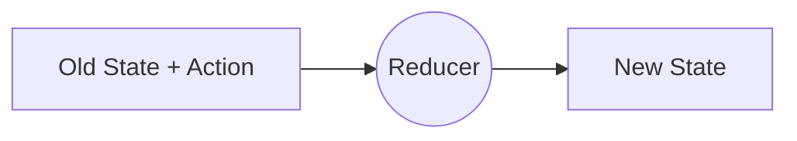

- **[副作用的兩個執行選項]** 當需要執行非同步操作或副作用時，有兩個主要位置：

    1. **React 組件內**

        - 例如使用 `useEffect()` 來觸發非同步邏輯

    1. **Action Creators 內**

        - 這是另一種常見且強大的選擇
- **[關於 Action Creators]**
    - 我們在開發中其實一直都有在使用 Action Creators
    - 在 Redux Toolkit 的架構下，這些 Action Creators 是自動產生的
    - 我們透過呼叫這些產生的函式來建立 Action 物件，並將其 `dispatch` 到 Store 中

### Redux Thunk 概念

- **[定義]** 一種可以延遲執行動作（action）直到其他事情完成的函式
- **[在 Action Creator 中的運作方式]**
    - 一般的 Action Creator 會直接回傳一個 Action 物件
    - Thunk 式的 Action Creator 會回傳「另一個函式」
    - 這個回傳的函式最終才會回傳真正的 Action
- **[核心價值]** 讓我們能夠在 dispatch 實際的 Action 物件之前，先執行其他的程式碼（例如非同步請求或額外的邏輯處理）

### 實作自定義 Action Creator (Thunk)

- **[目的]** 為了展示替代方案，將原本位於組件內的非同步邏輯（例如 `sendCartData`）移出，改寫為自定義的 Action Creator。
- **[實作位置]** 這些自定義的 Action Creator 應寫在負責管理該資料的 slice 檔案中（例如 `cart-slice.js`）。
    - **[關鍵細節]** 必須定義在 `slice` 物件的**外部**（檔案末尾），而不是放在 `reducers` 物件內部。
- **[實作範例]** 在 `cart-slice.js` 中的結構如下：

```javascript
// cart-slice.js
import { createSlice } from '@reduxjs/toolkit';

const cartSlice = createSlice({
  name: 'cart',
  initialState: {
    items: [],
    totalQuantity: 0,
  },
  reducers: {
    // ... 原有的 reducer
  },
});

export const cartActions = cartSlice.actions;
export default cartSlice;

// 自定義 Action Creator (Thunk) 應定義在此處 (slice 物件之外)
export const sendCartData = () => {
  // ... 非同步邏輯
};
```

### Action Creator 的基本結構

- **[定義]** Action Creator 是一個回傳 Action 物件的函式
- **[Action 物件的組成]** 通常包含以下兩個部分：
    - `type`：用來描述發生了什麼事情的字串
    - `payload`：攜帶的資料內容
- **[實作範例]** 將 `sendCartData` 改寫為傳統 Action Creator 的方式：

```javascript
// cart-slice.js
// ... 前略

export const sendCartData = (cartData) => {
  return { type: '', payload: cartData };
};
```

- **[與 Redux Toolkit 的關係]**
    - 在使用 Redux Toolkit 時，我們通常不需要手動撰寫這類函式
    - 因為 Redux Toolkit 會針對 `reducers` 物件中的每一個方法，自動產生對應的 Action Creator
    - 我們只需要透過 `cartSlice.actions.reducerName` 就能直接呼叫這些自動產生的 Action Creator

### Thunk 式 Action Creator 的進階實作

- **[核心機制]** 不同於普通的 Action Creator 直接回傳 Action 物件，Thunk 式的 Action Creator 會回傳「另一個函式」。
- **[函式的參數]** 這個回傳的函式會接收 `dispatch` 作為參數。
- **[執行流程]**
    - 透過這個 `dispatch` 參數，我們可以在執行真正的 Action 之前，先執行其他的程式碼（例如非同步請求、顯示通知等）。
    - 在邏輯處理完成後，再呼叫 `dispatch` 來發送真正的 Action。
- **[實作範例]** 將 `sendCartData` 改寫為 Thunk 模式的結構如下：

```javascript
// cart-slice.js
// ... 前略

export const sendCartData = (cartData) => {
  return (dispatch) => {
    // 在這裡可以執行非同步邏輯或其他的 dispatch
    // 例如：
    // dispatch(showNotification());
    // dispatch(addItem(cartData));
  };
};
```

### Thunk 執行環境的特性

- **[關鍵差異]** 在 Thunk 函式中可以執行非同步程式碼或副作用，因為它**不是**在 Reducer 內部執行的
    - Reducer 的職責僅限於同步地計算並回傳新的狀態
    - Thunk 是一個獨立的、標準的 JavaScript 函式，因此擁有完整的執行權限
- **[跨 Slice 溝通]** 可以在一個 Thunk 中觸發來自其他 slice 的 actions
    - 例如，在 `cart-slice.js` 的 Thunk 中，可以匯入並使用 `ui-slice.js` 的 actions 來控制 UI 狀態

#### 實作範例：在 Thunk 中整合 UI 通知

```javascript
// cart-slice.js
import { createSlice } from '@reduxjs/toolkit';
import { uiActions } from './ui-slice'; // 匯入 UI slice 的 actions

const cartSlice = createSlice({
  name: 'cart',
  initialState: { /* ... */ },
  reducers: { /* ... */ },
});

export const cartActions = cartSlice.actions;
export default cartSlice;

// 在 Thunk 中結合其他 slice 的動作
export const sendCartData = (cartData) => {
  return (dispatch) => {
    // 在執行非同步請求前，先觸發 UI 通知
    dispatch(uiActions.showNotification({
      status: 'pending',
      title: 'Sending...',
      message: 'Sending cart data!',
    }));

    // 接下來可以執行 fetch 等非同步操作...
  };
};
```

### 將非同步邏輯遷移至 Thunk

- **[重構策略]** 將原本寫在組件內的 `fetch` 請求與回應處理邏輯，從組件中「剪下」並「貼上」到 Thunk 函式內。
- **[利用 async/await]** 由於 Thunk 回傳的是一個標準的 JavaScript 函式，因此可以輕鬆地將其改寫為 `async` 函式，從而使用 `await` 來處理非同步操作。

#### 實作範例：改寫為非同步 Thunk

```javascript
// cart-slice.js

export const sendCartData = (cart) => {
  return async (dispatch) => {
    // 1. 觸發 UI 通知（pending 狀態）
    dispatch(uiActions.showNotification({
      status: 'pending',
      title: 'Sending...',
      message: 'Sending cart data!',
    }));

    // 2. 執行非同步請求
    const response = await fetch(
      'https://react-http-6b4a6.firebaseio.com/cart.json',
      {
        method: 'PUT',
        body: JSON.stringify(cart),
      }
    );

    // 接下來可以根據 response.ok 處理後續邏輯...
  };
};
```

- **[參數調整]** 為了讓函式能夠處理最新的資料，將參數名稱從 `cartData` 改為 `cart`（或確保傳入的是最新的狀態物件），以便在 `JSON.stringify(cart)` 時使用正確的內容。

### 封裝非同步請求邏輯

- **[重構目標]** 為了避免 Thunk 函式變得過於臃腫，將 `fetch` 請求及其回應處理（Response Handling）邏輯提取到一個獨立的 `async` 函式中。
- **[實作方式]** 在 `cart-slice.js` 內建立 `sendRequest` 函式，使其負責執行網路請求，並根據 `response.ok` 的結果來決定是否拋出錯誤或繼續執行。

#### 實作範例：封裝 `sendRequest` 函式

```javascript
// cart-slice.js

// 建立一個專門處理請求的非同步函式
const sendRequest = async () => {
  const response = await fetch(
    'https://react-http-6b4a6.firebaseio.com/cart.json',
    {
      method: 'PUT',
      body: JSON.stringify(cart),
    }
  );

  if (!response.ok) {
    throw new Error('Sending cart data failed.');
  }
};

export const sendCartData = (cart) => {
  return async (dispatch) => {
    dispatch(uiActions.showNotification({
      status: 'pending',
      title: 'Sending...',
      message: 'Sending cart data!',
    }));

    try {
      // 使用 await 呼叫封裝好的請求函式
      await sendRequest();

      // 請求成功後的處理
      dispatch(uiActions.showNotification({
        status: 'success',
        title: 'Success!',
        message: 'Sent cart data successfully!',
      }));
    } catch (error) {
      // 錯誤處理
      dispatch(uiActions.showNotification({
        status: 'error',
        title: 'Error!',
        message: error.message,
      }));
    }
  };
};
```

- **[錯誤處理流程]**
    - 在 `sendRequest` 中，若 `response.ok` 為 `false`，則使用 `throw new Error(...)` 拋出異常。
    - 在 Thunk 函式中使用 `try...catch` 區塊來捕捉這個錯誤，並根據結果 `dispatch` 對應的通知狀態（`success` 或 `error`）。

### 使用 try...catch 全面捕捉錯誤

- **[錯誤處理策略]** 不應僅僅在 `!response.ok` 時手動 dispatch 通知，而應利用 `try...catch` 結構來捕捉所有潛在錯誤。
- **[實作細節]** 在 Thunk 函式內部使用 `try...catch` 包裹 `await` 非同步呼叫，這樣可以同時處理：
    - `sendRequest` 內部拋出的錯誤（例如 `throw new Error('Sending cart data failed.')`）
    - 程式碼中其他任何地方可能發生的非同步或邏輯錯誤

#### 完整的 Thunk 錯誤處理結構

```javascript
export const sendCartData = (cart) => {
  return async (dispatch) => {
    // 1. 觸發 UI 通知（pending 狀態）
    dispatch(uiActions.showNotification({
      status: 'pending',
      title: 'Sending...',
      message: 'Sending cart data!',
    }));

    try {
      // 2. 執行非同步請求（若失敗會拋出 error）
      await sendRequest();

      // 3. 請求成功後的處理
      dispatch(uiActions.showNotification({
        status: 'success',
        title: 'Success!',
        message: 'Sent cart data successfully!',
      }));
    } catch (error) {
      // 4. 捕捉所有錯誤（包含 sendRequest 拋出的錯誤）
      dispatch(uiActions.showNotification({
        status: 'error',
        title: 'Error!',
        message: error.message,
      }));
    }
  };
};
```

- **[為什麼需要這種巢狀結構？]** 雖然函式層級較深，但這是為了配合 `fetch` API 的特性，確保我們可以在 `await` 區塊周圍建立一個完整的防護網，將所有錯誤集中引導至 `catch` 區塊進行統一的 UI 反饋。

### 在組件層級捕捉 Thunk 錯誤

- **[處理方式]** 因為 `sendCartData` 是一個 `async` 函式，它會回傳一個 Promise，因此可以在呼叫時直接使用 `.catch()` 來捕捉錯誤
- **[實作邏輯]** 當捕捉到錯誤時，透過 `dispatch` 發送 `uiActions.showNotification` 來向使用者顯示錯誤訊息

```javascript
// 在 App.js 中的呼叫方式
sendCartData(cart).catch((error) => {
  dispatch(
    uiActions.showNotification({
      status: 'error',
      title: 'Error!',
      message: 'Sending cart data failed!',
    })
  );
}, [cart, dispatch]);
```

### `sendCartData` 的巢狀函式結構

- **[結構解析]** `sendCartData` 的設計包含多層嵌套，以實現複雜的非同步邏輯與副作用處理：

    1. **外層函式** (`sendCartData`): 接收參數（如 `cart`），並立即回傳另一個函式。
    2. **中間層函式** (Thunk): 接收 `dispatch` 作為參數，負責觸發通知並呼叫內部的請求函式。
    3. **內層函式** (`sendRequest`): 在 Thunk 內部定義的 `async` 函式，負責執行實際的 `fetch` 請求與錯誤拋出。

```javascript
export const sendCartData = (cart) => {
  return async (dispatch) => {
    dispatch(
      uiActions.showNotification({
        status: 'pending',
        title: 'Sending...',
        message: 'Sending cart data!',
      })
    );

    // 內部巢狀函式：負責執行實際請求
    const sendRequest = async () => {
      const response = await fetch(
        'https://react-http-6b4a6.firebaseio.com/cart.json',
        {
          method: 'PUT',
          body: JSON.stringify(cart),
        }
      );

      if (!response.ok) {
        throw new Error('Sending cart data failed.');
      }
    };

    try {
      await sendRequest();
      dispatch(
        uiActions.showNotification({
          status: 'success',
          title: 'Success!',
          message: 'Sent cart data successfully!',
        })
      );
    } catch (error) {
      // 這裡會捕捉到 sendRequest 拋出的錯誤
      throw error;
    }
  };
};
```

### 在 `App.js` 中清理與整合邏輯

- **[清理組件邏輯]** 為了保持組件精簡，將原本在 `useEffect` 中處理的複雜邏輯與 `uiActions` 的直接呼叫移除，改為統一由 Thunk 處理
- **[使用&#32;`useSelector`&#32;選取通知狀態]** 在組件內選取 `ui.notification` 狀態，以便根據 Thunk 觸發的狀態來更新 UI

```javascript
// App.js 中的實作範例
function App() {
  const dispatch = useDispatch();
  const showCart = useSelector((state) => state.ui.cartIsVisible);
  const cart = useSelector((state) => state.cart);
  const notification = useSelector((state) => state.ui.notification);

  let isInitial = true;

  useEffect(() => {
    if (isInitial) {
      isInitial = false;
      return;
    }

    // 呼叫 Thunk 並處理錯誤
    sendCartData(cart).catch((error) => {
      // 錯誤處理邏輯
    });
  }, [cart, dispatch]);

  return (
    <Fragment>
      <Notification && <Notification />}
      {/* 其他內容 */}
    </Fragment>
  );
}
```

- **[組件結構優化]** 透過這種方式，`App.js` 不再需要直接管理通知的詳細狀態變更，只需負責「訂閱」通知狀態並在需要時「觸發」非同步動作。

### 在 `App.js` 中使用 Thunk 式 Action Creator

- **[匯入 Action Creator]** 從 `cart-slice.js` 匯入 `sendCartData` 函式
- **[在&#32;`useEffect`&#32;中觸發]** 在組件掛載後的副作用處理中，使用 `dispatch` 來執行該 Action Creator，並傳入目前的 `cart` 狀態

```javascript
// App.js 中的實作
import { sendCartData } from './store/cart-slice';

function App() {
  const dispatch = useDispatch();
  const cart = useSelector((state) => state.cart);
  // ... 其他 selector

  let isInitial = true;

  useEffect(() => {
    if (isInitial) {
      isInitial = false;
      return;
    }

    // 使用 dispatch 執行 Thunk 式 Action Creator
    dispatch(sendCartData(cart));
  }, [cart, dispatch]);

  // ... return JSX
}
```

### Redux Toolkit 對 Thunk 的支援

- **[非典型 Action Creator]** 傳統的 action creator 是回傳一個包含 `type` 屬性的物件，但現在我們 dispatch 的是一個函式（`sendCartData`），該函式會回傳另一個非同步函式
- **[Redux Toolkit 的處理機制]** 使用 Redux Toolkit 時，`dispatch` 具備處理這類特殊情況的能力
    - 如果 `dispatch` 接收到的是一個函式而非 action object
    - 它會自動執行該函式，並將 `dispatch` 作為參數傳入，從而支援 Thunk 的運作模式

### Thunk 模式下的動作流與副作用

- **[支援回傳函式的 Action Creator]** Redux Toolkit 不僅接受帶有 `type` 屬性的標準 action object，也支援回傳函式的 action creator
    - 當 `dispatch` 接收到一個函式時，Redux 會自動執行該函式
    - **[自動注入&#32;`dispatch`]** 在執行該函式的過程中，Redux 會自動將 `dispatch` 作為參數傳入，讓開發者可以在函式內部再次呼叫 `dispatch`
- **[副作用與動作流]** 這種機制是實現副作用（side effects）的常見模式，允許開發者建立一系列有序的步驟：
    - 在 Action Creator 中執行非同步邏輯
    - 透過 `dispatch` 其他 actions 來驅動整個流程（flow of steps），最終觸發 Reducer 更新狀態

```javascript
// 典型的 Thunk 結構範例
export const sendCartData = (cart) => {
  return async (dispatch) => {
    // 1. 執行副作用（例如顯示通知）
    dispatch(uiActions.showNotification({
      status: 'pending',
      title: 'Sending...',
      message: 'Sending cart data!',
    }));

    // 2. 執行非同步請求
    const sendRequest = async () => {
      const response = await fetch('...');
      // ... 處理回應
    };

    await sendRequest();
  };
};
```

### 驗證 Thunk 模式的運作與優勢

- **[執行流程驗證]** 當執行 `dispatch(sendCartData(cart))` 時，Redux 會自動執行該 Thunk 函式，進而觸發內部所有的 actions 與 HTTP 請求
    - 透過重新整理頁面或操作購物車，可以確認 Firebase 資料庫仍能正確接收並儲存資料
- **[架構優勢：邏輯抽離]** 使用 Thunk 模式的主要目的，是作為將複雜業務邏輯留在組件內的替代方案
    - **[Why?]** 這能讓組件保持精簡（Lean），僅負責 UI 的呈現與基本的事件觸發，而將「如何處理資料」與「如何與後端同步」的細節封裝在 Action Creator 中

### 組件精簡化（Lean Components）的策略

- **[兩種可行的方案]** 處理業務邏輯時，開發者有兩種選擇：
    - **方案 A：在組件中實作**
        - 直接在 `useEffect` 或事件處理函式中撰寫多個 `dispatch` 與非同步請求邏輯
        - 雖然可行，但會使組件變得臃叫（Fat Components）
    - **方案 B：將邏輯移至 Action Creator（Thunk 模式）**
        - **[優點]** 組件變得非常精簡（Lean）
        - 組件端只需要呼叫一個動作（例如 `dispatch(sendCartData(cart))`）
        - 組件不需要關心 HTTP 請求的細節、錯誤處理流程或需要發送多少個通知
- **[決策建議]** 雖然兩者都是可行的技術選項，但將複雜邏輯抽離到 Redux 檔案中通常被視為更好的實踐，因為這能實現更好的程式碼職責分離（Separation of Concerns）

### 實作方案的權衡與選擇

- **[方案對比]** 講者同時展示了兩種實作方式，旨在對比它們的優缺點：
    - **在組件中處理副作用**：雖然可行，但會讓組件承擔較多邏輯。
    - **使用 Thunk 模式**：能讓組件保持精簡，僅負責發送單一 action，而將複雜的非同步請求與邏輯封裝在 Redux 檔案中。
- **[開發決策]** 這兩種選項在實務上都是可行的（viable），開發者應根據專案需求選擇最適合的架構。

### 實作購物車資料抓取（Fetch Cart）

- **[解決狀態遺失問題]** 目前的應用程式僅能發送資料（如將商品加入購物車），但在重新整理頁面時，所有狀態都會遺失
    - **[解決方案]** 需要建立一個新的 Action Creator，在應用程式載入時自動從伺服器抓取（fetch）現有的購物車資料
- **[實作位置選擇]** 雖然非同步程式碼可以寫在組件（Component）中，但為了保持架構一致性，決定將其實作為 Action Creator
    - **[實作方式]** 在 `cart-slice.js` 中新增一個專門用於抓取資料的函式
- **[程式碼組織優化]** 隨著 Redux Slice 檔案中的邏輯越來越多，為了維護性，建議將 Action Creators 抽離到獨立的檔案中，避免單一檔案過於臃腫

### 實作 Action Actions 檔案進行邏輯抽離

- **[檔案重構]** 為了避免 `cart-slice.js` 過於臃腫，將非同步的 Action Creators 移至獨立檔案
    - 建立新檔案：`cart-actions.js`（檔名可自訂）
    - 將 `sendCartData` 函式從 `cart-slice.js` 剪下並貼上至 `cart-actions.js`
- **[依賴管理]** 隨著邏輯搬移，需要調整相關的 `import` 語句
    - 在 `cart-actions.js` 中新增 `import uiActions from './ui-slice'`，以確保能繼續使用通知功能
    - 從 `cart-slice.js` 中移除不再需要的 `uiActions` 引用
    - 在 `App.js` 中，將原本從 `store/cart-slice` 的引用改為從 `store/cart-actions` 導入
- **[擴充 Action Creators]** 抽離後的檔案可以更方便地集中管理多個非同步動作
    - 例如：在 `cart-actions.js` 中同時導出 `sendCartData` 與新建立的 `fetchCartData` 函式

```javascript
// cart-actions.js 範例結構
import uiActions from './ui-slice';

export const sendCartData = (cart) => {
  return async (dispatch) => {
    dispatch(uiActions.showNotification({
      status: 'pending',
      title: 'Sending...',
      message: 'Sending cart data!',
    }));

    const sendRequest = async () => {
      const response = await fetch('https://react-http-6b4a6.firebaseio.com/cart.json', {
        method: 'PUT',
        body: JSON.stringify(cart),
      });
    };

    await sendRequest();
  };
};

export const fetchCartData = () => {
  // ... 實作抓取資料的邏輯
};
```

```javascript
// App.js 中的導入方式
import { sendCartData } from './store/cart-actions';
```

### 實作 `fetchCartData` 非同步邏輯

- **[實作架構]** 在 `fetchCartData` 內部定義一個非同步的巢狀函式 `fetchData`
    - **[為什麼要這樣做？]** 因為我們需要使用 `try...catch` 來包圍 `fetch` 請求，以確保能妥善處理網路錯誤或 API 回應失敗的情況
    - **[執行流程]** `fetchCartData` 會回傳一個接收 `dispatch` 作為參數的函式，該函式隨後會呼叫 `fetchData` 來執行實際的請求

```javascript
export const fetchCartData = () => {
  return dispatch => {
    const fetchData = async () => {
      try {
        const response = await fetch(
          'https://react-http-6b4a6.firebaseio.com/cart.json'
        );
        // 接下來會在這裡處理 response
      } catch (error) {
        // 錯誤處理邏輯
      }
    };

    fetchData();
  };
};
```

### 完善 `fetchCartData` 的回應處理

- **[優化請求方式]** 對於獲取資料的操作，應使用 `GET` 請求，這也是 `fetch` 的預設行為，因此不需要額外的配置物件
- **[處理 API 回應]** 在執行 `await fetch(...)` 後，需要處理回傳的 `response` 物件
    - **[檢查請求狀態]** 必須檢查 `response.ok` 是否為真，以確保伺服器成功回傳了資料
    - **[錯誤處理]** 如果 `response.ok` 為假，應使用 `throw new Error()` 拋出錯誤（例如：`"Could not fetch cart data!"`），以便觸發 `try...catch` 中的錯誤處理邏輯
    - **[提取資料]** 若請求成功，則使用 `await response.json()` 來解析並取得實際的資料內容

```javascript
export const fetchCartData = () => {
  return dispatch => {
    const fetchData = async () => {
      try {
        const response = await fetch(
          'https://react-http-6b4a6.firebaseio.com/cart.json'
        );

        if (!response.ok) {
          throw new Error('Could not fetch cart data!');
        }

        const data = await response.json();
        return data;
      } catch (error) {
        // 錯誤處理邏輯
      }
    };

    fetchData();
  };
};
```

### 完善 `fetchCartData` 的錯誤處理

- **[錯誤回饋機制]** 在 `try...catch` 結構中，如果 `fetchData` 執行失敗，應在 `catch` 區塊中觸發通知
    - **[實作方式]** 使用 `dispatch(uiActions.showNotification({ ... }))` 來向使用者顯示錯誤訊息
    - **[錯誤內容]** 例如將訊息設定為 `message: 'Fetching cart data failed!'`，並將類型設為 `'error'`
- **[非同步執行優化]** 為了能直接在 `dispatch` 回傳的函式中使用 `await`，可以將該函式宣告為 `async` 函式

```javascript
export const fetchCartData = () => {
  return async dispatch => {
    const fetchData = async () => {
      try {
        const response = await fetch(
          'https://react-http-6b4a6.firebaseio.com/cart.json'
        );

        if (!response.ok) {
          throw new Error('Could not fetch cart data!');
        }

        const data = await response.json();
        return data;
      } catch (error) {
        dispatch(
          uiActions.showNotification({
            status: 'error',
            message: 'Fetching cart data failed!',
          })
        );
      }
    };

    await fetchData();
  };
};
```

### 處理從 Firebase 獲取的購物車資料

- **[資料結構一致性]** Firebase 儲存的資料格式與前端 Redux 狀態的結構是完全對應的
    - 透過 `await response.json()` 取得的資料包含 `items` 陣列與 `totalQuantity` 總數量
    - 這種一致性使得我們可以直接將從後端取得的資料物件，透過 dispatch 傳遞給 Reducer 來更新狀態

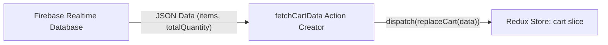

- **[資料同步流程]** 當應用程式啟動時，透過執行 `fetchCartData` 來確保 Redux 中的狀態與後端資料同步
    - 獲取的資料格式如下：

| 欄位名稱 | 說明 |
| --- | --- |
| items | 包含所有購物車商品的陣列 |
| totalQuantity | 購物車內所有商品的總數量 |

- **[自動化更新機制]** 由於我們在 `useEffect` 的依賴陣列中加入了 `cart` 狀態，當 Redux Store 中的 `cart` 被更新時，組件會自動重新執行，從而觸發相關的副作用邏輯（例如將更新後的資料同步回伺服器）。

### `PUT` 請求與資料結構一致性

- **[與&#32;`POST`&#32;的差異]** 在之前的實作中，若使用 `POST` 請求，Firebase 會將資料建立為一個列表（List），這會導致獲取資料時結構與 Redux 狀態不符，必須進行轉換
- **[`PUT`&#32;的優勢]** 目前使用 `PUT` 請求發送的是「資料快照」（Data Snapshots）
    - Firebase 會直接將我們發送的完整物件結構儲存起來，不做任何改變
    - 這意味著從 Firebase 獲取的 JSON 資料格式，會與我們發送時的格式完全一致
- **[簡化前端邏輯]** 因為資料結構一致，我們在從 Firebase 獲取資料後，可以直接將其用於更新 Redux Store，而不需要先進行複雜的資料轉換（Transformation）

```javascript
// 範例：使用 PUT 請求發送完整的購物車快照
const sendRequest = async () => {
  const response = await fetch(
    'https://react-http-6b4a6.firebaseio.com/cart.json',
    {
      method: 'PUT',
      body: JSON.stringify(cart),
    }
  );
};
```

### 使用 `replaceCart` 更新購物車狀態

- **[資料結構對應]** 從 Firebase 獲取的資料格式與 `replaceCart` reducer 所預期的 payload 完全一致
    - Payload 包含 `totalQuantity` 與 `items` 欄位
- **[實作方式]** 在 `cart-actions.js` 中匯入由 `cart-slice.js` 自動生成的 actions，並在非同步邏輯完成後進行 dispatch

```javascript
// 在 cart-actions.js 中使用自動生成的 actions
import { cartActions } from './cart-slice';

// ... 在 fetchCartData 的非同步邏輯中
const data = await response.json();
dispatch(cartActions.replaceCart(data));
```

### 在 `App.js` 中觸發初始資料獲取

- **[初始化同步]** 為了確保使用者一進入應用程式就能看到正確的購物車內容，需要在組件載入時執行資料獲取動作
- **[實作方式]** 在 `App.js` 中利用 `useEffect` 鉤子，並結合 `isInitial` 狀態來確保該請求僅在應用程式首次掛載時執行一次

```javascript
// 在 App.js 中的實作範例
function App() {
  const dispatch = useDispatch();
  const [isInitial, setIsInitial] = useState(true);

  useEffect(() => {
    if (isInitial) {
      dispatch(fetchCartData());
      setIsInitial(false);
    }
  }, [dispatch]);

  // ... 其他邏輯
}
```

- **[完整的資料更新流程]** 總結從 Firebase 獲取並更新狀態的完整路徑：

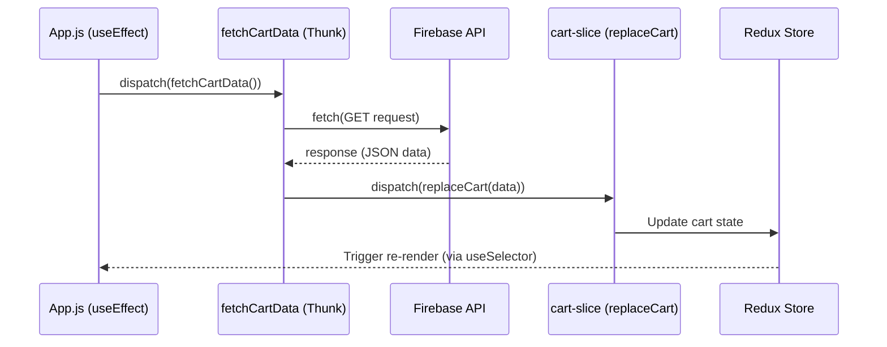

- **[更新邏輯總結]**
    - `fetchCartData` 負責處理非同步通訊與錯誤捕捉
    - 獲取成功後，透過 `cartActions.replaceCart(data)` 將完整的資料結構直接覆寫進 Store
    - 由於 `useSelector` 的訂閱機制，組件會自動接收最新狀態並反映在 UI 上

### 優化初始資料獲取的 `useEffect` 實作

- **[重構邏輯]** 與其在同一個 `useEffect` 中使用 `isInitial` 狀態來控制執行時機，不如建立一個專門負責初始化動作的獨立 `useEffect`
    - 這樣做可以讓程式碼更乾淨，邏輯職責更明確
- **[執行機制]** 由於該 `useEffect` 沒有任何依賴項（空陣列 `[]`），它只會在組件首次掛載（mount）時執行一次
    - 對於 `App.js` 這種根組件，這意味著初始化動作在應用程式生命週期中僅會觸發一次
- **[實作細節]** 在 `useEffect` 中 dispatch 自定義的非同步 Action Creator（如 `fetchCartData`），並將 `dispatch` 加入依賴項陣列以符合 ESLint 規範，雖然它實際上不會導致 effect 重新執行

```javascript
// App.js 中的優化實作
useEffect(() => {
  dispatch(fetchCartData());
}, [dispatch]);
```

### 避免不必要的資料同步請求

- **[問題現象]** 在應用程式啟動並成功從 Firebase 獲取購物車資料後，瀏覽器會立即再次向 Firebase 發送一個 `PUT` 請求（顯示 "Sent cart data successfully!"）
- **[原因分析]** 這是因為 `App.js` 中存在兩個相互影響的 `useEffect`：
    - 第一個 `useEffect` 負責執行 `fetchCartData()` 以獲取初始資料
    - 第二個 `useEffect` 則監聽 `cart` 狀態的變化，並在變化時執行 `sendCartData(cart)` 來同步資料
    - **[衝突點]** 當第一個 Effect 成功獲取資料並透過 `replaceCart` 更新 Redux Store 中的 `cart` 時，會觸發第二個 Effect 的執行，導致在初始化階段就進行了一次多餘的資料上傳動作

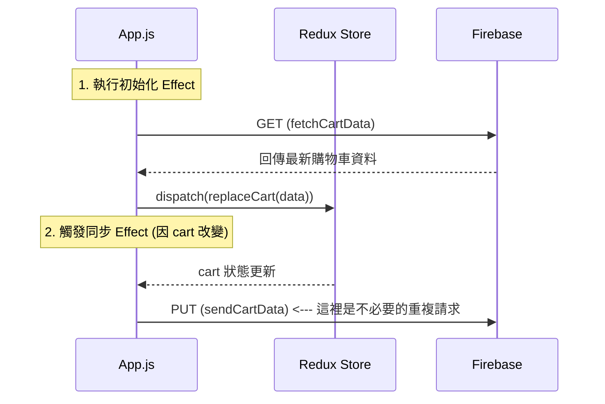

### 狀態更新觸發的連鎖反應

- **[副作用連鎖]** 當 `replaceCart` 成功執行並更新了 Redux Store 中的 `cart` 狀態後，會引發以下流程：
    - `cart` 狀態改變 $\rightarrow$ 觸發依賴於 `cart` 的 `useEffect` $\rightarrow$ 執行 `sendCartData`
- **[潛在問題]** 這種機制可能導致在初始化資料後，又自動觸發了不必要的資料同步請求（向後端發送資料），造成邏輯上的循環或冗餘操作

### 解決初始化重複同步的方案：引入狀態變更標記

- **[核心思路]** 在 Redux 的 `cart` 狀態中增加一個屬性，用來區分狀態更新的性質
- **[實作方式]** 在 `cartSlice` 的 `initialState` 中新增 `changed` 屬性，預設值設為 `false`
- **[邏輯區分]** 根據不同的 Action 來決定是否更新此標記：
    - **資料初始化**：當執行 `replaceCart`（從伺服器獲取資料並覆寫 Store）時，**不改變** `changed` 的值
    - **使用者操作**：當執行 `addItemToCart` 或 `removeItemFromCart` 時，將 `changed` 設為 `true`
- **[預期效果]** 透過這種方式，後續的同步 Effect 可以檢查 `cart.changed` 是否為 `true`，從而避免在應用程式啟動（初始化階段）時觸發不必要的 `PUT` 請求

### 實作條件式同步邏輯

- **[核心邏輯]** 在執行同步資料的 `useEffect` 中，加入對 `cart.changed` 屬性的判斷
    - **若&#32;`cart.changed`&#32;為&#32;`true`**：代表使用者在本地端進行了操作（如新增或刪除商品），此時才執行 `dispatch(sendCartData(cart))` 將資料同步至伺服器
    - **若&#32;`cart.changed`&#32;為&#32;`false`**：代表目前的狀態是從伺服器獲取的（初始化狀態），此時應跳過同步動作
- **[解決效果]** 這樣可以確保在重新整理頁面或應用程式啟動時，即便執行了 `replaceCart` 更新了 Store，也不會因為 `cart` 狀態改變而觸發多餘的 `PUT` 請求

```javascript
// App.js 中的條件式同步實作
useEffect(() => {
  if (cart.changed) {
    dispatch(sendCartData(cart));
  }
}, [cart, dispatch]);
```

- **[實作流程對比]**

| 情境 | cart.changed 狀態 | 是否觸發 sendCartData | 原因 |
| --- | --- | --- | --- |
| 應用程式初始化 (執行 replaceCart) | false | 否 | 資料來自伺服器，本地端無實質變更 |
| 使用者新增商品 (執行 addItemToCart) | true | 是 | 使用者操作導致狀態改變，需同步 |
| 使用者刪除商品 (執行 removeItemFromCart) | true | 是 | 使用者操作導致狀態改變，需同步 |

### Firebase 資料結構中的屬性污染問題

- **[發現問題]** 目前的同步機制會將整個 Redux `cart` 狀態直接發送到 Firebase
    - 這導致原本僅用於前端控制邏輯的 `changed` 屬性也被儲存到了後端資料庫中
- **[優化方案]** 在發送請求前，對資料進行「清洗」，只提取核心業務資料
    - **做法**：在 `cart-actions.js` 中，不要直接傳送整個 `cart` 物件
    - **實作**：建立一個新的物件，僅包含 `items` 與 `totalQuantity` 等必要欄位

```javascript
// 優化後的資料傳送邏輯示意
const dataToSend = {
  items: cart.items,
  totalQuantity: cart.totalQuantity
};
// 這樣發送出去的物件就不會包含 changed 屬性
```

### 驗證資料同步功能

- **[功能測試]** 測試在前端執行購物車操作（如 `addItemToCart`）後，資料是否能成功同步至 Firebase
    - **[觀察結果]** Firebase Realtime Database 中的資料結構會即時反映前端狀態，例如 `items` 與 `totalQuantity` 的變動
- **[發現問題]** 在測試減少商品數量時，發現總金額（price）的計算出現錯誤，未能隨著數量減少而正確更新
- **[後續行動]** 檢查 `cart-slice.js` 中的 `removeItemFromCart` reducer 邏輯，以找出計算錯誤的原因

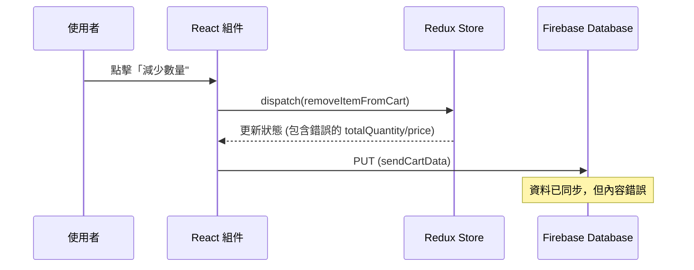

### 修正 `removeItemFromCart` 的計算邏輯

- **[發現問題]** 在減少商品數量時，雖然 `totalQuantity` 有更新，但 `totalPrice` 沒有跟著變動，導致總金額與商品數量不符。
- **[修正方案]** 在 reducer 中，除了減少數量，還必須同步扣除該項商品的價格。

```javascript
// cart-slice.js 中的修正邏輯
removeItemFromCart(state, action) {
  const id = action.payload;
  const existingItem = state.items.find((item) => item.id === id);
  state.totalQuantity--;

  if (existingItem.quantity === 1) {
    state.items = state.items.filter((item) => item.id !== id);
  } else {
    existingItem.quantity--;
  }
  // 修正：同步更新總金額
  state.totalPrice = existingItem.totalPrice - existingItem.price;
}
```

### 初始化時的潛在錯誤情境

- **[測試情境]** 清空購物車後重新整理頁面，應用程式會從 Firebase 抓取空的購物車資料。
- **[觀察到的錯誤]** 在這種情況下，若嘗試執行某些操作，可能會遇到 `TypeError: Cannot read property 'find' of undefined`。
- **[錯誤原因]** 因為從伺服器抓回來的資料可能不符合預期的結構（例如 `items` 為 `undefined`），導致後續使用 `.find()` 等陣列方法時崩潰。

```text
TypeError: Cannot read property 'find' of undefined
    at removeItemCart(cart-slice.js:35)
    at ...
```

### 處理 Firebase 獲取的空資料問題

- **[問題描述]** 當購物車被完全清空後，Firebase 中的 `cart` 物件可能不再包含 `items` 這個 key。
- **[錯誤現象]** 從 Firebase 抓取資料並更新本地狀態時，`items` 會變成 `undefined` 而非空陣列 `[]`。這會導致後續程式碼在執行 `.find()` 等陣列方法時崩潰。
    - **錯誤訊息**：`TypeError: Cannot read property 'find' of undefined`
- **[解決方案]** 在 `cart-actions.js` 的 `fetchCartData` 函式中進行資料轉換，確保傳遞給 `replaceCart` 的 payload 始終包含 `items` 屬性。

```javascript
// cart-actions.js 中的修正邏輯示意
const fetchCartData = async () => {
  const response = await fetch('...');
  const data = await response.json();

  // 進行微小的資料轉換：確保 items 始終存在
  dispatch(
    cartActions.replaceCart({
      items: data.items || [], // 如果 data.items 是 undefined，則使用空陣列
      totalQuantity: data.totalQuantity || 0,
      totalPrice: data.totalPrice || 0,
    })
  );
};
```

### 驗證資料同步與容錯處理

- **[最終解決方案]** 透過在 `fetchCartData` 中對回傳資料進行轉換，確保 `items` 屬性在任何情況下（包括資料庫為空時）都至少是一個空陣列 `[]`。
    - 這避免了 `items` 變成 `undefined` 而導致的 `TypeError`。
    - `totalQuantity` 則直接從 Firebase 資料中取得。

```javascript
// cart-actions.js 中的最終實作邏輯
try {
  const cartData = await fetchCartData();
  dispatch(
    cartActions.replaceCart({
      items: cartData.items || [], // 確保 items 始終為陣列
      totalQuantity: cartData.totalQuantity,
      totalPrice: cartData.totalPrice,
    })
  );
} catch (error) {
  dispatch(
    uiActions.showNotification({
      status: 'error',
      title: 'Error!',
      message: 'Fetching cart data failed!',
    })
  );
}
```

- **[功能驗證]** 經過修正後的邏輯已成功達成以下目標：
    - **重新整理頁面**：能正確載入舊有資料。
    - **新增/減少商品**：數量與總金額（`totalPrice`）皆能正確計算並更新。
    - **資料同步**：所有的變動都能透過 HTTP 請求正確反映在 Firebase 中。
- **[核心概念]** 透過 Redux 實作 HTTP 請求與副作用（Side Effects）
    - 這展示了如何將非同步邏輯從組件中抽離，並利用 Thunk 模式在 Redux 流程中安全地處理外部 API 交互。

### Redux 非同步任務與副作用總結

- **[核心學習點]** 在 Redux 架構中，理解「程式碼該放在哪裡」以及「如何處理非同步操作」至關重要
    - 這涉及到如何正確處理副作用（Side Effects），例如向伺服器發送 HTTP 請求
    - 掌握這些選項對於開發複雜的應用程式具有決定性的影響

### Redux DevTools

- **[工具用途]** 專門用於輔助除錯（Debugging）的額外工具
    - 可以讓我們更直觀地觀察 Redux 狀態（State）的變化與 Action 的流轉

### Redux DevTools 的開發價值

- **[開發痛點]** 當應用程式變得複雜，涉及大量的 state slices 與 action 時，除錯會變得困難
    - 很難快速定位錯誤
    - 難以追蹤 action 發生的先後順序
- **[核心功能]** 提供一種無需切換到不同 UI 組件，即可直接檢視整個 Redux store 當前狀態的方法
- **[安裝方式]**
    - 建議在瀏覽器中搜尋並安裝其「瀏覽器擴充功能（browser extension）」
    - 亦可透過 GitHub 找到相關專案資訊

### Redux DevTools 安裝與使用

- **[安裝方式]** 最簡單的方法是透過瀏覽器擴充功能（例如 Chrome Web Store）進行安裝
    - 安裝完成後即可直接在開發中使用
- **[Redux Toolkit 的優勢]**
    - 使用原生 Redux 時，需要撰寫額外的程式碼來讓 DevTools 正常運作
    - 使用 **Redux Toolkit** 時，DevTools 可以「開箱即用（out of the box）」，無需額外配置

### 使用 Redux DevTools 觀察 Action 流轉

- **[開啟方式]** 除了瀏覽器擴充功能圖示外，也可以在瀏覽器的開發者工具（DevTools）中找到「Redux」選項卡
- **[面板功能]** 開啟後可進入 Redux DevTools 面板，提供對 Redux Store 的深入洞察：
    - **左側列表**：顯示已發生的 Action 序列
    - **Inspector 面板**：可切換查看 Action 的不同維度，例如：
        - `Diff`：顯示 Action 造成的狀態差異
        - `Action`：查看 Action 本身的內容
        - `State`：查看執行該 Action 後的完整 Store 狀態
        - `Trace`：追蹤 Action 的來源
- **[初始化觀察]** 當重新整理頁面時，可以觀察到第一個自動發送的 Action：
    - `cart/replaceCart`：這是應用程式初始化時，將初始狀態（Initial State）套用到 Redux 中的動作

### 觀察 Action 的執行順序

- **[初始化階段]** 應用程式啟動並初始化 Store 時，會觸發以下 Action：
    - `cart/replaceCart`：這是因為從伺服器獲取了初始資料，並將其套用到 Redux Store 中。
- **[操作連動階段]** 以「新增商品至購物車」為例，觀察到一系列連動的 Action 流轉：

    1. `cart/addItemToCart`：使用者點擊按鈕，觸發購物車狀態的變更。
    2. **[副作用觸發]** 由於 `cart` 狀態發生了實質改變，進而觸發了同步資料的邏輯。
    3. `ui/showNotification`：為了向使用者回饋操作結果（例如顯示「資料已成功同步」），系統會接著 dispatch 通知相關的 Action。

- **[開發觀察重點]**
    - 透過 DevTools 的 Action 列表，可以確認這些 Action 是否按照預期的邏輯順序執行。
    - 雖然某些邏輯（如同步資料）不是獨立的 Action Type，但它們會作為其他 Action 執行過程中的副作用（Side Effect）被觸發。

### Redux DevTools 的 Action 面板細節

- **[觀察重點]** 可以點擊特定的 Action 來獲取關於傳輸資料與狀態變化的深入見解：
    - **Action 面板**：顯示該 Action 的 `payload`（傳輸的資料內容）。
    - **State 面板**：顯示該 Action 執行後，Redux Store 的狀態是如何改變的。
- **[自動生成的唯一識別碼]** Redux Toolkit 會自動為每個 reducer 方法建立唯一的識別碼，其結構如下：
    - `[slice 名稱]/[reducer 方法名稱]`
    - 例如在 `cart` slice 中，一個 action 的識別碼可能是 `cart/addItemToCart`。
- **[面板組成結構]** 在 DevTools 的 Action 視圖中，可以看到：
    - `type`：Action 的唯一識別碼
    - `payload`：該次操作攜帶的具體資料（例如商品 ID 與價格）
    - `state`：執行該 Action 後的最新狀態

### 使用 Redux DevTools 進行深度除錯

- **[觀察狀態差異]** 利用 `Diff` 面板可以精確看到 Action 執行後，哪些屬性發生了變化：
    - 例如在 `addItemToCart` 執行後，可以觀察到 `totalQuantity` 從 6 變更為 7，以及 `items` 陣列中特定項目的 `quantity` 發生了變化。
    - 同時也能看到如 `changed` 這種布林值屬性的切換。
- **[時間旅行 (Time Traveling)]** 這是一個強大的除錯功能：
    - 開發者可以點擊 Action 列表中的歷史紀錄，然後點擊 `Jump` 按鈕。
    - **[效果]** Redux Store 的狀態會立即「跳轉」回該時間點的樣子（例如通知會消失，購物車數量也會回到之前的狀態），這讓開發者能模擬並重新檢查不同階段的應用程式行為。
- **[核心用途]** 它是觀察 Redux Store 狀態變化的強大軟體工具
- **[學習建議]** 強烈建議開發者積極使用並進行嘗試（play around with），這能幫助你：
    - 獲得對 Redux Store 更深入的洞察
    - 進行高效的除錯（debug）
    - 完全理解應用程式內部的運作邏輯與狀態流轉

### Side Effects, Async Tasks & Redux

- **[核心原則]** Reducer 必須是**純函數（Pure Function）**
    - 必須是同步的（Synchronous）
    - 不可包含副作用（Side-effect free）
    - 邏輯流程：`Input (Old State + Action) --> Output (New State)`
- **[邏輯放置的選擇]** 非同步程式碼或副作用可以放置在兩個主要位置：
    - **組件內部 (Inside the components)**：例如透過 `useEffect()` 觸發
    - **Action Creators 內部 (Inside the action creators)**
- **[設計模式：Fat Reducers vs. Fat Components vs. Fat Actions]**
    - **問題：肥大組件 (Fat Components)**
        - 將所有的資料轉換邏輯（Data Transformation）都寫在組件中，會導致組件變得過於臃ب（Fat）
        - 雖然功能上可行，但這違背了使用 Redux 的初衷
    - **最佳實踐建議**
        - **同步、無副作用的程式碼**（例如：資料轉換邏輯）：**優先放在 Reducer 中**
        - **非同步程式碼或帶有副作用的程式碼**：放在 Action Creators 或組件中

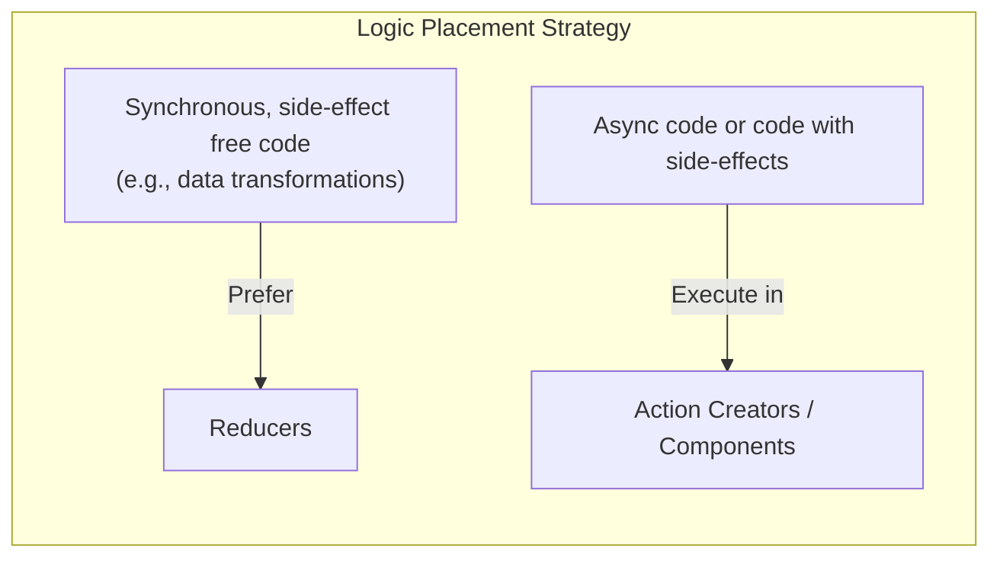

### 邏輯放置策略總結

- **[核心決策依據]** 根據程式碼是否具備副作用或是否為非同步來決定位置
    - **同步且無副作用的程式碼** (例如：資料轉換)
        - **優先使用 Reducers**
        - **避免**將此類邏輯放在 Action Creators 或組件中
    - **非同步程式碼或帶有副作用的程式碼**
        - **使用 Action Creators 或組件**
        - **絕對不要**在 Reducers 中使用


- **[從組件轉移至 Action Creator 的優點]**
    - 讓組件保持 **精簡 (Lean)**
    - 使組件能專注於其核心任務，而非處理繁重的邏輯運算（Heavy lifting）
- **[Redux DevTools 的價值回顧]**
    - 它是理解 Redux Store 與狀態運作的關鍵工具
    - 提供**時間旅行 (Time Traveling)** 功能，可追蹤狀態變化
    - 讓開發者能獲得對應用程式內部狀態流轉的**深度洞察 (Deep insights)**

### Redux 學習總結

- **[核心能力]** 透過學習，現在已具備在各種應用程式中整合 Redux 的能力，包括處理以下複雜邏輯：
    - 副作用 (Side Effects)
    - HTTP 請求 (HTTP Requests)
    - 各種非同步程式碼 (Async Code)

### 單頁應用程式 (Single Page Applications, SPA)

- **[核心特性]** 所有的使用者介面變動都發生在單一頁面上
    - 使用者進行任何動作（Navigation actions）時，URL 都不會改變
    - 連結到子頁面（Linking to a sub-page）在這種模式下是不可能的
- **[React 的角色]** React.js 的核心理念之一就是建構 SPA
    - 透過用戶端 JavaScript (Client-side JavaScript) 來負責處理介面的更新與變動
    - 這種方式讓使用者在不重新載入整個頁面的情況下，就能獲得流暢的互動體驗

### 單頁應用程式 (SPA) 的缺點

- **[核心缺點] 失去連結特定資源的能力 (Loss of linking to specific resources)**
    - 在傳統網站中，使用者可以透過 URL 直接連結到特定的頁面或內容
    - 在 SPA 中，由於所有的導航動作都發生在同一個頁面上，URL 通常保持不變
    - **[使用者體驗問題]** 當應用程式變得複雜時，使用者被迫必須從起始頁面（Start page）開始，再手動導航到不同的區域，無法直接跳轉到特定部分

### 單頁應用程式路由 (Single-Page Application Routing)

- **[核心目標] 兼顧 SPA 優勢與傳統網站的導航體驗**
    - 在技術上仍維持 SPA 的特性：不需要每次導航都從後端獲取新的 HTML 頁面
    - 同時實現不同的 URL 指向不同的頁面內容
- **[解決方案] 透過路由機制實現多頁面效果**
    - 讓使用者能夠擁有不同的 URL 路徑
    - 解決了 SPA 無法直接連結到特定資源 (Linking to specific resources) 的問題
    - 讓應用程式在保持流暢互動的同時，具備傳統網站的導航靈活性

### 客戶端路由 (Client-side Routing)

- **[核心概念]** 在應用程式中實現不同 URL 與不同頁面的對應關係
    - 使用者可以透過在瀏覽器地址欄輸入正確的 URL 來載入特定的頁面內容
    - 這讓開發者能發揮 React 的所有優勢，同時提供類似傳統多頁面網站的導航體驗
- **[實作工具] React Router**
    - 這是 React 生態系中最流行的路由套件
    - **[功能]** 能夠為 SPA 帶來「多頁面」的感覺 (multi-page feeling)
    - 學習重點包括：
        - 客戶端路由的原理與必要性 (What & Why)
        - 如何使用 React Router 進行實作 (Using React Router)

### 單頁應用程式路由 (SPA Routing) 的進階應用

- **[後續學習重點]** 接下來將探討如何在 React SPA 中處理資料流：
    - 資料的獲取 (Data Fetching)
    - 資料的傳送 (Data Submission)
- **[React Router 的進階角色]**
    - 除了處理頁面導航，React Router 也能協助簡化資料獲取與傳送的流程

### 路由的基本原理 (Basic Principles of Routing)

- **[核心概念]** 路由決定了當網址路徑發生變化時，瀏覽器應該顯示什麼內容
- **[網址路徑的作用]** 使用者可以在網域名稱（Domain name）後方附加路徑（Path）來存取特定頁面
    - 例如：在網域後方加上 `/welcome` 會載入歡迎頁面
    - 點擊連結或手動輸入不同的 URL（如 `/products`）會觸發頁面切換

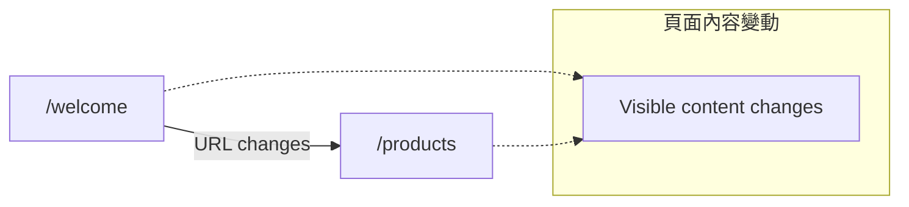

### 多頁面路由 (Multi-Page Routing)

- **[路由的核心定義]** 路由的本質就是讓不同的 URL 路徑載入不同的螢幕內容
    - 當網址路徑（URL path）發生變化時，使用者看到的內容也會隨之改變
- **[傳統多頁面應用程式的實作方式]** 在不使用 React.js 的傳統開發模式中，通常透過以下方式實現導航：
    - 針對不同的路徑，直接載入不同的 HTML 檔案

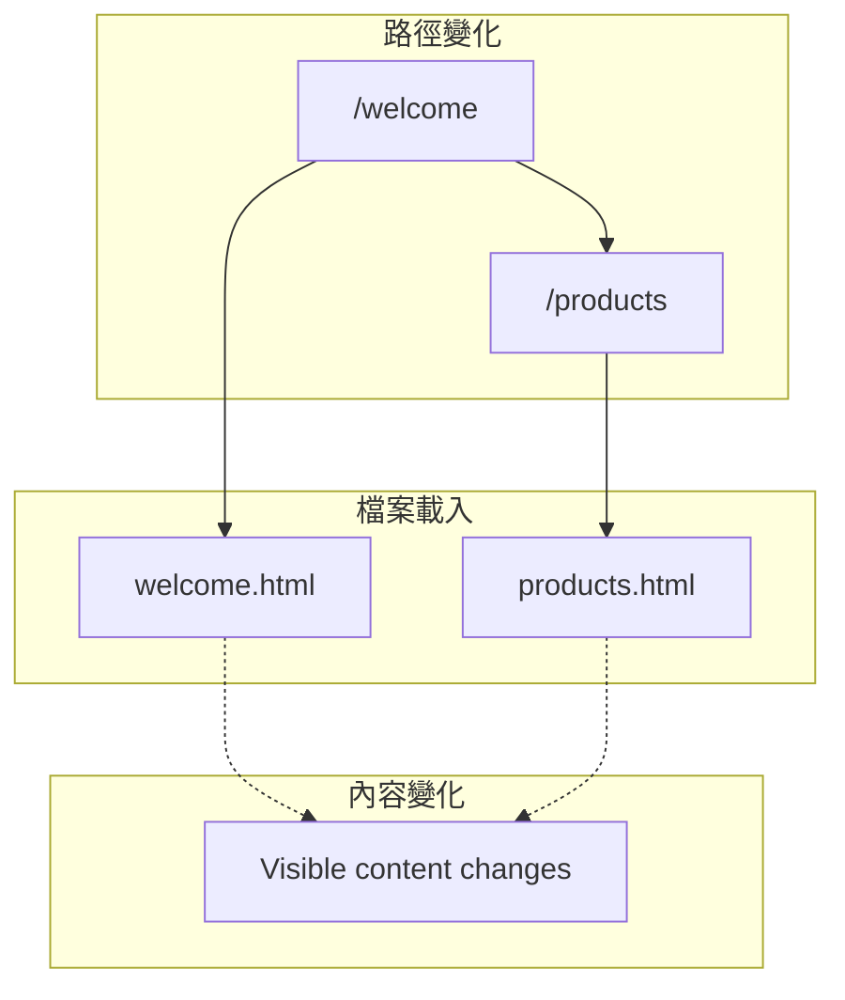

### 多頁面路由與 SPA 的體驗差異

- **[傳統多頁面路由的缺點]** 每次 URL 變動都伴隨著完整的請求與回應循環
    - 必須發送新的 HTTP 請求並接收新的內容
    - **[使用者體驗影響]** 這會導致頁面切換時出現延遲 (lag)，可能中斷使用者的操作流 (user flow)，造成次優的體驗
- **[單頁應用程式 (SPA) 的運作模式]** 針對複雜使用者介面的設計方案
    - **[初始階段]** 僅進行一次初始的 HTML 請求與回應，下載包含大量 JavaScript 的檔案
    - **[後續導航]** URL 的變化由客戶端的 React 程式碼直接處理
    - **[核心優勢]** 切換頁面內容時，不需要重新向伺服器請求新的 HTML 檔案，從而實現流暢的體驗

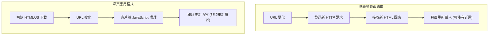

### SPA 的客戶端路由實作

- **[實現路由幻象]** 雖然 SPA 不像傳統網站那樣載入新 HTML，但可以透過客戶端程式碼來模擬路由行為
- **[運作機制]**
    - 使用客戶端 React 程式碼持續監聽目前活躍的 URL (active URL)
    - 當 URL 發生變化時，觸發特定的邏輯
    - 根據路徑載入不同的 React 組件來更新螢幕顯示內容
- **[核心優勢]** 這種方式不需要從後端重新獲取新的 HTML 檔案，僅透過切換組件即可實現頁面轉換

### SPA 中的路由支援

- **[核心特性]** 即使在單頁應用程式 (SPA) 的架構下，我們仍然可以支援不同的 URL 路徑並實作路由功能
- **[開發目標]** 透過路由技術，讓使用者能透過不同的網址存取應用程式的不同部分，同時保有 SPA 的流暢體驗

### 路由學習專案設定

- **[專案基礎]** 使用 `create-react-app` 建立的簡易專案，旨在理解路由的基本概念
    - 專案內容極簡，僅包含基本的樣式與一個空的 `App` 組件
    - **[開發流程]** 先從基礎路由功能學起，之後再進階到更具實務感的專案與進階路由特性
- **[專案結構概覽]**
    - `src/App.js`: 主要的應用程式組件（目前為空）
    - `src/index.js`: 程式進入點，負責渲染 `App` 組件
    - `src/index.css`: 包含基礎的 CSS 變數與樣式設定（如 `font-family`, `color-scheme` 等）

```javascript
// src/index.js 內容範例
import React from 'react';
import ReactDOM from 'react-dom/client';
import './index.css';
import App from './App';

const root = ReactDOM.createRoot(document.getElementById('root'));
root.render(
  <React.StrictMode>
    <App />
  </React.StrictMode>
);
```

- **[下一步規劃]** 透過安裝額外套件來為專案實作路由功能

### 安裝路由套件

- **[路由功能的實現]** React 本身並不內建監聽 URL 並載入不同內容的路由功能
- **[為什麼使用套件？]** 自行撰寫路由邏輯會非常複雜，因為必須處理許多細微的技術細節（nuances）與不同的使用情境
- **[實作方式]** 使用 `npm` 安裝專用的路由套件

```bash
npm install react-router-dom
```

### 深入了解 `react-router-dom` 套件

- **[套件歸屬]** `react-router-dom` 屬於 `react-router` 工具家族
    - 可透過 [react-router.com](https://react-router.com) 查閱完整的工具說明與文件
- **[功能範圍]** 提供了一套完整的 API 與功能集
    - 涵蓋了路由的所有行為與特性
    - **[核心用途]** 讓應用程式能夠監聽 URL 的變化，並根據路徑載入不同的內容

### 實作路由功能的步驟

在安裝完路由套件後，將路由整合進應用程式通常需要經過以下三個主要步驟：

1. **定義路由 (Define Routes)**

    - 必須明確指定應用程式想要支援哪些 URL 路徑 (paths)
    - 針對每個路徑，決定應該載入哪一個 React 組件

2. **啟動路由器 (Activate Router)**

    - 將第一步所定義的路由規則載入並啟動路由器，讓應用程式開始監聽路徑變化

3. **實作導航與組件準備 (Navigation & Components)**

    - 確保所有預計要載入的組件都已準備就緒
    - 提供使用者在不同頁面之間進行切換（導航）的機制

### 路由帶來的導覽體驗

- **[使用者體驗]** 實作路由後，使用者可以在不同的頁面（或組件）之間進行流暢的切換
- **[核心目標]** 讓 SPA 在保持技術優勢的同時，提供與傳統網站一致的導覽邏輯

### 實作步驟一：定義路由

- **[匯入工具]** 在根組件 `App.js` 中從 `react-router-dom` 匯入 `createBrowserRouter`
- **[路由定義機制]** 使用 `createBrowserRouter` 函式來宣告應用程式支援的路徑
    - 該函式接收一個由「路由定義物件 (route definition objects)」組成的陣列作為參數
- **[核心概念]** 路由本質上就是「路徑與組件」的對應關係 (path <=> component mappings)
    - 例如：當路徑為 `/products` 時，對應要載入的組件為 `<Products />`

```javascript
// src/App.js
import { createBrowserRouter } from 'react-router-dom';

const router = createBrowserRouter([
  // 這裡將放置路由定義物件陣列
]);

function App() {
  return <div></div>;
}

export default App;
```

### 路由定義物件的配置

- **[配置方式]** 在 `createBrowserRouter` 的陣列中，透過建立「路由定義物件 (route definition objects)」來配置路由特性
- **[物件屬性]** 每個路由物件可以包含多個屬性來定義其行為（開發時可利用 IDE 的自動完成功能查看詳細屬性）
- **[核心屬性：path]** 幾乎在每個路由物件中都會使用的關鍵屬性
    - **[用途]** 用於定義觸發該路由的路徑 (the path for which this route should be activated)

```javascript
// src/App.js 路由配置範例
import { createBrowserRouter } from 'react-router-dom';

const router = createBrowserRouter([
  {
    path: '', // 定義路徑
    // 其他屬性將在此配置
  },
]);

function App() {
  return <div></div>;
}

export default App;
```

- **[其他可用屬性]** (參考官方文件)
    - `action`
    - `caseSensitive`
    - `children`
    - `element`
    - `errorElement`
    - `handle`
    - `hasErrorBoundary`
    - `id`
    - `index`
    - `loader`
    - `shouldRevalidate`

### 理解 URL 路徑 (URL Path)

- **[網址組成結構]** 一個完整的 URL 通常包含以下部分：
    - **協定 (Protocol)**：例如 `https`
    - **網域 (Domain)**：例如 `example.com`
    - **路徑 (Path)**：位於網域之後的部分
- **[路徑的概念]** 路徑是用來指定資源位置的字串
    - 即使是根目錄（例如 `example.com` 後面什麼都沒有）也可以被視為一個路徑（即空路徑 `''`）
    - 例如 `/products` 就是一個有效路徑
- **[在路由中的應用]** 我們在路由定義物件中使用 `path` 屬性來對應這些路徑
    - **[範例]** 若要將網站的首頁設定為根路徑，其 `path` 屬性應設定為 `''`

```javascript
// src/App.js
import { createBrowserRouter } from 'react-router-dom';

const router = createBrowserRouter([
  {
    path: '', // 代表網站的起始頁面 (starting page)
    // 其他配置...
  },
]);

function App() {
  return <div></div>;
}

export default App;
```

### 路由物件的關鍵屬性：element

- **[核心屬性：element]** 路由物件中另一個關鍵屬性，用於指定當該路由被啟動時應載入的組件
    - **[用途]** 建立路徑與 UI 內容之間的連結 (path <=> component mapping)

```javascript
// src/App.js 路由配置範例
import { createBrowserRouter } from 'react-router-dom';
import CartPage from './pages/CartPage'; // 假設頁面組件路徑

const router = createBrowserRouter([
  {
    path: '',
    element: <CartPage /> // 指定當路徑為空時，載入 CartPage 組件
  },
]);

function App() {
  return <div></div>;
}
```

- **[專案結構建議]** 為了管理這些作為頁面使用的組件，可以建立一個專門的資料夾
    - **[範例]** 建立一個 `pages` 資料夾來存放路由對應的組件（雖然也可以命名為 `components` 或 `routes`，但使用 `pages` 能更明確區分頁面級別的組件）

### 建立頁面組件範例

- **[開發實務]** 建立專用的 `pages` 資料夾來存放頁面組件，這能清楚區分哪些組件是透過路由載入的頁面級別組件
- **[實作步驟]** 建立一個簡單的頁面組件（例如 `Home.js`）並將其匯出

```javascript
// src/pages/Home.js
function HomePage() {
  return <h1>My Home Page</h1>;
}

export default HomePage;
```

- **[路由關聯]** 建立組件後，下一步即是在 `App.js` 的路由配置中，透過 `element` 屬性將該組件與特定的 `path` 連結起來

### element 屬性的進階用法

- **[內容彈性]** `element` 屬性不限於僅能渲染單一組件，它可以接收任何有效的 JSX 代碼
    - **[範例]** 可以在組件外層包裹額外的 HTML 標籤（例如 `<p>` 或 `<div>`）來進行佈局包裝
- **[開發慣例]** 雖然具備高度彈性，但在實際開發中，最常見的做法是直接將其設定為一個完整的頁面組件，以維持程式碼的結構清晰與模組化

### 使用路由物件 (Router Object)

- **[儲存路由實例]** 使用 `createBrowserRouter` 建立路由配置後，必須將其回傳值儲存在一個變數或常數中
    - **[目的]** 為了能將這個路由物件告知 React，讓 React 知道應該根據哪些路徑來渲染對應的 UI

```javascript
// src/App.js
import { createBrowserRouter } from 'react-router-dom';
import HomePage from './pages/Home';

const router = createBrowserRouter([
  { path: '/', element: <HomePage /> },
]);

function App() {
  return <div></div>;
}

export default App;
```

### 使用 `RouterProvider` 啟動路由

- **[核心組件：RouterProvider]** 為了讓 React 能夠使用先前建立的路由配置並渲染正確的頁面，必須引入並使用 `RouterProvider` 組件
- **[關鍵屬性：router]** `RouterProvider` 具有一個必須設定的特殊 prop，稱為 `router`
    - **[用途]** 該屬性接收由 `createBrowserRouter` 建立的路由實例，作為整個路由系統的驅動核心

```javascript
// src/App.js
import { createBrowserRouter, RouterProvider } from 'react-router-dom';
import HomePage from './pages/Home';

const router = createBrowserRouter([
  { path: '/', element: <HomePage /> },
]);

function App() {
  // 使用 RouterProvider 並將 router 物件傳入
  return <RouterProvider router={router} />;
}

export default App;
```

### 激活路由系統的工作原理

- **[連接配置與渲染]** 透過將 `createBrowserRouter` 的回傳值（即 `router` 常數）傳遞給 `RouterProvider` 的 `router` 屬性，可以正式啟動路由功能
    - **[運作流程]** 一旦路由被激活，系統會執行以下邏輯：

        1. 讀取瀏覽器當前的 URL
        2. 檢查該 URL 是否與路由配置中的 `path` 匹配
        3. 若匹配成功，則載入並渲染該路徑對應的 `element`

```javascript
// src/App.js
import { createBrowserRouter, RouterProvider } from 'react-router-dom';
import HomePage from './pages/Home';

const router = createBrowserRouter([
  { path: '/', element: <HomePage /> },
]);

function App() {
  // 將 router 實例傳入 RouterProvider 以激活路由
  return <RouterProvider router={router} />;
}

export default App;
```

### 根路徑的路由匹配

- **[路徑概念]** 當訪問 `localhost:3000` 時，路由系統會將其視為根路徑，即「slash nothing」（`/`）
    - 即使網址列沒有顯示斜線，系統也會將其視為存在一個隱形的斜線
    - 輸入 `localhost:3000/` 與直接輸入 `localhost:3000` 會載入相同的組件
- **[組件載入]** 根據路由配置，當路徑匹配為 `/` 時，會渲染對應的組件內容
    - **[範例]** 若 `HomePage` 組件定義了 `<h1>My Home Page</h1>`，則訪問根路徑時瀏覽器將顯示該內容

### 路由的核心概念

- **[多頁面支援]** 路由技術存在的根本目的，是為了讓單一應用程式能夠根據不同的 URL 路徑，呈現出多個不同的頁面內容

### 新增頁面與路由配置

- **[建立新頁面組件]** 為了增加應用程式的頁面數量，可以在 `pages` 資料夾下建立新的組件檔案（例如 `products.js`）
    - **[組件內容]** 新組件可以先建立一個簡單的佔位頁面（dummy page），例如僅回傳一個 `<h1>` 標籤

```javascript
// src/pages/products.js
function ProductsPage() {
  return <h1>Products Page</h1>;
}

export default ProductsPage;
```

- **[在路由陣列中註冊新路徑]** 建立組件後，必須在 `createBrowserRouter` 的路由定義陣列中新增一個物件，才能透過 URL 訪問該頁面
    - **[配置屬性]** 需要設定 `path`（網址路徑）與 `element`（對應的組件）

```javascript
// src/App.js
import { createBrowserRouter, RouterProvider } from 'react-router-dom';
import HomePage from './pages/Home';
import ProductsPage from './pages/products'; // 引入新頁面

const router = createBrowserRouter([
  { path: '/', element: <HomePage /> },
  { path: '/products', element: <ProductsPage /> }, // 新增產品頁面路由
]);

function App() {
  return <RouterProvider router={router} />;
}

export default App;
```

### 註冊產品頁面路由

- **[路徑與組件關聯]** 為了支援 `/products` 這個路徑，需要在路由定義中新增一個物件，並將其 `element` 屬性指向 `ProductsPage` 組件
    - **[實作方式]** 必須先從對應的檔案路徑匯入該組件，然後在路由陣列中進行配置

```javascript
// src/App.js
import { createBrowserRouter, RouterProvider } from 'react-router-dom';
import HomePage from './pages/Home';
import ProductsPage from './pages/products'; // 引入產品頁面組件

const router = createBrowserRouter([
  { path: '/', element: <HomePage /> },
  { path: '/products', element: <ProductsPage /> }, // 註冊 /products 路徑
]);

function App() {
  return <RouterProvider router={router} />;
}

export default App;
```

- **[驗證路由]** 配置完成並儲存後，透過在瀏覽器網址列輸入 `localhost:3000/products`，即可成功載入並顯示產品頁面的內容

### 路由匹配與未定義路徑的行為

- **[路徑回退]** 當從特定路徑（例如 `/products`）刪除路徑片段時，系統會自動載入根路徑（`/`）對應的頁面
- **[未定義路徑處理]** 若訪問一個完全不支援的路徑（例如輸入一個不存在的 URL），路由系統會觸發錯誤
    - **[預設錯誤頁面]** 預設情況下，`react-router-dom` 會顯示一個內建的「Unhandled Thrown Error / 404 Not Found」頁面
    - **[優化方向]** 為了提供更好的使用者體驗（UX），開發者之後可以透過配置 `errorElement` 屬性來提供自定義的錯誤頁面，而非使用系統預設的頁面

### 路由定義的替代方案

- **[物件陣列方式]** 除了使用組件來定義路由外，也可以使用包含路由定義物件的陣列來進行配置
    - **[優點]** 這種方式被認為非常直觀
    - **[歷史差異]** 在舊版本的 `react-router-dom` 中，開發者必須透過組件與 JSX 代碼來定義所有路由，而非使用 JavaScript 物件陣列

```javascript
// 使用物件陣列定義路由的範例
const router = createBrowserRouter([
  { path: '/', element: <HomePage /> },
  { path: '/products', element: <ProductsPage /> },
]);
```

### 使用 `createRoutesFromElements` 定義路由

- **[JSX 宣告式語法]** 在最新版本的 `react-router-dom` 中，可以透過 `createRoutesFromElements` 函式來建立路由定義，這讓開發者能以更直觀的 JSX 結構來撰寫路由
    - **[實作流程]** 從 `react-router-dom` 匯入 `createRoutesFromElements` 與 `Route` 組件，然後將 JSX 形式的路由結構傳入該函式

```javascript
// 使用 createRoutesFromElements 的範例
import {
  createBrowserRouter,
  createRoutesFromElements,
  Route,
  RouterProvider
} from 'react-router-dom';
import HomePage from './pages/Home';
import ProductsPage from './pages/products';

const routeDefinitions = createRoutesFromElements(
  <Route path="/" element={<HomePage />} />
  <Route path="/products" element={<ProductsPage />} />
);

const router = createBrowserRouter(routeDefinitions);

function App() {
  return <RouterProvider router={router} />;
}

export default App;
```

### 使用 JSX 語法配置路由

- **[宣告式定義]** 可以透過 `createRoutesFromElements` 將 `<Route>` 組件包裝起來，藉此使用 JSX 代碼而非物件陣列來定義路由
    - **[屬性配置]** 每個 `<Route>` 組件都會接收 `path` 屬性（定義路徑）與 `element` 屬性（定義該路徑要載入的組件/JSX）

```javascript
// 使用 createRoutesFromElements 的實作方式
const routeDefinitions = createRoutesFromElements(
  <Route path="/" element={<HomePage />} />
  <Route path="/products" element={<ProductsPage />} />
);

const router = createBrowserRouter(routeDefinitions);
```

- **[建立瀏覽器路由]** 將定義好的 `routeDefinitions` 作為參數傳入 `createBrowserRouter`，即可完成路由器的初始化

### 路由定義方式的選擇

- **[兩種定義風格]** 在設定路由時，可以根據偏好選擇不同的寫法：
    - **[物件陣列方式]** 使用 JavaScript 物件陣列來定義路徑與組件，這在講者後續的示範中會作為主要方式使用。
    - **[JSX 宣告式方式]** 使用 `createRoutesFromElements` 搭配 `<Route>` 組件，以更接近 HTML 的宣告式語法來定義路由。

```javascript
// 使用 JSX 語法定義路由的範例
const routeDefinitions = createRoutesFromElements(
  <Route path="/" element={<HomePage />} />
  <Route path="/products" element={<ProductsPage />} />
);

// 將定義好的 routeDefinitions 傳入 createBrowserRouter
const router = createBrowserRouter(routeDefinitions);
```

- **[實作結果]** 無論使用哪種方式，最終都能達到相同的效果：正確地載入根路徑（`/`）的頁面以及 `/products` 路徑的內容。

### 路由導覽的缺陷與改進

- **[現有問題]** 目前的路由實作需要使用者手動在瀏覽器網址列修改 URL 才能進行頁面切換
    - 例如：從首頁切換到產品頁必須手動輸入 `/products`
    - 這對一般使用者來說極不直觀且不具備實用性
- **[解決方案]** 在頁面中提供可點擊的連結（Links）
    - 使用者應能透過點擊頁面上的連結來進行導覽，而非手動輸入路徑

### 使用 HTML 錨點標籤實作導覽

- **[實作方式]** 在頁面組件（如 `Home.js`）中，可以使用標準的 HTML `<a>` 標籤搭配 `href` 屬性來建立導覽連結
    - 例如：在首頁標題下方新增一個段落，並包含一個指向 `/products` 路徑的連結

```javascript
// Home.js 中的實作範例
function HomePage() {
  return (
    <h1>My Home Page</h1>
    <p>Go to <a href="/products">the list of products</a>.</p>
  );
}
```

- **[驗證結果]** 透過點擊該連結，瀏覽器可以成功從首頁切換到產品頁面（Products Page），表示路由配置已生效
- **[潛在問題]** 雖然功能可行，但這種使用原生 `<a>` 標籤的方法在 SPA 架構中存在問題（講者隨後將討論此點）

### 使用原生 HTML 錨點標籤的效能問題

- **[底層行為]** 當點擊使用 `href` 的原生 `<a>` 標籤時，瀏覽器會向伺服器發送一個新的請求
    - 伺服器會再次回傳構成該單頁應用程式（SPA）的單一 HTML 頁面
- **[副作用與成本]** 這種行為會導致不必要的資源消耗與效能影響：
    - 必須重新載入所有的 JavaScript 程式碼
    - 必須重新啟動整個 React 應用程式
    - 這種「重新啟動」的過程會造成使用者體驗的斷層，並降低網站的整體效能

### 避免使用原生連結導致的狀態丟失

- **[核心問題]** 使用原生 `<a>` 標籤會觸發瀏覽器的預設行為，向伺服器發送新的 HTTP 請求
    - **[後果一] 資源重複載入]** 必須重新載入所有的 JavaScript 程式碼，造成效能浪費
    - **[後果二] 應用程式重啟]** React 應用程式會重新啟動，導致使用者體驗出現斷層
    - **[後果三] 狀態丟失]** 所有的應用程式全域狀態（Application-wide state）與上下文（Context）都會隨之消失
- **[SPA 的優勢]** SPA 的價值在於不需要重新向後端請求 HTML 即可切換內容，維持流暢感

### React Router 的導覽機制

- **[運作原理]** 理想的導覽方式不應發送新的 HTTP 請求，而是透過以下流程實現：

    1. **攔截行為**：攔截點擊事件，並執行 `preventDefault()` 以阻止瀏覽器發送請求
    2. **更新 URL**：僅在瀏覽器網址列中更改 URL 路徑
    3. **通知路由**：讓 React Router 察覺到 URL 的變化
    4. **動態載入**：根據新路徑自動載入並渲染對應的 React 組件

### 使用 `Link` 組件進行導覽

- **[引入組件]** 從 `react-router-dom` 匯入 `Link` 組件，用來取代傳統的 HTML 錨點標籤

```javascript
import { Link } from 'react-router-dom';
```

- **[屬性差異]** `Link` 組件不使用 `href` 屬性，而是使用 `to` 屬性來指定目標路徑
    - **[錯誤用法]** `<a href="/products">` (會導致頁面重新載入)
    - **[正確用法]** `<Link to="/products">` (實現 SPA 流暢切換)

```javascript
// Home.js 中的實作範例
import { Link } from 'react-router-dom';

function HomePage() {
  return (
    <h1>My Home Page</h1>
    <p>Go to <Link to="/products">the list of products</Link>.</p>
  );
}
```

- **[底層運作]** `Link` 組件在底層實際上仍會渲染出一個錨點元素（anchor element），但它會處理點擊事件以符合 SPA 的導覽需求。

### `Link` 組件的運作機制

- **[攔截行為]** `Link` 組件會監聽其元素的點擊事件，並執行 `preventDefault()` 以阻止瀏覽器發送預設的 HTTP 請求
- **[更新流程]** 點擊後會執行以下動作，而不會導致頁面重新整理：
    - 檢查路由定義（route definitions）
    - 更新瀏覽器網址列中的 URL
    - 根據新路徑載入並渲染對應的內容
- **[視覺驗證]** 當使用 `Link` 進行導覽時，瀏覽器的重新整理圖示（refresh icon）不會閃爍，這證明了應用程式並未向伺服器發送新的 HTTP 請求，從而維持了現有的應用程式狀態

### 擴展應用程式功能

- **[導覽功能]** 考慮新增一個導覽列（Navigation Bar）置於頁面頂部，讓使用者能在首頁（Home Page）與產品頁（Products Page）之間輕鬆切換
- **[樣式優化]** 建立預設樣式（Default Styling），例如確保頁面內容不會緊貼瀏覽器邊緣，提升視覺體驗
- **[組件組織策略]** 為了保持程式碼結構整潔，將建立新的組件時遵循以下邏輯：
    - **建立&#32;`components`&#32;資料夾**：用於存放非頁面級別（non-page level）的組件
    - **[原因]** 這些組件（如導覽列）會在多個不同的頁面中被重複引用，因此不應被視為獨立的「頁面」，而是作為其他組件的一部分

### 實作導覽列組件 (MainNavigation)

- **[組件結構]** 建立一個 `MainNavigation` 組件，利用 HTML 語意化標籤來建構導覽介面：
    - 使用 `<header>` 作為容器
    - 包含一個 `<nav>` 元素
    - 使用無序列表 `<ul>` 與列表項目 `<li>` 來組織連結
- **[引入導覽功能]** 從 `react-router-dom` 匯入 `Link` 組件，以實現 SPA 模式下的無刷新跳轉

```javascript
// MainNavigation.js
import { Link } from 'react-router-dom';

function MainNavigation() {
  return (
    <header>
      <nav>
        <ul>
          <li><Link to="/">Home</Link></li>
          <li><Link to="/products">Products</Link></li>
        </ul>
      </nav>
    </header>
  );
}

export default MainNavigation;
```

- **[路由路徑設定]**
    - 首頁連結：指向 `/`
    - 產品頁連結：指向 `/products`

### 優化導覽列的實作方式

- **[手動導入的缺點]** 若要在每個頁面（例如 `Home.js` 與 `Products.js`）都顯示導覽列，必須在每個檔案中重複執行以下步驟：
    - 導入 `MainNavigation` 組件
    - 將其放置在 JSX 中
    - **[問題]** 隨著應用程式頁面越來越多，這種重複操作會變得非常繁瑣且難以維護
- **[佈局組件 (Layout Component) 方案]** 為了簡化流程，可以使用一個佈局組件來包裹所有的路由（Routes）：
    - **[運作邏輯]** 建立一個佈局組件，將導覽列放置在該組件內，並讓路由組件在佈局組件內部進行切換
    - **[優點]** 只需要在一個地方定義導覽列，所有被包裹的頁面都會自動獲得該導覽介面，無需重複撰寫

### 佈局組件的實作限制與正確做法

- **[常見錯誤]** 嘗試將佈局組件（例如包含導覽列的組件）作為 `RouterProvider` 的包裝器（wrapper）
    - **[原因]** 佈局組件中的 `Link` 組件必須在 `RouterProvider` 的渲染範圍內（即作為其子元素），否則無法存取路由上下文，導致功能失效
- **[正確方案]** 在路由定義中新增一個特殊的路由來承載佈局
    - **[實作步驟]**
        - 在路由配置物件中增加一個 `path: '/'` 的項目
        - 將佈局組件設定為該路由的 `element`
        - **[效果]** 這樣佈局組件及其內部的導覽連結就會被正確地包裹在 `RouterProvider` 之中，同時作為所有其他頁面的基礎結構

```javascript
// App.js 中的路由配置範例
const router = createBrowserRouter([
  { path: '/', element: <Layout /> }, // 佈局組件作為根路由的元素
  { path: '/products', element: <ProductsPage /> }
]);

function App() {
  return <RouterProvider router={router} />;
}
```

### 實作根佈局組件 (Root Layout)

- **[建立佈局組件]** 在 `pages` 資料夾下建立一個新的組件檔案（例如 `Root.js`），用來定義全域的佈局結構
    - **[實作內容]** 目前僅建立一個基礎的組件架構，準備稍後加入 JSX 內容（如導覽列）

```javascript
// pages/Root.js
function RootLayout() {
  return <div>Layout</div>;
}

export default RootLayout;
```

- **[配置根路由]** 將此佈局組件與路由配置中的根路徑 (`/`) 進行綁定
    - **[實作步驟]**

        1. 在 `App.js` 中從 `pages/Root` 導入 `RootLayout`
        2. 在 `createBrowserRouter` 的配置物件中，將 `path: '/'` 的 `element` 設定為 `<RootLayout />`

    - **[目的]** 確保佈局組件會作為所有路由的基礎容器被載入

```javascript
// App.js 中的配置
import RootLayout from './pages/Root';

const router = createBrowserRouter([
  { path: '/', element: <RootLayout /> },
  { path: '/products', element: <ProductsPage /> }
]);
```

### 實作巢狀路由 (Nested Routes)

- **[使用&#32;`children`&#32;屬性]** 若要讓一個路由（例如佈局組件）包裹多個不同的頁面，必須在該路由物件中添加 `children` 屬性
    - **[屬性類型]** `children` 接收一個陣列，陣列內容為其他的路由定義物件
- **[父子路由關係]**
    - **[父路由 (Parent Route)]** 擔任容器或包裝器 (Wrapper) 的角色，通常會配置為佈局組件 (Layout Component)
    - **[子路由 (Child Routes)]** 被定義在 `children` 陣列中，當路徑匹配時，這些子路由的組件會被渲染在父路由指定的區域內

```javascript
const router = createBrowserRouter([
  {
    path: '/',
    element: <RootLayout />,
    children: [
      { path: '/', element: <HomePage /> },
      { path: '/products', element: <ProductsPage /> },
    ]
  }
]);
```

### 使用 `Outlet` 組件渲染子路由

- **[功能]** `Outlet` 是一個特殊的組件，用於在佈局組件（Layout Component）中標記出子路由元素應該被渲染的位置
- **[運作方式]** 當使用者導覽至與父路由匹配且包含子路由的路徑時，`Outlet` 會自動替換為對應的子路由組件（例如 `HomePage` 或 `ProductsPage`)

```javascript
// pages/Root.js
import { Outlet } from 'react-router-dom';

function RootLayout() {
  return (
    <>
      <h1>Root Layout</h1>
      <Outlet />
    </>
  );
}

export default RootLayout;
```

- **[實作細節]**
    - 需要從 `react-router-dom` 匯入 `Outlet`
    - 通常會將 `Outlet` 放置在佈局組件的 JSX 結構中，例如導覽列下方，以便子頁面內容能正確顯示在佈局框架內

### 驗證巢狀路由的渲染效果

- **[渲染行為]** 當路由配置完成後，瀏覽器會根據路徑渲染對應的組件結構
    - **[根路徑&#32;`/`]** 會渲染 `RootLayout` 作為父元素，並在 `Outlet` 位置渲染 `HomePage`
    - **[產品路徑&#32;`/products`]** 會渲染 `RootLayout` 作為父元素，並在 `Outlet` 位置渲染 `ProductsPage`
- **[佈局組件的實際應用]** 佈局組件的主要優勢在於它可以充當頁面組件的「包裝器」(Wrapper)
    - **[實作方式]** 不再只是顯示簡單的文字（如 `<h1>Root Layout</h1>`），而是將全域性的 UI 組件（例如 `MainNavigation`）放置在 `Outlet` 之上
    - **[視覺效果]** 這樣一來，無論使用者切換到哪個子路由，導覽列都會固定顯示在頁面上方，只有下方的內容會隨著路由切換而改變

```javascript
// pages/Root.js 實作範例
import { Outlet } from 'react-router-dom';
import MainNavigation from '../components/MainNavigation';

function RootLayout() {
  return (
    <>
      <MainNavigation />
      <Outlet />
    </>
  );
}

export default RootLayout;
```

### 根據路徑配置不同的佈局 (Path-dependent Layouts)

- **[佈局的靈活性]** 巢狀路由不僅可以用於單一佈局下的頁面切換，更可以用於根據路徑需求，配置完全不同的佈局包裝器
- **[實作方式]** 透過定義多個具有不同 `element` (佈局組件) 的根路由，並分別在其 `children` 中配置對應的子路由
- **[應用場景範例]**
    - **一般用戶區**：使用 `RootLayout` 包裹 `/`、`/products` 等路徑，提供標準的導覽列與 UI
    - **管理員區**：使用另一個 `AdminLayout` 包裹 `/admin` 路徑，提供管理員專用的側邊欄或介面結構

```javascript
// 概念性路由配置範例
const router = createBrowserRouter([
  {
    path: '/',
    element: <RootLayout />,
    children: [
      { path: '/', element: <HomePage /> },
      { path: '/products', element: <ProductsPage /> }
    ]
  },
  {
    path: '/admin',
    element: <AdminLayout />,
    children: [
      { path: 'dashboard', element: <AdminDashboard /> }
    ]
  }
]);
```

### 為佈局組件添加樣式

- **[樣式管理]** 使用 CSS Modules 來避免樣式污染，並為內容區域提供統一的排版
- **[實作步驟]**
    - **建立 CSS Module**：建立 `Root.module.css` 並定義內容類別（例如 `.content`）
    - **匯入樣式**：在佈局組件（如 `Root.js`）中匯入樣式物件
    - **套用樣式**：使用 `<main>` 標籤包裹 `Outlet`，並套用定義好的 class

```css
/* Root.module.css */
.content {
  margin: 2rem auto;
  text-align: center;
}
```

```javascript
// Root.js 實作範例
import { Outlet } from 'react-router-dom';
import MainNavigation from '../components/MainNavigation';
import classes from './Root.module.css';

function RootLayout() {
  return (
    <>
      <MainNavigation />
      <main className={classes.content}>
        <Outlet />
      </main>
    </>
  );
}

export default RootLayout;
```

- **[設計意圖]** 透過在佈局組件中使用 `<main>` 標籤包裹 `Outlet`，可以確保所有透過該路由渲染的子頁面內容，都能自動繼承一致的邊距（margin）與對齊方式。

### 為 `MainNavigation` 添加樣式

- **[樣式實作]** 透過建立 `MainNavigation.module.css` 並在組件中匯入 `classes` 來管理樣式
- **[套用方式]** 將特定的 class 套用到導覽列的核心 HTML 元素上：
    - 為 `<header>` 元素套用 `classes.header`
    - 為 `<ul>` 元素套用 `classes.list`

```javascript
// MainNavigation.js 實作範例
import { Link } from 'react-router-dom';
import classes from './MainNavigation.module.css';

function MainNavigation() {
  return (
    <header className={classes.header}>
      <nav>
        <ul className={classes.list}>
          <li><Link to="/">Home</Link></li>
          <li><Link to="/products">Products</Link></li>
        </ul>
      </nav>
    </header>
  );
}

export default MainNavigation;
```

- **[目的]** 透過這種方式可以讓導覽列擁有更美觀的視覺效果，同時利用 CSS Modules 確保樣式作用範圍僅限於該組件。

### 建立導覽列樣式

- **[樣式管理]** 建立 `MainNavigation.module.css` 檔案，用來定義導覽列的視覺風格與佈局
- **[實作方式]** 將樣式檔案匯入至導覽列組件中，以便套用一致的樣式（如導覽連結的間距與排列）

### 處理路由錯誤 (Error Handling)

- **[預設行為]** 當使用者嘗試存取不存在的路由路徑時，`react-router-dom` 會顯示一個預設的錯誤頁面。
- **[改進方案]** 為了提供更好的使用者體驗，可以建立一個自定義的錯誤頁面組件（例如 `ErrorPage.js`），專門用於處理這種路徑錯誤的情境。
- **[實作構想]**
    - 建立一個新的頁面組件：`ErrorPage.js`
    - 在路由配置中，將此組件設定為處理錯誤情況的預設頁面

### 實作自定義錯誤頁面 (ErrorPage)

- **[頁面內容設計]** 錯誤頁面不應只是單調的文字，可以包含以下元素以維持導覽的一致性：
    - 包含全域導覽列（如 `<MainNavigation />`）
    - 顯示錯誤訊息（例如：「發生錯誤，找不到此頁面」）

```javascript
// ErrorPage.js 實作範例
import MainNavigation from '../components/MainNavigation';

function ErrorPage() {
  return (
    <>
      <MainNavigation />
      <main>
        <h1>Error</h1>
        <p>Could not find this page.</p>
      </main>
    </>
  );
}

export default ErrorPage;
```

### 優化全域樣式管理

- **[樣式統一化]** 為了確保所有頁面的主要內容區域（`<main>` 標籤）都擁有相同的邊距與對齊方式，建議將佈局樣式從組件特定的 CSS Module 移至全域 CSS。
- **[實作步驟]**

    1. 從 `Root.module.css` 中複製 `<main>` 的樣式定義。
    2. 將樣式貼到 `index.css` 中，並直接套用給全域的 `main` 元素。
    3. 移除不再需要的 `Root.module.css` 檔案。

```css
/* index.css 實作範例 */
main {
  margin: 2rem auto;
  text-align: center;
}
```

- **[設計目的]** 這樣做可以避免在每個佈局組件中重複定義樣式，並確保無論是正常頁面還是錯誤頁面，其主要內容的排版都能保持一致。

### 使用 `errorElement` 處理路由錯誤

- **[機制]** `react-router-dom` 套件提供了一個特殊的屬性 `errorElement`，可以添加至路由定義物件中。
- **[作用]** 當該路徑下的組件在渲染或執行過程中發生錯誤時，路由會自動跳轉並載入所指定的錯誤頁面組件。
- **[實作方式]** 在路由配置物件中，將 `errorElement` 指向預先建立好的錯誤頁面組件（如 `ErrorPage`）。

```javascript
// App.js 路由配置範例
const router = createBrowserRouter([
  {
    path: '/',
    element: <RootLayout />,
    children: [
      { path: '/', element: <HomePage /> },
      { path: '/products', element: <ProductsPage />, errorElement: <ErrorPage /> },
    ],
    errorElement: <ErrorPage /> // 也可以設定在根路由，以捕捉全域錯誤
  },
]);
```

- **[優點]** 透過在不同層級的路由定義 `errorElement`，可以針對特定功能模組提供更精確的錯誤回饋，而不僅僅是顯示一個全域的錯誤頁面。

### 路由錯誤的冒泡機制與全域處理

- **[錯誤冒泡]** 當使用者輸入一個不存在的 URL 時，`react-router-dom` 會產生一個錯誤
    - 該錯誤會自動「冒泡」（bubble up）至路由定義層級
    - 錯誤會一直向上傳遞，直到被某個路由的 `errorElement` 捕捉為止
- **[全域錯誤捕捉]** 為了確保應用程式在遇到未定義路徑時不會直接崩潰，可以在根路由（path 為 `/` 的路由）進行設定
- **[實作方式]** 在根路由的定義物件中添加 `errorElement` 屬性，指定一個用於顯示錯誤訊息的組件

```javascript
// App.js 路由配置範例
const router = createBrowserRouter([
  {
    path: '/',
    element: <RootLayout />,
    errorElement: <ErrorPage /> // 在根路由設定，以捕捉所有向上冒泡的錯誤
  },
]);
```

- **[設計目的]** 將 `errorElement` 設定在根路徑，可以作為應用程式的最後一道防線，處理所有未被子路由捕捉到的錯誤（如 404 Not Found）。

### 實作自定義錯誤 fallback 頁面

- **[目的]** 當使用者嘗試訪問不存在的路由（例如 `/abc`）時，`react-router-dom` 會自動產生錯誤。透過設定 `errorElement`，可以避免顯示套件預設的原始錯誤訊息，轉而呈現更友善的自定義頁面。
- **[實作方式]** 在路由定義物件中，將 `errorElement` 屬性指向預先建立好的錯誤組件（如 `ErrorPage`）。

```javascript
// App.js 路由配置範例
const router = createBrowserRouter([
  {
    path: '/',
    element: <RootLayout />,
    errorElement: <ErrorPage />,
    children: [
      { path: '/', element: <HomePage /> },
      { path: '/products', element: <ProductsPage /> },
    ],
  },
]);
```

- **[使用者體驗]**
    - **預設行為**：顯示套件內建的錯誤訊息（較生硬）。
    - **自定義行為**：顯示設計過的 `ErrorPage`（例如：「Could not find this page!」），提供更流暢且專業的體驗。

### 無效 URL 的處理情境

- **[觸發條件]** 使用者意外訪問了應用程式中未定義或不支援的網址（URL）
- **[後續影響]** 這種情況會導致路由產生錯誤，需要透過先前討論過的錯誤處理機制來確保使用者體驗的完整性

### 導覽連結的視覺回饋與狀態顯示

- **[現狀問題]** 目前的導覽連結缺乏必要的視覺回饋：
    - 滑鼠懸停（hover）在連結上時沒有明顯的視覺變化。
    - 無法辨識目前使用者正處於哪一個頁面（即缺乏「啟動狀態」的視覺標示）。
- **[解決方案]** 在 Web 應用程式中，通常會將目前啟動的連結進行高亮顯示（highlighted），以幫助使用者理解目前的導覽位置。
- **[實作工具]** `react-router-dom` 提供內建功能，可以輕鬆支援並實作導覽連結的啟動狀態（active state）高亮顯示。

### 為導覽連結預備 CSS 樣式

- **[實作目標]** 在 `MainNavigation.module.css` 中為連結添加視覺互動效果
    - 添加滑鼠懸停（hover）時的樣式
    - 預留 `.active` 類別的樣式，用於標示目前所在的頁面
- **[關鍵技術細節]** 雖然在 React 代碼中使用的是 `Link` 組件，但在撰寫 CSS 時必須針對 `a` 標籤進行設定
    - **原因**：`react-router-dom` 的 `Link` 組件在最終渲染出的 HTML 中，本質上就是一個標準的 `<a>` 標籤

```css
/* MainNavigation.module.css */

.list {
  display: flex;
  gap: 1rem;
}

.list a {
  text-decoration: none;
  color: var(--color-primary-400);
}

/* 預留給未來實作的樣式 */
.list a:hover,
.list a.active {
  /* 這裡將放置 hover 與啟動狀態的樣式 */
}
```

- **[設計思路]** 目前 `.active` 類別尚未透過邏輯動態加入，但先在 CSS 中定義好選擇器，可以讓後續結合 `react-router-dom` 的功能時，能立即套用視覺變化。

### 實作導覽連結的視覺回饋

- **[視覺效果實作]** 在 `MainNavigation.module.css` 中，透過組合不同的 CSS 選擇器來強化導覽體驗：
    - **顏色變化**：當連結被懸停或處於啟動狀態時，改變文字顏色（例如使用 `--color-primary-800`）。
    - **底線效果**：添加 `text-decoration: underline`，讓使用者能更明確地辨識目前所在的頁面。

```css
/* MainNavigation.module.css */

.list a:hover,
.list a.active {
  color: var(--color-primary-800);
  text-decoration: underline;
}
```

- **[目前的限制]** 目前的實作僅能達成「滑鼠懸停」的視覺效果，當使用者點擊連結後，連結仍不會自動保持在「啟動狀態」的視覺樣式（這將在後續結合 `react-router-dom` 功能時解決）。

### 使用 `NavLink` 實作導覽啟動狀態

- **[組件選擇]** 使用 `NavLink` 取代 `Link` 組件
    - **原因**：`NavLink` 專門用於導覽列，能感知目前路徑是否與連結路徑匹配
- **[關鍵屬性]** `className` 屬性的特殊用法
    - 在 `NavLink` 中，`className` 不僅能接收字串，還可以接收一個**函式**
    - **函式邏輯**：該函式會接收一個物件作為參數，透過檢查其中的 `isActive` 布林值，來決定回傳哪種 CSS 類別

```javascript
// MainNavigation.js 實作概念
import { NavLink } from 'react-router-dom';
import classes from './MainNavigation.module.css';

function MainNavigation() {
  return (
    <header className={classes.header}>
      <nav>
        <ul className={classes.list}>
          <li>
            <NavLink
              to="/"
              className={(active) => {
                return active.isActive ? classes.active : '';
              }}
            >
              Home
            </NavLink>
          </li>
          <li>
            <NavLink
              to="/products"
              className={(active) => {
                return active.isActive ? classes.active : '';
              }}
            >
              Products
            </NavLink>
          </li>
        </ul>
      </nav>
    </header>
  );
}
```

- **[運作原理]**
        - 當瀏覽器 URL 與 `to` 屬性的路徑一致時，`isActive` 會變為 `true`
        - 此時函式會回傳 `.active` 類別，從而觸發 CSS 中定義的視覺效果（如底線或顏色變化）

### `NavLink` 動態樣式的運作機制

- **[核心邏輯]** `NavLink` 的 `className` 屬性可以接受一個函式作為參數，用來根據路由狀態動態決定要套用的 CSS 類別
    - **傳入參數**：該函式會自動接收一個由 `react-router-dom` 提供的物件
    - **解構屬性**：透過解構賦值（Destructuring）可以取得 `isActive` 屬性
- **`isActive`&#32;屬性詳解**
    - **類型**：`boolean`
    - **判斷準則**：
        - `true`：當該連結的路徑與目前瀏覽器處於啟動狀態的路徑（Active Route）一致時
        - `false`：當路徑不匹配時
- **實作範例**

```javascript
// MainNavigation.js
import { NavLink } from 'react-router-dom';
import classes from './MainNavigation.module.css';

function MainNavigation() {
  return (
    <header className={classes.header}>
      <nav>
        <ul className={classes.list}>
          <li>
            <NavLink
              to="/"
              className={({ isActive }) => {
                return isActive ? classes.active : '';
              }}
            >
              Home
            </NavLink>
          </li>
          <li>
            <NavLink
              to="/products"
              className={({ isActive }) => {
                return isActive ? classes.active : '';
              }}
            >
              Products
            </NavLink>
          </li>
        </ul>
      </nav>
    </header>
  );
}
```

- **[開發重點]** 這種做法讓導覽列具備了「感知能力」，能夠根據使用者目前所在的頁面，自動為對應的連結加上 `.active` 樣式，提供直覺的視覺回饋。

### 實作多個導覽連結的動態樣式

- **[實作方式]** 對於導覽列中的每一個 `NavLink`，都需套用相同的 `className` 邏輯，以確保導覽行為的一致性
- **程式碼實作**

```javascript
// MainNavigation.js
import { NavLink } from 'react-router-dom';
import classes from './MainNavigation.module.css';

function MainNavigation() {
  return (
    <header className={classes.header}>
      <nav>
        <ul className={classes.list}>
          <li>
            <NavLink
              to="/"
              className={({ isActive }) => {
                return isActive ? classes.active : undefined;
              }}
            >
              Home
            </NavLink>
          </li>
          <li>
            <NavLink
              to="/products"
              className={({ isActive }) => {
                return isActive ? classes.active : undefined;
              }}
            >
              Products
            </NavLink>
          </li>
        </ul>
      </nav>
    </header>
  );
}
```

- **[運作驗證]**
    - 當點擊 `Home` 時，`Home` 連結會進入啟動狀態並套用 `.active` 樣式
    - 當點擊 `Products` 時，`Products` 連結會切換至啟動狀態
    - **[關鍵細節]** `NavLink` 預設會檢查當前路由是否與連結路徑匹配，從而決定 `isActive` 的值

### `NavLink` 的精確匹配與 `end` 屬性

- **[預設匹配行為]** `NavLink` 被判定為啟動狀態（active）的條件是：當前活躍路由的路徑，是以該連結設定的路徑作為開頭時
    - **[潛在問題]** 對於根路徑 (`/`) 來說，因為所有路由的路徑都會以 `/` 開頭，這會導致根路徑連結在任何頁面下都始終處於啟動狀態
- **[解決方案]** 使用 `end` 屬性來強制進行精確匹配
    - 設定 `end` 屬性後，只有當當前路由路徑與連結路徑完全一致時，該連結才會被判定為啟動狀態
- **程式碼實作**

```javascript
// MainNavigation.js
<NavLink
  to="/"
  end
  className={({ isActive }) => {
    return isActive ? classes.active : undefined;
  }}
>
  Home
</NavLink>
```

### `end` 屬性的運作細節

- **`end`&#32;屬性的運作原理**
    - 此屬性指示該連結僅在當前活躍路由的路徑「結束」於該路徑時，才被視為啟動狀態（active）
    - **範例說明**：若設定了 `end`，當使用者位於 `/products` 時，指向 `/` 的連結將不會處於啟動狀態
- **何時需要使用&#32;`end`**
    - **必須使用**：當連結指向根路徑 (`/`) 時，因為所有路徑都會以 `/` 開頭，若不加 `end`，該連結會在所有頁面都顯示為啟動狀態
    - **不需要使用**：對於像 `/products` 這樣不會有其他路由是以它作為開頭（例如沒有 `/products/details` 這種結構）的路徑，則不需要添加 `end` 屬性
- **程式碼實作**

```javascript
// MainNavigation.js
<NavLink
  to="/"
  end
  className={({ isActive }) => {
    return isActive ? classes.active : undefined;
  }}
>
  Home
</NavLink>

<NavLink
  to="/products"
  className={({ isActive }) => {
    return isActive ? classes.active : undefined;
  }}
>
  Products
</NavLink>
```

### `NavLink` 的行內樣式 (Inline Styles) 選項

- **[擴充功能]** `NavLink` 不僅支援 `className`，也支援 `style` 屬性
- **[實作方式]** 可以利用與 `className` 相同的函數式寫法，根據 `isActive` 的狀態回傳不同的行內樣式物件
- **程式碼範例**

```javascript
// 使用 style 屬性根據路由狀態套用動態樣式
<NavLink
  to="/products"
  style={({ isActive }) => {
    return {
      textAlign: isActive ? 'center' : 'left'
    };
  }}
>
  Products
</NavLink>
```

### 命令式路由 (Imperative Routing)

- **[定義]** 指的是透過程式碼邏輯來觸發導覽動作，而非僅依賴使用者點擊連結（聲明式導覽）
- **[適用情境]** 當導覽需要根據特定的程式邏輯觸發時，例如：
    - 使用者提交了一個表單（Form submission）
    - 特定定時器到期（Timer expired）
- **[核心機制]** 可以透過導覽動作（navigation action）在程式碼內部實作頁面切換

### 使用 `useNavigate` 實作程式化導覽

- **[功能介紹]** `react-router-dom` 提供了一個名為 `useNavigate` 的 Hook，允許在函式組件中取得一個 `navigate` 函式
    - 透過呼叫這個 `navigate` 函式，可以在程式碼內部觸發導覽動作，實現程式化（programmatic）的路由切換
- **[實作方式]**

    1. 從 `react-router-dom` 匯入 `useNavigate`
    2. 在組件內部呼叫 `useNavigate()` 來初始化導覽函式
    3. 在事件處理函式（如 `navigateHandler`）中呼叫該函式並傳入目標路徑

- **[程式碼實作]**

```javascript
import { Link, useNavigate } from 'react-router-dom';

function HomePage() {
  const navigate = useNavigate();

  function navigateHandler() {
    navigate('/products');
  }

  return (
    <div>
      <h1>My Home Page</h1>
      <p>Go to <Link to="/products">the list of products</Link>.</p>
      <button onClick={navigateHandler}>Navigate</button>
    </div>
  );
}

export default HomePage;
```

- **[最佳實踐建議]**
    - **避免濫用**：除非是處理特殊的業務邏輯（如表單提交成功後的跳轉），否則應優先使用 `<Link>` 組件進行導覽
    - **原因**：`<Link>` 是聲明式的，對於使用者體驗與 SEO 而言，使用標準的錨點連結比使用按鈕觸發程式碼導覽更為理想

### 透過按鈕實作程式化導覽

- **[實作原理]** 雖然使用按鈕並非最理想的導覽方式（應優先使用 `<Link>`），但它是展示「如何透過程式碼觸發導覽」的最佳範例
- **[運作流程]** 使用者點擊按鈕 $\rightarrow$ 觸發事件處理函式 $\rightarrow$ 在函式內呼叫 `navigate` 函式 $\rightarrow$ 執行路由切換
- **[程式碼實作]**

```javascript
// HomePage.js
import { Link, useNavigate } from 'react-router-dom';

function HomePage() {
  const navigate = useNavigate();

  function navigateHandler() {
    // 透過程式碼邏輯觸發導覽
    navigate('/products');
  }

  return (
    <div>
      <h1>My Home Page</h1>
      <p>Go to <Link to="/products">the list of products</Link>.</p>

      {/* 點擊按鈕後會執行 navigateHandler，進而觸發程式化導覽 */}
      <button onClick={navigateHandler}>Navigate</button>
    </div>
  );
}

export default HomePage;
```

### 程式化導覽的進階應用情境

- **[補充說明]** 雖然在目前的頁面中可以使用 `<Link>` 標籤來進行聲明式導覽，但程式化導覽在以下情境中不可或缺：
    - **計時器到期**：例如當使用者在頁面上停留一段時間後，自動跳轉到另一個頁面
    - **非點擊觸發的邏輯**：任何不需要使用者直接點擊連結，而是由程式碼邏輯判斷後執行的導覽動作

### 產品頁面內容擴充

- **[預期功能]** 在實際的應用程式中，產品頁面通常不只是顯示一個標題，而是需要呈現產品清單
    - 例如：顯示「Product 1」、「Product 2」、「Product 3」等列表項目

### 實作產品詳情頁面 (Product Detail Page)

- **[常見導覽流程]** 在典型的線上商店中，使用者通常會經歷以下路徑：
    - 查看產品列表（Product List）
    - 點擊特定產品以查看其詳細資訊（Product Details）
- **[實作需求]** 為了支援此流程，需要建立一個獨立的頁面組件，例如 `ProductDetail.js`
- **[組件結構範例]**

```javascript
// ProductDetail.js
function ProductDetailPage() {
  // 這裡將會顯示特定產品的詳細資料
}

export default ProductDetailPage;
```

### 設計動態產品路由

- **[路由設計考量]** 雖然可以為產品詳情建立一個簡單的靜態路徑（例如 `/product-detail`），但這不符合實際應用需求
- **[需求分析]** 在真實情境中，應用程式會有許多不同的產品，每個產品都有其獨特的詳細資訊
- **[解決方案]** 應使用包含動態參數的路徑，讓同一個組件能根據 URL 的不同來呈現不同的資料
    - 例如：使用 `/products/p1`、`/products/p2` 等路徑
- **[目前的實作狀態]** 目前僅先建立一個簡單的組件作為佔位符：

```javascript
// ProductDetail.js
function ProductDetailPage() {
  return <h1>Product Details!</h1>;
}

export default ProductDetailPage;
```

### 靜態路由定義的局限性

- **[嘗試方案]** 為了讓不同的產品顯示對應的詳情，可以嘗試為每個產品定義獨立的路徑：
    - `/products/product-1` $\rightarrow$ `<ProductDetailPage />`
    - `/products/product-2` $\rightarrow$ `<ProductDetailPage />`
    - `/products/product-3` $\rightarrow$ `<ProductDetailPage />`
- **[核心問題]** 這種做法在現實開發中是**不切實際的**：
    - **無法預知數量**：開發者通常無法預先知道會有多少個產品
    - **維護成本極高**：隨著產品增加，必須不斷手動在路由配置中添加新的路徑定義
- **[程式碼實作範例]**（展示不理想的靜態定義方式）：

```javascript
// App.js 中的路由配置（不建議的做法）
const routeDefinitions = createRoutesFromElements(
  <Route path='/' element={<RootLayout />}>
    <Route path='/' element={<HomePage />} />
    <Route path='products' element={<ProductsPage />} />
    {/* 必須手動為每個產品新增，這很難維護 */}
    <Route path='products/product-1' element={<ProductDetailPage />} />
    <Route path='products/product-2' element={<ProductDetailPage />} />
    <Route path='products/product-3' element={<ProductDetailPage />} />
  </Route>
);
```

### 使用動態路徑段 (Dynamic Path Segments)

- **[核心問題]** 靜態路徑無法應對動態變化的資料
    - 網站中的產品（或使用者、文章等）通常是動態新增的
    - 如果每次新增產品都要手動修改路由代碼，會導致開發效率低下且難以維護
- **[解決方案]** 使用路徑參數 (Path Parameters)
    - React Router DOM 支援在路徑中加入「動態路徑段」
    - 透過在路徑中使用**冒號 (`:`)** 後接一個自定義的識別碼來定義參數
- **[實作方式範例]**

```javascript
// 原本不理想的靜態寫法
{ path: 'products/product-1', element: <ProductDetailPage /> },
{ path: 'products/product-2', element: <ProductDetailPage /> },

// 改用動態路徑段的寫法
{ path: 'products/:productId', element: <ProductDetailPage /> }
```

- **[運作邏輯]**
    - 當 URL 為 `/products/p123` 時，`:productId` 就會捕捉到 `p123` 這個值
    - 這讓同一個 `ProductDetailPage` 組件可以根據 URL 中的參數，動態地載入並顯示對應的產品資料

### 動態路徑段的運作驗證

- **[冒號的核心作用]** 冒號 (`:`) 是動態路由的關鍵信號
    - 它告訴 React Router DOM，該路徑段不是一個固定的字串
    - 它是一個**佔位符 (placeholder)**，會匹配該位置上的任何值
    - **[錯誤示範]** 如果路徑寫成 `/products/:productId`，React Router 不會去尋找字面上等於 ":productId" 的路徑，而是將其視為一個變數
- **[驗證流程]** 透過手動輸入 URL 來測試動態路由是否生效
    - 假設路由配置為 `{ path: 'products/:productId', element: <ProductDetailPage /> }`
    - 在瀏覽器地址欄輸入 `/products/p1`
    - **[預期結果]** 應用程式應成功載入 `ProductDetailPage` 組件，代表 `:productId` 已成功捕捉到 `p1` 這個值

### 動態路徑段的擴充應用

- **[路由匹配機制]** 動態路徑段允許同一個組件對應多個不同的 URL 路徑
    - 例如，路徑 `/products/abc` 或 `/products/product-2` 都會載入相同的組件
    - 這是因為 `/products/` 之後的部分被視為一個可以填入任何值的「佔位符 (placeholder)"
- **[核心價值]** 佔位符是實現動態資料載入的橋樑
    - 在實際應用中，我們需要知道使用者目前正在查看哪一個特定的產品
    - 透過動態路徑段，組件可以在執行時獲取該佔位符所代表的具體數值（例如特定的產品 ID），進而從後端或資料庫中抓取正確的資料

### 使用 `useParams` 獲取動態參數

- **[核心需求]** 當使用者進入一個動態路由頁面時，組件需要知道當前 URL 中佔位符（如 `:productId`）所代表的具體數值
    - 例如：在產品詳情頁中，需要知道目前的 `productId` 是什麼，才能向後端 API 發送請求並顯示正確的產品資料
- **[解決方案]** 使用 React Router DOM 提供的 `useParams` Hook
    - `useParams` 會回傳一個 `params` 物件
    - 這個物件是一個簡單的 JavaScript 物件，其屬性名稱對應於路由配置中的動態段名稱，而屬性值則是 URL 中實際匹配到的值
- **[實作範例]**

```javascript
import { useParams } from 'react-router-dom';

function ProductDetailPage() {
  // 透過 useParams 獲取動態參數物件
  const params = useParams();

  // 如果路由是 'products/:productId'
  // 當 URL 為 '/products/p1' 時，params 會是 { productId: 'p1' }

  return <h1>Product Details!</h1>;
}

export default ProductDetailPage;
```

- **[參數對應機制]** `useParams` 回傳的 `params` 物件包含了所有在路由定義中設定的動態路徑段
    - 屬性名稱（Property Name）取決於你在路由定義時所選擇的識別碼
    - 例如，若路由定義為 `path: 'products/:productId'`，則 `params` 物件中會包含一個名為 `productId` 的屬性
- **[實作範例]** 在組件中使用捕捉到的參數

```javascript
import { useParams } from 'react-router-dom';

function ProductDetailPage() {
  // 獲取包含動態參數的物件
  const params = useParams();

  // 透過 params.productId 存取 URL 中的實際值
  // 假設 URL 為 '/products/p123'
  // params.productId 的值將會是 'p123'

  return (
    <div>
      <h1>Product Details!</h1>
      <p>Product ID: {params.productId}</p>
    </div>
  );
}

export default ProductDetailPage;
```

### `useParams` 的參數對應機制

- **[名稱一致性原則]** `useParams` 提取出的物件屬性名稱，必須與你在路由定義中所使用的「冒號後面的識別碼 (identifier)」完全相同
    - 如果路由定義為 `path: 'products/:id'`，則必須使用 `params.id` 來存取
    - 如果路由定義為 `path: 'products/:productId'`，則必須使用 `params.productId` 來存取
- **[實作範例]** 在 `App.js` 中的路由配置與 `ProductDetail.js` 中的讀取方式

```javascript
// App.js 中的路由配置
const router = createBrowserRouter({
  path: '/',
  element: <RootLayout />,
  errorElement: <ErrorPage />,
  children: [
    { path: '/', element: <HomePage /> },
    { path: '/products', element: <ProductsPage /> },
    // 定義動態路徑段為 :productId
    { path: '/products/:productId', element: <ProductDetailPage /> }
  ]
});

// ProductDetail.js 中的參數讀取
import { useParams } from 'react-router-dom';

function ProductDetailPage() {
  const params = useParams();

  // 透過 params.productId 取得 URL 中的值
  // 例如 URL 為 '/products/abc'，則 params.productId 為 'abc'
  return (
    <h1>Product Details!</h1>
    <p>{params.productId}</p>
  );
}
```

- **[典型應用場景]** 在產品詳情頁中，透過 URL 進行資料查詢
    - 透過 URL 中的 ID（例如 `/products/product-1`）
    - 組件獲取該 ID 後，向後端 API 發送請求，以抓取並顯示該特定產品的完整資料

### 未來展望：進階資料獲取

- **[目前的狀態]** 目前組件僅能透過 `useParams` 取得產品 ID，並顯示在頁面上
- **[後續學習重點]** 將會深入研究 React Router DOM 提供的資料獲取 (data fetching) 能力
    - 目標是實現更自動化、更與路由系統整合的資料載入流程，而不僅僅是在組件內手動進行 `fetch`

### 在產品頁面實作導覽連結

- **[實作方式]** 使用 `react-router-dom` 提供的 `Link` 組件來包裝產品項目，實現從產品列表頁跳轉至特定產品詳情頁的功能
- **[組件選擇策略]** 選擇使用 `Link` 而非 `NavLink` 的原因
    - `NavLink` 通常用於導覽列（Navbar），因為它能自動偵測並為「目前所在的路由」添加高亮樣式（active class）
    - 在此場景中，點擊連結後使用者會直接「離開」目前的產品列表頁，因此不需要在列表項目上維持任何「啟動狀態」的視覺回饋
- **[實作範例]** 在 `Products.js` 中建立產品清單連結

```javascript
import { Link } from 'react-router-dom';

function ProductsPage() {
  return (
    <h1>The Products Page</h1>
    <ul>
      <li><Link to="/products/product-1">Product 1</Link></li>
      <li><Link to="/products/product-2">Product 2</Link></li>
      <li><Link to="/products/product-3">Product 3</Link></li>
    </ul>
  );
}

export default ProductsPage;
```

### 從靜態連結轉向動態資料處理

- **[目前的實作]** 在 `ProductsPage` 中手動建立靜態的 `Link` 列表
    - 每個連結都硬編碼了特定的路徑，例如 `/products/product-1`

```javascript
// Products.js 靜態實作範例
import { Link } from 'react-router-dom';

function ProductsPage() {
  return (
    <h1>The Products Page</h1>
    <ul>
      <li><Link to="/products/product-1">Product 1</Link></li>
      <li><Link to="/products/product-2">Product 2</Link></li>
      <li><Link to="/products/product-3">Product 3</Link></li>
    </ul>
  );
}

export default ProductsPage;
```

- **[實際開發情境]** 在真實應用中，產品資料通常是從後端 API 獲取的陣列
    - 資料結構通常為包含多個 JavaScript 物件的陣列
    - 每個物件至少包含 `id` 與 `title` 等關鍵資訊，用於生成動態路由連結

```javascript
// 預期從後端獲取的資料結構範例
const PRODUCTS = [
  { id: 'p1', title: 'Product 1' },
  { id: 'p2', title: 'Product 2' },
  { id: 'p3', title: 'Product 3' }
];
```

### 實作動態產品列表渲染

- **[核心邏輯]** 不再手動編寫每一個 `<li>`，而是透過遍歷產品資料陣列來動態生成內容
- **[實作步驟]**
    - 使用 `PRODUCTS.map()` 遍歷陣列中的每個產品物件 (`prod`)
    - 為每個 `<li>` 元素加上 `key={prod.id}`，以符合 React 渲染列表的最佳實踐
    - 在 `Link` 組件中使用樣板字串 (template literals) 來建構動態的 `to` 路徑

```javascript
// Products.js 動態實作範例
import { Link } from 'react-router-dom';

const PRODUCTS = [
  { id: 'p1', title: 'Product 1' },
  { id: 'p2', title: 'Product 2' },
  { id: 'p3', title: 'Product 3' }
];

function ProductsPage() {
  return (
    <h1>The Products Page</h1>
    <ul>
      {PRODUCTS.map(prod => (
        <li key={prod.id}>
          <Link to={`/products/${prod.id}`}>{prod.title}</Link>
        </li>
      ))}
    </ul>
  );
}

export default ProductsPage;
```

### 實作動態路由連結

- **[核心技術]** 使用 JavaScript 樣板字串 (template literals) 來動態構建路徑
    - 透過反引號 (backticks) 建立字串，並使用 `${}` 語法注入動態變數
    - 這使得可以根據每個產品的 `id` 自動生成對應的路由路徑

```javascript
// Products.js 動態路徑實作
import { Link } from 'react-router-dom';

const PRODUCTS = [
  { id: 'p1', title: 'Product 1' },
  { id: 'p2', title: 'Product 2' },
  { id: 'p3', title: 'Product 3' }
];

function ProductsPage() {
  return (
    <h1>The Products Page</h1>
    <ul>
      {PRODUCTS.map(prod => (
        <li key={prod.id}>
          <Link to={`/products/${prod.id}`}>{prod.title}</Link>
        </li>
      ))}
    </ul>
  );
}

export default ProductsPage;
```

- **[執行結果]**
    - 瀏覽器會渲染出一個包含多個連結的列表
    - 每個連結的路徑會根據產品 ID 自動變更（例如：`/products/p1`、`/products/p2` 等）
    - 點擊連結後，應用程式會導向對應的產品詳情頁面 (Product Details Page)

### 動態路徑參數與連結的整合

- **[核心機制]** 透過從產品資料中提取 `id`，可以動態構建與特定產品對應的路由路徑
    - 這些 ID 會直接反映在 URL 中（例如 `/products/p1`）
    - 這種做法可以自動支援資料陣列中的所有產品，無需為每個產品手動定義路由
- **[實作應用]** 在 `Link` 組件中使用樣板字串來整合動態參數

```javascript
// 透過產品 ID 動態生成路由連結
<Link to={`/products/${prod.id}`}>{prod.title}</Link>
```

### 路由路徑的定義與類型

- **[核心概念]** 定義路由時，路徑（path）的寫法會決定其解析方式
- **絕對路徑 (Absolute Paths)**
    - 特徵：路徑開頭帶有斜線 `/`
    - 行為：路徑永遠是從網域名稱（domain name）之後開始計算
    - 範例：在 `createBrowserRouter` 的配置中，所有以 `/` 開頭的路徑皆為絕對路徑

```javascript
// App.js 中的路由配置範例
const router = createBrowserRouter({
  path: '/',
  element: <RootLayout />,
  errorElement: <ErrorPage />,
  children: [
    { path: '/', element: <HomePage /> },
    { path: '/products', element: <ProductsPage /> },
    { path: '/products/:productId', element: <ProductDetailPage /> },
  ],
});
```

- **[路徑解析差異]**
    - 若將最外層的 wrapper route 路徑從 `/` 修改為 `/root`，則其內部的子路由解析邏輯將會受到影響

### 嵌套路由中的絕對路徑衝突

- **[錯誤現象]** 當在嵌套路由中定義以 `/` 開頭的路徑時，會導致路由解析衝突
    - 例如：若父路由路徑為 `/root`，而子路由路徑定義為 `/`，瀏覽器會報錯
    - 錯誤訊息會指出：`Absolute route "/" nested under path "/root" is not valid`
- **[錯誤原因]** 絕對路徑的特性導致路徑定義產生衝突
    - **絕對路徑 (Absolute Path)**：路徑開頭帶有 `/`，表示路徑永遠從網域名稱之後開始計算
    - 當子路由使用絕對路徑時，它試圖從根目錄重新定義路徑，而非相對於父路由進行延伸，這與嵌套結構的邏輯相悖

```javascript
// 會導致錯誤的配置範例
const router = createBrowserRouter([
  {
    path: '/root',
    element: <RootLayout />,
    children: [
      { path: '/', element: <HomePage /> }, // 錯誤！此處的 "/" 是絕對路徑，與父層衝突
      { path: '/products', element: <ProductsPage /> }, // 錯誤！此處的 "/products" 也是絕對路徑
    ]
  }
]);
```

- **[解決方案]** 在 `children` 陣列中，應使用**相對路徑**來定義子路由
    - 移除路徑開頭的斜線 `/`，讓子路由路徑自動與父路由路徑進行拼接

### 絕對路徑與相對路徑的區別

- **[核心差異]** 決定路由解析方式的關鍵在於路徑開頭是否包含斜線 `/`
- **絕對路徑 (Absolute Paths)**
    - 特徵：路徑開頭帶有 `/`
    - 行為：路徑永遠從網域名稱（domain name）之後開始計算，會無視父路由的路徑設定
    - **[問題點]** 在嵌套路由中使用絕對路徑會導致與父路由路徑產生衝突（例如，父路由為 `/root`，子路由若定義為 `/`，會試圖重新定義根目錄）
- **相對路徑 (Relative Paths)**
    - 特徵：路徑開頭**不帶**斜線 `/`
    - 行為：路徑會自動與父路由的路徑進行拼接（append）
    - **[解決方案]** 透過移除子路由路徑開頭的斜線，可以將路由定義從絕對路徑轉變為相對路徑，從而正確地嵌套在父路由之下

```javascript
// 將子路由從絕對路徑改為相對路徑的範例
const router = createBrowserRouter({
  path: '/root',
  element: <RootLayout />,
  errorElement: <ErrorPage />,
  children: [
    { path: '', element: <HomePage /> },           // 相對路徑：對應 /root
    { path: 'products', element: <ProductsPage /> }, // 相對路徑：對應 /root/products
    { path: 'products/:productId', element: <ProductDetailPage /> }, // 相對路徑：對應 /root/products/:productId
  ],
});
```

### 嵌套路由中的路徑拼接機制

- **[運作原理]** 當子路由使用相對路徑時，React Router 會自動將子路徑附加到父路由的路徑之後
    - 若父路由路徑為 `/root`，則其子路由會根據定義進行拼接

```javascript
// 修正後的路由配置範例
const router = createBrowserRouter({
  path: '/root',
  element: <RootLayout />,
  errorElement: <ErrorPage />,
  children: [
    { path: '', element: <HomePage /> },           // 拼接後為: /root
    { path: 'products', element: <ProductsPage /> }, // 拼接後為: /root/products
    { path: 'products/:productId', element: <ProductDetailPage /> }, // 拼接後為: /root/products/:productId
  ],
});
```

- **[路徑測試結果]**
    - 訪問 `/root` $\rightarrow$ 顯示首頁內容
    - 訪問 `/root/products` $\rightarrow$ 顯示產品列表頁面

### 路由匹配失敗與錯誤處理

- **[錯誤觸發情境]** 當嘗試訪問一個未在路由配置中定義的路徑時，會觸發路由錯誤
    - 例如：若僅訪問 `/products`（而正確路徑應為 `/root/products`），則會因找不到匹配路徑而報錯
- **[錯誤頁面顯示]**
    - 此時會觸發配置在 `errorElement` 屬性中的組件（如 `<ErrorPage />`）
    - **[注意]** 若錯誤發生在匹配過程中，顯示的是預設的錯誤訊息，而非自定義的錯誤頁面內容（除非錯誤處理邏輯已正確配置)

### 路由路徑的配置細節

- **[代表當前路徑的技巧]** 在定義子路由時，若希望該路由直接對應到父層路徑（例如 `/root`），可以使用空字串 `''` 作為 `path`
    - 這樣可以避免使用 `/` 導致路徑被解析為根目錄的絕對路徑
    - 這種做法仍能保持相對路徑的特性，讓路徑自動拼接在父路由之後

```javascript
// 在 router 配置中使用空字串代表父層路徑
const router = createBrowserRouter([
  {
    path: '/root',
    element: <RootLayout />,
    children: [
      { path: '', element: <HomePage /> }, // 對應 /root
      // ... 其他子路由
    ]
  }
]);
```

- **[導覽組件中的路徑規則]** 在 `MainNavigation` 或其他頁面組件中使用 `Link` 或 `NavLink` 定義 `to` 屬性時，同樣適用絕對與相對路徑的規則
    - **絕對路徑**：若 `to` 屬性的值以斜線 `/` 開頭，則該連結會從網域根目錄開始跳轉
    - **相對路徑**：若不帶斜線，則會相對於當前所在的 URL 路徑進行拼接

### `Link` 組件中絕對路徑的副作用

- **[問題描述]** 在 `Link` 組件中使用以斜線 `/` 開頭的絕對路徑，會導致跳轉行為直接指向網域根目錄，而非當前的路由上下文
    - 若當前路徑為 `/root/products`，而連結定義為 `<Link to="/products/p1">`
    - 瀏覽器會嘗試訪問 `domain.com/products/p1`，而非預期的 `domain.com/root/products/p1`
    - 這會導致路由匹配失敗，進而觸發錯誤頁面

```javascript
// 導致錯誤的絕對路徑寫法 (在 Products.js 中)
// 這會讓連結跳出 /root 的範圍，直接去尋找根目錄下的 /products
<Link to={`/products/${prod.id}`}>{prod.title}</Link>
```

- **[錯誤原因]** 因為路徑以 `/` 開頭，它被視為絕對路徑，會被直接附加到網域名稱之後，而不是附加在目前已啟動的路由路徑之後

### 使用相對路徑解決導覽問題

- **[問題回顧]** 在嵌套路由（例如 `/root`）中，若連結使用絕對路徑 `<Link to="/products">`，會導致瀏覽器直接嘗試訪問 `domain.com/products`，從而跳出 `/root` 的範圍並引發錯誤。
- **[解決方案]** 將絕對路徑修改為相對路徑，即移除路徑開頭的斜線。
    - **[運作機制]** 使用相對路徑時，React Router 會預設將該路徑附加到目前「當前啟動路由」的路徑之後。

```javascript
// 在 Home.js 中，將絕對路徑改為相對路徑
// 原本：<Link to="/products">
// 修改後：
<Link to="products">the list of products</Link>
```

- **[實作效果驗證]**
    - 若當前處於 `/root` 路徑
    - 點擊修改後的連結（`to="products"`）
    - 最終導向的路徑將會是 `/root/products`，成功維持在正確的路由層級內

### 簡化產品連結路徑

- **[優化方式]** 在 `Products.js` 中，可以透過移除路徑開頭的斜線，將絕對路徑改為相對路徑，進而簡化程式碼結構
    - **[不再需要樣板字面值]** 改用相對路徑後，不需要再使用 `${prod.id}` 這種複雜的樣板字面值來構建完整路徑，只需直接指向 ID 即可
    - **[運作原理]** React Router 會自動將該 ID 附加到目前已啟動的路由路徑之後

```javascript
// 原本使用樣板字面值的絕對路徑寫法
<Link to={`/products/${prod.id}`}>{prod.title}</Link>

// 優化後的相對路徑寫法
<Link to={prod.id}>{prod.title}</Link>
```

- **[學習重點]** 理解絕對路徑與相對路徑的差異對於正確管理嵌套路由至關重要

### `Link` 組件的進階屬性

- **`rel`&#32;屬性**
    - `Link` 組件提供了一個特殊的 `rel` 屬性，用於定義與該連結相關的關係（relationship）
    - 講者預告接下來將探討其可用的不同設定值

### `Link` 組件的 `relative` 屬性

- **[功能定義]** `relative` 屬性用來控制路徑段（path segment）如何與目前的路由上下文進行拼接
- **[可選值]**
    - `path`：相對於目前 URL 中的路徑進行拼接
    - `route`：相對於目前「啟動的路由（active route）」路徑進行拼接
- **[重要差異：以兄弟路由為例]**
    - 當兩個路由是「兄弟關係」（Siblings）而非「父子關係」時，`relative="route"` 的行為會與預期不同

```javascript
// 路由定義範例 (App.js)
const router = createBrowserRouter([
  {
    path: '/root',
    element: <RootLayout />,
    children: [
      { path: 'products', element: <ProductsPage /> },
      { path: 'product/:productId', element: <ProductDetailPage /> } // 與 products 是兄弟關係，而非其子路由
    ]
  }
]);
```

- **[結構分析]** 在上述配置中，`products` 與 `product/:productId` 同屬於 `RootLayout` 的子路由，它們彼此是**兄弟關係**，而非嵌套關係。這意味著若在 `ProductsPage` 中使用 `relative="route"`，它不會將路徑附加到 `products` 之後，而是會回到 `RootLayout` 的層級進行拼接。

### 使用 `..` 進行層級導覽

- **[功能說明]** 在 `Link` 組件的 `to` 屬性中使用 `..` 可以實現「返回上一層」的行為。
- **[運作原理]** `..` 是一個特殊的識別符（與系統終端機中的邏輯相同），代表「向上跳一級」，即回到目前路徑的前一個層級。

```javascript
// 在 ProductDetail.js 中實作返回功能
import { Link } from 'react-router-dom';

// ...
<Link to="..">Back</Link>
```

- **[應用場景]** 當使用者位於 `/root/products/p1` 時，使用 `<Link to="..">` 會將使用者導向 `/root/products`。

### `Link to=".."` 的實際導覽行為觀察

- **[觀察現象]** 在 `ProductDetail.js` 中實作返回連結後，導覽行為可能不符合直覺
    - **[預期行為]** 使用者從「產品列表」點擊進入「產品詳情」，點擊「返回」應回到「產品列表」
    - **[實際結果]** 使用者被導向了「首頁 (Home Page)"
- **[路徑變化分析]** 透過觀察 URL 的變化可以發現問題所在
    - **進入詳情時的 URL**：`/root/products/product-id`
    - **點擊返回後的 URL**：`/root`
    - **[原因分析]** 由於 `..` 會移除目前 URL 路徑中的最後一個段落，但在特定的路由配置下，這可能導致路徑被過度移除，直接跳回了父層級的根部，而非預期的兄弟路由層級。

### `Link to=".."` 導覽行為的深層原因

- **[核心機制]** `..` 的解析並非單純地從目前 URL 中移除最後一個路徑段，而是**相對於路由定義（route definitions）**進行解析
- **[運作原理]** 當使用 `..` 時，React Router 會根據路由的層級結構，將導覽指向目前路由的「父路由路徑」
- **[案例分析]** 以目前的路由配置為例：
    - **路由結構**：

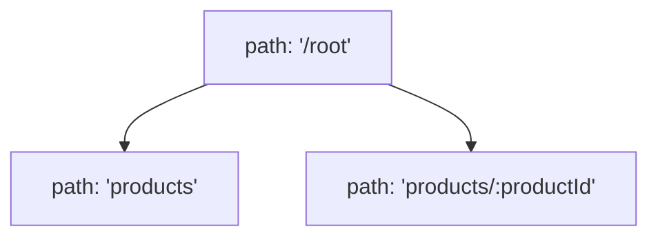

    - **路徑關係**：`product/:productId` 是 `root` 的子路由，同時也是 `products` 的**兄弟路由**
    - **導覽行為**：當使用者位於 `/root/products/product-id` 時，使用 `<Link to="..">` 會觸發以下邏輯：

    1. 識別目前處於 `product/:productId` 路由
    2. 尋找其定義中的父路由（即 `root`）
    3. 將路徑導向父路由路徑 `/root`

    - **[結論]** 因此，這會導致路徑直接移除兩個段落（`/products` 與 `/:productId`），直接跳回根路徑，而非回到預期的兄弟路由 `/root/products`。

### `Link` 組件的 `relative` 屬性進階用法

- **[屬性說明]** `Link` 組件提供 `relative` 屬性，用來控制路徑解析的基準。
- **[兩種解析模式]**
    - **`relative="route"`&#32;(預設值)**：
        - 相對於**路由定義 (route definitions)** 進行解析。
        - 如前所述，若路由結構中當前路由與目標路由是兄弟關係，使用 `..` 可能會直接跳回更上層的父路由。
    - **`relative="path"`**：
        - 相對於**目前瀏覽器中實際的路徑 (currently active path)** 進行解析。
        - 它會直接從目前的 URL 路徑中移除最後一個段落 (segment)。

```javascript
// 在 ProductDetail.js 中使用 relative="path" 實現預期的返回行為
import { Link } from 'react-router-dom';

// ...
<Link to=".." relative="path">Back</Link>
```

- **[行為對比]**
    - **若使用預設值 (`route`)**：在 `/root/products/product-id` 時，`..` 會跳到 `/root`。
    - **若使用&#32;`relative="path"`**：在 `/root/products/product-id` 時，`..` 會移除最後一個段落，導向 `/root/products`。
- **[開發建議]** 在處理複雜的巢狀路由與層級導覽時，應根據需求靈活切換這兩種模式，以確保使用者的導覽體驗符合直覺。

### 相對路徑與絕對路徑的區別

- **[絕對路徑 (Absolute Path)]**
    - 指的是從網域名稱（domain）之後直接開始的路徑，例如 `/products`。
    - **[關鍵特性]** 當使用絕對路徑時，`relative` 屬性**完全沒有影響**，導覽行為始終會指向該絕對路徑。
- **[相對路徑 (Relative Path)]**
    - 指的是相對於目前所在位置的路徑，最常見的例子是使用 `..` 來進行層級跳轉。
    - **[關鍵特性]** `relative` 屬性僅在處理這類相對路徑時，才會用來控制 React Router 的解析行為（決定是相對於路由定義還是相對於目前 URL 路徑）。

---

### 路由配置的調整範例

講者將原本的父路由路徑從 `/root` 修改為 `/`，以展示路由結構改變後的行為：

```javascript
// App.js 中的路由配置修改
const router = createBrowserRouter([
  {
    path: '/', // 原本為 '/root'
    element: <RootLayout />,
    errorElement: <ErrorPage />,
    children: [
      { path: '', element: <HomePage /> },
      { path: 'products', element: <ProductsPage /> },
      { path: 'products/:productId', element: <ProductDetailPage /> }
    ]
  }
]);
```

- **[結果]** 修改後，路由系統依然能正常運作，但路徑結構變得更加扁平，這在理解路徑解析邏輯時是一個重要的對照實驗。

### 絕對路徑 (Absolute Paths)

- **[定義]** 以斜線 `/` 開頭的路徑，代表從應用程式的根目錄 (domain root) 開始計算的路徑。
- **[特性]** 不論使用者目前位於哪一個層級的路由，絕對路徑都會直接跳轉到指定的目標位置。
- **[重要性]** 在設計導覽連結時，正確區分絕對路徑與相對路徑對於確保導覽邏輯的一致性至關重要。

### 路由定義中的空路徑 (Empty Path) 技巧

在定義路由時，可以為某些子路由省略 `path` 屬性。

- **[運作原理]** 若子路由沒有定義 `path`，它將會載入與其父路由相同的路徑。
- **[常見應用情境]** 當我們想要使用一個「包裝佈局（wrapping layout）」路由，但同時希望在該路徑的根部顯示特定的首頁組件時。

```javascript
// App.js 中的路由配置範例
const router = createBrowserRouter([
  {
    path: '/',
    element: <RootLayout />,
    errorElement: <ErrorPage />,
    children: [
      { path: '', element: <HomePage /> }, // 使用空字串作為 path
      { path: 'products', element: <ProductsPage /> },
      { path: 'products/:productId', element: <ProductDetailPage /> }
    ]
  }
]);
```

- **[關鍵細節]** 在上述範例中，`HomePage` 的 `path` 設定為 `''`（空字串），這意味著當使用者訪問 `/` 時，`RootLayout` 會被渲染，且其內部的子路由區域會顯示 `HomePage`。

### 使用索引路由 (Index Route)

除了使用空路徑（`path: ''`）之外，還可以使用 `index` 屬性來定義預設路由。

- **[定義]** 設定 `index: true` 會將該路由轉變為「索引路由」。
- **[運作原理]** 索引路由會在父路由的路徑被激活時，作為預設內容顯示。它不會為 `/products` 或 `/products/:productId` 等特定子路徑載入，僅會在父路由路徑（例如 `/`）完全匹配時被觸發。

```javascript
// App.js 中的路由配置範例
const router = createBrowserRouter([
  {
    path: '/',
    element: <RootLayout />,
    errorElement: <ErrorPage />,
    children: [
      { index: true, element: <HomePage /> }, // 使用 index: true 取代 path: ''
      { path: 'products', element: <ProductsPage /> },
      { path: 'products/:productId', element: <ProductDetailPage /> }
    ]
  }
]);
```

- **[優點]** 這種寫法比使用空字串路徑更具語意化，能清楚表達該組件是作為父路由的預設展示內容。

### 索引路由 (Index Routes) 的應用

除了使用空字串作為路徑 (`path: ''`) 之外，還可以使用 `index` 屬性來定義預設路由。

- **[定義]** 當父路由的路徑被匹配時，若該子路由被標記為 `index: true`，它就會成為預設載入的內容。
- **[優點]** 提供了一種更具語意化且明確的方式來指定「首頁」或「預設視圖」，是處理預設路由的一種替代方案。

```javascript
// App.js 中的路由配置範例
const router = createBrowserRouter([
  {
    path: '/',
    element: <RootLayout />,
    errorElement: <ErrorPage />,
    children: [
      { index: true, element: <HomePage /> }, // 使用 index: true 代替 path: ''
      { path: 'products', element: <ProductsPage /> },
      { path: 'products/:productId', element: <ProductDetailPage /> }
    ]
  }
]);
```

### 路由進階練習專案設定

為了練習更進階的路由功能（特別是資料抓取與提交），將使用一個包含前後端結構的練習專案。

- **專案結構**
    - `backend-api`：一個簡易的後端專案，提供模擬的 API 資料。
    - `react-frontend`：React 前端應用程式。
- **執行步驟與注意事項**
    - 必須在兩個專案資料夾中分別執行 `npm install` 來安裝依賴。
    - **啟動流程**：

        1. 先透過 `npm start` 啟動 `backend-api` 伺服器。
        2. 再透過 `npm start` 啟動 `react-frontend` 開發伺服器。

    - **關鍵要求**：必須確保**兩個伺服器同時處於運行狀態**，前端應用程式才能成功與後端進行資料互動（talk）。
    - **資料特性**：此 Dummy Backend API 不使用任何外部資料庫，而是使用內建的模擬資料。

### 練習專案的後端 API 說明

練習專案中包含一個獨立的後端應用程式，用於模擬真實的開發環境。

- **技術棧**
    - 使用 Node.js 與 Express 框架撰寫
    - **注意**：此部分與 React 無關，開發者無需深入理解其內部邏輯
- **用途與操作**
    - 作為一個 Dummy Backend API，提供模擬的資料供前端使用
    - 開發者只需透過 React 前端發送 HTTP 請求來與此 API 進行互動
    - 不需要手動修改 `backend-api` 資料夾內的任何程式碼

### 練習專案的開發環境設定

- **專案結構與組件**
    - 在 `react-frontend` 資料夾中，已預先建立了一些組件（如 `EventForm.js`, `EventsList.js`, `MainNavigation.js` 等），這些組件將用於本章節的路由練習
    - 這些組件已附帶預設樣式，開發重點將放在路由邏輯而非樣式調整
- **伺服器啟動要求**
    - **必須獨立啟動**：後端伺服器與前端開發伺服器需要分開執行
    - **操作流程**：

        1. 開啟終端機並進入 `backend-api` 資料夾，執行 `npm start` 啟動後端
        2. 另外啟動 `react-frontend` 的開發伺服器

    - **重要性**：只有當兩個伺服器同時處於運行狀態時，前端才能成功與後端 API 進行資料互動

### 練習專案的開發流程與注意事項

為了確保前端應用程式能與模擬的後端 API 正常溝通，必須遵循特定的啟動與維護流程：

- **後端伺服器 (`backend-api`) 的維護**
    - **必須持續運行**：只要還在開發這個專案，後端伺服器就必須保持啟動狀態。
    - **重新啟動時機**：每次回到前端進行開發前，都應確認後端伺服器是否仍在運行；若已停止，需重新進入 `backend-api` 資料夾並執行 `npm start`。
    - **停止方式**：可以使用 `Ctrl + C` 來終止後端程序的運行。
- **前端應用程式 (`react-frontend`) 的啟動**
    - **安裝依賴**：在啟動開發伺服器之前，必須先在 `react-frontend` 資料夾內執行 `npm install` 以安裝所有必要的套件。
    - **啟動開發伺服器**：安裝完成後，透過 `npm start` 啟動前端開發環境。
- **開發環境總結**
    - 必須在**兩個獨立的終端機視窗**中分別操作後端與前端的指令。
    - 前端與後端之間的「對話」(talk) 建立在後端伺服器處於 `up and running` 的基礎之上。

### 路由基礎練習挑戰

- **練習目的**：在學習進階功能前，透過多步驟挑戰來鞏固路由基礎知識
- **練習位置**：位於 `react-frontend/src/App.js` 中的 `// Challenge / Exercise` 區塊
- **核心任務內容**
    - **新增組件**：建立五個新的頁面組件（內容可用簡單的 `<h1>` 標籤）
        - `HomePage`
        - `EventsPage`
        - `EventDetailPage`
        - `NewEventPage`
        - `EditEventPage`
    - **定義路由**：為這五個頁面建立對應的路由與路徑定義
        - `/` $\rightarrow$ `HomePage`
        - `/events` $\rightarrow$ `EventsPage`
        - `/events/<some-id>` $\rightarrow$ `EventDetailPage`
        - `/events/new` $\rightarrow$ `NewEventPage`
        - `/events/<some-id>/edit` $\rightarrow$ `EditEventPage`
    - **佈局與導覽**：
        - 新增一個根佈局（Root Layout），將 `<MainNavigation>` 組件放置在所有頁面組件之上
        - 確保 `MainNavigation` 中的連結在處於「作用中」狀態時能正確接收 `active` class
        - 在 `EventsPage` 中輸出一個虛擬事件列表，且每個列表項都應包含指向其對應 `EventDetailPage` 的連結
        - 在 `EventDetailPage` 中輸出所選事件的 ID
    - **進階挑戰 (BONUS)**：
        - 再新增一個嵌套佈局（Nested Layout），將 `<EventNavigation>` 組件放置在所有 `/events...` 路徑的組件之上

### 路由基礎練習：實作建議

- **自主練習的重要性**
    - 在查看解答之前，應先嘗試獨立完成所有挑戰任務
    - 透過親手實作來最大化學習成效
- **關於加分任務 (Bonus Task)**
    - 最後一個任務可能涉及尚未教授的新技術
    - 若無法完成也無需擔心，後續章節會提供完整的解答與說明

### 路由基礎練習：實作開始

- **第一步：安裝路由套件**
    - 在 `react-frontend` 目錄下執行安裝指令，取得路由功能所需的依賴
        - `npm install react-router-dom`
- **第二步：建立頁面結構**
    - 為了組織程式碼，建立一個全新的 `pages` 資料夾
    - 在 `pages` 資料夾中新增各個頁面組件，首先建立 `HomePage.js`
        - 目錄結構範例：

```text
src/
        pages/
          HomePage.js
```

### 實作頁面組件 (Page Components)

- **建立頁面檔案**
    - 在 `pages` 資料夾下新增以下組件檔案
        - `Home.js` (原 `HomePage.js`)
        - `Events.js` (原 `EventsPage.js`)
        - `EventDetail.js` (原 `EventDetailPage.js`)
        - `NewEvent.js` (原 `NewEventPage.js`)
        - `EditEvent.js` (原 `EditEventPage.js`)
    - **[命名技巧]** 因為檔案已位於 `pages` 資料夾內，檔名可以省略 `Page` 字眼，使目錄看起來更清爽
- **組件基本結構**
    - 每個檔案需包含一個組件函式並進行預設導出（default export），例如在 `Home.js` 中：

```javascript
function Home() {
  return <h1>Home</h1>;
}

export default Home;
```

### 快速實作頁面組件內容

- **實作策略**：為了加快開發速度，可以先為所有頁面組件填入簡單的 `<h1>` 標籤作為佔位符
    - 由於目前的重點在於路由邏輯而非頁面內容，因此內容可以非常簡略
- **實作步驟範例**
    - 在 `Home.js` 中填入：

```javascript
function HomePage() {
      return <h1>HomePage</h1>;
    }

    export default HomePage;
```

    - 接著將此結構複製並套用到其他檔案（如 `Events.js`、`EventDetail.js` 等），並僅需修改標籤內的文字內容即可

### 實作路由與路由定義

- **完成第一階段任務**
    - 已為所有必要的頁面建立組件，包括：
        - `Home.js` $\rightarrow$ `HomePage` 組件
        - `Events.js` $\rightarrow$ `EventsPage` 組件
        - `EventDetail.js` $\rightarrow$ `EventDetailPage` 組件
        - `NewEvent.js` $\rightarrow$ `NewEventPage` 組件
        - `EditEvent.js` $\rightarrow$ `EditEventPage` 組件
- **第二階段任務：建立路由 (Routing)**
    - 目標：定義路由路徑，使應用程式能夠理論上載入這些不同的頁面
    - **實作準備**：從 `react-router-dom` 套件中導入路由相關組件
        - `import { ... } from 'react-router-dom';`

### 實作路由的必要組件與定義方式

- **核心導入組件**
    - `RouterProvider`：用於將定義好的路由套用到應用程式中並啟動路由功能
    - `createBrowserRouter`：用來建立路由器實例的函式
- **實作範例**
    - 導入並初始化路由：

```javascript
import { RouterProvider, createBrowserRouter } from 'react-router-dom';

const router = createBrowserRouter([]);

function App() {
  return <RouterProvider router={router} />;
}

export default App;
```

- **路由定義的兩種風格**
    - **物件陣列方式 (Object-based)**：直接將路由物件傳遞給 `createBrowserRouter` 的參數
    - **JSX 元素方式 (JSX-based)**：使用 `createRoutesFromElements` 函式，配合 JSX 語法來定義路由結構

### 實作多個路由路徑

- **定義路由結構**
    - 使用 `createBrowserRouter` 的物件陣列來配置多個路徑
    - **根路徑 (`/`)**
        - 設定為載入 `HomePage` 組件
    - **事件列表路徑 (`/events`)**
        - 設定為載入 `EventsPage` 組件
- **實作程式碼範例**

```javascript
import { RouterProvider, createBrowserRouter } from 'react-router-dom';
import HomePage from './pages/Home';
import EventsPage from './pages/Events';

const router = createBrowserRouter([
  { path: '/', element: <HomePage /> },
  { path: '/events', element: <EventsPage /> },
]);

function App() {
  return <RouterProvider router={router} />;
}

export default App;
```

### 實作動態路由與特定路徑

- **支援動態 ID 的路由**
    - 為了讓單一路由能支援各種不同的 ID（例如不同的事件 ID），需要使用動態路徑段
    - 在路徑中使用冒號 (`:`) 後接識別碼名稱，例如 `:eventId`
    - 這樣當 URL 變動時（如 `/events/123` 或 `/events/abc`），都會指向同一個組件
- **新增特定功能路徑**
    - 除了動態路由，也可以定義明確的靜態路徑，例如 `/events/new` 用於導向新增事件的頁面
- **實作程式碼範例**

```javascript
const router = createBrowserRouter([
  { path: '/', element: <HomePage /> },
  { path: '/events', element: <EventsPage /> },
  { path: '/events/:eventId', element: <EventDetailPage /> },
  { path: '/events/new', element: <NewEventPage /> },
]);
```

### 路由定義中的路徑衝突風險

- **潛在的匹配衝突**
    - 當同時存在靜態路徑與動態路徑時，可能會發生衝突
    - 例如同時定義了以下兩個路由：
        - `path: '/events/new'` (靜態路徑)
        - `path: '/events/:eventId'` (動態路徑)
    - 若使用者訪問 `/events/new`，React Router 可能會將 `new` 誤認為是 `:eventId` 的值，進而載入動態路由對應的組件，導致靜態路由無法被觸發
- **實作範例中的配置**

```javascript
const router = createBrowserRouter([
  { path: '/', element: <HomePage /> },
  { path: '/events', element: <EventsPage /> },
  { path: '/events/:eventId', element: <EventDetailPage /> },
  { path: '/events/new', element: <NewEventPage /> },
]);
```

    - **注意**：在上述配置中，由於 `:eventId` 的路由定義在 `/events/new` 之前，這可能會導致 `/events/new` 的請求被動態路由攔截。

### React Router 的路徑匹配機制

- **智慧型匹配 (Smart Matching)**
    - React Router 會自動辨識路徑的「具體程度 (Specificity)"
    - 當靜態路徑與動態路徑發生衝突時，它會優先選擇更具體的路由
    - **範例**：若同時定義了以下路徑：
        - `path: '/events/new'` (更具體)
        - `path: '/events/:eventId'` (較模糊)
    - 當使用者訪問 `/events/new` 時，React Router 會正確地匹配到 `/events/new` 而非將 `new` 視為參數
- **開發影響**
    - 開發者不需要刻意為了避免衝突而調整路由定義的先後順序
    - 不需要擔心靜態路由會被動態路由意外覆蓋

### 在動態路徑後添加特定路徑

- **組合動態與靜態路徑**
    - 在動態路徑段（dynamic segment）之後，仍然可以添加硬編碼的靜態路徑段
    - 例如：`/events/:eventId/edit`
    - 這種組合允許應用程式處理特定動作，例如「編輯」某個特定 ID 的資源
- **實作程式碼範例**

```javascript
const router = createBrowserRouter([
  { path: '/', element: <HomePage /> },
  { path: '/events', element: <EventsPage /> },
  { path: '/events/:eventId', element: <EventDetailPage /> },
  { path: '/events/new', element: <NewEventPage /> },
  { path: '/events/:eventId/edit', element: <EditEventPage /> },
]);
```

### 啟動路由系統

- **使用&#32;`RouterProvider`**
    - 必須將建立好的 `router` 物件傳遞給 `RouterProvider` 的 `router` prop
    - 這樣 React Router 才能根據當前的 URL 路徑，渲染對應的組件內容
- **實作程式碼範例**

```javascript
function App() {
  return <RouterProvider router={router} />;
}
```

### 路由配置驗證

- **路徑導覽測試**
    - 透過在瀏覽器網址列手動輸入路徑，可以確認路由系統是否正確運作：
        - `/` $\rightarrow$ 載入首頁 (`HomePage`)
        - `/events` $\rightarrow$ 載入事件列表頁 (`EventsPage`)
        - `/events/e1` (其中 `e1` 為動態 ID) $\rightarrow$ 載入事件詳情頁 (`EventDetailPage`)
        - `/events/e1/edit` $\rightarrow$ 載入編輯事件頁 (`EditEventPage`)
        - `/events/new` $\rightarrow$ 載入新增事件頁 (`NewEventPage`)
- **任務達成**
    - 成功建立並驗證了所有預期的路由路徑，完成了第二階段的任務目標

### 建立根佈局路由 (Root Layout Route)

- **目的**：為了在所有頁面組件上方添加一個統一的 `MainNavigation` 組件
- **實作方式**：建立一個特殊的「父路由」，作為其他所有路由的包裝器
    - 設定路徑為 `/` (slash nothing)
    - 指定一個新的佈局組件作為其 `element`（例如 `RootLayout`）
- **實作結構預覽**

```javascript
const router = createBrowserRouter([
  {
    path: '/',
    element: <RootLayout />,
    children: [
      // 其他所有路由都將作為 RootLayout 的子路由
      { path: '/', element: <HomePage /> },
      { path: 'events', element: <EventsPage /> },
      // ... 其他路由
    ]
  },
]);
```

### RootLayout 組件定義

- 建立一個名為 `RootLayout.js` 的新組件，並將其匯出作為佈局使用

```javascript
// RootLayout.js
function RootLayout() {
  return (
    // 這裡將會包含導覽列以及用於渲染子路由的 Outlet
  );
}

export default RootLayout;
```

### RootLayout 組件實作

- **組件結構**
    - 使用 JSX fragments (`<>...</>`) 或空的標籤來包裹內容
    - 包含統一的導覽列組件 `MainNavigation`
    - 使用 `<main>` 元素作為內容容器（選用，有助於語意化與樣式控制）
- **使用&#32;`Outlet`&#32;渲染子路由**
    - **核心概念**：`Outlet` 是 React Router DOM 提供的一個組件，用來指定子路由（child routes）的內容應該渲染在父佈局中的哪個位置
    - 若未放置 `Outlet`，即便路由匹配成功，子路由的組件內容也不會顯示在畫面上
- **實作程式碼範例**

```javascript
import { Outlet } from 'react-router-dom';
import MainNavigation from '../components/MainNavigation';

function RootLayout() {
  return (
    <>
      <MainNavigation />
      <main>
        <Outlet />
      </main>
    </>
  );
}

export default RootLayout;
```

### 將路由轉換為巢狀結構

- **整合佈局組件**
    - 將原本所有的路由配置移動到 `RootLayout` 的 `children` 陣列中
    - 這樣所有子路由都會自動被 `RootLayout` 包裝，從而共享導覽列等佈局元素
- **路徑優化：從絕對路徑改為相對路徑**
    - 將原本以 `/` 開頭的絕對路徑改寫為相對路徑
    - 相對路徑會根據父路由定義的路徑進行解析，這使得路由結構更具彈性且易於維護

#### 實作程式碼範例

```javascript
const router = createBrowserRouter([
  {
    path: '/',
    element: <RootLayout />,
    children: [
      { path: '/', element: <HomePage /> },
      { path: 'events', element: <EventsPage /> },
      { path: 'events/:eventId', element: <EventDetailPage /> },
      { path: 'events/new', element: <NewEventPage /> },
      { path: 'events/:eventId/edit', element: <EditEventPage /> },
    ]
  },
]);
```

### 使用 Index Route 優化首頁路由

- **概念**：在巢狀路由結構中，可以使用 `index` 屬性來定義當父路由路徑完全匹配時，應該預設渲染的子路由。
- **實作方式**：將原本路徑為 `'/'` 的子路由改為使用 `index: true`
    - 這樣不需要額外定義路徑字串，系統會自動將其視為父路由的預設內容

#### 實作程式碼範例

```javascript
const router = createBrowserRouter([
  {
    path: '/',
    element: <RootLayout />,
    children: [
      { index: true, element: <HomePage /> }, // 使用 index 路由取代 path: '/'
      { path: 'events', element: <EventsPage /> },
      { path: 'events/:eventId', element: <EventDetailPage /> },
      { path: 'events/new', element: <NewEventPage /> },
      { path: 'events/:eventId/edit', element: <EditEventPage /> },
    ]
  },
]);
```

---

### 下一步：為導覽列添加功能性連結

- **目前狀態**：`MainNavigation.js` 目前僅使用傳統的 `<a>` 標籤（anchor elements），這些標籤在 React Router 應用程式中並不具備單頁應用 (SPA) 的導覽特性（會導致頁面重新整理）。
- **目標**：將這些標籤替換為 React Router 的 `Link` 組件，以實現無重新整理的平滑導覽。

### 將 `<a>` 標籤替換為 `Link` 組件

- **目的**：為了實現單頁應用 (SPA) 的無重新整理導覽，必須將導覽列中的傳統 `<a>` 標籤改為 React Router 的 `Link` 組件
- **實作方式**：
    - 從 `react-router-dom` 匯入 `Link` 組件
    - 使用 `to` 屬性來定義連結的目的地
- **使用絕對路徑的重要性**
    - 在導覽列的連結中，建議使用以 `/` 開頭的**絕對路徑**（例如 `to="/"` 或 `to="/events"`）
    - **[為什麼要這樣做？]** 因為絕對路徑會確保導覽始終從根目錄開始解析，而不會根據當前瀏覽器的 URL 路徑進行相對跳轉，從而避免導覽到錯誤層級的問題

#### 實作程式碼範例

```javascript
import { Link } from 'react-router-dom';
import classes from './MainNavigation.module.css';

function MainNavigation() {
  return (
    <header className={classes.header}>
      <nav>
        <ul className={classes.list}>
          <li>
            <Link to="/">Home</Link>
          </li>
          <li>
            <Link to="/events">Events</Link>
          </li>
        </ul>
      </nav>
    </header>
  );
}

export default MainNavigation;
```

### 驗證導覽功能

- 透過在 `MainNavigation` 中實作 `Link` 組件，現在可以順利在各個頁面（如 Home 與 Events）之間進行切換。
- **[注意]** 目前的樣式（styling）尚未調整，後續會進行優化。

### 下一步：實作連結的「啟動」狀態 (Active State)

- **目標**：調整導覽列中的連結，使其能夠根據目前的路由路徑，自動反映出該連結是否為「目前啟動中 (active)」的狀態。
- **目的**：提供視覺回饋，讓使用者清楚知道自己目前正位於應用程式的哪個頁面。

### 使用 `NavLink` 實作啟動狀態 (Active State)

- **目的**：讓導覽列中的連結能夠根據目前的路由路徑，自動反映出該連結是否為「目前啟動中 (active)」的狀態，提供視覺回饋。
- **實作方式**：使用 React Router DOM 提供的 `NavLink` 組件取代一般的 `Link` 組件。

#### `NavLink` 的特性

    - 同樣需要 `to` 屬性來定義目的地。
    - **`className`&#32;屬性**：不同於一般的 `Link`，`NavLink` 的 `className` 可以接收一個**函數**。
        - 這個函數會由 React Router 自動提供一個包含狀態的物件。
        - 可以透過**解構賦值 (destructuring)** 從該物件中取得 `isActive` 屬性。
        - 根據 `isActive` 的布林值，可以動態地決定要套用的 CSS class。

#### 實作程式碼範例

```javascript
import { NavLink } from 'react-router-dom';
import classes from './MainNavigation.module.css';

function MainNavigation() {
  return (
    <header className={classes.header}>
      <nav>
        <ul className={classes.list}>
          <li>
            <NavLink
              to="/"
              className={({ isActive }) =>
                isActive ? classes.active : ''
              }
            >
              Home
            </NavLink>
          </li>
          <li>
            <NavLink
              to="/events"
              className={({ isActive }) =>
                isActive ? classes.active : ''
              }
            >
              Events
            </NavLink>
          </li>
        </ul>
      </nav>
    </header>
  );
}

export default MainNavigation;
```

#### 解決根路徑連結永遠處於啟動狀態的問題

- **[問題描述]** 在實作導覽列時，會發現指向根路徑（`/`）的 Home 連結在任何頁面下都會顯示為啟動狀態。
    - **原因**：React Router 預設的匹配邏輯是檢查路徑的「開頭」。因為所有路徑（如 `/events`）都包含 `/`，所以根路徑連結會被判定為一直處於 `active`。
- **[解決方案]** 使用 `end` 屬性。
    - 在 `NavLink` 上添加 `end` 屬性，可以強制要求路徑必須完全匹配（exact match）才會觸發啟動狀態。

```javascript
<NavLink
  to="/"
  end
  className={({ isActive }) =>
    isActive ? classes.active : undefined
}>
  Home
</NavLink>
```

### 下一步：在 Events 頁面實作事件列表

- **目標**：在 `Events.js` 頁面中輸出一個虛擬的事件列表。
- **實作細節**：
    - 每個列表項目（list item）都必須包含一個指向該事件詳情頁面的連結。
    - **[關鍵點]** 每個連結必須帶有不同的動態 ID（例如 `/events/1`, `/events/2` 等），因為詳情頁面的路由路徑是基於動態 ID 設計的。

#### 待完成的開發任務清單

```text
1. [x] 建立根佈局 (Root Layout)
2. [x] 建立功能正常的導覽列連結 (Working Links)
3. [x] 確保導覽列連結具有 "active" 類別 (Active Class)
4. [x] 解決根路徑連結永遠處於啟動狀態的問題 (End Prop)
5. [x] 驗證導覽功能 (Verify Navigation)
6. [ ] 在 Events 頁面輸出虛擬事件列表，並連結至詳情頁面 (Output Dummy Events List)
7. [ ] 為每個項目提供正確的動態 ID (Dynamic IDs for Event Details)
```

### 在 Events 頁面實作虛擬事件列表

- **[開發目標]** 在 `Events.js` 中輸出一個包含多個項目的列表，每個項目都必須具備唯一的 `id`，以便後續連結至動態路由路徑。
- **定義虛擬資料**
    - 使用一個名為 `DUMMY_EVENTS` 的常數陣列來模擬從後端取得的資料。
    - 每個物件包含 `id`（例如 `'e1'`）與 `title`（例如 `'Some event'`）。

```javascript
const DUMMY_EVENTS = [
  { id: 'e1', title: 'Some event' },
  { id: 'e2', title: 'Another event' },
];
```

- **渲染列表**
    - 使用 `<ul>` 作為容器。
    - 透過 `DUMMY_EVENTS.map()` 迭代陣列，將每個事件物件轉換為 `<li>` 元素。

```javascript
function EventsPage() {
  return (
    <div>
      <h1>Events Page</h1>
      <ul>
        {DUMMY_EVENTS.map((event) => (
          <li key={event.id}>
            {/* 列表內容將在此處擴充 */}
          </li>
        ))}
      </ul>
    </div>
  );
}
```

- **[關鍵點]** 在使用 `map` 產生列表時，必須為每個 `<li>` 提供一個唯一的 `key` 屬性（在此處使用 `event.id`），以協助 React 進行高效的 DOM 更新。

### 在 Events 頁面實作事件連結

- **[開發目標]** 在 `Events.js` 的列表項目 (`<li>`) 中加入連結，引導使用者前往該事件的詳情頁面。
- **必要準備**：必須從 `react-router-dom` 匯入 `Link` 組件。

#### 建立連結的兩種路徑方式

1. **使用絕對路徑 (Absolute Path)**

    - 透過字串模板（Template Literals）明確建構完整路徑。
    - **優點**：路徑非常明確，不論目前處於哪個頁面，連結始終指向正確的位置。
    - **範例**：

```javascript
<Link to={`/events/${event.id}`}>...</Link>
```

2. **使用相對路徑 (Relative Path)**

    - 直接提供動態 ID 作為路徑段。
    - **運作原理**：React Router 會將此路徑段附加到目前正在使用的路由路徑之後。
    - **範例**：

```javascript
<Link to={event.id}>...</Link>
```

```javascript
// Events.js 實作範例
import { Link } from 'react-router-dom';

// ... DUMMY_EVENTS 定義

function EventsPage() {
  return (
    <div>
      <h1>Events Page</h1>
      <ul>
        {DUMMY_EVENTS.map((event) => (
          <li key={event.id}>
            <Link to={`/events/${event.id}`}>
              {event.title}
            </Link>
          </li>
        ))}
      </ul>
    </div>
  );
}

export default EventsPage;
```

### 完成事件列表連結實作

- **[實作結果]** 在 `Events.js` 中，透過將 `event.title` 置於 `<Link>` 標籤之間，成功渲染出可點擊的事件名稱列表。
- **[導覽行為]** 當點擊列表中的項目時，瀏覽器會根據路徑導向對應的事件詳情頁面（例如 `/events/e1`）。

```javascript
// Events.js 最終實作片段
<ul>
  {DUMMY_EVENTS.map((event) => (
    <li key={event.id}>
      <Link to={event.id}>
        {event.title}
      </Link>
    </li>
  ))}
</ul>
```

### 下一步：在詳情頁面獲取動態參數

- **[開發目標]** 在事件詳情頁面（`EventDetailPage`）中，需要顯示目前所選事件的具體 ID。
- **[核心工具]** 使用 React Router DOM 提供的 `useParams` Hook。
    - **用途**：該 Hook 專門用於從當前 URL 路徑中提取動態參數（例如從 `/events/e1` 中提取出 `e1`）。

### 使用 `useParams` 提取動態參數

- **[功能定義]** `useParams` 是一個特殊的 Hook，當在組件函數中呼叫時，可以讓我們存取目前啟動路由的參數。
- **[運作原理]** 它能讀取 URL 中經過編碼的動態路徑段（dynamic path segments）的值。
- **[如何使用]**
    - 透過 `useParams()` 取得一個包含鍵值對（key/value pairs）的物件。
    - **物件的鍵 (Key)**：對應於你在路由定義中使用的識別碼（identifier，即冒號 `:` 後面的名稱）。
    - **物件的值 (Value)**：對應於目前 URL 中該路徑段實際的值。

#### 實作範例：在詳情頁面顯示 ID

假設路由定義為 `path: 'events/:eventId'`，則可以在組件中透過以下方式取得該 ID：

```javascript
import { useParams } from 'react-router-dom';

function EventDetailPage() {
  const params = useParams();

  return (
    <div>
      <h1>Event Detail Page</h1>
      <p>Event ID: {params.eventId}</p>
    </div>
  );
}
```

- **[注意事項]** 存取參數時使用的屬性名稱必須與路由定義中的識別碼完全一致。例如，若定義為 `:eventId`，則必須使用 `params.eventId`；若定義為 `:id`，則應使用 `params.id`。

### 實作巢狀佈局路由 (Nested Layout Route)

- **[任務目標]** 建立一個巢狀路由，將 `EventNavigation` 組件作為所有以 `/events` 開頭之路由的包裝層 (wrapper)。
- **[實作邏輯]**
    - 在路由配置中，將原本獨立的 `/events` 相關路由改為巢狀結構。
    - 使用 `EventNavigation` 組件作為父路由的 `element`。
    - 將原本的事件列表與詳情頁面設為該父路由的 `children`。

```javascript
// App.js 路由配置概念
const router = createBrowserRouter([
  {
    path: '/',
    element: <RootLayout />,
    children: [
      { index: true, element: <HomePage /> },
      {
        path: 'events',
        element: <EventNavigation />,
        children: [
          { index: true, element: <EventsPage /> },
          { path: ':eventId', element: <EventDetailPage /> },
          { path: 'new', element: <NewEventPage /> },
          { path: ':eventId/edit', element: <EditEventPage /> },
        ]
      },
      // ... 其他路由
    ]
  }
]);
```

### 建立事件專屬的佈局路由 (Events Layout Route)

- **[實作邏輯]** 在路由配置中，新增一個路徑為 `events` 的路由定義：
    - **注意路徑寫法**：由於此路由是巢狀在 `RootLayout` 之下，路徑應寫為 `events` 而非 `/events`，以使用相對於父路由的**相對路徑**。
    - 指定一個新的佈局組件作為該路由的 `element`（例如 `EventsRootLayout`），用來承載導覽功能並包含 `Outlet` 以渲染子路由。

```javascript
// App.js 中的路由配置變更
{
  path: 'events',
  element: <EventsRootLayout />
},
```

- **[佈局組件設計]** 新建立的 `EventsRootLayout` 組件邏輯與 `RootLayout` 非常相似：
    - 它會包含專屬的導覽組件（如 `EventNavigation`）。
    - 它必須包含 `<Outlet />` 組件，以便將子路由（如事件列表、事件詳情等）渲染在佈局結構的指定位置。

### 實作事件專屬佈局組件 (EventsRootLayout)

- **[任務目標]** 建立一個包裝層，將 `EventNavigation` 置於所有 `/events` 開頭的路由之上。
- **[實作內容]** 在 `EventsRoot.js` 中定義佈局結構：
    - 匯入 `EventNavigation` 組件。
    - 匯入來自 `react-router-dom` 的 `<Outlet />` 組件。
    - 在 JSX 中將 `<EventNavigation />` 與 `<Outlet />` 並列渲染。

```javascript
import { Outlet } from 'react-router-dom';
import EventNavigation from '../components/EventNavigation';

function EventsRootLayout() {
  return (
    <main>
      <EventNavigation />
      <Outlet />
    </main>
  );
}

export default EventsRootLayout;
```

- **[關鍵機制：`<Outlet />`]**
    - `<Outlet />` 在此充當一個「佔位符 (marker)"
    - 它告訴 React Router：當子路由（如事件列表或詳情頁）被匹配時，應將其內容渲染在這個特定位置。

### 將路由移動至巢狀結構 (Moving Routes to Nested Structure)

- **[實作步驟]** 將所有需要套用 `EventsRootLayout` 的路由，從根路由的 `children` 移至新路由的 `children` 屬性中：
    - 在 `App.js` 的 `events` 路由定義中，新增 `children` 陣列。
    - 將原本位於根層級的事件相關路由（如 `EventsPage`、`EventDetailPage` 等）移動到此陣列內。
- **[路徑調整：從絕對路徑轉為相對路徑]**
    - 當路由成為父路由的子路由時，必須移除路徑中重複的父路徑段，改用**相對路徑**。
    - **[為什麼要這樣做？]** 因為 React Router 會自動將父路徑與子路徑組合起來。如果子路徑仍使用絕對路徑（例如 `/events/events`），會導致路徑錯誤。

```javascript
// App.js 路由配置調整範例
{
  path: 'events',
  element: <EventsRootLayout />,
  children: [
    { index: true, element: <EventsPage /> },          // 對應 /events
    { path: ':eventId', element: <EventDetailPage /> }, // 對應 /events/:eventId
    { path: 'new', element: <NewEventPage /> },       // 對應 /events/new
    { path: ':eventId/edit', element: <EditEventPage /> } // 對應 /events/:eventId/edit
  ]
}
```

- **[路徑組合邏輯]**
    - 最終的完整 URL 路徑是由父路由路徑與子路由路徑組合而成。
    - 例如：父路徑 `events` + 子路徑 `:eventId` $\rightarrow$ `/events/:eventId`

### 使用 Index Route 優化事件首頁

- **[實作內容]** 將 `events` 路由下的第一個路徑（原本為 `path: 'events'` 或類似定義）改寫為 `index` 路由。
- **[目的]** 當使用者訪問父路徑 `/events` 時，會自動渲染這個被標記為 `index: true` 的組件。

```javascript
// App.js 中的路由配置
{
  path: 'events',
  element: <EventsRootLayout />,
  children: [
    { index: true, element: <EventsPage /> }, // 這是 index 路由，對應 /events
    { path: ':eventId', element: <EventDetailPage /> },
    // ... 其他路由
  ]
}
```

### 巢狀佈局路由的視覺效果

- **[運作機制]** 由於所有事件路由現在都是 `EventsRootLayout` 的子路由，它們現在都會共享該佈局組件提供的 UI。
- **[目前的狀態]** 所有的事件頁面現在都會顯示 `EventNavigation` 組件，雖然目前樣式尚不完善，但結構已經建立完成。

### 修正 `EventNavigation` 中的連結

- **[發現問題]** 目前 `EventNavigation.js` 中使用的是傳統的 `<a>` 標籤，這會導致頁面重新整理，無法利用 React Router 的單頁應用 (SPA) 優勢。
- **[下一步目標]** 需要將這些 `<a>` 標籤替換為 React Router 的 `<Link>` 組件，以實現流暢的導覽體驗。

```javascript
// 目前 EventNavigation.js 中的實作（需修正）
function EventNavigation() {
  return (
    <header className={classes.header}>
      <nav>
        <ul className={classes.list}>
          <li><a href="/events">All Events</a></li>
          <li><a href="/events/new">New Event</a></li>
        </ul>
      </nav>
    </header>
  );
}
```

### 在 `EventsNavigation` 中實作 `NavLink` 與啟動狀態

- **[替換標籤]** 將原本的 `<a>` 標籤替換為 `NavLink`，並使用絕對路徑（以 `/` 開頭）以確保導覽正確。
- **[實作啟動狀態]** 利用 `NavLink` 的 `className` 屬性接收一個函數，透過解構賦值取得 `isActive` 狀態，從而動態套用樣式。

```javascript
// EventsNavigation.js
import { NavLink } from 'react-router-dom';
import classes from './EventsNavigation.module.css';

function EventsNavigation() {
  return (
    <header className={classes.header}>
      <nav>
        <ul className={classes.list}>
          <li>
            <NavLink
              to="/events"
              className={({ isActive }) =>
                isActive ? classes.active : undefined
              }
            >
              All Events
            </NavLink>
          </li>
          <li>
            <NavLink
              to="/events/new"
              className={({ isActive }) =>
                isActive ? classes.active : undefined
              }
            >
              New Event
            </NavLink>
          </li>
        </ul>
      </nav>
    </header>
  );
}

export default EventsNavigation;
```

### 使用 `end` 屬性精確控制啟動狀態

- **[問題]** 由於 React Router 預設會檢查路徑的開頭，若不設定，指向 `/events` 的連結在訪問 `/events/new` 時也會被判定為 `active`。
- **[解決方案]** 在 `NavLink` 上添加 `end` 屬性，確保該連結僅在 URL 與其 `to` 路徑完全一致時才顯示為啟動狀態。

```javascript
// EventsNavigation.js 中的實作
<NavLink
  to="/events"
  end
  className={({ isActive }) =>
    isActive ? classes.active : undefined
  }
>
  All Events
</NavLink>
```

### 練習總結

- 已完成所有設定的挑戰與任務，包括：
    - 建立根佈局路由 (Root Layout Route)
    - 使用 `Link` 與 `NavLink` 實作導覽
    - 處理啟動狀態 (Active State) 與 `end` 屬性
    - 建立虛擬事件列表與動態路由連結
    - 實作巢狀佈局路由 (Nested Layout Route)
- **[下一步]** 即將進入更進階的新功能學習階段。

### React Router 進階功能：資料獲取與提交

- **[核心功能]** React Router 提供了一套強大的功能集，專門處理應用程式中的資料獲取（Data Fetching）與表單提交（Submission）流程。
- **[實作範例]** 使用 `events.js` 作為練習檔案，該組件展示了如何利用 React 的 Hook 來處理非同步請求：
    - 使用 `useState` 管理載入狀態 (`isLoading`)、獲取到的資料 (`fetchedEvents`) 以及錯誤訊息 (`error`)。
    - 在 `useEffect` 中執行非同步函式 `fetchEvents`，透過 `fetch` API 從後端取得資料。

```javascript
// events.js 核心邏輯摘要
import { useEffect, useState } from 'react';
import EventsList from '../components/EventsList';

function EventsPage() {
  const [isLoading, setIsLoading] = useState(false);
  const [fetchedEvents, setFetchedEvents] = useState([]);
  const [error, setError] = useState();

  useEffect(() => {
    async function fetchEvents() {
      setIsLoading(true);
      const response = await fetch('http://localhost:8000/events');

      if (response.ok) {
        const resData = await response.json();
        setFetchedEvents(resData.events);
      } else {
        setError('Fetching events failed.');
      }
      setIsLoading(false);
    }

    fetchEvents();
  }, []);

  // ... 渲染邏輯
}
```

### `events.js` 非同步請求流程詳解

在處理從後端 API 獲取的資料時，需要透過 `useState` 同時管理以下三種狀態，以確保 UI 的完整性：

- **載入狀態 (`isLoading`)**：
    - 在發送請求前將其設為 `true`，請求結束後設為 `false`。
    - **[用途]** 用於在介面上顯示「載入中...」的提示文字。
- **錯誤狀態 (`error`)**：
    - 當 API 回應不符合預期（例如 `response.ok` 為 `false`）時，將錯誤訊息存入此狀態。
    - **[用途]** 用於向使用者顯示錯誤訊息。
- **資料狀態 (`fetchedEvents`)**：
    - 當請求成功時，從回應中提取 JSON 資料並存入此狀態。
    - **[用途]** 用於渲染最終取得的事件列表。

#### 請求邏輯實作流程

```javascript
// events.js 邏輯流程圖解
async function fetchEvents() {
  setIsLoading(true); // 1. 開始載入
  const response = await fetch('http://localhost:8000/events');

  if (response.ok) {
    // 2. 請求成功：提取資料
    const resData = await response.json();
    setFetchedEvents(resData.events);
  } else {
    // 3. 請求失敗：記錄錯誤
    setError('Fetching events failed.');
  }
  setIsLoading(false); // 4. 結束載入
}
```

#### UI 渲染邏輯

根據上述狀態，組件會進行條件式渲染：

| 狀態條件 | 顯示內容 |
| --- | --- |
| isLoading 為 true | 顯示 <p>Loading...</p> |
| error 有值 | 顯示 <p>error</p> |
| isLoading 為 false 且有資料 | 渲染 <EventsList events={fetchedEvents} /> |

### `Events.js` 的實作細節與樣板程式碼問題

- **資料來源與渲染**：
    - 事件資料是從 dummy backend 獲取的。
    - 使用 `EventsList` 組件來渲染這些從後端取得的事件資料。
- **[問題點] 樣板程式碼 (Boilerplate Code)**：
    - 雖然使用 `useEffect` 搭配 `fetch` API 處理非同步請求是正確且常見的做法，但這種模式存在大量的重複性程式碼。
    - **[影響]** 每當需要從後端獲取新資料時，開發者都必須重複撰寫類似的狀態管理（`isLoading`, `error`, `data`）與非同步邏輯，這增加了維護成本並使組件變得臃程式碼臃腫。

### 減少樣板程式碼的優化方案

- **[解決方案] 建立 Custom Hook**：
    - 由於處理 HTTP 請求狀態（`isLoading`, `error`, `data`）需要撰寫大量重複的程式碼，可以將這些邏輯抽離出來，封裝成一個自定義的 Hook。
    - **[優點]** 這樣可以將邏輯「外包」出去，讓組件本身保持簡潔，並在不同組件間重複使用相同的請求邏輯。

### 非同步請求的觸發時機

- **延遲發送請求**：
    - 在目前的實作中，請求並不會在應用程式啟動時立即發送。
    - **[機制]** 只有當使用者透過路由導覽至該特定頁面（例如 `EventsPage`）時，組件才會掛載，進而觸發 `useEffect` 中的非同步請求。
    - 這確保了只有在需要顯示該頁面資料時，才會消耗網路資源。

### 非同步請求的渲染順序問題

- **目前的實作機制**：
    - 必須等整個頁面組件（如 `EventsPage`）完全渲染完成後，才會觸發 `useEffect` 並發送 API 請求。
- **潛在問題**：
    - **[效能瓶頸]** 在複雜的應用程式中，頁面可能包含大量的嵌套子組件。等待所有組件渲染與評估完成才開始抓取資料，會導致使用者體驗上的延遲。
- **[優化方向]** 更理想的作法是讓 React Router 在使用者開始導覽（navigation）的瞬間，就立即啟動資料獲取流程，而不是等到組件掛載後。

### React Router 的資料獲取優化

- **目前的實作流程（基於&#32;`useEffect`）**：
    - 1. 導覽至頁面 $\rightarrow$ 2. 組件掛載 $\rightarrow$ 3. 渲染組件（顯示載入狀態） $\rightarrow$ 4. 觸發 `useEffect` 發送請求 $\rightarrow$ 5. 取得資料後重新渲染（顯示實際內容）。
    - **[缺點]** 使用者會先看到載入狀態，然後才看到資料，存在渲染上的落差。
- **React Router (v6+) 的優化方案**：
    - **[核心概念]** 在組件渲染**之前**就先進行資料獲取。
    - **[流程]** 導覽開始 $\rightarrow$ 立即啟動資料獲取 $\rightarrow$ 資料準備就緒 $\rightarrow$ 直接渲染帶有完整資料的組件。
    - **[優點]**
        - 減少了先顯示載入狀態 (loading state fallback) 的過程。
        - 簡化了開發者需要撰寫的樣板程式碼，因為 React Router 會協助處理資料獲取與各種狀態（如載入中、錯誤）的邏輯。

### 使用 `loader` 優化資料獲取

- **[核心概念]** React Router 提供了一個額外的屬性 `loader`，可以直接添加到路由定義中。
- **[運作機制]**
    - `loader` 屬性接收一個函式作為值（可以是常規函式或非同步函式）。
    - **[觸發時機]** 當使用者準備訪問該路由時，React Router 會立即執行這個函式。
- **[優勢]** 這種方式能讓資料在組件渲染之前就已獲取完成，避免了先顯示載入狀態、再顯示資料的兩階段渲染過程。

#### 在路由配置中實作 `loader`

在 `createBrowserRouter` 的路由物件陣列中，可以針對特定路徑加入 `loader` 屬性。例如，在 `EventsPage` 的路由配置中：

```javascript
{
  path: 'events',
  element: <EventsRootLayout />,
  children: [
    {
      index: true,
      element: <EventsPage />,
      loader: () => { /* 執行資料獲取的函式 */ }
    },
    // ... 其他子路由
  ]
}
```

### 將資料獲取邏輯遷移至 `loader`

- **[運作機制]** `loader` 函式會在該路由對應的 JSX 組件渲染**之前**，由 React Router 自動觸發並執行。
- **[實作方式]** 可以將原本在組件中使用 `useEffect` 進行的 `fetch` 邏輯，直接移動到路由配置的 `loader` 屬性中。
- **[程式碼調整]** 由於 `fetch` 是非同步操作，在 `loader` 函式中必須使用 `async` 關鍵字，以便能使用 `await` 來處理非同步請求。

#### 遷移範例

將原本位於 `Events.js` 組件內的邏輯，改寫至 `App.js` 的路由配置中：

```javascript
// 在 App.js 的路由定義中
{
  path: 'events',
  element: <EventsRootLayout />,
  children: [
    {
      index: true,
      element: <EventsPage />,
      loader: async () => {
        const response = await fetch('http://localhost:8080/events');
        if (response.ok) {
          const resData = await response.json();
          return resData.events;
        } else {
          throw new Error('Fetching events failed.');
        }
      }
    }
  ]
}
```

#### 使用 `loader` 的優點與資料傳遞

- **[程式碼可讀性]** 使用 `async/await` 語法比傳統的 `.then()` 鏈式調用更容易閱讀與維護。
- **[簡化狀態管理]**
    - 在 `loader` 模式下，不再需要手動在組件中使用 `useState` 來儲存從 API 獲取的資料。
    - 透過 `loader` 獲取資料後，不再需要處理「先設定載入狀態，再設定資料」的繁瑣過程。
- **[自動資料傳遞機制]**
    - **[核心行為]** React Router 會自動捕捉 `loader` 函式所回傳的任何值（例如 `resData.events`）。
    - **[資料流向]** 這些回傳的值會被自動傳遞給該路由所對應的組件，讓組件可以直接使用這些資料，而不需要透過複雜的狀態提升或 Props 傳遞。

### 精確回傳 `loader` 的資料

- **[資料結構匹配]** 在 `loader` 函式中回傳資料時，必須確保回傳的內容與組件預期的格式一致。
- **[實作細節]** 由於後端 API 的回應物件（`resData`）中，實際的資料陣列是存放在 `events` 屬性下，因此必須明確指定回傳該屬性。

#### `loader` 實作範例

```javascript
// 在 App.js 的路由定義中
{
  path: 'events',
  element: <EventsRootLayout />,
  children: [
    {
      index: true,
      element: <EventsPage />,
      loader: async () => {
        const response = await fetch('http://localhost:8080/events');
        if (response.ok) {
          const resData = await response.json();
          // 注意：必須回傳 resData.events 而非整個 resData
          // 因為 API 回傳的結構是 { events: [...] }
          return resData.events;
        } else {
          throw new Error('Fetching events failed.');
        }
      }
    }
  ]
}
```

- **[資料可用性]** 一旦透過 `return resData.events` 正確回傳，該資料就會自動變得可用於 `EventsPage` 以及任何需要該資料的子組件。

### 在組件中使用 `loader` 的資料

- **[獲取資料]** 要使用 `loader` 取得的資料，必須在需要該資料的組件內部進行處理。
- **[簡化組件邏輯]** 當改用 `loader` 模式後，可以移除組件中原本為了處理非同步請求而撰寫的繁瑣邏輯：
    - 移除 `useState`（不再需要手動管理 `isLoading`、`error` 或 `fetchedEvents` 狀態）。
    - 移除 `useEffect`（不再需要在組件掛載時觸發 `fetch` 函式）。
    - 移除手動處理載入中（Loading...）與錯誤（Error）狀態的條件渲染判斷。

#### 程式碼重構範例

將原本複雜的 `EventsPage` 組件簡化為僅負責渲染的純粹組件：

```javascript
// 重構後的 Events.js
import EventsList from '../components/EventsList';

function EventsPage() {
  // 原本的 useState 與 useEffect 邏輯皆已移除
  return <EventsList events={fetchedEvents} />;
}

export default EventsPage;
```

- **[注意]** 雖然在目前的範例中我們移除了這些狀態檢查，但實務上我們仍會透過 React Router 的其他機制（如 `useNavigation` 或 `Error Boundary`）來處理載入與錯誤狀態。

### 使用 `useLoaderData` 獲取資料

- **[核心 Hook]** 可以從 `react-router-dom` 中匯入 `useLoaderData`。
- **[功能]** 這是一個特殊的 Hook，用於獲取「最近的祖先 (closest ancestor)」路由所提供的 `loader` 資料。
- **[實作方式]** 在組件中呼叫 `useLoaderData()` 即可取得該路由層級所回傳的資料內容。

#### `useLoaderData` 實作範例

在 `Events.js` 組件中，透過此 Hook 取得 `loader` 回傳的事件列表：

```javascript
import { useLoaderData } from 'react-router-dom';
import EventsList from '../components/EventsList';

function EventsPage() {
  // 取得最近祖先路由 loader 回傳的資料
  const events = useLoaderData();

  return <EventsList events={events} />;
}

export default EventsPage;
```

- **[變數命名建議]** 雖然變數名稱可以自訂，但根據 `loader` 的邏輯（例如回傳的是事件列表），將變數命名為 `events` 會讓程式碼更具可讀性。

### `loader` 與非同步資料處理機制

- **[Promise 自動化處理]** 在 `loader` 函式中使用 `async/await` 時，該函式會回傳一個 Promise
    - React Router 會自動檢查回傳值是否為 Promise
    - 如果是，它會自動等待 Promise 解析（resolve）並提取最終資料
- **[使用&#32;`useLoaderData`&#32;的優勢]** 因為 React Router 已經處理了非同步等待過程，開發者在使用 `useLoaderData` 時：
    - 不需要擔心資料是否還在載入中（Promise 狀態）
    - 可以直接取得 Promise 解析後的最終結果（例如一個陣列或物件）

#### 重構後的 `Events.js` 最終狀態

透過結合 `loader` 與 `useLoaderData`，組件變得極其簡潔，只需負責將資料傳遞給子組件：

```javascript
import { useLoaderData } from 'react-router-dom';
import EventsList from '../components/EventsList';

function EventsPage() {
  // 直接取得 loader 解析後的 events 陣列
  const events = useLoaderData();

  return <EventsList events={events} />;
}

export default EventsPage;
```

- **[結果]** 這種模式達到了與原本使用 `useEffect` 相同的功能，但大幅減少了樣板程式碼，並讓資料流向更加清晰。

### 使用 `loader` 重構的優點總結

透過將非同步邏輯從組件內移至 `loader`，實作上獲得了以下改進：

- **[程式碼精簡]** 大幅減少了樣板程式碼，不再需要在組件內撰寫複雜的 `useState` 與 `useEffect` 邏輯。
- **[關注點分離]** 非同步資料獲取的邏輯不再屬於組件函式的一部分，使組件功能更純粹，僅專注於渲染。
- **[易於維護]** 組件函式變得更精簡（leaner），邏輯更容易推導與理解。
- **[資料流一致性]** 即使後端回傳多筆資料（例如多個事件物件），`loader` 也能統一處理並透過 `useLoaderData` 提供給組件，確保了資料處理的一致性。

### `useLoaderData` 的使用範圍

- **[靈活性]** `useLoaderData` 不僅限於在直接由該路由渲染的「頁面組件」中使用
- **[子組件存取]** 也可以直接在該路由下的任何「子組件」中呼叫此 Hook
    - **[原理]** 只要該組件位於該路由的渲染層級內，就能透過 `useLoaderData` 取得最近祖先路由提供的資料

#### 實作對比

**方式 A：在頁面組件中使用（目前的做法）**

將資料從頁面組件取得後，再透過 props 傳遞給子組件：

```javascript
// Events.js (頁面組件)
import { useLoaderData } from 'react-router-dom';
import EventsList from '../components/EventsList';

function EventsPage() {
  const events = useLoaderData();

  return <EventsList events={events} />;
}
```

**方式 B：直接在子組件中使用（更簡潔的做法）**

跳過 props 傳遞，直接在子組件內部呼叫 Hook：

```javascript
// EventsList.js (子組件)
import { useLoaderData } from 'react-router-dom';

function EventsList({ events }) { // 這裡的 events prop 可以被移除
  // ...
}
```

### `useLoaderData` 的使用限制與範圍

- **[組件類型無差異]** 在 React Router 的視角下，頁面組件（Page components）與一般組件（Other components）在功能上並沒有本質上的區別
    - **[實作範例]** 在 `EventsList.js` 中直接使用 `useLoaderData` 是完全可行的，只要移除原本嘗試從 props 解構的邏輯即可：

```javascript
import { useLoaderData } from 'react-router-dom';
import classes from './EventsList.module.css';

function EventsList() {
  const events = useLoaderData();

  return (
    <div className={classes.events}>
      <h1>All Events</h1>
      <ul className={classes.list}>
        {events.map((event) => (
          <li key={event.id} className={classes.item}>
            <a href="...">

              <div className={classes.content}>
                <h2>{event.title}</h2>
                <time>{event.date}</time>
              </div>
            </a>
          </li>
        ))}
      </ul>
    </div>
  );
}

export default EventsList;
```

- **[資料存取的層級限制]** `useLoaderData` 只能取得「目前路由層級」或「其子層級」所提供的資料
    - **[無法存取的場景]** 無法在比當前路由更高層級的路由（Higher level route）中使用該資料
        - 例如：在 `RootLayout` 組件中，無法取得屬於其子路由（如 `/events`）所定義的 `loader` 資料

### `useLoaderData` 在佈局組件中的失效情境

- **[錯誤嘗試]** 在高層級的佈局組件（如 `RootLayout`）中呼叫 `useLoaderData` 並試圖取得深層路由的資料
    - **[實作程式碼]** 在 `Root.js` 中進行嘗試：

```javascript
// Root.js
import { Outlet, useLoaderData } from 'react-router-dom';
import MainNavigation from '../components/MainNavigation';

function RootLayout() {
  const events = useLoaderData(); // 這裡會得到 undefined
  console.log(events);

  return (
    <main>
      <MainNavigation />
      <Outlet />
    </main>
  );
}

export default RootLayout;
```

- **[失效原因]** 路由資料的存取是「向下」而非「向上」的
    - `useLoaderData` 的機制是尋找「最近的祖先」路由提供的資料
    - 在 `RootLayout` 層級，它無法「看見」或存取定義在更深層級（如 `/events`）路由中的 `loader` 資料
    - 因此，當你在高層級路由嘗試取得低層級路由的資料時，結果會是 `undefined`

### `useLoaderData` 的資料存取範圍

- **[核心原則]** 你可以在添加了 `loader` 的路由組件，以及該組件層級相同或更低層級（子組件）的任何組件中使用 `useLoaderData` 取得資料。
- **[實作重構]** 講者示範了將資料獲取邏輯從子組件移回父組件的過程：
    - **原本做法**：在 `EventsList.js` 內部直接呼叫 `useLoaderData`。
    - **調整後做法**：在 `EventsPage.js` 呼叫 `useLoaderData` 並透過 props 將資料傳遞給 `EventsList`。

```javascript
// EventsPage.js (重構後)
import { useLoaderData } from 'react-router-dom';
import EventsList from '../components/EventsList';

function EventsPage() {
  const events = useLoaderData();

  return <EventsList events={events} />;
}

export default EventsPage;
```

```javascript
// EventsList.js (重構後)
// 透過 props 解構取得 events，不再依賴 useLoaderData
function EventsList({ events }) {
  // ... 渲染邏輯
}
```

### 使用 `useLoaderData` 的注意事項

- **[確保層級匹配]** 使用 `useLoaderData` 時必須非常小心，確保組件所在的路由層級與資料獲取的層級一致
    - **[潛在風險]** 如果在比資料獲取位置（fetch location）更高的層級（higher level）誤用 `useLoaderData`，將無法取得正確的資料

### `App.js` 中定義 `loader` 的考量

- **[潛在缺點]** 將所有 `loader` 都寫在 `App.js` 可能會導致該檔案變得臃腫（bloated)
    - 特別是當應用程式擁有越來越多的路由與對應的 `loader` 時
- **[另一種觀點]** 有人認為資料獲取的邏輯應該屬於該頁面組件（例如 `EventsPage.js`），而非 `App.js`
- **[推薦模式]** 在路由配置層級（如 `App.js`）定義 `loader` 是一個常見且推薦的做法
    - 這樣可以將「路由路徑」、「對應組件」與「該路由所需的資料獲取邏輯」集中在一起管理

```javascript
// App.js 中的路由配置範例
const router = createBrowserRouter([
  {
    path: '/events',
    element: <EventsRootLayout />,
    children: [
      {
        index: true,
        element: <EventsPage />,
        loader: async () => {
          const response = await fetch('http://localhost:8080/events');
          if (!response.ok) {
            // ... 錯誤處理
          } else {
            const resData = await response.json();
            return resData.events;
          }
        },
      },
      // ... 其他子路由
    ],
  },
]);
```

### 模組化 `loader` 邏輯

為了避免 `App.js` 過於臃腫，可以將資料獲取的邏輯直接定義在對應的頁面組件檔案中。

- **[實作方式]** 在頁面組件（如 `pages/Events.js`）中匯出一個函式（名稱不一定要叫 `loader`）：
    - 使用 `async/await` 處理非同步請求
    - 執行資料獲取並回傳結果
- **[路由配置]** 在 `App.js` 中，匯入該函式並在路由物件中使用。建議使用別名（alias）以避免名稱衝突。

```javascript
// pages/Events.js
export function loader() {
  const response = await fetch('http://localhost:8080/events');
  if (response.ok) {
    const resData = await response.json();
    return resData.events;
  }
}

export default function EventsPage() {
  // ...
}
```

```javascript
// App.js
import { loader as eventsLoader } from './pages/Events';

const router = createBrowserRouter([
  {
    path: '/events',
    element: <EventsRootLayout />,
    children: [
      {
        index: true,
        element: <EventsPage />,
        loader: eventsLoader,
      },
    ],
  },
]);
```

### 最佳實踐：模組化 `loader` 邏輯

透過將 `loader` 函式定義在具體的頁面組件檔案中，可以同時達成兩個目標：

- **`App.js`&#32;保持精簡**：不再包含複雜的資料獲取邏輯，僅作為路由配置的中心點。
- **頁面組件保持精簡且職責明確**：將資料獲取邏輯外包（outsource）給獨立的函式，且該函式在邏輯上更靠近實際需要該資料的組件。

這種結構被視為「兩全其美」（best of both worlds）的配置方式。

```javascript
// App.js 中的路由配置範例
import { loader as eventsLoader } from './pages/Events';

const router = createBrowserRouter([
  {
    path: 'events',
    element: <EventsRootLayout />,
    children: [
      {
        index: true,
        element: <EventsPage />,
        loader: eventsLoader, // 使用別名作為指標指向匯出的 loader 函式
      },
      // ...
    ],
  },
]);
```

- **[運作原理]** 在 `App.js` 中使用的 `eventsLoader` 僅僅是一個指向在 `events.js` 中定義並匯出的函式的「指標」（pointer）。

### `loader` 的執行時機

- **[執行時點]** `loader` 函式是在**開始導覽到該頁面時**立即被呼叫
    - 它並非在頁面組件（Page Component）渲染完成後才執行
    - 這意味著在組件顯示之前，資料獲取的過程就已經啟動或完成

### 資料流向範例：從後端到前端

透過觀察後端 API 的實作，可以理解資料是如何被提供的：

```javascript
// backend/routes/events.js
const express = require('express');
const router = express.Router();

router.get('/', async (req, res, next) => {
  try {
    const events = await getAll();
    res.json({ events: events });
  } catch (error) {
    next(error);
  }
});
```

- **[後端流程]** 當前端發出請求時，後端路由會執行非同步邏輯（如 `getAll()`）
- **[回傳資料]** 使用 `res.json()` 將結果以 JSON 格式回傳給前端
- **[前端接收]** 前端的 `loader` 接收到這個回應，並將資料傳遞給對應的頁面組件使用

### 模擬後端 API 延遲

- **[目的]** 透過在後端加入延遲，可以模擬真實網路環境中的非同步請求過程，觀察前端在資料尚未回傳前的反應。
- **[實作方式]** 使用 `setTimeout` 將原本的回傳邏輯（如 `res.json()`）包裹在回調函式中。

```javascript
// backend/routes/events.js
router.get('/', async (req, res, next) => {
  try {
    const events = await getAll();
    // 模擬 1.5 秒的網路延遲
    setTimeout(() => {
      res.json({ events: events });
    }, 1500);
  } catch (error) {
    next(error);
  }
});
```

- **[前端觀察]** 當使用者在前端點擊導覽連結（例如從 Home 切換到 Events）時，由於後端還在執行 `setTimeout` 的倒數，前端頁面在短時間內會看起來「沒有反應」，直到延遲結束且資料回傳後，內容才會顯示。

### 非同步資料獲取的體驗問題

- **[使用者感知]** 當應用程式正在從後端獲取資料時，若沒有適當的處理，會產生一段延遲，這會讓使用者感覺到應用程式似乎「沒有反應」。
- **[改善方向]** React Router 提供了多種工具，可以用來在資料載入期間提供視覺回饋，改善使用者體驗。

### 路由轉換狀態的視覺回饋

- **[問題點]** 當使用者點擊導覽連結（例如從 Home 切換到 Events）時，若後端有延遲，頁面會看起來像沒有反應，造成使用者體驗不佳。
- **[解決方案]** 使用 React Router 提供的 `useNavigation` Hook 來監測目前的路由轉換（transition）狀態。

#### `useNavigation` Hook

- **[功能]** 允許開發者得知應用程式目前是否正處於一個活躍的轉換過程中，例如是否正在載入資料。
- **[使用位置]** 通常可以在根佈局組件（Root Layout Component）中使用，以便在整個應用程式層級監測導覽狀態。

```javascript
// 在 RootLayout 組件中使用 useNavigation 的範例概念
import { useNavigation, Outlet } from 'react-router-dom';

function RootLayout() {
  const navigation = useNavigation();

  // navigation 物件包含了目前的轉換狀態
  // 例如：navigation.state 可以判斷是 'idle' 還是 'loading'

  return (
    <main>
      <Outlet />
    </main>
  );
}
```

- **[狀態判斷]** 透過 `navigation` 物件，可以區分以下情況：
    - **正在進行轉換**：正在等待資料到達。
    - **轉換完成**：目前沒有任何活躍的轉換過程。

### `useNavigation` 的 `state` 屬性

當呼叫 `useNavigation()` 時，回傳的 `navigation` 物件包含多個屬性，其中對於 UI 回饋最關鍵的是 `state`。

- **`state`&#32;屬性**：這是一個字串，代表目前的路由轉換狀態
    - `idle`：目前沒有任何活躍的路由轉換過程
    - `loading`：正在進行活躍的轉換，且正在載入資料
    - `submitting`：正在提交資料（這部分將在後續章節討論）

#### 實作載入中的視覺回饋

可以根據 `navigation.state` 是否等於 `loading` 來決定是否顯示載入文字，以提升使用者在等待資料時的體驗。

```javascript
// 在 RootLayout 組件中的實作範例
import { Outlet, useNavigation } from 'react-router-dom';
import MainNavigation from '../components/MainNavigation';

function RootLayout() {
  const navigation = useNavigation();

  return (
    <>
      <MainNavigation />
      <main>
        {navigation.state === 'loading' && <p>Loading...</p>}
        <Outlet />
      </main>
    </>
  );
}
```

- **[運作邏輯]** 當使用者點擊連結觸發路由轉換時，`navigation.state` 會變為 `loading`，此時 `<p>Loading...</p>` 會被渲染在畫面中；直到資料載入完成，狀態回到 `idle`，載入文字便會消失。

### 載入指示器的實作與觀察

- **[視覺回饋]** 當使用者點擊導覽連結（例如從 Home 切換到 Events）時，畫面上會出現 `Loading...` 文字，這向使用者傳達了應用程式正在處理請求的訊號。
- **[實作位置]** 由於該邏輯是寫在 `RootLayout` 組件中，因此載入指示器會出現在 `<main>` 標籤內，這意味著它會直接影響到頁面內容的渲染位置。

```javascript
// Root.js 實作邏輯
function RootLayout() {
  const navigation = useNavigation();

  return (
    <>
      <MainNavigation />
      <main>
        {navigation.state === 'loading' && <p>Loading...</p>}
        <Outlet />
      </main>
    </>
  );
}
```

- **[優缺點分析]**
    - **優點**：簡單直接，能有效告知使用者「正在載入中」。
    - **缺點**：樣式可能不夠完美（例如只是簡單的文字），且因為它是在佈局層級渲染，載入文字會佔據頁面內容的位置，而非像頂部進度條那樣獨立存在。

### 移除後端模擬延遲

- **[目的]** 為了停止模擬網路延遲，讓 API 回應恢復到原本的即時狀態。
- **[操作]** 移除後端程式碼中的 `setTimeout` 邏輯，並重新啟動後端伺服器。

```javascript
// 原本用於模擬延遲的程式碼範例 (需移除)
try {
  const events = await getAll();
  setTimeout(() => {
    res.json({ events: events });
  }, 1500);
} catch (error) {
  next(error);
}
```

### Loader 的資料回傳特性

Loader 是 React Router 的核心功能之一，用於在路由轉換時獲取資料。

- **[資料靈活性]** Loader 可以回傳任何類型的資料，這取決於應用程式的需求：
    - 陣列 (Array)
    - 數字 (Number)
    - 字串 (Text/String)
    - 物件 (Object)
    - Response 物件
- **[實作範例]** 在 `Events.js` 中，loader 透過 `fetch` 取得資料，並從 JSON 回應中提取 `events` 屬性作為回傳值：

```javascript
export async function loader() {
  const response = await fetch('http://localhost:8000/events');

  if (response.ok) {
    // ...
  } else {
    const resData = await response.json();
    return resData.events;
  }
}
```

- **[運作邏輯]** 在此範例中，loader 回傳的是一個陣列（來自 `resData.events`），這使得該路由組件可以直接使用這些事件資料。

### 在 Loader 中建立 Response 物件

除了回傳純資料外，也可以在 loader 中直接建立並回傳瀏覽器內建的 `Response` 物件。

- **[實作方式]** 使用 `new Response()` 建構函式來建立一個新的回應物件：

```javascript
export async function loader() {
  const response = await fetch('http://localhost:8000/events');

  if (response.ok) {
    // ...
  } else {
    const resData = await response.json();
    // 建立一個新的 Response 物件回傳
    const res = new Response();
    return res;
  }
}
```

- **[執行環境關鍵點]**
    - 雖然 loader 的邏輯看起來像是在處理伺服器回應，但這段程式碼**並非在伺服器上執行**。
    - loader 的程式碼仍然是在**瀏覽器（client-side）**中運行的。之所以能使用 `new Response()`，是因為現代瀏覽器本身就內建了這個建構函式。

### `Response` 建構函式的進階用法

`Response` 建構函式不僅可以接收資料作為第一個參數，還能透過第二個參數傳入一個配置物件來進行更詳細的設定。

- **[配置參數]** 第二個參數可以用來設定 HTTP 狀態碼（status code）或其他回應標頭。
- **[實作範例]** 在 `loader` 中建立一個帶有特定狀態碼的 `Response` 物件：

```javascript
// 在 loader 函式中
const res = new Response('any data', { status: 201 });
return res;
```

### `useLoaderData` 與 `Response` 的自動整合

React Router 在處理 `loader` 的回傳值時，具備自動解析 `Response` 物件的能力。

- **[自動提取機制]** 當你在 `loader` 中回傳一個 `Response` 物件時，React Router 會自動從該回應中提取資料。
- **[開發者體驗]** 這意味著即使 `loader` 回傳的是完整的 `Response` 物件，你在組件中使用 `useLoaderData()` 取得的依然是該回應中所包含的實際資料內容。

### `fetch` 與 `Response` 物件的整合

在 `loader` 函式中，使用瀏覽器內建的 `fetch` API 是非常常見的實作方式。

- **[運作流程]**
    - `fetch` 函式會回傳一個 `Promise`，該 Promise 解析（resolve）後會得到一個 `Response` 物件。
    - 由於 React Router 支援 `Response` 物件，並且具備自動提取資料的功能，開發者可以直接將 `fetch` 的結果回傳。
- **[程式碼實作範例]**

  在 `Events.js` 中，透過 `fetch` 取得資料並處理回應：

```javascript
export async function loader() {
  const response = await fetch('http://localhost:8000/events');

  if (response.ok) {
    // ...
  } else {
    const resData = await response.json();
    // 建立一個新的 Response 物件回傳
    const res = new Response('any data', { status: 201 });
    return res;
  }
}
```

- **[開發優勢]**
    - 這種做法結合了 `fetch` 的非同步特性與 React Router 的自動化機制，使得程式碼既簡潔又能有效地處理 HTTP 狀態碼與資料提取。

### 簡化 Loader 的資料回傳

在 `loader` 函式中，不需要手動將 Response 轉換為 JSON 並提取資料，可以直接回傳整個 `Response` 物件。

- **[自動解析機制]**
    - React Router 具備自動解析 `Response` 物件的能力。
    - 使用 `useLoaderData` 時，它會自動提供該回應中所包含的實際資料內容。
- **[實作方式]**
    - 無論是否檢查 `response.ok`，都可以直接回傳 `response`。

```javascript
export async function loader() {
  const response = await fetch('http://localhost:8000/events');

  if (response.ok) {
    // ...
  } else {
    // ...
  }

  return response;
}
```

### 在組件中使用 `useLoaderData` 提取資料

當 `loader` 直接回傳 `Response` 物件時，`useLoaderData` 取得的是該回應解析後的資料物件。如果後端回傳的 JSON 結構包含特定的 key，則需要從該物件中提取。

- **[資料結構解析]**
    - 若後端回傳的 JSON 是 `{ "events": [...] }`，則 `useLoaderData()` 會回傳這個物件。
    - 因此，必須透過 `data.events` 來存取實際的事件陣列。

```javascript
function EventsPage() {
  const data = useLoaderData();
  const events = data.events;

  return <EventsList events={events} />;
}
```

### 利用 React Router 的內建支援簡化 Loader

在 `loader` 函式中，可以直接利用 React Router 對 `Response` 物件的內建支援，這使得處理非同步請求變得更加直覺。

- **[實作優勢]** 不需要手動從 `Response` 中提取 JSON 資料，直接將 `fetch` 產生的回應物件回傳即可。
- **[程式碼範例]** 在 `Events.js` 中簡潔的實作方式：

```javascript
export async function loader() {
  const response = await fetch('http://localhost:8000/events');

  if (response.ok) {
    return response;
  } else {
    const resData = await response.json();
    return new Response('any data', { status: 201 });
  }
}
```

- **[運作原理]** 由於 React Router 的 `loader` 函式支援這種特殊的回傳物件，它會自動解析並處理這些 `Response` 物件，讓開發者能更有效地管理 HTTP 狀態與資料流。

### Loader 的執行環境

- **[執行位置]** loader 函式的程式碼是在**瀏覽器（Browser）**中執行的，而非伺服器端
    - 儘管其邏輯看起來很像後端程式碼，但它與 React 應用程式是緊密結合的
- **[瀏覽器 API 的使用]** 因為是在瀏覽器環境執行，所以可以在 loader 中直接使用任何瀏覽器提供的 API
    - 例如：
        - `localStorage`：存取本地儲存資料
        - `cookies`：處理 Cookie
        - 其他 Web API：如 `location` 或 `WebGL` 等

### Loader 的功能限制

雖然 `loader` 函式在瀏覽器環境中執行，但它與 React 組件有本質上的區別。

- **[無法使用 React Hooks]**
    - 在 `loader` 函式中**不能**使用如 `useState` 或其他 React Hooks
    - **原因**：React Hooks 的設計規範要求它們必須在 React 組件（或自定義 Hook）的執行週期內使用，而 `loader` 僅是一個普通的非同步 JavaScript 函式，並非 React 組件。
- **[可使用的功能]**
    - 除了 React Hooks 之外，任何其他的預設瀏覽器功能（Default Browser Features）與 Web API 都可以直接在 `loader` 中使用。

### Loader 的錯誤處理

當進行資料獲取（Data Fetching）時，請求可能會失敗（例如 HTTP 狀態碼為 400 或 500 系列）。在 React Router 的模式下，我們不再需要像以前使用 `useEffect` 那樣手動管理錯誤狀態，而是可以在 `loader` 中直接處理。

- **[處理策略]** 當 `response.ok` 為 `false` 時，可以選擇回傳不同的內容來通知組件發生錯誤
    - 回傳一個新的 `Response` 物件
    - 或者直接回傳一個普通的 JavaScript 物件，其中包含錯誤資訊（例如 `isError` 旗標與 `message`）
- **[程式碼範例]** 在 `Events.js` 中實作錯誤回傳的邏輯：

```javascript
export async function loader() {
  const response = await fetch('http://localhost:8000/events');

  if (!response.ok) {
    return { isError: true, message: 'Something went wrong!' };
  } else {
    return response;
  }
}
```

### 在組件中處理 Loader 回傳的錯誤資料

透過在 `loader` 中預先處理錯誤並回傳包含錯誤資訊的物件，可以讓頁面組件保持極度簡潔，只需專注於根據資料內容進行條件渲染。

- **[實作邏輯]** 在組件內部，直接檢查從 `useLoaderData` 取得的資料物件中是否存在錯誤屬性（例如 `isError`）
- **[程式碼範例]** 在 `Events.js` 中的精簡實作：

```javascript
function EventsPage() {
  const data = useLoaderData();
  const events = data.events;

  if (data.isError) {
    return <p>{data.message}</p>;
  }

  return <EventsList events={events} />;
}

export async function loader() {
  const response = await fetch('http://localhost:8000/events');

  if (!response.ok) {
    return { isError: true, message: 'Could not fetch events.' };
  } else {
    return response;
  }
}
```

- **[優點]**
    - **組件邏輯精簡**：不需要在組件中使用 `useState` 或 `useEffect` 來管理載入中或錯誤狀態。
    - **職責分離**：錯誤的產生與判斷邏輯被封裝在 `loader` 函式中，組件僅負責根據結果進行 UI 呈現。

### Loader 錯誤處理的替代方案

除了回傳包含錯誤訊息的物件（如 `{ isError: true, message: '...' }`）之外，還有一種更直接的方法。

- **[拋出錯誤 (Throwing an Error)]**
    - 在 `loader` 中直接使用 `throw new Error()`。
    - **[運作機制]** 當 `loader` 拋出錯誤時，React Router 會捕捉到這個錯誤，並自動跳轉到最近的錯誤邊界 (Error Boundary) 進行渲染，而不是嘗試執行原本的組件邏輯。
- **[程式碼範例]** 在 `Events.js` 中改用拋出錯誤的方式：

```javascript
export async function loader() {
  const response = await fetch('http://localhost:8000/eventsdsfdsfs');

  if (!response.ok) {
    throw new Error('Could not fetch events.');
  } else {
    return response;
  }
}
```

- **[兩種方式的對比]**
    - **回傳錯誤物件**：需要在組件內撰寫 `if (data.isError)` 等邏輯來判斷並顯示錯誤 UI。
    - **拋出錯誤**：邏輯更為集中，組件本身不需要處理錯誤判斷，錯誤會被導向專門處理錯誤的組件（Error Boundary）。

### Loader 錯誤處理的進階行為

除了回傳錯誤物件外，還可以使用 JavaScript 內建的 `Error` 建構函式來拋出錯誤，這能讓錯誤處理更加直觀。

- **[拋出錯誤的方式]**
    - 可以拋出一個 `Error` 物件，並在其中包含錯誤訊息。
    - 也可以拋出任何其他類型的物件作為錯誤。
- **[React Router 的自動處理機制]**
    - **[運作流程]** 當 `loader` 拋出錯誤時，React Router 會捕捉到該錯誤，並自動渲染距離該錯誤最近的 `errorElement`。
    - **[應用範例]** 如果在根路由（root route）定義了 `errorElement`，當導航到不支援的路徑（例如 404 錯誤）時，該錯誤頁面就會被顯示出來。

### `errorElement` 的全域錯誤捕捉機制

`errorElement` 的功能不僅限於提供無效路徑的備用頁面（fallback page），它更是一個強大的錯誤處理機制。

- **[核心功能]** 當任何與路由相關的程式碼（例如 `loader` 函式）產生錯誤時，React Router 都會自動捕捉該錯誤，並渲染指定的 `errorElement` 組件。
- **[實作步驟]**

    1. 建立專門的錯誤頁面組件（例如 `ErrorPage.js`）。
    2. 在路由配置物件中，透過 `errorElement` 屬性指定該組件。

- **[程式碼範例]**

首先，建立 `pages/Error.js`：

```javascript
function ErrorPage() {
  return <h1>An error occurred!</h1>;
}

export default ErrorPage;
```

接著，在 `App.js` 的路由配置中加入 `errorElement`：

```javascript
const router = createBrowserRouter([
  {
    path: '/',
    element: <RootLayout />,
    errorElement: <ErrorPage />,
    children: [
      // ... 其他路由配置
    ]
  }
]);
```

- **[重要特性]** 透過在頂層路由（如 `/`）配置 `errorElement`，可以確保應用程式在任何深層級的路由發生錯誤時，都能有一個統一且優雅的錯誤呈現方式。

### 路由錯誤的冒泡機制

React Router 的錯誤處理機制遵循類似 DOM 事件的「冒泡 (Bubbling)」原理。

- **[冒泡行為]**
    - 當某個路由（即使是深層嵌套的子路由）的 `loader` 或組件本身發生錯誤時，該錯誤會沿著路由層級結構向上傳遞。
    - 錯誤會一直向上尋找，直到遇到第一個定義了 `errorElement` 屬性的路由為止。
- **[實作層級的差異]**
    - **全域處理**：如果在根路由（Root Route）配置了 `errorElement`，則應用程式中任何位置發生的路由錯誤都會被捕捉，並顯示該全域錯誤頁面。
    - **局部處理**：如果在特定的子路由上也配置了 `errorElement`，則該錯誤會被該子路由的邊界攔截，而不會冒泡到更上層。這允許針對不同功能模組提供更精確的錯誤 UI。
- **[程式碼範例]** 在 `App.js` 中配置根路徑的錯誤處理：

```javascript
const router = createBrowserRouter([
  {
    path: '/',
    element: <RootLayout />,
    errorElement: <ErrorPage />,
    children: [
      {
        path: 'events',
        element: <EventsPage />,
        loader: eventsLoader,
        // 如果在這裡也加上 errorElement，錯誤就不會冒泡到 RootLayout 的 ErrorPage
        // errorElement: <EventsErrorPage />
      },
      // ... 其他路由
    ]
  }
]);
```

### 路由錯誤的冒泡與驗證

- **[錯誤冒泡機制]**
    - 當深層嵌套路由（例如 `/events`）發生錯誤時，該錯誤會向上冒泡。
    - 錯誤會持續向上尋找，直到遇到最近的 `errorElement` 為止。
- **[實作驗證]**
    - 在根路由配置 `errorElement: <ErrorPage />` 後：
        - 訪問無效路由（例如 `/abc`）會顯示錯誤頁面。
        - 訪問已存在的路由但其 `loader` 發生錯誤（例如 `/events`）時，同樣會觸發該錯誤頁面。
- **[程式碼實作參考]**

```javascript
const router = createBrowserRouter([
  {
    path: '/',
    element: <RootLayout />,
    errorElement: <ErrorPage />,
    children: [
      { index: true, element: <HomePage /> },
      {
        path: 'events',
        element: <EventsLayout />,
        children: [
          {
            index: true,
            element: <EventsPage />,
            loader: eventsLoader,
          },
          // ... 其他子路由
        ]
      }
    ]
  }
]);
```

### 優化錯誤頁面的視覺呈現

為了提升錯誤頁面的使用者體驗，可以使用一個輔助組件 `PageContent` 來統一管理頁面內容的樣式。

- **`PageContent`&#32;組件的使用方式**
    - 透過 `title` prop 來設定頁面標題
    - 使用組件的 `children` 來傳入額外的內容（如段落 `<p>`）
- **[實作範例]** 在 `ErrorPage.js` 中整合 `PageContent`：

```javascript
import PageContent from '../components/PageContent';

function ErrorPage() {
  return (
    <PageContent title="An error occurred!">
      <p>這裡可以放置錯誤的詳細描述文字...</p>
    </PageContent>
  );
}

export default ErrorPage;
```

### 進階錯誤處理：區分錯誤類型

- **[優化目標]** 區分 404 (Not Found) 錯誤與來自 `loader` 的其他邏輯錯誤（如 API 請求失敗）。
- **[解決方案]** 不再只是拋出一個普通的物件，而是拋出一個帶有資料的 `Response` 物件。
- **[實作細節]** 若要將物件放入 Response 中，必須使用 `JSON.stringify()` 將其轉換為字串。
- **[程式碼範例]** 在 `loader` 中拋出自定義錯誤訊息：

```javascript
export async function loader() {
  const response = await fetch('http://localhost:8000/eventsdsfdsfs');

  if (response.ok) {
    return { isError: true, message: 'Could not fetch events.' };
  } else {
    // 拋出一個 Response 物件，並將錯誤訊息包裝在 JSON 字串中
    throw new Response(JSON.stringify({ message: 'Could not fetch events.' }));
  }
}
```

### 使用 Response 狀態碼精確傳遞錯誤

- **[優化做法]** 在拋出錯誤時，利用 `Response` 建構函式的第二個參數來設定 HTTP 狀態碼
    - 例如設定為 `500`，可以明確表示後端發生了錯誤
- **[程式碼實作]** 在 `loader` 中拋出帶有狀態碼的 Response：

```javascript
export async function loader() {
  const response = await fetch('http://localhost:8000/eventsdsfdsfs');

  if (response.ok) {
    return { isError: true, message: 'Could not fetch events.' };
  } else {
    // 使用第二個參數設定 status，例如 500
    throw new Response(JSON.stringify({ message: 'Could not fetch events.' }), {
      status: 500
    });
  }
}
```

### 使用 `useRouteError` 獲取錯誤資訊

- **[核心概念]** 當 `loader` 拋出錯誤時，React Router 會渲染最近的 `errorElement`。若要在該錯誤頁面中讀取錯誤的具體內容，可以使用 `useRouteError` Hook
- **[功能說明]** `useRouteError` 會回傳被拋出的錯誤物件，讓開發者能根據錯誤類型（如 API 錯誤或 404）進行不同的 UI 呈現
- **[Hook 匯入方式]**

```javascript
import { useRouteError } from 'react-router-dom';

function ErrorPage() {
  const error = useRouteError();
  // 透過 error 物件獲取詳細資訊
  // ...
}
```

### `useRouteError` 回傳物件的結構差異

`useRouteError` 獲取的 `error` 物件形狀會根據 `loader` 拋出（throw）的內容類型而有所不同：

- **若拋出的是&#32;`Response`&#32;物件**
    - `error` 物件會包含一個 `status` 欄位
    - 此欄位會反映該 `Response` 的 HTTP 狀態碼（例如在範例中設定為 `500`）
- **若拋出的是一般 JavaScript 物件**
    - `error` 物件會直接等於該被拋出的物件本身
    - 此時 `error` 物件中**不會**包含特殊的 `status` 屬性

**[程式碼範例]** 觀察 `loader` 拋出 `Response` 與 `error` 物件的關係：

```javascript
export async function loader() {
  const response = await fetch('http://localhost:8000/eventsdsfdsfs');

  if (response.ok) {
    return { isError: true, message: 'Could not fetch events.' };
  } else {
    // 拋出 Response 物件，包含 status: 500
    throw new Response(JSON.stringify({ message: 'Could not fetch events.' }), {
      status: 500
    });
  }
}
```

當上述 `loader` 觸發錯誤時，在 `ErrorPage` 組件中透過 `useRouteError` 取得的 `error` 會如下所示：

```javascript
// 若拋出 Response (status: 500)
const error = {
  status: 500,
  // ... 其他 Response 屬性
};

// 若拋出普通物件 { message: 'Error' }
const error = {
  message: 'Error'
  // 沒有 status 屬性
};
```

### 建立通用的錯誤處理組件

- **[為什麼使用 Response 物件]** 因為 `Response` 物件包含 `status` 屬性，這讓開發者可以根據不同的錯誤類型（如 404 或 500）來顯示更精確的錯誤訊息
- **[實作邏輯]** 在錯誤頁面組件中，可以先設定預設的標題與訊息，再根據 `error.status` 的值進行覆寫
- **[程式碼實作]** 在 `ErrorPage.js` 中根據狀態碼動態調整內容：

```javascript
import { useRouteError } from 'react-router-dom';
import PageContent from '../components/PageContent';

function ErrorPage() {
  const error = useRouteError();
  let title = 'An error occurred!';
  let message = 'Something went wrong!';

  if (error.status === 500) {
    title = 'Server Error';
    message = 'Could not fetch events.';
  }

  return (
    <PageContent title={title}>
      <p>{message}</p>
    </PageContent>
  );
}

export default ErrorPage;
```

### 透過 `error.data` 提取詳細錯誤訊息

- **[核心概念]** 當我們拋出一個包含資料的 `Response` 物件時，React Router 會將這些資料封裝在 `error.data` 屬性中
- **[實作方式]** 可以透過 `error.data.message` 來取得在 `loader` 中定義的具體錯誤文字
- **[程式碼實作]** 更新 `ErrorPage` 以顯示更精確的訊息：

```javascript
// ... 前略
  if (error.status === 500) {
    title = 'Server Error';
    // 從 error.data 中提取 loader 拋出的 message
    message = error.data.message;
  }
// ... 後略
```

### 處理特定的 HTTP 狀態碼

除了處理 500 伺服器錯誤外，也可以針對其他狀態碼進行判斷：

- **404 Not Found**
    - 當使用者輸入不存在的路由路徑時，React Router 預設會拋出 404 錯誤
    - 可以透過 `if (error.status === 404)` 來捕捉此情況，並顯示「找不到頁面」等相關訊息

### 完善 `ErrorPage` 的錯誤呈現邏輯

- **[實作細節]** 根據不同的 `error.status` 提供對應的 UI 內容：
    - **500 (Server Error)**：顯示伺服器錯誤訊息
    - **404 (Not Found)**：顯示「找不到資源或頁面」的訊息
- **[重要注意事項]** 存取 `error.data` 時的資料型態處理：
    - **[原因]** 由於 `error.data` 接收到的內容可能是 JSON 格式的字串，若不轉換，將無法直接透過點運算子（`.`）存取其屬性
    - **[做法]** 必須先使用 `JSON.parse()` 將其轉換回 JavaScript 物件
- **[程式碼實作]** 更新後的 `ErrorPage.js` 邏輯：

```javascript
function ErrorPage() {
  const error = useRouteError();
  let title = 'An error occurred!';
  let message = 'Something went wrong!';

  if (error.status === 500) {
    // 必須先解析 JSON 字串才能存取 message 屬性
    const parsedData = JSON.parse(error.data);
    message = parsedData.message;
  }

  if (error.status === 404) {
    title = 'Not found';
    message = 'Could not find resource or page.';
  }

  return (
    <PageContent title={title}>
      <p>{message}</p>
    </PageContent>
  );
}
```

### 驗證全域錯誤處理機制

- **[行為觀察]** 透過目前的錯誤處理邏輯，應用程式能針對不同錯誤情境顯示對應內容：
    - **伺服器錯誤**：訪問 `/events` 時，顯示「An error occurred! Could not fetch events.」
    - **無效路由**：輸入不存在的 URL 時，顯示「Not found. Could not find resource or page.」
- **[設計模式]** 這種做法的核心在於利用 React Router 的內建特性：
    - 在程式碼出錯的地方（例如 `loader`）主動拋出 `Response` 物件
    - 在根路由（Root Route）配置 `errorElement` 作為統一的攔截點
- **[未來優化方向]**
    - 可以考慮在錯誤頁面中加入 `MainNavigation` 組件，讓使用者在遇到錯誤時仍能透過導覽列回到其他頁面，而不必手動輸入 URL

### 提升錯誤處理的使用者體驗

- **[設計觀念]** 當使用者遇到錯誤頁面時，提供導覽連結（例如「回到首頁」）比僅顯示錯誤訊息更具友善性
    - 這能讓使用者在發生錯誤後，有明確的下一步可以進行，而不是被迫重新整理或關閉瀏覽器

---

### 修正 `events.js` 中的路徑錯誤

- **[修復動作]** 修正 `events.js` 中的 fetch 路徑，以恢復正常的資料抓取功能
- **[程式碼實作]** 修正後的 `loader` 邏輯應確保 URL 指向正確的 API 端點：

```javascript
export async function loader() {
  const response = await fetch('http://localhost:8000/events');
  if (response.ok) return response;

  // ... 錯誤處理邏輯
}
```

### 使用 `json` 輔助工具簡化 Response 建立

在 React Router 中，手動建立 Response 物件（特別是在拋出錯誤時）可能會顯得繁瑣且容易出錯。

- **[傳統做法]** 手動將資料轉換為 JSON 字串並建立 Response：

```javascript
// 較為繁瑣且容易寫錯
  throw new Response(JSON.stringify({ message: 'Could not fetch events.' }), {
    status: 500,
  });
```

- **[推薦做法]** 使用 `json` 輔助函式：
    - 可以從 `react-router-dom` 中匯入
    - 它會自動處理資料的序列化（Serialization）以及設定正確的 `Content-Type` 標頭

**[程式碼實作]** 使用 `json` 簡化後的 `loader` 邏輯：

```javascript
import { json } from 'react-router-dom';

export async function loader() {
  const response = await fetch('http://localhost:8000/events');

  if (response.ok) return response;

  // 使用 json() 函式直接回傳包含錯誤訊息的 Response 物件
  throw json(
    { isError: true, message: 'Could not fetch events.' },
    { status: 500 }
  );
}
```

### 使用 `json` 輔助工具的優勢

使用 `json` 函式不僅能減少程式碼量，還能簡化資料在組件中的使用流程。

- **[簡化建立流程]** 直接傳入想要包含在 Response 中的資料（例如一個物件），無需手動呼叫 `JSON.stringify()`。
- **[設定 Metadata]** 可以透過第二個參數來設定 Response 的額外屬性，例如 HTTP 狀態碼：

```javascript
// 第二個參數用於設定 status 等 metadata
throw json(
  { isError: true, message: 'Could not fetch events.' },
  { status: 500 }
);
```

- **[簡化資料讀取]**
    - **[傳統做法]** 如果是手動建立 Response，在組件端接收時通常需要手動解析 JSON 字串。
    - **[優化後]** 使用 `json` 工具後，React Router 會自動處理解析工作，組件可以直接存取解析後的資料物件，程式碼變得更簡潔：

```javascript
// 不需要手動 JSON.parse，直接存取屬性即可
if (error.status === 500) {
  message = error.data.message;
}
```

### 錯誤處理的簡化與實務應用

- **[開發效率]** 使用 `json` 輔助函式不僅能簡化程式碼，在處理無效 URL 或 API 錯誤時，能以極少的程式碼量達成與手動建立 `Response` 物件相同的效果。
- **[實務觀察]** 當 `loader` 嘗試向錯誤的端點發送請求時，透過 `throw json(...)` 拋出的錯誤會被路由層級的 `errorElement` 捕捉，並能直接提取出定義好的錯誤資訊，這使得開發者在處理複雜的錯誤情境時，能保持 `loader` 邏輯的簡潔與一致性。

### 從錨點元素轉換為 `<Link>` 組件

為了實現無重新整理的客戶端導航，需要將 `EventsList.js` 中的傳統 `<a>` 標籤替換為 `react-router-dom` 提供的 `<Link>` 組件。

- **[實作步驟]**
    - 從 `react-router-dom` 匯入 `Link` 組件。
    - 將原本用於導覽的 `<a>` 標籤及其閉合標籤 `</a>` 替換為 `<Link>` 與 `</Link>`。
    - 將 `href` 屬性更改為 `to` 屬性，以符合 `<Link>` 的規範。
- **[程式碼實作]** 轉換後的 `EventsList.js` 結構如下：

```javascript
import { useLoaderData } from 'react-router-dom';
import classes from './EventsList.module.css';

function EventsList({ events }) {
  return (
    <div className={classes.events}>
      <h1>All Events</h1>
      <ul className={classes.list}>
        {events.map((event) => (
          <li key={event.id} className={classes.item}>
            <Link to={`/events/${event.id}`}>

              <div className={classes.content}>
                <h2>{event.title}</h2>
                <time>{event.date}</time>
              </div>
            </Link>
          </li>
        ))}
      </ul>
    </div>
  );
}
```

- **[為什麼要這樣做？]**
    - 使用 `<Link>` 可以讓 React Router 接管導航流程，僅更新必要的組件而非重新載入整個頁面，提供更快速的使用者體驗。

### 使用相對路徑進行導覽

在實作導覽連結時，可以使用相對路徑，這會讓路徑相對於目前活躍路由（currently active route）的路徑進行延伸。

- **[運作原理]** 當使用相對路徑時，React Router 會將該路徑附加到目前路由的路徑末端。例如，如果目前處於 `events` 頁面，使用相對路徑會直接跳轉至該路徑下的子路由。
- **[實作範例]** 在 `EventsList.js` 中，透過將 `event.id` 附加到相對路徑，可以輕鬆導向特定的事件詳情頁面：

```javascript
// 在 EventsList.js 中使用相對路徑導向子路由
<Link to={`event/${event.id}`}>
  <div className={classes.content}>
    <h2>{event.title}</h2>
    <time>{event.date}</time>
  </div>
</Link>
```

- **[路由結構對照]** 根據 `App.js` 的路由定義，這種導覽方式能正確對應到嵌套的子路由結構：

```javascript
// App.js 中的路由配置示意
{
  path: 'events',
  element: <EventsRootLayout />,
  children: [
    {
      index: true,
      element: <EventsPage />
    },
    {
      path: 'event/:eventId',
      element: <EventDetailPage />
    }
  ]
}
```

    - **[路徑拼接過程]** 當使用者在 `events` 頁面點擊連結時：
        - 目前路徑：`/events`
        - 相對路徑：`event/123`
        - 最終導向：`/events/event/123`

> **提示**：使用相對路徑可以避免在組件中寫死完整的絕對路徑，使組件在路由結構調整時更具彈性。

### 實作產品詳情頁面 (Event Detail Page)

當使用者點擊某個事件後，會跳轉到對應的詳情頁面。在該頁面中，目標是呈現該事件的完整資訊。

- **[渲染目標]** 在 `EventDetail` 組件中渲染預先定義好的 `EventItem` 組件。
- **[資料傳遞]** 必須將取得的事件資料透過 `event` prop 傳遞給 `EventItem`：

```javascript
// 在 EventDetail 組件中
<EventItem event={event} />
```

- **[傳統的資料獲取邏輯]**
    - 在組件內部使用 `useParams` 取得 URL 中的 ID。
    - 使用 `useEffect` 搭配 `fetch` 或其他 HTTP 請求工具來取得資料。
    - **[缺點]** 這種方式會導致組件先渲染（顯示空白或載入狀態），然後才開始抓取資料，體驗較不連貫。

### 實作事件詳情頁面的 `loader` 邏輯

為了讓 `EventDetailPage` 能夠顯示特定事件的資訊，必須在該組件檔案中定義一個專屬的 `loader` 函式，負責從後端 API 抓取資料。

- **[實作步驟]**
    - 將 `loader` 定義為 `async function`，以便處理非同步的資料請求。
    - 使用內建的 `fetch` 函式向後端 API 發送請求。
    - 請求路徑需包含特定的事件 ID（例如：`http://localhost:8080/events/${id}`）。
- **[程式碼實作]**

```javascript
// 在 EventDetail.js 中實作非同步 loader
import EventItem from '../components/EventItem';

function EventDetailPage() {
  return <EventItem event={?} />;
}

export default EventDetailPage;

export async function loader() {
  // 這裡將會使用 await 來等待 fetch 的結果
  // 請求目標為：http://localhost:8080/events/ 與事件 ID 的組合
  fetch('http://localhost:8080/events/');
}
```

- **[下一步重點]**
    - 如何在 `loader` 函式內部取得 URL 中的動態參數（例如 `eventId`），以便精確請求該事件的資料。

### 在 `loader` 中取得路由參數

在 `EventDetailPage` 組件中，我們需要根據 URL 中的 ID 來抓取特定資料。雖然在組件內部可以使用 `useParams` Hook，但 **Hook 不能在&#32;`loader`&#32;函式中使用**。

- **[解決方案]** React Router 在執行 `loader` 時，會自動將一個物件作為參數傳遞給該函式
- **[參數物件內容]** 該物件包含兩個關鍵屬性：
    - `request`: 包含完整的 HTTP 請求物件，可用於存取 URL 等資訊
    - `params`: 包含所有路由動態參數的物件（例如 `eventId`）
- **[程式碼實作]** 修改 `loader` 以接收並使用這些參數：

```javascript
// 在 EventDetail.js 中
export async function loader({ request, params }) {
  // params 包含了從 URL 取得的動態參數
  // 例如：params.eventId
  fetch(`http://localhost:8080/events/${params.eventId}`);
}
```

> **注意**：`loader` 的參數是由 React Router 自動注入的，開發者只需透過解構賦值（destructuring）即可輕鬆取得所需資料。

### 在 `loader` 中使用 `params` 進行資料請求

為了根據 URL 中的動態路徑段（如 `:eventId`）來抓取特定的資料，必須在 `loader` 函式中使用傳入的 `params` 物件。

- **[參數存取]**
    - `loader` 會接收一個包含 `request` 與 `params` 的物件。
    - 透過 `params` 物件，可以直接存取路由定義中所有動態段的名稱與對應的值。
- **[實作邏輯]**
    - 從 `params` 中解構出所需的參數（例如 `eventId`）。
    - 將該參數組合進 `fetch` 的 URL 字串中，以向後端請求特定資源。
- **[程式碼實作]**

```javascript
// 在 EventDetail.js 中
export async function loader({ request, params }) {
  // 從 params 中取得動態路徑段的值
  const id = params.eventId;

  // 使用該 ID 構建完整的 API 請求路徑
  const response = fetch(`http://localhost:8080/events/${id}`);
}
```

> **重點提示**：`params` 物件的作用與在組件中使用 `useParams` Hook 類似，但它是專門為 `loader` 這種非組件環境設計的，讓資料獲取能在組件渲染前就完成。

### 在 `loader` 中處理非同步回應

雖然可以直接回傳 `fetch` 的 Promise，讓 React Router 自動等待並解析資料，但在實務上，我們通常需要先檢查回應的狀態。

- **[邏輯流程]**
    - 使用 `await` 等待 `fetch` 請求完成。
    - 檢查 `response.ok` 屬性（判斷是否為成功的狀態碼，如 200-299）。
    - **只有在請求成功時**，才回傳該 `response` 物件。
- **[程式碼實作]**

```javascript
// 在 EventDetail.js 中
export async function loader({ request, params }) {
  const id = params.eventId;
  const response = await fetch(`http://localhost:8080/events/${id}`);

  // 只有當回應狀態正常時才回傳
  if (response.ok) {
    return response;
  }

  // 如果回應失敗（例如 404 或 500），則不回傳 response
  // 這會觸發 React Router 的錯誤處理機制
}
```

> **為什麼要這樣做？** 因為如果直接回傳一個失敗的 `response` 物件，React Router 會將其視為成功的資料載入，而非觸發 `errorElement`。透過先檢查 `response.ok` 並在失敗時不回傳或拋出錯誤，可以確保應用程式能正確進入錯誤處理流程。

### 使用 `json` 函式拋出錯誤

當資料獲取失敗時，可以使用 React Router 提供的內建 `json` 函式來拋出一個包含詳細資訊的錯誤回應，這有助於前端組件進行更精確的錯誤呈現。

- **[實作方式]**
    - 使用 `throw json(...)` 語法。
    - 第一個參數為包含錯誤訊息的物件（例如 `{ message: '...' }`）。
    - 第二個參數為包含 HTTP 狀態碼的物件（例如 `{ status: 500 }`）。
- **[程式碼實作]**

```javascript
// 在 EventDetail.js 中
import { json } from 'react-router-dom';

export async function loader({ request, params }) {
  const id = params.eventId;
  const response = await fetch(`http://localhost:8080/events/${id}`);

  if (response.ok) {
    return response;
  }

  // 使用 json 函式拋出帶有自定義訊息與 500 狀態碼的錯誤
  throw json(
    { message: 'Could not fetch details for selected event.' },
    { status: 500 }
  );
}
```

---

### 在路由定義中註冊 `loader`

實作完 `loader` 函式後，必須在路由配置（例如 `App.js`）中明確地將其關聯到對應的路由路徑，否則該函式不會被執行。

- **[重要性]**
    - 這是開發時最容易遺漏的步驟之一。
    - 只有在路由定義中加入 `loader` 屬性，React Router 才會在導覽時自動觸發該資料獲取流程。
- **[程式碼實作]**

```javascript
// 在 App.js 的路由配置中
{
  path: 'events/:eventId',
  element: <EventDetailPage />,
  loader: eventDetailLoader // 必須在這裡註冊 loader
}
```

### 在路由配置中註冊 `loader`

僅僅在組件檔案中撰寫 `loader` 函式並不會自動生效，因為 React Router 不會自動掃描組件來尋找這些函式。

- **[註冊流程]**
    - 在路由定義檔（如 `App.js`）中，必須透過 `loader` 屬性將函式與特定路徑綁定。
    - 建議在導入 `loader` 時使用**別名 (Alias)**，以避免與其他路由的 `loader` 名稱發生衝突。
- **[程式碼實作]**

```javascript
// 在 App.js 中
import EventDetailPage, { loader as eventDetailLoader } from './pages/EventDetail';

const router = createBrowserRouter([
  {
    path: '/',
    element: <RootLayout />,
    errorElement: <ErrorPage />,
    children: [
      { index: true, element: <HomePage /> },
      { path: 'events', element: <EventsPage /> },
      {
        path: 'events/:eventId',
        element: <EventDetailPage />,
        loader: eventDetailLoader // 必須在此處明確註冊
      }
    ]
  }
]);
```

> **關鍵點**：只有當 `loader` 被正確註冊到對應的路由物件中，當使用者訪問該路徑（例如 `/events/p1`）時，React Router 才會在渲染組件前自動執行該資料獲取邏輯。

當 `loader` 函式成功執行並回傳回應後，可以在對應的組件中使用 `useLoaderData` Hook 來取得這些資料。

- **[資料存取流程]**
    - 透過 `useLoaderData()` 取得整個回應物件（通常包含 API 回傳的內容）。
    - 根據後端 API 的結構，從回傳的物件中存取特定的屬性（例如 `data.event`）。
- **[程式碼實作]**

```javascript
// 在 EventDetail.js 中
import { useLoaderData } from 'react-router-dom';
import EventItem from '../components/EventItem';

function EventDetailPage() {
  const data = useLoaderData();

  return <EventItem event={data.event} />;
}

export default EventDetailPage;
```

> **注意**：在實務中，存取的路徑（如 `data.event`）必須與後端 API 回傳的資料結構完全一致。

### 將編輯按鈕轉換為 `<Link>`

為了實現從事件詳情頁面點擊「編輯」按鈕後，能直接跳轉至編輯頁面而不觸發整頁重新載入，需要將傳統的 `<a>` 標籤替換為 React Router 的 `<Link>` 組件。

- **[實作步驟]**
    - 從 `react-router-dom` 導入 `Link` 組件。
    - 將原本的 `<a>` 標籤改為 `<Link>`。
    - 將 `href` 屬性改為 `to` 屬性，並附加 `/edit` 路徑。
- **[程式碼實作]**

```javascript
// 在 EventItem.js 中
import { Link } from 'react-router-dom';

// ... 其他程式碼

return (
  <article className={classes.event}>

    <h1>{event.title}</h1>
    <time>{event.date}</time>
    <p>{event.description}</p>
    <menu className={classes.actions}>
      <Link to="edit">Edit</Link>
      <button onClick={startDeleteHandler}>Delete</button>
    </menu>
  </article>
);
```

### 在編輯事件頁面實作表單

為了讓使用者能夠編輯事件資訊，需要在 `EditEvent.js` 頁面中渲染事件表單組件。

- **[實作步驟]**
    - 從 `components/EventForm.js` 導入 `EventForm` 組件。
    - 在 `EditEvent.js` 的 return 語句中輸出 `<EventForm />`。
- **[程式碼實作]**

```javascript
// 在 EditEvent.js 中
import EventForm from '../components/EventForm';

function EditEventPage() {
  return (
    <EventForm />
  );
}

export default EditEventPage;
```

### 在編輯頁面共用資料獲取邏輯

為了讓編輯表單（Event Form）能夠顯示現有的事件資料，編輯頁面必須與詳情頁面一樣，能夠獲取該事件的詳細資訊。

- **[面臨的問題]**
    - 編輯頁面 (`EditEventPage`) 與詳情頁面 (`EventDetailPage`) 是兩個不同的路由定義。
    - 若分開處理，則需要在兩個不同的路由中各寫一次相同的 `loader` 邏輯，造成程式碼重複。
- **[解決方案]**
    - 不需要重複撰寫程式碼，可以透過新增一個路由定義，將路徑指向同一個資料來源，讓多個路由共用同一個 `loader`。
- **[路由配置範例]**

```javascript
// 在 App.js 中
{
  path: 'events/:eventId',
  element: <EventDetailPage />,
  loader: eventDetailLoader
},
{
  path: 'events/:eventId/edit',
  element: <EditEventPage />
  // 透過路徑結構設計，讓編輯頁面也能存取到相同的資料
}
```

### 處理不具備渲染組件的路徑

- 在路由配置中，可以定義一個僅包含 `path` 但沒有 `element` 屬性的路由
    - **[特性]** 這種路由在匹配成功時，不會渲染任何特定的 UI 組件
    - **[範例]** 如同程式碼中所示的 `:eventId` 路徑，它僅作為路徑匹配的層級結構，本身不負責顯示內容

```javascript
// App.js 中的路由配置片段
{
  path: ':eventId',
  // element 未定義，此路徑本身不渲染組件
  loader: eventDetailLoader
}
```

### 使用巢狀路由優化資料獲取

為了讓詳情頁面與編輯頁面能共用同一個 `loader`，可以改變路由的層級結構，將動態參數路徑作為一個「包裝路由」（Wrapper Route）。

- **[重構策略]**
    - 建立一個包含 `:eventId` 的父層路由，並將 `eventDetailLoader` 配置在此路由上。
    - 該父層路由不設置 `element`（因為不需要共用的佈局組件），僅作為邏輯層級的容器。
    - 將原本的詳情頁與編輯頁作為該父層路由的 `children`。
- **[路由配置重構]**

```javascript
// App.js 中的巢狀路由配置
{
  path: ':eventId',
  loader: eventDetailLoader, // 將 loader 移至父層，供所有子路由共用
  children: [
    {
      index: true, // 當路徑僅為 /events/123 時，渲染此組件
      element: <EventDetailPage />
    },
    {
      path: 'edit', // 實際路徑為 /events/123/edit
      element: <EditEventPage />
    }
  ]
}
```

- **[關鍵概念]**
    - **`index: true`**：用於定義當使用者僅訪問父層路徑時，預設要渲染的子路由組件。
    - **巢狀路徑構建**：子路由的 `path`（如 `'edit'`）會自動與父路由的 `path`（如 `':eventId'`）組合，形成完整的 URL 路徑。

### 使用巢狀路由共用 Loader

巢狀路由除了可以用來建立共享佈局（Layout）外，另一個重要的功能是作為資料供應者（Data Provider）。

- **[設計模式]**
    - 在父路由定義 `loader`，並將其掛載在包含動態參數（如 `:eventId`）的層級上。
    - 子路由（如詳情頁與編輯頁）可以透過這種方式共用同一份資料獲取邏輯，而不需要在每個路由中重複撰寫相同的 `loader`。
- **[路由配置實作]**

```javascript
// App.js 中的巢狀路由配置
{
  path: 'events/:eventId',
  loader: eventDetailLoader, // 父路由負責獲取資料
  children: [
    {
      index: true, // 預設路徑
      element: <EventDetailPage />
    },
    {
      path: 'edit',
      element: <EditEventPage />
    },
    {
      path: 'new',
      element: <NewEventPage />
    }
  ]
}
```

- **[在組件中使用資料]**
    - 子組件可以直接使用 `useLoaderData` 來取得父路由 `loader` 抓取到的資料。

```javascript
// EditEvent.js 中使用父路由提供的資料
import { useLoaderData } from 'react-router-dom';
import EventForm from '../components/EventForm';

function EditEventPage() {
  const data = useLoaderData();
  const event = data.event;

  return <EventForm event={event} />;
}

export default EditEventPage;
```