# 目錄

1. [新增事件頁面 (New Event Page)](#新增事件頁面-new-event-page)
   概念：建立新增事件頁面並重用 `EventForm` 元件，接著把 `action` 屬性、後端 `events.js` 的 POST 路由與伺服器端驗證串接起來，處理提交時前端缺乏回饋的體驗問題。

2. [React Router `useNavigation` Hook](#react-router-usenavigation-hook)
   概念：用 `useNavigation` 讀取目前的導覽狀態，透過 `navigation.state === 'submitting'` 判斷是否正在提交表單，藉此停用按鈕並顯示「Submitting...」等回饋文字，最後清掉後端測試用的模擬延遲。

3. [前端與後端驗證的必要性](#前端與後端驗證的必要性)
   概念：說明為什麼不能只靠前端的 `required` 屬性做驗證，後端一定要再驗一次，並學會用 422 狀態碼把驗證錯誤回傳給前端。

4. [在 Action 中優化驗證錯誤處理](#在-action-中優化驗證錯誤處理)
   概念：講解直接在 `action` 裡 `throw` 錯誤會清空使用者填寫的表單、體驗很差，正確做法是在 422 時直接 `return response`，並用 `useActionData` 取得 `action` 回傳的資料。

5. [解析後端回傳的驗證錯誤結構](#解析後端回傳的驗證錯誤結構)
   概念：說明後端錯誤物件的結構，用 `Object.values(data.errors)` 把物件轉成陣列後 `.map()` 成 `<li>` 清單顯示出來，並實際測試整個錯誤處理流程。

6. [編輯事件功能的限制](#編輯事件功能的限制)
   概念：讓新增與編輯共用同一個 `action` 函數，靠 `request.method`（注意要用大寫比對）與 `params.eventId` 動態決定要打 `POST` 還是 `PATCH`、要不要在 URL 加上事件 ID，再把這個共用邏輯註冊到 `App.js` 的多個路由上。

7. [擴充導覽功能](#擴充導覽功能)
   概念：在導覽列新增 Newsletter 連結，並實作一個獨立的 Newsletter 頁面與訂閱表單，先用一個只印出 console log 的 dummy action 佔位。

8. [NewsletterSignup 的觸發問題](#newslettersignup-的觸發問題)
   概念：因為 `NewsletterSignup` 出現在全站導覽列，用一般 `<Form>` 會誤觸發當前頁面的 action，所以改用 `useFetcher` 的 `fetcher.Form` 在背景送出請求、不會造成頁面跳轉，並用 `fetcher.data`／`fetcher.state` 搭配 `useEffect` 顯示提交結果。

9. [資料延遲載入 (Data Deferring)](#資料延遲載入-data-deferring)
   概念：把資料抓取邏輯拆成獨立的 `loadEvents` 函數，再用 `defer({ events: loadEvents() })` 包成一個 Promise，讓 `loader` 不用等資料回來就能先完成，`useLoaderData` 拿到的則變成一個裝著 Promise 的物件。

10. [使用 `<Await>` 組件處理延遲資料](#使用-await-組件處理延遲資料)
    概念：用 `<Await resolve={...}>` 搭配 function children 渲染延遲資料，外層一定要包 `Suspense` 並給 `fallback`，同時說明常見的錯誤（例如 loader 直接回傳 response 破壞 defer 結構），最後總結 `defer` 與 `useFetcher` 各自適合的場景。

11. [身份驗證 (Authentication)](#身份驗證-authentication)
    概念：進入身份驗證單元，說明為什麼受保護的內容需要驗證機制、前端要怎麼跟強制驗證的後端溝通，並點出光回傳「是/否」不夠安全的問題，帶出後面要學的兩種主流解法。

12. [伺服器端工作階段 (Server-side Sessions) 的運作機制](#伺服器端工作階段-server-side-sessions-的運作機制)
    概念：比較 Server-side Sessions（後端要儲存客戶端狀態，適合緊密耦合架構）與身份驗證權杖（不需後端儲存狀態，適合前後端解耦的 SPA），並說明 JWT 是用私鑰簽署、不用儲存也能驗證的字串。

13. [後端路由保護與中間件 (Middleware)](#後端路由保護與中間件-middleware)
    概念：用中間件在請求進入路由處理前先驗證 Token 是否有效，藉此把路由分成不需驗證的公開路由與必須驗證的受保護路由（例如新增、修改事件），並說明權杖式驗證的完整流程。

14. [Demo 專案概況](#demo-專案概況)
    概念：介紹這次示範用的前後端專案結構、啟動開發環境的步驟，並在 `App.js` 新增 `/auth` 路由、於導覽列加上連結，讓使用者能進入身份驗證頁面。

15. [身份驗證表單的切換邏輯](#身份驗證表單的切換邏輯)
    概念：把原本用 `useState` 切換登入／註冊模式的邏輯，改成用 URL 查詢參數（`?mode=login`）驅動，並用 `useSearchParams` 讀取與更新參數，讓模式可以直接透過連結分享。

16. [後端身份驗證 API 實作](#後端身份驗證-api-實作)
    概念：後端 `/signup` 路由驗證 email 與密碼長度後建立使用者並回傳 token，前端則改用 React Router 的 `Form` 元件，並在 `action` 中透過 `new URL(request.url).searchParams` 解析出目前是登入還是註冊模式。

17. [防止不支援的模式 (Defending against unsupported modes)](#防止不支援的模式-defending-against-unsupported-modes)
    概念：在 `action` 裡檢查 `mode` 是否合法、設定好 `fetch` 的 headers 與 body 送出請求，依狀態碼分別處理驗證錯誤（422/401）與未知錯誤，成功後 `redirect` 回首頁，最後把 `action` 註冊到路由並實際測試新建使用者與重複註冊的情況。

18. [使用 `useActionData` 獲取驗證錯誤](#使用-useactiondata-獲取驗證錯誤)
    概念：在 `AuthForm` 用 `useActionData` 取得後端回傳的錯誤資料，遍歷 `data.errors` 顯示欄位錯誤清單，並額外顯示 `data.message` 這種通用錯誤訊息（例如「Email exists already」）。

19. [提升使用者體驗：提交狀態指示器](#提升使用者體驗提交狀態指示器)
    概念：跟前面新增事件表單的做法一樣，用 `useNavigation` 的 `isSubmitting` 狀態切換按鈕文字與 disabled 屬性，並驗證登入流程在正確與錯誤憑證下的實際行為。

20. [身份驗證現狀與 Token 的重要性](#身份驗證現狀與-token-的重要性)
    概念：指出目前雖然能登入，但因為沒有把後端回傳的 Token 帶到後續請求裡，執行刪除事件等受保護操作就會出錯，所以要先把 Token 從回應中取出，準備存進 Local Storage。

21. [建立身份驗證輔助函數](#建立身份驗證輔助函數)
    概念：把 `getAuthToken` 這類存取 Token 的邏輯封裝進 `util/auth.js`，並在需要授權的請求（新增、編輯、刪除事件）的 `Authorization` header 加上 `Bearer` 加 Token，實際驗證這些受保護操作能不能正常運作。

22. [根據身份驗證狀態更新 UI](#根據身份驗證狀態更新-ui)
    概念：依照是否有 Token 動態顯示或隱藏導覽連結與管理按鈕，並實作一個不需要頁面的 `logout` 路由，`action` 裡清掉 Token 後 `redirect` 回首頁，導覽列則用 `<Form action="/logout">` 觸發登出。

23. [身份驗證狀態的全局同步](#身份驗證狀態的全局同步)
    概念：因為單純呼叫輔助函數不會讓元件在 Token 改變時自動重新渲染，所以改在根路由掛一個 `tokenLoader`，用 `useRouteLoaderData('root')` 讓 `MainNavigation`、`EventsNavigation`、`EventItem` 等元件都能拿到同一份、會自動更新的登入狀態。

24. [路由保護 (Route Protection) 的必要性](#路由保護-route-protection-的必要性)
    概念：光靠隱藏按鈕還是能直接輸入網址進入表單頁，所以要在 `new`、`edit` 這類路由的 `loader` 裡加上 `checkAuthLoader`，沒有 Token 就直接 `redirect` 到登入頁，並驗證保護是否真的生效。

25. [身份驗證 Token 的有效期](#身份驗證-token-的有效期)
    概念：Token 通常會有效期限（例如一小時），所以要在 `RootLayout` 用 `useEffect` 搭配 `setTimeout` 監控過期時間，時間到就用 `useSubmit` 觸發 `/logout` 自動登出。

26. [目前自動登出方案的缺陷](#目前自動登出方案的缺陷)
    概念：指出固定設一小時定時器的問題（重新整理頁面會誤判剩餘時間），改成登入時就把到期時間存進 Local Storage，透過 `getTokenDuration` 算出精確剩餘毫秒數來設定定時器，並處理沒有 Token、Token 已過期等邊界情況，最後總結整個身份驗證單元。

27. [從本地開發走向正式部署](#從本地開發走向正式部署)
    概念：從本機開發轉向正式上線，介紹部署的完整流程——測試、優化、建置、上傳、設定伺服器，以及伺服器端與客戶端路由在部署上的差異。

28. [部署練習專案概況](#部署練習專案概況)
    概念：用一個簡單的部落格範例專案練習部署，先用 `React.memo` 之類的技巧優化程式碼，再解釋一般靜態 `import` 會讓所有依賴都被打包進同一包，應用程式一大就會拖慢首次載入速度。

29. [實作延遲載入 (Lazy Loading)](#實作延遲載入-lazy-loading)
    概念：把靜態 `import` 換成 `import()` 動態載入，`loader` 包成回傳 Promise 的函式、元件則用 `lazy()` 包起來並外層加上 `Suspense` 顯示載入中畫面，最後把同樣的做法套用到單篇文章頁面。

30. [解決延遲載入 Loader 時的參數缺失問題](#解決延遲載入-loader-時的參數缺失問題)
    概念：延遲載入的 `loader` 因為沒接住 React Router 傳入的 `params`，導致解構失敗，修正方式是讓路由層的 `loader` 先收下 `params` 再轉交給動態載入的模組使用。

31. [準備正式部署 (Production Build)](#準備正式部署-production-build)
    概念：說明為什麼要跑 `npm run build`——把開發用、方便閱讀的程式碼解析、轉換成標準 JS 並壓縮優化，產出的 `build` 資料夾（含 `static` 裡的主檔案與延遲載入的程式碼片段）才是真正要上傳到伺服器的內容。

32. [React SPA 的本質](#react-spa-的本質)
    概念：React SPA 本質上是純靜態網站，只需要靜態網站託管即可，接著實際走一遍用 Firebase Hosting 部署的完整流程：安裝 CLI、登入、`firebase init`、`firebase deploy`。

33. [單頁應用程式 (SPA) 配置的重要性](#單頁應用程式-spa-配置的重要性)
    概念：解釋為什麼部署時一定要把專案設成 single-page app——伺服器預設會依路徑找實體檔案，SPA 卻只有一個 `index.html`，設定 rewrites 規則後才能讓所有路徑都導回 `index.html`，交給 React Router 接手處理。

-----------------------------------------------------------

### 新增事件頁面 (New Event Page)

- 為了實現新增事件的功能，需要建立一個新的頁面組件來承載表單
- 複用現有的 `EventForm` 組件，因為新增事件與編輯事件的表單欄位是一致的
- 在 `NewEvent.js` 中實作：

```javascript
import EventForm from '../components/EventForm';

  function NewEventPage() {
    return <EventForm />;
  }

  export default NewEventPage;
```

- **[行為差異]** 與編輯模式不同，此處的表單不會有預填的資料（pre-filled data），因為這是一個全新的事件
---
title: "Course: React - The Complete Guide (incl. Next.js, Redux) | Udemy"
description: Dive in and learn React.js from scratch! Learn React, Hooks, Redux, React Router, Next.js, Best Practices and way more!
author: The Complete Guide (incl. Next.js, Redux) | Udemy
source: https://www.udemy.com/course/react-the-complete-guide-incl-redux/learn/lecture/35734030#overview
created: "2026-08-24"
tags:
  - hover-notes
  - udemy
hovernotes-id: doc_19622f28-fad1-4761-be6f-4129f4db895b
---

### React Router Action 屬性

- `action` 屬性需要接收一個函數作為參數
    - 可以是箭頭函數 (arrow function)
    - 也可以是普通函數 (regular function)
- **[程式碼組織建議]** 為了保持程式碼結構清晰與可維護性
    - 避免將所有的 action 函數都寫在路由定義文件 (route definitions file) 中
    - 傾向於將 action 函數的程式碼與其使用的組件或邏輯放在一起 (keep the code close)

### 後端事件路由處理 (`events.js`)

- **[POST 路由]** 當嘗試儲存新事件時觸發 (`router.post('/', ...)`)
    - **伺服器端驗證 (Server-side Validation)**
        - 檢查提交的資料是否有效（例如：標題、描述、日期、圖片網址）
        - 若驗證失敗，會回傳錯誤回應（例如：`res.status(422).json(...)`）
    - **模擬處理延遲**
        - 使用 `setTimeout` 在回傳成功回應前增加延遲，以便觀察前端行為

```javascript
router.post('/', async (req, res, next) => {
  const data = req.body;
  let errors = {};

  if (!isValidText(data.title)) {
    errors.title = 'Invalid title.';
  }
  // ... 其他驗證邏輯

  if (Object.keys(errors).length > 0) {
    return res.status(422).json({
      message: 'Adding the event failed due to validation errors.',
      errors,
    });
  }

  try {
    await add(data);
    setTimeout(() => {
      res.status(201).json({ message: 'Event saved.', event: data });
    }, 1500);
  } catch (error) {
    next(error);
  }
});
```

### 提交資料時的使用者體驗問題

- **[目前的體驗缺點]** 當資料提交時，由於後端有模擬延遲，前端會出現以下問題：
    - 使用者無法獲得提交進度的回饋（例如：不知道正在處理中）
    - 當頁面導覽（navigate）到其他頁面後，無法得知之前的提交結果
- **[改進目標]** 為了提升使用者體驗並防止錯誤操作，需要實作以下功能：
    - 提供提交狀態的回饋
    - 在提交過程中**停用儲存按鈕**，防止使用者多次點擊導致重複提交表單

### React Router `useNavigation` Hook

- **[功能定義]** 提供對導覽狀態物件 (navigation object) 的存取權限
    - 與 `useNavigate` 不同，`useNavigate` 是用來執行指令式導覽（imperative navigation），而 `useNavigation` 是用來讀取目前的導覽狀態
- **[可取得的資訊]** 從導覽物件中可以提取出多項關鍵數據：
    - **提交的資料 (formData)**：例如在表單提交時，可以取得使用者輸入的內容
    - **轉換狀態 (transition state)**：可以得知目前是否正處於路由轉換過程中
        - **路由切換**：點擊連結 (Link) 時產生的轉換
        - **表單提交**：提交表單 (Form submission) 時產生的轉換

```javascript
// 範例用法結構
import { Form, useNavigate, useNavigation } from 'react-router-dom';

function EventForm({ event }) {
  const navigate = useNavigate();
  const navigation = useNavigation();

  // navigation 物件包含狀態資訊，可用於判斷是否正在處理中
  // ...
}
```

### 利用 `useNavigation` 處理提交狀態

- **[建立提交狀態判斷]** 透過檢查導覽物件的狀態，可以得知目前的資料提交程序是否仍在進行中
    - 透過比較 `navigation.state` 是否為 `'submitting'` 來定義一個輔助常數 `isSubmitting`
    - 若狀態為 `'submitting'`，表示觸發的 action 仍在執行中

```javascript
function EventForm({ method, event }) {
  const navigate = useNavigate();
  const navigation = useNavigation();

  // 判斷是否正在提交資料
  const isSubmitting = navigation.state === 'submitting';

  function cancelHandler() {
    navigate('..');
  }

  return (
    <Form method="post" className={classes.form}>
      {/* ... 表單欄位 ... */}

      <div className={classes.actions}>
        <button type="button" onClick={cancelHandler}>Cancel</button>
        {/* 當正在提交時，停用儲存按鈕以防止重複提交 */}
        <button disabled={isSubmitting}>Save</button>
      </div>
    </Form>
  );
}
```

### 優化按鈕的互動回饋

- **[實作方式]** 利用 `isSubmitting` 變數來動態調整按鈕的屬性與內容
    - **停用按鈕 (Disable button)**：在提交期間將按鈕設為 `disabled`，防止使用者多次點擊
    - **動態文字 (Dynamic text)**：根據提交狀態切換按鈕顯示的文字

```javascript
<div className={classes.actions}>
  <button
    type="button"
    onClick={cancelHandler}
    disabled={isSubmitting}
  >
    Cancel
  </button>
  <button
    disabled={isSubmitting}
  >
    {isSubmitting ? 'Submitting...' : 'Save'}
  </button>
</div>
```

- **[預期效果]** 當使用者點擊「Save」後，按鈕會立即顯示「Submitting...」並進入停用狀態，提供明確的視覺回饋，告知使用者系統正在處理中。

### 清理後端模擬程式碼

- **[後續步驟]** 在前端完成提交狀態（submitting state）的處理與 UI 優化後，應移除後端用於測試的模擬延遲
    - 移除 `events.js` 中為了示範使用者體驗問題而手動加入的 `setTimeout` 邏輯
    - 確保 API 在實際運作時能立即回應，不再受人工延遲影響

### 前端與後端驗證的必要性

- **前端驗證 (Client-side Validation)**
    - **實作方式**：利用 HTML5 的預設屬性（例如 `required`）來確保使用者不會提交空值。
    - **目的**：提供即時的使用者回饋，提升使用者體驗。
- **後端驗證 (Server-side Validation)**
    - **重要性**：**絕對不能僅依賴前端驗證**。因為客戶端（前端）的限制可以被繞過，必須在伺服器端進行最終檢查。
    - **目的**：確保存入資料庫（或檔案）的資料是正確且有效的，防止錯誤資料進入系統。

```javascript
// 後端驗證邏輯範例 (events.js)
router.post('/', async (req, res, next) => {
  const data = req.body;
  let errors = {};

  if (!isValidText(data.title)) {
    errors.title = 'Invalid title.';
  }
  if (!isValidText(data.description)) {
    errors.description = 'Invalid description.';
  }
  if (!isValidDate(data.date)) {
    errors.date = 'Invalid date.';
  }

  if (Object.keys(errors).length > 0) {
    return res.status(422).json({
      message: 'Adding the event failed due to validation errors.',
      errors,
    });
  }

  try {
    await add(data);
    res.status(201).json({ message: 'Event saved.', event: data });
  } catch (error) {
    next(error);
  }
});
```

```html
<!-- 前端驗證範例 (EventForm.js) -->
<input
  id="title"
  type="text"
  name="title"
  required
  defaultValue={event ? event.title : ''}
/>
```

### 驗證機制之完整性

- **為什麼需要雙重驗證？**
    - **前端驗證的侷限性**：使用者可以透過瀏覽器的開發者工具（DevTools）輕易停用或繞過前端的限制。
    - **後端驗證的必要性**：作為最後一道防線，確保任何嘗試繞過前端限制的錯誤資料都不會被存入資料庫。
    - **使用者體驗 (UX)**：兩者並存能提供最佳體驗，前端提供即時回饋，後端處理安全性與完整性。

### 處理後端驗證錯誤

- **利用 HTTP 狀態碼**
    - 當後端偵測到驗證錯誤時，應回傳 `422 Unprocessable Entity` 狀態碼。
    - 前端可以捕捉此狀態碼，並根據後端回傳的錯誤訊息（errors object）來更新 UI，告知使用者具體的錯誤原因。

```javascript
// 後端處理驗證錯誤的邏輯範例 (events.js)
if (Object.keys(errors).length > 0) {
  return res.status(422).json({
    message: 'Adding the event failed due to validation errors.',
    errors,
  });
}
```

### 在 Action 中優化驗證錯誤處理

- **避免直接拋出錯誤 (Avoid throwing errors)**
    - 如果在 `action` 中直接 `throw json(...)`，React Router 會觸發錯誤邊界（Error Boundary），將使用者導向預設的錯誤頁面。
    - **缺點**：這會導致使用者目前填寫的所有表單資料全部消失，造成極差的使用者體驗。
- **更好的做法：留在原頁面並回傳資料**
    - 偵測到後端驗證錯誤時，應留在當前頁面，並將錯誤訊息作為資料回傳。
    - 這樣做可以讓前端組件捕捉到錯誤，並將訊息顯示在表單上方（例如：在 `EventForm` 組件中），同時保留使用者已經輸入的內容。

```javascript
// 在 action 中處理提交邏輯的範例 (NewEvent.js)
export async function action({ request, params }) {
  const data = await request.formData();
  const eventData = {
    title: data.get('title'),
    image: data.get('image'),
    date: data.get('date'),
    description: data.get('description'),
  };

  const response = await fetch('http://localhost:8080/events', {
    method: 'POST',
    headers: {
      'Content-Type': 'application/json',
    },
    body: JSON.stringify(eventData),
  });

  if (!response.ok) {
    // 這裡不應該直接 throw，而是要考慮如何回傳錯誤給前端顯示
    throw json({ message: 'Could not save event.' }, { status: 500 });
  }

  return redirect('/events');
}
```

### 在 Action 中回傳驗證錯誤

- **處理 422 狀態碼**
    - 當後端回傳 `422 Unprocessable Entity` 時，表示驗證失敗。
    - 在 `action` 中應直接 `return response`，而不是使用 `redirect` 或 `throw json(...)`。
    - **為什麼不使用 redirect 或 throw？**
        - 使用 `redirect` 會導致頁面跳轉，使用者無法在原表單修正錯誤。
        - 使用 `throw` 會觸發錯誤邊界（Error Boundary），導致頁面顯示預設錯誤頁，並丟失使用者已輸入的所有表單資料。
        - 直接 `return response` 可以讓 React Router 將資料傳遞給當前路由的組件，從而實作無縫的錯誤回饋。

```javascript
// 在 action 中處理後端驗證錯誤的邏輯範例
export async function action({ request, params }) {
  const data = await request.formData();
  const eventData = {
    title: data.get('title'),
    image: data.get('image'),
    date: data.get('date'),
    description: data.get('description'),
  };

  const response = await fetch('http://localhost:8080/events', {
    method: 'POST',
    headers: {
      'Content-Type': 'application/json',
    },
    body: JSON.stringify(eventData),
  });

  // 如果後端回傳 422 驗證錯誤，直接回傳 response 以便前端處理
  if (response.status === 422) {
    return response;
  }

  if (!response.ok) {
    throw json({ message: 'Could not save event.' }, { status: 500 });
  }

  return redirect('/events');
}
```

### 使用 `useActionData` 獲取 Action 回傳值

- 與 `useLoaderData` 的概念類似，但用於獲取 `action` 函數回傳的資料
- **主要用途**：處理驗證錯誤（validation errors）
    - 當不需要跳轉到錯誤頁面，而是想在當前表單顯示錯誤訊息時，這是最常見的應用場景
- 在 `EventForm` 組件中引入並使用 `useActionData`：

```javascript
import { Form, useNavigate, useNavigation, useActionData } from 'react-router-dom';
import classes from './EventForm.module.css';

function EventForm({ method, event }) {
  const navigate = useNavigate();
  const navigation = useNavigation();
  const actionData = useActionData(); // 獲取 action 回傳的資料

  const isSubmitting = navigation.state === 'submitting';

  function cancelHandler() {
    navigate('..');
  }

  return (
    <Form method="post" className={classes.form}>
      <p>
        <label htmlFor="title">Title</label>
        <input id="title" name="title" required />
      </p>
      {/* 後續將會使用 actionData 來顯示錯誤訊息 */}
    </Form>
  );
}
```

- **作用範圍**：它會提供「最近的」（closest）action 資料。這意味著即使組件本身不是定義 action 的頁面組件，只要它是該頁面組件的子組件，也能透過此 hook 取得資料。
- **自動解析**：如果 `action` 回傳的是一個 `response` 物件，React Router 會自動為開發者解析（parse）該 response，使其可以直接在組件中使用。

```javascript
// 在 EventForm 組件中使用 useActionData
function EventForm({ method, event }) {
  const navigate = useNavigate();
  const navigation = useNavigation();
  const data = useActionData(); // 獲取最近 action 回傳的解析後資料

  const isSubmitting = navigation.state === 'submitting';

  function cancelHandler() {
    navigate('..');
  }

  return (
    <Form method="post" className={classes.form}>
      <p>
        <label htmlFor="title">Title</label>
        <input id="title" name="title" required />
      </p>
      {/* 這裡可以使用 data 來顯示驗證錯誤訊息 */}
    </Form>
  );
}
```

### 解析後端回傳的驗證錯誤結構

- **預期的資料結構**
    - 後端在驗證失敗時回傳的資料通常包含：
        - 一個通用訊息（例如：`message: 'Adding the event failed due to validation errors.'`）
        - 一個巢狀的 `errors` 物件，其鍵值（keys）對應到表單中的各個輸入欄位，並提供更詳細的錯誤說明
- **後端程式碼範例 (`events.js`)**

```javascript
// 驗證邏輯範例
  if (!isValidText(data.title)) {
    errors.title = 'Invalid title.';
  }

  if (!isValidDate(data.date)) {
    errors.date = 'Invalid date.';
  }

  if (Object.keys(errors).length > 0) {
    return res.status(422).json({
      message: 'Adding the event failed due to validation errors.',
      errors,
    });
  }
```

- **前端組件中的處理邏輯 (`EventForm.js`)**
    - **重要觀念**：在使用 `data` 之前，必須先檢查它是否存在。因為在使用者尚未提交表單前，`action` 尚未執行，此時 `useActionData` 回傳的 `data` 會是 `undefined`。
    - 在 JSX 中使用條件式渲染來顯示錯誤訊息：

```javascript
// 在 Form 內部進行檢查
    {data && data.errors && (
      <div className={classes.error}>
        {/* 這裡會根據 data.errors 顯示對應的錯誤訊息 */}
      </div>
    )}
```

### 實作驗證錯誤列表的顯示

- **處理邏輯**
    - 使用 `Object.values(data.errors)`：因為 `data.errors` 是一個物件，我們需要先將其內部的所有錯誤訊息（values）取出，轉換成一個陣列以便進行迭代。
    - 使用 `.map()` 進行渲染：遍歷該陣列並將每個錯誤訊息包裝在 `<li>` 標籤中。
    - **React Key 的應用**：在 `.map()` 過程中，必須為每個 `<li>` 提供一個 `key` 屬性。在此範例中，直接將錯誤訊息本身作為 `key`（雖然在實際開發中若訊息重複可能需要更穩定的 ID，但在此情境下是可行的做法）。

```javascript
// 在 EventForm 組件中的 JSX 實作
{data && data.errors && (
  <ul>
    {Object.values(data.errors).map((err) => (
      <li key={err}>{err}</li>
    ))}
  </ul>
)}
```

- **程式碼拆解**
    - `data && data.errors`：確保資料與錯誤物件皆存在，避免存取 `undefined` 導致程式崩潰。
    - `Object.values(data.errors)`：將 `{ title: 'Invalid title', date: 'Invalid date' }` 轉換為 `['Invalid title', 'Invalid date']`。
    - `.map((err) => ...)`：將陣列中的每個字串轉換為 JSX 元素。

### 測試驗證錯誤處理流程

- **測試準備：模擬無效提交**
    - 在實際開發測試中，若要測試後端回傳的驗證錯誤，可以透過瀏覽器 DevTools 暫時移除輸入欄位的原生限制屬性（例如 `required`）
    - 這樣即使不輸入內容，也能觸發表單提交，藉此測試後端驗證邏輯與前端錯誤顯示的整合
- **測試結果觀察**
    - 點擊提交（Save）後，頁面會根據 `action` 回傳的 Response 資料，在表單中顯示對應的錯誤訊息
    - 這證實了前端組件已正確透過 `useActionData` 接收到後端回傳的驗證錯誤物件，並執行了預期的渲染邏輯

### 使用 `useActionData` 輸出回傳資料

- **核心功能**
    - `useActionData` 是 React Router 提供的一個 hook，專門用於獲取由 `action` 函數回傳的資料
    - 這與 `useLoaderData` 不同，後者用於獲取由 `loader` 函數提供的資料
- **在 JSX 中的應用**
    - 透過 `useActionData` 取得的資料可以被直接整合進 JSX 結構中，用以回應使用者的操作（例如顯示錯誤訊息或成功狀態）

```javascript
// EventForm.js 中的實作片段
function EventForm(method, event) {
  const data = useActionData();
  const navigate = useNavigate();
  const navigation = useNavigation();

  const isSubmitting = navigation.state === 'submitting';

  return (
    <Form method="post" className={classes.form}>
      {data && data.errors && (
        <ul>
          {Object.values(data.errors).map((err) => (
            <li key={err}>{err}</li>
          ))}
        </ul>
      )}
      {/* ... 其他表單欄位 ... */}
    </Form>
  );
}
```

### 編輯事件功能的限制

- **目前問題**
    - 「編輯事件 (Edit Event)」頁面目前無法成功提交資料
    - 嘗試提交時會發生錯誤
- **原因分析**
    - 雖然頁面使用了 `EventForm` 組件，且組件內部包含 `<Form>` 標籤會嘗試提交資料，但該路由尚未配置處理提交的邏輯
    - **缺少&#32;`action`&#32;註冊**：在 `edit` 路由的配置中，目前沒有定義對應的 `action` 函數來接收並處理 `POST` 請求

```javascript
// 路由配置範例 (App.js)
// 目前 edit 路由缺少 action 屬性
{
  path: 'edit',
  element: <EditEventPage />
  // 這裡需要加上 action: editEventAction 之類的配置
}
```

### 重用 Action 邏輯以處理編輯功能

- **重用策略**
    - 「編輯事件」與「新增事件」的請求模式極其相似：發送到不同的 URL，但使用相同的請求方法（`POST`）以及相同的表單資料結構
    - **[為什麼要重用？]** 因為表單與資料完全一致，直接重用現有的 `action` 函數可以避免重複編寫相同的邏輯
- **實作方式**
    - 可以將原本在 `NewEvent.js` 中定義並匯出的 `action` 函數移動到其他檔案
    - 建議的存放位置：
        - `EventForm.js`：直接整合進表單組件中
        - 獨立的工具檔案（Utility file）：建立一個專門存放各種 `action` 的檔案，方便在不同頁面間調用

```javascript
// 原始 action 定義位置 (NewEvent.js 範例)
export async function action({ request, params }) {
  const data = await request.formData();
  const eventData = {
    title: data.get('title'),
    image: data.get('image'),
    date: data.get('date'),
    description: data.get('description'),
  };

  const response = await fetch('http://localhost:8080/events', {
    method: 'POST',
    headers: { 'Content-Type': 'application/json' },
    body: JSON.stringify(eventData),
  });

  if (response.status === 422) {
    return response;
  }
  if (!response.ok) {
    throw JSON.stringify({ message: 'Could not save event.', status: 500 });
  }

  return redirect('/events');
}
```

### 使 Action 函數具備動態性

- **重用邏輯的優化策略**
    - 為了讓同一個 `action` 函數能同時處理「新增」與「編輯」兩種操作，可以根據不同的 HTTP 方法來進行判斷
    - **[方法區分]**
        - `POST`：用於建立（Create）新事件
        - `PATCH`：用於更新（Edit/Update）現有事件
- **實作方式：透過 Prop 傳遞 Method**
    - 在 `EventForm` 組件中接收一個 `method` prop，以便決定表單提交時使用的 HTTP 方法

```javascript
// EventForm.js 實作片段
function EventForm({ method, event }) {
  // ... 其他邏輯

  return (
    <Form method={method} className={classes.form}>
      {/* ... 表單內容 ... */}
    </Form>
  );
}
```

### 在 Action 中實作動態請求處理

- **動態方法設定**
    - 在不同的頁面組件中，可以透過傳遞不同的 `method` prop 給 `EventForm` 來區分操作類型
    - **[範例]**
        - 「新增事件 (New Event)」頁面：設定 `method="POST"`
        - 「編輯事件 (Edit Event)」頁面：設定 `method="PATCH"`
- **在 Action 中提取 HTTP 方法**
    - 透過 `action` 函數接收到的 `request` 物件，可以提取出表單提交時使用的 HTTP 方法
    - **[為什麼要這樣做？]** 提取出的 `method` 可以用來決定向後端發送請求時，應該使用哪種 HTTP 動作（例如 `POST` 用於建立，`PATCH` 用於更新）

```javascript
// 在 action 函數中提取 method
export async function action({ request, params }) {
  const method = request.method;
  const data = await request.formData();

  const eventData = {
    title: data.get('title'),
    image: data.get('image'),
    date: data.get('date'),
    description: data.get('description'),
  };

  // 使用提取出的 method 來決定發送給後端的請求類型
  const response = await fetch('http://localhost:8080/events', {
    method: method,
    headers: { 'Content-Type': 'application/json' },
    body: JSON.stringify(eventData),
  });

  // ... 後續處理邏輯
}
```

### 動態調整 API URL 與參數

- **根據操作類型建構 URL**
    - 由於「新增」與「編輯」對應的後端路徑不同，不能使用寫死的（hard-coded）URL
    - **[新增模式]** 使用基礎路徑，例如 `http://localhost:8080/events`
    - **[編輯模式]** 需要在路徑後方附加事件 ID，例如 `http://localhost:8080/events/:eventId`
- **判斷編輯模式並取得 ID**
    - 透過檢查 `method === 'patch'` 來判斷是否為編輯操作
    - 若為編輯操作，則從 `action` 的 `params` 中提取 `eventId` 以建構正確的 URL

```javascript
// 在 action 函數中動態建構 URL 的實作邏輯
export async function action({ request, params }) {
  const method = request.method;
  const data = await request.formData();

  // 根據 method 決定基礎 URL
  let url = 'http://localhost:8080/events';

  // 如果是 PATCH 請求，表示正在編輯，需附加 eventId
  if (method === 'patch') {
    const eventId = params.eventId;
    url = `http://localhost:8080/events/${eventId}`;
  }

  const eventData = {
    title: data.get('title'),
    image: data.get('image'),
    date: data.get('date'),
    description: data.get('description'),
  };

  const response = await fetch(url, {
    method: method,
    headers: { 'Content-Type': 'application/json' },
    body: JSON.stringify(eventData),
  });

  // ... 後續處理
}
```

### 從 Params 提取路由參數

- **利用&#32;`params`&#32;物件取得動態 ID**
    - `action` 函數接收的參數物件中包含 `params`，可用於提取路由定義中的佔位符名稱（例如 `:eventId`）
    - 當 `method` 為 `patch` 時，透過 `params.eventId` 即可取得目前正在編輯的事件 ID，進而完成動態 URL 的建構

```javascript
// 提取 params 中的 eventId
export async function action({ request, params }) {
  // ... 前略
  if (method === 'patch') {
    const eventId = params.eventId; // 從路由參數中取得 ID
    url = `http://localhost:8080/events/${eventId}`;
  }
  // ... 後續處理
}
```

### 在路由中重用 Action 函數

- **將 Action 從組件中匯出並重新分配**
    - 不再為每個頁面撰寫獨立的 `action` 邏輯，而是將通用的邏輯定義在組件檔案（如 `EventForm.js`）中
    - 在 `App.js` 的路由配置中，將匯出的 `action` 賦值給需要該功能的路由（例如 `EditEventPage`）
- **實作動態行為的關鍵**
    - 透過在不同路由中傳遞不同的 HTTP 方法（`POST` vs `PATCH`）
    - 同一個 `action` 函數會根據 `request.method` 的不同，自動切換為「新增」或「編輯」模式

```javascript
// 在 App.js 中重新配置路由以重用 action
import { action as manipulateEventAction } from './components/EventForm';

// ... 在路由定義中
{
  path: '/events/:eventId/edit',
  element: <EditEventPage />,
  action: manipulateEventAction // 重用 EventForm 中的 action
}
```

### 在 App.js 中配置重用的 Action

- **將單一 Action 同時分配給多個路由**
    - 在 `App.js` 中匯入 `manipulateEventAction`，並將其分配給「新增事件」與「編輯事件」的路由
    - 這使得同一個表單組件與後端邏輯可以根據不同的路由路徑與請求方法（Method）來執行不同的任務

```javascript
// 在 App.js 中配置路由
import { action as manipulateEventAction } from './components/EventForm';

// ...
{
  path: '/edit',
  element: <EditEventPage />,
  action: manipulateEventAction // 編輯路由使用此 action
},
{
  path: 'new',
  element: <NewEventPage />,
  action: manipulateEventAction // 新增路由也使用同一個 action
}
```

### 清理不再需要的匯入 (Imports)

- **移除冗餘的程式碼**
    - 在 `NewEvent.js` 中，由於邏輯已移至 `EventForm.js` 的 `action` 中，原本用於處理跳轉或 JSON 格式化的 `json` 與 `redirect` 匯入已不再需要，應予以移除

### 修正 `EventForm.js` 的匯入錯誤

- **補回必要的工具函式**
    - 因為 `action` 函數中使用了 `json` 與 `redirect` 來處理回應與導向，必須從 `react-router-dom` 匯入這些功能，否則會導致編譯錯誤

```javascript
// 在 EventForm.js 中補回匯入
import {
  Form,
  useNavigate,
  useActionData,
  json,
  redirect
} from 'react-router-dom';
```

### 處理 HTTP 方法的大小寫問題

- **辨識&#32;`request.method`&#32;的特性**
    - `request.method` 回傳的是標準的 HTTP 方法名稱，通常為**全大寫**（例如 `'PATCH'` 而非 `'patch'`）
- **修正 URL 構建邏輯**
    - 若判斷條件使用小寫（`method === 'patch'`），會導致判斷失敗，進而無法正確附加 `eventId` 到 URL 中
    - 必須將判斷條件改為全大寫，以符合實際收到的請求物件內容

```javascript
// 錯誤的寫法（會導致 URL 錯誤）
if (method === 'patch') { ... }

// 正確的寫法
if (method === 'PATCH') {
  const eventId = params.eventId;
  url = `http://localhost:8080/events/${eventId}`;
}
```

### 整合動態 Action 的最終成果

- **實現多功能整合**
    - 同一個 `action` 函數與 `EventForm` 組件，現在可以同時處理以下操作：
        - **新增事件**：透過 `POST` 方法
        - **編輯事件**：透過 `PATCH` 方法
        - **刪除事件**：透過 `DELETE` 方法（配合對應的路由與方法）
- **開發效率提升**
    - 這種方法利用了 HTTP 方法的差異化，使得開發者不需要為每種操作撰寫重複的表單處理邏輯，只需維護一套核心的動態 Action 程式碼即可。

### 理解客戶端請求與 Action 的互動

- **`method`&#32;prop 的作用範圍**
    - 在 `<Form method={method}>` 中設定的 `method` 僅用於定義**客戶端請求**（client-side request）
    - 該請求由 React Router 自動生成並傳遞給對應的 `action` 函數
- **從客戶端請求到後端 API 的轉換流程**
    - 在 `action` 函數內部，透過 `request.method` 提取出該客戶端請求的方法
    - 利用提取出的方法來動態配置實際發送給**後端伺服器**的請求（例如決定使用 `POST` 還是 `PATCH`）

```javascript
// 在 EventForm 組件中，method prop 用於設定客戶端 Form 的行為
<Form method={method} className={classes.form}>

// 在 action 函數中，利用 request.method 來決定後端請求的細節
export async function action({ request, params }) {
  const method = request.method; // 提取客戶端請求的方法
  // ... 根據 method 配置後端 fetch 請求
}
```

### 擴充導覽功能

- **更新&#32;`MainNavigation.js`**
    - 在導覽列中新增一個指向 `/newsletter` 的連結
    - 使用 `NavLink` 組件以支援自動處理「啟用中」的樣式（active state）

```javascript
// 在 MainNavigation.js 中新增 Newsletter 導覽連結
<nav>
  <ul>
    <li>
      <NavLink
        to="/newsletter"
        className={({ isActive }) =>
          isActive ? classes.active : undefined
        }
      >
        Newsletter
      </NavLink>
    </li>
  </ul>
  <header>
    <NewsletterSignup />
  </header>
</nav>
```

- **整合新組件**
    - 在導覽列的 `<header>` 區域中，整合了新的 `<NewsletterSignup />` 組件，使其成為全站導覽的一部分

### Newsletter 頁面實作

- **NewsletterSignup 組件**
    - 包含一個簡單的表單，用於讓使用者訂閱電子報
    - 附帶專屬的 CSS 檔案 (`NewsletterSignup.module.css`) 來處理樣式，例如按鈕的 padding、border-radius 以及 hover 效果
- **建立 Newsletter 頁面 (`Newsletter.js`)**
    - 將 `NewsletterSignup` 組件包裹在 `PageContent` 組件中，以維持頁面佈局的一致性
    - 使用 `PageContent` 的 `title` prop 來顯示頁面標題

```javascript
// Newsletter.js 實作範例
import NewsletterSignup from '../components/NewsletterSignup';
import PageContent from '../components/PageContent';

function NewsletterPage() {
  return (
    <PageContent title="Join our awesome newsletter!">
      <NewsletterSignup />
    </PageContent>
  );
}

export default NewsletterPage;
```

- **實作 Dummy Action**
    - 在頁面中定義了一個 `action` 函數，目前僅作為佔位使用（dummy action），不進行實際的後端連線
    - 該函數會提取表單中提供的 `email` 資料，並在控制台印出成功訊息

```javascript
export async function action({ request }) {
  const data = await request.formData();
  const email = data.get('email');

  // 這裡目前僅模擬發送到後端伺服器的過程
  // // send to backend newsletter server ...
  console.log(email);
  return { message: 'Signup successful!' };
}
```

### 更新路由配置 (`App.js`)

- **新增 Newsletter 路由**
    - 將 `newsletter` 路由配置在與首頁相同的層級
    - 指定該路由渲染 `NewsletterPage` 組件
    - 為該路由掛載 `newsletterAction` 以處理訂閱請求

```javascript
// App.js 中的路由配置片段
{
  path: 'newsletter',
  element: <NewsletterPage />,
  action: newsletterAction,
}
```

- **NewsletterSignup 組件的佈局特性**
    - **全站可用性**：由於該組件被整合進了 `MainNavigation`，因此會出現在網站的每一個頁面上
    - **獨立頁面存在**：除了導覽列中的版本外，使用者也可以透過 `/newsletter` 路由進入專屬的訂閱頁面

### NewsletterSignup 的觸發問題

- **`<Form>`&#32;組件的行為特性**
    - 使用 React Router 的 `<Form>` 組件（大寫 F）會自動觸發「當前活動路由」所對應的 `action`
- **全站組件面臨的挑戰**
    - 由於 `NewsletterSignup` 同時出現在 `Newsletter` 頁面與 `MainNavigation`（全站導覽）中，這會導致行為不一致：
        - 在 `/newsletter` 頁面時：`<Form>` 會正確觸發 `newsletterAction`
        - 在其他頁面（如首頁 `/`）時：`<Form>` 會嘗試觸發首頁路由的 `action`，而非預期的電子報訂閱邏輯

```javascript
// NewsletterSignup.js 中的表單實作
function NewsletterSignup() {
  return (
    <form method="post" className={classes.newsletter}>
      <input
        type="email"
        placeholder="Sign up for newsletter..."
        aria-label="Sign up for newsletter"
      />
      <button>Sign up</button>
    </form>
  );
}
```

### 使用 `useFetcher` 解決全站組件的 Action 衝突

- **全站組件的限制**
    - 由於 `NewsletterSignup` 被包含在 `MainNavigation` 中，它出現在所有路由上
    - 若使用標準的 `<Form>`，它會嘗試觸發「當前路由」的 `action`
    - 這會導致程式碼重複（必須在每個路由都加上相同的 action），或與各路由原有的 action 發生衝突
- **React Router 的解決方案：`useFetcher`**
    - 這是一個專門為此類情境設計的 hook，可從 `react-router-dom` 匯入
    - **核心特性**：它允許組件與路由的 `loader` 或 `action` 進行互動，但**不會造成頁面導覽（navigation）**，使用者會留在當前頁面
    - 執行 `useFetcher()` 會回傳一個包含多個有用屬性與方法的物件

```javascript
// 引入 useFetcher
import { useFetcher } from 'react-router-dom';

function NewsletterSignup() {
  // 初始化 fetcher
  const fetcher = useFetcher();

  return (
    <fetcher.Form method="post" className={classes.newsletter}>
      <input
        type="email"
        placeholder="Sign up for newsletter..."
        aria-label="Sign up for newsletter"
      />
      <button>Sign up</button>
    </fetcher.Form>
  );
}
```

- **`fetcher`&#32;物件包含的關鍵屬性**
    - `formData`：當表單正在提交時，可取得提交中的資料
    - `formAction`：表單要提交的目標 action 路徑
    - `formMethod`：表單使用的 HTTP 方法（如 `POST`）
    - `formEncType`：表單的編碼類型
    - `load`：用於手動觸發 loader 的方法
    - `state`：目前 fetcher 的狀態（例如 `submitting` 或 `idle`）
    - `submit`：用於手動觸發提交的方法
    - `data`：後端 action 回傳的結果資料
    - `button`：觸發提交的按鈕元素
    - `className`：相關的 CSS 類別

### `useFetcher` 的組件與方法特性

- **`fetcher.Form`&#32;組件**
    - 雖然它與一般的 `<Form>` 組件功能相似，但兩者在行為上有本質上的不同
    - **核心差異**：使用 `fetcher.Form` 觸發 `action` 時，**不會初始化路由轉換（route transition）**，這意味著使用者會停留在目前頁面，而不會發生頁面跳轉
- **`fetcher.submit`&#32;方法**
    - 提供了一種透過程式碼手動觸發提交的方式
    - 其行為與之前使用的 `useSubmit` 所提供的 `submit` 方法不同，因為它受限於 `fetcher` 的狀態管理與非導覽特性
- **`useFetcher`&#32;的適用情境**
    - 當你想要觸發一個 `action` 或 `loader` 進行資料互動，但**不希望使用者離開當前頁面**時，就應該使用 `useFetcher`

### 使用 `action` 屬性指定目標

- 在 `fetcher.Form` 中可以使用 `action` 屬性來明確指定要觸發哪一個路由的 action
    - 例如：`<fetcher.Form action="/newsletter" ...>`
    - 這樣可以確保即使組件位於其他頁面（如首頁），提交時也能正確對應到 `/newsletter` 路由所定義的 action
- **優點**：可以觸發特定路由的邏輯，但**不會**載入該路由所對應的組件（Element）或執行其 `loader`，從而避免不必要的頁面轉換或組件重新渲染

```javascript
// 使用 fetcher.Form 並指定 action 路徑
<fetcher.Form
  method="post"
  action="/newsletter"
  className={classes.newsletter}
>
  <input
    type="email"
    placeholder="Sign up for newsletter..."
    aria-label="Sign up for newsletter"
  />
  <button>Sign up</button>
</fetcher.Form>
```

- **`fetcher.Form`&#32;vs. 預設&#32;`<Form>`&#32;的行為差異**
    - 使用預設的 `<Form>`：會觸發路由轉換（navigation），導致頁面跳轉至該 action 所屬的路由頁面
    - 使用 `fetcher.Form`：僅執行資料提交與 action 處理，使用者會停留在原頁面，實現無感知的背景資料互動

### 解決 NewsletterSignup 的跳轉問題

- **問題點**：當 `NewsletterSignup` 組件使用標準的 `<Form>` 時，提交表單會觸發路由轉換（transition），導致使用者被強制導向至 `/newsletter` 頁面
    - 這在全站導覽列（Main Navigation）中是不理想的體驗，因為使用者只是想訂閱，而不是想離開目前正在瀏覽的頁面
- **解決方案**：將 `<Form>` 替換為 `fetcher.Form`
    - **行為改變**：`fetcher.Form` 會在背景執行 action，不會導致路由轉換或頁面跳轉
    - 使用者提交後會停留在原頁面，實現更平滑的背景資料互動

```javascript
// 在 NewsletterSignup.js 中使用 fetcher.Form
import { useFetcher } from 'react-router-dom';

function NewsletterSignup() {
  const fetcher = useFetcher();

  return (
    <fetcher.Form
      method="post"
      action="/newsletter"
      className={classes.newsletter}
    >
      <input
        type="email"
        placeholder="Sign up for newsletter..."
        aria-label="Sign up for newsletter"
      />
      <button>Sign up</button>
    </fetcher.Form>
  );
}
```

### `useFetcher` 提供的回饋屬性

- `useFetcher` 不僅用於發送背景請求，還提供了一系列屬性來幫助開發者理解請求的執行狀況與結果
- **獲取回傳資料**
    - 可以透過 `fetcher.data` 取得由 `action` 或 `loader` 回傳的任何資料
    - 這對於處理後端回傳的驗證錯誤或成功訊息非常重要
- **理解請求狀態**
    - `fetcher` 物件包含多個屬性，可用於判斷請求是否成功、目前處於何種狀態（例如正在提交中）等，進而提供即時的使用者回饋

### `useFetcher` 的屬性提取與狀態管理

- **使用物件解構提取屬性**
    - 可以直接從 `useFetcher()` 的回傳值中解構出 `data` 與 `state`
        - `data`：由觸發的 action 或 loader 回傳的資料
        - `state`：代表該 fetcher 目前的執行狀態

```javascript
function NewsletterSignup() {
  const { data, state } = useFetcher();
  // ...
}
```

- **`fetcher.state`&#32;的狀態值**
    - `idle`：目前沒有任何進行中的請求
    - `loading`：正在執行 loader
    - `submitting`：正在執行 action
- **`useFetcher`&#32;與&#32;`useNavigation`&#32;的差異**
    - **`useNavigation`**：用於監控「實際的路由轉換」（route transitions），即使用者頁面跳轉時的狀態
    - **`useFetcher`**：用於監控「背景請求」的狀態，它告訴你該特定的 fetcher 是否完成了它所觸發的 loader 或 action，這讓開發者能根據請求狀態精確地更新 UI，而不會影響整體的路由導覽

### 使用 `useEffect` 處理背景請求完成後的副作用

- **實作邏輯**：當使用 `useFetcher` 進行背景提交時，可以在組件中使用 `useEffect` 來監聽 `data` 與 `state` 的變化
- **觸發條件**：
    - `state === 'idle'`：表示目前沒有任何進行中的請求（action 或 loader 已執行完畢）
    - `data` 存在且包含 `message` 屬性：表示後端 action 有回傳特定的訊息內容
- **應用範例**：在上述條件成立時，可以使用瀏覽器內建的 `window.alert` 來通知使用者操作已成功

```javascript
// 在 NewsletterSignup.js 中實作回饋邏輯
import { useEffect } from 'react';
import { useFetcher } from 'react-router-dom';

function NewsletterSignup() {
  const { data, state } = useFetcher();

  useEffect(() => {
    if (state === 'idle' && data && data.message) {
      window.alert('Sign up successful!');
    }
  }, [data, state]);

  return (
    <fetcher.Form
      method="post"
      action="/newsletter"
      className={classes.newsletter}
    >
      <input
        type="email"
        placeholder="Sign up for newsletter..."
        aria-label="Sign up for newsletter"
      />
      <button>Sign up</button>
    </fetcher.Form>
  );
}
```

### `useFetcher` 的核心價值與應用場景

- **核心功能**：允許開發者觸發特定的 loader 或 action，而**不會**導致頁面載入或路由轉換（route transition）
- **最佳應用場景**：非常適合用於「共享組件」（shared components）
    - 例如：位於全站導覽列（Main Navigation）中的 `NewsletterSignup` 組件
    - 使用 `useFetcher` 可以確保使用者在提交訂閱時，仍停留在原本瀏覽的頁面，而不會被強制跳轉到 `/newsletter` 路由頁面
- **資料獲取**：即便是在背景執行，開發者仍然可以透過 `fetcher.data` 獲取執行結果，並利用 `fetcher.state` 進行 UI 回饋（如顯示成功訊息或清除輸入欄位）

### `useFetcher` 的核心用途總結

- **背景資料操作**
    - `useFetcher` 是在不載入目標路由頁面（即不造成頁面跳轉或路由轉換）的情況下，觸發 `loader` 或 `action` 的理想工具
- **適用場景**
    - 當一個共享組件在同一個頁面上被多次使用時
    - 當你只需要在背景更新或獲取某些資料，而不需要改變當前使用者的瀏覽路徑時
    - 例如：在導覽列中使用電子報訂閱功能，使用者提交後應留在原頁面，而非被強制導向至電子報專屬頁面

### 資料延遲載入 (Data Deferring)

- **概念**：允許開發者延遲某些資料的載入，以優化使用者體驗
- **目的**：避免因為單一慢速的資料請求而導致整個路由（route）卡在載入狀態，讓頁面可以先顯示其他已準備好的內容
- **模擬延遲載入**：透過在後端 `loader` 中使用 `setTimeout` 來模擬真實環境中資料獲取較慢的情況

```javascript
// 在 routes/events.js 中模擬延遲
router.get('/', async (req, res, next) => {
  try {
    const events = await getAll();
    setTimeout(() => {
      res.json({ events: events });
    }, 2000);
  } catch (error) {
    next(error);
  }
});
```

### 頁面載入與 UI 回饋的優化策略

- **目前的限制**：
    - 當後端路由包含延遲（如 `setTimeout`）時，使用者在切換到該頁面時會感覺到明顯的延遲，且在資料完全載入前，頁面會呈現空白狀態。
- **傳統解決方案**：
    - 使用 `useNavigation` 鉤子（hook）來偵測導覽狀態，並顯示全域的載入指示器（loading indicator）。
- **進階優化方向：部分渲染 (Partial Rendering)**
    - **核心想法**：在資料（例如事件列表）尚未完全載入前，先渲染出不需要該資料的 UI 元件。
    - **範例應用**：在「所有事件 (All Events)」頁面中，即使事件列表還在載入中，也可以先讓「所有事件 (All Events)」與「新事件 (New Event)」這兩個按鈕顯示出來。
    - **目的**：避免使用者在等待慢速資料請求時看到完全空白的頁面，提升互動感與使用者體驗。

### 實作資料延遲載入的重構步驟

- **重構邏輯**：為了實現延遲載入，必須將原本直接寫在路由處理器中的資料獲取邏輯，提取（outsource）到一個獨立的非同步函數中。
- **目的**：透過將邏輯封裝，可以在後續步驟中靈活地控制資料載入的時間點，進而實現 React Router 的延遲載入功能。
- **實作方式**：建立一個名為 `loadEvents` 的非同步函數來承載原有的資料獲取代碼。

```javascript
// 在 events.js 中重構後的邏輯結構
async function loadEvents() {
  // 原本在路由中的資料獲取代碼
  const events = await getAll();
  return events;
}

// 路由處理器現在只需呼叫此函數
router.get('/', async (req, res, next) => {
  try {
    const events = await loadEvents();
    // 之後可以在這裡加入 setTimeout 來模擬延遲
    setTimeout(() => {
      res.json({ events: events });
    }, 2000);
  } catch (error) {
    next(error);
  }
});
```

### 使用 `defer` 實作延遲載入

- **核心機制**：不再於 `loader` 中使用 `await` 等待 Promise 結果，而是改用 `defer` 函數來處理非同步請求。
- **實作步驟**：
    - 從 `react-router-dom` 匯入 `defer` 函數。
    - 在 `loader` 中移除 `async` 關鍵字（若不再需要等待所有結果）。
    - 將所有的 HTTP 請求（Promise）封裝在一個物件中，並傳遞給 `defer` 函數。這個物件可以包含該頁面所需的所有不同非同步請求。

```javascript
// 在 loader 中使用 defer 實作延遲載入
import { defer } from "react-router-dom";

export function loader() {
  return defer({
    events: fetch("http://localhost:8080/events")
  });
}
```

- **優點**：
    - 允許路由在資料完全下載前就完成載入流程。
    - 頁面可以先渲染出靜態內容或基礎 UI，提升使用者的感官速度。

### 在 `loader` 中整合 `defer` 與非同步函數

- **實作細節**：在 `loader` 函數中，透過執行原本的非同步函數（如 `loadEvents()`）來產生一個 Promise，並將其放入 `defer` 的物件中。
- **核心原理**：`defer` 的運作依賴於 Promise 的特性——即該值最終會解析（resolve）為另一個值。如果傳遞的不是 Promise，則無法發揮延遲載入的功能。

```javascript
// 在 Events.js 中整合 defer 與 loadEvents
export function loader() {
  return defer({
    events: loadEvents()
  });
}
```

- **為什麼要執行&#32;`loadEvents()`？**
    - `loadEvents` 本身是一個 `async` 函數，呼叫它會立即回傳一個 Promise。
    - 這個 Promise 代表了尚未完成的資料獲取過程，讓 React Router 可以先渲染頁面，待 Promise 解析後再更新資料內容。

### 在組件中使用延遲載入的資料

- **資料結構的變化**：當在 `loader` 中使用 `defer` 後，組件端透過 `useLoaderData` 取得的資料不再是原始資料本身，而是一個包含所有延遲鍵值（deferred keys）的物件。
- **存取方式**：必須從該物件中解構或點選出對應的 key，才能取得該 Promise。

```javascript
// 在 Events.js 組件中
import { useLoaderData } from "react-router-dom";

export default function EventsPage() {
  // data 現在是一個物件，其中包含 loader 中定義的 keys
  const data = useLoaderData();

  // 透過 data.events 來存取原本的資料 Promise
  const events = data.events;

  return <EventsList events={events} />;
}
```

- **核心邏輯回顧**：
    - `loadEvents()` 必須回傳一個 Promise。
    - `loader` 透過 `defer({ events: loadEvents() })` 將此 Promise 封裝在一個物件中並回傳。
    - 組件端透過 `useLoaderData()` 接收這個物件，並從中提取 `events`。

### 使用 `<Await>` 組件處理延遲資料

- **`<Await>`&#32;組件的作用**：當使用 `defer` 進行資料延遲載入時，我們不能直接渲染該資料，因為它目前是一個 Promise。我們需要使用 React Router 提供的 `<Await>` 組件來處理渲染邏輯。
- **`resolve`&#32;prop**：`<Await>` 組件有一個特殊的 `resolve` prop，它接收一個延遲值（deferred value）作為參數，並在該 Promise 解析（resolve）後執行渲染。

```javascript
// 在 Events.js 中使用 <Await> 渲染延遲的 events 資料
import { useLoaderData, Await } from "react-router-dom";
import EventsList from "../components/EventsList";

function EventsPage() {
  const data = useLoaderData();

  return (
    <Await resolve={data.events}>
      {(events) => <EventsList events={events} />}
    </Await>
  );
}

export default EventsPage;
```

- **運作流程**：
    - `useLoaderData()` 回傳包含延遲 Promise 的物件（例如 `{ events: Promise }`）。
    - 將 `data.events` 傳遞給 `<Await>` 的 `resolve` prop。
    - `<Await>` 會等待該 Promise 解析，並將解析後的結果（即真正的 `events` 資料）透過 function children 的形式傳回，以便渲染組件。

### `<Await>` 組件的實作細節

- **使用解構賦值提取資料**：由於 `useLoaderData()` 回傳的是一個包含所有延遲鍵值的物件，為了簡化程式碼，可以直接在解構時取得對應的 Promise。

```javascript
// 在 Events.js 中，直接從 useLoaderData 的回傳值中解構出 events
function EventsPage() {
  const { events } = useLoaderData();

  return (
    <Await resolve={events}>
      {(events) => <EventsList events={events} />}
    </Await>
  );
}
```

- **`<Await>`&#32;的渲染機制**：
    - **`resolve`&#32;prop**：接收一個 Promise（例如從解構取得的 `events`）。
    - **Function Children**：在 `<Await>` 的開啟與結束標籤之間，必須提供一個**函數**作為子元素。這個函數會在 Promise 解析（resolve）成功後，由 React Router 自動執行。
    - **動態渲染**：該函數會接收解析後的實際資料作為參數，並根據這些資料回傳最終要渲染的 UI 組件。

### 完成延遲資料的渲染流程

- **渲染解析後的資料**：
    - 在 `<Await>` 的 function children 中，將解析出的資料（例如 `loadedEvents`）作為 prop 傳遞給子組件。

```javascript
// 在 Events.js 中，將解析後的資料傳給 EventsList
<Await resolve={events}>
  {(loadedEvents) => <EventsList events={loadedEvents} />}
</Await>
```

- **使用&#32;`Suspense`&#32;組件**：
    - **必要性**：當使用 `<Await>` 時，必須在外部包裹 `Suspense` 組件，否則在資料解析完成前，React 會因為找不到可渲染內容而報錯。
    - **來源**：`Suspense` 是從 `react` 匯入，而非 `react-router-dom`。
    - **功能**：它允許開發者定義一個 `fallback` UI，在 Promise 尚未解析（resolve）完成之前顯示，提供更好的使用者體驗。

```javascript
// 在 Events.js 中，完整的延遲載入渲染結構
import { Suspense } from "react"; // 注意：來自 react
import { useLoaderData, Await } from "react-router-dom";
import EventsList from "../components/EventsList";

function EventsPage() {
  const { events } = useLoaderData();

  return (
    <Suspense fallback={<p>Loading...</p>}>
      <Await resolve={events}>
        {(loadedEvents) => <EventsList events={loadedEvents} />}
      </Await>
    </Suspense>
  );
}

export default EventsPage;
```

### 使用 `Suspense` 提供載入回饋

- **`Suspense`&#32;的角色**：
    - 當使用 `defer` 進行延遲資料載入時，`Suspense` 組件負責在等待 Promise 解析（resolve）的期間，顯示預設的 fallback 內容。
    - 這能避免在資料尚未就緒時渲染不完整的 UI，並提供良好的使用者體驗。
- **實作範例**：
    - 透過 `fallback` prop 傳入想要顯示的 UI，例如一個簡單的段落標籤 `<p>`。

```javascript
// 在 Events.js 中使用 Suspense 包裹 Await
return (
  <Suspense fallback={<p style={{ textAlign: 'center' }}>Loading...</p>}>
    <Await resolve={events}>
      {(loadedEvents) => <EventsList events={loadedEvents} />}
    </Await>
  </Suspense>
);
```

- **開發小技巧**：
    - 在實作 fallback UI 時，可以使用簡單的內聯樣式（inline style）來調整文字對齊等視覺效果，讓載入狀態看起來更自然。

### `defer` 實作中的常見錯誤

- **錯誤現象**：
    - 當使用 `defer` 進行延遲載入時，如果 `loader` 函數的邏輯不正確，組件會先顯示 `Suspense` 的 `fallback` 內容（例如 "Loading..."），但在資料「載入」後卻噴出錯誤。
- **錯誤原因**：
    - 在使用了 `defer` 的架構下，`useLoaderData` 回傳的是一個包含各個延遲值的**物件**，而不是直接回傳原本的資料值。
    - 如果 `loader` 直接回傳了 `response` 物件（例如在 `else` 區塊中 `return response;`），則 `useLoaderData` 取得的會是該 response，而非預期的包含 Promise 的物件，導致後續對資料的操作（如 `.map()`）失敗。

```javascript
// 錯誤的 loader 實作範例 (events.js)
export function loader() {
  return defer({
    events: loadEvents(),
  });
} else {
  // 如果這裡直接回傳 response，會破壞 defer 的結構
  return response;
}
```

- **瀏覽器錯誤訊息範例**：
    - `Uncaught TypeError: events.map is not a function`
        - 這表示組件試圖將非陣列的物件（在此情況下是 `response` 物件）當作陣列來進行迭代渲染。

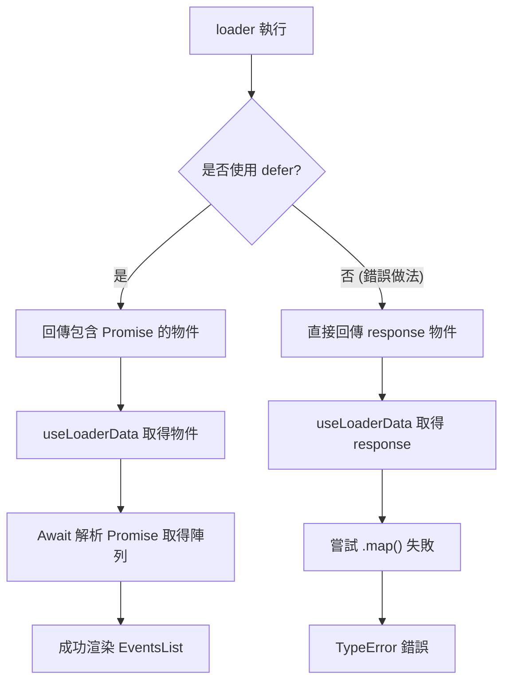

### 實作 `loadEvents` 輔助函數

- **解析回應資料**：
    - 在 `loadEvents` 函數中，必須手動解析 API 的回應，以便將資料傳遞給 `loader`。
    - 使用 `await response.json()` 來取得 JSON 格式的內容。

```javascript
// 在 events.js 中實作 loadEvents 輔助函數
async function loadEvents() {
  const response = await fetch("http://localhost:8000/events");

  if (response.ok) {
    const resData = await response.json();
    return resData.events;
  } else {
    throw json(
      { message: "Could not fetch events." },
      { status: 500 }
    );
  }
}

export function loader() {
  return defer({
    events: loadEvents(),
  });
}
```

- **連接 Loader 與組件**：
    - `loadEvents()` 被傳遞給 `defer` 的物件中，作為一個 Promise。這是在 `loader` 與 `useLoaderData` 之間傳遞資料的必要步驟。

### `defer` 功能的實際效能優化

- **使用者體驗提升**：
    - `defer` 允許頁面在等待耗時的非同步資料時，先渲染出基本的頁面結構與 fallback UI（例如「Loading...」）。
    - 這種方式可以避免使用者面對空白頁面，讓頁面看起來反應更快，同時在背景持續抓取內容。
- **實際運作流程**：

    1. 使用者進入頁面。
    2. 頁面立即顯示 `Suspense` 定義的 fallback 內容。
    3. 當 `loadEvents()` 的 Promise 解析完成後，內容自動替換為實際的事件列表。

### `useFetcher` 的應用優勢

- **處理異步請求差異**：
    - 當一個頁面包含多個不同的 HTTP 請求，且這些請求的解析速度（loading speed）不一致時，`useFetcher` 的優勢會特別突出。

## 身份驗證 (Authentication)

### 使用者註冊與登入 (User Signup & Login)

- **核心學習目標**：
    - 了解身份驗證在 React 應用程式中的運作機制
    - 實作使用者身份驗證流程
    - 學習前端 React 應用程式如何與強制執行身份驗證的後端進行溝通
- **進階主題**：
    - **身份驗證持久性 (Authentication Persistence)**：確保使用者在重新整理頁面或重新開啟瀏覽器後，仍能保持登入狀態
    - **自動登出 (Auto-Logout)**：處理使用者登入狀態的自動終止機制

### 身份驗證 (Authentication)

- **使用者註冊與登入 (User Signup & Login)**
    - **學習重點**：
        - 了解身份驗證在 React 應用程式中的運作原理
        - 實作使用者身份驗證功能
        - 學習前端 React 應用程式如何與強制執行身份驗證的後端進行溝通
        - **身份驗證持久性 (Persistence)**：追蹤使用者是否處於登入狀態
        - **自動登出 (Auto-Logout)**：在特定時間間隔後自動登出使用者
    - **進階概念**：
        - 探索與此單元相輔相成的全新路由概念

### 身份驗證實作專案準備

- 使用一個包含強化功能的示範專案進行實作
    - **後端 API**：提供模擬的後端服務，具備以下功能：
        - 強制執行使用者身份驗證 (User Authentication)
        - 支援使用者建立 (User Creation)
        - 支援使用者登入 (User Login)
- **核心概念**：
    - 身份驗證的基本定義：
        - 當內容需要被保護 (protected) 時，就需要身份驗證機制

### 身份驗證的運作流程

- **核心目的**：當內容需要被保護 (protected)，即不應讓所有人存取時，就需要身份驗證機制
- **獲取許可的流程**：
    - 前端 React 應用程式必須先向後端伺服器獲得存取許可
    - 流程始於客戶端向伺服器發送包含使用者憑證 (User Credentials) 的請求
        - 例如：提供電子郵件 (Email) 與密碼 (Password)
    - 後端伺服器接收請求後，負責驗證這些憑證的正確性

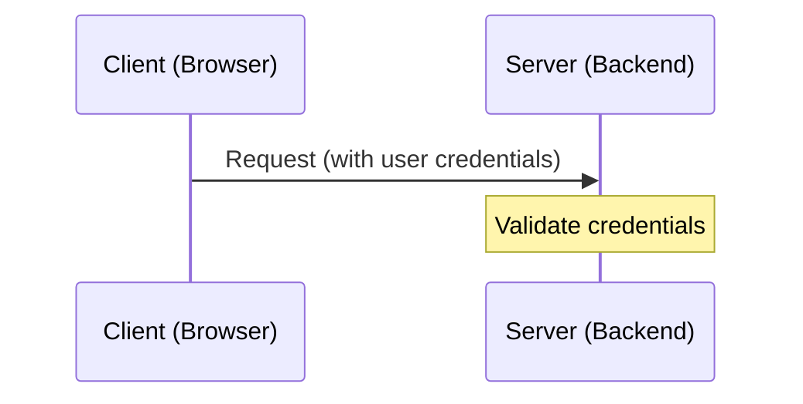

### 身份驗證回應的安全性問題

- **回應內容的侷限性**：
    - 伺服器在驗證憑證後，雖然會回傳是否允許存取的結果（例如：yes/no），但僅靠「是 (yes)」這樣的簡單回應是不夠的
- **[為什麼不夠？]** 因為安全性風險：
    - 客戶端可以輕易地在未來的請求中，自行附加「我之前獲得過許可」的資訊，導致伺服器無法有效辨識使用者當前的真實身份

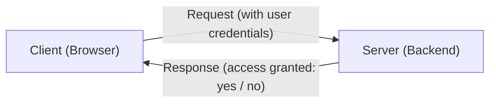

### 身份驗證的實作方案

- **[為什麼不能只用 "Yes"]**：
    - 客戶端可以輕易地在未來的請求中，偽造或附加「我之前獲得過許可」的資訊
    - 伺服器必須回傳一種能夠在伺服器端被驗證、且能證明使用者過去確實獲得許可的東西
- **主流解決方案**：
    - **伺服器端工作階段 (Server-side Sessions)**：在全端應用程式 (Full-stack application) 中非常流行
    - **身份驗證權杖 (Authentication Tokens)**

### 伺服器端工作階段 (Server-side Sessions) 的運作機制

- **核心概念**：伺服器不再只是回傳一個簡單的「是 (yes)」，而是將「許可狀態」儲存在伺服器端，並透過一個唯一的識別碼 (ID) 與特定的客戶端進行對應。
- **運作流程**：

    1. **建立連線**：使用者登入並通過身份驗證後，伺服器在內部儲存一個唯一的識別碼 (ID)，並將該 ID 發送回客戶端。
    2. **發送請求**：客戶端在之後存取受保護資源 (protected resources) 的請求中，會隨附這個 ID。
    3. **驗證權限**：伺服器接收到請求後，會檢查該 ID 是否與其內部儲存的「已授權狀態」相匹配，藉此確認客戶端是否真的擁有存取權限。

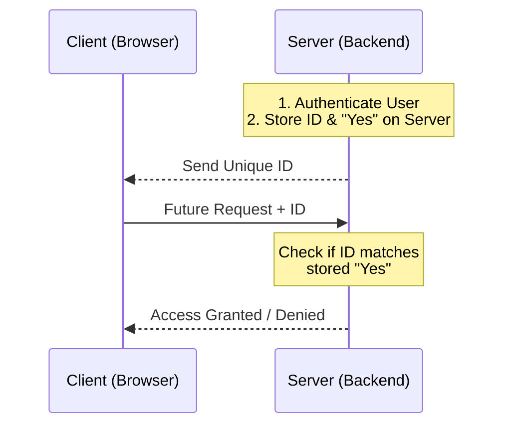

### 伺服器端工作階段與身份驗證權杖的比較

- **伺服器端工作階段 (Server-side Sessions) 的侷限性**：
    - 需要前後端之間存在**緊密耦合 (Tight Coupling)**
    - **[原因]**：後端必須負責儲存關於客戶端的資訊 (The backend must store information about the client)
- **解耦後端 (Decoupled Backends) 的現狀**：
    - 大多數 React 應用程式是單頁應用程式 (SPA)，通常與獨立的後端 API 溝通
    - 在這種架構下，後端與前端是解耦的，後端通常不會儲存任何與客戶端相關的狀態資訊 (Sessions)
- **身份驗證權杖 (Authentication Tokens)**：
    - 這是本單元將要實作的機制
    - **[優勢]**：適合解耦架構，因為它不需要後端為了維護連線狀態而儲存客戶端資訊

### 身份驗證權杖 (Authentication Tokens) 的運作機制

- **建立權杖**：
    - 當使用者發送有效的憑證對（例如電子郵件與密碼）後，伺服器會建立一個「許可權杖 (permission token)"
    - 這個權杖是一個根據特定演算法產生的字串，其中包含了一些資訊
    - **[關鍵點]**：伺服器會建立權杖，但**不會儲存**它 (Create but not store)
- **發送與攜帶**：
    - 伺服器將產生的權杖發送回客戶端
    - 在客戶端之後發送給後端的任何請求中，都會隨附 (attach) 這個權杖
- **驗證安全性**：
    - 權杖的有效性只能由建立該權杖的後端進行檢查與證明
    - **[為什麼能驗證？]** 因為權杖是利用只有後端才知道的**私鑰 (private key)** 來建立的

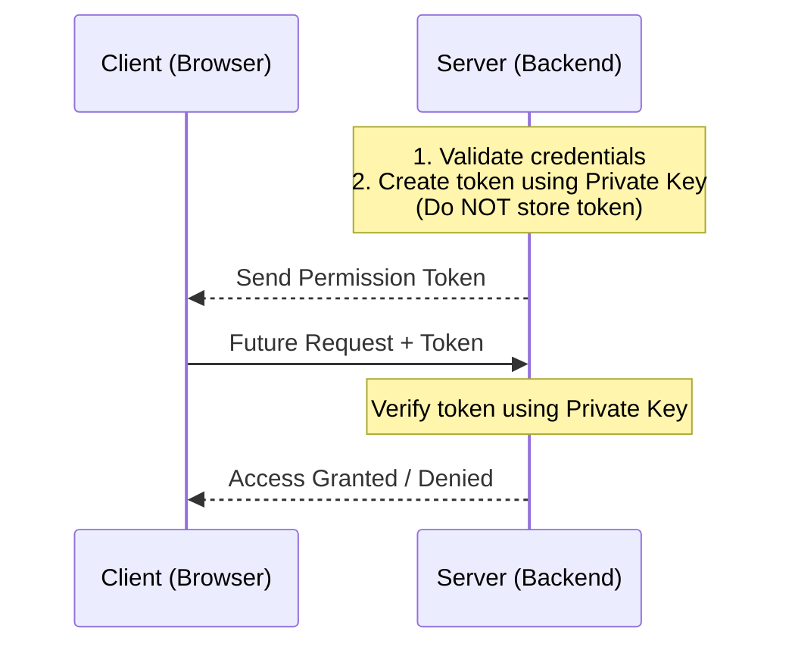

### JSON Web Token (JWT) 的實作概念

- **驗證流程**：
    - 當客戶端發送請求時，後端會檢查隨附的權杖。
    - 後端利用其內部邏輯驗證該權杖是否由自己所建立且有效。
    - 若驗證通過，則授予存取受保護資源 (protected resources) 的權限。
- **JSON Web Token (JWT)**：
    - 在實際開發中，這種權杖通常被稱為 JSON Web Token (JWT)。
    - **[如何產生]**：透過使用第三方套件 (third-party package) 來建立，這能確保權杖符合標準且具備安全性。
    - **[應用時機]**：當使用者完成註冊 (sign up) 或登入 (log in) 程序後，伺服器便會產生此類權杖回傳給客戶端。

### 身份驗證權杖的產生與驗證流程

- **權杖的產生 (Token Creation)**：
    - 權杖本質上是一個根據特定演算法產生的字串
    - **[關鍵步驟]**：使用只有後端知曉的**私鑰 (private key)** 對權杖進行簽署 (sign)
    - 在實際生產環境中，應使用更安全的金鑰，而非程式碼中硬編碼的簡單字串
- **權杖的驗證 (Token Validation)**：
    - **[運作機制]**：當客戶端發送後續請求時，會將權杖隨附在請求中
    - **[後端檢查]**：後端會透過**中間件 (middleware)** 進行額外的檢查
    - 中間件會驗證該請求所攜帶的權杖是否為有效且由正確私鑰簽署的權杖

```javascript
// 實作範例參考 (auth.js)
const { sign, verify } = require('jsonwebtoken');
const KEY = 'supersecret';

function createJSONToken(email) {
  return sign({ email }, KEY, { expiresIn: '1h' });
}

function validateJSONToken(token) {
  return verify(token, KEY);
}
```

### 後端路由保護與中間件 (Middleware)

- **中間件的角色**：
    - 中間件充當請求與最終路由處理程序之間的過濾器
    - **[運作流程]**：
        - 接收進入後端的請求 (incoming request)
        - 執行一系列檢查 (funnel through a couple of checks)
        - 驗證請求是否攜帶了有效的 JSON 權杖
- **驗證機制**：
    - 在驗證權杖的過程中，中間件會再次使用**私鑰 (private key)** 來確保權杖的真實性
- **路由保護 (Protected Routes)**：
    - 透過將中間件應用於特定的路由，可以實現存取控制
    - 只有通過中間件驗證的請求，才能存取受保護的資源

```javascript
// auth.js 中的中間件邏輯概念
function checkAuthMiddleware(req, res, next) {
  // 1. 檢查請求方法
  if (req.method === 'OPTIONS') {
    return next();
  }

  // 2. 從 Header 提取權杖
  const authFragments = req.headers.authorization.split(' ');

  if (authFragments.length !== 2) {
    console.log('NOT AUTH. AUTH HEADER INVALID.');
    return next(new NotAuthError('Not authenticated.'));
  }

  const authToken = authFragments[1];

  try {
    // 3. 使用私鑰驗證權杖
    const validatedToken = validateJSONToken(authToken);
    req.token = validatedToken;
    next(); // 驗證成功，進入下一個處理程序
  } catch (error) {
    console.log('NOT AUTH. TOKEN INVALID.');
    return next(new NotAuthError('Not authenticated.'));
  }
}
```

### 路由的存取控制分類

- **公開路由 (Public Routes)**：
    - 不需要身份驗證即可存取
    - **[範例]**：獲取所有事件列表 (Get a list of all events)
- **受保護路由 (Protected Routes)**：
    - 必須經過身份驗證才能執行
    - **[範例]**：
        - 建立新事件 (Create a new event)
        - 更新現有事件 (Update an event)

> 這種設計確保了敏感的操作（如資料的增刪改）受到保護，而一般的讀取操作則能保持開放性。

### 基於權杖的身份驗證流程

- **伺服器端的響應 (Server Response)**：
    - 登入成功後，伺服器不會僅回傳一個簡單的「是/否」 (yes/no) 狀態
    - **[關鍵內容]**：伺服器會回傳一個包含**身份驗證權杖 (token)** 的響應
- **客戶端的角色 (Client-side Responsibility)**：
    - **儲存權杖**：React App 必須將收到的權杖儲存起來
    - **隨附權杖**：在未來發出的所有請求 (outgoing requests) 中，必須將該權杖隨附於請求中
- **權杖作為狀態指標**：
    - **[用途]**：權杖的存在與否可以用來判斷使用者目前是否已登入
    - **UI 更新**：根據權杖的存在狀態來動態調整介面（例如：若已登入，則顯示「登出」按鈕）

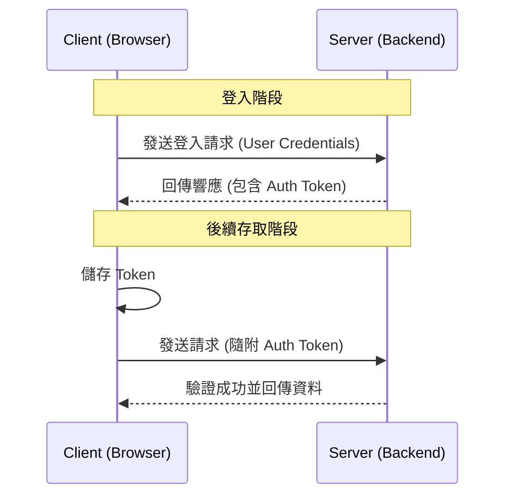

### Demo 專案概況

- **專案結構**：包含 `backend-api` 與 `react-frontend` 兩個主要部分
- **後端 API**：在原有的基礎上強化了身份驗證 (authentication) 功能
- **前端新增內容**：
    - `AuthForm` 組件：用於處理登入或註冊的表單邏輯
    - `AuthenticationPage` 頁面：用於承載身份驗證流程的頁面
    - **[注意]**：目前 `AuthenticationPage` 尚未配置路由 (route configuration)，後續將會進行配置

```javascript
// AuthForm.js 核心邏輯概念
import Form, { Link } from 'react-router-dom';
import classes from './AuthForm.module.css';

function AuthForm() {
  const [isLogin, setIsLogin] = useState(true);

  function switchAuthHandler() {
    setIsLogin(isCurrentLogin => !isCurrentLogin);
  }

  return (
    <Form method="post" className={classes.form}>
      <h1>{isLogin ? 'Log in' : 'Create a new user'}</h1>
      {/* 錯誤與訊息處理邏輯... */}
    </Form>
  );
}
```

### 啟動開發環境

- **後端 API (`backend-api`)**：
    - 進入該目錄並執行 `npm install` 安裝依賴
    - 執行 `npm start` 啟動伺服器
- **前端應用程式 (`react-frontend`)**：
    - **[重要]**：必須在**另一個獨立的終端機視窗**中執行，以保持後端伺服器持續運行
    - 進入該目錄並執行 `npm install` 安裝依賴
    - 執行 `npm start` 啟動開發伺服器

### 實作準備

- 目標是建立一個可以導向身份驗證頁面 (`AuthenticationPage`) 的路徑。

### 新增身份驗證路由 (`/auth`)

- 在 `App.js` 中定義新的路由路徑為 `/auth`
- **[佈局考量]**：將 `/auth` 設定為與 Home 頁面同層級的「兄弟路由」(sibling route)
    - 這樣做可以確保 `/auth` 頁面同樣能套用目前的 `RootLayout`，並顯示頂部導覽列等共通組件

```javascript
// App.js 路由配置概念
const router = createBrowserRouter([
  {
    path: '/',
    element: <RootLayout />,
    errorElement: <ErrorPage />,
    children: [
      { index: true, element: <HomePage /> },
      { path: 'auth', element: <AuthenticationPage /> }, // 新增的身份驗證路由
      // ... 其他路由
    ]
  }
]);
```

### 完成身份驗證路由配置

- 在 `App.js` 中完成 `/auth` 路由的定義：
    - 使用相對路徑 `auth`（或 `/auth`）來避免與父層路徑衝突
    - 將 `element` 設定為 `AuthenticationPage` 組件
    - **[重要]**：必須先從 `./pages/Authentication` 導入該組件

```javascript
// App.js 路由配置片段
{
  path: 'auth',
  element: <AuthenticationPage />
}
```

- 配置完成後，使用者即可透過 `localhost:3000/auth` 存取身份驗證表單

### 更新全站導覽列 (`MainNavigation.js`)

- 為了提升導覽便利性，需在 `MainNavigation` 組件中新增進入身份驗證頁面的連結
- 這將確保使用者可以在任何頁面（透過導覽列）快速切換到登入或註冊流程
- 在導覽列中新增一個指向 `/auth` 的連結，並為其加上 `Authentication` 的文字標籤
- **[樣式處理]** 使用 `isActive` 狀態來動態套用 CSS 類別，確保使用者知道目前正處於哪個頁面

```javascript
// MainNavigation.js 程式碼片段
<li>
  <NavLink
    to="/auth"
    className={({ isActive }) =>
      isActive ? classes.active : undefined
    }
  >
    Authentication
  </NavLink>
</li>
```

### 下階段預告：優化使用者體驗的路由概念

- 在進入正式的身份驗證邏輯實作前，將先探討一個能提升應用程式使用者體驗的進階路由概念

### 身份驗證表單的切換邏輯

- `AuthForm` 透過按鈕在兩種模式之間切換：
    - **Log in (登入模式)**：使用者輸入資訊後，點擊「Save」會向後端發送登入請求。
    - **Create a new user (建立新使用者模式)**：使用者輸入資訊後，點擊「Save」會向後端發送建立新使用者的請求。
- **[設計核心]**：雖然視覺上使用的是同一個表單結構（Email 與 Password 欄位），但其背後的行為（發送的 API 請求類型）會根據目前所處的模式而有所不同。

### 使用查詢參數切換表單模式

- **查詢參數 (Query Parameters)**：附加在 URL 末端，以問號 (`?`) 開頭的參數
    - 例如：`mode=login` 或 `mode=signup`
- **實作邏輯**：
    - 使用同一個路由路徑（例如 `/auth`）
    - 根據查詢參數的值（如 `mode`）來決定渲染不同版本的表單組件
- **[優點]**：可以實作直接連結功能
    - 允許開發者直接提供一個特定的 URL，讓使用者點擊後直接進入「登入模式」或「註冊模式」，而不必先進入頁面再進行手動切換

### 從狀態管理轉換為查詢參數導覽

- **[重構目標]**：將 `AuthForm` 內部的 `isLogin` 狀態切換邏輯，改為依賴 URL 查詢參數。
- **[優點]**：雖然視覺上渲染的是同一個頁面，但使用查詢參數可以讓模式（登入或註冊）與 URL 綁定，提供更好的連結分享功能。
- **[實作步驟]**
    - 移除 `useState` 的導入與相關狀態宣告（如 `isLogin`, `setIsLogin`）。
    - 移除用於切換模式的處理函數（如 `switchAuthHandler`）。
    - 將原本用於切換模式的 `<button>` 替換為 React Router 的 `<Link>` 組件，以便透過改變 URL 參數來切換 UI。

```javascript
// AuthForm.js 重構前邏輯範例
import { useState } from 'react';
import { Form } from 'react-router-dom';
// ...

function AuthForm() {
  const [isLogin, setIsLogin] = useState(true);

  function switchAuthHandler() {
    setIsLogin(isLoggedIn => !isLoggedIn);
  }

  return (
    <Form method="post" className={classes.form}>
      <h1>{isLogin ? 'Log in' : 'Create a new user'}</h1>
      {/* ... 表單欄位 ... */}
      <div className={classes.actions}>
        <button onClick={switchAuthHandler} type="button">
          {isLogin ? 'Create new user' : 'Login'}
        </button>
        <button>Save</button>
      </div>
    </Form>
  );
}
```

### 實作查詢參數切換邏輯

- **[重構重點]**：將原本依賴組件內部狀態 (`useState`) 的切換機制，改為透過修改 URL 查詢參數來驅動 UI 更新。
- **實作步驟**：
    - 移除 `<Link>` 標籤（或原本的 `<button>`）上的 `type="button"` 屬性與 `onClick` 處理函數。
    - 使用 `<Link>` 組件的 `to` 屬性來設定目標路徑。
    - **[使用相對路徑]**：為了保持在當前路由，可以使用相對路徑並直接附加查詢參數，例如 `?mode=login`。

```javascript
// AuthForm.js 重構後的 Link 實作範例
<div className={classes.actions}>
  <Link
    to="?mode=signup"
    // 當目前是登入模式時，顯示「建立新使用者」
    >{isLogin ? 'Create new user' : 'Login'}</Link>
  <button>Save</button>
</div>
```

- **查詢參數設計**：
    - `?mode=login`：對應登入模式。
    - `?mode=signup`：對應註冊（建立新使用者）模式。
- **[優點]**：這種做法讓 URL 成為「單一事實來源」(Single Source of Truth)，使用者可以直接分享帶有特定模式的連結。

### 動態切換查詢參數模式

- **動態導覽邏輯**：
    - 為了讓使用者能在「登入」與「註冊」模式之間切換，`<Link>` 的目標路徑必須根據當前模式動態決定。
    - 如果目前是登入模式，切換連結應指向註冊模式（例如 `?mode=signup`），反之亦然。
- **實作方式**：
    - 使用樣板字面值 (Template Literals) 來注入動態的查詢參數。
    - 需要先取得當前的查詢參數資訊，以判斷目前的 `isLogin` 狀態，進而正確設定標題與切換連結。

```javascript
// AuthForm.js 動態切換連結實作
<div className={classes.actions}>
  <Link to={`?mode=${isLogin ? 'signup' : 'login'}`}>
    {isLogin ? 'Create new user' : 'Login'}
  </Link>
  <button>Save</button>
</div>
```

### 使用 `useSearchParams` 處理查詢參數

- **[工具介紹]**：React Router 提供 `useSearchParams` hook，用於讀取與寫入 URL 中的查詢參數（官方稱為 search parameters）。
- **[回傳值結構]**：該 hook 會回傳一個包含兩個元素的陣列，可以透過陣列解構賦值（array destructuring）來取得：
    - **第一個元素**：一個物件，包含當前所有的查詢參數。
    - **第二個元素**：一個函數，用於更新當前的查詢參數。

```javascript
// 從 react-router-dom 導入 useSearchParams
import { Form, Link, useSearchParams } from 'react-router-dom';

function AuthForm() {
  // 使用陣列解構取得 searchParams 物件與 setSearchParams 函數
  const [searchParams, setSearchParams] = useSearchParams();

  return (
    // ... 組件內容
  );
}
```

### 使用 `searchParams.get` 讀取參數

- **[讀取特定參數]**：透過 `searchParams` 物件提供的 `.get()` 方法，可以精確取得 URL 中特定鍵值 (key) 的內容。
- **實作邏輯**：
    - 使用 `searchParams.get('mode')` 來獲取目前 URL 中的 `mode` 參數值。
    - 將該值與字串 `'login'` 進行比較，以決定組件的顯示狀態（例如 `isLogin`）。

```javascript
// AuthForm.js 判斷模式實作
function AuthForm() {
  const [searchParams, setSearchParams] = useSearchParams();

  // 檢查 'mode' 參數是否等於 'login'
  const isLogin = searchParams.get('mode') === 'login';

  return (
    <Form method="post" className={classes.form}>
      <h1>{isLogin ? 'Log in' : 'Create a new user'}</h1>
      {/* ... 其他表單內容 ... */}
    </Form>
  );
}
```

### 實作模式切換連結

- **切換邏輯**：
    - 若目前處於登入模式 (`isLogin` 為 `true`)，切換連結應指向註冊模式 (`?mode=signup`)。
    - 若目前處於註冊模式，切換連結則應指向登入模式 (`?mode=login`)。
- **實作方式**：
    - 使用樣板字面值 (Template Literals) 動態組合查詢參數。
    - 透過三元運算子根據 `isLogin` 的布林值來決定 `mode` 的值。

```javascript
// AuthForm.js 切換連結實作
<div className={classes.actions}>
  <Link to={`?mode=${isLogin ? 'signup' : 'login'}`}>
    {isLogin ? 'Create new user' : 'Login'}
  </Link>
  <button>Save</button>
</div>
```

### 查詢參數作為狀態管理替代方案

- **[優點]** 相較於僅使用組件內部的 `useState`，使用查詢參數具有以下優勢：
    - **可直接連結性**：使用者可以直接透過特定的 URL（例如帶有 `?mode=login` 的路徑）進入指定的模式。
    - **狀態同步**：URL 會直接反映當前的 UI 模式，這使得頁面狀態對於瀏覽器的歷史紀錄與重新整理更具備一致性。
- **全域導覽整合**：
    - 可以將查詢參數應用於全域導覽列（如 `MainNavigation`）中的連結。
    - 例如：在導覽列中加入一個指向 `/auth?mode=login` 的連結，使用者點擊後即可直接載入處於登入模式的身份驗證頁面。

### 後端身份驗證 API 實作

- **[建立使用者路由]**：後端提供了一個 `/signup` 路由，用於處理新使用者的註冊流程。
- **[輸入驗證邏輯]**：在建立使用者之前，系統會對輸入的資料進行驗證：
    - **電子郵件與密碼**：必須符合特定格式與規範。
    - **密碼長度限制**：密碼長度必須至少為 6 個字元。
- **[錯誤處理機制]**：
    - 若提供的憑證無效（例如密碼太短），API 會回傳錯誤回應。
    - 使用 `res.status(422).json(...)` 來回傳驗證錯誤，並在錯誤物件中包含具體的錯誤訊息（例如 `errors.password`）。

```javascript
// auth.js 中的 signup 路由邏輯片段
router.post('/signup', async (req, res, next) => {
  const data = req.body;\n  let errors = {};\n\n  if (!isValidEmail(data.email)) {\n    errors.email = 'Invalid email.';\n  }\n  // ... 其他驗證邏輯
\n  if (Object.keys(errors).length > 0) {\n    return res.status(422).json({\n      message: 'User signup failed due to validation errors.',\n      errors,\n    });\n  }\n  // ... 建立使用者邏輯
});
```

- **[成功流程]**：若所有驗證皆通過，系統將建立新使用者，並回傳包含 `token` 的成功回應（狀態碼 `201`）。

```javascript
// 成功建立使用者時的回傳內容
const createdUser = await add(data);
const authToken = createJSONToken(createdUser.email);
res.status(201).json({
  message: 'User created.',
  user: createdUser,
  token: authToken
});
```

### 後端身份驗證流程回顧

- **資料儲存**：在此示範專案中，使用者資料被儲存在 `events.json` 檔案中（在實際應用中通常會使用資料庫）。
- **Token 機制**：當觸發 `/signup` 路由的 `POST` 請求後，後端會建立使用者並生成一個 `token`，隨後將該 `token` 回傳給前端。

### 前端 AuthForm 組件實作

- **使用 React Router 的 Form**：
    - 在 `AuthForm.js` 中，必須使用來自 `react-router-dom` 的 `Form` 組件，而不是標準的 HTML `<form>`。
    - **[原因]**：這樣做才能完整利用 React Router 提供的資料獲取與提交功能（例如自動處理 `action` 和狀態管理）。

```javascript
// AuthForm.js 實作片段
import { Form, Link, useSearchParams } from 'react-router-dom';
import classes from './AuthForm.module.css';

function AuthForm() {
  const [searchParams] = useSearchParams();
  const isLogin = searchParams.get('mode') === 'login';

  return (
    <Form method="post" className={classes.form}>
      <h1>{isLogin ? 'Log in' : 'Create a new user'}</h1>
      <p>
        <label htmlFor="email">Email</label>
        <input id="email" type="email" name="email" required />
      </p>
      <p>
        <label htmlFor="password">Password</label>
        <input id="password" type="password" name="password" required />
      </p>
      <div className={classes.actions}>
        <Link to={`?mode=${isLogin ? 'signup' : 'login'}`}>
          {isLogin ? 'Create new user' : 'Login'}
        </Link>
        <button>Save</button>
      </div>
    </Form>
  );
}
```

### 在 `Authentication.js` 中實作 `action` 函數

- **掛載 Action**：
    - 在 `Authentication.js` 中導出一個非同步函數 `action`。
    - **[運作機制]**：由於 `AuthForm` 組件與該路由（`/auth`）位於同一個路由路徑下，因此當 `AuthForm` 被提交時，會自動觸發此 `action` 函數。
- **獲取表單資料**：
    - `action` 函數會接收一個 `request` 物件作為參數。
    - 透過這個 `request` 物件，可以存取使用者在表單中提交的所有資料。
- **獲取提交資料**：
    - 在 `action` 函數內部，可以使用 `request.formData()` 方法來取得表單傳送的所有數據。
    - **[注意]**：由於該方法是異步的，必須使用 `await` 來等待資料解析完成。

```javascript
// Authentication.js 實作片段
export async function action({ request }) {
  const data = await request.formData();
  const authData = {
    email: data.get("email"),
    password: data.get("password"),
  };
  // 後續處理 authData...
}
```

- **建立身份驗證物件**：
    - 透過 `data.get("key")` 從 `formData` 中提取特定欄位（如 `email` 和 `password`）。
    - 將這些資訊封裝進 `authData` 物件中，以便將其發送到後端進行驗證或建立使用者。

### 在 `Authentication.js` 中處理表單資料與模式切換

- **提取表單欄位值**：
    - 在 `action` 函數中，透過 `request.formData()` 取得的 `data` 物件，利用 `.get()` 方法來提取使用者輸入的資訊。

```javascript
// Authentication.js 實作片段
export async function action({ request }) {
  const data = await request.formData();
  const authData = {
    email: data.get('email'),
    password: data.get('password'),
  };
  // ...
}
```

- **根據查詢參數決定請求類型**：
    - 為了讓同一個 `action` 能同時處理「登入」與「註冊」，必須在 `action` 函數中判斷目前的查詢參數（query parameter）。
    - **[注意]**：在 `action` 函數內部無法直接使用 `useSearchParams` 這種 React Hook，但仍可以從 `request.url` 中解析出查詢參數來進行邏輯判斷。

### 在 `action` 中解析查詢參數

- **無法直接使用 Hook**：
    - 在 `action` 函數中不能使用 `useSearchParams` 等 React Hook，因為 `action` 執行於路由層級而非組件渲染過程中。
- **利用&#32;`URL`&#32;建構函式**：
    - 可以透過瀏覽器內建的 `URL` 物件，將 `request.url` 傳入進行解析。
    - 透過解析後的物件，可以存取 `searchParams` 來獲取特定的查詢參數。

```javascript
// Authentication.js 實作片段
export async function action({ request }) {
  // 使用 URL 建構函式解析請求的 URL
  const url = new URL(request.url);
  const searchParams = url.searchParams;

  // 根據 'mode' 參數決定目前的模式，若無則預設為 'login'
  const mode = searchParams.get("mode") || "login";

  const data = await request.formData();
  const authData = {
    email: data.get("email"),
    password: data.get("password"),
  };
  // ...
}
```

- **設定預設模式**：
    - 透過 `searchParams.get("mode") || "login"` 的方式，可以確保當 URL 中沒有提供 `mode` 時，程式碼能有一個預設的行為（例如預設為登入模式）。

### 向後端發送身份驗證請求

- **整合模式與資料**：
    - 透過先前解析出的 `mode`（`login` 或 `signup`）以及 `authData`，可以準備好向後端 API 發送請求所需的全部資訊。
- **動態構建請求 URL**：
    - 使用瀏覽器原生的 `fetch` 函數，根據目前的模式動態決定目標 URL。
    - 由於後端 dummy API 支援 `/signup` 與 `/login` 兩個路由，因此 URL 需根據 `mode` 進行切換。

```javascript
// Authentication.js 實作片段
export async function action({ request }) {
  const searchParams = new URL(request.url).searchParams;
  const mode = searchParams.get("mode") || "login";

  const data = await request.formData();
  const authData = {
    email: data.get("email"),
    password: data.get("password"),
  };

  // 根據模式動態決定 URL，並發送請求
  fetch(`http://localhost:8080/${mode}`, {
    method: "POST",
    body: JSON.stringify(authData),
  });
}
```

### 防止不支援的模式 (Defending against unsupported modes)

- **驗證模式有效性**：
    - 為了防止使用者刻意輸入不支援的模式（例如 `?mode=abc`），應該在 `action` 函數中檢查 `mode` 是否為預期的值（`login` 或 `signup`）。
- **拋出錯誤回應**：
    - 若模式不合法，可以使用 `json` 函數從 `react-router-dom` 匯入，並拋出一個錯誤回應（error response）。
    - 這樣可以明確告知客戶端發生了「不支援的模式 (unsupported mode)」錯誤，並設定對應的 HTTP 狀態碼。

```javascript
// Authentication.js 實作片段
import { json } from "react-router-dom";

export async function action({ request }) {
  const searchParams = new URL(request.url).searchParams;
  const mode = searchParams.get("mode") || "login";

  // 防禦機制：檢查模式是否合法
  if (mode !== "login" && mode !== "signup") {
    throw json({ message: "Unsupported mode." }, { status: 400 });
  }

  const data = await request.formData();
  const authData = {
    email: data.get("email"),
    password: data.get("password"),
  };

  fetch(`http://localhost:8080/${mode}`, {
    method: "POST",
    body: JSON.stringify(authData),
  });
}
```

### 配置身份驗證請求的細節

- **設定 HTTP 方法**：
    - 因為後端（例如模擬的登入與註冊路由）預期接收 `POST` 請求，所以在執行 `fetch` 時必須明確指定 `method: 'POST'`。
- **添加標頭 (Headers)**：
    - 為了讓後端知道我們傳送的是 JSON 格式的資料，必須在請求中加入 `headers` 屬性，並設定 `Content-Type`。

```javascript
// Authentication.js 實作片段
// ... 前略

const response = await fetch(`http://localhost:8080/${mode}`, {
  method: 'POST',
  headers: {
    'Content-Type': 'application/json',
  },
  body: JSON.stringify(authData),
});
```

### 完善身份驗證請求的實作

- **確保後端正確解析資料**：
    - 必須在 `fetch` 的 `headers` 中將 `Content-Type` 設定為 `application/json`。
    - 必須將傳送的資料物件（如 `authData`）透過 `JSON.stringify()` 轉換為 JSON 格式，並賦值給 `body` 欄位。

```javascript
// Authentication.js 實作片段
const response = await fetch(`http://localhost:8080/${mode}`, {
  method: 'POST',
  headers: {
    'Content-Type': 'application/json',
  },
  body: JSON.stringify(authData),
});
```

- **處理伺服器回傳的響應 (Response)**：
    - 取得 `fetch` 的結果並儲存於常數中（例如 `response`）。
    - **[下一步重點]**：需要撰寫邏輯來檢查 `response.status`。例如，若狀態碼為 `422`，則代表發生了驗證錯誤 (validation errors)，後續需針對此情況進行處理。

### 處理後端錯誤狀態碼

- **辨識特定錯誤狀態**：
    - 除了 `422` (Unprocessable Entity，通常用於驗證錯誤) 之外，也需要處理 `401` (Unauthorized) 狀態碼。
    - `401` 狀態碼通常在使用者嘗試使用無效憑證登入時，由後端回傳。
- **將錯誤回傳至組件**：
    - 目的是將這些錯誤資訊傳回給路由組件（例如 `AuthForm`），以便在表單旁顯示錯誤訊息或驗證錯誤。
    - 可以直接使用 `return response;`。React Router 會自動從 `response` 物件中提取資料供組件使用。

```javascript
// Authentication.js 實作片段
// ... 前略

if (response.status === 422 || response.status === 401) {
  return response;
}
```

### 處理未知的伺服器錯誤

- **拋出錯誤回應 (Error Response)**：
    - 如果 `response.ok` 為 `false`（且不屬於先前處理的 422 或 401 錯誤），則應拋出一個包含錯誤訊息與狀態碼的 `json` 錯誤。
    - 這樣做可以確保 React Router 會渲染最近的錯誤元件 (Error Element) 來顯示錯誤訊息。

```javascript
// Authentication.js 實作片段
if (!response.ok) {
  throw json(
    { message: 'Could not authenticate user.' },
    { status: 500 }
  );
}
```

### 驗證成功後的導向處理

- **處理權杖 (Token Management)**：
    - 當程式碼執行到此階段時，代表使用者建立或登入已成功，此時後端會回傳一個權杖。
    - 雖然目前尚未實作權杖的儲存邏輯，但這是下一步的重點。
- **使用&#32;`redirect`&#32;進行頁面跳轉**：
    - 在驗證成功後，可以使用 React Router 提供的 `redirect` 輔助函數將使用者導向至特定路由。

```javascript
// Authentication.js 實作片段
// ... 前略

// 驗證成功後的處理
return redirect('/');
```

### 註冊 Action 到路由定義

- **完成驗證後的導向**：
    - 在 `Authentication.js` 中，當驗證成功後，使用 `redirect('/')` 將使用者導向應用程式的首頁。

```javascript
// Authentication.js 實作片段
// ... 前略

// 驗證成功後的處理
return redirect('/');
```

- **[關鍵步驟] 註冊 Action**：
    - 僅在 `action` 函數中撰寫邏輯是不夠的，必須在路由配置（例如 `App.js`）中將該函數分配給對應的路由，React Router 才能識別並執行它。
    - 範例做法是將 `action` 匯入，並在路由物件中使用 `action` 屬性進行設定。

```javascript
// App.js 實作片段
import { authAction as offAction } from './pages/Authentication';

const router = createBrowserRouter([
  {
    path: 'auth',
    element: <AuthenticationPage />,
    action: offAction
  },
  // ... 其他路由
]);
```

### 註冊身份驗證 Action 到路由

- 必須在路由定義中明確指定 `action` 屬性，否則 React Router 無法識別並執行該函數。
- 在 `App.js` 中，將從 `Authentication.js` 匯入的 `authAction` 分配給 `/auth` 路徑。

```javascript
// App.js 實作片段
import { authAction } from './pages/Authentication';

const router = createBrowserRouter([
  // ... 其他路由
  {
    path: 'auth',
    element: <AuthenticationPage />,
    action: authAction
  },
  // ... 其他路由
]);
```

### 測試「建立新使用者」流程

- 在進入「建立新使用者」模式後，使用者可以輸入憑證（例如電子郵件與密碼）。
- 點擊「Save」按鈕後，表單會觸發已註冊的 `action` 函數。
- **[注意]**：若尚未實作驗證錯誤的 UI 顯示，點擊提交後介面可能看起來沒有反應，但後端與 `action` 邏輯已在執行中。

### 修正身份驗證請求的標頭錯誤

- **[關鍵細節] 屬性名稱必須為複數**：
    - 在 `fetch` 的配置物件中，必須使用 `headers` 而非 `header`。
    - 若拼寫錯誤，後端將無法正確提取請求中的標頭資訊（例如 `Content-Type`），導致資料解析失敗。

```javascript
// Authentication.js 實作片段
// ... 前略

const response = await fetch('http://localhost:8080/' + mode, {
  method: 'POST',
  headers: { // 必須使用複數形式 headers
    'Content-Type': 'application/json',
  },
  body: JSON.stringify(authData),
});

// ... 後略
```

### 測試重複註冊的驗證錯誤

- **測試流程**：
    - 成功建立一個新使用者（例如使用 `test@test.com`）。
    - 切換回「建立新使用者」模式，再次嘗試使用相同的電子郵件進行註冊。
- **觀察結果**：
    - 雖然前端頁面目前沒有顯示錯誤訊息，但後端會回傳驗證錯誤。
    - 可以透過瀏覽器開發者工具（DevTools）的 **Console** 觀察到請求失敗的紀錄，顯示伺服器回傳了 `422 (Unprocessable Entity)` 狀態碼。

```text
// DevTools Console 觀察到的錯誤範例
Failed to load resource: the server responded with a status of 422 (Unprocessable Entity)
```

### 處理驗證錯誤與使用者回饋

- **後端驗證機制**：
    - 當使用者嘗試使用已註冊的電子郵件建立新帳號時，後端會檢查資料庫。
    - 若電子郵件已存在，後端會回傳一個狀態碼為 `422` (Unprocessable Entity) 的身份驗證錯誤。
- **[目前問題] 缺乏前端回饋**：
    - 雖然後端已正確回傳錯誤，但目前的 UI 並未針對此狀態進行處理。
    - 這導致使用者在點擊「Save」後，介面看起來像是沒有任何反應，無法得知操作失敗的原因。
- **開發目標**：
    - 需要在前端實作邏輯，捕捉來自後端的 `422` 錯誤狀態。
    - 將錯誤訊息（例如「該電子郵件已存在」）提取出來，並以適當的方式顯示在介面上，以提供正確的使用者回饋。

### 使用 `useActionData` 獲取驗證錯誤

- **[目的]**：為了在表單上方顯示來自後端的身份驗證錯誤或任何驗證相關訊息。
- **[原理]**：透過 React Router 提供的 `useActionData` hook，可以獲取最近一次提交的 `action` 函數所回傳的資料。
- **[限制條件]**：
    - 只有當 `action` 函數回傳內容時，`useActionData` 才會取得資料。
    - 如果 `action` 函數直接執行了 `redirect`（重新導向），則不會透過此 hook 取得資料。

```javascript
// AuthForm.js 實作片段
import { useActionData } from 'react-router-dom';

function AuthForm() {
  const data = useActionData(); // 獲取 action 回傳的資料

  // ... 後續邏輯將使用 data 來顯示錯誤訊息
}
```

### 在 `AuthForm` 中顯示驗證錯誤

- **錯誤處理邏輯**：
    - 當 `fetch` 請求回傳狀態碼為 `422` (Unprocessable Entity) 或 `401` (Unauthorized) 時，代表身份驗證失敗或驗證資料有誤。
    - 此時會回傳一個包含錯誤資訊的 response。
- **UI 渲染機制**：
    - 使用 `data` (來自 `useActionData`) 來判斷是否需要顯示錯誤訊息。
    - 只有在使用者曾經提交過表單（即 `data` 有值）且 `data.errors` 物件存在時，才會渲染錯誤列表。

```javascript
// AuthForm.js 實作片段

function AuthForm() {
  const data = useActionData();
  const searchParams = useSearchParams();
  const isLogin = searchParams.get('mode') === 'login';

  return (
    <Form method="post" className={classes.form}>
      <h1>{isLogin ? 'Log in' : 'Create a new user'}</h1>

      {/* 顯示驗證錯誤訊息 */}
      {data && data.errors && (
        <ul className={classes.errors}>
          {Object.values(data.errors).map((err) => (
            <li key={err}>{err}</li>
          ))}
        </ul>
      )}

      <p>
        <label htmlFor="email">Email</label>
        <input id="email" type="email" name="email" required />
      </p>
      {/* ... 其他欄位 */}
    </Form>
  );
}
```

- **[關鍵邏輯]**：使用 `{data && data.errors && (...)}` 作為條件判斷，確保在初次進入頁面（尚未提交表單）時不會因為 `data` 為 `undefined` 而導致程式崩潰，同時也確保只有在真正發生驗證錯誤時才顯示錯誤清單。

### 渲染驗證錯誤清單

- **遍歷錯誤物件**：
    - 由於後端回傳的 `errors` 是一個物件（例如 `{ email: 'Invalid email', password: 'Too short' }`），無法直接使用 `.map()`。
    - **[解決方案]**：使用 JavaScript 內建的 `Object.values(data.errors)` 將物件轉換為僅包含錯誤訊息內容的陣列。
- **動態渲染列表**：
    - 將轉換後的陣列透過 `.map()` 映射成 `<li>` 元素，並將錯誤訊息本身設為 `key` 以符合 React 的渲染要求。

```javascript
// AuthForm.js 實作片段

{data && data.errors && (
  <ul className={classes.errors}>
    {Object.values(data.errors).map((err) => (
      <li key={err}>{err}</li>
    ))}
  </ul>
)}
```

- **處理通用訊息**：
    - 除了針對特定欄位的 `errors` 物件外，還會檢查 `data` 是否包含一個通用的 `message` 屬性，以便顯示非欄位特定的錯誤提示。

### 完善錯誤顯示邏輯

- **處理多種錯誤來源**：
    - 除了遍歷 `data.errors` 顯示欄位錯誤外，還應檢查並顯示 `data.message`，以呈現後端回傳的通用錯誤訊息。

```javascript
// AuthForm.js 實作片段

return (
  <Form method="post" className={classes.form}>
    <h1>{isLogin ? 'Log in' : 'Create a new user'}</h1>

    {/* 顯示欄位驗證錯誤 */}
    {data && data.errors && (
      <ul className={classes.errors}>
        {Object.values(data.errors).map((err) => (
          <li key={err}>{err}</li>
        ))}
      </ul>
    )}

    {/* 顯示通用錯誤訊息 */}
    {data && data.message && <p>{data.message}</p>}

    <p>
      <label htmlFor="email">Email</label>
      <input id="email" type="email" name="email" required />
    </p>
    {/* ... */}
  </Form>
);
```

- **[實際案例]**：當嘗試使用已存在的電子郵件進行註冊時，畫面會顯示「Email exists already」等錯誤提示，這證明了邏輯能正確捕捉後端回傳的錯誤資訊。

### 提升使用者體驗：提交狀態指示器

- **需求**：在表單提交後、伺服器回應前，使用者需要知道系統正在處理中，避免重複點擊或感到困惑。
- **實作方向**：需要偵測目前是否正處於「正在提交資料 (submitting)」的狀態，並根據此狀態顯示相應的 UI 指示器（例如：禁用按鈕或顯示載入圖示）。

### 使用 `useNavigation` 實作提交狀態指示器

- **偵測提交狀態**：
    - 使用 React Router 提供的 `useNavigation` hook 來獲取當前的導覽物件。
    - 透過檢查 `navigation.state` 是否為 `'submitting'`，可以得知目前應用程式是否正在處理表單提交或資料請求。
- **實作輔助常數**：
    - 定義一個 `isSubmitting` 常數，讓程式碼更具可讀性。

```javascript
// AuthForm.js 實作片段

const navigation = useNavigation();
const isSubmitting = navigation.state === 'submitting';
```

- **優化 UI 反饋**：
    - **禁用按鈕**：在提交期間，將提交按鈕的 `disabled` 屬性設為 `true`，防止使用者在請求完成前重複點擊。
    - **動態文字**：根據 `isSubmitting` 的狀態，切換按鈕顯示的文字（例如從「Save」切換為「Saving...」）。

```javascript
// AuthForm.js 實作片段

<button
  disabled={isSubmitting}
  dir="?"
>
  {isSubmitting ? 'Saving...' : 'Save'}
</button>
```

### 使用 `useNavigation` 實作提交狀態指示器

- **動態按鈕文字與狀態**：
    - 利用 `useNavigation` 提供的狀態來判斷目前是否正在提交資料。
    - **[邏輯實作]**：如果 `isSubmitting` 為真，按鈕顯示 「Submitting...」並設為 `disabled`；否則顯示原本的文字（如 「Save」）。

```javascript
// AuthForm.js 實作片段

const navigation = useNavigation();
const isSubmitting = navigation.state === 'submitting';

// ...

<button disabled={isSubmitting}>
  {isSubmitting ? 'Submitting...' : 'Save'}
</button>
```

- **[實際效果]**：在註冊流程中，點擊 「Save」按鈕後，按鈕會立即變更為 「Submitting...」狀態，直到頁面跳轉完成。這能有效告知使用者系統正在處理中，並防止重複提交。

### 驗證登入流程的運作

- **請求邏輯**：
    - 登入功能已整合至 `AuthenticationPage` 的 `action` 中。
    - 系統會根據目前選擇的模式（Mode）來決定發送哪種請求。
    - **[登入模式]**：當使用者輸入有效的憑證（Email 與 Password）時，會觸發後端的登入路由，成功後會進行頁面跳轉。
- **錯誤處理實作**：
    - 當輸入無效的密碼或電子郵件時，後端會回傳錯誤狀態。
    - **[程式碼邏輯]**：在 `AuthForm.js` 中，透過檢查回應狀態碼來處理錯誤（例如 `401` 或 `422`）。

```javascript
// AuthForm.js 實作片段

const response = await fetch('http://localhost:8000/' + mode, {
  method: 'POST',
  headers: {
    'Content-Type': 'application/json',
  },
  body: JSON.stringify(authData),
});

if (response.status === 422 || response.status === 401) {
  return response;
}

throw json({ message: 'Could not authenticate user.' }, { status: 500 });
```

- **[實際行為]**：
    - **登入成功**：輸入正確資訊 $\rightarrow$ 成功登入並跳轉。
    - **驗證失敗**：輸入錯誤資訊 $\rightarrow$ 畫面顯示「Invalid email or password entered」或「Invalid credentials」等錯誤訊息，並保留在原頁面以便修正。

### 身份驗證現狀與 Token 的重要性

- **目前的進度**：
    - 登入功能已實作，使用有效的憑證可以成功登入。
- **核心問題：缺少 Token**：
    - 目前雖然可以登入，但尚未處理從後端回傳的 **Token**。
    - **[必要步驟]**：必須將此 Token 附加（attach）到所有針對「受保護資源 (Protected Resources)」的請求中。
- **未授權導致的錯誤案例**：
    - **現象**：嘗試執行受保護的操作（例如「刪除事件 (Delete an event)」）時，應用程式會崩潰。
    - **原因**：因為目前的請求中沒有包含 Token，後端判定使用者未經授權 (Not authorized)。

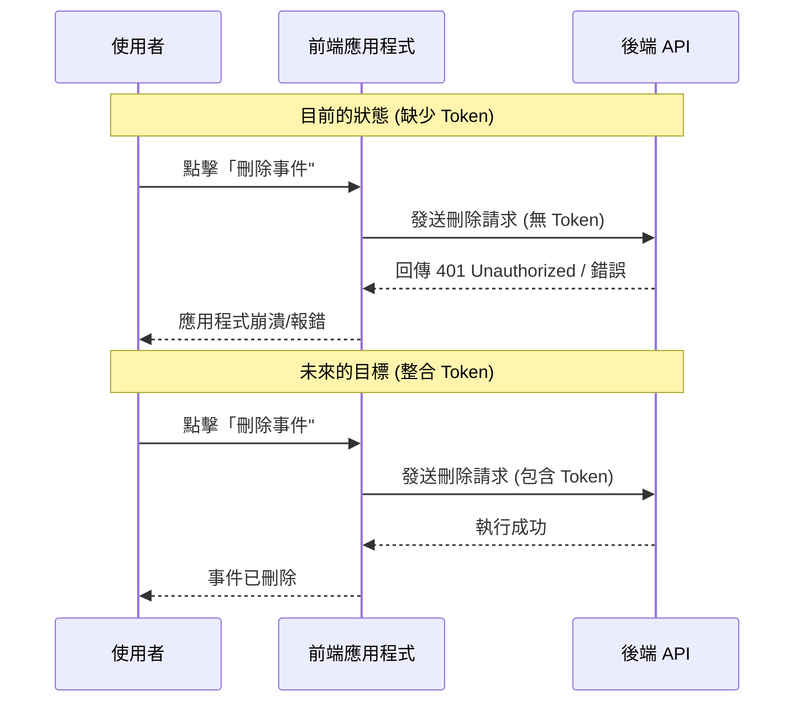

### 錯誤頁面 (Error Page) 的限制

- **目前的顯示問題**：
    - 雖然路由中配置了 `errorElement: <ErrorPage />`，但當錯誤發生時，該頁面無法如預期顯示。
    - **原因**：`ErrorPage` 組件中包含了 `MainNavigation`，而 `MainNavigation` 使用了一些在錯誤處理情境下無法正常運作的功能（例如需要 Token 的功能）。
- **解決方案的關鍵**：
    - 必須確保在所有發往後端的請求中，都正確地附加了身份驗證 Token，以避免因未授權而觸發錯誤頁面。

### 身份驗證 Token 的儲存流程

- **核心目標**：
    - 將 Token 附加到所有對外發送的請求中。
- **第一步：接收並儲存 Token**：
    - 當使用者透過「註冊 (Signup)」或「登入 (Login)」路由成功後，後端會回傳一個包含 Token 的回應。
    - **[後端行為]**：在後端路由中，系統會建立一個 Token，並將其放在回應物件的 `token` 鍵值下回傳給前端。
    - **[前端動作]**：前端在收到回應後，必須提取該 Token 並將其儲存起來，以便後續使用。

```javascript
// AuthForm.js 實作片段：處理登入/註冊回應

const response = await fetch('http://localhost:8000/' + mode, {
  method: 'POST',
  headers: {
    'Content-Type': 'application/json',
  },
  body: JSON.stringify(authData),
});

// 若狀態碼為 422 (驗證錯誤) 或 401 (未授權)，直接回傳回應以供前端處理錯誤顯示
if (response.status === 422 || response.status === 401) {
  return response;
}

// 成功時，response 中將包含後端回傳的 token
```

### 提取與儲存身份驗證 Token

- **[提取流程]**：
    - 在 `action` 函數中，當表單提交並獲得回應後，必須先將回應轉換為 JSON 格式。
    - 從轉換後的資料中，根據後端定義的鍵值（例如 `token`）提取出 Token。

```javascript
// Authentication.js 實作片段

// 1. 獲取回應資料
const resData = await response.json();

// 2. 從資料中提取 token
const token = resData.token;

// 3. 接下來需要將 token 儲存起來
```

- **[Token 儲存方案]**：
    - 為了讓後續請求能使用該 Token，必須將其儲存在某處。常見的選擇包括：
        - **記憶體 (In-memory)**：簡單但重新整理頁面後會消失。
        - **Cookie**：一種瀏覽器機制，適合處理安全性需求。
        - **Local Storage**：一種簡單且直觀的瀏覽器 API，資料會持久化儲存在瀏覽器中，是目前最直接的實作方式。

### 使用 Local Storage 儲存 Token

- **實作方式**：
    - 因為 `action` 函數是在瀏覽器端執行，所以可以直接存取標準的瀏覽器 API。
    - 使用 `localStorage.setItem(key, value)` 將提取出的 Token 存入瀏覽器儲存空間。

```javascript
// Authentication.js 實作片段：儲存 Token

// 1. 獲取回應資料
const resData = await response.json();

// 2. 從資料中提取 token
const token = resData.token;

// 3. 使用 localStorage 儲存 token
localStorage.setItem('token', token);

return redirect('/');
```

- **後續步驟**：
    - 儲存 Token 後，在未來發送需要授權的請求時，可以從 `localStorage` 中取出該 Token 並附加到請求標頭 (headers) 中。
    - 為了簡化這個過程，將會建立一個輔助函數來處理 Token 的讀取與使用。

### 建立身份驗證輔助函數

- **[建立檔案]**：在 `util` 目錄下建立 `auth.js` 檔案，用於存放與身份驗證相關的工具函數。
- **[實作&#32;`getAuthToken`]**：建立一個導出的函數，專門負責從 `localStorage` 中讀取 Token。
    - **[為什麼要這樣做？]**：雖然程式碼目前很簡單，但將其封裝成函數可以提高程式碼的可讀性，且未來若需要擴充 Token 的處理邏輯（例如檢查過期或重新整理）時，只需修改此處即可。

```javascript
// util/auth.js

export function getAuthToken() {
  const token = localStorage.getItem('token');
  return token;
}
```

### 在受保護請求中附加 Token

- **[應用場景]**：當執行需要權限的操作時（例如在 `EventDetail.js` 中刪除一個事件），必須在發出的請求中包含 Token。
- **[實作方式]**：在 `fetch` 的選項中加入 `headers` 物件，並設定特殊的 `Authorization` 標頭。
- **[標頭格式]**：後端預期的格式為 `Bearer` 後接一個空格，然後才是 Token。

```javascript
// EventDetail.js 實作片段：在刪除請求中加入 Token

export async function action({ params, request }) {
  const eventId = params.eventId;

  const response = await fetch('http://localhost:8000/events/' + eventId, {
    method: request.method,
    headers: {
      'Authorization': 'Bearer ' + getAuthToken(),
    },
  });

  if (!response.ok) {
    throw json(
      { message: 'Could not delete event.' },
      { status: 500 },
    );
  }

  return redirect('/events');
}
```

### 在受保護請求中實作 Token 附加

- **[實作步驟]**：
    - 首先，從先前建立的 `util/auth.js` 中導入 `getAuthToken` 函數。
    - 在 `action` 函數內調用該函數，將回傳的 Token 儲存在一個常數中。
    - 將該常數附加到 `fetch` 請求的 `headers` 物件中。

```javascript
// EventDetail.js 實作片段：整合 getAuthToken

import { getAuthToken } from '../util/auth'; // 1. 導入輔助函數

export async function action({ params, request }) {
  const eventId = params.eventId;

  // 2. 獲取 token
  const token = getAuthToken();

  const response = await fetch('http://localhost:8000/events/' + eventId, {
    method: request.method,
    headers: {
      // 3. 將 token 附加到 Authorization 標頭
      'Authorization': 'Bearer ' + token,
    },
  });

  // ... 後續處理
}
```

- **[運作邏輯]**：
    - 當使用者執行登入動作後，Token 會被儲存在 `localStorage` 中。
    - 隨後在執行如「刪除事件」等需要權限的操作時，透過此邏輯，請求會攜帶正確的憑證，使後端能夠驗證使用者身份並允許操作。

### 驗證 Token 儲存與使用

- **[檢查 Token 儲存]**：可以使用瀏覽器 DevTools 的 **Application** 分頁進行檢查。
    - 在 **Local Storage** 區塊下，可以查看是否存在鍵值為 `'token'` 的資料。
    - 可以在此處手動刪除 Token 以清除登入狀態。
- **[驗證受保護操作]**：
    - 透過在請求標頭中附加 Token，原本會因為未授權而失敗的操作（例如「刪除事件」）現在可以成功執行。
    - **[驗證流程]**：選擇一個事件 $\rightarrow$ 點擊刪除 $\rightarrow$ 確認刪除 $\rightarrow$ 事件成功從列表中移除，且不會出現錯誤訊息。
- **[Token 的擴充應用]**：
    - Token 不僅用於 `DELETE` 請求，也同樣適用於其他需要權限的 API 操作，例如 `PATCH`（編輯事件）。

### 將 Token 應用於新增與編輯事件

- **[擴展應用]**：Token 的使用邏輯不僅限於刪除操作，同樣適用於所有受保護的路由，例如在 `EventForm.js` 中新增事件。
- **[實作邏輯]**：
    - 導入 `getAuthToken` 輔助函數。
    - 在 `action` 函數中獲取 Token。
    - 將 Token 附加到 `fetch` 請求的 `headers` 中，格式保持一致。

```javascript
// EventForm.js 實作片段：在新增/編輯請求中加入 Token

import { getAuthToken } from '../util/auth'; // 1. 導入輔助函數

export async function action({ params, request }) {
  const eventId = params.eventId;
  const url = `http://localhost:8080/events${eventId ? '/' + eventId : ''}`;

  // 2. 獲取 token
  const token = getAuthToken();

  const response = await fetch(url, {
    method: request.method,
    headers: {
      'Content-Type': 'application/json',
      // 3. 將 token 附加到 Authorization 標頭
      'Authorization': 'Bearer ' + token,
    },
    body: JSON.stringify(eventData),
  });

  // ... 後續處理
}
```

- **[結果]**：透過這種方式，應用程式中所有需要權限的 API 操作（如新增、編輯、刪除）都能正確攜帶憑證，使後端能夠驗證使用者身份並允許執行操作。

### 驗證受保護路由的運作

- **[測試目標]**：確認「建立 (Create)」、「編輯 (Edit)」與「刪除 (Delete)」這些受保護的路由是否已正確整合 Token 驗證邏輯。
- **[驗證結果]**：
    - **新增事件**：點擊「New Event」並儲存後，新事件成功建立。
    - **編輯事件**：能夠成功修改現有事件的內容。
    - **刪除事件**：能夠成功移除事件。
- **[結論]**：所有受保護的操作皆能正常運作，代表 Token 附加流程與後端驗證機制已正確串接。

### 根據身份驗證狀態更新 UI

- **[核心概念]**：前端應用程式應根據使用者的登入狀態（即是否存在有效的 Token）來動態調整介面元素，以確保使用者只看到與其權限相關的功能。
- **[UI 調整策略]**：
    - **隱藏不必要的導覽項目**：
        - 若使用者已登入（存在 Token），則不應顯示「Authentication」（身份驗證）導覽連結，因為登入狀態下該功能已無意義。
    - **保護功能性按鈕**：
        - 若使用者未登入，應隱藏「Edit」（編輯）、「Delete」（刪除）或「New Event」（新增事件）等按鈕。
        - **[原因]**：避免未經授權的使用者嘗試存取受保護的操作，提升使用者體驗並符合安全邏輯。

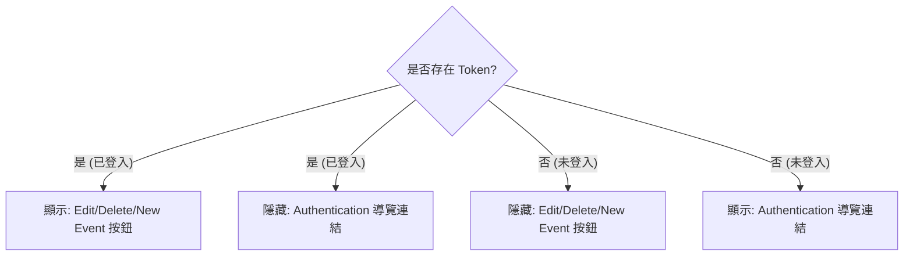

### 實作登出 (Logout) 功能

- **[問題點]**：雖然使用 Local Storage 儲存 Token 很方便，但這也意味著使用者無法輕易地移除它。若要手動刪除，必須透過瀏覽器的開發者工具 (DevTools)，這對一般使用者來說並不友善。
- **[解決方案]**：建立一個「登出 (Logout)」路由與功能，讓使用者可以一鍵清除 Token。
- **[實作步驟]**：
    - 在 `MainNavigation.js` 的導覽組件中，新增一個列表項目 (`<li>`)。
    - 在該項目中加入一個登出按鈕，其樣式應與導覽連結一致。
    - **[動作邏輯]**：該按鈕應觸發一個動作（例如一個 React Router 的 `action`），其核心任務是將儲存在 Local Storage 中的 Token 刪除。

```javascript
// MainNavigation.js 實作片段：新增登出按鈕

<li>
  <button>Logout</button>
</li>
```

### 實作登出 (Logout) 功能的進階做法

- **[設計理念]**：與其在組件中使用 `onClick` 事件監聽器來手動操作 Local Storage，不如採用更符合 React Router 慣例（embracing approach）的方式，即建立一個專屬的路由來處理登出動作。
- **[實作細節]**：
    - 在 `pages` 資料夾中建立 `logout.js` 檔案。
    - **[注意]**：此檔案不需要包含任何 React 組件，因為「登出」本身不需要一個顯示頁面。
    - **[核心邏輯]**：僅匯出一個 `action` 函數，利用瀏覽器標準的 `localStorage.removeItem` 方法來移除 Token。

```javascript
// pages/logout.js 實作
export function action() {
  localStorage.removeItem('token');
}
```

- **[運作流程]**：當使用者觸發登出路由時，React Router 會執行該路由對應的 `action`，進而清除 Local Storage 中的憑證，完成登出程序。

### 登出後的重新導向 (Redirect after Logout)

- **[設計目標]**：當使用者成功執行登出動作（即清除 Token）後，不應停留在空白頁面或原本的路由，而應自動導向回應用程式的起始頁面。
- **[實作方式]**：使用 React Router 提供的 `redirect` 函數。
- **[程式碼實作]**：
    - 首先，從 `react-router-dom` 匯入 `redirect`。
    - 在 `logout.js` 的 `action` 函數中，除了執行 `localStorage.removeItem('token')` 之外，最後回傳一個 `redirect` 呼叫。

```javascript
// pages/logout.js 實作
import { redirect } from 'react-router-dom';

export function action() {
  localStorage.removeItem('token');
  return redirect('/');
}
```

- **[路由配置]**：
    - 在 `App.js` 中註冊一個路徑為 `logout` 的新路由。
    - **[關鍵點]**：此路由僅需配置 `action` 函數，不需要配置 `element`（組件），因為這是一個僅執行邏輯而不顯示 UI 的功能性路由。

### 在導覽列觸發登出動作

- **[實作邏輯]**：為了讓登出按鈕能觸發 `/logout` 路由對應的 `action` 函數，必須使用 React Router 提供的 `<Form>` 組件來包裝按鈕。
- **[程式碼實作]**：
    - 首先，在 `App.js` 中將 `logout` 的 `action` 匯入並指定給 `/logout` 路由。
    - 在 `MainNavigation.js` 中，使用 `<Form>` 組件並設定 `action="/logout"`。

```javascript
// App.js 路由配置片段
import { action as logoutAction } from './pages/logout';

// ... 在 router 配置中
{ path: 'logout', action: logoutAction }
```

```javascript
// MainNavigation.js 實作片段
import { Form } from 'react-router-dom';

// ... 在導覽列中使用 Form 包裝按鈕
<Form action="/logout" method="post">
  <button>Logout</button>
</Form>
```

- **[注意]**：雖然這裡設定了 `method="post"`，但在這種僅需觸發 `action` 的情境下，方法本身並不影響核心邏輯，重點在於 `<Form>` 能正確將請求導向指定的 `action` 路徑。

### 驗證登出流程與 UI 動態更新

- **[驗證登出功能]**：
    - 點擊登出按鈕後，應用程式應正確執行重新導向（Redirect）。
    - **[檢查 Local Storage]**：透過瀏覽器的開發者工具（Application tab）可以確認，登出動作確實將 `'token'` 從 Local Storage 中移除。
- **[根據登入狀態更新 UI]**：
    - 為了提供更好的使用者體驗，應用程式應根據使用者是否持有 Token 來動態顯示不同的導覽項目。
    - **[範例邏輯]**：
        - **若已登入**：顯示「登出 (Logout)」按鈕。
        - **若未登入**：顯示「身份驗證 (Authentication)」連結（例如登入或註冊選項）。

### 身份驗證狀態的全局同步

- **[面臨的問題]**：僅在組件渲染時調用輔助函數（例如 `getAuthToken()`）來獲取 Token 是不夠的。
    - **原因**：輔助函數僅在組件執行時被呼叫，如果 Token 在未來被移除（如執行登出動作），組件並不會因為 Local Storage 的變化而自動重新渲染。
    - **後果**：這會導致 UI 與實際的身份驗證狀態不同步（例如：Token 已刪除，但導覽列仍顯示「登出」按鈕）。
- **[設計需求]**：
    - 需要讓 Token 資訊在整個應用程式的所有路由中都能輕易取得。
    - 需要確保當 Token 狀態發生變化時，UI 能自動進行更新（Automatic UI Updates）。

### 利用 React Router 實現響應式身份驗證狀態

- **[替代方案]**：雖然可以使用 React Context 來管理整個應用程式的 Token，但既然已經在使用 React Router，可以更有效地利用其內建工具。
- **[實作概念]**：
    - 在包裹所有路由的 **Root Route**（根路由）上添加一個 `loader`。
    - **[Loader 的作用]**：該 `loader` 負責從 `localStorage` 中讀取並提取 Token。
    - **[資料流向]**：一旦 Token 被提取，它就會透過該根路由的 `loaderData` 變得可用，並能被所有子路由輕鬆取得。
- **[核心優勢]**：
    - **自動化與響應性**：React Router 會自動處理這些資料，確保當狀態改變時，應用程式能保持同步。

### 實作 Token Loader 以實現響應式狀態

- **[設計思路]**：利用 React Router 的重新抓取（refetch）機制來達成 UI 同步。
    - 當使用者提交登出表單時，React Router 會重新執行根路由的 `loader`。
    - **[自動更新]**\*\*：若重新抓取後發現 Token 不存在，所有使用該 `loaderData` 的頁面都會自動更新，這是一種非常具備響應性（Reactive）的解決方案。
- **[程式碼實作]**：
    - 在 `auth.js` 工具檔案中定義 `tokenLoader` 函數。
    - **[邏輯]**：該函數直接呼叫 `getAuthToken()` 並回傳結果。

```javascript
// auth.js
export function getAuthToken() {
  const token = localStorage.getItem('token');
  return token;
}

export function tokenLoader() {
  return getAuthToken();
}
```

### 在根路由配置 Token Loader

- **[實作方式]**：在 `App.js` 中匯入 `tokenLoader` 並將其分配給根路由的 `loader` 屬性。
- **[解決命名衝突]**：由於 `loader` 是一個常見的變數名稱，在匯入時可以使用 `as` 關鍵字來重新命名，以避免與現有的變數發生衝突。

```javascript
// App.js 實作片段
import { tokenLoader as tokenLoader } from './util/auth';

const router = createBrowserRouter([
  {
    path: '/',
    element: <RootLayout />,
    errorElement: <ErrorPage />,
    loader: tokenLoader,
    children: [
      // ... 其他子路由
    ]
  }
]);
```

- **[運作機制]**：
    - **[觸發時機]**：每當發生新的導覽動作（navigation action）時，例如使用者提交表單或點擊連結切換頁面。
    - **[核心目的]**：每次導覽都會重新檢查 Token 的當前狀態，確保應用程式內部的身份驗證資訊與 `localStorage` 中的實際狀態完全一致。

### 使用 `useRouteLoaderData` 獲取路由資料

- **[核心概念]**：當我們在根路由（Root Route）配置了 `loader` 後，該 `loader` 回傳的資料（例如 Token）可以在應用程式中的任何其他路由組件中被存取。
- **[實作工具]**：使用 React Router 提供的 `useRouteLoaderData` Hook。
    - **[參數]**：需要傳入目標路由的 `id`。
    - **[用途]**：直接從該路由的 `loader` 取得資料，而不需要透過層層傳遞 Props 或使用 Context。
- **[程式碼實作]**：
    - 首先，在 `App.js` 中為根路由指定一個 `id`（例如 `'root'`）。
    - 接著，在組件中透過 `useRouteLoaderData('root')` 來提取資料。

```javascript
// 1. 在 App.js 中為根路由設定 ID
const router = createBrowserRouter([
  {
    path: '/',
    id: 'root', // 設定 ID 以便後續存取
    element: <RootLayout />,
    loader: tokenLoader,
    // ...
  }
]);

// 2. 在 MainNavigation.js 中使用 Hook 取得 Token
import { useRouteLoaderData } from 'react-router-dom';

function MainNavigation() {
  // 透過 'root' ID 直接取得 tokenLoader 回傳的 Token
  const token = useRouteLoaderData('root');

  return (
    // ... 根據 token 狀態渲染 UI
  );
}
```

### 在導覽列中根據登入狀態動態更新 UI

- **[核心邏輯]**：利用從根路由取得的 `token` 是否為 `undefined` 來判斷使用者的登入狀態。
- **[條件式渲染實作]**：
    - **身份驗證連結 (Authentication Link)**：僅在**未登入**（`!token`）時顯示。
    - **登出按鈕 (Logout Button)**：僅在**已登入**（`token` 存在）時顯示。
- **[程式碼實作]**：

```javascript
// MainNavigation.js 實作片段
function MainNavigation() {
  const token = useRouteLoaderData('root');

  return (
    <nav>
      <ul>
        {/* ... 其他連結 ... */}

        {/* 僅在未登入時顯示 Authentication 連結 */}
        {!token && (
          <li>
            <NavLink to="/auth?mode=login">Authentication</NavLink>
          </li>
        )}

        {/* 僅在已登入時顯示 Logout 按鈕 */}
        {token && (
          <li>
            <Form action="/logout" method="post">
              <button>Logout</button>
            </Form>
          </li>
        )}
      </ul>
    </nav>
  );
}
```

### 在導覽組件中根據身份驗證狀態控制功能按鈕

- **[核心概念]**：除了在主導覽列（MainNavigation）中切換登入/登出狀態外，應用程式中的其他導覽組件（例如 `EventsNavigation`）也可以根據 Token 的存在與否，來決定是否顯示特定的功能按鈕。
- **[實作邏輯]**：
    - **[工具]**：同樣使用 `useRouteLoaderData('root')` 從根路由獲取 Token。
    - **[條件式渲染]**：若 `token` 存在，則渲染「新增事件 (New Event)」按鈕；若不存在，則不顯示該按鈕。
- **[程式碼實作]**：

```javascript
// EventsNavigation.js 實作片段
import { NavLink, useRouteLoaderData } from 'react-router-dom';
import classes from './EventsNavigation.module.css';

function EventsNavigation() {
  // 從根路由取得 token
  const token = useRouteLoaderData('root');

  return (
    <nav>
      <ul className={classes.list}>
        <li>
          <NavLink to="/events" className={({ isActive }) => isActive ? classes.active : undefined}>
            All Events
          </NavLink>
        </li>

        {/* 僅在已登入（token 存在）時顯示 New Event 按鈕 */}
        {token && (
          <li>
            <NavLink to="/events/new" className={({ isActive }) => isActive ? classes.active : undefined}>
              New Event
            </NavLink>
          </li>
        )}
      </ul>
    </nav>
  );
}
```

### 在 `EventItem.js` 中根據登入狀態控制管理功能

- **[核心概念]**：為了確保使用者只能在登入狀態下執行編輯或刪除操作，我們需要在顯示這些功能按鈕的組件中檢查 Token。
- **[實作邏輯]**：
    - **[工具]**：使用 `useRouteLoaderData('root')` 直接從根路由獲取身份驗證 Token。
    - **[條件式渲染]**：僅在 `token` 存在時才渲染包含「編輯」與「刪除」按鈕的選單（Menu）。
- **[程式碼實作]**：

```javascript
// EventItem.js 實作片段
import { useRouteLoaderData } from 'react-router-dom';
import classes from './EventItem.module.css';

function EventItem({ event }) {
  // 從根路由取得 token
  const token = useRouteLoaderData('root');

  return (
    <article className={classes.event}>
      {/* ... 其他內容 ... */}

      {/* 僅在已登入（token 存在）時顯示管理選單 */}
      {token && (
        <menu className={classes.actions}>
          <Link to={`/events/${event.id}/edit`}>Edit</Link>
          <button onClick={startDeleteHandler}>Delete</button>
        </menu>
      )}
    </article>
  );
}
```

- **[驗證結果]**：
    - **已登入狀態**：可以看到每個事件項目都有「編輯」與「刪除」按鈕。
    - **登出狀態**：這些管理功能按鈕會自動從 UI 中消失，符合預期的安全性與使用者體驗。

### 路由保護 (Route Protection) 的必要性

- **[現有做法的侷限]**：雖然目前透過 Token 實作了 UI 的條件式渲染（隱藏按鈕），但安全性仍有漏洞
    - 使用者仍可以透過手動在瀏覽器輸入 URL（例如 `/events/new`）來直接進入表單頁面
    - 雖然提交表單會因為無法附帶 Token 而失敗，但使用者仍能看到該頁面的內容
- **[解決方案]**：實作路由保護，確保特定路由在未登入狀態下完全無法被存取
    - **[目標路由]**：需要進行保護的路由通常包含：
        - 新增資料的路由 (例如 `path: 'new'`)
        - 編輯資料的路由 (例如 `path: 'edit'`)

```javascript
// App.js 路由配置範例 (部分內容)
{
  path: 'new',
  element: <NewEventPage />,
  action: manipulateEventAction,
},
{
  path: 'edit',
  element: <EditEventPage />,
  action: manipulateEventAction,
}
```

### 使用 Loader 實作路由保護

- **[核心邏輯]**：為了防止未登入使用者存取敏感路由，可以利用 React Router 的 `loader` 功能進行權限檢查。
- **[檢查流程]**：
    - 在 `loader` 函數中呼叫 `getAuthToken()` 來檢查目前是否存在有效的身份驗證 Token。
    - **[判斷條件]**：如果檢查結果為空（沒有 Token），則使用 `redirect` 將使用者導向其他頁面（例如登入頁面）。
- **[程式碼實作]**：

```javascript
// auth.js 實作片段
import { redirect } from 'react-router-dom';

export function getAuthToken() {
  const token = localStorage.getItem('token');
  return token;
}

export function checkAuthLoader() {
  const token = getAuthToken();
  if (!token) {
    return redirect('/login');
  }
  return null;
}
```

- **[應用方式]**：將此 `checkAuthLoader` 作為受保護路由（如 `new` 或 `edit` 頁面）的 `loader` 屬性，即可實現自動化的路由保護。

### 將路由保護套用到 App 路由配置

- **[實作方式]**：在 `App.js` 的路由定義中，將 `checkAuthLoader` 作為 `loader` 屬性加入到需要保護的路由中。
- **[需要保護的路由]**：
    - `edit` 路由 (編輯事件頁面)
    - `new` 路由 (新增事件頁面)
- **[程式碼實作]**：

```javascript
// App.js 實作片段
import { checkAuthLoader } from './util/auth';

// ... 其他匯入

const router = createBrowserRouter([
  {
    path: 'edit',
    element: <EditEventPage />,
    action: manipulateEventAction,
    loader: checkAuthLoader, // 加入路由保護
  },
  {
    path: 'new',
    element: <NewEventPage />,
    action: manipulateEventAction,
    loader: checkAuthLoader, // 加入路由保護
  },
  // ... 其他路由
]);
```

- **[備選方案]**：除了使用 `redirect` 將使用者導向登入頁面外，也可以選擇拋出錯誤（throw error）來顯示錯誤頁面，這取決於具體的 UX 設計需求。

### 路由保護功能的驗證

- **[驗證流程]**：透過實際操作來確認 `checkAuthLoader` 是否有效攔截未授權存取
    - **未登入狀態**：嘗試造訪 `/events/new` $\rightarrow$ 系統自動重新導向至 `/auth`
    - **已登入狀態**：完成登入後，使用者可以順利進入 `/events/new`，即便是在瀏覽器網址列手動輸入路徑也能正常運作
- **[結論]**：透過在 `loader` 中實作權限檢查，已建立起完善的保護機制，防止使用者意外或刻意進入不應存取的頁面。

### 身份驗證 Token 的有效期

- **[現狀問題]**：目前的實作中，一旦取得 Token 並儲存後，使用者會一直保持登入狀態，這並不符合現實的安全性需求。
- **[安全性考量]**：在實際的後端系統中，Token 通常會設定一個有效期（Expiration Time）。
    - **[範例]**：Token 可能會在一個小時後過期。
    - **[原因]**：為了安全性，Token 應該是短暫有效的（short-lived），以降低 Token 被盜用後的風險。

### 實作自動登出機制

- **[目標]**：當 Token 過期（例如一小時後）時，自動將使用者登出，並確保狀態一致性。
    - **[清理動作]**：
        - 將使用者登出（Lock the user out）。
        - 從 `localStorage` 中移除該 Token。
        - 同步更新 UI，讓使用者立即看到登出後的狀態。
- **[實作思路]**：為了達到全局性的檢查與反應，可以在 Root Layout 中進行監控。
    - **[初步方案]**：在 `Root.js` 檔案中使用 React 的 `useEffect` hook 來監控 Token 狀態或執行定時檢查。
    - **[注意]**：`useEffect` 是 React 的原生功能，並非 React Router 的導航功能，但可以用於此場景。

### 在 Root Layout 實作自動登出監控

- **[核心概念]**：利用 `useEffect` 在應用程式啟動時設定定時器，監控 Token 的有效性。
- **[為何選擇 Root Layout]**：
    - Root Layout 是應用程式啟動時第一個載入的組件（The very first component we load）。
    - 它是所有路由的共同父組件，確保監控邏輯能覆蓋整個應用程式。
- **[實作邏輯]**：
    - 在 `RootLayout` 組件中使用 `useEffect`。
    - 透過 `tokenLoader` 取得目前的 Token 狀態。
    - 在 `useEffect` 中設定定時器，當時間到達 Token 過期時，觸發登出流程。
- **[程式碼實作]**：

```javascript
// Root.js 實作片段
import { useEffect } from 'react';
import { Outlet, useNavigation } from 'react-router-dom';
import MainNavigation from '../components/MainNavigation';

function RootLayout() {
  // 註：此處可透過 useLoaderData 取得 tokenLoader 的結果

  useEffect(() => {
    // 這裡將實作定時器邏輯，例如：
    // const timer = setTimeout(() => { /* 執行登出 */ }, expirationTime);
    // return () => clearTimeout(timer);
  }, []);

  return (
    <>
      <MainNavigation />
      <main>
        {/* navigation.state === 'loading' && <p>Loading...</p> */}
        <Outlet />
      </main>
    </>
  );
}
```

- **[限制條件]**：此方法假設應用程式擁有單一的 Root Layout。如果應用程式結構包含多個平行的 Root Layout，則此全局監控方式將無法運作。

### 在 Root Layout 實作自動登出監控的細節

- **[資料獲取]**：在 `RootLayout` 組件中，直接使用 `useLoaderData` 即可取得由 `tokenLoader` 提供的 Token 資料。
    - **[為何不使用&#32;`useRouteLoaderData`]**：因為目前就在渲染 Root Route 的組件內部，直接使用 `useLoaderData` 最為簡便。
- **[建立監控機制]**：利用 `useEffect` 監控 Token 的狀態變化。
    - **[依賴項設定]**：將 `token` 作為 `useEffect` 的依賴項（dependency array），確保當 Token 被移除或改變時，Effect 會重新執行。
    - **[邏輯流程]**：
        - **若無 Token**：直接 return，不執行任何動作（因為使用者可能已經登出）。
        - **若有 Token**：設定一個 `setTimeout` 定時器，預計在 Token 過期時執行登出動作。
- **[程式碼實作]**：

```javascript
// Root.js 實作片段
import { useEffect } from 'react';
import { Outlet, useLoaderData } from 'react-router-dom';
import MainNavigation from '../components/MainNavigation';

function RootLayout() {
  const token = useLoaderData().token;

  useEffect(() => {
    if (token) {
      // 如果有 Token，設定定時器監控過期
      const timeout = setTimeout(() => {
        // 執行登出邏輯
      }, expirationTime);

      return () => clearTimeout(timeout);
    }
  }, [token]); // 當 token 改變時重新執行

  return (
    <>
      <MainNavigation />
      <main>
        <Outlet />
      </main>
    </>
  );
}
```

- **[自動登出邏輯]**：
    - **[觸發機制]**：利用 `setTimeout` 設定一個定時器，在 Token 過期後執行登出動作。
    - **[實作方式]**：使用 React Router 提供的 `useSubmit` Hook 來程式化地提交登出表單。
    - **[流程]**：當定時器觸發時，呼叫 `submit` 函數，將請求發送到 `/logout` 路由，進而清除 Token 並完成登出。
- **[程式碼實作]**：

```javascript
// Root.js 實作片段
import { useEffect } from 'react';
import { Outlet, useLoaderData, useSubmit } from 'react-router-dom';
import MainNavigation from '../components/MainNavigation';

function RootLayout() {
  const token = useLoaderData().token;
  const submit = useSubmit();

  useEffect(() => {
    if (token) {
      // 設定一個一小時後的定時器來觸發登出
      const timeout = setTimeout(() => {
        submit(undefined, { method: 'post', action: '/logout' });
      }, 3600000); // 3600000 ms = 1 hour

      return () => clearTimeout(timeout);
    }
  }, [token, submit]);

  return (
    <>
      <MainNavigation />
      <main>
        <Outlet />
      </main>
    </>
  );
}
```

- **[自動登出邏輯細節]**：
    - **[觸發機制]**：當定時器到期時，呼叫 `submit` 函數來觸發登出流程。
        - **[參數設定]**：由於登出動作不需要額外的表單資料，因此傳入 `null` 作為第一個參數。
        - **[目標路由]**：透過 `action: '/logout'` 指定要觸發的路由動作。
        - **[HTTP 方法]**：必須將 `method` 設定為 `'post'`，以符合登出路由 `action` 的要求。
    - **[時間計算]**：`setTimeout` 需要以毫秒 (milliseconds) 為單位。
        - **[一小時的換算方式]**：`1 * 60 * 60 * 1000`
            - `1` (小時)
            - `60` (分鐘/小時)
            - `60` (秒/分鐘)
            - `1000` (毫秒/秒)
- **[程式碼實作]**：

```javascript
// Root.js 實作片段
import { useEffect } from 'react';
import { Outlet, useLoaderData, useSubmit } from 'react-router-dom';
import MainNavigation from '../components/MainNavigation';

function RootLayout() {
  const token = useLoaderData().token;
  const submit = useSubmit();

  useEffect(() => {
    if (token) {
      // 設定一個一小時後的定時器來觸發登出
      const timeout = setTimeout(() => {
        submit(null, { action: '/logout', method: 'post' });
      }, 1 * 60 * 60 * 1000);

      return () => clearTimeout(timeout);
    }
  }, [token, submit]);

  return (
    <>
      <MainNavigation />
      <main>
        <Outlet />
      </main>
    </>
  );
}
```

- **[useEffect 執行機制]**：
    - `useEffect` 會在以下情況執行：
        - `RootLayout` 組件初次渲染時
        - 依賴項 `token` 發生變化時（例如使用者登入或登出）
        - `submit` 函數發生變化時（但在本例中 `submit` 通常不會改變）
- **[程式碼清理]**：
    - 由於不再需要偵測導覽狀態，應移除不再使用的 `useNavigation` 匯入，以保持程式碼整潔。
- **[目前的自動登出方案之侷限]**：
    - 雖然目前已實作一小時後自動清除 Token 的邏輯，但講者指出此方案仍存在一個缺陷（後續將進行探討）。

### 目前自動登出方案的缺陷

- **[問題核心]**：定時器無法正確反應 Token 的實際剩餘壽命
    - **[情境模擬]**：
        - 使用者登入後，離開了 10 分鐘
        - 使用者重新整理應用程式 (Reload)
        - `useEffect` 被重新觸發，從 `localStorage` 讀取到 Token
    - **[錯誤的行為]**：
        - 程式碼會再次設定一個新的「一小時」定時器
        - 但實際上該 Token 已經使用了 10 分鐘，後端僅剩 50 分鐘的有效期限
    - **[導致的結果]**：
        - 前端定時器會在 60 分鐘後才嘗試登出
        - 但後端 Token 在 50 分鐘時就已失效
        - 這會導致前端與後端對於「身份驗證狀態」的認知出現落差
- **[結論]**：不能簡單地每次都設定為一小時，必須根據 Token 的實際剩餘時間來管理定時器

### 實作精確的身份驗證到期管理

- **[解決方案]**：在執行身份驗證的 `action` 函數中，除了儲存 Token，也同步儲存其到期時間
    - **[原因]**：這是在第一次獲取 Token 時，唯一能確定其精確到期時間的時機
    - **[目標]**：確保重新整理頁面後，定時器能根據 Token 剩餘的實際壽命來設定，而非重置為一小時
- **[實作邏輯]**：
    - 使用 JavaScript 內建的 `Date` 物件來計算到期日期
    - 利用 `setHours` 方法來設定預期的到期時間
- **[程式碼實作]**：

```javascript
// Authentication.js 實作片段
if (response.ok) {
  const resData = await response.json();
  const token = resData.token;

  // 計算到期時間（假設後端回傳 Token 有效期為一小時）
  const expiration = new Date();
  expiration.setHours(expiration.getHours() + 1);

  localStorage.setItem('token', token);
  localStorage.setItem('expiration', expiration.toISOString());

  return redirect('/');
}
```

- **[技術細節]**：
        - `new Date()`：建立一個代表當下時間的 Date 物件
        - `setHours()`：這是 JavaScript `Date` 物件的內建方法，用於設定小時數
        - `toISOString()`：將 Date 物件轉換為 ISO 格式的字串，以便於儲存在 `localStorage` 中

### 儲存到期時間至 Local Storage

- **[實作方式]**：除了儲存 `token`，還需要將計算出的到期日期轉換為 ISO 字串並儲存
    - **[Key 名稱]**：`expiration`
    - **[轉換方法]**：使用 `toISOString()` 將 Date 物件轉換為標準化字串
- **[後續規劃]**：將更新 `getAuthToken` 工具函數，使其除了讀取 Token 外，也能檢查 `expiration` 欄位以判斷 Token 是否已過期。

### 實作 `getTokenDuration` 輔助函數

- **[功能描述]**：計算 Token 剩餘的有效壽命（以毫秒為單位），用於精確管理自動登出機制。
- **[實作邏輯]**：
    - 從 `localStorage` 中讀取鍵值為 `'expiration'` 的字串。
    - 將該字串轉換為 `Date` 物件，以便進行數學運算。
    - 取得當前的時間戳記（`new Date()`）。
    - 計算兩者之間的差值。
- **[程式碼實作]**：

```javascript
// util/auth.js 實作片段
export function getTokenDuration() {
  const storedExpirationDate = localStorage.getItem('expiration');
  const expirationDate = new Date(storedExpirationDate);
  const now = new Date();

  return expirationDate - now;
}
```

- **[技術重點]**：
    - **類型轉換**：由於 `localStorage` 儲存的所有內容都是字串，必須透過 `new Date(storedExpirationDate)` 將其轉換回 `Date` 物件，才能進行時間差計算。
    - **時間差計算**：在 JavaScript 中，對兩個 `Date` 物件直接進行減法運算，會回傳它們之間相差的毫秒數 (milliseconds)。

### 優化 `getTokenDuration` 的時間計算邏輯

- **[優化方法]**：使用 `getTime()` 方法將 `Date` 物件轉換為毫秒數時間戳記 (timestamp)，以便進行精確的減法運算
- **[計算公式]**：
    - `duration = expirationDate.getTime() - now.getTime()`
- **[計算結果的意義]**：
    - **正值 (Positive value)**：代表 `expirationDate` 仍在未來，即 Token 目前仍然有效
    - **負值 (Negative value)**：代表 `now` 已超過 `expirationDate`，即 Token 已經過期
- **[程式碼實作]**：

```javascript
// util/auth.js 實作片段
export function getTokenDuration() {
  const storedExpirationDate = localStorage.getItem('expiration');
  const expirationDate = new Date(storedExpirationDate);
  const now = new Date();

  const duration = expirationDate.getTime() - now.getTime();

  return duration;
}
```

- **[技術細節]**：
    - `getTime()`：回傳該日期物件所代表的自 1970 年 1 月 1 日 00:00:00 UTC 以來的毫秒數。

### 優化 `getAuthToken` 以處理過期狀態

- **[邏輯更新]**：在取得 Token 後，立即檢查其剩餘有效時間，以判斷 Token 是否已失效。
- **[實作方式]**：
    - 呼叫 `getTokenDuration()` 取得剩餘毫秒數。
    - 若 `tokenDuration < 0`，表示 Token 已過期。
    - 若已過期，則回傳特殊的字串 `'EXPIRED'`，以便應用程式其他部分識別。
- **[程式碼實作]**：

```javascript
// util/auth.js 實作片段
export function getAuthToken() {
  const token = localStorage.getItem('token');

  const tokenDuration = getTokenDuration();

  if (tokenDuration < 0) {
    return 'EXPIRED';
  }

  return token;
}
```

- **[Root Layout 的連動調整]**：
    - 在 `RootLayout` 的檢查邏輯中，除了判斷 `!token`（Token 不存在）之外，現在也必須檢查 `token === 'EXPIRED'`。
    - **[目的]**：確保當輔助函數偵測到過期時，`RootLayout` 能正確觸發登出流程（例如透過 `useSubmit` 提交登出表單）。

### 在 Root Layout 中處理 Token 過期與定時器設定

- **[過期處理流程]**：
    - 首先檢查 Token 是否為 `'EXPIRED'`。
    - 若為過期狀態，則立即呼叫 `submit` 觸發登出動作（`/logout`），並直接 `return` 結束函數，避免進行後續的定時器設定。
- **[設定自動登出定時器]**：
    - 若 Token 有效，則計算其剩餘的有效壽命 (`tokenDuration`)。
    - 使用 `setTimeout` 來監控過期，並將定時器時間設定為 Token 的剩餘有效毫秒數。
- **[程式碼實作]**：

```javascript
// Root.js 實作片段
useEffect(() => {
  if (!token) {
    return;
  }

  if (token === 'EXPIRED') {
    submit(null, { action: '/logout', method: 'post' });
    return;
  }

  const tokenDuration = getTokenDuration();
  console.log(tokenDuration);

  setTimeout(() => {
    submit(null, { action: '/logout', method: 'post' });
  }, tokenDuration);

  // [後續步驟] 應將原本固定的時間替換為動態的 tokenDuration
}, [token, submit]);
```

- **[技術細節]**：
    - **避免重複定時器**：一旦 Token 被判定為過期並觸發登出後，必須使用 `return` 中斷執行，以防止在無效 Token 的情況下重複設定定時器。
    - **動態定時器**：透過 `getTokenDuration()` 取得精確的毫秒數，可以讓 `setTimeout` 在 Token 真正失效的那一刻準確觸發登出動作。

### 優化 `getAuthToken` 的邊界條件處理

- **[邏輯修正]**：在判斷 Token 是否過期之前，必須先處理「完全沒有 Token」的情況。
    - **[原因]**：如果沒有 Token 時仍回傳 `'EXPIRED'`，UI 可能會因為接收到過期訊號而產生錯誤的反應。若直接回傳 `undefined`，應用程式才能正確識別使用者目前處於未登入狀態。
- **[程式碼實作]**：

```javascript
// util/auth.js 實作片段
export function getAuthToken() {
  const token = localStorage.getItem('token');

  // [新增] 若根本沒有 Token，直接回傳 undefined
  if (!token) {
    return;
  }

  const tokenDuration = getTokenDuration();

  if (tokenDuration < 0) {
    return 'EXPIRED';
  }

  return token;
}
```

- **[狀態對照表]**：

| 回傳值 | 代表意義 | UI 預期行為 |
| --- | --- | --- |
| undefined | 使用者未登入 (No Token) | 顯示「身份驗證 (Authentication)」連結 |
| 'EXPIRED' | 使用者已登入但 Token 已失效 | 觸發自動登出流程 (Logout) |
| token (字串) | 使用者已登入且 Token 有效 | 顯示「登出 (Logout)」按鈕並允許受保護操作 |

### 驗證 Token 過期與自動登出機制

- **[開發者工具觀察]**：
    - 在瀏覽器的 `Application` > `Local Storage` 中，可以觀察到 `expiration` 鍵值。
    - 隨著時間推移，該數值會持續減少，代表 Token 剩餘的有效時間。
- **[自動登出的執行限制]**：
    - **[注意]**：單純在頁面內進行導覽（Navigation）時，如果 `RootLayout` 沒有重新渲染，其內部的 `useEffect` 就不會再次執行，因此定時器可能不會立即反應。
    - 但隨著時間流逝，定時器最終會觸發，並執行登出動作。
- **[登出動作的清理工作]**：
    - 在實作登出動作（`logout` action）時，除了移除 `token` 之外，也應該同時移除 `expiration` 鍵值。
    - **[原因]**：確保 `localStorage` 中的資料保持乾淨，避免殘留不再需要的過期資訊。

```javascript
// Logout.js 實作片段
export function action() {
  localStorage.removeItem('token');
  localStorage.removeItem('expiration'); // [新增] 清除過期時間資訊
  return redirect('/');
}
```

### 身份驗證功能實作總結

透過本次實作，應用程式已具備完整的身份驗證能力：

- **使用者帳號管理**：可以成功建立新使用者並進行登入操作。
- **UI 動態同步**：使用者介面會根據目前的登入狀態（透過 Token 是否存在）進行即時更新。
- **受保護的操作與路由**：
    - **Token 附加**：在發出的請求（如刪除事件）中會自動附加 Token，以通過後端驗證。
    - **路由保護**：特定路由被設定為受保護狀態，防止未經授權的使用者存取。
- **Token 生命週期管理**：
    - **自動登出**：透過後台運行的定時器，在 Token 過期時自動執行登出動作。
    - **手動登出**：使用者可以隨時手動登出，並同時清除 `localStorage` 中的相關資訊。

## 從本地開發走向正式部署

- **[開發階段的回顧]**：
    - 在目前的學習過程中，所有的 React 功能開發與測試皆是在**本地機器 (Local Machine)** 上完成的。
    - 開發者的核心工作包含編寫程式碼與進行功能測試。
- **[部署的目標]**：
    - 建立 React 應用程式的最終目的，是將其推送到**真實伺服器 (Real Server)** 上。
    - **[目的]**：透過部署，才能將開發好的網站公開，讓全世界的使用者都能透過網路進行存取。

## 部署流程概覽

- **[學習目標]**：深入探討從開發環境轉向正式生產環境 (Production) 的完整流程。
- **[核心內容]**：
    - 掌握部署過程中的各個具體步驟。
    - 識別並預防部署時可能遇到的常見陷阱 (Pitfalls)。

### 部署 React 應用程式的關鍵議題

- **[路由機制比較]**：
    - 伺服器端路由 (Server-side Routing) vs. 客戶端路由 (Client-side Routing)
    - 探討兩者的運作差異以及在部署環境下的重要性

### 部署步驟

- **[程式碼編寫與測試]**：
    - 部署的第一步是編寫程式碼，隨後必須進行徹底的測試
    - **[測試方式]**：可以透過手動測試或自動化測試來進行
    - **[測試目的]**：確保應用程式已準備好投入使用，並能正確處理各種錯誤情況

### 部署步驟的後續流程

- **[程式碼優化]**：
    - 在正式移交程式碼前，應尋找優化機會以提升效能與使用者體驗
    - **[關鍵技術]**：延遲載入 (Lazy Loading)
- **[建置應用程式 (Build App)]**：
    - 這並非撰寫更多程式碼，而是執行特定的腳本程序
    - **[目的]**：透過建置程序來解析 (parse)、轉換 (transform) 並優化程式碼，使其符合生產環境需求

### 建置產出的優化目標

- **[產生生產就緒的組合包 (Production-ready Bundle)]**：
    - 執行建置腳本後，會輸出經過處理的程式碼組合包，可直接移至伺服器進行部署。
- **[核心優化技術]**：
    - **縮減 (Minification)**：大幅減少程式碼體積。
    - **自動優化 (Automatic Optimization)**：確保輸出結果盡可能精簡。
- **[縮減體積的重要性]**：
    - **[傳輸效率]**：目標是將最少的程式碼傳送到使用者端。
    - **[使用者體驗]**：使用者必須等待網站完全載入後才能開始互動，較小的檔案體積能顯著加快載入速度。

### 部署步驟的最後階段

- **[上傳應用程式 (Upload App)]**：
    - 在完成程式碼的測試、優化與建置程序後，最後一步是將產出的優化組合包上傳到伺服器。
    - **[託管選擇]**：開發者可以根據需求選擇不同的託管提供者 (Hosting Providers) 來存放並執行應用程式。

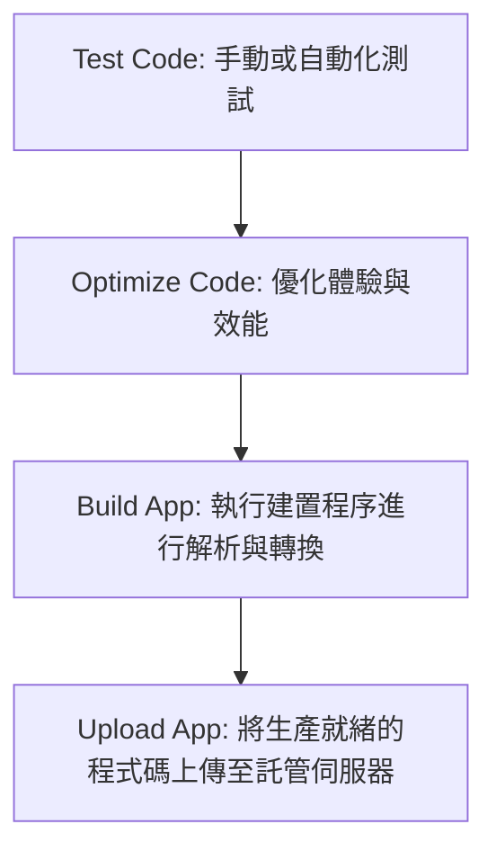

### 配置伺服器 (Configure Server)

- **[核心任務]**：必須針對所選用的伺服器或託管提供商進行正確配置
- **[配置目的]**：
    - 確保應用程式能按照預期的方式運作
    - 確保應用程式的安全性 (Served securely)

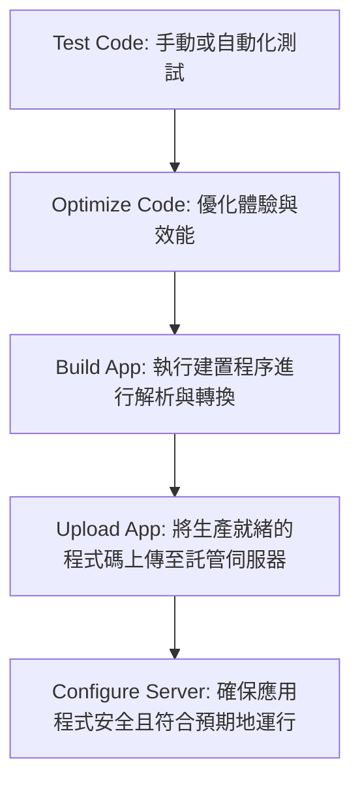

### 部署練習專案概況

- **[專案特性]**：為了示範部署流程，使用了一個結構完整的範例應用程式
    - **功能內容**：抓取並顯示虛擬的部落格文章列表，並可點擊查看文章詳情
    - **技術應用**：
        - 使用 `react-router-dom` 進行路由管理
        - 包含多個頁面組件 (Page Components)
        - 包含多個獨立的子組件 (Separate Components)
- **[學習重點]**：此專案的重點不在於複雜的業務邏輯，而在於透過其完整的結構來練習部署與準備工作

### 程式碼優化 (Optimize Code)

- **[目的]**：在執行正式建置 (Build App) 之前，先優化程式碼以提升使用者體驗與效能
- **[優化技術]**：可以運用先前課程中學過的技術，例如使用 `React.memo` 來減少不必要的重新渲染 (Re-renders)

### 延遲載入 (Lazy Loading)

- **[定義]**：僅在真正需要時才載入特定的程式碼片段 (Load code only when it's needed)
- **[傳統載入方式的運作原理]**：
    - 在沒有使用延遲載入的情況下，專案會透過檔案中的 `import` 陳述式來引入其他檔案的程式碼。
    - 例如在 `MainNavigation.js` 中，會直接引入其他組件或樣式：

```javascript
import { NavLink } from 'react-router-dom';
import classes from './MainNavigation.module.css';

function MainNavigation() {
  return (
    <header className={classes.header}>
      <nav>
        <ul>
          <li>
            <NavLink
              to="/"
              className={({ isActive }) =>
                isActive ? classes.active : undefined
              }
            >
              Home
            </NavLink>
          </li>
          <li>
            <NavLink
              to="/posts"
              className={({ isActive }) =>
                isActive ? classes.active : undefined
              }
            >
              Blog
            </NavLink>
          </li>
        </ul>
      </nav>
    </header>
  );
}
```

- **[潛在問題]**：若所有組件都使用這種方式進行靜態引入，建置後的組合包會包含所有程式碼，導致使用者初次載入時必須下載完整的應用程式，增加等待時間。

### JavaScript 模組導入與依賴關係

- **[模組導入的本質]**：當瀏覽器評估 (evaluate) 一個組件檔案時，必須先處理檔案中所有的 `import` 陳述式。
- **[依賴解析流程]**：
    - 為了正確處理組件（例如 `BlogPage`），瀏覽器必須先載入該組件所依賴的代碼（例如 `useLoaderData` 鉤子或 `PostList` 組件）。
    - 所有的 `import` 最終會將不同的檔案連接起來，形成一個完整的依賴網路。
- **[對應用程式的影響]**：
    - 當應用程式被提供給使用者時，所有的依賴關係都必須在螢幕顯示內容之前被解析完成。

```javascript
import useLoaderData from 'react-router-dom';
import PostList from '../components/PostList';

function BlogPage() {
  const posts = useLoaderData();
  return <PostList posts={posts} />;
}

export default BlogPage;

export function loader() {
  return fetch('https://jsonplaceholder.typicode.com/posts');
}
```

### 模組合併與載入機制

- **[建置後的行為]**：
    - 在執行建置程序後，所有透過 `import` 引入的檔案最終會被合併成一個大型的組合包 (Bundle)。
- **[載入與解析的限制]**：
    - **[依賴關係]**：所有的程式碼檔案都必須在內容顯示給終端使用者之前，完成載入與解析。
    - **[理論上的挑戰]**：如果應用程式非常龐大，所有依賴項都需要在首屏渲染前載入，可能會造成載入延遲。
    - **[小型專案的情況]**：對於結構簡單、檔案數較少的應用程式，這種「必須先解析所有導入」的機制對效能影響微乎其微。

### 大型應用程式的效能挑戰

- **[規模化的問題]**：
    - 當應用程式變得複雜，擁有數十甚至數百個路由與組件時，一次性載入所有程式碼會成為嚴重的效能瓶頸。
- **[對使用者體驗的影響]**：
    - 使用者在第一次造訪網站時，必須等待所有程式碼下載完成後才能看到任何內容，這會導致初始載入時間過長，進而造成不良的使用者體驗。
- **[解決方案：延遲載入 (Lazy Loading)]**：
    - **[核心概念]**：與「預先載入 (Ahead of time)」的概念相反，延遲載入是指僅在真正需要該組件時，才進行程式碼的載入。

### 實作延遲載入 (Lazy Loading)

- **[引入目的]**：雖然目前的應用程式結構簡單，不需要立即使用，但透過實作延遲載入，可以學習如何優化大型、複雜網站的載入效能。
- **[應用情境]**：當應用程式變得龐大，擁有數十甚至數百個路由與組件時，延遲載入能避免使用者在初次進入時必須下載整套程式碼的問題。

### 實作延遲載入 (Lazy Loading) 的步驟

- **[核心邏輯]**：以 `BlogPage` 為例，目標是讓 `BlogPage` 組件及其依賴項（例如 `PostList`）僅在使用者導航到該頁面時才被下載。
- **[避免預先載入 (Eager Loading)]**：
    - 如果保留檔案頂部的靜態 `import`，該組件仍會被視為必要的依賴，導致使用者在進入首頁時就必須下載它。
    - **[關鍵動作]**：必須首先移除現有的靜態 `import` 陳述式。

#### 調整前的程式碼狀態 (App.js)

當 `BlogPage` 使用靜態導入時，它會被包含在初始組合包中：

```javascript
import BlogPage from './pages/Blog';
// ... 其他導入

const router = createBrowserRouter([
  {
    path: '/',
    element: <RootLayout />,
    children: [
      { index: true, element: <HomePage /> },
    ]
  },
  {
    path: 'posts',
    element: <BlogPage />,
    loader: postsLoader,
  },
]);
```

#### 調整後的程式碼狀態 (App.js)

為了實現延遲載入，將 `import` 改為帶有 `loader` 的動態導入方式：

```javascript
import BlogPage, { loader as postsLoader } from './pages/Blog';
// 注意：在實際實作延遲載入時，此處的 BlogPage 導入會被替換為 React.lazy()
```

> **[重要提示]**：若要達成真正的延遲載入，必須確保組件不再透過傳統的 `import` 語法在檔案頂部被靜態引用，否則建置程序會將其視為必須立即解析的依賴。

### 實作延遲載入 (Lazy Loading) 的進階處理

- **[處理多重匯出]**：
    - 當使用 `import` 語法時，不只會引入組件本身，還可能同時引入如 `loader` 等其他功能。
    - **[範例]**：若原本寫法為 `import BlogPage, { loader as postsLoader } from './pages/Blog'`，則 `BlogPage` 與 `postsLoader` 都必須改為延遲載入，以避免靜態引用造成預先載入 (Eager Loading)。
- **[延遲載入 Loader 的方式]**：
    - 不能直接將動態引入的結果給予 `loader` 屬性，而是需要傳入一個**函式**。
    - 該函式內部執行 `import()` 動作，確保只有在路由觸發時才執行載入邏輯。

#### 調整後的路由配置 (App.js)

為了讓 `loader` 也能延遲載入，需將原本的 `loader: postsLoader` 改為一個回傳動態 `import` 的函式：

```javascript
// 調整前的靜態引用 (會導致預先載入)
// import BlogPage, { loader as postsLoader } from './pages/Blog';

const router = createBrowserRouter([
  // ... 其他路由
  {
    path: 'posts',
    children: [
      {
        index: true,
        element: <BlogPage />,
        // 透過函式包裝 import() 來實現延遲載入 loader
        loader: () => import('./pages/Blog').then(module => module.postsLoader),
      },
    ],
  },
]);
```

> **[關鍵點]**：利用 `import()` 關鍵字配合函式，可以確保 `loader` 及其依賴的程式碼不會在應用程式啟動時就被強制下載。

### 動態導入 (Dynamic Import) 的運作機制

- **[核心概念]**：除了傳統的檔案頂部 `import` 語法外，`import` 也可以作為一個**函式**來呼叫。
    - **[使用方式]**：在函式中傳入檔案路徑，例如 `import('./pages/Blog')`。
    - **[非同步特性]**：由於下載程式碼是一個需要時間的過程，因此 `import()` 會回傳一個 **Promise**。
- **[處理載入結果]**：
    - 可以使用 `.then()` 關鍵字來處理 Promise 的結果。
    - 透過 `.then()` 取得的是載入後的**模組 (module)**。

#### 實作延遲載入 Loader 的範例

在路由配置中，我們可以使用動態導入來延遲載入 `loader` 函數：

```javascript
// 在 router 配置中
{
  index: true,
  element: <BlogPage />,
  // 透過 import() 函式與 .then() 取得模組中的特定 export
  loader: () => import('./pages/Blog').then(module => module.postsLoader),
}
```

- **[執行流程]**：

        1. 觸發路由導航。
        2. 執行 `import()` 函式，開始非同步下載 `./pages/Blog` 檔案。
        3. 下載完成後，Promise 解析 (resolve) 並進入 `.then()` 區塊。
        4. 從 `module` 物件中提取出 `postsLoader` 並作為該路由的 `loader` 使用。

### 延遲載入 Loader 的實作細節

- **[運作機制]**：
    - 使用 `import()` 函式來進行非同步載入。
    - `import()` 會回傳一個 **Promise**，解析後的結果是一個包含該檔案所有匯出內容的**模組物件 (Module Object)**。
    - 透過 `.then()` 方法，可以從該模組物件中提取出所需的 `loader` 函數。
- **[延遲觸發條件]**：
    - 這種載入是「按需 (On-demand)」的：只有當使用者導航到該路由（例如造訪 `/posts`）時，瀏覽器才會執行 `import()` 並下載對應的檔案。

#### 實作程式碼範例 (App.js)

在路由配置中，透過函式回傳動態導入的結果：

```javascript
{
  index: true,
  element: <BlogPage />,
  // 只有在進入此路由時，才會執行 import() 並提取 postsLoader
  loader: () => import('./pages/Blog').then(module => module.postsLoader),
}
```

- **[型別說明]**：
    - 根據開發者工具的提示，此 `loader` 的型別為 `Promise<Response>`，這符合 React Router 對 `loader` 函數回傳值的預期。

### 延遲載入 BlogPage 組件

除了 `loader` 之外，也可以對頁面組件本身進行延遲載入：

```javascript
// 嘗試將組件設為動態導入的函式
const BlogPage = () => import('./pages/Blog');
```

- **[潛在問題]**：雖然這看起來像是在執行動態導入，但這並不是一個有效的 React 組件。
    - **[原因]**：雖然在 JavaScript 中組件可以寫成函式，但一個有效的 React 組件**必須回傳 JSX**。
    - **[結果]**：上述程式碼回傳的是一個 Promise（由 `import()` 產生），而不是 JSX，因此無法直接作為組件使用。

### 使用 `React.lazy` 實作組件延遲載入

- **[問題點]**：直接將 `import()` 的結果賦值給組件變數是無效的。
    - **[原因]**：如前所述，`import()` 會回傳一個 **Promise**，而 React 組件必須回傳 JSX。
- **[解決方案]**：使用 React 提供的 `lazy` 函數來包裝動態導入的函式。
    - **[運作方式]**：`lazy` 會接收一個回傳 Promise 的函式作為參數，並處理該 Promise，讓該變數能被視為一個有效的 React 組件。

#### 實作程式碼範例 (App.js)

透過 `lazy` 函數來正確定義可延遲載入的組件：

```javascript
import { lazy } from 'react';
// ... 其他匯入

// 使用 lazy 函數包裝動態導入，使其成為有效的 React 組件
const BlogPage = lazy(() => import('./pages/Blog'));

const router = createBrowserRouter([
  {
    path: '/',
    element: <RootLayout />,
    children: [
      {
        index: true,
        element: <HomePage />,
      },
      {
        path: 'posts',
        element: <BlogPage />,
        loader: () => import('./pages/Blog').then(module => module.postsLoader),
      },
    ],
  },
]);
```

- **[注意]**：雖然現在 `BlogPage` 可以作為組件使用，但由於程式碼仍需透過網路下載，因此在組件實際渲染前，仍會有一段載入時間。

### 使用 `Suspense` 處理延遲載入的等待狀態

- **[核心概念]**：
    - 當使用 `React.lazy` 時，組件的程式碼必須經過網路下載才能渲染。
    - 為了避免在下載期間應用程式崩潰或出現空白，必須使用 React 提供的 `<Suspense>` 組件來包裹這些延遲載入的組件。
- **[Suspense 的作用]**：
    - 它會「等待」內容載入完成後才進行實際的渲染。
    - 透過 `fallback` 屬性，可以指定在等待期間要顯示的內容（例如載入中的文字或動畫）。

#### 實作程式碼範例 (App.js)

在路由配置中，使用 `<Suspense>` 包裹延遲載入的組件，並設定 `fallback`：

```javascript
import { Suspense } from 'react';
// ...
{
  path: 'posts',
  element: (
    <Suspense fallback={<p>Loading...</p>}>
      <BlogPage />
    </Suspense>
  ),
  loader: () => import('./pages/Blog').then(module => module.postsLoader),
}
```

- **[注意]**：`<Suspense>` 必須從 `react` 套件中匯入。

### 使用 `Suspense` 的 `fallback` 處理載入狀態

- **[功能說明]**：透過 `<Suspense>` 的 `fallback` 屬性，可以指定在組件程式碼下載完成前的顯示內容。
- **[優化點]**：不僅可以延遲載入組件，也可以將 `loader` 的程式碼也設定為動態導入，實現「按需載入」組件與資料。

#### 實作程式碼範例 (App.js)

在路由配置中，使用 `<Suspense>` 包裹延遲載入的組件，並透過 `fallback` 提供視覺回饋：

```javascript
{
  path: 'posts',
  element: <Suspense fallback={<p>Loading...</p>}>
    <BlogPage />
  </Suspense>,
  loader: () => import('./pages/Blog').then(module => module.loader()),
}
```

- **[運作邏輯]**：
    - 當使用者點擊連結進入該路由時，瀏覽器會開始下載組件與 `loader` 的程式碼。
    - 在下載完成前，畫面會顯示 `fallback` 指定的內容（例如 `<p>Loading...</p>`）。
    - 一旦程式碼下載完畢，React 就會立即執行 `loader` 並渲染組件。

### 驗證延遲載入效果

- **[驗證方法]**：可以使用瀏覽器開發者工具 (DevTools) 的 **Network** 分頁來觀察。
    - 在切換路由時，觀察是否有新的 JavaScript 檔案被請求下載。
    - 透過清除 Network 紀錄後重新整理頁面，可以清楚看到載入過程中的網路請求。

### 延遲載入的進階應用：內容層級

- **[概念延伸]**：延遲載入不僅可以應用於整個頁面（如 `BlogPage`），也可以應用於頁面內的個別內容項目（如每一篇獨立的部落格文章）。
- **[目前的狀況]**：在目前的實作中，若點擊單一文章：
    - 瀏覽器會發出一個請求來下載該文章的資料 (post data)。
    - **[缺點]**：由於尚未對文章組件實作延遲載入，因此不會有額外的請求來下載該文章對應的 JavaScript 組件程式碼。

#### 觀察延遲載入的效果

當對 `BlogPage` 使用 `React.lazy` 後，透過瀏覽器開發者工具的 **Network** 分頁可以觀察到：

- 點擊「Blog」連結時，會動態下載一個 JavaScript 檔案。
- 這個檔案包含了該頁面所需的 `loader` 程式碼以及 `BlogPage` 組件的程式碼。

### 實作單一文章頁面的延遲載入

為了進一步優化效能，可以針對個別的文章頁面實作延遲載入，而不僅僅是整個部落格頁面。

#### 實作步驟

1. **延遲載入組件**

    - 使用 `React.lazy` 並在回傳的函數中使用動態 `import`。
    - 範例程式碼：

```javascript
const PostPage = lazy(() => import('./pages/Post'));
```

2. **延遲載入 Loader**

    - 在路由配置中，將 `loader` 也設定為一個回傳動態 `import` 的函數，確保資料獲取的邏輯也是按需下載。
    - 範例程式碼：

```javascript
{
       path: 'posts/:id',
       element: <PostPage />,
       loader: () => import('./pages/Post').then(module => module.postLoader)
     }
```

- **[優點]**：這樣做可以確保使用者只有在點擊特定文章時，才會下載該文章所需的組件程式碼以及處理資料的 `loader` 邏輯，進一步減少初始載入的資源量。

### 解決延遲載入 Loader 時的參數缺失問題

在實作單一文章頁面 (`PostPage`) 的延遲載入時，雖然組件程式碼可以動態下載，但在執行 `loader` 時會遇到錯誤。

#### 錯誤原因

- **[錯誤訊息]**：`Cannot destructure property 'params' of '_ref' as it is undefined.`
- **[根本原因]**：當我們使用 `import().then()` 的方式動態載入 `loader` 時，React Router 注入到該函數中的 `params` 物件並沒有被傳遞到實際的 `loader` 邏輯中，導致函數執行時嘗試解構一個不存在的物件。

#### 修正方法

必須在動態導入的鏈結中，手動將接收到的參數（例如 `params`）傳遞給真正的 `loader` 函數。

**修正前的程式碼 (App.js)：**

```javascript
{
  path: 'id',
  element: <PostPage />,
  loader: () => import('./pages/Post').then(module => module.loader()),
}
```

**修正後的程式碼 (App.js)：**

```javascript
{
  path: 'id',
  element: <PostPage />,
  loader: (params) => import('./pages/Post').then(module => module.loader(params)),
}
```

- **[修正邏輯]**：
    - `loader: (params) => ...`：首先在路由層級接收 React Router 傳入的 `params`。
    - `.then(module => module.loader(params))`：在 `import` 完成後，將這些 `params` 作為參數傳入從模組中提取出來的 `loader` 函數中，確保資料載入邏輯能正確取得 URL 中的 ID 等資訊。

#### 完善單一文章頁面的延遲載入實作

除了修正 `loader` 的參數傳遞問題外，為了確保使用者體驗完整，還需要處理組件本身的載入狀態。

**1. 為組件添加 Suspense 處理**

由於 `PostPage` 現在是透過 `React.lazy` 進行延遲載入，必須在路由配置中使用 `<Suspense>` 包裹它，並提供 `fallback` 屬性（例如顯示 "Loading..."），以避免在組件程式碼下載完成前發生錯誤。

**2. 完整的路由配置範例**

結合了 `Suspense` 處理與 `loader` 參數轉發後的配置如下：

```javascript
{
  path: 'id',
  element: (
    <Suspense fallback={<p>Loading...</p>}>
      <PostPage />
    </Suspense>
  ),
  loader: (meta) => import('./pages/Post').then(module => module.loader(meta)),
}
```

- **[邏輯解析]**：
    - `element` 部分：使用 `<Suspense>` 包裹 `<PostPage />`，確保組件在下載期間有適當的 UI 回饋。
    - `loader` 部分：接收 React Router 的 `meta` 物件（其中包含 `params`），並透過 `.then()` 將該物件傳遞給動態載入模組中的 `loader` 函數。

**3. 驗證延遲載入效果**

完成上述修改後，可以透過以下步驟確認實作成功：

1. 開啟瀏覽器開發者工具的 **Network** 分頁。
2. 清除目前的網路請求紀錄。
3. 在應用程式中點擊單一文章連結。
4. **[預期結果]**：觀察到瀏覽器發出了一個新的 JavaScript 檔案請求，這代表該文章的組件程式碼已成功實現按需下載（Lazy Loading）。

### 準備正式部署 (Production Build)

在完成程式碼優化（如延遲載入）後，下一步是將應用程式從開發階段轉向正式部署階段。

#### 為什麼需要 Build 步驟？

開發時使用的程式碼與最終上傳到伺服器的程式碼並不相同。開發環境的程式碼主要為了「可讀性」而設計，但這會導致以下問題：

- **瀏覽器相容性問題**：開發中使用的某些語法（例如 `JSX`）並非瀏覽器原生支援的標準 JavaScript，必須經過轉換才能執行。
- **效能問題**：開發程式碼包含許多開發工具與未經壓縮的資訊，不適合直接供終端使用者下載。

因此，必須執行 **Build 過程**，其核心目的包含：

1. **解析 (Parse)**：讀取原始程式碼。
2. **轉換 (Transform)**：將 JSX 或其他非標準語法轉換為標準 JavaScript。
3. **優化 (Optimize)**：對程式碼進行壓縮與優化，以提升效能。

#### 部署流程概覽

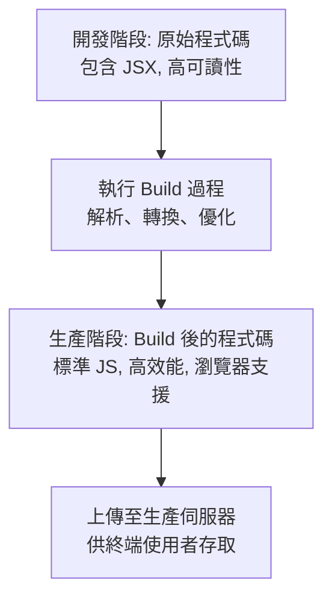

#### 開發伺服器與正式建置的差異

- **開發伺服器 (Development Server)**
    - 使用 `npm start` 啟動
    - 提供「即時轉換 (Live Transformation)」功能：當開發者撰寫程式碼時，伺服器會即時將程式碼轉換為瀏覽器可執行的版本
- **正式建置 (Production Build)**
    - 目的是為了上傳程式碼時能達到最佳效能與優化
    - **[執行方式]**：必須先停止開發伺服器，然後執行建置指令：

```bash
npm run build
```

    - **[運作原理]**：在底層會執行專案中的 `build` 腳本，產生一個包含高度優化且經過轉換的程式碼包 (Code Bundle)，這才是準備好要上傳至伺服器的檔案。

### 建置產出的內容與結構

執行 `npm run build` 後，系統會產生一個 `build` 資料夾，這才是真正需要上傳至伺服器進行部署的內容。

#### `build` 資料夾的組成

- **`static`&#32;資料夾**：包含所有優化後的靜態檔案
    - **主檔案 (Main Chunk)**：包含開發者撰寫的所有程式碼以及所有使用的第三方套件（例如 `react` 函式庫本身）。
    - **動態載入塊 (Dynamic Chunks)**：與延遲載入 (Lazy Loading) 相關的 JavaScript 檔案片段。
- **[特性]**：這些檔案雖然經過高度優化與壓縮，導致人類難以閱讀，但它們是完全符合標準且可由瀏覽器直接執行的有效程式碼。

### 部署流程的最後階段

在完成 Build 過程並取得優化後的程式碼包後，最後一個關鍵步驟就是將這些檔案上傳至伺服器，完成網站的部署。

### React SPA 的本質

- **React SPA 是一個「靜態網站 (Static Website)」**
    - 它僅由以下檔案組成：
        - HTML
        - CSS
        - JavaScript
        - 以及可能的圖片檔案
- **[執行機制]**：
    - 程式碼並不在伺服器端執行
    - 所有的程式碼都會由使用者的**瀏覽器**進行解析，並在**訪客的電腦**上執行
- **部署建議**：
    - 因為不需要在伺服器端執行任何程式碼，所以只需要使用**靜態網站託管 (Static Site Host)**
    - 不需要選擇需要執行伺服器端程式碼的託管供應商

### 部署選擇與託管服務

- **React SPA 的部署需求**
    - 因為 React SPA 本質上是靜態網站，所以只需要使用**靜態網站託管 (Static Site Host)**
    - 這與需要執行伺服器端程式碼的全端應用程式 (Full-stack applications，例如 MERN stack) 不同
- **尋找託管供應商**
    - 可以透過搜尋「deploy static site」來尋找各種可能的部署提供商、流程與教學文章
- **本單元使用的工具**
    - 將使用 **Firebase Hosting** 作為示範用的託管服務

### 開始使用 Firebase Hosting

- **準備工作**
    - 需要擁有一個 **Google 帳戶**
    - 需先登入 Firebase 控制台
- **建立專案流程**

    1. 點擊「Create a project」
    2. 為專案命名（例如：`React Deployment Demo`）
    3. 根據需求選擇是否啟用 Google Analytics

- **關於 Firebase**
    - Firebase 不僅提供託管服務，還提供多種其他的雲端服務（如資料庫、身份驗證等）以協助開發應用程式

### 使用 Firebase Hosting 的部署流程

- **選擇服務類型**
    - 雖然 Firebase 提供多種功能，但對於 React SPA，我們僅需使用其**靜態網站託管 (Static Site Hosting)** 服務
- **Firebase Hosting 引導流程 (Walkthrough)**
    - 在 Firebase 控制台中點擊「Build Hosting」後，系統會提供直觀的引導步驟
- **安裝 Firebase 工具**
    - **[第一步]**：必須安裝專門的工具（Firebase CLI），以便將本地的程式碼包上傳至 Firebase 伺服器
    - **[執行指令]**：需在終端機 (Terminal) 執行安裝指令（如 `npm install -g firebase-tools`）
    - **[權限注意事項]**：
        - 在 **macOS** 或 **Linux** 環境下執行安裝指令時，若遇到權限不足，需在指令前加上 `sudo`

### Firebase 工具的身份驗證流程

- **[登入必要性]**
    - 安裝完 Firebase CLI 工具後，必須執行登入程序
    - **[目的]**：為了驗證透過該工具發出的請求，確保程式碼能被正確上傳至使用者的 Google 帳戶與對應的 Firebase 專案
- **[執行步驟]**

    1. 等待 Firebase 工具安裝程序完成
    2. 在終端機執行登入指令：

```bash
firebase login
```

    1. 依照提示輸入 Google 帳戶的用戶名與密碼（或透過瀏覽器完成驗證）
    2. 確認登入成功，即可進行後續的部署配置

### Firebase 專案初始化流程

- **[初始化指令]**
    - 在完成登入後，需執行 `firebase init` 指令
    - **[目的]**：將本地開發的專案轉換為一個與 Firebase 雲端專案相連的專案
- **[配置步驟]**

    1. **選擇 Firebase 功能**

            - 系統會列出多種可用的 Firebase 服務供選擇
            - **[本案例選擇]**：僅選擇 `Hosting: Configure files for Firebase Hosting and (optionally) set up GitHub Action deploys`
            - **[注意]**：若僅需單純託管，無需選擇 GitHub Actions 選項

    1. **選擇專案關聯方式**

            - 系統會詢問要使用哪一個 Firebase 專案
            - **[選擇方式]**：選擇 `Use an existing project`（使用現有專案），因為先前已在 Firebase 控制台中手動建立了專案

### Firebase Hosting 初始化配置細節

- **選擇 Firebase 專案**
    - 在初始化過程中，需選擇一個與本地專案關聯的 Firebase 專案
    - **[執行方式]**：從列表中選擇已建立的專案（例如 `react-deployment-demo`），若列表中未出現，則可選擇建立新專案
- **Hosting 設定參數**
    - **公開目錄 (Public Directory)**
        - 系統會詢問哪一個資料夾的內容應被上傳至 Firebase
        - **[React SPA 設定]**：應輸入 `build`（而非預設的 `public`），因為 React 在建置後會產出內容於 `build` 資料夾中
    - **單頁應用程式配置 (Single-page app)**
        - 系統會詢問是否要將此配置為 single-page app
        - **[建議選擇]**：選擇 `Yes` (y)，這會自動將所有 URL 重新導向至 `index.html`，這對 React Router 的路由運作至關重要
    - **自動建置與部署 (Automatic builds and deploys)**
        - 詢問是否要設定自動建置與部署流程
        - **[本案例選擇]**：選擇 `No` (n)
    - **檔案覆寫 (Overwrite index.html)**
        - 系統會詢問是否要覆寫現有的 `build/index.html` 檔案
        - **[注意]**：應選擇 `No` (n)，以避免覆蓋掉 React 產出的正確檔案

### Firebase 部署與線上管理

- **[部署指令]**
    - 在完成初始化配置後，需執行以下指令將本地建置後的檔案上傳至 Firebase 伺服器：

```bash
firebase deploy
```

    - **[執行結果]**
        - 指令會將 `build` 資料夾內的內容上傳
        - 完成後，終端機會提供一個公開的 URL，可用於訪問已上線的網站
- **[網站驗證]**
    - 部署成功後，網站的運作方式應與本地開發環境一致，但現在已能在網路上被所有人存取
- **[進階管理]**
    - **自定義網域**：可以在 Firebase 控制台中為網站添加自定義網域
    - **下線網站**：若需要將網站從網路上移除（使其離線），可執行以下指令：

```bash
firebase hosting:disable
```

### Firebase Hosting 部署選項與總結

- **[網站下線選項]**
    - 在配置過程中，系統可能會詢問是否要讓現有的網站下線（take your site offline）
    - **[選擇影響]**
        - 若選擇 **Yes**：會導致目前的網站無法被存取（inaccessible）
        - 若選擇 **No**：則會保留現有內容，並進行更新部署
- **[部署總結]**
    - 透過上述的初始化與配置流程，即可成功將開發中的 React 網站部署至 Firebase 託管環境中

### 單頁應用程式 (SPA) 配置的重要性

- **[配置選項]**
    - 在部署過程中，系統會詢問是否要將專案配置為單頁應用程式 (Single-page app)
    - **[選擇]**：必須選擇 `Yes` (y)
- **[為什麼這很重要？]**
    - React 應用程式中的頁面導航是由 **React Router** 提供的
    - 這種路由邏輯是在**瀏覽器端**執行的，而非由伺服器處理
    - **[運作原理]**\*\*
        - 若使用者直接訪問特定路由（例如 `example.com/about`），伺服器預設會嘗試尋找名為 `about` 的檔案或目錄
        - 因為 SPA 只有一個實體檔案 `index.html`，伺服器會回傳 404 錯誤
        - 設定為 SPA 後，Firebase 會將所有請求重新導向至 `index.html`，讓 React Router 接手並正確載入對應的組件
- **[Firebase 配置實例]**
    - 在 `firebase.json` 中，這項設定透過 `rewrites` 規則來實現：

```json
"rewrites": [
  {
    "source": "**",
    "destination": "/index.html"
  }
]
```

    - `source: "**"` 表示匹配所有路徑
    - `destination: "/index.html"` 表示將這些請求全部導向至入口檔案

### 伺服器端路由 vs. 客戶端路由

- **客戶端路由 (Client-side Routing)**
    - `react-router-dom` 是一個**客戶端套件**，其邏輯是在瀏覽器中執行，而非伺服器
    - **[運作行為]**：當使用者點擊應用程式內的連結（例如導覽列中的按鈕）時，組件的切換邏輯完全在瀏覽器端完成，不會向伺服器請求新頁面
- **直接存取 URL 的流程**
    - 當使用者直接在網址列輸入特定路徑（例如 `domain/posts`）時，流程如下：

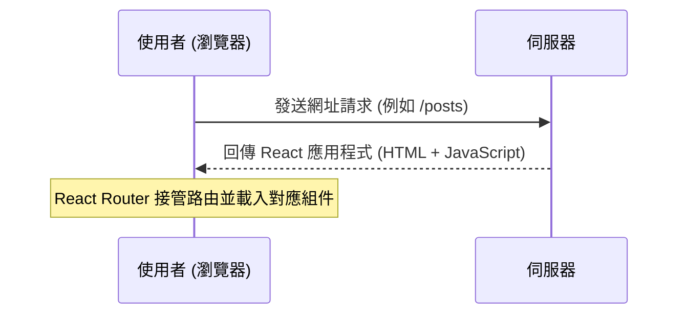

    - **[技術細節]**
        - 瀏覽器必須向伺服器請求該網址對應的資源
        - 伺服器回傳的內容是整個 React 應用程式的基礎檔案（HTML 與 JS 程式碼），隨後由客戶端的 React Router 處理後續的路由顯示

### 伺服器端路由與客戶端路由的衝突

- **預設伺服器行為**
    - 當使用者請求特定路徑（例如 `/posts`）時，伺服器預設會嘗試在檔案系統中尋找匹配的資料夾或檔案
    - **[問題點]**：由於 SPA 本身沒有伺服器端的路由處理邏輯，伺服器會因為找不到對應的實體檔案而導致請求失敗
- **SPA 的正確處理方式**
    - 伺服器不應嘗試尋找路徑對應的檔案，而是應該**始終回傳相同的 HTML 檔案與 JavaScript 程式碼**
    - **[目的]**：讓請求的路徑交由客戶端的 JavaScript（即 React Router）來解析並決定要顯示哪個組件

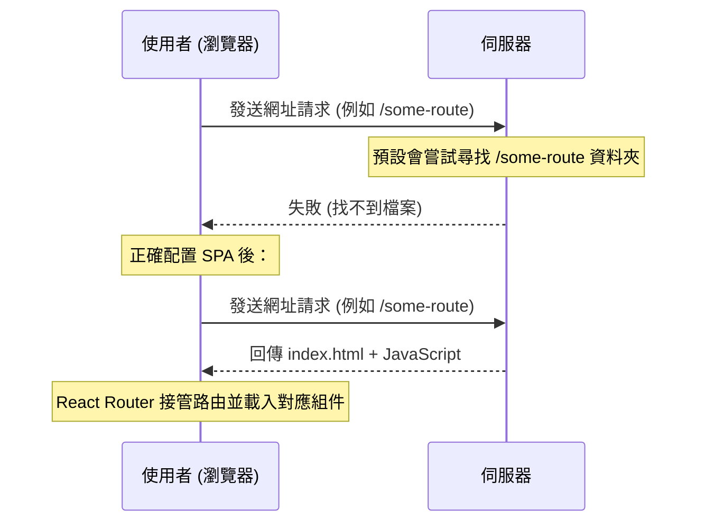

- **[結論]**
    - 這就是為什麼在部署 React 應用程式時，必須將其配置為「單頁應用程式 (Single-page app)」的原因，以確保所有路徑都能正確導向至入口點。

// TODO 第 25 節