# 目錄

1. [JavaScript Spread Operator（展開運算子）](#javascript-spread-operator)
   概念：用 `...` 展開陣列元素，把多個陣列合併成一個「扁平」陣列，避免產生陣列包陣列的巢狀結構。

2. [控制結構（Control Structures）](#控制結構-control-structures)
   概念：用 `if` / `else if` / `else` 做條件判斷、用 `for...of` 遍歷陣列，決定哪些程式碼該執行、哪些該跳過。

3. [函式作為參數與回呼函式](#javascript-函數作為參數)
   概念：函式可以像值一樣被傳給其他函式（例如 `setTimeout`），傳遞時不能加括號，否則會被立即執行；也介紹函式可以巢狀定義並受作用域限制。

4. [原始值與引用值（Primitive vs. Reference Values）](#原始值-primitive-values)
   概念：字串 / 數字 / 布林是不可變的原始值，物件 / 陣列是引用值，操作引用值會直接修改記憶體中原本的資料。

5. [React Essentials 課程概覽](#react-essentials-課程概覽)
   概念：預告接下來要學的 React 核心概念——Components、JSX、Props、State。

6. [React 組件基礎（Components）](#react-的核心概念組件-components)
   概念：組件是可重複使用的 UI 構建塊，把 HTML、CSS、JS 封裝在一起，帶來可重用性與易維護性。

7. [建立 React 專案與啟動開發環境](#react-專案準備)
   概念：如何取得專案（CodeSandbox 或本地 ZIP）、`npm install` 與 `npm run dev` 各自的用途。

8. [React 專案結構與 JSX 渲染機制](#react-專案結構與渲染機制)
   概念：`index.html` 的 `#root` 容器、`index.jsx` 進入點如何把 `App.jsx` 掛載上去，以及 JSX 為何要靠建置流程轉換成瀏覽器看得懂的 JavaScript。

9. [自定義組件的建立與使用](#自定義組件-custom-components)
   概念：如何把 UI 拆成新的組件函式、組件命名必須大寫開頭，以及 React 在底層如何自動呼叫組件函式。

10. [React 渲染機制與組件樹](#react-內容的呈現機制)
    概念：`ReactDOM.createRoot().render()` 如何把組件樹轉換成實際 DOM，以及用大小寫區分內建元素與自訂組件的命名規則。

11. [在 JSX 中輸出動態內容](#在-jsx-中輸出動態內容)
    概念：用 `{}` 在 JSX 中嵌入 JavaScript 表達式，讓內容能依邏輯動態變化，而不是寫死的靜態文字。

12. [圖片資源的匯入](#圖片載入路徑的潛在問題)
    概念：為什麼圖片要用 `import` 而不是直接寫路徑字串，才能被打包工具正確處理與優化。

13. [Props：讓組件可重複使用](#react-組件的重用性)
    概念：Props 如何像函式參數一樣把資料傳入組件，讓同一個組件能顯示不同內容，以及 `props` 物件的底層運作方式。

14. [用資料陣列驅動組件、簡化 Props 傳遞](#建立資料檔案-datajs)
    概念：把重複資料抽成陣列（`data.js`），搭配展開運算子 `{...obj}` 與物件解構簡化 Props 的傳遞與讀取。

15. [組件拆分為獨立檔案](#組件結構重構)
    概念：把組件搬到各自的檔案（`components` 資料夾），並處理隨之而來的 `export` / `import` 與相對路徑調整問題。

16. [CSS 模組化](#css-modularization)
    概念：把樣式也拆成各組件專屬的 CSS 檔案並 `import` 進來，但要注意 React 預設不會做 CSS 作用域隔離，樣式仍是全域生效。

17. [children prop：組件的內容包裝](#建立-examples-互動區塊)
    概念：React 預設會忽略標籤之間的內容，要透過內建的 `children` prop 才能把包在組件開閉標籤中間的內容渲染出來。

18. [組件組合 vs. 屬性傳遞](#組件組合-vs-屬性傳遞)
    概念：比較用 `children` 包裹內容，跟用一般具名屬性（如 `label`）傳資料這兩種設計組件 API 的方式，各自適合的情境。

19. [React 事件處理](#tabbutton-的點擊事件處理)
    概念：React 用 `onClick` 等宣告式的事件 prop 取代原生 DOM 的 `addEventListener`，且傳遞事件處理函式時同樣不能加括號呼叫。

-----------------------------------------------------------

### JavaScript Spread Operator (`...`)

- A special syntax used to unpack elements from an array
- **[Usage: Merging Arrays]** By using three dots before an array name inside a new array literal, its elements are pulled out and added as separate, comma-separated values

```javascript
const hobbies = ["Sports", "Cooking"];
const newHobbies = ["Reading"];

// Merging hobbies into a new array using the spread operator
const mergedHobbies = [...hobbies, ...newHobbies];
```

### Spread Operator vs. Standard Array Inclusion

- **[The problem: Nested Arrays]** If you include array variables directly inside a new array literal without the spread operator, you create an array containing other arrays (nested arrays)
    - Example:

```javascript
const hobbies = ["Sports", "Cooking"];
    const newHobbies = ["Reading"];
    const mergedHobbies = [hobbies, newHobbies];
    // Result: [["Sports", "Cooking"], ["Reading"]]
```

- **[The solution: The Spread Operator]** Using `...` before the array name pulls out the individual values and adds them as standalone, comma-separated values
    - This results in a single, flat array rather than nested ones

```javascript
const hobbies = ["Sports", "Cooking"];
    const newHobbies = ["Reading"];
    const mergedHobbies = [...hobbies, ...newHobbies];
    // Result: ["Sports", "Cooking", "Reading"]
```

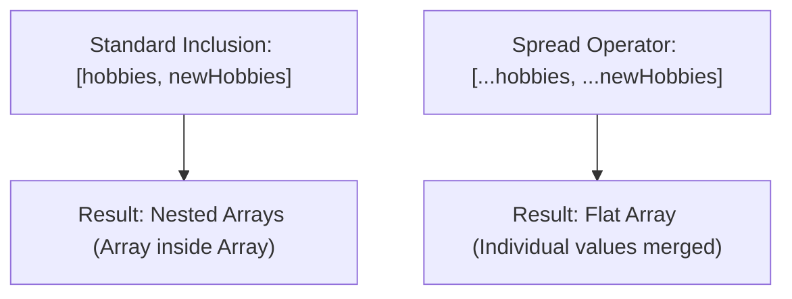
-----------------------------------------------------------

## 控制結構 (Control Structures)

- 使用 `if` 關鍵字來建立條件判斷
    - 透過比較數值來決定是否執行 `if` 語句內部的程式碼
- 擴展判斷邏輯
    - `else if`：當第一個條件不滿足時，用來檢查額外的條件（可以根據需求添加多個 `else if`）
    - `else`：當所有先前的條件皆不滿足時，執行預設的程式碼塊（整個結構中只能有一個 `else` 分支）

### 條件判斷範例

```javascript
if (10 === 10) {
    // 當條件為真時執行
} else if (5 === 5) {
    // 當第一個條件為假，但此條件為真時執行
} else if (2 === 2) {
    // 當前述條件皆為假，但此條件為真時執行
} else {
    // 當所有條件皆不滿足時執行
}
```

### 動態條件判斷

- 在實際應用中，`if` 語句通常用於檢查無法預先確定的內容
- **[範例] 使用&#32;`prompt()`&#32;獲取使用者輸入**
    - `prompt()` 是瀏覽器提供的內建函數，會彈出一個對話框要求使用者輸入資訊
    - 獲取的輸入值可以用於後續的條件判斷

```javascript
const password = prompt('Your password');

if (password === 'hello') {
    // 當使用者輸入的密碼為 'hello' 時執行
}
```

- **使用嚴格相等運算子 (`===`)**
    - 在檢查使用者輸入（如密碼）是否符合預期時，建議使用 `===` 來確保值與類型皆完全一致

### 多重條件判斷與備援邏輯

- 可以透過多個 `else if` 來檢查不同的可能值
- **[備援機制]** 使用 `else` 來處理所有條件皆不符合時的情況（例如：存取被拒絕）

```javascript
const password = prompt('Your password');

if (password === "Hello") {
    console.log("Hello works");
} else if (password === "hello") {
    console.log("Hello works");
} else {
    console.log("Access not granted.");
}
```

- **執行流程範例**：
    - 若輸入 `Hello` $\rightarrow$ 滿足第一個 `if` $\rightarrow$ 輸出 `Hello works`
    - 若輸入 `hello` $\rightarrow$ 第一個條件不符，滿足第一個 `else if` $\rightarrow$ 輸出 `Hello works`
    - 若輸入其他任何內容 $\rightarrow$ 所有條件皆不符 $\rightarrow$ 執行 `else` 分支 $\rightarrow$ 輸出 `Access not granted.`

### 控制結構的核心意義

- `if` 語句之所以被稱為「控制結構」(Control Structure)，是因為它能決定哪些程式碼塊應該被執行，哪些應該被跳過

### For 迴圈 (For Loops)

- JavaScript 包含多種不同類型的 `for` 迴圈
- **[重要類型] 遍歷陣列的迴圈**
    - 用於針對陣列中的每一個項目執行特定的程式碼

```javascript
const hobbies = ["Sports", "Cooking"];

// 準備建立一個迴圈來處理 hobbies 陣列中的每個項目
for (const hobby of hobbies) {
    // 這裡會為每次迭代重新建立一個常數
}
```

-----------------------------------------------------------

### JavaScript 函數作為參數

- JavaScript 允許將函數作為「值」傳遞給其他函數
- **[範例]** 使用瀏覽器內建的 `setTimeout` 函數來設定定時器
    - `setTimeout` 接受兩個參數
    - 第一個參數必須是一個函數（可以是使用 `function` 關鍵字定義的函數，或是箭頭函數）
- **[實現方式]**
    - **匿名函數 (Anonymous Function)**：直接在參數位置建立一個沒有名稱的函數

```javascript
setTimeout(() => {

    }, 1000);
```

    - **已命名函數**：也可以先手動定義一個具名的函數，再將其名稱作為參數傳入

```javascript
function handleTimeout() {

    }

    setTimeout(handleTimeout);
```

### 傳遞已定義的函數

- **[箭頭函數的命名方式]** 雖然箭頭函數本身是匿名的，但可以透過將其賦值給一個常數（`const`）來使其具有名稱，方便後續傳遞

```javascript
const handleTimeout2 = () => {
    console.log("Timed out ... again!");
};
```

- **[關鍵規則] 傳遞函數時不要加括號**
    - 當函數已經在外部定義好時，傳遞給其他函數（如 `setTimeout`）時只需要使用其名稱
    - **[為什麼？]** 因為使用函數名稱是將「函數本身」作為值傳遞；如果加上括號 `()`，則代表會立即「執行」該函數，而不是將其作為參數傳入

```javascript
// 正確：傳遞函數本身作為參數
setTimeout(handleTimeout2);

// 錯誤：這會立即執行 handleTimeout2 並將其回傳值傳給 setTimeout
setTimeout(handleTimeout2());
```

### `setTimeout` 的參數細節

- **[為什麼不能加括號？]** 如果在傳遞函數名稱時加上括號 `()`，函數會被「立即執行」
    - 這樣會將函數的**回傳值**（return value）傳給 `setTimeout`，而不是函數本身
    - 因為 `setTimeout` 的目的是在未來某個時間點執行該函數，而非立即執行

```javascript
// 錯誤示範：這會立即執行 handleTimeout，並將其回傳值傳給 setTimeout
setTimeout(handleTimeout());
```

- **[setTimeout 的第二個參數]** 接受一個數字，代表等待的**毫秒數 (milliseconds)**
    - JavaScript 會在等待指定的毫秒後，才執行傳入的第一個參數（即該函數）

```javascript
// 正確用法：第一個參數是函數本身，第二個參數是等待的毫秒數
setTimeout(handleTimeout, 2000);
setTimeout(handleTimeout2, 3000);

// 也可以結合匿名箭頭函數使用
setTimeout(() => {
    console.log("More timing out...");
}, 4000);
```

### 匿名函數與執行時機

- **[執行邏輯]** 在 `setTimeout` 中使用匿名函數與傳遞已定義的函數在邏輯上是相同的
    - 兩者都只是在「定義」函數，並將其作為值傳遞給 `setTimeout`
    - **[關鍵點]** 函數並不會被立即執行，而是等到定時器到期後才由 `setTimeout` 內部執行

```javascript
// 這與傳遞已命名函數的效果相同：僅定義，不立即執行
setTimeout(() => {
    console.log("More timing out...");
}, 4000);
```

### 自定義接收函數作為參數的函數

- **[擴充概念]** 這種「將函數作為值傳遞」的能力不只存在於內建函數，也可以應用在自定義函數中
- **[實現方式]** 可以建立一個函數，其參數類型就是一個函數

```javascript
// 定義一個名為 greeter 的函數，它接受一個名為 greetFn 的參數
function greeter(greetFn) {
    // 在函數內部，透過加上括號 () 來執行傳入的函數
    greetFn();
}

// 使用範例：將一個函數作為參數傳給 greeter
greeter(() => {
    console.log("Hello!");
});
```
-----------------------------------------------------------

### 嵌套函數與作用域

- 可以在一個函數內部定義另一個函數
    - 這種模式在 React 等框架中非常常見
- **[作用域限制]** 內部函數的作用域僅限於其所在的外部函數內
    - 外部無法直接調用內部函數，因為它被封裝在外部函數的作用域中

#### 範例程式碼

```javascript
function init() {
    function greet() {
        console.log("Hi!");
    }

    greet(); // 在 init 內部可以成功執行
}

// greet(); // 在 init 外部執行會出錯，因為 greet 的作用域僅限於 init
```
-----------------------------------------------------------

### 原始值 (Primitive Values)

- 包含字串 (Strings)、數字 (Numbers) 與布林值 (Booleans)
- **[核心特性] 不可變性 (Immutability)**
    - 原始值本身無法被直接編輯
    - 若對原始值進行重新賦值，實際上是建立一個全新的值並覆蓋原變數，舊的值會被丟棄
    - 即便是呼叫字串的方法（如 `concat`），產生的也是一個新的字串，而非修改原字串

```javascript
let userMessage = 'Hello!';
userMessage = userMessage.concat('!!!');
```

### 引用值 (Reference Values)

- 與原始值不同，物件（Objects）與陣列（Arrays）屬於引用值
- **[關鍵差異]** 操作引用值會直接修改（mutate）原始資料，而不是產生新值
    - 例如使用陣列的 `.push()` 方法會改變原本的陣列內容

```javascript
const hobbies = ["Sports", "Cooking"];
hobbies.push("Working");
console.log(hobbies);
// 輸出結果會包含新增的項目：["Sports", "Cooking", "Working"]
```

#### 陣列操作範例

- 當執行 `hobbies.push("Working")` 時，原本儲存在記憶體中的 `hobbies` 陣列被直接修改了

### 引用值的記憶體運作機制

- **[核心概念] 儲存的是位址 (Address)**
    - 對於引用值（如陣列或物件），變數中儲存的並非資料本身，而是該資料在電腦記憶體中的「位址"
    - 當執行修改操作（如 `.push()`）時，JavaScript 會根據位址找到記憶體中的原始資料並進行修改，但變數所儲存的位址保持不變

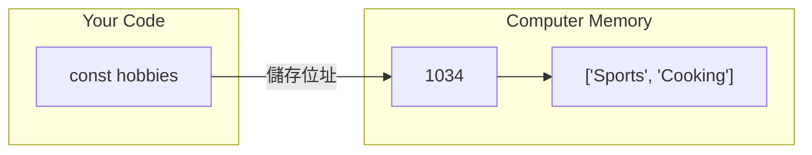

- **原始值 vs. 引用值的記憶體差異**
    - **引用值 (Reference Values)**
        - 變數 $\rightarrow$ 記憶體位址 $\rightarrow$ 實際資料
        - 修改資料會影響該位址指向的內容
    - **原始值 (Primitive Values)**
        - 變數直接儲存值本身（雖然技術上不完全精確，但可作為理解模型）
        - 不存在「位址」的概念，因此無法像引用值那樣透過位址進行原地修改

-----------------------------------------------------------

## React Essentials 課程概覽

- 目標是從零開始建立一個包含靜態與動態互動內容的示範 Web 應用程式
- 透過實作來學習不論應用程式複雜度如何都必須掌握的核心功能

### 核心概念 (Core Concepts)

- **Components**: React 應用的構建基石，透過組合多個組件來建立介面
- **JSX**: 用於回傳可組合且動態的 HTML 結構
- **Props**: 用於將資料從父組件傳遞到子組件
- **State**: 用於管理組件內部的資料，當資料改變時會觸發重新渲染 (re-render)

### 學習重點

- **建立使用者介面 (Building User Interfaces)**: 使用 Components 來建構
- **資料處理 (Data Handling)**: 學習如何使用、共享與輸出資料

-----------------------------------------------------------

### React 的核心概念：組件 (Components)

- 組件是 React 開發中最核心的概念
    - 組件是可重複使用的構建塊 (reusable building blocks)
    - 開發者透過建立組件，並將它們組合起來，最終構建出完整的用戶介面 (User Interface)
- **[核心觀念]** React 應用程式在本質上就是由各種組件組合而成的

### 組件的組成與應用

- 將使用者介面 (UI) 視為組件組合的概念並不侷限於 React
    - 任何網站或應用程式都可以拆解成較小的構建塊 (components)
    - 例如一個典型的網頁可以包含以下組件：
        - Header (頁首區域)
        - Key concept items (關鍵概念項目)
        - Interactive tabs (互動式標籤頁)
- **[組件的大小]** 組件應該要多大或多小，是由開發者根據需求來定義的
- **組件的本質**：組件本質上是將 HTML 與 CSS 代碼封裝 (wrap) 在一起的單元

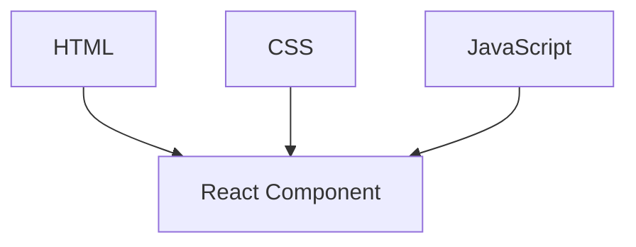

### 組件的完整功能與優勢

- 組件除了封裝 HTML 與 CSS，還會包含相關的 **JavaScript 邏輯**
    - 這些語言與程式碼片段共同定義並控制 UI 的某個部分
- **[為什麼要使用組件？]** 透過將複雜的 UI 拆解成較小、更易於管理的單元，可以達到以下目的：
    - **提高可重用性 (Reusability)**
        - 同一個組件可以透過配置不同的數據 (data) 在 UI 的不同地方重複使用
        - 例如：同一個「核心概念項目」組件，可以使用相同的 HTML 結構、樣式與 JS 邏輯，但呈現不同的內容
    - **降低複雜度**
        - 避免產生過於龐大且難以維護的 HTML 檔案
        - 讓程式碼結構更清晰，便於導航與開發
    - **簡化維護**
        - 當需要更改程式碼時，只需修改組件本身，即可套用到應用程式中所有使用該組件的地方

### 使用組件的優勢

- **提高可重用性 (Reusability)**
    - 透過重複使用程式碼，你只需要在一個地方進行修改
    - 這些更改會自動套用到所有使用該組件的地方，從而降低出錯的可能性
- **相關程式碼集中管理 (Related Code Lives Together)**
    - **[傳統做法]**：通常會將標記 (markup) 放在 HTML 檔案中，而 JavaScript 程式碼則放在另一個 JS 檔案中
        - 這導致開發者必須不斷在不同檔案之間切換
        - 容易因為修改了 JS 卻沒同步更新對應的 HTML，而意外破壞程式碼
    - **[組件做法]**：將相關的 HTML、CSS 與 JavaScript 邏輯緊密地儲存在一起
        - 這樣可以簡化開發流程，並確保所有相關邏輯都能在同一個上下文中被看到與管理

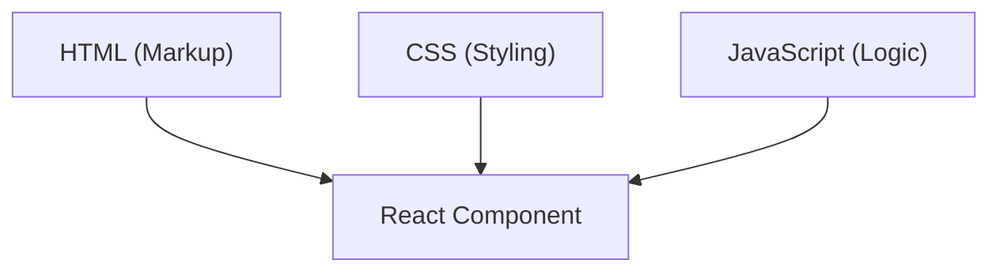

-----------------------------------------------------------

### React 專案準備

- 準備開始在 React 專案中撰寫組件程式碼
- **專案獲取方式**
    - **CodeSandbox**：使用線上瀏覽器環境進行開發
    - **本地開發**：下載提供的 ZIP 檔案並解壓縮，即可在本地系統上運行相同的初始專案

### 本地開發環境設置

- 使用任何程式碼編輯器（例如 Visual Studio Code）開啟解壓縮後的專案資料夾
- **安裝依賴套件**
    - 在專案資料夾路徑下的系統終端機執行：

```bash
npm install
```

    - **[為什麼需要這一步？]** 因為 React 程式碼本身無法直接在瀏覽器運行，此指令會下載並安裝專案所需的第三方套件，包含 React 函式庫以及負責監控並轉換 React 程式碼的建置工具 (build process tools)
    - 此步驟在專案初始化時僅需執行一次
- **啟動開發伺服器**
    - 執行以下指令來啟動開發伺服器：

```bash
npm run dev
```

    - 啟動後可以透過預覽網站查看 React App 的運行狀態
    - **注意**：在開發過程中必須保持開發伺服器程序持續運行

-----------------------------------------------------------

### React 專案結構與渲染機制

- **`index.html`&#32;的角色**
    - 檔案內容非常精簡，僅包含基礎的 HTML 標記
    - 它並不直接包含頁面上顯示的內容（如圖片、標題等）
    - **[為什麼如此？]** 因為這些內容是由 React 動態渲染到頁面上的
- **內容渲染流程**
    - `index.html` 會載入一個 JavaScript 檔案（例如 `index.jsx`）
    - React 會透過這個 JavaScript 檔案來控制並將內容呈現到畫面上

```html
<!-- index.html 核心結構 -->
<!DOCTYPE html>
<html lang="en">
<head>
    <!-- ... meta 與 link 標籤 ... -->
    <title>React Essentials</title>
</head>
<body>
    <div id="root"></div>
    <script type="module" src="/src/index.jsx"></script>
</body>
</html>
```

- **關鍵元素：`div id="root"`**
    - 這是 React 用來掛載（mount）整個應用程式的容器
    - React 會將渲染後的 DOM 元素注入到這個特定的 `div` 中

### `src` 資料夾與進入點邏輯

- **`index.jsx`&#32;的作用**
    - 作為應用程式的進入點，負責將 React 組件掛載到 HTML 容器中
    - 它會從 `App.jsx` 匯入主要的組件內容

```javascript
import ReactDOM from "react-dom/client";
import App from "./App.jsx";
import "./index.css";

const entryPoint = document.getElementById("root");
ReactDOM.createRoot(entryPoint).render(<App />);
```

- **`App.jsx`&#32;的角色**
    - 真正包含頁面內容標記（Markup）的地方
    - **[為什麼在 index.jsx 沒看到內容？]** 因為 `index.jsx` 只負責啟動流程，實際的標題、圖片等 UI 結構都定義在 `App.jsx` 中

```javascript
function App() {
    return (
        <div>
            <header>

                <h1>React Essentials</h1>
                <p>Fundamental React concepts you will need for almost any app you are going to build!</p>
            </header>
            <main>
                <h2>Time to get started!</h2>
            </main>
        </div>
    );
}
```

- **`.jsx`&#32;副檔名的含義**
    - 這是一種 JavaScript 的語法擴展（Syntax Extension）
    - **[為什麼需要它？]** 因為它允許在 JavaScript 程式碼中直接撰寫類似 HTML 的標記語法（例如 `<App />` 或 `<div>`），這在標準的 JavaScript 中是不支援的

### JSX 的特性與運作機制

- **JSX (JavaScript Syntax Extension)**
    - 允許開發者在 JavaScript 檔案中直接撰寫 HTML 標記碼
    - **[用途]** 用於以「宣告式」（declarative）的方式描述並建立 HTML 元素，這對建立使用者介面（UI）非常方便
- **瀏覽器支援度與轉換**
    - 瀏覽器本身並不支援 JSX 語法
    - **[如何運作？]** 在開發過程中，透過開發伺服器（development server）的建置程序（build process），JSX 會在幕後被轉換成瀏覽器可以理解的標準 JavaScript 程式碼

### React 的開發模式：宣告式 (Declarative)

- 使用 React 時，開發者是撰寫「宣告式」程式碼
- **[核心概念]** 你只需要定義目標的 HTML 結構與 UI 應該長什麼樣子，而不是去描述達成該結果的每一個具體步驟

### React 組件 (React Component)

- `App.jsx` 中的內容實質上是一個 **React 組件**

```javascript
function App() {
    return (
        <div>
            <header>

                <h1>React Essentials</h1>
                <p>
                    Fundamental React concepts you will need for almost any app you are going to build!
                </p>
            </header>
            <main>
                <h2>Time to get started!</h2>
            </main>
        </div>
    );
}

export default App;
```

-----------------------------------------------------------

### 自定義組件 (Custom Components)

- React 應用程式通常由數十甚至數百個組件組成，而非僅僅一個單一的 `App` 組件
- **[目的]** 透過將特定部分的程式碼（例如 Header 相關內容）提取到新組件中，可以使主組件（如 `App` 組件）變得更精簡（leaner）
- **[實作方式]** React 組件在本質上就是 JavaScript 函式
    - 可以透過在現有的檔案中定義一個新的 JavaScript 函式來建立組件
    - 雖然目前是在同一個 `App.jsx` 檔案中操作，但實務上通常會將不同的組件放在不同的檔案中

### 定義自定義組件的規則

- **命名規範**
    - 組件名稱必須以**大寫字母**開頭（例如使用 `Header` 而非 `header`）
- **實作流程**
    - 使用 `function` 關鍵字定義一個新的 JavaScript 函式
    - 在函式內部使用 `return` 語句來回傳想要顯示在畫面上的內容
    - 將原本位於主組件（如 `App`）中的 HTML/JSX 標記剪下並貼入新組件的 `return` 中
- **多行 JSX 的語法**
    - 當 `return` 的內容包含多行 JSX 代碼時，必須使用**圓括號** `()` 將其包裹起來
    - **[原因]** 這是為了告訴 JavaScript 這是一整塊要回傳的內容，避免因自動分號插入機制導致語法錯誤

```javascript
function Header() {
    return (
        <header>

            <h1>React Essentials</h1>
            <p>
                Fundamental React concepts you will need for almost any app you are going to build!
            </p>
        </header>
    );
}
```

### 實作與開發技巧

- **[自動化語法]** 利用編輯器的「格式化文件 (Format Document)」功能可以簡化開發
    - 在 VS Code 或 CodeSandbox 中執行格式化指令或使用快捷鍵
    - **[功能]** 會自動為多行 JSX 代碼加上必要的圓括號 `()`，不僅提升程式碼可讀性，也能避免語法錯誤
- **[React 組件的執行機制]** 使用組件的方式與一般 JavaScript 函式不同
    - **[錯誤做法]** 不應該像呼叫一般函式那樣手動執行它（例如 `Header()`）
    - **[正確機制]** React 函式庫會在底層自動執行這些組件函式，並根據回傳內容決定要在螢幕上顯示什麼內容

### 使用自定義組件

- **[使用方式]** 自定義組件可以像一般的 HTML 元素一樣，在其他的 JSX 代碼中使用
    - 必須確保組件名稱與定義時完全一致（包含大寫字母）
    - 可以在 `App` 組件內部直接調用之前定義好的 `Header` 組件
- **[語法選項]** 有兩種主要的寫法方式：
    - **成對標籤 (Opening and Closing tags)**：使用 `<Header></Header>`
    - **自閉合標籤 (Self-closing tag)**：使用 `<Header />`，這是一種更簡潔的快捷寫法

-----------------------------------------------------------

### React 內容的呈現機制

- **瀏覽器原始碼的觀察**
    - 在檢查網站原始碼（View Source）時，通常找不到組件的 HTML 結構（如 header 或標題）
    - 原始碼主要包含：
        - Metadata（元數據）
        - 一個主要的 JavaScript 檔案導入（例如 `index.jsx`）
- **代碼轉換（Transformation）**
    - 開發時撰寫的 JSX 代碼無法直接在瀏覽器中執行
    - 這些代碼必須經過轉換，變成瀏覽器可理解的 JavaScript 檔案後才會被載入並執行
- **檔案關聯**
    - 專案中的 `index.jsx` 檔案會被轉換後，作為網站的主要進入點載入

### React 應用程式的啟動流程

- **`index.html`&#32;的角色**
    - 作為網站訪問者接收到的基礎檔案
    - 透過 `<script>` 標籤載入主要的 JavaScript 進入點

```html
<script type="module" src="/src/index.jsx"></script>
```

- **`index.jsx`：應用程式的進入點 (Entry Point)**
    - 此檔案負責將 React 組件與真實的 HTML DOM 連結起來
    - **模組導入 (Import/Export)**
        - 使用標準 JavaScript 的 `import` 與 `export` 功能（非 React 特有）
        - 從 `App.jsx` 導入根組件：`import App from "./App.jsx";`
    - **渲染機制 (Rendering)**
        - 不同於一般的 React 組件會在函式內透過 `return` 回傳 JSX
        - `index.jsx` 會將 JSX 作為參數傳遞給 `render` 方法
        - 透過 `document.getElementById("root")` 找到 HTML 中的掛載點，並執行渲染：

```javascript
const entryPoint = document.getElementById("root");
      ReactDOM.createRoot(entryPoint).render(<App />);
```

- **組件層級關係**

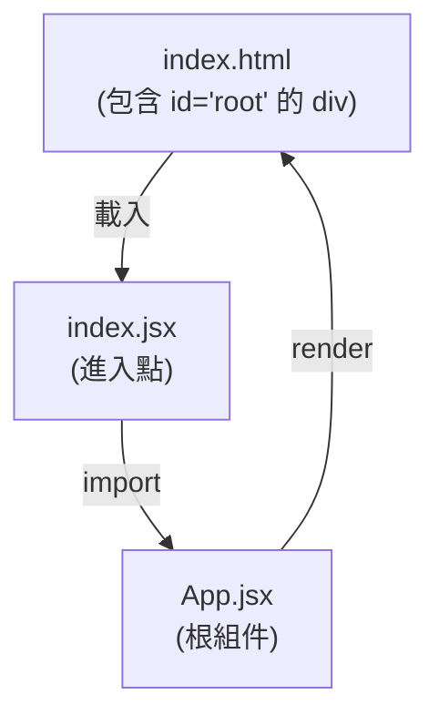

### React 渲染與掛載機制

- **啟動核心：`ReactDOM`&#32;函式庫**
    - 負責將 React 組件的內容輸出到螢幕上
    - 透過 `render` 方法將 JSX 代碼轉換為實際的畫面內容
- **建立根節點 (Creating the Root)**
    - 使用 `createRoot` 方法來初始化 React 專案的根節點
    - **[關鍵點]** `createRoot` 需要一個**既有的 HTML 元素**作為輸入
    - 這個元素並非由 React 建立，而是預先存在於 `index.html` 檔案中的（例如 `<div id="root"></div>`）
- **渲染流程**
    - 首先透過 `document.getElementById("root")` 選取 HTML 中的掛載點
    - 將該元素傳遞給 `createRoot` 方法，將其設定為 React 專案的根部
    - 最後透過 `.render(<App />)` 將 `App` 組件注入到該根節點中

```javascript
// index.jsx 中的渲染邏輯
const entryPoint = document.getElementById("root");
ReactDOM.createRoot(entryPoint).render(<App />);
```

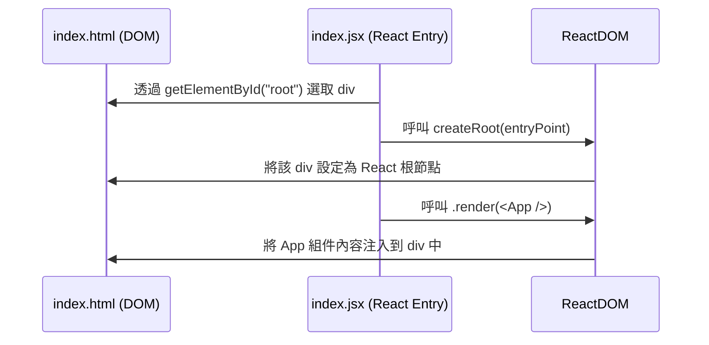

### 組件的渲染與嵌套

- **`render`&#32;方法的作用**
    - 將指定的組件及其所有內容注入到掛載點（例如 `div#root`）中
    - 這不僅包含該組件本身，還包括它所包含的所有**嵌套組件 (Nested Components)**
- **瀏覽器開發者工具中的觀察**
    - 在瀏覽器的 Elements 面板中，可以看到原本簡潔的 `index.html` 結構已被擴展
    - 所有由 React 渲染出的元素（如 `<header>`、`<main>` 等）都會被放置在 `div#root` 內部

### 組件樹 (Component Tree)

- **層級結構的形成**
    - React 從一個**根組件 (Root Component)** 開始渲染
    - 根組件可以包含多個子組件，子組件又可以包含更多層級的子組件
    - 這種由組件相互嵌套形成的層級結構被稱為**組件樹 (Component Tree)**

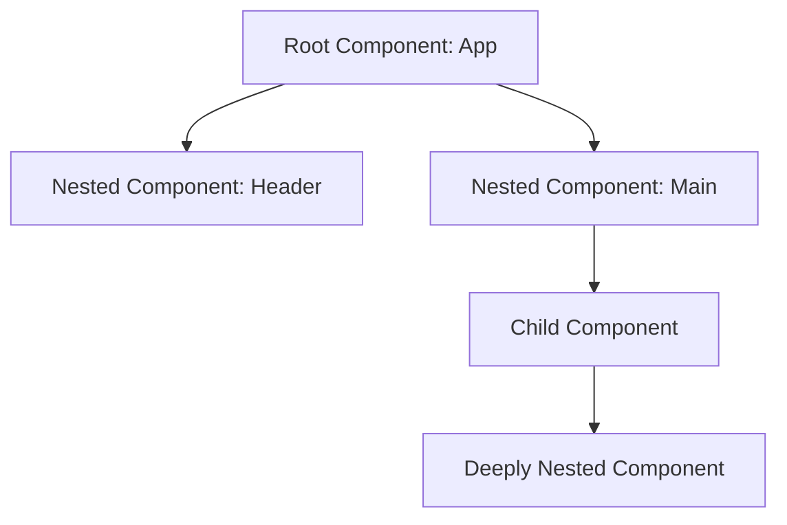

- **[概念總結]** 這種樹狀結構是 React 渲染的核心，React 會依照這個結構一步步地將所有組件轉換為實際的 DOM 節點並顯示在螢幕上。

### 組件樹與實際 DOM 的差異

- **組件不會直接出現在 DOM 中**
    - 在瀏覽器的 Elements 面板中，你只能看到標準的 HTML 元素
    - 自定義組件（如 `<App>` 或 `<Header>`）本身不會作為節點存在於 DOM 樹中
- **React 的轉換過程**
    - React 會分析組件樹，並將所有組件中的 JSX 代碼組合起來
    - 最終將其轉換為實際的 DOM 元素，顯示在螢幕上

### 命名規則：區分內建元素與自定義組件

- **[為什麼重要?]** React 需要透過命名規則來判斷該元素是瀏覽器內建的，還是開發者自定義的組件
- **內建 HTML 元素 (Built-in Elements)**
    - 使用**小寫字母**開頭
    - 例如：`<div>`、``、`<header>`
- **自定義組件 (Custom Components)**
    - 必須使用**大寫字母**開頭
    - 例如：`<App>`、`<Header>`

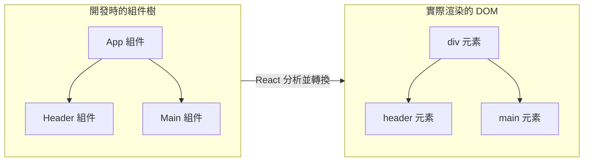

-----------------------------------------------------------

### 在 JSX 中輸出動態內容

- **[動態 vs. 靜態內容]**
    - **靜態內容 (Static Content)**:
        - 直接寫死（hardcoded）在 JSX 代碼中的內容
        - 無法在執行期間（runtime）改變
        - 例如：`<h1>Hello World!</h1>`
    - **動態內容 (Dynamic Content)**:
        - 透過邏輯產生的實際值被添加到 JSX 中
        - 可以在執行期間（runtime）改變內容或值
        - 例如：`<h1>{userName}</h1>`
- **實作目標**
    - 將原本靜態的文字內容改為隨機切換
    - 例如：在 `Header` 組件中，讓文字在 "Fundamental React concepts"、"Crucial React concepts" 與 "Core React concepts" 之間隨機切換

### 使用大括號輸出動態內容

- **[JSX 中的動態語法]**
    - 使用一對大括號 `{}` 來在 JSX 中嵌入 JavaScript 表達式
    - 可以在元素標籤之間使用，也可以作為屬性（attribute）的值
    - 這會告訴 React/JSX：這裡要輸出的不是字串，而是一個動態計算後的結果
- **實作邏輯範例**
    - 定義一個包含多種選項的陣列
    - 透過 JavaScript 函式產生隨機索引，從陣列中選取單一元素
    - 在 JSX 中使用 `{}` 包裹該邏輯，實現內容的隨機切換

```javascript
// 定義可供切換的選項
const reactDescriptions = ['Fundamental', 'Crucial', 'Core'];

// 產生隨機整數的函式
function genRandomInt(max) {
    return Math.floor(Math.random() * (max + 1));
}

function Header() {
    return (
        <header>

            <h1>React Essentials</h1>
            <p>
                {/* 使用大括號來輸出動態值 */}
                {/* 這裡會根據邏輯選取 reactDescriptions 中的內容 */}
                React concepts you will need for almost any app you are going to build!
            </p>
        </header>
    );
}
```

### JSX 中的 JavaScript 表達式

- **[大括號&#32;`{}`&#32;的運作原理]**
    - 大括號內可以放置任何 JavaScript 表達式 (expression)
    - JSX 會執行該表達式，並將其計算結果輸出到畫面上
    - **範例**：在 JSX 中寫入 `{1 + 1}`，畫面上會顯示 `2`
- **[結合動態邏輯與陣列]**
    - 可以透過大括號存取外部定義的變數或執行函式
    - **實作方式**：
        - 存取陣列元素：`reactDescriptions[index]`
        - 透過函式產生隨機索引：`genRandomInt(max)`

```javascript
// 透過大括號執行邏輯並輸出結果
<p>
    {reactDescriptions[genRandomInt(2)]} React concepts you will need for almost any app you are going to build!
</p>
```

- **[參數傳遞細節]**
    - 在此範例中，`genRandomInt` 需要接收一個參數作為最大值
    - 因為 `reactDescriptions` 陣列有三個元素，其索引值為 `0`, `1`, `2`
    - 因此傳入 `2` 作為參數，以確保產生的隨機索引落在有效範圍內

-----------------------------------------------------------

### 圖片載入路徑的潛在問題

- 直接在 `src` 屬性中使用相對路徑（例如指向 `src/assets` 資料夾）並非最佳實踐
    - 雖然在開發環境下可以正常顯示，但在專案部署時可能會失效
- **[原因]** 部署過程中的「打包程序」（Build Process）會對程式碼進行轉換、優化與打包
    - 打包工具可能會忽略直接以字串形式引用的圖片檔案
    - 這會導致圖片在部署後的環境中「遺失」

#### React 專案的構建流程 (Build Process)

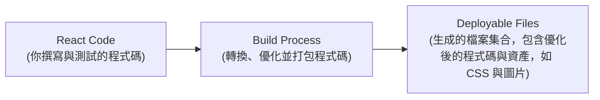

### 使用 Import 陳述式載入圖片

- 應使用 `import` 陳述式來引入圖片檔案
    - 透過這種方式，打包程序可以識別並處理這些資產，甚至進行額外的優化
- **[範例實作]** 在 `App.jsx` 中引入圖片：

```jsx
import reactImg from './assets/react-core-concepts.png';

  // 在 JSX 中使用該變數
```

- **[為什麼這可行？]** 雖然在標準 JavaScript 中直接 `import` 圖片是不尋常的，但在 React 的開發環境下是可行的
    - 因為「打包程序」（Build Process）不僅會轉換 JSX 程式碼，也會處理這類 `import` 陳述式
    - 這與在 `index.jsx` 中 `import` CSS 檔案的原理相同，打包程序會確保這些資源被正確納入專案中

-----------------------------------------------------------

### React 組件的重用性

- 組件的一個主要優勢是**可重用性 (Reusability)**
    - 有些組件在理論上可以重用，但實際上可能只會使用一次（例如頁面頂部的 Header）
    - 有些組件則非常適合多次重用，例如「核心概念 (Core Concept)」項目
- **[重用的概念]** 就像定義一個 JavaScript 函數一樣，你可以定義一個組件一次，然後在不同的地方多次調用它，並傳入不同的數據來呈現不同的內容

### 使用 Props 配置組件

- **Props (Properties)** 是 React 的一個核心概念
    - 允許將數據傳遞到組件內部
    - 讓組件能夠根據不同的輸入數據呈現不同的內容
    - 功能類似於 JavaScript 函數的參數 (parameters)

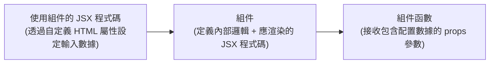

### 實作 CoreConcept 組件

為了讓組件不再只是顯示佔位符，而是顯示實際且不同的數據，可以定義如下組件：

```jsx
function CoreConcept() {
  return (
    <li>

      <h3>...</h3>
      <p>...</p>
    </li>
  );
}
```

- 目標是透過傳入不同的數據（如圖片來源、標題、描述），使同一個組件在每次使用時都能顯示不同的內容

### 在 App.jsx 中使用 CoreConcept 組件

在 `App.jsx` 中，透過在 `<ul>` 標籤內多次調用 `<CoreConcept />` 組件來實現重用，並利用 props 傳遞不同的數據：

```jsx
<section id="core-concepts">
  <h2>Core Concepts</h2>
  <ul>
    <CoreConcept
      title="Components"
      description="..."
    />
    {/* 後續可繼續添加更多 CoreConcept 並傳入不同數據 */}
  </ul>
</section>
```

- **[如何傳遞數據]** 透過在自定義組件上添加「自定義屬性 (custom attributes)」來實現
    - 屬性的名稱（例如 `title` 或 `description`）完全由開發者自行決定
    - 透過這種方式，同一個組件可以根據接收到的不同屬性值，呈現出完全不同的內容

### Props 的進階用法

- **[傳遞動態值]** 可以將 import 進來的資源（如圖片）作為 prop 傳遞
    - 必須使用花括號 `{}` 來包裹變數名稱

```jsx
import componentsImg from './assets/components.png';

// ... 在 App 組件中使用
<CoreConcept
  title="Components"
  description="The core UI building block."
  image={componentsImg}
/>
```

- **[可讀性優化]** 為了讓程式碼更易讀，可以將長串的 props 拆分到多行撰寫
- **[Props 支援的所有數據類型]** Props 的概念非常彈性，不限於文字，可以傳遞任何 JavaScript 類型：

| 類型 | 撰寫方式範例 | 說明 |
| --- | --- | --- |
| 字串 (String) | title="Components" | 直接使用引號包裹文字 |
| 數字 (Number) | age={34} | 必須使用 {}，若使用引號會變成字串 |
| 物件 (Object) | details={{username: 'Max'}} | 傳遞一個 JS 物件 |
| 陣列 (Array) | hobbies={['Cooking', 'Reading']} | 傳遞一個 JS 陣列 |

> **關鍵點**：當傳遞非字串值（如數字、變數、物件、陣列）時，必須使用花括號 `{}`。

### 理解 Props 的運作機制

- **[接收參數]** 在 React 組件函數中，接收輸入值的方式與一般 JavaScript 函數非常相似
    - 一般函數可以添加一個或多個參數來接收輸入
    - React 組件函數通常只接收**一個**參數，習慣上命名為 `props`
    - 雖然你可以隨意命名這個參數，但因為 React 的核心概念稱為 props，所以這是最通用的做法
- **[誰來傳遞 Props?]** 你不需要手動調用組件函數
    - 在程式碼中，我們是將組件當作 HTML 元素來使用（例如 `<CoreConcept />`）
    - 實際上是由 **React** 在底層執行這些函數
    - 當 React 調用組件函數時，它會自動將一個值傳遞給 `props` 參數
- **[Props 的結構]** 傳遞進來的 `props` 是一個**物件 (Object)**
    - 這個物件包含了所有你在 JSX 中設定的「自定義屬性」
    - 每個屬性名稱都會成為物件的 `key`，而屬性的值則成為 `value`

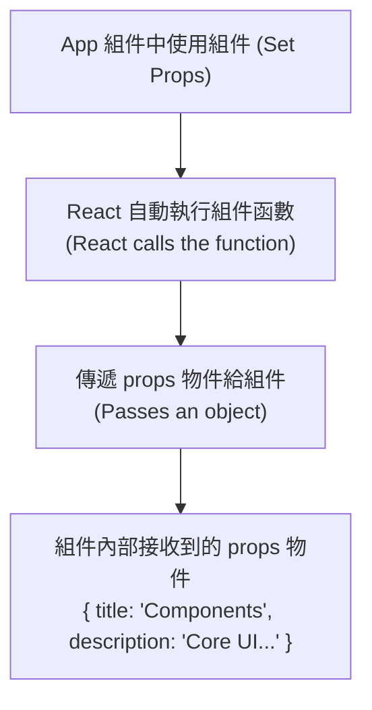

- **[組件內部的使用方式]** 透過點符號 (dot notation) 從 `props` 物件中提取數據：

```jsx
function CoreConcept(props) {
  return (
    <li>
      <h3>{props.title}</h3>
      <p>{props.description}</p>
    </li>
  );
}
```

-----------------------------------------------------------

### 建立資料檔案 `data.js`

- 建立一個新檔案 `data.js` 並將核心概念的資料存入
    - 資料結構為包含多個物件的陣列
    - 每個物件包含 `image`、`title` 與 `description` 三個屬性
    - 圖片路徑透過從 `assets` 資料夾匯入來達成

```javascript
// data.js 內容範例
import componentsImg from './assets/components.png';
import propsImg from './assets/config.png';
import jsxImg from './assets/jsx-ui.png';
import stateImg from './assets/state-mgmt.png';

export const CORE_CONCEPT = [
  {
    image: componentsImg,
    title: 'Components',
    description: 'The core UI building block - compose the user interface by...'
  },
  // ... 其他物件
];
```

### 從 `data.js` 匯入資料

- 在 `App.jsx` 中匯入 `CORE_CONCEPT` 資料
- **[重要規則]** 因為 `data.js` 使用的是**具名匯出（named export）**而非預設匯出（default export），所以在匯入時必須使用花括號 `{}` 包裹名稱

```javascript
// App.jsx 中的匯入方式
import { CORE_CONCEPT } from './data.js';
```

### 動態使用 `CORE_CONCEPT` 資料

- 透過陣列索引（index）動態存取 `CORE_CONCEPT` 中的物件屬性
    - 例如使用 `CORE_CONCEPT[0].title` 來取得第一個物件的標題
    - 同理可取得 `description` 與 `image` 屬性
- **[優點]** 透過這種方式，可以移除原本在 `App.jsx` 中手動匯入的個別圖片（如 `componentsImg`），改由資料驅動
- **[實現重複使用]** 透過多次調用同一個 `<CoreConcept />` 元件，並僅需更換傳入的索引值，即可呈現不同的內容

```jsx
// App.jsx 中的動態資料傳遞範例
<CoreConcept
  title={CORE_CONCEPT[0].title}
  description={CORE_CONCEPT[0].description}
  image={CORE_CONCEPT[0].image}
/>
<CoreConcept
  title={CORE_CONCEPT[1].title}
  description={CORE_CONCEPT[1].description}
  image={CORE_CONCEPT[1].image}
/>
<CoreConcept
  title={CORE_CONCEPT[2].title}
  description={CORE_CONCEPT[2].description}
  image={CORE_CONCEPT[2].image}
/>
<CoreConcept
  title={CORE_CONCEPT[3].title}
  description={CORE_CONCEPT[3].description}
  image={CORE_CONCEPT[3].image}
/>
```

- **[核心概念]** 雖然程式碼看起來寫了很多次，但這展示了 Props 的強大之處：我們只需要定義一個元件，就能透過不同的輸入資料（input data）來重複使用它

### 使用展開運算符（Spread Operator）簡化 Props 傳遞

- 當 Prop 的名稱與資料物件中的屬性名稱完全一致時，可以使用展開運算符來簡化程式碼
    - **[傳統方式]** 需要逐一手動對應每個屬性

```jsx
<CoreConcept
      title={CORE_CONCEPT[0].title}
      description={CORE_CONCEPT[0].description}
      image={CORE_CONCEPT[0].image}
    />
```

    - **[簡化方式]** 直接將整個物件展開作為 Props 傳入

```jsx
<CoreConcept {...CORE_CONCEPT[0]} />
```

- **[運作原理]** 展開運算符會將物件中的所有鍵值對（key-value pairs）提取出來，並將它們作為個別的 Props 傳遞給元件
    - 例如 `{...CORE_CONCEPT[0]}` 等同於將該物件內的 `title`、`description` 與 `image` 自動對應到元件的 Props 上
- **[優點]**
    - 程式碼更短、更乾淨
    - 減少重複撰寫相似屬性的工作量

### 在元件中使用物件解構（Object Destructuring）來存取 Props

- **[傳統方式]** 透過單一 `props` 物件來存取各個屬性
    - 必須在每個屬性前加上 `props.` 前綴

```jsx
function CoreConcept(props) {
  return (
    <li>

      <h3>{props.title}</h3>
      <p>{props.description}</p>
    </li>
  );
}
```

- **[解構方式]** 在函數的參數列中使用花括號 `{}` 直接進行解構
    - **[運作原理]** 這種寫法並非 JSX 的語法，而是 JavaScript 的特性。它會直接解構傳入函數的第一個參數（即 `props` 物件），並根據名稱提取出對應的屬性
    - **[優點]** 程式碼更簡潔，且在函數內部可以直接使用屬性名稱，不需要重複寫 `props.`

```jsx
// 使用物件解構直接取得 title, description 與 image
function CoreConcept({ title, description, image }) {
  return (
    <li>

      <h3>{title}</h3>
      <p>{description}</p>
    </li>
  );
}
```

-----------------------------------------------------------

### 組件結構重構

- **[重構原因]** 目前所有組件（`Header`、`CoreConcept` 與 `App`）都集中在單一的 `App.jsx` 檔案中
    - 雖然技術上可行，但不符合最佳實踐
    - 隨著 React 專案規模成長，單一檔案會變得過於龐大
    - 這會增加尋找與維護不同組件的難度

### 組件組織與檔案結構

- **[檔案拆分原則]** 通常會將不同的組件儲存在不同的檔案中
    - 只有當兩個組件關係極度緊密、且理論上無法在應用程式其他地方獨立使用時，才會將多個組件放在同一個檔案中
    - 在本專案中，`Header` 與 `CoreConcept` 都可以獨立使用，因此應拆分檔案
- **[常見的目錄結構慣例]** 習慣在 `src` 資料夾下建立一個 `components` 子資料夾來存放組件
    - 雖然這不是技術上的強制要求，但是一種非常常見的開發模式
- **[命名慣例]** 組件檔案的名稱應與其內部的組件名稱保持一致
    - 例如：若要儲存 `Header` 組件，檔案應命名為 `Header.jsx`

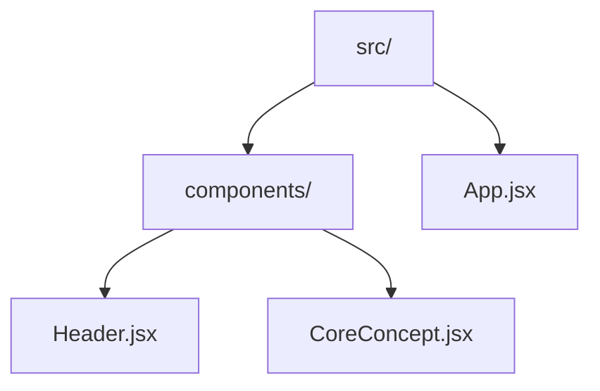

### 組件的匯出與匯入

- **[組件外包]** 將組件函式及其所需的依賴（如資料陣列或輔助函式）從 `App.jsx` 剪下並貼上到獨立的組件檔案中
    - 例如將 `Header` 組件及其依賴移至 `Header.jsx` 中
- **[匯出組件 (Exporting)]** 為了讓組件能在其他檔案中使用，必須使用 `export` 關鍵字
    - **命名匯出 (Named Export)**：直接在函式前加上 `export`

```javascript
export function Header() {
      // ...
    }
```

    - **預設匯出 (Default Export)**：使用 `export default`，這在多數 React 專案中較為常見

```javascript
export default function Header() {
      // ...
    }
```

- **[匯入組件 (Importing)]** 在需要使用該組件的檔案（如 `App.jsx`）中，透過 `import` 語法將其引入
    - 匯入路徑必須以 `./` 開頭，代表從當前目錄開始尋找

```javascript
// 在 App.jsx 中匯入 Header 組件
import Header from './components/Header.jsx';
```

### 處理組件內的資源路徑

- **[資源依賴轉移]** 當組件（如 `Header`）被移至獨立檔案時，該組件所使用的資源匯入也必須一併移過去
    - 例如：若 `Header` 組件使用了 `reactImg`，則必須在 `Header.jsx` 中重新進行 `import`
- **[路徑調整 (Path Adjustment)]** 因為組件現在位於嵌套的子資料夾中，原本的相對路徑會失效，必須根據目前檔案的位置重新計算路徑
    - **原本在&#32;`App.jsx`&#32;時**：路徑為 `./assets/react-core-concepts.png`（從 `src` 直接進入 `assets`）
    - **現在在&#32;`components/Header.jsx`&#32;時**：必須先使用 `../` 回退到 `src` 目錄，再進入 `assets` 資料夾

```javascript
// 在 components/Header.jsx 中正確的匯入方式
import reactImg from '../assets/react-core-concepts.png';
```

- **[路徑邏輯圖解]**

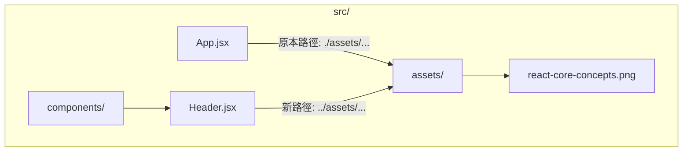

-----------------------------------------------------------

### CSS Modularization

- Just as components are split into multiple files, styles can also be organized into smaller, component-specific files
- **[Why?]** To keep related code (JSX and CSS) closely together for better maintainability
- **Example organization**:
    - Create a `Header.css` file within the `components` folder next to `Header.jsx`
    - Move all header-related styles from `index.css` into the new `Header.css` file

### Importing Component-Specific CSS

- Moving styles from `index.css` to a dedicated file like `Header.css` will cause the styling to break if not properly linked
    - React and the project setup do not automatically include new CSS files in the loaded webpage
- **[How to include it]** You must explicitly import the CSS file within the component file it belongs to
    - For example, inside `Header.jsx`, add an import statement:

```javascript
import './Header.css';
```

    - The underlying build process processes this statement and ensures the CSS code is included in the final webpage

### CSS Scoping Limitations

- Importing a CSS file into a component file does not restrict those styles to that component
    - The styles are still globally scoped
    - **[The consequence]** If you use a tag (like `<header>`) elsewhere in the application, the styles from the component-specific CSS file will be applied to it as well

#### Example of Global Side Effects

- If `Header.css` contains styles for a `header` element:
    - Adding a standard `<header>` tag in `App.jsx` will trigger those same styles
    - This happens even if that new `<header>` is not part of the `Header` component

#### Why Modularize Anyway?

- Even without automatic scoping, splitting CSS into component-specific files is beneficial:
    - Improves organization by making it easy to see which styles relate to which component
    - Makes adjusting specific styles easier and more intuitive

-----------------------------------------------------------

### 建立 Examples 互動區塊

- 在 `App.jsx` 的主要區域（main area）中，於 `core-concepts` 區段之後新增一個 `section`
    - 為該區段設定 `id="examples"`，以便後續進行樣式設計（styling）
- **[初步結構規劃]** 使用 HTML 原生元素來構建分頁按鈕列表：
    - 使用 `<menu>` 元素作為容器
    - 在 `<menu>` 內使用 `<li>` 搭配 `<button>` 來建立按鈕項目

```jsx
<section id="examples">
  <h2>Examples</h2>
  <menu>
    <li><button></button></li>
  </menu>
</section>
```

### 建立 TabButton 組件

- 為了避免在 `menu` 內重複撰寫相同的按鈕結構，將其提取為獨立組件
- 在 `components` 資料夾下建立 `TabButton.jsx`
- **[組件實作]** 定義一個名為 `TabButton` 的預設匯出函數，回傳包含按鈕的列表項目：

```jsx
export default function TabButton() {
  return (
    <li>
      <button></button>
    </li>
  );
}
```

### 在 App.jsx 中使用自定義組件

- **[步驟 1：匯入組件]** 必須先從正確的路徑匯入 `TabButton` 才能在 `App.jsx` 中使用

```jsx
import TabButton from './components/TabButton.jsx';
```

- **[步驟 2：套用組件]** 使用自定義標籤 `<TabButton>` 取代原本重複的 HTML 結構，並透過標籤對（opening and closing tags）來傳遞按鈕文字

```jsx
<section id="examples">
  <h2>Examples</h2>
  <menu>
    <TabButton>Components</TabButton>
  </menu>
</section>
```

### 理解組件內容的渲染問題

- **[遇到的問題]** 在 `App.jsx` 中使用 `<TabButton>Components</TabButton>` 時，雖然沒有報錯，但頁面上既沒有顯示按鈕，也沒有顯示 "Components" 文字
    - 這是因為 React 預設會忽略放在自定義組件開閉標籤之間的內容
    - React 不知道應該將這些內容渲染在組件內部的哪個位置
- **[解決方案：使用&#32;`children`&#32;prop]**
    - 每個自定義組件都會接收一個 `props` 物件，即使沒有手動設定屬性，React 也會傳入這個物件
    - 其中包含一個特殊的內建 prop：`children`
    - `children` 會捕捉並儲存所有放在組件開閉標籤之間的內容
- **[實作方式]** 在 `TabButton.jsx` 中接收 `props` 並將 `props.children` 放入按鈕內：

```jsx
export default function TabButton(props) {
  return (
    <li>
      <button>{props.children}</button>
    </li>
  );
}
```

### `children` Prop 的進階應用

- **[核心定義]** `children` 是一個特殊的內建 prop，由 React 自動傳入
    - 它代表了放在自定義組件「開閉標籤之間」的所有內容
    - 內容可以是簡單的文字，也可以是複雜的 JSX 結構
- **[實作方式]** 除了直接使用 `props.children`，也可以使用 JavaScript 的**物件解構**來讓代碼更簡潔：

```jsx
export default function TabButton({ children }) {
  return (
    <li>
      <button>{children}</button>
    </li>
  );
}
```

- **[組件的包裝能力 (Wrapping)]**
    - 透過 `children`，組件可以扮演「容器」的角色，包裹住不同的內容

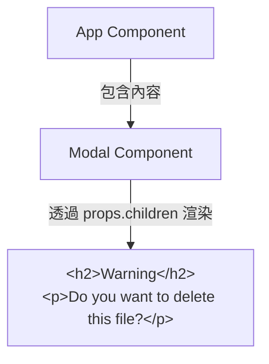

### 組件組合 vs. 屬性傳遞

在 React 中，有兩種主要方式可以將資料或內容傳遞給組件。這兩種方法並非優劣之分，而是取決於具體的使用場景。

#### 1. 使用 `children` prop (組件組合)

- **[概念]** 透過組件的開閉標籤包裹內容，這更接近「標準 HTML」的使用習慣。
- **[優點]** 非常適合用於「包裝」其他組件或複雜的 JSX 結構，具備高度的靈活性。
- **[實作範例]**

```jsx
// 使用方式
<TabButton>Components</TabButton>

// 組件定義
function TabButton({ children }) {
  return <button>{children}</button>;
}
```

#### 2. 使用屬性 (Attribute Props)

- **[概念]** 將內容作為一個特定的屬性（例如 `label`）傳入組件。
- **[優點]** 當組件需要接收多個較小的資訊片段來配置其不同部分時，這種方式非常直觀且易於管理。
- **[實作範例]**

```jsx
// 使用方式
<TabButton label="Components" />

// 組件定義
function TabButton({ label }) {
  return <button>{label}</button>;
}
```

#### 總結與選擇策略

兩者在功能上可以達到相同的結果，選擇哪一種通常取決於個人偏好或專案的設計規範。

| 特性 | `children` Prop (組件組合) | 屬性 Props (如 `label`)

| 適用場景 | 需要包裹複雜內容或模擬 HTML 結構時 | 需要傳遞多個特定配置參數時 |
| 直覺程度 | 適合單一渲染內容的容器 | 適合結構化、多參數的組件 |

| 開發體驗 | 較具彈性，像是在寫 HTML |

| 開發體驗 | 較為明確，參數一目了然 |  |

> 最終的選擇取決於你的使用案例 (use-case) 與個人偏好。

-----------------------------------------------------------

### TabButton 的點擊事件處理

- 目標：點擊分頁按鈕後，下方能顯示對應的不同內容
- **[原生 JavaScript 的做法]**
    - 需要先使用 `querySelector` 選取目標按鈕
    - 再透過 `addEventListener` 方法來監聽 `click` 事件
    - 最後定義一個回呼函式（例如匿名箭頭函式）來執行動作
    - 範例邏輯：

```javascript
// 假設在 vanilla JS 環境
    const button = document.querySelector('button');
    button.addEventListener('click', () => {
      // 執行點擊後的邏輯
    });
```

- **[React 的處理方向]**
    - 雖然目前正在 `TabButton.jsx` 中嘗試使用原生 DOM 方法，但 React 專案通常會使用 React 內建的事件處理機制，而非手動操作 DOM 選取器。

### React 的事件處理方式

- **[開發範式轉移]** 從「指令式 (Imperative)」轉向「宣告式 (Declarative)」
    - **[指令式 (Imperative)]**：直接與 DOM 互動（例如使用 `document.querySelector`），這在 React 中並非首選做法
    - **[宣告式 (Declarative)]**：告訴 React 你想要什麼，並讓 React 負責處理底層的 DOM 操作
- **使用事件 Prop**
    - 在 React 中，透過為元素添加特殊的 prop 來實作事件監聽
    - 這些內建元素支援多種以 `on` 開頭的 prop，例如：
        - `onClick`：用於監聽點擊事件
        - `onBlur`
        - `onChange`
        - `onDoubleClick`
        - `onDrag`
    - 在開發環境中，輸入 `on` 並配合快捷鍵（如 `Ctrl + Space`）可以查看所有可用的事件建議列表

### 事件處理函式的實作細節

- **[事件 Prop 的值]** 必須是一個函式
    - 事件 prop（如 `onClick`）的值應該指向一個函式，這樣當事件發生時，該函式才會被執行
- **[在組件內定義函式]**
    - 可以在組件函式內部定義事件處理函式（這是 JavaScript 允許的巢狀函式寫法）
    - **[優點]** 這樣定義的函式之後可以存取該組件的 `props` 與 `state`
- **[命名慣例]**
    - 函式名稱可以自訂，但常見的慣例是使用 `handle` 作為前綴，後面接事件名稱
    - 例如：`handleClick`

```javascript
export default function TabButton({ children }) {
  function handleClick() {
    // 處理點擊邏輯
  }

  return (
    <li>
      <button onClick={handleClick}>{children}</button>
    </li>
  );
}
```

### 事件處理函式的傳遞細節

- **[傳遞函式引用 vs. 直接呼叫]**
    - 在將函式賦值給 `onClick` 時，必須傳遞**函式名稱**（引用），而不能加上括號 `()`。
    - **[錯誤做法]**：`onClick={handleClick()}`
        - 如果加上括號，函式會在組件渲染（render）時立即被執行。
        - 這會導致邏輯在非預期的時間點（組件載入時）就跑出來，而不是在使用者點擊時。
    - **[正確做法]**：`onClick={handleClick}`
        - 這樣做是將函式本身作為一個「值」傳遞給 React。
        - React 會在偵測到點擊事件發生時，才去執行這個被傳遞進來的函式。

```javascript
export default function TabButton({ children }) {
  function handleClick() {
    console.log('Hello World!');
  }

  return (
    <li>
      {/* 正確：傳遞函式引用 */}
      <button onClick={handleClick}>{children}</button>
    </li>
  );
}
```