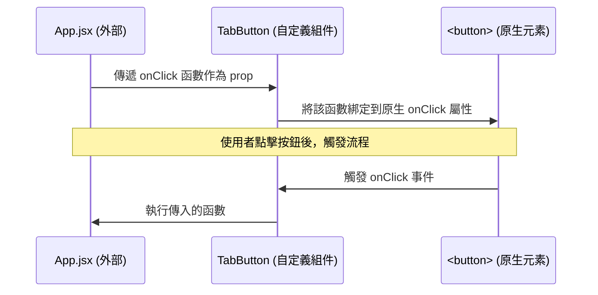
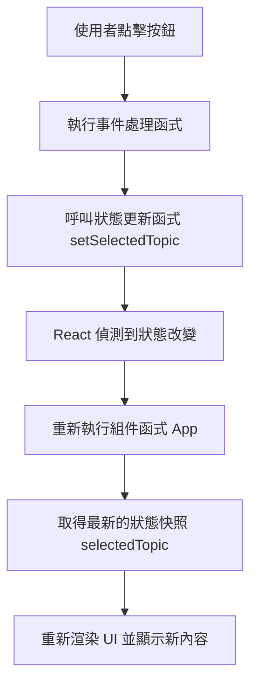
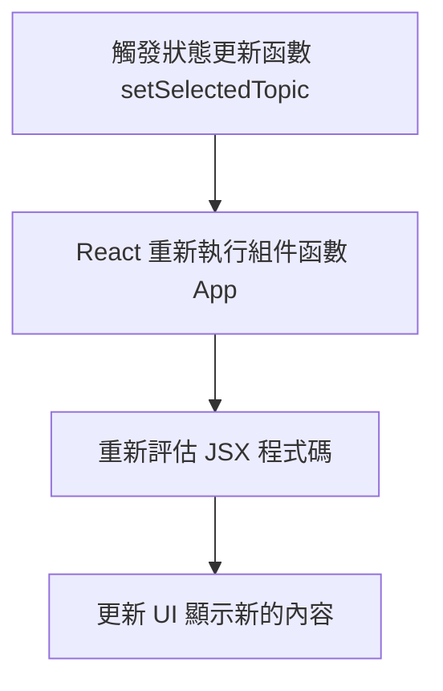
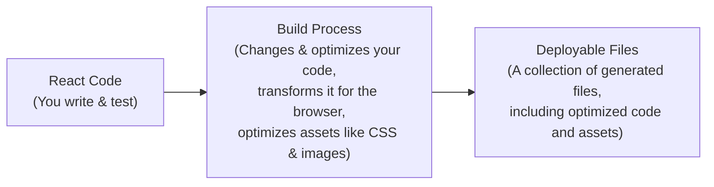
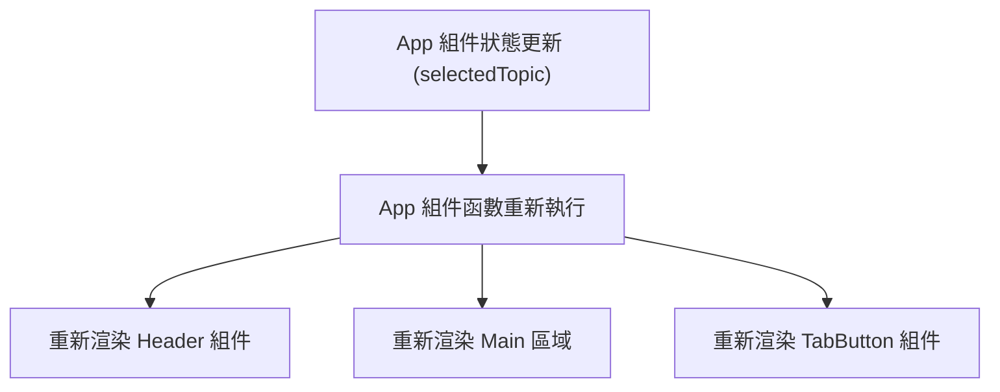

### 更新動態內容與自定義組件事件

- 目標：當按下按鈕時，更新按鈕下方的內容區域，顯示不同的動態內容
    - 實作位置：位於 `App.jsx` 中，在選單區域下方
- **[關鍵概念] 自定義組件的事件處理**
    - 自定義組件最終都是對原生 HTML/JSX 元素的封裝
    - 若要讓自定義組件能響應點擊，必須在其內部的原生元素（如 `<button>`）上綁定 `onClick` 事件

```jsx
// TabButton.jsx 範例結構
export default function TabButton({ children }) {
  function handleClick() {
    console.log('Hello World!');
  }

  return (
    <li>
      <button onClick={handleClick}>{children}</button>
    </li>
  );
}
```

### 實現自定義組件的點擊轉發

- **[目標]** 在 `App.jsx` 中透過點擊按鈕來更新內容，這需要自定義的 `TabButton` 能接收並執行從外部傳入的函數
- **實作邏輯**：
    - 在自定義組件的參數中使用物件解構（Object Destructuring）來接收 props
    - 將接收到的函數（例如 `onClick`）傳遞給內部的原生 `<button>` 元素
- **關於 Props 的命名**
    - 除了 React 特有的 `children` prop 必須固定命名外，其餘 props 的名稱可以根據需求自定義（例如可以命名為 `onClick`）

```jsx
// TabButton.jsx 轉發事件範例
export default function TabButton({ children, onClick }) {
  function handleClick() {
    console.log('Hello World!');
  }

  return (
    <li>
      <button onClick={handleClick}>{children}</button>
    </li>
  );
}
```

- **[流程圖] 事件如何從外部傳遞到原生元素**



### 自定義組件的 Props 命名慣例

- **命名靈活性**
    - 除了 React 特有的 `children` 必須固定命名外，自定義組件的所有其餘 props 名稱皆可自由定義
    - 例如：可以將接收事件的 prop 命名為 `onClick`、`click` 或 `onSelect`
- **[慣例] 使用&#32;`on`&#32;前綴**
    - 在 React 專案中，一種常見的慣例是：若一個 prop 預期會接收一個函數，且該函數會在某個事件發生時被觸發，則該 prop 的名稱應以 `on` 開頭
    - **目的**：明確表達該 prop 的用途，即它與某種事件（如點擊、HTTP 請求完成等）相關聯

```jsx
// 使用 onSelect 作為自定義事件 prop 的範例
export default function TabButton({ children, onSelect }) {
  return (
    <li>
      <button onClick={onSelect}>{children}</button>
    </li>
  );
}
```

---
title: "Course: React - The Complete Guide (incl. Next.js, Redux) | Udemy"
description: Dive in and learn React.js from scratch! Learn React, Hooks, Redux, React Router, Next.js, Best Practices and way more!
author: The Complete Guide (incl. Next.js, Redux) | Udemy
source: https://www.udemy.com/course/react-the-complete-guide-incl-redux/learn/lecture/39649214#overview
created: "2026-08-21"
tags:
  - hover-notes
  - udemy
hovernotes-id: doc_188df86e-e974-4dab-85d0-e49d2a1d9743
---

### 透過參數識別點擊的按鈕

- 為了根據點擊的按鈕切換不同的動態內容，`handleSelect` 函數需要接收一個參數來識別按鈕
    - 建議參數名稱：`selectedButton`
    - 參數類型：字串 (String)
- **[識別符設計]** 根據按鈕內容，可以定義四種特定的字串值作為識別碼：
    - `components`
    - `jsx`
    - `props`
    - `state`
- 修改後的函數結構範例：

```javascript
function handleSelect(selectedButton) {
    // selectedButton => 'components', 'jsx', 'props', 'state'
    console.log('Hello World - selected!');
  }
```

- 在 `App.jsx` 中，透過 `onSelect` 傳遞對應的識別碼：

```jsx
<menu>
    <TabButton onSelect={handleSelect}>Components</TabButton>
    <TabButton onSelect={handleSelect}>JSX</TabButton>
    <TabButton onSelect={handleSelect}>Props</TabButton>
    <TabButton onSelect={handleSelect}>State</TabButton>
  </menu>
```

### 使用箭頭函數傳遞識別碼

- **[問題點]** 直接將 `handleSelect` 作為值傳遞給 `onSelect` 是不夠的
    - 這樣做只會將函數本身傳遞過去，React 不會知道我們想要傳入特定的應用程式識別碼（如 'components' 或 'jsx'）
- **[解決方案]** 使用箭頭函數來包裝 `handleSelect` 的執行
    - 透過箭頭函數，我們可以明確控制在按鈕被點擊時，要呼叫 `handleSelect` 並帶入哪一個識別碼
    - 這屬於標準 JavaScript 的特性，並非 React 專屬
- 修改後的傳遞方式範例：

```jsx
<menu>
    <TabButton onSelect={() => handleSelect('components')}>Components</TabButton>
    <TabButton onSelect={() => handleSelect('jsx')}>JSX</TabButton>
    <TabButton onSelect={() => handleSelect('props')}>Props</TabButton>
    <TabButton onSelect={() => handleSelect('state')}>State</TabButton>
</menu>
```

### 匿名箭頭函數的寫法與執行機制

- **[寫法選擇]** 可以使用匿名箭頭函數，這比使用傳統的匿名函數（`function() { ... }`）更簡潔
    - 傳統寫法範例：

```jsx
<TabButton onSelect={function() { handleSelect('components') }}>Components</TabButton>
```

    - 箭頭函數寫法範例：

```jsx
<TabButton onSelect={() => handleSelect('components')}>Components</TabButton>
```

- **[執行時機]** 關鍵在於這段程式碼並不會在解析（parse）這行程式碼時立即執行
    - 當程式碼被解析時，React 只是「定義」了這個匿名箭頭函數，並將其作為值傳遞給 `onSelect` 屬性
    - 只有當按鈕被點擊，觸發了該函數時，箭頭函數內部的 `handleSelect()` 才會被真正執行
- **[總結]** 這種方式確保了函數是「被動等待觸發」，而不是在組件渲染時「主動立即執行」

---
title: "Course: React - The Complete Guide (incl. Next.js, Redux) | Udemy"
description: Dive in and learn React.js from scratch! Learn React, Hooks, Redux, React Router, Next.js, Best Practices and way more!
author: The Complete Guide (incl. Next.js, Redux) | Udemy
source: https://www.udemy.com/course/react-the-complete-guide-incl-redux/learn/lecture/39649230#overview
created: "2026-08-21"
tags:
  - hover-notes
  - udemy
hovernotes-id: doc_54d59d45-d438-46a5-b9a6-9d5232eecfc2
---

### 實現動態分頁內容

- 透過在 `App` 組件中定義一個狀態變數來儲存目前選中的內容
    - 初始值可設定為「請點擊按鈕」
    - 當 `handleSelect` 被觸發時，將該變數更新為傳入的按鈕標識符（identifier）
- 使用大括號 `{}` 在 JSX 中動態輸出該變數的值

```jsx
function App() {
  // 假設已定義 tabContent 狀態變數
  function handleSelect(selectedButton) {
    // 更新 tabContent 為選中的按鈕名稱
    tabContent = selectedButton;
  }

  return (
    <div>
      <Header />
      <main>
        <section id="core-concepts">
          <h2>Core Concepts</h2>
          <ul>
            <TabButton onSelect={() => handleSelect('components')}>Components</TabButton>
            <TabButton onSelect={() => handleSelect('jsx')}>JSX</TabButton>
            <TabButton onSelect={() => handleSelect('props')}>Props</TabButton>
            <TabButton onSelect={() => handleSelect('state')}>State</TabButton>
          </ul>
          {/* 動態顯示內容 */}
          {tabContent}
        </section>
      </main>
    </div>
  );
}
```

### 變數更新與 UI 不同步的問題

- 雖然 `handleSelect` 函數已被觸發，且變數值也已成功更新
    - 透過 `console.log(tabContent)` 可以確認變數內容已改變
- **[問題所在]** 使用者介面（UI）並未隨之更新
    - 畫面上的文字仍維持初始值「Please click a button"
    - 這是因為 `App` 組件函數本身並沒有被重新執行（re-execute）
    - 在 React 中，若要讓 UI 反應資料變化，必須觸發組件的重新渲染（re-render）

```javascript
function App() {
  let tabContent = 'Please click a button';

  function handleSelect(selectedButton) {
    // 變數確實被更新了，但這不會觸發 UI 更新
    tabContent = selectedButton;
    console.log(tabContent);
  }

  return (
    <div>
      <Header />
      <main>
        <section id="core-concepts">
          <h2>Core Concepts</h2>
          <ul>
            <TabButton onSelect={() => handleSelect('components')}>Components</TabButton>
            {/* ... 其他按鈕 ... */}
          </ul>
          {tabContent}
        </section>
      </main>
    </div>
  );
}
```

### React 的更新機制與組件執行

- **[核心問題]** 由於 `handleSelect` 函數雖然執行了，但 `App` 組件函數本身沒有再次執行
    - 這導致 JSX 代碼沒有被重新評估（re-evaluated）
    - React 仍然只知道 `tabContent` 的初始值
- **React 如何偵測 UI 更新？**
    - React 會查看 JSX 代碼，並將其與目前已渲染的 UI 進行比較
    - 如果偵測到任何差異（differences），React 就會更新 UI
- **[重要特性] 組件預設只執行一次**
    - 預設情況下，React 只會在程式碼中第一次遇到某個組件時執行該組件函數
    - 若要讓 UI 更新，必須「告訴」React 該組件需要再次執行

### 組件的執行時機與偵測

- **[執行時機]** 組件函數僅在第一次被遇到時執行
    - 例如 `App` 組件是在 `index.jsx` 中首次被呼叫時執行並渲染
    - 當 `App` 被執行時，內部的 `TabButton` 組件也會隨之執行並渲染
    - **[重點]** 一旦完成初次渲染，這些函數預設不會再次執行
- **如何偵測組件是否重新執行？**
    - 在組件函數的**內部**（而非事件處理函數內）添加 `console.log`
    - 若要確認 `App` 是否重新渲染，應將 log 放在 `App` 函數體內，而非 `handleSelect` 內

```javascript
// 在 App.jsx 中
function App() {
  let tabContent = 'Please click a button';

  function handleSelect(selectedButton) {
    tabContent = selectedButton;
    console.log(tabContent);
  }

  // 放置在此處可以偵測 App 組件是否重新執行
  console.log('APP COMPONENT RENDERING');

  return (
    // ... JSX ...
  );
}
```

```javascript
// 在 TabButton.jsx 中
export default function TabButton({ children, onSelect }) {
  // 放置在此處可以偵測 TabButton 是否重新執行
  console.log('TAB BUTTON COMPONENT EXECUTING');

  return (
    <li>
      <button onClick={onSelect}>{children}</button>
    </li>
  );
}
```

---
title: "Course: React - The Complete Guide (incl. Next.js, Redux) | Udemy"
description: Dive in and learn React.js from scratch! Learn React, Hooks, Redux, React Router, Next.js, Best Practices and way more!
author: The Complete Guide (incl. Next.js, Redux) | Udemy
source: https://www.udemy.com/course/react-the-complete-guide-incl-redux/learn/lecture/39649238#overview
created: "2026-08-21"
tags:
  - hover-notes
  - udemy
hovernotes-id: doc_3099be1f-980b-46de-9817-79a058c4ca65
---

### React 狀態 (State)

- **[為什麼需要 State?]** 因為在 React 組件中，單純修改普通變數（如 `let tabContent = ...`）不會導致組件函式重新執行，因此 UI 不會跟著更新
- **State 的定義**
    - 一種由 React 管理的特殊變數
    - 當這些變數透過 React 提供的方法更新時，會通知 React 數據已改變，進而觸發 UI 的重新渲染 (Re-render)
- **如何使用 useState**
    - 這是一個所謂的 **React Hook**（所有以 `use` 開頭的函式皆為 Hook）
    - 必須從 `react` 函式庫中匯入

```javascript
import { useState } from 'react';
```

### React Hooks 的使用規則

- Hooks 本質上是普通函式，但必須遵循特定的使用限制
- **規則 1：只能在 React 組件函式或自定義 Hook 內部呼叫**
    - 不能在一般的 JavaScript 函式中呼叫
    - 範例：

```javascript
// ✅ 正確：在組件函式內部呼叫
        function App() {
          const [val, setVal] = useState(0);
        }

        // ❌ 錯誤：在一般函式內部呼叫
        function App() {
          function innerFunction() {
            const [val, setVal] = useState(0);
          }
        }
```

- **規則 2：必須在組件函式的頂層（Top Level）呼叫**
    - 不能將 Hook 嵌套在條件判斷（if statements）、迴圈（loops）或其他巢狀代碼塊中
    - **[為什麼這樣規定？]** 為了確保 React 在每次渲染時都能以相同的順序呼叫這些 Hook
    - 範例：

```javascript
// ✅ 正確：在頂層呼叫
        function App() {
          const [val, setVal] = useState(0);
        }

        // ❌ 錯誤：嵌套在條件判斷中
        function App() {
          if (someCondition) {
            const [val, setVal] = useState(0);
          }
        }
```

### useState 的運作機制

- `useState` 是 React 中最重要的 Hook 之一，用於管理組件特定的狀態 (Component-specific state)
    - **[作用]** 當狀態改變時，會觸發該 Hook 所屬的組件函式重新執行 (Re-execute)，從而更新 UI
- **參數與回傳值**
    - **參數 (Argument)**：接受一個值作為**初始值 (Default value)**，即組件首次渲染時所使用的數據
    - **回傳值 (Return value)**：會回傳一個**陣列**，且該陣列**固定包含兩個元素**

```javascript
// 範例：傳入初始值 'Please click a button'
const stateArray = useState('Please click a button');
```

| 陣列元素 | 說明 |
| --- | --- |
| 第一個元素 | 當前的狀態值 (Current state value) |
| 第二個元素 | 用於更新狀態的函式 (Function to update the state) |

### useState 的陣列解構與命名慣例

- **使用陣列解構 (Array Destructuring)**
    - 由於 `useState` 固定回傳一個包含兩個元素的陣列，我們可以使用 JavaScript 的解構語法直接將這兩個元素賦值給兩個獨立的常數
    - **[為什麼要這樣做？]** 這樣可以避免先接收整個陣列再手動透過索引（如 `stateArray[0]`）來存取，讓程式碼更簡潔易讀

```javascript
// 使用解構語法直接取得兩個元素
const [selectedTopic, setSelectedTopic] = useState('Please click a button');
```

- **命名慣例 (Naming Convention)**
    - 雖然變數名稱可以自由命名，但 React 社群有一套通用的慣例：
        - **第一個元素**：代表「目前的狀態值」，通常命名為描述該數據的名稱（例如 `selectedTopic`）
        - **第二個元素**：代表「更新狀態的函式」，會在名稱前加上 `set` 字首（例如 `setSelectedTopic`）
- **第一個元素的本質：數據快照 (Data Snapshot)**
    - 回傳陣列中的第一個元素代表的是**該組件當前執行週期 (Execution Cycle) 的數據快照**
    - **[運作流程]**

        1. 組件首次執行時，該值為 `useState` 傳入的**初始值**
        2. 當狀態被更新後，組件會重新執行，此時該值會變為**更新後的最新值**

### 第二個元素：狀態更新函式 (State Updating Function)

- **[作用]** 這是由 React 提供的一個特殊函式，用於更新目前儲存的狀態值
- **[核心功能]** 除了更新數據外，呼叫此函式會「告訴」React 該組件函式必須再次執行 (Re-execute)
    - **[為什麼這很重要？]** 這是觸發 UI 更新的關鍵機制，確保數據改變時畫面能同步更新

### 為什麼可以使用 `const` 來接收狀態值

- 在組件中使用 `const [selectedTopic, setSelectedTopic] = useState(...)` 是完全正確的
- **[運作原理]**
    - 每次組件函式重新執行時，`selectedTopic` 這個常數都會被「重新建立」(Recreated)
    - 雖然變數名稱是 `const`，但背後的機制是：React 會在內部儲存並更新實際的值，並在下次組件執行時，將最新的值傳遞給這個新的常數

```javascript
// 範例：在事件處理函式中呼叫更新函式
function handleSelect(selectedButton) {
  // 呼叫 setSelectedTopic 會更新狀態並觸發 App 組件重新執行
  setSelectedTopic(selectedButton);
}
```

### 狀態更新與 UI 重新渲染

- **觸發 UI 更新的完整流程**
    - 在事件處理函式中呼叫狀態更新函式（例如 `setSelectedTopic(selectedButton)`），會改變儲存的狀態值
    - **[關鍵機制]** 狀態改變後，React 會自動重新執行 (Re-execute) 該組件函式
    - 組件重新執行後，會使用最新的狀態值重新產生 JSX，從而實現 UI 的動態更新

```javascript
function handleSelect(selectedButton) {
  // 1. 呼叫更新函式，改變狀態並通知 React 重新執行 App 組件
  setSelectedTopic(selectedButton);

  // 2. 這裡的 console.log 會在當前執行週期印出舊的值
  console.log(tabContent);
}
```

- **在 JSX 中使用狀態值**
    - 透過大括號 `{}` 將狀態值（即 `useState` 回傳的第一個元素）嵌入到 JSX 中，使其能隨著狀態改變而動態顯示

```jsx
// 在 return 的 JSX 中輸出目前的狀態快照
<p>{selectedTopic}</p>
```

- **觀察組件重新執行 (Re-execution)**
    - **[實驗觀察]** 在組件頂層放置 `console.log('APP COMPONENT EXECUTING');`
    - 當使用者點擊按鈕觸發狀態更新時，控制台會再次印出該訊息
    - 這證明了組件函式確實因為狀態改變而完整地「重新跑了一次」



---
title: "Course: React - The Complete Guide (incl. Next.js, Redux) | Udemy"
description: Dive in and learn React.js from scratch! Learn React, Hooks, Redux, React Router, Next.js, Best Practices and way more!
author: The Complete Guide (incl. Next.js, Redux) | Udemy
source: https://www.udemy.com/course/react-the-complete-guide-incl-redux/learn/lecture/39649246#overview
created: "2026-08-21"
tags:
  - hover-notes
  - udemy
hovernotes-id: doc_d314365a-582d-4579-a159-0527d0d24641
---

### 結合狀態與外部資料

- 使用 `useState` 儲存當前選中的識別碼，以便根據該值從資料集中提取詳細資訊
- **[資料結構設計]** 在 `data.js` 中建立一個 `EXAMPLES` 常數，其結構如下：

```javascript
export const EXAMPLES = {
    components: {
      title: 'Components',
      description: 'Components are the building blocks of React applications.',
      code: '...'
    },
    jsx: {
      title: 'JSX',
      description: 'JSX is a syntax extension to JavaScript...',
      code: '...'
    },
    // ... 其他項目如 props, state
  };
```

- **[渲染邏輯]** 在 JSX 中，可以根據 `selectedTopic` 的值來動態呈現對應的標題、描述與程式碼
    - 準備一個容器（例如 `<div id="tab-content">`）來承載這些動態內容

### 動態渲染內容結構

- 在 `App.jsx` 中，針對每個選中的主題，預計建立以下 HTML 結構來呈現內容：
    - `<h3>`：顯示標題 (title)
    - `<p>`：顯示描述 (description)
    - `<pre>` 搭配 `<code>`：顯示程式碼範例 (code)
- **[實作步驟]**

    1. 從外部檔案匯入資料：

```javascript
import { EXAMPLES } from './data.js';
```

    1. 利用 `useState` 儲存的識別碼（例如 `'components'`, `'jsx'` 等）作為鍵值（key），從 `EXAMPLES` 物件中提取對應的詳細資料
    2. 在 JSX 中動態存取，例如：`EXAMPLES[selectedTopic].title`

- **[UI 容器設置]**
    - 使用一個 `id="tab-content"` 的 `<div>` 作為承載動態內容的容器

### 動態存取資料的關鍵細節

- **[重要前提] 識別碼的一致性**
    - 按鈕點擊時傳遞的識別碼（identifiers）必須與 `EXAMPLES` 物件中的鍵值（keys）**完全相等**
    - 例如：若按鈕傳遞 `'components'`，則 `EXAMPLES` 必須包含 `components:` 鍵值，否則將無法正確提取資料
- **使用方括號語法進行動態存取**
    - 因為屬性名稱儲存在變數（如 `selectedTopic`）中，必須使用 JavaScript 的方括號語法 `[]` 而非點號語法 `.` 來存取
    - **範例：動態存取標題**
        - 在 `<h3>` 元素中，透過 `EXAMPLES[selectedTopic].title` 來取得對應主題的標題

```jsx
// 在 App.jsx 中的動態渲染實作方式
<div id="tab-content">
  <h3>{EXAMPLES[selectedTopic].title}</h3>
  <p>{EXAMPLES[selectedTopic].description}</p>
  <pre>
    <code>{EXAMPLES[selectedTopic].code}</code>
  </pre>
</div>
```

- **存取邏輯拆解**
    - `EXAMPLES[selectedTopic]`：根據當前狀態找到對應的主題物件（例如 `{ title: '...', description: '...', code: '...' }`）
    - `.[property]`：接著從該主題物件中提取特定的屬性值（如 `.title`）

---
title: "Course: React - The Complete Guide (incl. Next.js, Redux) | Udemy"
description: Dive in and learn React.js from scratch! Learn React, Hooks, Redux, React Router, Next.js, Best Practices and way more!
author: The Complete Guide (incl. Next.js, Redux) | Udemy
source: https://www.udemy.com/course/react-the-complete-guide-incl-redux/learn/lecture/39649252#overview
created: "2026-08-21"
tags:
  - hover-notes
  - udemy
hovernotes-id: doc_a88a6c62-4603-49a0-9696-a9ee97834faf
---

### 處理初始狀態與條件式渲染

- **[問題點]** 頁面初次載入時，若狀態 (state) 預設有值，會導致組件直接顯示該資料
    - 這可能不是預期的行為（例如：在使用者選擇主題前就顯示了主題內容）
- **[解決方案：調整初始值]** 將狀態的初始值設為 `null` 或空字串
    - 這樣可以向程式碼發出「尚未選擇任何內容」的訊號
- **[解決方案：條件式渲染]** 在 React 中使用條件式渲染來控制內容輸出
    - 只有在「已選取主題」的情況下才輸出對應的 Markup
    - 若未選取，則輸出「備用內容 (fallback)」，例如提示文字：「請選擇主題」

```javascript
// 範例：將狀態初始值設為 null 以避免預設顯示內容
const [selectedTopic, setSelectedTopic] = useState(null);
```

### 使用三元運算式進行條件式渲染

- **[方法]** 在 JSX 中使用大括號 `{}` 包裹三元運算式來決定輸出的內容
- **[邏輯判斷]** 利用 JavaScript 的真值/假值 (truthy/falsy) 特性進行檢查
    - 使用 `!selectedTopic` 來檢查狀態是否為「非真值」（例如 `undefined` 或 `null`）
- **[實作方式]** 根據判斷結果選擇顯示「備用內容」或「不顯示任何內容」
    - 若未選取主題：顯示提示文字，如 `<p>Please select a topic.</p>`
    - 若已選取主題：則不顯示提示文字（可使用 `null`）

```javascript
// 範例：若 selectedTopic 為假值，顯示提示文字；否則回傳 null (不渲染)
{!selectedTopic ? <p>Please select a topic.</p> : null}
```

- **[關於&#32;`null`]** 在 JSX 中輸出 `null` 是合法的，這會導致該位置不渲染任何東西

### 條件式渲染的兩種實作邏輯

在處理「顯示提示文字」與「顯示內容區塊」時，可以採用兩種不同的判斷方向：

- **方法一：針對「缺乏資料」進行判斷 (顯示備用內容)**
    - 當 `selectedTopic` 為假值（如 `undefined`）時，渲染提示文字；否則不渲染任何內容 (`null`)。
    - 適用情境：當你只想在特定缺失狀態下顯示簡單的提示時。

```javascript
{!selectedTopic ? <p>Please select a topic.</p> : null}
```

- **方法二：針對「已有資料」進行判斷 (顯示主要內容)**
    - 當 `selectedTopic` 為真值時，渲染包含資料的內容區塊 (`div`)；否則不渲染任何內容 (`null`)。
    - 適用情境：當主要的 UI 結構（如包含標題、描述的 `div`）僅在有資料時才需要存在時。

```javascript
{selectedTopic ? <div id="tab-content">
    <h3>{EXAMPLES[selectedTopic].title}</h3>
    <p>{EXAMPLES[selectedTopic].description}</p>
    <pre><code>{EXAMPLES[selectedTopic].code}</code></pre>
  </div> : null}
```

- **[優化技巧] 合併為單一三元運算式**
    - 如果「顯示內容區塊」與「顯示提示文字」是互斥的兩種狀態，可以直接將兩者合併，避免寫兩次判斷邏輯。
    - 邏輯：`條件 ? 顯示內容 : 顯示提示文字`

```javascript
{selectedTopic ? <div id="tab-content">
    <h3>{EXAMPLES[selectedTopic].title}</h3>
    <p>{EXAMPLES[selectedTopic].description}</p>
    <pre><code>{EXAMPLES[selectedTopic].code}</code></pre>
  </div> : <p>Please select a topic.</p>}
```

### 使用邏輯與運算子 (`&&`) 進行條件式渲染

除了三元運算式，另一種常見且更簡潔的方法是使用邏輯與運算子 (`&&`)。

- **[方法]** 利用 `&&` 來決定是否渲染某個元素
    - 這種寫法可以省略 `else` 的部分（即不需要寫 `: null`）
    - 語法結構：`{條件 && 渲染內容}`
- **[JavaScript 運作原理]** `&&` 運算子的特性
    - 如果條件為 `true`，運算子會回傳其後方的第一個真值（即要渲染的內容）
    - 如果條件為 `false`，則不會渲染任何東西

#### 實作範例

根據不同的需求，可以使用 `&&` 來處理不同的渲染邏輯：

- **顯示提示文字**（當沒有選取主題時）：

```javascript
{!selectedTopic && <p>Please select a topic.</p>}
```

- **顯示內容區塊**（當已有選取主題時）：

```javascript
{selectedTopic && <div id="tab-content">
    <h3>{EXAMPLES[selectedTopic].title}</h3>
    <p>{EXAMPLES[selectedTopic].description}</p>
    <pre><code>{EXAMPLES[selectedTopic].code}</code></pre>
  </div>}
```

- **[如何選擇]**
    - `&&` 運算子可以讓程式碼更短、更簡潔。
    - 使用兩個獨立的 `&&` 段落有時比合併成一個複雜的三元運算式更具可讀性。

---
title: "Course: React - The Complete Guide (incl. Next.js, Redux) | Udemy"
description: Dive in and learn React.js from scratch! Learn React, Hooks, Redux, React Router, Next.js, Best Practices and way more!
author: The Complete Guide (incl. Next.js, Redux) | Udemy
source: https://www.udemy.com/course/react-the-complete-guide-incl-redux/learn/lecture/39649258#overview
created: "2026-08-21"
tags:
  - hover-notes
  - udemy
hovernotes-id: doc_881b8803-07e7-439b-aa74-a79b009a0303
---

### 動態樣式與 JSX 屬性

- **動態樣式（Dynamic Styling）**
    - 用於提供視覺指示，例如在多個標籤（Tabs）中標示出目前哪一個是被選中的狀態
    - 可以透過在選中的元素上動態設定 CSS class 來實現
- **JSX 中的 class 設定**
    - 在 React 中，必須使用 `className` 屬性來設定 class
    - **[為什麼不同？]** 因為 `class` 在 JavaScript 中是一個保留關鍵字，所以 JSX 使用 `className` 作為對應的屬性
    - 其他屬性如 `id` 等在 JSX 中與標準 HTML 保持一致

```jsx
// TabButton.jsx 中的屬性應用範例
export default function TabButton({ children, onSelect }) {
  return (
    <li>
      <button onClick={onSelect}>{children}</button>
    </li>
  );
}
```

### 動態樣式實作與 Props 應用

- **套用 CSS Class**
    - 在 JSX 中，可以透過 `className` 屬性來套用預先定義好的 CSS class
    - 例如在 `index.css` 中定義了 `.active` 樣式，可以直接在元件中套用

```jsx
// TabButton.jsx：手動套用 active class 的範例
export default function TabButton({ children, onSelect }) {
  return (
    <li>
      <button className="active" onClick={onSelect}>{children}</button>
    </li>
  );
}
```

- **[問題] 全域套用 class**
    - 如果直接在所有按鈕上寫死 `className="active"`，則所有按鈕都會呈現被選中的樣式，這不符合使用者體驗
- **動態樣式的解決方案：使用 Props**
    - 為了實現「只有選中的標籤才顯示 active 樣式」，需要讓元件具備判斷狀態的能力
    - **方法**：向元件傳入一個新的 prop，例如 `isSelected`
        - 這個 prop 的類型預期為布林值（boolean）
        - 透過這個值來決定是否要在 `className` 中加入 `active` 類別

### 在 App 元件中實作動態傳遞 Props

- **傳遞&#32;`isSelected`&#32;屬性**
    - 為了讓 `TabButton` 能判斷自己是否被選中，必須在 `App` 元件中使用它時傳入 `isSelected` prop
    - 這個值不應該是寫死的，而應該是根據目前的狀態（state）動態計算出來的
- **[如何動態判斷？]** 利用狀態與特定標籤名稱進行比較
    - 在 `App` 元件中，我們擁有 `selectedTopic` 這個狀態
    - 當 `selectedTopic` 的值等於該按鈕對應的識別碼（例如 `'components'`）時，`isSelected` 就會是 `true`，否則為 `false`

```jsx
// App.jsx 中的動態傳遞範例
<TabButton
  isSelected={selectedTopic === 'components'}
  onSelect={() => handleSelect('components')}
>
  Components
</TabButton>
```

- **狀態驅動的重新渲染（Re-evaluation）**
    - **運作流程**：

        1. 使用者點擊按鈕 $\rightarrow$ 觸發 `onSelect` $\rightarrow$ 呼叫 `handleSelect` $\rightarrow$ 更新 `selectedTopic` 狀態
        2. `App` 元件因為狀態改變而重新執行（Re-render）
        3. 所有 `TabButton` 元件會根據最新的 `selectedTopic` 重新計算 `isSelected` 的布林值
        4. 只有符合條件的按鈕會獲得 `active` class，從而達成動態樣式的效果

---
title: "Course: React - The Complete Guide (incl. Next.js, Redux) | Udemy"
description: Dive in and learn React.js from scratch! Learn React, Hooks, Redux, React Router, Next.js, Best Practices and way more!
author: The Complete Guide (incl. Next.js, Redux) | Udemy
source: https://www.udemy.com/course/react-the-complete-guide-incl-redux/learn/lecture/39649260#overview
created: "2026-08-21"
tags:
  - hover-notes
  - udemy
hovernotes-id: doc_f6e309db-f1b2-4681-bf30-9b4b3d3ddfa5
---

### App 組件的改進空間

- 目前在 `App.jsx` 中，核心概念組件是透過手動重複撰寫來呈現的
    - 程式碼範例如下：

```jsx
<section id="core-concepts">
      <h2>Core Concepts</h2>
      <ul>
        <CoreConcept title={CORE_CONCEPT[0].title} description={CORE_CONCEPT[0].description} image={CORE_CONCEPT[0].image} />
        <CoreConcept {...CORE_CONCEPT[1]} />
        <CoreConcept {...CORE_CONCEPT[2]} />
        <CoreConcept {...CORE_CONCEPT[3]} />
      </ul>
    </section>
```

- **[現有做法的問題]**
    - **程式碼冗餘**：必須根據 `CORE_CONCEPTS` 陣列中的項目數量，手動輸入相同數量的組件標籤，造成不必要的重複輸入
    - **缺乏彈性（容易出錯）**：如果資料來源（`CORE_CONCEPTS` 陣列）發生變動（例如刪除了一項），而程式碼中仍嘗試輸出固定數量的組件，應用程式就會因為找不到對應的資料而發生錯誤（Broken element）

### 動態渲染陣列

- 目標是讓組件的數量根據 `CORE_CONCEPTS` 陣列的項目數量自動衍生，實現動態輸出
- **[JSX 的陣列渲染能力]** JSX 支援直接輸出陣列中的內容：
    - **字串陣列**：例如 `['Hello', 'World']` 會直接在畫面上顯示文字
    - **JSX 元素陣列**：例如 `[<p>Hello</p>, <p>World</p>]` 會渲染成對應的 HTML 元素
- **[限制]** JSX 無法直接輸出「JavaScript 物件陣列」
    - 像 `CORE_CONCEPTS` 這種包含物件（如 `title`, `description`, `image`）的陣列，JSX 不知道該如何將這些屬性封裝進特定的 HTML 標籤（例如將 `image` 資料放入 `` 標籤中）

### 使用 `map` 實現動態轉換

- **[解決方案]** 將「物件陣列」轉換為「JSX 元素陣列」
    - 既然 JSX 可以直接輸出 JSX 元素陣列，我們可以透過轉換來解決物件陣列無法直接渲染的問題
- **使用&#32;`map`&#32;方法**
    - `map` 是 JavaScript 的內建方法，會根據現有陣列產生一個新的陣列
    - 它接受一個回呼函數（例如箭頭函數），該函數會針對陣列中的每一個項目執行一次
- **實作邏輯**
    - 在 `map` 的回呼函數中，我們接收每一個陣列項目（例如命名為 `conceptItem`）
    - 並在函數內部 `return` 我們想要轉換成的 JSX 程式碼

```jsx
<ul>
  {CORE_CONCEPTS.map((conceptItem) => (
    <CoreConcept
      key={conceptItem.title}
      title={conceptItem.title}
      description={conceptItem.description}
      image={conceptItem.image}
    />
  ))}
</ul>
```

> **[注意]** 雖然在轉換過程中會使用到 `conceptItem`（代表當前迴圈的單一物件），但在撰寫 JSX 屬性時，應確保使用的是該迭代對象的屬性，而非固定索引（如 `CORE_CONCEPTS[0]`）。

### 動態列表渲染的實作細節

- **[從手動索引轉向自動迭代]**
    - 在使用 `map` 之後，不再需要手動透過 `CORE_CONCEPTS[0]`、`CORE_CONCEPTS[1]` 等索引來存取特定項目
    - 改為直接使用 `map` 提供的迭代參數（例如 `conceptItem`），它會自動代表陣列中的每一個項目
- **[實作優勢]**
    - **自動化生成**：`map` 函數會針對陣列中的每個項目執行一次，因此組件會根據陣列長度自動生成對應數量的標籤
    - **高彈性**：當 `data.js` 中的資料發生變動時（例如取消註解某個項目），畫面上會立即同步更新，無需修改 `App.jsx` 的結構
- **[React 開發核心模式]**
    - 在 React 應用程式中，輸出資料列表（Lists of data）是非常常見的需求
    - **幾乎所有的列表渲染都會使用&#32;`map`&#32;方法來將資料轉換為 JSX 程式碼**

```jsx
<ul id="core-concepts">
  {CORE_CONCEPTS.map((conceptItem) => (
    <CoreConcept
      key={conceptItem.title}
      title={conceptItem.title}
      description={conceptItem.description}
      image={conceptItem.image}
    />
  ))}
</ul>
```

---
title: "Course: React - The Complete Guide (incl. Next.js, Redux) | Udemy"
description: Dive in and learn React.js from scratch! Learn React, Hooks, Redux, React Router, Next.js, Best Practices and way more!
author: The Complete Guide (incl. Next.js, Redux) | Udemy
source: https://www.udemy.com/course/react-the-complete-guide-incl-redux/learn/lecture/39649262#overview
created: "2026-08-21"
tags:
  - hover-notes
  - udemy
hovernotes-id: doc_53136434-cacd-4831-97e7-f501a16531c1
---

### React Essentials Core Concepts

- **Components**
    - The building blocks of a user interface
    - Essentially functions that must:
        - Start with an uppercase character
        - Return a value that React can render (typically JSX code)
    - Can be used within JSX much like custom HTML elements
- **JSX**
    - The syntax used to define what the component returns
- **Props**
    - Used to configure components
    - Allows passing data into a component to customize its behavior or appearance
- **State**
    - Manages data within a component
    - Triggers a re-render of the UI when the state changes

### Props 的進階用法

- **傳遞 Props 的多種方式**
    - 可以逐一設定屬性，也可以使用物件展開運算符（Spread Operator）一次傳入整個物件
    - 例如：`{...conceptItem}` 會將 `conceptItem` 物件中的所有鍵值對作為 Props 傳入組件
- **在組件中接收 Props**
    - **使用解構賦值（Destructuring）**：直接在函數參數中提取需要的屬性，使程式碼更簡潔

```javascript
export default function CoreConcept({ image, title, description }) {
          // 直接使用 image, title, description
      }
```

    - **使用 props 物件**：透過 `props.屬性名` 的方式存取
- **`children`&#32;Prop**
    - 這是 React 提供的一個特殊 Prop
    - **用途**：用來獲取位於組件「起始標籤」與「結束標籤」之間的內容
    - 當組件被當作容器使用時，這些內容會透過 `children` 傳入組件內部

```javascript
// TabButton.jsx 範例：使用 children Prop
export default function TabButton({ children, onSelect, isSelected }) {
    return (
        <li>
            <button className={isSelected ? 'active' : undefined} onClick={onSelect}>
                {children}
            </button>
        </li>
    );
}
```

### 事件處理與 State

- **事件處理 Props (on-props)**
    - 可以使用特殊的 `on` 開頭的 Props 來讓組件能夠監聽事件
    - **自定義組件的事件轉發**：可以將自定義 Prop（例如 `onSelect`）傳遞給內部的原生 HTML 元素（例如 `onClick`），從而將事件處理函數從組件層級向下傳遞到實際的元素上

```javascript
// TabButton.jsx 範例：將自定義的 onSelect 轉發給原生 button 的 onClick
export default function TabButton({ children, onSelect, isSelected }) {
    return (
        <li>
            <button
                className={isSelected ? 'active' : undefined}
                onClick={onSelect}
            >
                {children}
            </button>
        </li>
    );
}
```

- **State 與&#32;`useState`&#32;Hook**
    - **用途**：用於註冊並管理由 React 負責的數據（State）
    - **運作機制**：
        - 使用 `useState` Hook 獲取當前狀態值與一個專門的「狀態更新函數」
        - 當呼叫更新函數時，React 會重新執行該組件函數
        - 組件重新執行會導致 JSX 程式碼被重新評估，進而更新 UI

```javascript
// App.jsx 範例：使用 useState 管理選中的主題
function App() {
    const [selectedTopic, setSelectedTopic] = useState();
    // ...
}
```



---
title: "Course: React - The Complete Guide (incl. Next.js, Redux) | Udemy"
description: Dive in and learn React.js from scratch! Learn React, Hooks, Redux, React Router, Next.js, Best Practices and way more!
author: The Complete Guide (incl. Next.js, Redux) | Udemy
source: https://www.udemy.com/course/react-the-complete-guide-incl-redux/learn/lecture/39659740#overview
created: "2026-08-21"
tags:
  - hover-notes
  - udemy
hovernotes-id: doc_7acd6c01-6295-4aa3-831a-0ceab0aa7569
---

### JSX 與建置程序 (The Build Process)

- JSX 是一種非標準特性
    - 瀏覽器本身並不支援 JSX 語法
    - 因此開發者撰寫的 JSX 程式碼並非最終在瀏覽器中運行的程式碼
- **[為什麼需要建置程序？]** 因為需要將 JSX 轉換為標準 JavaScript
    - 建置程序會在幕後運行，將程式碼進行轉換 (Transform)
    - 同時可能對程式碼進行優化 (Optimize)，使其能在瀏覽器中正常運作



### JSX 的本質：便利性而非必要性

- JSX 僅僅是一種為了開發便利而存在的語法糖 (Syntactic Sugar)
- **[為什麼使用 JSX？]** 因為它比純 JavaScript 更直觀、更容易撰寫與閱讀
- 技術上，你不需要 JSX 也能建置 React 專案

#### 使用 `React.createElement` 取代 JSX

- 可以透過 React 提供的 `createElement` 方法，使用純 JavaScript 來建立相同的 HTML 結構
- 例如，以下 JSX 代碼：

```jsx
<div id="content">
    <p>Hello World!</p>
  </div>
```

- 可以完全被以下標準 JavaScript 代碼取代：

```javascript
React.createElement(
    'div',
    { id: 'content' },
    React.createElement(
      'p',
      null,
      'Hello World'
    )
  );
```

- **`React.createElement`&#32;的參數結構：**
    - **Component Type**：指定要渲染的組件類型（例如 `'div'` 或 `'p'`）
    - **Props**：組件的屬性物件（例如 `{ id: 'content' }`，若無則傳入 `null`）
    - **Children**：組件的子元素（可以是文字或其他組件）

#### JSX 與非 JSX 方法的比較

- **JSX 方法**
    - 需要建置程序 (Build process) 與程式碼轉換 (Code transformation)
    - 優點：易於閱讀與理解
- **非 JSX 方法 (`React.createElement`)**
    - 不需要特殊的建置程序或轉換即可運作
    - 缺點：語法較為冗長 (Verbose)，且不一定直觀

---
title: "Course: React - The Complete Guide (incl. Next.js, Redux) | Udemy"
description: Dive in and learn React.js from scratch! Learn React, Hooks, Redux, React Router, Next.js, Best Practices and way more!
author: The Complete Guide (incl. Next.js, Redux) | Udemy
source: https://www.udemy.com/course/react-the-complete-guide-incl-redux/learn/lecture/39659742#overview
created: "2026-08-21"
tags:
  - hover-notes
  - udemy
hovernotes-id: doc_17832833-7f13-46b9-b949-57e5c1e59f56
---

### JSX 的單一父元素規則

- JSX 表達式必須包含一個父元素
    - 如果嘗試移除包裹多個元素的根元素（例如 `<div>`），會觸發錯誤
    - 錯誤訊息：`JSX expressions must have one parent element. ts(2657)`

#### 錯誤示例分析

在 `App.jsx` 中，原本的結構如下：

```jsx
return (
  <div>
    <Header />
    <main>
      {/* ...內容... */}
    </main>
  </div>
);
```

若嘗試將其簡化為不含 `<div>` 的形式：

```jsx
return (
  <Header />
  <main>
    {/* ...內容... */}
  </main>
);
```

這會導致編譯失敗，因為 React 無法同時回傳多個並列的頂層元素。

### 理解 JSX 限制的底層邏輯

- **為什麼不能直接回傳多個並列元素？**
    - 因為這在 JavaScript 的語法層面上是不允許的
    - JSX 本質上是 JavaScript 的語法擴充，遵循 JavaScript 函數的回傳規則
- **JavaScript 的回傳限制**
    - 一個函數在執行時，只能回傳「一個」值
    - 如果嘗試透過括號將多個值分行寫出，這在 JavaScript 中是無效的語法

#### JavaScript 範例對比

**無效的 JavaScript 回傳方式（如同直接回傳多個 JSX 元素）：**

```javascript
function genRandomInt(max) {
  return (
    Math.floor(Math.random() * (max + 1))
    Math.floor(Math.random() * (max + 1))
  );
}
```

- **[核心概念]**：因為函數只能回傳單一值，所以當我們在 JSX 中需要回傳多個元素時，必須將它們包裹在一個單一的父元素（如 `<div>` 或 `<>`）之中，這樣對函數來說，它回傳的就是「那一個」包裹後的物件。

### JSX 作為語法糖的本質

- JSX 並非全新的語言，而是 `React.createElement` 的語法糖（syntactic sugar）
    - 在開發階段編寫 JSX，最終會轉換為 `React.createElement` 的呼叫
- **[為何必須有單一父元素？]** 因為轉換後的程式碼依然遵循 JavaScript 函數的回傳規則

#### 底層轉換對比

當我們嘗試在 JSX 中回傳兩個並列元素時，其底層邏輯等同於嘗試在函數中回傳兩個 `React.createElement` 的結果，這在 JavaScript 中是不合法的：

**無效的底層轉換邏輯：**

```javascript
// 這相當於嘗試回傳兩個值，會導致錯誤
return (
  React.createElement(Header),
  React.createElement('main', ...)
);
```

**正確的處理方式：**

必須使用一個包裹元素（如 `<div>`），將所有內容封裝成「一個」物件或陣列，這樣函數回傳的就是單一的值：

```javascript
// 透過包裹元素，我們實際上只回傳了一個包含多個子元素的物件
return (
  <div>
    <Header />
    <main>...</main>
  </div>
);
```

---
title: "Course: React - The Complete Guide (incl. Next.js, Redux) | Udemy"
description: Dive in and learn React.js from scratch! Learn React, Hooks, Redux, React Router, Next.js, Best Practices and way more!
author: The Complete Guide (incl. Next.js, Redux) | Udemy
source: https://www.udemy.com/course/react-the-complete-guide-incl-redux/learn/lecture/39659746#overview
created: "2026-08-21"
tags:
  - hover-notes
  - udemy
hovernotes-id: doc_e9485d20-e906-406a-8631-a45ea346859f
---

### App 組件的職責分析

- 目前的 `App` 組件承擔了過多的不同職責
    - 渲染「核心概念」(Core Concepts) 區塊及其項目
    - 管理分頁按鈕 (Tab Buttons) 的互動邏輯
    - 管理互動區域的狀態 (State)
    - 從 `data.js` 匯入核心概念數據
- **[拆分訊號]** 當一個單一組件需要處理多種截然不同的事情時，通常代表該組件應該被拆分（Split up）以提高可維護性

### 組件重新渲染的副作用

- **[效能隱憂]** 狀態管理位置過高會導致不必要的重新渲染
    - 當點擊分頁按鈕切換主題時，`selectedTopic` 狀態會更新
    - 因為 `selectedTopic` 是在 `App` 組件中管理的，所以每次更新都會導致 `App` 組件重新執行
    - 由於 `Header` 組件是寫在 `App` 組件的 JSX 之中，因此 `Header` 也會跟著重新執行

```javascript
// App.jsx 中的狀態與邏輯
function App() {
  const [selectedTopic, setSelectedTopic] = useState("components");

  function handleSelect(selectedButton) {
    setSelectedTopic(selectedButton);
  }

  return (
    <>
      <Header />
      <main>
        {/* ... 其他內容 ... */}
        <menu>
          <TabButton
            isSelected={selectedTopic === 'components'}
            onSelect={() => handleSelect('components')}
          />
        </menu>
      </main>
    </>
  );
}
```

- **渲染流程圖**



---
title: "Course: React - The Complete Guide (incl. Next.js, Redux) | Udemy"
description: Dive in and learn React.js from scratch! Learn React, Hooks, Redux, React Router, Next.js, Best Practices and way more!
author: The Complete Guide (incl. Next.js, Redux) | Udemy
source: https://www.udemy.com/course/react-the-complete-guide-incl-redux/learn/lecture/39659748#overview
created: "2026-08-21"
tags:
  - hover-notes
  - udemy
hovernotes-id: doc_8a9fc9ba-b991-40a7-8c71-8fb4625d23bc
---

### 組件拆解實踐

- 將大型組件拆分為多個小組件
    - 每個組件代表一個獨立的功能（feature）
    - 例如：將「核心概念區」與「範例互動區」拆分為不同的組件

### 建立新組件

- 在 `components` 資料夾中建立新檔案
    - `CoreConcepts.jsx`：用於儲存核心概念部分的組件
    - `Examples.jsx`：用於儲存範例區域的組件
- **[拆解步驟]**

    1. 從 `App.jsx` 中剪下（Cut）對應的 JSX 區塊
    2. 貼上至新的組件檔案中
    3. 在新檔案中建立並匯出（Export）預設函數（Default function）
    4. 確保組件所需的資料（如 `CORE_CONCEPTS`）與子組件皆已正確匯入與可用

```jsx
// CoreConcepts.jsx 的初步結構
export default function CoreConcepts() {
  return (
    <section id="core-concepts">
      <h2>Core Concepts</h2>
      <ul>
        {CORE_CONCEPTS.map((conceptItem) => (
          <CoreConcept key={conceptItem.title} {...conceptItem} />
        ))}
      </ul>
    </section>
  );
}
```

### 完成 CoreConcepts 組件的設定

- **[匯入必要資源]** 為了讓組件能正常運作，必須匯入子組件與資料
    - 匯入 `CoreConcept` 組件：`import CoreConcept from './CoreConcept.jsx';`
    - 匯入 `CORE_CONCEPTS` 資料：`import { CORE_CONCEPTS } from '../data.js';`

```jsx
// CoreConcepts.jsx
import CoreConcept from './CoreConcept.jsx';
import { CORE_CONCEPTS } from '../data.js';

export default function CoreConcepts() {
  return (
    <section id="core-concepts">
      <h2>Core Concepts</h2>
      <ul>
        {CORE_CONCEPTS.map((conceptItem) => (
          <CoreConcept key={conceptItem.title} {...conceptItem} />
        ))}
      </ul>
    </section>
  );
}
```

- **[更新 App.jsx]** 移除舊的匯入與 JSX 結構，改為使用新組件
    - 移除原本直接匯入的 `CORE_CONCEPTS` 與 `CoreConcept` 相關內容
    - 匯入新的 `CoreConcepts` 組件：`import CoreConcepts from './components/CoreConcepts.jsx';`
    - 在 JSX 中使用 `<CoreConcepts />` 代替原本的 `<section id="core-concepts">` 區塊

### 開始建立 Examples 組件

- 準備將包含分頁按鈕（tab buttons）與分頁內容（tab content）的區塊移至 `Examples.jsx`
- 在 `Examples.jsx` 中匯出 `Examples` 函數並回傳對應的 JSX 結構

### 建立 Examples 組件的進階步驟

- **[遷移邏輯與狀態]** 僅搬移 JSX 結構是不夠的，必須將與該功能相關的狀態管理邏輯也移入新組件
    - **遷移&#32;`handleSelect`&#32;函數**：因為 JSX 中的按鈕會呼叫此函數，若不遷移，新組件會因找不到該函數而失效
    - **遷移&#32;`tabContent`&#32;變數**：此變數決定了分頁顯示的內容，必須隨之遷移
    - **遷移&#32;`useState`&#32;狀態**：確保組件內部的狀態（如 `selectedTopic`）能被正確管理
- **[優化 App.jsx]** 拆解的目標是讓 `App.jsx` 變得精簡（lean）
    - 將複雜的邏輯與功能「外包」（outsource）給不同的子組件
    - 在大型 React 專案中，這種拆分方式能顯著降低開發與維護的難度

```jsx
// Examples.jsx 的完整結構示例
export default function Examples() {
  const [selectedTopic, setSelectedTopic] = useState();

  function handleSelect(selectedButton) {
    // selectedButton => 'components', 'jsx', 'props', 'state'
    setSelectedTopic(selectedButton);
    // console.log(selectedTopic);
  }

  let tabContent = <p>Please select a topic.</p>;

  if (selectedTopic) {
    // ... tabContent 的邏輯
  }

  return (
    <section id="examples">
      <h2>Examples</h2>
      <menu>
        <TabButton
          isSelected={selectedTopic === 'components'}
          onSelect={() => handleSelect('components')}
        >
          Components
        </TabButton>
        {/* 其他 TabButton... */}
      </menu>
      {tabContent}
    </section>
  );
}
```

---
title: "Course: React - The Complete Guide (incl. Next.js, Redux) | Udemy"
description: Dive in and learn React.js from scratch! Learn React, Hooks, Redux, React Router, Next.js, Best Practices and way more!
author: The Complete Guide (incl. Next.js, Redux) | Udemy
source: https://www.udemy.com/course/react-the-complete-guide-incl-redux/learn/lecture/39659750#overview
created: "2026-08-21"
tags:
  - hover-notes
  - udemy
hovernotes-id: doc_79bf0907-df95-4e07-b14d-28bc8603a5b9
---

### 重構與進階組件概念

- **[設計動機]** 觀察現有的代碼庫，發現不同的功能區塊具有高度相似的 JSX 結構
    - `CoreConcepts.jsx` 使用了 `<section>` 包裹 `<h2>` 標題與 `<ul>` 內容
    - `Examples.jsx` 也使用了 `<section>` 包裹 `<h2>` 標題與相關內容
- **[抽象化目標]** 建立一個獨立的 `Section` 組件
    - 目的是為了強制執行統一的結構：標題（Title）下方緊跟著內容（Content）
    - 這能確保應用程式中所有區塊的 UI 模式保持一致

### Section 組件的實作

- **[實作方式]** 建立一個 `Section.jsx` 檔案並匯出 `Section` 組件函數
- **[結構設計]** 該組件會強制執行特定的 HTML 層級結構：
    - 使用 `<section>` 標籤作為最外層容器
    - 內含一個 `<h2>` 標籤用於顯示標題
    - 使用 `{children}` 來渲染傳入組件內部的實際內容
- **[動態配置]** 透過 `props` 讓組件具備靈活性：
    - 使用解構賦值（destructuring）取得 `title` prop，使其標題可由外部決定
    - 利用特殊的 `children` prop，使 `Section` 能作為包裝器（wrapper）包裹任何內容

```jsx
export default function Section({ title, children }) {
  return (
    <section>
      <h2>{title}</h2>
      {children}
    </section>
  );
}
```

### 在專案中使用 Section 組件

- **[套用組件]** 在 `Examples.jsx` 中引入並替換原本的 `<section>` 結構
    - 匯入路徑：`import Section from './Section.jsx'`
    - 將原本的 `<section>` 標籤替換為 `<Section>` 自定義組件
    - 使用 `title` prop 來傳遞標題內容，不再手動撰寫 `<h2>` 標籤

```jsx
// Examples.jsx 中的變更
<Section title="Examples" id="examples">
  <menu>
    <TabButton ... />
    {/* 其他內容 */}
  </menu>
</Section>
```

- **[遇到的問題] 樣式失效]** 更換組件後，原本的 CSS 樣式無法正確套用
    - **[原因]** 原始的 `index.css` 是基於特定的 HTML 結構與 ID 進行選擇
    - 例如，CSS 中定義了針對 `#examples&#32;h2` 或 `#examples&#32;menu` 的樣式規則
    - 當 `<h2>` 被封裝進 `Section` 組件後，若組件內部的結構或渲染方式與原本預期不符，或 CSS 選擇器無法正確對應到新組件產生的 DOM 結構，就會導致 UI 跑版（例如按鈕樣式破壞）

```css
/* index.css 中的樣式規則範例 */
#examples {
  margin: 3rem auto;
}

#examples h2 {
  text-align: left;
}

#examples menu {
  margin: 1rem 0;
  padding: 0;
  display: flex;
  gap: 0.5rem;
}
```

### Props 不會自動轉發

- **[核心概念]** 在自定義組件上設定的 props 不會自動轉發到該組件內部的 JSX 代碼中
    - 例如：在 `Examples.jsx` 中設定 `<Section id="examples">`，這個 `id` prop 並不會「魔法般地」出現在 `Section` 組件內部的 `<section>` 標籤上
    - React 只會將 props 設定在開發者明確撰寫屬性的元素上，不會在幕後進行自動連結
- **[導致的問題]** 由於 `id` prop 在渲染後的 DOM 中消失了，原本依賴該 ID 的 CSS 選擇器會失效
    - 例如：`#examples&#32;h2` 這種選擇器因為找不到對應的 `id="examples"` 而無法套用樣式
- **[解決方案]** 必須在組件定義中顯式地接收並使用該 prop
    - 需要透過解構賦值（destructuring）取得 `id`
    - 並將其手動分配給內部的 HTML 元素

```jsx
// Section.jsx 的修正方向
export default function Section({ title, id, children }) {
  return (
    <section id={id}>
      <h2>{title}</h2>
      {children}
    </section>
  );
}
```

---
title: "Course: React - The Complete Guide (incl. Next.js, Redux) | Udemy"
description: Dive in and learn React.js from scratch! Learn React, Hooks, Redux, React Router, Next.js, Best Practices and way more!
author: The Complete Guide (incl. Next.js, Redux) | Udemy
source: https://www.udemy.com/course/react-the-complete-guide-incl-redux/learn/lecture/39659752#overview
created: "2026-08-21"
tags:
  - hover-notes
  - udemy
hovernotes-id: doc_491dd6c7-66db-4e48-ba13-ed5353699885
---

### 使用 Rest 與 Spread 處理 Props

- **Rest property (`...props`)**
    - 在解構 Props 時，使用三個點加上一個識別碼（例如 `...props`）
    - **[功能]** 將所有未被解構的剩餘屬性收集起來，並合併成一個名為 `props` 的單一 JavaScript 物件
- **Spread operator (`{...props}`)**
    - 在 JSX 元素中使用三個點來展開物件
    - **[功能]** 將 `props` 物件中的所有屬性「展開」並傳遞給該 HTML 元素（例如 `<section {...props}>`）

```javascript
export default function Section({ title, children, ...props }) {
  return (
    <section {...props}>
      <h2>{title}</h2>
      {children}
    </section>
  );
}
```

- **兩者的差異與角色**
    - **Rest property**：用於「打包」（Grouping），將分散的資料收集進一個物件
    - **Spread operator**：用於「展開」（Spreading），將物件內的資料分發到另一個元素上

### 包裝組件的靈活性 (Wrapper Components)

- 利用 Rest/Spread 模式可以建立極具彈性的包裝組件
    - 即使不手動提取某些屬性，它們也會被自動轉發給內層的 HTML 元素
- **[實作效果]** 透過這種方式，我們可以在使用自定義組件時，像使用原生標籤一樣直接設定屬性
    - 例如：可以直接在 `<Section />` 上設定 `id` 或 `className`，這些屬性會被合併到 `props` 物件中，並透過 Spread operator 傳遞給內層的 `<section>` 元素

```javascript
export default function Section({ title, children, ...props }) {
  return (
    <section {...props}>
      <h2>{title}</h2>
      {children}
    </section>
  );
}
```

- **使用範例**
    - 當我們這樣呼叫時：

```jsx
<Section title="Examples" id="examples" className="">
      <menu>...</menu>
    </Section>
```

    - `title` 與 `children` 會被正確渲染
    - `id="examples"` 與 `className=""` 會被收集進 `props` 並展開到內層的 `<section>` 標籤上

---
title: "Course: React - The Complete Guide (incl. Next.js, Redux) | Udemy"
description: Dive in and learn React.js from scratch! Learn React, Hooks, Redux, React Router, Next.js, Best Practices and way more!
author: The Complete Guide (incl. Next.js, Redux) | Udemy
source: https://www.udemy.com/course/react-the-complete-guide-incl-redux/learn/lecture/39659754#overview
created: "2026-08-21"
tags:
  - hover-notes
  - udemy
hovernotes-id: doc_638ceb2b-b24d-44e3-ace0-dee1722b1ec2
---

### 建立可複用的 Tabs 組件

- **[開發動機]** 在大型應用程式中，分頁功能可能會在多個地方使用，因此需要建立一個可複用的組件而非僅僅使用簡單的 HTML 結構
- **Tabs 組件的結構組成**
    - 選單列（Menu bar）：包含各個分頁按鈕（Tab buttons）
    - 分頁內容（Tab content）：顯示與所選分頁對應的內容區域
- **實作步驟**
    - 新增 `Tabs.jsx` 檔案
    - 匯出預設的 `Tabs` 函數

```jsx
export default function Tabs() {}
```

### Tabs 組件的實作細節

- **組件結構設計**
    - 使用 `Fragment` 作為最外層包裝
    - 內部包含一個 `<menu>` 元素，用於包裹所有的分頁按鈕（Tab buttons）
    - `<menu>` 之下則是實際的內容區域
- **利用&#32;`children`&#32;prop 實現靈活性**
    - **[為什麼要這樣做？]** 為了讓 `Tabs` 組件僅負責強制執行特定的 JSX/HTML 結構，而不去管理具體的內容
    - 透過 `children` prop，組件的使用者可以在呼叫 `Tabs` 時傳入任何想要顯示的內容
    - 這樣一來，內容的管理權就留在「使用該組件的地方」，而不是被封裝在 `Tabs` 組件內部，使其能適應各種不同的應用場景

```jsx
// Tabs.jsx 的結構示意
export default function Tabs({ children }) {
  return (
    <>
      <menu>
        {/* 按鈕會放在這裡 */}
      </menu>
      {children}
    </>
  );
}
```

### 在應用中使用 Tabs 組件

- **使用步驟**

    1. 在需要使用分頁的地方匯入組件：`import Tabs from './Tabs.jsx'`
    2. 將分頁按鈕與內容包裹在 `<Tabs>` 標籤內

```jsx
// Examples.jsx 中的使用方式
import Tabs from './Tabs.jsx';

// ... 在 return 中
<Section title="Examples" id="examples">
  <Tabs>
    <menu>
      <TabButton
        isSelected={selectedTopic === 'components'}
        onClick={() => handleSelect('components')}
      >
        Components
      </TabButton>
      {/* 其他按鈕... */}
    </menu>
    {tabContent}
  </Tabs>
</Section>
```

### 將按鈕移入 Tabs 組件的挑戰

- **狀態管理衝突**
    - 目前分頁的狀態（例如 `selectedTopic`）是由使用該組件的地方（`Examples` 組件）所管理的
    - `Tabs` 組件被設計為一個「相對笨拙的包裝組件（dumb wrapper component）」，它不應該知道也不需要管理具體的內容或狀態
- **降低可複用性的風險**
    - 如果將按鈕移入 `Tabs` 組件，必須透過 props 將狀態與處理函數傳入，例如：
        - `selectedTopic`：用於判斷目前哪個分頁被選中
        - `onSelectTab`：用於處理按鈕點擊事件
    - **[為什麼這不好？]** 這會增加組件的複雜度，並限制其用途。一旦 `Tabs` 組件與特定的狀態（如 `topics`）綁定，它就無法在其他不需要管理 `topics` 的場景下輕鬆使用

### 利用 JSX Prop 解決按鈕管理問題

- **[解決方案]** 與其將按鈕硬編碼在 `Tabs` 內部或傳入大量狀態 props，不如將按鈕作為 JSX 代碼直接傳入 `Tabs` 組件
    - 這樣可以保持 `Tabs` 組件的「笨拙包裝（dumb wrapper）」特性，不需管理具體的狀態
    - 按鈕仍留在使用該組件的地方（如 `Examples.jsx`），因此可以輕鬆存取當地的 `selectedTopic` 與 `handleSelect` 函數
- **實作方式：增加額外的 JSX 插槽**
    - 在 `Tabs` 組件中新增一個自定義 prop（例如 `buttons`）
    - 在 `Tabs` 的 JSX 結構中，將該 prop 放置在 `<menu>` 標籤之間

```jsx
// Tabs.jsx 的改進結構
export default function Tabs({ children, buttons }) {
  return (
    <>
      <menu>{buttons}</menu>
      {children}
    </>
  );
}
```

- **在使用者組件中的應用**
    - 使用者可以將一組 `<TabButton>` 組件作為 `buttons` prop 傳入
    - **[關鍵點]** 在 React 中，JSX 元素本身就是可以作為 prop 傳遞的對象

```jsx
// Examples.jsx 中的使用方式
<Tabs
  buttons={
    <>
      <TabButton
        isSelected={selectedTopic === 'components'}
        onClick={() => handleSelect('components')}
      >
        Components
      </TabButton>
      {/* 其他按鈕... */}
    </>
  }
>
  {tabContent}
</Tabs>
```

### JSX Prop 的限制與解決方案

- **單一根元素限制**
    - 當將多個 JSX 元素作為 prop 的值（例如 `buttons={...}`）時，不能直接放置多個兄弟元素
    - **[原因]** JSX 要求在任何地方（無論是作為 return 值還是作為 prop 的值）傳遞的 JSX 代碼都必須有一個單一的根元素
- **解決方法：使用 Fragment**
    - 使用 `<div>` 作為包裝元素可以解決問題，但會增加額外的 DOM 層級
    - **[更佳做法]** 使用 React Fragment (`<>...</>`)，這樣既能滿足單一根元素的語法要求，又不會在實際的 HTML 中引入不必要的標籤

```jsx
// Examples.jsx 中的正確寫法
<Tabs
  buttons={
    <>
      <TabButton
        isSelected={selectedTopic === 'components'}
        onClick={() => handleSelect('components')}
      >
        Components
      </TabButton>
      <TabButton
        isSelected={selectedTopic === 'jsx'}
        onClick={() => handleSelect('jsx')}
      >
        JSX
      </TabButton>
    </>
  }
>
  {tabContent}
</Tabs>
```

- **Tabs 組件的多插槽設計**
    - 透過這種模式，`Tabs` 組件現在擁有了兩個不同的內容插槽：

        1. **主要內容插槽**：透過預設的 `children` prop 傳入
        2. **按鈕插槽**：透過自定義的 `buttons` prop 傳入

---
title: "Course: React - The Complete Guide (incl. Next.js, Redux) | Udemy"
description: Dive in and learn React.js from scratch! Learn React, Hooks, Redux, React Router, Next.js, Best Practices and way more!
author: The Complete Guide (incl. Next.js, Redux) | Udemy
source: https://www.udemy.com/course/react-the-complete-guide-incl-redux/learn/lecture/39659756#overview
created: "2026-08-21"
tags:
  - hover-notes
  - udemy
hovernotes-id: doc_e51c3ad5-aad6-4246-bfab-852bfd1afb5a
---

### Tabs 組件的靈活性優化

- 目前的 `Tabs` 組件結構中，按鈕被硬編碼（hardcoded）在 `<menu>` 標籤內

```jsx
export default function Tabs({ children, buttons }) {
    return (
      <>
        <menu>{buttons}</menu>
        {children}
      </>
    )
  }
```

- **[面臨的問題]** 在大型應用程式中，不同的地方可能需要不同的包裝元素來包裹按鈕
- **[解決方案的考量]**
    - **方案一：移除包裝元素**
        - 直接在呼叫 `Tabs` 的地方自行決定包裝方式
        - 缺點：可能會破壞組件內部預期應有的「按鈕與內容分離」的結構規範
    - **方案二：提升靈活性（更優雅的做法）**
        - 保留組件內的包裝邏輯，但允許開發者自定義該包裝元素，以確保結構一致性又能應對多樣化需求

### 透過 `buttonsContainer` 提升靈活性

- 新增一個 `buttonsContainer` prop，用來接收想要作為按鈕包裝元素的標籤或組件
- **[實作方式]** 在 `Tabs` 組件中解構並使用該 prop 替換原本硬編碼的 `<menu>`

```jsx
// Tabs.jsx
export default function Tabs({ children, buttons, buttonsContainer }) {
  return (
    <>
      <buttonsContainer>{buttons}</buttonsContainer>
      {children}
    </>
  )
}
```

- **[使用方式]** 根據需求傳遞不同的元素識別碼
    - **內建 HTML 元素**：直接傳遞名稱（字串形式）
        - 例如：`buttonsContainer="menu"` 或 `buttonsContainer="ul"`
    - **自定義組件**：必須使用大括號 `{}` 包裹組件名稱，以作為動態值傳遞
        - 例如：`buttonsContainer={Section}`

```jsx
// Examples.jsx
<Tabs
  buttonsContainer={Section}
  buttons={[
    <TabButton ... />,
    <TabButton ... />
  ]}
>
  {/* children */}
</Tabs>
```

### 傳遞 `buttonsContainer` 的語法差異

在呼叫 `Tabs` 組件時，根據傳遞對象的不同，語法有顯著差異：

- **內建 HTML 元素**：直接使用字串（string）傳遞識別碼
    - 例如：`buttonsContainer="menu"` 或 `buttonsContainer="div"`
    - **[注意]**：不可寫成 `buttonsContainer={menu}`，因為這會讓 React 去尋找一個名為 `menu` 的變數，而非內建標籤
- **自定義組件**：必須使用大括號 `{}` 包裹組件名稱，以作為動態值傳遞
    - 例如：`buttonsContainer={Section}`

### 在 `Tabs` 組件中正確引用 `buttonsContainer`

在組件內部使用該 prop 時，不能直接將其當作標籤名稱使用，必須透過大括號來取得其代表的變數值。

- **錯誤寫法**：
    - `<buttonsContainer>{buttons}</buttonsContainer>`
    - **[原因]**：因為名稱是以小寫字母開頭，React 會將其視為一個不存在的內建 HTML 元素
- **正確寫法**：
    - 使用大括號來引用 prop 的值

```jsx
// Tabs.jsx
export default function Tabs({ children, buttons, buttonsContainer }) {
  return (
    <>
      <buttonsContainer>{buttons}</buttonsContainer>
      {children}
    </>
  )
}
```

### 動態渲染效果驗證

透過更換 `buttonsContainer` 的值，可以即時改變按鈕的包裝元素：

- **使用&#32;`menu`**：
    - 瀏覽器檢查（Inspect）顯示按鈕被包裹在 `<menu>` 標籤中
- **使用&#32;`div`**：
    - 瀏覽器檢查顯示按鈕改為被包裹在 `<div>` 標籤中
    - **[注意]**：更換元素可能會導致 CSS 樣式失效，因為原本的 CSS 可能針對特定的標籤（如 `menu`）進行了定義

### 簡化實作方案：直接使用大寫 Prop

除了將 prop 重新賦值給一個大寫開頭的常數外，還有另一種更直接的捷徑：

- **方法**：直接定義一個以大寫字母開頭的 prop（例如 `ButtonsContainer`）
- **優點**：省去在組件內部進行 `const ButtonsContainer = buttonsContainer` 的重新映射步驟
- **實作要點**：在使用該組件時，也必須確保傳入的 prop 名稱同樣是以大寫字母開頭

```jsx
// 簡化後的實作方式
export default function Tabs({ children, buttons, ButtonsContainer }) {
  return (
    <>
      <ButtonsContainer>{buttons}</ButtonsContainer>
      {children}
    </>
  )
}

// 使用時
<Tabs
  ButtonsContainer="menu"
  buttons={...}
>
  {children}
</Tabs>
```

---
title: "Course: React - The Complete Guide (incl. Next.js, Redux) | Udemy"
description: Dive in and learn React.js from scratch! Learn React, Hooks, Redux, React Router, Next.js, Best Practices and way more!
author: The Complete Guide (incl. Next.js, Redux) | Udemy
source: https://www.udemy.com/course/react-the-complete-guide-incl-redux/learn/lecture/39659758#overview
created: "2026-08-21"
tags:
  - hover-notes
  - udemy
hovernotes-id: doc_8dce4d26-bc0b-42d3-a7c5-048f1cb8058e
---

### 組件預設值 (Default Prop Values)

- **[目的]** 增加組件的可重用性與可配置性
    - 例如 `Tabs` 組件的 `ButtonsContainer` prop，雖然可以傳入不同的組件識別碼，但在大多數情況下，我們希望預設使用 `menu` 元素作為按鈕的容器
    - 設定預設值後，即使在使用 `Tabs` 組件時沒有明確設定 `ButtonsContainer` prop，組件也能正常運作
- **實作方式**
    - 可以透過在解構賦值語法中直接設定預設值來達成

---
title: "Course: React - The Complete Guide (incl. Next.js, Redux) | Udemy"
description: Dive in and learn React.js from scratch! Learn React, Hooks, Redux, React Router, Next.js, Best Practices and way more!
author: The Complete Guide (incl. Next.js, Redux) | Udemy
source: https://www.udemy.com/course/react-the-complete-guide-incl-redux/learn/lecture/39659760#overview
created: "2026-08-21"
tags:
  - hover-notes
  - udemy
hovernotes-id: doc_74992441-19d0-411b-bdb7-881beaaebc7d
---

## Tic-Tac-Toe 專案：進階 React 概念

- 目標是透過建立 Tic-Tac-Toe 遊戲來實踐 React 知識
- **學習重點**：
    - **複習基礎概念**：
        - Components
        - Props
        - JSX
    - **深入探索進階模式**：
        - State（狀態管理）
        - Outputting list data（輸出列表資料）
        - Deriving state data（衍生狀態資料）

