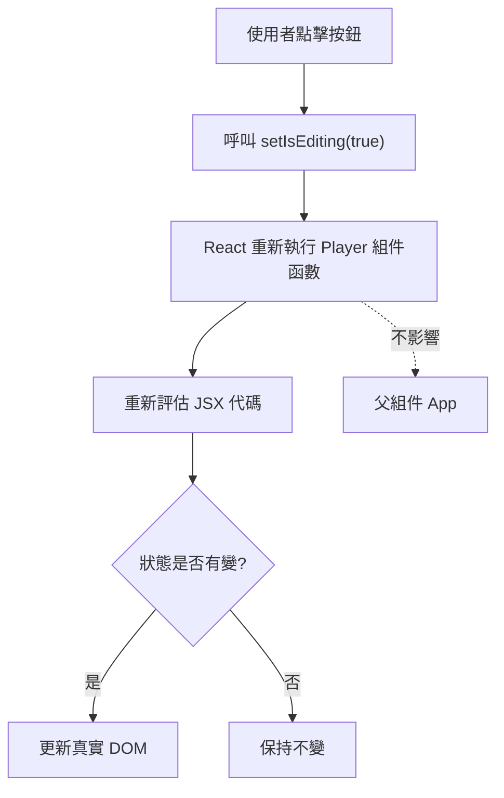
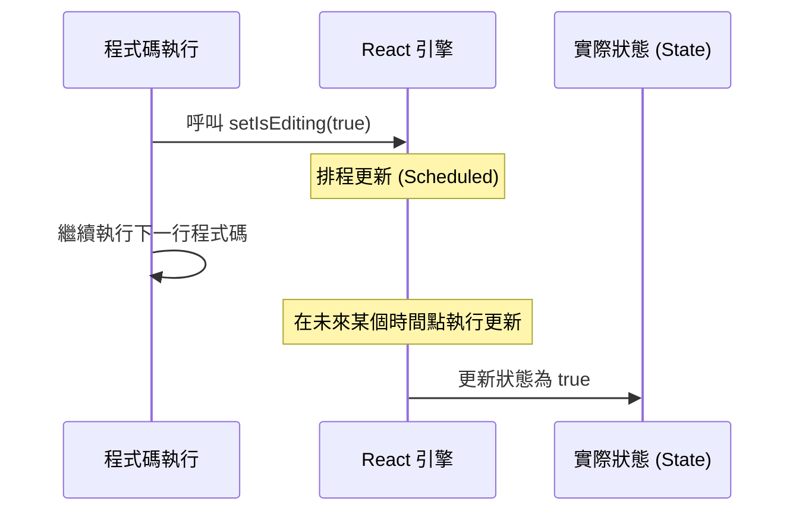
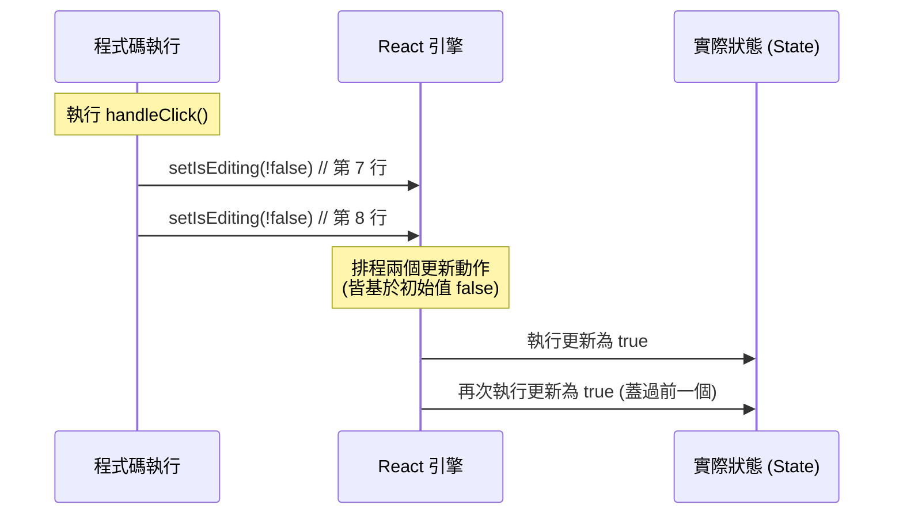
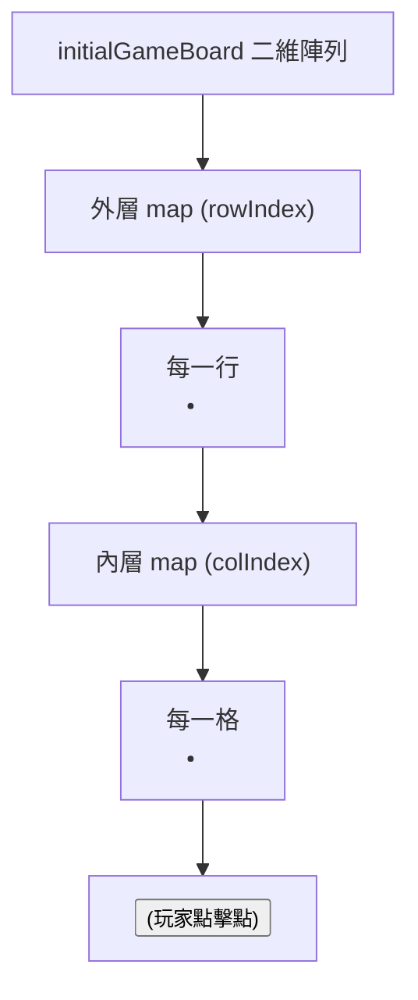
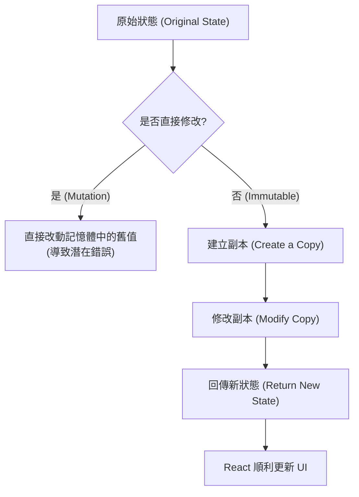
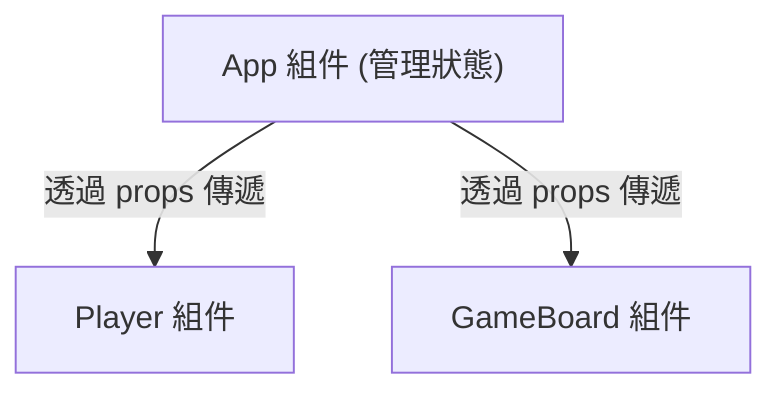
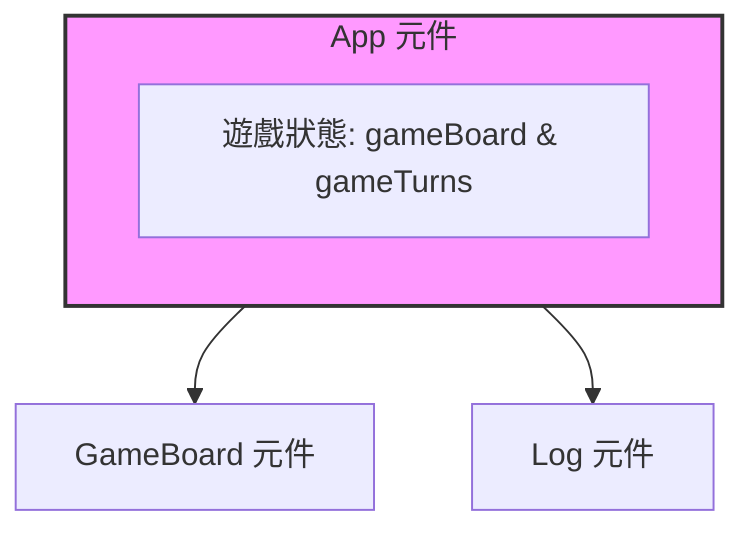
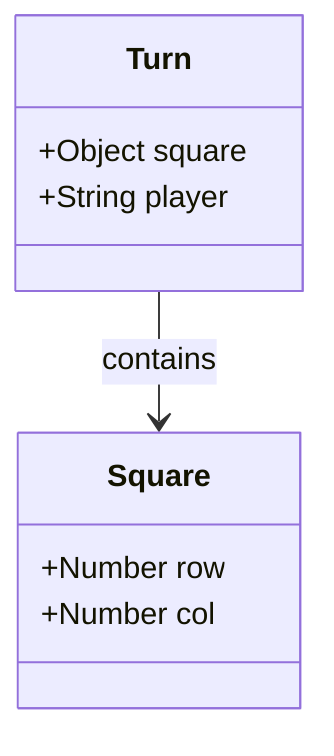

# 目錄

1. [Tic-Tac-Toe 專案初始設定（頁首與靜態資源）](#tic-tac-toe-遊戲開發)
   概念：從最簡單的頁面結構開始，說明 index.html 和 App.jsx 的分工，並示範用 public 資料夾放置不需要 state 的靜態圖片資源。

2. [遊戲整體規劃與 App 元件基礎結構](#tic-tac-toe-遊戲開發規劃)
   概念：規劃遊戲的三大構件（玩家、遊戲盤、日誌），並在 App 元件裡用巢狀 `<ol>` 搭出玩家列表與遊戲容器的雛形。

3. [重構出 Player 元件並用 Props 傳遞資料](#為玩家列表添加編輯按鈕)
   概念：發現兩位玩家的 Markup 幾乎一模一樣，於是抽出獨立的 `Player` 元件，用 `name`、`symbol` 兩個 props 讓內容變成可配置的。

4. [useState 入門：編輯狀態與重新渲染機制](#實作編輯功能與狀態管理)
   概念：用 `useState` 建立 `isEditing` 狀態來控制編輯模式的切換，並說明呼叫 setter 後 React 只會重新渲染該元件與其子元件，每個元件實例的狀態彼此獨立、互不影響。

5. [動態按鈕文字與 Input 初始值](#動態按鈕文字-button-caption)
   概念：用三元運算子讓按鈕文字隨 `isEditing` 在 Edit 和 Save 之間切換，並用 `value` prop 讓 input 顯示玩家目前的名稱。

6. [根據舊狀態更新狀態（Updater Function）](#根據舊狀態更新狀態-updating-state-based-on-old-state)
   概念：說明 React 的狀態更新其實是「排程」而非立即執行，若新狀態要依賴舊狀態，得改成傳入 updater function，不然連續呼叫兩次 setter 只會抓到同一個過期的值。

7. [受控組件：讓 Input 真正能編輯與儲存](#player-組件的編輯問題)
   概念：直接把 `value` 綁死在 prop 上會讓輸入框打不了字，改用第二個 state 搭配 `onChange` 事件讀 `event.target.value`，才做出真正能編輯的受控組件。

8. [遊戲盤組件（GameBoard）的建立](#遊戲盤組件-gameboard-component)
   概念：建立 `GameBoard` 元件，用巢狀陣列 `initialGameBoard` 代表 3x3 棋盤，再透過兩層 `map` 動態渲染出九宮格按鈕。

9. [GameBoard 狀態管理與不可變更新](#gameboard)
   概念：用 `useState` 管理棋盤狀態並實作 `handleSelectSquare`，同時強調更新陣列時要先複製一份新的（連內層陣列也要複製），不能直接改動舊狀態。

10. [狀態提升：讓 Player 與 GameBoard 共用 activePlayer](#玩家狀態的高亮顯示)
    概念：把目前玩家（`activePlayer`）狀態提升到共同祖先 `App` 元件，透過 props 往下傳給 `Player` 和 `GameBoard`，再用回呼函式讓子元件觸發父層的回合切換邏輯。

11. [建立 Log 元件並發現重複的狀態](#建立-log-元件)
    概念：新增 `Log` 元件顯示回合紀錄，卻發現 `App` 的 `gameTurns` 和 `GameBoard` 自己的棋盤狀態內容重疊，於是決定把棋盤邏輯也一併往上提升。

12. [把棋盤狀態完全搬進 App、記錄每回合資料](#狀態提升-lifting-state-up-2)
    概念：正式把棋盤管理邏輯從 `GameBoard` 搬進 `App`，並把每一回合存成包含 `player` 和 `square` 座標的物件，放進 `gameTurns` 陣列的最前面。

13. [從遊戲回合推導遊戲盤面](#從遊戲回合推導遊戲盤面)
    概念：不再用 state 儲存棋盤本身，而是每次渲染時用 `for...of` 迴圈把 `gameTurns` 轉換（推導）成棋盤陣列，這樣就只需要維護一份資料來源。

14. [Log 元件實作與 Template Literals](#log-元件實作)
    概念：用 `turns.map()` 把每一回合轉成 `<li>`，顯示玩家與座標，並用樣板字面值組出 row、col 的組合當作唯一的 key。

15. [用衍生狀態取代多餘的 activePlayer](#app-組件中的現有狀態)
    概念：發現 `activePlayer` 其實可以從 `gameTurns` 算出來，不用另開一個 state，於是把推導邏輯抽成元件外部的 `deriveActivePlayer` 函式，讓算現在的玩家和算舊狀態的玩家共用同一份邏輯。

16. [防止重複點擊按鈕](#防止重複點擊按鈕)
    概念：在按鈕上加 `disabled` prop，只要該格已經有玩家符號就讓按鈕失效，避免同一格被重複點擊。

17. [定義獲勝組合資料](#檢查玩家獲勝狀態)
    概念：在元件外部定義 `WINNING_COMBINATIONS` 常數，用陣列中的陣列存放所有可能獲勝的三格座標組合，準備拿來跟目前棋盤比對。

18. [從資料推導是否獲勝，棋盤邏輯提升到 App](#動態檢查獲勝狀態)
    概念：說明不需要額外的 `hasWinner` state，因為每次重新渲染都能從 `gameTurns` 直接算出是否獲勝，並把原本放在 `GameBoard` 的棋盤計算邏輯搬到 `App`，讓獲勝檢查能直接拿到棋盤資料。

19. [完成獲勝判定邏輯](#存取獲勝組合的方格符號)
    概念：用 `combination[i].row` / `column` 取出每個獲勝組合對應的三個格子符號，檢查它們是否非空且彼此相等，成立就記錄 `winner`，再用 `&&` 短路運算子顯示遊戲結束訊息。

-----------------------------------------------------------

## Tic-Tac-Toe 遊戲開發

### 初始頁面結構設定

- 專案將從最簡單的組件開始構建，首要任務是在頁面頂部添加頁首
- **[預計的頁首結構]**：
    - 使用 `<header>` 元素作為容器
    - 包含一個 `` 標籤（需設定 `src` 與 `alt` 屬性）
    - 包含一個 `<h1>` 標籤，顯示遊戲名稱「Tic-Tac-Toe"
- **[目前的實作狀態]**：
    - 為了快速推進，目前先在 `App.jsx` 中使用 `<p>` 標籤暫時佔位，顯示 "Coming soon"

### App 組件實作

- `App.jsx` 是應用程式的主要組件，負責將內容渲染到應用程式的根節點（root）
- 目前的程式碼實作如下：

```jsx
function App() {
  return (
    <p>Coming soon</p>
  )
}

export default App
```

### index.html 與 React 的關係

- `index.html` 是最終提供給網站訪客的檔案
- 檔案中包含一個 `<div id="root">`，這是 React 渲染組件的目標節點
    - `index.jsx` 會選取此 `div` 並將 `App` 組件渲染進去
- **[開發技巧]** 並非所有內容都必須寫在 React 組件內
    - 如果某些標記（如頁首）不需要依賴 `props` 或會變動的 `state`，可以直接寫在 `index.html` 中
    - 這可以避免將純靜態的內容強制封裝進組件中

### 在 index.html 中實作頁首

- 可以在 `<div id="root">` 之前插入靜態標記，例如 `<header>`
- 目前的 `index.html` 結構實作如下：

```html
<head>
  <meta charset="UTF-8" />
  <link rel="icon" type="image/svg+xml" href="/game-logo.png" />
  <meta name="viewport" content="width=device-width, initial-scale=1.0" />
  <title>React Tic-Tac-Toe</title>
</head>
<body>
  <header>

    <h1>Tic-Tac-Toe</h1>
  </header>
  <div id="root"></div>
  <script type="module" src="/src/index.jsx"></script>
</body>
```

### 使用 `public` 資料夾管理靜態資源

- `public` 資料夾用於存放應用程式中的靜態資源（例如圖片）
- **[特性]** 存放在此資料夾中的所有檔案都會被直接提供給網站訪客
- **[引用方式]** 無論是在 `index.html` 還是 React 組件中，都可以直接透過檔名來引用這些資源
    - 因為這些檔案會自動被服務到網站的根目錄（root），所以不需要加上 `/public/` 路徑
    - 例如，若檔案為 `game-logo.png`，引用路徑應直接寫 `game-logo.png` 而非 `public/game-logo.png`

#### 在 `index.html` 中引用圖片範例

- 實作後的 `index.html` 結構如下：

```html
<header>

  <h1>Tic-Tac-Toe</h1>
</header>
<div id="root"></div>
<script type="module" src="/src/index.jsx"></script>
```

-----------------------------------------------------------

### Tic-Tac-Toe 遊戲開發規劃

- 遊戲將由三個主要的構件（Building Blocks）組成
    - **玩家功能 (Players feature)**：顯示玩家名稱並允許使用者編輯名稱
    - **遊戲主盤 (Main game board)**：遊戲的核心互動區域
    - **遊戲日誌 (Game log)**：位於遊戲盤下方，用於輸出玩家回合的資訊

### App 元件基礎結構

- 使用 `<main>` 元素作為所有構件的包裝容器 (wrapper element)

```jsx
function App() {
  return <main>
  </main>;
}

export default App;
```

### App 元件結構細化

- **建立遊戲容器 (Game Container)**
    - 在 `<main>` 內部新增一個 `id="game-container"` 的 `<div>`
    - **[目的]** 為了在 `index.css` 中進行樣式設定
    - **[結構佈局]**
        - 玩家功能與遊戲盤將置於 `game-container` 內
        - 遊戲日誌 (Log) 則放在 `game-container` 之外，以便於樣式控制
- **實作玩家功能 (Players Feature)**
    - 使用有序列表 `<ol>` 並賦予 `id="players"`
        - **[為什麼使用有序列表？]** 因為玩家的先後順序具有語意上的重要性（第一位玩家與第二位玩家）
    - 在列表中加入兩個列表項目 `<li>`，分別代表兩位玩家

```jsx
function App() {
  return (
    <main>
      <div id="game-container">
        <ol id="players">
          <li></li>
          <li></li>
        </ol>
        GAME BOARD
      </div>
      LOG
    </main>
  );
}

export default App;
```

### 實作玩家名稱與符號

- 在每個 `<li>` 中加入玩家的名稱與對應的遊戲符號（X 或 O）
- **[樣式化設計]** 使用 `<span>` 元件來包裹特定內容，以便於後續 CSS 控制
    - **玩家名稱**：使用 `className="player-name"`
    - **玩家符號**：使用 `className="player-symbol"`
- 目前先以硬編碼 (hard-coded) 的方式填入資料，之後會改為動態生成

```jsx
function App() {
  return (
    <main>
      <div id="game-container">
        <ol id="players">
          <li>
            <span className="player-name">Player 1</span>
            <span className="player-symbol">X</span>
          </li>
          <li>
            <span className="player-name">Player 2</span>
            <span className="player-symbol">O</span>
          </li>
        </ol>
        GAME BOARD
      </div>
      LOG
    </main>
  );
}
```

-----------------------------------------------------------

### 為玩家列表添加編輯按鈕

- 為了樣式化需求，將玩家名稱與符號包裹在一個新的 `<span>` 中，並賦予 `className="player"`
    - 這樣可以將名稱與符號視為一個整體進行樣式控制
- 在每個玩家的 `<span>` 後方新增一個編輯按鈕

```jsx
<li>
    <span className="player">
        <span className="player-name">Player 1</span>
        <span className="player-symbol">X</span>
    </span>
    <button>Edit</button>
</li>
```

- **[發現問題]** 目前的 `App` 組件中，玩家 1 與玩家 2 的 Markup 結構幾乎完全相同
    - 這代表程式碼中存在重複的邏輯，後續需要進行重構

### 重構：提取獨立組件

- **[為什麼要重構？]** 因為重複 Markup 會導致維護困難
    - 若需要修改結構（例如將 `className="player"` 改為 `className="player-info"`），必須在多個地方手動修改
    - 這不僅繁瑣，且容易導致程式碼不一致或產生錯誤
- **解決方案：建立專屬組件**
    - 在 `src` 資料夾下建立 `components` 資料夾
    - 在該資料夾中建立 `Player.jsx`（名稱可依需求自訂，如 `PlayerInfo.jsx`）
- **建立 Player 組件**
    - 匯出一個名為 `Player` 的組件函數

```jsx
// src/components/Player.jsx
export default function Player() {
    return (
        // 這裡將放置原本重複的 Markup
    )
}
```

### 實作 Player 組件與使用 Props

- **[搬移 Markup]** 將原本在 `App.jsx` 中重複的玩家結構剪下並貼上到 `Player.jsx` 中

```jsx
// src/components/Player.jsx
export default function Player() {
    return (
        <li>
            <span className="player">
                <span className="player-name">Player 1</span>
                <span className="player-symbol">X</span>
            </span>
            <button>Edit</button>
        </li>
    );
}
```

- **[使組件可配置化]** 為了避免組件內容永遠固定為 "Player 1" 與 "X"，需要使用 **props** 來傳遞動態數據
    - 接受 `name` 與 `symbol` 兩個 props，因為這兩者構成了玩家的核心數據

```jsx
// src/components/Player.jsx
export default function Player({ name, symbol }) {
    return (
        <li>
            <span className="player">
                <span className="player-name">{name}</span>
                <span className="player-symbol">{symbol}</span>
            </span>
            <button>Edit</button>
        </li>
    );
}
```

- **[在 App 中引用組件]** 在 `App.jsx` 中刪除重複的 Markup，改為匯入並使用 `Player` 組件

```jsx
// src/App.jsx
import Player from './components/Player';

function App() {
    return (
        <main>
            <div id="game-container">
                <ol id="players">
                    <Player name="Player 1" symbol="X" />
                    <Player name="Player 2" symbol="O" />
                </ol>
                {/* ...其他內容 */}
            </div>
        </main>
    );
}
```

-----------------------------------------------------------

### 實作編輯功能與狀態管理

- **功能目標**：點擊「Edit」按鈕後，將名稱顯示區域轉換為可編輯的輸入框
    - 當正在編輯時，按鈕文字應從 「Edit」 切換為 「Save"
    - 只有在使用者確認更改後，輸入框才會消失並回到文字顯示模式
- **使用&#32;`useState`&#32;管理狀態**
    - 因為 UI 需要根據資料變化而更新，必須引入 `useState` 來管理相關數據
    - `useState` 會回傳一個包含兩個元素的陣列
        - 第一個元素是目前的狀態值（state value）
        - 第二個元素是更新該值的函數（setter function），用於通知 React 更新 UI

```javascript
import { useState } from 'react';

export default function Player({ name, symbol }) {
  const [ /* 狀態值 */, /* 更新函數 */ ] = useState();

  return (
    <li className="player">
      <span className="player-name">{name}</span>
      <span className="player-symbol">{symbol}</span>
      <button>Edit</button>
    </li>
  );
}
```

### 定義編輯狀態

- **使用&#32;`isEditing`&#32;狀態**
    - 目標是管理一個布林值（`true` 或 `false`），用來判斷目前是否正在編輯玩家名稱
    - 初始值設定為 `false`，因為預設情況下我們不應該顯示輸入框

```javascript
export default function Player({ name, symbol }) {
  const [isEditing, setIsEditing] = useState(false);

  return (
    <li className="player">
      <span className="player-name">{name}</span>
      <span className="player-symbol">{symbol}</span>
      <button>Edit</button>
    </li>
  );
}
```

- **練習任務：實作條件式渲染邏輯**
    - 建立一個函數，當點擊按鈕時將 `isEditing` 設為 `true`
    - 根據 `isEditing` 的值來切換顯示內容：
        - 若 `isEditing` 為 `false`：顯示 `<span className="player-name">`
        - 若 `isEditing` 為 `true`：顯示一個 `<input>` 元素

### 實作事件處理函數

- **建立&#32;`handleEditClick`&#32;函數**
    - 為了能存取 `setIsEditing` 更新函數，必須將此函數定義在 `Player` 組件內部
    - 遵循命名慣例，使用 `handle` 開頭（例如 `handleEditClick`），以便清楚辨識這是一個由事件觸發的函數

```javascript
export default function Player({ name, symbol }) {
  const [isEditing, setIsEditing] = useState(false);

  function handleEditClick() {
    // 待實作：呼叫 setIsEditing
  }

  return (
    <li className="player">
      <span className="player-name">{name}</span>
      <span className="player-symbol">{symbol}</span>
      <button>Edit</button>
    </li>
  );
}
```

- **綁定按鈕點擊事件**
    - 使用 React 內建的 `onClick` 屬性將按鈕與函數連結
    - **[重要]** 傳遞函數時**不要加上括號**
        - 正確：`onClick={handleEditClick}`（傳遞函數本身作為值）
        - 錯誤：`onClick={handleEditClick()}`（這會導致函數在渲染時立即執行，而非點擊時執行）

```javascript
// 在 return 中綁定事件
<button onClick={handleEditClick}>Edit</button>
```

### 更新狀態與觸發重新渲染

- **執行狀態更新**
    - 在 `handleEditClick` 函數中呼叫 `setIsEditing` 並傳入新值 `true`
    - 這會將 `isEditing` 從初始的 `false` 切換為 `true`

```javascript
function handleEditClick() {
  setIsEditing(true);
}
```

- **React 的重新渲染機制 (Re-rendering)**
    - 當呼叫狀態更新函數（如 `setIsEditing`）時，React 會重新執行該組件函數（在此例中為 `Player` 組件）
    - 重新執行後，React 會重新評估 JSX 代碼，檢查是否有任何變動
    - 若有變動，React 會將這些變動反映到真實的 DOM 上
- **[影響範圍] 渲染的局部性**
    - 狀態更新僅會導致該組件及其子組件重新渲染
    - 父組件（例如 `App` 組件）不會因為子組件（例如 `Player` 組件）的狀態改變而重新渲染



-----------------------------------------------------------

### React 組件的隔離實例

- 當重複使用同一個組件時，React 會為每個使用處建立一個新的、隔離的實例
    - 即使兩個組件使用相同的程式碼邏輯，它們的狀態（State）也是完全獨立的
- **[實例觀察]** 在玩家組件（Player component）的例子中：
    - 當其中一個玩家進入編輯模式（顯示輸入欄位）時，另一個玩家組件並不會跟著改變（仍顯示玩家名稱）
    - 這證明了每個 `Player` 實例都有其專屬的 `isEditing` 狀態，不會互相影響

-----------------------------------------------------------

### 動態按鈕文字 (Button Caption)

- 目標是讓按鈕根據目前是否處於編輯狀態，自動在 "Edit" 與 "Save" 之間切換
- **[實作方式]** 將原本硬編碼（hard-coded）的文字替換為動態值
    - 使用花括號 `{}` 來嵌入 JavaScript 表達式
    - 可以透過建立一個變數（如 `btnCaption`）來決定文字，或直接在 JSX 中使用三元運算子

```javascript
// 邏輯範例：根據 isEditing 狀態決定按鈕文字
if (isEditing) {
  playerName = <input type="text" required />;
  btnCaption = 'Save';
}

// 在 return 中使用
<button onClick={handleEditClick}>{btnCaption}</button>
```

### 使用三元運算子切換按鈕文字

- 直接在 JSX 中使用三元運算子來判斷 `isEditing` 狀態
    - 若為 `true`（正在編輯），顯示 `Save` 以儲存變更
    - 若為 `false`（非編輯狀態），顯示 `Edit`

### 設定輸入框的初始值 (Pre-populate Input)

- 使用 `value` prop 來設定 `input` 欄位中顯示的內容
- 為了讓每個玩家組件（Player Component）都能顯示正確的名稱，應將 `value` 設定為動態值
- 將 `name` prop 直接傳遞給 `input` 的 `value` 屬性

```javascript
// 在 input 標籤中使用 name prop 作為初始值
<input
  type="text"
  value={name}
  required
/>
```

-----------------------------------------------------------

### 根據舊狀態更新狀態 (Updating State Based On Old State)

- **[不建議的做法]** 直接使用當前變數進行計算
    - 例如：`setIsEditing(!isEditing)`
    - 這種做法在狀態更新頻繁或複雜時可能導致依賴於過時的值
- **[最佳實踐]** 傳遞一個更新函數 (Updater Function)
    - 當新狀態依賴於前一個狀態值時，應該傳遞一個函數給 `set` 函數
    - React 會自動調用這個函數，並將「保證是最新的狀態值」作為參數傳入

#### 實作範例

```javascript
// 假設 isEditing 是當前的狀態
setIsEditing(editing => !editing);
```

    - 在此範例中，`editing` 是由 React 動態傳入的最新狀態值
    - 透過這種方式，可以確保狀態更新是基於最新的數據進行的

#### 更新函數的完整實作

- 更新函數必須回傳你想要設定的新狀態值

```javascript
function handleClick() {
    setIsEditing(editing => !editing);
}
```

#### React 的狀態更新排程機制 (State Update Scheduling)

- **[核心概念]** React 並非立即執行狀態更新，而是將其「排程」（scheduling）在未來執行
    - 當呼叫 `setIsEditing` 時，更新動作不會在當下完成，而是由 React 在稍後的毫秒級時間內執行
    - 這種行為解釋了為什麼連續呼叫狀態更新函數時，可能會得到不符合預期的結果



- **[潛在問題]** 若在狀態尚未更新完成前，就嘗試依賴該變數進行第二次更新，會因為抓到「舊的值」而導致錯誤
        - 例如：若預期第一行將 `isEditing` 從 `false` 設為 `true`，但在該行完成前就執行第二行，第二行看到的可能仍是 `false`

### 狀態更新排程導致的錯誤範例

- **[錯誤示範]** 連續呼叫基於當前變數的狀態更新
    - 若在程式碼中連續執行兩次狀態切換：

```javascript
function handleClick() {
    setIsEditing(!isEditing); // 預期：false -> true (第 7 行)
    setIsEditing(!isEditing); // 預期：true -> false (第 8 行)
}
```

    - **[預期結果]** 狀態應該先變為 `true`，再變回 `false`，最終看起來像沒變化。
    - **[實際結果]** 狀態會成功切換（例如從 `false` 變為 `true`），但連續兩次呼叫的效果卻只相當於執行了一次。
- **[原因分析]** 兩次更新都抓到了相同的「舊值」
    - 因為 React 的狀態更新是「排程」的，當這段函數執行時，`isEditing` 的值在該次渲染週期內是不變的。
    - 第 7 行與第 8 行在計算時，看到的 `isEditing` 都是該組件第一次執行時的初始值（例如 `false`）。



- **[結論]** 若要讓第二次更新基於第一次更新後的結果，必須使用**更新函數 (Updater Function)** 形式，確保 React 在執行更新時才去抓取最新的狀態值。

-----------------------------------------------------------

### Player 組件的編輯問題

- **無法編輯輸入框的原因**
    - 因為將 `value` 屬性直接設定在 `<input>` 元素上
    - `value` 屬性會強制將顯示的值設定為特定的值（在此案例中為 `name` prop）
    - 這會覆蓋使用者嘗試進行的任何更改，導致輸入框看起來無法編輯

```javascript
// 會導致無法編輯的寫法
if (isEditing) {
  playerName = <input type="text" required value={name} />;
}
```

- **使用&#32;`defaultValue`&#32;的嘗試**
    - 可以使用 `defaultValue` 屬性來設定初始值，而不是強制執行特定值
    - **優點**：重新整理後仍有初始值，且使用者現在可以編輯內容
    - **缺點**：當點擊儲存時，內容並未真正被儲存，而是會切換回原本的 `name` 值

```javascript
// 使用 defaultValue 作為替代方案
if (isEditing) {
  playerName = <input type="text" required defaultValue={name} />;
}
```

### 使用多個 State 管理編輯狀態

- **[核心概念]** 為了捕捉使用者在編輯時輸入的新名稱，需要引入第二個 state，而不僅僅是控制「是否正在編輯」
    - 在同一個 React 組件中可以多次使用 `useState` 來管理不同的資料片段
- **實作步驟**
    - 1. 定義一個新的 state（例如 `playerName`）來儲存目前可編輯的內容
    - 2. 將該 state 的初始值設定為從 props 傳進來的初始名稱（例如 `initialName`）
    - 3. 將 `<input>` 的 `value` 屬性綁定到這個新的 state 上
- **處理變數名稱衝突**
    - 當 props 的名稱與新建立的 state 名稱相同時，會發生衝突
    - **解決方案**：重新命名變數以區分「初始值」與「目前可編輯的值"

```javascript
// 透過多個 useState 實現可編輯的輸入框
export default function Player({ initialName, symbol }) {
  // 狀態 1：控制是否處於編輯模式
  const [isEditing, setIsEditing] = useState(false);

  // 狀態 2：儲存使用者正在輸入的名稱
  const [playerName, setPlayerName] = useState(initialName);

  // ...

  if (isEditing) {
    // 將 value 綁定到 playerName state，使其成為受控組件
    playerName = <input type="text" required value={playerName} />;
  }
}
```

*註：在實際開發中，為了避免名稱混淆，可能會將 state 命名為&#32;`editablePlayerName`。*

### 實作受控組件 (Controlled Component)

- **同步更新 State**
    - 為了讓使用者輸入的內容能即時反映在 `playerName` state 中，需要監聽輸入框的變更事件
    - **[實作方法]**：使用 `onChange` 屬性來綁定一個事件處理函式
- **建立&#32;`handleChange`&#32;函式**
    - 該函式會在使用者於輸入框中輸入字元、貼上文字或進行任何內容變更時被觸發
    - 函式內部會呼叫 `setPlayerName` 來更新目前的狀態值

```javascript
// 在 Player 組件中實作變更處理
function handleChange() {
  // 接下來需要從事件中提取新值並呼叫 setPlayerName
}

// 在 JSX 中綁定事件
if (isEditing) {
  editablePlayerName = <input
    type="text"
    required
    value={playerName}
    onChange={handleChange}
  />;
}
```

- **同步更新父組件 Props**
    - 由於 `Player` 組件現在使用 `initialName` 作為初始值，因此在 `App.jsx` 中呼叫 `Player` 組件時，也必須將 prop 名稱同步更新為 `initialName`

### 深入理解 `onChange` 事件

- **觸發時機**：`onChange` 會在使用者於輸入框中進行每一次按鍵（keystroke）時觸發
- **事件物件 (Event Object)**
    - 當 `onChange` 被觸發時，React 會自動將一個描述該事件的物件作為參數傳遞給處理函式（例如 `handleChange(event)`）
    - **[如何取得輸入值]**：透過存取事件物件中的 `target` 屬性，進而取得 `value` 屬性
        - `event.target` 指向觸發該事件的 HTML 元素（即 `<input>` 元素）
        - `event.target.value` 則包含了使用者目前在輸入框中輸入的所有文字

```javascript
// 完整的 handleChange 實作
function handleChange(event) {
  // 1. 透過 console.log 觀察事件物件（除錯用）
  console.log(event);

  // 2. 從 event.target.value 取得新值，並更新 state
  setPlayerName(event.target.value);
}
```

- **[運作流程圖]**

```mermaid
sequenceDiagram
    participant User as 使用者
    participant Input as <input> 元素
    participant Handler as handleChange(event)
    participant State as playerName (State)

    User->>Input: 輸入一個字元 (Keystroke)
    Input->>Handler: 觸發 onChange 事件 (傳遞 event 物件)
    Note over Handler: 讀取 event.target.value
    Handler->>State: 呼叫 setPlayerName(新值)
    State-->>Input: 重新渲染，更新 value 屬性
```



-----------------------------------------------------------

### 遊戲盤組件 (GameBoard Component)

- 目標是建立一個 3x3 的網格，網格內需包含可點擊的按鈕以進行遊戲
- 建立新組件 `GameBoard.jsx`
- **網格結構規劃**
    - 使用有序列表 `<ol>` 作為容器，並賦予 `id="game-board"` 以便進行樣式設計
    - 結構採用巢狀列表：外層列表代表列（rows），內層列表代表行（columns）

```jsx
// GameBoard.jsx 初始結構概念
export default function GameBoard() {
  return <ol id="game-board">
    <li>
      <ol>
        <li></li>
        <li></li>
        <li></li>
      </ol>
    </li>
    {/* 重複三次以形成 3x3 網格 */}
  </ol>
}
```

### 動態遊戲盤規劃

- **為什麼不硬編碼？** 因為遊戲盤需要隨著玩家點擊而動態更新
    - 當玩家點擊方格時，該位置必須能根據玩家符號（'X' 或 'O'）進行更新
- 使用多維陣列來儲存遊戲狀態，以便後續進行動態渲染

### 初始遊戲盤資料結構

- 在組件外部定義一個常數 `initialGameBoard`
    - 因為這屬於初始配置，而非會變動的狀態（state）
- 採用「陣列中的陣列」（array of arrays）結構來代表 3x3 網格
    - 使用 `null` 代表空方格
    - 使用 `'X'` 或 `'O'` 代表已佔用的方格

```javascript
const initialGameBoard = [
  [null, null, null],
  [null, null, null],
  [null, null, null]
];
```

#### 陣列與網格的對應關係

|  | Col 1 | Col 2 | Col 3 |
| --- | --- | --- | --- |
| Row 1 | null | 'X' | 'O' |
| Row 2 | null | null | null |
| Row 3 | null | null | null |

### 動態渲染遊戲盤

- 使用 `map` 方法遍歷 `initialGameBoard` 陣列來動態產生 HTML 結構
    - 對於外層陣列中的每個元素（即每一行 `row`），輸出一個 `<li>` 元素

```jsx
// 透過 map 動態渲染行
return <ol id="game-board">
  {initialGameBoard.map((row, rowIndex) => <li key={rowIndex}></li>)}
</ol>
```

#### 使用 `key` 的注意事項

- **[為什麼需要 key?]** React 需要透過唯一的 `key` 來識別列表中的每個元素，以便進行高效的更新
- **使用索引作為 key 的風險**
    - 在 `map` 的第二個參數中使用 `rowIndex` 作為 `key` 是可行的，但並非最佳實踐
    - **原因**：索引是與「位置」綁定，而非與「資料」本身綁定
    - 如果陣列中的元素順序發生變動（例如某一行與另一行交換位置），原本的索引值會跟著改變，這會導致 React 無法正確追蹤資料與 DOM 節點之間的對應關係

### 完成遊戲盤的巢狀渲染

- **[實作邏輯]** 在外層 `map` 產生的每個 `<li>`（代表一行）內部，需要再次使用 `map` 來遍歷該行中的元素（代表每一列）
- 使用兩層 `map` 來達成 3x3 網格的動態渲染
- 在最內層的 `<li>` 中加入 `<button>`，作為玩家點擊的目標

```jsx
export default function GameBoard() {
  return (
    <ol id="game-board">
      {initialGameBoard.map((row, rowIndex) => (
        <li key={rowIndex}>
          <ol>
            {row.map((col, colIndex) => (
              <li key={colIndex}>
                <button>X</button>
              </li>
            ))}
          </ol>
        </li>
      ))}
    </ol>
  );
}
```

- **渲染結構流程**



- **按鈕內容規劃**
    - 目前按鈕內暫時填入 `'X'` 或 `'O'` 作為佔位符
    - 實際開發時，按鈕顯示的符號應根據該位置的狀態（來自 `initialGameBoard` 中的值）動態決定

-----------------------------------------------------------

### GameBoard

- 定義遊戲盤面的初始狀態
    - 使用巢狀陣列來表示 3x3 的棋盤
    - 初始值皆為 `null`

```javascript
const initialGameBoard = [
  [null, null, null],
  [null, null, null],
  [null, null, null],
];
```

- `GameBoard` 元件的基礎結構
    - 使用 `initialGameBoard.map` 來遍歷每一列 (row)
    - 每一列內部再次使用 `.map` 來遍歷每個欄位 (column)
    - 透過 `playerSymbol` 來渲染每個格子的按鈕內容

```javascript
export default function GameBoard() {
  return (
    <ol id="game-board">
      {initialGameBoard.map((row, rowIndex) => (
        <li key={rowIndex}>
          <ol>
            {row.map((playerSymbol, colIndex) => (
              <li key={colIndex}>
                <button>{playerSymbol}</button>
              </li>
            ))}
          </ol>
        </li>
      ))}
    </ol>
  );
}
```

### GameBoard 狀態管理

- **[目標]** 使按鈕具備互動功能，並管理遊戲盤面的狀態
    - 當玩家點擊按鈕時，能即時更新 UI 並在該按鈕上顯示玩家符號
- 使用 `useState` Hook
    - 需要從 `react` 中匯入 `useState` 以在元件內添加新狀態

### 初始化遊戲盤面狀態

- **[目標]** 使用 `useState` 來管理並更新遊戲盤面
    - 狀態的結構應與 `initialGameBoard` 一致，即一個多維陣列（巢狀陣列）
- 使用 `useState` Hook
    - 將 `initialGameBoard` 作為初始值
    - 定義狀態變數 `gameBoard` 與更新函數 `setGameBoard`

```javascript
const [gameBoard, setGameBoard] = useState(initialGameBoard);
```

### 處理格子點擊事件

- **[預期行為]** 需要一個處理函數來應對按鈕點擊，例如命名為 `handleSelectSquare`
- **[更新邏輯]** 當點擊發生時，呼叫 `setGameBoard` 來更新狀態
    - 目的在於將原本為 `null` 的欄位替換為玩家的符號（'X' 或 'O'）
    - **[關鍵點]** 更新時必須基於「前一個狀態 (previous state)」進行修改
        - 這樣做是為了確保不會遺失之前已經選擇過的欄位資訊，僅更新目標欄位

### 實作處理點擊事件的邏輯

- **[更新方式]** 使用狀態更新函數的形式 (functional update form)
    - 透過向 `setGameBoard` 傳遞一個函數，React 會自動將「前一個狀態 (previous state)」作為參數傳入
    - **[原因]** 這樣可以確保在更新特定格子時，不會覆蓋或遺失盤面中其他已經存在的資料
- **`handleSelectSquare`&#32;需要的參數**
    - `rowIndex`: 用於識別點擊的是哪一列（哪一個內層陣列）
    - `colIndex`: 用於識別點擊的是該列中的哪一個欄位
    - `playerSymbol`: 用於決定要填入的符號（例如 'X' 或 'O'）
- **目前的實作邏輯**
    - 暫時先直接使用 `'X'` 作為符號，待後續加入玩家輪流邏輯後再進行調整

```javascript
function handleSelectSquare(rowIndex, colIndex) {
  setGameBoard((prevGameBoard) => {
    // 邏輯：將 prevGameBoard 中 [rowIndex][colIndex] 的位置替換為符號
  });
}
```

### 狀態更新的不可變性原則

- **[錯誤做法]** 直接修改 `prevGameBoard` 的元素
    - 雖然透過 `prevGameBoard[rowIndex][colIndex] = 'X'` 可以達到修改值的目的，但這是不被推薦的
    - **[原因]** 在 JavaScript 中，物件與陣列是「引用型別 (reference values)"
        - 直接修改會立即改變記憶體中的原始值，這會在 React 預定的狀態更新流程執行之前，就先改動了舊的資料

```javascript
// ❌ 不推薦：直接修改原始陣列 (Mutation)
function handleSelectSquare(rowIndex, colIndex) {
  setGameBoard((prevGameBoard) => {
    prevGameBoard[rowIndex][colIndex] = 'X';
    return prevGameBoard;
  });
}
```

- **[正確做法]** 實作不可變更新 (Immutable Update)
    - **[原則]** 當狀態是物件或陣列時，應先建立一個舊狀態的副本 (copy)，然後再修改副本
    - **[優點]** 這樣可以確保原始狀態保持不變，直到 React 完成狀態更新流程



- **如何建立副本**
    - 通常會使用 JavaScript 的展開運算子 (`...` spread operator) 來進行淺層複製 (shallow copy)

### 遵循不可變性 (Immutability) 更新狀態

- **[重要原則]** 當狀態是物件或陣列時，必須以「不可變 (Immutable)」的方式進行更新
    - **[做法]** 先建立原始狀態的一個新副本 (copy)，然後再修改該副本，最後回傳副本
    - **[原因]** 在 JavaScript 中，陣列與物件是「引用值 (reference value)"
        - 如果直接修改原始陣列（例如 `prevGameBoard[row][col] = 'X'`），會直接改變記憶體中原本的資料
        - 這會導致 React 在檢查狀態是否改變時，因為引用位址沒變而無法正確觸發 UI 更新，進而產生難以追蹤的 Bug 或副作用
- **實作不可變更新的步驟**
    - **1. 建立第一層副本**：使用展開運算子 `...` 複製外層陣列
    - **2. 處理巢狀結構**：由於盤面是巢狀陣列，必須同時對內層陣列也進行複製，否則內層陣列仍會指向舊的引用
    - **3. 使用&#32;`.map()`&#32;進行深層複製**：透過對舊狀態執行 `.map()`，確保每一列 (row) 都回傳一個全新的陣列物件

```javascript
function handleSelectSquare(rowIndex, colIndex) {
  setGameBoard((prevGameBoard) => {
    // 建立一個全新的盤面副本，並透過 .map() 確保內層陣列也是新的
    const updatedBoard = [...prevGameBoard.map((innerArray) => [...innerArray])];

    // 在新的副本上進行修改
    updatedBoard[rowIndex][colIndex] = 'X';

    // 回傳新的狀態
    return updatedBoard;
  });
}
```

-----------------------------------------------------------

### 玩家狀態的高亮顯示

- **視覺需求**
    - 當按鈕被按下時，應在按鈕上顯示當前活躍玩家的符號
    - 活躍玩家的名稱應透過邊框進行高亮顯示
- **CSS 實作方式**
    - 在包含玩家 ID 的有序列表（ordered list）上添加 `.highlight-player` 類別
    - 在當前活躍玩家的列表項目（list item）上添加 `.active` 類別
- **[核心邏輯] 狀態共享的需求**
    - 為了實現上述功能，必須讓 `Player` 組件與 `GameBoard` 組件都能夠獲取到當前活躍玩家的資訊
        - `GameBoard` 需要此資訊來決定在按鈕上顯示哪種符號
        - `Player` 需要此資訊來決定是否套用高亮樣式

### 狀態提升 (Lifting State Up)

- **核心概念**
    - 當兩個獨立的組件需要共享或同步相同的資訊時，需要進行「狀態提升"
    - **[做法]** 將狀態從原本的組件中移出，改由它們的「最近共同祖先組件」(closest ancestor component) 來管理
    - 祖先組件透過 `props` 將該狀態及其更新函數傳遞給需要資訊的子組件
- **[為什麼需要這樣做？]**
    - 如果狀態分別管理在 `Player` 或 `GameBoard` 中，它們無法直接得知彼此的狀態變化
    - 將狀態提升至 `App` 組件後，`App` 成為了「單一數據源」(single source of truth)
- **實作流程**



- **App.jsx 的實作範例**

```javascript
function App() {
    const [activePlayer, setActivePlayer] = useState('X');

    return (
      <main>
        <div id="game-container">
          <ol id="players">
            <Player initialName="Player 1" symbol="X" />
            <Player initialName="Player 2" symbol="O" />
          </ol>
          <GameBoard />
        </div>
      </main>
    );
  }
```

### 切換回合的邏輯實作

- **建立切換函數**
    - 定義 `handleSelectSquare` 函數，因為切換回合的時機是在玩家選擇棋盤上的方格之後
- **更新活躍玩家狀態**
    - 使用 `setActivePlayer` 來更新 `activePlayer` 狀態
    - **[關鍵點]** 因為新狀態取決於舊狀態，必須使用 callback 形式來確保獲取到最新的狀態值
    - 使用三元運算子 (ternary expression) 來判斷並切換符號：
        - 如果目前是 'X'，則切換為 'O'
        - 如果目前是 'O'，則切換為 'X'

```javascript
function handleSelectSquare() {
  setActivePlayer((curActivePlayer) =>
    curActivePlayer === 'X' ? 'O' : 'X'
  );
}
```

- **將邏輯傳遞至 GameBoard**
    - 為了讓棋盤上的方格點擊能觸發切換，需要將 `handleSelectSquare` 作為 `props` 傳遞給 `GameBoard` 組件
    - 在 `GameBoard.jsx` 中，透過 props 解構 (destructuring) 來接收此函數

### 透過 Props 觸發父組件邏輯

- **建立 Callback Prop**
    - 在 `GameBoard` 組件中接收一個名為 `onSelectSquare` 的 prop
    - 這個 prop 的名稱可以自訂，但其目的是為了在子組件內部觸發父組件的邏輯
- **在子組件中調用**
    - 在 `GameBoard.jsx` 的按鈕點擊事件中，調用傳進來的 `onSelectSquare` 函數
    - **[實作細節]** 當按鈕被點擊時，執行 `onSelectSquare()`，這會進而觸發在 `App.jsx` 中定義的 `handleSelectSquare` 函數

```javascript
// GameBoard.jsx 內部實作
export default function GameBoard({ onSelectSquare }) {
  // ... 其他邏輯
  return (
    <ol id="game-board">
      {/* ... */}
      <button onClick={() => onSelectSquare()}>
        {/* ... */}
      </button>
    </ol>
  );
}
```

```javascript
// App.jsx 傳遞函數
<GameBoard onSelectSquare={handleSelectSquare} />
```

- **[運作流程]**

    1. 使用者點擊 `GameBoard` 中的按鈕
    2. 觸發 `GameBoard` 內部的 `onSelectSquare()`
    3. 執行透過 props 傳入的 `handleSelectSquare` 函數（定義於 `App` 組件）
    4. `App` 組件中的 `activePlayer` 狀態隨之更新

### 玩家列表樣式實作

- **添加高亮類別**
    - 在 `App.jsx` 的玩家有序列表 (`<ol id="players">`) 上添加 `.highlight-player` 類別，以便進行 CSS 樣式控制
- **將狀態傳遞給 Player 組件**
    - 在 `App.jsx` 中，透過新增 `isActive` prop 將當前玩家的活躍狀態傳遞給每個 `Player` 組件
    - **[判斷邏輯]** 透過比較 `activePlayer` 狀態與該組件的 `symbol` 來決定 `isActive` 是否為 `true`：
        - 對於符號為 'X' 的玩家：`isActive={activePlayer === 'X'}`
        - 對於符號為 'O' 的玩家：`isActive={activePlayer === 'O'}`

```javascript
// App.jsx 實作
<ol id="players" className="highlight-player">
  <Player initialName="Player 1" symbol="X" isActive={activePlayer === 'X'} />
  <Player initialName="Player 2" symbol="O" isActive={activePlayer === 'O'} />
</ol>
```

- **在 Player 組件中實作動態樣式**
    - 在 `Player.jsx` 中接收 `isActive` prop
    - 使用三元運算子根據 `isActive` 的值動態設定 `className`
    - 如果 `isActive` 為 `true`，則添加 `active` 類別；否則不添加任何額外類別

```javascript
// Player.jsx 內部實作
export default function Player({ initialName, symbol, isActive }) {
  // ...
  return (
    <li className={isActive ? 'active' : undefined}>
      {/* ... */}
    </li>
  );
}
```

- **CSS 樣式定義**
    - 透過組合選擇器（Combinator selectors）針對處於活躍狀態的玩家元素進行樣式設定
    - 例如，當 `.highlight-player` 下的 `li` 具有 `.active` 類別時，改變其邊框顏色或添加動畫效果

```css
/* index.css 範例 */
#players.highlight-player li.active {
  border-color: #f6e35a;
  animation: pulse 2s infinite ease-in-out;
}

#players.highlight-player li.active .player-name,
#players.highlight-player li.active .player-symbol {
  color: #f6e35a;
}
```

-----------------------------------------------------------

### 建立 Log 元件

- 為了改善應用程式的結構並避免撰寫次優的 React 程式碼，計畫在遊戲板下方新增一個紀錄日誌功能
- 新增 `Log.jsx` 檔案，其目的是輸出一個包含遊戲紀錄的有序列表 (`<ol>`)

```jsx
export default function Log() {
  return <ol></ol>;
}
```

### 狀態提升 (Lifting State Up)

- **[目的]** 為了在 `Log` 元件中顯示遊戲回合紀錄，需要管理一個動態陣列 `turns`
    - 陣列會隨著每次按鈕點擊而增長
- **[為什麼需要提升狀態]** 因為點擊資訊是在 `GameBoard` 元件中產生的，而 `Log` 元件需要讀取這些資訊
    - 由於 `GameBoard` 與 `Log` 是兄弟關係，無法直接共享狀態
    - 必須將狀態提升至共同的父元件 `App`，以便同時讓兩者存取
- **在&#32;`App.jsx`&#32;中的實作**
    - 引入 `Log` 元件：`import Log from './components/Log.jsx';`
    - 使用 `useState` 管理回合陣列：

```jsx
import { useState } from 'react';
import Log from './components/Log.jsx';
// ... 其他 import

function App() {
  const [turns, setTurns] = useState([]);
  // ...
}
```

### 更新回合狀態

- **[實作方式]** 在 `App.jsx` 中，利用現有的 `handleSelectSquare` 函式來觸發狀態更新
    - 每當使用者選擇一個方格時，呼叫 `setGameTurns` 來將新的回合資訊加入陣列中

```jsx
// App.jsx 中的狀態與函式實作
const [gameTurns, setGameTurns] = useState([]);
const [activePlayer, setActivePlayer] = useState('X');

function handleSelectSquare() {
  // ... 處理切換玩家的邏輯
  // 接下來將在此處呼叫 setGameTurns
}
```

- **[思考點] 狀態重複性的問題**
    - 目前 `GameBoard` 元件也維護著一份關於遊戲盤面的資訊（即目前的棋局狀態）
    - **兩者的差異**：
        - `GameBoard` 的狀態反映了「目前的棋局佈局」，但無法得知玩家點擊方格的「先後順序」
        - `gameTurns` 狀態則是為了紀錄「完整的歷史紀錄」，以供 `Log` 元件顯示有序的動作列表

### 避免重複的狀態 (Avoiding Redundant State)

- **[核心原則]** 作為 React 開發者，應盡量避免使用多個狀態來儲存「幾乎相同」的資訊
    - 雖然同時管理多個狀態不會導致程式崩潰，但這是一種次優的實作方式，應透過練習來改進
- **[目前的困境]** 程式碼中存在資訊重疊的問題
    - `GameBoard` 已經維護了 `gameBoard` 狀態，其中包含了哪些玩家在什麼位置下棋的資訊
    - 如果我們在 `App` 中再新增一個 `gameTurns` 狀態來紀錄同樣的動作，就會造成數據冗餘
- **[解決方案] 重新思考狀態的位置**
    - 與其在兩個地方維護相似的數據，不如將管理遊戲進度的狀態從 `GameBoard` 提升到 `App` 元件
    - 因為 `App` 元件同時擁有 `GameBoard` 與 `Log` 的存取權，將狀態放在這裡可以讓兩者共用同一份「真相來源」(Source of Truth)



-----------------------------------------------------------

### 狀態提升 (Lifting State Up)

- 將遊戲狀態從 `GameBoard` 組件移至更高級別的 `App` 組件管理
    - `GameBoard` 不再需要管理自己的狀態
    - 移除 `GameBoard` 中的 `activePlayerSymbol` prop，改為在按鈕的 `onClick` 事件中使用從 `App` 傳入的 `onSelectSquare` prop
- **[為什麼要這樣做？]** 為了讓 `App` 組件能統一掌控遊戲邏輯與狀態，使組件職責更明確

### App 組件中的狀態更新

- 在 `handleSelectSquare` 函式中，使用函數式更新來更新 `gameTurns`
    - 因為新的 `gameTurns` 陣列需要依賴於舊的 `gameTurns` 陣列

```javascript
function handleSelectSquare() {
    setActivePlayer((curActivePlayer) => curActivePlayer === 'X' ? 'O' : 'X');
    setGameTurns((prevTurns) => [...prevTurns]);
}
```

### 更新遊戲回合紀錄

- 使用不可變方式更新 `gameTurns` 陣列
    - 先建立一個 `updatedTurns` 常數，透過展開運算符（spread operator）複製現有的 `prevTurns`
    - 將最新的回合資訊放在陣列的最前面，這樣陣列的第一個項目永遠是最新的回合
- **[資料結構設計]** 為了完整紀錄每一回合，建議將每個回合存儲為一個物件
    - 每個物件應包含以下資訊：
        - 玩家符號（例如 'X' 或 'O'）
        - 格子位置資訊（使用巢狀物件來描述 `row` 與 `col` 索引）

```javascript
function handleSelectSquare(rowIndex, colIndex) {
    setActivePlayer((curActivePlayer) => curActivePlayer === 'X' ? 'O' : 'X');
    setGameTurns((prevTurns) => {
        const updatedTurns = [{ square: { row: rowIndex, col: colIndex } }, ...prevTurns];
        return updatedTurns;
    });
}
```

### 完善回合物件的資料結構

- 在每個回合物件中加入 `player` 屬性，用來記錄是哪位玩家進行了該次點擊
- **[不推薦的做法]** 直接在 `setGameTurns` 的更新函式中使用 `activePlayer` 狀態
    - 因為 `activePlayer` 屬於另一個獨立的狀態，在執行 `setGameTurns` 時，無法保證獲取到的 `activePlayer` 是最新的（這屬於合併兩個不同狀態的問題）
- **[推薦的做法]** 透過「衍生狀態」來推導當前玩家
    - 在 `setGameTurns` 的更新函式內部，先根據 `prevTurns` 陣列的內容來判斷當前應該是哪位玩家
    - 例如：檢查 `prevTurns[0].player` 的值，藉此決定當前玩家符號

```javascript
function handleSelectSquare(rowIndex, colIndex) {
    setActivePlayer((curActivePlayer) => curActivePlayer === 'X' ? 'O' : 'X');
    setGameTurns((prevTurns) => {
        let currentPlayer = 'X';
        if (prevTurns[0]) {
            // 根據前一個回合的玩家來推導當前玩家
            currentPlayer = prevTurns[0].player === 'X' ? 'O' : 'X';
        }

        const updatedTurns = [
            { square: { row: rowIndex, col: colIndex }, player: currentPlayer },
            ...prevTurns
        ];
        return updatedTurns;
    });
}
```

-----------------------------------------------------------

### 從遊戲回合推導遊戲盤面

- **[核心思路]** 使用 `gameTurns` 狀態陣列來推導（derive）出完整的遊戲盤面資料
- **傳遞資料至 GameBoard 組件**
    - 在 `App` 組件中，將 `gameTurns` 作為 `turns` prop 傳遞給 `GameBoard` 組件
    - `GameBoard` 組件應預期接收此 `turns` prop，其中包含當前的所有回合數據
- **轉換邏輯**
    - 目標是將 `turns` 陣列轉換為一個多維陣列（array of arrays），以符合盤面結構
    - 在 `GameBoard` 組件內部，可以先宣告一個 `gameBoard` 變數來儲存轉換後的結果

### 透過 `turns` 推導 `gameBoard`

- **初始化盤面**
    - 預設將 `gameBoard` 設定為 `initialGameBoard`
    - **[邏輯]** 如果 `turns` 是空陣列，則維持初始狀態；如果有回合紀錄，則透過迴圈覆寫此變數
- **使用&#32;`for...of`&#32;遍歷回合**
    - 透過 `for (const turn of turns)` 遍歷所有已進行的回合
    - 若 `turns` 為空，迴圈不會執行，這符合 JavaScript 的預設行為
- **回合物件的結構與解構**
    - 每個 `turn` 物件包含以下屬性：
        - `square`: 包含位置資訊的巢狀物件
        - `player`: 當前玩家的符號
    - 在迴圈中使用解構賦值來提取資料：

```javascript
for (const turn of turns) {
        const { square, player } = turn;
        // ... 進行後續盤面更新邏輯
      }
```

- **回合物件資料模型**



### 透過巢狀解構更新盤面

- **使用巢狀解構賦值**
    - 除了提取 `square` 與 `player`，還可以直接從 `square` 物件中提取 `row` 與 `col`：

```javascript
for (const turn of turns) {
  const { square, player } = turn;
  const { row, col } = square;
  gameBoard[row][col] = player;
}
```

- **[核心概念] 推導狀態 (Deriving State)**
    - 這裡不需要在 `GameBoard` 組件中使用 `useState` 來管理 `gameBoard` 的狀態
    - **[原因]** 因為 `gameBoard` 是根據 `turns` 狀態計算出來的「計算值 (computed value)」，只要 `turns` 改變，`gameBoard` 就會隨之重新計算
    - 這樣做可以避免維護兩套相關聯的狀態，減少邏輯錯誤的可能性

### React 狀態管理最佳實踐

- **[核心原則]** 管理盡可能少的狀態 (Minimize state)
    - 盡量從現有狀態中推導 (derive) 出更多的資訊與數值
    - 這樣可以保持資料的一致性，避免維護多個冗餘狀態

---

### 除錯：處理 Undefined 錯誤

- **錯誤現象**
    - 在點擊按鈕後，遊戲盤面消失
    - 開發者工具顯示錯誤：

```text
Uncaught TypeError: Cannot set properties of undefined (setting 'col') at GameBoard (GameBoard.jsx:14:2)
```

- **錯誤位置分析**
    - 錯誤發生在 `GameBoard.jsx` 的第 14 行
    - 該行程式碼嘗試對一個 `undefined` 的物件設定屬性（例如 `gameBoard[row][col]` 中的 `gameBoard[row]` 為空）
- **追蹤資料流**
    - `gameTurns` 狀態是在 `App` 組件中更新的
    - `handleSelectSquare` 函式接收 `rowIndex` 與 `colIndex` 作為輸入
    - 此函式透過 `onSelectSquare` prop 從 `App` 傳遞給 `GameBoard` 組件
    - 在 `GameBoard` 中，該 prop 被綁定在按鈕的 `onClick` 事件上

```javascript
// App.jsx 中的資料傳遞流程
function handleSelectSquare(rowIndex, colIndex) {
  // ... 更新 gameTurns 的邏輯
}

// 傳遞給 GameBoard
<GameBoard onSelectSquare={handleSelectSquare} turns={gameTurns} />
```

-----------------------------------------------------------

### Log 元件實作

- 需要接收 `turns` 作為 props，以便從 App 元件獲取遊戲回合紀錄
- **[渲染邏輯]** 使用 `turns.map()` 將每一回合的數據轉換為 `<li>` 項目
    - 每個 `<li>` 需顯示：
        - 玩家符號（`turn.player`）
        - 選擇的欄位座標（`turn.square.row` 與 `turn.square.col`）

```jsx
export default function Log({ turns }) {
  return (
    <ol id="log">
      {turns.map((turn) => (
        <li key={turn.square.row + turn.square.col}>
          {turn.player} selected {turn.square.row}, {turn.square.col}
        </li>
      ))}
    </ol>
  );
}
```

- **[數據結構參考]** 根據 App 元件中的 `handleSelectSquare` 邏輯，每一回合的 `turn` 物件結構如下：
    - `player`: 當前玩家的符號（例如 'X' 或 'O'）
    - `square`: 包含座標資訊的物件
        - `row`: 列索引
        - `col`: 行索引

### Log 元件詳細實作

- **[渲染內容]** 顯示玩家符號以及其選擇的欄位座標（以逗號分隔）
    - 輸出格式範例：`X selected 1, 2`
- **[動態列表的 Key]** 在輸出動態列表時，必須為 `<li>` 元素添加 `key` 屬性
    - **[為何需要 key?]** 因為 React 需要唯一的識別碼來追蹤列表中的每個項目
    - **[Key 的選擇]** 在此場景下，可以使用列索引 (`row`) 與行索引 (`col`) 的組合作為 key，因為在遊戲中同一個座標只會被選擇一次，具備唯一性

```jsx
export default function Log({ turns }) {
  return (
    <ol id="log">
      {turns.map((turn) => (
        <li key={`${turn.square.row}${turn.square.col}`}>
          {turn.player} selected {turn.square.row}, {turn.square.col}
        </li>
      ))}
    </ol>
  );
}
```

### 使用 JavaScript 樣板字面值 (Template Literals)

- 使用反引號 (\`\` \` \`\`) 而非單引號或雙引號來定義樣板字面值
- **[功能]** 允許在字串中輕鬆注入變數值
- **[語法]** 使用 `${}` 語法將變數嵌入字串中
    - 注意：這是 JavaScript 的原生語法，而非 React 特有
- **[應用於 Log 元件]** 使用樣板字面值來組合 `row` 與 `col` 索引，產生唯一的 key

```jsx
export default function Log({ turns }) {
  return (
    <ol id="log">
      {turns.map((turn) => (
        <li key={`${turn.square.row}${turn.square.col}`}>
          {turn.player} selected {turn.square.row}, {turn.square.col}
        </li>
      ))}
    </ol>
  );
}
```

-----------------------------------------------------------

### App 組件中的現有狀態

- 目前透過 `useState` 管理的狀態包括：
    - `gameTurns`: 紀錄遊戲回合的狀態
    - `activePlayer`: 紀錄當前玩家的狀態

```javascript
function App() {
  const [gameTurns, setGameTurns] = useState([]);
  const [activePlayer, setActivePlayer] = useState('X');

  function handleSelectSquare(rowIndex, colIndex) {
    setActivePlayer(curActivePlayer => curActivePlayer === 'X' ? 'O' : 'X');
    setGameTurns(prevTurns => {
      let currentPlayer = 'X';
      if (prevTurns.length > 0 && prevTurns[0].player === 'X') {
        currentPlayer = 'O';
      }
      const updatedTurns = {
        square: { row: rowIndex, col: colIndex }, player: currentPlayer,
        ...prevTurns,
      };
      return updatedTurns;
    });
  }
}
```

### 優化狀態管理：消除冗餘狀態

- **[問題點]** 目前使用了 `activePlayer` 狀態來紀錄當前玩家
    - 使用狀態的原因是為了在玩家切換時觸發 UI 更新（例如高亮顯示框或放置符號）
- **[解決方案]** 其實不需要獨立的 `activePlayer` 狀態，因為我們已經有 `gameTurns` 狀態
    - `gameTurns` 在每次選擇方格時都會更新
    - 我們可以直接從 `gameTurns` 的歷史紀錄中推導出當前應該是哪位玩家

```javascript
// 目前的做法是在更新 gameTurns 時，順便計算出下一位玩家
setGameTurns(prevTurns => {
  let currentPlayer = 'X';
  if (prevTurns.length > 0 && prevTurns[0].player === 'X') {
    currentPlayer = 'O';
  }
  // ...
});
```

- **[核心觀念]** 衍生狀態 (Derived State)
    - 如果一個資訊可以從現有的狀態（如 `gameTurns`）計算出來，就應該直接計算，而不是另外開一個 `useState` 來維護
    - 這樣可以確保數據的一致性，避免需要手動同步多個狀態的麻煩

### 使用衍生狀態取代 `activePlayer` 狀態

- **[實作方式]** 直接從目前的 `gameTurns` 狀態來推導當前玩家的符號
    - 透過檢查 `gameTurns` 的內容來決定目前的玩家是 'X' 還是 'O'

```javascript
// 在 App 組件中直接計算衍生狀態
let currentPlayer = 'X';
if (gameTurns.length > 0 && gameTurns[0].player === 'X') {
  currentPlayer = 'O';
}
```

- **[遇到的挑戰]** 邏輯重複與計算基礎的不同
    - 在 `handleSelectSquare` 函數內部，我們需要根據「舊的」狀態 (`prevTurns`) 來推導下一位玩家
    - 在 `App` 組件的主體中，我們需要根據「目前的」狀態 (`gameTurns`) 來推導當前玩家
    - 這導致了類似的邏輯在兩個地方都被撰寫，造成冗餘
- **[解決方案] 提取輔助函數 (Helper Function)**
    - 將推導玩家的邏輯移到組件函數之外
    - **[為什麼要這樣做？]**
        - 該函數不需要存取組件內的任何狀態或數據
        - 避免在每次組件重新渲染時都重新建立該函數
        - 讓程式碼更乾淨且易於維護

### 實作提取輔助函數 `deriveActivePlayer`

- **[實作步驟]** 在組件外部定義一個純函數，將推導邏輯集中化
    - 函數名稱：`deriveActivePlayer`
    - 輸入參數：`gameTurns` (標準參數)
    - 輸出：回傳當前玩家符號 (`currentPlayer`)

```javascript
function deriveActivePlayer(gameTurns) {
  let currentPlayer = 'X';
  if (gameTurns.length > 0 && gameTurns[0].player === 'X') {
    currentPlayer = 'O';
  }
  return currentPlayer;
}
```

- **[在 App 組件中使用]**
    - **用於計算衍生狀態**：在組件主體中，直接將目前的 `gameTurns` 傳入，取得用於 UI 顯示的 `activePlayer`
    - **用於狀態更新函數**：在 `handleSelectSquare` 內部，透過 `setGameTurns` 的 updater function，將 `prevTurns` (舊狀態) 傳入，以確保狀態更新的正確性

```javascript
function App() {
  const [gameTurns, setGameTurns] = useState([]);
  // 使用衍生狀態取代 useState('X')
  const activePlayer = deriveActivePlayer(gameTurns);

  function handleSelectSquare(rowIndex, colIndex) {
    setGameTurns(prevTurns => {
      // 使用輔助函數處理舊狀態，消除重複邏輯
      const currentPlayer = deriveActivePlayer(prevTurns);

      const updatedTurns = {
        square: { row: rowIndex, col: colIndex },
        player: currentPlayer,
        ...prevTurns,
      };
      return updatedTurns;
    });
  }
}
```

- **[優點總結]**
    - **消除重複 (DRY)**：原本分散在組件主體與 `setGameTurns` 內部的推導邏輯現在統一由一個函數管理
    - **邏輯一致性**：無論是根據「目前狀態」還是「舊狀態」推導，計算規則都完全相同


-----------------------------------------------------------

### 防止重複點擊按鈕

- **[為什麼需要]** 防止使用者多次點擊同一個按鈕，避免造成邏輯錯誤或讓系統日誌（log）爆炸
- **實作方式**
    - 在 `GameBoard` 組件中，於按鈕組件上添加 `disabled` prop
    - 由於 React 的按鈕組件支援 HTML 原生的 `disabled` 屬性，直接設定即可使按鈕失效

```jsx
// 在 GameBoard.jsx 中的按鈕實作範例
<button
  onClick={() => onSelectSquare(rowIndex, colIndex)}
  disabled={playerSymbol}
>
  {playerSymbol}
</button>
```

- **效果**
    - 當 `disabled` 被設定為 `true` 時，按鈕將無法被點擊，也不會觸發任何事件


-----------------------------------------------------------

### 檢查玩家獲勝狀態

- 判斷玩家是否獲勝的邏輯：比對所有可能的獲勝組合，檢查當前棋盤是否符合其中任何一種組合
- 檢查時機：每一回合（turn）都應進行檢查，因為每一步都可能導致遊戲結束
- **[實作位置]** 建議將檢查邏輯放在 `App` 組件中
    - 原因：未來需要在 `App` 組件中顯示「遊戲結束（Game Over）」的畫面，因此需要在此層級獲取遊戲是否結束的資訊
- **[初步規劃]** 定義獲勝組合常數
    - 在組件外部定義一個常數，儲存所有可能的獲勝組合
    - 資料結構預計為「陣列的陣列（array of arrays）」

```javascript
const WINNING_COMBINATIONS = [

];
```

### 定義獲勝組合的資料結構

- 使用「陣列中的陣列（array of arrays）」來儲存所有可能的獲勝組合
    - 外部陣列代表所有的組合集合
    - 內部每個陣列代表一個特定的獲勝路徑（例如：第一列、第一行或對角線）
- **[資料結構設計]** 每個組合由三個位置物件組成，每個物件包含 `row` 與 `col` 屬性
    - 使用物件來標記座標，例如 `{ row: 0, col: 0 }` 代表第一列的第一行
    - **[為什麼這樣做？]** 因為 JavaScript 的索引（index）是從 0 開始的，這樣可以精確對應棋盤格的位置

#### 獲勝組合範例：第一列 (First Row)

- 第一列的獲勝組合包含三個位置：
    - 第一格：`{ row: 0, col: 0 }`
    - 第二格：`{ row: 0, col: 1 }`
    - 第三格：`{ row: 0, col: 2 }`

```javascript
const WINNING_COMBINATIONS = [
  [ { row: 0, col: 0 }, { row: 0, col: 1 }, { row: 0, col: 2 } ],
  // 其他組合...
];
```

-----------------------------------------------------------

### 動態檢查獲勝狀態

- **[核心邏輯]** 在每次玩家選擇方格時，都需要檢查當前的獲勝組合是否已被達成
    - 可以在 `handleSelectSquare` 函式中加入檢查邏輯，因為每當方格被選取時，該函式都會被觸發
- **新增狀態管理**
    - 使用 `useState` 來管理是否有贏家：`const [hasWinner, setHasWinner] = useState(false);`
    - 在 `handleSelectSquare` 執行過程中：
        - 若檢查到獲勝組合已達成，則將 `hasWinner` 設為 `true`
        - 否則將其設為 `false`

### 避免冗餘狀態：從資料中推導資訊

- **[為什麼不需要&#32;`hasWinner`&#32;狀態？]** 因為獲勝資訊可以從 `gameTurns` 陣列中直接推導出來
    - 如果我們手動維護一個 `hasWinner` 狀態，可能會與實際的遊戲進度產生不一致（冗餘狀態）
- **React 的執行機制**
    - 每當我們呼叫 `setGameTurns` 更新遊戲回合時，整個 `App` 組件函式都會重新執行
    - 既然組件會重新執行，我們就可以在每次執行時，根據最新的 `gameTurns` 來計算目前的遊戲狀態（例如：誰是當前玩家、是否有贏家）

```javascript
// 錯誤的做法：建立冗餘狀態
const [hasWinner, setHasWinner] = useState(false);

// 正確的做法：從現有狀態推導
const activePlayer = deriveActivePlayer(gameTurns);
```

### 實作獲勝檢查邏輯

- **[執行時機]** 在每次 `App` 組件重新渲染時進行檢查
    - 因為獲勝組合的數量很少，這種遍歷操作速度極快，幾乎是瞬間完成
- **[檢查流程]** 遍歷 `WINNING_COMBINATIONS` 陣列
    - 每個組合都代表一組特定的方格位置
    - 核心目標是檢查這些組合中的方格是否都屬於同一個玩家
- **[初步實作思路]** 提取組合中的第一個符號
    - 為了進行比對，首先需要從當前組合的起始位置取得玩家符號（例如 'X' 或 'O'）

```javascript
for (const combination of WINNING_COMBINATIONS) {
  const firstSquareSymbol = // 待實作：取得組合中第一個方格的符號
}
```

### 完善獲勝檢查邏輯

- **[比對邏輯]** 透過提取獲勝組合中三個方格的符號進行比對
    - 為了判斷是否達成獲勝，需要取得該組合中每個位置對應的符號
    - 預計會定義三個常數來分別儲存組合中的符號：
        - `firstSquareSymbol`
        - `secondSquareSymbol`
        - `thirdSquareSymbol`

```javascript
for (const combination of WINNING_COMBINATIONS) {
  const firstSquareSymbol = // ...
  const secondSquareSymbol = // ...
  const thirdSquareSymbol = // ...
}
```

### 狀態提升：將棋盤邏輯移至 App 組件

- **[面臨的問題]** 獲勝檢查需要用到遊戲棋盤（game board）的資料，但目前棋盤的計算邏輯位於 `GameBoard` 組件內，導致 `App` 組件無法直接取得所需資訊
- **[解決方案]** 將棋盤的計算邏輯與初始狀態「提升」至 `App` 組件
    - **移動計算邏輯**：將原本在 `GameBoard` 組件中計算 `gameBoard` 的程式碼剪下，並貼到 `App` 組件中（通常放在推導 `activePlayer` 之後）
    - **移動初始狀態**：將 `initialGameBoard` 的定義移出 `App` 組件，放置在 `App` 組件上方或 `import` 語句下方
- **[重構後的結構]**
    - `App` 組件現在負責推導 `activePlayer` 與 `gameBoard`
    - `gameBoard` 的生成依賴於 `gameTurns` 狀態

```javascript
// 1. 將初始狀態移至組件外部
const initialGameBoard = [
  [null, null, null],
  [null, null, null],
  [null, null, null],
];

function App() {
  const [gameTurns, setGameTurns] = useState([]);

  // 2. 在 App 中推導 activePlayer 與 gameBoard
  const activePlayer = deriveActivePlayer(gameTurns);

  let gameBoard = initialGameBoard;
  for (const turn of gameTurns) {
    const { row, col } = turn.square;
    gameBoard[row][col] = turn.player;
  }

  // ... 接下來進行獲勝檢查
}
```

-----------------------------------------------------------

### 存取獲勝組合的方格符號

- 透過遍歷 `WINNING_COMBINATIONS` 陣列，可以取得每一種獲勝組合中各個方格的符號
- `gameBoard` 是一個多維陣列（二維陣列），用於儲存遊戲盤面的狀態
- 使用 `combination[i].row` 與 `combination[i].column` 來定位二維陣列中的特定行列

```javascript
for (const combination of WINNING_COMBINATIONS) {
    const firstSquareSymbol = gameBoard[combination[0].row][combination[0].column];
    const secondSquareSymbol = gameBoard[combination[1].row][combination[1].column];
    const thirdSquareSymbol = gameBoard[combination[2].row][combination[2].column];
}
```

- **存取邏輯分解**：
    - `combination[0].row`：取得該組合中第一個方格的列索引（row index）
    - `combination[0].column`：取得該組合中第一個方格的行索引（column index）
    - `gameBoard[row][column]`：結合上述索引，即可存取該方格內的符號（例如 'X' 或 'O'）

### 檢查獲勝條件

- 遊戲結束的判斷標準：當某個獲勝組合中的所有符號都相等時，即代表有人獲勝
- **[邏輯優化]** 在進行符號比較前，先檢查第一個方格的符號是否為 truthy
    - 因為在 JavaScript 中，`null` 會被視為 falsy
    - 如果第一個方格是 `null`，代表該位置尚未被玩家選取，因此不需要繼續檢查該組合是否獲勝

```javascript
if (firstSquareSymbol && firstSquareSymbol === secondSquareSymbol && thirdSquareSymbol === firstSquareSymbol) {
    // 獲勝邏輯
}
```

- **檢查流程分解**：

        1. `if (firstSquareSymbol ...)`：確認第一個方格已有符號（非 `null`）
        2. `... && firstSquareSymbol === secondSquareSymbol`：確認第一個與第二個符號相同
        3. `... && thirdSquareSymbol === firstSquareSymbol`：確認第三個符號也與第一個符號相同

### 完成獲勝判定與記錄獲勝者

- **完整的檢查邏輯**：在確認第一個方格已有符號後，需進一步確認該符號與第二、三個方格皆相同
    - 若三個條件皆成立，代表該組合已達成獲勝條件

```javascript
if (firstSquareSymbol && firstSquareSymbol === secondSquareSymbol && firstSquareSymbol === thirdSquareSymbol) {
    // 獲勝邏輯
}
```

- **記錄獲勝者**：
    - 建立一個 `winner` 變數（初始值可為 `undefined` 或 `null`）
    - 當判斷出獲勝時，將 `winner` 設定為該獲勝組合中的符號（即 `firstSquareSymbol`）

```javascript
let winner;
// ... 在 if 判斷成功後
winner = firstSquareSymbol;
```

- **[UI 應用] 顯示遊戲結束訊息**：
    - 可以利用 `winner` 是否為 truthy 來決定是否顯示遊戲結束的訊息
    - 在 JSX 中可以使用短路運算子（`&&`）來進行條件渲染

```jsx
{winner && <div>Game Over! Winner: {winner}</div>}
```
