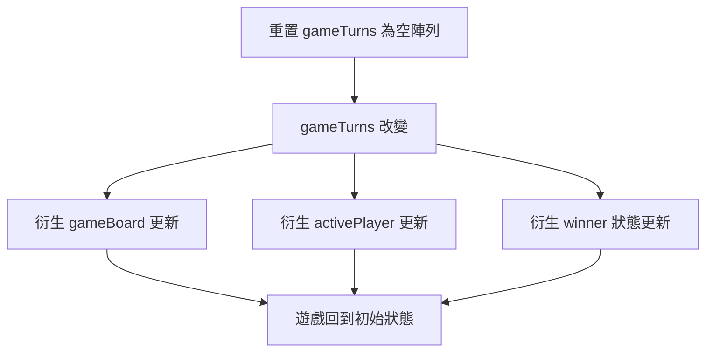
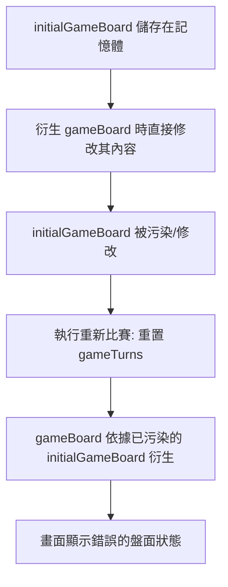
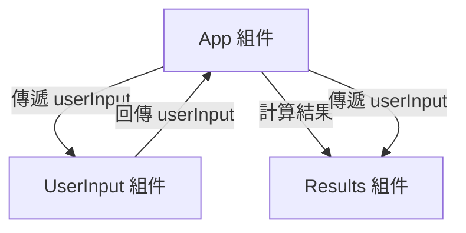

### GameOver 組件

- 用於遊戲結束時顯示結果的畫面
    - 包含獲勝者的名稱或符號
    - 包含一個重新開始遊戲的按鈕
- 組件結構實作

```jsx
export default function GameOver({ winner }) {
    return <div id="game-over">
      <h2>Game Over!</h2>
    </div>
  }
```

- **[邏輯考量]** 除了獲勝者之外，還需要處理平局 (draw) 的情況，這部分邏輯需在 `App` 組件中進行判斷

### GameOver 組件實作細節

- 顯示獲勝資訊與重新開始按鈕
    - 使用 `<p>` 標籤顯示獲勝者資訊：`{winner} won`
    - 新增一個按鈕供使用者點擊以重新開始遊戲（邏輯待後續實作）

### 在 App 組件中整合 GameOver

- **[整合方式]** 透過條件渲染，僅在存在獲勝者時才顯示該組件
- **[實作步驟]**

    1. 從組件路徑匯入：`import GameOver from './components/GameOver.jsx'`
    2. 使用邏輯與運算子 (`&&`) 進行條件判斷：

```jsx
{winner && <p>You won, {winner}!</p>}
```

     *(註：此處為實作中顯示文字的範例，最終會替換為&#32;`<GameOver />`&#32;組件)*

    1. 將獲勝者的符號傳遞給 `winner` prop：

```jsx
<GameOver winner={winner} />
```

- **[資料流]** 目前 `winner` 變數中存放的是獲勝者的符號（如 'X' 或 'O'），此值會經由 prop 傳入 `GameOver` 組件進行顯示

### 處理平局 (Draw) 邏輯

- **[目前問題]** 現有的 `GameOver` 組件僅在有獲勝者時顯示，但遊戲也可能出現平局的情況
- **[判斷平局的邏輯]**
    - 檢查所有棋格是否都已被填滿
    - 因為棋盤總共有 9 個格子，若遊戲進行了 9 個回合且無人獲勝，即可判定為平局
- **[後續計畫]** 需要調整 `App` 組件中衍生獲勝者 (derive winner) 的邏輯，使其能同時辨識並處理「獲勝」與「平局」兩種結束狀態

### 實作平局 (Draw) 判斷邏輯

- **[判斷準則]** 當遊戲進行了所有可能的 9 個回合，但仍沒有人獲勝時，即判定為平局
- **[實作方式]** 在 `App` 組件中定義一個 `hasDraw` 常數：
    - 條件為：`gameTurns.length === 9`（回合數已滿）且 `!winner`（無獲勝者）

```javascript
const hasDraw = gameTurns.length === 9 && !winner;
```

- **[整合 GameOver 顯示]** 使用括號確保邏輯運算優先級，當「有獲勝者」或「發生平局」時顯示 `GameOver` 組件：

```jsx
{(winner || hasDraw) && <GameOver winner={winner} />}
```

- **[注意點]** 當發生平局時，`winner` 變數將不會被設定（為 falsy），因此 `GameOver` 組件內部的顯示邏輯需要能處理 `winner` 為空的情況

---
title: "Course: React - The Complete Guide (incl. Next.js, Redux) | Udemy"
description: Dive in and learn React.js from scratch! Learn React, Hooks, Redux, React Router, Next.js, Best Practices and way more!
author: The Complete Guide (incl. Next.js, Redux) | Udemy
source: https://www.udemy.com/course/react-the-complete-guide-incl-redux/learn/lecture/39659844#overview
created: "2026-08-21"
tags:
  - hover-notes
  - udemy
hovernotes-id: doc_a1db2931-aae2-4d9c-bd20-87f462a3556b
---

### 實現重新比賽功能

- **[核心概念]** 遊戲的邏輯完全由 `gameTurns` 狀態驅動
    - `gameTurns` 是整個遊戲的**單一事實來源 (Single Source of Truth)**
    - 遊戲盤面 (gameBoard)、當前玩家 (activePlayer) 以及勝負判定 (winner) 都是從這個狀態衍生出來的
- **重置邏輯**
    - 若要重新開始遊戲，只需將 `gameTurns` 重置為空陣列 `[]`
    - 同時也需要清除遊戲日誌 (log)
    - 由於其他數據皆由 `gameTurns` 衍生，重置後所有遊戲元素會自動調整回初始狀態



### 實作重新比賽功能

- **在 App 元件建立處理函數**
    - 建立一個名為 `handleRestart` 的函數
    - 函數內容只需將 `gameTurns` 狀態設為空陣列 `[]`

```javascript
function handleRestart() {
  setGameTurns([]);
}
```

- **修改 GameOver 元件以接收 Prop**
    - 在 `GameOver` 元件中新增一個 `onRestart` prop
    - 將此 prop 傳遞給內部的「Rematch!」按鈕的 `onClick` 事件

```javascript
// GameOver.jsx
export default function GameOver({ winner, onRestart }) {
  return (
    <div id="game-over">
      <h2>Game Over!</h2>
      {winner && <p>{winner} won!</p>}
      {!winner && <p>It's a draw!</p>}
      <p>
        <button onClick={onRestart}>Rematch!</button>
      </p>
    </div>
  );
}
```

- **在 App 元件中串接邏輯**
    - 將 `handleRestart` 作為 `onRestart` prop 傳入 `GameOver` 元件

```javascript
// App.jsx
{winner || hasDraw && (
  <GameOver
    winner={winner}
    onRestart={handleRestart}
  />
)}
```

### 重新比賽功能的 Bug 分析

- **[問題現象]** 執行重新比賽後，畫面出現不一致的情況
    - 玩家選擇（Player selection）雖然改變了
    - 但「遊戲結束」畫面（Game Over screen）依然停留在螢幕上
    - 遊戲盤面（gameBoard）也沒有重置回初始狀態
- **[核心原因]** 遊戲盤面衍生邏輯中的 Mutation 問題
    - 目前的實作是根據 `gameTurns` 動態衍生 `gameBoard`
    - 但在衍生過程中，程式碼直接修改了巢狀陣列中的元素值

```javascript
// 問題出現在這行邏輯：嘗試直接覆寫巢狀陣列中的值
gameBoard[row][col] = player;
```

    - 這種直接修改（overriding）巢狀結構內部元素的操作，會導致 React 無法正確偵測到狀態的變化，進而無法觸發重新渲染（re-render）來更新畫面。

### 重新比賽功能失效的深層原因

- **[核心問題] 引用值 (Reference Values) 的特性**
    - 在 JavaScript 中，陣列與物件是引用值，它們儲存在記憶體中
    - 即使將陣列賦值給不同的變數，它們指向的仍是記憶體中同一個物件
- **[失效機制] 原始資料被污染**
    - 衍生 `gameBoard` 時，程式碼直接修改了 `initialGameBoard` 的內容
    - 當執行 `gameBoard[row][col] = player` 時，實際上是直接修改了記憶體中原本的 `initialGameBoard` 陣列
    - 這導致重新比賽時，`initialGameBoard` 不再是乾淨的初始狀態，而是包含了上一局遊戲後的修改結果



- **[解決方案] 使用深拷貝 (Deep Copy)**
    - 不能只對最外層陣列進行淺拷貝（如使用 `[...initialGameBoard]`），因為內層的巢狀陣列仍會指向同一個引用
    - 必須建立一個**深拷貝**，確保每一層巢狀結構都是全新的物件，與原始資料完全隔離

---
title: "Course: React - The Complete Guide (incl. Next.js, Redux) | Udemy"
description: Dive in and learn React.js from scratch! Learn React, Hooks, Redux, React Router, Next.js, Best Practices and way more!
author: The Complete Guide (incl. Next.js, Redux) | Udemy
source: https://www.udemy.com/course/react-the-complete-guide-incl-redux/learn/lecture/39659846#overview
created: "2026-08-21"
tags:
  - hover-notes
  - udemy
hovernotes-id: doc_d53af3c1-ac5b-443c-b787-825f1820b37b
---

### 顯示玩家名稱的需求

- 目前遊戲結束時僅顯示勝者符號（例如 `X1` 或 `O1`）
- 目標是改為顯示玩家的實際名稱（例如 `Player 1` 或編輯後的名稱）

### 數據流與狀態位置的問題

- **勝負判斷邏輯**：位於 `App` 組件
- **玩家名稱資訊**：目前儲存在 `Player` 組件中（用於編輯與儲存名稱）
- **面臨挑戰**：由於 `App` 需要名稱來顯示勝者，必須將名稱資訊從 `Player` 組件傳遞到 `App` 組件

### 關於狀態提升（Lifting State Up）的考量

- 雖然可以將 `playerName` 狀態提升到 `App` 組件，但這並非最佳做法
- **原因**：`playerName` 狀態在 `Player` 組件中被用於處理輸入框的即時更新（`onChange`）
    - 這種狀態與輸入行為高度耦合，若直接提升，可能會影響組件的設計初衷或效能

#### `Player.jsx` 中的狀態結構

```javascript
export default function Player({initialName, symbol, isActive}) {
  const [playerName, setPlayerName] = useState(initialName);
  const [isEditing, setIsEditing] = useState(false);

  function handleChange(event) {
    setPlayerName(event.target.value);
  }

  // ...
  if (isEditing) {
    return (
      <input
        type="text"
        required
        value={playerName}
        onChange={handleChange}
      />
    );
  }
  // ...
}
```

### 為什麼不直接提升 `playerName` 狀態

- **效能問題**：若將 `playerName` 提升至 `App` 組件，每次在輸入框輸入字元（`onchange`）時，整個 `App` 組件都會重新評估（re-evaluate）
    - 這會導致整個遊戲盤（Game Board）也跟著無謂地重新渲染，造成效能浪費
- **組件重複使用性**：`Player` 組件在遊戲中被使用了兩次，每個組件應該能獨立管理自己的名稱狀態

### 在 `App` 組件建立玩家名稱狀態

- 為了在遊戲結束時顯示名稱，在 `App` 組件中新增一個 `players` 狀態
- **資料結構選擇**：使用物件（Object）作為 Map，將符號（`X` 或 `O`）作為鍵（Key），玩家名稱作為值（Value）
    - 這樣做是因為玩家名稱與其對應的符號是緊密耦合的

```javascript
// 在 App 組件中初始化玩家狀態
const [players, setPlayers] = useState({
  X: 'Player 1',
  O: 'Player 2',
});
```

### 在 `App` 組件處理名稱變更

- **觸發時機**：`setPlayers` 應該只在 `Player` 組件點擊「儲存」按鈕時被呼叫，而不是在每次按鍵（keystroke）時觸發
- **建立處理函式**：在 `App` 組件中新增 `handlePlayerNameChange` 函式
    - **參數**：需要傳入玩家的符號（`symbol`）以及新的名稱（`newName`）
    - **狀態更新邏輯**：必須基於舊的 `players` 狀態進行更新，以避免在修改其中一個玩家時，導致另一個玩家的名稱被覆蓋或遺失

```javascript
function handlePlayerNameChange(symbol, newName) {
  setPlayers(prevPlayers => ({
    ...prevPlayers,
    [symbol]: newName,
  }));
}
```

- **更新細節**：
    - 使用 `prevPlayers => ({ ... })` 的箭頭函式寫法來獲取當前的狀態值
    - 使用展開運算符（Spread operator `...prevPlayers`）複製原本所有的玩家資訊
    - 使用計算屬性名稱（Computed property names `[symbol]: newName`）來精準更新對應符號的名稱

---
title: "Course: React - The Complete Guide (incl. Next.js, Redux) | Udemy"
description: Dive in and learn React.js from scratch! Learn React, Hooks, Redux, React Router, Next.js, Best Practices and way more!
author: The Complete Guide (incl. Next.js, Redux) | Udemy
source: https://www.udemy.com/course/react-the-complete-guide-incl-redux/learn/lecture/39659852#overview
created: "2026-08-21"
tags:
  - hover-notes
  - udemy
hovernotes-id: doc_eeca1d69-9291-4dd7-b6fe-ab0dc5aa6c1e
---

### Player 組件的名稱變更邏輯

- **透過 Props 傳遞更新函式**
    - 在 `App.jsx` 中，將 `handlePlayerNameChange` 函式作為 `onChangeName` prop 傳遞給每個 `<Player />` 組件
    - 這樣子組件才能通知父組件進行狀態更新

```jsx
// App.jsx 中的傳遞方式
<Player
  initialName="Player 1"
  symbol="X"
  isActive={activePlayer === 'X'}
  onChangeName={handlePlayerNameChange}
/>
```

- **在 Player 組件內接收與觸發**
    - 在 `Player.jsx` 中，透過解構賦值接收 `onChangeName` prop
    - 當使用者點擊編輯並確認儲存時（在 `handleEditClick` 中），呼叫該 prop 並傳入對應的 `symbol` 作為參數

```jsx
// Player.jsx 中的實作
export default function Player({ initialName, symbol, isActive, onChangeName }) {
  // ... 其他邏輯

  function handleEditClick() {
    setIsEditing(editing => !editing);
    onChangeName(symbol);
  }

  // ...
}
```

### Player 組件的名稱更新細節

- **傳遞完整的參數給父組件**
    - `handlePlayerNameChange` 預期接收兩個參數：
        - 第一個參數：`symbol`（玩家符號，如 'X' 或 '0'）
        - 第二個參數：`playerName`（目前在 `Player` 組件狀態中儲存的新名稱）

```javascript
// Player.jsx 中的呼叫方式
onChangeName(symbol, playerName);
```

- **控制觸發時機**
    - **[為什麼要檢查&#32;`isEditing`]** 因為 `handleEditClick` 會在點擊按鈕時切換 `isEditing` 狀態，當 `isEditing` 從 `true` 變回 `false` 時，代表使用者點擊了「儲存」，這才是應該通知父組件更新名稱的時機。

```javascript
function handleEditClick() {
  setIsEditing(editing => !editing);
  if (isEditing) {
    onChangeName(symbol, playerName);
  }
}
```

- **更新遊戲結束邏輯**
    - 在 `App.jsx` 中，原本的獲勝者判斷邏輯僅使用 `symbol`，現在應改為使用更新後的玩家名稱來顯示，以確保遊戲結束時呈現的是正確的玩家名稱。

---
title: "Course: React - The Complete Guide (incl. Next.js, Redux) | Udemy"
description: Dive in and learn React.js from scratch! Learn React, Hooks, Redux, React Router, Next.js, Best Practices and way more!
author: The Complete Guide (incl. Next.js, Redux) | Udemy
source: https://www.udemy.com/course/react-the-complete-guide-incl-redux/learn/lecture/39659858#overview
created: "2026-08-21"
tags:
  - hover-notes
  - udemy
hovernotes-id: doc_2222288b-49c7-4676-ba6c-c43247f70ea0
---

### App Component Refactoring

- **[Goal]** Clean up the `App` component by outsourcing logic that doesn't need to reside within the component itself
    - Currently, the logic for determining the winner is embedded directly in `App.jsx`, making the component bloated
- **Refactoring Winner Logic**
    - The block responsible for calculating the winner will be moved to a new function named `deriveWinner` outside of the `App` component
    - This follows the same pattern used for `deriveActivePlayer` to keep the component focused on UI and state management
- **Current implementation in&#32;`App.jsx`&#32;(to be refactored)**:

```javascript
let winner;
  for (const combination of WINNING_COMBINATIONS) {
    const firstSquareSymbol = gameBoard[combination[0].row][combination[0].column];
    const secondSquareSymbol = gameBoard[combination[1].row][combination[1].column];
    const thirdSquareSymbol = gameBoard[combination[2].row][combination[2].column];

    if (
      firstSquareSymbol &&
      firstSquareSymbol === secondSquareSymbol &&
      firstSquareSymbol === thirdSquareSymbol
    ) {
      winner = players[firstSquareSymbol];
    }
  }
```

### Implementing `deriveWinner` helper

- **[Function Definition]** Create `deriveWinner` outside the `App` component to handle the winning logic
    - It accepts `gameBoard` and `players` as parameters
    - It returns the `winner` (the name of the winning player or `undefined`)

```javascript
function deriveWinner(gameBoard, players) {
  let winner;
  for (const combination of WINNING_COMBINATIONS) {
    const firstSquareSymbol = gameBoard[combination[0].row][combination[0].column];
    const secondSquareSymbol = gameBoard[combination[1].row][combination[1].column];
    const thirdSquareSymbol = gameBoard[combination[2].row][combination[2].column];

    if (
      firstSquareSymbol &&
      firstSquareSymbol === secondSquareSymbol &&
      firstSquareSymbol === thirdSquareSymbol
    ) {
      winner = players[firstSquareSymbol];
    }
  }
  return winner;
}
```

- **[Refactoring&#32;`App`&#32;component]** Replace the previous inline loop with a single constant declaration
    - Since the winner is calculated based on current state and doesn't need to be reassigned, use `const` instead of `let`

```javascript
const winner = deriveWinner(gameBoard, players);
```

### Extracting `deriveGameBoard` logic

- **[Refactoring Goal]** Outsource the logic for calculating the current `gameBoard` to a separate helper function to further clean up the `App` component
    - This function can be placed outside the component in the same file or in an entirely different file
- **[Function Definition]** Create `deriveGameBoard` to encapsulate the board derivation process
    - It requires `gameTurns` as a parameter
    - It will return the newly derived `gameBoard` state

```javascript
function deriveGameBoard(gameTurns) {
  let gameBoard = [...initialGameBoard.map((array) => [...array])];

  for (const turn of gameTurns) {
    const { square, player } = turn;
    const { row, col } = square;

    gameBoard[row][col] = player;
  }

  return gameBoard;
}
```

### Refactoring the `App` component

- **[Integration]** Use the `deriveGameBoard` helper within the `App` component to set the `gameBoard` state
    - Pass `gameTurns` as the required parameter
- **[Result]** The `App` component becomes much leaner and more readable
    - Unnecessary comments can now be deleted as the logic is encapsulated in descriptive helper functions

```javascript
function App() {
  const [players, setPlayers] = useState({
    X: 'Player 1',
    '0': 'Player 2',
  });
  const [gameTurns, setGameTurns] = useState([]);
  const activePlayer = deriveActivePlayer(gameTurns);
  const gameBoard = deriveGameBoard(gameTurns);
  const winner = deriveWinner(gameBoard, players);
  const hasDraw = gameTurns.length === 9 && !winner;

  function handleSelectSquare(rowIndex, colIndex) {
    // ...
  }

  return (
    // ...
  );
}
```

### Defining the `players` constant

- **[Next Step]** Add a new `players` constant to manage player information
    - This can be placed above the `initialGameBoard` or right below the imports
- **[Implementation]** Create a `players` constant to store player names
    - This object uses `'X'` and `'O'` as keys to map to player names
    - This constant can be used as the initial state for the `players` state in the `App` component

```javascript
const players = {
  X: 'Player 1',
  O: 'Player 2',
};
```

- **[Naming Convention]** Rename `initialGameBoard` to `INITIAL_GAME_BOARD`
    - **[Why?]** Using uppercase with underscores makes it clear that this is a general constant defined for the entire application

```javascript
const INITIAL_GAME_BOARD = [
  [null, null, null],
  [null, null, null],
  [null, null, null],
];
```

### Using the `players` constant in the `App` component

- **[Implementation]** Use the `players` constant to initialize the `players` state
    - This replaces the previous hard-coded values

```javascript
function App() {
  const [players, setPlayers] = useState(players);
  // ...
}
```

- **[Dynamic Rendering]** Pass player names to the `Player` components by accessing the `players` constant
    - **[Why?]** Previously, 'Player 1' and 'Player 2' were hard-coded in both the initial state and the component props. If a name changed, it had to be updated in two places. Using the constant ensures a single source of truth.

```javascript
return (
  <main id="game-container">
    <ol id="players" className="highlight-player">
      <Player initialName={players.X} symbol="X" isActive={activePlayer === 'X'} onChangeName={handlePlayerNameChange} />
      <Player initialName={players.O} symbol="O" isActive={activePlayer === 'O'} onChangeName={handlePlayerNameChange} />
    </ol>
    {/* ... */}
  </main>
);
```

- **[Refactoring Requirement]** Update references to the renamed board constant
    - Since `initialGameBoard` was renamed to `INITIAL_GAME_BOARD`, the `deriveGameBoard` function must be updated to use the new name.

---
title: "Course: React - The Complete Guide (incl. Next.js, Redux) | Udemy"
description: Dive in and learn React.js from scratch! Learn React, Hooks, Redux, React Router, Next.js, Best Practices and way more!
author: The Complete Guide (incl. Next.js, Redux) | Udemy
source: https://www.udemy.com/course/react-the-complete-guide-incl-redux/learn/lecture/39760372#overview
created: "2026-08-21"
tags:
  - hover-notes
  - udemy
hovernotes-id: doc_8530508c-e097-4126-b776-9a7cae348b63
---

## React Essentials - Practice Project

- **實作目標**：運用已學知識開發一個「投資計算器」Web App
- **核心練習重點**：
    - 組件的建置、配置與組合（Build, Configure & Combine Components）
    - 應用程式狀態管理（Manage Application State）
    - 列表與條件內容的輸出（Output List & Conditional Content）

### 實作準備與專案設定

- **使用起始專案 (Starting Project)**
    - 為了讓學習者能專注於 React 功能而非基礎配置，專案已提供本地版本與 CodeSandbox 版本
- **本地開發環境設定步驟**

    1. 下載並解壓縮專案檔案
    2. 在終端機執行 `npm install` 以安裝必要的套件
    3. 執行 `npm run dev` 來啟動開發伺服器

### 實作任務目標

- **核心任務**：建置一個「投資計算器」Web App
- **具體開發內容**：
    - 新增組件以顯示標題 (Header)
    - 獲取使用者輸入的投資參數並進行儲存
    - 利用提供的工具函數 (Utility function) 計算投資結果
    - 使用 HTML `<table>` 標籤（包含 `<thead>`, `<tbody>`, `<tr>`, `<th>`, `<td>`）輸出結果表格
    - 實作條件渲染：若輸入的期間 (Duration) 無效，則顯示提示訊息

### 專案檔案結構與資源

- **`src/index.css`**
    - 已預先寫好 CSS 樣式，開發者無需撰寫自定義 CSS 即可完成 Web App 建置
    - 樣式內容可作為組件結構的提示（例如：`#user-input label` 與 `#user-input input` 的定義，暗示可以建立一個 `UserInput` 組件來群組這些欄位）
- **`src/assets/`**
    - 包含專案所需的圖片資源（如 `investment-calculator-logo.png`）
- **`src/util/`**
    - 包含工具函數資料夾
    - **`investment.js`**：提供核心計算邏輯

### 核心工具函數：`calculateInvestmentResults`

- 定義於 `src/util/investment.js`，用於推算投資結果
- **接收參數**（皆為 JS 物件屬性）：
    - `initialInvestment`: 初始投資金額
    - `annualInvestment`: 每年投入金額
    - `expectedReturn`: 預期年利率
    - `duration`: 投資年限
- **函數邏輯簡述**：
    - 透過 `for` 迴圈遍歷投資期間
    - 每一年的利息計算方式：`interestEarnedInYear = investmentValue * expectedReturn`
    - 更新年度投資總額：`investmentValue += interestEarnedInYear + annualInvestment`

```javascript
export function calculateInvestmentResults({
  initialInvestment,
  annualInvestment,
  expectedReturn,
  duration,
}) {
  const annualData = [];
  let investmentValue = initialInvestment;

  for (let i = 0; i < duration; i++) {
    const interestEarnedInYear = investmentValue * expectedReturn;
    investmentValue += interestEarnedInYear + annualInvestment;
    // ... 後續邏輯
  }
}
```

---
title: "Course: React - The Complete Guide (incl. Next.js, Redux) | Udemy"
description: Dive in and learn React.js from scratch! Learn React, Hooks, Redux, React Router, Next.js, Best Practices and way more!
author: The Complete Guide (incl. Next.js, Redux) | Udemy
source: https://www.udemy.com/course/react-the-complete-guide-incl-redux/learn/lecture/39760374#overview
created: "2026-08-21"
tags:
  - hover-notes
  - udemy
hovernotes-id: doc_8757cb10-dc6f-4bdd-96c1-b59f79c41be6
---

### 專案結構規劃與 Header 元件建立

- 在 `src` 目錄下新增 `components` 資料夾
    - 用於存放所有的 React 元件，保持目錄結構清晰
- 建立 `Header.jsx` 元件
    - 目的：將 Logo 與標題等內容封裝起來，以便在 `App.jsx` 中調用
    - **[為什麼要這樣做？]** 雖然可以直接寫在 `index.html` 中（因為內容目前不具動態性），但使用元件化的方式更符合 React 的開發模式，便於未來擴充

```jsx
export default function Header() {

}
```

### Header 元件實作細節

- 回傳 JSX 結構
    - 使用 HTML 內建的 `<header>` 標籤作為容器
    - 在容器內包含一個 `` 元素與一個 `<h1>` 標籤
    - `<h1>` 的內容設定為 `Investment Calculator`，作為頁面的主要標題
- 匯入靜態資源 (Logo)
    - **[為什麼要這樣做？]** 因為圖片檔案位於 `assets` 資料夾，需要透過 `import` 語法將其轉換為動態數值，才能賦值給 `` 的 `src` 屬性
    - 匯入路徑需使用相對路徑：由於 `Header.jsx` 位在 `src/components` 目錄下，需先向上跳一層 (`../`) 才能到達 `src` 目錄，再進入 `assets` 資料夾

```jsx
import logo from '../assets/investment-calculator-logo.png'

export default function Header() {
    return (
        <header>

            <h1>Investment Calculator</h1>
        </header>
    )
}
```

---
title: "Course: React - The Complete Guide (incl. Next.js, Redux) | Udemy"
description: Dive in and learn React.js from scratch! Learn React, Hooks, Redux, React Router, Next.js, Best Practices and way more!
author: The Complete Guide (incl. Next.js, Redux) | Udemy
source: https://www.udemy.com/course/react-the-complete-guide-incl-redux/learn/lecture/39760376#overview
created: "2026-08-21"
tags:
  - hover-notes
  - udemy
hovernotes-id: doc_d47a1224-f483-49b3-8828-bcbe96ba41db
---

### User Input Component

- The next step is to create a component dedicated to handling user input
    - This input is essential for calculating the investment result data used in the table
- **[Why a separate component?]** Following React's core principle of component-based architecture
    - Every component should have its own single responsibility
    - Handling user input is a distinct feature that should be isolated from other parts of the app

### User Input Component Implementation

- **Component Responsibility**
    - Responsible for fetching different pieces of user input needed for the application (e.g., initial investment amount)
- **Initial Component Structure**
    - The component is defined in `UserInput.jsx` as a default export
    - It currently returns a `<section>` element to wrap the input elements
    - **[Why use a section with a specific ID?]** To apply existing styles from `index.css` that target the `#user-input` ID

```jsx
export default function UserInput() {
  return <section id="user-input"></section>;
}
```

- **CSS Integration**
    - The `id="user-input"` allows the component to hook into predefined styles in `index.css`
    - Example styles targeting this ID include:
        - `#user-input label`: sets display to `block`, adds `margin-bottom`, and defines typography
        - `#user-input input`: controls width, padding, and border properties

### User Input Component Layout

- **Structuring Input Fields**
    - To organize multiple input fields and ensure they look good, a `div` with the `className="input-group"` is used
    - **[Why use&#32;`input-group`?]** The `input-group` CSS class is predefined in `index.css` to ensure that multiple input combinations (a `<p>` containing a `<label>` and an `<input />`) are displayed next to each other in the same row

```jsx
export default function UserInput() {
  return (
    <section id="user-input">
      <div className="input-group">
        <p>
          <label>Initial Investment</label>
          <input />
        </p>
        <p>
          <label>Label</label>
          <input />
        </p>
      </div>
    </section>
  );
}
```

- **CSS Layout Logic**
    - The `.input-group` class uses Flexbox to handle the alignment of its children

```css
.input-group {
  display: flex;
  justify-content: space-evenly;
  gap: 1.5rem;
}
```

### User Input Fields Implementation

- **Required Input Fields**
    - The component collects four specific pieces of information:
        - **Initial Investment**: The starting amount invested
        - **Annual Investment**: The amount invested every year after the initial investment
        - **Expected Return**: The annual rate of return expected by the user
        - **Duration**: How long the investment will be held
- **Input Configuration**
    - Each field is structured as a `<label>` and an `<input />` wrapped in a `<p>` tag
    - **[Why use&#32;`type="number"`?]** To ensure the input field is configured to receive numeric data, which influences both the UI and how the browser handles the input

```jsx
export default function UserInput() {
  return (
    <section id="user-input">
      <div className="input-group">
        <p>
          <label>Initial Investment</label>
          <input type="number" />
        </p>
        <p>
          <label>Annual Investment</label>
          <input type="number" />
        </p>
      </div>
      <div className="input-group">
        <p>
          <label>Expected Return</label>
          <input type="number" />
        </p>
        <p>
          <label>Duration</label>
          <input type="number" />
        </p>
      </div>
    </section>
  );
}
```

- **Layout Organization**
    - The inputs are organized into two separate `input-group` divs
    - The first group contains the investment amounts (Initial and Annual)
    - The second group contains the return and duration settings

---
title: "Course: React - The Complete Guide (incl. Next.js, Redux) | Udemy"
description: Dive in and learn React.js from scratch! Learn React, Hooks, Redux, React Router, Next.js, Best Practices and way more!
author: The Complete Guide (incl. Next.js, Redux) | Udemy
source: https://www.udemy.com/course/react-the-complete-guide-incl-redux/learn/lecture/39760380#overview
created: "2026-08-21"
tags:
  - hover-notes
  - udemy
hovernotes-id: doc_bb4c0d21-b209-4726-bd47-0d48f107fe13
---

### UserInput 組件狀態管理

- 為了獲取並儲存使用者輸入的值，需要在 `UserInput` 組件中管理狀態
- 使用 React 的 `useState` Hook 來註冊並管理組件狀態
- **[狀態管理策略]** 可以為每個輸入欄位建立獨立的狀態，也可以將所有輸入值合併成一個單一的狀態物件
    - 本範例採用合併為單一物件的方法
- **初始狀態設定範例**

```javascript
useState({
    initialInvestment: 10000,
    annualInvestment: 1200,
    expectedReturn: 6
  });
```

    - `initialInvestment`: 初始投資金額，預設值為 10000
    - `annualInvestment`: 年度投資金額，預設值為 1200
    - `expectedReturn`: 預期回報率

### 完善 UserInput 狀態管理

- **[更新後的初始狀態]** 加入 `duration` 屬性，並將所有屬性整合進狀態物件中

```javascript
const [userInput, setUserInput] = useState({
    initialInvestment: 10000,
    annualInvestment: 1200,
    expectedReturn: 6,
    duration: 10,
  });
```

    - `userInput`: 儲存當前所有輸入值的常數
    - `setUserInput`: 用於更新狀態的函式
    - `duration`: 投資期間，預設值為 10
- **[狀態更新機制]** 使用一個通用的函式來處理所有輸入欄位的變更
    - **[為什麼使用通用函式？]** 比起為每個輸入欄位建立四個獨立的函式，使用一個通用的函式可以讓程式碼更簡潔且易於維護
    - 定義 `handleChange` 函式，並預期接收兩個參數：
        - `inputIdentifier`: 用於辨識是哪個輸入欄位發生了變更
        - `newValue`: 使用者輸入的新值

```javascript
function handleChange(inputIdentifier, newValue) {
  // 待實作更新邏輯
}
```

### 實作 handleChange 更新邏輯

- **[狀態更新策略]** 由於 `handleChange` 每次執行時只會更新四個屬性中的其中一個，因此必須依賴舊的狀態值（previous state）來進行更新，以避免其他未變更的屬性遺失
- **使用函式形式更新狀態**
    - 透過傳入一個回呼函式來獲取目前的狀態 `prevUserInput`
    - **[步驟]**

        1. 使用展開運算子 `...prevUserInput` 將舊的所有屬性複製到新物件中
        2. 使用 JavaScript 的動態鍵名語法 `[inputIdentifier]` 來覆蓋特定的屬性值

```javascript
function handleChange(inputIdentifier, newValue) {
  setUserInput(prevUserInput => {
    return {
      ...prevUserInput,
      [inputIdentifier]: newValue
    };
  });
}
```

- **[參數說明]**
    - `inputIdentifier`: 預期接收一個字串，例如 `"initialInvestment"`、`"annualInvestment"`、`"expectedReturn"` 或 `"duration"`，用來動態指定要更新的欄位
    - `newValue`: 使用者輸入的新值

### 連接 handleChange 到輸入欄位

- **[連接方式]** 使用 `onChange` 屬性為輸入欄位添加監聽器，當變更事件發生時觸發 `handleChange` 函式
- **[常見錯誤]** 直接將函式名稱賦值給 `onChange` 會導致問題
    - **[原因]** 當變更事件發生時，React 會預設將一個自動生成的 `event` 物件作為第一個參數傳遞給函式
    - **[衝突]** 我們的 `handleChange` 預期接收兩個參數：`inputIdentifier` 與 `newValue`；若直接傳入，第一個參數會變成 `event` 物件，導致邏輯錯誤
- **[解決方案]** 使用匿名函式（Arrow Function）進行包裝，以便手動傳遞正確的參數

```javascript
// 錯誤的寫法：React 會傳入 event 物件作為第一個參數
<input type="number" required onChange={handleChange} />

// 正確的寫法：透過匿名函式包裝，精確控制傳入的參數
<input
  type="number"
  required
  onChange={() => handleChange("initialInvestment", event.target.value)}
/>
```

> **注意**：雖然目前的程式碼片段尚未完整展示 `event.target.value` 的取得方式，但核心概念在於透過 `() =>` 建立一個新的函式環境，藉此打破 React 預設傳遞單一 `event` 參數的限制，進而能傳遞我們自定義的 `inputIdentifier`。

### 使用匿名函式精確傳遞參數

- **[解決方案]** 透過建立一個新的匿名箭頭函式作為 `onChange` 的值，可以完全控制最終執行時傳遞給 `handleChange` 的參數
- **[參數傳遞邏輯]**
    - 第一個參數：手動傳入對應的狀態屬性名稱（字串，例如 `"initialInvestment"`）
    - 第二個參數：從 React 自動生成的 `event` 物件中提取的值
- **[如何取得使用者輸入值]**
    - 匿名函式會接收到 `event` 物件
    - 透過 `event.target.value` 可以存取到該輸入欄位目前的值

```javascript
// 正確的實作方式
<input
  type="number"
  required
  onChange={(event) => handleChange('initialInvestment', event.target.value)}
/>
```

- **[物件結構拆解]**
    - `event`：由 React 觸發變更時產生的事件物件
    - `event.target`：指向觸發該事件的 HTML 元素（即此 `<input>` 標籤）
    - `event.target.value`：該元素目前所包含的內容（使用者輸入的數字）

### 實作受控組件 (Controlled Components)

- **[核心概念]** 除了監聽變更，還必須確保輸入欄位顯示的內容與狀態物件保持同步
- **[實作方式]** 使用 `value` 屬性將輸入欄位的顯示值與 `userInput` 狀態中的特定屬性綁定
- **[範例]** 為 `initialInvestment` 欄位設定 `value`

```jsx
<input
  type="number"
  required
  value={userInput.initialInvestment}
  onChange={(event) => handleChange('initialInvestment', event.target.value)}
/>
```

### 重複應用於其他輸入欄位

- **[操作流程]** 由於每個輸入欄位的邏輯結構相同，只需複製 `value` 與 `onChange` 屬性，並更改對應的標識符（identifier）即可
- **[各欄位設定]**
    - **Annual Investment**
        - `value`: `{userInput.annualInvestment}`
        - `onChange` 識別符: `'annualInvestment'`
    - **Expected Return**
        - `value`: `{userInput.expectedReturn}`
        - `onChange` 識別符: `'expectedReturn'`

```jsx
{/* Annual Investment 欄位範例 */}
<input
  type="number"
  required
  value={userInput.annualInvestment}
  onChange={(event) => handleChange('annualInvestment', event.target.value)}
/>

{/* Expected Return 欄位範例 */}
<input
  type="number"
  required
  value={userInput.expectedReturn}
  onChange={(event) => handleChange('expectedReturn', event.target.value)}
/>
```

---
title: "Course: React - The Complete Guide (incl. Next.js, Redux) | Udemy"
description: Dive in and learn React.js from scratch! Learn React, Hooks, Redux, React Router, Next.js, Best Practices and way more!
author: The Complete Guide (incl. Next.js, Redux) | Udemy
source: https://www.udemy.com/course/react-the-complete-guide-incl-redux/learn/lecture/39760382#overview
created: "2026-08-21"
tags:
  - hover-notes
  - udemy
hovernotes-id: doc_e2222bee-95b8-4de0-8ca4-410607f40366
---

### 投資結果計算的執行位置

- 決定在哪個組件中呼叫 `calculateInvestmentResults` 函數
- **[選擇方案]** 在 `UserInput` 組件中進行計算
    - 因為 `UserInput` 組件內的 `userInput` 狀態物件，其結構剛好符合該函數所需的輸入格式
- `calculateInvestmentResults` 所需的輸入物件屬性：
    - `initialInvestment`
    - `annualInvestment`
    - `expectedReturn`
    - `duration`

```javascript
// investment.js 中的函數定義結構
export function calculateInvestmentResults({
  initialInvestment,
  annualInvestment,
  expectedReturn,
  duration,
}) {
  // ... 計算邏輯
}
```

```javascript
// UserInput.jsx 中的狀態結構
const [userInput, setUserInput] = useState({
  initialInvestment: 10000,
  annualInvestment: 1200,
  expectedReturn: 6,
  duration: 10,
});
```

### 決定計算邏輯的執行位置

- **[排除方案]** 在 `UserInput` 組件中直接計算
    - 雖然 `UserInput` 擁有符合格式的 `userInput` 物件，但該組件僅負責收集輸入
    - `UserInput` 不需要持有計算後的結果數據
- **[最佳方案]** 將數據提升至 `App` 組件
    - 因為未來需要一個獨立的結果顯示組件（Results Component）來展示表格
    - 該結果組件將位於 `UserInput` 組件下方
    - 為了讓兩個組件共享數據，必須將 `userInput` 從 `UserInput` 傳遞回 `App` 組件



- **數據流向規劃**
    - `App` 組件作為核心，負責管理狀態並進行計算
    - `App` 將 `userInput` 傳給 `UserInput` 用於輸入控制
    - `App` 將計算後的結果傳給 `Results` 組件進行呈現

### 建立 Results 組件

- 建立 `Results.jsx` 檔案，定義一個名為 `Results` 的函數組件
- **[設計目標]** 該組件將透過 `props` 接收 `userInput` 作為輸入
    - 接收 `userInput` 後，可以在組件內部呼叫計算函數並輸出結果表格
- 目前僅回傳一個佔位符（placeholder）

```javascript
// Results.jsx
export default function Results() {
  return <p>Results</p>;
}
```

### 實作狀態提升 (Lifting State Up)

- 為了讓 `Results` 組件能拿到數據，必須將 `userInput` 狀態從 `UserInput` 組件提升至 `App` 組件
- **[數據流向]**

    1. `App` 組件持有 `userInput` 狀態
    2. `App` 將 `userInput` 傳遞給 `UserInput` 組件（用於輸入控制）
    3. `App` 再將 `userInput` 傳遞給 `Results` 組件（用於計算與顯示）

```javascript
// App.jsx 預期結構
function App() {
  // 狀態將從 UserInput 提升到這裡
  return (
    <>
      <Header />
      <UserInput />
      {/* Results go here */}
    </>
  );
}
```

### 實作狀態提升 (續)

- **傳遞更新函數 (Callback Prop)**
    - 將 `handleChange` 函數從 `UserInput` 移至 `App` 組件
    - 透過 prop 將函數引用傳遞給 `UserInput` 組件
    - 在 `App.jsx` 中使用 `onChange={handleChange}` 傳遞
        - 注意：只傳遞函數引用，不加括號 `()`，避免立即執行

```javascript
// App.jsx
function App() {
  const [userInput, setUserInput] = useState({ ... });

  function handleChange(inputIdentifier, newValue) {
    setUserInput(prevUserInput => {
      return {
        ...prevUserInput,
        [inputIdentifier]: newValue,
      };
    });
  }

  return (
    <>
      <Header />
      <UserInput onChange={handleChange} />
      {/* Results go here */}
    </>
  );
}
```

- **接收並使用 Props**
    - `UserInput` 組件現在不再管理狀態，移除 `useState` 導入
    - 從 props 中解構接收 `onChange` 函數
    - 將組件內原本的 `handleChange` 呼叫替換為 `onChange`

```javascript
// UserInput.jsx
export default function UserInput({ onChange }) {
  return (
    <section id="user-input">
      {/* ... */}
      <input
        type="number"
        value={userInput.initialInvestment}
        onChange={(event) => onChange('initialInvestment', event.target.value)}
      />
      {/* 其他輸入欄位同樣使用 onChange prop */}
    </section>
  );
}
```

- **數據流向總結**
    - 使用者在 `UserInput` 輸入資料
    - 觸發 `onChange` prop (指向 `App` 的 `handleChange`)
    - `App` 組件更新 `userInput` 狀態
    - 新的 `userInput` 數據可隨時傳遞給 `Results` 組件
- **傳遞狀態數據 (State as Props)**
    - 為了讓 `UserInput` 組件能顯示目前的數值（控制輸入欄位），`App` 組件必須將 `userInput` 狀態物件傳遞給它
    - 在 `App.jsx` 中新增 prop 屬性：`userInput={userInput}`
        - 將狀態變數的值傳遞給組件的 prop

```javascript
// App.jsx
<UserInput
  userInput={userInput}
  onChange={handleChange}
/>
```

- **接收狀態 Props**
    - 在 `UserInput` 組件中，除了接收 `onChange` 外，也接收 `userInput` 物件
    - 將 `userInput` 的值（如 `userInput.initialInvestment`）賦予每個 `<input>` 的 `value` 屬性
    - 這使得輸入欄位成為「受控組件」，顯示的值始終與 `App` 組件中的狀態保持一致

---
title: "Course: React - The Complete Guide (incl. Next.js, Redux) | Udemy"
description: Dive in and learn React.js from scratch! Learn React, Hooks, Redux, React Router, Next.js, Best Practices and way more!
author: The Complete Guide (incl. Next.js, Redux) | Udemy
source: https://www.udemy.com/course/react-the-complete-guide-incl-redux/learn/lecture/39760388#overview
created: "2026-08-21"
tags:
  - hover-notes
  - udemy
hovernotes-id: doc_ae3af875-c3a1-42fe-98f1-1d45fe8c7944
---

### 在 Results.jsx 中計算投資結果

- 在 `Results.jsx` 中，透過解構賦值接收 `input` prop（即 `App.jsx` 傳來的使用者輸入狀態）。
- 引入 `calculateInvestmentResults` 函數：
    - 來源：`../util/investment.js`
    - 語法：`import { calculateInvestmentResults } from "../util/investment.js";`
- 呼叫計算邏輯：
    - 直接傳入 `input` 物件給該函數。
    - 此做法符合 React 的最佳實踐：根據狀態（State）來推導（Derive）其他值。

```jsx
// Results.jsx
import { calculateInvestmentResults } from "../util/investment.js";

export default function Results({ input }) {
  calculateInvestmentResults(input);
  return <p>Results...</p>;
}
```

### 計算並驗證投資結果

- 在 `Results` 組件中，利用傳入的 `input` prop 作為參數呼叫 `calculateInvestmentResults`
    - 函式會回傳一個包含每年投資數據的陣列
- 為了確認數據結構，暫時使用 `console.log` 將結果輸出

```javascript
// Results.jsx
import { calculateInvestmentResults } from '../util/investment.js';

export default function Results({ input }) {
  const resultsData = calculateInvestmentResults(input);
  console.log(resultsData);
  return <p>Results...</p>;
}
```

- 開啟開發者工具控制台，可以看到回傳的陣列結構
    - 每個元素代表一年的投資狀況，包含：
            - `year`: 年份
            - `interest`: 該年賺取的利息
            - `valueEndOfYear`: 該年結束時的總值
    - 範例數據：
            - 第 1 年：利息 600，總值 10600
            - 第 10 年：利息 1841.06，總值 18410.62

### 計算並驗證投資結果 (續)

- 檢查開發者工具中的 console 輸出，確認 `resultsData` 的結構
    - 陣列包含 10 個元素，對應 10 年的數據
    - 每個元素包含：
        - `annualInvestment`：每年的投資金額 (固定)
        - `interest`：該年賺取的利息 (每年不同)
        - `valueEndOfYear`：該年結束時的投資總值
- 除錯測試：更改初始投資金額以觸發重新計算
    - 觀察到數據出現異常：
        - 利息金額看起來不正確
        - 從某一年開始出現 `NaN` (Not a Number) 錯誤
        - `valueEndOfYear` 也顯示為 `NaN`
    - 這表明 `calculateInvestmentResults` 函式內部可能存在計算邏輯問題

### 除錯：JavaScript 的類型陷阱與 NaN

- **問題現象**：
    - 在開發者工具的控制台中，計算結果出現異常：
        - 利息金額看起來不對（例如：90001260540079.56）
        - 從某一年開始出現 `NaN` (Not a Number)
        - `valueEndOfYear` 也顯示為 `NaN`
    - 這些現象表示 `calculateInvestmentResults` 函式內部的計算邏輯有誤。
- **根本原因：JavaScript 的輸入值型別**：
    - 在 JavaScript 中，從 HTML `<input>` 欄位取得的 `value` 永遠是**字串 (string)**。
    - 即使你在 `UserInput.jsx` 中將 `type` 設為 `"number"`，這並不會改變程式碼讀取到的型別。
        - `event.target.value` 回傳的依然是字串。
- **字串連接 vs. 數值相加**：
    - 當在數學運算中使用 `+` 運算子時，如果其中一個值是字串，JavaScript 會將其視為**字串連接 (concatenation)**。
    - 這導致原本該相加的數字變成了長字串。
    - 範例：

```javascript
// 假設 initialInvestment 是字串 "15000"
        "15000" + 2000  // 結果是 "150002000" (字串連接)
```

    - 在 `investment.js` 中的計算邏輯因此受到污染，導致後續的數學運算失敗並產生 `NaN`。

---
title: "Course: React - The Complete Guide (incl. Next.js, Redux) | Udemy"
description: Dive in and learn React.js from scratch! Learn React, Hooks, Redux, React Router, Next.js, Best Practices and way more!
author: The Complete Guide (incl. Next.js, Redux) | Udemy
source: https://www.udemy.com/course/react-the-complete-guide-incl-redux/learn/lecture/39760390#overview
created: "2026-08-21"
tags:
  - hover-notes
  - udemy
hovernotes-id: doc_26058caa-c85b-4dfb-a303-41d7a3f0aa96
---

### 在 Results 組件中顯示表格

- 為了更直觀地呈現數據，將原本在控制台（console）的輸出改為使用 HTML `<table>` 元素
    - `<table>` 元素在 HTML 與 JSX 中皆可直接使用
- **[樣式設定]** 為 `<table>` 加上 `id="result"`
    - 這樣可以在 CSS 檔案中透過 `#result` 選取器來進行樣式化

```jsx
return <table id="result">
    </table>;
```

### 設定表格結構與欄位

- **[表格表頭]** 使用 `<thead>` 包含一個 `<tr>` 來定義欄位名稱
    - 預計包含以下五個欄位：

        1. `Year`：顯示對應的年份
        2. `Investment Value`：投資價值
        3. `Interest (Year)`：該年度產生的利息
        4. `Total Interest`：所有年份累計的總利息
        5. `Invested Capital`：所有年份累計的投入資本

- **[表格主體]** 使用 `<tbody>` 來承載實際數據
    - 將根據 `resultsData` 的內容，動態地渲染出多個數據列（rows）

```jsx
return (
  <table id="result">
    <thead>
      <tr>
        <th>Year</th>
        <th>Investment Value</th>
        <th>Interest (Year)</th>
        <th>Total Interest</th>
        <th>Invested Capital</th>
      </tr>
    </thead>
    <tbody>
      {/* 這裡將動態渲染數據列 */}
    </tbody>
  </table>
);
```

### 動態渲染表格數據

- **[使用 map 渲染]** 在 `<tbody>` 中使用 `map()` 方法遍歷 `resultsData` 陣列
    - 將資料陣列轉換為一系列 JSX 元素，以便 React 將其渲染到畫面上
- **[定義表格列]** 對於陣列中的每一個項目，回傳一個 `<tr>` 元素
    - 在 `<tr>` 內部使用 `<td>` 標籤來定義每一欄的具體數值
- **[設定 Key]** 因為是在渲染列表，必須為每個 `<tr>` 提供一個 `key` 屬性
    - 使用 `yearData.year` 作為 `key`，確保每個列都有唯一的識別碼

```jsx
<tbody>
  {resultsData.map(yearData => (
    <tr key={yearData.year}>
      {/* 這裡將放置 <td> 元素 */}
    </tr>
  ))}
</tbody>
```

### 填充表格數據列

- **[定義欄位數量]** 因為在 `<thead>` 中設定了五個欄位，所以每個 `<tr>` 內必須包含五個 `<td>` 元素
- **[填充具體數據]** 在 `map()` 函數內部的 `<td>` 中，根據對應的欄位順序輸出 `yearData` 的屬性值
    - 第一欄：顯示年份，使用 `yearData.year`
    - 第二欄：顯示該年度年底的投資價值，使用 `yearData.valueEndOfYear`

```jsx
<tbody>
  {resultsData.map(yearData => (
    <tr key={yearData.year}>
      <td>{yearData.year}</td>
      <td>{yearData.valueEndOfYear}</td>
      {/* 後續欄位預留 */}
      <td></td>
      <td></td>
      <td></td>
    </tr>
  ))}
</tbody>
```

- **[關於 Key 的選擇]** 使用 `yearData.year` 作為 `key` 是理想的，因為從開發者工具（Developer Tools）可以看到，每一年的 `year` 值都是唯一的，這使其成為完美的識別碼

### 使用 Formatter 美化數據與填充新欄位

- **[引入格式化工具]** 從 `investment.js` 檔案中匯入 `formatter` 物件
    - 原始數據（如 `17100`）直接顯示在畫面上會顯得不夠美觀，特別是包含大量小數時
    - 使用 `formatter.format()` 方法包裝數值，可以讓輸出結果更符合人類閱讀習慣
- **[更新渲染邏輯]** 在 `map()` 函數中套用格式化並增加新欄位
    - **投資價值**：使用 `formatter.format(yearData.valueEndOfYear)`
    - **該年度利息**：從 `yearData.interest` 取得數值，同樣使用 `formatter.format()` 進行美化

```jsx
{resultsData.map(yearData => (
  <tr key={yearData.year}>
    <td>{yearData.year}</td>
    <td>{formatter.format(yearData.valueEndOfYear)}</td>
    <td>{formatter.format(yearData.interest)}</td>
    <td></td>
    <td></td>
  </tr>
))}
```

### 計算並渲染總利息 (Total Interest)

- **[計算邏輯]** 由於 `resultsData` 中沒有直接提供「總利息」這個屬性，必須在 `map()` 函數內部進行計算
    - **計算公式**：某一年的總利息 = 該年底的投資價值 - 該年度的年度投資額 - 之前所有年度的年度投資額
    - **簡化公式**：`valueEndOfYear - (annualInvestment * year) - initialInvestment`
        - 透過扣除初始投資額與所有年度累積的年度投資，剩下的差額即為截至該年度為止的總利息
- **[實作方式]** 在 `map()` 的回傳值之前，先定義一個常數來儲存計算結果

```jsx
{resultsData.map((yearData) => {
  const totalInterest =
    yearData.valueEndOfYear -
    (yearData.annualInvestment * yearData.year) -
    initialInvestment;

  return (
    <tr key={yearData.year}>
      {/* ... 其他欄位 ... */}
    </tr>
  );
})}
```

### 推導初始投資額 (Initial Investment)

- **[計算邏輯]** 由於 `initialInvestment` 並未直接儲存在 `resultsData` 的物件中，可以透過第一年的數據反向推導出來
    - **推導原理**：在第一年結束時，投資價值等於「初始投資額 + 第一年的年度投資額 + 第一年的利息"
    - **反向公式**：`initialInvestment = 第一年年底價值 - 第一年利息 - 第一年年度投資額`
- **[實作方式]** 在 `Results` 組件的頂部，透過存取 `resultsData[0]` 來取得這個數值

```jsx
const initialInvestment =
  resultsData[0].valueEndOfYear -
  resultsData[0].interest -
  resultsData[0].annualInvestment;
```

- **[用途]** 取得這個數值後，即可在 `map()` 函數內使用它來精確計算每一年的「總利息 (Total Interest)"

### 渲染總利息與總投資資本

- **[渲染總利息]** 在表格的第四個欄位中，使用 `formatter.format()` 來顯示計算出的 `totalInterest`
    - 透過前述邏輯計算出的 `totalInterest` 經過格式化後，能清晰呈現每一年度累積的利息總額
- **[計算總投資資本]** 由於數據中沒有直接提供「總投資資本」，可以透過與總利息的關係進行反向計算
    - **計算邏輯**：總投資資本 = 該年底的投資價值 - 該年度的總利息
    - **原因**：投資價值是由「投入的資本」加上「賺取的利息」所組成的，因此扣除利息後剩下的就是投入的總資本
- **[實作方式]** 在 `map()` 函數內部定義 `totalAmountInvested` 並進行渲染

```jsx
{resultsData.map((yearData) => {
  const totalInterest =
    yearData.valueEndOfYear -
    yearData.annualInvestment * yearData.year -
    initialInvestment;

  const totalAmountInvested =
    yearData.valueEndOfYear - totalInterest;

  return (
    <tr key={yearData.year}>
      <td>{yearData.year}</td>
      <td>{formatter.format(yearData.valueEndOfYear)}</td>
      <td>{formatter.format(yearData.interest)}</td>
      <td>{formatter.format(totalInterest)}</td>
      <td>{formatter.format(totalAmountInvested)}</td>
    </tr>
  );
})}
```

---
title: "Course: React - The Complete Guide (incl. Next.js, Redux) | Udemy"
description: Dive in and learn React.js from scratch! Learn React, Hooks, Redux, React Router, Next.js, Best Practices and way more!
author: The Complete Guide (incl. Next.js, Redux) | Udemy
source: https://www.udemy.com/course/react-the-complete-guide-incl-redux/learn/lecture/39760392#overview
created: "2026-08-22"
tags:
  - hover-notes
  - udemy
hovernotes-id: doc_a1c294c9-2c34-42d5-83ab-b2b937969a63
---

### 投資計算器目前的缺陷

- **輸入驗證問題**
    - 當輸入負數或零的投資期間（Duration）時，應用程式會崩潰並顯示錯誤訊息
    - 輸入負數的初始投資金額（Initial Investment）雖然在某些情境下（計算負債）可行，但仍需考量
- **使用者體驗（UX）改進方向**
    - 不應讓程式直接崩潰，而是在輸入區域下方顯示錯誤訊息
    - 這樣能讓使用者輕易發現錯誤並重新調整輸入值
- **技術實作思路**
    - 需要在程式碼中對 `Results` 組件進行**條件式渲染**
    - 只有在輸入數據有效時才渲染結果表格，否則顯示錯誤提示

### 實作輸入有效性檢查

- 在 `App` 組件中新增一個常數 `isValidInput`
    - 用於判斷目前的使用者輸入是否符合預期規則
    - 該變數會根據 `userInput` 的狀態自動計算，其值為 `true` 或 `false`
- **[有效性規則]**
    - 投資期間（`duration`）必須至少為 1
    - 不允許為 0 或負數
    - 其他欄位（如投資金額）可以接受負值，因為這可用於計算負債變化

```javascript
function App() {
  const [userInput, setUserInput] = useState({
    initialInvestment: 10000,
    annualInvestment: -1200,
    expectedReturn: 6,
    duration: 10,
  });

  const isValidInput = userInput.duration >= 1;

  // ...
}
```

### 使用 isValidInput 進行條件式渲染

- **定義有效性邏輯**
    - 為了確保程式不會因為無效的投資期間而崩潰，必須強制要求 `duration` 為正值
    - `isValidInput` 的判斷條件為 `userInput.duration >= 1`

```javascript
const isValidInput = userInput.duration >= 1;
```

- **在 JSX 中進行條件式渲染**
    - 使用 `&&` 邏輯運算子作為快捷方式，僅當 `isValidInput` 為 `true` 時才渲染 `<Results />` 組件
    - 這樣可以確保只有在數據有效時，才會將數據傳遞給結果表格進行計算

```javascript
return (
  <>
    <Header />
    <UserInput userInput={userInput} onChange={handleChange} />
    {isValidInput && <Results input={userInput} />}
  </>
);
```

- **[後續規劃] 錯誤訊息回退機制 (Fallback Message)**
    - 當 `isValidInput` 為 `false` 時，應顯示一段錯誤提示文字，告知使用者輸入有誤，而非僅僅是不顯示結果

---
title: "Course: React - The Complete Guide (incl. Next.js, Redux) | Udemy"
description: Dive in and learn React.js from scratch! Learn React, Hooks, Redux, React Router, Next.js, Best Practices and way more!
author: The Complete Guide (incl. Next.js, Redux) | Udemy
source: https://www.udemy.com/course/react-the-complete-guide-incl-redux/learn/lecture/39835916#overview
created: "2026-08-22"
tags:
  - hover-notes
  - udemy
hovernotes-id: doc_4a68a780-8aad-494d-a2fd-34138db4e78d
---

## React 組件樣式設計

- 本章節重點在於學習如何為 React 組件與應用程式進行樣式設計
    - 並非教授 CSS 語法本身
    - 重點在於理解在 React 環境中應用 CSS 的各種方式
- **[學習目標]** 了解不同的樣式方案及其各自的優點與缺點

### React 樣式設計方案概覽

- **[核心目標]** 學習如何為應用程式實現「靜態與動態樣式」（Static & Dynamic Styling）
- **預計學習的技術路徑**
    - **Vanilla CSS**
        - 使用原生 CSS，不依賴任何額外的套件或功能
    - **CSS Modules**
        - 用於實現「樣式作用域」（Scoping Styles）
        - **[何謂 Scoping?]** 將樣式限制在特定的組件範圍內，避免全域樣式衝突
    - **CSS-in-JS (Styled Components)**
        - 使用流行的套件將 CSS 直接寫在 JavaScript 中
        - 會探討此方法的優點與缺點
    - **Tailwind CSS**
        - 目前非常流行的樣式選擇方案

### 樣式設計的核心概念

- **[樣式類型]** 學習如何處理兩大類樣式：
    - **靜態樣式 (Static Styles)**：內容固定、不會隨狀態改變的樣式
    - **動態/條件式樣式 (Dynamic/Conditional Styles)**：僅在特定條件或情境下才會套用的樣式

### 實作環境準備

- **專案資源**
    - 提供本地版本與 CodeSandbox 線上版本供學習使用
- **本地開發環境啟動流程**

    1. 下載並解壓縮專案檔案
    2. 執行 `npm install` 以安裝所有必要的依賴套件
    3. 執行 `npm run dev` 啟動開發伺服器