# 目錄

1. [Vanilla CSS 的優缺點與作用域污染問題](#vanilla-css-優缺點)
   概念：說明純 CSS 沒有作用域的先天限制，class name 會污染全域，導致不同元件的樣式互相覆蓋，並帶出後續各種樣式方案要解決的核心痛點。

2. [React 內聯樣式（Inline Style）的語法與應用](#react-內聯樣式的正確語法)
   概念：教你用雙大括號 `{{ }}` 寫內聯樣式、屬性要改成 camelCase 命名，以及內聯樣式雖然沒有作用域污染問題，但維護性差、不能寫偽類與媒體查詢。

3. [條件式樣式與動態 Class Name 切換](#內聯樣式的進階應用-條件式樣式)
   概念：用模板字串（Template Literals）與三元運算子，依據 state 動態決定要套用哪個 class 或哪個內聯樣式值，並示範固定 class 與動態 class 同時套用的寫法。

4. [Vanilla CSS 優缺點總結與樣式污染實例](#vanilla-css-的優缺點分析)
   概念：統整 Vanilla CSS 的優點（簡單、免安裝）與缺點（無作用域、易衝突），並用實際範例證明樣式污染問題確實存在。

5. [CSS Modules 完整教學](#css-modules)
   概念：介紹 CSS Modules 如何在打包時自動產生獨一無二的 class name 來解決作用域問題，包含啟用方式、匯入用法、條件式 class 與動態組合，以及它的優缺點。

6. [Styled Components 安裝與基礎語法](#styled-components)
   概念：介紹如何安裝並用標籤模板（Tagged Templates）語法建立樣式化元件，把 CSS 直接寫進 JavaScript 元件裡，達到元件與樣式合一。

7. [Styled Components 的動態樣式與條件式樣式實作](#styled-components-的動態樣式實作)
   概念：說明如何在樣式化元件中用 props 動態計算 CSS 值（例如依 `isInvalid` 切換顏色），以及用 Transient Props（`$` 前綴）避免自訂屬性被誤傳到原生 DOM 元素上。

8. [Styled Components 的進階功能：媒體查詢與偽選擇器](#styled-components-的進階功能)
   概念：示範在 Styled Components 裡直接寫巢狀規則、偽類（如 `:hover`）與媒體查詢，不用額外切換到 CSS 檔案就能處理響應式與互動樣式。

9. [從其他方案遷移至 Styled Components 的實戰](#遷移按鈕樣式至-styled-components)
   概念：把既有的 Vanilla CSS 或 CSS Modules 樣式，一步步轉換成 Styled Components 寫法，並整理出可複用的樣式化元件、討論遷移過程中容易踩的陷阱。

10. [建立複合組件 CustomInput 封裝表單邏輯](#建立複合組件-custominput)
   概念：把 label、input 與樣式包裝成一個可重用的 `CustomInput` 複合元件，處理 props 轉發與錯誤狀態顯示，示範 React 開發中「找出可複用機會」的核心心法，最後總結 Styled Components 的優缺點。

11. [Tailwind CSS 安裝與入門設定](#tailwind-css)
   概念：介紹 Tailwind 這種工具類別優先（Utility-First）的 CSS 框架，包含安裝套件、初始化設定檔與啟用後的開發體驗差異。

12. [Tailwind CSS 佈局實作（Flexbox）](#使用-tailwind-css-實作-flexbox-佈局)
   概念：用 Tailwind 內建的工具類別實作 Flexbox 佈局、微調圖片文字樣式，並示範如何搭配自訂 CSS 與匯入自訂字體。

13. [Tailwind CSS 工具類別與響應式設計](#使用-tailwind-css-的工具類別)
   概念：整理 Tailwind 常用的顏色、間距等工具類別，並說明如何用響應式斷點（如 `md:`、`lg:`）與狀態前綴（如 `hover:`）處理不同螢幕尺寸與互動狀態。

14. [將組件從 Styled Components 轉換為 Tailwind CSS](#從-styled-component-轉換為-react-組件)
   概念：實際把先前用 Styled Components 寫的 Input、按鈕、容器等元件，逐一改寫成 Tailwind 工具類別，包含條件式樣式切換與互動效果的實作。

15. [Tailwind CSS 優缺點總結與各方案比較](#tailwind-css-的優缺點)
   概念：整理 Tailwind 的優缺點（開發速度快 vs. JSX 變得冗長），並把 Vanilla CSS、CSS Modules、Styled Components、Tailwind 四種方案做整體比較。

16. [Debugging React Apps：錯誤訊息解讀與定位](#debugging-react-apps)
   概念：用一個投資計算器（Investment Calculator）專案示範怎麼讀懂 React 丟出的錯誤訊息、理解呼叫堆疊（Stack Trace），一步步追蹤資料流找出錯誤根源。

17. [邏輯錯誤除錯與瀏覽器開發者工具應用](#邏輯錯誤-vs-執行錯誤)
   概念：區分邏輯錯誤與執行錯誤的差異，並教你用瀏覽器開發者工具下斷點（Breakpoints）、逐步執行（Step-by-step）、檢查變數值來定位問題。

18. [React Strict Mode 與 React DevTools](#使用-react-strict-mode)
   概念：介紹 Strict Mode 如何幫忙提早發現潛在問題（例如重複執行副作用），以及 React DevTools 瀏覽器擴充功能怎麼檢視組件樹、props 與 hooks 狀態。

19. [Refs & Portals 專案：Player 組件與 useRef 基礎](#refs-portals)
   概念：從「倒數計時」專案的 Player 組件出發，示範從受控組件（Controlled Component）過渡到用 `useRef` 直接存取 DOM 節點的宣告式與命令式開發差異。

20. [useRef 與 State 的核心差異與使用限制](#ref-與-state-的核心差異)
   概念：說明修改 ref 不會觸發畫面重新渲染、ref 適合存不影響 UI 的值，並提醒存取 ref 內部屬性時要注意可能為 `undefined` 的風險。

21. [TimerChallenge 組件實作與計時器邏輯](#timerchallenge-組件實作)
   概念：實作一個倒數計時挑戰元件，處理多個計時器實例並存、啟動與停止的切換邏輯，以及動態 CSS class 套用等細節。

22. [useRef 管理計時器 ID 解決多實例衝突](#使用-useref-管理計時器-id)
   概念：說明為什麼用組件外部變數存 `setTimeout` 的 ID 會在多個實例間互相覆蓋，改用 `useRef` 讓每個元件都有各自獨立、不會觸發重新渲染的計時器 ID。

23. [ResultModal 組件與 dialog 元素程式化控制](#新增結果彈出視窗-result-modal)
   概念：新增結果彈出視窗，用原生 `<dialog>` 元素搭配 ref 呼叫 `showModal()` 以程式化方式開啟對話框，才能正確顯示 Backdrop 背景遮罩。

24. [forwardRef 傳遞 Ref 至子組件](#在舊版-react-中接收-ref)
   概念：說明自訂組件預設不能直接接收 `ref`，要透過 `forwardRef`（或新版 React 直接把 ref 當一般 prop）才能把 ref 轉發到內部的原生 DOM 元素上，並討論這種做法帶來的耦合風險。

25. [useImperativeHandle 暴露組件 API](#使用-useimperativehandle-暴露組件-api)
   概念：用 `useImperativeHandle` 自訂暴露給外部的方法（例如 `open()`），讓父元件只能呼叫指定的 API，而不是直接拿到整個內部 DOM 節點，達成更好的封裝與解耦。

26. [計時器挑戰功能擴充：剩餘時間追蹤與分數計算](#擴充計時器挑戰功能)
   概念：改用 `setInterval` 持續追蹤剩餘時間、用衍生狀態驅動 UI 顯示，並修正計時器結束時的 bug，完成 ResultModal 裡的分數計算與重置邏輯。

27. [React Portals 概念與 createPortal 實作](#react-portals-概念介紹)
   概念：說明 JSX 結構與實際渲染出來的 DOM 位置可以不同，用 `createPortal` 把 Modal 這類元件渲染到 `index.html` 裡指定的其他節點上，避免巢狀結構造成的視覺限制。

28. [實作專案：ProjectsSidebar 與 NewProject 組件架構](#實作專案-進階概念練習)
   概念：從零開始搭建一個專案管理應用，建立 `ProjectsSidebar`、`NewProject`、通用 `Input` 組件的結構與樣式，是後續所有功能的基礎架構。

29. [NoProjectSelected 與 Button 通用組件、條件渲染](#建立-noprojectselected-組件)
   概念：建立「尚未選擇專案」時顯示的畫面，抽出可重用的通用 `Button` 組件，並開始規劃 `App` 組件要如何依狀態做條件渲染（Conditional Rendering）。

30. [App 組件狀態設計與新增專案處理邏輯](#app-組件的狀態設計)
   概念：設計 `App` 組件要用什麼 state 表示「目前選中的專案」，追求最小化狀態（不重複存放可以衍生出來的資料），並實作觸發新增專案畫面的處理函式。

31. [使用 Refs 收集表單輸入值與資料提升（Lifting State Up）](#建立新專案功能規劃)
   概念：在 `NewProject` 表單裡用多個 ref 收集輸入值，示範自訂元件要轉發 ref 才能讓父層存取到內部 input，並透過資料提升把新專案資料往上傳給 `App` 組件、渲染到 `ProjectsSidebar` 列表。

32. [表單驗證與通用 Modal 組件（含 Portal 實作）](#newproject-輸入驗證實作)
   概念：替 `NewProject` 加上多欄位驗證，並打造一個高靈活度、用 `useImperativeHandle` 暴露 `open()` 方法、透過 Portal 提升層級的通用 `Modal` 組件，用來顯示錯誤訊息。

33. [SelectedProject 組件：專案詳情顯示與選擇/刪除邏輯](#實作專案選擇與檢視功能)
   概念：實作 `SelectedProject` 顯示專案詳情與日期格式化，用 `find` 方法從 state 衍生出目前選中的專案物件，並完成側邊欄的高亮效果與刪除專案功能（`filter` 方法）。

34. [Tasks 任務管理功能：新增、顯示與刪除](#實作任務-tasks-管理功能)
   概念：新增 `Tasks` 與 `NewTask` 組件，從一開始用 ref 收集輸入慢慢改成受控組件（雙向綁定），實作新增、列表渲染與刪除任務的完整資料流。

35. [進階狀態管理：Prop Drilling 問題與組件組合（Component Composition）](#進階狀態管理-advanced-state-management)
   概念：用線上商店（Online Shop）專案示範 Prop Drilling（把 props 一層層往下傳到用不到的中間組件）的問題，並介紹用 `children` prop 做組件組合來部分解決這個困擾。

36. [React Context API 基礎：建立、提供與消耗 Context](#react-context-api)
   概念：介紹 Context API 如何解決 Prop Drilling，包含建立 Context 物件、用 Provider 提供 `value`，以及用 `useContext` 或新的 `use` Hook 來消耗 Context 的值。

37. [將 Context 與 State 連結實現動態更新](#設定-context-預設值的開發優勢)
   概念：把 Context 的初始值改成連結到實際的 state 與更新函式，讓子組件不只能讀取購物車資料，還能透過 Context 觸發加入購物車等狀態更新。

38. [Context.Consumer、重新渲染機制與重構實戰](#context-物件的替代組件)
   概念：介紹另一種較舊的 `Context.Consumer` 用法並比較它與 `useContext` 的開發體驗，說明 Context 值變動會讓所有消耗它的組件重新渲染，最後把 `Header`、`CartModal`、`Cart` 都整合成用 Context 讀取狀態。

39. [建立獨立 CartContextProvider 組件與 useReducer 管理複雜狀態](#context-api-的潛在限制)
   概念：為了避免所有邏輯都塞在 `App` 組件裡，把狀態邏輯抽成獨立的 `CartContextProvider`；接著改用 `useReducer` 搭配 `dispatch` 與 Action（含 `type` 和 `payload`）來管理更複雜的購物車狀態更新。

40. [Dealing with Side Effects：Place Picker 專案與地理位置排序](#dealing-with-side-effects)
   概念：進入「地點選擇器」（Place Picker）新專案，用 `navigator.geolocation` 取得使用者位置後依距離排序地點清單，並開始辨識這種「跟 UI 渲染不直接相關」的副作用（Side Effect）。

41. [副作用問題：無窮迴圈與 useEffect 介紹](#使用-usestate-解決非同步資料同步問題)
   概念：說明直接在元件函式裡呼叫非同步 API 並用 `setState` 更新會造成無窮渲染迴圈，進而帶出 `useEffect` 這個 Hook，用依賴陣列（Dependencies Array）控制副作用何時該重新執行。

42. [使用 localStorage 實作資料持久化](#資料持久化-使用-localstorage)
   概念：用瀏覽器的 `localStorage` 搭配 `JSON.stringify()` 把選過的地點 ID 存起來，重新整理頁面後也能讀回資料，並實作刪除已選地點時同步移除 ID 的邏輯。

43. [從 ID 初始化已選地點與優化 useEffect 使用](#應用程式啟動時的資料初始化)
   概念：說明應用程式啟動時如何用 `find()` 方法把存起來的 ID 陣列轉換回完整的地點物件，並討論這個初始化邏輯其實不需要額外用 `useEffect`，直接在渲染時計算即可、順便優化執行時機。

44. [Modal 組件命令式轉聲明式控制與 useEffect 同步 DOM API](#深入研究-useeffect-與依賴陣列)
   概念：把 Modal 開關邏輯從命令式的 `open()`/`close()` 方法改成用一個 `open` prop 聲明式控制，並用 `useEffect` 依據這個 prop 去同步呼叫原生 `showModal()`／`close()`，示範副作用如何用來銜接 React 狀態與瀏覽器原生 DOM API。

-----------------------------------------------------------

### Vanilla CSS: 優缺點

- **優點**
    - CSS 代碼與 JSX 代碼解耦 (decoupled)
    - **[協作優勢]** 允許不同角色分工：
        - 開發者可以專注於組件 (Components) 與 JSX 代碼
        - 設計師或 CSS 專家可以直接交付 CSS 文件，開發者只需進行導入 (import) 即可使用

### Vanilla CSS: 其他優點

- **無需遵循特殊慣例**
    - 直接編寫標準的 CSS 代碼即可，不需要學習或遵循額外的語法規範

### Vanilla CSS: 缺點

- **需要具備 CSS 知識**
    - 除非有同事協助，否則開發者必須親自掌握 CSS 語法
- **缺乏組件作用域 (Not scoped to components)**
    - CSS 規則可能會在不同組件之間產生衝突
    - **[衝突原因]** 例如：在不同用途的組件中使用了相同的 CSS class name

### Vanilla CSS: 缺乏作用域的範例

- **[核心問題]** CSS 規則並非作用域化 (scoped) 到特定的組件
    - 即使是在組件檔案中導入 CSS，樣式仍會影響到全域
- **範例說明**
    - 在 `Header.jsx` 中導入了 `Header.css`
    - 雖然 `Header.css` 定義了針對 `header p` 的樣式，但這些樣式會應用到頁面上所有符合該選擇器的 `<p>` 元素，而不僅僅是 Header 組件內的段落

```css
/* Header.css */

header {
    display: flex;
    flex-direction: column;
    align-items: center;
    justify-content: center;
    margin-top: 2rem;
    margin-bottom: 2rem;
}

header img {
    object-fit: contain;
    margin-bottom: 2rem;
    width: 11rem;
    height: 11rem;
}

header h1 {
    font-size: 1.5rem;
    font-weight: 600;
    letter-spacing: 0.4em;
    text-align: center;
    text-transform: uppercase;
    color: #9a3412;
    font-family: 'Pacifico', cursive;
    margin: 0;
}

header p {
    text-align: center;
    color: #a39191;
    margin: 0;
}
```

### Vanilla CSS: 樣式污染全域的證明

- **[實驗過程]** 透過放寬 CSS 選擇器的範圍來觀察影響範圍
    - 原本的選擇器是 `header p`，僅針對 Header 組件內的段落進行樣式設定
    - 將選擇器修改為通用的 `p`，這會讓規則瞄準頁面上「任何」段落元素
- **[觀察結果]** 樣式會擴散到完全無關的組件
    - 在 `AuthInputs.jsx` 組件中新增一個 `<p>Some text</p>`
    - 即使該段落定義在不同的組件檔案中，它也會套用 `Header.css` 定義的樣式
- **[驗證方法]** 修改顏色以進行視覺確認
    - 在 `Header.css` 中將 `color` 從原本的 `#a39191` 改為 `red`
    - 結果顯示 Header 中的段落與 `AuthInputs.jsx` 中的段落同時變成了紅色

```css
/* Header.css 修改前 */
header p {
    text-align: center;
    color: #a39191;
    margin: 0;
}

/* Header.css 修改後 (導致全域污染) */
p {
    text-align: center;
    color: red;
    margin: 0;
}
```

```jsx
/* AuthInputs.jsx 中的新元素 */
<p>Some text</p>
```

### Vanilla CSS: 樣式污染的底層機制

- **[核心觀念]** 拆分 CSS 檔案並不能實現作用域化
    - 即使將 CSS 代碼拆分到多個檔案，並在特定的組件檔案中進行 `import`
    - 這些 CSS 規則仍然不會被限制在該組件的範圍內
- **[為什麼會這樣？]** 樣式最終會被注入到全域
    - 在開發環境中（例如使用 Vite 時），所有的 CSS 樣式最終都會被注入到 HTML 文件的 `<head>` 區塊中
    - 因為樣式存在於全域的 `<head>` 中，所以它們會應用於整個頁面上的所有元素

```html
<!-- 樣式最終被注入的位置 -->
<head>
  <!-- Vite 會將所有導入的 CSS 注入到這裡 -->
  <style>...</style>
</head>
```

### Vanilla CSS: 樣式污染的全域性

- **[核心概念]** 樣式規則不具備作用域 (No scoping)
    - 不僅僅是拆分出來的組件 CSS 檔案會污染全域
    - 連 `index.css` 等全域樣式表中的所有規則，同樣會直接作用於整個應用程式，而不受組件邊界的限制

### Vanilla CSS: 解決作用域問題的方案

- **[解決方案]** 切換到使用內聯樣式 (inline styles)
    - **[做法]** 不再於 CSS 檔案中定義樣式，而是直接在 JSX 代碼中應用
    - **[實作方式]** 在 React 中透過在 JSX 元素上設定 `style` 屬性來達成

```jsx
/* 使用內聯樣式範例 */
<p style={{ textAlign: 'center', color: '#a39191' }}>
  A community of artists and art-lovers.
</p>
```

### React 內聯樣式的正確語法

- **[關鍵差異]** React 的 `style` 屬性與原生 HTML 的行為不同
    - 在原生 HTML 中，`style` 接收的是一個包含 CSS 規則的**字串** (例如 `style="color: red"`)
    - 在 React (JSX) 中，`style` 屬性**不接受字串**，而是要求傳入一個**物件**
        - 這個物件必須是「樣式屬性」與「數值」的映射 (mapping)
- **[錯誤示範]** 若在 JSX 中嘗試使用字串賦值，會觸發錯誤
    - **錯誤寫法**：

```jsx
<p style="color: red">A community of artists and art-lovers.</p>
```

    - **錯誤訊息**：`Uncaught Error: The 'style' prop expects a mapping from style properties to values, not a string.`
- **[正確實作]** 使用物件形式來定義樣式
    - 透過 JavaScript 物件來傳遞樣式屬性，讓樣式具有動態性

```jsx
/* 正確的 React 內聯樣式寫法 */
<p style={{ color: 'red' }}>
  A community of artists and art-lovers.
</p>
```

### React 內聯樣式的雙大括號語法

- **[核心觀念]** `{{ }}` 並非特殊的語法，而是組合後的結果
    - 外層的 `{ }`：表示正在 JSX 中使用 JavaScript 動態值 (dynamic value)
    - 內層的 `{ }`：表示正在定義一個 JavaScript 物件 (object)
- **[運作機制]** 將物件作為屬性值
    - 就像你可以將數字或布林值傳給屬性一樣，這裡傳遞的是一個物件
    - 在這個物件中，使用 `key: value` 的形式來設定樣式規則

```jsx
/* 樣式定義範例 */
<p style={{ color: 'red' }}>
  A community of artists and art-lovers.
</p>
```

- **[樣式屬性的寫法]**
    - 因為是在 JavaScript 物件中，所以屬性與值之間使用冒號 `:` 分隔
    - 數值（如顏色名稱）必須以字串形式呈現
    - 例如：`color: 'red'`

### React 內聯樣式的屬性命名規則

- **[核心限制]** 在 JavaScript 物件中使用連字號會導致語法錯誤
    - 因為連字號（`-`）在 JavaScript 中被視為減法運算子，直接寫作 `text-align` 是無效的屬性名稱
- **[解決方案]** 使用小駝峰式命名法 (camelCase)
    - **[做法]** 省略連字號，並將下一個單字的開頭字母大寫
    - **[範例]** 將 `text-align` 轉換為 `textAlign`

```jsx
/* 正確的 camelCase 寫法 */
<p style={{ color: 'red', textAlign: 'left' }}>
  A community of artists and art-lovers.
</p>
```

- **[替代方案]** 使用字串作為屬性名稱
    - 如果不想使用 camelCase，也可以將屬性名稱包裹在單引號或雙引號中

```jsx
/* 使用字串作為 Key 的寫法 */
<p style={{ color: 'red', 'text-align': 'left' }}>
  A community of artists and art-lovers.
</p>
```

- **[樣式優先級觀察]** 內聯樣式的效果可能受其他 CSS 規則影響
    - 即使設定了內聯樣式（如 `textAlign: 'left'`），如果該元素受到其他強大的 CSS 規則（例如 `display: flex`）控制，內聯樣式的效果可能不會如預期般顯現

### 內聯樣式的優缺點分析

- **[優點] 具備作用域隔離性**
    - 內聯樣式僅會影響附加該樣式的 JSX 元素本身
    - **[效果]** 不會像 Vanilla CSS 那樣污染到頁面上的其他元素
    - **[便利性]** 能夠快速地在 JSX 中直接添加樣式
- **[缺點] 維護成本較高**
    - **[粒度過細]** 必須針對每一個元素單獨進行樣式設定與目標指定 (target every element individually)
    - **[與 CSS 檔案的差異]** 在使用 CSS 檔案時，可以透過選擇器一次性控制多個元素，但使用內聯樣式則無法做到這一點

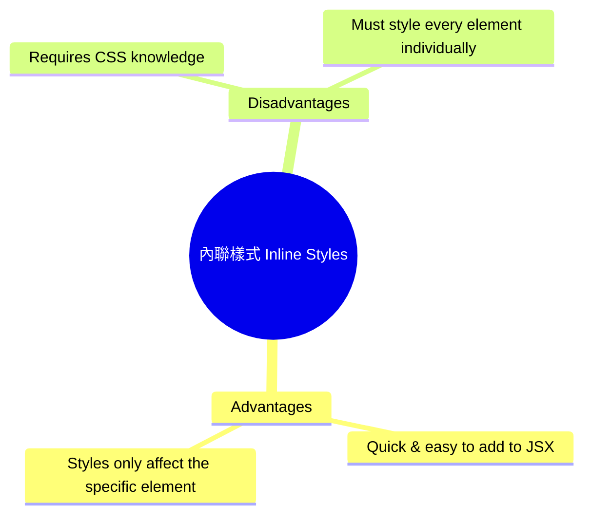
```mermaid
mindmap
  root((內聯樣式 Inline Styles))
    Advantages
      Quick & easy to add to JSX
      Styles only affect the specific element
    Disadvantages
      Requires CSS knowledge
      Must style every element individually
```

### 內聯樣式的維護挑戰

- **[缺點] 維護與重複性問題**
    - **[重複性工作]** 若有多個元素需要相同的樣式，必須對每個元素重複複製貼上 `style` 屬性及其物件內容
    - **[修改困難]** 一旦需要變更樣式，必須逐一找到所有相關元素並進行手動修改，不像 CSS 檔案可以透過單一規則一次性控制多個元素
- **[缺點] 缺乏關注點分離 (Separation of Concerns)**
    - **[程式碼混雜]** CSS 樣式與 JSX 結構程式碼混合在同一個檔案中，導致邏輯與樣式界線模糊
    - **[協作摩擦]** 這種寫法會增加開發與設計師之間的溝通成本
        - 開發者負責 JSX 的結構與邏輯
        - 設計師負責樣式設計
        - **[問題]** 由於樣式直接寫在 JSX 中，兩者必須頻繁切換並同時編輯同一個檔案，降低工作效率

### 內聯樣式的進階優點

- **[動態與條件式樣式]** 能夠非常簡單地根據邏輯設定樣式
    - 這是內聯樣式的一個重要優點，在接下來的課程中會深入探討
    - 能夠輕鬆實現根據不同條件 (conditional) 來改變元素樣式的需求

### 內聯樣式的進階應用：條件式樣式

- **[核心用途] 實現動態樣式切換**
    - 內聯樣式最大的優勢在於可以與 JavaScript 邏輯結合，根據元件的狀態（state）來決定套用哪些樣式
    - 例如：當輸入框內容無效時，動態改變其背景顏色
- **[實作流程] 從 CSS 轉向內聯樣式**
    - **步驟 1：觀察原始 CSS 定義**
        - 在 `index.css` 中，針對無效狀態定義了特定的樣式規則（例如 `.invalid` 類別）
        - 範例樣式包含顏色、邊框顏色與背景顏色等
    - **步驟 2：在 JSX 中轉換為條件式邏輯**
        - 移除原本透過 `className` 切換的邏輯
        - 改用 `style` 屬性，並使用 JavaScript 的三元運算子 (ternary operator) 來判斷是否套用樣式

```css
/* 原本在 index.css 中的無效狀態樣式範例 */
label.invalid {
  color: #f87171;
}

input.invalid {
  color: #ef4444;
  border-color: #f73f3f;
  background-color: #fed2d2;
}
```

- **[邏輯結構]**
    - 使用 `condition ? { styleObject } : {}` 的模式
    - 如果條件成立（例如 `isInvalid` 為 true），則套用包含樣式屬性的物件；否則套用空物件 `{}`

### 條件式樣式的動態實作

- **[核心邏輯]** 利用 JavaScript 的三元運算子來決定套用的樣式物件
    - 根據元件的狀態（例如 `emailNotValid`）來切換背景顏色
    - 若條件為 `true`（輸入無效），套用警告色（如紅色系）；若為 `false`（輸入有效），則套用預設背景色
- **[程式碼實作]** 在 `AuthInputs.jsx` 中，透過 `style` 屬性進行動態綁定

```jsx
// 在 AuthInputs.jsx 中的實作範例
<input
  type="email"
  style={{
    backgroundColor: emailNotValid ? '#fed2d2' : '#d1d5db'
  }}
  // ... 其他屬性
/>
```

- **[判斷條件來源]** 樣式的變化取決於預先定義好的布林值常數
    - 例如 `emailNotValid` 的定義如下：

```javascript
const emailNotValid = submitted && !enteredEmail.includes('@');
```

- **[實作流程圖]**

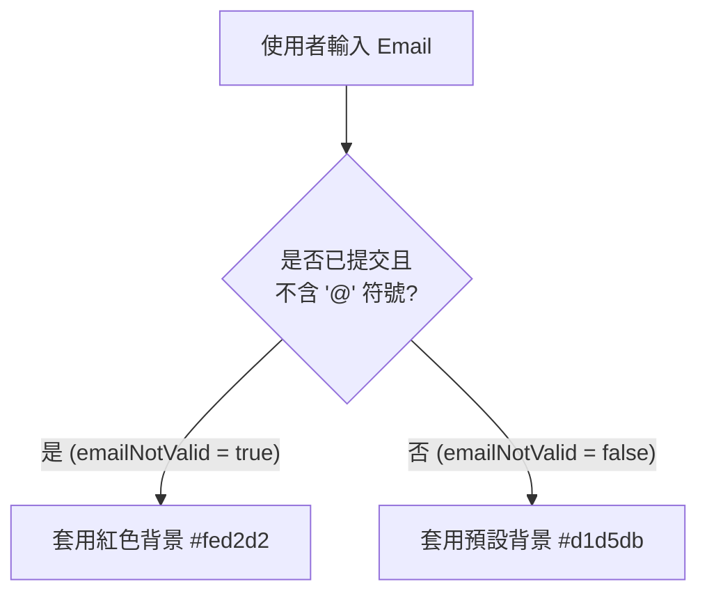
```mermaid
flowchart TD
    A[使用者輸入 Email] --> B{"是否已提交且<br/>不含 '@' 符號?"}
    B -- 是 (emailNotValid = true) --> C[套用紅色背景 #fed2d2]
    B -- 否 (emailNotValid = false) --> D[套用預設背景 #d1d5db]
```

### 條件式樣式的動態驗證

- **[測試動態效果]** 為了更清楚地觀察樣式切換，可以暫時將條件式樣式的數值改為更顯眼的顏色
    - 例如將原本的淡紅色 (`#fed2d2`) 改為純紅色 (`red`)
- **[實作結果]** 當點擊「Sign In」按鈕觸發驗證邏輯時，輸入框會立即呈現明顯的紅色背景，藉此驗證條件式樣式是否運作正常

```jsx
// 為了測試效果而暫時修改的樣式
<input
  type="email"
  style={{
    backgroundColor: emailNotValid ? 'red' : '#d1d5db'
  }}
  // ...
/>
```

- **[內聯樣式的持續挑戰]** 儘管內聯樣式在動態處理上很強大，但其缺點依然顯著
    - **[重複性問題]** 若多個欄位（如密碼輸入框）需要相同的驗證樣式，必須在每個組件中重複撰寫相同的樣式物件
    - **[程式碼品質]** 大量的 CSS 邏輯直接寫在 JSX 中，會導致組件檔案變得過於臃腫，降低程式碼的可讀性與維護性

### Vanilla CSS 的條件式樣式

- **[探索方向]** 除了內聯樣式，研究在不使用內聯樣式的情況下，如何利用 Vanilla CSS 實現條件式樣式
- **[策略切換] 從內聯樣式回歸外部 CSS**
    - 由於內聯樣式存在重複性高、程式碼臃腫等缺點，實際開發中更傾向於使用獨立的 CSS 檔案配合 `className` 來管理樣式
    - 這種做法能保持 JSX 的簡潔，並利用外部 CSS 的強大功能
- **[實作技巧] 條件式 Class Name 的正確寫法**
    - **核心邏輯**：使用三元運算子來決定是否套用特定的 CSS 類別
    - **關鍵細節**：若條件不成立（不需套用樣式），應將值設為 `undefined`，而不是空字串或使用 `&&` 簡寫，以確保不會意外套用錯誤的類別

```jsx
// 在 AuthInputs.jsx 中的實作範例
<input
  type="email"
  // 使用三元運算子：若無效則套用 'invalid'，否則設為 undefined
  className={emailNotValid ? 'invalid' : undefined}
  onChange={(event) => handleInputChange('email', event.target.value)}
/>
```

- **[對比分析] 樣式管理方式的選擇**

| 特性 | 內聯樣式 (Inline Styles) | 外部 CSS (Class Names) |
| --- | --- | --- |
| 動態性 | 極高，可直接結合 JS 變數 | 高，透過切換 Class Name 實現 |
| 程式碼整潔度 | 較差，容易使 JSX 變得臃腫 | 較佳，邏輯與樣式分離 |
| 重複使用性 | 低，需在每個元件重複撰寫 | 高，可在多個元件間共用類別 |

### 條件式 Class Name 的錯誤寫法與警告

- **[錯誤範例]** 使用 `&&` 運算子進行簡寫：

```jsx
// 錯誤做法：若 emailNotValid 為 false，className 會變成 false
<input
  type="email"
  className={emailNotValid && 'invalid'}
  onChange={(event) => handleInputChange('email', event.target.value)}
/>
```

- **[產生的問題]** React 會在 Console 拋出警告
    - 因為 `false` 並非有效的 HTML class 屬性值
    - 警告訊息會建議：若要條件式地省略 class，應使用 `className={condition ? 'value' : undefined}`
- **[正確做法]** 使用三元運算子確保在條件不成立時，值為 `undefined`，這樣 React 就不會將其渲染到 DOM 中

```jsx
// 正確做法：若條件不成立，則設為 undefined
<input
  type="email"
  className={emailNotValid ? 'invalid' : undefined}
  onChange={(event) => handleInputChange('email', event.target.value)}
/>
```

### 同時套用固定與動態 Class

- **[情境]** 有時一個元素需要同時擁有一個「永遠存在的固定 Class」以及一個「根據狀態切換的動態 Class"
- **[實作方式]** 使用模板字串 (Template Literals) 將兩者結合
    - 例如：一個 `<label>` 永遠需要 `label` 這個 class，但也可以根據狀態增加 `invalid` class

```jsx
// 範例：結合固定與動態 Class
<label className={`label ${emailNotValid ? 'invalid' : ''}`}>Email</label>
```

### CSS 選擇器的精確控制

- **[提升選擇器權重/精確度]** 若要讓樣式僅在特定條件下生效，可以透過組合類別來限制範圍
    - 例如，原本的 `.invalid` 可能會影響到所有帶有該類別的元素
    - 若將選擇器改為 `.label.invalid`，則樣式僅會套用於**同時擁有** `label` 與 `invalid` 兩個類別的元素

```css
/* index.css */

/* 只有當 label 同時具備 invalid class 時，才會改變顏色 */
label.invalid {
  color: #f87171;
}

input.invalid {
  color: #ef4444;
  border-color: #f73f3f;
  background-color: #fed2d2;
}
```

- **[實作挑戰]** 當 CSS 規則變得更嚴格時（例如要求必須同時具備兩個 class），React 中的 `className` 也必須正確地同時提供這些類別，否則樣式將無法觸發

### 在 React 中合併固定與動態 Class

- **[情境]** 當一個元素需要一個「基礎樣式類別」（永遠存在）以及一個「狀態樣式類別」（根據條件切換）時
- **[解決方案] 使用模板字串 (Template Literals)**
    - 透過反引號 (\`\` \` \`\`) 將固定字串與三元運算子的結果組合在一起，形成一個完整的 class 字串

```jsx
// AuthInputs.jsx 中的實作範例
<label
  className={`label ${emailNotValid ? 'invalid' : ''}`}
>
  Email
</label>
```

- **[邏輯解析]**
    - `label`：這是基礎類別，無論條件如何都會被加入
    - `${emailNotValid ? 'invalid' : ''}`：這是動態部分。若 `emailNotValid` 為真，則會加上 `invalid`；若為假，則加上空字串，不會影響原本的 `label` 類別

### 模板字串 (Template Literals) 的語法特性

- **[核心技術] 使用反引號 (Backticks)**
    - 在 JavaScript 中，使用反引號 (\`\` \` \`\`) 而非單引號或雙引號來建立字串，這稱為模板字串。
- **[語法細節] 變數插值 (Interpolation)**
    - 使用 `${expression}` 語法可以在字串中直接嵌入 JavaScript 表達式。
    - 此語法允許在同一個字串中同時包含「硬編碼 (hard-coded) 的固定值」與「動態注入的值」。
    - **靈活性**：可以在一個模板字串中注入多個不同的動態值，以建構更複雜的字串內容。

### 條件式 Class Name 的完整實作

- **[運作邏輯]** 透過模板字串組合，確保產生的 class 字串包含一個基礎類別與一個根據條件決定的類別
    - 最終產生的字串會是 `"label invalid"`（當條件成立時）或 `"label "`（當條件不成立時，後者因結尾空格不影響樣式）

```jsx
// AuthInputs.jsx 中的完整範例
<label className={`label ${emailNotValid ? 'invalid' : ''}`}>Email</label>

<input
  type="email"
  className={emailNotValid ? 'invalid' : undefined}
  onChange={(event) => handleInputChange('email', event.target.value)}
/>

// 同樣的邏輯可以套用到密碼欄位
<label className={`label ${passwordNotValid ? 'invalid' : ''}`}>Password</label>

<input
  type="password"
  className={passwordNotValid ? 'invalid' : undefined}
  onChange={(event) => handleInputChange('password', event.target.value)}
/>
```

- **[實際效果]** 當使用者點擊「Sign In」但輸入內容無效時，所有對應的標籤 (label) 都會同時觸發 `invalid` 樣式，呈現高亮提示
    - 這種做法能確保整個表單在錯誤狀態下，視覺回饋是同步且一致的

### 使用 Vanilla CSS 實作條件式樣式

- **[核心概念]** 雖然 Vanilla CSS 本身不具備組件作用域，但可以透過 React 的 `className` 屬性，結合 JavaScript 的邏輯判斷，來達成「根據狀態動態切換 CSS 類別」的效果。
- **[實作邏輯]**
    - 在 React 組件中，根據變數（如 `isValid` 或 `isError`）的布林值狀態，決定要套用哪一個 CSS Class。
    - 這種做法能將「樣式的定義」留在 CSS 檔案中，同時將「樣式的切換邏輯」留在 JSX 中，兼顧了樣式的集中管理與動態靈活性。

## Vanilla CSS 的優缺點分析

### 優點 (Advantages)

- **程式碼解耦 (Decoupled)**
    - CSS 程式碼與 JSX 程式碼是分離的，結構清晰
- **開發體驗佳**
    - 開發者可以依照既有的 CSS 習慣進行撰寫
- **低門檻**
    - 其他開發者不需要深入了解 JSX 的邏輯，只需具備基本的 CSS 知識即可進行樣式維護

### 缺點 (Disadvantages)

- **缺乏組件作用域 (Not scoped to components)**
    - CSS 規則會作用於整個文件，而非僅限於特定組件
- **[風險] 樣式衝突 (Style Clashing)**
    - 同一個 CSS Class 名稱可能在不同組件中被用於完全不同的目的，導致樣式互相干擾

### 樣式污染實例分析

- **[情境]** 在 `Header.css` 中定義了全域的 `p` 標籤樣式：

```css
/* Header.css */
p {
  text-align: center;
  color: #a39191;
  margin: 0;
}
```

- **[問題]** 由於 CSS 規則不具備作用域，這個 `p` 標籤的規則會影響到應用程式中所有的段落元素。例如，在 `AuthInputs.jsx` 中，原本不應置中的 `label` 因為被包裹在 `<p>` 標籤內，而意外地變成了置中對齊，這就是典型的「樣式污染」現象。

### CSS Modules

- **定義**
    - 一種讓 Vanilla CSS 具備檔案特定作用域 (file-specific scoping) 的解決方案
- **運作原理**
    - 透過 React 的建置程序 (build process) 來實作並強制執行樣式隔離
    - 讓開發者可以像寫一般 CSS 一樣撰寫規則，但不會影響到其他組件

### CSS Modules 的運作機制

- **核心原理**
    - 並非瀏覽器或 JavaScript 的原生功能
    - 透過建置工具（build tool）將 CSS 類別名稱進行轉換
    - 確保每個類別名稱在該檔案中是唯一的，從而達成樣式隔離
- **從標籤選擇器切換至類別選擇器**
    - **[原因]** 使用標籤選擇器（如 `p`）會影響所有同類標籤，而使用類別選擇器（如 `.paragraph`）則能實現精確控制
    - **實作範例**：

```css
/* Header.css */
    .paragraph {
      text-align: center;
      color: #a39191;
      margin: 0;
    }
```

```jsx
/* Header.jsx */
    <p className="paragraph">A community of artists and art-lovers.</p>
```

    - **[結果]** 只有明確加上 `className="paragraph"` 的元素會套用樣式，其他不具備此類別的 `p` 標籤（例如 `AuthInputs.jsx` 中的標籤）則不會受到影響。

### 啟用 CSS Modules

- **命名慣例**
    - 將 CSS 檔案重新命名為 `[文件名].module.css`（例如 `Header.module.css`）
    - 這個 `.module` 的命名模式是給底層建置工具（如 Vite）的一個信號，告訴它要以不同的方式處理此檔案
- **導入與使用方式的改變**
    - **[原因]** 由於建置工具會將 CSS 轉換為一個 JavaScript 物件，因此導入方式必須隨之改變
    - **實作流程**：

        1. 透過 `import styles from './Header.module.css'` 導入
        2. `styles` 會是一個由建置程序生成的 JavaScript 物件，其鍵值對應了轉換後的唯一類別名稱
        3. 在 JSX 中使用該物件的屬性來套用樣式，例如：

```jsx
/* Header.jsx */
import styles from './Header.module.css';

export default function Header() {
  return (
    <header>
      <h1>ReactArt</h1>
      <p className={styles.paragraph}>A community of artists and art-lovers.</p>
    </header>
  );
}
```

### 使用 CSS Modules 的類別名稱

- **[做法]** 不再直接使用字串作為 `className` 的值，而是從導入的 `classes` 物件中存取對應的屬性
    - **[原因]** 因為 `classes` 物件包含了由建置工具轉換後的唯一類別名稱
    - **實作範例**：

```jsx
/* Header.jsx */
import classes from './Header.module.css';

export default function Header() {
  return (
    <header>

      <h1>ReactArt</h1>
      {/* 使用 classes.paragraph 而非 "paragraph" */}
      <p className={classes.paragraph}>A community of artists and art-lovers.</p>
    </header>
  );
}
```

- **[觀察結果]** 當使用瀏覽器開發者工具檢查元素時，會發現 `className` 已被轉換為一個獨特的字串，例如：
    - `class="paragraph_swvrj_28"`
    - 這種後綴（如 `_swvrj_28`）確保了該名稱在全域範圍內是唯一的，從而防止樣式污染。

### CSS Modules 的渲染結果觀察

- **DOM 中的類別名稱**
    - **[觀察]** 在渲染後的 DOM 中，原本定義的類別名稱已被替換為建置工具生成的複雜字串
    - **範例**：原本的 `paragraph` 被轉換為 `paragraph_swvrj_28`
- **樣式注入機制**
    - **[位置]** 所有的 CSS 規則都會被注入到 HTML 的 `<head>` 區塊中
    - **[內容]** 在 `<head>` 的 `<style>` 標籤內，可以看到轉換後的類別名稱與對應的 CSS 規則
- **樣式隔離的最終實現**
    - **[原因]** 由於類別名稱在轉換過程中包含了唯一的雜湊值（hash），因此即使不同組件使用了相同的原始名稱（如 `.paragraph`），它們在最終產出的 HTML 中也會是完全不同的類別，從而徹底解決樣式污染問題。

### CSS Modules 的作用域實現

- **[核心機制]** 建置程序 (build process) 會將原始的 CSS 類別名稱進行轉換
    - **[範例]** 在 `Header.module.css` 中定義的 `.paragraph` 會被轉換成類似 `_paragraph_swvrj_28` 的唯一名稱
    - **[結果]** 即使其他組件（如 `AuthInputs.jsx`）中有同樣名稱的類別，也不會受到影響，因為它們的轉換結果會不同
- **[目的]** 透過這種轉換，確保 CSS 規則被精確地限制（scoped）在導入該模組的組件檔案內

### CSS Modules 的條件式 Class Name

- **[做法]** 與 Vanilla CSS 類似，可以使用 JavaScript 的條件邏輯來動態決定要套用的類別
- **[實作範例]** 使用模板字串 (Template Literals) 或三元運算子來結合固定類別與動態類別：

```jsx
/* AuthInputs.jsx */
<label
  className={`label ${emailNotValid ? 'invalid' : ''}`}
>
  Email
</label>
```

- **[說明]**
    - 這裡使用了模板字串 `...` 來組合字串
    - 如果 `emailNotValid` 為真，則會套用 `invalid` 這個類別
    - 這種方式允許在保持 CSS Modules 作用域優點的同時，也能保有高度的動態控制能力

### CSS Modules 的動態類別組合

- **[做法]** 在使用 CSS Modules 時，若要結合動態條件，可以將 `classes` 物件的屬性注入到模板字串中
    - **[原因]** 因為 `classes.propertyName` 的值最終會是一個由建置工具生成的唯一類別名稱字串
    - **實作範例**：

```jsx
/* Header.jsx */
import classes from './Header.module.css';

export default function Header() {
  return (
    <header>

      <h1>ReactArt</h1>
      {/* 使用模板字串將 CSS Module 的類別名稱注入 */}
      <p className={`${classes.paragraph}`}>A community of artists and art-lovers.</p>
    </header>
  );
}
```

- **[效果]** 這種做法結合了 Vanilla CSS 的靈活性與 CSS Modules 的安全性，既能動態切換樣式，又能確保樣式不會污染全域。

---

### CSS Modules 的優缺點分析

| 優點 (Advantages) | 缺點 (Disadvantages) |
| --- | --- |
| CSS 與 JSX 解耦：CSS 代碼可以獨立於 JSX 之外撰寫，方便維護與閱讀。 | (未在片段中詳細列出，通常指需要額外的建置步驟或語法複雜度) |
| 易於協作：不同開發者可以各自撰寫 CSS，而不用擔心影響到他人的組件。 |  |
| 自動作用域隔離：CSS 類別會被限制在導入該檔案的組件內，完全避免類別名稱衝突。 |  |

### CSS Modules 的缺點分析

- **仍需具備 CSS 知識**
    - **[原因]** 因為在使用 CSS Modules 時，底層撰寫的本質仍然是 Vanilla CSS
- **檔案數量增加**
    - **[問題]** 在大型專案中，若為每個組件都建立獨立的 CSS 模組檔案，會導致專案中出現大量相對微小的 CSS 檔案
    - **[範例]** 如同檔案瀏覽器中所示，除了 `Header.module.css` 外，可能還需要 `AuthInputs.module.css` 等多個檔案
    - **[影響]** 某些 CSS 檔案可能只包含極少量的樣式規則，增加檔案管理的複雜度

### Styled Components

- 一種用於 React 專案的熱門樣式化套件
- **[核心概念]** 不再使用獨立的 CSS 檔案，也不使用行內樣式 (inline styles)
    - 樣式是直接定義在特殊的「CSS 組件」之中
    - 這種方式將樣式與組件邏輯更緊密地結合在一起

### 安裝 Styled Components

- **[安裝方式]** 可以根據開發環境選擇不同的安裝手段
    - **本地開發環境 (Local)**
        - 開啟終端機 (Terminal) 並執行指令：

```bash
npm install styled-components
```

        - **注意**：安裝完成後，必須重新啟動開發伺服器 (Development Server) 才能生效
    - **CodeSandbox**
        - 在 `Dependencies` 區域直接搜尋並新增 `styled-components` 作為依賴項目即可
        - 不需要手動重新啟動伺服器
- **[後續步驟]** 安裝成功後，即可開始在組件中使用，例如在 `AuthInputs.jsx` 中嘗試為 `div` 元素定義樣式

### 使用 Styled Components 的基本步驟

- **[導入]** 首先需要在組件檔案中從 `styled-components` 導入 `styled` 物件
    - **實作範例**：

```jsx
/* AuthInputs.jsx */
import styled from 'styled-components';
```

- **[建立樣式化組件]** 使用 `styled` 物件搭配點符號 (dot notation) 來指定想要對應的 HTML 元素
    - **[原理]** `styled` 是一個 JavaScript 物件，其屬性會映射到不同的 HTML 標籤（如 `div`, `h1`, `h2` 等）
    - **[效果]** 這樣做會建立一個全新的 React 組件，該組件在渲染時會自動帶有你定義的樣式
    - **實作範例**：

```jsx
// 這會建立一個帶有自定義樣式的 <div> 組件
const StyledDiv = styled.div`
  /* 樣式將寫在這裡 */
`;
```

### Styled Components 的語法底層：標籤模板 (Tagged Templates)

- **[語法結構]** 在建立樣式化組件時，元素屬性後必須接上兩個反引號 (backticks)
    - **[實作範例]**：

```jsx
/* AuthInputs.jsx */
import styled from 'styled-components';

styled.div`
  /* 樣式內容寫在這裡 */
`;
```

- **[核心機制] Tagged Templates**
    - 這並非 React 或 `styled-components` 特有的語法，而是標準的 **JavaScript 特性**
    - **[原理]** 標籤模板運作起來就像一個函數，它會接收後方的「模板字面量」(template literal) 作為輸入進行處理
    - **[作用]** 在這個情境下，該函數接收樣式字串，並將其轉換為應用在組件上的樣式

### 將 CSS 遷移至 Styled Components

- **[操作流程]** 當需要將原本使用 Vanilla CSS 的元素改用 Styled Components 時，可以將樣式從 `.css` 檔案中複製並貼入樣式化組件的模板字串中
    - **[實作步驟]**

        1. 在 JSX 中找出目標元素（例如 `className="controls"` 的 `div`）
        2. 回到對應的 CSS 檔案（如 `index.css`）找到該類別的樣式規則
        3. 將規則複製並貼入 `styled.div` 的反引號 (backticks) 之間

- **[語法優勢]** 在 Styled Components 的模板字串中，可以直接撰寫標準的 CSS 語法
    - **[與內聯樣式的區別]** 不同於 React 內聯樣式必須使用小駝峰式命名 (camelCase)，在 Styled Components 中**不需要**進行轉換，可以直接使用連字號（如 `background-color` 或 `margin-bottom`）

### 建立可重複使用的樣式化容器組件

- **[建立容器組件]** 可以將 Styled Components 定義的樣式儲存在一個常數中，建立一個專用的容器組件
    - **[命名建議]** 根據用途命名，例如 `ControlContainer` 或 `ControlDiv`
    - **[實作範例]**：

```jsx
/* AuthInputs.jsx */
const ControlContainer = styled.div`
  display: flex;
  flex-direction: column;
  gap: 0.5rem;
  margin-bottom: 1.5rem;
`;
```

- **[利用&#32;`children`&#32;Prop]** Styled Components 建立的組件會自動包含 React 的 `children` prop
    - **[作用]** 這使得該組件可以像一般的 HTML 標籤一樣，用來包裹（wrap）其他的內容或組件
- **[替換原生元素]** 在 JSX 中，可以使用自定義的樣式化組件來取代原本的 HTML `div`，讓程式碼結構更具語意化且易於維護
    - **[實作範例]**：

```jsx
/* 使用前 */
<div className="controls">
  {/* ...內容... */}
</div>

/* 使用後 */
<ControlContainer>
  {/* ...內容... */}
</ControlContainer>
```

### Styled Components 的底層運作機制

- **[運作原理]** Styled Components 套件在底層會執行以下兩個動作
    - **產生唯一類別名稱**：為每個樣式化組件建立一個獨一無二的 CSS class name
    - **注入樣式規則**：將這些 class 對應的樣式規則定義在 HTML 文件的 `<head>` 區塊中
- **[驗證方式]** 可以透過瀏覽器開發者工具 (Inspect) 來觀察
    - **DOM 結構**：在元素上會看到自動產生的類別名稱（例如 `sc-bcPKhP.cDUXnA`）
    - **Styles 面板**：可以看到該元素所套用的樣式屬性，這些屬性實際上是來自於注入到 `<head>` 中的 CSS 規則

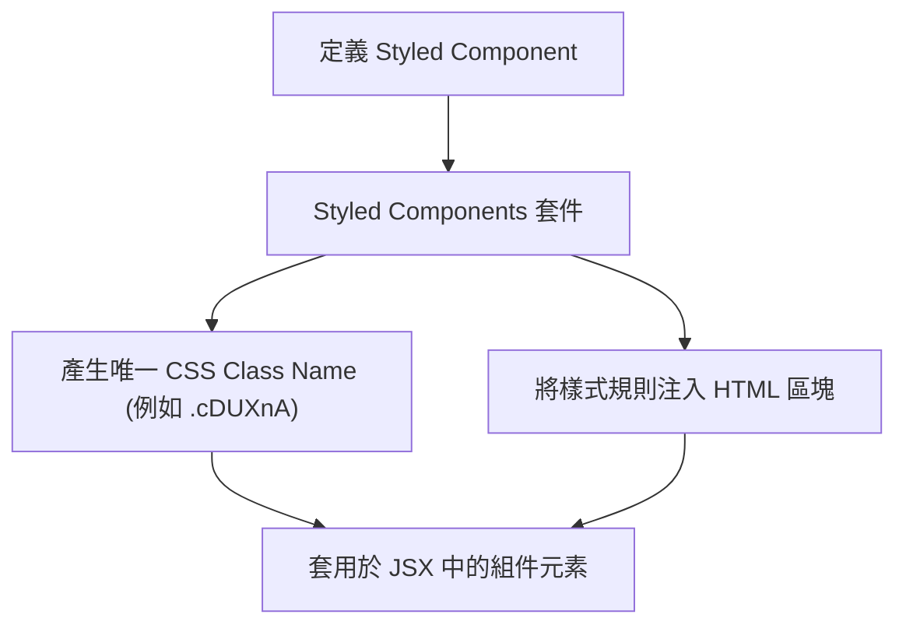
```mermaid
flowchart TD
    A[定義 Styled Component] --> B[Styled Components 套件]
    B --> C["產生唯一 CSS Class Name (例如 .cDUXnA)"]
    B --> D["將樣式規則注入 HTML <head> 區塊"]
    C --> E[套用於 JSX 中的組件元素]
    D --> E
```

### Styled Components 的元素生成與樣式注入

- **[元素生成機制]** Styled Components 會根據開發者指定的 HTML 標籤來建立對應的元素
    - **[實作邏輯]** 當使用 `styled.div` 時，產生的組件在渲染後會是一個 `<div>` 元素；若改用 `styled.p`，則會變成 `<p>` 元素
    - **[範例]**：

```jsx
/* 如果這樣寫 */
const MyComponent = styled.div` ... `;

/* 渲染結果會是 */
<div class="..."></div>
```

- **[樣式注入機制]** 雖然組件在 DOM 中有其位置，但其定義的 CSS 規則是透過套件動態注入到 HTML 的 `<head>` 區塊中
    - **[驗證方式]** 可以透過瀏覽器開發者工具觀察 `<head>` 內的 `<style>` 標籤，確認樣式規則是否已成功載入
- **[樣式遺失的處理]** 在從 Vanilla CSS 遷移到 Styled Components 的過程中，若移除了原本的 `className`（例如 `controls`），則必須確保對應的樣式已經完整遷移至 Styled Components 的定義中，否則會導致樣式失效

### 混合使用不同的樣式方案

- **[相容性]** Styled Components 可以與其他樣式處理方式（例如 CSS Modules）混合使用，不會產生衝突
    - **[實務建議]** 雖然技術上可以混合，但通常建議在整個應用程式中統一使用一種主要的樣式方案，以保持程式碼的一致性

### 建立樣式化 Label 組件

- **[建立組件]** 可以透過 `styled.標籤名稱` 來建立一個專屬的樣式化組件
    - **[命名規範]** 由於樣式化組件本質上是 React 組件，因此變數名稱應以**大寫字母**開頭
    - **[實作範例]**：

```jsx
/* AuthInputs.jsx */
const Label = styled.label`
  /* 樣式規則寫在這裡 */
`;
```

### 從 Vanilla CSS 遷移樣式至 Styled Components

- **[遷移流程]** 當原本的組件樣式因為缺乏作用域或結構改變而失效時，可以將原本在 `index.css` 中定義的樣式規則複製並貼上到 Styled Components 的定義中
    - **[實作步驟]**

        1. 從 `index.css` 找到目標元素的樣式規則
        2. 將規則放入 Styled Component 的模板字串中
        3. 在 JSX 中將原本的 HTML 標籤（如 `label`）替換為該樣式化組件（如 `Label`）

- **[實作範例]**：

```jsx
/* 1. 在 Styled Components 中定義樣式 (從 index.css 遷移過來) */
const Label = styled.label`
  display: block;
  margin-bottom: 0.5rem;
  font-size: 0.75rem;
  font-weight: 700;
  letter-spacing: 0.1em;
  text-transform: uppercase;
  color: #6b7280;
`;

/* 2. 在 JSX 中使用該組件取代原生標籤 */
<Label className={`label ${emailNotValid ? 'invalid' : ''}`}>
  Email
</Label>
```

- **[樣式與條件邏輯的共存]**
    - **[觀察結果]** 即使使用了 Styled Components，原本透過 `className` 進行的條件式樣式（例如 `${emailNotValid ? 'invalid' : ''}`）仍然可以正常運作
    - **[原因]** 這是因為 Styled Components 在渲染時會將其產生的唯一類別名稱與開發者手動指定的 `className` 同時應用在元素上，兩者可以疊加運作

### Styled Components 的 Props 轉發機制

- **[核心特性]** Styled Components 不僅僅是提供 `children` prop 來包裝內容，它還會將開發者設定在樣式化組件上的所有屬性 (props) 自動轉發給底層的內建 JSX 元素
    - **[運作方式]** 當你建立一個 `styled.label` 時，它在底層會建立一個原生的 `<label>` 元素，並將所有傳入的屬性直接作用於該元素
    - **[轉發範例]**：

```jsx
/* 這裡的 Label 組件會將所有 props 轉發給底層的 <label> */
<Label
  className="label"
  onChange={(event) => handleInputChange('email', event.target.value)}
  type="email"
>
  Email
</Label>
```

- **[實務優勢]** 這種機制提供了極大的便利性，因為你不需要手動處理屬性轉發，就可以直接在樣式化組件上實現以下功能：
    - **設定 Class Name**：用於結合其他的 CSS 類別或進行條件式樣式處理
    - **添加事件監聽器**：例如設定 `onChange`、`onClick` 等屬性來處理使用者互動
    - **設定 HTML 屬性**：例如設定 `type="email"` 或 `placeholder` 等原生屬性

### 從內聯樣式遷移至 Styled Components

- **[遷移流程]** 當原本使用內聯樣式來處理複雜邏輯（例如驗證狀態）時，可以透過以下步驟將其轉化為 Styled Components，以提升程式碼的可讀性與維護性
    - **[實作步驟]**

        1. 在組件檔案中建立一個新的樣式化組件常數（例如 `const Input = styled.input` `...`）
        2. 將原本定義在 JSX `style` 屬性中的 CSS 規則，複製並貼上到該樣式化組件的模板字串中
        3. 在 JSX 中將原本的原生 `<input>` 標籤替換為新建立的樣式化組件

- **[實作範例]**：

```jsx
/* 1. 定義樣式化組件 (從原本的 inline style 遷移過來) */
const Input = styled.input`
  width: 100%;
  padding: 0.75rem 1rem;
  line-height: 1.5;
  border: 1px solid transparent;
  border-radius: 0.25rem;
  box-shadow: 0 1px 3px 0 rgba(0, 0, 0, 0.1), 0 1px 2px 0 rgba(0, 0, 0, 0.06);
  /* 處理驗證狀態的動態樣式 */
  background-color: ${props => props.emailNotValid ? '#fed2d2' : '#d1d5db'};
`;

/* 2. 在 JSX 中使用，無需修改原本的 props 傳遞 */
<Input
  type="email"
  emailNotValid={emailNotValid}
  className={emailNotValid ? 'invalid' : undefined}
  onChange={(event) => handleInputChange('email', event.target.value)}
/>
```

- **[遷移後的優勢]**
    - **[保持功能完整]** 不需要更改原本傳遞給元素的 props（如 `type`、`onChange` 等），因為 Styled Components 會自動轉發這些屬性
    - **[動態驗證依然有效]** 透過在樣式定義中使用函式來讀取 props（例如 `${props => props.emailNotValid ? ...}`），可以完美保留原本的條件式樣式邏輯，並讓樣式與 JSX 結構分離

### Styled Components 的功能完整性

- **[Props 運作驗證]** 透過實作輸入框的驗證邏輯，證實了 Styled Components 不會干擾組件的原生功能
    - **[onChange 驗證]** `onChange` 事件監聽器能正常運作，輸入的值能即時反映在狀態中
    - **[邏輯連動]** 由於屬性正確轉發，輸入值的改變能正常觸發表單驗證邏輯（例如：輸入有效值後，驗證狀態會隨之改變）

### Styled Components 的核心理念

- **[包裝組件化]** 其核心概念是建立一系列小的「包裝組件」(wrapper components)
    - 你可以將這些組件在應用程式中重複使用，提升開發效率
- **[與內聯樣式的差異]** 相比於內聯樣式 (inline styles)，Styled Components 提供了更好的結構
    - **樣式位置**：樣式雖然在邏輯上「靠近」JSX，但並非直接寫在 JSX 標籤內，而是定義在獨立的組件中
    - **避免重複**：這種做法避免了在 JSX 中撰寫大量重複的樣式定義，使 JSX 結構保持簡潔

```jsx
/* 樣式定義在組件中，而非直接寫在 JSX 標籤的 style 屬性裡 */
const ControlContainer = styled.div`
  display: flex;
  flex-direction: column;
  gap: 0.5rem;
  margin-bottom: 1.5rem;
`;

const Label = styled.label`
  display: block;
  margin-bottom: 0.5rem;
  font-size: 0.75rem;
  font-weight: 700;
  letter-spacing: 0.1em;
  text-transform: uppercase;
  color: #6b7280;
`;
```

- **[後續課題]** 如何在這種架構下處理動態 (dynamic) 或條件式 (conditional) 的樣式設定？

### 樣式方案的一致性

- **[避免混合模式]** 雖然可以同時使用 Styled Components 與 Vanilla CSS，但實務上建議在專案中統一使用一種解決方案
    - 若已決定使用 Styled Components，則應盡量避免透過 `className` 來動態切換 CSS 類別
- **[目前的實作限制]** 目前的條件式樣式仍是透過動態添加 CSS Class 來達成，這不符合純粹的 Styled Components 開發模式

```jsx
/* 目前仍在使用 className 的混合模式範例 */
<Label className={`label ${emailNotValid ? 'invalid' : ''}`}>Email</Label>

<Input
  type="email"
  style={{
    // backgroundColor: emailNotValid ? '#fed2d2' : '#d1d5db'
  }}
  className={emailNotValid ? 'invalid' : undefined}
  onChange={(event) => handleInputChange('email', event.target.value)}
/>
```

### Styled Components 的動態樣式實作

- **[自定義 Props]** 由於 Styled Components 本質上仍是 React 組件，你可以為它們定義任何名稱的 props，而不必受限於 HTML 標準屬性
    - **[彈性設計]** prop 的名稱可以由開發者自由決定，這讓組件的 API 設計更加直觀
    - **[傳遞狀態]** 可以將邏輯判斷後的布林值（如 `emailNotValid`）直接作為 prop 傳遞給組件

```jsx
/* 將布林值狀態傳遞給自定義的 Label 組件 */
<Label invalid={emailNotValid}>Email</Label>
```

- **[透過 Props 驅動樣式]** 在 Styled Components 的樣式定義中，可以使用函式來存取這些傳入的 props，並根據其值動態改變 CSS 屬性

```javascript
/* 在樣式定義中使用 props 進行動態切換 */
const Label = styled.label`
  /* ... 其他樣式 ... */
  color: ${props => props.invalid ? '#ff0000' : '#6b7280'};
`;
```

- **[開發優勢]** 這種做法將「樣式邏輯」與「組件結構」緊密結合，同時保持了 JSX 的乾淨，實現了真正的組件化樣式管理。

### 從 CSS 規則遷移動態樣式

- **[提取顏色值]** 觀察原本在 `index.css` 中定義的 `.label.invalid` 樣式，其顏色設定為 `#f87171`
    - 這個顏色在無效狀態下會將文字轉變為紅色
- **[使用注入語法]** 在 Styled Components 中，可以使用特殊的注入語法（`${}`）在樣式字串中嵌入 JavaScript 邏輯
    - **[動態建構字串]** 這種語法允許在樣式定義之間插入函式，進而根據傳入的 props 來決定最終的 CSS 屬性值

```javascript
/* 使用注入語法根據 props 動態設定顏色 */
const Label = styled.label`
  display: block;
  margin-bottom: 0.5rem;
  font-size: 0.75rem;
  font-weight: 700;
  letter-spacing: 0.1em;
  text-transform: uppercase;
  color: ${props => props.invalid ? '#f87171' : '#6b7280'};
`;
```

### Tagged Templates 的運作原理

- **[注入機制]** 當在樣式字串中使用 `${}` 注入一個箭頭函式作為值時，這個函式並非直接變成字串，而是會被傳遞給底層的處理函式
    - **[執行流程]** 注入的動態值會被 `styled` 套件定義的函式（例如 `label` 函式）接收並執行
    - **[參數傳遞]** 標籤模板函式會接收這些注入的動態值作為參數，進而根據這些值來決定最終產出的 CSS 內容

```javascript
/* 樣式定義中的注入範例 */
const Label = styled.label`
  /* ... 其他樣式 ... */
  color: ${() => '#6b7280'}; // 這裡的箭頭函式會被 styled 套件接收並處理
`;
```

- **[底層技術]** 這種語法結構利用了 JavaScript 原生的 **Tagged Templates** 特性，而非 React 或特定套件所專有的語法

### Styled Components 動態值的執行機制

- **[函式執行]** 當在樣式定義中使用注入語法時，Styled Components 會執行該函式以動態推導出應使用的數值
    - **[自動傳入 Props]** 為了協助推導動態值，Styled Components 套件會將 `props` 物件作為輸入參數傳遞給該函式
    - **[屬性存取]** 該 `props` 物件包含了所有設定在該樣式化組件上的屬性（例如前面定義的 `invalid` prop）
- **[實作方式]** 開發者可以透過存取 `props.xxx` 或使用 JavaScript 的**解構賦值 (Destructuring)** 來簡化程式碼

```javascript
/* 方法一：直接存取 props 物件 */
const Label = styled.label`
  /* ... */
  color: ${props => props.invalid ? '#f87171' : '#6b7280'};
`;

/* 方法二：使用解構賦值 (Destructuring) 取得特定屬性 */
const Label = styled.label`
  /* ... */
  color: ${({ invalid }) => invalid ? '#f87171' : '#6b7280'};
`;
```

### 從靜態樣式到動態推導

- **[從硬編碼到動態]** 在遷移過程中，原本在 CSS 中寫死的顏色值（如無效狀態下的紅色）被替換成了基於 props 的動態邏輯
    - **[不再依賴 ClassName]** 由於樣式是直接透過 Styled Components 的程式碼進行動態計算，因此不再需要透過手動添加或移除 `invalid` 等 CSS class 來改變外觀
- **[樣式驅動機制]** 樣式現在是根據組件目前的 props 狀態「推導」(derived) 出來的

```javascript
/* 樣式現在是動態推導的，而非依賴外部 class */
const Label = styled.label`
  display: block;
  margin-bottom: 0.5rem;
  font-size: 0.75rem;
  font-weight: 700;
  letter-spacing: 0.1em;
  text-transform: uppercase;
  color: ${({ invalid }) => invalid ? '#f87171' : '#6b7280'};
`;
```

- **[驗證結果]** 當重新整理頁面並觸發驗證失敗時，標籤會自動呈現錯誤樣式，這是因為 Styled Components 偵測到了 `invalid` prop 的變化並即時重新計算了 CSS 值，而非透過切換 CSS class。

### Styled Components 條件式樣式的實作總結

- **[核心機制]** 條件式樣式的改變並非透過切換 CSS Class，而是透過傳遞新的 props 給樣式化組件
    - **[運作原理]** 當 props 發生變化時，Styled Components 會偵測到並重新執行樣式定義中的邏輯，進而更新產出的 CSS
- **[實作練習]** 接下來將在 `Input` 組件上實作條件式樣式，以應對輸入驗證失敗的情況。

### 在 Input 組件上實作條件式樣式

- **[同步 Props]** 為了保持視覺邏輯的一致性，`Input` 組件應使用與 `Label` 相同的 `invalid` prop
    - **[傳遞方式]** 在 JSX 中，將驗證狀態變數（如 `emailNotValid`）作為 `invalid` 屬性的值傳遞給 `Input` 組件

```javascript
/* 在 JSX 中傳遞 invalid prop */
<Input
  invalid={emailNotValid}
  type="email"
  /* ... */
/>
```

- **[遷移 CSS 屬性]** 需要將原本在 `.invalid` 類別下定義的所有動態屬性，遷移到 Styled Components 的樣式定義中
    - **[目標屬性]** 根據原本的 CSS 規則，當狀態為無效時，需要動態調整以下三個屬性：
        - `color` (文字顏色)
        - `border-color` (邊框顏色)
        - `background-color` (背景顏色)

```css
/* 原本在 CSS 檔案中的規則參考 */
input.invalid {
  color: #ef4444;
  border-color: #f73f3f;
  background-color: #fed2d2;
}
```

- **[動態設定目標]** 在 `styled.input` 的定義中，將針對這些屬性使用注入語法，根據 `invalid` prop 的值來切換對應的顏色。

### 實作 Input 的動態樣式

- **[使用注入語法]** 透過 `${({ invalid }) => ...}` 的語法，可以根據 `invalid` prop 的布林值來決定 CSS 屬性的值
    - **[背景顏色切換]** 若 `invalid` 為 `true`，則套用特定的錯誤背景色，否則使用預設顏色
    - **[文字顏色切換]** 同樣地，文字顏色也需要根據 `invalid` 狀態來切換，以確保視覺上的錯誤提示

```javascript
const Input = styled.input`
  /* ... 其他樣式 */
  background-color: ${({ invalid }) => invalid ? '#fed2d2' : '#d1d5db'};
  color: ${({ invalid }) => invalid ? '#ef4444' : '#374151'};
`;
```

- **[對照原始 CSS 規則]** 遷移時需確保動態設定的值與原本 CSS 檔案中 `.invalid` 類別定義的顏色一致：
    - `color`: `#ef4444` (當無效時)
    - `border-color`: `#f73f3f` (當無效時)
    - `background-color`: `#fed2d2` (當無效時)

### 完成 Input 的動態樣式遷移

- **[文字顏色切換]** 除了背景色，文字顏色也需根據 `invalid` 狀態進行動態調整
    - **[邏輯實作]** 透過解構 `props` 並檢查 `invalid` 是否為 truthy，來決定使用錯誤的紅色 (`#ef4444`) 還是預設的深灰色 (`#374151`)
- **[邊框顏色切換]** 邊框顏色同樣需要根據驗證狀態進行切換
    - **[預設值處理]** 可以使用條件運算子，當 `invalid` 為 `true` 時套用錯誤的邊框色 (`#f73f3f`)，否則則設為 `transparent`（透明），以避免在非錯誤狀態下顯示不必要的邊框

```javascript
const Input = styled.input`
  width: 100%;
  padding: 0.75rem 1rem;
  line-height: 1.5;
  background-color: ${({ invalid }) => invalid ? '#fed2d2' : '#d1d5db'};
  color: ${({ invalid }) => invalid ? '#ef4444' : '#374151'};
  border: 1px solid ${({ invalid }) => invalid ? '#f73f3f' : 'transparent'};
  border-radius: 0.25rem;
  box-shadow: 0 1px 3px rgba(0, 0, 0, 0.1), 0 1px 2px rgba(0, 0, 0, 0.06);
`;
```

### 驗證動態樣式實作

- **[驗證結果]** 儲存並重新整理頁面後，當提交處於無效狀態時，輸入框會正確套用先前定義的動態樣式（如紅色背景與邊框）
- **[套用範圍]** 此動態樣式模式目前已成功應用於 `Label` 與 `Input` 組件

### 擴充條件式樣式至多個欄位

- **[實作邏輯]** 為了讓其他欄位（如密碼欄位）也能擁有相同的視覺反饋，必須在 JSX 中傳遞對應的驗證屬性
- **[密碼欄位實作]** 在 Password 的 `Input` 組件上，需確保傳遞的是與密碼驗證狀態相關的 prop（例如 `passwordNotValid`）

```javascript
/* 密碼欄位的實作範例 */
<Label
  className={`label ${passwordNotValid ? 'invalid' : ''}`}
>
  Password
</Label>
<Input
  invalid={passwordNotValid}
  type="password"
  /* ... */
/>
```

### Styled Components 的 Props 衝突風險

- **[避免屬性衝突]** 在將 props 注入 Styled Components 時，必須確保自定義的 prop 名稱不會與 HTML 元素的內建屬性（built-in props）發生衝突
- **[React 控制台警告]** 若將自定義屬性（例如 `invalid`）直接傳遞給原生 HTML 元素，React 會在控制台發出警告，因為這被視為將非標準屬性寫入 DOM
    - **[警告內容]** `Warning: Received false for a non-boolean attribute 'invalid'. If you want to write it to the DOM, pass a string instead: invalid="false" or invalid={value.toString()}.`
    - **[原因分析]** 這是因為 React 試圖將該屬性同步到實際的 DOM 節點上，但 `invalid` 並非 HTML 標準屬性

```javascript
/* 導致警告的實作範例 */
<Label invalid={passwordNotValid}>
  Password
</Label>
<Input
  invalid={passwordNotValid}
  type="password"
  /* ... */
/>
```

### 使用 Transient Props 解決屬性衝突

- **[衝突問題]** 當自定義的 prop 名稱與 HTML 元素的內建屬性（built-in props）重疊時，會導致 React 發出警告
    - **[範例]** 在 `<input>` 元素上使用 `invalid` 作為 prop，因為 `invalid` 是 input 的內建屬性，React 會試圖將其寫入 DOM 並發出警告
    - **[警告訊息]** `Warning: Received false for a non-boolean attribute 'invalid'. If you want to write it to the DOM, pass a string instead...`
- **[解決方案：Transient Props]** 使用 `$` 前綴來標記僅供樣式使用的屬性
    - **[運作原理]** 在 Styled Components 中，以 `$` 開頭的 prop 被視為「暫時性屬性」，它們只會被用於樣式邏輯中，而不會被轉發（forwarded）到底層的 HTML 元素上
    - **[優點]** 既能保持 JavaScript 語法的合法性，又能有效避免與原生 DOM 屬性衝突

```javascript
/* 使用 $ 前綴避免衝突的實作範例 */

// 1. 定義樣式化組件時使用 $invalid
const Input = styled.input`
  background-color: ${({ $invalid }) => $invalid ? '#fed2d2' : '#d1d5db'};
  /* ... 其他樣式 */
`;

// 2. 在 JSX 中傳遞 $invalid prop
<Input
  $invalid={passwordNotValid}
  type="password"
/>
```

- **[驗證結果]** 透過將 `invalid` 改為 `$invalid` 後，重新整理頁面，應用程式的功能與視覺效果完全如預期，且原本出現在控制台的警告訊息已消失

### Styled Components 的進階功能

- **[支援能力]** Styled Components 能夠完整支援標準 CSS 的進階特性，這讓開發者在 React 組件中也能處理複雜的樣式邏輯
    - **媒體查詢 (Media Queries)**：可以根據螢幕尺寸調整樣式
    - **偽選擇器 (Pseudo-selectors)**：例如處理 `:hover` 等使用者互動狀態
    - **巢狀規則 (Nested Rules)**：可以在一個樣式定義中編寫層級結構

### 實作範例：媒體查詢與巢狀規則

- **[實作步驟]** 在 `Header.jsx` 中，將原本的 HTML `header` 標籤替換為透過 `styled` 建立的組件

```javascript
/* Header.jsx 的實作範例 */
import styled from 'styled-components';
import logo from '../assets/logo.png';

const Header = styled.header`
  /* 巢狀規則範例 */
  h1 {
    font-size: 2.25rem;
  }

  /* 媒體查詢範例 */
  @media (min-width: 768px) {
    header {
      margin-bottom: 4rem;
    }
  }
`;

export default function Header() {
  return (
    <Header>

      <h1>ReactArt</h1>
      <p>A community of artists and art-lovers.</p>
    </Header>
  );
}
```

### 實作範例：偽選擇器 (Pseudo-selectors)

- **[實作內容]** 可以在樣式定義中使用 `.button:hover` 等語法來處理互動效果

```css
/* 樣式定義中的偽選擇器範例 */
.button:hover {
  background-color: #f0920e;
}
```

### 從 CSS Modules 轉換至 Styled Components

- **[轉換策略]** 將原本依賴外部 CSS 檔案（如 `Header.module.css`）的組件，改為在同一個檔案中定義 Styled Components，以實現樣式的封裝與集中管理。
- **[處理命名衝突]** 在建立樣式化組件時，若名稱與現有的函數或 HTML 標籤衝突，應使用更具描述性的名稱（例如使用 `StyledHeader` 而非 `Header`）

```javascript
/* Header.jsx 的轉換實作範例 */
import styled from 'styled-components';
import logo from '../assets/logo.png';

// 1. 建立 Styled Component，並將原本 CSS 中的規則搬移至此
const StyledHeader = styled.header`
  display: flex;
  flex-direction: column;
  align-items: center;
  justify-content: center;
  margin-top: 2rem;
  margin-bottom: 2rem;

  img {
    object-fit: contain;
    margin-bottom: 2rem;
    width: 11rem;
    height: 11rem;
  }

  h1 {
    font-size: 1.5rem;
    font-weight: 600;
    letter-spacing: 0.4em;
  }
`;

// 2. 在組件中使用 StyledHeader 取代原生 <header>
export default function Header() {
  return (
    <StyledHeader>

      <h1>ReactArt</h1>
      <p>A community of artists and art-lovers.</p>
    </StyledHeader>
  );
}
```

### 樣式遷移中的潛在陷阱

- **[遷移不完全的風險]** 在將組件從 CSS Modules 轉換為 Styled Components 的過程中，如果只替換了 HTML 標籤，卻沒有移除舊有的 CSS 檔案導入與 `className`，會導致樣式依賴變得混亂
    - **現象**：頁面看起來可能正常，但實際上樣式仍是由舊的 CSS 規則支撐
    - **後果**：一旦移除舊的 CSS 檔案或 `className`，組件樣式會立即崩潰（例如圖片尺寸錯誤、文字排版跑掉）

```javascript
/* 錯誤的遷移狀態範例：混合了 Styled Component 與舊有的 class */
import { styled } from 'styled-components';
import classes from './Header.module.css'; // ❌ 應移除的舊 CSS 導入

const StyledHeader = styled.header`
  display: flex;
  /* ...其他樣式... */
`;

export default function Header() {
  return (
    <StyledHeader>

      <h1>ReactArt</h1>
      {/* ❌ 應移除的舊 class 名稱，否則樣式會依賴於此 */}
      <p className={classes.paragraph}>A community of artists and art-lovers.</p>
    </StyledHeader>
  );
}
```

### 樣式遷移的替代方案：直接遷移 CSS 規則

- **[轉換思路]** 在進行樣式化轉換時，除了將每個 HTML 元素（如 `` 或 `<h1>`）分別建立為 Styled Component 外，也可以選擇更快速的路徑：直接將原本 CSS 模組檔案中的完整樣式規則複製到 Styled Components 的定義中。
- **[保留進階規則]** 這種做法可以完整保留原本 CSS 中的複雜規則，例如媒體查詢 (media queries)，而不需要重新撰寫一遍。

```javascript
/* Header.jsx 的完整遷移範例 */
import styled from 'styled-components';
import logo from '../assets/logo.png';

const StyledHeader = styled.header`
  display: flex;
  flex-direction: column;
  align-items: center;
  justify-content: center;
  margin-top: 2rem;
  margin-bottom: 2rem;

  /* 直接從 Header.module.css 複製過來的規則 */
  img {
    object-fit: contain;
    margin-bottom: 2rem;
    width: 11rem;
    height: 11rem;
  }

  h1 {
    font-size: 1.5rem;
    font-weight: 600;
    letter-spacing: 0.4em;
    text-align: center;
    text-transform: uppercase;
    color: #9a3412;
    font-family: 'Pacifico', cursive;
  }

  /* 包含媒體查詢的規則也能直接遷移 */
  @media (max-width: 600px) {
    /* ...原本的媒體查詢內容... */
  }
`;

export default function Header() {
  return (
    <StyledHeader>

      <h1>ReactArt</h1>
    </StyledHeader>
  );
}
```

### Styled Components 的巢狀選擇器

- **[使用&#32;`&`&#32;符號]** 在 Styled Components 的樣式定義中，可以使用 `&` 符號來代表當前的包裝組件（即目前的 Styled Component 本身）。
- **[目標子元素]** 透過 `&` 加上空格與 HTML 標籤名稱，可以針對該組件內部的特定子元素設定樣式。
    - 例如：使用 `& img` 可以針對 `StyledHeader` 內部的所有 `img` 元素進行設定。
    - 同理，可以使用 `& h1` 或 `& p` 來分別針對內部的標題與段落進行樣式控制。

```javascript
/* StyledHeader 的巢狀樣式範例 */
const StyledHeader = styled.header`
  display: flex;
  /* ...其他屬性... */

  /* 針對內部的 img 元素 */
  & img {
    object-fit: contain;
    margin-bottom: 2rem;
    width: 11rem;
    height: 11rem;
  }

  /* 針對內部的 h1 元素 */
  & h1 {
    font-size: 1.5rem;
    font-weight: 600;
    /* ...其他屬性... */
  }

  /* 針對內部的 p 元素 */
  & p {
    text-align: center;
    color: #a39191;
    margin: 0;
  }
`;
```

### Styled Components 中的媒體查詢與巢狀選擇器

- **[結合&#32;`&`&#32;與媒體查詢]** 在 Styled Components 的樣式定義中，可以在媒體查詢 (`@media`) 區塊內，利用 `&` 符號來精確控制樣式。
- **[針對組件本身]** 在媒體查詢中使用 `&` 可以代表該 Styled Component 本身，當符合媒體查詢條件時，對該組件套用特定的樣式規則。
- **[針對子元素]** 也可以在媒體查詢內結合 `&` 與標籤名稱，針對組件內部的特定子元素進行響應式樣式調整。

```javascript
/* StyledHeader 的響應式樣式範例 */
const StyledHeader = styled.header`
  /* ...基礎樣式... */

  @media (max-width: 600px) {
    /* 針對 header 組件本身在小螢幕下的調整 */
    & {
      flex-direction: column;
      padding: 1rem;
    }

    /* 針對 header 內部的 h1 元素在小螢幕下的調整 */
    & h1 {
      font-size: 1.2rem;
    }
  }
`;
```

### Styled Components 的開發便利性

- **[使用標準 CSS 語法]** 在 Styled Components 中設定樣式非常直覺，因為你可以直接使用標準的 CSS 代碼，無需轉換語法。
- **[功能整合]** 它可以輕鬆地同時處理以下功能：
    - **針對子元素進行樣式控制**：透過巢狀選擇器精確定義內部元件的外觀。
    - **響應式設計**：直接在組件定義中撰寫媒體查詢 (`@media`)。

```javascript
/* 樣式覆蓋與媒體查詢的運作範例 */
const StyledHeader = styled.header`
  margin-bottom: 2rem; /* 預設樣式 */

  @media (min-width: 768px) {
    /* 當螢幕寬度達到 768px 時，覆蓋原本的 margin-bottom */
    margin-bottom: 4rem;
  }
`;
```

- **[樣式優先權]** 在瀏覽器開發者工具中可以觀察到，當符合媒體查詢條件時，媒體查詢內的規則會覆蓋掉原本定義的基礎樣式（例如從 `2rem` 變更為 `4rem`）。

### 樣式遷移的效率策略

- **[避免過度轉換]** 不需要將每一個 HTML 元素都轉換成 Styled Component。
- **[使用包裝組件]** 可以選擇轉換一個「包裝用的父層組件」(Wrapping Parent Component)，並將樣式集中定義在該組件上，藉此管理其內部子元素的樣式。

### 遷移按鈕樣式至 Styled Components

- **[建立 Styled Button]** 為了替換原本的 HTML 按鈕，可以建立一個新的 `Button` 常數，並使用 `styled.button` 來定義。
- **[遷移 CSS 規則]** 第一步是將原本定義在 `index.css` 中的標準按鈕樣式，直接複製並貼入 Styled Component 的模板字串中。

```javascript
/* 從 index.css 遷移而來的按鈕樣式範例 */
const Button = styled.button`
  padding: 1rem 2rem;
  font-weight: 600;
  text-transform: uppercase;
  border-radius: 0.25rem;
  color: #1f2937;
  background-color: #f0b322;
  border: none;

  &:hover {
    background-color: #f0920e;
  }

  .text-button {
    color: #f0b322;
    border: none;
  }
`;
```

### Styled Components 中的偽類 (Pseudo-classes) 實作

- **[使用&#32;`&`&#32;符號]** 在 Styled Components 中，可以使用 `&` 來代表目前的組件，並結合偽類（如 `:hover`）來定義互動樣式。
- **[語法關鍵：避免空格]** 在撰寫偽類選擇器時，`&` 與偽類之間**不能有空格**。
    - **`&:hover`**：針對「組件本身」進行 hover 狀態的樣式設定。
    - **`& :hover`** (有空格)：會變成針對「組件內部的子元素」進行 hover 狀態的樣式設定。

```javascript
/* 實作按鈕的 hover 效果 */
const Button = styled.button`
  padding: 1rem 2rem;
  font-weight: 600;
  text-transform: uppercase;
  border-radius: 0.25rem;
  color: #1f2937;
  background-color: #f0b322;
  border: none;

  /* 使用 &:hover 確保樣式套用在 Button 本身 */
  &:hover {
    background-color: #f0920e;
  }
`;
```

- **[替換原生元素]** 完成樣式定義後，可以使用自定義的 Styled Component（如 `<Button>`）來取代原本 HTML 中的原生 `<button>` 元素，從而實現一致的視覺效果與互動行為。

### 樣式遷移的驗證流程

- **[選擇性遷移]** 在實際開發中，為了節省時間，不需要立即將所有元素都遷移到 Styled Components。可以先針對關鍵組件進行轉換，其餘部分暫時保留原本的 CSS 寫法。
- **[驗證遷移是否成功]** 當你將一個原生元素（如 `<button>`）替換為 Styled Component（如 `<Button>`）後，可以透過以下步驟確認：
    - **移除舊有的 Class Name**：從 JSX 中刪除原本用於 Vanilla CSS 的 `className`。
    - **檢查視覺效果**：重新整理頁面，確認組件的外觀是否依然符合設計需求。
    - **檢查互動行為**：確認原本定義在 CSS 中的互動效果（例如 `:hover` 狀態）是否依然能透過 Styled Component 正確觸發。

```javascript
/* 遷移驗證範例 */

// 1. 原本的寫法 (Vanilla CSS + Class)
<button className={styles.button}>Click Me</button>

// 2. 遷移後的寫法 (Styled Components)
// 移除 className 後，樣式應由 Styled Component 內部定義的規則接管
<Button>Click Me</Button>
```

### Styled Components 的組件擴展

- **[組件數量增加]** 當使用 Styled Components 進行開發時，原本簡單的 JSX 結構會因為引入了多個自定義組件而變得較為豐富
    - 例如在 `AuthInputs.jsx` 中，原本的 HTML 標籤會被替換為一系列專屬組件：
        - `div` $\rightarrow$ `ControlContainer` (或類似的容器組件)
        - `label` $\rightarrow$ `Label`
        - `input` $\rightarrow$ `Input`
        - `button` $\rightarrow$ `Button`
- **[組件的專屬性]** 許多新建立的 Styled Components 具有高度的「專屬性」
    - **[原因]** 像是 `ControlContainer` 這類的容器組件，其設計邏輯與樣式通常僅為了滿足 `AuthInputs` 的佈局需求，在其他地方不太可能被重複使用

### Styled Components 的組織與複用策略

- **[組件的存放位置]** 根據組件的「複用性」來決定存放位置：
    - **專屬組件**：如果某個 Styled Component（例如 `ControlContainer`）僅為了滿足特定組件（如 `AuthInputs`）的佈局需求，且不太可能在應用程式的其他部分使用，則直接定義在該組件的同一個檔案中是完全可以接受的。
    - **可複用組件 (UI Elements)**：如果某些組件（例如 `Label`、`Input` 或 `Button`）在較大的應用程式中很有可能在不同地方被重複使用，則應該將它們提取出來，建立獨立的組件檔案。
- **[實作方式]** 透過建立獨立的檔案來管理可複用的 UI 元素
    - 例如：建立一個 `Button.jsx` 檔案，將其定義的 `Button` Styled Component 匯出，以便在整個專案中引用。

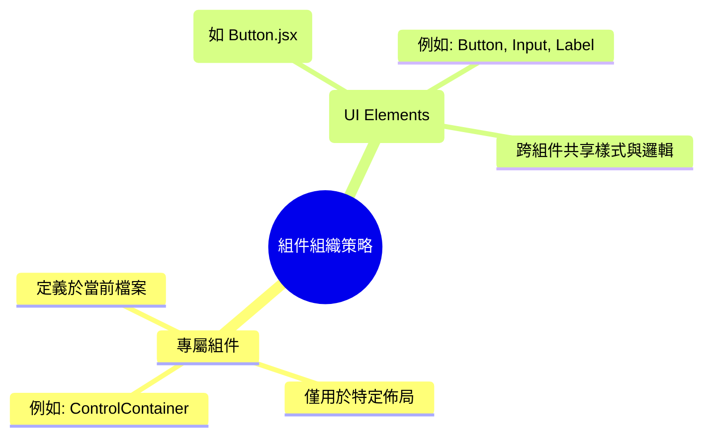
```mermaid
mindmap
  root((組件組織策略))
    專屬組件
      定義於當前檔案
      僅用於特定佈局
      例如: ControlContainer
    可複用組件 (UI Elements)
      建立獨立檔案 (如 Button.jsx)
      跨組件共享樣式與邏輯
      例如: Button, Input, Label
```

### 提取可複用的 Styled Components

為了提高程式碼的複用性，可以將原本定義在特定組件（如 `AuthInputs.jsx`）內部的 Styled Components 提取到獨立的檔案中。

- **[提取步驟]**
    - **剪下與貼上**：將該 Styled Component 的定義從原檔案剪下，並貼到新的組件檔案（例如 `Button.jsx`）中。
    - **匯出組件**：在新的檔案中使用 `export default` 將該組件匯出。
    - **引入依賴**：由於 Styled Component 依賴於 `styled-components` 套件，因此必須在新的檔案中重新引入 `styled`。

```javascript
/* Button.jsx */

import styled from 'styled-components';

const Button = styled.button`
  padding: 1rem 2rem;
  font-weight: 600;
  text-transform: uppercase;
  border-radius: 0.25rem;
  color: #1f2937;
  background-color: #f0b322;
  border: none;

  &:hover {
    background-color: #f0920e;
  }
`;

export default Button;
```

- **[組織建議]**
    - 針對 `Input` 或 `Label` 等元素，也可以考慮建立專屬的 `.jsx` 檔案來存放，以保持專案結構的整潔與組件的可管理性。

### 重新導入與應用可複用組件

一旦將 Styled Components 提取到獨立檔案（如 `Button.jsx`）並完成匯出，就可以在任何需要的地方重新引入並使用。

- **[實作方式]** 在原本的組件檔案（如 `AuthInputs.jsx`）中透過 `import` 語法引入：
    - 雖然在目前的簡單範例中影響不大，但在大型 React 應用程式中，這是實現 UI 一致性與程式碼複用的關鍵做法。

```javascript
/* AuthInputs.jsx */

import Button from './Button.jsx';

// ... 其他程式碼

// 使用提取出來的 Button 組件
<Button>Sign In</Button>
```

- **[擴展應用]** 這種「提取並複用」的模式不僅適用於按鈕，同樣也適用於 `Label` 或 `Input` 等其他基礎 UI 元素，可以讓專案的樣式管理更加系統化。

### 表單組件的常見組合

在開發 React 表單時，一種非常常見的模式是將 `Label` 與 `Input` 組件進行組合使用，以建立結構清晰且具備可存取性的表單欄位。

### 表單組件的進階封裝

- **[組件合併策略]** 雖然將 `Label` 與 `Input` 分開定義可以提高單一元素的複用性，但在某些情境下，將它們合併成一個單一的複合組件會更方便使用
    - 這樣可以確保每個表單欄位的結構（Label + Input）在整個應用程式中保持高度一致

### 建立複合組件 `CustomInput`

為了簡化開發，可以將 `Label` 與 `Input` 提取到一個新的檔案（例如 `Input.jsx`）中，並將它們封裝成一個單一的組件函數。

- **[實作細節]**
    - **提取組件**：從原本的檔案（如 `AuthInputs.jsx`）中剪下 `Label` 與 `Input` 的定義，並移至 `Input.jsx`。
    - **引入依賴**：在 `Input.jsx` 中必須重新引入 `import styled from 'styled-components'`。
    - **封裝邏輯**：不直接匯出單獨的 `Label` 或 `Input`，而是匯出一個名為 `CustomInput` 的新組件，利用一個 HTML 元素（例如 `<p>`）作為包裝容器（wrapper），將 `Label` 與 `Input` 置於其中。

```javascript
/* Input.jsx */

import styled from 'styled-components';

const Label = styled.label`
  /* ... Label 的樣式 ... */
`;

const Input = styled.input`
  /* ... Input 的樣式 ... */
`;

export default function CustomInput() {
  return (
    <p className="paragraph">
      <Label>...</Label>
      <Input />
    </p>
  );
}
```

- **[命名考量]**
    - 使用 `CustomInput` 作為組件名稱，可以避免與原本單獨的 `Input` 組件發生名稱衝突（name clash）。

### `CustomInput` 的屬性處理與傳遞

為了讓 `CustomInput` 更加靈活，使其不僅能顯示標籤，還能像原生 HTML 元素一樣接收各種屬性（例如 `placeholder`、`type` 等），我們需要對組件的參數進行處理。

- **[屬性解構]** 在組件函數的參數中，直接對 `label` 進行解構，並使用展開運算子（spread operator）`...props` 來捕捉所有其餘的屬性
    - 這樣做可以讓我們輕鬆地將 `label` 作為內容使用，同時將其他的 `props` 統一管理
- **[實作範例]** 在 `Input.jsx` 中，透過解構賦值來接收並應用屬性：

```javascript
/* Input.jsx */

// ... Styled Components 定義 (Label, Input)

export default function CustomInput({ label, ...props }) {
  return (
    <p>
      <Label>{label}</Label>
      <Input {...props} />
    </p>
  );
}
```

- **[運作邏輯]**
    - `{ label, ...props }`：這行程式碼會從傳入的物件中提取出 `label` 屬性，並將剩下的所有屬性打包成一個名為 `props` 的物件
    - `<Label>{label}</Label>`：將提取出的 `label` 文字作為子元素放入標籤組件中
    - `<Input {...props} />`：使用展開運算子將 `props` 物件中的所有屬性一次性展開並傳遞給 `Input` 組件，這讓 `CustomInput` 能夠透明地支援所有標準的 `input` 屬性

### `CustomInput` 的錯誤狀態處理

為了讓表單欄位能夠根據輸入是否有效來改變視覺樣式，我們可以為 `CustomInput` 增加一個專門處理錯誤狀態的屬性。

- **[新增&#32;`invalid`&#32;屬性]** 在組件函數的參數中解構出 `invalid` 屬性，並將其傳遞給內部的 `Label` 與 `Input` 組件
- **[實作範例]** 在 `Input.jsx` 中，將 `invalid` 傳遞給 Styled Components，以便它們能根據該布林值切換樣式：

```javascript
/* Input.jsx */

// ... Styled Components 定義

export default function CustomInput({ label, invalid, ...props }) {
  return (
    <p>
      <Label $invalid={invalid}>{label}</Label>
      <Input $invalid={invalid} {...props} />
    </p>
  );
}
```

- **[樣式邏輯]**
    - 在 Styled Components 的定義中，使用 `$invalid` 屬性來驅動樣式變更（例如：當 `invalid` 為 true 時，將 `background-color` 改為紅色系，或改變 `border` 顏色）
    - **注意**：在 Styled Components 中使用 \`$` 前綴（如 `$invalid\`）是一種常見做法，這可以防止該屬性被直接傳遞到底層的 HTML 元素上，避免 HTML 標籤出現不合法的屬性錯誤。
- **[組件複用]** 封裝完成後，可以在其他檔案（如 `AuthInputs.jsx`）中直接引入並使用：

```javascript
/* AuthInputs.jsx */

import CustomInput from './Input';

// ... 在組件中使用
<CustomInput label="Email" type="email" invalid={true} />
```

### 在 `AuthInputs.jsx` 中使用 `CustomInput`

透過封裝後的 `CustomInput` 組件，可以大幅減少在表單頁面中重複撰寫 `Label`、`Input` 以及包裹容器（如 `<p>` 標籤）的程式碼量。

- **[組件引入]** 由於 `CustomInput` 是在 `Input.jsx` 中以 `export default` 方式導出，因此在引入時可以自定義名稱（例如命名為 `Input`）
    - **注意**：雖然可以自定義名稱，但為了避免與原生 HTML 元素或原本的組件混淆，建議保持一致或使用具備辨識度的名稱。

```javascript
/* AuthInputs.jsx */

import Input from './Input';

// ...

return (
  <div id="auth-inputs">
    <ControlContainer>
      <p className="paragraph">
        <Label $invalid={emailNotValid}>Email</Label>
        <Input $invalid={emailNotValid} type="email" />
      </p>
    </ControlContainer>
  </div>
);
```

- **[使用封裝後的組件]** 使用 `CustomInput`（在此範例中引入為 `Input`）可以將原本多行的設定簡化為單行：

```javascript
/* 使用封裝後的簡化寫法 */
<Input
  label="Email"
  invalid={emailNotValid}
  type="email"
  onChange={(event) => handleInputChange('email', event.target.value)}
/>
```

- **[優勢總結]**
    - **程式碼簡潔**：不再需要手動為每個欄位建立 `<p>` 標籤或重複撰寫 `<Label>` 與 `<Input>` 的組合。
    - **邏輯集中**：所有的屬性（如 `label`、`invalid`、`type`、`onChange`）都統一透過單一組件進行傳遞與管理。

### `CustomInput` 的多欄位應用實例

在 `AuthInputs.jsx` 中，可以透過傳遞不同的 `label`、`invalid` 狀態以及 `onChange` 處理函數，讓同一個 `CustomInput` 組件處理不同的輸入欄位。

- **[實作範例]** 在 `AuthInputs.jsx` 中同時使用兩個 `Input` 組件：

```javascript
/* AuthInputs.jsx */

// ...
<ControlContainer>
  <Input
    label="Email"
    invalid={emailNotValid}
    type="email"
    onChange={(event) => handleInputChange('email', event.target.value)}
  />
  <Input
    label="Password"
    invalid={passwordNotValid}
    type="password"
    onChange={(event) => handleInputChange('password', event.target.value)}
  />
</ControlContainer>
```

- **[功能驗證]**
    - 即使使用了簡化的組件結構，原本的輸入功能（輸入數值）與表單提交功能依然能正常運作。
    - 所有的 `props`（如 `type`、`onChange`）都透過展開運算子正確地傳遞到了底層的 HTML `<input>` 元素上。
- **[模式總結]**
    - **高度複用性**：這種將標籤、容器與輸入框封裝在一起的模式，對於任何需要重複建立表單欄位的場景都非常有效。
    - **通用性**：此封裝模式並不侷限於 Styled Components，即使是在使用一般的 CSS 或其他樣式方案時，這種「複合組件」的設計思想同樣適用。

### React 開發的核心心法：尋找複用機會

- **[核心觀念]** 作為 React 開發者，應主動尋找可以封裝與複用的機會
    - **樣式封裝**：將具有特定樣式的組件提取出來，以便在應用程式的不同部分重複使用
    - **結構封裝**：將具有特定 JSX 元素組合（例如 `Label` + `Input` + `p`）的模式封裝成單一組件
- **[實作靈活性]** 這種封裝模式並不侷限於 Styled Components
    - 即使不使用 Styled Components，也可以透過一般的 CSS Class 來達成相同的複用效果

### Styled Components 的優點

- **快速且易於整合**：在應用程式中新增樣式組件的過程非常直接，不需要額外的繁瑣工作。
- **持續以 React 思維開發**：可以利用可配置的樣式函數（configurable style functions）來處理樣式，這讓樣式邏輯與組件的狀態（props）緊密結合。

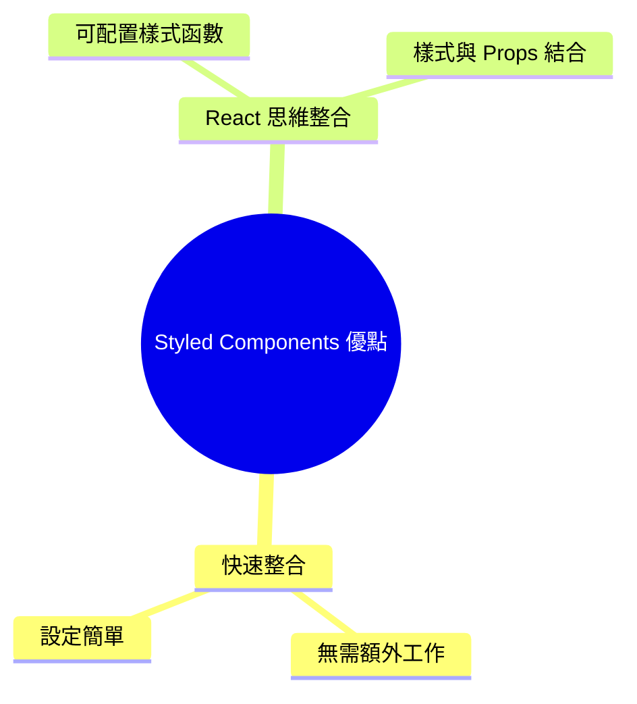
```mermaid
mindmap
  root((Styled Components 優點))
    快速整合
      設定簡單
      無需額外工作
    React 思維整合
      可配置樣式函數
      樣式與 Props 結合
```

### Styled Components 的優缺點總結

#### 優點 (Advantages)

- **快速且易於整合**：設定過程直接，不需要額外的繁瑣工作。
- **持續以 React 思維開發**：可以將樣式視為「可配置的樣式函數」（configurable style functions），這與 React 組件的概念非常一致。
- **樣式自動作用域 (Scoped Styles)**：
    - 樣式會自動作用於特定組件。
    - **[效益]** 能有效避免 CSS 規則衝突（No CSS rule clashes）。

#### 缺點 (Disadvantages)

- **需要 CSS 基礎**：在使用 Styled Components 時，撰寫的本質上仍是標準的 CSS 程式碼，因此必須具備紮實的 CSS 知識。
- **缺乏明確的程式碼分離**：React 的邏輯程式碼與 CSS 樣式程式碼之間沒有強烈的界限，兩者會混合在一起。

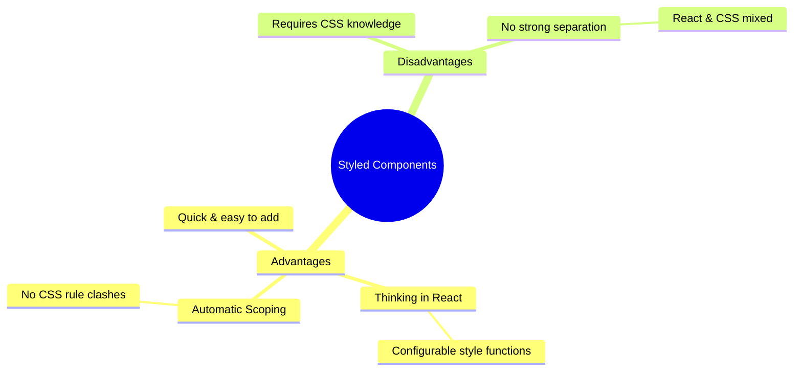
```mermaid
mindmap
  root((Styled Components))
    Advantages
      Quick & easy to add
      Thinking in React
        Configurable style functions
      Automatic Scoping
        No CSS rule clashes
    Disadvantages
      Requires CSS knowledge
      No strong separation
        React & CSS mixed
```

### Styled Components 的缺點

- **組件數量增加**：由於樣式通常直接定義在組件旁邊或同一個檔案中，開發者往往會建立許多相對細小的「包裝組件」（wrapper components）
    - 例如：我們之前建立的 `Button` 或 `Input` 組件
- **[開發權衡]** 雖然建立這些額外的小組件在某些情況下可能顯得繁瑣，但從長遠來看，這其實符合 React 的核心理念：透過組件的建立來實現程式碼的複用

## Tailwind CSS

- 一種極其流行的 CSS 框架，不僅適用於一般的網頁專案，與 React 搭配使用時表現也非常優異
- **[核心概念]** 採用「工具優先」(utility-first) 的設計理念
    - 透過在 HTML 元素上直接添加微小的 **utility CSS classes** 來構建樣式
    - 例如：使用 `flex`、`pt-4`、`text-center` 或 `rotate-90` 等類別直接在 markup 中定義設計

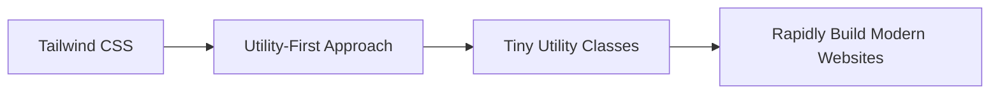
```mermaid
flowchart LR
    A[Tailwind CSS] --> B[Utility-First Approach]
    B --> C[Tiny Utility Classes]
    C --> D[Rapidly Build Modern Websites]
```

### Tailwind CSS 的開發體驗

- **[初學者的觀感]** 初次看到大量 utility classes 直接寫在 JSX 中時，可能會覺得程式碼顯得凌亂或「醜陋」
    - 這是因為開發者需要手動為每個元素添加許多微小的類別
- **[實際應用]** 儘管視覺上較為密集，但在實際專案中這種做法非常高效
    - 許多開發者認為這種方式在開發速度與維護性之間取得了很好的平衡
    - 核心目標是在不離開 HTML/JSX 的情況下，快速構建出複雜且現代化的設計

### Tailwind CSS 安裝指南

- **[安裝路徑]** 可透過 Tailwind CSS 官方網站的說明文件進行配置
    - 前往官網的 **Docs** 區域
    - 在 **Installation** 標題下選擇 **Framework Guides**
    - 針對特定框架（例如 **Vite**）查看專屬的安裝步驟
- **[快速開始方案]** 若不想手動進行繁瑣的安裝程序，可以使用預先配置好的 **CodeSandbox** 專案，直接進入開發狀態

### 本地專案安裝步驟

- **[前提條件]** 在執行安裝指令前，必須先停止（quit）目前的開發伺服器
- **[安裝與初始化]** 需執行兩組主要的指令：
    - 安裝 `tailwindcss` 及其相關依賴套件（如 `postcss` 與 `autoprefixer`）
    - 初始化 Tailwind CSS 設定檔

```bash

# 安裝套件
npm install -D tailwindcss postcss autoprefixer

# 初始化設定檔
npx tailwindcss init -p
```

- **[結果]** 執行成功後，系統會自動生成以下設定檔：
    - `tailwind.config.js`
    - `postcss.config.js`

### Tailwind CSS 入門說明

- **[學習範圍]** 本章節僅作為 Tailwind CSS 的快速入門引導
    - 不會深入探討完整的配置選項或所有進階功能
- **[深入學習建議]** 若需掌握完整的配置與功能，建議參考以下資源：
    - Tailwind CSS 官方文件 (Official Documentation)
    - 專門的 Tailwind CSS 學習課程

### 配置 Tailwind CSS

- **[核心設定]** 透過修改 `tailwind.config.js` 檔案來定義 Tailwind 需要掃描哪些檔案以生成對應的 CSS
- **[設定範例]** 需覆寫 `content` 屬性，指定專案中所有可能包含 Tailwind 類別的檔案路徑

```javascript
/** @type {import('tailwindcss').Config} */
export default {
  content: [
    "./index.html",
    "./src/**/*.{js,ts,jsx,tsx}"
  ],
  theme: {
    extend: {},
  },
  plugins: [],
}
```

### Tailwind CSS 的最後配置步驟

- **[設定檔微調]** 需確保 `tailwind.config.js` 中的 `content` 屬性包含了所有可能用到 Tailwind 類別的檔案路徑
    - 例如：包含 `./index.html` 與 `./src/**/*.{js,ts,jsx,tsx}`

```javascript
/** @type {import('tailwindcss').Config} */
export default {
  content: [
    "./index.html",
    "./src/**/*.{js,ts,jsx,tsx}"
  ],
  theme: {
    extend: {},
  },
  plugins: [],
}
```

- **[注入 Tailwind 指令]** 最後一個步驟是將 Tailwind 的指令加入到全域 CSS 檔案（如 `index.css`）中，以便框架能正常運作
    - 建議先備份舊有的 `index.css`（例如重新命名為 `index-old.css`）
    - 清空 `index.css` 並加入以下三行指令：

```css
@tailwind base;
@tailwind components;
@tailwind utilities;
```

### Tailwind CSS 啟用後的樣式狀態

- **[開發伺服器啟動]** 執行 `npm run dev` 後，專案即正式進入使用 Tailwind CSS 的狀態
- **[樣式遷移的過渡期現象]** 由於舊有的 CSS 檔案已被重新命名（例如 `index-old.css`）且不再被導入，導致網站樣式出現不一致的情況
    - **已失效部分**：未遷移的組件會因為失去舊有 CSS 規則而導致樣式崩潰
    - **維持正常的組件**：已遷移至 **Styled Components** 的組件（如 `Input`、`Label` 與 `Button`）仍能保持正確的外觀
- **[後續計畫]** 將繼續將剩餘的組件樣式從舊有的 CSS 模式切換至 **Tailwind CSS**

### Tailwind CSS 的核心理念

- **[運作方式]** 透過在元素上添加微小的 **工具類 (utility) CSS 類別** 來改變外觀
    - 這些類別是應用由 Tailwind 團隊預先定義好的 CSS 規則
    - 例如使用 `flex`、`pt-4`、`text-center` 等類別直接在 HTML 中組合出設計

### 從 Styled Components 切換回 Tailwind CSS

- **[轉換策略]** 將原本使用 Styled Components 的組件還原為標準 HTML 標籤，並移除相關的樣式化導入
- **[實作範例]** 以 `Header` 組件為例，將其從 `StyledHeader` 轉換回一般的 `<header>` 標籤
    - 移除 `import { StyledHeader } from ...`
    - 移除相關的樣式化組件定義
    - 之後即可直接在 `<header>` 上使用 Tailwind 的工具類別進行樣式控制

### 使用 Tailwind CSS 的開發效率提升

- **[推薦工具]** 安裝 **Tailwind CSS IntelliSense** 擴充功能 (由 Tailwind 官方團隊發布)
    - **[主要功能]** 提供 Tailwind 類別名稱的自動完成 (auto-completion) 建議
    - **[開發優勢]** 大幅簡化開發流程，開發者不再需要頻繁切換視窗去查閱官方文件
- **[實作觀察]** 在 React 組件中使用 `className` 屬性添加工具類時，VS Code 會即時顯示建議清單

```jsx
// 在 Header.jsx 中添加類別時，會觸發 IntelliSense 建議
export default function Header() {
  return (
    <header className="">

      <h1>ReactArt</h1>
      <p>A community of artists and art-lovers.</p>
    </header>
  );
}
```

### 深入探索 Tailwind CSS 官方文件

- **[學習資源]** 官方文件不僅提供核心概念與配置教學，還詳細說明了各種可樣式化的元素與屬性
- **[佈局實作：Flexbox]** 可以透過添加特定的工具類別來快速實作 Flexbox 佈局
    - 例如：在容器上添加 `flex` 類別，即可將其轉變為 Flex 容器
    - 轉換後，可以進一步透過工具類別來設定內部子元素的寬度（width）與高度（height）

### 使用 Tailwind CSS 實作 Flexbox 佈局

- **[實作範例]** 將原本的 `Header` 組件轉換為 Flex 容器，以控制其內部子元素（如 `img`、`h1`、`p`）的排列位置

```jsx
// 在 Header.jsx 中應用 flex 類別
export default function Header() {
  return (
    <header className="flex">

      <h1>ReactArt</h1>
      <p>A community of artists and art-lovers.</p>
    </header>
  );
}
```

### 使用 Tailwind CSS 進階調整佈局

- **[設定主軸方向]** 使用 `flex-col` 類別將 Flexbox 的主軸（Main Axis）從預設的水平改為**垂直方向**
- **[水平置中]** 配合 `items-center` 類別來達成水平置中
    - **[原理]** 當主軸為垂直方向時，`items-center` 會控制交叉軸（Cross Axis）的對齊，進而實現水平方向的置中
- **[設定間距]** 使用 `mt-*` (margin-top) 與 `mb-*` (margin-bottom) 工具類別來控制元素上下邊距

#### 佈局實作範例

```jsx
// 在 Header.jsx 中應用進階佈局與間距設定
export default function Header() {
  return (
    <header className="flex flex-col items-center mt-8 mb-16">

      <h1>ReactArt</h1>
      <p>A community of artists and art-lovers.</p>
    </header>
  );
}
```

- **[工具類別對應關係]** 透過 Tailwind CSS IntelliSense 擴充功能，可以即時預覽工具類別對應的 CSS 屬性：
    - `mt-8` $\rightarrow$ `margin-top: 2rem;` (即 $32\\text{px}$)
    - `mb-16` $\rightarrow$ `margin-bottom: 4rem;` (即 $64\\text{px}$)

### 學習 Tailwind CSS 的心態與建議

- **[克服畏懼感]** 對於從未接觸過 Tailwind 的開發者來說，面對大量陌生的類別名稱可能會感到不知所措
    - **[解決方法]** 透過查閱 **官方文件** 來了解各類別的功能與用法（例如如何設定 margin）
- **[建立肌肉記憶]** 不需要刻意去背誦所有類別
    - **[學習路徑]** 在實際專案中不斷練習，隨著使用頻率增加，最常用的工具類別會自然而然地變成直覺反應

### 使用 Tailwind CSS 微調圖片與文字樣式

- **[防止圖片變形]** 使用 `object-contain` 類別，這會對應到 CSS 的 `object-fit: contain;` 屬性，確保圖片在固定尺寸內完整顯示而不被拉伸或切除
- **[文字排版控制]** 可以透過組合多個工具類別來快速定義標題與段落的視覺效果

#### 常用文字工具類別範例

| 功能 | Tailwind 類別 | 對應 CSS 屬性 |
| --- | --- | --- |
| 文字大小 | text-4xl | font-size: 2.25rem; |
| 字體粗細 | font-semibold | font-weight: 600; |
| 字距控制 | tracking-widest | letter-spacing: 0.1em; |
| 文字對齊 | text-center | text-align: center; |
| 大小寫轉換 | uppercase | text-transform: uppercase; |

```jsx
// 在 Header.jsx 中對圖片與文字進行細部樣式設定
export default function Header() {
  return (
    <header className="flex flex-col items-center mt-8 mb-16">

      <h1 className="text-4xl font-semibold tracking-widest text-center uppercase">
        ReactArt
      </h1>
      <p className="text-ellipsis">
        A community of artists and art-lovers.
      </p>
    </header>
  );
}
```

### 使用 Tailwind CSS 的內建色彩系統

- **[快速建立美觀介面]** Tailwind CSS 提供大量預設的背景與文字顏色，讓開發者無需自行定義顏色即可快速達成一致的視覺效果
- **[色彩階層]** 內建顏色通常以顏色名稱搭配數字表示其深淺程度（例如 `amber` 系列）
    - **[自定義能力]** 雖然內建色調非常豐富，但開發者仍然可以透過設定檔來自定義專屬的顏色組合

#### 色彩應用範例

```jsx
// 使用 text-amber-800 來設定標題顏色
<h1 className="text-4xl font-semibold tracking-widest text-center uppercase text-amber-800">
  ReactArt
</h1>
```

- **[顏色數值參考]** 透過 IntelliSense 可以快速查看不同階層的顏色數值（例如 `text-amber-800` 對應的 RGB 值）

### 恢復自定義視覺風格

- **[自定義視覺需求]** 雖然 Tailwind CSS 的內建配色方案非常方便，但為了維持專案原本的設計感，仍需進行自定義設定
    - **[背景顏色]** 需要重新引入原本專案所使用的背景顏色
    - **[自定義字體]** 需要將原本設定好的自定義字體重新應用於頁面上

### 在 Tailwind CSS 中結合自定義樣式

- **[共存原則]** 使用 Tailwind CSS 並不代表必須放棄傳統的 CSS 寫法
    - 可以在 `index.css` 中保留 Tailwind 的指令（如 `@tailwind base;`），同時撰寫自定義的 CSS 選擇器與規則
- **[實現自定義視覺效果]**
    - **背景圖片**：透過在 `index.css` 中定義 `body` 選擇器來重新引入專案原本的背景圖
    - **自定義字體**：透過在 `index.html` 中使用 `<link>` 標籤從 Google Fonts 匯入字體，即可在專案中使用

#### 自定義 CSS 設定範例 (`index.css`)

```css
@tailwind base;
@tailwind components;
@tailwind utilities;

body {
  /* 從 SVGBackgrounds.com 取得的背景設定 */
  background-color: #ffaa00;
  background-image: url("data:image/svg+xml,... ");
  background-attachment: fixed;
  background-size: cover;
}
```

#### 匯入字體的 HTML 設定 (`index.html`)

```html
<!DOCTYPE html>
<html lang="en">
<head>
  <meta charset="UTF-8" />
  <meta name="viewport" content="width=device-width, initial-scale=1.0" />
  <title>ReactArt</title>
  <!-- 從 Google Fonts 匯入 Pacifico 字體 -->
  <link rel="preconnect" href="https://fonts.googleapis.com">
  <link rel="preconnect" href="https://fonts.gstatic.com" crossorigin>
  <link href="https://fonts.googleapis.com/css2?family=Pacifico&display=swap" rel="stylesheet">
</head>
<body class="p-8">
  <div id="root"></div>
  <script type="module" src="/src/main.jsx"></script>
</body>
</html>
```

### 在 Tailwind CSS 中註冊自定義字體

- **[擴充主題]** 為了在 Tailwind 中使用自定義字體，必須在 `tailwind.config.js` 的 `theme.extend` 區塊中進行設定
    - **[為什麼使用 extend]** 使用 `extend` 而不是直接寫在 `theme` 下，是為了保留 Tailwind 原有的預設設定，僅「增加」新的功能
- **[設定步驟]**

    1. 在 `theme` 物件內找到 `extend` 屬性
    2. 加入 `fontFamily` 鍵值
    3. 定義一個新的識別碼（Identifier）作為該字體的名稱
    4. 提供一個包含字體名稱與備用字體（fallback font）的陣列

#### `tailwind.config.js` 設定範例

```javascript
// 在 theme.extend 中註冊新字體
export default {
  content: ['./index.html', './src/**/*.{js,ts,jsx,tsx}'],
  theme: {
    extend: {
      fontFamily: {
        // 註冊名為 title 的新字體家族
        // 注意：字體名稱必須使用 "雙引號" 包在 '單引號' 內
        title: ['"Pacifico"', 'cursive']
      }
    },
    plugins: [],
  },
};
```

- **[語法細節]** 在設定字體陣列時，字體名稱的寫法較為特殊：`['"Pacifico"', 'cursive']`
    - 這是因為 Tailwind 需要透過這種方式精確地識別字體名稱，確保在產出的 CSS 中能正確對應到外部匯入的字體

### 使用 Tailwind CSS 的工具類別

- **[應用自定義字體]** 一旦在設定檔中註冊了字體家族，即可直接在 JSX 的 `className` 中使用對應的名稱
    - **範例**：使用 `font-title` 來套用先前註冊的 `Pacifico` 字體

```jsx
// 在 Header.jsx 中套用自定義字體
<h1 className="text-4xl font-semibold tracking-widest text-center uppercase text-amber-800 font-title">
  ReactArt
</h1>
```

- **[使用內建顏色類別]** Tailwind 提供豐富的預設顏色工具類別，可以直接透過 `text-{color}-{weight}` 的格式來改變文字顏色
    - **範例**：使用 `text-stone-500` 可以快速將文字設為一種灰色調

```jsx
// 修改段落文字顏色
<p className="text-stone-500">A community of artists and art-lovers.</p>
```

- **[核心開發模式]** 使用 Tailwind 的精髓在於不斷地透過添加各種微小的 utility classes 來組合出想要的視覺效果
- **[潛在缺點]** 使用 Tailwind CSS 時，程式碼中會出現非常長的 class 列表
    - **[範例]** 如同畫面中顯示的 `<header>` 或 `<h1>` 標籤，包含了多個樣式類別

```jsx
<header className="flex flex-col items-center mt-8 mb-16">
      <h1 className="text-4xl font-semibold tracking-widest text-center uppercase text-amber-800 font-title">ReactArt</h1>
    </header>
```

- **[開發者選擇]** 如果開發者非常排斥這種冗長的 class 寫法，那麼 Tailwind CSS 可能不是最適合他們的工具

### Tailwind CSS 的響應式設計與狀態處理

- **[面臨的挑戰]** 在開發過程中，經常需要處理以下兩種樣式需求：
    - **響應式設計**：針對不同螢幕尺寸（Screen sizes）套用不同的樣式
    - **偽類選擇器（Pseudo-selectors）**：例如處理按鈕的 `hover` 狀態
- **[解決方案：前綴（Prefixes）]** Tailwind 提供了一種基於前綴的機制，透過在工具類別（Utility classes）前加上特定的字元，來控制樣式的觸發條件
    - **響應式前綴**：根據特定的最小螢幕寬度（Minimum screen width）來決定是否套用該樣式

#### 響應式斷點（Responsive Breakpoints）參考

根據 Tailwind 官方文件，預設提供了五個斷點，透過前綴可以輕鬆切換樣式：

| 斷點前綴 (Breakpoint prefix) | 最小寬度 (Minimum width) | 對應 CSS 媒體查詢 (CSS) |
| --- | --- | --- |
| sm | 640px | @media (min-width: 640px) { ... } |
| md | 768px | @media (min-width: 768px) { ... } |
| lg | 1024px | @media (min-width: 1024px) { ... } |
| xl | 1280px | @media (min-width: 1280px) { ... } |
| 2xl | 1536px | @media (min-width: 1536px) { ... } |

- **[使用方式]** 只需要在 class 名稱前加上斷點名稱與冒號即可，例如 `sm:text-center` 表示當螢幕寬度達到 `sm` 以上時，文字才會置中。

#### 響應式樣式的實際應用

- **[使用前綴控制樣式]** 透過在工具類別前加上斷點前綴（例如 `md:`），可以指定該樣式僅在達到特定最小寬度時才生效
    - **範例**：使用 `md:w-1/2` 表示當螢幕達到 `md` 斷點（768px）以上時，寬度才會變為 50%
- **[實戰案例：調整間距]** 在開發 Header 組件時，可以根據螢幕大小動態調整下邊距（margin-bottom），以優化不同裝置的視覺比例

```jsx
// 在 Header.jsx 中應用響應式間距
<header className="flex flex-col items-center mt-8 md:mb-16">

  <h1 className="text-4xl font-semibold tracking-widest text-center uppercase text-amber-800 font-title">
    ReactArt
  </h1>
  <p className="text-stone-500">A community of artists and art-lovers.</p>
</header>
```

- **[設計邏輯]**
    - 預設情況下，不帶前綴的 class（如 `mt-8`）會套用於所有螢幕尺寸（包含手機端）
    - 加上 `md:mb-16` 後，該較大的下邊距僅會在平板或電腦等較大螢幕上顯示，避免在手機端佔用過多空間

#### 響應式文字與間距的進階應用

- **[文字大小的動態切換]** 除了間距，文字大小也可以根據螢幕尺寸進行調整，以確保標題在不同裝置上都有良好的閱讀體驗
    - **[實作方式]** 可以針對 `<h1>` 標籤，在小螢幕使用較小的文字類別（如 `text-xl`），而在中大型螢幕（`md:`）則切換到較大的類別（如 `text-4xl`）

```jsx
// 在 Header.jsx 中應用響應式文字大小
<h1 className="text-xl md:text-4xl font-semibold tracking-widest text-center uppercase text-amber-800 font-title">
  ReactArt
</h1>
```

- **[視覺效果驗證]**
    - **較大螢幕**：標題呈現 `text-4xl` 的大尺寸，且下邊距較大（`md:mb-16`）
    - **縮小螢幕（手機端）**：標題自動縮小為 `text-xl`，且下邊距也隨之減小，避免在有限的垂直空間內佔用過多位置

### 從 Styled Component 轉換為 React 組件

- **[轉換目的]** 為了能更靈活地處理樣式（例如透過 Tailwind CSS 處理 `hover` 狀態），將原本純粹的 Styled Component 轉換為一個標準的 React 組件函數
- **[實作細節：組件封裝]**
    - 使用 `children` prop：讓組件可以被包裝在其他內容（如文字或圖示）之外
    - 使用展開運算符 `...props`：將剩餘的所有屬性（如 `className`）直接轉發給內部的標準 HTML 元素，確保樣式能正確套用

```jsx
// 將 Button.jsx 從 Styled Component 轉換為 React 組件
export default function Button({ children, ...props }) {
  return <button {...props}>{children}</button>;
}
```

- **[設計邏輯]**
    - 透過這種方式，組件不再受限於 Styled Components 的定義，而是可以接收來自外部的任何 Tailwind CSS 類別，從而實現更強大的樣式控制能力

### 使用 Tailwind CSS 進行樣式設計

- **[樣式轉換邏輯]** 當組件轉換為標準 React 組件後，不再需要透過 Styled Components 定義樣式，而是直接在 `className` 屬性中添加 Tailwind 的工具類別
- **[常見樣式工具類別應用]**
    - **內距 (Padding)**
        - `px-4`：設定左右內距（例如 1rem）
        - `py-2`：設定上下內距（例如 0.5rem）
    - **字體樣式**
        - `font-semibold`：設定半粗體字重
        - `uppercase`：將文字轉為全大寫
    - **圓角 (Border Radius)**
        - 使用 `rounded` 系列工具類別來控制邊框圓角程度

```jsx
// 在 Button.jsx 中使用 Tailwind CSS 類別進行樣式設計
export default function Button({ children, ...props }) {
  return (
    <button
      className="px-4 py-2 font-semibold uppercase rounded"
      {...props}
    >
      {children}
    </button>
  );
}
```

- **[圓角選項參考]** Tailwind 提供了多種 `rounded` 程度供選擇（如 `rounded-sm`, `rounded-md`, `rounded-lg`, `rounded-full` 等），透過調整不同的類別可以精確控制 `border-radius` 的像素值

### 使用 Tailwind CSS 進行進階樣式設計

- **[顏色工具類別應用]** 可以快速透過內建的顏色系統來調整文字與背景顏色
    - `text-stone-900`：設定深灰色文字
    - `bg-amber-400`：設定黃橘色的背景顏色
- **[處理交互狀態：Hover]** 為了提升使用者體驗，可以針對按鈕的懸停狀態設定不同的樣式
    - **[實作方式]** 在工具類別前加上 `hover:` 前綴
    - **[設計邏輯]** 只有當滑鼠懸停在元素上時，該樣式才會被套用，這與使用 `md:` 等響應式前綴的機制非常相似

```jsx
// 在 Button.jsx 中加入顏色與 hover 效果
export default function Button({ children, ...props }) {
  return (
    <button
      className="px-4 py-2 font-semibold uppercase rounded text-stone-900 bg-amber-400 hover:bg-amber-500"
      {...props}
    >
      {children}
    </button>
  );
}
```

### 處理元素交互狀態

- **[狀態前綴機制]** 除了用於響應式設計的螢幕尺寸前綴（如 `md:`），Tailwind 也提供狀態前綴來處理元素在特定交互下的樣式
    - `hover:`：當滑鼠懸停在元素上時套用
    - `focus:`：當元素獲得焦點時套用
- **[實作範例：按鈕懸停變色]**
    - 透過在原本的背景顏色類別前加上 `hover:` 並指定新的顏色，可以實現平滑的視覺反饋

```jsx
// 在 Button.jsx 中加入 hover 狀態的背景顏色變更
export default function Button({ children, ...props }) {
  return (
    <button
      className="px-4 py-2 font-semibold uppercase rounded text-stone-900 bg-amber-400 hover:bg-amber-500"
      {...props}
    >
      {children}
    </button>
  );
}
```

- **[設計觀察]** 雖然使用這類前綴會讓 `className` 的字串變得更長，但它能讓開發者在不離開 JSX 的情況下，直觀地看到元素在不同狀態下的所有樣式定義
- **[視覺驗證]** 當滑鼠懸停在按鈕上時，背景顏色會產生明顯變化，這證明了 `hover:` 工具類別已正確運作

### 處理動態與條件樣式

- **[從 Styled Components 轉換]** 當需要根據特定的 `props`（例如 `invalid`）來改變樣式時，可以捨棄 Styled Components 的複雜邏輯，改回使用標準 HTML 元素並結合 Tailwind CSS
- **[組件重構邏輯]**
    - 將原本自定義的 `CustomInput` 組件重新命名為 `Input`，使其更貼近標準 HTML 元素的命名習慣
    - 將原本透過 Styled Components 定義的 `label` 標籤還原為標準的 `<label>` 元素
- **[條件樣式實作思路]**
    - 原本在 Styled Components 中使用三元運算子來判斷 `invalid` 狀態並套用顏色（例如：`color: ${props => props.invalid ? '#f87171' : '#6b7280'}`）
    - 在轉換為 Tailwind CSS 後，將透過在 `className` 中使用 JavaScript 的樣式字串拼接或條件判斷來達成同樣的效果

### 實作 Input 組件的 Tailwind 樣式

- **[簡化組件邏輯]** 移除自定義的 `invalid` prop，改為直接在 `className` 中使用 Tailwind CSS 工具類別來控制樣式
- **[樣式套用細節]**
    - **Label 樣式**：透過組合多個類別來定義字體大小、粗細、間距與顏色
    - **Input 樣式**：設定寬度、內距、邊框、圓角與陰影等視覺屬性

```jsx
// Input.jsx 的完整樣式實作
export default function Input({ label, ...props }) {
  return (
    <p>
      <label
        className="block mb-2 text-xs font-bold tracking-wide text-stone-200 uppercase"
      >
        {label}
      </label>
      <input
        className="w-full px-3 py-2 leading-tight bg-stone-300 text-gray-700 border rounded shadow"
        {...props}
      />
    </p>
  );
}
```

- **[視覺結果]** 存檔後，`<label>` 與 `<input>` 會立即套用新的 Tailwind 樣式，呈現出符合設計規範的視覺外觀

### 實作條件式樣式切換

- **[優化樣式管理]** 為了避免在 JSX 中撰寫過於冗長的條件判斷，可以先將基礎樣式儲存在一個變數中
    - 例如建立一個 `labelClasses` 變數來存放 `<label>` 的預設 Tailwind 類別
- **[條件判斷邏輯]** 使用 JavaScript 的 `if` 陳述式來檢查組件的狀態（如 `invalid` prop）
    - 如果 `invalid` 為 `true`，則重新賦值給 `labelClasses` 一組代表錯誤狀態的類別（例如改變文字顏色）

```jsx
// Input.jsx 實作條件樣式切換
export default function Input({ label, invalid, ...props }) {
  let labelClasses = "block mb-2 text-xs font-bold tracking-wide uppercase text-stone-300";

  if (invalid) {
    labelClasses = "block mb-2 text-xs font-bold tracking-wide uppercase text-red-500";
  }

  return (
    <p>
      <label className={labelClasses}>{label}</label>
      <input
        className="w-full px-3 py-2 leading-tight text-gray-700 border rounded shadow bg-stone-300"
        {...props}
      />
    </p>
  );
}
```

- **[視覺效果]** 透過這種方式，當組件接收到 `invalid` 屬性時，標籤的顏色會從原本的 `text-stone-300` 動態切換為 `text-red-500`，提供直觀的錯誤提示
- **[開發技巧]** 在處理大部分樣式都相同的元素時，可以先複製基礎類別字串，僅針對需要變動的部分（如顏色）進行替換，以提高開發效率

### 優化條件式樣式實作

- **[優化思路]** 避免在每個條件分支中都重複撰寫完全相同的基礎樣式，改為將不變的樣式提取為「基礎類別字串」
    - **基礎類別**：只包含佈局、字體大小、粗細等不隨狀態改變的屬性
    - **動態附加**：根據 `invalid` 狀態，使用 `+=` 運算子僅針對顏色進行增量更新
- **[實作細節]** 在附加新的類別時，必須在字串前方加上一個**空格**，以確保新舊類別之間能正確分隔，避免產生無效的 Tailwind 類別名稱

```jsx
// Input.jsx 優化後的樣式邏輯
export default function Input({ label, invalid, ...props }) {
  let labelClasses = 'block mb-2 text-xs font-bold tracking-wide uppercase';

  if (invalid) {
    labelClasses += ' text-red-400';
  } else {
    labelClasses += ' text-stone-300';
  }

  return (
    <p>
      <label className={labelClasses}>{label}</label>
      <input
        className="w-full px-3 py-2 leading-tight text-gray-700 border rounded shadow bg-stone-300"
        {...props}
      />
    </p>
  );
}
```

- **[優點]** 這種做法讓程式碼更簡潔且易於維護，因為當需要修改基礎樣式（例如調整字體大小）時，只需更改一個地方即可

### 實作 Input 組件的條件式樣式

- **[擴充邏輯]** 除了 `<label>`，也可以對 `<input>` 元素套用相同的優化模式
    - 先定義一個基礎的 `inputClasses` 字串，存放不隨狀態改變的佈局與邊框樣式
    - 根據 `invalid` 狀態，使用 `+=` 運算子動態添加代表錯誤狀態的類別（例如改變邊框顏色）

```jsx
// Input.jsx 完整實作條件式樣式
export default function Input({ label, invalid, ...props }) {
  let labelClasses = 'block mb-2 text-xs font-bold tracking-wide uppercase';
  let inputClasses = 'w-full px-3 py-2 leading-tight text-gray-700 border rounded shadow';

  if (invalid) {
    labelClasses += ' text-red-400';
    inputClasses += ' border-red-400';
  } else {
    labelClasses += ' text-stone-300';
    inputClasses += ' border-stone-300';
  }

  return (
    <p>
      <label className={labelClasses}>{label}</label>
      <input className={inputClasses} {...props} />
    </p>
  );
}
```

- **[開發效益]** 這種做法能有效解決 Tailwind 在 JSX 中導致類別列表過於冗長的問題，讓組件的結構（Structure）與樣式（Styling）邏輯分離，提高程式碼的可讀性

### 進階 Input 組件樣式優化

- **[優化策略]** 將「預設狀態」與「錯誤狀態」的類別進行更徹底的分離
    - **預設樣式**：將不屬於錯誤狀態的顏色（例如 `text-gray-700` 或 `bg-stone-300`）直接放入基礎類別字串中，或是放在 `else` 區塊作為預設值
    - **錯誤樣式**：當 `invalid` 為 `true` 時，一次性附加一組完整的錯誤視覺特徵（文字、背景、邊框）
- **[實作範例]** 透過一次性附加多個類別來處理複雜的錯誤狀態

```jsx
// Input.jsx 進階優化版本
export default function Input({ label, invalid, ...props }) {
  let labelClasses = 'block mb-2 text-xs font-bold tracking-wide uppercase';
  let inputClasses = 'w-full px-3 py-2 leading-tight border rounded shadow';

  if (invalid) {
    labelClasses += ' text-red-400';
    // 一次性附加多個錯誤狀態的類別：文字、背景與邊框
    inputClasses += ' text-red-500 bg-red-100 border-red-300';
  } else {
    labelClasses += ' text-stone-300';
    // 預設的顏色樣式
    inputClasses += ' text-gray-700 bg-stone-300';
  }

  return (
    <p>
      <label className={labelClasses}>{label}</label>
      <input className={inputClasses} {...props} />
    </p>
  );
}
```

- **[開發心得]** 這種做法雖然在 `if` 區塊內看起來類別較長，但它清晰地定義了「當錯誤發生時，組件應該呈現的完整視覺狀態」，比起分散在多個判斷式中更容易理解組件的設計意圖。

### 保持 JSX 的簡潔性

- **[優化技巧]** 將所有的 Tailwind 類別邏輯集中在組件頂部的變數中，而不是直接寫在 JSX 的 `className` 屬性裡
    - 這樣可以讓 `return` 區塊中的 HTML 結構保持精簡（Lean）
    - 提高程式碼的可讀性，讓開發者一眼就能看出組件的 DOM 結構，而不被長串的樣式字串干擾

```jsx
// Input.jsx 簡潔的 return 結構
return (
  <p>
    <label className={labelClasses}>{label}</label>
    <input className={inputClasses} {...props} />
  </p>
);
```

- **[狀態驗證]** 透過切換 `invalid` prop，可以即時觀察組件的視覺變化
    - **預設狀態**：呈現正常的文字與背景顏色
    - **錯誤狀態**：觸發 `invalid` 邏輯，呈現紅色文字、紅色背景與紅色邊框
- **[遷移進度]** 應用程式大部分的組件已成功從 Styled Components 遷移至 Tailwind CSS
    - 目前僅剩少數部分（如部分輸入框的背景顏色與第二個按鈕）需要進行最後的樣式調整

### AuthInputs 組件遷移完成

- **[移除 Styled Components]** 為了完成向 Tailwind CSS 的遷移，移除不再需要的 `ControlContainer` Styled Component
    - 將原本的 `<ControlContainer>` 標籤替換為標準的 `<div>`
- **[佈局樣式轉換]** 使用 Tailwind 類別來重新定義容器的視覺特性
    - **寬度控制**：透過 `w-full` 確保容器佔滿可用寬度
    - **最大寬度限制**：使用 `max-w-sm`（對應約 24rem）來限制容器在大型螢幕上的寬度，避免佈局過於分散

```jsx
// AuthInputs.jsx 遷移後的結構片段
return (
  <div id="auth-inputs" className="w-full max-w-sm">
    <div>
      <Input
        label="Email"
        invalid={emailNotValid}
        type="email"
        onChange={(event) => handleInputChange('email', event.target.value)}
      />
      <Input
        label="Password"
        invalid={passwordNotValid}
        type="password"
        onChange={(event) => handleInputChange('password', event.target.value)}
      />
    </div>
    <div className="text-button">
      {/* 按鈕內容 */}
    </div>
  </div>
);
```

### 進階容器樣式美化

除了寬度限制外，可以透過添加更多 Tailwind 類別來增強容器的視覺效果：

- **內距 (Padding)**：使用 `p-8` 在容器四周添加 2rem 的內距
- **圓角 (Rounded Corners)**：使用 `rounded` 類別使容器邊角變得圓滑
- **陰影 (Shadow)**：使用 `shadow-md` 添加中等強度的陰影，增加層次感
- **背景漸層 (Background Gradient)**：使用 `bg-gradient-to-b` 快速建立從上到下的漸層背景

```jsx
// AuthInputs.jsx 進階樣式應用
<div id="auth-inputs" className="w-full max-w-sm p-8 rounded shadow-md bg-gradient-to-b">
  <div>
    <Input
      label="Email"
      invalid={emailNotValid}
      type="email"
      onChange={(event) => handleInputChange('email', event.target.value)}
    />
    {/* ... 其他 Input ... */}
  </div>
</div>
```

### 使用 Tailwind CSS 實作背景漸層

- **[漸層機制]** 透過指定漸層的方向與顏色端點來建立視覺效果
    - **方向控制**：使用 `bg-gradient-to-b` 設定為由上而下的漸層 (to bottom)
    - **起始顏色**：使用 `from-stone-700` 設定漸層的起點顏色
    - **結束顏色**：使用 `to-stone-800` 設定漸層的終點顏色
- **[開發建議]** 由於 Tailwind CSS 的工具類別非常多，實作特定效果（如漸層）時，建議查閱官方文件以確保語法正確

```jsx
// AuthInputs.jsx 應用漸層背景
<div
  id="auth-inputs"
  className="w-full max-w-sm p-8 rounded shadow-md bg-gradient-to-b from-stone-700 to-stone-800"
>
  {/* ... 組件內容 ... */}
</div>
```

### 調整組件佈局與間距

- **[水平居中]** 使用 `mx-auto` 來設定元素的水平外距 (margin-left: auto; margin-right: auto)，使組件在父容器中水平居中
- **[控制元素間距]** 透過 Flexbox 與 Gap 屬性來優化輸入框之間的排列
    - **使用 Flexbox**：在包裹輸入框的 `div` 上添加 `flex` 類別，使其成為彈性容器
    - **垂直排列**：預設情況下，Flex 容器會沿著主軸排列，可透過調整來確保元素垂直堆疊
    - **設定間距 (Gap)**：使用 `gap-2` 在子元素（如各個 `Input` 組件）之間添加固定的間距，避免視覺上過於擁擠
    - **底部外距**：添加 `mb-{size}` (例如 `mb-4`) 來確保輸入框區域與下方的按鈕之間保持足夠的距離

```jsx
// AuthInputs.jsx 佈局調整後的片段
return (
  <div
    id="auth-inputs"
    className="w-full max-w-sm p-8 rounded shadow-md bg-gradient-to-b from-stone-700 to-stone-800 mx-auto"
  >
    <div className="flex flex-col gap-2 mb-4">
      <Input
        label="Email"
        invalid={emailNotValid}
        type="email"
        onChange={(event) => handleInputChange('email', event.target.value)}
      />
      <Input
        label="Password"
        invalid={passwordNotValid}
        type="password"
        onChange={(event) => handleInputChange('password', event.target.value)}
      />
    </div>
    <div className="text-button">
      {/* 按鈕內容 */}
    </div>
  </div>
);
```

### 完善按鈕容器佈局

- **[水平對齊]** 透過將容器轉換為 Flex 容器並使用對齊屬性，將按鈕移動到右側
    - **使用 Flexbox**：將原本具有 `className="actions"` 的 `div` 改為添加 `flex` 類別
    - **靠右對齊**：添加 `justify-end` 類別，將子元素（按鈕）推向水平軸的末端（右側）
    - **設定間距**：添加 `gap-4` 在按鈕之間建立固定的間距
- **[樣式替換]** 移除舊有的自定義樣式類別，改用標準的 Tailwind 類別來美化按鈕

```jsx
// AuthInputs.jsx 按鈕佈局調整
<div className="flex justify-end gap-4">
  <button type="button" className="text-button">
    Create a new account
  </button>
  <Button onClick={handleLogin}>Sign In</Button>
</div>
```

### 實作按鈕的互動效果與最終轉換

- **[文字顏色調整]** 使用 Tailwind 的顏色工具類別來設定按鈕文字的基礎顏色
    - 例如使用 `text-amber-400` 設定為琥珀色
- **[實作滑鼠懸停效果]** 利用 `hover:` 前綴來定義滑鼠移入時的樣式變化
    - 例如 `hover:text-amber-500`：當使用者將滑鼠懸停在按鈕上時，文字顏色會從 `amber-400` 變深為 `amber-500`
- **[總結]** 透過上述步驟，成功將整個應用程式的樣式從 Vanilla CSS 或 Styled Components 完全遷移至 Tailwind CSS，實現了更現代且易於維護的樣式管理方式。

```jsx
// AuthInputs.jsx 最終按鈕樣式實作
<div className="flex justify-end gap-4">
  <button
    type="button"
    className="text-amber-400 hover:text-amber-500"
  >
    Create a new account
  </button>
  <Button onClick={handleLogin}>Sign In</Button>
</div>
```

- **[挑戰] 程式碼冗長**
    - 使用 Tailwind CSS 時，HTML/JSX 元素上會掛載大量的 CSS 類別名稱
    - 這會增加 JSX 檔案的程式碼量，對於不喜歡長串 class 列表的開發者來說可能是一個負擔
- **[解決方案] 組件化封裝]**
    - Tailwind 與 React 的開發模式非常契合
    - 可以透過建立**可重複使用的工具組件**（Reusable Utility Components）來解決問題
    - 將複雜的樣式叢集（CSS clusters）封裝在組件內部，外部呼叫時只需傳遞簡單的 props

例如，將所有的 Tailwind 樣式封裝在 `Input` 組件中，這樣在 `AuthInputs.jsx` 這種頁面層級的檔案裡，就只需要寫簡潔的組件標籤，而不需要處理冗長的樣式類別。

### 結合 Tailwind CSS 與 React 組件化開發

- **[核心理念] 隱藏複雜樣式**
    - 將大量的 Tailwind 工具類別（utility classes）封裝在底層組件（如 `Input.jsx`）中
    - 在頁面層級（如 `AuthInputs.jsx`）呼叫時，只需傳遞必要的 props，而不需要重複書寫長串的 class 列表
- **[優點] 提升開發體驗與可讀性**
    - **簡潔的 JSX**：組件呼叫變得非常精簡且易於理解
    - **減少重複**：避免在多個地方重複輸入相同的樣式組合
    - **維護容易**：樣式的變更只需在組件內部進行一次修改

```jsx
// 封裝後的組件使用方式：既精簡又直觀
<Input
  label="Email"
  invalid={emailNotValid}
  type="email"
  onChange={(event) => handleInputChange('email', event.target.value)}
/>
```

- **[結論] 最佳實踐**
    - 當開發者擁抱 React 的組件化思維，並結合 Tailwind CSS 的樣式能力時，兩者可以完美互補，解決樣式冗長的問題。

### Tailwind CSS 的優缺點

- **[優點] 開發速度極快**
    - 不需要深入精通 CSS 也能上手使用
    - 透過工具類別（utility classes）可以非常迅速地建構 React 或一般的 Web 應用程式
    - 核心工具類別（important utility classes）相對容易記憶
- **[輔助工具] IDE 擴充功能**
    - 使用相關的擴充功能可以提供類別建議（suggestions）
    - 幫助開發者更輕鬆地找到正確的類別名稱，進而提升樣式開發的效率

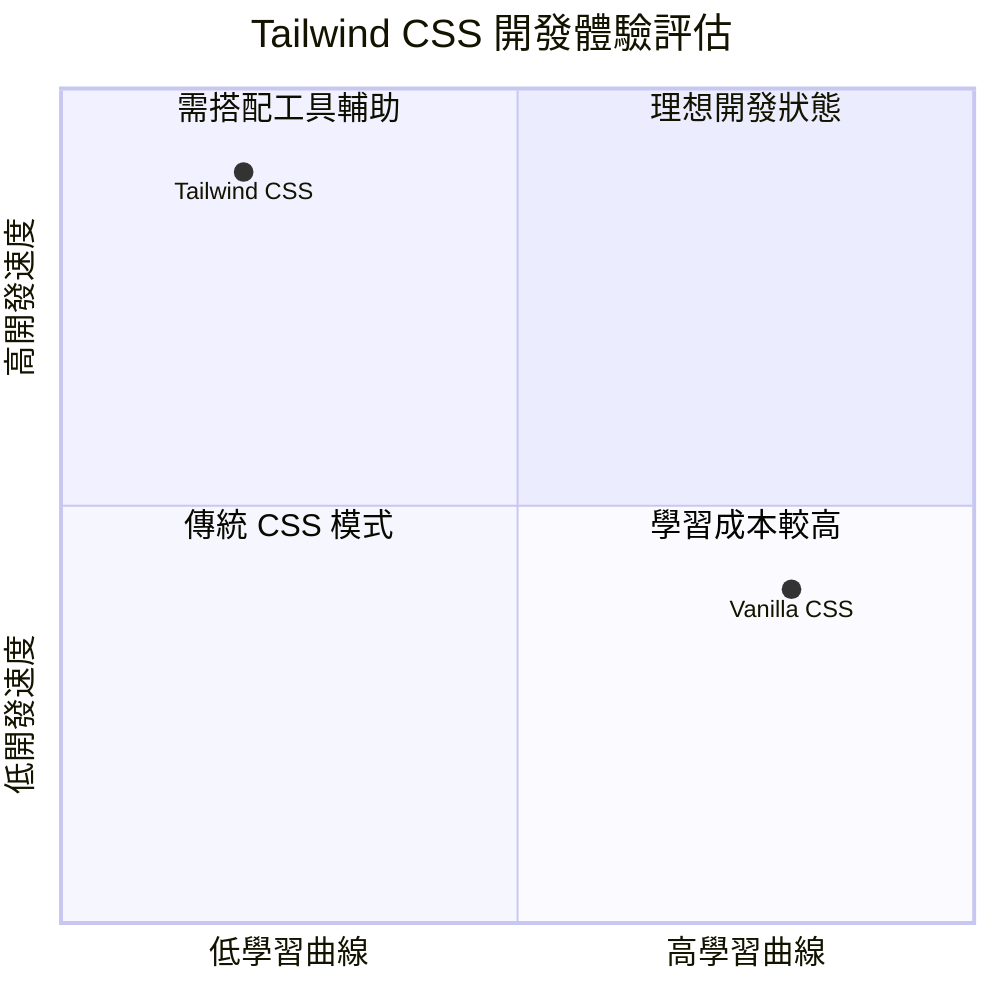
```mermaid
quadrantChart
    title Tailwind CSS 開發體驗評估
    x-axis 低學習曲線 --> 高學習曲線
    y-axis 低開發速度 --> 高開發速度
    quadrant-1 理想開發狀態
    quadrant-2 需搭配工具輔助
    quadrant-3 傳統 CSS 模式
    quadrant-4 學習成本較高
    Tailwind CSS: [0.2, 0.9]
    Vanilla CSS: [0.8, 0.4]
```

### Tailwind CSS 的優劣勢總結

- **[優點] 高效與靈活性**
    - **快速開發**：在組件間重複使用樣式非常容易且迅速
    - **避免樣式衝突**：由於不定義任何全域（Global）CSS 規則，能有效防止不同組件間的樣式相互干擾
    - **高度可配置性**：框架具有極強的擴充性（Extensible），可以根據需求進行精細的自定義調整
- **[缺點] 開發成本與耦合度**
    - **冗長的類別名稱**：某些元素會因為堆疊大量工具類別而導致 `className` 的值變得非常長
    - **樣式與結構耦合**：任何樣式的變更都必須直接修改 JSX 檔案，無法像傳統 CSS 那樣在獨立的樣式表中進行管理

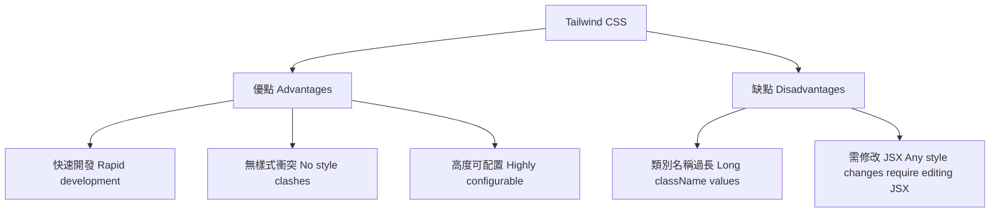
```mermaid
graph TD
    A[Tailwind CSS] --> B[優點 Advantages]
    A --> C[缺點 Disadvantages]

    B --> B1[快速開發 Rapid development]
    B --> B2[無樣式衝突 No style clashes]
    B --> B3[高度可配置 Highly configurable]

    C --> C1[類別名稱過長 Long className values]
    C --> C2[需修改 JSX Any style changes require editing JSX]
```

### Tailwind CSS 的開發模式與權衡

- **[挑戰] 樣式與結構的耦合**
    - 使用 Tailwind 時，樣式直接寫在 JSX 中，導致樣式與結構之間缺乏強烈的分離感
- **[對策] 建立小型包裝組件 (Wrapper Components)**
    - **為什麼需要？** 如果不建立組件（如 `Input` 或 `Button`），在應用程式中重複使用相同的樣式時，會導致大量的程式碼複製與貼上（Copy-pasting）
    - **開發成本**：雖然這符合 React 的組件化精神，但開發者往往會發現自己需要建立許多相對簡單、僅用於封裝樣式的「小型包裝組件」

```jsx
// 範例：為了避免重複貼上長串的 Tailwind class，我們會封裝成這樣的組件
export default function Button({ children, ...props }) {
  return (
    <button
      className="px-4 py-2 font-semibold uppercase rounded text-stone-300 bg-amber-400 hover:bg-amber-500"
      {...props}
    >
      {children}
    </button>
  );
}
```

### Tailwind CSS 與 Vanilla CSS 的比較

不同的 CSS 解決方案各有其適用場景，開發者應根據個人偏好與專案需求進行選擇。

#### Tailwind CSS

- **優點**
    - 不需要深入掌握大量 CSS 知識即可快速上手
    - 開發速度極快
    - 不會產生樣式衝突（因為不定義全域規則）
    - 高度可配置且具擴充性
- **缺點**
    - `className` 的值會變得非常長且冗長
    - 樣式變更必須直接修改 JSX
    - 可能會導致開發者需要建立許多小型包裝組件，或產生大量的程式碼複製

#### Vanilla CSS

- **優點**
    - 樣式代碼與 JSX 結構完全解耦（Decoupled）
    - 程式碼結構更清晰，不需要在 JSX 中處理大量類別名稱
    - 方便其他開發者在不接觸 JSX 的情況下進行樣式維護
- **缺點**
    - 需要具備紮實的 CSS 知識
    - CSS 規則可能在不同組件間產生衝突（例如：相同的 CSS class name 被用於不同的用途）

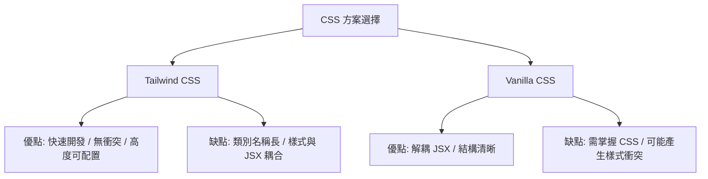
```mermaid
graph TD
    A[CSS 方案選擇] --> B[Tailwind CSS]
    A --> C[Vanilla CSS]

    B --> B1[優點: 快速開發 / 無衝突 / 高度可配置]
    B --> B2[缺點: 類別名稱長 / 樣式與 JSX 耦合]

    C --> C1[優點: 解耦 JSX / 結構清晰]
    C --> C2[缺點: 需掌握 CSS / 可能產生樣式衝突]
```

## Debugging React Apps

- **[目標] 尋找與修復錯誤 (Finding & Fixing Errors)**
    - 學習如何有效地除錯 React 應用程式
    - **[核心重點] 理解錯誤訊息**
        - 深入分析 React 有時會顯示的錯誤訊息
        - 透過解讀訊息來判斷問題所在，進而快速修復錯誤

> 所有的開發者，包括 React 開發者，最終都會寫出包含錯誤與 Bug 的程式碼。

### 本章學習重點

- **尋找與修復錯誤 (Finding & Fixing Errors)**
    - 理解並解讀 React 錯誤訊息
- **透過瀏覽器工具處理邏輯錯誤**
    - 利用瀏覽器開發者工具 (DevTools) 與除錯器 (Debugger) 來尋找並修復程式碼中的邏輯錯誤
- **啟用 React Strict Mode**
    - 學習如何開啟 Strict Mode 以及其對開發的幫助
- **使用 React DevTools**
    - 學習安裝並利用 React DevTools 進行應用程式的分析與操作

### 實作練習：投資計算器 (Investment Calculator)

- 使用先前課程建立的「投資計算器」專案作為除錯練習的基礎
- **[專案調整]** 為了教學目的，專案程式碼已被刻意修改，加入了一些微小的錯誤與 Bug
- **[提供資源]** 練習專案提供以下兩種版本供學生使用：
    - 本地端版本 (Local version)
    - CodeSandbox 版本

### 投資計算器專案架構

- **[專案特性]** 結構相對簡單，主要由以下邏輯組成：
    - **狀態管理 (State Management)**：在特定組件中管理應用程式的狀態
    - **衍生計算值 (Computed Values)**：在其他組件中根據現有狀態計算出特定的數值
- **[專案用途]** 作為探索 React 錯誤尋找與修復功能的起點

### 觀察應用程式崩潰與錯誤訊息

- **[問題情境]** 正常情況下應用程式運作良好，且 Console 沒有任何錯誤
- **[觸發錯誤]** 當輸入無效的持續時間（Duration），例如 `0` 或負數時，應用程式會崩潰並顯示空白畫面
- **[除錯起點]** 透過瀏覽器開發者工具的 Console 查看錯誤訊息
    - 當畫面空白時，Console 會顯示具體的錯誤類型與發生位置
    - 例如：`Uncaught TypeError: Cannot read properties of undefined (reading 'valueEndOfYear')`
    - 錯誤來源指出問題發生在 `Results.jsx:8:16`

### 解讀 React 錯誤訊息

- **面對錯誤的心態**
    - 看到大量的紅色文字與錯誤訊息時，容易感到不知所措 (overwhelmed)
    - **[關鍵觀念]** 大多數 React 錯誤訊息實際上是非常有幫助的，它們提供了定位問題的重要線索
- **錯誤訊息的組成 (以 Console 顯示為例)**
    - 錯誤訊息會指出錯誤的類型，例如：`Uncaught TypeError`
    - 會明確標示出問題發生的檔案與行號，例如：`Results.jsx:8:16`
    - 會顯示錯誤發生的呼叫堆疊 (Stack Trace)，幫助追蹤從哪個組件或函式開始出錯

### 深層解讀錯誤訊息內容

- **尋找主訊息 (Main Message)**
    - 錯誤訊息區塊中，最重要的資訊通常出現在紅字區塊的較早期位置
- **分析錯誤細節**
    - **錯誤類型**：例如 `Uncaught TypeError`，這告訴我們錯誤的性質（類型錯誤）
    - **具體問題描述**：訊息會說明瀏覽器在執行程式碼時失敗的原因
        - 例如：`Cannot read properties of undefined (reading 'valueEndOfYear')`
        - 這代表程式試圖存取一個屬性，但該屬性所屬的物件目前是 `undefined`
        - **[關鍵點]** 訊息中的 `(reading 'valueEndOfYear')` 直接指出了出問題的屬性名稱
    - **定位問題位置**
        - 訊息會提供檔案名稱與行號，例如 `Results.jsx:8:16`
        - 這能幫助開發者直接跳轉到出錯的程式碼行進行檢查

### 定位錯誤源頭

- **利用錯誤訊息進行初步判斷**
    - 錯誤訊息指出嘗試存取的物件是 `undefined`，這為搜尋錯誤原因提供了明確的方向
    - **[行動建議]** 應從程式碼中嘗試存取該屬性的位置開始檢查
- **從 Console 快速定位程式碼**
    - 錯誤訊息會直接標示出問題發生的檔案與行號
    - 例如：`Results.jsx:8:16` 指引開發者問題出在 `Results.jsx` 的第 8 行
- **分析具體程式碼位置**
    - 在 `Results.jsx` 中，問題發生在嘗試存取 `valueEndOfYear` 屬性的地方

```javascript
// Results.jsx 中的錯誤位置範例
export default function Results({ input }) {
  const results = [];
  calculateInvestmentResults(input, results);
  const initialInvestment =
    results[0].valueEndOfYear - // <-- 問題可能發生在此行
    results[0].interest -
    results[0].annualInvestment;

  return (
    <table id="result">
    ...
```

### 理解呼叫堆疊 (Stack Trace)

- **[定義]** 位於錯誤訊息下方的輸出內容，稱為「呼叫堆疊 (Stack Trace)
    - 它是一份程式碼執行路徑的清單，記錄了導致該錯誤發生的所有函數呼叫順序
- **[如何解讀]**
    - **錯誤來源**：堆疊會顯示錯誤是從哪個函數或組件傳出的。例如訊息顯示錯誤來自 `Results` 組件函數
    - **行號與欄位**：以 `Results.jsx:8:16` 為例
        - `8` 代表發生錯誤的**行號** (Line number)，這是除錯時最重要的資訊
        - `16` 代表該行中的**欄位/字元位置** (Column)，雖然可用作參考，但通常優先關注行號即可

### 分析具體的錯誤原因

- **利用呼叫堆疊定位**
    - 不需要盲目搜尋，可以直接透過呼叫堆疊 (Stack Trace) 提供的資訊，直接跳轉到對應的檔案與行號
    - 例如：從訊息中可以直接確認問題出現在 `Results.jsx:8:16`
- **結合錯誤描述與程式碼**
    - **[錯誤描述]**：`Cannot read properties of undefined (reading 'valueEndOfYear')`
    - **[程式碼位置]**：`Results.jsx` 第 8 行

```javascript
// Results.jsx
    const initialInvestment =
      results[0].valueEndOfYear - // <-- 這裡嘗試讀取 valueEndOfYear
      results[0].interest -
      results[0].annualInvestment;
```

    - **[邏輯推導]**
        - 錯誤訊息指出「無法從 `undefined` 讀取屬性」
        - 讀取的屬性是 `valueEndOfYear`
        - 對照程式碼，這意味著 `results[0]` 這個物件目前是 `undefined`
        - **[結論]**：問題不在於 `valueEndOfYear` 這個屬性本身，而是 `results[0]` 這個物件不存在（為 `undefined`）

### 追蹤資料流以解決錯誤

- **確認錯誤根源**
    - 錯誤訊息顯示 `results[0]` 的值為 `undefined`
    - 這意味著在 `Results` 組件中，雖然宣告了 `results` 陣列，但該陣列在執行計算後並沒有如預期般填充資料，或者傳遞過程出了問題
- **回溯資料產生位置**
    - 必須檢查 `results` 陣列是在哪裡被賦值的，即 `calculateInvestmentResults` 函數的實作邏輯
- **分析函數實作與參數傳遞**
    - 在目前的實作中，`results` 陣列是在 `Results` 組件內建立的，然後作為參數傳入 `calculateInvestmentResults` 函數
    - **[資料流向]**：`Results` 組件 $\rightarrow$ 建立空陣列 `results` $\rightarrow$ 傳入 `calculateInvestmentResults` $\rightarrow$ 在函數內部進行操作與填充

```javascript
// Results.jsx 中的資料傳遞邏輯
export default function Results({ input }) {
  const results = []; // 1. 在此建立空陣列
  calculateInvestmentResults(input, results); // 2. 將陣列作為參數傳入函數

  const initialInvestment =
    results[0].valueEndOfYear - // 3. 若函數未正確填充陣列，此處將報錯
    results[0].interest -
    results[0].annualInvestment;
  // ...
}
```

```javascript
// investment.js 中的函數實作 (部分內容)
export function calculateInvestmentResults(
  initialInvestment,
  annualInvestment,
  expectedReturn,
  duration,
  results // <--- 接收來自外部的陣列引用
) {
  let investmentValue = initialInvestment;
  for (let i = 0; i < duration; i++) {
    const interestEarnedInYear = investmentValue * (expectedReturn / 100);
    investmentValue += interestEarnedInYear + annualInvestment;

    // 在這裡將計算結果 push 進 results 陣列
    results.push({
      year: i + 1,
      interest: interestEarnedInYear,
      valueEndOfYear: investmentValue,
      annualInvestment: annualInvestment
    });
  }
}
```

### 深入分析錯誤根源

- **錯誤現象回顧**
    - 程式碼嘗試存取 `results[0].valueEndOfYear` 時崩潰
    - 錯誤訊息：`Uncaught TypeError: Cannot read properties of undefined (reading 'valueEndOfYear')`
    - 這代表 `results[0]` 是 `undefined`，也就是說 `results` 陣列目前是空的
- **邏輯矛盾點**
    - 在 `Results.jsx` 中，我們建立了一個空陣列 `const results = [];` 並傳入函數
    - 在 `investment.js` 的 `calculateInvestmentResults` 函數中，理論上應該會執行 `results.push(...)` 來填充資料
    - **[核心問題]**：既然函數內有 `push` 邏輯，為什麼 `results` 陣列在執行完後仍然是空的？

```javascript
// investment.js 中的填充邏輯
for (let i = 0; i < duration; i++) {
  // ... 計算邏輯
  results.push({
    year: i + 1, // year identifier
    interest: interestEarnedInYear,
    valueEndOfYear: investmentValue,
    annualInvestment: annualInvestment
  });
}
```

- **初步推論**
    - 問題可能出在 `for` 迴圈根本沒有被執行，或者 `results` 陣列的引用在傳遞過程中出了問題，導致 `push` 的對象並非 `Results.jsx` 中的那個陣列。
- **`for`&#32;迴圈未執行的原因分析**
    - 觀察 `calculateInvestmentResults` 中的迴圈結構：

```javascript
for (let i = 0; i < duration; i++) {
        // ... 填充 results 的邏輯
      }
```

    - **[邏輯推導]**：若 `results` 陣列最終仍為空，代表 `for` 迴圈內的程式碼從未被執行
    - **[條件失效]**：迴圈執行的前提是 `i < duration`。如果這個條件在第一次檢查時就不成立，迴圈就會直接跳過
        - 這會發生在 `duration` 的值小於或等於 `i`（即 `i = 0`）的情況下
        - **具體情境**：如果在應用程式介面中輸入的投資年限（duration）為 `0` 或負數，迴圈將不會執行，導致 `results` 陣列保持為空，最終引發 `TypeError`

### 處理無效輸入與早期回傳

- **[解決方案]** 透過檢查 `results` 陣列的長度來判斷是否發生了無效輸入（如年限為 0 或負數）
- **實作方式**：在嘗試存取陣列元素之前，先進行長度檢查

```javascript
// Results.jsx 中的防禦性程式碼
export default function Results({ input }) {
  const results = [];
  calculateInvestmentResults(input, results);

  // 如果陣列長度為 0，代表沒有計算出任何結果
  if (results.length === 0) {
    return <p>Invalid input data provided.</p>;
  }

  // 只有在 results 有資料的情況下，才會執行到這裡
  const initialInvestment = results[0].valueEndOfYear;
  // ...
}
```

- **早期回傳 (Early Return) 的原理**
    - 當 `results.length === 0` 成立時，執行 `return` 陳述式
    - **[關鍵點]**：一旦執行了 `return`，該函數後續的所有程式碼都不會被執行
    - 這能確保程式不會執行到會導致崩潰的 `results[0].valueEndOfYear` 這一行

### 使用守衛模式處理無效輸入

- **實作守衛 (Guard) 邏輯**
    - 透過 `if` 檢查 `results.length === 0` 來確保後續程式碼不會存取不存在的陣列元素
    - **[目的]** 避免當輸入值（如年限為 0 或負數）導致計算結果為空時，程式試圖讀取 `results[0]` 而引發崩潰

```javascript
// Results.jsx 中的守衛邏輯
if (results.length === 0) {
  return <p className="text-center">Invalid input data provided.</p>;
}
```

- **早期回傳 (Early Return) 的效果**
    - 一旦執行了 `return`，該組件後續的所有邏輯與渲染程式碼都不會被執行
    - **[驗證結果]**：當在介面輸入 `-1` 時，控制台不再出現 `TypeError` 錯誤，取而代之的是在畫面上顯示「Invalid input data provided.」的提示訊息
    - 這能提供更好的使用者體驗，讓使用者知道輸入有誤，而不是讓整個應用程式直接當掉

### 解決錯誤的總結

- **除錯的核心流程**
    - 閱讀並理解錯誤訊息（Error Message）提供的資訊
    - 根據訊息指示的位置，在程式碼中找出導致問題的根本原因
    - 實作對應的修正邏輯，例如使用早期回傳（Early Return）來防止錯誤發生
- **成功修復案例**
    - **問題**：當輸入無效導致 `results` 陣列為空時，程式會嘗試讀取 `results[0]` 而崩潰
    - **解決方案**：透過加入 `if (results.length === 0)` 的檢查，確保在資料不完整時直接回傳錯誤訊息，避免執行後續會出錯的邏輯

```javascript
// Results.jsx 中的防禦性檢查
export default function Results({ input }) {
  const results = [];
  calculateInvestmentResults(input, results);

  if (results.length === 0) {
    return <p className="center">Invalid input data provided.</p>;
  }

  // 只有在 results 有資料時，才會安全地執行到這裡
  const initialInvestment = results[0].valueEndOfYear;
  // ...
}
```

### 邏輯錯誤 vs. 執行錯誤

- **執行錯誤 (Error Messages)**
    - 當程式碼發生語法錯誤或嘗試執行非法操作（如存取不存在的陣列元素）時，瀏覽器控制台會顯示明確的錯誤訊息
    - 例如：先前處理的 `TypeError`
- **邏輯錯誤 (Logical Errors)**
    - **[定義]** 程式碼可以正常執行且不會導致崩潰，但計算出的結果與預期不符
    - **[特徵]** 控制台不會出現任何錯誤訊息，但應用程式的輸出數據會出現異常
- **案例分析：投資計算器**
    - 當將「初始投資 (Initial Investment)」更改為 `15000` 時，計算結果會出現異常巨大的數字（例如數千億）
    - 這種情況下，由於沒有錯誤訊息引導，偵錯過程會變得更加困難

### 面對邏輯錯誤的除錯策略

- **邏輯推理與排除法**
    - 當遇到計算結果異常但沒有錯誤訊息時，第一步應思考：哪一部分的程式碼可能導致此錯誤？
    - **[排除步驟]**：
        - **檢查初始狀態**：如果重新整理應用程式後，初始顯示的結果是正確的，則該錯誤不太可能源自於計算邏輯函數（例如 `calculateInvestmentResults`）。
        - **檢查計算函數**：若計算函數本身有誤，初始輸出的數據也應該會出現異常。
        - **檢查資料處理組件**：若計算邏輯看起來正確，問題可能出現在接收資料的組件（如 `Results` 組件）或是在建立表格資料（Table data）的過程中。

### 定位邏輯錯誤的來源

- **追蹤狀態流向**
    - 由於應用程式在初始狀態下運作正常，只有在修改輸入值時才會出錯，因此問題極可能與「獲取使用者輸入」的過程有關
    - 根據狀態提升（State Lifting）的概念，管理使用者輸入的狀態位於 `App` 組件中，而非單獨的 `UserInput` 組件
- **鎖定可疑程式碼區塊**
    - 錯誤可能發生在 `App` 組件中負責更新狀態的 `handleChange` 函數內
    - **[分析重點]**：檢查 `handleChange` 如何將使用者輸入的值儲存到狀態物件中，這可能是導致計算邏輯崩潰的根源

```javascript
// App.jsx 中的 handleChange 邏輯 (疑似問題點)
function handleChange(inputIdentifier, newValue) {
  setUserInput((prevUserInput) => {
    return {
      ...prevUserInput,
      [inputIdentifier]: newValue,
    };
  });
}
```

- **觀察到的異常現象**
    - 雖然 `handleChange` 看起來在更新物件，但若 `newValue` 的型別處理不當（例如將字串與數字混合運算），就會導致後續計算出天文數字般的錯誤結果

### 使用瀏覽器開發者工具進行除錯

- **使用 Sources 分頁**
    - 在 Chrome DevTools 中，可以使用 「Sources」分頁來查看程式碼在執行時的實際數值
    - 這對於觀察變數在特定執行點（execution point）的狀態非常有用
- **瀏覽器中的檔案結構**
    - 在 Sources 分頁下，可以看到與本地專案類似的資料夾結構（例如 `localhost:5173` 下的目錄）
    - 專案的核心原始碼通常位於 `src` 資料夾中

### 使用斷點 (Breakpoints) 進行除錯

- **設定斷點**
    - 在瀏覽器開發者工具的 「Sources」 分頁中，可以直接點擊程式碼左側的「行號」來設置斷點
    - **[功能]** 當程式碼執行到該行時，執行會自動暫停，讓開發者可以檢查當下的執行狀態
- **在 Sources 分頁中查看程式碼**
    - Sources 分頁不僅顯示專案的檔案結構，還能讓你直接深入查看與本地專案一致的原始碼（例如 `App.jsx`）
    - 這對於觀察變數在特定執行點 (execution point) 的即時數值至關重要

### 在斷點暫停時檢查變數值

- **斷點觸發後的狀態**
    - 當程式執行到設定的斷點時，頁面會變為灰色，並顯示 「Paused in debugger」 的訊息
    - 此時程式碼執行會暫停，開發者可以針對當下的執行環境進行檢查
- **查看即時變數值**
    - **[方法]** 在 Sources 分頁中，可以直接將滑鼠懸停在程式碼中的變數名稱上
    - **[範例]** 透過懸停，可以即時看到該次執行中變數的實際內容：
        - `inputIdentifier`: 例如 `"initialInvestment"`
        - `newValue`: 例如 `15000` (這是從輸入欄位中輸入的值)
- **除錯意義**
    - 這種方法能讓我們直觀地確認，在特定的函數執行點，傳入的參數與狀態是否符合預期，是定位邏輯錯誤（例如型別錯誤或數值錯誤）的關鍵步驟

### 使用開發者工具進行逐步執行 (Step-by-step Execution)

在程式碼進入斷點暫停後，可以使用以下控制按鈕來精確控制程式碼的執行流程：

- **控制按鈕功能**
    - **Step into (進入函數)**：跳入當前行所呼叫的函數內部，以便深入觀察函數內部的執行細節。
    - **Step out (跳出函數)**：從當前函數中跳出，直接執行到該函數結束後的下一行程式碼。
    - **Step over (跳過/執行下一行)**：直接執行當前行，並跳到下一行陳述式，而不會進入該行所呼叫的函數內部。
- **透過逐步執行觀察變數**
    - **[實例分析]**：當程式在 `App.jsx` 的 `handleChange` 函數中暫停時，可以透過觀察變數來發現潛在問題
    - **觀察結果**：在執行過程中，可以發現 `newValue` 的型態實際上是 `string`（字串），而非預期的數字。這解釋了為什麼後續的數學運算會產生異常結果，因為字串與數字的混合運算會導致邏輯錯誤。

### 深入分析型別錯誤的根源

- **字串與數字混合運算的風險**
    - 在 `App.jsx` 中觀察到 `newValue` 被包裹在引號中（例如 `"1000"`），這表示它是一個**字串 (string)** 而非數字
    - **[問題點]**：當 JavaScript 嘗試將字串與數字結合進行數學運算時，會導致邏輯崩潰（例如發生字串拼接而非數值相加），進而使整個計算結果出錯
- **重新定位除錯點**
    - 由於錯誤發生在計算邏輯層，僅在 `App.jsx` 的輸入處理處設置斷點可能不足以看清完整的錯誤傳遞過程
    - **[策略]**：將斷點移至負責核心計算的檔案 `investment.js` 中，例如直接設定在該檔案的第 13 行（`calculateInvestmentResults` 函數的開頭），以便在計算開始前檢查輸入參數的正確性

```javascript
// investment.js 中的核心計算函數 (設定斷點的位置)
export function calculateInvestmentResults({
  initialInvestment,
  annualInvestment,
  expectedReturn,
  duration,
}, results) {
  let investmentValue = initialInvestment; // <--- 在此處設置斷點
  // ... 後續計算邏輯
}
```

- **執行觀察**
    - 當程式碼執行到 `investment.js` 的斷點時，開發者可以重新檢視傳入函數的物件屬性，確認 `initialInvestment` 等數值是否已正確轉換為數字型別

### 找出計算邏輯錯誤的根本原因

- **觀察執行過程中的變數狀態**
    - 在 `investment.js` 的迴圈內部進行逐步執行（Step-through）
    - **[發現問題]**：在第 17 行執行 `investmentValue += interestEarnedInYear + annualInvestment` 時，發現 `investmentValue` 的值帶有引號（例如 `"15000"`）
- **字串拼接 vs. 數值相加**
    - **[錯誤原因]**：由於 `initialInvestment` 是以字串型別傳入，導致 `investmentValue` 在初始階段就是字串
    - 當執行 `+=` 運算時，JavaScript 會將其視為字串拼接而非數學加法
    - **[對比觀察]**：
        - `interestEarnedInYear`：沒有引號，是一個正常的數字
        - `investmentValue`：帶有引號 `"15000"`，是一個字串
    - 這解釋了為什麼計算結果並非預期的累加數值，而是出現了異常的字串組合

### 修復型別轉換問題

- **問題根源回顧**
    - 由於輸入值被視為字串，數學運算會變成「字串拼接」而非數值計算，導致計算結果出現異常的長字串（例如：`$1,500,021,699,001,326`）
- **解決方案：強制型別轉換**
    - 在將 `newValue` 存入狀態之前，使用一元加號 (`+`) 運算子將其轉換為數字
    - **[實作方式]** 在 `App.jsx` 的 `handleChange` 函數中進行修改：

```javascript
// App.jsx
function handleChange(inputIdentifier, newValue) {
  setUserInput((prevUserInput) => {
    return {
      ...prevUserInput,
      [inputIdentifier]: +newValue, // 使用 + 將字串轉為數字
    };
  });
}
```

- **修復後的結果**
    - 儲存並重新整理頁面後，輸入欄位的數值能正確參與運算
    - 計算表格顯示出合理的財務增長數值，不再出現錯誤的字串拼接現象

### 探索 React 的除錯特性

- 除了錯誤訊息、邏輯思考與瀏覽器開發者工具外，React 本身也具備一些特性可以幫助捕捉並修復錯誤
- **[實驗操作]** 透過修改 `Results.jsx` 來演示此特性
    - 將 `results` 陣列從組件函數內移出，放置在 `import` 語句下方
    - **[目的]** 觀察當重新整理頁面與進行使用者輸入變動時，應用程式行為的差異

```jsx
// Results.jsx 修改後的結構
import { calculateInvestmentResults, formatter } from '../util/investment';

const results = []; // 將 results 移出組件函數之外

export default function Results({ input }) {
  const calculatedResults = calculateInvestmentResults(input, results);
  // ...
}
```

### 觀察錯誤訊息與行為異常

- **[現象] 表格異常增長**
    - 當修改 `Results.jsx` 將 `results` 陣列移出組件後，每次使用者變動輸入值，表格不僅沒有更新舊資料，反而會變得越來越長
    - **[原因]**：因為 `results` 變數現在存在於組件外部，它變成了一個持久的陣列，每次計算出的新結果都會被 `push` 進去，而不是取代原本的內容
- **瀏覽器控制台錯誤 (Console Errors)**
    - 控制台出現了多個警告訊息，核心問題在於 **Key 衝突**
    - **[錯誤訊息內容]**：`Warning: react-dom.development.js:86 Encountered two children with the same key, '9'. Keys should be unique so that components maintain their identity across updates.`
    - **[問題根源]**：
        - 在 `Results.jsx` 中，我們使用 `yearData.year` 作為列表項目的 `key`
        - 由於陣列不斷增長，舊的年份（例如第 9 年）會重複出現在陣列中
        - 當 React 偵測到多個具有相同 `key` 的元素時，會發出警告，因為這會導致 React 無法正確識別和更新 DOM 節點

### 邏輯錯誤的觸發時機

- **[特性] 延遲顯現**
    - 許多邏輯錯誤不會在應用程式一啟動時就發生
    - 這些錯誤通常只有在使用者開始與應用程式互動（例如：修改輸入值進行測試）時才會被觸發並顯現出來

### 使用 React Strict Mode

- **[功能] 早期錯誤偵測**
    - React 提供了一種稱為 **Strict Mode** 的機制
    - **[優點]** 它可以讓 React 在應用程式啟動時，立即將潛在的問題或錯誤呈現給開發者，而不必等到使用者操作後才發現
- **[實作位置]** 通常會在專案的進入點進行設定，例如 `index.jsx`
- **[本質]** Strict Mode 是一個由 React 提供的內建組件
    - 可以透過 `import { StrictMode } from 'react'` 進行引入
- **[使用方式]** 作為一個包裝組件（Wrapper Component）使用
    - 可以將其包裹在其他組件的外層，例如包裹整個 `App` 組件
    - **[靈活性]** 不一定要全域開啟，也可以只針對應用程式中的特定部分啟用

```jsx
// index.jsx 實作範例
import { StrictMode } from 'react';
import ReactDOM from 'react-dom/client';
import App from './App.jsx';
import './index.css';

ReactDOM.createRoot(document.getElementById('root')).render(
  <StrictMode>
    <App />
  </StrictMode>
);
```

### Strict Mode 的靈活性與運作機制

- **[使用範圍] 局部套用**
    - Strict Mode 不一定要包裹整個根組件（Root Component）
    - 可以根據需求，將其引入並包裹在組件樹中更深層的特定組件上
        - 例如：僅針對 `Results` 組件或 `UserInput` 組件啟用 Strict Mode
- **[核心機制] 雙重執行 (Double Execution)**
    - Strict Mode 在開發環境中，最重要的功能之一是會將每個組件函數**執行兩次**，而不是僅執行一次
    - **[目的]** 藉此幫助開發者在應用程式中更輕易地捕捉到潛在的程式碼問題或副作用

### Strict Mode 的開發與生產環境差異

- **[環境差異] 執行次數**
    - **開發環境 (Development)**：每個組件會執行兩次
        - **目的**：透過重複執行來幫助開發者更快速地捕捉到如副作用（Side Effects）導致的錯誤
    - **生產環境 (Production)**：每個組件僅執行一次
        - **原因**：為了確保應用程式的效能，避免不必要的重複計算
- **[實例觀察] 錯誤的放大效應**
    - 當程式碼中存在邏輯錯誤（例如：導致陣列不斷增長的副作用）時，Strict Mode 的雙重執行會讓錯誤更明顯
    - **[現象]**：重新整理頁面後，由於 `App` 組件被執行了兩次，表格的內容會直接顯示為兩倍的資料量，從而立即揭示了資料異常增長的邏輯問題

### 透過 Strict Mode 快速發現錯誤

- **[優點] 立即顯現問題**
    - Strict Mode 不需要等到使用者操作輸入，就能在應用程式啟動時立即呈現錯誤
    - 藉由包裹整個應用程式，開發者可以更早察覺到潛在的邏輯缺陷

### 找出 Results 組件的邏輯錯誤

- **[錯誤根源] 變數定義位置不當**
    - 在 `Results.jsx` 組件中，將結果陣列（results array）定義在了**組件函數之外**
    - **[後果]**
        - 組件函數外的變數只會在模組載入時初始化**一次**
        - 當父組件的狀態改變導致 `Results` 組件重新執行（re-execute）時，該陣列**不會被重新建立或清空**
        - 這會導致每次組件重新渲染時，新的計算結果都會被附加到舊的陣列之後，造成資料不斷重複增長

### 修正 Results 組件的資料堆疊問題

- **[錯誤原因] 記憶體中的陣列未重置**
    - 當 `results` 陣列被定義在 `Results` 組件函數之外時，它只會在模組載入時被初始化一次
    - **[連鎖反應]**
        - 每當使用者輸入改變，觸發組件重新執行（re-execute）時，該陣列**不會**被重新建立或清空
        - 在 `calculateInvestmentResults` 函數執行過程中，新的計算結果會不斷使用 `.push()` 被附加到同一個記憶體位址的陣列中
        - 這導致 `results` 陣列的長度隨著每次輸入而不斷增長，而非每次都從空陣列重新計算

```javascript
// 錯誤的寫法：陣列在組件外，導致資料不斷堆疊
const results = [];

export default function Results({ input }) {
  // ...
}
```

- **[解決方案] 將變數移回組件內部**
    - 必須將 `const results = [];` 移回 `Results` 組件函數的內部
    - **[目的]** 確保每次組件重新執行時，都會建立一個全新的、空的陣列，從而確保計算結果的正確性

### 驗證錯誤修正的有效性

- **[驗證方法] 重新整理應用程式**
    - 透過重新整理頁面，可以觀察錯誤是否依然存在
    - **[觀察結果]** 錯誤訊息從 Console 中消失，且頁面呈現正確的資料量
- **[信心來源] Strict Mode 的保證**
    - 因為使用了 Strict Mode，我們可以非常有信心（with confidence）地確認該問題已解決
    - **[原因]** 既然在 Strict Mode 的雙重執行機制下，資料不會因為組件重複執行而再次異常增長，那麼當使用者開始編輯輸入值（導致組件重新渲染）時，資料狀態也將保持穩定，不會再出現之前的邏輯錯誤

### React DevTools 瀏覽器擴充功能

- 一個專為 React 開發者設計的瀏覽器擴充功能，能大幅提升開發效率
- **[如何取得]** 可在 Chrome 線上應用程式商店搜尋 "React Developer Tools" 並安裝
- **[功能與呈現]** 安裝完成後，在瀏覽器的開發者工具 (Developer Tools) 中會出現兩個新的分頁
    - 這些分頁能讓開發者更輕鬆地進行除錯與檢視組件資訊

### React DevTools 分頁功能

- **Profiler 分頁**
    - **[用途]** 主要用於尋找並修復 React 應用程式中的效能問題 (Performance issues)
    - **[核心功能]** 協助開發者進行效能分析與優化，會在課程後續章節深入探討
- **Components 分頁**
    - **[用途]** 讓開發者能夠檢視應用程式的組件樹 (Component Tree)
    - **[組件結構]** 可以清楚看到組件之間的父子層級關係

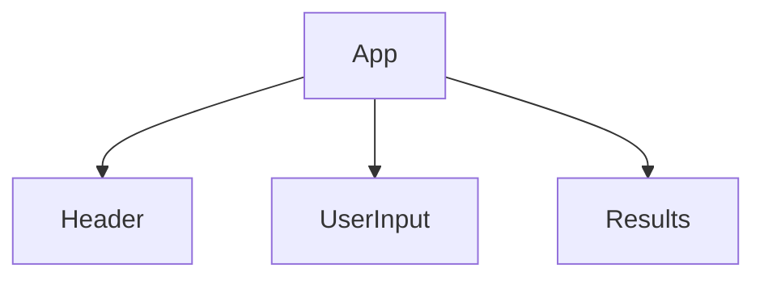
```mermaid
graph TD
    App --> Header
    App --> UserInput
    App --> Results
```

### React DevTools Components 分頁進階功能

- **[UI 對應] 快速定位組件**
    - 在 Components 分頁中將滑鼠懸停（hover）在特定的組件名稱上，左側的應用程式 UI 會同步高亮顯示對應的部分
    - **[用途]** 這對於分析與理解複雜的組件樹 (Component Tree) 以及複雜的使用者介面非常有幫助，能快速確認哪個組件控制著哪塊 UI
- **[開發者工具設定] 調整顯示體驗**
    - 點擊齒輪圖示 (gear icon) 可以開啟設定選單，調整開發者工具的外觀與行為
    - **[可調整項目]**
        - **Theme**：切換色彩模式（例如 Auto）
        - **Display density**：調整顯示密度（例如 Compact）
        - **Component tree settings**：設定組件樹是否預設展開 (Expand component tree by default)
        - **其他選項**：例如是否從原始碼解析 Hook 名稱 (Always parse hook names from source) 等
    - **[建議]** 建議實際操作這些設定，以找到最適合自己開發習慣的檢視方式

### 深入檢視組件詳細資訊

- **[檢視 Props]** 點擊 Components 分頁中的特定組件，可以查看該組件接收的所有 props
    - 可以確認 props 的名稱及其對應的資料類型（例如：某個 prop 是否為函數或物件）
    - **範例觀察**：在 `UserInput` 組件中，可以看到它接收了以下內容：
        - `onChange`: 一個函數類型 (function)，對應 `handleChange` 函數
        - `userInput`: 一個物件 (object)，包含如 `annualInvestment` 與 `duration` 等屬性
- **[實驗性除錯] 直接編輯 Props**
    - 在 DevTools 中可以直接手動修改組件的 props 值
    - **[目的]** 透過即時改變數值來觀察 UI 如何反應，這是一種快速測試不同資料狀態對介面影響的方法，而不需要實際在網頁上進行複雜的操作

### 檢視組件的 Hooks 狀態

- **[觀察狀態值]** 在 Components 分頁中，可以查看組件所使用的 Hooks 資訊
    - 例如在 `App` 組件下，可以看到 `hooks` 區塊
    - 裡面詳細記錄了透過 `useState` 建立的狀態值，如：
        - `annualInvestment: 1200`
        - `duration: 10`
- **[即時測試 UI]** 可以直接在 DevTools 中修改這些狀態值
    - **[操作範例]** 將 `duration` 從 `10` 改為 `12`
    - **[預期結果]** 應用程式的 UI 會立即反映出修改後的數值（例如計算結果會隨之改變）
- **[核心價值]** Components 分頁是快速理解組件樹結構、確認 UI 控制權歸屬，以及進行狀態實驗的最佳工具

### 透過 React DevTools 建立 UI 與資料的直覺連結

- **[核心價值] 建立直覺感**
    - 透過觀察組件樹，可以快速理解 props 或 state 的改變會如何反映在使用者介面上
    - 這有助於在不改動程式碼的情況下，預判資料變動對 UI 的影響

## Refs & Portals

- **[核心定義]** 進階的 DOM 存取與數值管理技術
- **[Refs 的應用場景]**
    - **直接存取 DOM 元素**：獲得對特定 DOM 節點的簡化直接控制權
    - **管理非 State 數值**：用於管理那些不需要觸發組件重新渲染 (re-render) 的資料值
    - **暴露組件 API**：讓組件可以向外部提供可呼叫的函數 (callable functions)
- **[Portals 的應用場景]**
    - **分離 DOM 渲染**：將組件的渲染內容從原本的 JSX 結構層級中分離 (detaching DOM rendering from JSX structure)，這對於處理如彈出視窗 (modals) 等需要脫離父層級限制的 UI 非常有用

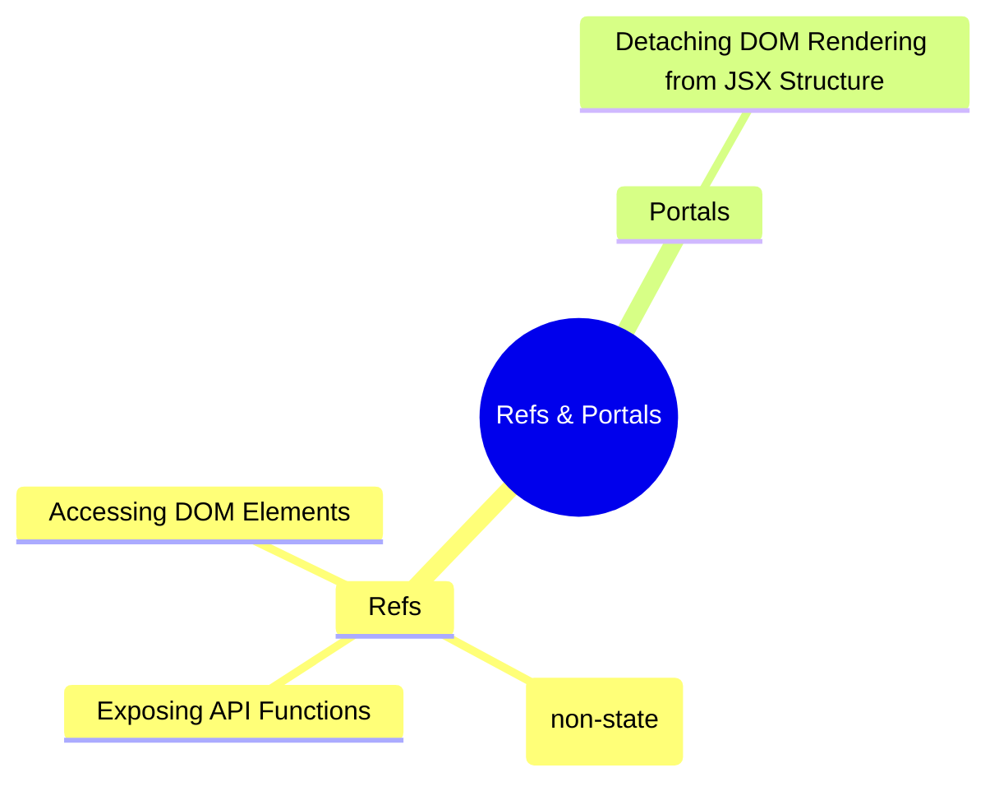
```mermaid
mindmap
  root((Refs & Portals))
    Refs
      Accessing DOM Elements
      Managing Values (non-state)
      Exposing API Functions
    Portals
      Detaching DOM Rendering from JSX Structure
```

### 實作專案：The Almost Final Countdown

- **專案目標**：開發一個計時挑戰遊戲，玩家需估計時間並在計時結束前及時停止。
- **學習重點**：透過此專案逐步實作並掌握以下技術：
    - **Refs**：處理 DOM 存取與非 State 數值管理
    - **Portals**：處理脫離 JSX 結構的渲染
    - **組件化開發**：結合 Components 與 State 管理
- **專案初始結構**：
    - `App.jsx`：主要的應用程式入口
    - `Player.jsx`：基礎的玩家組件

```jsx
// App.jsx 結構範例
import Player from './components/Player.jsx';

function App() {
  return (
    <>
      <Player />
      <div id="challenges"></div>
    </>
  );
}

export default App;
```

```jsx
// Player.jsx 結構範例
export default function Player() {
  return (
    <section id="player">
      <h2>Welcome unknown entity</h2>
      <p>
        <input type="text" />
        <button>Set Name</button>
      </p>
    </section>
  );
}
```

### 啟動實作專案

- 在本地安裝好依賴項 (dependencies) 後，透過終端機指令啟動開發伺服器
    - 使用 `npm run dev` 指令
- **[專案狀態]** 目前專案已成功運行，但在實作功能上仍有待完善
    - 例如：目前的 `Input` 組件與 `Set Name` 按鈕尚無法正常運作
    - 這將成為接下來學習 **Refs** 的第一個實際應用案例

### Player 組件功能實作

#### 使用 State 實作名稱變更

- 目標：讓使用者輸入名稱後，將原本的 "unknown entity" 替換為輸入的值
- **[實作方式]**：在不使用 Refs 的前提下，先使用 React 的 `useState` Hook 來處理這類需要觸發重新渲染的資料
- **實作步驟**：

    1. 從 `react` 匯入 `useState`
    2. 在組件內初始化狀態，設定初始值為空字串 `''`
    3. 透過 `useState` 回傳的狀態值與設定函數來管理玩家名稱

```jsx
import { useState } from 'react';

export default function Player() {
  const [enteredPlayerName, setEnteredPlayerName] = useState('');

  return (
    <section id="player">
      <h2>Welcome {enteredPlayerName}</h2>
      <p>
        <input type="text" />
        <button>Set Name</button>
      </p>
    </section>
  );
}
```

#### 透過 useState 實作名稱變更

- **[實作邏輯]**：建立一個處理函數來捕捉輸入欄位的變動，並利用 `useState` 提供的設定函數來更新狀態
- **實作步驟**：

    1. 定義狀態與其設定函數：`const [enteredPlayerName, setEnteredPlayerName] = useState('');`
    2. 建立事件處理函數 `handleChange`：

        - 該函數接收一個 `event` 物件作為參數
        - 使用 `event.target.value` 來獲取使用者輸入的最新字串
        - 呼叫 `setEnteredPlayerName` 來更新狀態

    1. 將函數綁定到 `<input>` 的 `onChange` 屬性上

```jsx
export default function Player() {
  const [enteredPlayerName, setEnteredPlayerName] = useState('');

  function handleChange(event) {
    setEnteredPlayerName(event.target.value);
  }

  return (
    <section id="player">
      <h2>Welcome {enteredPlayerName}</h2>
      <p>
        <input type="text" onChange={handleChange} />
        <button>Set Name</button>
      </p>
    </section>
  );
}
```

- **[關鍵點]**：當使用者在輸入框中進行任何變動時，React 都會自動執行 `handleChange` 函數，並將包含輸入內容的 `event` 物件傳遞進去

#### 建立受控組件 (Controlled Component)

- **[實作邏輯]**：為了確保輸入框顯示的內容與 React 狀態完全同步，需要將 `input` 的 `value` 屬性綁定到目前的狀態值上
- **實作步驟**：

    1. 在 `handleChange` 函數中，使用 `setEnteredPlayerName(event.target.value)` 更新狀態
    2. 在 JSX 的 `<input>` 標籤中，加入 `value={enteredPlayerName}` 屬性

```jsx
export default function Player() {
  const [enteredPlayerName, setEnteredPlayerName] = useState('');

  function handleChange(event) {
    setEnteredPlayerName(event.target.value);
  }

  return (
    <section id="player">
      <h2>Welcome {enteredPlayerName}</h2>
      <p>
        <input
          type="text"
          onChange={handleChange}
          value={enteredPlayerName}
        />
        <button>Set Name</button>
      </p>
    </section>
  );
}
```

- **[為什麼要這樣做?]**：這樣做可以讓輸入欄位變成一個「受控組件」，React 狀態會直接控制輸入框顯示的文字，確保 UI 與資料的一致性
- **下一步預備**：接下來將實作 `handleClick` 函數，處理點擊按鈕時的邏輯

#### 透過 `onClick` 實作提交邏輯

- **[實作邏輯]**：為了在使用者點擊按鈕後改變 UI 顯示，需要新增一個狀態來記錄「是否已提交」。
- **實作步驟**：

    1. **建立新的狀態**：使用 `useState` 定義一個名為 `submitted` 的狀態，初始值設為 `false`。
    2. **實作處理函數**：在 `handleClick` 函數中，呼叫 `setSubmitted(true)` 來更新狀態。
    3. **綁定事件**：將 `handleClick` 綁定到按鈕的 `onClick` 屬性上。
    4. **條件式渲染**：在 JSX 中使用大括號 `{}` 與邏輯判斷，根據 `submitted` 的值來決定是否顯示特定的內容（例如在歡迎訊息後顯示額外資訊）。

```jsx
export default function Player() {
  const [enteredPlayerName, setEnteredPlayerName] = useState('');
  const [submitted, setSubmitted] = useState(false);

  function handleChange(event) {
    setEnteredPlayerName(event.target.value);
  }

  function handleClick() {
    setSubmitted(true);
  }

  return (
    <section id="player">
      <h2>Welcome {enteredPlayerName}</h2>
      {submitted && <p>You submitted your name!</p>}
      <p>
        <input
          type="text"
          onChange={handleChange}
          value={enteredPlayerName}
        />
        <button onClick={handleClick}>Set Name</button>
      </p>
    </section>
  );
}
```

- **[關鍵點]**：透過這種方式，我們可以將「使用者動作」（點擊按鈕）轉換為「狀態變更」，進而驅動 React 重新渲染 UI，呈現出不同的畫面。

### 使用三元運算子進行條件式文字渲染

- **[實作邏輯]**：利用 `submitted` 狀態來決定 `<h2>` 標籤內要顯示的內容
- **實作方式**：使用三元運算子 `{condition ? exprIfTrue : exprIfFalse}`

```jsx
export default function Player() {
  const [enteredPlayerName, setEnteredPlayerName] = useState('');
  const [submitted, setSubmitted] = useState(false);

  function handleChange(event) {
    setEnteredPlayerName(event.target.value);
  }

  function handleClick() {
    setSubmitted(true);
  }

  return (
    <section id="player">
      <h2>Welcome {submitted ? enteredPlayerName : 'unknown entity'}</h2>
      <p>
        <input
          type="text"
          onChange={handleChange}
          value={enteredPlayerName}
        />
        <button onClick={handleClick}>Set Name</button>
      </p>
    </section>
  );
}
```

- **[執行流程與行為]**：
    - **初始狀態**：當頁面重新載入時，因為 `submitted` 為 `false`，畫面會顯示 "Welcome unknown entity"。此時在輸入框打字，雖然 `enteredPlayerName` 會隨之改變，但因為 `<h2>` 仍判斷為顯示預設字串，所以 UI 不會立即更新歡迎訊息。
    - **提交後狀態**：點擊 "Set Name" 按鈕觸發 `handleClick`，將 `submitted` 設為 `true`。此時 React 重新渲染，`<h2>` 開始根據 `submitted` 的值改為顯示 `enteredPlayerName`。之後在輸入框進行任何變更，歡迎訊息都會隨著輸入內容即時更新。

### 優化輸入後的顯示邏輯

- **[目前的問題]**：一旦 `submitted` 狀態變為 `true`，即便使用者在輸入框中重新輸入內容，`<h2>` 仍會持續顯示使用者名稱，這可能不符合預期（使用者可能希望重新開始輸入流程）。
- **[解決方案]**：在 `handleChange` 函數中加入 `setSubmitted(false)`，確保只要使用者開始打字，狀態就會被重置。

```jsx
function handleChange(event) {
  setEnteredPlayerName(event.target.value);
  setSubmitted(false); // 當使用者開始輸入時，將提交狀態設回 false
}
```

- **[行為變化]**：
    - **操作流程**：輸入名稱 $\rightarrow$ 點擊按鈕（`submitted` 變為 `true`，顯示名稱）$\rightarrow$ 再次在輸入框打字（`submitted` 變回 `false`，畫面立即切換回 "unknown entity"）$\rightarrow$ 再次點擊按鈕（再次顯示新名稱）。
- **[開發思考]**：雖然這種做法可以解決顯示不一致的問題，但使用者在打字時會看到內容不斷在名稱與 "unknown entity" 之間跳轉，體驗仍不夠完美。若要追求更流暢的體驗，可能需要引入更多狀態或使用計算屬性（computed properties）來處理。

### 使用 `useRef` 簡化組件的動機

- **[目前的實作複雜度]**：為了實現簡單的名稱輸入與提交功能，目前的 `Player` 組件需要維護多個狀態，程式碼顯得相對冗長：
    - 需要一個狀態來即時追蹤輸入框中的值（`enteredPlayerName`）
    - 需要透過 `onChange` 事件在每次按鍵時更新該狀態
    - 需要第二個狀態來紀錄按鈕是否已被按下（`submitted`）

```jsx
export default function Player() {
  const [enteredPlayerName, setEnteredPlayerName] = useState(null);
  const [submitted, setSubmitted] = useState(false);

  function handleChange(event) {
    setSubmitted(false);
    setEnteredPlayerName(event.target.value);
  }

  function handleClick() {
    setSubmitted(true);
  }

  return (
    <section id="player">
      <h2>Welcome {submitted ? enteredPlayerName : 'unknown entity'}</h2>
      <p>
        <input type="text" onChange={handleChange} value={enteredPlayerName} />
        <button onClick={handleClick}>Set Name</button>
      </p>
    </section>
  );
}
```

- **[核心問題]**：我們必須在每一次按鍵（keystroke）時都去更新狀態，才能確保資料能被正確讀取並用於輸出。
- **[優化方向]**：這個組件是一個非常適合使用 `refs` 來簡化的案例。透過 `useRef`，我們可以避開維護「即時輸入值」這個狀態的需求，只在需要時才去讀取 DOM 元素的值。

### React Refs 的概念

- **[定義]**：ref 是一種特殊的值，就像 state 或一般的變數一樣儲存著資訊，但它是由 React 以特殊的方式進行管理
- **[如何建立]**：透過從 `react` 套件中匯入 `useRef` 鉤子（hook）來建立
    - **[使用限制]**：如同所有的 hook，`useRef` 必須在組件函數（component function）或自定義 hook（custom hook）內部呼叫

### 使用 `useRef` 建立與連接 Ref

- **[建立 Ref]**：可以呼叫 `useRef()` 並將其結果儲存在一個常數或變數中，變數名稱可以根據需求自訂
    - 例如：為了獲取輸入框的值，可以將其命名為 `inputRef` 或 `playerNameRef`

```jsx
const playerNameRef = useRef();
```

- **[連接至 JSX 元素]**：Ref 最常見的用途是將其與 JSX 元素連結，這可以透過所有 ref 都支援的一個特殊 prop 來達成
    - 透過這個 prop，我們可以建立起程式碼邏輯與實際 DOM 元素之間的橋樑

### 使用 `ref` prop 連接元素

- **[連接機制]**：React 為所有組件自動提供了一個特殊的 `ref` prop（其運作方式類似於 `key` prop），可以用來接收 `useRef` 建立的 ref 值
    - 透過將 `ref` prop 指向 `useRef` 的變數，即可將該變數與特定的 JSX 元素連結起來

```jsx
// 建立 ref
const playerName = useRef();

// 在 JSX 中連接至 input 元素
<input ref={playerName} type="text" ... />
```

- **[存取 DOM 元素]**：一旦完成連接，我們就可以在組件的邏輯中（例如事件處理函數內）直接存取該底層的 DOM 元素
    - **[實作範例]**：在 `handleClick` 函數中，可以透過 `playerName.current` 來獲取 `input` 元素，進而讀取其內容

```jsx
function handleClick() {
  setSubmitted(true);
  // 透過 playerName 存取連接的 input 元素
  console.log(playerName.current.value);
}
```

### 存取 Ref 的內部結構

- **[核心機制]**：透過 `useRef` 建立的 Ref 值，本質上是一個 JavaScript 物件
    - **[結構特性]**：該物件**只會**包含一個名為 `current` 的屬性
    - **[存取方式]**：實際連結的 DOM 元素或儲存的值，都必須透過存取 `.current` 屬性來取得

```jsx
// 建立 Ref 物件
const playerName = useRef();

// 該物件的結構大致如下：
// { current: <連結的 DOM 元素> }

function handleClick() {
  // 必須透過 .current 才能存取到 input 元素
  console.log(playerName.current.value);
}
```

### 透過 Ref 存取原生 DOM 屬性

- **[存取機制]**：當 `ref.current` 指向一個 HTML 元素（例如 `<input>`）時，它就代表了該原生 DOM 元素本身
    - **[屬性與方法]**：你可以透過這個 ref 存取該 HTML 元素所暴露的所有原生屬性與方法
    - **[範例]**：存取輸入框的內容可以使用 `playerName.current.value`

```jsx
function handleClick() {
  // 透過 .current 存取 input 元素的 value 屬性
  console.log(playerName.current.value);
}
```

- **[開發小撇步]**：
    - **[IDE 限制]**：有時候 IDE（如 VS Code）可能無法完全理解 React ref 與原生 DOM 之間的連接，因此在輸入 `.current.` 後可能不會立即出現完整的自動補全（auto-suggestion）建議
    - **[參考資源]**：遇到不確定的屬性或方法時，可以查閱 **MDN (Mozilla Developer Network)**，了解該 HTML 元素所支援的所有 API

### 從受控組件轉向 Ref 驅動的狀態更新

- **[優化邏輯]**：不再需要在每一次按鍵時都透過 `onChange` 更新狀態，而是改為在需要提交資料時，才一次性從 `ref` 中讀取數值
    - **[移除的邏輯]**：
        - 移除 `handleChange` 函數（因為不再需要監聽每一次的按鍵動作）
        - 移除 `submitted` 狀態（如果僅需在點擊時更新一次名稱）
        - 移除 `<input>` 上的 `onChange` 屬性
- **[實作方式]**：在點擊事件處理函數（如 `handleClick`）中，直接從 `playerName.current.value` 取得當前輸入框的值，並呼叫狀態更新函數

```jsx
// 建立狀態與 Ref
const [enteredPlayerName, setEnteredPlayerName] = useState(null);
const playerName = useRef();

function handleClick() {
  // 在點擊時才讀取 Ref 中的值並更新狀態
  setEnteredPlayerName(playerName.current.value);
}

return (
  <section id="player">
    <h2>Welcome {submitted ? enteredPlayerName : 'unknown entity'}</h2>
    <p>
      <input
        ref={playerName}
        type="text"
        /* 不再需要 onChange 與 value 綁定 */
      />
      <button onClick={handleClick}>Set Name</button>
    </p>
  </section>
);
```

### 使用三元運算子的簡化寫法

- **[渲染邏輯優化]**：在處理如 `enteredPlayerName` 是否有值時，可以根據其是否為 **truthy**（真值）來決定顯示內容。
- **[JavaScript 快捷語法]**：
    - **[邏輯判斷]**：若要判斷一個值是否為 truthy（例如非空字串），若為真則顯示該值，若為 falsy（例如空字串 `""`）則顯示預設值。
    - **[注意點]**：雖然講者提到可以使用 `??` 作為快捷方式，但需注意在 JavaScript 中，`??` (Nullish Coalescing Operator) 僅針對 `null` 或 `undefined` 進行判斷。若要處理包含空字串在內的 falsy 值，傳統的三元運算子仍是最準確的做法。

```jsx
// 使用三元運算子處理 truthy/falsy 邏輯
// 若 enteredPlayerName 為空字串 "" (falsy)，則顯示 'unknown entity'
<h2>Welcome {enteredPlayerName ? enteredPlayerName : 'unknown entity'}</h2>
```

### 使用 `useRef` 簡化輸入處理的優勢

- **[運作行為]**：在改用 `useRef` 驅動的模式後，組件的行為會發生以下變化：
    - **[無即時監聽]**：在輸入框中輸入文字時，不會觸發任何狀態更新，因此在每次按鍵時都不會發生重新渲染（re-render）。
    - **[點擊觸發]**：只有在點擊「Set Name」按鈕時，才會透過 `playerName.current.value` 讀取當前數值，並呼叫 `setEnteredPlayerName` 來更新狀態，進而反映在 UI 上。
- **[開發價值]**：
    - **[簡化程式碼]**：對於只需要在提交時獲取輸入值的場景，使用 `ref` 可以大幅減少程式碼量，避免為了同步輸入值而撰寫冗長的 `onChange` 處理函數與相關狀態。

### 使用 Ref 重置輸入框

- **[實作方法]**：可以在處理點擊事件的函數中，直接透過 `ref.current` 存取該 DOM 元素，並手動修改其 `value` 屬性來清空內容。
- **[程式碼實作]**：

```jsx
function handleClick() {
  setEnteredPlayerName(playerName.current.value);
  // 直接操作 DOM 來重置輸入框的值
  playerName.current.value = '';
}
```

- **[開發思維爭議]**：
    - **[命令式操作]**：這種直接修改 `value` 的做法屬於命令式（imperative）風格，因為我們是在「命令」DOM 元素去做某件事。
    - **[React 的核心理念]**：React 的設計核心是「宣告式」（declarative）的。在純粹的 React 模式下，我們應該透過狀態（state）來驅動 UI 的變化，而非直接操作 DOM。因此，這種使用 Ref 來重置輸入框的做法在開發實踐上是有爭議的。

### 宣告式 vs. 命令式開發模式

- **[React 的核心理念]**：開發者不應該直接操作 DOM，而是應該讓 React 負責處理 DOM 的更新。
- **[程式碼行為分析]**：
    - **[僅讀取值]**：在 `setEnteredPlayerName(playerName.current.value)` 中，我們只是從 Ref 中「讀取」當前的數值，這並沒有改變 DOM 的狀態，因此仍處於 React 的管理邏輯內。
    - **[直接修改值]**：在 `playerName.current.value = '';` 中，我們是在「命令」瀏覽器將該輸入框的值設為空字串。這屬於**命令式（imperative）**程式碼，因為我們直接介入了 DOM 的操作，這違反了 React 應該由狀態驅動 UI 的宣告式原則。

```jsx
function handleClick() {
  // 僅讀取值，屬於 React 管理範圍
  setEnteredPlayerName(playerName.current.value);

  // 直接操作 DOM，屬於命令式行為，違反 React 原則
  playerName.current.value = '';
}
```

### 使用 Ref 的適用情境與限制

- **[適用場景]**：對於某些特定的簡單需求，例如僅僅是為了「清空」一個輸入框，且該輸入框與應用程式中的其他狀態沒有任何關聯時，使用 Ref 是一種可以接受的做法。
    - **[開發優勢]**：這種做法可以顯著減少程式碼量，讓開發過程更為簡便。
- **[開發原則與警告]**：
    - **[避免濫用]**：開發者必須非常小心，不應開始使用 Ref 來讀取或操作頁面上各種各樣的數值。
    - **[核心理念]**：濫用 Ref 會偏離 React 的設計初衷。React 的核心在於狀態驅動，而非透過 Ref 進行大量的 DOM 操作或數值管理。

> 使用 Ref 可以是替代 `useState` 等機制的一個很棒的方案，但前提是你要確保它能讓你的開發變得更輕鬆，而不是讓程式碼變得難以維護。

### Ref 與 State 的核心差異

- **[核心問題]**：既然我們已經可以透過 `playerName.current.value` 直接從 DOM 取得數值，為什麼還需要使用 `useState` 來管理 `enteredPlayerName`？
- **[差異點]**：
    - **State (狀態)**：當 State 的值發生改變時，React 會感知到這個變化，並自動觸發組件的**重新渲染（re-render）**，從而讓 UI（例如 `<h2>` 標籤內的文字）反映出最新的數值。
    - **Ref (引用)**：雖然 Ref 可以儲存數值或直接存取 DOM 元素，但修改 Ref 的內容**不會**觸發 React 的重新渲染。因此，如果只使用 Ref 而不搭配 State，即便數值已經改變，使用者在畫面（UI）上也看不到任何變化。

### 使用 Ref 時的潛在錯誤：存取未定義的屬性

- **[錯誤現象]**：在組件首次渲染時，如果嘗試讀取 `ref.current.value`，會導致應用程式崩潰並在控制台顯示錯誤訊息。
    - **[錯誤訊息]**：`Uncaught TypeError: Cannot read properties of undefined (reading 'value')`
- **[錯誤原因]**：
    - **[連結時機]**：透過 `ref` 屬性將 Ref 與 JSX 元素連結的過程，是在組件渲染完成並將元素掛載到 DOM 之後才會發生。
    - **[首次渲染的狀態]**：在組件進行第一次渲染（first render）時，`ref.current` 的值仍然是 `undefined`，此時尚未與任何實際的 DOM 元素建立關聯。
- **[程式碼案例分析]**：

```jsx
// 在 Player.jsx 中
const playerName = useRef();

// ...

return (
  <section id="player">
    {/* ❌ 錯誤：首次渲染時 playerName.current 是 undefined，讀取 .value 會崩潰 */}
    <h2>Welcome {playerName.current.value ?? 'unknown entity'}</h2>

    <input ref={playerName} type="text" />
  </section>
);
```

- **[關鍵認知]**：在 React 的渲染週期中，必須意識到 Ref 的連結並非即時完成的，在渲染邏輯中直接依賴 `ref.current` 的屬性是非常危險的行為。

### 透過條件判斷安全地存取 Ref

- **[問題回顧]**：在組件的第一次渲染週期中，組件函數會被執行，但此時 `playerName.current` 仍然是 `undefined`，因為連結尚未建立。
- **[解決方案]**：可以透過檢查 `playerName.current` 是否為「真值」（truthy）來進行避險，確保只有在連結已建立的情況下才嘗試讀取其屬性。
- **[實作方式]**：
    - 使用條件運算子或邏輯判斷來確保程式碼的安全性。
    - 如果 `playerName.current` 存在，則輸出其值；否則顯示預設值（如 `'unknown entity'`）。

```jsx
// 透過檢查 ref.current 是否存在來避免崩潰
<h2>Welcome {playerName.current ? playerName.current.value : 'unknown entity'}</h2>
```

- **[運作邏輯]**：
    - **第一次渲染**：`playerName.current` 為 `undefined`（falsey） $\rightarrow$ 顯示 `'unknown entity'` $\rightarrow$ **不會崩潰**。
    - **後續渲染**：`playerName.current` 已指向 DOM 元素（truthy） $\rightarrow$ 顯示 `playerName.current.value` $\rightarrow$ **正常運作**。

### 為什麼修改 Ref 不會更新 UI

- **[觀察到的現象]**：即使透過條件判斷安全地存取了 Ref，並在 `handleClick` 中修改了 `playerName.current.value`，當點擊按鈕後，畫面上的文字（如 `Welcome unknown entity`）依然沒有被更新為輸入的值。
- **[根本原因]**：這再次印證了 Ref 與 State 的核心差異：
    - **Ref 的限制**：當你修改一個 Ref 的值時，React **不會**重新執行（re-execute）組件函數。
    - **State 的特性**：相反地，每當你透過狀態更新函數（state updating function）來更新 State 時，React 都會重新渲染組件，確保 UI 與最新的狀態保持同步。

```jsx
// ❌ 問題點：雖然修改了 DOM 的值，但 React 並不知道，所以不會重新渲染 UI
function handleClick() {
  setEnteredPlayerName(playerName.current.value);
  playerName.current.value = '';
};
```

- **[總結]**：如果你的目標是讓某個數值的改變能立即反映在使用者的介面上，那麼使用 `useState` 是必要的，因為 Ref 本身並不具備「驅動渲染」的能力。

### State vs Refs

- **核心差異**：
    - **State**：透過狀態更新函數（state updating function）改變值時，會導致組件函數被**重新執行**（re-executed），從而觸發 UI 更新。
    - **Refs**：修改 Ref 的值**不會**導致組件重新執行，因此不會觸發 UI 的變化。
- **使用原則**：
    - **使用 State 的時機**：當數值需要**直接反映在使用者介面（UI）上**時，必須使用 State。
    - **使用 Refs 的時機**：當數值僅在**幕後（behind the scenes）**使用，且不需要對 UI 產生任何直接影響時，可以使用 Refs。

| 特性 | State | Refs |
| --- | --- | --- |
| 改變時是否觸發重新渲染 | 是 (Causes re-evaluation) | 否 |
| 適用情境 | 需要直接反映在 UI 的數值 | 僅在幕後使用的數值 (no direct UI impact) |

### 結合 Ref 與 State 的實務做法

- **[核心概念]**：雖然 Ref 不會觸發重新渲染，但它可以作為取得 DOM 數值的「橋樑」。
- **[實作流程]**：
    - 使用 `useRef` 直接存取 `<input>` 元素，以獲取當前輸入的數值。
    - 在特定的事件處理函數（如 `handleClick`）中，讀取 `ref.current.value`。
    - 隨後呼叫 `setState` 函數，將讀取到的值存入 State，進而觸發組件重新渲染並更新 UI。

```jsx
// 實作範例：結合 Ref 讀取與 State 更新
export default function Player() {
  const playerName = useRef();
  const [enteredPlayerName, setEnteredPlayerName] = useState(null);

  function handleClick() {
    // 1. 從 Ref 讀取值
    // 2. 透過 State 更新以觸發 UI 變化
    setEnteredPlayerName(playerName.current.value);

    // 清空輸入框
    playerName.current.value = '';
  }

  return (
    <section id="player">
      <h2>Welcome {enteredPlayerName ? enteredPlayerName : 'unknown entity'}</h2>
      <p>
        <input ref={playerName} type="text" />
        <button onClick={handleClick}>Set Name</button>
      </p>
    </section>
  );
}
```

- **[優點]**：這種做法避免了在使用者每次輸入字元時都觸發組件重新渲染（受控組件的缺點），僅在使用者完成輸入並點擊按鈕時才進行一次性的 UI 更新，效能更佳。

### 實作成果確認

- **[功能驗證]**：目前組件已能正確執行以下流程：
    - 接收使用者輸入
    - 點擊按鈕後觸發狀態更新
    - **UI 同步更新**：網頁上的顯示文字會立即反映更新後的數值
- **[後續方向]**：既然受控組件的邏輯已達成目標，接下來將深入研究如何利用 Refs 進一步簡化組件邏輯。

### 新功能擴充：計時器挑戰

- **開發目標**：為了進一步探索 Refs 的應用場景，需要為應用程式增加核心功能：計時器（Timers）以及與之相關的挑戰（Challenges）。
- **實作步驟**：
    - 建立一個新的組件檔案：`TimerChallenge.jsx`。
    - 在該檔案中定義並匯出 `TimerChallenge` 組件，作為預設匯出（default export）。

### TimerChallenge 組件實作

- **組件結構設計**：
    - 使用 `<section>` 作為容器，並加上 `className="challenge"`，以便套用專案中既有的 CSS 樣式規則。
    - 內部包含一個 `<h2>` 元素，用於顯示挑戰的標題。
- **實現組件重複使用性**：
    - 透過從 `props` 物件中解構出 `title` 屬性，讓該組件可以根據不同的配置顯示不同的標題。

```jsx
export default function TimerChallenge({ title }) {
  return (
    <section className="challenge">
      <h2>{title}</h2>
    </section>
  );
}
```

### TimerChallenge 組件功能擴充

- **[設計目標]**：在組件標題下方增加一個段落，用於展示挑戰的具體目標（例如使用者預估的目標時間）。
- **[實作細節]**：
    - 增加一個 `<p>` 元素，並賦予 `className="challenge-time"` 以套用樣式。
    - 為了讓組件能動態顯示目標，需要透過 `props` 接收一個 `targetTime` 參數。

```jsx
// 擴充後的組件結構預覽
export default function TimerChallenge({ title, targetTime }) {
  return (
    <section className="challenge">
      <h2>{title}</h2>
      <p className="challenge-time">{targetTime}</p>
    </section>
  );
}
```

### TimerChallenge 組件細節優化

- **處理時間單複數顯示**
    - 為了讓 UI 更自然，會根據 `targetTime` 的數值來決定「second」是否需要加上「s"
    - 使用三元運算子進行條件式渲染：`{targetTime > 1 ? 's' : ''}`

```jsx
// 實作目標時間的單複數邏輯
<p className="challenge-time">
  {targetTime} second{targetTime > 1 ? 's' : ''}
</p>
```

- **動態按鈕設計**
    - 計時器下方需要一個按鈕來控制挑戰的開始與停止
    - **[按鈕文字邏輯]**：按鈕文字必須根據計時器的運行狀態進行切換
        - 若計時器未執行 $\rightarrow$ 顯示 "Start Challenge"
        - 若計時器正在執行 $\rightarrow$ 顯示 "Stop Challenge"

### TimerChallenge 組件狀態顯示優化

- **[設計目標]**：新增一個段落來反映計時器的即時狀態（正在執行或停止）。
- **[實作邏輯]**：
    - 需要引入新的狀態（state）來追蹤計時器是否正在運行。
    - 使用條件式渲染（Conditional Rendering）來切換顯示文字。
    - **顯示內容**：
        - 若計時器正在執行 $\rightarrow$ 顯示 `Time is running...`
        - 若計時器未執行 $\rightarrow$ 顯示 `Timer inactive`
- **[樣式處理]**：計畫為該段落加上特定的 CSS class，以便在計時器運行時切換視覺樣式。

```jsx
// 預計實作的狀態顯示邏輯
<p className="...">
  {isTimerRunning ? 'Time is running...' : 'Timer inactive'}
</p>
```

### 將 TimerChallenge 整合至 App 組件

- **[整合位置]**：在 `App.jsx` 中，將 `TimerChallenge` 組件放置在一個特定的 `div` 容器內。
- **[DOM 結構]**：該容器使用 `id="challenges"` 作為識別。

```jsx
// App.jsx 結構預覽
function App() {
  return (
    <>
      <Player />
      <div id="challenges">
        <TimerChallenge title="Challenge Time" targetTime={60} />
      </div>
    </>
  );
}
```

### 在 App 組件中實作多個挑戰實例

- **[實作步驟]**：首先必須從組件路徑匯入 `TimerChallenge`。
- **[配置多個實例]**：在 `id="challenges"` 的容器內，透過傳遞不同的 `title` 與 `targetTime` 來建立不同難度的挑戰：
    - 簡單模式：`title="Easy"`, `targetTime={1}`
    - 中等模式：`title="Not easy"`, `targetTime={5}`
    - 困難模式：`title="Getting tough"`, `targetTime={10}`
    - 極限模式：`title="Pros only"`, `targetTime={15}`

```jsx
import TimerChallenge from './components/TimerChallenge.jsx';

function App() {
  return (
    <>
      <Player />
      <div id="challenges">
        <TimerChallenge title="Easy" targetTime={1} />
        <TimerChallenge title="Not easy" targetTime={5} />
        <TimerChallenge title="Getting tough" targetTime={10} />
        <TimerChallenge title="Pros only" targetTime={15} />
      </div>
    </>
  );
}
```

### 實作多個挑戰實例

- **[UI 呈現]**：在畫面上成功渲染出四個不同難度的挑戰卡片，包含：
    - EASY (1 second)
    - NOT EASY (5 seconds)
    - GETTING TOUGH (10 seconds)
    - PROS ONLY (15 seconds)
- **[目前的狀態]**：雖然 UI 已正確顯示，但點擊「Start Challenge」按鈕目前尚無任何反應
- **[後續開發計畫]**：為了讓按鈕具備功能，需要結合使用以下兩者：
    - **State**：用於追蹤計時器狀態並觸發 UI 更新
    - **Refs**：用於存取相關的 DOM 元素或數值

### 實作計時器邏輯

- **[建立事件處理函式]**：為了在點擊「Start Challenge」按鈕時啟動計時器，需要定義一個名為 `handleStart` 的函式。
- **[使用 JavaScript 定時器]**：利用 JavaScript 內建的 `setTimeout` 函數來實作計時功能。
    - `setTimeout` 並非 React 特有的功能，而是原生 JavaScript 提供的 API。
    - **[運作方式]**\*\*：接受一個回呼函式（callback function）以及一個以毫秒（milliseconds）為單位的延遲時間。當時間到期後，會執行該回呼函式。
    - **[動態時間設定]**：計時器的延遲時間不應是固定的，而應該根據組件傳入的 `targetTime` 屬性來計算（需將秒轉換為毫秒）。

```jsx
function TimerChallenge({ title, targetTime }) {
  function handleStart() {
    setTimeout(() => {
      // 計時器到期後執行的邏輯
    }, 1000);
  }

  return (
    // ... JSX 內容
  );
}
```

### 結合 State 與 定時器

- **[時間單位轉換]**：由於 `targetTime` 是以秒為單位，在傳入 `setTimeout` 時必須乘以 1000 以符合毫秒的要求。
- **[狀態管理]**：需要使用 `useState` 鉤子來追蹤計時器是否已經到期，以便在時間到時觸發 UI 更新。
    - 定義一個名為 `timerExpired` 的狀態，初始值設為 `false`。
    - 當 `setTimeout` 的回呼函式執行時，呼叫 `setTimerExpired(true)`。

```jsx
import { useState } from 'react';

export default function TimerChallenge({ title, targetTime }) {
  const [timerExpired, setTimerExpired] = useState(false);

  function handleStart() {
    setTimeout(() => {
      setTimerExpired(true);
    }, targetTime * 1000);
  }

  return (
    // ... JSX 內容
  );
}
```

### 實作遊戲結束邏輯與按鈕連結

- **[條件式渲染]**：利用 `timerExpired` 狀態來決定是否顯示「You lost!」的訊息。當計時器到期（`timerExpired` 為 `true`）時，會在畫面中顯示該段落。
- **[連結事件處理器]**：為了啟動計時器，必須將 `handleStart` 函式綁定到「Start Challenge」按鈕的 `onClick` 事件上。

```jsx
export default function TimerChallenge({ title, targetTime }) {
  const [timerExpired, setTimerExpired] = useState(false);

  function handleStart() {
    setTimeout(() => {
      setTimerExpired(true);
    }, targetTime * 1000);
  }

  return (
    <section className="challenge">
      <h2>{title}</h2>
      <p className="challenge-time">
        {targetTime} second{targetTime > 1 ? 's' : ''}
      </p>
      {timerExpired && <p>You lost!</p>}
      <p>
        <button onClick={handleStart}>Start Challenge</button>
      </p>
      <p>Time is running... / Timer inactive</p>
    </section>
  );
}
```

### 實作計時器啟動狀態管理

- **[新增狀態追蹤]**：為了能夠在 UI 上顯示計時器是否正在運行（例如切換按鈕文字），需要新增一個名為 `timerStarted` 的狀態。
- **[狀態更新時機]**：`timerStarted` 的狀態更新應該發生在 `handleStart` 函式被觸發的當下，也就是在啟動 `setTimeout` 的「之前」，而不是在計時器到期之後。

```jsx
export default function TimerChallenge({ title, targetTime }) {
  const [timerExpired, setTimerExpired] = useState(false);
  const [timerStarted, setTimerStarted] = useState(false);

  function handleStart() {
    setTimerStarted(true);
    setTimeout(() => {
      setTimerExpired(true);
    }, targetTime * 1000);
  }

  return (
    // ...
  );
}
```

### 實作按鈕文字切換邏輯

- **[執行順序的差異]**：在 `handleStart` 函式中，程式碼的執行順序如下：
    - 首先執行 `setTimerStarted(true)`，這會立即觸發狀態更新。
    - 接著執行 `setTimeout`，這僅僅是「設定」計時器，並不會阻塞後續程式碼。
    - `setTimeout` 內部的回呼函式（執行 `setTimerExpired(true)`）則會等到指定時間到期後才執行。
- **[動態按鈕文字]**：利用 `timerStarted` 狀態進行條件式渲染，讓按鈕文字根據計時器狀態自動切換，提升使用者體驗。

```jsx
export default function TimerChallenge({ title, targetTime }) {
  const [timerExpired, setTimerExpired] = useState(false);
  const [timerStarted, setTimerStarted] = useState(false);

  function handleStart() {
    setTimerStarted(true);
    setTimeout(() => {
      setTimerExpired(true);
    }, targetTime * 1000);
  }

  return (
    <section className="challenge">
      <h2 className="challenge-title">{title}</h2>
      <p className="challenge-time">
        {targetTime} second{targetTime > 1 ? 's' : ''}
      </p>
      {timerExpired && <p>You lost!</p>}
      <p>
        <button onClick={handleStart}>
          {timerStarted ? 'Stop' : 'Start Challenge'}
        </button>
      </p>
      <p>
        {timerStarted ? 'Time is running...' : 'Timer inactive'}
      </p>
    </section>
  );
}
```

### 實作動態 CSS 類別套用

- **[條件式類別套用]**：可以根據狀態（如 `timerStarted`）來決定是否要為元素添加特定的 CSS 類別（例如 `active`）。
    - 若狀態為真值（truthy），則套用 `active` 類別。
    - 若狀態為假值，則將 `className` 設為 `undefined`，使其不套用任何額外的類別。

```jsx
<button
  className={timerStarted ? 'active' : undefined}
  onClick={handleStart}
>
  {timerStarted ? 'Stop' : 'Start Challenge'}
</button>
```

- **[UI 與狀態的同步]**：透過這種方式，當使用者點擊按鈕觸發狀態更新時，UI 不僅會在文字內容上發生變化（例如從「Start Challenge」變為「Stop」），在視覺樣式上也會立即反應（例如按鈕顏色改變），達成完整的狀態驅動介面。

### 實作停止計時器功能

- **[功能需求]**：目前的挑戰機制只有啟動功能，缺乏停止功能，因此需要新增一個 `handleStop` 函式來讓使用者能夠中斷計時器。
- **[技術挑戰]**：問題在於如何讓 `handleStop` 函式能夠存取到由 `handleStart` 啟動的那個計時器實例（即 `setTimeout` 的 ID）。
- **[解決方案預告]**：可以使用 **Ref** 來儲存這個計時器 ID，因為 Ref 可以在組件重新渲染時保持其值不變，且不會因為值的改變而觸發不必要的重新渲染。

### 使用 clearTimeout 停止計時器

- **[停止計時器的原理]**：JavaScript 提供了一個 `clearTimeout` 函式，可以用來停止正在執行的計時器。
    - **[關鍵需求]**：要停止特定的計時器，必須將 `setTimeout` 回傳的「指標」（即計時器 ID）作為參數傳遞給 `clearTimeout`。
- **[實作邏輯]**：
    - 在 `handleStart` 函式中，將 `setTimeout` 的回傳值賦值給一個變數。
    - 為了讓 `handleStop` 函式也能存取到這個 ID，該變數必須定義在組件的作用域內（例如在函式外部）。

```javascript
export default function TimerChallenge({ title, targetTime }) {
  const [timerStarted, setTimerStarted] = useState(false);
  const [timerExpired, setTimerExpired] = useState(false);

  let timer;

  function handleStart() {
    setTimerStarted(true);
    timer = setTimeout(() => {
      setTimerExpired(true);
    }, targetTime * 1000);
  }

  function handleStop() {
    clearTimeout(timer);
  }

  // ...
}
```

- **[目前做法的潛在問題]**：雖然使用 `let timer` 可以讓兩個函式共享該變數，但在 React 中，這種直接修改組件內變數的做法並不符合 React 的開發模式（因為組件重新渲染時，`timer` 變數會被重置）。

### 實作計時器啟動與停止的切換邏輯

- **[動態事件處理]**：為了讓同一個按鈕能在「啟動計時器」與「停止計時器」兩種模式間切換，我們需要根據 `timerStarted` 的狀態來動態決定 `onClick` 要執行的函式。
    - 若 `timerStarted` 為真值（truthy），則將 `onClick` 指向 `handleStop`。
    - 若 `timerStarted` 為假值，則將 `onClick` 指向 `handleStart`。

```jsx
<button
  onClick={timerStarted ? handleStop : handleStart}
  className={timerStarted ? 'active' : undefined}
>
  {timerStarted ? 'Stop' : 'Start Challenge'}
</button>
```

- **[功能驗證]**：當按鈕功能正確實作後，若在計時器進行中點擊按鈕，應該會觸發 `handleStop` 並執行 `clearTimeout(timer)`，使用者就不會看到「You lost!」的訊息，因為計時器已被成功中斷。

### 發現計時器停止失效的問題

- **[現象描述]**：即便在計時器進行中立即點擊「Stop」，應用程式仍然顯示「You lost!」，這代表 `clearTimeout` 並未成功停止原本正在執行的計時器。
- **[問題根源]**：問題出在使用了組件內部的局部變數 `let timer` 來儲存計時器 ID。
- **[React 重新渲染機制]**：
    - 當任何 `state`（例如 `timerStarted`）發生改變時，React 會重新執行整個組件函式。
    - **[副作用]**：每次組件重新執行時，`let timer` 都會被重新宣告並初始化為 `undefined`。
    - **[執行流程分析]**：

        1. `handleStart` 被觸發，執行 `setTimeout` 並將 ID 存入 `timer` 變數。
        2. `setTimerStarted(true)` 被呼叫，觸發組件重新渲染。
        3. 組件重新執行，`timer` 變數被重新建立（重置為 `undefined`）。
        4. 當使用者點擊 `handleStop` 時，它存取的 `timer` 是重新渲染後的新變數，而非當初啟動計時器時的那個 ID。

```javascript
export default function TimerChallenge({ title, targetTime }) {
  const [timerStarted, setTimerStarted] = useState(false);
  const [timerExpired, setTimerExpired] = useState(false);

  let timer; // 每次重新渲染，這個變數都會被重新初始化

  function handleStart() {
    setTimerStarted(true);
    timer = setTimeout(() => {
      setTimerExpired(true);
    }, targetTime * 1000);
  }

  function handleStop() {
    clearTimeout(timer); // 此時的 timer 與 handleStart 中的 timer 並非同一個實例
  }

  // ...
}
```

### 使用組件外部變數的嘗試與副作用

- **[解決方案嘗試]**：為了避免每次重新渲染時 `timer` 變數都被重置，可以將 `timer` 定義在組件函式之外。
    - **[原理]**：定義在組件外部的變數不會因為組件重新渲染而重新初始化，因此 `handleStop` 可以成功存取到 `handleStart` 建立的計時器 ID。

```javascript
let timer; // 定義在組件外部，使其在渲染之間保持持久性

export default function TimerChallenge({ title, targetTime }) {
  const [timerStarted, setTimerStarted] = useState(false);
  const [timerExpired, setTimerExpired] = useState(false);

  function handleStart() {
    setTimerStarted(true);
    timer = setTimeout(() => {
      setTimerExpired(true);
    }, targetTime * 1000);
  }

  function handleStop() {
    clearTimeout(timer); // 現在可以成功清除計時器了
  }

  // ...
}
```

- **[產生的新問題]**：雖然 `clearTimeout` 現在可以運作（不會再看到 "You lost!"），但會引發新的邏輯錯誤：
    - **[狀態不同步]**：UI 上的按鈕狀態或顯示內容不會隨著計時器的停止而自動更新，因為外部變數的改變不會觸發 React 的重新渲染。
    - **[多實例衝突]**：當頁面上存在多個 `TimerChallenge` 組件時，所有組件都會共用同一個全域 `timer` 變數。這會導致當你啟動一個計時器後立即啟動另一個，後者的 ID 會覆蓋掉前者的 ID，使得第一個計時器變得無法被停止。

### 多實例衝突導致的邏輯異常

- **[觀察到的異常現象]**：在同時啟動多個挑戰（例如 1 秒與 5 秒挑戰）時，即便對其中一個挑戰（如 5 秒挑戰）點擊了「Stop」，該挑戰仍會顯示「You lost!」。
- **[問題重現流程]**：

    1. 啟動挑戰 A（例如 1 秒）。
    2. 啟動挑戰 B（例如 5 秒）。
    3. 點擊停止挑戰 B。
    4. 結果：挑戰 B 依然觸發了「You lost!」的邏輯。

- **[根本原因分析]**：
    - **[全域變數覆蓋]**：由於 `timer` 變數定義在組件外部，它在所有 `TimerChallenge` 實例之間是共用的。
    - **[ID 覆蓋機制]**：當啟動第二個挑戰時，新產生的計時器 ID 會直接覆蓋掉原本儲存在全域 `timer` 變數中的第一個挑戰 ID。
    - **[失效的清除動作]**：當呼叫 `handleStop` 時，`clearTimeout(timer)` 實際上清除的是最後一次被賦值的 ID（即第二個挑戰的 ID），而第一個挑戰的 ID 已經遺失，導致第一個挑戰無法被停止。

### 深入理解全域變數的覆蓋機制

- **[衝突的本質]**：由於 `timer` 變數定義在 `TimerChallenge.jsx` 檔案中，且位於組件函式之外，它成為了一個模組層級（Module-level）的變數。
    - **[共享狀態]**：這意味著所有基於 `TimerChallenge` 組件所建立的實例，實際上都在操作同一個 `timer` 變數。
- **[覆蓋流程分析]**\*\*：
    - 當啟動「5 秒挑戰」時，`timer` 變數會儲存該計時器的 ID。
    - 若在該挑戰尚未結束前，接著啟動「1 秒挑戰」，`timer` 變數中的值會被新的計時器 ID 直接覆蓋。

```javascript
let timer; // 位於組件外部，所有實例共用此變數

export default function TimerChallenge({ title, targetTime }) {
  // ...
  function handleStart() {
    // 當不同實例呼叫此處，timer 會不斷被新 ID 覆蓋
    timer = setTimeout(() => {
      setTimerExpired(true);
    }, targetTime * 1000);
  }

  function handleStop() {
    // 只能清除最後一次賦值給 timer 的那個計時器
    clearTimeout(timer);
  }
  // ...
}
```

- **[結果]**：一旦 ID 被覆蓋，原本正在執行的計時器就會「失控」，因為程式再也找不到它的 ID 來執行 `clearTimeout`，導致該計時器無法被手動停止。

### 為什麼變數不是解決方案

- **[失效的指標]**：當啟動多個挑戰時，React 會丟棄先前的計時器指標（pointer）。
    - 例如：啟動「5 秒挑戰」 $\rightarrow$ 啟動「1 秒挑戰」 $\rightarrow$ 原本儲存在 `timer` 中的「5 秒挑戰」ID 會被丟棄，導致無法透過 `handleStop` 停止它。
- **[共享問題的本質]**：變數定義在檔案層級（Module-level），這意味著它在所有 `TimerChallenge` 組件實例之間是共用的。
- **[引出解決方案]**：由於變數無法提供實例間的隔離性，**`useRef`** 將成為解決此問題的關鍵。

### 使用 `useRef` 管理計時器 ID

- **[擴展用途]** `useRef` 的功能不僅限於連接 HTML 元素，也可以用來管理任何類型的數值
    - 這對於需要在組件內部保持狀態，但又不希望該狀態變動時觸發重新渲染的情境非常有用
- **[實作方式]** 在 `TimerChallenge` 組件中建立一個專用的 ref 來儲存計時器實例

```javascript
// 在組件內部定義 ref
const timer = useRef();

function handleStart() {
  // 使用 .current 屬性來儲存計時器 ID
  timer.current = setTimeout(() => {
    setTimerExpired(true);
  }, targetTime * 1000);

  setTimerStarted(true);
}

function handleStop() {
  // 透過 .current 存取並清除特定的計時器
  clearTimeout(timer.current);
}
```

- **[關鍵規則]** 存取或修改 ref 的值時，必須始終透過 `.current` 屬性
    - 例如：`timer.current = ...` 或 `clearTimeout(timer.current)`
- **[解決衝突]** 因為 `useRef` 是在組件實例化時建立的，每個 `TimerChallenge` 實例都會擁有自己獨立的 `timer` 物件，從而徹底解決了先前全域變數導致的 ID 覆蓋問題。

### `useRef` 的核心特性

- **[實例隔離性]**：由於 `timer` ref 是在組件函式內部定義的，它會與組件實例綁定。
    - 這意味著每個 `TimerChallenge` 組件實例都會擁有自己獨立的 `timer` ref。
    - 不同實例之間的 ref 彼此完全獨立，不會互相干擾。
- **[持久性]**：與在組件函式內定義的一般變數不同，`useRef` 的值在組件重新渲染（re-render）時不會被重置或清除。
    - **[對比一般變數]**：一般變數會在組件每次執行時重新初始化，但 `useRef` 會像 `state` 一樣，由 React 在背後維護其值，確保數值在整個組件生命週期中保持不變。

```javascript
export default function TimerChallenge({ title, targetTime }) {
  // 每個實例都有自己獨立且持久的 timer ref
  const timer = useRef();

  function handleStart() {
    timer.current = setTimeout(() => {
      setTimerExpired(true);
    }, targetTime * 1000);

    setTimerStarted(true);
  }

  function handleStop() {
    clearTimeout(timer.current);
  }

  // ...
}
```

### `useRef` 與 `useState` 的關鍵對比

- **[數值持久性]**：與一般變數不同，`useRef` 的值在組件重新執行（re-execute）時不會丟失。
- **[與 State 的差異]**：
    - **`useState`**：當你設定新的 state 值時，會觸發組件重新渲染（re-render）。
    - **`useRef`**：當你修改 `.current` 的值時，**不會**觸發組件重新渲染。
- **[應用場景]**：這種特性使得 `useRef` 非常適合用來儲存那些「需要在組件生命週期中保持，但其變動不需要立即反映在 UI 上」的資料（例如：計時器 ID、DOM 元素引用）。

### 最終實作成果：獨立且可控的計時器實例

透過結合 `useRef` 與 `useState`，我們成功實作了一個既能獨立運作、又不會產生衝突的計時器挑戰組件。

- **[實例隔離]**：在 `App.jsx` 中同時啟動多個不同難度的挑戰（如「EASY」、「NOT EASY」、「GETTING TOUGH」），每個組件實例都擁有自己獨立的 `timer` ref。
- **[功能完備]**：
    - 可以獨立地「開始」與「停止」每一個計時器。
    - 停止其中一個挑戰，完全不會影響到其他正在進行中的挑戰。
    - 解決了先前因全域變數導致 ID 被覆蓋、進而無法正確停止計時器的問題。

```javascript
// TimerChallenge.jsx 核心邏輯回顧
export default function TimerChallenge({ title, targetTime }) {
  const timer = useRef(); // 每個實例獨立的 ref
  const [timerStarted, setTimerStarted] = useState(false);
  const [timerExpired, setTimerExpired] = useState(false);

  function handleStart() {
    timer.current = setTimeout(() => {
      setTimerExpired(true);
    }, targetTime * 1000);

    setTimerStarted(true);
  }

  function handleStop() {
    clearTimeout(timer.current); // 精確清除屬於該實例的計時器
  }

  // ...
}
```

### `useRef` 的進階應用場景

- **[非 UI 驅動型資料]**：並非所有需要被維護的變數都適合使用 `useState`。
    - 如果一個數值的變動**不需要**觸發組件重新渲染（re-render），則應使用 `useRef`。
    - **[案例分析：停止計時器]**：
        - 當我們呼叫 `handleStop` 並執行 `clearTimeout(timer.current)` 時，我們只是在清除一個計時器實例。
        - 這個動作本身並不改變任何需要顯示在螢幕上的資訊（例如計時器是否已開始或是否逾時）。
        - 因此，我們不需要透過 `useState` 來更新計時器 ID，因為那樣會導致不必要的重新渲染。
- **[總結決策邏輯]**：
    - **需要持久化**（組件重新執行時值不會消失） + **需要觸發 UI 更新** $\rightarrow$ 使用 `useState`。
    - **需要持久化** + **不需要觸發 UI 更新** $\rightarrow$ 使用 `useRef`。

### `useRef` 的典型應用場景總結

- **[非 UI 驅動的資料管理]**：當一個數值在組件生命週期中必須被維護（不隨重新渲染而重置），但該數值的改變**不需要**反映在畫面上的 UI 時，應使用 `useRef`。
    - **[範例：計時器 ID]**：在計時器功能中，我們需要儲存 `setTimeout` 回傳的 ID 以便後續執行 `clearTimeout`，但當 ID 被賦值或改變時，我們並不希望觸發組件重新渲染。
    - **[對比&#32;`useState`]**：如果使用 `useState` 來儲存計時器 ID，每次執行 `setTimerId` 都會導致組件重新渲染，這在這種純邏輯操作中是不必要的效能開銷。

### 新增結果彈出視窗 (Result Modal)

- **[目標]**：當計時器結束（逾時）或使用者成功在時間內停止計時時，顯示一個彈出視窗來告知結果。
- **[顯示內容]**：
    - 使用者的結果（成功或失敗）。
    - 獲得的分數。
- **[評分邏輯]**：
    - **成功時**：分數取決於使用者停止計時的時間點。使用者停止的時間越接近計時結束（逾時），分數就越高。
    - **失敗時**：若計時器直接逾時，則判定為失敗，不給予高分。
- **[實作規劃]**：將建立一個名為 `ResultModal` 的新組件來承載這些資訊。

### 實作 ResultModal 組件

- **[核心元素]**：使用 HTML 內建的 `<dialog>` 元素來實作彈出視窗
    - **[優點]**：具備內建樣式與功能，能輕易地將內容呈現為覆蓋在螢幕上的 overlay
- **[初步結構]**：
    - 組件名稱為 `ResultModal`
    - 預計在內部加入 `<h2>` 標籤，用於顯示「You lost」或使用者的得分
    - 目前因僅有計時器逾時功能，尚未實作分數顯示邏輯

```javascript
export default function ResultModal() {
  return <dialog>
    <h2>
      {/* 這裡將顯示結果或分數}
    </h2>
  </dialog>;
}
```

### 完善 ResultModal 的 Props 與內容

- **[設計 Props]**：為了讓彈出視窗能顯示具體的遊戲資訊，需要透過 props 傳入以下資料：
    - `result`：顯示使用者是「贏」還是「輸」。
    - `targetTime`：顯示當初設定的目標時間。
- **[實作內容]**：
    - 使用 `<h2>` 標籤來呈現結果文字（例如：`You {result}`）。
    - 使用 `<p>` 標籤配合 `<strong>` 標籤來呈現目標時間資訊。

```javascript
export default function ResultModal({ result, targetTime }) {
  return (
    <dialog>
      <h2>You {result}</h2>
      <p>The target time was <strong>{targetTime}</strong></p>
    </dialog>
  );
}
```

### 完善 ResultModal 的顯示細節

- **[增加剩餘時間資訊]**：計畫在彈出視窗中加入使用者停止計時時剩餘的秒數。
    - 使用 `<strong>` 標籤來強調剩餘的時間數值。
- **[實作關閉機制]**：
    - 使用 HTML 原生的 `<form>` 元素，並將其 `method` 屬性設定為 `"dialog"`。
    - **[運作原理]**：這是在 `<dialog>` 元素內部的一個內建功能。當使用者點擊該表單內的按鈕（submit button）時，瀏覽器會自動關閉該對話框。這不需要額外的 React 狀態管理或事件處理函式即可達成。

```javascript
export default function ResultModal({ result, targetTime }) {
  return (
    <dialog>
      <h2>You {result}</h2>
      <p>The target time was <strong>{targetTime}</strong> seconds.</p>
      <p>You stopped the timer with <strong>X</strong> seconds left.</p>
      <form method="dialog">
        <button>Close</button>
      </form>
    </dialog>
  );
}
```

### 從 TimerChallenge 觸發 ResultModal

- **[目標]**：當遊戲結束（例如計時器逾時）時，自動彈出 `ResultModal`。
- **[實作邏輯]**：
    - 監控 `timerExpired` 狀態。
    - 若 `timerExpired` 為真，則渲染 `ResultModal` 組件。
- **[JSX 結構規劃]**：
    - 由於需要在原本的組件結構中新增一個彈出視窗，可能會需要使用 React Fragment (`<>...</>`) 來包裹原本的內容與新加入的 Modal，以符合 JSX 必須有一個根元素的規則。

```javascript
// 在 TimerChallenge.jsx 中的初步規劃
return (
  <>
    <section className="challenge">
      {/* 原有的內容... */}
    </section>
    {timerExpired && <ResultModal result="lost" targetTime={targetTime} />}
  </>
);
```

### 實作 ResultModal 的條件式渲染

- **[導入組件]**：首先需要從 `./ResultModal.jsx` 檔案中導入 `ResultModal` 組件。
- **[條件式渲染邏輯]**：為了避免在遊戲進行中顯示彈出視窗，必須根據 `timerExpired` 的狀態來決定是否渲染。
- **[傳遞 Props]**：在渲染 `ResultModal` 時，需將目前的 `targetTime` 以及設定好的結果（例如 `result="lost"`）傳遞進去。

```javascript
import ResultModal from './ResultModal.jsx';

// ... 在 TimerChallenge 組件的 return 中
return (
  <>
    <section className="challenge">
      {/* 原有的內容... */}
    </section>
    {timerExpired && <ResultModal result="lost" targetTime={targetTime} />}
  </>
);
```

### 實作 ResultModal 的顯示控制

- **[移除舊邏輯]**：由於現在已改用 `ResultModal` 彈出視窗來顯示結果，因此可以移除原本用於顯示「You lost!」的條件式段落。
- **[控制對話框顯示]**：
    - **[問題]**：移除舊段落後，即便計時器逾時，畫面似乎沒有任何反應。
    - **[原因]**：HTML 原生的 `<dialog>` 元素在預設情況下是不可見的（invisible）。
    - **[解決方案]**：必須為 `<dialog>` 元素加上 `open` 屬性，才能讓它在畫面上顯示出來。

```javascript
// 在 ResultModal.jsx 中透過 open 屬性使其顯示
export default function ResultModal({ result, targetTime }) {
  return (
    <dialog className="result-modal" open>
      <h2>You {result}</h2>
      <p>The target time was <strong>{targetTime}</strong> seconds.</p>
      <p>You stopped the timer with <strong>X</strong> seconds left.</p>
      <form method="dialog">
        <button>Close</button>
      </form>
    </dialog>
  );
}
```

### ResultModal 的視覺優化與 Backdrop 問題

- **[視覺需求]**：當 `ResultModal` 開啟時，背景應該要變暗（dimmed），以突出顯示對話框內容。
- **[實作方式]**：
    - 可以手動在 `ResultModal` 中新增一個位於 `dialog` 後方的元素來模擬背景變暗的效果。
    - HTML `<dialog>` 元素本身其實內建了 `::backdrop` 偽元素，專門用於處理這種背景遮罩效果。
- **[潛在問題]**：
    - 當我們透過在 JSX 中直接強制加上 `open` 屬性（例如 `<dialog open>`）來顯示對話框時，這個內建的 `::backdrop` 可能不會顯示出來。

### 使用程式化方式開啟對話框以啟用 Backdrop

- **[Backdrop 失效問題]**：
    - 若僅在 JSX 中寫死 `open` 屬性（如 `<dialog open>`），雖然對話框會顯示，但瀏覽器內建的 `::backdrop` 偽元素不會出現。
- **[解決方案]**：
    - 必須透過「程式化」的方式向瀏覽器發送指令來開啟對話框，才能正確觸發內建的背景遮罩效果。
- **[Ref 的應用情境]**：
    - 這又是 `refs` 的一個實用場景：我們需要從 `TimerChallenge` 組件中存取 `ResultModal` 內部的 `dialog` DOM 元素，以便在遊戲結束時執行開啟指令。

### 透過 Ref 存取 ResultModal 的 Dialog 元素

- **[建立 Ref]**：在 `TimerChallenge` 組件中，首先使用 `useRef` 建立一個名為 `dialog` 的 ref
    - `const dialog = useRef();`
- **[傳遞 Ref 到子組件]**：為了讓父組件能控制子組件內的 DOM，必須將這個 ref 作為一個 prop 傳遞給 `ResultModal` 組件
    - 在 `TimerChallenge` 的渲染邏輯中，將 `dialog` 傳入 `ref` prop：

```javascript
{timerExpired && <ResultModal ref={dialog} result="lost" targetTime={targetTime} />}
```

- **[子組件接收 Ref]**：在 `ResultModal.jsx` 中，透過解構賦值來接收這個 `ref` prop
    - 在組件參數中加入 `ref`：

```javascript
export default function ResultModal({ ref, result, targetTime }) {
      return (
        <dialog className="result-modal">
          {/* ... */}
        </dialog>
      );
    }
```

### 透過 Ref 實作程式化開啟對話框

- **[Ref 轉發 (Forwarding Ref)]**：
    - 為了讓父組件能控制子組件內的 DOM，我們將在父組件定義的 ref 賦值給子組件的一個特殊 prop 名稱為 `ref`
    - 由於 `ref` 是所有內建組件都支援的特殊 prop，我們可以將其直接連結到子組件內部的元素上

```javascript
// 在 ResultModal.jsx 中，將傳入的 ref 連結到 <dialog> 元素
export default function ResultModal({ ref, result, targetTime }) {
  return (
    <dialog ref={ref} className="result-modal">
      {/* ...內容... */}
    </dialog>
  );
}
```

- **[呼叫原生 DOM 方法]**：
    - 在 `TimerChallenge` 組件中，當計時器結束（`timerExpired` 為真）時，透過 `dialog.current` 存取該 DOM 元素
    - 使用 HTML `<dialog>` 元素內建的 `.showModal()` 方法來開啟對話框，這會正確觸發瀏覽器的 `::backdrop` 背景遮罩效果

```javascript
// 在 TimerChallenge.jsx 中使用 ref 呼叫方法
{timerExpired && (
  <ResultModal
    ref={dialog}
    result="lost"
    targetTime={targetTime}
  />
)}

// 當 timerExpired 觸發時，透過 ref 存取並執行
dialog.current.showModal();
```

- **[為什麼要用 .showModal() 而不是 <dialog open>]**：
    - 若僅在 JSX 中寫死 `open` 屬性，雖然對話框會顯示，但無法啟用內建的 `::backdrop` 視覺效果
    - 使用 `.showModal()` 是「程式化」的操作方式，能讓瀏覽器正確處理對話框的層級與背景遮罩。

### `<dialog>` 元素的原生特性

- **[背景遮罩效果]**：
    - 雖然 `<dialog>` 元素在視覺上可能是不可見的，但呼叫 `.showModal()` 方法會改變其行為，觸發瀏覽器內建的 `::backdrop` 偽元素效果
    - 這屬於瀏覽器的標準功能，而非 React 的特性
- **[渲染策略]**：
    - 為了確保能透過 Ref 呼叫 `.showModal()`，`ResultModal` 組件必須始終渲染在 DOM 中
    - 由於該組件在未被呼叫方法前是不可見的，因此將其持續保留在渲染結構中不會對應用程式造成負擔或視覺問題

```javascript
// TimerChallenge.jsx 中的實作邏輯
function handleStart() {
  timer.current = setTimeout(() => {
    setTimerExpired(true);
    dialog.current.showModal(); // 透過 ref 呼叫原生方法
  }, targetTime * 1000);
}
```

### React 版本對 Ref 傳遞的影響

- **[React 19 的便利性]**：
    - 在 React 19 中，可以直接將 `ref` 作為一般的 prop 傳遞給組件，並在組件內部進行解構與使用
    - 例如：在 `TimerChallenge` 中將 `ref={dialog}` 傳入 `ResultModal`，在 `ResultModal` 中直接透過 `{ ref }` 接收，這在 React 19 是完全合法的
- **[舊版 React 的限制]**：
    - 在 React 19 之前的版本中，`ref` 是一個特殊的保留屬性，不能像一般 prop 那樣被直接接收
    - 若在舊版本中嘗試將 `ref` 作為 prop 傳遞，瀏覽器控制台會拋出警告或錯誤，提示 `ref is not a prop`
    - **[解決方案]**：在舊版本中，若需將 ref 傳遞給子組件，必須使用 `forwardRef` API，或者將該 ref 重新命名為其他 prop 名稱（例如 `inputRef`）來規避衝突

### 在舊版 React 中接收 Ref

- **[使用&#32;`forwardRef`&#32;API]**：
    - 在 React 19 之前的版本中，不能直接從 props 中解構出 `ref`
    - 必須使用 React 提供的特定函式來包裹組件函數，以便將 ref 轉發給內部的 DOM 元素

```javascript
// 在舊版 React 中的寫法示意
import { forwardRef } from 'react';

const ResultModal = forwardRef((props, ref) => {
  return (
    <dialog ref={ref} className="result-modal">
      {/* ...內容... */}
    </dialog>
  );
});

export default ResultModal;
```

### 使用 `forwardRef` 接收 Ref

- **[運作原理]**：
    - `forwardRef` 是一個從 `react` 中引入的函式，其名稱反映了它的功能：將 ref 「轉發」（forward）給組件。
    - 即使在較新版本的 React 中，使用 `forwardRef` 依然是有效的做法。
    - 使用方式是將原本的組件函數包裹在 `forwardRef` 之中，這會回傳一個「經過調整」的組件版本，使其能夠接收 `ref` 作為第二個參數。
- **[實作程式碼]**：

```javascript
import { forwardRef } from 'react';

const ResultModal = forwardRef(function ResultModal({ result, targetTime }) {
  return (
    <dialog ref={ref} className="result-modal">
      <h2>You {result}</h2>
      <p>
        The target time was <strong>{targetTime} seconds.</strong>
      </p>
      <p>
        You stopped the timer with <strong>X seconds left.</strong>
      </p>
      <form method="dialog">
        <button>Close</button>
      </form>
    </dialog>
  );
});

export default ResultModal;
```

### `forwardRef` 組件的參數與匯出

- **[參數結構的變化]**：
    - 當組件函數被 `forwardRef` 包裹後，它會接收到一個額外的參數
    - 在 `ResultModal` 的例子中，組件函數現在可以同時接收 `props`（如 `result`, `targetTime`）以及第二個參數 `ref`
- **[確保組件可用性]**：
    - 經過 `forwardRef` 調整後的組件必須被匯出（`export default`），這樣其他檔案（如 `App.jsx`）才能正確引用這個具備轉發功能的新組件

```javascript
// ResultModal.jsx
import { forwardRef } from 'react';

const ResultModal = forwardRef(function ResultModal({ result, targetTime }, ref) {
  return (
    <dialog ref={ref} className="result-modal">
      <h2>You {result}</h2>
      <p>
        The target time was <strong>{targetTime} seconds.</strong>
      </p>
      <p>
        You stopped the timer with <strong>X seconds left.</strong>
      </p>
      <form method="dialog">
        <button>Close</button>
      </form>
    </dialog>
  );
});

export default ResultModal;
```

### `forwardRef` 的轉發機制

- **[轉發原理]**：
    - 當你在組件上使用 `ref` 屬性時（例如 `<ResultModal ref={dialog} ... />`），這個 `ref` 的值會透過 `forwardRef` 提供的特殊參數傳遞進去。
    - 在 `forwardRef` 包裹的組件函數中，這個值會作為**第二個參數**（即 `ref` 參數）接收。
    - 透過這個參數，你可以將該 `ref` 直接綁定到組件內部的原生 DOM 元素上（如 `<dialog ref={ref}>`）。
- **[版本差異說明]**：
    - 在目前的專案實作中，由於使用的是較新版本的 React，直接將 `ref` 作為 prop 傳遞是可行的。
    - 使用 `forwardRef` 在此情境下是**選用的（optional）**，但掌握此語法對於維護舊有專案或理解 React 核心機制至關重要。

```javascript
// 透過 forwardRef 接收轉發的 ref
import { forwardRef } from 'react';

const ResultModal = forwardRef(function ResultModal({ result, targetTime }, ref) {
  return (
    <dialog ref={ref} className="result-modal">
      {/* ...內容... */}
    </dialog>
  );
});
```

### `forwardRef` 的版本兼容性

- **[舊版 React 的必要性]**：
    - 在較舊的 React 版本中，組件無法直接從 props 中解構出 `ref`。
    - 此時必須使用 `forwardRef` 包裹組件，才能正確接收並轉發 `ref` 屬性。
- **[新版 React 的簡化]**：
    - 在最新版本的 React 中，技術上可以直接將 `ref` 作為一般的 prop 進行解構與使用。
    - 雖然 `forwardRef` 在目前的情境下是選用的（optional），但為了確保程式碼能相容於各種專案環境，掌握這種標準寫法仍然非常重要。

### 使用 Ref 存取子組件的潛在風險

- **[耦合問題]**：
    - 當父組件（如 `TimerChallenge`）透過 `ref` 直接操作子組件（如 `ResultModal`）內部的 `<dialog>` 元素時，父組件會產生一種「隱性依賴」。
    - 父組件必須假設子組件內部一定有一個可以被綁定到該 `ref` 的 DOM 元素（例如 `<dialog ref={ref}>`）。
- **[大型專案的挑戰]**：
    - 在小型 Demo 中，開發者清楚知道程式碼的運作方式，這種做法沒有問題。
    - 但在大型或多人協作的專案中，這種做法可能導致問題，因為父組件與子組件的內部實作細節被過度綁定在一起，降低了組件的獨立性與可維護性。

### Ref 導致的實作依賴問題

- **[隱性依賴風險]**：
    - 當父組件透過 Ref 直接呼叫子組件內部的特定方法時（例如 `dialog.current.showModal()`），父組件就對子組件的內部實作產生了依賴。
    - 如果其他開發者修改了子組件的內部結構（例如將 `<dialog>` 元素替換為 `<div>`），原本的 `showModal()` 方法將不再存在，這會導致父組件在執行時發生錯誤。

```javascript
// 在 TimerChallenge.jsx 中，父組件直接呼叫了子組件內部的 showModal 方法
function handleStart() {
  timer.current = setTimeout(() => {
    setTimerExpired(true);
    dialog.current.showModal(); // 如果 ResultModal 內部不再是 <dialog>，這裡會崩潰
  }, targetTime * 1000);
  setTimerStarted(true);
}
```

- **[維護挑戰]**：
    - 在多人協作的環境下，開發者可能不清楚其他組件是如何使用自己的組件。
    - 這種做法使得組件的「黑盒」特性消失，因為外部直接介入了內部的 DOM 操作，增加了維護難度與出錯機率。

### 優化組件間的互動：暴露組件 API

- **[核心概念]**：為了避免父組件對子組件內部實作細節（如特定的 DOM 元素或方法）產生過度依賴，更好的做法是讓子組件「暴露」自己的功能，而不是讓外部直接操作其內部的 DOM。
- **[優點]**：
    - **降低耦合度**：子組件可以自由地更改其內部的 JSX 結構或使用的 HTML 標籤，只要它維持對外提供的函式介面（API）不變，父組件的邏輯就不會受到影響。
    - **提升可維護性**：開發者在修改子組件時，不需要擔心會意外破壞正在使用該組件的其他程式碼。
- **[實作思路]**：
    - 目前的做法是透過 Ref 直接呼叫內部元素的方法（如 `dialog.current.showModal()`），這具有實作依賴風險。
    - 未來可以透過一個特殊的 React Hook（即 `useImperativeHandle`）來達成此目的，讓組件主動定義哪些功能可以被外部透過 Ref 存取。

### 使用 `useImperativeHandle` 暴露組件 API

- **[核心用途]**：這是一個特殊的 Hook，用於在組件內部定義特定的屬性與方法，並透過 Ref 讓外部組件可以存取這些功能。
- **[使用建議]**：
    - **不應頻繁使用**：在大多數情況下，應優先使用 props 來進行組件間的溝通。
    - **適用情境**：當需要讓組件變得更穩定、更具可重用性，且必須主動控制外部可存取的介面時（例如：控制彈出視窗的開啟與關閉），此 Hook 非常有用。

```javascript
import { forwardRef, useImperativeHandle } from 'react';

const ResultModal = forwardRef(function ResultModal({ result, targetTime }, ref) {
  useImperativeHandle(ref, () => {
    return {
      // 在這裡定義要暴露給外部的方法
    };
  });

  return (
    <dialog ref={ref} className="result-modal">
      {/* ...內容... */}
    </dialog>
  );
});
```

### 不同 React 版本接收 Ref 的方式

- **[React 19 及更高版本]**：
    - 可以直接將 `ref` 作為一般 prop 從組件參數中解構出來。
    - 接著直接將該 `ref` 傳遞給 `useImperativeHandle`。

```javascript
// React 19+ 寫法：直接將 ref 作為 prop 傳遞
export default function ResultModal({ ref, result, targetTime }) {
  useImperativeHandle(ref, () => {
    // ...
  });

  return (
    <dialog ref={ref} className="result-modal">
      {/* ... */}
    </dialog>
  );
}
```

- **[舊版 React 版本]**：
    - 不能直接將 `ref` 作為 prop 傳遞，必須使用 React 提供的 `forwardRef` 函式來包裹組件函數。
    - `forwardRef` 會提供第二個參數，該參數即為接收到的 ref 物件。

```javascript
// 舊版 React 寫法：必須使用 forwardRef 包裹組件
import { forwardRef, useImperativeHandle } from 'react';

const ResultModal = forwardRef(function ResultModal({ result, targetTime }, ref) {
  useImperativeHandle(ref, () => {
    // 使用從 forwardRef 接收到的第二個參數 ref
    return {
      // ...
    };
  });

  return (
    <dialog ref={ref} className="result-modal">
      {/* ... */}
    </dialog>
  );
});
```

- **[`useImperativeHandle`&#32;的運作機制]**：
    - 無論使用哪種方式接收 ref，`useImperativeHandle` 的第一個參數都必須是一個 ref 物件，以便將定義的方法綁定到該 ref 上。

### `useImperativeHandle` 的參數結構

- **[參數解析]**：`useImperativeHandle` 並非只接收一個 ref 參數，它需要兩個參數：
    - **第一個參數**：接收到的 `ref` 物件。
    - **第二個參數**：一個回傳物件的**函式**（factory function）。
- **[回傳物件的作用]**：這個函式所回傳的物件，定義了該組件要暴露給外部存取的「API 介面」。物件中的每個屬性或方法，都會被掛載到傳入的 `ref` 上。

```javascript
useImperativeHandle(ref, () => {
  return {
    // 這裡回傳一個物件，包含所有要暴露的方法與屬性
  };
});
```

### 定義暴露給外部的 API

- **[自定義方法]**：可以在 `useImperativeHandle` 的回傳物件中定義任何名稱的方法，這些方法之後可以被外部組件呼叫。
    - 例如：定義一個 `open()` 方法，讓外部能主動開啟彈出視窗。

```javascript
useImperativeHandle(ref, () => {
  return {
    open() {
      // 這裡定義要暴露給外部的方法
    }
  };
});
```

### 在組件內部使用獨立的 Ref

- **[為什麼需要額外的 Ref]**：當我們需要透過 `useImperativeHandle` 暴露方法來操作內部的 DOM 元素（例如 `<dialog>`）時，我們不能直接使用傳進來的那個 `ref`。
    - **原因**：傳進來的 `ref` 是為了將我們定義的「API 物件」掛載到外部。如果我們把這個 `ref` 也掛載到 `<dialog>` 上，會導致衝突。
    - **解決方案**：在組件內部使用 `useRef` 建立一個專屬的 Ref，專門用來指向內部的 DOM 元素。

```javascript
import { forwardRef, useImperativeHandle, useRef } from 'react';

const ResultModal = forwardRef(function ResultModal({ result, targetTime }, ref) {
  // 用於存取內部 <dialog> 元素的獨立 Ref
  const dialogRef = useRef();

  useImperativeHandle(ref, () => {
    return {
      open() {
        // 使用內部的 dialogRef 來操作 DOM
        dialogRef.current.showModal();
      }
    };
  });

  return (
    <dialog ref={dialogRef} className="result-modal">
      {/* ...內容... */}
    </dialog>
  );
});
```

### 透過 `showModal()` 開啟對話框

- **[為什麼不直接使用&#32;`open`&#32;屬性]**：
    - 如果僅透過控制 `<dialog>` 的 `open` 屬性來顯示，HTML 內建的 `::backdrop`（背景變暗效果）將不會顯示。
    - 使用 JavaScript 的 `.showModal()` 方法可以正確觸發對話框的模態（modal）行為，包含背景遮罩。
- **[實作步驟]**：

    1. 在組件內部使用 `useRef` 建立一個專屬的 `dialog` Ref。
    2. 將此 `dialog` Ref 綁定到 `<dialog>` 元素上。
    3. 在 `useImperativeHandle` 的回傳物件中，定義 `open()` 方法，並在其中呼叫 `dialog.current.showModal()`。

```javascript
import { forwardRef, useImperativeHandle, useRef } from 'react';

const ResultModal = forwardRef(function ResultModal({ result, targetTime }, ref) {
  // 建立內部 Ref 用於操作 <dialog> DOM
  const dialog = useRef();

  useImperativeHandle(ref, () => {
    return {
      open() {
        // 透過內部 Ref 呼叫原生 DOM 方法
        dialog.current.showModal();
      }
    };
  });

  return (
    <dialog ref={dialog} className="result-modal">
      <h2>You {result}</h2>
      <p>
        The target time was <strong>{targetTime}</strong> seconds.
      </p>
      {/* ... */}
    </dialog>
  );
});
```

### `useImperativeHandle` 的運作原理

- **[核心機制]**：`useImperativeHandle` 會改變 `ref` 所指向的對象。
    - 在沒有使用此 Hook 時，`ref` 通常直接指向子組件內的某個 DOM 元素。
    - 使用後，當父組件透過 `ref.current` 存取時，拿到的不再是 DOM，而是我們在 `useImperativeHandle` 中回傳的那個「物件」。
- **[實作範例]**：在 `ResultModal` 組件中，我們定義了一個 `open` 方法。

```javascript
// 在 ResultModal.jsx 中
useImperativeHandle(ref, () => {
  return {
    open() {
      dialog.current.showModal();
    }
  };
});
```

- **[父組件的呼叫方式]**：因為 `ref.current` 現在指向的是上述回傳的物件，所以父組件可以像這樣直接呼叫我們定義的方法：

```javascript
// 在 TimerChallenge.jsx 中
// 這裡的 dialogRef.current 指向的是 ResultModal 回傳的物件
dialogRef.current.open();
```

- **[總結]**：這實現了從父組件「發送指令」給子組件的功能，而不需要父組件知道子組件內部的 DOM 結構是如何實作的。

### 實現組件間的解耦與 API 暴露

- **[連結機制]**：透過 `forwardRef` 與 `useImperativeHandle` 的配合，父組件中的 `ref` 不再直接指向子組件的 DOM，而是指向我們在子組件中定義的特定物件。
    - 在 `TimerChallenge` 中，`dialogRef.current` 現在指向的是 `ResultModal` 回傳的物件。
    - 這意味著當我們執行 `dialogRef.current.open()` 時，實際上是在執行子組件內部定義的 `open()` 方法。
- **[解耦的優勢]**：
    - **隱藏實作細節**：`TimerChallenge`（父組件）現在完全不需要知道 `ResultModal`（子組件）內部是用 `<dialog>` 還是其他方式來呈現對話框。
    - **單一職責**：父組件只需要負責「發出開啟指令」，而具體的「如何開啟（例如呼叫 `.showModal()`）」則由子組件自行決定並封裝在 `open()` 方法中。

```javascript
// 在 TimerChallenge.jsx 中
// 這裡的 dialogRef.current 指向的是 ResultModal 回歸的物件，而非 DOM
dialogRef.current.open();
```

```javascript
// 在 ResultModal.jsx 中
useImperativeHandle(ref, () => {
  return {
    open() {
      // 具體的 DOM 操作被封裝在方法內部
      dialog.current.showModal();
    }
  };
});
```

### 實現組件開發的獨立性與解耦

- **[解耦模式]**：透過 `useImperativeHandle` 建立的連結，父組件與子組件之間達成了一種「契約關係」。
    - 父組件只需要知道子組件提供了一個名為 `open()` 的方法。
    - 父組件不再依賴子組件內部的具體結構（例如不再是直接操作 `<dialog>` 元素）。
- **[開發靈活性]**：這種模式對於大型專案非常有用，因為它允許開發者在不破壞既有邏輯的情況下，自由更動子組件的內部實作。
    - **範例**：如果開發者決定將 `ResultModal` 從使用 `<dialog>` 改為使用其他 UI 庫或自定義的動畫效果，只要確保 `open()` 方法依然存在且功能正確，父組件 `TimerChallenge` 的程式碼完全不需要變動。

```javascript
// TimerChallenge.jsx 中的呼叫方式保持不變
dialogRef.current.open();

// 但 ResultModal.jsx 內部的實作可以隨意修改
const ResultModal = forwardRef(function ResultModal({ result, targetTime }, ref) {
  const dialog = useRef();

  useImperativeHandle(ref, () => {
    return {
      open() {
        // 這裡的實作可以從 showModal() 改成任何其他邏輯
        dialog.current.showModal();
      }
    };
  });

  return (
    <dialog ref={dialog} className="result-modal">
      {/* ... */}
    </dialog>
  );
});
```

### `useImperativeHandle` 的開發彈性

- **[封裝與維護]**：透過暴露特定的方法（如 `open()`），子組件的內部實作可以隨時更改，只要確保該方法仍然存在且行為符合預期即可。
    - 例如，開發者可以將 `ResultModal` 的內部結構從 `<dialog>` 改為其他自定義的 UI 組件，只要它依然提供 `open()` 方法供父組件呼叫，外部邏輯就不需要做任何變動。
- **[大型專案的應用]**：雖然在簡單的 Demo 中這種模式看似多此一舉，但在複雜的專案中，這種「暴露 API」的模式是實現組件高度解耦與可維護性的重要特性。

### 擴充計時器挑戰功能

- **[新目標]**：不僅僅是顯示失敗，還要實作成功停止計時器後的結果展示
    - 當計時器成功停止時，彈出 `ResultModal` 並顯示使用者的得分
- **[核心需求]**：需要持續測量剩餘時間
    - 為了在計時器停止的瞬間計算分數，必須能夠精確得知剩餘了多少秒
    - **[技術限制]**：`setTimeout` 無法提供剩餘時間資訊，它僅能在設定的時間到來時執行回調函式

### 使用 `setInterval` 持續追蹤時間

- **[問題點]**：`setTimeout` 只能在設定的時間到期時執行一次回調，無法得知在計時器停止那一刻還剩下多少時間。
- **[解決方案]**：改用 `setInterval` 來實現持續性的時間監控
    - `setInterval` 會在每次指定的間隔時間到期時，重複執行傳入的函式。
    - **[實作策略]**：不再將目標時間設定為一個長期的延遲，而是設定一個極短的執行間隔（例如每 1 毫秒執行一次），藉此不斷更新或記錄已流逝的時間資訊。

```javascript
// TimerChallenge.jsx 中的邏輯變更方向
function handleStart() {
  // 使用 setInterval 代替 setTimeout，以實現持續性的追蹤
  timer.current = setInterval(() => {
    setTimerExpired(true);
    dialog.current.open();
  }, 1);

  setTimerStarted(true);
}
```

### 優化計時器實作邏輯

- **[效能與間隔的權衡]**：在 `setInterval` 中設定執行間隔時，需要考慮效能問題
    - 若間隔太短（例如 1 毫秒）會導致過於頻繁的執行，可能影響效能
    - **[實作建議]**：可以根據需求調整，例如設定為 10 毫秒
- **[狀態管理策略的轉變]**：為了能精確計算分數，必須改變管理狀態的方式
    - **[舊做法]**：僅使用布林值來追蹤計時器的狀態（如 `timerStarted` 與 `timerExpired`）
    - **[新做法]**：改為直接追蹤「剩餘時間」的數值，以便在計時器停止時能立即取得結果

```javascript
// TimerChallenge.jsx 中的狀態變更
// 移除原本的 timerStarted 與 timerExpired
// 註冊新的狀態來追蹤剩餘時間
const [timeRemaining, setTimeRemaining] = useState();
```

### 實作剩餘時間的持續追蹤

- **[初始化狀態]**：由於 `setInterval` 設定的間隔是以毫秒為單位，因此 `timeRemaining` 的初始值也必須轉換為毫秒
    - 使用 `targetTime * 1000` 來設定初始狀態，確保單位一致
- **[更新邏輯]**：在 `setInterval` 的回調函式中，每隔指定的間隔時間（例如 10 毫秒）執行一次更新
    - 透過 `setTimeRemaining` 扣除該次間隔的時間量，以達到持續倒數的效果

```javascript
// TimerChallenge.jsx 中的實作細節
export default function TimerChallenge({ title, targetTime }) {
  const timer = useRef();
  const dialog = useRef();
  // 將秒轉換為毫秒進行初始化
  const [timeRemaining, setTimeRemaining] = useState(targetTime * 1000);

  function handleStart() {
    timer.current = setInterval(() => {
      // 每 10 毫秒扣除 10 毫秒
      setTimeRemaining((prevTime) => prevTime - 10);
    }, 10);

    setTimerStarted(true);
  }

  // ...
}
```

### 簡化計時器狀態管理

- **[優化狀態更新]**：在 `setInterval` 中更新 `timeRemaining` 時，必須使用函式形式來確保取得最新的前一個狀態值
    - 這樣可以確保每次扣除的 10 毫秒都是基於正確的當前剩餘時間

```javascript
// TimerChallenge.jsx 中的正確狀態更新方式
timer.current = setInterval(() => {
  setTimeRemaining((prevTimeRemaining) => prevTimeRemaining - 10);
}, 10);
```

- **[移除冗餘狀態]**：原本用來追蹤計時器是否啟動的 `timerStarted` 狀態可以被移除
    - **[理由]**：我們可以直接透過檢查 `timeRemaining` 是否大於 0 來判斷計時器是否正在執行中，藉此簡化組件的狀態邏輯。

### 透過剩餘時間判斷計時器狀態

- **[判斷邏輯]**：可以透過 `timeRemaining` 的數值範圍來推斷計時器的當前狀態，而不需要額外的狀態變數
    - **計時器正在執行**：`timeRemaining` 大於 0 且小於初始設定的目標時間（`targetTime * 1000`）
    - **計時器尚未啟動**：`timeRemaining` 等於初始設定的目標時間
    - **計時器已結束（逾時）**：`timeRemaining` 小於或等於 0

```javascript
// TimerChallenge.jsx 中的狀態判斷邏輯
const timerIsActive =
  timeRemaining > 0 &&
  timeRemaining < targetTime * 1000;
```

### 停止計時器的正確方式

- **[關鍵差異]**：當使用 `setInterval` 啟動計時器時，必須使用 `clearInterval` 來停止它，而不是 `clearTimeout`
    - `clearTimeout` 僅適用於 `setTimeout` 產生的 ID
    - `clearInterval` 是瀏覽器內建的功能，專門用於停止重複執行的間隔器

```javascript
// TimerChallenge.jsx 中的停止邏輯
function handleStop() {
  clearInterval(timer.current);
}
```

### 實作自動停止計時器

- **[儲存計時器實例]**：與 `setTimeout` 類似，`setInterval` 也會回傳一個引用（reference），我們應將其儲存在 `useRef` 中，以便後續可以透過 `clearInterval` 來停止它
    - **[為什麼使用 Ref]**：同樣的原因，我們需要儲存這個值但不希望在值改變時觸發組件重新渲染，因此不能使用 State 或一般變數
- **[實作自動停止邏輯]**：除了使用者點擊「Stop」按鈕外，當計時器時間歸零時，也應該自動停止計時器
    - **[實作方式]**：在組件函式內加入判斷邏輯，檢查 `timeRemaining` 是否小於或等於 0

```javascript
// TimerChallenge.jsx 中的實作細節
export default function TimerChallenge({ title, targetTime }) {
  const timer = useRef();
  const dialog = useRef();
  const [timeRemaining, setTimeRemaining] = useState(targetTime * 1000);

  // 當時間歸零時，自動停止計時器
  if (timeRemaining <= 0) {
    clearInterval(timer.current);
  }

  function handleStart() {
    timer.current = setInterval(() => {
      setTimeRemaining((prevTimeRemaining) => prevTimeRemaining - 10);
    }, 10);
  }

  function handleStop() {
    clearInterval(timer.current);
  }

  // ...
}
```

### 防止計時器在時間歸零後持續執行

- **[問題點]**：`setInterval` 本身並沒有「結束日期」的概念，即使 `timeRemaining` 已經歸零或變成負數，它仍會依照設定的間隔（例如每 10 毫秒）持續觸發回調函式。
- **[解決方案]**：必須在判斷時間已到的條件下，主動呼叫 `clearInterval` 來停止該計時器實例。

```javascript
// TimerChallenge.jsx 中的自動停止邏輯
if (timeRemaining <= 0) {
  clearInterval(timer.current);
}
```

    - **[實作細節]**：透過檢查 `timeRemaining <= 0`，一旦條件成立，立即清除儲存在 `timer.current` 中的計時器 ID，確保計時器不再繼續執行。

### 重設計時器狀態

- **[重設機制]**：當計時器結束（`timeRemaining <= 0`）時，除了停止計時器，也可以將 `timeRemaining` 狀態重設回初始的目標時間，以便進行下一次挑戰

```javascript
// TimerChallenge.jsx 中的狀態重設邏輯
if (timeRemaining <= 0) {
  clearInterval(timer.current);
  setTimeRemaining(targetTime * 1000);
}
```

- **[⚠️ 無窮迴圈風險]**：在組件函式的主體中直接呼叫狀態更新函式（如 `setTimeRemaining`）是非常危險的
    - **原因**：呼叫 `setState` 會觸發組件重新渲染（re-render），重新渲染會導致組件函式再次執行，進而再次觸發 `setState`，形成無窮迴圈
    - **安全性保障**：在本例中，因為更新動作被包裹在 `if (timeRemaining <= 0)` 條件判斷內，一旦狀態更新完成，下次渲染時條件將不再成立，因此可以安全地避免無窮迴圈

### 使用衍生狀態驅動 UI

- **[定義衍生狀態]**：不需要額外使用 `useState` 來追蹤計時器是否正在執行，可以直接根據現有的 `timeRemaining` 狀態計算出一個布林值
    - **[邏輯]**：如果 `timeRemaining` 大於 0 且小於初始設定的目標時間，則代表計時器正在運行中

```javascript
// TimerChallenge.jsx 中的衍生狀態定義
const timerIsActive = timeRemaining > 0 && timeRemaining < targetTime * 1000;
```

- **[[為什麼這樣做？]]**：使用衍生狀態可以確保 UI 始終與目前的資料狀態（`timeRemaining`）保持同步，而不需要手動去更新另一個狀態變數，從而減少邏輯錯誤的風險。
- **[在 JSX 中應用]**：利用此狀態來決定按鈕應該執行 `handleStop` 還是 `handleStart`，以及顯示「Stop」或「Start」文字

```javascript
// TimerChallenge.jsx 中的 JSX 實作
<button onClick={timerIsActive ? handleStop : handleStart}>
  {timerIsActive ? 'Stop' : 'Start'} Challenge
</button>

<p className={timerIsActive ? 'active' : undefined}>
  {timerIsActive ? 'Time is running...' : 'Timer inactive'}
</p>
```

### 觸發 ResultModal 的顯示情境

為了確保挑戰結束時能正確顯示結果，必須在兩種不同的邏輯分支中呼叫彈出視窗方法：

1. **計時器自動到期**：當 `timeRemaining <= 0` 時，代表使用者沒能在規定時間內完成挑戰（Lose）。
2. **使用者手動停止**：當使用者點擊「Stop」按鈕觸發 `handleStop` 時，代表挑戰被中斷（Win）。

```javascript
// TimerChallenge.jsx 中的顯示邏輯

// 情境 1：計時器到期
if (timeRemaining <= 0) {
  clearInterval(timer.current);
  setTimeRemaining(targetTime * 1000);
  dialog.current.open(); // 呼叫子組件暴露的 open 方法
}

// 情境 2：手動停止
function handleStop() {
  dialog.current.open(); // 呼叫子組件暴露的 open 方法
  clearInterval(timer.current);
}
```

- **[實作細節]**：這裡的 `dialog.current` 並非指向一個 DOM 元素，而是指向 `ResultModal` 組件透過 `useImperativeHandle` 所暴露出來的物件，因此可以直接呼叫該物件上的 `.open()` 方法。

### 驗證 `open()` 方法的一致性

透過測試不同的挑戰結束情境，可以確認無論觸發方式為何，呼叫相同的 API 都能達到預期的效果：

- **[情境 A]：計時器到期**：當時間歸零時，自動執行 `dialog.current.open()`，彈出視窗顯示「You lost」。
- **[情境 B]：手動停止**：當點擊按鈕觸發 `handleStop` 時，同樣執行 `dialog.current.open()`，彈出視窗顯示結果。

```javascript
// TimerChallenge.jsx 中的一致性呼叫

// 情境 1：計時器到期
if (timeRemaining <= 0) {
  // ... 其他邏輯
  dialog.current.open();
}

// 情境 2：手動停止
function handleStop() {
  dialog.current.open();
  // ... 其他邏輯
}
```

- **[下一步挑戰]**：目前的彈出視窗內容是固定的，接下來必須實作將正確的挑戰資訊（例如：是贏是輸、剩餘多少秒）傳遞給 `ResultModal`。

### 將挑戰資訊傳遞給 ResultModal

為了讓彈出視窗能顯示具體的挑戰結果（例如：使用者是贏是輸、剩餘多少秒），需要將目前的狀態值透過 Props 傳遞給 `ResultModal`。

- **[修改 Props 結構]**：將原本單一的 `result` prop 替換為包含更多資訊的 props，例如 `remainingTime`
- **[實作方式]**：在 `TimerChallenge` 組件中，將 `timeRemaining` 狀態作為值傳入

```javascript
// TimerChallenge.jsx 中的 JSX 實作
<ResultModal
  ref={dialog}
  targetTime={targetTime}
  remainingTime={timeRemaining}
/>
```

- **[在子組件中使用]**：在 `ResultModal` 組件內部，透過解構賦值（destructuring）取得該 prop，並利用它來進行邏輯判斷或計算得分

```javascript
// ResultModal.jsx 中的解構與應用
function ResultModal({ result, targetTime, remainingTime }) {
  // 可以利用 remainingTime 來計算分數或判斷結果
  // ...
}
```

### ResultModal 內容的條件式渲染

為了在彈出視窗中提供精確的結果回饋，需要根據剩餘時間判斷勝負狀態，並將資訊呈現給使用者。

- **實作勝負判斷邏輯**
    - 建立一個名為 `userLost` 的常數，用來判斷使用者是否失敗
    - 判斷條件：若 `remainingTime <= 0`，代表計時器已到期且未被及時停止

```javascript
// ResultModal.jsx 中的邏輯實作
const userLost = remainingTime <= 0;
```

- **條件式顯示 UI 元素**
    - 使用邏輯與運算子 (`&&`)，僅在 `userLost` 為 `true` 時顯示「You lost」標題
    - 同時將目標時間 (`targetTime`) 與剩餘時間 (`remainingTime`) 顯示在段落中，讓使用者清楚知道挑戰結果

```javascript
// ResultModal.jsx 中的 JSX 渲染
return (
  <dialog ref={dialog} className="result-modal">
    {userLost && <h2>You lost</h2>}
    <p>
      The target time was <strong>{targetTime} seconds.</strong>
    </p>
    <p>
      You stopped the timer with <strong>{remainingTime} seconds left.</strong>
    </p>
    <form method="dialog">
      <button>Close</button>
    </form>
  </dialog>
);
```

### 格式化剩餘時間的顯示

由於計時器邏輯是以毫秒為單位進行管理，但在顯示給使用者時，需要將其轉換為更直觀的秒數，並進行格式化處理。

- **單位轉換**：將毫秒除以 1000 以取得秒數
- **數值格式化**：使用 JavaScript 的 `.toFixed(2)` 方法，確保顯示的秒數始終保持兩位小數，避免出現過長或不整齊的小數點

```javascript
// ResultModal.jsx 中的格式化邏輯

// 將毫秒轉換為秒，並保留兩位小數
const formattedRemainingTime = (remainingTime / 1000).toFixed(2);
```

- **[應用於 JSX]**：在渲染內容時，使用格式化後的變數來呈現給使用者

```javascript
<p>
  You stopped the timer with <strong>{formattedRemainingTime} seconds left.</strong>
</p>
```

### 發現計時器結束邏輯的 Bug

在實作計時器到期（Timer Expired）的邏輯時，發現 `ResultModal` 的顯示內容與預期不符。

- **[問題現象]**：當計時器到期時，彈出視窗顯示剩餘時間為 1 秒，且沒有顯示「You lost」標題。
- **[原因分析]**：在 `TimerChallenge` 組件中，當判斷計時器結束時，程式碼將 `timeRemaining` 重新設定回初始值（`targetTime * 1000`），這導致傳遞給 `ResultModal` 的 `remainingTime` 變成了正數，而非代表失敗的零或負數。

```javascript
// TimerChallenge.jsx 中的錯誤邏輯片段
if (timeRemaining <= 0) {
  clearInterval(timer.current);
  // 這行導致了問題：將狀態重設回初始值，使得 ResultModal 判斷錯誤
  setTimeRemaining(targetTime * 1000);
  dialog.current.open();
}
```

- **[影響]**：因為 `userLost` 的判斷依賴於 `remainingTime <= 0`，當狀態被重設為初始值後，`userLost` 會變成 `false`，導致 UI 渲染錯誤。

### 修正計時器結束邏輯與實作重置功能

為了避免在計時器到期時直接重設 `timeRemaining` 導致 `ResultModal` 判斷錯誤，應將重置邏輯獨立出來。

- **建立獨立的重置函式**
    - 在 `TimerChallenge` 組件中新增 `handleReset` 函式，專門負責將 `timeRemaining` 恢復至初始值
    - 這樣做可以確保計時器結束時，`timeRemaining` 仍能保持為負值或零，讓 `ResultModal` 正確顯示失敗訊息

```javascript
// TimerChallenge.jsx
function handleReset() {
  setTimeRemaining(targetTime * 1000);
}
```

- **透過 Props 傳遞重置能力**
    - 將 `handleReset` 作為 prop 傳遞給 `ResultModal`（例如命名為 `onReset`）
    - 這樣 `ResultModal` 內部的按鈕就可以觸發父組件的重置動作

```javascript
// 在 TimerChallenge 的 JSX 中傳遞
<ResultModal
  ref={dialog}
  targetTime={targetTime}
  remainingTime={timeRemaining}
  onReset={handleReset}
/>
```

### 實作 ResultModal 的重置邏輯

為了讓使用者在關閉 `ResultModal` 後能重新開始挑戰，需要將父組件傳遞的 `onReset` 函式與 HTML 表單的提交事件結合。

- **解構&#32;`onReset`&#32;Prop**
    - 在 `ResultModal` 組件中，首先從 props 中解構出 `onReset`。
- **利用&#32;`onSubmit`&#32;觸發重置**
    - 在 `<form>` 元素上使用 React 支援的 `onSubmit` 屬性。
    - 當使用者點擊 `<form>` 內的按鈕時，會觸發表單提交，進而執行 `onReset` 函式。
    - 配合 `method="dialog"`，表單提交的同時也會關閉 `<dialog>` 視窗。

```javascript
// ResultModal.jsx 中的實作方式

// 1. 解構 onReset prop
function ResultModal({ targetTime, remainingTime, onReset }, ref) {
  // ... 其他邏輯

  return (
    <dialog ref={dialog} className="result-modal">
      {userLost && <h2>You lost</h2>}
      <p>The target time was <strong>{targetTime} seconds.</strong></p>
      <p>You stopped the timer with <strong>{formattedRemainingTime} seconds left.</strong></p>

      {/* 2. 使用 onSubmit 觸發 onReset，並搭配 method="dialog" 關閉視窗 */}
      <form method="dialog" onSubmit={onReset}>
        <button>Close</button>
      </form>
    </dialog>
  );
}
```

- **[驗證結果]**：透過此實作，當計時器到期（顯示 "You lost"）並點擊 "Close" 按鈕後，`onReset` 會被呼叫以重置計時器狀態，讓使用者可以再次進行挑戰。

### 在 ResultModal 中計算分數

為了在使用者成功停止計時器時提供回饋，需要在 `ResultModal` 中根據剩餘時間計算出一個 0 到 100 分的分數。

- **分數計算邏輯**
    - 計算方式為：將「剩餘時間」除以「目標時間」，從 1 中減去該比例，最後乘以 100。
    - **[公式說明]**：
        - 若剩餘時間越接近目標時間，分數越接近 100。
        - 若剩餘時間為 0（剛好準時），分數則為 100。
    - 使用 `Math.round()` 進行四捨五入，以獲得整數分數。

```javascript
// ResultModal.jsx 中的分數計算實作
const score = Math.round((1 - remainingTime / targetTime) * 100);
```

- **實作細節**
    - `remainingTime`：透過 props 傳入的剩餘毫秒數。
    - `targetTime`：透過 props 傳入的目標毫秒數。
    - 最後將計算出的 `score` 顯示在彈出視窗中，讓使用者了解表現。

### 修正 ResultModal 的分數計算邏輯

為了確保分數計算正確，需要處理單位不一致以及運算優先級的問題。

- **單位一致性**
    - `remainingTime` 的單位是毫秒 (milliseconds)
    - `targetTime` 的單位是秒 (seconds)
    - **[修正方法]**：必須將 `targetTime` 乘以 1000，使其轉換為毫秒，才能與 `remainingTime` 進行正確的比例計算。
- **運算優先級**
    - 在計算分數的公式中，需要使用括號來確保減法運算先於乘法執行。

```javascript
// 修正後的分數計算邏輯
const score = Math.round((1 - remainingTime / (targetTime * 1000)) * 100);
```

- **在 UI 中顯示分數**
    - 使用條件渲染來判斷：只有在使用者「沒有失敗」(`!userLost`) 的情況下，才顯示分數內容。

```javascript
// ResultModal.jsx 中的 JSX 結構部分
return (
  <dialog ref={dialog} className="result-modal">
    {userLost && <h2>You lost</h2>}
    {!userLost && <h2>Your Score: {score}</h2>}
    {/* ... 其他內容 ... */}
  </dialog>
);
```

- **[功能驗證]**：實作完成後，使用者可以體驗完整的遊戲流程：
    - 成功停止計時器時，會顯示正確的分數。
    - 顯示的剩餘時間已透過格式化處理，視覺呈現清晰。
    - **[分數特性]**：剩餘時間越接近 0，獲得的分數就越高。
- **[通用性]**：此套邏輯（分數計算與結果顯示）適用於遊戲中所有的挑戰難度，例如「5 秒挑戰」或其他不同目標時間的模式。

### React Portals 概念介紹

在深入研究完 Refs 之後，接下來將探討 Portals 的功能與應用。

- **[核心概念]**：Portals 允許將組件渲染到 DOM 樹中與其父組件層級結構不同的位置。
- **觀察 DOM 結構**：
    - 當在應用程式中使用 `<dialog>` 元素建立彈出視窗時，可以透過開發者工具觀察其在 DOM 中的位置。
    - 雖然彈出視窗在 JSX 中是定義在特定的組件內，但在實際的 DOM 樹中，它可能會被插入到不同的節點（例如 `top-layer`），這就是 Portal 發揮作用的地方。

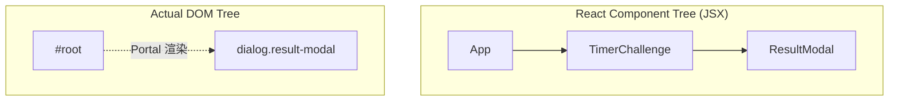
```mermaid
graph TD
    subgraph "React Component Tree (JSX)"
        App --> TimerChallenge
        TimerChallenge --> ResultModal
    end

    subgraph "Actual DOM Tree"
        Root[#root]
        Modal[dialog.result-modal]
        Root -.->|Portal 渲染| Modal
    end
```

### 觀察 JSX 與實際 DOM 的嵌套關係

雖然彈出視窗在視覺上成功覆蓋了整個畫面，但在技術層面上，它目前的 DOM 位置仍受限於其在 JSX 中的定義位置。

- **DOM 嵌套現況**
    - `ResultModal` 是作為 `TimerChallenge` 組件 JSX 回傳的一部分進行渲染的。
    - 因此，在實際的 DOM 樹中，`<dialog>` 元素會被放置在與 `TimerChallenge` 內容（例如 `#challenges` 區塊）相同或相鄰的位置。

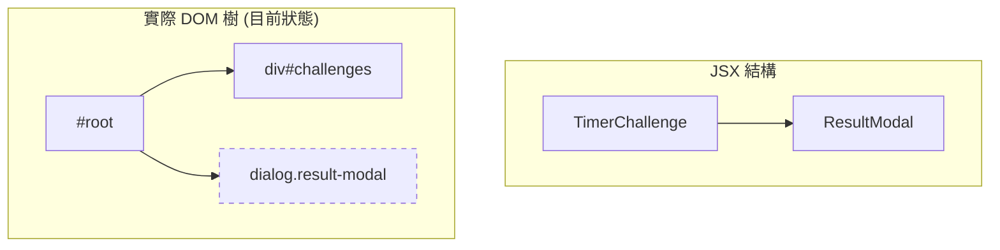
```mermaid
graph TD
    subgraph "JSX 結構"
        TC[TimerChallenge]
        RM[ResultModal]
        TC --> RM
    end

    subgraph "實際 DOM 樹 (目前狀態)"
        Root[#root]
        Challenges[div#challenges]
        Dialog[dialog.result-modal]
        Root --> Challenges
        Root --> Dialog
        style Dialog stroke-dasharray: 5 5
    end
```

- **[潛在問題]**
    - 這種嵌套方式意味著彈出視窗在 DOM 結構上仍屬於特定的父層級。
    - 對於像 Modal 這種需要「覆蓋」整個應用程式的 overlay 元件，從技術邏輯上來說，將其從原本的層級中分離出來（例如渲染到 `<body>` 的直接子層）會更合理，這正是接下來要透過 Portals 來解決的問題。

### 將 Modal 提升至更高層級的優點

為了讓彈出視窗在視覺上能正確覆蓋整個頁面，理想的做法是將其直接渲染在 `<body>` 內，或者渲染在一個專門為 Modal 設計的容器（例如 `<div id="modal"></div>`）中。

- **[優點 1] 提升無障礙性 (Accessibility)**
    - 將 Modal 放置在較高的 DOM 層級，可以更符合無障礙設計的邏輯結構。
- **[優點 2] 避免樣式問題 (Styling Issues)**
    - **防止被遮擋**：如果 Modal 被深層嵌套在複雜的 HTML 結構中，在某些情況下可能會被其他層級的元素遮擋或影響顯示效果。
    - **簡化佈局管理**：將 Overlay 元件從主內容流中分離，可以避免受到父層級 `overflow: hidden` 或 `z-index` 設定的限制。

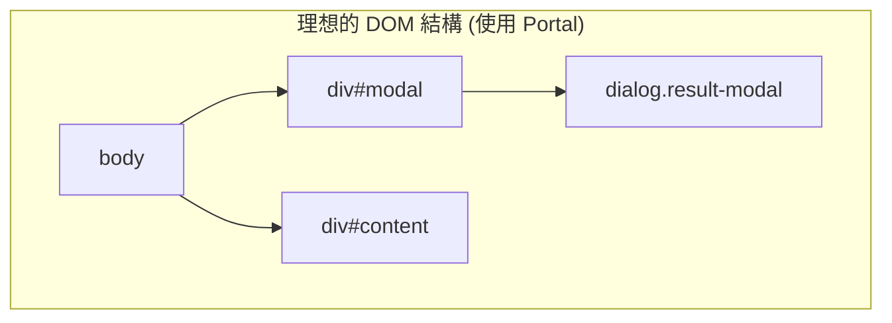
```mermaid
graph TD
    subgraph "理想的 DOM 結構 (使用 Portal)"
        Body[body]
        ModalContainer[div#modal]
        Content[div#content]

        Body --> ModalContainer
        Body --> Content
        ModalContainer --> Dialog[dialog.result-modal]
    end
```

### 使用 React Portals 解決渲染位置問題

在開發像 Modal 這樣的組件時，我們通常希望在 `TimerChallenge` 中控制它的顯示與隱藏，但希望它的 JSX 程式碼（實際渲染的 HTML）出現在頁面的其他地方（例如直接位於 `<body>` 下），以避免受到父層級樣式或結構的限制。

- **[解決方案]**：這正是 **Portals** 功能所解決的問題。
- **[如何使用]**：
    - 需要從 `react-dom` 庫中匯入相關功能，而非從 `react` 核心庫匯入。
    - `react-dom` 與 `react` 由同一個團隊管理，但負責處理 DOM 的渲染邏輯。

### React 與 React DOM 的區別

React 是一個跨平台的函式庫，其核心功能設計為可在各種不同的環境中運作。

- **React 核心庫**
    - 負責處理組件邏輯、狀態管理與核心功能。
    - 這些功能在不同環境（例如 Web 瀏覽器或透過 React Native 構建的行動裝置 App）中都是通用的。
- **React DOM 函式庫**
    - 專門用於 Web 開發，負責讓 React 與瀏覽器中的 DOM 進行互動。
    - 它包含了處理網頁渲染特有的功能與方法。

### React DOM 的 `createPortal` 功能

`createPortal` 是由 `react-dom` 提供的一個重要函式，用於解決特定的渲染位置問題。

- **功能用途**：如其名，它建立了一個「傳送門」（portal），允許將組件的內容渲染到與其在 JSX 結構中定義的位置不同的 DOM 節點中。
- **實作方式**：

```javascript
import { createPortal } from 'react-dom';
```

- **適用場景**：最常見於需要脫離父層級樣式限制（如 `z-index` 或 `overflow: hidden`）的元件，例如 Modal（彈出視窗）。

### `createPortal` 的實作細節

`createPortal` 的核心概念是將組件產生的 HTML 程式碼「傳送」（teleport）到 DOM 樹中與其在 JSX 結構中定義的位置不同的地方。

- **語法結構**：
    - `createPortal` 接收兩個參數：
        - **第一個參數**：欲被傳送的 JSX 程式碼（children）。
        - **第二個參數**：目標 HTML 元素（domNode），即該程式碼最終應該被渲染到的位置。
- **程式碼實作範例**：

```javascript
return createPortal(
  <dialog ref={dialog} className="result-modal">
    {userLost && <h2>You lost!</h2>}
    {!userLost && <h2>Your Score: {score}</h2>}
    <p>
      The target time was <strong>{targetTime}</strong> seconds.
    </p>
    <p>
      You stopped the timer with '{formattedRemainingTime}' seconds left.
    </p>
    <form method="dialog" onSubmit={onReset}>
      <button>Close</button>
    </form>
  </dialog>,
  document.getElementById('modal') // 第二個參數：目標 DOM 元素
);
```

### `createPortal` 的目標節點選擇

- **[目標元素來源]**：`createPortal` 的第二個參數必須是一個已存在於 `index.html` 中的 DOM 元素。
- **[實作方式]**：通常使用瀏覽器原生 API `document.getElementById` 來選取該元素。
- **[為什麼要這樣做]**：
    - 在 `index.html` 中預留一個專用的 `<div>`（例如 `id="modal"`）。
    - 將 Modal 附加到這個靠近 `<body>` 根節點的容器上，而不是嵌套在深層的內容結構中。
    - **[優點]**：這樣可以確保 Modal 不會受到父層級 CSS 樣式（如 `overflow: hidden` 或特定的 `z-index` 層級）的限制。

#### `index.html` 的結構範例

```html
<body>
  <div id="modal"></div> <!-- 專門用於 Portal 的容器 -->
  <div id="content">
    <!-- 其他應用程式內容 -->
  </div>
</body>
```

#### `ResultModal.jsx` 中的選取邏輯

```javascript
return createPortal(
  <dialog ref={dialog} className="result-modal">
    {/* ...組件內容... */}
  </dialog>,
  document.getElementById('modal') // 選取預先定義好的 modal 容器
);
```

### `createPortal` 與 `createRoot` 的類比

`createPortal` 的運作邏輯與 `main.jsx` 中的 `createRoot` 有許多相似之處。

- **相似點**：兩者都需要在 HTML 檔案中指定一個特定的元素作為渲染的目標節點。
- **核心差異**：
    - `createRoot`：用於建立整個 React 應用程式的根節點，將整個 App 渲染到指定的元素中。
    - `createPortal`：用於將應用程式中的「一部分」內容（例如 Modal）渲染到另一個指定的 DOM 位置。
- **[結論]**：這仍然是同一個 React 應用程式，只是透過 Portal 技術將部分 UI 輸出到了不同的 DOM 位置，以達到更好的樣式控制效果。

### 驗證 `createPortal` 的 DOM 結構

透過瀏覽器開發者工具檢查，可以確認 Portal 產生的元素確實被渲染到了預設的目標容器中，而非原本的 JSX 結構內。

- **[DOM 結構觀察]**：
    - 觀察發現 `<dialog>` 元素位於 `<div id="modal">` 之中。
    - 它與原本的 `<div id="content">` 是平級關係，而不是嵌套在 `content` 裡面。
- **[多個實例的行為]**：
    - 在應用程式中同時存在多個 `TimerChallenge` 時，DOM 中會出現多個 `<dialog>` 元素（每個挑戰都有自己的 Modal）。
    - **[關鍵點]**：儘管有多個元素存在於 `modal` 容器中，但目前只有被觸發顯示的那一個會呈現於畫面上。
- **[總結]**：
    - `createPortal` 的核心價值在於讓 JSX 程式碼在邏輯上屬於某個組件，但在物理 DOM 結構上卻能被放置在更合適的位置（如 Modal 案例），從而避免樣式干擾。
- **[渲染位置與邏輯位置的分離]**：透過 `createPortal`，組件可以被渲染在應用程式中使用的位置之外，例如在 HTML 文件的其他特定節點（如 `id="modal"` 的 `div`）中，而不會影響其在 React 組件樹中的邏輯結構。

## 實作專案：進階概念練習

- **[專案目標]**：建立一個 React 專案管理應用程式（Project Management application）
- **[核心功能]**：
    - 建立專案 (Create projects)
    - 為專案新增任務 (Add tasks to projects)
    - 檢視不同專案 (View different projects)
    - 清除任務 (Clear tasks)
    - 刪除專案 (Delete projects)
- **[學習重點]**：透過此專案綜合運用目前已學到的多項進階功能：
    - 組件 (Components)
    - 狀態管理 (State)
    - 樣式設計 (Styling)
    - Refs
    - Portals

### 實作建議：自主挑戰

- **[學習策略]** 建議將此專案視為一項自主挑戰
    - 嘗試在參考教學之前，先獨自完成專案或至少嘗試實作到能繼續下去的程度
    - **[心態]** 實作過程中沒有所謂的「錯誤答案」，只要能找到解決問題的方法即可
    - 完成後再將自己的實作方式與教學範例進行比較，觀察差異

### 專案環境準備

- **[提供版本]** 專案提供兩種版本的起始檔，兩者內容一致：
    - 本地端版本 (Local version)
    - CodeSandbox 版本
- **[本地端開發流程]**
    - 需先安裝依賴項目 (Install dependencies)
    - 啟動開發伺服器 (Start dev server)
- **[樣式設計]**
    - 專案使用 **Tailwind CSS** 進行樣式管理
    - 會在 JSX 元素中使用如 `className="my-8 text-center text-5xl font-bold"` 等工具類別 (utility classes)

### 實作專案的開發重點

- **[開發優先順序]** 核心目標應放在正確實作 React 程式碼與邏輯
    - 樣式設計（Styling）並非此練習的重點
    - 如果不想深入研究樣式，可以先做出一個「醜陋版本」的專案，只要功能運作正常即可
- **[關於 Tailwind CSS]**
    - 專案已預先安裝好 Tailwind CSS，因此可以直接使用
    - 若想達到特定的視覺效果，建議參考 [Tailwind 官方文件](https://tailwindcss.com/docs) 來查看可用的類別 (classes)

### 專案實作：建立組件架構

- **[目錄結構規劃]**：在 `src` 資料夾內新增 `components` 資料夾
    - 目的：將所有 React 組件集中管理，保持專案結構清晰
- **[建立 ProjectsSidebar 組件]**：
    - 檔案路徑：`src/components/ProjectsSidebar.jsx`
    - **[功能預期]**\*\*：
        - 允許使用者在不同的專案之間進行切換
        - 包含一個「新增專案」(Add Project) 的按鈕
- **[程式碼實作]**：

```jsx
export default function ProjectsSidebar() {

  }
```

### ProjectsSidebar 組件實作

- **[組件結構]**：使用 `<aside>` 元素作為側邊欄的容器，並在內部包含標題與按鈕
- **[程式碼實作]**：

```jsx
export default function ProjectsSidebar() {
  return (
    <aside>
      <h2>Your Projects</h2>
      <div>
        <button>Add project</button>
      </div>
      <ul>
        {/* 預留位置，未來將用於顯示專案列表 */}
      </ul>
    </aside>
  );
}
```

### App 組件結構整合

- **[引入組件]**：從 `./components/ProjectsSidebar.jsx` 匯入 `ProjectsSidebar` 組件
- **[結構重構]**：將原本的 `<h1>` 元素替換為包含側邊欄的主要內容區域
    - 使用 `<main>` 標籤來包裹主要內容，這有助於定義網站的核心區域，未來除了側邊欄之外，專案詳情（project details）也會放在這裡
- **[程式碼實作]**：

```jsx
import ProjectsSidebar from './components/ProjectsSidebar.jsx';

function App() {
  return (
    <main>
      <ProjectsSidebar />
    </main>
  );
}

export default App;
```

### App 組件整合結果

- **[目前狀態]**：`ProjectsSidebar` 已成功匯入並渲染於 `App` 組件的 `<main>` 標籤內
- **[程式碼實作]**：

```jsx
import ProjectsSidebar from './components/ProjectsSidebar.jsx';

function App() {
  return (
    <main>
      <ProjectsSidebar />
    </main>
  );
}

export default App;
```

- **[下一步]**：為側邊欄添加樣式設計（Styling）

### App 組件樣式調整

- **[佈局設定]**：在 `App` 組件的 `<main>` 標籤上新增 Tailwind CSS 類別
    - `h-screen`：確保主要內容區域佔滿整個螢幕高度，這有助於側邊欄也能隨之填滿可用高度
    - `my-8`：在垂直軸（上方與下方）添加 `2rem` 的邊距 (margin)
- **[程式碼實作]**：

```jsx
import ProjectsSidebar from './components/ProjectsSidebar.jsx';

function App() {
  return (
    <main className="h-screen my-8">
      <ProjectsSidebar />
    </main>
  );
}

export default App;
```

### ProjectsSidebar 組件樣式調整

- **[初步設定]**：在 `ProjectsSidebar` 組件的 `<aside>` 元素上開始添加樣式
    - 準備加入 `block` 類別
- **[程式碼實作]**：

```jsx
export default function ProjectsSidebar() {
  return (
    <aside className="block">
      <h2>Your Projects</h2>
      <div>
        <button>+ Add Project</button>
      </div>
      <ul>
        {/* 預留位置，未來將用於顯示專案列表 */}
      </ul>
    </aside>
  );
}
```

### ProjectsSidebar 組件樣式設計

- **[樣式設定]**：利用 Tailwind CSS 類別對 `<aside>` 元素進行美化，使其具備側邊欄的視覺感
    - **寬度**：使用 `w-1/3` 設定為可用寬度的三分之一
    - **水平內距**：使用 `px-8` 添加左右邊距
    - **垂直內距**：使用 `py-16` 添加上下邊距
    - **背景顏色**：使用 `bg-stone-900` 設定為深灰色
    - **文字顏色**：使用 `text-stone-50` 設定為接近白色的極淺灰色，以確保在深色背景上的可讀性
- **[程式碼實作]**：

```jsx
export default function ProjectsSidebar() {
  return (
    <aside className="w-1/3 px-8 py-16 bg-stone-900 text-stone-50">
      <h2>Your Projects</h2>
      <div>
        <button>+ Add Project</button>
      </div>
      <ul>
        {/* 預留位置，未來將用於顯示專案列表 */}
      </ul>
    </aside>
  );
}
```

### ProjectsSidebar 組件進階樣式設計

- **[響應式寬度調整]**：為了避免在較大螢幕上側邊欄過寬，使用響應式前綴來設定固定寬度
    - **`md:w-72`**：在 `md`（中等螢幕）及以上尺寸時，將寬度固定為 `18rem` (72 單位)，而非維持原本的 `w-1/3` 分數比例
- **[右側圓角設定]**：僅針對側邊欄的右側邊緣添加圓角，使其與主內容區域自然銜接
    - **`rounded-r-xl`**：設定右側（top-right 與 bottom-right）的圓角半徑為 `0.75rem` (12px)
- **[程式碼實作]**：

```jsx
export default function ProjectsSidebar() {
  return (
    <aside className="w-1/3 px-8 py-16 bg-stone-900 text-stone-50 md:w-72 rounded-r-xl">
      <h2>Your Projects</h2>
      <div>
        <button>+ Add Project</button>
      </div>
      <ul>
        {/* 預留位置，未來將用於顯示專案列表 */}
      </ul>
    </aside>
  );
}
```

### ProjectsSidebar 標題樣式優化

- **[樣式設定]**：針對 `<h2>` 標籤添加 Tailwind CSS 類別以增強視覺層次感
    - **下方邊距**：使用 `mb-8` 增加標題與下方內容之間的間距
    - **字體粗細**：使用 `font-bold` 使標題文字加粗
    - **大小寫轉換**：使用 `uppercase` 將所有字元轉換為大寫
    - **響應式字體大小**：使用 `md:text-xl` 確保在 `md`（中等）及以上尺寸的螢幕上，文字顯示更大的字體
    - **文字顏色**：調整顏色以符合整體設計（如 `text-stone-50`）
- **[程式碼實作]**：

```jsx
export default function ProjectsSidebar() {
  return (
    <aside className="w-1/3 px-8 py-16 bg-stone-900 text-stone-50 md:w-72 rounded-r-xl">
      <h2 className="mb-8 font-bold uppercase md:text-xl text-stone-50">Your Projects</h2>
      <div>
        <button>+ Add Project</button>
      </div>
      <ul>
        {/* 預留位置，未來將用於顯示專案列表 */}
      </ul>
    </aside>
  );
}
```

### ProjectsSidebar 按鈕樣式設計

- **[樣式設定]**：為「+ Add Project」按鈕添加 Tailwind CSS 類別以提升視覺質感
    - **水平與垂直內距**：使用 `px-4` 與 `py-2` 設定按鈕內部的間距
    - **響應式字體大小**：
        - **小螢幕**：使用 `text-xs` 設定較小的字體
        - **中等及以上螢幕 (`md:`)**：使用 `md:text-base` 恢復為預設的基礎字體大小
    - **圓角設定**：使用 `rounded-md` 為按鈕添加中等程度的圓角
- **[程式碼實作]**：

```jsx
export default function ProjectsSidebar() {
  return (
    <aside className="w-1/3 px-8 py-16 bg-stone-900 text-stone-50 md:w-72 rounded-r-xl">
      <h2 className="mb-8 font-bold uppercase md:text-xl text-stone-200">Your Projects</h2>
      <div>
        <button className="px-4 py-2 text-xs md:text-base rounded-md">+ Add Project</button>
      </div>
      <ul>
        {/* 預留位置，未來將用於顯示專案列表 */}
      </ul>
    </aside>
  );
}
```

### ProjectsSidebar 按鈕互動樣式優化

- **[互動效果設定]**：透過 Tailwind CSS 的 `hover:` 前綴，在滑鼠懸停於按鈕上時改變視覺狀態
    - **背景顏色切換**：使用 `hover:bg-stone-600`，當滑鼠懸停時，背景由 `bg-stone-700` 變更為較亮的 `stone-600`
    - **文字顏色切換**：使用 `hover:text-stone-100`，使懸停時的文字顏色更明顯
- **[程式碼實作]**：

```jsx
<button className="px-4 py-2 text-xs md:text-base rounded-md bg-stone-700 text-stone-400 hover:bg-stone-600 hover:text-stone-100">
  + Add Project
</button>
```

### ProjectsSidebar 基礎樣式完成

- **[開發進度]** 已透過 Tailwind CSS 完成側邊欄與按鈕的基礎視覺設計
    - 包含標題樣式、側邊欄佈局以及具備互動感的「+ Add Project」按鈕
- **[下一步計畫]** 實作按鈕點擊後的互動邏輯
    - 目標：點擊按鈕後能彈出一個小畫面（screen/modal）
    - 功能：讓使用者能夠在該畫面中輸入新專案的詳細資訊

### 建立 NewProject 組件

- **開發目標**：建立一個獨立的組件來顯示並收集建立新專案所需的各種輸入欄位（inputs）
- **[程式碼實作]**：

```jsx
export default function NewProject() {
  return (
    <div>
      <menu>
      </menu>
    </div>
  );
}
```

    - 使用內建 HTML 元素（如 `<div>` 與 `<menu>`）作為組件的基礎結構
    - 注意：在 JSX 中，內建元素的名稱必須以小寫字母開頭

### NewProject 組件結構規劃

- **[按鈕選單]**：在 `<menu>` 標籤內建立用於控制操作的按鈕
    - **取消按鈕**：用於取消建立專案的操作
    - **儲存按鈕**：用於確認並儲存新專案的資訊
- **[專案詳細資訊區域]**：在選單下方建立一個容器，用於放置各項輸入欄位
    - **實作選擇**：雖然使用 `<form>` 在語義上（Semantics）更正確，但為了避免干擾目前的學習進度，暫時使用 `<div>` 作為容器
    - **[注意]**：關於 React 中如何處理表單（Forms）與使用者輸入，將會在之後的專門章節中深入探討
- **[程式碼實作]**：

```jsx
export default function NewProject() {
  return (
    <div>
      <menu>
        <li><button>Cancel</button></li>
        <li><button>Save</button></li>
      </menu>
      <div>
        <p>
          {/* 專案詳細資訊輸入區域將在此處實作 */}
        </p>
      </div>
    </div>
  );
}
```

### NewProject 組件輸入區域規劃

- **[輸入欄位需求]** 為了收集完整的專案資訊，需要實作三種不同的輸入項：
    - **專案標題 (Title)**：使用標準的 `<input />` 元素
    - **專案描述 (Description)**：由於描述可能較長，改用 `<textarea />` 元素以提供更多輸入空間
    - **到期日 (Due Date)**：同樣使用 `<input />` 元素
- **[程式碼結構預覽]** 每個欄位都由一個 `<p>` 標籤包裹，內含 `<label>` 與對應的輸入元素：

```jsx
<div>
  <p>
    <label>Title</label>
    <input />
  </p>
  <p>
    <label>Description</label>
    <textarea />
  </p>
  <p>
    <label>Due Date</label>
    <input />
  </p>
</div>
```

- **[優化策略：組件抽象化]**
    - **問題**：上述三組結構（Label + Input/Textarea）在 JSX 中高度重複
    - **解決方案**：建立一個全新的 `Input` 組件來封裝這套結構，藉此提高程式碼的複用性與整潔度

### 實作通用 `Input` 組件

- **[開發目標]** 建立一個可配置的 `Input` 組件，避免在多個地方重複撰寫相同的 CSS 類別與標籤結構
- **[設計邏輯]** 透過傳入一個布林值 prop（例如 `isTextarea`）來決定組件的渲染內容
    - 如果 `isTextarea` 為 `true` $\rightarrow$ 渲染 `<textarea />`
    - 如果 `isTextarea` 為 `false` $\rightarrow$ 渲染 `<input />`
- **[程式碼實作]**：

```jsx
export default function Input({ isTextarea }) {
  return (
    <p>
      <label></label>
      {isTextarea ? <textarea /> : <input />}
    </p>
  );
}
```

- **[優點]**
    - **減少重複**：不需要在 `NewProject` 中為每個欄位手動寫一遍相同的樣式與結構
    - **易於維護**：若未來需要更改所有輸入框的樣式（例如加上特定的 Tailwind class），只需修改 `Input` 組件一處即可

### 完善 `Input` 組件的實作

- **[功能擴充]** 除了判斷是否為 `textarea` 外，還需支援自定義標籤與傳遞其他屬性
    - **`label`&#32;prop**：用於設定 `<label>` 標籤內的文字內容
    - **`...props`&#32;(Rest Parameters)**：收集所有未被解構的 props，以便將它們直接傳遞給底層的輸入元素（如 `id`, `type`, `placeholder` 等），確保組件的通用性
- **[程式碼實作]**：

```jsx
export default function Input({ label, textarea, ...props }) {
  return (
    <p>
      <label>{label}</label>
      {textarea ? <textarea {...props} /> : <input {...props} />}
    </p>
  );
}
```

- **[邏輯解析]**
    - 使用 `{textarea ? <textarea {...props} /> : <input {...props} />}` 進行條件式渲染
    - **`{...props}`&#32;的重要性**：透過展開運算符，原本在 `NewProject` 中定義的任何屬性都能無縫轉移到實際的 HTML 元素上，而不需要在 `Input` 組件中一個一個手動列出

### 在 `NewProject` 中整合 `Input` 組件

- **[重構過程]** 將原本在 `NewProject.jsx` 中手動撰寫的三組 `<p>` 標籤（包含 `<label>` 與 `<input>`/`<textarea>`）替換為整合後的 `Input` 組件
- **[實作步驟]**
    - 從 `./Input` 匯入 `Input` 組件
    - 使用 `Input` 組件並透過 `label` prop 設定對應的標籤文字
- **[重構後的程式碼實作]**：

```jsx
import Input from './Input';

export default function NewProject() {
  return (
    <div>
      <menu>
        <li><button>Cancel</button></li>
        <li><button>Save</button></li>
      </menu>
      <div>
        <Input label="Title" />
        <Input label="Description" textarea />
        <Input label="Due Date" />
      </div>
    </div>
  );
}
```

- **[對比分析]**
    - **重構前**：需要在 `NewProject` 中為每個欄位重複撰寫 `<p>`、`<label>` 以及判斷 `textarea` 的邏輯，程式碼顯得臃腫。
    - **重構後**：`NewProject` 的邏輯變得極其簡潔，開發者只需關注「需要哪些欄位」以及「欄位的標籤是什麼」，而不需要關心這些欄位是如何渲染的。

### `NewProject` 組件的屬性設定優化

- **[屬性簡寫]** 在設定布林值 prop 時，不需要顯式寫出 `textarea={true}`
    - 只要直接加上屬性名稱 `textarea`，React 就會將其視為 `true`
    - **範例**：`<Input label="Description" textarea />` 等同於 `<Input label="Description" textarea={true} />`
- **[程式碼實作]**：

```jsx
import Input from './Input.jsx';

export default function NewProject() {
  return (
    <div>
      <menu>
        <li><button>Cancel</button></li>
        <li><button>Save</button></li>
      </menu>
      <div>
        <Input label="Title" />
        <Input label="Description" textarea />
        <Input label="Due Date" />
      </div>
    </div>
  );
}
```

### 將 `NewProject` 整合至 `App` 組件

- **[整合步驟]** 將新開發的 `NewProject` 組件匯入 `App.jsx` 並放置在佈局中，以便與側邊欄（Sidebar）並列顯示
- **[目前的顯示狀態]** 暫時讓 `NewProject` 保持常駐顯示，尚未實作「點擊按鈕後才顯示」的條件式邏輯
- **[程式碼實作]**：

```jsx
import ProjectsSidebar from './components/ProjectsSidebar.jsx';
import NewProject from './components/NewProject.jsx';

function App() {
  return (
    <main className="h-screen my-8">
      <ProjectsSidebar />
      <NewProject />
    </main>
  );
}

export default App;
```

### 實作 App 組件的 Flexbox 佈局

- **[佈局調整]** 為 `main` 元素添加 Tailwind CSS 類別，以確保 `ProjectsSidebar` 與 `NewProject` 能並列顯示而非垂直堆疊
    - 使用 `flex` 啟用 Flexbox 佈局
    - 使用 `gap-8` 設定組件間的間距（相當於 `2rem`）
- **[實作結果]**
    - `ProjectsSidebar` 會自動拉伸以填滿可用高度
    - `NewProject` 的輸入欄位會顯示在側邊欄的右側
- **[程式碼實作]**：

```jsx
function App() {
  return (
    <main className="h-screen my-8 flex gap-8">
      <ProjectsSidebar />
      <NewProject />
    </main>
  );
}
```

### `NewProject` 組件樣式優化

- **[自定義數值]** 使用 Tailwind CSS 的特殊語法來設定不在預設配置中的數值
    - 語法：`w-[35rem]`
    - **[原理]** Tailwind 會在後台自動為該組件生成對應的 CSS 類別，這在需要精確控制尺寸而非使用預設間距時非常有用
- **[程式碼實作]**：

```jsx
import Input from './Input.jsx';

export default function NewProject() {
  return (
    <div className="w-[35rem]">
      <menu>
        <li><button>Cancel</button></li>
        <li><button>Save</button></li>
      </menu>
      <div>
        <Input label="Title" />
        <Input label="Description" textarea />
        <Input label="Due Date" />
      </div>
    </div>
  );
}
```

### `NewProject` 選單與佈局優化

- **[外邊距調整]** 為容器添加 `mt-16` 以增加頂部邊距
    - **[目的]** 使組件內容在垂直位置上與 `ProjectsSidebar` 的標題保持大致在同一水平線上
- **[選單佈局]** 為 `<menu>` 元素添加 Flexbox 相關類別以優化按鈕排列
    - `flex`: 啟用 Flexbox 佈局
    - `items-center`: 確保按鈕在垂直軸上居中對齊
    - `justify-end`: 將按鈕群組推向水平軸的最右側
    - `gap-4`: 在按鈕之間添加間距
- **[程式碼實作]**：

```jsx
export default function NewProject() {
  return (
    <div className="w-[35rem] mt-16">
      <menu className="flex items-center justify-end gap-4">
        <li><button>Cancel</button></li>
        <li><button>Save</button></li>
      </menu>
      <div>
        <Input label="Title" />
        <Input label="Description" textarea />
        <Input label="Due Date" />
      </div>
    </div>
  );
}
```

### `NewProject` 按鈕樣式設計

- **[垂直間距]** 為 `<menu>` 元素添加垂直方向的邊距，使按鈕與上方元素保持適當距離
    - 使用 `my-4`（相當於上下各 `1rem` / `16px` 的 margin）
- **[按鈕樣式實作]** 為不同的按鈕設定不同的視覺風格，使其看起來更像可點擊的按鈕
    - **取消按鈕 (Cancel Button)**：
        - 使用 `text-stone-800`：設定為深灰色（接近黑色但非純黑）
        - 使用 `hover:text-stone-950`：當滑鼠懸停時，顏色變為更深的灰色（接近純黑），增加互動回饋感
- **[程式碼實作]**：

```jsx
export default function NewProject() {
  return (
    <div className="w-[35rem] mt-16">
      <menu className="flex items-center justify-end gap-4 my-4">
        <li><button className="text-stone-800 hover:text-stone-950">Cancel</button></li>
        <li><button>Save</button></li>
      </menu>
      <div>
        <Input label="Title" />
        <Input label="Description" textarea />
        <Input label="Due Date" />
      </div>
    </div>
  );
}
```

### `NewProject` Save 按鈕樣式設計

- **[設計理念]** 為了區分操作的重要性，將「Save」按鈕設計得比「Cancel」按鈕更明顯（Primary Action），而「Cancel」則採用較平淡的設計（Secondary Action）。
- **[樣式實作]** 為「Save」按鈕添加以下 Tailwind CSS 類別：
    - `bg-stone-800`: 設定深灰色背景
    - `text-stone-50`: 設定近乎白色的文字顏色
    - `hover:bg-stone-950`: 滑鼠懸停時，背景變為更深的灰色（與「Cancel」按鈕的文字顏色一致），增加互動感
- **[程式碼實作]**：

```jsx
export default function NewProject() {
  return (
    <div className="w-[35rem] mt-16">
      <menu className="flex items-center justify-end gap-4 my-4">
        <li><button className="text-stone-800 hover:text-stone-950">Cancel</button></li>
        <li><button className="bg-stone-800 text-stone-50 hover:bg-stone-950">Save</button></li>
      </menu>
      <div>
        <Input label="Title" />
        <Input label="Description" textarea />
        <Input label="Due Date" />
      </div>
    </div>
  );
}
```

### `NewProject` Save 按鈕樣式完善

- **[視覺細節優化]** 為「Save」按鈕添加了圓角與內距，使其外觀更精緻
    - 使用 `px-6`: 設定左右內距為 `1.5rem` / `24px`
    - 使用 `py-2`: 設定上下內距為 `0.5rem` / `8px`
    - 使用 `rounded-md`: 設定中等程度的圓角
- **[程式碼實作]**：

```jsx
export default function NewProject() {
  return (
    <div className="w-[35rem] mt-16">
      <menu className="flex items-center justify-end gap-4 my-4">
        <li><button className="text-stone-800 hover:text-stone-950">Cancel</button></li>
        <li><button className="px-6 py-2 rounded-md bg-stone-800 text-stone-50 hover:bg-stone-950">Save</button></li>
      </menu>
      <div>
        <Input label="Title" />
        <Input label="Description" textarea />
        <Input label="Due Date" />
      </div>
    </div>
  );
}
```

### `Input` 組件實作規劃

- **[佈局設定]** 在 `Input` 組件的 `<p>` 標籤上使用 Flexbox，以確保標籤與輸入框能正確排列
    - 使用 `flex`: 啟用 Flexbox 佈局
    - 使用 `flex-col`: 設定為垂直排列（Column 方向），讓標籤位於輸入框上方
- **[組件結構預覽]**：

```jsx
export default function Input({ label, textarea, ...props }) {
  return (
    <p className="flex flex-col">
      <label>{label}</label>
      {textarea ? <textarea {...props} /> : <input {...props} />}
    </p>
  );
}
```

### `Input` 組件樣式設計

- **[容器樣式優化]** 為包裝標籤與輸入框的 `<p>` 標籤添加間距與佈局調整
    - 使用 `gap-1`: 設定子元素間的間距
    - 使用 `my-4`: 設定垂直方向（上下）的外邊距（margin）
- **[標籤 (Label) 樣式設計]** 透過調整字體與顏色來提升視覺層次感
    - 使用 `text-sm`: 縮小字體大小
    - 使用 `font-bold`: 設定粗體
    - 使用 `uppercase`: 將文字轉為全大寫
    - 使用 `text-stone-500`: 設定為中灰色，使其在視覺上不至於過於搶眼
- **[程式碼實作]**：

```jsx
export default function Input({ label, textarea, ...props }) {
  return (
    <p className="flex flex-col gap-1 my-4">
      <label className="text-sm font-bold uppercase text-stone-500">
        {label}
      </label>
      {textarea ? <textarea {...props} /> : <input {...props} />}
    </p>
  );
}
```

### `Input` 組件樣式進階設計

- **[輸入元素樣式優化]** 為 `textarea` 與 `input` 元素添加了完整的視覺樣式，使其更符合現代 UI 設計
    - **寬度與內距**
        - 使用 `w-full`: 確保元素佔滿父容器的所有可用寬度
        - 使用 `p-1`: 設定四周 `0.25rem` 的內距
    - **邊框與圓角**
        - 使用 `border-b-2`: 設定底部邊框寬度為 `2px`
        - 使用 `rounded-sm`: 添加輕微的圓角效果
        - 使用 `border-stone-300`: 設定邊框顏色為中灰色
    - **背景色**
        - 使用 `bg-stone-200`: 設定淺灰色的背景色
- **[程式碼實作]**：

```jsx
export default function Input({ label, textarea, ...props }) {
  return (
    <p className="flex flex-col gap-1 my-4">
      <label className="text-sm font-bold uppercase text-stone-500">
        {label}
      </label>
      {textarea ? (
        <textarea
          className="w-full p-1 border-b-2 rounded-sm border-stone-300 bg-stone-200"
          {...props}
        />
      ) : (
        <input
          className="w-full p-1 border-b-2 rounded-sm border-stone-300 bg-stone-200"
          {...props}
        />
      )}
    </p>
  );
}
```

### `Input` 組件焦點樣式優化

- **[焦點狀態優化]** 為了提升互動感，除了基本的樣式外，還需要針對輸入框獲得焦點時的視覺變化進行設定
    - **移除預設輪廓**
        - 使用 `focus:outline-none`: 移除瀏覽器預設的輸入框藍色輪廓，避免視覺上的不一致
    - **自定義邊框顏色**
        - 使用 `focus:border-stone-600`: 當使用者點擊輸入框時，將邊框顏色切換為較深的灰色，提供明確的視覺回饋
    - **文字顏色調整**
        - 使用 `text-stone-600`: 設定文字顏色，使其在輸入時更具層次感
- **[程式碼實作]**：

```jsx
export default function Input({ label, textarea, ...props }) {
  return (
    <p className="flex flex-col gap-1 my-4">
      <label className="text-sm font-bold uppercase text-stone-500">
        {label}
      </label>
      {textarea ? (
        <textarea
          className="w-full p-1 border-b-2 rounded-sm border-stone-300 bg-stone-200 text-stone-600 focus:outline-none focus:border-stone-600"
          {...props}
        />
      ) : (
        <input
          className="w-full p-1 border-b-2 rounded-sm border-stone-300 bg-stone-200 text-stone-600 focus:outline-none focus:border-stone-600"
          {...props}
        />
      )}
    </p>
  );
}
```

### `Input` 組件程式碼優化

- **[重構樣式管理]** 為了避免在 `textarea` 與 `input` 標籤中重複撰寫冗長的 Tailwind CSS 類別字串，將其提取至一個名為 `classes` 的常數中
    - **優點**：提高程式碼的可讀性，且未來若要修改整體輸入框樣式時，只需更改一處即可同步更新所有元素
- **[程式碼實作]**：

```jsx
export default function Input({ label, textarea, ...props }) {
  const classes = "w-full p-1 border-b-2 rounded-sm border-stone-300 bg-stone-200 text-stone-600 focus:outline-none focus:border-stone-600";

  return (
    <p className="flex flex-col gap-1 my-4">
      <label className="text-sm font-bold uppercase text-stone-500">
        {label}
      </label>
      {textarea ? (
        <textarea className={classes} {...props} />
      ) : (
        <input className={classes} {...props} />
      )}
    </p>
  );
}
```

- **[後續計畫]**
    - 確保點擊「+ Add Project」按鈕時能正確開啟新專案的輸入介面
    - 展示新專案介面的詳細內容

### 新專案建立流程規劃

- **[實作步驟]** 建立新專案的流程將包含以下階段：
    - **處理 Fallback 內容**：在使用者尚未點擊「Save」按鈕之前，顯示預設的 UI 狀態（例如空欄位或初始提示）
    - **獲取輸入值**：從 `Input` 組件中提取使用者填寫的資料
    - **執行建立動作**：使用獲取的資料來產生新的專案實例

### 建立 `NoProjectSelected` 組件

- **[設計目的]** 為了避免在使用者尚未點擊「+ Add Project」或尚未選擇任何專案時顯示空白畫面，需要建立一個 Fallback 組件來顯示提示資訊
- **[組件名稱]** `NoProjectSelected`
- **[實作方式]**
    - 在 `src/components` 目錄下建立 `NoProjectSelected.jsx` 檔案
    - 匯出一個名為 `NoProjectSelected` 的函數組件
    - 回傳一個 `<div>` 元素作為容器
- **[程式碼實作]**：

```jsx
export default function NoProjectSelected() {
  return <div></div>;
}
```

### 實作 `NoProjectSelected` 組件的內容佈局

- **[組件結構設計]** 為了提供明確的引導，組件將包含以下元素：
    - 一張示意圖片 (``)
    - 標題：顯示「No Project Selected」
    - 說明段落：引導使用者「Select a project or get started with a new one"
    - 按鈕：點擊後可執行建立新專案的操作（功能與 Sidebar 中的按鈕一致）
- **[程式碼實作]**：

```jsx
export default function NoProjectSelected() {
  return (
    <div>

      <h2>No Project Selected</h2>
      <p>
        Select a project or get started with a new one
        <p>
          <button>Create new project</button>
        </p>
      </p>
    </div>
  );
}
```

### `NoProjectSelected` 組件樣式與圖片優化

- **[佈局與樣式調整]** 使用 Tailwind CSS 優化容器的視覺呈現
    - `mt-24`：增加頂部邊距，將內容向下推移
    - `text-center`：確保所有文字內容水平置中
    - `w-2/3`：將容器寬度設定為可用空間的 2/3，避免內容過於分散
- **[匯入視覺資產]** 從專案目錄中引入圖片
    - 圖片路徑：從 `src/components` 向上移一層並進入 `assets` 資料夾，取得 `no-projects.png`
    - **[程式碼實作]**：

```jsx
import noProjectImage from '../assets/no-projects.png';

export default function NoProjectSelected() {
  return (
    <div className="mt-24 text-center w-2/3">

      <h2>No Project Selected</h2>
      <p>
        Select a project or get started with a new one
        <p>
          <button>Create new project</button>
        </p>
      </p>
    </div>
  );
}
```

### `NoProjectSelected` 組件視覺細節優化

- **[圖片設定]** 為 `` 標籤配置資源與替代文字
    - `src`：使用匯入的 `noProjectImage`
    - `alt`：設定為空字串（或描述圖片內容，如 `""`），因為圖片主要作為裝飾用途
- **[標題樣式優化]** 為 `<h2>` 元素添加 Tailwind CSS 類別以提升視覺層次
    - `text-xl`：增大字體大小
    - `font-bold`：將字體設為粗體
    - `text-stone-500`：設定文字顏色為石灰色
    - `mt-4`：增加頂部邊距，與上方的圖片保持適當間距
- **[整體間距調整]** 透過增加容器或元素的 `mt` (margin-top) 類別，確保組件內各元素之間有良好的視覺呼吸空間

### `NoProjectSelected` 組件樣式細化

- **[圖片樣式優化]** 調整圖片的尺寸並確保其在容器內正確顯示
    - `w-16 h-16`：設定圖片的寬度與高度為 16 單位
    - `object-contain`：確保圖片在指定的尺寸內完整顯示且不會發生比例變形
    - `mx-auto`：將圖片在父容器中水平置中
- **[文字段落樣式優化]** 調整說明文字的視覺呈現
    - `text-stone-400`：將文字顏色設定為較淺的石灰色
    - `mb-4`：增加下邊距，與下方的按鈕保持適當距離
- **[標題間距調整]**
    - `my-4`：為 `<h2>` 標題設定垂直方向的邊距（上下邊距）
- **[程式碼實作]**：

```jsx
export default function NoProjectSelected() {
  return (
    <div className="mt-24 text-center w-2/3">

      <h2 className="text-xl font-bold text-stone-500 my-4">No Project Selected</h2>
      <p className="text-stone-400 mb-4">
        Select a project or get started with a new one
      </p>
      <p>
        <button>Create new project</button>
      </p>
    </div>
  );
}
```

### `NoProjectSelected` 組件樣式微調

- **[間距優化]** 為包裹按鈕的 `<p>` 標籤添加頂部邊距，以改善視覺間隔
    - 使用 `mt-8` 類別
- **[按鈕樣式規劃]** 為了避免在不同組件中重複撰寫相同的 Tailwind CSS 類別，計畫將按鈕樣式抽離成獨立組件
    - 目標是讓按鈕樣式與 `ProjectsSidebar` 中的按鈕保持一致

### 實作通用 `Button` 組件

- **[組件抽離]** 建立一個名為 `Button` 的新組件，將按鈕的標記結構與樣式封裝其中
- **[程式碼實作]**：

```jsx
// src/components/Button.jsx
export default function Button({ children }) {
  return (
    <button className="px-4 py-2 text-xs md:text-base rounded-md bg-stone-700 text-stone-200 hover:bg-stone-600 hover:text-stone-100">
      {children}
    </button>
  );
}
```

- **[設計考量]**
    - 使用 `children` prop：這讓組件能夠接收任何內容（文字或其它標記）作為按鈕內部的顯示內容
    - 樣式複用：直接沿用 `ProjectsSidebar` 中的樣式類別，確保全站 UI 的一致性

### 在 `ProjectsSidebar` 中整合 `Button` 組件

- **[組件替換]** 將 `ProjectsSidebar` 中的原生 `<button>` 標籤替換為自定義的 `<Button>` 組件
    - 需先從 `./Button.jsx` 匯入 `Button` 組件
    - 移除原本在 `ProjectsSidebar` 中定義的 `className`，因為樣式已封裝在 `Button` 組件內
- **[程式碼實作]**：

```jsx
import Button from './Button.jsx';

export default function ProjectsSidebar() {
  return (
    <aside className="w-1/3 px-8 py-16 bg-stone-900 text-stone-50 md:w-72 rounded-r-xl">
      <h2 className="mb-8 font-bold uppercase md:text-xl text-stone-200">Your Projects</h2>
      <div>
        <Button>+ Add Project</Button>
      </div>
      <ul></ul>
    </aside>
  );
}
```

### `NoProjectSelected` 組件整合 `Button` 組件

- **[組件替換]** 將 `NoProjectSelected` 中的原生 `<button>` 標籤替換為自定義的 `<Button>` 組件
    - 需從 `./Button.jsx` 匯入 `Button` 組件
    - 由於樣式已封裝在 `Button` 組件內，因此不再需要於此處添加 `className`
- **[程式碼實作]**：

```jsx
import Button from './Button.jsx';

export default function NoProjectSelected() {
  return (
    <div className="mt-24 text-center w-2/3">

      <h2 className="text-xl font-bold text-stone-500 my-4">No Project Selected</h2>
      <p className="text-stone-400 mb-4">Select a project or get started with a new one</p>
      <p>
        <Button>Create new project</Button>
      </p>
    </div>
  );
}
```

### 提升 `Button` 組件的通用性

- **[使用展開運算符 (Spread Operator)]** 為了讓 `Button` 組件能夠接收並處理除了 `children` 之外的其他屬性（例如 `onChange`），應在組件中使用 `...props` 來收集所有剩餘的 props，並將它們展開到內部的 `<button>` 元素上
- **[程式碼實作]**：

```jsx
// src/components/Button.jsx
export default function Button({ children, ...props }) {
  return (
    <button
      className="px-4 py-2 text-xs md:text-base rounded-md bg-stone-700 text-stone-200 hover:bg-stone-600 hover:text-stone-100"
      {...props}
    >
      {children}
    </button>
  );
}
```

### 預覽 `NoProjectSelected` 組件的顯示效果

- **[介面檢查]** 在 `App` 組件中暫時將原本渲染的 `NewProject` 組件替換為 `NoProjectSelected` 組件，以觀察當沒有選擇任何專案時的 fallback 畫面
- **[視覺呈現]** 畫面會顯示「No Project Selected」的標題、說明文字，以及一個「Create new project」的按鈕
- **[後續規劃]**
    - 實作**條件渲染 (Conditional Rendering)**：根據使用者是否點擊了「+ Add Project」按鈕，來決定要顯示 `NoProjectSelected` 還是 `NewProject` 組件

### 實作條件渲染 (Conditional Rendering)

- **[核心概念]** 為了在按下「+ Add Project」或「Create new project」按鈕時切換顯示內容，需要使用 **State** 來控制渲染哪一個組件
    - 狀態必須定義在 `App` 組件中，因為它是決定顯示 `NewProject` 還是 `NoProjectSelected` 的決策中心
- **[實作步驟]**
    - 從 `react` 匯入 `useState` 鉤子
    - 在 `App` 組件內定義一個狀態變數來追蹤當前應該顯示的組件
- **[程式碼實作]**:

```jsx
import { useState } from 'react';
import NewProject from './components/NewProject.jsx';
import NoProjectSelected from './components/NoProjectSelected.jsx';
import ProjectsSidebar from './components/ProjectsSidebar.jsx';

function App() {
  const [selectedProject, setSelectedProject] = useState(null);

  return (
    <main className="h-screen my-8 flex gap-8">
      <ProjectsSidebar />
      {selectedProject ? <NewProject /> : <NoProjectSelected />}
    </main>
  );
}

export default App;
```

### `App` 組件的狀態設計

- **[狀態管理策略]** 為了集中管理應用程式的資料，決定使用一個物件作為單一狀態源，包含以下屬性：
    - `selectedProject`: 用於追蹤目前選中的專案。其初始值設定為 `undefined`（而非 `null`），這在後續判斷是否有專案被選中時會非常有用。
    - `projects`: 一個陣列，用來儲存使用者未來建立的所有專案資料。
- **[程式碼實作]**：

```jsx
// src/App.jsx
import { useState } from 'react';
import NewProject from './components/NewProject.jsx';
import NoProjectSelected from './components/NoProjectSelected.jsx';
import ProjectsSidebar from './components/ProjectsSidebar.jsx';

function App() {
  const [projectsState, setProjectsState] = useState({
    selectedProject: undefined,
    projects: []
  });

  return (
    <main className="h-screen my-8 flex gap-8">
      <ProjectsSidebar />
      {/* 這裡之後會根據 projectsState.selectedProject 進行條件渲染 */}
      <NoProjectSelected />
    </main>
  );
}

export default App;
```

### `selectedProject` 狀態值的設計邏輯

為了精確區分應用程式在不同情境下的狀態，`selectedProject` 屬性會根據不同的操作情境賦予不同的值：

- **`undefined`**
    - 代表目前**沒有任何專案被選中**，且使用者也**沒有正在新增**新專案
- **`null`**
    - 代表使用者目前**正在建立一個新專案**
- **特定的 Project ID**
    - 當未來有多個專案時，此屬性將用來儲存**目前被選中的專案 ID**

**[設計目的]** 透過這種細緻的狀態區分，可以讓 `App` 組件更精準地決定應該渲染 `NoProjectSelected`、`NewProject` 還是特定的專案內容組件。

### 優化狀態設計：追求最小化狀態

- **[替代方案]** 除了使用目前的設計，也可以建立另一個獨立的狀態（例如 `currentAction`），並賦予如 `adding`、`selected project` 或 `nothing selected` 等值來控制顯示內容
- **[設計決策]** 為了保持狀態盡可能精簡（work with as little state as possible），決定不增加新狀態，而是優化現有的屬性
- **[實作改進]** 將 `selectedProject` 重新命名為 `selectedProjectId`，以更精確地描述其儲存的是 ID 而非整個物件
- **[程式碼實作]**:

```jsx
// src/App.jsx
import { useState } from 'react';
import NewProject from './components/NewProject.jsx';
import NoProjectSelected from './components/NoProjectSelected.jsx';
import ProjectsSidebar from './components/ProjectsSidebar.jsx';

function App() {
  const [projectsState, setProjectsState] = useState({
    selectedProjectId: undefined,
    projects: []
  });

  return (
    <main className="h-screen my-8 flex gap-8">
      <ProjectsSidebar />
      <NoProjectSelected />
    </main>
  );
}

export default App;
```

### 實作新增專案的處理邏輯

- **[觸發機制]** 當使用者點擊 `ProjectsSidebar` 中的「Add Project」按鈕時，應將 `selectedProjectId` 切換為 `null`，藉此切換畫面至 `NewProject` 組件
- **[狀態更新策略]** 在 `App` 組件中新增 `handleStartAddProject` 函式來處理此邏輯
- **[關鍵技術：函式形式更新狀態]** 由於 `projectsState` 是一個包含多個屬性的物件，更新其中一個屬性時必須使用函式形式，以確保不會覆蓋掉其他現有的資料（例如 `projects` 陣列）
- **[程式碼實作]**:

```jsx
// src/App.jsx
function handleStartAddProject() {
  setProjectsState(prevState => ({
    ...prevState,
    selectedProjectId: null
  }));
}
```

- **[邏輯流程]**

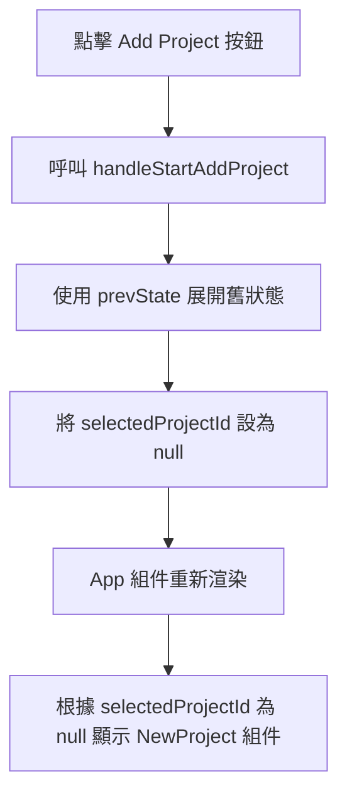
```mermaid
flowchart TD
    A[點擊 Add Project 按鈕] --> B[呼叫 handleStartAddProject]
    B --> C[使用 prevState 展開舊狀態]
    C --> D[將 selectedProjectId 設為 null]
    D --> E[App 組件重新渲染]
    E --> F[根據 selectedProjectId 為 null 顯示 NewProject 組件]
```

### `handleStartAddProject` 函式實作細節

- **[狀態信號定義]** 在此專案邏輯中，透過 `selectedProjectId` 的特定值來驅動 UI 切換：
    - `undefined`：代表目前無任何操作（nothing selected）
    - `null`：作為「正在新增新專案」的信號（adding a new project）
- **[狀態更新實作]** 使用函式形式更新狀態，並透過展開運算符（spread operator）確保舊有的狀態資料（如 `projects` 陣列）不會在更新時遺失
- **[程式碼實作]**:

```jsx
// src/App.jsx
function handleStartAddProject() {
  setProjectsState(prevState => {
    return {
      ...prevState,
      selectedProjectId: null
    };
  });
}
```

### 實作組件間的事件傳遞

- **[傳遞機制]** 為了讓子組件（如 `NoProjectSelected` 或 `ProjectsSidebar`）能夠觸發父組件（`App`）中的邏輯，必須透過 Props 將處理函式傳遞下去
- **[實作步驟]**
    - 在 `App` 組件中，將 `handleStartAddProject` 作為一個名為 `onStartAddProject` 的 prop 傳遞給子組件
    - 在目標子組件中，透過參數解構（destructuring）來接收該 prop
    - 在子組件的按鈕點擊事件中呼叫該 prop 函式
- **[程式碼實作]**

```jsx
// src/App.jsx
function App() {
  // ... 省略其他部分
  return (
    <main className="h-screen my-8 flex gap-8">
      <ProjectsSidebar onStartAddProject={handleStartAddProject} />
      <NoProjectSelected onStartAddProject={handleStartAddProject} />
    </main>
  );
}
```

```jsx
// src/components/NoProjectSelected.jsx (範例實作方式)
function NoProjectSelected({ onStartAddProject }) {
  return (
    <section>
      {/* ... 其他內容 ... */}
      <Button onClick={onStartAddProject}>Create new project</Button>
    </section>
  );
}
```

- **[組件整合]** 將 `ProjectsSidebar` 中的原生 `<button>` 替換為自定義的 `Button` 組件
    - 透過解構 Props 接收 `onStartAddProject` 函式
    - 將該函式綁定到 `Button` 組件的 `onClick` 屬性上
- **[程式碼實作]**

```jsx
// src/components/ProjectsSidebar.jsx
import Button from './Button.jsx';

export default function ProjectsSidebar({ onStartAddProject }) {
  return (
    <aside className="w-1/3 px-8 py-16 bg-stone-900 text-stone-50 md:w-72 rounded-r-xl">
      <h2 className="mb-8 font-bold uppercase md:text-xl text-stone-200">Your Projects</h2>
      <div>
        <Button onClick={onStartAddProject}>+ Add Project</Button>
      </div>
      <ul></ul>
    </aside>
  );
}
```

### 提升 `Button` 組件的靈活性

- **[Props 轉發機制]** 為了讓自定義組件能處理如 `onClick` 等原生事件，必須在組件內部使用展開運算符（spread operator）
    - 接收 `children` 與 `...props` 作為參數
    - 將 `...props` 展開到內部的原生 `<button>` 元素上
    - **[優點]** 這樣一來，外部傳入的任何屬性（例如 `onClick`）都會自動被轉發給底層的 HTML 元素，而不需要在組件定義中逐一列出
- **[程式碼實作]**

```jsx
// src/components/Button.jsx
export default function Button({ children, ...props }) {
  return (
    <button
      className="px-4 py-2 text-xs md:text-base rounded-md bg-stone-700 text-stone-400"
      {...props}
    >
      {children}
    </button>
  );
}
```

### 實作 `NoProjectSelected` 組件的事件處理

- **[Props 傳遞]** 在 `NoProjectSelected` 中接收 `onStartAddProject` prop，並將其綁定到 `Button` 組件的 `onClick` 事件上
- **[程式碼實作]**

```jsx
// src/components/NoProjectSelected.jsx
import Button from './Button.jsx';

export default function NoProjectSelected({ onStartAddProject }) {
  return (
    <div className="mt-24 text-center w-2/3">

      <h2 className="text-xl font-bold text-stone-500 my-4">No Project Selected</h2>
      <p className="text-stone-400 mb-4">Select a project or get started with a new one</p>
      <Button onClick={onStartAddProject}>Create new project</Button>
    </div>
  );
}
```

### 整合 `App` 組件的狀態與子組件

- **[狀態連結]** 將 `App` 組件中的 `projects` 狀態與事件處理函式 `handleStartAddProject` 同時傳遞給 `ProjectsSidebar` 與 `NoProjectSelected`
    - 這使得兩個組件都能根據目前的專案狀態（例如是否選中了某個專案）來決定要顯示哪一個介面
- **[程式碼實作]**

```jsx
// src/App.jsx
import { useState } from 'react';
import ProjectsSidebar from './components/ProjectsSidebar.jsx';
import NoProjectSelected from './components/NoProjectSelected.jsx';

function App() {
  const [projectsState, setProjectsState] = useState({
    selectedProjectId: undefined,
    projects: []
  });

  function handleStartAddProject() {
    setProjectsState((prevState) => {
      return {
        ...prevState,
        selectedProjectId: null,
      };
    });
  }

  return (
    <main className="h-screen my-8 flex gap-8">
      <ProjectsSidebar onStartAddProject={handleStartAddProject} />
      <NoProjectSelected onStartAddProject={handleStartAddProject} />
    </main>
  );
}

export default App;
```

### 實作 `App` 組件的條件渲染

- **[邏輯判斷]** 透過檢查 `projectsState.selectedProjectId` 的值來決定 `content` 變數應存放哪一個組件
    - 如果 `selectedProjectId === null`：表示使用者點擊了新增專案，應顯示 `<NewProject />` 組件
    - 如果 `selectedProjectId === undefined`：表示目前沒有選中任何專案，應顯示 `<NoProjectSelected />` 組件
- **[程式碼實作]**

```jsx
// src/App.jsx
// ... 前略

  let content;

  if (projectsState.selectedProjectId === null) {
    content = <NewProject />;
  } else if (projectsState.selectedProjectId === undefined) {
    content = <NoProjectSelected onStartAddProject={handleStartAddProject} />;
  }

  return (
    <main className="h-screen my-8 flex gap-8">
      <ProjectsSidebar onStartAddProject={handleStartAddProject} />
      {content}
    </main>
  );
// ... 後略
```

### 整合 `App` 組件的渲染輸出

- **[渲染邏輯]** 在 `App` 組件中定義 `content` 變數，根據 `projectsState.selectedProjectId` 的狀態決定顯示內容
    - 如果為 `null` $\rightarrow$ 顯示 `<NewProject />` 組件
    - 如果為 `undefined` $\rightarrow$ 顯示 `<NoProjectSelected />` 組件
- **[JSX 輸出]** 在 `return` 語句中，將 `content` 置於 `ProjectsSidebar` 旁邊進行渲染
- **[程式碼實作]**

```jsx
// src/App.jsx

  let content;

  if (projectsState.selectedProjectId === null) {
    content = <NewProject />;
  } else if (projectsState.selectedProjectId === undefined) {
    content = <NoProjectSelected onStartAddProject={handleStartAddProject} />;
  }

  return (
    <main className="h-screen my-8 flex gap-8">
      <ProjectsSidebar onStartAddProject={handleStartAddProject} />
      {content}
    </main>
  );
```

- **[行為觀察]**
    - 初始狀態（重新整理頁面）：顯示 fallback 畫面（`NoProjectSelected`）
    - 點擊「Create new project」按鈕：UI 會即時切換至 `NewProject` 組件介面

### 建立新專案功能規劃

- **[目標]** 實作建立新專案的完整流程
    - 使介面上的按鈕（例如 `Cancel` 與 `Save`）具備實際功能
    - 獲取使用者在 `Title`、`Description` 與 `Due Date` 輸入框中填寫的內容

### `NewProject` 組件的功能開發規劃

- **[目標]** 實作點擊「Save」按鈕後的資料處理流程
- **[執行流程]**

    1. **收集與驗證**：收集 `Title`、`Description` 與 `Due Date` 的輸入值，並檢查是否包含空值
    2. **分支處理**

        - **驗證失敗**：若任一輸入框為空，則顯示錯誤對話框 (Error Dialog)
        - **驗證成功**：若所有輸入皆有效，則執行新增專案動作，且新專案應立即出現在 `ProjectsSidebar` 中
- **[介面結構]**
    - 包含 `Title`、`Description` (textarea) 與 `Due Date` 的輸入欄位
    - 操作按鈕：`Cancel` 與 `Save`

```jsx
// src/components/NewProject.jsx

<div className="w-[35rem] mt-16">
  <menu className="flex items-center justify-end gap-4 my-4">
    <li>
      <button className="text-stone-800 hover:text-stone-950">Cancel</button>
    </li>
    <li>
      <button className="px-6 py-2 rounded-md bg-stone-800 text-stone-50 hover:text-stone-950">Save</button>
    </li>
  </menu>
  <div>
    <Input label="Title" />
    <Input label="Description" textarea />
    <Input label="Due Date" />
  </div>
</div>
```

### 使用 Refs 收集輸入值

- **[方法比較] 收集輸入值的方式**
    - **使用 State**：透過監聽 `onChange` 事件，在每一次按鍵時都更新狀態並儲存值
        - 優點：能即時追蹤輸入內容
        - 缺點：會增加額外的狀態管理負擔，並在每次按鍵時觸發重新渲染
    - **使用 Refs**：不監聽按鍵，僅在需要時（例如點擊「Save」按鈕時）直接從 DOM 元素讀取值
        - 優點：在此場景下更為簡潔，因為我們不需要在輸入過程中即時反應這些值，只需要在最後提交時獲取它們
- **[實作思路]** 在 `NewProject` 組件中使用 `useRef` 來建立與 HTML 輸入元素的連結，以便後續直接存取其內容

### 在 `NewProject` 中實作多個 Refs

- **[準備工作]** 首先需要從 `react` 中匯入 `useRef`
- **[建立 Refs]** 針對三個輸入欄位分別建立獨立的 ref 物件
    - `title` ref
    - `description` ref
    - `dueDate` ref

```jsx
// src/components/NewProject.jsx
import { useRef } from 'react';
import Input from './Input.jsx';

export default function NewProject() {
  const title = useRef();
  const description = useRef();
  const dueDate = useRef();

  return (
    <div className="w-[35rem] mt-16">
      <menu className="flex items-center justify-end gap-4 my-4">
        <li>
          <button className="text-stone-800 hover:text-stone-950">Cancel</button>
        </li>
        <li>
          <button className="px-6 py-2 rounded-md bg-stone-800 text-stone-50 hover:text-stone-950">Save</button>
        </li>
      </menu>
      <div>
        <Input label="Title" />
        <Input label="Description" textarea />
        <Input label="Due Date" />
      </div>
    </div>
  );
}
```

- **[注意事項]** 由於 `Input` 是一個自定義組件，後續需要處理如何透過這些 refs 存取到其內部的原生 DOM 元素。

### 自定義組件上的 Ref 傳遞限制

- **[核心問題]** `Input` 並非原生的 HTML 輸入元素，因此直接在組件上添加 `ref` prop 可能會失效
- **[版本差異]**
    - **React 19 或更高版本**：可以直接將 `ref` 作為一般的 prop 傳遞，並在子組件中解構使用
    - **React 18 或舊版本**：無法直接透過 `ref` prop 傳遞，需要透過其他方式（如 `forwardRef`）來處理

```jsx
// 在 React 19 中，可以像一般 prop 一樣解構 ref
// src/components/Input.jsx

export default function Input({ label, textarea, ref }) {
  // ...
}
```

- **[目前的實作]** 在 `NewProject` 組件中嘗試將建立的 refs 傳遞給 `Input` 組件：

```jsx
// src/components/NewProject.jsx

<Input ref={title} label="Title" />
<Input ref={description} label="Description" textarea />
<Input ref={dueDate} label="Due Date" />
```

### 在舊版 React 中接收 Ref

- **[核心機制]** 使用 `forwardRef` 函式來包裹組件，使其能夠接收來自父組件的 `ref` 並將其轉發給內部的原生元素
- **[實作步驟]**

    1. 從 `react` 中匯入 `forwardRef`
    2. 使用 `forwardRef` 包裹組件函數
    3. 組件函數現在會接收兩個參數：第一個是原本的 `props`，第二個是 `ref`

```jsx
// src/components/Input.jsx
import { forwardRef } from 'react';

const Input = forwardRef(function Input({ label, textarea, ...props }, ref) {
  const classes = 'w-full p-1 border-b-2 rounded-sm border-stone-300 bg-stone-200 text-stone-600 focus:outline-none';

  return (
    <p className="flex flex-col gap-1 my-4">
      <label className="text-sm font-bold uppercase text-stone-500">
        {label}
      </label>
      {textarea ? (
        <textarea className={classes} {...props} ref={ref} />
      ) : (
        <input className={classes} {...props} ref={ref} />
      )}
    </p>
  );
});

export default Input;
```

- **[關鍵變動]** 組件函數的參數結構從 `{ label, textarea, ...props }` 變更為 `({ label, textarea, ...props }, ref)`，其中 `ref` 作為第二個獨立參數傳入。

### 實作 `Input` 組件的 Ref 轉發

- **[轉發機制]** 透過 `forwardRef` 提供的 `ref` 參數，將其綁定到內部的原生元素上
- **[實作細節]** 根據 `textarea` prop 的值，決定將 `ref` 轉發給哪一個元素

```jsx
// src/components/Input.jsx
import { forwardRef } from 'react';

const Input = forwardRef(function Input({ label, textarea, ...props }, ref) {
  const classes = 'w-full p-1 border-b-2 rounded-sm border-stone-300 bg-stone-200 text-stone-600 focus:outline-none';

  return (
    <p className="flex flex-col gap-1 my-4">
      <label className="text-sm font-bold uppercase text-stone-500">
        {label}
      </label>
      {textarea ? (
        <textarea className={classes} {...props} ref={ref} />
      ) : (
        <input className={classes} {...props} ref={ref} />
      )}
    </p>
  );
});

export default Input;
```

- **[關鍵點]**
    - `ref` 是 `forwardRef` 傳入組件的第二個參數
    - 必須在 `<textarea />` 或 `<input />` 上顯式設定 `ref={ref}`，這樣父組件傳入的 `ref` 才能真正指向這些原生 DOM 節點

### `NewProject` 組件的 Refs 與儲存邏輯

- **[設定 Refs]** 為所有輸入欄位分配對應的 `useRef` 實例，以便後續擷取數值
    - `title`：用於標題輸入
    - `description`：用於描述輸入（`textarea`）
    - `dueDate`：用於截止日期輸入

```jsx
// src/components/NewProject.jsx
import { useRef } from 'react';
import Input from './Input.jsx';

export default function NewProject() {
  const title = useRef();
  const description = useRef();
  const dueDate = useRef();

  function handleSave() {
    // 待實作：處理儲存邏輯
  }

  return (
    <div className="w-[35rem] mt-16">
      <menu className="flex items-center justify-end gap-4 my-4">
        <li>
          <button className="text-stone-800 hover:text-stone-950">Cancel</button>
        </li>
        <li>
          <button
            className="px-6 py-2 rounded-md bg-stone-800 text-stone-50 hover:bg-stone-700"
            onClick={handleSave}
          >
            Save
          </button>
        </li>
      </menu>
      <div>
        <Input ref={title} label="Title" />
        <Input ref={description} label="Description" textarea />
        <Input ref={dueDate} label="Due Date" />
      </div>
    </div>
  );
}
```

- **[實作儲存按鈕]**
    - 在「Save」按鈕上添加 `onClick={handleSave}` 屬性
    - 透過將 `handleSave` 函式與按鈕點擊事件連結，當使用者點擊儲存時，將執行該函式進行資料處理

### 使用 Refs 擷取輸入數值

- **[讀取 DOM 屬性]** 在 `handleSave` 函式中，透過 Refs 直接存取原生 HTML 元素的屬性來取得使用者輸入的內容
    - 必須透過 `.current.value` 來存取，因為 `useRef` 回傳的是一個包含 `current` 屬性的物件，而 `<input />` 或 `<textarea />` 元素都擁有 `value` 屬性

```jsx
// src/components/NewProject.jsx

export default function NewProject() {
  const title = useRef();
  const description = useRef();
  const dueDate = useRef();

  function handleSave() {
    const enteredTitle = title.current.value;
    const enteredDescription = description.current.value;
    const enteredDueDate = dueDate.current.value;

    // 待實作：處理儲存邏輯
  }

  // ... 其餘程式碼
}
```

- **[關鍵概念]**
        - 當使用 Ref 處理表單時，不需要透過 State 來追蹤每一次的按鍵輸入（Controlled Components），而是可以在需要時（如點擊儲存按鈕）直接從 DOM 節點中「拉取」當前的數值。

### 資料提升 (Lifting State Up)

- **[完成資料擷取]** 在 `handleSave` 函式中，除了標題與描述，也透過 `dueDate` Ref 取得了截止日期

```jsx
// src/components/NewProject.jsx

export default function NewProject() {
  const title = useRef();
  const description = useRef();
  const dueDate = useRef();

  function handleSave() {
    const enteredTitle = title.current.value;
    const enteredDescription = description.current.value;
    const enteredDueDate = dueDate.current.value;

    // 待實作：處理儲存邏輯
  }

  // ...
}
```

- **[為什麼需要提升狀態？]** 雖然目前資料是在 `NewProject` 組件內擷取的，但我們需要將這些新專案的資訊傳回 `App` 組件
    - `App` 組件負責管理所有的專案狀態（`projectsState`）
    - 只有將資料傳回 `App`，才能進一步將新專案資訊分發給其他組件（例如 `ProjectsSidebar`）

```jsx
// src/App.jsx

import { useState } from 'react';
import NewProject from './components/NewProject.jsx';
import NoProjectSelected from './components/NoProjectSelected.jsx';
import ProjectsSidebar from './components/ProjectsSidebar.jsx';

function App() {
  const [projectsState, setProjectsState] = useState({
    selectedProjectId: undefined,
    projects: []
  });

  function handleStartAddProject() {
    setProjectsState(prevState => {
      return {
        ...prevState,
        selectedProjectId: null
      };
    });
  }

  let content;

  if (projectsState.selectedProjectId === null) {
    content = <NewProject />;
  } else if (projectsState.selectedProjectId === undefined) {
    content = <NoProjectSelected onStartAddProject={handleStartAddProject} />;
  }

  return (
    <main className="h-screen my-8 flex gap-8">
      <ProjectsSidebar onStartAddProject={handleStartAddProject} />
      {content}
    </main>
  );
}

export default App;
```

### 實作 `handleAddProject` 函式

- **[建立新增流程]** 在 `App` 組件中定義 `handleAddProject` 函式，用於啟動新增專案的狀態轉換
    - 該函式會被傳遞給子組件（如 `NoProjectSelected`），當使用者點擊「Add Project」按鈕時觸發
- **[使用函數式更新狀態]** 透過 `setProjectsState` 並傳入一個回呼函式來更新狀態，確保能正確存取並基於目前的狀態進行修改
    - 使用 `prevState => { ... }` 的寫法，並透過展開運算符 `...prevState` 保留現有的專案資料
    - 將 `selectedProjectId` 設定為 `null`，藉此觸發 `App` 組件中的條件渲染邏輯，切換至 `NewProject` 組件

```jsx
// src/App.jsx

function handleAddProject() {
  setProjectsState(prevState => {
    return {
      ...prevState,
      selectedProjectId: null,
    };
  });
}
```

### 實作專案新增邏輯

- **[確保狀態完整性]** 在更新 `projectsState` 時，必須基於舊狀態進行操作，以避免遺失現有的專案資料
    - 首先使用展開運算符 `...prevState` 來複製原本所有的狀態屬性
    - 針對 `projects` 陣列，同樣使用展開運算符 `...prevState.projects` 將舊有的專案項目全部放入新陣列中
    - 最後再將新的專案物件作為新陣列的最後一個元素加入

```jsx
// src/App.jsx

function handleAddProject() {
  setProjectsState(prevState => {
    return {
      ...prevState,
      projects: [...prevState.projects, newProject]
    };
  });
}
```

### 完善 `handleAddProject` 函式結構

- **[定義專案資料結構]** `handleAddProject` 函式將接收一個名為 `projectData` 的參數，該物件預期包含專案的標題（title）、描述（description）與截止日期（due date)
- **[整合資料與 ID]** 在建立 `newProject` 物件時，透過展開運算符將 `projectData` 的所有屬性展開，並手動添加一個 `id` 屬性，以便後續進行專案管理與識別
- **[更新狀態]** 最後將這個整合後的 `newProject` 加入到 `projects` 陣列中，同時保留其餘的 `projectsState` 屬性

```jsx
// src/App.jsx

function handleAddProject(projectData) {
  setProjectsState(prevState => {
    const newProject = {
      ...projectData,
      id: crypto.randomUUID(),
    };

    return {
      ...prevState,
      projects: [...prevState.projects, newProject],
    };
  });
}
```

### 實作新專案的 ID 生成與觸發機制

- **[使用 Math.random() 生成 ID]** 在建立新專案物件時，使用 JavaScript 內建的 `Math.random()` 來產生一個隨機數值作為 `id`
    - 雖然在實際生產環境中可能需要更完美的 ID 生成方式（如 `crypto.randomUUID()`），但對於此範例專案而言，`Math.random()` 已足夠使用
- **[建立新專案物件]** 將傳入的 `projectData` 與生成的 `id` 整合，並將其加入到 `projects` 陣列中

```jsx
// src/App.jsx

function handleAddProject(projectData) {
  setProjectsState(prevState => {
    const newProject = {
      ...projectData,
      id: Math.random(),
    };

    return {
      ...prevState,
      projects: [...prevState.projects, newProject],
    };
  });
}
```

- **[執行流程]** `handleAddProject` 函式將會由 `NewProject` 組件內部呼叫
    - 當使用者在 `NewProject` 組件中填寫完資料並點擊「Save」按鈕時，會執行該組件內的 `handleSave` 方法，進而觸發 `App` 組件傳遞下來的 `handleAddProject`

### 實作 `NewProject` 的資料回傳機制

- **[透過 Props 接收回呼函式]** `NewProject` 組件可以接收一個名為 `onAdd` 的 prop，這個 prop 是一個函式，允許子組件通知父組件執行特定的操作
- **[在&#32;`handleSave`&#32;中封裝資料]** 當使用者點擊儲存時，`handleSave` 會從各個 `useRef` 取得最新的輸入值，並將它們封裝成一個包含 `title`、`description` 與 `dueDate` 屬性的物件，隨後呼叫 `onAdd` 並將此物件作為參數傳入

```jsx
// src/NewProject.jsx

export default function NewProject({ onAdd }) {
  const title = useRef();
  const description = useRef();
  const dueDate = useRef();

  function handleSave() {
    const enteredTitle = title.current.value;
    const enteredDescription = description.current.value;
    const enteredDueDate = dueDate.current.value;

    // validation ...

    onAdd({
      title: enteredTitle,
      description: enteredDescription,
      dueDate: enteredDueDate,
    });
  }

  return (
    // ... JSX 內容
  );
}
```

### 建立 `NewProject` 與 `App` 的資料連結

- **[傳遞回呼函式]** 在 `App` 組件中，將 `handleAddProject` 作為 `onAdd` prop 傳遞給 `NewProject` 組件
    - 這樣當 `NewProject` 執行 `onAdd` 時，實際上就是在執行 `App` 組件中的 `handleAddProject`
    - 這種模式建立了子組件與父組件之間的通訊橋樑，讓資料能從子組件回流至父組件

```jsx
// src/App.jsx

// ... 在渲染 NewProject 的地方
if (projectsState.selectedProjectId === null) {
  content = <NewProject onAdd={handleAddProject} />;
}
```

- **[資料流向]**

    1. 使用者在 `NewProject` 輸入資料
    2. 點擊儲存觸發 `handleSave`
    3. `handleSave` 呼叫 `onAdd(projectData)`
    4. `App` 組件接收到 `projectData` 並執行 `handleAddProject` 來更新全域狀態

- **[驗證機制]** 在 `App` 組件中加入 `console.log` 以確認當新專案被新增時，狀態是否如預期地更新

### 驗證狀態更新流程

- **[監控狀態變化]** 在 `App` 組件中加入 `console.log` 來觀察 `projects` 陣列隨時間的變化

```jsx
// src/App.jsx

function App() {
  // ... 其他程式碼

  console.log(projects);

  // ... 其他程式碼
}
```

- **[實際測試流程]**
    - 初始狀態：開發者工具（Developer Tools）顯示 `projects` 為一個空陣列 `Array(0)`
    - 執行新增動作：

        1. 點擊「Create new project」按鈕
        2. 在輸入欄位填寫資料（例如：Title 為 "test"，Description 為 "this is a test"，Due Date 為 "today"）
        3. 點擊「Save"

    - 預期結果：`App` 組件會因為狀態更新而重新渲染，`console.log` 會印出包含新專案物件的陣列

### 驗證新專案資料與 Strict Mode 的影響

- **[驗證狀態更新]** 透過在 `NewProject` 中填寫資料（Title: "Test"、Description: "This is a test"、Due Date: "Today"）並點擊「Save」，確認 `projects` 陣列成功包含了該物件資料
    - 預期結果範例：

```javascript
projects: Array(1)
        0: {
          description: "This is a test",
          dueDate: "Today",
          id: 0.5386739655368402,
          title: "Test"
        }
```

- **[React Strict Mode 的行為]** 在開發者工具中觀察到每次組件執行時會出現兩次輸出，這是因為啟用了 `React.StrictMode`
    - **[原因]** Strict Mode 會刻意讓組件函式執行兩次，用以幫助開發者發現潛在的副作用或不純的程式碼問題
    - **[實作位置]** 通常定義在 `main.jsx` 中

```jsx
// src/main.jsx

import React from 'react'
import ReactDOM from 'react-dom/client'
import App from './App'
import './index.css'

ReactDOM.createRoot(document.getElementById('root')).render(
  <React.StrictMode>
    <App />
  </React.StrictMode>
)
```

### 優化日期輸入功能

- **[實作日期選擇器]** 將 `NewProject` 組件中的日期輸入欄位 `type` 設定為 `"date"`，以利用瀏覽器內建的日期選擇介面
    - 這樣使用者可以直接點選日期，而非手動輸入字串，確保了資料格式的正確性

```jsx
// src/NewProject.jsx

// ...
<Input
  type="date"
  ref={dueDate}
  label="Due Date"
/>
// ...
```

- **[驗證日期資料]** 透過實作後的日期選擇器選擇日期並儲存，確認 `projects` 狀態中成功包含了正確的日期格式（例如：`05.08.2023`）
- **[後續開發目標]**
    - 將新增的專案列表同步顯示在 `ProjectsSidebar` 組件中
    - 在點擊「Save」並確保資料有效後，自動關閉 `NewProject` 的輸入介面

### 實作「儲存後關閉」功能

- **[問題點]** 目前點擊「Save」後，`NewProject` 組件不會消失，因為 `selectedProjectId` 的值仍維持為 `null`。
    - 根據目前的渲染邏輯，只要 `selectedProjectId === null`，就會持續顯示 `<NewProject />`。
- **[解決方案]** 在 `App` 組件中，當新增專案成功後，將 `selectedProjectId` 的值設回 `undefined`。
    - 這樣可以觸發條件渲染邏輯，讓 `App` 組件不再符合顯示 `NewProject` 的條件，進而將其從畫面中移除。
- **[渲染邏輯調整]**
        - 使用 `useState` 管理 `projectsState`，其中包含 `selectedProjectId`。
        - 透過判斷 `selectedProjectId` 的值來決定渲染內容：
                - 若為 `null` $\rightarrow$ 顯示 `NewProject` 組件
                - 若為 `undefined` $\rightarrow$ 顯示 `NoProjectSelected` 組件

```jsx
// src/App.jsx

// 初始狀態設定
const [projectsState, setProjectsState] = useState({
  selectedProjectId: undefined,
  projects: [],
});

// 根據狀態決定渲染內容
let content;
if (projectsState.selectedProjectId === null) {
  content = <NewProject onAdd={handleAddProject} />;
} else if (projectsState.selectedProjectId === undefined) {
  content = <NoProjectSelected onStartAddProject={handleStartAddProject} />;
}
```

### `handleAddProject` 的狀態更新策略

- **[方案一] 回到 fallback 畫面**
    - 在更新 `projectsState` 時，將 `selectedProjectId` 設為 `undefined`。
    - **[效果]** 新增成功後，畫面會自動切換回 `NoProjectSelected` 組件，使用者需要手動從側邊欄選擇專案。
- **[方案二] 自動選取新專案]**
    - 在新增專案時，同時生成一個新的 ID 並將其存入 `selectedProjectId`。
    - **[實作方式]** 先將產生的 ID 存入一個常數，然後在更新狀態時同時應用於新專案物件與 `selectedProjectId`。
    - **[效果]** 新增專案後，系統會自動切換至該新專案的檢視畫面，提供更流暢的使用者體驗。

```jsx
// src/App.jsx

function handleAddProject(projectData) {
  setProjectsState((prevState) => {
    const projectId = Math.random(); // 生成新 ID
    const newProject = {
      ...projectData,
      id: projectId,
    };

    return {
      ...prevState,
      selectedProjectId: projectId, // 自動選取新專案
      projects: [...prevState.projects, newProject],
    };
  });
}
```

### 整合 `ProjectsSidebar` 顯示專案列表

- **[狀態回歸]** 在 `handleAddProject` 中，將 `selectedProjectId` 設為 `undefined`
    - **[目的]** 確保新增專案後，應用程式能回到 `NoProjectSelected` 組件（fallback 畫面），而不是停留在新增介面。
- **[傳遞專案資料]** 為了讓側邊欄能顯示已建立的專案，必須將 `projects` 陣列透過 props 傳遞給 `ProjectsSidebar` 組件。
    - **[實作方式]** 在 `App` 組件中，為 `ProjectsSidebar` 添加 `projects` prop，其值指向 `projectsState.projects`。

```jsx
// src/App.jsx

function handleAddProject(projectData) {
  setProjectsState((prevState) => {
    const projectId = Math.random();
    const newProject = {
      ...projectData,
      id: projectId,
    };

    return {
      ...prevState,
      selectedProjectId: undefined, // 回到 fallback 畫面
      projects: [...prevState.projects, newProject],
    };
  });
}

// ... 在 return 區塊中
<ProjectsSidebar
  onStartAddProject={handleStartAddProject}
  projects={projectsState.projects}
/>
```

### 實作 `ProjectsSidebar` 渲染專案列表

- **[接收 Props]** 首先在 `ProjectsSidebar` 組件的參數中解構出 `projects` prop
- **[動態渲染]** 使用 `map` 方法遍歷 `projects` 陣列，將每個專案項目轉換為 JSX 元素，並放入 `<ul>` 標籤內

```jsx
// src/ProjectsSidebar.jsx

export default function ProjectsSidebar({ onStartAddProject, projects }) {
  return (
    <aside className="w-1/3 px-8 py-16 bg-stone-900 text-stone-50 md:w-72 rounded-r-xl">
      <h2 className="mb-8 font-bold uppercase md:text-xl text-stone-200">Your Projects</h2>
      <div>
        <Button onClick={onStartAddProject}>
          + Add Project
        </Button>
      </div>
      <ul>
        {projects.map((project) => (
          <li key={project.id}>
            {project.title}
          </li>
        ))}
      </ul>
    </aside>
  );
}
```

### 完善 `ProjectsSidebar` 的列表項目結構

- **[設定 Key 屬性]** 在使用 `map` 遍歷專案列表時，必須為生成的根元素（即 `<li>`）提供一個 `key` prop
    - **[為何需要 Key]** 使用專案唯一的 `id` 作為 `key`，能讓 React 識別哪些項目發生了變化，優化渲染效能
- **[增加互動性]** 在 `<li>` 標籤內部加入 `<button>` 元素
    - **[目的]** 讓每個專案項目變得「可選取」（selectable），使用者點擊按鈕後即可切換並查看該專案的詳細內容

```jsx
// src/ProjectsSidebar.jsx

<ul>
  {projects.map((project) => (
    <li key={project.id}>
      <button>{project.title}</button>
    </li>
  ))}
</ul>
```

### `ProjectsSidebar` 按鈕樣式優化

- **[樣式調整]** 為列表中的按鈕添加以下 Tailwind CSS 類別，以提升視覺一致性與易用性：
    - `w-full`：使按鈕佔滿容器的完整寬度
    - `text-left`：將按鈕內的文字靠左對齊
    - `px-2 py-1`：設定水平與垂直的內距（padding）
    - `rounded-sm`：添加微小的圓角
    - `my-1`：設定按鈕上下方的外邊距（margin）
    - `text-stone-400`：使用淺灰色文字，以確保在深色背景下仍具備良好的可讀性

```jsx
// src/ProjectsSidebar.jsx

<ul>
  {projects.map((project) => (
    <li key={project.id}>
      <button className="w-full text-left px-2 py-1 rounded-sm my-1 text-stone-400">
        {project.title}
      </button>
    </li>
  ))}
</ul>
```

### `ProjectsSidebar` 按鈕互動視覺優化

- **[新增 Hover 效果]** 為了讓使用者在滑鼠懸停於專案按鈕時能獲得明確的視覺回饋，添加了以下 Tailwind CSS 類別：
    - `hover:text-stone-200`：當滑鼠懸停時，將文字顏色從原本的 `text-stone-400` 變更為較亮的 `text-stone-200`
    - `hover:bg-stone-800`：當滑鼠懸停時，為按鈕添加深色的背景顏色，使其在視覺上呈現被選中的狀態

```jsx
// src/ProjectsSidebar.jsx

<ul>
  {projects.map((project) => (
    <li key={project.id}>
      <button className="w-full text-left px-2 py-1 rounded-sm my-1 text-stone-400 hover:text-stone-200 hover:bg-stone-800">
        {project.title}
      </button>
    </li>
  ))}
</ul>
```

### `ProjectsSidebar` 列表佈局優化

- **[增加頂部間距]** 為專案列表（`<ul>`）添加 `mt-8` 類別
    - **[目的]** 將列表向下推，與上方的「+ Add Project」按鈕保持適當的視覺間距

```jsx
// src/ProjectsSidebar.jsx

<aside className="w-1/3 px-8 py-16 bg-stone-900 text-stone-50 md:w-72 rounded-r-xl">
  <h2 className="mb-8 font-bold uppercase md:text-xl text-stone-200">Your Projects</h2>
  <div>
    <Button onClick={onStartAddProject}>
      + Add Project
    </Button>
  </div>
  <ul className="mt-8">
    {projects.map((project) => (
      <li key={project.id}>
        <button className="w-full text-left px-2 py-1 rounded-sm my-1 text-stone-400 hover:text-stone-200 hover:bg-stone-800">
          {project.title}
        </button>
      </li>
    ))}
  </ul>
</aside>
```

### 下一步開發規劃

- **[實作取消功能]** 確保在新增專案的過程中，點擊「Cancel」按鈕可以正確關閉介面
- **[實作輸入驗證]** 當使用者在未填寫所有必填欄位的情況下點擊「Save」時，應彈出一個顯示錯誤訊息的 Modal

### `NewProject` 輸入驗證實作

- **[驗證邏輯]** 在 `handleSave` 函式中，首先檢查使用者輸入的標題是否有效
    - 使用 `.trim()` 移除標題前後的額外空白
    - 若處理後的標題為空字串 (`''`)，則視為無效輸入，需觸發錯誤 Modal

```javascript
// src/NewProject.jsx

function handleSave() {
  const enteredTitle = title.current.value;
  const enteredDescription = description.current.value;
  const enteredDueDate = dueDate.current.value;

  if (enteredTitle.trim() === '') {
    // 若標題為空，則觸發錯誤提示（後續實作）
  }

  onAdd({
    title: enteredTitle,
    description: enteredDescription,
    dueDate: enteredDueDate,
  });
}
```

### `NewProject` 多欄位驗證實作

- **[擴充驗證範圍]** 除了標題外，描述與到期日也必須進行非空值檢查
    - 使用 `.trim()` 確保使用者輸入的內容不只是空白字元
    - 若標題、描述或到期日其中之一為空，則視為驗證失敗，需顯示錯誤 Modal

```javascript
// src/NewProject.jsx

function handleSave() {
  const enteredTitle = title.current.value;
  const enteredDescription = description.current.value;
  const enteredDueDate = dueDate.current.value;

  if (
    enteredTitle.trim() === '' ||
    enteredDescription.trim() === '' ||
    enteredDueDate.trim() === ''
  ) {
    // 若任一欄位為空，則觸發錯誤提示（後續實作）
  }

  onAdd({
    title: enteredTitle,
    description: enteredDescription,
    dueDate: enteredDueDate,
  });
}
```

### 建立通用 Modal 組件

- **[組件規劃]** 為了解決上述驗證失敗時的提示需求，將建立一個名為 `Modal.jsx` 的新組件
    - 目標是建立一個可重複使用的彈出視窗，用於顯示各種訊息（如錯誤提示）

### 打造高靈活度的通用 Modal 組件

- **[設計目標]** 建立一個可重複使用的 Modal，理論上可以用來顯示各種不同類型的資訊
- **[實作方式]** 在 `Modal` 組件中提取 `children` prop
    - 這樣 `Modal` 就能作為一個「包裝器」（wrapper），將任何傳入的內容包裹在 `<dialog>` 元素內

```javascript
// src/Modal.jsx

export default function Modal({ children }) {
  return (
    <dialog>
      {children}
    </dialog>
  );
}
```

### 使用 React Portal 提升 Modal 層級

- **[問題背景]** 雖然 Modal 在視覺上能正常運作，但它在 DOM 結構中仍被嵌套在原本的組件內，這可能會導致 CSS 樣式衝突或無障礙性問題
- **[解決方案]** 利用 React 提供的 `createPortal` 功能，將 Modal 渲染到 DOM 樹中一個獨立的節點

#### 1. 設定 HTML 容器

- 在 `index.html` 中預留一個專門用於渲染 Modal 的 `div` 元素

```html
<!-- index.html -->
<body>
  <div id="modal-root"></div>
  <div id="root"></div>
</body>
```

#### 2. 實作 Modal 組件

- 從 `react-dom` 匯入 `createPortal`
- 將 `<dialog>` 及其內容包裹在 `createPortal` 中，並指定目標節點為 `document.getElementById('modal-root')`

```javascript
// src/Modal.jsx
import { createPortal } from 'react-dom';

export default function Modal({ children }) {
  return createPortal(
    <dialog>
      {children}
    </dialog>,
    document.getElementById('modal-root')
  );
}
```

#### `createPortal` 的實作細節

- **[參數說明]** `createPortal` 接收兩個主要參數：
    - 第一個參數：要渲染的 JSX 內容（例如 `<dialog>{children}</dialog>`）
    - 第二個參數：目標 HTML 元素（用於指定內容要出現在 DOM 樹中的位置）
- **[選取目標節點]** 使用瀏覽器內建的 API `document.getElementById` 來選取在 `index.html` 中預先定義好的容器

```javascript
// src/Modal.jsx
import { createPortal } from 'react-dom';

export default function Modal({ children }) {
  return createPortal(
    <dialog>{children}</dialog>,
    document.getElementById('modal-root')
  );
}
```

### 打造高靈活度且封裝良好的組件

- **[設計理念]** 優秀的組件應該隱藏其內部的實作細節（例如：內部是否使用了 `<dialog>` 元素），不應讓呼叫該組件的父組件被迫處理這些不必要的資訊。
- **[核心技術組合]** 透過結合以下兩個 React 特性，可以實現高度可重用且靈活的組件設計：
    - `forwardRef`：用於將 Ref 從父組件轉發到子組件內部的特定元素。
    - `useImperativeHandle`：用於定義並暴露特定的方法或屬性給外部透過 Ref 存取，而非直接暴露整個 DOM 節點。

```javascript
// 結合兩者的典型結構範例
import { forwardRef, useImperativeHandle } from 'react';
import { createPortal } from 'react-dom';

export default forwardRef(function Modal({ children }, ref) {
  useImperativeHandle(ref, () => {
    return {
      // 在這裡定義要暴露給外部的方法
    };
  });

  return createPortal(
    <dialog>{children}</dialog>,
    document.getElementById('modal-root')
  );
});
```

### React 版本對 Ref 處理的差異

- **[React 19 的簡化]** 在 React 19 及更新版本中，不再需要使用 `forwardRef`。
    - 可以直接將 `ref` 作為一般的 prop 傳遞給組件。
- **[舊版 React 的做法]** 在 React 18 或更早版本中，必須使用 `forwardRef` 來讓組件接收 `ref`。
    - 需要使用 `forwardRef` 將組件函數包裹起來。
    - 通常會將包裝後的組件賦值給一個常數（constant），以便進行匯出。

```javascript
// 適用於 React 19 的寫法 (直接作為 prop)
export default function Modal({ children, ref }) {
  // ...
}

// 適用於舊版 React 的寫法 (使用 forwardRef)
import { forwardRef, useImperativeHandle } from 'react';
import { createPortal } from 'react-dom';

const Modal = forwardRef(function Modal({ children }, ref) {
  useImperativeHandle(ref, () => {
    return {
      // ...
    };
  });

  return createPortal(
    <dialog>{children}</dialog>,
    document.getElementById('modal-root')
  );
});

export default Modal;
```

### `useImperativeHandle` 的實作細節

- **[核心步驟]** 要讓組件能夠將特定的功能暴露給外部呼叫，必須遵循以下流程：
    - **[參數一：傳遞 Ref]** 將從 `forwardRef` 接收到的 `ref` 作為第一個參數傳入 `useImperativeHandle`。
    - **[參數二：定義 API]** 第二個參數必須是一個函式，該函式會回傳一個物件，物件中的屬性即為要暴露給外部的方法。

```javascript
// Modal.jsx 實作範例
import { forwardRef, useImperativeHandle } from 'react';
import { createPortal } from 'react-dom';

const Modal = forwardRef(function Modal({ children }, ref) {
  useImperativeHandle(ref, () => {
    return {
      // 在此定義要暴露給外部的方法
    };
  });

  return createPortal(
    <dialog>{children}</dialog>,
    document.getElementById('modal-root')
  );
});

export default Modal;
```

### 實作 `open` 方法與內部 Ref 連結

- **[核心邏輯]** 為了讓外部能控制 Modal 的顯示，我們需要在組件內部建立一個 Ref 來指向 `<dialog>` 元素，並透過 `useImperativeHandle` 將控制權轉發出去。
- **[實作步驟]**
    - 使用 `useRef` 建立一個名為 `dialog` 的內部 Ref。
    - 在 `useImperativeHandle` 的回傳物件中定義 `open` 函式。
    - 在 `open` 函式內呼叫 `dialog.current.showModal()`，這會觸發 HTML `<dialog>` 元素的內建顯示機制（包含 backdrop 效果）。
    - 將該內部 Ref 透過 `ref` 屬性綁定到 JSX 中的 `<dialog>` 元素上。

```javascript
// Modal.jsx 實作範例
import { forwardRef, useImperativeHandle, useRef } from 'react';
import { createPortal } from 'react-dom';

const Modal = forwardRef(function Modal({ children }, ref) {
  const dialog = useRef();

  useImperativeHandle(ref, () => {
    return {
      open() {
        dialog.current.showModal();
      }
    };
  });

  return createPortal(
    <dialog ref={dialog}>{children}</dialog>,
    document.getElementById('modal-root')
  );
});

export default Modal;
```

### `open` 方法與原生 `showModal()` 的關係

- **[概念區分]** 必須區分「組件提供的 API」與「原生 DOM 的方法」：
    - `open()`：這是我們透過 `useImperativeHandle` 暴露給**外部組件**使用的自定義方法。
    - `showModal()`：這是 HTML `<dialog>` 元素本身內建的**原生方法**。
- **[執行流程]** 當外部組件呼叫 `modalRef.current.open()` 時，實際上是觸發了我們在子組件內定義的邏輯，進而去執行底層的 `dialog.current.showModal()`。

### 在 `NewProject` 中實作錯誤訊息 Modal

- **[實作情境]** 當使用者填寫資料不完整時，我們需要彈出一個 Modal 來顯示錯誤訊息。
- **[JSX 結構調整]** 因為在一個組件的 return 中需要同時渲染原本的內容與新的 `Modal` 組件，必須使用 **Fragment** (`<>...</>`) 將它們包裹起來，以符合 JSX 只能回傳單一根節點的規則。

```javascript
// NewProject.jsx 實作範例
return (
  <>
    <div>
      {/* 原有的專案新增表單內容... */}
    </div>
    <Modal ref={errorModalRef}>
      <p>Please enter a valid project title.</p>
    </Modal>
  </>
);
```

### 在 `NewProject` 中連結 Modal Ref

- **[實作方式]** 為了能夠在驗證失敗時觸發 Modal，需要在 `NewProject` 組件中建立一個新的 Ref 並將其傳遞給 `Modal` 組件。
- **[程式碼實作]**
    - 使用 `useRef` 建立 `modalRef`。
    - 將 `ref={modal}` 屬性傳遞給 `<Modal />` 組件（因為 `Modal` 已實作 `forwardRef`，所以可以接收此屬性）。
    - 在驗證邏輯中，透過 `modal.current.open()` 來執行開啟動作。

```javascript
// NewProject.jsx 實作片段
import { useRef } from 'react';
import Modal from './Modal.jsx';

export default function NewProject({ onAdd }) {
  const title = useRef();
  const description = useRef();
  const dueDate = useRef();
  const modal = useRef(); // 建立用於控制 Modal 的 Ref

  function handleSave() {
    const enteredTitle = title.current.value;
    const enteredDescription = description.current.value;
    const enteredDueDate = dueDate.current.value;

    if (
      enteredTitle.trim() === '' ||
      enteredDescription.trim() === '' ||
      enteredDueDate.trim() === ''
    ) {
      // 驗證失敗時，呼叫 Modal 暴露出來的 open 方法
      modal.current.open();
      return;
    }

    onAdd({
      title: enteredTitle,
      description: enteredDescription,
      dueDate: enteredDueDate,
    });
  }

  return (
    <>
      <Modal ref={modal}>
        <div className="w-[35rem] mt-16">
          <menu className="flex items-center justify-end gap-4 my-4">
            <li>
              <button className="text-stone-800 hover:text-stone-950">Cancel</button>
            </li>
            <li>
              <button>Add Project</button>
            </li>
          </menu>
        </div>
      </Modal>
      {/* 其他表單內容... */}
    </>
  );
}
```

### 實作 `NewProject` 的驗證與流程中斷

- **[驗證邏輯]** 當使用者輸入的欄位（標題、描述、日期）經過 `trim()` 後為空字串時，視為無效輸入。
- **[觸發 Modal]** 透過 `modal.current.open()` 呼叫子組件暴露出來的方法，顯示錯誤訊息對話框。
- **[流程中斷]** 在呼叫 `open()` 後必須緊接著使用 `return`。
    - **[為什麼要這樣做？]** 為了確保當驗證失敗時，程式碼不會繼續往下執行 `onAdd` 函式，避免將錯誤的資料傳遞給父組件。

```javascript
// NewProject.jsx 驗證邏輯片段
if (
  enteredTitle.trim() === '' ||
  enteredDescription.trim() === '' ||
  enteredDueDate.trim() === ''
) {
  modal.current.open(); // 觸發錯誤 Modal
  return;              // 中斷執行，防止執行後續的 onAdd
}

onAdd({
  title: enteredTitle,
  description: enteredDescription,
  dueDate: enteredDueDate,
});
```

### 豐富 `Modal` 的內容

- **[組件角色]** 目前的 `Modal` 組件僅作為一個「容器 (wrapper)」，本身並不包含具體的訊息內容。
- **[實作方式]** 為了顯示錯誤訊息，需要在 `NewProject` 組件中，於 `<Modal>` 標籤內包裹具體的 HTML 元素。
- **[內容設計]** 透過添加標題與段落來提供清晰的引導：
    - `<h2>`：顯示「Invalid Input」作為標題。
    - `<p>`：說明錯誤原因（例如：「Oops ... looks like you forgot to enter a value.」）。

```javascript
// NewProject.jsx 內容實作片段
<Modal ref={modal}>
  <h2>Invalid Input</h2>
  <p>Oops ... looks like you forgot to enter a value.</p>
  <p>Please make sure ...</p>
</Modal>
```

### 實作 Modal 的關閉功能

- **[利用原生行為]** 為了讓使用者能關閉對話框，可以在 `Modal` 組件中添加一個特殊的表單。
- **[使用&#32;`method="dialog"`]** 在 `<form>` 元素上設定 `method="dialog"` 屬性。
    - **[運作原理]** 當使用者點擊該表單內的按鈕時，瀏覽器會自動關閉對應的 `<dialog>` 元素，無需手動撰寫複雜的狀態切換邏輯。
- **[程式碼實作]** 在 `children` 之後加入關閉按鈕的結構：

```javascript
// Modal.jsx 實作關閉功能片段
return createPortal(
  <dialog ref={dialog}>
    {children}
    <form method="dialog">
      <button>Close</button>
    </form>
  </dialog>,
  document.getElementById('modal-root')
);
```

- **[進階思考]** 為了提升組件的重用性（reusability），未來可以考慮將按鈕的文字（label）改為透過 props 傳入，而不是目前寫死的「Close」。

### 提升 `Modal` 組件的重用性

- **[優化方向]** 為了避免在組件內硬編碼（hard-coding）按鈕文字，可以透過 props 來傳遞按鈕的標題。
- **[實作方式]**
    - 在 `Modal` 組件的定義中加入 `buttonCaption` prop。
    - 將 `<button>` 標籤內的文字替換為 `{buttonCaption}`。
- **[使用範例]** 在 `NewProject` 組件中使用時，可以根據需求傳入不同的文字：

```javascript
// 在 NewProject.jsx 中使用 Modal 並自定義按鈕文字
<Modal ref={modal} buttonCaption="Okay">
  <h2>Invalid Input</h2>
  <p>Oops ... looks like you forgot to enter a value.</p>
  <p>Please make sure you provide a valid value for every input field.</p>
</Modal>
```

- **[運作流程]**
    - 當 `Modal` 組件渲染時，它會接收來自父組件的 `buttonCaption`。
    - 內部的 `<form method="dialog">` 會渲染出一個帶有該自定義文字的按鈕。
    - 使用者點擊按鈕後，瀏覽器原生行為會自動關閉該 `<dialog>` 元素。

### 驗證新專案建立流程

- **[功能測試]** 嘗試在 `NewProject` 表單中不輸入任何內容並點擊「Save」。
- **[預期結果]** 系統應能成功觸發 `Modal` 並顯示「Invalid Input」的提示訊息。
- **[現狀觀察]**
    - 功能邏輯運作正常（Modal 已彈出）。
    - **[待改進]** 目前 Modal 的視覺樣式（styling）尚不美觀，需要後續進行 CSS 優化。

### 優化 Modal 的背景遮罩樣式

- **[使用 Tailwind Backdrop 變體]** 可以使用 `backdrop:` 前綴來針對 `<dialog>` 元素自動產生的背景遮罩層（backdrop element）進行樣式設定。
- **[實作方式]** 在 `dialog` 元素上添加 `backdrop:` 類別：
    - 使用 `backdrop:bg-stone-900/90` 來設定遮罩層的背景顏色。
    - **[語法解析]** `bg-stone-900/90` 代表使用 `stone-900` 色系，並加上 `90` 的不透明度（opacity）。

```javascript
// Modal.jsx 樣式優化片段
return createPortal(
  <dialog ref={dialog} className="backdrop:bg-stone-900/90">
    {children}
    <form method="dialog">
      <button>{buttonCaption}</button>
    </form>
  </dialog>,
  document.getElementById('modal-root')
);
```

- **[視覺效果]** 透過此設定，當 Modal 彈出時，後方的內容會被一層半透明的深灰色（stone-900，不透明度 90%）遮蓋，從而增加視覺層次感並讓使用者的注意力集中在對話框上。

### 優化 Modal 本身的視覺樣式

- **[樣式調整]** 除了設定背景遮罩（backdrop）外，還需對 `<dialog>` 元素本身進行樣式優化，使其看起來更像一個獨立的浮動視窗：
        - `p-4`：添加內距（padding），避免內容貼齊邊緣。
        - `rounded-md`：添加中等程度的圓角。
        - `shadow-md`：添加中等陰影，增加層次感與立體感。
- **[程式碼實作]** 在 `Modal.jsx` 中整合樣式：

```javascript
// Modal.jsx 樣式完整實作
return createPortal(
  <dialog
    ref={dialog}
    className="backdrop:bg-stone-900/90 p-4 rounded-md shadow-md"
  >
    {children}
    <form method="dialog">
      <button>{buttonCaption}</button>
    </form>
  </dialog>,
  document.getElementById('modal-root')
);
```

### 維持 UI 一致性

- **[樣式複用]** 為了讓 `NoProjectSelected` 組件中的標題與 Modal 中的標題風格一致，可以將 Modal 內標題使用的 Tailwind 類別複製過來。
- **[實作方式]** 在 `NoProjectSelected.jsx` 中，將 `<h2>` 標籤的 `className` 設定為與 Modal 內容一致的樣式（例如 `text-xl font-bold text-stone-500 my-4`）。
    - **[註記]** 雖然在實際開發中，將這些重複使用的樣式提取成一個獨立的「可複用組件（reusable component）」是更好的做法，但為了節省開發時間，目前採取直接複製貼上的方式。

### `NewProject` 組件樣式優化

- **[樣式同步]** 為了讓 `NewProject` 的錯誤提示訊息（Invalid Input）在視覺上與 `NoProjectSelected` 組件保持一致，直接將其 CSS 類別複製過來：
    - `<h2>` 標籤使用：`text-xl font-bold text-stone-500 my-4`
    - `<p>` 標籤使用：`text-stone-400 mb-4`
- **[實作程式碼]** 在 `NewProject.jsx` 中的 `Modal` 內容結構如下：

```javascript
<Modal ref={modal} buttonCaption="Okay">
  <h2 className="text-xl font-bold text-stone-500 my-4">Invalid Input</h2>
  <p className="text-stone-400 mb-4">Oops ... looks like you forgot to enter a value.</p>
  <p>Please make sure you provide a valid value for every input field.</p>
</Modal>
```

- **[現況觀察]**
    - 經過樣式調整後，文字呈現效果明顯提升。
    - **[待處理]** 按鈕（Button）的樣式目前仍然不夠美觀，需要回到 `Modal` 組件內部的 `<form>` 進行調整。

### `Modal` 組件按鈕樣式優化

- **[佈局調整]** 為了讓按鈕在 Modal 底部的呈現更自然，對 `<form>` 元素進行了樣式調整：
    - `mt-4`：增加頂部邊距，與上方內容保持間隔。
    - `text-right`：將按鈕對齊至右側。
- **[組件整合]** 不再使用原生的 `<button>`，而是改用從 `./Button.jsx` 匯入的自定義 `Button` 組件，以獲得更精緻的視覺效果。
- **[視覺微調]** 調整了文字顏色，使其呈現更深一點的色調（例如使用 `text-stone-800`），以提升可讀性與質感。
- **[實作程式碼]** 在 `Modal.jsx` 中更新後的結構如下：

```javascript
// Modal.jsx 按鈕樣式優化片段
return createPortal(
  <dialog
    ref={dialog}
    className="backdrop:bg-stone-900/90 p-4 rounded-md shadow-md"
  >
    {children}
    <form method="dialog" className="mt-4 text-right">
      <Button className="text-stone-800 hover:text-stone-950">{buttonCaption}</Button>
    </form>
  </dialog>,
  document.getElementById('modal-root')
);
```

### `NewProject` 流程驗證

- **[錯誤處理機制]** Modal 會根據輸入內容的有效性自動顯示：
    - 若輸入內容不完整（例如缺少日期），則會觸發 `Invalid Input` 提示。
    - 當所有輸入欄位皆符合驗證條件後，使用者即可點擊「Save」按鈕將專案新增至列表。
- **[下一步目標]** 實作「Cancel」按鈕的功能：
    - 目前「Cancel」按鈕尚無法運作。
    - 目標是讓 `NewProject` 組件中的「Cancel」按鈕能觸發 `App` 組件內部的狀態更新，從而關閉新增專案的流程。

### 實作取消新增專案的邏輯

- **[設計邏輯]** 透過區分 `selectedProjectId` 的不同值來控制畫面顯示：
    - `null`：代表目前正在「新增專案」的流程中。
    - `undefined`：代表目前「尚未選擇任何專案」，應顯示 `NoProjectSelected` 組件。
- **[實作方式]** 在 `App` 組件中新增 `handleCancelAddProject` 函式，將狀態重設為 `undefined`：

```javascript
function handleCancelAddProject() {
  setProjectsState((prevState) => {
    return {
      ...prevState,
      selectedProjectId: undefined,
    };
  });
}
```

- **[狀態切換流程]**

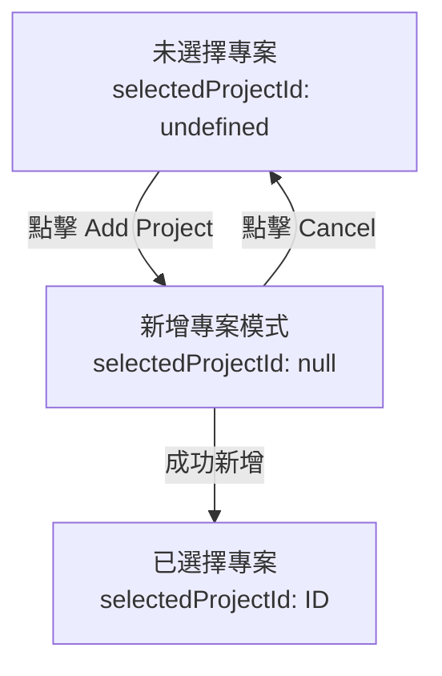
```mermaid
flowchart TD
    A["未選擇專案<br/>selectedProjectId: undefined"] -->|點擊 Add Project| B["新增專案模式<br/>selectedProjectId: null"]
    B -->|點擊 Cancel| A
    B -->|成功新增| C["已選擇專案<br/>selectedProjectId: ID"]
```

### 實作 `NewProject` 的取消功能

- **[傳遞 Prop]** 在 `App` 組件中，將先前定義好的 `handleCancelAddProject` 函式作為 `onCancel` prop 傳遞給 `NewProject` 組件：

```javascript
// App.jsx 中的條件渲染邏輯
  if (projectsState.selectedProjectId === null) {
    content = <NewProject onAdd={handleAddProject} onCancel={handleCancelAddProject} />;
  }
```

- **[接收與連結]** 在 `NewProject` 組件內部，必須解構出 `onCancel` prop，並將其綁定到「Cancel」按鈕的 `onClick` 事件上：

```javascript
// NewProject.jsx 實作片段
  function NewProject({ onAdd, onCancel }) {
    // ...
    return (
      // ...
      <button
        className="text-stone-800 hover:text-stone-950"
        onClick={onCancel}
      >
        Cancel
      </button>
      // ...
    );
  }
```

- **[功能效果]** 當使用者點擊「Cancel」按鈕時，會觸發 `onCancel`，進而執行 `App` 組件中的 `handleCancelAddProject`，將 `selectedProjectId` 設回 `undefined`，畫面隨即切換回 `NoProjectSelected` 狀態。

### 功能驗證與開發進度

- **[取消功能測試]** 已確認 `NewProject` 中的「Cancel」按鈕運作正常：
    - 點擊按鈕會觸發 `handleCancelAddProject`。
    - 該函式將 `selectedProjectId` 重設為 `undefined`。
    - 畫面成功切換回初始的 `NoProjectSelected` 狀態（即「starting screen」）。
- **[下一步規劃]** 接下來將著手開發專案選擇與檢視功能：
    - 確保使用者可以點擊專案列表中的項目。
    - 實作顯示特定專案詳細資訊的畫面。

### 實作專案選擇與檢視功能

- **[核心需求]** 為了讓使用者能夠點擊並選取專案，需要完成以下兩件事：
    - 建立一個新組件，專門用於顯示目前被選中專案的詳細內容。
    - 確保 `ProjectsSidebar` 組件在使用者點擊項目時，能將該專案的資訊傳遞給顯示組件。
- **[建立&#32;`SelectedProject`&#32;組件]**
    - 新增檔案 `SelectedProject.jsx` 並定義 `SelectedProject` 函式組件：

```javascript
export default function SelectedProject() {
  return <div></div>;
}
```

### 實作 `SelectedProject` 的 UI 結構

- **[頁面佈局規劃]** `SelectedProject` 組件的內容大致分為兩個部分：
    - **Header 區域**：顯示專案的主要資訊（如標題與刪除按鈕）。
    - **Tasks 列表**：顯示屬於該專案的任務清單（預計稍後實作）。
- **[實作標題區域]** 使用 `<header>` 標籤來包裹標題內容，並透過一個 `<div>` 容器搭配 Flexbox 來讓標題與按鈕並排：

```javascript
export default function SelectedProject() {
  return (
    <div>
      <header>
        <div>
          <h1>TITLE</h1>
          <button>Delete</button>
        </div>
      </header>
      TASKS
    </div>
  );
}
```

- **[元件組成細節]**
    - `<h1>`：用於輸出專案的標題（TITLE）。
    - `<button>`：用於執行刪除該專案的操作。
    - `<div>` (Flex 容器)：確保標題與刪除按鈕能水平並列顯示。

### 實作 `SelectedProject` 的詳細資訊顯示

- **[接收 Props]** `SelectedProject` 組件現在接收一個 `project` 物件作為 prop，以便從中提取所有相關資訊：

```javascript
export default function SelectedProject({ project }) {
  // ...
}
```

- **[擴充 Header 內容]** 除了原本的標題與刪除按鈕，現在在 header 區域內新增了兩個段落（`<p>`）來顯示專案的日期與描述：

```javascript
// SelectedProject.jsx 實作片段
export default function SelectedProject({ project }) {
  return (
    <div>
      <header>
        <div>
          <h1>{project.title}</h1>
          <button>Delete</button>
        </div>
        <p>DATE</p>
        <p>DESCRIPTION</p>
      </header>
      TASKS
    </div>
  );
}
```

- **[優化日期顯示]** 為了讓專案日期更符合人類閱讀習慣，規劃建立一個 `formattedDate` 常數來處理日期格式化邏輯：

```javascript
// 規劃中的實作邏輯
const formattedDate = // 稍後實作日期格式化
```

### 實作 `SelectedProject` 的日期格式化

- **[利用內建 Date 物件]** 透過建立一個新的 `Date` 物件，並傳入專案中的 `dueDate` 來進行處理：

```javascript
// SelectedProject.jsx 實作片段
const formattedDate = new Date(project.dueDate).toLocaleDateString('en-US', {
  year: 'numeric',
  month: 'short'
});
```

- **[使用&#32;`toLocaleDateString`&#32;方法]** 該方法會根據指定的語系（例如 `'en-US'`）回傳一個適合該環境的日期字串。
- **[客製化顯示選項]** 可以透過傳入第二個參數（配置物件）來控制日期的呈現細節：
    - `year`：可以設定為 `'numeric'`（完整數字）或 `'2-digit'`（兩位數）。
    - `month`：可以設定為 `'long'`（全稱）、`'short'`（縮寫）或 `'narrow'`（極簡縮寫）。

### `SelectedProject` UI 完整實作

- **[完成日期格式化]** 除了年份與月份，額外加入 `day: 'numeric'` 配置，以確保日期顯示完整：

```javascript
// SelectedProject.jsx 實作片段
const formattedDate = new Date(project.dueDate).toLocaleDateString('en-US', {
  year: 'numeric',
  month: 'short',
  day: 'numeric'
});
```

- **[渲染詳細資訊內容]** 在 `return` 區塊中，將格式化後的日期與專案描述（`project.description`）輸出到對應的段落標籤中：

```javascript
return (
  <div className="w-[35rem] mt-16">
    <header>
      <div>
        <h1>{project.title}</h1>
        <button>Delete</button>
      </div>
      <p>{formattedDate}</p>
      <p>{project.description}</p>
    </header>
    TASKS
  </div>
);
```

- **[容器樣式優化]** 透過 Tailwind CSS 為最外層的 `<div>` 設定特定樣式，以確保內容在頁面上呈現理想的寬度與位置：
    - `w-[35rem]`：設定自定義寬度為 35 rem。
    - `mt-16`：設定頂部邊距（margin-top），使內容與上方元素保持適當距離。

### `SelectedProject` Header 樣式細化

- **[設定 Header 容器樣式]** 為 `<header>` 標籤添加了邊距、底邊框與顏色，以區隔標題區與下方的任務列表：
    - `pb-4`：設定底部內距（padding-bottom）為 1 rem
    - `mb-4`：設定底部外距（margin-bottom）為 1 rem
    - `border-b-2`：設定底部邊框寬度為 2 px
    - `border-stone-300`：設定邊框顏色為淺灰色 (`stone-300`)

```javascript
// SelectedProject.jsx 實作片段
<header className="pb-4 mb-4 border-b-2 border-stone-300">
  <div className="flex items-center justify-between">
    <h1>{project.title}</h1>
    <button>Delete</button>
  </div>
  <p>{formattedDate}</p>
  <p>{project.description}</p>
</header>
```

- **[利用 Flexbox 排列標題與按鈕]** 在包含 `<h1>` 與 `<button>` 的 `<div>` 上使用 Flexbox，使兩者分別位於左右兩端：
    - `flex`：啟用彈性佈局
    - `items-center`：使標題與按鈕在垂直方向上居中對齊
    - `justify-between`：在標題與按鈕之間分配剩餘空間，將它們推向兩側

### `SelectedProject` 文字與按鈕樣式細化

- **[優化標題樣式]** 為專案標題 (`<h1>`) 設定更具視覺衝擊力的樣式：
    - `text-3xl`：將字體大小放大至 3xl。
    - `font-bold`：將字體設為粗體。
    - `text-stone-600`：設定文字顏色為 `stone-600`。
    - `mb-2`：在標題下方添加 0.5 rem 的外距，與下方元素區隔。
- **[優化刪除按鈕樣式]** 為 `Delete` 按鈕添加互動效果：
    - `text-stone-600`：預設文字顏色。
    - `hover:text-stone-950`：當滑鼠懸停時，文字顏色變深為 `stone-950`，提供視覺回饋。
- **[優化日期與描述段落]** 調整資訊段落的顏色與間距：
    - **日期段落 (`formattedDate`)**：
        - `mb-4`：設定底部外距為 1 rem。
        - `text-stone-400`：將顏色調淡為 `stone-400`，以建立視覺層次。
    - **專案描述段落 (`project.description`)**：
        - 調整其文字顏色與佈局，確保整體資訊閱讀流暢。

```javascript
// SelectedProject.jsx 樣式實作片段
<header className="pb-4 mb-4 border-b-2 border-stone-300">
  <div className="flex items-center justify-between">
    <h1 className="text-3xl font-bold text-stone-600 mb-2">{project.title}</h1>
    <button className="text-stone-600 hover:text-stone-950">Delete</button>
  </div>
  <p className="mb-4 text-stone-400">{formattedDate}</p>
  <p>{project.description}</p>
</header>
```

### `SelectedProject` 描述段落樣式優化

- **[優化描述文字顏色]** 為專案描述 (`project.description`) 設定更深的顏色以提升閱讀清晰度：
    - `text-stone-600`：將文字顏色設為較深的灰色 (`stone-600`)。
- **[保留換行格式]** 使用 CSS 屬性來確保使用者在輸入框中輸入的換行符號能夠正確顯示：
    - `whitespace-pre-wrap`：此屬性會保留文字中的換行符號與空格，並在達到容器邊界時自動換行，避免原本的換行格式在 HTML 渲染時被忽略。

```javascript
// SelectedProject.jsx 樣式實作片段
<p className="text-stone-600 whitespace-pre-wrap">{project.description}</p>
```

### 實作專案選擇邏輯

- **[建立專案選擇函式]** 在 `App` 組件中新增 `handleSelectProject` 函式，用於處理使用者點擊特定專案時的行為：
    - 接收一個參數 `projectId`。
    - 使用 `setProjectsState` 更新狀態，透過展開舊狀態 (`...prevState`) 並將 `selectedProjectId` 設定為傳入的 `projectId` 來達成。
- **[向下傳遞事件處理器]** 將 `handleSelectProject` 作為 prop 傳遞給 `ProjectsSidebar` 組件，以便在側邊欄點擊專案時能通知 `App` 更新狀態。

```javascript
// App.jsx 實作片段
function handleSelectProject(projectId) {
  setProjectsState((prevState) => ({
    ...prevState,
    selectedProjectId: projectId,
  }));
}

// 在 return 中傳遞給 ProjectsSidebar
<ProjectsSidebar
  onStartAddProject={handleStartAddProject}
  projects={projectsState.projects}
  onSelectProject={handleSelectProject} // 傳遞此函式
/>
```

### 在 `ProjectsSidebar` 中連結專案選擇事件

- **[接收新 Prop]** 在 `ProjectsSidebar` 組件中，透過解構賦值從傳入的 props 中提取 `onSelectProject`：
    - 透過修改組件參數列，加入 `onSelectProject` 屬性。
- **[連結按鈕事件]** 將該屬性綁定到專案列表中的按鈕上，以便在點擊時觸發選擇邏輯：
    - 為專案按鈕添加 `onClick` 屬性。
    - 將 `onClick` 的值設定為 `onSelectProject`。

```javascript
// ProjectsSidebar.jsx 實作片段
export default function ProjectsSidebar({ onStartAddProject, projects, onSelectProject }) {
  return (
    <aside className="w-1/3 px-8 py-16 bg-stone-900 text-stone-50 md:w-72 rounded-r-xl">
      <h2 className="mb-8 font-bold uppercase md:text-xl text-stone-200">Your Projects</h2>
      <div>
        <Button onClick={onStartAddProject}>+ Add Project</Button>
      </div>
      <ul className="mt-8">
        {projects.map((project) => (
          <li key={project.id}>
            <button
              className="w-full text-left px-2 py-1 rounded-sm my-1 text-stone-400 hover:text-stone-950"
              onClick={onSelectProject}
            >
              {project.title}
            </button>
          </li>
        ))}
      </ul>
    </aside>
  );
}
```

### 規劃 `ProjectsSidebar` 的選中狀態高亮

- **[新增 Prop]** 除了原本的 `onSelectProject`，現在也需要接收 `selectedProjectId` 作為 prop
    - 目的是為了讓組件知道目前哪一個專案是被選中的，以便對應的按鈕可以進行視覺上的高亮處理
- **[重構 map 語法]** 將原本簡潔的單行箭頭函式改寫為帶有大括號 `{}` 的完整區塊，以利後續在函式內部加入邏輯判斷

```javascript
// ProjectsSidebar.jsx 實作片段
export default function ProjectsSidebar({
  onStartAddProject,
  projects,
  onSelectProject,
  selectedProjectId, // 新增此 prop
}) {
  return (
    <aside className="w-1/3 px-8 py-16 bg-stone-900 text-stone-50 md:w-72 rounded-r-xl">
      <h2 className="mb-8 font-bold uppercase md:text-xl text-stone-200">Your Projects</h2>
      <div>
        <Button onClick={onStartAddProject}>+ Add Project</Button>
      </div>
      <ul className="mt-8">
        {projects.map((project) => {
          // 接下來將在此處加入高亮邏輯
          return (
            <li key={project.id}>
              <button
                className="w-full text-left px-2 py-1 rounded-sm my-1 text-stone-400 hover:text-stone-950"
                onClick={onSelectProject}
              >
                {project.title}
              </button>
            </li>
          );
        })}
      </ul>
    </aside>
  );
}
```

### 實作專案按鈕的高亮邏輯

- **[重構 map 內容]** 將 `map` 函式的內容從單行箭頭函式改寫為帶有 `return` 的區塊形式，以便在回傳 JSX 前執行邏輯判斷
- **[動態 CSS 類別]** 透過比對當前專案的 `id` 與傳入的 `selectedProjectId`，來決定按鈕應套用的樣式

```javascript
// ProjectsSidebar.jsx 實作片段
{projects.map((project) => {
  // 根據專案是否被選中，動態決定 CSS 類別
  let cssClasses = "w-full text-left px-2 py-1 rounded-sm my-1 text-stone-400 hover:text-stone-950";

  if (project.id === selectedProjectId) {
    cssClasses = "w-full text-left px-2 py-1 rounded-sm my-1 text-stone-950 hover:bg-stone-800";
  }

  return (
    <li key={project.id}>
      <button
        className={cssClasses}
        onClick={onSelectProject}
      >
        {project.title}
      </button>
    </li>
  );
})}
```

### 完善專案按鈕的視覺效果

- **[選中狀態的樣式調整]** 當目前的專案 ID 等於 `selectedProjectId` 時，需要增加更明顯的視覺區隔
    - 增加背景顏色：`bg-stone-800`（與懸停時的顏色一致，強化選中感）
    - 改變文字顏色：從預設的 `text-stone-400` 改為 `text-stone-200`，以確保在深色背景下清晰可見
- **[使用&#32;`else`&#32;處理預設狀態]** 為了避免樣式衝突，需要使用 `else` 區塊來確保當專案「未被選中」時，會回退到原本的預設樣式

```javascript
// ProjectsSidebar.jsx 實作片段
{projects.map((project) => {
  let cssClasses = "w-full text-left px-2 py-1 rounded-sm my-1 text-stone-400 hover:text-stone-950";

  if (project.id === selectedProjectId) {
    cssClasses += ' bg-stone-800 text-stone-200';
  } else {
    // 確保非選中狀態維持原本的樣式
  }

  return (
    <li key={project.id}>
      <button
        className={cssClasses}
        onClick={onSelectProject}
      >
        {project.title}
      </button>
    </li>
  );
})}
```

### 優化 CSS 類別的動態拼接

- **[精簡基礎樣式]** 將原本作為預設值的 `text-stone-400` 從基礎類別常數中移除，改為在條件判斷中動態添加，以確保樣式邏輯更清晰
- **[防止類別黏連]** 在拼接額外的類別名稱時，必須在字串開頭加上一個**空格**（例如：`' text-stone-400'`），避免產生的 HTML `class` 屬性中出現兩個類別名稱黏在一起的情況（例如變成 `hover:text-stone-950text-stone-400`）
- **[最終實作結構]** 將計算後的 `cssClasses` 常數直接作為 `button` 的 `className` 值，實現根據 `selectedProjectId` 自動切換視覺效果

```javascript
// ProjectsSidebar.jsx 最終實作片段
{projects.map((project) => {
  // 基礎樣式不包含 text-stone-400
  let cssClasses = "w-full text-left px-2 py-1 rounded-sm my-1 hover:text-stone-950";

  if (project.id === selectedProjectId) {
    cssClasses += ' bg-stone-800 text-stone-200';
  } else {
    // 必須在前面加上空格，確保類別正確分離
    cssClasses += ' text-stone-400';
  }

  return (
    <li key={project.id}>
      <button
        className={cssClasses}
        onClick={onSelectProject}
      >
        {project.title}
      </button>
    </li>
  );
})}
```

### 實作 `App` 組件的專案顯示切換

- **[擴充條件渲染邏輯]** 原本的 `if-else` 僅處理了 `selectedProjectId` 為 `null` 或 `undefined` 的情況，現在需要增加一個分支來處理「已選中專案」的情境
- **[設定&#32;`content`&#32;變數]** 當專案被選中時，將 `content` 的預設值設定為 `<SelectedProject />` 組件
- **[組件導入]** 必須確保 `SelectedProject` 已正確從 `./components/SelectedProject.jsx` 導入

```javascript
// App.jsx 實作片段
let content;

if (projectsState.selectedProjectId === null) {
  content = <NewProject onAdd={handleAddProject} onCancel={handleCancelAddProject} />;
} else if (projectsState.selectedProjectId === undefined) {
  content = <NoProjectSelected onStartAddProject={handleStartAddProject} />;
} else {
  // 當有選中專案時，顯示該專案的詳細內容
  content = <SelectedProject />;
}
```

### 從狀態中衍生選中的專案物件

- **[問題點]** 目前的 `projectsState` 僅儲存了 `selectedProjectId`（一個 ID），但 `SelectedProject` 組件需要的是完整的專案物件作為 prop
- **[解決方案]** 使用衍生狀態（derived state）的概念，透過 JavaScript 的 `find` 方法從專案列表中找出對應的物件
- **[實作邏輯]**
    - 遍歷 `projectsState.projects` 陣列
    - 比較每個專案的 `id` 是否等於 `projectsState.selectedProjectId`

```javascript
// App.jsx 實作片段
const selectedProject = projectsState.projects.find(
  (project) => project.id === projectsState.selectedProjectId
);

let content;

if (projectsState.selectedProjectId === null) {
  content = <NewProject onAdd={handleAddProject} onCancel={handleCancelAddProject} />;
} else if (projectsState.selectedProjectId === undefined) {
  content = <NoProjectSelected onStartAddProject={handleStartAddProject} />;
} else {
  // 將找到的完整專案物件傳遞給 SelectedProject
  content = <SelectedProject project={selectedProject} />;
}
```

### 利用 `find` 方法衍生選中專案

- **[`find`&#32;方法原理]** 這是原生 JavaScript 的內建方法，接受一個回呼函式作為參數
    - 該函式會遍歷陣列中的每個元素
    - 當回呼函式回傳 `true` 時，`find` 會立即回傳該元素，否則回傳 `undefined`
- **[實作邏輯]** 透過比對 `project.id` 與狀態中的 `selectedProjectId` 來獲取完整的專案物件
- **[資料傳遞]** 獲取到的 `selectedProject` 物件會透過 `project` prop 傳遞給 `SelectedProject` 組件

```javascript
// App.jsx 實作片段
const selectedProject = projectsState.projects.find(
  (project) => project.id === projectsState.selectedProjectId
);

let content;

if (projectsState.selectedProjectId === null) {
  content = <NewProject onAdd={handleAddProject} onCancel={handleCancelAddProject} />;
} else if (projectsState.selectedProjectId === undefined) {
  content = <NoProjectSelected onStartAddProject={handleStartAddProject} />;
} else {
  // 將衍生出的完整專案物件傳入
  content = <SelectedProject project={selectedProject} />;
}
```

- **[測試步驟]**
    - 建立新專案並輸入標題（例如 "first test"）
    - 輸入描述，並測試換行功能是否正常保留
    - 使用日期選擇器挑選日期
    - 點擊「Save」
- **[預期結果]** 新專案應成功出現在專案列表中

### 發現執行階段錯誤 (Runtime Error)

- **[問題現象]** 當點擊剛建立的新專案時，應用程式崩潰
- **[錯誤訊息]** `Uncaught TypeError: Cannot read properties of undefined (reading 'dueDate')`
- **[錯誤根源]**
    - 錯誤發生在 `SelectedProject.jsx` 組件內部
    - 原因是該組件嘗試存取 `project.dueDate`，但此時傳入的 `project` prop 是 `undefined`

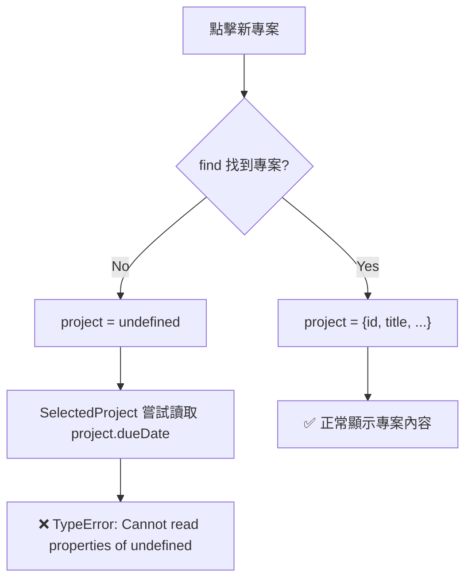
```mermaid
flowchart TD
    A[點擊新專案] --> B{find 找到專案?}
    B -- No --> C[project = undefined]
    B -- Yes --> D["project = {id, title, ...}"]
    C --> E[SelectedProject 嘗試讀取 project.dueDate]
    E --> F[❌ TypeError: Cannot read properties of undefined]
    D --> G[✅ 正常顯示專案內容]
```

### 診斷專案選取失敗的原因

- **[錯誤現象]** 在建立新專案並點擊該專案時，程式崩潰並顯示 `Cannot read property 'dueDate' of undefined`
    - 這表示 `SelectedProject` 組件接收到的 `project` prop 是 `undefined`
- **[根本原因]** `App` 組件中的 `handleSelectProject` 函式無法正確獲取專案 ID
    - `App` 組件透過 `onSelect` prop 將 `handleSelectProject` 傳遞給 `ProjectsSidebar`
    - `ProjectsSidebar` 接著透過 `onSelectProject` prop 將其傳遞給內部的 `Button` 組件
    - **[問題點]** 目前的 `Button` 組件在觸發 `onClick` 時，並沒有將該專案的 `id` 作為參數回傳給 `onSelectProject` 函式
    - 因為沒有收到 ID，`handleSelectProject` 無法更新 `selectedProjectId`，導致 `find` 方法找不到對應的專案物件

```javascript
// App.jsx 中的邏輯流程
function handleSelectProject(projectId) {
  setProjectsState((prevState) => ({
    ...prevState,
    selectedProjectId: projectId,
  }));
}

// ProjectsSidebar.jsx 中的傳遞路徑
<Button onClick={onSelectProject}>{project.title}</Button>
// 這裡的 onSelectProject 實際上是 handleSelectProject，
// 但 Button 執行時沒有傳入 projectId，導致參數變為 undefined
```

### 修正專案選取邏輯

- **[問題核心]** 原本直接將 `onSelectProject` 傳遞給 `Button`，但 `Button` 觸發 `onClick` 時並不會自動帶入該專案的 `id`，導致 `handleSelectProject` 接收到的是 `undefined`。
- **[解決方案]** 在 `ProjectsSidebar` 中，不直接傳遞函式本身，而是包裝一個匿名函式來手動傳入 `project.id`。

```jsx
// ProjectsSidebar.jsx
// 透過包裝函式，確保在點擊按鈕時能將當前項目的 id 傳遞給上層的 onSelectProject
<button
  className={cssClasses}
  onClick={() => onSelectProject(project.id)}>
  {project.title}
</button>
```

- **[驗證結果]**
    - 重新建立新專案並輸入資料（含換行與日期）
    - 點擊新建立的專案按鈕，現在能正確觸發 `handleSelectProject` 並更新狀態
    - `SelectedProject` 組件能正確接收到完整的專案物件，不再發生 `TypeError`

### 驗證專案選取與顯示功能

- **[測試結果]** 專案選取功能已修復，點擊新建立的專案可正常進入詳情頁面，且控制台（Console）無錯誤訊息
- **[換行測試]** 專案描述中的換行符號（Line break）在顯示時能正確保留

### 規劃專案刪除功能

- **[開發目標]** 實作專案刪除功能，讓使用者能透過點擊介面上的「Delete」按鈕來移除專案
- **[目前狀態]** 介面上已存在 Delete 按鈕，但尚未綁定任何刪除邏輯

### 實作 `handleDeleteProject` 函式

- **[開發邏輯]** 為了讓刪除按鈕生效，需要在 `App` 組件中建立一個能夠修改狀態並移除專案的函式，接著將該函式傳遞給 `SelectedProject` 組件。
- **[實作細節]** 在 `App` 組件中新增 `handleDeleteProject` 函式，其核心在於使用 `setProjectsState` 來更新專案列表。

```javascript
// App.jsx 中的刪除函式實作
function handleDeleteProject() {
  setProjectsState((prevState) => ({
    ...prevState,
    // 這裡會實作移除專案的邏輯
  }));
}
```

- **[狀態更新模式]** 使用了之前實作狀態更新時的模式：
    - 使用函數式更新 `(prevState) => ({ ... })` 以確保獲取最新的狀態值
    - 使用展開運算符 `...prevState` 來保留除了專案列表以外的其他狀態（例如 `selectedProjectId`）

### 實作 `handleDeleteProject` 函式

- **[核心邏輯]** 當使用者執行刪除操作時，需要同時處理兩個狀態更新：
    - 將 `selectedProjectId` 設回 `undefined`（取消當前選取狀態）
    - 從專案陣列中移除該專案
- **[不可變更新 (Immutable Update)]** 更新 `projects` 陣列時，不能直接修改記憶體中的原始陣列，必須建立一個新的陣列
    - 使用 JavaScript 內建的 `.filter()` 方法來達成
    - `.filter()` 會根據提供的條件回傳一個包含所有符合條件元素的新陣列，這符合 React 狀態管理的要求

```javascript
// App.jsx 中的 handleDeleteProject 實作
function handleDeleteProject() {
  setProjectsState((prevState) => {
    return {
      ...prevState,
      selectedProjectId: undefined,
      projects: prevState.projects.filter((project) => project.id !== id)
    };
  });
}
```

### 理解 JavaScript `filter` 方法

- **[運作機制]** `filter` 會針對陣列中的每一個項目執行一次提供的回呼函式（callback function），其行為與 `find` 或 `map` 類似。
- **[篩選邏輯]** 回呼函式必須回傳一個布林值來決定該項目的去留：
    - 回傳 `true`：保留該元素
    - 回傳 `false`：捨棄該元素
- **[結果]** `filter` 會回傳一個**全新的陣列**，其中僅包含那些回呼函式回傳 `true` 的元素。

在 `handleDeleteProject` 的情境中，我們希望「捨棄」被選中的項目，因此邏輯如下：

```javascript
// 我們要保留「id 不等於被刪除 id」的所有項目
projects: prevState.projects.filter((project) => project.id !== id)
```

### `handleDeleteProject` 刪除邏輯詳解

- **[篩選條件]** 在執行 `filter` 時，我們需要判斷目前遍歷到的專案是否為「想要刪除的那一個」：
    - **保留項目**：如果目前專案的 `id` **不等於** `selectedProjectId`，表示它不是目標，回傳 `true` 以保留它。
    - **捨棄項目**：如果目前的 `id` **等於** `selectedProjectId`，表示找到了要刪除的項目，回傳 `false` 讓它從新陣列中消失。
- **[程式碼實作]**

```javascript
function handleDeleteProject() {
  setProjectsState((prevState) => {
    return {
      ...prevState,
      selectedProjectId: undefined,
      projects: prevState.projects.filter(
        (project) => project.id !== prevState.selectedProjectId
      )
    };
  });
}
```

- **[邏輯流程圖]**

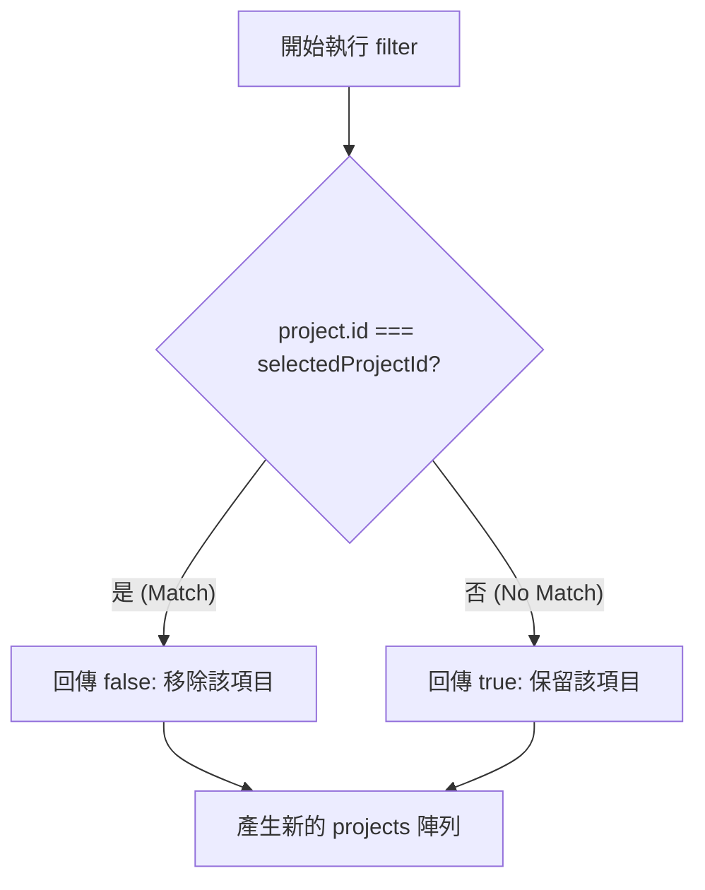
```mermaid
flowchart TD
    A[開始執行 filter] --> B{project.id === selectedProjectId?}
    B -- 是 (Match) --> C[回傳 false: 移除該項目]
    B -- 否 (No Match) --> D[回傳 true: 保留該項目]
    C --> E[產生新的 projects 陣列]
    D --> E
```

### 將刪除功能傳遞至 `SelectedProject` 組件

- **[傳遞方式]** 由於 `handleDeleteProject` 定義在 `App` 組件中，為了讓 `SelectedProject` 能夠觸發刪除動作，必須透過 props 將該函式的引用（pointer）傳遞下去。
- **[Prop 命名]** 建議將此 prop 命名為 `onDelete`，以符合 React 處理事件回調的命名慣例。
- **[實作細節]** 在 `App.jsx` 中，透過解構賦值從 `projectsState` 取得 `selectedProject`，並將 `handleDeleteProject` 傳入組件：

```javascript
// App.jsx 中的組件渲染邏輯
const selectedProject = projectsState.projects.find(
  (project) => project.id === projectsState.selectedProjectId
);

let content = (
  <SelectedProject
    project={selectedProject}
    onDelete={handleDeleteProject}
  />
);
```

- **[組件接收]** 在 `SelectedProject.jsx` 中，需要從 props 中提取出 `onDelete`：

```javascript
// SelectedProject.jsx 的組件定義
export default function SelectedProject({ project, onDelete }) {
  // ... 內部邏輯
}
```

### 在 `SelectedProject` 中實作刪除功能

- **[連結按鈕]** 為了讓使用者能夠刪除目前查看的專案，需要將從 props 接收到的 `onDelete` 函式綁定到組件內的刪除按鈕上。
- **[事件綁定]** 由於 `onDelete` 函式不需要額外的參數（因為它會直接從 `App` 組件的狀態中讀取 `selectedProjectId`），因此可以直接將其作為 `onClick` 的值：

```javascript
// SelectedProject.jsx 中的按鈕實作
<button
  className="text-stone-600 hover:text-stone-950"
  onClick={onDelete}
>
  Delete
</button>
```

- **[功能驗證]**
    - 點擊「Delete」按鈕後，該專案應從專案列表中消失。
    - 畫面應自動切換回「未選擇專案」的狀態（即回到 `NoProjectSelected` 畫面）。
    - 透過瀏覽器開發者工具（DevTools）可以確認專案狀態是否已正確更新且沒有報錯。

### 專案管理核心功能驗證

- **[功能測試]** 透過實際操作確認以下流程的正確性：
    - **刪除功能**：點擊特定專案並執行刪除，確認該專案消失，而其餘專案仍完整保留在列表中。
    - **選擇功能**：點擊列表中的專案，確認右側內容區域能正確切換至該專案的詳細資訊。
    - **新增功能**：啟動新增專案流程，確認能成功建立新的專案項目。
- **[結論]** 目前應用程式已具備完整的專案生命週期管理能力：可以新增、選擇以及刪除專案。

### 實作任務（Tasks）管理功能

- **[開發目標]** 完成專案管理應用程式的最後一步，讓選定的專案具備任務管理能力：
    - 顯示該專案目前的任務列表
    - 提供輸入欄位以新增新任務
- **[組件實作]** 準備建立一個新的 `Tasks.jsx` 組件來處理此功能
- **[檔案組織]** 雖然組件數量增加，目前仍將所有組件檔案統一放置於 `src/components` 資料夾中（未來可考慮使用子資料夾進行分類）

### `Tasks` 組件 UI 結構規劃

- **[組件定義]** 將建立一個名為 `Tasks` 的功能性組件，用於管理並顯示特定專案的任務。
- **[佈局規劃]** 組件將包含以下三個主要區域：
    - **標題區域**：使用 `<h2>` 顯示 "Tasks"。
    - **新增任務區域 (New Task Area)**：包含一個輸入欄位（input field），讓使用者可以輸入並新增新任務。
    - **任務列表區域 (Tasks List)**：顯示目前所有的任務項目。
- **[條件渲染邏輯]** 為了處理沒有任務的情況，需要實作條件渲染：
    - **有任務時**：顯示任務列表（例如使用 `<ul>` 列表）。
    - **無任務時**：顯示一段提示文字（例如 `<p>This project does not have any tasks yet.</p>`），告知使用者目前尚無任務。

```jsx
// Tasks.jsx 的初步結構規劃
export default function Tasks() {
  return (
    <section>
      <h2>Tasks</h2>

      {/* 新增任務區域 */}
      <div>
        <p>NEW TASK</p>
        <input type="text" />
      </div>

      {/* 任務列表或空狀態提示 */}
      {/* 這裡將實作條件渲染邏輯 */}
      <p>This project does not have any tasks yet.</p>
      <ul>
        {/* 任務項目將顯示於此 */
      </ul>
    </section>
  );
}
```

### `Tasks` 組件樣式優化

- **[標題樣式]** 為 `<h2>` 元素添加樣式，使其更具層級感：
    - `text-2xl`：加大字體尺寸
    - `font-bold`：加粗字體
    - `text-stone-700`：設定顏色為深石灰色
    - `mb-4`：添加底部外距（margin-bottom），與下方內容保持間隔
- **[描述文字樣式]** 為 `<p>` 元素添加樣式：
    - `text-stone-800`：設定顏色為稍深的石灰色
    - `mb-4`：添加底部外距

```jsx
// Tasks.jsx 樣式實作
export default function Tasks() {
  return (
    <section>
      <h2 className="text-2xl font-bold text-stone-700 mb-4">Tasks</h2>

      <div className="mb-4">
        <p className="text-stone-800">NEW TASK</p>
        <input type="text" />
      </div>

      <p>This project does not have any tasks yet.</p>
      <ul>
        {/* 任務列表內容 */}
      </ul>
    </section>
  );
}
```

- **[組件整合]** 將實作完成的 `Tasks` 組件引入並放置於 `SelectedProject` 組件內，使其成為專案詳細資訊的一部分。

### 整合 `Tasks` 組件

- **[實作步驟]** 在 `SelectedProject.jsx` 中引入並渲染 `Tasks` 組件，取代原本的佔位文字。
- **[程式碼實作]**

```jsx
// SelectedProject.jsx
import Tasks from './Tasks';

export default function SelectedProject({ project, onDelete }) {
  // ... 其他邏輯

  return (
    <div className="w-[35rem] mt-4">
      <header className="pb-4 mb-4 border-b-2 border-stone-300 justify-between flex items-center">
        <h1 className="text-3xl font-bold text-stone-600 mb-2">{project.title}</h1>
        <button
          className="text-stone-600 hover:text-stone-950"
          onClick={onDelete}
        >
          Delete
        </button>
      </header>

      <div className="mb-4">
        <p className="text-stone-400">{formattedDate}</p>
        <p className="text-stone-600 whitespace-pre-wrap">{project.description}</p>
      </div>

      <Tasks />
    </div>
  );
}
```

- **[下一步規劃]** 為了實現新增任務的功能，需要建立一個新的 `NewTask` 組件，用來承載輸入欄位與按鈕。

### 實作 `NewTask` 組件

- **[組件結構]** 建立一個包含輸入框與按鈕的容器：
    - 使用一個 `<div>` 作為外層容器
    - 包含一個 `<input />` 元素，用於接收任務文字
    - 包含一個 `<button>` 元素，標籤文字為 "Add"
- **[設計決策]** 在此組件中不使用自定義的 `Input` 組件，原因如下：
    - 因為任務只需要單一的文字數值，不需要 `<label>` 標籤
    - 任務輸入本身具有自明性（self-explanatory），省略標籤可以讓 UI 更簡潔
- **[程式碼實作]**

```jsx
// NewTask.jsx
export default function NewTask() {
  return (
    <div>
      <input type="text" />
      <button>Add</button>
    </div>
  );
}
```

### `NewTask` 組件樣式優化

- **[佈局設計]** 使用 Flexbox 讓輸入框與按鈕水平排列並垂直居中：
    - `flex`：啟用 Flexbox 佈局
    - `items-center`：使子元素在垂直軸上居中
    - `gap-4`：在元素之間添加間距
- **[輸入框樣式]** 為 `<input />` 設定具體的尺寸與外觀：
    - `w-64`：設定固定寬度為 `16rem`
    - `px-2`：添加水平內距 (padding-left/right)
    - `py-1`：添加垂直內距 (padding-top/bottom)
    - `rounded-sm`：添加微小的圓角
- **[程式碼實作]**

```jsx
// NewTask.jsx
export default function NewTask() {
  return (
    <div className="flex items-center gap-4">
      <input
        type="text"
        className="w-64 px-2 py-1 rounded-sm"
      />
      <button>Add Task</button>
    </div>
  );
}
```

### `NewTask` 組件樣式完成

- **[樣式細化]** 為組件添加背景與文字顏色，使其視覺效果更完整：
    - **輸入框**：添加 `bg-stone-200` 背景色
    - **按鈕**：設定 `text-stone-700` 文字顏色
- **[組件整合]** 將實作完成的 `NewTask` 組件引入到 `Tasks` 組件中，以便在專案任務列表中顯示新增任務的介面。
- **[程式碼實作]**

```jsx
// NewTask.jsx
export default function NewTask() {
  return (
    <div className="flex items-center gap-4">
      <input
        type="text"
        className="w-64 px-2 py-1 rounded-sm bg-stone-200"
      />
      <button className="text-stone-700">Add Task</button>
    </div>
  );
}
```

```jsx
// Tasks.jsx
import NewTask from './NewTask';

export default function Tasks() {
  return (
    <section className="text-2xl font-bold text-stone-700 mb-4">
      <h2>Tasks</h2>
      <p className="text-stone-800 mb-4">This project does not have any tasks yet.</p>
      <NewTask />
      <ul></ul>
    </section>
  );
}
```

### `Tasks` 組件樣式微調

- **[樣式優化]** 為了讓「Tasks」標題與下方內容之間有更平衡的間距，將原本僅設定下邊距的類別改為同時設定上下邊距：
    - 將 `mb-4` (margin-bottom) 修改為 `my-4` (margin-top 與 margin-bottom)
- **[程式碼實作]**

```jsx
// Tasks.jsx
import NewTask from './NewTask';

export default function Tasks() {
  return (
    <section className="text-2xl font-bold text-stone-700 my-4">
      <h2>Tasks</h2>
      <p className="text-stone-800 mb-4">This project does not have any tasks yet.</p>
      <NewTask />
      <ul></ul>
    </section>
  );
}
```

- **[下一步目標]** 驗證任務新增功能，確保在輸入任務文字並點擊 「Add Task」按鈕後，新的任務能正確地出現在列表中。

### `NewTask` 功能開發：從 Ref 到 State

- **[核心需求]** 在點擊「Add Task」按鈕時，需要執行兩個動作：
    - 提取使用者在 `<input />` 中輸入的文字內容
    - 在任務新增成功後，將輸入框內容清空（重置回空字串）
- **[實作策略選擇]**
    - **使用&#32;`ref`**：雖然可以透過 `ref` 直接讀取 DOM 的值，但要手動修改 DOM（如清空輸入框）會違反 React 管理 DOM 更新的原則。
    - **使用&#32;`state`**：這是更推薦的做法。透過 `state` 來同步輸入框的值，既能輕鬆獲取內容，也能在需要時透過更新狀態來達成「清空輸入框」的效果，確保 UI 與資料狀態保持一致。
- **[程式碼初步實作]**

```jsx
// NewTask.jsx
import { useState } from 'react';

export default function NewTask() {
  const [task, setTask] = useState('');

  return (
    <div className="flex items-center gap-4">
      <input
        type="text"
        className="w-64 px-2 py-1 rounded-sm bg-stone-200"
      />
      <button className="text-stone-700 hover:text-stone-950">Add Task</button>
    </div>
  );
}
```

### `NewTask` 實作受控輸入框

- **[狀態管理]** 使用 `useState` 來追蹤使用者目前輸入的任務內容：
    - `enteredTask`：儲存目前的輸入值
    - `setEnteredTask`：更新輸入值的函式
- **[事件處理]** 建立 `handleChange` 函式，並將其綁定到 `<input />` 的 `onChange` 屬性上
    - **原理**：當使用者在輸入框打字時，會觸發 `onChange` 事件，並傳入一個事件物件（event object）
    - **提取值**：透過 `event.target.value` 取得目前輸入框內的最新字串，再透過 `setEnteredTask` 更新狀態
- **[程式碼實作]**

```jsx
// NewTask.jsx
import { useState } from 'react';

export default function NewTask() {
  const [enteredTask, setEnteredTask] = useState('');

  function handleChange(event) {
    setEnteredTask(event.target.value);
  }

  return (
    <div className="flex items-center gap-4">
      <input
        type="text"
        className="w-64 px-2 py-1 rounded-sm bg-stone-200"
        onChange={handleChange}
      />
      <button className="text-stone-700 hover:text-stone-950">Add Task</button>
    </div>
  );
}
```

### `NewTask` 實作雙向綁定與資料傳遞

- **[完成雙向綁定]** 為了確保輸入框的顯示內容與 React 狀態完全同步，必須將 `enteredTask` 狀態值回饋給 `<input />` 的 `value` 屬性
    - **原理**：這完成了「受控組件」的最後一步。當使用者輸入時，`onChange` 更新狀態；當狀態改變時，`value` 屬性確保輸入框顯示最新的狀態值
- **[資料傳遞規劃]** 當使用者點擊「Add Task」按鈕時，必須將輸入的任務資訊傳遞到可以進行持久化儲存的地方
    - **目標位置**：`App` 組件
    - **原因**：`App` 組件持有整個應用程式的專案與任務狀態，因此需要由 `App` 來處理新增任務的邏輯

### 應用程式級狀態管理的前奏

- **[資料關聯需求]** 既然 `App` 組件是儲存所有專案（projects）的地方，那麼與這些專案相關聯的任務（tasks）也極有可能需要儲存在同一個地方
- **[面臨的挑戰]** 這種設計模式會導致以下問題：
    - 需要透過多層組件（multiple layers of components）來傳遞任務資料以及更新狀態的函式
    - 隨著應用程式規模擴大，這會使組件間的資料流變得極其複雜
- **[未來解決方案]** 為了更有效率地管理這種「全域性」或「應用程式級」的狀態，將會學習一種比目前在 `App` 組件中進行手動狀態管理更簡便的方法

### `App` 組件中的任務狀態管理規劃

- **[狀態結構設計]** 為了管理任務，需要在 `projectsState` 物件中新增一個獨立的 `tasks` 陣列
    - **原因**：任務需要與專案狀態緊密關聯，將其放在同一個狀態物件中便於集中管理

```jsx
// App.jsx 中的狀態結構預覽
const [projectsState, setProjectsState] = useState({
  selectedProjectId: undefined,
  projects: [],
  tasks: [] // 新增用於儲存任務的陣列
});
```

- **[預期需要的處理函式]** 隨著任務資料的加入，`App` 組件需要實作對應的邏輯函式來操作這些資料：
    - `handleAddTask`：用於新增一項新任務
    - `handleDeleteTask`：用於刪除現有的任務
- **[開發提醒]** 目前這種在 `App` 組件中手動管理所有狀態與函式的方法雖然直觀，但隨著功能增加會變得非常繁瑣（cumbersome），未來將會探討更有效率的解決方案

### `NewTask` 組件的點擊事件處理

- **[實作&#32;`handleClick`]** 為了讓「Add Task」按鈕能夠發揮作用，需要在 `NewTask` 組件中建立一個處理點擊的函式
    - **預期行為**：當使用者點擊按鈕時，該函式應執行兩個動作：

        1. 將目前的輸入值（`enteredTask`）傳遞給 `App` 組件（透過 props 傳遞的函式）
        2. 將本地的 `enteredTask` 狀態重置為空字串，以便使用者輸入下一個任務

- **[程式碼實作]**

```jsx
// NewTask.jsx 中的 handleClick 實作預覽
export default function NewTask({ onAddTask }) { // 假設從 props 接收 onAddTask
  const [enteredTask, setEnteredTask] = useState('');

  function handleChange(event) {
    setEnteredTask(event.target.value);
  }

  function handleClick() {
    onAddTask(enteredTask); // 將值傳回 App
    setEnteredTask('');      // 重置輸入框
  }

  return (
    <div className="flex items-center gap-4">
      <input
        type="text"
        className="w-64 px-2 py-1 rounded-sm bg-stone-200"
        onChange={handleChange}
        value={enteredTask}
      />
      <button
        className="text-stone-700 hover:text-stone-950"
        onClick={handleClick}
      >
        Add Task
      </button>
    </div>
  );
}
```

### `NewTask` 組件的點擊事件處理實作

- **[實作&#32;`handleClick`]** 為了確保使用者體驗並正確更新狀態，點擊「Add Task」按鈕時需執行以下邏輯：
    - **重置輸入框**：將本地的 `enteredTask` 狀態設為空字串 `''`，以便下次輸入。
    - **傳遞資料**：呼叫從 props 接收到的 `onAddTask` 函式，將目前的輸入值傳回 `App` 組件。
- **[程式碼實作]**

```jsx
// NewTask.jsx
export default function NewTask({ onAddTask }) {
  const [enteredTask, setEnteredTask] = useState('');

  function handleChange(event) {
    setEnteredTask(event.target.value);
  }

  function handleClick() {
    setEnteredTask(''); // 重置輸入框
    onAddTask(enteredTask); // 將值傳回 App
  }

  return (
    <div className="flex items-center gap-4">
      <input
        type="text"
        className="w-64 px-2 py-1 rounded-sm bg-stone-200"
        onChange={handleChange}
        value={enteredTask}
      />
      <button
        className="text-stone-700 hover:text-stone-950"
        onClick={handleClick}
      >
        Add Task
      </button>
    </div>
  );
}
```

- **[資料傳遞路徑規劃]** 由於 `NewTask` 並非直接位於 `App` 組件之下，因此需要透過中間組件進行 props 傳遞：
    - **路徑**：`App` $\rightarrow$ `SelectedProject` $\rightarrow$ `Tasks` $\rightarrow$ `NewTask`
    - **原因**：`NewTask` 是嵌套在 `Tasks` 組件內，而 `Tasks` 又在 `SelectedProject` 之中，因此 `handleAddTask` 必須逐層向下傳遞。

### 實作 `onAddTask` 屬性傳遞

- **[概念：Prop Drilling]** 指的是為了讓底層組件能夠取得所需的資料或函式，必須將該屬性透過中間層層層傳遞下去的現象
    - 雖然目前為了功能完整性會採用這種方式，但在後續課程中會學習如何避免這種開發模式
- **[程式碼實作]** 在 `App.jsx` 中，將 `handleAddTask` 函式作為 `onAddTask` 屬性傳遞給 `SelectedProject` 組件：

```jsx
// App.jsx
// ... 前略
let content = (
  <SelectedProject
    project={selectedProject}
    onDelete={handleDeleteProject}
    onAddTask={handleAddTask}
  />
);
// ... 後略
```

### 實作 `onDeleteTask` 屬性傳遞

- **[功能需求]** 除了新增任務外，刪除任務的功能也需要從 `App` 組件傳遞到最底層的組件中。
- **[資料傳遞路徑]** 由於刪除任務的操作最終會由 `Tasks` 組件內部的組件觸發，因此必須透過 `SelectedProject` 進行轉發：
    - **路徑**：`App` $\rightarrow$ `SelectedProject` $\rightarrow$ `Tasks` $
- **[程式碼實作]** 在 `App.jsx` 中，將 `handleDeleteTask` 函式作為 `onDeleteTask` 屬性傳遞給 `SelectedProject`：

```jsx
// App.jsx
// ... 前略
let content = (
  <SelectedProject
    project={selectedProject}
    onDelete={handleDeleteProject}
    onAddTask={handleAddTask}
    onDeleteTask={handleDeleteTask}
  />
);
// ... 後略
```

- **[組件更新]** 在 `SelectedProject.jsx` 中，接收這些新加入的 props，以便後續傳遞給 `Tasks` 組件：

```jsx
// SelectedProject.jsx
export default function SelectedProject({ project, onDelete, onAddTask, onDeleteTask }) {
  // ...
}
```

### 實作 `Tasks` 組件的 props 轉發

- **[功能需求]** `Tasks` 組件需要接收來自 `SelectedProject` 的指令，以便將這些操作進一步傳遞給其子組件 `NewTask`。
- **[程式碼實作]** 在 `SelectedProject.jsx` 中，透過解構賦值接收 `onAddTask` 與 `onDeleteTask`，並將其以不同的名稱轉發給 `Tasks` 組件：

```jsx
// SelectedProject.jsx
// ... 前略
<Tasks
  onAdd={onAddTask}
  onDelete={onDeleteTask}
/>
// ... 後略
```

- **[設計考量]** 在轉發時使用不同的 prop 名稱（例如將 `onAddTask` 改名為 `onAdd`）可以讓組件間的介面（Interface）更簡潔，減少混淆。
- **[組件更新]** 在 `Tasks.jsx` 中，接收這些從上層轉發下來的 props，以便繼續向下傳遞：

```jsx
// Tasks.jsx
export default function Tasks({ onAdd, onDelete }) {
  // ...
}
```

- **[後續規劃]**
    - `onDelete` 將會在之後用於渲染任務列表時，處理刪除單一任務的邏輯。
    - `onAdd` 將會被進一步轉發給 `NewTask` 組件，讓使用者能在該組件中觸發新增任務的功能。

### 實作 `NewTask` 組件的事件觸發

- **[資料傳遞鏈完成]** 透過將 `onAdd` 從 `Tasks` 組件一路轉發至 `NewTask` 組件，完成了從 `App` 到最底層的完整屬性傳遞鏈。
- **[程式碼實作]** 在 `NewTask.jsx` 中，透過解構賦值取得 `onAdd`，並在 `handleClick` 函式中將使用者輸入的 `enteredTask` 數值傳送出去：

```jsx
// NewTask.jsx
export default function NewTask({ onAdd }) {
  const [enteredTask, setEnteredTask] = useState('');

  function handleChange(event) {
    setEnteredTask(event.target.value);
  }

  function handleClick() {
    onAdd(enteredTask);
    setEnteredTask('');
  }

  return (
    <div className="flex items-center gap-4">
      <input
        type="text"
        className="w-64 px-2 py-1 rounded-sm bg-stone-200"
        onChange={handleChange}
        value={enteredTask}
      />
      <Button onClick={handleClick}>Add Task</Button>
    </div>
  );
}
```

- **[執行流程]** 當使用者在輸入框填寫內容並點擊按鈕時：

    1. `handleClick` 被觸發。
    2. 呼叫 `onAdd(enteredTask)`，將當前輸入的字串傳回給 `Tasks` 組件。
    3. `Tasks` 組件再透過其接收到的 `onAdd` prop，將此值一路向上傳遞回 `App` 組件中的 `handleAddTask` 函式。

### 實作 `handleAddTask` 函式

- **[邏輯設計]** 新增任務的邏輯與新增專案非常相似，都是建立一個新物件並透過函數式更新將其併入現有狀態。
- **[程式碼實作]** 在 `App.jsx` 中實作 `handleAddTask` 函式：

```jsx
// App.jsx
function handleAddTask(text) {
  setProjectsState((prevState) => {
    const taskId = Math.random(); // 生成唯一的任務 ID
    const newProjectData = {
      id: taskId,
      text,
    };

    return {
      ...prevState,
      projects: (
        prevState.projects.map((project) => {
          if (project.id === projectsState.selectedProjectId) {
            return {
              ...project,
              tasks: [...project.tasks, newProjectData],
            };
          }
          return project;
        })
      ),
    };
  });
}
```

- **[關鍵步驟解析]**
    - **生成 ID**：使用 `Math.random()` 為每個新任務建立一個唯一的 `taskId`。
    - **定位專案**：使用 `prevState.projects.map()` 遍歷所有專案，尋找 `id` 與目前選中專案 ID (`projectsState.selectedProjectId`) 相符的那一個。
    - **更新任務列表**：對於選中的專案，利用展開運算符 (`...project`) 保留原有的屬性（如標題、描述等），並透過 `tasks: [...project.tasks, newProjectData]` 將新任務物件加入到該專案的 `tasks` 陣列中。
    - **保持其他專案不變**：對於不符合條件的專案，直接回傳原有的 `project` 物件，確保狀態的一致性。
- **[程式碼實作]** 在 `App.jsx` 的 `handleAddTask` 函式中，建立 `newTask` 物件的完整結構：

```jsx
// App.jsx
function handleAddTask(text) {
  setProjectsState((prevState) => {
    const taskId = Math.random();
    const newTask = {
      text: text,
      projectId: prevState.selectedProjectId,
      id: taskId,
    };

    return {
      ...prevState,
      projects: (
        prevState.projects.map((project) => {
          if (project.id === prevState.selectedProjectId) {
            return {
              ...project,
              tasks: [...project.tasks, newTask],
            };
          }
          return project;
        })
      ),
    };
  });
}
```

- **[物件屬性解析]** `newTask` 物件包含以下三個關鍵屬性：
    - `text`: 儲存傳入的任務文字內容。
    - `projectId`: 標記此任務所屬的專案。透過 `prevState.selectedProjectId` 取得，因為新增任務的前提是必須先選中一個專案。
    - `id`: 使用 `Math.random()` 生成的唯一識別碼。

### 完善 `handleAddTask` 的狀態更新邏輯

- **[更新策略]** 在更新 `projects` 陣列時，必須確保既有的任務不會因為新增動作而消失。
- **[程式碼實作]** 在 `App.jsx` 中完成 `handleAddTask` 的最終邏輯：

```jsx
// App.jsx
function handleAddTask(text) {
  setProjectsState((prevState) => {
    const taskId = Math.random();
    const newTask = {
      text: text,
      projectId: prevState.selectedProjectId,
      id: taskId,
    };

    return {
      ...prevState,
      projects: (
        prevState.projects.map((project) => {
          if (project.id === prevState.selectedProjectId) {
            return {
              ...project,
              tasks: [newTask, ...prevState.tasks], // 將新任務加入陣列（可選擇放在首位或末尾）
            };
          }
          return project;
        })
      ),
    };
  });
}
```

- **[關鍵設計細節]**
    - **保留既有任務**：在 `tasks` 陣列中使用 `[newTask, ...prevState.tasks]`（或反之），利用展開運算符將新任務與舊有的任務列表合併。
    - **精確更新目標**：僅針對 `id` 符合 `prevState.selectedProjectId` 的專案進行 `tasks` 陣列的修改。
    - **避免副作用**：在回傳新的狀態物件時，只對 `projects` 進行編輯，而不去更動 `selectedProjectId`。這樣可以確保在新增任務後，使用者仍然停留在目前的專案頁面，而不會因為狀態更新導致專案被取消選取。

### 實作 `Tasks` 組件的條件渲染

- **[資料傳遞]** 為了讓 `Tasks` 組件能夠顯示任務，必須將 `tasks` 陣列作為 prop 從父組件傳遞進來。
- **[程式碼實作]** 在 `Tasks.jsx` 中接收 `tasks` 並進行條件判斷：

```jsx
// Tasks.jsx
export default function Tasks({ tasks, onAdd, onDelete }) {
  return (
    <section className="text-2xl font-bold text-stone-700 mb-4">
      <h2>Tasks</h2>
      {tasks.length > 0 ? (
        <ul>
          {/* 這裡未來會用 map 渲染任務列表 */}
        </ul>
      ) : (
        <p className="text-stone-800 my-4">This project does not have any tasks yet.</p>
      )}
      <NewTask onAdd={onAdd} />
    </section>
  );
}
```

- **[邏輯解析]**
    - **條件判斷**：使用 `tasks.length > 0` 來檢查目前專案是否有任務。
    - **空狀態處理**：若陣列長度為 0，則顯示提示文字 `<p>This project does not have any tasks yet.</p>`。
    - **有資料狀態**：若陣列有內容，則準備渲染 `<ul>` 列表（後續步驟將實作列表內容）。

### 實作 `Tasks` 組件的任務列表渲染

- **[條件渲染邏輯]** 利用 JavaScript 的 `&&` 運算符，根據 `tasks.length` 的數值來決定畫面呈現內容：
    - **若無任務**：當 `tasks.length === 0` 時，顯示提示文字段落。
    - **若有任務**：當 `tasks.length > 0` 時，渲染一個無序列表 `<ul>`。
- **[任務列表轉換]** 使用 `map` 函式將 `tasks` 陣列中的每個任務物件轉換為 `<li>` 元素：

```jsx
// Tasks.jsx
export default function Tasks({ tasks, onAdd, onDelete }) {
  return (
    <section className="text-2xl font-bold text-stone-700 mb-4">
      <h2>Tasks</h2>
      <NewTask onAdd={onAdd} />

      {tasks.length === 0 && (
        <p className="text-stone-800 my-4">This project does not have any tasks yet.</p>
      )}

      {tasks.length > 0 && (
        <ul>
          {tasks.map((task) => (
            <li key={task.id}>{task.text}</li>
          ))}
        </ul>
      )}
    </section>
  );
}
```

- **[開發細節]**
    - **Key 的重要性**：在 `map` 迴圈中渲染列表項時，必須為每個 `<li>` 提供唯一的 `key`（在此使用 `task.id`），以幫助 React 進行高效的 DOM 更新。
    - **內容呈現**：在 `<li>` 標籤內直接顯示 `task.text`，將任務的文字內容呈現給使用者。

### 完善 `Tasks` 組件的列表項結構與樣式

- **[結構優化]** 為了在任務文字旁加入功能按鈕，將任務文字包裹在 `<span>` 中：
    - **目的**：這樣可以讓文字與按鈕在同一行，且方便針對文字部分進行單獨樣式控制。
- **[列表樣式美化]** 為 `<ul>` 元素添加 Tailwind CSS 類別，提升視覺層次感：
    - **間距與佈局**：使用 `p-4` (padding) 與 `mt-8` (margin-top)。
    - **外觀設計**：使用 `rounded-md` 增加圓角，並使用 `bg-stone-100` 設定淺色背景，使任務列表與頁面其他部分有所區隔。
- **[程式碼實作]** 更新後的 `Tasks.jsx` 結構如下：

```jsx
// Tasks.jsx
export default function Tasks({ tasks, onAdd, onDelete }) {
  return (
    <section className="text-2xl font-bold text-stone-700 mb-4">
      <h2>Tasks</h2>
      <NewTask onAdd={onAdd} />

      {tasks.length === 0 && (
        <p className="text-stone-800 my-4">This project does not have any tasks yet.</p>
      )}

      {tasks.length > 0 && (
        <ul className="p-4 mt-8 rounded-md bg-stone-100">
          {tasks.map((task) => (
            <li key={task.id}>
              <span>{task.text}</span>
              <button onClick={() => onDelete(task.id)}>Clear</button>
            </li>
          ))}
        </ul>
      )}
    </section>
  );
}
```

### 完善任務刪除按鈕的佈局與樣式

- **[佈局優化]** 使用 Flexbox 讓任務文字與刪除按鈕分別位於列表項的兩端：
    - **對齊方式**：在 `<li>` 元素上添加 `flex justify-between` 類別。
    - **間距調整**：為每個列表項添加 `my-4` (vertical margin) 以增加條目間的垂直間距。
- **[按鈕視覺效果]** 為刪除按鈕添加顏色與互動狀態，以提醒使用者此動作具備破壞性：
    - **預設顏色**：使用 `text-stone-700`（深灰色）。
    - **懸停效果**：使用 `hover:text-red-500`，當滑鼠移過按鈕時顏色會變為紅色。
- **[程式碼實作]** 更新後的 `Tasks.jsx` 列表項結構如下：

```jsx
// Tasks.jsx
export default function Tasks({ tasks, onAdd, onDelete }) {
  return (
    <section className="text-2xl font-bold text-stone-700 mb-4">
      <h2>Tasks</h2>
      <NewTask onAdd={onAdd} />

      {tasks.length === 0 && (
        <p className="text-stone-800 my-4">This project does not have any tasks yet.</p>
      )}

      {tasks.length > 0 && (
        <ul className="p-4 mt-8 rounded-md bg-stone-100">
          {tasks.map((task) => (
            <li
              key={task.id}
              className="flex justify-between my-4"
            >
              <span>{task.text}</span>
              <button
                className="text-stone-700 hover:text-red-500"
                onClick={() => onDelete(task.id)}
              >
                Clear
              </button>
            </li>
          ))}
        </ul>
      )}
    </section>
  );
}
```

### 實作 `SelectedProject` 的 `tasks` 資料傳遞

- **[資料流向]** 為了讓 `Tasks` 組件能夠顯示內容，必須確保其接收到的 `tasks` prop 具有實際的數值
    - 由於 `tasks` 是存在於 `App` 組件的 `projectsState` 中
    - 因此需要透過 `SelectedProject` 作為中間層，將資料向下傳遞
- **[程式碼實作]** 在 `App.jsx` 中，將 `projectsState.tasks` 作為 `tasks` prop 傳給 `SelectedProject`：

```jsx
// App.jsx
let content = (
  <SelectedProject
    project={selectedProject}
    onDelete={handleDeleteProject}
    onAddTask={handleAddTask}
    onDeleteTask={handleDeleteTask}
    tasks={projectsState.tasks}
  />
);
```

### 完成 `SelectedProject` 的資料傳遞鏈

- **[資料流向總結]** 透過將 `tasks` 從 `App` 傳遞至 `SelectedProject`，再由 `SelectedProject` 傳遞至 `Tasks`，完成了完整的資料鏈結：
    - `App` (持有 `projectsState.tasks`) $\rightarrow$ `SelectedProject` (接收 `tasks` prop) $\rightarrow$ `Tasks` (接收 `tasks` prop)
- **[程式碼實作]** 更新後的 `SelectedProject.jsx` 結構如下：

```jsx
// SelectedProject.jsx
export default function SelectedProject({ project, onDelete, onAddTask, onDeleteTask, tasks }) {
  // ... 其他邏輯

  return (
    <div className="w-[35rem] mt-16">
      <header className="pb-4 mb-4 border-b-2 border-stone-300">
        {/* ... 標題與日期內容 ... */}
      </header>
      <div className="flex items-center justify-between">
        <h1 className="text-3xl font-bold text-stone-600 mb-2">{project.title}</h1>
        {/* ... 其他按鈕 ... */}
      </div>

      <Tasks
        onAdd={onAddTask}
        onDelete={onDeleteTask}
        tasks={tasks}
      />
    </div>
  );
}
```

### 驗證新專案與任務新增流程

- **[功能測試]** 透過實際操作確認整個流程的連貫性：
    - 建立一個包含特定日期的專案
    - 從側邊欄選取該專案
    - 在任務輸入框中新增多個任務
- **[結果驗證]** 測試結果顯示功能運作正常：
    - 新增的任務能即時出現在 `Tasks` 列表組件中
    - 介面能正確處理多筆任務資料的渲染
- **[後續目標]** 確保任務管理功能的完整性：
    - 下一步將著手實作任務的「刪除（Clear）」功能，以完成任務的操作閉環

### 實作 `handleDeleteTask` 功能

- **[開發邏輯]** 為了讓任務列表中的「Clear」按鈕能正常運作，需要在 `App` 組件中實作 `handleDeleteTask` 函式，並將其傳遞給 `Tasks` 組件
- **[邏輯複用]** 刪除任務的邏輯與刪除專案非常相似，皆是透過 `filter` 方法來更新狀態，唯一的差異在於更新的是 `tasks` 陣列而非 `projects` 陣列
- **[程式碼實作]** 在 `App.jsx` 中實作 `handleDeleteTask`：

```jsx
// App.jsx
function handleDeleteTask() {
  setProjectsState((prevState) => {
    return {
      ...prevState,
      selectedProjectId: undefined,
      projects: prevState.projects.filter(
        (project) => project.id !== prevState.selectedProjectId
      ),
    };
  });
}
```

- **[修正邏輯]** 根據講者的說明，實作任務刪除時應針對 `tasks` 進行過濾（雖然截圖中的程式碼仍顯示在過濾 `projects`，但目標是更新 `tasks` 屬性）：

```jsx
// 實際目標邏輯示意
function handleDeleteTask() {
  setProjectsState((prevState) => {
    return {
      ...prevState,
      tasks: prevState.tasks.filter((task) => task.id !== taskToDeleteId),
    };
  });
}
```

### 完善 `handleDeleteTask` 函式邏輯

- **[參數設計]** 為了能精確刪除特定的任務，`handleDeleteTask` 必須接收一個 `id` 作為參數
    - 因為目前狀態中沒有其他屬性可以代表「當前被選取的任務」，所以必須直接透過傳入 ID 來識別
- **[實作邏輯]** 使用 `filter` 方法來更新 `tasks` 陣列
    - 透過比對每個任務的 `id` 是否不等於傳入的 `id`，來保留其餘所有任務
- **[程式碼實作]** 在 `App.jsx` 中完成後的函式如下：

```jsx
// App.jsx
function handleDeleteTask(id) {
  setProjectsState((prevState) => {
    return {
      ...prevState,
      selectedProjectId: undefined,
      tasks: prevState.tasks.filter((task) => task.id !== id),
    };
  });
}
```

### 連結 `Tasks` 組件的刪除功能

- **[傳遞路徑]** 刪除功能的邏輯已在 `App` 組件中定義，並透過以下路徑傳遞至 `Tasks` 組件：
    - `App` 組件將 `handleDeleteTask` 作為 `onDelete` prop 傳給 `SelectedProject` 組件
    - `SelectedProject` 組件再透過 `onDelete` prop 將其向下傳遞給 `Tasks` 組件
- **[實作連結]** 在 `Tasks.jsx` 組件中，將接收到的 `onDelete` 函式與「Clear」按鈕的 `onClick` 事件進行綁定：

```jsx
// Tasks.jsx
export default function Tasks({ tasks, onAdd, onDelete }) {
  // ...
  <button
    className="text-stone-700 hover:text-red-500"
    onClick={() => onDelete(task.id)}
  >
    Clear
  </button>
  // ...
}
```

- **[注意]** 在按鈕點擊時，必須將該任務的 `id` 作為參數傳入 `onDelete` 函式，這樣 `App` 組件中的 `handleDeleteTask(id)` 才能知道要刪除哪一個特定的任務。

### 修正 `Tasks` 組件的刪除事件處理

- **[錯誤做法]** 直接將 `onDelete` 作為 `onClick` 的值
    - 這樣寫會導致問題，因為我們無法在點擊時將特定的 `task.id` 傳遞給 `handleDeleteTask` 函式
- **[正確做法]** 使用匿名箭頭函式進行包裝
    - 透過 `() => onDelete(task.id)` 的方式，我們可以獲得完全的控制權
    - 這確保了函式只會在點擊發生時才執行，並且能正確地將當前正在渲染的任務 ID 傳入刪除邏輯
- **[程式碼實作]** 在 `Tasks.jsx` 中的正確寫法：

```jsx
// Tasks.jsx
<button
  className="text-stone-700 hover:text-red-500"
  onClick={() => onDelete(task.id)}
>
  Clear
</button>
```

### 驗證任務刪除功能

- 經測試，點擊任務旁的「Clear」按鈕可成功移除對應的任務項目。

### `NewTask` 組件的 React 警告問題

- **[問題現象]** 在新增專案並選取該專案後，於任務輸入框輸入文字時，瀏覽器開發者工具會出現警告訊息。
- **[錯誤原因]** 這是由於 `NewTask` 組件中的 `enteredTask` 狀態初始值為 `undefined` 所導致的。
- **[警告內容]**

  > Warning: A component is changing an uncontrolled input to be controlled. This is likely caused by the value changing from undefined to a defined value, which should not happen.

- **[技術核心]**
    - 當 `<input />` 的 `value` 屬性接收到 `undefined` 時，React 會將其視為**非受控組件（Uncontrolled Component）**。
    - 當使用者輸入文字後，狀態更新為一個字串（defined value），組件隨即變成**受控組件（Controlled Component）**。
    - React 不允許這種從非受控轉為受控的轉換，因此會拋出警告。這通常意味著我們應該在 `useState` 初始化時就提供一個空字串 `''` 而非 `undefined`。

### 修正 `NewTask` 的受控組件警告

- **[問題核心]** `useState` 的初始值設定不當
    - 在 `NewTask.jsx` 中，若 `useState()` 未傳入參數，其初始值會是 `undefined`
    - 當使用者開始輸入時，`enteredTask` 會從 `undefined` 變更為字串（defined value）
    - **[React 警告]** 這會導致組件從「非受控（Uncontrolled）」狀態切換為「受控（Controlled）」狀態，觸發瀏覽器警告
- **[解決方案]** 提供明確的初始值
    - 在 `useState` 中直接傳入一個空字串 `''`，確保 `input` 的 `value` 從一開始就是受控的

```jsx
// NewTask.jsx
import { useState } from 'react';

export default function NewTask({ onAdd }) {
  // 修正：使用 '' 作為初始值，避免 uncontrolled input 警告
  const [enteredTask, setEnteredTask] = useState('');

  function handleChange(event) {
    setEnteredTask(event.target.value);
  }

  function handleClick() {
    onAdd(enteredTask);
    setEnteredTask('');
  }

  return (
    <div className="flex items-center gap-4">
      <input
        type="text"
        className="w-64 px-2 py-1 rounded-sm bg-stone-200"
        onChange={handleChange}
        value={enteredTask}
      />
      <button onClick={handleClick}>Add</button>
    </div>
  );
}
```

### `NewTask` 組件的輸入驗證優化

- **[現狀]** 目前系統允許使用者新增空的任務項目。
- **[優化目標]** 加入驗證機制，防止提交僅包含空白字元的任務。
- **[實作邏輯]** 在 `handleClick` 函式中進行檢查：
    - 使用 `.trim()` 方法移除輸入字串前後的額外空白。
    - 檢查處理後的字串是否為空字串 `''`。
    - 若為空，則直接 `return`，不執行後續的 `onAdd` 與狀態重置邏輯。

```jsx
// NewTask.jsx 邏輯實作預覽
function handleClick() {
  // 檢查經過 trim() 處理後的內容是否為空
  if (enteredTask.trim() === '') {
    return;
  }

  onAdd(enteredTask);
  setEnteredTask('');
}
```

### 修正 `ProjectsSidebar` 選中狀態的高亮問題

- **[問題描述]** 目前在專案側邊欄中，即使已經選中了某個專案，該專案在清單中也不會呈現高亮狀態。
- **[原因分析]** `ProjectsSidebar` 組件內部雖然使用了 `selectedProjectId` 這個變數來判斷樣式，但在 `App` 組件渲染它時，並沒有將目前的 `selectedProjectId` 狀態值傳遞給這個 prop，導致它在子組件中始終為 `undefined`。
- **[解決方案]** 在 `App` 組件中，將 `selectedProjectId` 作為 prop 傳遞給 `<ProjectsSidebar />`。

```jsx
// App.jsx 中的修正方式
<ProjectsSidebar
  onStartAddProject={handleStartAddProject}
  projects={projectsState.projects}
  onSelectProject={handleSelectProject}
  selectedProjectId={selectedProjectId} // 新增此行，將狀態傳遞下去
/>
```

### 專案開發階段總結與挑戰

- **[目前進度]** 核心功能已初步達成：
    - 專案的增刪查改邏輯已建立。
    - 透過傳遞 `selectedProjectId` prop，側邊欄已能正確高亮顯示目前選中的專案。
- **[面臨的問題] Prop Drilling (屬性鑽孔)**
    - **[現狀]** `App` 組件變得極其複雜且臃腫。
    - **[原因]** 為了讓深層組件（如 `SelectedProject`）能存取資料或觸發動作，必須將大量的 props 透過中間層組件（如 `Tasks`）一層層向下傳遞。
    - **[後續預告]** 這種資料傳遞模式在大型應用中難以維護，接下來將學習如何解決這個問題。

## 進階狀態管理 (Advanced State Management)

- **[核心目標]** 超越基礎應用程式與單純的「狀態提升 (Lifting Up State)」模式
- **[面臨挑戰]** 隨著應用程式變得複雜，管理狀態會變得更加困難且容易出錯
    - **[主要問題]** 共享狀態（Shared State）可能導致 **Prop Drilling** 問題

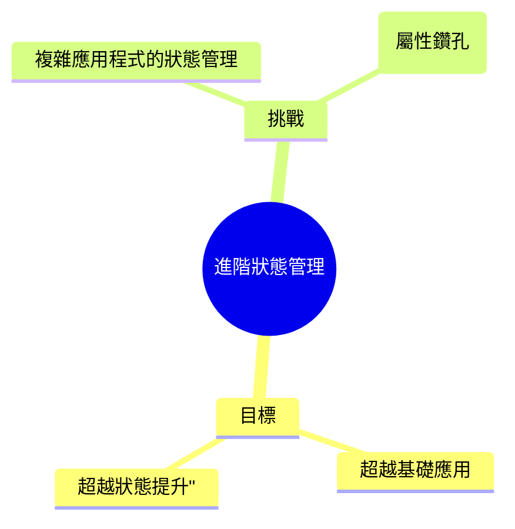
```mermaid
mindmap
  root((進階狀態管理))
    目標
      超越基礎應用
      超越狀態提升"
    挑戰
      複雜應用程式的狀態管理
      Prop Drilling (屬性鑽孔)
```

### 進階狀態管理章節規劃

- **[核心問題]** 共享狀態（Shared State）帶來的挑戰
- **[解決方案]**
    - **組件組合 (Component Composition)**：一種可以部分解決 Prop Drilling 問題的方法
    - **React Context API**：專門用於管理跨多個組件共享狀態的強大功能

### 使用 Reducers 管理複雜狀態

- **[新工具]** 介紹另一種 React Hook，允許使用所謂的 **Reducers**
- **[核心用途]** 用於管理更複雜的狀態資料
- **[為什麼使用它？]** 在某些場景下，Reducers 會比我們常用的 `useState` 更適合處理複雜邏輯

```mermaid
mindmap
  root((進階狀態管理進程))
    解決 Prop Drilling
      Component Composition
      Context API
    管理複雜狀態
      Reducers
```

### React 組件的結構

- 大多數 React 應用程式是由多個組件構成的
- **[組件樹結構]** 組件之間以樹狀結構進行組織與嵌套
    - 例如：一個 `App` 組件可以渲染 `Shop` 和 `Header` 組件
    - `Shop` 或 `Header` 內部又可以包含其他的子組件或嵌套組件

```mermaid
flowchart TD
    App --> Shop
    App --> Header
    Shop --> Product
    Header --> CartModal
    CartModal --> Cart
```

### 狀態提升的實務應用案例

- **[範例] 購物車狀態 (Cart State)**
    - 在電子商務網站中，購物車的狀態需要跨組件共享
    - **[需求]** 某個組件（例如 `Product`）需要負責**更新**購物車內容，而另一個組件（例如 `Cart`）則需要負責**顯示**購物車內容
    - **[解決方案]** 由於這兩個組件在組件樹中位置不同，必須將狀態「提升」到一個能同時存取兩者的共同祖先組件（例如 `App`）

```mermaid
flowchart TD
    App["App (持有 Cart State)"] --> Shop
    App --> Header
    Shop --> Product["Product (更新 Cart)"]
    Header --> CartModal
    CartModal --> Cart["Cart (顯示 Cart)"]
```

### Prop Drilling (屬性鑽孔)

- **[定義]** 將共享數據（Shared Data）透過多個組件層級向下傳遞的過程
- **[運作方式]** 為了讓深層組件能夠存取或更新某個狀態，必須透過中間的組件將 props 傳遞下去
    - 中間組件本身可能完全不需要這些 props，但為了讓下層組件拿到數據，它們必須充當「傳遞者"

```mermaid
flowchart TD
    App["App (持有 Cart State)"] -->|"cart Prop"| Header
    App -->|"onUpdateCart Prop"| Shop
    Header -->|"cart Prop"| CartModal
    CartModal -->|"cart Prop"| Cart["Cart (顯示 Cart)"]
    Shop -->|"onUpdateCart Prop"| Product["Product (更新 Cart)"]

    style App fill:#333,color:#fff
    style Header fill:#333,color:#fff
    style Shop fill:#333,color:#fff
    style CartModal fill:#333,color:#fff
    style Product fill:#333,color:#fff
    style Cart fill:#333,color:#fff

    classDef drilling stroke:#f0f,stroke-width:2px,stroke-dasharray: 5 5;
    class Header,Shop,CartModal drilling;

    subgraph Prop_Drilling_Zone [Prop Drilling 發生區域]
    direction TB
    Header
    Shop
    CartModal
    end
```

> **[核心問題]** 當應用程式變得龐大時，這種透過多層組件傳遞 props 的做法會變得難以維護且容易出錯。

### Prop Drilling 的負面影響

- **[降低可重用性]** 組件會因為必須接收並傳遞特定的共享數據，而變得無法在不具備相同數據環境的情況下獨立使用
- **[增加樣板程式碼]** 為了將數據傳遞到深層組件，開發者必須在每一層中間組件中執行以下重複動作：
    - 接收該 prop
    - 解構（destructure）該 prop
    - 將其再次傳遞給下一層組件

> **[總結]** 這種模式會讓組件與其數據結構產生強耦合，使得組件在不同場景下的靈活性大幅降低。

### 新課程專案：線上商店 (Online Shop)

- 本章節將使用一個全新的專案來進行實作，以避免舊專案中 Prop Drilling 問題的干擾
- **[專案功能概覽]**
    - **購物車功能**：包含以下核心操作
        - 將商品加入購物車 (`Add to cart`)
        - 查看購物車內容 (`View cart`)
        - 編輯購物車中的項目 (`Edit cart`)

> **[學習目標]** 透過這個包含購物車狀態的應用程式，深入探討如何有效管理應用程式級別的狀態，並解決 Prop Drilling 帶來的開發痛點。

### 線上商店專案實作細節

- **[專案功能範圍]** 本專案旨在模擬購物車的核心功能，而非完整的電商系統：
    - **新增商品**：將商品加入購物車
    - **移除商品**：從購物車中刪除特定項目
    - **結帳**：點擊結帳會關閉購物車介面
- **[組件架構]** 專案採用了典型的 React 組件層級結構，這也是理解狀態管理與 Prop Drilling 的關鍵：

```mermaid
flowchart TD
    App["App (管理購物車狀態)"] --> Shop["Shop (顯示商品列表)"]
    App --> Header["Header (顯示購物車按鈕)"]
    Shop --> Product["Product (新增商品至購物車)"]
    Header --> CartModal["CartModal (購物車彈窗)"]
    CartModal --> Cart["Cart (顯示購物車內容)"]

    style App fill:#333,color:#fff
    style Shop fill:#333,color:#fff
    style Header fill:#333,color:#fff
    style CartModal fill:#333,color:#fff
    style Product fill:#333,color:#fff
    style Cart fill:#333,color:#fff
```

- **[實作重點]** 在 `App.jsx` 中，狀態管理的核心邏輯如下：
    - 使用 `useState` 來管理 `shoppingCart` 陣列
    - 定義 `handleAddItemToCart` 函式來處理新增邏輯，確保能正確更新現有的購物車項目

### `App` 組件中的購物車狀態管理

- **[狀態定義]** 在 `App` 組件中使用 `useState` 管理整個購物車的數據結構：

```javascript
const [shoppingCart, setShoppingCart] = useState({
    items: [],
  });
```

- **[核心邏輯]** 所有的購物車操作邏輯（狀態更新）都集中在 `App` 組件中，因為它是唯一擁有完整購物車狀態存取權限的地方：
    - **新增商品** (`handleAddItemToCart`)：檢查商品是否已在購物車中，若已存在則增加數量，若不存在則新增項目。
    - **更新數量** (`handleUpdateCartItemQuantity`)：處理增加或減少特定商品數量的邏輯。
    - **移除商品**：從購物車陣列中刪除特定項目。
- **[資料傳遞]** 透過 props 將狀態與操作函式分發給下層組件，以實現跨組件的互動：
    - **傳遞至&#32;`Header`**：傳遞 `shoppingCart` 數據以及 `onUpdateCartItemQuantity` 函式，以便在購物車彈窗中進行編輯。
    - **傳遞至&#32;`Shop`**：傳遞 `onAddItemToCart` 函式，讓商品列表組件能觸發新增動作。

```javascript
return (
  <Header
    cart={shoppingCart}
    onUpdateCartItemQuantity={handleUpdateCartItemQuantity}
  />
  <Shop
    onAddItemToCart={handleAddItemToCart}
  />
);
```

### Prop Drilling 實例分析

在目前的專案結構中，資料的傳遞路徑展示了典型的 Prop Drilling 現象：

- **`Header`&#32;組件的資料傳遞**
    - `Header` 從 `App` 接收 `cart` 數據
    - `Header` 並不直接使用這些數據，而是將其轉發給 `CartModal` 以便顯示內容
    - **[程式碼實作]**：

```javascript
<CartModal
        ref={modal}
        cartItems={cart.items}
        onUpdateCartItemQuantity={onUpdateCartItemQuantity}
        // ... 其他 props
      />
```

- **`Shop`&#32;組件的資料傳遞**
    - `Shop` 從 `App` 接收 `onAddItemToCart` 函式
    - `Shop` 本身並不執行新增邏輯，而是將該函式轉發給其內部的 `Product` 組件
    - **[程式碼實作]**：

```javascript
<Product
        {...product}
        onAddToCart={onAddItemToCart}
      />
```

> **[核心問題] Prop Drilling**
> 當一個組件（如 `Header` 或 `Shop`）僅僅是為了將 props 傳遞給更深層的子組件，而自身並不需要使用這些數據或函式時，就會發生 Prop Drilling。這會使得組件與其數據結構產生強耦合，增加開發與維護的複雜度。

### 組件組合 (Component Composition)

- **[解決方案]** 這是處理 Prop Drilling 問題的其中一種可能方案
    - 雖然在某些情況下非常有效，但在多數複雜案例中，通常還需要搭配其他狀態管理方案（如後續會提到的內容）
- **[核心概念]** 透過改變組件的嵌套方式，讓數據直接傳遞到真正需要它的組件，而不是透過中間層轉發
- **[實作思路]** 以 `Shop.jsx` 為例，可以考慮將原本由 `Shop` 負責渲染的產品列表邏輯，改為透過組件組合的方式來處理，減少 `Shop` 組件對特定 props 的依賴

```javascript
// Shop.jsx 目前的結構實例
export default function Shop({ onAddItemToCart }) {
  return (
    <section id="shop">
      <h2>Elegant Clothing For Everyone</h2>
      <ul id="products">
        {DUMMY_PRODUCTS.map((product) => (
          <li key={product.id}>
            <Product {...product} onAddToCart={onAddItemToCart} />
          </li>
        ))}
      </ul>
    </section>
  );
}
```

### 優化狀態傳遞路徑

- **[核心思路]** 將狀態直接管理在最頂層的 `App` 組件中
    - 這樣做的好處是，像 `onAddItemToCart` 這樣的函式就不必再經過 `Shop` 組件轉發
    - 它可以直接傳遞給底層的 `Product` 組件
- **[實作策略] 組件組合 (Component Composition)**
    - 目標不是刪除 `Shop` 組件，而是將其轉化為一個「包裝器 (Wrapper)」
    - `Shop` 組件將不再負責處理具體的產品列表渲染邏輯，而是僅作為產品列表的容器

```javascript
// App.jsx 中的傳遞方式優化預期
return (
  <>
    <Header
      cart={shoppingCart}
      onUpdateCartItemQuantity={handleUpdateCartItemQuantity}
    />
    <Shop>
      {/* 透過組件組合，將產品列表與函式直接傳入 Shop 內部 */}
      <ul id="products">
        {DUMMY_PRODUCTS.map((product) => (
          <li key={product.id}>
            <Product
              {...product}
              onAddToCart={handleAddItemToCart}
            />
          </li>
        ))}
      </ul>
    </Shop>
  </>
);
```

### 實作組件組合 (Component Composition)

- **[重構步驟]** 將產品列表的渲染邏輯從 `Shop` 組件中移除，並移至 `App` 組件中進行管理
    - 將 `Shop` 從自閉合組件 (`<Shop />`) 改為具有開啟與結束標籤的容器組件 (`<Shop>...</Shop>`)
    - 在 `App.jsx` 中將 `DUMMY_PRODUCTS.map(...)` 的邏輯放入 `<Shop>` 的標籤之間
    - **[必要動作]** 由於渲染邏輯移到了 `App.jsx`，因此必須在 `App.jsx` 中也匯入 `DUMMY_PRODUCTS`
- **[重構後的程式碼實作]**：

```javascript
// App.jsx
import { DUMMY_PRODUCTS } from './dummy-products.js';
// ... 其他匯入

export default function App() {
  // ... 狀態定義

  return (
    <>
      <Header
        cart={shoppingCart}
        onUpdateCartItemQuantity={handleUpdateCartItemQuantity}
      />
      <Shop onAddItemToCart={handleAddItemToCart}>
        <ul id="products">
          {DUMMY_PRODUCTS.map((product) => (
            <li key={product.id}>
              <Product
                {...product}
                onAddToCart={handleAddItemToCart}
              />
            </li>
          ))}
        </ul>
      </Shop>
    </>
  );
}
```

- **[優點]** 透過這種方式，`Shop` 組件現在變成了一個通用的容器，它不再需要知道產品列表是如何生成的，也不再需要接收 `onAddItemToCart` 這個 prop，從而成功避免了 Prop Drilling。

### 完成組件組合的重構

- **[重構動作] 調整匯入路徑**
    - 從 `Shop.jsx` 中移除 `Product` 的匯入，因為 `Shop` 現在僅作為容器，不再負責渲染產品
    - 在 `App.jsx` 中新增 `Product` 的匯入，以便在 `App` 組件中直接進行渲染

```javascript
// App.jsx
import { DUMMY_PRODUCTS } from './dummy-products.js';
import Product from './components/Product.jsx'; // 改在 App.jsx 匯入
// ...
```

- **[重構動作] 在 App 中渲染產品列表**
    - 在 `App.jsx` 的 `return` 語句中，於 `<Shop>` 組件內部使用 `DUMMY_PRODUCTS.map()` 進行渲染
    - **[關鍵點]** 必須確保將 `handleAddItemToCart` 函式正確地傳遞給 `Product` 組件的 `onAddToCart` prop，以維持購物車功能的運作

```javascript
// App.jsx 中的渲染邏輯
return (
  <>
    <Header ... />
    <Shop onAddItemToCart={handleAddItemToCart}>
      <ul id="products">
        {DUMMY_PRODUCTS.map((product) => (
          <li key={product.id}>
            <Product
              {...product}
              onAddToCart={handleAddItemToCart}
            />
          </li>
        ))}
      </ul>
    </Shop>
  </>
);
```

- **[重構後的 Shop 組件]**
    - `Shop.jsx` 現在變得非常簡潔，僅包含基礎的 HTML 結構，不再依賴特定的產品組件

```javascript
// Shop.jsx
export default function Shop({ onAddItemToCart }) {
  return (
    <section id="shop">
      <h2>Elegant Clothing For Everyone</h2>
      <ul id="products"></ul>
    </section>
  );
}
```

- **[完成組件組合的最後清理]**
    - **調整&#32;`App`&#32;組件的渲染邏輯**
        - 在 `App.jsx` 中，將 `handleAddItemToCart` 函式透過 `onAddToCart` prop 傳遞給 `Product` 組件
        - 透過組件組合，`Product` 現在直接由 `App` 渲染，不再需要經過 `Shop` 中轉

```javascript
// App.jsx 中的渲染邏輯
<Shop>
  <ul id="products">
    {DUMMY_PRODUCTS.map((product) => (
      <li key={product.id}>
        <Product
          {...product}
          onAddToCart={handleAddItemToCart}
        />
      </li>
    ))}
  </ul>
</Shop>
```

    - **簡化&#32;`Shop`&#32;組件的 Props**
        - 因為 `Shop` 現在僅作為一個包裝容器（wrapper），它不再需要處理產品邏輯
        - 從 `Shop` 組件的參數中移除 `onAddItemToCart` prop，以減少不必要的資料傳遞

```javascript
// Shop.jsx 重構後
export default function Shop() {
  return (
    <section id="shop">
      <h2>Elegant Clothing For Everyone</h2>
      <ul id="products"></ul>
    </section>
  );
}
```

### 透過 `children` prop 實作組件組合

- **[核心概念] 使用&#32;`children`&#32;prop 作為包裝器**
    - 讓 `Shop` 組件能夠接收並渲染包裝在標籤之間的內容
    - 這樣 `Shop` 就不再需要硬編碼產品列表，而是成為一個通用的佈局容器

```javascript
// Shop.jsx 重構：接收並渲染 children
export default function Shop({ children }) {
  return (
    <section id="shop">
      <h2>Elegant Clothing For Everyone</h2>
      <ul id="products">
        {children}
      </ul>
    </section>
  );
}
```

- **[重構優勢] 減少組件嵌套層級**
    - 透過組件組合（component composition），可以直接在 `App` 組件中將產品列表作為 `children` 傳遞給 `Shop`
    - 這消除了原本需要透過 `Shop` 轉手傳遞 props 的複雜層級，讓結構更扁平、更直覺

```javascript
// App.jsx 中的組件組合方式
<Shop>
  {DUMMY_PRODUCTS.map((product) => (
    <li key={product.id}>
      <Product
        {...product}
        onAddToCart={handleAddItemToCart}
      />
    </li>
  ))}
</Shop>
```

### 組件組合解決 Prop Drilling 的評估

- **[目前的進展] 成功減少傳遞層級**
    - 透過將產品列表直接在 `App` 中渲染並作為 `children` 傳遞給 `Shop`，我們已經解決了部分 Prop Drilling 的問題
    - 現在可以正常進行「新增商品到購物車」、「查看購物車」以及「編輯購物車」等功能
- **[潛在問題]&#32;`App`&#32;組件過於臃腫 (Bloated)**
    - **缺點**：如果將所有組件的狀態與處理邏輯都集中在 `App` 組件中，會導致 `App` 承擔過多職責
    - **後果**：其他組件可能僅僅淪為「包裝器 (wrapper components)」，而核心邏輯全部堆積在頂層，這不利於程式碼的維護與擴展

> **結論**：組件組合是很好的工具，但不應是處理所有複雜狀態傳遞的唯一手段。

## React Context API

- **[定義]** React 內建的一種功能，用於在組件之間輕鬆共享資料
- **[核心目的]** 解決 Prop Drilling 問題，讓資料可以跨越組件層級進行傳遞，而不需要透過每一層中間組件手動傳遞 props

### 解決 Prop Drilling 的另一種方案

- 雖然組件組合（Component Composition）是一個很好的解決方法，但 React Context API 提供了一種更徹底的解決方式
- 它能讓資料在組件樹中「跳躍式」傳遞，直接到達需要的組件，避免了層層轉手的繁瑣過程

### React Context API 的運作流程

- **實作步驟**
    - 首先建立一個 Context 值 (Context Value)
    - 使用 Provider 將此值包裹在組件周圍
        - 可以是部分組件，也可以是包裹整個應用程式 (App)
- **與狀態 (State) 的結合**
    - Context 的一大優點是可以輕鬆地與 React State 連結
    - 這意味著你可以將應用程式的狀態與 Context 值綁定，讓整個應用程式都能直接存取並響應狀態的變化

### Context API 的強大優勢

- **消除 Props 傳遞**
    - 不需要再透過多個組件層級手動傳遞狀態（State）或更新狀態的函式（State updating functions）
- **直接存取狀態**
    - 因為 Context 值與狀態（State）相連，且已提供給應用程式中的所有組件
    - 需要讀取或更改狀態的組件，可以直接向 Context 「伸手」取得資料

```mermaid
flowchart TD
    CS[Cart State] --> CC[Cart Context]
    CC --> App
    App --> Shop
    App --> Header
    Shop --> Product
    Header --> CartModal
    CartModal --> Cart

    %% Prop Drilling Path (The problem being solved)
    Shop -- "onUpdateCart Prop" --> Product
    Header -- "cart Prop" --> CartModal
    CartModal -- "cart Prop" --> Cart

    %% Direct Access Path (The Context solution)
    CC -.-> Product
    CC -.-> Cart

    %% Actions
    Product -- "Update Cart" --> CS
    Cart -- "Display Cart" --> CS
```

### 專案目錄結構慣例

- **建立&#32;`store`&#32;資料夾**
    - 在 `src` 目錄下新增一個名為 `store` 的資料夾
    - **[為什麼要這樣做？]** 這是一種開發慣例（Convention），並非技術上的強制要求
    - 將 Context 值存放在 `store` 資料夾中，因為它代表了整個應用程式（或多個組件）的資料與狀態儲存中心（Data and State Store）

### 建立購物車 Context

- **建立新檔案**
    - 在 `store` 資料夾下建立 `shopping-cart-context.jsx`
    - **[命名建議]** 雖然檔名可以自訂，但加上 `-context` 後綴可以清楚表明該檔案是用於管理 React Context 值的
- **匯入&#32;`create`&#32;函式**
    - 必須從 `react` 模組中匯入 `create` 函式，它是建立 Context 值的核心工具

```javascript
import { create } from 'react';
```

### 實作建立 Context 值

- **呼叫&#32;`createContext`**
    - 透過執行 `createContext()` 函式來產生 Context 值
    - 可以將產生的值儲存在任何你選擇的變數或常數中
- **命名慣例**
    - **[建議]** 建議使用大寫字母開頭（例如 `CartContext`）
    - **[原因]** 因為 `createContext` 產生的值實際上是一個包含 React 組件（React component）的物件，使用大寫開頭可以符合 React 組件的命名慣例

```javascript
import { createContext } from 'react';

const CartContext = createContext();
```

### 設定 Context 的初始值

- **傳遞初始值**
    - 在呼叫 `createContext()` 時，可以傳入一個參數作為「初始值」
    - **[作用]** 這個值會被提供給所有被此 Context 包裹（wrapped）的組件，作為它們存取資料時的預設值
- **Context 值的資料類型**
    - Context 可以承載任何類型的 JavaScript 資料
    - 常見的類型包括：
        - 數字 (Number)
        - 字串 (String)
        - 物件 (Object)
        - 陣列 (Array)

```javascript
import { createContext } from 'react';

// 範例：傳遞一個字串作為初始值
const CartContext = createContext("Hi there");

// 範例：傳遞一個物件作為初始值
const CartContext = createContext({});
```

### 實作購物車 Context 的初始值

- **使用物件作為初始值**
    - 初始值設定為一個包含 `items` 屬性的物件，其值為一個空陣列 `[]`
    - **[為什麼要用物件？]** 因為未來可能會在同一個 Context 中需要增加更多屬性，使用物件比直接傳遞單一陣列更具擴充性

```javascript
import { createContext } from 'react';

const CartContext = createContext({
  items: []
});
```

- **下一步：提供 Context (Providing Context)**
    - 建立完 Context 後，必須將其「包裹」在應用程式的部分或全部組件外圍，以便讓這些組件能夠存取到 Context 的值

### 匯出 Context 物件

- **[必要步驟]** 必須使用 `export` 關鍵字將 Context 物件匯出
    - **[原因]** 這樣才能在應用程式的其他檔案（例如 `App.jsx`）中匯入並使用它

```javascript
import { createContext } from 'react';

export const CartContext = createContext({
  items: []
});
```

### 提供 Context (Providing Context)

- **實作方式**
    - 選擇一個包含所有需要使用該 Context 的組件的父組件（例如 `App` 組件）
    - 使用 `<CartContext.Provider>` 來包裹這些組件
- **[目的]** 透過這種方式，被包裹在內部的所有組件（無論層級多深）都能夠存取到 Context 所提供的資料

```javascript
// 在 App.jsx 中實作
import { CartContext } from './store/shopping-cart-context';

function App() {
  // ... 狀態管理邏輯

  return (
    <CartContext.Provider value={shoppingCart}>
      <Header cart={shoppingCart} onUpdateCartItemQuantity={handleUpdateCartItemQuantity} />
      <Shop />
    </CartContext.Provider>
  );
}
```

- **[組件樹結構]**
    - `App` (Provider 層)
        - `Header` (可存取 Context)
        - `Shop` (可存取 Context)
            - `Product` (可存取 Context)

### 實作購物車 Context 的提供 (Providing Context)

- **[佈局決策]** 在 `App` 組件中將 `CartContext.Provider` 包裹住 `Header` 與 `Shop` 組件
    - **[原因]** 為了確保所有相關的深層嵌套組件都能存取並操作購物車狀態
    - **[具體需求]**
        - `Product` 組件（位於 `Shop` 內部）：需要更新 Context 中的 `items` 陣列（例如新增商品）
        - `Cart` 組件（位於 `Header` 內部）：需要讀取 `items` 來顯示購物車內容

```javascript
// 在 App.jsx 中實作
import { CartContext } from './store/shopping-cart-context';

function App() {
  const [shoppingCart, setShoppingCart] = useState({
    items: [],
  });

  // ... 處理函式

  return (
    <CartContext.Provider value={shoppingCart}>
      <Header
        cart={shoppingCart}
        onUpdateCartItemQuantity={handleUpdateCartItemQuantity}
      />
      <Shop>
        {DUMMY_PRODUCTS.map((product) => (
          <li key={product.id}>
            <Product
              {...product}
              onAddToCart={handleAddItemToCart}
            />
          </li>
        ))}
      </Shop>
    </CartContext.Provider>
  );
}
```

- **[組件樹結構與資料流]**
    - `App` (提供 `CartContext.Provider`)
        - `Header` (可透過 Context 讀取/更新狀態)
            - `Cart` (深層組件，需讀取 `items`)
        - `Shop` (可透過 Context 讀取/更新狀態)
            - `Product` (深層組件，需更新 `items` 陣列)

### React 19 中的 Context 使用方式

- **[新特性]** 在 React 19 或更高版本中，可以直接將 Context 物件當作組件來使用，而不需要使用 `<CartContext.Provider>`。
- **[實作方式]** 將 Context 作為包裝器（wrapper）包裹住需要存取該資料的組件樹。

```javascript
// 在 App.jsx 中實作 (React 19+ 寫法)
import { CartContext } from './store/shopping-cart-context';

function App() {
  // ... 狀態管理邏輯

  return (
    <CartContext shoppingCart={shoppingCart}>
      <Header
        cart={shoppingCart}
        onUpdateCartItemQuantity={handleUpdateCartItemQuantity}
      />
      <Shop />
    </CartContext>
  );
}
```

- **[命名慣例]** Context 的名稱通常以大寫字母開頭（如 `CartContext`），因為在 React 中它現在被視為一個組件來使用。

### Context 語法的版本相容性

- **[版本差異]** React 19 與舊版本在 Context 使用上的語法不同
    - **React 19+**: 可以直接將 Context 當作組件使用（例如 `<CartContext>`）
    - **舊版本**: 必須存取 Context 物件中的 `.Provider` 屬性（例如 `<CartContext.Provider>`）
- **[相容性策略]** 使用 `.Provider` 寫法具有更好的向下相容性
    - 即使在 React 19 中，使用 `.Provider` 依然有效
    - 為了讓教學內容或專案能適用於各種 React 版本，建議採用 `.Provider` 這種較傳統且穩定的寫法

```javascript
// 具備版本相容性的寫法
return (
  <CartContext.Provider value={shoppingCart}>
    <Header
      cart={shoppingCart}
      onUpdateCartItemQuantity={handleUpdateCartItemQuantity}
    />
    <Shop>
      {DUMMY_PRODUCTS.map((product) => (
        <li key={product.id}>
          <Product {...product} onAddToCart={handleAddItemToCart} />
        </li>
      ))}
    </Shop>
  </CartContext.Provider>
);
```

### JSX 中的點號表示法 (Dot Notation)

- **[運作原理]** 在 JSX 中看到如 `<CartContext.Provider>` 這種帶有點號的標籤時，它並非一種特殊的語法，而是在存取一個物件的嵌套屬性
    - `CartContext` 是一個物件
    - `.Provider` 是該物件中的一個屬性
    - 這個屬性本身存放著一個 React 組件
- **[使用方式]** 只要該屬性是一個有效的組件，就可以像使用一般組件（如 `Header` 或 `Shop`）一樣，直接在 JSX 中作為元素使用

### 理解 Context 物件與 Provider

- **[Provider 的來源]** `.Provider` 屬性並非由開發者手動建立，而是由 React 在呼叫 `createContext` 時自動生成的組件屬性
- **[Context 物件 vs. Value]** 必須區分「Context 物件本身」與「傳遞給 Provider 的值」：
    - **Context 物件**：由 `createContext` 產生的物件（例如 `CartContext`），它包含了 `.Provider` 組件等結構
    - **Context Value**：我們透過 `value` prop 傳遞給 Provider 的實際資料（例如 `{ items: [] }`），這些資料會透過 Context 被後續組件存取

```javascript
// shopping-cart-context.jsx
import { createContext } from 'react';

// 這裡建立的 CartContext 物件包含了 .Provider 屬性
export const CartContext = createContext({
  items: []
});
```

```javascript
// App.jsx
return (
  <CartContext.Provider value={shoppingCart}>
    <Header
      cart={shoppingCart}
      onUpdateCartItemQuantity={handleUpdateCartItemQuantity}
    />
    <Shop>
      {DUMMY_PRODUCTS.map((product) => (
        <li key={product.id}>
          <Product {...product} onAddToCart={handleAddItemToCart} />
        </li>
      ))}
    </Shop>
  </CartContext.Provider>
);
```

### Context 的使用流程

- **[第一階段：提供 (Providing)]** 使用 `<Context.Provider>` 將狀態（如 `shoppingCart`）向下傳遞給組件樹。
- **[第二階段：消耗 (Consuming)]** 在需要顯示或操作該資料的子組件中，透過 React 的機制來讀取並使用這些 Context 內容。

### 消耗 Context (Consuming Context)

- **[核心概念]** 當資料已經透過 `<Context.Provider>` 提供後，下游的組件可以不再透過 props 層層傳遞，而是直接從 Context 中「消耗」這些資料
- **[實作範例]** 以 `Cart` 組件為例，原本需要透過 props 接收 `items`，現在可以直接從 Context 取得
    - **[優點]** 簡化了組件的介面 (Interface)，不再需要為了傳遞資料而定義冗長的 props
    - **[應用場景]** 適合用於顯示購物車項目，或是根據購物車是否為空來顯示 fallback 文字（例如：「No items in cart!」）

```javascript
// 舊有的寫法：透過 props 接收資料
export default function Cart({ items, onUpdateItemQuantity }) {
  // ...
}

// 預期的 Context 消耗邏輯：直接從 Context 取得 items
// (具體實作將在後續步驟完成)
```

### 使用 `useContext` 消耗 Context

- **[核心工具]** `useContext` 是 React 提供的一個 Hook，專門用於從已建立的 Context 中讀取（消耗）資料
- **[實作步驟]**
    - 首先需要從 `react` 套件中匯入 `useContext`
    - 接著從存放 Context 的檔案中匯入該 Context 物件（例如 `CartContext`）

```javascript
// 範例：在組件中匯入並準備使用 useContext
import { useContext } from 'react';
import { CartContext } from '../store/shopping-cart-context.jsx';
```

### 使用 `useContext` 提取 Context 值

- **[使用方法]** 在組件函式內部呼叫 `useContext` Hook
    - 需要將欲消耗的 Context 物件（例如 `CartContext`）作為參數傳入
    - `useContext` 會回傳該 Context 目前所提供的 `value`
- **[實作方式]** 將回傳的值儲存在一個常數中，以便在整個組件中使用

```javascript
// Cart.jsx
import { useContext } from 'react';
import { CartContext } from '../store/shopping-cart-context.jsx';

export default function Cart({ items, onUpdateItemQuantity }) {
  // 透過 useContext 取得 CartContext 提供的值，並存入 cartCtx 常數中
  const cartCtx = useContext(CartContext);

  // 此後即可使用 cartCtx 來存取 Context 中的資料
  // ...
}
```

### 使用 `use` Hook 消耗 Context

- **[核心概念]** React 提供了一個名為 `use` 的新 Hook，其功能與 `useContext` 非常相似，但語法更簡潔
- **[用法與&#32;`useContext`&#32;的比較]**
    - **[語法]** 直接使用 `use(ContextObject)`，不需要像 `useContext(ContextObject)` 那樣寫完整的名稱
    - **[回傳值]** 與 `useContext` 一樣，它會回傳該 Context 目前所提供的 `value`
    - **[靈活性]** `use` Hook 比 `useContext` 更具靈活性，這點將在後續內容中進一步探討

```javascript
// 使用 useContext 的寫法
import { useContext } from 'react';
import { CartContext } from '../store/shopping-cart-context.jsx';

export default function Cart({ items, onUpdateItemQuantity }) {
  const cartCtx = useContext(CartContext);
  // ...
}

// 使用 use Hook 的簡潔寫法
import { use } from 'react';
import { CartContext } from '../store/shopping-cart-context.jsx';

export default function Cart({ items, onUpdateItemQuantity }) {
  const cartCtx = use(CartContext);
  // ...
}
```

### `use` Hook 的靈活性優勢

- **[核心差異]** 與傳統 Hook 不同，`use` Hook 可以在條件語句（如 `if` 區塊）中使用
    - **[傳統限制]** 根據 React 的 Hook 規則，像 `useContext` 這樣的 Hook **不能**放在 `if` 判斷式或迴圈中，否則會導致錯誤
    - **[use 的優勢]** `use` Hook 突破了這個限制，使得在條件分支中消耗 Context 變得合法且可行
- **[語法便利性]** 除了靈活性外，`use` 的語法也比 `useContext` 更簡潔

```javascript
// 這是有效的程式碼（僅限使用 use Hook 時）
if (true) {
  const cartCtx = use(CartContext);
}

// 這是錯誤的寫法（若使用 useContext）
if (true) {
  const cartCtx = useContext(CartContext); // ❌ 這會違反 React Hook 規則
}
```

### `use` Hook 的版本限制與相容性考量

- **[版本需求]** `use` Hook 僅在 **React 19** 或更高版本中可用
    - 在 React 18 或更早的版本中，必須使用 `useContext` 來消耗 Context
- **[開發決策：向後相容性]** 為了確保程式碼具備向後相容性（backwards compatibility），在不需要於條件語句中使用 Hook 的情況下，選擇使用 `useContext`
    - 即使在 React 19 中，`useContext` 依然可用，並不會導致問題

```javascript
// 為了確保相容性（React 18+），使用 useContext
import { useContext } from 'react';
import { CartContext } from '../store/shopping-cart-context.jsx';

export default function Cart({ items, onUpdateItemQuantity }) {
  const cartCtx = useContext(CartContext);
  // ...
}
```

### 在 `Cart` 組件中消耗 Context

- **[實作方式]** 使用 `useContext` Hook 來獲取 `CartContext` 的內容
    - 由於 `CartContext` 的初始值是一個包含 `items` 屬性的物件，因此從 `cartCtx` 中存取資料時需要指向該屬性
- **[條件渲染邏輯]** 利用 `items.length` 來判斷購物車狀態並決定顯示內容
    - 若 `items.length === 0`：顯示「No items in cart!」的提示訊息
    - 若 `items.length > 0`：渲染購物車列表項目

```javascript
import { useContext } from 'react';
import { CartContext } from '../store/shopping-cart-context.jsx';

export default function Cart({ items, onUpdateItemQuantity }) {
  const cartCtx = useContext(CartContext);

  const totalPrice = items.reduce(
    (acc, item) => acc + item.price * item.quantity,
    0
  );

  const formattedTotalPrice = `$${totalPrice.toFixed(2)}`;

  return (
    <div id="cart">
      {cartCtx.items.length === 0 && <p>No items in cart!</p>}
      {cartCtx.items.length > 0 && (
        <ul id="cart-items">
          {items.map((item) => {
            const formattedPrice = `$${item.price.toFixed(2)}`;
            return (
              // ... 列表項目內容
            );
          })}
        </ul>
      )}
      {/* ... 其他內容 */}
    </div>
  );
}
```

### 簡化 `Cart` 組件的 Props

- **[重構目標]** 為了減少 Prop Drilling，不再透過 props 接收 `items`，而是改為直接從 `cartCtx` 中取得
- **[實作細節]**
    - 移除組件定義中的 `{ items, onUpdateItemQuantity }`，改為只保留需要的 `onUpdateItemQuantity`（或根據需求調整）
    - 將所有涉及 `items` 的邏輯（如 `totalPrice` 的計算與 `map` 渲染）改為使用 `cartCtx.items`

```javascript
// 重構後的 Cart 組件結構範例
export default function Cart({ onUpdateItemQuantity }) {
  const cartCtx = useContext(CartContext);

  const totalPrice = cartCtx.items.reduce(
    (acc, item) => acc + item.price * item.quantity,
    0
  );

  const formattedTotalPrice = `$${totalPrice.toFixed(2)}`;

  return (
    <div id="cart">
      {cartCtx.items.length === 0 && <p>No items in cart!</p>}
      {cartCtx.items.length > 0 && (
        <ul id="cart-items">
          {cartCtx.items.map((item) => {
            // ... 渲染邏輯
          })}
        </ul>
      )}
      {/* ... */}
    </div>
  );
}
```

### 除錯：Context 未提供導致的錯誤

- **[錯誤現象]** 儲存程式碼後，網頁顯示空白，開發者工具（Developer Tools）出現錯誤訊息
- **[錯誤類型]** `TypeError: Cannot read properties of undefined (reading 'items')`
- **[原因分析]**
    - 錯誤發生在 `Cart.jsx:8:30`，試圖從 `undefined` 的物件中讀取 `items` 屬性
    - 這代表 `useContext(CartContext)` 回傳了 `undefined`，即該組件不在 `CartContext.Provider` 的範圍內，或者 Provider 沒有傳遞正確的 `value` prop

```text
Uncaught TypeError: Cannot read properties of undefined (reading 'items')
at Cart (Cart.jsx:8:30)
at renderWithHooks (react-dom.development.js:25850:20)
```

### 必須傳遞 `value` prop 給 Provider

- **[重要觀念]** 僅在 `createContext` 中設定預設值是不夠的
    - `createContext` 的預設值僅在組件**未被 Provider 包裹**時才會被使用
    - 如果組件被 Provider 包裹，但 Provider 沒有提供 `value` prop，則該組件會讀取到 `undefined`，進而導致程式崩潰
- **[實作方式]** 在 `App.jsx` 中使用 `CartContext.Provider` 時，必須加上 `value` 屬性並傳入 Context 的資料物件

```javascript
// 在 App.jsx 中正確提供 Context 值
return (
  <CartContext.Provider value={{ items: shoppingCart, onUpdateItemQuantity: handleUpdateCartItemQuantity }}>
    <Header cart={shoppingCart} ... />
    <Shop ... />
  </CartContext.Provider>
);
```

- **[常見錯誤]** 若忘記寫 `value` prop，開發者工具會發出警告：

  > `Warning: The value prop is required for the <Context.Provider>. Did you misspell it or forget to pass it?`

### 驗證 Context 功能運作

- **[驗證方式]** 檢查當 Context 中的 `items` 為空陣列時的行為
    - 網頁能正常顯示「No items in cart!」訊息
    - 開發者工具中沒有出現任何錯誤 (No errors)
- **[結論]** 這證明了 Context 功能運作正常，因為子組件已成功讀取到 Context 的值，即使該值目前是空的，也不會導致程式崩潰

### 設定 Context 預設值的開發優勢

- **[開發效率]** 在 `createContext` 時定義預設值可以提升開發體驗
    - 當你在程式碼中輸入 `CartContext.` 時，IDE 會根據預設值的結構提供屬性建議（例如自動補完 `items`）

```javascript
// 在 shopping-cart-context.jsx 中設定預設值
import { createContext } from 'react';

export const CartContext = createContext({
  items: [],
});
```

- **[簡化程式碼]** 可以直接對 Context 物件進行解構賦值，從中提取需要的屬性

```javascript
// 在 Cart.jsx 中使用解構賦值
const { items } = useContext(CartContext);
```

### 簡化 Context 的存取方式

- **[優化手段]** 使用解構賦值（destructuring）可以減少程式碼冗餘，使邏輯更清晰
    - 與其使用 `cartCtx.items` 或 `cartCtx.items.length`，可以直接從 `useContext` 的回傳值中解構出 `items`

```javascript
// 優化前：需要透過 context 物件存取屬性
const cartCtx = useContext(CartContext);
const total = cartCtx.items.reduce(...);

// 優化後：直接解構需要的屬性
const { items } = useContext(CartContext);
const total = items.reduce(...);
```

- **[核心觀念]** 理解 Context 與 State 的連結
    - Context 本身並不「持有」狀態，它只是一個傳遞管道
    - 我們通常會將 `App` 組件中的 `state` 作為 `value` 傳遞給 `Context.Provider`
    - 這樣當 `App` 中的 `state` 更新時，所有透過該 Context 訂閱的子組件都會收到最新的值

### 將 Context 與 State 連結

- **[目前狀況]** 目前 Context 的 `value` 是靜態的（例如：一個空的陣列 `items: []`），這意味著它不會隨著應用程式的變化而更新。
- **[核心目標]** 將 Context 的 `value` 連結到由 `useState` 管理的 `state` 上。
- **[實作邏輯]**
    - 在 `App` 組件中，透過 `useState` 定義狀態（例如：`shoppingCart`）。
    - 在 `Provider` 的 `value` 屬性中，傳入該狀態物件。
    - **[開發技巧]** 為了簡化開發，可以預先確保 `state` 的資料結構（shape）與 `createContext` 定義的預設值結構一致。

```javascript
// 在 App.jsx 中，將 state 傳遞給 Provider 的 value
// 這樣當 shoppingCart 更新時，所有使用 CartContext 的組件都會同步更新
return (
  <CartContext.Provider value={{ items: shoppingCart, onUpdateItemQuantity: handleUpdateCartItemQuantity }}>
    <Header cart={shoppingCart} ... />
    <Shop ... />
  </CartContext.Provider>
);
```

### 實現動態 Context 更新

- **[核心實作]** 將 `App` 組件中的 `shoppingCart` 狀態直接賦值給 `CartContext.Provider` 的 `value` 屬性
    - 這樣一來，Context 的值就不再是靜態的預設值，而是會隨著 `shoppingCart` 狀態的改變而動態更新

```javascript
// 在 App.jsx 中將 shoppingCart 狀態傳遞給 Provider
return (
  <CartContext.Provider value={{ items: shoppingCart, onUpdateItemQuantity: handleUpdateCartItemQuantity }}>
    <Header cart={shoppingCart} ... />
    <Shop ... />
  </CartContext.Provider>
);
```

- **[驗證結果]** 連結成功後，當使用者在 `Shop` 組件中新增商品到購物車時：
    - `shoppingCart` 狀態會更新
    - 由於 `value` 已與該狀態連結，`Cart` 組件會自動收到最新的 `items` 陣列
    - 網頁上的購物車數量或內容會即時反映出新增的商品（例如從 「Cart (0)」 變更為 「Cart (1)」）

### Context 的讀取與編輯限制

- **[目前的狀態]** 當我們將整個 `state` 物件作為 `value` 傳遞給 `Provider` 時，子組件可以輕易地讀取其中的資料。
    - 例如：在 `Cart.jsx` 中，可以直接透過 `useContext(CartContext)` 取得最新的 `items`。
- **[核心限制]** 雖然可以「讀取」狀態，但目前僅靠 Context 本身還無法「編輯」狀態。
    - **[原因]** Context 僅僅是提供資料的管道，它並不具備修改狀態的能力。
    - **[目前的做法]** 目前修改狀態的操作（例如更新購物車數量）仍然是透過將函式（如 `onUpdateCartItemQuantity`）作為 props 傳遞給組件來實現的。

```javascript
// 在 App.jsx 中，我們同時傳遞了狀態與修改狀態的函式
return (
  <CartContext.Provider value={{
    items: shoppingCart,
    onUpdateItemQuantity: handleUpdateCartItemQuantity
  }}>
    <Header cart={shoppingCart} ... />
    <Shop ... />
  </CartContext.Provider>
);
```

- **[結論]** 要實現完整的狀態管理，我們不僅要透過 Context 共享「資料」，還必須將「修改資料的函式」也包含在 Context 的 `value` 中，這樣子組件才能夠透過 Context 直接觸發狀態的更新。

### 透過 Context 實現狀態更新

- **[核心目標]** 建立一個理想的開發模式，讓 Context 不僅能提供數值供組件「讀取」，還能提供函式讓組件直接「更新」這些數值，從而完全消除對特定更新函式 props 的依賴。
- **[實作策略]** 將 Context 的 `value` 從單一狀態物件，重構為一個包含「狀態」與「操作函式」的複合物件。

#### 建立 Context Value 物件

為了提高程式碼的可讀性，建議將 Context 的 value 獨立定義為一個常數（例如 `ctxValue`），而非直接在 JSX 中撰寫複雜的物件內容。

```javascript
// 建立一個包含狀態與函式的 Context value 物件
const ctxValue = {
  items: shoppingCart.items,
  // 未來可以在此加入更新函式，例如：
  // onUpdateItemQuantity: handleUpdateCartItemQuantity
};

return (
  <CartContext.Provider value={ctxValue}>
    <Header ... />
    <Shop ... />
  </CartContext.Provider>
);
```

- **[優點]** 這種做法能讓組件在需要修改資料時，直接從 Context 中取出對應的函式來執行，實現更簡潔、更具擴充性的狀態管理。

### 完善 Context 以支援狀態更新

- **[實作目標]** 除了共享購物車的項目清單（`items`），還需要共享「新增商品到購物車」的功能。
- **[實作方式]** 在 `App.jsx` 中定義 `ctxValue` 時，將 `handleAddItemToCart` 函式作為一個屬性加入物件中。

```javascript
// 在 App.jsx 中，將狀態與更新函式一併封裝進 ctxValue
const ctxValue = {
  items: shoppingCart.items,
  addItemToCart: handleAddItemToCart
};

return (
  <CartContext.Provider value={ctxValue}>
    <Header ... />
    <Shop ... />
  </CartContext.Provider>
);
```

- **[效果]** 藉此，任何透過 `useContext(CartContext)` 取得 Context 的組件，現在不僅能讀取購物車內容，還能直接呼叫 `addItemToCart` 來觸發狀態更新。

### 應用購物車 Context

- **[實作方式]** 將預先定義好的 `ctxValue` 物件傳遞給 `CartContext.Provider` 的 `value` 屬性。

```javascript
// 在 App.jsx 中，將包含狀態與函式的物件提供給 Context
const ctxValue = {
  items: shoppingCart.items,
  addItemToCart: handleAddItemToCart
};

return (
  <CartContext.Provider value={ctxValue}>
    <Header ... />
    <Shop ... />
  </CartContext.Provider>
);
```

- **[優點與效果]**
    - 任何被此 Provider 包裹的組件（或其子組件），現在都可以直接從 Context 中呼叫 `addItemToCart`。
    - **[範例]** 在 `Product` 組件中，原本需要透過 props 接收的 `onAddToCart` 函式現在可以被移除，改為直接從 Context 中取得 `addItemToCart`。

```javascript
// Product.jsx 的重構方向
// 原本：<Product ... onAddToCart={handleAddToCart} />
// 現在：直接從 Context 取得 addItemToCart
```

### 在 `Product` 組件中移除 Props 傳遞

- **[重構目標]** 因為現在可以從 Context 直接取得資料，所以不再需要透過 props 傳遞 `onAddToCart` 函式。
- **[實作步驟]**
    - 從 `react` 匯入 `useContext` Hook。
    - 從 `../store/shopping-cart-context.jsx` 匯入 `CartContext`。
    - 在組件內部呼叫 `useContext(CartContext)` 來取得 Context 物件。

```javascript
// Product.jsx 的重構過程
import { useContext } from 'react';
import { CartContext } from '../store/shopping-cart-context.jsx';

export default function Product({ id, image, title, price, description }) {
  // 透過 useContext 取得 Context，不再需要從 props 接收 onAddToCart
  const cartCtx = useContext(CartContext);

  return (
    <article className="product">
      {/* ... 其他內容 ... */}
      <p className="product-actions">
        {/* 使用從 Context 取得的函式 */}
        <button onClick={() => cartCtx.addItemToCart(id)}>Add to Cart</button>
      </p>
    </article>
  );
}
```

- **[優點]** 簡化了 `Product` 組件的 props 定義，使其專注於顯示產品資訊，而將「如何加入購物車」的邏輯交由 Context 處理。

### 優化 Context 的開發體驗

- **[問題]** 當在 `App.jsx` 中新增了 Context 的屬性（例如 `addItemToCart`）後，在其他組件中使用解構賦值時，IDE 可能無法正確提供自動補完功能。
    - 這是因為 Context 的**初始值**（initial value）中尚未定義該屬性。
- **[解決方案]** 在建立 Context 時，於初始物件中加入對應的空函式作為預設值。
    - **[目的]** 這不會影響實際執行邏輯（因為實際會使用 Provider 提供的值），但能確保開發時擁有完整的程式碼提示與類型檢查。

```javascript
// shopping-cart-context.jsx
import { createContext } from 'react';

export const CartContext = createContext({
  items: [],
  // 加入 dummy function 以利於開發時的自動補完
  addItemToCart: () => {},
});
```

### 驗證 Context 重構後的購物車功能

- **[功能測試]** 透過 Context 取得 `addItemToCart` 並成功執行商品加入流程。
- **[開發體驗]** 因為在 `createContext` 時設定了 dummy function，在 `Product` 組件中使用解構賦值時，IDE 能正確提供自動補完建議。

```javascript
// Product.jsx 中的使用方式
import { useContext } from 'react';
import { CartContext } from '../store/shopping-cart-context.jsx';

export default function Product({ id, image, title, price, description }) {
  // 這裡會得到 addItemToCart 的自動補完建議
  const { addItemToCart } = useContext(CartContext);

  return (
    <article className="product">
      {/* ... */}
      <p className="product-actions">
        <button onClick={() => addItemToCart(id)}>Add to Cart</button>
      </p>
    </article>
  );
}
```

- **[結果]**
    - 成功移除原本在 `Product` 組件 props 中的 `onAddToCart`。
    - 重新整理應用程式後，功能運作正常，購物車數量與內容能正確更新，且沒有出現錯誤。
    - **[核心改變]** 資料傳遞從「透過 props 逐層向下傳遞」轉變為「由深層組件直接從 Context 訂閱」。

### Context 的核心價值：共享狀態與更新函式

- **[功能]** Context 不僅能傳遞靜態資料（如 `items` 陣列），還能傳遞用來改變狀態的函式（如 `addItemToCart`）。
- **[運作原理]** 這些函式與 Context 綁定，因為它們在 Provider 的 `value` 物件中被引用，進而能操作與該 Context 關聯的原始狀態（例如 `shoppingCart` 狀態）。
- **[解決方案]** 透過這種方式，應用程式中的多個組件可以直接訂閱並操作同一個狀態，徹底解決了 Prop Drilling 問題。

```javascript
// App.jsx 中的 Context 設定實例
const ctxValue = {
  items: shoppingCart.items,
  addItemToCart: handleAddItemToCart
};

return (
  <CartContext.Provider value={ctxValue}>
    <Header
      /* 原本需要透過 props 傳遞的 cart 或 update 函式，現在可以移除 */
    />
    <Shop />
  </CartContext.Provider>
);
```

- **[後續優化]** 一旦 Context 建立並正確提供值，就可以移除原本為了傳遞購物車相關資料而寫在 `Header` 等組件上的所有 props，讓組件介面更加乾淨。

### 使用 `useContext` 讀取 Context

- **[標準做法]** `useContext` Hook 是在 React 中存取 Context 值的標準方式
    - 它能將組件函式與特定的 Context 連結起來
    - 連結後，該 Context 所提供的 `value` 就會變得在組件函式中可用

```javascript
// Cart.jsx 中的實作範例
import { useContext } from 'react';
import { CartContext } from '../store/shopping-cart-context.jsx';

export default function Cart() {
  // 使用 useContext 取得 Context 中的 items 陣列
  const { items } = useContext(CartContext);

  const totalPrice = items.reduce(
    (acc, item) => acc + item.price * item.quantity,
    0
  );

  const formattedTotalPrice = `$${totalPrice.toFixed(2)}`;

  return (
    <div id="cart">
      {items.length === 0 && <p>No items in cart!</p>}
      {items.length > 0 && (
        <ul id="cart-items">
          {items.map((item) => {
            const formattedPrice = `$${item.price.toFixed(2)}`;
            // ... 渲染邏輯
          })}
        </ul>
      )}
      {/* ... */}
    </div>
  );
}
```

### Context 物件的替代組件

- 除了 `Provider` 之外，Context 物件上還存在其他特殊的組件
    - 這在一些較舊的 React 專案程式碼庫中非常常見
    - **[功能]** `Provider` 的作用是向所有感興趣的組件提供 Context 值，但 Context 物件本身還包含其他可用於不同情境的組件

### Context 物件的替代組件：`Consumer`

除了 `Provider` 之外，Context 物件還提供了一個名為 `Consumer` 的組件。

- **[用途]** 用於包裹需要存取 Context 值的 JSX 代碼
- **[特殊用法]** `Consumer` 的子元素（children）必須是一個**函式**
    - 你不能直接在標籤之間放置一般的 HTML 或組件
    - 必須透過函式來接收 Context 提供的值，並在該函式中回傳 JSX

```javascript
// Consumer 的基本結構概念
<CartContext.Consumer>
  {({ items }) => (
    // 在這裡使用從 Context 取得的 items
    <div id="cart">
      {/* ... 渲染邏輯 ... */}
    </div>
  )}
</CartContext.Consumer>
```

### `Consumer` 的運作原理細節

- **[核心邏輯]** `Consumer` 的子元素不能是單純的 JSX 代碼，而必須是一個 **JavaScript 運算式 (expression)**，具體來說是一個**函式**
    - React 會在底層自動執行這個函式
    - 該函式會自動接收 Context 的值作為參數
    - 該函式必須回傳最終要顯示的 JSX 內容

```javascript
// Cart.jsx 中的實作範例
return (
  <CartContext.Consumer>
    {({ items }) => {
      return (
        <div id="cart">
          {/* 使用從參數中解構出的 items 來渲染內容 */}
        </div>
      );
    }}
  </CartContext.Consumer>
);
```

### 結合 `Consumer` 與總價計算邏輯

- **[重構目標]** 將總價計算（`totalPrice`）從 JSX 渲染區移至組件函式頂部，以便更整潔地管理邏輯
- **[實作方式]** 透過 `CartContext.Consumer` 的回呼函式參數取得整個 `cartCtx` 物件，進而存取其中的 `items` 進行運算

```javascript
// Cart.jsx 中的重構範例
export default function Cart({ onUpdateItemQuantity }) {
  return (
    <CartContext.Consumer>
      {(cartCtx) => {
        // 將計算邏輯移入這裡，使用從 Consumer 取得的 cartCtx.items
        const totalPrice = cartCtx.items.reduce(
          (acc, item) => acc + item.price * item.quantity,
          0
        );

        const formattedTotalPrice = `$${totalPrice.toFixed(2)}`;

        return (
          <div id="cart">
            {/* ... 渲染內容 ... */}
            <p id="cart-total-price">
              Cart Total: <strong>{formattedTotalPrice}</strong>
            </p>
          </div>
        );
      }}
    </CartContext.Consumer>
  );
}
```

- **[優點]** 這樣做可以完全移除組件頂部的 `useContext` Hook，因為所有需要的 Context 資料都已經透過 `Consumer` 的參數傳遞進來了

### `Consumer` 與 `useContext` 的開發體驗比較

- **[使用&#32;`Consumer`&#32;的缺點]** 雖然功能完全正常（例如仍可編輯購物車並即時更新 UI），但這種寫法較為笨重且難以閱讀
    - 需要嵌套多層回呼函式
    - 邏輯與 JSX 結構混雜在一起，增加了程式碼的複雜度
- **[開發建議]** 在現代 React 開發中，應盡量避免使用 `Consumer` 組件，轉而使用更簡潔的 `useContext` Hook
    - 雖然在某些舊有的專案中可能會遇到 `Consumer` 的寫法，但在新的開發流程中應以 Hook 為主

### `useContext` 與 `Consumer` 的選擇建議

- **[首選方案]** `useContext` Hook
    - 這是存取 Context 值的預設且最佳實踐方法
    - **優點**：
        - 程式碼更簡潔（less code to write）
        - 更易於閱讀（easier to read）
        - 符合現代開發標準
- **[備選方案]** `Consumer` 組件
    - 雖然在現代開發中較少使用，但在維護其他舊專案時仍可能遇到
    - 了解其運作方式對於理解舊程式碼至關重要

### Context 值變動與組件重新渲染

- **[核心行為]** 當組件存取並使用某個 Context 的值時，若該 Context 的值發生改變，React 會自動重新執行（Re-execute）該組件函式
    - 這與組件內部 `state` 更新時的行為一致
    - 這也與父組件重新渲染時導致子組件重新渲染的行為相同
- **[運作機制]** Context 的值變動會直接觸發「消耗者 (Consumer)」組件的更新流程，確保 UI 能反映最新的狀態數據

### `useContext` 觸發的重新渲染機制

- **[核心機制]** 當組件透過 `useContext` Hook 與特定的 Context 值建立連結時，該組件會「訂閱」該 Context
- **[重新渲染觸發條件]** 一旦該 Context 的值發生變動，React 會自動重新執行（Re-execute）所有使用了該 `useContext` 的組件函式
- **[目的]** 確保組件能夠根據最新的 Context 數據產生新的使用者介面（UI），維持資料與介面的一致性

```javascript
// Cart.jsx 範例：透過 useContext 連結 Context 並反應變化
import { useContext } from 'react';
import { CartContext } from '../store/shopping-cart-context.jsx';

export default function Cart({ onUpdateItemQuantity }) {
  // 當 CartContext 的值改變時，此組件會重新執行
  const { items } = useContext(CartContext);

  const totalPrice = items.reduce(
    (acc, item) => acc + item.price * item.quantity,
    0
  );

  const formattedTotalPrice = `$${totalPrice.toFixed(2)}`;

  return (
    <div id="cart">
      {/* ... 渲染邏輯 ... */}
    </div>
  );
}
```

### 遷移至 Context API 的重構流程

為了完全利用 Context API 並消除 Prop Drilling，需要對現有的組件結構進行重構：

- **[第一步] 移除接收端的 Props 依賴**
    - 在 `Product` 組件中，移除原本透過 props 接收的 `onAddToCart` 函式
    - **[原因]** 因為 `Product` 組件現在會直接從 `CartContext` 中透過 `useContext` 獲取所需的功能或資料

```javascript
// Product.jsx 重構後：直接從 Context 獲取 addItemToCart
import { useContext } from 'react';
import { CartContext } from '../store/shopping-cart-context.jsx';

export default function Product({ id, image, title, price, description }) {
  const { addItemToCart } = useContext(CartContext);
  // ...
}
```

- **[第二步] 移除傳遞端的 Props 傳遞**
    - 在 `App.jsx`（或父組件）中，移除傳遞給 `Header` 和 `Product` 的 props
    - **[目標]** 讓 `Header` 組件本身不再接收任何 props，實現完全的 Context 驅動

```javascript
// App.jsx 重構前（存在 Prop Drilling）
<CartContext.Provider value={ctxValue}>
  <Header
    cart={shoppingCart}
    onUpdateCartItemQuantity={handleUpdateCartItemQuantity}
  />
  <Shop>
    {DUMMY_PRODUCTS.map((product) => (
      <li key={product.id}>
        <Product {...product} onAddToCart={handleAddItemToCart} />
      </li>
    ))}
  </Shop>
</CartContext.Provider>
```

- **[第三步] 在子組件中直接訂閱所需資料**
    - 以 `Header` 為例，它需要顯示購物車內的項目總數（length）
    - 透過 `useContext(CartContext)` 直接存取 `items` 陣列，從而取得 `items.length`

```javascript
// Header.jsx 範例：直接從 Context 獲取資料
import { useContext } from 'react';
import { CartContext } from '../store/shopping-cart-context.jsx';

export default function Header() {
  const { items } = useContext(CartContext);
  const cartQuantity = items.length;

  return (
    <header id="main-header">
      {/* ... */}
      <p>
        <button onClick={handleOpenCartClick}>
          Cart ({cartQuantity})
        </button>
      </p>
    </header>
  );
}
```

### `Header` 組件的 Context 實作

在移除所有傳入的 props 後，`Header` 組件需要改用 `useContext` 來獲取購物車資訊：

- **[步驟] 導入必要資源**
    - 從 `react` 導入 `useContext`
    - 從 `../store/shopping-cart-context.jsx` 導入 `CartContext`
- **[步驟] 取得 Context 資料**
    - 使用 `useContext(CartContext)` 並透過解構賦值取得 `items` 陣列
    - 接著透過 `items.length` 取得購物車內的項目數量 (`cartQuantity`)

```javascript
import { useRef, useContext } from 'react';
import CartModal from './CartModal.jsx';
import { CartContext } from '../store/shopping-cart-context.jsx';

export default function Header() {
  const modal = useRef();
  const { items } = useContext(CartContext);

  const cartQuantity = items.length;

  function handleOpenCartClick() {
    modal.current.open();
  }

  let modalActions = <button>Close</button>;

  if (cartQuantity > 0) {
    modalActions = (
      <>
        <button>Close</button>
        <button>Checkout</button>
      </>
    );
  }

  return (
    <header id="main-header">
      <div id="main-title">

        <h1>Elegant Context</h1>
      </div>
      <p>
        <button onClick={handleOpenCartClick}>Cart ({cartQuantity})</button>
      </p>
    </header>
  );
}
```

### 優化 `Header` 組件的資料傳遞

- **[核心改進]** 透過 Context API 消除不必要的 props 傳遞
    - 不再需要將 `cartItems` 或狀態更新函式從 `App` 傳遞到 `Header`，再由 `Header` 傳給 `CartModal`
    - `CartModal` 現在可以自行從 Context 中「訂閱」所需的資料
    - 這使得 `Header` 組件的邏輯變得更加精簡（leaner code）

```javascript
// Header.jsx 的簡化實作
import { useRef, useContext } from 'react';
import CartModal from './CartModal.jsx';
import { CartContext } from '../store/shopping-cart-context.jsx';

export default function Header() {
  const modal = useRef();
  const { items } = useContext(CartContext);

  const cartQuantity = items.length;

  function handleOpenCartClick() {
    modal.current.open();
  }

  // ... 剩餘邏輯
}
```

### `CartModal` 組件的 Context 實作

- **[步驟]** 為了讓 `CartModal` 能直接存取購物車資料，需導入 `CartContext`

```javascript
// CartModal.jsx 實作片段
import { forwardRef, useImperativeHandle, useRef } from 'react';
import { createPortal } from 'react-dom';
import Cart from './Cart.jsx';
import { CartContext } from '../store/shopping-cart-context.jsx';

const CartModal = forwardRef(function Modal(
  { title, actions }, // 注意：不再透過 props 接收 cartItems 或更新函式
  ref
) {
  // ...
});
```

### 在 `CartModal` 中使用 `useContext`

- **[實作]** 從 `react` 匯入 `useContext` 並傳入 `CartContext` 來獲取資料

```javascript
// CartModal.jsx 實作片段
import { forwardRef, useImperativeHandle, useRef, useContext } from 'react';
import { createPortal } from 'react-dom';
import Cart from './Cart.jsx';
import { CartContext } from '../store/shopping-cart-context.jsx';

const CartModal = forwardRef(function Modal(
  { title, actions },
  ref
) {
  const { items } = useContext(CartContext);
  // ...
});
```

- **[目前遇到的問題]** 雖然可以取得 `items`，但無法進行狀態更新
    - 目前 Context 的 `value` 中尚未包含更新商品數量的函式（updating function）
    - **[解決方案]** 必須更新 `CartContext.Provider` 的 `value` 屬性，將該更新函式新增為 Context 的一個新屬性
- **[實作]** 為了讓子組件能夠修改購物車狀態，必須將負責更新邏輯的函式（例如 `handleUpdateCartItemQuantity`）加入到 Context 的 `value` 物件中

```javascript
// App.jsx 中的 ctxValue 設定
const ctxValue = {
  items: shoppingCart.items,
  addItemToCart: handleAddItemToCart,
  updateItemQuantity: handleUpdateCartItemQuantity
};
```

- **[優化]** 在使用 `createContext` 建立 Context 時，建議在預設值（default value）中也定義這些函式的結構
    - **[原因]** 這樣在撰寫組件時，IDE 可以提供更準確的程式碼自動補完（autocompletion）功能

```javascript
// shopping-cart-context.jsx
export const CartContext = createContext({
  items: [],
  addItemToCart: () => {},
  updateItemQuantity: () => {},
});
```

- **[後續步驟]** 既然 Context 現在已經包含了 `updateItemQuantity`，我們可以回到 `CartModal` 組件中，使用 `useContext` 來提取該函式，以便在彈出視窗中直接執行更新操作

### 簡化 `CartModal` 組件

- **[重構目標]** 移除 `CartModal` 中不再需要的 props 與 Context 邏輯，因為該組件本質上只是包裹了 `Cart` 組件，不需要自行持有購物車資料。
- **[實作步驟]**
    - 從 `CartModal` 的 props 中移除 `cartItems` 與 `onUpdateCartItemQuantity`
    - 移除組件內部的 `useContext(CartContext)` 呼叫
    - 移除不再使用的 `CartContext` 匯入

```javascript
// CartModal.jsx 重構後的簡化版本
import { forwardRef, useImperativeHandle, useRef } from 'react';
import { createPortal } from 'react-dom';
import Cart from './Cart.jsx';

const CartModal = forwardRef(function Modal(
  { title, actions },
  ref
) {
  const dialog = useRef();

  useImperativeHandle(ref, () => {
    return {
      open: () => {
        dialog.current.showModal();
      }
    };
  });

  return createPortal(
    <dialog id="modal" ref={dialog}>
      <h2>{title}</h2>
      <form method="dialog" id="modal-actions">
        {actions}
      </form>
      <Cart />
    </dialog>,
    document.getElementById('modal')
  );
});

export default CartModal;
```

- **[Context 的優勢]**
    - 由於 `Cart` 組件內部會自行使用 `useContext` 來獲取資料，因此 `CartModal` 不需要充當「資料搬運工」
    - 這展現了 Context API 的核心價值：你可以在**精確需要資料的地方**才進行消耗，而不需要透過每一層中間組件來傳遞 props

### 在 `Cart` 組件中整合 Context 邏輯

- **[重構目標]** 移除 `Cart` 組件中不再需要的 `onUpdateItemQuantity` prop，改為直接從 `CartContext` 中提取更新函式。
- **[實作細節]**
    - 使用 `useContext(CartContext)` 同時取得 `items` 陣列與 `updateItemQuantity` 函式。
    - 在渲染商品列表時，將 `updateItemQuantity` 綁定到數量調整按鈕的 `onClick` 事件上。

```javascript
// Cart.jsx 重構後的實作
import { useContext } from 'react';
import { CartContext } from '../store/shopping-cart-context.jsx';

export default function Cart() {
  const { items, updateItemQuantity } = useContext(CartContext);

  const totalPrice = items.reduce(
    (acc, item) => acc + item.price * item.quantity,
    0
  );

  const formattedTotalPrice = `$$${totalPrice.toFixed(2)}`;

  return (
    <div id="cart">
      {items.length === 0 && <p>No items in cart!</p>}
      {items.length > 0 && (
        <ul id="cart-items">
          {items.map((item) => {
            const formattedPrice = `$$${item.price.toFixed(2)}`;
            return (
              <li key={item.id}>
                <div>
                  <span>{item.name}</span>
                  <span>{formattedPrice}</span>
                </div>
                <div className="cart-item-actions">
                  <button
                    onClick={() => updateItemQuantity(item.id, -1)}
                  >
                  </button>
                  <span>{item.quantity}</span>
                  <button
                    onClick={() => updateItemQuantity(item.id, 1)}
                  >
                  </button>
                </div>
              </li>
            );
          })}
        </ul>
      )}
      {/* ... 總價顯示邏輯 ... */}
    </div>
  );
}
```

- **[結果]**
    - `Cart` 組件現在不接收任何 props，完全依賴 Context 提供的資料與行為。
    - `CartModal` 組件同樣因為 `Cart` 組件的重構，不再需要傳遞與處理購物車相關的 props。

### 重構後的組件傳遞狀態

- **[Prop Drilling 的消除]**
    - 在 `App` 組件中，現在不需要向 `Header`、`Shop` 或其他組件傳遞任何與購物車相關的 props。
    - **[各組件的變化]**
        - `Header` 組件：不再接收任何 props，直接透過 Context 存取購物車狀態。
        - `Product` 組件：不再接收 `onAddToCart` 等函式，改為在組件內部使用 `useContext(CartContext)`。
        - `CartModal` 組件：不再接收 `cart` 相關的 props。

```javascript
// App.jsx 重構後的結構示意
return (
  <CartContext.Provider value={ctxValue}>
    <Header />
    <Shop>
      {DUMMY_PRODUCTS.map((product) => (
        <li key={product.id}>
          <Product {...product} />
        </li>
      ))}
    </Shop>
  </CartContext.Provider>
);
```

- **[核心觀念]**
    - 透過 Context API，資料流從「由上而下逐層傳遞」轉變為「由 Provider 提供，由需要的組件自行訂閱」。
    - 這使得 `App` 組件的程式碼更加簡潔，且組件之間的耦合度大幅降低。

### 購物車功能重構總結

- **[功能完整性]** 即使在重構後，購物車的核心功能依然保持不變：
    - 使用者仍可將商品加入購物車
    - 可以在購物車內部直接更新商品數量
- **[開發體驗優化]** 透過 Context API 的導入，成功解決了 Prop Drilling 問題
    - 組件不再需要為了傳遞資料而充當「傳遞者」
    - 只有真正需要資料的組件才會去「消耗」Context

```javascript
// Product.jsx 重構後的實作範例
import { useContext } from 'react';
import { CartContext } from '../store/shopping-cart-context.jsx';

export default function Product({ id, image, title, price, description }) {
  const { addItemToCart } = useContext(CartContext);

  return (
    <article className="product">

      <div className="product-content">
        <div>
          <h3>{title}</h3>
          <p className="product-price">${price}</p>
          <p>{description}</p>
        </div>
        <p className="product-actions">
          <button onClick={() => addItemToCart(id)}>Add to Cart</button>
        </p>
      </div>
    </article>
  );
}
```

### Context API 的潛在限制

- **[App 組件過於臃腫]**
    - 目前的做法是在 `App` 組件內直接定義並設定要透過 Context 共享的 `value`
    - **[問題點]** 隨著應用程式規模擴大，這種模式會導致 `App` 組件承擔過多職責
- **[複雜度挑戰]**
    - 當應用程式變得複雜時，可能會同時存在多個不同的 Context
    - 每個 Context 可能都需要管理各自獨立的狀態值（state values）
    - 將所有邏輯堆疊在頂層組件會讓程式碼變得難以維護

### 解決 App 組件過於臃腫的替代方案

- **[問題重申]**
    - 因為 `App` 通常是應用程式的根組件（Root Component），它擁有存取所有可能需要 Context 的組件的權限
    - 若將所有 Context 邏輯都寫在 `App` 內，會導致該組件承擔過多職責，變得極度臃腫
- **[解決模式]**
    - 使用一種在許多 React 專案中常見的替代模式：將所有與 Context 相關的資料管理邏輯，從 `App` 組件中移出，放入一個**獨立的 Context 組件**中
    - 這樣做不僅能保持 `App` 組件的簡潔，也能讓 Context 的邏輯更具模組化與可維護性

### 建立獨立的 Context Provider 組件

- **[設計目標]** 將所有與 Context 相關的狀態管理與資料提供邏輯，封裝進一個專門的組件函數中
    - 這能避免將過多的邏輯堆疊在 `App` 組件內，實現模組化
- **[命名慣例]** 建議使用具描述性的名稱，例如 `CartContextProvider`，以清楚表達該組件負責管理購物車相關的 Context 資料

```javascript
// shopping-cart-context.jsx
import { createContext } from 'react';

export const CartContext = createContext({
  items: [],
  addItemToCart: () => {},
  updateItemQuantity: () => {},
});

export default function CartContextProvider() {
  // 這裡將存放所有的狀態管理邏輯與 Context 提供功能
}
```

### 將狀態邏輯遷移至 Provider 組件

- **[重構目標]** 將 `App` 組件中繁瑣的狀態管理程式碼移出，使 `App` 組件變得更精簡（leaner）
    - 遷移內容包含：
        - 使用 `useState` 建立的狀態
        - 用於更新狀態的各個處理函式（如 `handleAddItemToCart` 等）
        - 用於提供給 Context 的 `ctxValue` 物件
- **[實作步驟]**

    1. 在 `CartContextProvider` 組件內重新實作這些狀態與函式
    2. 確保在該檔案中正確匯入 `useState` 等必要的 React Hook
    3. 將這些狀態與函式封裝進 Context 的 `value` 屬性中

```javascript
// App.jsx 重構前（示意邏輯）
function App() {
  const [shoppingCart, setShoppingCart] = useState({
    items: [],
  });

  function handleAddItemToCart(id) {
    // ... 複雜的狀態更新邏輯
  }

  const ctxValue = {
    items: shoppingCart.items,
    addItemToCart: handleAddItemToCart,
    // ... 其他函式
  };

  return (
    <CartContext.Provider value={ctxValue}>
      {/* ... 子組件 */}
    </CartContext.Provider>
  );
}
```

```javascript
// shopping-cart-context.jsx 重構後
import { useState } from 'react'; // 必須匯入 useState 以便在 Provider 內管理狀態
import { createContext } from 'react';

export const CartContext = createContext({
  items: [],
  addItemToCart: () => {},
  // ...
});

export default function CartContextProvider({ children }) {
  // 將原本在 App 中的 useState 與處理函式移至此處
  const [shoppingCart, setShoppingCart] = useState({
    items: [],
  });

  const handleAddItemToCart = (id) => {
    // ... 邏輯
  };

  const ctxValue = {
    items: shoppingCart.items,
    addItemToCart: handleAddItemToCart,
    // ...
  };

  return (
    <CartContext.Provider value={ctxValue}>
      {children}
    </CartContext.Provider>
  );
}
```

### 完成 `CartContextProvider` 的實作

- **[資料準備]** 為了讓購物車能運作，必須匯入模擬產品資料
    - 從上一層目錄匯入 `DUMMY_PRODUCTS`

```javascript
// shopping-cart-context.jsx
import { createContext, useState } from 'react';
import { DUMMY_PRODUCTS } from '../dummy-products';
```

- **[封裝邏輯]** 在 `CartContextProvider` 函式內管理完整的狀態與建構 Context 提供的內容
    - 目前正在定義 `ctxValue` 物件，將狀態（`items`）與更新函式（`addItemToCart`, `updateItemQuantity`）整合在一起

```javascript
export default function CartContextProvider({ children }) {
  const [shoppingCart, setShoppingCart] = useState({
    items: [],
  });

  // ... 處理函式 (handleAddItemToCart, handleUpdateCartItemQuantity)

  const ctxValue = {
    items: shoppingCart.items,
    addItemToCart: handleAddItemToCart,
    updateItemQuantity: handleUpdateCartItemQuantity,
  };

  // 最終必須回傳 Provider 並包裹 children
  return <CartContext.Provider value={ctxValue}>{children}</CartContext.Provider>;
}
```

- **[關鍵點]** 該函式目前尚未成為一個完整的 React 組件，因為它還沒有 `return` 任何可渲染（renderable）的內容。必須透過回傳 `<CartContext.Provider>` 才能讓其發揮作用。

### 完善 `CartContextProvider` 的組件結構

- **[實作包裹機制]** 為了讓 `CartContextProvider` 能作為一個容器，必須接收並解構 `children` prop
    - 這樣可以將任何傳入該組件的子組件（JSX）包裹在 `CartContext.Provider` 之中

```javascript
// shopping-cart-context.jsx
export default function CartContextProvider({ children }) {
  const [shoppingCart, setShoppingCart] = useState({
    items: [],
  });

  // ... 處理函式

  const ctxValue = {
    items: shoppingCart.items,
    addItemToCart: handleAddItemToCart,
    updateItemQuantity: handleUpdateCartItemQuantity,
  };

  // 透過將 children 放在 Provider 內部，實現狀態的向下傳遞
  return (
    <CartContext.Provider value={ctxValue}>
      {children}
    </CartContext.Provider>
  );
}
```

- **[關鍵邏輯]** `value` 屬性必須連結到我們定義的 `ctxValue` 物件，這樣子組件才能透過 Context 取得狀態與更新函式。

### 在 `App` 組件中整合 `CartContextProvider`

- **[實作包裹]** 將 `CartContextProvider` 作為一個自定義組件，包裹在需要存取購物車狀態的組件（如 `Header` 與 `Shop`）之外
    - 這樣 `Header` 與 `Shop` 及其所有子組件都能夠透過 Context 存取購物車的狀態與函式

```javascript
// App.jsx
import Header from './components/Header.jsx';
import Shop from './components/Shop.jsx';
import Product from './components/Product.jsx';
import { DUMMY_PRODUCTS } from './dummy-products.js';
import CartContextProvider from './store/shopping-cart-context.jsx';

function App() {
  // [注意] 這裡不再需要 useState，因為購物車狀態已移至 CartContextProvider 中管理

  return (
    <CartContextProvider>
      <Header />
      <Shop>
        {DUMMY_PRODUCTS.map((product) => (
          <li key={product.id}>
            <Product {...product} />
          </li>
        ))}
      </Shop>
    </CartContextProvider>
  );
}

export default App;
```

- **[架構轉變]** 透過這種方式，原本在 `App` 組件中需要透過 props 傳遞的購物車相關邏輯，現在被封裝在 `CartContextProvider` 內部，大幅簡化了 `App` 組件的複雜度。

### 重構後的 `App` 組件優勢

- **[簡化狀態管理]** 透過將所有購物車相關的狀態與處理邏輯移至 `CartContextProvider`，`App` 組件不再需要承擔這些複雜的邏輯
- **[保持功能完整性]** 儘管移除了 `App` 中的狀態管理程式碼，應用程式的功能（如購物車顯示與更新）依然能透過 Context 正常運作

```javascript
// App.jsx
import CartContextProvider from './store/shopping-cart-context.jsx';
// ... 其他匯入

function App() {
  // [重構後] App 組件變得非常精簡，僅負責組件結構的組合
  return (
    <CartContextProvider>
      <Header />
      <Shop>
        {DUMMY_PRODUCTS.map((product) => (
          <li key={product.id}>
            <Product {...product} />
          </li>
        ))}
      </Shop>
    </CartContextProvider>
  );
}
```

- **[模組化擴展性]** 這種「外包」邏輯的做法對於大型專案非常重要
    - 若應用程式需要多個獨立的 Context（例如：使用者資訊、主題設定、購物車等），可以分別建立不同的 Context 檔案
    - 在 `App` 組件中只需將這些 Provider 層層包裹即可，這能有效防止 `App` 組件變得過於臃脹

### JavaScript `reduce` 方法的應用

- **[核心概念]** 在 `Cart.jsx` 中使用了 JavaScript 內建的 `reduce` 方法來計算總價
    - 這是一個純 JavaScript 方法，與 React 的 `useReducer` Hook 完全無關
    - 此方法可以在任何 JavaScript 專案中使用，不限於 React
- **[運作邏輯]** 將陣列中的多個項目「縮減」為單一數值
    - 以計算購物車總金額為例，透過遍歷 `items` 陣列，將每個項目的 `price` 乘以其 `quantity`，並累加到初始值上

```javascript
// 在 Cart 組件中計算總價的邏輯
const totalPrice = items.reduce((acc, item) => acc + item.price * item.quantity, 0);
```

- **[參數解析]**
    - `acc` (accumulator): 累加器，儲存目前為止計算出的累計值
    - `item`: 當前正在處理的陣列元素
    - `0`: `reduce` 方法的初始值 (starting value)

```mermaid
flowchart LR
    A[items 陣列] --> B{reduce 遍歷}
    B --> C[item 1: price * qty] --> D[累加至 acc]
    D --> E[item 2: price * qty] --> F[累加至 acc]
    F --> G[最終結果: 單一總金額]
```

### 使用 `useReducer` 進行狀態管理

- **[核心概念]** 當狀態邏輯變得複雜時，可以使用 `useReducer` 來取代 `useState`，將狀態管理邏輯集中化
- **[基本用法]** 在組件（如 `CartContextProvider`）中直接執行 `useReducer` Hook
- **[回傳值結構]** `useReducer` 會回傳一個包含兩個元素的陣列，其結構與 `useState` 非常相似
    - 第一個元素：目前被管理的狀態 (state)
    - 第二個元素：`dispatch` 函式
        - **[功能]** 用於發送 (dispatch) 動作，藉此觸發狀態的更新

```javascript
// 在 CartContextProvider 中的基本結構
const [shoppingCartState, dispatch] = useReducer(cartReducer, { items: [] });
```

| Hook | 第一個回傳值 | 第二個回傳值 | 功能說明 |
| --- | --- | --- | --- |
| useState | state (當前狀態) | setState (更新函式) | 直接設定新的狀態值 |
| useReducer | state (當前狀態) | dispatch (派發函式) | 透過傳入一個動作 (action) 來觸發狀態更新 |

### 定義 Reducer 函式

- **[核心邏輯]** `useReducer` 需要一個 reducer 函式來處理透過 `dispatch` 發送的動作 (actions)，並根據這些動作產生新的狀態
- **[命名慣例]** 為 `dispatch` 函式加上前綴（如 `shoppingCartDispatch`）可以增加程式碼的可讀性，明確標示該函式屬於哪個狀態管理邏輯
- **[定義位置]** Reducer 函式應該定義在組件函式（Component function）的**外部**
    - **[原因 1：效能優化]** 避免每次組件重新渲染時都重新建立該函式
    - **[原因 2：邏輯解耦]** Reducer 函式不需要直接存取組件內部的 props 或狀態值，將其抽離可以使邏輯更純粹且易於測試

```javascript
// 在組件外部定義 reducer
function shoppingCartReducer(state, action) {
  // 處理邏輯...
}

export default function CartContextProvider({ children }) {
  const [shoppingCartState, shoppingCartDispatch] = useReducer(shoppingCartReducer);
  // ...
}
```

### Reducer 函式的參數細節

- **[參數結構]** Reducer 函式必須接受兩個參數：
    - `state`: 由 `useReducer` 管理的當前狀態
        - **[重要特性]** React 會確保傳入此參數的是**最新的狀態快照** (guaranteed latest state snapshot)，這與在 `useState` 中使用函式式更新 (functional update) 的行為一致
    - `action`: 由 `dispatch` 函式發送的動作物件
        - **[運作流程]** 當開發者呼叫 `dispatch(action)` 時，React 會隨即執行 reducer 函式，並將該 `action` 作為第二個參數傳入

```javascript
// Reducer 函式的標準簽章
function shoppingCartReducer(state, action) {
  // state: 最新的狀態快照
  // action: 透過 dispatch 傳入的動作
}
```

### 連結 Reducer 與 `useReducer` Hook

- **[Reducer 的回傳值]** 在 reducer 函式中，最終應該回傳更新後的狀態 (updated state)
    - **[暫時實作]** 目前僅先回傳原始狀態以維持基本結構

```javascript
function shoppingCartReducer(state, action) {
  // 處理邏輯後應回傳新狀態
  return state;
}
```

- **[註冊 Reducer]** 透過將 reducer 函式作為 `useReducer` 的第一個參數，將其註冊給 React，使其在每次 `dispatch` 時被執行
- **[設定初始狀態]** `useReducer` 可以接受第二個參數來設定狀態的初始值 (initial state)
    - **[功能]** 當狀態尚未被更新過時，會使用這個初始值
    - **[對比]** 這與 `useState` 設定初始值的邏輯是相同的

```javascript
// 將 reducer 連結至 Hook，並設定初始狀態
const [shoppingCartState, shoppingCartDispatch] = useReducer(shoppingCartReducer, { items: [] });
```

### 將 `useReducer` 狀態連結至 Context

- **[狀態替換]** 透過將 `useReducer` 回傳的第一個元素（`shoppingCartState`）用於建構 Context 的 `value` 物件，取代原本使用 `useState` 管理的狀態
    - **[目的]** 這樣一來，Context 所共享的資料將會是受 reducer 控制、具備複雜邏輯處理能力的狀態
- **[初始狀態的表現]** 在尚未實作任何 reducer 邏輯（僅回傳 `state`）且初始狀態設定為空陣列時，購物車會正確顯示「No items in cart!」
    - **[注意]** 此時若手動修改原本的 `useState` 狀態，購物車畫面將不會更新，因為 Context 現在是完全依賴於 `useReducer` 的狀態值

```javascript
export default function CartContextProvider({ children }) {
  // 使用 useReducer 管理狀態，並設定初始值為 { items: [] }
  const [shoppingCartState, shoppingCartDispatch] = useReducer(
    shoppingCartReducer,
    { items: [] }
  );

  // 將 reducer 管理的狀態封裝進 ctxValue 中，提供給 Context
  const ctxValue = {
    items: shoppingCartState.items,
    // ... 其他屬性
  };

  return (
    <CartContext.Provider value={ctxValue}>
      {children}
    </CartContext.Provider>
  );
}
```

### 使用 `dispatch` 進行狀態更新

- **[遷移目標]** 將原本直接在組件中呼叫 `set` 函式（如 `setShoppingCart`）進行複雜邏輯運算的模式，改為透過 `dispatch` 發送動作
- **[運作機制]**
    - 組件不再負責計算新的狀態，而是僅負責「發送一個動作」 (dispatch an action)
    - 具體的狀態更新邏輯將被封裝在 reducer 函式中，根據不同的 `action` 來決定如何更新狀態

```javascript
// 遷移前：在組件內處理複雜的狀態更新邏輯
function handleAddItemToCart(id) {
  setShoppingCart((prevShoppingCart) => {
    // ... 複雜的更新邏輯
  });
}

// 遷移後：僅透過 dispatch 發送動作
function handleAddItemToCart(id) {
  // 透過 useReducer 回傳的 dispatch 元素發送 action
  shoppingCartDispatch({ type: 'ADD_ITEM', payload: id });
}
```

### Action 的結構與慣例

- **[什麼是 Action]** Action 可以是任何形式，例如字串或數字
- **[常見模式]** 在大多數情況下，Action 會是一個物件，其中包含一個屬性（如 `type` 或識別碼），用來區分不同的動作，以便在 reducer 內部進行不同的處理
- **[命名慣例]** 使用大寫字串（例如 `'ADD_ITEM'`）作為 `type` 的值是一種常見的開發慣例，雖然這並非強制要求

```javascript
function handleAddItemToCart(id) {
  // 使用物件作為 action，並包含 type 屬性來識別動作
  shoppingCartDispatch({
    type: 'ADD_ITEM',
    payload: id
  });
}
```

### Action 的詳細結構：Payload

- **[Payload 的作用]** 當一個動作需要額外的資訊來執行時（例如：要加入購物車的商品 ID），我們會將這些資訊附加在 Action 物件中
- **[命名慣例]** 雖然屬性名稱可以自訂，但開發者通常習慣將其命名為 `payload`

```javascript
function handleAddItemToCart(id) {
  // 發送包含 type 與 payload 的 action
  shoppingCartDispatch({
    type: 'ADD_ITEM',
    payload: id // 將所需的資料 (id) 作為 payload 傳遞
  });
}
```

### Reducer 中的動作處理流程

- **[資料傳遞]** 當呼叫 `dispatch(action)` 時，該 `action` 物件會作為參數傳遞給 reducer 函式
    - 在 `shoppingCartReducer(state, action)` 中，`action` 參數即代表了剛才發送的物件（例如包含 `type` 與 `payload` 的物件）
- **[邏輯判斷]** 在 reducer 內部，透過檢查 `action.type` 來識別當前執行的動作，並據此決定如何更新狀態

```javascript
// reducer 函式實作範例
function shoppingCartReducer(state, action) {
  // 檢查 action 的 type 是否為特定的動作名稱
  if (action.type === 'ADD_ITEM') {
    // 根據動作執行對應的狀態更新邏輯
    // ...
  }

  return state;
}
```

- **[運作流程圖]**

### 遷移狀態更新邏輯至 Reducer

- **[遷移目標]** 將原本直接在組件內呼叫 `setShoppingCart` 的邏輯，移動到 reducer 函式中處理
    - 這樣可以讓組件層級保持簡潔，僅負責發送動作 (dispatch action)
    - 具體的複雜更新邏輯（例如檢查商品是否已存在、更新數量或新增項目）則由 reducer 統一管理

```javascript
// 在 reducer 中處理 'ADD_ITEM' 動作
function shoppingCartReducer(state, action) {
  if (action.type === 'ADD_ITEM') {
    // 將原本在 handleAddItemToCart 中的複雜邏輯複製到這裡
    // ... 執行狀態更新邏輯
  }

  return state;
}
```

- **[優點]**
    - 實現了關注點分離 (Separation of Concerns)：組件專注於 UI 與事件觸發，reducer 專注於狀態轉換邏輯
    - 方便擴充：若未來有更多動作（例如 `UPDATE_ITEM_QUANTITY`），只需在 reducer 中增加更多的 `if` 或 `switch` 判斷即可

### 遷移複雜邏輯至 Reducer

- **[邏輯遷移]** 原本在組件中處理的複雜更新程式碼，現在可以完整移入 `shoppingCartReducer` 中
- **[使用最新狀態]** 在 reducer 內部，應使用函式的 `state` 參數來進行更新
    - **[原因]** 因為這個 `state` 參數是由 React 保證的最新狀態 (guaranteed latest state)
- **[提取 Payload 資料]** 需要的額外資訊（例如商品 ID）應從 `action.payload` 中提取
    - **[注意]** 必須確保提取的屬性名稱與你在 `dispatch` 時所定義的名稱一致

```javascript
function shoppingCartReducer(state, action) {
  if (action.type === 'ADD_ITEM') {
    // 使用 reducer 的 state 參數來確保獲取最新狀態
    const updatedItems = [...state.items];

    // 從 action.payload 中提取 ID
    const existingCartItemIndex = updatedItems.findIndex(
      (cartItem) => cartItem.id === action.payload
    );

    // ... 接下來的更新邏輯
  }

  return state;
}
```

### 處理複雜狀態的更新技巧

- **[狀態回傳]** 在 reducer 結束時，必須回傳更新後的狀態快照 (state snapshot)
- **[避免遺失屬性]** 若狀態物件 (state object) 包含多個屬性，更新特定屬性時應先展開 (spread) 並複製舊狀態
    - **[原因]** 這樣可以確保在更新某一項值時，不會導致物件中的其他屬性值遺失
    - **[目前的狀況]** 在目前的範例中，因為狀態僅包含單一值 (`items`)，所以直接回傳即可，但這不具備通用性

```javascript
// 針對複雜狀態物件的更新模式
function shoppingCartReducer(state, action) {
  // ... 執行更新邏輯

  return {
    ...state, // 先展開舊狀態，保留其他屬性
    items: updatedItems // 僅更新我們需要的 items 屬性
  };
}
```

- **[簡化版實作 (適用於單一屬性狀態)]**

```javascript
function shoppingCartReducer(state, action) {
  // ... 執行更新邏輯

  return {
    items: updatedItems
  };
}
```

### 遷移其餘狀態更新邏輯至 Reducer

- **[遷移目標]** 除了 `ADD_ITEM` 之外，也可以將其他的狀態更新邏輯（例如更新商品數量的 `updateItemQuantity`）遷移至 reducer 函式中處理。
- **[Reducer 的自動化優勢]**
    - 在 reducer 函式中，我們不需要像在組件中使用 `useState` 的更新函式時，必須特別留意使用特定的函式形式（例如 `setShoppingCart(prev => ...)`）來獲取最新狀態。
    - **[原因]** 因為 reducer 函式在每次被呼叫時，都會自動接收到該狀態的最新快照 (latest state snapshot)。

```javascript
// 準備遷移其他的更新邏輯，例如 updateItemQuantity
// ...
```

### 遷移 `handleUpdateCartItemQuantity` 至 Dispatch

- **[邏輯轉換]** 在 `handleUpdateCartItemQuantity` 函式中，不再使用 `setShoppingCart` 來直接操作狀態，而是改用 `shoppingCartDispatch` 發送動作
- **[動作定義]**
    - 使用 `type: 'UPDATE_ITEM'` 作為識別碼，因為此動作是針對已存在於購物車中的項目進行更新
    - **[Payload 封裝]** 由於更新操作需要多個參數（商品 ID 與變動數量），因此必須將這些值封裝在 `action.payload` 物件中

```javascript
function handleUpdateCartItemQuantity(productId, amount) {
  shoppingCartDispatch({
    type: 'UPDATE_ITEM',
    payload: {
      productId: productId,
      amount: amount
    }
  });
}
```

- **[關於 Payload 的設計]**
    - 這裡將 `productId` 與 `amount` 封裝成一個物件作為 payload
    - **[替代方案]** 也可以選擇直接將這些值作為 `action` 物件中的獨立屬性，但封裝在 `payload` 中是更常見且一致的做法

### 優化 Dispatch 的 Payload 結構

- **[封裝 Payload]** 為了在一個動作中傳遞多個資訊（例如商品 ID 與數量），將它們封裝在一個巢狀物件中作為 `payload` 是最理想的做法。
- **[使用 JavaScript 語法糖]**
    - 當物件的屬性名稱（Property name）與變數名稱（Variable name）完全相同時，可以使用簡寫語法。
    - **[注意]** 這並非 React 特有的功能，而是標準的 JavaScript 特性。

```javascript
function handleUpdateCartItemQuantity(productId, amount) {
  shoppingCartDispatch({
    type: 'UPDATE_ITEM',
    payload: {
      productId, // 使用簡寫，等同於 productId: productId
      amount     // 使用簡寫，等同於 amount: amount
    }
  });
}
```

### 實作 `UPDATE_ITEM` 邏輯

- **[新增動作判斷]** 在 `shoppingCartReducer` 中加入對 `UPDATE_ITEM` 動作類型的檢查
- **[遵循不可變性原則]**
    - **[核心觀念]** 與 `useState` 相同，絕對不能直接修改記憶體中的舊狀態 (mutate the old state directly)
    - **[實作方式]** 必須先使用展開運算子 (`...`) 來建立一個舊狀態項目的副本

```javascript
function shoppingCartReducer(state, action) {
  if (action.type === 'ADD_ITEM') {
    // ... (省略)
  } else if (action.type === 'UPDATE_ITEM') {
    // 先複製舊的 items 陣列，以確保不直接變更原始狀態
    const updatedItems = [...state.items];

    // 從 action.payload 中取得商品 ID
    const productId = action.payload.productId;

    // ... 接下來進行後續的更新邏輯
  }
  return state;
}
```

- **[資料提取]** 商品 ID 可以透過 `action.payload.productId` 從傳入的動作物件中取得

### 完成 `UPDATE_ITEM` 的狀態更新邏輯

- **[資料提取]** 從 `action.payload` 中取得更新所需的關鍵資訊：
    - `productId`: 目標商品的唯一識別碼
    - `amount`: 欲變動的數量
- **[建構新狀態]**
    - **[確保資料完整性]** 在建立新的狀態物件時，應再次使用展開運算子 (`...`) 複製舊狀態，以避免遺失除了 `items` 以外的其他屬性值（儘管在此範例中目前只有 `items`）。

```javascript
// 在 shoppingCartReducer 內部
const productId = action.payload.productId;
const amount = action.payload.amount;

const updatedItem = {
  ...updatedItems[updatedItemIndex],
  quantity: updatedItems[updatedItemIndex].quantity + amount
};

// 建立新的狀態物件並回傳
return {
  ...state,
  items: updatedItems
};
```

- **[重構後的簡化]**
    - **[移除 useState]** 因為所有的狀態管理與更新邏輯都已經成功遷移至 `useReducer` 與 `shoppingCartReducer` 中，因此可以安全地從組件中移除 `useState` Hook。
    - **[清理 Import]** 同時也需要從 `react` 的匯入清單中移除不再使用的 `useState`。

### 狀態更新與 Context 共享的完整流程

- **[更新流程]** 狀態的變更遵循以下路徑：
    - **[觸發]** 在事件處理函式 (Event Handler) 中調用 `dispatch` 並傳入特定的動作 (Action)。
    - **[執行]** `dispatch` 會觸發 `reducer` 函式，透過內部的條件判斷邏輯 (if blocks) 來決定如何更新狀態。
    - **[傳播]** 更新後的狀態 (`shoppingCartState`) 會透過 `CartContext.Provider` 的 `value` 屬性，將最新的資料共享給整個應用程式。

```javascript
// 狀態更新與共享的架構示意
export default function CartContextProvider({ children }) {
  const [shoppingCartState, shoppingCartDispatch] = useReducer(
    shoppingCartReducer,
    { items: [] }
  );

  const ctxValue = {
    items: shoppingCartState.items,
    addItemToCart: handleAddItemToCart,
    updateItemQuantity: handleUpdateCartItemQuantity,
  };

  return (
    <CartContext.Provider value={ctxValue}>
      {children}
    </CartContext.Provider>
  );
}
```

- **[概念釐清]&#32;`useReducer`&#32;vs.&#32;`Context API`**
    - **[功能獨立]** 兩者是完全獨立的 React 功能：
        - `useReducer` 專注於**狀態管理邏輯**（如何根據動作改變狀態）。
        - `Context API` 專注於**狀態傳遞**（如何將狀態跨組件共享，避免 Prop Drilling）。
    - **[常見搭配]** 雖然功能獨立，但在開發複雜應用時，通常會將 `useReducer` 管理的狀態與 `Context` 結合使用，以達到「邏輯集中管理」且「資料輕鬆共享」的效果。
- **[功能驗證]** 重新整理應用程式後，功能運作正常：
    - 可以成功將商品加入購物車 (`addItemToCart`)
    - 可以成功更新商品數量 (`updateItemQuantity`)
- **[開發體驗]** 最終達成了與重構前相同的行為，但程式碼結構更優化：
    - **[狀態管理]** 使用了 `useReducer` Hook 來處理複雜的狀態邏輯
    - **[資料共享]** 利用 Context API 讓組件可以直接存取狀態與更新函式，無需透過 props 傳遞

## Dealing with Side Effects

- **[核心目標]** 學習如何處理 React 應用程式中的 Side Effects，並確保 UI 能夠與這些副作用保持同步。
- **[學習重點]**
    - 理解什麼是 Side Effects。
    - 學習如何管理與應對 Side Effects。
    - 掌握使用 `useEffect()` 來處理這些問題的方法。

### Place Picker 專案實作

- 使用一個名為 「Place Picker」 的應用程式作為實作案例：
    - 功能包括選擇想要造訪的地點，以及移除不再感興趣的地點。
    - 透過在實際專案中進行功能增強，來深入練習 React 的副作用處理技術。

### Side Effects 學習路徑

- **[核心目標]** 保持 UI 與副作用之間的同步
- **[學習內容]**
    - 理解 Side Effects 的本質與 `useEffect` 的作用
    - 學習如何管理 `useEffect` 的依賴項 (Dependencies)
    - 辨識在哪些情境下**不應該**使用 `useEffect`

### Place Picker 專案初始狀態

- **[目前功能]** 專案已具備基本功能：
    - 查看地點 (View places)
    - 選擇地點 (Select places)
    - 刪除地點 (Delete places)
- **[開發目標]** 在本章節中將持續增強此應用程式並加入更多功能

### 專案開發設定

- **專案取得方式**：提供本地端 (Local) 與 CodeSandbox 版本
- **本地端啟動步驟**：

    1. 執行 `npm install` 以安裝依賴項
    2. 執行 `npm run dev` 啟動開發伺服器

- **CodeSandbox**：不需執行上述指令，可直接在瀏覽器使用

### Place Picker 組件解析

- 專案中使用的主要組件及其特性：
    - `DeleteConfirmation.jsx`：用於確認刪除動作的組件。
    - `Places.jsx`：負責展示地點列表的組件。
    - `App.jsx`：應用程式的主入口，管理著 `modal` 與 `selectedPlace` 等狀態。
    - `Modal.jsx`：一個特殊的組件，利用了進階的 React 特性來控制行為。

### Modal 組件的命令式控制

- **[核心機制]** `Modal` 組件透過 `useImperativeHandle` 結合 `ref` 來暴露內部功能：
    - 透過 `useImperativeHandle` 定義可以被外部存取的函式，例如 `open` 與 `close`。
    - 外部組件（如 `App.jsx`）接收這個 `ref` 作為 prop，並藉此直接呼叫組件內部的邏輯。

```javascript
// Modal.jsx 核心邏輯示意
useImperativeHandle(ref, () => {
  return {
    open: () => {
      dialog.current.showModal();
    },
    close: () => {
      dialog.current.close();
    }
  };
});
```

- **[為什麼這樣做？]** 這種方式允許父組件以「命令式」的方式（直接下令「打開」或「關閉」）來控制子組件，而不是僅僅透過改變 props 來驅動 UI。

### Place Picker 專案輔助檔案

- **`data.js`**：
    - 包含一系列測試用的 dummy data（例如 `AVAILABLE_PLACES`）
    - 負責為應用程式中的地點卡片 (place cards) 提供顯示所需的資訊
- **`loc.js`**：
    - 包含地點相關的計算邏輯
    - 例如實作了計算兩點之間距離的數學函式

```javascript
// loc.js 內容示意
function calculateDistance(lat1, lng1, lat2, lng2) {
  const R = 6371;
  const dLat = toRad(lat2 - lat1);
  const dLon = toRad(lng2 - lng1);
  // ... 距離計算邏輯
  return d;
}
```

### Place Picker 專案輔助檔案

- **`loc.js`**：負責處理地理位置與距離計算的邏輯
    - 包含 `calculateDistance` 函式：利用數學公式計算兩個經緯度座標之間的距離。
    - 包含 `sortPlacesByDistance` 函式：根據與指定經緯度點的距離，對地點陣列進行排序。

```javascript
// loc.js 核心邏輯示意
function calculateDistance(lat1, lng1, lat2, lng2) {
  const R = 6371;
  const dLat = toRad(lat2 - lat1);
  const dLon = toRad(lng2 - lng1);
  // ... 使用數學公式計算距離
  return d;
}

export function sortPlacesByDistance(places, lat, lon) {
  const sortedPlaces = [...places];
  sortedPlaces.sort((a, b) => {
    const distanceA = calculateDistance(lat, lon, a.lat, a.lon);
    const distanceB = calculateDistance(lat, lon, b.lat, b.lon);
    return distanceA - distanceB;
  });
  return sortedPlaces;
}
```

## React 中的副作用 (Side Effects)

- **定義**：指為了讓應用程式正確運作而必須執行的「任務」
    - **[核心特性]** 這些任務不會直接或立即影響當前組件的渲染週期 (render cycle)
    - 當一個任務必須執行，但其行為與組件當下的渲染流程脫鉤時，即可視為副作用

### Place Picker 排序功能實作

- **[功能目標]** 根據使用者所在的位置，將「可用地點」(Available Places) 依據距離由近到遠進行排序
    - 例如：若使用者位於撒哈拉沙漠附近，則撒哈拉沙漠的卡片應排在最前面
- **`loc.js`&#32;工具函式**：專門處理地理位置計算與排序的輔助檔案
    - `calculateDistance(lat1, lng1, lat2, lng2)`：利用地球半徑與經緯度座標，透過數學公式計算兩點間的距離
    - `sortPlacesByDistance(places, lat, lon)`：接收地點陣列與目標經緯度，回傳排序後的陣列

```javascript
// loc.js 核心邏輯
function toRad(value) {
  return (value * Math.PI) / 180;
}

function calculateDistance(lat1, lng1, lat2, lng2) {
  const R = 6371;
  const dLat = toRad(lat2 - lat1);
  const dLon = toRad(lng2 - lng1);
  const l1 = toRad(lat1);
  const l2 = toRad(lat2);
  const a = Math.sin(dLat / 2) * Math.sin(dLat / 2) + Math.sin(dLon / 2) * Math.sin(dLon / 2) * Math.cos(l1) * Math.cos(l2);
  const c = 2 * Math.atan2(Math.sqrt(a), Math.sqrt(1 - a));
  const d = R * c;
  return d;
}

export function sortPlacesByDistance(places, lat, lon) {
  const sortedPlaces = [...places];
  sortedPlaces.sort((a, b) => {
    const distanceA = calculateDistance(lat, lon, a.lat, a.lon);
    const distanceB = calculateDistance(lat, lon, b.lat, b.lon);
    return distanceA - distanceB;
  });
  return sortedPlaces;
}
```

### 獲取使用者地理位置

- **[核心需求]** 為了執行距離排序，必須先取得使用者的地理位置資訊
    - 瀏覽器內建了可直接呼叫的方法來獲取此資訊
- **[實作策略]** 為了在應用程式啟動時儘速取得位置，計畫將此邏輯實作於 `App` 組件中

### 在 `App` 組件中獲取位置

- **[實作位置]** 由於 `App` 組件通常是 React 應用程式的根組件 (Root Component)，因此它是實作獲取使用者位置邏輯的理想地點
- **使用&#32;`navigator`&#32;物件**
    - 瀏覽器會向 JavaScript 提供一個 `navigator` 物件，用於存取瀏覽器的功能與資訊
    - **注意**：`navigator` 並非由開發者定義，也不是 React 的一部分，而是由瀏覽器直接提供的 API

### 使用 `navigator.geolocation` 獲取位置

- **[API 層級]** `navigator` 物件包含一個 `geolocation` 物件，可用於存取地理位置功能
- **`getCurrentPosition()`&#32;方法**
    - **[執行流程]**

        1. 呼叫方法後，瀏覽器會向使用者發出權限請求 (Permission request)
        2. 使用者授予權限後，瀏覽器開始擷取位置資訊

    - **[非同步特性]**
        - 獲取位置需要時間，因此該方法接受一個**回呼函式 (callback function)** 作為參數，以便在位置取得後執行後續邏輯

```javascript
// 在 App.jsx 中的實作示意
navigator.geolocation.getCurrentPosition(() => {
  // 位置取得後的處理邏輯
});
```

### 實作位置獲取邏輯

- **[回呼函式的必要性]** 由於獲取地理位置是一個非同步過程（可能需要幾毫秒到幾秒不等），因此依賴位置資訊的程式碼必須放在 `getCurrentPosition` 的回呼函式中
    - 只有當瀏覽器成功擷取到位置後，該回呼函式才會被執行
    - 若將邏輯放在回呼函式之外，執行時地理位置資訊可能尚未準備就緒
- **`App.jsx`&#32;實作程式碼**

```javascript
// 在 App.jsx 中實作獲取位置並進行排序
navigator.geolocation.getCurrentPosition(() => {
  // 只有在位置取得後，才能安全地執行排序邏輯
  sortPlacesByDistance(AVAILABLE_PLACES, lat, lon);
});
```

- **[執行流程]**

    1. 呼叫 `navigator.geolocation.getCurrentPosition`
    2. 瀏覽器請求權限並擷取位置
    3. 成功取得位置後，觸發回呼函式
    4. 在回呼函式內執行 `sortPlacesByDistance` 以更新 UI 顯示順序

### 整合排序邏輯與地理位置數據

- **導入工具函式**：需要從 `loc.js` 導入 `sortPlacesByDistance` 以便在 `App` 組件中使用
- **執行排序所需參數**：
    - `AVAILABLE_PLACES`：從 `data.js` 導入的 dummy data 陣列
    - 使用者座標：透過 `navigator.geolocation.getCurrentPosition` 取得的經緯度
- **處理&#32;`position`&#32;物件**：
    - 瀏覽器在成功獲取位置後，會自動將一個 `position` 物件傳遞給回呼函式
    - 必須從此物件中提取 `latitude` (緯度) 與 `longitude` (經度) 才能進行排序

```javascript
// App.jsx 實作整合排序邏輯
import { sortPlacesByDistance } from './loc.js';
import { AVAILABLE_PLACES } from './data.js';

// ...

navigator.geolocation.getCurrentPosition((position) => {
  // 從瀏覽器提供的 position 物件中提取座標並執行排序
  sortPlacesByDistance(AVAILABLE_PLACES, position.coords.latitude, position.coords.longitude);
});
```

### 提取地理位置座標與執行排序

- **[資料來源]** `position` 物件是由瀏覽器在成功獲取位置後，自動傳遞給回呼函式的參數
- **[物件結構]** 必須透過存取 `coords` 巢狀物件來取得具體的座標數值
- **[實作細節]** 將提取的經緯度作為第三與第四個參數傳遞給 `sortPlacesByDistance` 函式

```javascript
// App.jsx 實作細節
navigator.geolocation.getCurrentPosition((position) => {
  // 透過 position.coords 存取緯度與經度
  const sortedPlaces = sortPlacesByDistance(
    AVAILABLE_PLACES,
    position.coords.latitude,
    position.coords.longitude
  );

  // 接下來可以使用排序後的 sortedPlaces 陣列進行後續操作
});
```

- **[執行結果]** `sortPlacesByDistance` 會回傳一個已根據使用者位置排序後的地點陣列，可用於更新應用程式的 UI 顯示。

### 辨識組件中的副作用

- **[核心矛盾]** 在 `App` 組件中撰寫獲取地理位置的程式碼會變得棘手，因為這整段程式碼實際上就是一個副作用
    - **[為什麼是副作用？]**
        - 雖然應用程式需要使用者位置才能正常運作，但這項任務與組件的主要職責無關
        - **組件的主要目標**：是回傳可渲染的 JSX 程式碼
        - **副作用的定義**：任何不直接參與「回傳 JSX」這一核心任務，但對應用程式運行必要的程式碼，皆可視為副作用

```javascript
// App.jsx 中的副作用範例
navigator.geolocation.getCurrentPosition((position) => {
  // 這段邏輯雖然必要，但它與組件「渲染 UI」的直接任務脫鉤
  const sortedPlaces = sortPlacesByDistance(
    AVAILABLE_PLACES,
    position.coords.latitude,
    position.coords.longitude
  );
});
```

### 深入理解副作用的非同步特性

- **[核心判斷標準]** 判斷一段程式碼是否為副作用，可以觀察它是否與組件的渲染任務脫鉤
    - **組件的正常職責**：
        - 設定事件監聽器 (Click listeners)，以便 JSX 能回應使用者互動
        - 設定狀態 (State)，直接影響畫面顯示
    - **副作用的特徵**：
        - 獲取使用者位置等任務，並非組件「回傳 JSX」的核心職責
        - **非同步執行 (Asynchronous)**：這段程式碼不會立即完成。當 `getCurrentPosition` 的回呼函式 (callback) 被觸發時，`App` 組件的執行流程很可能早已結束了

```javascript
// App.jsx 中的副作用範例
navigator.geolocation.getCurrentPosition((position) => {
  // 這段邏輯雖然必要，但它與組件「渲染 UI」的直接任務脫鉤
  // 且它會在未來某個時間點才被執行
  const sortedPlaces = sortPlacesByDistance(
    AVAILABLE_PLACES,
    position.coords.latitude,
    position.coords.longitude
  );
});
```

### 副作用與 UI 渲染的衝突

- **[潛在問題]** 在組件函數中直接撰寫副作用程式碼本身不一定有錯，但會導致資料與渲染之間的同步問題
- **[核心矛盾]** 想要將副作用取得的結果（如 `sortedPlaces`）傳遞給需要顯示這些資料的組件（例如 `Places` 組件）
    - **[同步問題]** 由於獲取地理位置是一個非同步過程，`sortedPlaces` 在組件初次渲染時是無法立即取得的
    - **[結果]** 當副作用完成並取得資料時，組件的渲染流程可能已經結束，導致 UI 無法自動反映這些新取得的資料

```javascript
// App.jsx 中的問題實作示意
navigator.geolocation.getCurrentPosition((position) => {
  // 這是一個非同步副作用
  const sortedPlaces = sortPlacesByDistance(
    AVAILABLE_PLACES,
    position.coords.latitude,
    position.coords.longitude
  );

  // 問題在於：我們拿到了 sortedPlaces，但如何讓 Places 組件知道並重新渲染？
});
```

- **[目前的挑戰]** 需要將 `Places` 組件原本使用的 `AVAILABLE_PLACES` (dummy data) 替換為這個非同步取得的 `sortedPlaces`

### 使用 `useState` 解決非同步資料同步問題

- **[解決方案]** 為了在非同步副作用完成後更新 UI，需要在組件中建立一個狀態來管理這些資料
    - **[流程]**

        1. 初始化一個空的狀態陣列（例如 `availablePlaces`）
        2. 在非同步副作用（如 `getCurrentPosition`）的回呼函式中，取得處理後的資料（如 `sortedPlaces`）
        3. 使用狀態更新函式（如 `setAvailablePlaces`）將資料存入狀態
        4. **[觸發重新渲染]** 狀態更新會觸發 React 的新渲染週期，此時組件就能拿到最新的資料並將其傳遞給子組件

```javascript
// App.jsx 中的解決方案實作
function App() {
  const modal = useRef();
  const selectedPlace = useRef();
  // 建立狀態來管理可用地點，初始值為空陣列 []
  const [availablePlaces, setAvailablePlaces] = useState([]);
  const [pickedPlaces, setPickedPlaces] = useState([]);

  navigator.geolocation.getCurrentPosition((position) => {
    const sortedPlaces = sortPlacesByDistance(
      AVAILABLE_PLACES,
      position.coords.latitude,
      position.coords.longitude
    );

    // 當非同步任務完成，透過更新狀態來觸發重新渲染
    setAvailablePlaces(sortedPlaces);
  });
}
```

### 使用 `useState` 解決方案的潛在缺陷

- **[問題]** 直接在組件主體中執行非同步副作用並更新狀態會導致**無窮迴圈 (Infinite Loop)**
- **[原因]** 狀態更新與 React 渲染週期的連鎖反應：

    1. **執行副作用**：組件執行時觸發 `navigator.geolocation.getCurrentPosition`
    2. **更新狀態**：非同步任務完成後，調用 `setAvailablePlaces(sortedPlaces)`
    3. **觸發重新渲染**：根據 React 原理，調用狀態更新函式會通知 React 重新執行該組件函數
    4. **循環開始**：組件函數重新執行 $\rightarrow$ 再次觸發 `getCurrentPosition` $\rightarrow$ 再次調用 `setAvailablePlaces` $\dots$

```javascript
// App.jsx 中的問題實作
function App() {
  const [availablePlaces, setAvailablePlaces] = useState([]);

  // ❌ 這會導致無窮迴圈
  navigator.geolocation.getCurrentPosition((position) => {
    const sortedPlaces = sortPlacesByDistance(
      AVAILABLE_PLACES,
      position.coords.latitude,
      position.coords.longitude
    );

    // 每次組件重新渲染，這裡都會被執行，進而再次觸發渲染
    setAvailablePlaces(sortedPlaces);
  });
}
```

```mermaid
flowchart TD
    A["組件函數執行 (Render)"] --> B["觸發非同步副作用 (Side Effect)"]
    B --> C["非同步任務完成"]
    C --> D["調用狀態更新函式 (setState)"]
    D -->|"通知 React"| A
    style D fill:#f96,stroke:#333,stroke-width:2px
```

### 從無窮迴圈引出 `useEffect` Hook

- **[問題總結]** 直接在組件函數主體中撰寫非同步副作用會造成應用程式崩潰
    - **[連鎖反應]**

        1. 執行組件函數
        2. 觸發非同步副作用（如獲取地理位置）
        3. 非同步任務完成後更新狀態
        4. 狀態更新觸發組件重新渲染 $\rightarrow$ 回到步驟 1，形成無窮迴圈

- **[解決方案]** 使用 `useEffect` Hook
    - **[目的]** `useEffect` 專門設計用來處理這類副作用，它能讓我們控制副作用執行的時機，避免與渲染週期產生衝突，從而解決無窮迴圈的問題

### `useEffect` Hook 的基本概念

- **[匯入方式]** 需要從 `react` 中匯入
    - `import { useEffect } from 'react';`
- **[執行位置]** 與其他 Hooks（如 `useState`, `useRef`）相同，必須在組件函數內部執行
- **[參數結構]** `useEffect` 不會回傳任何值，它接收兩個參數：

    1. **第一個參數**：一個用來包裝副作用程式碼的函式 (callback function)
    2. **第二個參數**：(稍後討論) 依賴陣列

```javascript
// useEffect 的基本結構
useEffect(() => {
  // 在這裡撰寫副作用程式碼 (Side Effect code)
});
```

### 使用 `useEffect` 解決無窮迴圈

- **[解決步驟]** 將原本直接寫在組件主體中的非同步邏輯遷移至 `useEffect` 內部
    - **步驟 1**：建立一個匿名函式來包裝副作用程式碼
    - **步驟 2**：為 `useEffect` 傳入第二個參數——**依賴陣列 (dependency array)**
- **[關鍵技巧]** 傳入一個**空陣列&#32;`[]`** 作為依賴項
    - **[作用]** 這會告訴 React：這個副作用只需要在組件首次掛載時執行一次
    - **[結果]** 由於副作用不再於每次渲染時都重新執行，因此不會在完成後再次觸發狀態更新，從而成功打破無窮迴圈

```javascript
// 解決後的實作方式
useEffect(() => {
  navigator.geolocation.getCurrentPosition((position) => {
    const sortedPlaces = sortPlacesByDistance(
      AVAILABLE_PLACES,
      position.coords.latitude,
      position.coords.longitude
    );

    setAvailablePlaces(sortedPlaces);
  });
}, []); // <--- 傳入空陣列，確保只執行一次
```

### `useEffect` 的執行時機

- **[核心原理]** 傳遞給 `useEffect` 的副作用函式並非在組件渲染過程中執行
    - **[執行順序]** React 會在組件函數執行完成、且 JSX 已成功回傳（returned）之後，才去執行該副作用函式
    - **[目的]** 這種設計確保了副作用不會干擾組件本身的渲染流程

```mermaid
flowchart TD
    A["組件函數執行 (Render)"] --> B["回傳 JSX (Return JSX)"]
    B --> C["React 執行 useEffect 中的副作用函式"]
    C --> D["副作用完成 (例如：資料抓取、DOM 操作)"]

    style C fill:#f96,stroke:#333,stroke-width:2px
```

### `useEffect` 的依賴陣列 (Dependencies Array)

- **[運作機制]** 依賴陣列決定了副作用函式是否需要再次執行
    - **[若未定義陣列]** 副作用會在每次組件重新渲染時都執行
    - **[若定義了陣列]** React 會檢查陣列中的值，**只有當指定的依賴項發生變化時**，才會再次執行該副作用函式
- **[目的]** 透過精確控制執行時機，避免不必要的重複執行，特別是在狀態更新（setState）導致組件重新渲染的場景中

### 空依賴陣列的行為細節

- **[運作原理]** 當依賴陣列為空時，代表副作用函式沒有任何依賴項可以改變
    - **[執行次數]** React 只會在 `App` 組件首次執行完畢（首次掛載）後執行該副作用函式一次
    - **[後續行為]** 由於依賴項永遠不會發生變化，React 實際上永遠不會再次重新執行這個 effect 函式
- **[對比：若省略依賴陣列]** 如果完全不傳入依賴陣列（即不寫第二個參數）
    - **[結果]** 副作用會在每一次組件的渲染週期（render cycle）之後都重新執行
    - **[後果]** 這會導致與之前提到的「無窮迴圈」問題再次發生

```javascript
// 透過空陣列確保副作用只執行一次
useEffect(() => {
  navigator.geolocation.getCurrentPosition((position) => {
    const sortedPlaces = sortPlacesByDistance(
      AVAILABLE_PLACES,
      position.coords.latitude,
      position.coords.longitude
    );

    setAvailablePlaces(sortedPlaces);
  });
}, []); // <--- 關鍵：空陣列防止了無窮迴圈
```

### 優化使用者體驗：處理非同步狀態

- **[使用 Fallback Text]** 在等待非同步資料（如使用者位置）取得的期間，提供提示文字以避免畫面空白
    - **[實作方式]** 在 `Places` 組件上使用 `fallbackText` 屬性
    - **[目的]** 告訴使用者目前系統正在進行的操作（例如："Sorting places by distance..."），提升應用的互動感

```jsx
<Places
  title="Available Places"
  places={availablePlaces}
  fallbackText="Sorting places by distance..."
  onSelectPlace={handleSelectPlace}
/>
```

- **[執行流程總結]**

    1. 組件首次掛載。
    2. `useEffect` 觸發，呼叫瀏覽器地理位置 API。
    3. **[UI 狀態]** 此時 `availablePlaces` 為空，`Places` 組件顯示 `fallbackText` 內容。
    4. 瀏覽器成功獲取位置並執行回呼函式。
    5. 透過 `setAvailablePlaces` 更新狀態。
    6. **[UI 狀態]** 組件重新渲染，顯示排序後的地點列表。

### Place Picker 功能演示

- **[使用者權限請求]** 瀏覽器會彈出視窗詢問是否允許獲取地理位置權限
    - **[重要提示]** 若使用者選擇「封鎖」(Block)，應用程式的定位功能將無法運作
- **[非同步流程結果]** 成功允許權限後，應用程式會執行以下流程：

    1. 獲取使用者的經緯度座標
    2. 根據該座標對地點進行排序
    3. 重新渲染 UI 並呈現排序後的地點列表

- **[執行效果]** 地點顯示的順序會根據使用者的實際地理位置動態調整

```mermaid
flowchart LR
    A["初始狀態 (空陣列)"] --> B["瀏覽器權限請求"]
    B -->|"允許 (Allow)"| C["獲取地理位置 (非同步)"]
    C --> D["執行排序邏輯"]
    D --> E["更新 UI (顯示排序後的地點)"]
    B -->|"封鎖 (Block)"| F["應用程式功能失效"]

    style E fill:#d4edda,stroke:#28a745,stroke-width:2px
    style F fill:#f8d7da,stroke:#dc3545,stroke-width:2px
```

### Side Effect 處理結果驗證

- **[功能狀態]** 透過 `useEffect` 與 `navigator.geolocation` 的結合，應用程式已能成功處理非同步的地理位置獲取需求
- **[穩定性]** 該實作方式能確保 Side Effect 在正確的時機執行，且不會引發應用程式崩潰（crash）

### `useEffect` 的使用原則

- **[避免過度使用]** 並非所有的副作用都需要透過 `useEffect` 來處理
    - **[原因]** 過度或不必要地使用 `useEffect` 被視為一種不良實踐（bad practice）
    - **[效能影響]** `useEffect` 會在組件（或指定的組件）執行週期之後，觸發一個額外的執行週期（extra execution cycle）
- **[核心準則]** 如果不需要處理與渲染週期無關的任務，應避免使用 `useEffect`

### 資料持久化：使用 `localStorage`

- **[需求]** 當使用者點擊並選擇一個地點時，不僅要更新應用程式的狀態（例如加入地點列表），還需要將這些資訊儲存在瀏覽器中
    - **[目的]** 確保使用者重新整理應用程式 (reload) 時，已選擇的地點不會遺失
- **[實作工具]** 使用瀏覽器內建的 `localStorage` 物件
    - **[特性]** 與 `navigator` 物件類似，是瀏覽器直接提供的 API，可用於在使用者裝置上儲存資料

### `localStorage` 的實作細節

- **[定義]** `localStorage` 是瀏覽器提供的內建機制，而非 React 的功能
    - **[特性]** 允許開發者將資料儲存在使用者的瀏覽器中，實現資料持久化。即使使用者離開網站或重新整理頁面，儲存的資料依然會保留。
- **[使用方法]** 透過 `setItem` 方法來存入資料
    - **[語法]** `localStorage.setItem(key, value)`
        - `key`：用來識別該筆資料的標識符 (Identifier)
        - `value`：要儲存的實際內容
    - **[範例實作]** 在選擇地點時，將地點資訊存入 `localStorage`：

```javascript
localStorage.setItem('selectedPlaces', JSON.stringify(selectedPlaces));
```

- **[⚠️ 重要限制]** 儲存的資料必須是**字串格式 (String format)**
    - **[原因]** `localStorage` 的設計僅支援儲存字串內容。
    - **[解決方案]** 若要儲存物件或陣列，必須先使用 `JSON.stringify()` 將其轉換為字串；讀取時則需使用 `JSON.parse()` 轉回原始格式。

### `localStorage` 的資料格式限制

- **[資料類型限制]** `localStorage` 只能儲存字串 (strings)
    - **[問題]** 如果嘗試直接儲存陣列 (array) 或物件 (object)，會無法達到預期的儲存效果
    - **[解決方案]** 在儲存前，必須先將資料轉換為字串
- **[實作方法]** 使用 JavaScript 內建的 `JSON.stringify()` 方法

```javascript
// 將陣列或物件轉換為 JSON 字串後再儲存
localStorage.setItem('selectedPlaces', JSON.stringify(someArrayOrObject));
```

- **[對應的讀取方式]** (補充概念)
    - 讀取時需使用 `JSON.parse()` 將字串轉回原始的 JavaScript 資料結構

### `localStorage` 的實作範例

- **[實作邏輯]** 在處理地點選擇時，將新的地點加入現有的陣列，並同步更新至 `localStorage`：

```javascript
function handleSelectPlace(id) {
  setPickedPlaces((prevPickedPlaces) => {
    if (prevPickedPlaces.some((place) => place.id === id)) {
      return prevPickedPlaces;
    }

    const place = AVAILABLE_PLACES.find((place) => place.id === id);
    return [place, ...prevPickedPlaces];
  });

  // 將更新後的資料轉換為字串並存入 localStorage
  localStorage.setItem('selectedPlaces', JSON.stringify(selectedPlaces));
}
```

- **[關鍵步驟]** 使用 `JSON.stringify()`
    - **[功能]** 接收一個陣列（或物件）並將其轉換為 JSON 字串
    - **[必要性]** 這是為了滿足 `localStorage` 只能儲存字串的限制

### `JSON.stringify()` 的具體應用

- **[功能]** 將 JavaScript 的資料結構（例如陣列）轉換為字串
- **[在&#32;`localStorage`&#32;中的角色]** 因為 `localStorage` 只能儲存字串，所以必須先進行轉換
- **[實作範例]** 在 `handleSelectPlace` 函式中，將更新後的 `pickedPlaces` 陣列轉換為字串並存入：

```javascript
// 將陣列轉換為字串後，存入 key 為 'selectedPlaces' 的項目中
localStorage.setItem('selectedPlaces', JSON.stringify(pickedPlaces));
```

### 從 `localStorage` 讀取資料

- **[讀取方法]** 使用 `localStorage.getItem(key)`
    - **[參數]** `key`：必須與儲存時使用的標識符完全相同，才能正確提取資料。
- **[資料格式處理]** 提取出的資料預設仍為**字串格式**
    - **[問題]** 從 `localStorage` 拿到的資料是 JSON 字串，無法直接當作陣列或物件使用。
    - **[解決方案]** 使用 `JSON.parse()` 方法將字串轉回原始的 JavaScript 資料結構。

```javascript
// 從 localStorage 讀取先前儲存的 ID 陣列
const storedIds = JSON.parse(localStorage.getItem('selectedPlaces'));
```

- **[JSON.parse() 說明]**
    - **[功能]** 將有效的 JSON 字串轉換為對應的 JavaScript 物件或陣列。
    - **[語法參考]** `JSON.parse(text: string)`

### `handleSelectPlace` 的完整實作邏輯

- **[讀取與 Fallback 機制]**
    - **[問題]** 當使用者第一次使用應用程式時，`localStorage.getItem('selectedPlaces')` 會回傳 `null`。
    - **[解決方案]** 使用 `|| []` 提供一個空的陣列作為 fallback，確保 `JSON.parse()` 之後得到的 `storedIds` 始終是一個可迭代的陣列。

```javascript
// 1. 嘗試讀取並解析，若無資料則預設為空陣列
const storedIds = JSON.parse(localStorage.getItem('selectedPlaces')) || [];
```

- **[更新與儲存流程]**
    - **[步驟一：合併數據]** 將新選擇的地點 ID 放在新陣列的最前面，並使用展開運算子 (`...`) 將舊的 `storedIds` 放入其中。
    - **[步驟二：同步 UI]** 透過 `setPickedPlaces` 更新 React 的狀態，觸發組件重新渲染。
    - **[步驟三：持久化儲存]** 將更新後的完整陣列再次轉換為 JSON 字串並存回 `localStorage`。

```javascript
function handleSelectPlace(id) {
  setPickedPlaces((prevPickedPlaces) => {
    // 防止重複選擇相同的地點
    if (prevPickedPlaces.some((place) => place.id === id)) {
      return prevPickedPlaces;
    }

    const place = AVAILABLE_PLACES.find((place) => place.id === id);
    return [place, ...prevPickedPlaces];
  });

  // 處理 localStorage 的讀寫邏輯
  const storedIds = JSON.parse(localStorage.getItem('selectedPlaces')) || [];

  // 將新 ID 放入陣列最前面，並存回 localStorage
  localStorage.setItem('selectedPlaces', JSON.stringify([id, ...storedIds]));
}
```

### 防止重複儲存 ID

- **[問題]** 在更新 `localStorage` 時，如果不做檢查，可能會將已經存在於列表中的 ID 再次加入，導致重複。
- **[解決方案]** 在執行 `localStorage.setItem` 之前，先檢查該 ID 是否已經存在於從 `localStorage` 讀取出的 `storedIds` 陣列中。
- **[實作邏輯]** 使用 `indexOf(id)` 方法進行判斷：
    - 如果 `indexOf(id)` 回傳 `-1`，表示該 ID 目前不在陣列中，可以進行儲存。
    - 如果回傳值不為 `-1`，則代表 ID 已存在，不執行更新動作。

```javascript
function handleSelectPlace(id) {
  setPickedPlaces((prevPickedPlaces) => {
    if (prevPickedPlaces.some((place) => place.id === id)) {
      return prevPickedPlaces;
    }

    const place = AVAILABLE_PLACES.find((place) => place.id === id);
    return [place, ...prevPickedPlaces];
  });

  const storedIds = JSON.parse(localStorage.getItem('selectedPlaces')) || [];

  // 檢查 ID 是否尚未存在於已儲存的列表中
  if (storedIds.indexOf(id) === -1) {
    localStorage.setItem('selectedPlaces', JSON.stringify([id, ...storedIds]));
  }
}
```

### Side Effect 的概念擴展

- **[何謂 Side Effect]** 除了獲取地理位置等非同步操作外，將數據寫入瀏覽器儲存（如 `localStorage`）也是一種 Side Effect。
- **[與渲染的區別]**
    - **狀態更新 (State Update)**：直接導致 React 產生新的 JSX 快照（Snapshot）並進行重新渲染。
    - **副作用 (Side Effect)**：例如執行 `localStorage.setItem`，這類操作與 JSX 的渲染邏輯無直接關聯，但對於應用程式的功能（如實現資料持久化）是必要的。

### `useEffect` 的使用限制與適用場景

- **[關於&#32;`localStorage`&#32;的 Side Effect]**
    - 在 `handleSelectPlace` 函式中執行 `localStorage.setItem` 確實是一種 Side Effect，但它不需要被 `useEffect` 包裹。
- **[Hooks 的使用規則 (Rules of Hooks)]**
    - **[禁止在嵌套函式中使用]** 不能在嵌套函式（如 `handleSelectPlace`）內部使用 React Hooks。
    - **[禁止在條件語句中使用]** 不能在 `if` 語句等邏輯判斷中調用 Hooks。
    - **[正確用法]** Hooks（如 `useEffect`）必須直接調用在組件函式的**頂層 (Root Level)**。

```javascript
// ❌ 錯誤做法：在嵌套函式中使用 Hook，會違反 Rules of Hooks
function handleSelectPlace(id) {
  useEffect(() => {
    // ...
  }, []);
}

// ✅ 正確做法：在組件頂層使用 Hook
function App() {
  useEffect(() => {
    // ...
  }, []);

  function handleSelectPlace(id) {
    // 直接執行 Side Effect，例如同步的 localStorage 操作
    localStorage.setItem('key', 'value');
  }
}
```

### 為什麼 `handleSelectPlace` 中的 Side Effect 不會導致無窮迴圈

- **[執行時機]** `handleSelectPlace` 中的程式碼（包含 `localStorage` 操作）並非在組件渲染時自動執行。
    - 它是在使用者點擊某個項目時，透過事件處理器（Event Handler）被觸發執行的。
- **[無窮迴圈的條件]** 無窮迴圈通常發生在「渲染過程中觸發狀態更新」，進而導致「重新渲染 $\rightarrow$ 再次觸發狀態更新」的循環。
- **[結論]** 即使在 `handleSelectPlace` 中更新狀態，也不會造成無窮迴圈，因為該函式的執行與 `App` 組件的重新渲染週期是分離的；它只會在使用者互動時執行一次，而不是隨著組件每次重新渲染都執行。

### 何時需要使用 `useEffect`

- **[核心用途]** `useEffect` 主要用於處理以下兩種情況：
    - **防止無窮迴圈**：當副作用包含狀態更新，且該更新會觸發重新渲染時，需要透過 `useEffect` 的依賴陣列來控制執行時機。
    - **執行掛載後的邏輯**：處理那些必須在組件函式執行完成（即組件已掛載）後才能執行的程式碼（例如非同步請求）。
- **[不需要使用&#32;`useEffect`&#32;的情況]**
    - **基於使用者互動的 Side Effect**：例如在事件處理器（Event Handler）中執行的 `localStorage` 操作。因為這類操作僅在使用者點擊時觸發，不會在每次渲染時自動執行，所以不會造成無窮迴圈，也不需要 `useEffect` 來管理。

### 擴展 `localStorage` 的功能

- **[資料同步的需求]** 僅在新增項目時更新 `localStorage` 是不夠的，必須確保所有對狀態的變動都能同步到儲存中。
    - **刪除資料**：當使用者點擊某個項目並確認刪除時，也需要更新 `localStorage` 以移除對應的 ID。
    - **初始化載入**：當應用程式啟動時，應該從 `localStorage` 讀取已儲存的資料，並將其預填到 UI 中（例如預先填入已選取的項目列表）。

### 實作刪除邏輯的步驟

- **[獲取現有資料]** 在執行刪除操作前，首先需要從 `localStorage` 中取出目前已儲存的所有 ID，以便進行更新。
- **[程式碼實作參考]**

```javascript
// 獲取目前儲存的 ID 陣列，若無資料則預設為空陣列
  const storedIds = JSON.parse(localStorage.getItem('selectedPlaces')) || [];

  // 刪除邏輯範例：在 handleRemovePlace 中更新狀態
  function handleRemovePlace() {
    setPickedPlaces(prevPickedPlaces =>
      prevPickedPlaces.filter((place) => place.id !== selectedPlace.current)
    );
    modal.current.close();
  }
```

### 實作刪除項目的完整邏輯

- **[刪除流程]** 為了同步更新 `localStorage` 中的資料，必須遵循「讀取 $\rightarrow$ 過濾 $\rightarrow$ 寫回」的步驟
    - **讀取**：使用 `localStorage.getItem` 並透過 `JSON.parse` 將字串轉回 JavaScript 陣列
    - **過濾**：利用 JavaScript 內建的 `filter()` 方法，根據條件（例如 `place.id !== selectedPlace.current`）產生一個不包含該項目的新陣列
    - **寫回**：將過濾後的陣列透過 `JSON.stringify()` 轉回字串，並使用 `localStorage.setItem()` 更新儲存空間
- **[程式碼實作]**

```javascript
// 1. 從 localStorage 讀取現有 ID 陣列
const storedIds = JSON.parse(localStorage.getItem('selectedPlaces')) || [];

function handleRemovePlace() {
  // 2. 更新 React 狀態 (UI 變更)
  setPickedPlaces((prevPickedPlaces) =>
    prevPickedPlaces.filter((place) => place.id !== selectedPlace.current)
  );

  // 3. 同步更新 localStorage (持久化儲存)
  localStorage.setItem(
    'selectedPlaces',
    JSON.stringify(storedIds.filter((id) => id !== selectedPlace.current))
  );

  // 4. 關閉彈出視窗
  modal.current.close();
}
```

### `filter` 方法的刪除邏輯細節

- **[運作機制]** `filter()` 方法會遍歷陣列中的每個項目，並根據提供的判斷函式決定是否保留該項目
    - 若函式回傳 `true` $\rightarrow$ 該項目會被**保留**在回傳的新陣列中
    - 若函式回傳 `false` $\rightarrow$ 該項目會從新陣列中**移除**
- **[具體實作邏輯]** 在刪除特定地點時，判斷條件如下：
    - 檢查目前正在遍歷的項目 `id` 是否**不等於** (`!==`) 使用者點擊選取的目標 ID (`selectedPlace.current`)
    - **當 ID 不匹配時**：回傳 `true`，表示這不是要刪除的項目，予以保留
    - **當 ID 匹配時**：回傳 `false`，表示這正是要刪除的項目，從陣列中剔除
- **[程式碼邏輯片段]**

```javascript
// 在 filter 內部進行 ID 比對
storedIds.filter((id) => id !== selectedPlace.current)
```

### 應用程式啟動時的資料初始化

- **[初始化需求]** 除了處理刪除邏輯，應用程式在啟動時也必須從 `localStorage` 中讀取先前儲存的項目，以確保使用者體驗的連續性。
- **[使用&#32;`useEffect`&#32;進行初始化]**
    - 可以利用 `useEffect` 來執行這類「啟動時」的任務
    - **[多重 Hook 的使用]** 就像 React 的其他 Hook 一樣，`useEffect` 可以根據需要多次使用，不必將所有副作用邏輯都擠在同一個 Hook 內
    - 這允許我們將「獲取地理位置」與「從本地儲存載入資料」這兩個不同的副作用邏輯分開處理，使程式碼結構更清晰

### 從 ID 轉換為完整地點物件

- **[轉換需求]** 從 `localStorage` 讀取的資料通常只包含 ID 陣列（例如 `['p1', 'p2']`），但 UI 渲染需要完整的地點物件（包含 `title`、`image` 等資訊）。
- **[實作方法]** 利用 `map()` 方法將每個 ID 映射到對應的完整物件
    - 透過遍歷 `storedIds` 陣列
    - 在 `AVAILABLE_PLACES`（來自 `data.js` 的原始資料）中尋找與該 ID 匹配的物件
- **[程式碼實作]**

```javascript
useEffect(() => {
  const storedIds = JSON.parse(localStorage.getItem('selectedPlaces')) || [];

  // 將 ID 陣列轉換為完整的地點物件陣列
  const storedPlaces = storedIds.map((id) =>
    AVAILABLE_PLACES.find((place) => place.id === id)
  );

  setPickedPlaces(storedPlaces);
}, []);
```

### `find()` 方法的詳細運作

- **[運作機制]** `find()` 方法會接收一個回呼函式，並在陣列中尋找第一個符合條件的元素
    - 在此情境下，它會在 `AVAILABLE_PLACES` 陣列中進行搜尋
    - 透過比對 `place.id === id` 來確保回傳的是與該 ID 完全匹配的地點物件
- **[轉換流程總結]**
    - `map()` 負責「遍歷」與「建立新陣列結構"
    - `find()` 負責「定位」與「提取完整資料"
    - 兩者結合即可將單純的 ID 列表轉化為 UI 可用的完整資料集

### 使用 `useEffect` 初始化已選地點

- **[實作邏輯]** 在 `useEffect` 內部，將從 `localStorage` 解析出的 `storedPlaces` 直接透過狀態更新函式 `setPickedPlaces` 寫入狀態中
- **[防止無窮迴圈]**
    - 必須在 `useEffect` 的第二個參數傳遞一個**空依賴陣列&#32;`[]`**
    - **[原因]** 這樣能確保該副作用函式僅在 `App` 組件首次掛載（mount）後執行一次，而不會在每次 `setPickedPlaces` 更新狀態後重新執行，避免進入無窮迴圈
- **[持久化效果驗證]**
    - **重新整理頁面**：原本已加入的地點會依據 `localStorage` 的內容重新出現在 UI 上
    - **刪除項目後重新整理**：被刪除的地點會從 `localStorage` 中消失，重新整理後 UI 也會正確反映該變動

### `useEffect` 的冗餘使用情況

- **[冗餘定義]** 當副作用操作是**同步執行**的，使用 `useEffect` 可能會顯得多餘且不被推薦
- **[同步 vs 非同步]**
    - **`localStorage`&#32;操作**：屬於同步操作。程式碼會逐行執行，一旦該行執行完畢，結果就已經產生，不會等待
    - **`navigator.geolocation.getCurrentPosition`**：屬於非同步操作。當這行程式碼執行時，它不會立即回傳結果，而是需要一段時間來獲取位置資訊
- **[核心差異]** `useEffect` 的價值在於處理那些「不會立即完成」的任務，讓 React 可以在等待期間繼續處理其他事情，而同步操作則不需要這種機制

### 非同步與同步 Side Effect 的執行差異

- **[非同步操作的特性]** 以 `navigator.geolocation.getCurrentPosition` 為例
    - 瀏覽器不會立即完成任務，而是會在未來某個時間點執行回呼函式（callback function）
    - **[使用者體驗觀察]** 在重新整理頁面時，地點清單不會瞬間出現，這證明了它需要一段非同步的等待時間
- **[同步操作的特性]** 以 `localStorage` 操作為例
    - 不需要回呼函式、Promise 或任何非同步機制
    - 讀取資料是「瞬間」完成的，不會阻塞組件的執行週期
- **[為什麼同步操作不需要&#32;`useEffect`]**
    - 因為同步操作會立即完成，組件在執行完當前渲染週期前就已經拿到了資料
    - **[優化方式]** 對於這類同步操作，我們可以簡化程式碼，直接在組件主體中處理，而不需要額外的 `useEffect` 或額外的狀態更新函式

### 優化狀態初始化方式

- **[優化策略]** 將從 `localStorage` 讀取的資料直接作為 `useState` 的初始值，而非在 `useEffect` 中進行更新
    - **[實作方式]**

```javascript
const storedIds = JSON.parse(localStorage.getItem('selectedPlaces')) || [];
      const storedPlaces = storedIds.map((id) =>
        AVAILABLE_PLACES.find((place) => place.id === id)
      );

      const [pickedPlaces, setPickedPlaces] = useState(storedPlaces);
```

    - **[為什麼這樣做更好？]**
        - **減少渲染次數**：原本的做法是「組件掛載 $\rightarrow$ 執行 `useEffect` $\rightarrow$ 呼叫 `setPickedPlaces` $\rightarrow$ 觸發第二次重新渲染」。直接作為初始值則只需「組件掛載 $\rightarrow$ 使用初始值渲染」，省去了第二次渲染的開銷。
        - **同步執行優勢**：因為 `localStorage` 的讀取是同步的（Synchronous），在 `App` 組件函式執行期間就能立即取得結果，不需要等待非同步任務完成，因此不需要透過 `useEffect` 來處理。

### 優化初始化邏輯的執行時機

- **[效能優化策略]** 將從 `localStorage` 讀取資料的邏輯移至組件外部（例如在 `data.js` 中定義）
    - **[執行時機]** 該程式碼在整個應用程式生命週期中，僅在檔案被解析並首次執行時運行一次
    - **[避免浪費]** 如果將此邏輯放在 `App` 組件內部，則每次 `App` 組件重新渲染時都會重新執行，造成不必要的效能消耗
- **[變數可用性]** 即使邏輯在組件外部執行，組件函式仍然可以使用這些變數
    - **[原因]** 因為當組件函式執行時，該檔案中的前置程式碼（如初始化變數）已經執行完畢

```javascript
// 在 data.js 中執行，僅運行一次
const storedIds = JSON.parse(localStorage.getItem('selectedPlaces')) || [];
const storedPlaces = storedIds.map((id) =>
  AVAILABLE_PLACES.find((place) => place.id === id)
);

// App.jsx 中可以繼續使用 storedPlaces
function App() {
  // ...
  const [pickedPlaces, setPickedPlaces] = useState(storedPlaces);
  // ...
}
```

### Place Picker 功能驗證

- **[功能完整性]** 應用程式目前運作正常，使用者可以：
    - 進行地點的操作（如選擇、更新數量等）
    - 刪除已選地點
- **[Side Effects 整合狀態]**
    - 程式碼已能正確處理各種副作用
    - 成功區分並實作了「不需要 `useEffect`」的同步副作用（如 `localStorage` 操作）

### 深入研究 `useEffect` 與依賴陣列

- **[學習目標]** 接下來將重點研究 `useEffect` 的運作機制，特別是其依賴陣列 (dependencies array) 的作用。

### Modal 組件實作：暴露方法給外部

- **[核心技術]** 使用 `useImperativeHandle` Hook 來定義組件可以被外部存取的介面。
- **[實作細節]** 在 `Modal` 組件中，透過此 Hook 確保可以將兩個方法暴露給父組件：
    - `open`: 執行 `dialog.current.showModal()` 以顯示對話框
    - `close`: 執行 `dialog.current.close()` 以關閉對話框
- **[DOM 控制]** 透過 `useRef` 取得 `dialog` 元素的引用，以便直接操作原生 HTML 元素。

```javascript
// Modal.jsx 範例實作
import { useImperativeHandle, useRef } from 'react';
import { createPortal } from 'react-dom';

function Modal({ children, ref }) {
  const dialog = useRef();

  useImperativeHandle(ref, () => {
    return {
      open: () => {
        dialog.current.showModal();
      },
      close: () => {
        dialog.current.close();
      }
    };
  });

  return createPortal(
    <dialog className="modal" ref={dialog}>
      {children}
    </dialog>,
    document.body
  );
}
```

### 從命令式轉向副作用驅動的 Modal 控制

- **[重構目標]** 改變控制 Modal 開啟與關閉的方式，不再透過 `useImperativeHandle` 暴露方法，而是改用 `useEffect` 來監聽某些狀態變化並觸發對話框動作。
- **[重構步驟]**
    - 移除 `Modal.jsx` 中的 `useImperativeHandle` Hook。
    - 移除相關的 `useRef` 匯入與 `ref` prop。
    - 在 `App` 組件中使用 `useEffect` 來根據特定的狀態變化（例如某個變數的改變）來決定何時執行開啟或關閉對話框的操作。

### 簡化 Modal 控制：使用 Props 取代 Imperative Methods

- **[重構策略]** 透過新增一個 `open` prop 來控制 Modal 的顯示狀態，而非透過 `ref` 調用方法
    - **[原理]** HTML 的 `<dialog>` 元素本身就具備一個 `open` 屬性，其值為布林值 (true/false)
    - **[優點]** 可以移除父組件中不再需要的 `ref` 引用，讓控制邏輯更符合 React 的聲明式 (declarative) 風格

```javascript
// Modal.jsx 重構範例
import { createPortal } from 'react-dom';

function Modal({ open, children }) {
  return createPortal(
    <dialog className="modal" open={open}>
      {children}
    </dialog>,
    document.body
  );
}

export default Modal;
```

- **[App 組件的變化]**
    - 刪除原本用於操作 Modal 的 `modal` ref
    - 直接將控制狀態（例如某個布林值）傳遞給 Modal 的 `open` prop

### 實作聲明式 Modal 控制

- **[重構策略]** 建立一個專屬的狀態變數來控制 Modal 的顯示狀態，取代直接呼叫組件方法
    - **[狀態定義]** 使用 `useState` 初始化一個布林值狀態，例如 `modalIsOpen`，初始值設為 `false`
    - **[邏輯轉換]**
        - 原本呼叫 `modal.current.open()` 的地方 $\rightarrow$ 改為執行 `setModalIsOpen(true)`
        - 原本呼叫 `modal.current.close()` 的地方 $\rightarrow$ 改為執行 `setModalIsOpen(false)`

```javascript
// App.jsx 實作片段
const [modalIsOpen, setModalIsOpen] = useState(false);

// 當需要開啟 Modal 時
function handleStartRemovePlace(id) {
  setModalIsOpen(true);
  // ... 其他邏輯
}

// 當需要關閉 Modal 時
function handleRemovePlace() {
  // ... 刪除邏輯
  setModalIsOpen(false);
}
```

- **[優點]** 這種方式符合 React 的聲明式設計理念，開發者只需關注「狀態是什麼」，而不需要關注「如何執行開啟/關閉動作」。

### 聲明式控制的副作用：缺失背景遮罩

- **[遇到的問題]** 雖然透過將 `modalIsOpen` 狀態傳遞給 Modal 的 `open` prop，Modal 確實可以根據狀態開啟或關閉，但會發現**背景遮罩 (backdrop) 消失了**
    - **[現象]** Modal 後方原本應該變灰且無法與頁面其他部分互動的區域，現在變回透明且可以繼續點擊
- **[原因分析]** 這是因為 HTML `<dialog>` 元素的特性：
    - **[屬性控制]** 僅使用 `open` 屬性（如 `<dialog open>`）會讓對話框顯示，但**不會**觸發瀏覽器內建的背景遮罩效果
    - **[方法觸發]** 只有透過 JavaScript 調用 `dialog.showModal()` 方法開啟時，瀏覽器才會自動添加背景遮罩並處理互動鎖定

```javascript
// App.jsx 中的變化
// 移除不再需要的 ref
// <Modal ref={modal} ... />  <-- 移除這行

// 使用聲明式 prop
<Modal open={modalIsOpen}>
  <DeleteConfirmation
    onCancel={handleStopRemovePlace}
    onConfirm={handleRemovePlace}
  />
</Modal>
```

### 解決背景遮罩缺失問題

- **[問題點]** 僅透過傳遞 `open` prop 給 `<dialog>` 元素無法達到理想效果
    - **[原因]** HTML `<dialog>` 元素的特性是：只有在呼叫 `showModal()` 方法時，瀏覽器才會自動加上背景遮罩 (backdrop)
    - **[現狀]** 目前的做法（如程式碼所示）只是將屬性傳給元素，這會導致對話框雖然顯示，但缺乏遮罩效果

```javascript
// 目前不完全正確的實作方式
function Modal({ open, children }) {
  const dialog = useRef();

  // 雖然有嘗試呼叫，但邏輯位置與觸發時機需要調整
  if (open) {
    dialog.current.showModal();
  }

  return createPortal(
    <dialog className="modal" ref={dialog} open={open}>
      {children}
    </dialog>,
    document.getElementById('modal')
  );
}
```

- **[解決方案方向]** 雖然目前的 `open` prop 傳遞方式有缺陷，但仍可以維持以 Prop 為核心的解決方案，只是需要改用 `useEffect` 來監聽 `open` 狀態的變化，並在變化時正確地執行 `dialog.current.showModal()` 或 `dialog.current.close()`。

### 嘗試不使用 `useEffect` 的實作

- **[初步嘗試]** 試圖直接在 `Modal` 組件函數內部，使用 `if` 判斷式根據 `open` 屬性的真假值來控制對話框
    - **[邏輯描述]**
        - 如果 `open` 為真 $\rightarrow$ 呼叫 `dialog.current.showModal()`
        - 如果 `open` 為假 $\rightarrow$ 呼叫 `dialog.current.close()`

```javascript
// Modal.jsx 嘗試直接在渲染邏輯中處理副作用
function Modal({ open, children }) {
  const dialog = useRef();

  if (open) {
    dialog.current.showModal();
  } else {
    dialog.current.close();
  }

  return createPortal(
    <dialog className="modal" ref={dialog}>
      {children}
    </dialog>,
    document.getElementById('modal')
  );
}
```

- **[潛在問題]** 這種做法將副作用直接寫在了組件的渲染路徑中，這違反了 React 的渲染原則（渲染函數應該是純粹的），可能會導致執行時機不正確或產生錯誤。
- **[執行錯誤]** 當嘗試在組件函數內部直接根據 `open` 屬性來操作 `dialog.current` 時，會發生錯誤：
    - **[錯誤訊息]** `Uncaught TypeError: Cannot read properties of undefined (reading 'close')`
    - **[發生位置]** `Modal.jsx:10` (或 `Modal.jsx:8`，取決於程式碼結構)
- **[根本原因]** 這是因為在組件函數**第一次執行（首次渲染）**時，`ref` 尚未被設定：
    - **[渲染順序]** React 會先執行組件函數以決定要渲染什麼，**之後**才會將 DOM 元素與 `ref` 關聯起來
    - **[失效點]** 在第一次渲染時，`dialog.current` 的值是 `undefined`，因此呼叫 `dialog.current.showModal()` 或 `dialog.current.close()` 會直接導致應用程式崩潰

```javascript
// Modal.jsx 中的錯誤實作
function Modal({ open, children }) {
  const dialog = useRef();

  // ❌ 錯誤：在渲染路徑中直接執行副作用
  // 在第一次渲染時，dialog.current 還是 undefined
  if (open) {
    dialog.current.showModal();
  } else {
    dialog.current.close();
  }

  return createPortal(
    <dialog className="modal" ref={dialog}>
      {children}
    </dialog>,
    document.getElementById('modal')
  );
}
```

### 使用 `useEffect` 同步 DOM API

- **[失敗原因回顧]** 在組件首次執行時，由於 JSX 尚未執行完成，`ref` 與對話框元素之間的連接尚未建立
    - **[結果]** 此時 `dialog.current` 為 `undefined`，因此呼叫 `close()` 會導致錯誤
- **[解決方案：`useEffect`&#32;的角色]** `useEffect` 可以幫助將 Prop 或 State 的值同步到 DOM API
    - **[同步對象]** 例如將 `open` 屬性的變化，同步到 `<dialog>` 元素的 `showModal()` 或 `close()` 方法
    - **[執行機制]** 因為 `useEffect` 定義的 Effect 函式會在組件渲染完成後立即執行，此時 `ref` 已正確指向 DOM 元素，可以安全地進行操作

### 副作用的本質：與渲染週期的關係

- **[定義]** 呼叫 DOM API 方法（例如 `dialog.current.showModal()` 或 `dialog.current.close()`）可以被視為一種副作用
    - **[原因]** 雖然這些操作會改變 UI 的呈現狀態，但它們並非直接作用於組件的 JSX 程式碼，也不屬於組件渲染週期（render cycle）的一部分
- **[實作建議]** 由於這些操作不直接參與渲染過程，因此應該將它們放在 `useEffect` 中執行，以確保在組件渲染完成且 DOM 節點已建立後才觸發

### 使用 `useEffect` 同步狀態與 DOM API

- **[解決方案]** 使用 `useEffect` 來處理原本在渲染路徑中執行的副作用，將其轉化為同步 Prop 值與 DOM API 行為的機制
    - **[實作方式]** 將原本直接在組件主體中的 `if (open) { ... }` 邏輯移入 `useEffect` 函式內

```javascript
// Modal.jsx 修正後的實作
function Modal({ open, children }) {
  const dialog = useRef();

  useEffect(() => {
    if (open) {
      dialog.current.showModal();
    } else {
      dialog.current.close();
    }
  }, [open]); // ⚠️ 注意：必須將 open 加入依賴陣列

  return createPortal(
    <dialog className="modal" ref={dialog}>
      {children}
    </dialog>,
    document.getElementById('modal')
  );
}
```

- **[常見警告：缺失的依賴項]** 如果在 `useEffect` 中使用了組件內的變數（例如 `open`），但沒有將其列入依賴陣列（dependencies array），編輯器會顯示警告（黃色波浪線）
    - **[原因]** React 需要確保 Effect 函式內使用的值始終是最新的。若遺漏依賴項，Effect 可能會使用到「過時的閉包（stale closure）」中的值，導致行為不符合預期

### `useEffect` 的依賴項 (Dependencies) 重要性

- **[情境對比]**
    - 在之前的範例中，如果 `useEffect` 的依賴陣列是空的 `[]`，且副作用內部沒有引用任何會變動的變數，那是沒問題的。
    - 但如果副作用函式內部使用了組件中的其他變數或狀態，就必須將它們放入依賴陣列中。
- **[為什麼需要依賴項]**
    - **[確保資料同步]** 為了讓副作用在這些依賴項發生變化時能夠重新執行，從而獲取最新的值。
    - **[避免過時閉包]** 如果省略了必要的依賴項，副作用函式可能會「捕捉」到舊的值（stale values），導致邏輯運作不符合預期。

### 深入理解 `useEffect` 的依賴項

- **[核心定義]** 依賴項本質上就是那些在 Effect 函式內部被使用的 **Prop** 或 **State** 值
    - **[判斷標準]** 任何會導致組件函數重新執行（re-render）的值，如果被用在 `useEffect` 內，就是一個依賴項
- **[哪些是依賴項？]**
    - **Props**：從父組件傳入的屬性值
    - **State**：透過 `useState` 或 `useReducer` 管理的狀態值
- **[哪些「不是」依賴項？]**
    - **Refs**：例如 `dialog.current`，因為修改 Ref 的值不會觸發組件重新渲染
    - **瀏覽器內建物件或方法**：例如 `navigator.geolocation` 或其他直接建立在瀏覽器環境中的工具
    - **組件內的常數或方法**：例如在組件函數內定義的、不依賴於狀態或 Prop 的一般物件或函式

> **總結邏輯：** `useEffect` 只關心那些「如果值改變了，可能會導致副作用邏輯出錯」的變數。如果一個值改變時不會觸發組件重新渲染，那麼它就不會影響 Effect 的執行時機，因此不需要列入依賴陣列。

### 使用空依賴陣列解決無窮迴圈

- **[問題]** 在組件主體中直接執行非同步副作用（例如：獲取地理位置並更新狀態）會導致無窮迴圈
    - **[原因]** 副作用觸發狀態更新 $\rightarrow$ 狀態改變導致組件重新渲染 $\rightarrow$ 渲染時再次執行副作用 $\rightarrow$ 再次觸發狀態更新，如此循環
- **[解決方案]** 將副作用包裝在 `useEffect` 中，並傳入一個空的依賴陣列 `[]`

```javascript
// App.jsx 中的實作
useEffect(() => {
  navigator.geolocation.getCurrentPosition((position) => {
    const sortedPlaces = sortPlacesByDistance(
      AVAILABLE_PLACES,
      position.coords.latitude,
      position.coords.longitude
    );
    setAvailablePlaces(sortedPlaces);
  });
}, []); // 💡 使用空陣列確保此 Effect 僅在組件掛載時執行一次
```

- **[為什麼有效？]**
    - `useEffect` 的執行邏輯是：只有當依賴陣列中的某個值發生變化時，才會重新執行 Effect
    - 當依賴陣列為空 `[]` 時，表示沒有任何依賴項會改變，因此該 Effect 在整個組件生命週期內只會執行一次，從而切斷了狀態更新引發的無窮迴圈

### `Modal` 組件中的依賴項應用

- **[情境]** 在 `Modal` 組件中，副作用需要根據 `open` Prop 的值來決定執行 `showModal()` 或 `close()`
- **[依賴項的必要性]** 在這種情況下，依賴陣列不能是空的，必須包含 `open`

```javascript
// Modal.jsx
function Modal({ open, children }) {
  const dialog = useRef();

  useEffect(() => {
    if (open) {
      dialog.current.showModal();
    } else {
      dialog.current.close();
    }
  }, [open]); // 💡 必須包含 open，因為當 open 的值從 false 變為 true 時，我們需要觸發副作用

  return createPortal(
    <dialog className="modal" ref={dialog}>
      {children}
    </dialog>,
    document.getElementById('modal')
  );
}
```

- **[邏輯總結]**
    - **空陣列&#32;`[]`**：適用於「只需執行一次」的初始化任務（如：獲取一次位置資料）。
    - **包含特定變數的陣列&#32;`[open]`**：適用於「當該變數改變時，必須同步執行副作用」的任務（如：同步 DOM 狀態與 Prop 狀態）。

### `Modal` 組件中依賴項的實作修正

- **[問題]** 若在 `Modal` 組件中使用空的依賴陣列 `[]`，副作用將永遠不會再次執行
    - **[結果]** 雖然解決了渲染錯誤，但當 `open` Prop 改變時（例如點擊項目準備開啟 Modal），`showModal()` 不會被呼叫，導致 Modal 無法開啟
- **[解決方案]** 將 `open` Prop 加入依賴陣列，確保每次 `open` 的值發生變化時，Effect 都能重新執行以同步 DOM 狀態

```javascript
// Modal.jsx
function Modal({ open, children }) {
  const dialog = useRef();

  useEffect(() => {
    if (open) {
      dialog.current.showModal();
    } else {
      dialog.current.close();
    }
  }, [open]); // 💡 必須包含 open，確保當 open 值改變時，副作用會重新執行

  return createPortal(
    <dialog className="modal" ref={dialog}>
      {children}
    </dialog>,
    document.getElementById('modal')
  );
}
```

### `Modal` 組件的優化與聲明式控制

- **[執行機制]** `useEffect` 會檢查依賴項的值是否發生變化
    - 如果 `open` 的值從 `true` 變為 `true` $\rightarrow$ 不會重新執行 Effect
    - 如果 `open` 的值從 `true` 變為 `false` $\rightarrow$ 會執行 Effect
    - 反之亦然
- **[實作結果]** 透過將 `open` 加入依賴陣列，我們成功將原本複雜的命令式控制轉化為聲明式控制

```javascript
// Modal.jsx
function Modal({ open, children }) {
  const dialog = useRef();

  useEffect(() => {
    if (open) {
      dialog.current.showModal();
    } else {
      dialog.current.close();
    }
  }, [open]); // 💡 依賴於 open 的變化來同步 DOM 狀態

  return createPortal(
    <dialog className="modal" ref={dialog}>
      {children}
    </dialog>,
    document.getElementById('modal')
  );
}
```

- **[優點]**
    - **更精簡 (Leaner)**：不再需要透過 `useImperativeHandle` 向外暴露 `open()` 或 `close()` 方法
    - **更直覺**：組件的行為完全由其 Props（狀態）驅動，符合 React 的聲明式設計哲學