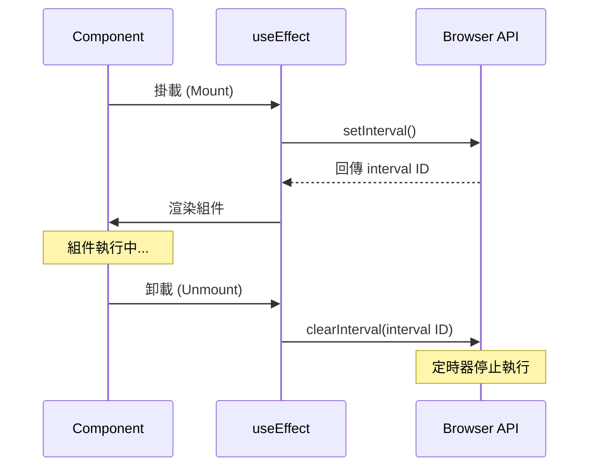
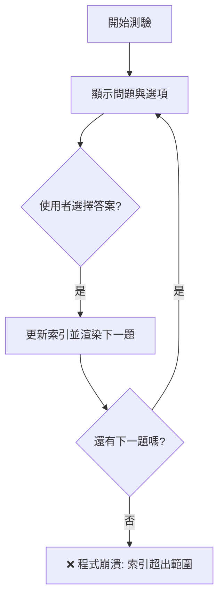
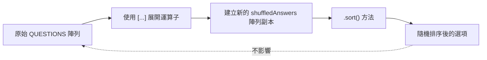
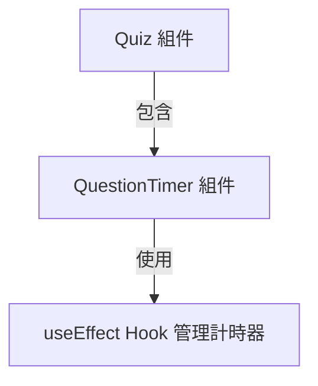
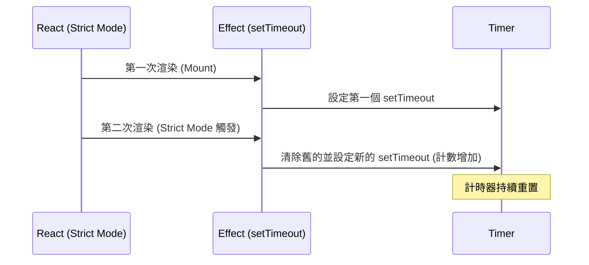
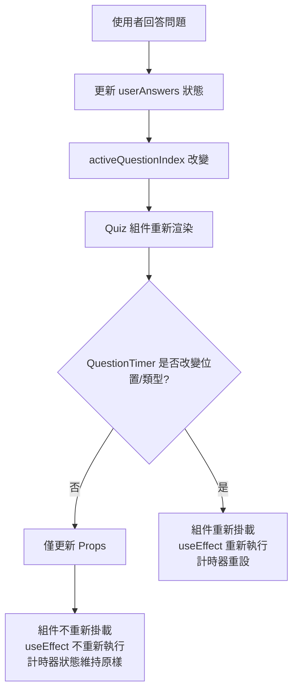
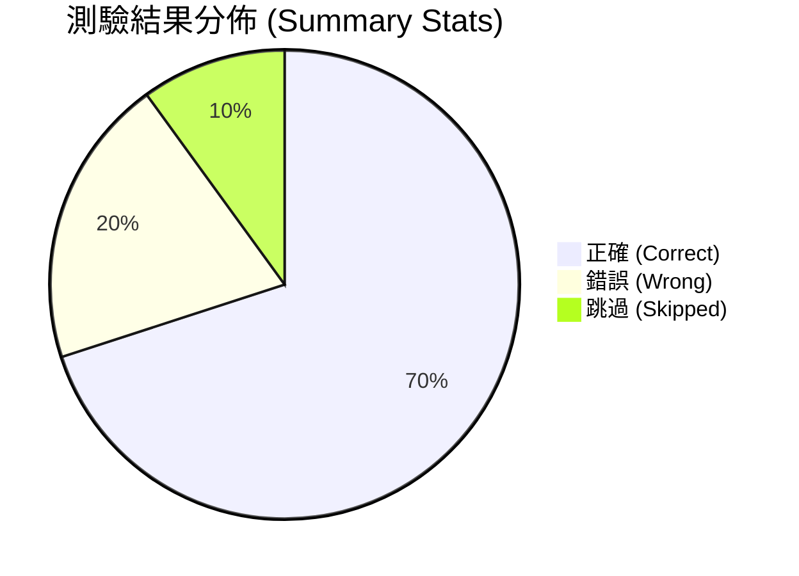

### DeleteConfirmation 組件功能擴充

- 目標：實作自動化刪除流程
    - Modal 在三秒後自動關閉
    - 自動執行刪除動作（confirm）
- **[相關檔案]** `DeleteConfirmation.jsx`
    - 負責渲染刪除確認彈窗的內容
    - 包含 `onConfirm` 與 `onCancel` 兩個 props

### 使用 `setTimeout` 實作定時功能

- 利用瀏覽器內建的 `setTimeout` 函數來設定定時器
- **[參數說明]** `setTimeout` 接收兩個主要參數：
    - 第一個參數：要執行的函數（callback function）
    - 第二個參數：延遲的時間，單位為毫秒（milliseconds）
- **[範例]** 若要設定三秒後執行動作，延遲時間應為 `3000`
    - `setTimeout(() => { ... }, 3000);`

### 在 `setTimeout` 中執行 `onConfirm`

- 在三秒後的定時器回呼函數中呼叫 `onConfirm`，以達成自動執行刪除動作
- **[程式碼實作]**

```javascript
setTimeout(() => {
      onConfirm();
  }, 3000);
```

- **[潛在問題]** 組件的渲染行為可能導致非預期的結果
    - 目前 `DeleteConfirmation` 與其父層 `Modal` 組件在 `App.jsx` 中都是持續渲染的
    - 雖然 `Modal` 在 DOM 中可能因為內部邏輯而不顯示，但組件本身仍處於渲染狀態，這會導致 `setTimeout` 在不正確的時機被觸發

### 解決定時器過早觸發的問題

- **[問題原因]** `DeleteConfirmation` 組件雖然在視覺上可能因為 `Modal` 的 `open` prop 而隱藏，但在技術層面上，它始終是 DOM 的一部分
    - 由於 `App` 組件在首次渲染時就會渲染 `DeleteConfirmation`
    - 這導致 `setTimeout` 定時器在應用程式啟動時就已經被設定並開始計時，而非在 Modal 真正開啟時才開始
- **[解決方案]** 使用條件渲染（Conditional Rendering）來控制組件的掛載（Mounting）
    - 只有當 `modalIsOpen` 為 `true` 時，才渲染 `DeleteConfirmation` 組件
    - 這樣可以確保組件只有在 Modal 開啟時才會進入生命週期，進而正確觸發 `setTimeout`
- **[程式碼實作]**

```javascript
<Modal open={modalIsOpen}>
  {modalIsOpen && (
    <DeleteConfirmation
      onCancel={handleStopRemovePlace}
      onConfirm={handleRemovePlace}
    />
  )}
</Modal>
```

### Modal 組件的優雅解決方案

- **[替代方案]** 不在 `App.jsx` 中處理條件渲染，而是將邏輯封裝在 `Modal` 組件內部
    - **[優點]** 讓 `App` 組件的程式碼更簡潔，不需要處理複雜的條件判斷
    - **[實作方式]** 在 `Modal` 組件內檢查 `open` 屬性，若為 `true` 則渲染 `children`，否則回傳 `null`
- **[程式碼實作]**

```javascript
// Modal.jsx
import { createPortal } from 'react-dom';

function Modal({ open, children }) {
  const dialog = useRef();

  useEffect(() => {
    if (open) {
      dialog.current.showModal();
    } else {
      dialog.current.close();
    }
  }, [open]);

  return createPortal(
    <dialog className="modal" ref={dialog}>
      {open && children}
    </dialog>,
    document.getElementById('modal')
  );
}
```

- **[效果]** 這種做法同樣能確保只有在 `open` 為 `true` 時，`children`（例如 `DeleteConfirmation`）才會被掛載到 DOM 中，從而避免定時器在組件啟動時就錯誤觸發。

### 驗證條件渲染的效果

- **[驗證方式]** 在 `DeleteConfirmation` 組件中加入 `console.log` 來檢查定時器是否在應用程式啟動時就立即執行
- **[實驗結果]** 重新整理頁面後，控制台（Console）並未立即出現日誌，證明透過 `Modal` 內部實作條件渲染後，定時器已成功避免在組件啟動時就錯誤觸發
- **[程式碼實作]**

```javascript
export default function DeleteConfirmation({ onConfirm, onCancel }) {
  console.log('TIMER SET');
  setTimeout(() => {
    onConfirm();
  }, 3000);

  return (
    // ... 組件內容
  );
}
```

### 尚未解決的問題：定時器清理

- **[問題描述]** 目前的實作雖然解決了掛載時機問題，但仍存在「定時器無法停止」的副作用
- **[情境分析]** 如果使用者在三秒定時器結束前，手動點擊了「No」按鈕取消操作，定時器仍會繼續計時並在三秒後執行 `onConfirm`，導致非預期的刪除行為
- **[結論]** 必須實作一種機制，在使用者取消操作或組件卸載時，能夠停止（clear）已經設定的定時器

### 定時器在組件卸載後仍會持續執行

- **[問題現象]** 使用者點擊「No」取消刪除操作後，三秒鐘後該項目仍然會從列表中消失
- **[問題核心]** 定時器與組件的顯示狀態是脫鉤的
    - 當 `DeleteConfirmation` 組件被渲染時，`setTimeout` 就已經啟動了
    - 即使用戶點擊取消導致組件從畫面中消失（卸載），該定時器仍會在背景獨立運行
    - 定時器並不會因為組件不再渲染而自動停止
- **[解決方向]** 需要利用 React 的 `useEffect` Hook 來管理定時器的生命週期，確保在組件卸載時能正確停止定時器

### 使用 `useEffect` 管理定時器

- **[實作方式]** 從 `react` 匯入 `useEffect`，並將 `setTimeout` 邏輯移入 `useEffect` 的 effect function 中
- **[程式碼實作]**

```javascript
import { useEffect } from 'react';

export default function DeleteConfirmation({ onConfirm, onCancel }) {
  useEffect(() => {
    console.log('TIMER SET');
    setTimeout(() => {
      onConfirm();
    }, 3000);
  }, []);

  return (
    // ... 組件內容
  );
}
```

- **[澄清觀念]** 這裡將定時器放入 `useEffect` 並不是因為：
    - 設定定時器本身有問題
    - 為了避免造成無限迴圈
- **[核心目的]** 這樣做的真正目的是為了利用 `useEffect` 提供的機制，讓我們能在組件消失（卸載）時，有機會去停止這個定時器

### 使用 `useEffect` 的清理函式 (Cleanup Function)

- **[核心問題]** 在 `DeleteConfirmation` 的案例中，問題不在於如何設定定時器，而在於如何「清理」它（即在組件消失時將其移除）
- **[解決方案]** `useEffect` 不僅可以定義副作用函式，還允許我們定義一個**清理函式 (cleanup function)**
- **[定義方式]** 透過在 `useEffect` 的回呼函式中 `return` 一個新的函式來定義清理邏輯
- **[執行時機]** 該清理函式會在下一次副作用函式重新執行之前，或是組件卸載 (unmount) 時被執行

### 實作定時器清理邏輯

- **[核心機制]** 在 `useEffect` 的 effect function 內部 `return` 一個函式，這就是清理函式
- **[執行時機]** React 會在以下兩種情況執行此清理函式：
    - 在下一次 effect function 重新執行之前
    - 在組件卸載 (unmount) 之前（即組件從 DOM 中移除前）
- **[實作步驟]**
    - 使用瀏覽器內建的 `clearTimeout()` 函式來停止定時器
    - `clearTimeout()` 需要一個定時器的引用 (reference) 作為參數
    - 透過 `setTimeout()` 的回傳值即可取得該定時器的引用
- **[程式碼實作]**

```javascript
import { useEffect } from 'react';

export default function DeleteConfirmation({ onConfirm, onCancel }) {
  useEffect(() => {
    console.log('TIMER SET');

    // 取得 setTimeout 回傳的定時器引用
    const timer = setTimeout(() => {
      onConfirm();
    }, 3000);

    // 回傳清理函式
    return () => {
      clearTimeout(timer);
    };
  }, []);

  return (
    // ... 組件內容
  );
}
```

### 清理函式的執行時機與依賴項細節

- **[執行機制]**
    - 當組件從 DOM 中移除（卸載）時，清理函式會執行，從而停止定時器。
    - **[重要細節]** 如果 Effect 函式因為依賴項改變而重新執行，React 會遵循以下順序：**先執行上一次的清理函式** $\rightarrow$ **再執行新的 Effect 函式**。
- **[依賴項與警告]**
    - 在目前的實作中，由於依賴陣列是空的 `[]`，Effect 函式不會重新執行，因此清理函式只會在組件卸載時觸發。
    - **[開發提醒]** 若在 Effect 函式內部使用了外部變數（如 `onConfirm`），應將其加入依賴陣列中，以避免因閉包（closure）導致的過時數據問題，並消除 ESLint 的警告。

### 關於依賴陣列的決策與驗證

- **[依賴項選擇]** 雖然 `onConfirm` 作為 prop 應該被加入 `useEffect` 的依賴陣列中，但目前刻意不加入
    - **[原因]** 這樣可以確保清理函式（cleanup function）只會在組件被移除（unmount）時執行一次
    - **[預期行為]** 如果將 `onConfirm` 加入依賴陣列，當該 prop 發生變化時，Effect 會重新執行，進而觸發清理函式並重新設定定時器
- **[功能驗證]** 測試目前的定時器邏輯是否正確
    - **[測試情境]** 開啟刪除確認對話框，然後點擊「取消 (No)"
    - **[觀察結果]** 控制台顯示 `TIMER SET`，但項目並未像之前遇到的問題那樣被「神奇地移除」
    - **[結論]** 這證明了目前的清理邏輯能有效防止在使用者取消操作後，定時器仍繼續執行導致錯誤刪除的情況

### 清理函式的執行時機細節

- **[執行時機澄清]** 清理函式（Cleanup function）**不會**在 Effect 函式第一次執行之前執行
- **[兩大觸發條件]** 清理函式僅在以下兩種情況下被觸發：
    - 在下一次 Effect 函式重新執行之前（用於清理舊的副作用）
    - 當組件被從 DOM 中移除（卸載/unmount）時
- **[實作驗證]** 透過在清理函式中加入 `console.log('Cleaning up timer')`，可以觀察到當使用者點擊「取消 (No)」導致組件消失時，該訊息會正確印出，證明定時器已被成功停止
- **[總結]** 確保正確處理 Effect 的清理邏輯與依賴項，是避免應用程式中出現怪異 bug 的關鍵。

### 完善 `useEffect` 的依賴陣列

- **[依賴項規則]** 如果在 Effect 函式內部使用了 props 或 state 的值，應將其加入依賴陣列中
- **[實作方式]** 將 `onConfirm` 加入依賴陣列時，只需將其作為值指向即可，不需要執行它
- **[多重依賴]** 若有複數個依賴項，只需使用逗號將它們分隔開來
- **[程式碼實作]**

```javascript
import { useEffect } from 'react';

export default function DeleteConfirmation({ onConfirm, onCancel }) {
  useEffect(() => {
    console.log('TIMER SET');

    const timer = setTimeout(() => {
      onConfirm();
    }, 3000);

    return () => {
      console.log('Cleaning up timer');
      clearTimeout(timer);
    };
  }, [onConfirm]); // 將 onConfirm 加入依賴陣列

  return (
    <div id="delete-confirmation">
      <h2>Are you sure?</h2>
      <p>Do you really want to remove this place?</p>
      <div id="confirmation-actions">
        {/* ... */}
      </div>
    </div>
  );
}
```

### 將函式作為依賴項的風險

- **[函式的本質]** 在 React 中，當我們將一個 prop（例如 `onConfirm`）加入依賴陣列時，我們必須意識到它本質上是一個函式
- **[無限迴圈的風險]** 將函式作為依賴項存在建立無限迴圈的危險
    - **[觸發機制]** 當你把某個值（例如 `open`）加入依賴陣列時，你是在告訴 React：「只要這個值發生變化，就重新執行這個 Effect 函式」
    - **[連鎖反應]** 如果 Effect 函式的執行過程中又導致了該依賴項的值發生變化，就會陷入「執行 Effect $\rightarrow$ 改變依賴項 $\rightarrow$ 觸發 Effect」的循環

### 函式作為依賴項的行為差異

- **[基本類型 vs 函式]**
    - 若依賴項是數字或字串，僅在該值改變時 Effect 會重新執行
    - 若依賴項是函式（如 `onConfirm`），情況會變得更複雜
- **[傳遞路徑分析]** 在 `Modal` 的範例中，依賴項的傳遞鏈如下：

    1. 在 `App` 組件中定義了 `handleRemovePlace` 函式
    2. 將該函式賦值給 `onConfirm` prop 並傳遞給 `DeleteConfirmation`
    3. `DeleteConfirmation` 再將 `onConfirm` 作為依賴項傳給 `useEffect`

- **[潛在問題]** 雖然 `handleRemovePlace` 的程式碼內容看起來沒變，但必須注意該函式在父組件中是如何被定義的，因為這會直接影響其引用（reference）是否在每次渲染時都發生變化

### JavaScript 函式的本質與重新建立機制

- **[函式的本質]** 在 JavaScript 中，函式不僅僅是程式碼塊，它們本質上也是**物件 (Objects)**
- **[重新建立機制]** 當組件函數（例如 `App`）重新執行時，其內部的所有變數與函式都會被重新建立
    - **[連鎖反應]** 即使函式的邏輯內容完全相同，每次執行時產生的都是一個全新的函式物件
    - **[引用變化]** 因為是全新的物件，其記憶體位址（引用）也會改變，這對 React 的依賴項比較機制來說，就等同於該值發生了變化
- **[程式碼範例]** 當 `App` 組件重新渲染時，以下內容會被重新初始化：

```javascript
function App() {
  // ... 其他 state

  // 每次 App 重新執行，這個函式物件都會被重新建立，引用會改變
  function handleRemovePlace() {
    // ... 刪除邏輯
  }

  // 同理，這裡定義的變數也會在每次渲染時重新賦值
  let hello = 1;

  // ...
}
```

### JavaScript 物件的引用特性

- **[物件的重新建立]** 當 `App` 組件重新執行時，定義在其中的函式（例如 `handleRemovePlace`）也會被重新建立
- **[引用不相等]** 在 JavaScript 中，函式是物件。即使兩個物件的結構或程式碼完全相同，只要它們是不同次建立的，它們就不是同一個物件
    - **[驗證方式]** 可以透過瀏覽器開發者工具（Developer Tools）的 **Console** 來驗證不同物件之間的引用是否相同
    - **[核心觀念]** 這種「內容相同但引用不同」的特性，是導致 React 依賴項比較失效（進而觸發 Effect）的根本原因

### JavaScript 函式比較實驗

- **[實驗過程]** 在 Console 中建立兩個內容完全相同的函式：

```javascript
function hello() { console.log('Hello'); }
  function hello2() { console.log('Hello'); }
```

- **[實驗結果]** 進行比較時會得到 `false`：

```javascript
hello === hello2 // false
```

- **[核心結論]**
    - JavaScript 不會因為兩個函式的程式碼內容相同就將它們視為相等
    - 這種特性適用於所有 JavaScript **物件 (Objects)**
- **[對 React 的影響]**
    - React 的 `useEffect` 依賴項比較是基於**引用 (Reference)** 的
    - 即使函式邏輯沒變，只要引用不同，React 就會認為依賴項已改變，進而重新執行副作用

### 物件與函式的引用比較實驗

- **[物件比較實驗]** 在 Console 中定義兩個結構與內容完全相同的物件：
    - `const a = { name: 'Max' };`
    - `const b = { name: 'Max' };`
    - **[實驗結果]** 兩者比較結果為 `false`：

```javascript
a === b // false
```

- **[核心觀念]**
    - 即使物件的「形狀 (shape)」與「值 (value)」完全一致，它們在記憶體中的引用仍不相等
    - 這證明了 JavaScript 對於物件的比較是基於**引用 (Reference)** 而非內容

### 引用變化對 React Effect 的連鎖反應

- **[依賴項失效的原因]** 由於物件與函式在比較時不相等，這會直接影響組件的渲染週期：
    - **[父組件重新渲染]** 當 `App` 組件重新執行時，會重新建立全新的 `handleRemovePlace` 函式物件
    - **[Prop 傳遞]** 這個全新的函式引用會被作為 `onConfirm` prop 傳遞給 `DeleteConfirmation` 組件
    - **[Effect 觸發]** `DeleteConfirmation` 中的 `useEffect` 偵測到 `onConfirm` 的引用發生了變化（即便程式碼邏輯沒變），因此會判定依賴項已改變，進而重新執行副作用

### 依賴項變化引發的無窮迴圈

- **[React 的比較機制]** React 在執行 `useEffect` 前，會將新的依賴項值與舊的值進行比較
    - **[引用比較]** 由於 JavaScript 函式是物件，每次重新渲染產生的函式引用都不同，React 會判定依賴項已改變
    - **[重新執行 Effect]** 即使函式的邏輯內容完全沒變，只要引用不同，React 就會重新執行該副作用函式
- **[無窮迴圈的成因]** 當副作用函式內部包含了「更新狀態」的邏輯時，會產生連鎖反應：

    1. **觸發 Effect**：依賴項引用改變，執行 `useEffect`
    2. **更新狀態**：在 Effect 內部呼叫狀態更新函式（如 `setState`）
    3. **重新渲染**：狀態更新導致組件重新渲染，進而重新建立全新的函式物件
    4. **循環開始**：全新的函式引用再次觸發 `useEffect`，回到步驟 1

```javascript
// 導致無窮迴圈的典型模式
useEffect(() => {
  // ... 執行某些邏輯
  setSomeState(newValue); // 這裡的狀態更新會觸發重新渲染，進而導致 Effect 再次執行
}, [onConfirm]); // 如果 onConfirm 的引用在每次渲染時都改變
```

### 為什麼此應用程式未陷入無窮迴圈

- **[潛在風險]** 根據先前的邏輯，`onConfirm` 被呼叫時會觸發狀態更新，這本應導致組件重新渲染，進而產生新的 `handleRemovePlace` 引用，再次觸發 Effect
- **[實際機制]** 在目前的實作中，這個連鎖反應會被中斷：
    - `onConfirm` 被執行時，會呼叫 `setModalIsOpen(false)`
    - 這會導致 `DeleteConfirmation` 組件從 DOM 中被移除
    - **[核心關鍵]** 因為組件已經不再存在於 DOM 中，它不會再進行下一次重新渲染，因此無窮迴圈的循環被成功切斷

### 模擬無窮迴圈實驗

- **[實驗設定]** 在 `App` 組件中暫時停用 `setModalIsOpen(false)`：
    - **[目的]** 防止 `DeleteConfirmation` 組件從 DOM 中被移除（Unmount）
    - **[預期行為]** 讓組件持續存在於 DOM 中，以便觀察連鎖反應
- **[連鎖反應過程]**

    1. **觸發更新**：執行 `onConfirm` 並更新其他狀態（如 `setPickedPlaces`）
    2. **重新渲染**：`App` 組件偵測到狀態改變，執行重新渲染
    3. **引用改變**：重新渲染產生了全新的 `handleRemovePlace` 函式引用
    4. **Effect 重啟**：由於 `DeleteConfirmation` 仍在 DOM 中，其 `useEffect` 偵測到新的 `onConfirm` 引用，再次執行副作用
    5. **循環形成**：回到步驟 1，形成無窮迴圈

- **[實驗結果]**
    - 當開啟 Modal 並等待計時器執行時，瀏覽器會因為不斷地重新渲染而陷入無窮迴圈狀態

### 無窮迴圈實驗的觀察結果

- **[實驗現象]** 在模擬無窮迴圈的過程中，瀏覽器 Console 會不斷顯示新的 Timer 被設定：
    - `TIMER SET` (來自 `DeleteConfirmation.jsx:5`) 會不斷重複出現
    - `Cleaning up timer` (來自 `DeleteConfirmation.jsx:11`) 也會隨之不斷觸發
- **[核心問題]** 這種現象代表組件在不斷地重新掛載與執行 Effect，直到手動移除該 Modal 為止

### 預告：更穩健的解決方案

- **[目前的做法]** 透過狀態更新來確保組件從 DOM 中移除，從而切斷連鎖反應
- **[潛在風險]** 如果組件因為某種原因沒有被移除，無窮迴圈就會持續發生
- **[更好的選擇]** 存在一種更安全、無論組件是否從 DOM 中移除都能有效防止此類問題的特殊 React Hook（將在後續章節介紹）

### 使用 `useCallback` 解決無窮迴圈

- **[問題回顧]** 當函式被作為 `useEffect` 的依賴項時，若該函式在每次渲染時都被重新建立（引用改變），會導致副作用不斷觸發，形成無窮迴圈
- **[解決方案]** 使用 React 提供的 `useCallback` Hook
    - **[核心機制]** `useCallback` 的目的是確保函式在特定的依賴項沒有改變之前，始終保持相同的引用（Reference）
    - **[預期效果]** 因為函式引用不再變動，`useEffect` 就不會因為偵測到「新」函式而誤判依賴項已改變，從而有效切斷無窮迴圈的連鎖反應

```javascript
// 在 App.jsx 中引入 useCallback
import { useRef, useState, useEffect, useCallback } from 'react';
```

### 使用 `useCallback` 的基本語法

- **[用法]** 將函式包裝在 `useCallback` 中，以確保其引用在重新渲染時保持不變
- **[參數結構]**
    - **第一個參數**：要被包裝的函式本身
    - **第二個參數**：依賴陣列 (dependencies array)，概念與 `useEffect` 相同
- **[回傳值]**
    - `useCallback` 會回傳被包裝後的那個函式，但這個回傳的函式具有「記憶性」，即在依賴項未改變前，它的引用（Reference）是固定的

```javascript
const handleRemovePlace = useCallback(function handleRemovePlace() {
  setPickedPlaces((prevPickedPlaces) =>
    prevPickedPlaces.filter((place) => place.id !== selectedPlace.current)
  );
  // ... 其他邏輯
}, [/* 依賴項 */]);
```

### `useCallback` 的運作機制與成效

- **[核心機制]** 當組件函數重新執行時，內部的函式通常會被重新建立（recreated）
    - **`useCallback`&#32;的作用**：React 會確保這個內層函式不會被重新建立
    - **實作方式**：React 會將該函式儲存在記憶體中，並在組件每次執行時重複使用（reuse）儲存好的同一個函式引用
- **[實際成效]** 透過將 `handleRemovePlace` 封裝在 `useCallback` 中：
    - 函式引用保持不變 $\rightarrow$ `useEffect` 偵測不到依賴項改變 $\rightarrow$ 不會觸發副作用
    - **[實驗觀察]** 在應用程式中加入元素並開啟 Modal 時，可以看到 `TIMER SET` 訊息被觸發，但不會再次重複出現，成功終結了無窮迴圈

### `useCallback` 的依賴陣列

- **[運作邏輯]** `useCallback` 同樣接收一個依賴陣列，其運作方式與 `useEffect` 的依賴陣列完全相同
- **[何時需要加入依賴項]** 任何在被包裝的函式內部所使用的 `prop` 或 `state` 值，都應該被加入依賴陣列中
- **[何時不需要加入依賴項]**
    - **狀態更新函式**：例如 `setPickedPlaces` 這種由 `useState` 提供的更新函式，不需要放入依賴陣列
    - **瀏覽器內建功能與全域物件**：例如 `localStorage` 或 `JSON` 物件，這些不會隨著組件重新渲染而改變，因此不需要被列入依賴項

```javascript
const handleRemovePlace = useCallback(function handleRemovePlace() {
  setPickedPlaces((prevPickedPlaces) =>
    prevPickedPlaces.filter((place) => place.id !== selectedPlace.current)
  );

  const storedIds = JSON.parse(localStorage.getItem('selectedPlaces')) || [];
  localStorage.setItem(
    'selectedPlaces',
    JSON.stringify(storedIds.filter((id) => id !== selectedPlace.current))
  );
}, []); // 這裡的依賴陣列為空，因為內部使用的都是不需要追蹤的值
```

### `useCallback` 的依賴項選擇準則

- **[核心原則]** 只有當值會隨著組件重新渲染而改變時，才需要放入依賴陣列
    - **應該加入的值**：來自組件的 `props` 或 `state` 值
    - **不需要加入的值**：例如 `localStorage` 或其他不會變動的全域物件/函式
- **[空依賴陣列的行為]**
    - 與 `useEffect` 類似，如果依賴陣列為空 `[]`，React 僅會在組件首次掛載時建立該函式
    - 由於沒有任何依賴項會改變，該函式的引用（Reference）將始終保持不變，不會被重新建立

```javascript
const handleRemovePlace = useCallback(function handleRemovePlace() {
  setPickedPlaces((prevPickedPlaces) =>
    prevPickedPlaces.filter((place) => place.id !== selectedPlace.current)
  );

  const storedIds = JSON.parse(localStorage.getItem('selectedPlaces')) || [];
  localStorage.setItem(
    'selectedPlaces',
    JSON.stringify(storedIds.filter((id) => id !== selectedPlace.current))
  );
}, []); // 使用空陣列確保函式引用在整個生命週期中保持穩定
```

### 結合聲明式控制與 `useCallback` 的安全性

- **[邏輯調整]** 在執行刪除邏輯後，重新啟用 `setModalIsOpen(false)` 以透過狀態控制 Modal 的關閉
- **[安全性保障]** 即使回到了聲明式控制（透過 `modalIsOpen` 狀態），仍然保留 `useCallback` 的必要性
    - **原因**：這提供了額外的安全性，確保該函式引用不會因為其他狀態更新而意外改變，進而避免觸發不必要的副作用

### `handleRemovePlace` 的完整實作邏輯

- **[資料讀取與解析]** 使用 `JSON.parse()` 將 `localStorage` 中的字串轉回 JavaScript 陣列
    - **[處理空值]** 使用 `|| []` 作為回退機制 (fallback)，避免當 `localStorage` 為空（回傳 `undefined`）時程式出錯
- **[資料更新與儲存]**
    - 透過 `filter()` 移除指定的 ID
    - 使用 `JSON.stringify()` 將處理後的陣列重新轉換為字串，以便存入 `localStorage`
- **[狀態同步]** 除了更新 `localStorage` 外，也必須同時呼叫 `setPickedPlaces` 來更新 React 的狀態，確保 UI 能即時反映變更

```javascript
const handleRemovePlace = useCallback(function handleRemovePlace() {
  // 1. 更新 React 狀態 (UI)
  setPickedPlaces((prevPickedPlaces) =>
    prevPickedPlaces.filter((place) => place.id !== selectedPlace.current)
  );

  // 2. 關閉 Modal
  setModalIsOpen(false);

  // 3. 更新 localStorage (持久化資料)
  const storedIds = JSON.parse(localStorage.getItem('selectedPlaces')) || [];
  localStorage.setItem(
    'selectedPlaces',
    JSON.stringify(storedIds.filter((id) => id !== selectedPlace.current))
  );
}, []);
```

### 新功能規劃：Modal 中的倒數進度條

- **[目前現況]** 當使用者刪除項目時，會彈出一個 Modal，背後有一個計時器（timer）在執行。目前 Modal 會在三秒後自動關閉並移除該項目。
- **[使用者體驗問題]** 目前使用者無法得知計時器的存在，項目會突然消失，這可能會讓使用者感到困惑或驚訝。
- **[解決方案]** 在 Modal 中加入一個**進度條 (Progress Bar)**
    - **視覺效果**：進度條會從「全滿」逐漸變為「全空」
    - **目的**：向使用者提供視覺提示，顯示倒數計時的進度，讓自動移除的行為變得可預測

### 實作倒數進度條

- **[UI 元件]** 在 `DeleteConfirmation` 組件中，於最後一個 `div` 之前加入 HTML 內建的 `<progress>` 元素
- **[核心挑戰]** 需要控制進度條的填滿狀態 (fill status)
- **[狀態管理]** 必須建立一個會頻繁變動的狀態 (state)
    - **原因**：進度條需要隨著時間推移不斷更新，因此必須頻繁觸發組件的重新渲染 (re-render)，才能讓進度條的視覺效果與倒數計時同步

### 實作倒數計時狀態管理

- **[建立狀態]** 在 `DeleteConfirmation` 組件中新增 `remainingTime` 狀態，用來追蹤倒數剩餘的時間
- **[設定初始值]** 將初始狀態設定為 3000 毫秒（即 3 秒），與預期的倒數時間一致
- **[使用全域常數]** 定義一個名為 `TIMER` 的全域常數，其值為 3000
    - **[優點]** 避免在程式碼中多次重複寫死（hardcode）數值，未來若要修改倒數時間，只需更改一處即可

```javascript
import { useEffect, useState } from 'react';

const TIMER = 3000;

export default function DeleteConfirmation({ onConfirm, onCancel }) {
  const [remainingTime, setRemainingTime] = useState(TIMER);

  useEffect(() => {
    console.log('TIMER SET');
    const timer = setTimeout(() => {
      onConfirm();
    }, TIMER);

    return () => {
      console.log('Cleaning up timer');
      clearTimeout(timer);
    };
  }, [onConfirm]);

  return (
    <div id="delete-confirmation">
      <h2>Are you sure?</h2>
      {/* ... */}
    </div>
  );
}
```

### 使用 `setInterval` 實現平滑動畫

- **[需求]** 為了讓進度條的動畫看起來平滑，我們需要每秒多次更新狀態（例如每 10 毫秒更新一次），而不是只在結束時更新一次。
- **[解決方案]** 使用瀏覽器內建的 `setInterval` 函式
    - **`setInterval`&#32;vs&#32;`setTimeout`**
        - `setTimeout`：設定一個定時器，在指定的時段過後**僅執行一次**指定的函式。
        - `setInterval`：定義一個函式，使其每隔指定的毫秒數就**重複執行**一次。

```javascript
// 範例：每 10 毫秒執行一次函式
setInterval(() => {
  // 更新狀態或執行邏輯
}, 10);
```

### 實作倒數計時邏輯

- **[更新機制]** 使用 `setInterval` 每 10 毫秒執行一次更新函式
- **[狀態更新技巧]** 使用狀態更新函式的「函數形式」(functional update)
    - **[原因]** 因為 `setInterval` 內部的回呼函式執行頻率極高，直接使用當前的 `remainingTime` 變數可能會因為閉包 (closure) 或非同步更新問題而拿到舊的值
    - **[作法]** 透過傳入一個函式給 `setRemainingTime`，React 會將「最新的狀態快照」作為參數傳入，確保計算正確

```javascript
// 在 setInterval 的回呼函式中更新狀態
setInterval(() => {
  setRemainingTime((prevTime) => prevTime - 10);
}, 10);
```

- **[視覺呈現]** 更新後的 `remainingTime` 會傳遞給 JSX 中的 `<progress>` 元件，使其視覺長度隨時間遞減

### 配置進度條視覺效果

- **[屬性綁定]** 使用 `<progress>` 元素來呈現視覺化的倒數進度
    - **`value`**：綁定至 `remainingTime` 狀態，隨著計時器更新而改變
    - **`max`**：設定為 `TIMER`（總倒數時間，例如 3000 毫秒），作為進度條填滿的基準值
- **[運作原理]** 瀏覽器會根據 `value / max` 的比例，自動計算並渲染進度條的填滿長度

```jsx
// 在 DeleteConfirmation 組件的 JSX 中實作
<progress value={remainingTime} max={TIMER} />
```

### 避免在組件中直接建立定時器

- **[問題]** 如果直接在組件函數體內呼叫 `setInterval`，會導致無窮迴圈
    - **[原因]** 組件函數每次執行（重新渲染）時，都會重新建立一個新的定時器，而定時器內部的狀態更新會再次觸發組件重新渲染，形成惡性循環

```javascript
// ❌ 錯誤做法：直接在組件內呼叫，會導致無窮迴圈
export default function DeleteConfirmation({ onConfirm, onCancel }) {
  const [remainingTime, setRemainingTime] = useState(TIMER);

  setInterval(() => {
    setRemainingTime((prevTime) => prevTime - 10);
  }, 10);

  // ...
}
```

- **[解決方案]** 使用 `useEffect` 鉤子來管理定時器的生命週期
    - **[作法]** 將 `setInterval` 邏輯移入 `useEffect` 的 Effect 函式中，並正確配置依賴陣列

```javascript
// ✅ 正確做法：將定時器封裝在 useEffect 中
export default function DeleteConfirmation({ onConfirm, onCancel }) {
  const [remainingTime, setRemainingTime] = useState(TIMER);

  useEffect(() => {
    const interval = setInterval(() => {
      setRemainingTime((prevTime) => prevTime - 10);
    }, 10);

    return () => {
      clearInterval(interval);
    };
  }, []); // 使用空依賴陣列確保只在掛載時執行一次

  // ...
}
```

### 驗證定時器執行狀況

- **[實驗方法]** 在 `setInterval` 的回呼函式中加入 `console.log`，以觀察定時器是否如預期每 10 毫秒執行一次

```javascript
useEffect(() => {
  setInterval(() => {
    console.log('INTERVAL');
    setRemainingTime((prevTime) => prevTime - 10);
  }, 10);
}, []);
```

- **[觀察結果]** 當 Modal 開啟時，Console 會持續輸出 `'INTERVAL'`，直到倒數結束並關閉 Modal
- **[潛在問題]** 若未實作清理邏輯，即便 Modal 已經關閉，定時器仍會持續在背景執行，導致不必要的運算與可能的錯誤

### 定時器清理的重要性

- **[問題]** 定時器在 Modal 關閉後依然「鎖定」並持續運行
- **[原因]** 因為程式碼中沒有呼叫 `clearInterval` 來停止該定時器
- **[解決方案]** 必須在 `useEffect` 的回呼函式中回傳一個清理函式，以確保組件卸載或 Effect 重新執行時能正確停止定時器

### 正確實作定時器清理

- **[核心概念]** 定時器（如 `setInterval`）在組件卸載後不會自動停止，必須手動清理以避免資源浪費或錯誤行為
- **[實作步驟]**
    - **1. 取得引用 (Reference)**：`setInterval` 會回傳一個代表該定時器的唯一 ID
    - **2. 儲存 ID**：將此 ID 儲存在一個常數或變數中
    - **3. 執行清理**：在 `useEffect` 的回傳函式（cleanup function）中使用瀏覽器內建的 `clearInterval()`，並將該 ID 作為參數傳入

```javascript
// ✅ 正確的定時器清理實作方式
useEffect(() => {
  // 1 & 2. 建立定時器並儲存其引用
  const interval = setInterval(() => {
    console.log('INTERVAL');
    setRemainingTime((prevTime) => prevTime - 10);
  }, 10);

  // 3. 回傳清理函式，確保定時器在組件卸載時停止
  return () => {
    clearInterval(interval);
  };
}, []);
```

- **[運作流程]**



### `useEffect` 的雙重保障作用

- **[防止無窮迴圈]**：透過正確配置依賴陣列（例如使用空陣列 `[]`），可以確保 Effect 僅在組件掛載時執行，避免因狀態更新導致組件重新渲染，進而觸發連鎖反應式的無限執行。
- **[避免效能損耗]**：透過實作清理函式（Cleanup function），可以在組件卸載（Unmount）或 Effect 重新執行前，停止如 `setInterval` 等持續運行的背景程序。

#### 實驗觀察：組件卸載後的行為

- **[情境]**：當 `DeleteConfirmation` 組件從 DOM 中移除（即 Modal 關閉）時
- **[觀察結果]**：
    - 若有正確實作清理函式，Console 會停止輸出 `'INTERVAL'` 訊息
    - 若未實作清理函式，定時器將會繼續在背景執行，造成不必要的運算負擔與效能損失

### 效能優化：減少頻繁的重新渲染

- **[現狀分析]** 在 `DeleteConfirmation` 組件中，目前使用 `setInterval` 每 10 毫秒更新一次狀態
    - 程式碼邏輯如下：

```javascript
useEffect(() => {
      const interval = setInterval(() => {
        console.log('INTERVAL');
        setRemainingTime((prevTime) => prevTime - 10);
      }, 10);

      return () => {
        clearInterval(interval);
      };
    }, []);
```

- **[效能問題]** 每 10 毫秒執行一次 `setRemainingTime` 會導致該組件也跟著每 10 毫秒重新渲染一次
    - 頻繁的渲染週期會消耗系統資源，對於複雜的應用程式來說，這是一個可以優化的效能瓶頸

### 效能優化：組件拆分策略

- **[現狀評估]** 目前的實作在現代電腦上雖然可行，且不會明顯拖慢應用程式，但並非最佳實踐 (not optimal)
- **[優化思路]** 將「進度指示器」及其相關的「狀態邏輯」外包 (outsource) 出去
    - **做法**：利用 `useEffect` Hook 將這些邏輯封裝到一個全新的、獨立的組件中
    - **目的**：確保只有這個單一的小組件會因為定時器而頻繁地重新執行 (re-execute)，而不會影響到整個應用程式的渲染效能

```javascript
// 目標結構示意
// 將原本在 DeleteConfirmation 中的定時器邏輯移至新組件
// 讓頻繁的狀態更新僅侷限於該新組件內部
```

### 實作倒數進度條組件

為了落實效能優化策略，將原本位於 `DeleteConfirmation` 中的狀態與副作用邏輯移至獨立的 `ProgressBar` 組件：

- **[重構步驟]**
    - 建立 `ProgressBar.jsx` 並匯出 `ProgressBar` 組件
    - 將 `remainingTime` 狀態從 `DeleteConfirmation` 移至 `ProgressBar` 中管理
    - 將 `useEffect` 定時器邏輯從 `DeleteConfirmation` 剪下並貼上至 `ProgressBar` 中
    - 在 `ProgressBar` 中回傳 `<progress>` 元素
    - 在 `DeleteConfirmation` 中移除相關狀態與副作用，改為直接渲染 `<ProgressBar />` 組

```javascript
// ProgressBar.jsx 實作範例
import { useState, useEffect } from 'react';

const TIMER = 3000;

export default function ProgressBar() {
  const [remainingTime, setRemainingTime] = useState(TIMER);

  useEffect(() => {
    const interval = setInterval(() => {
      console.log('INTERVAL');
      setRemainingTime((prevTime) => prevTime - 10);
    }, 10);

    return () => {
      clearInterval(interval);
    };
  }, []);

  return <progress value={remainingTime} max={TIMER} />;
}
```

- **[優化結果]**
    - 現在，每 10 毫秒一次的狀態更新僅會觸發 `ProgressBar` 組件的重新渲染
    - `DeleteConfirmation` 組件不再因為定時器而頻繁重新渲染，有效降低了效能負擔

### 整合 `ProgressBar` 組件

將定時器邏輯移至 `ProgressBar` 後，可以對 `DeleteConfirmation` 進行重構，使其變得更輕量：

- **[重構重點]**
    - 從 `react` 中移除不再需要的 `useState` 匯入
    - 匯入新組件：`import ProgressBar from './ProgressBar.jsx';`
    - 在 JSX 中直接使用 `<ProgressBar />`，不再需要處理 `remainingTime` 狀態

```javascript
// DeleteConfirmation.jsx 重構後的結構示意
import { useEffect } from 'react';
import ProgressBar from './ProgressBar.jsx';

const TIMER = 3000;

export default function DeleteConfirmation({ onConfirm, onCancel }) {
  useEffect(() => {
    console.log('TIMER SET');
    const timer = setTimeout(() => {
      onConfirm();
    }, TIMER);

    return () => {
      console.log('Cleaning up timer');
      clearTimeout(timer);
    };
  }, [onConfirm]);

  return (
    <div id="delete-confirmation">
      <h2>Are you sure?</h2>
      <p>Do you really want to remove this place?</p>
      <div id="confirmation-actions">
        <button onClick={onCancel} className="button-text">No</button>
        <button onClick={onConfirm} className="button">Yes</button>
      </div>
      <ProgressBar />
    </div>
  );
}
```

- **[效能提升的關鍵]**
    - 現在，每 10 毫秒一次的狀態更新僅會觸發 `ProgressBar` 組件的重新渲染
    - `DeleteConfirmation` 組件及其子組件（如按鈕）不再因為定時器而頻繁重新渲染

### 傳遞 Timer Prop 給 ProgressBar

為了讓 `ProgressBar` 的動畫時間能與 `DeleteConfirmation` 的邏輯同步，我們需要將 `TIMER` 常數作為 prop 傳遞下去：

- **[實作方式]**
    - 在 `DeleteConfirmation.jsx` 中，將 `<ProgressBar />` 修改為 `<ProgressBar timer={TIMER} />`

```javascript
// DeleteConfirmation.jsx
// ... 省略其他程式碼

return (
  <div id="delete-confirmation">
    <h2>Are you sure?</h2>
    <p>Do you really want to remove this place?</p>
    <div id="confirmation-actions">
      <button onClick={onCancel} className="button-text">No</button>
      <button onClick={onConfirm} className="button">Yes</button>
    </div>
    <ProgressBar timer={TIMER} />
  </div>
);
```

- **[功能驗證]**
    - 重新載入應用程式後，整個流程運作正常：
        - 可以新增地點
        - 點擊地點時會觸發刪除流程
        - Modal 會正確顯示，且 `ProgressBar` 會根據傳入的 `timer` 進行倒數

## Working with Effects: Practice & Dive Deeper

- **[課程目標]** 從零開始建立一個全新的示範專案，藉此深化對 React Effects 的理解
- **[核心練習重點]**
    - 應用現有的 React 與 Effects 知識
    - 深入探討 Effect 的依賴項 (Dependencies)
    - 掌握清理函式 (Cleanup functions) 的使用技巧

### 實作與深入探討的學習方式

- **[學習建議]** 建議在觀看影片的同時，嘗試自行動手實作這個全新的專案
- **[教學方式]** 將會一步步地從頭開始建立專案，並解釋每一個開發決策的原因
- **[核心目標]** 透過實際開發，理解如何將 Effects 與其他的 React 概念結合使用

### 實作專案準備

- **[專案版本]** 提供兩種開發環境供選擇
    - **本地版本 (Local version)**：需執行 `npm install` 安裝套件，並使用 `npm run dev` 啟動開發伺服器
    - **CodeSandbox 版本**：無需手動安裝套件，可直接在瀏覽器中運行
- **[開發流程]** 專案將從零開始 (from scratch) 逐步構建，並在開發過程中持續應用 Effects 相關技術

### Quiz 專案初始化

- **[專案目標]** 建立一個 Quiz 測驗 Web App
- **[目錄結構規劃]**
    - 在 `src` 資料夾下建立 `components` 資料夾，用於存放所有組件
- **[初始組件建立]**
    - `Header.jsx`：用於顯示頁面頂部的標題區域
    - `Quiz.jsx`：作為核心組件，負責控制整個測驗流程並渲染其他相關的測驗組件

### 實作 `Header` 組件

- **[組件定義]** 建立一個名為 `Header` 的函式組件，並使用 `export default` 進行匯出
- **[組件結構]** 使用內建的 `<header>` 元素作為容器，並包含以下內容：
    - ``：用於顯示 `quiz-logo.png` 圖片
    - `<h1>`：用於顯示頁面主標題 "React Quiz"

```jsx
export default function Header() {
  return (
    <header>

      <h1>React Quiz</h1>
    </header>
  );
}
```

### 實作 `Header` 組件圖片顯示

- **[實作步驟]** 為了在頁面頂部顯示 Logo，需要進行以下操作：
    - 從 `assets` 資料夾中匯入 `quiz-logo.png` 圖片
    - 在 `Header.jsx` 的 JSX 結構中使用 `` 標籤
- **[程式碼實作]** 修改後的 `Header.jsx` 如下：

```jsx
import logoImg from '../assets/quiz-logo.png'

export default function Header() {
  return (
    <header>

      <h1>React Quiz</h1>
    </header>
  );
}
```

### `Header` 組件圖片顯示細節

- **[圖片匯入與路徑處理]** 透過從 `assets` 資料夾匯入圖片，可以利用建置工具（如 Vite）的自動化功能
    - 直接將匯入的變數（如 `logoImg`）賦值給 `` 的 `src` 屬性
    - 建置工具會在幕後自動注入優化後的圖片路徑
- **[提升無障礙性]** 務必為 `` 標籤添加 `alt` 屬性，提供圖片的文字描述（例如 `alt="Quiz logo"`）
- **[程式碼實作]** 修改後的 `Header.jsx` 如下：

```jsx
import logoImg from '../assets/quiz-logo.png';

export default function Header() {
  return (
    <header>

      <h1>React Quiz</h1>
    </header>
  );
}
```

### 組件設計原則：精簡化

- **[核心原則]** 並非所有的組件都需要使用 `useState` 或 `useEffect`
    - 大多數組件僅負責渲染靜態內容或接收 Props，不需要複雜的狀態管理或副作用
    - 保持組件簡潔有助於提高程式碼的可讀性與效能

### 在 `App` 組件中整合 `Header`

- **[實作步驟]** 將建立好的 `Header` 組件引入主應用程式中
    - 在 `App.jsx` 中從 `./components/Header.jsx` 匯入 `Header`
    - 在 `App` 組件的 JSX 回傳值中加入 `<Header />`
- **[程式碼實作]** 修改後的 `App.jsx` 如下：

```jsx
import Header from './components/Header';

function App() {
  return <Header />;
}

export default App;
```

### 實作 `Quiz` 組件

- **[設計目標]** `Quiz` 組件是整個測驗流程的核心，需承擔以下職責：
    - 顯示目前正在進行的測驗問題 (currently active question)
    - 在使用者回答問題後，負責切換到下一個問題
    - 註冊並記錄使用者的答案
- **[初步實作]** 首先建立一個基礎的 `Quiz` 函式組件，用來渲染目前的題目內容：

```jsx
export default function Quiz() {
  return <p>Currently active question</p>;
}
```

### `Quiz` 組件狀態管理初步實作

- **[狀態管理需求]** 為了實現完整的測驗功能，`Quiz` 組件需要管理以下動態資訊：
    - 目前正在進行的問題 (currently active question)
    - 使用者所做的回答 (user answers)
- **[實作方式]** 使用 React 的 `useState` Hook 來建立這些狀態
- **[程式碼實作]** 在 `Quiz.jsx` 中引入並準備定義狀態：

```jsx
import { useState } from 'react';

export default function Quiz() {
  const [currentQuestionIndex, setCurrentQuestionIndex] = useState(0);

  return <p>Currently active Question</p>;
}
```

### `Quiz` 組件進階狀態管理

- **[核心邏輯]** 若已知問題是一個陣列，可以透過管理「目前問題的索引 (active question index)」來控制顯示內容
    - 當使用者回答完一個問題後，只需更新該索引值，即可切換至下一個問題
- **[程式碼實作]** 在 `Quiz.jsx` 中，使用 `useState` 來維護索引狀態：

```jsx
import { useState } from 'react';

export default function Quiz() {
  const [activeQuestionIndex, setActiveQuestionIndex] = useState(0);

  return <p>Currently active Question</p>;
}
```

### `Quiz` 組件：實作使用者答案狀態管理

- **[狀態管理需求]** 除了追蹤目前的問題索引外，還需要一個地方來記錄使用者在測驗過程中選擇的所有答案
- **[實作方式]** 建立一個名為 `userAnswers` 的狀態，其初始值為空陣列 `[]`。隨著測驗進行，會將每個問題的答案逐一新增至此陣列中
- **[程式碼實作]** 在 `Quiz.jsx` 中新增 `userAnswers` 狀態：

```jsx
import { useState } from 'react';

export default function Quiz() {
  const [activeQuestionIndex, setActiveQuestionIndex] = useState(0);
  const [userAnswers, setUserAnswers] = useState([]);

  return <p>Currently active Question</p>;
}
```

### `Quiz` 組件：管理使用者回答紀錄

- **[狀態管理需求]** 除了追蹤目前問題的索引外，還需要管理使用者在整個測驗過程中做出的所有選擇
- **[實作方式]** 使用 `useState` 建立一個空陣列來儲存這些答案
- **[程式碼實作]** 在 `Quiz.jsx` 中新增 `userAnswers` 狀態：

```jsx
import { useState } from 'react';

export default function Quiz() {
  const [activeQuestionIndex, setActiveQuestionIndex] = useState(0);
  const [userAnswers, setUserAnswers] = useState([]);

  return <p>Currently active Question</p>;
}
```

### 準備題目資料

- **[資料來源]** 為了讓 `Quiz` 組件有實際內容可以顯示，需要引入題目資料
- **[實作方式]** 建立一個獨立的 `questions.js` 檔案，並將其放置在與 `main.jsx` 相同的目錄下
- **[資料結構]** `questions.js` 導出一個包含題目物件的陣列，每個物件包含以下屬性：
    - `id`: 題目的唯一識別碼 (例如 `'q1'`)
    - `text`: 題目的問題描述
    - `answers`: 一個包含所有選項的陣列

```javascript
// questions.js 的資料結構範例
export default [
  {
    id: 'q1',
    text: 'Which of the following definitions best describes React.js?',
    answers: [
      'A library to build user interfaces with help of declarative code.',
      'A library for managing state in web applications.',
      'A framework to build user interfaces with help of imperative code.',
      'A library used for building mobile applications only.'
    ]
  },
  {
    id: 'q2',
    text: 'What purpose do React hooks serve?',
    answers: [
      'Enabling the use of state and other React features in functional components',
      'Creating responsive layouts in React applications',
      // ... 其他選項
    ]
  }
];
```

### 題目資料的設計細節

- **[資料結構]** 每個題目物件包含 `id`、`text` 以及 `answers` 陣列
- **[正確答案的判定邏輯]**
    - 在原始的 `questions.js` 資料中，**第一個選項永遠是正確答案**
    - **[為什麼這樣設計？]** 這樣可以在 Web App 的邏輯中，非常簡單地判斷使用者是否選對（只需檢查索引是否為 0）
- **[使用者體驗優化]**
    - 為了避免使用者每次都選第一個，在實際顯示給使用者看時，會對答案陣列進行**隨機洗牌 (shuffle)**

### `Quiz` 組件的狀態管理反思

- **[目前的實作方式]** 使用兩個獨立的狀態快照 (state snapshots) 來追蹤測驗進度：
    - `activeQuestionIndex`: 當前正在進行的問題索引
    - `userAnswers`: 使用者已選擇的所有答案陣列
- **[潛在問題]** 這種將相關邏輯拆分為兩個獨立狀態的做法可能不是最優的
    - **[思考點]** 當這兩個狀態之間存在緊密的邏輯關聯時，分別管理它們可能會增加維護難度或導致狀態不一致的風險

### 狀態管理的優化：使用衍生狀態 (Derived State)

- **[發現冗餘]** 在目前的 `Quiz` 組件中，`activeQuestionIndex` 狀態可能是多餘的
    - **[原因]** 我們已經有一個 `userAnswers` 陣列來儲存使用者做出的所有答案
- **[衍生狀態的概念]** 當前問題的索引可以透過 `userAnswers` 陣列的長度直接推導出來
    - **[推導邏輯]** 如果 `userAnswers` 陣列中有 2 個答案，表示使用者已經回答了前兩個問題，因此下一個要顯示的問題索引就是 2（因為索引從 0 開始）
- **[優點]**
    - 減少了需要管理的狀態數量
    - 確保了「當前問題」與「已回答答案數量」之間的邏輯一致性，避免狀態不同步的問題

### 實作衍生狀態 (Derived State)

- **[重構目標]** 移除冗餘的 `activeQuestionIndex` 狀態，改用計算值來代表當前題目索引
- **[計算邏輯]** 直接利用 `userAnswers` 陣列的長度 (`length`) 作為索引
    - **範例分析：**
        - 若 `userAnswers` 為空陣列 `[]` $\rightarrow$ `length` 為 `0` $\rightarrow$ 顯示第 1 題
        - 若 `userAnswers` 已包含 1 個答案 `['A']` $\rightarrow$ `length` 為 `1` $\rightarrow$ 顯示第 2 題
- **[優點]** 避免了手動管理多個相關狀態可能導致的同步問題，程式碼更簡潔且具備單一事實來源 (Single Source of Truth)

```javascript
// 重構後的 Quiz 組件部分程式碼
export default function Quiz() {
  const [userAnswers, setUserAnswers] = useState([]);

  // 使用衍生狀態取代 useState
  const activeQuestionIndex = userAnswers.length;

  return <p>Currently active Question</p>;
}
```

### React 狀態管理的最佳實踐

- **[核心原則]** 在撰寫 React 程式碼時，目標是管理盡可能少的狀態 (state)
    - **[做法]** 盡可能透過現有狀態來「衍生」出其他資訊 (derive state)，而非為每一項資訊都建立獨立的狀態
    - **[優點]** 減少狀態數量可以降低維護複雜度，並確保資料之間的一致性

### 實作題目呈現邏輯

- **[步驟]** 為了將題目呈現給使用者，需要結合以下兩者：

    1. 匯入的 `questions` 陣列（包含所有題目的資料源）
    2. 計算出的 `activeQuestionIndex`（決定目前要顯示哪一題）

- **[實作目標]** 從 `questions` 陣列中提取對應索引的題目內容，並將其文字 (`text`) 輸出到畫面上

### 實作題目內容呈現

- **[資料匯入]** 從上一層目錄匯入題目資料，為了區分原始資料與組件邏輯，可以將其命名為 `QUESTIONS`
- **[動態渲染邏輯]** 透過結合匯入的資料與衍生狀態，在 JSX 中提取並顯示特定題目的文字
    - 使用 `<h2>` 標籤來呈現題目內容
    - **[實作方式]** 存取 `QUESTIONS[activeQuestionIndex].text`

```javascript
import { useState } from 'react';
import QUESTIONS from '../questions.js';

export default function Quiz() {
  const [userAnswers, setUserAnswers] = useState([]);
  const activeQuestionIndex = userAnswers.length;

  return (
    <div>
      <h2>{QUESTIONS[activeQuestionIndex].text}</h2>
      {/* 後續將在此處呈現選項 */}
    </div>
  );
}
```

### 實作 Quiz 組件的 UI 結構

- **[結構設計]** 為了讓題目與選項擁有良好的視覺效果，需要建立層級化的 HTML 結構：
    - **容器層**：使用一個 `<div>` 並賦予 `id="question"`，以便套用 `index.css` 中預設的樣式（例如寬度、置中、邊框等）。
    - **題目層**：使用 `<h2>` 標籤來呈現當前題目的文字內容。
    - **選項層**：使用一個無序列表 `<ul>` 並賦予 `id="answers"`，用於動態渲染後續的選項內容。
- **[樣式應用]** 透過在 JSX 中指定 `id`，可以直接對接 `index.css` 裡定義好的樣式規則，例如 `#question` 的最大寬度與邊距設定。

```javascript
// Quiz 組件的 UI 實作部分
export default function Quiz() {
  const [userAnswers, setUserAnswers] = useState([]);
  const activeQuestionIndex = userAnswers.length;

  return (
    <div id="question">
      <h2>{QUESTIONS[activeQuestionIndex].text}</h2>
      <ul id="answers">
        {/* 選項將會在此處動態渲染 */}
      </ul>
    </div>
  );
}
```

### 實作選項的動態渲染

- **[渲染邏輯]** 除了顯示題目文字外，還需要將 `QUESTIONS[activeQuestionIndex].answers` 這個字串陣列轉換為 JSX 元素
    - 使用 `.map()` 方法遍歷選項陣列
    - 對於每個選項（`answer`），回傳一個 `<li>` 標籤
- **[關於 Key 的設定]** 在使用 map 渲染列表時，必須為每個項目提供一個 `key` 屬性
    - **[實作方式]** 由於本例中的選項皆為唯一的字串，因此可以直接將 `answer` 本身作為 `key`

```javascript
// Quiz 組件渲染選項的部分實作
return (
  <div id="question">
    <h2>{QUESTIONS[activeQuestionIndex].text}</h2>
    <ul id="answers">
      {QUESTIONS[activeQuestionIndex].answers.map((answer) => (
        <li key={answer}>{answer}</li>
      ))}
    </ul>
  </div>
);
```

### 實作選項的互動式渲染

- **[樣式與結構]** 為了讓選項具備良好的視覺效果與互動性，需要對 map 產生的元素進行進一步封裝：
    - **[CSS Class]** 為每個 `<li>` 元素加上 `className="answer"`，以便套用特定的樣式。
    - **[語義化按鈕]** 在 `<li>` 標籤內部使用 `<button>` 元素來包裹選項文字
        - **[原因]** 從語義化（Semantic）的角度來看，選項應該是可點擊且可選取的，因此使用 `button` 比單純的文字更符合 HTML 標準。
- **[事件處理預留]** 為了讓使用者可以點選答案，預計會實作一個 `handleSelectAnswer` 函式來處理點擊邏輯。

```javascript
// Quiz 組件渲染選項的進階實作
export default function Quiz() {
  const [userAnswers, setUserAnswers] = useState([]);
  const activeQuestionIndex = userAnswers.length;

  function handleSelectAnswer() {
    // 待實作：處理答案選擇邏輯
  }

  return (
    <div id="question">
      <h2>{QUESTIONS[activeQuestionIndex].text}</h2>
      <ul id="answers">
        {QUESTIONS[activeQuestionIndex].answers.map((answer) => (
          <li key={answer} className="answer">
            <button>{answer}</button>
          </li>
        ))}
      </ul>
    </div>
  );
}
```

### `Quiz` 組件：實作答案選擇邏輯

- **[事件綁定]** 為了讓使用者可以點選選項，需要在 `<button>` 元素上添加 `onClick` 屬性
    - **[觸發函式]** 將 `onClick` 指向 `handleSelectAnswer` 函式，當按鈕被按下時即可觸發該邏輯
- **[參數傳遞]** 為了讓處理函式知道使用者具體選了哪一個選項，必須將該選項的值作為參數傳遞進去
    - **[狀態更新]** 在 `handleSelectAnswer` 函式內部，接收到的 `selectedAnswer` 會被用來更新 `userAnswers` 狀態陣列，從而記錄使用者的回答

```javascript
// Quiz 組件的實作細節
export default function Quiz() {
  const [userAnswers, setUserAnswers] = useState([]);
  const activeQuestionIndex = userAnswers.length;

  function handleSelectAnswer(selectedAnswer) {
    setUserAnswers((prevUserAnswers) => {
      return [...prevUserAnswers, selectedAnswer];
    });
  }

  return (
    <div id="question">
      <h2>{QUESTIONS[activeQuestionIndex].text}</h2>
      <ul id="answers">
        {QUESTIONS[activeQuestionIndex].answers.map((answer) => (
          <li key={answer} className="answer">
            <button onClick={() => handleSelectAnswer(answer)}>{answer}</button>
          </li>
        ))}
      </ul>
    </div>
  );
}
```

### `Quiz` 組件：事件處理與參數傳遞細節

- **[為什麼需要箭頭函式]** 如果直接將 `handleSelectAnswer(answer)` 寫在 `onClick` 中，React 在解析這段程式碼時會**立即執行**該函式，而不是等到使用者點擊時才執行。
    - **[解決方案]** 使用箭頭函式將目標函式包裹起來，例如 `() => handleSelectAnswer(answer)`。
    - **[運作機制]** 這樣做會建立一個新的匿名函式作為 React 的事件處理器。當點擊發生時，React 會呼叫這個匿名函式，進而由我們完全控制如何將 `answer` 參數傳遞給 `handleSelectAnswer`。

```javascript
// 錯誤的寫法：這會導致組件在渲染時立即執行函式
<button onClick={handleSelectAnswer(answer)}>{answer}</button>

// 正確的寫法：使用箭頭函式包裹，確保僅在點擊時執行
<button onClick={() => handleSelectAnswer(answer)}>{answer}</button>
```

### `Quiz` 組件：事件處理器的執行機制

- **[運作原理]** 使用箭頭函式包裹目標函式（如 `() => handleSelectAnswer(answer)`）時，實際的執行流程如下：
    - **[第一層]** React 綁定的是外層的匿名箭頭函式。
    - **[第二層]** 當點擊事件發生時，React 會呼叫這個外層函式。
    - **[第三層]** 在該匿名函式的作用域內，才會執行我們自定義的目標函式（`handleSelectAnswer`），並將指定的參數（`answer`）傳遞進去。
- **[狀態更新的考量]**
    - **[維護歷史紀錄]** 在更新 `userAnswers` 狀態時，必須確保新的答案是被「加入」到現有的陣列中，而不是直接覆蓋掉舊的資料。
    - **[目的]** 這樣才能完整保留使用者在整個測驗過程中，針對先前所有問題所做出的回答紀錄。

### `Quiz` 組件：使用函式形式更新狀態

- **[狀態更新的最佳實踐]** 當新的狀態需要依賴於舊有的狀態值時，應該使用 `useState` 提供的「函式形式」來進行更新
    - **[原因]** 這樣可以確保我們處理的是當前狀態的「最新版本」（guaranteed latest version），避免在非同步更新過程中發生資料不一致的問題
- **[實作陣列累加]** 為了在不遺失先前已儲存答案的情況下加入新答案，需結合展開運算子（spread operator）
    - **[運作邏輯]** 在更新函式中，先透過 `...prevUserAnswers` 將舊有的所有元素展開，再將新的 `selectedAnswer` 加入陣列末尾，最後回傳這個全新的陣列

```javascript
// Quiz 組件中的狀態更新實作
function handleSelectAnswer(selectedAnswer) {
  setUserAnswers((prevUserAnswers) => {
    return [...prevUserAnswers, selectedAnswer];
  });
}
```

```javascript
// Quiz 組件中的狀態更新實作
function handleSelectAnswer(selectedAnswer) {
  setUserAnswers((prevUserAnswers) => {
    return [...prevUserAnswers, selectedAnswer];
  });
}
```

### `App` 組件：整合與渲染

- **[匯入組件]** 將先前開發完成的 `Quiz` 組件從 `./components/Quiz.jsx` 匯入到 `App.jsx` 中
- **[使用 React Fragment]**
    - **[原因]** 因為 `App` 組件需要同時渲染 `<Header />` 與 `<Quiz />` 兩個頂層元素，而 React 要求組件的 `return` 必須包含在單一根節點內
    - **[解決方案]** 使用 React 內建的 Fragment 語法 `<> ... </>` 來包裹這些元素，這樣既能滿足語法要求，又不會在實際的 DOM 中增加多餘的節點

```javascript
// App.jsx 的實作內容
import Header from './components/Header.jsx';
import Quiz from './components/Quiz.jsx';

function App() {
  return (
    <>
      <Header />
      <Quiz />
    </>
  );
}

export default App;
```

### `App` 組件：結構整合與樣式準備

- **[組件整合]** 在 `App` 組件中，透過 React Fragment 同時輸出 `<Header />` 與 `<Quiz />`，讓兩者並列呈現
- **[使用&#32;`<main>`&#32;標籤]**
    - **[實作]** 將 `<Quiz />` 組件包裹在 HTML 的 `<main>` 標籤內
    - **[目的]** 為了在樣式表（CSS）中更容易地針對測驗內容進行佈局與樣式控制，並增加 HTML 的語義化

```javascript
// App.jsx 的整合實作
import Header from './components/Header.jsx';
import Quiz from './components/Quiz.jsx';

function App() {
  return (
    <>
      <Header />
      <main>
        <Quiz />
      </main>
    </>
  );
}

export default App;
```

- **[UI 調整預告]** 雖然目前畫面已能正確顯示問題與選項，但樣式仍顯得不夠理想，需要回到 `Quiz.jsx` 調整其內部的 HTML 結構（例如在問題區域增加額外的 `<div>` 包裹）以優化呈現效果。

### `Quiz` 組件：UI 佈局優化

- **[新增容器層]** 在 `question` 的 `div` 外部再增加一層 `div`，並給予 `id="quiz"`
    - **[目的]** 為了讓整個測驗區域（包含問題與選項）都能在頁面中完美置中，並為未來可能新增的其他測驗元素預留佈局空間

```javascript
// Quiz.jsx 的結構調整
return (
  <div id="quiz">
    <div id="question">
      <h2>{QUESTIONS[activeQuestionIndex].text}</h2>
      <ul id="answers">
        {QUESTIONS[activeQuestionIndex].answers.map((answer) => (
          <li key={answer} className="answer">
            <button onClick={() => handleSelectAnswer(answer)}>{answer}</button>
          </li>
        ))}
      </ul>
    </div>
  </div>
);
```

- **[觀察目前的運行狀況]**
    - **[優點]** 目前可以透過點擊選項來順利切換並進度到不同的問題
    - **[潛在風險]** 當題目陣列（`QUESTIONS`）被消耗完畢（即索引超出範圍）時，應用程式會因為嘗試讀取不存在的屬性而崩潰



- **[功能驗證]** 目前應用程式的核心互動流程已可正常運作
    - 能夠正確顯示題目內容
    - 能夠正確渲染選項列表
    - 能夠透過點擊正確選擇答案

### `Quiz` 組件：功能優化規劃

- **[優化目標]** 提升測驗的互動品質與程式穩定性
    - **[洗牌選項]** 確保每次測驗時，選項的呈現順序是隨機的，避免使用者因記住順序而直接選出正確答案
    - **[處理結束狀態]** 當所有題目都回答完畢後，不應讓程式因為索引超出範圍而報錯，而是轉向顯示一個「總結畫面」（Summary Screen）
- **[實作初步規劃]**
    - 準備在 `Quiz.jsx` 中新增一個 `shuffledAnswers` 常數來處理洗牌後的資料

### `Quiz` 組件：實作選項洗牌功能

- **[實作洗牌邏輯]** 透過建立一個包含當前問題所有選項的新陣列，並對其進行排序來達到洗牌效果
    - **[使用展開運算子]** 使用 `[...QUESTIONS[activeQuestionIndex].answers]` 來展開原始答案陣列，確保我們是在一個新的陣列副本上進行操作
    - **[[為什麼要建立新陣列？]** 因為 JavaScript 內建的 `.sort()` 方法會直接修改（mutate）呼叫它的原陣列。為了保護原始的 `QUESTIONS` 資料不被更動，我們必須先複製一份副本

```javascript
// Quiz.jsx 中的洗牌實作
const shuffledAnswers = [...QUESTIONS[activeQuestionIndex].answers];
shuffledAnswers.sort();
```

- **[執行流程圖]**



### JavaScript `sort()` 方法的運作原理

- **[核心機制]** `sort()` 方法可以接收一個比較函式作為參數，透過函式回傳的數值來決定兩個元素的相對順序
    - **[比較邏輯]** 比較函式會接收兩個元素作為參數進行比對
    - **[回傳值與排序行為]**
        - **回傳負數 (Negative number)**：這兩個元素會被**交換位置**
        - **回傳正數 (Positive number)**：這兩個元素會**保持原有的順序**
        - **回傳零 (Zero)**：元素位置保持不變
- **[實作範例]** 在 `Quiz.jsx` 中，我們使用 `sort()` 來達成選項洗牌的效果

```javascript
// Quiz.jsx 中的洗牌實作
const shuffledAnswers = [...QUESTIONS[activeQuestionIndex].answers];
shuffledAnswers.sort((a, b) => {
  // 這裡的邏輯會決定選項的隨機排列順序
});
```

- **[為什麼要這樣做？]**
    - **[保持資料完整性]** 我們必須對 `QUESTIONS` 的副本進行 `sort()`，而不是直接對原始陣列操作
    - **[原因]** 因為原始陣列中，正確答案通常固定在第一個位置（例如索引 0），我們需要保留這個資訊來進行後續的答案驗證邏輯

### `Quiz` 組件：實作隨機洗牌邏輯

- **[實作隨機排序]** 為了讓每次測驗的選項順序都不同，可以在 `sort()` 方法中使用一個簡單的數學運算來達成洗牌效果
    - **[使用&#32;`Math.random() - 0.5`]**
        - `Math.random()` 會回傳一個介於 0 到 1 之間的數值（不含 1）
        - 減去 0.5 後，結果有 50% 的機率為負數，50% 的機率為正數
        - 根據 `sort()` 的機制，這會導致元素以隨機的順序被重新排列

```javascript
// Quiz.jsx 中的洗牌實作
const shuffledAnswers = [...QUESTIONS[activeQuestionIndex].answers];
shuffledAnswers.sort((a, b) => Math.random() - 0.5);
```

- **[渲染洗牌後的選項]** 在 JSX 的 `map()` 函式中，必須使用洗牌後的陣列 `shuffledAnswers` 而非原始的 `QUESTIONS[...].answers`，才能確保使用者看到的是隨機排列的選項

```jsx
// Quiz.jsx 中的渲染邏輯
<ul id="answers">
  {shuffledAnswers.map((answer) => (
    <li key={answer} className="answer">
      <button onClick={() => handleSelectAnswer(answer)}>
        {answer}
      </button>
    </li>
  ))}
</ul>
```

### `Quiz` 組件：驗證洗牌邏輯與邊界情況考量

- **[洗牌效果驗證]** 目前的實作已能達成每次重新載入頁面時，選項順序皆會隨機變化的目標
- **[潛在問題：測驗結束的處理]** 雖然核心邏輯正確，但目前的程式碼尚未處理「測驗結束」的情況
    - **[風險]** 如果使用者回答了所有的題目，目前的邏輯可能會導致應用程式崩潰
    - **[解決方案]** 必須加入判斷機制，來確認測驗是否已經結束（例如：當 `activeQuestionIndex` 超出題目總數時）

### `Quiz` 組件：實作測驗結束判斷

- **[建立衍生狀態]** 為了處理測驗結束的邊界情況，可以新增一個名為 `quizIsComplete` 的常數作為衍生狀態
    - **[判斷邏輯]** 當目前的題目索引（`activeQuestionIndex`）等於題目總數（`QUESTIONS.length`）時，代表所有題目都已回答完畢
    - **[目的]** 透過這個檢查，可以確保程式碼不會在嘗試存取不存在的題目索引時發生錯誤（例如超出陣列範圍）

```javascript
// Quiz.jsx 中的測驗結束判斷
const activeQuestionIndex = userAnswers.length;
const shuffledAnswers = [...QUESTIONS[activeQuestionIndex].answers];
shuffledAnswers.sort(() => Math.random() - 0.5);

const quizIsComplete = activeQuestionIndex === QUESTIONS.length;
```

### `Quiz` 組件：實作測驗結束的條件渲染

- **[根據狀態切換 UI]** 為了在測驗完成後提供不同的視覺回饋，可以在組件的 `return` 語句中使用 `if` 判斷式
    - **[判斷條件]** 檢查 `quizIsComplete` 是否為 `true`
    - **[顯示摘要頁面]** 如果測驗已結束，則回傳一個具有特定 ID（例如 `id="summary"`）的 `div`，內容包含：
        - 一個顯示「Quiz completed」的 `h2` 標題
        - 一張代表測驗完成的圖片（例如匯入 `quiz-complete.png`）

```jsx
// Quiz.jsx 中的條件渲染邏輯範例
if (quizIsComplete) {
  return (
    <div id="summary">
      <h2>Quiz completed</h2>

    </div>
  );
}

return (
  <div id="quiz">
    {/* 正常的測驗流程內容... */}
  </div>
);
```

### `Quiz` 組件：完善摘要頁面實作

- **[匯入結束圖片]** 從資產目錄中匯入用於測驗完成時顯示的圖片
    - 路徑：`../assets/quiz-complete.png`
    - 匯入名稱：`quizCompleteImg`
- **[實作摘要頁面的 JSX 結構]** 當 `quizIsComplete` 為 `true` 時，回傳一個包含標題與圖片的 `div` 容器
    - **[圖片屬性設定]** 使用 `alt="Trophy icon"` 來提供圖片的替代文字描述

```jsx
// Quiz.jsx 中的摘要頁面實作
import quizCompleteImg from '../assets/quiz-complete.png';

// ...

if (quizIsComplete) {
  return (
    <div id="summary">

      <h2>Quiz Completed!</h2>
    </div>
  );
}
```

- **[驗證邊界情況]** 透過實際操作流程（回答所有題目）來確認應用程式在進入最後一個狀態時，能夠正確觸發條件渲染並顯示摘要頁面，而不是因為嘗試存取不存在的題目資料而導致程式崩潰

### `Quiz` 組件：修正執行順序以避免崩潰

- **[錯誤原因]** 在目前的程式碼結構中，即便已經計算了 `quizIsComplete`，程式碼仍會在 `if (quizIsComplete)` 判斷式之前嘗試執行以下邏輯：
    - 存取 `QUESTIONS[activeQuestionIndex]` 來取得答案陣列
    - 對該陣列進行洗牌（shuffle）操作
- **[崩潰風險]** 當測驗結束時，`activeQuestionIndex` 會等於 `QUESTIONS.length`。此時嘗試存取 `QUESTIONS[activeQuestionIndex]` 會得到 `undefined`，進而導致程式在執行 `.answers` 或 `.sort()` 時崩潰
- **[解決方案]** 必須將所有依賴於「尚有題目可顯示」的邏輯，移動到 `if (quizIsComplete)` 判斷區塊之後

```javascript
// 正確的邏輯順序
if (quizIsComplete) {
  return (
    <div id="summary">

      <h2>Quiz Completed!</h2>
    </div>
  );
}

// 只有在測驗未結束時，才會執行到這裡，確保 activeQuestionIndex 是有效的
const activeQuestionIndex = userAnswers.length;
const shuffledAnswers = [...QUESTIONS[activeQuestionIndex].answers];
shuffledAnswers.sort(() => Math.random() - 0.5);

return (
  <div id="quiz">
    {/* ... 渲染題目與選項 ... */}
  </div>
);
```

### `Quiz` 組件：驗證測驗完成流程

- **[UI 驗證]** 實際操作測驗流程後，確認當所有題目回答完畢時，介面能正確從題目內容切換至摘要頁面
    - **[呈現內容]** 摘要頁面顯示「QUIZ COMPLETED!」標題以及獎盃圖示
    - **[邏輯確認]** 此視覺結果證實了先前加入的 `quizIsComplete` 判斷邏輯與條件渲染實作是正確且有效的

### `Quiz` 組件：新增限時回答功能

- **[新增功能目標]** 為每一題增加時間限制，以提升測驗的挑戰性
    - **[限時機制]** 設定固定的回答時間（例如 15 秒）
    - **[視覺回饋]** 實作一個進度條 (Progress Bar)，隨著時間流逝逐漸減少，讓使用者直觀感受剩餘時間
    - **[自動切換]** 當計時器到期（時間耗盡）時，系統應自動跳轉至下一題
- **[後續開發計畫]** 在完成限時功能後，將著手開發「遊戲結束」畫面，用以顯示使用者的統計資訊（如回答正確的題目數量）

### `Quiz` 組件：實作限時回答功能

- **[功能邏輯]** 若使用者未能在限定時間內回答問題，則不記錄任何答案
- **[實作方式]** 將使用 `useEffect` 來管理計時邏輯
- **[架構優化]** 由於 `Quiz` 組件目前的規模與複雜度正在增加，決定將計時器邏輯抽離（outsource）到一個全新的獨立組件中

### 新增 `QuestionTimer` 組件

- **[建立檔案]** 在 `components` 目錄下新增 `QuestionTimer.jsx`
- **[組件定義]** 匯出一個名為 `QuestionTimer` 的函數組件

```javascript
// QuestionTimer.jsx
export default function QuestionTimer() {
  return ;
}
```



### 實作 `QuestionTimer` 的基本結構

- **[UI 呈現]** 使用 HTML 的 `<progress>` 元素來顯示進度條
    - **[樣式標記]** 為 `<progress>` 元素添加 `id="question-time"`，以便於 CSS 進行樣式設定
- **[計時邏輯規劃]** 為了讓計時器在特定時間後到期，計畫使用 JavaScript 內建的 `setTimeout` 函式

```javascript
// QuestionTimer.jsx 實作初步階段
export default function QuestionTimer() {
  setTimeout(() => {
    // 時間到期後的邏輯
  }, 15000); // 假設為 15 秒

  return <progress id="question-time" />;
}
```

### 實作 `QuestionTimer` 的可配置化

- **[設計目標]** 避免在組件內部硬編碼 (hard-code) 計時時間，使其成為一個可配置的通用組件
    - 透過 Props 傳遞計時長度，讓父組件（如 `Quiz`）決定具體的秒數
- **[實作細節]** 使用解構賦值 (destructuring) 從 `props` 中取得 `timeout` 參數

```javascript
// QuestionTimer.jsx
export default function QuestionTimer({ timeout }) {
  setTimeout(() => {
    // 計時結束後的邏輯
  }, timeout);

  return <progress id="question-time" />;
}
```

- **[通訊機制規劃]** 當計時器到期時，`QuestionTimer` 需要具備「通知」父組件的能力
    - 雖然目前僅規劃，但邏輯上應透過傳入的 callback function 來實現，讓父組件能接收到「時間到期」的訊號

### 實作 `QuestionTimer` 的通訊機制

- **[設計邏輯]** 由於 `Quiz` 組件負責管理當前題目的索引（`activeQuestionIndex`），因此當計時結束時，必須通知 `Quiz` 組件進行切換
    - 透過在 `QuestionTimer` 中新增一個 `onTimeout` prop 來達成此目的
- **[實作方式]** 在 `setTimeout` 的回呼函式中直接呼叫 `onTimeout`

```javascript
// QuestionTimer.jsx
export default function QuestionTimer({ timeout, onTimeout }) {
  setTimeout(onTimeout, timeout);

  return <progress id="question-time" />;
}
```

- **[開發細節]** 目前尚未在 `QuestionTimer` 中使用 `useEffect`，因為 `setTimeout` 本身就是一個由瀏覽器在指定時間後執行的非同步函式

### `QuestionTimer` 的副作用與動畫規劃

- **[目前的實作狀態]** 目前在組件主體中直接使用 `setTimeout` 尚不需要 `useEffect`
    - **[原因]** 目前的程式碼並未涉及更新組件狀態 (state)，也沒有嘗試與尚未掛載的 DOM 元素進行互動，因此不存在造成無限迴圈的風險

```javascript
// QuestionTimer.jsx
export default function QuestionTimer({ timeout, onTimeout }) {
  setTimeout(onTimeout, timeout);

  return <progress id="question-time" />;
}
```

- **[下一步規劃：進度條動畫]** 為了讓 `<progress>` 進度條能平滑地顯示剩餘時間，僅靠 `setTimeout` 是不夠的
    - **[解決方案]** 需要引入 `setInterval`，讓程式碼每隔幾毫秒執行一次，藉此持續更新進度條的狀態值

### 實作 `QuestionTimer` 的狀態管理

- **[引入狀態]** 為了讓進度條能在每隔幾毫秒時隨狀態改變而重新渲染，需要引入 `useState` Hook
- **[定義狀態]** 建立一個名為 `remainingTime` 的狀態，用來記錄當前的倒數時間
    - **[初始值]** 將初始值設定為從 props 傳入的 `timeout` 值，因為組件剛渲染時，剩餘時間即為總計時長
    - **[更新頻率]** 計畫每隔 10 毫秒更新一次該狀態，以達成平滑的視覺效果

```javascript
// QuestionTimer.jsx
import { useState } from 'react';

export default function QuestionTimer({ timeout, onTimeout }) {
  const [remainingTime, setRemainingTime] = useState(timeout);

  setTimeout(onTimeout, timeout);

  return <progress id="question-time" />;
}
```

### 實作平滑的進度條動畫

- **[引入 setInterval]** 為了讓進度條能每隔一段時間（例如 100 毫秒）更新一次，需要使用 `setInterval`
- **[狀態更新策略]** 在 `setInterval` 的回呼函式中，必須使用狀態更新函式的「函數形式」(functional update)
    - **[原因]** 因為新的 `remainingTime` 是基於「前一個狀態值」進行計算（例如減去 100 毫秒），使用函數形式可以確保我們拿到的 `prevRemainingTime` 永遠是最新的值

```javascript
// QuestionTimer.jsx
export default function QuestionTimer({ timeout, onTimeout }) {
  const [remainingTime, setRemainingTime] = useState(timeout);

  setTimeout(onTimeout, timeout);

  setInterval(() => {
    setRemainingTime((prevRemainingTime) => prevRemainingTime - 100);
  }, 100);

  return <progress id="question-time" />;
}
```

- **[無窮迴圈問題]** 如果直接在組件函數體內呼叫 `setInterval`，會導致以下連鎖反應：
    - `setInterval` 執行回呼函式，觸發 `setRemainingTime` 更新狀態
    - 狀態更新導致組件重新渲染 (re-execute component function)
    - 重新渲染時又會建立一個新的 `setInterval`
    - 新的定時器再次觸發狀態更新，如此循環往復，形成無窮迴圈
- **[解決方案：使用&#32;`useEffect`]** 為了避免上述問題，必須將定時器邏輯封裝在 `useEffect` Hook 中
    - **[運作機制]** `useEffect` 允許我們將副作用邏輯與組件的渲染過程分離，並透過依賴陣列 (dependencies array) 來控制其執行時機

```javascript
// QuestionTimer.jsx
import { useState, useEffect } from 'react';

export default function QuestionTimer({ timeout, onTimeout }) {
  const [remainingTime, setRemainingTime] = useState(timeout);

  setTimeout(onTimeout, timeout);

  useEffect(() => {
    setInterval(() => {
      setRemainingTime((prevRemainingTime) => prevRemainingTime - 100);
    }, 100);
  }, []);

  return <progress id="question-time" />;
}
```

### 完善 `QuestionTimer` 的副作用管理

- **[封裝&#32;`setTimeout`]** 除了處理定時器，原本的 `setTimeout` 也需要被包在 `useEffect` 內
    - **[原因]** 因為當 `remainingTime` 狀態每隔 100 毫秒更新一次時，組件會頻繁重新渲染。如果不使用 `useEffect`，每次渲染都會重新建立一個新的 `setTimeout`，這會導致計時邏輯混亂
- **[依賴陣列的配置]** 在這個 `useEffect` 中，依賴陣列可以設定為空陣列 `[]`
    - **[原因]** 因為該 Effect 函式內部並沒有使用到任何 props 或目前的 state 值，因此不需要將它們加入依賴項，這樣可以確保 Effect 僅在組件掛載時執行一次

```javascript
// QuestionTimer.jsx
import { useState, useEffect } from 'react';

export default function QuestionTimer({ timeout, onTimeout }) {
  const [remainingTime, setRemainingTime] = useState(timeout);

  useEffect(() => {
    setTimeout(onTimeout, timeout);
  }, []);

  useEffect(() => {
    const interval = setInterval(() => {
      setRemainingTime((prevRemainingTime) => prevRemainingTime - 100);
    }, 100);
    // 註：清理函式應在此處實作以避免記憶體洩漏
  }, []);

  return <progress id="question-time" />;
}
```

### `QuestionTimer` 的 `useEffect` 依賴項配置

- **[處理超時邏輯的依賴項]** 在封裝 `setTimeout` 的 `useEffect` 中，必須將 `timeout` 與 `onTimeout` 都加入依賴陣列
    - **[原因]** 因為這兩個值都是 Effect 函式內部使用的 props。將它們加入依賴項可以確保當這些 props 改變時，Effect 會重新執行，以使用最新的值

```javascript
// QuestionTimer.jsx
import { useState, useEffect } from 'react';

export default function QuestionTimer({ timeout, onTimeout }) {
  const [remainingTime, setRemainingTime] = useState(timeout);

  // 處理超時邏輯的 Effect
  useEffect(() => {
    setTimeout(onTimeout, timeout);
  }, [timeout, onTimeout]);

  // 處理進度條動畫的 Effect
  useEffect(() => {
    const interval = setInterval(() => {
      setRemainingTime((prevRemainingTime) => prevRemainingTime - 100);
    }, 100);
    // 註：實務上應在此處實作 clearInterval 以進行清理
  }, []);

  return <progress id="question-time" />;
}
```

### 實作進度條視覺化

- **[連接狀態與 UI]** 使用 `remainingTime` 狀態來動態更新 `<progress>` 元素的數值
- **[設定屬性]** 透過 HTML 屬性來控制進度條的行為：
    - `max`: 設定為從 props 傳入的 `timeout` 總時長
    - `value`: 設定為目前的 `remainingTime` 剩餘時間

```javascript
// QuestionTimer.jsx
// ... 前略

  return <progress id="question-time" max={timeout} value={remainingTime} />;
}
```

### `Quiz` 組件：整合 `QuestionTimer`

- **[匯入組件]** 從 `./QuestionTimer.jsx` 匯入 `QuestionTimer`
- **[組件放置]** 將 `<QuestionTimer />` 放置在題目容器 (`div id="question"`) 內，位於題目文字 (`h2`) 的上方
- **[必要 Props]** 使用時必須設定以下兩個屬性，否則計時器無法正確運作：
    - `timeout`: 設定總時長
    - `onTimeout`: 設定時間到時後的處理函式

```javascript
// Quiz.jsx
import QuestionTimer from './QuestionTimer.jsx';

// ...

return (
  <div id="quiz">
    <div id="question">
      <QuestionTimer timeout={timeout} onTimeout={onTimeout} />
      <h2>{QUESTIONS[activeQuestionIndex].text}</h2>
      {/* ... 其他內容 */}
    </div>
  </div>
);
```

### `Quiz` 組件：設定 `QuestionTimer` 的參數

- **[設定總時長]** `timeout` 屬性必須以**毫秒 (milliseconds)** 為單位
    - 例如：若要設定 10 秒的計時器，應傳入 `10000`
- **[處理超時行為]** `onTimeout` 屬性應傳入一個函式，在計時器結束時執行
    - **[實作方式]** 可以使用箭頭函式來傳遞特定的值給處理函式
    - **[處理未回答狀況]** 透過傳入 `null`，可以在計時器到時時，於 `userAnswers` 陣列中新增一個 `null` 項目，代表該題使用者未作答

```javascript
// Quiz.jsx
<QuestionTimer
  timeout={10000}
  onTimeout={() => handleSelectAnswer(null)}
/>
```

- **[作為佔位符]** 在 `onTimeout` 中傳遞 `null` 並非代表一個實際的選項答案
    - **[用途]** 它是作為一個佔位符 (placeholder)，用來告訴程式該題目使用者「沒有選擇任何答案」

### `QuestionTimer` 的異常行為觀察

- **[進度條未重置]** 當題目切換到下一題時，`<progress>` 元素的進度條顯示為空，而非根據新的 `timeout` 重新開始計時
- **[計時器副作用殘留]** 觀察到計時器在視覺上看似已結束，但實際上似乎仍在背景運行，導致切換題目時的行為不符合預期
- **[待解決問題]** 需要修正計時器與組件狀態之間的同步機制，確保每次題目切換時，計時器都能正確重置

### 使用 Console Log 偵測計時器行為

- **[偵錯手段]** 在 `QuestionTimer.jsx` 的兩個 `useEffect` 中分別加入 `console.log` 以確認 Effect 是否按預期執行
    - 在設定 `setTimeout` 的 Effect 中加入 `console.log('SETTING TIMEOUT')`
    - 在設定 `setInterval` 的 Effect 中加入 `console.log('SETTING INTERVAL')`

```javascript
// QuestionTimer.jsx
export default function QuestionTimer({ timeout, onTimeout }) {
  const [remainingTime, setRemainingTime] = useState(timeout);

  useEffect(() => {
    console.log('SETTING TIMEOUT');
    setTimeout(onTimeout, timeout);
  }, [timeout, onTimeout]);

  useEffect(() => {
    console.log('SETTING INTERVAL');
    setInterval(() => {
      setRemainingTime((prevRemainingTime) => prevRemainingTime - 100);
    }, 100);
  }, []);

  return <progress id="question-time" max={timeout} value={remainingTime} />;
}
```

- **[觀察結果]** 在瀏覽器控制台 (Console) 中會看到 Log 出現兩次
    - **[原因]** 這是因為在 `main.jsx` 中使用了 `<React.StrictMode>` 包裹應用程式
    - **[目的]** Strict Mode 會刻意在開發環境中重複執行 Effect，以確保開發者有實作正確的清理 (Cleanup) 邏輯

### 計時器行為的進階觀察

- **[Strict Mode 的影響]** 由於整個應用程式被 `<React.StrictMode>` 包裹，React 會在背後呼叫組件函數兩次，這有助於捕捉潛在問題
- **[計時器重置現象]** 重新整理頁面後觀察到以下行為：
    - 當目前的計時器到期時，似乎沒有立即發生預期動作
    - 但隨後一段時間後，會設定一個新的計時器
    - **[注意]** 這裡只會設定新的 `setTimeout`，而不會重新設定 `setInterval`
- **[控制台 Log 的變化]** 透過觀察 `console.log` 可以發現計時器正在被不斷重置
    - `SETTING TIMEOUT` 的訊息前方會出現一個數字（例如從 1 增加到 2、3...）
    - 這個遞增的數字反映了 `setTimeout` 被重新執行的次數



### `QuestionTimer` 的 Effect 執行邏輯分析

- **[異常現象]** 觀察到 `SETTING TIMEOUT` 的 Log 會持續出現，這意味著第一個 `useEffect` 不斷被執行
- **[看似矛盾的點]**
    - `QuestionTimer` 組件在 `Quiz` 渲染時就已經建立，之後並沒有被重新建立 (recreated)
    - 當使用者選擇答案導致 `Quiz` 重新渲染時，`QuestionTimer` 的組件實例（Instance）依然存在於舊的 JSX 與新的 JSX 之中
    - 相較之下，負責 `setInterval` 的第二個 `useEffect` 則不會再次執行
- **[核心原因]** Effect 的執行並非取決於組件實例是否改變，而是取決於其**依賴陣列 (dependency array)** 中的值是否發生變化
    - 在 `QuestionTimer.jsx` 中，第一個 Effect 的依賴項包含 `onTimeout`
    - 因為 `onTimeout` 是從父組件 `Quiz` 傳遞下來的函式，而該函式在每次 `Quiz` 重新渲染時都會產生新的引用 (reference)，導致 `useEffect` 判定依賴項已變動，進而觸發重新執行

### 深入分析 `onTimeout` 依賴項的變動原因

- **[排除法分析]** 為什麼第一個 `useEffect` 會不斷執行？
    - **[`timeout`&#32;屬性]** 該值始終為 `10000`（10 秒），是一個基本類型（primitive），其值不會改變，因此不會觸發 Effect。
    - **[`onTimeout`&#32;屬性]** 由於 `timeout` 是穩定的，問題必然出在 `onTimeout` 這個函式上。
- **[核心問題：函式引用變動]**
    - 在 React 中，當組件重新渲染時，如果父組件定義的函式沒有被「固定」下來（例如使用 `useCallback`），那麼每次渲染都會產生一個**全新的函式引用**。
    - 因為 `onTimeout` 的引用在每次渲染時都不同，React 會判定依賴項已變動，進而導致 `useEffect` 被重複執行。

```javascript
// QuestionTimer.jsx 中的依賴項
useEffect(() => {
  console.log('SETTING TIMEOUT');
  setTimeout(onTimeout, timeout);
}, [timeout, onTimeout]); // onTimeout 的引用變動是關鍵
```

### JavaScript 函式的引用特性與重新渲染

- **[核心觀念]** 在 JavaScript 中，函式本質上是**物件 (Objects)**
    - 當函式被建立時，它會在記憶體中佔用一個特定的位置
    - 即使兩個函式的邏輯與程式碼完全相同，只要它們是分別建立的，它們在記憶體中的**值（引用/Reference）**就是不同的
- **[JSX 中的行為]** 當 React 組件重新渲染時，會重新評估 (re-evaluate) JSX 程式碼
    - 如果在 JSX 內部定義了匿名函式（例如透過箭頭函式 `() => ...`），每次渲染都會產生一個**全新的函式物件**
    - 這意味著該函式的記憶體位址每次都會改變

```javascript
// 在 Quiz 組件的 JSX 中
<QuestionTimer
  timeout={10000}
  onTimeout={() => handleSelectAnswer(null)}
/>
```

- **[導致的問題]** 這種特性會直接影響 `useEffect` 的執行
    - 如前所述，`onTimeout` 被作為 `QuestionTimer` 的依賴項
    - 因為每次渲染產生的 `onTimeout` 引用都不同，React 會判定依賴項已變動
    - 結果導致 `useEffect` 被不斷地重新觸發，形成無窮迴圈或非預期的副作用執行

### 使用 `useCallback` 穩定函式引用

- **[問題重現]** 在 `Quiz` 組件的 JSX 中，如果直接傳遞匿名函式給 `QuestionTimer`：
        - 當使用者選擇答案導致 `Quiz` 狀態更新時，`Quiz` 會重新渲染
        - 重新渲染會導致 JSX 中的匿名函式被重新建立，產生新的引用
        - 這會導致 `QuestionTimer` 的 `useEffect` 偵測到 `onTimeout` 依賴項變動，進而再次觸發 Effect

```javascript
// 會導致問題的寫法：每次渲染都會產生新引用
<QuestionTimer
  timeout={10000}
  onTimeout={() => handleSelectAnswer(null)}
/>
```

- **[解決方案：`useCallback`]** 使用 `useCallback` Hook 來包裹處理函式，確保只有在特定依賴項變動時，函式的引用才會改變
    - 這能防止子組件因父組件重新渲染而接收到「看起來不一樣」的函式
    - **[實作注意]** 為了遵守 Hooks 的規則（不能在巢狀代碼或條件語句中使用），應將 `useCallback` 定義在組件頂層，而非 JSX 內部

```javascript
// 預計的優化方向
const handleSelectAnswer = useCallback((selectedAnswer) => {
  // ... 邏輯內容
}, [/* 依賴項 */]);
```

### 實作 `handleSkipAnswer` 與 `useCallback` 的應用

- **[建立跳過邏輯]** 為了處理計時器到期（timer expired）的情況，需要建立一個專門的函式 `handleSkipAnswer`
    - 當計時結束時，該函式會被呼叫，其行為等同於使用者未回答直接進入下一題（即傳入 `null` 給 `handleSelectAnswer`）
- **[穩定函式引用]** 使用 `useCallback` 來包裹 `handleSkipAnswer`，將原本定義在組件內的函式轉換為穩定的引用
    - 這能確保當 `Quiz` 組件重新渲染時，傳遞給 `QuestionTimer` 的 `onTimeout` prop 不會因為函式引用改變而導致計時器不斷重置

```javascript
// 在 Quiz 組件中實作穩定的跳過函式
const handleSkipAnswer = useCallback(() => {
  handleSelectAnswer(null);
}, [handleSelectAnswer]); // 必須將 handleSelectAnswer 加入依賴陣列
```

- **[依賴項 (Dependencies) 的重要性]**
    - `useCallback` 的第二個參數必須包含函式內部所使用的所有外部變數或函式
    - 在此案例中，因為 `handleSkipAnswer` 內部呼叫了 `handleSelectAnswer`，所以必須將其列入依賴陣列，以確保當 `handleSelectAnswer` 發生變化時，跳過函式也能同步更新。

### 完善 `handleSkipAnswer` 的依賴項

- **[修正依賴陣列]** 在 `handleSkipAnswer` 的 `useCallback` 依賴陣列中，必須加入 `handleSelectAnswer`
    - 因為 `handleSkipAnswer` 內部呼叫了 `handleSelectAnswer`
    - 由於 `handleSelectAnswer` 是在組件內部建立的函式，它可能會依賴於 props 或 state，因此其引用可能會改變
    - 如果不將其加入依賴陣列，當 `handleSelectAnswer` 更新時，`handleSkipAnswer` 可能仍會持有舊的函式引用（閉包問題）
- **[優化&#32;`handleSelectAnswer`&#32;的引用]** 為了確保整個函式鏈的穩定性，`handleSelectAnswer` 本身也應該使用 `useCallback` 包裹

```javascript
// 完整的穩定化實作範例
const handleSelectAnswer = useCallback((selectedAnswer) => {
  setUserAnswers((prevUserAnswers) => {
    return [...prevUserAnswers, selectedAnswer];
  });
}, []); // 這裡的依賴項取決於函式內是否使用了其他會變動的變數

const handleSkipAnswer = useCallback(() => {
  handleSelectAnswer(null);
}, [handleSelectAnswer]); // 確保 handleSkipAnswer 隨 handleSelectAnswer 的變化而更新
```

### `handleSelectAnswer` 的依賴項優化

- **[狀態更新函式的穩定性]** 在 `handleSelectAnswer` 的 `useCallback` 依賴陣列中不需要加入 `setUserAnswers`
    - React 保證狀態更新函式（如 `setUserAnswers`）的引用在組件的整個生命週期內都不會改變
    - 由於 `handleSelectAnswer` 內部僅使用了 `setUserAnswers` 且沒有引用其他會變動的 props 或 state，因此其依賴陣列可以保持為空 `[]`

```javascript
const handleSelectAnswer = useCallback(function handleSelectAnswer(selectedAnswer) {
  setUserAnswers((prevUserAnswers) => {
    return [...prevUserAnswers, selectedAnswer];
  });
}, []); // 不需要加入 setUserAnswers
```

- **[達成函式引用的穩定]** 透過上述優化，我們現在擁有了不會因為組件重新渲染而重新建立的函式
    - 這意味著 `handleSkipAnswer` 現在可以穩定地傳遞給 `<QuestionTimer />` 的 `onTimeout` prop

```javascript
// 傳遞給 QuestionTimer 的穩定函式
<QuestionTimer
  timeout={10000}
  onTimeout={handleSkipAnswer}
/>
```

### 觀察定時器的執行行為

- **[重新整理後的初始狀態]** 重新整理頁面時，`timeout` 與 `interval` 會被正確地進行初始設定
- **[切換題目時的行為]** 當移動到新題目時，`timeout` 並不會再次被自動設定
- **[目前的行為問題]** 在計時器到期後，存在一個奇怪的暫停時間，導致無法立即切換到下一個答案或下一題
    - 這是目前實作中的一個待解決問題，將會在後續課程中進行修正

### 分析計時器行為異常的原因

- **[觀察到的異常現象]** 進度條耗盡速度與實際定時器時間不符
    - 設定的 `timeout` 為 10 秒，但進度條在約 5 秒時就已歸零
    - 進度條歸零後，系統並未立即切換題目，而是存在數秒的延遲
- **[根本原因]** `setInterval` 被觸發了兩次
    - 由於某種原因（後續會探討），背景同時運行了兩個計時器實例
    - 這兩個計時器都在不斷更新相同的狀態，導致狀態更新的速度變成了原本的兩倍

```javascript
// QuestionTimer.jsx 中的實作邏輯
useEffect(() => {
  console.log('SETTING TIMEOUT');
  setTimeout(onTimeout, timeout);
}, [timeout, onTimeout]);

useEffect(() => {
  console.log('SETTING INTERVAL');
  setInterval(() => {
    setRemainingTime((prevRemainingTime) => prevRemainingTime - 100);
  }, 100);
}, []);

return <progress id="question-time" max={timeout} value={remainingTime} />;
```

### React Strict Mode 的行為

- **[開發環境下的特性]** 在 `main.jsx` 中開啟了 `React.StrictMode`
    - 在開發環境中，Strict Mode 會在幕後將每個組件函數執行兩次
    - 這會導致 `console.log` 出現兩次（例如在 `QuestionTimer.jsx` 中看到兩個 `SETTING TIMEOUT` 與兩個 `SETTING INTERVAL`）
- **[設計目的]** 這種重複執行的機制是為了幫助開發者捕捉潛在的錯誤
    - 理論上，無論組件函數是被執行一次還是多次，應用程式的行為都應該保持一致
    - 如果組件在多次執行下產生了不同的結果，則代表程式碼中可能存在不當的副作用或邏輯問題

```javascript
// main.jsx 中的設定
import React from 'react';
import ReactDOM from 'react-dom/client';
import App from './App.jsx';
import './index.css';

ReactDOM.createRoot(document.getElementById('root')).render(
  <React.StrictMode>
    <App />
  </React.StrictMode>
);
```

### 識別計時器重複執行的 Bug

- **[觀察到的問題]** `useEffect` 函式會被多次執行，導致背景中同時運行多個 `setInterval` 實例
    - 即使 `QuestionTimer` 組件的實例本身沒有改變，當父組件（`Quiz`）重新渲染時，該 Effect 仍會被觸發
    - 這會造成計時器速度異常（例如進度條跑得比預期快），因為多個計時器都在同時更新同一個狀態
- \*\*[解決方案] 清理函式 (Cleanup Function)](#使用`useEffect`的清理函式 (Cleanup Function))
    - 必須在 `useEffect` 中實作清理函式，用來清除（clear）現有的計時器
    - 透過清理舊的計時器，即使 Effect 函式因為依賴項改變或 Strict Mode 而被執行多次，也能確保背景始終只有一個有效的計時器在運行

### 實作計時器清理邏輯

- **[解決問題]** 避免舊的計時器在切換題目時持續運行
    - 目前若移動到不同題目，舊的計時器不會被重設，這會導致邏輯錯誤
    - 必須確保在任何時候，背景都只有一個有效的計時器在運行
- **[實作方式]** 利用 `useEffect` 的清理函式 (Cleanup Function)
    - 將 `setInterval` 的回傳值（即計時器實例）存儲在一個常數中
    - 在 `useEffect` 的回傳值中呼叫 `clearInterval` 來停止該計時器

```javascript
// QuestionTimer.jsx 中的實作邏輯
useEffect(() => {
  console.log('SETTING INTERVAL');
  const interval = setInterval(() => {
    setRemainingTime((prevRemainingTime) => prevRemainingTime - 100);
  }, 100);

  return () => {
    clearInterval(interval);
  };
}, []);
```

### `useEffect` 清理函式的執行時機與必要性

- **[執行時機]** 清理函式會在以下兩種情況下由 React 自動執行：
    - 在下一次 Effect 函式重新執行之前
    - 當組件從 DOM 中卸載（unmount）時（例如組件從螢幕上消失）
- **[實作細節]** 在 `QuestionTimer` 中，除了需要清理 `setInterval`，也必須清理 `setTimeout`
    - **[原因]** 若不清理 `setTimeout`，當組件因為進入「遊戲結束（Game Over）」畫面而被移除時，定時器仍會繼續運行，可能導致非預期的行為

```javascript
// QuestionTimer.jsx 中的實作細節
useEffect(() => {
  console.log('SETTING TIMEOUT');
  const timer = setTimeout(onTimeout, timeout);

  return () => {
    clearTimeout(timer);
  };
}, [timeout, onTimeout]);

useEffect(() => {
  console.log('SETTING INTERVAL');
  const interval = setInterval(() => {
    setRemainingTime((prevRemainingTime) => prevRemainingTime - 100);
  }, 100);

  return () => {
    clearInterval(interval);
  };
}, []);
```

### `QuestionTimer` 組件：實作 `setTimeout` 清理邏輯

- **[解決問題]** 防止進度條異常快速消耗
    - 若不清理 `setTimeout`，定時器會在背景持續運行，導致進度條動畫不符合預期
- **[實作方式]** 將定時器引用存儲在常數中，並於清理函式中執行 `clearTimeout`

```javascript
// QuestionTimer.jsx 中的實作細節
useEffect(() => {
  console.log('SETTING TIMEOUT');
  const timer = setTimeout(onTimeout, timeout);

  return () => {
    clearTimeout(timer);
  };
}, [timeout, onTimeout]);
```

- **[驗證結果]** 重新載入頁面後，進度條會按照預期的速度消耗，並在時間結束時正確切換到下一題
- **[發現新問題]** 雖然計時器能正確停止，但當題目切換時，計時器與進度條的狀態（例如剩餘時間）並沒有被重設，這需要進一步處理

### 為什麼計時器不會隨題目切換而重設

- **[問題現象]** 當使用者回答問題並切換到下一題時，`QuestionTimer` 的進度條與剩餘時間並沒有回到初始狀態
- **[核心原因]** `QuestionTimer` 組件在 DOM 中並沒有被重新建立 (recreated)
    - 在 `Quiz` 組件中，切換題目的動作是透過更新 `userAnswers` 狀態來改變 `activeQuestionIndex` (衍生狀態)
    - 當 `activeQuestionIndex` 改變時，`Quiz` 組件會重新渲染 (re-render)
    - 然而，由於 `QuestionTimer` 在 JSX 中的結構與位置保持不變，React 會認為這是一個相同的組件，因此只會更新其屬性 (props)，而不會重新掛載 (remount) 組件
    - **[結果]** 因為組件沒有重新掛載，其內部的 `useEffect` (負責啟動計時器的部分) 也不會再次執行，導致舊的計時器狀態被保留下來



### 為什麼計時器不會隨題目切換而重設

- **[核心原因]** 組件的生命週期與 DOM 結構
    - 當題目切換時，雖然顯示的文字（問題與選項）改變了，但 `QuestionTimer` 組件本身仍然存在於 DOM 中
    - 因為組件沒有被卸載 (unmount) 也沒有重新掛載 (remount)，所以組件內部的 `useEffect` 與 `setInterval` 不會重新執行，導致計時器狀態無法重置
- **[解決方案]** 使用 `key` 屬性強制重新掛載
    - 在 React 中，為組件添加一個獨特的 `key` 是一個強大的技巧
    - 當 `key` 的值發生改變時，React 會認為這是一個全新的組件，從而強制該組件卸載舊實例並重新掛載新實例
    - 這會觸發組件內部的 `useEffect` 重新執行，從而達到重置計時器的目的

```javascript
// Quiz.jsx 中的實作方式
// 透過將 activeQuestionIndex 作為 key，當索引改變時，QuestionTimer 會被迫重新掛載
<QuestionTimer
  key={activeQuestionIndex}
  timeout={10000}
  onTimeout={handleSkipAnswer}
/>
```

### `key` 屬性的進階用途

- **[基本用途] 列表渲染優化**
    - 在輸出列表數據時，`key` 幫助 React 識別不同的列表項目
    - 這讓 React 能在底層高效地管理列表的更新與變動
- **[進階用途] 強制組件重新掛載**
    - `key` 是 React 的內建屬性，可以添加到任何元素或組件上
    - **[核心機制]** 當組件的 `key` 發生變化時，即使該組件並非列表的一部分，React 也會執行以下動作：

        1. 銷毀 (Destroy) 舊的組件實例
        2. 建立 (Create) 並掛載全新的組件實例

    - **[應用場景]** 透過改變 `key` 的值，可以強制重置組件內部的所有狀態與副作用（如 `useEffect`）

### 實作計時器重設

- **[解決方案]** 為 `QuestionTimer` 組件添加 `key` 屬性
    - 將 `key` 設定為 `activeQuestionIndex`
    - **[運作原理]** 當題目切換時，`activeQuestionIndex` 會改變，這會觸發 React 卸載舊的 `QuestionTimer` 實例並建立一個全新的實例（unmount and remount）
    - **[結果]** 這樣就能確保每次切換到新題目時，計時器與進度條都會回到初始狀態並重新開始倒數

```javascript
// Quiz.jsx 中的實作
<QuestionTimer
  key={activeQuestionIndex}
  timeout={10000}
  onTimeout={handleSkipAnswer}
/>
```

- **[驗證結果]** 實作此變更後，當進度條耗盡並切換到下一題時，進度條會立刻跳回初始位置並重新開始計時

### `key` 屬性的實務應用總結

- **[核心技巧]** 利用 `key` 驅動組件生命週期
    - 當 `activeQuestionIndex` 改變時，由於 `key` 也隨之改變，React 會強制執行以下流程：

        1. 卸載 (Unmount) 舊的 `QuestionTimer` 實例
        2. 啟動新的計時器 (New interval)
        3. 重新掛載 (Mount) 全新的組件實例

    - **[優點]** 這能確保在自動切換題目的過程中，每一題的計時器都能從頭開始，不會受到前一題殘留狀態的影響。

### 優化使用者回答後的互動流程

- **[目標]** 提升使用者體驗，讓使用者在回答問題後能清楚看到結果，而不是瞬間跳到下一題
- **[計畫的互動步驟]**

    1. **高亮顯示 (Highlighting)**

        - 使用者點擊選項後，該選項應立即呈現高亮狀態

    1. **顏色回饋 (Color Feedback)**

        - 約一秒後，根據答案是否正確改變顏色
        - 正確答案 $\rightarrow$ 綠色
        - 錯誤答案 $\rightarrow$ 紅色

    1. **延遲切換 (Delayed Transition)**

        - 在顯示顏色回饋後，再等待約兩秒鐘
        - 接著才自動載入下一題
- **[優點]** 這種設計能「鎖定」答案狀態，讓使用者有足夠的時間消化剛才的選擇與結果

### 修改 `handleSelectAnswer` 以支援視覺回饋

- **[目前問題]** 現有的 `handleSelectAnswer` 會立即將答案存入 `userAnswers` 陣列
    - 這會導致 `activeQuestionIndex` 立即增加，進而直接切換到下一題，使用者無法看到選項變色的效果
- **[實作計畫]** 改變答案處理的邏輯
    - **不要**立即更新 `userAnswers` 陣列
    - **改為**先管理一個新的狀態（state），專門用來記錄「當前被選中的答案"
    - **目的**：這樣可以先改變選項的顏色，在延遲一段時間後，才正式將答案存入 `userAnswers` 並切換題目

### 實作使用者回答的狀態管理

- **[新增狀態]** 引入 `answerState` 來追蹤當前題目的回答狀態
    - 初始值設定為空字串 `''`，用以表示該題目尚未被回答
    - **[目的]** 提供一個明確的標記，讓組件知道現在應該顯示「已回答」的視覺效果（如變色）
- **[修改&#32;`handleSelectAnswer`]** 調整點擊選項後的處理邏輯
    - 首先呼叫 `setAnswerState('answered')` 將狀態切換為已回答
    - 接著使用 `setTimeout` 來延遲執行真正的答案儲存與題目切換動作

```javascript
// Quiz.jsx 中的實作邏輯
const [answerState, setAnswerState] = useState('');
const [userAnswers, setUserAnswers] = useState([]);

const handleSelectAnswer = useCallback((selectedAnswer) => {
  setAnswerState('answered'); // 立即改變狀態以觸發視覺回饋

  setUserAnswers((prevUserAnswers) => {
    return [...prevUserAnswers, selectedAnswer];
  });

  // 延遲執行，例如延遲 1 秒後再進行後續邏輯
  setTimeout(() => {
    // 後續切換題目的邏輯...
  }, 1000);
}, []);
```

### 完善 `handleSelectAnswer` 的判斷邏輯

- **[邏輯流程]** 在 `setTimeout` 的回調函式中加入判斷式，以決定下一步的視覺回饋
    - **步驟 1**：透過 `if` 檢查 `selectedAnswer` 是否等於該題目的正確答案 (`questions[activeQuestionIndex].correctAnswer`)
    - **步驟 2**：根據判斷結果，將 `answerState` 更新為 `'correct'` 或 `'wrong'`
    - **目的**：這個狀態變更會觸發重新渲染，讓我們能根據 `'correct'` 或 `'wrong'` 來改變選項的 CSS 樣式

```javascript
// Quiz.jsx 中的實作細節
const handleSelectAnswer = useCallback((selectedAnswer) => {
  setAnswerState('answered');
  setUserAnswers((prevUserAnswers) => {
    return [...prevUserAnswers, selectedAnswer];
  });

  setTimeout(() => {
    if (selectedAnswer === questions[activeQuestionIndex].correctAnswer) {
      setAnswerState('correct');
    } else {
      setAnswerState('wrong');
    }
  }, 1000);
}, [activeQuestionIndex]);
```

### 實作正確答案的判定邏輯

- **[判斷原理]** 在原始的題目資料中，每個題目的 `answers` 陣列的第一個元素（index 0）即為該題的正確答案
- **[實作方式]** 在 `setTimeout` 的回調函式中，將使用者選擇的答案與該索引位置的答案進行比較

```javascript
// Quiz.jsx 中的判斷邏輯
setTimeout(() => {
  // 檢查選擇的答案是否等於該題目 answers 陣列中的第一個元素
  if (selectedAnswer === QUESTIONS[activeQuestionIndex].answers[0]) {
    setAnswerState('correct');
  } else {
    setAnswerState('wrong');
  }
}, 1000);
```

- **[目的]** 透過這種比較，我們可以精確地知道使用者是答對還是答錯，進而觸發對應的視覺回饋（例如選項變色）

### `handleSelectAnswer` 的依賴項更新

- **[問題發現]** 在 `handleSelectAnswer` 函式內部引用了 `activeQuestionIndex` 來進行答案判定
- **[解決方案]** 必須將 `activeQuestionIndex` 加入 `useCallback` 的依賴陣列中
    - **[原因]** 因為 `handleSelectAnswer` 被 `useCallback` 包裹，如果依賴陣列沒有包含 `activeQuestionIndex`，那麼當題目切換（索引改變）時，該函式仍會持有舊的索引值，導致判斷邏輯錯誤

```javascript
// Quiz.jsx 中的實作
const handleSelectAnswer = useCallback((selectedAnswer) => {
  setAnswerState('answered');
  setUserAnswers((prevUserAnswers) => {
    return [...prevUserAnswers, selectedAnswer];
  });

  setTimeout(() => {
    if (selectedAnswer === QUESTIONS[activeQuestionIndex].answers[0]) {
      setAnswerState('correct');
    } else {
      setAnswerState('wrong');
    }
  }, 1000);
}, [activeQuestionIndex]); // 必須將 activeQuestionIndex 加入依賴陣列
```

### `handleSelectAnswer` 的非同步與依賴問題

- **[依賴項的重要性]** 在 `handleSelectAnswer` 函式內部，我們使用了 `activeQuestionIndex` 來判定答案是否正確
    - **[問題]** 如果沒有將 `activeQuestionIndex` 加入 `useCallback` 的依賴陣列，當使用者回答完一題並切換到下一題時，`handleSelectAnswer` 仍會持有「舊的」索引值
    - **[後果]** 這會導致 `setTimeout` 在執行時，是拿著舊的題目索引去跟使用者剛才選的答案做比較，造成判斷錯誤
- **[潛在的執行順序問題]** 目前的實作中，`activeQuestionIndex` 會在使用者選完答案後「立即」更新
    - **[挑戰]** 因為 `activeQuestionIndex` 是衍生狀態，一旦 `setUserAnswers` 被呼叫，索引會馬上改變
    - **[目前的做法]** 雖然目前邏輯可行，但如果我們希望在更新答案與判定結果之間保持更嚴密的同步，可以考慮將更新 `userAnswers` 的動作也移入 `setTimeout` 的回調函式中，以確保判斷時使用的索引與當下選取的答案完全對應

### 調整 `activeQuestionIndex` 的計算邏輯

- **[問題點]** 如果直接將 `activeQuestionIndex` 設定為 `userAnswers.length`，當使用者選完答案後，索引會立即增加，導致畫面直接跳轉到下一題
    - **[後果]** 使用者會來不及看到目前題目顯示的「正確」或「錯誤」視覺回饋（例如選項變色）
- **[解決方案]** 修改 `activeQuestionIndex` 的衍生狀態邏輯，加入對 `answerState` 的判斷
    - **[邏輯描述]** 只有在 `answerState` 為空字串（即題目尚未被回答）時，才將 `activeQuestionIndex` 設定為 `userAnswers.length`；否則，讓它保持在目前的索引值，以便顯示回饋

```javascript
// Quiz.jsx 中的實作
// 只有當 answerState 為空時，才更新索引以切換到下一題
const activeQuestionIndex = answerState === '' ? userAnswers.length : userAnswers.length - 1;

// 或者更直覺的寫法（視實作細節而定）：
// 如果目前正在顯示答案狀態，則維持在目前的 index
const activeQuestionIndex = answerState === '' ? userAnswers.length : userAnswers.length - 1;
```

> **註：** 透過這種方式，當 `answerState` 從 `''` 變為 `'correct'` 或 `'wrong'` 時，`activeQuestionIndex` 會暫時停留在原位，讓使用者有足夠的時間觀察結果。

### 實作答案回饋與狀態重設流程

- **[邏輯流程]** 為了讓使用者能清楚看到答案正確或錯誤的視覺回饋，必須在判定結果後，暫時維持在當前題目，並在一段時間後才重設狀態以切換到下一題
- **[實作細節]** 在 `handleSelectAnswer` 中使用巢狀的 `setTimeout` 來控制時序
    - **第一層&#32;`setTimeout`**：用於在使用者選完答案後，延遲判定結果（如設定為 1000 毫秒），以便顯示「正確」或「錯誤」的狀態
    - **第二層&#32;`setTimeout`**：在第一層定時器結束後執行，用於將 `answerState` 重設為空字串 `''`，藉此觸發 `activeQuestionIndex` 的更新，從而切換到下一題

```javascript
// Quiz.jsx 中的實作邏輯
const handleSelectAnswer = useCallback((selectedAnswer) => {
  setAnswerState('answered');
  setUserAnswers((prevUserAnswers) => {
    return [...prevUserAnswers, selectedAnswer];
  });

  // 第一層：判定結果並顯示視覺回饋
  setTimeout(() => {
    if (selectedAnswer === QUESTIONS[activeQuestionIndex].answers[0]) {
      setAnswerState('correct');
    } else {
      setAnswerState('wrong');
    }

    // 第二層：等待一段時間後，重設狀態以切換題目
    setTimeout(() => {
      setAnswerState('');
    }, 2000); // 停留 2 秒讓使用者看清楚結果
  }, 1000);
}, [activeQuestionIndex]);
```

### 實作動態樣式回饋

- **[狀態重設流程]** 透過將 `answerState` 設定回空字串 `''`，可以確保該題目的正確或錯誤標記被清除，並觸發 `activeQuestionIndex` 的更新以切換至下一題
- **[動態 CSS Class]** 為了讓使用者能直觀感受到選擇結果，可以根據目前的 `answerState` 動態設定按鈕的 `className`

```javascript
// Quiz.jsx 中的實作邏輯
// 在渲染按鈕時，根據 answerState 決定 class name
<button
  onClick={() => handleSelectAnswer(answer)}
  className={answerState === 'correct' ? 'correct' : answerState === 'wrong' ? 'wrong' : ''}
>
  {answer}
</button>
```

### 實作選項的動態樣式渲染

- **[邏輯描述]** 在使用 `map` 渲染選項列表時，可以透過在迴圈內部定義一個變數（如 `cssClasses`）來根據目前的 `answerState` 計算出應該套用的 CSS class
- **[狀態對應關係]**
    - `''` (尚未選擇) $\rightarrow$ 不套用特定樣式
    - `'correct'` $\rightarrow$ 套用 `correct` class
    - `'wrong'` $\rightarrow$ 套用 `wrong` class

```javascript
// Quiz.jsx 中的實作細節
<ul id="answers">
  {shuffledAnswers.map((answer) => {
    // 根據目前的答案狀態計算 CSS class
    let cssClasses = '';
    if (answerState === 'correct') {
      cssClasses = 'correct';
    } else if (answerState === 'wrong') {
      cssClasses = 'wrong';
    }

    return (
      <li key={answer} className="answer">
        <button
          onClick={() => handleSelectAnswer(answer)}
          className={cssClasses}
        >
          {answer}
        </button>
      </li>
    );
  })}
</ul>
```

### `Quiz` 組件：精細化選項的視覺回饋邏輯

- **[判斷邏輯]** 為了確保只有被使用者點擊過的選項才會顯示正確或錯誤的顏色，需要同時檢查兩個條件：
    - `answerState === 'answered'`：確認使用者已經進行了選擇動作
    - `answer === selectedAnswer`：確認目前的選項正是使用者當初點選的那一個
- **[實作細節]** 在 `map` 迴圈中，透過 `if` 判斷式來動態計算 `cssClasses`

```javascript
// Quiz.jsx 中的實作細節
{shuffledAnswers.map((answer) => {
  let cssClasses = '';

  // 只有在使用者已回答，且目前的選項是當初選中的那個時，才套用顏色
  if (answerState === 'answered' && answer === selectedAnswer) {
    if (answer === QUESTIONS[activeQuestionIndex].answers[0]) {
      cssClasses = 'correct';
    } else {
      cssClasses = 'wrong';
    }
  }

  return (
    <li key={answer} className="answer">
      <button
        onClick={() => handleSelectAnswer(answer)}
        className={cssClasses}
      >
        {answer}
      </button>
    </li>
  );
})}
```

### `Quiz` 組件：利用 `userAnswers` 進行精確比對

- **[實作邏輯]** 在渲染選項時，可以透過檢查 `userAnswers` 陣列的最後一個元素，來判斷該選項是否為使用者剛才選中的答案
- **[輔助常數]** 使用 `userAnswers.length - 1` 來定位陣列末尾的元素

```javascript
// Quiz.jsx 中的實作細節
// 判斷目前渲染的選項是否為使用者剛才選擇的答案
const isSelected = userAnswers[userAnswers.length - 1] === answer;

{shuffledAnswers.map((answer) => {
  let cssClasses = '';

  // 如果使用者已回答，且目前的選項是剛才選中的那個
  if (answerState === 'answered' && isSelected) {
    if (answer === QUESTIONS[activeQuestionIndex].answers[0]) {
      cssClasses = 'correct';
    } else {
      cssClasses = 'wrong';
    }
  }

  return (
    <li key={answer} className="answer">
      <button
        onClick={() => handleSelectAnswer(answer)}
        className={cssClasses}
      >
        {answer}
      </button>
    </li>
  );
})}
```

### `Quiz` 組件：實作選項的點擊選中視覺回饋

- **[新增視覺狀態]** 為了讓使用者知道自己剛才點了哪一個選項，可以新增一個 `selected` 的 CSS 類別
- **[切換邏輯]** 視覺回饋會經歷兩個階段：
    - **階段一：點擊選中**
        - 當 `answerState === 'answered'` 且該選項為使用者選中的答案時，套用 `cssClass = 'selected'`
    - **階段二：顯示結果**
        - 當系統判斷完正確與否後，再根據 `answerState` 的值（`correct` 或 `wrong`）將類別切換為對應的顏色

```javascript
// Quiz.jsx 中的實作細節
{shuffledAnswers.map((answer) => {
  let cssClass = '';

  // 第一階段：顯示使用者選中的狀態
  if (answerState === 'answered' && isSelected) {
    cssClass = 'selected';
  }

  // 第二階段：根據答案正確與否，切換為正確或錯誤的顏色
  // (此部分邏輯會隨 answerState 的改變而更新)

  return (
    <li key={answer} className="answer">
      <button
        onClick={() => handleSelectAnswer(answer)}
        className={cssClass}
      >
        {answer}
      </button>
    </li>
  );
})}
```

### `Quiz` 組件：完善選項的視覺回饋邏輯

- **[實作細節]** 在處理選項渲染時，可以增加一個額外的 `if` 判斷塊，檢查 `answerState` 是否為 `'correct'` 或 `'wrong'`
- **[邏輯說明]** 如果當前選項是使用者選中的答案（`isSelected` 為真），則直接將 `cssClass` 設定為 `answerState` 的值
- **[目的]** 這樣做可以讓按鈕直接套用對應的 CSS 類別（例如 `correct` 或 `wrong`），實現即時的視覺回饋

```javascript
// Quiz.jsx 中的實作細節
{shuffledAnswers.map((answer) => {
  let cssClass = '';

  // 第一階段：顯示使用者選中的狀態
  if (answerState === 'answered' && isSelected) {
    cssClass = 'selected';
  }

  // 第二階段：如果狀態是正確或錯誤，且該選項是被選中的，直接套用該狀態作為 class
  if ((answerState === 'correct' || answerState === 'wrong') && isSelected) {
    cssClass = answerState;
  }

  return (
    <li key={answer} className="answer">
      <button
        onClick={() => handleSelectAnswer(answer)}
        className={cssClass}
      >
        {answer}
      </button>
    </li>
  );
})}
```

### `Quiz` 組件：觀察 UI 渲染異常

- **[觀察到的現象]** 當使用者點擊答案後，選項雖然能正確顯示高亮以及正確/錯誤的狀態，但整個介面會出現「跳動」（jumping around）的現象
- **[除錯方向]** 這種不穩定的視覺效果通常與 CSS 樣式、元素的大小變化或 DOM 結構的重新渲染有關

### `Quiz` 組件：分析 UI 跳動的原因

- **[問題現象]** 當使用者點擊選項時，選項的順序或內容會發生跳動（jumping around）
- **[核心原因]** 在 `Quiz` 組件內部執行了答案洗牌（shuffling）的邏輯
    - 每次 `Quiz` 組件函數執行時，都會重新計算洗牌後的答案
    - **[連鎖反應]**

        1. 使用者點擊答案 $\rightarrow$ 觸發 `setState`（例如 `setUserAnswers`）
        2. 狀態改變 $\rightarrow$ 觸發 `Quiz` 組件重新渲染（re-render）
        3. 組件重新執行 $\rightarrow$ 再次執行洗牌邏輯 $\rightarrow$ 答案順序改變 $\rightarrow$ UI 跳動

- **[程式碼位置]** 該邏輯位於 `Quiz.jsx` 中，在組件函數的主體內執行（例如 `shuffledAnswers.map(...)` 所使用的 `shuffledAnswers` 來源）

### `Quiz` 組件：解決洗牌邏輯導致的重新渲染問題

- **[問題核心]** 點擊答案後會進入一個「中間狀態」（例如僅高亮顯示所選答案，而不立即切換題目）
    - 此時會觸發 `Quiz` 組件函數再次執行（重新渲染）
    - **[連鎖反應]** 組件重新執行 $\rightarrow$ 再次執行洗牌邏輯 $\rightarrow$ 產生全新的答案順序 $\rightarrow$ UI 發生跳動
- **[目標]** 我們需要確保洗牌（shuffle）動作只會執行一次，而不是每次渲染都執行
- **[解決方案構想]**
    - **方案一：使用新的 State 來儲存洗牌後的結果**
        - 建立一個專門的 `shuffledAnswers` 狀態（初始值為空陣列 `[]`）
        - 這樣洗牌後的結果會被保存在狀態中，重新渲染時直接讀取該狀態，而不會重新洗牌

### `Quiz` 組件：使用 `useEffect` 管理洗牌狀態（替代方案分析）

- **[方案構想]** 除了使用專門的狀態來儲存洗牌結果外，也可以利用 `useEffect` 來同步狀態
    - 建立 `shuffledAnswers` 狀態及其更新函式
    - **[實作方式]** 在 `useEffect` 中判斷是否需要更新洗牌後的答案
    - **[依賴項設定]** 將 `activeQuestionIndex` 加入 `useEffect` 的依賴陣列中，確保只有在切換到新題目時才重新洗牌

```javascript
// 概念性實作邏輯
const [shuffledAnswers, setShuffledAnswers] = useState([]);

useEffect(() => {
  // 僅在組件初次渲染或 activeQuestionIndex 改變時執行洗牌
  setShuffledAnswers(shuffleArray(QUESTIONS[activeQuestionIndex].answers));
}, [activeQuestionIndex]);
```

- **[開發建議]** 儘量減少 `useEffect` 的使用
    - **[原因]** `useEffect` 的邏輯如果處理不當，非常容易導致錯誤或無窮迴圈
    - **[原則]** 作為 React 開發者，應優先思考是否能透過更直接的狀態更新或事件處理來達成目標，而不是依賴副作用來同步狀態

### `Quiz` 組件：透過狀態推導簡化邏輯

- **[優化思路]** `activeQuestionIndex` 這個狀態其實是冗餘的（redundant）
    - 因為我們已經有一個 `userAnswers` 陣列來儲存使用者的回答
    - 由於每個問題都會對應一個回答，因此可以直接透過 `userAnswers.length` 來推導出當前應顯示的題目索引
- **[優點]** 這樣可以避免使用 `useEffect` 來同步 `activeQuestionIndex`，從而減少程式碼複雜度並降低出錯風險

```javascript
// 透過 userAnswers 長度直接推導索引，無需額外 useState
const activeQuestionIndex = answerState === ''
  ? userAnswers.length
  : userAnswers.length - 1;

const quizIsComplete = activeQuestionIndex === QUESTIONS.length;
```

### 使用 `useRef` 管理非渲染數值

- **[替代方案]** 如果某個數值在組件重新渲染時需要保持不變，且不需要觸發 UI 更新，可以使用 `useRef` Hook
- **[用途]** 除了連接 HTML 元素外，`useRef` 還可以用來管理一個「值（value）」
    - 這個值在組件函數多次執行（重新渲染）時，其內容會保持穩定，不會被重置或改變

### `Quiz` 組件：使用 `useRef` 儲存洗牌後的答案

- **[問題背景]** 雖然可以透過狀態推導來簡化索引，但「洗牌後的答案陣列」仍需要一個地方儲存，以避免每次組件重新渲染時，原本的洗牌結果都被新的隨機排序覆蓋。
- **[解決方案]** 使用 `useRef` 來儲存 `shuffledAnswers`，因為 `ref` 的值在組件重新渲染時會保持不變，且修改 `ref.current` 不會觸發重新渲染。
- **[實作邏輯]**
    - 建立一個 `shuffledAnswers` 的 ref
    - 在組件主體內，檢查 `shuffledAnswers.current` 是否為 `undefined`
    - 如果是 `undefined`（代表尚未進行過洗牌），則執行洗牌邏輯並將結果存入 `shuffledAnswers.current`

```javascript
// 在 Quiz 組件內實作
const shuffledAnswers = useRef();

// ... 在組件主體中執行
if (!shuffledAnswers.current) {
  shuffledAnswers.current = [...QUESTIONS[activeQuestionIndex].answers];
  shuffledAnswers.current.sort(() => Math.random() - 0.5);
}
```

- **[關鍵點]**
    - **`useRef`&#32;的特性**：其內容被儲存在與組件函數生命週期獨立的地方，不會因為重新渲染而重置。
    - **條件式執行**：透過 `if (!shuffledAnswers.current)` 確保洗牌動作在整個組件生命週期中只會發生一次（針對該題目）。

### `Quiz` 組件：利用 `useRef` 確保洗牌僅執行一次

- **[判斷邏輯]** 利用 `useRef` 的初始值為 `undefined` 的特性來進行檢查
    - 如果 `shuffledAnswers.current` 為 `undefined`，表示尚未進行過洗牌，此時執行洗牌邏輯
    - 一旦 `shuffledAnswers.current` 被賦值，即使組件因為狀態改變而重新渲染，`if` 判斷式也會因為值已存在而跳過洗牌動作，從而保持選項順序的穩定
- **[JSX 中的使用]** 在渲染階段（JSX）讀取答案時，必須存取 `.current` 屬性

```javascript
// 確保洗牌邏輯只執行一次
if (!shuffledAnswers.current) {
  shuffledAnswers.current = [...QUESTIONS[activeQuestionIndex].answers];
  shuffledAnswers.current.sort(() => Math.random() - 0.5);
}

// ... 在 return 的 JSX 中
<ul id="answers">
  {shuffledAnswers.current.map((answer) => (
    // ... 渲染選項
  ))}
</ul>
```

### `Quiz` 組件：`useRef` 導致的狀態不同步問題

- **[觀察到的錯誤行為]** 當使用者回答完一題並切換到下一題時，介面出現以下異常：
    - 選項的視覺高亮狀態（如 `selected`、`right` 或 `wrong`）仍然停留在上一題的選擇上。
    - 選項內容完全沒有更新，新題目的選項仍然顯示為舊題目的洗牌結果。
- **[核心原因]** 這是因為 `useRef` 的特性與目前的洗牌邏輯結合後產生的副作用：
    - `shuffledAnswers.current` 在第一次執行後就被賦值了。
    - 當 `activeQuestionIndex` 改變觸發組件重新渲染時，`if (!shuffledAnswers.current)` 的判斷式依然為 `false`（因為 `ref` 裡已經有值了）。
    - 結果導致洗牌邏輯被跳過，組件持續使用舊的、儲存在 `ref` 中的答案陣列，無法根據新的索引產生新題目的選項。

> **關鍵教訓**：使用 `useRef` 來保持數值穩定時，必須考慮到該數值是否應該隨著某些關鍵狀態（如 `activeQuestionIndex`）的改變而「重置」。

### 透過組件化解決狀態不同步問題

- **[核心思路]** 為了徹底解決 `Quiz` 組件中因 `useRef` 儲存洗牌答案而導致切換題目時內容不更新的問題，最簡單且符合 React 精神的方法是**建立一個新的組件**
    - 透過將選項渲染邏輯抽離，讓新組件在每次題目切換時都能重新掛載（mount）
    - 重新掛載會觸發組件內部的生命週期，從而讓新的洗牌邏輯能正確執行
- **[實作步驟]**
    - 在 `src/components/` 目錄下建立 `Answers.jsx` 檔案
    - 定義一個預設匯出的函式組件 `Answers`

```javascript
// Answers.jsx
export default function Answers() {
  // ... 組件內容
}
```

- **[組件化優勢]**
    - **簡化複雜度**：將大型組件拆解為小而專一的單元，有助於理解與維護
    - **解決生命週期問題**：利用組件重新掛載的特性，自然地重置狀態，而不必手動去處理複雜的 `ref` 重置邏輯

### 實作 `Answers` 組件的渲染邏輯

- **[重構步驟]** 將原本位於 `Quiz` 組件中的選項渲染邏輯（`<ul>` 及其內容）剪下，並貼到新建立的 `Answers.jsx` 檔案中作為回傳值
- **[組件所需的 Props]** 為了讓 `Answers` 組件能正確運作，必須透過 props 接收必要的資訊：
    - `answers`：需要渲染的洗牌後答案陣列
    - `selectedAnswer`：目前使用者所選擇的答案，以便進行視覺回饋

```javascript
// Answers.jsx 實作架構
export default function Answers({ answers, selectedAnswer }) {
  return (
    <ul id="answers">
      {/* 渲染邏輯將位於此處 */}
    </ul>
  );
}
```

### 實作 `Quiz` 組件整合 `Answers` 組件

- **[組件匯入]** 在 `Quiz.jsx` 中從 `./Answers` 檔案匯入 `Answers` 組件
- **[組件放置]** 將 `<Answers />` 放置在題目文字（`h2` 標籤）的下方
- **[狀態傳遞]** `Answers` 組件需要接收 `answerState` 作為 prop，用來判斷目前的回答狀態（例如是否已被選擇、是否正確或錯誤）
- **[關於答案資料的處理]** 目前在 `Quiz` 組件中暫時不直接傳入 `shuffledAnswers`，因為洗牌邏輯（shuffling logic）稍後將會被移入 `Answers` 組件內部實作

```javascript
// Quiz.jsx 中的實作片段
import Answers from './Answers';

// ... 在 return 的 JSX 中
<div id="quiz">
  <div id="question">
    <QuestionTimer
      key={activeQuestionIndex}
      timeout={10000}
      onTimeout={handleSkipAnswer}
    />
    <h2>{QUESTIONS[activeQuestionIndex].text}</h2>
    <Answers answerState={answerState} />
  </div>
</div>
```

### 實作 `Answers` 組件的 Props 與邏輯遷移

- **[組件所需的 Props]** 為了讓 `Answers` 組件能夠根據目前的測驗進度進行正確的渲染與回饋，必須接收以下三個關鍵參數：
    - `answers`：當前題目的洗牌後答案陣列（由 `QUESTIONS[activeQuestionIndex].answers` 取得）。
    - `selectedAnswer`：目前使用者所選取的答案。其值應從 `userAnswers` 陣列中取出最後一個元素，即：`userAnswers[userAnswers.length - 1]`。
    - `answerState`：由 `Quiz` 組件管理的回答狀態（例如 `'answered'`, `'correct'`, 或 `'wrong'`），用於決定按鈕的視覺樣式。
- **[邏輯遷移計畫]**
    - 為了確保每次題目切換時都能產生新的隨機排序，原本在 `Quiz` 組件中處理的**洗牌邏輯 (shuffling logic) 將會被移動到&#32;`Answers`&#32;組件內部實作**。

```javascript
// Answers.jsx 組件預期接收的 Props 結構
export default function Answers({ answers, selectedAnswer, answerState }) {
  // ...
}
```

### `Answers` 組件：遷移洗牌邏輯與使用 `useRef`

- **[邏輯遷移]** 將原本位於 `Quiz` 組件中的洗牌邏輯與相關的 `ref` 完整移動到 `Answers` 組件中
    - **[優點]** 讓 `Answers` 組件具備自我管理能力，不再依賴父組件處理其內部的資料排列
    - **[副作用]** `Quiz` 組件中不再需要匯入或管理原本屬於洗牌邏輯的 `ref`
- **[實作細節]** 在 `Answers` 組件中使用 `useRef` 來儲存洗牌後的答案，以確保在組件因為其他狀態（如 `answerState`）改變而重新渲染時，答案的順序不會被重新洗牌
    - **[初始化機制]** 當 `shuffledAnswers.current` 為空時，從 props 接收的原始 `answers` 建立一個副本，並進行隨機排序

```javascript
// Answers.jsx 實作片段
import { useRef } from 'react';

export default function Answers({ answers, selectedAnswer, answerState }) {
  const shuffledAnswers = useRef();

  if (!shuffledAnswers.current) {
    shuffledAnswers.current = [...answers].sort(() => Math.random() - 0.5);
  }

  return (
    <ul id="answers">
      {/* 渲染邏輯... */}
    </ul>
  );
}
```

- **[洗牌邏輯解析]**
    - 使用 `[...answers]` 展開運算子來建立原始陣列的副本，避免直接修改從 props 傳入的原始資料（這是 React 的重要原則：不要直接修改 props）
    - 使用 `.sort(() => Math.random() - 0.5)` 進行簡單的隨機排序
    - 透過 `if (!shuffledAnswers.current)` 判斷，確保洗牌動作只會在 `ref` 為空（即新題目載入）時執行一次

### 實作 `Answers` 與 `Quiz` 的通訊機制

- **[子組件的通訊機制]** 為了讓 `Answers` 組件在使用者點選選項時，能通知 `Quiz` 組件更新狀態，必須在 `Answers` 的 props 中新增一個回呼函式
    - **新增&#32;`onSelect`&#32;prop**：該 prop 會接收一個函式，並在使用者點選答案時被呼叫

```javascript
// Answers.jsx 預期接收的 Props 結構
export default function Answers({ answers, selectedAnswer, answerState, onSelect }) {
  // ...
  // 在按鈕點擊事件中使用
  <button onClick={() => onSelect(answer)} ...>
}
```

- **[父組件的接收與處理]** 在 `Quiz` 組件中，需要將處理答案選擇的函式（如 `handleSelectAnswer`）傳遞給 `Answers` 組件

```javascript
// Quiz.jsx 中的實作片段
<Answers
  answers={QUESTIONS[activeQuestionIndex].answers}
  selectedAnswer={userAnswers[userAnswers.length - 1]}
  answerState={answerState}
  onSelect={handleSelectAnswer} // 將處理函式傳入
/>
```

- **[狀態更新的關鍵：展開運算子]** 在 `handleSelectAnswer` 函式中，更新 `userAnswers` 狀態時必須使用展開運算子 (`...`)，以確保新的答案是被「加入」到現有的陣列中，而不是取代掉之前的紀錄

```javascript
// Quiz.jsx 中的 handleSelectAnswer 邏輯
const handleSelectAnswer = useCallback((selectedAnswer) => {
  setAnswerState('answered');
  setUserAnswers((prevUserAnswers) => [...prevUserAnswers, selectedAnswer]);
}, []);
```

### `Answers` 組件的自動重置機制

- **[簡化傳遞]** 由於 `Answers` 組件會確保將選定的答案作為參數傳遞給 `onSelect`，因此在 `Quiz` 組件中可以直接將 `handleSelectAnswer` 傳入，無需額外的箭頭函式包裝。

```javascript
// Quiz.jsx 中的整合實作
<Answers
  answers={QUESTIONS[activeQuestionIndex].answers}
  selectedAnswer={userAnswers[userAnswers.length - 1]}
  answerState={answerState}
  onSelect={handleSelectAnswer}
/>
```

- **[自動洗牌策略]** 為了達成「切換題目時自動重新洗牌」的目標，理想的做法是讓 `Answers` 組件在題目索引 (`activeQuestionIndex`) 改變時，能夠被 React 重新建立（re-create）。
    - **[機制]** 當組件被銷毀並重新掛載時，其內部的 `useRef` 或 `useState` 會重新初始化，從而觸發新的洗牌邏輯。

### 利用 `key` 屬性實作 `Answers` 組件的自動重置

- **[核心策略]** 為了在切換題目時讓 `Answers` 組件能夠重新執行洗牌邏輯，最有效的方法是利用 `key` 屬性來強制 React 重新建立組件實例。
- **[原理]** 當一個組件的 `key` 發生變化時，React 會認為這是一個全新的組件，因此會先卸載（unmount）舊的組件，然後重新掛載（remount）一個新的組件實例。
    - 這會導致組件內部的 `useRef` 或 `useState` 等 Hook 重新初始化。
    - 由於 `shuffledAnswers.current` 在新實例中會是初始值（空），洗牌邏輯會再次被觸發。
- **[實作方式]** 在 `Quiz` 組件中渲染 `Answers` 時，將 `activeQuestionIndex` 作為其 `key` 屬性。

```javascript
// Quiz.jsx 中的實作
<Answers
  key={activeQuestionIndex} // 關鍵：當索引改變，組件會重置
  answers={QUESTIONS[activeQuestionIndex].answers}
  selectedAnswer={userAnswers[userAnswers.length - 1]}
  answerState={answerState}
  onSelect={handleSelectAnswer}
/>
```

- **[優勢]** 這種做法與處理 `QuestionTimer` 的方式相同，透過將邏輯封裝在獨立組件中並搭配 `key` 屬性，可以非常輕鬆地管理複雜的組件狀態重置，而不需要手動去清理或重置每一個狀態變數。

### 實作效果驗證與新問題發現

- **[重置機制驗證]** 透過在 `Answers` 組件上使用 `key={activeQuestionIndex}` 技巧，成功解決了狀態不重置的問題。當使用者切換答案或題目時，組件會正確地重新進行洗牌（shuffle），而不會保留舊題目的狀態。
- **[發現 UI Bug]** 在切換到新題目時，畫面出現了異常現象：出現了兩個進度條（progress indicators）。
    - **[初步診斷]** 根據瀏覽器開發者工具（DevTools）的提示，這與組件的 `key` 或重複渲染有關。

### React 控制台警告：重複的 Key 值

- **[警告內容]** 在開發者工具中發現 `Warning: Encountered two children with the same key` 的警告訊息。
- **[錯誤原因]** 在 `Quiz.jsx` 中，`QuestionTimer` 與 `Answers` 這兩個兄弟組件使用了相同的 `key` 值（即 `activeQuestionIndex`）。
    - 雖然它們是不同類型的組件，但因為它們位於同一個父元素（`div id="quiz"`）之下，React 要求在同一個層級內的每個子元素都必須擁有唯一的 `key`。
    - 使用重複的 `key` 會導致 React 無法精確地追蹤組件的身份，進而可能導致組件重複或遺失。

```javascript
// Quiz.jsx 中的錯誤結構示意
<div id="quiz">
  <div id="question">
    <QuestionTimer
      key={activeQuestionIndex} // 這裡使用了 activeQuestionIndex
      ...
    />
    <Answers
      key={activeQuestionIndex} // 這裡也使用了相同的 activeQuestionIndex，導致警告
      ...
    />
  </div>
</div>
```

- **[解決思路]** 為了修正這個問題，可以考慮將這些相關聯的組件進一步封裝到一個新的獨立組件中，以重新整理組件的層級結構與 `key` 的分配方式。

### 透過組件化解決 Key 衝突問題

- **[組件化的雙重優點]** 建立組件不僅能讓程式碼更易於管理（manageable），還能透過拆分或組合邏輯，解決原本可能互相干擾的問題。
- **[解決方案：建立&#32;`Question`&#32;組件]** 為了修正 `QuestionTimer` 與 `Answers` 使用相同 `key` 的問題，可以將這兩個組件封裝進一個新的 `Question` 組件中。
- **[實作步驟]**

    1. 建立一個新的 `Question.jsx` 組件。
    2. 在 `Question` 組件中回傳一個包含題目內容與計時器的 `div` 容器。
    3. 將原本位於 `Quiz.jsx` 中的相關程式碼（包含 `QuestionTimer` 與題目文字等）搬移至 `Question` 組件內。
    4. 在 `Quiz.jsx` 中，將原本分散的元素替換為這個新的 `<Question />` 組件。

```javascript
// Question.jsx 的初步結構
export default function Question({ activeQuestionIndex, ...props }) {
  return (
    <div id="question">
      {/* 這裡放置原本在 Quiz 中的題目與計時器邏輯 */}
    </div>
  );
}
```

- **[優勢]** 透過這種方式，`QuestionTimer` 與 `Answers` 會變成 `Question` 組件的子組件，而非 `Quiz` 的兄弟組件。這樣我們就可以將 `key` 屬性統一放在 `Question` 組件上，從而避免在同一層級出現重複的 `key` 值。

### 實作 `Question` 組件的 Props 與匯入

- **[必要匯入]** 為了在 `Question` 組件中渲染相關功能，必須先匯入相關的子組件：
    - `QuestionTimer`
    - `Answers`
- **[Props 配置]** `Question` 組件需要接收多個 props 才能正確運作，以維持與 `Quiz` 組件的資料連動：
    - `questionText`: 用於顯示目前的題目內容
    - `answers`: 用於傳遞答案列表給 `Answers` 組件
    - `onSelectAnswer`: 一個回傳函式（callback function），讓 `Answers` 組件能將使用者的選擇通知回父組件

```javascript
// Question.jsx 的實作架構
import QuestionTimer from './QuestionTimer.jsx';
import Answers from './Answers.jsx';

export default function Question({ questionText, answers, onSelectAnswer, ...props }) {
  return (
    <div id="question">
      <QuestionTimer
        key={props.activeQuestionIndex}
        timeout={10000}
        onTimeout={props.handleSkipAnswer}
      />
      <h2>{questionText}</h2>
      <Answers
        key={props.activeQuestionIndex}
        answers={answers}
        selectedAnswer={props.userAnswers[props.userAnswers.length - 1]}
        answerState={props.answerState}
        onSelect={onSelectAnswer}
      />
    </div>
  );
}
```

### 在 `Quiz.jsx` 中實作 `Question` 組件的替換

- **[重構方式]** 不再於 `Quiz.jsx` 中分別匯入 `QuestionTimer` 與 `Answers`，而是直接匯入封裝好的 `Question` 組件
- **[資料傳遞]** 在 `Quiz.jsx` 中使用 `<Question />` 時，需要將原本分散的資料透過 props 傳入：
    - `questionText`: 設定為 `QUESTIONS[activeQuestionIndex].text`
    - `answers`: 設定為 `QUESTIONS[activeQuestionIndex].answers`

```javascript
// 在 Quiz.jsx 中的實作方式
import Question from './Question.jsx';

// ... 在 return 內
<Question
  key={activeQuestionIndex}
  questionText={QUESTIONS[activeQuestionIndex].text}
  answers={QUESTIONS[activeQuestionIndex].answers}
  onSelectAnswer={handleSelectAnswer}
  // 其他必要的 props...
/>
```

### `Quiz.jsx` 中的 `onSelectAnswer` 配置

- **[屬性設定]** 在 `Quiz.jsx` 中使用 `<Question />` 時，需將 `onSelectAnswer` 屬性設定為 `handleSelectAnswer` 函式
    - **[註]** 雖然目前 `handleSelectAnswer` 仍定義在 `Quiz.jsx` 中，但它負責處理所有關於使用者選擇的邏輯

### `Question.jsx`：向下傳遞 Props 至 `Answers` 組件

- **[Props 轉發]** `Question` 組件不僅要接收來自 `Quiz` 的資料，還必須將這些資料正確地轉發給其內部的 `Answers` 組件
- **[關鍵參數]** 除了基本的 `answers` 與 `onSelectAnswer` 之外，為了讓 `Answers` 組件能正確執行視覺回饋（如顯示正確或錯誤的顏色），必須額外傳遞以下兩個狀態：
    - `selectedAnswer`: 目前使用者所選的答案，透過 `userAnswers[userAnswers.length - 1]` 取得
    - `answerState`: 目前題目的回答狀態（例如 `'correct'`, `'wrong'`, 或 `'answered'`）

```javascript
// Question.jsx 的實作細節
import QuestionTimer from './QuestionTimer.jsx';
import Answers from './Answers.jsx';

export default function Question({
  questionText,
  answers,
  onSelectAnswer,
  selectedAnswer,
  answerState
}) {
  return (
    <div id="question">
      <QuestionTimer
        key={activeQuestionIndex}
        timeout={10000}
        onTimeout={handleSkipAnswer}
      />
      <h2>{questionText}</h2>
      <Answers
        key={activeQuestionIndex}
        answers={answers}
        selectedAnswer={selectedAnswer}
        answerState={answerState}
        onSelect={onSelectAnswer}
      />
    </div>
  );
}
```

### `Quiz.jsx`：完善傳遞給 `Question` 的 Props

- **[計算選中答案]** 在 `Quiz.jsx` 中，不再直接將整個 `userAnswers` 陣列傳入，而是傳遞該陣列的最後一個元素，作為當前選中的答案
    - 實作方式：`selectedAnswer={userAnswers[userAnswers.length - 1]}`
- **[傳遞狀態與行為]** 為了確保 `Question` 及其子組件能正確運作，需補全以下 props：
    - `answerState`: 傳遞目前的回答狀態（`answerState`）
    - `onSkipAnswer`: 傳遞處理跳過題目邏輯的函式（`handleSkipAnswer`）

```javascript
// Quiz.jsx 中的傳遞邏輯
<Question
  key={activeQuestionIndex}
  questionText={QUESTIONS[activeQuestionIndex].text}
  answers={QUESTIONS[activeQuestionIndex].answers}
  onSelectAnswer={handleSelectAnswer}
  selectedAnswer={userAnswers[userAnswers.length - 1]}
  answerState={answerState}
  onSkipAnswer={handleSkipAnswer}
/>
```

### `Question.jsx`：接收並轉發 Props

- **[Props 接收]** `Question` 組件現在需要接收來自 `Quiz` 的所有狀態與函式
- **[向下轉發]** 接收到的 props 必須正確轉發給內部的子組件：
    - `QuestionTimer`: 接收 `onSkipAnswer` 作為其 `onTimeout` 的處理函式
    - `Answers`: 接收 `selectedAnswer` 與 `answerState` 以進行視覺回饋

```javascript
// Question.jsx 的完整結構
export default function Question({
  questionText,
  answers,
  onSelectAnswer,
  selectedAnswer,
  answerState,
  onSkipAnswer
}) {
  return (
    <div id="question">
      <QuestionTimer
        key={activeQuestionIndex}
        timeout={10000}
        onTimeout={onSkipAnswer}
      />
      <h2>{questionText}</h2>
      <Answers
        key={activeQuestionIndex}
        answers={answers}
        selectedAnswer={selectedAnswer}
        answerState={answerState}
        onSelect={onSelectAnswer}
      />
    </div>
  );
}
```

### 解決 Key 衝突與優化重置機制

- **[解決 Key 衝突]** 透過將 `key` 屬性從 `QuestionTimer` 與 `Answers` 組件中移除，並統一將 `key` 設置在 `Question` 組件上，可以徹底解決兄弟組件使用相同 `key` 值所導致的 React 控制台警告。
- **[優化重置邏輯]** 將 `key` 設置在 `Question` 組件上具有更高的效能與邏輯一致性
    - **[原因]** 因為當 `activeQuestionIndex` 改變時，我們希望的是整個「題目內容」及其包含的所有子組件（計時器、題目文字、選項）都能同步重新掛載與重置
    - **[實作方式]** 在 `Quiz.jsx` 中，直接在 `<Question>` 標籤上使用 `key={activeQuestionIndex}`

```javascript
// Quiz.jsx 中的優化實作
<Question
  key={activeQuestionIndex}
  questionText={QUESTIONS[activeQuestionIndex].text}
  answers={QUESTIONS[activeQuestionIndex].answers}
  onSelectAnswer={handleSelectAnswer}
  selectedAnswer={userAnswers[userAnswers.length - 1]}
  answerState={answerState}
  onSkipAnswer={handleSkipAnswer}
/>
```

```javascript
// Question.jsx 中的結構簡化
export default function Question({
  questionText,
  answers,
  onSelectAnswer,
  selectedAnswer,
  answerState,
  onSkipAnswer
}) {
  return (
    <div id="question">
      <QuestionTimer
        timeout={10000}
        onTimeout={onSkipAnswer}
      />
      <h2>{questionText}</h2>
      <Answers
        answers={answers}
        selectedAnswer={selectedAnswer}
        answerState={answerState}
        onSelect={onSelectAnswer}
      />
    </div>
  );
}
```

### 重構後的實作驗證

- **[解決警告]** 重新載入應用程式後，瀏覽器控制台中的重複 Key 值錯誤已消失
- **[重置機制]** 當切換到新題目時，整個 `Question` 組件及其內部所有子組件（`QuestionTimer` 與 `Answers`）都會正確重置
- **[功能完整性]** 核心功能保持正常：
    - 使用者仍能正常選擇答案
    - 答案的視覺回饋（正確/錯誤）依舊有效
    - 題目切換流程順暢且無錯誤訊息

### 識別組件設計的改進空間

- **[過多的 Props 傳遞]** 目前 `Question` 組件需要接收大量從 `Quiz` 傳下來的屬性，以確保其功能正常運作
    - 這種模式會增加組件間的耦合度，增加維護難度
- **[狀態管理位置不當]** `Quiz` 組件目前承載了過多的邏輯，例如管理答案狀態 (`answerState`)
    - **[改進方向]** 這些與單一題目相關的狀態其實不需要放在 `Quiz` 組件中，可以透過重新分配狀態的位置來優化組件結構

### 優化狀態管理：將狀態下移至 `Question` 組件

- **[優化策略]** 不需要將所有狀態都提升到 `Quiz` 組件中
    - **[原因]** 某些狀態僅與單一題目相關，將其留在 `Question` 組件內可以減少 `Quiz` 組件的負擔，並降低組件間的耦合度
- **[實作方式]** 在 `Question.jsx` 中使用 `useState` 建立一個新的狀態物件 `answer`
    - **[狀態結構]** `answer` 狀態包含以下屬性：
        - `selectedAnswer`: 儲存使用者選擇的答案，初始值為空字串 `''`
        - `isCorrect`: 儲存答案是否正確，初始值為 `null`（之後會變為 `true` 或 `false`)

```javascript
// Question.jsx 中的狀態實作
export default function Question({
  questionText,
  answers,
  onSelectAnswer,
  selectedAnswer,
  answerState,
  onSkipAnswer
}) {
  const [answer, setAnswer] = useState({
    selectedAnswer: '',
    isCorrect: null
  });

  return (
    <div id="question">
      <QuestionTimer
        timeout={10000}
        onTimeout={onSkipAnswer}
      />
      <h2>{questionText}</h2>
      <Answers
        answers={answers}
        selectedAnswer={selectedAnswer}
        answerState={answerState}
        onSelect={onSelectAnswer}
      />
    </div>
  );
}
```

### `Question` 組件：實作選擇答案的邏輯

- **[實作目標]** 建立 `handleSelectAnswer` 函式，用於處理使用者點擊選項後的行為
- **[狀態更新流程]** 當使用者選擇一個答案時：
    - 呼叫 `setAnswer` 更新 `answer` 狀態物件
    - 將 `selectedAnswer` 設定為使用者傳入的答案文字
    - **[延遲處理]** `isCorrect` 的判斷不應立即執行，而是要在 `Quiz` 組件中等待約一秒的視覺回饋時間後，再根據選擇的答案來衍生（derive）出正確性結果

```javascript
// Question.jsx 中的 handleSelectAnswer 實作構想
function handleSelectAnswer(answer) {
  setAnswer({
    selectedAnswer: answer,
    isCorrect: null // 初始值，稍後由 Quiz 組件判斷後更新
  });
}
```

```javascript
// Quiz.jsx 中的相關邏輯結構
const handleSelectAnswer = useCallback((selectedAnswer) => {
  setAnswerState('answered');
  setUserAnswers((prevUserAnswers) => {
    return [...prevUserAnswers, selectedAnswer];
  });
}, []);
```

### `Question` 組件：延遲判斷正確性邏輯

- **[實作細節]** 在 `handleSelectAnswer` 中，除了更新使用者選擇的答案外，還需要處理判斷正確與否的邏輯
    - **[初始狀態]** 當使用者點擊答案時，首先將 `isCorrect` 設定為 `null`，代表目前尚無法判斷正確與否
    - **[延遲判斷]** 使用 `setTimeout` 設定一秒（1000 毫秒）的延遲，目的是讓使用者有足夠的時間看到選項被選中的視覺回饋
    - **[邏輯比對]** 在一秒後，透過比對使用者選擇的答案與題目資料中的正確答案，將 `isCorrect` 更新為 `true` 或 `false`

```javascript
// Question.jsx 中的 handleSelectAnswer 完整實作
function handleSelectAnswer(answer) {
  setAnswer({
    selectedAnswer: answer,
    isCorrect: null
  });

  setTimeout(() => {
    setAnswer((prevAnswer) => ({
      ...prevAnswer,
      isCorrect: answer === question.correctAnswer
    }));
  }, 1000);
}
```

- **[資料來源]** 判斷正確性的關鍵在於可以存取到包含所有題目與正確答案資訊的資料結構（例如 `questions.js` 中的內容）

### `Question` 組件：匯入題目資料與使用 `key` 屬性

- **[匯入外部資料]** 為了在 `Question` 組件中判斷答案是否正確，需要從外部檔案匯入題目資訊
    - 可以從上一層目錄匯入 `questions.js` 中的 `QUESTIONS` 資料

```javascript
// Question.jsx 中的匯入方式
import { QUESTIONS } from '../questions.js';
```

- **[利用&#32;`key`&#32;屬性]** 在 `Quiz` 組件中，我們將 `activeQuestionIndex` 作為 `key` 傳遞給 `Question` 組件
    - **[優點]** 這讓 `Question` 組件本身也能透過 `key` 來識別目前是哪一個題目，對於內部邏輯的處理非常有幫助

### `Question` 組件：實作正確答案的判定邏輯

- **[利用&#32;`key`&#32;存取題目]** 透過解構 `key` prop，可以精確定位目前正在顯示的題目資料
    - 使用 `QUESTIONS[key]` 來取得該題目的完整資訊
- **[判定邏輯]** 在 `setTimeout` 的回呼函式中，比對使用者選擇的答案與題目資料中的第一個答案（即正確答案）
    - `isCorrect: QUESTIONS[key].answers[0] === answer`
- **[更新 UI 狀態]** 根據判斷結果，將 `answerState` 更新為對應的字串，以供 `Answers` 組件顯示視覺回饋
    - **[狀態映射]**
        - 若 `answer.isCorrect` 為 `true` $\rightarrow$ `answerState = 'correct'`
        - 若 `answer.isCorrect` 為 `false` $\rightarrow$ `answerState = 'wrong'`

```javascript
// Question.jsx 中的判定與狀態更新邏輯
function Question({ key, Answers, QuestionTimer, onSkipAnswer }) {
  let answerState = '';

  // ... 其他程式碼

  function handleSelectAnswer(answer) {
    setAnswer({
      selectedAnswer: answer,
      isCorrect: QUESTIONS[key].answers[0] === answer
    });

    setTimeout(() => {
      if (answer.selectedAnswer) {
        answerState = answer.isCorrect ? 'correct' : 'wrong';
      }
    }, 1000);
  }

  return (
    <div id="question">
      <QuestionTimer timeout={10000} onTimeout={onSkipAnswer} />
      <h2>{questionText}</h2>
      <Answers
        answers={answers}
        selectedAnswer={selectedAnswer}
        answerState={answerState}
        onSelect={handleSelectAnswer}
      />
    </div>
  );
}
```

### `Question` 組件：優化 Props 與資料來源

- **[移除冗餘 Props]** 由於 `answerState` 現在由 `Answers` 組件內部管理，因此可以從 `Question` 組件的 props 中移除
- **[保留回呼函式]** 必須保留 `onSelectAnswer` prop，以便將使用者的選擇傳遞回 `Quiz` 組件
    - **[目的]** `Quiz` 組件需要儲存所有使用者的答案，才能判斷測驗何時結束
- **[優化資料存取]** 由於組件可以透過 `key` 直接存取外部匯入的 `QUESTIONS` 資料，因此可以移除以下 props：
    - `answers`
    - `questionText`
- **[實作選擇後的延遲回傳]** 為了讓使用者有足夠時間看到正確或錯誤的視覺回饋，在使用者選擇答案後，需要設定一個額外的定時器來觸發 `onSelectAnswer`

```javascript
// Question.jsx 中的 handleSelectAnswer 邏輯
function handleSelectAnswer(answer) {
  setAnswer({
    selectedAnswer: answer,
    isCorrect: QUESTIONS[key].answers[0] === answer
  });

  // 1. 先顯示視覺回饋 (1秒後)
  setTimeout(() => {
    if (answer.selectedAnswer) {
      answerState = answer.isCorrect ? 'correct' : 'wrong';
    }
  }, 1000);

  // 2. 再將結果回傳給父組件 (2秒後)
  // 這樣可以確保使用者不會在看到結果前就立即跳轉到下一題
  setTimeout(() => {
    onSelectAnswer(answer);
  }, 2000);
}
```

```javascript
// 優化後的 Question 組件定義
import { QUESTIONS } from '../questions.js';

export default function Question({
  key,
  onSkipAnswer,
  selectedAnswer,
  onSelectAnswer
}) {
  // ...
}
```

### `Question` 組件：進一步簡化與狀態下放

- **[狀態就近管理]** 將 `selectedAnswer` 狀態從 `Quiz` 組件移至 `Question` 組件內部管理
    - **[優點]** 減少了父組件需要傳遞的 props，使 `Question` 組件更具獨立性
    - **[實作方式]** 在 `Question` 組件中使用 `useState` 來儲存目前被選中的答案及其正確性
- **[移除冗餘 Props]** 在 `Quiz` 組件中，可以移除以下不再需要的 props：
    - `selectedAnswer` (已在 `Question` 內部管理)
    - `answerState` (已在 `Question` 內部管理)
    - `answers` (改由 `Question` 直接從 `QUESTIONS` 資料中取得)
    - `questionText` (改由 `Question` 直接從 `QUESTIONS` 資料中取得)

```javascript
// Question.jsx 中的狀態定義與處理
const [answer, setAnswer] = useState({
  selectedAnswer: '',
  isCorrect: null
});

function handleSelectAnswer(answer) {
  setAnswer({
    selectedAnswer: answer,
    isCorrect: QUESTIONS[key].answers[0] === answer
  });
  // ... 後續處理邏輯
}
```

- **[衍生狀態的應用]** 在 `Quiz` 組件中，`activeQuestionIndex` 可以直接透過 `userAnswers.length` 來衍生
    - **[原因]** 因為 `userAnswers` 陣列的長度剛好代表了使用者已經回答了多少題，進而決定了下一題的索引位置

### `Quiz` 組件：進一步精簡與優化

- **[狀態下放後的結果]** 由於 `answerState` 與相關定時器邏輯已移至 `Question` 組件內部，`Quiz` 組件變得更加精簡（leaner）
    - `handleSelectAnswer` 不再需要依賴 `activeQuestionIndex`
    - 移除了 `Quiz` 組件中原本用於延遲切換題目的 `setTimeout` 邏輯

### 解決 `key` Prop 的使用警告

- **[問題描述]** 在開發者工具（DevTools）中會出現錯誤，指出 `key` 是 React 專用的保留屬性，不應由開發者直接作為 prop 使用
- **[解決方案]** 使用自定義的 prop 名稱（例如 `index` 或 `questionIndex`）來取代原本直接傳遞的 `key`
    - 在 `Quiz` 組件傳遞時，雖然數值與原本的 `key` 相同，但必須透過具名的 prop 傳遞
    - 在 `Question` 組件內部，將所有原本使用 `key` 的地方改為使用新的 `index` prop

```javascript
// Quiz.jsx 中的修改
// 原本使用 key={activeQuestionIndex}
// 改為使用自定義 prop index
<Question
  index={activeQuestionIndex}
  onSkipAnswer={handleSkipAnswer}
  onSelectAnswer={handleSelectAnswer}
/>
```

```javascript
// Question.jsx 中的修改
export default function Question({
  index, // 使用 index 取代 key
  onSkipAnswer,
  onSelectAnswer
}) {
  // 使用 index 來存取資料，而非 key
  const question = QUESTIONS[index];
  // ...
}
```

### `Question` 組件：精細化視覺回饋邏輯

- **[避免過早顯示結果]** 為了防止使用者一選中答案就立即看到「正確」或「錯誤」的顏色，需要對 `answerState` 的判定邏輯進行微調
    - **[核心邏輯]** 只有當 `answer.selectedAnswer` 為真，且 `answer.isCorrect` 不等於 `null` 時，才將 `answerState` 設為 `'correct'` 或 `'wrong'`
    - **[原因]** 在使用者剛點擊選項時，我們將 `isCorrect` 設為 `null`，這代表「已選中但尚未判定」，此時不應觸發結果樣式
- **[實作中間狀態]** 透過區分「已選中」與「已判定」兩個階段來優化使用者體驗：

    1. **階段一：已選中 (Selected)**

        - 條件：`answer.selectedAnswer` 有值，但 `answer.isCorrect === null`
        - 動作：將 `answerState` 設為 `'answered'`，這會觸發 CSS 中的 `.selected` 樣式

    1. **階段二：已判定 (Result)**

        - 條件：`answer.isCorrect` 不為 `null`
        - 動作：根據 `isCorrect` 的布林值，將 `answerState` 切換為 `'correct'` 或 `'wrong'`

```javascript
// Question.jsx 中的狀態判斷邏輯
let answerState = '';

if (answer.selectedAnswer && answer.isCorrect !== null) {
  answerState = answer.isCorrect ? 'correct' : 'wrong';
} else if (answer.selectedAnswer) {
  answerState = 'answered';
}
```

- **[Answers 組件的 CSS 應用]** 在 `Answers.jsx` 中，根據 `answerState` 的不同值來套用對應的 CSS class：
    - 若 `answerState === 'answered'` 且該選項是被選中的，套用 `.selected` 類別
    - 若 `answerState === 'correct'` 或 `'wrong'` 且該選項是被選中的，則套用對應的結果類別

```javascript
// Answers.jsx 中的樣式切換邏輯
{shuffledAnswers.current.map((answer) => {
  const isSelected = selectedAnswer === answer;
  let cssClass = '';

  if (answerState === 'answered' && isSelected) {
    cssClass = 'selected';
  }

  if ((answerState === 'correct' || answerState === 'wrong') && isSelected) {
    cssClass = answerState;
  }

  return (
    <li key={answer.text} className={cssClass}>
      {/* ... */}
    </li>
  );
})}
```

### `Answers` 組件：防止重複選擇答案

- **[目的]** 確保使用者在選中一個答案後，無法再點擊其他選項，避免在答案判定完成前更改選擇。
- **[實作方式]** 利用 HTML `<button>` 的 `disabled` 屬性，根據目前的 `answerState` 來決定是否禁用按鈕。
- **[判定邏輯]**
    - 若 `answerState` 為空字串 (`''`)：代表尚未有任何選擇，按鈕應為**啟用**狀態。
    - 若 `answerState` 不為空字串：代表使用者已經做出了選擇（無論是正在判定中，還是已經顯示正確/錯誤結果），按鈕應為**禁用**狀態。

```javascript
// Answers.jsx 中的按鈕實作
<button
  onClick={() => onSelect(answer)}
  className={cssClass}
  disabled={answerState !== ''}
>
  {answer}
</button>
```

- **[執行流程]**

    1. 使用者點擊某個選項。
    2. `onSelect` 被觸發，更新父組件狀態。
    3. `answerState` 從 `''` 變更為 `'answered'`（或直接進入結果狀態）。
    4. 由於 `answerState !== ''` 條件成立，所有選項按鈕立即進入 `disabled` 狀態，使用者無法再次點擊。

### 計時器功能的潛在問題

- **[目前進度]** 應用程式已能處理答案判定，並具備顯示剩餘時間的計時器功能。
- **[面臨的問題]** 計時器與答案判定的時序衝突：
    - 若使用者太晚做出選擇，計時器可能在顯示答案結果之前就已到期，導致程式過快切換到下一題。
    - **巢狀計時器問題**：目前的實作在 `Question.jsx` 中產生了巢狀計時器，這可能導致多個計時器同時運作。

#### 目前的 `handleSelectAnswer` 邏輯分析

在使用者選擇答案後，程式會啟動一個計時器來延遲將結果傳回父組件（`Quiz` 組件），目前的實作邏輯如下：

```javascript
function handleSelectAnswer(answer) {
  setAnswer({
    selectedAnswer: answer,
    isCorrect: null
  });

  setTimeout(() => {
    setAnswer({
      selectedAnswer: answer,
      isCorrect: QUESTIONS[index].answers[0] === answer
    });
  }, 1000);

  setTimeout(() => {
    onSelectAnswer(answer);
  }, 2000);
}
```

- **[邏輯流程]**

    1. 使用者觸發 `handleSelectAnswer`。
    2. 立即更新 `answer` 狀態（將 `isCorrect` 設為 `null`）。
    3. **第一個&#32;`setTimeout`&#32;(1000ms)**：判定答案是否正確並更新 `answer` 狀態。
    4. **第二個&#32;`setTimeout`&#32;(2000ms)**：將選擇的答案回傳給父組件 `onSelectAnswer(answer)`，準備切換題目。

- **[風險點]**
    - 這種巢狀 `setTimeout` 的結構在處理非同步狀態更新時較不穩定，且若計時器與使用者動作發生競爭，容易導致邏輯錯誤。

### 計時器與答案判定的競爭問題

- **[問題核心]** 當使用者「太晚」做出選擇時，會發生兩種邏輯同時觸發切換題目的情況：
    - **情況 A**：計時器到期 $\rightarrow$ 觸發 `onSkipAnswer` $\rightarrow$ 切換到下一題。
    - **情況 B**：使用者選擇答案 $\rightarrow$ 判定結果 $\rightarrow$ 透過 `onSelectAnswer` 傳回父組件 $\rightarrow$ 切換到下一題。
- **[競爭結果]** 若兩者幾乎同時發生，程式會嘗試進行兩次切換動作，導致邏輯混亂。

#### 解決方案構想：同步計時器

- **[目標]** 當使用者做出選擇後，必須「更新」或「重置」計時器，確保計時器只會在顯示完正確/錯誤答案後才到期。
- **[實作方向]** 在 `Question` 組件中引入一個新的計算值（computed value）來管理計時器狀態，例如命名為 `timer`。

```javascript
// Question.jsx 中的初步結構 (示意)
const timer = // ... 待實作的計時器邏輯
```

### 實作動態計時器 (Dynamic Timer)

為了確保計時器能根據目前的題目狀態自動調整，我們在 `Question.jsx` 中引入一個 `timer` 變數，並根據 `answer` 狀態進行條件判斷。

- **[預設值]** 初始狀態下，計時器為每題的最大限制時間（例如 10000 毫秒）。
- **[動態調整邏輯]** 當使用者做出選擇後，`timer` 會根據 `answer` 物件內部的屬性重新計算：
    - **階段一：顯示答案結果**
        - **條件**：`answer.selectedAnswer` 為真值（表示使用者已點選選項）。
        - **動作**：將 `timer` 設為 1000 毫秒，這段時間是用來讓使用者看到正確或錯誤的提示。
    - **階段二：準備切換題目**
        - **條件**：`answer.isCorrect !== null`（表示已經判定完結果）。
        - **動作**：將 `timer` 設為 2000 毫秒，這段時間是用來延遲切換到下一題的動作。

```javascript
// Question.jsx 中的 timer 邏輯實作
let timer = 10000;

if (answer.selectedAnswer) {
  timer = 1000;
} else if (answer.isCorrect !== null) {
  timer = 2000;
}
```

- **[應用]** 最後將這個計算出的 `timer` 值傳遞給 `QuestionTimer` 組件的 `timeout` 屬性：

```javascript
<QuestionTimer timeout={timer} onTimeout={onSkipAnswer} />
```

- **[效果]** 透過這種方式，計時器不再是單純的倒數，而是變成了一個會隨著應用程式狀態（State）流動而調整的控制機制，有效避免了因計時器提早到期而導致的邏輯衝突。

### QuestionTimer 的樣式與狀態更新

為了在使用者做出選擇後改變進度條的視覺效果，在 `QuestionTimer` 組件中引入了 `mode` prop。

- **[目的]** 利用 CSS 類名來改變進度條的顏色，向使用者傳達狀態已改變（例如：已回答、正確或錯誤）。
- **[實作]** 在 `Question.jsx` 中，將 `answerState` 作為 `mode` 傳遞給 `QuestionTimer`：

```jsx
// Question.jsx 中的實作
<QuestionTimer
  timeout={timer}
  onTimeout={onSkipAnswer}
  mode={answerState}
/>
```

- **[CSS 應用]** 透過 `mode` 屬性，進度條可以根據 `answered`、`correct` 或 `wrong` 等狀態套用不同的樣式。

### 目前仍存在的計時器問題

雖然進度條的顏色會隨著狀態改變，但目前的實作仍存在兩個明顯的問題：

1. **非預期的題目切換**：即使顏色改變了，程式仍可能在不正確的時間點切換到下一題。
2. **進度條更新異常**：進度條的視覺進度似乎沒有隨著時間正確更新。

- **[核心原因]** 未能正確重置（Reset）計時器。在 `QuestionTimer.jsx` 中，當 `timeout` 或 `onTimeout` 改變時，雖然會觸發 `useEffect` 重新設定新的 `setTimeout`，但舊的 `setInterval`（用於更新進度條的倒數）可能沒有被正確清除或重新初始化，導致舊的計時邏輯仍在執行。

### 修復計時器與進度條問題

#### 1. 強制重置計時器組件

- **[問題]** 當 `timeout` 改變時，`QuestionTimer` 內部的 `setInterval`（用於更新進度條）未能與新的計時器值同步，導致視覺進度異常。
- **[解決方案]** 在 `Question.jsx` 中為 `QuestionTimer` 添加一個 `key` 屬性，並將其設為 `timer`。
    - **[原理]** 當 `key` 改變時，React 會銷毀舊組件並重新建立新組件，這會強制觸發組件內部的 `useEffect`，從而重新初始化 `setInterval` 與 `setTimeout`。

```jsx
// Question.jsx 中的修復
<QuestionTimer
  key={timer}
  timeout={timer}
  onTimeout={onSkipAnswer}
  mode={answerState}
/>
```

#### 2. 防止意外跳過題目

- **[問題]** 目前只要計時器到期，就會觸發 `onSkipAnswer`，這會導致使用者即便已經選了答案，也會在顯示結果後被強制跳到下一題。
- **[解決方案]** 修改傳遞給 `onTimeout` 的函式，使其僅在「尚未選擇答案」的情況下才執行跳過邏輯。
    - **[實作方式]** 檢查 `answer.selectedAnswer` 是否為空字串。
    - **[邏輯]**
        - 若 `selectedAnswer === ''`（未回答）：執行 `onSkipAnswer`。
        - 若已回答：將 `onTimeout` 設為 `null`，避免觸發任何動作。

```jsx
// Question.jsx 中的邏輯判斷
<QuestionTimer
  key={timer}
  timeout={timer}
  onTimeout={answer.selectedAnswer === '' ? onSkipAnswer : null}
  mode={answerState}
/>
```

- **[結果]** 這樣可以確保在使用者回答後，計時器僅用於延遲顯示結果或切換題目的過程，而不會觸發錯誤的「跳過」動作。

### Question 組件功能總結

目前已建立一個完整運作的題目組件，具備以下核心功能：

- **題目瀏覽**：可以順利切換題目或跳過題目。
- **即時回饋**：根據使用者的選擇，提供視覺上的正確或錯誤提示。
- **穩定計時器**：透過動態調整 `timer` 與使用 `key` 強制重新渲染組件，解決了計時器重置與非預期跳題的問題。

### 下一步：實作總結畫面 (Summary Screen)

當使用者完成所有題目後，需要顯示一個總結畫面來完成整個測驗流程。

- **[功能目標]** 彙整並呈現使用者的測驗結果。
- **[呈現內容]**
    - 總結使用者的表現（例如：得分、正確率等）。
    - 讓使用者了解自己在本次測驗中的表現水準（好壞程度）。

### 實作總結畫面 (Summary Screen)

當使用者完成測驗後，需要呈現一個總結畫面來彙整表現。

- **[功能需求]**
    - 統計使用者回答正確的題目數量。
    - 統計使用者回答錯誤的題目數量。
    - 統計使用者跳過的題目數量。
    - 展示每一題的詳細解答資訊。
- **[實作步驟]**
    - 在 `src/components` 目錄下建立 `Summary.jsx` 檔案。
    - 定義 `Summary` 組件函式。

```jsx
// Summary.jsx 的初步實作
export default function Summary() {
  return <div id="summary"></div>;
}
```

### 實作 `Summary` 組件

為了保持 `Quiz.jsx` 的簡潔，將測驗結束後的顯示邏輯從 `Quiz` 組件中遷移至獨立的 `Summary.jsx` 組件。

- **[遷移內容]**
    - 將原先在 `Quiz.jsx` 中的結束畫面 `<div>` 區塊剪下並移動到 `Summary.jsx`。
    - 將相關的圖片引入（`import quizCompleteImg`）從 `Quiz.jsx` 移至 `Summary.jsx`。
- **[組件結構設計]**
    - 使用 `id="summary"` 作為容器標籤。
    - 包含一個顯示「Quiz Completed!」的 `<h2>` 標題。
    - 預留一個 `id="summary-stats"` 的 `<div>` 區塊，用於未來呈現多個段落（`<p>`）形式的統計數據（例如得分、正確率等）。

```jsx
// Summary.jsx 的實作內容
import quizCompleteImg from '../assets/quiz-complete.png';

export default function Summary() {
  return (
    <div id="summary">

      <h2>Quiz Completed!</h2>
      <div id="summary-stats">
        <p>
          <span></span>
        </p>
      </div>
    </div>
  );
}
```

### 實作 `Summary` 組件的統計結構

為了呈現測驗結果，需要在 `summary-stats` 區塊中建立多個段落來顯示不同類型的統計數據。

- **[數據呈現方式]** 使用兩個 `<span>` 標籤來區分數值與描述文字：
    - 第一個 `<span>` 使用 `className="number"` 來承載百分比數值。
    - 第二個 `<span>` 使用 `className="text"` 來承載描述文字（例如：skipped、answered correctly、answered incorrectly）。
- **[統計項目]** 包含以下三個主要指標：
    - 跳過的題目數量 (skipped)
    - 回答正確的題目數量 (answered correctly)
    - 回答錯誤的題目數量 (answered incorrectly)
- **[核心邏輯]** 這些百分比數值不應是靜態的，而必須根據使用者在測驗中實際選擇的答案**動態衍生 (derived dynamically)** 出來。

```jsx
// Summary.jsx 的統計結構實作
import quizCompleteImg from '../assets/quiz-complete.png';

export default function Summary() {
  return (
    <div id="summary">

      <h2>Quiz Completed!</h2>
      <div id="summary-stats">
        {/* 跳過的題目 */}
        <p>
          <span className="number">10%</span>
          <span className="text">skipped</span>
        </p>
        {/* 回答正確的題目 */}
        <p>
          <span className="number">10%</span>
          <span className="text">answered correctly</span>
        </p>
        {/* 回答錯誤的題目 */}
        <p>
          <span className="number">10%</span>
          <span className="text">answered incorrectly</span>
        </p>
      </div>
    </div>
  );
}
```

### 實作 `Summary` 組件的詳細題目清單

除了整體的統計數據外，還需要在 `summary-stats` 區塊下方建立一個有序列表 (`<ol>`)，用來列出每一題的詳細內容。

- **[清單項目結構]** 每個列表項目 (`<li>`) 應包含以下資訊：
    - **題目編號**：使用 `<h3>` 標籤顯示題目的數字（例如：2）。
    - **題目文字**：使用 `<p>` 標籤顯示題目內容，並賦予 `className="question"` 以便進行樣式設定。
    - **使用者回答**：使用另一個 `<p>` 標籤顯示使用者的答案，並賦予 `className="user-answer"`。

```jsx
// Summary.jsx 擴充後的詳細清單結構
<div id="summary">

  <h2>Quiz Completed!</h2>
  <div id="summary-stats">
    {/* ... 之前的統計數據 ... */}
  </div>

  <ol>
    <li>
      <h3>2</h3>
      <p className="question">question text</p>
      <p className="user-answer">user-answer</p>
    </li>
  </ol>
</div>
```

### `Quiz` 組件：以使用者答案作為數據核心

為了在測驗結束後生成 `Summary` 組件所需的統計數據，必須有效地收集使用者的選擇。

- **[核心數據源]** `userAnswers` 陣列是應用程式中最關鍵的資訊
    - 它記錄了使用者在每一題中所做的選擇
    - 所有的統計數字（如正確率、跳過率）以及詳細的題目清單，都是從這個陣列中衍生出來的
- **[數據流向]** 收集答案 $\rightarrow$ 計算統計數據 $\rightarrow$ 輸出至 `Summary` 組件

```jsx
// Quiz.jsx 的核心邏輯結構
import { useState, useCallback } from 'react';
import QUESTIONS from '../questions.js';
import Question from './Question.jsx';

export default function Quiz() {
  // 儲存使用者所有答案的陣列，這是後續計算統計數據的基礎
  const [userAnswers, setUserAnswers] = useState([]);

  // 衍生狀態：透過陣列長度判斷目前進行到第幾題
  const activeQuestionIndex = userAnswers.length;

  // 衍生狀態：判斷測驗是否已經全部完成
  const quizIsComplete = activeQuestionIndex === QUESTIONS.length;

  const handleSelectAnswer = useCallback(function handleSelectAnswer(selectedAnswer) {
    setUserAnswers((prevUserAnswers) => {
      return [...prevUserAnswers, selectedAnswer];
    });
  }, []);

  // ... 其餘邏輯
}
```

### 整合 `Summary` 組件與條件渲染

當測驗完成（`quizIsComplete` 為 `true`）時，應停止顯示題目，轉而顯示 `Summary` 組件。

- **[實作方式]** 透過條件渲染 (Conditional Rendering) 判斷是否顯示 `Summary` 組件
- **[數據傳遞]** 將 `userAnswers` 狀態作為 prop 傳遞給 `Summary` 組件，讓其能根據使用者的回答進行統計

```jsx
// Quiz.jsx 中的整合邏輯
import Summary from './Summary.jsx';

// ...

if (quizIsComplete) {
  return <Summary userAnswers={userAnswers} />;
}

return (
  <div id="quiz">
    <Question
      key={activeQuestionIndex}
      index={activeQuestionIndex}
      onSelectAnswer={handleSelectAnswer}
      onSkipAnswer={handleSkipAnswer}
    />
  </div>
);
```

### `Summary` 組件：利用 `userAnswers` 衍生統計數據

`Summary` 組件接收 `userAnswers` 作為 prop，並透過解構賦值來取得該物件，進而衍生出介面所需的各種數據點。

- **[數據衍生]** 利用 `userAnswers` 與原始題目資料 `QUESTIONS` 結合，可以產出詳細的題目清單
- **[實作方式]** 使用 `.map()` 遍歷 `userAnswers` 陣列，並從 `QUESTIONS` 中提取對應的題目文字

```jsx
// Summary.jsx 實作邏輯
import QUESTIONS from '../questions.js';

export default function Summary({ userAnswers }) {
  return (
    <div id="summary">
      {/* ... 統計數據部分 ... */}

      <ol>
        {userAnswers.map((answer, index) => (
          <li key={index}>
            <h3>{index + 1}</h3>
            <p className="question">{QUESTIONS[index].question}</p>
            <p className="user-answer">{answer}</p>
          </li>
        ))}
      </ol>
    </div>
  );
}
```

### `Summary.jsx`：實作題目清單渲染

透過遍歷 `userAnswers` 陣列，將使用者的每一筆回答轉換為 HTML 列表項目 (`<li>`)。

- **[實作細節]** 使用 `.map((answer, index) => { ... })` 進行迭代
    - `index` 是 JavaScript 在執行 `.map()` 時自動提供的參數，代表目前元素的索引值
    - **[題目編號]** 由於索引從 0 開始，顯示時需使用 `{index + 1}` 以符合人類閱讀習慣（從 1 開始編號）
    - **[Key 的使用]** 在 `<li>` 標籤上設定 `key={answer}`，因為在測驗中每個答案都是唯一的，使用它作為 `key` 能幫助 React 識別列表項目的變化

```jsx
// Summary.jsx 中的渲染邏輯
<ol>
  {userAnswers.map((answer, index) => (
    <li key={answer}>
      <h3>{index + 1}</h3>
      <p className="question">question text</p>
      <p className="user-answer">{answer}</p>
    </li>
  ))}
</ol>
```

### `Summary.jsx`：處理跳過的題目

由於使用者可能在計時器到期前未選擇答案，`Quiz` 組件會將該題目的答案儲存為 `null`。

- **[問題]** 如果直接渲染 `{answer}`，當答案為 `null` 時，介面上會顯示空白或 `null` 字樣。
- **[解決方案]** 在渲染使用者答案時，使用邏輯判斷或三元運算子來檢查答案是否存在。若答案不存在（falsy），則顯示「Skipped」作為 fallback 值。

```jsx
// Summary.jsx 中的渲染優化
<ol>
  {userAnswers.map((answer, index) => (
    <li key={answer}>
      <h3>{index + 1}</h3>
      <p className="question">{QUESTIONS[index].text}</p>
      <p className="user-answer">{answer ? answer : 'Skipped'}</p>
    </li>
  ))}
</ol>
```

### `Summary.jsx`：實作動態樣式回饋

為了在測驗結束後的摘要頁面中，讓使用者一眼看出哪些題目答對、答錯或跳過，可以透過動態計算 CSS class 來達成視覺回饋。

- **[實作邏輯]** 在渲染列表時，先定義一個基礎的 `cssClass` 變數，再根據不同狀態進行擴充
- **[處理跳過題目]** 若 `answer === null`，則在 class 名稱後加上 `' skipped'` 字串，套用專屬的跳過樣式
- **[處理正確答案]** 若有答案，則比對 `answer` 是否等於 `QUESTIONS[index].answers[0]`（假設第一個選項為正確答案），藉此判斷是否顯示正確樣式

```jsx
// Summary.jsx 中的動態樣式邏輯
{userAnswers.map((answer, index) => {
  let cssClass = 'user-answer';

  if (answer === null) {
    cssClass += ' skipped';
  } else if (answer === QUESTIONS[index].answers[0]) {
    // 假設第一個答案是正確的
    cssClass += ' correct';
  } else {
    cssClass += ' incorrect';
  }

  return (
    <li key={answer}>
      <h3>{index + 1}</h3>
      <p className="question">{QUESTIONS[index].text}</p>
      <p className={cssClass}>{answer ?? 'Skipped'}</p>
    </li>
  );
})}
```

### `Answers.jsx`：實作動態樣式回饋

當 `answerState` 為 `'answered'` 時，需要根據使用者選擇的答案是否正確，來動態決定選項的 CSS class。

- **[邏輯判斷流程]**
    - 首先檢查 `answerState === 'answered'`
    - 若成立，接著判斷目前渲染的 `answer` 是否等於題目中的正確答案 (`QUESTIONS[index].answers[0]`)
    - **[正確情況]**：若答案正確，則在 `cssClass` 後方加上 `' correct'`
    - **[錯誤情況]**：若答案不正確，則在 `cssClass` 後方加上 `' wrong'`
- **[實作細節]**
    - **[空格的重要性]**：在拼接 CSS class 字串時（例如 `cssClass += ' correct'`），必須在字串開頭加上一個**空格**，以確保產生的 class 名稱（如 `user-answer correct`）能被瀏覽器正確解析，而不是變成一個錯誤的單一字串。
    - **[語法修正]**：使用 `else if` 結構來確保邏輯分支的嚴謹性。

```jsx
// Answers.jsx 中的動態樣式邏輯
let cssClass = 'user-answer';

if (answer === null) {
  cssClass += ' skipped';
} else if (answerState === 'answered') {
  if (answer === QUESTIONS[index].answers[0]) {
    cssClass += ' correct';
  } else {
    cssClass += ' wrong';
  }
}

return (
  <li key={answer}>
    <h3>{index + 1}</h3>
    <p className="question">{QUESTIONS[index].text}</p>
    <p className={cssClass}>{answer ?? 'Skipped'}</p>
  </li>
);
```

- **[視覺效果]**
    - 正確答案會套用 `correct` 樣式（通常顯示為綠色文字）
    - 錯誤答案會套用 `wrong` 樣式（通常顯示為紅色文字）

### `Summary.jsx`：計算測驗統計數據

為了在摘要頁面顯示測驗結果的比例（例如：跳過、正確、錯誤的百分比），需要對 `userAnswers` 陣列進行篩選與計算。

- **[計算跳過題目的數量]**
    - 使用 `filter` 方法找出所有 `answer === null` 的項目
    - 因為在實作過程中，若使用者跳過題目，我們會將 `null` 加入 `userAnswers` 陣列中
- **[計算正確答案的數量]**
    - 需要同時存取 `userAnswers` 與原始的 `QUESTIONS` 資料進行比對
    - **[比對邏輯]** 使用 `filter` 的第二個參數 `index` 來定位原始題目，並檢查使用者選擇的 `answer` 是否等於該題目的第一個選項（即正確答案：`QUESTIONS[index].answers[0]`)

```jsx
// Summary.jsx 中的統計計算邏輯
const skippedAnswers = userAnswers.filter(answer => answer === null);

const correctAnswers = userAnswers.filter((answer, index) =>
  answer === QUESTIONS[index].answers[0]
);
```

### `Summary.jsx`：計算答案百分比統計

除了計算各類答案的絕對數量外，還需要計算它們在整個測驗中所佔的百分比（share），以便進行視覺化展示。

- **[計算跳過題目的百分比]**
    - 公式：`(跳過答案數量 / 總答案數量) * 100`
    - 使用 `Math.round` 對結果進行四捨五入，以獲得整數百分比
    - **[實作程式碼]**

```jsx
const skippedAnswersShare = Math.round(
      (skippedAnswers.length / userAnswers.length) * 100
    );
```

- **[計算正確答案的百分比]**
    - 公式：`(正確答案數量 / 總答案數量) * 100`
    - **[實作程式碼]**

```jsx
const correctAnswersShare = Math.round(
      (correctAnswers.length / userAnswers.length) * 100
    );
```

- **[計算錯誤答案的百分比]**
    - **[邏輯推導]** 因為所有答案的百分比總和必須為 100%，所以錯誤答案的百分比可以直接透過 `100` 減去跳過與正確的百分比來得出
    - **[實作程式碼]**

```jsx
const wrongAnswersShare = 100 - skippedAnswersShare - correctAnswersShare;
```



### `Summary.jsx`：輸出統計結果

在計算完各項百分比後，將其渲染到畫面上，讓使用者能清楚看到測驗結果。

- **[實作輸出]**
    - 在 JSX 中使用 `{}` 來嵌入計算變數
    - 為了在數字後顯示百分比符號，將 `%` 放在變數之後

```jsx
// Summary.jsx 中的 JSX 渲染部分
<div id="summary-stats">
  <p>
    <span className="number">{skippedAnswersShare}%</span>
    <span className="text"> skipped</span>
  </p>
  <p>
    <span className="number">{correctAnswersShare}%</span>
    <span className="text"> answered correctly</span>
  </p>
  <p>
    <span className="number">{wrongAnswersShare}%</span>
    <span className="text"> answered incorrectly</span>
  </p>
</div>
```

---

### 系統功能驗證

實作完成後，需透過完整的測驗流程來確保所有邏輯（包括計時器與狀態更新）都能正確協作。

- **[測試情境]**
    - **情境 A：計時器到時 (Timeout)**
        - 故意不選答案，讓計時器歸零
        - 驗證該題是否被正確歸類為 `skipped` (null)
    - **情境 B：回答錯誤 (Wrong Answer)**
        - 選擇錯誤的選項
        - 驗證視覺回饋是否顯示錯誤樣式，且統計數據是否正確增加
    - **情境 C：回答正確 (Correct Answer)**
        - 選擇正確的選項
        - 驗證視覺回饋是否顯示正確樣式，且統計數據是否正確增加
- **[預期最終畫面]**
    - 測驗結束後顯示「Quiz Completed!」標題
    - 顯示正確的百分比分佈圖表（如：71% 正確、29% 錯誤等）

### 系統功能驗證與錯誤發現

透過實際操作測驗流程，驗證了核心邏輯的正確性，但也發現了 React 的警告問題。

- **[功能驗證結果]**
    - 題目與選項能正常顯示
    - 答案選擇功能運作正常（包含正確與錯誤的判斷）
    - `Summary` 頁面的統計數據（跳過、正確、錯誤的百分比）與實際操作結果一致
- **[開發者工具警告：重複的 Key 值]**
    - **[問題描述]** 在瀏覽器 Console 中出現以下警告：

      `Warning: Encountered two children with the same key, null. Keys should be unique so that components maintain their identity across updates.`

    - **[原因分析]** 這是因為在處理「跳過題目」的情況時，將 `null` 作為答案值，而程式碼中可能使用了 `answer` 本身作為 `key`。當有多個題目被跳過時，就會出現多個 `key` 同樣為 `null` 的子元素，導致 React 無法區分它們。

```javascript
// 錯誤的實作方式範例 (邏輯推導)
// 當 answer 為 null 時，多個元素的 key 都會變成 null
<li key={answer}>
```

### 解決重複的 Key 值問題

在處理「跳過題目」的情況時，若直接將 `answer` 作為 `key`，會導致多個元素的 `key` 同樣為 `null`，進而觸發 React 的警告。

- **[問題原因]** 當使用者跳過多題時，`userAnswers` 陣列中會出現多個 `null` 值。若使用 `key={answer}`，React 會偵測到多個重複的 `key` 值，無法正確維護組件的身份。
- **[解決方案：改用&#32;`index`&#32;作為&#32;`key`]**
    - 在 `map` 迭代中，利用第二個參數 `index` 來作為唯一的 `key`。

```jsx
// Summary.jsx 中的修正方式
{userAnswers.map((answer, index) => (
  <li key={index}>
    {/* ... 其他內容 ... */}
  </li>
))}
```

- **[關於使用&#32;`index`&#32;作為&#32;`key`&#32;的考量]**
    - **[潛在風險]** 通常應避免在 `map` 中使用 `index` 作為 `key`。因為 `index` 是基於資料在陣列中的「位置」而非「資料本身」。如果陣列中的項目順序發生變動（例如排序或刪除），`index` 就會與資料脫鉤，可能導致 UI 渲染錯誤。
    - **[本案例的適用性]** 在目前的測驗應用中，答案列表的順序是固定的，不會發生交換或變動，因此在此情境下使用 `index` 作為 `key` 是安全且最理想的選擇。

## Behind The Scenes

Understanding & Optimizing React

本章節旨在深入探討 React 的底層運作機制，幫助開發者撰寫更正確且優化的程式碼。

- **學習重點**
    - React 如何更新 DOM
    - 組件函數 (Component Functions) 的執行流程
    - 如何利用底層知識來避免不必要的更新 (Unnecessary Updates)
    - 對 Keys 的深入研究 (A Closer Look At Keys)

### Behind The Scenes 學習藍圖

- **深入探討的核心主題**
    - **Keys 的重要性**：深入研究為何在列表項目中使用 Keys 是必要的
    - **狀態調度 (State Scheduling)**：探索 React 如何安排狀態更新的時機
    - **狀態批次處理 (State Batching)**：了解 React 如何將多次狀態更新合併處理以優化效能