# 目錄

1. [Behind The Scenes: Understanding & Optimizing React](#behind-the-scenes-understanding-optimizing-react)
   概念：這是全章節的開場，說明為什麼要理解 React 底層運作機制，才能寫出正確又有效能的程式碼，而不是憑感覺亂猜。

2. [React 除錯工具](#react-除錯工具)
   概念：介紹 React DevTools 的 Profiler 功能，用 Flamegraph 和 Ranked Chart 找出哪些組件重新渲染、耗費多少時間，藉此定位效能瓶頸；接著說明 `memo()` 如何讓元件在 props 沒變時跳過重新渲染。

3. [組件組合（Component Composition）優化](#組件組合component-composition優化)
   概念：透過 children prop 做組件組合重構，把會變動的狀態往下層隔離，減少不必要的父組件重新渲染範圍。

4. [`Counter` 組件內的重新渲染分析](#counter-組件內的重新渲染分析)
   概念：分析 `IconButton` 等子組件為什麼即使加了 `memo()` 還是會重新渲染，原因是父組件內每次都建立新的函式，導致 props 參照不穩定。

5. [Counter 組件內部的重複執行問題](#counter-組件內部的重複執行問題)
   概念：用 `useMemo` 快取像 `isPrime` 這種昂貴運算的結果，只有依賴項真的改變時才重新計算，避免每次渲染都白白算一次。

6. [React 的底層運作機制](#react-的底層運作機制)
   概念：解釋 React 用 Virtual DOM 做快照比對（diffing），只更新真正變動的部分，不會整個真實 DOM 重新刷新，這也是效能好的關鍵。

7. [React 狀態的作用域與生命週期](#react-狀態的作用域與生命週期)
   概念：說明每個組件實例的 state 是各自獨立的，並實作 `CounterHistory` 組件把單一數值改成一份歷史紀錄列表。

8. [列表渲染中的狀態錯位問題](#列表渲染中的狀態錯位問題)
   概念：探討用 `index` 當 `key` 會造成刪除或新增項目時狀態跳到錯誤的項目上，改用物件裡唯一的 ID 當 `key`，React 才能正確追蹤每個項目的狀態。

9. [`App` 組件的狀態傳遞觀察](#app-組件的狀態傳遞觀察)
   概念：比較用 `useEffect` 同步 props 到 state，或是直接改變 `key` 強制 React 卸載重建組件，兩種方式都能達到「重置組件」的效果。

10. [狀態更新的排程機制](#狀態更新的排程機制)
    概念：說明 `setState` 其實是非同步排程執行的，要用函式形式更新（updater function）才能保證連續多次更新的正確性，並簡介 React 的 batching 批次處理機制與 Million.js 這個效能工具。

11. [Class-Based Components](#class-based-components)
    概念：介紹類別組件的歷史背景與存在原因，並實際把一個函式組件改寫成 class 組件，說明 `render()` 方法與 class 語法的基本寫法。

12. [類別組件中的狀態初始化](#類別組件中的狀態初始化)
    概念：說明 class 組件要在 `constructor` 裡用 `this.state` 初始化狀態，`this.setState()` 是用「合併」而不是「取代」整個狀態物件，並解決方法裡 `this` 常常是 undefined 的綁定問題。

13. [類別組件的生命週期 (Class Components Lifecycle)](#類別組件的生命週期-class-components-lifecycle)
    概念：介紹 class 組件的生命週期方法（對應函式組件裡 `useEffect` 的各種情境），像是 `componentDidUpdate`、`componentDidMount`、`componentWillUnmount`，並實作 `UserFinder` 組件示範如何避免無限迴圈。

14. [類別組件中的 Context API](#類別組件中的-context-api)
    概念：說明 class 組件不能用 `useContext`，只能透過 `Context.Consumer` 或 `static contextType` 存取 context 資料，並比較兩者的差異與限制。

15. [函數式組件的主導地位](#函數式組件的主導地位)
    概念：總結函式組件現在已經是主流，但錯誤邊界（Error Boundary）目前還是只能用 class 組件實作，因為需要 `componentDidCatch` 這個生命週期方法。

16. [實作專案：Place Picker](#實作專案-place-picker)
    概念：介紹 Place Picker 這個實作專案的目標與簡易 dummy backend 架構，並說明 `fetch` 怎麼發送請求、回傳 Promise，要用 `.then()` 串接、`.json()` 解析回應資料。

17. [在函數式組件中直接呼叫 `fetch` 的風險](#在函數式組件中直接呼叫-fetch-的風險)
    概念：直接在函式組件本體呼叫 `fetch` 會造成無限重新渲染，要改用 `useEffect` 才能只在必要時執行一次，接著再重構成 `async`/`await` 語法。

18. [模擬網路延遲與使用者體驗觀察](#模擬網路延遲與使用者體驗觀察)
    概念：加入 loading 狀態顯示載入中 UI，改善資料還沒回來時的使用者體驗，並利用瀏覽器 Geolocation API 取得目前位置，把地點依距離排序。

19. [程式碼重構：抽離資料獲取邏輯](#程式碼重構抽離資料獲取邏輯)
    概念：把重複的 `fetch` 相關邏輯抽成獨立的 `http.js` 工具函式，讓組件只需要呼叫封裝好的 API 函式，程式碼更精簡好維護。

20. [實作地點選擇的持久化功能](#實作地點選擇的持久化功能)
    概念：把使用者選擇的地點同步送到後端儲存，示範用 `fetch` 的第二個參數物件設定 method、headers、body 等進階請求配置。

21. [使用者體驗優化：樂觀更新 (Optimistic Updating)](#使用者體驗優化樂觀更新-optimistic-updating)
    概念：先假設請求會成功、立刻更新畫面（樂觀更新），如果後端請求真的失敗才把狀態回滾並顯示錯誤訊息，讓操作起來感覺更即時。

22. [Custom Hooks](#custom-hooks)
    概念：介紹 Custom Hook 的核心規則（只能在組件或其他 Hook 裡呼叫、命名要以 `use` 開頭），並把重複的資料獲取邏輯抽成 `useFetch` 這個 Custom Hook。

23. [進一步提升 `useFetch` 的通用性](#進一步提升-usefetch-的通用性)
    概念：讓 `useFetch` 可以傳入初始值、暴露更新函式給外部使用，並把排序邏輯包成 Promise 傳進去，最後用一個 Hook 就搞定資料獲取加後續處理。

24. [React Forms](#react-forms)
    概念：進入表單處理章節，說明表單的核心任務是讀取、驗證、送出資料，並示範用 `event.preventDefault()` 阻止瀏覽器預設的表單提交行為（會整頁重新整理）。

25. [管理表單輸入狀態](#管理表單輸入狀態)
    概念：用 `useState` 追蹤每個輸入欄位的值（受控組件），並把多個欄位狀態合併成一個物件，搭配通用的變動處理器（change handler）減少重複程式碼。

26. [使用 Refs 管理表單輸入](#使用-refs-管理表單輸入)
    概念：改用 `useRef` 直接讀取輸入框的值，不用每次按鍵都觸發重新渲染，但也提到這種方式在處理複雜表單與重置時的限制。

27. [利用 `FormData` 簡化資料提取](#利用-formdata-簡化資料提取)
    概念：用瀏覽器內建的 `FormData` API 搭配 `Object.fromEntries()` 一次取出所有欄位資料，並用 `getAll()` 處理像 checkbox 這種可能有多個相同 name 的欄位。

28. [使用者輸入驗證 (User Input Validation)](#使用者輸入驗證-user-input-validation)
    概念：介紹表單重置的方式（reset 按鈕、`form.reset()`），並開始實作每次按鍵都驗證輸入值、即時更新錯誤提示 UI 的做法。

29. [失去焦點驗證 (Validate on Lost Focus)](#失去焦點驗證-validate-on-lost-focus)
    概念：改成在欄位失去焦點（`onBlur`）時才顯示錯誤訊息，用 `touched` 狀態記錄使用者是否互動過該欄位，避免一開始就整片紅字嚇到人。

30. [基於引用 (Ref-based) 的表單處理](#基於引用-ref-based-的表單處理)
    概念：改用 `useRef` 讀值的表單只在提交當下才驗證，統一管理整份表單的錯誤狀態並在提交時顯示提示訊息。

31. [簡化表單處理流程](#簡化表單處理流程)
    概念：利用 HTML 原生的 `required`、`type="email"` 等屬性讓瀏覽器自動驗證，搭配自訂邏輯處理瀏覽器驗證不到的情境，例如確認密碼是否相符。

32. [簡單表單中的程式碼重複問題](#簡單表單中的程式碼重複問題)
    概念：把重複的 label 加 input 的 JSX 抽成通用的 `Input` 組件，用展開運算子把多餘的 props 轉發給底層 input 元素，大幅簡化表單的 JSX 結構。

33. [驗證邏輯的工具化 (Validation Utilities)](#驗證邏輯的工具化-validation-utilities)
    概念：把驗證函式抽成獨立的工具檔案方便重用，接著把整個輸入欄位的值、觸碰狀態、驗證邏輯全部外包進 `useInput` 這個 Custom Hook。

34. [在組件中使用整合後的驗證狀態](#在組件中使用整合後的驗證狀態)
    概念：在組件裡用多個 `useInput` 實例管理各欄位，並示範怎麼傳入額外參數，處理像「兩個密碼要相符」這種需要跨欄位比對的驗證情境。

35. [使用 Form Actions](#使用-form-actions)
    概念：介紹 React 19 的 Form Actions，把 action 函式直接綁在 form 上，React 會自動收集 `FormData` 並傳入函式，不用再手動呼叫 `preventDefault()`。

36. [實作 Form Action 中的驗證邏輯](#實作-form-action-中的驗證邏輯)
    概念：把驗證邏輯搬進 action 函式裡執行，用陣列收集所有錯誤訊息，處理下拉選單、核取方塊等多種欄位類型的驗證。

37. [使用 `useActionState` 獲取 Form Action 的回傳值](#使用-useactionstate-獲取-form-action-的回傳值)
    概念：用 `useActionState` 這個 Hook 包裝 action 函式，讓它能把 action 內回傳的資料（例如錯誤訊息）帶回組件顯示，同時提供 `isPending` 狀態。

38. [解決表單提交後的資料遺失問題](#解決表單提交後的資料遺失問題)
    概念：表單提交失敗後 React 預設會清空所有輸入框，要手動用 `defaultValue` 把先前輸入的值回填，避免使用者要重新輸入一次；也處理 checkbox、select 這些元素狀態保留的細節。

39. [結合 Form Actions 與 `useActionState` 管理表單](#結合-form-actions-與-useactionstate-管理表單)
    概念：討論 action 函式該定義在組件內部還是外部（外部效能較好但拿不到 props），並介紹 OpinionBoard 這個新的練習專案。

40. [實作練習：結合驗證與提交](#實作練習結合驗證與提交)
    概念：在 `NewOpinion` 組件的 action 函式裡實作完整驗證邏輯，用 `useActionState` 顯示錯誤並保留使用者已輸入的內容。

41. [處理成功案例：提交資料至後端](#處理成功案例提交資料至後端)
    概念：把 action 函式改成 `async` 函式，裡面用 `await` 呼叫後端 API，React 19 原生就支援非同步的 Form Action。

42. [異步提交後的 UI 行為](#異步提交後的-ui-行為)
    概念：處理非同步提交完成後的畫面同步，並用 `useFormStatus` 這個 Hook 讓提交按鈕知道表單目前是否正在送出中，藉此停用按鈕、顯示載入提示，避免使用者重複點擊。

43. [擴展資料提交的場景](#擴展資料提交的場景)
    概念：說明同一個 form 裡可以有多個按鈕各自綁定不同的 `formAction`，並為每個按鈕各自建立一個 `useActionState`，分別追蹤各自的 pending 狀態。

44. [實作樂觀更新：使用 `useOptimistic`](#實作樂觀更新使用-useoptimistic)
    概念：用 `useOptimistic` 這個 Hook 讓畫面先立即顯示「假設會成功」的結果，等真正的非同步 action 完成後再用實際資料覆蓋，操作起來更即時流暢。

45. [React Form Actions 核心總結](#react-form-actions-核心總結)
    概念：統整整個 Form Actions 章節學到的 `useActionState`、`useFormStatus`、`useOptimistic` 等工具，比較傳統手動處理表單和用這些新 API 的差異。

46. [實作專案：食物訂購應用程式 (Food Order App)](#實作專案食物訂購應用程式-food-order-app)
    概念：介紹「食物訂購」這個實作挑戰的功能目標，建議先看完成品再從核心功能開始逐步搭建，並實作最上方的 `Header` 組件。

47. [建立 `Meals` 組件](#建立-meals-組件)
    概念：建立 `Meals` 組件，用 `fetch` 搭配 `useEffect` 向後端取得餐點列表資料，並處理錯誤與資料解析、渲染成列表。

48. [建立 `MealItem` 組件以強化顯示內容](#建立-mealitem-組件以強化顯示內容)
    概念：把每筆餐點資料渲染成獨立的 `MealItem` 組件，決定 props 該怎麼傳，並根據 CSS 需求調整 HTML 結構。

49. [價格格式化預備](#價格格式化預備)
    概念：用 `Intl.NumberFormat` 實作價格格式化工具函式，並打造可重用的 `Button` 組件，用 rest properties 讓它能接受不同樣式與屬性。

50. [管理購物車資料](#管理購物車資料)
    概念：建立 `CartContext`，規劃購物車資料的結構與 Provider 組件，讓不同組件都能共享和操作購物車狀態，不必一層層傳遞 props。

51. [實作 `cartReducer` 函式](#實作-cartreducer-函式)
    概念：用 `useReducer` 搭配 action 模式管理購物車的複雜狀態邏輯，實作 `ADD_ITEM`、`REMOVE_ITEM` 這些 action type，並強調不能直接變更（mutate）現有狀態，要用展開運算子建立副本。

52. [在 `CartContextProvider` 中整合 `useReducer`](#在-cartcontextprovider-中整合-usereducer)
    概念：把 `addItem`、`removeItem` 等操作方法包進 context 的 value 物件，並在 `App` 組件裡用 `CartContextProvider` 包裹整個應用程式，實現全域狀態共享。

53. [利用 Context 實現跨組件資料共享](#利用-context-實現跨組件資料共享)
    概念：在 `Header` 組件裡透過 Context 讀取購物車資料，用 `reduce` 方法加總所有項目的數量，動態顯示在圖示旁邊。

54. [建立可重複使用的 Modal 組件](#建立可重複使用的-modal-組件)
    概念：用 React 的 `createPortal` 把 Modal 渲染到 DOM 樹的不同位置，搭配 `useRef`、`useEffect` 實作程式化開關 dialog 元素，並建立 `Cart` 組件顯示購物車內容與總金額。

55. [建立 `UserProgressContext` 用於追蹤使用者流程](#建立-userprogresscontext-用於追蹤使用者流程)
    概念：新增一個 Context 專門記錄使用者目前處於哪個流程階段（瀏覽、購物車、結帳），統一控制各個 Modal 的顯示與隱藏，並串接開關購物車 Modal 的完整互動邏輯。

56. [實作 Cart Item 樣式](#實作-cart-item-樣式)
    概念：建立 `CartItem` 組件顯示單一項目的名稱、數量、金額，並透過 props 把 Context 的增減方法傳進來，讓組件保持單純、不直接依賴 Context。

57. [購物車 Modal 的功能規劃與顯示邏輯](#購物車-modal-的功能規劃與顯示邏輯)
    概念：規劃「前往結帳」按鈕的條件式顯示，並建立 `Checkout` 組件顯示訂單總額與收件資訊表單，重用之前做好的 `Input` 組件。

58. [在 `Checkout.jsx` 中連結 `UserProgressContext` 控制 Modal](#在-checkoutjsx-中連結-userprogresscontext-控制-modal)
    概念：把「前往結帳」「返回」「關閉」等按鈕與 `UserProgressContext` 串接起來，並修正 Escape 鍵關閉 Modal 後，流程狀態沒有正確重置的 bug，完成整個訂購流程。

-----------------------------------------------------------

## Behind The Scenes: Understanding & Optimizing React

- 本章節將深入探討 React 的底層運作原理，以幫助編寫正確且最佳化的程式碼
- **核心學習內容**:
    - **DOM 更新機制**：了解 React 如何更新 DOM 以及組件函數是如何執行的
    - **效能優化**：學習如何利用底層知識來避免不必要的更新
    - **Keys 的深入解析**：探討在列表項目中使用 `key` 的原因及其重要性
    - **State 進階概念**：
        - State 的調度（Scheduling）
        - 多個 State 更新的批次處理（Batching）

### React 更新機制探討

- 使用一個基礎的計數器專案（Counter Project）作為學習工具
    - 該專案將用於深入研究 React 的進階與重要主題
- **核心問題**：React 如何更新 DOM？
    - 探討 React 如何根據使用者的操作來更新介面內容

### React 更新與組件執行機制

- **核心研究目標**：
    - React 如何更新 DOM？
    - 組件函數是如何被執行的？
- **為什麼這很重要？**
    - 組件的內容最終會呈現在畫面上
    - 理解 React 如何檢查組件並從中「推導」（derive）出實際的 DOM，能幫助開發者編寫出更優秀的程式碼與應用程式

### 計數器專案的組件結構

- 專案由多個協作的組件組成，負責渲染不同的 UI 元素
    - 按鈕（Buttons）
    - 圖示（Icons）
    - 計數器數值（Counter values）
    - 頁首（Header）等
- **[渲染的本質]** 將組件渲染到畫面上，意味著 React 會執行該組件函數

```jsx
// App.jsx 範例結構
function App() {
  log('<App /> rendered');
  // ...
  return (
    <>
      <Header />
      <main>
        <section id="configure-counter">
          <h2>Set Counter</h2>
          <input type="number" onChange={handleChange} value={enteredNumber} />
          <button onClick={handleSetClick}>Set</button>
        </section>
        <Counter initialCount={chosenCount} />
      </main>
    </>
  );
}
```

### React 應用程式的啟動流程

- **啟動點：`main.jsx`**
    - 這是網站載入時第一個被執行的程式碼檔案
    - 透過 `ReactDOM.createRoot` 將應用程式渲染到指定的 DOM 節點（例如 `document.getElementById('root')`）
- **觸發組件執行**
    - 因為 `main.jsx` 中引用了 `App` 組件並將其渲染到根節點，這會導致 `App` 組件函數被 React 執行
    - **[執行過程]** 當組件函數被執行時，其內部的程式碼會依照順序一步步執行

```javascript
// main.jsx 核心邏輯
import ReactDOM from 'react-dom/client';
import App from './App.jsx';
import './index.css';

ReactDOM.createRoot(document.getElementById('root')).render(<App />);
```

### App 組件的執行細節

- **`App`&#32;組件作為入口組件**
    - 在此專案中，`App` 是唯一被 `main.jsx` 引用的組件，因此它是整個組件樹的起點
- **組件內容執行範例**
    - 當 `App` 被執行時，其內部的邏輯（如 `useState` 初始化、事件處理函數定義等）會依序執行

```jsx
// App.jsx 內容片段
function App() {
  log('<App /> rendered');

  const [enteredNumber, setEnteredNumber] = useState(0);
  const [chosenCount, setChosenCount] = useState(0);

  function handleChange(event) {
    setEnteredNumber(+event.target.value);
  }

  function handleSetClick() {
    setChosenCount(enteredNumber);
    setEnteredNumber(0);
  }
  // ...
}
```

### App 組件執行的具體步驟

當 React 執行 `App` 組件函數時，會依照程式碼順序進行以下步驟：

1. **註冊 State**

    - 註冊組件所需的狀態（State）
    - 例如在範例中註冊了兩個 State：`enteredNumber` 與 `chosenCount`

2. **建立事件處理函式**

    - 建立用於處理操作的函式（如 `handleChange` 與 `handleSetClick`）
    - **[重要細節]** 這些函式在此階段只是被「建立」（created），而非「執行」（executed）

3. **執行 JSX 邏輯並回傳**

    - 執行 JSX 相關的程式碼，以便最終回傳結果
    - **[組件規範]** 每個組件函數都必須回傳一個可以被渲染的東西
        - 通常是 JSX 程式碼
        - 有時也可以是 Portal 等其他形式

```jsx
// App.jsx 執行流程示意
function App() {
  log('<App /> rendered');

  // 1. 註冊 State
  const [enteredNumber, setEnteredNumber] = useState(0);
  const [chosenCount, setChosenCount] = useState(0);

  // 2. 建立函式 (尚未執行)
  function handleChange(event) {
    setEnteredNumber(+event.target.value);
  }

  function handleSetClick() {
    setChosenCount(enteredNumber);
    setEnteredNumber(0);
  }

  // 3. 執行 JSX 並回傳
  return (
    <>
      <Header />
      <main>
        <section id="configure-counter">
          <h2>Set Counter</h2>
          <input type="number" onChange={handleChange} value={enteredNumber} />
          <button onClick={handleSetClick}>Set</button>
        </section>
        <Counter initialCount={chosenCount} />
      </main>
    </>
  );
}
```

### JSX 的轉換與渲染

- **[本質]** JSX 最終會被轉換為 JavaScript 程式碼
    - 這些程式碼會進一步轉換為實際的元素，以便在螢幕上進行渲染
- **JSX 元素的分類**
    - **內建 HTML 元素**
        - 以小寫字母開頭的標籤（例如 `main`, `section`, `h2`, `input`, `button` 等）
    - **自定義組件 (Custom Components)**
        - 以大寫字母開頭的標籤（例如 `Header`, `Counter`）
        - **[執行機制]** 當 React 在執行 JSX 程式碼時遇到自定義組件，它會接著執行該組件對應的函數

```jsx
// App.jsx 中的 JSX 結構範例
return (
  <>
    <Header />
    <main>
      <section id="configure-counter">
        <h2>Set Counter</h2>
        <input type="number" onChange={handleChange} value={enteredNumber} />
        <button onClick={handleSetClick}>Set</button>
      </section>
      <Counter initialCount={chosenCount} />
    </main>
  </>
);
```

### 自定義組件的遞迴執行

當 React 執行組件函數（例如 `App`）的 JSX 程式碼時，若遇到自定義組件，它會立即「跳入」該組件並執行其對應的函數：

1. **遇到自定義組件**：例如在 `App` 的 JSX 中遇到 `<Header />`。
2. **執行該組件函數**：React 會暫停當前組件的執行，轉而執行 `Header` 函數的所有程式碼。
3. **完成該分支**：一旦 `Header` 函數執行完畢並回傳其 JSX，React 才會回到原來的組件（`App`）繼續執行剩下的 JSX 程式碼。

```jsx
// Header.jsx 範例
export default function Header() {
  log('<Header /> rendered', 1);

  return (
    <header id="main-header">

      <h1>React - Behind The Scenes</h1>
    </header>
  );
}
```

### React 組件樹 (Component Tree)

- **[核心概念]** React 會將所有組件之間的關係建模為一個樹狀結構
- **[建構方式]** 透過上述的遞迴執行過程，React 從根組件（Root Component）開始，逐層向下執行，最終建構出完整的組件樹

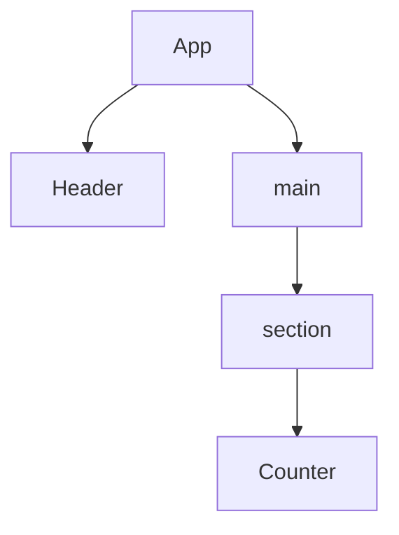
```mermaid
graph TD
    App --> Header
    App --> main
    main --> section
    section --> Counter
```

### 組件樹的分支執行與 Props 傳遞

- **[分支結束與繼續]** 組件樹的分支執行取決於該分支內是否包含自定義組件
    - 如果一個組件（如 `Header`）僅包含內建 HTML 元素，則該分支在執行完畢後即結束
    - 若組件樹的其他分支仍含有自定義組件（如 `Counter`），React 會繼續執行該分支
- **[Props 的傳遞機制]** 當 React 執行包含 Props 的自定義組件時，會負責將值從父組件轉發給子組件
    - 在本例中，`App` 組件將其管理的狀態 `chosenCount` 作為 `initialCount` 這個 prop 傳遞給 `Counter` 組件

```jsx
// App.jsx 中的傳遞範例
<Counter initialCount={chosenCount} />
```

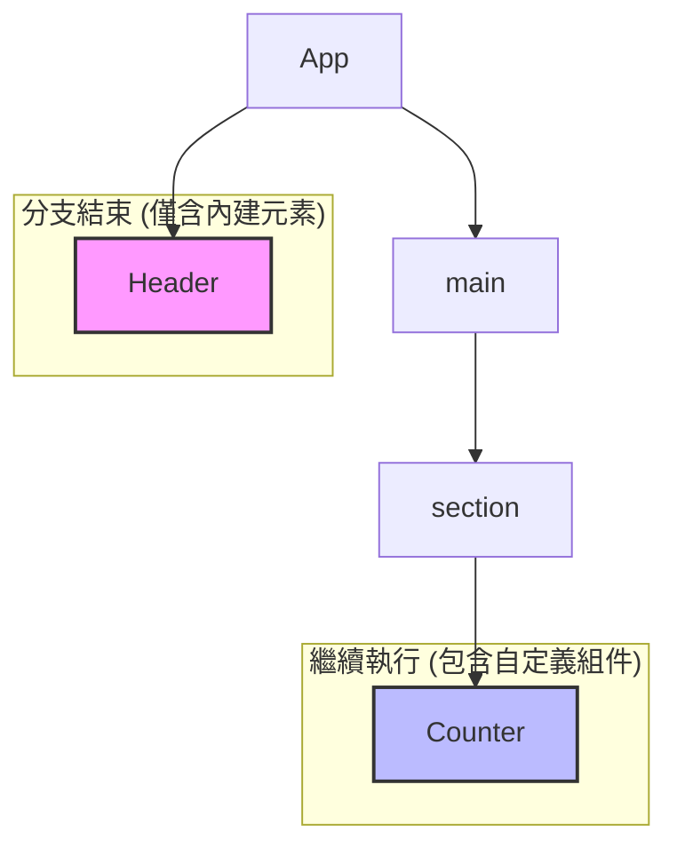
```mermaid
graph TD
    App --> Header
    App --> main
    main --> section
    section --> Counter

    style Header fill:#f9f,stroke:#333,stroke-width:2px
    style Counter fill:#bbf,stroke:#333,stroke-width:2px

    subgraph "分支結束 (僅含內建元素)"
    Header
    end

    subgraph "繼續執行 (包含自定義組件)"
    Counter
    end
```

### Counter 組件的執行流程

當 React 執行到 `Counter` 組件時，會從上到下執行該函數內的所有程式碼：

1. **內部邏輯執行**：

    - 執行判斷邏輯（例如：判斷 `initialCount` 是否為質數的 `initialCountIsPrime` 常數）。
    - 註冊 State（例如：`useState(initialCount)`）。
    - 建立組件內部的處理函式（例如：`handleIncrement` 與 `handleDecrement`），但此時這些函式尚未被呼叫執行。

2. **JSX 執行與組件樹擴充**：

    - 執行 `return` 中的 JSX 程式碼。
    - **[重要]** 若 JSX 中包含其他自定義組件（如 `IconButton` 或 `CounterOutput`），React 會繼續執行這些組件的函數，並將它們逐一加入到組件樹中。

```jsx
// Counter.jsx 執行流程範例
export default function Counter({ initialCount }) {
  log('<Counter /> rendered', 1);

  // 1. 執行邏輯與註冊狀態
  const initialCountIsPrime = isPrime(initialCount);
  const [counter, setCounter] = useState(initialCount);

  // 2. 建立函式（尚未執行）
  function handleDecrement() {
    setCounter((prevCounter) => prevCounter - 1);
  }

  function handleIncrement() {
    setCounter((prevCounter) => prevCounter + 1);
  }

  // 3. 執行 JSX 並繼續處理內部的自定義組件
  return (
    <section className="counter">
      <p className="counter-info">
        The initial counter value was <strong>{initialCount}</strong>.
        It''{ "'" }<strong>is</strong> {initialCountIsPrime ? 'a' : 'not a'}<strong> prime number</strong>.
      </p>
      <Iconbutton icon={MinusIcon} onClick={handleDecrement} />
      <CounterOutput value={counter} />
      <Iconbutton icon={PlusIcon} onClick={handleIncrement} />
    </section>
  );
}
```

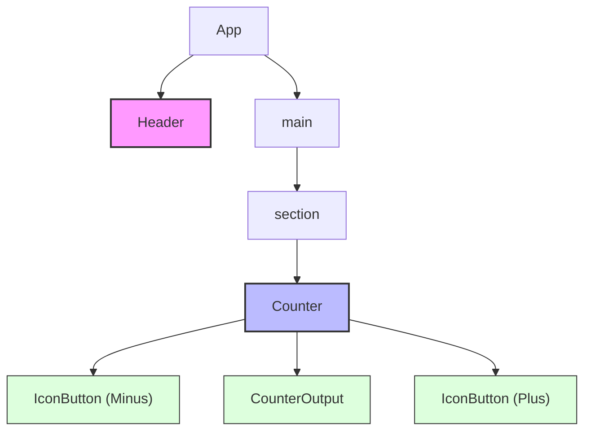
```mermaid
graph TD
    App --> Header
    App --> main
    main --> section
    section --> Counter
    Counter --> IconButton_1["IconButton (Minus)"]
    Counter --> CounterOutput
    Counter --> IconButton_2["IconButton (Plus)"]

    style Header fill:#f9f,stroke:#333,stroke-width:2px
    style Counter fill:#bbf,stroke:#333,stroke-width:2px
    style IconButton_1 fill:#dfd,stroke:#333
    style CounterOutput fill:#dfd,stroke:#333
    style IconButton_2 fill:#dfd,stroke:#333
```

### 組件樹的進一步擴充與遞迴渲染

在 `Counter` 組件的執行過程中，其 JSX 內容會引發更多子組件的執行，從而持續擴充組件樹：

1. **子組件的加入**：

    - `CounterOutput` 被加入到樹中。
    - 兩個 `IconButton` 組件也被加入到 `Counter` 組件下方。

2. **透過 Props 傳遞組件**：

    - `IconButton` 透過 `icon` 這個 prop 接收了另一個組件（例如 `MinusIcon` 或 `PlusIcon`）作為輸入。

3. **深層遞迴渲染**：

    - 在 `IconButton` 組件內部，傳入的 `icon` 會被當作自定義組件進行渲染。
    - 這意味著 React 會繼續執行該圖示組件的函數，並將其節點加入到組件樹中。

```jsx
// IconButton.jsx 內部渲染邏輯範例
export default function IconButton({ children, icon: Icon }) {
  log('<IconButton /> rendered', 2);

  const Icon = icon;

  return (
    <button {...props} className="button">
      <Icon className="button-icon" />
      <span className="button-text">{children}</span>
    </button>
  );
}
```

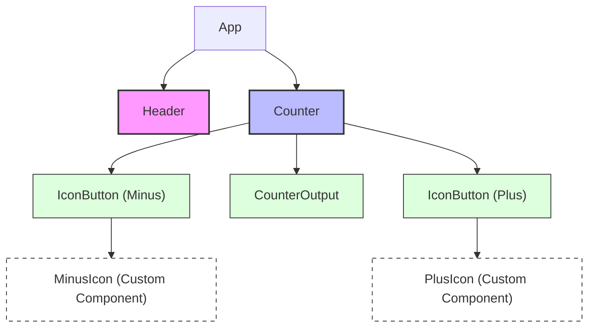
```mermaid
graph TD
    App --> Header
    App --> Counter
    Counter --> IconButton_1["IconButton (Minus)"]
    Counter --> CounterOutput
    Counter --> IconButton_2["IconButton (Plus)"]

    IconButton_1 --> MinusIcon["MinusIcon (Custom Component)"]
    IconButton_2 --> PlusIcon["PlusIcon (Custom Component)"]

    style Header fill:#f9f,stroke:#333,stroke-width:2px
    style Counter fill:#bbf,stroke:#333,stroke-width:2px
    style IconButton_1 fill:#dfd,stroke:#333
    style CounterOutput fill:#dfd,stroke:#333
    style IconButton_2 fill:#dfd,stroke:#333
    style MinusIcon fill:#fff,stroke:#333,stroke-dasharray: 5 5
    style PlusIcon fill:#fff,stroke:#333,stroke-dasharray: 5 5
```

當所有這些組件函數都執行完畢後，React 就完成了對整個組件樹的建構過程。

### 組件樹執行順序的驗證

透過在組件中加入日誌功能（logging functionality），可以觀察到 React 在渲染過程中的實際執行順序。當應用程式重新載入時，開發者工具的控制台會顯示出組件被執行的層級結構：

1. **執行順序與層級**：

    - 從根組件 `<App />` 開始執行
    - 接著執行 `<Header />` 與 `<Counter />`
    - 在 `<Counter />` 內部，依序執行 `<IconButton />`、`<CounterOutput />` 以及另一個 `<IconButton />`
    - 最後在 `<IconButton />` 下方執行對應的圖示組件（如 `<MinusIcon />` 或 `<PlusIcon />`)

2. **組件樹的終點**：

    - 當組件函數內不再包含任何自定義組件（Custom Components）時，該分支的遞迴渲染即告結束
    - 例如 `CounterOutput` 組件因為只包含標準 HTML 元素，所以它是該分支的終點

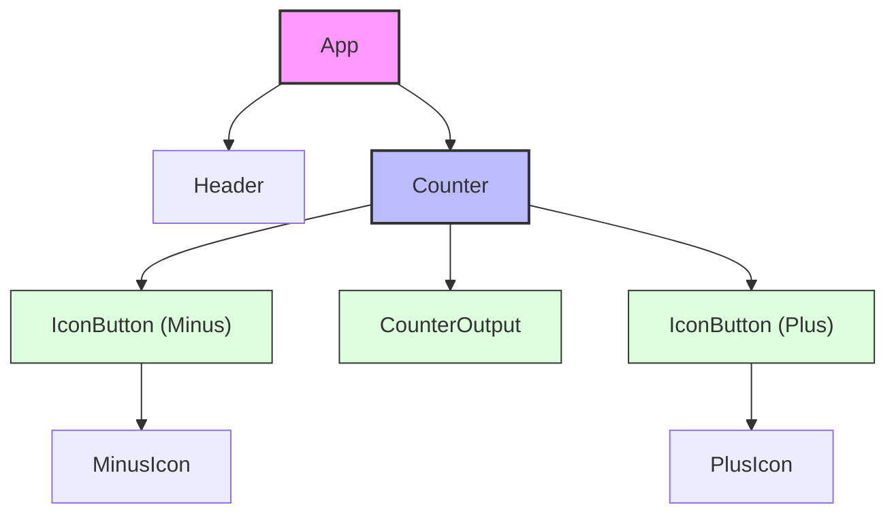
```mermaid
graph TD
    App --> Header
    App --> Counter
    Counter --> IconButton_1["IconButton (Minus)"]
    Counter --> CounterOutput
    Counter --> IconButton_2["IconButton (Plus)"]

    IconButton_1 --> MinusIcon["MinusIcon"]
    IconButton_2 --> PlusIcon["PlusIcon"]

    style App fill:#f9f,stroke:#333,stroke-width:2px
    style Counter fill:#bbf,stroke:#333,stroke-width:2px
    style CounterOutput fill:#dfd,stroke:#333
    style IconButton_1 fill:#dfd,stroke:#333
    style IconButton_2 fill:#dfd,stroke:#333
```

**[開發者工具觀察]**

在 Console 中看到的日誌序列即代表了 React 建構組件樹的動態過程：

| 執行日誌範例 (Console Output) |
| --- |
| <App /> rendered |
| -- <Header /> rendered |
| -- <Counter /> rendered |
| --- Calculating if is prime number |
| --- <IconButton /> rendered |
| ---- <MinusIcon /> rendered |
| --- <CounterOutput /> rendered |

### 透過開發者工具驗證組件執行順序

透過在組件中加入日誌功能（logging functionality），可以在瀏覽器的開發者工具（Developer Tools）的 Console 面板中，清楚地觀察到組件執行的完整路徑與順序：

1. **執行順序驗證**：

    - 從最頂層的 `<App />` 開始。
    - 接著是 `<Header />` 與 `<Counter />`。
    - 在 `<Counter />` 內部，依序出現 `<IconButton />`、`<CounterOutput />` 以及另一個 `<IconButton />`。
    - 最後是 `<IconButton />` 所渲染的圖示組件（如 `<MinusIcon />` 或 `<PlusIcon />`）。

2. **日誌輸出範例**：

```text
<App /> rendered
  - <Header /> rendered
  - <Counter /> rendered
    - Calculating if is prime number
    - <IconButton /> rendered
      - <MinusIcon /> rendered
    - <CounterOutput /> rendered
    - <IconButton /> rendered
      - <PlusIcon /> rendered
```

這份日誌記錄完整反映了先前所建立的組件樹結構，證實了 React 是依照組件的層級關係進行遞迴執行的。

### React 除錯工具

- 除了透過 `console.log` 觀察執行順序外，還可以使用專門的開發工具
- **React Developer Tools**
    - 這是一個瀏覽器擴充功能（例如安裝在 Chrome 上）
    - 它可以讓開發者更深入地檢查 React 組件的結構、屬性（props）與狀態（state）

### React Profiler 功能

- 可用於觀察哪些組件正在更新，以及在什麼情況下觸發了重新渲染（re-render）
- **使用流程**：

    1. 切換至 **Profiler** 分頁
    2. 點擊開始記錄按鈕（Start profiling）
    3. 與網頁進行互動（例如：點擊按鈕增加計數器值）
    4. 停止記錄（Stop profiling）

- **結果呈現**：
    - 會顯示一個圖形化的表示方式，呈現哪些組件函數被執行了，以及它們被執行的原因

### Profiler 的 Flamegraph 模式

- **Flamegraph (火焰圖) 呈現方式**：
    - 展示組件函數執行的**順序**。
    - 呈現組件之間的**層級關係**（Relation）。
    - 例如：`App` 組件位於頂部，作為根組件（Root component），其下方包含 `Header` 與 `Counter` 作為子組件。
- **辨識重新渲染狀態**：
    - 透過將滑鼠懸停在組件上，可以查看該組件在本次更新中的狀態。
    - **[關鍵觀察]**：如果懸停顯示「Did not render」，代表該組件在本次更新過程中並未被重新渲染。

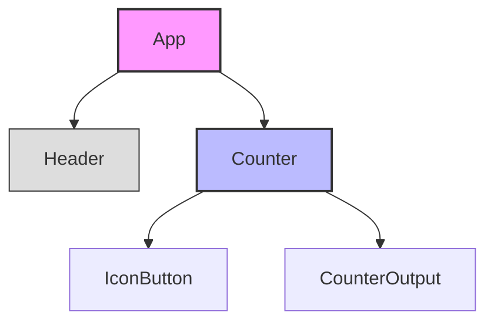
```mermaid
graph TD
    App --> Header
    App --> Counter
    Counter --> IconButton
    Counter --> CounterOutput

    style App fill:#f9f,stroke:#333,stroke-width:2px
    style Header fill:#ddd,stroke:#333
    style Counter fill:#bbf,stroke:#333,stroke-width:2px
```

### 辨別重新渲染的範圍

在 Profiler 的記錄中可以觀察到，點擊計數器的「Increment」按鈕後，並不會導致 `App` 或 `Header` 組件函數再次執行。

- **[為什麼不會重新渲染？]** 因為狀態變化的範圍僅限於 `Counter` 組件內部
    - `App` 組件管理著另一個狀態（例如透過 input 輸入的 `enteredNumber`），但點擊計數器按鈕並不會改變這個狀態
    - 由於 `App` 的狀態沒有變動，React 因此跳過 `App` 與其相關的 `Header` 組件的重新渲染
- **更新的觸發路徑**：
    - 使用者點擊 `Counter` 組件內的按鈕 $\rightarrow$ 觸發 `Counter` 內部的狀態更新 $\rightarrow$ 僅 `Counter` 組件重新執行

#### 程式碼結構分析

在 `App.jsx` 中，組件的結構如下，這解釋了狀態是如何被隔離的：

```jsx
// App.jsx
function App() {
  const [enteredNumber, setEnteredNumber] = useState(0);
  const [chosenCount, setChosenCount] = useState(0);

  function handleChange(event) {
    setEnteredNumber(+event.target.value);
  }

  function handleSetClick() {
    setChosenCount(enteredNumber);
    setEnteredNumber(0);
  }

  return {
    <Header />
    <main>
      <section id="configure-counter">
        <h2>Set Counter</h2>
        <input type="number" onChange={handleChange} value={enteredNumber} />
        <button onClick={handleSetClick}>Set</button>
      </section>
      <Counter initialCount={chosenCount} />
    </main>
  };
}
```

而在 `Counter.jsx` 中，計數器的邏輯是獨立的：

```jsx
// Counter.jsx
export default function Counter({ initialCount }) {
  const [counter, setCounter] = useState(initialCount);

  function handleDecrement() {
    setCounter((prevCounter) => prevCounter - 1);
  }

  function handleIncrement() {
    setCounter((prevCounter) => prevCounter + 1);
  }

  // ... 渲染邏輯
}
```

因為 `handleIncrement` 僅呼叫了 `setCounter`，這個狀態變動被封裝在 `Counter` 組件內，因此不會向上影響到 `App` 或 `Header`。

### 組件重新渲染的傳播方向

當一個組件因為狀態改變而重新執行（re-evaluate）時，其影響範圍遵循以下規則：

- **不會向上傳播（No upward propagation）**
    - 子組件的重新渲染不會導致其父組件重新執行
    - 例如：在計數器專案中，`Counter` 組件的狀態更新僅會觸發 `Counter` 重新執行，而不會影響到 `App` 組件
- **會向下傳播（Downward impact）**
    - 當組件重新執行時，它所包含的所有子組件也會跟著重新執行
    - 這是因為 React 會重新呼叫這些子組件函數，並再次傳遞它們接收到的 `props` 值

#### Profiler 中的觀察

在 Profiler 的火焰圖中，可以看到這種層級式的執行關係。當點擊按鈕觸發更新時，可以看到相關的組件鏈條被重新執行。

### Profiler 的 Ranked Chart 模式

透過切換到 Ranked Chart 模式，可以更直觀地查看在一次更新週期中，哪些組件被重新執行了，以及它們的執行耗時。

- **觀察重新渲染的組件**：
    - 在計數器專案中，當 `Counter` 狀態改變時，不僅 `Counter` 本身會重新執行，其內部的嵌套組件也會跟著執行
    - 例如：`Iconbutton`、`MinusIcon`、`PlusIcon` 以及 `CounterOutput` 都會顯示在重新渲染的清單中
- **辨識更新源頭**：
    - Ranked Chart 會呈現組件的執行順序與層級
    - 在此案例中，`Counter` 組件因為狀態變動成為了導致重新渲染週期的源頭（Root of the re-render cycle），隨後其嵌套的子組件也隨之更新

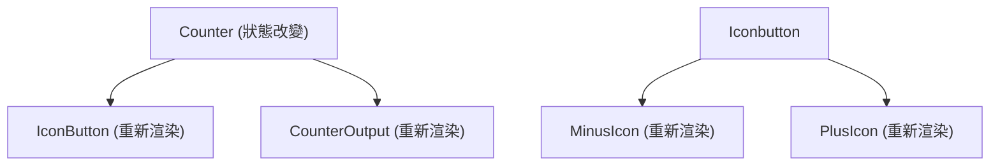
```mermaid
graph TD
    Counter["Counter (狀態改變)"] --> IconButton["IconButton (重新渲染)"]
    Iconbutton --> MinusIcon["MinusIcon (重新渲染)"]
    Iconbutton --> PlusIcon["PlusIcon (重新渲染)"]
    Counter --> CounterOutput["CounterOutput (重新渲染)"]
```

### Profiler 進階設定

除了觀察哪些組件重新渲染，還可以透過設定來獲取更深層的資訊：

- **啟用渲染原因記錄**
    - 在 Profiler 的設定（Settings）中，可以勾選 `Record why each component rendered`
    - **[作用]** 啟用此功能後，在 Profiler 的結果中，你可以直接看到每個組件之所以重新渲染的具體原因（例如：`props` 改變、`state` 改變或父組件重新渲染）

#### 深入分析重新渲染原因

當在 Profiler 中啟用「記錄每個組件重新渲染的原因」功能後，可以獲得更具體的診斷資訊：

- **查看渲染原因**：
    - 將滑鼠懸停在 Profiler 圖表中的組件上，可以直接看到該組件重新渲染的原因
    - 例如：顯示 `Why did this render? - Hook 1 changed`
- **[核心概念]**：
    - 在 React 中，當看到「Hook 改變」時，這通常意味著該組件內部的底層 **State (狀態)** 發生了變動
- **利用工具進行優化**：
    - 掌握組件如何被執行以及「為什麼」被執行，是進行應用程式效能優化的基礎

### 觀察重新渲染的實作案例

- **[優化目標]** 透過理解組件之間的關係與執行方式，找出應用程式中可以被優化的部分
- **即時觀察渲染流程**
    - 在輸入框（input field）輸入字元時，Console 會即時記錄正在重新渲染的組件清單
    - 透過觀察 Console 輸出的組件名稱（例如 `<App />`、`<Header />` 等），可以追蹤每一次狀態變動所觸發的渲染鏈條

#### Console 中的渲染記錄範例

當在輸入框中進行操作時，Console 會顯示類似以下的渲染資訊：

| 組件名稱 | 狀態 |
| --- | --- |
| <App /> | rendered |
| <Header /> | rendered |
| <Counter /> | rendered |
| -- Calculating if is prime number | (計算中) |
| <IconButton /> | rendered |
| <MinusIcon /> | rendered |
| <CounterOutput /> | rendered |
| <PlusIcon /> | rendered |

### 輸入框觸發的全域重新渲染

- **[觸發原因]** 輸入框（input field）直接位於 `App` 組件中，並綁定了 `onChange` 處理函數
    - 每次按鍵（keystroke）都會觸發 `onChange` 事件
    - 事件會更新 `App` 組件內部的狀態（state）
- **[連鎖反應]** 由於 `App` 是頂層組件，其狀態改變會導致整個組件樹重新執行
    - 當 `App` 重新執行時，它包含的所有子組件也會跟著重新執行
    - 這解釋了為何在輸入時，Console 會記錄幾乎所有組件（如 `<App />`、`<Header />`、`<Counter />` 等）都在重新渲染

#### 程式碼實作細節

在 `App.jsx` 中，狀態更新與輸入框的關聯如下：

```jsx
const [enteredNumber, setEnteredNumber] = useState(0);

function handleChange(event) {
    setEnteredNumber(+event.target.value);
}

return (
    <>
        <Header />
        <main>
            <section id="configure-counter">
                <h2>Set Counter</h2>
                <input
                    type="number"
                    onChange={handleChange}
                    value={enteredNumber}
                />
                <button onClick={handleSetClick}>Set</button>
            </section>
        </main>
    </>
);
```

### 組件重新執行的影響與優化策略

- **[重新執行&#32;**$\neq$**&#32;DOM 更新]**
    - 當組件函數重新執行時，並不一定代表實際渲染的 DOM 也會隨之改變
    - **[效能問題]**：雖然對 DOM 的影響可能有限，但頻繁執行大量的組件函數仍會造成效能損耗，因為這代表程式碼被重複執行了
- **優化解決方案**
    - 針對此問題，主要有兩種解決方案可以進行優化
    - **方案一：使用 React 內建函數**
        - React 提供了一個內建的函數，可以將其包裹在組件函數的周圍，藉此控制組件的執行時機

### 使用 `memo` 優化組件執行

- **[功能]** `memo` 可以防止不必要的組件函數重新執行
- **[使用方式]**
    - 必須從 `react` 中匯入 `memo`
    - 將組件函數作為參數傳遞給 `memo` 來包裹它
- **[最佳實作建議]**
    - 不要直接在 `export default` 中包裹組件（這可能會導致開發模式下的功能異常或警告）
    - **建議做法**：先將 `memo` 包裹後的結果儲存在一個獨立的變數或常數中，再進行匯出

#### 程式碼實作對比

**不建議的做法（可能導致警告）：**

```jsx
export default memo(function Counter({ initialCount }) {
    // ...
});
```

**建議的做法：**

```jsx
const Counter = memo(function Counter({ initialCount }) {
    // ...
});

export default Counter;
```

### `memo()` 的運作原理

- **[核心機制]** `memo()` 會檢查組件接收到的 props
    - 當組件原本應該要重新執行時，`memo()` 會介入並進行比較
    - 它會比對「舊的 prop 值」（Old Prop Value）與「新的 prop 值」（New Prop Value）
- **[執行判斷]**
    - 如果 props 的值沒有改變，則會跳過該組件的重新執行
    - 只有當 props 發生變化時，組件函數才會再次執行

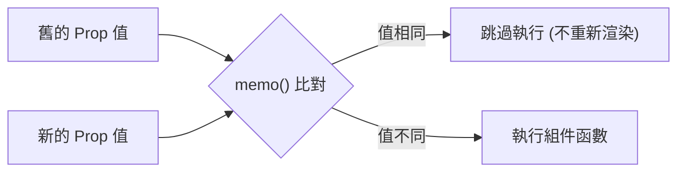
```mermaid
flowchart LR
    A["舊的 Prop 值"] --> B{"memo() 比對"}
    C["新的 Prop 值"] --> B
    B -- "值相同" --> D["跳過執行 (不重新渲染)"]
    B -- "值不同" --> E["執行組件函數"]
```

### `memo()` 的比較機制與限制

- **[比較基準]** `memo()` 會檢查 props 的值是否完全相同
    - **原始型別 (Primitive Types)**：如數字、字串，直接比對其值
    - **引用型別 (Reference Types)**：如陣列 (Array) 或物件 (Object)，必須是**記憶體中的同一個實例**，`memo()` 才會判定為相同
- **[作用範圍]** `memo()` 僅能防止由「父組件」觸發的重新執行
    - 如果組件因為**自身的內部狀態 (Internal State)** 改變而需要重新渲染，`memo()` 無法阻止這種行為

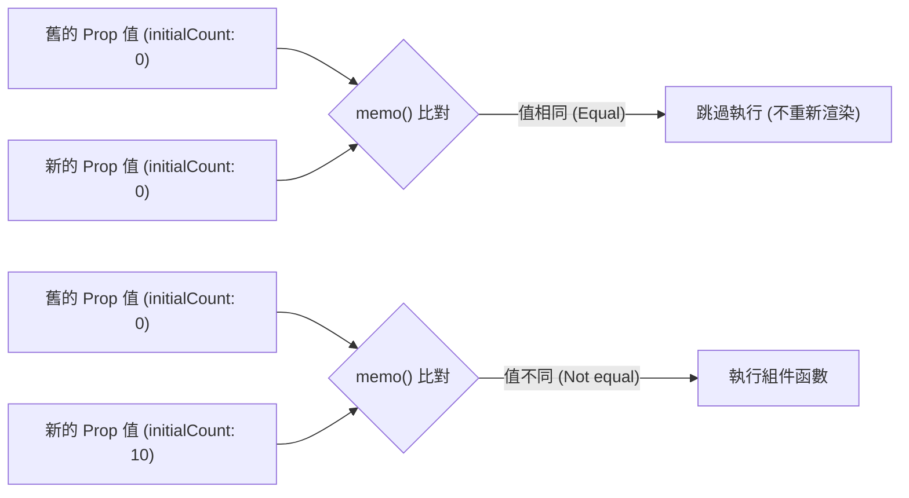
```mermaid
flowchart LR
    A["舊的 Prop 值 (initialCount: 0)"] --> B{"memo() 比對"}
    C["新的 Prop 值 (initialCount: 0)"] --> B
    B -- "值相同 (Equal)" --> D["跳過執行 (不重新渲染)"]

    A2["舊的 Prop 值 (initialCount: 0)"] --> B2{"memo() 比對"}
    C2["新的 Prop 值 (initialCount: 10)"] --> B2
    B2 -- "值不同 (Not equal)" --> E["執行組件函數"]
```

- **[範例分析]** 以 `Counter` 組件為例：
    - 若 `initialCount` 沒變 $\rightarrow$ `memo()` 會攔截來自 `App` 的重新渲染請求，防止 `Counter` 重新執行
    - 若 `Counter` 內部的 `counter` 狀態改變 $\rightarrow$ `Counter` 仍會重新執行，因為這是組件內部的行為，不受 `memo()` 控制
- **[核心邏輯總結]** `memo()` 的判斷基準僅限於外部傳入的 props
    - **外部變化 (External Changes)**：若父組件重新渲染，但傳給該組件的 props 值未變 $\rightarrow$ `memo()` 會攔截並防止該組件重新執行
    - **內部變化 (Internal Changes)**：若組件自身的 `useState` 或其他內部狀態改變 $\rightarrow$ 組件**一定會**重新執行，`memo()` 無法阻止此行為
- **[為什麼需要這種優化？]**
    - 當 props 值未變時，再次執行組件函數只會得到與之前完全相同的結果
    - 這種重複執行是無意義的計算資源浪好，因此透過 `memo()` 跳過執行是必要的效能提升手段

### `memo()` 的實際攔截效果

- **[實驗觀察]** 在 `App` 組件的輸入框中輸入數值，但不點擊計數器的「Set」按鈕
    - **結果**：只有 `App` 與 `Header` 組件會重新執行
    - **原因**：輸入框的變化觸發了 `App` 的狀態更新，但由於 `Counter` 的 `initialCount` prop 值未變，`memo()` 成功攔截了重新渲染請求
- **[連鎖反應的阻斷]**
    - 因為 `Counter` 組件函數本身沒有被重新執行，其內部定義的所有嵌套函數（如 `handleDecrement`、`handleIncrement`）也**完全不會**被重新建立或執行
    - 這證明了 `memo()` 不僅能防止組件重新渲染，還能有效避免其內部邏輯的重複運算

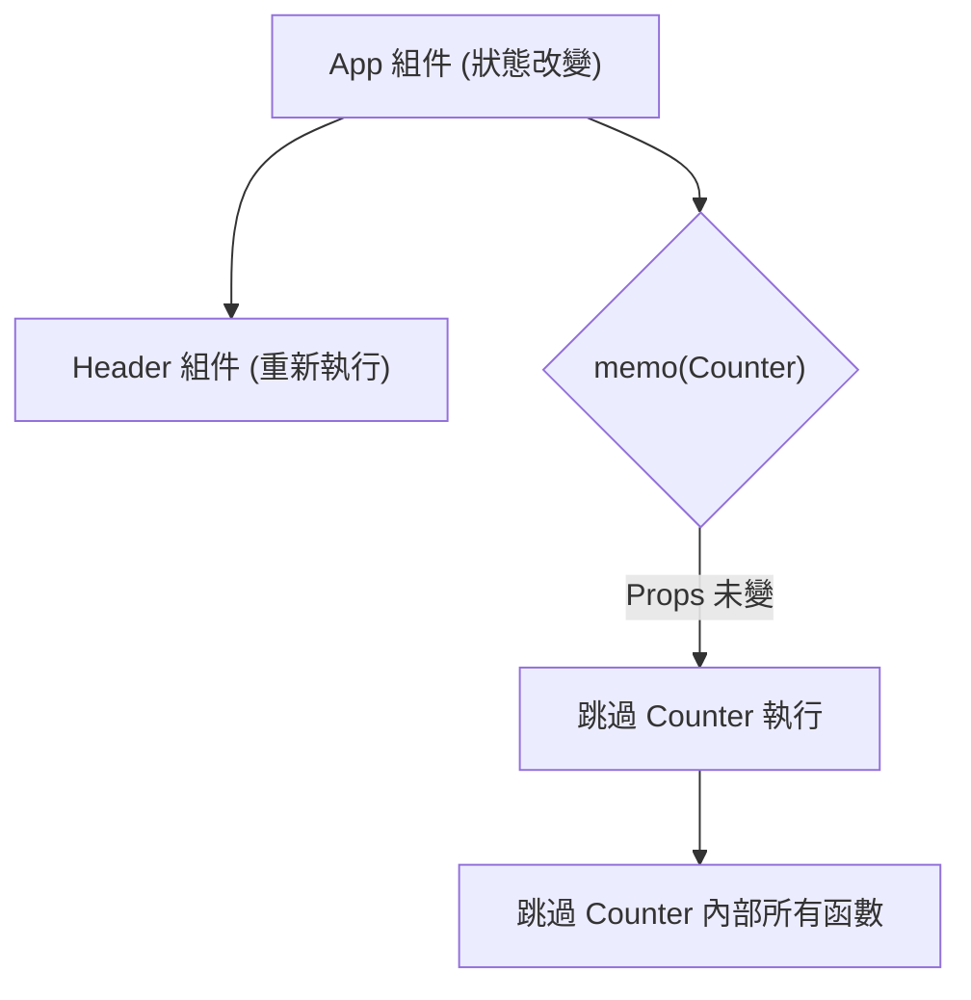
```mermaid
flowchart TD
    A["App 組件 (狀態改變)"] --> B["Header 組件 (重新執行)"]
    A --> C{"memo(Counter)"}
    C -- "Props 未變" --> D["跳過 Counter 執行"]
    D --> E["跳過 Counter 內部所有函數"]
```

#### 程式碼實作參考

```jsx
const Counter = memo(function Counter({ initialCount }) {
    log('<Counter /> rendered', 1);
    const initialCountIsPrime = isPrime(initialCount);
    const [counter, setCounter] = useState(initialCount);

    function handleDecrement() {
        setCounter((prevCounter) => prevCounter - 1);
    }

    function handleIncrement() {
        setCounter((prevCounter) => prevCounter + 1);
    }

    return (
        <section className="counter">
            <p className="counter-info">
                The initial counter value was <strong>{initialCount}</strong>.
                It '{strong}isPrime(initialCount) ? 'a' : 'not a'</strong/> prime number.
            </p>
            {/* ... 其他 JSX ... */}
        </section>
    );
});
```

### `memo()` 的使用策略

- **[重要原則] 不要過度使用&#32;`memo()`**
    - 並非所有的組件都需要包裹 `memo()`
    - 過度使用可能會增加不必要的記憶體與比較開銷
- **[最佳實踐] 盡可能在組件樹的高層級使用**
    - 建議將 `memo()` 用於組件樹中位置盡可能高的組件
    - **[原因]** 阻斷一個高層級組件的執行，可以連帶阻斷該組件下所有的子組件執行，這能帶來更顯著的效能提升

### `memo()` 的效能成本與選擇策略

- **[效能成本] 檢查 Props 的開銷**
    - 使用 `memo()` 並非完全免費，React 必須在執行組件函數前，先對 Props 進行「相等性檢查（Equality Check）」
    - 這種檢查行為本身也會消耗一定的計算資源
- **[何時應避免使用？] 頻繁變動的 Props**
    - **不要**在 Props 幾乎每次都會改變的組件上使用 `memo()`
    - **[原因]** 若 Props 頻繁變動，`memo()` 會先執行一次「檢查」，隨後發現值確實已變，最終仍必須重新執行組件函數
    - 這會導致你白白支付了「檢查 Props」的效能代價，卻完全沒有達到「跳過執行」的優化效果
- **[最佳實踐] 追求最大化的阻斷效益**
    - 建議將 `memo()` 用於組件樹中位置較高的組件
    - **[連鎖阻斷效應]** 透過阻斷一個高層級組件的執行，可以同時阻斷該組件下所有嵌套子組件的執行，從而獲得最顯著的效能收益

### `memo()` 的使用限制與效能權衡

- **[效能成本] 檢查 props 也需要開銷**
    - `memo()` 在執行組件函數之前，必須先對傳入的 props 進行相等性檢查（equality check）
    - 如果一個組件的 props 幾乎每次都會改變，那麼 `memo()` 的檢查就變成了「無意義的計算」
    - **[結果]**：你既支付了執行 props 比較的效能代價，最後卻發現組件還是必須重新執行，這反而降低了效能
- **[使用準則] 謹慎使用&#32;`memo()`**
    - **不要對所有組件都使用**：在簡單的應用程式中，`memo()` 的效能提升微乎其微，反而增加了開發複雜度與檢查開銷
    - **選擇正確的對象**：僅在那些「可以被有效攔截重新渲染」的組件上使用
    - **選擇正確的位置**：盡可能在組件樹的高層級使用，以達到最大化的阻斷效果

### 組件組合（Component Composition）優化

- **[核心概念]** 一種比 `memo()` 有時更強大的防止重新渲染技術
    - 透過巧妙的組件結構設計，將狀態「隔離」在特定的組件內
- **[實作邏輯]** 狀態隔離與範圍控制
    - **[問題情境]** 若將頻繁變動的狀態（例如：輸入框的每一次按鍵紀錄）直接放在頂層組件（如 `App`）中，每次按鍵都會導致整個 `App` 及其所有子組件重新渲染
    - **[解決方案]** 將該狀態及其相關邏輯封裝進一個獨立的子組件中
    - **[結果]** 狀態變動僅會觸發該子組件重新渲染，而不會影響到父組件或其他兄弟組件

```jsx
// 假設的優化結構對比

// ❌ 不佳做法：狀態在頂層，導致整個 App 重新渲染
function App() {
    const [enteredNumber, setEnteredNumber] = useState(0);
    // ... 每次輸入都會觸發 App 重新渲染
    return (
        <main>
            <input onChange={(e) => setEnteredNumber(e.target.value)} />
            <Counter /> {/* Counter 會被迫重新渲染 */}
        </main>
    );
}

// ✅ 優化做法：透過組件組合，將狀態移入獨立組件
function App() {
    return (
        <main>
            <InputSection /> {/* 狀態變動僅限於此組件內部 */}
            <Counter /> {/* Counter 不會受到輸入框變動的影響 */}
        </main>
    );
}
```

### 實作組件組合（Component Composition）重構

- **[重構目標]** 將 `App` 組件中負責設定計數器的 UI 邏輯抽離到獨立的組件中
- **[實作步驟]**
    - 建立一個新組件 `ConfigureCounter`
    - 從 `App` 組件中剪下（cut）原本的 `<section id="configure-counter">` 相關程式碼，並貼回 `ConfigureCounter` 中
    - **[狀態處理]** 在 `ConfigureCounter` 中，我們不需要 `chosenCount` 狀態，只需要 `enteredNumber` 狀態
- **[關鍵概念] 狀態提升（Lifting State Up）]**
    - 由於原本的狀態與功能與 `App` 組件有連動關係，在拆分組件後，必須將相關狀態從子組件「提升」回父組件，以確保資料流的正確性

### 完善組件組合的資料流

- **[資料傳遞邏輯]** 從 `ConfigureCounter` 到 `App` 的資訊傳遞流程
    - 使用者在 `ConfigureCounter` 輸入數值並點擊「Set」按鈕
    - 該資訊會透過處理函數傳遞回 `App` 組件
    - **[原因]** 因為 `App` 組件需要持有這個狀態，以便將其作為 props 傳遞給 `Counter` 組件
- **[App 組件的邏輯調整]**
    - **清理舊邏輯**：可以移除原本在 `App` 內部的 `enteredNumber` 狀態以及相關的 `handleChange` 函數，因為這些現在已由 `ConfigureCounter` 負責
    - **保留核心狀態**：必須保留 `chosenCount` 狀態，因為它是跨組件共享的核心數據
    - **新增處理函數**：需要建立一個新的函數（例如 `handleSetCount`），用來接收來自子組件的新數值並更新 `chosenCount` 狀態

```jsx
// App.jsx 的重構邏輯示意
function App() {
    // 保留核心狀態，用於傳遞給 Counter
    const [chosenCount, setChosenCount] = useState(0);

    // 新增處理函數，接收子組件傳來的數值
    function handleSetCount(newCount) {
        setChosenCount(newCount);
    }

    return (
        <>
            <Header />
            <main>
                {/* 將處理函數傳給子組件，以便進行狀態提升 */}
                <ConfigureCounter onSetCount={handleSetCount} />
                <Counter initialCount={chosenCount} />
            </main>
        </>
    );
}
```

### 實作 ConfigureCounter 的匯入與傳遞

- **[組件匯入]** 在 `App.jsx` 中引入新組件
    - `import ConfigureCounter from './components/Counter/ConfigureCounter.jsx';`
- **[傳遞處理函數]** 使用 props 將父組件的邏輯傳給子組件
    - 透過設定一個 prop（例如命名為 `onSet`）來指向 `handleSetCount` 函數
    - **[原因]** 這樣 `ConfigureCounter` 內部才能呼叫這個函數，進而觸發 `App` 組件中的狀態更新

```jsx
// App.jsx 中的組件使用方式
import ConfigureCounter from './components/Counter/ConfigureCounter.jsx';

function App() {
    const [chosenCount, setChosenCount] = useState(0);

    function handleSetCount(newCount) {
        setChosenCount(newCount);
    }

    return (
        <>
            <Header />
            <main>
                {/* 將處理函數透過 onSet prop 傳遞下去 */}
                <ConfigureCounter onSet={handleSetCount} />
                <Counter initialCount={chosenCount} />
            </main>
        </>
    );
}
```

### ConfigureCounter 組件內部實作

- **[解構 Props]** 在 `ConfigureCounter` 組件中，透過解構取得傳入的函數
- **[實作邏輯]**
    - 使用 `enteredNumber` 狀態來追蹤輸入框的值
    - 建立 `handleSetClick` 函數，在點擊按鈕時執行以下動作：

        1. 呼叫從 props 取得的函數（例如 `onSet`），並傳入當前的 `enteredNumber`
        2. 將 `enteredNumber` 重設為 `0`，以清空輸入框

```jsx
// ConfigureCounter.jsx 實作細節
export default function ConfigureCounter({ onSet }) {
    const [enteredNumber, setEnteredNumber] = useState(0);

    function handleChange(event) {
        setEnteredNumber(+event.target.value);
    }

    function handleSetClick() {
        onSet(enteredNumber);
        setEnteredNumber(0);
    }

    return (
        <section id="configure-counter">
            <h2>Set Counter</h2>
            <input
                type="number"
                onChange={handleChange}
                value={enteredNumber}
            />
            <button onClick={handleSetClick}>Set</button>
        </section>
    );
}
```

### 透過狀態隔離優化效能

- **[優化核心]** 將原本位於 `App` 組件中的狀態移至 `ConfigureCounter` 組件中
    - **[原因]** 這樣每次在輸入框輸入字元時，只有 `ConfigureCounter` 的狀態會變動並觸發該組件重新執行，而不會導致整個 `App` 組件及其所有子組件重新渲染
- **[實作邏輯]** 在 `handleSetClick` 函數中，不再直接操作父組件的狀態，而是呼叫透過 props 傳入的處理函數

```jsx
// ConfigureCounter.jsx 最終實作
import { useState } from 'react';

export default function ConfigureCounter({ onSet }) {
    const [enteredNumber, setEnteredNumber] = useState(0);

    function handleChange(event) {
        setEnteredNumber(+event.target.value);
    }

    function handleSetClick() {
        // 呼叫從 props 傳入的函數，將數值傳回父組件
        onSet(enteredNumber);
        // 重設本地狀態以清空輸入框
        setEnteredNumber(0);
    }

    return (
        <section id="configure-counter">
            <h2>Set Counter</h2>
            <input
                type="number"
                onChange={handleChange}
                value={enteredNumber}
            />
            <button onClick={handleSetClick}>Set</button>
        </section>
    );
}
```

### 驗證重新渲染的傳播方向

- **[實驗目的]** 驗證子組件的狀態變動是否會導致父組件重新執行
- **[實作方法]** 在 `ConfigureCounter` 組件中加入 `log` 函數（從 `log.js` 匯入）
    - **[觀察點]** 當在 `ConfigureCounter` 的輸入框輸入字元時，觀察 Console 是否會印出 `ConfigureCounter` 的日誌，以及是否會印出 `App` 的日誌

```jsx
// App.jsx 結構參考
function App() {
    log('<App /> rendered');
    // ...
    return (
        <main>
            <ConfigureCounter onSet={handleSetCount} />
            <Counter initialCount={chosenCount} />
        </main>
    );
}
```

- **[預期結果]** 由於狀態變動與子組件重新執行不會觸發父組件執行，因此在輸入時，Console 只會顯示 `ConfigureCounter` 的日誌，而不會出現 `<App /> rendered`

### 驗證狀態隔離的效果

- **[觀察結果]** 當在 `ConfigureCounter` 的輸入框中更改數值時：
    - 僅 `ConfigureCounter` 組件會重新執行
    - `App` 組件**不會**重新執行
    - `Header` 組件**不會**重新執行
    - `Counter` 組件**不會**重新執行
- **[結論]** 這證實了透過將狀態移入 `ConfigureCounter` 後，該狀態的變動已被成功隔離，不會引發不必要的全域重新渲染

### `memo()` 的適用性分析

- **[何時&#32;`memo()`&#32;會變得多餘？]**
    - 在目前的輸入行為中，由於 `App` 組件不會因為 `ConfigureCounter` 的內部狀態改變而重新執行，因此原本在 `Counter` 組件上使用的 `memo()` 在此情境下是沒有作用的
- **[何時&#32;`memo()`&#32;依然必要？]**
    - 當使用者點擊「Set」按鈕，觸發 `handleSetClick` 並呼叫 `onSet` 更新 `App` 的 `chosenCount` 狀態時，`App` 組件會重新執行
    - 在這種情況下，`App` 的重新執行會向下傳遞，此時 `memo()` 才能發揮作用，防止 `Counter` 組件在不必要的更新週期中被重新執行

### `memo()` 的實務考量與效能權衡

- **[`Counter`&#32;組件的狀況]** 因為 `Counter` 接收 `initialCount` 作為 prop，而這個值通常會隨著 `App` 的狀態更新而改變
    - **[預期行為]** `memo()` 的檢查機制會發現 `initialCount` 的值與上次不同，因此仍會觸發組件重新執行
    - **[例外情況]** 只有當使用者輸入的數值與前一次完全相同時，`memo()` 才會發揮攔截作用
- **[決策建議]** 在大多數情況下，由於 `initialCount` 頻繁變動，`memo()` 可能無法有效防止重新執行
    - **[移除的理由]** 如果 `memo()` 無法攔截重新渲染，那麼它每次都要執行 props 比較（Comparison），這本身也會消耗效能
    - **[結論]** 在這種 props 幾乎必然改變的情境下，可以考慮移除 `memo()` 以簡化程式碼並避免不必要的比較開銷

### `Counter` 組件內的重新渲染分析

- **[當前狀況]** 目前在 `App` 中點擊增量/減量按鈕時，會導致一系列組件函數重新執行
- **[重新渲染的組成部分]**
    - `CounterOutput`：**需要**重新執行
        - **[原因]** 因為其顯示的數值會隨著按鈕點擊而改變，這是預期且必要的行為
    - `IconButton` 與 `Icon`：**不應該**重新執行
        - **[原因]** 這些按鈕組件本身是靜態的，其內容與計數器數值的變動無關，重新執行它們屬於不必要的效能開銷

```jsx
// Counter.jsx 結構示意
const Counter = memo(function Counter({ initialCount }) {
    log('<Counter /> rendered', 1);
    const initialCountIsPrime = isPrime(initialCount);
    const [counter, setCounter] = useState(initialCount);

    function handleDecrement() {
        setCounter((prevCounter) => prevCounter - 1);
    }

    function handleIncrement() {
        setCounter((prevCounter) => prevCounter + 1);
    }

    return (
        <section className="counter">
            <p className="counter-info">
                The initial counter value was <strong>{initialCount}</strong>. It''{}
                <strong>is {initialCountIsPrime ? 'a' : 'not a'}</strong> prime number.
            </p>
            <IconButton icon={MinusIcon} onClick={handleDecrement}>
                Decrement
            </IconButton>
            <CounterOutput value={counter} />
            <IconButton icon={PlusIcon} onClick={handleIncrement}>
                Increment
            </IconButton>
        </section>
    );
});
```

- **[觀察 Console 日誌]** 在點擊按鈕後，可以看到以下渲染流程：
    - `<Counter /> rendered`
    - `Calculating if is prime number`
    - `<IconButton /> rendered` (MinusIcon)
    - `<CounterOutput /> rendered`
    - `<IconButton /> rendered` (PlusIcon)
    - `<PlusIcon /> rendered`

> **核心問題**：雖然 `CounterOutput` 的重新渲染是合理的，但 `IconButton` 的重新渲染是可以透過優化避免的。

### 優化 `IconButton` 組件

- **[觀察到的問題]** 在目前的 `Counter` 實作中，雖然 `IconButton` 的輸出（例如按鈕文字和圖標）在計數器變動時並不會改變，但它們仍會隨著父組件的重新渲染而被迫重新執行
    - **[效能考量]** 在這個小型應用中，執行這些簡單的組件函數對效能影響極小，但在大型應用中，頻繁的重新渲染會造成累積開銷
- **[優化方案]** 使用 `memo()` 包裹 `IconButton` 組件
    - **[預期效果]** 當 `IconButton` 的 props 保持不變時，React 將跳過該組件的重新執行
    - **[連鎖反應]** 因為 `IconButton` 內部負責渲染圖標（如 `PlusIcon`），若 `IconButton` 被 `memo()` 攔截，其子組件圖標也將不會被重新執行

```jsx
// IconButton.jsx 結構示意
import { log } from '../../log.js';

export default function IconButton({ children, icon, ...props }) {
    log('<IconButton /> rendered', 2);
    const Icon = icon;
    return (
        <button {...props} className="button">
            <Icon className="button-icon" />
            <span className="button-text">{children}</span>
        </button>
    );
}
```

### 實作 `IconButton` 的 `memo()` 優化

- **[實作步驟]**
    - 從 `react` 中匯入 `memo`
    - 建立一個新的常數來包裹原本的組件函數
    - 匯出這個經過 `memo()` 包裹的新常數

```jsx
import { memo } from 'react';
import { log } from '../../log.js';

export default function IconButton({ children, icon, ...props }) {
    log('<IconButton /> rendered', 2);
    const Icon = icon;
    return (
        <button {...props} className="button">
            <Icon className="button-icon" />
            <span className="button-text">{children}</span>
        </button>
    );
}
```

- **[遇到的問題]** 在嘗試套用 `memo()` 後，發現組件仍然會隨著父組件重新執行，且 Console 出現錯誤：
    - `Uncaught TypeError: Component is not a function`
    - **[原因預測]** 這通常是因為在包裹 `memo()` 並重新導出的過程中，組件的結構或導出方式出了問題，導致 React 無法正確將其辨識為一個組件函數。

### `IconButton` Props 的穩定性分析

- **[children prop]** 承載按鈕上的文字內容
    - 在目前的實作中，按鈕文字（如 "Increment" 或 "Decrement"）是靜態的
    - 因為文字內容不會改變，所以 `children` 這個 prop 的值在每次重新渲染時都是相同的
- **[icon prop]** 接收圖標組件
    - **[關鍵點]** `icon` prop 接收的是「組件本身的引用（pointer to a component）」，而不是已經渲染過的 JSX 代碼（例如 `<PlusIcon />`）
    - 由於傳遞的是組件名稱/引用，只要傳入的組件本身沒變，這個 prop 的值就會保持穩定

> **結論**：因為 `children` 和 `icon` 這兩個 props 在計數器數值變動時都不會改變，這使得 `memo()` 能夠成功攔截重新渲染，避免 `IconButton` 及其子組件被不必要地執行。

### `IconButton` 重新渲染的潛在原因分析

- **[已確認的穩定性]** 圖標組件（如 `MinusIcon` 與 `PlusIcon`）的引用是穩定的
    - **[原因]** 這些組件並非在 `Counter` 組件函數內部定義，而是從外部檔案匯入的
    - 因此，每次 `Counter` 重新執行時，這些圖標組件的引用不會改變
- **[疑似問題點]** `onClick` prop 的穩定性
    - 在 `Counter.jsx` 中，`IconButton` 接收了 `onClick` 屬性，其值為處理函數（如 `handleDecrement` 或 `handleIncrement`）
    - **[核心問題]** 如果這些處理函數在每次 `Counter` 重新渲染時都被重新建立（例如作為內聯函數傳遞），那麼 `onClick` 的引用就會改變
    - 一旦 props 中的任何一個引用發生變化，`memo()` 就會判定組件需要重新執行

```jsx
// Counter.jsx 中的渲染邏輯片段
<IconButton
    icon={MinusIcon}
    onClick={handleDecrement} // 這裡的函數引用是否穩定是關鍵
>
    Decrement
</IconButton>
```

### 巢狀函數導致 `memo()` 失效的原因

- **[問題描述]** 即使處理函數的邏輯（程式碼內容）完全相同，每次 `Counter` 組件重新執行時，傳遞給 `IconButton` 的 `onClick` prop 仍然會被判定為發生變化。
- **[核心原因]** 這些處理函數是在 `Counter` 組件函數內部定義的「巢狀函數（nested functions）」
    - **[JavaScript 引用特性]** 在 JavaScript 中，函數本身是一個物件（object）
    - **[重新建立過程]** 每次 `Counter` 組件函數執行時，都會在記憶體中重新建立這些函數物件
    - **[記憶體位址改變]** 雖然函數的內容沒變，但它們在記憶體中的引用（pointer/reference）是全新的
- **[對&#32;`memo()`&#32;的影響]**
    - `memo()` 透過比較 props 的新舊值來決定是否跳過渲染
    - 因為新建立的函數與舊函數的引用不同（`oldOnClick !== newOnClick`），`memo()` 會判定 prop 已變動，進而觸發組件重新執行

```jsx
// Counter.jsx 內部邏輯示意
const Counter = memo(function Counter({ initialCount }) {
    // ...
    // 每次 Counter 執行時，這兩個函數都會被重新建立，擁有新的記憶體引用
    function handleDecrement() {
        setCounter(prevCounter => prevCounter - 1);
    }

    function handleIncrement() {
        setCounter(prevCounter => prevCounter + 1);
    }

    return (
        <section className="counter">
            {/* ... */}
            <IconButton
                icon={MinusIcon}
                onClick={handleDecrement} // 這裡傳遞的是每次都不同的新引用
            >
                Decrement
            </IconButton>
        </section>
    );
});
```

### 使用 `useCallback` 保持函數引用穩定

- **[問題回顧]** 由於巢狀函數在每次組件重新渲染時都會被重新建立，導致其記憶體引用改變，進而使 `memo()` 無法攔截重新渲染。
- **[解決方案]** 使用 React 提供的 `useCallback` Hook 來防止函數的重新建立。
- **[useCallback 的用途]**
    - 避免函數在每次渲染時都被重新建立（保持引用穩定）。
    - 當函數被作為 `useEffect` 的依賴項時，可以防止不必要的 Effect 執行。
    - **[搭配&#32;`memo()`&#32;使用]** 當組件接收函數作為 props 時，必須使用 `useCallback` 才能讓 `memo()` 發揮預期效能優化的作用。

```jsx
// 使用 useCallback 包裹處理函數，使其在依賴項未變動前保持相同的引用
const handleDecrement = useCallback(() => {
    setCounter(prevCounter => prevCounter - 1);
}, []); // 依賴陣列若為空，則該函數在組件生命週期內引用保持不變
```

### `useCallback` 的依賴陣列機制

- **[依賴陣列的作用]** `useCallback` 接受第二個參數，即一個包含依賴項的陣列
    - 陣列中應列出函數內部使用的所有 `props`、`state` 或 `context` 值
    - **[為什麼需要它]** 如果陣列中的任何一個值發生變化，React 就必須重新建立一個新的函數，以確保該函數內部使用的是最新的值
- **[關於狀態更新函數的特殊性]**
    - 在處理狀態更新時（例如使用 `setCounter`），不需要將其加入依賴陣列
    - **[原因]** React 保證狀態更新函數（state updater functions）在組件的整個生命週期中，其引用（reference）永遠不會改變

```jsx
// Counter.jsx 實作 useCallback
const [counter, setCounter] = useState(initialCount);

const handleDecrement = useCallback(function handleDecrement() {
    setCounter(prevCounter => prevCounter - 1);
}, []); // 僅使用 setCounter，因此依賴陣列可以為空
```

### 完成 `Counter` 組件的 `useCallback` 優化

- **[實作細節]** 除了 `handleDecrement` 之外，也需要對 `handleIncrement` 使用 `useCallback`，以確保所有傳遞給子組件的函數引用都能保持穩定。
- **[驗證結果]** 透過重新整理頁面並清除之前的狀態，可以觀察到優化後的執行流程。

```jsx
// Counter.jsx 完整優化後的處理函數
const handleDecrement = useCallback(function handleDecrement() {
    setCounter(prevCounter => prevCounter - 1);
}, []);

const handleIncrement = useCallback(function handleIncrement() {
    setCounter(prevCounter => prevCounter + 1);
}, []);
```

- **[觀察 Console 日誌]** 透過瀏覽器的 Console 觀察組件渲染的紀錄，驗證在狀態改變時，哪些組件確實發生了重新執行，以及哪些組件因為 `memo()` 與 `useCallback` 的配合而成功跳過了渲染。
- **[觀察結果]** 當點擊 Increment 按鈕導致 `Counter` 組件狀態變動時：
    - `Counter` 組件本身會重新執行（Re-render）
    - **[攔截成功]** `IconButton` 及其內部的 `Icon` 組件**不會**重新執行
- **[原因分析]**
    - 雖然 `Counter` 重新執行了，但傳遞給 `IconButton` 的 props（如 `onClick` 透過 `useCallback` 維持了穩定引用）並沒有改變
    - 因此 `memo()` 判定不需要重新執行這些子組件，從而節省了效能

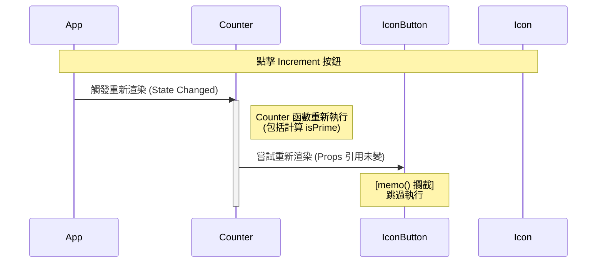
```mermaid
sequenceDiagram
    participant App
    participant Counter
    participant IconButton
    participant Icon

    Note over App, Icon: 點擊 Increment 按鈕
    App->>Counter: 觸發重新渲染 (State Changed)
    activate Counter
    Note right of Counter: Counter 函數重新執行<br/>(包括計算 isPrime)
    Counter->>IconButton: 嘗試重新渲染 (Props 引用未變)
    Note over IconButton: [memo() 攔截]<br/>跳過執行
    deactivate Counter
```

> **結論**：`memo()` 的價值在於當父組件因為與當前子組件無關的狀態改變而重新執行時，能夠保護子組件不被連帶重新執行。

### Counter 組件內部的重複執行問題

- **[觀察現象]** 當點擊按鈕改變 `counter` 狀態時，除了組件渲染的日誌外，還會看到「Calculating if is prime number」的輸出
    - **[原因]** 因為 `isPrime` 函數是直接在 `Counter` 組件函數內部被呼叫的
    - **[連鎖反應]** 每當 `Counter` 組件因為狀態改變而重新執行時，內部的所有邏輯（包含 `isPrime` 的呼叫）都會跟著重新執行一次

```jsx
// Counter.jsx 中的邏輯片段
const Counter = memo(function Counter({ initialCount }) {
    log('<Counter /> rendered', 1);

    const initialCountIsPrime = isPrime(initialCount);

    // ... 其他邏輯
});
```

> **重點提示**：雖然 `isPrime` 在此範例中僅用於演示，但它揭示了一個關鍵點：組件內部的任何直接執行代碼，都會隨著組件的重新渲染而重複運行。

### 複雜運算在重新渲染中的效能風險

- **[核心問題]** 當 `counter` 狀態改變導致 `Counter` 組件重新執行時，即便 `initialCount` 的數值完全沒變，`isPrime(initialCount)` 仍會被重新呼叫。
- **[原因分析]**
    - `initialCountIsPrime` 是在組件函數體內直接定義的常數。
    - 每當 `Counter` 組件因為任何狀態（如 `counter`）變動而觸發重新渲染時，整個函數會從頭到尾重新執行一次。
    - 因此，所有位於函數體內的邏輯（包含 `isPrime` 的呼叫）都會跟著重新執行。
- **[效能風險]**
    - 在目前的範例中，`isPrime` 運算非常快速，對效能影響極小。
    - **[潛在問題]** 如果該函數涉及的是非常複雜且耗時的運算（Complex and performant tasks），這種不必要的重複執行將會成為效能瓶頸，因為即使輸入值（`initialCount`）沒有改變，系統仍會浪費資源去計算相同的結果。

### 防止一般函數的重複執行

- **[效能風險]** 當組件重新渲染時，組件內部的所有邏輯都會重新執行。如果該邏輯包含耗時的運算，即使輸入值（input）完全沒變，也會造成資源浪費。
    - 例如：當 `initialCount` 為一百萬或一兆時，`isPrime` 的運算會變得非常緩慢。
- **[優化思路]** 正如我們可以使用 `memo()` 來防止組件函數的重複執行，我們也可以針對組件內部的「一般函數」採取類似的策略。
    - **目標**：除非函數的輸入（input）發生了變化，否則應避免重新執行該函數。

> **核心觀念**：優化 React 效能不僅僅是關於防止組件重新渲染，也包括防止組件內部不必要的邏輯與運算重複運行。

### 使用 `useMemo` 優化組件內部的運算

- **[核心觀念]** `useMemo` 與 `memo()` 是完全不同的概念
    - `memo()`：包裹在**組件函數**外圍，用來防止組件因 props 未變動而重新執行
    - `useMemo`：包裹在組件內部的**一般函數/運算**，用來防止複雜計算在每次重新渲染時重複運行
- **[使用時機]** 只有在處理「複雜且耗時的運算（complex calculations）」時才建議使用 `useMemo`，以避免不必要的效能損耗

#### 實作 `useMemo` 防止 `isPrime` 重複執行

透過將 `isPrime` 的結果包裹在 `useMemo` 中，可以確保只有當 `initialCount` 發生變動時，才會重新執行該運算：

```jsx
// Counter.jsx 中的優化實作
const initialCountIsPrime = useMemo(() => isPrime(initialCount), [initialCount]);
```

- **[運作原理]**
    - `useMemo` 會接收一個工廠函數（factory function）以及一個依賴陣列（dependency array）
    - 只有當依賴陣列中的值（在此例中為 `initialCount`）發生改變時，才會重新執行內部的運算
    - 若依賴值未變，React 會直接回傳上一次計算好的結果，從而跳過耗時的邏輯執行

#### `useMemo` 的運作機制細節

- **[運作流程]** `useMemo` 會執行你傳入的匿名箭頭函數，並將該函數執行後的**結果**儲存起來
    - 透過這種方式，React 可以直接回傳先前儲存的計算結果，而不是重新執行耗時的邏輯
- **[語法結構]** 與 `useCallback` 類似，`useMemo` 也需要一個依賴陣列（dependency array）來決定何時重新計算

```jsx
// Counter.jsx 中的實作細節
// 1. 傳入一個匿名箭頭函數：() => isPrime(initialCount)
// 2. React 會執行此函數並取得 isPrime 的回傳值
// 3. 將結果儲存在 initialCountIsPrime 中
// 4. 只有當 [initialCount] 改變時，才會重新執行該匿名函數
const initialCountIsPrime = useMemo(() => isPrime(initialCount), [initialCount]);
```

### `useMemo` 依賴陣列的重要性

- **[運作機制]** `useMemo` 僅會在依賴陣列中的某個值發生變動時，才重新執行內部的運算函數
    - 若依賴陣列為空 `[]`：該函數在組件的整個生命週期內僅會執行一次，之後將永遠回傳第一次計算的結果
- **[依賴缺失的風險]** 如果 Hook 內部使用了某個變數，但未將其放入依賴陣列，會導致以下問題：
    - **邏輯錯誤**：當該變數改變時，`useMemo` 不會重新計算，因此會回傳舊的（過時的）值
    - **開發工具警告**：ESLint 會偵測到此行為並發出 `react-hooks/exhaustive-deps` 警告

#### 修正 `isPrime` 的依賴問題

在原本的實作中，`initialCountIsPrime` 使用了 `initialCount` 作為輸入，但依賴陣列卻是空的，這會導致 `initialCount` 改變時，質數判斷結果不會更新：

```jsx
// 錯誤的實作 (會導致 ESLint 警告)
const initialCountIsPrime = useMemo(() => isPrime(initialCount), []);

// 正確的實作 (確保依賴變動時重新計算)
const initialCountIsPrime = useMemo(() => isPrime(initialCount), [initialCount]);
```

### `useMemo` 的實際驗證與使用限制

- **[驗證效果]** 透過觀察 Console 輸出，可以確認 `useMemo` 的運作邏輯：
    - 當點擊 `Increment`（增加計數器）時：不會看到 "Calculating if prime number" 的輸出，因為組件內部的 `counter` 狀態改變，並未觸發 `useMemo` 的重新計算。
    - 當透過 `ConfigureCounter` 設定新的 `initialCount` 時：會看到 "Calculating if prime number" 的輸出，因為依賴項 `initialCount` 發生了變動。

```jsx
// Counter.jsx 中的實際行為
// 1. 只有 initialCount 改變時 $\rightarrow$ 執行 isPrime 並輸出 log
// 2. 僅 counter (內部 state) 改變時 $\rightarrow$ 跳過 isPrime，直接回傳快取值
const initialCountIsPrime = useMemo(() => isPrime(initialCount), [initialCount]);
```

- **[重要警告] 不要過度使用&#32;`useMemo`**
    - **原因**：`useMemo` 本身並非完全「免費」的。為了決定是否要回傳快取值，React 必須執行額外的步驟來**比較依賴陣列中的值**是否發生變化。
    - **原則**：僅在處理「真正耗時的運算」時才使用，若運算極其簡單，使用 `useMemo` 所增加的比較成本可能會抵消其帶來的效能收益。

### `useMemo` 的使用原則與效能權衡

- **[何時不建議使用]** 如果一個函數在每次組件重新執行時幾乎都需要被執行，那麼增加 `useMemo` 的額外檢查機制反而會造成效能損耗
- **[何時建議使用]** 當可以透過快取避免大量執行次數，且該程式碼執行可能需要較長時間時，使用 `useMemo` 才有意義
- **[核心原則]** 使用 `useMemo` 應保持謹慎，必須在正確的場景下使用，才能真正幫助提升 React 應用程式的效能

## React 的底層運作機制

- **[核心問題]** 當組件函數被執行並回傳 JSX 代碼後，發生了什麼事？
    - 組件函數執行 $\rightarrow$ 回傳 JSX $\rightarrow$ 建構組件樹 (Component Tree)
- **[初步思考]** 組件樹在解析完成後，最終是否會轉換成一堆原生 HTML 元素？

### React 如何更新 DOM

- **[初始載入流程]** 當使用者第一次造訪網站或重新整理頁面時，流程如下：
    - 瀏覽器載入 `index.html` 檔案
    - 該檔案通常非常簡潔，僅包含一個空的 `div`（通常是 `id="root"`）以及一個 `<script>` 標籤
    - 透過 `<script>` 引入的資源會負責將整個 React 應用程式渲染並插入到該 `div` 中
- **[核心概念]** 組件回傳的 HTML 程式碼最終會被插入到 DOM 中，這與初次載入時的行為是一致的

```html
<!-- index.html 的典型結構 -->
<!DOCTYPE html>
<html lang="en">
<head>
    <!-- ... meta 與 link 標籤 ... -->
</head>
<body>
    <div id="root"></div>
    <script type="module" src="/src/main.jsx"></script>
</body>
</html>
```

### React 渲染與 DOM 的關係

- **[檢視 DOM 的正確方式]**
    - 查看「Page Source」（原始碼）通常看不到組件產生的內容，因為那些 HTML 是由 React 動態插入的
    - 必須使用瀏覽器開發者工具的 **Elements** 分頁，才能看到完整的 DOM 樹
- **[渲染效率優化]**
    - 組件函數的重新執行 $\neq$ DOM 的重新建立
    - 當組件狀態改變導致函數再次執行時（例如點擊按鈕觸發 `Counter` 重新渲染），React **不會** 重新建立並重新插入整個 DOM 結構
    - 這種機制避免了極高的效能損耗，確保只有必要的 DOM 更新才會發生

### 組件重新執行與 DOM 更新的差異

- **[關鍵觀念]** 組件函數的重新執行 $\neq$ 整個 DOM 結構的重新插入
    - 當組件重新執行時，舊的 HTML 代碼並不會被丟棄並換成新的代碼
    - React 會識別出哪些部分真正發生了變化，並僅更新該部分
- **[實例觀察]** 在 `Counter` 組件中，透過瀏覽器 DevTools 的 Elements 分頁可以觀察到：
    - 當點擊增量/減量按鈕時，只有包含數值的 `<span>` 元素會發生閃爍（表示該節點內容已更新）
    - 其他不相關的 HTML 元素（如按鈕、標題等）在 DOM 樹中保持穩定，並未被重新建立

```html
<!-- 觀察到的 DOM 結構片段 -->
<section class="counter">
    <p class="counter-info">
        <!-- ... 其他內容 ... -->
        <span class="counter-output">15</span>
    </p>
</section>
```

### 使用 DevTools 觀察 DOM 更新範圍

- **[觀察技巧]** 在瀏覽器開發者工具的 **Elements** 分頁中，如果某個元素在更新時會「閃爍」，表示該處的 DOM 被 React 實際觸碰（touched）並進行了變動
- **[實例分析]** 在 `Counter` 組件的案例中：
    - 當點擊增量按鈕時，只有 `<span class="counter-output">` 元素會閃爍
    - 這證明 React 僅針對該 `<span>` 進行了內容更新
    - 儘管 `Counter` 組件也回傳了 `<p>` 和 `<button>` 等其他元素，但它們並未閃爍，代表這些 DOM 節點並未被 React 觸碰或更改

```html
<!-- 觀察到的更新點 -->
<p class="counter-info">
    <!-- ... 其他內容 ... -->
    <span class="counter-output">25</span> <!-- 這裡會閃爍，代表被更新 -->
</p>
```

### Virtual DOM 的運作機制

- **[核心工具]** React 使用所謂的 **Virtual DOM** 來檢查哪些部分的實際 DOM 需要進行更新
- **[為什麼使用 Virtual DOM?]**
    - Virtual DOM 只存在於記憶體中
    - 在記憶體中進行運算與比對的速度，遠比直接操作真實的 DOM 快得多
- **[更新流程]** 當 React 應用程式啟動並進行首次渲染時，其運作步驟如下：

    1. **建立組件樹 (Component Tree)**：根據組件結構建立層級關係
    2. **推導目標 HTML**：從組件樹中推導出最終應該呈現的 HTML 程式碼
    3. **建立 Virtual DOM 快照**：將目標 HTML 轉換為 Virtual DOM 形式，以便後續進行比對

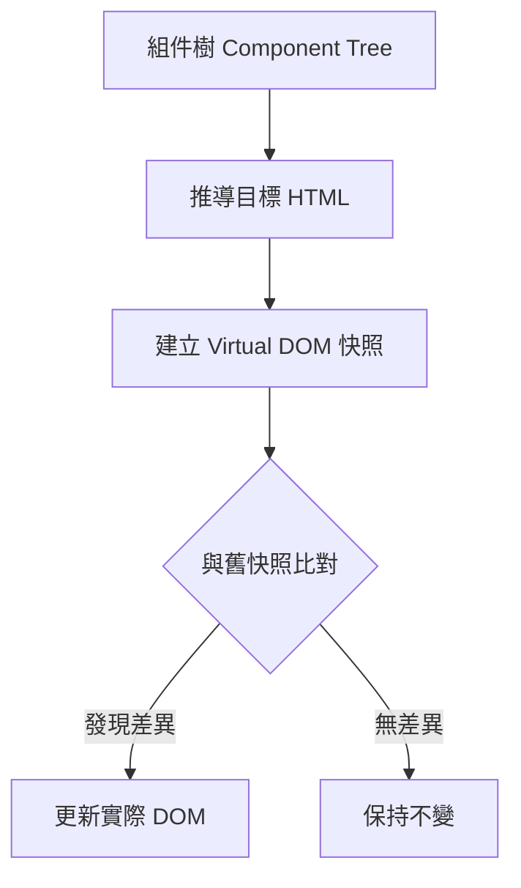
```mermaid
flowchart TD
    A[組件樹 Component Tree] --> B[推導目標 HTML]
    B --> C[建立 Virtual DOM 快照]
    C --> D{與舊快照比對}
    D -->|發現差異| E[更新實際 DOM]
    D -->|無差異| F[保持不變]
```

### React 更新流程：快照比對機制

- **[核心機制]** React 不會直接操作真實 DOM，而是先建立一個 Virtual DOM 的「快照」（Snapshot），作為真實 DOM 應有樣貌的虛擬表示。
- **[比對過程]**
    - React 會將「新的 Virtual DOM 快照」與「上一次的舊 Virtual DOM 快照」進行比對。
    - 透過這種比對，React 能精確找出哪些部分發生了變動。
- **[首次渲染的情境]**
    - 當應用程式剛啟動時，因為不存在任何「舊快照」，React 會認為所有內容都是新的。
    - 在這種情況下，React 會將整個 Virtual DOM 內容一次性地插入到真實 DOM 的 root 元素（例如 `<div id="root"></div>`）中。

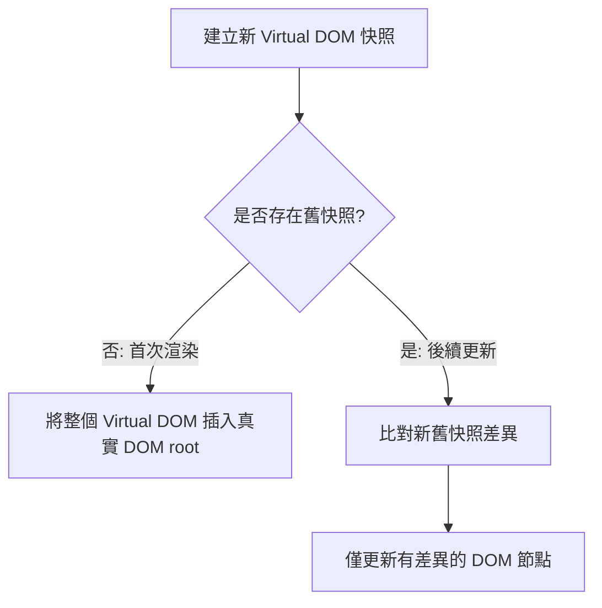
```mermaid
flowchart TD
    A[建立新 Virtual DOM 快照] --> B{是否存在舊快照?}
    B -->|否: 首次渲染| C[將整個 Virtual DOM 插入真實 DOM root]
    B -->|是: 後續更新| D[比對新舊快照差異]
    D --> E[僅更新有差異的 DOM 節點]
```

### React 更新 UI 的完整流程

當狀態改變觸發重新渲染時，React 會重複執行以下步驟來更新介面：

1. **重新建立組件樹 (Re-creating the Component Tree)**

    - React 會再次執行受影響的組件函數（例如 `Counter` 組件）
    - 根據組件的執行結果，重新構建組件樹
    - **[效能關鍵]** React 能快速判斷樹中的哪些部分發生了變化（例如哪些組件函數被重新執行了，以及是否因為使用了 `memo()` 而跳過了某些組件）

2. **建立新的 Virtual DOM 快照 (Creating a New Virtual DOM Snapshot)**

    - 從新的組件樹中推導出最新的目標 HTML 程式碼
    - 將這些 HTML 轉換為新的 Virtual DOM 快照

3. **虛擬比對 (Virtual Comparison)**

    - React 會將「新的 Virtual DOM 快照」與「舊的 Virtual DOM 快照」進行比對
    - **[重要觀念]** 這個比對過程完全是在「虛擬層級」進行的，React **不會** 直接拿這些程式碼去跟真實的 DOM 做比對

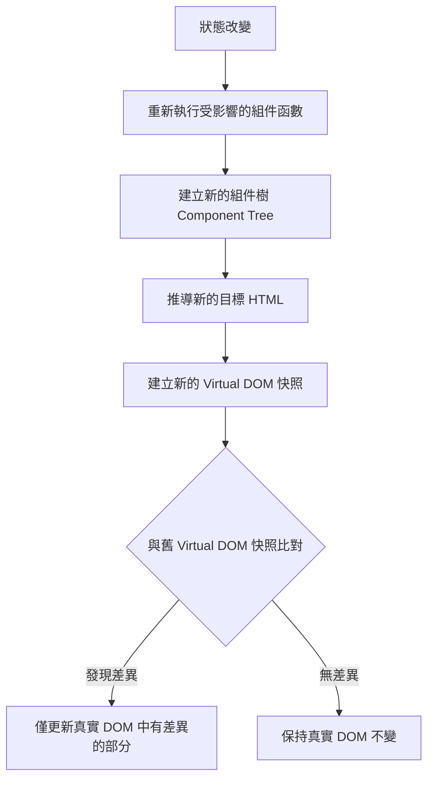
```mermaid
flowchart TD
    A[狀態改變] --> B[重新執行受影響的組件函數]
    B --> C[建立新的組件樹 Component Tree]
    C --> D[推導新的目標 HTML]
    D --> E[建立新的 Virtual DOM 快照]
    E --> F{與舊 Virtual DOM 快照比對}
    F -->|發現差異| G[僅更新真實 DOM 中有差異的部分]
    F -->|無差異| H[保持真實 DOM 不變]
```

#### 範例分析：Counter 更新流程

- **受影響的組件**：`Counter` 組件及其子組件（如 `IconButton`，取決於是否使用了 `memo()`）會重新執行
- **未受影響的組件**：`Header` 組件因為其 props 與狀態未變，會被跳過，不參與重新執行
- **最終結果**：React 透過比對新舊快照，精確地只更新真實 DOM 中需要變動的節點（例如數值顯示部分）

### 識別並套用變更至真實 DOM

- **[比對結果]** 當 React 完成新舊 Virtual DOM 快照的比對後，會迅速找出所有發生變動的部分。
- **[精確更新]**
    - React 不會重新渲染整個頁面，而是僅針對有差異的最小單位進行操作。
    - 例如：在 `Counter` 組件中，如果只有數值變動，React 只會找到該特定的 `<span>` 節點，並將其舊有的文字替換為新文字。
    - **[核心觀念]** 組件函數的重新執行（Re-evaluation）並不代表整個真實 DOM 都會被重新建立或更新。React 的目標是「只做必要的變動」。

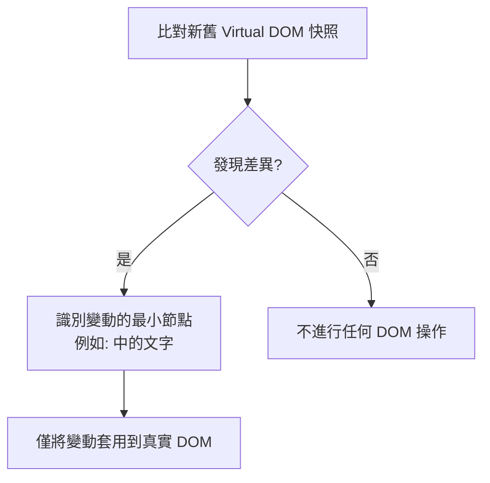
```mermaid
flowchart TD
    A[比對新舊 Virtual DOM 快照] --> B{發現差異?}
    B -->|是| C["識別變動的最小節點<br/>例如: <span> 中的文字"]
    C --> D[僅將變動套用到真實 DOM]
    B -->|否| E[不進行任何 DOM 操作]
```

#### 實例分析：文字節點更新

根據 Virtual DOM 的比對過程，更新範圍如下：

| 元素類型 | 狀態 | 處理方式 |
| --- | --- | --- |
| <header> | 無變動 | 保持不變 |
| <section id="configure-counter"> | 無變動 | 保持不變 |
| <span class="counter-output"> | 有變動 | 替換內部文字內容 |
| 其他按鈕與輸入框 | 無變動 | 保持不變 |

### 避免頻繁操作真實 DOM

- **[效能考量]** 直接操作真實 DOM 是非常耗費效能（performance intensive）的操作
- **[React 的策略]** React 不會隨時隨地更新真實 DOM，而是採用以下流程來優化：
    - 建立 Virtual DOM 快照
    - 進行快照比對
    - **僅**在必要時才對真實 DOM 進行必要的變更，以達成目標結果

### React 狀態的作用域與生命週期

- **[狀態作用域]** 在組件函數中註冊的狀態（state）是屬於該組件本身的（scoped to that component）
- **[狀態重新建立]** 當該組件被重複使用（reuse）時，狀態會重新建立
    - 例如：若在 `App` 組件中多次調用同一個 `Counter` 組件，每個 `Counter` 實例都會擁有自己獨立的狀態，彼此不會互相干擾

#### 程式碼實例：Counter 組件結構

```javascript
const Counter = memo(function Counter({ initialCount }) {
    log('<Counter /> rendered', 1);

    const initialCountIsPrime = useMemo(() => isPrime(initialCount), [initialCount]);
    const [counter, setCounter] = useState(initialCount);

    const handleDecrement = useCallback(function handleDecrement() {
        setCounter(prevCounter => prevCounter - 1);
    }, []);

    const handleIncrement = useCallback(function handleIncrement() {
        setCounter(prevCounter => prevCounter + 1);
    }, []);

    return (
        <section className="counter">
            <p className="counter-info">
                The initial counter value was <strong>{initialCount}</strong>. It's prime number...
            </p>
            {/* ...其餘內容 */}
        </section>
    );
});
```

### 組件的可重用性與獨立狀態

- **[核心觀念]** 組件之所以可以被重複使用，是因為狀態是與組件實例綁定的，而非與組件函數本身綁定。
- **[狀態獨立性]** 當同一個組件函數被多次調用以建立多個組件實例時，每個實例都會擁有自己獨立的狀態（state），彼此之間不會共享或互相影響。
    - 例如：在 `App` 組件中調用兩次 `<Counter />`，改變第一個計數器的數值，第二個計數器的數值將保持不變。

#### 實例程式碼分析：App 組件的渲染結構

透過多次調用 `Counter` 組件，可以觀察到每個實例如何接收不同的初始值並維持獨立狀態：

```javascript
function App() {
    // ... 其他邏輯
    return (
        <>
            <Header />
            <main>
                <ConfigureCounter onSet={handleSetCount} />
                <Counter initialCount={chosenCount} />
                <Counter initialCount={0} />
            </main>
        </>
    );
}
```

- **[行為觀察]**
        - 第一個 `<Counter />` 的狀態由 `chosenCount` 決定。
        - 第二個 `<Counter />` 的狀態固定為 `0`。
        - 即使兩者使用相同的組件邏輯，它們在執行時仍是兩個完全隔離的狀態實體。

### React 狀態追蹤的機制

- **[核心觀念]** 除了組件實例本身，React 實際上是透過「位置（position）」來追蹤狀態的
- **[狀態追蹤原理]** 每個組件實例在組件樹中的特定位置，決定了它所擁有的狀態及其生命週期

#### 實作案例：從單一數值改為變動列表

為了證明狀態與位置的關係，將 `Counter` 組件的邏輯從追蹤單一數值改為追蹤一個包含所有變動紀錄的陣列：

```javascript
// Counter.jsx
const [counterChanges, setCounterChanges] = useState([initialCount]);

const currentCounter = counterChanges.reduce(
    (prevCounter, counterChange) => prevCounter + counterChange,
    0
);

const handleDecrement = useCallback(function handleDecrement() {
    setCounterChanges(prevCounterChanges => [-1, ...prevCounterChanges]);
}, []);

const handleIncrement = useCallback(function handleIncrement() {
    setCounterChanges(prevCounterChanges => [1, ...prevCounterChanges]);
}, []);
```

- **[邏輯變更]**
    - **狀態型態**：從單一的 `counter` 數值變更為 `counterChanges` 陣列
    - **數值計算**：使用 `.reduce()` 方法，根據陣列中的所有變動（如 `1` 或 `-1`）來計算當前的 `currentCounter` 總和
    - **更新方式**：每次點擊按鈕時，不再是直接加減數值，而是將新的變動值（`1` 或 `-1`）以展開運算符（spread operator）的方式加入陣列的最前端

### 實作 `CounterHistory` 組件

為了視覺化計數器的變動歷程，引入了 `CounterHistory` 組件，其核心功能是將所有的按鈕點擊紀錄（即變動值）以列表形式輸出。

- **[功能描述]** 該組件旨在輸出這些不同的按鈕按壓紀錄（button presses），也就是說，它會列出所有對計數器進行過的變動。
- **[實作方式]** 透過接收一個名為 `history` 的 props，並利用陣列的 `.map()` 方法來渲染每一個變動項目。

#### `CounterHistory.jsx` 程式碼結構

```javascript
export default function CounterHistory({ history }) {
    log('<CounterHistory /> rendered', 2);

    return (
        <ol>
            {history.map((count, index) => (
                <HistoryItem key={index} count={count} />
            ))}
        </ol>
    );
}
```

- **[渲染邏輯]**
    - 使用 `<ol>`（有序列表）作為容器。
    - 遍歷 `history` 陣列，並為每個元素渲染一個 `HistoryItem` 組件。
    - 使用 `index` 作為 `key`（雖然在實際開發中建議使用更穩定的唯一識別碼，但在此範例中用於展示如何將陣列資料映射到 UI）。

### 整合 `CounterHistory` 組件

為了在介面上顯示計數器的變動歷程，需要將 `CounterHistory` 組件引入並放置在 `Counter` 組件的渲染邏輯中。

- **[實作步驟]**
    - 首先在 `Counter.jsx` 的頂部匯入 `CounterHistory` 組件。
    - 在 `Counter` 組件的 JSX 結構中加入 `<CounterHistory />`。
    - **[關鍵步驟]** 必須將 `counterChanges` 狀態透過 `history` prop 傳遞給該組件，這樣 `CounterHistory` 才能獲取到最新的變動陣列。

#### `Counter.jsx` 整合範例

```javascript
// Counter.jsx 頂部
import CounterHistory from './CounterHistory.jsx';

// ... 其他程式碼

return (
    <section className="counter">
        {/* ... 其他內容 ... */}

        <CounterHistory history={counterChanges} />
    </section>
);
```

- **[執行結果]** 透過這種方式，每當 `counterChanges` 陣列發生變動（例如點擊加減按鈕），`CounterHistory` 就會接收到新的資料並重新渲染，從而即時更新顯示的歷史列表。

### `HistoryItem` 的局部狀態管理

在 `CounterHistory` 組件中，每一個渲染出來的歷史紀錄項目（`HistoryItem`）都具備自己的獨立狀態，這使得我們可以單獨控制某個項目的視覺呈現。

- **[功能描述]** 每個 `HistoryItem` 都可以被「選取」或「高亮」（highlighted/selected），且這個狀態僅存在於該項目本身。
- **[實作方式]** 在 `HistoryItem` 組件內部使用 `useState` 來追蹤該項目的選取狀態。

#### `CounterHistory.jsx` 程式碼細節

```javascript
function HistoryItem({ count }) {
    log('<HistoryItem /> rendered', 3);

    const [selected, setSelected] = useState(false);

    function handleClick() {
        setSelected(prevSelected => !prevSelected);
    }

    return (
        <li onClick={handleClick} className={selected ? 'selected' : undefined}>
            {count}
        </li>
    );
}

export default function CounterHistory({ history }) {
    log('<CounterHistory /> rendered', 2);

    return (
        <ol>
            {history.map((count, index) => (
                <HistoryItem key={index} count={count} />
            ))}
        </ol>
    );
}
```

- **[狀態與互動邏輯]**
    - `selected`：一個布林值，記錄當前項目是否被選中。
    - `setSelected`：用於切換（toggle）選取狀態的函式。
    - `handleClick`：當使用者點擊 `<li>` 元素時觸發，透過 `setSelected(prevSelected => !prevSelected)` 來反轉目前的狀態。
    - **[視覺呈現]** 根據 `selected` 的值，動態切換 `className`（若為 `true` 則套用 `'selected'` 樣式，否則為 `undefined`）。
- **[獨立性]** 由於每個 `HistoryItem` 都有自己的 `useState` 呼叫，因此點擊其中一個項目時，只有該項目的 `selected` 狀態會改變，不會影響到其他 `HistoryItem` 或父組件 `CounterHistory` 的狀態。

### 列表渲染中的狀態錯位問題

雖然 `HistoryItem` 擁有獨立的 `selected` 狀態，但在處理動態變動的列表時，會遇到狀態與內容不一致的問題。

- **[問題現象]** 當使用者選取了列表中的某個項目（例如第二個項目）後，若接著點擊計數器的增加或減少按鈕，列表內容會更新，但原本被選中的「視覺高亮」卻會停留在原本的「位置」上，而不是跟著原本的資料走。
- **[核心原因]** 這說明了目前的實作方式（如使用 `index` 作為 `key`）導致 React 認為該位置的組件並沒有改變，因此保留了該位置原有的內部狀態，但該位置對應的資料（`count` 值）卻已經變了。

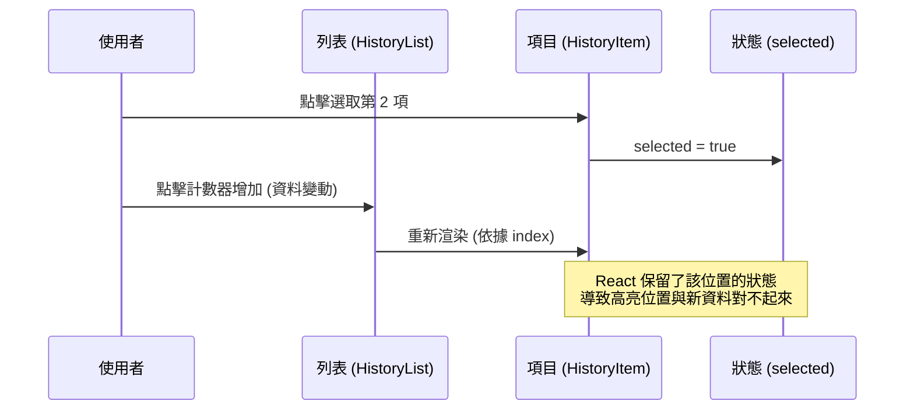
```mermaid
sequenceDiagram
    participant U as 使用者
    participant L as 列表 (HistoryList)
    participant I as 項目 (HistoryItem)
    participant S as 狀態 (selected)

    U->>I: 點擊選取第 2 項
    I->>S: selected = true
    U->>L: 點擊計數器增加 (資料變動)
    L->>I: 重新渲染 (依據 index)
    Note over I,S: React 保留了該位置的狀態<br/>導致高亮位置與新資料對不起來
```

### React 狀態的追蹤機制

一個常見的問題是：如果狀態（state）屬於一個具體的組件實例，為什麼它會在組件實例之間「跳轉」？這涉及到 React 如何識別並連結狀態。

React 追蹤狀態是基於兩個維度的結合：

1. **組件類型 (Component Type)**：例如，該組件是否為 `HistoryItem`。
2. **組件位置 (Position)**：該組件在組件樹（Component Tree）中所處的具體路徑或位置。

- **[核心概念]** 狀態並不單純只屬於某個組件類型，而是屬於「在特定位置上的該類型組件」。
- **[狀態跳轉的原因]** 當組件樹的結構發生變化（例如透過索引 `key` 進行渲染），雖然組件類型沒變，但原本位於位置 A 的組件現在可能對應到了位置 B 的新資料，React 會根據「位置」將舊的狀態保留在該位置上，導致狀態看起來像是「跳轉」到了新的資料項身上。

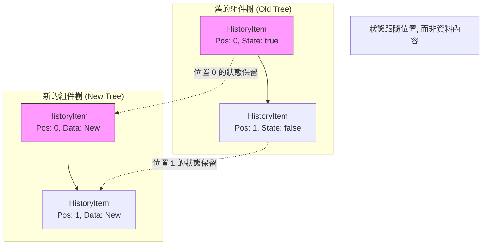
```mermaid
graph TD
    subgraph "舊的組件樹 (Old Tree)"
        A1["HistoryItem<br/>Pos: 0, State: true"] --> A2["HistoryItem<br/>Pos: 1, State: false"]
    end

    subgraph "新的組件樹 (New Tree)"
        B1["HistoryItem<br/>Pos: 0, Data: New"] --> B2["HistoryItem<br/>Pos: 1, Data: New"]
    end

    A1 -.->|位置 0 的狀態保留| B1
    A2 -.->|位置 1 的狀態保留| B2

    style A1 fill:#f9f,stroke:#333
    style B1 fill:#f9f,stroke:#333
    note["狀態跟隨位置, 而非資料內容"]
```

### `CounterHistory` 中的狀態跳轉詳解

在 `CounterHistory` 組件中，由於使用了 `index` 作為 `key`，會發生嚴重的狀態錯位現象。

- **[穩定組件 vs. 動態列表]**
    - 對於 `Counter` 組件，其在組件樹中的位置是固定的，因此狀態與組件類型及位置的綁定非常穩定。
    - 對於 `CounterHistory` 列表，情況完全不同。因為每次新增計數時，新項目都會被插入到列表的**頂部**。
- **[位置改變導致的連鎖反應]**
    - 當新項目插入頂部，原本位於位置 0 的組件會變成位置 1，原本位置 1 的變成位置 2，依此類推。
    - 由於 React 將狀態（State）與「組件類型」和「組件位置」進行綁定，當位置發生變動時，React 會認為「該位置上的組件」依然存在，並將原本儲存在該位置的狀態保留下來。
- **[結果]**
    - 當使用者點擊增加按鈕，新資料進入列表頂部，原本被選中的「高亮狀態」會隨著位置向下移動，看起來就像是狀態「跳轉」到了新的資料項身上，而非跟著原本的資料走。

```javascript
// CounterHistory.jsx 中的問題實作
export default function CounterHistory({ history }) {
  return (
    <ol>
      {history.map((count, index) => (
        // 使用 index 作為 key 是導致狀態錯位的根本原因
        <HistoryItem key={index} count={count} />
      ))}
    </ol>
  );
}
```

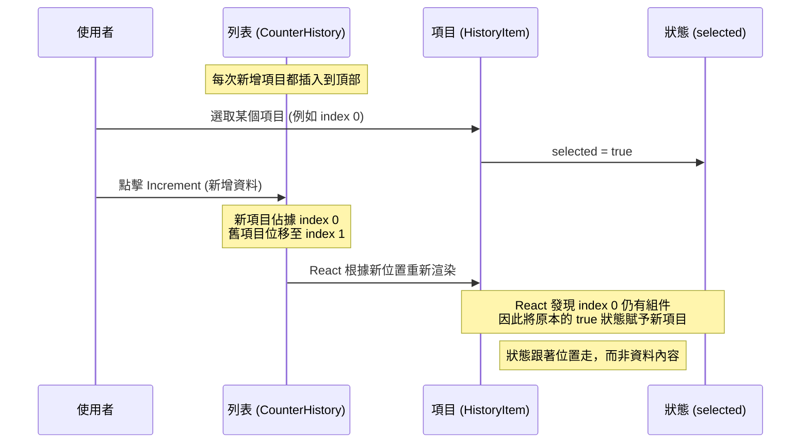
```mermaid
sequenceDiagram
    participant U as 使用者
    participant L as 列表 (CounterHistory)
    participant I as 項目 (HistoryItem)
    participant S as 狀態 (selected)

    Note over L: 每次新增項目都插入到頂部
    U->>I: 選取某個項目 (例如 index 0)
    I->>S: selected = true
    U->>L: 點擊 Increment (新增資料)
    Note over L: 新項目佔據 index 0<br/>舊項目位移至 index 1
    L->>I: React 根據新位置重新渲染
    Note over I,S: React 發現 index 0 仍有組件<br/>因此將原本的 true 狀態賦予新項目
    Note right of I: 狀態跟著位置走，而非資料內容
```

### 使用 `key` 解決狀態跳轉問題

為了避免在列表更新時發生狀態跳轉（例如選取的項目跟隨位置移動而非資料移動），React 提供了一種機制：`key`。

- **[解決方案]** 透過為列表中的每個項目提供一個唯一的 `key`，可以讓 React 識別出哪些項目是新增的、哪些是被移除的，以及哪些只是移動了位置。
- **[問題發生的前提條件]** 這種狀態錯位問題通常只會發生在以下情況：
    - 列表包含多個**類型相同**（Same Type）的兄弟組件。
    - 這些組件的**數量或位置**會發生變動（例如動態生成的列表）。

```javascript
// CounterHistory.jsx 中的正確實作方向
// 應避免使用 index 作 as key，而是使用與資料關聯的唯一識別碼
export default function CounterHistory({ history }) {
  return (
    <ol>
      {history.map((item) => (
        // 使用資料本身的唯一 ID 作為 key，確保狀態與資料內容綁定
        <HistoryItem key={item.id} count={item.count} />
      ))}
    </ol>
  );
}
```

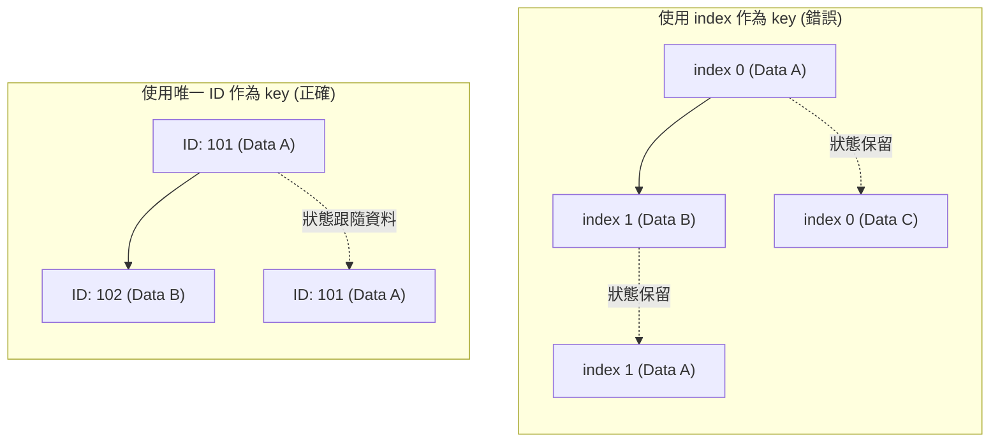
```mermaid
flowchart TD
    subgraph "使用 index 作為 key (錯誤)"
        direction TB
        I1["index 0 (Data A)"] --> I2["index 1 (Data B)"]
        I1 -.->|狀態保留| I1_new["index 0 (Data C)"]
        I2 -.->|狀態保留| I2_new["index 1 (Data A)"]
    end

    subgraph "使用唯一 ID 作為 key (正確)"
        direction TB
        U1["ID: 101 (Data A)"] --> U2["ID: 102 (Data B)"]
        U1 -.->|狀態跟隨資料| U1_new["ID: 101 (Data A)"]
    end
```

### `index` 作為 `key` 的失效機制

React 強制要求在列表項目中加入 `key`，是因為 React 需要利用這個 `key` 來將狀態（State）精確地映射到具體的組件實例（Component Instance）上。

- **[失敗原因]** 使用 `index` 作為 `key` 會導致狀態跳轉，因為 `index` 並不具備資料的唯一性
    - `index` 僅代表元素在陣列中的「位置」
    - 它並非與特定的資料內容（例如某個特定的 `count` 值）進行嚴格綁定
    - 當列表發生變動時，同一個 `index` 可能會對應到完全不同的資料內容

```javascript
// CounterHistory.jsx 中的錯誤實作
export default function CounterHistory({ history }) {
  return (
    <ol>
      {history.map((count, index) => (
        // 這裡的問題在於 key={index}
        // index 隨列表變動而改變，無法確保狀態與特定 count 綁定
        <HistoryItem key={index} count={count} />
      ))}
    </ol>
  );
}
```

### 深入探討 index 作為 key 的風險

雖然 `index` 在列表位置上是穩定的，但它與資料內容之間缺乏強綁定關係。

- **[問題核心]** 當列表內容發生變化時，`key` (即 `index`) 可能保持不變，但該 `index` 所代表的**資料值**卻已經改變了
    - 例如：在一個列表中，第一個項目的 `index` 永遠是 `0`
    - 當你在列表頂部插入新資料時，原本在 `index 0` 的資料會移到 `index 1`
    - 此時，新的資料會佔據 `index 0`，但 React 會因為 `key={0}` 沒變，而將原本屬於舊資料的狀態錯誤地保留在新的資料項上
- **[最佳實踐]** 應該尋求一種與特定值**嚴格關聯**（strictly connected）的 `key`
    - 理想的 `key` 應該是資料本身攜帶的唯一識別碼（例如 `id`），而非僅僅是它在陣列中的位置

### 透過物件與唯一 ID 實現狀態綁定

為了徹底解決使用 `index` 作為 `key` 導致的狀態錯位問題，不應僅在狀態陣列中儲存單純的數字，而應將其轉換為包含唯一識別碼的物件結構。

- **[實作方式]** 將原本的數值（例如 `1` 或 `-1`）改為物件格式，並額外增加一個 `id` 屬性
    - 屬性建議：`value`（儲存實際變動的值）與 `id`（用於作為 `key`）
- **[如何產生 ID]**
    - 在實際開發中，通常直接使用來自資料庫的唯一 ID
    - 在 Demo 或簡單情境下，可以使用 `Math.random() * 100` 來模擬產生唯一的 ID

```javascript
// Counter.jsx 中的優化實作
const handleDecrement = useCallback(function handleDecrement() {
  setCounterChanges(prevCounterChanges => [
    { value: -1, id: Math.random() * 100 }, // 將變動值與隨機 ID 綁定在一起
    ...prevCounterChanges
  ]);
}, []);

const handleIncrement = useCallback(function handleIncrement() {
  setCounterChanges(prevCounterChanges => [
    { value: 1, id: Math.random() * 100 },
    ...prevCounterChanges
  ]);
}, []);
```

**[為什麼這樣有效？]**

當我們使用 `id: Math.random() * 100` 作為 `key` 時，即使新的項目被插入到列表頂部，該項目的 `key` 始終與其內部的 `value` 綁定在一起。React 在進行比對時，會發現這個特定的 `key` 仍然存在，從而能正確地將該組件及其狀態與該特定資料內容對應，不會因為位置改變而導致狀態跳轉。

### 完成 `Counter.jsx` 的物件化重構

為了確保列表中的每個項目都有穩定的唯一識別碼，需要將原本僅儲存數值的狀態與處理函數，全部改為儲存包含 `value` 與 `id` 的物件。

- **[初始狀態重構]** 將初始的 `initialCount` 也封裝進物件中，確保初始值在列表中也有唯一的 `key`
- **[處理函數重構]** 在 `handleDecrement` 與 `handleIncrement` 中，不再直接存入數字，而是存入一個物件
    - 透過乘以 `1000`（如 `Math.random() * 1000`）來降低產生重複 ID 的風險

```javascript
// Counter.jsx 中的完整物件化實作

// 1. 初始狀態改為物件格式
const [counterChanges, setCounterChanges] = useState([
  { value: initialCount, id: Math.random() * 1000 }
]);

// 2. 遞減函數：存入包含 value 與隨機 id 的物件
const handleDecrement = useCallback(function handleDecrement() {
  setCounterChanges(prevCounterChanges => [
    { value: -1, id: Math.random() * 1000 },
    ...prevCounterChanges
  ]);
}, []);

// 3. 遞增函數：同樣存入物件格式
const handleIncrement = useCallback(function handleIncrement() {
  setCounterChanges(prevCounterChanges => [
    { value: 1, id: Math.random() * 1000 },
    ...prevCounterChanges
  ]);
}, []);

// 4. 計算目前的總數 (currentCounter)
// 因為 counterChanges 現在是物件陣列，需要存取 .value
const currentCounter = counterChanges.reduce(
  (prevCounter, counterChange) => prevCounter + counterChange.value,
  0
);
```

**[計算邏輯的調整]**

當狀態陣列中的元素從單純的數字變為物件後，使用 `reduce` 計算總和時，必須明確指定存取物件中的 `value` 屬性（即 `counterChange.value`），否則運算會失效。

### 消除對 `index` 的依賴

- **[為什麼要轉換為物件？]** 因為現在每個變動項都擁有一組屬於該特定變動物件的唯一 `id`
- **[對&#32;`CounterHistory`&#32;的影響]** 由於 `counterChanges` 現在是一個物件陣列，我們可以將 `id` 作為 `key` 傳遞給 `CounterHistory` 中的組件
    - 這樣就不再需要使用不穩定的 `index` 作為 `key` 了

```javascript
// CounterHistory.jsx 中的實作邏輯
{history.map((count) => (
  <HistoryItem key={count.id} count={count.value} />
))}
```

**[解決方案的核心]**

透過將 `count.id` 作為 `key`，即使列表頂部插入了新項目，React 也能識別出舊有的 `id` 仍然存在，從而保持狀態與正確的資料項綁定，徹底解決狀態跳轉問題。

### `key` 對於狀態一致性的關鍵作用

透過實際操作驗證，當在列表中點擊 Decrement 並選取某個項目時，該項目的選取狀態會隨著項目的移動而移動。

- **[行為觀察]** 狀態現在會隨著該項目一起移動，而不再是在不同的組件實例之間跳轉。
- **[核心原理]** `key` 的存在讓 React 能夠在動態列表中明確識別出特定的組件實例
    - 這確保了組件內部的狀態（如 `selected`）能與該特定的組件實例緊密綁定
    - 當列表順序改變時，React 知道哪個狀態屬於哪個 `key`，進而維持狀態的一致性

### 使用 `index` 作為 `key` 的負面影響

除了會導致狀態跳轉問題外，使用陣列索引（`index`）作為 `key` 還會帶來效能上的問題。

- **[觀察現象]** 當使用 `index` 作為 `key` 時，每當點擊按鈕更新列表，瀏覽器開發者工具中的 Elements 面板會顯示所有列表項目（`li`）都在閃爍
    - 這代表 React 認為所有項目都發生了變化
    - 實際上，React 觸碰（touch）了每一個組件實例

```javascript
// 使用 index 作為 key 的錯誤做法
{history.map((count, index) => (
  <HistoryItem key={index} count={count.value} />
))}
```

**[為什麼會這樣？]**

因為當列表順序改變時（例如在頂部插入新項目），原本的 `index` 0 會變成 `index` 1，原本的 `index` 1 變成 `index` 2。對於 React 來說，`key` 改變了，它就會認為這是全新的組件，進而重新渲染整個列表，而不是只更新變動的部分。

### `index` 作為 `key` 導致的渲染失效機制

- **[React 的錯誤判斷]** 當使用 `index` 作為 `key` 並點擊 Increment 時，React 在建立 DOM 快照時會發現 HTML 結構與之前完全不同
    - **[導致的結果]** React 會認為整個列表都發生了變化，因此會直接捨棄舊的列表，並重新渲染整個新的列表，而非僅更新變動的部分
- **[人類觀點 vs. React 觀點]**
    - **人類觀察**：我們能清楚看到只是在列表頂部增加了一個新項目，其餘項目只是往下移動了一格
    - **React 觀察**：因為 `key` 是基於 `index` 的，原本在 `index` 0 的項目現在變成了 `index` 1，這導致 React 認為每個項目的 `key` 都變了，無法識別出它們是原本的同一個組件實例，進而造成不必要的全量重新渲染。

### 使用穩定 `key` (如 `count.id`) 的優化效果

當將 `key` 從不穩定的 `index` 切換為穩定的 `count.id` 後，React 的渲染行為會發生顯著變化：

- **[觀察現象]** 在列表更新時，瀏覽器 Elements 面板不再顯示整個列表都在閃爍，而是只有真正發生變動的項目會被更新
    - **[具體行為]** 例如在列表頂部增加新項目時，只有第一個元素會發生更新（閃爍），其餘元素則保持穩定
- **[核心差異]**
    - **使用&#32;`index`**：React 認為所有項目的 `key` 都變了，導致整個列表重新渲染
    - **使用&#32;`id`**：React 能識別出舊有的項目只是位置移動了，因此僅針對新增或變動的項目進行 DOM 操作

```javascript
// CounterHistory.jsx 中的優化實作
{history.map((count) => (
  <HistoryItem key={count.id} count={count.value} />
))}
```

### `key` 在渲染優化中的雙重作用

除了在前一節提到的狀態管理功能外，使用穩定的 `key` 對於 React 的渲染效能也至關重要。

- **[核心機制]** React 會將 `key` 儲存在先前的虛擬 DOM（Virtual DOM）快照中
    - 當列表更新時，React 會比對新舊快照中的 `key`
    - 如果 `key` 匹配，React 就會識別出該元素在 DOM 中已經存在
- **[渲染優化]** 透過識別已存在的 `key`，React 可以直接**重用（reuse）**舊的 DOM 元素
    - **[動作]** React 不會捨棄舊的 HTML 並重新建立新的，而是僅在必要處進行插入或修改（例如在舊元素前插入一個新元素）
    - **[結果]** 這種局部更新機制避免了大規模的 DOM 重新建立，使列表渲染變得更加高效

### `key` 的多重用途

- **[擴展概念]** `key` 的重要性不僅限於處理列表（lists）中的項目

### `App` 組件的狀態傳遞觀察

在 `App.jsx` 中，透過 `useState` 管理 `chosenCount` 狀態，並將其作為初始值傳遞給 `Counter` 組件。

```javascript
// App.jsx 中的部分程式碼
import { useState } from 'react';
import Counter from './components/Counter/Counter.jsx';

function App() {
  log('<App /> rendered');
  const [chosenCount, setChosenCount] = useState(0);

  function handleSetCount(newCount) {
    setChosenCount(newCount);
  }

  return (
    <main>
      <ConfigureCounter onSet={handleSetCount} />
      <Counter initialCount={chosenCount} />
    </main>
  );
}
```

- **[狀態更新的連鎖反應]** 當透過 `ConfigureCounter` 修改 `chosenCount` 並點擊「Set」時：
    - `chosenCount` 的值會改變
    - 該變動會影響到接收此 props 的 `Counter` 組件
    - **[觀察案例]** 例如在介面上輸入一個質數（prime number），對應的顯示文字也會隨之更新，這證明了狀態的改變確實觸發了相關部分的重新渲染。

### `useState` 初始值的生命週期

在 `Counter` 組件中，透過 `initialCount` prop 來設定初始狀態。然而，當 `App` 組件中的 `chosenCount` 發生變動並傳遞新的值給 `Counter` 時，`Counter` 內部的計數器並不會跟著重置。

- **[核心行為]** `useState(initialValue)` 中的 `initialValue` **僅在組件首次掛載（Mount）並執行第一次時使用**
    - 一旦組件完成初始化，React 就會開始管理該狀態的生命週期
    - 在後續的重新渲染（Re-render）中，即使傳入的 `initialCount` 發生了變化，`useState` 也會直接回傳目前的狀態值，而忽略新的初始值

```javascript
// Counter.jsx 中的狀態初始化
const [counter, setCounter] = useState(initialCount);
```

- **[問題點]** 如果希望當 `initialCount` 這個 prop 改變時，組件內部的狀態也要同步更新（例如重置計數器），單純依賴 `useState` 的參數是做不到的，這需要額外的處理機制。

### 使用 `useEffect` 同步狀態

由於 `useState` 的初始值僅在組件首次掛載時生效，若要讓組件內部的狀態隨 `initialCount` prop 的變動而更新，可以使用 `useEffect` 鉤子。

- **[實作方式]** 透過 `useEffect` 監聽 `initialCount` 的變化
    - 將 `initialCount` 加入依賴陣列中
    - 在 Effect 函數內呼叫狀態更新函數（如 `setCounterChanges`）

```javascript
// Counter.jsx 中的 useEffect 實作
useEffect(() => {
  setCounterChanges([{ value: initialCount, id: Math.random() * 1000 }]);
}, [initialCount]);
```

- **[運作邏輯]**
    - 當 `initialCount` 發生變動時，React 會偵測到依賴項已更新
    - 進而執行 `useEffect` 內部的邏輯
    - 透過更新 `counterChanges` 狀態，達到同步內部狀態與外部 props 的目的

### `useEffect` 的效能成本

雖然使用 `useEffect` 可以解決 props 與內部狀態同步的問題，但這種做法存在潛在的效能代價：

- **[額外的渲染次數]** `useEffect` 的執行時機是在組件函數執行完成之後
    - 這意味著當 Effect 內部的狀態更新函數（如 `setCounterChanges`）被呼叫時，會引發**第二次**組件執行（re-execution）
    - 流程如下：

        1. 組件函數執行（渲染）
        2. 瀏覽器繪製畫面
        3. `useEffect` 執行
        4. 觸發狀態更新
        5. 組件再次執行（重新渲染）

- **[最佳實踐建議]** 應儘量限制 `useEffect` 的使用
    - 過度使用 `useEffect` 通常是開發模式不夠優化的徵兆
    - 應思考是否有更直接的方式來處理資料流，以避免這種「渲染 $\rightarrow$ Effect $\rightarrow$ 再次渲染」的循環

### 使用 `key` 強制重置組件

先前討論過使用 `useEffect` 來同步 `initialCount` 的做法會導致額外的組件執行次數（渲染 $\rightarrow$ Effect $\rightarrow$ 再次渲染），這並非最優解。

- **[更佳方案]** 使用 `key` prop 來強制組件重置
    - 透過將變動的數值（如 `chosenCount`）作為 `key` 傳遞給組件，可以強迫 React 重新建立該組件
    - **[原理]** 當一個組件的 `key` 發生改變時，React 會認為這是一個全新的組件，進而執行「卸載（Unmount）舊組件」與「掛載（Mount）新組件」的流程
    - **[優點]** 由於組件是重新掛載的，`useState` 會直接使用新的 `initialCount` 進行初始化，完全不需要透過 `useEffect` 手動同步狀態，從而減少了不必要的重新渲染次數

```javascript
// App.jsx 中的實作方式
<Counter key={chosenCount} initialCount={chosenCount} />
```

- **[關於 key 的使用範圍]**
    - `key` 不僅僅是用於列表（List）中的項目，也可以應用在任何單獨的組件上，用來控制其生命週期與狀態重置。

### 使用 `key` 作為重置組件的模式

除了用於列表渲染外，將一個變動的狀態值作為 `key` 傳遞給組件，是一種非常有用的開發模式。

- **[核心機制]** 當 `key` 的值發生改變時，React 會採取以下行動：
    - 銷毀（Destroy）舊的組件實例
    - 重新建立（Recreate）一個全新的組件實例
    - **[結果]** 組件的行為會變得跟「第一次渲染」時完全一樣，這能有效解決需要根據外部變化來重置內部狀態的需求。
- **[實作範例]** 在 `App.jsx` 中，將 `chosenCount` 作為 `Counter` 組件的 `key`：

```javascript
// App.jsx
<Counter key={chosenCount} initialCount={chosenCount} />
```

- **[注意事項]**
    - **[唯一性限制]** 如果你在同一個層級中對多個組件使用了相同的 `key` 值，React 會發出警告，此時必須為每個組件尋找不同的 `key`。
    - **[適用場景]** 當你有某些狀態（state）的改變，必須連帶讓某個組件的所有內部狀態都「歸零」或「重新初始化」時，這個模式非常適合。

### 使用 `key` 重置組件的效能優勢

透過將變動的狀態作為 `key` 傳遞給組件，可以取代原本需要使用 `useEffect` 才能達到的同步效果。

- **[優化原理]**
    - 使用 `key` 時，舊組件會直接被移除（Unmount），並重新插入（Mount）一個相同類型的新組件
    - **[避免額外執行]** 這種方式避免了「渲染 $\rightarrow$ Effect $\rightarrow$ 再次渲染」的循環，因為新組件在掛載時會直接使用新的 props 進行初始化，不需要在渲染後再透過 Effect 去修正狀態
    - **[執行次數]** 組件函數只會執行一次（即首次掛載時的執行），而不需要因為狀態同步而觸發第二次執行

```javascript
// App.jsx 中的實作
// 當 chosenCount 改變時，Counter 會被視為全新組件重新掛載
<Counter key={chosenCount} initialCount={chosenCount} />
```

- **[總結比較]**
    - **使用&#32;`useEffect`&#32;同步**：組件執行 $\rightarrow$ 瀏覽器繪製 $\rightarrow$ Effect 執行 $\rightarrow$ 觸發狀態更新 $\rightarrow$ 組件再次執行（較低效）
    - **使用&#32;`key`&#32;重置**：舊組件銷毀 $\rightarrow$ 新組件掛載並執行一次（較高效）

### 重置組件模式的總結

- **[開發模式]** 使用變動的狀態值作為 `key` 來強制重置組件，是一個非常實用且值得記住的設計模式
    - 這能以最直觀的方式解決「當外部屬性改變時，必須同步重置內部狀態」的需求
    - 相比於使用 `useEffect` 來同步狀態，這種方式更符合 React 的宣告式（declarative）哲學，且能避免不必要的額外渲染循環

### 狀態更新的排程機制

在 React 中，呼叫狀態更新函數（例如 `setChosenCount`）並不會立即改變當前作用域內的變數值。

- **[非同步排程]**
    - 當你呼叫狀態更新函數時，React 會將該更新「排程化（scheduled）」，而不是立即執行。
    - **[觀測現象]** 如果在呼叫更新函數後緊接著進行 `console.log`，你會發現印出的仍然是**舊的狀態值**，而非預期的新值。

```javascript
// App.jsx 中的觀察範例
function handleSetCount(newCount) {
    setChosenCount(newCount); // 請求更新狀態
    console.log(chosenCount); // 這裡印出的仍是「舊的」chosenCount
}
```

- **[為什麼會這樣？]**
    - 因為狀態更新需要等待 React 完成目前的執行階段，並根據排程來重新計算組件並觸發下一次渲染。在目前的函數執行週期內，變數 `chosenCount` 的值並不會改變。

### 狀態更新與當前執行週期的關係

一個常見的誤解是認為在程式碼中更新狀態後，下一行就能立即使用更新後的值。事實上，這並不會發生。

- **[為什麼無法立即取得新值？]**
    - 狀態更新是由 React 進行「排程（scheduled）」的，它不會立即執行。
    - **[變數的範疇]** 當你在目前的組件函數執行週期中呼叫更新函數時，該變數值屬於「舊的組件函數執行實例」，它不會因為排程了一個更新就發生「魔法般的改變」。
- **[React 的實際運作方式]**
    - 狀態更新的過程並非修改現有變數，而是**觸發一次全新的組件函數執行**。
    - 在下一次組件執行時，React 會將新的狀態值傳入，這時你才能取得正確的新值。

```javascript
// App.jsx 中的觀察範例
function App() {
    const [chosenCount, setChosenCount] = useState(0);

    function handleSetCount(newCount) {
        setChosenCount(newCount); // 請求更新狀態（排程中）
        console.log(chosenCount); // 這裡印出的仍是「舊的」chosenCount
    }
    // ...
}
```

- **[總結]**
    - 狀態更新 $\rightarrow$ 觸發排程 $\rightarrow$ React 重新執行組件函數 $\rightarrow$ 在新的執行週期中取得新狀態值

### 使用函數形式進行狀態更新

由於 React 的狀態更新是經過「排程化」的，在處理依賴於「舊狀態值」來計算「新狀態值」的情況時，直接使用變數可能會遇到問題。

- **[最佳實踐]** 使用函數形式（functional form）來進行狀態更新
    - 在呼叫狀態更新函數時，傳入一個回呼函數（callback function）
    - 這個回呼函數會接收到 React 保證提供的**舊狀態快照（old state snapshot）**
    - 在函數內部根據這個快照計算並回傳新的狀態值
- **[為什麼這樣更安全？]**
    - 因為 React 會確保傳入回呼函數的參數永遠是當前最新的狀態快照
    - 這能有效避免在連續多次更新或非同步操作中，因為讀取到過時（stale）的變數值而導致的邏輯錯誤

```javascript
// 範例：依賴舊狀態進行更新
setCount(prevCount => prevCount + 1);
```

### 多重狀態更新的正確性保障

當在同一個執行週期中排程多個狀態更新時，React 會確保它們按照排程順序執行，且每次更新都能取得最新的狀態快照。

- **[確保正確性]**
    - React 會將更新按順序執行
    - 每次執行都會提供該時刻最新的狀態值，確保計算結果正確
- **[錯誤實作範例：直接使用舊變數值]**
    - 如果試圖在更新過程中結合「舊的狀態變數」與「新的值」來進行計算，會導致非預期的結果。
    - **[問題點]**：如果你在呼叫更新函數時，使用了當前作用域內仍然是「舊值」的變數，計算結果會基於舊值而非最新的排程值。

```javascript
// 錯誤的嘗試：假設我們想在 setChosenCount 的基礎上再 +1
// 如果我們直接使用舊的 chosenCount 變數進行運算：

setChosenCount(newCount + 1);
// 這裡的 newCount 如果是基於舊的狀態計算出來的，
// 而我們又想在現有的 chosenCount 上加 1，
// 這種混合使用舊變數的方式會導致結果不符合預期。
```

> **關鍵點**：若要進行連續或依賴性的更新，必須確保每一次更新都作用在 React 提供的最新快照上，而不是依賴於當前函數作用域內可能已經過時的變數。

### 確保連續更新的正確性

當需要同時執行多次狀態更新時，直接使用當前作用域內的變數會導致結果錯誤，因為該變數仍指向舊的快照。

- **[錯誤範例：直接使用變數]**
    - 如果在同一個函數中連續呼叫兩次更新，且都使用舊變數進行運算：

```javascript
// 假設 chosenCount 目前為 0
function handleSetCount(newCount) {
    setChosenCount(newCount);          // 請求將狀態改為 newCount (例如 1)
    setChosenCount(chosenCount + 1);  // 錯誤！這裡的 chosenCount 仍是 0，所以結果會變成 1
}
```

    - **[結果]**：即使你傳入了 `newCount`，第二次更新仍會基於舊的 `chosenCount` (0) 來計算，導致最終狀態停留在 1，而非預期的 2。
- **[正確做法：使用函數形式]**
    - 透過回呼函數，React 會保證將「前一次排程完成後的最新狀態」作為參數傳入。

```javascript
// 正確的連續更新方式
function handleSetCount(newCount) {
    setChosenCount(newCount);
    setChosenCount(prevChosenCount => prevChosenCount + 1);
}
```

    - **[運作機制]**
        - React 會依序執行這些排程。
        - 第二次更新時，React 會將第一次更新後的結果（最新的快照）傳給 `prevChosenCount`。
        - **[保證]**：這確保了所有排程中的更新都能按照順序，且基於最新的狀態值進行計算。

### 狀態更新後的變數值限制

在呼叫狀態更新函數後，當前函數作用域內的狀態變數並不會立即更新為新值。

- **[重要機制]** 狀態更新會觸發排程，並在下一次組件執行時提供新的狀態值
    - 當組件重新執行時，它會取得由狀態更新產生的新狀態快照
    - **[錯誤行為]** 不能在設定狀態後，立即在同一個函數作用域內使用該狀態變數來進行運算

```javascript
// 範例：在 App 組件中處理更新
function handleSetCount(newCount) {
    setChosenCount(newCount);
    // 這裡的 chosenCount 仍然是舊的值，不會是剛剛設定的 newCount
    console.log(chosenCount); // 這行不會如預期般印出新值，會印出舊值
}
```

- **[實例觀察]**
    - 若在 `handleSetCount` 中輸入 `10`：
        - `setChosenCount(10)` 被呼叫
        - 隨後透過函數形式更新 `setChosenCount(prev => prev + 1)`
        - 最終結果會是 `11`，因為第二次更新是基於 React 提供的最新快照進行計算

### 避免重複的組件執行

雖然在一個函數中呼叫多次狀態更新函數，理論上可能會觸發多次組件重新執行，但 React 並不會真的這樣做。

- **[技術上的可能性]**
    - 因為每一次狀態更新（State Update）都會觸發組件函數重新執行
    - 如果我們呼叫了兩次更新函數，技術上應該會預期組件執行兩次
- **[React 的實際處理]**
    - React 會確保在同一個函數中，不會產生多次組件函數的執行
    - 這能有效避免效能低下的情況

```javascript
function App() {
    log('<App /> rendered');

    const [chosenCount, setChosenCount] = useState(0);

    function handleSetCount(newCount) {
        setChosenCount(newCount);          // 第一個狀態更新
        setChosenCount(prevChosenCount => prevChosenCount + 1); // 第二個狀態更新
        console.log(chosenCount); // 這裡仍然會印出舊值
    }

    return (
        <main>
            <ConfigureCounter onSet={handleSetCount} />
            <Counter key={chosenCount} initialCount={chosenCount} />
            <Counter initialCount={0} />
        </main>
    );
}
```

- **[驗證方式]**
    - 清除瀏覽器 Console
    - 觸發 `handleSetCount` 函數
    - **[觀察結果]**：即使程式碼中呼叫了兩個 `setChosenCount`，Console 中也只會看到一次 `<App /> rendered` 的紀錄，證明組件只執行了一次。

### React 狀態批次處理 (State Batching)

當在同一個函數中觸發多個狀態更新時，React 不會為每個更新都重新執行一次組件函數。

- **[運作機制]** 狀態批次處理 (State Batching)
    - React 會將同一個函數內觸發的所有狀態更新「打包」在一起。
    - **[結果]** 最終只會導致組件函數重新執行一次，而不是多次。
- **[實例驗證]**
    - 在 `handleSetCount` 函數中，同時呼叫了 `setChosenCount(newCount)` 和函數形式的更新。
    - 透過瀏覽器 Console 觀察，即使有兩個狀態更新動作，`<App /> rendered` 的紀錄也只會出現一次。

```javascript
// 即使呼叫兩次，也只會觸發一次渲染
function handleSetCount(newCount) {
    setChosenCount(newCount);          // 更新 1
    setChosenCount(prev => prev + 1); // 更新 2
}
```

### Million.js

- 一個可以用來優化 React 應用程式效能的第三方套件
- **[如何深入了解]** 可以搜尋 "million.js" 並前往其官方網站查看詳細資訊

### Million.js 的效能與模式

- **[效能提升]** 官方宣稱可以讓 React 變快高達 70%
- **[費用]** 可以完全免費使用
- **[操作模式]**
    - **自動模式 (Automatic mode)**
        - 預設模式，也是最簡單的使用方式
        - 只需要將套件安裝到專案中即可開始提升效能
    - **手動模式 (Manual mode)**
        - 提供更高的控制權與靈活性，但使用起來較為複雜
- **[優化建議]** 若要榨出極致的效能增益，建議深入閱讀官方文件並研究各種配置選項

### 集成 Million.js

將 Million.js 加入專案需要兩個主要步驟：安裝套件與配置編譯器。

- **步驟 1：安裝套件**
    - 使用套件管理器（如 `npm` 或 `yarn`）進行安裝
    - 指令範例：

```bash
npm install million
```

- **步驟 2：配置編譯器 (Use the compiler)**
    - 由於本專案使用 Vite，必須在 `vite.config.js` 設定檔中進行調整
    - **[注意]** 官方文件針對不同的開發工具（如 Vite, Create React App, Webpack, Rspack 等）提供了不同的集成細節，開發時應參考對應的配置方式

### Million.js 的進階配置與衝突處理

- **[效能提升]** 透過配置 Vite 設定檔啟用 Million.js 後，即使沒有進行所有可能的優化，重新啟動開發伺服器或進行生產環境建置（Production build）時，仍應能感受到效能提升。
- **[處理組件衝突]** 在自動模式下，某些組件可能會與 Million.js 的運行時（runtime）發生衝突（例如圖標組件）。
    - **[解決方案]** 使用 `skip` 選項來忽略這些特定的組件。

#### 使用 `skip` 忽略特定組件

在 Million.js 的配置中，可以透過 `skip` 屬性提供一個陣列，列出所有需要被排除在優化之外的組件名稱。

```javascript
// 在 vite.config.js 中的配置範例
export default defineConfig({
  plugins: [
    million.vite({
      auto: true,
      skip: ['IconComponent'] // 忽略特定的組件名稱
    }),
    react()
  ]
});
```

- **[進階自定義選項]**
    - `auto`: 是否啟用自動模式（預設為 `true`）。
    - `threshold`: 用於決定哪些組件應該被轉換為 Million.js 組件的啟發式（heuristic）閾值。數值越高，優化的組件越少；數值越低，優化的組件越多。
    - `skip`: 一個陣列，包含需要跳過的組件名稱，用於解決衝突或避免對不適合優化的組件進行處理。

### 使用 `// million-ignore` 排除組件

如果某些組件與 Million.js 的運行時（runtime）發生衝突，可以透過在組件函數上方添加特定的註解來手動選擇退出（opt-out）優化。

- **[操作方式]** 在組件函數定義前加上 `// million-ignore` 註解
- **[效果]**
    - 該組件將不再受到 Million.js 的優化影響
    - 應用程式將回歸原本的行為，且不會在 Console 出現錯誤

```javascript
// 使用註解來忽略 Million.js 的優化
// million-ignore
export default function MinusIcon(props) {
    log('<MinusIcon /> rendered', 3);
    return (
        <svg ...>
            {/* ... */}
        </svg>
    );
}
```

- **[注意事項]**
    - 雖然排除衝突是必要的，但對於極其簡單的應用程式，這種優化帶來的效能差異可能很難被直接觀察到

### Million.js 的核心原理

- **[效能提升機制]** Million.js 提升效能的關鍵在於取代了 React 原有的 Virtual DOM 機制
    - 它使用了一套更高效的演算法
    - 能夠比 React 內建的演算法更快地推導出（derive）所需的 DOM 更新
- **[適用場景]** 在處理複雜專案時，特別是當應用程式需要輸出並更新大量互動式資料時，Million.js 的加速效果會更加明顯

## Class-Based Components

除了目前學習的函數式組件之外，React 還提供另一種構建組件的方式：

- **類別組件 (Class-Based Components)**
    - 透過定義類別來建立組件
- **[開發建議]** 這是完全可選的 (100% optional)
    - 在大多數現代 React 開發中，函數式組件是更常見且推薦的使用方式

### 類別組件的實務重要性

- **[為什麼要學？]** 雖然在開發新專案時不太會主動使用這種方式，但在現實世界中仍會頻繁遇到
    - 第三方函式庫 (Third-party libraries) 中經常包含類別組件
    - 維護現有的舊專案時，類別組件是常見的組成部分
- **學習重點**
    - 類別組件的定義與核心概念 (What)
    - 為什麼它們在 React 歷史中存在 (Why)
    - 如何構建與操作類別組件 (How)

### 類別組件學習模組概覽

- **學習目標**
    - 理解類別組件的定義與原理 (What & Why)
    - 學習如何操作類別組件 (Working with Class-based Components)
- **錯誤邊界 (Error Boundaries)**
    - **[重要筆記]** 目前在 React 中，實作錯誤邊界仍然需要使用類別組件
    - 雖然在日常開發中不會頻繁建立錯誤邊界，但這是掌握類別組件的一個關鍵應用場景

### 類別組件 vs 函數式組件

- **React 組件的核心定義**
    - 組件本質上是普通的 JavaScript 函數
    - 其運作流程為：接收 `props` $\rightarrow$ 回傳可渲染的結果（通常是 JSX）

```javascript
function Product(props) {
  return <h2>A Product!</h2>
}
```

- **兩者的差異**
    - **函數式組件 (Functional Components)**
        - 目前最主流的寫法
        - 可以使用 `function` 關鍵字，也可以使用 `const` 定義箭頭函數
    - **類別組件 (Class-Based Components)**
        - 作為函數式組件的一種替代方案存在

### 組件定義方式的區別

之所以稱為「函數式組件 (Functional Components)」，是因為在 React 中存在另一種定義組件的替代方式：類別組件。

- **使用方式**
    - 無論是哪種定義方式，在 JSX 代碼中作為自定義 HTML 元素使用時，其用法是完全相同的
- **定義方式對比**

| 特性 | 函數式組件 (Functional Components) | 類別組件 (Class Components) |
| --- | --- | --- |
| 定義方式 | 使用 JavaScript 函數 | 使用 JavaScript 類別 (extends Component) |

| **程式碼範例** | \`\`\`javascript

function Product(props) {

  return <h2>A Product!</h2>

}

```javascript
| ```javascript
class Product extends Component {
  render() {
    return <h2>A Product!</h2>
  }
}
``` |
```

### 類別組件的運作原理

- **[核心機制]** 類別組件並非 React 的專屬功能，而是利用現代 JavaScript 的類別（Classes）特性來構建
    - 必須定義一個名為 `render()` 的方法
    - **[重要]** `render` 是一個保留名稱（reserved name），React 會自動呼叫此方法來評估並決定要在螢幕上渲染的內容
- **開發趨勢**
    - 函數式組件（Functional Components）仍然是目前開發的預設（default）且最現代（most modern）的方法

### 類別組件的開發選擇與心智模型

在現代 React 開發中，開發者可以根據需求選擇不同的組件構建方式：

- **開發趨勢**
    - 在大多數現代專案中，開發者幾乎只會使用**函數式組件**。
    - 除了稍後會提到的**錯誤邊界 (Error Boundaries)** 之外，目前並沒有必須使用類別組件的技術理由。
- **開發偏好**
    - 使用類別組件完全是基於個人偏好 (personal preference) 的選擇。
    - 雖然兩者都能達成相同的構建目標，但使用類別組件需要一套不同的**心智模型 (mental model)** 來理解其運作方式。

### 類別組件存在的歷史背景

- **[為什麼過去需要它？]** 在 React 16.8 版本之前，類別組件是處理特定功能的必要手段
    - **狀態管理 (State)**：當時的函數式組件無法改變或持有狀態
    - **副作用處理 (Side effects)**：當時的函數式組件也無法有效地處理副作用
- **技術轉折點**
    - **React 16.8**：這是一個關鍵的版本，在此之後，透過 Hooks 的引入，函數式組件才擁有了處理狀態與副作用的能力

### React Hooks 的引入與限制

- **React Hooks 的定義**
    - 由 React 16.8 版本引入的概念
    - 是一系列以 `use` 開頭的函數（例如 `useState`、`useEffect` 等）
- **[核心特性] Hooks 的設計目的**
    - 為**函數式組件**提供原本僅限於類別組件的功能（如狀態管理與副作用處理）
- **Hooks 與類別組件的相容性**
    - **類別組件無法使用 React Hooks**
    - 在處理類別組件時，先前所學到的 Hooks 知識並不適用

### 類別組件與 React Hooks 的限制

- **[重要限制]** 類別組件無法使用 React Hooks
    - 這意味著你不能在 `class` 定義的組件中使用 `useState`、`useEffect` 等 Hooks

### 接下來的學習內容：從函數式轉向類別組件

為了掌握類別組件的開發，後續將學習以下轉換技術：

- **組件轉換**
    - 如何將現有的函數式組件轉換為類別組件
- **狀態管理轉換**
    - 如何在類別組件中實作與管理狀態
- **Hooks 邏輯的轉譯**
    - 將常見的 Hooks 邏輯轉換為類別組件的對應機制，包括：
        - `useEffect` $\rightarrow$ 類別組件的生命週期方法
        - `useContext` $\rightarrow$ 類別組件的 Context 存取方式
        - `useReducer` $\rightarrow$ 類別組件的狀態處理邏輯

### 類別組件實作專案介紹

為了深入練習類別組件，使用一個包含以下結構的示範應用程式：

- **專案結構**
    - `src/App.js`：主組件，負責管理整體狀態
    - `src/components/Users.js`：負責處理使用者列表的組件
    - `src/components/User.js`：個別使用者的組件
- **功能說明**
    - 應用程式包含一個按鈕，點擊後可以切換（toggle）使用者列表的顯示或隱藏
- **組件組成邏輯**
    - `App` 組件管理狀態並傳遞給子組件
    - `Users` 組件接收模擬數據（dummy users）並透過 `toggleUsersHandler` 函數來處理切換邏輯
    - 最後透過 `map` 方法將使用者列表渲染出來

### 函數式組件實作細節回顧

在進行轉換之前，先觀察目前用於示範的函數式組件程式碼：

#### `Users.js` (父組件)

- 使用 `useState` 管理 `showUsers` 狀態，用來控制列表的顯示與隱藏
- 透過 `toggleUsersHandler` 切換狀態
- 使用 `map` 遍歷 `DUMMY_USERS` 並渲染 `User` 組件

```javascript
const Users = () => {
  const [showUsers, setShowUsers] = useState(true);

  const toggleUsersHandler = () => {
    setShowUsers(curState => !curState);
  };

  const usersList = (
    <ul>
      {DUMMY_USERS.map(user => (
        <User key={user.id} name={user.name} />
      ))}
    </ul>
  );

  return <div className={classes.users}>{usersList}</div>;
};
```

#### `User.js` (子組件)

- 接收 `props` 並將其渲染為一個帶有樣式的 `<li>` 元素

```javascript
const User = (props) => {
  return <li className={classes.user}>{props.name}</li>;
};

export default User;
```

### 開始轉換為類別組件

轉換的過程將從定義類別開始：

- 使用 `class` 關鍵字來宣告組件
    - 例如：`class Users extends React.Component { ... }`

### JavaScript 類別語法基礎

- **類別（Class）的定義**
    - 類別是 JavaScript 本身內建的特性，而非 React 特有的概念
    - 基本語法結構如下：

```javascript
class User {
        // 類別內容
      }
```

- **建構子方法（Constructor Method）**
    - 用於在建立類別實例時執行初始化工作
    - 在組件中，如果不需要進行任何初始化操作，可以省略不寫
    - 範例結構：

```javascript
class User {
        constructor() {
          // 執行初始化邏輯
        }
      }
```

### 類別組件中的 `render()` 方法

- **`render()`&#32;的定義與用途**
    - 在類別中可以定義任意名稱的方法，但 `render` 是一個特殊的保留名稱（reserved name）
    - 當 React 在 JSX 中發現一個組件被使用時，它會自動調用該組件的 `render` 方法
    - `render` 方法的作用是告訴 React 該組件應該在螢幕上渲染什麼內容
- **與函數式組件的對應關係**
    - `render` 方法在類別組件中的地位，等同於函數式組件中的 `return` 陳述句
    - 在 `render` 方法內部，必須使用 `return` 來回傳要渲染的內容

```javascript
class User {
  render() {
    return <li className={classes.user}>{props.name}</li>;
  }
}
```

### 類別組件轉換的關鍵差異

在將組件從函數式轉換為類別式時，需要注意以下兩點技術細節：

- **Props 的取得方式不同**
    - 在函數式組件中，`props` 是作為參數自動傳入函數的
    - 在類別組件中，`render()` 方法本身**不會**接收 `props` 作為參數
        - 實際上，類別組件會透過 `this.props` 來存取傳入的屬性（雖然在此處程式碼尚未完全補完)
- **必要的基礎設定**
    - 必須從 `react` 模組中匯入 `Component`，才能讓類別正確繼承 React 的功能

```javascript
import { Component } from 'react';
import classes from './User.module.css';

class User {
  render() {
    // 注意：這裡的 props 存取方式在完整實作時會有所不同
    return <li className={classes.user}>{props.name}</li>;
  }
}
```

### JavaScript 類別繼承與 React 組件

- **類別繼承（Class Inheritance）**
    - 這是現代 JavaScript 的內建概念，允許一個類別繼承另一個類別的特性
    - 使用 `extends` 關鍵字來實作繼承
- **繼承 React 的&#32;`Component`&#32;類別**
    - 在 React 中，透過繼承 `Component` 類別，可以讓自定義的類別具備成為 React 組件的所有必要功能
    - 範例實作：

```javascript
import { Component } from 'react';
import classes from './User.module.css';

class User extends Component {
  render() {
    return <li className={classes.user}>{this.props.name}</li>;
  }
}
```

- **繼承後的屬性存取**
    - 繼承 `Component` 後，類別會獲得許多重要的屬性與方法
    - 其中最重要的之一是 `props` 屬性，現在可以透過 `this.props` 來存取傳入組件的資料

### 類別組件與函數式組件的對照

透過將類別組件與函數式組件並列，可以觀察到兩者在語法結構上的差異：

- **實作對照**
    - 類別組件需要繼承 `Component` 並透過 `this.props` 存取資料
    - 函數式組件則直接將 `props` 作為參數傳入，結構更為精簡（leaner）

```javascript
import { Component } from 'react';
import classes from './User.module.css';

// 類別組件版本
class User extends Component {
  render() {
    return <li className={classes.user}>{this.props.name}</li>;
  }
}

// 函數式組件版本
const User = (props) => {
  return <li className={classes.user}>{props.name}</li>;
};

export default User;
```

- **開發趨勢**
    - 雖然兩者功能等價，但函數式組件因為程式碼更簡潔、易讀，因此在現代開發中更受歡迎

### 混合使用類別組件與函數式組件

- **組件間的相容性**
    - 類別組件與函數式組件可以同時存在於同一個專案中，且能互相嵌套渲染
    - 例如：一個函數式組件可以渲染一個類別組件，反之亦然

```javascript
// 範例：函數式組件渲染類別組件
const Users = (props) => {
  return (
    <ul>
      {DUMMY_USERS.map((user) => (
        <User key={user.id} name={user.name} />
      ))}
    </ul>
  );
};

// User 為類別組件
class User extends Component {
  render() {
    return <li className={classes.user}>{this.props.name}</li>;
  }
}
```

- **開發實務**
    - 在實際開發中，這兩者通常會混合使用，開發者可以根據不同情境選擇最適合的組件類型

### 組件類型的混合使用實務

- **混合使用的時機**
    - 在開發全新專案時，通常會選擇一種偏好的方式（函數式或類別式）並貫徹始終
    - 在維護現有應用程式時，混合使用非常常見
        - 例如：在舊有的類別組件架構中加入新的函數式組件功能
        - 或者進行「逐步遷移」（step-by-step migration），將舊的類別組件逐漸改寫為函數式組件
- **歷史背景：狀態管理**
    - 在 Hooks 出現之前，類別組件是 React 中管理組件內部狀態（State）的主要手段

### 類別組件的實作探討

- 探討如何在類別組件中實現與函數式組件相同的邏輯與功能

### 將函數式組件轉換為類別組件

將原本的 `Users` 函數式組件改寫為類別組件時，需要遵循以下步驟：

- **導入&#32;`Component`**
    - 必須從 `react` 套件中導入 `Component` 類別，以便進行繼承
- **定義類別並繼承**
    - 使用 `class` 關鍵字定義組件名稱，並透過 `extends Component` 來獲得 React 組件的功能
- **實作&#32;`render`&#32;方法**
    - 在類別內部必須定義一個 `render()` 方法
    - 該方法負責回傳（`return`）組件想要渲染的 JSX 代碼

#### 轉換後的程式碼實作：

```javascript
import { Component } from 'react';
import User from './User';
import classes from './Users.module.css';

const DUMMY_USERS = [
  { id: 'u1', name: 'Max' },
  { id: 'u2', name: 'Manuel' },
  { id: 'u3', name: 'Julie' },
];

class Users extends Component {
  render() {
    return (
      <div className={classes.users}>
        <button onClick={toggleUsersHandler}>
          {showUsers ? 'Hide' : 'Show'} Users
        </button>
        {showUsers && usersList}
      </div>
    );
  }
}

export default Users;
```

### 類別組件中的功能組織

- **方法（Method）的定義**
    - 在類別組件中，功能（如處理點擊事件的函數）不應該定義在 `render` 方法內部
    - **[為什麼不寫在 render 裡？]** 雖然技術上可行，但這樣做會導致行為不正確，無法發揮類別組件應有的組織優勢
    - 應該將這些功能作為類別的一個「方法」來撰寫，將所有相關邏輯封裝在同一個類別中

```javascript
// 類別組件的結構範例
class Users extends Component {
  // 將功能定義為類別的方法
  toggleUsersHandler() {
    // 處理邏輯
  }

  render() {
    return (
      <div className={classes.users}>
        <button onClick={this.toggleUsersHandler}>
          {showUsers ? 'Hide' : 'Show'} Users
        </button>
        {showUsers && usersList}
      </div>
    );
  }
}
```

### 類別組件的方法定義

- **標準方法寫法**
    - 在類別中定義方法時，最常見且標準的方式是不需要 `function` 關鍵字，直接寫出方法名稱與參數即可

```javascript
class Users extends Component {
  // 標準的方法定義方式
  toggleUsersHandler() {
    // 邏輯內容
  }

  render() {
    return (
      <div className={classes.users}>
        <button onClick={this.toggleUsersHandler}>
          {showUsers ? 'Hide' : 'Show'} Users
        </button>
      </div>
    );
  }
}
```

### React 狀態管理的歷史演進

- **React 16.8 之前**
    - 類別組件是 React 中管理組件內部狀態（State）的唯一手段
- **React 16.8 之後**
    - 引入了 **Hooks** 技術
    - 開發者可以在函數式組件中使用 `useState` 等 Hook 來管理狀態，使狀態管理變得非常簡單且直觀

### 類別組件中的狀態初始化

在類別組件中管理狀態時，需要完成兩個核心步驟：

- **初始化狀態（Initialize State）**
- **定義更新狀態的方法（Update State）**

#### 使用 `constructor` 初始化狀態

- **`constructor`&#32;方法的作用**
    - 當 React 遇到一個被用作組件的類別並將其「實例化」（instantiated）時，會自動呼叫 `constructor` 函數
    - 這是進行狀態初始化的標準位置

```javascript
class Users extends Component {
  constructor() {
    super(); // 必須呼叫 super() 以繼承 Component 的功能
    this.state = {
      // 在這裡初始化狀態
    };
  }

  toggleUsersHandler() {
    // 在這裡更新狀態
  }

  render() {
    // ...
  }
}
```

### 類別組件中狀態的特性

- **狀態必須是物件**
    - 在類別組件中，`state` 始終是一個物件
    - **[與函數式組件的差異]** 在函數式組件中，狀態可以是任何型別（例如：布林值、字串、數字，或是物件），具有高度靈活性；但在類別組件中，這是不允許的，它必須是一個物件
- **保留名稱（Reserved Name）**
    - 狀態的屬性名稱必須固定為 `state`
    - 這個名稱是 React 預留的，開發者無法自行更改

```javascript
class Users extends Component {
  constructor() {
    super();
    // 在類別組件中，this.state 必須初始化為一個物件
    this.state = {};
  }

  // ... 其他方法
}
```

### 函數式組件與類別組件的狀態管理對比

- **函數式組件 (Functional Components)**
    - 狀態管理非常靈活
    - **[多樣化的做法]**
        - 可以使用多個 `useState` 調用來分別管理不同的狀態片段
        - 也可以選擇將多個狀態整合進單一個物件中（這是選用的做法）
- **類別組件 (Class-based Components)**
    - 狀態管理具有強制性的結構要求
    - **[單一物件限制]**
        - 無論這些狀態片段是否相關，都必須全部整合在一個名為 `state` 的單一物件中

```javascript
// 函數式組件：可以有多個獨立狀態
const Users = () => {
  const [showUsers, setShowUsers] = useState(true);
  const [usersList, setUsersList] = useState([]);
  // ...
};

// 類別組件：必須整合在一個 state 物件中
class Users extends Component {
  constructor() {
    super();
    this.state = {
      showUsers: true,
      usersList: []
    };
  }
  // ...
}
```

### 類別組件的狀態操作細節

#### 狀態的初始化與結構

- **擴充狀態屬性**
    - 若有更多狀態需求，只需在 `state` 物件中增加額外的屬性即可
- **巢狀狀態（Nested State）**
    - 可以在 `state` 物件中使用巢狀物件來組織更複雜的資料結構
    - **[重點]** 雖然可以有多層結構，但最終仍是圍繞在單一的 `state` 物件中進行管理

```javascript
class Users extends Component {
  constructor() {
    super();
    this.state = {
      showUsers: true,
      // 也可以是巢狀物件
      userSettings: {
        theme: 'dark',
        notifications: true
      }
    };
  }
  // ...
}
```

#### 正確的狀態更新方式

- **禁止直接修改狀態**
    - **[錯誤做法]** 不可以直接透過存取 `this.state` 並賦值的方式來改變狀態（例如：`this.state.showUsers = false`）
    - 直接修改屬性無法通知 React 狀態已改變，因此不會觸發組件的重新渲染
- **使用&#32;`this.setState()`**
    - 必須呼叫 React 提供的特殊方法 `this.setState()` 來進行更新

```javascript
// ❌ 錯誤做法：不會觸發重新渲染
toggleUsersHandler() {
  this.state.showUsers = false;
}

// ✅ 正確做法：透過 setState 更新
toggleUsersHandler() {
  this.setState({
    showUsers: false
  });
}
```

### `this.setState()` 的合併機制

- **繼承自&#32;`Component`&#32;類別**
    - `this.setState()` 是從繼承的 `Component` 類別中獲得的方法
- **狀態合併（State Merging）**
    - **[核心特性]** 當呼叫 `this.setState()` 時，傳入的物件並不會直接覆蓋掉舊的 `state` 物件
    - **[運作方式]** React 會在幕後將你傳入的新物件與現有的 `state` 進行合併
    - **[實際效益]** 如果 `state` 中包含多個屬性，更新其中一個時，不需要重新提供所有屬性，其他未提及的屬性會被保留

```javascript
class Users extends Component {
  constructor() {
    super();
    this.state = {
      showUsers: true,
      more: 'Test'
    };
  }

  toggleUsersHandler() {
    // ✅ 正確做法：這只會更新 showUsers，而 'more' 屬性會被保留
    this.setState({
      showUsers: false
    });
  }

  /*
  // ❌ 錯誤做法：直接修改屬性不會觸發重新渲染
  toggleUsersHandler() {
    this.state.showUsers = false;
  }
  */
}
```

### `useState` 與 `this.setState()` 的更新差異

- **更新行為的本質不同**
    - **類別組件 (`this.setState()`)**
        - **自動合併**：傳入的新物件會與現有的 `state` 進行合併，不會覆蓋掉未提及的屬性
    - **函數式組件 (`useState`)**
        - **直接覆蓋**：呼叫狀態更新函數時，會用傳入的新值直接取代舊的狀態值
        - **[注意]**：除非傳入的是一個更新函數（updater function），否則它不會自動合併舊的狀態

```javascript
// 函數式組件：直接覆蓋機制
const Users = () => {
  const [showUsers, setShowUsers] = useState(true);
  const [usersList, setUsersList] = useState([]);

  const toggleUsersHandler = () => {
    // ❌ 這會直接將 showUsers 設為 false，但如果原本有其他狀態，
    // 在這種簡單的用法下，我們是在管理獨立的狀態。
    // 如果我們管理的是一個物件狀態，必須手動處理合併邏輯。
    setShowUsers(false);
  };
};
```

- **如何在&#32;`useState`&#32;中實現合併**
    - 如果狀態是一個物件，當你想更新其中一個屬性時，必須手動將舊狀態展開（spread）到新物件中

```javascript
// 若要手動實現合併邏輯
const [userSettings, setUserSettings] = useState({
  theme: 'dark',
  notifications: true
});

const updateTheme = () => {
  setUserSettings(prevState => ({
    ...prevState,
    theme: 'light'
  }));
};
```

### 類別組件中的狀態更新函數 (Updater Function)

- **支援更新函數模式**
    - 與 `useState` 的狀態更新函數類似，`this.setState()` 也支援傳入一個函數作為參數
    - **[使用時機]** 當新的狀態值必須依賴於目前的狀態（previous state）時，應使用此模式，以確保狀態更新的正確性與原子性

```javascript
// 在類別組件中使用更新函數
toggleUsersHandler() {
  // ✅ 使用 updater function 來取得當前狀態並進行反轉
  this.setState(curState => !curState);
}
```

- **[重要注意事項] 處理物件狀態時的回傳值**
    - 如果組件的 `state` 是一個物件，更新函數的回傳值**必須是一個完整的物件**
    - 如果僅回傳一個單一的值（例如布林值），會導致原本的 `state` 物件被該單一值取代，進而造成狀態結構錯誤（invalid state structure）

```javascript
// 假設 state 為 { showUsers: true, more: 'Test' }

// ❌ 錯誤做法：若 state 是物件，這樣會讓整個 state 變成布林值
this.setState(curState => !curState);

// ✅ 正確做法：必須回傳包含所有屬性的新物件
this.setState(curState => ({
  ...curState,
  showUsers: !curState.showUsers
}));
```

### 類別組件中的狀態更新實作

- **使用更新函數時的回傳規範**
    - 當使用函數形式的 `this.setState` 時，必須回傳一個**新的物件**
    - **[原因]**：React 會將此回傳的物件與舊的 `state` 進行合併（merge），如果回傳的不是物件（例如只回傳一個布林值），則會破壞原本的 `state` 結構

```javascript
// 假設 state 為 { showUsers: true, more: 'Test' }

toggleUsersHandler() {
  // ✅ 正確做法：回傳一個物件，React 會將其與舊 state 合併
  // 這裡透過展開運算子或明確指定屬性來確保結構正確
  this.setState(curState => ({
    showUsers: !curState.showUsers
  }));
}
```

- **在&#32;`render`&#32;方法中存取狀態**
    - 在類別組件的 `render()` 生命週期方法中，可以透過 `this.state` 來讀取當前所有的狀態值

```javascript
render() {
  return (
    <div className={classes.users}>
      {/* 透過 this.state.showUsers 存取狀態 */}
      <button onClick={this.toggleUsersHandler}>
        {this.state.showUsers ? 'Hide' : 'Show'} Users
      </button>

      {this.state.showUsers && <UsersList />}
    </div>
  );
}
```

### 在 `render` 方法中衍生資料

- **定義輔助常數 (Helper Constants)**
    - 在 `render()` 方法內部，可以定義常數來根據目前的 `state` 衍生出特定的資料結構
    - **[優點]** 這樣做是完全合法且有效的，可以讓 `return` 部分的 JSX 保持簡潔，避免在 JSX 標籤內撰寫複雜的邏輯

```javascript
render() {
  // 在 render 方法中定義輔助常數來衍生 usersList
  const usersList = (
    <ul>
      {DUMMY_USERS.map((user) => (
        <User key={user.id} name={user.name} />
      ))}
    </ul>
  );

  return (
    <div className={classes.users}>
      <button onClick={this.toggleUsersHandler}>
        {this.state.showUsers ? 'Hide' : 'Show'} Users
      </button>

      {this.state.showUsers && usersList}
    </div>
  );
}
```

- **狀態切換邏輯**
    - 透過 `toggleUsersHandler` 等方法來控制 `this.state.showUsers` 的布林值切換，進而決定是否渲染 `usersList`

### 類別組件中的 `this` 綁定問題

- **直接引用方法的限制**
    - 在 JSX 中直接將方法作為事件處理程序（例如 `onClick={this.toggleUsersHandler}`）時，可能會遇到問題
    - **[原因]**：這與 React 無關，而是 JavaScript 的 `this` 運作機制。當該方法被觸發時，它內部的 `this` 關鍵字可能不會自動指向該類別實例
- **解決核心目標**
    - 必須確保在方法內部使用 `this` 時，它能正確地指向所屬的類別（surrounding class）
    - 若 `this` 指向錯誤，將無法正確存取 `this.state` 或執行 `this.setState`

### 解決類別組件中的 `this` 綁定問題

- **使用&#32;`bind`&#32;方法修正上下文**
    - 當事件（如 `onClick`）觸發時，方法內部的 `this` 可能會失去原本的類別上下文
    - **[解決方案]**：可以使用 `.bind(this)` 來顯式地將 `this` 關鍵字綁定到當前的類別實例上
    - **[原理]**：`bind` 會建立一個新的函數，該函數在執行時，其內部的 `this` 會被設定為指定的對象（即當前類別）

```javascript
// 在 JSX 中使用 bind 確保 this 指向正確的類別實例
<button onClick={this.toggleUsersHandler.bind(this)}>
  {this.state.showUsers ? 'Hide' : 'Show'} Users
</button>
```

- **類別組件與函數式組件的差異**
    - **類別組件**：需要處理 `this` 的指向問題，因為方法是掛載在類別實例上的
    - **函數式組件**：不需要使用 `bind`
        - **[原因]**：在函數式組件中，我們直接在組件內部定義函數，當函數被引用時，它已經與當前的作用域綁定，不需要額外的上下文處理

### 類別組件中的 `super()` 調用

- **新增建構子 (Constructor) 的要求**
    - 當在類別組件中定義 `constructor()` 時，必須在方法的第一行呼叫 `super()`
    - **[原因]**：這會執行父類別（即你所繼承的類別，例如 `Component`）的建構子，從而正確地初始化繼承來的屬性與上下文
- **未呼叫&#32;`super()`&#32;的後果**
    - 若遺漏 `super()` 調用，程式會拋出 `ReferenceError`
    - **[錯誤訊息範例]**：`ReferenceError: Must call super constructor in the derived class before accessing 'this' or returning from derived constructor`

```javascript
class Users extends Component {
  constructor() {
    super(); // 必須呼叫 super() 以初始化父類別
    this.state = {
      showUsers: true,
      more: 'Test',
    };
  }

  // ... 其他方法
}
```

### 類別組件與 React Hooks 的相容性

- **Hooks 的使用限制**
    - React Hooks（例如 `useState`）**無法**在類別組件中使用
    - Hooks 僅適用於函數式組件
- **清理不再需要的導入**
    - 當從函數式組件完全轉換為類別組件後，應移除不再使用的 Hook 導入（例如 `import { useState } from 'react'`），以保持程式碼整潔

### 類別組件的生命週期 (Class Components Lifecycle)

- **處理副作用的替代方案**
    - 由於類別組件無法使用 React Hooks（例如 `useEffect`），必須透過組件的生命週期來執行副作用程式碼
- **組件生命週期的概念**
    - 技術上來說，每個組件都有其生命週期（例如從渲染到 DOM，或從 DOM 中移除）
    - **[解決方式]**：透過在類別組件中加入特定的生命週期方法（lifecycle methods），可以在生命週期的不同階段執行特定的程式碼

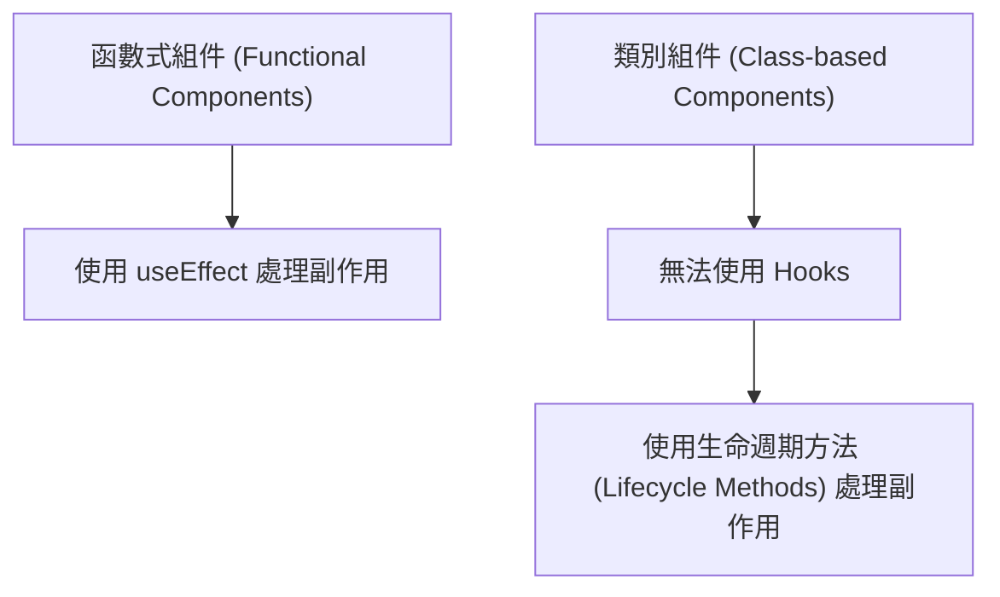
```mermaid
flowchart TD
    A["函數式組件 (Functional Components)"] --> B["使用 useEffect 處理副作用"]
    C["類別組件 (Class-based Components)"] --> D["無法使用 Hooks"]
    D --> E["使用生命週期方法 (Lifecycle Methods) 處理副作用"]
```

### 核心生命週期方法 (Core Lifecycle Methods)

由於類別組件無法使用 Hooks（如 `useEffect`），必須依賴以下三個主要的生命週期方法來處理副作用：

- **`componentDidMount()`**
    - **[執行時機]**：當組件被成功掛載（mounted）到 DOM 之後會立即執行
    - **[用途]**：適合用於發送 API 請求、設定訂閱或進行任何需要等待 DOM 準備就緒的操作
- **`componentDidUpdate()`**
    - **[執行時機]**：當組件的 props 或 state 發生變動並導致重新渲染（update）完成後執行
    - **[用途]**：用於處理依賴於狀態或屬性變動的副作用
- **`componentWillUnmount()`**
    - **[執行時機]**：在組件被移除（unmounted）並從 DOM 中撤銷之前執行
    - **[用途]**：用於清理工作，例如取消網路請求、清除定時器（timer）或移除事件監聽器，以防止記憶體洩漏

### 類別組件與 `useEffect` 的對應關係

- **副作用處理的轉換**
    - 由於類別組件無法使用 Hooks，必須使用生命週期方法來達成與 `useEffect` 相同的效果
- **`componentDidMount`&#32;的等價性**
    - `componentDidMount` 的行為相當於在函數式組件中使用 `useEffect` 並傳入一個**空依賴陣列**
    - **[執行邏輯]**：當組件被評估（evaluated）並渲染到 DOM 之後，該副作用函數僅會執行一次

```javascript
// 函數式組件中的寫法
useEffect(() => {
  // 執行副作用
}, []); // 空依賴陣列確保僅在掛載時執行一次
```

```javascript
// 類別組件中的寫法
componentDidMount() {
  // 執行副作用
}
```

| 類別組件方法 | 函數式組件 (useEffect) 對應 | 執行時機 |
| --- | --- | --- |
| componentDidMount | useEffect(fn, []) | 組件掛載至 DOM 後執行一次 |

### 深入理解 `componentDidUpdate`

- **執行時機**
    - 當組件發生更新（updated）時執行
    - **[觸發條件]**：當狀態（state）發生改變，導致組件被重新評估（re-evaluated）並重新渲染（re-rendered）之後
- **與&#32;`useEffect`&#32;的對應關係**
    - `componentDidUpdate` 相當於函數式組件中**帶有依賴陣列**的 `useEffect`
    - **[運作邏輯]**：在 `useEffect` 中，每當依賴項發生變動時，該函數就會重新執行；在類別組件中，則透過 `componentDidUpdate` 在每次更新週期後捕捉這些變動

```mermaid
flowchart LR
    A["componentDidUpdate()"] --> B["useEffect(fn, [deps])"]
    B --> C["當 deps 變動時執行"]
```

### 核心生命週期方法 (續)

- **`componentWillUnmount()`**
    - **[執行時機]**：在組件被從 DOM 中移除（unmounted）之前的最後一個時刻執行
    - **[用途]**：用於執行清理工作，以防止記憶體洩漏或不必要的行為
- **與&#32;`useEffect`&#32;的對應關係**
    - `componentWillUnmount` 相當於函數式組件中 `useEffect` 的**清理函數（cleanup function）**
    - **[執行邏輯]**：
        - 在下一次副作用函數執行之前會先呼叫清理函數
        - 當組件即將從 DOM 中移除時，一定會執行清理函數

```javascript
// 函數式組件中的寫法 (使用清理函數)
useEffect(() => {
  // 副作用邏輯

  return () => {
    // 清理邏輯 (相當於 componentWillUnmount)
  };
}, [dependencies]);
```

```mermaid
flowchart TD
    A["componentWillUnmount()"] --> B["useEffect 的 return 清理函數"];
    B --> C["在組件從 DOM 移除前執行"];
```

### 整合 `UserFinder` 組件

- **修改&#32;`Users.js`&#32;以接收 props**
    - 移除原有的測試用 dummy users 資料
    - 改為從 props 中取得 `users` 陣列，以便動態渲染

```javascript
// Users.js
render() {
  const usersList = this.props.users.map((user) => (
    <li key={user.id} name={user.name}>
      {user.name}
    </li>
  ));

  return (
    <ul>{usersList}</ul>
  );
}
```

- **在&#32;`App.js`&#32;中整合組件**
    - 從 `components/UserFinder` 匯入 `UserFinder` 組件
    - 將 `UserFinder` 置於 `App` 組件中，完成功能整合

```javascript
// App.js
import Users from './components/Users';
import UserFinder from './components/UserFinder';

function App() {
  return (
    <div>
      <UserFinder />
      <Users users={...} />
    </div>
  );
}
```

### `UserFinder` 組件實作細節

- **組件特性**
    - 屬於**函數式組件**
    - 使用多個狀態切片（state slices）來管理資料
- **功能邏輯：使用者過濾**
    - 利用 `useState` 管理 `users`（原始資料）與 `searchTerm`（搜尋關鍵字）
    - 透過 `useEffect` 實作簡單的過濾邏輯：每當使用者輸入字元時，即時過濾列表並將結果傳遞給 `Users` 組件

```javascript
const UserFinder = () => {
  const [filteredUsers, setFilteredUsers] = useState(DUMMY_USERS);
  const [searchTerm, setSearchTerm] = useState('');

  useEffect(() => {
    setFilteredUsers(
      DUMMY_USERS.filter((user) => user.name.includes(searchTerm))
    );
  }, [searchTerm]);

  // ... 其餘邏輯
};
```

- **[下一步目標]**：將此組件轉換為類別組件，以觀察兩者在處理相同邏輯時的結構差異。

### 將 `UserFinder` 轉換為類別組件

- **基本結構轉換**
    - 從 `react` 中導入 `Component`
    - 定義名為 `UserFinder` 的類別並使用 `extends Component` 來繼承 React 組件的功能

```javascript
import { Component } from 'react';
// ... 其他導入

class UserFinder extends Component {
  // ...
}
```

- **實作&#32;`constructor`&#32;與狀態初始化**
    - 因為組件需要管理狀態，必須實作 `constructor` 方法
    - 在 `constructor` 中透過 `this.state` 設定初始狀態物件
    - **[狀態切片]**：包含 `filteredUsers`（初始值為 `DUMMY_USERS`）與 `searchTerm`（初始值為空字串）

```javascript
class UserFinder extends Component {
  constructor() {
    super(); // 必須呼叫 super() 以繼承父類別的特性
    this.state = {
      filteredUsers: DUMMY_USERS,
      searchTerm: '',
    };
  }
}
```

### 實作 `searchChangeHandler` 方法

- **將處理邏輯移至類別方法**
    - 原本在函數式組件中的 `searchChangeHandler` 現在改為 `UserFinder` 類別中的一個方法
    - 該方法的主要職責是更新狀態中的 `searchTerm` 部分
- **利用&#32;`event`&#32;物件獲取輸入值**
    - 由於該方法會綁定到 `<input>` 的 `onChange` 事件，因此會接收到一個 `event` 物件
    - 透過 `event.target.value` 即可讀取使用者在輸入框中輸入的內容
- **使用&#32;`this.setState`&#32;更新狀態**
    - **[關鍵機制]**：呼叫 `this.setState` 時必須傳入一個**物件**
    - React 會自動將這個新物件與目前的 `this.state` 進行**合併（merge）**，從而達到部分更新狀態的目的（例如：只更新 `searchTerm` 而保留 `filteredUsers`）

```javascript
// 在 UserFinder 類別內實作
searchChangeHandler(event) {
  this.setState({
    searchTerm: event.target.value
  });
}
```

### 實作 `render` 方法與 `this` 綁定

- **實作&#32;`render`&#32;方法**
    - 類別組件必須包含一個 `render` 方法，用來回傳要顯示的 JSX 程式碼
    - 在 `render` 中存取狀態時，必須透過 `this.state` 來引用

```javascript
render() {
  return (
    <Fragment>
      <div className="classes.finder">
        <input type="search" onChange={this.searchChangeHandler.bind(this)} />
        <Users users={this.state.filteredUsers} />
      </div>
    </Fragment>
  );
}
```

- **處理&#32;`this`&#32;綁定問題**
    - **[問題原因]**：在類別中定義的方法，若直接作為事件處理器（如 `onChange`）傳遞，其內部的 `this` 會失去對組件實例的指向
    - **[解決方案]**：在傳遞方法時使用 `.bind(this)`，將該方法與目前的組件實例進行綁定，確保方法內部的 `this.setState` 能正確運作
- **狀態更新的合併機制**
    - 呼叫 `this.setState({ searchTerm: event.target.value })` 時，React 只會更新指定的 `searchTerm` 部分
    - **[優點]**：原本狀態中的其他欄位（如 `filteredUsers`）會被自動合併保留，不會因此丟失

### 實作 `componentDidUpdate` 生命週期方法

- **從&#32;`useEffect`&#32;轉向生命週期方法**
    - 在類別組件中無法使用 `useEffect` Hook
    - 雖然可以在 `searchChangeHandler` 中直接計算並更新 `filteredUsers` 狀態，但為了學習生命週期機制，將採用另一種方式
- **`componentDidUpdate`&#32;的運作方式**
    - 每當組件被重新評估（re-evaluated）時，React 都會自動呼叫此方法
    - 適合用於處理當組件的 props 或 state 發生變動時，需要執行的副作用邏輯

```javascript
class UserFinder extends Component {
  // ... constructor 與 searchChangeHandler

  componentDidUpdate() {
    // 當組件更新時會自動執行此處的邏輯
  }

  render() {
    // ...
  }
}
```

### 類別組件生命週期方法概覽

根據開發者工具的提示，React 組件擁有一系列預定義的生命週期方法，用於在不同階段執行特定邏輯：

| 方法名稱 | 說明 |
| --- | --- |
| componentDidMount | 組件首次掛載到 DOM 後執行 |
| componentDidUpdate | 組件更新（props 或 state 改變）後執行 |
| componentWillUnmount | 組件即將被移除前執行 |
| componentDidCatch | 捕捉子組件樹中的錯誤 (Error Boundary) |

### `componentDidUpdate` 中的無限迴圈風險

- **[錯誤實作]**：如果在 `componentDidUpdate` 中直接根據現有狀態進行計算並呼叫 `this.setState`，會導致組件陷入無限迴圈
    - **[運作流程]**：

        1. 組件狀態改變 $\rightarrow$ 觸發重新渲染
        2. 重新渲染後 $\rightarrow$ 自動執行 `componentDidUpdate`
        3. `componentDidUpdate` 內執行 `this.setState` $\rightarrow$ 再次改變狀態
        4. 再次觸發重新渲染 $\rightarrow$ 回到步驟 2

```javascript
// ❌ 會導致無限迴圈的錯誤寫法
componentDidUpdate() {
  this.setState({
    filteredUsers: DUMMY_USERS.filter(user =>
      user.name.includes(this.state.searchTerm)
    )
  });
}
```

- **[核心問題]**：`componentDidUpdate` 會在**每一次**組件更新後執行，而 `this.setState` 本身就是一種更新行為，兩者結合會不斷循環。

### 避免 `componentDidUpdate` 中的無限迴圈

- **[解決方案]**：為了防止 `setState` 觸發不斷的重新渲染，必須在執行更新前加入條件判斷，檢查我們感興趣的特定狀態是否真的發生了變化
- **`componentDidUpdate`&#32;的參數**
    - 該方法會接收兩個參數：`prevProps` 與 `prevState`
    - **[定義]**：這兩個參數代表了在本次組件更新發生之前的最後一次 props 與 state 快照
    - **[應用]**：透過比較目前的 `this.state` 與 `prevState`（或 `this.props` 與 `prevProps`），可以精確判斷是否需要執行副作用邏輯

```javascript
// ✅ 正確的寫法：加入條件判斷以避免無限迴圈
componentDidUpdate(prevProps, prevState) {
  if (prevState.searchTerm !== this.state.searchTerm) {
    this.setState({
      filteredUsers: DUMMY_USERS.filter(user =>
        user.name.includes(this.state.searchTerm)
      )
    });
  }
}
```

> **注意**：在實作時，應優先檢查 `prevState.searchTerm` 而非 `prevProps.searchTerm`，以確保邏輯與狀態更新的來源一致。

### `UserFinder` 類別組件轉換實作

將原本使用 `useEffect` 的邏輯轉換為類別組件的 `componentDidUpdate` 生命週期方法：

```javascript
class UserFinder extends Component {
  constructor() {
    super();
    this.state = {
      filteredUsers: DUMMY_USERS,
      searchTerm: '',
    };
  }

  componentDidUpdate(prevProps, prevState) {
    // 僅在 searchTerm 發生變化時才執行過濾邏輯
    if (prevProps.searchTerm !== this.state.searchTerm) {
      this.setState({
        filteredUsers: DUMMY_USERS.filter((user) =>
          user.name.includes(this.state.searchTerm)
        ),
      });
    }
  }

  searchChangeHandler(event) {
    this.setState({ searchTerm: event.target.value });
  }

  render() {
    return (
      <div className="users-finder">
        <input
          type="search"
          onChange={this.searchChangeHandler.bind(this)}
        />
        <div users={this.state.filteredUsers} />
      </div>
    );
  }
}
```

- **[關鍵邏輯]**：在 `componentDidUpdate` 內使用 `if (prevProps.searchTerm !== this.state.searchTerm)` 作為守衛條件
    - **[目的]**：確保只有當搜尋字串改變時才觸發 `setState` 更新 `filteredUsers`
    - **[若無此判斷]**：由於 `this.setState` 會觸發組件更新，進而再次呼叫 `componentDidUpdate`，會導致組件陷入無限迴圈不斷更新 `filteredUsers`

### `useEffect` 與 `componentDidUpdate` 的副作用處理對比

在實作搜尋過濾功能時，兩種組件模式在處理「何時執行副作用」上有顯著的語法差異：

- **類別組件 (`componentDidUpdate`)**
    - 必須手動在方法內部加入 `if` 條件判斷（例如：`if (prevProps.searchTerm !== this.state.searchTerm)`）
    - **[原因]**：如果不加判斷，`this.setState` 會觸發組件更新，進而再次呼叫 `componentDidUpdate`，導致無限迴圈
- **函數式組件 (`useEffect`)**
    - 透過提供**依賴陣列**（dependency array）來精確控制執行時機
    - **[優勢]**：不需要手動撰寫 `if` 檢查。React 會自動比對依賴項，只有當依賴項（如 `searchTerm`）發生變化時，才會執行 Effect 函數；若組件因其他原因重新渲染，該 Effect 會被自動忽略

```javascript
// 函數式組件中的 useEffect 寫法
useEffect(() => {
  setFilteredUsers(DUMMY_USERS.filter(user => user.name.includes(searchTerm)));
}, [searchTerm]); // 僅在 searchTerm 改變時執行
```

### `UserFinder` 類別組件轉換實作細節

在將組件從函數式轉換為類別組件時，有兩個關鍵的實作細節需要注意：

- **必須呼叫&#32;`super()`**
    - 在 `constructor` 中，必須先執行 `super()` 才能正確初始化並使用 `this.state`。
- **根據狀態變化進行判斷**
    - 如果更新邏輯是基於組件內部的狀態變化（而非外部傳入的 props 變化），則應比較 `prevState` 與當前的 `this.state`。
    - **[範例]**：在 `UserFinder` 的案例中，我們關注的是 `searchTerm` 這個狀態的改變，因此判斷條件應為：

```javascript
if (prevState.searchTerm !== this.state.searchTerm) {
      // 執行過濾邏輯
    }
```

    - **[對比]**：如果邏輯是基於父組件傳入的屬性變化，則應比較 `prevProps` 與 `this.props`。

完成上述轉換後，原本的函數式組件版本即可被移除。

### 類別組件與 `useEffect` 的思考模型差異

在處理組件邏輯時，兩者代表了完全不同的心理模型（Mental Model）：

- **類別組件 (Lifecycle Methods)**
    - **核心思維**：關注「方法何時被呼叫」。
    - **運作方式**：例如在 `componentDidUpdate` 中，開發者必須思考「當組件更新時，這個方法會執行」。
    - **限制**：由於該方法在每次更新時都會觸發，因此通常需要手動加入 `if` 檢查來限制邏輯，以確保副作用僅在特定條件下執行。
- **函數式組件 (`useEffect`)**
    - **核心思維**：關注「資料（依賴項）的變化」。
    - **運作方式**：開發者不需要關心組件是處於初次渲染（Mounting）還是更新（Updating）階段，只需要關注「當這些依賴項改變時，我該做什麼」。
    - **優勢**：這種模型更直覺地與資料流掛鉤，而非與組件的生命週期階段掛鉤。

### 類別組件的其他生命週期方法

除了處理組件更新的 `componentDidUpdate` 之外，類別組件還有其他關鍵的生命週期方法，用於處理組件在不同階段的行為：

- **`componentDidMount`**
    - **[執行時機]**：當組件初次被插入到 DOM 中（即「掛載」完成）時執行。
    - **[常見用途]**：執行需要與外部系統互動的操作，例如從伺服器或資料庫發送 HTTP 請求來獲取資料。
    - **[範例情境]**：若 `DUMMY_USERS` 是從伺服器非同步載入的，則會在 `componentDidMount` 中發起請求，並在收到回應後更新狀態。
- **`componentWillUnmount`**
    - **[執行時機]**：當組件即將從 DOM 中被移除（即「卸載」之前）時執行。
    - **[常見用途]**：進行清理工作（Cleanup），例如取消正在進行的網路請求、清除定時器（timers）或移除事件監聽器，以防止記憶體洩漏。

### 使用 `componentDidMount` 處理初次資料載入

在處理需要從伺服器獲取資料的情境時，選擇正確的生命週期方法至關重要：

- **為什麼不使用&#32;`componentDidUpdate`？**
    - `componentDidUpdate` 在組件每次更新（狀態或 props 改變）時都會執行。
    - 如果在其中發送網路請求，而請求的回應又會更新狀態，就會導致組件不斷重新渲染並重複發送請求，造成無限迴圈或不必要的效能消耗。
- **使用&#32;`componentDidMount`&#32;的優勢**
    - **[執行時機]**：僅在組件初次被插入 DOM（即第一次渲染完成）後執行一次。
    - **[適用場景]**：非常適合用於發送 HTTP 請求來獲取初始資料（例如載入使用者列表）。

```javascript
componentDidMount() {
  // 發送 HTTP 請求
  // 處理回應並更新狀態
  this.setState({ filteredUsers: DUMMY_USERS });
}
```

### 類別組件中 `componentDidMount` 的單次執行特性

在類別組件中，某些操作（例如從伺服器獲取資料）只需要在組件掛載時執行一次即可：

- **`componentDidMount`&#32;的特性**
    - **[執行時機]**：僅在組件初次渲染完成後執行一次。
    - **[優勢]**：不需要額外的 `if` 檢查，因為它不會在後續的狀態更新中再次觸發。
- **與&#32;`componentDidUpdate`&#32;的區別**
    - `componentDidUpdate` 在組件每次更新時都會執行，因此若在其中發送請求，必須配合條件判斷（如檢查 `prevState`）來避免無限迴圈。

**[程式碼實作範例]**

```javascript
componentDidMount() {
  // 模擬從伺服器獲取資料並更新狀態
  this.setState({ filteredUsers: DUMMY_USERS });
}
```

- **對應關係**
    - 在函數式組件中，這種「僅在掛載時執行一次」的行為，對應的就是使用 `useEffect` Hook（且依賴項陣列為空 `[]`）。

### `useEffect` 的初次執行特性

在函數式組件中，`useEffect` 的執行邏輯如下：

- **[初次掛載]**：無論是否有提供依賴項陣列（dependencies），`useEffect` 都會在組件初次掛載（mount）時執行一次。
    - **[原因]**：React 會將「從無到有」的渲染視為依賴項發生了變化（因為之前沒有這個依賴，現在有了）。
- **[後續更新]**：只有當依賴項陣列中的值發生變化時，才會再次觸發該 Effect。

### 類別組件中的 `componentWillUnmount`

當組件即將從 DOM 中被移除時，會觸發此生命週期方法：

- **[核心用途]**：執行清理工作（Cleanup）。
- **[實務範例]**：在條件渲染的情境下，若使用者點擊「隱藏使用者」（Hide Users）導致使用者列表組件被移除，`componentWillUnmount` 就會被呼叫，用以處理該組件卸載時所需的清理邏輯。

```mermaid
flowchart TD
    A[組件掛載 Mounting] --> B[執行 componentDidMount]
    B --> C[組件渲染與更新 Updating]
    C --> D[組件即將卸載 Unmounting]
    D --> E[執行 componentWillUnmount]
```

### `componentWillUnmount` 的多實例執行行為

在類別組件中實作 `componentWillUnmount` 並進行測試：

- **[實作方式]**：在 `User` 組件中新增生命週期方法，並在其中加入日誌紀錄。

```javascript
componentWillUnmount() {
    console.log('User will unmount!');
  }
```

- **[觀察結果]**：當點擊「Hide Users」按鈕導致使用者列表被移除時，控制台會顯示多次「User will unmount!」的訊息。
- **[原因分析]**：
    - 這是因為頁面上同時渲染了多個 `User` 組件實例（例如：Max, Manuel, Julie）。
    - 當該組件被移除時，**每一個**正在運行的實例都會各自觸發一次 `componentWillUnmount` 進行清理工作。

### 類別組件與 React Hooks 的思考模型差異

雖然兩者的寫法與邏輯結構不同，但最終都能達成相同的目的：

- **[執行機制]**：
    - 類別組件的生命週期方法（Lifecycle Methods）會為每一個組件實例（Instance）獨立執行，這與 `useState` 和 `useEffect` 的運作方式類似。
- **[思維模型]**：
    - **類別組件**：使用明確的生命週期方法（如 `componentDidMount`、`componentDidUpdate`、`componentWillUnmount`）來處理不同階段的邏輯。
    - **React Hooks**：使用 `useEffect` 等 Hook 來同步狀態與副作用。
- **[比較與總結]**：
    - 兩者的核心目標一致，只是類別組件通常需要撰寫較多的程式碼，且其思維模型對於初學者來說可能相對較為複雜。

### 類別組件中的 Context API

在類別組件中使用 Context 的方式與函數式組件完全相同：

- **定義 Context**
    - 使用 `React.createContext()` 來建立一個 Context 物件。
    - 可以選擇性地提供初始值（initial value）。
- **提供 Context (Providing Context)**
    - 使用 Context 物件內建的 `Provider` 組件來包裹子組件。
    - 透過 `value` 屬性將要傳遞的資料傳入。
    - **[數值特性]**：傳遞的 `value` 可以是靜態數值，也可以是隨狀態（state）更新而改變的動態數值。

**[程式碼實作範例]**

```javascript
// 1. 定義 Context (users-context.js)
import React from 'react';

const UsersContext = React.createContext({
  users: []
});

export default UsersContext;

// 2. 提供 Context (App.js)
function App() {
  const usersContext = { users: DUMMY_USERS };

  return (
    <UsersContext.Provider value={usersContext}>
      <UserFinder />
    </UsersContext.Provider>
  );
}

export default App;
```

### 在類別組件中「使用」Context API

雖然 Context 的定義與提供方式（Provider）與函數式組件相同，但在類別組件中「使用」Context 的方式則有所不同：

- **[核心差異]**：在類別組件中，我們需要透過特定的機制來存取 Context 所提供的數值，而不是像函數式組件那樣直接使用 `useContext` Hook。
- **[實作目標]**：將 `UserFinder` 組件與目前定義在檔案內的 `DUMMY_USERS` 解耦，改為從 Context 中獲取使用者資料。

**[專案結構調整]**

為了保持程式碼整潔，建議將 Context 相關檔案放置在專門的資料夾中：

```text
src/
  └── store/
      └── users-context.js
```

**[目前的組件狀態]**

目前的 `UserFinder` 是一個類別組件，其 `componentDidMount` 方法中直接使用了本地的 `DUMMY_USERS`：

```javascript
class UserFinder extends Component {
  constructor() {
    super();
    this.state = {
      filteredUsers: [],
      searchTerm: '',
    };
  }

  componentDidMount() {
    // 目前是直接使用本地變數
    this.setState({ filteredUsers: DUMMY_USERS });
  }
  // ...
}
```

### 在類別組件中存取 Context

由於類別組件無法使用 React Hooks（例如 `useContext`），因此不能像函數式組件那樣直接透過 Hook 獲取 Context 提供的資料。若要從全域管理的 Context 中獲取資料，在類別組件中有兩種主要方式：

- **[方式一] 使用 Context Consumer 組件**
    - 這是一種通用方法，適用於函數式組件與類別組件。
    - 透過在 `render` 方法中使用 `<Context.Consumer>` 來包裹需要資料的子組件，並透過該組件提供的 `render props` 函數來存取 Context 的數值。
- **[方式二] 使用&#32;`static contextType`&#32;(預告)**
    - 這是在類別組件中更簡潔的存取方式，後續將會詳細介紹。

### 在類別組件中使用 Context Consumer

由於類別組件無法使用 `useContext` Hook，必須透過 `Context.Consumer` 組件來存取 Context 提供的數值。

- **[運作方式]**：在 JSX 中使用 `<UsersContext.Consumer>` 作為包裝組件。
- **[特性]**：這種寫法僅適用於 JSX 語法中，因此在函數式組件與類別組件中皆可通用。

**[程式碼實作範例]**

```javascript
render() {
  return (
    <Fragment>
      <UsersContext.Consumer>
        {(users) => (
          <div className="classes.finder">
            <input
              type="search"
              onChange={this.searchChangeHandler.bind(this)}
            />
            <div>
              {users.map(user => (
                <div key={user.id}>
                  {user.name}
                </div>
              ))}
            </div>
          </div>
        )}
      </UsersContext.Consumer>
    </Fragment>
  );
}
```

### Context Consumer 與 `useContext` 的比較

- **[使用體驗]**：`useContext` Hook 的使用體驗更為直覺且簡潔，因為它不需要像 Consumer 那樣使用 render props 模式來包裹內容。
- **[多重 Context 監聽]**：
    - 使用 `useContext` 時，可以在同一個組件中輕鬆地監聽多個不同的 Context。
    - 在類別組件中使用 Consumer 時，若要監聽多個 Context，則需要進行多層的巢狀包裹（nesting），這會增加程式碼的複雜度與層級深度。

### 使用 `static contextType` 簡化 Context 存取

在類別組件中，除了使用 `<Context.Consumer>` 之外，還有一種更簡潔的方式來存取 Context 資料。

- **[實作方式]**：透過在類別中定義一個靜態屬性（static property）`contextType`，並將其賦值為目標 Context 物件。
- **[優點]**：程式碼更為簡潔，不需要使用 render props 模式（即不需要在 JSX 中進行巢狀包裹）。
- **[限制]**：
    - 類別組件**只能連接到一個 Context**。
    - 這與函數式組件不同，在函數式組件中可以透過多次呼叫 `useContext` 來同時監聽多個不同的 Context。

**[程式碼實作範例]**

```javascript
import UsersContext from '../store/users-context';

class UserFinder extends Component {
  static contextType = UsersContext;

  constructor() {
    super();
    this.state = {
      filteredUsers: [],
      searchTerm: '',
    };
  }

  // 之後可以直接透過 this.context 存取 Context 的值
  // 例如：this.context 會等於 UsersContext 的當前值
}
```

### `static contextType` 的實作與限制

透過定義 `static contextType`，可以在組件內部的任何地方直接使用 `this.context` 來存取 Context 的數值，這比使用 Consumer 更加直覺且程式碼更簡潔。

- **[優點]**：存取方式非常直接，不需要在 JSX 中使用 render props 模式。
- **[關鍵限制]**：
    - **只能連接到一個 Context**：如果一個組件需要同時連接到兩個或以上的 Context，`static contextType` 將無法滿足需求。
    - **解決方案**：若需監聽多個 Context，必須尋找替代方案，例如將邏輯封裝在另一個組件中，或回到使用 `<Context.Consumer>` 的方式。

**[程式碼實作範例]**

```javascript
import UsersContext from '../store/users-context';

class UserFinder extends Component {
  static contextType = UsersContext;

  constructor() {
    super();
    this.state = {
      filteredUsers: [],
      searchTerm: '',
    };
  }

  componentDidMount() {
    // Send http request...
    this.setState({ filteredUsers: this.context.users });
  }

  componentDidUpdate(prevProps, prevState) {
    if (prevState.searchTerm !== this.state.searchTerm) {
      this.setState({
        filteredUsers: this.context.users.filter(user =>
          user.name.includes(this.state.searchTerm)
        )
      });
    }
  }
}
```

### `static contextType` 的局限性

雖然 `static contextType` 提供了一種簡潔的存取方式，但它存在明顯的限制：

- **單一 Context 限制**：一個類別組件只能透過這種方式連接到**一個** Context。
- **多重 Context 需求**：如果一個組件需要同時存取多個不同的 Context，`static contextType` 將無法滿足需求，此時必須回歸使用 `<Context.Consumer>` 的巢狀包裹模式。

### 類別組件總結

類別組件是 React 中一種傳統的組件構建方式，雖然在現代開發中逐漸被函數式組件取代，但理解其運作機制對於維護舊專案至關重要。

**核心概念回顧：**

- **基本結構**：透過 `extends Component` 繼承 React 組件類別。
- **資料傳遞**：使用 `this.props` 來存取從父組件傳入的屬性。
- **渲染機制**：必須實作 `render()` 方法來回傳 JSX。
- **狀態管理**：透過 `this.state` 定義初始狀態，並使用 `this.setState()` 來更新狀態。
- **副作用處理**：利用組件生命週期方法（如 `componentDidMount`、`componentDidUpdate` 等）來處理 API 請求或 DOM 操作。
- **Context API**：可以透過 `static contextType` 或 `<Context.Consumer>` 來存取全域狀態。

**類別組件 vs 函數式組件**

雖然可以使用類別組件構建整個應用程式，但現代 React 開發趨勢傾向於使用函數式組件。

- **類別組件 (Class-based Components)**
    - 功能完整，可以處理複雜的狀態與生命週期。
    - 語法較為冗長（需要 `constructor`、`super`、`this` 等）。
- **函數式組件 (Functional Components)**
    - **更精簡 (Leaner)**：程式碼量較少，結構更清晰。
    - **現代標準**：結合 React Hooks 後，能以更直覺的方式處理狀態與副作用，是目前主流的開發方式。

### 函數式組件的主導地位

由於 React 生態系統已轉向以函數式組件為核心，本課程將重點放在函數式組件的教學上。

- **開發趨勢**：函數式組件因其靈活性與現代特性，已成為 React 開發的主要方式。
- **使用建議**：
    - 雖然可以使用類別組件，但函數式組件在現代開發中更具優勢。
    - 類別組件在課程中僅會偶爾出現，作為補充或處理特定情境使用。

### 組件類型選擇決策

雖然函數式組件是主流，但類別組件在技術上仍然是可行的選擇。

**決策指南：**

- **強烈建議 (Strong Recommendation)**：優先使用**函數式組件 (functional components)**
- **使用類別組件的情境**：
    - 個人開發偏好
    - 正在維護或參與一個已經在使用類別組件的現有專案或團隊

### 必須使用類別組件的情境

雖然函數式組件是首選，但在以下情況下，使用類別組件是必要的或合理的：

- **建立錯誤邊界 (Error Boundaries)**：這是目前 React 中必須使用類別組件才能實現的功能。
- **現有專案與團隊慣例**：
    - 當你正在維護一個大量使用類別組件的既有專案時。
    - 當團隊的開發慣例以類別組件為主時，為了與同事保持一致，應使用類別組件以避免造成混淆。

### 錯誤邊界 (Error Boundaries)

在應用程式運行過程中，有時會發生開發者無法完全預防的錯誤。這些錯誤不一定是程式碼邏輯錯誤（bugs），也可能是外部因素導致的。

- **不可預見的錯誤範例**：
    - **網路請求失敗**：例如發送 HTTP 請求時，伺服器暫時沒有回應，導致請求無法完成。
- **錯誤邊界的作用**：
    - **防止崩潰**：當錯誤發生時，錯誤邊界可以捕捉這些錯誤，避免整個應用程式因此停止運作或直接崩潰。
    - **資訊傳遞**：它可以作為一種機制，將「某個部分發生錯誤」的資訊，從應用程式的一個部分傳遞到另一個部分，以便進行處理（例如顯示錯誤提示介面）。

### 在 `componentDidUpdate` 中觸發錯誤

為了測試錯誤邊界的捕捉能力，可以在組件的生命週期方法中加入邏輯，當偵測到不符合預期的狀態時主動拋出錯誤。

在 `Users.js` 中的實作方式如下：

```javascript
componentDidUpdate() {
  if (this.props.users.length === 0) {
    throw new Error('No users provided!');
  }
}
```

- **運作原理**：
    - 使用 `componentDidUpdate` 來檢查組件更新後的狀態。
    - 判斷 `this.props.users.length` 是否等於 0。
    - 如果條件成立（表示沒有使用者資料），則執行 `throw new Error`。
    - **錯誤冒泡 (Error Bubbling)**：拋出的錯誤會沿著呼叫堆疊（call stack）向上傳遞，直到被最近的錯誤邊界（Error Boundary）捕捉並處理。

### 錯誤處理的實際應用與影響

在開發過程中，主動拋出錯誤（如在 `componentDidUpdate` 中偵測到資料缺失時）會對應用程式產生直接影響：

- **應用程式崩潰風險**：
    - 如果拋出的錯誤沒有被任何錯誤邊界（Error Boundary）捕捉，該錯誤會導致整個應用程式崩潰（Crash）。
    - 例如，在搜尋功能中，若搜尋條件導致資料回傳為空，且程式碼中主動拋出了錯誤，而此時沒有處理該錯誤，畫面就會出現錯誤訊息並停止運作。
- **錯誤作為資訊傳遞工具**：
    - 拋出錯誤並不一定代表「程式碼寫壞了」，它也可以被視為一種**資訊傳遞機制**。
    - **用途**：將「某個特定部分發生了問題」的這個事實，從發生錯誤的地方（A點）傳遞到應用程式的其他地方（B點，例如錯誤邊界），以便進行統一的錯誤處理或顯示友善的錯誤介面。

### 使用 `try...catch` 處理錯誤

為了避免在程式碼執行過程中拋出錯誤（如 `throw new Error`）導致整個應用程式直接崩潰，可以使用 JavaScript 的標準錯誤處理機制：`try...catch`。

- **`try`&#32;區塊**：嘗試執行可能發生錯誤的程式碼。
- **`catch`&#32;區塊**：當 `try` 區塊內的程式碼執行失敗並拋出錯誤時，程式會立即跳轉到 `catch` 區塊，在此處可以進行錯誤處理（例如記錄錯誤或顯示友善訊息），而不會導致應用程式中斷。

```javascript
try {
  // 可能會失敗的程式碼
  someCodeWhichMightFail();
} catch (err) {
  // 當錯誤發生時，執行這裡的替代邏輯
  handleError(err);
}
```

### `try...catch` 的侷限性

雖然 `try...catch` 是處理 JavaScript 錯誤的標準方式，但在 React 組件開發中，它並非萬能的：

- **適用範圍**：`try...catch` 只能捕捉到在程式碼塊中寫下的「一般 JavaScript 語句」所產生的錯誤。
- **無法捕捉 JSX 錯誤**：
    - 當錯誤發生在 JSX 代碼（例如渲染過程中的邏輯）時，`try...catch` 無法攔截該錯誤。
    - 這是因為 JSX 在執行時並非簡單的 JavaScript 語句，而是 React 渲染引擎的一部分。
- **跨組件錯誤處理的挑戰**：
    - 如果你希望在「父組件」中捕捉「子組件」產生的錯誤，單純在子組件內寫 `try...catch` 是行不通的。
    - 由於錯誤發生在渲染階段，若要將錯誤從子組件傳遞到父組件進行統一處理，必須使用 React 專門提供的**錯誤邊界 (Error Boundaries)** 機制，而非傳統的 `try...catch`。

### 建立錯誤邊界 (Error Boundary)

由於 `try...catch` 無法攔截 JSX 渲染過程中產生的錯誤，必須建立一個專門的組件來捕捉並處理這些異常。

- **實作方式**：
    - 建立一個新的組件檔案（例如 `ErrorBoundary.js`）。
    - 定義一個類別組件（Class Component），並從 `react` 中匯入 `Component`。

```javascript
import Component from 'react';

class ErrorBoundary {
  // 接下來將在此實作錯誤處理邏輯
}
```

### 實作錯誤邊界組件

要建立一個能夠捕捉錯誤的組件，必須使用類別組件並實作特定的生命週期方法。

- **核心機制**：
    - 錯誤邊界並非一種特殊的組件類型，而是一個**實作了&#32;`componentDidCatch`&#32;生命週期方法**的普通類別組件。
    - 只要在類別組件中加入了這個方法，該組件就會自動獲得「錯誤邊界」的功能。
- **實作範例**：

```javascript
import { Component } from 'react';

class ErrorBoundary extends Component {
  componentDidCatch() {
    // 當錯誤發生時，此處會被觸發
  }
}
```

- **`componentDidCatch`&#32;的作用**：
    - 當其子組件樹（component tree）中發生錯誤時，React 會呼叫此方法。
    - 它是將組件轉化為「錯誤邊界」的關鍵技術手段。

### 錯誤邊界組件的實作細節

由於 React 目前沒有對應的 Hooks 可以用來建立錯誤邊界，因此這類組件**必須**使用類別組件來實作。

- **`componentDidCatch`&#32;的觸發時機**：
    - 當錯誤邊界組件的任何一個子組件（child）拋出錯誤或產生錯誤時，此生命週期方法就會被觸發。
- **渲染子組件**：
    - 在錯誤邊界組件中，必須實作 `render` 方法，並回傳 `this.props.children`。
    - **[為什麼要這樣做？]** 因為錯誤邊界通常是用來包裹其他組件的，回傳 `children` 才能確保在沒有錯誤發生時，原本的組件樹能夠正常渲染。

```javascript
import { Component } from 'react';

class ErrorBoundary extends Component {
  componentDidCatch() {
    // 當子組件發生錯誤時，此處會被觸發
  }

  render() {
    // 回傳 children 以確保正常情況下能渲染子組件
    return this.props.children;
  }
}
```

### 使用錯誤邊界保護組件

錯誤邊界組件可以用作包裹層，用來保護那些可能拋出錯誤的特定組件。

- **實作方式**：
    - 匯入 `ErrorBoundary` 組件。
    - 將其包裹在可能出錯的組件（例如 `Users`）外圍。
- **靈活性**：
    - 可以根據需求，將錯誤邊界包裹在一個或多個不同的組件上。

```javascript
import { ErrorBoundary } from './ErrorBoundary';

// 在 UserFinder 組件中使用
<ErrorBoundary>
  <Users users={this.state.filteredUsers} />
</ErrorBoundary>
```

### 錯誤邊界組件的進階實作

為了在捕捉到錯誤後執行特定的邏輯，可以利用 `componentDidCatch` 提供的錯誤參數。

- **捕捉錯誤物件**：
    - `componentDidCatch` 會自動接收一個 `error` 參數。
    - **[用途]**：可以透過檢查這個 `error` 物件來判斷錯誤類型，進而執行不同的錯誤處理邏輯（例如：記錄錯誤到服務、顯示不同的錯誤 UI）。

```javascript
import { Component } from 'react';

class ErrorBoundary extends Component {
  componentDidCatch(error) {
    // 透過 error 參數獲取錯誤資訊
    console.error(error);
  }

  render() {
    return this.props.children;
  }
}

export default ErrorBoundary;
```

- **初始化狀態 (State Initialization)**：
    - 因為錯誤邊界是一個標準的類別組件，可以使用 `constructor` 來設定初始狀態。
    - **[實作細節]**：在 `constructor` 中必須先呼叫 `super()`，然後才能使用 `this.state`。
    - **範例**：可以設定一個 `hasError` 狀態來追蹤目前是否正處於錯誤狀態。

```javascript
import { Component } from 'react';

class ErrorBoundary extends Component {
  constructor() {
    super();
    this.state = { hasError: false };
  }

  componentDidCatch(error) {
    console.error(error);
  }

  render() {
    return this.props.children;
  }
}

export default ErrorBoundary;
```

- **錯誤處理的完整流程**：
    - **捕捉錯誤**：在 `componentDidCatch(error)` 中，可以使用 `this.setState()` 來更新組件狀態。
    - **狀態管理**：例如可以設定 `this.state = { hasError: true }`，這只是個普通的類別組件狀態，名稱可以自訂。
    - **條件式渲染 (Conditional Rendering)**：在 `render` 方法中檢查錯誤狀態，並根據結果回傳不同的內容。
    - **[實作範例]**：當 `hasError` 為 `true` 時，回傳一個錯誤提示（如 `<p>Something went wrong!</p>`），否則回傳原本的 `this.props.children`。

```javascript
import { Component } from 'react';

class ErrorBoundary extends Component {
  constructor() {
    super();
    this.state = { hasError: false };
  }

  componentDidCatch(error) {
    // 1. 捕捉錯誤並更新狀態
    this.setState({ hasError: true });
    // 2. 也可以在此處記錄錯誤（例如傳送到伺服器）
    console.log(error);
  }

  render() {
    // 3. 根據狀態決定要渲染什麼
    if (this.state.hasError) {
      return <p>Something went wrong!</p>;
    }

    return this.props.children;
  }
}

export default ErrorBoundary;
```

### React 開發環境中的錯誤顯示機制

- **開發模式 (Development Mode)**：
    - 當應用程式發生錯誤時，React 開發伺服器會彈出一個全螢面的錯誤遮罩（error overlay）。
    - **[目的]**：為了讓開發者能清楚看到錯誤訊息、堆疊追蹤（stack trace）以及發生錯誤的組件位置，以便快速進行除錯。
- **正式環境 (Production Mode)**：
    - 在正式部署的應用程式中，這種詳細的錯誤遮罩**不會**出現。
    - **[重要性]**：這強化了實作「錯誤邊界 (Error Boundary)」的必要性。如果沒有錯誤邊界來捕捉錯誤並顯示友善的 UI，使用者在正式環境遇到錯誤時，可能會看到一片空白或完全無法操作的介面。

### 錯誤邊界的設計理念

- **核心目的**：確保應用程式的穩定性，防止單一組件的錯誤導致整個應用程式崩潰。
- **運作邏輯**：其概念類似於一般 JavaScript 中的 `try...catch` 結構。
    - 當被包裹的組件發生錯誤時，錯誤邊界會捕捉該錯誤。
    - 透過捕捉錯誤，開發者可以實作「優雅的錯誤處理 (Elegant Error Handling)」，例如顯示一個友善的錯誤提示介面，而非讓使用者面對一片空白或崩潰的畫面。
- **[限制]**：實作錯誤邊界必須使用類別組件 (Class-based components)。

## 實作專案：Place Picker

為了進行本章節的練習，提供了兩種開發方式：

- **CodeSandbox 版本**：已預先配置完成，可直接在瀏覽器中執行。
- **本地開發版本**：需下載並解壓縮附件後，於終端機執行以下步驟：

    1. `npm install`：安裝專案所需的依賴套件。
    2. `npm run dev`：啟動本地開發伺服器。

### 專案目標與功能

- **應用程式名稱**：Place Picker
- **核心功能**：建立一個可以選擇與取消選擇地點的工具。
- **學習重點**：透過本章節的實作，最終能完成地點的選擇與管理功能。

### 專案後端架構

- **後端功能**：負責提供資料給前端，並在使用者進行地點選擇時，將變更儲存到後端
- **實作技術**：使用 Node.js 編寫的 Web API（非 React 相關）
    - 雖然可以使用任何程式語言，但本專案採用 Node.js 作為簡易的 dummy backend
- **核心檔案**：所有的後端邏輯都集中實現在 `app.js` 檔案中

```javascript
// app.js 中的部分程式碼範例
import fs from 'node:fs/promises';
import bodyParser from 'body-parser';
import express from 'express';

const app = express();

app.use(express.static('images'));
app.use(bodyParser.json());

// CORS 設定
app.use((req, res, next) => {
    res.setHeader('Access-Control-Allow-Origin', '...');
    res.setHeader('Access-Control-Allow-Methods', '...');
    res.setHeader('Access-Control-Allow-Headers', '...');
    next();
});
```

### 後端 API 的基本運作

- **安全性控制**：後端決定哪些類型的請求是被允許的，並阻擋不符合規範的請求，確保使用者只能執行預期的操作
- **API 端點 (Endpoints)**：開發者設定特定的 URL 路徑與 HTTP 方法，讓前端可以發送請求並獲取或儲存資料

#### 實作範例：Dummy Backend 路由

在 `app.js` 中定義了以下路由來處理資料：

1. **獲取可用地點**

    - `GET /places`：從 `places.json` 讀取資料並回傳

2. **使用者選擇的地點**

    - `GET /user-places`：獲取目前使用者的選擇資料
    - `PUT /user-places`：更新使用者的選擇資料，並將結果寫回 `user-places.json`

```javascript
// 獲取可用地點範例
app.get('/places', async (req, res) => {
    const fileContent = await fs.readFile('./data/places.json');
    const placesData = JSON.parse(fileContent);
    res.status(200).json({ places: placesData });
});

// 更新使用者選擇範例
app.put('/user-places', async (req, res) => {
    const places = req.body.places;
    await fs.writeFile('./data/user-places.json', JSON.stringify(places));
    res.status(200).json({ message: 'User places updated!' });
});
```

#### 前端與後端的通訊架構

```mermaid
flowchart LR
    A["Frontend<br/>React App"] <-->|HTTP Request| B["Backend<br/>REST API"]
    B <--> C[("Database / JSON Files")]
```

> **重要觀念**：不應該嘗試讓前端直接連接到資料庫，因為這會導致憑證（credentials）暴露。正確的做法是透過後端 API 作為中介。

### 簡易後端 API 的資料處理邏輯

- **資料共享特性**：由於這是一個簡易的後端實作，目前所有的使用者都會共享同一份使用者資料（例如：全世界上所有使用者都會看到相同的選擇結果）。
- **核心操作流程**：後端 API 負責管理使用者儲存的地點資料，並提供變更這些資料的介面。

#### API 端點實作細節

在 `app.js` 中，透過以下方式處理使用者地點資料：

1. **獲取使用者儲存的地點 (`GET /user-places`)**

    - 從 `user-places.json` 檔案中讀取內容。
    - 將讀取的 JSON 字串解析為 JavaScript 物件。
    - 回傳狀態碼 200 並附上地點資料。

```javascript
app.get('/user-places', async (req, res) => {
    const fileContent = await fs.readFile('./data/user-places.json');
    const places = JSON.parse(fileContent);
    res.status(200).json({ places });
});
```

2. **更新使用者儲存的地點 (`PUT /user-places`)**

    - 從請求的主體（`req.body`）中取得新的地點列表。
    - 將新的資料轉換為 JSON 字串。
    - 寫回 `user-places.json` 檔案以完成儲存。

```javascript
app.put('/user-places', async (req, res) => {
    const places = req.body.places;
    await fs.writeFile('./data/user-places.json', JSON.stringify(places));
    res.status(200).json({ message: 'User places updated!' });
});
```

> **學習建議**：在深入學習資料獲取（Data Fetching）之前，務必確保已掌握 Web 開發的基礎術語，例如 **GET 請求** 與 **URL**，這些是理解前端與後端通訊的基石。

### 課程學習重點

- **學習重心**：本課程的核心在於前端 React 開發，並不會深入探討後端程式碼的實作細節。
- **後端的使用方式**：會使用一個現成的簡易後端（dummy backend）作為資源，讓 React 應用程式能夠進行資料連線與互動測試。

### 建立前端與後端的連線

為了讓 React 應用程式能夠與後端進行資料溝通，必須確保後端伺服器也處於運行狀態。

- **本地開發環境設定**
    - 不能只執行 `npm run dev`（這僅啟動前端 Vite 開發伺服器）。
    - 必須開啟一個**新的終端機視窗**來處理後端部分。
    - 切換至 `backend` 資料夾。
    - 執行 `npm install` 以安裝後端專案所需的依賴套件。

> **注意**：後端是一個獨立的專案，因此它會啟動一個與前端不同的伺服器。

### 本地開發環境的伺服器啟動

在進行實作時，必須同時啟動兩個獨立的伺服器，因為前端與後端是分開運作的：

1. **前端伺服器**

    - 使用 Vite 開發伺服器來提供 React 應用程式。

2. **後端伺服器**

    - 負責暴露後端 API。
    - **啟動方式**：在終端機中進入 `backend` 資料夾後，執行以下指令：

```bash
node app.js
```

> **注意**：如果你是在 CodeSandbox 上練習，系統會自動處理；但如果你是在**本地電腦**上跟著實作，請務必確保已經安裝了 **Node.js**。

為了讓應用程式能與後端進行資料溝通，必須確保兩個獨立的處理程序（processes）都在運行中：

- **Node.js 安裝**
    - 需確保系統已安裝 Node.js（支援 Mac OS, Windows 與 Linux）。
- **同時啟動兩個程序**
    - 前端 Vite 開發伺服器需保持運行。
    - 後端伺服器需在 `backend` 資料夾中透過以下指令啟動並持續執行：

```bash
node app.js
```

> **注意**：只有當這兩個程序同時運行時，前端才能成功連線至後端 API。

### 獲取可用地點 (Fetching Available Places)

應用程式的首要任務是從後端獲取可供使用者選擇的地點列表，並將其顯示在介面底部的「Available Places」區塊中。

### 資料獲取機制 (Data Fetching)

- **資料來源的轉變**
    - 地點資料（Places）與圖片不再儲存在 React 前端專案內
    - 所有資料均儲存在後端伺服器中
- **溝通方式**
    - 前端程式碼必須發送 **HTTP 請求** 到後端 API
    - 透過先前提到的 API 端點（Endpoints）來獲取所需的資料列表
- **組件職責分工**
    - 在本專案中，有一個專門的 `AvailablePlaces` 組件負責處理這部分的資料獲取邏輯

### 資料獲取方式的比較

在處理可用地點（Available Places）的資料時，可以根據資料來源的不同，採用不同的處理策略：

- **使用 Local Storage**
    - **特性**：它是**同步（Synchronous）**的。
    - **優點**：資料獲取是立即完成的，不需要等待（You don't need to wait for it）。
    - **實作方式**：可以直接使用 `localStorage.getItem(key)` 取得資料並立即更新狀態。
- **使用後端 API (Dummy Backend)**
    - **特性**：屬於非同步操作，需要從遠端伺服器請求資料。
    - **差異**：與 Local Storage 不同，這類請求需要時間處理，無法像同步操作那樣立即取得結果。

```javascript
// 預計的實作方向：從後端 API 獲取地點資料
export default function AvailablePlaces({ onSelectPlace }) {
    // TODO: Fetch available places from backend API
    return (
        <Places
            title="Available Places"
            places={[]}
            fallbackText="No places available."
            onSelectPlace={onSelectPlace}
        />
    );
}
```

### 數據集中管理的重要性

並非所有數據都適合儲存在客戶端。有些數據必須進行集中化管理，以確保資料的一致性與持久性。

- **集中管理型數據 (Centrally Managed Data)**
    - 包含：使用者資料、產品資料、圖片等。
    - 儲存位置：由伺服器（Backend）擁有並操作。
    - **[為什麼要集中管理？]** 因為客戶端應用程式（React App）運行在使用者的瀏覽器中，任何在客戶端產生的數據變更通常只會發生在該使用者的本地環境，無法跨裝置或跨使用者共享。
- **客戶端數據 (Client Data)**
    - 僅存在於使用者的瀏覽器中。
    - 變更僅限於本地（Only stored locally）。

#### 客戶端與伺服器的通訊流程

客戶端無法直接存取伺服器上的資料，必須透過網路進行溝通。

```mermaid
flowchart TD
    Server["Server (Backend)\n(Owned & operated by you)"]
    Client1["Client (Frontend)"]
    Client2["Client (Frontend)"]
    Client3["Client (Frontend)"]

    Server <-->|"Communicate via HTTP requests\n(send data / fetch data)"| Client1
    Server <--> Client2
    Server <--> Client3

    subgraph "Local Changes Only"
    Client1
    Client2
    Client3
    end
```

- **通訊機制**
    - 客戶端透過發送 **HTTP 請求** 到伺服器來獲取（Fetch）或傳送（Send）資料。
    - 由於請求需要經過網際網路，這是一個非同步的過程，與直接讀取 Local Storage 的同步行為有本質上的不同。

### 資料獲取中的非同步挑戰

從後端伺服器獲取資料是一個非同步（Asynchronous）的過程，這會對組件的渲染邏輯產生重大影響。

- **非同步請求的特性**
    - 請求發送至後端後，伺服器需要處理並回傳回應。
    - 這個過程可能需要幾毫秒甚至幾秒鐘，並非即時完成。
- **React 組件的執行機制**
    - 組件函數本身**不會等待**資料到達（The component function does not wait for data to arrive）。
    - 組件函數會幾乎在瞬間執行完畢，完成單次的渲染流程。
- **開發應對策略**
    - 因為資料在初始渲染時通常還不存在，所以必須先以「無資料」的狀態渲染組件。
    - 必須設計好當資料尚未可用時的呈現方式（例如使用 fallback 內容）。

```javascript
// 初始狀態可能為空，因為非同步請求尚未完成
const [availablePlaces, setAvailablePlaces] = useState(places);

return (
    <Places
        title="Available Places"
        places={[]}
        fallbackText="No places available."
        onSelectPlace={onSelectPlace}
    />
);
```

```mermaid
flowchart TD
    subgraph Client_Browser["Client (Browser)"]
        direction TB
        Component["Component Rendering"];
        State["Local State"];
    end

    subgraph Server_Side["Server (Backend)"]
        Data[("Centrally Managed Data")]
    end

    Component <-->|"HTTP Requests (Send/Fetch)"| Data
    Data -.->|"Asynchronous Response (Takes time)"| Component
```

### `AvailablePlaces` 組件的實作邏輯

為了從後端 API 獲取地點資料並更新介面，可以遵循以下實作步驟：

- **初始化狀態**
    - 將 `availablePlaces` 的初始值設定為一個**空陣列** `[]`
    - **[為什麼這樣做？]** 因為在資料從後端傳回之前，我們還沒有任何資料可以顯示，使用空陣列可以避免程式碼在處理 `places` 時出現錯誤，並配合 `fallbackText` 顯示「暫無地點」的訊息。
- **資料獲取流程**

    1. 發送一個 **HTTP 請求** 到後端伺服器。
    2. 等待後端處理並回傳資料。
    3. 當資料可用時，呼叫狀態更新函數（如 `setAvailablePlaces`）來更新狀態。
    4. React 會偵測到狀態改變，進而**重新渲染 (Re-render)** UI，將獲取的資料顯示出來。

```javascript
// 實作概念示意
export default function AvailablePlaces({ onSelectPlace }) {
    // 1. 初始化為空陣列
    const [availablePlaces, setAvailablePlaces] = useState([]);

    // TODO: 發送 HTTP 請求並在取得資料後呼叫 setAvailablePlaces(data)

    return (
        <Places
            title="Available Places"
            places={availablePlaces}
            fallbackText="No places available."
            onSelectPlace={onSelectPlace}
        />
    );
}
```

### 使用 `fetch` 發送 HTTP 請求

在客戶端專案中，有多種方式可以發送 HTTP 請求。其中一種常見的方法是使用瀏覽器內建的 `fetch` 函數。

- **`fetch`&#32;函數的特性**
    - **原生 API**：它是瀏覽器直接提供的功能，並非由 React 提供。
    - **功能廣泛**：雖然名稱暗示是「獲取」(fetch) 資料，但實際上也可以用來「發送」資料到伺服器。
    - **基本用法**：最簡單的形式是傳入想要請求的伺服器 URL。

```javascript
// 在組件中呼叫 fetch 進行請求
fetch();
```

### 設定 `fetch` 的請求路徑

為了從後端獲取特定的資料，需要將基礎 URL 與特定的 API 路徑（endpoint）結合。

- **建構目標 URL**
    - 基礎伺服器位址：`http://localhost:3000`
    - 目標路徑：`/places`
    - **[為什麼這樣做？]** 因為後端伺服器將地點資料儲存在特定的路徑下，我們必須精確指向該路徑才能拿到資料。
- **預設請求方法**
    - 當直接呼叫 `fetch(url)` 而不提供額外選項時，瀏覽器會預設發送一個 **GET 請求**。
    - 這正好符合我們「獲取」資料的需求。

```javascript
// 針對後端 /places 路徑發送 GET 請求
fetch('http://localhost:3000/places');
```

### 理解 `fetch` 的回傳值：Promise

- `fetch` 呼叫後會回傳一個 **Promise**
    - **[什麼是 Promise？]** 它是一個 JavaScript 物件，代表一個「目前還不存在，但未來會出現」的值的包裝器（wrapper）
    - 在此情境下，它包裝的是未來才會接收到的 **Response 物件**
- **處理非同步結果**
    - Promise 會根據其狀態（state）產生不同的值
    - 可以透過在 `fetch` 的結果後鏈結（chain）方法來存取這些值，例如使用 `.then()` 方法來傳入一個處理函數

```javascript
// 使用 .then() 處理 fetch 的結果
fetch('http://localhost:3000/places').then(() => {
    // 當 Promise 成功解析（resolve）後，這裡的邏輯會被執行
});
```

### 處理 `fetch` 的非同步結果

當 `fetch` 的 Promise 解析（resolve）並取得回應後，可以透過以下兩種方式處理回傳的 `Response` 物件：

- **使用&#32;`.then()`&#32;方法**
    - 在 `.then()` 中傳入一個回呼函式（callback function）。
    - 瀏覽器會在未來某個時間點（當回應到達時）自動執行該函式，並將 `response` 物件作為參數傳入。
    - **[注意]** 此函式的執行並非立即發生，而是取決於非同步請求完成的時間。

```javascript
// 使用 .then() 接收 response
fetch('http://localhost:3000/places').then((response) => {
    // 當回應到達時，此處邏輯會被執行
});
```

- **使用&#32;`async`&#32;與&#32;`await`&#32;(現代語法)**
    - 這是現代 JavaScript 提供更具可讀性（readable）的語法糖。
    - 使用 `await` 關鍵字可以直接獲取 Promise 解析後的結果，使非同步程式碼看起來像同步程式碼一樣直觀。
    - **[關鍵限制]** `await` 只能在被標記為 `async` 的函式內部使用。

```javascript
// 使用 async/await 獲取 response
export default async function AvailablePlaces({ onSelectPlace }) {
    const [availablePlaces, setAvailablePlaces] = useState([]);

    const response = await fetch('http://localhost:3000/places');

    return (
        // ... JSX 內容
    );
}
```

### React 組件中的非同步限制

- **限制**：React 不允許將組件函數本身標記為 `async`
    - **[為什麼？]** 這是一個 React 隱含的限制，因為組件函數必須同步地回傳 JSX，而 `async` 函數會回傳一個 Promise，這會導致 React 無法正確渲染內容。
- **解決方案**：回到使用 `.then()` 的寫法，在組件內部處理非同步邏輯。

```javascript
// 不可行的寫法：組件函數不能是 async
export default async function AvailablePlaces() { ... }

// 可行的寫法：在函數內部處理非同步流程
export default function AvailablePlaces({ onSelectPlace }) {
    // ...
    fetch('http://localhost:3000/places').then((response) => {
        // 處理回應
    });
    // ...
}
```

### 解析回應資料：`.json()` 方法

當 `fetch` 成功取得 `response` 物件後，需要將其內容轉換為可用的 JavaScript 資料。

- **`response.json()`&#32;方法**
    - **功能**：用於從回應中提取以 JSON 格式附加的資料。
    - **本質**：JSON 本質上就是一種文字檔格式，此方法會將其解析為 JavaScript 物件或陣列。
    - **特性**：該方法本身也會回傳一個 Promise，因為解析大型 JSON 檔案需要時間。

```javascript
fetch('http://localhost:3000/places').then((response) => {
    return response.json(); // 提取 JSON 格式的資料
});
```

### JSON 資料格式

- **定義**：JSON (JavaScript Object Notation) 是與後端交換資料的既定標準格式（de facto standard）。
- **特性**：
    - 結構上看起來非常像 JavaScript 的物件與陣列。
    - **[關鍵差異]**：所有的鍵（keys）都必須被雙引號包圍。

```json
[
  {
    "id": "p1",
    "title": "Forest Waterfall",
    "image": {
      "src": "forest-waterfall.jpg",
      "alt": "A tranquil forest with a cascading waterfall amidst greenery"
    }
  }
]
```

### 鏈結 `.then()` 處理資料流

- **原理**：由於 `response.json()` 方法本身也會回傳一個 Promise，因此可以透過「鏈結」的方式，在第一個 `.then()` 之後再接一個 `.then()`。
- **流程**：

    1. `fetch` 取得回應（Response）。
    2. 第一個 `.then()` 接收 `response` 並呼叫 `response.json()`。
    3. 第二個 `.then()` 接收解析後的 JSON 資料（resData），進而進行後續處理。

```javascript
// 透過鏈結 .then() 取得最終的資料內容
fetch('http://localhost:3000/places').then((response) => {
    return response.json(); // 回傳另一個 Promise
}).then((resData) => {
    // 在這裡可以開始使用解析後的 resData
    console.log(resData);
});
```

### 存取 API 回應中的特定資料

當從 API 獲取資料時，回傳的 JSON 物件結構可能包含巢狀資料。我們需要根據 API 定義的格式來存取所需的內容。

- **存取巢狀屬性**：
    - 若 API 回傳的物件包含一個名為 `places` 的鍵，則需透過 `resData.places` 來取得該陣列。
    - **範例**：在這個 Dummy API 中，最終的資料結構是一個包含 `places` 鍵的物件，該鍵對應到可用的地點陣列。

```javascript
fetch('http://localhost:3000/places')
    .then((response) => {
        return response.json();
    })
    .then((resData) => {
        // 存取 API 物件中的 places 屬性
        setAvailablePlaces(resData.places);
    });
```

- **[潛在缺陷]**：
    - 在組件函數中直接使用上述寫法存在重大缺陷（這將在後續章節討論）。

### 在函數式組件中直接呼叫 `fetch` 的風險

在函數式組件的主體中直接執行 `fetch` 會導致嚴重的效能與邏輯問題，最明顯的現象就是**無限迴圈**。

- **無限迴圈的成因**：
    - 當組件函數執行時，會觸發 `fetch` 請求。
    - 當 `fetch` 成功完成並進入 `.then()` 區塊時，會呼叫狀態更新函數（例如 `setAvailablePlaces`）。
    - 在 React 中，**狀態更新會導致組件重新渲染**，也就是再次執行該組件函數。
    - 組件函數再次執行，又會再次觸發新的 `fetch` 請求，如此循環往復。

```javascript
export default function AvailablePlaces({ onSelectPlace }) {
    const [availablePlaces, setAvailablePlaces] = useState([]);

    // [危險] 直接在組件主體中執行 fetch
    fetch('http://localhost:3000/places')
        .then((response) => {
            return response.json();
        })
        .then((resData) => {
            setAvailablePlaces(resData.places); // 這會觸發重新渲染，進而再次執行 fetch
        });

    return (
        <Places title="Available Places" ... />
    );
}
```

- **循環流程圖**：

```mermaid
flowchart TD
    A[組件函數執行] --> B[觸發 fetch 請求]
    B --> C[API 回傳資料]
    C --> D[呼叫 setAvailablePlaces 更新狀態]
    D --> E[觸發組件重新渲染]
    E --> A
```

### 函數式組件中的無限迴圈問題

在函數式組件中直接撰寫會觸發狀態更新的程式碼（例如 `fetch`），會導致組件陷入無限渲染的循環。

- **問題成因**：
    - 組件執行 `fetch` 並在成功後呼叫 `setAvailablePlaces`（狀態更新函數）。
    - 狀態更新會觸發組件重新渲染（re-render）。
    - 重新渲染時，組件函數會再次從頭執行，再次觸發 `fetch`。
    - 如此循環往復，形成無限迴圈。

```javascript
export default function AvailablePlaces({ onSelectPlace }) {
    const [availablePlaces, setAvailablePlaces] = useState([]);

    // [危險] 直接在組件主體中呼叫 fetch 會導致無限迴圈
    fetch('http://localhost:3000/places').then((response) => {
        return response.json();
    }).then((resData) => {
        setAvailablePlaces(resData.places);
    });

    return (
        <Places title="Available Places" ... />
    );
}
```

- **解決方案**：
    - 使用 `useEffect` Hook 來包裹這段副作用（side effect）程式碼。
    - `useEffect` 可以讓我們控制這段程式碼只在組件掛載（mount）或特定依賴項改變時執行一次，從而避免無限迴圈。

### 使用 `useEffect` 修復無限迴圈

為了修正之前提到的無限渲染問題，我們需要使用 `useEffect` Hook 將 `fetch` 請求包裹起來。

- **實作步驟**：
    - 從 `react` 中導入 `useEffect`。
    - 使用 `useEffect` 並傳入一個「效果函數」（effect function）。
    - 將原本直接寫在組件主體中的 `fetch` 程式碼移入該函數中。
    - 提供一個**依賴項陣列**（dependencies array）作為第二個參數。

```javascript
import { useState, useEffect } from 'react';
import Places from './Places.jsx';

export default function AvailablePlaces({ onSelectPlace }) {
    const [availablePlaces, setAvailablePlaces] = useState([]);

    useEffect(() => {
        fetch('http://localhost:3000/places')
            .then((response) => {
                return response.json();
            })
            .then((resData) => {
                setAvailablePlaces(resData.places);
            });
    }, []); // 使用空陣列作為依賴項

    return (
        <Places title="Available Places" ... />
    );
}
```

- **[為什麼這樣能解決問題？]**：
    - `useEffect` 中的效果函數會在組件執行後立即執行。
    - **依賴項陣列的作用**：只有當陣列中的依賴項發生變化時，效果函數才會再次執行。
    - **使用空陣列&#32;`[]`**：因為陣列中沒有任何依賴項，這代表該效果函數**只會在組件掛載時執行一次**，之後的重新渲染都不會再次觸發 `fetch`，從而打破了無限迴圈。

### 驗證 `useEffect` 的修復效果

透過在 `useEffect` 中加入空依賴項陣列 `[]`，組件函數雖然仍會多次執行，但副作用函數（effect function）只會在組件掛載後執行一次。

- **運作邏輯**：
    - 組件首次執行後，`useEffect` 內的 `fetch` 被觸發。
    - `fetch` 完成後呼叫 `setAvailablePlaces` 更新狀態。
    - 狀態更新觸發重新渲染，但由於依賴項陣列為空，`useEffect` 不會再次執行。
    - 成功打破了「更新狀態 $\rightarrow$ 重新渲染 $\rightarrow$ 再次更新狀態」的無限迴圈。

```javascript
export default function AvailablePlaces({ onSelectPlace }) {
    const [availablePlaces, setAvailablePlaces] = useState([]);

    useEffect(() => {
        fetch('http://localhost:3000/places')
            .then((response) => {
                return response.json();
            })
            .then((resData) => {
                setAvailablePlaces(resData.places);
            });
    }, []); // 確保副作用只執行一次

    return (
        <Places
            title="Available Places"
            places={availablePlaces}
            fallbackText="No places available."
            onSelectPlace={onSelectPlace}
        />
    );
}
```

- **開發注意事項**：
    - 在進行此類需要與後端互動的開發時，必須確保前端 React 伺服器與後端 Node.js 伺服器**同時處於運行狀態**，否則 `fetch` 請求將會失敗。

### 圖片無法顯示的問題分析

雖然透過 `fetch` 成功獲取了地點資料，但在 `Places` 組件中，圖片無法正常顯示。

- **問題原因**：
    - 在 `Places.jsx` 中，程式碼嘗試透過 `place.image.src` 來渲染圖片：

```jsx

```

    - 然而，觀察從後端獲取的原始資料（`places.json`）可以發現，`image.src` 屬性內只存放了**圖片的檔名**，而非完整的 URL。

```json
// places.json 的資料結構範例
[
  {
    "id": "p1",
    "title": "Forest Waterfall",
    "image": {
      "src": "forest-waterfall.jpg",
      "alt": "A tranquil forest..."
    },
    "lat": 44.5588,
    "lon": -30.344
  }
]
```

- **後果**：
    - 因為 `src` 屬性的值只是像 `"forest-waterfall.jpg"` 這樣的字串，瀏覽器無法直接找到該檔案，導致圖片顯示為破碎圖示。

### 解決圖片顯示問題：存取後端資源

由於圖片檔案目前儲存在後端專案的 `images` 資料夾中，我們需要一種方式讓前端能夠存取它們。

- **[安全性限制]**：
    - 我們無法直接向後端的 `images` 資料夾發送請求。
    - 預設情況下，後端專案的所有程式碼與檔案結構對使用者都是**不可存取**的。
    - 只能透過後端程式碼明確允許的路由（Routes）或機制來存取資源。
- **解決方案：使用 Express 靜態檔案服務**
    - 在 `app.js` 中，透過 `express.static` 中間件將 `images` 資料夾公開，使其成為可以透過 URL 直接存取的靜態資源。

```javascript
// app.js
import express from 'express';

const app = express();

// 將 'images' 資料夾設為靜態資源目錄
// 這樣前端就可以透過 http://localhost:3000/filename.jpg 來存取圖片
app.use(express.static('images'));

app.use(bodyParser.json());
// ... 其他設定
```

- **運作原理**：
    - 使用 `app.use(express.static('images'))` 後，後端伺服器會監聽請求，如果請求的路徑對應到 `images` 資料夾內的檔案，伺服器就會直接將該檔案回傳給前端。

### 成功渲染動態圖片

透過將圖片路徑修改為指向後端伺服器的完整 URL，現在可以正確地從 API 獲取的資料中渲染出所有地點的圖片。

- **實作方式**：
    - 在 JSX 中，將 `src` 屬性設定為包含後端基礎位址的模板字串：

```jsx

```

- **結果**：
    - 成功從 `http://localhost:3000/` 抓取對應的圖片檔案。
    - 應用程式現在能完整顯示「Available Places」清單中的所有視覺內容。

### 優化資料獲取：使用 Async/Await

雖然使用 `.then()` 鏈式調用可以正常工作且具備可讀性，但許多開發者更偏好使用 `async/await` 語法來簡化非同步邏輯。

- **[錯誤做法]：直接將&#32;`useEffect`&#32;的回調函數設為&#32;`async`**
    - 這樣會導致 React 發出警告，因為 `useEffect` 的回調函數不支援回傳一個 Promise。

```jsx
// ❌ 錯誤示範：這是不被 React 支持的寫法
useEffect(async () => {
    await fetch('http://localhost:3000/places');
    // ...
}, []);
```

- **[正確做法]：在 Effect 內部定義非同步函數**
    - 因為 Effect 的回調函數必須是同步的（以防止競態條件 Race Conditions），正確的做法是在 Effect 內部宣告一個 `async` 函數，然後再手動呼叫它。

```jsx
// ✅ 正確示範：在 Effect 內部定義並執行非同步函數
useEffect(() => {
    async function fetchData() {
        // 在這裡可以使用 await
        const response = await MyAPI.getData(someId);
        // ...
    }

    fetchData();
}, [someId]);
```

- **為什麼要這樣做？**
    - `useEffect` 的回調函數必須是同步的，以防止發生競態條件（race conditions）。
    - 將非同步邏輯封裝在內部的函數中，既能享受 `async/await` 的簡潔，又符合 React 的規範。

### 在 `useEffect` 中實作非同步資料獲取

在 `useEffect` 的回調函數內部，可以建立一個新的非同步函數來處理複雜的非同步邏輯，例如發送網路請求。

- **實作步驟**：
    - 在 `useEffect` 內部定義一個 `async` 函數（例如 `fetchPlaces`）。
    - 使用 `await fetch(...)` 來發送請求並取得回應物件（`response`）。
    - 使用 `await response.json()` 來解析回傳的資料。
- **[為什麼可以這樣做？]**：
    - 因為你是在 `useEffect` 的作用域內定義了一個**你自己定義的函數**，而不是直接把 `useEffect` 的回調函數設為 `async`。
    - 既然這個內部函數是你自己控制的，你就可以根據需要對它使用 `async/await` 語法。

```jsx
// AvailablePlaces.jsx 實作片段
export default function AvailablePlaces({ onSelectPlace }) {
    const [availablePlaces, setAvailablePlaces] = useState([]);

    useEffect(() => {
        async function fetchPlaces() {
            const response = await fetch('http://localhost:3000/places');
            const resData = await response.json();

            setAvailablePlaces(resData.places);
        }

        fetchPlaces();
    }, []);

    // ...
}
```

### 重構非同步邏輯：從 `.then()` 到 `async/await`

為了提升程式碼的可讀性與結構化程度，可以將原本使用 `.then()` 的鏈式調用改寫為更直觀的 `async/await` 語法。

- **重構後的程式碼實作**：
    - 在 `useEffect` 內部定義一個 `async` 函數（例如 `fetchPlaces`）。
    - 使用 `await` 來處理 `fetch` 請求與 JSON 解析。
    - **[關鍵步驟]**：定義完函數後，必須在 `useEffect` 的作用域內立即呼叫該函數，否則資料獲取邏輯不會被執行。

```jsx
// AvailablePlaces.jsx 重構後版本
export default function AvailablePlaces({ onSelectPlace }) {
    const [availablePlaces, setAvailablePlaces] = useState([]);

    useEffect(() => {
        async function fetchPlaces() {
            const response = await fetch('http://localhost:3000/places');
            const resData = await response.json();

            setAvailablePlaces(resData.places);
        }

        // 必須立即呼叫，否則 fetchPlaces 不會執行
        fetchPlaces();
    }, []);

    return (
        <Places
            title="Available Places"
            places={availablePlaces}
            fallbackText="No places available."
            onSelectPlace={onSelectPlace}
        />
    );
}
```

- **[開發技巧]**：
    - 這種「先定義 `async` 函數，再立即呼叫它」的模式，是為了在不將 `useEffect` 本身設為 `async`（這是不被允許的）的前提下，能夠合法地在 Effect 內部使用 `await` 關鍵字。

### `async/await` 的實作優勢

雖然在 `useEffect` 內部定義非同步函數會增加一點程式碼量，但這種模式在處理複雜的非同步邏輯時具有顯著優勢。

- **提升可讀性**：相較於 `.then()` 的鏈式調用，`async/await` 讓非同步流程看起來更像同步程式碼，邏輯層次更清晰。
- **簡化錯誤處理**：可以更直觀地結合 `try...catch` 區塊來捕捉網路請求或資料解析過程中的錯誤。
- **邏輯封裝**：將非同步邏輯封裝在一個具備明確名稱的函數（如 `fetchPlaces`）中，能讓 `useEffect` 的主體結構保持簡潔，僅負責觸發該邏輯。

### 模擬網路延遲與使用者體驗觀察

為了測試應用程式在真實網路環境下的表現，可以使用瀏覽器開發者工具來模擬較慢的連線速度。

- **模擬步驟**：
    - 開啟開發者工具（Developer Tools）並切換至 **Network** 分頁。
    - 在 Throttling 選項中選擇 **Slow 3G**。
    - 重新整理頁面（Reload）。
- **觀察到的現象**：
    - 頁面載入需要較長時間。
    - 除了圖片外，資料請求（Fetch/XHR）也會受到延遲影響。
    - **[使用者體驗問題]**：在資料到達之前，頁面會顯示「No places available」或呈現空白狀態，這對使用者來說並不是良好的體驗。

```mermaid
sequenceDiagram
    participant U as 使用者
    participant B as 瀏覽器 (Client)
    participant S as 伺服器 (Server)

    U->>B: 重新整理頁面
    B->>S: 發送 Fetch 請求 (慢速 3G)
    Note over B: 請求發送中...<br/>畫面顯示「No places available」
    S-->>B: 回傳 Places 資料
    Note over B: 收到資料並更新 State
    B->>U: 顯示地圖/地點列表
```

### 改善非同步資料獲取的 UX

- **[問題點]**：目前的 `Places` 組件僅支援 `fallbackText` 屬性，這僅能在「完全沒有資料」時顯示文字。
- **[使用者體驗缺陷]**：當我們正在進行非同步請求（fetch）但資料尚未到達時，組件無法區分「正在載入」與「沒有資料」的狀態。
- **[解決方案]**：應該引入一個獨立的 `loadingText` 屬性，以便在資料獲取期間向使用者顯示如「Fetching place data...」之類的提示。

```jsx
// 預期的組件使用方式（需擴充 Places 組件以支援 loadingText）
<Places
    title="Available Places"
    places={availablePlaces}
    loadingText="Fetching place data..."
    fallbackText="No places available."
    onSelectPlace={onSelectPlace}
/>
```

### 實作 `Places` 組件的載入狀態

為了讓組件能區分「資料正在載入中」與「完全沒有資料」這兩種不同的狀態，我們需要擴充 `Places.jsx` 以支援新的 props。

- **新增的 Props**：
    - `isLoading`：布林值，用來標記目前是否正在進行非同步請求。
    - `loadingText`：字串，用來顯示在載入期間的提示文字。
- **實作邏輯**：
    - 在組件的渲染邏輯中，檢查 `isLoading` 是否為真（truthy）。
    - 如果 `isLoading` 為真，則在標題下方顯示 `loadingText`。

```jsx
// Places.jsx 的實作邏輯概念
export default function Places({ title, places, fallbackText, onSelectPlace, isLoading, loadingText }) {
    return (
        <section className="places-category">
            <h2>{title}</h2>

            {/* 如果正在載入，則顯示載入文字 */}
            {isLoading && <p>{loadingText}</p>}

            {/* 如果沒有資料且不在載入中，則顯示 fallback 文字 */}
            {places.length === 0 && !isLoading && <p className="fallback-text">{fallbackText}</p>}

            {/* 如果有資料，則渲染列表 */}
            {places.length > 0 && (
                <ul className="places">
                    {places.map((place) => (
                        <li key={place.id} className="place-item">
                            <button onClick={() => onSelectPlace(place)}>

                                <h3>{place.title}</h3>
                            </button>
                        </li>
                    ))}
                </ul>
            )}
        </section>
    );
}
```

### 完善 `Places` 組件的條件渲染邏輯

為了提供正確的使用者體驗，必須確保「載入中提示」與「無資料提示」不會同時出現，且邏輯互斥。

- **載入狀態渲染**：
    - 當 `isLoading` 為 `true` 時，顯示 `loadingText`。
    - 使用 `className="fallback-text"` 進行樣式統一。
- **無資料狀態渲染**：
    - **[關鍵條件]**：必須同時滿足 `!isLoading`（不在載入中）且 `places.length === 0`（資料長度為零）。
    - 這樣可以避免在非同步請求尚未完成時，就誤顯示「No places available」的提示。

```jsx
// Places.jsx 內部的條件渲染邏輯
return (
    <section className="places-category">
        <h2>{title}</h2>

        {/* 1. 正在載入時顯示提示 */}
        {isLoading && <p className="fallback-text">{loadingText}</p>}

        {/* 2. 只有在「非載入中」且「真的沒資料」時才顯示 fallback */}
        {!isLoading && places.length === 0 && (
            <p className="fallback-text">{fallbackText}</p>
        )}

        {/* 3. 有資料時渲染列表 */}
        {places.length > 0 && (
            <ul className="places">
                {/* ... 渲染列表項目 ... */}
            </ul>
        )}
    </section>
);
```

### 使用狀態追蹤資料獲取進度

- 引入 `isFetching` 狀態來管理非同步請求的生命週期
    - 初始值設為 `false`
    - 在 `useEffect` 開始執行非同步函式之前，將其設為 `true`，代表「正在抓取資料」
    - 當資料成功獲取或請求結束後，再將其設回 `false`

```jsx
// AvailablePlaces.jsx 實作資料獲取狀態管理
export default function AvailablePlaces({ onSelectPlace }) {
    const [isFetching, setIsFetching] = useState(false);
    const [availablePlaces, setAvailablePlaces] = useState([]);

    useEffect(() => {
        async function fetchPlaces() {
            setIsFetching(true); // 開始抓取，標記為正在載入
            const response = await fetch('http://localhost:3000/places');
            const resData = await response.json();
            setAvailablePlaces(resData.places);
            setIsFetching(false); // 抓取完成，取消載入標記
        }

        fetchPlaces();
    }, []);

    // ... 其餘邏輯
}
```

### 透過狀態控制載入 UI

在非同步請求執行期間，`setIsFetching(true)` 與 `setIsFetching(false)` 之間可能存在數秒的時間差。我們可以利用 `isFetching` 狀態作為條件，來決定顯示載入提示還是實際資料。

- **邏輯流程**：
    - 當 HTTP 請求開始時，`isFetching` 變為 `true`，UI 顯示載入文字（例如 "Fetching place data..."）。
    - 當請求完成（取得回應）後，`isFetching` 變為 `false`，UI 隨之切換為渲染實際的資料內容。
- **測試與驗證**：
    - 可以透過瀏覽器開發者工具（DevTools）的 **Network** 分頁，開啟 **Throttling** 功能（例如設定為 "Slow 3G"）。
    - 這樣可以人為地延長網路請求的時間，藉此觀察在資料尚未到達前，應用程式是否能正確地顯示 fallback 載入文字，並在資料抵達後順利切換。

### 透過資料獲取狀態顯示載入中 UI

- 利用非同步請求的狀態變數（例如 `isFetching`）來決定是否顯示載入提示
- 這樣可以讓使用者在等待後端回應時，清楚知道程式正在處理中，而非畫面卡住

```jsx
// 示意邏輯：根據 isFetching 狀態決定渲染內容
{isFetching ? (
    <p className="fallback-text">Loading...</p>
) : (
    <ul className="places">
        {/* 渲染取得的資料... */}
    </ul>
)}
```

- **[開發技巧]** 在瀏覽器開發者工具 (DevTools) 的 Network 分頁中，可以調整「Throttling」選項
    - 例如將速度限制為 `Fast 3G` 或 `Slow 3G`
    - 這有助於開發者在較慢的網路環境下，測試並驗證「載入中」狀態的 UI 是否如預期運作

### 地點資料的進階處理：依距離排序

在取得 `availablePlaces` 資料後，為了提升使用者體驗，需要對資料進行額外的處理：

- **處理目標**：將取得的地點依照「與使用者目前位置的距離」進行排序
- **實作方式**：使用專門的輔助檔案 `loc.js` 來處理排序邏輯

#### `loc.js` 的核心功能

該檔案包含了計算地理位置距離所需的數學函數，主要透過經緯度（latitude and longitude）座標來計算兩點間的距離。

```javascript
// loc.js 核心邏輯示意
function toRad(value) {
    return (value * Math.PI) / 180;
}

function calculateDistance(lat1, lng1, lat2, lng2) {
    // ... 使用經緯度進行球面距離計算的數學公式 ...
}

export function sortPlacesByDistance(places, lat, lon) {
    const sortedPlaces = [...places];
    sortedPlaces.sort((a, b) => {
        const distanceA = calculateDistance(lat, lon, a.lat, a.lon);
        const distanceB = calculateDistance(lat, lon, b.lat, b.lon);
        return distanceA - distanceB;
    });
    return sortedPlaces;
}
```

- **下一步工作**：在 `AvailablePlaces` 組件中，除了 `fetch` 地點資料外，還必須先獲取使用者的目前位置資訊，才能進行後續的排序操作。

### 使用瀏覽器 Geolocation API 獲取位置

為了進行地點排序，必須先獲取使用者的目前位置。這可以透過瀏覽器內建的 `navigator` 物件來達成。

- **使用方法**：透過 `navigator.geolocation.getCurrentPosition()` 方法來請求使用者的位置資訊。
- **特性**：
    - 這是瀏覽器提供的原生功能，而非 React 或自定義程式碼提供。
    - **[非同步性]**：獲取位置的過程就像發送 HTTP 請求一樣，需要一定的時間（is an asynchronous process），因此在實作時必須考慮到等待時間。

```javascript
// 獲取使用者位置的程式碼片段
navigator.geolocation.getCurrentPosition();
```

### 處理 Geolocation 的非同步機制

由於 `navigator.geolocation.getCurrentPosition` 並不會回傳一個 Promise，因此無法直接使用 `async/await` 來等待結果。

- **運作方式**：它接受一個回呼函數（callback function）作為參數，該函數會在瀏覽器成功獲取位置資訊後，於未來某個時間點被執行。
- **資料獲取**：當位置獲取成功時，瀏覽器會呼叫該回呼函數，並將包含座標資訊的 `position` 物件傳入函數中。

```javascript
// 使用回呼函數模式處理位置資訊
navigator.geolocation.getCurrentPosition((position) => {
    // 取得位置資料後的邏輯應寫在此處
    // 此時可以存取 position.coords 等資訊
});
```

- **[關鍵點]**：因為 `getCurrentPosition` 不會 `yield`（產出）一個 Promise，所以必須利用這種回呼模式來確保程式碼是在資料準備就緒後才執行。

### 整合地點排序邏輯

在取得 API 回傳的地點資料後，需要立即進行排序，以確保呈現給使用者的列表是依照距離由近到遠排列的。

- **實作步驟**：
    - 從 `../loc.js` 匯入 `sortPlacesByDistance` 函數。
    - 在 `navigator.geolocation.getCurrentPosition` 的回呼函數中執行排序。
    - 將排序後的結果透過 `setAvailablePlaces` 更新至組件狀態。
- **排序所需參數**：
    - `resData.places`：從 API 取得的原始地點陣列。
    - 使用者的經緯度：從 `position.coords.latitude` 與 `position.coords.longitude` 取得。

```javascript
// AvailablePlaces.jsx 中的實作邏輯
import { sortPlacesByDistance } from '../loc.js';

// ... 在 fetchPlaces 函數內部 ...
navigator.geolocation.getCurrentPosition((position) => {
    const sortedPlaces = sortPlacesByDistance(
        resData.places,
        position.coords.latitude,
        position.coords.longitude
    );
    setAvailablePlaces(sortedPlaces);
});
```

- **[邏輯流程]**：

    1. 發送 `fetch` 請求獲取地點資料。
    2. 檢查回應是否成功（`response.ok`）。
    3. 解析 JSON 資料（`resData`）。
    4. 請求使用者地理位置。
    5. **[關鍵]** 取得位置後，將 `resData.places` 與位置座標傳入 `sortPlacesByDistance`。
    6. 將排序後的陣列存入 `availablePlaces` 狀態中。

### 處理地理位置資料與狀態更新

在成功獲取地理位置後，可以從 `position` 物件中提取具體的座標資訊，並將其用於後續的資料處理。

- **座標提取**：
    - 緯度：`position.coords.latitude`
    - 經度：`position.coords.longitude`
- **資料處理的靈活性**：
    - 取得資料後，可以進行任何耗時或複雜的操作（例如：排序、過濾、轉換格式等）。
    - 只有在所有處理完成後，才呼叫狀態更新函數（如 `setAvailablePlaces`）來更新 UI。

```javascript
// 在 getCurrentPosition 的回呼函數中處理資料
navigator.geolocation.getCurrentPosition((position) => {
    const sortedPlaces = sortPlacesByDistance(
        resData.places,
        position.coords.latitude,
        position.coords.longitude
    );
    setAvailablePlaces(sortedPlaces);
});
```

- **[注意事項]**：由於此處使用的是回呼函數模式而非 `async/await`，因此所有的邏輯（包含排序與狀態更新）都必須封裝在該回呼函數的範圍內，以確保在座標就緒後才執行。

### 處理非同步回呼中的狀態更新

當使用 `navigator.geolocation.getCurrentPosition` 這種回呼函數（callback function）模式時，必須小心處理狀態更新（例如 `setIsFetching`）的位置。

- **[錯誤做法]**：在 `getCurrentPosition` 調用之後立即執行 `setIsFetching(false)`。
    - **原因**：JavaScript 不會等待回呼函數執行完畢，它會直接跳過該函數繼續執行後續程式碼。這會導致載入狀態在地理位置還沒取得、資料還沒排序完成前就變成了 `false`。
- **[正確做法]**：將 `setIsFetching(false)` 移入 `getCurrentPosition` 的回呼函數內部。
    - **目的**：確保只有在「取得位置」且「完成排序」後，才將載入狀態設為 `false`。

```javascript
// AvailablePlaces.jsx 中的正確邏輯結構
try {
    const response = await fetch(...);
    if (!response.ok) {
        throw new Error('Failed to fetch places');
    }
    const resData = await response.json();

    navigator.geolocation.getCurrentPosition((position) => {
        const sortedPlaces = sortPlacesByDistance(
            resData.places,
            position.coords.latitude,
            position.coords.longitude
        );
        setAvailablePlaces(sortedPlaces);
        // [關鍵] 在這裡才結束載入狀態，確保所有非同步流程都已完成
        setIsFetching(false);
    });
} catch (error) {
    setError({
        message: error.message || 'Could not fetch places, please try again later'
    });
    setIsFetching(false); // 發生錯誤時也要記得關閉載入狀態
}
```

### 完善載入狀態的更新邏輯

為了確保 UI 能正確反映資料獲取的進度，`setIsFetching(false)` 的呼叫必須涵蓋所有非同步操作完成後的路徑。

- **[更新策略]**：
    - 在成功取得資料並完成排序後，於回呼函數內呼叫 `setIsFetching(false)`。
    - 在 `catch` 區塊中，於設定錯誤訊息後呼叫 `setIsFetching(false)`。
- **[目的]**：無論流程是成功完成還是中途出錯，都必須結束「正在載入」的狀態，避免 UI 持續顯示載入文字。

```javascript
// AvailablePlaces.jsx 的完整非同步邏輯
try {
    const response = await fetch(...);
    if (!response.ok) {
        throw new Error('Failed to fetch places');
    }
    const resData = await response.json();

    navigator.geolocation.getCurrentPosition((position) => {
        const sortedPlaces = sortPlacesByDistance(
            resData.places,
            position.coords.latitude,
            position.coords.longitude
        );
        setAvailablePlaces(sortedPlaces);
        // 成功路徑：完成排序後結束載入
        setIsFetching(false);
    });
} catch (error) {
    setError({
        message: error.message || 'Could not fetch places, please try again later'
    });
    // 錯誤路徑：發生錯誤時也要結束載入
    setIsFetching(false);
}
```

- **[實際執行行為]**：
    - 當頁面載入時，瀏覽器會要求地理位置權限。
    - 在權限獲取前或地理位置取得期間，UI 會顯示「Loading...」文字。
    - 一旦位置獲取成功並完成後續處理，載入文字才會消失，並顯示最終的內容（如 `Available Places` 列表）。

### 非同步操作的延遲性

即便使用者已經授予了地理位置權限，獲取具體座標的過程仍然是一個非同步操作，並非瞬間完成。

- **延遲特性**：
    - 瀏覽器需要時間處理請求並回傳結果。
    - 在資料完全取得並渲染之前，應用程式仍會處於「載入中」的狀態。
- **UI 呈現的重要性**：
    - 由於獲取過程可能需要時間，必須透過狀態（如 `isFetching`）來確保使用者在等待期間能看到適當的載入提示，避免畫面看起來像當機或無回應。

### 程式碼重構：抽離資料獲取邏輯

為了讓 `AvailablePlaces.jsx` 檔案更加簡潔（leaner），可以將資料獲取的非同步邏輯移至獨立的輔助檔案中。

- **[重構目標]**：建立一個名為 `http.js` 的新檔案，專門處理 HTTP 請求。
- **[實作方式]**：
    - 在 `http.js` 中定義並匯出（export）一個非同步函數 `fetchAvailablePlaces`。
    - 將原本寫在 `AvailablePlaces.jsx` 內部的 `fetch` 邏輯搬移至此函數中。

```javascript
// http.js
export async function fetchAvailablePlaces() {
    // 這裡將放置原本在組件中的 fetch 邏輯
}
```

- **[優點]**：
    - **提高可讀性**：組件檔案不再被冗長的 API 請求程式碼佔據，專注於 UI 邏輯。
    - **提高複用性**：其他組件若需要相同的資料，可以直接匯入此函數。

### 完成 `http.js` 的封裝

為了實現程式碼重構，需要將 `fetch` 請求的完整邏輯從 `AvailablePlaces.jsx` 中剪下，並貼上到 `http.js` 的 `fetchAvailablePlaces` 函數中。

- **[實作細節]**：
    - 在 `fetchAvailablePlaces` 函數中，除了包含原本的 `try...catch` 邏輯與 `fetch` 請求外，還必須在確認回應正確（`!response.ok`）後，回傳解析後的資料內容。
    - **[回傳值]**：回傳 `resData.places`，這樣呼叫端（組件）就能直接取得所需的資料陣列。

```javascript
// http.js 中的實作邏輯
export async function fetchAvailablePlaces() {
    setIsFetching(true);
    try {
        const response = await fetch('http://localhost:3000/places');
        const resData = await response.json();

        if (!response.ok) {
            throw new Error('Failed to fetch places');
        }

        // 成功時回傳資料內容
        return resData.places;
    } catch (error) {
        // 錯誤處理邏輯...
    }
}
```

- **[組件端的變動]**：
    - 在 `AvailablePlaces.jsx` 中，現在只需從 `./http.js` 匯入 `fetchAvailablePlaces` 即可使用。
    - 這使得組件內部的 `useEffect` 變得非常精簡，只需專注於呼叫該函數並處理回傳的結果。

### 在組件中呼叫封裝後的 API 函數

在 `AvailablePlaces.jsx` 組件中，可以透過呼叫從 `http.js` 匯入的 `fetchAvailablePlaces` 來獲取地點資料。

- **[實作細節]**：
    - 由於 `fetchAvailablePlaces` 是在 `http.js` 中使用 `async` 關鍵字定義的，因此該函數的執行結果會是一個 **Promise**。
    - 在組件的 `useEffect` 內部的 `try` 區塊中，必須使用 `await` 關鍵字來等待該 Promise 解析（resolve），才能直接取得回傳的 `places` 資料。
    - **[錯誤處理]**：
        - 必須將此呼叫放在 `try...catch` 結構中。
        - 錯誤來源可能包含：`fetchAvailablePlaces` 內部手動拋出的錯誤（例如 `!response.ok` 時），或是 `fetch` 請求本身發生的網路錯誤。

```javascript
// AvailablePlaces.jsx 中的實作片段
useEffect(() => {
    async function fetchPlaces() {
        setIsFetching(true);
        try {
            // 因為 fetchAvailablePlaces 是 async 函數，所以必須 await
            const places = await fetchAvailablePlaces();
            setAvailablePlaces(places);

            navigator.geolocation.getCurrentPosition((position) => {
                const sortedPlaces = sortPlacesByDistance(
                    places,
                    position.coords.latitude,
                    position.coords.longitude
                );
                setAvailablePlaces(sortedPlaces);
            });
        } catch (error) {
            // 捕捉來自 fetchAvailablePlaces 或其他邏輯的錯誤
            setError({
                message: error.message || 'Could not fetch places, please try again later'
            });
            setIsFetching(false);
        }
    }

    fetchPlaces();
}, []);
```

### 優化組件內的資料處理

透過將 API 請求邏輯外包（outsource）給 `http.js`，我們可以簡化組件內部的程式碼結構。

- **[簡化資料存取]**：
    - 因為 `fetchAvailablePlaces` 函數已經在內部處理了 `resData.json()` 並直接回傳了 `resData.places`，所以組件端可以直接使用回傳的 `places` 變數。
    - 這使得原本需要處理複雜物件結構的程式碼變得更加直觀。

```javascript
// 優化後的組件邏輯片段
try {
    const places = await fetchAvailablePlaces();
    navigator.geolocation.getCurrentPosition((position) => {
        const sortedPlaces = sortPlacesByDistance(
            places, // 直接使用回傳的 places
            position.coords.latitude,
            position.coords.longitude
        );
        setAvailablePlaces(sortedPlaces);
        setIsFetching(false);
    });
} catch (error) {
    // ... 錯誤處理
}
```

- **[核心優點]**：
    - **程式碼複用性**：實際發送 HTTP 請求的程式碼現在位於獨立的工具函數中，這意味著應用程式中任何其他需要相同資料的地點，都可以直接匯入並使用此函數，而不需要重新撰寫 `fetch` 邏輯。

### 實作地點選擇的持久化功能

為了確保使用者的選擇在重新整理應用程式後不會遺失，需要建立與後端互動的機制來儲存與讀取資料。

- **[功能目標]**：
    - 讓使用者可以點擊地點並將其加入選擇清單。
    - 將選擇的地點發送請求至後端進行儲存。
    - 應用程式啟動時，從後端獲取已儲存的選擇。
- **[後端 API 端點 (Endpoints)]**：
    - 在此模擬環境中，後端提供了兩個主要的路由來處理使用者選擇的地點：

| 方法 | 路徑 | 功能 |
| --- | --- | --- |
| GET | /user-places | 從後端獲取已儲存的地點資料 |
| PUT | /user-places | 將使用者選擇的地點更新/儲存至後端 |

```javascript
// app.js 中的後端實作邏輯 (簡化示意)

// 讀取已儲存的地點
app.get('/user-places', async (req, res) => {
    const fileContent = await fs.readFile('./data/user-places.json');
    const places = JSON.parse(fileContent);
    res.status(200).json({ places });
});

// 儲存新的地點選擇
app.put('/user-places', async (req, res) => {
    const places = req.body.places;
    await fs.writeFile('./data/user-places.json', JSON.stringify(places));
    // ... 續接回應邏輯
});
```

### 同步前端狀態至後端

為了確保使用者的選擇在重新整理應用程式後不會遺失，需要將前端的狀態更新與後端的資料儲存同步。

- **[前端邏輯：更新狀態與同步後端]**：
    - 在 `App.jsx` 中，當使用者點擊某個地點時會觸發 `handleSelectPlace` 函數。
    - **[實作重點]**：該函數不僅要透過 `setUserPlaces` 更新前端的 `userPlaces` 狀態（讓 UI 即時反應），還必須呼叫 API 將最新的地點清單傳送到後端。

```javascript
// App.jsx 中的邏輯示意
function handleSelectPlace(selectedPlace) {
    setUserPlaces((prevPickedPlaces) => {
        // 檢查是否已經選過該地點
        if (prevPickedPlaces.some((place) => place.id === selectedPlace.id)) {
            return prevPickedPlaces;
        }
        // 回傳包含新地點的陣列，並觸發後續的同步邏輯
        return [selectedPlace, ...prevPickedPlaces];
    });
    // 注意：這裡需要額外實作將新陣列發送到後端的邏輯
}
```

- **[後端邏輯：處理更新請求]**：
    - 後端透過 `PUT` 方法的路由來接收並儲存新的地點選擇。

```javascript
// app.js 中的後端實作
app.put('/user-places', async (req, res) => {
    const places = req.body.places;
    // 將接收到的 places 陣列寫入 JSON 檔案中以達成持久化
    await fs.writeFile('./data/user-places.json', JSON.stringify(places));
    res.status(200).json({ message: 'User places updated!' });
});
```

- **[開發注意事項]**：
    - 在目前的 Demo 環境中，所有使用者都會共享同一個後端資料檔案（`user-places.json`），因此所有使用該 Web App 的人會管理相同的選擇。

### 使用 `fetch` 同步資料至後端

在更新完前端狀態後，必須將最新的地點陣列同步到後端，以確保資料的持久化。

- **[實作邏輯：在狀態更新後發送請求]**：
    - 在 `handleSelectPlace` 函數中，可以在呼叫 `setUserPlaces` 之後，接著執行一個 `fetch` 請求。
    - **[為什麼使用&#32;`fetch`？]**：雖然 `fetch` 的名稱暗示其主要用於獲取資料，但它同樣可以用於發送各種 HTTP 請求（例如 `PUT`）來更改或更新伺服器上的資料。

```javascript
// App.jsx 中的邏輯示意
function handleSelectPlace(selectedPlace) {
    setUserPlaces((prevPickedPlaces) => {
        // ... 更新狀態的邏輯
        return [selectedPlace, ...prevPickedPlaces];
    });

    // 在狀態更新後，將最新的地點陣列同步至後端
    fetch('/user-places', {
        method: 'PUT',
        headers: {
            'Content-Type': 'application/json'
        },
        body: JSON.stringify({ /* 最新的 places 陣列 */ })
    });
}
```

### 封裝更新地點的 API 請求

為了保持組件的簡潔，不直接在 `App.jsx` 中撰寫發送請求的代碼，而是將其封裝在 `http.js` 檔案中。

- **[實作方式：新增&#32;`updateUserPlaces`&#32;函數]**：
    - 在 `http.js` 中新增一個導出的非同步函數 `updateUserPlaces`。
    - **[參數設計]**：該函數接收一個 `places` 陣列作為參數，因為後端 Dummy API 預期接收一個地點陣列並將其儲存到檔案中。

```javascript
// http.js 中的實作
export async function updateUserPlaces(places) {
    // 這裡將實作 fetch 請求以更新後端的地點資料
}
```

- **[後端 API 的預期格式]**：
    - 後端伺服器（`app.js`）透過 `PUT` 方法處理 `/user-places` 路徑。
    - 它會從 `req.body.places` 中提取陣列，並使用 `fs.writeFile` 將其寫入 `./data/user-places.json`。

### 實作 `updateUserPlaces` 函數

為了讓前端能夠成功將更新後的地點陣列傳送到後端，必須在 `updateUserPlaces` 函數中使用 `fetch` 並配置正確的參數。

- **[實作細節]**：
    - **URL**：必須指向後端伺服器的正確路徑，例如 `http://localhost:3000/user-places`。
    - **HTTP 方法 (Method)**：由於後端預期接收一個更新請求，因此必須將 `method` 指定為 `PUT`。若不指定，`fetch` 預設會使用 `GET`，這將導致請求無法正確觸發後端的更新邏輯。

```javascript
// http.js 中的實作
export async function updateUserPlaces(places) {
    fetch('http://localhost:3000/user-places', {
        method: 'PUT',
        headers: {
            'Content-Type': 'application/json'
        },
        body: JSON.stringify({ places: places })
    });
}
```

### 使用 `fetch` 的配置物件進行進階請求

當需要執行非 `GET` 類型的請求（例如更新資料時）時，不能僅提供 URL，必須傳遞第二個參數：一個**配置物件 (configuration object)**。

- **[配置物件的作用]**：允許開發者自定義即將發出的 HTTP 請求的所有細節。
- **[關鍵屬性]**：
    - `method`：定義要使用的 HTTP 方法（例如 `'PUT'`）。如果不指定，`fetch` 預設會使用 `'GET'`，這在需要更新資料的情境下是錯誤的。
    - `body`：定義要附加到請求中的資料。在更新地點的情境下，這通常是需要傳送到伺服器的資料物件（例如 `places` 陣列）。

```javascript
// http.js 中的實作細節
export async function updateUserPlaces(places) {
    fetch('http://localhost:3000/user-places', {
        method: 'PUT',
        body: places
    });
}
```

### 完成 `updateUserPlaces` 的請求配置

由於 JavaScript 陣列本身不是一種可直接附加於 HTTP 請求的格式，因此在發送資料前需要進行轉換與標頭設定。

- **[資料格式轉換]**：
    - 必須使用 `JSON.stringify(places)` 將 `places` 陣列轉換為 JSON 格式的字串，這樣才能將其作為 `body` 附加到請求中。
- **[設定 HTTP 標頭 (Headers)]**：
    - **[目的]**：透過附加額外的元數據（metadata）來告知後端伺服器請求的細節。
    - **[Content-Type]**：必須設定 `'Content-Type': 'application/json'`。這能明確通知後端，本次請求所附加的資料內容是 JSON 格式。

```javascript
// http.js 中的完整實作
export async function updateUserPlaces(places) {
    fetch('http://localhost:3000/user-places', {
        method: 'PUT',
        body: JSON.stringify(places),
        headers: {
            'Content-Type': 'application/json'
        }
    });
}
```

### 處理 `fetch` 的回應與錯誤處理

在發送請求後，必須處理 `fetch` 回傳的 `response` 物件，以確保資料能被正確提取並檢查請求是否成功。

- **[解析回應資料]**：
    - 使用 `await response.json()` 來解析回應主體中的 JSON 格式內容。
    - 這會回傳一個 Promise，因此必須配合 `await` 使用以取得實際的資料物件。
- **[檢查請求狀態]**：
    - **[目的]**：即使 `fetch` 成功執行，HTTP 狀態碼也可能是錯誤的（例如 404 或 500）。
    - **[實作]**：透過檢查 `response.ok` 屬性來判斷請求是否成功。如果 `response.ok` 為 `false`，則代表發生了錯誤。
    - **[錯誤處理]**：當偵測到錯誤時，應主動拋出一個新的錯誤（`throw new Error(...)`），以便讓呼叫端能夠捕捉並處理此問題。

```javascript
// http.js 中的實作細節
export async function updateUserPlaces(places) {
    const response = await fetch('http://localhost:3000/user-places', {
        method: 'PUT',
        body: JSON.stringify(places),
        headers: {
            'Content-Type': 'application/json'
        }
    });

    const resData = await response.json();

    if (!response.ok) {
        throw new Error('Failed to update user');
    }

    return resData.places;
}
```

### 整合 API 回應與前端邏輯

在完成 `updateUserPlaces` 的請求後，可以根據後端 API 的回應結構來回傳特定的資料。

- **[根據 API 回應設計回傳值]**：
    - 透過檢查後端路由（例如 `PUT /user-places`）可以發現，回應會包含一個帶有 `message` 屬性的物件。
    - 雖然在目前的應用程式中可能不需要該訊息，但回傳 `resData.message` 是一個良好的實作方式，以便讓呼叫端得知操作結果。

```javascript
// http.js 中的完整實作細節
export async function updateUserPlaces(places) {
    const response = await fetch('http://localhost:3000/user-places', {
        method: 'PUT',
        body: JSON.stringify(places),
        headers: {
            'Content-Type': 'application/json'
        }
    });

    const resData = await response.json();

    if (!response.ok) {
        throw new Error('Failed to update user data.');
    }

    return resData.message;
}
```

- **[在組件中整合非同步函數]**：
    - 在 `App.jsx` 中，可以將 `updateUserPlaces` 整合進事件處理函數（例如 `handleSelectPlace`）中。
    - 當使用者選取地點時，先更新前端狀態，接著呼叫此非同步函數來同步資料至伺服器。

```javascript
// App.jsx 中的實作概念
async function handleSelectPlace(selectedPlace) {
    // ... 更新狀態的邏輯
    await updateUserPlaces(newPlaces);
}
```

### 狀態更新的非同步特性

在執行完狀態更新邏輯後，若緊接著要將該狀態傳遞給非同步函數（如 `updateUserPlaces`），必須注意狀態並不會立即更新。

- **[常見誤區]**：
    - 認為在呼叫 `setUserPlaces` 的下一行程式碼中，就可以直接使用更新後的 `userPlaces` 變數。
- **[實際行為]**：
    - React 的狀態更新是**非同步**的。
    - 在當前函數執行完畢並觸發組件重新渲染（re-rendering）之前，變數內的值仍然是舊的。

```javascript
// App.jsx 中的錯誤示範與邏輯說明
async function handleSelectPlace(selectedPlace) {
    setUserPlaces((prevPickedPlaces) => {
        // ... 更新邏輯
    });

    // [錯誤] 此時 userPlaces 仍然是舊的值，無法傳遞正確的最新資料給 API
    await updateUserPlaces(userPlaces);
}
```

### 解決狀態更新與 API 請求的同步問題

由於 React 的狀態更新是非同步的，在執行完 `setUserPlaces` 後立即讀取 `userPlaces` 變數，該變數仍會持有更新前的舊值。這會導致發送給後端的 API 請求包含錯誤（舊的）的資料。

- **[解決方案]**：
    - 不要在 `setUserPlaces` 之後才嘗試讀取狀態。
    - 應該在狀態更新的過程中，直接利用 updater function 提供的最新狀態（`prevPickedPlaces`），構建出一個包含新地點的新陣列，然後將這個「即時構建」的陣列直接傳遞給 API 請求函數。

```javascript
// App.jsx 中的正確實作方式
async function handleSelectPlace(selectedPlace) {
    // 1. 使用 updater function 獲取最新狀態並構建新陣列
    // 2. 直接將這個新陣列傳入 API 函數，確保資料是最新的
    setUserPlaces((prevPickedPlaces) => {
        const updatedPlaces = [selectedPlace, ...prevPickedPlaces];

        // [關鍵] 直接呼叫 API 並傳入剛剛構建的新陣列
        updateUserPlaces(updatedPlaces);

        return updatedPlaces;
    });
}
```

- **[執行流程說明]**：
    - 透過 `[selectedPlace, ...prevPickedPlaces]` 展開運算子，將新選取的地點放在陣列最前端，並結合舊有的地點列表。
    - 因為 `updateUserPlaces` 是一個非同步操作（可能需要一些時間才能完成），在實際應用中，我們通常會對其使用 `await` 以確保資料同步完成後才進行後續邏輯。

> **注意**：雖然在 updater function 內部呼叫副作用（如 API 請求）在某些情況下被視為一種非典型做法，但在需要確保「狀態更新」與「同步該狀態至伺服器」之間資料一致性的情境下，這是確保傳送正確資料的有效手段。

### 在事件處理器中使用 `async/await` 與錯誤處理

由於 `await` 關鍵字只能在標記為 `async` 的函數中使用，因此在處理非同步邏輯時，必須將該函數定義為非同步函數。

- **[使用&#32;`async`&#32;函數]**：
    - 在這個情境下，`handleSelectPlace` 函數可以被輕鬆地標記為 `async`。
    - 因為該函數最終是作為一個事件監聽器（event listener）被觸發，使用 `async` 不會影響其原本的功能，但能讓我們在函數內部使用 `await`。
- **[使用&#32;`try...catch`&#32;捕捉錯誤]**：
    - 當使用 `async/await` 模式時，建議使用 `try...catch` 結構來包裹可能失敗的程式碼區塊。
    - 這可以有效捕捉非同步操作（如網路請求）中可能發生的錯誤，並允許我們定義錯誤發生後的處理邏輯。

```javascript
async function handleSelectPlace(selectedPlace) {
    setUserPlaces((prevPickedPlaces) => {
        // ... 更新狀態的邏輯
    });

    try {
        await updateUserPlaces([selectedPlace, ...userPlaces]);
    } catch (error) {
        // 在此處處理潛在錯誤
        console.error(error);
    }
}
```

### 暫時未實作載入狀態的管理

在目前的實作中，`handleSelectPlace` 函數雖然能正確處理狀態更新與 API 請求，但尚未加入對「載入中」狀態（loading state）的明確管理。

- **[目前的行為]**：
    - 直接發送請求，而不顯示載入中的 UI 反饋。
- **[開發者工具觀察]**：
    - 在瀏覽器 DevTools 的 Console 中會看到大量的日誌（logs）。
    - **原因 1**：資料獲取過程中會經歷多個不同的狀態切換（例如從載入中到成功）。
    - **原因 2**：應用程式啟用了 **React Strict Mode**，這會導致組件函數在開發環境下被多次執行，從而增加 log 的數量。

```javascript
// App.jsx 中的部分邏輯
async function handleSelectPlace(selectedPlace) {
    setUserPlaces((prevPickedPlaces) => {
        // ... 更新邏輯
    });

    // [目前狀態] 尚未管理 loading state
    try {
        await updateUserPlaces([selectedPlace, ...userPlaces]);
    } catch (error) {
        console.error(error);
    }
}
```

### 處理後端伺服器崩潰與連線錯誤

在進行資料更新操作時，若後端處理邏輯發生錯誤，可能會導致整個伺服器進程崩潰。

- **[觀察現象]**：
    - 前端 UI 會立即反映狀態更新（例如新地點被加入列表）。
    - 同時，瀏覽器開發者工具的 Console 會顯示 `net::ERR_CONNECTION_REFUSED` 錯誤。
- **[原因分析]**：
    - 後端伺服器可能因為接收到格式不正確或不符合預期的資料而發生錯誤並停止運作（Crash）。
    - 從終端機（Terminal）可以看到伺服器報錯的詳細資訊。
- **[解決方案]**：
    - 需要重新啟動後端伺服器進程（例如重新執行 `node app.js`）。
    - 在 CodeSandbox 等線上開發環境中，可以直接透過內建功能重啟或重新整理頁面來嘗試恢復。

```javascript
// 導致錯誤的可能原因：發送了不正確的資料格式給後端
export async function updateUserPlaces(places) {
    const response = await fetch('http://localhost:3000/user-places', {
        method: 'PUT',
        body: JSON.stringify(places),
        headers: {
            'Content-Type': 'application/json'
        }
    });
    // ...
}
```

### 修正 API 請求的資料結構

在 `http.js` 的實作中，發送 `PUT` 請求時傳遞的資料格式需要進行調整，以符合後端 API 的預期結構。

- **[錯誤的格式]**：
    - 直接將 `places` 陣列作為 `body` 傳送。
    - 這會導致後端無法正確解析資料，因為後端預期接收的是一個物件。
- **[正確的格式]**：
    - 必須將陣列封裝在一個物件中，並使用 `places` 作為該物件的鍵（key）。
    - **原因**：後端程式碼（如 `app.js`）是透過 `req.body.places` 來存取資料的。

```javascript
// http.js 中的修正實作
export async function updateUserPlaces(places) {
    const response = await fetch('http://localhost:3000/user-places', {
        method: 'PUT',
        body: JSON.stringify({ places: places }), // 將陣列封裝在物件中
        headers: {
            'Content-Type': 'application/json'
        }
    });

    const resData = await response.json();

    if (!response.ok) {
        throw new Error('Failed to update user data.');
    }
}
```

#### 後端預期的資料結構對比

| 傳送內容 | 後端存取方式 | 結果 |
| --- | --- | --- |
| [place1, place2] | req.body.places | undefined (錯誤) |
| { "places": [place1, place2] } | req.body.places | 成功取得陣列 |

### JavaScript 物件屬性縮寫

當物件的鍵（key）名稱與變數名稱完全相同時，可以使用簡寫語法來讓程式碼更簡潔。

- **[傳統寫法]**：`{ places: places }`
- **[縮寫寫法]**：`{ places }`

```javascript
// http.js 中的簡化實作
export async function updateUserPlaces(places) {
    const response = await fetch('http://localhost:3000/user-places', {
        method: 'PUT',
        body: JSON.stringify({ places }), // 使用屬性縮寫
        headers: {
            'Content-Type': 'application/json'
        }
    });
    // ...
}
```

### 驗證資料更新流程

修正 API 請求結構後，可以進行端到端的功能驗證：

1.  **前端 UI 驗證**：

    - 選擇一個新地點後，前端介面應能正確顯示新加入的地點，且不再出現網路連線錯誤。

2.  **後端資料驗證**：

    - 查看後端資料夾中的 `user-places.json` 檔案。
    - **[結果]**：檔案中應包含新傳送的地點資料，確認資料已成功從前端透過 API 寫入後端儲存。

```json
// user-places.json 中的資料範例
[
  {
    "id": "p10",
    "title": "Parisian Streets",
    "image": { "src": "parisian-streets.jpg" }
  }
]
```

### 使用者體驗優化：樂觀更新 (Optimistic Updating)

- 在處理 HTTP 請求時，常見的作法是管理三個狀態：資料 (data)、載入中 (loading) 與錯誤 (error)
- **[傳統做法]**：在發送請求時將 `isLoading` 設為 `true`，並在 UI 上顯示載入文字或轉圈圖示 (spinner)，直到收到回應後才更新資料。
- **[樂觀更新 (Optimistic Updating)]**：
    - **定義**：在發送請求的同時，**先行更新**前端的本地狀態 (local state)，假定請求會成功。
    - **優點**：使用者不需要等待網路延遲，操作感覺非常即時且流暢。
    - **缺點/挑戰**：如果後端請求最終失敗，必須具備處理機制來「回滾」(rollback) 或修正錯誤的狀態，以保持前端與後端資料的一致性。

### 樂觀更新的錯誤處理：狀態回滾

在執行樂觀更新時，雖然 UI 會立即更新以提供流暢體驗，但必須考慮到請求可能失敗的可能性。

- **[核心機制]**：若 API 請求失敗，必須在 `catch` 區塊中將狀態重設回「發送請求前的舊狀態」。
- **[實作細節]**：
    - 在 `try` 區塊中先行執行樂觀更新（例如透過 `setUserPlaces` 更新 UI）。
    - 在 `catch` 區塊中，將狀態重新設回原本的資料，以達到「回滾」的效果。

```javascript
// App.jsx 中的錯誤處理實作
async function handleSelectPlace(selectedPlace) {
    // 1. 執行樂觀更新：立即將新地點加入狀態
    setUserPlaces((prevPickedPlaces) => {
        if (!prevPickedPlaces) {
            prevPickedPlaces = [];
        }
        if (prevPickedPlaces.some((place) => place.id === selectedPlace.id)) {
            return prevPickedPlaces;
        }
        return [selectedPlace, ...prevPickedPlaces];
    });

    try {
        // 2. 發送非同步請求
        await updateUserPlaces([selectedPlace, ...userPlaces]);
    } catch (error) {
        // 3. 錯誤處理：如果請求失敗，將狀態回滾至舊的 userPlaces
        setUserPlaces(userPlaces);
    }
}
```

> **注意**：在 `catch` 區塊中使用 `setUserPlaces(userPlaces)` 而非函數式更新（functional update），是因為此處我們需要直接將狀態重設為請求發送前所持有的那個舊值。

### 樂觀更新的狀態回滾細節

在執行樂觀更新時，我們會在 `try` 區塊中預期請求會成功並先行更新 UI。但為了應對可能的失敗，`catch` 區塊的實作至關重要：

- **[關鍵邏輯]**：當請求失敗時，不應嘗試再次使用包含新資料的狀態，而應直接將狀態設回「發送請求前的原始狀態」。
- **[實作方式]**：在 `catch` 區塊中使用 `setUserPlaces(userPlaces)`，這裡的 `userPlaces` 是閉包中捕捉到的、尚未包含新選擇地點的舊狀態。

```javascript
try {
    // 嘗試更新後端，傳送包含新地點的陣列
    await updateUserPlaces([selectedPlace, ...userPlaces]);
} catch (error) {
    // 若失敗，將 UI 回滾至原本的 userPlaces 狀態
    setUserPlaces(userPlaces);
}
```

- **[UX 取捨]**：
    - **樂觀更新**：適合「更新 (Update)」類型的操作，能提供極其流暢、無延遲的感官體驗。
    - **傳統載入狀態 (Loading Spinner)**：適合「獲取 (Fetch)」類型的操作，因為在資料尚未從伺服器到達之前，前端無法預知或假定資料內容，因此必須等待。

### 樂觀更新與傳統更新模式的選擇

在處理非同步請求（如更新地點清單）時，主要有兩種開發策略：

- **[策略一] 樂觀更新 (Optimistic Updating)**
    - **做法**：先執行 `setUserPlaces` 更新前端狀態，隨後才發送 `await updateUserPlaces(...)` 請求。
    - **優點**：使用者操作感極其流暢，無需等待網路回應。
- **[策略二] 傳統更新模式 (Waiting for Request)**
    - **做法**：將非同步請求放在狀態更新之前，讓狀態更新必須等待請求完成後才執行。
    - **潛在問題**：如果沒有額外的 UX 處理，使用者在點擊後會感覺應用程式「卡住了」，因為 UI 沒有立即反應。
    - **解決方案**：若選擇此模式，**必須**配合顯示載入文字 (loading text) 或載入圖示 (loading spinner)，以告知使用者系統正在處理中。

```javascript
// 傳統模式的邏輯結構（需搭配 loading 狀態）
async function handleSelectPlace(selectedPlace) {
    // 1. 必須先將 isLoading 設為 true
    setIsLoading(true);

    try {
        // 2. 等待請求完成
        await updateUserPlaces([selectedPlace, ...userPlaces]);
        // 3. 請求成功後再更新狀態
        setUserPlaces([selectedPlace, ...userPlaces]);
    } catch (error) {
        // 處理錯誤...
    } finally {
        // 4. 最後關閉載入狀態
        setIsLoading(false);
    }
}
```

> **總結**：選擇哪種方式取決於開發者的偏好與對 UX 的要求。目前實作中選擇維持「樂觀更新」，以追求最極致的即時感。

### 提升樂觀更新的錯誤提示體驗

雖然在非同步請求失敗時進行狀態回滾（rollback）可以確保 UI 與後端資料一致，但如果使用者剛完成一個操作，結果卻在沒有任何解釋的情況下突然消失，會讓使用者感到困惑。

- **[UX 優化建議]**：除了回滾狀態，還應該管理一個額外的錯誤狀態，用來告知使用者更新失敗的原因。
- **[實作方式]**：在組件中新增一個專門處理更新錯誤的 `useState` 狀態。

```javascript
// 在 App.jsx 中新增錯誤狀態
const [errorUpdatingPlaces, setErrorUpdatingPlaces] = useState();
```

透過這種方式，當 `catch` 區塊被觸發時，我們不僅可以執行 `setUserPlaces(userPlaces)` 來回滾資料，還可以呼叫 `setErrorUpdatingPlaces(error)` 來更新錯誤訊息，進而讓使用者知道發生了什麼問題。

在 `catch` 區塊中，除了執行回滾狀態的操作外，還應該更新錯誤狀態以提供使用者回饋：

- **[實作方式]**：將錯誤狀態（例如 `setErrorUpdatingPlaces`）設定為一個包含 `message` 屬性的物件。
- **[錯誤訊息來源]**：優先使用來自錯誤物件的 `error.message`；若該屬性不存在，則使用預設的備用訊息（fallback message）。

```javascript
try {
    await updateUserPlaces([selectedPlace, ...userPlaces]);
} catch (error) {
    // 1. 回滾狀態
    setUserPlaces(userPlaces);
    // 2. 更新錯誤訊息狀態，並提供備用訊息
    setErrorUpdatingPlaces({
        message: error.message || 'Failed to update places.'
    });
}
```

- **[UI 呈現]**：可以利用這個 `errorUpdatingPlaces` 狀態，在畫面上顯示錯誤訊息。雖然顯示錯誤訊息的方式有很多種（例如使用 Modal、Toast 或簡單的文字），但核心目標都是讓使用者知曉操作失敗的原因。

### 實作錯誤提示的 UI 呈現

為了讓使用者在操作失敗時能獲得明確的資訊，可以利用先前建立的錯誤狀態來觸發 Modal 視窗進行提示。

- **[實作方式]**：在 JSX 中使用 `Modal` 組件，並將其 `open` 屬性與 `errorUpdatingPlaces` 狀態綁定。
- **[內容呈現]**：在 Modal 內部放入專用的 `Error` 組件，並將錯誤標題與訊息動態傳遞給它。

```javascript
// 在 App.jsx 中實作錯誤 Modal
import Error from './components/Error.jsx'; // 匯入錯誤組件

// ...

return (
    <>
        {/* 當 errorUpdatingPlaces 為 truthy 時，Modal 會開啟 */}
        <Modal open={errorUpdatingPlaces}>
            <Error
                title="An error occurred!"
                message={errorUpdatingPlaces.message}
            />
        </Modal>

        {/* 其他 UI 內容... */}
    </>
);
```

- **[邏輯說明]**：
    - `open={errorUpdatingPlaces}`：這是一個條件渲染的技巧。如果 `errorUpdatingPlaces` 包含錯誤物件（即為 truthy），Modal 就會顯示；如果為空（falsy），則不會顯示。
    - `message={errorUpdatingPlaces.message}`：直接從錯誤狀態物件中提取 `message` 屬性，確保使用者看到的是具體的錯誤描述。

### 實作錯誤訊息的清除機制

當錯誤 Modal 開啟時，我們需要一種方式讓使用者在關閉視窗後，能夠清除目前的錯誤狀態，以便下次操作時能重新觸發錯誤提示。

- **[實作方式]**：建立一個名為 `handleError` 的函式，其功能是將錯誤狀態（`errorUpdatingPlaces`）重設為 `null`。
- **[整合 Modal]**：將此函式傳遞給 `Modal` 組件的 `onClose` 或 `onConfirm` 屬性。

```javascript
// 定義清除錯誤的函式
const handleError = () => {
    setErrorUpdatingPlaces(null);
};
```

透過將 `handleError` 綁定到 Modal 的事件上，當使用者點擊確認或關閉按鈕時，錯誤狀態會被清除，進而讓 `Modal` 的 `open` 屬性變回 `falsy`，實現視窗的關閉。

```javascript
// 在 JSX 中將 handleError 傳遞給 Modal
<Modal
    open={errorUpdatingPlaces}
    onClose={handleError}
    onConfirm={handleError}
>
    <Error
        title="An error occurred!"
        message={errorUpdatingPlaces.message}
    />
</Modal>
```

- **[邏輯說明]**：
    - `onClose={handleError}`：當使用者點擊 Modal 外部或關閉按鈕時，執行清除動作。
    - `onConfirm={handleError}`：當使用者點擊 Modal 內部的確認按鈕時，同樣執行清除動作。

### 錯誤組件的條件渲染安全性

在實作錯誤提示時，必須確保 `Error` 組件僅在有實際錯誤發生時才進行渲染。

- **[潛在風險]**：雖然 `Modal` 的 `open` 屬性可以控制其視覺顯示，但 `Modal` 組件本身通常一直存在於 DOM 中。如果直接在 `Modal` 內部寫入 `message={errorUpdatingPlaces.message}`，當 `errorUpdatingPlaces` 為 `null` 時，程式會因為嘗試存取 `null` 的屬性而崩潰。
- **[解決方案]**：使用 JavaScript 的邏輯與（`&&`）運算子對 `Error` 組件進行條件渲染，確保只有在 `errorUpdatingPlaces` 為 truthy 時才執行內部的渲染邏輯。

```javascript
<Modal open={errorUpdatingPlaces} onClose={handleError}>
    {errorUpdatingPlaces && (
        <Error
            title="An error occurred!"
            message={errorUpdatingPlaces.message}
            onConfirm={handleError}
        />
    )}
</Modal>
```

- **[邏輯說明]**：
    - `{errorUpdatingPlaces && (...)}`：這確保了只有當 `errorUpdatingPlaces` 物件存在時，才會去讀取其 `.message` 屬性並渲染 `Error` 組件。

### 樂觀更新與錯誤處理的整合測試

在實作樂觀更新（Optimistic Updating）後，需要透過模擬失敗來確保錯誤處理流程（如錯誤邊界與錯誤 Modal）能正常運作。

- **[測試方法]**：故意在 API URL 中加入錯誤字元（例如將 `user-places` 改為 `user-placesss`）來強制觸發請求失敗。
- **[預期行為]**：
    - 當使用者執行更新操作（例如點擊地點）時，由於 URL 無效，後端會回傳錯誤。
    - 錯誤會被捕捉，並透過先前建立的錯誤狀態觸發 `Error` Modal 顯示。
    - 使用者可以透過 Modal 進行確認或關閉，隨後修正錯誤（移除錯誤的 URL 字元）以恢復正常功能。
- **[核心觀念]**：
    - **樂觀更新的本質**：先假設請求會成功並更新 UI 以提供流暢體驗。
    - **錯誤處理的必要性**：即使使用了樂觀更新，仍必須保留捕捉錯誤的能力，因為網路問題或無效的請求是不可避免的。正確的流程應該是：**先更新 UI&#32;**$\rightarrow$**&#32;發送請求&#32;**$\rightarrow$**&#32;若失敗則顯示錯誤提示。**

### 實作移除地點的功能

除了新增地點，應用程式也應支援移除已選擇的地點。

- **[目前問題]**：雖然可以透過點擊已選取的項目來觸發移除動作，但目前的實作僅更新了前端狀態，並未向後端發送請求。這會導致重新整理頁面後，該地點仍會出現在清單中，因為後端的 `user-places.json` 並未被更新。
- **[解決方案]**：在 `App.jsx` 的 `handleRemovePlace` 函式中，除了使用 `setUserPlaces` 更新本地狀態外，還需要發送一個請求到後端來執行刪除操作。

```javascript
// 在 App.jsx 中的 handleRemovePlace 邏輯預覽
const handleRemovePlace = useCallback(async function handleRemovePlace(selectedPlace) {
    setUserPlaces((prevPickedPlaces) =>
        prevPickedPlaces.filter((place) => place.id !== selectedPlace.currentId)
    );
    // 接下來需要加入發送請求至後端的邏輯
}, []);
```

### 實作移除地點的樂觀更新邏輯

為了確保使用者在點擊移除時能立即看到反應，我們在 `handleRemovePlace` 中採用了樂觀更新的策略。

- **實作步驟**：
    - **第一步：立即更新前端狀態**
        - 使用 `setUserPlaces` 並搭配 `filter` 方法，將要移除的地點從目前的 `userPlaces` 陣列中過濾掉。
        - 移除的判斷基準是 `place.id !== selectedPlace.current.id`，其中 `selectedPlace.current.id` 是透過 `useRef` 儲存的目前選取地點的 ID。
    - **第二步：同步至後端**
        - 在狀態更新後，呼叫非同步函式 `updateUserPlaces`，將過濾後的最新地點清單傳送給後端。

```javascript
const handleRemovePlace = useCallback(async function handleRemovePlace() {
    // 1. 樂觀更新：立即從前端狀態中移除該地點
    setUserPlaces((prevPickedPlaces) =>
        prevPickedPlaces.filter((place) => place.id !== selectedPlace.current.id)
    );

    // 2. 同步到後端：發送更新後的新清單
    await updateUserPlaces(
        userPlaces.filter((place) => place.id !== selectedPlace.current.id)
    );

    setModalIsOpen(false);
}, []);
```

- **[為什麼這樣做？]**
    - 使用 `async function` 是因為我們需要等待 `updateUserPlaces` 這個非同步請求完成。
    - 透過 `filter` 建立一個不包含該特定 ID 的新陣列，這符合 React 狀態不可變性 (Immutability) 的原則，同時能提供即時的視覺回饋。

### 完善移除地點的樂觀更新邏輯

為了確保前端狀態與後端資料能正確同步，我們需要對 `handleRemovePlace` 進行更嚴謹的實作。

- **[關鍵實作細節]**：
    - **使用&#32;`try...catch`&#32;包裹非同步請求**：由於 `updateUserPlaces` 是一個網路請求，可能會因為各種原因（如網路中斷、伺服器錯誤）而失敗，因此必須使用 `try...catch` 來捕捉異常。
    - **管理&#32;`useCallback`&#32;依賴項**：在 `useCallback` 的依賴項陣列中必須包含 `userPlaces`。這是因為我們在函式內部使用了 `userPlaces` 來計算要傳送給後端的最新清單，若不加入依賴項，函式會一直閉包（closure）在舊的狀態值中，導致發送到後端的資料不正確。

```javascript
const handleRemovePlace = useCallback(async function handleRemovePlace() {
    try {
        // 1. 樂觀更新：立即更新前端狀態
        setUserPlaces((prevPickedPlaces) =>
            prevPickedPlaces.filter((place) => place.id !== selectedPlace.current.id)
        );

        // 2. 同步至後端：發送更新後的新清單
        await updateUserPlaces(
            userPlaces.filter((place) => place.id !== selectedPlace.current.id)
        );

        setModalIsOpen(false);
    } catch (error) {
        // 處理錯誤（例如：顯示錯誤訊息或進行狀態回滾）
        setErrorUpdatingPlaces(null);
    }
}, [userPlaces]); // 必須將 userPlaces 加入依賴項
```

- **[為什麼要將&#32;`userPlaces`&#32;加入依賴項陣列？]**
    - 如果沒有將 `userPlaces` 加入 `useCallback` 的依賴項，當 `userPlaces` 發生變化時，`handleRemovePlace` 函式內部使用的 `userPlaces` 變數仍會停留在函式最初建立時的值。這會導致我們發送到後端的資料是過時的，無法反映出最新的狀態。

### 完善樂觀更新的錯誤處理：狀態回滾

當非同步請求失敗時，必須執行回滾操作以修正前端顯示的錯誤狀態。

- **[實作邏輯]**：
    - **還原狀態**：在 `catch` 區塊中，將 `userPlaces` 重新設定為變更前的舊值（old places）。
    - **顯示錯誤訊息**：更新錯誤狀態（例如 `setErrorUpdatingPlaces`），將錯誤訊息（`error.message`）傳遞給使用者，若無特定訊息則使用預設的備案（fallback）。

```javascript
} catch (error) {
    // 將狀態回滾至變更前的舊值
    setUserPlaces(userPlaces);
    // 設定錯誤訊息以供 UI 顯示
    setErrorUpdatingPlaces({
        message: error.message || 'Failed to delete place.'
    });
}
```

- **[為什麼需要回滾？]**
    - 因為樂觀更新會「預先」假設請求會成功並立即修改 UI。如果請求最終失敗，前端顯示的資料會與後端實際資料不符，因此必須手動將狀態「退回」到請求發送前的正確狀態。

### 驗證樂觀更新與錯誤處理流程

透過刻意製造錯誤（例如在 URL 中加入多餘字元），可以驗證樂觀更新的機制是否運作正常。

- **[驗證結果]**：
    - 當發送請求失敗時，系統會捕捉到錯誤。
    - UI 會顯示錯誤訊息。
    - 前端狀態會自動「回滾」到變更前的狀態（例如被刪除的地點會重新出現）。

### 下一步：實作應用程式初始化資料獲取

目前應用程式存在一個邏輯缺失：在應用程式載入（Load）時，並不會自動執行獲取使用者地點資料的程序。

- **[待辦事項]**：
    - 需要實作相關邏輯，讓應用程式在啟動時能自動從後端抓取使用者已儲存的地點資料，以確保使用者一進入應用程式就能看到正確的清單。

### 實作應用程式初始化資料獲取

為了確保使用者進入應用程式時能立即看到已儲存的地點，必須在組件初次渲染時自動執行資料獲取程序。

- **[實作策略]**：
    - **利用&#32;`useEffect`&#32;觸發請求**：由於獲取資料是一個副作用（side effect），必須在 `useEffect` 中執行，以避免在渲染過程中直接呼叫 `fetch` 而導致無限迴圈。
    - **重用邏輯 (Code Reuse)**：獲取「使用者已儲存地點」的邏輯與獲取「可用地點」非常相似，因此可以從現有的 helper 檔案中複製並修改。
- **[重構步驟]**：
    - 進入 `http.js` 檔案。
    - 複製原有的 `fetchAvailablePlaces` 函式。
    - 將其重新命名為 `fetchUserPlaces`，以便專用於獲取該使用者的特定資料。

```javascript
// 在 http.js 中重用邏輯
export async function fetchUserPlaces() {
    // 邏輯與 fetchAvailablePlaces 幾乎相同
    // ...
}
```

### 在 `App.jsx` 實作初始化資料獲取

為了讓應用程式在啟動時能自動載入使用者已儲存的地點，需要在根組件 `App` 中使用 `useEffect` 來觸發 `fetchUserPlaces` 函式。

- **[實作細節]**：
    - **匯入工具函式**：從 `./http.js` 匯入 `fetchUserPlaces`。
    - **使用&#32;`useEffect`**：在組件內定義 `useEffect`，並確保其依賴項陣列為空 `[]`，以確保該動作僅在組件初次掛載（mount）時執行一次。
    - **更新狀態**：在 `useEffect` 的非同步邏輯中，呼叫 `fetchUserPlaces` 並將取得的結果透過 `setUserPlaces` 儲存到狀態中。

```javascript
// 在 App.jsx 中的實作示意
import { fetchUserPlaces } from './http.js';

function App() {
    // ... 其他 state 定義
    const [userPlaces, setUserPlaces] = useState([]);

    useEffect(() => {
        // 實作非同步資料獲取邏輯
        const fetchPlaces = async () => {
            try {
                const places = await fetchUserPlaces();
                setUserPlaces(places);
            } catch (error) {
                // 處理錯誤
            }
        };

        fetchPlaces();
    }, []); // 空依賴項陣列確保僅在初始化時執行

    // ...
}
```

- **[關於&#32;`fetchUserPlaces`&#32;的細節]**：
    - 該函式會向後端路徑 `http://localhost:3000/places` 發送請求。
    - 若請求失敗（例如 `response.ok` 為 `false`），會拋出錯誤訊息：`'Failed to fetch places'`。

### 在 `App.jsx` 中實作非同步資料抓取流程

為了在應用程式啟動時自動取得使用者已儲存的地點，需要在 `App` 組件中使用 `useEffect` 來執行非同步操作。

- **[實作細節]**：
    - **定義非同步函式**：在 `useEffect` 內部定義一個名為 `fetchPlaces` 的 `async` 函式。
    - **使用&#32;`await`&#32;取得資料**：透過 `await fetchUserPlaces()` 來獲取從 `http.js` 匯入的非同步資料。
    - **更新狀態**：將取得的 `places` 資料透過 `setUserPlaces` 存入組件狀態中。
    - **立即執行**：定義完函式後，必須在 `useEffect` 內立即呼叫 `fetchPlaces()` 才能觸發資料抓取。
    - **依賴項陣列**：使用空陣列 `[]` 作為 `useEffect` 的依賴項，確保此邏輯僅在組件初次掛載時執行一次。

```javascript
// App.jsx 中的實作方式
import { fetchUserPlaces } from './http.js';

function App() {
    const [userPlaces, setUserPlaces] = useState([]);

    useEffect(() => {
        async function fetchPlaces() {
            const places = await fetchUserPlaces();
            setUserPlaces(places);
        }

        fetchPlaces();
    }, []);

    // ...
}
```

### 在 `App.jsx` 中實作錯誤處理與載入狀態

為了確保應用程式在資料獲取失敗時不會崩潰，並且在等待期間能提供視覺回饋，需要在 `useEffect` 的非同步邏輯中加入 `try...catch` 並管理載入狀態。

- **[錯誤處理]**：
    - 使用 `try...catch` 包裹非同步請求流程。
    - 若 `await fetchUserPlaces()` 拋出錯誤，程式會進入 `catch` 區塊進行處理，而非導致整個應用程式崩潰。
- **[載入狀態 (Loading State)]**：
    - **[目的]**：由於初始狀態下使用者並無任何地點資料，透過顯示「正在載入中」的資訊，可以讓使用者知道系統正在運作中，提供更好的使用者體驗。
    - **[實作思路]**：需新增一個狀態（例如 `isFetching`）來追蹤目前是否正在進行資料抓取動作。

```javascript
// App.jsx 中的實作邏輯
useEffect(() => {
    async function fetchPlaces() {
        try {
            const places = await fetchUserPlaces();
            setUserPlaces(places);
        } catch (error) {
            // 處理錯誤邏輯
        }
    }

    fetchPlaces();
}, []);
```

### 在 `App.jsx` 中提升錯誤與載入狀態

為了讓應用程式能更統一地處理錯誤提示與載入過程，需要將原本在 `AvailablePlaces.jsx` 中的狀態移至 `App.jsx`。

- **[狀態提升 (Lifting State Up)]**：
    - 移除 `AvailablePlaces.jsx` 中不再需要的狀態。
    - 在 `App.jsx` 中定義以下狀態，以便管理全域的應用程式流程：
        - `userPlaces`：儲存從 API 取得的使用者地點資料。
        - `isFetching`：追蹤資料是否正在抓取中。
        - `error`：儲存抓取過程中的錯誤資訊。
        - `errorUpdatingPlaces`：專門處理更新地點時發生的錯誤。
        - `modalIsOpen`：控制彈出視窗的顯示狀態。
- **[完善&#32;`fetchPlaces`&#32;的載入邏輯]**：
    - 在執行非同步請求之前，先將 `setIsFetching(true)` 設定為 `true`。
    - 在 `try...catch` 區塊結束後（無論成功或失敗），將 `setIsFetching(false)` 設定為 `false`，以確保載入狀態能正確結束並停止顯示載入動畫。

```javascript
// App.jsx 中的狀態定義與載入邏輯實作
function App() {
    const [userPlaces, setUserPlaces] = useState([]);
    const [isFetching, setIsFetching] = useState(false);
    const [error, setError] = useState();
    const [errorUpdatingPlaces, setErrorUpdatingPlaces] = useState();
    const [modalIsOpen, setModalIsOpen] = useState(false);

    useEffect(() => {
        async function fetchPlaces() {
            setIsFetching(true);
            try {
                const places = await fetchUserPlaces();
                setUserPlaces(places);
            } catch (error) {
                // 處理錯誤
            }
            setIsFetching(false);
        }

        fetchPlaces();
    }, []);

    // ...
}
```

### 在 `AvailablePlaces.jsx` 中實作錯誤處理與載入狀態結束

在處理非同步資料獲取的過程中，除了管理載入狀態外，還需要妥善處理可能發生的錯誤，以便向使用者提供明確的資訊。

- **[錯誤狀態的更新]**：
    - 在 `catch` 區塊中，除了處理邏輯外，應呼叫 `setError` 來儲存錯誤資訊。
    - 建議將錯誤設定為一個物件，包含 `message` 屬性，其值為 `error.message` 或提供一個預設的備用訊息（例如：「無法獲取使用者地點」）。
- **[狀態與 JSX 的整合]**：
    - 透過更新 `error` 狀態，可以讓 JSX 代碼根據錯誤的存在與否來決定是否顯示錯誤訊息。
    - 所有的狀態（如 `userPlaces`）都可以在 JSX 中直接使用，並透過 Props 傳遞給子組件（如 `Places` 組件）。

```javascript
// AvailablePlaces.jsx 中的錯誤處理邏輯
async function fetchPlaces() {
    setIsFetching(true);
    try {
        const places = await fetchUserPlaces();
        setUserPlaces(places);
    } catch (error) {
        // 將錯誤資訊封裝成物件並更新狀態
        setError({
            message: error.message || 'Failed to fetch user places'
        });
    }
    setIsFetching(false);
}
```

### 在 JSX 中整合載入與錯誤顯示

為了提升使用者體驗，可以在組件渲染時根據目前的狀態（載入中或發生錯誤）來決定顯示哪些 UI 內容。

- **[處理載入狀態]**：
    - 將 `isFetching` 狀態作為 `isLoading` prop 傳遞給 `Places` 組件。
    - 使用 `loadingText` prop 來定義載入時顯示的文字（例如：「Fetching your places...」）。
- **[處理錯誤顯示]**：
    - 使用條件渲染（`error && <Error ... />`）來判斷是否需要顯示錯誤組件。
    - 當 `error` 狀態存在時，渲染 `Error` 組件並傳入錯誤標題（例如：「An error occurred!」）。

```javascript
// App.jsx 中的 JSX 渲染邏輯
<main>
    {error && <Error title="An error occurred!" />}
    <Places
        title="I'd like to visit ..."
        fallbackText="Select the places you would like to visit below."
        isLoading={isFetching}
        loadingText="Fetching your places..."
        places={userPlaces}
        onSelectPlace={handleStartRemovePlace}
    />
    <AvailablePlaces onSelectPlace={handleSelectPlace} />
</main>
```

- **[條件式渲染錯誤與內容]**：
    - 為了避免在發生錯誤時嘗試渲染可能導致崩潰的組件，應先檢查是否存在錯誤物件。
    - 只有在 `!error`（沒有錯誤）的情況下，才渲染主要的內容組件（如 `<Places />`）。

```jsx
// App.jsx 中的條件式渲染邏輯
<main>
    {error && <Error title="An error occurred!" message={error} />}
    {!error && <Places
        title="I'd like to visit ..."
        fallbackText="Select the places you would like to visit below."
        isLoading={isFetching}
        loadingText="Fetching your places..."
        places={userPlaces}
        onSelectPlace={handleStartRemovePlace}
    />}
    <AvailablePlaces onSelectPlace={handleSelectPlace} />
</main>
```

- **[測試非同步載入 UI]**：
    - 可以利用瀏覽器開發者工具（DevTools）中的 **Network Throttling** 功能來模擬真實的網路環境。
    - 將網路速度設定為 `Slow 3G`，可以拉長非同步請求的時間，從而觀察並驗證載入文字（如「Fetching your places...」）是否能正確顯示在 UI 上。

### 驗證應用程式功能

透過實際操作與模擬錯誤，可以確保開發的邏輯（載入狀態與錯誤處理）能正確運作。

- **[載入與資料顯示驗證]**：
    - 當非同步請求發送時，UI 應顯示「Fetching your places...」的載入狀態。
    - 資料到達後，UI 應正確渲染取得的地點內容。
- **[錯誤處理機制驗證]**：
    - **[模擬錯誤]**：透過在 API URL 中故意添加錯誤字元（例如：`user-placesss`），可以觸發 `catch` 區塊。
    - **[預期結果]**：當請求失敗時，應用程式應正確顯示錯誤提示框（Error Box），而非導致整個頁面崩潰。
- **[應用程式完整功能總結]**：
    - 完成後的應用程式具備以下核心流程：

        1. 載入可用地點 (Load available places)
        2. 新增地點 (Add places)
        3. 儲存地點 (Store places)
        4. 重新獲取已儲存的地點 (Reload/Refetch stored places)
        5. 更新或取消更新已儲存的地點 (Update/Don't update stored places)

### 數據從本地轉向獨立後端伺服器

透過引入獨立的後端伺服器來儲存數據，應用程式的架構從單機/本地模式轉向了分散式架構。

- **[核心優點]**：
    - **全球存取性**：數據不再僅儲存在 React 應用程式的本地環境中，這使得來自世界各地的使用者都能存取相同的資料。
    - **增強應用能力**：這種架構允許開發者構建更強大、功能更全面且具備高度擴展性的 React 應用程式。

```mermaid
flowchart LR
    subgraph Client_Side [客戶端]
        React[React Application]
    end

    subgraph Server_Side [伺服器端]
        Backend[Independent Backend Server] --> DB[("Database")]
    end

    React <-->|HTTP Requests| Backend
```

### Custom Hooks

- 學習目標：
    - 重複並複習 Hooks 的規則（這在建立 Custom Hooks 時至關重要）
    - 探討為什麼需要建立 Custom Hooks（動機與設計理念）
    - 學習如何建立 (Creating) 與使用 (Using) Custom Hooks
- **[實作基礎]**：
    - 本章節將使用「資料獲取 (Data Fetching)」課程中所完成的最終專案作為起始專案進行開發。

### 實作專案環境準備

- **[學習建議]**：
    - 強烈建議在深入學習 Custom Hooks 之前，先完成「資料獲取 (Data Fetching)」章節。
    - 確保已掌握 React 應用程式如何透過 HTTP 請求與後端進行互動的基本原理。
- **[本地開發啟動步驟]**：
    - 需要在專案的根目錄執行 `npm install` 以安裝依賴項。
    - 接著使用 `npm run dev` 啟動前端開發伺服器。
    - **[重要]**：同樣地，必須進入 `backend` 資料夾並執行相同的安裝與啟動流程，以確保後端伺服器也在運行中。

### 本地後端伺服器啟動與環境要求

為了在本地端運行完整的應用程式流程，必須確保後端伺服器也處於運行狀態。

- **[啟動指令]**：
    - 在 `backend` 目錄下，使用 `node app.js` 指令來啟動後端伺服器。
    - **注意**：這與前端使用的 `npm run dev` 不同，後端是直接透過 Node 執行入口檔案。
- **[必要環境安裝]**：
    - 若要在本地進行實作，必須先前往 [nodejs.org](https://nodejs.org) 下載並安裝 **Node.js**。
    - **[為什麼需要？]** 因為只有安裝了 Node.js，才能在終端機執行 `node` 指令來驅動後端伺服器。
    - **[例外情況]**：若使用 CodeSandbox 等線上開發環境，則無需手動進行這些設定，因為環境已預先配置完成。

### React Hooks 的規則

在深入探討 Custom Hooks 之前，必須牢記 React Hooks 的兩項基本原則：

- **[規則一]：只能在 React 組件函數內調用 Hooks**
    - **[正確做法]**：在組件函數內部定義與使用

```javascript
function App() {
      const [val, setVal] = useState(0);
    }
```

    - **[錯誤做法]**：在組件函數外部直接調用

```javascript
const [val, setVal] = useState(0);
    function App() {}
```

- **[規則二]：只能在頂層 (Top Level) 調用 Hooks**
    - **[核心概念]**：Hooks 不得嵌套在條件語句 (`if`)、嵌套函數或迴圈 (`for`) 等邏輯塊中。
    - **[正確做法]**：確保 Hook 的調用順序在每次渲染時都保持一致

```javascript
function App() {
      const [val, setVal] = useState(0);
    }
```

    - **[錯誤做法]**：將 Hook 放在條件判斷內，這會導致 React 無法正確追蹤 Hook 的狀態

```javascript
function App() {
      if (someCondition) {
        const [val, setVal] = useState(0);
      }
    }
```

- **[預告]**：當我們開始實作 Custom Hooks 時，第一條規則（在組件內調用）會變得更加靈活。

### Custom Hooks 的核心概念：規則一的延伸

針對建立 Custom Hooks 的需求，第一條規則可以有更深入的理解：

- **[規則一的變體]：Hooks 不僅限於在組件函數內調用，也可以在「其他 Hooks」中調用**
    - **[核心概念]**：Hooks 的調用範圍可以擴展到 Custom Hooks 內部。這種「Hook 嵌套 Hook」的特性，正是建立 Custom Hooks 並實現邏輯重用的技術基礎。

```mermaid
flowchart TD
    subgraph Component_Function [組件函數]
        direction TB
        A[Component Function] -->|調用| B[Custom Hook]
    end

    subgraph Custom_Hook [Custom Hook]
        direction TB
        B -->|調用| C["React Hook (如 useState/useEffect)"]
    end
```

- **[為什麼要建立 Custom Hooks？]**
    - **[核心目的]**：透過將重複的邏輯進行封裝 (Wrap)，從而實現程式碼的重用 (Reuse)。

### 觀察相似的邏輯模式

透過比較不同組件中的資料獲取流程，可以發現它們具有高度相似的結構，這正是將其提取為 Custom Hook 的最佳時機。

- **[App.jsx 中的邏輯]**：
    - 發送 HTTP 請求（使用 `fetchUserPlaces`）
    - 管理載入狀態 (`isFetching`)
    - 管理錯誤狀態 (`error`)
- **[AvailablePlaces.jsx 中的邏輯]**：
    - 發送 HTTP 請求（使用 `fetchAvailablePlaces`）
    - 管理載入狀態 (`isFetching`)
    - 管理錯誤狀態 (`error`)
    - **[差異點]**：請求的 URL 不同，且在取得資料後會進行額外的資料轉換（例如根據地理位置排序）。
- **[重構的目標]**：
    - 雖然請求的端點 (URL) 與資料處理方式不同，但「發送請求 $\rightarrow$ 處理 Loading $\rightarrow$ 處理 Error $\rightarrow$ 儲存結果」這一整套狀態管理流程是完全可以被封裝進一個通用的 Custom Hook 中的。

### Custom Hook 的開發目標：實現邏輯重用

- **[核心目標]**：將相似的邏輯模式封裝成一個「可配置的通用函數 (reusable configurable function)"
    - **[解決的問題]**：避免在不同的組件中重複撰寫相同的程式碼（例如：在兩個組件中都要寫一遍 fetch 邏輯）
- **[封裝的內容]**：一個典型的資料獲取流程包含以下三個核心部分：

    1. **發送 HTTP 請求** (Sending an HTTP request)
    2. **管理載入狀態** (Managing loading state)
    3. **管理錯誤狀態** (Managing error state)

```mermaid
flowchart LR
    subgraph Component_A [組件 A]
        A_Logic[使用 Custom Hook]
    end

    subgraph Custom_Hook [Custom Hook]
        direction TB
        H1[HTTP 請求] --> H2[Loading 狀態管理] --> H3[Error 狀態管理]
    end

    subgraph Component_B [組件 B]
        B_Logic[使用 Custom Hook]
    end

    Component_A --> Custom_Hook
    Component_B --> Custom_Hook
```

### 從組件重用到邏輯重用

在 React 中，重用的概念可以分為兩個層次：

- **UI 組件的重用 (Component Reuse)**
    - 透過建立不同的組件來重用相同的 JSX 結構與邏輯
    - **[範例]**：如同 `Modal` 組件，我們可以透過傳入不同的資料 (props)，讓同一個組件在不同的情境下顯示不同的內容
- **邏輯的重用 (Logic Reuse)**
    - 有些程式碼並不回傳 JSX，因此無法被封裝成一個獨立的「組件"
    - **[核心問題]**：例如 `useEffect` 內部的複雜邏輯，它只是組件的一部分，無法單獨拆分出來作為一個組件使用
    - **[解決方案]**：這類「非 JSX 的程式碼邏輯」正是需要透過 **Custom Hooks** 來實現重用的關鍵場景

### 程式邏輯的外包與重用

除了透過 Custom Hooks 進行重用，程式設計中另一種常見的模式是將邏輯「外包 (outsource)」給獨立的函數。

- **[核心概念]**：將需要被多處使用的邏輯提取到一個獨立的函數中
    - **[實作方式]**：定義一個函數（例如 `fetchData`），並將其放在任何想要的地方（任何檔案中）
    - **[使用方式]**：在任何需要該功能的組件中直接調用該函數
- **[程式設計原則]**：這是 JavaScript 程式設計中實現邏輯重用的標準做法，當某個邏輯塊在不同地方都需要出現時，就應該將其封裝成函數。

### 為什麼獨立函數無法取代 Custom Hooks

雖然將邏輯提取到獨立的 JavaScript 函數（例如 `fetchUserPlaces`）可以實現程式碼重用，但在處理複雜邏輯時會遇到限制。

- **[核心限制]**：如果想要外包的邏輯中包含了 **React Hooks**（例如 `useState`）或需要 **操作組件狀態**，那麼這些邏輯就不能僅僅是一個普通的 JavaScript 函數。
    - **[原因]**：React Hooks 有嚴格的使用規則，它們**只能**在 React 組件或 Custom Hooks 的內部調用。
    - **[風險]**：如果將包含 Hooks 的邏輯放在一個隨機的共享函數中，當該函數在非組件環境下被執行時，程式會出錯，因為它無法保證能正確地與 React 的狀態機制進行互動。

因此，當邏輯涉及狀態管理（State Management）與副作用（Side Effects）時，建立 **Custom Hooks** 是唯一的解決方案，而非僅僅是提取一個普通的函數。

### 深入理解 Custom Hooks 的必要性

在嘗試將邏輯從組件中抽離時，如果該邏輯依賴於 React 的核心機制，單純的 JavaScript 函數會失效。

- **[核心限制]**：如果邏輯中包含了 **Hooks**（如 `useState`）或需要 **更新狀態**（state updates），則該邏輯必須存在於 React 環境中。
    - **[原因]**：Hooks 只能在 React 組件或 Custom Hooks 的內部調用。
    - **[後果]**：如果將包含 Hooks 的邏輯放在一個普通的獨立函數中，當它在其他地方被呼叫時，程式碼會因為無法存取 React 的狀態機制而失敗。

```javascript
// 錯誤的實作方式：將包含 Hooks 的邏輯放在組件外的普通函數中
function fetchData() {
    // 這裡會失敗，因為 Hooks 不能在普通函數中使用
    const [isFetching, setIsFetching] = useState(false);
    // ...
}
```

- **[解決方案]：Custom Hooks**
    - Custom Hooks 本質上也是函數，可以從不同的地方被呼叫。
    - **[關鍵差異]**：它們被設計為可以合法地在內部使用其他的 Hooks，從而能夠處理狀態與副作用，並與 React 的生命週期與狀態機制進行互動。

### 確保 Hooks 的使用環境正確

- **[核心原則]**：所有的 React Hooks（如 `useState`, `useEffect`）都必須保證在「有效的地方」被使用
    - **[有效的地方]**：指的是必須是在 **React 組件** 內部，或者是 **Custom Hooks** 內部
    - **[目的]**：只有在這些環境下，Hooks 才能正確地與 React 的渲染週期與狀態機制進行溝通與互動

### 建立 Custom Hooks 的專案結構

為了將邏輯從組件中抽離並實現重用，可以建立專屬的目錄來管理 Custom Hooks。

- **目錄組織**
    - 建議在 `src` 資料夾下建立一個名為 `hooks` 的新資料夾
    - **[目的]**：雖然這不是強制性的，但這能為專案提供更好的結構化管理
- **檔案命名慣例**
    - 檔案名稱通常會使用 `use` 前綴，例如 `useFetch.js`
    - **[說明]**：這種命名方式（`use` + 功能名稱）是 React 的慣例，能清楚表明該檔案包含的是一個 Custom Hook

### Custom Hook 的命名慣例

在建立 Custom Hook 時，函數的命名有一個至關重要的規則。

- **[命名規則]**：函數名稱必須以 `use` 作為開頭（例如 `useFetch`）
    - **[原因]**：這不僅僅是一個開發者之間的命名慣例，更是 React 專案中的一項基本規則
    - **[作用]**：React 會透過 `use` 前綴來識別該函數是一個 Hook，並藉此強制執行相關的 Hooks 使用規則（例如確保 Hooks 只在組件或另一個 Hook 內部被調用）

```javascript
// 在 useFetch.js 中建立 Custom Hook 的起手式
function useFetch() {
    // ...
}
```

### React Hooks 的使用限制與錯誤處理

雖然在 JavaScript 中調用任何函數在語法上都是合法的，但 React 對於 Hooks 的調用位置有嚴格的規定。

- **[錯誤範例]**：在組件內部的 callback 函式中巢狀使用 `useState` 會導致錯誤
    - **[錯誤訊息]**：`React Hook "useState" cannot be called inside a callback. React Hooks must be called in a React function component or a custom React Hook function.`
    - **[原因]**：這違反了 Hooks 的核心規則，即 Hooks 必須在組件或 Custom Hook 的頂層調用，不能嵌套在其他邏輯塊中。

```javascript
// App.jsx 中的錯誤實作範例
useEffect(() => {
    // ❌ 錯誤：不能在 callback 函式內使用 Hook
    const [userPlaces, setUserPlaces] = useState([]);

    async function fetchPlaces() {
        setIsFetching(true);
        try {
            const places = await fetchUserPlaces();
            setUserPlaces(places);
        } catch (error) {
            // ...
        }
    }
    fetchPlaces();
});
```

- **[規則執行機制]**：這種限制並非僅靠 JavaScript 語法檢查，而是透過專案中的工具（如 **ESLint**）來強制執行，以確保開發者遵循 React 的設計模式。

### Custom Hook 命名規則的重要性

- **[核心規則]**：Custom Hook 的函數名稱必須以 `use` 開頭（例如 `useFetch`)
    - **[運作機制]**：大多數 React 專案都配置了檢查機制（如 ESLint），會將所有以 `use` 開頭的函數視為 Hooks
    - **[目的]**：透過這種方式，React 可以自動對這些函數執行「Hooks 規則」的檢查，確保它們的使用方式符合規範
- **[重要性]**：遵守命名規則是為了防止開發者在錯誤的地方使用 Hooks
    - **[後果]**：如果未經檢查地在不合法的環境（如 callback 函式中）使用 Hooks，可能會導致整個應用程式崩潰

### Custom Hook 的邏輯外包 (Outsourcing Logic)

建立 Custom Hook 的目的不僅是為了重用組件結構，更重要的是為了重用那些**不回傳 JSX** 的程式碼邏輯。

- **[重用的對象]**：例如 `useEffect` 內部的複雜非同步邏輯
    - 這種邏輯無法透過建立新組件來重用，因為它只是組件功能的一部分，而非獨立的 UI 單元
- **[命名與識別]**
    - **[命名建議]**：雖然名稱可以自訂，但應避免與內建 Hook 衝突（例如不要命名為 `useState`）
    - **[識別機制]**：只要函數名稱以 `use` 開頭（如 `useFetch`），React 就會將其視為 Hook
    - **[功能權限]**：一旦被識別為 Hook，你就可以在該函數內部合法地使用其他的 React Hooks（例如 `useEffect`）

```javascript
// 在 useFetch.js 中將 useEffect 邏輯外包
import { useEffect } from 'react';

function useFetch() {
    useEffect(() => {
        async function fetchPlaces() {
            setIsFetching(true);
            try {
                const places = await fetchUserPlaces();
                setUserPlaces(places);
            } catch (error) {
                setError({ message: error.message || 'Failed to fetch user places' });
            }
            setIsFetching(false);
        }
        fetchPlaces();
    }, []);
}
```

### 透過 Custom Hook 簡化組件結構

建立 Custom Hook 的核心動機是為了簡化組件本身的邏輯負擔。

- **[核心目標]**：最終能夠將組件內的 `useEffect` 邏輯完全移除，將其封裝進 Custom Hook 中，使組件只專注於渲染 UI。

### 再次強調：命名規則與 React 的檢查機制

如果函數命名不符合規範，React 的開發工具會發出警告或錯誤。

- **[錯誤範例]**：如果將函數命名為 `fetch` 而非 `useFetch`：
    - **[錯誤訊息]**：會出現類似 `React Hook "useEffect" is called in function "fetch" that is neither a React function component nor a custom React Hook function` 的錯誤。
    - **[原因]**：因為 `fetch` 並非以 `use` 開頭，React 無法識別它是一個 Hook，因此不允許在其中使用 `useEffect` 等其他 Hooks。
- **[正確實作]**：只要名稱以 `use` 開頭，React 就會將其視為 Hook，進而允許在內部合法地使用其他 Hooks，且 ESLint 也不會報錯。

```javascript
// useFetch.js 中的正確實作範例
import { useEffect } from 'react';

function useFetch() {
    useEffect(() => {
        async function fetchPlaces() {
            setIsFetching(true);
            try {
                const places = await fetchUserPlaces();
                setUserPlaces(places);
            } catch (error) {
                setError({ message: error.message || 'Failed to fetch user places' });
            }
            setIsFetching(false);
        }
        fetchPlaces();
    }, []);
}
```

### Custom Hook 的優勢：超越單純的邏輯提取

雖然將邏輯提取到獨立的 JavaScript 函數（如 `fetchUserPlaces`）可以實現程式碼重用，但在處理 React 特有的邏輯時，這種方式存在局限性。

- **[一般函數的限制]**：普通的 JavaScript 函數無法直接使用或操作 React Hooks（如 `useState` 或 `useEffect`），也無法直接操作組件的狀態。
- **[Custom Hook 的價值]**
    - **[簡化組件]**：透過將 `useEffect` 與狀態管理邏輯封裝進 Custom Hook，原本臃腫的 JSX 組件可以變得非常精簡（leaner）。
    - **[狀態操作權限]**：Custom Hook 允許在內部合法地使用內建 Hooks，從而能夠管理與更新狀態。
    - **[跨組件重用]**：一旦建立好 Custom Hook，就可以在應用程式的不同組件中輕鬆調用，執行相同的邏輯，而不需要在每個組件中重複撰寫複雜的非同步流程。

```javascript
// App.jsx 中的應用範例
function App() {
    // ... 其他狀態
    const [isFetching, setIsFetching] = useState(false);
    const [error, setError] = useState();

    // 直接調用 Custom Hook，組件不再需要處理內部的 useEffect 邏輯
    useFetch();

    // ...
}
```

### Custom Hook 的開發進度

目前的實作僅完成了命名規範與基礎結構的建立，該 Hook 仍處於未完成狀態，後續需進一步整合狀態管理與實際的資料獲取邏輯，以使其具備完整的函式功能。

### 強化 Custom Hook：整合狀態管理

為了使 `useFetch` 真正具備實用價值與可重用性，它不應僅僅是執行一個請求，還必須負責管理與該請求相關的所有狀態。

- **[核心設計原則]**：狀態應該封裝在 Hook 內部，而非由調用它的組件來管理
    - **[原因]**：如果每個使用該 Hook 的組件都必須自行定義 `isFetching` 或 `error` 等狀態，那麼 Hook 的重用性將大打折扣，且會增加組件的複雜度。
    - **[目標]**：實現「一鍵式」調用，組件只需呼叫 Hook，即可獲得所需的資料與相關狀態。
- **[實作方式]**：在 Custom Hook 內部引入 `useState` 來管理生命週期狀態
    - 必須在 Hook 內部定義並回傳以下狀態（範例）：
        - 資料狀態（例如 `userPlaces`）
        - 載入中狀態（例如 `isFetching`）
        - 錯誤狀態（例如 `error`）

```javascript
// useFetch.js 的強化架構概念
import { useEffect, useState } from 'react';

function useFetch() {
    // 在 Hook 內部管理狀態，確保組件調用時能直接取得
    const [userPlaces, setUserPlaces] = useState([]);
    const [isFetching, setIsFetching] = useState(false);
    const [error, setError] = useState();

    useEffect(() => {
        // ... 非同步請求邏輯
    }, []);

    // 最終應回傳這些狀態給組件使用
    return { userPlaces, isFetching, error };
}
```

### 提升 Custom Hook 的通用性：狀態抽象化

為了讓 Custom Hook 能夠在不同的情境下被重複使用，其內部的狀態命名應該盡可能保持通用，避免與特定的業務邏輯綁定。

- **[狀態管理要素]**：一個完整的資料獲取 Hook 至少需要管理以下三種狀態
    - **載入狀態**：例如 `isFetching` 或 `isLoading`，用於通知 UI 目前是否正在進行非同步操作。
    - **錯誤狀態**：例如 `error` 與 `setError`，用於捕捉並儲存請求過程中發生的錯誤資訊。
    - **資料狀態**：用於儲存最終獲取的結果。
- **[命名策略：從具體到抽象]**
    - **不要使用特定名稱**：例如 `userPlaces`。如果將狀態命名為 `userPlaces`，這個 Hook 就只能用於獲取使用者地點，失去了重用的價值。
    - **使用通用名稱**：例如使用 `data`。這樣一來，無論是獲取地點、使用者資訊還是產品清單，都可以使用同一個 Hook 邏輯。

```javascript
// useFetch.js 的通用化實作概念
import { useEffect, useState } from 'react';

function useFetch() {
    // 使用通用名稱來提高可重用性
    const [data, setData] = useState();
    const [isFetching, setIsFetching] = useState(false);
    const [error, setError] = useState();

    useEffect(() => {
        async function fetchData() {
            setIsFetching(true);
            try {
                const resData = await fetchUserPlaces();
                setData(resData.places);
            } catch (error) {
                setError({ message: error.message || 'Failed to fetch' });
            }
            setIsFetching(false);
        }
        fetchData();
    }, []);

    return { data, isFetching, error };
}
```

### 透過參數提升 Custom Hook 的靈活性

目前的 `useFetch` 實作雖然使用了抽象的狀態名稱（如 `data`），但其內部的邏輯仍然與特定的 `fetchUserPlaces` 函數強耦合，這限制了它的通用性。

- **[問題點]**：目前的 Hook 內部寫死了要呼叫 `fetchUserPlaces()`，這意味著它只能用來獲取使用者地點。
- **[解決方案]**：利用 JavaScript 函數可以作為參數傳遞的特性，將「負責獲取資料的函數」作為參數傳入 Custom Hook。

```javascript
// 概念性重構：讓 Hook 接收一個 fetchFn 作為參數
function useFetch(fetchFn) {
    const [isFetching, setIsFetching] = useState();
    const [error, setError] = useState();
    const [fetchedData, setFetchedData] = useState();

    useEffect(() => {
        async function fetchData() {
            setIsFetching(true);
            try {
                // 不再寫死 fetchUserPlaces，而是使用傳入的參數
                const places = await fetchFn();
                setFetchedData(places);
            } catch (error) {
                setError({ message: error.message || 'Failed to fetch user places.' });
            }
            setIsFetching(false);
        }
        fetchData();
    }, [fetchFn]); // 將 fetchFn 加入依賴項

    return { fetchedData, isFetching, error };
}
```

- **[優點]**：
    - **極高的重用性**：同一個 `useFetch` 邏輯，可以透過傳入不同的 `fetchFn`（例如 `fetchAvailablePlaces` 或 `fetchUserProfile`）來處理完全不同的業務邏輯。
    - **職責分離**：Hook 只負責管理「非同步請求的生命週期狀態」（載入中、錯誤、資料），而具體的「如何獲取資料」則由外部傳入的函數決定。

### 進一步提升 `useFetch` 的通用性

雖然已經可以透過傳入 `fetchFn` 來實現資料獲取的通用化，但目前的錯誤處理邏輯（error message）仍然是寫死的，這在某些情境下可能不夠精確。

- **[優化方案 1]：錯誤訊息參數化**

  為了讓錯誤提示更具彈性，可以將錯誤訊息也作為參數傳入 Hook。這樣不同的呼叫端就可以定義適合自己業務邏輯的錯誤文字。

- **[優化方案 2]：使用更通用的錯誤訊息**

  如果不希望增加參數，也可以將原本特定的錯誤訊息（如 `Failed to fetch user places.`）改為更廣泛、通用的描述（如 `Failed to fetch data.`）。

- **[優化方案 3]：重新命名內部函數**

  由於該 Hook 現在可以處理任何類型的 fetch 請求，原本內部定義的 `fetchPlaces` 命名顯得過於具體，應改為更具概括性的名稱（例如 `fetchData`）。

```javascript
function useFetch(fetchFn, errorMessage = 'Failed to fetch data.') {
    const [isFetching, setIsFetching] = useState();
    const [error, setError] = useState();
    const [fetchedData, setFetchedData] = useState();

    useEffect(() => {
        async function fetchData() {
            setIsFetching(true);
            try {
                const data = await fetchFn();
                setFetchedData(data);
            } catch (error) {
                // 使用傳入的 errorMessage 或預設值
                setError({ message: error.message || errorMessage });
            }
            setIsFetching(false);
        }
        fetchData();
    }, [fetchFn, errorMessage]);

    return { fetchedData, isFetching, error };
}
```

### `useFetch` 函數的最終重構與依賴項管理

為了使 Hook 更具通用性，將內部函數名稱從 `fetchPlaces` 改為 `fetchData`。

- **[依賴項警告]**：在實作過程中，ESLint 會針對 `useEffect` 提出警告（黃色波浪線），指出 `fetchFn` 是一個在 Effect 內部使用但未包含在依賴項陣列中的外部變數。
- **[為何需要加入&#32;`fetchFn`]**：
    - `fetchFn` 是從外部傳入的參數，理論上其內容可能會發生變化。
    - 如果 `fetchFn` 更新了，`useEffect` 必須重新執行，才能確保根據最新的抓取邏輯獲取正確的資料。

```javascript
function useFetch(fetchFn, errorMessage = 'Failed to fetch data.') {
    const [isFetching, setIsFetching] = useState();
    const [error, setError] = useState();
    const [fetchedData, setFetchedData] = useState();

    useEffect(() => {
        async function fetchData() {
            setIsFetching(true);
            try {
                const data = await fetchFn();
                setFetchedData(data);
            } catch (error) {
                setError({ message: error.message || errorMessage });
            }
            setIsFetching(false);
        }
        fetchData();
    }, [fetchFn, errorMessage]); // 必須包含 fetchFn 作為依賴項

    return { fetchedData, isFetching, error };
}
```

### 使 Custom Hook 的狀態可供外部組件使用

目前 `useFetch` 雖然成功封裝了非同步邏輯，但它內部的狀態（`isFetching`、`error`、`fetchedData`）僅在 Hook 內部被設定，外部組件無法取得這些資訊來進行 UI 更新。

- **[解決方案]**：利用一般 JavaScript 函數的特性，透過 `return` 語句將這些狀態回傳給呼叫者。

```javascript
function useFetch(fetchFn, errorMessage = 'Failed to fetch data.') {
    const [isFetching, setIsFetching] = useState();
    const [error, setError] = useState();
    const [fetchedData, setFetchedData] = useState();

    useEffect(() => {
        async function fetchData() {
            setIsFetching(true);
            try {
                const data = await fetchFn();
                setFetchedData(data);
            } catch (error) {
                setError({ message: error.message || 'Failed to fetch data.' });
            }
            setIsFetching(false);
        }
        fetchData();
    }, [fetchFn, errorMessage]);

    // 將狀態回傳，以便組件可以使用這些值
    return { fetchedData, isFetching, error };
}
```

### Custom Hook 的回傳機制

為了讓外部組件能夠存取 Hook 內部管理的狀態，必須在 Hook 函數的結尾處使用 `return` 語句將這些值傳出。

- **[回傳格式的選擇]**：可以根據需求將狀態封裝在陣列或物件中回傳。
    - **回傳陣列**：類似於 `useState` 的做法，回傳一個包含狀態快照與更新函數的陣列（例如 `[value, setValue]`）。
    - **回傳物件**：當需要回傳多個不同類型的數據時（如本例中的三個狀態），使用物件會更加直觀且易於擴充。

```javascript
function useFetch(fetchFn, errorMessage = 'Failed to fetch data.') {
    const [isFetching, setIsFetching] = useState();
    const [error, setError] = useState();
    const [fetchedData, setFetchedData] = useState();

    useEffect(() => {
        async function fetchData() {
            setIsFetching(true);
            try {
                const data = await fetchFn();
                setFetchedData(data);
            } catch (error) {
                setError({ message: error.message || errorMessage });
            }
            setIsFetching(false);
        }
        fetchData();
    }, [fetchFn, errorMessage]);

    // 透過回傳物件，讓外部組件可以解構取得這些狀態
    return { fetchedData, isFetching, error };
}
```

### 匯出 Custom Hook 以供重用

為了讓定義好的 `useFetch` 可以在其他檔案（例如 `App.jsx`）中被呼叫，必須在函數定義前加上 `export` 關鍵字。

```javascript
export function useFetch(fetchFn) {
    // ... 內部邏輯
    return { fetchedData, isFetching, error };
}
```

- **[匯出必要性]**：如果不進行匯出，該 Hook 將僅限於其定義所在的檔案內使用，無法達成跨組件的邏輯重用。
- **[狀態封裝優勢]**：透過將 `isFetching`、`error` 與 `fetchedData` 組合為一個物件回傳，呼叫端可以非常靈活地透過解構賦值（Destructuring）來取得所需的狀態，而不需要處理長串的陣列索引。

### 在組件中整合 Custom Hook

在 `App.jsx` 中，可以移除原本在組件內手動管理的複雜狀態，改為直接呼叫匯入的 `useFetch` Custom Hook。

- **[整合步驟]**：
    - 匯入 `useFetch` Hook 以及實際執行 HTTP 請求的函數（如 `fetchUserPlaces`）。
    - 呼叫 `useFetch` 並將請求函數作為參數傳入。
    - 透過解構賦值取得 Hook 回傳的狀態物件，這使得組件邏輯變得極其精簡。

```javascript
// App.jsx
import { fetchUserPlaces, updateUserPlaces } from './http.js';
import Error from './components/Error.jsx';
import { useFetch } from './hooks/useFetch.js';

function App() {
    const selectedPlace = useRef();
    const [errorUpdatingPlaces, setErrorUpdatingPlaces] = useState();
    const [modalIsOpen, setModalIsOpen] = useState(false);

    // 使用 Custom Hook 並傳入實際的請求函數
    // 透過解構取得 Hook 回傳的狀態快照
    const { fetchedData, isFetching, error } = useFetch(fetchUserPlaces);

    function handleStartRemovePlace(place) {
        setModalIsOpen(true);
        selectedPlace.current = place;
    }
    // ...
}
```

- **[開發效益]**：原本需要在組件內定義的多個 `useState`（例如 `isFetching`、`error`、`fetchedData`）現在都由 `useFetch` 內部統一管理，組件只需要專注於如何使用這些狀態即可。

### Custom Hook 與組件狀態的同步機制

當在組件中使用 Custom Hook 時，該 Hook 所管理的所有狀態都會「隸屬於」使用它的組件。

- **[狀態同步行為]**：
    - 如果 Custom Hook 內部的狀態發生更新（例如執行了 `setIsFetching(true)`），使用該 Hook 的組件也會隨之觸發重新渲染（Re-render）。
    - 這意味著 Hook 的狀態變動與在組件內直接使用 `useState` 的行為完全一致。

```javascript
// 在 App.jsx 中使用 Custom Hook
const { isFetching, error, fetchedData } = useFetch(fetchUserPlaces);
```

- **[開發意義]**：
    - 這種機制確保了邏輯封裝（Encapsulation）與 UI 反應性（Reactivity）的完美結合。
    - 開發者可以放心地將複雜的狀態邏輯移至 Hook 中，而不需要擔心組件無法即時接收到狀態的變化。

### 整合 Custom Hook 後的狀態管理調整

當 `useFetch` 被整合進組件後，組件的行為邏輯保持不變，但資料的來源從組件內部的 `useState` 轉向了 Custom Hook 回傳的狀態物件。

- **[狀態來源轉移]**：
    - 原本在組件內定義的狀態現在由 `useFetch` 提供。
    - 組件透過解構賦值直接使用 Hook 回傳的狀態，例如：

```javascript
const { isFetching, error, fetchedData } = useFetch(fetchUserPlaces);
```

- **[面臨的挑戰：依賴關係的改變]**：
    - **[問題描述]**：由於現在的資料（如 `fetchedData`）是從 Hook 中取得的，原本組件內直接操作該資料的函數（例如用於處理地點選取或更新的邏輯）會失效。
    - **[解決方向]**：必須重新調整這些函數，讓它們改為操作從 Custom Hook 中解構出來的新狀態，以確保組件操作的是正確的資料來源。

### 使用別名處理 Custom Hook 回傳的狀態

當從 Custom Hook（如 `useFetch`）解構出狀態時，回傳的屬性名稱（例如 `fetchedData`）可能與組件內原有的邏輯變數名稱（例如 `userPlaces`）不一致。為了避免大規模修改組件內部的邏輯，可以使用 JavaScript 的解構賦值別名語法。

- **[別名語法]**：在解構時，於屬性名稱後加上冒號 `:` 並指定新名稱。

```javascript
// 將 fetchedData 重新命名為 userPlaces 以符合組件原有邏輯
  const { fetchedData: userPlaces, isFetching, error } = useFetch(fetchUserPlaces);
```

- **[開發技巧]**：
    - 使用別名可以讓你直接沿用原本寫好的函數與邏輯，而不需要逐一更改變數名稱。
    - 這在進行大規模重構（例如將組件內的狀態移至 Custom Hook）時，能有效減少錯誤並加快開發速度。

### 解決 Custom Hook 初始狀態為 `undefined` 的問題

在將 `useFetch` 整合進組件後，可能會遇到執行階段錯誤（Runtime Error）。

- **[錯誤原因]**：
    - 在組件邏輯中，程式碼可能正試圖存取 `userPlaces.length`（或其他屬性）。
    - 然而，由於 `useFetch` 內部的 `fetchedData` 初始狀態預設為 `undefined`，當組件首次渲染時，嘗試存取 `undefined` 的屬性會導致程式崩潰。
    - 控制台會顯示類似錯誤：`Uncaught TypeError: Cannot read properties of undefined (reading 'length')`。
- **[解決方案：引入&#32;`initialValue`]**：
    - 由於 `useFetch` 被設計為一個通用的 Hook，我們無法預知每個使用場景回傳的資料類型（有些可能是陣列，有些可能是物件）。
    - 透過在 `useFetch` 函數中增加一個 `initialValue` 參數，可以讓開發者在呼叫 Hook 時自定義初始狀態。

```javascript
// 修改後的 useFetch 定義
export function useFetch(fetchFn, initialValue) {
    const [isFetching, setIsFetching] = useState();
    const [error, setError] = useState();
    // 使用傳入的 initialValue 作為 useState 的初始值
    const [fetchedData, setFetchedData] = useState(initialValue);

    // ... 其餘邏輯
}
```

- **[使用方式]**：
    - 在組件中使用時，傳入對應的初始資料類型（例如空陣列 `[]`），確保在非同步請求完成前，組件邏輯能安全地存取該變數。

```javascript
// 在 App.jsx 中，傳入 [] 作為初始值
const { fetchedData: userPlaces, isFetching, error } = useFetch(fetchUserPlaces, []);
```

### 透過 `initialValue` 增加 Custom Hook 的可配置性

由於 `useFetch` 是一個通用的 Hook，我們無法預知使用者預期回傳的資料類型（例如：有時是陣列，有時是物件）。為了避免在非同步請求完成前，組件因為存取 `undefined` 的屬性（如 `.length`）而崩潰，我們可以在 Hook 中引入 `initialValue` 參數。

- **[修改&#32;`useFetch`&#32;定義]**：
    - 在 `useState` 中使用傳入的 `initialValue` 作為 `fetchedData` 的初始值。

```javascript
export function useFetch(fetchFn, initialValue) {
    const [isFetching, setIsFetching] = useState();
    const [error, setError] = useState();
    // 使用傳入的 initialValue 作為初始值
    const [fetchedData, setFetchedData] = useState(initialValue);

    useEffect(() => {
        async function fetchData() {
            setIsFetching(true);
            try {
                const data = await fetchFn();
                setFetchedData(data);
            } catch (error) {
                setError({ message: error.message || 'Failed to fetch data.' });
            }
            setIsFetching(false);
        }

        fetchData();
    }, [fetchFn]);
}
```

- **[在組件中應用]**：
    - 在呼叫 `useFetch` 時，將所需的初始值（例如空陣列 `[]`）作為第二個參數傳入。
    - **[效果]**：在資料尚未從伺服器獲取完成的期間，`userPlaces` 會回退（fallback）到這個空陣列，從而避免了程式崩潰。

```javascript
// 在 App.jsx 中，傳入 [] 作為 userPlaces 的初始值
const { fetchedData: userPlaces, isFetching, error } = useFetch(fetchUserPlaces, []);
```

- **[總結 Custom Hook 的核心價值]**：
    - Custom Hook 的真正威力在於它能封裝內建 Hooks（如 `useState` 與 `useEffect`）的複雜邏輯。
    - 它負責協調（orchestration）這些 Hooks 的執行流程，讓組件邏輯變得極度簡潔且易於維護。

### Custom Hook 的核心價值：簡化組件邏輯

透過將非同步 HTTP 請求的所有複雜細節封裝在 Custom Hook 中，組件可以從繁重的邏輯中解脫出來。

- **[封裝內容]**：
    - 管理 HTTP 請求的完整流程。
    - 編排（Orchestration）內建 Hooks 的使用，例如 `useState` 用於追蹤載入狀態與錯誤，以及 `useEffect` 用於觸發請求。
- **[組件端的優勢]**：
    - **[程式碼精簡]**：組件不再需要撰寫大量的 `useEffect` 或 `try...catch` 塊，只需透過一行程式碼即可取得所需的所有行為與功能。
    - **[關注點分離]**：組件只需專注於「如何顯示資料」，而不需要關心「資料是如何被獲取的」。

```javascript
// 組件只需專注於使用 Hook 回傳的狀態，而不必處理底層邏輯
const { isFetching, error, fetchedData: userPlaces } = useFetch(fetchUserPlaces, []);
```

### 編輯功能的挑戰：狀態封裝後的限制

雖然透過 `useFetch` 成功獲取了地點資料，但這也導致了一個副作用：原本組件中負責修改資料的邏輯（編輯與移除功能）變得無法運作。

- **[問題核心]**：
    - 組件中定義了 `handleSelectPlace` 與 `handleRemovePlace` 兩個函數，旨在修改地點狀態。
    - 然而，目前的 `userPlaces` 狀態是由 `useFetch` 內部管理的，組件無法直接存取其 `setFetchedData` 方法。
    - **[結果]**：當嘗試在組件內部的函數中更新狀態時，無法直接作用於 `useFetch` 所維護的資料源，導致編輯功能失效。

```javascript
// 在 App.jsx 中，userPlaces 是從 useFetch 解構出來的唯讀資料
const { isFetching, error, fetchedData: userPlaces } = useFetch(fetchUserPlaces, []);

// 雖然定義了這些函數，但它們無法直接更新 useFetch 內部的 state
async function handleSelectPlace(selectedPlace) {
    // 這裡嘗試更新 userPlaces 會失敗，因為我們沒有 access 到 setFetchedData
    setUserPlaces((prevPickedPlaces) => {
        // ... 邏輯
    });
}
```

### 解決狀態封裝限制：暴露更新函數

由於 `userPlaces` 狀態目前由 `useFetch` 內部管理，組件無法直接修改它。為了讓組件能夠執行編輯或移除功能，我們需要擴充 Custom Hook 的回傳內容。

- **[解決方案]**：Custom Hook 不僅可以暴露狀態值（如 `isFetching`, `error`, `fetchedData`），也可以暴露封裝過的狀態更新函數。
- **[實作方式]**：在 `useFetch` 的 `return` 語句中，將 `setFetchedData` 一併回傳給使用該 Hook 的組件。

```javascript
// 在 useFetch.js 中，將狀態更新函數也回傳出去
export function useFetch(fetchFn, initialValue) {
    // ... 其他邏輯
    const [fetchedData, setFetchedData] = useState(initialValue);
    // ... 其他邏輯

    return {
        isFetching,
        fetchedData,
        setFetchedData, // 暴露此函數以允許外部更新狀態
        error
    };
}
```

- **[優點]**：
    - 保持了邏輯的封裝性，因為組件仍然是透過 Hook 提供的介面來操作狀態，而不是直接操作 Hook 內部的變數。
    - 解決了編輯功能失效的問題，讓組件能夠根據使用者操作（如新增或移除地點）來同步更新 Hook 所維護的資料源。

### 在組件端使用更新函數與別名

一旦 Custom Hook 暴露了 `setFetchedData` 函數，組件就可以利用它來修改由 Hook 管理的內部狀態。

- **[使用別名 (Aliasing)]**：
    - 在解構 Hook 的回傳值時，可以使用 JavaScript 的解構賦值語法為 `setFetchedData` 指定一個更具業務意義的名稱（例如 `setUserPlaces`）。
    - **[目的]**：這樣可以讓組件內的邏輯名稱與資料的實際用途保持一致，提高程式碼的可讀性。

```javascript
// 在 App.jsx 中，透過別名來操作 Hook 內部的狀態
const {
    isFetching,
    error,
    setFetchedData: setUserPlaces // 將 setFetchedData 重新命名為 setUserPlaces
} = useFetch(fetchUserPlaces, []);

// 現在可以使用具有業務意義的名稱來編輯狀態
async function handleSelectPlace(selectedPlace) {
    setUserPlaces((prevPickedPlaces) => {
        // ... 編輯邏輯
    });
}
```

- **[進階應用：封裝驗證邏輯]**：
    - 如果希望限制組件對狀態的修改權限，可以不直接暴露 `setFetchedData`，而是建立一個自定義的包裝函數（wrapper function），在執行更新前加入額外的驗證邏輯（validation）。

### Custom Hook 的狀態獨立性

- **[核心概念]**：Custom Hook 的狀態是獨立的，不會在不同組件之間共享。
- **[運作機制]**：這與 React 組件的行為一致。每當你在一個組件中呼叫一次 Hook，React 就會為該次呼叫建立一個全新的、獨立的狀態副本。
- **[範例說明]**：
    - 如果你在 `App` 組件中使用 `useFetch`，它會建立並管理一套屬於 `App` 的狀態。
    - 如果你在另一個組件中也使用了 `useFetch`，該組件會擁有另一套完全獨立的狀態，兩者之間的更新不會互相干擾。

### 理解 Custom Hook 的狀態快照機制

- **[核心概念]**：Custom Hook 的狀態是獨立的，不會在不同組件之間共享。
- **[運作機制]**：這與 `useState` 的行為一致。每當你在一個組件中呼叫一次 Hook，React 就會為該次呼叫建立一個全新的、獨立的狀態快照（state snapshot）。
- **[特性]**：
    - **獨立性**：即使多個組件使用了同一個 Custom Hook，每個組件仍會獲得自己獨立的狀態副本。
    - **互不干擾**：在一個組件中修改 Hook 產生的狀態，完全不會影響到其他使用該 Hook 的組件。

```javascript
// 範例：在 App.jsx 中使用 useFetch
const {
    isFetching,
    error,
    setFetchedData: setUserPlaces
} = useFetch(fetchUserPlaces, []);

// 即使另一個組件也呼叫了 useFetch，它也會擁有完全不同的 isFetching 與 error 狀態，
// 兩者的狀態變更不會產生連動。
```

### `useCallback` 的依賴項警告與 React 的保證

在實作 `handleRemovePlace` 時，可能會遇到 ESLint 的警告，要求將 `setUserPlaces` 加入到 `useCallback` 的依賴項陣列中。

- **[警告內容]**：
    - 當在 `useCallback` 或 `useEffect` 中使用從 Hook 取得的狀態更新函數（例如 `setUserPlaces`）時，開發工具會建議將其列入依賴項。
- **[為什麼之前不需要？]**：
    - 在直接使用組件內部的 `useState` 產生的更新函數時，通常不需要將其加入依賴項。
    - **[原因]**：因為 React 保證了所有的狀態更新函數（state updating functions）在組件的整個生命週期中都是**穩定（stable）**的，它們不會隨著組件重新渲染而改變參考位址。
- **[Custom Hook 的情況]**：
    - 雖然 React 有此保證，但當這些函數是透過 Custom Hook 傳遞出來時，為了遵循 ESLint 的最佳實踐與確保邏輯的嚴謹性，將其加入依賴項陣列是一個安全的做法。

### 解決 `useCallback` 的 ESLint 依賴項警告

在 `App.jsx` 中實作 `handleRemovePlace` 時，可能會遇到 ESLint 警告，指出 `useCallback` 缺少了 `setUserPlaces` 這個依賴項。

- **[警告原因]**：
    - 雖然 `setUserPlaces` 是從 Custom Hook 中解構出來的屬性，但對於 ESLint 來說，它無法自動識別這是一個來自 Hook 的「狀態更新函數」。
    - 它只會將其視為從某個物件中提取出來的一個普通屬性。
- **[解決方法]**：
    - 將 `setUserPlaces` 加入到 `useCallback` 的依賴項陣列中。
- **[技術細節]**：
    - **[實際影響]**：在技術層面上，加入這個依賴項不會改變程式碼的執行結果。這是因為 React 保證了所有的狀態更新函數（state updating functions）在組件的整個生命週期中都是**穩定（stable）**的，不會改變參考位址。
    - **[開發實踐]**：儘管如此，為了確保程式碼的完整性（completeness）並消除開發工具的警告，將其列入依賴項仍是標準的做法。

```javascript
const handleRemovePlace = useCallback(async function handleRemovePlace() {
    try {
        await updateUserPlaces(
            userPlaces.filter((place) => place.id !== selectedPlace.current.id)
        );
        setUserPlaces(userPlaces);
        setErrorUpdatingPlaces({
            message: error.message || 'Failed to delete place.',
        });
    } catch (error) {
        setUserPlaces(userPlaces);
        setErrorUpdatingPlaces({
            message: error.message || 'Failed to delete place.',
        });
    }
}, [userPlaces, selectedPlace, setUserPlaces]); // 加入 setUserPlaces 以消除 ESLint 警告
```

### 整合 Custom Hook 後的應用程式功能驗證

透過整合 `useFetch` Custom Hook，應用程式的邏輯已大幅簡化，並成功實現了完整的資料循環。

- **[簡化組件]**：
    - 在 `App.jsx` 中，原本用於處理資料獲取的 `useEffect` 匯入已不再需要，可以直接透過 Custom Hook 提供的狀態與函數來管理邏輯。
- **[功能測試結果]**：
    - **新增地點**：新增地點後，資料能正確更新並顯示。
    - **刪除地點**：刪除操作能順利執行，且不會觸發任何錯誤。
    - **持久化效果**：重新整理頁面後，新增或刪除後的資料狀態依然正確保留，且瀏覽器控制台（Console）沒有顯示任何錯誤訊息。

這證明了將非同步邏輯外包給 Custom Hook 後，組件不僅變得更乾淨，且功能完整性得到了保障。

### Custom Hook 的核心價值

- **[使組件精簡 (Leaner Components)]**：
    - 將複雜的狀態管理與非同步邏輯外包（outsource）到 Custom Hook 中，減少組件檔案的負擔。
- **[邏輯複用 (Code Reusability)]**：
    - 當多個組件需要執行相似的邏輯時，可以透過共享同一個 Custom Hook 來避免重複撰寫程式碼。
    - **[範例]**：若 `AvailablePlaces` 組件也需要獲取資料、管理載入狀態（loading）與錯誤狀態（error），則可以複用與 `App` 組件相同的 `useFetch` 邏輯。

### `AvailablePlaces` 中的特殊資料處理邏輯

在 `AvailablePlaces` 組件中，雖然核心的非同步資料獲取流程與 `useFetch` 相似，但由於需要處理與使用者位置相關的業務邏輯，其實作方式略有不同。

- **[差異點]**：除了獲取資料外，還必須結合使用者的地理位置資訊來進行排序。
- **[實作流程]**：

    1. 使用 `fetchAvailablePlaces` 獲取原始地點清單。
    2. 使用 `navigator.geolocation.getCurrentPosition` 取得使用者的經緯度。
    3. 呼叫 `sortPlacesByDistance` 將取得的地點與位置結合，產出排序後的結果。

```javascript
// AvailablePlaces.jsx 中的邏輯片段
async function fetchPlaces() {
    setIsFetching(true);
    try {
        const places = await fetchAvailablePlaces();

        // 結合地理位置進行排序
        navigator.geolocation.getCurrentPosition((position) => {
            const sortedPlaces = sortPlacesByDistance(
                places,
                position.coords.latitude,
                position.coords.longitude
            );

            setAvailablePlaces(sortedPlaces);
            setIsFetching(false);
        });
    } catch (error) {
        setError({
            message: error.message || 'Could not fetch places, please try again later.',
        });
    }
}
```

- **[依賴工具]**：
    - `sortPlacesByDistance`：從 `../loc.js` 匯入的輔助函式，用於計算距離並排序。
    - `fetchAvailablePlaces`：從 `../http.js` 匯入的 API 請求函式。

### 透過參數化提升 `useFetch` 的通用性

為了讓 `useFetch` 不再侷限於特定的資料類型（如 `userPlaces`），可以將「獲取資料的函式」與「初始值」作為參數傳入。這樣一來，同一個 Hook 就能用於處理不同 API 的資料。

#### 重構後的 `useFetch.js`

```javascript
export function useFetch(fetchFn, initialValue) {
    const [isFetching, setIsFetching] = useState();
    const [error, setError] = useState();
    const [fetchedData, setFetchedData] = useState(initialValue);

    useEffect(() => {
        async function fetchData() {
            setIsFetching(true);
            try {
                const data = await fetchFn();
                setFetchedData(data);
            } catch (error) {
                setError({ message: error.message || 'Failed to fetch data.' });
            }
            setIsFetching(false);
        }

        fetchData();
    }, [fetchFn]); // 依賴於傳入的 fetch 函式
}
```

#### 在組件中使用通用型 Hook

在 `AvailablePlaces.jsx` 中，我們可以傳入 `fetchAvailablePlaces` 函式，並將初始值設定為空陣列 `[]`。

```javascript
// AvailablePlaces.jsx
import { fetchAvailablePlaces } from '../http.js';
import useFetch from '../hooks/useFetch.js';

export default function AvailablePlaces({ onSelectPlace }) {
    const [isFetching, setIsFetching] = useState(false);
    const [availablePlaces, setAvailablePlaces] = useState([]);
    const [error, setError] = useState();

    // 使用通用 Hook，並傳入特定的 fetch 函式與初始值
    useFetch(fetchAvailablePlaces, []);

    // ... 其餘邏輯
}
```

### 簡化 `AvailablePlaces` 的狀態管理

透過 `useFetch` Hook，我們可以從其回傳的物件中直接解構出所需的狀態，從而移除組件內原本手動維護的 `isFetching`、`error` 與 `availablePlaces` 狀態。

#### 重構後的 `AvailablePlaces.jsx` 邏輯

為了讓變數名稱更符合業務邏輯，我們可以將 Hook 回傳的 `fetchedData` 改名為 `availablePlaces`，並將 `setFetchedData` 改名為 `setAvailablePlaces`。

```javascript
// AvailablePlaces.jsx
import { fetchAvailablePlaces } from '../http.js';
import useFetch from '../hooks/useFetch.js';

export default function AvailablePlaces({ onSelectPlace }) {
    // 使用解構賦值並重新命名變數，以符合組件的語意
    const {
        isFetching,
        error,
        availablePlaces,
        setAvailablePlaces
    } = useFetch(fetchAvailablePlaces, []);

    // 原本手動管理的 useState 邏輯現在可以全部移除
    // ...
}
```

### 進一步簡化組件結構

- **[移除 useEffect]** 因為 `useFetch` 內部已經處理了資料獲取的生命週期，所以組件內原本用來執行 `fetchAvailablePlaces` 的 `useEffect` 可以直接刪除
    - 這樣可以讓組件變得更精簡（leaner）
- **保留其他邏輯** 若組件內仍有其他需要透過 `useEffect` 執行的邏輯（例如根據地理位置計算距離），則應將該部分邏輯保留，或暫時移至外部變數中，以確保組件功能完整

### `useFetch` 的狀態獨立性

- **[核心概念]** 每次呼叫 `useFetch` 都會建立一份獨立的狀態副本
    - 即使在不同的組件中使用同一個 Hook，它們的狀態也是完全隔離的
    - 例如：在 `App` 組件中更新狀態（如新增地點），不會影響到 `AvailablePlaces` 組件中的 `availablePlaces` 狀態
- **[運作原理]** 透過獨立的 Hook 實例來維護各自的生命週期與資料

```mermaid
sequenceDiagram
    participant App as App Component
    participant Hook1 as useFetch (in App)
    participant AvailablePlaces as AvailablePlaces Component
    participant Hook2 as useFetch (in AvailablePlaces)

    App->>Hook1: 呼叫 Hook
    Hook1-->>App: 回傳獨立狀態 (State A)
    AvailablePlaces->>Hook2: 呼叫 Hook
    Hook2-->>AvailablePlaces: 回傳獨立狀態 (State B)
    Note over App, Hook1: 更新 State A 不會影響 State B
    Note over AvailablePlaces, Hook2: 更新 State B 不會影響 State A
```

### 重新整合排序邏輯

當將資料獲取邏輯抽離到 `useFetch` 之後，原本在組件內部的排序邏輯（sorting logic）需要找到新的安置點。

- **[解決方案]** 建立一個新的非同步函式 `fetchSortedPlaces`
    - 這個函式會負責處理「獲取資料」與「處理資料」的連續流程
    - 流程如下：

        1. 使用 `await fetchAvailablePlaces()` 取得原始地點資料
        2. 若成功獲取，則進行後續的排序處理
        3. 若失敗，則拋出錯誤

```javascript
// 概念實作：結合獲取與排序的非同步函式
async function fetchSortedPlaces() {
    const places = await fetchAvailablePlaces();
    // ... 接下來進行排序邏輯
}
```

### 將回呼式 API 轉換為 Promise

由於 `navigator.geolocation.getCurrentPosition` 是使用回呼函數的方式運作，無法直接在 `async` 函式中使用 `await`。為了讓這類 API 能與 `async/await` 整合，我們需要將其封裝在一個新的 `Promise` 物件中。

- **[核心概念]** 利用瀏覽器內建的 `Promise` 建構函式
    - `new Promise` 會接收一個執行函數作為參數
    - 該函數會由瀏覽器傳入兩個參數：`resolve`（成功時呼叫）與 `reject`（失敗時呼叫）
- **[實作目標]** 讓 `fetchSortedPlaces` 能夠 `await` 地理位置的獲取結果

```javascript
// 轉換邏輯示意圖
async function fetchSortedPlaces() {
    const places = await fetchAvailablePlaces();

    // 使用 Promise 封裝地理位置獲取邏輯
    return new Promise((resolve, reject) => {
        navigator.geolocation.getCurrentPosition((position) => {
            // 當成功獲取位置時，執行排序並 resolve 結果
            const sortedPlaces = sortPlacesByDistance(
                places,
                position.coords.latitude,
                position.coords.longitude
            );
            resolve(sortedPlaces);
        });
    });
}
```

### 透過 Promisify 確保與 `useFetch` 的相容性

為了讓 `fetchSortedPlaces` 能夠與 `useFetch` 完美協作，我們必須確保該函式回傳的是一個 `Promise`。

- **[原因]** `useFetch` 內部使用了 `await` 來等待資料獲取的結果
    - 如果傳入的函式不是 Promise，`await` 就無法正確等待非同步操作完成
    - 因此，我們必須將地理位置獲取的邏輯進行「Promisification」（Promise 化）
- **[實作方式]** 使用 `new Promise` 包裝 `navigator.geolocation.getCurrentPosition`
    - 當地理位置成功取得時，呼叫 `resolve(sortedPlaces)`，將排序後的地點資料傳回

```javascript
async function fetchSortedPlaces() {
    const places = await fetchAvailablePlaces();

    // 將回呼式 API 轉換為 Promise，以便能被 await
    return new Promise((resolve, reject) => {
        navigator.geolocation.getCurrentPosition((position) => {
            const sortedPlaces = sortPlacesByDistance(
                places,
                position.coords.latitude,
                position.coords.longitude
            );
            resolve(sortedPlaces);
        });
    });
}
```

### `resolve` 的作用與標準 JavaScript 非同步機制

在自定義的 `Promise` 中，`resolve` 扮演著「交付結果」的角色。

- **[運作機制]** 當非同步操作（如地理位置獲取與排序）完成後，必須呼叫 `resolve` 並將最終值作為參數傳入
    - 透過 `resolve(sortedPlaces)`，我們將處理好的資料傳送出去
    - 這會確保當外部程式碼使用 `await fetchSortedPlaces()` 時，`await` 語句會接收到這個傳入 `resolve` 的值
- **[標準特性]** 這套機制屬於標準的 JavaScript 非同步處理流程，與 React 無關

```javascript
async function fetchSortedPlaces() {
    const places = await fetchAvailablePlaces();

    return new Promise((resolve, reject) => {
        navigator.geolocation.getCurrentPosition((position) => {
            const sortedPlaces = sortPlacesByDistance(
                places,
                position.coords.latitude,
                position.coords.longitude
            );
            // 透過 resolve 將結果「交付」給 await
            resolve(sortedPlaces);
        });
    });
}
```

### Promise 中的 `reject` 參數

- 在建立 `new Promise((resolve, reject) => { ... })` 時，`reject` 是標準的第二個參數
- **[作用]** `reject` 用於在非同步操作失敗時拋出錯誤，讓外部的 `.catch()` 或 `try...catch` 能捕捉到
- **[目前的實作]** 在目前的 `fetchSortedPlaces` 實作中，由於主要邏輯是處理位置獲取與排序，暫時可以忽略 `reject` 參數，不進行錯誤處理

### 透過封裝排序邏輯實現無縫擴充

透過將距離排序的邏輯封裝在傳入 `useFetch` 的非同步函數中，我們可以在不修改 `useFetch` 本身實作的情況下，實現更複雜的資料處理需求。

- **[優勢]** `useFetch` 的功能保持完整且通用
    - 它依然負責執行傳入的 fetch 函數
    - 它依然會捕捉執行過程中可能發生的錯誤
    - 它依然會自動更新內部的載入與錯誤狀態
- **[實作原理]** 透過傳遞一個「已經處理好資料」的 Promise 給 Hook
    - `fetchSortedPlaces` 會先獲取原始地點資料
    - 接著進行地理位置獲取與排序
    - 最後將排序後的結果作為 Promise 的結果傳回
    - `useFetch` 接收到的是處理後的最終資料，因此不需要知道中間經過了排序步驟

```javascript
// AvailablePlaces.jsx
export default function AvailablePlaces({ onSelectPlace }) {
    const {
        isFetching,
        error,
        fetchedData: availablePlaces,
    } = useFetch(fetchSortedPlaces, []);

    if (error) {
        return <Error title="An error occurred!" message={error.message} />;
    }

    return (
        <Places
            title="Available Places"
            places={availablePlaces}
            isLoading={isFetching}
            loadingText="Fetching place data..."
            fallbackText="No places available."
            onSelectPlace={onSelectPlace}
        />
    );
}
```

### 組件程式碼的精簡與重構

由於邏輯已經成功外包給 `useFetch` 處理，組件內部的程式碼變得更加乾淨：

- **[移除冗餘狀態]** 可以刪除組件內部的 `setFetchedData` 等狀態設定函數，因為資料管理已由 Hook 承擔
- **[簡化導入]** 不再需要從 `'react'` 中導入 `useState` 或 `useEffect`，因為這些邏輯已不再直接存在於此組件中

### 驗證重構後的應用程式功能

經過重構，應用程式的所有核心功能現在都由 Custom Hook 驅動，且運作符合預期：

- **[功能確認]**
    - **資料獲取與排序**：應用程式會持續抓取地點資料，並根據使用者距離進行自動排序
    - **新增地點**：新增功能運作正常
    - **重新整理**：重新整理功能運作正常
    - **移除地點**：移除功能運作正常
- **[開發者工具檢查]**
    - 開啟瀏覽器 DevTools 的 Console，確認沒有任何錯誤訊息產生，證明非同步流程與狀態管理穩定

## React Forms

### Working with Forms & User Input

- 處理使用者輸入與表單是開發任何 Web 應用程式時都必須面對的課題
- **[挑戰性]** 雖然處理表單看起來很直接，但實際上比想像中更複雜 (It's trickier than it might seem)
- 本章節將探討表單處理中的難點以及如何有效地管理使用者輸入

### 表單處理的學習路徑

- **探討表單的難點** (What's Difficult About Forms?)
- **處理表單提交與驗證使用者輸入** (Handling Form Submission & Validating User Input)
    - 其中「驗證 (Validation)」部分通常是開發中最具挑戰性的環節
- **利用瀏覽器內建的表單功能** (Using Built-in Form Features)
    - 透過利用現有的瀏覽器機制來簡化開發者的工作
- **建立自定義的 React 解決方案** (Building Custom Solutions)
    - 針對使用者輸入與驗證，開發專屬於 React 的處理方式

### 專案開發環境配置

- **[準備工作]** 在開始深入研究表單處理之前，需要先配置好本地開發環境
- **環境設定步驟**
    - 下載並解壓縮提供的 Demo 專案（包含本地版本與 CodeSandbox 版本）
    - 在終端機執行 `npm install` 以安裝必要的套件
    - 執行 `npm run dev` 來啟動開發伺服器
    - 伺服器啟動成功後，即可開始進行表單處理相關功能的開發

### 表單的定義與挑戰

- **[什麼是表單？]** 從技術角度來看，表單就是一組輸入欄位（input fields）的集合
    - 通常會與標籤（labels）搭配使用，以提供上下文資訊
    - 範例包括：
        - 簡單的登入表單 (Login Form)
        - 較為複雜的註冊表單 (Sign up Form)
- **[為什麼表單處理很困難？]** 雖然結構看似簡單，但在 React 中管理這些輸入狀態、驗證以及與後端同步時，會帶來許多複雜性

### 表單處理的核心任務

- 表單處理主要圍繞著兩個核心目標：
    - **處理表單提交** (Handling Form Submission)
    - **提取使用者輸入的值** (Extracting User Values)
- **[驗證的挑戰]** 此外，還需要進行資料驗證 (Validation)
    - 當使用者輸入錯誤資料時，必須能夠顯示對應的驗證錯誤訊息

```mermaid
flowchart TD
    A[使用者輸入] --> B{資料驗證}
    B -- 驗證失敗 --> C[顯示錯誤訊息]
    B -- 驗證成功 --> D[處理表單提交]
    D --> E[提取輸入值並執行後續邏輯]
```

### 提取表單資料的方法

處理表單提交相對容易，真正的難點在於如何提取使用者輸入的資料。目前主要有三種方式：

- **使用 State 管理**
    - 透過建立雙向綁定（two-way binding）來管理資料
    - 這是在 React 中最常見且已學過的模式
- **使用 Refs 提取**
    - 透過 `refs` 來直接獲取表單欄位中的值
- **利用瀏覽器內建功能**
    - 使用瀏覽器提供的原生機制來提取使用者在表單欄位中輸入的資料

### 表單處理的挑戰：資料驗證

- **[核心難點]** 提取資料通常很直接，真正的挑戰在於「資料驗證 (Input Validation)」
- **[使用者體驗的權衡]** 如何在驗證的即時性與使用者體驗之間取得平衡
    - 如果在使用者每一次按鍵 (keystroke) 時都進行驗證並顯示錯誤訊息
    - **[風險]** 錯誤訊息可能會顯示得「太早 (too early)」，導致使用者在尚未完成輸入前就感到挫折

### 資料驗證的觸發時機與 UX 權衡

在設計驗證邏輯時，選擇何時進行驗證會對使用者體驗產生顯著影響：

- **每次按鍵時驗證 (Validate on every keystroke)**
    - **[風險]** 錯誤訊息可能會顯示得「太早 (too early)」，在使用者還沒輸入完畢前就跳出錯誤，造成挫折感
- **失去焦點時驗證 (Validate on lost focus)**
    - 當使用者完成輸入並切換到下一個欄位時才進行驗證
    - **[風險]** 錯誤訊息可能會顯示得「太久 (too long)」，如果使用者在輸入錯誤後沒有切換欄位，錯誤訊息可能不會立即出現
- **表單提交時驗證 (Validate on form submission)**
    - 僅在使用者點擊提交按鈕時才進行完整檢查
    - **[風險]** 錯誤訊息可能會顯示得「太晚 (too late)」，使用者可能已經填寫完所有欄位才發現最前面的資訊有誤

**[總結]** 實務上可以透過結合不同的驗證方式，來提供最流暢且直覺的使用者體驗。

### 表單驗證的時機與體驗權衡

在實作輸入驗證時，選擇何時觸發驗證邏輯會直接影響使用者的感受：

- **每次按鍵驗證 (Validate on every keystroke)**
    - **[風險]** 錯誤訊息可能顯示得「太早 (too early)」，在使用者尚未完成輸入前就跳出錯誤，造成挫折感
- **失去焦點驗證 (Validate on lost focus)**
    - **[風險]** 錯誤訊息可能顯示得「太晚 (too long)」，使用者可能已經填完整個表單才發現前面的錯誤
- **表單提交時驗證 (Validate on form submission)**
    - **[風險]** 錯誤訊息可能顯示得「太遲 (too late)」，使用者在按下提交按鈕後才得知資料有誤

### 開始處理表單

- 透過 `Login.jsx` 檔案來實作表單顯示與邏輯處理
- 核心目標包含：
    - 處理表單提交 (Handling form submission)
    - 提取不同的輸入值 (Extracting different values)
- **[React 中的 Label 屬性]** 在 React 中，`<label>` 標籤不能使用 HTML 原生的 `for` 屬性，必須改用 `htmlFor`
    - 因為 `for` 在 JavaScript 中是一個保留字（用於迴圈），所以 React 使用 `htmlFor` 作為其對應的 prop

```jsx
<label htmlFor="email">Email</label>
<input id="email" type="email" name="email" />
```

### 處理表單提交與重置

- **[處理提交]** 為了處理表單提交，需要監聽「Login」按鈕的點擊事件
- **[處理重置]** 之後也會探索如何實作「Reset」按鈕來重置表單內容

### JSX 中的屬性命名限制

在 JSX 中，某些 HTML 屬性必須更換名稱，因為它們與 JavaScript 的保留字衝突：

- **`htmlFor`&#32;代替&#32;`for`**
    - 在原生 HTML 中使用 `for` 屬性來關聯 `<label>` 與 `<input>`
    - 在 JSX 中必須使用 `htmlFor`，因為 `for` 是 JavaScript 中的保留字（用於迴圈）
- **`className`&#32;代替&#32;`class`**
    - 同理，因為 `class` 也是 JavaScript 的保留字，在 React 中需使用 `className` 來定義 CSS 類別

```jsx
// 錯誤寫法 (會導致問題)
<label for="email">Email</label>

// 正確寫法
<label htmlFor="email">Email</label>
<input id="email" type="email" name="email" />
```

### 實作表單提交處理

為了處理使用者提交表單的動作，需要在組件中建立一個專門的處理函式：

- **建立處理函式**
    - 在組件內部定義一個函式，例如 `handleSubmit`
    - 該函式的名稱可以根據需求自訂
- **綁定事件處理器**
    - 將此函式綁定到提交按鈕（如 「Login」 按鈕）的 `onClick` 屬性上
    - 當使用者按下按鈕時，就會觸發該函式來處理使用者輸入的資料

```jsx
// 在 Login 組件內部的實作概念
function Login() {
  function handleSubmit() {
    // 這裡將處理使用者輸入的資料
  }

  return (
    <form>
      {/* ... 其他欄位 ... */}
      <p className="form-actions">
        <button className="button button-flat">Reset</button>
        <button className="button" onClick={handleSubmit}>Login</button>
      </p>
    </form>
  );
}
```

### 觀察表單提交的預設行為

- **[實驗過程]** 在 `handleSubmit` 函式中加入 `console.log('submitted')` 以確認函式是否被正確觸發
- **[觀察到的現象]** 當點擊 「Login」 按鈕時，開發者工具中會短暫閃過 "submitted!" 字樣，但隨即消失
- **[原因分析]** 這是因為瀏覽器在處理表單提交時，預設會執行頁面重新整理（Page Reload），導致目前的執行環境與 console 紀錄被清空

### 瀏覽器表單提交的預設行為

當在 `<form>` 元素內放置按鈕並點擊時，瀏覽器會執行預設行為：

- **頁面重新整理 (Page Reload)**
    - 點擊按鈕後，瀏覽器的重新整理圖示會短暫變動，表示頁面正在重新載入
    - 這會導致目前的 JavaScript 執行環境被清空，例如開發者工具中的 `console.log` 紀錄會消失
- **URL 參數變動**
    - 瀏覽器會在 URL 末端自動加上查詢參數 (Query Parameters)，例如 `?email=...&password=...`
- **[原因]** 這是因為按鈕位於 `<form>` 標籤內，觸發了瀏覽器標準的表單提交機制

### 瀏覽器預設的表單提交機制

在 `<form>` 元素中的按鈕具有特定的預設行為：

- **觸發 HTTP 請求**
    - 點擊按鈕會導致表單提交，技術上會建立並發送一個 HTTP 請求到提供該網站服務的伺服器
- **傳統應用程式的運作模式**
    - 在許多非 React 的傳統全端 (Full-stack) 應用中，這種行為是標準的
    - 每一頁都是由伺服器渲染後再發送到客戶端
    - 因此，表單提交必須發回伺服器進行處理

```mermaid
flowchart LR
    Client["Client<br/>(React app running in the browser)"] -- "Browser automatically creates & sends an HTTP request with entered form data" --> Server["Server<br/>(serving the React app)"]
    Server -- "Serves the React app<br/>(JavaScript files + index.html + CSS)" --> Client
```

### 觀察表單提交的網路請求

- **[實驗觀察]** 在開發者工具的 Network 面板中清除紀錄後點擊 「Login」 按鈕
    - 觀察到頁面重新整理，且 Network 面板中出現了由瀏覽器自動產生的請求
- **[預設行為總結]** 在 `<form>` 元素中的按鈕都會觸發特定的行為
    - 不論是 「Login」 按鈕還是 「Reset」 按鈕，只要位於 `<form>` 內，都會自動產生 HTTP 請求並發送至伺服器
    - 對於 React 這類的單頁應用程式 (SPA) 來說，這種自動重新整理頁面的行為會導致應用程式狀態遺失，因此必須加以處理

### 預設表單提交在 React 中的潛在問題

在大多數 React 應用程式中，瀏覽器的預設表單提交行為可能會導致問題：

- **開發伺服器的限制**
    - 目前使用的伺服器僅是一個純開發伺服器 (Pure Development Server)
    - 該伺服器並沒有準備好處理來自表單提交的 HTTP 請求
    - 伺服器端沒有任何程式碼來處理這些提交動作
- **部署後的風險**
    - 即便將應用程式部署到真實的網際網路伺服器上，如果後端沒有對應的邏輯來接收並處理這些表單資料，預設的提交行為依然會導致問題
- **[例外情況]**
    - 使用像 Next.js 這樣的全端 React 解決方案時，處理方式會有所不同（這將在後續章節探討）

### 防止表單預設提交行為

為了避免點擊按鈕時觸發瀏覽器的預設提交機制（導致頁面重新整理），可以透過設定按鈕的 `type` 屬性來解決：

- **解決方法**
    - 在 `<button>` 元素上添加 `type="button"` 屬性
    - **[原理]** 當按鈕的類型被明確指定為 `"button"` 時，它就不會再被視為提交按鈕，進而不會觸發表單的提交動作

```jsx
<p className="form-actions">
  <button className="button button-flat">Reset</button>
  {/* 設定 type="button" 可防止點擊時頁面重新整理 */}
  <button type="button" className="button" onClick={handleSubmit}>Login</button>
</p>
```

### 驗證防止表單提交的效果

- **[實驗驗證]** 在設定了 `type="button"` 後進行測試
    - 點擊 「Login」 按鈕後，開發者工具中的 `console.log` 訊息能夠保留在控制台中
    - 觀察到頁面並未發生重新整理 (Reload)
- **[原理說明]** 瀏覽器按鈕的預設行為
    - 按鈕的預設 `type` 是 `"submit"`，這是不需要額外設定的
    - 當 `type` 被明確改為 `"button"` 時，我們實際上是在改變按鈕的工作方式，使其不再執行表單提交動作

### 使用 `onSubmit` 處理表單提交

為了更全面地捕捉提交行為（例如使用者在輸入框按下 Enter 鍵），應將事件處理器從按鈕移至 `<form>` 元素本身：

- **實作方式**
    - 移除按鈕上的 `onClick` 監聽器
    - 在 `<form>` 元素上添加 `onSubmit` 屬性，並將其指向處理函式（如 `handleSubmit`）
    - **[優點]** 這樣做可以捕捉到由任何觸發提交動作的按鈕所產生的事件，且處理函式會自動接收到事件物件（event object）

```jsx
export default function Login() {
  function handleSubmit(event) {
    console.log('Submitted!');
  }

  return (
    <form onSubmit={handleSubmit}>
      <h2>Login</h2>
      {/* ... 其他輸入欄位 ... */}
      <p className="form-actions">
        <button className="button button-flat">Reset</button>
        {/* 不再需要 onClick，提交行為由 form 的 onSubmit 掌控 */}
        <button className="button">Login</button>
      </p>
    </form>
  );
}
```

### 使用 `event.preventDefault()` 阻止預設行為

當處理表單的 `onSubmit` 事件時，獲得的事件物件（event object）包含一個特殊的 `preventDefault` 方法：

- **功能說明**
    - `event.preventDefault()` 會阻止瀏覽器的預設行為
    - 在表單提交的場景下，這意味著阻止瀏覽器自動產生並發送 HTTP 請求，進而避免頁面重新整理
- **開發模式**
    - 這是 React 應用程式中極為常見的開發模式：監聽表單的 `submit` 事件，並立即調用 `preventDefault()` 以接管提交流程

```javascript
export default function Login() {
  function handleSubmit(event) {
    event.preventDefault();
    console.log('Submitted!');
  }

  return (
    <form onSubmit={handleSubmit}>
      <h2>Login</h2>
      {/* ... */}
    </form>
  );
}
```

### 表單提交處理的標準流程

在實作自定義的表單提交邏輯時，建議遵循以下步驟順序：

1. **阻止預設行為**：首先呼叫 `event.preventDefault()`，以防止瀏覽器執行預設的頁面重新整理。
2. **執行業務邏輯**：接著才開始執行實際的 JavaScript 與 React 事件處理邏輯（例如 API 請求或狀態更新）。

```javascript
function handleSubmit(event) {
  // 1. 先阻止預設行為
  event.preventDefault();

  // 2. 接著執行後續邏輯
  console.log('Submitted!');
}
```

### React 19 的新特性：Form Actions

除了上述傳統的處理方式外，React 19 及更高版本引入了一種新的處理表單提交的方法：

- **Form Actions**
    - 這是一種專為處理表單提交而設計的新特性
    - **[注意]** 本課程將繼續使用傳統的處理方式，而 Form Actions 的深入探討將會在後續章節中進行
- **[模式與相容性]** 手動使用 `onSubmit` 事件處理器是許多 React 專案中的常見做法
    - **[優點]** 這種模式具有極佳的相容性，可以在較舊版本的 React 中正常運作
    - **[對比]** 相較之下，React 19 引入的 Form Actions 則無法在舊版本中使用
- **驗證手動提交模式的效果**
    - 實作 `event.preventDefault()` 並透過 `onSubmit` 處理後，點擊提交按鈕（如 Login）時：
        - 控制台會正確顯示 `Submitted!` 訊息
        - 頁面不會發生重新整理 (Reload)

### 從表單提交到資料傳輸

- **[後續步驟]** 在成功攔截並處理表單提交後，接下來的流程通常包含：
    - **獲取使用者輸入的值**：取得表單欄位中的實際內容
    - **資料驗證 (Validation)**：在發送請求前確保資料格式正確（後續章節會深入探討）
    - **封裝 HTTP 請求**：將驗證後的資料打包，並透過 HTTP 請求發送到後端伺服器
- **[架構概念]** React 應用程式常見的資料流向：

```mermaid
flowchart LR
    A["Client<br/>(React app in browser)"] -->|"HTTP Request (Collected Data)"| B["API Server<br/>(Standalone API)"]
    C["Development Server<br/>(Serving React app via npm run dev)"] -.->|"Serves files"| A
```

### 資料發送到獨立後端伺服器

在開發過程中，前端應用程式與後端服務通常是分開運作的：

- **架構組成**
    - **Client (React app running in the browser)**：使用者瀏覽器中運行的 React 應用程式
    - **Server (serving the React app)**：開發期間用於提供 React 靜態檔案（如 JavaScript、`index.html`、CSS）的開發伺服器
    - **API Server (serving a standalone API)**：處理實際資料請求的獨立後端伺服器
- **資料流向**
    - 我們需要在 React 應用程式中撰寫程式碼，將收集到的資料發送到這個獨立的後端 API 伺服器

```mermaid
flowchart TD
    Client["Client<br/>(React app running in the browser)"]
    Server["Server<br/>(serving the React app)"]
    APIServer["API Server<br/>(serving a standalone API)"]

    Server -- "Serves the React app<br/>(JS files, index.html, CSS)" --> Client
    Client -- "Sends collected data" --> APIServer
```

### 管理表單輸入狀態

為了在表單提交時能夠存取使用者輸入的值，通常會使用 React 的 `useState` Hook 來追蹤輸入欄位的內容。

- **狀態管理策略**
    - **多個獨立狀態 (Multiple State Slices)**：為每一個輸入欄位建立一個獨立的 `useState`。這種方式在欄位較少時邏輯較為清晰、直觀。
    - **組合狀態 (Combined State)**：將所有輸入欄位的值儲存在同一個物件 (Object) 中。這在處理大量欄位時能讓程式碼更精簡。
- **實作範例 (使用多個獨立狀態)**
    - 在 `Login` 組件中，為 Email 欄位設定初始狀態：

```javascript
import { useState } from 'react';

export default function Login() {
  const [enteredEmail, setEnteredEmail] = useState();
  // ... 其他狀態與邏輯
}
```

### 實作多個輸入欄位的狀態管理

為了追蹤表單中不同欄位的輸入內容，需要為每個欄位建立對應的狀態：

- **狀態宣告**
    - 使用 `useState` 為 Email 與 Password 分別建立狀態
    - **[建議做法]** 將初始值設定為空字串 `""`，以確保輸入欄位在初始狀態下是空的，避免出現 `undefined` 的問題

```javascript
import { useState } from 'react';

export default function Login() {
  const [enteredEmail, setEnteredEmail] = useState("");
  const [enteredPassword, setEnteredPassword] = useState("");

  function handleSubmit(event) {
    event.preventDefault();
  }

  return (
    <form onSubmit={handleSubmit}>
      <h2>Login</h2>
      <div className="control-row">
        <div className="control no-margin">
          <label htmlFor="email">Email</label>
          <input id="email" type="email" name="email" />
        </div>
        <div className="control no-margin">
          <label htmlFor="password">Password</label>
          <input id="password" type="password" name="password" />
        </div>
      </div>
      <p className="form-actions">
        <button className="button button-flat">Reset</button>
        <button className="button">Login</button>
      </p>
    </form>
  );
}
```

- **處理輸入變動 (Change Listeners)**
    - 需要建立處理函式（例如 `handleEmailChange`）來監聽輸入事件
    - 當使用者在欄位中輸入時，React 會自動將 `event` 物件傳遞給該處理函式，我們需利用此物件來獲取最新的輸入值

### 實作輸入變動處理器 (Change Handler)

為了讓輸入欄位能夠即時反映使用者的輸入，需要將處理函式與輸入元素的 `onChange` 屬性進行綁定。

- **建立&#32;`onChange`&#32;監聽器**
    - 在 JSX 中，將處理函式（例如 `handleEmailChange`）賦值給 `<input>` 的 `onChange` 屬性
    - 每當使用者進行任何按鍵動作（keystroke）時，該函式都會被觸發
- **更新狀態的邏輯**
    - 在處理函式內部，利用傳入的 `event` 物件來獲取最新的輸入值
    - **[關鍵機制]** 透過 `event.target.value` 存取：
        - `event.target` 指向觸發事件的該輸入欄位 DOM 元素
        - `.value` 屬性則提供了該元素目前所包含的字串內容

```javascript
function handleEmailChange(event) {
  setEnteredEmail(event.target.value);
}
```

- **完整的組件結構範例**

```javascript
function Login() {
  const [enteredEmail, setEnteredEmail] = useState("");

  function handleEmailChange(event) {
    setEnteredEmail(event.target.value);
  }

  function handleSubmit(event) {
    event.preventDefault();
  }

  return (
    <form onSubmit={handleSubmit}>
      <h2>Login</h2>
      <div className="control-row">
        <div className="control no-margin">
          <label htmlFor="email">Email</label>
          <input
            id="email"
            type="email"
            name="email"
            onChange={handleEmailChange}
          />
        </div>
      </div>
    </form>
  );
}
```

### 實作受控組件 (Controlled Components)

為了確保輸入欄位的內容與 React 的狀態 (state) 完全同步，需要將輸入元件的 `value` 屬性與對應的 state 進行綁定。

- **將&#32;`value`&#32;屬性與 state 綁定**
    - 將 `<input>` 的 `value` 屬性設定為對應的 state 變數（例如 `enteredEmail`）
- **[為什麼要這樣做？]** 這樣做有兩個主要目的：
    - **設定初始值**：在組件初次渲染時，輸入框會顯示 state 的初始內容
    - **實現單向資料流的同步**：當使用者透過 `onChange` 更新 state 後，新的值會透過 `value` 屬性「餵回」給輸入元件，確保輸入框顯示的內容永遠與 state 中的資料一致

```javascript
<input
  id="email"
  type="email"
  name="email"
  onChange={handleEmailChange}
  value={enteredEmail}
/>
```

### 在表單提交時存取資料

當使用者點擊提交按鈕時，可以在 `handleSubmit` 函式中直接存取與輸入欄位綁定的 state 變數。

- **阻止預設行為**
    - 使用 `event.preventDefault()` 避免頁面重新整理，以便能繼續在 JavaScript 中處理資料
- **存取 state 資料**
    - 由於輸入欄位已實作受控組件，最新的輸入值會即時存在對應的 state 中（例如 `enteredEmail`），可直接用於邏輯處理（如 `console.log` 或發送 API 請求）

```javascript
function handleSubmit(event) {
  event.preventDefault();
  console.log('User email: ' + enteredEmail);
}
```

- **擴充多個輸入欄位的處理邏輯**
    - 若表單包含多個欄位（如 Email 與 Password），需為每個欄位建立獨立的變動處理器（Change Handler）
    - 每個處理器都會更新各自對應的 state

```javascript
// 範例：為密碼欄位建立處理器
function handlePasswordChange(event) {
  setEnteredPassword(event.target.value);
}
```

### 使用組合狀態 (Combined State) 優化複雜表單

在處理包含大量輸入欄位的複雜表單時，若為每個欄位都建立獨立的 `useState` 和變動處理器 (Change Handler)，會導致程式碼變得臃腫，並產生過多的 state 快照。

- **[解決方案]：使用組合狀態**
    - 與其使用多個獨立的 state，不如使用一個單一的物件 (Object) 或陣列來管理所有輸入值
    - 這樣可以將多個輸入欄位的資料封裝在同一個狀態變數中

```javascript
// 使用物件作為單一狀態來管理多個欄位
const [enteredValues, setEnteredValues] = useState({
  email: '',
  password: ''
});
```

### 實作通用的變動處理器 (Generic Change Handler)

當使用組合狀態 (Combined State) 時，不需要為每個輸入欄位撰寫獨立的處理函式，可以建立一個通用的處理器來根據輸入欄位的識別碼動態更新狀態。

- **建立通用處理器**
    - 該函式除了接收 `event` 之外，還必須接收一個 `identifier`（例如輸入欄位的 `name` 屬性），用來識別是哪個欄位發生了變動
    - 在呼叫 `setEnteredValues` 時，利用 JavaScript 的物件展開運算子 (`...`) 來保留舊有的狀態，並僅更新指定的屬性

```javascript
function handleInputChange(identifier, event) {
  setEnteredValues({
    ...enteredValues,
    [identifier]: event.target.value
  });
}
```

- **[如何使用]** 在 JSX 的 `onChange` 事件中，將 identifier 作為第一個參數傳入

```javascript
<input
  id="email"
  type="email"
  name="email"
  onChange={(event) => handleInputChange('email', event)}
/>
```

### 使用函數形式更新組合狀態

在處理物件類型的組合狀態時，為了確保能正確獲取最新的狀態快照，應該在狀態更新函數中使用「函數形式」來進行更新。

- **[為什麼要用函數形式？]**
    - 因為這樣可以直接存取到「前一個狀態快照 (previous state snapshot)」，避免在非同步更新中因狀態尚未更新完成而導致資料錯亂
- **[實作細節]**
    - 透過 `prevValues => ({ ... })` 的寫法，回傳一個包含舊有資料並更新特定欄位的新物件
    - **注意語法細節**：在箭頭函數中，若要直接回傳一個物件，必須用小括號 `()` 將大括號 `{}` 包起來。這是為了告訴 JavaScript 這對大括號代表的是「物件值」，而不是「函數本體 (function body)」

```javascript
function handleInputChange(identifier, event) {
  setEnteredValues((prevValues) => ({
    ...prevValues,
    [identifier]: event.target.value
  }));
}
```

- **程式碼拆解**：
    - `(prevValues) =>`：接收前一個狀態作為參數
    - `({ ... })`：立即回傳一個新物件
    - `...prevValues`：使用展開運算子保留原本物件中的所有鍵值對
    - `[identifier]: event.target.value`：使用計算屬性名稱 (computed property name) 動態更新指定的欄位

### 使用計算屬性名稱 (Computed Property Names) 動態更新物件

在實作通用的變動處理器時，需要能夠根據傳入的 `identifier` 動態地更新物件中的特定屬性，同時確保其他欄位的數值不會遺失。

- **[技術關鍵]：動態屬性存取**
    - 使用 JavaScript 的方括號 `[]` 語法，可以在物件字面量中動態地指定要設定的屬性名稱
    - 這允許我們將變數（如 `identifier`）直接作為物件的鍵 (key)

```javascript
function handleInputChange(identifier, event) {
  setEnteredValues((prevValues) => ({
    ...prevValues,
    [identifier]: event.target.value
  }));
}
```

- **運作邏輯拆解**：
    - `...prevValues`：首先展開舊有的狀態物件，確保除了目前正在變動的欄位外，其他欄位的值都能被完整保留
    - `[identifier]`：利用計算屬性名稱語法，根據 `identifier` 變數的值（例如 `'email'` 或 `'password'`）來決定要更新物件中的哪一個屬性
    - `event.target.value`：將輸入框中最新的值賦予該動態指定的屬性

### 連接通用處理器與輸入欄位

在建立通用處理器後，必須確保該函式能正確與 JSX 中的輸入欄位連結。由於通用處理器需要額外的 `identifier` 參數，我們不能直接將它作為 `onChange` 的處理器。

- **[問題點]：參數不匹配**
    - React 在觸發 `onChange` 事件時，預設只會傳入一個 `event` 物件
    - 如果直接寫 `onChange={handleInputChange}`，React 不會提供我們需要的 `identifier` 參數，導致函式無法正確運作
- **[解決方案]：使用箭頭函式包裝**
    - 必須在 `onChange` 中使用箭頭函式，手動將特定的 `identifier` 作為第一個參數傳入，並將 `event` 傳遞給處理器

```javascript
// 錯誤的寫法：React 不會傳入 identifier
<input onChange={handleInputChange} />

// 正確的寫法：透過箭頭函式手動傳入 identifier
<input
  onChange={(event) => handleInputChange('email', event)}
/>
```

### 透過匿名函式控制事件處理器

當處理器（如 `handleInputChange`）需要除了 `event` 之外的額外參數（如 `identifier`）時，直接將函式名稱賦值給 `onChange` 是行不通的。

- **[問題點]：參數缺失**
    - React 的事件系統在觸發 `onChange` 時，只會自動提供一個 `event` 物件作為參數
    - 如果直接寫 `onChange={handleInputChange}`，函式內部的 `identifier` 會變成 `undefined`，而 `event` 則會變成第一個參數（即 `identifier`），導致邏輯錯誤
- **[解決方案]：使用匿名函式包裝**
    - 透過在 `onChange` 中使用一個匿名箭頭函式，我們可以重新奪回對參數傳遞的控制權
    - 這個匿名函式會由 React 執行，並接收 `event` 物件作為輸入，接著我們再由這個函式內部手動呼叫目標處理器，並帶入我們需要的參數

```javascript
// 錯誤的寫法：React 只會傳入 event，無法提供 identifier
<input onChange={handleInputChange} />

// 正確的寫法：使用匿名函式包裝，手動控制參數傳遞
<input
  onChange={(event) => handleInputChange('email', event)}
/>
```

- **運作流程拆解**：
    - `(event) => ...`：定義一個匿名函式，由 React 觸發並傳入 `event` 物件
    - `handleInputChange('email', event)`：在匿名函式內部，我們精確地控制了第一個參數為字串 `'email'`，並將接收到的 `event` 作為第二個參數傳遞給實際的處理函式

### 實作通用處理器的參數傳遞機制

為了讓單一處理器 `handleInputChange` 能夠處理多個不同的輸入欄位，我們必須在呼叫時明確指定該欄位對應的狀態屬性名稱（即 `identifier`）。

- **[運作原理]：參數的角色分配**
    - **第一個參數 (`identifier`)**：是一個字串，用來告訴處理器現在要更新物件中的哪一個屬性（例如 `'email'` 或 `'password'`）。
    - **第二個參數 (`event`)**：是 React 提供的事件物件，用來取得輸入框中最新的數值 (`event.target.value`)。
- **[實作方式]：透過匿名函式進行橋接**
    - 因為 React 的 `onChange` 預設只會傳入 `event`，我們必須建立一個中間層（匿名箭頭函式）來手動注入 `identifier`。

```javascript
// 在 JSX 中的實作方式
<input
  id="email"
  type="email"
  name="email"
  onChange={(event) => handleInputChange('email', event)}
  value={enteredEmail}
/>
```

- **邏輯流程圖**：

```mermaid
sequenceDiagram
    participant User as 使用者輸入
    participant React as React 事件系統
    participant Anon as 匿名箭頭函式
    participant Handler as handleInputChange

    User->>React: 觸發 onChange 事件
    React->>Anon: 傳入 event 物件
    Note over Anon: 手動組合參數:<br/>('email', event)
    Anon->>Handler: 呼叫 handleInputChange('email', event)
    Handler->>Handler: 使用 [identifier] 更新狀態
```

### 簡化通用處理器的參數介面

為了讓程式碼更簡潔，我們可以調整 `handleInputChange` 的定義，使其不再接收整個 `event` 物件，而是直接接收使用者輸入的數值（value）。

- **[優化思路]：直接傳遞數值**
    - 與其在處理器內部去存取 `event.target.value`，不如在呼叫處理器之前就先提取好數值
    - 這樣可以讓 `handleInputChange` 的邏輯更純粹，僅專注於更新狀態，而不必依賴於 React 的事件物件結構
- **[實作方式]：在 JSX 中提取數值**
    - 透過匿名函式接收 `event`，接著從 `event.target.value` 提取出數值
    - 將該數值作為第二個參數傳遞給處理器

```javascript
// 原始寫法：傳遞整個 event 物件
<input
  id="email"
  type="email"
  name="email"
  onChange={(event) => handleInputChange('email', event)}
  value={enteredEmail}
/>

// 簡化後的寫法：直接傳遞提取後的數值
<input
  id="email"
  type="email"
  name="email"
  onChange={(event) => handleInputChange('email', event.target.value)}
  value={enteredEmail}
/>
```

- **更新後的處理器定義**：
    - `handleInputChange` 現在預期接收 `(identifier, value)`，其中 `value` 直接就是字串或數值

```javascript
function handleInputChange(identifier, value) {
  setEnteredValues(prevValues => ({
    ...prevValues,
    [identifier]: value
  }));
}
```

### 利用通用處理器管理多個輸入欄位

藉由先前實作的 `handleInputChange` 函數，我們不再需要為每個輸入欄位單獨撰寫處理函式（如 `handleEmailChange` 或 `handlePasswordChange`），而是可以統一使用一個通用的處理器來管理所有的狀態更新。

- **[優點]：消除冗餘程式碼**
    - 透過改變傳遞給處理器的 `identifier` 參數，單一函式即可根據不同的鍵值更新對應的狀態屬性。
    - 程式碼變得更精簡且易於維護。
- **[實作方式]：複製與調整參數**
    - 對於不同的輸入欄位，只需調整 `onChange` 中的第一個參數（`identifier`）以及 `value` 的來源路徑即可。

```javascript
// Email 輸入欄位
<input
  id="email"
  type="email"
  name="email"
  onChange={(event) => handleInputChange('email', event.target.value)}
  value={enteredValues.email}
/>

// Password 輸入欄位 (只需更換 identifier 與 value 路徑)
<input
  id="password"
  type="password"
  name="password"
  onChange={(event) => handleInputChange('password', event.target.value)}
  value={enteredValues.password}
/>
```

- **程式碼重構對照**：
    - **重構前**：組件內包含多個類似的函式，例如 `handleEmailChange` 與 `handlePasswordChange`，且每個函式都各自維護不同的 `useState`。
    - **重構後**：使用單一的 `enteredValues` 物件來存放所有欄位，並由一個 `handleInputChange` 函數統一處理所有變動。

### 從多個處理器轉向單一通用處理器

在處理包含多個輸入欄位的表單時，不需要為每個欄位都撰寫獨立的變動處理器（如 `handleEmailChange` 或 `handlePasswordChange`）。

- **[重構目標]：消除重複程式碼**
    - 使用一個結合了 `identifier` 與 `value` 的通用處理器 `handleInputChange` 來統一管理所有欄位的變動。
- **[狀態存取]：在提交時獲取完整資料**
    - 在 `handleSubmit` 函數中，可以直接存取 `enteredValues` 狀態物件，它已經包含了所有輸入欄位的最新值。

```javascript
// 整合後的 Login 組件結構示意
export default function Login() {
  const [enteredValues, setEnteredValues] = useState({
    email: '',
    password: ''
  });

  function handleInputChange(identifier, value) {
    setEnteredValues(prevValues => ({
      ...prevValues,
      [identifier]: value
    }));
  }

  function handleSubmit(event) {
    event.preventDefault();
    console.log(enteredValues); // 直接輸出整合後的物件
  }

  return (
    <form onSubmit={handleSubmit}>
      <h2>Login</h2>
      <div>
        <label htmlFor="email">Email</label>
        <input
          id="email"
          type="email"
          onChange={(event) => handleInputChange('email', event.target.value)}
          value={enteredValues.email}
        />
      </div>
      {/* 其他欄位以此類推... */}
    </form>
  );
}
```

- **[驗證結果]：實際執行測試**
    - 當使用者在 UI 中輸入 Email（例如 `test@example.com`）與密碼（例如 `testers`）並點擊登入按鈕後：
        - 控制台（Console）會正確輸出完整的狀態物件：

```javascript
{email: 'test@example.com', password: 'testers'}
```

### 程式碼重構：建立狀態實驗檔案

為了將 `Login.jsx` 的邏輯簡化，首先建立一個名為 `StateLogin.jsx` 的新檔案，將原本處理使用者輸入的 `useState` 邏輯完整搬移過來。

- **[重構步驟]**
    - 複製 `Login.jsx` 的內容到 `StateLogin.jsx`。
    - 在 `StateLogin.jsx` 中保留所有的 `useState` 狀態管理與變動處理函式（如 `handleInputChange`）。
    - 在原本的 `Login.jsx` 中，移除所有與狀態管理相關的程式碼，包括：
        - `useState` 鉤子
        - 變動處理函式（Change handling functions）
        - `input` 元素上的 `onChange` 與 `value` 屬性

```javascript
// StateLogin.jsx 的核心邏輯實作
import { useState } from 'react';

export default function Login() {
  // 使用單一物件管理所有輸入值
  const [enteredValues, setEnteredValues] = useState({
    email: '',
    password: '',
  });

  function handleSubmit(event) {
    event.preventDefault();
    console.log(enteredValues);
  }

  function handleInputChange(identifier, value) {
    setEnteredValues((prevValues) => ({
      ...prevValues,
      [identifier]: value,
    }));
  }

  return (
    <form onSubmit={handleSubmit}>
      <h2>Login</h2>
      <div className="control-row no-margin">
        <label htmlFor="email">Email</label>
        <input
          id="email"
          type="email"
          name="email"
        />
      </div>
      <div className="control-row no-margin">
        <label htmlFor="password">Password</label>
        <input
          id="password"
          type="password"
          name="password"
        />
      </div>
      {/* ... 其他按鈕與結構 */}
    </form>
  );
}
```

### 使用 Refs 管理表單輸入

除了使用 `useState` 之外，另一種處理使用者輸入的方法是使用 `ref`。

- **[實作方式]**
    - 為每個輸入欄位建立對應的 ref（例如 `emailRef` 與 `passwordRef`）。
    - 使用 React 支援的特殊 `ref` 屬性，將這些 ref 連接到 HTML 元素上。

```javascript
// 使用 refs 的實作範例
<div className="control-row no-margin">
  <label htmlFor="email">Email</label>
  <input
    id="email"
    type="email"
    name="email"
    ref={emailRef} // 將 ref 連接到 input 元素
  />
</div>
<div className="control-row no-margin">
  <label htmlFor="password">Password</label>
  <input
    id="password"
    type="password"
    name="password"
    ref={passwordRef} // 將 ref 連接到 input 元素
  />
</div>
```

### 使用 Refs 獲取輸入值

透過將 `ref` 屬性綁定到 `input` 元素，可以建立 DOM 元素與 ref 物件之間的直接連結。

- **[實作方式]**
    - 在 `input` 標籤中使用 `ref={email}` 或 `ref={password}`。
    - 在處理函式（如 `handleSubmit`）中，透過存取 ref 物件的 `.current` 屬性來獲取當前輸入的值。

```javascript
// 在 handleSubmit 中獲取值
function handleSubmit(event) {
  event.preventDefault();
  // 必須存取 .current 屬性
  const enteredEmail = email.current;
  console.log(enteredEmail);
}

// JSX 部分
<input
  id="email"
  type="email"
  name="email"
  ref={email} // 建立連結
/>
```

### 透過 Refs 獲取輸入值細節

當使用 `ref` 來連結 DOM 元素時，`ref.current` 屬性存放的是該 HTML 元素物件本身（例如一個 `HTMLInputElement` 物件）。

- **[如何取得值]**
    - 因為每個 `input` DOM 元素物件都具備一個 `value` 屬性，所以必須透過 `ref.current.value` 來獲取使用者實際輸入的內容。
    - 這種方式適用於所有透過 `ref` 連結的輸入欄位。

```javascript
function handleSubmit(event) {
  event.preventDefault();

  // 存取 ref 物件中的 .current.value 屬性
  const enteredEmail = email.current.value;
  const enteredPassword = password.current.value;

  console.log(enteredEmail, enteredPassword);
}
```

- **[邏輯流程]**

```mermaid
flowchart LR
    A[ref 物件] --> B[".current 屬性"]
    B --> C["DOM 元素 (HTMLInputElement)"]
    C --> D[".value 屬性"]
    D --> E[使用者輸入的字串]
```

### 使用 Refs 獲取輸入值的優點

相較於使用 `useState` 進行雙向綁定，使用 `ref` 來提取表單資料通常需要更少的程式碼。

- **[主要優勢]** 簡化開發流程
    - 不需要建立額外的變動處理函式 (change handler functions)
    - 不需要為每個輸入元素設定 `onChange` 屬性
    - 不需要設定 `value` 屬性來維持同步
- **[實作簡化]** 只需要完成以下步驟：

    1. 建立對應的 `ref` 物件
    2. 使用 `ref` 屬性將其連接到 HTML 元素
    3. 在需要時直接透過 `.current.value` 讀取值

```javascript
// 使用 Refs 的簡潔實作範例
export default function Login() {
  const email = useRef();
  const password = useRef();

  function handleSubmit(event) {
    event.preventDefault();
    // 直接從 ref 取得值，無需處理 onChange
    const enteredEmail = email.current.value;
    const enteredPassword = password.current.value;

    console.log(enteredEmail, enteredPassword);
  }

  return (
    <form onSubmit={handleSubmit}>
      <h2>Login</h2>
      <div>
        <label htmlFor="email">Email</label>
        <input
          id="email"
          type="email"
          name="email"
          ref={email} // 僅需連接 ref
        />
      </div>
      <div>
        <label htmlFor="password">Password</label>
        <input
          id="password"
          type="password"
          name="password"
          ref={password} // 僅需連接 ref
        />
      </div>
      <p className="form-actions">
        <button className="button button-flat">Reset</button>
        <button className="button">Login</button>
      </p>
    </form>
  );
}
```

### 使用 Refs 處理表單的缺點

雖然使用 `ref` 可以減少程式碼量，但在某些情境下會帶來維護上的挑戰。

- **[重設困難]** 難以以乾淨的方式重設輸入值
    - React 不鼓勵直接透過 `ref` 去操作 (manipulate) DOM 元素
    - 雖然可以透過手動設定 `ref.current.value = ''` 來達到效果，但這是不被推薦的做法，或至少在使用時必須非常謹慎
- **[維護成本]** 隨著表單複雜度增加，管理難度會上升
    - 在複雜表單中，會產生大量的 `ref` 物件
    - 開發者必須手動一步步建立並連接 (connect) 所有的 `ref` 到對應的 HTML 元素，這會變得非常繁瑣

### 探索複雜表單的處理方式

當面對欄位較多的複雜表單時，需要更有效率的方法來管理輸入值與提交邏輯。

- **[新案例]** 使用 `Signup.jsx` 組件
    - 該組件包含多個輸入欄位（如 Email, Password, Confirm Password 等）
    - 適合用來演示如何處理大規模表單的資料提取
- **[實作步驟]**

    1. 將 `Signup.jsx` 加入到 `components` 資料夾中
    2. 在 `App.jsx` 中匯入並使用該組件來取代原本的 `Login` 組件

```javascript
// App.jsx 中的變更範例
import Signup from './components/Signup.jsx';

function App() {
  return (
    <main>
      <Header />
      <Signup />
    </main>
  );
}
```

### 處理複雜表單的提交

即便表單變得複雜（包含多個輸入欄位），其提交處理的核心邏輯與簡單表單並無二致。

- **[實作方式]**
    - 建立一個處理提交的函式（例如 `handleSubmit`）。
    - 將該函式連接到 `<form>` 元素的 `onSubmit` 屬性上。
- **[防止預設行為]**
    - 在處理函式中必須呼叫 `event.preventDefault()`
    - **[為什麼需要]** 因為這可以阻止瀏覽器自動產生的預設 HTTP 請求，讓開發者能透過 JavaScript 自行控制資料的提取與傳送。

```javascript
// Signup.jsx 中的提交處理範例
export default function Signup() {
  function handleSubmit(event) {
    event.preventDefault(); // 阻止瀏覽器預設的提交行為
    // 後續將在此處進行資料提取與處理
  }

  return (
    <form onSubmit={handleSubmit}>
      <h2>Welcome on board!</h2>
      {/* ... 其他輸入欄位 ... */}
    </form>
  );
}
```

### 複雜表單管理的替代方案

當表單包含大量輸入欄位時，使用 State 或 Refs 都會面臨開發成本過高的問題。

- **[開發成本]**
    - 使用 **State**：需要為每個欄位建立對應的狀態值與處理函式，維護工作量極大。
    - 使用 **Refs**：需要建立大量的 `ref` 物件並一一連接到 DOM 元素，程式碼會變得非常冗長。
- **[瀏覽器內建功能]**
    - 瀏覽器本身就具備處理表單提交與獲取所有輸入值的功能。
    - 透過利用這些原生機制，可以有效簡化開發流程，減少手動管理每個欄位狀態的需求。

### 利用 `FormData` 簡化資料提取

當表單欄位較多時，可以使用瀏覽器內建的 `FormData` 物件來快速獲取所有輸入值。

- **[核心機制]** 使用 `FormData` 建構函式
    - 這是一個瀏覽器原生提供的建構函式，並非由 React 或開發者自行實作。
    - 透過將表單元素本身作為參數傳入，即可自動收集該表單內所有欄位的資料。
- **[實作方法]**
    - 在 `onSubmit` 處理函式中，利用 `event.target` 來取得當前被提交的表單元素。

```javascript
// Signup.jsx 中的實作範例
export default function Signup() {
  function handleSubmit(event) {
    event.preventDefault();

    // 建立 FormData 物件，並傳入 event.target (即該表單本身)
    const data = new FormData(event.target);

    // 現在 'data' 物件包含了表單中所有輸入欄位的數值
  }

  return (
    <form onSubmit={handleSubmit}>
      <h2>Welcome on board!</h2>
      <p>We just need a little bit of data from you to get you started</p>
      <div className="control">
        <label htmlFor="email">Email</label>
        <input id="email" type="email" name="email" />
      </div>
      <div className="control-row">
        <div className="control">
          <label htmlFor="password">Password</label>
          <input id="password" type="password" name="password" />
        </div>
        <div className="control">
          <label htmlFor="confirm-password">Confirm Password</label>
          <input id="confirm-password" type="confirm-password" name="confirm-password" />
        </div>
      </div>
    </form>
  );
}
```

### 使用 `FormData` 的必要前提

- **[關鍵要求]** 必須設定 `name` 屬性
    - 所有需要被提取數值的輸入元素（如 `input`、`select` 等）都必須擁有 `name` 屬性
    - 如果缺少 `name` 屬性，`FormData` 將無法獲取該欄位中輸入的內容

```javascript
// 必須包含 name 屬性，FormData 才能運作
<input id="email" type="email" name="email" />

// select 元素同樣需要 name 屬性
<select id="role" name="role">
  <option value="student">Student</option>
  <option value="teacher">Teacher</option>
</select>
```

### 使用 `FormData.get()` 提取特定欄位值

除了將整個表單資料轉換為 `FormData` 物件外，還可以使用其內建的方法來提取特定欄位的數值。

- **[核心方法]** `get()` 方法
    - 透過傳入輸入元素的 `name` 屬性值，即可直接獲取該欄位的內容。
- **[實作範例]**

```javascript
// 在 handleSubmit 處理函式中
export default function Signup() {
  function handleSubmit(event) {
    event.preventDefault();

    // 建立 FormData 物件
    const fd = new FormData(event.target);

    // 使用 .get() 根據 name 屬性提取特定值
    const enteredEmail = fd.get('email');
    const enteredPassword = fd.get('password');

    // 現在可以分別使用 enteredEmail 與 enteredPassword
  }

  return (
    <form onSubmit={handleSubmit}>
      <h2>Welcome on board!</h2>
      <p>We just need a little bit of data from you to get you started</p>
      <div className="control">
        <label htmlFor="email">Email</label>
        <input id="email" type="email" name="email" />
      </div>
      <div className="control-row">
        <div className="control">
          <label htmlFor="password">Password</label>
          <input id="password" type="password" name="password" />
        </div>
        <div className="control">
          <label htmlFor="confirm-password">Confirm Password</label>
          <input id="confirm-password" type="confirm-password" name="confirm-password" />
        </div>
      </div>
    </form>
  );
}
```

### 使用 `Object.fromEntries()` 快速整合表單資料

當表單包含多個輸入元素時，若逐一使用 `fd.get()` 提取數值，會導致程式碼變得冗長且難以維護。

- **[常用技巧]** 使用 `Object.fromEntries()` 搭配 `FormData.entries()`
    - 這是一種快速將所有輸入值整合進單一物件的常見模式。
    - 透過將 `FormData` 物件的 `entries()` 方法結果傳遞給 `Object.fromEntries()`，可以立即得到一個包含所有欄位鍵值對的物件。

```javascript
export default function Signup() {
  function handleSubmit(event) {
    event.preventDefault();

    // 建立 FormData 物件
    const fd = new FormData(event.target);

    // 使用 Object.fromEntries 將所有欄位快速轉換為一個物件
    const data = Object.fromEntries(fd.entries());

    // 現在 data 會像這樣：{ email: '...', password: '...', 'confirm-password': '...' }
    console.log(data);
  }

  return (
    <form onSubmit={handleSubmit}>
      {/* ... 表單內容 ... */}
    </form>
  );
}
```

### `Object.fromEntries()` 的運作流程

當使用 `FormData` 物件處理表單時，可以透過以下步驟將所有輸入值快速轉換為物件：

1. **`fd.entries()`**

    - 會回傳一個包含所有輸入欄位及其對應數值的迭代器 (Iterable Iterator)。
    - 每一項資料都以 `[key, value]` 的陣列形式存在。

2. **`Object.fromEntries()`**

    - 接收上述的迭代器或陣列，並將其轉換成一個標準的 JavaScript 物件。
    - 最終物件的鍵 (key) 會是輸入元素的 `name` 屬性，值 (value) 則是使用者輸入的內容。

**[實作效果範例]**

若表單包含 `first-name`, `last-name`, `email`, `password` 等欄位，執行轉換後的結果如下：

```javascript
// 假設透過 console.log(data) 觀察結果
{
  email: '...',
  password: '...',
  'confirm-password': '...',
  'first-name': '...',
  'last-name': '...',
  role: 'student'
}
```

```javascript
// 程式碼實作
export default function Signup() {
  function handleSubmit(event) {
    event.preventDefault();

    // 1. 建立 FormData 物件
    const fd = new FormData(event.target);

    // 2. 快速轉換為物件
    const data = Object.fromEntries(fd.entries());

    console.log(data);
  }

  return (
    <form onSubmit={handleSubmit}>
      {/* ... 表單內容 ... */}
    </form>
  );
}
```

### `Object.fromEntries()` 的局限性：多值輸入問題

雖然 `Object.fromEntries()` 對於單一值的輸入欄位非常方便，但在處理「多選輸入欄位」時會遇到問題。

- **[問題所在]** 當多個 Checkbox 具有相同的 `name` 屬性時
    - `Object.fromEntries()` 會將這些輸入視為重複的鍵 (key)
    - 在轉換過程中，後面的值會覆蓋掉前面的值，導致最終物件中只會留下最後一個被選中的值
    - 這使得我們無法獲得一個包含所有被選中項目的陣列

**[案例分析]**

觀察下方的表單與 Console 輸出：

- **表單結構**：有一個名為 "How did you find us?" 的區塊，包含多個 Checkbox（如 Google, Referred by friend, Other），它們都共用同一個 `name="name"`
- **預期結果**：我們希望得到一個陣列，例如 `name: ['google', 'other']`
- **實際結果**：由於 `Object.fromEntries()` 的特性，最終產生的物件中 `name` 屬性只會是一個單一字串，而非陣列，這導致遺失了使用者的其他選擇。

### 使用 `FormData.getAll()` 處理多選值

由於 `Object.fromEntries()` 會導致具有相同 `name` 的欄位值被覆蓋，因此對於 Checkbox 等多選輸入，應改用 `FormData.getAll()` 方法來手動提取所有選中的值。

- **`FormData.getAll(name)`**
    - 專門用於從 `FormData` 物件中獲取所有與指定 `name` 匹配的數值。
    - 會回傳一個包含所有匹配值的**陣列**，而非單一字串。

**[程式碼實作範例]**

```javascript
export default function Signup() {
  function handleSubmit(event) {
    event.preventDefault();

    const fd = new FormData(event.target);

    // 1. 處理一般單一值欄位
    const data = Object.fromEntries(fd.entries());

    // 2. 針對多選欄位（例如 name="acquisition" 的 Checkbox 群組）
    // 使用 getAll() 來獲取所有被選中的值，並手動更新物件中的該屬性
    const acquisitionChannel = fd.getAll("acquisition");

    // 將獲取的陣列整合進最終的資料物件中
    const finalData = {
      ...data,
      acquisition
    };

    console.log(finalData);
  }

  return (
    <form onSubmit={handleSubmit}>
      {/* ... 其他輸入欄位 ... */}

      <fieldset>
        <legend>How did you find us?</legend>
        <div className="control">
          <input type="checkbox" id="google" name="acquisition" value="google" />
          <label htmlFor="google">Google</label>
        </div>
        <div className="control">
          <input type="checkbox" id="friend" name="acquisition" value="friend" />
          <label htmlFor="friend">Friend</label>
        </div>
      </fieldset>
    </form>
  );
}
```

### 整合多選值至資料物件

在處理完多選欄位後，需要將取得的陣列與原本的單一值物件進行合併。

- **[整合步驟]**
    - 使用 `fd.getAll('acquisition')` 取得所有選中的值，並存入變數 `acquisitionChannel`。
    - 透過物件擴展或直接新增屬性的方式，將 `acquisitionChannel` 放入 `data` 物件中。

**[程式碼實作]**

```javascript
export default function Signup() {
  function handleSubmit(event) {
    event.preventDefault();

    const fd = new FormData(event.target);

    // 1. 處理一般單一值欄位
    const data = Object.fromEntries(fd.entries());

    // 2. 針對多選欄位（例如 name="acquisition" 的 Checkbox 群組）
    const acquisitionChannel = fd.getAll('acquisition');

    // 3. 將陣列整合進最終的資料物件中
    data.acquisition = acquisitionChannel;

    console.log(data);
  }

  return (
    <form onSubmit={handleSubmit}>
      {/* ... 表單內容 ... */}
    </form>
  );
}
```

**[驗證結果]**

透過 Console 觀察 `data` 物件，可以確認多選欄位現在已被正確儲存為一個陣列：

| 屬性名稱 | 類型 | 範例值 |
| --- | --- | --- |
| email | 字串 | "user@example.com" |
| acquisition | 陣列 | ["google", "friend"] |
| role | 字串 | "student" |

### 使用 `FormData` 處理表單提交的優勢

使用 `FormData` 來處理表單提交是一種相對直觀且簡單的方法，可以快速獲取使用者輸入的所有值。

- **[主要優點]** 節省開發時間
    - 不需要為每個輸入欄位手動建立狀態（state）或處理器（handler）
    - 能夠輕鬆處理包含單一值與多選值（如陣列）的複雜資料結構

**[開發流程總結]**

1. 監聽表單的 `onSubmit` 事件
2. 使用 `event.preventDefault()` 阻止頁面重新整理
3. 透過 `new FormData(event.target)` 建立表單資料物件
4. 結合 `Object.fromEntries()` 與 `fd.getAll()` 提取並整合所有欄位資訊

---

**下一步預告：使用者輸入驗證 (User Input Validation)**

### 表單重置功能

在處理完資料提取後，下一個常見的步驟是進行使用者輸入驗證（Validation），但在進入該主題前，可以先了解如何重置表單。

- **[功能說明]** 表單可以透過內建的重置按鈕來清除所有欄位的輸入內容
    - 當使用者在輸入欄位填寫資料後，點擊 `Reset` 按鈕，表單會立即恢復到初始狀態

### HTML 表單按鈕類型

在表單中，`<button>` 元素可以透過 `type` 屬性來定義其行為。常見的類型包括：

- **`submit`**
    - 這是按鈕的**預設值**
    - 功能：點擊後會觸發表單的提交動作（例如發送 HTTP 請求）
- **`button`**
    - 功能：僅作為一個普通的按鈕，點擊後不會自動提交表單，也不會執行任何預設動作，通常用於綁定自定義的 JavaScript 事件
- **`reset`**
    - 功能：點擊後會將表單內所有的輸入欄位（inputs）重置為其初始狀態（即清除所有已輸入的內容）

**[程式碼範例]**

```jsx
<p className="form-actions">
  <button type="reset" className="button button-flat">
    Reset
  </button>
  <button type="submit" className="button">
    Sign up
  </button>
</p>
```

### 程式化重置表單 (Programmatic Reset)

除了使用 HTML 的 `type="reset"` 按鈕外，在 React 中也可以透過程式碼來控制表單的重置。

- **[實作方式]** 若使用 React State 管理輸入值，只需將 State 更新回其初始值即可
    - 透過呼叫狀態更新函式（如 `setEnteredValues`），將所有欄位設回初始狀態（例如空字串）
    - 由於輸入欄位的 `value` 屬性與 State 綁定，State 的改變會自動反映在 UI 上

**[程式碼範例]**

```javascript
// 假設這是原本的初始狀態
const initialState = {
  email: '',
  password: '',
};

// 在處理重置邏輯時
function handleReset() {
  setEnteredValues(initialState);
}
```

### 使用 Refs 重置表單的限制

當使用 Refs 而非 State 來管理輸入欄位時，重置表單的方式會有所不同。

- **[實作方式]** 手動將連接的 HTML 輸入元素的 `value` 屬性設定為空字串
    - 例如：`email.current.value = '';`
- **[風險警告]** 這種做法應謹慎使用，因為它屬於**命令式 (imperative)** 的 DOM 更新
    - 在 React 中，通常建議讓 React 來負責更新 DOM（即「宣告式」開發模式）
    - 直接手動修改 DOM 屬性雖然能達成目的，但這背離了 React 的核心設計原則，可能會導致 UI 與 React 內部狀態不一致的問題

### 利用表單內建的 `reset()` 方法重置

在使用 `FormData` 處理表單提交時，也可以透過程式碼來重置表單，這與使用 `type="reset"` 按鈕的效果是一致的。

- **[實作原理]** 在 `onSubmit` 的處理函式中，`event.target` 指向的是觸發事件的底層 HTML `<form>` 元素
    - HTML 表單元素本身就內建了一個 `reset()` 方法
    - 直接呼叫該方法即可清除表單內所有欄位的輸入內容

**[程式碼範例]**

```javascript
function handleSubmit(event) {
  event.preventDefault();

  // 提取資料邏輯...
  const fd = new FormData(event.target);
  // ...

  // 重置表單
  event.target.reset();
}
```

### 比較不同的表單重置方式

在 React 中，若使用 `useRef` 管理多個輸入欄位，重置表單有兩種主要思路：

- **手動重置每個 Ref**
    - 做法：逐一將每個 `ref.current.value` 設定為空字串
    - 缺點：程式碼冗長，且在處理複雜表單時，手動維護大量 `ref` 的重置邏輯非常繁瑣
- **使用&#32;`event.target.reset()`**
    - 做法：直接呼叫表單元素的內建 `reset()` 方法
    - 優點：程式碼極其簡潔，一行即可完成所有欄位的重置
    - **[注意]** 雖然這仍然屬於一種「命令式 (imperative)」的寫法，但在這種情境下，它比手動管理每個 `ref` 更具效率且更易於維護，因此是更推薦的做法

**[程式碼範例]**

```javascript
export default function Signup() {
  function handleSubmit(event) {
    event.preventDefault();

    const fd = new FormData(event.target);
    const acquisitionChannel = fd.getAll('acquisition');
    const data = Object.fromEntries(fd.entries());
    data.acquisition = acquisitionChannel;

    console.log(data);

    // 提交成功後，重置整個表單
    event.target.reset();
  }

  return (
    <form onSubmit={handleSubmit}>
      <h2>Welcome on board!</h2>
      <p>We just need a little bit of data from you to get you started</p>
      {/* ... 其他欄位 ... */}
    </form>
  );
}
```

### 使用者輸入驗證 (User Input Validation)

在處理完表單資料的提取與重置後，下一個關鍵步驟是進行資料驗證，以確保使用者輸入的內容符合應用程式的邏輯與規範。

### 表單驗證 (Form Validation)

- 處理表單提交相對容易，但提供良好的使用者驗證體驗卻很困難
- **[驗證方式]** 可選擇在使用者每次按鍵時 (on every keystroke) 進行驗證
    - 這種方式能即時反應輸入內容
    - **[潛在問題]** 可能導致錯誤訊息顯示得太早，影響使用者體驗

```mermaid
quadrantChart
    title 表單處理難度分析
    x-axis 低難度 --> 高難度
    y-axis 低 UX 影響 --> 高 UX 影響
    quadrant-1 需優化
    quadrant-2 核心挑戰
    quadrant-3 容易達成
    quadrant-4 基礎功能
    Form Submission: [0.2, 0.3]
    Input Validation: [0.8, 0.8]
```

### 比較不同的輸入資料提取方式

根據處理表單的需求，可以選擇不同的方式來獲取使用者輸入的值：

- **使用 State (Stateful Approach)**
    - **[特點]** 透過 `onChange` 事件監聽每一次的輸入動作
    - **[優點]** 能在使用者每次按鍵時 (on every keystroke) 即時取得最新的輸入值
    - **[適用情境]** 當需要實作**即時驗證 (keystroke validation)** 時，這是唯一的選擇
- **使用 Refs (Ref-based Approach)**
    - **[特點]** 直接存取 DOM 元素的 `value` 屬性
- **使用 FormData (FormData Approach)**
    - **[特點]** 利用 `new FormData(event.target)` 提取資料
    - **[缺點]** 只能在表單**提交時 (at submission)** 才能獲取所有資料，無法在輸入過程中即時反應內容

### 在 Stateful 表單中實作即時驗證

當使用狀態 (State) 管理表單輸入時，可以利用組件每次因狀態改變而重新渲染的特性，來實作「每次按鍵時的驗證 (keystroke validation)」。

- **[核心概念] 使用計算屬性 (Computed Value)**
    - 不需要額外的 `useState` 來儲存驗證結果
    - 直接在組件函數內部，根據現有的狀態值計算出驗證結果
    - 每當狀態（如 `enteredEmail`）改變，組件重新執行，計算屬性也會隨之更新

**[程式碼範例]**

```javascript
export default function Login() {
  const [enteredEmail, setEnteredEmail] = useState('');
  const [enteredPassword, setEnteredPassword] = useState('');
  const [enteredValues, setEnteredValues] = useState({
    email: '',
    password: '',
  });

  // 計算屬性：每次組件重新渲染時都會重新計算
  const emailIsInvalid = enteredEmail === ''; // 範例邏輯：若 email 為空則視為無效

  // ... 其他邏輯
}
```

### 實作即時輸入驗證

在 Stateful 表單中，可以透過計算屬性來根據目前的狀態值判斷輸入是否有效，並將結果用於更新表單外觀或顯示錯誤訊息。

- **[邏輯實作]** 使用 JavaScript 的 `includes` 方法來檢查字串內容
    - 例如：檢查 Email 是否包含 `@` 符號
    - 若不包含，則將驗證狀態設為 `true`

**[程式碼範例]**

```javascript
// 假設我們正在處理 Login 組件
const [enteredEmail, setEnteredEmail] = useState('');

// 計算屬性：根據 enteredEmail 的狀態即時計算
// 若 email 不包含 "@"，則 emailIsInvalid 為 true
const emailIsInvalid = !enteredEmail.includes('@');
```

- **[應用方式]**
    - 驗證結果（布林值）可以作為條件，決定是否在 UI 上套用特定的 CSS class
    - 也可以用來決定是否顯示錯誤提示文字

### 根據驗證結果更新 UI

當透過計算屬性判定輸入無效時，可以根據該布林值在 UI 上即時顯示錯誤提示。

- **[實作方式]** 使用條件渲染（Conditional Rendering）
    - 在輸入欄位下方新增一個 `div` 元素
    - 根據驗證結果（例如 `emailIsInvalid`）來決定是否顯示該元素
    - 透過套用特定的 CSS class（如 `control-error`）來改變錯誤訊息的視覺樣式

**[程式碼範例]**

```javascript
// 1. 計算驗證狀態
const emailIsInvalid = !enteredValues.email.includes('@');

// ...

return (
  <form onSubmit={handleSubmit}>
    <div className="control-row">
      <div className="control no-margin">
        <label htmlFor="email">Email</label>
        <input
          id="email"
          type="email"
          name="email"
          onChange={(event) => handleInputChange('email', event.target.value)}
          value={enteredValues.email}
        />
        {/* 2. 根據驗證結果條件式渲染錯誤訊息 */}
        {emailIsInvalid && (
          <div className="control-error">Please enter a valid email address.</div>
        )}
      </div>
    </div>
    {/* ... 其他欄位 */}
  </form>
);
```

### 實作每次按鍵的即時驗證 (Validation on Every Keystroke)

透過將計算屬性與 JSX 的條件渲染結合，可以在使用者輸入的過程中即時提供視覺回饋。

- **[實作邏輯]**
    - 當輸入內容不符合規則時（例如 Email 缺少 `@` 符號），計算屬性（如 `emailIsInvalid`）會變為 `true`。
    - 在 JSX 中使用邏輯與 (`&&`) 運算子，根據該布林值決定是否渲染錯誤訊息元素。
- **[使用者體驗 (UX) 特點]**
    - **即時性**：錯誤訊息會隨著使用者的每一次按鍵 (keystroke) 即時更新。
    - **自動消失**：一旦輸入內容符合驗證規則，錯誤訊息會立即從 UI 上移除。

**[程式碼範例]**

```javascript
// 在組件的 return 區塊中
<div className="control-row">
  <div className="control no-margin">
    <label htmlFor="email">Email</label>
    <input
      id="email"
      type="email"
      name="email"
      onChange={(event) => handleInputChange('email', event.target.value)}
      value={enteredValues.email}
    />
    {/* 當 emailIsInvalid 為 true 時，顯示錯誤訊息 */}
    {emailIsInvalid && (
      <div className="control-error">
        <p>Please enter a valid email address.</p>
      </div>
    )}
  </div>
</div>
```

### 優化即時驗證的使用者體驗

目前的即時驗證實作在頁面一開始載入時就會顯示錯誤訊息（例如 Email 欄位因為初始值為空字串而不包含 `@`），這可能不是理想的使用者體驗。

- **[優化目標]** 只有在使用者「開始輸入內容」之後，才開始進行驗證並顯示錯誤訊息。
- **[實作邏輯]** 在判斷 `emailIsInvalid` 時，增加一個條件來確認使用者是否已經輸入了內容。

**[程式碼範例]**

```javascript
// 原本的寫法：只要不包含 '@' 就會顯示錯誤，導致初始狀態就顯示錯誤
// const emailIsInvalid = !enteredValues.email.includes('@');

// 優化後的寫法：只有在使用者已經輸入了內容，且內容不包含 '@' 時，才判定為無效
const emailIsInvalid = enteredValues.email.length > 0 && !enteredValues.email.includes('@');
```

### 實作即時驗證的細節與侷限

在優化即時驗證時，我們透過結合「是否已輸入內容」與「內容是否符合規則」兩個條件，來確保錯誤訊息不會在頁面載入時就出現。

- **[優化後的驗證邏輯]**
    - 只有當 `enteredValues.email` **不等於空字串**，且**包含&#32;`@`&#32;符號**時，才判定為無效。
    - 這樣做可以確保在初始狀態（空字串）下，`emailIsInvalid` 為 `false`，錯誤訊息會被隱藏。

**[程式碼實作]**

```javascript
// 只有當使用者開始輸入內容，且內容不包含 '@' 時，才顯示錯誤
const emailIsInvalid =
  enteredValues.email !== '' && !enteredValues.email.includes('@');
```

- **[目前的驗證流程行為]**
    - **初始狀態**：輸入框為空，不顯示錯誤訊息。
    - **輸入中**：一旦開始輸入（長度 > 0）但尚未符合規則（例如沒打 `@`），錯誤訊息會立即出現。
    - **輸入完成**：一旦輸入符合規則，錯誤訊息會隨即消失。
- **[潛在問題]**
    - 雖然解決了初始顯示錯誤的問題，但這種解決方案在處理更複雜的驗證邏輯或多個欄位時，仍可能存在侷限性（後續將進一步探討）。

### 即時驗證的進階挑戰

雖然透過檢查是否為空字串可以避免頁面載入時就顯示錯誤，但這種做法會引入新的使用者體驗 (UX) 問題。

- **[問題一：刪除內容時的驗證失效]**
    - 如果使用者原本輸入了一個有效的 Email，但隨後將其全部刪除，驗證邏輯不會顯示錯誤訊息。
    - **[原因]**：因為驗證條件包含 `enteredValues.email !== ''`，當欄位變回空字串時，該條件不成立，導致 `emailIsInvalid` 變回 `false`。
- **[問題二：錯誤訊息顯示過早 (Showing errors too early)]**
    - 使用者一開始輸入內容（例如只打了一個字母），就會立即看到錯誤訊息。
    - **[原因]**：在使用者還沒有機會輸入完整且正確的值之前，驗證邏輯就已經因為內容不符合規則而觸發了錯誤顯示。

> **總結**：提供良好的使用者驗證體驗是非常困難的 (Providing a good user experience is tricky)，因為需要在「初始不顯示錯誤」與「輸入錯誤時能即時提醒」之間取得完美的平衡。

### 表單驗證的挑戰 (The Difficulty of Input Validation)

提供良好的使用者體驗在表單驗證上是非常棘手的，因為不同的驗證時機點都會帶來不同的問題。

- **[每次按鍵驗證 (Validate on every keystroke)]**
    - 優點：提供即時回饋。
    - 缺點：在使用者還在輸入過程中就顯示錯誤，可能會讓使用者感到挫折或被干擾。
- **[失去焦點驗證 (Validate on lost focus)]**
    - 優點：不會在使用者輸入時不斷干擾。
    - 缺點：使用者可能已經填完整個表單，最後才發現前面的欄位有錯，導致修正過程不夠流暢。

### 失去焦點驗證 (Validate on Lost Focus)

為了避免在使用者輸入過程中不斷顯示錯誤訊息，可以改為在輸入欄位「失去焦點」時才觸發驗證。

- **[核心機制]** 使用 `onBlur` 屬性
    - `blur` 是瀏覽器內建的事件，會在輸入欄位失去焦點時觸發
    - 這能讓驗證時機點延後到使用者完成該欄位輸入後
- **[實作方式]** 為輸入元件添加 `onBlur` 事件處理函式

**[程式碼實作概念]**

```javascript
// 為 Email 輸入框添加 onBlur 事件處理
<input
  id="email"
  type="email"
  name="email"
  onChange={(event) => handleInputChange('email', event.target.value)}
  onBlur={handleEmailBlur} // 當失去焦點時執行 handleEmailBlur
  value={enteredValues.email}
/>
```

### 建立通用的失去焦點處理函式

為了避免為每個輸入欄位都撰寫重複的 `onBlur` 邏輯，可以建立一個更通用的處理函式，並透過管理新的狀態來追蹤使用者的互動行為。

- **[引入「觸碰狀態」 (Touched State)]**
    - 除了追蹤輸入的值 (value) 之外，我們還需要追蹤使用者是否曾經「觸碰過」該欄位。
    - **[為什麼需要它？]** 因為當 `onBlur` 事件觸發時，我們可以確認使用者曾經點擊或與該欄位互動過，這能幫助我們判斷何時該顯示驗證錯誤訊息。

**[設計思路]**

```javascript
// 概念性實作：建立一個通用的 handleInputBlur
function handleInputBlur(identifier) {
  // 這裡會更新一個新的狀態，記錄該 identifier 對應的欄位是否已被「觸碰」
  // 例如：setTouchedValues(prev => ({ ...prev, [identifier]: true }));
}
```

- **[狀態管理擴充]**
    - 原本的狀態只包含 `enteredValues`（儲存輸入內容）。
    - 現在需要額外管理一個類似的對象，例如 `touchedValues`，用來記錄每個欄位的觸碰狀態。
    - **[驗證邏輯的結合]**：最終的錯誤顯示條件將會結合「內容無效」**且**「欄位已被觸碰過」這兩個條件，從而完美解決使用者體驗上的問題。

### 實作觸碰狀態的管理方式

為了追蹤使用者是否與欄位互動過，需要建立一個新的狀態來記錄每個欄位的「觸碰」情況（例如 `didEdit` 或 `didBlur`）。

這裡展示了兩種不同的實作思路：

#### 方法一：將觸碰狀態與值合併 (Nested Object)

- 將每個欄位的狀態改為一個包含 `value` 與 `didEdit` 屬性的巢狀物件。
- **[優點]** 結構上將同一個欄位的相關資訊封裝在一起。

```javascript
const [enteredValues, setEnteredValues] = useState({
  email: { value: '', didEdit: false },
  password: { value: '', didEdit: false }
});
```

#### 方法二：使用獨立的狀態物件 (Separate State Object)

- 保持 `enteredValues` 只儲存輸入的值，另外建立一個專門管理觸碰狀態的 `useState`。
- **[實作範例]**

```javascript
// 儲存輸入的值
const [enteredValues, setEnteredValues] = useState({
  email: '',
  password: ''
});

// 獨立管理各欄位的觸碰狀態
const [didEdit, setDidEdit] = useState({
  email: false,
  password: false
});
```

- **[選擇理由]** 這種方式將「資料內容」與「互動狀態」分開管理，邏輯上較為清晰。

### 實作通用的失去焦點處理器

為了追蹤使用者是否與各個輸入欄位互動過，需要實作一個通用的 `handleInputBlur` 函式，並更新 `didEdit` 狀態。

- **[更新邏輯]** 使用函數式更新來確保狀態的完整性
    - 在更新 `didEdit` 時，必須回傳一個包含舊狀態（使用 `...prevEdit`）並加上新變動的新物件
    - **[為什麼要這樣做？]** 因為狀態是物件，如果不展開舊狀態，更新其中一個欄位（如 `email`）時，其他欄位（如 `password`）的資訊會被覆蓋掉

**[程式碼實作]**

```javascript
function handleInputBlur(identifier) {
  setDidEdit((prevEdit) => ({
    ...prevEdit,
    [identifier]: true
  }));
}
```

- **[動態鍵值 (Dynamic Key)]**
    - 使用 `[identifier]` 語法，可以根據傳入的參數（例如 `'email'` 或 `'password'`）動態地更新對應的屬性值

### 將失去焦點處理器綁定至輸入欄位

實作完 `handleInputBlur` 之後，需要將其正確地綁定到每個 `input` 元素的 `onBlur` 事件上，以便在使用者離開欄位時觸發狀態更新。

- **[使用箭頭函式進行包裝]**
    - 不能直接寫 `onBlur={handleInputBlur('email')}`，因為這會導致函式在組件渲染時立即執行。
    - **[正確做法]**：必須使用箭頭函式來包裝，這樣處理函式才會在 `blur` 事件發生時才被呼叫。

**[程式碼實作]**

```javascript
<input
  id="email"
  type="email"
  name="email"
  onBlur={() => handleInputBlur('email')}
  onChange={(event) => handleInputChange('email', event.target.value)}
  value={enteredValues.email}
/>
```

- **[邏輯流程]**

    1. 使用者點擊輸入框後輸入內容。
    2. 使用者點擊輸入框以外的地方（觸發 `blur` 事件）。
    3. 觸發 `() => handleInputBlur('email')`。
    4. `handleInputBlur` 接收 `'email'` 作為 `identifier`。
    5. `didEdit` 狀態中對應 `'email'` 的值從 `false` 更新為 `true`。

### 結合觸碰狀態進行進階驗證

單純檢查輸入值是否符合格式（例如是否包含 "@"）可能會導致使用者體驗不佳，因為當使用者剛點擊欄位尚未開始輸入時，錯誤訊息就可能立即出現。

- **[優化策略]** 將「格式檢查」與「是否已編輯過」(`didEdit`) 結合
    - 只有在使用者「已經與該欄位互動過」且「格式不符」時，才判定為無效
    - **[優點]** 給予使用者足夠的時間進行輸入，避免過早顯示錯誤訊息

**[程式碼實作]**

```javascript
const emailIsInvalid =
  didEdit.email && !enteredValues.email.includes('@');
```

- **[邏輯拆解]**
        - `didEdit.email`: 確保使用者已經觸碰或離開過該欄位
        - `!enteredValues.email.includes('@')`: 檢查目前的輸入內容是否不包含 "@" 符號
        - 只有當兩者皆為 `true` 時，`emailIsInvalid` 才會成立

實作驗證邏輯時，選擇何時觸發檢查會直接影響使用者的感受。

- **[失去焦點驗證 (Validation on Lost Focus)]**
    - **行為**：使用者輸入完畢並點擊欄位外時才顯示錯誤。
    - **[缺點]**：錯誤訊息可能顯示得**太晚** (too long)，使用者可能已經完成整個表單才發現錯誤。
- **[每次按鍵驗證 (Validation on Every Keystroke)]**
    - **行為**：使用者每輸入一個字元就立即進行檢查。
    - **[缺點]**：錯誤訊息可能顯示得**太早** (too early)，例如使用者才剛開始輸入第一個字，系統就因為格式不符而跳出紅字，造成挫折感。
- **[優化後的驗證流程範例]**
    - 初始狀態：不顯示任何錯誤訊息。
    - 使用者輸入時：不顯示錯誤訊息。
    - 使用者失去焦點 (Blur) 時：若格式不符，立即顯示錯誤訊息。
    - 使用者修正輸入時：一旦輸入內容符合格式，錯誤訊息立即消失。
    - **[結論]**：這種結合了「觸碰狀態」與「即時檢查」的策略，能提供較佳的平衡體驗。

```mermaid
flowchart TD
    A[開始輸入] --> B{是否失去焦點?}
    B -- 是 --> C{格式是否正確?}
    C -- 否 --> D[顯示錯誤訊息]
    C -- 是 --> E[隱藏錯誤訊息]
    D --> F{開始修正輸入?}
    F -- 是 --> G{格式是否正確?}
    G -- 是 --> E
```

### 驗證體驗的細微權衡：錯誤訊息的消失時機

除了決定「何時顯示」錯誤訊息外，「何時隱藏」錯誤訊息也是影響使用者體驗（UX）的關鍵因素。

- **[方案 A] 嚴謹模式：直到輸入正確才隱藏**
    - **行為**：即使使用者開始重新輸入，只要目前的內容仍不符合格式，錯誤訊息就會持續顯示。
    - **[觀點]**：這可以確保使用者在完全理解並修正錯誤之前，始終清楚目前的輸入狀態是無效的。
- **- [方案 B] 鼓勵模式：一旦開始輸入即隱藏**
    - **行為**：只要使用者開始在該欄位輸入任何字元，錯誤訊息就會立即消失。
    - **[觀點]**：這能減少使用者的挫折感，因為錯誤訊息的消失象徵著使用者「已經獲得重新嘗試的機會」。

**[總結：表單處理的難點]**

實作一個完美的表單不僅僅是處理資料，更是在處理使用者與介面之間的心理互動。以下是表單開發中常見的挑戰對比：

| 範疇 | 難點描述 |
| --- | --- |
| 表單提交 (Form Submission) | 處理相對簡單，可透過 state 管理值，或使用 refs 與 FormData 提取資料。 |
| 輸入驗證 (Input Validation) | 提供良好的 UX 非常困難。 |
| &nbsp;&nbsp;&nbsp;&nbsp;- 每次按鍵驗證 | 可能會導致錯誤訊息「顯示得太早」(too early)。 |
| &nbsp;&nbsp;&nbsp;&nbsp;- 失去焦點驗證 | 可能會導致錯誤訊息「顯示得太晚」(too long)。 |

### 進一步優化即時驗證的觸發邏輯

目前的驗證邏輯在使用者重新輸入時可能仍會保留錯誤訊息，直到失去焦點為止。為了提供更流暢的體驗，可以在使用者每次按鍵時同步更新 `didEdit` 狀態。

- **[優化目標]** 當使用者開始重新輸入時，立即將該欄位的 `didEdit` 狀態重設為 `false`
    - **[效果]** 這樣一來，`emailIsInvalid` 的判斷式會因為 `didEdit.email` 變回 `false` 而立即失效，從而讓錯誤訊息在使用者修正輸入的瞬間就消失。

**[程式碼實作]**

在 `handleInputChange` 函式中，除了更新輸入值外，也要使用狀態更新函數的「函數形式」來更新 `didEdit`：

```javascript
function handleInputChange(identifier, value) {
  setEnteredValues((prevValues) => ({
    ...prevValues,
    [identifier]: value,
  }));

  setDidEdit((prevEdit) => ({
    ...prevEdit,
    [identifier]: false,
  }));
}
```

- **[邏輯解析]**
    - 使用 `setDidEdit((prevEdit) => ({ ... }))` 這種函數形式，是為了確保我們能正確取得前一個狀態的快照 (`prevEdit`)，並在不遺失其他欄位狀態的情況下，僅針對目前的 `identifier` 欄位進行更新。
    - 將 `[identifier]: false` 設為 `false`，是為了在使用者重新開始輸入時，暫時撤銷「已編輯過」的標記，藉此隱藏錯誤訊息。

### 實作「兩全其美」的驗證體驗

透過將「每次按鍵驗證」與「失去焦點驗證」結合，可以達到最佳的 UX 平衡點。

- **[運作邏輯]**
    - **初始狀態**：不會顯示任何錯誤訊息。
    - **失去焦點 (Blur)**：若輸入值無效，立即顯示錯誤訊息。
    - **重新輸入 (Keystroke)**：一旦使用者開始重新輸入，錯誤訊息會立即消失，直到使用者再次失去焦點且內容仍無效為止。
- **[實際行為演示]**
    - 使用者輸入無效值 $\rightarrow$ 失去焦點 $\rightarrow$ **顯示錯誤**。
    - 使用者開始重新輸入 $\rightarrow$ **錯誤立即消失**。
    - 使用者再次失去焦點且內容仍不符格式 $\rightarrow$ **錯誤再次出現**。

### 表單驗證的多樣化策略

除了前面討論的即時驗證 (Real-time validation) 模式外，還有一種常見的驗證時機：

- **[方案] 在表單提交時驗證 (Validation on Form Submission)**
    - **行為**：使用者填寫完所有欄位後，按下提交按鈕時才觸發驗證邏輯。
    - **[特點]**：這是一種不同的開發模式，並非唯一的解決方案。在某些應用情境下，這種方式可能比即時驗證更適合特定需求。

### 基於引用 (Ref-based) 的表單處理

除了使用狀態來同步輸入值外，另一種常見的處理方式是使用 `useRef`。這種方式不會在每次按鍵時觸發重新渲染，而是等到需要時才從 DOM 元素中提取值。

- **[實作方式]** 在 `Login.jsx` 中使用 `useRef` 來建立對輸入欄位的引用
- **[資料提取]** 在提交函式中，透過 `.current.value` 直接從引用中取得最新的輸入內容

**[程式碼實作：Login.jsx]**

```javascript
import { useRef } from 'react';

export default function Login() {
  const email = useRef();
  const password = useRef();

  function handleSubmit(event) {
    event.preventDefault();
    const enteredEmail = email.current.value;
    const enteredPassword = password.current.value;

    console.log(enteredEmail, enteredPassword);
  }

  return (
    <form onSubmit={handleSubmit}>
      <h2>Login</h2>
      {/* ... 輸入欄位 ... */}
    </form>
  );
}
```

- **[邏輯解析]**
    - `const email = useRef();`：建立一個引用物件，用來指向對應的 HTML `<input>` 元素。
    - `email.current.value`：這是從 DOM 節點中直接讀取使用者目前輸入的字串。因為不依賴 `state`，所以輸入過程不會導致組件重新渲染，這在處理大型表單或不需要即時驗證的情境下非常有效。

### 使用 useRef 時的驗證策略限制

由於 `useRef` 的特性，使用引用 (Ref-based) 的方式會面臨驗證時機的限制：

- **[限制] 無法進行即時驗證**
    - 因為 `useRef` 的值改變時不會觸發組件重新渲染 (re-render)，所以無法像使用 `useState` 那樣在每次按鍵 (every keystroke) 時立即反應驗證結果。
    - 若要實現即時驗證，必須額外設置事件監聽器 (event listeners)，但這樣做往往會讓開發者覺得與其如此，不如直接改用 `useState` 來管理輸入值。
- **[建議方案] 在提交時驗證 (Validation on Submission)**
    - 這是一種非常有效且流行的策略。
    - 驗證邏輯被放置在 `handleSubmit` 函式中，僅在使用者按下提交按鈕時才檢查輸入內容是否合法。

**[程式碼實作：Login.jsx 中的提交驗證邏輯]**

```javascript
function handleSubmit(event) {
  event.preventDefault();
  const enteredEmail = email.current.value;
  const enteredPassword = password.current.value;

  // 在這裡判斷 email 是否無效
  // ...
}
```

### 實作提交時的驗證邏輯

在 `handleSubmit` 函式中，可以在提取輸入值後立即進行檢查，並根據檢查結果決定是否顯示錯誤訊息。

**[程式碼實作：Login.jsx 中的驗證邏輯]**

```javascript
import { useRef, useState } from 'react';

export default function Login() {
  const email = useRef();
  const password = useRef();
  const [emailIsInvalid, setEmailIsInvalid] = useState(false);

  function handleSubmit(event) {
    event.preventDefault();

    const enteredEmail = email.current.value;
    const enteredPassword = password.current.value;

    const emailIsInvalid = !enteredEmail.includes('@');
    setEmailIsInvalid(emailIsInvalid);

    if (!emailIsInvalid) {
      // 執行提交邏輯
      console.log(enteredEmail, enteredPassword);
    }
  }

  return (
    <form onSubmit={handleSubmit}>
      <h2>Login</h2>
      <div className="control-row">
        <div className="control no-margin">
          <label htmlFor="email">Email</label>
          <input id="email" type="email" name="email" ref={email} />
        </div>
      </div>
      {/* ... 其他欄位與錯誤訊息顯示 ... */}
    </form>
  );
}
```

- **[驗證邏輯解析]**
    - `const emailIsInvalid = !enteredEmail.includes('@');`：使用 JavaScript 的 `.includes()` 方法檢查 email 字串是否包含 `@` 符號。若不包含，則 `emailIsInvalid` 為 `true`。
    - **[為什麼需要 useState?]**：雖然驗證結果可以用常數計算，但為了讓 UI（例如錯誤訊息文字）能根據驗證結果即時更新，必須將該結果存入 `state` 中，藉此觸發組件重新渲染。

### 管理表單驗證狀態

除了管理輸入值本身，表單組件通常還需要管理與驗證相關的狀態，以便在 UI 上即時反應錯誤情況。

- **[常見的驗證狀態]**
    - **全域表單錯誤**：例如 `isFormInvalid`，用於顯示影響整個表單的通用錯誤訊息。
    - **特定欄位錯誤**：例如 `emailIsInvalid`，用於針對特定輸入欄位進行錯誤提示。

**[處理變數名稱衝突 (Name Clash)]**

在實作驗證邏輯時，可能會遇到變數名稱衝突的問題。例如，若同時使用 `emailIsInvalid` 作為 `state` 名稱，又在 `handleSubmit` 內部定義一個同名的常數，會導致錯誤。

- **[解決方案]**：透過重新命名變數，改用邏輯相反的名稱（例如將 `emailIsInvalid` 改為 `emailIsValid` 並移除驚嘆號），可以使程式碼更直覺且避免衝突。

**[程式碼實作：Login.jsx 中的狀態與驗證邏輯優化]**

```javascript
export default function Login() {
  const email = useRef();
  const password = useRef();

  // 管理 email 是否有效的狀態
  const [emailIsValid, setEmailIsValid] = useState(true);

  function handleSubmit(event) {
    event.preventDefault();

    const enteredEmail = email.current.value;
    const enteredPassword = password.current.value;

    // 透過計算屬性來決定 email 是否有效
    const emailIsValid = enteredEmail.includes('@');
    setEmailIsValid(emailIsValid);

    if (emailIsValid) {
      // 執行提交邏輯
      console.log(enteredEmail, enteredPassword);
    }
  }

  return (
    <form onSubmit={handleSubmit}>
      <h2>Login</h2>
      {/* ... 表單欄位 ... */}
    </form>
  );
}
```

### 實作提交時的驗證流程優化

在執行提交邏輯之前，必須先確認輸入的資料是否符合驗證規則。若驗證失敗，除了要更新 UI 狀態外，還需要中斷函式的執行。

- **[驗證失敗的處理]**
    - 若 `emailIsValid` 為 `false`，則呼叫 `setEmailIsInvalid(true)` 來更新狀態，以便在 UI 上顯示錯誤提示。
    - **[使用&#32;`return`&#32;的必要性]**：在驗證失敗的條件分支中使用 `return`，可以確保函式在此處立即結束，避免執行後續的程式碼（例如發送錯誤的資料到伺服器的 HTTP 請求）。

**[程式碼實作：handleSubmit 中的防禦性邏輯]**

```javascript
function handleSubmit(event) {
  event.preventDefault();

  const enteredEmail = email.current.value;
  const enteredPassword = password.current.value;

  const emailIsValid = enteredEmail.includes('@');
  setEmailIsInvalid(!emailIsValid);

  if (!emailIsValid) {
    // 若驗證失敗，更新狀態並立即中斷函式
    setEmailIsInvalid(true);
    return;
  }

  // 只有在驗證通過的情況下，才會執行到這裡
  console.log('Sending HTTP request...');
}
```

### 實作提交時的錯誤訊息顯示

當使用者提交表單時，如果驗證未通過，可以利用驗證狀態來決定是否在 UI 上顯示錯誤提示。

- **[UI 條件式渲染]**：利用 JavaScript 的 `&&` 運算子，當 `emailIsInvalid` 為 `true` 時，才渲染錯誤訊息的 HTML 元素。
- **[錯誤訊息樣式]**：透過特定的 CSS class（例如 `control-error`）來美化錯誤訊息的呈現方式。

**[程式碼實作：在 JSX 中顯示錯誤訊息]**

```javascript
return (
  <form onSubmit={handleSubmit}>
    <h2>Login</h2>
    <div className="control-row no-margin">
      <label htmlFor="email">Email</label>
      <input id="email" type="email" name="email" ref={email} />
      {/* 當 emailIsInvalid 為 true 時，顯示錯誤訊息 */}
      <div className="control-error">
        {emailIsInvalid && <p>Please enter a valid email address.</p>}
      </div>
    </div>
    {/* ... 其他欄位 ... */}
  </form>
);
```

### 優化驗證後的 UI 反應

在目前的實作中，一旦錯誤訊息被觸發（例如因為輸入了無效的 email），該訊息會一直顯示在畫面上，直到使用者再次點擊提交按鈕為止。

- **[目前的行為]**：當驗證失敗時，`emailIsInvalid` 會被設為 `true`；即使使用者隨後修正了輸入，錯誤訊息也不會自動消失，除非再次觸發 `handleSubmit` 並通過驗證。
- **[優化方案]**：可以在驗證通過的邏輯分支中，手動將錯誤狀態重置為 `false`，讓 UI 能在使用者成功提交正確資料時立即移除錯誤提示。

**[程式碼實作：在驗證通過後清除錯誤狀態]**

```javascript
function handleSubmit(event) {
  event.preventDefault();

  const enteredEmail = email.current.value;
  const enteredPassword = password.current.value;

  const emailIsValid = enteredEmail.includes('@');
  setEmailIsInvalid(!emailIsValid);

  if (!emailIsValid) {
    setEmailIsInvalid(true);
    return;
  }

  // 當程式碼執行到這裡，代表驗證已通過
  // 我們可以手動將錯誤狀態設為 false，以清除 UI 上的錯誤訊息
  setEmailIsInvalid(false);

  console.log('Sending HTTP request...');
}
```

### 驗證策略的 UX 權衡

在實作表單驗證時，開發者需要在實作難度與使用者體驗之間做出選擇：

- **提交時驗證 (Validation on Submission)**
    - **優點**：程式碼實作相對簡單，邏輯集中在 `handleSubmit` 中。
    - **缺點**：使用者必須填完整個表單並點擊按鈕後，才能得知哪裡出錯，回饋較不即時。
- **即時驗證 (Validation on Every Keystroke / Focus-based)**
    - **優點**：能提供最直接、即時的使用者回饋，讓使用者在錯誤發生時立即修正。
    - **缺點**：需要結合 `didEdit` 狀態或 `onBlur` 事件來管理，實作邏輯較為複雜。

最終的選擇取決於產品的需求以及希望提供給使用者的互動體驗品質。

### 結合即時驗證與提交時驗證

在開發複雜表單時，通常會實作即時驗證（例如在使用者輸入或失去焦點時進行檢查），但這並不代表可以捨棄「提交時驗證」。

- **[雙重驗證的必要性]**：即使已經有了良好的即時回饋，在按下提交按鈕時進行最後一次驗證仍然非常重要。
- **[確保資料完整性]**：提交時的驗證可以作為最後一道防線，確保在所有即時驗證邏輯觸發後，最終送出的資料依然完全符合預期格式。

### 提交時驗證的必要性

雖然即時驗證（如在輸入過程中或失去焦點時）能提供良好的使用者回饋，但仍需在 `handleSubmit` 函數中實作驗證邏輯。

- **[潛在問題]**：如果使用者完全忽略了 UI 上的錯誤提示（例如紅色的錯誤訊息），直接點擊「Login」或「Submit」按鈕，程式碼必須能夠攔截這些無效資料。
- **[最後防線]**：在 `handleSubmit` 中進行驗證，可以確保即使使用者無視即時提示，最終送出的資料依然符合預期格式。

### 預告：更簡便的提交驗證方式

在目前的實作中，我們是在 `handleSubmit` 函數內手動撰寫驗證邏輯。但在接下來的課程中，將會展示一種更簡單且更有效率的方法，來處理表單提交時的輸入驗證。

### 簡化表單處理流程

雖然可以在 `handleSubmit` 中手動加入驗證程式碼，但對於功能較複雜的表單，有更有效率的方法可以簡化開發工作。

- **[開發痛點]**：若要監聽每一次按鍵（keystrokes）或焦點變化（focus）來進行即時驗證，需要撰寫大量的程式碼來管理狀態。
- **[優化方向]**：透過更進階的技術或工具，可以更輕鬆地處理複雜表單的資料提取與驗證邏輯。

**[切換至更複雜的實作案例：Signup 組件]**

為了展示更有效率的方法，將從簡單的 `Login` 表單轉向結構更複雜的 `Signup` 組件。該組件包含多個輸入欄位，例如：

```javascript
// Signup 組件中的部分欄位結構範例
<label htmlFor="email">Email</label>
<input id="email" type="email" name="email" />

<label htmlFor="phone">What best describes your role?</label>
<select id="role" name="role">
  <option value="student">Student</option>
  <option value="teacher">Teacher</option>
  <option value="employee">Employee</option>
  <option value="founder">Founder</option>
  <option value="other">Other</option>
</select>
```

### 使用瀏覽器內建驗證屬性

除了在 `handleSubmit` 中手動撰寫驗證邏輯外，還有一種更簡單的路徑：直接利用瀏覽器（而非 React）提供的內建 HTML 屬性來進行驗證。

- **[優點]**：不需要撰寫任何自定義的驗證程式碼，開發速度最快。
- **[實作方式]**：透過在 `<input>` 元素上添加特定的屬性來達成。
    - 例如使用 `required` 屬性，確保使用者在提交表單前必須填寫該欄位。

```jsx
// 在 Signup.jsx 中使用 required 屬性的範例
<div className="control">
  <label htmlFor="email">Email</label>
  <input id="email" type="email" name="email" required />
</div>
```

### 利用瀏覽器內建驗證屬性

除了手動撰寫驗證邏輯外，HTML 提供了一系列內建屬性，可以直接附加在輸入元素（input elements）上，讓瀏覽器自動處理驗證工作。

- **[核心概念]**：透過這些屬性，開發者可以控制瀏覽器對表單控制項（form controls）進行何種形式的驗證。
- **[常見屬性範例]**：
    - `required`：確保該輸入欄位在提交表單時不能為空值。
- **[學習資源]**：可以進一步搜尋 "HTML form validation" 或參考 MDN 上的相關文件，以深入了解更多可用的內建屬性與驗證機制。

### HTML 欄位類型對驗證的影響

除了 `required` 屬性外，`input` 欄位的 `type` 屬性也會決定瀏覽器如何進行驗證。

- **[以 Email 為例]**：當設定 `type="email"` 時，瀏覽器會自動檢查輸入內容是否符合電子郵件的格式。
- **[瀏覽器內建行為]**：
    - 若欄位標記為 `required` 但未填寫，提交時會出現「Please fill in this field」的提示。
    - 若填寫了不符合格式的內容（例如缺少 `@` 符號），瀏覽器會自動顯示錯誤訊息，例如「Please include an "@" in the email address」。
- **[關鍵點]**：這些驗證訊息與行為是由**瀏覽器**直接提供的，並非透過 React 或開發者撰寫的 JavaScript 邏輯來觸發。

```jsx
// Signup.jsx 中的範例程式碼
<div className="control">
  <label htmlFor="email">Email</label>
  <input id="email" type="email" name="email" required />
</div>
```

### 進一步利用 HTML 內建驗證屬性

除了 `required` 之外，還可以透過添加其他 HTML 屬性來更輕鬆地實作驗證，完全不需要撰寫自定義的 JavaScript 邏輯。

- **[實作方式]**：直接在 `<input>` 元素上添加對應的屬性。
- **[minLength 屬性]**：
    - 用於定義輸入值的最小預期長度。
    - 例如：可以設定密碼欄位必須至少包含 6 個字元。

```jsx
// Signup.jsx 中的範例程式碼
<div className="control">
  <label htmlFor="password">Password</label>
  <input
    id="password"
    type="password"
    name="password"
    required
    minLength={6}
  />
</div>
```

### HTML 驗證屬性的廣泛適用性

HTML 的內建驗證屬性（如 `required`）並不侷限於單純的 `input` 元素，而是支援所有表單控制元件（form control elements）。

- **支援範圍**：
    - `input` 元素
    - `select` 下拉選單
    - `checkbox` 核取方塊
- **實作範例**：
    - 在 `select` 元素上添加 `required`，可確保使用者必須選擇一個選項。
    - 在 `checkbox` 元素上添加 `required`，可強制使用者必須勾選該項目（例如「同意使用條款」）。

```jsx
// 在 Signup.jsx 中對不同元件使用驗證屬性的範例

// 1. 在 select 元素上使用 required
<div className="control">
  <label htmlFor="role">What best describes your role?</label>
  <select id="role" name="role" required>
    <option value="student">Student</option>
    <option value="teacher">Teacher</option>
    {/* ...其他選項 */}
  </select>
</div>

// 2. 在 checkbox 元素上使用 required
<div className="control">
  <input
    type="checkbox"
    id="terms-and-conditions"
    name="terms"
    required
  />
  <label htmlFor="terms-and-conditions">I agree to the terms and conditions</label>
</div>
```

### 提交表單時的自動驗證行為

當使用者點擊提交按鈕時，瀏覽器會根據 HTML 屬性對所有輸入欄位進行檢查。

- **[強制性要求]**：若欄位標記為 `required` 但未填寫，提交動作會被攔截，並顯示如 「Please fill in this field」 的錯誤訊息。
- **[格式與長度檢查]**：
    - 若 `type="email"` 的欄位內容格式不符，瀏覽器會提示錯誤。
    - 若設定了 `minLength`（例如密碼欄位），輸入內容長度不足時，也會觸發如 「Please lengthen this text to 6 characters or more」 的提示。
- **[結果]**：使用者必須修正所有不符合驗證規則的欄位，才能成功完成表單提交。

### 額外的自定義驗證邏輯

雖然使用瀏覽器和內建的驗證屬性是許多情境下的首選建議（因為不需要額外的 React 或 JavaScript 邏輯），但有時我們仍需要撰寫自定義邏輯來執行超出預設檢查範圍的額外驗證。

- **[何時需要自定義驗證]**：當驗證邏輯涉及多個欄位之間的比對時。
    - **[範例：確認密碼]**：在註冊表單中，我們可能需要確保「確認密碼 (Confirm Password)」欄位的值與原本的「密碼 (Password)」欄位完全一致。
    - **[侷限性]**：HTML 並沒有內建類似 `matches` 這樣的屬性來直接達成這種欄位間的匹配檢查。

```jsx
// Signup.jsx 中的範例程式碼
<div className="control">
  <label htmlFor="confirm-password">Confirm Password</label>
  <input
    id="confirm-password"
    type="confirm-password"
    name="confirm-password"
    required
    match // 註：HTML 並無此屬性，需透過 JS 邏輯實作
  />
</div>
```

### 結合內建驗證與自定義邏輯

雖然 HTML 內建屬性非常方便，但我們仍然可以將它們與自定義的 React 邏輯結合使用，以處理更複雜的驗證情境。

- **[實作思路]**：針對無法透過 HTML 屬性直接檢查的邏輯（例如：確認密碼是否與密碼一致），可以在組件中增加額外的狀態來追蹤驗證結果。
- **[範例實作]**：
    - 建立一個布林值狀態 `passwordsAreNotEqual`，初始值設為 `false`。
    - 當表單提交時，執行檢查邏輯並更新該狀態，藉此在 UI 上顯示錯誤訊息。

```jsx
// Signup.jsx 中的邏輯概念
export default function Signup() {
  // 建立狀態來追蹤密碼是否不一致
  const [passwordsAreNotEqual, setPasswordsAreNotEqual] = useState(false);

  function handleSubmit(event) {
    event.preventDefault();
    // 在此處執行密碼比對邏輯並呼叫 setPasswordsAreNotEqual
    // ...
  }

  return (
    <form onSubmit={handleSubmit}>
      {/* ... 表單欄位 ... */}
    </form>
  );
}
```

### 存取包含特殊字元的物件屬性

在使用 `Object.fromEntries(fd.entries())` 將 `FormData` 轉換為一般物件後，若屬性名稱包含連字號（例如 `confirm-password`），則不能使用點號表示法，必須改用中括號表示法。

- **[原因]**：連字號 `-` 在 JavaScript 中被視為減法運算子，因此無法作為點號表示法的有效識別字元。
- **[實作方式]**：
    - 錯誤做法：`data.confirm-password`（會導致語法錯誤或非預期行為）
    - 正確做法：`data['confirm-password']`

```javascript
// 在 handleSubmit 函式中的驗證邏輯範例
function handleSubmit(event) {
  event.preventDefault();
  const fd = new FormData(event.target);
  const data = Object.fromEntries(fd.entries());

  // 因為屬性名稱包含連字號，必須使用中括號表示法
  if (data.password !== data['confirm-password']) {
    // 執行密碼不一致的處理邏輯
  }

  console.log(data);
}
```

### 實作自定義驗證與錯誤訊息顯示

在處理表單提交時，可以透過比對不同欄位的數值來執行自定義驗證。如果驗證未通過，可以透過更新狀態來觸發 UI 的變化，顯示錯誤訊息。

- **[實作流程]**：
    - 在 `handleSubmit` 中，提取表單資料並進行比對。
    - 若比對結果不符合預期（例如密碼不一致），則使用 `return` 提早結束函式執行，避免後續的提交動作。
    - 同時更新驗證狀態（例如 `setPasswordsAreNotEqual(true)`），以便在 UI 上呈現錯誤提示。

```javascript
// Signup.jsx 中的驗證與錯誤顯示邏輯
export default function Signup() {
  const [passwordsAreNotEqual, setPasswordsAreNotEqual] = useState(false);

  function handleSubmit(event) {
    event.preventDefault();
    const fd = new FormData(event.target);
    const data = Object.fromEntries(fd.entries());

    // 比對密碼與確認密碼是否一致
    if (data.password !== data['confirm-password']) {
      // 若不一致，更新狀態並提早結束函式
      setPasswordsAreNotEqual(true);
      return;
    }

    // 若驗證通過，才繼續執行後續邏輯（如 console.log）
    console.log(data);
  }

  return (
    <form onSubmit={handleSubmit}>
      {/* ... 其他欄位 ... */}

      <div className="control">
        <label htmlFor="confirm-password">Confirm Password</label>
        <input
          id="confirm-password"
          type="confirm-password"
          name="confirm-password"
          required
        />
        {/* 若密碼不一致，顯示錯誤訊息 */}
        {passwordsAreNotEqual && <p>Passwords do not match!</p>}
      </div>
    </form>
  );
}
```

### 實作確認密碼錯誤訊息顯示

除了單一欄位的驗證外，也可以針對多個欄位之間的邏輯關係（如密碼與確認密碼是否一致）來顯示錯誤訊息。

- **[實作方式]**：
    - 在「確認密碼」的輸入框容器內，新增一個具有 `control-error` 類別的 `div`。
    - 使用邏輯與運算子 (`&&`) 進行條件式渲染，當 `passwordsAreNotEqual` 為 `true` 時，顯示錯誤提示文字。

```jsx
{/* Signup.jsx 中的確認密碼錯誤顯示部分 */}
<div className="control">
  <label htmlFor="confirm-password">Confirm Password</label>
  <input
    id="confirm-password"
    type="password"
    name="confirm-password"
    required
  />
  {/* 若密碼不一致，顯示錯誤訊息 */}
  <div className="control-error">
    {passwordsAreNotEqual && <p>Passwords must match.</p>}
  </div>
</div>
```

- **[行為觀察]**：
    - 即使實作了自定義的 JavaScript 驗證，瀏覽器內建的 HTML5 驗證（如 `required` 屬性）仍然會照常執行。
    - 當使用者輸入不一致的密碼並嘗試提交時，UI 會根據狀態即時更新並呈現錯誤訊息。

### 自定義驗證與內建驗證的結合

在實作表單時，開發者並不侷限於僅使用 HTML5 的內建驗證功能。兩者可以並行使用，以達成更精細的控制。

- **[核心概念]**：
    - **HTML5 內建驗證**：例如 `required` 或 `minLength`，由瀏覽器直接處理，簡單且高效。
    - **JavaScript 自定義驗證**：透過在 `handleSubmit` 或輸入事件中撰寫邏輯，處理更複雜的規則（例如：比對兩個欄位是否一致）。
- **[開發優勢]**：
    - 即使表單已經使用了內建驗證，仍能透過自定義邏輯來處理特定的業務規則。
    - 這種結合方式能讓開發者在「簡單快速的開發」與「高度客製化的使用者體驗」之間取得平衡。

### 提升程式碼的可重用性與管理能力

當表單變得複雜時，需要更系統化的方式來管理使用者輸入與驗證邏輯。

- **[輸入驗證的挑戰]**：提供良好的使用者體驗（UX）是困難的，因為必須決定在何時顯示錯誤訊息：
    - **每次按鍵時 (on every keystroke)**：錯誤訊息可能顯示得太早，讓使用者感到煩躁。
    - **失去焦點時 (on lost focus)**：錯誤訊息可能顯示得太晚。
    - **提交表單時 (on form submission)**：錯誤訊息可能顯示得太晚，使用者已填完所有欄位。
- **[複雜狀態管理範例]**：在 `StateLogin.jsx` 中，透過管理多個狀態來精細控制輸入與驗證：
    - **管理輸入值**：使用 `enteredValues` 狀態來追蹤每個欄位的即時內容。
    - **管理編輯狀態**：使用 `didEdit` 狀態來記錄使用者是否已經與特定欄位互動過（例如是否曾編輯過 email 或 password）。

```jsx
// 追蹤所有輸入的值
const [enteredValues, setEnteredValues] = useState({
  email: '',
  password: '',
});

// 追蹤每個欄位是否已被編輯過
const [didEdit, setDidEdit] = useState({
  email: false,
  password: false,
});

// 根據「是否已編輯」且「內容不符合規則」來判斷驗證結果
const emailIsInvalid = didEdit.email && !enteredValues.email.includes('@');
```

- **[設計邏輯]**：
    - 透過結合 `didEdit` 與 `enteredValues`，可以實現「只有在使用者離開欄位或開始輸入後，才顯示錯誤」的邏輯，避免在使用者剛開始打字時就跳出錯誤訊息，從而優化使用者體驗。

### 簡單表單中的程式碼重複問題

即使是只有兩個輸入欄位（如 email 與 password）的基礎表單，在實作時也容易產生程式碼重複的問題。

- **[邏輯重複]**：
    - 處理輸入變更 (`handleInputChange`) 與處理失去焦點 (`handleInputBlur`) 的邏輯對於每個欄位都是相似的。
    - 僅在傳入的 `identifier`（例如 `'email'` 或 `'password'`）上有所不同。
- **[JSX 結構重複]**：
    - 每個輸入欄位的 HTML 結構（包含 `div.control-row`、`label`、`input` 以及錯誤訊息顯示區塊）幾乎完全相同。
    - 差異僅在於微小的細節，例如 `type`、`name` 或 `id` 等屬性。

```jsx
// 處理輸入變更的重複邏輯範例
function handleInputChange(identifier, value) {
  setEnteredValues((prevValues) => ({
    ...prevValues,
    [identifier]: value,
  }));
  setDidEdit((prevEdit) => ({
    ...prevEdit,
    [identifier]: false,
  }));
}

// 處理失去焦點的重複邏輯範例
function handleInputBlur(identifier) {
  setDidEdit((prevEdit) => ({
    ...prevEdit,
    [identifier]: true,
  }));
}
```

### 使用自定義組件解決 JSX 重複問題

當表單中存在大量結構相似的輸入欄位時，重複的 JSX 程式碼會增加維護難度。透過建立自定義組件，可以將重複的結構封裝起來，使主組件更加簡潔。

- **[重構策略]**：
    - 觀察到每個輸入欄位都包含相同的 `div.control-row`、`label`、`input` 以及錯誤訊息顯示區塊。
    - 將這些重複的邏輯與結構抽離，建立一個專門的 `Input` 組件。
- **[實作步驟]**：
    - 在 `src/components` 資料夾下新增 `Input.jsx` 檔案。
    - 在該檔案中定義並導出一個新的函式組件，用來封裝原本重複的 JSX 結構。

```jsx
// 預計在 Input.jsx 中封裝的結構範例
<div className="control-row">
  <div className="control no-margin">
    <label htmlFor="email">Email</label>
    <input
      id="email"
      type="email"
      name="email"
      onBlur={() => handleInputBlur('email')}
      onChange={(event) => handleInputChange('email', event.target.value)}
      value={enteredValues.email}
    />
  </div>
  <div className="control-error">
    {emailIsInvalid && <p>Please enter a valid email address.</p>}
  </div>
</div>
```

### 實作通用型 Input 組件

為了避免在主組件中撰寫大量重複的 JSX 結構，我們將其封裝進一個獨立的 `Input` 組件中。

- **[封裝目標]**：
    - 將包含 `label`、`input` 以及錯誤訊息顯示區塊的整個 `div.control-row` 結構封裝起來。
- **[提升通用性的關鍵：使用 Props]**：
    - 組件內部的屬性不應被「寫死 (hard-coded)」，否則組件將失去彈性。
    - 必須透過 `props` 來接收並配置外部參數，以便在不同的輸入欄位中使用同一個組件。
    - **需要配置的參數範例**：
        - `label`: 顯示在標籤上的文字。
        - `type`: 輸入框的類型（如 `email` 或 `password`）。
        - `identifier`: 用於識別欄位的字串（用於 `onBlur` 或 `onChange` 處理函式）。

```jsx
// Input.jsx 的初步實作架構
export default function Input({ label, type, identifier }) {
  return (
    <div className="control-row">
      <div className="control no-margin">
        <label htmlFor={identifier}>{label}</label>
        <input
          id={identifier}
          type={type}
          name={identifier}
          // ... 其他屬性將透過 props 傳入
        />
      </div>
      {/* 錯誤訊息顯示區塊 */}
    </div>
  );
}
```

### 透過展開運算子優化 Input 組件

在實作 `Input` 組件時，除了明確定義 `label` 等核心 props 之外，為了讓組件更具彈性，可以使用 JavaScript 的展開運算子 (`...props`) 來處理所有其餘的屬性。

- **[優化邏輯]**：
    - 不需要手動為 `input` 元素定義每一個可能的屬性（例如 `name` 或 `type`）。
    - 透過在組件參數中使用 `...props` 收集所有額外的屬性，並將它們直接展開 (spread) 到內部的 `input` 標籤上。
    - 這樣做可以讓 `Input` 組件自動支援任何合法的 HTML `input` 屬性，而不需要修改組件本身的程式碼。

```jsx
export default function Input({ label, ...props }) {
  return (
    <div className="control-row">
      <div className="control no-margin">
        <label htmlFor={props.id}>{label}</label>
        <input
          {...props}
          // ... 其他透過 props 傳入的處理函式
        />
      </div>
      <div className="control-error">
        {/* 錯誤訊息顯示區塊 */}
      </div>
    </div>
  );
}
```

### 顯式解構特定 Props 以增強組件功能

雖然使用展開運算子 (`...props`) 可以處理大部分屬性，但在某些情況下，我們需要顯式地從 props 中提取出特定的屬性，以便在組件的不同地方進行更精細的操作。

- **[為何需要顯式解構？]**：
    - 有些屬性不只需要傳遞給內部的 `input` 元素，還需要應用於其他元素（例如 `label`）。
    - 有些屬性是用來控制組件內部的邏輯（例如顯示錯誤訊息）。
- **[實作範例：提取&#32;`id`&#32;與&#32;`error`]**：
    - **提取&#32;`id`**：將 `id` 從 `...props` 中抽離，這樣我們就可以同時將它賦值給 `<label>` 的 `htmlFor` 屬性與 `<input>` 的 `id` 屬性，確保 HTML 的標籤關聯正確。
    - **提取&#32;`error`**：將 `error` 屬性作為一個布林值傳入，用來決定是否要渲染錯誤訊息區塊。

```jsx
export default function Input({ label, id, error, ...props }) {
  return (
    <div className="control-row">
      <div className="control no-margin">
        <label htmlFor={id}>{label}</label>
        <input id={id} {...props} />
      </div>
      <div className="control-error">
        {error && <p>Please enter a valid email address.</p>}
      </div>
    </div>
  );
}
```

### 進一步精簡 Input 組件以提升重用性

為了讓 `Input` 組件變得更具重用性（reusable），可以移除組件中顯式定義的特定屬性，轉而依賴展開運算子來處理這些邏輯。

- **[優化策略]**：
    - **移除&#32;`value`&#32;屬性**：不再在組件內硬編碼 `value={enteredValues.email}`，而是讓它透過 `...props` 自動傳遞。
    - **移除&#32;`onBlur`&#32;與&#32;`onChange`**：同樣地，將這些事件處理函式交由 `...props` 處理，而不是在組件內部寫死特定的處理邏輯。
- **[優點]**：
    - 程式碼變得非常精簡（lean code）。
    - 組件不再與特定的狀態名稱（如 `enteredValues`）或特定的處理函式綁定，使其可以輕易地應用於任何需要輸入功能的場景。

```jsx
export default function Input({ label, id, error, ...props }) {
  return (
    <div className="control-row">
      <div className="control no-margin">
        <label htmlFor={id}>{label}</label>
        <input id={id} {...props} />
      </div>
      <div className="control-error">
        {error && <p>{error}</p>}
      </div>
    </div>
  );
}
```

### 使用 Input 組件簡化表單結構

為了進一步精簡 `App.jsx` 中的程式碼，我們可以直接使用之前建立的 `Input` 組件，取代原本手動撰寫的 `<div class="control-row">` 結構。

- **[實作方式]**：

    1. 從 `./Input.jsx` 匯入 `Input` 組件。
    2. 在 `App.jsx` 中，將原本冗長的 HTML 結構替換為 `<Input />`。
    3. 透過 props 傳遞所需的屬性，例如：

        - `label`: 顯示的標籤文字。
        - `id`: 輸入欄位的識別碼。
        - `type`: 輸入類型（如 `email`）。
        - `name`: 表單資料的名稱。

```jsx
// App.jsx
import Input from './Input.jsx';

// 在 JSX 中使用：
<div className="control-row">
  <Input label="Email" id="email" type="email" name="email" />
</div>
```

- **[優點]**：
    - 原本需要數行的 HTML 結構（包含 `<div>`、`<label>`、`<input>` 和錯誤訊息區塊）現在只需一行 `Input` 標籤即可呈現。
    - 程式碼結構更加清晰，專注於表單的資料流與屬性配置，而非重複的 UI 模板。
    - 確保了所有輸入欄位（如 Email、Password 等）的樣式與行為保持一致。

### 利用展開運算子進行 Props 轉發

在自定義組件（如 `Input`）中，不需要顯式地將每一個屬性（例如 `type` 或 `name`）都從 props 中解構出來。透過使用展開運算子 (`...props`)，可以將剩餘的所有屬性一次性傳遞給內部的原生 `input` 元素。

- **[運作機制]**：
    - 僅顯式解構出組件邏輯需要用到的特定屬性（如 `label`, `id`, `error`）。
    - 其餘所有屬性（如 `type="email"`, `name="email"`, `onBlur`, `onChange`, `value`）都會被收集在 `props` 物件中。
    - 使用 `{...props}` 將這些屬性展開並應用於內部的 `<input />`。
- **[優點]**：
    - **極度精簡**：不需要為每一個可能的 HTML 屬性寫下對應的傳遞邏輯。
    - **高度靈活**：組件可以自動支援任何傳入的標準 HTML 屬性，提升了重用性。

```jsx
// 在父組件中使用時
<Input
  label="Email"
  id="email"
  type="email"
  name="email"
  onBlur={() => handleInputBlur('email')}
  onChange={(event) => handleInputChange('email', event.target.value)}
  value={enteredValues.email}
/>

// Input 組件內部的實作
export default function Input({ label, id, error, ...props }) {
  return (
    <div className="control-row">
      <div className="control no-margin">
        <label htmlFor={id}>{label}</label>
        <input id={id} {...props} />
      </div>
      <div className="control-error">
        {error && <p>{error}</p>}
      </div>
    </div>
  );
}
```

### 重用 `Input` 組件實作多個欄位

由於 `Input` 組件已經過精簡與重構，現在可以非常方便地用來建立表單中的其他輸入欄位，例如密碼欄位。

- **[實作方式]**：
    - 複用相同的組件結構，僅需更改傳入的 `props`。
    - 確保 `id`、`type` 與 `name` 屬性與該欄位一致，以便於狀態管理與 HTML 關聯。
    - 事件處理函式（如 `onBlur` 與 `onChange`）需傳入對應的識別碼（identifier），讓通用處理器知道要更新哪個欄位。

```jsx
// 建立 Email 欄位
<Input
  label="Email"
  id="email"
  type="email"
  name="email"
  onBlur={() => handleInputBlur('email')}
  onChange={(event) => handleInputChange('email', event.target.value)}
  value={enteredValues.email}
/>

// 重用組件建立 Password 欄位
<Input
  label="Password"
  id="password"
  type="password"
  name="password"
  onBlur={() => handleInputBlur('password')}
  onChange={(event) => handleInputChange('password', event.target.value)}
  value={enteredValues.password}
/>
```

### 簡化表單 JSX 結構

透過使用先前建立的自定義 `Input` 組件，可以移除表單中冗餘的 `div` 包裝層級，讓 `StateLogin.jsx` 的程式碼變得更加精簡 (leaner)。

- **[優化效果]**：
    - 減少了大量的 HTML 標籤嵌套。
    - 所有的輸入欄位（如 Email 與 Password）現在都使用統一的介面來呈現。
    - 邏輯與 UI 結構更加清晰，易於閱讀與維護。

```jsx
// 簡化後的表單結構範例
<form onSubmit={handleSubmit}>
  <Input
    label="Email"
    id="email"
    type="email"
    name="email"
    onBlur={() => handleInputBlur('email')}
    onChange={(event) => handleInputChange('email', event.target.value)}
    value={enteredValues.email}
  />
  <Input
    label="Password"
    id="password"
    type="password"
    name="password"
    onBlur={() => handleInputBlur('password')}
    onChange={(event) => handleInputChange('password', event.target.value)}
    value={enteredValues.password}
  />
  <p className="form-actions">
    <button className="button button-flat">Reset</button>
    <button className="button">Login</button>
  </p>
</form>
```

在處理表單提交時，除了即時驗證外，還需要在 `handleSubmit` 函式中針對各個欄位進行驗證，以確保所有輸入都符合規範。

- **[密碼長度驗證]**：
    - 檢查密碼是否太短（例如少於 6 個字元）。
    - 使用 `.trim()` 移除使用者輸入的前後多餘空白，以確保長度檢查的準確性。
    - 結合 `didEdit.password` 狀態，確保只有在使用者曾更動過該欄位後才顯示錯誤。

```javascript
// 判斷 Email 是否無效
const emailIsInvalid = didEdit.email && !enteredValues.email.includes('@');

// 判斷 Password 是否無效 (長度檢查)
const passwordIsInvalid = didEdit.password && enteredValues.password.trim().length < 6;
```

- **[錯誤訊息呈現]**：
    - 透過上述計算出的布林值（Booleans），可以將錯誤訊息動態地傳遞給 `Input` 組件，從而決定是否顯示錯誤提示。

### 實作錯誤訊息的動態傳遞

為了讓使用者知道輸入內容為何不符合規範，必須將驗證結果（布林值）與錯誤描述（字串）傳遞給 `Input` 組件。

- **[錯誤屬性 (error prop) 的設定]**：
    - 只有在驗證失敗且符合顯示條件時，才傳遞錯誤訊息。
    - 使用邏輯運算子（如 `&&`）來結合布林判斷與錯誤字串。

```jsx
// Email 欄位的錯誤處理
<Input
  // ... 其他 props
  error={emailIsInvalid && 'Please enter a valid email!'}
/>

// Password 欄位的錯誤處理
<Input
  // ... 其他 props
  error={passwordIsInvalid && 'Please enter a valid password!'}
/>
```

- **[Input 組件內部的錯誤呈現邏輯]**：
    - 組件會檢查 `error` prop 是否存在。
    - 若存在，則在輸入框下方渲染一個包含錯誤訊息的 `<p>` 標籤。

```jsx
// Input.jsx 內部結構示意
export default function Input({ label, id, error, ...props }) {
  return (
    <div className="control-row">
      <label htmlFor={id}>{label}</label>
      <input id={id} {...props} />
      <div className="control-error">
        {error && <p>{error}</p>}
      </div>
    </div>
  );
}
```

### 重用 `Input` 組件達成完整驗證體驗

透過使用先前定義的 `Input` 組件，可以輕鬆地在不同欄位上重現複雜的驗證行為，確保使用者體驗的一致性。

- **[驗證行為重現]**：
    - **即時驗證 (On every keystroke)**：在 `onChange` 事件中觸發，讓使用者在輸入過程中就能得到即時回饋。
    - **失去焦點驗證 (On lost focus)**：在 `onBlur` 事件中觸發，用於檢查如密碼長度等特定規則。

```jsx
// Email 欄位：結合即時驗證與失去焦點驗證
<Input
  label="Email"
  id="email"
  type="email"
  name="email"
  onBlur={() => handleInputBlur('email')}
  onChange={(event) => handleInputChange('email', event.target.value)}
  value={enteredValues.email}
  error={emailIsInvalid && 'Please enter a valid email!'}
/>

// Password 欄位：結合即時驗證與長度檢查
<Input
  label="Password"
  id="password"
  type="password"
  name="password"
  onBlur={() => handleInputBlur('password')}
  onChange={(event) => handleInputChange('password', event.target.value)}
  value={enteredValues.password}
  error={passwordIsInvalid && 'Please enter a valid password!'}
/>
```

### 擴展程式碼重用的範疇

- 程式碼重用不應僅止於自定義組件層級
    - 建立自定義 `Input` 組件可以幫助簡化 UI 結構
    - 但驗證邏輯（Validation Logic）同樣可以被外包（outsource）
- **[為什麼要重用驗證邏輯？]** 因為這些檢查規則（例如 Email 格式或密碼長度）在應用程式的不同地方（例如 `Login` 與 `Signup` 組件）可能會被多次需要
    - 如果不進行重用，我們就必須在每個組件中手動添加所有的驗證規則，這會導致程式碼冗餘且難以維護

### 驗證邏輯的工具化 (Validation Utilities)

除了組件層級的重用，驗證邏輯本身也可以被提取出來，成為專屬的工具函式，以便在專案中的任何地方重複使用。

- **[建立&#32;`util`&#32;資料夾]**：
    - 在專案中建立一個 `util` 資料夾，並將驗證邏輯集中管理。
    - 例如建立 `validation.js` 檔案來存放各種驗證規則。
- **[封裝驗證函式]**：
    - 將特定的檢查邏輯（如檢查是否為有效的 Email）寫成獨立的導出函式（exported functions）。

```javascript
// validation.js 範例內容
export function isEmail(value) {
  return value.includes('@');
}

export function isNotEmpty(value) {
  return value.trim() !== '';
}

export function hasMinLength(value, minLength) {
  return value.length >= minLength;
}

export function isEqualToOtherValue(value, otherValue) {
  return value === otherValue;
}
```

- **[優點]**：
    - **提高一致性**：確保整個應用程式對「有效 Email」的定義是完全相同的。
    - **簡化組件邏輯**：組件不再需要關心驗證的具體實作細節，只需呼叫 `isEmail(value)` 即可。

### 在組件中使用計算屬性進行即時驗證

在具有狀態（stateful）的組件中，可以利用組件每次渲染時都會重新執行函式體的特性，透過「計算屬性」來實作即時驗證。

- **[實作方式]**：
    - 從 `util/validation.js` 匯入預先定義好的驗證函式（如 `isEmail`, `isNotEmpty`, `hasMinLength`）。
    - 在組件函式內部，根據目前的狀態值（state）直接計算出驗證結果（例如 `emailIsInvalid`）。
    - **[為什麼這樣做？]** 因為每當使用者輸入導致狀態更新時，組件會重新渲染，計算屬性也會隨之更新，從而達成即時回饋的效果。

```javascript
// 在 StateLogin.jsx 中實作即時驗證邏輯
import { isEmail, isNotEmpty, hasMinLength } from '../util/validation.js';

// ... 在組件內部
const emailIsInvalid = didEdit.email && !isEmail(enteredValues.email) && !isNotEmpty(enteredValues.email);
const passwordIsInvalid = didEdit.password && !hasMinLength(enteredValues.password, 6);
```

- **[邏輯拆解]**：
    - `didEdit.email`：確保只有在使用者「觸碰過」該欄位後才顯示錯誤，避免一進入頁面就顯示滿滿的錯誤訊息。
    - `!isEmail(enteredValues.email)`：檢查輸入值是否符合 Email 格式。
    - `!isNotEmpty(enteredValues.email)`：確保欄位不為空值。

### 進一步強化驗證邏輯

除了處理 Email，也可以將密碼驗證邏輯外包給工具函式，以保持組件邏輯的簡潔與一致性。

- **[實作密碼長度驗證]**：
    - 檢查使用者是否已編輯過密碼欄位 (`didEdit.password`)。
    - 使用 `hasMinLength` 函式進行檢查，並傳入兩個參數：
        - 第一個參數：目前的輸入值 (`enteredValues.password`)。
        - 第二個參數：要求的最小長度（例如 `6`）。
    - **[注意]**：因為目的是要判斷「是否無效」，所以需要在函式呼叫前加上驚嘆號 (`!`)。

```javascript
// 在 StateLogin.jsx 中使用 hasMinLength 進行驗證
const passwordIsInvalid =
  didEdit.password && !hasMinLength(enteredValues.password, 6);
```

### 透過邏輯外包達成驗證重用

透過將驗證規則從組件中抽離並轉化為外部工具函式，可以實現與原本寫死在組件內相同的驗證行為，但程式碼更為乾淨且具備高度重用性。

- **[達成效果]**：
    - 組件內不再包含複雜的驗證判斷式，僅需呼叫匯入的函式。
    - 實現了「邏輯外包 (outsourcing)」的概念，讓組件專注於處理 UI 狀態與渲染。

```javascript
// 簡化後的組件內驗證邏輯
const emailIsInvalid = didEdit.email && !isEmail(enteredValues.email) && !isNotEmpty(enteredValues.email);
const passwordIsInvalid = didEdit.password && !hasMinLength(enteredValues.password, 6);
```

- **[核心優勢]**：
    - **保持行為一致**：即使邏輯被移出組件，使用者體驗（如錯誤訊息觸發時機）依然保持不變。
    - **提升維護性**：若未來需要修改密碼長度的定義，只需更改 `validation.js` 一處，所有使用該函式的組件都會同步更新。

### 使用 Custom Hook 進行邏輯外包

雖然將驗證邏輯移至 `validation.js` 讓組件變得精簡，但組件內仍有大量程式碼用於管理輸入值與編輯狀態。

- **目前的複雜點**：
    - 需要維護 `enteredValues` 狀態（儲存所有輸入欄位的值）。
    - 需要維護 `didEdit` 狀態（追蹤使用者是否觸碰過特定欄位）。
    - 需要實作 `handleInputChange` 與 `handleInputBlur` 函式來更新這些狀態。
- **[為什麼需要 Custom Hook？]**：
    - 因為這部分邏輯涉及到了 **狀態管理 (State Management)**。
    - 如果使用一般的 JavaScript 函式，無法在函式內部呼叫 React 的 Hook（如 `useState`）。
    - 使用 Custom Hook 可以將這些包含狀態的複雜邏輯完整地抽離，實現真正的程式碼重用。

### 建立 Custom Hook 檔案結構

為了將表單狀態管理邏輯完整外包，我們需要建立一個專門存放 Custom Hook 的地方。

- **目錄結構規劃**：
    - 在 `src` 目錄下新增一個 `hooks` 資料夾（名稱可自訂，但 `hooks` 是常見慣例）。
    - 在 `hooks` 資料夾內建立 `useInput.js` 檔案。
- **[注意] 檔案格式**：
    - `useInput.js` 不需要使用 `.jsx` 副檔名，因為該檔案內目前只會撰寫純 JavaScript 邏輯，不會包含 JSX 語法。

### 定義 Custom Hook

在 `useInput.js` 中，我們將定義一個名為 `useInput` 的函式。

- **命名規範**：
    - 函式名稱必須以 `use` 開頭（例如 `useInput`）。
    - **[原因]**：這是為了符合 React 的 **Hooks 規則 (Rules of Hooks)**，讓 React 能正確識別這是一個 Hook 函式並套用相關的檢查機制。

```javascript
// src/hooks/useInput.js
export function useInput() {
  // 邏輯將在此實作
}
```

### 重構 Custom Hook 的設計理念

為了讓 Custom Hook 真正發揮作用，我們需要改變其管理狀態的粒度。原本的實作是將整個表單的所有欄位值都放在一個物件狀態中，但現在改為讓每個輸入欄位都擁有自己獨立的 Hook 實例。

- **[設計變更]**：
    - **原本**：一個 Hook 管理一個包含所有欄位值的物件（例如 `{ email: '...', password: '...' }`）。
    - **現在**：一個 Hook 僅管理「單一」輸入欄位的數值與編輯狀態。
- **[實作影響]**：
    - 如果表單中有兩個輸入欄位，我們就必須呼叫兩次該 Hook。
    - 狀態名稱從 `enteredValues`（複數）改為 `enteredValue`（單數），以反映其僅代表單一欄位的性質。

```javascript
// src/hooks/useInput.js
export function useInput() {
  const [enteredValue, setEnteredValue] = useState('');
  const [didEdit, setDidEdit] = useState(false);
  // ... 邏輯將在此實作
}
```

### 實作預設值與單一欄位狀態管理

為了讓 `useInput` 更加通用，我們需要讓它能夠接收一個初始值，以便在需要時預先填入資料。

- **[新增功能] 支援預設值**：
    - 在 `useInput` 函式中新增一個 `defaultValue` 參數。
    - 將此參數傳遞給 `useState` 的初始值，用來設定 `enteredValue`。
- **[狀態管理優化] 簡化&#32;`didEdit`&#32;狀態**：
    - **原本**：`didEdit` 是一個物件，用來同時管理多個欄位的編輯狀態（例如 `{ email: false, password: false }`）。
    - **現在**：`didEdit` 改為單純的布林值，僅追蹤「當前這個 Hook 所屬欄位」是否被編輯過。
- **[原因]**：
    - 這樣設計是為了配合「一個欄位呼叫一次 Hook」的新策略。每個 Hook 實例現在只專注於管理一個輸入欄位的狀態，邏輯更加簡單且符合單一職責原則。

```javascript
// src/hooks/useInput.js
import { useState } from 'react';

export function useInput(defaultValue) {
  const [enteredValue, setEnteredValue] = useState(defaultValue);
  const [didEdit, setDidEdit] = useState(false);
  // ... 其他邏輯
}
```

### 將狀態處理邏輯移入 Custom Hook

為了讓 `useInput` 能夠完整接管輸入欄位的行為，除了遷移 `enteredValue` 與 `didEdit` 狀態外，也必須將負責更新這些狀態的處理函式一併移入 Hook 內部。

- **遷移的函式**：
    - `handleInputChange`：處理輸入值的變動。
    - `handleInputBlur`：處理欄位失去焦點（blur）的事件。
- **[邏輯簡化]**：
    - **原本（在組件中）**：函式需要接收 `identifier`（例如 `'email'`）來決定要更新物件中的哪一個屬性。
    - **現在（在 Hook 中）**：由於每個 Hook 實例僅管理「單一」欄位，因此不需要再透過 `identifier` 來尋找對應的狀態，直接更新該 Hook 內部的 `enteredValue` 即可。

```javascript
// src/hooks/useInput.js
import { useState } from 'react';

export function useInput(defaultValue) {
  const [enteredValue, setEnteredValue] = useState(defaultValue);
  const [didEdit, setDidEdit] = useState(false);

  function handleInputChange(event) {
    setEnteredValue(event.target.value);
  }

  function handleInputBlur() {
    setDidEdit(true);
  }

  return {
    enteredValue,
    didEdit,
    handleInputChange,
    handleInputBlur,
  };
}
```

### 完善 `useInput` 的處理邏輯與回傳值

在 `useInput` 內部實作了兩個關鍵的處理函式，用來接管單一輸入欄位的生命週期：

- **`handleInputChange(event)`**：
    - 負責更新 `enteredValue`。
    - 當使用者在輸入框打字時，會將 `event.target.value` 設定為目前的狀態值。
    - **[關鍵動作]** 同時將 `didEdit` 狀態重置為 `false`。
        - **[原因]** 因為使用者正在進行新的輸入，之前的「編輯過」狀態（例如失去焦點後的狀態）在此刻應被清除，以確保驗證邏輯能根據最新的輸入內容重新計算。
- **`handleInputBlur()`**：
    - 負責在輸入欄位失去焦點時，將 `didEdit` 狀態設定為 `true`。
    - 這能讓組件知道使用者已經與該欄位互動過，進而決定是否要顯示錯誤訊息。
- **暴露介面 (Exposing the API)**：
    - 僅僅在 Hook 內部定義狀態與函式是不夠的，必須透過 `return` 將它們傳遞出去，組件才能使用。

```javascript
// src/hooks/useInput.js
import { useState } from 'react';

export function useInput(defaultValue) {
  const [enteredValue, setEnteredValue] = useState(defaultValue);
  const [didEdit, setDidEdit] = useState(false);

  function handleInputChange(event) {
    setEnteredValue(event.target.value);
    setDidEdit(false);
  }

  function handleInputBlur() {
    setDidEdit(true);
  }

  return {
    enteredValue,
    didEdit,
    handleInputChange,
    handleInputBlur,
  };
}
```

### 封裝 Custom Hook 的回傳值

為了讓組件能方便地存取 Hook 內部管理的多個狀態與函式，可以選擇回傳一個物件，並將其封裝成具備明確意義的屬性名稱。

- **回傳物件 vs. 回傳陣列**：
    - 雖然可以使用陣列（類似 `useState`）將多個值分組，但使用**物件**可以讓組件透過屬性名稱進行解構，增加程式碼的可讀性與擴充性。
- **實作方式**：
    - 將 `enteredValue` 狀態封裝在一個名為 `value` 的屬性中。
    - 將 `handleInputChange` 與 `handleInputBlur` 函式作為物件的屬性直接回傳。

```javascript
// src/hooks/useInput.js
import { useState } from 'react';

export function useInput(defaultValue) {
  const [enteredValue, setEnteredValue] = useState(defaultValue);
  const [didEdit, setDidEdit] = useState(false);

  function handleInputChange(event) {
    setEnteredValue(event.target.value);
    setDidEdit(false);
  }

  function handleInputBlur() {
    setDidEdit(true);
  }

  return {
    value: enteredValue,
    handleInputChange,
    handleInputBlur,
  };
}
```

### 實作 `useInput` Hook 的初步應用

目前已完成 `useInput` 的初步草案，並開始在 `StateLogin.jsx` 中進行重構，以取代原本分散的狀態管理邏輯。

- **重構目標**：
    - 移除組件內部的個別 `useState`（例如 `enteredEmail`, `enteredPassword` 等）。
    - 移除組件內的 `handleInputChange` 與 `handleInputBlur` 處理函式。
    - 移除原本註解掉的舊函式。
    - **[結果]**：使組件程式碼變得更加精簡 (leaner)。
- **目前的實作狀態**：
    - `didEdit` 狀態雖然已存在，但尚未完全整合到驗證邏輯中。
    - `handleInputBlur` 仍需進一步修改，以接受 `identifier` 參數，以便在組合狀態 (Combined State) 的情境下辨識是哪個欄位失去了焦點。

```javascript
// src/components/StateLogin.jsx 重構示意
import { useState } from 'react';
import Input from './Input.jsx';
import { isEmail, isNotEmpty, hasMinLength } from '../util/validation.js';
import { useInput } from '../hooks/useInput.js'; // 導入新 Hook

export default function Login() {
  // 原本冗長的狀態與處理函式將被 useInput 取代
  // const [enteredEmail, setEnteredEmail] = useState('');
  // ...

  // 接下來將改用 useInput 來管理狀態
  // const { value, handleInputChange, handleInputBlur } = useInput(...);

  // ...
}
```

### 在組件中實作 `useInput` Hook

透過導入 `useInput`，可以移除組件中原本手動管理的 `useState` 邏輯，轉由 Hook 來統一處理。

- **移除不再需要的狀態**：由於狀態管理已移至 Hook 內部，組件不再需要 `import { useState } from 'react'`。
- **初始化 Hook**：呼叫 `useInput` 時需傳入該輸入欄位的預設值（例如空字串 `''`）。
- **使用別名 (Alias) 管理多個欄位**：因為同一個組件會多次呼叫 `useInput`，在解構回傳物件時，必須使用別名來區分不同的輸入值（例如將 `value` 重新命名為 `emailValue`）。

```javascript
// src/components/StateLogin.jsx
import Input from './Input.jsx';
import { isEmail, isNotEmpty, hasMinLength } from '../util/validation.js';
import { useInput } from '../hooks/useInput.js';

export default function Login() {
  // 使用 useInput 並透過別名來區分不同欄位的 value
  const {
    value: emailValue,
    handleInputChange: handleEmailChange,
    handleInputBlur: handleEmailBlur
  } = useInput('');

  const {
    value: passwordValue,
    handleInputChange: handlePasswordChange,
    handleInputBlur: handlePasswordBlur
  } = useInput('');

  // ...
}
```

### 將 `useInput` 整合至組件中的實作細節

在同一個組件中多次呼叫 `useInput` 時，必須透過解構賦值與別名 (alias) 來區分不同的輸入欄位，並將其狀態與處理函式正確綁定到 `Input` 組件上。

- **使用別名避免衝突**：
    - 由於 Hook 回傳的屬性名稱相同，需將 `value`、`handleInputChange` 與 `handleInputBlur` 分別重新命名為對應欄位的名稱（例如 `emailValue`、`handleEmailChange`、`handleEmailBlur`）。
- **實現受控組件 (Controlled Component)**：
    - 將解構出的 `emailValue` 傳遞給 `Input` 組件的 `value` 屬性，確保組件的顯示值與 Hook 管理的狀態同步。

```javascript
// src/components/StateLogin.jsx
export default function Login() {
  // 使用別名來區分不同欄位的狀態與處理函式
  const {
    value: emailValue,
    handleInputChange: handleEmailChange,
    handleInputBlur: handleEmailBlur
  } = useInput('');

  // ...

  return (
    <div className="control-row">
      <Input
        label="Email"
        id="email"
        type="email"
        name="email"
        // 綁定對應的別名處理函式
        onBlur={() => handleEmailBlur('email')}
        onChange={(event) => handleEmailChange('email', event.target.value)}
        value={emailValue}
        error={emailIsInvalid && 'Please enter a valid email!'}
      />
    </div>
  );
}
```

### 簡化事件處理函式的綁定

當 `useInput` Hook 被設計為專門管理單一輸入欄位的狀態時，組件中的事件綁定可以大幅簡化，因為不再需要透過匿名函式來手動傳遞 `identifier`。

- **簡化&#32;`onBlur`**：可以直接將 Hook 回傳的專用處理函式（例如 `handleEmailBlur`）直接傳給 `onBlur` 屬性。
- **簡化&#32;`onChange`**：同樣可以直接綁定專用的處理函式（例如 `handleEmailChange`），因為該函式內部會預期接收標準的 `event` 物件。

```javascript
// src/components/StateLogin.jsx
// 簡化後的 Input 組件綁定方式
<Input
  label="Email"
  id="email"
  type="email"
  name="email"
  onBlur={handleEmailBlur} // 不再需要 () => handleEmailBlur('email')
  onChange={handleEmailChange} // 不再需要 (event) => handleEmailChange('email', event.target.value)
  value={emailValue}
  error={emailIsInvalid && 'Please enter a valid email!'}
/>
```

- **原理**：在 `useInput` Hook 內部，`handleInputChange` 已經被設計為接收 `event` 物件並自動處理狀態更新，因此在組件層級直接傳遞函式引用即可。

### 將驗證邏輯外包至 `useInput` Hook

為了避免在組件中撰寫重複且繁瑣的驗證邏輯，可以將驗證功能整合進 `useInput` Custom Hook 中。

- **新增&#32;`valueIsValid`&#32;計算值**：
    - 在 Hook 內部建立一個計算屬性，用來判斷目前的輸入值是否符合規則。
- **引入&#32;`validationFn`&#32;參數**：
    - **[為什麼要這樣做？]** 因為不同的輸入欄位（如 Email 與密碼）需要不同的驗證規則。如果將驗證邏輯硬編碼 (hardcoded) 在 Hook 內部，會導致 Hook 失去通用性。
    - 透過將驗證函式作為第二個參數傳入，可以讓 Hook 根據傳入的規則動態進行驗證。

```javascript
// src/hooks/useInput.js
export function useInput(defaultValue, validationFn) {
  const [enteredValue, setEnteredValue] = useState(defaultValue);
  const [didEdit, setDidEdit] = useState(false);

  // 透過傳入的 validationFn 來計算目前的值是否有效
  const valueIsValid = validationFn(enteredValue);

  function handleInputChange(event) {
    setEnteredValue(event.target.value);
    setDidEdit(false);
  }

  function handleInputBlur() {
    setDidEdit(true);
  }

  return {
    value: enteredValue,
    handleInputChange,
    handleInputBlur,
    valueIsValid
  };
}
```

### 實作 `hasError` 狀態與驗證邏輯整合

在 `useInput` Hook 內部，我們可以結合驗證結果與使用者是否已編輯過欄位的狀態，來決定何時顯示錯誤訊息。

- **計算&#32;`valueIsValid`**：
    - 透過呼叫傳入的 `validationFn` 並將目前管理的 `enteredValue` 作為參數傳入，來取得驗證結果。
- **產生&#32;`hasError`&#32;狀態**：
    - **[為什麼要這樣做？]** 為了避免使用者一進入頁面（尚未輸入任何內容時）就看到錯誤訊息。我們只有在使用者「已經編輯過欄位 (`didEdit`)」且「輸入的值無效 (`!valueIsValid`)」的情況下，才判定為有錯誤。

```javascript
// src/hooks/useInput.js
export function useInput(defaultValue, validationFn) {
  const [enteredValue, setEnteredValue] = useState(defaultValue);
  const [didEdit, setDidEdit] = useState(false);

  // 透過傳入的 validationFn 計算目前的值是否有效
  const valueIsValid = validationFn(enteredValue);

  // 只有在使用者編輯過且值無效時，才判定為 hasError
  const hasError = didEdit && !valueIsValid;

  function handleInputChange(event) {
    setEnteredValue(event.target.value);
    setDidEdit(false);
  }

  function handleInputBlur() {
    setDidEdit(true);
  }

  return {
    value: enteredValue,
    handleInputChange,
    handleInputBlur,
    valueIsValid,
    hasError
  };
}
```

### 在組件中使用整合後的驗證狀態

在 `Login` 組件中，我們可以使用 Hook 回傳的 `hasError` 來決定是否顯示錯誤訊息，這讓組件層級的邏輯變得非常簡潔。

```javascript
// src/components/StateLogin.jsx
const {
  value: emailValue,
  handleInputChange: handleEmailChange,
  handleInputBlur: handleEmailBlur,
  hasError: emailHasError
} = useInput('', isEmail);

// ...

<Input
  label="Email"
  id="email"
  type="email"
  name="email"
  onBlur={handleEmailBlur}
  onChange={handleEmailChange}
  value={emailValue}
  error={emailHasError && 'Please enter a valid email!'}
/>
```

### 簡化組件內的驗證邏輯

透過將驗證函式作為參數傳遞給 `useInput` Hook，我們可以將原本分散在組件內的驗證邏輯移除，讓組件程式碼更加精簡。

- **傳遞驗證函式**：
    - 在呼叫 `useInput` 時，直接傳入一個指向驗證函式的指標（例如 `isEmail`）。
    - **[為什麼要這樣做？]** 這樣 `useInput` 內部就能利用這個函式來計算 `valueIsValid`，而不需要在組件中手動撰寫 `!isEmail(emailValue)` 這樣的邏輯。

```javascript
// src/components/StateLogin.jsx
// 以前需要手動處理驗證邏輯：
// const emailIsInvalid = didEdit.email && !isEmail(enteredValues.email);

// 現在直接透過 Hook 取得驗證狀態：
const {
  value: emailValue,
  handleInputChange: handleEmailChange,
  handleInputBlur: handleEmailBlur,
  hasError: emailHasError
} = useInput('', isEmail);
```

- **擴充性思考**：
    - 如果未來需要針對單一欄位執行多個驗證函式，可以透過調整 `useInput` 內部的邏輯來支援（例如傳入一個陣列或組合過的函式）。

### 透過匿名函式實作更靈活的驗證

除了直接傳入現有的驗證函式外，還可以透過傳遞一個匿名函式來增加驗證的靈活性。

- **實作方式**：
    - 在呼叫 `useInput` 時，第二個參數傳入一個匿名函式 `(value) => ...`。
    - **[運作原理]**：在 `useInput` Hook 內部，當執行 `validationFn(enteredValue)` 時，實際上是在執行這個匿名函式，並將當前的 `enteredValue` 作為 `value` 參數傳入。

```javascript
// src/components/StateLogin.jsx
const {
  value: emailValue,
  handleInputChange: handleEmailChange,
  handleInputBlur: handleEmailBlur,
  hasError: emailHasError
} = useInput('', (value) => isEmail(value));
```

- **[優點]**：
    - 這種做法允許我們在驗證邏輯中進行額外的處理，而不僅僅是呼叫一個單純的函式。

### 執行多重驗證邏輯

透過在 `useInput` 的第二個參數中使用匿名函式，可以在驗證過程中執行多個檢查，並根據結果回傳布林值。

- **執行多個驗證函式**：
    - 在匿名函式內部，可以使用邏輯運算子（如 `&&`）來組合多個驗證條件。
    - **[範例]**：同時檢查 `isEmail(value)` 與 `isNotEmpty(value)`。
- **簡化程式碼語法**：
    - 如果匿名函式只有單一行表達式，可以省略 `return` 關鍵字、大括號 `{}` 以及分號 `;`，使程式碼更簡潔。

```javascript
// 原始寫法
const { ... } = useInput('', (value) => {
  return isEmail(value) && isNotEmpty(value);
});

// 簡化後的寫法
const { ... } = useInput('', (value) => isEmail(value) && isNotEmpty(value));
```

- **應用於其他欄位**：
    - 此方法同樣適用於其他輸入欄位，例如密碼欄位（Password），只需傳入對應的初始值與驗證邏輯即可。

### 處理需要額外參數的驗證需求

有些驗證邏輯需要額外的參數（例如 `hasMinLength` 需要知道最小長度是多少），這時不能直接將函式傳給 `useInput`，因為我們需要完全控制該函式的執行方式。

- **使用包裝函式 (Wrapper Function)**：
    - 透過傳遞一個匿名函式來包裝目標驗證函式。
    - **[運作方式]**：在匿名函式中接收 `value`，然後在內部呼叫 `hasMinLength(value, 6)`。這樣當 `useInput` 內部執行驗證時，就能正確地將 `value` 傳入並帶上我們預設的參數。

```javascript
// src/components/StateLogin.jsx
const {
  value: passwordValue,
  handleInputChange: handlePasswordChange
} = useInput('', (value) => hasMinLength(value, 6));
```

- **解構與重新命名**：
    - 在處理多個輸入欄位時，會從同一個 Hook 模式中解構出多個變數。
    - **[避免衝突]**：使用解構賦值時，透過 `: ` 語法對變數進行重新命名（例如將 `value` 命名為 `passwordValue`，將 `handleInputChange` 命名為 `handlePasswordChange`），以確保每個欄位的狀態與處理器在組件中是獨立且具辨識性的。

### 完整解構與重新命名 `useInput` 狀態

當組件中存在多個輸入欄位時，必須從同一個 `useInput` Hook 模式中解構出所有必要的狀態與處理器，並透過重新命名來避免變數名稱衝突。

- **解構內容**：
    - `value` $\rightarrow$ 欄位的當前值（例如 `emailValue` 或 `passwordValue`）
    - `handleInputChange` $\rightarrow$ 處理輸入變動的函式（例如 `handleEmailChange`）
    - `handleInputBlur` $\rightarrow$ 處理失去焦點的函式（例如 `handleEmailBlur`）
    - `hasError` $\rightarrow$ 表示目前欄位是否包含錯誤的布林值（例如 `emailHasError`）

```javascript
// src/components/StateLogin.jsx
const {
  value: emailValue,
  handleInputChange: handleEmailChange,
  handleInputBlur: handleEmailBlur,
  hasError: emailHasError
} = useInput('', (value) => isEmail(value) && isNotEmpty(value));

const {
  value: passwordValue,
  handleInputChange: handlePasswordChange,
  handleInputBlur: handlePasswordBlur,
  hasError: passwordHasError
} = useInput('', (value) => hasMinLength(value, 6));
```

- **將錯誤狀態傳遞至組件**：
    - 透過將重新命名後的錯誤布林值（如 `emailHasError`）作為 `error` prop 傳遞給 `Input` 組件，來決定是否顯示錯誤訊息。

```jsx
// 在 JSX 中使用
<Input
  label="Email"
  id="email"
  type="email"
  name="email"
  onBlur={handleEmailBlur}
  onChange={handleEmailChange}
  value={emailValue}
  error={emailHasError && 'Please enter a valid email!'}
/>
```

### 實作 `Input` 組件的屬性綁定

透過將 `useInput` 解構出的狀態與處理器直接傳遞給 `Input` 組件，可以實現完整的受控組件與驗證體驗。

- **密碼欄位 (Password Input) 的綁定**：
    - `onChange` $\rightarrow$ `handlePasswordChange`
    - `onBlur` $\rightarrow$ `handlePasswordBlur`
    - `value` $\rightarrow$ `passwordValue`
    - `error` $\rightarrow$ `passwordHasError && 'Please enter a valid password!'`

```jsx
// src/components/StateLogin.jsx
<Input
  label="Password"
  id="password"
  type="password"
  name="password"
  onChange={handlePasswordChange}
  onBlur={handlePasswordBlur}
  value={passwordValue}
  error={passwordHasError && 'Please enter a valid password!'}
/>
```

- **[開發效益]**：
    - **程式碼精簡**：原本在組件頂部定義的各種驗證常數與獨立處理函式（如 `passwordIsInvalid`）現在都已消失，因為邏輯已被封裝在 `useInput` 之中。
    - **維護性提升**：組件現在只需關注如何「使用」這些狀態，而不必處理驗證的「實作細節」。

### 在提交時進行額外檢查

在 `handleSubmit` 函式中，除了處理預設行為外，還可以根據目前的狀態進行最終的邏輯判斷（例如檢查 email 是否符合規範）。

```javascript
function handleSubmit(event) {
  event.preventDefault();

  if (emailHasError) {
    // 執行相關邏輯
  }

  console.log(enteredValues);
}
```

### 在 `handleSubmit` 中執行最終驗證

在處理表單提交時，應先檢查所有受控欄位的錯誤狀態。如果任何一個欄位包含錯誤，則直接 `return` 以阻止後續的資料傳輸邏輯。

- **驗證流程**：
    - 檢查 `emailHasError` 或 `passwordHasError`。
    - 若有錯誤 $\rightarrow$ 中斷執行（`return`）。
    - 若驗證通過 $\rightarrow$ 執行後續邏輯（如輸出資料或發送 API 請求）。

```javascript
// src/components/StateLogin.jsx
function handleSubmit(event) {
  event.preventDefault();

  if (emailHasError || passwordHasError) {
    return;
  }

  console.log(emailValue, passwordValue);
}
```

- **[驗證結果]**：
    - 透過上述邏輯，表單成功整合了先前建立的即時驗證與失去焦點驗證體驗，且所有邏輯皆由 `useInput` Hook 驅動，保持了組件的簡潔性。

### 使用 Custom Hook 管理表單狀態

- 透過自定義 Hook 可以同時追蹤多個輸入欄位的不同狀態，並輕鬆獲取所有輸入值
    - 每個欄位都能獨立管理其：
        - `value`：目前的輸入值
        - `handleInputChange`：處理輸入變動的函式
        - `handleInputBlur`：處理失去焦點的函式
        - `hasError`：是否包含驗證錯誤的狀態
- **[開發優勢]**：
    - **高度封裝**：將複雜的驗證與狀態邏輯移入 Hook 後，組件內部的程式碼會變得極其簡潔
    - **體驗一致性**：可以輕鬆地在不同欄位間重用相同的驗證行為與 UI 反饋邏輯

### 使用第三方表單套件

除了手動管理輸入值與驗證邏輯外，開發者也可以利用成熟的第三方套件來簡化表單處理的過程。

- **[為什麼使用套件？]** 這些套件能讓開發者的工作變得更容易，特別是在處理複雜的表單邏輯時。
- **常見的 React 表單套件**：
    - `React Hook Form`
    - `Formik`

### 掌握原生開發與套件運用的平衡

雖然學習如何獨立撰寫高效的 React 表單程式碼是核心基礎，但了解並探索現有的第三方套件也是開發者不可或缺的技能。

- **[核心能力]**：必須能夠完全不依賴套件，自行處理表單提交與驗證，並撰寫出高效的程式碼。
- **[探索套件的價值]**：
    - 了解這些工具如何運作，以及它們能如何簡化複雜的表單與驗證流程。
    - 在實際專案中，根據需求評估是否使用套件來提升開發速度。

## 使用 Form Actions

React 19 或更高版本引入了一項相對較新的內建功能：**Form Actions**。

- **功能定義**：讓 React 直接處理表單提交（Form Submissions）的方式。
- **版本差異**：
    - 這是 React 19 及之後版本才有的新特性
    - 不適用於舊版本的 React

### Form Actions 的應用與學習重點

- **功能定位**：讓 React 直接處理表單提交，簡化開發流程
- **學習目標**：
    - 理解 Form Actions 與傳統自定義提交處理（Custom Submission Handling）的差異
    - 學習如何利用此功能來提取表單數值（Extracting Values）
    - 學習如何透過此功能管理表單狀態（Managing Form State）
- **開發實務**：
    - 雖然 Form Actions 是 React 19+ 的新特性，但身為 React 開發者必須同時掌握這兩種處理提交的方式，因為在現有的專案或不同的開發環境中都會遇到。

### 使用 Form Actions 的學習內容

- **核心主題**：
    - Form Actions vs Custom Submission Handling (與自定義提交處理的比較)
    - Extracting Values & Managing Form State (提取數值與管理表單狀態)
    - Synchronous & Asynchronous Actions (同步與非同步動作)
    - Optimistic UI Updating (實作樂觀更新，提升使用者介面的反應速度)
- **實作環境**：
    - 將使用一個專門的簡化版專案進行練習
    - 核心組件包含 `Signup.jsx` 及其內含的註冊表單

### 練習專案配置

- **開發環境設定步驟**
    - 下載提供的本地專案檔案
    - 在終端機執行 `npm install` 以安裝所有必要的依賴項
    - 執行 `npm run dev` 來啟動開發伺服器
    - 透過瀏覽器訪問 `localhost:5173` 查看專案介面
- **專案內容**
    - 包含一個名為 「React Forms」 的註冊介面，用於後續的 Form Actions 實作練習

### Form Actions 的版本要求

- **版本限制**：僅適用於 React 19 或更高版本
    - 若專案使用舊版 React，則無法使用此功能
- **如何驗證**：
    - 檢查專案根目錄下的 `package.json` 檔案
    - 查看 `dependencies` 欄位中的 `react` 版本號

```json
"dependencies": {
    "react": "^19.0.0-rc-81c5ff2e04-20240521",
    "react-dom": "^19.0.0-rc-81c5ff2e04-20240521"
}
```

### 處理表單提交

- **使用&#32;`onSubmit`&#32;屬性**
    - 在 `<form>` 元素上添加 `onSubmit` 屬性，並指向一個處理函式（例如 `handleSubmit`）
    - 當使用者觸發提交動作時，該函式會被自動執行
- **阻止預設行為**
    - 在處理函式中，必須接收 `event` 物件，並呼叫 `event.preventDefault()`
    - **[為什麼需要這樣做？]** 因為瀏覽器預設會在提交表單時發送一個 HTTP 請求並重新整理頁面，這會導致 React 的狀態遺失，因此必須阻止此行為以進行自定義的處理

```javascript
export default function Signup() {
  function handleSubmit(event) {
    event.preventDefault();
  }

  return (
    <form onSubmit={handleSubmit}>
      <h2>Welcome on board!</h2>
      <p>We just need a little bit of data from you to get you started</p>
      <div className="control">
        <label htmlFor="email">Email</label>
        <input id="email" type="email" name="email" />
      </div>
      <div className="control-row">
        <div className="control">
          <label htmlFor="password">Password</label>
          <input id="password" type="password" name="password" />
        </div>
      </div>
    </form>
  );
}
```

### 使用 Form Actions 處理提交

- **使用&#32;`action`&#32;屬性**
    - 在 React 19 或更高版本中，可以直接將處理函式（例如 `handleSubmit`）作為 `action` 屬性的值傳遞給 `<form>` 元素
    - **[原理]** `action` 屬性本身是 HTML 表單支援的標準屬性，但在 React 中，我們可以透過 props 的方式將 JavaScript 函式傳遞給它

```javascript
export default function Signup() {
  function handleSubmit(event) {
    event.preventDefault();
  }

  return (
    <form action={handleSubmit}>
      <h2>Welcome on board!</h2>
      <p>We just need a little bit of data from you to get you started</p>
      <div className="control">
        <label htmlFor="email">Email</label>
        <input id="email" type="email" name="email" />
      </div>
      <div className="control-row">
        <div className="control">
          <label htmlFor="password">Password</label>
          <input id="password" type="password" name="password" />
        </div>
      </div>
    </form>
  );
}
```

### React 對於 Form Action 的處理機制

- **傳統 HTML 的&#32;`action`&#32;行為**
    - 在非 React 環境下，`<form>` 的 `action` 屬性用於定義瀏覽器在提交表單時，將 `FormData` 發送到哪一個路徑或 URL
    - 這通常是瀏覽器的預設行為，會導致頁面重新整理
- **React 中的&#32;`action`&#32;屬性**
    - 在 React 中，當你在 `<form>` 元素上添加 `action` prop 時，React 會覆寫（overwrite）這個標準屬性
    - **[結果]** React 會確保傳遞給 `action` 的 JavaScript 函式被正確執行，而不是導向一個 URL

```javascript
export default function Signup() {
  function handleSubmit(event) {
    event.preventDefault();
  }

  return (
    <form action={handleSubmit}>
      <h2>Welcome on board!</h2>
      <p>We just need a little bit of data from you to get you started</p>
      <div className="control">
        <label htmlFor="email">Email</label>
        <input id="email" type="email" name="email" />
      </div>
      <div className="control-row">
        <div className="control">
          <label htmlFor="password">Password</label>
          <input id="password" type="password" name="password" />
        </div>
      </div>
    </form>
  );
}
```

### React 19 Form Action 的進階行為

- **自動阻止預設行為**
    - 當將函式作為 `action` 屬性的值時，React 會在底層自動為你呼叫 `event.preventDefault()`
    - **[結果]** 瀏覽器的預設提交行為（如頁面重新整理）會被抑制，直接執行你定義的函式
- **參數類型的改變**
    - 當使用 `action` prop 時，傳遞給處理函式的參數不再是傳統的 `event` 物件
    - **[新參數]** 函式會接收到一個 `FormData` 物件，這與手動透過 `new FormData(formElement)` 建立的物件相同

```javascript
// 傳統做法：接收 event 並手動 preventDefault
function handleSubmit(event) {
  event.preventDefault();
  // ...
}

// React 19 action 做法：接收 FormData 並自動處理預設行為
function handleSubmit(formData) {
  // 不需要 event.preventDefault();
  // 直接使用 formData 進行操作
}
```

```javascript
export default function Signup() {
  function handleSubmit(formData) {
    // 直接使用 formData，無需呼叫 event.preventDefault()
    console.log(formData.get('email'));
  }

  return (
    <form action={handleSubmit}>
      {/* ... */}
    </form>
  );
}
```

### React 自動生成的 `FormData` 與 `name` 屬性

- **React 自動建立&#32;`FormData`**
    - 當使用 `<form action={handleSubmit}>` 時，React 會自動為處理函式建立一個 `FormData` 物件
    - 這包含了表單中所有已提交的輸入值
- **`name`&#32;屬性的關鍵作用**
    - 必須為所有希望提取數值的輸入元件（如 `<input>`）設定 `name` 屬性
    - **[原因]** `name` 屬性的值會被當作 `FormData` 中的 **key**，以便後續使用 `.get()` 方法提取對應的數值

```javascript
// 必須設定 name 屬性，否則 FormData 無法識別該欄位
<input id="email" type="email" name="email" />

// 在 handleSubmit 中提取
function handleSubmit(formData) {
  const email = formData.get('email'); // 'email' 對應於 input 的 name 屬性
}
```

### 使用 `FormData.get()` 提取特定欄位值

- **利用&#32;`name`&#32;屬性作為 Key**
    - 當使用 React 19 的 `action` 時，`FormData` 物件會包含表單內所有具備 `name` 屬性的輸入值
    - 提取時，必須使用與 `name` 屬性完全一致的字串作為參數

```javascript
export default function Signup() {
  function handleSubmit(formData) {
    // 使用 name="email" 來提取對應的值
    const enteredEmail = formData.get('email');
    console.log(enteredEmail);
  }

  return (
    <form action={handleSubmit}>
      <h2 >Welcome on board!</h2>
      <p>We just need a little bit of data from you to get you started</p>
      <div className="control">
        <label htmlFor="email">Email</label>
        <input id="email" type="email" name="email" />
      </div>
      {/* ... 其他欄位 ... */}
    </form>
  );
}
```

- **[實作細節]**
    - 在 `handleSubmit(formData)` 函式中，透過 `formData.get('email')` 即可取得該欄位的內容
    - 這種做法能讓我們精確地從包含多個欄位的表單中，只取出我們目前需要的特定資料（例如 `email`）

### React 19 Form Actions 的自動化行為

- **資料提取驗證**
    - 使用 `action` 屬性提交表單後，可以在開發者工具的 Console 中確認 `formData.get()` 是否正確抓取到值
    - 例如：輸入 `test@example.com` 並點擊 Sign Up，Console 會顯示該字串
- **自動重置表單 (Automatic Form Reset)**
    - **[特性]** 當 React 執行完 `action` 函式後，會自動清除表單內所有輸入欄位的值（將表單重置為初始狀態）
    - **[開發者考量]** 雖然這符合許多表單提交後的預期行為，但有時開發者可能希望在提交後保留使用者輸入的值，這需要額外的處理邏輯來達成

### 命名慣例：從 `handleSubmit` 到 `signupAction`

- **語意化的命名轉換**
    - 將原本的 `handleSubmit` 重新命名為 `signupAction`
    - **[原因]** 在使用 React 19 的 `action` 屬性時，該函式的功能不再是單純「處理提交事件 (handle submit event)」，而是作為一個「表單動作 (form action)"
    - **[注意]** 這僅是個人偏好與命名慣例，使用 `handleSubmit` 在功能上仍然可行

```javascript
export default function Signup() {
  // 重新命名以符合 Form Action 的語意
  function signupAction(formData) {
    const enteredEmail = formData.get('email');
    console.log(enteredEmail);
  }

  return (
    <form action={signupAction}>
      <h2>Welcome on board!</h2>
      <p>We just need a little bit of data from you to get you started</p>
      <div className="control">
        <label htmlFor="email">Email</label>
        <input id="email" type="email" name="email" />
      </div>
    </form>
  );
}
```

- **確認 Form Actions 功能運作**
    - 透過實作上述邏輯，已成功建立第一個 Form Action，並交由 React 自動處理表單提交流程

### 提取多個表單欄位的值

- **多值提取實作**
    - 在 `signupAction(formData)` 中，可以透過多次呼叫 `formData.get()` 來取得不同欄位的內容
    - **[關鍵原則]** 傳入 `get()` 方法的字串參數，必須與對應 `<input />` 標籤上的 `name` 屬性值完全相同

```javascript
export default function Signup() {
  function signupAction(formData) {
    const email = formData.get('email');
    const password = formData.get('password');
    const confirmPassword = formData.get('confirm-password');

    // 後續處理邏輯...
  }

  return (
    <form action={signupAction}>
      <h2>Welcome on board!</h2>
      <p>We just need a little bit of data from you to get you started</p>

      <div className="control">
        <label htmlFor="email">Email</label>
        <input id="email" type="email" name="email" />
      </div>

      <div className="control-row">
        <div className="control">
          <label htmlFor="password">Password</label>
          <input id="password" type="password" name="password" />
        </div>

        <div className="control">
          <label htmlFor="confirm-password">Confirm Password</label>
          <input id="confirm-password" type="password" name="confirm-password" />
        </div>
      </div>
    </form>
  );
}
```

- **欄位對應關係**
    - `formData.get('email')` $\rightarrow$ 對應 `name="email"`
    - `formData.get('password')` $\rightarrow$ 對應 `name="password"`
    - `formData.get('confirm-password')` $\rightarrow$ 對應 `name="confirm-password"`

### 擴展表單欄位的提取

- **多種類型欄位提取實作**
    - 在 `signupAction` 中，除了基本的 Email 與 Password，可以繼續使用 `formData.get()` 提取更多樣化的資訊
    - 提取邏輯依賴於 HTML 元素上的 `name` 屬性

```javascript
export default function Signup() {
  function signupAction(formData) {
    const email = formData.get('email');
    const password = formData.get('password');
    const confirmPassword = formData.get('confirm-password');

    // 提取更多欄位
    const firstName = formData.get('first-name');
    const lastName = formData.get('last-name');
    const role = formData.get('role');
    const terms = formData.get('terms');
    const acquisitionChannel = formData.get('acquisition'); // 註：對應 checkbox 的 name

    // 後續處理邏輯...
  }

  return (
    <form action={signupAction}>
      {/* ... 其他欄位 ... */}

      {/* 下拉選單範例 (Select) */}
      <div className="control">
        <label htmlFor="role">What best describes your role?</label>
        <select id="role" name="role">
          <option value="student">Student</option>
          <option value="teacher">Teacher</option>
          <option value="employee">Employee</option>
          <option value="founder">Founder</option>
          <option value="other">Other</option>
        </select>
      </div>

      {/* 核取方塊範例 (Checkbox) */}
      <fieldset>
        <legend>How did you find us?</legend>
        <div className="control">
          <input type="checkbox" id="friend" name="acquisition" value="friend" />
          <label htmlFor="friend">Referred by friend</label>
        </div>
      </fieldset>
    </form>
  );
}
```

- **不同輸入類型的對應關係**
    - **文本/密碼欄位** $\rightarrow$ `formData.get('name_value')`
    - **下拉選單 (`<select>`)** $\rightarrow$ 透過 `name` 屬性取得選中的 `value`
    - **核取方塊 (`<input type="checkbox">`)** $\rightarrow$ 若被勾選，則會透過 `name` 取得其指定的 `value`

### 處理複數核取方塊的輸入值

- **使用&#32;`getAll()`&#32;獲取多重數值**
    - 當表單包含多個具有相同 `name` 屬性的核取方塊（例如用於選擇來源管道的 `acquisition` 欄位）時，單純使用 `formData.get()` 只會回傳第一個被勾選的值
    - 為了確保能取得所有被選中的選項，必須使用 `formData.getAll()` 方法

```javascript
function signupAction(formData) {
  // ... 其他欄位提取

  // 使用 getAll 取得所有被勾選的 acquisition 欄位值，回傳結果為陣列
  const acquisitionChannel = formData.getAll('acquisition');

  // ... 後續處理
}
```

- **實作範例：多選管道 (Acquisition Channels)**
    - HTML 結構中使用多個 `input type="checkbox"` 並指向相同的 `name="acquisition"`

```javascript
<div className="control">
  <input type="checkbox" id="google" name="acquisition" value="google" />
  <label htmlFor="google">Google</label>
</div>
<div className="control">
  <input type="checkbox" id="friend" name="acquisition" value="friend" />
  <label htmlFor="friend">Referred by friend</label>
</div>
```

### 實作 Form Action 中的驗證邏輯

- **建立錯誤收集機制**
    - 在 `signupAction` 函式內部，可以初始化一個 `errors` 陣列，用於存放所有驗證失敗的錯誤訊息
    - 透過一系列的 `if` 判斷式檢查 `formData` 中的各個欄位，若不符合預期則將錯誤訊息 `push` 入陣列中

```javascript
function signupAction(formData) {
  const email = formData.get('email');
  const password = formData.get('password');
  const confirmPassword = formData.get('confirm-password');
  const firstName = formData.get('first-name');
  const lastName = formData.get('last-name');
  const role = formData.get('role');
  const terms = formData.get('terms');
  const acquisitionChannel = formData.getAll('acquisition');

  let errors = [];

  if (/* 驗證邏輯... */) {
    // ...
  }
}
```

### 透過外部工具函式重用驗證邏輯

- **建立專門的驗證工具檔**
    - 在 `util` 資料夾下建立 `validation.js`，將所有通用的驗證邏輯封裝在其中
    - 這樣可以讓組件專注於 UI 邏輯，而將複雜的判斷邏輯交由外部處理
- **實作驗證工具函式**
    - 範例包含以下四個核心功能：
        - `isEmail`: 檢查是否包含 `@` 符號
        - `isNotEmpty`: 檢查字串去除空白後是否不為空
        - `hasMinLength`: 檢查字串長度是否達到最小值
        - `isEqualToOtherValue`: 檢查兩個值是否相等（常用於確認密碼）

```javascript
// util/validation.js

export function isEmail(value) {
  return value.includes('@');
}

export function isNotEmpty(value) {
  return value.trim() !== '';
}

export function hasMinLength(value, minLength) {
  return value.length >= minLength;
}

export function isEqualToOtherValue(value, otherValue) {
  return value === otherValue;
}
```

- **在組件中匯入並使用**
    - 在 `Signup.jsx` 中透過相對路徑匯入這些函式，直接在 `signupAction` 或計算屬性中使用

```javascript
// Signup.jsx
import { isEmail, isNotEmpty, hasMinLength, isEqualToOtherValue } from '../util/validation';
```

### 在 Form Action 中實作錯誤收集

- **檢查 Email 格式**
    - 使用 `!isEmail(email)` 來判斷輸入的 Email 是否不符合格式
    - 若驗證失敗，則將 `'Invalid email address.'` 加入 `errors` 陣列中
- **檢查密碼是否為空**
    - 結合 `!isNotEmpty(password)` 來檢查密碼欄位是否未填寫

```javascript
function signupAction(formData) {
  const email = formData.get('email');
  const password = formData.get('password');
  // ... 其他欄位

  let errors = [];

  if (!isEmail(email)) {
    errors.push('Invalid email address.');
  }

  if (!isNotEmpty(password)) {
    // 處理密碼為空的情況
  }

  return {
    errors
  };
}
```

### 在 Form Action 中實作進階密碼驗證

- **組合密碼驗證條件**
    - 使用邏輯或 (`||`) 運算子，只要滿足「欄位為空」或「長度不足 6 位元」其中一個條件，即視為驗證失敗
    - 驗證失敗時，將具體的錯誤訊息推入 `errors` 陣列中

```javascript
if (!isNotEmpty(password) || !hasMinLength(password, 6)) {
  errors.push('You must provide a password with at least six characters.');
}
```

- **驗證確認密碼的一致性**
    - 使用 `isEqualToOtherValue` 工具函式，比對 `confirmPassword` 與 `password` 是否相同
    - 確保使用者在兩次輸入中填寫的是相同的密碼

```javascript
if (!isEqualToOtherValue(confirmPassword, password)) {
  // 處理密碼不一致的錯誤邏輯
}
```

### 在 Form Action 中實作進階驗證邏輯

- **驗證密碼一致性**
    - 使用 `isEqualToOtherValue` 檢查 `password` 是否與 `confirmPassword` 相符
    - 若不符，則將 `'Passwords do not match.'` 加入錯誤陣列

```javascript
if (!isEqualToOtherValue(password, confirmPassword)) {
  errors.push('Passwords do not match.');
}
```

- **驗證姓名欄位是否填寫**
    - 檢查 `firstName` 或 `lastName` 是否為空（使用 `!isNotEmpty`）
    - 若任一姓名欄位未填寫，則加入錯誤訊息

```javascript
if (!isNotEmpty(firstName) || !isNotEmpty(lastName)) {
  errors.push('Please provide a first and last name.');
}
```

### 處理下拉選單與核取方塊的驗證

- **驗證角色選擇 (Select/Dropdown)**
    - 檢查 `role` 是否為空值，若使用者未從下拉選單中選擇任何角色，則加入錯誤訊息

```javascript
if (!isNotEmpty(role)) {
  errors.push('Please select a role.');
}
```

- **驗證條款同意狀態 (Checkbox)**
    - 檢查 `terms` 是否為真值 (truthy)
    - 若使用者未勾選「我同意條款與條件」，則加入錯誤訊息

```javascript
if (!terms) {
  errors.push('You must agree to the terms and conditions.');
}
```

### 在 Form Action 中實作多選驗證

- **處理多選欄位 (Checkbox Group)**
    - 使用 `formData.getAll('acquisition')` 來提取所有被選中的值，這會回傳一個包含所有選中項目的陣列
    - 透過檢查該陣列的長度是否為零 (`acquisitionChannel.length === 0`) 來判斷使用者是否完全沒有進行任何選擇

```javascript
const acquisitionChannel = formData.getAll('acquisition');

// ... 其他驗證邏輯

if (acquisitionChannel.length === 0) {
  errors.push('Please select at least one acquisition channel.');
}
```

- **完整的驗證流程總結**
    - 驗證單一值 (如 Role)
    - 驗證布林值 (如 Terms 是否勾選)
    - 驗證多選陣列 (如 Acquisition Channel 是否至少選一)

### 下一步：呈現驗證錯誤訊息

- 目前已成功在 `signupAction` 中提取所有表單欄位值，並針對各項欄位執行了驗證邏輯
- **[下一步計畫]** 將這些收集到的錯誤訊息 (errors) 顯示在 UI 上，讓使用者知道哪些欄位填寫不正確

### 在 Form Action 中呈現錯誤訊息

- **判斷驗證結果**
    - 在 `signupAction` 函數中，可以透過檢查 `errors` 陣列的長度來判斷使用者是否填寫了錯誤的資料
    - 若 `errors.length > 0`，代表驗證未通過，需要處理錯誤訊息的呈現

```javascript
if (errors.length > 0) {
  // 處理驗證失敗的邏輯
}
```

- **[下一步計畫]** 決定如何將這些錯誤訊息傳回給 UI 組件，以便讓使用者看到具體的錯誤提示

### 從 Form Action 回傳錯誤訊息

- **定義回傳結構**
    - 當驗證失敗時，可以回傳一個物件來攜帶錯誤資訊
    - 雖然 key 的名稱可以自定義，但建議使用明確的名稱（例如 `errors`）
    - 回傳物件的形狀（shape）完全由開發者決定
- **使用 JavaScript 物件簡寫 (Object Shorthand)**
    - 如果物件的 key 與變數名稱相同，可以使用簡寫語法來建立物件

```javascript
if (errors.length > 0) {
  return { errors: errors }; // 完整寫法
}

// 使用簡寫語法
if (errors.length > 0) {
  return { errors };
}
```

- **處理驗證通過的情況**
    - 若通過所有驗證（即 `errors.length === 0`），則繼續執行後續的提交邏輯（例如呼叫 API 或進行資料處理）

### 設計 Form Action 的回傳結構

- **建立驗證指標**
    - 為了讓 UI 能判斷是否有錯誤發生，可以在 Form Action 中回傳一個物件
    - 若驗證失敗，回傳包含錯誤訊息陣列的物件
    - 若驗證通過，回傳 `errors` 為 `null` 的物件，作為「無錯誤」的明確指標

```javascript
if (errors.length > 0) {
  return { errors };
}

return { errors: null };
```

- **獲取 Form Action 的回傳值**
    - 當使用 `<form action={signupAction}>` 時，該函式執行的結果會回傳給 React
    - React 提供了一個特殊的 Hook（將在後續章節介紹），讓開發者能夠捕捉並使用這個回傳值，進而將錯誤訊息呈現給使用者

### 使用 `useActionState` 獲取 Form Action 的回傳值

- **React 19 新功能**
    - `useActionState` 是 React 19 版本中新增的 Hook
    - 若使用舊版 React，將無法使用此 Hook，但也因此無法直接在 `<form>` 的 `action` 屬性中使用函式作為值
- **基本使用規則**
    - 與所有 Hook 一樣，必須在 React 組件內部或自定義 Hook 內部呼叫

```javascript
import { useActionState } from 'react';

// 在組件內部使用
export default function Signup() {
  // ...
}
```

### `useActionState` 的基本用法

- **呼叫方式**
    - `useActionState` 必須接收一個 action function 作為第一個參數
    - 該函式通常就是處理表單提交的函式（例如 `signupAction`）

```javascript
// 在組件中使用 useActionState
const [state, formAction] = useActionState(signupAction);
```

- **設計目的**
    - 正如其名，此 Hook 旨在為開發者管理與「動作 (Action)」或「表單 (Form)」相關的狀態
    - 它能簡化在處理表單提交過程中所產生的狀態變更邏輯

### `useActionState` 的參數結構與初始狀態

- **需要提供初始狀態**
    - `useActionState` 除了接收第一個參數（action function）外，還必須接收第二個參數：**初始狀態 (initial state)**
- **為什麼初始狀態是必要的？**
    - 在表單尚未進行第一次提交之前，`signupAction` 函式完全沒有被執行過
    - 因為函式未執行，所以不會有任何回傳值
    - 提供初始狀態可以確保在 Action 尚未觸發的初始階段，Hook 依然擁有一個預設的值（例如一個空的錯誤物件或 `null`）

```javascript
// 使用 useActionState 時需傳入初始狀態
const [state, formAction] = useActionState(signupAction, { errors: null });
```

### `useActionState` 的回傳值與解構

- **回傳值的結構**
    - 與 `useState` 類似，`useActionState` 也會回傳一個陣列
    - 透過陣列解構 (array destructuring)，可以將回傳的元素分別存入不同的變數或常數中
- **初始狀態的設定策略**
    - 在初始化時，將 `errors` 設定為 `null` 是一個常見的做法
    - **[原因]** 因為在表單尚未被提交前，使用者還沒有機會輸入任何數值，此時不應該向使用者顯示任何錯誤訊息

```javascript
// 使用陣列解構來獲取狀態與 Form Action
const [state, formAction] = useActionState(signupAction, { errors: null });
```

### `useActionState` 回傳陣列的內容

- **回傳陣列的組成**
    - `useActionState` 會回傳一個包含三個元素的陣列
    - 第一個元素是**當前的表單狀態 (current form state)**
- **狀態的演變過程**
    - **初始階段**：第一個元素的值會等於你在呼叫 `useActionState` 時傳入的「初始狀態 (initial state)"
    - **執行階段**：一旦 Action 函式被執行（例如使用者提交表單），該狀態就會被更新為 Action 函式所回傳的值
- **如何存取回傳值**
    - 透過將回傳的陣列解構給一個變數（例如 `formState`），該變數會隨著 Action 的執行而自動包含最新的回傳結果

```javascript
// 透過解構獲取狀態與 Form Action
const [formState, formAction] = useActionState(signupAction, { errors: null });

// 1. 初始時：formState === { errors: null }
// 2. 提交後：formState === signupAction 的回傳值 (例如 { errors: [...] })
```

### `useActionState` 的第二個回傳值：更新後的 `formAction`

- **回傳結構**
    - `useActionState` 回傳一個陣列，除了第一個元素（當前狀態）外，第二個元素是**更新後的&#32;`formAction`**

```javascript
// 解構取得狀態與增強後的 formAction
const [formState, formAction] = useActionState(signupAction, { errors: null });
```

- **React 的內部處理機制**
    - 當你將原始的 `signupAction` 作為第一個參數傳入時，React 會在內部建立一個新的函式
    - 這個新函式會將原始的 action 進行「包裝 (wrap)"
    - **[運作原理]** 透過這種包裝，React 能夠監聽該 action 的調用 (invocation)，並在 action 執行完畢後，自動將其回傳值更新到 `formState` 中
    - 因此，回傳的 `formAction` 可以被視為是經過 React 增強 (enhanced) 之後的表單處理函式

### `useActionState` 的第三個回傳值：`isPending` 狀態

- **`isPending`&#32;的定義**
    - `useActionState` 回傳的第三個元素是一個布林值（`boolean`）
    - 它代表表單目前是否正在執行提交動作 (pending status)
- **運作機制**
    - 當表單正在處理 Action 函式時，`isPending` 為 `true`
    - 當 Action 執行完畢後，`isPending` 會變回 `false`
- **[實務應用]**
    - 雖然在某些執行極快的 Action 中變化不明顯，但在處理非同步請求（如 API 呼叫）時，這對於顯示「載入中」狀態非常重要

```javascript
// 解構取得狀態、增強後的 formAction 以及 pending 狀態
const [formState, formAction, isPending] = useActionState(signupAction, { errors: null });

// 將 formAction 綁定到表單的 action 屬性
<form action={formAction}>
  {/* ... */}
</form>
```

### 利用 `formState` 顯示錯誤訊息

- **[目的]** 為了在使用者提交表單且驗證失敗時，能夠在 UI 上直觀地呈現錯誤內容
- **條件式渲染錯誤訊息**
    - 檢查 `formState.errors` 是否為 truthy（即不為 `null` 或 `undefined`）
    - 如果存在錯誤，則在表單中（例如按鈕上方）輸出錯誤訊息

```jsx
// 在組件中解構取得 formState
const [formState, formAction] = useActionState(signupAction, { errors: null });

return (
  <form action={formAction}>
    {/* ... 其他輸入欄位 ... */}

    {/* 條件式顯示錯誤訊息 */}
    {formState.errors && (
      <p className="error">{formState.errors.message}</p>
    )}

    <button type="submit">Sign up</button>
  </form>
);
```

### 呈現驗證錯誤訊息

- **[目的]** 當 `formState.errors` 存在時，將錯誤訊息以列表形式呈現給使用者
- **實作方式**
    - 使用條件式渲染檢查 `formState.errors` 是否存在
    - 透過 `map()` 函式遍歷 `errors` 陣列
    - 將每個錯誤物件轉換為 `<li>` 元素
    - 使用錯誤訊息本身作為 `key` 以確保 React 渲染的效率

```jsx
{/* 檢查是否有錯誤訊息存在 */}
{formState.errors && (
  <ul className="errors">
    {formState.errors.map((error) => (
      <li key={error}>{error}</li>
    ))}
  </ul>
)}
```

### `useActionState` 引起的 `TypeError` 錯誤

- **錯誤現象**
    - 在點擊提交按鈕（且表單內容為空）時，控制台出現以下錯誤：

```text
Uncaught TypeError: Signup.jsx:12
    formData.get is not a function
      at signupAction (Signup.jsx:12:28)
      at runActionStateAction (react-dom.client.js...)
```

- **[錯誤原因]**
    - 當使用 `useActionState` 時，原本的 `signupAction` 函式會被 React 進行包裝 (wrap)
    - 這導致該函式的呼叫機制與傳統的表單提交（直接將 `FormData` 作為第一個參數傳入）有所不同
    - 因此，在 `signupAction` 內部嘗試呼叫 `formData.get()` 時，因為接收到的參數並非預期的 `FormData` 物件，進而引發錯誤

### 修正 `useActionState` 的參數結構

- **[錯誤原因]**
    - 在傳統的表單提交中，Action 函式通常只接收一個 `FormData` 參數
    - 但當使用 `useActionState` 時，React 會重新包裝 (wrap) 該 Action，改變其呼叫方式
- **新的參數順序**
    - **第一個參數**：先前的表單狀態 (`prevState`)。React 會將上一次已知的狀態傳入，以便開發者可以基於舊狀態來計算新狀態
    - **第二個參數**：表單資料 (`formData`)
- **[修正後的實作]**
    - 必須在函式定義中明確宣告這兩個參數，否則會因為抓錯參數而導致 `formData.get is not a function` 的錯誤

```javascript
// 錯誤的寫法：只接收一個參數，導致該參數變成了 prevState 而非 formData
function signupAction(formData) { ... }

// 正確的寫法：接收 prevState 作為第一個參數，formData 作為第二個參數
function signupAction(prevState, formData) {
  const email = formData.get('email');
  const password = formData.get('password');
  // ... 其他邏輯
}
```

### `useActionState` 的參數運作機制

- **關於&#32;`prevState`**
    - 當 Action 第一次被執行時，第一個參數 `prevState` 會等於你在 `useActionState` 中傳入的初始狀態 (initial state)
- **參數結構的重要性**
    - 即便在目前的邏輯中不需要用到 `prevState`，也**必須**在函式定義中宣告它
    - 這是為了確保 `formData` 能正確地被分配到第二個參數的位置，避免引發錯誤

```javascript
// 確保參數順序正確，以便正確提取 formData
function signupAction(prevFormState, formData) {
  const email = formData.get('email');
  const password = formData.get('password');
  const confirmPassword = formData.get('confirm-password');
  const firstName = formData.get('first-name');
  const lastName = formData.get('last-name');
  const role = formData.get('role');
  const terms = formData.get('terms');
  const acquisitionChannel = formData.getAll('acquisition');

  let errors = [];

  if (!isEmail(email)) {
    errors.push('Invalid email address.');
  }
  // ... 其他驗證邏輯
}
```

- **驗證結果展示**
    - 修正參數結構後，點擊提交按鈕即可正確觸發驗證邏輯並顯示錯誤訊息
    - **[小提醒]** 在 JSX 中呈現錯誤訊息時，需注意 CSS 類名應與樣式表一致（例如將 `className="errors"` 修正為 `className="error"`）

### React Form Actions 的預設行為與挑戰

- **[遇到的問題]**
    - 當表單驗證失敗時，雖然錯誤訊息會顯示，但輸入欄位的內容會被清空
    - 例如：輸入正確的 email 後點擊註冊，若其他欄位驗證失敗，email 欄位會變回空白
- **[原因]**
    - 使用 React 的 Form Actions 功能時，React 在表單提交完成後會自動為你**重設表單 (reset the form)**
    - 在需要進行驗證並讓使用者修正錯誤的場景下，這種自動重設的行為並不符合預期需求

### React Form Actions 的副作用與 UX 問題

- **[問題描述]** 當使用 React 的 Form Actions 功能時，一旦表單被提交，React 會自動重設 (reset) 表單狀態
- **[對 UX 的影響]**
    - 如果表單驗證失敗，雖然會顯示錯誤訊息，但使用者之前已經輸入正確的欄位內容會被自動清空
    - 這會造成極差的使用者體驗，因為使用者必須重新輸入所有資料，而非僅修正錯誤的部分

### 解決表單提交後的資料遺失問題

- **[問題核心]**
    - 目前當表單驗證失敗時，所有的輸入值都會被丟棄，導致使用者必須重新填寫，這是不好的使用者體驗
- **[解決方案：擴充 Action 的回傳狀態]**
    - 必須調整 `signupAction` 的邏輯，使其回傳的狀態（state）不只包含錯誤訊息（`errors`），還必須包含使用者輸入的值（`enteredValues`）
    - **[運作原理]**
        - Action 執行後，會將「錯誤清單」與「當前輸入值」一併回傳給 `useActionState`
        - 透過這種方式，React 的狀態中就能保留這些資訊，進而可以用於預填（preview）或重新顯示在表單欄位中

### 實作保留使用者輸入值

- **[核心邏輯]** 在 `signupAction` 的回傳狀態中新增一個 `enteredValues` 屬性
    - 這個屬性是一個巢狀物件 (nested object)，用來存放從 `formData` 中提取出的所有欄位值
    - **[目的]** 當驗證失敗並回傳 `errors` 時，同時回傳這些值，讓表單可以重新填入這些資料，避免使用者重新輸入

```javascript
function signupAction(prevFormState, formData) {
  const email = formData.get('email');
  const password = formData.get('password');
  const confirmPassword = formData.get('confirm-password');
  const firstName = formData.get('first-name');
  const lastName = formData.get('last-name');
  const role = formData.get('role');
  const terms = formData.get('terms');
  const acquisitionChannel = formData.getAll('acquisition');

  let errors = [];

  // ... 驗證邏輯

  if (errors.length > 0) {
    return {
      errors,
      enteredValues: {
        email,
        password,
        confirmPassword,
        firstName,
        lastName,
        // ... 其他欄位
      }
    };
  }

  return { errors: null };
}
```

### 結合 `enteredValues` 與 `defaultValue` 解決重設問題

- **[實作方式]** 在表單組件中，將從 Action 回傳的 `enteredValues` 物件中的對應欄位，設定給 input 元素的 `defaultValue` 屬性
    - **[為什麼使用&#32;`defaultValue`&#32;而非&#32;`value`？]**
        - 因為 React 在執行 Form Action 後會自動重設 (reset) 表單
        - 使用 `defaultValue` 可以定義表單在重設後「預設應有的值」，從而達到保留使用者輸入內容的效果

```jsx
// 在 Signup 組件中實作預填邏輯
<input
  id="email"
  type="email"
  name="email"
  defaultValue={formState.enteredValues?.email}
/>
```

- **[邏輯流程]**

    1. 使用者提交表單
    2. `signupAction` 執行驗證，若失敗則回傳 `errors` 與 `enteredValues`
    3. `useActionState` 更新 `formState`
    4. React 自動重設表單，但 input 透過 `defaultValue` 重新填入先前的值

### 使用選用鏈結 (Optional Chaining) 確保預填安全性

- **[潛在問題]**
    - `formState.enteredValues` 在初始狀態下可能並不存在（例如初始狀態只定義了 `errors: null`）
    - 如果使用者提交了一個有效的表單，`enteredValues` 也可能未被定義
    - 若直接存取 `formState.enteredValues.email` 而該物件為 `undefined`，程式會拋出錯誤並崩潰
- **[解決方案]**
    - 使用 JavaScript 的選用鏈結語法 `?.` 來安全地存取屬性

```jsx
// 使用 ?. 確保即使 enteredValues 不存在也不會報錯
<input
  id="email"
  type="email"
  name="email"
  defaultValue={formState.enteredValues?.email}
/>
```

### 驗證預填邏輯的實際測試

- **[測試流程]**
    - 在 Email 輸入欄位加入 `defaultValue={formState.enteredValues?.email}`
    - 重新整理頁面並輸入一個 Email（例如 `test@example.com`）
    - 點擊「Sign up」提交表單
- **[結果]**
    - 雖然觸發了驗證錯誤訊息，但 Email 輸入欄位**並未遺失原本輸入的值**
    - 這證明了結合 `enteredValues` 與 `defaultValue` 的機制能有效保留使用者資料

### 為所有輸入元件設定 `defaultValue`

- **[實作目標]** 為了確保在驗證失敗且表單重設後，所有欄位都能正確顯示使用者先前輸入的值，必須為每個輸入元件設定對應的 `defaultValue`
- **[各類元件的設定方式]**
    - **文字與密碼欄位**：直接從 `formState.enteredValues` 中提取對應的屬性
    - **下拉選單 (`select`)**：同樣設定 `defaultValue`，這會讓選單自動選中正確的選項

```jsx
// 為各種輸入元件設定預填值
<input
  id="password"
  type="password"
  name="password"
  defaultValue={formState.enteredValues?.password}
/>

<input
  id="confirm-password"
  type="password"
  name="confirm-password"
  defaultValue={formState.enteredValues?.confirmPassword}
/>

<input
  id="first-name"
  type="text"
  name="first-name"
  defaultValue={formState.enteredValues?.firstName}
/>

<input
  id="last-name"
  type="text"
  name="last-name"
  defaultValue={formState.enteredValues?.lastName}
/>

<select
  id="role"
  name="role"
  defaultValue={formState.enteredValues?.role}
>
  <option value="student">Student</option>
  <option value="teacher">Teacher</option>
  <option value="employee">Employee</option>
  <option value="founder">Founder</option>
  <option value="other">Other</option>
</select>

<select
  id="acquisition"
  name="acquisition"
  defaultValue={formState.enteredValues?.acquisition}
>
  {/* ... 其他選項 ... */}
</select>
```

### 為核取方塊 (Checkbox) 設定預填狀態

- **[實作邏輯]** 對於核取方塊，不應使用 `value` 或 `checked`（這會變成受控組件），而應使用 `defaultChecked` 屬性來實現非受控的預填
- **[判斷方式]** 透過檢查 `formState.enteredValues` 中的陣列是否包含特定的字串來決定是否勾選

```jsx
// 檢查是否包含 'google'
<input
  type="checkbox"
  id="google"
  name="acquisition"
  value="google"
  defaultChecked={formState.enteredValues?.acquisitionChannel?.includes('google')}
/>

// 檢查是否包含 'friend'
<input
  type="checkbox"
  id="friend"
  name="acquisition"
  value="friend"
  defaultChecked={formState.enteredValues?.acquisitionChannel?.includes('friend')}
/>

// 檢查是否包含 'other'
<input
  type="checkbox"
  id="other"
  name="acquisition"
  value="other"
  defaultChecked={formState.enteredValues?.acquisitionChannel?.includes('other')}
/>

// 條款同意核取方塊
<input
  type="checkbox"
  id="terms-and-conditions"
  name="terms"
  defaultChecked={formState.enteredValues?.terms}
/>
```

### 確保核取方塊狀態在驗證失敗後得以保留

- **[實作細節]** 使用 `defaultChecked` 屬性來處理核取方塊的預填，並檢查 `formState.enteredValues.terms` 是否為真值 (truthy)
- **[目的]** 確保當表單因輸入無效而重新渲染時，使用者先前勾選的內容不會遺失

```jsx
// 確保條款同意核取方塊在驗證失敗後仍保持勾選狀態
<input
  type="checkbox"
  id="terms-and-conditions"
  name="terms"
  defaultChecked={formState.enteredValues?.terms}
/>
```

### 表單重新渲染後的狀態保留觀察

- **[驗證後的行為]** 當表單因驗證失敗而重新渲染時，若使用者更改了部分欄位（例如更換角色或重新勾選條款）並再次提交，錯誤訊息會根據新的輸入內容動態減少
- **[遇到的問題]** 在使用 `defaultValue` 預填 `select` 下拉選單時，發現它似乎無法正確保留使用者先前選擇的值，而是會自動重置回第一個選項

```jsx
// 雖然設定了 defaultValue，但 select 元件在重新渲染時似乎會重置
<select
  id="role"
  name="role"
  defaultValue={formState.enteredValues?.role}
>
  <option value="student">Student</option>
  <option value="teacher">Teacher</option>
  <option value="employee">Employee</option>
  <option value="founder">Founder</option>
  <option value="other">Other</option>
</select>
```

### `select` 元件的狀態保留挑戰

- **[目前問題]** `select` 下拉選單在使用 `defaultValue` 時，似乎無法與 React 19 的 Form Actions 完美配合
    - 當 Form Action 自動執行表單重置 (reset) 時，`select` 的值會重置回第一個選項，而非保留 `formState.enteredValues` 中的值
- **[解決方案與限制]** 目前尚無直接禁用 Form Action 自動重置功能的方法
    - 若要完全控制並保留 `select` 的值，必須透過 `useActionState` 手動管理表單狀態，並手動為每個輸入欄位設定值
- **[對比]** 其他類型的輸入元件（如 `input` 文字框）在配合 `defaultValue` 使用時，其行為符合預期，能正確保留先前輸入的值

### 表單重置 (Reset) 的行為與 `defaultValue` 的關係

- **[觀察到的現象]** 當按下表單的重置按鈕時，表單並不會完全變回空白，而是會恢復到各個輸入元件的 `defaultValue` 所設定的狀態
    - 例如：若使用者取消勾選了「同意條款」後按下重置，該核取方塊會重新變回勾選狀態
- **[原因分析]** 這是因為我們在實作中將 `defaultValue` 設定為 `formState.enteredValues` 中的值，旨在驗證失敗時保留使用者輸入
    - 表單的 `reset` 行為是將所有輸入欄位恢復到它們當前的「預設值」
- **[如何完全清空]** 如果開發者的目標是點擊重置按鈕時要將所有欄位完全清空，則不能僅依賴 HTML 原生的 `reset` 行為，而必須撰寫自定義邏輯來手動將所有輸入欄位的值設為空值

### 成功提交後的表單重置行為

- **[運作流程]** 當使用者在所有欄位輸入有效的資料並提交時：
    - 所有的驗證檢查（如 Email 格式、密碼長度、必填欄位等）都會通過
    - `signupAction` 最終會回傳一個 `errors: null` 的狀態物件
    - 因為狀態中沒有錯誤訊息，React 19 的 Form Action 會觸發表單的自動重置 (reset) 行為
- **[對比驗證失敗]**
    - **驗證失敗**：回傳包含錯誤訊息的 `formState` $\rightarrow$ 表單保留使用者輸入的值以供修正
    - **驗證成功**：回傳不含錯誤的 `formState` $\rightarrow$ 表單重置為初始狀態（或 `defaultValue` 設定的狀態）

### 成功提交後的狀態與重置邏輯

- **[狀態重置的機制]** 當驗證成功時，`signupAction` 會回傳一個不含 `enteredValues` 鍵值的狀態物件
    - 因為 `input` 元件的 `defaultValue` 是綁定在 `formState.enteredValues` 上
    - 當該鍵值不存在時，所有輸入欄位都會被設回空值
- **[設計意圖]** 這種行為是符合預期的，因為當表單無錯誤時，代表使用者已完成任務
- **[典型後續流程]** 在實際開發中，成功提交後的處理流程通常如下：

    1. 將 `enteredValues` 中的資料傳送到後端 API
    2. 根據結果導向至新頁面（例如登入頁或儀表板）
    3. 或者手動清空輸入欄位以供下次使用

```javascript
// 成功提交時的回傳狀態示例
// 因為沒有 enteredValues，輸入框會重置為空
return { errors: null };
```

### 結合 Form Actions 與 `useActionState` 管理表單

- **[核心機制]** 將 Form Actions 與 `useActionState` Hook 結合使用，可以達成以下三個目標：
    - 管理表單提交 (Form Submissions)
    - 執行輸入驗證 (Input Validation)
    - 持續追蹤並管理使用者已輸入的值 (Values entered by a user)

```jsx
// 結合 useActionState 與 signupAction 的實作範例
function signupAction(prevFormState, formData) {
  const email = formData.get('email');
  const password = formData.get('password');
  const confirmPassword = formData.get('confirm-password');
  const firstName = formData.get('first-name');
  const lastName = formData.get('last-name');
  const role = formData.get('role');
  const terms = formData.get('terms');
  const acquisitionChannel = formData.getAll('acquisition');

  // 驗證邏輯... (略)

  return { errors: null };
}

export default function Signup() {
  const [formState, formAction] = useActionState(signupAction, {
    errors: null,
  });

  return (
    <form action={formAction}>
      <h2>Welcome on board!</h2>
      {/* 表單欄位... */}
    </form>
  );
}
```

### Form Action 函數的定義位置

- **[靈活性]** Form Action 函數不需要定義在組件函數（Component Function）內部
    - 雖然常見的做法是在組件內定義，但將其移至外部也是一種可行的做法
    - 這有助於將處理邏輯與 UI 組件進行分離

### 提升組件簡潔度：將 Action 移至組件外部

- **[優化策略]** 如果 Form Action 函數不需要使用組件內部的 `props` 或 `state`，可以將其定義在組件函數之外
    - 這樣做可以讓組件函數（Component Function）變得更精簡（leaner）
    - 甚至可以將 Action 函數存儲在完全不同的檔案中，而不一定要放在同一個檔案內
- **[實作方式]** 將 `signupAction` 從 `Signup` 組件內部移至 `import` 語句下方

```javascript
// 將 Action 移至組件外部的結構範例

function signupAction(prevFormState, formData) {
  const email = formData.get('email');
  const password = formData.get('password');
  // ... 其他欄位提取

  let errors = [];
  // ... 驗證邏輯

  return { errors: null };
}

export default function Signup() {
  const [formState, formAction] = useActionState(signupAction, {
    errors: null,
  });

  return (
    <form action={formAction}>
      {/* ... UI 內容 */}
    </form>
  );
}
```

### 將 Action 移至組件外部的性能考量

- **[性能優勢]** 從性能角度來看，將 Action 函數移出組件函數是有意義的
    - 如果 Action 函數定義在組件內部，每次組件函數執行（重新渲染）時，該函數都會被重新創建
    - 雖然這在小型應用中可能不是大問題，但在複雜應用或組件頻繁重新渲染的情況下，可能會產生性能影響
- **[適用條件]** 這種優化做法的前提是：
    - Action 函數不需要使用組件內部的 `props` 或 `state`

### 決定 Action 放置位置的準則

- **[判斷標準]** 是否需要存取組件內部的資料？
    - 如果 Action 需要存取組件的 `props` 或 `state`，則必須將其移回組件函數內部
    - 如果不需要（如目前的案例），將其移至組件外部是更合理的做法

### 進階 Form Actions 與後端通訊

- **[新學習目標]** 探索非同步 Action 函數（asynchronous action functions）及其他進階功能
- **[專案架構]** 使用一個包含後端（backend）的新專案來進行實作
    - **資料獲取 (Fetching Data)**：透過 HTTP 請求從後端取得資料
    - **資料提交 (Submitting Data)**：利用 Form Actions 將資料傳送至後端
- **[前提知識]** 需具備如何與後端進行通訊的基礎知識

### 新專案的後端環境設定

- **[環境初始化]** 在開始實作之前，需進入 `backend` 資料夾並安裝相關依賴
    - 操作指令：`cd backend` 接著執行 `npm install`
    - **[依賴內容]** 主要是安裝 `express` 套件，用於建立一個簡單的 Node.js Express 應用程式
- **[資料儲存模擬]** 使用 `db.json` 檔案來模擬資料庫（Database）的功能
    - **[用途]** 透過讀取與寫入此 JSON 檔案，來達成資料的獲取（fetch）與提交（submit）模擬
    - **[結構範例]** `db.json` 的內容結構如下：

```json
{
  "opinions": [
    {
      "id": 1,
      "userName": "Maximilian Schwarzmüller",
      "title": "Do yourself a favor and learn React!",
      "body": "React is an amazing JavaScript library!",
      "votes": 0
    }
  ]
}
```

### 後端 API 的角色與應用程式功能

- **[後端 API 的核心職責]** 後端程式碼的主要目的是處理與前端的通訊，透過提供各種 API 端點（endpoints）來達成以下功能：
    - **讀取資料 (Loading Data)**：從資料庫（如 `db.json`）中獲取資料並傳送給前端
    - **提交資料 (Submitting Data)**：接收來自前端的請求並將新資料存入資料庫
- **[實作專案：匿名意見平台]** 即將開發的應用程式是一個簡易的 Demo，功能如下：
    - 使用者可以分享自己的意見 (Opinions)
    - 使用者可以對意見進行贊成 (Upvote) 或反對 (Downvote) 投票
    - **[設計目標]** 這是一個匿名意見分享網站，所有的 API 端點都將圍繞著接收、讀取與處理這些意見來設計

### 啟動開發環境

- **[啟動後端]** 在 `backend` 資料夾中執行指令：
    - `cd backend`
    - `npm start`
- **[啟動前端]** 在主專案資料夾中開啟另一個終端機視窗並執行：
    - `npm run dev`
- **[預期結果]** 啟動前端後，訪問 `localhost:5173` 應能看到意見列表頁面，該頁面會從後端載入並顯示意見內容。

### OpinionBoard 應用程式介面概覽

- **[介面組成]** 目前頁面包含兩個主要部分：
    - **User Opinions (使用者意見列表)**：從後端 API 獲取並顯示的意見內容
    - **Share your opinion! (提交表單)**：用於輸入新意見的表單區塊
- **[即將實作的功能]**
    - 將使用 React 的 **Form Actions** 功能來處理表單的提交邏輯

### 在 NewOpinion 組件中實作 Form Action

- **[實作目標]** 在包含表單的組件中新增一個 Form Action 函數，用以處理表單提交邏輯
- **[實作步驟]**
    - 定位到 `NewOpinion.jsx` 組件，因為該組件包含了表單內容
    - 在組件內定義新的 Form Action 函數
- **[練習建議]** 在將此功能進階轉化為非同步（async）函數並發送 HTTP 請求之前，應先練習使用基礎的 Form Action 來處理表單提交

### 實作練習：結合驗證與提交

- **[練習目標]** 在 `NewOpinion` 組件中，利用 `useActionState` 處理表單提交，並加入輸入驗證功能
- **[驗證流程設計]**
    - 檢查使用者輸入的值是否符合規則
    - 若輸入無效，顯示錯誤訊息
    - 若輸入有效，則執行提交邏輯，並確保表單內容被清除
- **[開發提示]** 在目前的練習階段，暫時只需將輸入值用於驗證，不需處理複雜的資料操作，待之後再與後端進行連動
- **[定義 Action 函數]** 在組件內部建立一個新的函數，例如 `shareOpinionAction`，用以處理表單提交
    - **[參數]** 該函數會接收一個 `formData` 物件，其中包含了表單內所有輸入欄位的資料
    - **[定義位置的考量]** 雖然 Action 函數可以定義在組件外部，但若該函數需要使用組件內部的某些功能（例如 React Hooks），則必須定義在組件函數內部
- **[綁定 Action]** 將定義好的函數傳遞給 `<form>` 元素的 `action` 屬性，使其成為該表單的提交處理器

```jsx
export function NewOpinion() {
  function shareOpinionAction(formData) {
    // 處理提交邏輯
  }

  return (
    <div id="new-opinion">
      <h2>Share your opinion!</h2>
      <form action={shareOpinionAction}>
        {/* 表單欄位內容 */}
      </form>
    </div>
  );
}
```

### 從 FormData 提取輸入值

- **[資料提取方式]** 當 Form Action 被觸發時，可以透過 `formData.get()` 方法來取得表單中各個欄位的輸入值
- **[實作範例]** 在 `shareOpinionAction` 函數中，可以依照 `name` 屬性來獲取對應的資料：

```jsx
function shareOpinionAction(formData) {
  const title = formData.get('title');
  const body = formData.get('body');
  const userName = formData.get('userName');
  // ... 後續處理邏輯
}
```

    - `title`：取得標題輸入框的值
    - `body`：取得 `textarea` 內容框的值
    - `userName`：取得使用者名稱的值
- **[下一步]** 提取完資料後，接下來需要針對這些使用者輸入的值進行驗證，以確保資料的正確性

### 在 Form Action 中實作詳細驗證邏輯

- **[建立錯誤收集器]** 初始化一個空的 `errors` 陣列，用來存放所有驗證失敗的訊息
- **[實作標題長度驗證]** 檢查標題是否符合最小字數限制
    - 使用 `trim()` 移除字串前後的空白字元，以避免使用者僅輸入空白鍵來規避驗證
    - 若 `trim()` 後的長度小於 5 個字元，則將錯誤訊息推入陣列

```javascript
function shareOpinionAction(formData) {
  const title = formData.get('title');
  const body = formData.get('body');
  const userName = formData.get('userName');

  let errors = [];

  if (title.trim().length < 5) {
    errors.push('Title must be at least five characters long.');
  }

  if (body.trim().length < 10 || body.trim().length > 100) {
    // ... 接下來的驗證邏輯
  }
}
```

- **[內容驗證範例]** 針對 `body` 欄位，同樣使用 `trim()` 來確保檢查的是實際文字內容，並設定長度範圍（例如介於 10 到 100 個字元之間）

### 實作完整的表單驗證邏輯

- **[內容長度驗證]** 檢查 `body` 欄位是否落在合理的字數範圍內（例如 10 到 300 個字元之間）
    - 若不符合範圍，則將錯誤訊息推入 `errors` 陣列
- **[使用者名稱驗證]** 確保使用者有提供名稱
    - 使用 `!userName.trim()` 來檢查：如果使用者只輸入空白，`trim()` 後會變成空字串（falsy），此時會觸發驗證失敗
    - 若驗證失敗，提示使用者「Please provide your name."
- **[驗證結果判斷]** 在完成所有欄位的檢查後，判斷是否需要中斷流程
    - 透過檢查 `errors.length > 0` 來決定是否執行後續的提交動作

```javascript
function shareOpinionAction(formData) {
  const title = formData.get('title');
  const body = formData.get('body');
  const userName = formData.get('userName');

  let errors = [];

  if (title.trim().length < 5) {
    errors.push('Title must be at least five characters long.');
  }

  if (body.trim().length < 10 || body.trim().length > 300) {
    errors.push('Opinion must be between 10 and 300 characters long.');
  }

  if (!userName.trim()) {
    errors.push('Please provide your name.');
  }

  if (errors.length > 0) {
    // ... 處理錯誤的邏輯
  }
}
```

- **[設計 Action 回傳結構]** 當 `errors.length > 0` 時，Action 應回傳一個包含錯誤訊息與目前輸入值的物件
    - 使用物件簡寫 (object shorthand) 來存放 `errors` 陣列
    - 建立 `enteredValues` 鍵值，用來存放使用者目前已輸入的所有欄位資料，以避免驗證失敗後資料遺失

```javascript
if (errors.length > 0) {
  return {
    errors,
    enteredValues: {
      title,
      body,
      userName,
    },
  };
}
```

- **[優點]** 透過將 `enteredValues` 傳回給 `useActionState`，可以讓 UI 重新填入先前輸入的值，提供更流暢的表單填寫體驗
- **[成功提交後的狀態重置]** 當驗證通過（即跳過 `if (errors.length > 0)` 區塊）時，執行提交至後端的邏輯
    - 提交成功後，應回傳一個新的表單狀態物件，將 `errors` 設為 `null` 以清除錯誤訊息

```javascript
// ... 驗證通過後的邏輯
// submit to backend
return { errors: null };
```

- **[在組件中使用&#32;`useActionState`]** 將 `useActionState` Hook 引入組件，並與表單的 `action` 屬性結合，用以處理與追蹤表單的狀態變化

```javascript
import { useActionState } from 'react';

export function NewOpinion() {
  function shareOpinionAction(formData) {
    // ... 驗證邏輯
  }

  const [formState, formAction] = useActionState(shareOpinionAction, null);

  return (
    <form action={formAction}>
      {/* ... 表單內容 */}
    </form>
  );
}
```

### 在組件中實作 `useActionState`

- **[呼叫 Hook]** 在組件內部呼叫 `useActionState` 並傳入兩個參數
    - 第一個參數：要執行的 Action 函式（例如 `shareOpinionAction`）
    - 第二個參數：表單的初始狀態（例如 `{ errors: null }`）

```javascript
const [formState, formAction] = useActionState(shareOpinionAction, { errors: null });
```

- **[解構回傳值]** 從 Hook 的回傳陣列中取得兩個關鍵值
    - `formState`：代表目前的表單狀態（包含錯誤訊息或已填入的資料）
    - `formAction`：更新後的 Action 函式，用於處理表單提交
- **[連結至表單]** 將解構出的 `formAction` 設定為 `<form>` 元素的 `action` 屬性
    - 這樣當使用者提交表單時，React 就會自動呼叫該 Action 並由 `useActionState` 管理其狀態變化

```javascript
return (
  <div id="new-opinion">
    <h2>Share your opinion!</h2>
    <form action={formAction}>
      {/* ... 表單內容 */}
    </form>
  </div>
);
```

### 調整 Action 函式的參數結構

在使用 `useActionState` 時，Action 函式的參數順序與一般的事件處理函式不同，必須遵循 React 19 的規範：

1. **參數順序**

    - 第一個參數：前一次的表單狀態 (`prevState`)
    - 第二個參數：表單資料 (`formData`)

2. **[重要] 即使不使用&#32;`prevState`&#32;也必須宣告**

    - 即使在邏輯中不需要用到前一次的狀態，也必須在函式簽名中預留該位置，否則 `formData` 會被佔據在第一個參數的位置，導致後續無法正確透過 `formData.get()` 取得值。

```javascript
// 錯誤的寫法 (formData 會變成第一個參數)
function shareOpinionAction(formData) { ... }

// 正確的寫法
function shareOpinionAction(prevState, formData) {
  // ... 即使不使用 prevState，也要保留它
}
```

### 在 UI 中顯示錯誤訊息

可以利用 `formState` 中的 `errors` 屬性來決定是否在表單上方顯示錯誤清單：

- **判斷邏輯**：檢查 `formState.errors` 是否為真值 (truthy)。
- **呈現方式**：若有錯誤，則渲染一個無序列表 (`<ul>`) 來列出所有驗證失敗的訊息。

```javascript
{formState.errors && (
  <ul className="errors">
    {formState.errors.map((error) => (
      <li key={error}>{error}</li>
    ))}
  </ul>
)}
```

### 渲染錯誤訊息與保留使用者輸入

- **[渲染錯誤列表]** 使用 `map` 方法遍歷 `formState.errors` 陣列，將每個錯誤字串轉換為 `<li>` 元素
    - **[Key 的設定]** 在 `map` 迴圈中，將 `key` 屬性設定為錯誤訊息本身（例如 `key={error}`）

```javascript
{formState.errors && (
  <ul className="errors">
    {formState.errors.map((error) => (
      <li key={error}>{error}</li>
    ))}
  </ul>
)}
```

- **[保留已輸入的內容]** 為了避免使用者在驗證失敗後必須重新輸入所有資料，可以利用 `formState.entered` 來設定輸入框的 `defaultValue`
    - **[運作原理]** 當 Action 執行並回傳包含先前輸入值的 `formState` 時，輸入框會自動套用這些值作為預設值

```javascript
<input
  type="text"
  id="userName"
  name="userName"
  defaultValue={formState.entered?.userName}
/>
```

### 實作保留使用者輸入的完整邏輯

為了在驗證失敗後讓使用者保留已填寫的內容，必須為每個輸入欄位正確地對應 `formState.enteredValues` 中的屬性：

- **[欄位對應]** 根據每個輸入元素的 `name` 屬性來存取對應的值
    - `userName` 欄位 $\rightarrow$ `formState.enteredValues?.userName`
    - `title` 欄位 $\rightarrow$ `formState.enteredValues?.title`
    - `body` (textarea) 欄位 $\rightarrow$ `formState.enteredValues?.body`

```javascript
// 範例：將保留的值設定為 defaultValue
<input
  type="text"
  id="userName"
  name="userName"
  defaultValue={formState.enteredValues?.userName}
/>

<input
  type="text"
  id="title"
  name="title"
  defaultValue={formState.enteredValues?.title}
/>

<textarea
  id="body"
  name="body"
  rows={5}
  defaultValue={formState.enteredValues?.body}
></textarea>
```

- **[驗證流程觀察]**
    - 當使用者只輸入部分資訊（例如僅輸入名字）並點擊提交時，系統會顯示錯誤訊息
    - 同時，輸入框會正確保留使用者剛才輸入的內容，而不會被重置清空

### 驗證成功後的表單行為

當使用者填寫了所有符合規則的有效資訊時，表單的行為如下：

- **[錯誤消除]** 隨著使用者修正錯誤（例如增加標題長度或填寫意見內容），對應的錯誤訊息會消失
- **[成功提交與重置]** 當所有欄位皆通過驗證並點擊提交後，表單會被清空，準備好進行下一次輸入

### 下一步：非同步 Form Actions

目前的實作是同步的，接下來將會學習如何將 Form Action 轉變為非同步 (async) 處理，以便實際發送 HTTP 請求到伺服器。

### 處理成功案例：提交資料至後端

在完成透過 `useActionState` 進行的同步驗證與錯誤處理後，接下來的目標是在資料有效時，將其提交至後端伺服器。

- **[開發準備]** 專案中已預先建立好 Context 物件與 Provider，用於管理全域狀態
- **[Context 功能]** 在 `OpinionsContextProvider` 中負責以下任務：
    - 管理從後端載入的 `opinions` 列表
    - 提供 `addOpinion` 函數，用於發送 HTTP 請求以新增一筆意見

```javascript
// opinions-context.jsx 中的部分邏輯實作概念
async function addOpinion(enteredOpinionData) {
  const response = await fetch('http://localhost:3000/opinions', {
    method: 'POST',
    headers: {
      'Content-Type': 'application/json',
    },
    body: JSON.stringify(enteredOpinionData),
  });
  // ... 後續處理邏輯
}
```

### 實作非同步 Form Action 與後端通訊

為了實現真正的資料持久化，需要將表單提交的資料透過 HTTP 請求發送到後端伺服器。

#### 前端：透過 Context 發送 POST 請求

在 `OpinionsContextProvider` 中，利用 `addOpinion` 函數將資料傳送到後端端點（endpoint）。

- **[請求細節]** 使用 `fetch` 發送 `POST` 請求，並在 `headers` 中設定 `Content-Type` 為 `application/json`，以便後端能正確解析 JSON 格式的資料。
- **[處理回傳值]** 請求成功後，會從回應中提取儲存後的資料 (`savedOpinion`) 並更新全域狀態。

```javascript
// opinions-context.jsx 中的 addOpinion 實作
async function addOpinion(enteredOpinionData) {
  const response = await fetch('http://localhost:3000/opinions', {
    method: 'POST',
    headers: {
      'Content-Type': 'application/json',
    },
    body: JSON.stringify(enteredOpinionData),
  });

  if (!response.ok) {
    return;
  }

  const savedOpinion = await response.json();
  setOpinions((prevOpinions) => [savedOpinion, ...prevOpinions]);
}
```

#### 後端：處理請求與模擬延遲

後端伺服器接收到請求後，會執行以下邏輯：

- **[模擬延遲]** 使用 `setTimeout` 包裝一個 `Promise` 來模擬網路延遲，這對於測試前端在非同步等待期間的 UI 行為（如 Loading 狀態）非常重要。
- **[欄位驗證]** 在儲存資料前，後端會檢查必要的欄位是否齊全（例如 `userName`, `title`, `body`）。
- **[回應狀態碼]**
    - 若驗證失敗：回傳 `400` 狀態碼與錯誤訊息。
    - 若儲存成功：回傳 `201` 狀態碼與新建立的資料。
    - 若發生錯誤：回傳 `500` 狀態碼。

```javascript
// 後端 API 處理邏輯範例
app.post('/opinions', async (req, res) => {
  const { userName, title, body } = req.body;

  // 模擬後端延遲
  await new Promise((resolve) => setTimeout(resolve, 1000));

  if (!userName || !title || !body) {
    return res
      .status(400)
      .json({ error: 'User name, title and opinion body are required.' });
  }

  try {
    const newOpinion = await saveOpinion({ userName, title, body });
    res.status(201).json(newOpinion);
  } catch (error) {
    res.status(500).json({ error: 'Error saving opinion.' });
  }
});
```

### 在組件中使用 React 19 的 `use` Hook

在 React 19 中，除了傳統的 `useContext` 之外，可以使用全新的 `use` Hook 來存取 Context。

- **[用法]** `use` 可以直接從 `react` 中匯入，並用於讀取 Context 的值。
- **[優點]** 提供了一種更簡潔的方式來存取組件樹中的 Context 資料。

```javascript
// NewOpinion.jsx 中的 Context 存取方式
import { useActionState, use } from 'react';
import { OpinionsContext } from '../store/opinions-context';

export function NewOpinion() {
  const ctx = use(OpinionsContext);
  // ...
}
```

### 整合 Context 與 Form Action

為了在 Form Action 中執行資料提交，需要將 Context 中的函數（例如 `addOpinion`）與 Action 邏輯結合。

- **[流程]**

    1. 使用 `use(OpinionsContext)` 取得 Context 實例。
    2. 在 `shareOpinionAction` 內部呼叫 `ctx.addOpinion(enteredOpinionData)`。
    3. 透過 `useActionState` 管理 Action 的狀態（如錯誤訊息或回傳值）。

```javascript
// NewOpinion.jsx 整合邏輯概念
export function NewOpinion() {
  const ctx = use(OpinionsContext);

  async function shareOpinionAction(prevState, formData) {
    // ... 驗證邏輯 ...

    // 驗證成功後，呼叫 Context 中的函數提交資料
    await ctx.addOpinion(enteredOpinionData);

    return { errors: null };
  }

  const [formState, formAction] = useActionState(shareOpinionAction, {
    errors: null,
  });

  return (
    <form action={formAction}>
      {/* ... 表單欄位 ... */}
    </form>
  );
}
```

### 在 Form Action 中提交資料

在完成表單欄位的驗證後，下一步是將資料傳遞給後端。這通常透過從 Context 中取得的函數來達成。

- **[資料傳遞流程]**
    - 從 Context 中解構出 `addOpinion` 函數。
    - 在 `shareOpinionAction` 內，首先進行驗證。
    - 若驗證通過（`errors.length === 0`），則呼叫 `addOpinion` 並傳入包含所有欄位的物件。

```javascript
// NewOpinion.jsx 中的提交邏輯
export function NewOpinion() {
  const { addOpinion } = use(OpinionsContext);

  async function shareOpinionAction(prevState, formData) {
    const title = formData.get('title');
    const body = formData.get('body');
    const userName = formData.get('userName');

    let errors = [];
    // ... 驗證邏輯 ...

    if (errors.length === 0) {
      // 驗證成功，將提取的資料封裝成物件並提交
      await addOpinion({
        title,
        body,
        userName,
      });

      return { errors: null };
    }

    return { errors };
  }

  // ...
}
```

### 在 Form Action 中使用 `await` 處理異步操作

由於 Context 中的 `addOpinion` 是一個異步函數（它會等待 `fetch` 的 Promise 解析），因此在 Form Action 內部也必須使用 `await`。

- **[原因]** 使用 `await` 可以確保只有在資料成功提交到後端後，才會執行後續的程式碼（例如清空表單）。
- **[重要性]** 這對於未來根據提交狀態來更新使用者介面（UI）非常關鍵，避免在資料尚未處理完畢前就改變表單狀態。

```javascript
// NewOpinion.jsx 中的異步提交邏輯
export function NewOpinion() {
  const { addOpinion } = use(OpinionsContext);

  async function shareOpinionAction(prevState, formData) {
    // ... 驗證邏輯 ...

    if (errors.length === 0) {
      const enteredOpinionData = {
        title: title,
        body: body,
        userName: userName,
      };

      // 必須使用 await，確保資料提交完成後再進行下一步
      await addOpinion(enteredOpinionData);

      return { errors: null };
    }

    return { errors };
  }

  // ...
}
```

### React 19 Form Action 的非同步支援

在處理需要等待後端處理結果的邏輯時（例如在提交資料後才標記動作完成），Form Action 可以被定義為非同步函數。

- **[非同步處理]** 只要在 `function` 關鍵字前加上 `async`，該 Form Action 就會變成一個非同步函式。
- **[React 的支援]** React 能夠完美支援同步或非同步的 Form Action，開發者可以根據需求自由選擇。

```javascript
// NewOpinion.jsx 中的非同步 Form Action
export function NewOpinion() {
  const { addOpinion } = use(OpinionsContext);

  async function shareOpinionAction(prevState, formData) {
    const title = formData.get('title');
    const body = formData.get('body');
    const userName = formData.get('userName');

    let errors = [];
    // ... 驗證邏輯 ...

    if (errors.length === 0) {
      // 使用 await 等待非同步的 Context 函數完成
      await addOpinion({ title, body, userName });

      return { errors: null };
    }

    return { errors };
  }

  const [formState, formAction] = useActionState(shareOpinionAction, {
    errors: null,
  });

  return (
    <div id="new-opinion">
      <h2>Share your opinion!</h2>
      <form action={formAction}>
        {/* ... 表單欄位 ... */}
      </form>
    </div>
  );
}
```

### React 19 對非同步 Form Action 的處理機制

當 Form Action 被定義為一個非同步函式時，React 會展現出與同步函式一致但更強大的處理能力：

- **[等待 Promise 解析]** React 會自動等待該 Action 函式所回傳的 Promise 解析（resolve）完成。
- **[提交狀態標記]** 只有在 Promise 解析後，React 才會在內部將該表單標記為「已提交（submitted）」。
- **[對開發者的意義]** 這確保了開發者可以安全地在 Action 內執行異步操作（如 API 請求），並在操作完成後才進行 UI 更新或狀態重置。

#### 異步提交後的 UI 行為

在完成非同步提交後，應用程式會呈現以下流程：

1. **等待處理**：使用者點擊提交後，會有一小段暫停時間（等待後端回應）。
2. **表單重置**：表單內容會自動被清空。
3. **UI 自動更新**：新的資料（例如新提交的意見）會即時出現在下方的列表中。

```mermaid
sequenceDiagram
    participant User as 使用者
    participant Form as Form (React 19)
    participant Action as Async Form Action
    participant API as 後端 API / Context

    User->>Form: 點擊 Submit
    Form->>Action: 呼叫 Action
    Action->>API: 發送資料 (await)
    API-->>Action: 回傳成功
    Action-->>Form: 解析 Promise (resolve)
    Form->>Form: 標記為已提交 (marked as submitted)
    Form->>User: 清空表單並更新 UI 列表
```

### 非同步提交後的資料同步流程

當非同步 Form Action 成功執行後，應用程式會透過更新 Context 中的狀態來確保 UI 與後端資料保持一致。

- **[資料持久化]** 由於資料已儲存在後端，即使重新整理頁面，已提交的意見仍然會存在。
- **[UI 即時更新]** 在 `addOpinion` 函數中，一旦從後端獲得成功回應，會將新加入的意見放置於陣列的最前端，從而讓新內容立即出現在前端列表中。

```javascript
// opinions-context.jsx 中的部分邏輯
async function addOpinion(enteredOpinionData) {
  const response = await fetch('http://localhost:3000/opinions', {
    method: 'POST',
    body: JSON.stringify(enteredOpinionData),
  });

  if (response.ok) {
    const savedOpinion = await response.json();
    // 將新意見加入陣列前端，觸發 UI 更新
    setOpinions((prevOpinions) => [savedOpinion, ...prevOpinions]);
  }
}
```

```mermaid
sequenceDiagram
    participant User as 使用者
    participant Action as Async Form Action
    participant Context as Opinions Context
    participant UI as UI (Opinion List)

    User->>Action: 提交表單
    Action->>Context: 呼叫 addOpinion(data)
    Context->>Context: 發送 POST 請求至後端
    Context-->>Context: 獲得成功回應 (response.ok)
    Context->>Context: 更新 opinions 狀態 (setOpinions)
    Context-->>UI: 觸發重新渲染
    UI->>User: 顯示新意見於列表最上方
```

### 優化提交體驗：防止重複提交

在使用非同步 Form Action 時，如果沒有適當的 UI 反饋，使用者可能會因為不確定提交是否成功而多次點擊按鈕，導致重複提交資料。

- **[解決方案]** 在表單正在提交的期間，將提交按鈕設為 `disabled` 狀態。
- **[目的]**
    - 提供視覺回饋，讓使用者知道系統正在處理中。
    - 防止使用者因重複點擊而觸發多次相同的 Action 請求。

### 優化提交體驗：利用 `pending` 狀態

當使用者提交表單時，如果表單是有效的，程式會暫停等待後端的回應。為了提升使用者體驗，可以透過以下方式提供視覺回饋：

- **[目標]** 在提交期間禁用按鈕，並改變按鈕文字，讓使用者知道系統正在處理中。
- **[實作方式]** 利用 `useActionState` 回傳的第三個元素 `pending`。
    - `pending` 是一個布林值，當表單正在提交時會變為 `true`。

```javascript
// 在組件中使用 useActionState
const [formState, formAction, pending] = useActionState(
  shareOpinionAction,
  { errors: null }
);
```

- **[UI 應用範例]**
    - **禁用按鈕**：`<button disabled={pending}>`
    - **動態文字**：使用三元運算子根據 `pending` 狀態切換文字，例如 `pending ? 'Submitting...' : 'Submit'`

### 介紹 `useFormStatus` Hook

除了 `useActionState` 之外，React 還提供了一個專門與 Form Actions 搭配使用的 Hook，旨在簡化表單狀態的管理。

- **[來源]** 該 Hook 是從 `react-dom` 套件中匯入，而非核心的 `react` 套件。
- **[用途]** 專門用於處理與 Form Actions 相關的狀態，例如追蹤表單是否正在提交中。

```javascript
// 從 react-dom 匯入 useFormStatus
import { useFormStatus } from 'react-dom';
```

### `useFormStatus` 的使用限制與實作

- **[重要限制]** `useFormStatus` Hook 無法在包含 `<form>` 元素及其 Form Action 的**同一個組件**中使用
    - 若在同一個組件呼叫，它無法捕捉到該表單的提交狀態
- **[解決方案]** 必須將需要使用該狀態的邏輯移至 `<form>` 內部的**巢狀組件 (Nested Component)** 中

#### 實作步驟：建立專用的提交按鈕組件

為了遵循上述限制，將建立一個獨立的組件來處理提交按鈕的顯示邏輯：

1. 在 `src/components` 資料夾下建立 `Submit.jsx` 檔案
2. 定義一個名為 `Submit` 的預設匯出組件

```javascript
// src/components/Submit.jsx
export default function Submit() {
  // 這裡將會使用 useFormStatus 來處理按鈕狀態
}
```

```mermaid
flowchart TD
    Parent["NewOpinion 組件<br/>包含 <form> and Action"] -->|包含| Child["Submit 組件<br/>巢狀組件"]
    Child -->|呼叫| Hook["useFormStatus Hook"]
    Hook -->|存取| Status["表單提交狀態"]
```

### 實作 `Submit` 組件以使用 `useFormStatus`

為了能夠在組件中使用 `useFormStatus` 來追蹤表單狀態，必須將提交按鈕從主表單組件中移出，並放入一個巢狀組件中。

#### 1. 遷移 JSX 結構

- 從 `NewOpinion.jsx` 中剪下包含提交按鈕的段落，並將其貼至 `Submit.jsx` 中。

```javascript
// NewOpinion.jsx 中的原始結構 (部分)
<p className="actions">
  <button type="submit">Submit</button>
</p>
```

#### 2. 在 `Submit.jsx` 中實作 Hook

- 從 `react-dom` 匯入 `useFormStatus`。
- 在組件內部呼叫 `useFormStatus()`，它會回傳一個包含表單當前狀態資訊的物件。

```javascript
// src/components/Submit.jsx
import { useFormStatus } from 'react-dom';

export default function Submit() {
  const { pending } = useFormStatus();

  return (
    <p className="actions">
      <button type="submit" disabled={pending}>
        {pending ? 'Submitting...' : 'Submit'}
      </button>
    </p>
  );
}
```

### `useFormStatus` 回傳物件的內容

`useFormStatus()` 會回傳一個物件，其中包含與目前表單提交狀態相關的多種資訊。

- **[可用資訊]** 根據官方文件，該物件包含多種屬性，例如：
    - `pending`: 布林值，表示表單是否正在提交中
    - `data`: 被提交的 `FormData` 物件
    - `method`: 表單使用的 HTTP 方法（如 `GET` 或 `POST`）
    - `action`: 正在執行的 Form Action 函式
- **[核心應用：`pending`&#32;屬性]** 這是最常用的資訊，用於判斷表單當前的提交狀態
    - 當表單正在處理異步操作（如發送 API 請求）時，`pending` 為 `true`
    - 當提交完成或尚未開始時，`pending` 為 `false`

#### 實作 UI 狀態切換

我們可以使用 `pending` 屬性來動態控制按鈕的狀態，最常見的做法是在提交期間禁用按鈕，以防止使用者重複點擊造成多次提交。

```javascript
// src/components/Submit.jsx
import { useFormStatus } from 'react-dom';

export default function Submit() {
  const { pending } = useFormStatus();

  return (
    <p className="actions">
      <button type="submit" disabled={pending}>
        Submit
      </button>
    </p>
  );
}
```

### 完善 `Submit` 組件的 UI 互動

除了禁用按鈕外，還可以根據 `pending` 狀態動態切換按鈕上顯示的文字，讓使用者清楚知道表單正在處理中。

```javascript
// src/components/Submit.jsx
import { useFormStatus } from 'react-dom';

export default function Submit() {
  const { pending } = useFormStatus();

  return (
    <p className="actions">
      <button type="submit" disabled={pending}>
        {pending ? 'Submitting...' : 'Submit'}
      </button>
    </p>
  );
}
```

### 在主組件中使用 `Submit` 組件

一旦定義好這個可重用的組件，就可以在任何使用 Form Action 的表單中輕鬆匯入並使用。

```javascript
// NewOpinion.jsx (部分)
import Submit from './Submit';

export default function NewOpinion() {
  // ... 其他邏輯

  return (
    <div id="new-opinion">
      {/* ... 其他內容 ... */}
      <form action={shareOpinionAction}>
        {/* ... 輸入欄位 ... */}
        <Submit />
      </form>
    </div>
  );
}
```

### 整合 Form Action 的完整執行流程

將 `useActionState` 與 `Submit` 組件整合進 `<form>` 元素後，整個提交流程會呈現出連貫且符合直覺的 UI 反應：

1. **提交啟動**

    - 使用者點擊提交按鈕。
    - 由於 `Submit` 組件使用了 `useFormStatus`，按鈕會立即進入 `pending` 狀態
        - 按鈕文字會從 `Submit` 切換為 `Submitting...`
        - 按鈕會被自動禁用 (`disabled`)，防止重複提交

2. **異步處理期間**

    - 表單會處於等待 Action 函式完成的狀態（例如等待 API 回傳結果）。

3. **提交完成**

    - 當非同步 Action 執行完畢後，React 會自動觸發以下變化：
        - **表單重置**：表單內的所有輸入欄位會被清空（Reset）。
        - **UI 更新**：新的資料會立即出現在下方的意見列表（User Opinions）中。
        - **按鈕恢復**：`Submit` 按鈕恢復為可點擊狀態，文字變回 `Submit`。

這套流程展示了如何透過 React 19 的新特性，在不撰寫大量手動 DOM 操作或複雜狀態管理的情況下，達成高度互動且一致的表單體驗。

### 擴展資料提交的場景

- 除了 `NewOpinion` 組件中的表單外，應用程式中還有其他需要提交資料的地方
    - 例如意見列表中的「投票按鈕」（vote buttons）
- **[目標功能]** 實現點擊投票按鈕時，能夠即時更新該意見的票數（vote count），讓使用者可以對意見進行贊成或反對的操作
- **[實作路徑]** 需要進入負責輸出單一意見的 `Opinion` 組件進行開發

### 同一表單中的多重 Action 處理

在某些場景下，一個表單內可能需要包含多個按鈕，且每個按鈕點擊後需要觸發不同的行為。

- **[核心需求]** 同一個表單提交時，根據使用者點擊的是哪一個按鈕，發送不同類型的請求
    - 例如：在投票功能中，需要區分「贊成」（upvote）與「反對」（downvote）的操作
- **[實作策略]** 為每個按鈕配置獨立的 Form Action
    - 雖然按鈕都位於同一個 `<form>` 內，但可以為不同的按鈕指定不同的 Action 函式
    - 在本專案中，這意味著會分別呼叫 `upvoteOpinion` 與 `downvoteOpinion` 這兩個不同的函數

### 在單一表單中使用多重 Action

雖然通常我們會將 Action 函數設定在 `<form>` 元素的 `action` 屬性上，但當一個表單需要根據不同的按鈕點擊來執行不同的任務時，有更直接的做法。

- **[核心技巧]** 利用按鈕的 `formAction` 屬性
    - React 允許直接在 `<form>` 內部的 `<button>` 元素上添加 `formAction` 屬性
    - 透過這種方式，可以為不同的按鈕指定不同的 Action 函數，即便它們屬於同一個表單
    - 這在需要區分不同操作（例如「贊成」與「反對」投票）的場景中非常有用

### 在 `Opinion` 組件中實作多重 Action

為了實現贊成與反對的投票功能，需要在 `Opinion` 組件內定義兩個獨立的 Action 函數。

- **[實作細節]** 這些函數需要定義在組件內部，因為它們需要存取組件內部的資料（例如特定的 `opinion` 物件資訊）
- **[程式碼實作]**

```javascript
export function Opinion({ opinion: { id, title, body, userName, votes } }) {
  function upvoteAction() {
    // 實作贊成邏輯
  }

  function downvoteAction() {
    // 實作反對邏輯
  }

  return (
    <article>
      <header>
        <h3>{title}</h3>
        <p>Shared by {userName}</p>
      </header>
      <p>{body}</p>
      <form className="votes">
        <button formAction={upvoteAction}>
          <svg>...</svg>
        </button>
        <button formAction={downvoteAction}>
          <svg>...</svg>
        </button>
      </form>
    </article>
  );
}
```

- **[關鍵點]** 透過將 `upvoteAction` 與 `downvoteAction` 分別綁定到按鈕的 `formAction` 屬性，可以讓同一個表單根據使用者點擊的按鈕執行不同的行為。

### 在無輸入欄位表單中使用 `formAction`

在某些情況下，表單內可能完全沒有 `<input>` 元素，此時我們不需要處理 `formData`，而僅僅是希望點擊按鈕時能觸發特定的函數。

- **[實作方式]** 直接將 Action 函數賦值給按鈕的 `formAction` 屬性
    - 即使表單本身沒有定義 `action`，每個按鈕仍能獨立決定要執行哪一個函數
- **[程式碼實作]**

```javascript
export function Opinion({ opinion: { id, title, body, userName, votes } }) {
  function upvoteAction() {
    console.log('UPVOTE');
  }

  function downvoteAction() {
    // 實作反對邏輯
  }

  return (
    <article>
      <header>
        <h3>{title}</h3>
        <p>Shared by {userName}</p>
      </header>
      <p>{body}</p>
      <form className="votes">
        <button formAction={upvoteAction}>
          <svg>...</svg>
        </button>
        <button formAction={downvoteAction}>
          <svg>...</svg>
        </button>
      </form>
    </article>
  );
}
```

- **[驗證方式]** 透過在 Action 函數中使用 `console.log`（例如 `console.log('UPVOTE')`），可以在開發者工具中確認點擊特定按鈕時是否觸發了正確的邏輯。

### 驗證多重 Form Action 的執行

透過實際操作與開發者工具（Developer Tools）的控制台（Console），可以確認在同一個表單中註冊多個不同的 Action 是否能正常運作。

- **[測試流程]**
    - 在 `Opinion` 組件中定義 `upvoteAction` 與 `downvoteAction`，並分別透過 `console.log` 輸出 `'UPVOTE'` 與 `'DOWNVOTE'`。
    - 點擊「贊成」按鈕，檢查控制台是否顯示 `UPVOTE`。
    - 點擊「反對」按鈕，檢查控制台是否顯示 `DOWNVOTE`。
- **[程式碼實作]**

```javascript
export function Opinion({ opinion: { id, title, body, userName, votes } }) {
  function upvoteAction() {
    console.log('UPVOTE');
  }

  function downvoteAction() {
    console.log('DOWNVOTE');
  }

  return (
    <article>
      <header>
        <h3>{title}</h3>
        <p>Shared by {userName}</p>
      </header>
      <p>{body}</p>
      <form className="votes">
        <button formAction={upvoteAction}>
          <svg>...</svg>
        </button>
        <button formAction={downvoteAction}>
          <svg>...</svg>
        </button>
      </form>
    </article>
  );
}
```

- **[下一步目標]**
    - 目前僅是在控制台進行測試，下一步將實作在觸發這些 Action 時，真正向後端發送請求（Request）。

### 實作向後端發送請求

為了讓按鈕點擊後能真正執行邏輯，需要將 Action 函數從單純的 `console.log` 改寫為非同步函數，並使用 `fetch` 向後端 API 發送請求。

- **[實作方式]**
    - 將函數標記為 `async`。
    - 使用 `await fetch(...)` 來等待網路請求的回傳結果。
- **[程式碼實作]**

```javascript
// 在 opinions-context.jsx 中
function upvoteOpinion(id) {
  setOpinions((prevOpinions) => {
    return prevOpinions.map((opinion) => {
      if (opinion.id === id) {
        return { ...opinion, votes: opinion.votes + 1 };
      }
      return opinion;
    });
  });
}
```

*(註：講者指出下一步將在&#32;`upvoteOpinion`&#32;中加入&#32;`fetch`&#32;邏輯，範例程式碼展示了目前的狀態管理邏輯)*

- **[請求細節]**
    - **目標 URL**: `http://localhost:3000/opinions/:id/upvote`
    - **方法**: 透過 `fetch` 發送請求至對應的後端路由，以完成對特定意見的贊成操作。

### 建構正確的 API 請求路徑與方法

在實作如「贊成/反對投票」這類需要針對特定資源進行操作的功能時，必須確保請求路徑的完整性與正確性。

- **[動態路徑建構]** 請求路徑必須包含目標資源的 ID，以便後端知道要更新哪一筆資料
    - 例如：將 ID 串接到基礎路徑後，再加上特定的動作路徑（如 `/upvote`）
    - 實作方式：`'http://localhost:3000/opinions/' + id + '/upvote'`
- **[HTTP 方法設定]** 必須根據後端 API 的要求設定正確的請求方法
    - 對於這類會改變伺服器狀態（例如增加票數）的操作，後端通常預期接收 `POST` 請求
- **[程式碼實作]**

```javascript
// opinions-context.jsx
async function upvoteOpinion(id) {
  await fetch('http://localhost:3000/opinions/' + id + '/upvote', {
    method: 'POST'
  });
  // ... 後續更新狀態的邏輯
}
```

- **[後端對應關係]**
    - 後端路由定義（如 Express）應與前端路徑一致，例如：`app.post('/opinions/:id/upvote', ...)`
    - 透過 `req.params` 來取得 URL 中的 `:id` 參數

### 驗證非同步請求的回應狀態

在向後端發送請求後，必須檢查回應是否成功，才執行對應的前端狀態更新邏輯。

- **[原因]** 如果請求失敗（例如後端回傳錯誤），則不應更新前端狀態，以避免前端顯示的資料與後端實際資料不一致。
- **[實作細節]** 使用 `response.ok` 來判斷請求是否成功
    - 若 `!response.ok`，則直接 `return` 中止後續的狀態更新程式碼。
- **[錯誤處理建議]** 建議將 `fetch` 請求包裹在 `try...catch` 區塊中，以應對網路斷線或伺服器無法連線等技術性錯誤。
- **[程式碼實作]**

```javascript
// opinions-context.jsx
async function upvoteOpinion(id) {
  const response = await fetch('http://localhost:3000/opinions/' + id + '/upvote', {
    method: 'POST'
  });

  if (!response.ok) {
    return;
  }

  setOpinions((prevOpinions) => {
    return prevOpinions.map((opinion) => {
      if (opinion.id === id) {
        return { ...opinion, votes: opinion.votes + 1 };
      }
      return opinion;
    });
  });
}
```

### 實作 `downvoteOpinion` 函數

為了實現「反對」功能，可以參考 `upvoteOpinion` 的邏輯來撰寫 `downvoteOpinion`。

- **[實作細節]**
    - 使用 `async` 關鍵字處理非同步請求。
    - 請求路徑改為指向 `/downvote` 端點。
    - 在成功更新後端後，透過 `setOpinions` 將對應 ID 的 `votes` 減 1。
- **[程式碼實作]**

```javascript
// opinions-context.jsx
async function downvoteOpinion(id) {
  const response = await fetch('http://localhost:3000/opinions/' + id + '/downvote', {
    method: 'POST'
  });

  if (!response.ok) {
    return;
  }

  setOpinions((prevOpinions) => {
    return prevOpinions.map((opinion) => {
      if (opinion.id === id) {
        return { ...opinion, votes: opinion.votes - 1 };
      }
      return opinion;
    });
  });
}
```

### 在組件中連結 Context 動作

在 `Opinion.jsx` 組件中，必須確保按鈕點擊時會觸發 Context 中定義的函數，而不是僅僅在控制台印出訊息。

- **[實作方式]** 將按鈕的 `formAction` 屬性綁定到從 Context 取得的函數上。
- **[程式碼實作]**

```javascript
// Opinion.jsx
import { useOpinions } from './opinions-context.jsx';

export function Opinion({ opinion }) {
  const { upvoteOpinion, downvoteOpinion } = useOpinions();

  function upvoteAction() {
    upvoteOpinion(opinion.id);
  }

  function downvoteAction() {
    downvoteOpinion(opinion.id);
  }

  return (
    <article>
      <header>
        <h3>{opinion.title}</h3>
        <p>Shared by {opinion.userName}</p>
      </header>
      <p>{opinion.body}</p>
      <form className="votes">
        <button formAction={upvoteAction}>UPVOTE</button>
        <button formAction={downvoteAction}>DOWNVOTE</button>
      </form>
    </article>
  );
}
```

### 在 `Opinion` 組件中整合 Context 函數

為了讓組件能夠執行投票功能，必須從 Context 中取得對應的處理函數。

- **[實作步驟]**
    - 從 `react` 匯入 `use` 或 `useContext`。
    - 從 `opinions-context.jsx` 匯入 `OpinionsContext`。
    - 使用 Hook 取得 Context 物件，並解構出 `upvoteOpinion` 與 `downvoteOpinion`。
- **[程式碼實作]**

```javascript
// Opinion.jsx
import { use } from 'react';
import { OpinionsContext } from '../store/opinions-context.jsx';

export function Opinion({ opinion: { id, title, body, userName } }) {
  const { upvoteOpinion, downvoteOpinion } = use(OpinionsContext);

  function upvoteAction() {
    upvoteOpinion(id);
  }

  function downvoteAction() {
    downvoteOpinion(id);
  }

  return (
    <article>
      <header>
        <h3>{title}</h3>
        <p>Shared by {userName}</p>
      </header>
      <p>{body}</p>
      <form className="votes">
        <button formAction={upvoteAction}>UPVOTE</button>
        <button formAction={downvoteAction}>DOWNVOTE</button>
      </form>
    </article>
  );
}
```

### 在 `Opinion` 組件中實作非同步 Action

由於 Context 中提供的投票函數（如 `upvoteOpinion` 與 `downvoteOpinion`）是異步函數（會回傳 Promise），因此在組件內定義的 Action 函數也必須設定為 `async` 並使用 `await`。

- **[為什麼要使用 async/await?]**
    - 確保 React 會等待這些 Action 函數執行完成
    - 讓開發者能夠在操作完成後，根據狀態（例如成功或失敗）來更新 UI
- **[為什麼必須在組件內定義 Action?]**
    - 因為這些函數需要存取從 `opinion` prop 中解構出來的 `id`
- **[程式碼實作]**

```javascript
// Opinion.jsx
import { use } from 'react';
import { OpinionsContext } from '../store/opinions-context.jsx';

export function Opinion({ opinion: { id, title, body, userName, votes } }) {
  const { upvoteOpinion, downvoteOpinion } = use(OpinionsContext);

  async function upvoteAction() {
    await upvoteOpinion(id);
  }

  async function downvoteAction() {
    await downvoteOpinion(id);
  }

  return (
    <article>
      <header>
        <h3>{title}</h3>
        <p>Shared by {userName}</p>
      </header>
      <p>{body}</p>
      <form className="votes">
        <button formAction={upvoteAction}>UPVOTE</button>
        <button formAction={downvoteAction}>DOWNVOTE</button>
      </form>
    </article>
  );
}
```

### 異步操作造成的 UI 延遲與使用者行為

在處理異步 Action 時，前端 UI 的更新並非即時完成，這通常與後端處理速度有關。

- **[延遲現象]**
    - 當點擊提交按鈕後，UI 可能需要一段時間才會反映出最新的狀態。
    - 這種延遲在後端程式碼中可能是由於人工設定的延遲（例如為了模擬真實世界的慢速後端）所造成的。
- **[潛在問題]**
    - 如果使用者在狀態尚未更新前連續快速點擊按鈕（例如「狂按」按鈕），可能會導致 UI 呈現出奇怪且不一致的行為。
    - 這強調了在處理異步操作時，管理按鈕狀態（如使用 `pending` 狀態來禁用按鈕）對於維持良好的使用者體驗至關重要。

### 優化使用者體驗

- 目前畫面顯示的投票數是從後端資料庫中讀取的真實數據
- 下一步將著手改進介面的使用者互動體驗 (User Experience)

### 改進異步操作的使用者體驗

為了防止使用者在異步請求完成前連續點擊按鈕（例如「狂按」按鈕）導致 UI 行為不一致，可以透過禁用按鈕來優化體驗。

- **[優化策略]**
    - 當其中一個按鈕被點擊後，同時禁用所有相關按鈕（例如 UPVOTE 與 DOWNVOTE）
    - 強迫使用者等待投票註冊完成後，才能進行下一次操作
- **[處理方式的比較]**
    - **使用&#32;`useFormStatus`&#32;Hook**
        - 優點：這是 React 提供的標準方式
        - 限制：必須將按鈕「外包」（outsource）成獨立的子組件，因為該 Hook 只能在 `<form>` 內部的組件中使用
    - **其他方式**
        - 不一定要將按鈕抽離成獨立組件，仍有其他處理方式可以達成類似效果

### 使用 `useActionState` 處理多個 Action

如果不想將按鈕抽離成獨立組件，可以改用 `useActionState` Hook。這個 Hook 會回傳當前 Action 是否正在執行的 `pending` 資訊。

- **[限制]**
    - 一個 `useActionState` 的實例只能綁定一個 Action
- **[解決方案]**
    - 若組件內有多個不同的 Action（例如 `upvoteAction` 與 `downvoteAction`），則必須分別呼叫多次 `useActionState`
- **[實作細節]**
    - 由於目前不需要管理表單狀態，初始狀態（initial state）可以設定為 `null`

```javascript
// 在 Opinion 組件中處理兩個不同的 Action
const [upvoteState, upvoteActionState] = useActionState(upvoteAction, null);
const [downvoteState, downvoteActionState] = useActionState(downvoteAction, null);

// upvoteActionState.pending 會告訴我們 upvote 是否正在進行中
// downvoteActionState.pending 會告訴我們 downvote 是否正在進行中
```

### 實作多個 `useActionState` 的狀態管理

若組件內有多個不同的 Action，可以透過多次呼叫 `useActionState` 來分別獲取每個 Action 的狀態與執行中資訊。

- **[命名規範]**
    - 為了避免變數名稱衝突（Name Clashes），建議在解構賦值時使用具備描述性的名稱，將 Action 狀態、Action 函式與 Pending 狀態區分開來。
- **[實作範例]**

```javascript
// 分別管理 upvote 與 downvote 的狀態
const [upvoteFormState, upvoteFormAction, upvotePending] = useActionState(upvoteAction, null);
const [downvoteFormState, downvoteFormAction, downvotePending] = useActionState(downvoteAction, null);
```

- **[獲取的資訊]**
    - `formState`: Action 執行後的結果（例如驗證錯誤或回傳值）。
    - `formAction`: 用於綁定到按鈕 `formAction` 屬性的函式。
    - `pending`: 布林值，表示該特定的 Action 是否正在執行中。

### 將 Action 與 Pending 狀態綁定至按鈕

在實作多個 Action 時，重點在於將對應的 `formAction` 賦值給按鈕，並利用 `pending` 狀態來控制按鈕是否可用。

- **[綁定 Action]**
    - 每個按鈕透過 `formAction` 屬性來決定它會觸發哪一個特定的 Action 函式。
- **[優化互動]**
    - 使用 `pending` 狀態來禁用按鈕，防止使用者在請求處理期間重複點擊。
- **[實作範例]**

```javascript
// 1. 從 useActionState 解構出必要的狀態與函式
const [upvoteFormState, upvoteFormAction, upvotePending] = useActionState(upvoteAction, null);
const [downvoteFormState, downvoteFormAction, downvotePending] = useActionState(downvoteAction, null);

// ... 在 return 的 JSX 中

// 2. 將 upvoteFormAction 綁定至第一個按鈕，並在執行時禁用
<button
  formAction={upvoteFormAction}
  disabled={upvotePending}
>
  {/* SVG 圖示... */}
</button>

// 3. 將 downvoteFormAction 綁定至第二個按鈕，並在執行時禁用
<button
  formAction={downvoteFormAction}
  disabled={downvotePending}
>
  {/* SVG 圖示... */}
</button>
```

- **[優化使用者體驗]**
    - **問題**：如果按鈕只根據單一 Action 的 `pending` 狀態來禁用，當使用者點擊另一個正在執行的 Action 時，按鈕可能仍然可以點擊。
    - **解決方案**：利用邏輯運算子 `||` (OR) 將多個 Action 的 `pending` 狀態結合起來。
    - **實作效果**：只要其中任何一個 Action 正在執行中，所有的按鈕都會被禁用，防止重複提交或不一致的操作。
- **[實作範例]**

```javascript
// 在 Opinion 組件中，結合 upvote 與 downvote 的 pending 狀態
<button
  formAction={upvoteFormAction}
  disabled={upvotePending || downvotePending}
>
  {/* SVG 圖示... */}
</button>

<button
  formAction={downvoteFormAction}
  disabled={upvotePending || downvotePending}
>
  {/* SVG 圖示... */}
</button>
```

### 實作樂觀更新：使用 `useOptimistic`

在處理如投票按鈕（vote buttons）這類互動時，使用者點擊按鈕後通常需要等待非同步請求（如 HTTP 請求）完成，才能看到票數變動。這種等待感可能會影響使用者體驗。

- **[什麼是樂觀更新？]**
    - 在非同步操作（如 API 請求）實際完成之前，先假設操作會成功並立即更新 UI。
    - 這能讓介面看起來反應非常迅速，消除了等待網路延遲的感覺。
- **[使用&#32;`useOptimistic`&#32;Hook]**
    - React 提供了一個專門用於此目的的 Hook：`useOptimistic`。
    - 它旨在幫助開發者輕鬆地在非同步 Action 執行期間，管理暫時性的、預期的 UI 狀態。
- **[實作場景範例]**
    - 當使用者點擊「贊成」或「反對」按鈕時，票數數字可以立即跳動，而不是等到後端回傳成功訊息後才更新。

### `useOptimistic` 的基本用法

在 `Opinion` 組件中，我們需要管理票數的樂觀更新狀態。`useOptimistic` Hook 的第一個參數是用來定義「樂觀管理的狀態」的初始值。

- **[參數說明]**
    - 第一個參數：需要提供一個值，這個值最終會被樂觀更新所取代。在目前的案例中，就是 `votes`（這是一個從 props 傳入的值）。
- **[實作程式碼]**

```javascript
// 在 Opinion 組件內部呼叫 useOptimistic
// 第一個參數是 eventual 狀態（最終會更新的實際值）
const optimisticVotes = useOptimistic(votes);
```

- **[邏輯流程]**
    - `votes` 是來自 props 的真實數據。
    - `optimisticVotes` 是由 `useOptimistic` 產生的狀態，它在 Action 執行期間會暫時呈現預期的結果，待 Action 完成後，會自動同步回真實的 `votes` 狀態。

### `useOptimistic` 的更新函數機制

`useOptimistic` 除了接收初始值外，還可以接收第二個參數：一個**更新函數**（update function）。

- **[更新函數的作用]**
    - 當 Action 被觸發時，React 會自動呼叫這個函數。
    - 該函數的任務是根據目前的狀態計算並回傳一個新的「預期狀態」。
- **[參數說明]**
    - 該函數會自動接收一個參數：**舊的狀態**（the old state）。
    - 在目前的案例中，這個參數就是執行更新前的票數（`prevVotes`）。
- **[實作程式碼]**

```javascript
// 使用更新函數來計算新的樂觀狀態
const optimisticVotes = useOptimistic(votes, (prevVotes) => {
  // 這裡會根據邏輯回傳新的票數
  return prevVotes + 1;
});
```

- **[邏輯流程]**
    - 1. 使用者觸發 Action。
    - 2. React 呼叫更新函數，並將目前的 `prevVotes` 傳入。
    - 3. 函數回傳新值，`optimisticVotes` 立即更新 UI。
    - 4. 等待非同步請求完成後，狀態會自動同步回真實的 `votes`。

### `useOptimistic` 的進階更新邏輯

在單純的加法或減法之外，我們可以使用更新函數來處理更複雜的邏輯，例如根據不同的操作模式（Mode）來決定如何更新狀態。

- **[實作方式]**
    - 在 `useOptimistic` 的更新函數中增加第二個參數（例如 `mode`）。
    - 透過判斷 `mode` 的值，來決定回傳增加後的狀態還是減少後的狀態。
- **[實作程式碼]**

```javascript
// 使用 mode 參數來決定更新方向
const optimisticVotes = useOptimistic(votes, (prevVotes, mode) =>
  mode === 'up' ? prevVotes + 1 : prevVotes - 1
);
```

- **[邏輯解析]**
    - 如果 `mode` 等於 `'up'`，則回傳 `prevVotes + 1`（贊成）。
    - 否則（例如 `mode` 為 `'down'`），則回傳 `prevVotes - 1`（反對）。
    - 這個 `mode` 參數會在觸發 Action 時，由開發者手動傳遞給更新函數。

### `useOptimistic` 的回傳值結構

`useOptimistic` 與大多數 React Hooks 一樣，會回傳一個值。具體來說，它回傳的是一個**陣列**。

- **[解構方式]**
    - 由於回傳的是陣列，因此我們使用陣列解構 (array destructuring) 來取得所需的內容。
    - 這與 `useState` 的用法非常相似。
- **[陣列內容]**
    - **第一個元素**：樂觀狀態值（例如在本案例中的 `optimisticVotes`）。它代表了在 Action 執行期間，預期會呈現的狀態值。
    - **第二個元素**：更新函數（dispatch function）。用於在觸發 Action 時，手動傳入參數來計算並更新樂觀狀態。
- **[實作程式碼]**

```javascript
// 使用陣列解構獲取樂觀狀態與更新函數
const [optimisticVotes, setOptimisticVotes] = useOptimistic(
  votes,
  (prevVotes, mode) => mode === 'up' ? prevVotes + 1 : prevVotes - 1
);
```

### `useOptimistic` 更新函數的呼叫時機

`useOptimistic` 回傳的第二個元素是一個可以用來觸發樂觀更新的函式（例如命名為 `setVotesOptimistically`）。

- **[呼叫位置]**
    - 這個函式應該被放置在 **Form Action** 內部呼叫。
    - **[原因]** 因為 `useOptimistic` 的設計初衷是與 Form Actions 協同工作。它所產生的狀態（如 `optimisticVotes`）是一種「臨時狀態」，僅在表單提交（Form Submission）的過程中於 UI 上呈現。
- **[實作範例]**

```javascript
// 假設透過陣列解構取得更新函數
const [optimisticVotes, setVotesOptimistically] = useOptimistic(
  votes,
  (prevVotes, mode) => mode === 'up' ? prevVotes + 1 : prevVotes - 1
);

// 在 Action 內部呼叫以觸發樂觀更新
async function upvoteAction() {
  setVotesOptimistically('up'); // 立即更新 UI
  await upvoteOpinion(id);      // 執行實際的非同步請求
}
```

- **[邏輯流程]**
    - 1. 在 Action 中呼叫 `setVotesOptimistically` $\rightarrow$ UI 立即顯示預期的變化。
    - 2. 執行 `await` 處理實際的後端請求。
    - 3. 當請求完成後，樂觀狀態會消失，並自動同步回真實的 `votes` 狀態。

### `useOptimistic` 的核心設計理念

`useOptimistic` 的主要目的並非取代真實的狀態管理，而是提供一個**臨時的 UI 狀態**。

- **[運作機制]**
    - 當觸發了與該 Hook 關聯的 Form Action 時，樂觀狀態會立即生效以提供即時回饋。
    - **[狀態切換]** 一旦該 Action 提交完成（無論成功或失敗），這個樂觀狀態就會被「丟棄 (thrown away)」。
    - **[狀態恢復]** 隨後，由應用程式中其他程式碼（例如透過 Context 或其他狀態管理工具）所維護的「實際 UI 狀態」會重新變得有效並接管畫面。
- **[設計意圖]**
    - 僅在表單提交期間作為一種暫時性的值，以填補使用者操作與後端回應之間的空白。

### 透過更新函數傳遞參數

`useOptimistic` 回傳的第二個元素（更新函數）非常強大，因為它可以接收任何參數，並將這些參數傳遞給你在 Hook 中定義的更新邏輯。

- **[實作方式]**
    - 當你呼叫更新函數時，傳入的所有參數都會被轉發給 `useOptimistic` 的第二個參數（即更新函式）。
- **[實作程式碼]**

```javascript
// 假設更新函數命名為 setVotesOptimistically
// 當呼叫 setVotesOptimistically('up') 時，'up' 會作為參數傳給下方的更新邏輯
const [optimisticVotes, setVotesOptimistically] = useOptimistic(
  votes,
  (prevVotes, mode) => (mode === 'up' ? prevVotes + 1 : prevVotes - 1)
);

// 在 Action 內部使用：
async function upvoteAction() {
  setVotesOptimistically('up'); // 'up' 被傳遞給 mode 參數
  await upvoteOpinion(id);
}
```

### `useOptimistic` 更新函式的參數傳遞機制

`useOptimistic` 的第二個參數（狀態更新函式）具有特定的參數結構：

- **[參數規則]**
    - **第一個參數**：由 React 自動傳入，永遠代表「前一個狀態 (previous state)」。
    - **後續參數**：對應於你在呼叫更新函式時所傳入的任何自定義參數。
        - 如果呼叫時沒有傳入參數，則更新函式只會收到 `prev`。
        - 如果呼叫時傳入了 $N$ 個參數，則更新函式會收到 `prev` 加上這 $N$ 個參數。
- **[實作範例]**

在處理投票功能時，我們需要區分是「贊成 (up)」還是「反對 (down)」，因此會傳入一個 `mode` 參數：

```javascript
// 定義更新邏輯：第一個參數是 prevVotes，第二個參數是我們自定義的 mode
const [optimisticVotes, setVotesOptimistically] = useOptimistic(
  votes,
  (prevVotes, mode) => mode === 'up' ? prevVotes + 1 : prevVotes - 1
);

// 呼叫時傳入 'up'，這個 'up' 會成為上面函式中的 mode 參數
setVotesOptimistically('up');
```

### 在非同步 Action 中觸發樂觀更新

為了達到即時的 UI 反饋，`useOptimistic` 的更新函數必須在非同步請求發送**之前**被呼叫。

- **[呼叫時機]**
    - 在 Form Action 被觸發時，但在執行 `await` 等待後端回應之前。
    - 這樣做可以確保使用者在點擊按鈕後，UI 能立即根據預期結果進行變化，而不是等到網路請求完成。
- **[實作邏輯]**
    - 更新函數本身不會回傳任何值。
    - 呼叫更新函數會執行定義好的邏輯，從而產生新的樂觀狀態，並自動更新與該 Hook 關聯的 UI 元素。
- **[實作範例]**

```javascript
async function upvoteAction() {
  setVotesOptimistically('up'); // 1. 立即觸發樂觀更新，UI 立即變化
  await upvoteOpinion(id);      // 2. 執行實際的非同步請求
}

async function downvoteAction() {
  setVotesOptimistically('down'); // 1. 立即觸發樂觀更新
  await downvoteOpinion(id);      // 2. 執行實際的非同步請求
}
```

### `useOptimistic` 的組件重新渲染機制

當呼叫 `useOptimistic` 回傳的更新函數時，組件會發生重新渲染。

- **[運作原理]**
    - 更新函數被呼叫後，組件函式會重新執行，其行為與 `useState` 的 setter 函式非常相似。
    - 這使得組件可以在 JSX 中直接使用更新後的「樂觀值」。
- **[實作範例]**

```javascript
export function Opinion({ opinion: { id, title, body, userName, votes } }) {
  const { upvoteOpinion, downvoteOpinion } = useOpinionsContext();

  // 定義樂觀狀態
  const [optimisticVotes, setVotesOptimistically] = useOptimistic(
    votes,
    (prevVotes, mode) => (mode === 'up' ? prevVotes + 1 : prevVotes - 1)
  );

  async function upvoteAction() {
    setVotesOptimistically('up'); // 立即觸發重新渲染，使用新的 optimisticVotes
    await upvoteOpinion(id);
  }

  async function downvoteAction() {
    setVotesOptimistically('down');
    await downvoteOpinion(id);
  }

  return (
    <article>
      <header>
        <h3>{title}</h3>
        <p>Shared by {userName}</p>
      </header>
      <p>{body}</p>
      {/* 使用樂觀值來呈現即時的票數變化 */}
      <span>{optimisticVotes}</span>
    </article>
  );
}
```

- **[使用限制與建議]**
    - **[呼叫位置]** `useOptimistic` 的更新函數應被設計在 **Form Actions** 內部呼叫。
    - **[設計意圖]** 這樣能確保在非同步請求發送的同時，UI 能立即反應使用者的操作，提升互動體驗。

### `useOptimistic` 的生命週期與狀態切換

`useOptimistic` 的核心價值在於提供一個僅在非同步操作期間存在的「臨時狀態」。

- **[運作流程]**
    - **註冊與等待**：當在 Form Action 內部呼叫更新函數時，React 會註冊該樂觀更新，並等待該 Action 完成。
    - **臨時顯示**：在 Action 執行的過程中，UI 會顯示由 `useOptimistic` 產生的臨時值。
    - **狀態切換**：一旦 Action 完成（無論成功或失敗），React 會自動捨棄樂觀狀態，並改為套用正式的 UI 狀態（即來自真實資料來源的狀態）。
- **[設計理念]**
    - `useOptimistic` 產生的值僅在表單提交期間有效。
    - 它為使用者提供了一種「預期結果」的視覺回饋，而不需要手動處理「切換回真實狀態」的複雜邏輯。

### 處理 Action 失敗時的樂觀更新行為

樂觀更新能提供極佳的使用者體驗，因為 UI 會在請求發送時立即做出反應，而不需要等待後端處理完成。

- **[錯誤處理機制]**
    - 如果後端請求失敗（例如伺服器發生錯誤），`useOptimistic` 會自動將 UI 狀態切換回原本的正式狀態。
    - 這能確保使用者看到的數據始終與伺服器端的真實狀態保持一致，避免 UI 顯示錯誤的資訊。
- **[模擬錯誤的方法]**
    - 可以透過在後端 API 端點（Endpoint）手動回傳 `500` 狀態碼來測試這種行為。

```javascript
// 在後端 app.js 中模擬錯誤
app.post('/opinions/:id/upvote', async (req, res) => {
  const { id } = req.params;
  // ... 其他邏輯
  try {
    // ...
  } catch (error) {
    // 模擬伺服器錯誤回傳
    res.status(500).json({ error: 'Error upvoting opinion.' });
  }
});
```

### `useOptimistic` 的特性總結

- **[臨時性]** `useOptimistic` 提供的是一個「臨時值」
    - 當非同步 Action 完成後，UI 會自動回滾（roll back）到原本的舊值
    - 這是因為 `useOptimistic` 的設計目的僅是為了在請求期間提供即時的視覺回饋，而非永久改變狀態
- **[測試後的清理]**
    - 在演示過程中，為了測試 Action 失敗時的樂觀更新行為，可能會在後端模擬錯誤（如回傳 500 錯誤）
    - 測試完成後，應移除後端的錯誤模擬邏輯並重啟伺服器，以恢復正常的運作流程
- **[總結]** `useOptimistic` 是處理 Form Actions 時非常實用的 Hook，能顯著提升使用者在等待非同步操作時的互動感受。

### React Form Actions 核心總結

React 提供了一系列與表單動作（Form Actions）相關的核心功能，簡化了處理使用者輸入的流程。

- **[定義與綁定]**
    - 可以直接將函數作為 `action` 屬性的值傳遞給 `<form>` 元素
    - 也可以將函數傳遞給 `<button>`，並透過 `formAction` 屬性來觸發
- **[自動化機制]**
    - **自動收集資料**：React 會自動收集表單中所有輸入框（input）的值，並將其封裝成一個 `FormData` 物件，直接傳遞給該 Action 函數
    - **自動重置表單**：當 Action 執行完成後，React 會自動重置表單狀態，清除輸入欄位中的內容

### 利用 `useActionState` 管理表單狀態

透過 `useActionState` Hook，Form Action 可以回傳任何形式的值（例如一個物件），這對於處理複雜的表單邏輯至關重要。

- **[用途]**
    - **顯示錯誤訊息**：將驗證失敗的錯誤資訊回傳並反映在 UI 上。
    - **保留輸入值**：在驗證失敗時，將使用者剛才輸入的資料一併回傳，以便重新填充（re-populate）表單欄位。
- **[實作範例]**
    - 在 Action 函數中，當偵測到錯誤時，回傳一個包含 `errors` 與 `enteredValues` 的物件。

```javascript
async function shareOpinionAction(prevState, formData) {
  const title = formData.get('title');
  const body = formData.get('body');
  const userName = formData.get('userName');

  let errors = [];

  if (title.trim().length < 5) {
    errors.push('Title must be at least five characters long.');
  }
  // ... 其他驗證邏輯

  if (errors.length > 0) {
    return {
      errors,
      enteredValues: {
        title,
        body,
        userName,
      },
    };
  }

  await addOpinion({ title, body, userName });
  return { errors: null };
}
```

- **[UI 整合]**
    - 使用 `useActionState` 取得 `formState`，並將其應用於 HTML 元素的屬性中。
    - 例如，透過 `defaultValue` 屬性來讀取 `formState.enteredValues` 中的值，確保使用者在提交失敗後不需要重新輸入。

```javascript
// 在組件中使用 formState 來預填欄位
const [formState, formAction] = useActionState(shareOpinionAction, {
  errors: null,
});

// ...
<input
  type="text"
  id="userName"
  name="userName"
  defaultValue={formState.enteredValues?.userName}
/>
```

### 處理表單提交的策略與優化

在實作表單提交時，開發者可以根據邏輯複雜度選擇不同的方式：

- **提交方式選擇**
    - **直接發送請求**：由於 Form Action 可以是 `async`（非同步）的，因此可以直接在 Action 函數內部進行 `fetch` 等請求操作，將資料傳送到後端。
    - **透過 Context 發送**：也可以先透過 `use` 或 `useContext` 取得 Context 中的函數（例如 `addOpinion`），然後在 Action 中呼叫它。
- **提升使用者體驗的 Hook 組合**
    - **`useFormStatus`**：用於獲取表單目前的提交狀態（如 `pending`），以便在表單提交期間更新 UI（例如禁用按鈕或顯示「提交中...」）。
    - **`useOptimistic`**：用於執行「樂觀更新」。
        - **[原理]** 在非同步請求完成前，先設定一個「臨時值」來更新 UI。
        - **[自動回滾]** 一旦表單提交完成（無論成功或失敗），這個臨時狀態會自動被捨棄，UI 會同步回實際的狀態值。

```javascript
// Submit.jsx 範例：利用 useFormStatus 處理 pending 狀態
import { useFormStatus } from 'react-dom';

export default function Submit() {
  const { pending } = useFormStatus();

  return (
    <p className="actions">
      <button type="submit" disabled={pending}>
        {pending ? 'Submitting...' : 'Submit'}
      </button>
    </p>
  );
}
```

```javascript
// Opinion.jsx 範例：利用 useOptimistic 進行樂觀更新
const [optimisticVotes, setVotesOptimistically] = useOptimistic(
  votes, // 原始值
  (prevVotes, mode) => (mode === 'up' ? prevVotes + 1 : prevVotes - 1) // 更新邏輯
);
```

### 傳統手動處理 (Manual Submission)

除了使用 React 的 Form Actions，開發者也可以選擇傳統的手動處理方式：

- **實作方式**：利用 HTML 表單的 `onSubmit` 屬性來攔截提交行為。
- **關鍵步驟**：必須在處理函式中呼叫 `event.preventDefault()`，以阻止瀏覽器執行預設的 HTTP 請求（即頁面重新整理），進而改由 JavaScript 手動執行非同步請求（如 `fetch`）。
- **適用情境**：這是一種完全有效且在許多開發情境下依然適用的模式，開發者應根據專案需求在 Form Actions 與手動處理之間做出選擇。

## 實作專案：食物訂購應用程式 (Food Order App)

為了將所學的進階 React 技術應用於具體的實作場景，將開始開發一個完整的食物訂購應用程式。

- **專案核心功能**
    - **瀏覽餐點**：使用者可以查看各種不同的餐點選項。
    - **購物車管理**：
        - 將餐點加入購物車。
        - 在購物車中編輯已選取的餐點。
    - **結帳流程**：
        - 進入結帳表單。
        - 將最終訂單提交至一個模擬的後端 (Dummy Backend)。
- **預期應用的技術範疇**
    - Components (組件)
    - State (狀態管理)
    - Context (上下文 API)
    - Effects (副作用處理)
    - HTTP Requests (網路請求)
    - 以及更多進階技術

### 專案開發規劃：從零開始構建

- 本專案的目標是從頭開始完整實作前端應用程式，而非僅僅使用現成的模板
- **核心實作流程**
    - **組件開發**：建立與配置各種 UI 組件
    - **狀態管理**：運用 State 與 Context 來處理應用程式的資料流
    - **非同步操作**：實作 HTTP 請求與處理副作用 (Side Effects)
- **學習目標**
    - 將先前課程所涵蓋的所有功能進行整合應用，完成一個完整的專案實作

### 實作挑戰：建立「食物訂購」Web App

- **實作目標**
    - 建立用於顯示產品的組件
    - 實作購物車功能（以 Modal 形式呈現）
    - 實作結帳表單（同樣以 Modal 形式呈現）
    - 從後端獲取（Fetch）模擬餐點資料並顯示在畫面上 (`GET /meals`)
    - 允許使用者將產品加入或從購物車中移除
    - 將購物車資料連同使用者資料（全名、Email、地址、郵遞區號、城市）提交至後端 (`POST /orders`)
    - 處理載入中（loading）與錯誤（error）狀態
- **開發建議**
    - 儘量嘗試獨立完成挑戰，即使遇到困難也可以先嘗試能做到的部分，之後再跟著課程進行

### 專案環境設定與啟動

- **準備工作**
    - 使用提供的起始專案（包含本地版本與 CodeSandbox 版本）
    - 在前端專案目錄執行 `npm install` 以安裝依賴套件
    - 在 `backend` 目錄下也需執行一次 `npm install`
- **執行流程**
    - 首先在 `backend` 資料夾中執行 `npm start` 並保持該程序持續運行
    - 接著啟動前端應用程式

### 啟動開發伺服器

- 在前端專案主目錄執行 `npm run dev` 以啟動開發伺服器
- **開發注意事項**
    - 在開發過程中，必須同時保持後端與前端兩個程序持續運行
    - 若使用 CodeSandbox，則無需執行上述指令

### 「食物訂購」Web App 實作挑戰細節

- **開發目標**
    - 除了後端部分，其餘所有功能皆需由開發者從零開始構建
- **核心實作需求**
    - **組件開發**：建立用於顯示產品的組件，以及用於購物車與結帳流程的 Modal（彈出視窗）
    - **資料獲取**：撰寫程式碼從後端獲取模擬餐點資料並顯示於畫面上 (`GET /meals`)
    - **購物車管理**：允許使用者將產品加入或從購物車中移除
    - **訂單提交**：將購物車資料連同使用者資訊（全名、Email、地址、郵遞區號、城市）提交至後端 (`POST /orders`)
    - **狀態處理**：處理應用程式中的載入中（loading）與錯誤（error）狀態

### 實作挑戰的說明與建議

- **樣式開發建議**
    - 專案中附帶了 `index.css` 檔案
    - 可以將其作為設計靈感的來源，了解可以添加哪些組件或樣式區域
    - 當然，也可以完全自行撰寫所有樣式
- **挑戰的性質**
    - 這是一個將所學知識應用於真實專案的絕佳機會
    - **[注意]** 這是一個具備難度的挑戰
    - 實作過程並不存在唯一的正確解答，不同的開發者會有不同的解決方案

### 實作挑戰的學習心態

- **尋找個人解決方案**
    - 實作挑戰並不存在唯一的正確答案，應將其視為尋找屬於自己解決方案的機會
- **利用教學資源**
    - 可以將接下來的課程視為參考工具，將自己的實作結果與教學內容進行對照
    - 若不想獨立挑戰，也可以直接跟著課程進行練習

### 專案開發策略：從核心開始

- **建議的起點**
    - 雖然開發順序因人而異，但建議先從構建**核心組件 (Core Components)** 與**核心使用者介面 (Core User Interface)** 開始
    - 建立好基礎架構後，再採取漸進式的方法，逐步增加更多功能

### 以成品作為開發藍圖

- 在規劃開發流程時，可以先進行組件構思與規劃
- **利用成品作為起點**
    - 由於已預覽最終專案的樣子，可以直接將成品視為「草圖」來引導開發過程
- **初步觀察成品功能與 UI 結構**
    - **餐點顯示區域 (Meals Area)**：展示從後端載入的所有餐點項目
    - **標題列 (Header)**：位於頁面頂部，包含一個「購物車按鈕 (Cart Button)」，點擊後可開啟購物車視窗

### 實作開發計畫：漸進式開發策略

為了有效建構應用程式，建議遵循由簡單到複雜的開發流程：

1. **第一階段：基礎佈局**

    - 建立 `Header` 組件

2. **第二階段：核心資料展示**

    - 建立與餐點相關的組件 (Meals-related components)
    - 實作從後端獲取並顯示餐點資料的邏輯

3. **第三階段：複雜互動功能**

    - 實作購物車邏輯 (加入商品、編輯項目)
    - 實作結帳頁面邏輯 (Checkout page logic)

```mermaid
flowchart TD
    Start[開始開發] --> Header[1. 加入 Header 組件]
    Header --> Meals[2. 加入餐點組件與後端資料獲取邏輯]
    Meals --> Cart[3. 加入購物車與結帳邏輯]
```

### 實作第一步：建立 Header 組件

- **建立組件目錄與檔案**
    - 在 `src` 目錄下新增 `components` 資料夾
    - 在 `components` 資料夾中建立 `Header.jsx` 檔案
- **撰寫基礎組件結構**
    - 從最簡單的組件開始開發，這能快速建立開發進度感
    - 目前的 `Header` 組件僅需定義基本的函數組件結構，暫不需要加入複雜邏輯

```jsx
export default function Header() {

}
```

### 實作 Header 組件的 JSX 結構

- **組件內容規劃**
    - 使用 HTML 的 `<header>` 元素作為根節點
    - 包含一個 `<div>` 用於封裝品牌資訊：
        - ``：顯示品牌圖片
        - `<h1>`：顯示應用程式標題
    - 包含一個 `<nav>` 元素，用於放置導覽功能：
        - `<button>`：作為未來的「購物車按鈕」，之後會動態顯示購物車內的項目數量

```jsx
export default function Header() {
  return (
    <header>
      <div>

        <h1></h1>
      </div>
      <nav>
        <button>Cart (0)</button>
      </nav>
    </header>
  );
}
```

### 利用 `index.css` 進行樣式開發

- **參考現有樣式規則**
    - 透過查看 `index.css` 可以獲得關於組件結構與設計的靈感
    - CSS 檔案中已定義了針對 `Header` 組件相關元素的樣式規則
- **觀察 CSS 結構以引導 JSX 設計**
    - 透過觀察 CSS 中的 ID 選擇器，可以推斷出組件應有的 HTML 結構
    - 例如，CSS 中定義了針對 `#main-header` 的樣式，以及其內部包含 `#title` 的巢狀結構

```css
/* index.css 中的部分樣式範例 */
#main-header #title {
  display: flex;
  gap: 1rem;
  align-items: center;
}

#main-header #title img {
  width: 4rem;
  height: 4rem;
  object-fit: contain;
  border-radius: 50%;
  border: 2px solid #ffc404;
}
```

### 完善 Header 組件的樣式與內容

- **套用 CSS 樣式**
    - 為 `<header>` 元素添加 `id="main-header"`，以套用 `index.css` 中定義的佈局樣式（如 `display: flex` 與 `justify-content: space-between`）
    - 為包裝品牌資訊的 `<div>` 添加 `id="title"`，以便針對內部的圖片與標題進行間距與對齊的樣式設定
- **填充組件內容**
    - **標題**：設定為 `ReactFood`（或任何自定義的店名）
    - **圖片**：使用 `logo.jpg` 作為品牌標誌

```jsx
export default function Header() {
  return (
    <header id="main-header">
      <div id="title">

        <h1>ReactFood</h1>
      </div>
      <nav>
        <button>Cart (0)</button>
      </nav>
    </header>
  );
}
```

### 在 `Header` 組件中匯入圖片資源

- **匯入圖片檔案**
    - 透過相對路徑從 `assets` 資料夾匯入圖片（例如 `logo.jpg`）
    - 匯入後的變數（如 `logoImg`）會指向該經過優化後的圖片檔案路徑

```jsx
import logoImg from '../assets/logo.jpg';

export default function Header() {
  return (
    <header id="main-header">
      <div id="title">

        <h1>ReactFood</h1>
      </div>
      <nav>
        <button>Cart (0)</button>
      </nav>
    </header>
  );
}
```

- **使用圖片與替代文字**
    - 將匯入的圖片變數賦值給 `` 標籤的 `src` 屬性
    - 設定 `alt` 屬性以提供圖片的描述文字（如 `alt="A restaurant"`），這對於無障礙設計（Accessibility）至關重要

### 將 `Header` 組件整合至 `App` 組件

- **在根組件中使用子組件**
    - 為了建立完整的應用程式介面，需要將開發好的 `Header` 組件匯入並放置在根組件 `App.jsx` 中

```jsx
// App.jsx 範例結構
import Header from './components/Header';

function App() {
  return (
    <>
      <Header />
      {/* 其他組件內容 */}
    </>
  );
}

export default App;
```

### 在 `App.jsx` 中整合 `Header` 組件

- **移除佔位內容**
    - 清除原本用於測試的 `<h1>` 與 `<p>` 標籤等虛擬內容
- **使用自定義組件**
    - 從 `./components/Header` 匯入 `Header` 組件
    - 在 `App` 組件的 `return` 區塊中渲染 `<Header />`

```jsx
import Header from './components/Header';

function App() {
  return (
    <>
      <Header />
    </>
  );
}

export default App;
```

- **初步整合效果**
    - 整合後，瀏覽器預覽畫面會顯示出包含 `REACTFOOD` 標誌與 `Cart (0)` 按鈕的頂部導覽列
    - 雖然目前按鈕樣式與餐點列表尚未完成，但這標誌著第一個自定義組件已成功整合進應用程式架構中

### 建立 `Meals` 組件

- **建立新組件**
    - 在 `components` 資料夾中新增 `Meals.jsx` 檔案
    - 目標是將來從模擬後端獲取並顯示餐點資料
- **預期資料來源與流程**
    - 模擬後端將提供 `/meals` 端點
    - 該端點會處理 `GET` 請求並回傳餐點的 JSON 資料

```mermaid
flowchart LR
    A["Dummy Backend<br/>/meals endpoint"] -->|"GET Request"| B["Meals.jsx Component"]
    B --> C["Display Meal List"]
```

### 實作 `Meals` 組件的基礎結構

- **定義組件結構**
    - 在 `Meals.jsx` 中匯出 `Meals` 函數組件
    - 回傳一個無序列表 `<ul>`，並賦予其 `id="meals"`
- **[為什麼要設定 id？]** 因為在 `index.css` 中已經定義了針對 `#meals` 的樣式規則（例如寬度、間距與網格佈局），設定 `id` 能確保列表能正確套用預設樣式

```jsx
export default function Meals() {
  return <ul id="meals"></ul>;
}
```

- **樣式預覽 (來自&#32;`index.css`)**
    - 該列表預期會使用網格佈局來顯示餐點項目

```css
#meals {
  width: 90%;
  max-width: 70rem;
  list-style: none;
  margin: 2rem auto;
  padding: 1rem;
  display: grid;
  grid-template-columns: repeat(auto-fit, minmax(20rem, 1fr));
}
```

- **下一步目標**
    - 目前列表僅有結構，下一步需要從後端獲取資料並將餐點項目渲染到此列表中

### 實作餐點資料獲取

- **使用&#32;`fetch`&#32;發送請求**
    - 為了從後端獲取餐點列表，需要向 `/meals` 端點發送 `GET` 請求
    - 使用 JavaScript 內建的 `fetch` 函數，並傳入目標伺服器的完整 URL

```javascript
export default function Meals() {
  fetch('http://localhost:3000/meals', {
    // 請求配置選項
  });

  return <ul id="meals"></ul>;
}
```

- **請求配置選項 (RequestInit)**
    - `fetch` 的第二個參數是一個物件，可用於配置請求的細節，例如：
        - `method?`: 指定 HTTP 方法（如 `GET`, `POST` 等）
        - `mode?`: 設定請求模式
        - `credentials?`: 控制是否包含憑證（如 Cookies）
        - `headers?`: 設定自定義的 HTTP 標頭
        - `body?`: 請求的主體內容（通常用於 `POST` 或 `PUT`）

### 處理 `fetch` 的非同步回應

- **使用&#32;`.then()`&#32;處理 Promise**
    - `fetch` 會回傳一個 Promise，可以使用 `.then()` 方法來定義當 Promise 解析（resolve）時要執行的回饋邏輯
    - 在 `Meals.jsx` 中，可以透過 `.then((response) => { ... })` 來接收後端回傳的 `response` 物件

```javascript
export default function Meals() {
  fetch('http://localhost:3000/meals').then((response) => {
    // 處理回應邏輯
  });

  return <ul id="meals"></ul>;
}
```

- **[重要限制] 不可在組件中使用&#32;`async`&#32;組件**
    - **[為什麼？]** 因為 React 不允許將組件函數本身轉換為 `async` 函數
    - 若直接將 `export default async function Meals()` 這樣寫會導致錯誤，因此必須在組件內部使用 `.then()` 或其他的非同步處理機制

### 實作非同步資料獲取函式

- **將請求邏輯封裝進獨立函式**
    - 為了能在組件內部使用 `await`，需要將 `fetch` 邏輯從組件主體移至一個名為 `fetchMeals` 的獨立非同步函式中
    - **[為什麼這樣做？]** 因為雖然組件本身不能是 `async`，但組件內部的標準函式可以是，這樣就能利用 `await` 讓程式碼更簡潔、易讀

```jsx
export default function Meals() {
  async function fetchMeals() {
    const response = await fetch('http://localhost:3000/meals');
  }

  return <ul id="meals"></ul>;
}
```

- **處理回應狀態與錯誤**
    - 獲取回應後，必須檢查 `response.ok` 屬性
    - **[為什麼要檢查？]** 因為請求可能因為伺服器錯誤（如 400 或 500 系列狀態碼）而失敗，`fetch` 本身不會因為 HTTP 錯誤狀態而拋出錯誤，因此需要手動檢查回應是否正常

```jsx
export default function Meals() {
  async function fetchMeals() {
    const response = await fetch('http://localhost:3000/meals');

    if (!response.ok) {
      // 處理錯誤邏輯（例如：請求失敗或伺服器出錯）
    }
  }

  return <ul id="meals"></ul>;
}
```

- **關於&#32;`response.ok`**
    - 這是一個布林值屬性，當 HTTP 狀態碼在 200-299 範圍內時為 `true`

### 增強非同步請求的錯誤處理與資料解析

- **使用&#32;`try...catch`&#32;捕捉網路錯誤**
    - **[為什麼需要？]** 除了檢查 `response.ok`（處理 HTTP 狀態碼錯誤）之外，還需要處理網路層級的錯誤，例如使用者完全沒有網路連線的情況
    - 透過 `try...catch` 結構，可以確保當 `fetch` 請求本身失敗時，程式不會直接崩潰，而是進入 `catch` 區塊進行錯誤處理

```jsx
export default function Meals() {
  async function fetchMeals() {
    try {
      const response = await fetch('http://localhost:3000/meals');

      if (!response.ok) {
        // 處理 HTTP 錯誤 (如 404, 500)
      }

      // 成功後的處理
    } catch (error) {
      // 處理網路錯誤 (如斷網)
    }
  }

  return <ul id="meals"></ul>;
}
```

- **解析 JSON 格式回應**
    - 當確認請求成功且回應正常後，需要呼叫 `response.json()` 方法
    - **[為什麼？]** 因為後端伺服器（如本例中的 dummy backend）通常會以 JSON 格式回傳資料，必須進行解析才能在 JavaScript 中以物件或陣列的形式使用這些數據
- **解析 JSON 回應資料**
    - 當從伺服器獲取回應後，必須使用 `response.json()` 方法來提取資料
    - **[為什麼要這樣做？]** 因為伺服器回傳的是 JSON 格式的字串，透過此方法可以將其轉換為 JavaScript 物件或陣列，以便在程式中使用
    - **[重要細節]** `response.json()` 本身也會回傳一個 Promise，因此必須使用 `await` 來等待解析完成

```javascript
export default function Meals() {
  async function fetchMeals() {
    const response = await fetch('http://localhost:3000/meals');

    if (!response.ok) {
      // 處理錯誤
    }

    const meals = await response.json();
    // 此時 meals 已是解析後的 JavaScript 資料（例如從檔案載入的陣列）
  }

  return <ul id="meals"></ul>;
}
```

### 使用 State 管理非同步獲取的資料

- **[為什麼需要 State？]** 因為非同步請求（如 `fetch`）與資料解析（如 `response.json()`）都需要時間，資料不會在組件執行時立即存在
    - 如果不使用 state，組件在初次渲染時會因為抓不到資料而無法正確呈現內容
    - 使用 state 可以讓我們先定義一個初始狀態（例如：空的 meals 陣列），在資料抵達後再透過狀態更新來渲染 UI

```jsx
export default function Meals() {
  async function fetchMeals() {
    const response = await fetch('http://localhost:3000/meals');

    if (!response.ok) {
      // 處理錯誤
    }

    const meals = await response.json();
    // 此時 meals 已是解析後的 JavaScript 資料
  }

  return <ul id="meals"></ul>;
}
```

### 在 `Meals` 組件中實作資料載入流程

- **引入&#32;`useState`&#32;進行狀態管理**
    - **[為什麼需要？]** 因為非同步請求獲取的資料需要被儲存起來，以便在資料抵達後觸發組件重新渲染，從而更新 UI
    - 必須從 `react` 中匯入 `useState`
- **初始化資料狀態**
    - **[設計細節]** 在初始化 `useState` 時，應將初始值設定為一個空陣列 `[]`
    - **[原因]** 這能明確表示在資料尚未從伺服器載入完成前，目前的資料狀態是空的，避免在渲染過程中出現未定義的錯誤
- **更新載入的資料**
    - 在非同步函式（如 `fetchMeals`）完成 `response.json()` 的解析後，呼叫狀態更新函數（例如 `setLoadedMeals`）來儲存實際獲取的資料

```jsx
import { useState } from 'react';

export default function Meals() {
  const [loadedMeals, setLoadedMeals] = useState([]);

  async function fetchMeals() {
    const response = await fetch('http://localhost:3000/meals');

    if (!response.ok) {
      // 處理錯誤
    }

    const meals = await response.json();
    setLoadedMeals(meals); // 更新狀態以驅動 UI 更新
  }

  return <ul id="meals"></ul>;
}
```

### 在 `Meals` 組件中渲染資料列表

- **將資料映射至 UI**
    - 使用 `map()` 方法遍歷 `loadedMeals` 陣列，將每個餐點物件轉換為 `<li>` 元素
    - **[重要細節]** 在渲染列表時，必須為每個 `<li>` 提供一個 `key` 屬性
    - **[為什麼？]** 使用餐點的唯一識別碼（例如 `meal.id`）作為 `key`，可以幫助 React 識別哪些項目發生了變化，從而優化重新渲染的效能

```jsx
return (
  <ul id="meals">
    {loadedMeals.map((meal) => (
      <li key={meal.id}>
        {meal.name} - ${meal.price}
      </li>
    ))}
  </ul>
);
```

- **餐點資料結構**
    - 根據後端提供的 `available-meals.json`，每個餐點物件包含以下屬性：
        - `id`: 唯一識別碼
        - `name`: 餐點名稱
        - `price`: 價格
        - `description`: 描述
        - `image`: 圖片路徑

| 屬性名稱 | 範例值 |
| --- | --- |
| id | "m1" |
| name | "Mac & Cheese" |
| price | "8.99" |
| description | "Creamy cheddar cheese mixed..." |
| image | "images/mac-and-cheese.jpg" |

### 在 `Meals` 組件中嘗試渲染資料

- **嘗試渲染列表內容**
    - 在 `<ul>` 標籤內使用 `map()` 方法遍歷 `loadedMeals` 陣列，並將每個 `meal.name` 渲染在 `<li>` 標籤中

```jsx
return (
  <ul id="meals">
    {loadedMeals.map(meal => (
      <li key={meal.id}>{meal.name}</li>
    ))}
  </ul>
);
```

- **[目前的限制] 函式未被執行**
    - 雖然定義了 `fetchMeals` 函式來處理 `fetch` 請求與 `setLoadedMeals` 狀態更新，但目前該函式**尚未被呼叫**
    - 因此，`loadedMeals` 將維持初始的空陣列 `[]`，導致畫面無法顯示任何資料
- **[開發注意事項] 避免在組件主體中直接呼叫非同步函式**
    - 雖然可以直接在組件函式內呼叫 `fetchMeals()`，但這並非最佳實踐（這會導致每次組件重新渲染時都觸發新的請求）
- **[警告] 避免在組件主體中直接執行狀態更新**
    - 如果在組件函式內部直接呼叫 `fetchMeals()`，該程式碼會在每次組件渲染時執行
    - **[連鎖反應]**

        1. 組件執行 `fetchMeals()`
        2. `fetchMeals()` 內部的 `setLoadedMeals(meals)` 會更新狀態
        3. 狀態更新會觸發組件重新渲染 (Re-render)
        4. 重新渲染導致組件函式再次執行，進而再次呼叫 `fetchMeals()`

    - **[後果]** 這會造成無限迴圈 (Infinite Loop)，最終導致應用程式崩潰

```jsx
export default function Meals() {
  const [loadedMeals, setLoadedMeals] = useState([]);

  async function fetchMeals() {
    const response = await fetch('http://localhost:3000/meals');
    const meals = await response.json();
    setLoadedMeals(meals);
  }

  // ❌ 錯誤做法：直接在組件主體呼叫，會導致無限迴圈
  fetchMeals();

  return (
    <ul id="meals">
      {loadedMeals.map(meal => (
        <li key={meal.id}>{meal.name}</li>
      ))}
    </ul>
  );
}
```

### 使用 `useEffect` 處理副作用

- **[問題解決]** 為了避免在組件主體中直接執行 `fetchMeals()` 而導致的無限迴圈，應改用 `useEffect` Hook
- **`useEffect`&#32;的核心功能**
    - 允許在組件完成渲染後執行「副作用」（side effects，例如資料抓取）
    - 提供「依賴陣列」（dependencies array）來控制副作用函式何時需要重新執行

```jsx
import { useState, useEffect } from 'react';

export default function Meals() {
  const [loadedMeals, setLoadedMeals] = useState([]);

  useEffect(() => {
    fetchMeals();
  }, []); // 使用空陣列確保僅在組件初次掛載時執行一次

  async function fetchMeals() {
    const response = await fetch('http://localhost:3000/meals');
    const meals = await response.json();
    setLoadedMeals(meals);
  }

  return (
    <ul id="meals">
      {loadedMeals.map(meal => (
        <li key={meal.id}>{meal.name}</li>
      ))}
    </ul>
  );
}
```

### 簡化 `useEffect` 的依賴管理

- **[最佳實踐] 將函式移入&#32;`useEffect`&#32;內部**
    - 如果 `fetchMeals` 定義在 `useEffect` 外部，則必須將其加入 `useEffect` 的依賴陣列中
    - **[潛在問題]** 若將其作為依賴，每次組件重新渲染時，外部函式都會重新建立，進而導致 `useEffect` 不斷觸發
    - **[解決成本]** 為了避免上述問題，必須額外使用 `useCallback` 來穩定函式引用，這會增加程式碼的複雜度
    - **[最簡方案]** 由於 `fetchMeals` 僅在該副作用中使用，直接將其定義在 `useEffect` 內部是最簡單且有效的方法，這樣就不需要處理額外的依賴問題

```jsx
export default function Meals() {
  const [loadedMeals, setLoadedMeals] = useState([]);

  useEffect(() => {
    async function fetchMeals() {
      const response = await fetch('http://localhost:3000/meals');
      if (!response.ok) {
        // ...
      }
      const meals = await response.json();
      setLoadedMeals(meals);
    }

    fetchMeals();
  }, []); // 依賴陣列保持為空，因為 fetchMeals 已在內部定義

  return (
    <ul id="meals">
      {loadedMeals.map(meal => (
        <li key={meal.id}>{meal.name}</li>
      ))}
    </ul>
  );
}
```

### `useEffect` 的依賴管理與穩定性

- **[防止無限迴圈]** 當 `useEffect` 的依賴陣列為空時，副作用函式只會在組件初次掛載時執行一次
    - 只要依賴項保持不變，該程式碼就不會再次執行，從而避免了因狀態更新導致組件重新渲染而引發的無限迴圈
- **關於依賴項的穩定性**
    - 在目前的實作中，`useEffect` 不需要添加任何外部 props 或 state 作為依賴
    - **`setLoadedMeals`&#32;的特性**：它是從 `useState` Hook 取得的更新函式，React 保證其引用在組件的整個生命週期中都是穩定的，不會改變

```jsx
useEffect(() => {
  async function fetchMeals() {
    const response = await fetch('http://localhost:3000/meals');
    if (!response.ok) {
      // ...
    }
    const meals = await response.json();
    setLoadedMeals(meals);
  }

  fetchMeals();
}, []); // 依賴陣列為空，且 setLoadedMeals 是穩定的，因此不會觸發無限迴圈
```

### 在 `App.jsx` 中整合 `Meals` 組件

- **驗證資料獲取功能**
    - 透過在主組件中渲染 `Meals` 組件，可以確認 `fetchMeals` 是否成功從後端獲取並顯示資料
- **實作步驟**
    - 在 `App.jsx` 中從 `./components/Meals.jsx` 匯入 `Meals` 組件
    - 將 `<Meals />` 加入 `App` 組件的 JSX 回傳內容中

```jsx
import Header from './components/Header.jsx';
import Meals from './components/Meals.jsx';

function App() {
  return (
    <>
      <Header />
      <Meals />
    </>
  );
}

export default App;
```

- **預期結果**
    - 頁面重新整理後，應能看到從後端取得的餐點名稱列表（例如：Mac & Cheese, Margherita Pizza 等）

### 建立 `MealItem` 組件以強化顯示內容

- **[開發目標]** 目前 `Meals` 組件僅顯示餐點名稱，為了提供更豐富的使用者體驗，需要展示更多細節，例如：
    - 餐點描述 (Description)
    - 餐點圖片 (Image)
    - 其他相關資訊
- **[實作策略]** 為了避免在 `Meals.jsx` 中堆積過多的 HTML 標記（Markup），決定建立一個獨立的子組件 `MealItem.jsx` 來負責單一餐點項目的渲染
- **[組件結構規劃]**
    - `Meals.jsx`: 負責從後端獲取餐點列表，並透過 `.map()` 遍歷資料
    - `MealItem.jsx`: 負責接收單一餐點物件，並將其詳細資訊轉換為 UI 元素

```jsx
// 在 Meals.jsx 中的預期渲染邏輯
<ul id="meals">
  {loadedMeals.map(meal => (
    <MealItem key={meal.id} meal={meal} />
  ))}
</ul>
```

### 實作 `MealItem` 組件的基礎結構

- **[組件定義]** 建立 `MealItem.jsx` 並匯出預設組件函數
- **[HTML 結構]** 每個餐點項目暫時以 `<li>` 標籤作為容器
- **[樣式套用]** 為 `<li>` 加上 `meal-item` 的 CSS class
    - **[原因]** 為了對應 `index.css` 中已經定義好的 `.meal-item` 樣式規則

```jsx
// MealItem.jsx
export default function MealItem() {
  return <li className="meal-item"></li>;
}
```

- **[CSS 預覽]** 根據 `index.css` 的內容，`.meal-item` 包含了以下樣式設定：
    - 背景顏色 (`background-color`)
    - 圓角 (`border-radius: 1rem`)
    - 內容溢出處理 (`overflow: hidden`)
    - 文字對齊 (`text-align: center`)
    - 陰影效果 (`box-shadow`)

### 根據 CSS 規則優化 `MealItem` 的 HTML 結構

- **[結構調整]** 觀察 `index.css` 中的樣式規則，發現存在針對 `.meal-item article` 的設定
    - **[原因]** 為了符合既有的樣式定義並確保視覺效果正確，應在 `<li>` 容器內包裹一個 `<article>` 元素
- **[實作細節]**
    - 在 `MealItem` 組件內，將原本的內容包裹在 `<article>` 標籤中
    - 預計首先渲染一個 `` 標籤來顯示餐點圖片
- **[資料傳遞]**
    - **[核心概念]** 由於餐點的詳細資料（如圖片來源）儲存在父組件 `Meals.jsx` 中
    - **[解決方案]** 必須透過 **props** 將資料從 `Meals` 組件傳遞給 `MealItem` 組件，以便進行渲染

```jsx
// MealItem.jsx 的初步結構規劃
export default function MealItem({ meal }) {
  return (
    <li className="meal-item">
      <article>

        {/* 其他內容... */}
      </article>
    </li>
  );
}
```

### 決定 Props 的傳遞策略

在設計 `MealItem` 組件時，可以選擇兩種不同的 props 傳遞方式：

1. **拆解屬性傳遞**

    - 將每個欄位作為獨立的 prop 傳遞，例如：`name`, `price`, `image` 等。

2. **單一物件傳遞**

    - 將整個資料物件作為一個單一的 prop 傳遞（例如 `meal`）。
- **[實作選擇]** 本實作選擇使用**單一物件傳遞**，因為這樣可以讓組件介面更簡潔，且當資料結構包含多個屬性時，管理起來更方便。
- **[資料來源]** 根據模擬後端資料（`available-meals.json`），每個餐點物件都包含一個 `image` 欄位，用於存放圖片的路徑。

```jsx
// MealItem.jsx 的實作方式
export default function MealItem({ meal }) {
  return (
    <li className="meal-item">
      <article>

      </article>
    </li
  );
}
```

- **[資料結構參考]** `available-meals.json` 中的資料格式如下：

| 欄位 | 範例值 |
| --- | --- |
| id | "m1" |
| name | "Mac & Cheese" |
| price | "8.99" |
| description | "Creamy cheddar cheese mixed with..." |
| image | "images/mac-and-cheese.jpg" |

### 實作 `MealItem` 的 JSX 渲染內容

- **[圖片渲染]** 使用 `` 標籤顯示餐點圖片
    - **[無障礙設計]** 將 `alt` 屬性設定為 `meal.name`，以確保螢幕閱讀器能正確描述圖片內容
- **[標題與價格]** 透過 HTML 標籤呈現餐點名稱與價格
    - **[結構優化]** 使用 `<div>` 包裹 `<h3>` 標題，以便於後續 CSS 樣式控制
    - **[價格樣式]** 使用 `<p>` 標籤顯示價格，並加上 `meal-item-price` 的 class

```jsx
// MealItem.jsx 的完整實作
export default function MealItem({ meal }) {
  return (
    <li className="meal-item">
      <article>

        <div>
          <h3>{meal.name}</h3>
        </div>
        <p className="meal-item-price">{meal.price}</p>
      </article>
    </li
  );
}
```

### 完成 `MealItem` 的 JSX 渲染內容

- **[價格與描述]** 在標題與價格的 `<div>` 容器下方，新增內容以呈現餐點的詳細資訊
    - **[價格]** 透過 `<p className="meal-item-price">` 顯示 `{meal.price}`
    - **[描述]** 透過 `<p className="meal-item-description">` 顯示 `{meal.description}`
- **[預留按鈕區域]** 在描述文字下方，新增一個用於放置操作按鈕的容器
    - **[結構]** 使用 `<p className="meal-item-actions">` 作為容器

```jsx
// MealItem.jsx 的最終實作結構
export default function MealItem({ meal }) {
  return (
    <li className="meal-item">
      <article>

        <div>
          <h3>{meal.name}</h3>
          <p className="meal-item-price">{meal.price}</p>
        </div>
        <p className="meal-item-description">{meal.description}</p>
        <p className="meal-item-actions"></p>
      </article>
    </li
  );
}
```

### 在 `MealItem` 中新增操作按鈕

- **[功能預留]** 在餐點描述下方新增一個按鈕，用於未來實作「加入購物車」的功能
- **[實作細節]** 在 `<p className="meal-item-actions">` 容器內放置 `<button>` 標籤

```jsx
// MealItem.jsx 的最終結構
export default function MealItem({ meal }) {
  return (
    <li className="meal-item">
      <article>

        <div>
          <h3>{meal.name}</h3>
          <p className="meal-item-price">{meal.price}</p>
        </div>
        <p className="meal-item-description">{meal.description}</p>
        <p className="meal-item-actions">
          <button>Add to Cart</button>
        </p>
      </article>
    </li>
  );
}
```

### 在 `Meals.jsx` 中整合 `MealItem` 組件

- **[組件重用]** 將原本在 `Meals.jsx` 中直接輸出列表項目的邏輯，替換為渲染新建立的 `MealItem` 組件
- **[列表渲染關鍵]** 在迴圈渲染 `MealItem` 時，必須為每個組件提供唯一的 `key` 屬性
    - **[Key 的選擇]** 使用 `meal.id` 作為 `key`，以確保 React 能有效率地追蹤與更新列表項目

```jsx
// Meals.jsx 的整合實作範例
import MealItem from './MealItem';

export default function Meals() {
  // ... 其他邏輯
  return (
    <ul>
      {meals.map((meal) => (
        <MealItem key={meal.id} meal={meal} />
      ))}
    </ul>
  );
}
```

### 在 `Meals.jsx` 中傳遞 `meal` 屬性

- **[組件整合]** 在 `Meals.jsx` 的迴圈中，必須確保每個 `MealItem` 都接收到對應的 `meal` prop
- **[導入組件]** 確保已從 `./MealItem.jsx` 正確匯入 `MealItem` 組件

```jsx
// Meals.jsx 中的渲染邏輯
{meals.map((meal) => (
  <MealItem key={meal.id} meal={meal} />
))}
```

### 圖片顯示問題與路徑解析

- **[現象]** 重新整理頁面後，餐點列表中的圖片無法正常顯示
- **[原因]** 後端資料（如 `available-meals.json`）中提供的圖片路徑是相對於後端伺服器的相對路徑
    - **[範例]** JSON 中的路徑格式為 `"image": "images/mac-and-cheese.jpg"`
    - **[問題點]** 當前端直接讀取這些路徑時，瀏覽器無法正確定位到圖片檔案，因為路徑不符合前端預期的資源位置

### 價格格式化預備

- **[開發順序]** 在開始實作購物車 (Cart) 功能之前，需要先處理餐點價格的顯示格式
    - **[目標]** 確保價格能以正確的貨幣格式呈現（例如從純數字轉為帶有貨幣符號的字串）

### 實作通用的價格格式化工具

- **[開發動機]** 雖然可以直接在價格前加上 `$` 符號，但為了處理更複雜的價格資料（例如小數位數不定的情況），建立一個通用的格式化工具是更好的做法
- **[優點]**
    - 確保所有組件中的價格顯示格式完全一致
    - 具備更好的擴充性，未來若需更改貨幣格式或處理不同精度的數字時，只需修改單一工具即可
- **[實作方向]** 建立一個新的工具函數，以便在多個組件中重複使用

### 實作 `formatting.js` 工具函數

- **[建立位置]** 在 `src/util` 資料夾下新增 `formatting.js` 檔案
- **[實作邏輯]** 使用 JavaScript 內建的 `Intl.NumberFormat` 物件來實作貨幣格式化
    - **[為什麼使用它]** 這是一個瀏覽器原生支援的功能，可以根據指定的市場（locale）自動處理貨幣符號、千分位分隔符與小數位數
    - **[設定方式]** 實例化一個新的 `Intl.NumberFormat` 物件，並指定市場為 `en-US`
- **[匯出功能]** 將格式化後的物件匯出，以便在專案的其他地方（如 `MealItem` 組件）重複使用

```javascript
// src/util/formatting.js
export const currencyFormatter = new Intl.NumberFormat('en-US', {
  style: 'currency',
  currency: 'USD',
});
```

### 配置 `Intl.NumberFormat` 的詳細選項

- **[配置參數]** 在建立 `Intl.NumberFormat` 實例時，可以透過第二個參數傳入配置物件來定義格式化行為
    - **`style`**: 設定為 `'currency'`，以啟用貨幣格式化樣式
    - **`currency`**: 指定目標貨幣代碼，例如 `'USD'`，以確保正確顯示美金符號

```javascript
// src/util/formatting.js
export const currencyFormatter = new Intl.NumberFormat('en-US', {
  style: 'currency',
  currency: 'USD',
});
```

### 在 `MealItem` 組件中使用格式化工具

- **[導入工具]** 從 `util/formatting.js` 檔案中導入 `currencyFormatter`
- **[應用格式化]** 在渲染價格的 HTML 元素中，使用該工具對 `meal.price` 進行處理，以確保價格能以正確的貨幣格式呈現

```jsx
// MealItem.jsx 中的使用範例
import { currencyFormatter } from '../util/formatting.js';

export default function MealItem({ meal }) {
  return (
    <li>
      <article>
        {/* ... 其他內容 ... */}
        <p className="meal-item-price">{currencyFormatter.format(meal.price)}</p>
        {/* ... 其他內容 ... */}
      </article>
    </li>
  );
}
```

### 在 `MealItem` 組件中應用格式化

- **[實作結果]** 透過 `currencyFormatter.format()` 方法，將原始的數字價格轉換為符合格式的貨幣字串

```jsx
// MealItem.jsx
<p className="meal-item-price">{currencyFormatter.format(meal.price)}</p>
```

- **[觀察]** 格式化後的價格在 UI 上能正確顯示（例如：`$8.99`），這對於處理不同格式的數字資料非常有用

---

### 進入互動功能開發

- **[下一步]** 接下來將開始處理組件中的按鈕 (Buttons) 邏輯

### 建立通用的 UI 組件

- **[組織策略]** 為了管理應用程式中各處都會用到的核心、通用 UI 構件（例如按鈕），建議在 `components` 資料夾下建立一個專門的 `UI` 子資料夾
    - **[設計理念]** 雖然所有組件本質上都是 UI 構件，但將像 `Button` 這種高度通用且基礎的組件獨立出來，可以讓專案結構更清晰
    - **[實作步驟]** 在 `src/components/UI` 目錄下新增 `Button.jsx` 檔案

```jsx
// src/components/UI/Button.jsx
export default function Button({ children }) {
  return <button>{children}</button>;
}
```

### 建立自定義 `Button` 組件

- **[開發目標]** 建立一個通用的按鈕組件，除了能提供統一的樣式外，還能像原生 `<button>` 一樣靈活地包裹內容
- **[實作關鍵]** 利用 React 的 `children` prop
    - **[為什麼需要它]** 透過接收 `children`，我們可以在使用該組件時，將按鈕上的文字或任何 JSX 元素包裹在組件標籤之間
    - **[使用方式]** 在組件定義時解構出 `children`，並在回傳的 JSX 中使用 `{children}` 來渲染內容

```jsx
// Button.jsx
export default function Button({ children }) {
  return <button>{children}</button>;
}
```

- **[預期用法]** 實作後，可以像這樣使用自定義按鈕：
    - `<Button>提交</Button>`
    - `<Button><span>點我</span></Button>`

### 擴充 `Button` 組件以支援多種樣式

- **[擴充目標]** 除了目前的 `children` 功能外，希望讓按鈕能支援多種視覺風格
    - **[按鈕類型]**
        - **大按鈕**：具有背景顏色，在畫面上非常醒目
        - **純文字按鈕**：僅顯示可點擊的文字，沒有背景顏色
- **[實作思路]** 透過新增一個 prop（例如 `textOnly`）來控制組件的樣式呈現

```jsx
// 預期擴充後的組件結構範例
export default function Button({ children, textOnly }) {
  return <button>{children}</button>;
}
```

### 實作 `Button` 組件的樣式邏輯

- **[樣式切換]** 使用三元運算子根據 `textOnly` 的布林值來決定 `cssClasses` 的內容
    - 如果 `textOnly` 為 `true`：使用 `text-button` 類別
    - 如果 `textOnly` 為 `false`：使用預設的 `button` 類別
- **[擴充樣式能力]** 透過解構 `className` prop，讓組件的使用者可以從外部傳遞額外的 CSS 類別，從而微調按鈕樣式

```jsx
// src/components/UI/Button.jsx
export default function Button({ children, textOnly, className }) {
  const cssClasses = textOnly ? 'text-button' : 'button';

  return (
    <button className={`${cssClasses} ${className}`}>
      {children}
    </button>
  );
}
```

- **[設計重點]** 這種做法結合了組件內部的預設樣式邏輯與外部的自定義需求，使 UI 組件既一致又具備彈性

### 合併 `className` 到 `Button` 組件

為了將外部傳入的 `className` 與組件內部的預設樣式（由 `textOnly` 決定）合併，可以採用以下兩種方法：

- **方法一：使用模板字串 (Template Literals)**
    - 將原本的字串轉換為模板字串，直接將 `className` 注入其中。
- **方法二：使用變數與字串拼接**
    - 將原本的 `const` 改為 `let`，以便後續修改內容。
    - 使用 `+=` 運算子將新的類別名稱附加到變數後方，並確保中間有一個空格，以避免多個類別名稱黏在一起。

```jsx
// src/components/UI/Button.jsx
export default function Button({ children, textOnly, className }) {
  let cssClasses = textOnly ? 'text-button' : 'button';
  cssClasses += ` ${className}`;

  return (
    <button className={cssClasses}>
      {children}
    </button>
  );
}
```

- **[注意]** 在拼接時必須加入空格（如 `` ` ${className}` ``），否則會導致 HTML 上的 class 名稱錯誤（例如變成 `buttonmy-class` 而非 `button my-class`）

### 完善 `Button` 組件的屬性應用

- **[套用樣式]** 將計算後的 `cssClasses` 變數賦值給 `<button>` 的 `className` 屬性，以確保組件能正確呈現預設與自定義樣式

```jsx
// src/components/UI/Button.jsx
export default function Button({ children, textOnly, className }) {
  let cssClasses = textOnly ? 'text-button' : 'button';
  cssClasses += ` ${className}`;

  return (
    <button className={cssClasses}>
      {children}
    </button>
  );
}
```

- **[提升通用性]** 為了讓自定義按鈕能像原生按鈕一樣使用（例如設定 `type="submit"` 或綁定 `onClick` 事件），應該在解構 props 時包含這些屬性
    - **[實作方式]** 可以透過解構其餘屬性（rest props）並將其展開到原生元素上，避免手動列出每一個可能的屬性

```jsx
// 預期擴充後的結構，使其支援原生按鈕的所有屬性
export default function Button({ children, textOnly, className, ...props }) {
  let cssClasses = textOnly ? 'text-button' : 'button';
  cssClasses += ` ${className}`;

  return (
    <button className={cssClasses} {...props}>
      {children}
    </button>
  );
}
```

### 使用 Rest Properties 提升組件通用性

為了避免在組件定義中列出長串且可能無限擴展的 props 列表（例如 `type`, `onClick`, `disabled` 等），可以使用 JavaScript 的 **rest properties** 語法。

- **[實作方式]** 在解構 props 時，使用 `...props` 將所有未被明確命名的屬性收集到一個名為 `props` 的新物件中
- **[展開屬性]** 使用展開運算子 `{...props}` 將這些收集到的屬性直接應用到內部的原生元素（如 `<button>`）上

```jsx
// src/components/UI/Button.jsx
export default function Button({ children, textOnly, className, ...props }) {
  let cssClasses = textOnly ? 'text-button' : 'button';
  cssClasses += ` ${className}`;

  return (
    <button className={cssClasses} {...props}>
      {children}
    </button>
  );
}
```

- **[優點]**
    - **簡潔性**：不需要為每一種可能的 HTML 屬性手動撰寫參數
    - **靈活性**：組件的使用者可以自由傳遞任何原生按鈕支援的屬性，而組件本身不需要進行任何修改

### 建立可重用的 `Button` 組件

透過結合 **rest properties** 與 **展開運算子 (spread operator)**，可以將自定義組件轉化為高度通用的工具組件。

- **[實作邏輯]**
    - 在參數列中使用 `...props` 收集所有未被解構的屬性
    - 在 JSX 中使用 `{...props}` 將這些屬性直接傳遞給內部的 `<button>` 元素

```jsx
// src/components/UI/Button.jsx
export default function Button({ children, textOnly, className, ...props }) {
  let cssClasses = textOnly ? 'text-button' : 'button';
  cssClasses += ` ${className}`;

  return (
    <button className={cssClasses} {...props}>
      {children}
    </button>
  );
}
```

- **[應用範例]** 在 `Header` 組件中，可以輕鬆地匯入並使用這個新組件：

```jsx
// src/components/Header.jsx
import Button from './UI/Button.jsx';

export default function Header() {
  return (
    <header id="main-header">
      <div id="title">

        <h1>ReactFood</h1>
      </div>
      <nav>
        <Button>Cart (0)</Button>
      </nav>
    </header>
  );
}
```

### 在 `Header` 中應用自定義 `Button` 組件

將原本 HTML 原生的 `<button>` 標籤替換為開發好的自定義 `Button` 組件，以套用專屬的樣式。

- **[樣式套用]** 為了讓購物車按鈕呈現「僅文字 (text only)」的樣式，需要傳遞 `textOnly` 屬性
- **[簡化布林值傳遞]** 在 React 中，若要傳遞 `true` 給一個布林值 prop，不需要寫成 `textOnly={true}`，只需直接寫出屬性名稱即可

```jsx
// src/components/Header.jsx
import Button from './UI/Button.jsx';

export default function Header() {
  return (
    <header id="main-header">
      <div id="title">

        <h1>ReactFood</h1>
      </div>
      <nav>
        {/* 直接寫出 textOnly 會自動將其值設為 true */}
        <Button textOnly>Cart (0)</Button>
      </nav>
    </header>
  );
}
```

### 在 `MealItem` 中使用自定義 `Button` 組件

為了讓每個餐點項目上的按鈕也能套用統一的設計風格，需要在 `MealItem` 組件中引入並使用自定義的 `Button` 組件。

- **[實作步驟]**
    - 從 UI 資料夾匯入 `Button` 組件
    - 將原本的原生 `<button>` 標籤替換為 `<Button>`

```jsx
// src/components/MealItem.jsx
import Button from './UI/Button.jsx';
import { currencyFormatter } from '../util/formatting.js';

export default function MealItem({ meal }) {
  return (
    <li className="meal-item">
      <article>

        <div>
          <h3>{meal.name}</h3>
          <p className="meal-item-price">
            {currencyFormatter.format(meal.price)}
          </p>
          <p className="meal-item-description">{meal.description}</p>
        </div>
        <p className="meal-item-actions">
          <Button>Add to Cart</Button>
        </p>
      </article>
    </li>
  );
}
```

- **[視覺效果]**
    - 透過使用自定義組件，餐點列表中的「Add to Cart」按鈕現在呈現出與 Header 中購物車按鈕一致的樣式，提升了整體介面的美感與一致性。

### 管理購物車資料

目前的開發重點將轉向處理使用者的互動行為，特別是購物車功能的實作。

- **[開發目標]** 開始管理購物車資料，以便在使用者點擊「加入購物車」按鈕時進行處理
- **[後續規劃]** 一旦購物車資料管理完成，未來可以進一步實作點擊頁面頂部的購物車按鈕時，彈出一個模態視窗 (modal) 來顯示購物車內容

### 購物車資料的共享需求

為了實作完整的購物車功能，購物車資料必須能在應用程式的多個區域進行存取與更新：

- **[資料編輯]**：每個 `MealItem` 組件中的「Add to Cart」按鈕都需要能夠修改購物車內容。
- **[資料檢視]**：當使用者點擊 Header 中的購物車按鈕時，需要透過一個全新的組件來顯示目前的購物車清單。
- **[狀態同步]**：`Header` 組件需要即時獲取購物車內的資料數量，以便更新顯示的數字（例如從 `Cart (0)` 更新為 `Cart (1)`）。

### 購物車資料的管理策略

由於購物車資料具有高度的共享需求，必須在應用程式的不同部分進行存取與更新：

- **[使用場景]**
    - 在 `MealItem` 組件中的「Add to Cart」按鈕上進行操作
    - 在 `Header` 組件中顯示目前的購物車數量
    - 在未來的結帳頁面（Checkout page/screen）中使用這些資料
- **[管理位置的考量]**
    - **不適合單一組件管理**：因為資料需要跨越不同的組件層級進行傳遞
    - **`App`&#32;組件作為候選方案**：由於 `App` 組件是 `Header` 與 `Meals`（及其下的 `MealItem`）的共同祖先，理論上可以管理這些資料
    - **[潛在問題]**：若將所有購物車邏輯都放在 `App` 組件中，會導致該組件變得過於臃腫（bloated)，增加維護難度

### 使用 React Context 管理購物車資料

為了避免在組件樹中進行大量的 Prop Drilling（層層傳遞 props），將購物車資料交由 React Context 管理是更有效率且具備擴展性的做法。

- **[解決問題]**：避免為了將資料從頂層傳遞到深層組件，而必須經過中間不相關組件的繁瑣過程（Prop Drilling）
- **[實作方案]**：利用 React 的 Context 功能，以一種更通用且中心化的方式來管理這些資料
- **[專案結構規劃]**：
    - 在 `src` 資料夾下建立一個名為 `store` 的新資料夾
    - **[命名慣例]**：雖然資料夾名稱可以自定義，但 `store` 是用於 Context 管理時非常常見且直觀的命名方式

### 實作 `CartContext.jsx`

在 `store` 資料夾中建立 `CartContext.jsx` 檔案，用來存放與管理購物車的 Context 資料。

- **[實作步驟]**
    - 從 `react` 套件中匯入 `createContext` 函數
    - 呼叫 `createContext()` 來建立一個新的 Context 物件（例如 `cartContext`）

```jsx
import { createContext } from 'react';

const cartContext = createContext();
```

- **[為什麼這樣做？]**
    - 利用 React Context 的特性，可以輕鬆且可重複使用地將資料傳播（spread）到所有需要該資料的組件中，解決 Prop Drilling 的問題。

### 規劃 Context 物件結構

在建立 Context 時，可以在 `createContext()` 中傳入一個預設值物件。

- **[為什麼要設定預設值？]**
    - **更好的自動補完 (Autocompletion)**：在開發過程中，編輯器能根據預設結構提供更準確的提示。
    - **預先規劃 (Advance Planning)**：幫助開發者在實作邏輯前，先釐清 Context 需要管理哪些資料與功能。
- **[購物車 Context 的結構規劃]**
    - **資料狀態**：需要一個陣列來管理購物車內的項目（例如 `items: []`）
    - **操作方法**：需要包含一些方法（methods）來編輯或修改這些項目

```jsx
import { createContext } from 'react';

const CartContext = createContext({
  items: [],
});
```

### 規劃 `CartContext` 的預設結構

為了讓 Context 具備完整的功能，我們在 `createContext` 的預設值中定義了資料狀態與對應的操作方法。

- **[Context 結構內容]**
    - `items`: 一個陣列，用來存放購物車內的項目
    - `addItem`: 一個佔位函式，預期接收一個 `item` (即 `mealItem`) 並將其加入購物車
    - `removeItem`: 一個佔位函式，預期接收一個 `id` 並從 `items` 陣列中移除對應項目

```jsx
import { createContext } from 'react';

const CartContext = createContext({
  items: [],
  addItem: (item) => {},
  removeItem: (id) => {}
});
```

- **[實作細節]**
    - 目前的 `addItem` 與 `removeItem` 僅為空的佔位函式 (dummy placeholder)
    - 實際的邏輯（例如如何更新 `items` 陣列）將會在稍後於獨立的函數中實作

### 定義 Context Provider 組件

僅僅建立 Context 物件是不夠的，下一步通常需要定義一個 Context Provider 組件。

- **[Context 的本質]**：Context 功能本身並不負責管理任何狀態（State Management）
    - 它不會改變任何數值
    - 它也不會觸發任何組件更新
- **[Context 的核心作用]**：僅僅是用於將資料「傳播」（spreading data）給各個組件
- **[Context Provider 的必要性]**
    - 需要透過 Provider 組件來包裹（wrap）其他組件
    - Provider 會負責執行實際的資料管理與狀態管理邏輯

### 實作 `CartContextProvider` 組件

為了管理購物車中不斷變動的資料，我們需要建立一個具有狀態管理能力的 Provider 組件。

- **[實作目標]**：在 `CartContextProvider` 內部管理狀態（State），並將其提供給子組件
- **[React 19 的簡化用法]**：
    - 在舊版本中，必須使用 `<CartContext.Provider>` 來包裹子組件
    - **在 React 19 或更高版本中**，可以直接將 `CartContext` 本身當作組件使用，因為 `createContext` 產生的物件現在直接支援作為 Provider 使用

```jsx
// 舊版寫法 (React 18 及以前)
function CartContextProvider() {
  return <CartContext.Provider>...</CartContext.Provider>;
}

// React 19 簡化寫法
function CartContextProvider() {
  return <CartContext>...</CartContext>;
}
```

### Context Provider 的語法演進

Context 的主要目的是讓被包裹的組件能夠存取並與 Context 中的資料進行互動。

- **React 19 的現代語法**
    - 可以直接將 `CartContext` 作為組件使用來包裹子組件
    - 語法更加簡潔直觀

```jsx
function CartContextProvider() {
  return <CartContext>{/* 子組件 */}</CartContext>;
}
```

- **舊版本 (React 18 及以前) 的寫法**
    - Context 物件本身並非一個可包裹的組件
    - 必須存取其內部的 `.Provider` 屬性才能進行包裹

```jsx
function CartContextProvider() {
  return <CartContext.Provider>{/* 子組件 */}</CartContext.Provider>;
}
```

- **[如何選擇？]**
    - 如果確定專案環境是 React 19，建議使用現代簡化語法
    - 如果需要考慮向舊版本開發環境的相容性，則需使用 `.Provider` 寫法

### 完善 `CartContextProvider` 組件實作

為了讓 `CartContextProvider` 能夠發揮作用，需要確保它能接收子組件並將其正確傳遞給 Context Provider。

- **[實作包裹邏輯]**
    - 透過解構賦值接收 `children` prop
    - 將 `children` 作為內容放置在 `<CartContext.Provider>` 之間，這樣所有被該 Provider 包裹的組件都能存取 Context 中的資料

```jsx
export function CartContextProvider({ children }) {
  return <CartContext.Provider>{children}</CartContext.Provider>;
}
```

- **[匯出策略]**
    - 需要同時匯出 `CartContext` 物件與 `CartContextProvider` 組件
    - 建議將 `CartContext` 作為 `default export`，以便在其他組件（如使用 `useContext` 的地方）中更方便地引用

```jsx
// 匯出 Provider 組件
export function CartContextProvider({ children }) {
  return <CartContext.Provider>{children}</CartContext.Provider>;
}

// 將 Context 物件作為預設匯出
export default CartContext;
```

### 在 `CartContextProvider` 中實作狀態管理邏輯

為了讓購物車功能完整，需要在 `CartContextProvider` 中加入處理項目（items）的邏輯，例如新增或移除商品。

- **[狀態管理方案的選擇]**
    - **`useState`**：對於簡單的狀態管理（例如僅傳遞單一值）是可以勝任的，但在處理多種操作時會變得難以維護。
    - **`useReducer`**：由於購物車的狀態邏輯（新增項目、移除項目等）預期會變得相對複雜，因此選擇使用 `useReducer` 來進行更結構化的狀態管理。

```jsx
// 在 CartContextProvider 中使用 useReducer 來管理複雜狀態
export function CartContextProvider({ children }) {
  // 預期未來會在這裡實作 useReducer
  useReducer();

  return <CartContext.Provider>{children}</CartContext.Provider>;
}
```

### 實作 `cartReducer` 函式

為了更有效地管理購物車的複雜狀態，並將狀態管理邏輯從 `CartContextProvider` 組件中分離出來，需要建立一個專門的 reducer 函式。

- **`useReducer`&#32;的運作機制**
    - 需要從 `react` 中匯入 `useReducer`
    - 需要傳入一個 reducer 函式作為參數
    - **[參數傳遞]** 當 React 執行該 reducer 函式時，會自動傳入兩個參數：
        - `state`：目前的狀態值
        - `action`：描述如何更新狀態的動作物件

```jsx
import { createContext, useReducer } from 'react';

// ... CartContext 定義

function cartReducer(state, action) {
  // 狀態處理邏輯將在此實作
}

export function CartContextProvider({ children }) {
  useReducer(cartReducer);

  return <CartContext.Provider>{children}</CartContext.Provider>;
}
```

- **[優點]**
    - 使複雜狀態的管理變得更簡單
    - 方便將狀態管理邏輯移出組件函式，提高程式碼的可維護性

### `cartReducer` 的運作邏輯與 Action 模式

`cartReducer` 的主要目標是根據接收到的動作來回傳一個更新後的狀態物件。

- **[Action 物件的角色]**
    - `action` 物件負責告訴 reducer 函式應該如何更新狀態
    - 在實作中，`action` 通常是一個包含 `type` 屬性的物件，`type` 作為一個識別碼，用來區分不同的操作
- **[根據類型執行不同邏輯]**
    - 透過檢查 `action.type` 的值，可以在同一個 reducer 函式中處理多種不同的狀態變更需求

```javascript
function cartReducer(state, action) {
  if (action.type === 'ADD_ITEM') {
    // 處理新增項目的邏輯
  }
}
```

### 擴充 `cartReducer` 以處理多種動作

除了新增項目外，reducer 還需要能夠處理移除項目的邏輯，以便完整管理購物車狀態。

- **[自定義 Action Type]**
    - `action.type` 的字串內容可以根據開發者的需求自由定義
    - 在此實作中，我們預期會處理以下兩種類型：
        - `'ADD_ITEM'`：用於將新的餐點項目加入購物車
        - `'REMOVE_ITEM'`：用於從購物車狀態中移除特定項目
- **[實作邏輯架構]**
    - 在 reducer 函式中使用條件判斷來區分動作
    - 每個分支處理完後，最終都必須回傳更新後的狀態物件

```javascript
function cartReducer(state, action) {
  if (action.type === 'ADD_ITEM') {
    // ... update the state to add a meal item
  }

  if (action.type === 'REMOVE_ITEM') {
    // ... remove an item from the state
  }

  return state;
}
```

### 完善 `cartReducer` 的回傳與狀態結構

- **[預設回傳行為]**
    - 如果 `action.type` 不符合任何已定義的 `if` 區塊，reducer 應直接回傳未經變更的原始狀態
    - 這能確保在收到無效或未處理的動作時，應用程式的狀態保持穩定，不會因此中斷

```javascript
function cartReducer(state, action) {
  if (action.type === 'ADD_ITEM') {
    // ... update the state to add a meal item
  }

  if (action.type === 'REMOVE_ITEM') {
    // ... remove an item from the state
  }

  return state;
}
```

- **[定義狀態物件的結構]**
    - 狀態物件（state object）內部的屬性結構完全由開發者決定
    - 在此案例中，我們預期狀態會包含一個 `items` 陣列，用來存放購物車中的餐點項目
    - 這種結構定義發生在開發者實作 `useReducer` 並設計其 reducer 邏輯的階段

```javascript
const CartContext = createContext({
  items: [],
  addItem: (item) => {},
  removeItem: (id) => {},
});
```

### 使用 `useReducer` 初始化狀態

要實作 `useReducer`，需要傳入兩個主要參數：

- **第一個參數：Reducer 函式**
    - 並非直接呼叫函式，而是將該函式的引用（pointer）傳遞給 `useReducer`
- **第二個參數：初始狀態 (Initial State)**
    - 定義組件在首次渲染時應有的狀態值
- **[開發者的責任]**
    - 狀態物件（state object）的結構完全由開發者決定
    - 在此案例中，我們定義狀態包含一個 `items` 陣列，以便在 reducer 中進行操作

```javascript
export function CartContextProvider({ children }) {
  useReducer(cartReducer, { items: [] });

  return <CartContext.Provider>{children}</CartContext.Provider>;
}
```

由於我們在 `useReducer` 中指定了 `{ items: [] }` 作為初始狀態，因此 `cartReducer` 接收到的第一個參數 `state` 就會具備這個結構，讓我們可以隨後在 reducer 內部對 `state.items` 進行操作。

### 避免直接變更狀態 (State Mutation)

在實作 `ADD_ITEM` 邏輯時，雖然可以直接存取 `state.items` 並將新項目推入陣列，但這是一種錯誤的做法。

- **[錯誤的做法]**
    - 直接使用 `.push()` 方法會直接修改原始的 `state` 物件
    - 例如：`state.items.push(action.item);`
- **[為什麼不能這樣做？]**
    - **不要變更現有的狀態 (Never mutate existing state)**：在 React 中，狀態應該被視為不可變的（immutable）。
    - 直接修改現有物件會導致 React 無法正確偵測到狀態的改變，進而可能引發 UI 沒有如預期重新渲染的問題。

### 為什麼不能直接變更現有狀態 (State Mutation)

直接使用 `.push()` 等方法修改 `state.items` 會帶來以下兩個主要問題：

- **[破壞執行過程中的狀態完整性]**
    - `.push()` 會直接修改已經存在於記憶體中的 `items` 陣列
    - 這意味著在 `cartReducer` 函式尚未執行完畢之前，狀態值就已經被改變了
    - 如果程式碼在執行過程中因為某些條件而回傳了不同的狀態，原始的 `items` 陣列也已經被污染，這會導致難以追蹤的錯誤
- **[無法實現複雜的業務邏輯]**
    - 直接添加項目會限制我們對「如何添加」的控制能力
    - **[範例情境]**：如果使用者對同一個餐點重複點擊「加入購物車」按鈕，我們可能不希望在 `items` 陣列中新增多個相同的項目，而是希望更新該項目的數量
    - 使用不可變的方式（例如建立一個新的陣列）可以讓我們在回傳新狀態前，先判斷並處理這些邏輯（例如：檢查項目是否已存在）

### 實作更進階的 `ADD_ITEM` 邏輯

在處理購物車新增項目時，若使用者對同一個餐點多次點擊「加入購物車」，我們不希望在 `items` 陣列中出現多個完全相同的項目，而是希望維持單一項目並更新其數量。

- **[預期行為]**
    - 如果餐點已在購物車中：僅增加該項目的 `quantity` 屬性
    - 如果餐點不在購物車中：才將其作為新項目加入陣列
- **[實作思路]**
    - 透過尋找該項目在現有 `state.items` 中的索引值（index）來判斷是否存在

```javascript
function cartReducer(state, action) {
  if (action.type === 'ADD_ITEM') {
    const existingCartItemIndex = state.items.findIndex(
      (item) => item.id === action.item.id
    );

    // 接下來將根據是否找到 existingCartItemIndex 來決定更新數量或新增項目
  }

  // ...
}
```

### 使用 `findIndex` 尋找現有項目

為了判斷收到的餐點是否已經存在於購物車中，我們需要利用 JavaScript 內建的 `findIndex` 方法。

- **`findIndex`&#32;的運作方式**：
    - 它接受一個回呼函式（callback function）作為參數。
    - 該函式會遍歷 `items` 陣列中的每一個元素。
    - 當回呼函式回傳 `true` 時，`findIndex` 就會停止搜尋，並回傳該元素在陣列中的索引值（index）。
    - 如果遍歷完所有元素都沒找到符合條件的項目，則會回傳 `-1`。
- **[實作邏輯]**：
    - 我們透過比較「目前正在檢查的項目 ID (`item.id`)」與「透過 action 傳入的項目 ID (`action.item.id`)」是否相等，來決定是否找到了目標項目。

```javascript
if (action.type === 'ADD_ITEM') {
  const existingCartItemIndex = state.items.findIndex(
    (item) => item.id === action.item.id
  );
}
```

這個 `existingCartItemIndex` 將在接下來的邏輯中扮演重要角色，讓我們能決定是要「增加現有項目的數量」還是「新增一個全新的項目」。

### 根據 `findIndex` 結果進行邏輯分支

利用 `findIndex` 取得的 `existingCartItemIndex`，我們可以判斷該餐點是否已經在購物車清單中：

- **[判斷條件]**
    - 如果 `existingCartItemIndex > -1`：表示該項目**已經存在**於 `items` 陣列中。
    - 如果 `existingCartItemIndex === -1`：表示該項目**不存在**於陣列中。
- **[邏輯處理流程]**
    - **若項目已存在**：接下來的步驟將會是針對該索引位置的項目進行數量更新。
    - **若項目不存在 (`else`&#32;情況)**：則需要將這次收到的 `action.item` 加入到 `items` 陣列中。

```javascript
if (action.type === 'ADD_ITEM') {
  const existingCartItemIndex = state.items.findIndex(
    (item) => item.id === action.item.id
  );

  if (existingCartItemIndex > -1) {
    // 項目已存在，後續處理更新數量...
  } else {
    // 項目不存在，將新項目加入陣列（需遵循不可變原則）
  }
}
```

> **注意**：即使在 `else` 情況下要新增項目，也絕對不能直接使用 `.push()`，必須透過建立新陣列的方式來實現不可變更新。

### 使用展開運算符建立陣列副本

在 `else` 情況下（餐點不存在於購物車中），我們需要將新項目加入陣列。為了遵循不可變原則，我們不能直接在 `state.items` 上進行操作，而是要先建立一個新的陣列物件。

- **[實作方法]**：
    - 使用展開運算符 (`...`) 從現有的 `state.items` 建立一個新的常數 `updatedItems`。
    - 這會在記憶體中產生一個新的陣列實例，其內容是舊陣列的複製品。
- **[關於物件參照的說明]**：
    - 雖然我們建立了一個新的「陣列」物件，但陣列內部的「項目物件」仍然是指向舊有的記憶體位址。在此情境下，這不會造成問題。
- **[後續操作]**：
    - 因為 `updatedItems` 是一個全新的陣列物件，我們現在可以安全地對其使用 `.push()` 方法，而不會直接變更（mutate）原始的 `state`。

```javascript
if (action.type === 'ADD_ITEM') {
  const existingCartItemIndex = state.items.findIndex(
    (item) => item.id === action.item.id
  );

  if (existingCartItemIndex > -1) {
    // ... 處理更新數量...
  } else {
    // 建立一個包含現有項目副本的新陣列
    const updatedItems = [...state.items];

    // 現在可以安全地對這個新陣列進行 push 操作
    updatedItems.push(action.item);
  }
}
```

### 更新現有項目的數量

如果 `existingCartItemIndex > -1`，表示該餐點已經在購物車中，此時我們不應該新增一筆資料，而是要更新該項目的 `quantity` 屬性。

- **[實作邏輯]**：
    - 建立一個名為 `updatedItem` 的新常數，它是一個全新的 JavaScript 物件。
    - 使用展開運算符 (`...`) 從 `state.items[existingCartItemIndex]` 中複製所有原有的屬性。
    - 接著在該物件中定義或覆蓋 `quantity` 屬性，將其值設為「原數量 + 1」。
- **[為什麼要這樣做]**：
    - 這樣做能確保我們遵循不可變原則（Immutability），既保留了該餐點的所有原始資訊（如名稱、價格、ID 等），又完成了數量的更新。

```javascript
if (action.type === 'ADD_ITEM') {
  const existingCartItemIndex = state.items.findIndex(
    (item) => item.id === action.item.id
  );

  if (existingCartItemIndex > -1) {
    // 項目已存在，建立一個包含舊屬性並更新數量的新物件
    const updatedItem = {
      ...state.items[existingCartItemIndex],
      quantity: state.items[existingCartItemIndex].quantity + 1
    };
    // ... 後續將此 updatedItem 放入 updatedItems 陣列的邏輯
  } else {
    // ... 處理新增新項目的邏輯
  }
}
```

### 更新現有項目的數量與程式碼優化

在處理項目已存在於購物車的情況下，我們需要建立一個新的物件來更新該項目的 `quantity` 屬性。

- **[實作細節]**：
    - 建立一個新的物件 `updatedItem`。
    - 使用展開運算符 (`...`) 從 `state.items[existingCartItemIndex]` 複製所有原有屬性。
    - 手動指定 `quantity` 屬性，將其值設為「現有數量 + 1」。
- **[程式碼優化]**：
    - 由於 `state.items[existingCartItemIndex]` 這段邏輯在更新物件時被重複使用了兩次，我們可以透過提取一個常數 `existingItem` 來簡化程式碼，提高可讀性。

```javascript
if (action.type === 'ADD_ITEM') {
  const existingCartItemIndex = state.items.findIndex(
    (item) => item.id === action.item.id
  );

  // 建立一個包含現有項目副本的新陣列
  const updatedItems = [...state.items];

  if (existingCartItemIndex > -1) {
    // 提取現有項目以避免重複存取
    const existingItem = state.items[existingCartItemIndex];

    const updatedItem = {
      ...existingItem,
      quantity: existingItem.quantity + 1
    };

    // ... 後續將此 updatedItem 放入 updatedItems 陣列的邏輯
  } else {
    updatedItems.push(action.item);
  }
}
```

### 為新項目初始化 `quantity` 屬性

為了確保購物車邏輯的一致性，當我們新增一個從未在購物車中出現過的項目時，必須確保該物件包含 `quantity` 屬性。

- **[為什麼需要這樣做]**：
    - 因為在處理「項目已存在」的邏輯中，我們會存取 `existingItem.quantity`。
    - 如果新加入的項目沒有這個屬性，未來當使用者再次點擊該餐點嘗試增加數量時，程式會因為無法讀取 `undefined` 的屬性而報錯。
- **[實作方式]**：
    - 在 `else` 區塊中，不直接使用 `updatedItems.push(action.item)`。
    - 而是建立一個新物件，使用展開運算符 (`...`) 複製 `action.item` 的所有資料，並手動設定 `quantity: 1`。

```javascript
if (action.type === 'ADD_ITEM') {
  const existingCartItemIndex = state.items.findIndex(
    (item) => item.id === action.item.id
  );

  const updatedItems = [...state.items];

  if (existingCartItemIndex > -1) {
    const existingItem = state.items[existingCartItemIndex];

    const updatedItem = {
      ...existingItem,
      quantity: existingItem.quantity + 1
    };
    // ... 這裡會將 updatedItem 放入 updatedItems
  } else {
    // 確保新項目也具備 quantity 屬性，初始值為 1
    updatedItems.push({
      ...action.item,
      quantity: 1
    });
  }
}
```

### 完成不可變的項目更新邏輯

在建立好 `updatedItem`（包含增加後的數量）之後，必須將這個新的物件放回陣列中，以完成狀態的更新。

- **[實作方式]**：
    - 透過 `updatedItems[existingCartItemIndex]` 存取原本該項目的位置。
    - 使用賦值運算子 (`=`) 將 `updatedItem` 覆蓋到該索引位置。
- **[為什麼這樣做]**：
    - 這樣做可以確保我們是在修改「陣列的副本」而非「原始狀態」，從而符合不可變（immutable）的原則，避免直接修改 `state` 導致的潛在問題。

```javascript
if (action.type === 'ADD_ITEM') {
  const existingCartItemIndex = state.items.findIndex(
    (item) => item.id === action.item.id
  );

  const updatedItems = [...state.items];

  if (existingCartItemIndex > -1) {
    const existingItem = state.items[existingCartItemIndex];

    const updatedItem = {
      ...existingItem,
      quantity: existingItem.quantity + 1
    };

    // 將更新後的項目覆蓋回副本陣列的對應位置
    updatedItems[existingCartItemIndex] = updatedItem;
  } else {
    updatedItems.push({
      ...action.item,
      quantity: 1
    });
  }
}
```

### 回傳更新後的狀態

在完成 `ADD_ITEM` 的邏輯判斷後，必須在 `if (action.type === 'ADD_ITEM')` 區塊的末尾回傳更新後的狀態。

- **[Reducer 的核心任務]**：
    - 必須回傳一個新的狀態物件（updated state），而不是直接修改記憶體中的現有狀態。
- **[實作方式]**：
    - 使用展開運算符 (`...state`) 來複製現有的狀態資料。
    - 雖然目前狀態僅包含 `items` 陣列，但使用展開運算符是一種良好的實踐，可以確保未來若狀態結構變得更複雜時，其他屬性不會在更新過程中遺失。

```javascript
if (action.type === 'ADD_ITEM') {
  // ... 前述的 ADD_ITEM 邏輯 (findIndex, updatedItems, if/else)

  // 回傳包含更新後項目的新狀態物件
  return { ...state, items: updatedItems };
}
```

### 完善 `ADD_ITEM` 的狀態回傳

在完成所有的邏輯判斷後，必須回傳一個全新的狀態物件，以確保符合不可變原則並讓 React 偵測到狀態變更。

- **[實作方式]**：
    - 使用展開運算符 (`...state`) 來複製現有的所有狀態資料。
    - 接著針對需要更新的屬性（如 `items`）進行覆蓋。
- **[為什麼要這樣做]**：
    - 雖然目前狀態可能只包含 `items` 陣列，但使用 `...state` 可以確保未來若在狀態中加入其他資料（例如使用者資訊、優惠券等），這些未變動的資料也會被完整地複製到新物件中，不會在更新過程中遺失。

```javascript
if (action.type === 'ADD_ITEM') {
  // ... 前述的 ADD_ITEM 邏輯

  // 複製現有狀態，並覆蓋更新後的 items 陣列
  return { ...state, items: updatedItems };
}
```

### 實作移除項目的邏輯預備

除了新增項目，購物車功能還需要處理移除項目的動作。

```javascript
if (action.type === 'REMOVE_ITEM') {
  // ... 待實作：從狀態中移除指定項目
}
```

### 實作移除項目的邏輯

為了確保移除項目時同樣符合不可變（immutable）原則，需要先找出該項目在目前狀態中的索引位置。

- **[實作方式]**：
    - 複製 `ADD_ITEM` 中的索引尋找邏輯：

```javascript
if (action.type === 'REMOVE_ITEM') {
        const existingCartItemIndex = state.items.findIndex(
          (item) => item.id === action.item.id
        );
        // ... 待實作移除邏輯
      }
```

- **[邏輯簡化]**：
    - 在此應用程式中，不需要額外檢查項目是否存在（即不需要判斷 `existingCartItemIndex > -1`）。
    - **[原因]**：因為使用者只能在購物車畫面中進行減少數量的操作，所以要移除的項目一定存在於購物車中。

### 實作減少項目的邏輯

在處理 `REMOVE_ITEM` 動作時，不能僅僅是將項目從陣列中刪除，還必須根據該項目的目前數量來決定操作方式。

- **[邏輯判斷基準]**：檢查該項目的 `quantity` 屬性
    - **如果數量 > 1**：僅需減少該項目的數量（例如從 2 變為 1）
    - **如果數量 === 1**：則將該項目從購物車的 `items` 陣列中完全移除
- **[實作步驟]**：

    1. 先透過 `findIndex` 找到該項目在 `state.items` 中的索引 (`existingCartItemIndex`)。
    2. 根據該索引取得現有的項目物件 (`existingCartItem`)。
    3. 使用 `if` 條件判斷 `existingCartItem.quantity === 1`。

```javascript
if (action.type === 'REMOVE_ITEM') {
  const existingCartItemIndex = state.items.findIndex(
    (item) => item.id === action.item.id
  );
  const existingCartItem = state.items[existingCartItemIndex];

  if (existingCartItem.quantity === 1) {
    // ... 待實作：從陣列中移除該項目
  }
}
```

### 實作從購物車中移除項目

當使用者的項目數量為 1 時，需要將該項目從購物車的 `items` 陣列中完全移除。

- **[實作方式]**：
    - 先建立一個新的陣列作為副本，避免直接修改原始狀態：`const updatedItems = [...state.items]`。
    - 使用 `splice` 方法來移除特定索引的元素。
- **[splice 方法用法]**：
    - `splice(index, deleteCount)`
    - 在此情境下，第一個參數是項目的索引 (`existingCartItemIndex`)，第二個參數是要移除的數量（即 `1`）。

```javascript
if (existingCartItem.quantity === 1) {
  const updatedItems = [...state.items];
  updatedItems.splice(existingCartItemIndex, 1);
  return { ...state, items: updatedItems };
}
```

當項目的數量大於 1 時，我們不應該將其從陣列中移除，而是應該減少該項目的數量。

- **[實作邏輯]**：
    - 如果 `existingCartItem.quantity > 1`，則需要建立一個該項目的新副本，並將其數量減 1。
    - **[步驟]**：

        1. 使用展開運算子 (`...`) 建立現有項目的副本：`const updatedItem = { ...existingCartItem }`。
        2. 修改副本中的數量屬性：`updatedItem.quantity = existingCartItem.quantity - 1`。
        3. 更新 `items` 陣列，將舊的項目替換為這個新的 `updatedItem`。

```javascript
if (action.type === 'REMOVE_ITEM') {
  const existingCartItemIndex = state.items.findIndex(
    (item) => item.id === action.item.id
  );
  const existingCartItem = state.items[existingCartItemIndex];

  if (existingCartItem.quantity === 1) {
    const updatedItems = [...state.items];
    updatedItems.splice(existingCartItemIndex, 1);
    return { ...state, items: updatedItems };
  } else {
    // 建立一個新的項目物件，並將數量減 1
    const updatedItem = {
      ...existingCartItem,
      quantity: existingCartItem.quantity - 1,
    };

    // 更新 items 陣列中的該項目
    const updatedItems = [...state.items];
    updatedItems[existingCartItemIndex] = updatedItem;
    return { ...state, items: updatedItems };
  }
}
```

### 重構 `REMOVE_ITEM` 的邏輯

為了讓程式碼更精簡，可以將 `updatedItems` 陣列的建立動作從 `if` 區塊中移出，使其在 `if`（數量為 1）與 `else`（數量大於 1）兩個分支中都能共用。

- **[重構後的實作方式]**：
    - 在 `if` 判斷式之前先建立副本：`const updatedItems = [...state.items]`。
    - 在 `else` 分支中，直接將修改後的項目物件 (`updatedItem`) 指定回 `updatedItems` 陣列中對應的索引位置。
    - 最後在 `if` 區塊結束後，統一回傳包含更新後 `items` 的新狀態物件。

```javascript
if (action.type === 'REMOVE_ITEM') {
  const existingCartItemIndex = state.items.findIndex(
    (item) => item.id === action.item.id
  );
  const existingCartItem = state.items[existingCartItemIndex];
  const updatedItems = [...state.items];

  if (existingCartItem.quantity === 1) {
    updatedItems.splice(existingCartItemIndex, 1);
  } else {
    const updatedItem = {
      ...existingCartItem,
      quantity: existingCartItem.quantity - 1,
    };
    updatedItems[existingCartItemIndex] = updatedItem;
  }

  return { ...state, items: updatedItems };
}
```

### 在 `CartContextProvider` 中整合 `useReducer`

為了將購物車邏輯（如新增或移除項目）與應用程式中的不同組件連結起來，必須在 Context Provider 組件中正確實作 `useReducer`。

- **[實作方式]**：
    - 使用陣列解構 (`array destructuring`) 從 `useReducer` 的回傳值中提取狀態與派發函數。
    - **[變數命名]**：
        - `cart`：代表目前的購物車狀態。
        - `dispatchCartAction`：用於派發動作以更新購物車狀態的函數。

```javascript
export function CartContextProvider({ children }) {
  const [cart, dispatchCartAction] = useReducer(cartReducer, { items: [] });

  return (
    <CartContext.Provider>
      {children}
    </CartContext.Provider>
  );
}
```

### 實作 CartContext 的 Value 物件

為了將 `useReducer` 管理的狀態傳遞給所有被 `CartContext.Provider` 包裹的組件，需要在 Provider 內部建立一個包含狀態與方法的物件（Value Object）。

- **[實作步驟]**：
    - 建立一個 `cartContext` 常數物件。
    - 將 `cart` 狀態（來自 `useReducer`）分配給該物件的 `items` 屬性。
    - **[目的]**：這樣一來，任何訂閱此 Context 的組件都能透過 `items` 屬性存取到最新的購物車列表。

```javascript
const cartContext = {
  items: cart,
};

return <CartContext.Provider value={cartContext}>
  {children}
</CartContext.Provider>;
```

### 擴充 `CartContext` 的功能

為了讓訂閱 `CartContext` 的組件能夠不僅僅是「讀取」購物車內容，還能「修改」內容（例如新增或移除項目），我們必須在 `cartContext` 物件中加入對應的操作函數。

- **[擴充方式]**：
    - 在 `cartContext` 物件中新增 `addItem` 與 `removeItem` 屬性。
    - 這些函數將會接收一個項目 (`item`) 作為參數，並在內部透過 `dispatchCartAction` 來觸發 `cartReducer` 的更新。
- **[資料流向]**：
    - 當 `cart` 狀態改變時，`cartContext` 物件會隨之更新。
    - 由於 `CartContext.Provider` 的 `value` 綁定了這個物件，所有訂閱此 Context 的組件都會接收到最新的狀態與操作方法。

```javascript
export function CartContextProvider({ children }) {
  const [cart, dispatchCartAction] = useReducer(cartReducer, { items: [] });

  const cartContext = {
    items: cart.items,
    addItem(item) {
      // 實作邏輯...
    },
    removeItem(item) {
      // 實作邏輯...
    },
  };

  return (
    <CartContext.Provider value={cartContext}>
      {children}
    </CartContext.Provider>
  );
}
```

### 實作 `addItem` 的派發邏輯

為了讓 `addItem` 能夠真正改變購物車狀態，必須在函數內部呼叫 `dispatchCartAction` 並傳送一個符合 `cartReducer` 規範的動作物件。

- **[實作細節]**：
    - **參數**：`addItem` 接收一個完整的項目物件 (`item`) 作為參數。
    - **派發動作 (Dispatching an Action)**：
        - 呼叫 `dispatchCartAction` 並傳入一個物件。
        - **`type`&#32;屬性**：設定為 `'ADD_ITEM'` 字串，這必須與 `cartReducer` 中判斷的 `action.type` 完全一致。
        - **`item`&#32;屬性**：將傳入的完整項目物件賦值給 `item` 屬性，以便 reducer 能夠取得該項目的所有資訊（如 `id`、`quantity` 等）來進行狀態更新。

```javascript
function addItem(item) {
  dispatchCartAction({
    type: 'ADD_ITEM',
    item: item,
  });
}
```

### 實作 `removeItem` 的派發邏輯

為了從購物車中移除特定項目，需要實作 `removeItem` 函數，並將項目的唯一識別碼 (`id`) 傳遞給 reducer。

- **[實作細節]**：
    - **參數**：`removeItem` 接收一個 `id` 作為參數。
    - **派發動作 (Dispatching an Action)**：
        - 呼叫 `dispatchCartAction` 並傳入一個動作物件。
        - **`type`&#32;屬性**：設定為 `'REMOVE_ITEM'`。
        - **`id`&#32;屬性**：將傳入的 `id` 賦值給 `id` 屬性，以便 reducer 能夠根據此識別碼找到並移除對應的項目。
    - **[程式碼優化]**：在 `addItem` 中，若屬性名稱與變數名稱相同（例如 `item: item`），可以使用 JavaScript 的縮寫語法直接寫成 `item`。

```javascript
function addItem(item) {
  dispatchCartAction({ type: 'ADD_ITEM', item });
}

function removeItem(id) {
  dispatchCartAction({ type: 'REMOVE_ITEM', id });
}
```

- **[Reducer 的調整]**：
    - 由於 `removeItem` 現在傳遞的是 `id` 而非完整的項目物件，因此 `cartReducer` 內部的邏輯也必須隨之調整，以正確處理帶有 `id` 的 action 物件。

### 調整 `cartReducer` 的移除邏輯

在處理 `REMOVE_ITEM` 動作時，不需要完整的項目物件，只需要項目的唯一識別碼 (`id`) 即可完成識別與移除。

- **[邏輯優化]**：
    - 不同於 `ADD_ITEM` 需要完整的 `item` 資訊，`REMOVE_ITEM` 僅需透過 `action.id` 即可找到對應的索引值。
    - 透過 `state.items.findIndex` 搭配 `item.id === action.id` 來定位要移除的項目。

```javascript
if (action.type === 'REMOVE_ITEM') {
  const existingCartItemIndex = state.items.findIndex(
    (item) => item.id === action.id
  );
  // ... 後續移除邏輯
}
```

### 整合操作方法至 `cartContext`

為了讓訂閱該 Context 的組件能夠執行更新操作，必須將 `addItem` 與 `removeItem` 函數包含在 `cartContext` 物件中，並將其作為 `Provider` 的 `value` 傳遞。

- **[實作細節]**：
    - 在 `cartContext` 物件中定義 `addItem` 與 `removeItem` 屬性。
    - 將 `cartContext` 物件本身作為 `CartContext.Provider` 的 `value`。

```javascript
export function CartContextProvider({ children }) {
  const [cart, dispatchCartAction] = useReducer(cartReducer, { items: [] });

  function addItem(item) {
    dispatchCartAction({ type: 'ADD_ITEM', item });
  }

  function removeItem(id) {
    dispatchCartAction({ type: 'REMOVE_ITEM', id });
  }

  const cartContext = {
    items: cart.items,
    addItem: addItem,
    removeItem: removeItem,
  };

  return (
    <CartContext.Provider value={cartContext}>
      {children}
    </CartContext.Provider>
  );
}

export default CartContext;
```

### 在 `App.jsx` 中應用 `CartContextProvider`

為了讓應用程式中的所有組件（如 `Header` 與 `Meals`）都能存取購物車的狀態與操作方法，必須在根組件中使用 `CartContextProvider` 將其包裹起來。

- **[實作步驟]**：
    - 在 `App.jsx` 中匯入 `CartContextProvider`。
    - 將所有主要的應用程式組件（例如 `<Header />` 與 `<Meals />`）包裹在 `<CartContextProvider>` 之中。

```javascript
import Header from './components/Header.jsx';
import Meals from './components/Meals.jsx';
import { CartContextProvider } from './context/CartContext.jsx';

function App() {
  return (
    <CartContextProvider>
      <Header />
      <Meals />
    </CartContextProvider>
  );
}

export default App;
```

### 透過 `CartContextProvider` 實現全域狀態共享

為了讓應用程式中的所有組件（如 `Header` 與 `Meals`）都能存取購物車的狀態與操作方法，必須在根組件中使用 `CartContextProvider` 將其包裹起來。

- **[實作步驟]**：
    - 從 `./store/CartContext.jsx` 使用具名匯入 (named import) 取得 `CartContextProvider`。
    - 將 `Header` 與 `Meals` 組件包裹在 `<CartContextProvider>` 之中。
- **[設計考量]**：
    - 將 Provider 放置在 `App` 組件（應用程式的根組件）是最理想的位置。
    - 透過這種方式，所有嵌套的子組件都能夠存取該 Context 及其提供的屬性。

```javascript
import Header from './components/Header.jsx';
import Meals from './components/Meals.jsx';
import { CartContextProvider } from './store/CartContext.jsx';

function App() {
  return (
    <CartContextProvider>
      <Header />
      <Meals />
    </CartContextProvider>
  );
}

export default App;
```

### 在 `MealItem` 中實作加入購物車功能

由於 `MealItem` 組件位於 `App` 組件之下，且已被 `CartContextProvider` 包裹，因此 `MealItem` 可以直接存取購物車的 Context。

- **[實作邏輯]**：
    - 在 `MealItem` 組件中建立一個名為 `handleAddMealToCart` 的處理函式。
    - 將此函式透過 `onClick` 屬性傳遞給自定義的 `Button` 組件。
    - **[技術細節]**：因為自定義的 `Button` 組件會將所有 props (`...props`) 轉發給底層的原生 `<button>` 元素，所以可以直接透過 `onClick` 來觸發點擊事件。

```javascript
// MealItem.jsx 實作片段
export default function MealItem({ meal }) {
  // ... 其他程式碼

  function handleAddMealToCart() {
    // 待實作：呼叫 cartContext.addItem(meal)
  }

  return (
    <li className="meal-item">
      <article>

        <div>
          <h3>{meal.name}</h3>
          <p className="meal-item-price">
            {currencyFormatter.format(meal.price)}
          </p>
        </div>
        <p className="meal-item-description">{meal.description}</p>
        <p className="meal-item-actions">
          <Button onClick={handleAddMealToCart}>Add to Cart</Button>
        </p>
      </article>
    </li>
  );
}
```

### 在 `MealItem` 中連結 Context 方法

為了讓 `handleAddMealToCart` 能夠實際執行加入購物車的操作，必須在組件中取得 `CartContext` 並呼叫其內建的 `addItem` 方法。

- **[實作步驟]**：
    - 從 `react` 匯入 `useContext` Hook。
    - 從 `./store/CartContext.jsx` 匯入 `CartContext` **物件**（注意：不是匯入 `CartContextProvider` 組件）。
    - 在組件內部呼叫 `useContext(CartContext)` 來獲取 Context 的內容。
    - 在處理函式中呼叫 `cartContext.addItem(meal)`。

```javascript
// MealItem.jsx 實作片段
import { useContext } from 'react';
import { CartContext } from '../store/CartContext.jsx';
import currencyFormatter from '../util/formatting.js';
import Button from './Button.jsx';

export default function MealItem({ meal }) {
  const cartContext = useContext(CartContext);

  function handleAddMealToCart() {
    cartContext.addItem(meal);
  }

  return (
    <li className="meal-item">
      <article>
        <div>

          <h3>{meal.name}</h3>
          <p className="meal-item-price">
            {currencyFormatter.format(meal.price)}
          </p>
        </div>
        <p className="meal-item-description">{meal.description}</p>
        <p className="meal-item-actions">
          <Button onClick={handleAddMealToCart}>Add to Cart</Button>
        </p>
      </article>
    </li>
  );
}
```

### 在 `MealItem` 中完成加入購物車的實作

透過 `useContext` Hook 取得 `CartContext` 物件，即可呼叫其內建的方法來更新全域狀態。

- **[實作細節]**：
    - 從 `./store/CartContext.jsx` 匯入 `CartContext`。
    - 使用 `const cartCtx = useContext(CartContext);` 取得 Context 內容。
    - 在事件處理函式中，將當前組件的 `meal` 作為參數傳入 `cartCtx.addItem()`。

```javascript
// MealItem.jsx 完整實作片段
import { useContext } from 'react';
import { CartContext } from '../store/CartContext.jsx';
import currencyFormatter from '../util/formatting.js';
import Button from './Button.jsx';

export default function MealItem({ meal }) {
  const cartCtx = useContext(CartContext);

  function handleAddMealToCart() {
    cartCtx.addItem(meal);
  }

  return (
    <li className="meal-item">
      <article>
        <div>
          <h3>{meal.name}</h3>
          <p className="meal-item-price">
            {currencyFormatter.format(meal.price)}
          </p>
        </div>
        <p className="meal-item-description">{meal.description}</p>
        <p className="meal-item-actions">
          <Button onClick={handleAddMealToCart}>Add to Cart</Button>
        </p>
      </article>
    </li>
  );
}
```

### 驗證 `cartContext` 的更新

為了確認 `addItem` 是否能正確運作並更新購物車內容，可以在 `CartContextProvider` 組件中加入 `console.log` 來觀察 `cartContext` 物件的狀態。

- **[實作方式]**：在 `return` 語句之前，印出 `cartContext`。

```javascript
// CartContext.jsx 實作片段
export default function CartContextProvider({ children }) {
  // ... 其他邏輯

  console.log(cartContext);

  return (
    <CartContext.Provider value={cartContext}>
      {children}
    </CartContext.Provider>
  );
}
```

- **[觀察結果]**：
    - 當執行應用程式並開啟瀏覽器開發者工具（DevTools）時，可以在控制台中看到輸出的物件。
    - **[注意]**：由於應用程式運行在 **Strict Mode** 下，控制台中會看到兩次相同的輸出（兩個物件），這是 React 用於協助偵測副作用的正常行為。

### 驗證 `cartContext` 的狀態更新

透過瀏覽器開發者工具（DevTools）的控制台，可以即時觀察 `cartContext` 物件的內容變化，確認「加入購物車」的邏輯是否生效。

- **[觀察點]**：
    - 初始狀態：`items` 陣列應為空陣列 `[]`。
    - 執行動作後：點擊「Add to Cart」按鈕，控制台應會輸出新的 `cartContext` 物件，且 `items` 陣列中應包含該餐點的詳細資訊（例如 `name`、`price`、`quantity: 1` 等）。
- **[控制台輸出範例]**：
    - 當點擊加入後，物件結構如下：

```javascript
// CartContext.jsx 輸出的物件結構範例
{
  addItem: f,
  items: Array(1), // 陣列長度變為 1
  removeItem: f
}

// 展開 items 陣列後的內容
items: [
  {
    name: 'Margherita Pizza',
    price: 12.99,
    quantity: 1,
    // ... 其他屬性
  }
]
```

- **[提示]**：
    - 在開發環境下，由於 React 的 **Strict Mode**，組件會被渲染兩次，因此在控制台中看到兩次相同的物件輸出是正常現象，這有助於開發者捕捉潛在的副作用錯誤。

### 驗證購物車項目的數量更新

透過觀察控制台（Console）的輸出，可以確認 `cartContext` 的邏輯運作符合預期。

- **[觀察結果]**：
    - 當重複點擊同一個餐點的「Add to Cart」時，`items` 陣列中仍只會保留該項目的單一物件。
    - 該項目的 `quantity` 屬性會隨之增加（例如從 `1` 變為 `2`），而非在陣列中新增重複的餐點項目。

```javascript
// 控制台觀察到的 cartContext 結構範例
{
  items: Array(1),
  addItem: f,
  removeItem: f
}
// items[0] 的內容
{
  description: "A classic pizza with f...",
  id: "m2",
  image: "images/margherita-pizza.jpg",
  name: "Margherita Pizza",
  price: "12.99",
  quantity: 2
}
```

### 利用 Context 實現跨組件資料共享

使用 Context 的主要目的在於讓應用程式中的不同組件能夠存取並同步相同的狀態。

- **[應用情境]**：
    - **更新端**：在 `MealItem` 組件中呼叫 `addItem` 來修改購物車內容。
    - **顯示端**：在 `Header` 組件中讀取 `items` 資料，以即時更新頁面頂端顯示的購物車數量（例如從 `Cart (0)` 更新為 `Cart (2)`）。

### 在 `Header` 組件中存取購物車資料

為了在頁面頂端的 `Header` 組件中顯示購物車內的項目數量，我們需要從 `CartContext` 中取得資料。

- **[實作步驟]**：
    - 從 `react` 匯入 `useContext`。
    - 從 `../store/CartContext.jsx` 匯入 `CartContext`。
    - 在組件內呼叫 `useContext(CartContext)` 來取得 `cartCtx` 物件。

```javascript
// Header.jsx 實作片段
import { useContext } from 'react';
import Button from './UI/Button.jsx';
import logoImg from '../assets/logo.jpg';
import CartContext from '../store/CartContext.jsx';

export default function Header() {
  const cartCtx = useContext(CartContext);
  // ...
}
```

- **[計算總項目數的邏輯]**：
    - **[為什麼不能用&#32;`.length`？]**：因為在 `ADD_ITEM` 的邏輯中，如果使用者加入的是同一個項目，我們是增加該項目的 `quantity` 屬性，而不是在 `items` 陣列中新增一個物件。因此，`cartCtx.items.length` 只會反映不重複項目的數量，而不是購物車內實際的總件數。
    - **[解決方案]**：我們需要計算 `items` 陣列中所有項目的 `quantity` 總和。

### 使用 `reduce` 計算購物車總項目數

為了獲取購物車中所有項目的實際總數量（包含重複項目的 `quantity`），需要使用 JavaScript 內建的 `reduce` 方法將 `items` 陣列轉換為一個單一的數值。

- **[方法原理]**：`reduce` 方法接受兩個參數：
    - 第一個參數是一個**回呼函式 (callback function)**，該函式會自動接收兩個參數：
        - `total`：累計值（accumulator），代表目前為止計算出的結果。
        - `number`：當前正在處理的元素值。
    - 第二個參數是**初始值 (initial value)**，在此情境下設定為 `0`。
- **[實作程式碼]**：

```javascript
// Header.jsx 實作片段
const totalCartItems = cartCtx.items.reduce((total, number) => {
  return total + number.quantity;
}, 0);
```

- **[運作流程]**：

    1. 從初始值 `0` 開始。
    2. 遍歷 `items` 陣列中的每一個物件。
    3. 將每個物件的 `quantity` 屬性累加到 `total` 中。
    4. 最後回傳最終的總數值。

### `reduce` 方法的運作機制細節

`reduce` 方法允許將陣列轉換為單一數值（例如本例中的總數量），其核心在於回呼函式的迭代過程。

- **[回呼函式的參數]**：
    - `totalNumberOfItems` (累計值/Accumulator)：代表目前為止累加的結果。每次回呼函式執行完畢後，必須回傳一個新的累計值，這個值會被傳遞給下一次迭代作為新的 `totalNumberOfItems`。
    - `item` (當前元素/Current Item)：代表目前正在處理的陣列元素。
- **[執行流程]**：
    - 該函式會針對 `items` 陣列中的每一個元素逐一執行。
    - **初始值**：此處設定為 `0`，作為第一次執行時的初始累計值。
- **[實作程式碼]**：

```javascript
// Header.jsx 實作片段
const totalCartItems = cartCtx.items.reduce((totalNumberOfItems, item) => {
  return totalNumberOfItems + item.quantity;
}, 0);
```

- **[運作邏輯圖解]**：

```mermaid
flowchart TD
    Start(["開始 reduce"]) --> Init[初始值 total = 0]
    Init --> Loop{遍歷 items 陣列}
    Loop -->|處理第一個 item| Calc1["total = 0 + item1.quantity"]
    Calc1 -->|回傳新 total| Loop
    Loop -->|處理第二個 item| Calc2["total = 上次結果 + item2.quantity"]
    Calc2 -->|回傳新 total| Loop
    Loop -->|遍歷結束| End(["回傳最終總數"])
```

### 驗證購物車總項目數的動態更新

透過完成 `reduce` 邏輯的實作，可以驗證購物車總數是否能正確反映狀態的變化。

- **[驗證結果]**：
    - 初始狀態：購物車顯示 `Cart (0)`。
    - 加入餐點後：隨著餐點被加入，購物車內的數字會動態增加（例如顯示 `Cart (7)`），這證明了 `totalCartItems` 已正確計算了所有項目的 `quantity` 總和。
- **[實作程式碼回顧]**：

```javascript
// Header.jsx
const totalCartItems = cartCtx.items.reduce((totalNumberOfItems, item) => {
  return totalNumberOfItems + item.quantity;
}, 0);
```

---

### 下一步計畫：實作購物車詳細資料模態視窗 (Modal)

- 目標：當使用者點擊餐點的「Add to Cart」按鈕時，能夠開啟一個模態視窗 (Modal)，並在其中顯示該餐點的詳細資料。

### 建立可重複使用的 Modal 組件

為了在點擊購物車按鈕時顯示詳細資料，需要建立一個能以疊加層（overlay）形式出現在螢幕上的模態視窗（Modal）。

- **[設計原則]**：將 Modal 建立為一個獨立且可重複使用的 UI 組件，以便在應用程式的其他地方（例如稍後會用到的地方）也能直接使用。
- **[實作技術]**：使用 HTML 內建的 `<dialog>` 元素來建構組件內容，這是一個非常適合用於實作模態視窗的元素。
- **[實作程式碼]**：

```jsx
// Modal.jsx
export default function Modal() {
  return <dialog></dialog>;
}
```

### 使用 React Portal 優化 Modal 渲染

為了更有效地管理 Modal 這種需要顯示在最上層的疊加層（overlay），可以使用 React 提供的 **Portal** 功能。

- **[為什麼使用 Portal?]**
    - Modal 通常需要顯示在整個應用程式的最前端，避免受到父層組件 `overflow: hidden` 或 `z-index` 的限制。
    - Portal 可以讓我們在組件樹的任何位置調用 Modal，但將其實際的 HTML 內容「注入」到實體 DOM 樹中一個預先定義好的特定區域。
- **[實作方式]**
    - 在 `index.html` 中預留一個專門用於承載 Modal 的容器節點：

```html
<!-- index.html -->
<body>
  <div id="modal"></div>
  <div id="root"></div>
</body>
```

    - 當我們在 React 組件中渲染 Modal 時，透過 Portal 將內容傳送到這個 `id="modal"` 的 `div` 中，確保它在 DOM 結構上的位置是獨立且可控的。

### 實作 `createPortal` 渲染 Modal

為了將 Modal 的內容渲染到 `index.html` 中預留的 `#modal` 容器內，我們需要使用 `react-dom` 套件提供的 `createPortal` 函數。

- **[實作步驟]**
    - 從 `react-dom` 導入 `createPortal`。
    - 在組件中回傳 `createPortal(...)` 而非直接回傳 HTML 元素。
- **[參數說明]**
    - **第一個參數**：想要被「傳送」到其他地方的 JSX 內容（例如 `<dialog></dialog>`）。
    - **第二個參數**：目標 DOM 節點，通常透過 `document.getElementById()` 或 `document.querySelector()` 來選取。
- **[實作程式碼]**

```jsx
// Modal.jsx
import { createPortal } from 'react-dom';

export default function Modal() {
  return createPortal(<dialog></dialog>, document.getElementById('modal'));
}
```

### 提升 Modal 組件的通用性

為了讓 Modal 組件不僅僅是一個空的對話框，而是能承載各種不同的內容，我們應該讓它支援 `children` prop。

- **[設計意圖]**：將 Modal 設計為一個「容器組件」，可以包裹任何我們想要顯示在對話框內的 JSX 內容。
- **[實作方式]**：從 props 中解構出 `children`，並將其放置在 `<dialog>` 標籤之間。
- **[實作程式碼]**：

```jsx
// Modal.jsx
import { createPortal } from 'react-dom';

export default function Modal({ children }) {
  return createPortal(
    <dialog>{children}</dialog>,
    document.getElementById('modal')
  );
}
```

### 實作 Modal 的開啟控制

為了讓 Modal 組件能夠根據狀態顯示或隱藏，我們可以透過傳遞一個 `open` prop 來控制。

- **[設計思路]**：在 `Modal` 組件中接收 `open` 屬性，並將其應用於內部的 `<dialog>` 元素。
- **[為什麼不能只是簡單轉發屬性？]**
    - HTML 內建的 `<dialog>` 元素有一個 `open` 屬性，但如果僅僅是透過設定這個屬性來顯示對話框，會失去一些關鍵功能。
    - **[關鍵特性]**：當使用程式化方式（例如透過 JavaScript 的 `.showModal()` 方法，而非單純設定屬性）開啟 `<dialog>` 時，瀏覽器會自動顯示一個 **backdrop**（遮罩層/背景），這對於模態視窗的視覺呈現至關重要。
- **[實作程式碼]**

```jsx
// Modal.jsx
import { createPortal } from 'react-dom';

export default function Modal({ children, open }) {
  return createPortal(
    <dialog open={open}>{children}</dialog>,
    document.getElementById('modal')
  );
}
```

### 程式化開啟 Modal 的必要性

雖然可以透過 `open` prop 來控制 `<dialog>` 的顯示，但為了提供更完整的使用者體驗，應該選擇「程式化方式」來開啟對話框。

- **[核心原因]**：
    - 使用程式化方式（例如呼叫 `.showModal()` 方法）開啟時，瀏覽器會自動生成並顯示一個 **backdrop**（背景遮罩層）。
    - 這個遮罩層能有效地將背景內容「變灰」並覆蓋在最上層，防止使用者在 Modal 開啟期間與後方的 UI 進行互動。
- **[其他可能的實作路徑]**：
    - 也可以使用 `ref` 或 `forwardRef` 來讓外部組件直接存取並操作 `Modal` 組件內部的 DOM 元素，進而呼叫對應的方法。

### 使用 `useEffect` 與 `useRef` 實作程式化開啟 Modal

為了在 `open` prop 改變時觸發原生 `<dialog>` 的開啟行為（以獲得背景遮罩效果），可以結合 `useEffect` 與 `useRef` 來進行操作。

- **[實作邏輯]**
    - 使用 `useRef` 來獲取對內部 `<dialog>` 元素的直接引用。
    - 使用 `useEffect` 並將 `open` 作為依賴項，確保每次 `open` 狀態變動時都會執行檢查。
    - 在 Effect 函式中判斷：如果 `open` 為 `true`，則透過 `ref.current.showModal()` 來開啟對話框。
- **[實作程式碼]**

```jsx
// Modal.jsx
import { useEffect, useRef } from 'react';
import { createPortal } from 'react-dom';

export default function Modal({ children, open }) {
  const dialogRef = useRef();

  useEffect(() => {
    if (open) {
      dialogRef.current.showModal();
    }
  }, [open]);

  return createPortal(
    <dialog ref={dialogRef}>{children}</dialog>,
    document.getElementById('modal')
  );
}
```

### 實作程式化開啟 Modal 的完整程式碼

為了在 `open` 屬性變為 `true` 時觸發原生 `<dialog>` 的開啟行為，我們需要建立一個對該元素的引用，並在 Effect 函式中執行開啟動作。

- **[實作步驟]**
    - 從 `react` 匯入 `useRef`。
    - 使用 `useRef()` 建立一個名為 `dialog` 的引用物件。
    - 將此引用透過 `ref` 屬性連接到 `<dialog>` 元素上。
    - 在 `useEffect` 內判斷：若 `open` 為 `true`，則呼叫 `dialog.current.showModal()`。
- **[關鍵方法]**：`.showModal()` 是原生 `<dialog>` 物件的方法，用於程式化地開啟對話框並自動顯示背景遮罩。
- **[實作程式碼]**

```jsx
// Modal.jsx
import { useEffect, useRef } from 'react';
import { createPortal } from 'react-dom';

export default function Modal({ children, open }) {
  const dialog = useRef();

  useEffect(() => {
    if (open) {
      dialog.current.showModal();
    }
  }, [open]);

  return createPortal(
    <dialog ref={dialog}>{children}</dialog>,
    document.getElementById('modal')
  );
}
```

### 提升 Modal 組件的樣式靈活性

為了讓 `Modal` 組件能夠根據不同的使用情境進行樣式調整，應該允許外部組件透過 `className` prop 傳遞自定義的 CSS class。

- **[實作目標]**：
    - 將組件內建的 `modal` class 與外部傳入的 `className` 進行合併。
    - 確保組件在維持基礎樣式的同時，也能接收來自外部的樣式定義。
- **[實作方式]**：
    - 在組件參數中解構出 `className`。
    - 使用模板字串（Template Literals）將內建的 `modal` class 與傳入的 `className` 結合，賦值給 `<dialog>` 元素的 `className` 屬性。

```jsx
// Modal.jsx
import { useEffect, useRef } from 'react';
import { createPortal } from 'react-dom';

export default function Modal({ children, open, className }) {
  const dialog = useRef();

  useEffect(() => {
    if (open) {
      dialog.current.showModal();
    }
  }, [open]);

  return createPortal(
    <dialog className={`modal ${className || ''}`}>{children}</dialog>,
    document.getElementById('modal')
  );
}
```

### 提升 Modal 組件的樣式靈活性

為了讓 `Modal` 組件更具通用性，可以允許外部傳入額外的 `className`，並將其與組件內建的樣式類別（如 `modal`）結合使用。

- **[實作方式]**：
    - 使用 **Template Literal** (樣板字串) 來組合預設的 `modal` class 與傳入的 `${className}`。
    - **[關鍵細節]**：為 `className` 設定預設值為空字串 `''`。這樣可以確保當外部沒有傳入 `className` 時，不會在 HTML 中渲染出 `class="modal undefined"` 這種錯誤的字樣。
- **[實作程式碼]**

```jsx
// Modal.jsx
export default function Modal({ children, open, className = '' }) {
  const dialog = useRef();

  useEffect(() => {
    if (open) {
      dialog.current.showModal();
    }
  }, [open]);

  return createPortal(
    <dialog ref={dialog} className={`modal ${className}`}>
      {children}
    </dialog>,
    document.getElementById('modal')
  );
}
```

### 專案檔案結構規劃

在開發複雜應用程式時，可以根據功能邏輯將組件檔案整理到不同的子資料夾中，以提升專案的可讀性。

- **[建議的組織方式]**：
    - `meals/`：存放與餐點相關的組件（例如 `MealItem.jsx` 與 `Meals.jsx`）。
    - `cart/`：存放所有與購物車相關的檔案與組件（例如 `Cart.jsx`）。
- **[目前的狀態]**：
    - 目前專案規模尚小，組件數量不多，因此暫時將所有組件統一放在 `UI` 資料夾下，以保持結構簡單易懂。

### 實作 Cart 組件

準備開始建立新的 `Cart.jsx` 組件，用於處理購物車的邏輯與顯示。

為了將購物車的資料呈現給使用者，將建立 `Cart` 組件，並使用先前開發的 `Modal` 組件作為容器來顯示內容。

- **[實作細節]**：
    - 在 `Cart` 組件中回傳 `Modal` 組件。
    - 使用 `<h2>` 標籤輸出「Your Cart」作為標題。
    - **[樣式應用]**：利用 `Modal` 組件具備接收 `className` 的特性，傳入 `cart` class，以便針對購物車情境進行專屬樣式設定。

```jsx
// Cart.jsx
import Modal from './UI/Modal';

export default function Cart() {
  return (
    <Modal className="cart">
      <h2>Your Cart</h2>
    </Modal>
  );
}
```

### 在 `Cart` 組件中整合購物車資料

為了在 `Cart` 組件中顯示購物車內的項目列表，組件必須能夠存取儲存在 `CartContext` 中的資料。

- **[實作方式]**：
    - 從 `react` 匯入 `useContext` Hook。
    - 從 `../store/CartContext.jsx` 匯入 `CartContext`。
    - 在組件內部呼叫 `useContext(CartContext)` 來獲取目前的購物車狀態。
- **[預期 UI 結構]**：
    - 標題：`<h2>Your Cart</h2>`
    - 項目列表：使用 `<ul>` 標籤來承載從 Context 取得的購物車項目。

```jsx
// Cart.jsx
import { useContext } from 'react';
import Modal from './UI/Modal';
import CartContext from '../store/CartContext';

export default function Cart() {
  const cartCtx = useContext(CartContext);

  return (
    <Modal className="cart">
      <h2>Your Cart</h2>
      <ul>
        {/* 這裡將會渲染購物車項目列表 */}
      </ul>
    </Modal>
  );
}
```

### 渲染購物車項目列表

在取得 `cartCtx` 後，需要遍歷 `cartCtx.items` 陣列來顯示購物車中的每一個項目。

- **[實作方式]**：
    - 在 `<ul>` 標籤內使用 JavaScript 的 `.map()` 方法。
    - 對於每個 `item`，暫時先渲染一個基礎的 `<li>` 元素。
- **[關鍵細節]**：
    - **必須設定&#32;`key`&#32;屬性**：因為購物車中的項目是基於餐點（Meal items）建立的，而每個餐點都有唯一的 ID，因此使用 `key={item.id}` 來確保 React 渲染列表時的效能與正確性。

```jsx
// Cart.jsx 實作渲染列表
import { useContext } from 'react';
import Modal from './UI/Modal';
import CartContext from '../store/CartContext';

export default function Cart() {
  const cartCtx = useContext(CartContext);

  return (
    <Modal className="cart">
      <h2>Your Cart</h2>
      <ul>
        {cartCtx.items.map((item) => (
          <li key={item.id}></li>
        ))}
      </ul>
    </Modal>
  );
}
```

### 完善購物車項目顯示與總金額計算

在渲染購物車列表時，除了使用 `key`，還需要將每個項目的具體資訊呈現給使用者。

- **[項目顯示細節]**：
    - 在 `<li>` 標籤內，將項目名稱 (`item.name`) 與數量 (`item.quantity`) 組合顯示，中間使用連字號 (`-`) 分隔。
- **[總金額顯示規劃]**：
    - 在 `<ul>` 列表下方，新增一個 `<p>` 元素來顯示總金額。
    - **[樣式設定]**：為該段落加上 `cart-total` class，以便進行專屬樣式設計。
    - **[邏輯實作]**：計畫使用 `cartCtx.items.reduce()` 方法來遍歷購物車項目，計算出所有項目的總價。

```jsx
// Cart.jsx 實作項目內容與總金額結構
import { useContext } from 'react';
import Modal from './UI/Modal';
import CartContext from '../store/CartContext';

export default function Cart() {
  const cartCtx = useContext(CartContext);
  const cartTotal = cartCtx.items.reduce(/* 待實作計算邏輯 */);

  return (
    <Modal className="cart">
      <h2>Your Cart</h2>
      <ul>
        {cartCtx.items.map((item) => (
          <li key={item.id}>
            {item.name} - {item.quantity}
          </li>
        ))}
      </ul>
      <p className="cart-total">{/* 總金額將顯示於此 */}</p>
    </Modal>
  );
}
```

### 計算購物車總金額

除了顯示項目列表，還需要計算出購物車中所有項目的總金額。

- **[實作邏輯]**：
    - 使用 `cartCtx.items.reduce()` 方法來計算總價。
    - 累加器（accumulator）代表目前的 `totalPrice`。
    - 每個迭代步驟中，將目前的 `totalPrice` 加上該項目的「數量 $\times$ 單價」。
    - 設定初始值為 `0`。
- **[UI 呈現]**：
    - 在列表下方使用 `<p>` 標籤，並套用 `cart-total` 類別來顯示最終計算出的總金額。

```jsx
// Cart.jsx 實作總金額計算
export default function Cart() {
  const cartCtx = useContext(CartContext);

  const cartTotal = cartCtx.items.reduce(
    (totalPrice, item) => totalPrice + item.quantity * item.price,
    0
  );

  return (
    <Modal className="cart">
      <h2>Your Cart</h2>
      <ul>
        {cartCtx.items.map((item) => (
          <li key={item.id}>
            {item.name} - {item.quantity}
          </li>
        ))}
      </ul>
      <p className="cart-total">{cartTotal}</p>
    </Modal>
  );
}
```

### 使用貨幣格式化工具顯示總金額

為了讓總金額的呈現更符合使用者習慣（例如加上貨幣符號），可以使用之前建立的 `currencyFormatter` 工具。

- **[實作方式]**：
    - 從 `../util/formatting.js` 匯入 `currencyFormatter`。
    - 在顯示總金額的 `<p>` 標籤中使用該函數來格式化 `cartTotal`。

```jsx
// Cart.jsx 整合貨幣格式化
import { useContext } from 'react';
import Modal from './UI/Modal';
import CartContext from '../store/CartContext';
import { currencyFormatter } from '../util/formatting'; // 匯入格式化工具

export default function Cart() {
  const cartCtx = useContext(CartContext);

  const cartTotal = cartCtx.items.reduce(
    (totalPrice, item) => totalPrice + item.quantity * item.price,
    0
  );

  return (
    <Modal className="cart">
      <h2>Your Cart</h2>
      <ul>
        {cartCtx.items.map((item) => (
          <li key={item.id}>
            {item.name} - {item.quantity}
          </li>
        ))}
      </ul>
      <p className="cart-total">{currencyFormatter.format(cartTotal)}</p>
    </Modal>
  );
}
```

### 規劃 Modal 操作按鈕結構

在購物車 Modal 的底部，需要提供一些操作選項，例如關閉視窗或進行其他動作。

- **[UI 規劃]**：
    - 在總金額段落下方，新增一個 `<p>` 元素，並套用 `modal-actions` class。
    - **[按鈕內容]**：
        - 按鈕一：用於關閉 Modal。
        - 按鈕二：用於關閉 Modal 並同時呈現 Checkbox（用於後續功能）。

```jsx
// Cart.jsx 規劃按鈕容器結構
// ... 前略
      <p className="cart-total">{currencyFormatter.format(cartTotal)}</p>
      <p className="modal-actions">
        {/* 待實作：關閉按鈕與 Checkbox 按鈕 */}
      </p>
    </Modal>
  );
}
```

### 實作 Cart Modal 的操作按鈕

在 `Cart.jsx` 的 `modal-actions` 容器中，使用先前建立的 `Button` 組件來提供使用者操作選項。

- **[按鈕配置]**：
    - **關閉按鈕**：使用 `textOnly` prop，文字內容為 "Close"。
    - **前往結帳按鈕**：不使用 `textOnly` 樣式，文字內容為 "Go to Checkout"。
- **[目前狀態]**：這些按鈕目前僅具備視覺呈現，尚未綁定任何實際的 Action 邏輯。

```jsx
// Cart.jsx 實作按鈕內容
import { useContext } from 'react';
import Modal from './UI/Modal';
import CartContext from '../store/CartContext';
import { currencyFormatter } from '../util/formatting';
import Button from './UI/Button'; // 匯入 Button 組件

export default function Cart() {
  const cartCtx = useContext(CartContext);

  const cartTotal = cartCtx.items.reduce(
    (totalPrice, item) => totalPrice + item.quantity * item.price,
    0
  );

  return (
    <Modal className="cart">
      <h2>Your Cart</h2>
      <ul>
        {cartCtx.items.map((item) => (
          <li key={item.id}>
            {item.name} - {item.quantity}
          </li>
        ))}
      </ul>
      <p className="cart-total">{currencyFormatter.format(cartTotal)}</p>
      <p className="modal-actions">
        <Button textOnly>Close</Button>
        <Button>Go to Checkout</Button>
      </p>
    </Modal>
  );
}
```

---

### Modal 的顯示控制問題

雖然已完成 `Cart` 組件的 UI 結構，但目前仍面臨一個核心問題：**無法控制 Modal 的顯示狀態**。無論在哪個組件中使用 `Cart` 組件，目前都缺乏機制來觸發 Modal 的開啟或關閉。

### 解決 Modal 的顯示控制問題

目前在 `Cart` 組件中使用 `<Modal>` 時，面臨著無法動態控制其顯示狀態的問題。

- **[為何不能硬編碼]**：
    - 如果直接設定 `open={true}`，雖然 Modal 會顯示，但會導致兩個問題：
        - **難以關閉**：無法透過使用者操作來將狀態改回 `false`。
        - **不符合預期**：Modal 會在組件掛載時就立即顯示，而不是在使用者點擊按鈕時才出現。
- **[解決方案：使用新的 Context]**：
    - 為了讓應用程式的不同部分都能控制這個 Modal，應該建立一個專屬的 Context。
    - **[優點]**：這個 Context 可以被包裹在整個應用程式中，讓任何組件都能透過讀取與更新該 Context 的狀態，來決定購物車 Modal 是否應該開啟或關閉。

### 建立 `UserProgressContext` 用於追蹤使用者流程

為了更精確地管理使用者在網站上的互動階段（例如：從「查看購物車」到「前往結帳」的不同步驟），計畫建立一個專屬的 Context 來記錄使用者的進度。

- **[建立步驟]**：
    - 在 `store` 資料夾中新增一個名為 `UserProgressContext.jsx` 的檔案。
    - 從 `react` 中匯入 `createContext`。
    - 使用 `createContext()` 來初始化 `UserProgressContext`。

```jsx
// UserProgressContext.jsx 初始實作
import { createContext } from 'react';

const UserProgressContext = createContext();

export default UserProgressContext;
```

### 定義 `UserProgressContext` 的狀態與操作函數

為了追蹤使用者在不同頁面/階段的進度，`UserProgressContext` 需要包含一個狀態屬性以及對應的控制函數。

- **狀態屬性 (`progress`)**：
    - 初始值為空字串 `''`。
    - 可能的值包括 `'cart'`（使用者正在查看購物車）或 `'checkout'`（使用者正在前往結帳頁面）。
- **操作函數**：
    - 需要提供一系列函數來切換進度狀態，例如：
        - `showCart()` / `hideCart()`
        - `showCheckout()` / `hideCheckout()`

```javascript
// UserProgressContext.jsx 預計的狀態結構
import { createContext } from 'react';

const UserProgressContext = createContext({
  progress: '', // 可為 'cart' 或 'checkout'
  showCart: () => {},
  hideCart: () => {},
  showCheckout: () => {},
  hideCheckout: () => {},
});

export default UserProgressContext;
```

### 實作 `UserProgressContextProvider` 組件

為了讓 `UserProgressContext` 能夠在應用程式中發揮作用，需要建立一個 Provider 組件來包裹子組件，並管理其狀態。

- **[實作細節]**：
    - 匯出 `UserProgressContext` 作為預設匯出 (default export)。
    - 建立 `UserProgressContextProvider` 函式，並接收 `children` 作為參數。
    - 在組件內部回傳 `<UserProgressContext.Provider>{children}</UserProgressContext.Provider>`。
- **[為何使用&#32;`children`&#32;prop]**：
    - 這樣可以確保任何包裹在 `UserProgressContextProvider` 標籤內的組件，都能夠存取並使用該 Context 所提供的狀態與操作函數。

```jsx
// UserProgressContext.jsx 完整實作架構
import { createContext } from 'react';

const UserProgressContext = createContext({
  progress: '',
  showCart: () => {},
  hideCart: () => {},
  showCheckout: () => {},
  hideCheckout: () => {},
});

export function UserProgressContextProvider({ children }) {
  return (
    <UserProgressContext.Provider>
      {children}
    </UserProgressContext.Provider>
  );
}

export default UserProgressContext;
```

### 使用 `useState` 實作 `UserProgressContextProvider` 狀態管理

由於 `userProgress` 的狀態相對簡單，決定直接使用標準的 `useState` Hook 來進行管理。

- **[狀態定義]**：
    - 使用 `const [userProgress, setUserProgress] = useState('');` 初始化狀態。
    - 初始值設定為空字串 `''`，代表預設情況下不顯示任何模態視窗（既不顯示購物車，也不顯示結帳頁面）。
- **[操作函數實作]**：
    - 透過定義特定的函數來更新 `userProgress` 的值，藉此切換不同的 UI 階段。
    - 例如，實作 `showCart` 函數將狀態設為 `'cart'`，以及 `hideCart` 函數將狀態重設為空字串。

```jsx
// UserProgressContext.jsx 狀態管理實作
import { createContext, useState } from 'react';

const UserProgressContext = createContext({
  progress: '',
  showCart: () => {},
  hideCart: () => {},
  showCheckout: () => {},
  hideCheckout: () => {},
});

export function UserProgressContextProvider({ children }) {
  const [userProgress, setUserProgress] = useState('');

  function showCart() {
    setUserProgress('cart');
  }

  function hideCart() {
    setUserProgress('');
  }

  // 預計後續實作 showCheckout 與 hideCheckout...

  return (
    <UserProgressContext.Provider
      value={{
        progress: userProgress,
        showCart,
        hideCart,
        // showCheckout,
        // hideCheckout,
      }}
    >
      {children}
    </UserProgressContext.Provider>
  );
}

export default UserProgressContext;
```

### 完善 `UserProgressContextProvider` 的操作函數與 Context 物件

除了購物車的切換邏輯外，還需要實作結帳流程的控制函數，並將所有功能整合進 Context 物件中。

- **[結帳流程控制函數]**：
    - `showCheckout`：將 `userProgress` 狀態設為 `'checkout'`。
    - `hideCheckout`：將 `userProgress` 狀態重設為空字串 `''`，用於關閉結帳介面。
- **[整合 Context 物件]**：
    - 建立一個包含 `progress` 狀態以及所有操作函數（`showCart`, `hideCart`, `showCheckout`, `hideCheckout`）的物件。
    - 將此物件作為 `value` 傳遞給 `<UserProgressContext.Provider>`，使子組件能存取完整的流程控制能力。

```jsx
// UserProgressContext.jsx 完整實作範例
import { createContext, useState } from 'react';

const UserProgressContext = createContext({
  progress: '',
  showCart: () => {},
  hideCart: () => {},
  showCheckout: () => {},
  hideCheckout: () => {},
});

export function UserProgressContextProvider({ children }) {
  const [userProgress, setUserProgress] = useState('');

  function showCart() {
    setUserProgress('cart');
  }

  function hideCart() {
    setUserProgress('');
  }

  function showCheckout() {
    setUserProgress('checkout');
  }

  function hideCheckout() {
    setUserProgress('');
  }

  const userProgressCtx = {
    progress: userProgress,
    showCart,
    hideCart,
    showCheckout,
    hideCheckout,
  };

  return (
    <UserProgressContext.Provider value={userProgressCtx}>
      {children}
    </UserProgressContext.Provider>
  );
}

export default UserProgressContext;
```

### 整合 Context 物件與 Provider

為了讓子組件能同時存取當前的流程狀態與控制函數，需要將這些資訊封裝成一個 Context 物件，並傳遞給 Provider。

- **[整合 Context 物件]**：
    - 建立 `userProgressCtx` 物件，包含以下屬性：
        - `progress`：目前的 `userProgress` 狀態值。
        - `showCart`, `hideCart`, `showCheckout`, `hideCheckout`：用於更新狀態的操作函數。
    - 將此物件作為 `value` 傳遞給 `<UserProgressContext.Provider>`。

```jsx
const userProgressCtx = {
  progress: userProgress,
  showCart,
  hideCart,
  showCheckout,
  hideCheckout,
};

return (
  <UserProgressContext.Provider value={userProgressCtx}>
    {children}
  </UserProgressContext.Provider>
);
```

### 在 `App.jsx` 中整合 Context Provider

為了讓應用程式中的組件能夠與購物車及使用者流程進行互動，需要將自定義的 Provider 組件包裹在根組件（`App`）中。

- **[Provider 的嵌套層級]**：
    - 將 `UserProgressContextProvider` 包裹在 `CartContextProvider` 的外層，或者反之，這取決於狀態之間的依賴關係。在本實作中，將兩者都包裹在 `Header` 與 `Meals` 組件之外。
    - 這樣做可以確保 `Header`（用於顯示購物車狀態）與 `Meals`（用於加入餐點到購物車）都能透過 Context 存取所需的狀態與函數。

```jsx
// App.jsx 實作範例
import Header from './components/Header.jsx';
import Meals from './components/Meals.jsx';
import { CartContextProvider } from './store/CartContext.jsx';
import { UserProgressContextProvider } from './store/UserProgressContext.jsx';

function App() {
  return (
    <UserProgressContextProvider>
      <CartContextProvider>
        <Header />
        <Meals />
      </CartContextProvider>
    </UserProgressContextProvider>
  );
}

export default App;
```

### 在 `Header` 組件中存取多個 Context

為了讓 `Header` 組件能夠控制購物車的顯示狀態，需要從 `UserProgressContext` 中取得相關資訊。在 React 中，組件可以根據需求，透過多次呼叫 `useContext` 來存取不同 Context 的值。

- **[存取 UserProgressContext]**：
    - 在 `Header` 組件內部，使用 `useContext(UserProgressContext)` 來獲取流程狀態與操作函數。
    - 這使得 `Header` 不僅能存取購物車的資料（`CartContext`），也能存取使用者流程的控制邏輯。

```jsx
// Header.jsx 實作片段
import Button from './UI/Button.jsx';
import logoImg from '../assets/logo.jpg';
import CartContext from '../store/CartContext.jsx';
import UserProgressContext from '../store/UserProgressContext.jsx';

export default function Header() {
  const cartCtx = useContext(CartContext);
  const userProgressCtx = useContext(UserProgressContext);

  const totalCartItems = cartCtx.items.reduce((totalNumberOfItems, item) => {
    return totalNumberOfItems + item.quantity;
  }, 0);

  function handleShowCart() {
    // 待實作：呼叫 userProgressCtx 中的函數來顯示購物車
  }

  return (
    <header id="main-header">
      {/* ... 其他內容 ... */}
    </header>
  );
}
```

### 在 `Header` 組件中實作顯示購物車功能

透過將 `UserProgressContext` 提供的 `showCart` 函數與按鈕事件連結，可以實現點擊按鈕後切換使用者流程狀態的功能。

- **[實作邏輯]**：
    - 定義 `handleShowCart` 函式，內部呼叫 `userProgressCtx.showCart()`。
    - 在 `Button` 組件上使用 `onClick={handleShowCart}` 來綁定事件。

```jsx
// Header.jsx 實作片段
export default function Header() {
  const cartCtx = useContext(CartContext);
  const userProgressCtx = useContext(UserProgressContext);

  // ... 其他邏輯

  function handleShowCart() {
    userProgressCtx.showCart();
  }

  return (
    <header id="main-header">
      {/* ... */}
      <Button onClick={handleShowCart}>購物車</Button>
    </header>
  );
}
```

### 在 `Cart` 組件中監聽流程狀態

為了讓購物車模態視窗（Modal）能夠根據使用者的動作顯示或隱藏，`Cart` 組件必須也要存取 `UserProgressContext`。

- **[條件渲染機制]**：
    - 在 `Cart` 組件中透過 `useContext(UserProgressContext)` 取得當前的 `progress` 屬性。
    - 根據 `progress` 的值（例如是否等於 `'cart'`）來決定是否渲染 `<Modal className="cart">`。

```jsx
// Cart.jsx 實作片段
export default function Cart() {
  const cartCtx = useContext(CartContext);
  const userProgressCtx = useContext(UserProgressContext);

  const progress = userProgressCtx.progress;

  return (
    <Modal className="cart">
      {/* 只有當 progress 符合條件時才顯示內容 */}
      <h2>Your Cart</h2>
      <ul>
        {cartCtx.items.map((item) => (
          <li key={item.id}>
            {item.name} - {item.quantity}
          </li>
        ))}
      </ul>
    </Modal>
  );
}
```

### 在 `Cart` 組件中實作顯示邏輯

為了決定是否要顯示購物車的模態視窗，需要根據 `UserProgressContext` 中的 `progress` 狀態進行判斷。

- **[控制 Modal 的顯示]**：
    - 透過檢查 `userProgressCtx.progress` 是否等於 `'cart'` 來決定 `Modal` 的 `open` 屬性。
    - 如果相等，表示目前使用者流程正處於購物車階段，應將 `open` 設為 `true` 以顯示模態視窗。

```jsx
// Cart.jsx 實作片段
export default function Cart() {
  const cartCtx = useContext(CartContext);
  const userProgressCtx = useContext(UserProgressContext);

  // ... 其他邏輯

  return (
    <Modal
      className="cart"
      open={userProgressCtx.progress === 'cart'}
    >
      <h2>Your Cart</h2>
      {/* ... 購物車內容 ... */}
    </Modal>
  );
}
```

### 在 `App.jsx` 中整合 `Cart` 組件

為了確保 `Cart` 組件能夠正常運作（例如根據 `UserProgressContext` 的狀態顯示或隱藏模態視窗），必須將其放置在正確的組件樹位置。

- **[整合位置]**：
    - 將 `Cart` 組件放置在 `App.jsx` 中，作為應用程式組件樹的一部分。
    - 透過在 `App.jsx` 中嵌套使用 `CartContextProvider` 與 `UserProgressContextProvider`，確保所有子組件（如 `Header`、`Meals` 與 `Cart`）都能存取所需的 Context 資料。

```jsx
// App.jsx 整合片段
import Header from './components/Header.jsx';
import Meals from './components/Meals.jsx';
import Cart from './components/Cart.jsx';
import { CartContextProvider } from './store/CartContext.jsx';
import { UserProgressContextProvider } from './store/UserProgressContext.jsx';

export default function App() {
  return (
    <UserProgressContextProvider>
      <CartContextProvider>
        <Header />
        <Meals />
        <Cart />
      </CartContextProvider>
    </UserProgressContextProvider>
  );
}
```

- **[驗證結果]**：
    - 整合完成後，當使用者點擊「購物車」按鈕時，`Cart` 組件中的模態視窗應能根據 `progress` 狀態正確開啟。

### 在 `Cart` 組件中實作關閉功能

為了提升使用者體驗，購物車模態視窗內部的按鈕（例如「Close」按鈕）應該能夠觸發關閉動作。

- **[實作邏輯]**：
    - 在 `Cart` 組件中，透過 `useContext(UserProgressContext)` 取得使用者流程的狀態管理函式。
    - 定義一個處理函式（例如 `handleClose`），在該函式中呼叫 `userProgressCtx.hideCart()`。
    - 將此處理函式綁定到模態視窗內的按鈕 `onClick` 事件上。

```jsx
// Cart.jsx 實作片段
export default function Cart() {
  const cartCtx = useContext(CartContext);
  const userProgressCtx = useContext(UserProgressContext);

  // ... 其他邏輯

  function handleClose() {
    userProgressCtx.hideCart();
  }

  return (
    <Modal
      className="cart"
      open={userProgressCtx.progress === 'cart'}
    >
      <h2>Your Cart</h2>
      {/* ... 購物車內容 ... */}
      <div className="modal-actions">
        <Button textOnly onClick={handleClose}>Close</Button>
        <Button>Go to Checkout</Button>
      </div>
    </Modal>
  );
}
```

### 在 `Cart` 組件中連結關閉按鈕

為了讓使用者能離開購物車介面，必須將關閉邏輯與介面上的按鈕進行連結。

- **[實作邏輯]**：
    - 定義 `handleCloseCart` 函式，在函式內部呼叫 `userProgressCtx.hideCart()`。
    - 透過 `hideCart()` 更新 `progress` 的值，這會進而改變 `Modal` 組件中 `open` 屬性的布林值，從而讓模態視窗從畫面中移除。
- **[按鈕連結]**：
    - 將 `handleCloseCart` 透過 `onClick` 屬性綁定到「Close」按鈕與「Go to Checkout」按鈕上。

```jsx
// Cart.jsx 實作片段
function handleCloseCart() {
  userProgressCtx.hideCart();
}

// ...

<div className="modal-actions">
  <Button textOnly onClick={handleCloseCart}>Close</Button>
  <Button onClick={handleCloseCart}>Go to Checkout</Button>
</div>
```

- **[驗證流程]**：
    - 點擊按鈕後，觀察購物車模態視窗是否如預期地消失。

### Modal 組件中的 `useEffect` 顯示邏輯

在 `Modal` 組件中，我們使用 `useEffect` 來根據 `open` 屬性的值來控制原生 `<dialog>` 元素的顯示狀態。

- **[顯示機制]**：
    - 當 `open` 為 `true` 時，執行 `dialog.current.showModal()` 來顯示對話框。
    - 該 `useEffect` 的依賴陣列為 `[open]`，因此每當 `open` 的值發生變化時，此 effect 都會重新執行。
- **[隱藏機制與清理函式]**：
    - 目前的邏輯僅處理了 `open` 為 `true` 的情況，但當 `open` 變為 `false` 時，對話框並不會自動關閉。
    - **[解決方案]**：必須在 `useEffect` 中實作一個 **清理函式 (cleanup function)**。當 `open` 從 `true` 變為 `false` 時，React 會執行該清理函式，我們可以在其中呼叫 `dialog.current.closeModal()` 來確保對話框正確隱藏。

```jsx
// Modal.jsx 實作片段
export default function Modal({ children, open, className = '' }) {
  const dialog = useRef();

  useEffect(() => {
    if (open) {
      dialog.current.showModal();
    }
    // 這裡需要實作 cleanup function 來處理 open 為 false 的情況
  }, [open]);

  return createPortal(
    <dialog ref={dialog} className={`modal ${className}`}>
      {children}
    </dialog>,
    document.getElementById('modal')
  );
}
```

### 優化 Modal 的 `useEffect` 引用方式

在處理對話框的顯示與隱藏時，直接在 `useEffect` 內部使用 `dialog.current` 可能會遇到風險，因為 `ref` 的值在 effect 執行週期中可能會發生變動。

- **[推薦做法]**：
    - 在 `useEffect` 函式體內，先將 `dialog.current` 的值賦予一個臨時常數（例如 `const modal = dialog.current`）。
    - 在後續的邏輯判斷（如 `if (open)`）以及 **清理函式 (cleanup function)** 中，統一使用這個臨時常數而非直接存取 `dialog.current`。
- **[為什麼這樣做？]**：
    - 清理函式是在下一次 effect 執行前、或是組件卸載時才被呼叫。
    - 如果在清理函式執行時，`dialog.current` 已經因為某些原因變成了 `null` 或指向了不同的元素，直接使用 `dialog.current.close()` 會導致錯誤。
    - 使用臨時常數可以「捕捉」該次 effect 執行時的 DOM 元素狀態，確保清理動作能準確作用在當時被開啟的那個對話框上。

```jsx
// Modal.jsx 優化後的實作片段
export default function Modal({ children, open, className = '' }) {
  const dialog = useRef();

  useEffect(() => {
    // 將當前的 ref 值存入臨時常數
    const modal = dialog.current;

    if (open) {
      modal.showModal();
    }

    return () => {
      // 使用捕捉到的常數來確保清理動作的安全性
      modal.close();
    };
  }, [open]);

  return createPortal(
    <dialog ref={dialog} className={`modal ${className}`}>
      {children}
    </dialog>,
    document.getElementById('modal')
  );
}
```

### 為什麼要在 `useEffect` 中鎖定 `ref` 的值

雖然在目前的 `Modal` 組件中，`dialog.current` 很可能在整個生命週期內始終指向同一個對話框，但從理論上來說，`ref` 的值在 Effect 執行與清理函式執行之間是有可能發生變動的。

- **[潛在風險]**：
    - `useEffect` 函式在組件掛載或依賴項改變時執行。
    - 清理函式 (cleanup function) 會在下一次 Effect 執行前，或是組件卸載時才被觸發。
    - 如果在這兩個時間點之間，`ref.current` 被重新分配到了另一個不同的值，直接在清理函式中使用 `dialog.current` 可能會導致操作錯誤的元素。
- **[解決方案：鎖定值 (Locking in the value)]**：
    - 在 Effect 函式一開始，就將 `dialog.current` 的當前值存入一個局部常數（例如 `const modal = dialog.current`）。
    - 由於 JavaScript 的閉包機制，清理函式會「捕捉」到這個常數的值。
    - 這樣可以確保無論 `ref.current` 後來變成了什麼，清理函式執行時使用的永遠是當初開啟對話框時的那個特定 DOM 元素。

```jsx
// Modal.jsx 實作細節
useEffect(() => {
  // 1. 立即鎖定當前的 ref 值
  const modal = dialog.current;

  if (open) {
    modal.showModal();
  }

  return () => {
    // 2. 清理函式使用鎖定的常數，確保安全性
    modal.close();
  };
}, [open]);
```

### 驗證 Modal 功能與後續規劃

- **[功能驗證]**：
    - 重新載入應用程式後，點擊按鈕應能正常運作。
    - 購物車模態視窗（Modal）的開啟與關閉功能應能如預期執行。
    - 控制台（Console）不應出現任何錯誤訊息，確保 `useEffect` 的清理函式與 `ref` 的鎖定機制運作正確。
- **[下一步計畫]**：
    - 開始進行餐點項目（Meal Items）的樣式設計（Styling）。
    - 實作前往結帳頁面（Checkout page）的導覽功能。

### 實作 Cart Item 樣式

- **[設計決策]**：關於如何呈現購物車中的每一項商品，有兩種常見的做法：
    - 直接在 `Cart` 組件中撰寫項目的 JSX 標記（Markup）。
    - 建立一個獨立的 `CartItem` 組件來處理單個項目的顯示。
- **[選擇獨立組件的原因]**：
    - 為了讓 `Cart` 組件本身的 JSX 程式碼保持簡潔（leaner）。
    - 雖然兩種方式在功能上沒有對錯之分，但拆分組件有助於程式碼的組織與維護。

```jsx
// CartItem.jsx 初始實作架構
export default function CartItem() {
  return (
    // 這裡將撰寫單個項目的 JSX
  );
}
```

### 實作 `CartItem` 組件結構

為了在購物車清單中呈現單個項目，`CartItem` 組件將包含以下結構：

- **容器元素**：使用 `<li>` 並賦予 `className="cart-item"` 以便進行樣式設定
- **資訊顯示段落**：一個 `<p>` 標籤，內容預計包含：
    - 餐點名稱
    - 分隔符號 (dash)
    - 數量與價格的組合 (例如：`QTY x PRICE`)
- **互動按鈕**：在資訊段落下方放置多個 `<button>`，用於處理與該項目的互動（如增加或減少數量）

```jsx
// CartItem.jsx 初始結構
export default function CartItem() {
  return (
    <li className="cart-item">
      <p>NAME - QTY x PRICE</p>
      <p>
        <button></button>
      </p>
    </li>
  );
}
```

### 實作 `CartItem` 組件細節

為了實現購物車中項目的數量控制，`CartItem` 的結構需要包含互動按鈕與數量顯示：

- **數量控制結構**：
    - 一個用於「減少數量」的 `<button>`
    - 一個用於顯示當前數量的 `<span>` 元素
    - 一個用於「增加數量」的 `<button>`
- **樣式處理決策**：
    - **[不使用自定義&#32;`Button`&#32;組件的原因]**：因為此處的按鈕需要呈現與應用程式中其他地方非常不同的視覺樣式。
    - **[解決方案]**：使用一個包覆按鈕與 `<span>` 的 `<p>` 標籤，並賦予 `className="cart-item-actions"`，透過 CSS 來統一管理這些互動元素的佈局與外觀。

```jsx
// CartItem.jsx 結構更新
export default function CartItem({ item }) {
  return (
    <li className="cart-item">
      <p>NAME - QTY x PRICE</p>
      <p className="cart-item-actions">
        <button>-</button>
        <span>QTY</span>
        <button>+</button>
      </p>
    </li>
  );
}
```

### `CartItem` 組件的 Props 接收方式優化

除了接收單一的 `item` 物件外，也可以選擇使用多個個別的 props，這種方式能讓組件直接對應到特定的屬性：

- **[多個 Props 的做法]**：直接在組件參數中解構出 `name`、`quantity` 與 `price`
- **[渲染邏輯]**：將這些屬性分別填入 JSX 結構中，用於顯示餐點名稱、數量與格式化後的價格

```jsx
// 使用多個個別 props 的實作方式
export default function CartItem({ name, quantity, price }) {
  return (
    <li className="cart-item">
      <p>{name} - {quantity} x {price}</p>
      <p className="cart-item-actions">
        <button>-</button>
        <span>{quantity}</span>
        <button>+</button>
      </p>
    </li>
  );
}
```

### 在 `CartItem` 中整合貨幣格式化

為了確保價格顯示正確，需要從先前建立的格式化工具檔案中導入 `currencyFormatter`，並在渲染價格時呼叫其 `format` 方法。

```jsx
// CartItem.jsx
import { currencyFormatter } from '../util/formatting.js';

export default function CartItem({ name, quantity, price }) {
  return (
    <li className="cart-item">
      <p>{name} - {quantity} x {currencyFormatter.format(price)}</p>
      <p className="cart-item-actions">
        <button>-</button>
        <span>{quantity}</span>
        <button>+</button>
      </p>
    </li>
  );
}
```

### 在 `Cart` 組件中渲染項目列表

在 `Cart` 組件中，透過遍歷 `cartCtx.items` 陣列來渲染每一個 `CartItem` 組件。

- **[關鍵點：使用&#32;`key`&#32;屬性]**：
    - 當使用 `map` 渲染列表時，每個項目都必須接收一個 `key` 屬性
    - **[為什麼需要&#32;`key`]**：這能讓 React 追蹤列表中的每個元素，從而在資料變動時進行高效且正確的 DOM 更新
    - **[實作方式]**：使用項目中唯一的 `item.id` 作為 `key`

```jsx
// Cart.jsx 渲染列表片段
<ul>
  {cartCtx.items.map((item) => (
    <CartItem key={item.id} name={item.name} quantity={item.quantity} price={item.price} />
  ))}
</ul>
```

### 傳遞 Props 給 `CartItem` 的兩種策略

在 `Cart` 組件中渲染列表時，有兩種主要方式可以將 `item` 物件中的資料傳遞給 `CartItem` 組件：

- **[快速傳遞方式]**：使用展開運算符 (`...item`) 將物件中的所有屬性直接展開為個別的 props。
    - **優點**：寫法簡潔、快速。
    - **缺點**：會將物件中所有屬性（包含 `CartItem` 不需要用到的額外資料）都傳遞過去。
- **[手動指定方式]**：明確地將需要的屬性一個一個指定給 props。
    - **優點**：更加精確，只傳遞組件真正需要的資料（如 `name`、`quantity` 與 `price`），保持組件介面的乾淨。
    - **實作範例**：

```jsx
// 在 Cart.jsx 中手動指定 props 的寫法
{cartCtx.items.map((item) => (
  <CartItem
    key={item.id}
    name={item.name}
    quantity={item.quantity}
    price={item.price}
  />
))}
```

### 連結 Context 操作與 UI 按鈕

目前購物車列表已能正確顯示內容，但按鈕（增加與減少數量）尚未具備功能。為了讓這些按鈕能夠運作，需要將它們與 `CartContext` 中定義的操作方法連結起來。

- **[核心邏輯]**：
    - 購物車的狀態管理邏輯已實作於 `CartContext` 中。
    - 我們需要呼叫 `addItem` 與 `removeItem` 這兩個方法來觸發狀態更新。
- **[實作路徑]**：
    - 在 `CartItem` 組件中，可以透過使用 Context 來取得這些方法。
    - 透過將這些方法綁定到按鈕的 `onClick` 事件處理程序上，即可實現點擊按鈕後更新購物車項目的功能。

### 提升 `CartItem` 組件的純粹性

雖然 `CartItem` 可以直接使用 Context 來執行操作，但為了讓組件更「瘦 (lean)」且更具通用性，可以選擇不讓子組件直接存取 Context，而是透過 props 接收處理函式。

- **[實作方式]**：
    - 在 `CartItem` 的 props 中加入 `onIncrease` 與 `onDecrease` 兩個函式。
    - 將這些 props 直接綁定到按鈕的 `onClick` 事件上。
- **[優點]**：
    - **解耦 (Decoupling)**：`CartItem` 不再需要依賴特定的 `CartContext`，這使得它在其他不需要該 Context 的場景下也能被使用。
    - **職責分離**：組件只負責顯示資料與觸發傳入的動作，而不負責決定這些動作背後的邏輯細節。

```jsx
// CartItem.jsx 接收動作函式作為 props
export default function CartItem({ name, quantity, price, onIncrease, onDecrease }) {
  return (
    <li className="cart-item">
      <p>{name} - {quantity} x {currencyFormatter.format(price)}</p>
      <p className="cart-item-actions">
        <button onClick={onDecrease}>-</button>
        <span>{quantity}</span>
        <button onClick={onIncrease}>+</button>
      </p>
    </li>
  );
}
```

### 實作 CartItem 的動作綁定

為了讓 `CartItem` 中的增加與減少按鈕能夠真正發揮作用，我們需要在父組件 `Cart` 中將 `CartContext` 提供的操作方法透過 props 傳遞下去。

- **[實作邏輯]**：
    - 在 `Cart` 組件中，透過 `useContext(CartContext)` 取得 `cartCtx` 物件。
    - 在渲染 `CartItem` 時，將 `onIncrease` 與 `onDecrease` props 設定為呼叫 `cartCtx` 方法的匿名函式。
- **[程式碼實作]**：

```jsx
// 在 Cart.jsx 中，將 Context 的方法傳遞給 CartItem
{cartCtx.items.map((item) => (
  <CartItem
    key={item.id}
    name={item.name}
    quantity={item.quantity}
    price={item.price}
    onIncrease={() => cartCtx.addItem(item)}
    onDecrease={() => cartCtx.removeItem(item.id)}
  />
))}
```

- **[為什麼要用匿名函式？]**：
    - 如果直接寫 `onIncrease={cartCtx.addItem}`，在執行時會因為缺少必要的參數（例如 `item`）而無法正確運作。
    - 使用 `() => cartCtx.addItem(item)` 可以確保在點擊事件觸發時，才帶著正確的 `item` 資料去執行該函式。

### 透過 Props 傳遞 Context 方法以達成解耦

為了讓 `CartItem` 中的增加與減少按鈕能夠真正發揮作用，我們需要在父組件 `Cart` 中將 `CartContext` 提供的操作方法透過 props 傳遞下去。

- **[實作邏輯]**：
    - 在 `Cart` 組件中，透過 `useContext(CartContext)` 取得 `cartCtx` 物件。
    - 在渲染 `CartItem` 時，將 `onIncrease` 與 `onDecrease` props 設定為呼叫 `cartCtx` 方法的匿名函式。
- **[程式碼實作]**：

```jsx
// 在 Cart.jsx 中，將 Context 的方法傳遞給 CartItem
{cartCtx.items.map((item) => (
  <CartItem
    key={item.id}
    name={item.name}
    quantity={item.quantity}
    price={item.price}
    onIncrease={() => cartCtx.addItem(item)}
    onDecrease={() => cartCtx.removeItem(item.id)}
  />
))}
```

- **[為什麼要用匿名函式？]**：
    - 如果直接寫 `onIncrease={cartCtx.addItem}`，在執行時會因為缺少必要的參數（例如 `item`）而無法正確運作。
    - 使用 `() => cartCtx.addItem(item)` 可以確保在點擊事件觸發時，才帶著正確的 `item` 資料去執行該函式。
- **[優點]**：
    - **解耦 (Decoupling)**：`CartItem` 不再需要依賴特定的 `CartContext`，這使得它在其他不需要該 Context 的場景下也能被使用。
    - **職責分離**：組件只負責顯示資料與觸發傳入的動作，而不負責決定這些動作背後的邏輯細節。這讓 `CartItem` 組件保持得更輕量且乾淨。

### 購物車 Modal 的功能規劃與顯示邏輯

在購物車的 Modal 介面中，除了查看清單與關閉選項外，還需要處理結帳流程的銜接。

- **[按鈕顯示條件]**：
    - 「前往結帳 (Go to Checkout)」按鈕不應無條件顯示。
    - **[邏輯]**：只有當購物車內**確實有項目**時才顯示該按鈕。如果購物車是空的，顯示此按鈕沒有意義。
- **[功能分流]**：
    - 目前的 Modal 主要用於檢視購物車內容。
    - 當使用者點擊「前往結帳」後，應該引導至**另一個不同的 Modal**，該 Modal 專門用於處理訂單提交（Submit the order）的流程。

### 實作「前往結帳」按鈕的條件式顯示

為了優化使用者體驗，購物車 Modal 中的「前往結帳」按鈕不應在購物車為空時顯示。

- **[實作邏輯]**：
    - 透過 `CartContext` 取得購物車狀態。
    - 檢查 `cartCtx.items` 陣列的長度 (`length`)。
    - **[條件]**：只有當 `cartCtx.items.length > 0` 時，才渲染該按鈕。
- **[程式碼實作]**：

```jsx
// 在 Cart.jsx 中，根據購物車是否有項目來決定是否顯示按鈕
<p className="modal-actions">
  <Button textOnly onClick={handleCloseCart}>Close</Button>
  {cartCtx.items.length > 0 && (
    <Button onClick={handleCloseCart}>Go to Checkout</Button>
  )}
</p>
```

### 條件式渲染的實作技巧

在處理按鈕顯示邏輯時，可以根據需求選擇不同的 JavaScript 語法來達成條件式渲染。

- **[方法一] 使用三元運算子 (Ternary Operator)**
    - 適用於需要明確定義「符合條件時顯示什麼」以及「不符合條件時顯示什麼（例如 `null`）」的場景。
    - **[程式碼範例]**：

```jsx
{cartCtx.items.length > 0 ? (
      <Button onClick={handleCloseCart}>Go to Checkout</Button>
    ) : null}
```

- **[方法二] 使用邏輯 AND 運算子 (`&&`)**
    - 這是更簡潔的寫法，當我們只需要在條件為真時才渲染組件，而不需要處理 `else` 的情況時非常有用。
    - **[程式碼範例]**：

```jsx
{cartCtx.items.length > 0 && (
      <Button onClick={handleCloseCart}>Go to Checkout</Button>
    )}
```

- **[實際執行效果]**：
    - **當購物車為空時**：僅會顯示「關閉 (Close)」按鈕。
    - **當購物車內有項目時**：會同時顯示「關閉 (Close)」按鈕與「前往結帳 (Go to Checkout)」按鈕。

### 下一步規劃：建立結帳組件

為了讓「前往結帳」按鈕發揮作用，接下來需要建立一個獨立的 `Checkout` 組件，以便將使用者從購物車介面引導至正式的結帳流程。

### 實作 `Checkout` 組件

為了處理訂單提交流程，需要建立一個專門的 `Checkout` 組件。

- **[組件結構規劃]**：
    - 將 `Checkout` 組件封裝在 `Modal` 組件中顯示，確保與購物車的視覺體驗一致。
    - 組件內部將包含一個 `<form>` 元素，用於收集使用者資訊並提交訂單。
- **[程式碼實作]**：

```jsx
import Modal from './UI/Modal.jsx';

export default function Checkout() {
  return (
    <Modal>
      <form>
        {/* 訂單表單內容將在此實作 */}
      </form>
    </Modal>
  );
}
```

### 完善 `Checkout` 組件的 UI 與資料整合

為了讓結帳表單完整，需要加入標題以及顯示使用者應支付總金額的資訊。

- **[UI 結構規劃]**：
    - 在 `<form>` 內加入一個 `<h2>` 標題，顯示「Checkout」。
    - 在標題下方加入一個 `<p>` 段落，用於顯示「Total Amount:」。
- **[資料來源需求]**：
    - 因為「總金額」取決於購物車內的內容，所以 `Checkout` 組件必須能夠存取購物車的狀態。
    - **[實作方式]**：
        - 導入 `useContext` 鉤子與 `CartContext`。
        - 使用 `useContext(CartContext)` 來獲取購物車的內容物件。
- **[程式碼實作]**：

```jsx
import { useContext } from 'react';
import Modal from './UI/Modal.jsx';
import CartContext from '../store/CartContext.jsx';

export default function Checkout() {
  const cartCtx = useContext(CartContext);

  return (
    <Modal>
      <form>
        <h2>Checkout</h2>
        <p>Total Amount: </p>
      </form>
    </Modal>
  );
}
```

### 在 `Checkout` 組件中顯示格式化後的總金額

為了在結帳介面顯示使用者應支付的總金額，需要將計算邏輯與格式化工具整合進 `Checkout` 組件中。

- **[總金額計算邏輯]**
    - 雖然計算邏輯可以在 `Cart.jsx` 中找到，但為了在 `Checkout` 組件中使用，需要重新實作或從中央位置提取。
    - **[計算方式]**：使用 `reduce` 方法遍歷 `cartCtx.items`，累加每個項目的 `quantity * price`。
- **[格式化金額]**
    - 為了確保金額顯示符合貨幣規範（例如加上貨幣符號），需要導入預先定義好的 `currencyFormatter`。
    - **[導入來源]**：`import { currencyFormatter } from '../util/formatting.js';`
- **[程式碼實作]**：

```jsx
import { useContext } from 'react';
import Modal from './UI/Modal.jsx';
import CartContext from '../store/CartContext.jsx';
import { currencyFormatter } from '../util/formatting.js';

export default function Checkout() {
  const cartCtx = useContext(CartContext);

  const cartTotal = cartCtx.items.reduce(
    (totalPrice, item) => totalPrice + item.quantity * item.price,
    0
  );

  return (
    <Modal>
      <form>
        <h2>Checkout</h2>
        <p>Total Amount: {currencyFormatter.format(cartTotal)}</p>
      </form>
    </Modal>
  );
}
```

### 實作共用的 `Input` 組件

為了讓結帳表單中的多個輸入欄位具有一致的結構與樣式，可以建立一個共用的 `Input` 組件放在 `UI` 資料夾中。

- **[組件結構設計]**：
    - 每個輸入欄位都應該被包裹在一個 `<p>` 元素中，並賦予 `control` 的 CSS class，以便進行統一的樣式控制。
    - 內部結構包含一個 `<label>` 元素與一個 `<input>` 元素。
- **[程式碼實作]**：

```jsx
export default function Input() {
  return (
    <p className="control">
      <label>label</label>
      <input />
    </p>
  );
}
```

- **[增加 Props 以提升通用性]**：
    - `Input` 組件不應寫死內容，而應透過 props 從外部配置。
    - 需要新增 `label` prop 用於顯示標籤文字。
    - 需要新增 `id` prop 用於建立標籤與輸入框之間的關聯。
- **[建立標籤與輸入框的關聯]**：
    - **[HTML 關聯性]**：為了讓瀏覽器知道哪個 `<label>` 對應哪個 `<input>`，必須在 `<label>` 上設定 `htmlFor` 屬性，並在 `<input>` 上設定對應的 `id`。
    - **[JSX 語法注意]**：在 JSX 中必須使用 `htmlFor` 而不是 `for`，因為 `for` 是 JavaScript 的保留字。
- **[程式碼實作]**：

```jsx
export default function Input({ label, id }) {
  return (
    <p className="control">
      <label htmlFor={id}>{label}</label>
      <input id={id} />
    </p>
  );
}
```

### 完善 `Input` 組件的屬性

- **[標籤內容渲染]**
    - 在 `<label>` 標籤之間，透過 `{label}` 來輸出從 props 接收到的標籤文字。
- **[設定&#32;`name`&#32;屬性]**
    - **[目的]**：為了之後能利用瀏覽器內建的表單功能來處理表單提交（form submission），這會讓處理輸入資料變得更容易。
    - **[實作方式]**：將 `<input>` 的 `name` 屬性設定為與 `id` 相同的變數值。
- **[程式碼實作]**：

```jsx
export default function Input({ label, id }) {
  return (
    <p className="control">
      <label htmlFor={id}>{label}</label>
      <input id={id} name={id} />
    </p>
  );
}
```

- **[利用瀏覽器內建驗證]**
    - **[目的]**：為了簡化表單提交的流程，可以利用瀏覽器內建的驗證功能，確保使用者填寫了必要的資訊。
    - **[實作方式]**：在 `<input>` 元素上添加 `required` 屬性。若該屬性存在，瀏覽器會強制要求該欄位不可為空。
    - **[設計決策]**：雖然可以透過自定義邏輯來處理表單驗證與錯誤訊息，但在本專案中，為了開發效率，決定直接在 `Input` 組件層級統一設定 `required`，因為應用程式中的每個輸入欄位都需要此功能。
- **[程式碼實作]**：

```jsx
export default function Input({ label, id }) {
  return (
    <p className="control">
      <label htmlFor={id}>{label}</label>
      <input id={id} name={id} required />
    </p>
  );
}
```

### 提升 `Input` 組件的配置靈活性

- **[使用 Rest Parameters]**
    - **[目的]**：為了讓 `Input` 組件更具彈性，可以收集所有未被明確解構的 props，並將它們展開到內部的 `<input>` 元素上。
    - **[優點]**：這使得組件可以從外部配置各種 HTML 屬性（例如 `type="email"` 或 `placeholder`），而不需要為每個屬性手動新增一個 prop。
- **[實作策略]**
    - **[保留必要屬性]**：雖然使用了 `...props` 來增加靈活性，但對於應用程式中所有欄位都必須具備的屬性（例如 `required`），仍選擇在組件內部進行硬編碼（hard-code），以確保一致性。
- **[程式碼實作]**

```jsx
export default function Input({ label, id, ...props }) {
  return (
    <p className="control">
      <label htmlFor={id}>{label}</label>
      <input id={id} name={id} required {...props} />
    </p>
  );
}
```

### 在 `Checkout.jsx` 中使用 `Input` 組件

- **[匯入組件]**
    - 必須先從組件所在的目錄匯入 `Input` 才能在 `Checkout` 中使用。
- **[實作姓名輸入欄位]**
    - **[配置屬性]**：利用先前在 `Input` 組件中實作的靈活性，可以直接傳遞 `type="text"` 與 `label="Full Name"` 等屬性。
    - **[屬性轉發機制]**：由於 `Input` 組件內部使用了 `{...props}`，因此在 `Checkout` 中設定的 `type="text"` 會被自動轉發並應用到內部的 `<input>` 元素上。
- **[程式碼實作]**

```jsx
// Checkout.jsx
import Modal from './UI/Modal.jsx';
import CartContext from '../store/CartContext.jsx';
import { currencyFormatter } from '../util/formatting.js';
import Input from './UI/Input.jsx';

export default function Checkout() {
  const cartCtx = useContext(CartContext);
  const cartTotal = cartCtx.items.reduce(
    (totalPrice, item) => totalPrice + item.quantity * item.price,
    0
  );

  return (
    <Modal>
      <form>
        <h2>Checkout</h2>
        <p>Total Amount: {currencyFormatter.format(cartTotal)}</p>
        <Input label="Full Name" type="text" />
      </form>
    </Modal>
  );
}
```

### 在 `Checkout.jsx` 中實作更多表單欄位

- **[擴充表單欄位]**
    - **[姓名欄位]**：已設定 `label="Full Name"`、`type="text"` 與 `id="full-name"`。
    - **[電子郵件欄位]**：設定 `label="Email Address"`、`type="email"` 與 `id="email"`。使用 `type="email"` 可以利用瀏覽器內建的格式驗證功能。
    - **[街道地址欄位]**：接著實作用於輸入街道地址的欄位。
    - **[設計原則]**：在實作多個輸入欄位時，保持屬性配置的**一致性**（例如 `label`、`id` 與 `type` 的順序）是非常重要的開發習慣。
- **[程式碼實作]**

```jsx
<Modal>
  <form>
    <h2>Checkout</h2>
    <p>Total Amount: {currencyFormatter.format(cartTotal)}</p>
    <Input label="Full Name" type="text" id="full-name" />
    <Input label="Email Address" type="email" id="email" />
    <Input label="Street" type="text" id="street" />
  </form>
</Modal>
```

### 在 `Checkout.jsx` 中實作橫向排列的欄位

- **[佈局設計]**
    - **[使用容器]**：為了讓兩個輸入欄位能夠並排顯示，使用一個 `div` 並套用預先準備好的 CSS 類別 `control-row`。
- **[新增郵遞區號欄位]**
    - **[配置屬性]**：新增一個 `Input` 組件，設定 `label="Postal Code"`、`type="text"` 以及 `id="postal-code"`。
- **[程式碼實作]**

```jsx
<Modal>
  <form>
    <h2>Checkout</h2>
    <p>Total Amount: {currencyFormatter.format(cartTotal)}</p>
    <Input label="Full Name" type="text" id="full-name" />
    <Input label="E-Mail Address" type="email" id="email" />
    <div className="control-row">
      <Input label="Street" type="text" id="street" />
      <Input label="Postal Code" type="text" id="postal-code" />
    </div>
  </form>
</Modal>
```

### 在 `Checkout.jsx` 中完成表單欄位實作

- **[最後一個輸入欄位]**
    - **[城市欄位]**：新增一個 `Input` 組件，設定 `label="City"`、`type="text"` 與 `id="city"`。
- **[新增表單動作區域]**
    - **[建立容器]**：在表單末端新增一個 `<p>` 標籤，並賦予 `className="modal-actions"`，用於包裹表單的提交按鈕。
    - **[按鈕規劃]**：預計在該區域內使用自定義的 `Button` 組件。第一個按鈕將會是一個僅顯示文字的按鈕（透過 `textOnly` 屬性來達成）。
- **[程式碼實作]**

```jsx
<Modal>
  <form>
    <h2 className="text-center">Checkout</h2>
    <p>Total Amount: {currencyFormatter.format(cartTotal)}</p>
    <Input label="Full Name" type="text" id="full-name" />
    <Input label="E-Mail Address" type="email" id="email" />
    <div className="control-row">
      <Input label="Street" type="text" id="street" />
      <Input label="Postal Code" type="text" id="postal-code" />
    </div>
    <Input label="City" type="text" id="city" />
    <p className="modal-actions">
      <Button textOnly>Cancel</Button>
      <Button>Confirm</Button>
    </p>
  </form>
</Modal>
```

### 在 `Checkout.jsx` 中配置表單動作按鈕

- **[按鈕功能規劃]**
    - **[關閉按鈕]**：用於關閉目前的 Modal 視窗。為了防止點擊時觸發表單的預設提交行為，必須明確設定 `type="button"`。
    - **[提交按鈕]**：用於提交訂單，使用標準按鈕樣式（不使用 `textOnly` 屬性）。
- **[程式碼實作]**

```jsx
<p className="modal-actions">
  <Button type="button" textOnly>Close</Button>
  <Button>Submit Order</Button>
</p>
```

### 在 `Checkout.jsx` 中連結 `UserProgressContext` 控制 Modal

- **[取得 Context 狀態]**
    - **[使用&#32;`useContext`]**：除了 `CartContext`，也可以使用 `useContext(UserProgressContext)` 來取得使用者目前的流程進度。
- **[控制 Modal 開啟邏輯]**
    - **[條件式開啟]**：透過檢查 `userProgressCtx.progress` 是否等於 `'checkout'`，來決定 Modal 的 `open` 屬性應該為 `true` 還是 `false`。
    - **[運作原理]**：當 Context 中的狀態更新為 `'checkout'` 時，Modal 會自動顯示。
- **[程式碼實作]**

```jsx
import UserProgressContext from '../store/UserProgressContext.jsx';

export default function Checkout() {
  const cartCtx = useContext(CartContext);
  const userProgressCtx = useContext(UserProgressContext);

  const cartTotal = cartCtx.items.reduce(
    (totalPrice, item) => totalPrice + item.quantity * item.price,
    0
  );

  return (
    <Modal open={userProgressCtx.progress === 'checkout'}>
      <form>
        <h2>Checkout</h2>
        <p>Total Amount: {currencyFormatter.format(cartTotal)}</p>
        {/* ... 其他欄位 ... */}
      </form>
    </Modal>
  );
}
```

### 在 `Header` 組件中實作關閉功能

- **[建立處理函式]**
    - 在 `Header` 組件中定義 `handleCloseCart` 函式，藉此呼叫 `userProgressCtx.hideCart()` 來隱藏購物車。
- **[連結按鈕事件]**
    - 將 `handleCloseCart` 綁定到購物車中的「關閉 (Close)」按鈕的 `onClick` 屬性上。
- **[程式碼實作]**

```jsx
function handleCloseCart() {
  userProgressCtx.hideCart();
}

// ... 在 JSX 中
<Button textOnly onClick={handleCloseCart}>Close</Button>
```

### 實現從購物車切換至結帳頁面

- **[邏輯轉換]**
    - 購物車中的「前往結帳 (Go to Checkout)」按鈕不應只是關閉購物車，而應該將使用者的流程狀態切換到結帳階段。
    - 透過呼叫對應的 Context 方法（如 `showCheckout`），可以讓應用程式從顯示購物車轉變為顯示結帳 Modal。
- **[程式碼實作]**

```jsx
<Button onClick={handleGoToCheckout}>Go to Checkout</Button>
```

### 在 `Cart` 組件中實作前往結帳功能

- **[建立切換邏輯]**
    - 在 `Cart` 組件中新增 `handleGoToCheckout` 函式。
    - 該函式會呼叫 `userProgressCtx.showCheckout()`，藉此將全域的 `progress` 狀態從 `'cart'` 更新為 `'checkout'`。
- **[自動關閉購物車 Modal]**
    - **[運作原理]**：由於 `Cart` 組件中的 `Modal` 是透過條件 `open={userProgressCtx.progress === 'cart'}` 來控制顯示的，一旦狀態變更為 `'checkout'`，該條件將不再成立，Modal 會自動關閉。
- **[程式碼實作]**

```jsx
function handleGoToCheckout() {
  userProgressCtx.showCheckout();
}

// ... 在 JSX 中
<Button onClick={handleGoToCheckout}>Go to Checkout</Button>
```

```jsx
// Cart.jsx 中的 Modal 控制邏輯
<Modal
  className="cart"
  open={userProgressCtx.progress === 'cart'}
>
  {/* ... 購物車內容 ... */}
</Modal>
```

### 在 `Cart` 組件中連結前往結帳按鈕

- **[連結事件處理]**
    - 必須確保 `handleGoToCheckout` 函式已正確綁定到「前往結帳 (Go to Checkout)」按鈕的 `onClick` 屬性上，以觸發狀態切換。
- **[程式碼實作]**

```jsx
// Cart.jsx 中的按鈕配置
{cartCtx.items.length > 0 && (
  <p className="modal-actions">
    <Button textOnly onClick={handleCloseCart}>Close</Button>
    <Button onClick={handleGoToCheckout}>Go to Checkout</Button>
  </p>
)}
```

- **[常見錯誤排除]**
    - 如果點擊按鈕後購物車關閉了，但結帳 Modal 沒有出現，通常是因為尚未在根組件（如 `App.jsx`）中匯入並渲染 `Checkout` 組件。

### 在 `App.jsx` 中整合 `Checkout` 組件

- **[組件整合]**
    - 將 `Checkout` 組件加入到應用程式的組件樹中，建議放置在 `Cart` 組件下方。
    - **[重要]** 必須先匯入 `Checkout` 組件，否則狀態切換時無法正確渲染結帳表單。
- **[功能驗證]**
    - 整合完成後，點擊購物車中的「前往結帳 (Go to Checkout)」按鈕，應能成功開啟結帳 Modal 並顯示表單。
- **[程式碼實作]**

```jsx
// App.jsx
import { CartContextProvider } from './store/CartContext.jsx';
import { UserProgressContextProvider } from './store/UserProgressContext.jsx';
import Checkout from './components/Checkout.jsx'; // 確保已匯入
import Cart from './components/Cart.jsx';
import Meals from './components/Meals.jsx';
import Header from './components/Header.jsx';

function App() {
  return (
    <UserProgressContextProvider>
      <CartContextProvider>
        <Header />
        <Meals />
        <Cart />
        <Checkout />
      </CartContextProvider>
    </UserProgressContextProvider>
  );
}

export default App;
```

- **[已知問題/Bug]**
    - **[Escape 鍵衝突]**：目前使用鍵盤的 `Escape` 鍵可以關閉 Modal 視窗，但這會導致該視窗無法透過點擊按鈕重新開啟。

### 解決 Escape 鍵導致的 Modal 無法重新開啟問題

- **[問題原因]**
    - 當使用者按下 `Escape` 鍵時，瀏覽器會直接關閉 `<dialog>` 元素，但這並不會觸發 React 的狀態更新。
    - **[連鎖反應]**：由於 `UserProgressContext` 中的 `progress` 狀態（例如仍維持在 `'cart'`）沒有改變，`Modal` 組件的 `open` 屬性依然維持為 `true`。
    - 當使用者再次嘗試透過點擊按鈕開啟 Modal 時，React 偵測到 `open` 屬性的值從 `true` 變為 `true`（沒有變化），因此不會觸發重新渲染，導致 Modal 看起來無法再次開啟。
- **[解決思路]**
    - 必須確保每當對話框被關閉時（無論是透過按鈕還是透過 `Escape` 鍵），都能同步更新應用程式的使用者流程狀態，使 `progress` 回到初始狀態或正確的狀態。

### 在 `Modal` 組件中實作 `onClose` 轉發

- **[問題核心]**
    - 瀏覽器在按下 `Escape` 鍵關閉 `<dialog>` 時會發出一個關閉事件，但這個事件目前沒有被 React 捕捉到，導致狀態不同步。
- **[解決方案]**
    - 在 `Modal` 組件的 props 中新增一個 `onClose` 屬性。
    - 將此屬性綁定到內建 `<dialog>` 元素的 `onClose` 事件上，實現事件的轉發。
- **[程式碼實作]**

```jsx
// Modal.jsx
export default function Modal({ children, open, className = '', onClose }) {
  // ...
  return createPortal(
    <dialog
      ref={dialog}
      className={`modal ${className}`}
      onClose={onClose}
    >
      {children}
    </dialog>,
    document.getElementById('modal')
  );
}
```

### 在 `Cart` 組件中連結 `onClose` 處理函式

- **[同步狀態]**
    - 為了讓使用者按下 `Escape` 鍵關閉 Modal 時，React 的 `progress` 狀態也能同步更新，必須將 `onClose` prop 傳遞給 `Modal` 組件。
    - 在 `Cart` 組件中，將 `onClose` 綁定到預先定義好的 `handleCloseCart` 函式。
- **[程式碼實作]**

```jsx
// Cart.jsx
export default function Cart() {
  // ...
  return (
    <Modal
      className="cart"
      open={userProgressCtx.progress === 'cart'}
      onClose={handleCloseCart}
    >
      <h2>Your Cart</h2>
      {/* ... */}
    </Modal>
  );
}
```

### 在 `Checkout` 組件中實作關閉邏輯

- **[一致性實作]**
    - 相同的邏輯也應應用於 `Checkout` 組件，以確保結帳 Modal 在被 `Escape` 鍵關閉時，狀態能正確切換回初始狀態。
- **[程式碼實作]**

```jsx
// Checkout.jsx
export default function Checkout() {
  // ...
  return (
    <Modal
      className="checkout"
      open={userProgressCtx.progress === 'checkout'}
      onClose={userProgressCtx.hideCheckout}
    >
      <form>
        <h2>Checkout</h2>
        {/* ... */}
      </form>
    </Modal>
  );
}
```

### 解決 Escape 鍵問題後的副作用

- **[觀察到的現象]**
    - 雖然現在可以透過 `Escape` 鍵重新開啟購物車 Modal，但點擊「前往結帳 (Go to Checkout)」按鈕時，行為變得不正常。
    - 按下按鈕後，購物車 Modal 會直接關閉，但結帳 Modal 並沒有隨之開啟。
- **[原因分析]**
    - 當點擊按鈕時，`userProgressCtx.showCheckout()` 被呼叫，這會將 `progress` 的值從 `'cart'` 改為 `'checkout'`。
    - **[邏輯連鎖反應]**\*\*：
        - 在 `Cart` 組件中，`open` 屬性的判斷條件是 `userProgressCtx.progress === 'cart'`。
        - 一旦狀態變更為 `'checkout'`，該條件立即失效（變為 `false`），導致 `Cart` 的 Modal 被關閉。
        - 若結帳流程的開啟邏輯未能正確觸發或被此狀態變更干擾，就會出現「只關閉、沒開啟」的情況。

### 修正「前往結帳」流程中的狀態重置問題

- **[問題描述]**
    - 當使用者點擊「前往結帳」按鈕時，狀態會從 `'cart'` 切換到 `'checkout'`。
    - 然而，瀏覽器在關閉對話框時仍會觸發 `close` 事件，這會導致 `handleCloseCart` 被執行，進而將狀態重置為空（隱藏購物車），導致結帳流程被中斷。
- **[解決方案]**
    - 在 `Cart` 組件中，不要無條件地將 `onClose` 綁定到 `handleCloseCart`。
    - 使用三元運算子檢查當前的 `userProgressCtx.progress` 是否真的等於 `'cart'`。
    - **[邏輯判斷]**：
        - 如果是 `'cart'` $\rightarrow$ 執行 `handleCloseCart`（處理正常的關閉行為）。
        - 如果不是 `'cart'`（例如正在切換到結帳）$\rightarrow$ 傳遞 `null`，避免觸發狀態重置。
- **[程式碼實作]**

```jsx
// Cart.jsx
<Modal
  className="cart"
  open={userProgressCtx.progress === 'cart'}
  onClose={userProgressCtx.progress === 'cart' ? handleCloseCart : null}
>
  <h2>Your Cart</h2>
  {/* ... */}
</Modal>
```