# 目錄

1. [表單提交處理策略](#表單提交處理策略)
   概念：表單要送出訂單資料前，得先用 onSubmit 搭配 event.preventDefault() 攔截瀏覽器預設的提交行為，不然瀏覽器會自己送一個請求到前端伺服器，跟預期的後端 API 對不上。

2. [輸入值驗證](#輸入值驗證)
   概念：簡單驗證可以直接在 input 上加 required 屬性，交給瀏覽器內建機制處理；要更細緻的規則就得自己寫 JavaScript 驗證邏輯，並選擇用 state 或 ref 來取值。

3. [使用 `FormData` 提取數值](#使用-formdata-提取數值)
   概念：把 event.target 傳進 new FormData()，就能一次抓到表單所有欄位的值；前提是每個 input 都要有 name 屬性，再用 Object.fromEntries(fd.entries()) 轉成一般的 JS 物件方便使用。

4. [發送訂單至後端](#發送訂單至後端)
   概念：用 fetch 把整合好的訂單資料（購物車項目加客戶資料）以 POST 方式送到 /orders，要記得設定 method、Content-Type 標頭，並用 JSON.stringify() 把物件序列化成字串。

5. [實作基礎訂單提交](#實作基礎訂單提交)
   概念：先做出最陽春的送出邏輯，不等待回應也不處理錯誤，透過 Network 分頁與後端的 orders.json 檔案確認資料真的有送達，之後再逐步補齊使用者體驗。

6. [提升使用者體驗 (UX) 的必要性](#提升使用者體驗-ux-的必要性)
   概念：目前的訂單提交雖然技術上能動，但缺乏錯誤提示與載入回饋，使用者點了送出之後完全不知道發生了什麼事，這是接下來要改善的重點。

7. [封裝 HTTP 請求邏輯](#封裝-http-請求邏輯)
   概念：因為 Checkout 和 Meals 兩個組件都需要處理 loading、success、error 這三種請求狀態，所以決定把共用邏輯抽出來，寫成一個叫 useHttp 的 Custom Hook。

8. [實作 `sendHTTPRequest` 的錯誤處理](#實作-sendhttprequest-的錯誤處理)
   概念：sendHTTPRequest 這個輔助函式會用 response.ok 判斷請求是否成功，失敗時要先解析回應內容取出 resData.message，讓拋出的錯誤訊息比單純的一句「發生錯誤」更具體。

9. [在 `useHttp` 中實作 `sendRequest` 函式](#在-usehttp-中實作-sendrequest-函式)
   概念：useHttp 內部再包一層 sendRequest 函式，負責呼叫 sendHTTPRequest 並用 try...catch 處理錯誤，同時用 useState 建立 data、isLoading、error 三個狀態，讓組件能感知請求進度並重新渲染。

10. [`sendRequest` 的調用時機](#sendrequest-的調用時機)
    概念：sendRequest 本身只是個待命的函式，要嘛在 useEffect 裡讓它掛載時自動執行（例如 Meals），要嘛在使用者操作時手動呼叫（例如 Checkout 送出表單），兩種情境需求不同。

11. [優化 `useHttp` 的自動請求行為](#優化-usehttp-的自動請求行為)
    概念：把 sendRequest 用 useCallback 包起來能避免函式每次渲染都重建、造成 useEffect 無限觸發，接著再依 config.method 是不是 GET（或完全沒傳 config）來決定要不要自動送出請求。

12. [重構 `Meals.jsx` 以簡化邏輯](#重構-mealsjsx-以簡化邏輯)
    概念：有了會自動處理 GET 請求的 useHttp 之後，Meals.jsx 裡原本手寫的 useEffect 和 useState 就可以整個刪掉，改成直接解構 useHttp 回傳的 data 當作餐點列表。

13. [嘗試解決 `map` 錯誤的初步方案](#嘗試解決-map-錯誤的初步方案)
    概念：因為 data 初始值是 undefined，第一次渲染就對它呼叫 .map() 會直接崩潰；後來發現用 initialData 參數讓 data 一開始就是空陣列，才是真正治本的解法，而不是調整 isLoading 的初始值。

14. [遇到新的執行期錯誤：`map` 不是函式](#遇到新的執行期錯誤map-不是函式)
    概念：解決 undefined 問題後又跳出 loadedMeals.map is not a function 的錯誤，一路追查發現是 sendRequest 忘記加 await，導致 data 被設成一個還沒解析完的 Promise，補上 await 才修好。

15. [優化使用者體驗 (UX)](#優化使用者體驗-ux)
    概念：確認資料能正常抓取後，回頭補上 Error 組件（可傳入 title、message 兩個 props）與置中的載入文字，讓 Meals 組件能依 isLoading、error 狀態切換畫面呈現。

16. [在 Checkout 組件中使用 `useHttp`](#在-checkout-組件中使用-usehttp)
    概念：Checkout 用 useHttp 打 POST 到 /orders，requestConfig 要定義在組件外面避免每次渲染都產生新物件（否則會觸發無窮迴圈），後來又讓 sendRequest 能接收動態的 data 參數，跟原本的 config 合併成完整的請求內容再送出。

17. [簡化 `Checkout` 的提交邏輯](#簡化-checkout-的提交邏輯)
    概念：訂單送出期間用 isSending 狀態切換按鈕文字（顯示「Sending order data...」防止使用者重複點擊），送出成功或失敗後再各自渲染成功訊息 Modal 或 Error 組件。

18. [規劃訂單完成後的流程](#規劃訂單完成後的流程)
    概念：訂單送出成功後除了關閉結帳視窗，還要在 CartContext 裡新增 CLEAR_CART 這個 action 來清空購物車，並用 clearData 把 useHttp 的 data 重設，避免下次結帳一開始就直接看到上次的成功訊息。

19. [傳統表單提交處理方式](#傳統表單提交處理方式)
    概念：把原本用 onSubmit 搭配 handleSubmit 的寫法，改用 React 的 Form Actions（函式改名叫 checkoutAction，綁在 form 的 action 屬性上），並確認整套訂單流程在新寫法下依然正常運作。

20. [在 Form Actions 中簡化載入狀態管理](#在-form-actions-中簡化載入狀態管理)
    概念：改用 useActionState(checkoutAction, null) 可以直接拿到 pending 狀態，不用再自己手動管理 isLoading；過程中也要注意 Action 函式的參數順序變成 (prevState, formData)，這是最容易踩坑的地方。

21. [理解 Redux (Understanding Redux)](#理解-redux-understanding-redux)
    概念：Redux（搭配簡化用的 Redux Toolkit）是用來管理「跨組件」或「全應用程式」狀態的工具，跟只能處理單一組件內部資料的 useState、useReducer 不同，狀態可以分成 local、cross-component、app-wide 三種層級。

22. [簡化狀態管理的工具](#簡化狀態管理的工具)
    概念：React Context 雖然能避免 prop drilling，但專案一大就會遇到 Provider 深層巢狀或單一巨大 Context 難以維護的問題，加上它比較適合低頻率更新的資料（像主題、登入狀態），資料變動太頻繁時效能會變差，這就是 Redux 派上用場的地方。

23. [狀態管理的替代方案：Redux](#狀態管理的替代方案redux)
    概念：Redux 的核心是一個全應用程式唯一的 Store，組件用訂閱機制取得資料切片，但不能直接改動裡面的內容；要改變狀態得先 dispatch 一個描述「發生了什麼事」的 Action 物件，交給 Reducer 函式算出新的 state 取代舊的，形成一個完整的資料流循環。

-----------------------------------------------------------

### 表單提交處理策略

- 為了將訂單請求發送到後端，需要處理表單的提交行為
- 處理方式有兩種選擇：
    - **手動處理**：透過為 `<form>` 元素添加 `onSubmit` 屬性，並綁定一個自定義的處理函數
    - **使用 Form Action**：利用表單的 `action` 屬性來處理提交

### 手動處理表單提交

- 為 `<form>` 元素添加 `onSubmit` 屬性
    - 將其與自定義的處理函數（如 `handleSubmit`）進行綁定
- **實作範例**：

```jsx
<form onSubmit={handleSubmit}>
      <h2>Checkout</h2>
      {/* 表單欄位... */}
  </form>
```

### 攔截瀏覽器預設提交行為

- **[問題所在]** 瀏覽器在處理標準表單提交時，會自動發送一個 HTTP 請求
    - 預設情況下，這個請求會發送到當前的開發伺服器（即前端伺服器），而不是我們想要發送到的後端 API
    - 因為前端伺服器並沒有準備好處理這種請求，這會導致非預期的行為
- **解決方案**：使用 `event.preventDefault()` 來阻止瀏覽器的預設行為
    - 這能讓我們攔截提交事件，改由自定義的函數來控制請求的發送邏輯
- **實作範例**：

```javascript
function handleSubmit(event) {
    event.preventDefault();
    // 後續處理邏輯...
}
```

### 透過 `preventDefault()` 接管提交流程

- **[核心作用]** 透過調用 `event.preventDefault()`，可以確保瀏覽器不會自動建立並發送預設的 HTTP 請求
    - 這讓我們擁有完全的控制權，決定表單提交後「應該發生什麼事」
- **接管後的後續處理步驟**：
    - **資料驗證**：例如檢查表單是否為空，確保使用者填寫了必要資訊才允許提交
    - **取得表單資料**：以便將輸入的值擷取出來，準備發送到後端

### 輸入值驗證

- **[簡單驗證方式]**：在 `<input>` 標籤上添加 `required` 屬性
    - 這會利用瀏覽器內建的驗證機制，如果使用者嘗試提交空表單，瀏覽器會顯示錯誤訊息（例如：「Please fill in this field.」）
- **[其他驗證方式]**：除了 HTML 屬性外，也可以透過自定義的 JavaScript 邏輯來實作更複雜的驗證規則

### 提取表單數值

- 在完成驗證後，需要從表單中取得使用者輸入的各個欄位值，以便後續處理（例如發送到後端）
- 提取數值的方法有多種選擇（將在後續內容中討論）

### 提取表單數值的策略

- **使用 State (狀態管理)**
    - 可以為每個輸入欄位建立獨立的 state 值
    - 或者建立一個組合式的 state 物件來管理所有輸入欄位
    - **實作方式**：利用 `onChange` 屬性在每一次按鍵時更新 state
    - **[適用場景]**：當需要進行「即時驗證」(validate on every keystroke) 時，這是最常見的做法
- **使用 Refs (引用)**
    - 另一種提取數值的方法是透過 `refs` 直接存取 DOM 元素
- **在自定義組件中使用 Refs**
    - 如果輸入欄位是一個自定義組件（例如 `Input.jsx`），則需要特殊處理才能傳遞 ref
    - **[注意事項]**：若使用的 React 版本低於 19，必須使用 `forwardRef` 將組件函數包裹起來，才能讓外部能夠接收並使用 ref

### 使用 `FormData` 提取數值

- **[核心概念]** 利用瀏覽器內建的功能，透過 `FormData` 物件來快速擷取表單內所有欄位的數值
- **[實作方式]** 在提交處理函數中，將 `event.target`（代表表單元素本身）傳遞給 `FormData` 建構函數
- **[實作範例]**

```javascript
function handleSubmit(event) {
    event.preventDefault();
    const fd = new FormData(event.target);
    // 現在可以透過 fd 取得各個欄位的值
}
```

- **[關鍵前提]** 每個 `<input>` 元素都必須設定 `name` 屬性
    - `FormData` 是根據輸入欄位的 `name` 屬性來對應其數值的
    - 如果缺少 `name` 屬性，該欄位的資料將無法被 `FormData` 擷取

### 使用 `FormData` 提取數值 (續)

- **[關鍵前提]** 每個 `<input>` 元素都必須設定 `name` 屬性
    - 這是為了能透過 `name` 來定位不同的輸入欄位，並提取使用者輸入的數值
- **使用&#32;`get`&#32;方法**
    - 可以透過 `fd.get("欄位名稱")` 來取得特定欄位的完整數值
    - **實作範例**：

```javascript
// 假設 input 的 name 屬性為 "full-name"
const fullName = fd.get("full-name");
```

- **將&#32;`FormData`&#32;轉換為 JavaScript 物件**
    - **[優點]** 可以將表單資料轉換成更簡單、更直覺的格式，其中輸入欄位的 `name` 會成為物件的屬性名稱（property names），而輸入的值則成為對應的屬性值
    - **實作方式**：利用 `Object.fromEntries()` 方法
    - **實作範例**：

```javascript
function handleSubmit(event) {
    event.preventDefault();
    const fd = new FormData(event.target);

    // 將 FormData 轉換為單純的 JS 物件
    const customerData = Object.fromEntries(fd);
}
```

### 將 FormData 轉換為 JavaScript 物件 (續)

- **[實作細節]** 使用 `fd.entries()` 配合 `Object.fromEntries()`
    - 這會產生一個物件，其中每個輸入欄位的 `name` 成為屬性名稱（property name），輸入的值則成為屬性值
    - **實作範例**：

```javascript
function handleSubmit(event) {
    event.preventDefault();
    const fd = new FormData(event.target);
    // 將 FormData 轉換為單純的 JS 物件
    const customerData = Object.fromEntries(fd.entries());
    // 轉換後的物件結構範例：
    // { email: "test@example.com", "full-name": "John Doe", ... }
}
```

- **[最終目標]** 準備發送訂單資料至後端
    - 為了完成訂單，我們不僅需要提取出的**客戶資料**（customer data），還必須結合**購物車資料**（cart data）
    - **[邏輯流程]**：

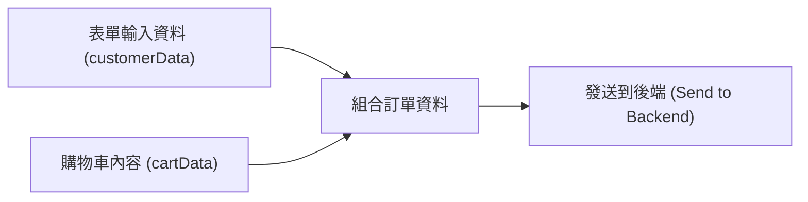

### 發送訂單至後端

- **下一步流程**：在成功提取使用者填寫的表單資料後，需要將其發送至後端伺服器
- **[資料組合]**：發送的請求內容通常需要包含兩部分資訊
    - **使用者填寫的表單資料**（例如：姓名、電子郵件等）
    - **購物車資料**（例如：訂購的商品詳情、總金額等）
- **實作目標**：透過發送 HTTP 請求，將整合後的訂單資訊傳遞給後端以完成訂單處理流程

### 使用 `fetch` 發送訂單請求

- **[執行時機]** 請求應在 `handleSubmit` 函式內部發送
    - 與載入資料（如使用 `useEffect`）不同，發送訂單是基於使用者的動作（提交表單）
- **[API 端點]** 目標路徑為 `/orders`
    - 這是 Dummy Backend 中專門接收訂單輸入的路由
- **實作範例**：

```javascript
function handleSubmit(event) {
    event.preventDefault();
    const fd = new FormData(event.target);
    const customerData = Object.fromEntries(fd.entries());

    // 向後端發送請求
    fetch('http://localhost:3000/orders');
}
```

### 後端訂單 API 的資料結構要求

為了確保後端能正確處理訂單，發送的 POST 請求主體必須遵循特定的物件結構：

- **請求主體 (Request Body) 結構**
    - 必須包含一個 `order` 屬性
    - `order` 物件內需包含以下兩大核心資訊：
        - `items`：包含所有已訂購的購物車項目（Cart Items）
        - `customer`：包含從結帳表單提取的所有客戶詳細資料
- **[後端驗證邏輯]**
    - 後端會檢查 `orderData` 是否為 `null`
    - 會檢查 `orderData.items` 是否為 `null` 或空陣列 `[]`
    - 會驗證 `customer` 資料的完整性（例如：電子郵件格式、姓名、街道、郵遞區號、城市等是否填寫）
- **前端實作：配置&#32;`handleSubmit`&#32;請求**
    - 在 `Checkout` 組件中，我們需要將整合後的資料發送至 `/orders` 端點
    - **實作範例**：

```javascript
function handleSubmit(event) {
    event.preventDefault();
    const fd = new FormData(event.target);
    const customerData = Object.fromEntries(fd.entries());

    // 發送訂單請求
    fetch('http://localhost:3000/orders', {
        method: 'POST',
        headers: {
            'Content-Type': 'application/json',
        },
        body: JSON.stringify({
            order: {
                items: cartData, // 購物車資料
                customer: customerData, // 客戶表單資料
            },
        }),
    });
}
```

### 配置 `fetch` 發送 POST 請求

- **[請求配置]**：預設的 `fetch` 會發送 GET 請求，但在提交訂單時必須進行以下配置：
    - **更改請求方法**：將 `method` 設定為 `'POST'`
    - **設定 HTTP 標頭 (Headers)**：需要添加 `Content-Type` 標頭，並將其值設為 `'application/json'`
        - **[目的]**：讓後端伺服器知道我們提交的是 JSON 格式的資料，以便後端能正確解析與提取內容
    - **設定請求主體 (Request Body)**：必須包含要傳送的資料
        - **[序列化]**：由於網路傳輸需要字串格式，必須使用 JavaScript 內建的 `JSON.stringify()` 方法將 JavaScript 物件轉換為 JSON 字串
- **實作範例**：

```javascript
fetch('http://localhost:3000/orders', {
    method: 'POST',
    headers: {
        'Content-Type': 'application/json',
    },
    body: JSON.stringify({
        order: {
            items: cartData,
            customer: customerData,
        },
    }),
});
```

### 整合訂單資料與發送請求

在 `handleSubmit` 處理表單提交時，需要將購物車的項目與客戶填寫的資料整合在一起，並轉換為 JSON 格式傳送給後端。

- **資料封裝邏輯**
    - 使用 `JSON.stringify()` 將 JavaScript 物件轉換為 JSON 字串
    - **[資料結構]**：必須建立一個包含 `order` 屬性的根物件，其結構如下：
        - `items`：存放購物車內的項目列表 (`cartData`)
        - `customer`：存放從表單提取的客戶資訊 (`customerData`)
- **實作範例**：

```javascript
function handleSubmit(event) {
    event.preventDefault();
    const fd = new FormData(event.target);
    const customerData = Object.fromEntries(fd.entries());

    fetch('http://localhost:3000/orders', {
        method: 'POST',
        headers: {
            'Content-Type': 'application/json',
        },
        body: JSON.stringify({
            order: {
                items: cartData,
                customer: customerData,
            },
        }),
    });
}
```

- **[表單資料來源]**
    - 透過 `new FormData(event.target)` 獲取表單內容
    - 使用 `Object.fromEntries(fd.entries())` 將其轉換為易於使用的鍵值對物件 (`customerData`)
    - 這樣 `customerData` 就會包含如 `email`、`name`、`street` 等欄位，直接對應到後端預期的 `customer` 物件結構。

### 確保表單欄位與後端資料結構對應

在處理表單提交時，必須確保 HTML `<input>` 元素的 `name` 屬性與後端 API 所預期的客戶資料欄位名稱一致。

- **[欄位名稱對應]**：
    - 如果後端預期的是 `name`，則前端表單的 `name` 屬性不應命名為 `full-name`，否則 `Object.fromEntries(fd.entries())` 會產生錯誤的鍵值對。
    - **[重要原則]**：表單中所有客戶資訊欄位（如 `email`、`name`、`street` 等）的 `name` 屬性，都應直接對應到後端預期的 `customer` 物件結構。
- **[訂單資料組成]**：
    - 最終提交的 `order` 物件由兩部分組成：

        1. `customer`：透過表單欄位名稱提取出的客戶資料 (`customerData`)。
        2. `items`：從 `CartContext` 中取得的購物車項目列表 (`cartCtx.items`)。

- **實作範例 (Checkout.jsx)**：

```javascript
function handleSubmit(event) {
    event.preventDefault();
    const fd = new FormData(event.target);
    const customerData = Object.fromEntries(fd.entries());

    fetch('http://localhost:3000/orders', {
        method: 'POST',
        headers: {
            'Content-Type': 'application/json',
        },
        body: JSON.stringify({
            order: {
                items: cartCtx.items, // 從 Context 取得購物車項目
                customer: customerData, // 從表單欄位名稱取得客戶資料
            },
        }),
    });
}
```

### 實作基礎訂單提交

在開發初期，為了快速驗證功能是否正確，可以先實作最基礎的資料傳送邏輯，而不必立即處理複雜的非同步流程。

- **[簡化開發流程]**：
    - 因為這是一個會改變後端資料狀態的請求（POST），目前的目標是確保資料能成功抵達後端並被提取與儲存。
    - **[暫時省略的部分]**：
        - **不等待回應**：暫時不需要使用 `await` 或 `.then()` 來等待請求的回應。
        - **不處理錯誤**：暫時不實作錯誤處理（Error Handling）機制。
        - **不關閉表單**：暫時不根據請求結果來關閉結帳表單。
    - **[後續優化方向]**：待核心功能確認運作正常後，再加入處理回應（以關閉表單）與錯誤處理的邏輯。
- **實作範例 (Checkout.jsx)**：

```javascript
function handleSubmit(event) {
    event.preventDefault();
    const fd = new FormData(event.target);
    const customerData = Object.fromEntries(fd.entries());

    fetch('http://localhost:3000/orders', {
        method: 'POST',
        headers: {
            'Content-Type': 'application/json',
        },
        body: JSON.stringify({
            order: {
                items: cartCtx.items,
                customer: customerData,
            },
        }),
    });
}
```

### 驗證訂單提交功能

透過實際操作結帳流程，可以確認前端是否已成功將資料發送至後端。

- **[功能測試流程]**：
    - 將購物車中加入若干項目。
    - 開啟結帳畫面並填入測試資料（Dummy details）。
    - 點擊「Submit Order」按鈕。
- **[觀察結果]**：
    - **前端行為**：在目前的實作階段，點擊提交後頁面不會有明顯的視覺變化，也不應出現錯誤提示。
    - **網路請求 (Network Tab)**：雖然頁面看似無反應，但在瀏覽器的 Network 分頁中，應能觀察到 HTTP 請求已成功送出。
- **[HTTP 請求細節]**：
    - **[CORS 預檢請求]**：當發送一個 POST 請求時，瀏覽器實際上會發送兩個請求。
        - 第一個是 `OPTIONS` 請求：這是瀏覽器為了安全性自動發起的預檢請求（Preflight request）。
        - 第二個才是真正的 `POST` 請求：包含實際的訂單資料。

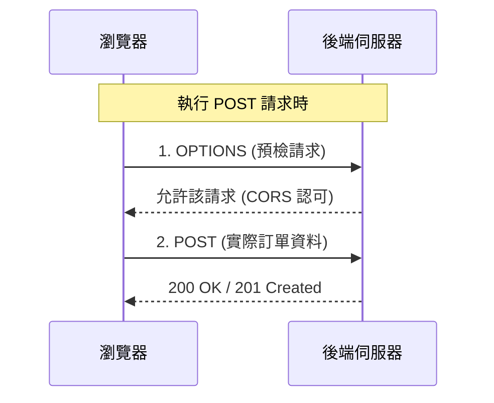

### 驗證後端資料寫入

除了在瀏覽器 Network 分頁觀察到成功狀態碼（如 `201 Created`）之外，還可以使用以下方式確認資料是否真的已進入後端系統。

- **[驗證方法]**：
    - 前往後端專案目錄下的 `data/orders.json` 檔案。
    - 檢查該檔案內容，確認是否有新增對應的訂單物件。
- **[測試結果觀察]**：
    - 如果在前端多次點擊「Submit Order」，則在 `orders.json` 中應能看到對應數量的訂單物件（例如連續點擊兩次，檔案中應包含兩個訂單物件）。

### 訂單資料結構分析

根據目前的實作，每一個提交的訂單物件都包含以下核心資訊：

- **`items`&#32;陣列**：包含所訂購的所有項目及其對應的數量 (`quantity`)。
- **`customer`&#32;物件**：包含使用者輸入的所有客戶詳細資料。
- **`id`**：由後端自動生成的唯一訂單識別碼。

### 提升使用者體驗 (UX) 的必要性

雖然目前的訂單提交功能在技術上已經可以運作，但從使用者體驗的角度來看，仍有顯著的改進空間：

- **[缺乏錯誤處理]**：如果請求過程中發生錯誤，前端目前無法向使用者顯示任何錯誤訊息。
- **[缺乏提交回饋]**：當使用者點擊「Submit Order」後，系統不會提供任何視覺上的回饋（例如：成功提示或載入狀態），導致使用者不確定操作是否已成功完成。

### HTTP 請求的實務考量

- **[網路延遲問題]**：當網路連線緩慢（例如透過瀏覽器 DevTools 的 Throttling 功能模擬）時，使用者會面臨一段等待時間。
    - 目前的實作中，前端程式碼會先載入，但使用者必須盯著空白頁面直到資料獲取完成。
- **[UX 優化建議]**：為了避免使用者感到困惑，應在資料加載期間顯示載入指示器（Loading Spinner）。
- **[未竟之志]**：目前處理 HTTP 請求的邏輯尚未完備，後續將針對錯誤處理與加載狀態進行深入探討。

### 封裝 HTTP 請求邏輯

為了提升使用者體驗並優化程式碼結構，需要處理請求過程中的各種狀態。

- **[核心問題]**：目前的實作缺乏對請求狀態的處理，導致使用者在等待或發生錯誤時無法獲得即時回饋。
- **[解決方案]**：建立一個 **Custom Hook** 來封裝 HTTP 請求邏輯。
- **[為什麼需要 Custom Hook？]**：因為不同的組件需要重複使用相同的請求邏輯，例如：
    - `Checkout` 組件需要發送訂單請求。
    - `Meals` 組件需要獲取餐點列表。
- **[需要管理的請求狀態]**：無論是哪種請求，組件最終都需要根據以下狀態來更新 UI：
    - **Loading (載入中)**：顯示載入指示器（如 Spinner）。
    - **Success (成功)**：處理獲取的資料或顯示成功訊息。
    - **Error (失敗)**：處理請求失敗並向使用者顯示錯誤訊息。

### 實作 `useHttp` Custom Hook

- **[為什麼不能用一般函式？]**
    - 如果只是建立一個標準的 JavaScript 函式，當函式內部的狀態（例如 `isLoading` 或 `error`）改變時，無法觸發 React 組件的重新渲染（Re-render）。
    - **[解決方案]**：使用 **Custom Hook**。因為 Hook 可以使用 React 的內建功能（如 `useState`），當 Hook 內部的狀態改變時，使用該 Hook 的組件會跟著重新渲染，從而更新 UI。
- **[建立步驟]**：
    - 在 `src` 資料夾下建立一個 `hooks` 資料夾。
    - 在 `hooks` 資料夾中建立 `useHttp.js` 檔案。
    - **[命名規範]**：Custom Hook 的名稱必須以 `use` 開頭（例如 `useHttp`），這是為了向 React 訊號此函式遵循 Hook 的特殊規則。

```javascript
// src/hooks/useHttp.js
export default function useHttp() {

}
```

### 區分請求發送的觸發時機

在設計 `useHttp` 時，必須考量不同組件對 HTTP 請求發送時機的需求：

- **組件渲染時自動發送 (On Mount)**
    - 適用於需要一進入頁面就獲取資料的組件，例如 `Meals` 組件。
    - 請求會在組件掛載時立即執行。
- **根據需求發送 (On Demand)**
    - 適用於需要使用者特定操作後才觸發的請求，例如 `Checkout` 組件中的訂單提交。
    - 請求應在特定的事件處理函式（如 `handleSubmit`）執行時才發送。

### 實作 `sendHTTPRequest` 輔助函式

為了同時支援上述兩種模式，我們需要在 `useHttp.js` 中實作一個輔助函式，將通用的請求邏輯包裝起來：

- **[設計目標]**：建立一個可以被外部呼叫的非同步函式，讓組件能自行決定何時發送請求。
- **[函式定義]**：
    - 名稱：`sendHTTPRequest`
    - 參數：接收 `url` 與 `config` 物件（與原生 `fetch` API 的參數結構一致）。
    - 特性：`async` 非同步函式。

```javascript
// src/hooks/useHttp.js
async function sendHTTPRequest(url, config) {

}

export default function useHttp() {

}
```

### 實作 `sendHTTPRequest` 的錯誤處理

在 `sendHTTPRequest` 函式中，我們需要處理請求發送後的結果，並確保在後端發生錯誤時能正確捕捉到。

- **[執行請求]**：使用 `await fetch(url, config)` 來執行非同步請求，並將結果存入 `response` 常數中。
- **[檢查請求狀態]**：必須檢查 `response.ok` 屬性。
    - `response.ok` 為 `true` 表示 HTTP 狀態碼在 200-299 之間（成功）。
    - 如果 `response.ok` 為 `false`，代表請求雖然發送成功，但後端處理失敗（例如：404 Not Found 或 500 Internal Server Error）。
- **[拋出錯誤]**：當 `response.ok` 為假時，使用內建的 `Error` 建構函式拋出錯誤，以便後續的 `catch` 區塊可以捕捉並處理。

```javascript
// src/hooks/useHttp.js
async function sendHTTPRequest(url, config) {
  const response = await fetch(url, config);

  if (!response.ok) {
    throw new Error('Something went wrong, failed to send request.');
  }
}

export default function useHttp() {

}
```

### 提取回應資料以獲取詳細錯誤訊息

在判斷請求是否成功之前，應先解析回應的資料內容。這是因為後端在回傳錯誤狀態碼（如 400 Bad Request）時，通常也會在回應主體中附帶具體的錯誤原因。

- **[為什麼需要解析資料？]**
    - 即使 `response.ok` 為 `false`，回應中仍可能攜帶 `resData` 物件。
    - 後端可以透過此物件傳遞更具體的錯誤訊息（例如：指出哪些欄位遺漏或格式錯誤），而非僅僅回傳一個模糊的錯誤代碼。

**後端錯誤回應範例（app.js）：**

當訂單資料缺失時，後端會回傳 400 狀態碼，並包含如下結構的 JSON：

```json
{
  "message": "Missing data: Email, name, street, postal code or city is missing"
}
```

**實作&#32;`sendHTTPRequest`&#32;的更新邏輯：**

```javascript
// src/hooks/useHttp.js
async function sendHTTPRequest(url, config) {
  const response = await fetch(url, config);
  const resData = await response.json(); // 先提取回應中的 JSON 資料

  if (!response.ok) {
    // 使用從後端取得的具體錯誤訊息，而非僅僅使用固定字串
    throw new Error(resData.message || 'Something went wrong, failed to send request.');
  }

  return resData;
}
```

### 完成 `sendHTTPRequest` 的邏輯實作

透過解析回應內容，我們可以讓錯誤處理變得更加精確。

- **[解析回應]**：使用 `await response.json()` 將回應轉換為 JavaScript 物件 `resData`。
- **[精確的錯誤訊息]**：
    - 檢查 `resData` 是否包含 `message` 屬性。
    - 如果有，則使用該屬性作為錯誤訊息；否則，使用預設的通用錯誤字串作為 fallback。
- **[成功回傳]**：若通過 `response.ok` 的檢查，則回傳 `resData`。

```javascript
// src/hooks/useHttp.js
async function sendHTTPRequest(url, config) {
  const response = await fetch(url, config);
  const resData = await response.json();

  if (!response.ok) {
    throw new Error(
      resData.message || 'Something went wrong, failed to send request.'
    );
  }

  return resData;
}

export default function useHttp() {

}
```

- **[下一步]**：將 `sendHTTPRequest` 整合進 `useHttp` 自定義 Hook 中，以便在 Hook 內部定義其他功能。

### 在 `useHttp` 中實作 `sendRequest` 函式

在 `useHttp` 自定義 Hook 內部，可以定義一個名為 `sendRequest` 的非同步函式。這個函式的作用是封裝底層的 `sendHTTPRequest` 邏輯，並為未來根據請求狀態（例如載入中、錯誤或成功）來更新 Hook 內部的狀態做好準備。

- **[非同步 Hook]**：在自定義 Hook 中使用 `async` 函式是完全合法的操作。
- **[職責分離]**：
    - `sendHTTPRequest`：負責處理底層的 `fetch` 請求、解析 JSON 以及錯誤處理。
    - `sendRequest`：在 Hook 內部調用前者，並負責處理與 React 狀態相關的邏輯（如更新 `isLoading` 或 `error` 狀態）。

```javascript
// src/hooks/useHttp.js
export default function useHttp() {
  async function sendRequest() {
    const resData = await sendHTTPRequest(url, config);
    // 未來將在此處根據 resData 更新狀態
  }
}
```

### 在 `sendRequest` 中加入錯誤處理與狀態管理

由於 `sendHTTPRequest` 可能會因為各種原因失敗，我們必須在 `sendRequest` 中使用 `try...catch` 來捕捉這些錯誤。

- **[錯誤來源]**：
    - **後端錯誤**：例如 `sendHTTPRequest` 偵測到 `!response.ok` 時拋出的錯誤。
    - **網路錯誤**：例如使用者完全沒有網路連線，導致請求根本無法發送。
- **[狀態管理需求]**：為了在 UI 上即時反映請求的進度，我們需要建立相關狀態來追蹤不同的請求階段（例如：`isLoading`、`error` 等）。

```javascript
// src/hooks/useHttp.js
export default function useHttp() {
  async function sendRequest() {
    try {
      const resData = await sendHTTPRequest(url, config);
      // 未來在此處處理成功邏輯
    } catch (error) {
      // 捕捉來自 sendHTTPRequest 或網路層的錯誤
      throw error;
    }
  }
}
```

### 在 `useHttp` 中管理錯誤狀態

為了讓 Hook 能夠反映請求過程中的錯誤，我們需要引入 `useState` 來建立一個錯誤狀態。

- **[建立錯誤狀態]**：使用 `useState` 初始化一個 `error` 變數，初始值設為 `undefined`。
- **[更新錯誤資訊]**：在 `catch` 區塊中，透過 `setError` 更新狀態。
    - **[優先使用錯誤訊息]**：嘗試取得 `error.message` 並將其設定為目前的錯誤狀態。
    - **[提供備用訊息]**：若 `error.message` 不存在，則使用一個預設的 fallback 錯誤字串，以確保使用者能收到明確的提示。

```javascript
// src/hooks/useHttp.js
import { useState } from 'react';

export default function useHttp() {
  const [error, setError] = useState();

  async function sendRequest() {
    try {
      const resData = await sendHTTPRequest(url, config);
      // 未來在此處處理成功邏輯
    } catch (error) {
      setError(error.message || 'Something went wrong, failed to send request.');
    }
  }
}
```

### 在 `useHttp` 中管理載入狀態

除了錯誤處理，為了在等待回應時提供視覺回饋，我們需要在 Hook 中管理一個「載入中」的狀態。

- **[建立載入狀態]**：使用 `useState` 初始化 `isLoading`，初始值設為 `false`。
- **[觸發載入狀態]**：在 `sendRequest` 函式的開頭，立即呼叫 `setIsLoading(true)`，因為此時非同步請求即將發出。

```javascript
// src/hooks/useHttp.js
import { useState } from 'react';

export default function useHttp() {
  const [isLoading, setIsLoading] = useState(false);
  const [error, setError] = useState();

  async function sendRequest() {
    setIsLoading(true);
    try {
      const resData = await sendHTTPRequest(url, config);
      // 未來在此處處理成功邏輯
    } catch (error) {
      setError(error.message || 'Something went wrong!');
    }
  }
}
```

### 完善 `useHttp` 的請求邏輯

為了讓 `useHttp` 成為一個完整的工具，我們需要處理請求結束後的狀態重設，以及儲存成功取得的資料。

- **[重設載入狀態]**：
    - 無論請求是成功還是失敗（即無論是否進入 `catch` 區塊），在 `try...catch` 結構結束後，都必須將 `setIsLoading(false)`。
    - **[原因]**：因為請求動作已經完成，不再處於「載入中」的狀態。
- **[管理成功資料]**：
    - 使用 `useState` 建立一個 `data` 狀態來儲存從後端取得的回應內容。
    - 在 `try` 區塊中，當 `sendHTTPRequest` 成功回傳資料後，立即呼叫 `setData(resData)`。

```javascript
// src/hooks/useHttp.js
import { useState } from 'react';

export default function useHttp() {
  const [data, setData] = useState();
  const [isLoading, setIsLoading] = useState(false);
  const [error, setError] = useState();

  async function sendRequest() {
    setIsLoading(true);
    try {
      const resData = await sendHTTPRequest(url, config);
      setData(resData);
    } catch (error) {
      setError(error.message || 'Something went wrong!');
    } finally {
      // 無論成功或失敗，請求結束後都停止載入狀態
      setIsLoading(false);
    }
  }

  return { data, isLoading, error, sendRequest };
}
```

- **[返回值設計]**：
    - 此 Hook 現在會回傳一個包含 `data`、`isLoading`、`error` 以及 `sendRequest` 函式的物件，讓外部組件可以輕鬆訂閱這些狀態並觸發請求。

### `useHttp` 的返回值設計

為了讓訂閱該 Hook 的組件能夠根據請求的進度做出反應，`useHttp` 會將其內部的狀態回傳給外部組件。

- **[回傳內容]**：回傳一個包含 `data`、`isLoading` 與 `error` 的物件。
- **[溝通機制]**：當 `sendRequest` 觸發狀態更新（例如 `setIsLoading(true)` 或 `setData(resData)`）時，所有使用此 Hook 的組件都會接收到這些狀態變化，進而觸發重新渲染以反映最新的請求狀態。

```javascript
// src/hooks/useHttp.js
export default function useHttp() {
  const [data, setData] = useState();
  const [isLoading, setIsLoading] = useState(false);
  const [error, setError] = useState();

  async function sendRequest() {
    // ... 請求邏輯
  }

  return { data, isLoading, error, sendRequest };
}
```

### `sendRequest` 的調用時機

雖然 `sendRequest` 已經在 Hook 中定義完成，但它目前僅僅是一個「靜態」的函式，並不會自動執行。

- **[延遲執行]**：該函式必須在特定的組件中，根據特定的使用者行為或生命週期事件來被呼叫。
- **[實務範例]**：例如在 `Checkout` 組件中，當使用者點擊「提交訂單」按鈕時，才會正式執行 `sendRequest` 來發送 HTTP 請求。

### 提升 `useHttp` 的便利性

在目前的設計中，組件必須手動呼叫 `sendRequest` 才能發送請求（例如在 `Checkout` 組件的 `handleSubmit` 中）。但在某些場景下，我們希望組件在掛載時就自動取得資料。

- **[情境對比]**：
    - **`Checkout`&#32;組件**：需要使用者點擊按鈕後才發送請求，因此應維持手動呼叫 `sendRequest`。
    - **`Meals`&#32;組件**：組件一顯示就應該抓取資料，因此適合在 `useEffect` 中自動觸發。
- **[優化方案]**：
    - 除了提供 `sendRequest` 供手動調用外，可以在 `useHttp` 內部整合 `useEffect`，讓它具備自動執行請求的能力。

```javascript
// src/hooks/useHttp.js
import { useState, useEffect } from 'react'; // 需要從 react 匯入 useEffect

export default function useHttp() {
  // ... 狀態定義

  async function sendRequest() {
    // ... 請求邏輯
  }

  // 透過 useEffect 實作自動請求功能
  useEffect(() => {
    sendRequest();
  }, []);

  return { data, isLoading, error, sendRequest };
}
```

### 避免 `useEffect` 中的無限迴圈

當我們在 `useHttp` 內部使用 `useEffect` 來自動執行 `sendRequest` 時，會遇到一個潛在的依賴問題。

- **[問題根源]**：
    - `sendRequest` 是定義在 `useHttp` 函式內部的局部函式。
    - 當使用該 Hook 的組件重新渲染時，`useHttp` 會重新執行，導致 `sendRequest` 被建立為一個全新的函式物件。
    - 如果將 `sendRequest` 加入 `useEffect` 的依賴陣列中，每次 `sendRequest` 的引用改變都會觸發 `useEffect` 執行。
    - `useEffect` 執行 `sendRequest` $\rightarrow$ 觸發狀態更新（如 `setIsLoading`） $\rightarrow$ 組件重新渲染 $\rightarrow$ `sendRequest` 引用改變 $\rightarrow$ 再次觸發 `useEffect` $\rightarrow$ **陷入無限迴圈**。
- **[解決方案]**：
    - 使用 `useCallback` Hook 來包裹 `sendRequest` 函式。
    - **[原理]**：`useCallback` 會快取函式的引用，只有當其依賴項發生變化時，才會回傳新的函式物件。這樣可以確保在依賴項不變的情況下，`sendRequest` 的引用保持穩定，從而避免 `useEffect` 不斷觸發。

```javascript
// src/hooks/useHttp.js
import { useState, useEffect, useCallback } from 'react';

export default function useHttp() {
  const [data, setData] = useState();
  const [isLoading, setIsLoading] = useState(false);
  const [error, setError] = useState();

  // 使用 useCallback 包裹，以確保函式引用在重新渲染時保持穩定
  const sendRequest = useCallback(async () => {
    setIsLoading(true);
    try {
      const resData = await sendHTTPRequest(url, config);
      setData(resData);
    } catch (error) {
      setError(error.message || 'Something went wrong!');
    } finally {
      setIsLoading(false);
    }
  }, [url, config]); // 依賴於 url 與 config

  useEffect(() => {
    sendRequest();
  }, [sendRequest]); // 現在 sendRequest 是穩定的，不會導致無限迴圈

  return { data, isLoading, error, sendRequest };
}
```

### `useCallback` 中的依賴項與參數限制

雖然使用 `useCallback` 可以穩定 `sendRequest` 的引用，但目前的實作方式存在靈活性上的問題。

- **[目前的限制]**：
    - `sendRequest` 被定義為一個不帶參數的函式。
    - 然而，底層的 `sendHTTPRequest` 至少需要 `url` 以及可能的 `config` 物件才能正確執行請求。
    - **[導致的問題]**：
        - 因為 `sendRequest` 無法接收外部傳入的 `url` 或 `config`，這使得該 Hook 無法靈活地處理不同端點（endpoints）或不同配置的請求。

```javascript
// 目前的實作限制範例
const sendRequest = useCallback(async () => {
  setIsLoading(true);
  try {
    // 這裡無法動態傳入 url 或 config
    const resData = await sendHTTPRequest();
    setData(resData);
  } catch (error) {
    setError(error.message || 'Something went wrong!');
  } finally {
    setIsLoading(false);
  }
}, []); // 依賴項目前為空
```

### 提升 `useHttp` 的靈活性與正確的依賴管理

為了讓 `useHttp` Hook 能夠處理不同的 API 端點與配置，需要將 `url` 與 `config` 作為參數傳遞給 `sendRequest` 函式。

- **[實作方式]**：
    - 修改 `sendRequest` 使其能夠接收 `url` 與 `config`。
    - 將這些參數傳遞給底層的 `sendHTTPRequest` 函式。
- **[依賴項管理]**：
    - **必須**將 `url` 與 `config` 同時加入 `useCallback` 的依賴陣列中。
    - **[原因]**：因為 `sendRequest` 內部的程式碼邏輯會依賴於這些參數；如果 `url` 或 `config` 發生變化，我們必須建立一個新的函式物件，以確保 `sendHTTPRequest` 會使用最新的資料進行請求。

```javascript
// src/hooks/useHttp.js
import { useState, useEffect, useCallback } from 'react';

export default function useHttp() {
  const [data, setData] = useState();
  const [isLoading, setIsLoading] = useState(false);
  const [error, setError] = useState();

  // 透過傳入 url 與 config 參數來增加 Hook 的靈活性
  const sendRequest = useCallback(async (url, config) => {
    setIsLoading(true);
    try {
      const resData = await sendHTTPRequest(url, config);
      setData(resData);
    } catch (error) {
      setError(error.message || 'Something went wrong!');
    } finally {
      setIsLoading(false);
    }
  }, [url, config]); // 必須包含 url 與 config 作為依賴項

  useEffect(() => {
    // 此處的調用現在可以接收動態參數
    // sendRequest(someUrl, someConfig);
  }, [sendRequest]);

  return { data, isLoading, error, sendRequest };
}
```

### 優化 `useHttp` 的自動請求行為

目前的 `useEffect` 會在組件掛載時自動執行 `sendRequest()`。雖然這對 `Meals` 組件很方便，但對於不需要在掛載時立即抓取資料的組件（例如 `Checkout` 組件）並不理想。

- **[優化思路]**：在 `useEffect` 內部加入檢查機制，判斷是否應該自動發送請求。
- **[檢查條件]**：可以檢查傳入 Hook 的 `config` 物件。例如，如果請求方法是 `GET`，或者根本沒有提供 `config` 物件，則視為需要自動執行；若提供了特定的 `config`（例如 `POST` 請求），則不應自動觸發。

```javascript
// src/hooks/useHttp.js

// ... 省略其他代碼

  useEffect(() => {
    // 只有在沒有提供 config，或者請求方法是 GET 時，才自動發送請求
    if (!config || config.method === 'GET') {
      sendRequest();
    }
  }, [sendRequest, config]);

// ...
```

### `useHttp` 自動請求的條件判斷細節

在實作自動請求邏輯時，需要精確定義觸發條件，以確保 Hook 在不同情境下的行為符合預期。

- **[觸發條件]**：
    - 檢查 `config` 是否為真值（truthy）。
    - 若 `config` 存在，則進一步檢查 `config.method` 是否為 `'GET'`。
    - **[邏輯總結]**：只有在「提供了 `config`」且「方法為 `GET`」的情況下，才會在組件掛載時自動執行 `sendRequest()`。
- **[依賴項更新]**：
    - `useEffect` 的依賴陣列必須包含 `config`，因為判斷邏輯直接使用了該物件。

```javascript
// src/hooks/useHttp.js

// ... 省略其他代碼

  useEffect(() => {
    // 只有當 config 存在且 method 為 'GET' 時，才自動發送請求
    if (config && config.method === 'GET') {
      sendRequest();
    }
  }, [sendRequest, config]); // 必須包含 config 作為依賴項

// ...
```

### 暴露 `sendRequest` 以供組件主動呼叫

為了讓 `useHttp` 更加靈活，除了自動觸發請求的功能外，還需要讓使用該 Hook 的組件能夠在特定時機（例如使用者點擊提交按鈕時）手動執行請求。

- **[實作方式]**：將 `sendRequest` 函式包含在 Hook 回傳的物件中。
- **[應用情境]**：當組件需要處理非掛載時自動觸發的動作時（例如表單提交），可以直接從 Hook 中取得 `sendRequest` 並執行。

```javascript
// src/hooks/useHttp.js

// ... 省略其他代碼

  return { data, isLoading, error, sendRequest };
}
```

### 重構 `Meals.jsx` 以簡化邏輯

由於 `useHttp` 現在已經具備了自動處理 `GET` 請求的能力，`Meals.jsx` 組件中原本為了抓取餐點資料而撰寫的 `useEffect` 與 `useState` 邏輯變得多餘，可以進行大幅度簡化。

- **[簡化步驟]**：
    - 移除組件內部的 `useState`（用於儲存 `loadedMeals`）。
    - 移除組件內的 `useEffect` 邏輯。
    - 直接從 `useHttp` 取得 `data` 並將其作為餐點列表使用。

```javascript
// src/components/Meals.jsx

import { useHttp } from '../hooks/useHttp';
import MealItem from './MealItem.jsx';

export default function Meals() {
  // 直接使用 useHttp 取得資料，不再需要手動撰寫 useEffect 與 useState
  const { data: loadedMeals } = useHttp();

  return (
    <ul id="meals">
      {loadedMeals?.map((meal) => (
        <MealItem key={meal.id} meal={meal} />
      ))}
    </ul>
  );
}
```

### 在 `Meals.jsx` 中實作 `useHttp` 呼叫

透過使用 `useHttp` 自定義 Hook，可以簡化組件中處理 HTTP 請求的邏輯，直接取得資料、載入狀態與錯誤資訊。

- **[實作步驟]**：
    - 從 `../hooks/useHttp.js` 匯入 `useHttp`。
    - 呼叫 `useHttp` 時，第一個參數傳入目標 `URL`。
    - 第二個參數傳入 `config` 物件（若為 `GET` 請求，則可省略或傳入空物件）。
    - 使用**解構賦值 (Destructuring)** 從 Hook 的回傳值中取得 `data`、`isLoading` 與 `error`。

```javascript
// src/components/Meals.jsx

import MealItem from './MealItem.jsx';
import { useHttp } from '../hooks/useHttp.js';

export default function Meals() {
  // 傳入 URL，因為是 GET 請求，所以不需要額外的 config 物件
  const { data: loadedMeals, isLoading, error } = useHttp('http://localhost:3000/meals');

  return (
    <ul id="meals">
      {loadedMeals?.map((meal) => (
        <MealItem key={meal.id} meal={meal} />
      ))}
    </ul>
  );
}
```

### `Meals.jsx` 中的資料命名與潛在錯誤

在 `Meals.jsx` 中，為了讓後續的 JSX 程式碼能保持一致，會將從 `useHttp` 解構出來的 `data` 重新命名（alias）為 `loadedMeals`。

- **[實作方式]**：使用解構賦值的語法 `const { data: loadedMeals, ... } = useHttp(...)`。
- **[遇到的問題]**：在初次載入頁面時，控制台會噴出錯誤：

  `Uncaught TypeError: Cannot read properties of undefined (reading 'map')` at `Meals.jsx:13:20`

    - **[錯誤原因]**：因為在 HTTP 請求尚未完成前，`useHttp` 回傳的 `data` 預設值是 `undefined`，而程式碼嘗試對 `undefined` 執行 `.map()` 方法，導致程式崩潰。

```javascript
// src/components/Meals.jsx

import MealItem from './MealItem.jsx';
import { useHttp } from '../hooks/useHttp.js';

export default function Meals() {
  // 將 data 重新命名為 loadedMeals 以便後續使用
  const { data: loadedMeals, isLoading, error } = useHttp('http://localhost:3000/meals');

  return (
    <ul id="meals">
      {/* 這裡會出錯，因為 loadedMeals 初始為 undefined */}
      {loadedMeals.map((meal) => (
        <MealItem key={meal.id} meal={meal} />
      ))}
    </ul>
  );
}
```

### 理解 `data` 為 `undefined` 的原因與渲染機制

在 `Meals.jsx` 中遇到的錯誤，本質上是因為非同步請求的特性與 React 的渲染機制之間的時差造成的。

- **[為什麼&#32;`data`&#32;是&#32;`undefined`]**：
    - 在 `useHttp.js` 中，`data` 是透過 `useState()` 初始化而成的。
    - 因為在呼叫 `useState()` 時沒有傳入初始值，所以 `data` 的預設值會是 `undefined`。
- **[非同步請求的生命週期]**：
    - 發送 HTTP 請求需要時間，在請求完成並更新狀態之前，`data` 會一直保持為 `undefined`。
    - **關鍵點**：React 組件函式不會等待非同步請求完成後才執行。相反地，當組件掛載時，React 會立即解析 JSX 並將其轉換為 HTML 進行第一次渲染。
- **[導致錯誤的流程]**：

    1. 組件掛載 $\rightarrow$ `useHttp` 初始化 `data` 為 `undefined`。
    2. 組件立即執行第一次渲染 $\rightarrow$ 執行到 `{loadedMeals.map(...)}`。
    3. 因為 `loadedMeals` (即 `data`) 此時是 `undefined`，對其呼叫 `.map()` 方法會導致程式崩潰。

```javascript
// src/hooks/useHttp.js 核心邏輯示意

export default function useHttp(url, config) {
  // 因為沒有傳入初始值，data 初始狀態為 undefined
  const [data, setData] = useState();
  const [isLoading, setIsLoading] = useState(false);
  const [error, setError] = useState();

  // ... 發送請求的邏輯

  return { data, isLoading, error };
}
```

### 嘗試解決 `map` 錯誤的初步方案

為了繞過 `loadedMeals.map()` 產生的錯誤，一個直覺的想法是在資料尚未載入時，回傳不同的內容（例如顯示「正在抓取餐點...」的段落）。

- **[嘗試做法]**：
    - 檢查是否處於 `isLoading` 狀態。
    - 若是，則回傳 `<p>Fetching meals...</p>`。
- **[為何此方法無效]**：
    - 即使實作了上述邏輯，重新整理頁面後錯誤依然會出現。
    - **[原因]**：在 `useHttp` 自定義 Hook 中，`isLoading` 的初始值被設定為 `false`，而非 `true`。
    - 這意味著在組件第一次渲染時，`isLoading` 是 `false`，程式碼會跳過載入中的判斷，直接執行到 `loadedMeals.map()`，進而導致對 `undefined` 進行操作的錯誤。

### 探討將 `isLoading` 初始值設為 `true` 的侷限性

雖然將 `isLoading` 的初始值從 `false` 改為 `true` 可以解決 `Meals.jsx` 中的 `map` 錯誤，但這在實務上會帶來新的問題。

- **[為什麼不能直接設為&#32;`true`]**：
    - `useHttp` 是一個通用的自定義 Hook，未來可能會被用於不同的組件。
    - **[情境衝突]**：例如在 `Checkout` 組件中使用時，我們並不希望組件一掛載就處於「載入中」的狀態。
    - 如果將初始值固定為 `true`，會導致所有使用此 Hook 的組件在初始渲染時都強制進入載入狀態，這不符合邏輯。
- **[問題的核心]**：
    - 問題不在於 `isLoading` 的初始值，而在於 `data` 的初始值與非同步請求執行時機之間的矛盾。
    - `isLoading` 會在 `useEffect` 執行後（即組件渲染完成後）才被設為 `true`，因此在第一次渲染時，`isLoading` 必定是 `false`。

```javascript
// src/hooks/useHttp.js

export default function useHttp(url, config) {
  const [data, setData] = useState(); // 初始為 undefined
  const [isLoading, setIsLoading] = useState(false); // 初始為 false
  const [error, setError] = useState();

  const sendRequest = useCallback(async function sendRequest() {
    setIsLoading(true); // 只有在執行此函式後，isLoading 才會變為 true
    try {
      const resData = await sendHttpRequest(url, config);
      setData(resData);
    } catch (error) {
      setError(error.message || 'Something went wrong!');
    }
    setIsLoading(false);
  }, [url, config]);

  // ...
}
```

### 透過 `initialData` 優化 `useHttp` Hook

為了從根本上解決因 `data` 為 `undefined` 而導致的 `map` 錯誤，可以為 `useHttp` 增加一個第三個參數：`initialData`。

- **[設計思路]**：
    - 允許使用者在呼叫 Hook 時，自定義 `data` 狀態的初始值。
    - 這樣在非同步請求完成前，`data` 會持有預設值（例如空陣列），而非 `undefined`。

```javascript
// src/hooks/useHttp.js

// 增加 initialData 參數
export default function useHttp(url, config, initialData) {
  // 使用傳入的 initialData 作為 useState 的初始值
  const [data, setData] = useState(initialData);
  const [isLoading, setIsLoading] = useState(false);
  const [error, setError] = useState();

  // ... 其餘邏輯保持不變
}
```

- **[應用範例]**：
    - 在 `Meals.jsx` 中使用時，可以傳入一個空陣列 `[]` 作為初始值。

```javascript
// src/components/Meals.jsx

const { data: loadedMeals, isLoading, error } = useHttp(
  'http://localhost:3000/meals',
  {},
  [] // 傳入空陣列作為 initialData
);
```

- **[優點]**：
    - **安全性**：第一次渲染時，`loadedMeals` 為 `[]`，對其執行 `.map()` 不會報錯，程式能穩定執行。
    - **簡潔性**：不需要在組件中寫大量的 `if (!data) return ...` 判斷，也不必依賴 `isLoading` 來規避錯誤，讓程式碼更符合預期行為。

### `data` 為 `undefined` 的替代方案

除了透過 `initialData` 預設值來解決問題外，也可以在組件中使用條件判斷來處理 `data` 尚未取得的情況。

- **[做法]**：檢查 `data` 是否為 `undefined`，如果是，則回傳一段提示文字（例如「找不到餐點」）。

```javascript
// src/components/Meals.jsx

if (isLoading) {
  return <p>Fetching meals...</p>;
}

if (!data) {
  return <p>No meals found.</p>;
}

return (
  <ul id="meals">
    {loadedMeals.map((meal) => (
      <MealItem key={meal.id} meal={meal} />
    ))}
  </ul>
);
```

- **[觀察結果]**：
    - 使用此方法後，雖然不再會發生 `map` 錯誤，但畫面會顯示「No meals found」。
    - **[原因分析]**：透過檢查瀏覽器的 **Network** 分頁可以發現，根本沒有發出任何請求到後端 API。這意味著組件雖然不會崩潰，但因為沒有取得資料，所以呈現了預設的備用內容。

### 網路請求未發送的原因分析

雖然在 `Meals.jsx` 中已透過 `initialData` 解決了 `map` 錯誤，但觀察 **Network** 分頁發現請求並未成功發出。

- **[問題核心]**：`useHttp` 內部的 `useEffect` 條件判斷與傳入的 `config` 物件不匹配。
    - `useHttp` 內部邏輯要求 `config` 必須存在，且 `config.method` 必須等於 `'GET'`。
    - 然而在 `Meals.jsx` 中，傳入的 `config` 是一個空物件 `{}`。

```javascript
// src/components/Meals.jsx

const { data: loadedMeals, isLoading, error } = useHttp(
  'http://localhost:3000/meals',
  {}, // 這裡傳入空物件，導致 config.method 為 undefined
  []
);
```

- **[邏輯失效流程]**：

    1. `config` 為 `{}` (存在，條件通過)。
    2. `config.method` 為 `undefined` (不等於 `'GET'`，條件失敗)。
    3. 結果：`sendRequest()` 函式不會被執行，導致網路請求完全沒有發出。

### 優化 `useHttp` 的請求觸發條件

為了讓 `useHttp` 更具彈性，需要修正 `useEffect` 中的條件判斷，以應對不同的 `config` 輸入情境。

- **[目前的限制]**：若傳入空物件 `{}`，雖然 `config` 存在，但 `config.method === 'GET'` 會失敗，導致請求無法發送。
- **[修正方案]**：透過增加邏輯判斷，讓「有設定 GET 方法」或「未設定方法」的情況都能觸發請求。

```javascript
// src/hooks/useHttp.js

useEffect(() => {
  if (config && (config.method === 'GET' || !config.method)) {
    sendRequest();
  }
}, [sendRequest, config]);
```

- **[判斷邏輯拆解]**：
    - `config && (...)`：首先確保 `config` 物件本身存在。
    - `config.method === 'GET'`：處理明確指定為 GET 的情況。
    - `|| !config.method`：處理 `config.method` 為 `undefined` 的情況（即傳入空物件時）。
- **[進一步思考]**：
    - 若完全沒有傳入 `config` 物件（`config` 為 `undefined`），目前的邏輯仍需確保能正確處理。若希望在完全沒傳 `config` 時也發送請求，需調整判斷式以包含 `!config` 的情況。

### 完善 `useHttp` 的預設請求邏輯

為了讓 `useHttp` 在沒有傳入 `config` 物件時也能自動發送預設的 GET 請求，需要擴充 `useEffect` 中的條件判斷。

- **[修正後的邏輯]**：若 `config` 不存在，或是 `config.method` 未設定，則視為預設行為並執行 `sendRequest()`。

```javascript
// src/hooks/useHttp.js

useEffect(() => {
  if (
    config && (config.method === 'GET' || !config.method) ||
    !config
  ) {
    sendRequest();
  }
}, [sendRequest, config]);
```

- **[判斷條件拆解]**：
    - `config && (config.method === 'GET' || !config.method)`：處理有傳入 `config` 物件，但方法為 GET 或未指定方法的情境。
    - `|| !config`：處理完全沒有傳入 `config` 物件的情境（此時應執行預設行為）。

---

### 遇到新的執行期錯誤：`map` 不是函式

在修正了 `useHttp` 的觸發條件並重新整理頁面後，雖然解決了 `data` 為 `undefined` 的問題，但卻遇到了新的錯誤。

- **[錯誤訊息]**：

  `Uncaught TypeError: loadedMeals.map is not a function`

- **[問題分析]**：
    - 錯誤發生在 `Meals.jsx` 的 `loadedMeals.map(...)` 處。
    - 這表示 `loadedMeals`（即 `useHttp` 回傳的 `data`）目前的值**不是一個陣列**，因此無法呼叫 `.map()` 方法。
    - **[下一步]**：需要檢查 `useHttp` 回傳的 `data` 到底是什麼樣的資料型態，以便找出為何它沒有被正確初始化為陣列。

### 診斷 `map` 錯誤：`loadedMeals` 的實際值

為了找出為什麼 `loadedMeals.map` 會失敗，在 `Meals.jsx` 中加入 `console.log` 來觀察狀態變化：

```javascript
// src/components/Meals.jsx

export default function Meals() {
  const {
    data: loadedMeals,
    isLoading,
    error,
  } = useHttp('http://localhost:3000/meals', {}, []);

  console.log(loadedMeals); // 檢查 loadedMeals 的內容

  // ...
}
```

### 診斷 `map` 錯誤：`data` 變成了 `Promise`

透過 `console.log` 觀察發現，雖然 `initialData` 設定為空陣列，但隨後 `loadedMeals` 的值變成了 `Promise <pending>`，這就是導致 `map` 錯誤的原因。

- **[錯誤原因]**：
    - 在 `sendRequest` 函式中，直接呼叫了 `sendHttpRequest(url, config)`。
    - 因為 `sendHttpRequest` 是一個 `async` 函式，它會回傳一個 `Promise` 物件。
    - 程式碼中直接執行了 `const resData = sendHttpRequest(url, config);`，這導致 `resData` 儲存的是該 `Promise` 本身，而非解析後的資料。
- **[修正方案]**：
    - 在呼叫 `sendHttpRequest` 前加上 `await` 關鍵字。
    - 因為 `sendRequest` 本身已經被宣告為 `async function`，所以可以在內部使用 `await`。

```javascript
// src/hooks/useHttp.js

const sendRequest = useCallback(async function sendRequest() {
  setIsLoading(true);
  try {
    // 加上 await，確保 resData 取得的是解析後的資料而非 Promise
    const resData = await sendHttpRequest(url, config);
    setData(resData);
  } catch (error) {
    setError(error.message || 'Something went wrong!');
  }
  setIsLoading(false);
}, [url, config]);
```

- **[修正後的行為]**：
    - `await` 會暫停 `sendRequest` 的執行，直到 `sendHttpRequest` 的 `Promise` 解析完成。
    - 取得解析後的 `resData`（實際的資料內容）後，再透過 `setData(resData)` 更新狀態。
    - 這樣 `data` 狀態就會從 `Promise` 變回預期的資料型態（例如陣列），從而解決 `map` 錯誤。

### 發現無窮迴圈問題

在修正了 `map` 錯誤後，雖然頁面可以正常顯示，但觀察瀏覽器的 Network 分頁時發現了異常現象。

- **[觀察到的現象]**：
    - 網路分頁中出現了大量的 `fetch` 請求。
    - 請求數量不斷增加（如截圖所示，已達到數千次）。
    - 這顯示應用程式陷入了**無窮迴圈 (Infinite Loop)**。
- **[初步原因分析]**：
    - 無窮迴圈通常發生在 `useEffect` 的依賴陣列中包含了會在每次渲染時被「重新建立」的變數。
    - 這裡的依賴項可能是 `sendRequest` 函式或是 `config` 物件。
    - 如果 `config` 物件或 `sendRequest` 函式在每次組件執行時都獲得了新的記憶體位址，`useEffect` 就會認為依賴項發生了變化，進而再次觸發 Effect，導致不斷發送請求。

### 無窮迴圈的根本原因：物件的引用特性

雖然 `sendRequest` 使用了 `useCallback` 來保持函式引用穩定，但 `useHttp` 的依賴陣列中仍包含 `config` 物件，這導致了無窮迴圈。

- **[問題所在]**：
    - 在 `Meals.jsx` 中，呼叫 `useHttp` 時傳入了 `{}` 作為 `config` 參數。
    - 在 JavaScript 中，物件是**引用型別 (Reference Type)**。
    - 每次 `Meals` 組件重新渲染時，都會在記憶體中建立一個**全新的空物件**。
- **[連鎖反應]**：

    1. `Meals` 重新渲染 $\rightarrow$ 建立新的 `config` 物件（新的記憶體位址）。
    2. `useHttp` 接收到新的 `config` $\rightarrow$ `useCallback` 偵測到依賴項變化 $\rightarrow$ 重新建立 `sendRequest` 函式。
    3. `useEffect` 偵測到 `sendRequest` 發生變化 $\rightarrow$ 執行 `sendRequest()`。
    4. `sendRequest` 發送請求並更新 `data` 狀態 $\rightarrow$ 觸發 `Meals` 重新渲染 $\rightarrow$ **回到步驟 1**。

```javascript
// src/components/Meals.jsx

export default function Meals() {
  const {
    data: loadedMeals,
    isLoading,
    error,
  } = useHttp(
    'http://localhost:3000/meals',
    {}, // <--- 這個空物件每次渲染都是全新的引用！
    []
  );

  // ...
}
```

- **[總結]**：即使物件的內容（例如都是空的 `{}`）看起來一模一樣，但只要它們在記憶體中的位址不同，React 就會判定依賴項已改變。

### 解決無窮迴圈：將物件移出組件函式

為了停止不斷發送的網路請求，必須確保傳遞給 `useHttp` 的 `config` 物件在每次渲染時都是同一個引用。

- **[解決方案]**：將 `requestConfig` 定義在 `Meals` 組件函式的外部。
- **[運作原理]**：
    - 當物件定義在組件外部時，它只會在檔案第一次被解析（parsed）時被建立一次。
    - 之後每次 `Meals` 組件重新渲染時，使用的都是同一個記憶體位址中的物件。
    - 因為物件引用不再改變，`useHttp` 內部的 `useEffect` 依賴項就不會被判定為已更新，從而打破無窮迴圈。

```javascript
// src/components/Meals.jsx

import MealItem from './MealItem.jsx';
import useHttp from '../hooks/useHttp.js';

// 將物件定義在組件外部，確保其引用在組件重新渲染時保持不變
const requestConfig = {};

export default function Meals() {
  const {
    data: loadedMeals,
    isLoading,
    error,
  } = useHttp(
    'http://localhost:3000/meals',
    requestConfig,
    []
  );

  // ...
}
```

### 驗證修復結果

- **[結果]**：
    - 無窮迴圈問題已成功解決。
    - 網路請求不再持續不斷地發送。
    - 頁面上的餐點資料（Meals）已能正常載入並顯示。

### 實作總結與經驗教訓

在開發過程中經歷了大量的錯誤修正，這對於理解 React 的運作機制至關重要。

- **[核心學習點]**：
    - 在處理 **Side Effects**（副作用）與 **HTTP 請求**時，經常會遇到各種預料之外的問題。
    - **常見錯誤來源**：
        - `useEffect` 的依賴陣列管理不當（如物件引用問題）。
        - 非同步狀態（`async/await`）處理不完全導致的資料型別錯誤（如 `Promise` 變成 `data`）。
        - 初始化狀態（`initialData`）與渲染邏輯之間的衝突。
    - **開發心態**：
        - 深入理解這些錯誤的發生原因，比單純修復它們更能提升開發能力。

### 優化使用者體驗 (UX)

- **[目標]**：利用 `useHttp` 回傳的狀態（`data`, `isLoading`, `error`）來提供更流暢的介面互動。
- **[目前現狀]**：
    - 在 `Meals` 組件中，當 `isLoading` 為 `true` 時，目前僅顯示簡單的文字提示：

```javascript
if (isLoading) {
  return <p>Fetching meals...</p>;
}
```

    - **[問題]**：這種純文字的載入提示在視覺上不夠專業，且在資料載入完成前會造成頁面佈局的跳動（Layout Shift）。
- **[後續計畫]**：
    - 改善載入期間的視覺呈現（例如使用 Loading Spinner 或 Skeleton Screen）。
    - 同樣的邏輯未來也會應用於 `Checkout` 組件中。

### 優化載入狀態視覺效果

- **[視覺調整]**：為了讓載入文字在頁面中更美觀，可以透過 CSS 類別將其置中：

```javascript
// src/components/Meals.jsx

if (isLoading) {
  return <p className="center">Fetching meals...</p>;
}
```

### 實作 Error 組件

為了處理網路請求失敗（例如無法載入餐點）的情況，需要建立一個獨立的組件來顯示錯誤訊息。

- **[建立檔案]**：`src/components/Error.jsx`
- **[組件結構]**：組件包含一個容器 `div`，內部包含標題 (`h2`) 與錯誤訊息 (`p`)。

```javascript
// src/components/Error.jsx

export default function Error() {
  return (
    <div className="error">
      <h2>Error</h2>
      <p>Something went wrong!</p>
    </div>
  );
}
```

### 強化 Error 組件的靈活性

為了讓 `Error` 組件能應對不同的錯誤情境，我們將其改寫為可以接收 `title` 與 `message` 作為 Props 的組件。

- **[更新後的組件結構]**：

```javascript
// src/components/Error.jsx

export default function Error({ title, message }) {
  return (
    <div className="error">
      <h2>{title}</h2>
      <p>{message}</p>
    </div>
  );
}
```

- **[優點]**：現在我們可以從父組件動態設定錯誤內容，而不必為每種錯誤建立新的組件。

### 在 Meals 組件中整合錯誤處理

在 `Meals` 組件中，我們利用 `useHttp` 回傳的 `error` 狀態來進行條件式渲染。如果發生錯誤，則直接回傳我們剛剛強化過的 `Error` 組件。

- **[實作方式]**：

```javascript
// src/components/Meals.jsx

import Error from './Error.jsx';

// ...

export default function Meals() {
  const {
    data: loadedMeals,
    isLoading,
    error
  } = useHttp('http://localhost:3000/meals', requestConfig, []);

  if (isLoading) {
    return <p className="center">Fetching meals...</p>;
  }

  if (error) {
    return <Error
      title="Failed to fetch meals"
      message="Something went wrong!"
    />;
  }

  // ...
}
```

- **[邏輯流程]**：
    - 優先檢查 `isLoading`：若正在載入，顯示載入中提示。
    - 接著檢查 `error`：若請求失敗，顯示帶有特定標題與訊息的 `Error` 組件。
    - 最後才進行正常的資料渲染（如 `map` 餐點列表）。

### 驗證 `useHttp` 的錯誤處理邏輯

為了確保 `useHttp` Hook 能正確捕捉並傳遞錯誤訊息，可以透過人為製造錯誤來進行測試。

- **[測試步驟]**：
    - 在 `Meals` 組件中，將 API 的 URL 修改為一個錯誤的位址（例如：`http://localhost:3000/mealsssss`）。
    - 重新載入頁面。
- **[預期結果]**：
    - `useHttp` 會捕捉到請求失敗，並將 `error` 狀態設定為錯誤訊息內容。
    - `Meals` 組件偵測到 `error` 為真，進而渲染 `Error` 組件。

```javascript
// src/components/Meals.jsx 測試錯誤處理的情境

// 故意使用錯誤的 URL
const {
  data: loadedMeals,
  isLoading,
  error
} = useHttp('http://localhost:3000/mealsssss', requestConfig, []);

// 當 error 有值時，顯示 Error 組件
if (error) {
  return <Error
    title="Failed to fetch meals"
    message={error}
  />;
}
```

- **[觀察]**：
    - 畫面會顯示由 `Error` 組件產生的錯誤提示訊息。
    - 這證明了 `useHttp` 內部邏輯中的 `catch` 區塊能正確執行 `setError(error.message || 'Something went wrong!')`，並將狀態回傳給使用組件。

### 在 Checkout 組件中使用 `useHttp`

接下來將在 `Checkout` 組件中整合先前開發的 `useHttp` Custom Hook，用以處理訂單提交時的網路請求邏輯。

在 `Checkout` 組件中，我們同樣需要使用 `useHttp` 來處理訂單提交的請求，但其使用邏輯與 `Meals` 組件略有不同。

- **[執行時機的差異]**：
    - `Meals` 組件是在組件載入時（mount）立即發送 GET 請求。
    - `Checkout` 組件則不希望在載入時立即發送請求，而是要在使用者**提交表單後**才觸發。
- **[實作設定]**：
    - 引入 `useHttp` Hook。
    - 設定目標 API 端點為 `http://localhost:3000/orders`。

```javascript
// src/components/Checkout.jsx

import useHttp from '../hooks/useHttp.js';

// ...

export default function Checkout() {
  // ...

  const { sendRequest } = useHttp('http://localhost:3000/orders', {
    method: 'POST',
    // 其他配置...
  });

  // ...
}
```

### 在 Checkout 組件中配置請求設定

為了向後端發送訂單，我們需要為 `useHttp` 提供一個包含 `method` 與 `headers` 的配置物件。

- **[重要實作細節]**：
    - `requestConfig` 必須定義在 `Checkout` 組件函數**之外**
    - **[為什麼？]**：如果定義在組件內部，每次組件重新渲染時都會建立一個新的物件引用，這會導致 `useHttp` 偵測到依賴項改變，進而觸發不必要的重新執行，甚至造成無限迴圈
- **[配置內容]**：
    - `method`: 設定為 `'POST'`
    - `headers`: 設定為 `{'Content-Type': 'application/json'}`，因為我們稍後會發送 JSON 格式的資料
    - **[注意]**：目前暫時不設定 `body`，因為表單資料必須在使用者提交後才能取得

```javascript
// src/components/Checkout.jsx

// 將配置物件定義在組件外部，避免重新渲染時造成無限迴圈
const requestConfig = {
  method: 'POST',
  headers: {
    'Content-Type': 'application/json'
  }
};

export default function Checkout() {
  // ...

  const { sendRequest } = useHttp('http://localhost:3000/orders', requestConfig);

  // ...
}
```

### 在 Checkout 組件中使用 `useHttp` 的行為與狀態解構

在 `Checkout` 組件中，我們將 `requestConfig` 傳遞給 `useHttp` Custom Hook。

- **[自動執行行為]**：
    - 因為 `requestConfig` 中的 `method` 被設定為 `'POST'`，所以 `useHttp` **不會**在組件初次載入時立即發送請求。
    - **[原因]**：在 `useHttp` 的內部邏輯中，只有當 `config.method` 為 `'GET'` 時才會立即執行請求。
- **[狀態解構]**：
    - 我們可以從 `useHttp` 回傳的物件中，解構出用於管理 UI 狀態的關鍵屬性：
        - `data`：存放從伺服器取得的資料。
        - `isLoading`：指示請求是否正在進行中。
        - `error`：存放請求過程中發生的錯誤資訊。

```javascript
// src/components/Checkout.jsx

// ...

export default function Checkout() {
  // ...

  const { data, isLoading, error } = useHttp(
    'http://localhost:3000/orders',
    requestConfig
  );

  // ...
}
```

### 實作手動發送請求與資料傳遞

在 `Checkout` 組件中，我們需要透過 `handleSubmit` 函式手動觸發請求，並將收集到的表單資料一併傳送。

- **[實作邏輯]**：
    - 在 `handleSubmit` 中呼叫從 `useHttp` 解構出的 `sendRequest`。
    - **[資料處理]**：
        - 使用 `new FormData(event.target)` 獲取表單內容。
        - 使用 `Object.fromEntries(fd.entries())` 將其轉換為一般的 JavaScript 物件，以便後續序列化。
- **[擴展&#32;`useHttp`&#32;以支援資料傳遞]**：
    - 目前的 `sendRequest` 只能發送預設的 `config`，無法處理動態資料。
    - **[修改目標]**：
        - 修改 `sendRequest` 的定義，使其可以接受一個選用的 `data` 參數。
        - 將傳入的 `data` 合併（merge）到原有的 `config` 物件中，特別是更新 `body` 屬性。

```javascript
// src/components/Checkout.jsx

function handleSubmit(event) {
  event.preventDefault();
  const fd = new FormData(event.target);
  const customerData = Object.fromEntries(fd.entries()); // { email: '...' }

  sendRequest({
    order: {
      items: cartCtx.items,
      customer: customerData
    }
  });
}
```

```javascript
// src/hooks/useHttp.js (修改預期方向)

// 修改後的 sendRequest 應能接收 data 並合併至 config
const sendRequest = useCallback(async (data) => {
  setIsLoading(true);
  try {
    // 將 data 合併進 config 中的 body
    const resData = await sendHTTPRequest(url, { ...config, body: JSON.stringify(data) });
    setData(resData);
  } catch (error) {
    // ... 錯誤處理
  }
  setIsLoading(false);
}, [url, config]);
```

### 完善 `sendRequest` 的資料合併邏輯

為了讓 `sendRequest` 能夠處理動態資料（例如在提交表單時傳入的訂單資訊），我們需要修改其內部實作，使其能將傳入的 `data` 與原有的 `config` 合併。

- **[實作細節]**：
    - 在呼叫 `sendHTTPRequest` 時，使用展開運算子 (`...config`) 來保留原有的設定（如 `url`, `method`, `headers`）。
    - **[資料注入]**：將接收到的 `data` 透過 `JSON.stringify()` 序列化後，賦值給新物件的 `body` 屬性。
    - **[優點]**：這種做法讓 `requestConfig` 可以預先定義好通用的請求設定（如 `method: 'POST'`），而實際的資料內容則在呼叫 `sendRequest(data)` 的那一刻才被注入。

```javascript
// src/hooks/useHttp.js

const sendRequest = useCallback(async (data) => {
  setIsLoading(true);
  try {
    // 建立一個新物件，展開既有的 config，並將傳入的 data 設定為 body
    const resData = await sendHTTPRequest(url, {
      ...config,
      body: JSON.stringify(data),
    });
    setData(resData);
  } catch (error) {
    setError(error.message || 'Something went wrong!');
  }
  setIsLoading(false);
}, [url, config]);
```

- **[重要注意事項]**：
    - 因為我們現在發送的是 JSON 格式的資料，必須確保 `config` 中已包含正確的 `headers`，即 `'Content-Type': 'application/json'`，否則後端將無法正確解析請求主體。

### 簡化 `Checkout` 的提交邏輯

- **[重構目標]**：將原本在組件內部的資料封裝邏輯移至 `sendRequest` 函式中，使 `Checkout` 組件的程式碼更精簡。
- **[實作方式]**：直接將整個訂單物件（包含 `items` 與 `customer`）作為參數傳遞給 `sendRequest`。

```javascript
// src/components/Checkout.jsx

function handleSubmit(event) {
  event.preventDefault();
  const fd = new FormData(event.target);
  const customerData = Object.fromEntries(fd.entries()); // { email: '...' }

  sendRequest({
    order: {
      items: cartCtx.items,
      customer: customerData
    }
  });
}
```

- **[處理載入狀態 (Loading State)]**：
    - 利用 `useHttp` 回傳的 `isLoading` 狀態來優化使用者體驗。
    - **[UI 切換]**：當 `isLoading` 為 `true` 時，不顯示原本的按鈕，而是顯示一段文字告知使用者「正在發送請求...」，以防止使用者在請求期間重複點擊。

### 實作按鈕的條件式渲染

為了在訂單發送期間提供更好的使用者回饋，可以根據 `isSending` 狀態來動態決定按鈕區域 (`modal-actions`) 要顯示的內容。

- **[實作邏輯]**：
    - 建立一個變數 `actions` 來存放按鈕的 JSX 內容。
    - **預設狀態**：包含「關閉」與「提交訂單」兩個按鈕。
    - **發送中狀態**：當 `isSending` 為 `true` 時，將 `actions` 設定為顯示「正在發送訂單資料...」的 `<span>` 元素。
- **[優點]**：
    - 避免使用者在請求處理期間重複點擊提交按鈕。
    - 提供明確的視覺指示，讓使用者知道系統正在處理中。

```javascript
// src/components/Checkout.jsx

let actions = (
  <>
    <Button type="button" textOnly onClick={handleClose}>
      Close
    </Button>
    <Button>Submit Order</Button>
  </>
);

if (isSending) {
  actions = <span>Sending order data...</span>;
}

return (
  <Modal ...>
    <form onSubmit={handleSubmit}>
      {/* ... 其他表單內容 ... */}
      <p className="modal-actions">{actions}</p>
    </form>
  </Modal>
);
```

### 驗證按鈕的條件式渲染

透過瀏覽器開發者工具的 Network 分頁進行網路限速（Throttling），可以驗證 UI 是否能正確處理非同步請求的過程：

- **[測試流程]**：
    - 在購物車中加入項目並前往結帳頁面。
    - 開啟瀏覽器開發者工具，在 Network 分頁中設定限速（例如 Slow 3G）。
    - 輸入資料並點擊「Submit Order」。
- **[預期行為]**：
    - **請求發送中**：畫面應顯示「Sending order data...」而非按鈕，防止重複提交。
    - **請求完成後**：當訂單成功發送且 `isSending` 狀態變回 `false` 時，按鈕應自動恢復顯示。

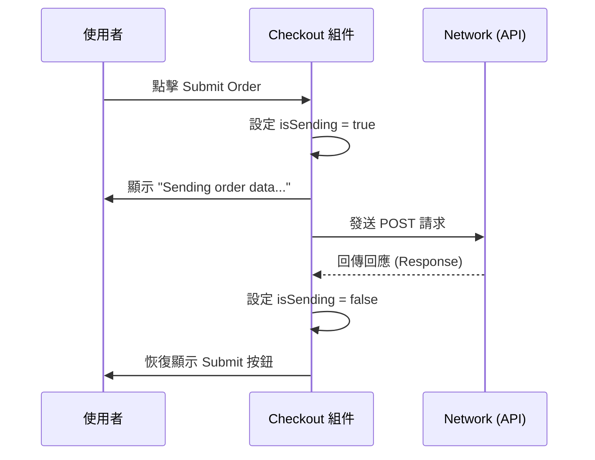

### 在 Checkout 組件中實作錯誤顯示

為了在訂單提交失敗時能即時通知使用者，可以在 `Checkout` 組件中加入錯誤訊息的顯示邏輯。

- **[實作邏輯]**：
    - 檢查 `error` 狀態是否為真值 (`error && <Error ... />`)。
    - 若發生錯誤，則在表單內（例如按鈕上方）渲染錯誤組件。
    - **[錯誤組件內容]**：設定標題為「Failed to submit order」，並將 `error` 狀態中的訊息傳遞給組件進行顯示。

```javascript
// src/components/Checkout.jsx

return (
  <Modal ...>
    <form onSubmit={handleSubmit}>
      <h2>Checkout</h2>
      <p>Total Amount: {currencyFormatter.format(cartTotal)}</p>

      {/* ... 輸入欄位 ... */}

      {/* 錯誤訊息顯示區域 */}
      {error && <Error title="Failed to submit order">{error}</Error>}

      <p className="modal-actions">{actions}</p>
    </form>
  </Modal>
);
```

- **[測試方法]**：
    - 可以透過暫時修改 `useHttp` 中的請求 URL（例如改為一個不存在的網址）來人為製造請求失敗，藉此驗證錯誤訊息是否能正確出現在 UI 上。

### 實作成功訊息的顯示

在 `Checkout` 組件中，除了處理載入中與錯誤狀態外，還應該在請求成功時向使用者顯示成功的訊息。

- **[判定邏輯]**：若 `data` 存在且 `error` 為空（即 `data && !error`），則代表請求已成功完成。
- **[實作方式]**：可以在表單下方或特定位置，根據上述條件進行條件式渲染，顯示成功的提示文字。

```javascript
// src/components/Checkout.jsx

return (
  <Modal ...>
    <form onSubmit={handleSubmit}>
      {/* ... 其他內容 ... */}

      {/* 成功訊息顯示 */}
      {data && !error && <p>Success! Your order has been placed.</p>}

      <p className="modal-actions">{actions}</p>
    </form>
  </Modal>
);
```

### 實作訂單成功訊息的 Modal

當訂單成功提交後，除了原本的結帳表單，我們需要顯示一個不同的 Modal 來告知使用者訂單已成功處理。

- **[顯示邏輯]**：利用 `data && !error` 條件來判定請求成功，並在此條件下渲染新的 `<Modal>`。
- **[控制機制]**：
    - 使用 `userProgressCtx.progress === 'checkout'` 作為 `open` prop，確保 Modal 在流程進入結帳階段時正確開啟。
    - 透過 `onClose={handleClose}` 來處理 Modal 的關閉動作。
- **[Modal 內容]**：
    - 標題：`<h2>Success!</h2>`
    - 說明文字：`<p>Your order was submitted successfully.</p>`
    - 後續提示：`<p>We will get back to you with more details via email.</p>`

```javascript
// src/components/Checkout.jsx

// ... 前略

{data && !error && (
  <Modal
    open={userProgressCtx.progress === 'checkout'}
    onClose={handleClose}
  >
    <form onSubmit={handleSubmit}>
      <h2>Success!</h2>
      <p>Your order was submitted successfully.</p>
      <p>We will get back to you with more details via email.</p>
    </form>
  </Modal>
)}

// ... 後略
```

### 完善訂單成功 Modal 的互動性

為了讓訂單成功的訊息更完整，除了顯示成功文字外，還需要在 Modal 中加入一個互動按鈕，讓使用者在閱讀完訊息後能主動關閉對話框。

- **[實作細節]**：
    - 在 Modal 內容下方新增一個具有 `modal-actions` class 名稱的段落 (`<p>`)。
    - 在該段落內使用自定義的 `Button` 組件。
    - 按鈕文字設定為 「OK」。
    - 透過 `onClick={handleClose}` 綁定關閉函數，確保點擊後能關閉 Modal。

```javascript
// src/components/Checkout.jsx

// ... 在成功訊息的 Modal 內容中
<Modal
  open={userProgressCtx.progress === 'checkout'}
  onClose={handleClose}
>
  <form onSubmit={handleSubmit}>
    <h2>Success!</h2>
    <p>Your order was submitted successfully.</p>
    <p>We will get back to you with more details via email within the next few minutes.</p>

    <p className="modal-actions">
      <Button onClick={handleClose}>Okay</Button>
    </p>
  </form>
</Modal>
```

- **[功能驗證]**：
    - 將商品加入購物車 $\rightarrow$ 前往結帳 $\rightarrow$ 填寫表單並提交訂單。
    - 驗證提交後是否能正確彈出包含「OK」按鈕的成功 Modal，且點擊按鈕後 Modal 會消失。

### 規劃訂單完成後的流程

當使用者成功提交訂單並關閉成功訊息 Modal 後，目前的流程僅止於隱藏結帳介面。為了提供完整的體驗，必須在流程結束時同時清空購物車內容。

- **[新功能需求]**：在完成訂單後，除了隱藏結帳介面，還需要清空購物車。
- **[實作計畫]**：
    - 在 `Checkout.jsx` 中建立一個新的 `handleFinish` 函式。
    - `handleFinish` 除了執行 `userProgressCtx.hideCheckout()`，還會呼叫購物車 Context 的清空方法。
    - 需要前往 `CartContext.jsx` 中新增一個用於清空購物車的函數。

```javascript
// src/components/Checkout.jsx

// ...

function handleClose() {
  userProgressCtx.hideCheckout();
}

function handleFinish() {
  userProgressCtx.hideCheckout();
  // TODO: 呼叫 cartContext 的清空方法
}

// ...
```

### 在 `CartContext` 中實作清空購物車功能

為了達成訂單完成後清空購物車的需求，需要在 `cartReducer` 中處理新的 action，並在 Context 中提供對應的操作函數。

- **[實作&#32;`cartReducer`&#32;邏輯]**：
    - 新增一個 `if` 判斷式來檢查 `action.type` 是否為 `'CLEAR_CART'`。
    - 若符合，則回傳一個新的 state 物件，其中 `items` 被設定為空陣列 `[]`。
    - **[為什麼這樣做]**：透過回傳一個新的物件（複製舊 state 並覆蓋特定欄位）來符合 React state 的不可變性 (Immutability) 原則。
- **[實作 Context 操作函數]**：
    - 在 `cartContext` 物件中新增一個 `clear` 函數。
    - 該函數會執行 `dispatchCartAction({ type: 'CLEAR_CART' })`，藉此觸發 reducer 的更新。

```javascript
// src/context/CartContext.jsx

function cartReducer(state, action) {
  if (action.type === 'ADD_ITEM') {
    // ... 省略
  }

  if (action.type === 'REMOVE_ITEM') {
    // ... 省略
  }

  // 新增清空購物車的邏輯
  if (action.type === 'CLEAR_CART') {
    return { ...state, items: [] };
  }

  return state;
}

const CartContext = createContext({
  items: [],
  addItem: (item) => {},
  removeItem: (id) => {},
  clear: () => {}, // 新增的清空函數
});
```

### 完善 `CartContext` 的實作

為了讓 `clearCart` 功能在全域可用，需要完成 Context 定義、Provider 實作以及函數邏輯的串接。

- **[提升開發體驗]**：在 `createContext` 時，為 `clearCart` 提供一個 dummy 初始值（如 `() => {}`）。
    - **[原因]**：這樣在開發其他組件（如 `Checkout.jsx`）時，IDE 才能提供正確的自動補全（Auto-completion）。
- **[實作&#32;`CartContextProvider`&#32;中的&#32;`clearCart`]**：
    - 在 Provider 組件內定義 `clearCart` 函式。
    - 該函式內部執行 `dispatchCartAction({ type: 'CLEAR_CART' })`。
    - 最後將 `clearCart` 加入到傳遞給 Provider 的 `value` 物件中。

```javascript
// src/context/CartContext.jsx

const CartContext = createContext({
  items: [],
  addItem: (item) => {},
  removeItem: (id) => {},
  clearCart: () => {}, // 提供初始值以利自動補全
});

export function CartContextProvider({ children }) {
  const [cart, dispatchCartAction] = useReducer(cartReducer, { items: [] });

  function addItem(item) {
    dispatchCartAction({ type: 'ADD_ITEM', item });
  }

  function removeItem(id) {
    dispatchCartAction({ type: 'REMOVE_ITEM', id });
  }

  // 實作清空購物車的邏輯
  function clearCart() {
    dispatchCartAction({ type: 'CLEAR_CART' });
  }

  const cartContext = {
    items: cart.items,
    addItem,
    removeItem,
    clearCart,
  };

  return (
    <CartContext.Provider value={cartContext}>
      {children}
    </CartContext.Provider>
  );
}
```

- **[整合流程]**：完成上述步驟後，即可在 `Checkout.jsx` 的 `handleFinish` 函式中呼叫 `cartContext.clearCart()`，達成訂單完成後自動清空購物車的目標。

### 整合訂單完成後的完整流程

在訂單成功後，不僅需要切換使用者的流程狀態（隱藏結帳介面），還必須確保購物車內容被清空，以提供完整的結算體驗。

- **[實作訂單完成後的動作]**：
    - 在成功訊息 Modal 的「OK」按鈕點擊事件中，同時執行以下兩個動作：

        1. 呼叫 `userProgressCtx.hideCheckout()` 以隱藏結帳介面。
        2. 呼叫 `cartCtx.clearCart()` 以清空購物車內容。

- **[測試流程驗證]**：
    - 1. 在 `Checkout` 表單中輸入測試資料（Dummy Data）。
    - 2. 點擊「Submit Order」提交訂單。
    - 3. 在彈出的成功 Modal 中點擊「OK」按鈕。
    - 4. **[結果]**：結帳介面消失，且購物車項目數量歸零（例如從 `Cart (4)` 變為 `Cart (0)`）。

### 處理結帳流程中的狀態殘留問題

目前應用程式在完成一次訂單流程後，仍存在一個邏輯瑕疵：

- **[問題描述]**：
    - 使用者完成訂單並看到成功畫面後，若再次將新商品加入購物車並進入結帳頁面，會直接再次看到「成功訊息」畫面。
- **[根本原因]**：
    - 在 `Checkout` 組件中，用於存放 HTTP 請求結果的 `data` 狀態（state）仍然保留著上一次成功訂單的資料。
    - 由於 `data` 存在，組件在重新掛載或進入時會誤判為已經有成功的請求結果，從而直接觸發成功狀態的顯示。

```javascript
// Checkout.jsx 中的問題點
const { data, isLoading, isSending, error, sendRequest, requestConfig } = useHttp(
  'http://localhost:3000/orders',
  requestConfig
);
```

- **[解決方向]**：
    - 需要在使用者重新開始結帳流程（例如進入結帳頁面或重新開啟 Modal）時，將 `data` 狀態重設為初始值（例如 `null`），以確保不會誤觸成功訊息的顯示邏輯。

### 透過 `clearData` 解決狀態殘留問題

為了徹底解決 `data` 狀態在完成訂單後仍然保留舊資料的問題，可以在 `useHttp` Hook 中實作一個重設機制。

- **[在&#32;`useHttp`&#32;中實作&#32;`clearData`]**：
    - 新增一個 `clearData` 函式，其功能是將 `data` 狀態重新設定回傳入時的 `initialData`。
    - 將此函式暴露在 `useHttp` 的返回值中，以便組件可以調用。

```javascript
// src/hooks/useHttp.js

export function useHttp(url, config, initialData) {
  const [data, setData] = useState(initialData);
  // ... 其他狀態

  function clearData() {
    setData(initialData);
  }

  return {
    data,
    isLoading: isSending,
    error,
    sendRequest,
    clearData, // 暴露此函式
  };
}
```

- **[在&#32;`Checkout`&#32;組件中整合]**：
    - 在 `Checkout` 組件中從 `useHttp` 取得 `clearData` 函式。
    - 在 `handleFinish` 函式（即處理成功 Modal 關閉的邏輯）中呼叫 `clearData()`。

```javascript
// Checkout.jsx

function Checkout() {
  const { data, isLoading, isSending, error, sendRequest, clearData } = useHttp(
    'http://localhost:3000/orders',
    requestConfig
  );

  // ...

  function handleFinish() {
    userProgressCtx.hideCheckout();
    cartCtx.clearCart();
    clearData(); // 重設 HTTP 狀態，避免下次進入時直接顯示成功訊息
  }

  // ...
}
```

### 最終功能驗證與測試

透過整合 `clearData` 函式，可以確保每次結帳流程都是乾淨的狀態。以下是完整的測試流程驗證：

- **[測試步驟]**：

    1. 重新整理頁面（Reload）。
    2. 將餐點加入購物車。
    3. 開啟結帳介面並提交訂單。
    4. **[關鍵驗證]：** 提交成功後，再次將新項目加入購物車並重新進入結帳頁面。

- **[預期結果]**：
    - 結帳頁面不會直接顯示上一次的成功訊息。
    - 使用者可以順利進行下一次的訂單下達流程。

> 隨著此功能的實作完成，整個 ReactFood 應用程式的訂單與購物車流程已達到完整且正確的運作狀態。

### 傳統表單提交處理方式

在目前的 `Checkout` 組件中，表單提交是透過手動處理 `onSubmit` 事件來完成的：

- **[處理流程]**：

    1. 使用 `onSubmit={handleSubmit}` 攔截表單提交事件。
    2. 在 `handleSubmit` 函式中使用 `event.preventDefault()` 防止頁面重新整理。
    3. 利用 `new FormData(event.target)` 建立一個 `FormData` 物件來收集表單內的所有輸入值。
    4. 使用 `Object.fromEntries(fd.entries())` 將 `FormData` 轉換為標準的 JavaScript 物件，以便後續處理。

```javascript
// Checkout.jsx 中的 handleSubmit 邏輯
function handleSubmit(event) {
  event.preventDefault();
  const fd = new FormData(event.target);
  const customerData = Object.fromEntries(fd.entries()); // 將表單資料轉為物件

  sendRequest(
    JSON.stringify({
      order: {
        items: cartCtx.items,
        customer: customerData
      }
    })
  );
}
```

- **[優化思考]**：
    - 雖然目前的做法完全可行，但可以考慮使用 React 的 **Form Actions** 來簡化這套流程，讓表單提交的處理更加現代化且符合 React 的開發模式。

### 遷移至 React Form Actions

為了符合現代 React 的開發模式，可以將原本用於處理 `onSubmit` 事件的函式改寫為 Form Action：

- **[實作步驟]**：
    - 將原本的 `handleSubmit` 函式重新命名為 `checkoutAction`（這並非強制要求，但能更清楚地表達其作為 Form Action 的用途）。
    - 將 `<form>` 標籤上的 `onSubmit` 屬性移除。
    - 改用 `action` 屬性來綁定新的 `checkoutAction` 函式。

```javascript
// Checkout.jsx

// 1. 重新命名處理函式
function checkoutAction(event) {
  event.preventDefault();
  const fd = new FormData(event.target);
  const customerData = Object.fromEntries(fd.entries());

  sendRequest(
    JSON.stringify({
      order: {
        items: cartCtx.items,
        customer: customerData
      }
    })
  );
}

// ...

// 2. 在 JSX 中使用 action 屬性取代 onSubmit
<form action={checkoutAction}>
  <h2>Checkout</h2>
  <p>Total Amount: {currencyFormatter.format(cartTotal)}</p>
  {/* ... 表單欄位 ... */}
</form>
```

### 實作非同步 Form Action

當將表單提交邏輯遷移至 Form Actions 時，處理函式可以被定義為 `async` 函式，以便於處理非同步操作：

- **[實作細節]**：
    - 將 `checkoutAction` 定義為 `async function`。
    - 接收 `event` 作為參數（透過 `action` 屬性傳遞）。
    - 依然使用 `event.preventDefault()` 與 `FormData` 來提取資料。
    - 使用從 `useHttp` 解構出來的 `sendRequest` 函式來發送請求。

```javascript
// Checkout.jsx

async function checkoutAction(event) {
  event.preventDefault();
  const fd = new FormData(event.target);
  const customerData = Object.fromEntries(fd.entries());

  // 使用 useHttp 提供的非同步函式發送請求
  sendRequest(
    JSON.stringify({
      order: {
        items: cartCtx.items,
        customer: customerData
      }
    })
  );
}
```

- **[關鍵點]**：
    - `sendRequest` 本質上是一個回傳 Promise 的非同步函式，因此在 Form Action 中使用它非常直觀。

### 驗證訂單提交流程

透過實際操作應用程式，驗證從前端表單到後端資料庫的完整流程：

1. **前端操作**：

    - 在購物車中加入餐點。
    - 前往結帳頁面並填寫客戶資料（姓名、電子郵件等）。
    - 點擊「Submit Order」按鈕觸發 `checkoutAction`。

2. **預期結果**：

    - **UI 反饋**：顯示訂單成功的彈出視窗（success pop up）。
    - **狀態重置**：購物車內容會被清空（cart is reset）。
    - **後端驗證**：檢查後端 `orders.json` 檔案，確認新的訂單物件已正確寫入。

**[範例：後端接收到的資料結構]**

```json
{
  "customer": {
    "name": "Max",
    "email": "test@example.com",
    "street": "Teststreet",
    "postal-code": "12345",
    "city": "Test"
  },
  "id": "339.9714855075495"
}
```

### 驗證 `checkoutAction` 的資料封裝

透過檢查 `Checkout.jsx` 中的 `checkoutAction` 實作，確認其成功地將分散的資料整合為一個完整的訂單物件：

- **資料整合邏輯**：
    - 使用 `Object.fromEntries(fd.entries())` 從表單中提取 `customerData`。
    - 從 `cartCtx` 中取得 `items` 列表。
    - 將兩者組合進一個名為 `order` 的物件中，以符合後端預期的 JSON 結構。

```javascript
// Checkout.jsx 中的 checkoutAction 實作細節
async function checkoutAction(fd) {
  const customerData = Object.fromEntries(fd.entries());

  await sendRequest(
    JSON.stringify({
      order: {
        items: cartCtx.items,
        customer: customerData
      }
    })
  );
}
```

- **[後端預期結構參考]** (根據 `orders.json`)：
    - 請求主體必須包含一個 `order` 物件。
    - `order` 物件內需包含 `items` 陣列（內含餐點 ID、名稱、價格、數量等）以及 `customer` 物件（內含姓名、Email、地址等）。

```json
{
  "items": [
    {
      "id": "m2",
      "name": "Margherita Pizza",
      "price": "12.99",
      "description": "A classic pizza with fresh mozzarella, tomatoes, and basil on a thin crust",
      "image": "images/margherita-pizza.jpg",
      "quantity": 2
    }
  ],
  "customer": {
    "name": "Max",
    "email": "test@example.com",
    "street": "Teststreet",
    "postal-code": "12345",
    "city": "Test"
  },
  "id": "339.9714855075495"
}
```

### 在 Form Actions 中簡化載入狀態管理

在使用 Form Actions 功能時，可以更簡潔地處理提交過程中的 UI 反饋，而不需要手動管理 `isLoading` 狀態。

- **[為什麼不需要&#32;`isLoading`]**：
    - 因為在 `checkoutAction` 中使用了 `await` 來等待 `sendRequest` 函式執行完成。
    - Form Actions 本身會處理非同步流程，這使得我們不再需要從 `useHttp` 中額外解構出 `isLoading` 狀態來更新 UI。

```javascript
// Checkout.jsx 中的狀態與 UI 邏輯
const {
  data,
  error,
  sendRequest,
  clearData
} = useHttp('http://localhost:3000/orders', requestConfig);

// ...

let actions = {
  <button type="button" onClick={handleClose}>
    Close
  </button>
  <Button>Submit Order</Button>
};

// 當請求正在進行時，根據是否有正在發送的動作來切換 UI
if (isSending) {
  actions = <span>Sending order data...</span>;
}
```

- **註**：雖然 `useHttp` 仍提供狀態，但在 Form Action 的架構下，開發者可以專注於 `await` 非同步操作，利用 Form 的生命週期來驅動 UI 的變化（例如顯示「Sending order data...」）。

### 使用 `useActionState` 管理表單狀態

除了手動管理載入狀態外，React 還提供了一個專門用於 Form Actions 的 Hook：`useActionState`。

- **[功能]**：它可以獲取目前表單的狀態資訊，例如判斷表單是否處於「處理中 (pending)」的狀態。
- **[使用方式]**：
    - 第一個參數：傳入要執行的 Action 函式（例如 `checkoutAction`）。
    - 第二個參數：傳入表單的初始狀態（initial form state），例如 `null`。

```javascript
// 在 Checkout 組件中整合 useActionState
const [state, formAction, isPending] = useActionState(checkoutAction, null);
```

- **[優點]**：透過 `isPending` 狀態，開發者可以更輕鬆地根據表單是否正在提交來切換 UI（例如顯示「正在傳送訂單資料...」），而不需要額外維護複雜的 `isLoading` 邏輯。

### 整合 `useActionState` 與 Form Action

透過 `useActionState` Hook，可以同時獲得處理表單所需的函式與狀態資訊。

- **[解構回傳值]**：
    - `formState`：目前的表單狀態（在此情境下可能暫時不需使用）。
    - `formAction`：更新後的 Action 函式，必須設定為 `<form>` 的 `action` 屬性。
    - `pending`：一個布林值，指示表單目前是否正在處理中。

```javascript
// 在 Checkout.jsx 中整合 useActionState
const [formState, formAction, pending] = useActionState(checkoutAction, null);
```

- **[根據&#32;`pending`&#32;狀態切換 UI]**：
    - 可以利用 `pending` 來決定要顯示哪些按鈕或提示文字，藉此提供即時的視覺回饋。

```javascript
// 將 formAction 綁定到表單
<form action={formAction}>

// ...

let actions = {
  <Button type="button" textOnly onClick={handleClose}>
    Close
  </Button>
  <Button>Submit Order</Button>
};

// 如果正在傳送中，則顯示提示文字而非按鈕
if (pending) {
  actions = <span>Sending order data...</span>;
}
```

### 處理 `useActionState` 中的常見錯誤

在實作 Form Actions 時，若 Action 函式與 `useActionState` 的整合不當，可能會導致執行時錯誤。

- **[錯誤現象]**：
    - 當點擊「Submit Order」按鈕後，UI 會短暫顯示載入狀態，隨即出現錯誤訊息。
    - 錯誤類型通常為 `TypeError: Cannot read properties of null (reading 'entries')`。
- **[錯誤原因]**：
    - **參數不匹配**：在使用 `useActionState` 時，Action 函式預期第一個參數會是 `formData` 物件。
    - 如果在呼叫鏈中沒有正確地將 `formData` 傳遞給 Action 函式（例如，該函式無法從 `useActionState` 的機制中正確接收到表單資料），則在嘗試執行 `fd.entries()` 時就會因為 `fd` 為 `null` 而崩潰。

```javascript
// 導致錯誤的程式碼範例 (Checkout.jsx)
async function checkoutAction(fd) {
  // 如果 fd 是 null，執行下一行會拋出 TypeError
  const customerData = Object.fromEntries(fd.entries());
  // ...
}
```

- **[關鍵點]**：在 React 的 Form Action 機制中，Action 函式的第一個參數必須能夠正確接收到表單的 `formData` 實例，否則無法進行後續的資料提取與處理。

### 調整 `useActionState` 的 Action 函式參數

當使用 `useActionState` 時，傳遞給它的 Action 函式會接收到額外的參數。

- **[參數變化]**：Action 函式的第一個參數現在會變成「先前的狀態 (previous state)」，而原本的 `formData` 會變成第二個參數。
- **[修正方式]**：必須重新定義 Action 函式的參數清單，以確保能正確取得表單資料。

```javascript
// 在 Checkout.jsx 中修正後的 checkoutAction
async function checkoutAction(prevState, fd) {
  const customerData = Object.fromEntries(fd.entries());
  await sendRequest({
    method: 'POST',
    body: JSON.stringify({
      order: {
        items: cartCtx.items,
        customer: customerData,
      }
    })
  });
}

// 呼叫方式保持不變，React 會自動處理參數傳遞
const [formState, formAction, isSending] = useActionState(checkoutAction, null);
```

### 驗證載入狀態 (Pending State)

為了更直觀地觀察前端 `isSending` (或 `pending`) 狀態如何運作，可以在後端 API 路由中模擬網路延遲。

- **[實作方法]**：在後端處理訂單的路由中，使用 `await` 配合一個會延遲解析的 Promise。
- **[預期效果]**：在前端點擊提交後，UI 會維持在「Sending order data...」的狀態一段時間，而非立即跳轉，這有助於確認載入提示是否正確顯示。

```javascript
// 在後端 orders 路由中模擬延遲 (例如延遲 1 秒)
app.post('/orders', async (req, res) => {
  await new Promise((resolve) => setTimeout(resolve, 1000));
  // ... 後續處理邏輯
});
```

### 表單驗證的實作考量

目前系統中已具備基礎的瀏覽器端驗證機制。

- **[現有機制]**：利用 HTML5 的表單屬性（如 `required`），當使用者遺漏必要欄位時，瀏覽器會自動顯示警告。
- **[進階擴充方向]**：未來可以利用 `useActionState` 來進一步管理表單狀態，以實作更細緻的驗證邏輯，例如：
    - 顯示自定義的驗證錯誤訊息。
    - 根據不同的輸入內容進行即時或提交後的邏輯判斷。

### Form Actions 與手動提交的選擇

在實作表單功能時，可以選擇不同的處理策略：

- **Form Actions**：利用 React 的原生機制處理提交，程式碼通常較為簡潔，適合與 `useActionState` 等 Hook 配合使用。
- **手動處理 (Manual Submission)**：透過 `onSubmit` 事件手動觸發函式（如 `handleSubmit`），提供較高的控制權。
- **[關鍵觀點]**：這兩種方式並非互斥。開發者可以根據專案需求，選擇其中一種，或者在同一個專案中根據不同情境結合使用。例如，在現有的手動提交邏輯之外，也可以額外實作基於 Form Actions 的驗證機制。

## 理解 Redux (Understanding Redux)

- **核心目的**：管理應用程式範圍內的狀態 (Managing App-Wide State)
- **學習路徑**：
    - Redux 是什麼？以及為什麼要使用它？
    - Redux 基礎知識與在 React 中的應用

### Redux Toolkit 簡介

- 一個旨在簡化 Redux 操作流程的工具或函式庫
- **[重要性]**：它是 Redux 生態系中非常重要的部分，能讓開發者更高效地管理應用程式的狀態

### Redux 的定義與作用

- **核心定義**：一種用於管理「跨組件 (cross-component)」或「全應用程式 (app-wide)」狀態的系統
    - 能夠管理那些會隨時間變化，並影響整個應用程式或畫面顯示的資料
    - 讓資料可以在多個組件之間，甚至是整個應用程式中流轉與共享
- **與 React 原生 Hook 的關係**
    - 我們在 React 中已經熟悉 `useState()` 與 `useReducer()`
    - **[差異點]**：這些 Hook 主要用於管理「局部」或「單一組件內」的資料變化，而 Redux 則是為了解決更廣泛的狀態共享問題

### 狀態的分類 (Kinds of State)

- **狀態的核心作用**：當使用者點擊按鈕或資料發生變化時，透過 React 的狀態管理 Hook（如 `useState`）來通知 React 資料已更新，進而觸發 UI 的重新渲染。
- **三種主要的狀態類型**
    - **局部狀態 (Local State)**：僅限於單一組件內部的狀態管理。
    - **跨組件狀態 (Cross-component State)**：需要在多個組件之間共享的資料。
    - **全應用程式狀態 (App-wide State)**：影響整個應用程式範圍的全局資料。

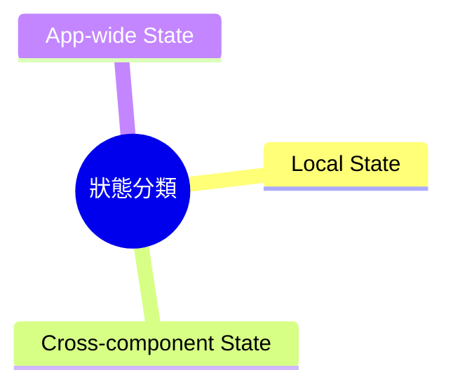

### 局部狀態 (Local State) 的詳細特性

- **定義**：指僅屬於單一組件內部的資料，其變化會影響該組件的 UI 顯示。
- **常見應用場景**：
    - **使用者輸入**：例如監聽輸入框 (input field) 的內容，並使用 `useState` 儲存每一次按鍵產生的字元。
    - **UI 切換**：例如點擊按鈕來切換「顯示更多詳細資訊 (show more details)」欄位的顯示或隱藏。
- **管理方式**：通常直接在組件內部使用 `useState()` 或 `useReducer()` 來進行管理。

### 跨組件狀態 (Cross-component State) 的特性

- **定義**：會影響到多個組件的狀態 (State affecting multiple components)
- **實際案例：Modal 彈出視窗**
    - 觸發開啟 Modal 的按鈕通常位於 Modal 之外的組件中
    - Modal 內部的按鈕（例如關閉按鈕）則位於 Modal 組件本身
    - 這代表需要多個組件協作，才能共同控制 Modal 的顯示與隱藏狀態

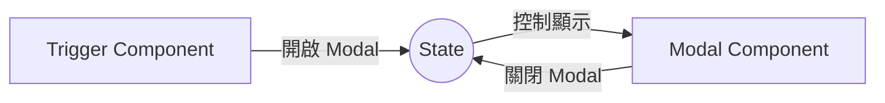

### 跨組件狀態 (Cross-component State) 的管理挑戰

- **管理方式**：當狀態不屬於單一組件時，通常需要透過 `useState` 或 `useReducer` 建立狀態，然後將其與相關的函式 (functions) 一併傳遞給其他組件。
- **Prop Drilling (屬性鑽孔)**
    - 指的是將 props 跨越多個層級的組件進行傳遞，以便讓深層的組件能夠與狀態協作。
    - **[影響]**：雖然這在小型應用中可行，但隨著組件層級增加，管理起來會變得更加複雜且難以維護。

### 全應用程式狀態 (App-wide State)

- **定義**：指不僅影響多個組件，而是基本上影響整個應用程式所有組件的狀態。
- **解決方案預告**：當狀態範圍擴大到整個應用程式時，就需要使用更強大的狀態管理系統（如 Redux）。

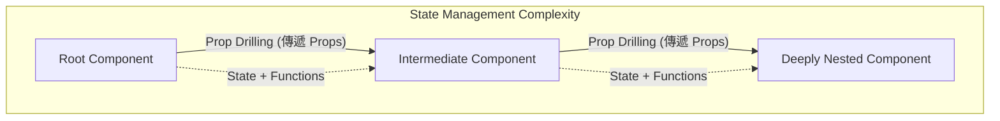

- **定義**：影響整個應用程式範圍的狀態。
- **實際案例：使用者身份驗證 (User Authentication)**
    - 當使用者登入時，導覽列 (Navigation Bar) 需要改變以顯示新的選項
    - 同時會影響許多其他組件，使其能顯示或隱藏不同的資料
- **管理方式的侷限性**
    - 雖然仍可以使用 `useState` 或 `useReducer` 並透過 props 傳遞狀態值與更新函式來管理
    - **[問題]**：對於「跨組件狀態」與「全應用程式狀態」而言，透過 props 傳遞資料與更新函式會變得非常繁瑣 (cumbersome)

### 簡化狀態管理的工具

- **React Context**
    - React 內建的功能
    - 用於簡化跨組件 (Cross-component) 或全應用程式 (App-wide) 狀態的管理
- **Redux**
    - 外部狀態管理庫
    - 旨在解決與 React Context 相同的問題：即如何有效管理影響多個組件的狀態

**[核心問題]**：既然已經有了 React Context，為什麼我們還需要 Redux？

### React Context 與 Redux 的比較

- **React Context 的角色**
    - 一種既有的概念與功能，可用於管理跨組件 (Cross-component) 或全應用程式 (App-wide) 的狀態
    - **[優點]**：可以避免屬性鑽孔 (Prop Drilling) 問題，透過 Context 與 Context Provider 提供一個中央管理點來處理狀態
- **React Context 的潛在缺點**
    - 雖然 Context 能解決傳遞問題，但在某些應用程式中仍可能遇到限制
    - **[注意]**：這些缺點是否會成為問題，取決於你正在構建的應用程式規模與複雜度

### Context 與 Redux 的混合使用

- **並非二選一的決策**
    - 在同一個應用程式中可以同時使用 React Context 與 Redux
- **典型的組合策略**
    - **Redux**：用於管理真正的「全應用程式狀態」(Application-wide state)
    - **React Context**：用於管理應用程式中特定部分的「多組件狀態」(Selected multi-component states)

### React Context 的潛在缺點

- **選擇性使用**
    - 如果 Context 的限制在你的應用程式中並不重要，則不需要使用 Redux
- **應用場景**
    - 雖然可以混合使用，但通常對於「全應用程式狀態」，開發者會傾向於在兩者中擇其一使用

### React Context 在大型專案中的侷限性

- **複雜的設定與管理 (Complex Setup & Management)**
    - 在大型或企業級應用程式中，隨著組件與功能的增加，使用 React Context 管理狀態可能會變得非常複雜。
    - 對於小型或中型應用程式，這通常不是問題，但對於大型專案則可能成為負擔。
- **潛在問題：深層巢狀的 Provider (Deeply Nested Providers)**
    - 當應用程式需要多個不同的 Context 時，會導致組件樹中出現大量的 Provider 嵌套。
    - **[代碼範例]**：

```jsx
return (
  <AuthContextProvider>
    <ThemeContextProvider>
      <UIInteractionContextProvider>
        <MultiStepFormContextProvider>
          <UserRegistration />
        </MultiStepFormContextProvider>
      </UIInteractionContextProvider>
    </ThemeContextProvider>
  </AuthContextProvider>
);
```

- **[影響]**：這種結構會讓程式碼變得難以閱讀與維護，這也是為什麼在處理極其複雜的狀態時，開發者會考慮使用 Redux 等更專門的工具。

### React Context 的複雜管理問題

除了深層嵌套的 Provider 之外，開發者還可能面臨另一種設計上的兩難：

- **方案一：多個專門的 Context Provider**
    - 優點：職責分離，每個 Provider 只負責特定領域的狀態
    - 缺點：會導致 JSX 程式碼出現極深的巢狀結構 (Deeply Nested Providers)
- **方案二：單一巨大的 Context Provider**
    - 做法：建立一個 `AllContextProvider` 來管理應用程式中所有的狀態與函式
    - **[問題]**：該組件會變得極其龐大且複雜
        - 包含過多的 `useState` 狀態與各種處理函式 (Handlers)
        - **[後果]**：導致組件本身變得難以維護與管理 (Difficult to maintain and manage)

### React Context 的設計兩難與實務考量

在面對複雜狀態管理時，開發者常陷入兩種極端設計的權衡：

- **單一龐大 Context (Monolithic Context)**
    - 將身分驗證 (Authentication)、佈景主題 (Theming)、使用者輸入 (User Input) 及 UI 狀態 (如 Modal 開關) 等所有職責全部整合進單一 Provider。
    - **[缺點]**：導致該組件承擔過多職責，變得極其臃腫且難以維護。
- **多個專門 Context (Specialized Contexts)**
    - 為了職責分離而將狀態拆分至多個 Provider。
    - **[缺點]**：會導致組件樹出現深層嵌套 (Deeply Nested Providers) 的問題。

> **實務觀察**：雖然在目前的課程練習中尚未遇到這些問題，但在開發真實的**大型企業級應用程式 (Enterprise-level applications)** 時，這些限制會變得非常明顯，這也是開發者轉向使用 Redux 等專業狀態管理工具的核心動機之一。

### React Context 的效能限制

- **潛在問題：高頻率變動 (High-Frequency Changes)**
    - 當數據頻繁變動時，使用 React Context 可能會帶來效能上的負擔。
- **適用場景：低頻率更新 (Low-Frequency Updates)**
    - 根據 React 團隊成員的觀點，目前的 Context 機制非常適合處理「低頻率且不太可能變動」的更新。
    - **[範例]**：
        - 更改佈景主題 (Changing a theme)
        - 使用者身分驗證 (Authentication)
        - 本地化設定 (Locale)
- **不適用場景**
    - 不建議將 Context 用作所有 Flux 式狀態傳播 (Flux-like state propagation) 的替代方案，特別是當數據變動非常頻繁時。

### React Context 的缺點總結

除了複雜的設定與管理之外，React Context 還有另一個主要的缺點：

- **效能問題 (Performance Issues)**
    - 如果管理錯誤類型的狀態（例如高頻率變動的數據），效能可能會變差
    - **[重要觀點]**：React Context 並非所有情境下都能完美替代 Flux 式的狀態傳播
        - Redux 就是一個典型的 Flux 式狀態管理函式庫
        - 因此，在需要處理複雜且頻繁變動的狀態時，Context 並不是一個理想的替代方案

**React Context 的兩大主要缺點總結：**

1. **複雜的設定與管理 (Complex Setup & Management)**
2. **效能風險 (Performance Risks)**

### 實務開發中的 React Context 限制與建議

在開發實際專案時，必須意識到 React Context 的限制，以確保應用程式的擴充性與效能：

- **開發規模的考量**
    - **中小型應用程式**：這些限制（如嵌套過深或效能問題）通常不會對使用者體驗產生顯著影響。
    - **大型/專業級應用程式**：隨著功能增加，管理複雜度與效能風險會變得非常明顯。
- **掌握「現實 React (Realistic React)」**
    - 學習 React 的目標不僅是掌握語法，更重要的是理解在不同規模的專案中，何時該使用 Context，以及何時該轉向更專業的狀態管理工具（如 Redux），以應對複雜的開發需求。

### 狀態管理的替代方案：Redux

在處理更複雜的專案時，為了克服 React Context 的缺點，可以學習並使用 **Redux**。

- **為什麼選擇 Redux？**
    - 它不會受到 React Context 在複雜應用程式中所面臨的那些缺點限制。

### Redux 核心概念

Redux 的運作核心在於建立一個應用程式中的**中央數據儲存中心 (Central Data Store)**。

- **單一數據源 (Single Source of Truth)**
    - 整個應用程式中**有且僅有一個** Store
    - 不會有多個 Store 並存
    - 所有的狀態 (State) 都統一儲存在這一個 Store 中
- **儲存內容範例**
    - 身分驗證狀態 (Authentication state)
    - 以及應用程式中其餘所有的數據與狀態

### 使用中央數據儲存中心的目的

- **統一管理跨組件狀態**
    - 無論是佈景主題 (Theming)、使用者輸入狀態 (User Input state) 或任何其他全域狀態，都統一存放在這一個 Store 中。
- **[不必擔心難以維護]**：雖然將所有東西放在一個地方聽起來很難管理，但開發者並不需要隨時直接操作整個 Store。
- **驅動組件反應 (Reacting to changes)**
    - 我們將數據存放在 Store 中，目的是為了讓組件能夠使用這些數據。
    - **[核心邏輯]**：當 Store 中的數據發生變化時（例如使用者的身分驗證狀態改變），組件可以偵測到這個變化並據此進行相應的更新。

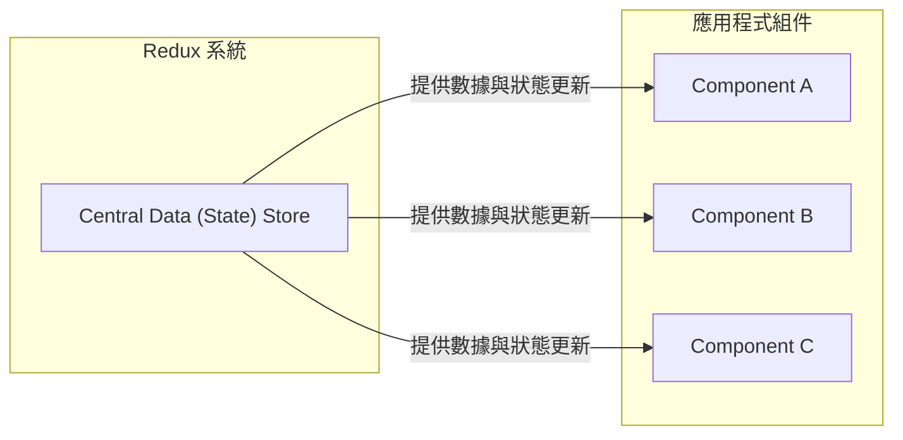

### 組件與 Store 的互動機制

為了讓 UI 能隨數據變化而更新，組件與中央數據儲存中心之間建立了一種訂閱關係：

- **訂閱機制 (Subscription)**
    - 組件會對中央 Store 進行「訂閱"
    - **[運作流程]**：當 Store 中的數據發生變化時，Store 會主動通知所有已訂閱的組件
    - 組件收到通知後，即可獲取所需的數據片段 (slice)，例如目前的「使用者身分驗證狀態 (Authentication status)"

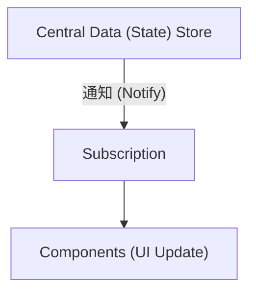

- **數據獲取**
    - 組件並非獲取整個 Store，而是從中獲取所需的特定數據切片 (slice)
    - 這種機制確保了當特定數據變動時，只有相關的組件會被觸發更新

### Reducer 的作用與核心規則

在 Redux 的架構中，數據的流動遵循嚴格的規則，以確保狀態的可預測性：

- **核心規則：組件禁止直接操作數據**
    - 組件可以透過「訂閱 (Subscription)」機制從 Store 中獲取數據。
    - **[重要]**：組件絕對、絕對不能直接去修改 (manipulate) Store 裡的數據。
- **透過 Reducer 進行變更**
    - 若要改變 Store 中的數據，必須使用一種稱為 **Reducer** 的概念。
    - **Reducer Function**：這是一個專門負責「變更 (mutate)」或「修改 (change)」Store 數據的函式。

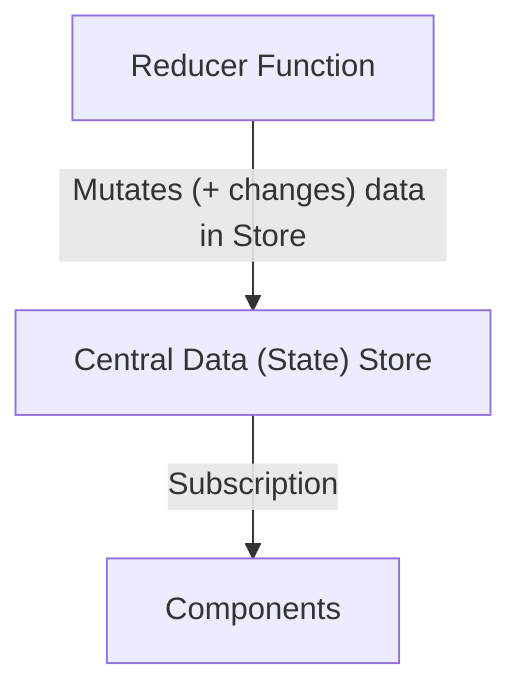

### Reducer 的通用概念

需要區分 Redux 中的 Reducer 與 React 的 `useReducer` Hook：

- **Reducer 是一個通用的程式設計概念**
    - 它並非僅限於特定的 Hook
    - **[定義]**：Reducer 是一種接收某些輸入，並將其轉換（transform）為新輸出（new output/result）的函式
    - **[核心邏輯]**：透過處理輸入來「減少 (reduce)」或轉換數據
        - 例如：將一個數字列表「減少」為該列表的總和
- **Redux 中的應用**
    - Redux 利用這個通用的概念來處理 Store 中的狀態變更

### 連接組件與 Reducer 的機制

雖然 Reducer 負責更新數據，組件負責訂閱數據，但我們需要一種方式讓組件能夠「觸發」數據的變更（例如使用者點擊按鈕時）。

- **引入 Action (動作)**
    - **[核心概念]**：Action 是連接組件與 Reducer 的橋樑
    - 組件並不直接操作數據，而是透過發送 (dispatch) 一個特定的 Action 來告訴系統「發生了什麼事"
- **Dispatch (派遣/發送)**
    - 組件會執行 `dispatch(action)` 的操作
    - **[流程描述]**：組件觸發 (trigger) 某個 Action $\rightarrow$ Action 被送往 Reducer $\rightarrow$ Reducer 更新 Store 數據

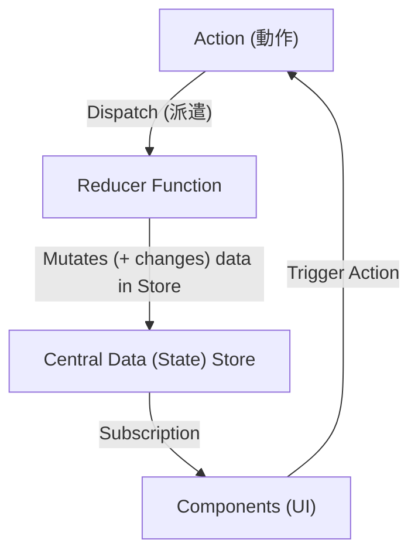

### Action 的本質與運作流程

- **Action 的定義**
    - Action 本質上只是一個簡單的 **JavaScript 物件**
    - **[功能]**：它用來描述 Reducer 應該執行的操作類型 (kind of operation)
- **數據變更的完整循環**
    - 組件透過 `dispatch` 發送 Action，但組件本身並不直接執行操作
    - Action 會被轉發 (forwarded) 給 Reducer
    - Reducer 讀取 Action 中的描述，執行對應的操作，最後產出一個 **新的狀態 (new state)**
    - 這個新狀態會有效地替換掉原本舊的狀態

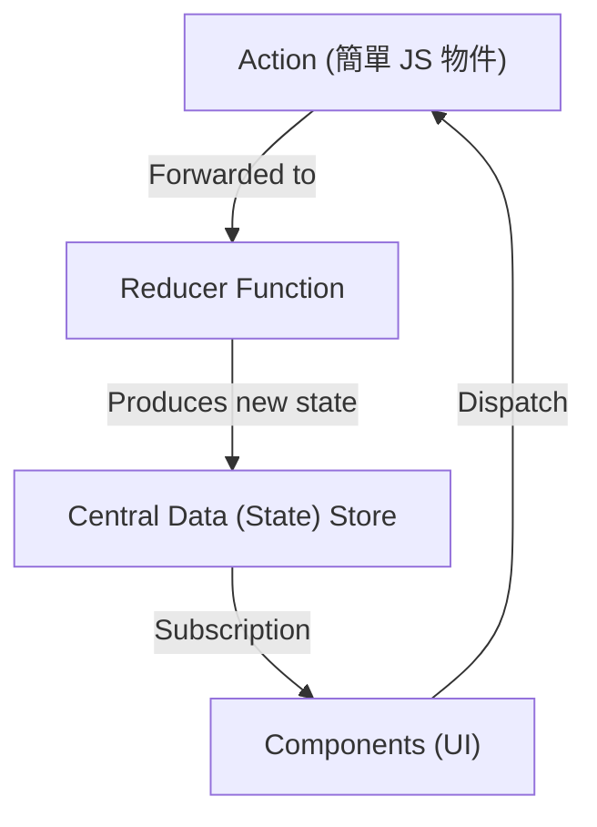

### Redux 的運作機制總結

Redux 的核心在於建立一個閉環的數據流，確保 UI 與狀態保持同步：

1. **狀態更新**：當 Reducer 處理 Action 並修改了中央數據儲存庫 (Central Data Store) 中的現有狀態時。
2. **通知機制**：一旦 Store 中的狀態發生變更，所有「訂閱 (Subscribing)」該狀態的組件都會收到通知。
3. **UI 同步**：組件收到通知後，會根據最新的狀態來更新其介面 (UI)。

這個循環確保了當數據發生變動時，應用程式中的所有相關組件都能反映出最新的數據狀態。