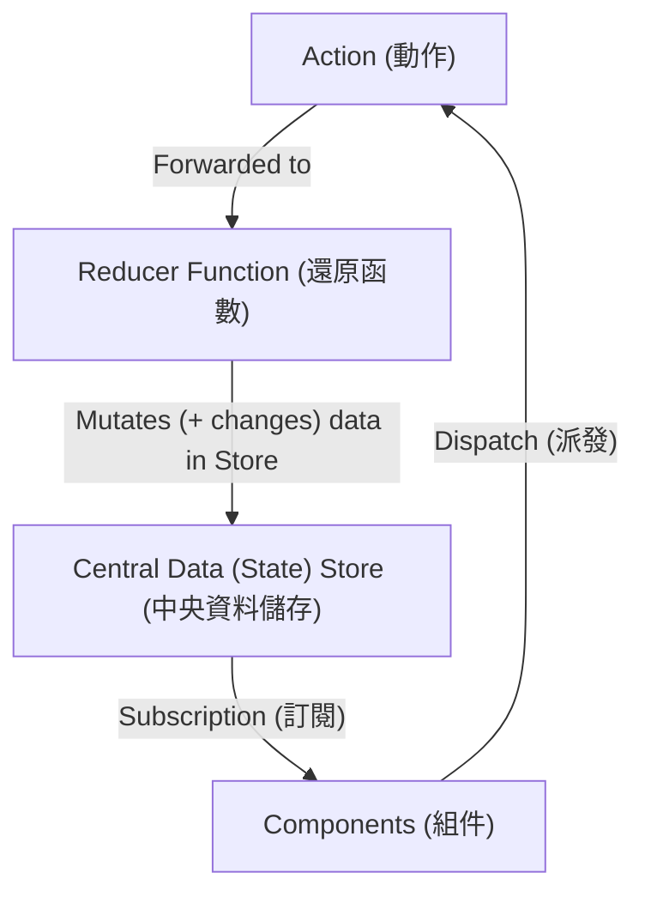
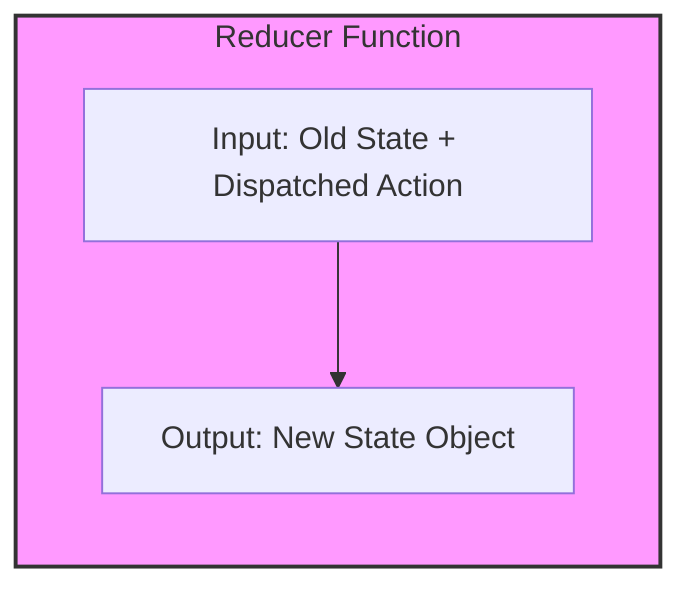
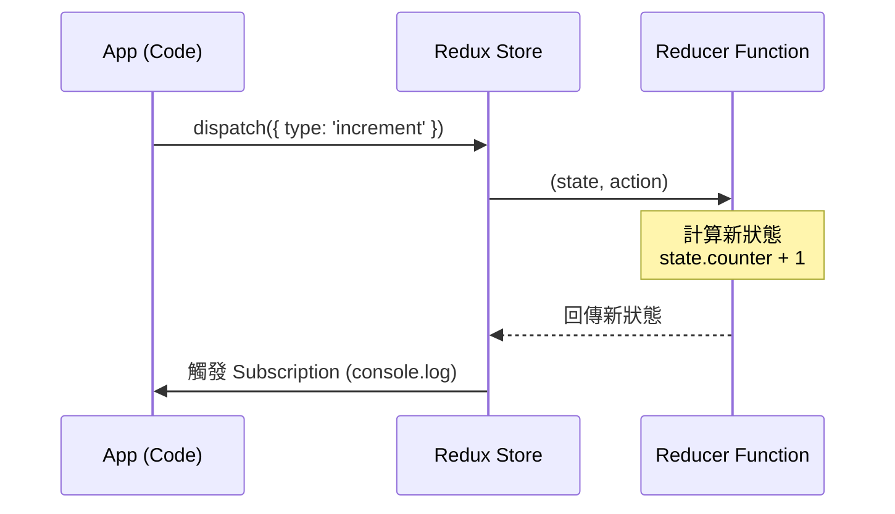
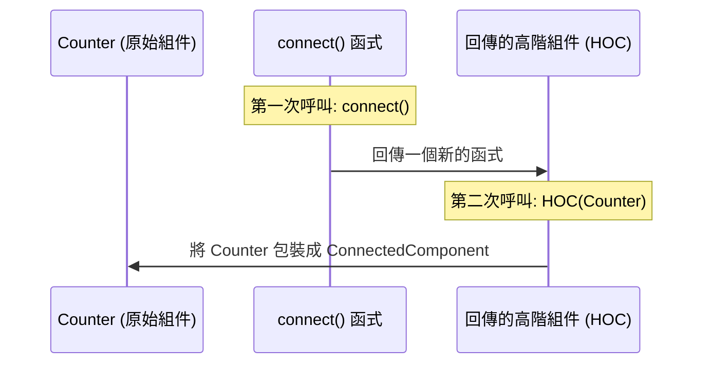
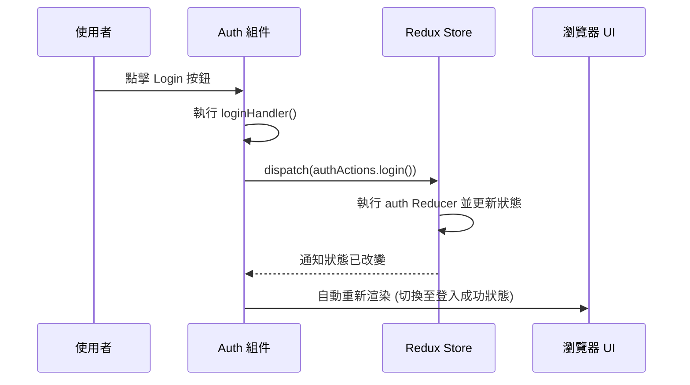
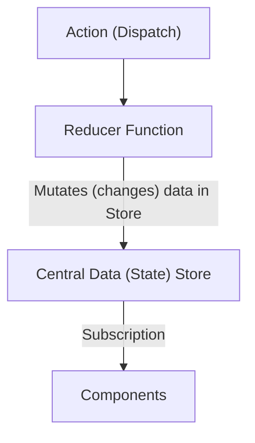
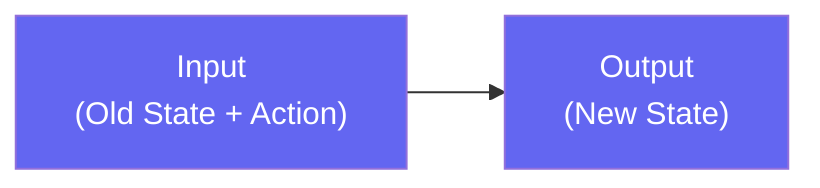
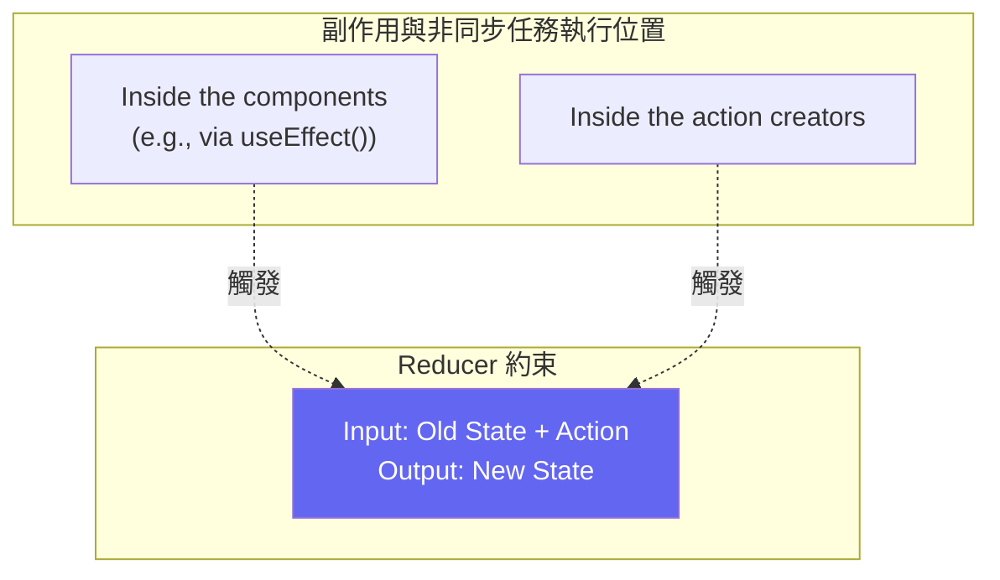

### Redux 基礎專案設定

- 建立一個全新的空資料夾作為專案根目錄
    - 目前不需要 React App，只需一個空資料夾即可開始探索 Redux
- 在資料夾中建立 JavaScript 檔案
    - 例如建立 `redux-demo.js`
- 使用 Node.js 執行 JavaScript
    - 因為 Node.js 允許在瀏覽器之外運行 JavaScript
    - Node.js 同時也是安裝第三方套件 (NPM) 與運行開發伺服器的基礎
- 初始化 NPM 環境
    - 在終端機 (Terminal) 或命令提示字元 (Command Prompt) 中進入該資料夾
    - 執行以下指令來初始化專案：

```bash
npm init
```

### 安裝與導入 Redux

- 使用 NPM 初始化專案
    - 執行 `npm init -y` 可以快速跳過所有詢問，直接使用預設設定來產生 `package.json` 檔案
- 安裝 Redux 套件
    - 執行以下指令將 Redux 下載至專案中：

```bash
npm install redux
```

    - 執行後會產生 `node_modules` 資料夾，其中包含 Redux 及其所有依賴套件
- 在 Node.js 中導入 Redux
    - 因為是在 Node.js 環境下執行，必須使用 Node.js 預設的 CommonJS 語法進行導入：

```javascript
const redux = require('redux');
```

- **[下一步]** 建立 Redux Store

### Redux 核心概念

Redux 的運作依賴於幾個關鍵組件的協作：



- **Store (儲存庫)**
    - Redux 的核心與中心概念，負責管理應用程式的狀態 (State)
- **Reducer Function (還原函數)**
    - 決定了 Store 中資料的形狀與內容
    - 當 Action 到達時，Reducer 會產出一個新的狀態快照 (State Snapshot)
- **Action (動作)**
    - 用來觸發狀態變更的指令
- **Subscription (訂閱)**
    - 讓組件或其他程式碼能夠監聽 Store 的變化

### 建立 Redux Store

可以使用 `redux.createStore()` 方法來建立一個 Store。這是一個由 Redux 函式庫提供的 API。

```javascript
const redux = require('redux');

const store = redux.createStore();
```

- **[注意]** 雖然目前只是建立一個空的 Store，但實際上建立 Store 時通常需要傳入一個 Reducer 函數，因為 Reducer 決定了 Store 如何處理資料以及初始狀態為何。

### Reducer Function (還原函數)

Reducer 函數是用來決定 Store 狀態變更邏輯的核心組件。

- **運作機制**
    - Reducer 是一個標準的 JavaScript 函數，由 Redux 函式庫呼叫
    - **輸入 (Input)**：接收兩個參數
        - `state`：目前的（舊的）狀態
        - `action`：被派發 (dispatched) 的動作
    - **輸出 (Output)**：必須回傳一個**新的狀態物件 (New State Object)**
- **必須是純函數 (Pure Function)**
    - **[定義]** 給予相同的輸入，永遠會產生完全相同的輸出
    - **[原則]** 不應包含任何副作用 (Side Effects)
        - 不能在 Reducer 內部發送 HTTP 請求
        - 不能讀寫 Local Storage
        - 不能進行任何會影響外部環境的操作



- **實作範例**
    - 可以使用匿名箭頭函數來定義：

```javascript
const counterReducer = (state, action) => {
    // 邏輯處理
};
```

### Reducer 函數的輸出與 State 結構

- **輸出 (Output)**：必須回傳一個新的狀態物件 (New State Object)
    - **[關於 State 的型態]**：雖然理論上 State 可以是任何資料型態（如數字或字串），但在大多數實際應用中，State 通常會是一個**物件 (Object)**
    - 使用物件的好處是可以在單一狀態中管理多個不同的資料欄位
- **實作 Reducer 結構**
    - 開發者可以自由定義狀態物件的結構
    - 以下示範建立一個包含 `counter` 欄位的初始狀態物件：

```javascript
const counterReducer = (state, action) => {
    return {
        counter: 0
    };
};
```

- **[進階思考]**：在實際開發中，Reducer 不應該每次都回傳一個固定的初始值（例如每次都回傳 `counter: 0`），而應該根據傳入的 `state`（現有狀態）來產出新的狀態。

### 實作動態狀態變更

- **[為什麼要這樣寫]**：Reducer 不應該回傳固定的值（如 `counter: 0`），而應該基於目前的狀態進行運算，這樣才能實現真正的狀態累加或變更。
- 透過存取 `state.counter` 來獲取現有值並進行運算：

```javascript
const counterReducer = (state, action) => {
    return {
        counter: state.counter + 1
    };
};
```

### 將 Reducer 與 Store 連結

- 在建立 Store 時，必須將 Reducer 函數作為參數傳入
- **[原因]**：Store 需要知道是由哪一個 Reducer 負責處理並操縱其內部的資料變更邏輯

```javascript
const store = redux.createStore(counterReducer);
```

### Subscription (訂閱)

- 為了監聽 Store 的變化，我們需要建立訂閱機制
- **[實作方式]**：定義一個函數，在該函數內部可以存取 Store 並呼叫 `getState()` 方法來取得目前的狀態值

```javascript
const counterSubscriber = () => {
    store.getState();
};
```

### 註冊訂閱機制

- **[運作邏輯]**：為了讓訂閱函數在狀態更新時被觸發，必須將該函數註冊到 Store 中
- **使用&#32;`store.subscribe()`&#32;方法**
    - **[功能]**：告訴 Redux 當 Store 中的資料發生變更時，應執行指定的訂閱函數
    - **[實作細節]**：在傳遞訂閱函數時，應僅傳遞**函數引用 (Function Reference)**，而非執行該函數
        - **錯誤寫法**：`store.subscribe(counterSubscriber())` (這會立即執行函數並傳遞其回傳值)
        - **正確寫法**：`store.subscribe(counterSubscriber)` (這會將函數本身交給 Redux，由 Redux 在適當時機執行)

```javascript
const counterSubscriber = () => {
    const latestState = store.getState();
    console.log(latestState);
};

// 將訂閱函數註冊到 store 中
store.subscribe(counterSubscriber);
```

- **[訂閱函數的內容]**
    - 通常會在函數內部呼叫 `store.getState()`
    - **[目的]**：在狀態更新後的瞬間，獲取最新的狀態快照 (State Snapshot) 並進行處理（例如 `console.log`）

### 執行現有程式碼與遇到的錯誤

- **執行方式**：使用 Node.js 執行 JavaScript 檔案
    - 指令：`node redux-demo.js`
- **預期錯誤**：執行後會出現 `TypeError`
    - 錯誤訊息：`TypeError: Cannot read property 'counter' of undefined at counterReducer...`

### 錯誤原因分析

- **[關鍵機制]**：當使用 `redux.createStore(counterReducer)` 建立 Store 時，Redux 會**立即執行一次**該 Reducer
- **[問題所在]**：在 Store 初始化的那一瞬間，尚未有任何狀態，因此傳入 Reducer 的 `state` 參數是 `undefined`
- **[崩潰點]**：由於 Reducer 內部嘗試存取 `state.counter`，而 `state` 此時為 `undefined`，導致程式無法讀取屬性而報錯

### 解決方案：為 State 提供預設值

- **[做法]**：必須為 Reducer 的 `state` 參數設定一個預設值，這樣在第一次執行（初始化）時，即使沒有傳入狀態，Reducer 也能有一個可用的物件進行運算

```javascript
// 修正後的 Reducer 結構（預留預設值概念）
const counterReducer = (state = { counter: 0 }, action) => {
    return {
        counter: state.counter + 1
    };
};
```

### 修正 Reducer 錯誤：提供預設值

- **[解決方案]**：為 Reducer 的 `state` 參數設定一個預設值，以作為第一次執行（初始化）時的 fallback
- **[運作機制]**：
    - 在 Store 建立的初始階段，Redux 會執行一次 Reducer，此時若沒有預設值，`state` 會是 `undefined`，導致存取 `state.counter` 時崩潰
    - 一旦有了預設值，之後的執行若有傳入現有狀態，則會使用該狀態而非預設值

```javascript
const counterReducer = (state = { counter: 0 }, action) => {
    return {
        counter: state.counter + 1
    };
};
```

### 執行結果與訂閱觸發時機

- **[執行觀察]**：修正後執行 `node redux-demo.js`，程式碼可以正常執行，但終端機不會有任何輸出
- **[原因分析]**：
    - 雖然建立了訂閱機制，但目前尚未 `dispatch` (發送) 任何 action
    - Redux 在初始化時雖會執行一次 Reducer，但這個「初始化動作」並不會觸發 `store.subscribe()` 註冊的訂閱函數
- **[如何獲取初始狀態]**：
    - 若需要在程式啟動時立即得知初始狀態，可以直接呼叫 `store.getState()` 並進行記錄

```javascript
// 在建立 store 後立即獲取初始狀態
console.log(store.getState());
```

- **[輸出結果預期]**：
    - 由於預設值是 `{ counter: 0 }`，而 Reducer 在初始化時會執行一次 `state.counter + 1`
    - 因此，初始狀態會是 `{ counter: 1 }`

```text
{ counter: 1 }
```

### 使用 Dispatch 發送 Action

- **[新方法]** `store.dispatch()`
    - 除了 `getState()` 和 `subscribe()`，`store` 物件還提供 `dispatch` 方法
    - **[功能]** 用於發送 (dispatch) 一個 Action，告訴 Redux 發生了什麼事
- **[Action 的結構]**
    - Action 是一個 JavaScript 物件
    - **[核心屬性]** `type`：作為該動作的唯一識別碼 (Identifier)
        - 通常使用字串 (String)
        - **[重要性]** 每個不同的 Action 應該有唯一的 `type`，以便 Reducer 能根據不同的 `type` 執行對應的邏輯

```javascript
// 建立並發送一個簡單的 Action
store.dispatch({ type: 'increment' });
```

### 執行 Action 與狀態變更流程

- **[執行流程]**

    1. 呼叫 `store.dispatch({ type: 'increment' })`
    2. Redux 接收到 Action 並將其傳遞給 Reducer
    3. Reducer 根據 Action 的 `type` 計算新狀態
    4. Store 更新狀態，並觸發所有註冊的訂閱函數 (Subscribers)

- **[執行結果觀察]**
    - 初始狀態（經初始化後）為 `{ counter: 1 }`
    - 發送 `increment` Action 後，終端機輸出 `{ counter: 2 }`



### Redux 運作流程總結

- **[核心循環]**
    - 使用 `store.dispatch(action)` 發送一個 action 物件
    - Reducer 接收到 action 並根據其內容計算出新的狀態
    - 狀態更新後，所有註冊的訂閱函數 (Subscribers) 會被觸發
- **[目前的限制]**
    - 目前雖然發送了 `{ type: 'increment' }`，但 Reducer 內部的邏輯是無條件執行 `state.counter + 1`
    - **[問題]**：這意味著無論發送什麼樣的 action type，結果都一樣，無法根據不同的 action 執行不同的行為

```javascript
// 目前的 Reducer 邏輯（尚未根據 action type 進行判斷）
const counterReducer = (state = { counter: 0 }, action) => {
    return {
        counter: state.counter + 1
    };
};

// 發送 action
store.dispatch({ type: 'increment' });
```

### 在 Reducer 中處理不同類型的 Action

- **[Reducer 的參數]**
    - Reducer 函數接收兩個參數：
        - `state`：目前的狀態
        - `action`：觸發 Reducer 運行的動作物件
- **[核心邏輯：根據 Type 進行判斷]**
    - **[目的]** 為了讓 Reducer 能根據不同的 Action 執行不同的行為（例如：增加、減少、重設）
    - **[實作方式]** 使用 `if` 語句檢查 `action.type` 是否符合預期

```javascript
const counterReducer = (state = { counter: 0 }, action) => {
    if (action.type === 'increment') {
        return {
            counter: state.counter + 1
        };
    }
};
```

- **[執行效果]**
    - 當發送 `{ type: 'increment' }` 時，Reducer 會進入 `if` 區塊並回傳增加後的狀態
    - 若 `action.type` 不匹配任何條件，則應確保 Reducer 能正確處理（在此範例中，若不匹配則會回傳 `undefined`，實務上通常會回傳原始 `state`）

### 處理不匹配的 Action Type

- **[處理預設情況]**
    - **[目的]** 當發送的 Action type 不符合任何已定義的條件時（例如 Redux 的初始化動作），應確保狀態不會被意外修改
    - **[實作方式]** 使用 `else` 語句或在函數末尾提供一個預設回傳值，回傳目前的 `state`

```javascript
const counterReducer = (state = { counter: 0 }, action) => {
    if (action.type === 'increment') {
        return {
            counter: state.counter + 1
        };
    }
    // 若 action.type 不匹配，則回傳原始狀態以保持不變
    return state;
};

const store = redux.createStore(counterReducer);
```

- **[執行結果對比]**
    - **若未處理預設情況**：Reducer 可能回傳 `undefined` 或導致狀態異常，導致初始狀態也發生變更
    - **若正確回傳&#32;`state`**：
        - 執行初始化（不發送任何特定 action）時，狀態會維持預設值 `{ counter: 0 }`（或根據初始化邏輯而定，在此範例中觀察到為 `{ counter: 1 }` 視具體初始值而定）
        - 只有在明確發送 `increment` 時，狀態才會更新

### 處理 `decrement` Action

- **[實作方式]** 在 Reducer 中增加一個 `if` 判斷式來檢查 `action.type === 'decrement'`
- **[邏輯內容]** 當匹配時，回傳一個新的狀態物件，將 `counter` 設為 `state.counter - 1`

```javascript
const counterReducer = (state = { counter: 0 }, action) => {
    if (action.type === 'increment') {
        return {
            counter: state.counter + 1
        };
    }
    if (action.type === 'decrement') {
        return {
            counter: state.counter - 1
        };
    }
    return state;
};
```

### 連續發送 Actions 的執行流程

- **[情境設定]** 同時執行 `increment` 與 `decrement` 兩個動作：

```javascript
store.dispatch({ type: 'increment' });
  store.dispatch({ type: 'decrement' });
```

- **[執行結果與訂閱觸發]** 由於每次 `dispatch` 都會改變狀態並觸發訂閱函數，終端機會依序輸出狀態變化：

    1. **第一次輸出**：`{ counter: 1 }` (由 `increment` 觸發)
    2. **第二次輸出**：`{ counter: 0 }` (由 `decrement` 觸發)

```text
react-complete-guide $ node redux-demo.js
{ counter: 1 }
{ counter: 0 }
```

### Redux 的核心概念與通用性

- **[核心機制]**
    - Redux 的運作方式包含 Store、Action 與 Reducer 的協作流程
    - 透過發送 Action 並經由 Reducer 計算新狀態，最終觸發訂閱函數（Subscriber）來更新數據
- **[框架獨立性]**
    - Redux 並非僅限於 React 使用的庫
    - 它可以在任何 JavaScript 專案中運行
    - 甚至在其他程式語言中也有相關的實作版本
- **[與 React 的結合]**
    - 雖然 Redux 是通用的，但在現代開發中，經常會將其與 React 結合使用來管理複雜的 UI 狀態

### 將 Redux 應用於 React

- **[遷移目標]** 將先前在純 JavaScript 環境中實作的計數器範例，轉移到 React 應用程式中進行開發
- **[專案啟動流程]**

    1. 下載並解壓縮專案檔案
    2. 執行 `npm install` 安裝必要的依賴套件
    3. 執行 `npm start` 啟動開發伺服器 (dev server)

- **[專案結構概覽]**
    - 專案包含已準備好的多個組件 (components)，將在後續模組中使用
    - 主要目錄結構包含：
        - `src/`：原始碼目錄
            - `components/`：存放組件
            - `App.js`：主應用程式組件
            - `index.js`：進入點檔案
        - `public/`：靜態資源目錄
        - `node_modules/`：套件目錄

### 安裝 Redux 套件

- **[安裝指令]** 在啟動開發伺服器後，需要手動安裝 Redux 核心套件：

```bash
npm install redux react-redux
```

- **[套件說明]**
    - `redux`：Redux 的核心庫，它與 React 無關，可以用於任何 JavaScript 專案。
    - `react-redux`：專門為了讓開發者更容易將 Redux 連接到 React 應用程式而設計的套件。

### `react-redux` 的作用

- **[核心功能]** 簡化 React 組件與 Redux 之間的操作
    - 使組件能夠非常簡單地訂閱 (subscribe) Redux store 與 reducer
- **[安裝建議]** 在開發 React 應用程式時，應同時安裝 `redux` 與 `react-redux` 以確保兩者能有效協作

### 建立 Redux 檔案結構

- **[目錄慣例]** 為了保持專案整潔，通常會在 `src/` 目錄下建立一個名為 `store/` 的新資料夾，專門用來存放所有與 Redux 相關的程式碼檔案
- **[建立入口檔案]** 在 `src/store/` 目錄內建立 `index.js`，作為存放 Redux 邏輯（如 Store 與 Reducer）的中心點
- **[實作目標]** 在此檔案中重複先前的 Redux 邏輯，包含：
    - 建立一個 Store
    - 為計數器建立一個 Reducer
    - *註：目前階段暫不進行訂閱 (subscribe) 的實作*

### 自行實作練習：建立 Store 與 Reducer

- **[練習目標]** 在 `src/store/index.js` 中嘗試獨立完成以下任務：
    - 建立一個新的 Redux Store
    - 編寫一個計數器 Reducer
        - 必須支援 `increment` 動作
        - 必須支援 `decrement` 動作
- **[建議流程]** 在開始跟著教學程式碼編寫之前，可以先暫停影片，嘗試根據先前的知識自行完成實作，這有助於檢驗自己是否真正理解 Redux 的運作原理。

### 在 `src/store/index.js` 中實作 Redux

- **[匯入 Redux 函數]** 使用解構賦值語法從 `redux` 套件中匯入 `createStore`：

```javascript
import { createStore } from 'redux';
```

- **[建立 Store]** 呼叫 `createStore` 並將其儲存在 `store` 常數中。根據 Redux 的規則，建立 Store 時必須傳入一個 Reducer 函數作為參數：

```javascript
const store = createStore(counterReducer);
```

- **[實作步驟]**

    1. 從 `redux` 匯入 `createStore`。
    2. 定義 Reducer 函數（例如 `counterReducer`）。
    3. 使用 `createStore(reducer)` 建立並初始化 Store。

### Reducer 函數的參數與初始狀態

- **[參數結構]** Reducer 是一個函數，接收兩個參數：
    - `state`：目前的狀態 (existing state)
    - `action`：被派發的動作 (the action that was dispatched)
- **[設定初始狀態]** 透過為 `state` 參數提供預設值，可以確保 Reducer 在第一次被執行時擁有正確的初始狀態
    - **範例實作**：

```javascript
const counterReducer = (state = { counter: 0 }, action) => {
    // 邏輯將在此處處理
};
```

- **[處理不同動作]** 在 Reducer 的函數體內，需要根據 `action.type` 來判斷並回傳不同的狀態快照 (state snapshots)
- **[邏輯實作]** 在 Reducer 函數體內，使用條件判斷式（如 `if`）來根據 `action.type` 決定要回傳哪種新的狀態快照
- **[狀態更新範例]**
    - **增加計數 (`increment`)**：回傳一個包含更新後數值的全新物件
    - **減少計數 (`decrement`)**：回傳一個包含減少後數值的全新物件
    - **不匹配動作**：若 `action.type` 不符合任何預期動作，必須回傳原始的 `state`，以避免狀態意外被重設或改變

```javascript
import { createStore } from 'redux';

const counterReducer = (state = { counter: 0 }, action) => {
    if (action.type === 'increment') {
        return {
            counter: state.counter + 1
        };
    } else if (action.type === 'decrement') {
        return {
            counter: state.counter - 1
        };
    }

    return state;
};

const store = createStore(counterReducer);
```

- **[核心原則]** Reducer 必須是純函數 (Pure Function)，它不應該修改原本的 `state` 物件，而是透過回傳一個**全新的物件**來代表狀態的改變。

### 匯出 Redux Store 以供 React 使用

- **[匯出 Store]** 為了讓外部檔案（如 React 的入口檔案）能夠存取這個 Store，必須使用 `export default` 將其匯出
    - **實作方式**：

```javascript
import { createStore } from 'redux';

const counterReducer = (state = { counter: 0 }, action) => {
    if (action.type === 'increment') {
        return {
            counter: state.counter + 1
        };
    } else if (action.type === 'decrement') {
        return {
            counter: state.counter - 1
        };
    }

    return state;
};

const store = createStore(counterReducer);

export default store;
```

- **[下一步目標]** 將此 Redux Store 與 React 應用程式連接起來，讓 React 組件具備以下能力：
    - **Dispatch**：發送動作 (actions) 來改變狀態
    - **Listen**：監聽並回應狀態的變化

### 將 Redux Store 連結至 React 應用程式

- **[連結目標]** 將建立好的 Redux Store 提供給 React 應用程式，使應用程式中的各個組件能夠進行 `dispatch` 動作並監聽狀態變化
- **[提供原則]** 因為一個應用程式通常只會有一個 Redux store，所以我們只需要將該 store 提供 (provide) 給 React app 一次即可

### 使用 Provider 連結 Redux 與 React

- **[導入 Provider]** 需要從 `react-redux` 庫中導入 `Provider` 組件（注意是從 `react-redux` 而非 `redux` 導入）
- **[包裹組件樹]** 在 React 的入口檔案（如 `index.js`）中，將整個應用程式的根組件（root component）包裹在 `Provider` 之中，並將建立好的 `store` 作為 props 傳入
    - **實作方式**：

```javascript
import React from 'react';
import ReactDOM from 'react-dom/client';
import { Provider } from 'react-redux';
import './index.css';
import App from './App';

const root = ReactDOM.createRoot(document.getElementById('root'));
root.render(
  <Provider store={store}>
    <App />
  </Provider>
);
```

### Provider 的作用範圍

- **[作用範圍]** Provider 的作用僅限於被其包裹的組件及其所有後代組件（子組件、子組件的子組件等）
    - 如果組件不在 Provider 的包裹範圍內，則無法存取 Redux 狀態
- **[佈局選擇]** Provider 不一定要包裹在應用程式的最頂層
    - 可以根據需求將 Provider 包裹在特定的嵌套組件中，以限制 Redux 狀態的存取範圍

### 將 Redux Store 傳遞給 Provider

- **[導入 Store]** 雖然 `Provider` 已經包裹了應用程式，但必須明確告訴 `react-redux` 要使用哪一個 Store
    - 需要從存放 Redux 邏輯的檔案（例如 `./store/index`）中導入該 `store` 物件
- **[實作方式]** 在 `index.js` 中完成導入並將其傳入 `Provider` 的 `store` prop 中

```javascript
import React from 'react';
import ReactDOM from 'react-dom/client';
import { Provider } from 'react-redux';
import './index.css';
import App from './App';
import store from './store/index'; // 從 store 目錄導入建立好的 store

const root = ReactDOM.createRoot(document.getElementById('root'));
root.render(
  <Provider store={store}>
    <App />
  </Provider>
);
```

### Provider 的實作細節

- **[設定 store prop]** 在 `Provider` 組件上必須設定 `store` prop，其值為我們從 Redux 邏輯檔案中導入的 `store` 物件
- **[連結作用]** 完成此設定後，Redux store 就正式提供給了整個 React 應用程式
- **[組件存取權]** 一旦 Store 被提供，應用程式中的組件（例如 `App` 組件及其任何子組件）就可以開始從該 Store 中提取數據（get data out of the store）

```javascript
// 在 index.js 中將 store 傳入 Provider
root.render(
  <Provider store={store}>
    <App />
  </Provider>
);
```

### React 組件與 Redux 的互動能力

一旦透過 `Provider` 完成連結，React 組件將具備以下兩項關鍵能力：

- **訂閱數據 (Subscription)**：組件可以監聽並訂閱 Redux store 中的數據，當狀態發生變化時，組件會自動接收到更新。
- **發送動作 (Dispatching actions)**：組件可以透過發送 `action` 來請求改變狀態，進而驅動 Reducer 執行邏輯。

### 在組件中使用 Redux Store

- **[目標組件]** 示範如何在特定的子組件（例如 `Counter.js`）中利用已經透過 `Provider` 提供好的 Store
- **[Counter 組件功能]**
    - 顯示目前的計數器數值 (Counter Value)
    - 提供一個切換按鈕 (Toggle Counter) 用於隱藏或顯示計數器
- **[Counter 組件實作]**

```javascript
import classes from './Counter.module.css';

const Counter = () => {
  const toggleCounterHandler = () => {};

  return (
    <main className={classes.counter}>
      <h1>Redux Counter</h1>
      <div className={classes.value}>-- COUNTER VALUE --</div>
      <button onClick={toggleCounterHandler}>Toggle Counter</button>
    </main>
  );
};

export default Counter;
```

### 使用 React Redux Hooks 存取狀態

- **[核心工具]** 透過 `react-redux` 函式庫提供的 React Hooks，可以輕鬆地在組件中存取 Redux Store 的數據
- **[常用的 Hooks]**
    - `useSelector`：
        - **[優點]** 是最方便且推薦的使用方式
        - **[功能]** 允許開發者自動選擇（select）並訂閱 Store 中的特定部分，當該部分數據發生變化時，組件會自動重新渲染
    - `useStore`：
        - **[功能]** 提供對 Redux Store 本身的直接存取權（direct access）

```javascript
// 從 react-redux 導入 Hooks
import { useDispatch, useSelector, useStore } from 'react-redux';
```

### 使用 useSelector 存取狀態

- **[功能]** 在函式型組件中，透過 `useSelector` 可以直接存取並取得由 Redux Store 管理的數據
- **[運作原理]** `useSelector` 會接收一個選擇器函式（selector function）作為參數，該函式會被呼叫並傳入目前的 Store 狀態，用以決定要回傳哪一部分的數據
- **[類別型組件的替代方案]**
    - 如果使用的是類別型組件（class-based components），則需使用 `connect` 函式
    - `connect` 會將該類別組件與 Store 連結起來

```javascript
import { useSelector } from 'react-redux';

const Counter = () => {
  // 使用 useSelector 取得 store 中的狀態
  const data = useSelector((state) => state);

  return (
    <main className={classes.counter}>
      <h1>Redux Counter</h1>
      <div className={classes.value}>-- COUNTER VALUE --</div>
      <button onClick={toggleCounterHandler}>Toggle Counter</button>
    </main>
  );
};

export default Counter;
```

### `useSelector` 的進階用法

- **[核心機制]** `useSelector` 必須接收一個函式作為參數
    - 此函式會由 React Redux 執行
    - 該函式的目的在於決定要從整個 Store 中提取哪一部分的數據
- **[為什麼需要選擇器函式？]** 在大型應用程式中，狀態 (state) 通常非常複雜
    - 狀態可能包含大量的屬性、巢狀物件 (nested objects) 或陣列 (arrays)
    - **[關鍵優勢]** `useSelector` 允許開發者輕鬆地只取得狀態中的某個「切片 (slice)」，而不必處理整個龐大的狀態物件

### `useSelector` 的具體實作

- **[傳遞參數]** 必須傳遞一個函式給 `useSelector`
    - **[函式行為]** 此函式會接收由 Redux 管理的完整 `state` 作為參數
    - **[提取數據]** 在函式內部，透過指定路徑（如 `state.counter`）來回傳想要提取的狀態切片
- **[運作流程]**
    - React Redux 會負責執行這個選擇器函式
    - 執行時會將目前的 Redux 狀態傳入該函式
    - 函式執行後回傳的結果，即為 `useSelector` 的最終返回值

```javascript
import { useSelector } from 'react-redux';
import classes from './Counter.module.css';

const Counter = () => {
  // 透過選擇器函式提取 state 中的 counter 部分
  const counter = useSelector((state) => state.counter);

  const toggleCounterHandler = () => {};

  return (
    <main className={classes.counter}>
      <h1>Redux Counter</h1>
      <div className={classes.value}>-- COUNTER VALUE --</div>
      <button onClick={toggleCounterHandler}>Toggle Counter</button>
    </main>
  );
};

export default Counter;
```

### `useSelector` 的自動訂閱機制

- **[自動訂閱]** 當組件使用 `useSelector` 時，React Redux 會自動為該組件建立對 Redux Store 的訂閱
- **[反應性 (Reactivity)]**
    - 每當 Redux Store 中的數據發生變化時，該組件會自動接收到最新的數據
    - **[運作方式]** 數據的改變會觸發該組件函數的重新執行 (re-execution)，確保組件始終顯示最新的狀態值
- **[核心價值]** 這正是 `useSelector` 作為從 Store 提取數據最常用 Hook 的原因，因為它簡化了處理數據同步的複雜度
- **[訂閱生命週期管理]**
    - Redux 會在幕後自動處理訂閱的清理工作
    - **[自動清理]** 當組件被卸載 (unmount) 或從 DOM 中移除時，Redux 會自動清除該組件的訂閱，避免記憶體洩漏
- **[數據渲染實作]**
    - 取得的狀態值可以直接用於組件的 UI 輸出

```javascript
import { useSelector } from 'react-redux';
import classes from './Counter.module.css';

const Counter = () => {
  // 透過選擇器函式提取 state 中的 counter 部分
  const counter = useSelector((state) => state.counter);

  const toggleCounterHandler = () => {};

  return (
    <main className={classes.counter}>
      <h1>Redux Counter</h1>
      {/* 將從 Redux 取得的 counter 值顯示在 UI 上 */}
      <div className={classes.value}>{counter}</div>
      <button onClick={toggleCounterHandler}>Toggle Counter</button>
    </main>
  );
};

export default Counter;
```

- **[下一步預告]**
    - 目前已解決如何「讀取」數據的問題，接下來將探討如何「改變」數據，即如何使用 `dispatch` 來發送動作 (actions)

### 準備 Dispatch Actions

- **[新增按鈕]** 為了能夠發送增加與減少計數的動作，在組件中新增了兩個按鈕
    - 在 `return` 的 JSX 結構中，新增一個 `<div>` 包裹兩個 `<button>`
    - 按鈕文字分別為 `Increment` 與 `Decrement`
- **[樣式調整]** 透過 CSS Module 優化按鈕佈局
    - 在 `Counter.module.css` 中新增 `.counter button` 選擇器
    - 設定 `margin: 1rem` 以確保按鈕之間有足夠的間距

```javascript
// Counter.js 中的 JSX 結構變化
return (
  <main className={classes.counter}>
    <h1>Redux Counter</h1>
    <div className={classes.value}>{counter}</div>
    <div>
      <button>Increment</button>
      <button>Decrement</button>
    </div>
    <button onClick={toggleCounterHandler}>Toggle Counter</button>
  </main>
);
```

```css
/* Counter.module.css */
.counter button {
  margin: 1rem;
}
```

### 使用 `useDispatch` 發送 Action

- **[核心目的]** 為了讓組件能夠「改變」數據，我們需要將按鈕（如 Increment 或 Decrement）與發送動作（dispatching actions）連結起來
- **[useDispatch Hook]** 這是 `react-redux` 提供的一個自定義 Hook
    - **[呼叫方式]** 使用時不需要傳入任何參數
    - **[回傳值]** 它會回傳一個 `dispatch` 函式
    - **[功能]** 透過執行這個回傳的 `dispatch` 函式，我們可以將指定的 action 發送到 Redux Store 中，進而觸發 Reducer 並更新狀態

```javascript
import { useSelector, useDispatch } from 'react-redux';
import classes from './Counter.module.css';

const Counter = () => {
  const counter = useSelector((state) => state.counter);
  // 透過 useDispatch 取得 dispatch 函式
  const dispatch = useDispatch();

  const toggleCounterHandler = () => {};

  return (
    <main className={classes.counter}>
      <h1>Redux Counter</h1>
      <div className={classes.value}>{counter}</div>
      <div>
        <button>Increment</button>
        <button>Decrement</button>
      </div>
      <button onClick={toggleCounterHandler}>Toggle Counter</button>
    </main>
  );
};

export default Counter;
```

### 實作 Increment 與 Decrement 處理函式

- **[建立處理函式]** 在 `Counter` 組件中新增兩個函式，分別對應按鈕的點擊事件
    - `incrementHandler`: 用於增加計數
    - `decrementHandler`: 用於減少計數
- **[發送 Action]** 在處理函式中使用 `dispatch` 函式來發送動作
    - **[Action 的結構]** 根據先前所學，一個 action 是一個包含 `type` 屬性的物件
    - 透過執行 `dispatch({ type: '...' })`，將特定的動作發送到 Redux Store，進而觸發 Reducer 更新狀態

```javascript
// Counter.js 中的實作細節
const incrementHandler = () => {
  dispatch({ type: 'increment' });
};

const decrementHandler = () => {
  dispatch({ type: 'decrement' });
};
```

### 確保 Action Type 的一致性

- **[關鍵規則]** `dispatch` 所發送的 action 物件中，`type` 的值必須與 Reducer 中定義的識別碼**完全一致**
    - 必須確保沒有拼寫錯誤 (typos)
    - 必須確保沒有任何字元變動
- **[範例]** 如果 Reducer 處理的是 `'increment'` 與 `'decrement'`，則 dispatch 時也必須使用這兩個精確的字串

### 完成 Counter 組件的處理函式

- **[實作 Increment]** 在 `incrementHandler` 中發送 `increment` 動作
- **[實作 Decrement]** 在 `decrementHandler` 中發送 `decrement` 動作

```javascript
// Counter.js 中的完整實作
const incrementHandler = () => {
  dispatch({ type: 'increment' });
};

const decrementHandler = () => {
  dispatch({ type: 'decrement' });
};
```

- **[下一步]** 將這些處理函式透過 `onClick` 事件屬性連結到 JSX 中的按鈕元素上

### 連結處理函式與按鈕事件

- **[完成連結]** 將先前定義好的處理函式綁定到按鈕的 `onClick` 屬性上
    - `Increment` 按鈕 $\rightarrow$ `incrementHandler`
    - `Decrement` 按鈕 $\rightarrow$ `decrementHandler`

```javascript
// Counter.js 中的 JSX 綁定
return (
  <main className={classes.counter}>
    <h1>Redux Counter</h1>
    <div className={classes.value}>{counter}</div>
    <div>
      <button onClick={incrementHandler}>Increment</button>
      <button onClick={decrementHandler}>Decrement</button>
    </div>
    <button onClick={toggleCounterHandler}>Toggle Counter</button>
  </main>
);
```

- **[執行結果]** 連結完成後，點擊按鈕即可觀察到 Redux 狀態的變化
    - 點擊 `Increment` $\rightarrow$ 畫面上的計數值增加
    - 點擊 `Decrement` $\rightarrow$ 畫面上的計數值減少
- **[結論]** 至此，已成功將 Redux 的邏輯應用於 React 組件中，實現了從使用者點擊到狀態更新與 UI 重新渲染的完整流程

### 類別組件 (Class-based Components) 簡介

- **[背景說明]** 雖然現代 React 開發通常只使用函式組件 (Functional components)，但類別組件在許多既有專案中仍然被廣泛使用
- **[重要性]** 了解類別組件對於維護與閱讀舊有的專案代碼非常重要
- **[開發選擇]** 使用函式組件或類別組件本身沒有對錯之分，主要取決於專案需求或開發者的偏好

### 實作類別組件 (Class-based Component) 的基本結構

- **[匯入必要模組]** 首先需要從 `react` 套件中匯入 `Component`
- **[定義與繼承]** 使用 `class` 關鍵字定義組件，並透過 `extends Component` 來繼承 React 組件的功能
- **[實作渲染邏輯]** 在類別內部實作 `render()` 方法，該方法負責回傳組件要顯示的 JSX 內容

```javascript
// Counter.js 的類別組件實作起手式
import Component from 'react';

class Counter extends Component {
  // 此處可以加入 constructor 來初始化 state (如果需要)

  render() {
    return (
      // JSX 內容將在此回傳
    );
  }
}

export default Counter;
```

### 在類別組件中實作處理方法

- **[定義方法]** 在類別內部新增用於處理邏輯的方法
    - `incrementHandler()`
    - `decrementHandler()`
    - `toggleCounterHandler()`
- **[JSX 事件綁定]** 在類別組件的 `render()` 方法中，必須使用 `this` 來引用類別內定義的方法

```javascript
// Counter.js 中的類別方法定義與綁定
class Counter extends Component {
  incrementHandler() {
    // 實作邏輯
  }

  decrementHandler() {
    // 實作邏輯
  }

  toggleCounterHandler() {
    // 實作邏輯
  }

  render() {
    return (
      <main className={classes.counter}>
        <h1>Redux Counter</h1>
        <div className={classes.value}>{counter}</div>
        <div>
          <button onClick={this.incrementHandler}>Increment</button>
          <button onClick={this.decrementHandler}>Decrement</button>
        </div>
        <button onClick={this.toggleCounterHandler}>Toggle Counter</button>
      </main>
    );
  }
}
```

- **[關鍵點]** 在類別組件中，若不加上 `this.`，JavaScript 會嘗試在組件外部尋找該函式，導致錯誤

### 在類別組件中存取 Redux

- **[限制]** Hooks（例如 `useDispatch` 與 `useSelector`）無法在類別組件中使用
- **[解決方案]** 使用 `react-redux` 提供的 `connect` 函式
    - `connect` 可以將類別組件與 Redux Store 連結起來
    - 雖然 `connect` 也可用於函式組件，但對於函式組件而言，使用 Hooks 通常更為方便

```javascript
// 從 react-redux 匯入 connect
import { useSelector, useDispatch, connect } from 'react-redux';
```

### 使用 `connect` 連結類別組件

- **[核心概念]** `connect` 是一個所謂的高階組件 (Higher-Order Component, HOC)
    - 它會接收一個組件作為參數，並回傳一個新的組件，這個新組件具備了存取 Redux Store 的能力
- **[運作機制]** 使用 `connect` 時，需要進行兩次函式呼叫

    1. 首先執行 `connect()`，這會回傳一個新的函式
    2. 接著立即執行這個回傳的函式，並將原本的組件作為參數傳入

- **[實作方式]** 在匯出組件時，不直接匯出原始組件，而是使用 `connect` 包裝後的結果

```javascript
// 在檔案底部使用 connect 包裝類別組件並匯出
export default connect()(Counter);
```

- **[視覺化流程]**



### `connect` 函式的參數結構

- **[進階參數]** `connect` 不僅可以接收組件，還可以接收兩個參數，這兩個參數都必須是函式
- **[第一個參數：`mapStateToProps`]**
    - **作用**：將 Redux Store 中的狀態 (ReduxState) 映射 (map) 到組件的 props 中
    - **命名慣例**：雖然名稱可以自訂，但在許多專案中都會遵循 `mapStateToProps` 這個慣例名稱

```javascript
// connect 的完整呼叫結構概念
// connect(mapStateToProps, mapDispatchToProps)(Component)

export default connect(mapStateToProps)(Counter);
```

### `mapStateToProps` 的運作細節

- **[功能定義]** 這是一個接收 Redux 狀態 (state) 作為參數的函式
- **[回傳內容]** 該函式必須回傳一個物件
    - **物件的 Key**：決定了在接收組件（如 `Counter`）中可以使用的 **prop 名稱**
    - **物件的 Value**：定義了如何從 Redux state 中「鑽取 (drilling)」出特定的數據
- **[實作範例]** 若要將 Redux 中的 `counter` 狀態暴露給組件作為名為 `counter` 的 prop：

```javascript
const mapStateToProps = state => {
  return {
    counter: state.counter
  };
};
```

- **[邏輯對比]** 這種做法與 `useSelector` 的邏輯非常相似，都是在執行「從複雜的 Redux state 中提取特定切片」的動作
- **[完整匯出結構]** 結合 `connect` 函式，最終的匯出方式如下：

```javascript
export default connect(mapStateToProps)(Counter);
```

### `connect` 函式的完整參數結構

- **[第一個參數：`mapStateToProps`]**
    - 作用於將 Redux 狀態映射到組件 props，如前所述。
- **[第二個參數：`mapDispatchToProps`]**
    - **作用**：這是 `connect` 的第二個參數，其功能相當於 `useDispatch` Hook。
    - **運作方式**：它將 dispatch 函式儲存在組件的 props 中。
    - **目的**：讓組件內部可以透過執行特定的 props（例如點擊事件時呼叫的處理函式）來觸發 action，進而改變 Redux Store 中的數據。
- **[完整呼叫結構範例]**

```javascript
// connect 的完整參數組合
// connect(mapStateToProps, mapDispatchToProps)(Component)

export default connect(mapStateToProps, mapDispatchToProps)(Counter);
```

### `mapDispatchToProps` 的運作細節

- **[功能定義]** 這是 `connect` 的第二個參數，其功能等同於 Hooks 中的 `useDispatch`
- **[自動參數]** 與 `mapStateToProps` 類似，Redux 會自動將 `dispatch` 函式作為參數傳入此函式
- **[回傳內容]** 該函式必須回傳一個物件
    - **物件的 Key**：定義了在組件中可以使用的 **prop 名稱**
    - **物件的 Value**：一個包含 `dispatch` 邏輯的函式，用於發送特定的 action
- **[實作範例]** 若要定義一個名為 `increment` 的 prop，點擊時會發送 `type: 'increment'` 的 action：

```javascript
const mapDispatchToProps = dispatch => {
  return {
    increment: () => dispatch({ type: 'increment' })
  };
};
```

- **[完整匯出結構]** 結合 `mapStateToProps` 與 `mapDispatchToProps` 的最終匯出方式：

```javascript
export default connect(mapStateToProps, mapDispatchToProps)(Counter);
```

### `mapDispatchToProps` 的實作與應用

- **[運作機制]** 透過 `mapDispatchToProps` 回傳的物件，將特定的 dispatch 動作轉換為組件可用的 **props**
    - 組件內部會收到這些 props，並將其視為一般的函式來執行
    - 當組件執行這些 props 時，實際上是在觸發對應的 `dispatch(action)`
- **[實作範例]** 在 `Counter.js` 中同時處理 `increment` 與 `decrement`：

```javascript
const mapDispatchToProps = dispatch => {
  return {
    increment: () => dispatch({ type: 'increment' }),
    decrement: () => dispatch({ type: 'decrement' })
  };
};
```

- **[在&#32;`connect`&#32;中的使用方式]**
    - 在呼叫 `connect` 時，我們是將函式的**名稱（指標）**傳遞進去，而不是直接執行它們
    - Redux 會在內部負責執行這些傳入的函式

```javascript
// 正確做法：傳遞函式的引用 (pointers)
export default connect(mapStateToProps, mapDispatchToProps)(Counter);

// 錯誤做法：不應該在這裡執行函式
// export default connect(mapStateToProps(), mapDispatchToProps())(Counter);
```

### `connect` 作為 Hooks 的替代方案

- **[定位]** 當使用 `connect` 時，`react-redux` 會自動為組件建立並管理訂閱機制。
- **[適用場景]** 雖然 Hooks（如 `useDispatch` 與 `useSelector`）寫起來更簡短、更容易上手，但它們無法在類別組件（class-based components）中使用。
- **[等效性]** 在類別組件中，`connect` 就是 Hooks 的對等替代方案。

### 在組件中執行映射後的 Props

- **[執行方式]** 一旦透過 `mapDispatchToProps` 將動作映射為 props，就可以在組件的處理函式中透過 `this.props` 來執行它們。
- **[實作範例]** 在 `Counter` 組件的 `incrementHandler` 中呼叫 `increment`：

```javascript
class Counter extends Component {
  incrementHandler() {
    // 透過 this.props 執行從 mapDispatchToProps 映射過來的函式
    this.props.increment();
  }

  // ... 其他處理函式
}
```

### 在組件中存取與執行映射後的 Props

- **[執行動作]** 透過 `mapDispatchToProps` 映射進來的函式，可以在組件的方法中透過 `this.props` 來呼叫
    - **範例**：在 `incrementHandler` 中執行 `increment` 動作

```javascript
incrementHandler() {
  this.props.increment();
}
```

- **[讀取狀態]** 透過 `mapStateToProps` 映射進來的狀態值，同樣可以透過 `this.props` 在 `render` 方法中使用
    - **範例**：在 JSX 中顯示 `counter` 數值

```javascript
render() {
  return (
    <main className="redux-counter">
      <h1>{this.props.counter}</h1>
    </main>
  );
}
```

- **[處理&#32;`this`&#32;的綁定問題]**
    - **原因**：由於 JavaScript 的運作機制，在 JSX 中直接將方法作為事件處理器時，`this` 的指向會遺失
    - **解決方案**：必須在 constructor 或方法定義時使用 `.bind(this)`，以確保在執行時 `this` 能正確指向組件實例

```javascript
// 在 JSX 中綁定 this
<button onClick={this.incrementHandler.bind(this)}>Increment</button>
<button onClick={this.decrementHandler.bind(this)}>Decrement</button>
```

### 類別組件中的 `this` 綁定

- **[必要性]** 在類別組件的方法中使用 `this` 關鍵字時，必須確保它指向該組件實例
- **[實作]** 在 JSX 的事件處理器中，使用 `.bind(this)` 來確保 `this` 的上下文正確，以便能存取 `this.props`

```javascript
// 確保 this 指向組件實例
<button onClick={this.incrementHandler.bind(this)}>Increment</button>
<button onClick={this.decrementHandler.bind(this)}>Decrement</button>
<button onClick={this.toggleCounterHandler.bind(this)}>Toggle Counter</button>
```

- **[驗證結果]** 完成綁定後，類別組件能像原先的函式型組件一樣正常運作，透過 `this.props` 成功存取狀態與執行動作

### 類別組件的現況

- 雖然現代開發多以 Hooks 為主，但類別組件在許多現有專案中仍然存在且有效
- 理解如何將類別組件連結至 Redux 是必要的技能

### 程式碼清理與開發模式切換

- **[清理流程]** 為了避免在同一個檔案中使用重複的名稱，並保持專案結構清晰，會進行以下動作：
    - 將原本實作的函式型組件（functional component）註解掉
    - 移除不再需要的 `import` 語句
    - 重新匯出（export）主要的組件
- **[學習重點]** 雖然本課程的核心重點在於**函式型組件 (Functional Components)**，但掌握**類別組件 (Class-based Components)** 與 `connect` 函式的用法對於維護現有專案仍然非常重要。

### 攜帶額外數值的 Action

- **[進階需求]** 在實際開發中，我們往往需要 dispatch 的 action 除了包含 `type` 之外，還能攜帶額外的數值（例如：一次增加 5 而非僅增加 1）
- **[實作思路]**
    - 在組件中新增一個按鈕，例如「Increase by 5"
    - 在 dispatch action 時，除了傳入 `type`，也要傳入該數值
    - 隨後需要在 Reducer 中透過 `action` 參數來讀取這個數值，並根據它來更新狀態

### Reducer 邏輯的可擴展性問題

- **[硬編碼的缺點]** 如果針對每一個可能的數值都建立一個特定的 action type（例如 `increaseby5`），這在實際開發中是完全不可行的
    - 這種做法無法預測使用者可能輸入的所有數值
    - 程式碼會變得難以維護且不具備擴展性
- **[解決方案：使用額外數據]** 在真實專案中，當需要處理使用者輸入或動態數值時，應該讓 dispatch 的 action 攜帶額外的數據
    - Reducer 會接收到這個 action，並從中讀取該數據來進行狀態更新，而非依賴於特定的 action type 名稱

```javascript
// 不建議的做法：為每個數值建立特定 type
if (action.type === 'increaseby5') {
  return {
    counter: state.counter + 5
  };
}
```

### 使用 Action Payload 實現動態更新

- **[設計思路]** 為了避免為每個可能的數值都建立特定的 action type，應該設計一個通用的 action type（例如 `increase`），並透過 action 物件中的屬性（如 `amount` 或 `value`）來傳遞動態數值
- **[Reducer 實作]** 在 Reducer 中，根據 `action.type` 進行判斷後，從 `action` 物件中取出該動態數值來更新狀態

```javascript
const counterReducer = (state = { counter: 0 }, action) => {
  if (action.type === 'increment') {
    return {
      counter: state.counter + 1
    };
  }

  if (action.type === 'increase') {
    return {
      counter: state.counter + action.amount
    };
  }

  if (action.type === 'decrement') {
    return {
      counter: state.counter - 1
    };
  }

  return state;
};
```

### 在組件中實作動態處理函式

- **[組件端實作]** 在 React 組件中，可以新增對應的處理函式（例如 `increaseHandler`），並在 dispatch 時將所需的數值放入 action 物件中

```javascript
const increaseHandler = () => {
  dispatch({ type: 'increase', amount: 5 });
};
```

### 實作攜帶額外數據的 Action Dispatch

- **[Action 物件結構]** 當需要傳遞動態數值時，dispatch 的 action 物件除了必須包含 `type` 之外，還可以包含額外的屬性（payload）
    - **[屬性命名]** 這些額外屬性的名稱是完全由開發者自行決定的（例如 `amount` 或 `value`）
    - **[實作範例]** 在 `increaseHandler` 中，可以將特定的數值（如 `5`）賦值給該屬性

```javascript
const increaseHandler = () => {
  dispatch({ type: 'increase', amount: 5 });
};
```

- **[實際應用]** 雖然範例中數值是硬編碼（hard-coded）的，但在真實場景中，這個數值通常會來自於使用者的輸入框（input field）等動態來源

### 確保 Action Payload 的名稱一致性

- **[關鍵規則]** 在 dispatch action 時所加入的額外屬性名稱，必須與 Reducer 函數中存取的屬性名稱**完全一致**
    - 如果名稱不匹配，Reducer 將無法從 action 物件中正確提取出數據，導致狀態更新失敗
- **[實作範例]**
    - **組件端 (Counter.js)**：在 `increaseHandler` 中定義 `amount` 屬性

```javascript
const increaseHandler = () => {
  dispatch({ type: 'increase', amount: 5 });
};
```

    - **Reducer 端 (store/index.js)**：透過 `action.amount` 來讀取該數值

```javascript
if (action.type === 'increase') {
  return {
    counter: state.counter + action.amount
  };
}
```

- **[運作結果]** 透過這種方式，我們可以實現非常靈活的邏輯，例如點擊「Increase by 5」按鈕時，狀態會根據傳入的 `amount` 正確增加 5

### 驗證動態更新功能

- **[實作結果]** 透過實作帶有額外數值的處理函式，可以成功實現動態的狀態更新
    - 例如：透過 `dispatch({ type: 'increase', amount: 10 })`，可以讓計數器一次增加 10
- **[Action Payload 的重要性]** Action payload 是 Redux 開發中非常常見且必要的模式
    - **[優點]** 實作非常簡單，只需要在原本的 action 物件中增加一個額外的屬性即可
    - **[靈活性]** 這種機制讓 Reducer 變得非常動態，能夠根據傳入的 payload 進行各種不同的計算與更新

### 決定狀態管理方式：Redux vs. Local State

- **[場景範例]** 實作一個「Toggle Counter」按鈕，點擊後可以顯示或隱藏計數器內容
- **[決策準則]** 判斷狀態是否需要進入 Redux Store 的關鍵在於其「影響範圍」
    - **使用 Local State (`useState`)**：
        - 如果該狀態僅與特定組件的 UI 顯示邏輯相關（例如：顯示/隱藏、展開/收合）
        - 且該狀態不需要被應用程式的其他部分存取或共享
        - 這是處理此類 UI 狀態的最佳實作方式
    - **使用 Redux**：
        - 如果狀態需要被多個不相關的組件共享
        - 或者該狀態代表了應用程式的核心業務數據（如：計數器的數值本身）

```javascript
// 範例：Counter 組件中的處理函式與 UI 結構
const toggleCounterHandler = () => {
  // 這裡應該使用 useState 來切換顯示狀態
};

return (
  <main className={classes.counter}>
    <h1>Redux Counter</h1>
    <div className={classes.value}>{counter}</div>
    <div>
      <button onClick={incrementHandler}>Increment</button>
      <button onClick={increaseHandler}>Increase by 10</button>
      <button onClick={decrementHandler}>Decrement</button>
      <button onClick={toggleCounterHandler}>Toggle Counter</button>
    </div>
  </main>
);
```

### 假設狀態為全域狀態 (Global State)

- **[開發練習假設]** 在此範例中，雖然計數器數值與顯示/隱藏狀態在技術上可以被視為 Local State，但為了練習 Redux 的應用，我們假設它們是需要被其他組件存取的「全域狀態」
    - **計數器數值**：目前的計數值
    - **顯示狀態**：計數器是否應該在 UI 上呈現
- **[實作邏輯]** 當使用者點擊「Toggle Counter」按鈕時，會觸發 `toggleCounterHandler`，該函式應發送一個 action 來改變 Redux Store 中的狀態

```javascript
// Counter.js 中的處理函式結構
const toggleCounterHandler = () => {
  dispatch({ type: 'toggleCounter' });
};

return (
  <main className={classes.counter}>
    <h1>Redux Counter</h1>
    <div className={classes.value}>{counter}</div>
    <div>
      <button onClick={incrementHandler}>Increment</button>
      <button onClick={increaseHandler}>Increase by 10</button>
      <button onClick={decrementHandler}>Decrement</button>
      <button onClick={toggleCounterHandler}>Toggle Counter</button>
    </div>
  </main>
);
```

### 在 Reducer 中新增狀態欄位

- **[需求]** 需要在 Redux Store 中新增一個新的數據欄位，用來控制 UI 元素（例如計數器 `div`）的顯示與隱藏
- **[實作方式]** 必須在 Reducer 中進行兩處修改：
    - **修改初始狀態 (Initial State)**：在應用程式啟動時，為新欄位設定初始值
    - **修改狀態快照 (State Snapshots)**：在 Reducer 處理每個 action 並回傳新狀態時，都要包含這個新欄位，否則該欄位會在狀態更新後遺失

#### 修改 `src/store/index.js` 中的 Reducer

```javascript
import { createStore } from 'redux';

const counterReducer = (state = { counter: 0, showCounter: true }, action) => {
  if (action.type === 'increment') {
    return {
      counter: state.counter + 1,
      showCounter: state.showCounter
    };
  }

  if (action.type === 'increase') {
    return {
      counter: state.counter + action.amount,
      showCounter: state.showCounter
    };
  }

  if (action.type === 'decrement') {
    return {
      counter: state.counter - 1,
      showCounter: state.showCounter
    };
  }

  return state;
};
```

- **[範例說明]** 在此範例中，我們新增了 `showCounter` 欄位：
    - 初始值設定為 `true`
    - 在每個 `if (action.type === ...)` 的回傳物件中，都必須手動包含 `showCounter: state.showCounter`，以確保在更新 `counter` 的同時，原本的顯示狀態得以保留

### 優化 Reducer 的初始狀態管理

- **[程式碼重構]** 將初始狀態提取到一個名為 `initialState` 的常數中，以提高程式碼的可讀性
    - `initialState` 包含 `counter: 0` 與 `showCounter: true`
- **[關鍵觀念] Redux 不會自動合併狀態 (State Merging)**
    - 當 Reducer 回傳一個新物件時，Redux 會用這個新物件**完全替換**掉舊的狀態
    - **[重要]** 如果你在回傳新狀態時漏掉了某些屬性（例如 `showCounter`），那麼在下一次狀態更新後，該屬性就會從 Store 中消失
    - 因此，即便在處理與該屬性無關的 action（如 `increment`）時，也必須顯式地將其包含在回傳的物件中

```javascript
import { createStore } from 'redux';

const initialState = { counter: 0, showCounter: true };

const counterReducer = (state = initialState, action) => {
  if (action.type === 'increment') {
    return {
      counter: state.counter + 1,
      showCounter: state.showCounter
    };
  }

  if (action.type === 'increase') {
    return {
      counter: state.counter + action.amount,
      showCounter: state.showCounter
    };
  }

  if (action.type === 'decrement') {
    return {
      counter: state.counter - 1,
      showCounter: state.showCounter
    };
  }

  return state;
};
```

### 使用 Switch 語句優化 Reducer 結構

- **[結構建議]** 目前使用多個 `if` 判斷式來處理不同的 `action.type`，但在實際開發中，使用 `switch` 語句來處理多個分支會是更常見且更清晰的做法，特別是當 action 類型增加時。
- **[實作方向]** 可以將原本的 `if` 邏輯轉換為 `switch (action.type)` 結構，並在每個 `case` 中回傳包含完整狀態的新物件。

### 實作 `toggle` Action

- **[邏輯說明]** 新增一個 `toggle` action type，其目的是切換 `showCounter` 的顯示狀態（若為 `true` 則變為 `false`，反之亦然）。
- **[實作細節]**
    - 使用邏輯非運算子 `!` 來反轉布林值：`showCounter: !state.showCounter`
    - **[重要]** 為了確保 `counter` 的數值不會在切換顯示狀態時被遺失，必須顯式地將其包含在回傳的物件中：`counter: state.counter`

```javascript
if (action.type === 'toggle') {
  return {
    showCounter: !state.showCounter,
    counter: state.counter
  };
}
```

- **[組件端對應]** 在 `Counter.js` 中定義對應的處理函式 `toggleCounterHandler`，並將其綁定至按鈕的 `onClick` 事件：

```javascript
const toggleCounterHandler = () => {
  dispatch({ type: 'toggle' });
};

// JSX 部分
<button onClick={toggleCounterHandler}>Toggle Counter</button>
```

### `useSelector` 的多重數據提取

- **[核心特性] 多次調用**
    - 在同一個組件中可以多次使用 `useSelector`，以便分別獲取狀態中不同的數據切片。
    - **[範例]** 若需同時取得計數器數值與顯示狀態，可以分別進行提取：

```javascript
const counter = useSelector(state => state.counter);
const show = useSelector(state => state.showCounter);
```

- **[自動更新機制]**
    - 透過 `useSelector` 提取的常數（如 `show`）會與 Redux Store 建立連結。
    - 當對應的狀態在 Store 中發生變化時，該組件會自動重新執行並獲取最新的值，從而觸發 UI 更新。

### 結合 Redux 狀態進行條件渲染

- **[實作方式]** 利用從 `useSelector` 提取出的布林值（例如 `show`），在 JSX 中使用邏輯與 (`&&`) 運算子進行條件渲染。
- **[運作邏輯]** 只有當 `show` 為真值 (truthy) 時，才會渲染對應的 HTML 元素（如 `<div>`）。

```javascript
// Counter.js 中的條件渲染實作
const show = useSelector(state => state.showCounter);

return (
  <main className={classes.counter}>
    <h1>Redux Counter</h1>
    {show && <div>{counter}</div>}
    <div>
      <button onClick={incrementHandler}>Increment</button>
      <button onClick={increaseHandler}>Increase by 10</button>
      <button onClick={decrementHandler}>Decrement</button>
      <button onClick={toggleCounterHandler}>Toggle Counter</button>
    </div>
  </main>
);
```

- **[驗證結果]**
    - 當點擊 `Toggle Counter` 按鈕後，由於 `showCounter` 狀態被反轉，對應的數值顯示區域會從 UI 中消失。
    - 再次點擊按鈕，該區域會重新出現。
    - **[重要觀察]** 即使計數器被隱藏，底層的數據（`counter` 數值）仍然存在，且仍可透過 `Increment` 等按鈕進行更新，這證明了 **UI 顯示狀態** 與 **實際數據狀態** 是相互獨立但又透過 Redux 同步管理的。

### 管理多個數據切片

- **[獨立性]** Redux Store 可以同時管理多個完全不同的數據值
    - 例如：`counter`（數值）與 `showCounter`（是否顯示計數器的布林值）
    - **[關鍵點]** 這些數據是兩個完全不同的值，且可以透過完全不同的方式（不同的 action）進行變更，彼此之間保持獨立。

### Reducer 回傳物件的覆蓋機制

- **[核心原理] 狀態覆蓋 (Overwrite) 而非合併 (Merge)**
    - Reducer 必須回傳一個全新的狀態快照（Brand new snapshot/state object）。
    - Redux 會直接使用這個回傳的新物件來**取代**現有的狀態，而不是將新物件與舊狀態進行合併。
    - **[重要警告]** 如果在回傳新物件時遺漏了某些屬性，這些屬性將會從 Store 中消失。
- **[錯誤範例] 遺漏狀態屬性**
    - 若在處理 `increment` action 時，回傳的物件只包含了 `counter` 而忘了包含 `showCounter`：

```javascript
const counterReducer = (state = initialState, action) => {
  if (action.type === 'increment') {
    return {
      counter: state.counter + 1
      // 錯誤：這裡漏掉了 showCounter: state.showCounter
    };
  }
  // ...
};
```

    - **[後果]** 因為 Redux 是直接用這個新物件替換掉舊的 `state`，原本存在的 `showCounter` 屬性將會因為在新物件中找不到而從 Store 中被移除。

### Reducer 更新狀態的副作用

- **[錯誤現象] 狀態丟失**
    - 如果在處理某個 action 時，回傳的新物件中沒有包含其他的狀態屬性（例如 `showCounter`），該屬性將會從 Store 中被移除。
    - **[技術原因]** 遺失的屬性在 Store 中的值會變成 `undefined`。
    - **[UI 影響]** 由於 `undefined` 在 JavaScript 中被視為 falsy（假值），這會導致原本依賴該屬性的條件渲染（如 `{show && ...}`）失效，進而造成 UI 元素意外消失。
- **[錯誤實作範例]**
    - 在 `increment` 的邏輯中只回傳了 `counter`，而忽略了 `showCounter`：

```javascript
// index.js 中的錯誤實作
const counterReducer = (state = initialState, action) => {
  if (action.type === 'increment') {
    return {
      counter: state.counter + 1,
      // 錯誤：漏掉了 showCounter: state.showCounter
    };
  }
  // ...
};
```

- **[正確做法]**
    - 更新某個特定狀態時，必須同時將其他的狀態屬性也包含在回傳的新物件中，以維持 Store 的完整性。

### Reducer 中的不可變性原則 (Immutability)

- **[核心禁令] 絕對不要直接修改 (Mutate) 現有的狀態**
    - 在 Reducer 函式中，絕對不能直接對傳入的 `state` 參數進行修改（例如使用 `state.counter++`）。
    - 這是一個極其重要且必須遵守的規則。
- **[錯誤範例] 直接修改狀態**
    - 以下實作雖然在重新整理頁面後看起來似乎能正常運作，但在 Redux 的架構下是錯誤的：

```javascript
// index.js 中的錯誤實作
const counterReducer = (state = initialState, action) => {
  if (action.type === 'increment') {
    state.counter++; // 錯誤：直接修改了現有的 state 物件
    return state;
  }
  // ...
};
```

    - **[為什麼這很危險？]**
        - Redux 依賴於狀態物件的「引用 (Reference)」變化來判斷狀態是否已改變。
        - 如果你直接修改原有的物件並回傳同一個物件，Redux 可能無法偵測到狀態的變化，進而導致 UI 不會重新渲染，或引發難以追蹤的 Bug。

### 避免在回傳新物件時意外修改狀態

- **[潛在風險] 引用類型的副作用**
    - 在 JavaScript 中，物件（Objects）與陣列（Arrays）屬於**引用值 (Reference values)**。
    - 這意味著如果你在建立新物件的過程中，直接操作了舊的 `state` 物件，你實際上已經修改了原本的狀態。
- **[錯誤範例] 看似正確但仍違反原則的寫法**
    - 以下寫法雖然回傳了一個包含所有屬性的「新物件」，但在賦值過程中直接使用了 `state.counter` 並進行了邏輯運算，若不小心處理，極易造成對原物件的變動：

```javascript
// index.js 中的錯誤實作範例
const counterReducer = (state = initialState, action) => {
  if (action.type === 'increment') {
    // 雖然回傳了新物件，但若在過程中不小心對 state 進行了操作
    // 依然會違反不可變性原則
    return {
      counter: state.counter + action.amount,
      showCounter: state.showCounter
    };
  }
  // ...
}
```

- **[重要觀念] 為什麼「看起來沒事」是危險的？**
    - 這種寫法在開發環境中，重新整理頁面後可能看起來一切正常（因為狀態被重置了）。
    - 但在 Redux 的核心機制中，直接修改（Mutate）引用值會導致 Redux 無法正確偵測到狀態的變化，進而引發 UI 不更新或難以追蹤的邏輯錯誤。

### 為什麼絕對不能修改 (Mutate) 狀態

- **[核心原因] 引用值 (Reference Values) 的特性**
    - 在 JavaScript 中，物件 (Objects) 與陣列 (Arrays) 是引用值。
    - 若在 Reducer 中直接操作傳入的 `state`，實際上是在修改原始的狀態物件。
- **[潛在後果] 嚴重的開發問題**
    - **引發 Bug**：會導致應用程式出現邏輯錯誤。
    - **不可預測的行為**：狀態的變化變得難以追蹤。
    - **除錯困難**：增加開發與維護應用程式的難度。
- **[警告] 不要被表面現象誤導**
    - 即使在小型範例中，直接修改狀態可能不會立即導致明顯的錯誤，但在規模較大的應用程式中，這種做法會產生許多意想不到且難以察覺的副作用。

### 確保不可變性的實作細節

- **[核心原則] 始終回傳全新的物件**
    - 當狀態發生變化時，不要修改舊的 `state` 物件，而是要建立並回傳一個全新的物件。
    - **[為什麼這很重要？]** 如果直接修改現有物件，會導致狀態與 UI 不同步，因為 Redux 無法偵測到物件引用的變化。
- **[處理巢狀結構的挑戰]**
    - 當狀態包含巢狀物件 (Nested Objects) 或陣列 (Arrays) 時，僅僅回傳一個包含部分屬性的新物件是不夠的。
    - **[風險]** 在處理巢狀數據時，非常容易在不經意間修改了現有的狀態。
    - **[正確做法]** 必須確保在更新過程中，對任何巢狀的物件或陣列也進行複製，以維持完整的不可變性。

```javascript
// 正確的不可變更新方式範例
const counterReducer = (state = initialState, action) => {
  if (action.type === 'increment') {
    return {
      ...state, // 複製現有狀態的所有屬性
      counter: state.counter + action.amount
    };
  }
  // ...
};
```

### 建立正確的不可變性開發習慣

- **[核心原則] 始終進行複製與建立**
    - 當需要更新數據時，必須始終建立一個全新的物件或陣列。
    - **[禁止行為]** 絕對不要直接進入現有的物件內部並開始操作其屬性 (Don't just dive into an existing object and start manipulating its properties)。
- **[開發建議] 從一開始就建立正確習慣**
    - 雖然目前的狀態 (state) 看起來非常簡單，但這是一個極其重要且容易出錯的環節。
    - 即使在小型專案中，養成「複製並建立新物件」的習慣也能避免未來在處理複雜數據時遇到難以察覺的錯誤。

### Redux 使用的複雜度與現代化趨勢

- **[挑戰] 專案規模與複雜度的正相關**
    - 隨著專案變得越來越複雜，正確且有效地使用 Redux 也會變得更加困難
- **[解決方案] 更簡單的開發模式**
    - 除了理解 Redux 的核心底層原理外，還有一種更簡單、更容易進行設定 (set up) 與維護 (maintain) 的方式
    - **[目標]** 在掌握核心基礎 (core foundation) 的基礎上，進階學習更高效的實作方法

### Action Type 的潛在風險

- **[問題] 拼寫錯誤 (Typos)**
    - Action Type 是用於識別動作的字串識別碼。
    - 如果在 `dispatch` 時拼錯了識別碼，Reducer 將無法識別該動作，導致動作無法被正確處理。
- **[規模影響] 小專案 vs. 大型專案]**
    - **小型應用程式**：開發者較少，動作數量有限，拼寫錯誤較容易發現或管理。
    - **大型應用程式**：
        - 擁有大量的開發者同時協作。
        - 存在極其多樣且複雜的 Action 類型。
        - 在這種環境下，僅僅因為一個字母的拼寫錯誤就導致邏輯失效的情況會變得非常普遍且難以偵測。

```javascript
// 錯誤範例：拼寫錯誤會導致 Reducer 無法處理
if (action.type === 'increase') { // 這裡預期是 'increment'，但拼錯了
  return {
    counter: state.counter + 1,
    showCounter: state.showCounter
  };
}
```

### Redux 狀態管理的進階挑戰

- **[問題] 識別碼衝突 (Clashing Identifiers)**
    - 除了拼寫錯誤外，還可能出現不同的動作使用了相同的識別碼名稱。
    - **[解決方向]** 需要一種方法來統一定義這些識別碼，並在程式碼中重複使用，以避免衝突。
- **[問題] 狀態物件規模擴大 (Growing State Objects)**
    - 隨著管理數據的增加，狀態物件會變得越來越龐大。
    - **[維護成本]** 當我們需要更新其中一個屬性（例如 `counter`）時，仍然必須手動複製並保留所有其他的狀態屬性。
    - **[挑戰]** 狀態屬性越多，更新時需要處理的複製工作就越繁重且容易出錯。

### Reducer 檔案的維護挑戰

- **[問題] 檔案規模過大**
    - 隨著處理的 action 類型不斷增加，Reducer 函數會變得越來越長。
    - **[後果]** 這可能導致 Redux 檔案變得難以維護 (unmaintainably big)。
    - **[類比]** 這與將所有內容都放入單一 React Context Provider 所導致的問題非常相似。
    - **[解決方案]** Redux 提供了多種解決方案來應對這種複雜度。
- **[核心原則] 嚴格遵守不可變性 (Immutability)**
    - 必須確保在 Reducer 中始終回傳一個全新的狀態快照 (brand new state snapshot)。
    - **[禁止行為]** 絕對不能在處理過程中意外地修改現有的狀態。

### 處理複雜數據的風險

- **[挑戰] 嵌套數據的不可變性**
    - 當狀態包含更複雜的結構（如巢狀物件與陣列）時，極容易在操作過程中意外修改到嵌套層級的數據。
    - 這種錯誤在處理深層結構時非常難以察覺且容易發生。

### 使用常數管理 Action Type

- **[解決方案] 定義識別碼常數**
    - 為了確保 Action Type 的唯一性並防止拼寫錯誤，可以將識別碼儲存在常數中。
    - **[實作方式]** 建立一個常數（例如 `INCREMENT`），將其值設定為對應的字串識別碼，並將其匯出（export）供其他檔案使用。

```javascript
// 透過常數來定義與管理 Action Type
export const INCREMENT = 'increment';

// 在 Reducer 中使用該常數進行判斷
if (action.type === INCREMENT) {
  // ...
}
```

### 透過常數解決 Action Type 錯誤

- **[解決方案] 匯入 Action Type 常數**
    - 不再直接在組件中使用字串（如 `'increment'`），而是從定義常數的檔案中匯入。
    - **[優點]** 這樣可以確保 `dispatch` 時使用的識別碼與 Reducer 中判斷的識別碼完全一致，從而消除拼寫錯誤的風險。

```javascript
// 在 Counter.js 中使用常數而非字串
import { INCREMENT } from '../store/index';

const incrementHandler = () => {
  dispatch({ type: INCREMENT });
};
```

### Redux 的傳統解決方案與趨勢

- **[應對複雜度的傳統方法]**
    - **拆分 Reducer (Splitting Reducers)**：將一個龐大的 Reducer 拆解成多個較小的、職責單一的 Reducer，以提高可維護性。
    - **使用第三方套件**：利用社群提供的工具與套件來簡化開發流程或處理特定的複雜邏輯。

### Redux Toolkit 簡介

- **[定義]** 一個由 Redux 官方團隊開發的額外套件 (extra package)
    - 旨在讓開發 Redux 的過程變得更加方便 (convenient) 與容易 (easier)
- **[使用建議]** 非強制性使用
    - 不同於 Redux 與 React Redux 是核心必備，Redux Toolkit 可以選擇性安裝與使用
    - 如果想要簡化開發流程，可以搜尋官方頁面了解更多細節

### Redux Toolkit 簡介

- **[開發目的]** Redux Toolkit 旨在成為撰寫 Redux 邏輯的標準方式
- **[解決的核心問題]** 旨在應對 Redux 的三個常見問題：
    - **配置過於複雜** (Configuring a Redux store is too complicated)
    - **需要大量額外套件** (I have to add a lot of packages to get Redux to do anything useful)
    - **需要過多的樣板程式碼** (Redux requires too much boilerplate code)
- **[設計理念]**
    - 雖然它不能解決所有使用場景，但它試圖透過抽象化設定流程，來處理最常見的使用案例，並提供一些實用的工具來簡化應用程式的開發。
    - 它的功能範圍是刻意限制的，不會處理如「可重複使用的封裝模組」、「數據快取」、「資料夾或檔案結構」或「管理 Store 中的實體關係」等概念。

### 安裝 Redux Toolkit

- **[安裝指令]** 使用 npm 安裝 `@reduxjs/toolkit` 套件

```bash
npm install @reduxjs/toolkit
```

- **[套件包含關係]** Redux Toolkit 已經包含了 Redux 本身
    - **[優化建議]** 安裝完 Toolkit 後，可以從 `package.json` 中移除原本獨立的 `redux` 項目，以保持專案整潔。

### 使用 Redux Toolkit 簡化開發

- **[核心工具]** `createSlice` 函式
    - 從 `@reduxjs/toolkit` 匯入
    - 相比於 `createReducer`，`createSlice` 功能更強大，能同時處理 reducer 與 action 的建立

```javascript
// 在 src/store/index.js 中使用 Redux Toolkit
import { createStore } from 'redux';
import { createSlice } from '@reduxjs/toolkit';

const initialState = { counter: 0, showCounter: true };

// ... 後續將使用 createSlice 來實作邏輯
```

### 使用 `createSlice` 進行開發簡化

- **[核心工具]** `createSlice` 函式
    - 從 `@reduxjs/toolkit` 匯入
    - **[作用]** 能同時簡化多個開發面向，將 Reducer 邏輯與 Action 的建立整合在一起

```javascript
import { createStore } from 'redux';
import { createSlice } from '@reduxjs/toolkit';

const initialState = { counter: 0, showCounter: true };

createSlice({
  // ... 這裡會定義 slice 的內容
});
```

- **[核心概念] Slice (狀態切片)**
    - **[定義]** 將全域狀態 (Global State) 切分為不同的部分，每一部分稱為一個 Slice
    - **[設計目的]** 當應用程式包含多個互不相關的狀態時（例如：`authentication status` 與 `counter status`），使用不同的 Slice 可以讓程式碼更具可維護性
    - **[實作方式]** 不同的 Slice 可以定義在不同的檔案中，以保持結構清晰

### 使用 `createSlice` 定義 Slice

- **[實作步驟]** 在 `createSlice` 的設定物件中定義必要屬性
    - **`name`**：該 slice 的名稱（識別碼），可以用任何字串，例如 `'counter'`
    - **`initialState`**：定義該 slice 的初始狀態數據

```javascript
// 在 src/store/index.js 中實作
import { createStore } from 'redux';
import { createSlice } from '@reduxjs/toolkit';

const initialState = { counter: 0, showCounter: true };

createSlice({
  name: 'counter',
  initialState: initialState
});
```

- **[開發技巧]** 使用現代 JavaScript 語法簡化屬性賦值
    - 當屬性名稱與變數名稱相同時，可以直接寫 `initialState` 而不需要寫成 `initialState: initialState`

### 在 `createSlice` 中定義 Reducers

- **`reducers`&#32;屬性**
    - **[定義]** 是一個物件（也可以稱為一個 map），包含了該 slice 所需的所有 reducer 邏輯
    - **[實作]** 在此物件中，可以定義任何名稱的方法，這些方法名稱將決定產生的 action 名稱

```javascript
// 在 src/store/index.js 中實作
import { createStore } from 'redux';
import { createSlice } from '@reduxjs/toolkit';

const initialState = { counter: 0, showCounter: true };

createSlice({
  name: 'counter',
  initialState: initialState,
  reducers: {
    increment() {},
    decrement() {},
    increase() {}
  }
});
```

### `createSlice` 中的 Reducer 方法實作

- **[自動化機制]** 在 `createSlice` 的 `reducers` 物件中定義的方法，會由 Redux 自動調用
    - **[參數接收]** 每個方法都會自動接收最新的狀態 (`state`) 作為參數
    - **[消除冗餘]** 不需要再手動撰寫 `if (action.type === '...')` 判斷式，因為 Redux 會根據觸發的 Action 自動執行對應的方法

```javascript
// 在 createSlice 中定義多個 reducer 方法
createSlice({
  name: 'counter',
  initialState,
  reducers: {
    increment(state) {
      // 自動接收最新的 state
    },
    decrement(state) {},
    increase(state) {},
    toggleCounter(state) {}
  }
});
```

- **[開發效益]** 簡化了傳統 Reducer 的結構
    - 傳統做法：需要透過 `switch` 或 `if-else` 根據 `action.type` 來決定邏輯
    - `createSlice` 做法：直接將每個動作定義為一個獨立的方法，程式碼更直觀且易於維護

### `createSlice` 中允許直接修改狀態 (Mutation)

- **[重大差異]** 在 `createSlice` 的 `reducers` 方法中，可以直接對 `state` 進行修改（例如使用 `state.counter++`）
    - **[為什麼可以這樣做]** 雖然這在傳統 Redux 中是被禁止的，但在 `createSlice` 的環境下，這種行為是安全的
    - **[開發效益]** 這種寫法大幅減少了撰寫樣板程式碼 (boilerplate code) 的需求，開發者不再需要手動處理複雜的物件展開 (spread operator) 來確保不可變性

```javascript
// 在 createSlice 的 reducers 中可以這樣寫
createSlice({
  name: 'counter',
  initialState,
  reducers: {
    increment(state) {
      state.counter++; // 在這裡直接修改 state 是被允許的
    },
    // ... 其他 reducer
  }
});
```

- **[對比傳統 Reducer]**
    - **傳統 Reducer**：必須回傳一個全新的物件，絕對不能直接修改 `state` 屬性
    - **`createSlice`&#32;Reducer**：允許直接修改 `state`，背後的機制會確保狀態的不可變性

```javascript
// 傳統 Reducer 的寫法 (不可變性要求)
const counterReducer = (state = initialState, action) => {
  if (action.type === 'increment') {
    return {
      ...state,
      counter: state.counter + 1
    };
  }
  return state;
};
```

### Redux Toolkit 如何實現不可變性

- **[核心原則]** 儘管在 `createSlice` 中可以寫出看似直接修改狀態的程式碼，但我們本質上仍然必須遵守「不操作現有狀態」的原則
- **[Immer 的角色]** Redux Toolkit 內部使用了名為 `Immer` 的套件來處理狀態更新
    - **[運作方式]** `Immer` 會偵測到類似 `state.counter++` 的修改行為
    - **[自動化處理]** 它會自動執行以下流程：

        1. 複製現有的狀態 (Clone existing state)
        2. 建立一個全新的狀態物件 (Create a new state object)
        3. 保留所有未被修改的屬性
        4. 以不可變的方式（immutable way）覆蓋需要修改的屬性

- **[開發效益]** 這讓開發者可以寫出更簡潔、直覺的程式碼，而不需要擔心意外破壞了狀態的不可變性

```javascript
// 在 createSlice 中，這看起來像是在直接修改狀態
createSlice({
  name: 'counter',
  initialState,
  reducers: {
    increment(state) {
      state.counter++; // Immer 會在此底層處理不可變性
    },
    // ... 其他 reducer
  }
});
```

### Redux Toolkit 的開發便利性

- **[開發體驗]** 對開發者而言，程式碼看起來像是直接操作現有狀態，但實際上仍維持了不可變性
    - **[減少手動操作]** 我們不需要再手動建立狀態的副本（copy），也不需要刻意保留那些未被修改的屬性
    - **[底層轉換]** 所有的直接修改行為，在底層都會被自動轉換為符合不可變原則的程式碼

```javascript
// 在 createSlice 中，開發者只需關注想要改變的部分
createSlice({
  name: 'counter',
  initialState,
  reducers: {
    decrement(state) {
      state.counter--; // 直覺的寫法，底層會處理不可變性
    },
    // ...
  }
});
```

### 處理需要額外數據的 Reducer

- **[需求]** 有些動作需要除了當前狀態之外的額外資訊（例如：增加數值時指定的具體增量)
- **[解決方案]** 這時就需要使用 `payload` 來傳遞這些額外數據

### 在 Reducer 中使用 Action Payload

- **[參數接收]** 在 `createSlice` 定義的 reducer 方法中，除了可以只接收 `state`，也可以同時接收 `action` 作為參數
    - **[何時需要]** 當 reducer 不需要額外資訊時（例如單純的 `increment`），可以省略 `action` 參數
    - **[何時需要]** 當需要根據動作攜帶的數據來更新狀態時，必須接收 `action` 參數
- **[動態更新邏輯]** 可以透過存取 `action` 物件上的屬性（例如 `action.amount`）來取得傳入的數值，並將其應用於狀態更新

```javascript
// 在 createSlice 的 reducers 中使用 action 參數
createSlice({
  name: 'counter',
  initialState,
  reducers: {
    increment(state) {
      state.counter++;
    },
    decrement(state) {
      state.counter--;
    },
    // 接收 action 參數以取得額外數據
    increase(state, action) {
      state.counter = state.counter + action.amount;
    },
    toggleCounter() {}
  }
});
```

### 實作不需 Payload 的 Reducer

- **[邏輯]** 並非所有的 reducer 都需要 `action` 參數
    - **[範例]** `toggleCounter` 只需要存取現有的 `state` 並反轉其布林值，不需要額外資訊
- **[開發效益]** 使用 `createSlice` 撰寫這些邏輯非常簡潔，比起傳統寫法大幅減少了程式碼量

```javascript
// 不需要 action 參數的 reducer
toggleCounter(state) {
  state.showCounter = !state.showCounter;
}
```

---

### 從 Slice 到 Store 的整合

- **[待解決問題]** 建立好 slice 後，接下來需要處理以下流程：

    1. 如何讓 Redux Store 察覺到這個新 slice 的存在？
    2. 如何將這個 slice 整合進 store 中？
    3. 如何針對這個 slice 發送（dispatch）動作？

### 將 Slice 整合至 Store

- **[核心步驟]** 建立好 slice 後，必須將其註冊到 Store 中才能生效
    - **[取得 Slice]** 首先需要獲取 `createSlice` 調用的回傳值（例如命名為 `counterSlice`），這個物件代表了全域狀態中的一個片段
    - **[註冊 Reducer]** 在建立 Store 時，透過存取該 slice 的 `.reducer` 屬性來提供對應的 reducer 邏輯

```javascript
// 假設 counterSlice 是 createSlice 的回傳值
const counterSlice = createSlice({
  name: 'counter',
  initialState,
  reducers: {
    // ...
  }
});

// 將 slice 的 reducer 整合進 store
const store = configureStore({
  reducer: counterSlice.reducer
});

export default store;
```

- **[清理舊程式碼]** 在整合新 way 的 slice 邏輯時，應移除先前手動撰寫的舊版 reducer 函數，以保持程式碼整潔並避免衝突

### 多個 State Slices 的挑戰

- **[Slice 的本質]** 雖然我們使用的是 `slice.reducer`，但本質上它是一個包含多個 `if` 判斷式的「大型 Reducer」，會根據 `action.type` 來觸發對應的 reducer 方法
- **[單一 Reducer 的限制]** 在較大型的應用程式中，如果有多個不同的狀態切片（multiple state slices），會面臨以下問題：
    - `createStore` 函式一次只能接收一個 reducer 作為參數
    - 當我們有多個 slice 時，會擁有多個不同的 reducer（例如 `counterSlice.reducer`, `userSlice.reducer` 等）
    - 這意味著我們不能簡單地將它們分開傳入，必須找到一種方式將這些分散的 reducer 整合在一起

### 使用 configureStore 簡化 Store 設定

- **[傳統做法]** 在標準 Redux 中，若要整合多個 reducer，需要使用 `combineReducers` 函式
- **[現代做法]** 使用 Redux Toolkit 提供的 `configureStore` 函式
    - **[優點]** 讓將多個 reducer 合併成一個 reducer 的過程變得更加簡單、自動化
    - **[參數差異]** 與 `createStore` 接收一個 reducer 函式不同，`configureStore` 接收的是一個**配置物件 (configuration object)**

```javascript
// 從 @reduxjs/toolkit 匯入 configureStore
import { createSlice, configureStore } from '@reduxjs/toolkit';

const initialState = { counter: 0, showCounter: true };

const counterSlice = createSlice({
  name: 'counter',
  initialState,
  reducers: {
    increment(state) {
      state.counter++;
    },
    decrement(state) {
      state.counter--;
    },
    increase(state, action) {
      state.counter = state.counter + action.amount;
    },
    toggleCounter(state) {
      state.showCounter = !state.showCounter;
    }
  }
});

// 使用 configureStore 並傳入配置物件
const store = configureStore({
  reducer: counterSlice.reducer
});

export default store;
```

### `configureStore` 的配置細節

- **[配置物件結構]** `configureStore` 接收一個配置物件作為參數
    - **[關鍵屬性]** 必須使用 `reducer` 屬性（單數），而非 `reducers`
    - **[設計原因]** 無論使用傳統的 `createStore` 還是現代的 `configureStore`，Redux 的核心架構始終要求一個主要的根 reducer 函數來管理整個全域狀態

```javascript
const store = configureStore({
  reducer: counterSlice.reducer
});

export default store;
```

- **[單一 Reducer 的賦值]** 在 `reducer` 屬性中，可以直接傳入單個 slice 的 reducer（例如 `counterSlice.reducer`）來作為全域狀態的處理者

### 整合多個 State Slices

- **[單一 Slice 的情況]** 當應用程式只有一個狀態切片時，可以直接將該 slice 的 reducer 賦值給 `configureStore` 的 `reducer` 屬性
    - 例如：`reducer: counterSlice.reducer`，此時該 slice 的 reducer 就充當了全域的根 reducer
- **[多個 Slices 的情況]** 在較大型的應用程式中，若有多個不同的狀態切片，可以在 `reducer` 屬性中傳入一個**物件 (object)**
    - **[配置方式]** 在該物件中，可以自定義任何屬性名稱作為鍵 (keys)，並將對應的 slice reducer 作為值 (values)
    - **[目的]** 這樣做可以將不同的狀態邏輯組織在一起，形成一個結構化的全域狀態樹

```javascript
// 假設未來有更多 slice，可以這樣整合
const store = configureStore({
  reducer: {
    counter: counterSlice.reducer,
    // user: userSlice.reducer, (範例)
  }
});
```

### `configureStore` 的自動合併機制

- **[多個 Reducer 的配置方式]** 當需要處理不同的 reducer 函數時，可以建立一個 reducer 的映射表 (map of reducers)
    - **[運作原理]** 將此映射表設定為 `reducer` 屬性的值
    - **[自動化過程]** `configureStore` 會在底層自動將所有這些 reducer 合併成一個大型的根 reducer，簡化了開發流程
- **[單一 Reducer 的簡化配置]** 若應用程式目前僅有一個 reducer (例如來自 `counterSlice`)
    - **[實作方式]** 可以直接將該 slice 的 reducer 賦值給 `configureStore` 的 `reducer` 屬性，而不必建立映射表

```javascript
const store = configureStore({
  reducer: counterSlice.reducer
});

export default store;
```

### 使用 `createSlice` 簡化 Action 識別

- **[自動化處理]** 在使用 `createSlice` 定義 Reducer 時，開發者不需要手動撰寫 `if (action.type === '...')` 這樣的判斷邏輯
    - **[無需管理識別碼]** 因為不需要手動撰寫判斷式，開發者也不需要知道具體的 Action Identifier 是什麼
    - **[以方法名稱為中心]** 開發者只需專注於定義方法名稱（例如 `increment`），Redux Toolkit 會自動根據這些方法名稱來處理對應的動作

### 使用 `slice.actions` 獲取 Action Identifiers

- **[自動化生成]** `createSlice` 會為 `reducers` 中定義的每個方法自動建立唯一的 Action Identifiers (Action Creators)
- **[存取方式]** 可以透過 `slice.actions` 來取得包含所有 Action Creators 的物件
    - **[對應關係]** `actions` 物件中的鍵名 (keys) 會與 `createSlice` 的 `reducers` 區塊中定義的方法名稱完全一致

```javascript
// 假設 counterSlice 是由 createSlice 建立的
// 透過 counterSlice.actions 可以存取自動生成的 actions
```

- **[Actions 物件內容範例]**
    - 若 `reducers` 中有 `increment`、`decrement`、`increase` 與 `toggleCounter` 等方法，則 `counterSlice.actions` 會包含對應的屬性：

| Action Key | 對應的 Reducer 方法 |
| --- | --- |
| decrement | decrement(state) |
| increase | increase(state, action) |
| increment | increment(state) |
| toggleCounter | toggleCounter(state) |

- **[核心觀念]** 使用 `slice.actions` 是為了直接獲取 Action Creators，而不是直接存取 Reducers。這讓我們在 dispatch 時能使用具備正確 `type` 與 `payload` 結構的物件，而無需手動管理字串常數。

### Action Creators 的運作機制

- **[定義]** Redux Toolkit 會自動在 `slice.actions` 物件中建立與 `reducers` 方法對應的方法
    - **[術語]** 這些自動生成的函式被稱為 **Action Creators**
- **[功能]** 當呼叫 Action Creator 時，它會為我們建立一個 Action 物件
    - **[自動化]** 這些物件會自動包含一個 `type` 屬性，該屬性擁有一個在後台自動生成的唯一識別碼 (unique identifier)
    - **[優點]** 開發者不需要手動定義或擔心 Action Identifiers 的管理

#### Action Creator 產生的物件結構範例

若呼叫 `counterSlice.actions.toggleCounter()`，回傳的 Action 物件結構如下：

```javascript
{
  type: "some auto-generated unique identifier"
}
```

### 透過 Action Creators 簡化 Dispatch 流程

- **[自動化發送動作]** 開發者可以透過存取 `slice.actions` 物件中的 Action Creator 方法來發送動作
    - **[對應機制]** 這些 Action Creator 的名稱與 `reducers` 中定義的方法名稱完全對應
    - **[執行流程]** 執行 Action Creator $\rightarrow$ 產生 Action 物件 $\rightarrow$ 觸發對應的 Reducer 方法
- **[開發優勢]** 這種機制解決了傳統 Redux 開發中的三大痛點：
    - **無需手動建立物件**：不需要自行撰寫 `{ type: '...' }` 結構的 Action 物件
    - **無需管理識別碼**：不需要手動定義或維護唯一的 Action Identifier 字串
    - **避免拼寫錯誤**：透過呼叫函式而非撰寫字串，大幅降低因 Action Type 拼寫錯誤而導致狀態無法更新的風險

```javascript
const counterSlice = createSlice({
  name: 'counter',
  initialState,
  reducers: {
    increment(state) {
      state.counter++;
    },
    decrement(state) {
      state.counter--;
    },
    increase(state, action) {
      state.counter = state.counter + action.amount;
    },
    toggleCounter(state) {
      state.showCounter = !state.showCounter;
    }
  }
});

// 使用方式範例
counterSlice.actions.toggleCounter();
```

### 匯出並在組件中使用 Action Creators

- **[匯出 Actions]** 在建立 Store 的檔案中（例如 `src/store/index.js`），除了匯出 `store` 本身，也應該將該 Slice 的 `actions` 匯出
    - **[目的]** 這樣其他組件才能直接存取這些自動生成的 Action Creators

```javascript
// src/store/index.js
const store = configureStore({
  reducer: {
    counter: counterSlice.reducer
  }
});

const counterActions = counterSlice.actions;

export { counterActions };
export default store;
```

- **[組件中的導入]** 在需要發送動作的組件中（例如 `Counter.js`），從 Store 的路徑導入 `counterActions`

```javascript
// Counter.js
import { counterActions } from '../store/index';
```

- **[使用方式]** 導入後，`counterActions` 是一個包含所有 Reducer 方法名稱作為 key 的物件，可直接用於 `dispatch`

| Action Key | 呼叫方式 | 作用 |
| --- | --- | --- |
| increment | counterActions.increment() | 增加計數器數值 |
| decrement | counterActions.decrement() | 減少計數器數值 |
| increase | counterActions.increase(10) | 增加指定數值的計數器 |
| toggleCounter | counterActions.toggleCounter() | 切換計數器的顯示狀態 |

### 在組件中發送 Action

- **[呼叫 Action Creator]** 在處理函式中，透過存取 `counterActions` 並執行其對應的方法來發送動作
    - **[執行必要性]** 必須將其作為方法執行（加上括號 `()`），因為執行該方法會自動產生一個完整的 Action 物件
    - **[自動化機制]** 產生的 Action 物件會自動包含由 Redux Toolkit 自動生成的唯一 `type` 識別碼

```javascript
// Counter.js 實作範例
const incrementHandler = () => {
  dispatch(counterActions.increment());
};

const decrementHandler = () => {
  dispatch(counterActions.decrement());
};

const toggleCounterHandler = () => {
  dispatch(counterActions.toggleCounter());
};
```

- **[常見錯誤對比]**
    - **正確做法**：`dispatch(counterActions.increment())` $\rightarrow$ 執行方法 $\rightarrow$ 產生 `{ type: '...' }` $\rightarrow$ 發送至 Reducer
    - **錯誤做法**：`dispatch(counterActions.increment)` $\rightarrow$ 僅傳遞函式本身而非產生的 Action 物件 $\rightarrow$ 無法正確觸發 Reducer

### 傳遞 Payload 數據給 Action

- **[傳遞方式]** 當需要向 Reducer 提供額外資訊時，可以直接將數據作為參數傳遞給自動生成的 Action Creator 方法
    - **[數據類型]** 傳遞的內容非常靈活，可以是簡單的數值，也可以是複雜的物件

```javascript
// 範例 1：傳遞簡單數值
const increaseHandler = () => {
  dispatch(counterActions.increase(10));
};

// 範例 2：傳遞物件 (如果 Reducer 需要多個屬性)
const increaseHandler = () => {
  dispatch(counterActions.increase({ amount: 10 }));
};
```

- **[運作原理]** 這些傳入的參數會被 Redux Toolkit 自動封裝到產生的 Action 物件中的 `payload` 屬性裡
    - **[重要提醒]** 關鍵在於如何從 Reducer 中正確地提取這些值（例如使用 `action.payload`）

### Redux Toolkit 自動生成的 Action 結構

- **[Action 物件組成]** 當呼叫 `createSlice` 生成的 Action 方法時，Redux Toolkit 會自動建立並發送 (dispatch) 包含以下內容的物件：
    - **`type`**：由 Redux Toolkit 自動生成的唯一識別碼 (unique identifier)
    - **`payload`**：存放傳入參數的固定欄位
- **[關於&#32;`payload`&#32;欄位]**
    - **[不可自定義]** `payload` 是 Redux Toolkit 的預設名稱，開發者無法更改此欄位名稱
    - **[資料封裝]** 任何作為 Action 方法參數傳入的值，都會被自動儲存在這個 `payload` 屬性中
- **[Reducer 中的存取方式對比]**
    - **錯誤寫法**：若在 Reducer 中嘗試使用自定義名稱（如 `action.amount`）來存取數據，將會抓不到值，因為資料實際上被放在 `payload` 裡
    - **正確寫法**：必須透過 `action.payload` 來取得傳遞進來的數據

```javascript
// 在組件中發送動作 (Counter.js)
// 傳入 10 作為參數
dispatch(counterActions.increase(10));

// 產生的 Action 物件結構如下：
// {
//   type: 'counter/increase',
//   payload: 10
// }
```

```javascript
// 在 Reducer 中正確的處理方式 (index.js)
// 必須使用 action.payload 而不是 action.amount
increase(state, action) {
  state.counter = state.counter + action.payload;
}
```

### 從傳統 Redux 到 Redux Toolkit 的重構總結

- **[重構意義]** 雖然將現有的 Redux 程式碼轉換為 Redux Toolkit (RTK) 的寫法需要進行一定的重構工作，但這能帶來顯著的開發優勢
    - **[簡化流程]** 不再需要手動撰寫複雜的 Action Types 或 Action Creators
    - **[減少樣板程式碼]** 利用 `createSlice` 自動處理狀態更新與 Action 生成
- **[功能驗證]** 重構完成後，應用程式的所有核心功能均能保持一致且正常運作：
    - **計數器數值更新**：`increment`、`decrement` 與 `increase` 功能正常
    - **UI 顯示切換**：`toggleCounter` 能正確反轉 `showCounter` 狀態
    - **動態 Payload 處理**：帶有 `action.payload` 的動態數值更新依然準確

```javascript
// 最終實作的 counterSlice 結構範例
const counterSlice = createSlice({
  name: 'counter',
  initialState,
  reducers: {
    increment(state) {
      state.counter++;
    },
    decrement(state) {
      state.counter--;
    },
    increase(state, action) {
      state.counter = state.counter + action.payload;
    },
    toggleCounter(state) {
      state.showCounter = !state.showCounter;
    }
  }
});
```

### Redux Toolkit 的開發優勢

- **[開發效率]** 相比傳統 Redux，使用 Redux Toolkit 可以讓代碼變得更短、更簡潔
- **[維護性]** 由於減少了冗長的樣板代碼，使得程式碼更易於閱讀與維護
- **[擴展性]** 當應用程式規模變得複雜時，Redux Toolkit 能提供更強大的工具來管理複雜的狀態邏輯

### React 中的 Redux 狀態管理實作

- **[範例轉換]** 將原本僅使用 Redux 的計數器邏輯，遷移至 React 應用程式中，利用 Redux 來統一管理 `counter` 狀態
- **[組件結構]** 目前專案除了核心的 `Counter.js` 組件外，還預備了其他組件，用於涵蓋更廣泛的 Redux 應用場景與教學練習

#### Counter.js 實作細節

- **[Hooks 使用]** 透過 React-Redux 提供的 Hooks 來與 Store 互動：
    - `useDispatch()`：用於發送 Action
    - `useSelector()`：用於從 Store 中選取特定的狀態 (state)

```javascript
// Counter.js 程式碼片段
const dispatch = useDispatch();
const counter = useSelector((state) => state.counter);
const show = useSelector((state) => state.showCounter);

const incrementHandler = () => {
  dispatch(counterActions.increment());
};

const increaseHandler = () => {
  dispatch(counterActions.increase(10)); // 帶有 payload 的動作
};

const decrementHandler = () => {
  dispatch(counterActions.decrement());
};

const toggleCounterHandler = () => {
  dispatch(counterActions.toggleCounter());
};
```

### 在 App 組件中整合多個組件

- **[組件整合]** 在 `App.js` 中不僅僅回傳單一的 `Counter` 組件，而是將多個功能組件整合在一起，形成完整的應用程式介面
- **[JSX 語法規範]** 使用 React 內建的 `Fragment` 組件，以便在 `return` 中同時包含多個並列的 JSX 元素，而不需要額外增加不必要的 DOM 節點
- **[組件匯入與組合]** 透過從對應路徑匯入各個組件，並將其放置在 `Fragment` 內：
    - `Header` 組件
    - `Auth` 組件
    - `Counter` 組件

```javascript
// App.js 實作範例
import { Fragment } from 'react';
import Counter from './components/Counter';
import Header from './components/Header';
import Auth from './components/Auth';

function App() {
  return (
    <Fragment>
      <Header />
      <Auth />
      <Counter />
    </Fragment>
  );
}

export default App;
```

### 擴展 Demo 應用程式的狀態管理

- **[現有狀態保留]** 在開發新的功能 Demo 時，仍保留原有的 Redux 計數器狀態，以便在同一個應用程式環境中觀察不同類型的狀態變化
- **[新功能預告]** 準備為登入表單（Login form）加入相關狀態，以實現點擊「Login」按鈕後的邏輯處理（註：完整的身份驗證邏輯將在後續章節討論）

### 引入身份驗證狀態 (Authentication State)

為了擴展現有的 Demo 應用程式，將引入全新的狀態管理需求，這與之前的計數器狀態（僅為基本數值）有顯著不同：

- **[UI 邏輯變化]** 登入狀態將直接影響介面呈現：
    - **導覽列 (Navigation Bar)**：會根據是否登入而切換顯示項目。
    - **登出按鈕 (Logout Button)**：僅在使用者已登入時才顯示。
- **[組件替換]** 計劃將目前的登入表單 (Login form) 替換為「使用者個人資料組件 (User Profile component)」，該組件將展示模擬的使用者資訊。
- **[狀態複雜度]** 身份驗證狀態的核心在於判斷「使用者是否已登入」，這將成為應用程式中一個重要的全域狀態。

### 身份驗證狀態的應用場景

- **[全域影響力]** 身份驗證狀態（例如 `isLoggedIn`）不只影響單一組件，而是整個應用程式的行為，這使其成為全域狀態管理的典型案例
    - **Header 組件**：決定導覽列要顯示「登入」還是「登出」
    - **Auth 組件**：決定是否要顯示登入表單
    - **User Profile 組件**：決定是否要顯示使用者的個人資料
- **[管理選擇]** 雖然這類狀態也可以透過 React Context 來管理，但由於本章節的核心是學習 Redux，因此將使用 Redux 來處理身份驗證邏輯
- **[實作目標]** 建立能夠切換狀態的動作：
    - 點擊 **Login** 按鈕 $\rightarrow$ 將使用者狀態設為已登入
    - 點擊 **Logout** 按鈕 $\rightarrow$ 將使用者狀態設為未登入

### 規劃身份驗證狀態的存放位置

為了實作使用者登入與登出的功能，需要新增一個描述「是否已驗證 (is authenticated)」的狀態。關於這個新數據應該放在哪裡，有兩種主要的思考方向：

- **[方案一：擴展現有的 Slice]**
    - 將 `isAuthenticated` 屬性直接加入到現有的 `counterSlice` 的 `initialState` 中
    - 例如：`const initialState = { counter: 0, showCounter: true, isAuthenticated: false };`
    - 並在該 slice 中新增對應的 reducer（例如 `login`）
- **[方案二：建立全新的 Slice]**
    - 建立一個獨立的 `authSlice` 來專門管理身份驗證相關的所有狀態與邏輯
    - 這在大型應用程式中通常是更佳的實作方式，因為身份驗證與計數器是完全不同的功能領域

### 實作關注點分離 (Separation of Concerns)

雖然在技術上可以將 `isAuthenticated` 屬性直接加入到現有的 `counterSlice` 中，但從邏輯與維護角度來看，這並不合理：

- **[邏輯不相關]** 身份驗證狀態與計數器數值之間沒有任何業務邏輯上的關聯
- **[維護挑戰]** 將不同功能的狀態混合在一起會導致 slice 過於龐大且難以管理
- **[最佳實踐]** 應遵循「關注點分離」原則，確保每個 slice 只專注於其特定的功能領域

因此，決定為身份驗證建立一個全新的 slice，並對現有的程式碼進行重構：

```javascript
// 重構後的 counterSlice 設定
const initialCounterState = { counter: 0, showCounter: true };

const counterSlice = createSlice({
  name: 'counter',
  initialState: initialCounterState,
  reducers: {
    increment(state) {
      state.counter++;
    },
    decrement(state) {
      state.counter--;
    },
    increase(state, action) {
      state.counter = state.counter + action.payload;
    },
    toggleCounter(state) {
      state.showCounter = !state.showCounter;
    }
  }
});
```

### 建立第二個 Slice 以擴展狀態

當應用程式需要管理多個不相關的狀態時，可以透過多次呼叫 `createSlice` 來建立多個獨立的 slice：

- **[實作方式]** 建立一個新的 slice，並賦予其獨立的 `name` 與 `initialState`
- **[配置方式]** 在 `configureStore` 的 `reducer` 物件中，將這些 slice 的 reducer 分別對應到不同的鍵值 (keys) 上

```javascript
// 建立第二個 slice (例如用於身份驗證)
const authSlice = createSlice({
  name: 'auth',
  initialState: false, // 這裡可以設定為布林值，代表是否已登入
  reducers: {
    // 可以在此定義 login, logout 等 reducer
  }
});

// 在 configureStore 中整合多個 reducer
const store = configureStore({
  reducer: {
    counter: counterSlice.reducer,
    auth: authSlice.reducer
  }
});
```

- **[注意點]** 雖然在程式碼中的定義順序不影響功能，但確保每個 slice 都有明確的 `name` 是正確配置的關鍵

### 設定身份驗證 Slice 的初始狀態與 Reducers

為了保持程式碼結構清晰，建議將 slice 的初始狀態定義為一個獨立的常數，而不是直接寫在 `createSlice` 函式中：

```javascript
const initialAuthState = {
  isAuthenticated: false
};

const authSlice = createSlice({
  name: 'authentication',
  initialState: initialAuthState,
  reducers: {
    login(state) {
      // 實作登入邏輯
    }
  }
});
```

- **[優點]** 使用獨立常數（如 `initialAuthState`）可以讓 `createSlice` 的配置看起來更簡潔，且方便未來進行單元測試或重新使用該狀態。
- **[下一步]** 在 `reducers` 物件中定義具體的方法（例如 `login`），用來處理狀態的變更。

### 實作 `login` 與 `logout` Reducers

在 `authSlice` 中定義具體的 reducer 方法，用來切換身份驗證狀態：

```javascript
const authSlice = createSlice({
  name: 'authentication',
  initialState: initialAuthState,
  reducers: {
    login(state) {
      state.isAuthenticated = true;
    },
    logout(state) {
      state.isAuthenticated = false;
    }
  }
});
```

- **[運作機制]** 這些方法都會自動接收當前的 `state` 作為參數。
- **[關於 Mutation 的說明]**
    - 在這裡撰寫 `state.isAuthenticated = true` 看起來像是直接修改了原始狀態（Mutation）。
    - **[為什麼是安全的？]** 因為 Redux Toolkit 底層使用了 **Immer** 套件，它會將這些看似直接修改的程式碼轉換成正確的不可變 (Immutable) 更新方式，因此開發者可以直覺地撰寫程式碼而不用擔心破壞狀態的完整性。

### 多 Slice 架構下的 Store 配置

當應用程式需要管理多個不同功能的 slice 時，配置方式如下：

- **[單一 Store 原則]** 即使開發者定義了多個 slice（例如 `counterSlice` 與 `authSlice`），整個應用程式**依然只會有一個 Redux store**
- **[配置方式]** 呼叫 `configureStore` 的次數仍維持一次，但透過傳入一個包含多個 reducer 的物件來進行整合

```javascript
const counterSlice = createSlice({
  name: 'counter',
  initialState: initialCounterState,
  reducers: {
    // ...
  }
});

const authSlice = createSlice({
  name: 'authentication',
  initialState: initialAuthState,
  reducers: {
    login(state) {
      state.isAuthenticated = true;
    },
    logout(state) {
      state.isAuthenticated = false;
    }
  }
});

// 所有的 slice reducer 都整合進這唯一的 store 中
const store = configureStore({
  reducer: {
    counter: counterSlice.reducer,
    auth: authSlice.reducer
  }
});

export default store;
```

- **[運作機制]** `configureStore` 接收的 `reducer` 參數實際上是一個對照表（map），它會將這些獨立的 slice reducer 合併成一個大型的根 reducer (root reducer)，負責統籌整個狀態樹的更新。

### Reducer 映射表的運作機制

在 `configureStore` 的配置中，`reducer` 參數扮演著映射表（map）的角色：

- **[自定義 Key 值]** 開發者可以自由定義物件中的 key 名稱（例如 `counter` 或 `auth`），這些名稱將決定該數據切片在 Redux state 中的路徑。
- **[自動合併]** 透過這種對照方式，原本獨立的各個 slice reducer 會被自動合併成一個單一的 **main reducer**，由該 store 統一進行管理與分發。

### 匯出 Slice Actions

除了 reducer 之外，每個 slice 也會自動生成對應的 actions。為了讓其他組件能夠發送這些動作，需要將它們匯出：

```javascript
export const counterActions = counterSlice.actions;
export const authActions = authSlice.actions;
```

- **[用途]** 匯出這些 actions 後，就可以在組件中 import 並使用它們來觸發狀態更新。

### 利用 Redux 狀態進行條件渲染

可以結合從 store 取得的狀態（例如 `auth.isAuthenticated`），在應用程式的不同層級實作條件渲染（Conditional Rendering）：

- **[實作範例]**
    - 在 `App.js` 中：根據身份驗證狀態決定要顯示「使用者個人資料組件」還是「登入組件」。
    - 在 `Header.js` 中：根據狀態決定是否顯示特定的導覽列項目（例如「登出」按鈕）。

```jsx
// 在組件中使用狀態進行條件渲染的邏輯概念
{isAuthenticated ? <UserProfile /> : <LoginForm />}
```

### 整合 Reducer 後的數據存取路徑調整

當我們將多個 slice 的 reducer 合併到同一個 store 時，存取數據的路徑會隨著 `configureStore` 中的配置而改變：

- **[問題點]** 在合併 reducer 之前，原本可能直接從 `state` 中讀取數值；但合併後，原本的狀態會被封裝在對應的 key 之下。
- **[影響]** 如果沒有調整 `useSelector` 的路徑，組件將無法正確提取到數據（例如計數器組件會因為找不到數值而無法顯示）。

#### 調整 `useSelector` 的邏輯

在使用 `useSelector` 進行數據提取時，必須根據 `configureStore` 中定義的 reducer 結構來進行「鑽取 (drill down)":

```javascript
// 假設原本是：
const counter = useSelector((state) => state.counter);

// 在整合多個 slice 後，可能需要改為：
const counter = useSelector((state) => state.counter.counter);
```

- **[核心概念]** `state` 現在代表的是整個根狀態樹（root state），而每個 slice 的內容都位於其在 `configureStore` 中所屬的 key 之下。

### 整合多 Slice 後的數據路徑鑽取

當多個 reducer 被合併到同一個 store 時，存取數據的方式必須使用在 `configureStore` 的 `reducer` 對照表中定義的**識別碼 (identifiers)** 來進行路徑鑽取：

- **[路徑邏輯]** 存取路徑的結構為：`state.[slice_key].[property_name]`
- **[範例分析]** 若在 store 配置中定義了 `counter: counterSlice.reducer`，且該 slice 的初始狀態包含一個名為 `counter` 的屬性：
    - 第一層 `.counter`：告訴 React Redux 我們要進入該特定的 slice 範圍。
    - 第二層 `.counter`：存取該 slice 內部真正的數據屬性。

```javascript
// 在 Counter 組件中正確的數據提取方式
const counter = useSelector((state) => state.counter.counter);
```

- **[重要提醒]** 如果 slice 內部的屬性名稱被更改（例如改為 `value`），則路徑需隨之調整為 `state.counter.value`。

#### 數據存取路徑的決定因素

在合併 reducer 後，存取路徑的結構取決於兩個層級的名稱：

1. **第一層：Reducer 識別碼**

    - 這是你在 `configureStore` 的 `reducer` 物件中定義的 key。
    - 它告訴 React Redux 要進入哪一個特定的 slice 範圍。

2. **第二層：Slice 內部屬性名稱**

    - 這是你在 `initialState` 中定義的實際數據屬性名稱。
- **[路徑組合範例]**
        - 若 `configureStore` 定義為 `counter: counterSlice.reducer`，且 `initialState` 為 `{ counter: 0, showCounter: true }`：
                - 存取數值：`state.counter.counter`
                - 存取顯示狀態：`state.counter.showCounter`
        - 若 `initialState` 的屬性名稱改為 `value`（例如 `{ value: 0 }`）：
                - 存取數值：`state.counter.value`

> **[實作建議]** 當你開始建立自己的 slice（例如 `authSlice`）時，務必記住存取數據時必須考慮到這種「識別碼 + 屬性名稱」的層級結構。

### 在 App 組件中實作條件渲染與狀態讀取

為了根據使用者的登入狀態顯示不同的組件，我們需要在 `App` 組件中讀取 Redux Store 中的認證狀態。

#### 實作步驟

1. **匯入必要的組件與 Hook**

    - 從 `react-redux` 匯入 `useSelector`。
    - 從組件目錄匯入 `UserProfile` 與 `Auth` 等組件。

2. **使用&#32;`useSelector`&#32;讀取狀態**

    - 透過 `useSelector` 傳入一個 selector function，用以從根狀態（root state）中提取特定資訊。

```javascript
// App.js 實作範例
import { Fragment } from 'react';
import { useSelector } from 'react-redux';
import Counter from './components/Counter';
import Header from './components/Header';
import Auth from './components/Auth';
import UserProfile from './components/UserProfile';

function App() {
  // 從 store 中讀取 isAuthenticated 狀態
  const isAuthenticated = useSelector((state) => state.auth.isAuthenticated);

  return (
    <Fragment>
      <Header />
      {isAuthenticated ? <UserProfile /> : <Auth />}
      <Counter />
    </Fragment>
  );
}

export default App;
```

- **[邏輯說明]**
    - 若 `isAuthenticated` 為 `true`，則渲染 `<UserProfile />`。
    - 若 `isAuthenticated` 為 `false`，則渲染 `<Auth />`。
    - 這種模式允許應用程式根據 Redux 管理的全域狀態，動態地改變 UI 的呈現內容。

### 使用 `useSelector` 提取特定狀態

`useSelector` 接受一個 selector function 作為參數，該函式會接收 Redux Store 的當前 `state` 並回傳想要提取的特定值。

#### 實作範例

在組件中，可以透過以下方式讀取特定 slice 的屬性：

```javascript
// App.js 實作範例
import { useSelector } from 'react-redux';

function App() {
  // 使用 selector function 存取 auth slice 中的 isAuthenticated 屬性
  const isAuth = useSelector((state) => state.auth.isAuthenticated);

  // ... 後續邏輯
}
```

- **[邏輯拆解]**
    - `state`：由 Redux 或 `react-redux` 自動傳入的根狀態物件。
    - `state.auth`：存取在 `configureStore` 中定義的 `auth` reducer 識別碼。
    - `.isAuthenticated`：存取該 slice 內部 `initialState` 定義的實際數據屬性。
- **[應用場景]**
    - 提取出的值（如 `isAuth`）可以用於邏輯判斷，例如使用 `!` 運算子檢查使用者是否未登入：

```javascript
if (!isAuth) {
        // 執行未登入時的邏輯
      }
```

### 在 Header 組件中實作條件渲染

除了在 `App` 組件中進行條件渲染外，也可以在其他組件（如 `Header`）中根據相同的認證狀態來改變其顯示內容。

#### 實作步驟

1. **匯入&#32;`useSelector`**

    - 從 `react-redux` 匯入 Hook。

2. **提取認證狀態**

    - 使用與 `App` 組件相同的 selection 邏輯來獲取 `isAuthenticated` 屬性。

```javascript
// Header.js 實作範例
import { useSelector } from 'react-redux';

const Header = () => {
  // 提取認證狀態，以便在 Header 內進行條件渲染
  const isAuth = useSelector((state) => state.auth.isAuthenticated);

  return (
    <header>
      <h1>Redux Auth</h1>
      {/* 根據 isAuth 決定顯示內容，例如登出按鈕或使用者資訊 */}
      {isAuth && <button>Logout</button>}
    </header>
  );
};

export default Header;
```

- **[邏輯說明]**
        - 透過在 `Header` 組件內使用 `useSelector`，可以確保當 Redux Store 中的 `isAuthenticated` 改變時，`Header` 組件也會隨之重新渲染，從而即時反應使用者的登入或登出狀態。

### 在 Header 組件中實作整塊導覽列的條件渲染

除了渲染個別按鈕外，也可以根據認證狀態來決定是否渲染整個導覽列結構。

#### 實作邏輯

透過判斷 `isAuth` 是否為真值（truthy），來決定是否回傳 `<nav>` 元素：

```javascript
// Header.js 邏輯範例
const isAuth = useSelector((state) => state.auth.isAuthenticated);

return (
  <header className={classes.header}>
    <h1>Redux Auth</h1>
    {/* 若已登入，則渲染整個導覽列 */}
    {isAuth && (
      <nav>
        <ul>
          <li><a href="/">Home</a></li>
          <li><a href="/profile">Profile</a></li>
        </ul>
      </nav>
    )}
  </header>
);
```

- **[觀察結果]**
    - 當初始狀態為未登入（`isAuthenticated: false`）時，重新整理頁面後，導覽列（`<nav>`）將不會顯示在畫面上。
    - 這種做法在處理需要權限的 UI 區塊（如導覽列、側邊欄）時非常有效，可以確保未經授權的使用者完全無法看到相關的導覽選項。

### 實作登入表單提交處理

為了處理使用者填寫完 Email 與密碼後的登入動作，需要在 `Auth` 組件中實作表單提交的邏輯。

#### 實作步驟

1. **在&#32;`<form>`&#32;元素上新增&#32;`onSubmit`&#32;監聽器**

    - 透過 `onSubmit` 事件來捕捉使用者的提交動作，而非僅僅監聽按鈕的點擊。

2. **建立提交處理函式 (Submit Handler)**

    - 在組件內定義一個處理函式（例如 `loginHandler`），該函式會接收一個 `event` 物件作為參數。
    - **關鍵動作**：必須呼叫 `event.preventDefault()`。

```javascript
// Auth.js 實作範例
const Auth = () => {
  const loginHandler = (event) => {
    // 防止瀏覽器發送預設的 HTTP 請求，避免頁面重新整理
    event.preventDefault();

    // 接下來將在此處處理登入邏輯（例如發送 Action 到 Redux）
  };

  return (
    <section className={classes.auth}>
      <form onSubmit={loginHandler}>
        <div className={classes.control}>
          <label htmlFor="email">Email</label>
          <input type="email" id="email" />
        </div>
        <div className={classes.control}>
          <label htmlFor="password">Password</label>
          <input type="password" id="password" />
        </div>
        <button>Login</button>
      </form>
    </section>
  );
};
```

- **[為什麼需要&#32;`preventDefault()`？]**
    - 在傳統的 HTML 表單中，提交動作會導致瀏覽器向伺服器發送請求並重新載入頁面。
    - 在 React 等單頁應用程式中，我們希望透過 JavaScript 攔截此行為，改由程式碼控制後續的狀態更新或 API 呼叫，以維持流暢的使用者體驗。

### 在 Auth 組件中發送登入 Action

在實作完表單提交的攔截邏輯（`event.preventDefault()`）後，下一步是將使用者提交的動作發送到 Redux Store 中。

#### 實作步驟

1. **導入必要的工具與 Action**

    - 從 `react-redux` 導入 `useDispatch` 鉤子。
    - 從 Store 的入口檔案（例如 `../store/index.js`）導入預先定義好的 `authActions`。

2. **使用&#32;`useDispatch`&#32;觸發動作**

    - 在組件內部呼叫 `useDispatch()` 取得 `dispatch` 函式。
    - 在處理函式（如 `loginHandler`）中，透過 `dispatch(authActions.login())` 來發送動作。

```javascript
// Auth.js 實作範例
import { useDispatch } from 'react-redux';
import { authActions } from '../store/index';
import classes from './Auth.module.css';

const Auth = () => {
  const dispatch = useDispatch(); // 取得 dispatch 函式

  const loginHandler = (event) => {
    event.preventDefault();

    // 發送登入動作
    dispatch(authActions.login());
  };

  return (
    <section className={classes.auth}>
      <form onSubmit={loginHandler}>
        <div className={classes.control}>
          <label htmlFor="email">Email</label>
          <input type="email" id="email" />
        </div>
        <div className={classes.control}>
          <label htmlFor="password">Password</label>
          <input type="password" id="password" />
        </div>
        <button>Login</button>
      </form>
    </section>
  );
};

export default Auth;
```

#### 驗證登入動作的執行效果

透過實作 `authActions.login()` 的 dispatch，可以確認組件與 Redux Store 的互動是否正常。

- **Action Creator 的角色**
    - 呼叫 `authActions.login()` 時，實際上是在執行一個 Action Creator 函式
    - 該函式會回傳一個完整的 Action 物件，包含 Redux 所需的 `type` 資訊
    - `dispatch` 接收此物件並將其送入 Reducer 進行處理
- **UI 的狀態切換**
    - 當 `login` 動作成功觸發並更新 Store 中的身份驗證狀態後，組件會偵測到變化
    - UI 會從原本顯示「Redux Counter」的畫面，自動切換為顯示「Redux Auth」登入表單的畫面

```javascript
// Auth.js 中的關鍵實作
const loginHandler = (event) => {
  event.preventDefault();

  // 執行 Action Creator 並將回傳的 Action 物件 dispatch 出去
  dispatch(authActions.login());
};
```



### 在 Header 組件中實作登出功能

為了讓使用者能夠登出，需要在 `Header.js` 組件中實作對應的處理邏輯。

- **必要匯入**
    - 從 `react-redux` 匯入 `useSelector` 與 `useDispatch`。
    - 從 Store 匯入預先定義好的 `authActions`。
- **實作登出處理函式**
    - 使用 `useDispatch()` 取得 `dispatch` 函式。
    - 建立 `logoutHandler` 函式，並在其中呼叫 `dispatch(authActions.logout())`。

```javascript
// Header.js 實作範例
import { useSelector, useDispatch } from 'react-redux';
import classes from './Header.module.css';
import { authActions } from '../store/index';

const Header = () => {
  const dispatch = useDispatch();
  const isAuth = useSelector((state) => state.auth.isAuthenticated);

  const logoutHandler = () => {
    dispatch(authActions.logout());
  };

  return (
    <header className={classes.header}>
      <h1>Redux Auth</h1>
      {isAuth && (
        <nav>
          <ul>
            <li><a href='/'>My Products</a></li>
            <li><a href='/'>My Sales</a></li>
            <li>
              <button onClick={logoutHandler}>Logout</button>
            </li>
          </ul>
        </nav>
      )}
    </header>
  );
};

export default Header;
```

### 驗證登出功能的完整流程

透過將 `logoutHandler` 綁定到按鈕的 `onClick` 事件，可以完成整個登出邏輯的測試：

- **執行流程**
    - 點擊「Logout」按鈕 $\rightarrow$ 執行 `logoutHandler` $\rightarrow$ `dispatch(authActions.logout())` $\rightarrow$ 狀態更新 $\rightarrow$ UI 切換回登入畫面。
    - 點擊「Login」按鈕 $\rightarrow$ 執行 `loginHandler` $\rightarrow$ `dispatch(authActions.login())` $\rightarrow$ 狀態更新 $\rightarrow$ UI 切換至產品列表畫面。

### 多切片狀態管理架構

在開發真實的 React 應用程式時，通常會採用「單一 Store，多個 Slice」的模式。這允許我們在同一個應用程式中管理多種完全不同的數據類型。

```javascript
// store/index.js 中的配置架構
const store = configureStore({
  reducer: {
    counter: counterSlice.reducer,
    auth: authSlice.reducer
  }
});
```

- **架構特性**
    - **單一來源 (Single Source of Truth)**：整個應用程式僅使用一個 Redux Store。
    - **關注點分離 (Separation of Concerns)**：透過不同的 Slice（如 `counterSlice` 與 `authSlice`）來分別管理各自的狀態邏輯，使程式碼易於維護且結構清晰。

### 使用 Redux Toolkit 管理多個數據切片

- 透過 `createSlice` 可以輕鬆建立多個獨立的 slice，用於管理應用程式中完全不同的數據維度
    - 例如：`counterSlice` 用於管理計數器數值與顯示狀態
    - `authSlice` 用於管理使用者的身份驗證狀態
- 這種模組化的設計讓管理複雜狀態變得非常簡單且直覺

### 優化 Store 的檔案結構

- 在典型的 React 應用程式中，隨著狀態切片（slices）增加，`store/index.js` 會變得非常龐大且難以維護
- **[建議做法]** 將每個 slice 拆分到獨立的檔案中
    - 例如：將計數器邏輯移至 `store/counter-slice.js`
    - 這樣 `index.js` 僅需負責組合這些 reducer，保持檔案簡潔

### 模組化 Slice 的實作步驟

為了保持 `store/index.js` 的簡潔，建議將特定的狀態邏輯與 Slice 實作移至獨立檔案（如 `counter.js`）。

- **建立獨立的 Slice 檔案**
    - 從 `@reduxjs/toolkit` 匯入 `createSlice`
    - 定義該 Slice 所需的 `initialState`
    - 在 `reducers` 物件中實作各種動作邏輯

```javascript
// counter.js 實作範例
import { createSlice } from '@reduxjs/toolkit';

const initialCounterState = {
  counter: 0,
  showCounter: true
};

const counterSlice = createSlice({
  name: 'counter',
  initialState: initialCounterState,
  reducers: {
    increment(state) {
      state.counter++;
    },
    decrement(state) {
      state.counter--;
    },
    increase(state, action) {
      state.counter = state.counter + action.payload;
    },
    toggleCounter(state) {
      state.showCounter = !state.showCounter;
    }
  }
});

export default counterSlice;
```

- **匯出 Slice**
    - 使用 `export default counterSlice` 將其匯出，以便後續在 `store/index.js` 中透過 `import counterSlice from './counter'` 來進行註冊。

### 遷移 Auth Slice 至獨立檔案

為了維持 `store/index.js` 的模組化與整潔，將原本定義在 index.js 中的身份驗證邏輯移至專屬檔案。

- **建立&#32;`auth.js`**
    - 從 `@reduxjs/toolkit` 匯入 `createSlice`
    - 定義 `initialAuthState`
    - 使用 `createSlice` 建立 `authSlice`，包含 `login` 與 `logout` 等 reducer
    - 使用 `export default authSlice` 進行匯出

```javascript
// auth.js 實作範例
import { createSlice } from '@reduxjs/toolkit';

const initialAuthState = {
  isAuthenticated: false
};

const authSlice = createSlice({
  name: 'authentication',
  initialState: initialAuthState,
  reducers: {
    login(state) {
      state.isAuthenticated = true;
    },
    logout(state) {
      state.isAuthenticated = false;
    }
  }
});

export default authSlice;
```

- **更新&#32;`store/index.js`**
    - 移除原本在 index.js 中使用的 `createSlice` 匯入（因為現在不再於此檔案直接建立 slice）
    - 從各個 slice 檔案匯入 reducer 與 actions
    - 在 `configureStore` 的 `reducer` 物件中整合所有 slice

```javascript
// store/index.js 更新後
import { configureStore } from '@reduxjs/toolkit';
import counterSlice from './counter';
import authSlice from './auth';

const store = configureStore({
  reducer: {
    counter: counterSlice.reducer,
    auth: authSlice.reducer
  }
});

export const counterActions = counterSlice.actions;
export const authActions = authSlice.actions;

export default store;
```

### 整合 Slice Reducers 到 Store

在建立主 Store 時，需要將所有 slice 的 reducer 合併在一起。為了簡化流程，可以在 slice 檔案中僅匯出其 reducer 部分。

- **優化 Slice 匯出方式**
    - 在 `counter.js` 中，不匯出整個 `counterSlice` 物件，而是直接匯出 `counterSlice.reducer`。
    - 這樣做可以讓 `store/index.js` 只需要處理 reducer，而不需要處理整個 slice 物件。

```javascript
// store/index.js 實作範例
import { configureStore } from '@reduxjs/toolkit';
import counterReducer from './counter'; // 直接匯入 reducer
import authSlice from './auth';

const store = configureStore({
  reducer: {
    counter: counterReducer,
    auth: authSlice.reducer
  }
});

export default store;
```

- **在&#32;`configureStore`&#32;中註冊**
    - 將匯入的 reducer 指定給對應的 key（例如 `counter` 或 `auth`），Redux 會根據這些 key 將狀態切片到對應的名稱下。

### 優化 Action 的匯出與存取流程

為了讓開發過程更直覺，建議將 `actions` 直接從各自的 slice 檔案中匯出，並在 `store/index.js` 統一進行重新匯出（re-export）。

- **在各個 Slice 檔案中匯出 Actions**
    - 在 `counter.js` 中，透過存取 `counterSlice.actions` 並使用命名匯出（named export）的方式將其導出。
    - 在 `auth.js` 中也進行相同的操作。

```javascript
// counter.js 實作範例
// ... 前略
export const counterActions = counterSlice.actions;
export default counterSlice.reducer;
```

- **在&#32;`store/index.js`&#32;進行統一匯出**
    - 匯入各個 slice 的 reducer 並整合進 `configureStore`。
    - 透過 `export const` 將各個 slice 的 actions 重新匯出，這樣其他組件只需要從 `@/store` 就能取得所需的 actions。

```javascript
// store/index.js 實作範例
import { configureStore } from '@reduxjs/toolkit';
import counterReducer from './counter';
import authReducer from './auth';

const store = configureStore({
  reducer: {
    counter: counterReducer,
    auth: authReducer
  }
});

// 重新匯出 actions 以便外部使用
export const counterActions = counterSlice.actions; // 若 counterSlice 在此檔案可用
// 或者更常見的做法是在 counter.js 匯出，此處直接重新匯出：
// export { counterActions } from './counter';

export default store;
```

> **開發提示**：這種做法能讓組件在需要發送動作時，程式碼看起來非常整潔，例如：`import { counterActions } from '@/store';`

### 更新 Import 路徑以符合新的匯出結構

由於將 Action Creators 從 `store/index.js` 移回各自的 slice 檔案中，原本從 `@/store` 導入的寫法會失效，必須更新各組件的匯入路徑。

- **受影響的組件與路徑修正**
    - `Counter.js`：需從 `counter.js` 導入 `counterActions`。
    - `Auth.js`：需從 `auth.js` 導入 `authActions`。
    - `Header.js`：需從 `auth.js` 導入 `authActions`。

```javascript
// Counter.js 修正範例
import { counterActions } from './store/counter';

// Auth.js 修正範例
import { authActions } from './store/auth';

// Header.js 修正範例
import { authActions } from './store/auth';
```

- **修正後的結果**
    - 完成路徑更新並儲存檔案後，應用程式即可正常運作，組件能正確取得並發送對應的 Action。

### 提升大型應用程式的可維護性

在較大型的應用程式中，將狀態管理進行拆分是確保程式碼易於管理與維護的關鍵做法。

- **保持核心檔案精簡**
    - `index.js` 檔案會變得非常精簡，僅負責整合各個 slice。
    - 各個狀態切片（state slices）檔案也會保持精簡，且僅專注於處理特定類型的狀態。
- **關注點分離 (Separation of Concerns)**
    - 每個 slice 檔案僅負責一項特定的狀態邏輯，這使得開發者更容易定位與修改特定功能，而不必在龐大的單一檔案中搜尋。

### Redux 學習總結

在學習 Redux 的過程中，建立對底層邏輯的理解與掌握現代化開發工具之間取得了平衡。

- **核心學習路徑**
    - 首先學習如何在不依賴 Redux Toolkit 的情況下建立 Redux，這有助於理解 Redux 的底層運作機制。
    - 接著學習如何將 Redux 與 React 整合，並透過 `Provider` 將 Store 提供給整個組件樹。
- **Redux Toolkit 的優勢**
    - **[強烈推薦]** 在實際專案中應優先使用 Redux Toolkit。
    - 相比於手動設定所有內容，Toolkit 在管理狀態 (state)、reducer 和 actions 時更加簡便且易於維護。

### Redux 核心概念與資料流

理解 Redux 的底層運作機制，對於維護或進入非 Toolkit 的舊專案至關重要。

- **核心概念流程**
    - **Action**：描述發生了什麼事情的物件，透過 `dispatch` 發送。
    - **Reducer Function**：根據 Action 的類型來決定如何更新狀態。它是一個純函式，負責接收當前狀態與 Action，並回傳新的狀態。
    - **Central Data (State) Store**：應用程式的單一事實來源，儲存著所有的狀態數據。
    - **Components**：透過訂閱 (Subscription) 機制，當 Store 中的狀態改變時，組件會接收到通知並重新渲染。



### 使用 `configureStore` 整合多個 Reducer

在大型應用程式中，我們不會只有一個單一的 Reducer，而是會有多個針對不同功能（如 `counter` 或 `auth`）的 Slice Reducer。我們需要將這些 reducer 整合進一個「Root Reducer」中。

- **整合方式**
    - 使用 Redux Toolkit 的 `configureStore` 函式。
    - 傳入一個物件作為參數，其中的 `reducer` 屬性會接收各個 slice 的 reducer，並將它們組合在一起。

```javascript
// 使用 configureStore 整合多個 reducer 的實作
import { configureStore } from '@reduxjs/toolkit';
import counterReducer from './counter';
import authReducer from './auth';

const store = configureStore({
  reducer: {
    counter: counterReducer,
    auth: authReducer
  }
});

export default store;
```

> **關鍵概念**：這裡的 `reducer` 物件實際上建立了一個 Root Reducer，它會根據 Action 的類型，將動作分發（forward）到對應的子 reducer 進行處理。

### Redux 開發流程總結

在實作過程中，我們建立了一套完整的資料流與互動機制：

- **Store 的整合**
    - 使用 `configureStore` 將多個 slice 的 reducer 組合在一起。
    - 在底層，這會將這些 reducer 映射成一個大的 reducer map，並在幕後合併成一個單一的 root reducer。
- **存取與更新狀態**
    - **讀取數據**：在 React 組件中使用 `useSelector` Hook，透過 selector function 從 Redux 管理的狀態中提取所需資訊。
    - **發送動作**：使用 `useDispatch` Hook 獲取 `dispatch` 函式，用來觸發 action 並最終改變 Redux 狀態。
- **動態數據傳遞**
    - **Action Payload**：為了讓 reducer 能處理更複雜的邏輯，可以在發送 action 時傳遞額外的數據（payload）。

```javascript
// 在組件中實作處理邏輯的範例
import { useSelector, useDispatch } from 'react-redux';
import counterActions from './store/counter';

const Counter = () => {
  const dispatch = useDispatch();
  const counter = useSelector((state) => state.counter.counter);
  const show = useSelector((state) => state.counter.showCounter);

  const incrementHandler = () => {
    dispatch(counterActions.increment());
  };

  const increaseHandler = () => {
    // 透過 payload 傳遞額外數值 (例如 10)
    dispatch(counterActions.increase(10));
  };

  const decrementHandler = () => {
    dispatch(counterActions.decrement());
  };

  // ...
};
```

### Redux 與 React Context 的選擇

雖然 Redux 是強大的狀態管理工具，但它並非唯一的選擇。開發者應根據專案需求在 React Context 與 Redux 之間做出決定。

- **React Context 的潛在缺點**
    - **複雜的設定與管理**：在更複雜的應用程式中，使用 React Context 可能會導致出現層層嵌套或過於臃腫的 "Context Provider" 組件。
    - **效能問題**：React Context 並未針對高頻率的狀態變更進行優化。

> **決策建議**：如果專案狀態結構簡單且更新頻率不高，React Context 是個輕量且方便的選擇；若面臨複雜的資料流或需要極高的更新效能，Redux 則更具優勢。

- **Redux 的權衡 (Trade-offs)**
    - **額外的依賴**：使用 Redux 意味著必須引入額外的第三方套件，這會增加應用程式整體的程式碼量與體積。
    - **並非總是更好**：如果專案不需要極其複雜的狀態管理，或者開發者尚未察覺到效能問題，繼續使用 React Context 是完全沒問題的決定。

> **總結**：Redux 是一個強大的工具，但在決定是否引入它之前，應評估專案的複雜度與對套件體積的容忍度。

### Redux 進階主題預覽

隨著對 Redux 基礎概念的掌握，接下來將深入探討以下進階領域：

- **非同步任務處理 (Handling Async Tasks)**
    - 學習如何處理如 HTTP 請求等非同步操作
- **程式碼組織 (Where To Put Your Code)**
    - 探討在實際專案中應如何有效地配置與存放 Redux 相關程式碼
- **Redux DevTools**
    - 學習如何使用這款強大的開發工具來輔助除錯與狀態追蹤

## 副作用、非同步任務與 Redux

在處理非同步程式碼或副作用之前，必須理解 Reducer 的核心運作規則。

- **Reducer 的三大核心原則**
    - **純函式 (Pure)**：不應有任何外部影響。
    - **無副作用 (Side-effect free)**：不應在函式執行期間執行除了計算新狀態以外的操作。
    - **同步 (Synchronous)**：必須立即產生結果，不能包含非同步操作。
- **Reducer 的運作模型**
    - Reducer 的本質是接收特定輸入並產生對應輸出的過程，這與 React `useReducer` Hook 的運作方式完全相同。



### Reducer 的行為約束與挑戰

- **Reducer 的運作特性回顧**
    - 必須滿足：**純函式 (pure)**、**無副作用 (side-effect free)** 且 **同步 (synchronous)**
    - **確定性 (Determinism)**：對於相同的輸入值，永遠會產生相同的輸出
    - **禁止行為**：Reducer 內部絕對不能包含任何會阻塞運行的非同步代碼或產生副作用的操作
- **面臨的挑戰：處理副作用**
    - 當應用程式需要執行副作用（例如：發送 HTTP 請求）時，由於 Reducer 的限制，這些任務無法直接在 Reducer 內完成
    - **關鍵問題**：若要執行非同步任務，應該將這些邏輯放在哪裡？

### 非同步任務的執行位置

由於 Reducer 必須是純函式，因此絕對不能在其中處理非同步任務或副作用。

- **方案一：在組件內處理**
    - 將非同步邏輯直接寫在 React 組件中
    - 例如使用 `useEffect` 來執行非同步操作
    - **執行流程**：

        1. 在組件內執行非同步任務（如 API 請求）
        2. 等待任務完成後，再發送 (dispatch) 一個 action 來更新 Redux Store

    - **特點**：在這種情況下，Redux 本身並不知道非同步副作用的存在，它只接收到任務完成後的結果

### 非同步任務的處理方案

由於 Reducer 必須保持純函式（pure, side-effect free, synchronous），因此所有的副作用與非同步任務都必須在 Reducer 之外執行。目前主要有兩種常見的處理路徑：

- **執行位置的選擇**
    - **在組件內 (Inside the components)**
        - 例如透過 React 的 `useEffect` Hook 來處理非同步邏輯
    - **在 Action Creators 內 (Inside the action creators)**
        - Redux 提供了一種解決方案，允許在自定義的 Action Creators 中執行副作用與非同步任務，而不會影響到 Reducer 的純粹性（Reducer 依然保持 side-effect free）



### 接下來的學習路徑

- **基礎實作階段**
    - 將會重新建立一個基礎的 React Redux 應用程式，以鞏固對核心概念的理解
- **進階主題階段**
    - 在掌握基礎之後，將開始探索非同步程式碼 (asynchronous code) 與 Redux 的整合應用

### ReduxCart 實作專案

- 一個包含多個 React 組件的購物車應用程式，用於後續練習 Redux 邏輯、非同步任務與副作用
- **目前狀態**：僅具備靜態 UI（Dummy Application），點擊按鈕不會產生任何互動
- **專案結構包含**：
    - `Cart` 組件
    - `Layout` 組件
    - `Shop` 組件
    - `UI` 組件
- **啟動流程**：

    1. 執行 `npm install` 安裝依賴項目
    2. 執行 `npm start` 啟動開發伺服器

### ReduxCart 實作邏輯規劃

為了讓靜態的 Dummy Application 具備互動功能，接下來將為購物車實作以下核心邏輯：

- **切換購物車顯示 (Toggle Cart Visibility)**
    - 點擊 「My Cart」 按鈕時，切換購物車面板的顯示或隱藏狀態
- **商品加入購物車 (Add to Cart)**
    - 點擊產品上的 「Add to Cart」 按鈕時，將該商品加入購物車
    - **若商品已在購物車中**：僅增加該商品的數量 (Quantity)
- **管理購物車內數量 (Manage Item Quantity)**
    - 在購物車面板中使用 「+" 與 "-" 按鈕來控制商品數量
    - **移除邏輯**：若商品數量目前為 1，且使用者點擊 「-" 按鈕，則將該商品從購物車中完全移除

### 開始實作 ReduxCart 專題

- **自主練習建議**
    - 在跟隨教學之前，建議先嘗試自行實作先前規劃的所有功能
    - 包含：使用 Redux 切換購物車顯示、新增商品、以及管理商品數量
    - 若專案規模較大，可以嘗試使用多個狀態切片 (multiple state slices)
- **專案環境初始化**
    - 停止目前的開發伺服器 (dev server)
    - 安裝 Redux Toolkit 套件：

```bash
npm install @reduxjs/toolkit
```

### Redux 專案環境準備

- **必要套件安裝**
    - 除了 `@reduxjs/toolkit` 之外，也必須安裝 `react-redux`
    - **原因**：Redux Toolkit 處理狀態管理邏輯，而 `react-redux` 則是讓 React 組件能夠與 Redux Store 進行溝通與訂閱的橋樑
- **Store 檔案結構規劃**
    - 建議在 `src` 資料夾下建立一個名為 `store` 的資料夾（這是一種常見的開發慣例）
    - 在 `store` 資料夾中建立 `index.js`，用於統一管理與設定 Redux Store

```text
src/
├── components/
├── store/
│   └── index.js
├── App.js
└── index.js
```

### ReduxCart 狀態切片規劃

為了保持程式碼的可維護性 (maintainability) 與可管理性 (manageability)，避免產生過於龐大的單一檔案，建議將不同的邏輯拆分到各自獨立的 slice 檔案中。

- **規劃的 Slice 結構**
    - `cart-slice.js`：專門用於管理購物車 (Cart) 的相關邏輯。
    - `ui-slice.js`：用於處理使用者介面 (User Interface) 的邏輯，例如切換購物車面板的顯示狀態。

```text
src/
├── store/
│   ├── cart-slice.js
│   ├── ui-slice.js
│   └── index.js
```

### 實作 `ui-slice.js` 狀態切片

- 使用 `createSlice` 建立一個新的 slice
    - 從 `@reduxjs/toolkit` 匯入 `createSlice`
    - 設定 slice 的 `name` 為 `ui`（此名稱可自定義，用以區分不同的狀態邏輯）
    - 設定 `initialState`：用於定義該 slice 的初始狀態值

```javascript
import { createSlice } from '@reduxjs/toolkit';

const uiSlice = createSlice({
    name: 'ui',
    initialState: {},
});
```

### 完善 `ui-slice.js` 的實作

- **設定初始狀態 (initialState)**
    - 定義一個屬性（例如 `cartIsVisible`）來控制購物車面板的顯示或隱藏狀態
    - 初始值設定為 `false`
- **實作 Reducer 方法**
    - `reducers` 屬性是一個物件，其中包含了一系列的方法（methods），每個方法都代表一種要處理的動作（action case）
    - 實作 `toggle` 方法：
        - 該方法會接收目前的 `state` 作為參數
        - 用於反轉（toggle）狀態值，例如切換 `state.cartIsVisible` 的布林值

```javascript
import { createSlice } from '@reduxjs/toolkit';

const uiSlice = createSlice({
    name: 'ui',
    initialState: { cartIsVisible: false },
    reducers: {
        toggle(state) {
            state.cartIsVisible = !state.cartIsVisible;
        }
    }
});

export const { toggle } = uiSlice.actions;
export default uiSlice.reducer;
```

### Redux Toolkit 與 Immer 的運作機制

- **[核心原理]** 雖然在 `createSlice` 的 Reducer 中看起來像是直接修改 (mutate) 了 `state`，但實際上並未違反不可變性原則
    - Redux Toolkit 內部使用了名為 **Immer** 的第三方套件
    - Immer 會「捕捉」這些看似直接修改的程式碼，並自動將其轉換為產生全新狀態物件的不可變操作
    - **優點**：開發者可以撰寫更直觀、簡潔的程式碼，而不需要手動撰寫複雜的展開運算子 (`...state`) 來複製物件

### 完成 `ui-slice.js` 的實作

- **實作&#32;`toggle`&#32;方法**
    - 在 `reducers` 物件中定義 `toggle` 函式，直接對 `state.cartIsVisible` 進行反轉操作

```javascript
import { createSlice } from '@reduxjs/toolkit';

const uiSlice = createSlice({
    name: 'ui',
    initialState: { cartIsVisible: false },
    reducers: {
        toggle(state) {
            state.cartIsVisible = !state.cartIsVisible;
        }
    }
});

export const { toggle } = uiSlice.actions;
export default uiSlice.reducer;
```

- **匯出內容**
    - 匯出 `uiSlice.actions` 中的特定動作（如 `toggle`），以便組件使用
    - 預設匯出 (default export) `uiSlice.reducer`，用於在 Store 中進行配置

### 匯出 UI Actions

- 除了預設匯出 reducer 之外，也需要將 slice 定義的 actions 匯出，以便在其他組件中 dispatch

```javascript
// 在 ui-slice.js 中
export const uiActions = uiSlice.actions;
export default uiSlice.reducer;
```

### 在 `index.js` 中建立 Redux Store

- 使用 Redux Toolkit 提供的 `configureStore` 函式來初始化 Store
- **[核心配置]** `configureStore` 接收一個配置物件，其中最重要的屬性是 `reducer`
    - `reducer` 可以是一個單一的 reducer 函式
    - 也可以是一個物件（Map of reducers），用來管理應用程式中多個不同的 state slices

```javascript
import { configureStore } from '@reduxjs/toolkit';
import uiReducer from './ui-slice';

const store = configureStore({
    reducer: {
        ui: uiReducer
    }
});
```

### 配置多個 Reducer 切片

- 在 `configureStore` 的 `reducer` 屬性中使用物件映射（Map of reducers）
    - 每個鍵值（key）代表該狀態切片在整個 Store 中的名稱
    - 每個值（value）則是從對應 slice 匯出的 reducer

```javascript
import { configureStore } from '@reduxjs/toolkit';
import uiReducer from './ui-slice';

const store = configureStore({
    reducer: {
        ui: uiReducer
    }
});

export default store;
```

### 將 Redux Store 提供給 React 應用程式

- 必須在應用程式的根組件（Root Component）層級，使用 `react-redux` 提供的 `<Provider>` 組件將 store 注入
- **[實作步驟]**

    1. 在入口檔案（如 `index.js`）匯入 `Provider`
    2. 匯入建立好的 `store`
    3. 使用 `<Provider store={store}>` 包裹住整個 `<App />`

```javascript
import React from 'react';
import ReactDOM from 'react-dom/client';
import { Provider } from 'react-redux';
import App from './App';
import './index.css';
import store from './store';

const root = ReactDOM.createRoot(document.getElementById('root'));
root.render(
    <Provider store={store}>
        <App />
    </Provider>
);
```

### 在 `index.js` 中提供 Store

- 必須匯入建立好的 `store`，並將其傳遞給 `<Provider>` 的 `store` prop
- **[目的]** 這樣做可以將 Redux store 提供給應用程式中的所有組件，讓它們都能使用 Redux 功能

```javascript
// 在 index.js 中
import { Provider } from 'react-redux';
import store from './store';
import App from './App';

// ...
root.render(
    <Provider store={store}>
        <App />
    </Provider>
);
```

### 在組件中實作 Dispatch 邏輯

- 以 `CartButton` 組件為例，當使用者點擊按鈕時，需要觸發 UI slice 中的 `toggle` 方法來切換購物車的顯示狀態
- **[實作步驟]**

    1. 在組件內建立一個處理函式（例如 `toggleCartHandler`）
    2. 在該函式中使用 `dispatch` 來發送對應的 action

```javascript
// 在 CartButton.js 中
const toggleCartHandler = () => {
    dispatch(uiActions.toggle());
};

// ...
<button onClick={toggleCartHandler}>Cart Button</button>
```

### 使用 `useDispatch` 發送動作

- 在函式組件中，必須使用 `useDispatch` Hook 來取得 Redux 提供的 `dispatch` 函式
- **[實作步驟]**

    1. 從 `react-redux` 匯入 `useDispatch`
    2. 在組件內部執行 `const dispatch = useDispatch();`
    3. 在處理函式中呼叫 `dispatch(actionCreator())`

```javascript
import { useDispatch } from 'react-redux';
import { uiActions } from './store/ui-slice';
import classes from './CartButton.module.css';

const CartButton = (props) => {
    const dispatch = useDispatch();

    const toggleCartHandler = () => {
        dispatch(uiActions.toggle());
    };

    return (
        <button className={classes.button} onClick={toggleCartHandler}>
            <span>My Cart</span>
            <span className={classes.badge}>1</span>
        </button>
    );
};
```

- **[關鍵細節]**
    - `uiActions.toggle` 並非動作本身，而是一個 **action creator** 方法
    - 因此必須加上括號 `()` 來執行它，以產生實際要發送的 action 物件
    - 透過這種方式，我們能將組件的事件（如 `onClick`）與 Redux Store 的狀態變更邏輯連結起來

### 使用 `useSelector` 提取 Redux 狀態

- **[目的]** 當組件需要根據 Redux Store 中的某個值來決定 UI 的呈現方式時（例如：是否顯示購物車），必須使用 `useSelector` Hook
- **[運作機制]**
    - `useSelector` 會接收一個 **selector 函式** 作為參數
    - 該函式會自動接收當前的 `state`（Redux Store 的完整狀態物件）
    - 函式必須回傳你想要在組件中使用的特定數據

```javascript
// 在 App.js 中使用 useSelector
import { useSelector } from 'react-redux';

function App() {
    // 提取 cartIsVisible 狀態
    const cartIsVisible = useSelector((state) => state.ui.cartIsVisible);

    return (
        <Layout>
            <Cart cartIsVisible={cartIsVisible} />
            <Products />
        </Layout>
    );
}
```

- **[實作重點]**
    - 必須從 `react-redux` 匯入 `useSelector`
    - 在組件內部呼叫 `useSelector((state) => ...)`
    - 在本例中，透過 `state.ui.cartIsVisible` 取得 `ui-slice` 中定義的顯示狀態，以便在 `App` 組件中進行條件渲染

### 透過數據路徑鑽取進行條件渲染

- **[數據路徑規則]** 在使用多個 reducer 切片時，存取數據的路徑必須包含該 slice 的識別碼（key）
    - 必須先進入指定的 slice，再存取該 slice 內部的屬性
    - 語法結構：`state.[slice_name].[property_name]`
- **[實作條件渲染]**
    - **步驟 1：提取狀態**

    使用 `useSelector` 並指定完整的路徑來取得布林值狀態

```javascript
// 在 App.js 中
    const showCart = useSelector((state) => state.ui.cartIsVisible);
```

    - **步驟 2：條件式呈現**

    利用邏輯與運算子 (`&&`) 根據狀態決定是否渲染組件

```javascript
return (
      <Layout>
        {showCart && <Cart />}
        <Products />
      </Layout>
    );
```

- **[運作結果]**
    - 當 `ui.cartIsVisible` 為 `true` 時，`<Cart />` 組件會顯示在畫面上
    - 當狀態切換為 `false` 時，組件會自動從 UI 中隱藏

### 建立 Cart Slice

- **[目的]** 為了管理購物車的內容（如商品清單、總數量與總金額），需要建立一個專屬的 `cart-slice`。
- **[實作方式]** 使用 `createSlice` 函式，並傳入一個包含 `name`、`initialState` 與 `reducers` 的配置物件。

#### 設計 Cart 的初始狀態 (initialState)

根據購物車的功能需求，設計出的狀態結構如下：

```javascript
// cart-slice.js
import { createSlice } from '@reduxjs/toolkit';

const cartSlice = createSlice({
    name: 'cart',
    initialState: {
        items: [],          // 存放購物車商品的陣列
        totalQuantity: 0,   // 購物車內商品的總數量（所有商品數量的總和）
        totalAmount: 0,     // 購物車內商品的總金額
    },
    reducers: {
        // 預計實作的 reducer 方法
    }
});
```

- **[狀態欄位說明]**
    - `items`: 儲存購物車中各項商品的陣列。
    - `totalQuantity`: 記錄購物車內所有商品的總件數（而非單純計算陣列長度）。
    - `totalAmount`: 記錄購物車內所有商品的總價。

#### 規劃 Reducers

為了讓購物車具備功能，需要定義對應的 reducer 方法來處理狀態變更：

- `addItemToCart`: 將商品新增至購物車。
- `removeItemFromCart`: 從購物車中移除商品。

### 實作 `addItemToCart` Reducer

- **[目的]** 當使用者點擊「加入購物車」時，根據商品是否已在購物車中，決定要「增加現有數量」還是「新增商品條目」。
- **[實作邏輯]**
    - **步驟 1：提取 Payload**

      從 `action.payload` 中取得要新增的商品物件（Redux Toolkit 會自動將額外數據封裝在 `payload` 屬性中）。

    - **步驟 2：檢查重複性**

      使用 `find` 方法在 `state.items` 陣列中搜尋是否有與新商品 `id` 相同的項目。

    - **步驟 3：分流處理**
    - **若已存在**：增加該項目的數量。
    - **若不存在**：將新商品推入（push）`items` 陣列。

```javascript
// cart-slice.js
import { createSlice } from '@reduxjs/toolkit';

const cartSlice = createSlice({
    name: 'cart',
    initialState: {
        items: [],
        totalQuantity: 0,
        totalAmount: 0,
    },
    reducers: {
        addItemToCart(state, action) {
            // 提取從 action 傳來的商品資訊
            const newItem = action.payload;

            // 檢查購物車中是否已有此商品
            const existingItem = state.items.find(item => item.id === newItem.id);

            if (existingItem) {
                // 如果已存在，僅增加數量
                existingItem.quantity++;
            } else {
                // 如果不存在，則新增項目
                state.items.push(newItem);
            }
        },
        removeItemFromCart() {
            // 待實作
        }
    }
});

export default cartSlice.actions;
```

- **[開發細節]**
    - **避免命名衝突**：在 `find` 的回呼函式中，將新商品命名為 `newItem`，以區別於從 `state.items` 中找到的 `existingItem`。
    - **Payload 的角色**：`action.payload` 是 Redux Toolkit 預設存放額外傳入數據的地方，在本例中它代表了整個商品物件。

### 實作 `addItemToCart` Reducer 完整邏輯

- **[處理邏輯分流]**
    - **若商品不存在** (`existingItem` 為 falsy)：將新商品物件推入 `state.items` 陣列中。
    - **若商品已存在**：增加該項目的數量。
- **[Redux Toolkit 的安全性]**
    - **[重要觀念]** 在原生 Redux 中，直接使用 `push` 修改陣列是嚴禁的（必須回傳新的陣列以維持不可變性）。
    - **[RTK 優勢]** 在 Redux Toolkit 中可以放心地使用 `push`，因為底層會自動將此操作轉換為不可變（immutable）的更新方式。
- **[新增項目的物件結構]**
    - 當新商品被加入時，會建立一個包含以下屬性的物件：
    - `id`: 來自 `newItem.id`
    - `price`: 來自 `newItem.price`
    - `quantity`: 硬編碼為 `1`（因為是第一次加入該商品）
    - `totalPrice`: 該商品的價格（即 `newItem.price * 1`）

```javascript
// cart-slice.js
// ... 前略
        addItemToCart(state, action) {
            const newItem = action.payload;
            const existingItem = state.items.find(item => item.id === newItem.id);

            if (!existingItem) {
                state.items.push({
                    id: newItem.id,
                    price: newItem.price,
                    quantity: 1,
                    totalPrice: newItem.price
                });
            }
        },
// ... 後略
```

### 實作 `addItemToCart` 的完整邏輯分流

- **[情況一：商品不存在]**
    - 當 `existingItem` 為 falsy 時，將新物件推入 `state.items` 陣列
    - **[物件結構]** 包含從 `newItem` (即 `action.payload`) 提取的資訊：
        - `id`: `newItem.id`
        - `price`: `newItem.price`
        - `quantity`: `1` (初次加入)
        - `totalPrice`: `newItem.price`
        - `name`: `newItem.title` (或其他產品名稱欄位)
    - **[注意]** 欄位名稱（如 `title` 或 `name`）取決於開發者定義的數據結構，只需確保引用一致即可
- **[情況二：商品已存在]**
    - 當 `existingItem` 已被找到時，直接修改該項目的屬性
    - **[更新內容]**：
        - `quantity`: 增加 1 (`existingItem.quantity++`)
        - `totalPrice`: 累加新商品的價格 (`existingItem.totalPrice += newItem.price`)
    - **[Redux Toolkit 優勢]** 雖然這是在「直接修改」物件屬性，但 RTK 會確保這些操作以不可變的方式完成，不會破壞原始狀態

```javascript
// cart-slice.js
// ...
        addItemToCart(state, action) {
            const newItem = action.payload;
            const existingItem = state.items.find(item => item.id === newItem.id);

            if (!existingItem) {
                state.items.push({
                    id: newItem.id,
                    price: newItem.price,
                    quantity: 1,
                    totalPrice: newItem.price,
                    name: newItem.title
                });
            } else {
                existingItem.quantity++;
                existingItem.totalPrice += newItem.price;
            }
        },
// ...
```

### 實作 `addItemToCart` Reducer：處理已存在的商品

- **[處理邏輯分流]**
    - **若商品已存在** (`existingItem` 為 truthy)：需要更新該項目的屬性，而非新增物件。
- **[更新現有項目的欄位]**
    - **數量更新**：增加該項目的 `quantity`。
    - **總價更新**：將該項目的 `totalPrice` 增加新商品的價格（`newItem.price`），以反映總額的變動。
- **[程式碼實作]**

```javascript
// cart-slice.js
// ... 前略
        addItemToCart(state, action) {
            const newItem = action.payload;
            const existingItem = state.items.find(item => item.id === newItem.id);

            if (!existingItem) {
                state.items.push({
                    id: newItem.id,
                    price: newItem.price,
                    quantity: 1,
                    totalPrice: newItem.price,
                    name: newItem.title
                });
            } else {
                // 如果商品已存在，更新其數量與總價
                existingItem.quantity++;
                existingItem.totalPrice += newItem.price;
            }
        },
// ... 後略
```

- **[開發注意事項]**
    - **欄位命名**：`id`、`price`、`quantity`、`totalPrice` 以及 `name`（或 `title`）等欄位名稱完全由開發者決定，只要確保在建立物件與存取數據時保持一致即可。
    - **Redux Toolkit 的便利性**：同樣地，在 `else` 區塊中直接對 `existingItem` 進行屬性修改（mutation）在 Redux Toolkit 中是安全且被允許的。

### 實作 `removeItemFromCart` Reducer：從購物車移除商品

- **[使用 Payload 進行識別]**
    - 當執行移除操作時，`action` 會包含一個額外的 `payload`
    - **[Why?]** 因為我們需要透過這個 `payload`（通常是商品的 `id`）來精確知道要從陣列中移除哪一個項目
- **[實作邏輯]**
    - **尋找目標項目**：使用 `state.items.find()` 方法，比對 `item.id` 是否等於 `action.payload`
    - **執行移除**：一旦找到目標項目，將其從 `state.items` 陣列中移除
- **[程式碼實作]**

```javascript
// cart-slice.js
// ... 前略
        removeItemFromCart(state, action) {
            const id = action.payload;
            const existingItem = state.items.find(item => item.id === id);
            state.items = state.items.filter(item => item.id !== id);
        },
// ... 後略
```

> **註記**：在實作中，雖然講者提到會使用 `find` 來定位，但最終移除陣列中特定項目的常見做法是使用 `filter`（如上所示），確保狀態的更新符合不可變原則（雖然 RTK 允許直接修改，但 `filter` 是處理陣列移除的標準方式）。

### 優化 `removeItemFromCart` Reducer：減少數量或完全移除

- **[邏輯分流]**
    - **若數量大於 1**：僅需減少該項目的 `quantity` 屬性，不移除項目本身。
    - **若數量等於 1**：則將該項目從 `state.items` 陣列中完全移除。
- **[實作方式]**
    - **減少數量**：直接對 `existingItem.quantity` 進行 `--` 操作。
    - **完全移除**：使用 `state.items.filter()` 方法，過濾掉該特定 ID 的項目，從而產生一個不包含該項目的新陣列來覆蓋舊狀態。
- **[程式碼實作]**

```javascript
// cart-slice.js
// ... 前略
        removeItemFromCart(state, action) {
            const id = action.payload;
            const existingItem = state.items.find(item => item.id === id);

            if (existingItem.quantity === 1) {
                // 如果數量只有 1，直接從陣列中過濾掉該項目
                state.items = state.items.filter(item => item.id !== id);
            } else {
                // 如果數量大於 1，僅減少數量
                existingItem.quantity--;
            }
        },
// ... 後略
```

### `filter` 方法在移除項目中的運作原理

- **[核心邏輯]**
    - `filter()` 並非直接「刪除」元素，而是根據條件建立一個**全新的陣列**。
    - **篩選條件**：`item.id !== id`
    - **運作過程**：
        - 遍歷陣列中的每一個項目。
        - 若項目的 `id` 與目標 `id` **不符** $\rightarrow$ 符合條件，保留在回傳的新陣列中。
        - 若項目的 `id` 與目標 `id` **相同** $\rightarrow$ 不符合條件，該項目會被排除在新陣列之外。
- **[最終結果]**
    - 透過將 `state.items` 重新賦值為這個過濾後的新陣列，成功實現了「移除特定項目並保留其餘所有項目」的效果。

### 完善 `removeItemFromCart` 的狀態更新邏輯

- **[同步更新總價]**
    - **問題點**：當購物車中的項目數量大於 1 時，僅減少 `quantity` 是不夠的。
    - **解決方案**：必須同時更新該項目的 `totalPrice`，以反映數量減少後的實際金額。
    - **運算邏輯**：新的總價 = 原有的總價 - 單個單價 (`existingItem.price`)。
- **[程式碼實作]**

```javascript
// cart-slice.js
// ... 前略
        removeItemFromCart(state, action) {
            const id = action.payload;
            const existingItem = state.items.find(item => item.id === id);

            if (existingItem.quantity === 1) {
                state.items = state.items.filter(item => item.id !== id);
            } else {
                existingItem.quantity--;
                // 同步扣除單價，以更新該項目的總價
                existingItem.totalPrice -= existingItem.price;
            }
        },
// ... 後略
```

### 匯出 Slice 與 Actions

- **[匯出策略]**
    - **預設匯出 (Default Export)**：匯出整個 `cartSlice` 物件。
    - **命名匯出 (Named Export)**：匯出 `cartSlice.actions`，並將其命名為 `cartActions`，方便組件直接調用。
- **[程式碼實作]**

```javascript
// cart-slice.js
// ... 前略
export const cartActions = cartSlice.actions;
export default cartSlice;
```

### 整合新的 Cart Slice 到 Store

- **[配置流程]**
    - 在 `store/index.js` 中導入新建立的 `cartSlice`。
    - 將 `cartSlice.reducer` 加入到 `configureStore` 的 `reducer` 配置物件中。
- **[程式碼實作]**

```javascript
// store/index.js
import { configureStore } from '@reduxjs/toolkit';
import uiSlice from './ui-slice';
import cartSlice from './cart-slice'; // 導入新的 cart slice

const store = configureStore({
    reducer: {
        ui: uiSlice.reducer,
        cart: cartSlice.reducer, // 將 cart reducer 整合進全域狀態
    }
});

export default store;
```

### 產品數據動態化與 Redux 管理規劃

- **[目前現況]**
    - 目前 `Products.js` 使用的是硬編碼 (hard-coded) 的靜態資料，這在實際開發中並不符合真實應用場景。
- **[優化方向]**
    - 應將產品資料改為動態生成，以模擬真實的數據流。
- **[Redux 應用建議]**
    - 可以考慮建立一個專屬的 `products` slice，將產品列表納入 Redux 狀態管理中。這樣做能讓產品數據在整個應用程式中更靈活地被存取與操作。

### 建立產品模擬資料 (Dummy Products)

- **[目的]** 由於目前尚未實作產品的新增或刪除功能，因此在 `Products.js` 中建立一個靜態的 dummy 陣列來模擬產品列表。
- **[產品物件結構]** 每個產品物件必須包含以下屬性，以確保與 `cart-slice.js` 的邏輯相容並能正確顯示內容：
    - `id`: 唯一識別碼（例如 `p1`），用於購物車的查找與操作。
    - `price`: 產品單價。
    - `title`: 產品名稱。
    - `description`: 產品描述，用於在 UI 中呈現詳細資訊。
- **[程式碼實作]**

```javascript
// Products.js
import classes from './Products.module.css';

const DUMMY_PRODUCTS = [
    { id: 'p1', price: 6, title: 'My First Book', description: 'This is a first product - amazing!' }
];

const Products = (props) => {
    return (
        <section className={classes.products}>
            <h2>Buy your favorite products</h2>
            <ul>
                <ProductItem
                    title='Test'
                    price={6}
                    description='This is a first product - amazing!'
                />
            </ul>
        </section>
    );
};

export default Products;
```

### 動態渲染產品列表

- **[擴充模擬資料]**
    - 為了測試動態渲染，在 `DUMMY_PRODUCTS` 陣列中新增第二個產品物件。
    - **新增內容：**
        - `id`: `p2`
        - `price`: `5`
        - `title`: `'My Second Book'`
        - `description`: `'The second book I ever wrote'`
- **[實作動態渲染]**
    - 不再手動為每個產品撰寫 `<ProductItem />`，而是使用 `map()` 函式遍歷 `DUMMY_PRODUCTS` 陣列。
    - **渲染邏輯：**
        - 對於陣列中的每一個 `product` 物件，回傳一個 `<ProductItem />` 組件。
        - 將 `product` 物件中的屬性（`title`, `price`, `description`）作為 props 傳遞給組件。
- **[程式碼實作]**

```javascript
// Products.js
import classes from './Products.module.css';

const DUMMY_PRODUCTS = [
    { id: 'p1', price: 6, title: 'My First Book', description: 'This is a first product - amazing!' },
    { id: 'p2', price: 5, title: 'My Second Book', description: 'The second book I ever wrote' }
];

const Products = (props) => {
    return (
        <section className={classes.products}>
            <h2>Buy your favorite products</h2>
            <ul>
                {DUMMY_PRODUCTS.map((product) => (
                    <ProductItem
                        key={product.id}
                        title={product.title}
                        price={product.price}
                        description={product.description}
                    />
                ))}
            </ul>
        </section>
    );
};

export default Products;
```

### 實作「加入購物車」功能

- **[建立處理函式]**
    - 在 `ProductItem` 組件中定義 `addToCartHandler` 函式。
    - 使用 `useDispatch` 獲取 dispatch 函式，以便發送動作。
- **[發送動作與傳遞資料]**
    - 當使用者點擊「Add to Cart」按鈕時，觸發 `addToCartHandler`。
    - 透過 `dispatch(cartActions.addItemToCart(product))` 發送動作。
    - **[關鍵點]**：必須將整個 `product` 物件作為 `payload` 傳入，這樣 reducer 才能獲取產品的所有詳細資訊（如 `id`, `price`, `title` 等）。
- **[程式碼實作]**

```javascript
// ProductItem.js
import { useDispatch } from 'react-redux';
import { cartActions } from '../store/cart-slice';
import classes from './ProductItem.module.css';

const ProductItem = (props) => {
    const { title, price, description } = props;
    const dispatch = useDispatch();

    const addToCartHandler = () => {
        dispatch(cartActions.addItemToCart(props.product));
    };

    return (
        <li className={classes.item}>
            <Card>
                <header>
                    <h3>{title}</h3>
                    <div className={classes.price}>${price.toFixed(2)}</div>
                </header>
                <p>{description}</p>
                <div className={classes.actions}>
                    <button onClick={addToCartHandler}>Add to Cart</button>
                </div>
            </Card>
        </li>
    );
};

export default ProductItem;
```

### 動作發送的實作細節

- **[匯入與初始化]**
    - 從 `react-redux` 匯入 `useDispatch` 並在組件內執行 `const dispatch = useDispatch();` 以獲取發送動作的能力。
    - 從 `../store/cart-slice` 匯入 `cartActions` 以存取預定義的 Action Creator。
- **[Action Creator 的運作]**
    - 在 `addToCartHandler` 中呼叫 `dispatch(cartActions.addItemToCart(props.product))`。
    - **[關鍵機制]**：`addItemToCart` 本身是一個 **Action Creator**。當它被執行時，會回傳一個包含 `type`（動作名稱）與 `payload`（傳入的產品物件）的 Action 物件，隨後該物件才被 `dispatch` 送往 Redux Store 進行處理。

### 確保 Action Payload 資料的完整性

- **[資料需求分析]**
    - `addItemToCart` 動作的 reducer 邏輯預期接收包含以下資訊的物件：
        - `id`
        - `price`
        - `title`
    - **[發現問題]**：在原本的 `ProductItem` 組件中，雖然可以取得 `title` 與 `price`，但缺乏 `id` 資訊。
- **[解決方案：向下傳遞 Props]**
    - 必須在 `Products.js`（父組件）中，將產品的 `id` 作為 prop 傳遞給 `ProductItem`。
    - **[程式碼實作]**

```javascript
// Products.js 中的修改
{DUMMY_PRODUCTS.map((product) => (
    <ProductItem
        key={product.id}
        id={product.id} // 確保將 id 傳入
        title={product.title}
        price={product.price}
        description={product.description}
    />
))}
```

- **[更新 ProductItem 組件]**
    - 在 `ProductItem` 的 props 解構中加入 `id`，以便在發送動作時使用。

```javascript
// ProductItem.js 中的修改
const ProductItem = (props) => {
    // 解構中加入 id
    const { title, price, description, id } = props;
    const dispatch = useDispatch();

    const addToCartHandler = () => {
        // 將包含 id 的整個物件作為 payload 傳送
        dispatch(cartActions.addItemToCart(props.product));
    };
    // ...其餘部分
};
```

### 利用物件簡寫優化 Action Payload

- **[使用 JavaScript 簡寫語法]**
    - 當物件的屬性名稱（key）與變數名稱（value）相同時，可以省略冒號與值，直接寫下名稱。
    - **[實作方式]**：在 `dispatch` 呼叫中，直接傳入從 props 解構出的變數名。

```javascript
// ProductItem.js 中的優化實作
const addToCartHandler = () => {
    dispatch(cartActions.addItemToCart({
        id,    // 等同於 id: id
        title, // 等同於 title: title
        price  // 等同於 price: price
    }));
};
```

- **[結果]**
    - 這樣做會將包含完整產品資訊的物件作為 payload 送出，確保 Redux store 接收到所有必要的資料（如 `id`），從而成功將產品加入購物車。

### 更新購物車的總數量

- **[發現遺漏]**
    - 當執行「加入購物車」動作時，目前的邏輯僅處理了將新項目加入 `items` 陣列。
    - **[問題]**：這會導致 UI 上的購物車數量標籤（badge）無法即時反映正確的總件數。
- **[同步更新需求]**
    - 除了更新 `items` 陣列，還必須在同一個 reducer 動作中更新 `totalQuantity` 狀態。
    - **[目的]**：確保購物車按鈕上的數量顯示與實際購物車內的項目總數保持一致。

### 同步更新購物車總數量

- **[邏輯設計]**：無論購物車內是否已有該項目，只要執行了新增或移除動作，總件數都應該發生變化。
    - **新增項目 (`addItemToCart`)**：不論是新產品還是重複購買，`totalQuantity` 都應增加 1。
    - **移除項目 (`removeItemFromCart`)**：不論該項目在購物車中出現幾次，只要執行移除，`totalQuantity` 都應減少 1。
- **[程式碼實作：`cart-slice.js`]**

```javascript
// cart-slice.js 中的 reducer 實作

// 1. 新增項目時增加總量
addItemToCart(state, action) {
    const newItem = action.payload;
    const existingItem = state.items.find(item => item.id === newItem.id);
    if (existingItem) {
        existingItem.quantity++;
        existingItem.totalPrice = existingItem.quantity * newItem.price;
    } else {
        state.items.push({
            id: newItem.id,
            price: newItem.price,
            quantity: 1,
            totalPrice: newItem.price,
            name: newItem.title
        });
    }
    state.totalQuantity++; // 無論如何，總量 +1
},

// 2. 移除項目時減少總量
removeItemFromCart(state, action) {
    const id = action.payload;
    const existingItem = state.items.find(item => item.id === id);
    if (existingItem) {
        existingItem.quantity--;
        existingItem.totalPrice = existingItem.quantity * existingItem.price;
    }
    state.totalQuantity--; // 無論如何，總量 -1

    if (existingItem.quantity === 0) {
        state.items = state.items.filter(item => item.id !== id);
    }
}
```

- **[在組件中讀取狀態：`CartButton.js`]**
    - 使用 `useSelector` 從 Redux store 中提取 `totalQuantity` 以供 UI 顯示。

```javascript
// CartButton.js
import { useSelector } from 'react-redux';
// ... 其他匯入

const CartButton = (props) => {
    const dispatch = useDispatch();
    // 從 state 中選取 totalQuantity
    const totalQuantity = useSelector((state) => state.cart.totalQuantity);

    const toggleCartHandler = () => {
        dispatch(uiActions.toggle());
    };

    return (
        <button className={classes.button} onClick={toggleCartHandler}>
            My Cart
            <span>{totalQuantity}</span>
        </button>
    );
};
```

### 在組件中提取特定切片的數據

- **[存取邏輯]**：由於在 `index.js` 的 `configureStore` 中，我們為 cart reducer 指定了 `cart` 作為 key，因此存取路徑必須先進入該 slice。
- **[路徑結構]**：`state.cart.totalQuantity`
    - `state.cart`：進入由 cart slice reducer 產生的狀態切片。
    - `.totalQuantity`：存取該切片內定義的具體屬性。
- **[程式碼實作：`CartButton.js`]**

```javascript
// CartButton.js
import { useDispatch, useSelector } from 'react-redux';
import uiActions from '../store/ui-slice';
import classes from './CartButton.module.css';

const CartButton = (props) => {
    const dispatch = useDispatch();

    // 從 state 中選取 cart slice 裡的 totalQuantity
    const cartQuantity = useSelector((state) => state.cart.totalQuantity);

    const toggleCartHandler = () => {
        dispatch(uiActions.toggle());
    };

    return (
        <button className={classes.button} onClick={toggleCartHandler}>
            My Cart
            <span className={classes.badge}>{cartQuantity}</span>
        </button>
    );
};
```

- **[UI 呈現]**：透過將 `cartQuantity` 放入 `<span>` 標籤中，當 Redux store 中的數值改變時，按鈕上的數字會自動同步更新。

### 在 `Card` 組件中實作動態購物車清單

- **[從硬編碼轉向 Redux 管理]**：原本 `Card.js` 中的購物車項目是手動寫死的，現在需要改為從 Redux 管理的 `cart` 狀態中讀取。
- **[使用&#32;`useSelector`&#32;提取數據]**：
    - 需要從 `react-redux` 匯入 `useSelector`。
    - 透過 `useSelector` 存取 `state.cart.items` 來取得購物車內的項目陣列。

```javascript
// Card.js
import { useSelector } from 'react-redux';
import Card from '../UI/Card';
import classes from './Card.module.css';
import CartItem from '../ProductItem/CartItem';

const Card = (props) => {
    // 從 Redux store 的 cart slice 中提取 items 陣列
    const cartItems = useSelector((state) => state.cart.items);

    return (
        <Card className={classes.card}>
            <h2>Your Shopping Cart</h2>
            <ul>
                {cartItems.map((item) => (
                    <CartItem
                        key={item.id}
                        item={item}
                    />
                ))}
            </ul>
        </Card>
    );
};

export default Card;
```

### 在 `Card` 組件中動態渲染購物車項目

- **[動態渲染邏輯]**：利用 `cartItems.map()` 遍歷從 Redux 取得的陣列，並將每個項目轉換為 `<CartItem />` 組件。
- **[資料結構對應]**：由於 `cartSlice` 在建立時已經定義好了項目的結構（包含 `price`, `quantity`, `totalPrice` 等），因此可以直接將這些屬性封裝成一個物件，作為 `item` prop 傳遞給 `CartItem`。
- **[實作細節：`Card.js`]**

```javascript
// Card.js
import { useSelector } from 'react-redux';
import Card from '../UI/Card';
import classes from './Card.module.css';
import CartItem from '../ProductItem/CartItem';

const Card = (props) => {
    const cartItems = useSelector((state) => state.cart.items);

    return (
        <Card className={classes.card}>
            <h2>Your Shopping Cart</h2>
            <ul>
                {cartItems.map((item) => (
                    <CartItem
                        key={item.id}
                        item={{
                            title: item.title,
                            quantity: item.quantity,
                            total: item.totalPrice,
                            price: item.price
                        }}
                    />
                ))}
            </ul>
        </Card>
    );
};

export default Card;
```

- **[轉換說明]**：在 `.map()` 過程中，我們「即時（on the fly）」建立了一個新的物件，將 Redux 狀態中的 `item.totalPrice` 對應到 `CartItem` 組件預期的 `total` 屬性，確保組件能正確接收並顯示數據。

### 在 `Card` 組件中進行屬性對應

- **[資料結構差異]**：Redux 狀態中的屬性名稱與 `CartItem` 組件預期的 props 名稱可能不一致
    - Redux 狀態中使用 `name`，但組件需要 `title`
    - Redux 狀態中使用 `totalPrice`，但組件需要 `total`
- **[實作細節：`Card.js`]**

```javascript
// Card.js
import { useSelector } from 'react-redux';
import Card from '../UI/Card';
import classes from './Card.module.css';
import CartItem from '../CartItem';

const Card = (props) => {
    const cartItems = useSelector((state) => state.cart.items);

    return (
        <Card className={classes.card}>
            <h2>Your Shopping Cart</h2>
            <ul>
                {cartItems.map((item) => (
                    <CartItem
                        key={item.id}
                        item={{
                            title: item.name,
                            quantity: item.quantity,
                            total: item.totalPrice,
                            price: item.price
                        }}
                    />
                ))}
            </ul>
        </Card>
    );
};

export default Card;
```

- **[轉換邏輯]**：在 `.map()` 迴圈中，我們透過建立一個新的物件來「即時轉換」屬性名稱，確保 `CartItem` 能接收到正確格式的資料。

### 解決「無法辨識現有項目」的問題

- **[問題現象]**：在 `Card` 組件中，當點擊「加入購物車」時，即使是同一個商品，程式也無法正確將其識別為「已存在的項目」，而是將其當作全新的項目加入清單。
- **[錯誤原因]**：在 `cart-slice.js` 的 `addItemToCart` reducer 中，比對現有項目的邏輯使用了錯誤的鍵值（key）
    - 程式碼試圖比對 `item.id`，但在儲存新項目時，使用的欄位名稱卻是 `itemId`
- **[修正方案：`cart-slice.js`]**

```javascript
// cart-slice.js
// ...
addItemToCart(state, action) {
    const newItem = action.payload;
    // 修正前：使用錯誤的 itemId 進行比對
    // const existingItem = state.items.find((item) => item.itemId === newItem.id);

    // 修正後：統一使用 id 進行比對
    const existingItem = state.items.find((item) => item.id === newItem.id);

    if (!existingItem) {
        state.items.push({
            id: newItem.id, // 確保這裡使用的 key 與比對時一致
            name: newItem.name,
            price: newItem.price,
            quantity: newItem.quantity,
            totalPrice: newItem.totalPrice
        });
    }
    // ...
}
```

- **[核心原則]**：為了讓 `state.items.find()` 能成功找到對應的商品，Payload 中的識別碼欄位名稱（如 `id`）必須與 State 中已儲存的物件屬性名稱完全一致。

### 驗證重複項目處理邏輯

- **[功能測試]**：多次點擊同一個商品的「Add to Cart」按鈕，確認該商品是否會被正確地「分組」（即增加數量而非新增一行)
    - 測試結果：功能正常，相同商品會合併顯示數量（例如 `x 3`），而非產生重複的項目條目。

### 優化 `Card.js` 的渲染效能

- **[關鍵修正]**：在 `Card.js` 組件中使用 `.map()` 渲染 `CartItem` 時，必須確保傳遞了唯一的 `key` 屬性
    - **[為什麼需要 key?]**：這能幫助 React 識別清單中哪些項目發生了變化、被新增或被移除，從而優化渲染效能並避免 UI 錯誤。

```javascript
// Card.js 中的渲染部分
{cartItems.map((item) => (
    <CartItem
        key={item.id} // 使用 item.id 作為唯一的識別碼
        item={{
            title: item.name,
            quantity: item.quantity,
            total: item.totalPrice,
            price: item.price
        }}
    />
))}
```

### 下一步：實作數量增減功能

- 目標：讓 `CartItem` 組件內的「加號」與「減號」按鈕能夠運作
- 實作路徑：需要深入研究並修改 `CartItem.js` 組件的邏輯

### 在 `CartItem` 中實作動作發送

- **[準備工作]**：為了讓購物車項目中的按鈕（加號與減號）能夠運作，需要在 `CartItem` 組件中整合 Redux 的 dispatch 功能
- **[必要匯入]**：
    - 從 `react-redux` 匯入 `useDispatch` Hook
    - 從專案的 store 路徑匯入對應的 `cartActions`

```javascript
// CartItem.js
import { useDispatch } from 'react-redux';
import classes from './CartItem.module.css';
import { cartActions } from '../store/cart-slice';

const CartItem = (props) => {
    const { title, quantity, total, price } = props.item;
    const dispatch = useDispatch();

    // 準備實作的處理函式
    const removeItemHandler = () => {
        // 待實作：移除項目
    };

    const addItemHandler = () => {
        // 待實作：增加項目數量
    };

    // ... 渲染邏輯
};

export default CartItem;
```

- **[實作邏輯]**：
    - 透過 `const dispatch = useDispatch()` 取得 dispatch 函式
    - 建立 `removeItemHandler` 與 `addItemHandler` 作為按鈕的點擊事件處理器，以便後續呼叫 `dispatch(cartActions.xxx())`

### 實作移除項目功能

- **[動作需求]**：移除功能需要透過 `cartActions.removeItemFromCart` 來執行，且該動作需要接收一個 `id` 作為 payload
- **[資料傳遞鏈]**：為了讓 `CartItem` 能取得 `id`，必須從父組件層層傳遞

#### 1. 在 `Card.js` 中傳遞 `id`

- 在渲染 `CartItem` 時，將 `item.id` 加入到傳遞給 `item` prop 的物件中

```javascript
// Card.js
{cartItems.map((item) => (
    <CartItem
        key={item.id}
        item={{
            id: item.id, // 新增 id 欄位以供移除功能使用
            title: item.name,
            quantity: item.quantity,
            total: item.totalPrice,
            price: item.price
        }}
    />
))}
```

#### 2. 在 `CartItem.js` 中接收並執行移除動作

- 從 `props.item` 中解構出 `id`
- 在 `removeItemHandler` 中使用 `dispatch` 發送帶有 `id` payload 的動作

```javascript
// CartItem.js
const CartItem = (props) => {
    const { title, quantity, total, price, id } = props.item;
    const dispatch = useDispatch();

    const removeItemHandler = () => {
        // 將 id 作為 payload 傳遞給 removeItemFromCart
        dispatch(cartActions.removeItemFromCart(id));
    };

    // ...
};
```

### 實作增加項目數量功能

- **[動作發送]**：使用 `cartActions.addItemToCart` 來增加購物車中的項目數量
- **[Payload 結構]**：由於 `addItemToCart` 需要特定的資訊來更新狀態，必須傳遞一個包含以下欄位的物件作為 payload：
    - `id`
    - `title`
    - `price`

```javascript
// CartItem.js
const addItemHandler = () => {
    // 傳遞包含 id, title, price 的物件作為 payload
    dispatch(cartActions.addItemToCart({
        id,
        title,
        price
    }));
};
```

- **[按鈕綁定]**：將實作好的處理函式連接到 JSX 中的按鈕點擊事件上

```javascript
// CartItem.js 渲染部分
<button onClick={removeItemHandler}>−</button>
<button onClick={addItemHandler}>+</button>
```

### 驗證購物車功能運作

- **[功能測試結果]**：
    - 可以多次點擊「Add to Cart」按鈕將商品加入購物車
    - 可以透過「+" 按鈕增加特定項目的數量
    - 可以透過 "-" 按鈕減少數量
    - 當項目數量減至 1 時點擊 "-" 按鈕，該項目會從購物車清單中完全移除
- **[程式碼實作細節]**：
    - 在 `CartItem.js` 中完成按鈕與處理函式的綁定

```javascript
// CartItem.js 渲染部分
<div className={classes.actions}>
    <button onClick={removeItemHandler}>−</button>
    <button onClick={addItemHandler}>+</button>
</div>
```

- **[下一步預告]**：接下來將學習如何在 Redux 中處理非同步程式碼（Async code）