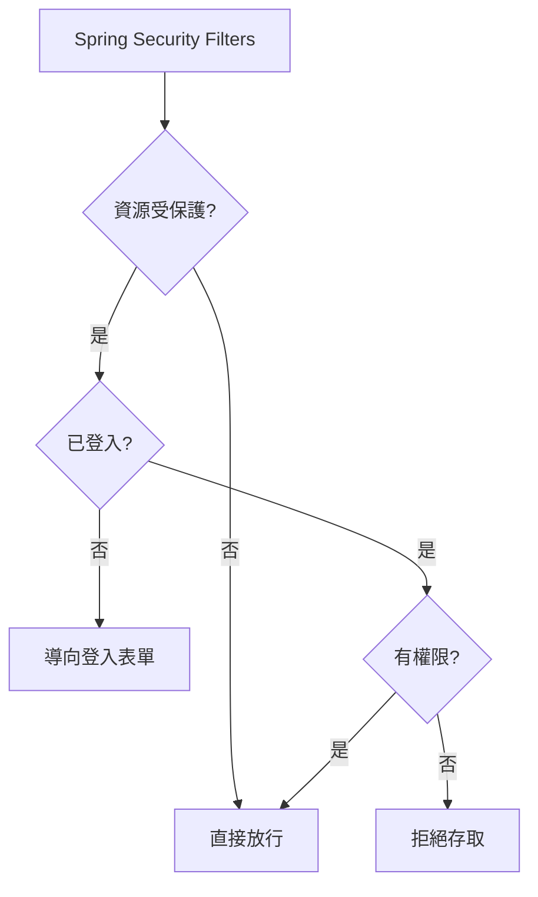
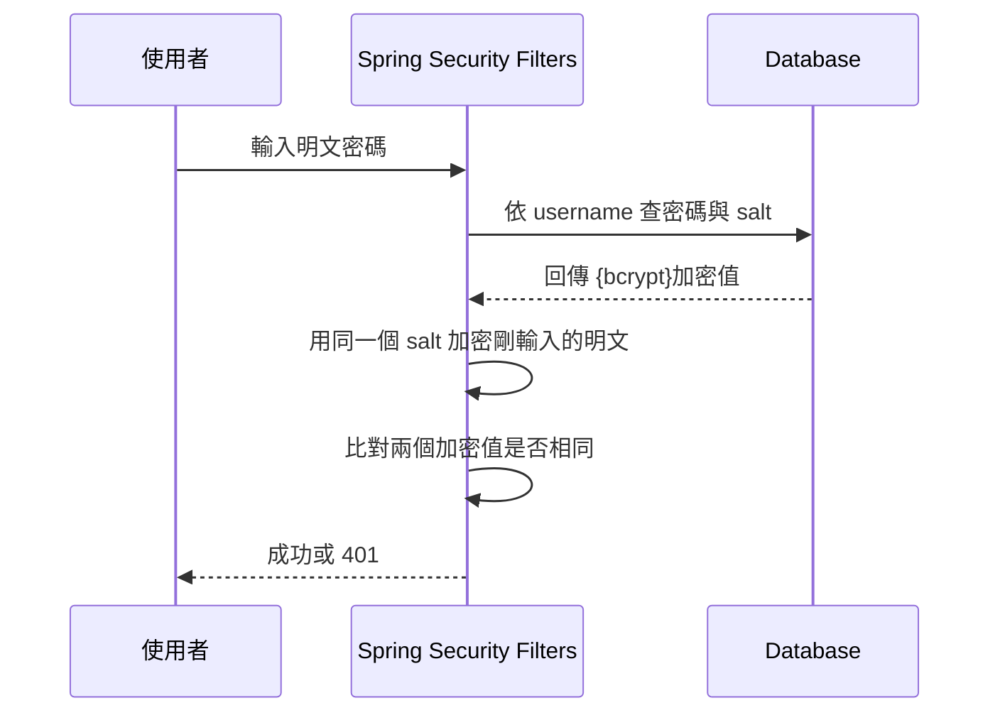

# 目錄

1. [驗證 Spring Data REST 自動產生的 API(HATEOAS、Postman CRUD 測試)](#1-驗證-api-運作)
   概念:延續上一份筆記,示範怎麼用瀏覽器和 Postman 對 Spring Data REST 自動生成的 API 做 GET / POST / PUT / DELETE 測試,並解釋回傳資料裡 `_links` 導覽連結和分頁 metadata(size、totalElements 等)是什麼意思。

2. [自訂 REST API 的路徑、分頁與排序規則](#2-spring-data-rest-的開發優勢)
   概念:教你怎麼透過設定檔改掉 Spring Data REST 自動產生的網址(base path、端點命名),以及調整每頁筆數、預設分頁大小、多欄位排序等細節,拿回對 API 網址結構的控制權。

3. [用 OpenAPI / Swagger 自動產生 API 文件](#3-使用-openapi-與-swagger-進行-rest-api-文件化-documenting-rest-apis-with-openapi-and-swagger)
   概念:介紹 SpringDoc 這個工具,只要加一個依賴就能自動幫你的 API 產生一個可以互動測試的 Swagger 網頁,還能取得 JSON/YAML 格式的 API 規格文件,並示範怎麼自訂這些文件的路徑。

4. [Spring Security 是什麼:身分驗證 vs 授權、運作模型](#4-spring-boot-rest-api-安全性概覽)
   概念:用「你是誰」(Authentication)跟「你能做什麼」(Authorization)的差別來解釋 Spring Security 的核心概念,並說明它其實是靠一層一層的 Servlet Filter 去攔截每個進來的請求做檢查。

5. [啟用 Spring Security 後,所有 API 預設會被鎖起來](#5-配置基礎安全性-configuring-basic-security)
   概念:只要加入 Spring Security 依賴,專案裡所有網址都會自動要求登入(預設會產生一組帳密),示範怎麼覆寫這組預設帳密、以及怎麼用 In-Memory UserDetailsManager 直接把使用者名稱/密碼/角色寫在程式碼裡做測試。

6. [用角色(Role)限制誰能呼叫哪些 API,並整合成一份安全性設定](#6-使用-postman-進行安全性測試)
   概念:用 hasRole / hasAnyRole 規定「只有 ADMIN 能刪除員工」這類規則,把所有規則整合進一個 SecurityFilterChain 設定方法裡,順便講 CSRF 攻擊是什麼、什麼情況該關掉這個保護,最後用 Postman 模擬不同角色的使用者實際測試權限、並修掉 Spring Data REST 對 PUT/PATCH 請求授權判斷的坑。

7. [把帳號密碼從程式碼搬進資料庫(users / authorities 資料表)](#7-使用資料庫儲存使用者帳號)
   概念:說明 Spring Security 內建支援的資料庫驗證方式,需要哪兩張表(users 存帳密、authorities 存角色)、欄位長什麼樣子,並用 JdbcUserDetailsManager 讓 Spring Security 直接查資料庫做登入驗證,改密碼馬上生效不用重啟程式。

8. [密碼不能明文存!用 bcrypt 加密雜湊](#8-spring-security-密碼加密-password-encryption)
   概念:解釋為什麼資料庫裡的密碼不能直接存明文,介紹 bcrypt 這種「加鹽雜湊」演算法的概念,示範用線上工具產生 bcrypt 密碼、更新資料庫,並驗證新舊密碼登入的結果差異。

9. [公司資料庫欄位/表名不一樣?自訂 SQL 查詢語句串接 Spring Security](#9-配置-spring-security-使用自定義資料表)
   概念:如果既有資料庫的表名、欄位名跟 Spring Security 預設要求的不一樣,教你怎麼自己寫 SQL 查詢語句告訴它去哪裡查帳號密碼和權限,並示範排除中間踩到的 SQL 語法錯誤。

10. [認識 Thymeleaf:Spring Boot 的網頁模板引擎](#10-thymeleaf-與-spring-boot)
    概念:Thymeleaf 是什麼、跟 Spring MVC 怎麼搭配運作,用一個最簡單的 Controller 回傳 HTML 頁面的例子建立第一印象。

11. [建立 Spring Boot 專案,套上 CSS 與 Bootstrap 美化畫面](#11-使用-spring-initializr-建立專案)
    概念:用 Spring Initializr 這個工具快速產生專案骨架,寫一個回傳 Thymeleaf 頁面的 Controller,並教你 Spring Boot 找靜態資源(CSS 檔、Bootstrap 函式庫)的規則,讓網頁套上樣式。

12. [Spring MVC 的分工架構:Controller / Model / View 三兄弟](#12-spring-mvc-應用程式的組成元件)
    概念:用「前端控制器(DispatcherServlet)接收請求 → 分派給 Controller 處理 → 資料放進 Model → 交給 View 模板渲染」這條流程,解釋一個網頁請求進來後 Spring MVC 內部怎麼分工。

13. [Spring Model 是資料的容器:Controller 怎麼把資料傳給頁面](#13-spring-model)
    概念:Model 就像一個共用的置物籃,Controller 把處理好的資料(字串、物件、查資料庫的結果)放進去,View 頁面再從裡面把資料拿出來顯示,並示範讀取表單、處理、存回 Model、顯示在下一頁的完整流程。

14. [用 @RequestParam 自動接住表單欄位值](#14-使用-requestparam-讀取-html-表單資料)
    概念:不用自己手動從 request 物件裡一個個撈欄位值,教你用 `@RequestParam` 這個註解讓 Spring 自動把 HTML 表單送出的欄位值綁進 Controller 方法的參數。

15. [GET 與 POST 的差異,以及怎麼限制 API 只接受特定方法](#15-getmapping-與-postmapping)
    概念:解釋 GET(資料放在網址上、有長度限制、會被瀏覽器記錄快取)跟 POST(資料放在請求本體裡、看不到、沒有長度限制)的差別,並示範用 `@GetMapping` / `@PostMapping` 限定方法,以及踩到 405 Method Not Allowed 錯誤時怎麼修。

16. [Thymeleaf 表單標籤:th:object / th:field 怎麼把欄位跟物件屬性自動綁在一起](#16-spring-mvc-form-tag)
    概念:教你怎麼用 Spring 提供的表單標籤,把 HTML 表單欄位跟後端物件的屬性自動綁定(靠 getter/setter 對應),不用自己手動組資料,並用一個完整的 Student 表單 + 確認頁範例走一遍全流程。

17. [下拉式選單:選項清單怎麼從設定檔動態產生,而不是寫死在 HTML 裡](#17-html-select-標籤複習)
    概念:複習 HTML `<select>` 標籤,再示範用 Thymeleaf 迴圈把 Java 的清單資料轉成 `<option>` 選項,並教你把選項內容放進 `application.properties` 用 `@Value` 注入,做到改設定檔就能調整選項、不用改程式碼。

18. [單選按鈕與核取方塊:一個只能選一個、一個可以選多個](#18-spring-mvc-表單---單選按鈕-radio-buttons)
    概念:單選按鈕(Radio Button)的綁定方式跟下拉選單類似、一樣能動態化選項清單;核取方塊(Checkbox)因為使用者可以勾選多個,後端物件要改用陣列/List 來接資料,這段一併示範兩種綁定方式的差異。

19. [表單驗證為什麼重要:Bean Validation 常用註解一覽](#19-spring-mvc-表單驗證)
    概念:說明光靠前端 HTML 檔案做驗證不夠可靠,後端也要再檢查一次資料合不合規定,介紹 Java 標準 Bean Validation API 常用的驗證註解(例如必填、長度限制等)以及後續要學的路線圖。

20. [實作「必填欄位」驗證:從加註解到頁面顯示紅字錯誤訊息](#20-spring-mvc-表單驗證必填欄位實作)
    概念:幫 Customer 物件的欄位加上驗證註解,Controller 方法用 `BindingResult` 檢查有沒有驗證失敗,失敗就導回原本的表單頁並在欄位旁邊顯示錯誤訊息,通過才跳到確認頁,並示範一段除錯 Thymeleaf 語法錯誤的過程。

21. [邊界案例:使用者只打空白也算「有填」?用 @InitBinder 修正](#21-spring-mvc-驗證使用-initbinder)
    概念:預設的必填驗證只檢查欄位是不是 null 或空字串,但使用者如果打一堆空白鍵,還是會被誤判成「有填寫」,這段教你用 `@InitBinder` 註冊一個字串處理器,自動去除頭尾空白後再驗證。

22. [Spring MVC 表單驗證:修剪空白字元的漏洞](#22-空白字元處理-white-space)
   概念:這段開始疑似把 Java 後端課程的筆記混進同一份檔案裡,跟 TOEIC 完全無關。內容是在講一個常見的表單驗證漏洞——使用者只打空白鍵也能通過「必填」驗證,解法是用 `@InitBinder` 搭配 `StringTrimmerEditor`,先把「純空白字串」轉成 `null`,後面的驗證才抓得到這種偷吃步。

23. [Spring MVC 數字範圍驗證與 int vs Integer 的地雷](#23-spring-mvc-數字範圍驗證)
    概念:同一段插曲的延續。教你用 `@Min`/`@Max` 限制數字欄位只能在某個範圍內,以及一個很多新手會踩的地雷——欄位留空時如果用原始型別 `int` 接會直接噴例外(因為 int 沒辦法是 null),要改用包裝類別 `Integer` 才能讓「必填」驗證正常顯示錯誤訊息而不是系統崩潰。

24. [用正規表達式驗證郵遞區號格式](#24-regular-expressions)
    概念:插曲的最後一段,講正規表達式(Regex)是什麼、怎麼用 `@Pattern` 註解規定郵遞區號要剛好是 5 碼英數字,以及怎麼把系統原本又長又難懂的錯誤訊息換成自訂的好懂提示(靠一個叫 `messages.properties` 的設定檔)。

-----------------------------------------------------------

### 1. 驗證 API 運作

Spring Data REST 的魔法就是：你只要有一個繼承 `JpaRepository` 的介面,系統就自動幫你把整套 CRUD API 蓋好,連 Controller 都不用寫。啟動後直接開瀏覽器打 `http://localhost:8080/employees` 就能拿到員工清單。

回傳的資料是 **HATEOAS** 格式,除了資料本身,還會附上 `_links`(告訴你「這筆資料還能去哪裡」,像是指向詳細資料的連結),以及 `page` 分頁資訊:

```json
"page": {
    "size": 20,
    "totalElements": 5,
    "totalPages": 1,
    "number": 0
}
```

點擊 `_links` 裡的連結就能直接跳到單筆資料,不用自己拼 URL,這就是 HATEOAS 的核心精神:「回應本身告訴你下一步能做什麼」。

**自訂基礎路徑**:預設端點掛在根目錄下,可以透過 `application.properties` 統一加上前綴,方便管理:

```properties
spring.data.rest.base-path=/magic-api
```

設定後舊路徑 `http://localhost:8080/employees` 會變成 404,要改用 `http://localhost:8080/magic-api/employees`。Spring Boot 有熱部署,存檔後設定馬上生效不用重啟。

**用 Postman 驗證 CRUD**,幾個容易忽略的細節:

- **POST 新增**:Body 選 `raw` + `JSON`,送出後回 `201 Created`,新資料的 ID 會自動編號並反映在 `_links.self.href` 裡。
- **PUT 更新**:Spring Data REST **只認 URL 裡的 ID**,例如 `PUT /magic-api/employees/4`。就算你在 Body 裡塞了別的 ID,系統也會直接忽略,一律以 URL 為準——這是最容易搞混、也最容易踩雷的地方。
- **DELETE 刪除**:回應是 `204 No Content`,代表操作成功但沒有東西要回傳給你,這跟 GET/POST/PUT 都會帶資料回來不一樣。

整套流程下來,C(POST)、R(GET)、U(PUT)、D(DELETE)都不用寫一行 Controller 程式碼,全部靠 Spring Data REST 自動生成。

---

### 2. Spring Data REST 的開發優勢

一句話總結:在 `pom.xml` 加一個依賴,系統掃描你的 `JpaRepository`,自動生出整組 REST API——不用寫 Controller、不用寫樣板程式碼。

```xml
<dependency>
    <groupId>org.springframework.boot</groupId>
    <artifactId>spring-boot-starter-data-rest</artifactId>
</dependency>
```

**端點命名規則**很單純粗暴:把實體名稱第一個字母轉小寫,後面加 `s`。例如 `Employee` → `/employees`。但這種簡單邏輯遇到英文不規則複數就會出包,像 `Person` 應該變 `People`、`Goose` 應該變 `Geese`,系統不會幫你處理這些例外。

遇到這種情況,或是你單純想換個資源名稱(例如不想叫 `/employees`,想叫 `/members`),就用 `@RepositoryRestResource` 註解手動指定:

```java
@RepositoryRestResource(path="members")
public interface EmployeeRepository extends JpaRepository<Employee, Integer> {
}
```

**分頁**:預設每頁 20 筆,頁碼從 0 開始算(這點很多人會搞錯,以為第一頁是 1)。用 `?page=0`、`?page=1` 切換。也可以在設定檔統一調整:

```properties
spring.data.rest.default-page-size=3
spring.data.rest.max-page-size=?
```

回應裡的 `_links.next.href` 會直接給你下一頁的完整 URL,不用自己拼參數。

**排序**用 `sort` 查詢參數,值要跟 Entity 的屬性名稱完全一致(區分大小寫):

| 需求 | URL |
| --- | --- |
| 依姓氏升冪 | `?sort=lastName` |
| 依姓氏降冪 | `?sort=lastName,desc` |
| 多欄位排序 | `?sort=lastName,firstName,desc` |

三個常用設定屬性整理:

| 屬性 | 用途 |
| --- | --- |
| `spring.data.rest.base-path` | 端點的基礎路徑前綴 |
| `spring.data.rest.default-page-size` | 預設每頁筆數 |
| `spring.data.rest.max-page-size` | 每頁筆數上限 |

---

### 3. 使用 OpenAPI 與 Swagger 進行 REST API 文件化 (Documenting REST APIs with OpenAPI and Swagger)

沒有文件的 API 是什麼感覺?新人要接手時只能去翻原始碼找 `@GetMapping`、`@PostMapping`,搞懂之後才敢用 Postman 試。SpringDoc 解決的就是這個痛點:它會在程式「執行時」自動掃描你的 Controller 和註解,生出一份活的、隨程式碼更新的文件,還附贈一個網頁版介面讓你直接在瀏覽器裡呼叫 API,不用再開 Postman。

- **OpenAPI**:業界標準的 API 文件格式(規格本身,像一份合約)。
- **Swagger UI**:一個瀏覽器介面,由 SpringDoc-OpenAPI 這個專案驅動,讓你直接在網頁上點按鈕測試 GET/POST/PUT 等各種請求。

**三步整合流程**:

1. 加 Maven 依賴(版本號到 springdoc.org 查最新的):

```xml
<dependency>
    <groupId>org.springdoc</groupId>
    <artifactId>springdoc-openapi-starter-webmvc-ui</artifactId>
    <version>x.y.z</version>
</dependency>
```

2. 存取 Swagger UI,預設路徑是 `http://localhost:8080/swagger-ui/index.html`。想改路徑就設定:

```properties
springdoc.swagger-ui.path=/my-fun-ui.html
```

3. 取得結構化文件(JSON 或 YAML),預設在 `http://localhost:8080/v3/api-docs`(YAML 版加 `.yaml` 副檔名)。這兩種格式的價值在於**語言無關**——不管前端用 JS、Python 還是 C#,都能讀這份規格自動產生對應語言的 Client SDK,或拿去做合約測試(Contract Testing)、API 模擬。同樣可以自訂路徑:

```properties
springdoc.api-docs.path=/my-api-docs
```

**重要限制**:目前(Spring Boot 4)OpenAPI/Swagger **無法跟 Spring Data REST 搭配使用**,因為 Spring Data REST 本來就是靠自動生成、不寫 Controller 來運作的,SpringDoc 掃不到東西可以掃。所以這部分的實作演示都是用傳統的 `@RestController` 專案。

實測流程:進入 Swagger UI → 找到端點(如 `employee-rest-controller`)→ 點 "Try it out" → 點 "Execute" → 下方會顯示對應的 `curl` 指令、Request URL、狀態碼與 Response Body,用起來跟 Postman 效果一樣,但完全不用額外裝軟體。原始 JSON 文件通常是壓成一行,建議裝瀏覽器外掛(如 JSON Formatter)做 Pretty Print 才好讀。

---

## 4. Spring Boot REST API 安全性概覽

這章談的是 Spring Security 在真實專案裡最常用到的部分,不是把整本參考手冊背下來。核心目標三件事:保護 API、管理使用者與角色、把帳密從硬編碼搬進資料庫(並加密)。

**運作原理**:Spring Security 底層是一串 **Servlet Filters**,在請求真正進到你的 Controller 之前先攔截檢查。可以想成大樓門口的保全關卡,任何人進來都要先經過這一關。



**身分驗證 (Authentication) vs 授權 (Authorization)——最容易搞混的一組觀念**,一定要分清楚:

- **Authentication(驗身分)**:回答「你是誰」。輸入帳號密碼跟系統比對,對了就算「已驗證」。
- **Authorization(查權限)**:回答「你能做什麼」。就算身分驗證過了,也不代表什麼都能碰。

生活化比喻:進辦公大樓刷卡(Authentication,證明你是員工),但你能不能進「主管辦公室」或「機房」,還要看你的職等或角色(Authorization)。這兩關是連續但獨立的檢查——先過第一關才會檢查第二關,第二關沒過一樣是拒絕存取。

**兩種實作方式**:

1. **宣告式安全性 (Declarative)**:用 `@Configuration` 類別寫設定,把安全邏輯跟業務邏輯分開管理(關注點分離)。
2. **程式化安全性 (Programmatic)**:直接用 API 在程式碼裡寫客製邏輯,彈性更高但耦合也更高。

**啟用方式超簡單**,加一個依賴,Spring Boot 就會自動保護所有端點:

```xml
<dependency>
    <groupId>org.springframework.boot</groupId>
    <artifactId>spring-boot-starter-security</artifactId>
</dependency>
```

加上去之後,啟動時控制台會印出一組隨機密碼(`Using generated security password: ...`),預設帳號是 `user`。這只適合開發階段暫時用,想固定帳密可以在 `application.properties` 覆寫:

```properties
spring.security.user.name=scott
spring.security.user.password=tiger
```

除了記憶體驗證,Spring Security 還支援 JDBC(資料庫)、LDAP、自訂插件等多種驗證方式,密碼可以存明文(開發用)或加密(正式環境用),下一節會實際動手做。

---

### 5. 配置基礎安全性 (Configuring Basic Security)

這節要做的事:定義三個使用者(john/mary/susan),各自有不同角色,並且用 Java 設定類別把「誰能存取哪個 API」講清楚。

| User ID | Password | Roles |
| --- | --- | --- |
| john | test123 | EMPLOYEE |
| mary | test123 | EMPLOYEE, MANAGER |
| susan | test123 | EMPLOYEE, MANAGER, ADMIN |

**密碼儲存格式**是 `{id}encodedPassword`,`{id}` 代表用什麼演算法:

| ID | 說明 |
| --- | --- |
| `noop` | 明文,不加密,只適合開發階段快速起步 |
| `bcrypt` | 正式環境用的單向雜湊演算法 |

**先建立設定類別**:

```java
@Configuration
public class DemoSecurityConfig {
}
```

**用 In-Memory 方式定義使用者**,靠 `User.builder()` 這個 fluent API 串接屬性:

```java
@Bean
public InMemoryUserDetailsManager userDetailsManager() {
    UserDetails john = User.builder()
        .username("john")
        .password("{noop}test123")
        .roles("EMPLOYEE")
        .build();

    UserDetails mary = User.builder()
        .username("mary")
        .password("{noop}test123")
        .roles("EMPLOYEE", "MANAGER")
        .build();

    UserDetails susan = User.builder()
        .username("susan")
        .password("{noop}test123")
        .roles("EMPLOYEE", "MANAGER", "ADMIN")
        .build();

    return new InMemoryUserDetailsManager(john, mary, susan);
}
```

注意:一旦程式碼裡明確定義了使用者,`application.properties` 裡的 `spring.security.user.name/password` 就會失效——程式碼優先。

**權限規劃**:根據 HTTP 方法 + 路徑指定要求的角色,語法固定套路是 `requestMatchers(方法, 路徑).hasRole(角色)`,多角色可用 `.hasAnyRole(...)`。

| HTTP Method | Endpoint | 動作 | Role |
| --- | --- | --- | --- |
| GET | /api/employees | 讀全部 | EMPLOYEE |
| GET | /api/employees/{id} | 讀單筆 | EMPLOYEE |
| POST | /api/employees | 新增 | MANAGER |
| PUT | /api/employees | 更新 | MANAGER |
| DELETE | /api/employees/{id} | 刪除 | ADMIN |

`**` 是萬用字元,用來匹配某路徑下所有子路徑(例如 `/api/employees/**` 會涵蓋 `/api/employees/123`)——凡是路徑後面會帶 ID 或參數的,幾乎都要用 `**` 而不是寫死完整路徑,否則會莫名其妙收到 403。

整合起來就是一個 `SecurityFilterChain` Bean:

```java
@Bean
public SecurityFilterChain filterChain(HttpSecurity http) throws Exception {
    http.authorizeHttpRequests(configurer ->
        configurer
            .requestMatchers(HttpMethod.GET, "/api/employees/**").hasRole("EMPLOYEE")
            .requestMatchers(HttpMethod.POST, "/api/employees").hasRole("MANAGER")
            .requestMatchers(HttpMethod.PUT, "/api/employees/**").hasRole("MANAGER")
            .requestMatchers(HttpMethod.DELETE, "/api/employees/**").hasRole("ADMIN")
    );

    http.httpBasic(Customizer.withDefaults()); // 明確指定用 HTTP Basic 驗證
    http.csrf(csrf -> csrf.disable());          // REST API 通常關閉 CSRF

    return http.build();
}
```

兩個容易漏掉的細節:

1. **一旦自訂了 `SecurityFilterChain`,就必須明確呼叫 `.httpBasic()`**,不然系統不會自動套用驗證方式。
2. **CSRF(跨站請求偽造)保護**主要是為了防禦有狀態的瀏覽器表單提交,官方建議「無狀態的 REST API」(用 POST/PUT/DELETE/PATCH,不靠瀏覽器 Cookie 驗證)可以停用,用 `http.csrf(csrf -> csrf.disable())`。

---

### 6. 使用 Postman 進行安全性測試

用 Postman 的 `Basic Auth` 頁籤逐一驗證上一節設定的角色權限規則,重點是驗證「該通的通、該擋的擋」。

**測試 EMPLOYEE(john)**:

| 操作 | 預期結果 |
| --- | --- |
| GET(全部/單筆) | 通過,200 OK |
| POST | 失敗,403 Forbidden |
| PUT | 失敗,403 Forbidden |
| DELETE | 失敗,403 Forbidden |

john 只有 EMPLOYEE 角色,所以只能讀,寫入/刪除全部被擋在門外,回傳的是 **403 Forbidden**(不是 401)——這點要注意:401 代表「你是誰都不知道」(未驗證),403 代表「知道你是誰,但你沒權限」(已驗證但未授權)。這正好呼應了 Authentication 跟 Authorization 是兩道獨立關卡的概念。

**測試 MANAGER(mary)**:GET / POST / PUT 都通過,DELETE 被擋(403)。

**測試 ADMIN(susan)**:所有操作都通過,包含 DELETE。

| 角色 | 允許操作 | 結果 |
| --- | --- | --- |
| EMPLOYEE | 僅 GET | 其餘皆 403 |
| MANAGER | GET/POST/PUT | DELETE 403 |
| ADMIN | 全部 | 全部 200 |

**PATCH 的坑**:如果新增了 PATCH(局部更新)端點,記得也要幫它加權限規則,而且路徑一樣要用 `/**` 而不是寫死 `/api/employees`,因為 PATCH 端點通常會帶 ID(例如 `/api/employees/1`):

```java
requestMatchers(HttpMethod.PATCH, "/api/employees/**").hasRole("MANAGER")
```

**如果是用 Spring Data REST 而不是自己寫的 RestController**,PUT 請求的 URL 一定會帶資源 ID(`/api/employees/{id}`),所以權限規則的路徑也要跟著改成 `/**`,不然明明帳密角色都對,卻收到 403,原因就出在路徑沒匹配到:

```java
// 改前(容易漏掉 ID 路徑)
.requestMatchers(HttpMethod.PUT, "/api/employees").hasRole("MANAGER")

// 改後(涵蓋帶 ID 的路徑)
.requestMatchers(HttpMethod.PUT, "/api/employees/**").hasRole("MANAGER")
```

---

## 7. 使用資料庫儲存使用者帳號

前面把帳密角色寫死在 Java 程式碼裡(In-Memory),只是為了圖方便。這節要把它們搬進資料庫,好處是改帳密角色不用重新編譯部署,直接下 SQL 就生效。

Spring Security 提供「開箱即用(Out-of-the-box)」的 JDBC 支援,前提是你要照著它**預定義的資料表結構**建表,名稱和欄位都不能隨便改:

| 資料表 | 必要欄位 | 說明 |
| --- | --- | --- |
| `users` | username, password, enabled | 帳號基本資訊 |
| `authorities` | username, authority | 角色/權限,概念上等同 roles |

```sql
CREATE TABLE `users` (
    `username` varchar(50) NOT NULL,
    `password` varchar(50) NOT NULL,
    `enabled` tinyint NOT NULL,
    PRIMARY KEY (`username`)
);

INSERT INTO `users` VALUES
('john', '{noop}test123', 1),
('mary', '{noop}test123', 1),
('susan', '{noop}test123', 1);

CREATE TABLE `authorities` (
    `username` varchar(50) NOT NULL,
    `authority` varchar(50) NOT NULL,
    UNIQUE KEY `authorities_idx_1` (`username`, `authority`),
    CONSTRAINT `authorities_ibfk_1` FOREIGN KEY (`username`) REFERENCES `users` (`username`)
);

INSERT INTO `authorities` VALUES
('john', 'ROLE_EMPLOYEE'),
('mary', 'ROLE_EMPLOYEE'),
('mary', 'ROLE_MANAGER'),
('susan', 'ROLE_EMPLOYEE'),
('susan', 'ROLE_MANAGER'),
('susan', 'ROLE_ADMIN');
```

**容易踩的坑:`ROLE_` 前綴**。資料庫裡存的角色名稱一定要加 `ROLE_` 開頭(例如 `ROLE_MANAGER`),Spring Security 內部比對角色時預期會有這個前綴,少了它角色就對不上,授權會莫名失敗。

**改用 JDBC 只需要換一個 Bean**,把 `InMemoryUserDetailsManager` 換成 `JdbcUserDetailsManager`,注入 Spring Boot 自動配置好的 `DataSource` 即可:

```java
@Configuration
public class DemoSecurityConfig {

    @Bean
    public UserDetailsManager userDetailsManager(DataSource dataSource) {
        return new JdbcUserDetailsManager(dataSource);
    }
}
```

原本 `application.properties` 裡的資料庫連線設定可以直接複用,不用另外建新的資料來源:

```properties
spring.datasource.url=jdbc:mysql://localhost:3306/employee_directory
spring.datasource.username=springstudent
spring.datasource.password=springstudent
```

**JDBC 驗證是即時的**:直接在資料庫改密碼(例如 `UPDATE users SET password='ABC123' WHERE username='john'`),不用重啟應用程式,馬上就能用新密碼登入、舊密碼失效。這證明了系統真的是每次都去查資料庫,而不是還在用記憶體裡的舊資料。

角色權限的行為跟前一節一模一樣(EMPLOYEE 只能讀、MANAGER 多了寫入、ADMIN 才能刪除),差別只在使用者資料的來源從程式碼變成了資料庫。

---

### 8. Spring Security 密碼加密 (Password Encryption)

明文密碼(`{noop}test123`)只能用在開發階段練手,正式環境一定要加密——萬一資料庫外洩,駭客至少拿不到能直接登入的明文密碼。

Spring Security 官方推薦 **bcrypt** 演算法,三個關鍵特性:

- **單向雜湊**:加密後不可逆,無法從雜湊值反推回原始密碼(跟壓縮不同,壓縮可以解壓,雜湊不行)。
- **隨機鹽值 (salt)**:同一組明文密碼每次加密結果都不一樣,可以防止駭客用預先算好的「彩虹表」對照破解。
- **抗暴力破解**:天生設計成運算較慢,拖慢暴力嘗試的速度。

取得 bcrypt 密碼的方式:上網用線上工具(`www.luv2code.com/generate-bcrypt-password`)輸入明文、點 Calculate 就會得到雜湊值;或是寫 Java 程式碼產生(後面章節會教)。

**資料庫欄位要跟著調整**:bcrypt 產生的雜湊固定是 60 個字元,加上 `{bcrypt}` 前綴 8 個字元,`password` 欄位長度至少要留 **68 個字元**:

```sql
CREATE TABLE `users` (
    `username` varchar(50) NOT NULL,
    `password` char(68) NOT NULL,
    `enabled` tinyint NOT NULL,
    PRIMARY KEY (`username`)
);

INSERT INTO `users` VALUES
('john', '{bcrypt}$2a$10$qeS0HEh7urweMojsnwNAR.vcXJeXR1UcMRZ2WcGQ19YeuspUdgF.q', 1);
```

**登入比對的完整流程**(這段是理解 bcrypt 運作的關鍵):

1. 依 username 從資料庫撈出密碼欄位。
2. 讀出 `{id}` 部分,知道要用哪種演算法(這裡是 bcrypt)。
3. 從資料庫存的加密字串裡取出當初用的 salt,拿使用者剛輸入的明文密碼、用同一個 salt 重新加密一次。
4. 把「剛剛重新算出來的加密值」跟「資料庫裡存的加密值」比對,一樣就算登入成功。



核心原則:**資料庫裡的密碼永遠不會被解密**,系統做的永遠是「拿新輸入的明文重新加密,再去比對雜湊值」,而不是把舊雜湊還原回明文。

實測驗證跟前面章節邏輯一致:密碼錯了回 401;改對密碼就 200。而且改資料庫密碼一樣是即時生效,不用重啟應用程式,舊密碼立刻失效、新密碼立刻可用——這是因為驗證邏輯本來就是每次都即時查資料庫,加密與否不影響這個「即時性」的特性,只是多了雜湊比對這一步。

### 9. 配置 Spring Security 使用自定義資料表

Spring Security 預設會去找 `users`、`authorities` 這兩張表,欄位名稱也是固定的。但實務上公司通常早就有自己的一套會員資料表,不可能為了套用框架去改人家的資料庫。好消息是 Spring Security 其實不在乎表叫什麼名字、欄位怎麼命名,只要你告訴它「怎麼查」就好。

這次範例改用 `members`(存 `user_id`、`pw`、`active`)和 `roles`(存 `user_id`、`role`)這種自訂結構,`pw` 欄位用 `char(68)` 是因為要剛好放得下 bcrypt 加密後的固定長度字串。整合的重點只有兩步:

1. 用 SQL 建好自訂的表(記得先把舊的 `users`/`authorities` drop 掉,`employee` 表則不動它)。
2. 修改 `DemoSecurityConfig`,把 `JdbcUserDetailsManager` 抽成區域變數,再用兩個方法告訴它怎麼查:

```java
@Bean
public UserDetailsManager userDetailsManager(DataSource dataSource) {
    JdbcUserDetailsManager jdbcUserDetailsManager = new JdbcUserDetailsManager(dataSource);

    jdbcUserDetailsManager.setUsersByUsernameQuery(
        "select user_id, pw, active from members where user_id = ?");

    jdbcUserDetailsManager.setAuthoritiesByUsernameQuery(
        "select user_id, role from roles where user_id = ?");

    return jdbcUserDetailsManager;
}
```

SQL 裡的 `?` 就是佔位符,登入時輸入的 username 會自動帶進去比對,概念跟 PreparedStatement 一樣。

這段還藏了一個很典型的除錯故事:一開始改完設定,拿正確密碼登入還是 401,而且 IDE 日誌完全看不到 Exception。解法是先在 `application.properties` 開 DEBUG 等級的 log(`logging.level.org.springframework.security=DEBUG`),這樣才挖出真正的錯誤 `SQLSyntaxErrorException: Unknown column 'roles' in 'field list'`——原來是查詢語句寫成複數 `roles`,但資料表欄位其實叫單數 `role`。改一個字之後,登入立刻變成 200 OK。這個案例很值得記住:**遇到驗證莫名失敗、又看不到明確錯誤時,先把 log 等級調高再說**,通常問題就藏在某個 SQL typo 裡。修好之後用 Postman 測 EMPLOYEE 角色刪除會被拒(403),ADMIN 角色才能刪成功,驗證了角色權限確實有生效。

## 10. Thymeleaf 與 Spring Boot

Thymeleaf 是一個 Java 樣板引擎,發音是「time-leaf」(h 不發音),跟 Spring 沒有從屬關係、是各自獨立的專案,只是兩者搭配起來特別合拍,所以常常一起出現。它的工作是在**伺服器端**把 HTML 模板裡的表達式換成真正的資料,換完之後才把純 HTML 送到瀏覽器——換句話說,瀏覽器收到的東西完全看不出用了 Thymeleaf,檢視原始碼只會看到已經算好的結果。

要用它,三個步驟:

1. POM 加入 `spring-boot-starter-thymeleaf`(用 Spring Initializr 建專案時勾選 Thymeleaf 也一樣)。
2. Controller 正常寫,把資料塞進 `Model`,回傳字串當作模板名稱:

```java
@GetMapping("/")
public String sayHello(Model theModel) {
    theModel.addAttribute("theDate", java.time.LocalDateTime.now());
    return "helloworld";
}
```

3. 在 `src/main/resources/templates/helloworld.html` 建立對應的模板,`<html>` 標籤要加上 `xmlns:th="http://www.thymeleaf.org"` 才能用 Thymeleaf 語法,再用 `th:text` 把動態內容塞進標籤:

```html
<p th:text="'Time on the server is ' + ${theDate}" />
```

這裡的 `${theDate}` 不是什麼魔法,就是 Controller 裡 `model.addAttribute("theDate", ...)` 放進去的那個值,名稱要對得上。除了基本的文字替換,Thymeleaf 也支援迴圈、條件判斷、CSS/JS 整合,以及模板佈局與片段重用等進階功能,之後做清單、表單會大量用到。

## 11. 使用 Spring Initializr 建立專案

用 [start.spring.io](https://start.spring.io) 建專案的標準流程:選 Maven + Java + 最新的 Release 版本(不要挑 SNAPSHOT,穩定度考量),填好 Group(如 `com.lovetocode.springboot`)、Artifact(如 `thymeleafdemo`)、Packaging 選 Jar,依賴項至少加三個:`Spring Web`(內建 Tomcat,支援 MVC/REST)、`Thymeleaf`(伺服器端模板引擎)、`Spring Boot DevTools`(改程式碼自動重啟,開發超方便)。下載解壓後丟到自己習慣的開發目錄,用 IDE 打開先看一眼 `pom.xml` 確認依賴有沒有進去。

接著建 `.controller` package,寫一個最簡單的 `DemoController`:

```java
@Controller
public class DemoController {
    @GetMapping("/hello")
    public String sayHello(Model theModel) {
        theModel.addAttribute("theDate", java.time.LocalDateTime.now());
        return "helloworld";
    }
}
```

有個常見雷區要注意:`Model` 一定要 import `org.springframework.ui.Model`,IDE 自動補全有時候會抓錯套件,匯錯就整組壞掉。回傳的字串會被自動接上 `.html`,去 `templates/` 目錄下找對應檔案,不用自己寫檔案路徑判斷邏輯。

美化頁面時,CSS 的引用方式有兩種:

- **本地檔案**:放在 `src/main/resources/static/css/` 下,模板裡用 `th:href="@{/css/demo.css}"` 引用(`@{...}` 代表 context path,確保部署到任何路徑下連結都不會壞掉),再用一般的 `class` 屬性套用樣式。Spring Boot 找靜態資源的搜尋順序是由上而下:`/META-INF/resources` → `/resources` → `/static` → `/public`,實務上最常放 `/static` 或 `/public`。
- **遠端引用**:像 Bootstrap 這種第三方庫,可以下載檔案放進 `static/css/` 本地管理,也可以直接用 CDN 網址(如 `https://cdn.jsdelivr.net/npm/bootstrap@5.2.3/...`)引用,不用下載,兩種各有取捨——本地掌控性高、CDN 省事但要依賴外部服務可用性。

### 12. Spring MVC 應用程式的組成元件

Spring MVC 應用程式由三塊拼起來:Web 頁面(UI 排版)、Spring Beans(Controller、Service 等元件)、Spring 配置(可以用 XML、註解或純 Java)。整個請求流程是:

```
瀏覽器 → Front Controller(DispatcherServlet) → Controller → View Template → 瀏覽器
```

`DispatcherServlet` 是 Front Controller,由 Spring 框架團隊寫好、打包在 jar 裡,開發者不用自己碰它,它負責接第一手請求再分派下去。開發者真正要動手做的只有三件事:

- **Controller**:扛業務邏輯,負責接請求、存取資料庫或 Web Service、把資料塞進 Model、決定導向哪個 View。
- **Model**:單純是個資料容器,承接 Controller 準備好的資料(任何 Java 物件或集合都能放),傳給 View。
- **View Template**:把 Model 裡的資料渲染成使用者看得懂的畫面,可以是列表、確認訊息等。Spring MVC 對 View 引擎很有彈性,除了本課程主用的 Thymeleaf,還支援 Groovy、Velocity、FreeMarker 等。

可以把這三者想成餐廳的分工:Controller 是外場兼廚房(處理訂單、準備菜),Model 是端菜的托盤(單純載資料),View 是擺盤上桌的那道菜(呈現給客人看)。

### 13. Spring Model

Model 就是一個裝資料的容器,Controller 想放什麼進去都行——字串、物件、資料庫查出來的結果都可以,View 再從裡面把資料撈出來顯示。存取語法就是 `model.addAttribute(name, value)`,`name` 是之後在 View 裡用來找資料的鍵(key),`value` 是實際的內容,兩者是一組 name-value pair,可以呼叫任意多次,一次塞多筆資料進去也沒問題:

```java
model.addAttribute("message", result);
model.addAttribute("students", theStudentList);
model.addAttribute("shoppingCart", theShoppingCart);
```

`name` 完全自訂,只要 Controller 跟 Thymeleaf 模板(`${message}`)兩邊寫的名字對得上就行,叫 `foobar` 也沒差,是純粹的字串比對。

實作範例是讀表單姓名、轉大寫、組字串再放進 Model:

```java
@RequestMapping("/processFormVersionTwo")
public String letsShoutDude(HttpServletRequest request, Model model) {
    String theName = request.getParameter("studentName");
    theName = theName.toUpperCase();
    String result = "Yo! " + theName;
    model.addAttribute("message", result);
    return "helloworld";
}
```

View 端用 `<span th:text="${message}"></span>` 讀出來顯示。整條資料流是:`Request(表單資料) → Controller(處理) → Model(暫存) → View(顯示)`。另外,HTML 表單的 `action`(或 Thymeleaf 的 `th:action`)一定要跟 Controller 的 `@RequestMapping` 路徑完全一致(大小寫也算),路徑對不上最直接的下場就是 404,建議直接複製貼上避免手殘打錯字。

### 14. 使用 @RequestParam 讀取 HTML 表單資料

前面用 `HttpServletRequest request` 搭配 `request.getParameter("studentName")` 手動撈表單值,寫法沒錯但稍嫌囉唆。`@RequestParam` 讓 Spring 直接幫你把這個動作做掉:

```java
// 傳統寫法
public String letsShoutDude(HttpServletRequest request, Model model) {
    String theName = request.getParameter("studentName");
    ...
}

// Spring 寫法
public String letsShoutDude(@RequestParam("studentName") String theName, Model model) {
    // theName 已經是綁定好的值,可以直接用
}
```

原理是 Spring 在背景自動讀取請求、依你指定的參數名去表單裡找值,再把它塞進你宣告的變數,少寫一行 `getParameter`,程式碼更乾淨,邏輯完全一樣。範例把整個流程重構成 `processFormVersionThree`:

```java
@RequestMapping("/processFormVersionThree")
public String processFormVersionThree(@RequestParam("studentName") String theName, Model model) {
    theName = theName.toUpperCase();
    String result = "Hey My Friend from v3! " + theName;
    model.addAttribute("message", result);
    return "helloworld";
}
```

要提醒的是,Controller 路徑一改名(例如從 `processFormVersionTwo` 改成 `processFormVersionThree`),HTML 表單裡的 `th:action` 也要同步更新,兩邊沒對齊照樣是 404。

## 15. @GetMapping 與 @PostMapping

GET 跟 POST 是最常用的兩種 HTTP 方法:GET 是「跟資源要資料」,資料以 `?field1=value1&field2=value2` 的形式接在 URL 後面;POST 是「把資料交給資源」,資料放在 HTTP 請求的 Body 裡,URL 看起來很乾淨。

`@RequestMapping` 預設什麼方法都接(GET、POST 都行),想限制的話可以寫 `@RequestMapping(path="...", method=RequestMethod.GET)`,但更常見的做法是直接用快捷註解 `@GetMapping` / `@PostMapping`,效果一樣、寫法更短。兩者怎麼選有實際考量:

| 面向 | GET | POST |
| --- | --- | --- |
| 除錯 | 參數在網址列一目了然,好 debug | 看不到,要靠開發者工具 |
| 書籤/分享 | 可以存書籤、寄連結 | 不行,資料不在 URL 上 |
| 資料長度 | 受瀏覽器 URL 長度限制(建議 1000 字元內) | 沒有長度限制 |
| 資料型態 | 純文字 | 可傳二進位資料,檔案上傳必用 POST |

有個很實用的踩雷經驗:瀏覽器在網址列直接輸入網址、按 Enter,**永遠是發 GET 請求**。如果這時候 Controller 只掛了 `@PostMapping`,就會吃到 `405 Method Not Allowed`(Whitelabel Error Page,顯示 `Method 'GET' is not supported`)。反過來,表單設定 `method="POST"` 但 Controller 只有 `@GetMapping`,一樣會 405,錯誤訊息換成 `Request method 'POST' is not supported`。排查這類錯誤的思路很直接:**先看瀏覽器/表單實際發的是什麼方法,再對照 Controller 掛的是哪個 Mapping,兩邊沒對上就是 405 的根源**。想確認 POST 的資料到底送了什麼,得靠瀏覽器開發者工具(F12)→ Network 分頁 → 選中該次請求 → 看 Payload(等於 Request Body),裡面才看得到 `studentName=Anil` 這類欄位值。

## 16. Spring MVC Form Tag

前面每個欄位都用一個 `@RequestParam` 接,欄位一多就很煩。更好的做法是讓整張表單直接綁定成一個 Java 物件(Bean),Spring MVC 會自動幫你在物件跟 HTML 欄位之間搬資料,這就是「資料綁定 (Data Binding)」。

整體流程長這樣:`student-form.html`(填姓名) → 綁成一個 `Student` 物件 → `StudentController` 處理 → `student-confirmation.html`(顯示結果)。實作五步驟:

1. **建立 Student 類別**:除了 `firstName`、`lastName` 兩個私有欄位,一定要有無參數建構子,以及成對的 getter/setter——框架靠反射跟這兩者運作,少了會出問題。

2. **顯示表單前先準備一個空物件放進 Model**:

```java
@GetMapping("/showStudentForm")
public String showForm(Model theModel) {
    theModel.addAttribute("student", new Student());
    return "student-form";
}
```

3. **HTML 表單用 `th:object` 綁定物件、`th:field` 綁定欄位**:

```html
<form th:action="@{/processStudentForm}" th:object="${student}" method="POST">
    First name: <input type="text" th:field="*{firstName}" />
    Last name: <input type="text" th:field="*{lastName}" />
    <input type="submit" value="Submit" />
</form>
```

    `th:object="${student}"` 裡的名稱必須跟 Controller 裡 `addAttribute` 用的字串一致。`th:field="*{firstName}"` 是縮寫語法,等同於完整寫法 `th:field="${student.firstName}"`——因為已經用 `th:object` 指定物件範圍了,裡面就不用再重複寫物件名稱。這個星號 `*{}` 跟一般 `${}` 的差別是常見的混淆點,記法是:`th:object` 圈定範圍後,範圍內一律用 `*{}`。

4. **表單載入 vs. 表單提交,呼叫的方法完全相反**:表單載入時 Spring 會呼叫物件的 **getter**(`getFirstName()`)去預填欄位;表單提交時則是建立一個新物件,呼叫 **setter**(`setFirstName(值)`)把使用者輸入寫進去。這個「載入讀 get、提交寫 set」的對照,是之後做「查詢並編輯」(讀出資料庫既有資料、預填表單、讓使用者改、送出更新)的核心機制,之後學 Spring Data JPA 的 CRUD 會一直用到。

5. **Controller 用 `@ModelAttribute` 一次接住整包資料**,不用再逐一 `getParameter`:

```java
@PostMapping("/processStudentForm")
public String processForm(@ModelAttribute("student") Student theStudent) {
    System.out.println("theStudent: " + theStudent.getFirstName() + " " + theStudent.getLastName());
    return "student-confirmation";
}
```

    `@ModelAttribute("student")` 裡的名稱同樣要跟表單的 `th:object="${student}"` 對齊,對不上 Spring 就沒辦法把資料塞進 `theStudent`。拿到物件後想做什麼都行:印出來除錯、存資料庫、打 REST API。

6. **確認頁面顯示結果**,用屬性表達式讀出物件欄位,一樣是背後呼叫 getter:

```html
<span th:text="${student.firstName} + ' ' + ${student.lastName}"></span>
```

整條路走完,`showStudentForm` 填 John/Doe 送出後,會跳到確認頁看到「The student is confirmed: John Doe」,同時 Console 印出 `theStudent: John Doe`,證明資料確實從前端表單走過綁定機制,一路傳到後端物件。

### 17. HTML `<select>` 標籤複習

`<select>` 就是網頁表單裡的下拉選單，裡面每個 `<option>` 都藏著「兩張臉」：`value` 是傳給後端的實際數值（後端看到的臉),標籤文字則是使用者在畫面上看到的臉(使用者看到的臉)。兩者可以不一樣，例如 `value="BR"` 但顯示 `Brazil`,方便後端用代碼處理、前端用好讀的名稱呈現。

在 Spring MVC + Thymeleaf 裡,不再用原生的 `name` 屬性,而是用 `th:field="*{country}"` 做綁定,Thymeleaf 會自動幫你處理好 `id` 和 `name`,讓這個欄位對應到 `Student` 物件的 `country` 屬性。搭配 `th:value` 可以動態指定每個選項送出去的值。

新增一個下拉選單欄位的標準三步驟(這個模式後面每一節都會重複用到,務必記熟):
1. 更新 HTML 表單(加 `<select>`/`<option>`,用 `th:field` 綁定)
2. 更新 Model 類別(加屬性 + getter/setter,沒有 setter 資料就進不來,沒有 getter 畫面就顯示不出來)
3. 更新確認頁面(用 `${student.country}` 把值印出來,原理是 Thymeleaf 會自動呼叫 `getCountry()`)

國家清單一開始是寫死在 HTML 裡的,後來為了方便維護,改成動態化:
- 在 `application.properties` 用逗號分隔寫清單:`countries=Brazil,France,Germany,India`
- Controller 用 `@Value("${countries}") private List<String> countries;` 注入——Spring 會自動偵測逗號並幫你把字串拆成 `List<String>`,不用自己寫 split
- 用 `theModel.addAttribute("countries", countries)` 把清單丟進 Model
- HTML 用 `th:each="tempCountry : ${countries}"` 迴圈,搭配 `th:value="${tempCountry}"` 與 `th:text="${tempCountry}"` 動態長出所有 `<option>`

這樣一來,以後要加新國家,只要改 properties 檔案的一行文字,完全不用碰 HTML 或 Java 程式碼。

## 18. Spring MVC 表單 - 單選按鈕 (Radio Buttons)

單選按鈕(radio)適合「互斥選一個」的情境,例如「最喜歡的程式語言」只能選 Go、Java、Python 其中一個。寫法跟 select 選單概念完全一樣,只是換了個外皮:

```html
<input type="radio" th:field="*{favoriteLanguage}" th:value="Go">Go</input>
```

`th:field` 綁定到 `Student.favoriteLanguage` 屬性,`th:value` 是提交時送出的值,標籤文字是使用者看到的字。同樣可以用 `th:each` 動態產生:

```html
<input type="radio" th:field="*{favoriteLanguage}"
       th:each="tempLang : ${languages}" th:value="${tempLang}" />
```

清單一樣可以放進 `application.properties`(如 `languages=Go,Java,Python,...`),透過 `@Value` 注入、加進 Model,原理跟 17 節國家清單一模一樣,是同一套 SOP 的複製貼上。

**核取方塊(Checkbox)**則是升級版——允許「多選」。差別在於後端屬性要用集合型別(`List<String> favoriteSystems`)接資料,而不是單一 `String`:

```html
<input type="checkbox" th:field="*{favoriteSystems}" th:value="Linux">Linux</input>
<input type="checkbox" th:field="*{favoriteSystems}" th:value='Microsoft Windows'>Windows</input>
```

**容易踩的坑**:如果 `th:value` 的內容本身含有空格(例如 `Microsoft Windows`),雙引號裡要再包一層單引號(`th:value="'Microsoft Windows'"`),不然 Thymeleaf 語法解析會出錯。

顯示多選結果時也要注意:如果直接用 `th:text="${student.favoriteSystems}"` 印一個 `List`,Thymeleaf 只會呼叫預設的 `toString()`,結果長得像 `[Linux, macOS]`,中括號很醜。比較好的做法是用 `<ul><li th:each="tempSystem : ${student.favoriteSystems}" th:text="${tempSystem}">` 把它轉成一條一條的項目清單,體驗好很多。

## 19. Spring MVC 表單驗證

表單驗證要解決的是老問題:必填欄位有沒有填、數字有沒有落在合理範圍、格式對不對(比如郵遞區號)、還有自訂的商業規則。Spring 用的是 Java 標準的 **Bean Validation API**(規格網站 beanvalidation.org),Spring Boot 和 Thymeleaf 都原生支援,不用額外裝什麼奇怪的套件。

記住這幾個常用驗證註解就等於掌握了八成的驗證需求:
- `@NotNull`——值不能是 `null`
- `@Min` / `@Max`——數字要落在指定範圍內
- `@Size`——字串長度或集合大小要符合範圍
- `@Pattern`——用正規表達式比對格式
- `@Future` / `@Past`——日期要在未來或過去

這一節主要是鋪陳學習路線圖(環境設定 → 必填欄位 → 數字範圍 → 正規表達式 → 自訂驗證),以及建一個新的 Spring Initializr 專案(`validationdemo`),依賴要記得勾 **Spring Web**、**Thymeleaf**、**Validation**、**Spring Boot DevTools**——少勾 Validation 的話,後面那些驗證註解根本不會生效,是最容易漏掉的一步。IDE 部分建議開啟自動編譯(Build project automatically)與自動重載,開發時比較不用一直手動重啟。

## 20. Spring MVC 表單驗證：必填欄位實作

這節是把「驗證」從理論變成能跑的程式碼,場景是客戶表單裡姓氏(`lastName`)必填。標準五步驟:

**第一步:Customer 類別加驗證規則**

```java
@NotNull(message = "is required")
@Size(min=1, message = "is required")
private String lastName;
```

**關鍵觀念**:光用 `@NotNull` 是不夠的,因為它只擋得住 `null`,擋不住使用者送出「空字串」。所以要搭配 `@Size(min=1)` 一起用,兩個註解疊加才能真正做到「必填」。`firstName` 沒加任何註解,代表非必填。

**第二步:Controller 顯示表單**——用 `@GetMapping("/")` 搭配 `model.addAttribute("customer", new Customer())` 給表單一個空物件可以綁定。

**第三步:HTML 表單**——`<form th:object="${customer}">` 這裡的 `customer` 名稱一定要跟 Controller 裡 `addAttribute` 的第一個參數完全一致,不一致就會爆錯(後面有實戰除錯案例)。欄位用 `th:field="*{lastName}"`,錯誤訊息顯示則靠這組組合拳:

```html
<span th:if="${#fields.hasErrors('lastName')}" th:errors="*{lastName}" class="error"></span>
```

`th:if` 負責判斷「這個欄位有沒有錯」,`th:errors` 負責把錯誤訊息印出來,兩者缺一不可。

**第四步:Controller 執行驗證**——在 POST 方法的參數上動手腳:

```java
@PostMapping("/processForm")
public String processForm(@Valid @ModelAttribute("customer") Customer theCustomer, BindingResult theBindingResult) {
    if (theBindingResult.hasErrors()) {
        return "customer-form";
    } else {
        return "customer-confirmation";
    }
}
```

**容易忘記的規則**:`BindingResult` 這個參數必須「緊跟在」被驗證物件的後面,順序放錯 Spring 會抓不到驗證結果。`@Valid` 負責觸發驗證,`BindingResult` 負責裝結果,`hasErrors()` 決定往回丟表單頁還是往前進確認頁。

**第五步:確認頁面**——用 `th:text="'Confirmed customer: ' + ${customer.firstName} + ' ' + ${customer.lastName}"` 做簡單字串拼接。

課程裡還特地示範了一個真實除錯案例:`th:object="customer"`(忘了包 `${}`)會噴出「object selection is not valid」的錯誤,提醒我們 Thymeleaf 存取 Model 物件一定要用 `${...}` 包起來。

最後留了一個伏筆(帶到下一節):如果 `lastName` 欄位只打了幾個空白鍵,目前的驗證居然會判定「通過」——這是個明顯的漏洞,因為空白字串既不是 `null` 也不是空字串(長度不為 0)。

### 21. Spring MVC 驗證：使用 `@InitBinder`

這節篇幅很短,主要是先介紹一個新工具:`@InitBinder` 註解,可以在 Controller 裡定義自訂的資料綁定器(`WebDataBinder`)。它的角色像是「驗證前的預處理站」——資料進到 Controller、開始跑驗證規則之前,先讓你有機會對輸入值做加工或轉換。這正好可以拿來解決上一節留下的「純空白字串騙過必填驗證」的問題,細節在下一節展開。

### 22. 空白字元處理 (White Space)

延續上一節的漏洞:`lastName` 只打空白鍵也能通過驗證,顯然不合理。解法是用 `@InitBinder` 搭配 Spring 內建的 `StringTrimmerEditor`,在資料進入驗證邏輯之前先做「修剪」——把前後空白去掉,如果修剪完是空字串,直接轉成 `null`。這樣一來,純空白輸入就會變成 `null`,原本的 `@NotNull` 就能正確攔截了,等於是把漏洞從源頭補起來,而不是去改驗證規則本身。

```java
@InitBinder
public void initBinder(WebDataBinder dataBinder) {
    StringTrimmerEditor stringTrimmerEditor = new StringTrimmerEditor(true);
    dataBinder.registerCustomEditor(String.class, stringTrimmerEditor);
}
```

**關鍵細節**:建構子參數 `true` 就是開關——設為 `true` 時,「修剪後只剩空字串」的情況會被轉成 `null`;這個參數是整個解法能不能生效的關鍵,別漏掉。`registerCustomEditor(String.class, ...)` 代表這個修剪規則會套用在所有 `String` 型別欄位上,不用每個欄位分別設定。

**除錯小技巧**:可以在 Controller 裡印 `System.out.println("|" + theCustomer.getLastName() + "|")`,用直線符號包住變數值,肉眼就能一眼看出字串裡到底藏了幾個空白字元,這招在抓「看起來是空但其實有空白」的 bug 時很好用。

## 23. Spring MVC 數字範圍驗證

這節示範怎麼限制數字要落在某個區間,情境是新增 `freePasses`(免費通行次數)欄位,規則是 0 到 10 之間。

```java
@Min(value=0, message="must be greater than or equal to zero")
@Max(value=10, message="must be less than or equal to 10")
private int freePasses;
```

`@Min` 保證下限、`@Max` 保證上限,兩個註解可以疊加使用,跟前面 `@NotNull` + `@Size` 疊加的邏輯是同一套思路。

流程跟必填欄位驗證完全相同,只是換了驗證註解:
1. Customer 類別加驗證規則(如上)
2. HTML 表單加欄位 + 錯誤訊息顯示(還是同一套 `th:if` + `#fields.hasErrors` + `th:errors` 組合)
3. Controller **完全不用改**——因為 `@Valid` + `BindingResult` 的判斷邏輯本來就是通用的,新增欄位不需要在 Controller 加任何 if/else
4. 確認頁面用 `th:text="${customer.freePasses}"` 把數值印出來

這節的重點其實是體會到:一旦第一次把「驗證 + 錯誤顯示 + Controller 判斷」這套骨架搭好,之後加新的驗證欄位只是複製貼上改名字,Controller 端幾乎不用再動。

## 24. Regular Expressions

正規表達式(Regex)是一種描述「字串搜尋模式」的語法,本身就是一門獨立的小語言,這裡只示範最基礎的應用:驗證郵遞區號(`postalCode`)必須剛好是 5 個英數字元。

```java
@Pattern(regexp = "^[a-zA-Z0-9]{5}", message = "only 5 chars/digits")
private String postalCode;
```

拆解一下這個 regex:`^` 代表字串開頭,`[a-zA-Z0-9]` 代表允許大小寫字母與數字,`{5}` 代表剛好 5 個字元。HTML 與確認頁面的寫法跟前面幾節如出一轍(複製貼上改欄位名稱即可),不再贅述。

**int vs Integer 的經典陷阱**:當你想讓 `freePasses` 也變成必填(加 `@NotNull`)時,如果它的型別還是原始型別 `int`,留空提交會直接爆出型別轉換錯誤(`Failed to convert property value of type String to required type int`)——因為 `int` 這個原始型別天生就不能表示 `null`,Spring 想把空字串轉成 `int` 時直接崩潰,連驗證規則都還沒機會跑。

解法是把型別**從 `int` 改成包裝類別 `Integer`**(getter/setter 也要跟著改):

```java
@NotNull(message = "is required")
@Min(value = 0, message = "must be greater than or equal to zero")
@Max(value = 10, message = "must be less than or equal to 10")
private Integer freePasses;
```

`Integer` 是物件,可以裝 `null`,搭配之前設定的 `StringTrimmerEditor` 把空白轉 `null`,`@NotNull` 才有機會發揮作用,而不是在轉型階段就先掛掉。這是個很值得記住的通則:**表單裡任何要靠驗證框架判斷「是否為空」的數字欄位,型別都該用包裝類別而不是原始型別**。

如果使用者輸入的根本不是數字(例如打了一串英文字母到 `freePasses` 欄位),系統一樣會丟出難懂的系統例外訊息。要把它換成親民的提示,可以在 `src/main/resources/messages.properties` 定義自訂訊息:

```properties
typeMismatch.customer.freePasses=Invalid number
```

命名規則是 `typeMismatch.<Model屬性名稱>.<欄位名稱>`,Spring MVC 驗證時會自動讀取這個特殊檔案,把系統原本落落長的錯誤字串換成你自訂的簡短訊息。檔案位置與檔名必須精確是 `src/main/resources/messages.properties`,放錯地方或改了檔名都不會生效。
