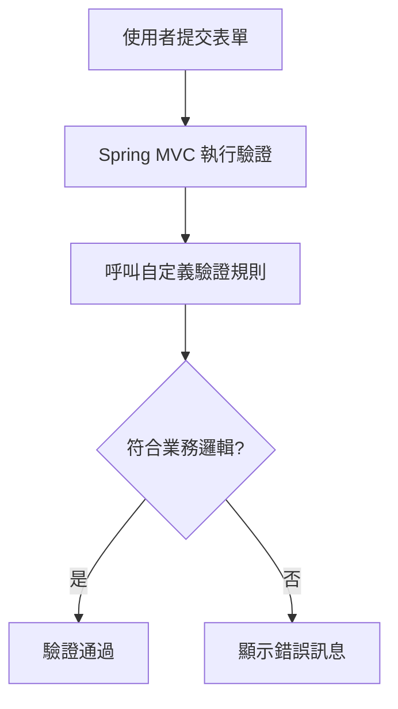
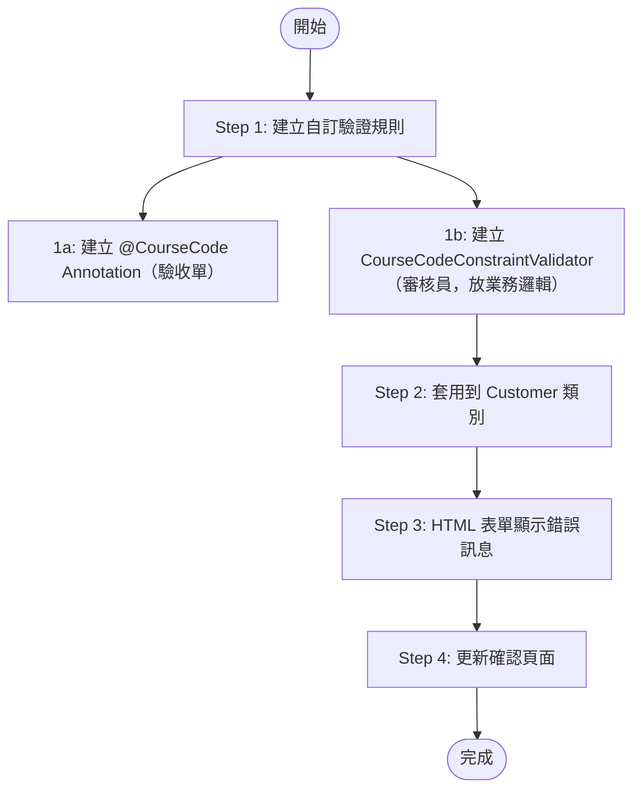
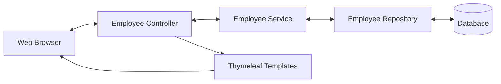
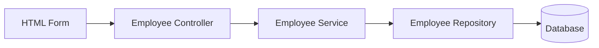
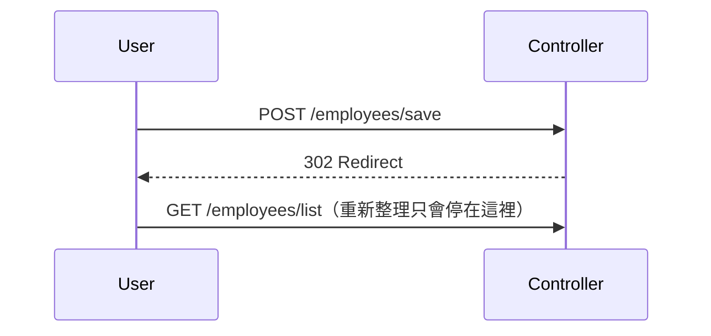
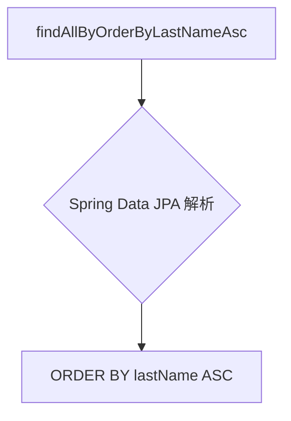

# 目錄

1. [除錯 BindingResult:看懂 Spring MVC 表單驗證錯誤訊息](#1-檢查-bindingresult-物件)
   概念:表單驗證失敗時,教你怎麼在 Controller 印出 BindingResult 物件看清楚錯誤細節,並解析 Spring 內部比對錯誤代碼「由具體到通用」的順序,搭配 messages.properties 把預設英文錯誤訊息換成自己想要的文字。

2. [自訂驗證規則是什麼:內建驗證不夠用時的解法](#2-spring-mvc-自定義驗證-custom-validation)
   概念:當 @Min、@Max 這類內建規則無法表達複雜的業務邏輯(例如課程代碼要以特定字母開頭)時,說明整體的自訂驗證流程藍圖,讓你先有個全貌再往下動手做。

3. [動手打造一個自己的 Java Annotation:@CourseCode](#3-從頭開始建立自定義-java-annotation)
   概念:示範怎麼從零開始寫出一個自訂標籤(Annotation),可以想成自己發明一種貼在欄位上的標記,還能帶參數決定驗證的內容跟驗證失敗要顯示的訊息。

4. [驗證邏輯寫在哪:ConstraintValidator 的實作細節](#4-建立自定義驗證規則-create-custom-validation-rule)
   概念:Annotation 本身只是標籤,真正判斷「輸入合不合格」的程式邏輯要寫在一個叫 ConstraintValidator 的輔助類別裡,這裡帶你實作 isValid 方法,回傳 true 或 false 決定驗證通過與否。

5. [把自訂驗證套進表單:實際套用、顯示錯誤與踩雷排除](#5-步驟-2將驗證規則加入到-customer-類別)
   概念:把剛做好的 @CourseCode 標籤貼到 Customer 資料類別的欄位上,在 HTML 表單跟確認頁面顯示對應錯誤訊息,並修掉測試時遇到的 NullPointerException,順便提醒非必填欄位驗證要先擋空值。

6. [Thymeleaf CRUD 專案總覽:從 REST API 改造成完整員工目錄網頁](#6-應用需求-application-requirements)
   概念:這是一個從零打造「員工目錄」網頁的實戰專案總覽,說明要做出新增、查詢、修改、刪除員工資料的完整流程,並規劃專案資料夾、資料庫怎麼準備,再把之前只回傳 JSON 的 REST API 專案改造成會直接吐出網頁畫面的 Spring MVC 專案,寫出 Controller 串接 Service 顯示員工清單。

7. [用 Bootstrap 美化員工列表頁,並整理專案結構](#7-介面美化引入-bootstrap-css)
   概念:把陽春的純文字列表換成 Bootstrap 美化的表格畫面,一列一列顯示每個員工資料,順便讓網站首頁自動導去列表頁,並把整個專案跟測試類別重新命名整理乾淨。

8. [新增員工功能全流程:按鈕、空白表單、送出與存檔](#8-使用-thymeleaf-新增員工流程演示)
   概念:完整做出「新增員工」——列表頁加一顆新增按鈕、跳出空白表單讓你填資料、送出後存進資料庫,並處理表單欄位跟 Java 物件屬性怎麼自動對應,還有避免使用者重複送出同一份表單的技巧(PRG 模式)。

9. [依姓氏排序員工清單](#9-實作按姓氏排序功能)
   概念:讓員工列表可以依姓氏字母順序排列,示範 Spring Data JPA 只要照特定命名規則取方法名稱,就能自動生出排序查詢,完全不用自己寫 SQL。

10. [更新員工功能全流程:表單先預填舊資料再送出修改](#10-使用-thymeleaf-更新員工資料)
    概念:做出「更新」按鈕,點下去要先把該員工原本的資料預先帶進表單(不是空白表單),送出後用同一套邏輯判斷這是新增還是修改,再存回資料庫。

11. [刪除員工功能全流程](#11-使用-thymeleaf-刪除員工)
    概念:做出「刪除」按鈕跟對應連結,點下去帶著員工 ID 呼叫 Controller 把該筆資料從資料庫移除,並提醒刪除這種有風險的動作最好用 POST 而不是單純的連結。

12. [Spring Security 是怎麼運作的:認證與授權的基本概念](#12-spring-security-模型)
    概念:把 Spring Security 想成一套「保全系統」,每個進來的請求都先檢查「你是誰」(認證),再檢查「你能不能做這件事」(授權),說明它內部靠一連串過濾器(Filter)串起來處理的整體流程與安全層級。

13. [登入畫面怎麼選、不同角色看到的內容也不一樣](#13-不同登入方式-different-login-methods)
    概念:介紹 Spring Security 內建的登入畫面選項(預設頁面 vs 自訂頁面),並示範同一個頁面依照登入者角色(一般人 vs 管理員)顯示不同的連結或內容。

14. [Spring MVC Security 專案實戰:從零建置到預設保護生效](#14-開發流程-development-process)
    概念:建一個全新的 Spring Boot 專案,加上 Security 依賴後幾乎不用寫任何設定,整個網站就自動被鎖起來要求先登入,這裡示範這種「開箱即用」的保護效果,並提醒開發測試時瀏覽器 session 可能讓你誤以為設定沒生效,要用無痕視窗才能正確重新測試。

15. [用寫死在程式裡的帳號密碼做基本登入(記憶體驗證)](#15-配置基本安全性-configuring-basic-security)
    概念:先不接資料庫,直接在 Java 設定檔裡寫死幾個測試帳號、密碼、角色(像 John、Mary、Susan 這種假帳號),並說明密碼為什麼一定要用 Bcrypt 這類方式加密,不能存明碼。

16. [打造完全客製化的登入頁面,含錯誤訊息與美化](#16-自定義登入表單-custom-login-form)
    概念:不用 Spring 內建陽春的登入畫面,改成自己寫一個 HTML 登入表單,串接對應的欄位名稱跟登入失敗要導回哪一頁,並在密碼打錯時顯示明確的錯誤提示,最後用 Bootstrap 讓整個畫面更好看。

17. [實作登出功能與登出成功提示](#17-步驟-1在-spring-security-配置中新增登出支援)
    概念:加上「登出」按鈕,點了之後清除登入狀態、導回登入頁,並顯示「您已成功登出」這類提示訊息。

18. [依角色顯示不同畫面內容:管理員專屬頁面與拒絕存取頁](#18-顯示使用者-id-與角色)
    概念:登入後在畫面上顯示目前使用者的帳號、角色,並用 Thymeleaf 的 sec:authorize 標籤讓「只有管理員看得到的區塊」跟大家都看得到的區塊寫在同一頁面裡動態切換;順便做一個自己設計的「你沒有權限」友善頁面,取代嚇人的系統錯誤畫面。

19. [帳號密碼改存資料庫:從硬編碼走向 JDBC 驗證](#19-使用者帳號管理從硬編碼轉向資料庫)
    概念:把原本寫死在程式碼裡的帳密,改成從 MySQL 資料庫查詢驗證,說明 Spring Security 預設要求的資料表結構(users、authorities 表)長怎樣,動手建表、串接設定,並實測改資料庫內容能不能即時反映在登入行為上。

20. [密碼加密實戰:Bcrypt 單向雜湊演算法](#20-spring-security-密碼加密)
    概念:資料庫裡不能存明碼密碼,這裡教你用 Bcrypt 這種「單向加密」演算法(加密後無法反解回原文,只能拿新輸入的密碼重新加密比對)產生加密密碼,把資料庫裡的帳密資料換成加密版本。

21. [對接自己命名的資料表結構(不用 Spring 預設的欄位名稱)](#21-擴展-spring-security-的資料庫配置)
    概念:現實專案的資料庫表格設計通常跟 Spring Security 預設的不一樣,這裡示範怎麼寫自訂 SQL 查詢語句,讓 Spring Security 改成讀你自己命名的資料表跟欄位。

22. [番外篇:REST API 版本控制,加上課程總結收尾](#22-專案環境準備)
    概念:另開一個迷你專案示範 API 版本控制——同一個網址路徑依照網址裡的版本號(v1、v2、v3)呼叫不同版本的方法,讓 API 改版時舊客戶端還能繼續用、新舊版本不會互相打架,並示範把重複的路徑設定重構掉;最後附上整堂課程學到的技術總複習與結業資訊。

-----------------------------------------------------------

### 1. 檢查 BindingResult 物件

`BindingResult` 就像表單驗證後的「體檢報告」，裡面記錄了這次提交到底哪裡出了問題。想要看懂 Spring MVC 的驗證機制，最快的方法就是把這份報告印出來看。

```java
@PostMapping("/processForm")
public String processForm(@Valid @ModelAttribute("customer") Customer theCustomer, BindingResult theBindingResult) {
    System.out.println("Last name: " + theCustomer.getLastName());
    System.out.println("Binding results: " + theBindingResult);

    if (theBindingResult.hasErrors()) {
        return "customer-form";
    } else {
        return "customer-confirmation";
    }
}
```

印出來的內容大致長這樣：`Field error in object 'customer' on field 'freePasses' rejected value [xxx] codes [typeMismatch.customer.freePasses...]`。可以拆成三塊來看：
- **物件名稱**（`customer`）對應 `@ModelAttribute` 設定的名字
- **欄位名稱**（`freePasses`）就是哪個輸入框出錯
- **rejected value / error codes**：使用者實際打了什麼、以及 Spring 拿去查訊息用的「代碼」

**錯誤代碼是有層級的**，從最具體排到最通用：

```
typeMismatch.customer.freePasses  →  typeMismatch.freePasses  →  typeMismatch.int  →  typeMismatch
```

越具體的代碼優先權越高。想客製化某個欄位的錯誤訊息，只要在 `messages.properties` 用**最具體的那個代碼**當 key 覆寫掉：

```
typeMismatch.customer.freePasses=Invalid number
```

實務上的除錯套路很固定：先在 Controller 印 `BindingResult` → 看 Console 找到 Spring 正在找的那個 error code → 把這個 code 複製貼到 `messages.properties` 當 key，值就是想顯示的訊息 → 重新整理就生效了。這招幾乎是自訂驗證訊息時的標準流程，很值得記起來。

### 2. Spring MVC 自定義驗證 (Custom Validation)

內建的 `@NotNull`、`@Min`、`@Max` 這些只能做「格式檢查」，但真實世界常常需要「業務規則」——比如這堂課的例子：`Course Code` 欄位規定必須以 `LUV` 開頭。這種規則 Spring 沒有現成的 annotation，所以要自己刻一個。

概念很單純：讓 Spring MVC 在驗證表單時，多呼叫一個「你自己寫的規則」，這個規則只做一件事——回傳 `true`（過關）或 `false`（打回票）。



輸入 `ABC1234` 會被擋下並顯示「Course code must start with LUV」；輸入 `LUV123` 則順利過關。這一節只是先看結果、建立動機，實際怎麼刻是下一節的重頭戲。

### 3. 從頭開始建立自定義 Java Annotation

自訂驗證的核心比喻是：**內建的檢查規則不夠用時，自己發明一張新的「驗收單」貼在欄位上，規定驗收標準**。這張驗收單就是我們要做的 `@CourseCode` annotation，貼在 `courseCode` 欄位上：

```java
@CourseCode(value="LUV", message="must start with LUV")
private String courseCode;
```

- `value`：驗收標準是什麼（這裡是「開頭要是 LUV」）
- `message`：不合格時要印在驗收單上的理由

要做出這張「驗收單」加上「負責審核的人」，總共分四大步驟，這堂課會專注在第一步（最進階、最核心的部分），後面三步都是熟悉的操作：



換句話說：Annotation 只是一張貼在欄位上的「標籤」，真正動腦判斷合不合格的邏輯，要另外寫一個「審核員」類別（Validator）來負責。這兩者是分開的，一個管「宣告規則」，一個管「執行規則」。

### 4. 建立自定義驗證規則 (Create Custom Validation Rule)

這節是整堂課最硬核的部分，把「驗收單」（Annotation）和「審核員」（`ConstraintValidator`）兩個角色都刻出來。

**Step 1a：定義 `@CourseCode` Annotation**

用 Java 特殊語法 `@interface` 來宣告一個 annotation。三個關鍵修飾註解缺一不可：

```java
package com.luv2code.springdemo.mvc.validation;

import jakarta.validation.Constraint;
import java.lang.annotation.ElementType;
import java.lang.annotation.Retention;
import java.lang.annotation.RetentionPolicy;
import java.lang.annotation.Target;

@Constraint(validatedBy = CourseCodeConstraintValidator.class)
@Target({ElementType.METHOD, ElementType.FIELD})
@Retention(RetentionPolicy.RUNTIME)
public @interface CourseCode {

    String value() default "LUV";
    String message() default "must start with LUV";
    Class<?>[] groups() default {};
    Class<? extends Payload>[] payload() default {};
}
```

- `@Constraint(validatedBy = ...)`：指定「這張驗收單要交給誰審核」，也就是接下來要寫的 Validator 類別
- `@Target`：這張驗收單能貼在哪裡（這裡限定貼在方法或欄位上）
- `@Retention(RetentionPolicy.RUNTIME)`：確保這張驗收單在程式**執行期間**還留著，因為驗證邏輯要在 runtime 靠反射去讀它，不是編譯完就丟掉
- `value()` / `message()`：自己定義的參數，用 `default` 給預設值，讓使用者可以省略不寫直接套用預設規則
- `groups()` / `payload()`：這是 Bean Validation 規範要求的標準屬性（分組驗證、附加錯誤資訊用），照抄空集合當預設值即可，不影響這裡的邏輯

**Step 1b：實作 `CourseCodeConstraintValidator`（審核員）**

要實作 `ConstraintValidator<A, T>` 介面，兩個泛型參數分別是「對應哪張驗收單」和「驗證的資料型別」：

```java
package com.luv2code.springdemo.mvc.validation;

import jakarta.validation.ConstraintValidator;
import jakarta.validation.ConstraintValidatorContext;

public class CourseCodeConstraintValidator implements ConstraintValidator<CourseCode, String> {

    private String coursePrefix;

    @Override
    public void initialize(CourseCode theCourseCode) {
        // 從 annotation 上把 value 參數讀出來存起來
        coursePrefix = theCourseCode.value();
    }

    @Override
    public boolean isValid(String theCode, ConstraintValidatorContext theConstraintValidatorContext) {
        boolean result;
        if (theCode == null) {
            result = true;
        } else {
            result = theCode.startsWith(coursePrefix);
        }
        return result;
    }
}
```

兩個方法分工很清楚：
- `initialize`：驗證器剛被建立時跑一次，負責把 annotation 上的參數（如 `value="LUV"`）「抄」到自己的成員變數裡備用，就像審核員上工前先看一眼驗收單上寫的標準
- `isValid`：每次真正驗證時呼叫，回傳 `true`/`false` 決定過不過關。這裡的邏輯有多複雜都可以，不是只能做字串比對——查資料庫、打 API、算數字都行

**易踩的坑：`null` 值處理**。若沒判斷 `theCode == null` 就直接呼叫 `startsWith()`，使用者沒填欄位時會直接丟出 `NullPointerException` 讓伺服器 500。設計原則是：**自訂驗證器只管「有值時符不符合規則」，是否必填交給 `@NotNull` 去管**，所以遇到 `null` 應該放行（回傳 `true`），避免和其他 annotation 職責打架。

### 5. 步驟 2：將驗證規則加入到 Customer 類別

驗收單和審核員都做好了，接下來要把驗收單真正貼到欄位上。

先在 `Customer` 類別新增欄位與 getter/setter：

```java
private String courseCode;

public String getCourseCode() { return courseCode; }
public void setCourseCode(String courseCode) { this.courseCode = courseCode; }
```

再把 `@CourseCode` 貼上去（注意 Java 大小寫敏感，`@CourseCode` 的 C 要大寫，跟定義時一致）：

```java
@CourseCode
private String courseCode;
```

因為 annotation 已經設好預設值（`LUV` / `must start with LUV`），不傳參數就直接套用預設規則。

HTML 表單與確認頁也要同步補上欄位：

```html
<input type="text" th:field="*{courseCode}" />
<span th:if="${#fields.hasErrors('courseCode')}" th:errors="*{courseCode}" class="error"></span>
```

```html
Course Code: <span th:text="${customer.courseCode}"></span>
```

實測時很容易撞到前面提過的那個坑——欄位空白提交會拋出 `500 Internal Server Error`，Stack Trace 會指到 `CourseCodeConstraintValidator.isValid()` 那行 `NullPointerException`。**除錯技巧**：長長一串 Stack Trace 裡，優先找含有自己套件名稱（如 `com.luv2code...`）的那一行，通常就是問題根源。修好 null 判斷後重測：

- 空白或不符合規則（如 `ABC123`）→ 顯示 `must start with LUV`
- 符合規則（如 `LUV123`）→ 顯示成功訊息

這個驗證器的最大好處是**可重複使用**：同一套 `CourseCodeConstraintValidator` 邏輯，只要在套用時換一組參數，就能檢查完全不同的前綴：

```java
@CourseCode(value="TOPS", message="must start with TOPS")
private String courseCode;
```

改完存檔、容器自動重載，馬上就能用新規則測試，完全不用碰 Validator 的程式碼——這就是把「規則」和「執行邏輯」拆開設計的好處。

### 6. 應用需求 (Application Requirements)

接下來進入一個完整的實戰專案：用 Spring Boot + Thymeleaf 做一個「員工目錄」網頁，具備標準 CRUD 功能——列出員工、新增員工、更新員工、刪除員工。介面上會有一張員工列表表格，左上角放新增按鈕，每一列右側放更新／刪除按鈕。

整體架構是經典的分層式資料流：



開發策略是「該重用的重用，該新開發的專心做」：`EmployeeService` 和 `EmployeeRepository` 直接從之前寫過的 REST API 專案複製過來，省下重複造輪子的時間；真正的開發重點全部放在新的 `EmployeeController`，因為它要負責接住 Web UI 送來的所有請求。

專案起手式：下載起始碼、把 SQL 腳本跑一遍建立乾淨的資料庫基準（5 筆員工資料）、把舊的 `EmployeeRestController` 刪掉（不需要了）、新建 `controller` 套件放 `EmployeeController`：

```java
@Controller
@RequestMapping("/employees")
public class EmployeeController {

    private EmployeeService employeeService;

    public EmployeeController(EmployeeService theEmployeeService) {
        employeeService = theEmployeeService;
    }
}
```

（只有一個建構子時 `@Autowired` 可以省略，Spring 會自動注入。）

第一個功能「列出員工」的實作邏輯：

```java
@GetMapping("/list")
public String listEmployees(Model theModel) {
    List<Employee> theEmployees = employeeService.findAll();
    theModel.addAttribute("employees", theEmployees);
    return "list-employees";
}
```

回傳的字串就是 View 名稱，Spring 會自動去 `templates/list-employees.html` 找對應頁面。前端先用最陽春的方式驗證資料有沒有流通——`<span th:text="${employees}"></span>` 直接把整包資料倒出來看，注意 `${employees}` 這個名字必須跟 Controller 裡 `addAttribute` 用的名字一模一樣。跑得通之後，代表「資料庫 → Repository → Service → Controller → Model → 前端」這條完整資料鏈已經打通，下一步才是把畫面弄漂亮。

### 7. 介面美化：引入 Bootstrap CSS

資料串通了，現在把陽春畫面換成專業表格。做法是去 `getbootstrap.com` 複製 CDN 的 `<link>` 標籤，貼進 `<head>`：

```html
<head>
    <meta charset="UTF-8">
    <meta name="viewport" content="width=device-width, initial-scale=1">
    <link href="https://cdn.jsdelivr.net/npm/bootstrap@5.3.2/dist/css/bootstrap.min.css" rel="stylesheet">
</head>
```

頁面內容包一層 `container`，再用 Bootstrap 的表格樣式組合：`table table-bordered table-striped`（基礎框線＋隔行變色），標題列用 `table-dark` 弄成深色：

```html
<table class="table table-bordered table-striped">
    <thead class="table-dark">
        <tr><th>First Name</th><th>Last Name</th><th>Email</th></tr>
    </thead>
    <tbody>
        <tr th:each="tempEmployee : ${employees}">
            <td th:text="${tempEmployee.firstName}"></td>
            <td th:text="${tempEmployee.lastName}"></td>
            <td th:text="${tempEmployee.email}"></td>
        </tr>
    </tbody>
</table>
```

`th:each="tempEmployee : ${employees}"` 就是 Thymeleaf 版的 for-each 迴圈：`employees` 是 Model 裡的整包集合，`tempEmployee` 是迴圈跑到的那一個當前物件。

另外處理了一個小體驗優化：直接打 `localhost:8080`（不帶路徑）原本會看到 404 Whitelabel Error Page。解法是在 `src/main/resources/static/index.html` 放一個用 meta refresh 自動導向的頁面：

```html
<meta http-equiv="refresh" content="0; URL='employees/list'">
```

`content="0; ..."` 代表 0 秒後立刻跳轉，效果等於「進首頁自動轉去員工列表」。

最後做了一輪「打掃」：把套件名 `cruddemo` 整包 rename 成 `thymeleafdemo`（用 IDE 的 Refactor → Rename，記得勾選「All Directories」和「Rename tests」，確保 `src/main/java`、`src/test/java` 跟主應用程式類別名稱都同步更新），改完重新測試確認功能沒壞。

### 8. 使用 Thymeleaf 新增員工流程演示

新增員工功能分三步走：加按鈕 → 建表單頁 → 處理提交存 DB。



**Step 1：新增按鈕**，用 `th:href` 搭配 `@{...}` 語法（會自動處理 context path，換部署路徑也不怕連結失效），再套 Bootstrap 樣式：

```html
<a th:href="@{/employees/showFormForAdd}" class="btn btn-primary btn-sm mb-3">Add Employee</a>
```

**Step 2：顯示表單頁**，Controller 端關鍵是要先塞一個「空的」`Employee` 物件進 Model，這個物件就是表單資料綁定的「容器」：

```java
@GetMapping("/showFormForAdd")
public String showFormForAdd(Model theModel) {
    Employee theEmployee = new Employee();
    theModel.addAttribute("employee", theEmployee);
    return "employees/employee-form";
}
```

HTML 表單用 `th:object` 指定要綁定的物件，`th:field` 綁定個別欄位：

```html
<form th:action="@{/employees/save}" th:object="${employee}" method="POST">
    <input type="text" th:field="*{firstName}" class="form-control mb-4 w-25" placeholder="First name">
    <input type="text" th:field="*{lastName}" class="form-control mb-4 w-25" placeholder="Last name">
    <input type="text" th:field="*{email}" class="form-control mb-4 w-25" placeholder="Email">
    <button type="submit" class="btn btn-info col-2">Save</button>
</form>
```

`th:field="*{firstName}"` 的 `*{...}` 是「星號表達式」，意思是「從 `th:object` 指定的那個物件裡取屬性」，同時會自動幫 input 生成對應的 `id`/`name`。這裡有個很好記的雙向同步比喻：**表單載入時，Thymeleaf 呼叫物件的 Getter 把值「倒」進畫面；表單送出時，Spring 呼叫物件的 Setter 把畫面的值「灌」回物件**——一來一回剛好對稱。

**Step 3：處理提交、存 DB**：

```java
@PostMapping("/save")
public String saveEmployee(@ModelAttribute("employee") Employee theEmployee) {
    employeeService.save(theEmployee);
    return "redirect:/employees/list";
}
```

這裡要特別記住 **Post/Redirect/Get (PRG) 模式**：存完資料後不要直接回傳頁面，而是用 `redirect:` 導去列表頁的 GET 路徑。原因是如果直接回傳頁面，使用者按「重新整理」瀏覽器會重送同一個 POST，資料庫就會多出重複紀錄；改成 redirect 之後，重新整理只會重跑 GET（重新讀列表），不會再次觸發存檔動作。



另外這節也做了模板路徑整理：把 `list-employees.html`、`employee-form.html` 都搬進 `templates/employees/` 子資料夾統一管理，Controller 回傳的 View 名稱要記得同步改成 `employees/xxx`，否則會找不到頁面。

### 9. 實作按姓氏排序功能

功能都做完後發現一個小毛病：員工列表是「無序」的，看資料不方便，於是加上按姓氏排序。

做法完全不用手寫 SQL，靠的是 **Spring Data JPA 的方法命名慣例**——只要 Repository 介面裡的方法名字照著特定格式取，Spring Data JPA 就會自動幫你組出對應的查詢語法：

```java
public interface EmployeeRepository extends JpaRepository<Employee, Integer> {
    public List<Employee> findAllByOrderByLastNameAsc();
}
```

拆解這個落落長的方法名：`findAllBy`（查全部）+ `OrderByLastName`（依 lastName 排序）+ `Asc`（升冪）。Spring Data JPA 會在背後自動翻譯成類似 `SELECT * FROM Employee ORDER BY lastName ASC` 的查詢，完全不用自己寫 SQL 或 JPQL。



光定義 Repository 方法還不夠，**Service 層也要跟著改**，不然系統還是走原本沒排序的 `findAll()`：

```java
@Override
public List<Employee> findAll() {
    return employeeRepository.findAllByOrderByLastNameAsc();
}
```

改完重跑，員工列表就會照姓氏字母順序排好（Andrews → Baumgarten → Bose → Gupta → Petrov → Vega）。這種「只要方法名字取對，Spring 自動生成查詢邏輯」的能力，官方戲稱是 "Spring Data JPA Magic"——開發者完全不用碰查詢語法，光靠命名慣例就能做出常見的查詢功能，是這整個框架很省力的地方。

### 10. 使用 Thymeleaf 更新員工資料

更新功能可以想成「借東西回來改」：先把資料庫裡現有的員工資料借出來、填進表單，讓使用者改一改再存回去。整個開發拆成三步驟：加更新按鈕、預填表單、處理表單資料。

**Step 1 加 Update 按鈕**：在員工列表的每一列用 `th:href` 產生連結，並把該列員工的 id 當參數帶出去：

```html
<a th:href="@{/employees/showFormForUpdate(employeeId=${tempEmployee.id})}"
   class="btn btn-info btn-sm">Update</a>
```

最後產生的網址會長得像 `/employees/showFormForUpdate?employeeId=5`，後端就是靠這個 `employeeId` 才知道要抓哪一位員工。

**Step 2 預填表單**：Controller 用 `@RequestParam` 接住 id，查出員工物件後塞進 Model，再導到跟「新增」共用的同一張表單：

```java
@GetMapping("/showFormForUpdate")
public String showFormForUpdate(@RequestParam("employeeId") int theId, Model theModel) {
    Employee theEmployee = employeeService.findById(theId);
    theModel.addAttribute("employee", theEmployee);
    return "employees/employee-form";
}
```

表單載入時 Thymeleaf 會自動呼叫 `employee.getFirstName()` 之類的 getter 把值灌進輸入框，這就是「預填」的原理。關鍵是表單裡要多放一個看不見的欄位，把 id 一起帶著跑：

```html
<input type="hidden" th:field="*{id}" />
```

沒有這個隱藏欄位，後端就分不清楚使用者是要「新增」還是「更新」。

**Step 3 處理表單資料**：好消息是這步完全不用寫新程式——新增跟更新共用同一個 `saveEmployee()`，因為 Spring Data JPA 的 `save()` 本來就會自動判斷：物件沒有 id 就 insert，有 id 就 update。

```java
@PostMapping("/save")
public String saveEmployee(@ModelAttribute("employee") Employee theEmployee) {
    employeeService.save(theEmployee);
    return "redirect:/employees/list"; // 用 redirect 避免重複提交
}
```

用 `redirect` 而不是直接回傳頁面名稱，是為了避免使用者按重新整理時瀏覽器把「儲存」這個 POST 請求重送一次（這個模式業界叫 PRG：Post/Redirect/Get）。

---

### 11. 使用 Thymeleaf 刪除員工

刪除的做法跟更新幾乎是同一個模子刻出來的：按鈕帶 id、後端用該 id 找到資料、執行完再導回列表頁。

前端連結一樣用 `th:href` 把 id 塞進網址，但多加了一個 `onclick` 事件跳出瀏覽器原生的確認視窗，防止手滑誤刪：

```html
<a th:href="@{|/employees/delete?employeeId=${tempEmployee.id}|}"
   onclick="return confirm('Are you sure?')"
   class="btn btn-danger btn-sm">Delete</a>
```

`confirm()` 回傳 `false` 時（使用者按取消），`onclick` 直接 `return false`，連結的跳轉就會被攔下來，等於是最陽春但很有效的防呆機制。

後端 Controller 一樣簡單，用 `@GetMapping` 接 `employeeId`，呼叫 service 刪除後 redirect 回列表頁：

```java
@GetMapping("/delete")
public String delete(@RequestParam("employeeId") int theId) {
    employeeService.deleteById(theId);
    return "redirect:/employees/list";
}
```

**要注意的陷阱**：這裡刪除是掛在一個 `<a>` 連結、也就是 GET 請求上，而不是表單的 POST/DELETE。GET 請求理論上應該是「唯讀、無副作用」的操作，用它來執行刪除這種有副作用的動作，其實違反 HTTP 方法語意——瀏覽器的預先載入、爬蟲、快取機制都可能在你不知情的狀況下「順手」發出這個 GET 請求，變成意外刪除資料的資安隱患。正式專案裡通常會改成表單搭配 POST（或用 JS 送 DELETE），這裡是教學示範才簡化成連結形式，開發時要留意這個取捨。

到這裡員工管理的 CRUD 四大操作（新增、讀取、更新、刪除）就全部串起來了，也都具備了 PRG 防重複提交跟基本的使用者確認機制。

---

### 12. Spring Security 模型

Spring Security 骨子裡是靠一整串 **Servlet Filters**（過濾器鏈）在運作，每個請求進來前都要先過這關卡，過濾器會依照「安全設定」與「使用者資料（帳密、角色）」做判斷，再決定要不要放行。可以把它想成大樓的門禁系統：先刷卡確認你是誰（Authentication，身分驗證），再檢查你有沒有權限進去這間會議室（Authorization，授權）——兩者是分開的兩道關卡,只有身分沒有權限一樣進不去。

判斷流程大致是：

1. 這個資源需要保護嗎？不用 → 直接放行。
2. 需要保護的話，使用者登入了嗎？沒有 → 導去登入頁。
3. 登入了，那他的角色夠嗎？不夠 → Access Denied；夠 → 放行看資源。

安全機制分兩個層級：**宣告式安全（Declarative Security）**是在 `@Configuration` 類別裡用設定的方式描述規則，好處是把安全邏輯跟商業邏輯分開,好維護;**程式化安全（Programmatic Security）**則是直接用 API 在程式碼裡動手客製化,彈性更高,適合處理特殊規則。

要啟用它非常簡單,pom.xml 加一個 dependency 就好：

```xml
<dependency>
    <groupId>org.springframework.boot</groupId>
    <artifactId>spring-boot-starter-security</artifactId>
</dependency>
```

加了之後 Spring Boot 會「自動」把所有端點都保護起來,不用寫任何程式碼。此時預設帳號是 `user`,密碼則是啟動時系統隨機產生、印在 console log 裡,只適合先確認安全機制有生效,實務上後面會改成自己在資料庫管理使用者。

---

### 13. 不同登入方式 (Different Login Methods)

啟用 Spring Security 後,系統要讓使用者登入,常見有三種呈現方式,各有取捨：

| 方式 | 特色 | 適合場景 |
| --- | --- | --- |
| **預設登入表單 (Default login form)** | Spring Security 內建現成的 HTML 登入頁,不用自己刻 | 快速啟動、先確認安全邏輯有跑通,不想管前端樣式時 |
| **自定義登入表單 (Custom login form)** | 自己寫 HTML/CSS/JS,完全掌控外觀 | 要符合品牌風格、放公司 Logo 等正式產品需求 |
| **HTTP Basic Authentication** | 瀏覽器直接跳出內建的帳密輸入對話框（不是網頁） | 實作最快,但長相完全不能改,視覺體驗差("bleh") |

簡單說,預設表單是「先求有再求好」的過渡方案,適合開發初期驗證安全邏輯;等要正式上線給使用者用,通常會換成自定義表單。HTTP Basic 則多半用在不太在乎介面美觀的內部工具或 API 場景。

---

### 14. 開發流程 (Development Process)

建立一個具備 Spring Security 的 MVC 專案,標準流程分三步：Spring Initializr 建專案（加依賴）→ 寫 Controller → 寫 Thymeleaf 頁面。

**Step 1 依賴**：用 start.spring.io 建專案時要勾四個依賴：`Spring Web`、`Thymeleaf`、`Spring Security`、以及開發用的 `DevTools`。如果要在 Thymeleaf 頁面裡判斷角色顯示/隱藏內容,還會另外加 `thymeleaf-extras-springsecurity6`。

**Step 2 Controller**：一個很單純的 `@Controller`,處理根路徑並回傳首頁模板：

```java
@GetMapping("/")
public String showHome() {
    return "home";
}
```

**Step 3 Thymeleaf 頁面**：在 `templates/home.html` 寫個簡單頁面即可。

啟動後因為 pom.xml 已經有 security 依賴,系統會自動要求登入,console 會印出類似 `Using generated security password: xxxx` 的訊息,拿這組帳密（帳號固定是 `user`）就能登入測試。

**開發時的小麻煩：Session 一直「黏住」不放你重新測登入**。因為登入狀態是綁在瀏覽器 Session 上,只要瀏覽器行程沒關,重新整理、開新分頁都還是登入狀態,沒辦法看到登入畫面測試。解法有三種：

1. 換一個完全不同的瀏覽器（如從 Chrome 換 Firefox）
2. 把目前瀏覽器整個關掉（不是關分頁,是結束程序）再重開
3. 開「無痕模式 / 私密視窗」——這是最推薦、最方便的做法,每次開新的無痕視窗都是全新 Session,不用重開瀏覽器就能重測登入流程。

---

### 15. 配置基本安全性 (Configuring Basic Security)

要跳脫「系統亂數產生密碼」這種測試模式,得自己定義使用者、密碼跟角色。這節先用最簡單的「記憶體內驗證（In-Memory Authentication）」練手,之後才會接資料庫。範例規劃三個使用者：

| User ID | Password | Roles |
| --- | --- | --- |
| john | test123 | EMPLOYEE |
| mary | test123 | EMPLOYEE, MANAGER |
| susan | test123 | EMPLOYEE, MANAGER, ADMIN |

**Step 1 建立設定類別**：新建 `security` package,放一個標了 `@Configuration` 的 `DemoSecurityConfig`。

**密碼的儲存格式** 是 `{id}encodedPassword`,`{id}` 代表用哪種編碼演算法解讀後面那串密碼,常見兩種：

| ID | 說明 |
| --- | --- |
| noop | 純文字密碼,不做任何加密 |
| bcrypt | BCrypt 單向雜湊,無法逆推回原密碼,是後續章節會採用的正式做法 |

所以測試階段密碼會寫成 `{noop}test123`——`{noop}` 就是明白告訴 Spring「這串不用解密,它本來就是明文」。

**Step 2 定義使用者**：用 `InMemoryUserDetailsManager` 搭配 `User.builder()` 的流暢寫法：

```java
@Bean
public InMemoryUserDetailsManager userDetailsManager() {
    UserDetails john = User.builder()
        .username("john").password("{noop}test123").roles("EMPLOYEE").build();

    UserDetails mary = User.builder()
        .username("mary").password("{noop}test123").roles("EMPLOYEE", "MANAGER").build();

    UserDetails susan = User.builder()
        .username("susan").password("{noop}test123").roles("EMPLOYEE", "MANAGER", "ADMIN").build();

    return new InMemoryUserDetailsManager(john, mary, susan);
}
```

**要記住的重點**：一旦你自己在程式碼裡定義了 `UserDetailsManager`,Spring Boot 就不會再理會 `application.properties` 裡設定的預設帳密——自訂配置的優先權比較高,兩邊衝突時以程式碼為準。之後啟動測試,輸入錯誤帳密會看到內建的「Bad credentials」訊息,這是框架自帶的,不用自己開發。

---

### 16. 自定義登入表單 (Custom Login Form)

預設登入頁能快速起步,但外觀完全沒得改。要做出符合公司品牌風格的登入頁,得自己刻 HTML/CSS,並「教」Spring Security 改用你的頁面。整個流程分三步：改 Security 設定 → 寫顯示登入頁的 Controller → 寫登入表單 HTML。

**Step 1 修改 Security 設定**：核心是建一個 `SecurityFilterChain` Bean,裡面做兩件事——設哪些路徑要驗證、以及設定 `formLogin()` 指向自訂頁面：

```java
@Bean
public SecurityFilterChain securityFilterChain(HttpSecurity http) throws Exception {
    http.authorizeHttpRequests(auth -> auth
        .requestMatchers("/showMyLoginPage").permitAll() // 登入頁本身要放行
        .anyRequest().authenticated()                    // 其他請求都要先登入
    );

    http.formLogin(form -> form
        .loginPage("/showMyLoginPage")       // 未登入時要導去哪個頁面
        .loginProcessingUrl("/authenticate") // 表單提交(POST)要送到哪個路徑
        .permitAll()
    );

    return http.build();
}
```

**這裡有個容易忘記但很關鍵的陷阱**：登入頁本身一定要 `permitAll()`。不然「所有請求都要驗證」這條規則會連登入頁自己都擋住,變成「沒登入 → 被要求去登入頁 → 登入頁也被擋 → 又被要求登入」的無限迴圈。

**Step 2 寫 Controller**：`loginPage()` 設的路徑需要有一個對應的 `@GetMapping` 去回傳 HTML,但 `loginProcessingUrl()` 那個路徑完全不用寫 Controller——這段是 Spring Security 的「魔法」,過濾器會自動攔截這個 POST 請求並幫你跑完帳密驗證：

```java
@Controller
public class LoginController {

    @GetMapping("/showMyLoginPage")
    public String showMyLoginPage() {
        return "login"; // 對應 templates/login.html
    }
}
```

`@GetMapping` 的路徑一定要跟 `loginPage(...)` 設的字串一模一樣,回傳的字串也要跟實際 HTML 檔名一致,兩邊有一個對不上都會找不到頁面。

**Step 3 寫登入表單 HTML**：表單提交要指向 `loginProcessingUrl`、用 POST,而且輸入欄位的 `name` 屬性一定要照 Spring Security 的預設規範命名成 `username` 跟 `password`,不然過濾器抓不到值：

```html
<html xmlns:th="http://www.thymeleaf.org">
<form th:action="@{/authenticate}" method="POST">
    <input type="text" name="username" />
    <input type="password" name="password" />
    <input type="submit" value="Login" />
</form>
</html>
```

`xmlns:th` 這個命名空間只是個字串識別符,讓解析器認得 `th:` 開頭的屬性,跟連不連網路完全無關,常有人誤會要連線才行,其實不用。

驗證邏輯背後是交給 **Authentication Manager** 處理,它可以彈性接不同的來源比對帳密——in-memory、資料庫、LDAP 都行,對表單本身沒有影響,這也是宣告式安全的好處：換驗證來源不用動前端。

**自訂表單的代價**：預設頁面會自動顯示登入失敗訊息,但自訂表單完全沒有這個功能,登入失敗只會被導回登入頁、URL 後面多一個 `?error` 參數,不會有任何提示。要自己用 Thymeleaf 判斷這個參數並顯示錯誤：

```html
<div th:if="${param.error}">
    <i class="failed">Sorry! You entered invalid username/password.</i>
</div>
```

再搭配一小段 CSS（`.failed { color: red; }`）讓錯誤訊息更醒目。之後想要美化整個頁面,可以套用 Bootstrap 之類的 CSS 框架——把美觀的 HTML 範本放進 `templates` 目錄,再把 `th:action`、`name="username"/"password"`、`th:if="${param.error}"` 這幾段邏輯搬過去、Controller 回傳的 View 名稱改成新檔名即可,核心的登入串接邏輯完全不用重寫,只是換一層外皮。

### 17. 步驟 1：在 Spring Security 配置中新增登出支援

（補充：登出功能開發前，原文先說明了整體目標——在首頁加上登出按鈕、點擊後清除 Session、並導回登入頁，開發流程分三步：① 在 Spring Security 設定裡開啟登出支援 ② 在首頁加上登出按鈕 ③ 更新登入表單顯示「已登出」訊息。以下是這三步的實作細節。）

登出功能其實是 Spring Security「內建」的魔法,開發者幾乎不用自己寫邏輯,只要在 `SecurityFilterChain` 裡加一行 `.logout(logout -> logout.permitAll())`,系統就會自動接手處理 `/logout` 這條路(預設網址,不用自己定義)。

```java
@Bean
public SecurityFilterChain filterChain(HttpSecurity http) throws Exception {
    http.authorizeHttpRequests(configurer -> configurer.anyRequest().authenticated())
        .formLogin(form -> form
            .loginPage("/showMyLoginPage")
            .loginProcessingUrl("/authenticateTheUser")
            .permitAll())
        .logout(logout -> logout.permitAll()); // 開放所有人使用登出
    return http.build();
}
```

實作三步驟:
1. **設定檔加登出支援**(如上)。
2. **頁面加登出按鈕**:一定要用 `<form method="POST">` 包住 submit 按鈕,不能只用超連結 `<a>`——因為登出本質上是一個 POST 請求,這是常見的坑,很多人會忘記。
```html
<form action="#" th:action="@{/logout}" method="POST">
    <input type="submit" value="Logout" />
</form>
```
3. **登入頁加登出提示**:Spring Security 登出後會自動做三件事——銷毀 session、清 cookie、把使用者導回登入頁並在網址後面加上 `?logout` 參數。頁面只要檢查 `${param.logout}` 存不存在,就能顯示「你已登出」的訊息,邏輯跟原本判斷登入錯誤的 `${param.error}` 一模一樣,可以直接複製改寫。
```html
<div th:if="${param.logout}">
    <i>You have been logged out.</i>
</div>
```

整個流程可以想成:按鈕送出 POST → Spring Security 偷偷把你的門禁卡（session）銷毀 → 把你請出門並在門口貼一張「已離場」的紙條（?logout 參數）→ 前台看到紙條就顯示歡送詞。開發者完全不用管中間銷毀 session 的細節。

---

### 18. 顯示使用者 ID 與角色

**顯示登入者資訊**:Spring Security 提供 Thymeleaf 標籤,直接讀出目前登入者的帳號與角色(角色在 Spring Security 裡就是 Authorities,兩個詞可以互換理解)。

```html
User: <span sec:authentication="principal.username"></span>
Role(s): <span sec:authentication="principal.authorities"></span>
```

**建立管理員專屬頁面**:比照先前 `/leaders`(MANAGER 專屬)的做法,複製一份改成 `/systems`(ADMIN 專屬),包含 Controller mapping 與對應的 html。目前的權限地圖:

| URL | 角色 | 說明 |
| --- | --- | --- |
| / | EMPLOYEE | 一般首頁 |
| /leaders | MANAGER | 經理專屬 |
| /systems/** | ADMIN | 管理員專屬 |

```java
@GetMapping("/systems")
public String showSystems() {
    return "systems";
}
```

測試結果符合預期:只有 `EMPLOYEE` 角色的 john 存取 `/systems` 會被擋下,回應 `403 Forbidden`;擁有 `ROLE_ADMIN` 的 susan 則可以正常進入。

**自訂 Access Denied 頁面**:預設的 403 白底錯誤頁太嚇人,可以用 `.exceptionHandling().accessDeniedPage("/access-denied")` 導向自己做的頁面,再補一個 Controller 和 View,做法跟做登入頁一樣(複製、改路徑、改回傳字串)。

```java
.exceptionHandling(configurer ->
    configurer.accessDeniedPage("/access-denied")
);
```

**依角色動態顯示/隱藏內容(`sec:authorize`)**:光是後端擋 URL 還不夠,前端如果還留著使用者根本點不進去的連結,體驗很差。用 `sec:authorize="hasRole('MANAGER')"` 把整個 `<div>` 包起來,角色不符的使用者連 HTML 原始碼裡都看不到這段內容(不是 CSS 隱藏,是伺服器端根本沒送出來)。

```html
<div sec:authorize="hasRole('MANAGER')">
    <p><a th:href="@{/leaders}">Leadership Meeting</a> (Only for Manager peeps)</p>
</div>

<div sec:authorize="hasRole('ADMIN')">
    <p><a th:href="@{/systems}">IT Systems Meeting</a> (Only for Admin peeps)</p>
</div>
```

**這節最重要的觀念**:前端隱藏連結只是「不讓你看到門」,真正的鎖是後端的 URL 攔截。測試時特意用低權限帳號(john, 只有 EMPLOYEE)直接在網址列手動打 `/leaders`、`/systems` 想「硬闖」,結果都被擋下——證明就算猜到網址也沒用。這正是防禦要有兩層的道理:**前端過濾內容(體驗)+ 後端攔截請求(真正的安全)**,兩者缺一不可,只做前端等於只是把門牌拿掉,鎖沒上一樣能被撬開。

---

### 19. 使用者帳號管理：從硬編碼轉向資料庫

一直把 John、Mary、Susan 的帳密寫死在 Java 程式碼裡只是方便測試,正式做法要改成從資料庫讀。Spring Security 支援兩種整合方式:

- **預設 JDBC Schema**:資料表名稱與欄位必須完全照 Spring Security 規定的來,好處是開箱即用、幾乎不用寫程式碼。
- **自訂資料表結構**:適合已經有既定資料庫設計的專案,但要自己寫查詢語法(這節先用第一種,下一節才會用到第二種)。

**四步驟開發流程**:寫 SQL 建表 → pom.xml 加資料庫依賴 → 設定 JDBC 連線屬性 → 修改 Security 設定啟用 JDBC。

預設 schema 規定要有兩張表,名稱和欄位一個字都不能改:

```sql
CREATE TABLE `users` (
    `username` varchar(50) NOT NULL,
    `password` varchar(50) NOT NULL,
    `enabled` tinyint NOT NULL,
    PRIMARY KEY (`username`)
);

CREATE TABLE `authorities` (
    `username` varchar(50) NOT NULL,
    `authority` varchar(50) NOT NULL,
    UNIQUE KEY `authorities_idx_1` (`username`, `authority`),
    CONSTRAINT `authorities_ibfk_1` FOREIGN KEY (`username`) REFERENCES `users` (`username`)
);
```

密碼欄位存的格式是 `{演算法}密碼`,測試階段圖方便可以用 `{noop}test123` 表示明文不加密。**注意**:`authorities` 表存的角色字串不用自己加 `ROLE_` 前綴,例如存 `EMPLOYEE` 就好,Spring Security 內部比對時會自動補上 `ROLE_`。

pom.xml 加 MySQL 驅動(注意 scope 要設 `runtime`,因為編譯時不需要,只有跑起來連資料庫時才需要):

```xml
<dependency>
    <groupId>com.mysql</groupId>
    <artifactId>mysql-connector-j</artifactId>
    <scope>runtime</scope>
</dependency>
```

`application.properties` 補資料庫連線資訊(跟原本 employee 資料表共用同一個 schema 即可),接著把設定類別改成用 `JdbcUserDetailsManager` 取代原本的硬編碼使用者,原本硬編碼那段程式碼建議「剪下貼到類別最後面並註解掉」而非直接刪除,方便日後回頭參考。

```java
@Bean
public UserDetailsManager userDetailsManager(DataSource dataSource) {
    return new JdbcUserDetailsManager(dataSource);
}
```

只要注入 `DataSource`,Spring Security 就會自動用預設欄位名稱去查 `users`/`authorities` 兩張表,不用自己寫任何 SQL。驗證方式除了實際登入測試,也可以開 `logging.level.org.springframework.jdbc.core=trace` 直接在 log 裡看到系統執行的 `Prepared SQL statement`(**但這只能在開發環境用,正式環境開這個等於把使用者名稱直接寫進 log 檔,是資安風險**)。書裡還做了一個很直覺的「即時性測試」:直接在 MySQL Workbench 把 mary 的密碼改掉再登入,不用重啟應用程式,新密碼立刻生效——證明每次登入都是即時查資料庫,不是讀快取或記憶體。

---

### 20. Spring Security 密碼加密

上一節資料庫裡的密碼還是明文(`{noop}test123`),資料庫一旦被駭,所有人密碼直接曝光,這在正式環境是不能接受的風險。

**用比喻理解加密**:密碼加密不是把原文鎖進保險箱、之後還能打開拿出來看(那是「可逆加密」),而是把密碼打成一坨永遠打不回去的漿糊(雜湊,一旦打爛就回不去了)。登入時系統不會把資料庫的漿糊還原成密碼,而是把「使用者這次輸入的密碼」也用同樣的方式打成漿糊,拿兩坨漿糊互相比對長得一不一樣。只要比對得出結果,系統就完全不需要知道原文密碼是什麼——這就是為什麼就算資料庫外洩,駭客也拿不到明文密碼。

Spring Security 官方推薦用 **bcrypt** 演算法,特色有三個:
- **單向雜湊**:打成漿糊回不去,無法「解密」。
- **隨機加鹽(salt)**:同一組密碼每次加密結果都不一樣(因為每次都加了一撮不同的隨機鹽巴一起打),防止駭客用彩虹表(預先算好的雜湊對照表)整批比對破解。
- **抗暴力破解**:演算法設計本身刻意拖慢計算速度,增加暴力破解成本。

**取得 bcrypt 密碼**:開發測試階段可用線上工具(`generate-bcrypt-password`)輸入明文、按 Calculate 拿到加密字串,直接貼進資料庫種子資料裡。

**資料庫欄位長度是常見陷阱**:bcrypt 密碼儲存格式固定是 `{bcrypt}` + 60 字元雜湊值 = **68 個字元**,不管明文密碼多長多短都一樣。如果密碼欄位長度沒設到 68,加密字串會被硬生生截斷,導致驗證永遠失敗(而且錯誤訊息不會直接告訴你「欄位太短」,很容易查半天)。

```sql
CREATE TABLE `users` (
    `username` varchar(50) NOT NULL,
    `password` char(68) NOT NULL,
    `enabled` tinyint(1) NOT NULL,
    PRIMARY KEY (`username`)
);

INSERT INTO users (username, password, enabled)
VALUES ('john', '{bcrypt}$2a$10$qe...', 1);
```

**驗證流程(登入時到底比對了什麼)**:
1. 讀取資料庫裡該使用者的密碼欄位(含 `{bcrypt}` 標記與鹽值)。
2. 解析出演算法 ID,知道要用 bcrypt。
3. 拿資料庫裡的 salt,把使用者這次輸入的明文密碼一起雜湊。
4. 比對「剛算出來的雜湊」跟「資料庫存的雜湊」是否相同,相同才放行。

因為整個過程完全不涉及「解密」這個動作,所以密碼欄位長度和演算法 ID 一個都不能設錯——設錯不是效能問題,是直接驗證失敗或誤判的正確性問題。測試時用錯密碼(如 `test123` 對到資料庫存的是 `fun123` 加密後的值)會登入失敗,用對的密碼則能正常登入並讀到正確的使用者 ID 與角色,證明整條「輸入明文 → 雜湊 → 比對」的鏈路是通的。

---

### 21. 擴展 Spring Security 的資料庫配置

上一節用的是 Spring Security 預設 Schema(`users`/`authorities`),缺點是資料表名稱與欄位被綁死,現實中的公司常常早就有自己的一套資料庫設計(例如表名叫 `members`、`roles`),不可能為了套用框架去改動既有系統。這節要做的就是讓 Spring Security「配合」既有的自訂資料表,而不是反過來強迫資料庫改名。

**做法核心**:只要告訴 `JdbcUserDetailsManager` 兩段 SQL——一段用來「依使用者名稱查帳密」,一段用來「依使用者名稱查角色」——欄位跟表名要叫什麼完全自由,Spring Security 不再假設固定結構。

自訂表範例結構:`members`(存 user_id、pw、active)+ `roles`(角色定義)+ 一張關聯用的 `authorities`(user_id 對應 role)。開發流程是先 drop 掉舊的 `users`/`authorities`,重新建自訂表並灌測試資料(john/mary/susan,密碼統一先用 `fun123` 加密)。

設定端用 `setUsersByUsernameQuery` 與 `setAuthoritiesByUsernameQuery` 覆蓋預設查詢,SQL 裡的 `?` 就是佔位符,登入表單送出的使用者名稱會自動填進去:

```sql
-- 查使用者
SELECT user_id, password, active FROM members WHERE user_id = ?

-- 查角色
SELECT user_id, roles FROM roles WHERE user_id = ?
```

跟預設 schema 一樣,`roles` 表裡存的角色名稱(如 `ADMIN`)不用自己加 `ROLE_`,Spring Security 內部比對時會自動補前綴,這點很容易忘記而在寫 `hasRole()` 判斷式時搞混。

實測:john 用密碼 `test123`(對應資料庫加密後的 `fun123`)登入成功,系統正確讀出 user id 為 `John`、角色為 `EMPLOYEE`,證明「輸入密碼 → 執行自訂 SQL → 比對加密雜湊」這條路完全打通。這節最大的收穫是理解 Spring Security 的資料庫整合本質上就是「你負責提供兩條查詢語句,框架負責幫你跑登入邏輯」,資料庫設計權完全交還給開發者。

---

### 22. 專案環境準備

這節切到下一個實作主題:**REST API 版本控制(API Versioning)**。先下載並解壓縮起始專案 `starter-spring-boot-api-versioning-helloworld.zip`,裡面已經有一個最簡單的 Hello World REST Controller:

```java
@RestController
public class HelloWorldController {
    @GetMapping(path="/api/hello")
    public String helloWorld() {
        return "Hello World";
    }
}
```

用 Postman 打 `GET http://localhost:8080/api/hello` 能拿到 `Hello World` 回應,先確認起始專案跑得動。

**加上版本控制**:在路徑裡放一個 `{version}` 佔位符(`/api/{version}/hello`),再用 `@GetMapping` 的 `version` 屬性指定每個方法對應哪個版本號,方法名稱與回傳字串可以自己取,不影響版本比對邏輯:

```java
@RestController
public class HelloWorldRestController {
    @GetMapping(path="/api/{version}/hello", version="1")
    public String helloV1() { return "Hello World from API v1"; }

    @GetMapping(path="/api/{version}/hello", version="2")
    public String helloV2() { return "Howdy World from API v2"; }

    @GetMapping(path="/api/{version}/hello", version="3")
    public String helloV3() { return "Hey Hey World from API v3"; }
}
```

光有程式碼還不夠,還要在 `application.properties` 額外打開路徑段版本控制功能,並告訴 Spring 版本號在網址的第幾段(從 0 算起):

```properties
spring.mvc.apiversion.use.path-segment=1
```

`/api/{version}/hello` 裡,`api` 是第 0 段、`{version}` 是第 1 段,所以設定值是 `1`。設定生效後,舊的 `/api/hello`(沒帶版本號)會直接打不通,必須改打 `/api/v1/hello`、`/api/v2/hello`、`/api/v3/hello`,各自回傳對應版本的內容,Postman 測試三個版本都符合預期。

**重構消除重複**:三個方法都寫了一樣的 `path="/api/{version}/hello"`,不符合 DRY 原則。把共同路徑搬到類別層級的 `@RequestMapping`,方法層級只留 `version` 屬性即可,行為完全不變但程式碼更乾淨、以後要改路徑只需要改一個地方:

```java
@RestController
@RequestMapping(path="/api/{version}/hello")
public class HelloWorldRestController {
    @GetMapping(version="1")
    public String helloV1() { return "Hello World from API v1"; }

    @GetMapping(version="2")
    public String helloV2() { return "Howdy World from API v2"; }

    @GetMapping(version="3")
    public String helloV3() { return "Hey Hey World from API v3"; }
}
```

到這裡整個 Spring Boot 課程的主線內容(核心功能、JPA/Hibernate 進階關聯、REST CRUD、MVC CRUD、Spring Security、AOP)全部收尾,講師也在最後鼓勵下載證書、留評分、有問題可寄信到 `darby@luv2code.com`。
