# 目錄

1. [除錯 BindingResult:看懂 Spring MVC 表單驗證錯誤訊息](#1-檢查-bindingresult-物件)
   概念:表單驗證失敗時,教你怎麼在 Controller 印出 BindingResult 物件看清楚錯誤細節,並解析 Spring 內部比對錯誤代碼「由具體到通用」的順序,搭配 messages.properties 把預設英文錯誤訊息換成自己想要的文字。

2. [自訂驗證規則是什麼:內建驗證不夠用時的解法](#2-spring-mvc-自定義驗證-custom-validation)
   概念:當 @Min、@Max 這類內建規則無法表達複雜的業務邏輯(例如課程代碼要以特定字母開頭)時,說明整體的自訂驗證流程藍圖,讓你先有個全貌再往下動手做。

3. [動手打造一個自己的 Java Annotation:@CourseCode](#3-從頭開始建立自定義-java-annotation)
   概念:示範怎麼從零開始寫出一個自訂標籤(Annotation),可以想成自己發明一種貼在欄位上的標記,還能帶參數決定驗證的內容跟驗證失敗要顯示的訊息。

4. [驗證邏輯寫在哪:ConstraintValidator 的實作細節](#4-建立自定義驗證規則-create-custom-validation-rule)
   概念:Annotation 本身只是標籤,真正判斷「輸入合不合格」的程式邏輯要寫在一個叫 ConstraintValidator 的輔助類別裡,這裡帶你實作 isValid 方法,回傳 true 或 false 決定驗證通過與否。

5. [把自訂驗證套進表單:實際套用、顯示錯誤與踩雷排除](#5-步驟-2將驗證規則加入到-customer-類別)
   概念:把剛做好的 @CourseCode 標籤貼到 Customer 資料類別的欄位上,在 HTML 表單跟確認頁面顯示對應錯誤訊息,並修掉測試時遇到的 NullPointerException,順便提醒非必填欄位驗證要先擋空值。

6. [Thymeleaf CRUD 專案總覽:從 REST API 改造成完整員工目錄網頁](#6-應用需求-application-requirements)
   概念:這是一個從零打造「員工目錄」網頁的實戰專案總覽,說明要做出新增、查詢、修改、刪除員工資料的完整流程,並規劃專案資料夾、資料庫怎麼準備,再把之前只回傳 JSON 的 REST API 專案改造成會直接吐出網頁畫面的 Spring MVC 專案,寫出 Controller 串接 Service 顯示員工清單。

7. [用 Bootstrap 美化員工列表頁,並整理專案結構](#7-介面美化引入-bootstrap-css)
   概念:把陽春的純文字列表換成 Bootstrap 美化的表格畫面,一列一列顯示每個員工資料,順便讓網站首頁自動導去列表頁,並把整個專案跟測試類別重新命名整理乾淨。

8. [新增員工功能全流程:按鈕、空白表單、送出與存檔](#8-使用-thymeleaf-新增員工流程演示)
   概念:完整做出「新增員工」——列表頁加一顆新增按鈕、跳出空白表單讓你填資料、送出後存進資料庫,並處理表單欄位跟 Java 物件屬性怎麼自動對應,還有避免使用者重複送出同一份表單的技巧(PRG 模式)。

9. [依姓氏排序員工清單](#9-實作按姓氏排序功能)
   概念:讓員工列表可以依姓氏字母順序排列,示範 Spring Data JPA 只要照特定命名規則取方法名稱,就能自動生出排序查詢,完全不用自己寫 SQL。

10. [更新員工功能全流程:表單先預填舊資料再送出修改](#10-使用-thymeleaf-更新員工資料)
    概念:做出「更新」按鈕,點下去要先把該員工原本的資料預先帶進表單(不是空白表單),送出後用同一套邏輯判斷這是新增還是修改,再存回資料庫。

11. [刪除員工功能全流程](#11-使用-thymeleaf-刪除員工)
    概念:做出「刪除」按鈕跟對應連結,點下去帶著員工 ID 呼叫 Controller 把該筆資料從資料庫移除,並提醒刪除這種有風險的動作最好用 POST 而不是單純的連結。

12. [Spring Security 是怎麼運作的:認證與授權的基本概念](#12-spring-security-模型)
    概念:把 Spring Security 想成一套「保全系統」,每個進來的請求都先檢查「你是誰」(認證),再檢查「你能不能做這件事」(授權),說明它內部靠一連串過濾器(Filter)串起來處理的整體流程與安全層級。

13. [登入畫面怎麼選、不同角色看到的內容也不一樣](#13-不同登入方式-different-login-methods)
    概念:介紹 Spring Security 內建的登入畫面選項(預設頁面 vs 自訂頁面),並示範同一個頁面依照登入者角色(一般人 vs 管理員)顯示不同的連結或內容。

14. [Spring MVC Security 專案實戰:從零建置到預設保護生效](#14-開發流程-development-process)
    概念:建一個全新的 Spring Boot 專案,加上 Security 依賴後幾乎不用寫任何設定,整個網站就自動被鎖起來要求先登入,這裡示範這種「開箱即用」的保護效果,並提醒開發測試時瀏覽器 session 可能讓你誤以為設定沒生效,要用無痕視窗才能正確重新測試。

15. [用寫死在程式裡的帳號密碼做基本登入(記憶體驗證)](#15-配置基本安全性-configuring-basic-security)
    概念:先不接資料庫,直接在 Java 設定檔裡寫死幾個測試帳號、密碼、角色(像 John、Mary、Susan 這種假帳號),並說明密碼為什麼一定要用 Bcrypt 這類方式加密,不能存明碼。

16. [打造完全客製化的登入頁面,含錯誤訊息與美化](#16-自定義登入表單-custom-login-form)
    概念:不用 Spring 內建陽春的登入畫面,改成自己寫一個 HTML 登入表單,串接對應的欄位名稱跟登入失敗要導回哪一頁,並在密碼打錯時顯示明確的錯誤提示,最後用 Bootstrap 讓整個畫面更好看。

17. [實作登出功能與登出成功提示](#17-步驟-1在-spring-security-配置中新增登出支援)
    概念:加上「登出」按鈕,點了之後清除登入狀態、導回登入頁,並顯示「您已成功登出」這類提示訊息。

18. [依角色顯示不同畫面內容:管理員專屬頁面與拒絕存取頁](#18-顯示使用者-id-與角色)
    概念:登入後在畫面上顯示目前使用者的帳號、角色,並用 Thymeleaf 的 sec:authorize 標籤讓「只有管理員看得到的區塊」跟大家都看得到的區塊寫在同一頁面裡動態切換;順便做一個自己設計的「你沒有權限」友善頁面,取代嚇人的系統錯誤畫面。

19. [帳號密碼改存資料庫:從硬編碼走向 JDBC 驗證](#19-使用者帳號管理從硬編碼轉向資料庫)
    概念:把原本寫死在程式碼裡的帳密,改成從 MySQL 資料庫查詢驗證,說明 Spring Security 預設要求的資料表結構(users、authorities 表)長怎樣,動手建表、串接設定,並實測改資料庫內容能不能即時反映在登入行為上。

20. [密碼加密實戰:Bcrypt 單向雜湊演算法](#20-spring-security-密碼加密)
    概念:資料庫裡不能存明碼密碼,這裡教你用 Bcrypt 這種「單向加密」演算法(加密後無法反解回原文,只能拿新輸入的密碼重新加密比對)產生加密密碼,把資料庫裡的帳密資料換成加密版本。

21. [對接自己命名的資料表結構(不用 Spring 預設的欄位名稱)](#21-擴展-spring-security-的資料庫配置)
    概念:現實專案的資料庫表格設計通常跟 Spring Security 預設的不一樣,這裡示範怎麼寫自訂 SQL 查詢語句,讓 Spring Security 改成讀你自己命名的資料表跟欄位。

22. [番外篇:REST API 版本控制,加上課程總結收尾](#22-專案環境準備)
    概念:另開一個迷你專案示範 API 版本控制——同一個網址路徑依照網址裡的版本號(v1、v2、v3)呼叫不同版本的方法,讓 API 改版時舊客戶端還能繼續用、新舊版本不會互相打架,並示範把重複的路徑設定重構掉;最後附上整堂課程學到的技術總複習與結業資訊。

-----------------------------------------------------------

### 1. 檢查 BindingResult 物件

- 為了理解驗證過程中的細節，可以在 Controller 中檢查 `BindingResult` 物件
    - `BindingResult` 包含了驗證過程中的大量資訊與數據
- 在 `CustomerController` 中加入除錯輸出：

```java
@PostMapping("/processForm")
  public String processForm(@Valid @ModelAttribute("customer") Customer theCustomer, BindingResult theBindingResult) {
      System.out.println("Last name: " + theCustomer.getLastName());
      System.out.println("Binding results: " + theBindingResult);

      if (theBindingResult.hasErrors()) {
          return "customer-form";
      } else {
          return "customer-confirmation";
      }
  }
```

### 觀察 BindingResult 的輸出細節

- 為了在開發時更清楚驗證過程，可以在 Controller 中加入換行符號（`\n`）來美化 Console 的輸出格式
- 執行表單提交後，觀察 Console 中的 `BindingResult` 輸出內容
- **[輸出解析範例]** 當驗證失敗時，`BindingResult` 會提供以下關鍵資訊：
    - **錯誤總數**：例如 `BindingResult: 1 errors` 表示偵測到一個驗證錯誤
    - **錯誤定位**：明確指出錯誤發生的位置
        - **物件名稱**：例如 `Field error in object 'customer'`，這對應於 `@ModelAttribute` 指定的屬性名稱
        - **欄位名稱**：例如 `on field 'freePasses'`，指出具體是哪個欄位未通過驗證
        - **錯誤原因**：例如 `rejected value [wrewrewrew] codes [typeMismatch]`，說明了錯誤的類型（如型別不匹配）以及輸入的錯誤值

### 解析 Spring MVC 錯誤代碼

- **[錯誤資訊組成]** 當 `BindingResult` 顯示錯誤時，包含以下關鍵部分：
        - **Rejected value**：使用者在 HTML 表單中輸入的原始數據（例如 `wrewwewerewrw`）
        - **Error codes**：Spring MVC 用於尋找對應自定義訊息的關鍵字（例如 `typeMismatch.customer.freePasses`）
- **錯誤代碼的層級結構 (Specificity Hierarchy)**
    - Spring MVC 的錯誤代碼遵循從「最具體」到「最通用」的原則。當進行訊息查找時，它會依序嘗試不同的組合：

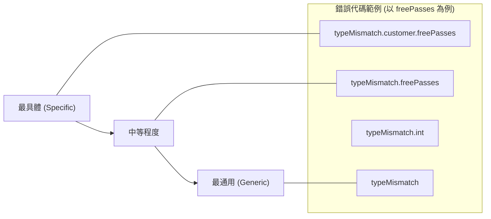

    - **具體代碼 (Specific)**：`typeMismatch.customer.freePasses`
        - 僅針對 `customer` 物件中的 `freePasses` 欄位發生型別不匹配時觸發。
        - **[優點]** 可以針對特定欄位提供最精確的錯誤提示。
    - **通用代碼 (Generic)**：`typeMismatch`
        - 任何發生型別不匹配的情況都會觸發，不論是哪個物件或哪個欄位。
- **如何實作自定義訊息**
        - 透過在 `messages.properties` 中定義特定的錯誤代碼，即可「覆寫 (override)」Spring MVC 的預設訊息。
        - **範例**：
            - 若要在 `freePasses` 出錯時顯示自定義訊息，需在設定檔中寫入：

        `typeMismatch.customer.freePasses=Invalid number`

            - 這樣當該特定欄位驗證失敗時，系統就會抓取這個自定義的字串，而不是顯示預設的英文錯誤提示。

### 自定義錯誤訊息的除錯流程

- **[除錯技巧]** 透過簡單的一行程式碼即可快速開發自定義訊息：
    - 在 Controller 中對 `BindingResult` 物件執行 `System.out.println`
    - 檢查 Console 日誌，找出 Spring MVC 正在尋找的錯誤代碼
    - 將該代碼填入 `messages.properties` 檔案中
- **實作步驟流程圖**

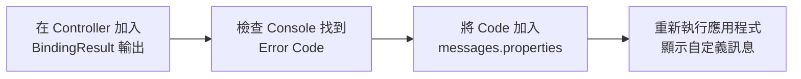

- **範例應用**
    - 當 Console 顯示 `typeMismatch.customer.freePasses` 時：
        - 在 `messages.properties` 中定義：

          `typeMismatch.customer.freePasses=Invalid number`

        - 這樣當使用者輸入錯誤格式時，前端就會顯示「Invalid number」而非預設的錯誤訊息

### 2. Spring MVC 自定義驗證 (Custom Validation)

- **[概念]** 除了基本的型別檢查外，可以針對特定欄位加入自定義的業務規則 (Business Rule)
- **範例演示**
    - 表單包含三個欄位：`First name`、`Last name` 與 `Course Code`
    - **自定義規則範例**：針對 `Course Code` 設定規則，要求其必須以 `LUV` 開頭
- **驗證結果展示**
    - 若輸入不符合規則的代碼（例如 `ABC1234`），系統會觸發驗證錯誤並顯示自定義訊息：

      > Course code must start with LUV

    - 若輸入符合規則的代碼（例如 `LUV123`），則驗證通過

### 自定義驗證實作原理

- **[核心概念]** 透過建立自定義的業務規則 (Business Logic)，讓 Spring MVC 在執行驗證時自動呼叫該規則
- **範例驗證流程**
    - 規則定義：課程代碼 (Course Code) 必須以 `LUV` 開頭
    - 驗證成功：若輸入 `LUV123`，系統會順利處理並顯示確認訊息
    - 驗證失敗：若輸入不符合規則的代碼，系統會觸發錯誤並顯示自定義的提示訊息

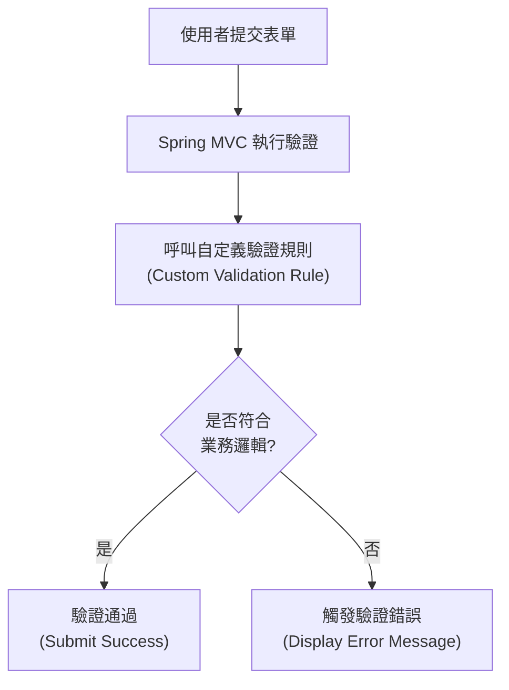

### 3. 從頭開始建立自定義 Java Annotation

- **[核心機制]** 自定義驗證會根據使用者在表單中輸入的內容，回傳一個布林值 (boolean value)
    - `true`：驗證通過
    - `false`：驗證失敗，並在頁面上顯示錯誤訊息
- **實作進階驗證**
    - 過去僅使用 Spring 預定義的驗證規則（例如 `@Min`, `@Max`）
    - 現在將從頭開始建立一個自定義的 Java Annotation，名稱為 `@CourseCode`
    - 這屬於較進階的 Spring MVC 實作技術

### `@CourseCode` Annotation 的應用與參數

- **[應用方式]** 將自定義 Annotation 直接標註在實體類別 (Entity) 的特定欄位上
    - 範例：在 `courseCode` 欄位上方加入 `@CourseCode`
- **[參數化設計]** 該 Annotation 可以接收兩個關鍵參數，使其具備高度靈活性：

    1. `value`：定義該欄位必須符合的特定數值（例如：必須以 "LUV" 開頭）
    2. `message`：定義當驗證失敗時，要在 HTML 表單上顯示的錯誤訊息

- **程式碼範例**

```java
@CourseCode(value="LUV", message="must start with LUV")
  private String courseCode;
```

- **[靈活性]** Annotation 的名稱可以自定義（例如 `@CourseCode`、`@FooBar` 等），其核心目的是將驗證邏輯與欄位定義結合，並允許開發者透過參數來調整驗證內容與提示文字。

### 從頭開始建立自定義 Java Annotation 的開發流程

- **[開發流程總覽]** 建立自定義驗證規則需遵循以下步驟：

    1. **建立自定義驗證規則 (Create custom validation rule)**

        - 1a. 建立 `@CourseCode` Annotation
        - 1b. 建立 `CourseCodeConstraintValidator` (這是實際存放自定義業務邏輯的地方)

    1. **將驗證規則加入 Customer 類別**
    2. **在 HTML 表單上顯示錯誤訊息**
    3. **更新確認頁面 (Confirmation page)**

- **[重點說明]** 本次教學將集中在**第一步**：建立自定義驗證規則，因為步驟 2 至 4 是常見的操作，而建立規則是進階的核心技術。

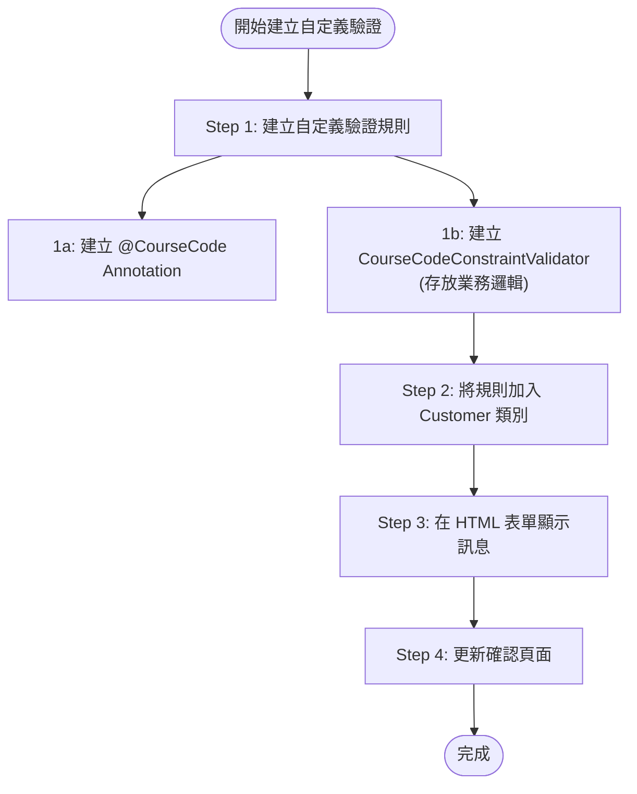

### 4. 建立自定義驗證規則 (Create Custom Validation Rule)

建立自定義驗證規則的第一步包含兩個子步驟：

1. **建立&#32;`@CourseCode`&#32;Annotation**
2. **建立&#32;`CourseCodeConstraintValidator`**

- **[核心角色]** `CourseCodeConstraintValidator` 扮演著「輔助類別 (Helper class)」的角色
    - **[功能]** 專門用來存放自定義的業務邏輯 (Business Logic)
    - **[運作機制]** 透過這些邏輯來判斷輸入的值是否符合規則，進而決定回傳 `true` (通過) 或 `false` (失敗)

### Step 1a: 建立 `@CourseCode` Annotation

- **[使用範例]** 在實體類別的欄位上標註 Annotation 並傳入參數：
    - `value`：指定該欄位必須開頭的特定字串（例如 `"LUV"`）。
    - `message`：定義驗證失敗時顯示於 HTML 頁面的錯誤訊息。
- **[實作重點]** 建立 Annotation 時會使用特殊的 Java 語法（例如 `@interface`），用以定義該 Annotation 的屬性與行為。

### `@CourseCode` Annotation 的實作細節

- **[定義語法]** 使用 Java 特有的 `@interface` 關鍵字來宣告自定義 Annotation
    - **[注意]** 這是一種特殊的介面類型，專門用於定義 Annotation
- **[核心註解：`@Constraint`]** 用於描述該 Annotation 的驗證行為
    - **[參數：`validatedBy`]** 指定負責執行實際業務邏輯與驗證程序的「輔助類別 (Helper class)」
    - **[運作機制]** 透過 `validatedBy` 指向 `CourseCodeConstraintValidator.class`，讓系統知道當標註此 Annotation 時，應呼叫該類別來進行判斷
- **[實作程式碼範例]**

```java
@Constraint(validatedBy = CourseCodeConstraintValidator.class)
@Target({ ElementType.METHOD, ElementType.FIELD })
@Retention(RetentionPolicy.RUNTIME)
public @interface CourseCode {
    // ...
}
```

- **[其他必要註解]**
    - `@Target`：定義此 Annotation 可以被應用在哪些位置（例如：方法 `METHOD` 或欄位 `FIELD`）
    - `@Retention`：定義此 Annotation 的生命週期（在此使用 `RUNTIME`，確保在程式執行期間仍可被讀取並執行驗證）
- **[註解細節補充]**
    - **`@Target`**：決定了這個 Annotation 可以被應用在程式碼的哪些位置
        - 在此範例中，設定為 `ElementType.METHOD` 與 `ElementType.FIELD`，表示可以標註在「方法」或「欄位」上
    - **`@Retention`**：決定了這個 Annotation 的存續時間（生命週期）
        - 使用 `RetentionPolicy.RUNTIME`：
            - **[運作機制]** 會將此 Annotation 保留在編譯後的 Java 類別檔案（bytecode）中
            - **[目的]** 確保在程式執行期間（Runtime）仍能透過反射（Introspection/Instrumentation）技術讀取並執行驗證邏輯

### `@CourseCode` Annotation 的參數設計

- **[設計目的]** 提供預設值以增加 Annotation 的**可自定義性 (Customizability)**
    - **[為什麼不直接寫死 (Hard-code)?]** 如果將前綴或訊息直接寫死在邏輯中，Annotation 就會失去靈活性
    - **[優點]** 使用者既可以套用預設規則，也可以在不同場景下傳入不同的參數（例如不同的前綴）
- **[參數定義]**
        - `value()`：指定驗證時必須符合的字串前綴
                - **預設值**：`"LUV"`
        - `message()`：驗證失敗時顯示的錯誤訊息
                - **預設值**：`"must start with LUV"`
- **[實作程式碼範例]**

```java
@Constraint(validatedBy = CourseCodeConstraintValidator.class)
@Target({ ElementType.METHOD, ElementType.FIELD })
@Retention(RetentionPolicy.RUNTIME)
public @interface CourseCode {
    // 定義預設課程代碼前綴
    public String value() default "LUV";

    // 定義預設錯誤訊息
    public String message() default "must start with LUV";
}
```

- **[實際套用方式]**
        - 若要使用預設值，可直接標註 `@CourseCode`
        - 若要自定義，則需傳入參數，例如：

      `@CourseCode(value="LUV", message="must start with LUV")`

### `CourseCodeConstraintValidator` 的實作細節

- **[核心角色]** 負責執行實際的業務邏輯 (Business Rules)，根據輸入值判斷是否符合規則，並回傳 `true` 或 `false`
- **[介面實作]** 實作 `ConstraintValidator<A, T>` 介面
    - **[泛型參數]**
        - `A`：對應自定義的 Annotation 類型（在此為 `@CourseCode`）
        - `T`：要進行驗證的資料類型（在此為 `String`）
- **[初始化機制：`initialize`&#32;方法]**
    - **[運作時機]** 當 Validator 被實例化後，系統會自動呼叫此方法進行初始化
    - **[目的]** 從 Annotation 實例中提取配置參數，並將其儲存在 Validator 的成員變數中，供後續驗證邏輯使用
    - **[實作流程]**

        1. 透過參數取得 Annotation 的實例
        2. 存取該 Annotation 的屬性（例如 `annotation.value()`）
        3. 將取得的值賦予給 Validator 內部的欄位（例如 `coursePrefix`）

```java
public class CourseCodeConstraintValidator
    implements ConstraintValidator<CourseCode, String> {

    private String coursePrefix;

    @Override
    public void initialize(CourseCode annotation) {
        // 從 Annotation 中取得預設或自定義的前綴，並儲存起來
        this.coursePrefix = annotation.value();
    }

    // ... 後續將會實作 isValid 方法
}
```

### `CourseCodeConstraintValidator` 的驗證邏輯實作

- **[核心方法]** `isValid` 方法
    - **[運作時機]** 當使用者提交表單時，Spring MVC 會在執行期間 (Runtime) 自動呼叫此方法，將表單資料傳入進行檢查
    - **[方法簽章]** `public boolean isValid(String code, ConstraintValidatorContext context)`
    - **[參數說明]**
        - `code`：來自表單的實際輸入值（在此為要驗證的課程代碼字串）
        - `context`：`ConstraintValidatorContext` 輔助類別，用於在驗證過程中添加額外資訊或自定義錯誤訊息
- **[驗證邏輯流程]**
    - **[目的]** 根據預先設定的業務規則，判斷輸入值是否合法，並回傳布林值 (`true` 表示通過，`false` 表示失敗)
    - **[實作步驟]**

        1. **空值檢查**：首先確認輸入的 `code` 不為 `null`
        2. **前綴比對**：檢查該 `code` 是否以先前在 `initialize` 方法中儲存的 `coursePrefix` 開頭

```java
@Override
public boolean isValid(String code, ConstraintValidatorContext context) {
    // 1. 確保 code 不為 null
    if (code != null) {
        // 2. 檢查 code 是否以初始化時設定的前綴開頭
        return code.startsWith(coursePrefix);
    }
    return true; // 通常若為 null，由 @NotNull 等其他註解處理，此處回傳 true 以避免重複驗證
}
```

### 專案目錄與套件結構準備

- **[開發流程]** 在建立自定義 Annotation 之前，需先規劃並建立對應的套件結構
- **[套件命名]** 建立一個專門用於驗證邏輯的套件
    - 範例路徑：`src/main/java/.../validation`
    - 目的：將驗證相關的註解與實作邏輯進行模組化管理

### 定義 `@CourseCode` Annotation

- **[定義語法]** 使用 `@interface` 關鍵字來宣告一個自定義註解
    - 這是一種特殊的介面類型，專門用於定義 Annotation
    - 範例宣告方式：`public @interface CourseCode`
- **[基本結構]**
    - 註解名稱（例如 `CourseCode`）緊跟在 `@interface` 之後
    - 透過這種方式，可以讓開發者在程式碼中透過 `@CourseCode` 來標記需要執行特定驗證邏輯的欄位

### `@CourseCode` Annotation 的進階配置

- **[指定驗證器]** 使用 `@Constraint` 註解
    - **[目的]** 告訴系統當這個 Annotation 被觸發時，應該由哪一個類別來執行實際的驗證邏輯
    - **[實作方式]** 透過 `validatedBy` 屬性指定驗證器類別（例如 `CourseCodeConstraintValidator.class`）
- **[限制使用範圍]** 使用 `@Target` 註解
    - **[目的]** 定義這個自定義 Annotation 可以被放置在程式碼中的哪些位置
    - **[適用範圍]** 在此範例中，設定為可以套用於以下位置：
        - `ElementType.METHOD` (方法)
        - `ElementType.FIELD` (欄位)

### 在實體類別中應用 `@CourseCode`

- **[套用方式]** 將自定義 Annotation 直接標記在實體類別 (Entity class) 的特定欄位或方法上
    - **[目的]** 讓 Spring MVC 知道該欄位必須遵循特定的驗證規則
    - **[範例]** 在 `courseCode` 欄位上方加上 `@CourseCode`
- **[Annotation 的參數化]** 自定義註解可以攜帶參數，增加靈活性
    - **`value`**：指定驗證時必須符合的前綴（例如：`"LUV"`）
    - **`message`**：當驗證失敗時，要在 HTML 表單上顯示的錯誤訊息（例如：`"Must start with LUV"`）

### `@Retention` 註解的生命週期管理

- **[定義]** `@Retention` 用於指定標記了該註解的資訊，在程式碼的哪個階段可以被保留或使用
- **[使用&#32;`RetentionPolicy.RUNTIME`&#32;的意義]**
    - **[保留範圍]** 該註解不僅會被編譯進位元組碼 (Bytecode) 中，還會在程式執行期間 (Runtime) 被 JVM 保留
    - **[重要性]** 對於 Spring MVC 的自定義驗證而言，這是必要的，因為驗證邏輯必須在程式實際運行時，由 JVM 與框架讀取註解內容來觸發驗證器 (Validator)

### `@CourseCode` Annotation 的完整定義結構

- **[必要 Imports]** 為了使用內建的註解功能，需匯入以下套件：
    - `jakarta.validation.Constraint`：用於連結驗證器類別
    - `java.lang.annotation.ElementType`：用於指定適用範圍
    - `java.lang.annotation.Retention`：用於指定生命週期
    - `java.lang.annotation.RetentionPolicy`：用於定義保留策略
    - `java.lang.annotation.Target`：用於指定目標位置
- **[核心程式碼實作]**

```java
package com.luv2code.springdemo.mvc.validation;

import jakarta.validation.Constraint;
import java.lang.annotation.ElementType;
import java.lang.annotation.Retention;
import java.lang.annotation.RetentionPolicy;
import java.lang.annotation.Target;

@Constraint(validatedBy = CourseCodeConstraintValidator.class)
@Target({ElementType.METHOD, ElementType.FIELD})
@Retention(RetentionPolicy.RUNTIME)
public @interface CourseCode {

}
```

- **[開發進度]**
    - [x] 建立 `@CourseCode` Annotation
    - [ ] 實作 `CourseCodeConstraintValidator` 驗證器類別 (下一階段目標)

### 定義 `@CourseCode` 的屬性

- **[新增屬性]** 為了讓 Annotation 能夠接收參數，需在介面中定義成員方法（Attributes）
    - **`value`**：用於指定驗證時必須符合的特定字串（例如：`"LUV"`）
    - **`message`**：用於指定當驗證失敗時顯示的錯誤訊息（例如：`"must start with LUV"`）
- **[設定預設值]** 使用 `default` 關鍵字來為屬性設定預設值，讓使用者在使用 Annotation 時可以省略這些參數

```java
@Constraint(validatedBy = CourseCodeConstraintValidator.class)
@Target({ElementType.METHOD, ElementType.FIELD})
@Retention(RetentionPolicy.RUNTIME)
public @interface CourseCode {

    // 定義預設課程代碼
    String value() default "LUV";

    // 定義預設錯誤訊息
    String message() default "must start with LUV";

}
```

### `@CourseCode` Annotation 的進階屬性

除了基本參數外，標準的 Bean Validation 註解通常還會包含以下兩個屬性：

- **`groups`**：用於將驗證約束（validation constraints）進行分組，以便在不同的場景下執行特定的驗證規則
- **`payload`**：用於為驗證錯誤提供額外的資訊（additional information）

### `@CourseCode` 屬性的預設值設定

- **[屬性定義與預設值]** 透過 `default` 關鍵字，可以讓使用者在套用註解時省略參數，系統將自動採用預設設定
    - **`value()`**：定義要進行驗證的特定前綴字串
        - **預設值**：`"LUV"`（即驗證時預設檢查是否以 "LUV" 開頭）
    - **`message()`**：定義當驗證失敗時顯示的錯誤訊息
        - **預設值**：`"must start with LUV"`

```java
@Constraint(validatedBy = CourseCodeConstraintValidator.class)
@Target({ElementType.METHOD, ElementType.FIELD})
@Retention(RetentionPolicy.RUNTIME)
public @interface CourseCode {

    // 定義預設課程代碼
    String value() default "LUV";

    // 定義預設錯誤訊息
    String message() default "must start with LUV";

}
```

- **[使用範例]** 若使用者直接使用 `@CourseCode` 而不傳入任何參數，其行為等同於：
    - `@CourseCode(value="LUV", message="must start with LUV")`

### `@CourseCode` 進階屬性的實作

- **[實作&#32;`groups`&#32;屬性]** 為了符合 Bean Validation 的標準結構，需定義 `groups` 屬性
    - **目的**：允許將驗證約束進行分組，以便在不同場景下執行特定的規則
    - **預設值設定**：若目前不需要進行任何分組，可直接提供一個空的集合作為預設值

```java
@Constraint(validatedBy = CourseCodeConstraintValidator.class)
@Target({ElementType.METHOD, ElementType.FIELD})
@Retention(RetentionPolicy.RUNTIME)
public @interface CourseCode {

    String value() default "LUV";

    String message() default "must start with LUV";

    // 定義預設的 groups，若無特殊需求則回傳空集合
    Class<?>[] groups() default {};

}
```

- **[實作&#32;`payload`&#32;屬性]** 為了符合標準，需定義 `payload` 屬性
    - **目的**：提供關於驗證錯誤發生的額外詳細資訊（例如：嚴重程度等級、錯誤代碼等）
    - **實作方式**：使用泛型並設定預設值為空集合

```java
@Constraint(validatedBy = CourseCodeConstraintValidator.class)
@Target({ElementType.METHOD, ElementType.FIELD})
@Retention(RetentionPolicy.RUNTIME)
public @interface CourseCode {

    String value() default "LUV";

    String message() default "must start with LUV";

    Class<?>[] groups() default {};

    // 定義預設的 payload，用於提供錯誤的額外細節
    Class<? extends Payload>[] payload() default {};

}
```

### `@CourseCode` Annotation 屬性總結

目前已完成 `@CourseCode` Annotation 的完整定義，包含所有使用者可以傳入或調用的屬性：

- **已定義的屬性**：
    - `value()`：預設值為 `"LUV"`，用於指定驗證所需的課程代碼前綴
    - `message()`：預設值為 `"must start with LUV"`，用於驗證失敗時的錯誤訊息
    - `groups()`：Bean Validation 標準屬性，用於驗證分組
    - `payload()`：Bean Validation 標準屬性，用於提供額外錯誤資訊
- **本次示範的核心參數**：
    - 在接下來的開發流程中，我們將重點使用 `value`（來決定驗證規則）與 `message`（來顯示錯誤提示）這兩個參數。

### 實作 CourseCodeConstraintValidator

- **[解決編譯錯誤]** 由於 `@CourseCode` 註解中定義了 `validatedBy = CourseCodeConstraintValidator.class`，但該類別尚未建立，因此需要手動建立此類別以消除錯誤
- **[實作步驟]**

    1. 複製註解中指定的類別名稱：`CourseCodeConstraintValidator`
    2. 切換至 `validation` 套件（package）
    3. 建立一個新的 Java 類別，並命名為 `CourseCodeConstraintValidator`

### 實作 CourseCodeConstraintValidator 介面

- **[實作 ConstraintValidator 介面]** 為了讓 Spring 能夠執行自定義的驗證邏輯，該類別必須實作 `ConstraintValidator` 介面
    - **泛型參數設定**：實作時需傳入兩個泛型參數
        - 第一個參數：自定義的註解類型，即 `@CourseCode`
        - 第二個參數：被驗證屬性的資料類型，在此範例中為 `String`

```java
package com.luv2code.springdemo.mvc.validation;

import jakarta.validation.ConstraintValidator;
import jakarta.validation.ConstraintValidatorContext;

public class CourseCodeConstraintValidator implements ConstraintValidator<CourseCode, String> {

}
```

### 實作 ConstraintValidator 的核心方法

當實作 `ConstraintValidator` 介面時，IDE 可以協助生成方法存根（method stubs）。開發者需要覆寫以下兩個方法：

- **`initialize`&#32;方法**
    - 用於初始化驗證器。通常會呼叫父類別的初始化方法來處理註解中的屬性。
- **`isValid`&#32;方法**
    - **[核心邏輯所在]** 這是放置實際業務邏輯的地方。
    - **運作方式**：根據傳入的參數（例如一個字串）進行驗證，並回傳 `true`（驗證通過）或 `false`（驗證失敗）。

```java
@Override
public void initialize(CourseCode constraintAnnotation) {
    ConstraintValidator.super.initialize(constraintAnnotation);
}

@Override
public boolean isValid(String s, ConstraintValidatorContext constraintValidatorContext) {
    // 在此處實作業務邏輯
    return false;
}
```

### 賦值 Annotation 的參數

為了在驗證過程中能夠使用 Annotation 中定義的規則（例如字串前綴），必須在 `initialize` 方法中將這些值提取出來並賦值給驗證器內部的成員變數。

- **[實作細節]** 使用 `theCourseCode.value()` 來取得使用者在註解中設定的實際數值
- **[變數用途]** 將取得的值存入 `coursePrefix` 變數，以便在 `isValid` 方法中進行比對

```java
@Override
public void initialize(CourseCode theCourseCode) {
    coursePrefix = theCourseCode.value();
}
```

### 實作 `isValid` 業務邏輯前的準備

在撰寫實際的驗證邏輯之前，需要先將 Annotation 中定義的參數值提取出來，以便後續比對。

- **[屬性賦值]** 在 `initialize` 方法中，透過存取 Annotation 物件的屬性來取得設定值
    - 例如：`coursePrefix = theCourseCode.value();`
    - 這裡的 `.value()` 會讀取到 Annotation 中定義的實際數值（例如範例中的 `"LUV"`）。

### 實作 `isValid` 驗證邏輯

在 `isValid` 方法中，將使用者輸入的內容與預設的前綴進行比對。

- **[參數說明]** `isValid` 方法的第一個參數（例如 `arg0` 或 `code`）即為使用者從 HTML 表單輸入的實際文字內容。
- **[驗證邏輯]** 使用 `startsWith()` 方法檢查輸入的字串是否以預設的 `coursePrefix` 開頭。

```java
@Override
public boolean isValid(String code, ConstraintValidatorContext constraintValidatorContext) {
    // 檢查輸入的代碼是否以設定的前綴開頭
    return code != null && code.startsWith(coursePrefix);
}
```

### `isValid` 方法的參數與實作

在 `isValid` 方法中，除了要驗證的資料本身，還有一個重要的參數：

- **`ConstraintValidatorContext`**
    - 這是一個實際的參數，當開發者需要針對特定的驗證程序提供額外的錯誤訊息時，可以使用它。

#### 實作驗證邏輯

驗證的核心目標是判斷使用者輸入的內容是否符合預設的規則，並回傳布林值結果。

- **[驗證邏輯]** 檢查使用者從 HTML 表單輸入的字串（`code`）是否以我們設定的課程前綴（`coursePrefix`）開頭。

```java
@Override
public boolean isValid(String code, ConstraintValidatorContext constraintValidatorContext) {
    // 檢查輸入的代碼是否以設定的前綴開頭
    boolean result = code.startsWith(coursePrefix);
    return result;
}
```

### 實作 `isValid` 驗證邏輯的完成

透過將 `startsWith()` 的結果賦值給布林變數，可以決定驗證是否通過。

- **[驗證邏輯]** 檢查使用者輸入的字串（`theCode`）是否以預設的 `coursePrefix` 開頭。
- **[回傳值]** 方法最終回傳 `result`，這將決定 Spring MVC 是否將該表單視為有效。

```java
@Override
public boolean isValid(String theCode, ConstraintValidatorContext theConstraintValidatorContext) {
    boolean result = theCode.startsWith(coursePrefix);
    return result;
}
```

### `isValid` 方法的靈活性與應用場景

`isValid` 方法是放置自定義業務邏輯的核心位置，其功能可以根據需求變得非常複雜。

- **[高度自定義]** 只要能回傳 `true` 或 `false`，你可以在此方法中執行任何操作。
- **[潛在應用範例]**
    - 查詢資料庫以驗證資料是否存在
    - 呼叫 Web Service 或 REST API
    - 進行複雜的數字運算或特殊邏輯判斷

### 自定義驗證規則的開發流程

建立自定義驗證規則的過程可以分為以下四個主要步驟：

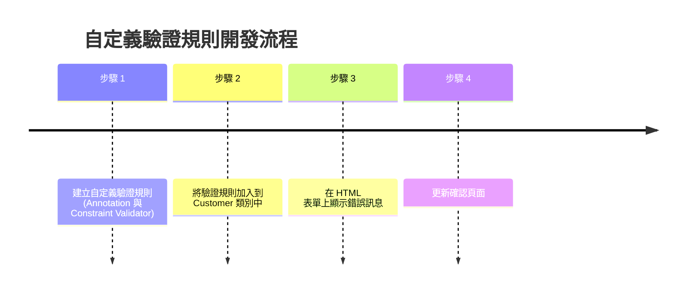

### 5. 步驟 2：將驗證規則加入到 Customer 類別

在完成 Annotation 與 Validator 的核心邏輯後，下一步是將此規則套用到實際的業務模型類別（如 `Customer` 類別）上。

### 在 `Customer` 類別中新增 `courseCode` 欄位

為了將自定義的 `@CourseCode` 驗證規則套用，必須先在 `Customer.java` 實體類別中建立對應的屬性。

- **[新增欄位]** 建立一個名為 `courseCode` 的私有字串欄位
    - 欄位名稱可以根據需求自訂（例如 `foobar`），但為了程式碼可讀性，通常會與驗證規則名稱保持一致
- **[產生存取方法]** 使用 IDE 功能為該欄位生成標準的 Getter 與 Setter 方法

```java
private String courseCode;

public String getCourseCode() {
    return courseCode;
}

public void setCourseCode(String courseCode) {
    this.courseCode = courseCode;
}
```

### 將 `@CourseCode` 套用到 `Customer` 類別

在準備好自定義註解後，下一步是將其直接放置在需要驗證的欄位上方。

- **[套用註解]** 在 `Customer.java` 的 `courseCode` 欄位前加上 `@CourseCode`
- **[注意大小寫]** Java 是**大小寫敏感 (case-sensitive)** 的，因此註解名稱必須與定義時完全一致（例如：`@CourseCode` 中的 `C` 必須是大寫）

```java
@CourseCode
private String courseCode;
```

### 使用 `@CourseCode` 的預設值

由於我們在定義 Annotation 時已經設定了預設值，因此在實際套用時可以省略參數，直接使用預設配置。

- **[簡化用法]** 不需要顯式傳入 `value` 或 `message`，系統會自動採用預設值

```java
@CourseCode
private String courseCode;
```

---

### 步驟 3：在 HTML 表單上顯示錯誤訊息

為了讓使用者在驗證失敗時能看到錯誤提示，必須在 HTML 表單中建立對應的欄位與錯誤顯示邏輯。

- **[新增欄位]** 在 HTML 中新增一個用於輸入課程代碼的欄位
    - 可以透過複製現有的欄位（如 `postalCode`）並修改其屬性來快速建立
- **[錯誤顯示邏輯]** 使用 Thymeleaf 的語法來判斷並顯示錯誤訊息
    - 當欄位發生驗證錯誤時，顯示對應的 `<span>` 標籤

```html
<!-- 範例：新增課程代碼輸入欄位 -->
<label>Course Code:</label>
<input type="text" th:field="*{courseCode}" />
<span th:if="${#fields.hasErrors('courseCode')}" th:errors="*{courseCode}" class="error"></span>
```

### 步驟 4：更新確認頁面

在完成驗證與表單提交後，需要更新確認頁面，以便將使用者輸入的數值顯示出來。

- **[重新命名欄位]** 將 HTML 表單中的 `postalCode` 欄位更名為 `courseCode`，以符合業務邏輯的需求

```html
Course Code: <input type="text" th:field="*{courseCode}" />

<!-- 如果有錯誤訊息則顯示 -->
<span th:if="${#fields.hasErrors('courseCode')}"
      th:errors="*{courseCode}"
      class="error"></span>
```

- **[顯示輸入值]** 確認頁面的主要任務是將使用者填寫的內容（echo the value）呈現給使用者查看。

### 更新 `customer-confirmation.html` 以顯示課程代碼

在確認頁面中，除了顯示姓名、是否通過等資訊外，也需要將使用者輸入的課程代碼呈現出來。

- **[新增顯示內容]** 使用 Thymeleaf 的 `th:text` 屬性來讀取 `customer` 物件中的 `courseCode` 屬性
- **[實作方式]** 在 HTML 中加入對應的 `<span>` 標籤

```html
Course Code: <span th:text="${customer.courseCode}"></span>
```

### 執行測試與遇到的錯誤

在完成所有程式碼實作後，嘗試啟動應用程式並輸入測試資料進行驗證測試。

- **[執行測試]** 在表單中輸入姓名與課程代碼後點擊提交
- **[發生錯誤]** 系統並未如預期顯示驗證訊息或成功頁面，而是拋出了 **500 Internal Server Error**

> **Whitelabel Error Page**
> This application has no explicit mapping for /error, so you are seeing this as a fallback.
> There was an unexpected error (type: Internal Server Error, status: 500).

- **[錯誤意義]** 500 錯誤代表伺服器端在處理請求時發生了未捕獲的異常（Exception），這暗示了目前的自定義驗證實作或 Spring 配置中存在錯誤。

### 錯誤分析與除錯 (Debugging)

在執行測試時，系統拋出了 **500 Internal Server Error**，透過檢查瀏覽器顯示的 Stack Trace，可以找到問題的核心。

- **[根本原因]** 錯誤訊息明確指出發生了 `java.lang.NullPointerException`
- **[錯誤細節]** 錯誤發生的原因是：`Cannot invoke "String.startsWith(String)" because "theCode" is null`
    - 這代表程式試圖在一個為 `null` 的變數上呼叫 `.startsWith()` 方法，導致系統崩潰
- **[定位錯誤位置]** 根據 Stack Trace 的提示，錯誤發生在自定義驗證器的實作邏輯中：
    - `com.luv2code.springdemo.mvc.validation.CourseCodeConstraintValidator.isValid(CourseCodeConstraintValidator.java:20)`

> **除錯關鍵點**：在面對長串的錯誤堆疊時，應優先尋找與自己專案套件名稱（如 `com.luv2code...`）相關的行號，這通常就是問題發生的源頭。

### 修復 NullPointerException

在先前的測試中，當使用者未輸入任何課程代碼時，系統會拋出 `NullPointerException`，這是因為程式試圖在一個 `null` 的變數上呼叫 `.startsWith()` 方法。

- **[錯誤原因]** 如果 `theCode` 為 `null`，執行 `theCode.startsWith(coursePrefix)` 會導致程式崩潰
- **[解決方案]** 在執行實際的字串判斷之前，必須先檢查 `theCode` 是否為 `null`。

```java
@Override
public boolean isValid(String theCode, ConstraintValidatorContext theConstraintValidatorContext) {
    boolean result;

    if (theCode == null) {
        result = true;
    } else {
        result = theCode.startsWith(coursePrefix);
    }

    return result;
}
```

> **[邏輯說明]** 這裡將 `null` 的情況設定為 `result = true`。這是因為在 Bean Validation 的慣例中，`@NotNull` 應該被用來處理空值檢查，而自定義的業務邏輯驗證器（如檢查前綴）通常假設值已經存在，若值為空則交由其他註解處理，避免驗證器本身出錯。

### 驗證邏輯的設計原則：處理非必填欄位

在實作自定義驗證器時，應遵循特定的邏輯設計來處理 `null` 值，以確保驗證器的職責單一且不與其他註解衝突。

- **[設計邏輯]** 當輸入值為 `null` 時，驗證器應直接回傳 `true`。
- **[職責分工]**
    - **自定義驗證器**：負責檢查「若值存在，是否符合特定的業務規則」（例如：是否以特定前綴開頭）。
    - **標準註解**：若該欄位為必填，應由 `@NotNull` 負責攔截空值；若非必填，則由驗證器放行，避免因 `null` 導致程式崩潰或邏輯錯誤。

### 驗證修復結果

在修復了 `NullPointerException` 的問題並儲存程式碼後，重新啟動並執行測試，確認自定義驗證功能運作正常。

- **[測試 1：正常提交]**
    - 輸入有效的姓名與課程代碼後點擊提交
    - **[結果]** 系統成功處理請求，未再出現 `NullPointerException`，代表空值處理邏輯已生效。
- **[測試 2：觸發驗證錯誤]**
    - 輸入不符合規則的代碼（例如：`ABC123`）
    - **[結果]** 系統正確攔截請求，並顯示預設的錯誤訊息：

      > `must start with LUV`

- **[測試 3：符合規則提交]**
    - 輸入符合前綴要求的代碼（例如：`LUV123`）
    - **[結果]** 驗證通過，系統顯示成功訊息：

      > **Success!!! Our custom validation is working**

### 自定義驗證參數

雖然目前的驗證規則預設使用 `LUV` 作為前綴，但可以透過修改 Annotation 的屬性值來實現更靈活的自定義驗證。

- **[修改方式]** 直接在實體類別 (Entity) 的欄位上，為 `@CourseCode` 傳入新的 `value` 參數
- **[範例]** 將驗證規則從「必須以 LUV 開頭」更改為「必須以 TOPS 開頭」

```java
@CourseCode(value="TOPS")
private String courseCode;
```

> **[核心觀念]** 透過這種方式，同一個 `CourseCodeConstraintValidator` 邏輯可以被重複使用，只需在套用時指定不同的 `value`，即可檢查不同的字串前綴。

### 進階自定義驗證配置

除了更改前綴外，我們也可以同時自定義驗證失敗時顯示的錯誤訊息，讓 Annotation 更加靈活。

- **[配置方式]** 在實體類別中使用 `@CourseCode` 時，同時傳入 `value` 與 `message` 參數
- **[程式碼範例]**

```java
@CourseCode(value="TOPS", message="must start with TOPS")
private String courseCode;
```

- **[驗證流程]**

    1. 修改原始碼中的參數設定。
    2. 讓容器（Container）在背景自動重新載入（Reload）。
    3. 在前端表單輸入不符合新規則的資料（例如：`ABC123`）。
    4. 點擊提交，觀察錯誤訊息是否已更新為新的自定義訊息。

- **[測試結果]**
    - 輸入 `ABC123` 並提交
    - **[結果]** 系統正確顯示新設定的錯誤訊息：

      > `must start with TOPS`

### 自定義 Annotation 的驗證成果

透過實作與參數化配置，自定義 Annotation 已能與 Spring 驗證機制完美整合，展現高度的靈活性。

- **[驗證成功案例]**
    - **操作**：在表單中輸入符合新規則的代碼（例如：`TOPS123`）
    - **結果**：系統成功通過驗證，並顯示成功訊息：

      > **Success!!! Our custom validation is working**

      > **Course code starts with "TOPS" ... validation test passed**

- **[核心優勢]**
    - **高度可自定義性**：可以根據需求隨時調整要檢查的代碼或前綴（Prefix）。
    - **無縫整合**：與 Spring 驗證流程完全相容，能根據 Annotation 攜帶的參數自動執行對應的業務邏輯。

## Thymeleaf CRUD 實戰專案

本專案目標是利用 Thymeleaf 與 Spring Boot 技術棧，開發一個完整的員工目錄管理系統。

### 6. 應用需求 (Application Requirements)

- **核心目標**：為員工目錄建立一個 Web 使用者介面 (Web UI)
- **技術棧**：
    - Spring Boot
    - Thymeleaf
- **預期功能 (CRUD)**：
    - 獲取員工列表 (Get a list of employees)
    - 新增員工 (Add a new employee)
    - 更新員工資訊 (Update an employee)
    - 刪除員工 (Delete an employee)

### 介面設計概念

根據預期的應用程式畫面，介面將包含以下元素：

- **員工列表**：顯示所有員工的資訊表格
- **功能按鈕**：
    - 左上角：新增員工按鈕
    - 右側：針對個別員工的更新與刪除按鈕

### 專案整體架構 (Big Picture)

- **資料流向 (Data Flow)**
    - 使用者透過 **Web Browser** 發送請求
    - 請求進入 **Employee Controller**
    - Controller 呼叫 **Employee Service** 處理業務邏輯
    - Service 與 **Employee Repository** 互動以存取資料
    - Repository 與 **Database** 進行資料讀寫
    - 資料經由 Repository $\rightarrow$ Service $\rightarrow$ Controller 回傳
    - 最後透過 **Thymeleaf Templates** 渲染成 View 並回傳給 Web Browser

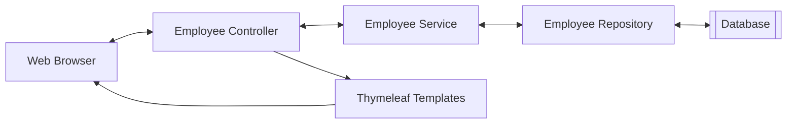

- **開發重點與程式碼重用**
    - **Reuse (重用)**：`Employee Service` 與 `Employee Repository` 的程式碼將從之前的專案中直接複用
    - **New Code (新開發)**：本次專案的核心開發重點在於 `Employee Controller`，負責處理來自 Web UI 的所有請求

### 專案設定與開發流程

- **資料庫整合 (DB Integration)**
    - 將現有的 `EmployeeService`、`EmployeeRepository` 與 `Employee` 實體類別 (Entity) 加入專案中
    - **實作方式**：直接從之前的專案中複製並貼上 (Copy/Paste) 這些已完成的程式碼
    - **目的**：為了節省時間，讓我們能將開發重心集中在 `EmployeeController` 與 `Thymeleaf` 模板的建立上
- **開發流程：大方向 (Development Process - Big Picture)**
    - 本專案將採取循序漸進的方式，分為以下四個主要步驟進行開發：

    1. 獲取員工列表 (Get list of employees)
    2. 新增員工 (Add a new employee)
    3. 更新現有員工 (Update an existing employee)
    4. 刪除現有員工 (Delete an existing employee)

### 員工目錄開發計畫 (Development Plan)

- **開發流程步驟**：

    1. 獲取員工列表 (Get list of employees)
    2. 新增員工 (Add a new employee)
    3. 更新現有員工 (Update an existing employee)
    4. 刪除現有員工 (Delete an existing employee)

### 下載初始程式碼

- **下載檔案**：`07-spring-boot-spring-mvc-crud.zip`
    - 檔案位於影片的 **Resources** 區塊中
- **檔案內容**：這是先前課程中建立的 REST API 專案，將作為本次開發的基礎

### 整理專案檔案

- **檔案移動流程**
    - 將下載的 `07-spring-boot-spring-mvc-crud.zip` 解壓縮
    - 開啟 Finder 並將該資料夾移動至開發專用目錄：`dev-spring-boot`
- **目的**
    - 確保專案檔案位於正確的開發環境路徑下，以便於後續開發與管理

### 重新整理資料庫

- **目的**：建立一個標準的基準環境 (Standard Baseline) 以利開發
- **操作流程**：

    1. 開啟 **MySQL Workbench** 並登入
    2. 尋找並開啟專案目錄下的 SQL 腳本
    3. 腳本路徑位於：`dev-spring-boot` $\rightarrow$ `07-spring-boot-spring-mvc-crud` $\rightarrow$ `00-spring-boot-spring-mvc-crud-starter-code` 中的相關 SQL 檔案

### 執行 SQL 腳本與資料驗證

- **執行腳本**
    - 開啟 `sql-scripts` 目錄下的 `employee-directory.sql`
    - 此腳本用於建立 `employee_directory` 資料庫並初始化 `employee` 資料表
- **驗證資料**
    - 執行 `SELECT * FROM employee_directory.employee;` 查詢指令
    - **預期結果**：應包含五位標準員工資料：
        - Leslie Andrews
        - Emma Baumgarten
        - Avani Gupta
        - Yuri Petrov
        - Juan Vega

### 開啟專案至 IDE

- **載入專案**
    - 開啟 IDE 並將 `00-spring-boot-mvc-crud-starter-code` 資料夾載入
- **專案程式碼結構 (Source Main Java)**
    - 專案結構與先前的 REST API 專案基本一致，包含以下核心組件：
        - **DAO** (Data Access Object)
        - **Entity** (實體類別)
        - **REST** (控制器/介面)
        - **Service** (業務邏輯層)

### 驗證現有 REST API 功能

- **執行測試**
    - 啟動應用程式後，透過瀏覽器訪問：`http://localhost:8080/api/employees`
- **預期結果**
    - 應能正確看到從資料庫回傳的 JSON 格式員工資料，例如：

```json
{"id":1,"firstName":"Leslie","lastName":"Andrews","email":"leslie@luv2code.com"}
```

    - 這證明了基礎的 REST API 與資料庫整合功能目前運作正常
- **後續計畫**
    - 即將修改此專案，將開發模式從單純的 REST API 轉換為使用 **Spring MVC**

### 專案轉型：從 REST API 到 Spring MVC

- **清理舊程式碼**
    - 因為開發目標已轉向 Spring MVC，不再需要原本的 REST 控制器
    - 可以安全地刪除 `rest` 套件中的 `EmployeeRestController`
- **保留核心組件**
    - 雖然控制器會更換，但以下組件仍將在 Spring MVC 中繼續使用：
        - `dao` (Data Access Object)
        - `entity` (實體類別)
        - `service` (業務邏輯層)
- **建立 Spring MVC 控制器**
    - 準備建立新的套件結構以存放 Spring MVC 控制器
    - 流程：在 `com.luv2code.springboot.cruddemo` 下建立新的 package

### 建立 Spring MVC 控制器

- **建立控制器套件**
    - 在 `com.luv2code.springboot.cruddemo` 下建立名為 `controller` 的新套件
- **實作&#32;`EmployeeController`&#32;類別**
    - 在 `controller` 套件中建立 `EmployeeController.java` 類別
    - **使用 Spring MVC 註解進行設定**
        - 加上 `@Controller`：標示該類別為 Spring MVC 的控制器
        - 加上 `@RequestMapping("/employees")`：定義該控制器的基礎路由路徑為 `/employees`

```java
package com.luv2code.springboot.cruddemo.controller;

import org.springframework.stereotype.Controller;
import org.springframework.web.bind.annotation.RequestMapping;

@Controller
@RequestMapping("/employees")
public class EmployeeController {

}
```

### EmployeeController 的運作流程與依賴

- **資料處理層次結構**
    - 當請求進入時，會遵循以下流程進行資料處理：
    - **Employee Controller** $\rightarrow$ **Employee Service** $\rightarrow$ **Employee Repository** $\rightarrow$ **Database (資料庫)**
- **EmployeeController 角色**
    - 負責處理 URL 請求（例如 `/employees`）
    - 會依賴 `EmployeeService` 來執行業務邏輯並取得資料

### 在 EmployeeController 中注入 Service

- **實作方式**：在控制器類別中定義一個 `EmployeeService` 的欄位，以便進行依賴注入

```java
package com.luv2code.springboot.cruddemo.controller;

import com.luv2code.springboot.cruddemo.service.EmployeeService;
import org.springframework.stereotype.Controller;
import org.springframework.web.bind.annotation.RequestMapping;

@Controller
@RequestMapping("/employees")
public class EmployeeController {

    private EmployeeService employeeService;

}
```

### 使用建構子注入 (Constructor Injection)

- **實作方式**：透過在類別中建立一個建構子，並將需要的依賴項（如 `EmployeeService`）作為參數傳入，然後在建構子中進行賦值。
- **`@Autowired`&#32;的必要性**
    - 在 Spring 中，如果一個類別只有**一個**建構子，那麼 `@Autowired` 註解是**選用 (optional)** 的
    - Spring 會自動識別該建構子並將對應的依賴項注入其中

```java
@Controller
@RequestMapping("/employees")
public class EmployeeController {

    private EmployeeService employeeService;

    // 使用建構子進行注入
    public EmployeeController(EmployeeService theEmployeeService) {
        employeeService = theEmployeeService;
    }

}
```

### 實作列出員工的方法

- **新增 GET 請求映射**
    - 使用 `@GetMapping("/list")` 來處理請求路徑 `/employees/list`
    - 方法名稱定為 `listEmployees`
- **使用&#32;`Model`&#32;傳遞資料**
    - 在方法參數中加入 `Model theModel`
    - **注意**：必須從 `org.springframework.ui` 套件中匯入 `Model` 介面

```java
@GetMapping("/list")
    public String listEmployees(Model theModel) {

    }
```

### 實作 `listEmployees` 的業務邏輯

- **取得員工資料**
    - 定義一個 `List<Employee>` 型別的變數 `theEmployees`
    - 使用注入的 `employeeService` 呼叫 `findAll()` 方法來從資料庫抓取所有員工資料
- **準備傳遞至前端**
    - 取得資料後，需將其加入 `theModel` 中，以便 Thymeleaf 模板可以存取這些資料

```java
@GetMapping("/list")
public String listEmployees(Model theModel) {

    // get the employees from db
    List<Employee> theEmployees = employeeService.findAll();

    // add to the spring model
    theModel.addAttribute("employees", theEmployees);

    return "list-employees";
}
```

### 完成 `listEmployees` 方法實作

- **完整的實作流程**
    - 從 `employeeService` 取得所有員工資料
    - 將資料加入 `theModel` 中，以便前端存取
    - 回傳視圖頁面的名稱（View Name）

```java
@GetMapping("/list")
public String listEmployees(Model theModel) {

    // get the employees from db
    List<Employee> theEmployees = employeeService.findAll();

    // add to the spring model
    theModel.addAttribute("employees", theEmployees);

    return "list-employees";
}
```

- **關於回傳值與 Thymeleaf**
    - 回傳的字串（如 `"list-employees"`）代表視圖頁面的名稱
    - 由於專案使用 Thymeleaf，Spring 會自動尋找對應的 HTML 檔案，例如 `list-employees.html`

### 建立 Thymeleaf 視圖頁面

- **檔案位置**：必須建立在 `src/main/resources/templates` 目錄中
- **實作步驟**：
    - 進入 `templates` 資料夾
    - 新增一個新的 HTML 檔案
    - 將檔案命名為 `list-employees.html`

### 設定 Thymeleaf 命名空間與標題

- **新增 XML 命名空間**
    - 在 `<html>` 標籤中加入 `xmlns:th="http://www.thymeleaf.org"`
    - **[為什麼需要它?]** 這樣瀏覽器與 Thymeleaf 引擎才能識別並處理以 `th:` 開頭的指令

```html
<!DOCTYPE html>
<html lang="en" xmlns:th="http://www.thymeleaf.org">
```

- **更新頁面標題**
    - 修改 `<title>` 標籤內的內容，例如將其更改為 `Employee Directory`

```html
<head>
    <meta charset="UTF-8">
    <title>Employee Directory</title>
</head>
```

### 使用快速驗證方式顯示資料

- **快速驗證策略**
    - 在開發初期，不需建立複雜的 HTML 表格或樣式
    - 目標是直接將 `employees` 這個 Model 屬性的內容「傾倒」(dump) 到螢幕上，以確認資料確實已從 Controller 傳遞過來
- **實作方式**
    - 使用 `<span>` 標籤搭配 Thymeleaf 的 `th:text` 指令
    - 透過 `${employees}` 語法引用在 Controller 中設定的屬性名稱

```html
<span th:text="${employees}"></span>
```

> **注意**：`${employees}` 中的名稱必須與 Spring MVC 控制器中使用 `theModel.addAttribute("employees", ...)` 所設定的名稱完全一致。

### 驗證資料傳遞成功

- **執行結果確認**
    - 啟動應用程式後，透過瀏覽器存取 `http://localhost:8080/employees/list`
    - 成功看到從資料庫抓取的員工資料內容
- **目前的狀態**
    - 雖然目前的資料顯示格式較為粗糙（未經過 CSS 或 HTML 表格美化），但已證實資料能正確從資料庫流向 Controller，並成功透過 Model 傳遞至前端頁面
    - 這完成了整體架構中關鍵的一環：資料的完整串聯

### 專案架構大圖景 (The Big Picture)

目前已成功建立核心功能的資料流，確保了從請求到顯示的完整循環：

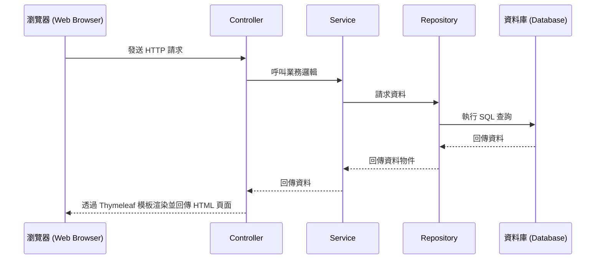

- **目前的進度**
    - 已完成所有關鍵的後端組件與資料串聯
    - 基礎功能已能正常運作，資料能正確從資料庫流向前端
- **下一步開發重點**
    - 從「功能實現」轉向「介面美化 (Cosmetic changes)"
    - **目標**：讓頁面看起來更專業、更美觀
    - **工具**：將使用 HTML 表格 (`<table>`) 與 Bootstrap CSS 框架來進行介面優化

### 7. 介面美化：引入 Bootstrap CSS

- **目標**：將目前的原始資料顯示方式，轉換為使用 HTML 表格與 Bootstrap CSS 樣式的專業介面
- **實作步驟**：
    - 前往 Bootstrap 官方網站：`getbootstrap.com`
    - 在文件中尋找「Quick start」或相關的入門教學區塊
    - 複製 Bootstrap CSS 的 `<link>` 標籤連結，以便引入樣式
- **引入方式範例** (透過 CDN)
    - 將取得的 `<link>` 標籤放置於 HTML 檔案的 `<head>` 區塊內，確保樣式在頁面載入時即生效

```html
<!-- 範例：在 <head> 中引入 Bootstrap CSS -->
<link href="https://cdn.jsdelivr.net/npm/bootstrap@5.3.2/dist/css/bootstrap.min.css" rel="stylesheet">
```

### 實作 Bootstrap 樣式引入

- **操作流程**
    - 從 Bootstrap 官網複製 CSS 的 `<link>` 標籤內容
    - 回到 IDE 並停止目前正在執行的應用程式
    - 進入 HTML 檔案的 `<head>` 區塊進行貼上
    - 移除原本不需要的 `<title>` 標籤（因為專案已有自定義標題）
- **引入原理**
    - 透過 CDN (Content Delivery Network) 連結，瀏覽器會直接從網路上下載並載入 Bootstrap 的 CSS 樣式表

```html
<head>
    <meta charset="UTF-8">
    <meta name="viewport" content="width=device-width, initial-scale=1">
    <link href="https://cdn.jsdelivr.net/npm/bootstrap@5.3.2/dist/css/bootstrap.min.css" rel="stylesheet">
</head>
```

### 建立員工目錄頁面結構

- **佈局設定**
    - 使用 `<div>` 標籤並搭配 Bootstrap 的 `container` 類別，為頁面內容建立一個標準的容器範圍
- **內容規劃**
    - 移除原本較為簡易的資料顯示方式，改用 HTML 表格 (`<table>`) 來呈現資料
    - 新增一個 `<h3>` 標題，標示為 「Employee Directory」

```html
<body>
    <div class="container">
        <h3>Employee Directory</h3>
        <!-- 接下來將在此處實作 HTML 表格 -->
    </div>
</body>
```

### 實作 Bootstrap 表格樣式

- **表格基本樣式設定**
    - 使用 `table` 類別建立基礎表格結構
    - 搭配 `table-bordered` 增加表格邊框
    - 搭配 `table-striped` 啟用隔行變色（條紋）效果，提升資料閱讀性
- **表格標題列美化**
    - 使用 `<thead>` 標籤定義標題區塊
    - 搭配 `table-dark` 類別將標題列設為深色背景，與內容區做出視覺區隔

```html
<table class="table table-bordered table-striped">
    <thead class="table-dark">
        <!-- 標題內容將放置於此 -->
    </thead>
</table>
```

### 實作 HTML 表格標題列

- **建立標題欄位**
    - 在 `<thead>` 區塊內使用 `<tr>` 定義一行
    - 使用 `<th>` 定義各個欄位的標題，目前設定為：
        - `First Name`
        - `Last Name`
        - `Email`

```html
<thead class="table-dark">
    <tr>
        <th>First Name</th>
        <th>Last Name</th>
        <th>Email</th>
    </tr>
</thead>
```

- **準備表格主體**
    - 建立 `<tbody>` 標籤，用於放置實際的資料列 (table rows)

```html
<tbody>
    <!-- 資料列將放置於此 -->
</tbody>
```

### 實作動態表格資料列

- **使用&#32;`th:each`&#32;進行迴圈遍歷**
    - 在 `<tr>` 標籤中使用 `th:each` 屬性，可以針對集合中的每個元素產生一個新的表格列
    - 語法格式：`th:each="變數名稱 : ${集合名稱}"`
- **參數解析**
    - `employees`：這是從後端 Controller 傳遞到前端 Model 中的屬性名稱（集合本身）
    - `tempEmployee`：這是迴圈中的臨時變數，代表目前正在處理的那一個特定員工物件

```html
<!-- 在 tbody 中透過迴圈產生每一列的員工資料 -->
<tr th:each="tempEmployee : ${employees}">
    <!-- 接下來會在 tr 內部使用 tempEmployee 來顯示各欄位內容 -->
</tr>
```

### 實作表格資料內容

- **使用 Thymeleaf 顯示員工屬性**
    - 在 `<tr>` 標籤內，針對每個欄位建立 `<td>` 單元格
    - 使用 `th:text` 屬性搭配 `${tempEmployee.屬性名稱}` 來取出並顯示資料
    - 需對應表格標題列 (`<thead>`) 的順序來配置內容

```html
<!-- 在迴圈內為每個員工填入資料 -->
<tr th:each="tempEmployee : ${employees}">
    <td th:text="${tempEmployee.firstName}"></td>
    <td th:text="${tempEmployee.lastName}"></td>
    <td th:text="${tempEmployee.email}"></td>
</tr>
```

- **執行結果驗證**
    - 瀏覽器將會呈現一個完整的員工目錄表格
    - 每一列會根據 `employees` 集合中的資料，自動生成對應的 `First Name`、`Last Name` 與 `Email` 內容

### 執行與驗證結果

- **啟動應用程式**
    - 執行應用程式後，透過瀏覽器存取指定的 URL（例如 `employees/list`）
    - 重新整理頁面以確保取得最新的資料狀態
- **前端呈現檢查**
    - 確認頁面顯示 「Employee Directory」 標題
    - 驗證 Bootstrap 表格是否正確渲染，包含：
        - 深色背景的標題列 (`table-dark`)
        - 帶有隔行變色效果的資料列 (`table-striped`)
    - 確認各個員工的資料（First Name, Last Name, Email）已正確填入對應的單元格中

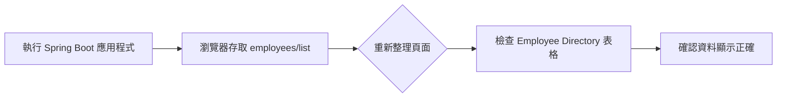

### Spring MVC 資料處理大圖景

- **資料流向驗證**
    - 透過 MySQL Workbench 確認資料庫中確實存在原始資料
    - 驗證 Spring MVC 應用程式能正確從資料庫抓取這些真實資料並顯示於前端
- **核心架構流程**
    - 資料的讀取與顯示遵循以下路徑：

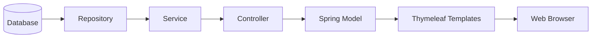

- **實作總結**
    - 已成功串聯後端邏輯與前端顯示，完成從資料庫讀取資料並在 Spring MVC 應用程式中呈現的完整循環

### 優化應用程式根路徑體驗

- **解決 404 錯誤問題**
    - 目前若直接存取 `localhost:8080`（未帶完整路徑），系統會顯示預設的 「Whitelabel Error Page (404 Not Found)"
    - 這種錯誤頁面對使用者而言並不友善
- **改進方案：實作重新導向**
    - 透過新增一個 `index.html` 頁面來解決此問題
    - 目標是讓使用者在進入根目錄時，能自動重新導向至正確的業務路徑（例如 `employees/list`）

### 實作自動重新導向 (Redirect)

- **建立&#32;`index.html`**
    - 檔案位置：`src/main/resources/static/index.html`
    - **[原理]** 當使用者存取應用程式根路徑且未指定具體路徑時，瀏覽器會自動載入此檔案
- **使用 Meta 標籤進行跳轉**
    - 透過 `<meta>` 標籤設定 `http-equiv="refresh"` 來達成自動重新導向至指定的 mapping 路徑

```html
<meta http-equiv="refresh" content="0; URL='employees/list'">
```

- **參數說明**
    - `content="0; ..."`：表示在 0 秒後立即執行跳轉動作

### 驗證重新導向效果

- **測試流程**
    - 重新啟動應用程式
    - 在瀏覽器存取根路徑 `localhost:8080`
- **執行結果**
    - 瀏覽器會自動執行跳轉，直接進入 `employees/list` 頁面
    - **[成功指標]** 不再看到 「Whitelabel Error Page (404 Not Found)"，而是直接看到 「Employee Directory」 表格內容

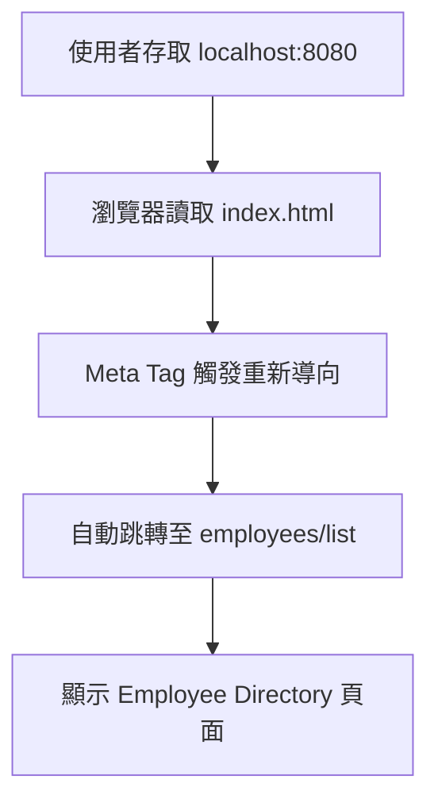

### 專案結構整理 (Housekeeping)

- **目的**
    - 為了與後續教學內容保持命名一致性，需要對目前的專案進行重新命名
    - 重點對象：套件名稱 (Package name) 與 主應用程式名稱 (Main application name)
- **重新命名套件 (Rename Package)**
    - 操作流程：

        1. 在 IDE 中選取目前的套件（例如 `cruddemo`）
        2. 使用 **Refactor** $\rightarrow$ **Rename** 功能
        3. **[關鍵選擇]** 選擇 「**All Directories**」 選項

            - **[原因]** 這樣可以確保所有相關目錄（包括 `src/main/java` 與 `src/test/java` 下的對應路徑）都會同步被重新命名，避免專案結構出現不一致的情況

### 重新命名專案與主應用程式

- **重新命名套件 (Rename Package)**
    - 將套件從 `com.luv2code.springboot.cruddemo` 更改為 `com.luv2code.springboot.thymeleafdemo`
    - **[目的]** 為了讓命名更精確地反映出專案正在使用 Thymeleaf 模板引擎
- **重新命名主應用程式 (Rename Main Application)**
    - 將主類別從 `CruddemoApplication` 更改為 `ThymeleafdemoApplication`
    - **[操作流程]**

        1. 選取該類別檔案
        2. 執行 **Refactor** $\rightarrow$ **Rename**
        3. 輸入新的名稱：`ThymeleafdemoApplication`
        4. 點擊 **Refactor** 完成變更

- **[開發小貼士]** 進行此類重構時，確保 IDE 會同步更新所有引用該類別或套件的地方，以維持專案的一致性。

### 重新命名測試類別 (Rename Tests)

- **目的**
    - 為了保持專案命名的一致性，測試類別也需要反映出新的專案名稱（從 `Cruddemo` 變更為 `Thymeleafdemo`）
- **操作流程**
    - 在 IDE 的 Rename 對話框中，勾選 「**Rename tests**」 選項
    - **[效果]** 這會自動將所有相關的測試類別（例如 `CruddemoApplicationTests.java`）重新命名為 `ThymeleafdemoApplicationTests.java`，確保重構後的專案結構完全符合新的命名規範

### 驗證開發成果

- **功能完整性檢查**
    - 存取 `localhost:8080/employees/list` 並確認頁面能正常載入
    - 檢查「Employee Directory」表格是否能正確顯示資料
- **[驗證結論]** 所有的修改（包括套件重構與自定義驗證規則的加入）均未破壞原有功能，系統運作正常

### 8. 使用 Thymeleaf 新增員工流程演示

- **操作流程演示**
    - 點擊頁面左上角的 「**Add Employee**」 按鈕
    - 在彈出的表單中輸入員工資訊：
        - `First Name` (例如：Michael)
        - `Last Name` (例如：Zeno)
        - `Email` (例如：michael.zeno@luv2code.com)
    - 點擊 「**Save**」 按鈕提交資料
- **[結果驗證]**
    - 提交後，新員工資訊會立即出現在 「Employee Directory」 表格的最下方
    - **[原理]** 這代表資料已成功寫入資料庫，並透過應用程式重新讀取後顯示在前端頁面上

### 新增員工功能的開發流程

- **開發步驟總覽**

    1. 在頁面上新增 「Add Employee」 按鈕
    2. 建立用於輸入新員工資訊的 HTML 表單
    3. 處理表單提交的資料，並將其儲存至資料庫

- **資料流向架構**
    - 資料會經過以下組件進行處理與傳遞：

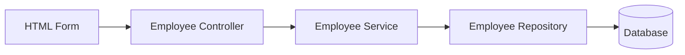

### Step 1: 建立「新增員工」按鈕

- **實作方式**
    - 在 `list-employees.html` 中新增一個按鈕
    - **[技術細節]** 該按鈕會透過 `href` 連結，導向至特定的 Request Mapping：
        - 路由路徑：`/employees/showFormForAdd`

### 實作「新增員工」按鈕與 Bootstrap 樣式

- **Thymeleaf 連結設定**
    - 使用 `th:href` 屬性來設定按鈕的跳轉路徑
    - **[語法細節]** 使用 `@` 符號來引用應用程式的 context path（應用程式根目錄）：

```html
<a th:href="@{/employees/showFormForAdd}">Add Employee</a>
```

- **套用 Bootstrap 樣式**
    - 為了讓按鈕更美觀，透過 `class` 屬性加入 Bootstrap 的樣式類別
    - **[使用的樣式類別]**
        - `btn`: 基礎按鈕樣式
        - `btn-primary`: 設定按鈕為主要顏色（通常是藍色）
        - `btn-sm`: 設定為小型按鈕 (Small button)
        - `mb-3`: 設定下邊距 (Margin bottom) 為 3 個單位，用以增加按鈕下方的空白間距
    - **[完整程式碼範例]**

```html
<a th:href="@{/employees/showFormForAdd}"
         class="btn btn-primary btn-sm mb-3">Add Employee</a>
```

- \*\*[開發資源]\*\* 關於各種 Bootstrap 樣式的詳細文件，可以參考 [getbootstrap.com](https://getbootstrap.com)

### 實作顯示「新增員工」表單 (Showing Form)

- **Controller 設定**
    - 需要新增一個對應到 `/employees/showFormForAdd` 的 Request Mapping
- **關鍵步驟：加入 Model Attribute**
    - **[為什麼需要它?]** 在顯示 HTML 表單之前，必須先在 Spring Controller 中加入一個 Model Attribute
    - **[作用]** 這是一個用來存放表單資料的物件，用於後續的 **資料綁定 (Data Binding)**
- **Controller 程式碼實作**

```java
@Controller
@RequestMapping("/employees")
public class EmployeeController {

    @GetMapping("/showFormForAdd")
    public String showFormForAdd(Model theModel) {

        // 建立 model attribute 以綁定表單資料
        Employee theEmployee = new Employee();
        // ... 後續邏輯
    }
}
```

### 顯示「新增員工」表單的 Controller 實作

- **Controller 完整邏輯**
    - 首先建立一個新的實體物件，例如 `Employee theEmployee = new Employee();`
    - 將該物件加入到 `Model` 中，以便 Thymeleaf 模板可以存取此資料進行表單資料綁定 (Binding)
    - **[程式碼實作]**

```java
@GetMapping("/showFormForAdd")
public String showFormForAdd(Model theModel) {

    // 建立 model attribute 以綁定表單資料
    Employee theEmployee = new Employee();
    theModel.addAttribute("employee", theEmployee);

    return "employees/employee-form";
}
```

- **模板路徑與回傳值**
    - 回傳字串 `"employees/employee-form"` 會讓 Spring MVC 到 `templates` 目錄下尋找對應的 HTML 檔案
    - 對應檔案路徑為：`templates/employees/employee-form.html`
- **Thymeleaf 資料綁定機制**
    - Thymeleaf 擁有特殊的表達式，能夠自動從給定的 Java 物件中設定 (set) 與取得 (get) 資料
    - **[優點]** 這能大幅簡化 HTML 表單的建立過程，實現 Spring MVC 表單資料與 Java 物件之間的自動同步

### 實作 HTML 表單 (Creating the HTML Form)

- **表單資料綁定語法**
    - **`th:object`**
        - 指向 Model Attribute 中的特定物件（即表單要綁定的資料來源）
        - 例如：`th:object="${employee}"`
    - **`th:field`**
        - 將 HTML 輸入欄位 (input field) 與 Model Attribute 中的屬性進行綁定
        - **[作用]** 它不僅會自動產生 `id` 與 `name` 屬性，還能實現資料的雙向同步
- **設定表單提交路徑**
    - **`th:action`**
        - 定義表單提交時要發送到的 URL 路徑
        - **[實作方式]** 使用 `th:action="@{/employees/save}"`，其中 `@{...}` 是 Thymeleaf 用於處理 Context Path 的語法
    - **關於&#32;`action="#"`**
        - 在開發初期，有時會先使用 `action="#"` 作為佔位符 (placeholder)
        - 但在正式實作時，應改用 `th:action` 讓 Thymeleaf 接管實際的路由處理

### 實作 HTML 表單輸入欄位

- **定義輸入欄位 (Input Fields)**
    - 根據 Model Attribute 中的屬性，建立對應的 HTML `<input>` 標籤
    - **[範例]** 建立「名字 (First Name)」欄位：

```html
<input type="text" placeholder="First Name" th:field="*{firstName}" />
```

- **`th:field`&#32;的運作原理**
    - **[語法細節]** 使用 `*{...}` 語法（星號表達式）
    - **[作用]** 這種語法會從當前 `th:object` 所指定的參考物件中，選擇特定的屬性
        - 例如 `*{firstName}` 會直接對應到 `employee` 物件中的 `firstName` 屬性
    - **[自動化功能]** 除了完成資料綁定，它還會自動為該輸入框生成對應的 `id` 與 `name` 屬性，確保表單提交時能正確傳回資料

### Thymeleaf 表單的資料同步機制

- **表單載入階段 (Form Loading)**
    - 當頁面首次載入時，Thymeleaf 會對 `th:object` 指定的物件執行 **Getter** 方法
    - **[作用]** 從 Java 物件中提取現有的值，並將其填充 (populate) 到 HTML 輸入欄位中，實現資料的預填功能
- **表單提交階段 (Form Submission)**
    - 當使用者點擊提交按鈕時，Spring MVC 會將表單中的輸入資料對應回 Java 物件
    - **[作用]** 透過對應的 **Setter** 方法（例如 `setFirstName()`）將前端傳回的資料寫入物件實例中
- **[總結] 資料流向圖**

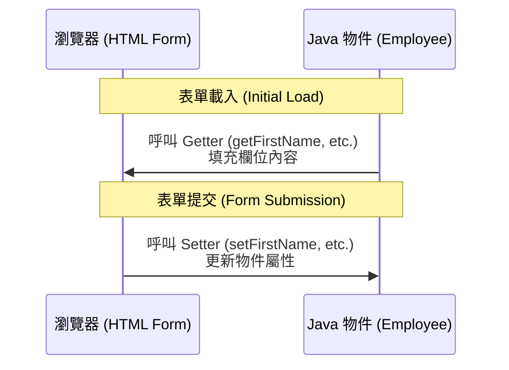

### 使用 Bootstrap 美化表單

- **套用 Bootstrap 樣式**
    - 透過在 HTML 標籤中加入 Bootstrap 的 `class` 屬性，可以快速改變元件的外觀
    - **[實作方式]** 對於輸入欄位 (`<input>`)，可以加入相關樣式類別以符合 Bootstrap 的設計規範
    - **[按鈕樣式]**
        - 使用 `btn` 類別作為基礎按鈕樣式
        - 使用 `btn-info` 類別來設定按鈕的顏色（例如資訊藍）
        - **[佈局控制]** 使用 `col-span-2` 等類別來控制按鈕在表單中的跨欄寬度，使其橫跨兩個欄位
- **開發資源建議**
    - **Bootstrap 官方網站 (getbootstrap.com)**
        - 提供所有詳細的樣式類別 (gory details) 說明與文件
        - 實作時可作為查閱各種組件（如按鈕、表單、網格系統）樣式的權威參考來源

### 實作儲存員工的 Controller 路由

- **處理表單提交 (Processing Form Data)**
    - 為了完成「新增員工」的流程，需要實作處理表單提交請求的路由
    - **[目標路徑]** `/employees/save`
- **依賴注入 (Dependency Injection)**
    - 為了執行儲存邏輯，必須在 `EmployeeController` 中使用 `EmployeeService`
    - **[實作方式]** 使用 **建構子注入 (Constructor Injection)**
        - 透過建構子將 `EmployeeService` 注入到 Controller 中
        - **[關鍵知識]** 當類別中只有一個建構子時，`@Autowired` 註解是**選用的 (Optional)**，Spring 會自動進行注入
- **實作&#32;`saveEmployee`&#32;方法**
    - **[路由設定]** 使用 `@PostMapping("/employees/save")`，因為表單是透過 POST 方式提交資料
    - **[參數接收]** 使用 `@ModelAttribute("employee") Employee employee`
        - 這會將表單中綁定的資料自動轉換為一個 `Employee` 物件，以便後續處理

### 實作 `saveEmployee` 的儲存流程

- **資料流向與儲存**
    - 當表單提交時，Spring MVC 會執行資料綁定 (Data Binding)，將表單內容轉化為 `Employee` 物件並傳入 `saveEmployee` 方法
    - **[儲存步驟]**
        - Controller 接收到物件後，呼叫 `employeeService.saveEmployee(employee)`
        - Service 層進一步呼叫 Repository，最終將資料寫入資料庫
- **使用 Post-Redirect-Get (PRG) 模式**
    - 在儲存完成後，不直接回傳頁面，而是執行 **Redirect (重新導向)**
    - **[實作方式]** 使用 `return "redirect:/employees/list";` 將請求導向至員工列表頁面
    - **[為什麼需要 PRG？]**
        - **防止重複提交 (Prevent Duplicate Submissions)**
            - 如果在 POST 請求後直接渲染頁面，使用者若在瀏覽器按下「重新整理 (Reload)」，瀏覽器會嘗試再次發送該 POST 請求
            - 這會導致系統再次執行儲存邏輯，造成資料庫中出現重複的紀錄
        - **透過 Redirect 解決**
            - Redirect 會讓瀏覽器發送一個新的 GET 請求到指定的 URL (例如 `/employees/list`)
            - 即使使用者重新整理，也只是重新載入列表頁面 (GET)，而不會再次觸發儲存動作 (POST)

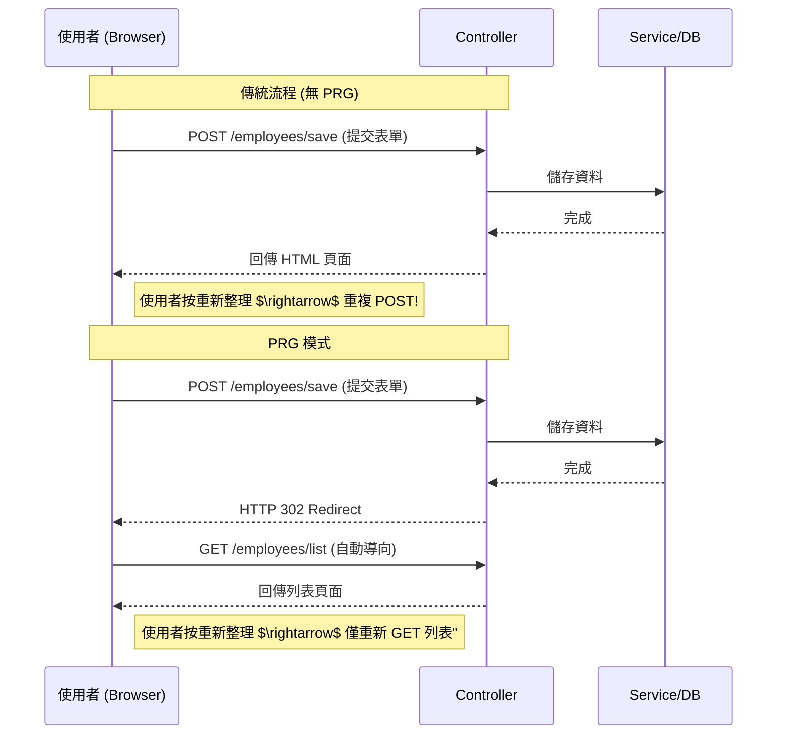

### 開發流程總結

- **完成開發階段**
    - 已成功實作從前端表單、資料綁定、Controller 處理，到 Service/Repository 儲存至資料庫的完整流程

### 模板路徑重構規劃

- **重構目的**
    - 為了確保 URL 路徑與檔案路徑的一致性 (Consistency)
    - 將所有與員工相關的資源統一管理
- **實作動作**
    - 在 `templates` 目錄下新增一個名為 `employees` 的子資料夾
    - 將現有的模板檔案移入該資料夾，使所有路徑都統一在 `/employees` 之下

### 實作模板路徑重構

- **檔案移動**
    - 將 `list-employees.html` 從 `templates` 目錄下拖移至新建立的 `employees` 子資料夾中
    - **[目標結構]** `src/main/resources/templates/employees/list-employees.html`
- **Controller 重構**
    - 由於模板存放位置改變，必須開啟 `EmployeeController.java` 進行小規模的程式碼重構
    - **[必要性]** Controller 回傳的視圖名稱 (View Name) 必須與實際的檔案路徑匹配，否則 Spring MVC 將無法找到對應的 HTML 頁面

### 實作 Controller 路徑修正與驗證

- **更新 Controller 回傳路徑**
    - 由於模板已移至 `employees` 子資料夾，必須將 `EmployeeController` 中的回傳字串進行修改
    - **[修改內容]** 將原本的回傳值更改為 `"redirect:/employees/list-employees"`
    - **[原理]** Spring MVC 會自動在 `templates` 目錄下尋找對應的路徑，因此路徑必須精確匹配新的目錄結構 (`/employees/list-employees.html`)
- **執行完整性測試 (Sanity Test)**
    - **[目的]** 確保路徑重構與程式碼調整沒有導致任何功能中斷
    - **[步驟]**

        1. 重新啟動 Spring Boot 應用程式
        2. 開啟瀏覽器並存取 `localhost:8080`
        3. 觀察頁面是否能如預期般正確跳轉並顯示內容

### 功能完整性驗證

- **驗證結果**
    - 經過測試，所有現有功能運作正常，重構過程並未破壞原有的邏輯
    - 應用程式已進入穩定狀態，可以開始進行下一步開發

### 實作「新增員工」按鈕的初步結構

- **新增按鈕入口**
    - 在 HTML 表格上方新增一個藍色的「Add Employee」按鈕
    - **[實作方式]** 使用 `<a>` 標籤作為基礎結構，並在後續步驟中透過 Bootstrap 樣式將其美化為按鈕外觀
    - **[開發筆記]** 建立一個簡單的錨點 (anchor tag) 作為導向新增表單頁面的連結

### 實作「新增員工」按鈕的樣式美化與動態連結

- **動態連結實作**
    - 使用 `th:href` 來定義超連結的目標路徑
    - **[語法重點]** 使用 `@{/employees/showFormForAdd}` 格式
        - `@{...}` 是 Thymeleaf 的 URL 語法
        - 開頭的 `/` 搭配 `@{}` 會自動引用應用程式的 **Context Path** (即應用程式的根路徑)
        - **[為什麼重要]** 這能確保無論應用程式部署在伺服器的哪個路徑下，連結都能正確指向正確的資源，避免路徑失效的問題
- **UI 美化**
    - 應用 Bootstrap 的 CSS 類別 (Classes) 來提升按鈕的外觀
    - 將原本單純的超連結轉化為具有視覺吸引力的按鈕樣式

### 實作「新增員工」按鈕的美化與驗證

- **使用 Bootstrap 進行樣式美化**
    - 為了讓原本單調的超連結看起來更像專業的按鈕，套用了以下 Bootstrap class：
        - `btn`: 基礎按鈕樣式
        - `btn-primary`: 設定為品牌主色（藍色）
        - `btn-sm`: 設定為小型按鈕 (small)
        - `mb-3`: 設定下方外邊距 (margin-bottom: 3px)，以提供視覺上的間距
- **UI 變更驗證**
    - **[操作步驟]**

        1. 儲存 HTML 程式碼
        2. 重新整理瀏覽器頁面

    - **[結果]** 頁面上已成功顯示美化後的藍色按鈕
- **開發狀態備註**
    - **[注意]** 目前按鈕尚未連結到實際的功能路徑，點擊後尚無反應，後續需實作對應的 Controller 方法與頁面導向

### 實作顯示新增員工表單的 Controller 方法

- **新增 GET 映射**
    - 在 `EmployeeController.java` 中新增一個對應路徑 `/showFormForAdd` 的方法
    - **[目的]** 當使用者點擊「Add Employee」按鈕時，透過此方法導向並顯示新增員工的表單頁面
- **程式碼實作**

```java
@GetMapping("/showFormForAdd")
    public String showFormForAdd() {
        // 待實作：回傳表單頁面的名稱
    }
```

- **建立 Model 屬性以進行資料綁定**
    - **[目的]** 在顯示表單之前，必須先在 `Model` 中準備好一個空的物件，以便 Thymeleaf 表單能將使用者輸入的資料直接綁定到該物件的屬性上
    - **[實作步驟]**

        1. 在方法內實例化一個新的 `Employee` 物件
        2. 使用 `model.addAttribute` 將該物件放入 `Model` 中

    - **[程式碼實作]**

```java
@GetMapping("/showFormForAdd")
public String showFormForAdd(Model theModel) {
    // 建立 model 屬性以進行表單資料綁定
    Employee theEmployee = new Employee();
    theModel.addAttribute("employee", theEmployee);

    return "employees/showFormForAdd";
}
```

- **[關鍵點]** `theModel.addAttribute("employee", theEmployee)` 中的第一個參數 `"employee"` 是屬性名稱，這必須與 Thymeleaf 表單中 `th:object` 所指定的名稱完全一致，才能確保資料能正確地進行雙向綁定。

### 實作顯示新增員工表單的 Controller 方法 (續)

- **建立 Model Attribute 以進行資料綁定**
    - **[目的]** 在將頁面傳送給 Thymeleaf 模板之前，必須先在 Model 中準備好一個空的物件，以便模板能將表單資料綁定到該實體上
    - **[實作邏輯]**

        1. 實例化一個新的 `Employee` 物件
        2. 使用 `model.addAttribute` 將該物件存入 Model，並指定屬性名稱為 `"employee"`

- **回傳 Thymeleaf 模板**
    - **[回傳路徑]** `"employees/employee-form"`
    - **[原理]** Spring MVC 會根據此路徑在 `src/main/resources/templates` 目錄下尋找對應的 `employees/employee-form.html` 檔案
- **完成後的程式碼實作**

```java
@GetMapping("/showFormForAdd")
public String showFormForAdd(Model theModel) {

    // 建立 model attribute 以綁定表單資料
    Employee theEmployee = new Employee();
    theModel.addAttribute("employee", theEmployee);

    return "employees/employee-form";
}
```

---

### Step 2: Create HTML form for new employee

- 即將開始建立用於新增員工的 HTML 表單頁面

### 實作新增員工 HTML 表單

- **建立新檔案**
    - 在 `employees` 子目錄下建立名為 `employee-form.html` 的新檔案
- **快速建立頁面結構**
    - **[方法]** 從現有的 `list-employees.html` 檔案中複製整個 `<head>` 區塊並貼上到 `employee-form.html` 中
    - **[目的]** 為了快速獲得與現有頁面相同的 Bootstrap 支援、必要的 Meta 標籤以及一致的頁面配置，無需從零開始撰寫基礎 HTML 結構

### 建立新增員工表單頁面 (employee-form.html)

- **建立新檔案**
    - 在 `templates/employees/` 目錄下建立新檔案 `employee-form.html`
- **複製與整合 HTML 標頭**
    - **[操作]** 從現有的 `list-employees.html` 複製第 1 行至第 13 行的標頭資訊
    - **[目的]** 確保新頁面能直接使用專案中已配置好的 Bootstrap CSS 與 Meta 標籤，維持視覺風格一致
- **實作 HTML 基本結構**
    - 建立 `<body>` 與 `<html>` 標籤完成骨架
    - 更新頁面標題 (`<title>`) 為 `Save Employee`
- **目前頁面結構概覽**

```html
<!DOCTYPE html>
<html xmlns:th="http://www.thymeleaf.org">
<head>
    <!-- Required meta tags -->
    <meta charset="UTF-8">
    <meta name="viewport" content="width=device-width, initial-scale=1">
    <!-- Bootstrap CSS -->
    <link href="https://cdn.jsdelivr.net/npm/bootstrap@5.2.2/dist/css/bootstrap.min.css" rel="stylesheet">
    <title>Save Employee</title>
</head>
<body>

</body>
</html>
```

### 實作新增員工 HTML 表單 (續)

- **使用 Bootstrap Container**
    - **[實作]** 將所有的頁面內容包裝在 `<div class="container">` 中
    - **[目的]** 利用 Bootstrap 的容器功能來提供適當的頁面邊距與佈局結構
- **建立表單結構**
    - **[頁面標題]** 使用 `<h3>Employee Directory</h3>` 作為頁面的主要標題
    - **[表單設計]** 建立一個名為 「Save Employee」 的表單，包含以下三個欄位：
        - First Name
        - Last Name
        - Email
    - **[提交按鈕]** 包含一個 「Save」 按鈕用於送出表單資料

### 實作 HTML 表單 (續)

- **設定表單屬性**
    - **[提交路徑]** 使用 `th:action` 來定義表單提交的目的地
    - **[資料綁定]** 使用 `th:object` 將表單與後端傳入的 Model 屬性進行關聯
- **完成後的程式碼實作**

```html
<form action="#" th:action="@{/employees/save}" th:object="${employee}">
```

### 定義 HTML 表單輸入欄位

- **表單屬性詳解**
    - **[提交路徑]** 使用 `th:action` 指定表單資料要傳送到後端的 URL 路徑
        - 實作範例：`th:action="@{/employees/save}"`
    - **[資料綁定]** 使用 `th:object` 引用 Spring Model 中的屬性
        - **[關聯性]** 此處引用的 `${employee}` 必須與 `EmployeeController` 中透過 `theModel.addAttribute("employee", theEmployee)` 設定的名稱完全一致

```html
<form action="#" th:action="@{/employees/save}" th:object="${employee}" method="POST">
```

- **使用&#32;`th:field`&#32;進行屬性綁定**
    - **[語法]** 使用 `th:field="*{propertyName}"`
    - **[原理]** 星號與大括號 `*{...}` 會從 `th:object` 所指定的參考物件中選取對應的屬性
    - **[範例]** `th:field="*{firstName}"` 會將該輸入欄位與 `employee` 物件的 `firstName` 屬性關聯
- **快速建立多個輸入欄位**
    - **[操作]** 建立完第一個欄位（如 First Name）後，可透過複製與貼上該區塊來快速建立其他欄位
    - **[更新內容]** 複製後需手動更新以下兩點以確保正確性：

        1. `th:field` 的屬性名稱
        2. `placeholder` 的提示文字

- **完成後的欄位實作範例**

```html
<!-- First Name 欄位 -->
<input type="text" th:field="*{firstName}" class="form-control mb-4 w-25" placeholder="First name">

<!-- Last Name 欄位 -->
<input type="text" th:field="*{lastName}" class="form-control mb-4 w-25" placeholder="Last name">

<!-- Email 欄位 -->
<input type="text" th:field="*{email}" class="form-control mb-4 w-25" placeholder="Email">
```

### 實作提交按鈕

- **[提交按鈕]** 建立一個用於送出表單的按鈕
    - **[樣式與文字]** 使用 Bootstrap 類別 `btn btn-info col-2` 並將標籤設定為 「Save」

```html
<button type="submit" class="btn btn-info col-2">Save</button>
```

### Thymeleaf 表單的資料同步機制

- **[表單載入階段 (Form Loaded)]**
    - **[運作原理]** 當頁面載入時，Thymeleaf 會調用 Java 物件的 **Getter** 方法
    - **[效果]** 將取得的資料填充到對應的 HTML 輸入欄位中，讓使用者看到初始值
    - **[流程]** `employee.getFirstName()` $\rightarrow$ 填充至 First Name 欄位
- **[表單提交階段 (Form Submitted)]**
    - **[運作原理]** 當使用者按下提交按鈕後，Thymeleaf 會調用 Java 物件的 **Setter** 方法
    - **[效果]** 將表單中輸入的新資料寫回 Java 物件中，完成資料的同步
    - **[流程]** `employee.setFirstName(...)` $\rightarrow$ 更新物件屬性

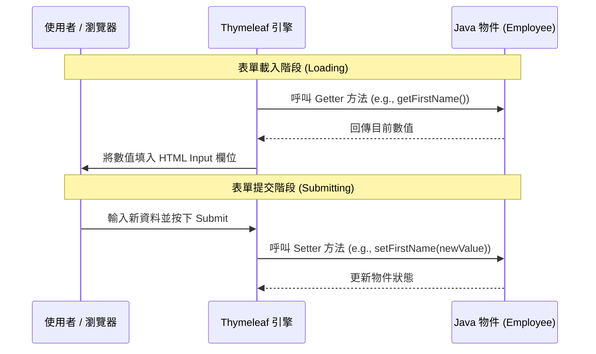

- **表單載入階段 (Form Loading)**
    - **[機制]** 當頁面載入時，Thymeleaf 會自動呼叫 Java 物件的 **Getter** 方法
    - **[目的]** 從後端物件中取出目前的數值，並填充到 HTML 的輸入欄位中（例如 `getFirstName()`）
- **表單提交階段 (Form Submission)**
    - **[機制]** 當使用者按下提交按鈕後，Spring 會自動呼叫 Java 物件的 **Setter** 方法
    - **[目的]** 將前端輸入的表單資料，透過 Setter 方法（例如 `setFirstName(...)`）寫入到 Java 物件中，完成資料綁定

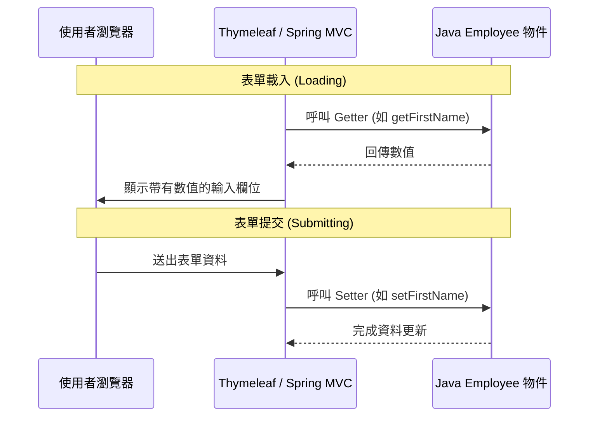

### 實作頁面導覽連結

- **新增返回連結**
    - **[目的]** 提供一個簡單的導覽方式，讓使用者在完成表單操作後能快速回到員工列表頁面
    - **[實作方式]** 使用 `th:href` 屬性來定義連結的目標路徑

```html
<a th:href="@{/employees/list}">Back to Employees List</a>
```

### 測試前端介面與導覽功能

- **驗證新增員工表單 (Add Employee Form)**
    - **[檢查項目]** 確認表單欄位（First name, Last name, Email）是否正確顯示
    - **[檢查項目]** 確認「Save」按鈕是否正常呈現
- **驗證導覽連結 (Navigation Link)**
    - **[測試流程]** 點擊表單底部的 「Back to Employees List」 連結
    - **[預期結果]** 瀏覽器應能成功導回「Employee Directory」列表頁面
- **[後續開發目標]** 目前僅完成 UI 與導覽，下一步需實作後端程式碼以處理資料的儲存邏輯

### 實作儲存員工資料的 Controller 方法

- **[步驟]** 處理表單資料以儲存員工的第三步：在 Controller 中新增對應的 POST 映射
- **[實作]** 使用 `@PostMapping("/save")` 來接收來自前端表單的提交請求

```java
@PostMapping("/save")
public String saveEmployee(@ModelAttribute("employee") Employee theEmployee) {
    // 接下來將實作將 employee 儲存至資料庫的邏輯
    return "redirect:/employees/list";
}
```

### 深入理解 `@ModelAttribute` 資料綁定

- **[資料傳遞機制]** 在處理 POST 請求的方法中，透過 `@ModelAttribute` 接收表單資料
    - **[運作原理]** 利用 Spring 的 **資料綁定 (Data Binding)** 技術，將 HTML 表單中輸入的內容自動對應並填入傳入的 Java 物件中

```java
@PostMapping("/save")
public String saveEmployee(@ModelAttribute("employee") Employee theEmployee) {
    // 接下來將實作將 theEmployee 儲存至資料庫的邏輯
    return "redirect:/employees/list";
}
```

- **[開發進度]** 目前已完成資料接收與重定向邏輯，下一步將著手實作將 `theEmployee` 物件持久化至資料庫的邏輯。

### 實作員工資料持久化與防止重複提交

- **[資料儲存流程]** Controller 會呼叫 Service 層，再由 Service 層透過 Repository 與後端資料庫進行互動

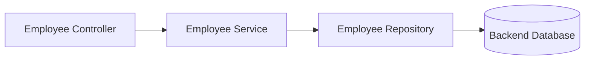

- **[實作程式碼]** 在 `saveEmployee` 方法中，呼叫 `employeeService.save()` 並執行重定向

```java
@PostMapping("/save")
public String saveEmployee(@ModelAttribute("employee") Employee theEmployee) {
    // 使用 service 儲存員工資料
    employeeService.save(theEmployee);

    // 使用 redirect 避免重複提交 (Duplicate Submissions)
    return "redirect:/employees/list";
}
```

- **[為什麼要使用 Redirect?]**
    - **[目的]** 防止使用者在提交表單後，因為重新整理瀏覽器頁面而導致重複送出相同的資料
    - **[機制]** 透過 `redirect:/employees/list` 指令，告訴瀏覽器跳轉到員工列表頁面，而非停留在處理 POST 請求的當前 URL

### Post/Redirect/Get (PRG) 設計模式

- **[核心概念]** 在處理表單提交時，採用「POST 請求 $\rightarrow$ 重定向 (Redirect) $\rightarrow$ GET 請求」的流程
- **[主要目的]** 防止重複提交 (Duplicate Submissions)
    - **[情境]** 當使用者在完成 POST 請求後，不小心重新整理 (Reload) 瀏覽器頁面時
    - **[效果]** 透過重定向到一個新的 GET 請求 URL，可以確保重新整理操作只會觸發 GET 請求（例如重新讀取列表），而不會再次執行原本的 POST 儲存邏輯

### 實作功能測試

- **[執行流程]** 啟動應用程式並進入前端介面進行實際操作
- **[測試步驟]**

    1. 啟動 Spring Boot 應用程式
    2. 點擊 「Add Employee」 按鈕進入新增表單
    3. 輸入員工資料（First name, Last name, Email）
    4. 點擊 「Save」 按鈕提交資料

- **[預期結果]** 資料應成功儲存，並自動跳轉回員工列表頁面 (Employee Directory)
- **[功能確認]** 成功新增員工並確認資料已持久化至資料庫
    - **[測試結果]** 提交表單後顯示「Success」，且新員工已出現在列表中
- **[待優化事項]** 員工列表的排序問題
    - **[現況]** 目前顯示的員工資料是未排序的 (unsorted)
    - **[改進目標]** 實作按「姓氏 (Last Name)」進行排序的功能，以提升資料檢視的便利性

### 9. 實作按姓氏排序功能

- **[需求]** 為了提升使用者體驗，需要讓員工列表能夠依照姓氏 (Last Name) 進行排序
- **[實作方式]** 在 `EmployeeRepository` 介面中新增一個符合 Spring Data JPA 命名規則的方法
    - **[方法名稱]** `findAllByOrderByLastNameAsc()`
        - `findAllBy`: 代表查詢所有符合條件的實體
        - `OrderByLastName`: 指定排序的欄位為 `lastName`
        - `Asc`: 指定排序方式為升序 (Ascending)

```java
public interface EmployeeRepository extends JpaRepository<Employee, Integer> {

    // 透過命名慣例建立按姓氏升序排序的方法
    public List<Employee> findAllByOrderByLastNameAsc();

}
```

### Spring Data JPA 的查詢方法機制

- **[運作原理]** Spring Data JPA 會解析 Repository 介面中的方法名稱
    - **[解析流程]** 尋找符合特定格式與模式的名稱 $\rightarrow$ 在幕後自動建立對應的 SQL 查詢語句
- **[實例解析]** 以 `findAllByOrderByLastNameAsc()` 為例
    - `findAllBy`: 屬於預設模式的一部分
    - `OrderByLastNameAsc`: 被解析為 SQL 中的 `ORDER BY lastName ASC`

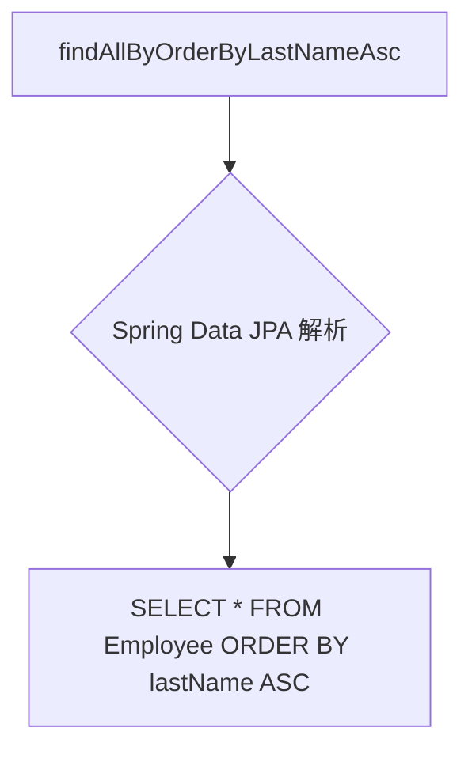

- **[核心優勢]** 這種自動化處理被稱為 "Spring Data JPA Magic"，開發者只需遵循命名慣例，無需手動編寫複雜的查詢邏輯。

### 更新 Service 層以啟用排序功能

- **[必要步驟]** 在 Repository 層定義好排序方法後，必須修改 Service 層的實作類別 (`EmployeeServiceImpl`)，否則系統仍會執行預設的未排序查詢。
- **[實作變更]** 將 `findAll()` 方法內的邏輯，從呼叫一般的 `employeeRepository.findAll()` 改為呼叫新定義的排序方法 `findAllByOrderByLastNameAsc()`。

```java
@Service
public class EmployeeServiceImpl implements EmployeeService {

    @Autowired
    private EmployeeRepository employeeRepository;

    @Override
    public List<Employee> findAll() {
        // 將原本的 employeeRepository.findAll()
        // 修改為使用新的排序方法
        return employeeRepository.findAllByOrderByLastNameAsc();
    }

    // ... 其他方法
}
```

- **[開發流程總結]**

    1. **Repository 層**：定義符合命名慣例的方法 (例如 `findAllByOrderByLastNameAsc`)。
    2. **Service 層**：更新實作方法，呼叫該特定方法以取代預設方法。
    3. **Controller/UI 層**：透過 Controller 呼叫 Service，最終在前端呈現排序後的資料。

### 驗證排序功能實作成果

- **[實作確認]** 在 `EmployeeServiceImpl` 中將 `findAll()` 的回傳值改為呼叫新定義的排序方法：
    - **[修改內容]** `return employeeRepository.findAllByOrderByLastNameAsc();`

```java
@Override
public List<Employee> findAll() {
    // 呼叫新的排序方法以確保資料依姓氏升序排列
    return employeeRepository.findAllByOrderByLastNameAsc();
}
```

- **[測試結果]** 重新載入應用程式並查看「Employee Directory」頁面
    - **[觀察結果]** 員工列表已成功依照姓氏進行排序（例如：Andrews $\rightarrow$ Baumgarten $\rightarrow$ Bose $\rightarrow$ Gupta $\rightarrow$ Petrov $\rightarrow$ Vega）
    - **[結論]** 排序功能實作成功，Spring Data JPA 的命名慣例與 Service 層的整合運作正常。

### 驗證排序功能實作成果

- **[驗證結果]** 排序功能已成功運作，員工列表現在會依照姓氏 (Last Name) 的字母順序排列
    - **[範例資料]** 觀察顯示的員工順序：

        1. Andrews, Leslie
        2. Baumgarten, Emma
        3. Bose, Trupti
        4. Gupta, Avani
        5. Petrov, Yuri
        6. Vega, Juan

- **[核心結論]** 這就是所謂的 "Spring Data JPA Magic"：只需透過正確的方法命名，系統就能自動完成複雜的排序邏輯，並在前端呈現完美的結果。

### 10. 使用 Thymeleaf 更新員工資料

- **[更新流程示範]** 在員工目錄 (Employee Directory) 頁面中，透過「Action」欄位進行操作：

    1. **點擊更新**：在目標員工（例如 Trupti Bose）的列中點擊 `Update` 按鈕。
    2. **預填表單**：系統會導向一個編輯頁面，表單會自動從資料庫讀取該員工的現有資訊並進行**預填 (Pre-populated)**，方便使用者進行修改。
    3. **修改與儲存**：使用者修改所需的欄位（如姓氏或電子郵件地址）後，點擊 `Save` 按鈕完成更新。

- **[介面結構]**
    - **Employee Directory 列表**：包含 `First Name`, `Last Name`, `Email` 以及用於操作的 `Action` 欄位。
    - **Save Employee 表單**：提供輸入框供使用者編輯員工資訊，並附帶 `Save` 與 `Back to Employees List` 的選項。

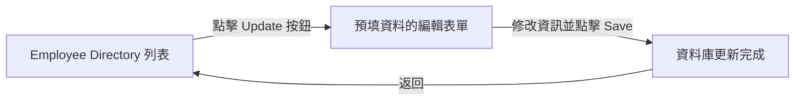

### 更新員工功能的開發流程

要實作更新員工的功能，開發過程可分為以下三個核心階段：

1. **新增更新按鈕 (Update Button)**：在前端頁面建立觸發點。
2. **預填表單 (Pre-populate the form)**：撰寫程式碼將現有資料讀取並填入編輯表單。
3. **處理表單資料 (Process form data)**：將使用者修改後的資料傳回後端並儲存至資料庫。

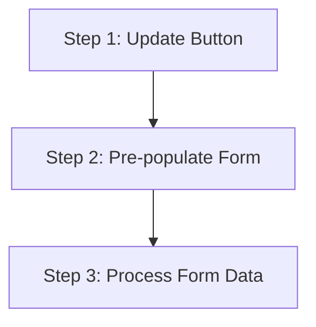

### Step 1: 實作 "Update" 按鈕

- **[介面變更]** 在員工列表表格中新增一個名為 `Action` 的欄位，用於放置更新連結或按鈕。
- **[實作細節]** 每一列 (row) 都會有一個專屬的 `Update` 連結，且該連結會**嵌入目前的員工 ID (current employee ID)**。
- **[點擊後的行為]** 當使用者點擊該連結時，系統將會：
    - 從資料庫中載入該名員工的資料
    - 將資料填入表單中供使用者修改

### Step 1: 實作 "Update" 按鈕的 Thymeleaf 語法

- **[Thymeleaf 實作]** 使用 `th:href` 搭配 URL 表達式來動態生成包含 `employeeId` 參數的連結：

```html
<tr th:each="tempEmployee : ${employees}">
    <td>
        <a th:href="@{{/employees/showFormForUpdate(employeeId=${tempEmployee.id})}"
           class="btn btn-info btn-sm">
            Update
        </a>
    </td>
</tr>
```

- **[URL 生成邏輯]**
    - **動態參數**：透過 `${tempEmployee.id}` 取得當前迭代的員工 ID。
    - **後端接收格式**：在後端接收時，URL 會自動轉換為類似 `/employees/showFormForUpdate?employeeId=xxx` 的格式，其中 `xxx` 即為該員工的實際 ID，確保系統能精準識別要更新的對象。

### Step 2: 預填表單 (Pre-populate Form)

- **[實作邏輯]** 在 `EmployeeController` 的 `showFormForUpdate` 方法中，透過接收前端傳來的 `employeeId` 來完成資料預填：

    1. **接收參數**：使用 `@RequestParam("employeeId")` 接收從 `Update` 連結傳遞過來的 ID。
    2. **查詢資料**：呼叫 `employeeService.findById(theId)` 從資料庫中抓取該名員工的完整資訊。
    3. **綁定 Model**：使用 `theModel.addAttribute("employee", theEmployee)` 將查詢到的員工物件加入 Model 中。
    4. **導向頁面**：回傳 `employee-form` 模板路徑，讓 Thymeleaf 根據 Model 中的資料自動填入表單欄位。

```java
@GetMapping("/showFormForUpdate")
public String showFormForUpdate(@RequestParam("employeeId") int theId, Model theModel) {

    // 從 service 取得員工資料
    Employee theEmployee = employeeService.findById(theId);

    // 將 employee 設定為 model attribute 以便預填表單
    theModel.addAttribute("employee", theEmployee);

    // 傳送至我們的表單頁面
    return "employees/employee-form";
}
```

- **[HTML 表單結構]** 為了確保更新時能正確識別對象，表單中必須包含一個隱藏欄位來攜帶 ID：

```html
<form action="#" th:action="@{/employees/save}" th:object="${employee}" method="POST">

    <!-- 用於處理更新的隱藏欄位 (Hidden field) -->
    <input type="hidden" th:field="*{id}" />

    <input type="text" th:field="*{firstName}" class="form-control mb-4 w-25" placeholder="First name"/>
    <input type="text" th:field="*{lastName}" class="form-control mb-4 w-25" placeholder="Last name"/>
    <input type="text" th:field="*{email}" class="form-control mb-4 w-25" placeholder="Email"/>

    <button type="submit" class="btn btn-info col-2">Save</button>
</form>
```

- **[關鍵機制]**
    - **隱藏欄位 (`type="hidden"`)**：當表單載入時，Thymeleaf 會呼叫 `employee.getId()` 等方法將值填入。在提交 (Submit) 時，這個 ID 會隨表單一起傳回後端，讓系統知道這是在「更新」現有員工而非「新增」新員工。
    - **Thymeleaf 綁定**：透過 `th:field="*{firstName}"`，系統會自動對應到 `employee` 物件中的 `firstName` 屬性。

### 表單預填與更新機制

- **[預填原理]** 當表單載入時，Thymeleaf 會根據 Model Attribute 中的資訊，透過呼叫 Java 物件的 Getter 方法來設定初始值：
    - 例如：`employee.getFirstName()`、`employee.getLastName()` 等。
- **[更新所需的隱藏欄位]** 為了讓系統區分「新增」與「更新」，在處理更新時必須在表單中加入一個隱藏欄位：
    - `th:field="*{id}"` 會將該欄位綁定到 Model Attribute，從而告訴應用程式應該更新哪一位員工。

### 步驟 3：處理表單資料以儲存員工 (Process form data to save employee)

- **[邏輯重用]** 處理表單提交時不需要撰寫新的程式碼，因為「新增」與「更新」的邏輯可以完全重用現有的儲存方法。
- **[實作方式]** 在 `saveEmployee` 方法中，無論是新員工還是現有員工的變更，都能透過相同的流程進行處理。

```java
@Controller
@RequestMapping("/employees")
public class EmployeeController {

    @PostMapping("/save")
    public String saveEmployee(@ModelAttribute("employee") Employee theEmployee) {

        // 儲存員工
        employeeService.save(theEmployee);

        // 使用 redirect 防止重複提交
        return "redirect:/employees/list";
    }
}
```

### 步驟 3：處理表單資料以儲存員工

- **[重用現有邏輯]** 無需撰寫新的程式碼，可以直接重用現有的 `employeeService.save()` 方法
    - **[自動判斷機制]** 該方法內部已內建處理邏輯，會根據傳入的物件狀態自動執行「新增 (insert)」或「更新 (update)」
- **[Controller 實作範例]**

```java
@Controller
@RequestMapping("/employees")
public class EmployeeController {

    @PostMapping("/save")
    public String saveEmployee(@ModelAttribute("employee") Employee theEmployee) {
        // 儲存員工資料
        employeeService.save(theEmployee);

        // 使用 redirect 避免重複提交 (duplicate submissions)
        return "redirect:/employees/list";
    }
}
```

- **[資料流向]**

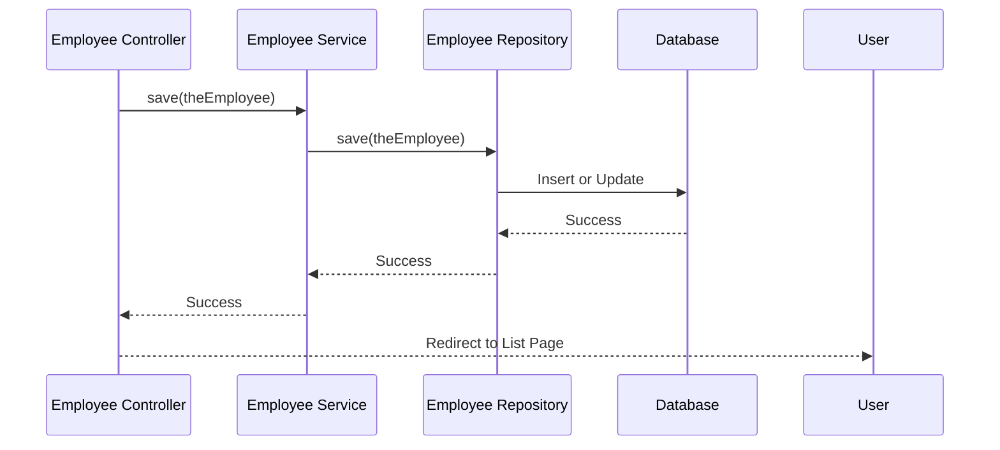

### 步驟 1：新增「更新」按鈕

為了讓使用者能從員工列表直接進入編輯流程，需要在 `list-employees.html` 中進行以下修改：

- **新增表格標題 (Table Heading)**
    - 在 `<thead>` 區塊中新增一個 `<th>` 標籤，標題名稱為 `Action`，用來建立新的操作欄位。
- **新增表格列內容 (Table Row Content)**
    - 在 `<tbody>` 的 `<tr>` 區塊中，為每一行資料新增一個單元格（通常是 `<td>`），並在其中放置一個按鈕或連結，以便觸發更新功能。

### 步驟 2：實作更新按鈕 (Implement Update Button)

為了讓使用者可以點擊按鈕進入編輯頁面，需要在 `list-employees.html` 的表格列 (`<td>`) 中新增一個超連結 (`<a>`)：

- **[實作方式]** 使用 Thymeleaf 的 `th:href` 屬性來動態產生 URL
- **[URL 結構]** 連結應指向 `employees/showFormForUpdate` 並帶上該員工的 ID

```html
<!-- 在 <td> 標籤內新增更新按鈕 -->
<td>
    <a th:href="@{/employees/showFormForUpdate(employeeId=${tempEmployee.id})}"
       class="btn btn-primary btn-sm mb-3">Update</a>
</td>
```

- **[屬性說明]**
    - `th:href`：Thymeleaf 的連結表達式，用於動態生成路徑
    - `@{...}`：Thymeleaf 的 URL 語法
    - `(employeeId=${tempEmployee.id})`：將當前行員工的 ID 作為參數傳遞給後端，以便 Controller 知道要載入哪筆資料

### 步驟 2：實作更新按鈕 (Thymeleaf 參數傳遞)

為了將特定的員工 ID 從前端傳遞到後端的 Controller，需要在 `th:href` 的 URL 表達式中加入參數部分：

- **[實作方式]** 在 URL 路徑後方使用括號 `()` 並定義參數名稱與值
- **[程式碼範例]**

```html
<a th:href="@{|/employees/showFormForUpdate?employeeId=${tempEmployee.id}|}"
   class="btn btn-primary btn-sm mb-3">Update</a>
```

- **[運作原理]**
    - 透過 `${tempEmployee.id}` 取得當前迭代員工的動態 ID
    - 最終生成的 URL 會呈現為 `?employeeId=XXX` 的形式，其中 `XXX` 是實際的員工 ID
    - **[目的]** 這樣 Controller 才能透過接收 `employeeId` 參數，從資料庫中載入正確的員工資料並填入表單

### 實作更新按鈕的視覺美化與參數嵌入

- **[參數嵌入]** 將動態 ID 嵌入 URL 中，以便後端 Controller 接收並用於預填表單
    - **[實作方式]** 使用 Thymeleaf 的表達式將 ID 附加到路徑後方
    - **[生成的 URL 結構]** 會自動產生如 `?employeeId=xxx` 的查詢參數

```html
<a th:href="@{|/employees/showFormForUpdate?employeeId=${tempEmployee.id}|}"
   class="btn btn-info btn-sm mb-3">Update</a>
```

- **[UI 美化]** 使用 Bootstrap 類別提升按鈕的外觀與使用者體驗
    - `btn`：基礎按鈕樣式
    - `btn-info`：套用資訊藍 (Info color) 主題
    - `btn-sm`：將按鈕縮小為小尺寸 (Small size)
    - `mb-3`：在按鈕下方增加間距 (Margin bottom)，避免與下方內容過於擁擠

### 步驟 2：實作預填表單的 Controller 邏輯 (Pre-populate Form)

為了讓更新表單能夠顯示現有的員工資料，需要在 `EmployeeController.java` 中新增一個處理請求的方法：

- **新增 GET Mapping**
    - 建立一個新的 `@GetMapping`，路徑設定為 `/employees/showFormForUpdate`
    - **[目的]** 當使用者點擊列表中的「Update」按鈕時，會觸發此方法來載入資料
- **使用&#32;`@RequestParam`&#32;接收參數**
    - 在方法參數中使用 `@RequestParam` 來接收從前端傳來的 `employeeId`
    - **[實作方式]**

```java
@GetMapping("/showFormForUpdate")
public String showFormForUpdate(@RequestParam("employeeId") int theEmployeeId) {
    // 後續邏輯：根據 ID 取得員工並放入 Model
    return "employees/employee-form";
}
```

- **[邏輯流程]**
    - 透過 `employeeId` 參數，Controller 可以定位到特定的員工資料
    - 取得資料後，將其加入 `Model` 中，以便 Thymeleaf 模板可以進行資料綁定 (Data Binding)，達成表單預填的效果

### 實作 `showFormForUpdate` 方法細節

在 `EmployeeController` 中，`showFormForUpdate` 方法負責處理使用者點擊「Update」按鈕後的請求：

- **參數接收**
    - 使用 `@RequestParam("employeeId")` 來接收從前端 URL 傳遞過來的參數
    - **[運作流程]** 前端透過 `th:href` 產生的連結（例如 `?employeeId=5`）會將 ID 傳遞給此方法
- **[程式碼實作]**

```java
@GetMapping("/showFormForUpdate")
public String showFormForUpdate(@RequestParam("employeeId") int theId, Model theModel) {
    // 根據 theId 從資料庫中查找員工 (get the employee)
    // ...
    return "employees/employee-form";
}
```

- **核心邏輯**
    - `theId`：接收到的員工唯一識別碼，用於定位資料庫中的特定紀錄
    - `theModel`：用於將查詢到的員工物件存入 Model，進而讓 Thymeleaf 模板能進行資料綁定以實現表單預填

### `showFormForUpdate` 方法的核心開發流程

實作更新表單的邏輯時，遵循以下三個關鍵步驟：

1. **從 Service/資料庫取得資料**

    - 根據傳入的 ID，透過 `employeeService` 查找對應的員工物件。

2. **將員工物件加入 Model**

    - **[目的]** 使用 `model.addAttribute` 將取得的員工資料存入 Spring Model 中。
    - **[作用]** 這樣 Thymeleaf 模板才能在渲染頁面時，透過資料綁定 (Data Binding) 自動將資料填入表單欄位。

3. **導向表單頁面**

    - 回傳對應的 HTML 模板路徑，將使用者引導至表單頁面。

**[程式碼實作範例]**

```java
@GetMapping("/showFormForUpdate")
public String showFormForUpdate(@RequestParam("employeeId") int theId, Model theModel) {

    // 1. 從 Service 取得員工資料
    Employee theEmployee = employeeService.getEmployee(theId);

    // 2. 將員工物件設定為 Model Attribute 以進行預填
    theModel.addAttribute("employee", theEmployee);

    // 3. 導向表單頁面
    return "employees/employee-form";
}
```

### `showFormForUpdate` 方法的完整實作

在 `EmployeeController.java` 中，完成該方法的邏輯如下：

- **[程式碼實作]**

```java
@GetMapping("/showFormForUpdate")
public String showFormForUpdate(@RequestParam("employeeId") int theId, Model theModel) {

    // 1. 從 Service 取得員工資料
    // 使用傳入的 theId (來自 URL 參數) 去資料庫中查找對應的員工
    Employee theEmployee = employeeService.findById(theId);

    // 2. 將員工物件設定為 Model Attribute 以進行預填
    // 將查詢到的物件存入 Model，名稱設為 "employee"
    theModel.addAttribute("employee", theEmployee);

    // 3. 導向表單頁面
    return "employees/employee-form";
}
```

- **關鍵細節**
    - `theId`：這是從前端連結（embedded link）傳遞過來的員工 ID。
    - `employeeService.findById(theId)`：透過 Service 層與資料庫互動，獲取完整的員工實體。
    - `theModel.addAttribute("employee", theEmployee)`：這是達成「預填 (pre-populate)」功能的關鍵，讓 Thymeleaf 模板能根據這個屬性名稱找到資料。

### Thymeleaf 表單的資料預填機制

當 HTML 表單載入時，Thymeleaf 會自動執行以下流程來達成表單預填 (Pre-population)：

- **[運作原理]** 透過呼叫 Model Attribute 物件的 **Getter 方法** 來取得資料
    - 例如，若 Model 中有一個名為 `employee` 的物件，Thymeleaf 會呼叫：
        - `employee.getFirstName()`
        - `employee.getLastName()`
    - 這些方法的回傳值會被直接設定為對應輸入欄位的初始值
- **[實作意義]** 只要將正確的物件存入 Spring Model 中，就能輕鬆處理表單的預填邏輯，這對於「編輯/更新」功能至關重要

### 更新操作的必要配置

- **新增隱藏欄位 (Hidden Field)**
    - **[目的]** 在執行更新 (Update) 操作時，除了使用者可見的欄位外，還需要一個隱藏欄位來攜帶該紀錄的唯一識別碼 (ID)，以便後端知道要更新哪一筆資料

### 實作隱藏欄位以處理更新操作

為了確保在執行「更新」而非「新增」時，系統能正確識別要修改哪一筆資料，必須在表單中加入一個隱藏欄位：

- **[程式碼實作]**

```html
<!-- Add hidden form field to handle the update -->
<input type="hidden" th:field="*{id}">
```

- **[運作機制]**
    - **隱藏欄位 (Hidden Field)**：在使用者介面上不可見，但會隨著表單提交時將資料傳送到後端。
    - **資料綁定 (Binding)**：透過 `th:field="*{id}"`，該欄位會與 Model Attribute 中的 `id` 屬性進行綁定。
    - **[目的]**：這會告訴應用程式目前正在處理的是哪一位員工，讓後端控制器 (Controller) 能根據這個 ID 執行正確的更新邏輯。

### 驗證更新功能流程

在員工目錄頁面中，透過實作「更新」按鈕，可以實現從列表直接進入編輯模式的功能：

- **[前端連結實作]**
    - 在表格的「Action」欄位中，每個「Update」按鈕都嵌入了該員工的唯一 ID
    - **[程式碼邏輯]** 使用 Thymeleaf 的 `th:href` 屬性動態生成連結：

```html
<td colspan="4">\n      <a th:href="`/employees/showFormForUpdate?employeeId=${tempEmployee.id}`" class="btn btn-warning">Update</a>\n    </td>
```

    - 這樣當使用者點擊按鈕時，瀏覽器會帶著該員工的 ID 請求後端控制器
- **[表單預填的連動]**
    - 當點擊帶有 ID 的更新連結後，後端控制器會根據該 ID 從資料庫抓取完整員工資料
    - 將該物件放入 Model 後，Thymeleaf 表單會根據 ID 自動填入對應的姓名與 Email 資訊
    - **[觀察結果]** 成功實現了從「點擊清單中的更新」到「看到已填好資料的編輯表單」的完整體驗

### 驗證更新功能實作成果

透過實際操作流程，確認了從前端修改資料到後端儲存並反映在列表中的完整循環：

- **[更新操作流程]**
    - **進入編輯模式**：點擊「Update」按鈕，表單會根據員工 ID 自動預填現有資訊（例如：Trupti Bose）。
    - **修改資料**：在預填的表單中，修改姓氏（從 Bose 改為 Sampath）以及 Email 地址。
    - **提交變更**：按下「Save」按鈕，將修改後的資料送往後端處理。
- **[驗證結果]**
    - **資料持久化**：更新成功後，系統會導回員工目錄頁面。
    - **前端即時反映**：在員工目錄表格中，可以觀察到該員工的資訊已正確更新為新的姓氏與 Email（例如：Trupti Sampath, trupti.sampath@luv2code.com）。
    - **[結論]**：這證明了「更新」功能、隱藏欄位的 ID 傳遞、以及 Controller 的儲存邏輯皆已正確串接並運作正常。

### 11. 使用 Thymeleaf 刪除員工

在員工目錄中，可以透過每個員工列右側的「Delete」按鈕來移除特定的員工紀錄：

- **[刪除操作流程]**
    - **點擊刪除**：在「Action」欄位中點擊紅色的 `Delete` 按鈕。
    - **二次確認**：系統會彈出瀏覽器原生對話框（Confirm Dialog），詢問「Are you sure you want to delete this employee?」，以防止誤刪。
        - 若選擇 `Cancel`：不執行任何操作。
        - 若選擇 `OK`：正式執行刪除指令。
    - **[結果驗證]**：確認執行刪除後，該員工（例如：Yuri Petrov）會立即從資料庫中移除，且頁面上的員工列表也會同步更新，不再顯示該員工資訊。

### 實作刪除員工功能的開發流程

要完成刪除功能，需要遵循以下兩個主要步驟：

1. **前端：在頁面上新增「刪除」按鈕/連結**

    - 在員工列表的每一列（row）中加入一個刪除按鈕
    - **[運作機制]** 連結中會嵌入該員工的唯一識別碼 (ID)
    - **[使用者體驗]** 當使用者點擊按鈕時，會觸發瀏覽器彈出確認對話框 (Prompt User)，確認後才會執行刪除動作

2. **後端：新增控制器 (Controller) 程式碼**

    - 撰寫後端邏輯來接收前端傳來的刪除請求
    - 執行從資料庫中移除該員工紀錄的操作

```mermaid
flowchart LR
    A["前端: 點擊 Delete 按鈕<br/>(含 Employee ID)"] --> B["瀏覽器: 彈出確認對話框"]
    B -->|"使用者點擊 OK"| C["後端: Controller 接收請求"]
    C --> D["資料庫: 執行刪除動作"]
    D --> E["頁面: 自動更新顯示列表"]
```

### 步驟 1：實作「刪除」按鈕 (Implement Delete Button)

刪除按鈕的實作邏輯與更新按鈕非常相似，關鍵在於正確的 URL 路徑與使用者確認機制：

- **[前端超連結實作]**
    - 使用 `th:href` 將特定的刪除路徑與員工 ID 結合
    - **[程式碼實作]**

```html
<a th:href="`/employees/delete?employeeId=${tempEmployee.id}`"
         class="btn btn-danger btn-sm"
         onclick="if (!confirm('Are you sure you want to delete this employee?')) return false">Delete</a>
```

    - **[運作細節]**
        - **URL 參數**：透過 `?employeeId=${tempEmployee.id}` 將 ID 附加到 URL，讓後端能識別要刪除哪一筆資料
        - **JavaScript 確認機制**：利用 `onclick` 事件呼叫 `confirm()` 函式
            - 若使用者點擊「取消」，函式回傳 `false`，阻止超連結跳轉，防止誤刪
            - 若使用者點擊「確定」，則繼續執行請求

### 步驟 2：在 Controller 中加入刪除邏輯

準備在後端控制器中建立處理刪除請求的方法：

- **[Controller 實作架構]**
    - 使用 `@GetMapping("/delete")` 來接收來自前端的刪除請求
    - **[程式碼片段]**

```java
@Controller
      @RequestMapping("/employees")
      public class EmployeeController {

          @GetMapping("/delete")
          public String delete(@RequestParam("employeeId") int theId) {
              // 待實作刪除邏輯
          }
      }
```

    - **[關鍵註解]**
        - `@RequestParam("employeeId")`：用於從 URL 的查詢參數中提取名為 `employeeId` 的值，並將其賦值給變數 `theId`

### 步驟 2：實作 Controller 刪除邏輯

在 Controller 中完成刪除功能的實作，核心邏輯包含呼叫 Service 層進行資料刪除，並將使用者導回員工列表頁面：

- **[Controller 實作程式碼]**

```java
@Controller
@RequestMapping("/employees")
public class EmployeeController {

    @GetMapping("/delete")
    public String delete(@RequestParam("employeeId") int theId) {
        // 刪除該員工
        employeeService.deleteById(theId);

        // 重新導向至員工列表頁面
        return "redirect:/employees/list";
    }
}
```

- **[運作流程]**
    - **接收參數**：透過 `@RequestParam("employeeId")` 取得前端傳來的 ID。
    - **執行刪除**：呼叫 `employeeService.deleteById(theId)`，由 Service 層處理與資料庫的互動。
    - **頁面跳轉**：使用 `return "redirect:/employees/list";` 讓瀏覽器自動重新載入員工列表，以呈現更新後的狀態。

```mermaid
sequenceDiagram
    participant Client as 前端 (Browser)
    participant Controller as EmployeeController
    participant Service as EmployeeService
    participant Repository as EmployeeRepository
    participant DB as 資料庫

    Client->>Controller: GET /employees/delete?employeeId=X
    Controller->>Service: deleteById(X)
    Service->>Repository: deleteById(X)
    Repository->>DB: 執行刪除指令
    DB-->>Repository: 完成
    Repository-->>Service: 完成
    Service-->>Controller: 完成
    Controller-->>Client: Redirect to /employees/list
```

### 步驟 1：新增「刪除」按鈕

在前端模板 `list-employees.html` 中，於員工列表的表格內新增刪除功能：

- **[實作位置]**
    - 位於 `list-employees.html` 模板中，放置在「更新 (Update)」按鈕的下方
- **[程式碼實作]**

```html
<!-- Add delete button/link -->
<a th:href="@{/employees/delete}" th:attr="onclick='confirm(\'Are you sure?\')'" class="btn btn-danger btn-sm">Delete</a>
```

- **[按鈕設計細節]**
    - **`th:href`**：指向後端處理刪除請求的 URL 路徑
    - **`th:attr="onclick='...'"`**：使用 JavaScript 的 `confirm()` 函式來增加安全性，防止使用者誤點導致資料被刪除
    - **Bootstrap 樣式**：使用 `btn btn-danger btn-sm` 讓按鈕呈現紅色（警告色）且尺寸較小，符合刪除操作的視覺直覺

### 完善刪除按鈕的連結與安全性

為了讓刪除功能正確運作，必須將特定的員工 ID 附加到 URL 中，並加入使用者確認機制：

- **[實作刪除連結]**
    - 使用 Thymeleaf 的 `@` 表達式將 `employeeId` 嵌入到 URL 路徑中
    - **程式碼實作**：

```html
<a th:href="@{|/employees/delete?employeeId=${tempEmployee.id}|"
         onclick="return confirm('Are you sure?')"
         class="btn btn-danger btn-sm">Delete</a>
```

    - **[關鍵細節]**
        - **URL 參數化**：透過 `?employeeId=${tempEmployee.id}` 將當前員工的 ID 傳遞給後端 Controller，否則後端將無法得知要刪除哪一筆資料。
        - **防止誤刪 (JavaScript Prompt)**：
            - 使用 `onclick="return confirm('...')"` 在使用者點擊按鈕時彈出瀏覽器確認對話框。
            - 如果使用者點擊「取消」，`confirm()` 會回傳 `false`，進而阻止該連結的跳轉與後續刪除動作的執行。
            - 這是一個簡單且有效的防呆機制，避免使用者不小心點擊到刪除按鈕而導致資料遺失。

### 步驟 2：實作刪除控制器程式碼 (Implement Delete Controller Code)

在前端完成按鈕與 JavaScript 確認機制後，接下來需要開發後端邏輯來處理實際的刪除請求：

- **[開發流程]**
    - 前端已處理按鈕樣式、連結路徑以及防止誤刪的 JavaScript 提示
    - 下一個階段為在 `EmployeeController` 中新增對應的處理方法

### 步驟 2：實作刪除控制器程式碼 (續)

在 `EmployeeController` 中新增一個處理刪除請求的方法：

- **[實作方式]**
    - 使用 `@GetMapping("/delete")` 來定義該方法的 URL 路徑
    - 使用 `@RequestParam("employeeId") int theId` 來從請求中提取特定的員工 ID
- **[程式碼實作]**

```java
// add mapping for delete
@GetMapping("/delete")
public String delete(@RequestParam("employeeId") int theId) {
    // delete the employee
}
```

### 步驟 2：實作 Controller 刪除邏輯 (完成)

完成 `EmployeeController` 中的刪除方法實作，確保刪除流程完整且具備安全性：

- **[開發邏輯]**
    - 接收傳入的 `employeeId`
    - 呼叫 `employeeService.deleteById(theId)` 執行實際的資料刪除
    - 使用 `redirect` 將使用者導回員工列表頁面
- **[程式碼實作]**

```java
// add mapping for delete
@GetMapping("/delete")
public String delete(@RequestParam("employeeId") int theId) {

    // delete the employee
    employeeService.deleteById(theId);

    // use a redirect to prevent duplicate submissions
    return "redirect:/employees/list";
}
```

- **[關鍵設計：防止重複提交 (Prevent Duplicate Submissions)]**
    - **為什麼要使用&#32;`redirect`？**
        - 如果直接回傳一個 HTML 模板名稱，當使用者在瀏覽器中重新整理 (Refresh) 頁面時，瀏覽器會嘗試重新發送上一次的 GET 請求，這可能導致非預期的行為。
        - 使用 `redirect:/employees/list` 會告訴瀏覽器發送一個新的請求到指定的 URL，從而切斷了與當前「刪除請求」的直接關聯，有效防止重複提交問題。

### 驗證刪除功能 (Testing the Delete Feature)

透過啟動應用程式並在瀏覽器中進行實際操作，驗證整個刪除流程的完整性：

- **[功能檢查]**
    - **刪除按鈕顯示**：在「Employee Directory」列表中，每一列的右側都正確顯示了「Delete」按鈕。
    - **參數嵌入驗證**：確認按鈕的連結中已正確嵌入對應的員工 ID（例如 `employeeId=...`）。
- **[實際測試流程]**

    1. 在員工列表中選擇一名員工（例如 Trupti Sampath）。
    2. 點擊該員工列的 **Delete** 按鈕。
    3. 瀏覽器彈出 JavaScript 確認對話框（`Are you sure you want to delete this employee?`）。
    4. 點擊 **OK** 執行刪除。

- **[測試結果]**
    - 刪除成功後，頁面會重新導向至列表頁。
    - 畫面會顯示成功訊息（例如：`Success! Trupti Sampath deleted`），且該員工已從列表中消失。
- **[結論]**
    - 驗證了 `EmployeeController` 中的 `@GetMapping("/delete")`、`employeeService.deleteById()` 以及 `redirect` 機制皆運作正常。

### 員工應用程式功能總結

- **[CRUD 功能完整性]**
    - 已成功實作完整的 CRUD 流程：
        - **Create (新增)**：透過表單新增員工資料
        - **Read (讀取)**：列出所有員工清單
        - **Update (更新)**：透過預填表單修改現有資料
        - **Delete (刪除)**：執行員工資料刪除，並具備 JavaScript 確認機制與 PRG 模式防止重複提交
- **[功能驗證結果]**
    - 經測試，刪除功能運作正常（如畫面所示，刪除後會顯示成功訊息）
    - 整個應用程式的資料流與前端互動已達到預期目標

## Spring MVC Security 概覽

本章節將聚焦於如何確保 Spring MVC Web 應用程式的安全，並涵蓋日常開發中最常見的實務任務：

- **核心學習目標**
    - **應用程式安全性**：學習如何保護 Spring MVC Web 應用程式
    - **登入頁面開發**：實作預設 (default) 與自定義 (custom) 的登入頁面
    - **身分驗證與權限控管**
        - 使用簡單的身分驗證 (authentication) 來定義使用者與角色 (roles)
        - 根據特定角色來保護 URL 路徑
        - 根據角色動態顯示或隱藏網頁內容
    - **資料安全儲存**
        - 學習如何將使用者、密碼與角色儲存在資料庫中
        - 涵蓋從明文 (plain-text) 到加密 (encrypted) 的轉換過程
- **實務導向 (Practical Results)**
    - 學習重點在於覆蓋日常專案中最常遇到的 Spring Security 任務

### 12. Spring Security 模型

- **實作機制**
    - Spring Security 使用 **Servlet Filters** 在背景實作安全框架
    - **Servlet Filters 的作用**
        - 用於對 Web 請求進行預處理 (pre-process) 與後處理 (post-process)
        - 能根據安全邏輯 (security logic) 來路由 Web 請求
    - Spring 提供大量的安全功能都是透過這些 Servlet Filters 來實現的
- **安全類型**
    - **聲明式安全 (Declarative security)**
    - **程式化安全 (Programmatic security)**

### Spring Security 運作流程概覽

- **核心運作機制**
    - 當瀏覽器嘗試存取受保護的網路資源（例如 `/mytopsecretstuff`）時，請求會被 **Spring Security Filters** 攔截
    - Filters 會進行預處理 (pre-process)，並根據以下資訊進行判斷：
        - **應用程式安全設定 (My app security configuration)**：定義了哪些路徑需要保護
        - **使用者資料 (Users, passwords, roles)**：從資料庫中取得使用者的身分資訊
    - **判斷目標**
        - **身分驗證 (Authentication)**：確認使用者是否為其所聲稱的身分
        - **授權 (Authorization)**：確認該使用者是否有權限存取該特定資源

```mermaid
flowchart LR
    Browser["Web Browser"] -->|Request| Filters["Spring Security Filters"]
    Filters -->|1. Check Config| Config["My app security configuration"]
    Filters -->|2. Check Identity| DB["Users, passwords, roles (Database)"]
    Filters -->|If authorized| Resource["/mytopsecretstuff (Protected Resource)"]
    Resource -->|Response| Browser
```

### Spring Security 運作邏輯詳解

- **核心決策流程**
    - 當請求進入 Spring Security Filters 後，系統會依序進行以下判斷：

    1. **資源保護檢查 (Is Web Resource Protected?)**

        - 若否 $\rightarrow$ 直接顯示資源 (Show Resource)
        - 若是 $\rightarrow$ 進入下一步

    1. **身分驗證檢查 (Is User Authenticated?)**

        - 若未驗證 $\rightarrow$ 顯示登入表單 (Send to Login Form)，並要求使用者輸入 ID 與密碼進行驗證
        - 若已驗證 $\rightarrow$ 進入下一步

    1. **授權檢查 (Is User Authorized?)**

        - 檢查使用者是否擁有存取該資源所需的特定角色或權限
        - 若無權限 $\rightarrow$ 拒絕存取 (Access Denied)
        - 若有權限 $\rightarrow$ 顯示資源 (Show Resource)
- **類比理解**
    - 這就像進入大學校園或公司大樓：
        - 必須先出示學生證或員工證（身分驗證，Authentication）
        - 即使你有證件，也必須確認你有權進入特定區域，例如實驗室或主管辦公室（授權，Authorization）

```mermaid
flowchart TD
    Start["Spring Security Filters"] --> Protected{"Is Web Resource<br/>Protected?"}

    Protected -- "No" --> ShowResource["Show Resource"]
    Protected -- "Yes" --> Authenticated{"Is User<br/>Authenticated?"}

    Authenticated -- "No" --> Login["Send to Login Form"]
    Login --> AuthProcess["Authenticate User ID & Password"]
    AuthProcess --> Authenticated

    Authenticated -- "Yes" --> Authorized{"Is User<br/>Authorized?"}

    Authorized -- "No" --> Denied["Access Denied"]
    Authorized -- "Yes" --> ShowResource
```

- **授權 (Authorization) 的重要性**
    - 擁有正確的使用者 ID 與密碼（通過身分驗證）並不代表可以存取所有資源
    - 存取權限取決於使用者的「存取層級」或「授權角色 (Authorization Role)"
    - **結果**
        - 若使用者具備所需角色 $\rightarrow$ 允許存取資源 (Show Resource)
        - 若使用者不具備所需角色 $\rightarrow$ 拒絕存取 (Access Denied)
- **Spring Security 的核心目標**
    - 阻擋惡意使用者 (Keep the bad guys out)
    - 允許授權的使用者進行存取 (Allow the good folks inside)

### Spring Security 的安全層級

Spring Security 框架提供了兩個層級的安全機制，以應對不同的開發需求：

- **宣告式安全 (Declarative Security)**
    - 在配置 (Configuration) 中定義應用程式的安全限制
    - 使用全 Java 配置方式，透過 `@Configuration` 註解的類別來實作
    - **優點**：實現了「關注點分離 (Separation of Concerns)」，將應用程式業務邏輯與安全邏輯解耦，使程式碼更易於維護
- **程式化安全 (Programmatic Security)**
    - Spring Security 提供了一套 API，允許開發者在應用程式碼中進行自定義編碼
    - **優點**：提供更高的靈活性，可以針對特定的應用程式需求進行更精細的客製化控制

### 擴充與啟用 Spring Security

- **自定義安全性需求**
    - 雖然 Spring Security 提供了基礎功能，但在真實世界的企業專案中，往往需要實作額外的業務規則或邏輯
    - 開發者可以輕易地擴充框架，並將自定義的安全實作「插拔 (plug in)」到現有的系統中
- **啟用 Spring Security 的步驟**
    - 編輯 `pom.xml` 檔案，並新增 `spring-boot-starter-security` 的依賴 (dependency)

```xml
<dependency>
    <groupId>org.springframework.boot</groupId>
    <artifactId>spring-boot-starter-security</artifactId>
</dependency>
```

- **啟用後的自動化行為**
    - 一旦加入此依賴，Spring Boot 會「自動 (automagically)」保護應用程式中的所有端點 (endpoints)
    - 在此階段不需要撰寫任何額外的程式碼即可實現基本安全保護

### Spring Security 啟用後的行為

- **自動安全性 (Automagical Security)**
    - 加入依賴後，Spring Security 會自動保護應用程式中的所有端點 (endpoints)
    - 當使用者嘗試存取應用程式時，系統會自動跳出登入提示 (prompt for login)
- **預設登入資訊 (Default Credentials)**
    - **使用者名稱 (Username)**：預設為 `user`
    - **密碼 (Password)**：系統會自動生成，必須查看應用程式的**控制台日誌 (Console Logs)** 才能取得
    - **注意**：這僅用於開發測試階段；在實際開發中，之後會學習如何將使用者資訊儲存在資料庫中來進行自定義管理
- **不同的登入方式 (Different Login Methods)**
    - 應用程式支援多種驗證機制，例如：
        - **HTTP Basic Authentication**

### 13. 不同登入方式 (Different Login Methods)

- **預設登入表單 (Default login form)**
    - Spring Security 會自動提供一個預設的登入介面，這對於快速開發與測試非常方便
- **自定義登入表單 (Custom login form)**
    - 開發者可以根據需求，使用任何 HTML、CSS 或 JavaScript 來打造完全符合品牌風格與視覺需求的登入頁面
- **HTTP Basic Authentication**
    - 這是一種較為簡單的驗證方式，當使用者嘗試存取受保護資源時，瀏覽器會直接彈出一個內建的對話框 (modal dialog box)
    - **特點**
        - 實作極其快速，不需要開發額外的 HTML 表單
        - 視覺效果較差 (被形容為 "bleh")，因為它完全由瀏覽器控制，無法進行樣式美化

### Spring Security 登入介面選擇

- **預設登入表單 (Default Login Form)**
    - 由 Spring Security 自動提供，基於 HTML 實作
    - **優點**：非常適合「快速啟動 (Quick Start)」
        - 開發者可以先利用它來確保安全機制 (Security piece) 已正確運作
        - 不需要立即處理前端樣式，能專注於後端邏輯的驗證
- **自定義登入表單 (Custom Login Form)**
    - 開發者可以完全掌控視覺呈現
    - **實作方式**：使用任何 HTML 搭配 Cascading Style Sheets (CSS) 來打造符合需求的「外觀與感受 (Look-and-feel)」
- **自定義登入表單的靈活性**
    - 開發者並不受限於 Spring Security 提供的預設介面
    - **完全掌控外觀 (Full Control)**
        - 可以使用任何前端技術，例如 HTML、CSS 或 Bootstrap
        - 透過簡單的設定，告知 Spring 使用開發者指定的登入表單即可
        - 這讓開發者能打造出完全符合應用程式「外觀與感受 (Look-and-feel)」的專業登入頁面

### Spring Security 實作範例展示

- **應用程式流程架構**
    - 包含自定義登入頁面 (Custom Login Page)
    - 根據使用者擁有的角色，導向不同的受保護頁面

```mermaid
flowchart TD
    Login["登入頁面 (Login Page)"] --> Home["首頁 (Home Page)"]

    subgraph "權限分配 (Role-based Access)"
    Home -->|"role: EMPLOYEE"| RoleEmp["一般員工權限"]
    Home -->|"role: MANAGER"| Leaders["/leaders<br/>Leadership Retreat Page"]
    Home -->|"role: ADMIN"| Systems["/systems<br/>Admin Holiday Cruise"]
    end
```

- **角色與頁面對應關係**
        - **EMPLOYEE (員工)**：可存取首頁 (Home Page)
        - **MANAGER (經理)**：可存取領導力研習頁面 (`/leaders`)
        - **ADMIN (管理員)**：可存取管理員假期郵輪頁面 (`/systems`)
- **核心目標**：利用 Spring Security 配置這些特定的路徑，確保只有具備相應角色的使用者才能進入特定頁面

### 自定義登入頁面測試與使用者資訊顯示

- **登入流程測試**
    - 使用自定義的 HTML/CSS 登入表單（基於 Bootstrap 實作）進行驗證
    - **錯誤情況**：輸入錯誤的使用者名稱或密碼，系統會顯示「invalid username and password」的錯誤訊息
    - **成功情況**：輸入正確憑證後，系統會成功導向至首頁
- **登入後的頁面內容**
    - 登入成功後進入「luv2code Company Home Page"
    - 頁面會動態顯示當前登入者的資訊，這證明了可以從安全上下文中取得這些資料並傳遞至視圖層 (View Layer)
        - **使用者 (User)**：例如 `john`
        - **角色 (Role)**：例如 `ROLE_EMPLOYEE`

```mermaid
flowchart LR
    A[自定義登入頁面] -->|輸入錯誤憑證| B[顯示錯誤訊息]
    A -->|輸入正確憑證| C[登入成功]
    C --> D[導向首頁並顯示使用者名稱與角色]
```

### 角色權限與前端內容顯示

- **基於角色的內容顯示 (Role-based Content Display)**
    - 系統會根據目前登入使用者的角色，動態決定頁面上呈現的連結與資訊
    - **案例分析**
        - **一般員工 (ROLE\_EMPLOYEE)**：只能看到基本的導覽功能，無法看到特定管理連結
        - **經理 (ROLE\_MANAGER)**：除了基本功能外，還能看到專屬連結，例如 `Info for Leaders Only`
- **核心邏輯**
    - 這種機制確保了使用者介面的簡潔性，並在前端層級初步落實了權限控管，避免將不屬於該使用者權限範圍的功能暴露在介面上

```mermaid
flowchart TD
    User[使用者登入] --> RoleCheck{檢查角色}
    RoleCheck -->|ROLE_EMPLOYEE| BasicUI[僅顯示基本功能]
    RoleCheck -->|ROLE_MANAGER| ManagerUI[顯示基本功能 + 經理專屬連結]
    RoleCheck -->|ROLE_ADMIN| AdminUI[顯示所有管理功能]
```

### 頁面存取權限實例 (Access Control Example)

- **受限頁面展示**
    - 某些頁面（例如：`Leadership retreat` 頁面）被設定為高度機密，僅供特定角色存取
    - **權限驗證範例**：若使用者嘗試存取該頁面但未具備相應角色，系統將限制其進入
- **角色與內容的綁定**
    - 應用程式的佈局設計核心在於：根據使用者擁有的角色，提供對應的特殊數據與專屬頁面
    - 例如：`ROLE_MANAGER` 可以看到「Info for Leaders Only」等特定連結，而一般使用者則無法存取

## Spring MVC Security 專案設定

### 14. 開發流程 (Development Process)

- **步驟 1**：在 Spring Initializr 網站建立專案，並新增 Maven 依賴項 (Dependencies)
    - 需包含：Spring MVC Web App、Security 以及 Thymeleaf
- **步驟 2**：開發 Spring Controller
- **步驟 3**：開發 Thymeleaf 視圖頁面 (View Page)

```mermaid
flowchart TD
    Step1[步驟 1: Spring Initializr 建立專案與依賴] --> Step2[步驟 2: 開發 Spring Controller]
    Step2 --> Step3[步驟 3: 開發 Thymeleaf 頁面]
```

### 步驟 1：新增 Maven 依賴項

- 在 Spring Initializr 網站選擇依賴項後，相關資訊會自動加入到 `pom.xml` 檔案中
- **必要的 Maven 依賴內容**：
        - Spring MVC web support (`spring-boot-starter-webmvc`)
        - Thymeleaf view support (`spring-boot-starter-thymeleaf`)
        - Spring Security support (`spring-boot-starter-security`)
        - Thymeleaf Security support (`thymeleaf-extras-springsecurity6`)

```xml
<!-- pom.xml 範例依賴結構 -->
<dependency>
    <groupId>org.springframework.boot</groupId>
    <artifactId>spring-boot-starter-webmvc</artifactId>
</dependency>

<dependency>
    <groupId>org.springframework.boot</groupId>
    <artifactId>spring-boot-starter-thymeleaf</artifactId>
</dependency>

<dependency>
    <groupId>org.springframework.boot</groupId>
    <artifactId>spring-boot-starter-security</artifactId>
</dependency>

<dependency>
    <groupId>org.thymeleaf.extras</groupId>
    <artifactId>thymeleaf-extras-springsecurity6</artifactId>
</dependency>
```

### 建立 Spring Boot 專案 (Spring Initializr)

- 前往 [start.spring.io](https://start.spring.io) 進行專案初始化
- **專案設定選項**：
    - **Project**：選擇 `Maven`
    - **Language**：選擇 `Java`
    - **Spring Boot**：選擇最新的穩定版本 (例如 `4.0.0`)

### 建立基礎 Thymeleaf 頁面範例

- 在 `src/main/resources/templates/home.html` 建立一個簡單的 HTML 檔案作為首頁

```html
<html>
<body>
Welcome to the luv2code company home page!
</body>
</html>
```

### Spring Initializr 專案設定詳細資訊

- **專案中繼資料 (Project Metadata) 設定**：
    - **Group**：`com.luv2code.springboot`
    - **Artifact**：`demosecurity`
    - **Name**：`demosecurity`
    - **Description**：`Demo project for Spring Boot`
    - **Package name**：`com.luv2code.springboot.demosecurity`
    - **Packaging**：選擇 `Jar`
    - **Java**：根據本地環境選擇版本 (例如 `25`)
- **新增依賴項 (Dependencies)**：
    - 點擊右上角的 `ADD DEPENDENCIES...` 按鈕
    - **必須新增的依賴**：
        - `Web` (Spring Web)
        - `Thymeleaf` (Thymeleaf Template Engine)

### Spring Initializr 最終依賴項確認

- 在點擊 `GENERATE` 之前，需確認已選取以下四項依賴：
    - `Spring Web`：用於建立 RESTful API 與 Spring MVC 應用程式
    - `Thymeleaf`：作為伺服器端 Java 模板引擎
    - `Spring Security`：用於實作高度可自定義的身分驗證與存取控制框架
    - `Spring Boot DevTools`：提供快速應用程式重啟與 LiveReload 功能，優化開發體驗
- **完成專案生成**：
    - 確認依賴無誤後，點擊 `GENERATE` 按鈕（或使用快捷鍵 `CTRL + SPACE`）
    - 下載生成的專案壓縮檔，並解壓縮至本地文件系統（例如 `Downloads` 目錄）

### 專案檔案整理與環境準備

- **解壓縮專案**：將下載的 `demo-security.zip` 解壓縮
- **目錄管理**：
    - 將專案移動至開發專用的目錄：`dev-spring-boot`
    - 在該目錄下建立新資料夾以區隔學習主題：`08-spring-boot-spring-mvc-security`

### 專案重新命名與組織

- **移動專案**：將 `demosecurity` 從 `Downloads` 目錄移至 `08-spring-boot-spring-mvc-security` 資料夾下
- **重新命名**：將專案資料夾名稱更改為 `01-spring-boot-spring-mvc-security-default`
    - **目的**：作為本次主題的第一個啟動專案 (Starter Project)，方便後續區隔不同階段的練習

### 開啟 Spring MVC Security 專案

- 使用 IDE (IntelliJ IDEA) 開啟位於 `08-spring-boot-spring-mvc-security` 目錄下的專案：`01-spring-boot-spring-mvc-security-default`

### 專案基礎配置 (Housekeeping)

- **DevTools 編譯選項設定**：
    - 進行基本的環境清理與編譯配置，確保開發流程順暢
    - 確保 DevTools 功能能如預期運作，優化開發體驗

### 步驟 2：開發 Spring Controller

- 在 `com.luv2code.springboot.demosecurity` package 下建立新的 package
    - 新 package 名稱為 `controller`

### 建立 DemoController 類別

- 在 `com.luv2code.springboot.demosecurity.controller` 套件下建立 `DemoController` 類別
- 使用 `@Controller` 註解來標記該類別，使其成為一個 Spring MVC 控制器

```java
package com.luv2code.springboot.demosecurity.controller;

import org.springframework.stereotype.Controller;

@Controller
public class DemoController {

}
```

### 實作 DemoController 的請求映射

- 在 `DemoController` 中新增一個處理根路徑 (`/`) 的方法
    - 使用 `@GetMapping("/")` 註解來定義該方法處理 GET 請求
    - 方法回傳類型為 `String`，用於指定 Thymeleaf 模板的名稱

```java
@GetMapping("/")
public String showHome() {
    return "home";
}
```

- **[邏輯說明]**：當使用者存取應用程式的根路徑時，`showHome()` 方法會被觸發，並告訴 Spring 引擎去尋找名為 `home` 的 Thymeleaf 模板進行渲染。

### 步驟 3：開發 Thymeleaf 檢視頁面 (Develop Thymeleaf view page)

- 接下來的開發重點是建立實際的 HTML 模板
    - 模板檔案將放置於專案的 `src/main/resources/templates` 目錄下

### 實作 home.html 模板

- 在 `src/main/resources/templates` 目錄下建立新的 HTML 檔案
    - 檔案名稱設定為 `home.html`
- **設定 HTML 基本結構**：
    - 使用 IDE 的 HTML 模板功能快速生成基礎結構，包含 `<!DOCTYPE html>`、`<html>`、`<head>` 與 `<body>` 標籤
    - 在 `<title>` 標籤中設定頁面標題：

```html
<title>luv2code company homepage</title>
```

### 實作 home.html 內容

- **新增頁面標題**：使用 `<h2>` 標籤呈現公司名稱
- **加入視覺分隔**：使用 `<hr>` 標籤在標題下方增加一條水平線
- **撰寫歡迎訊息**：在頁面中加入簡單的文字內容

```html
<body>
    <h2>luv2code Company Home Page</h2>
    <hr>
    Welcome to the luv2code company home page!
</body>
```

### 驗證應用程式啟動與 Spring Security 預設配置

- **啟動測試**：執行應用程式以確認 `home.html` 頁面能正常顯示。
- **Spring Security 自動生效**：
    - 由於 `pom.xml` 中已包含 Spring Security 的依賴，應用程式啟動時會自動啟用安全防護機制。
    - **[觀察重點]**：在終端機 (Terminal) 的啟動日誌中，會出現類似以下的訊息：

```text
Using generated security password: a40e1da6-87ea-4c9a-bb81-c1d216b66
```

- **關於預設密碼**：
    - 目前先使用系統自動產生的預設密碼進行測試。
    - 後續開發中可以透過自定義設定，來建立屬於自己的使用者名稱與密碼。

### 驗證 Spring Security 保護是否生效

- **存取應用程式**：在瀏覽器中輸入 `localhost:8080/login`
    - **[觀察結果]**：Spring Security 自動攔截請求並顯示預設的登入頁面（Please sign in），這代表應用程式已成功受到安全保護。
- **執行登入流程**：
    - **使用者名稱**：使用系統預設的 `user`
    - **密碼取得方式**：從 IDE 的控制台 (Console) 日誌中複製系統自動產生的密碼
        - **[日誌範例]**\*\*：

```text
Using generated security password: a40e1da6-87ea-4c9a-bb81-c1d10b216b66
```

    - **登入驗證**：將密碼貼回瀏覽器並點擊「Sign in」，若成功則會進入應用程式頁面。

### 驗證 Spring Security 登入介面

- **登入頁面確認**：
    - 成功進入應用程式頁面，且 Spring Security 已正常運作
    - 瀏覽器會自動彈出預設的登入提示（Prompting for user ID and password）
- **後續規劃**：
    - 目前使用的是系統預設配置
    - 在後續的課程中，將會學習如何自定義登入介面以及增加更多安全功能

### 開發與測試中的 Session 持續問題

- **[問題描述]**：在開發與測試階段，使用者往往會一直保持登入狀態
    - 當修改程式碼並重新測試時，瀏覽器會自動維持之前的登入 Session
    - 這會導致無法直接看到 Spring Security 的登入表單，不利於測試登入流程
- **[解決方案]：停止應用程式並重新啟動**
    - 必須先停止 (Stop) 目前運行的應用程式
    - 接著重新執行 (Run) 應用程式
    - 這樣才能清除舊的 Session，確保下次存取時能正確顯示登入頁面

### 瀏覽器 Session 與登入狀態

- **[觀察現象]**：在修改 `home.html` 內容並重新整理頁面後，雖然頁面內容已更新，但使用者並未被要求重新登入。
- **[原因分析]**：使用者的登入狀態是基於 **Web 瀏覽器 Session (Web Browser Session)**
    - 只要瀏覽器視窗保持開啟，或是相關的處理程序 (Process) 仍在運行，Session 就會持續有效
    - 因此，使用者在 Session 有效期間內，會自動維持登入狀態，無需再次輸入帳號密碼

### 開發與測試環境的 Session 特性

- **[開發環境現象]**：在進行程式碼修改與登入功能測試時，由於瀏覽器 Session 的存在，使用者往往會一直維持登入狀態。
- **[環境差異]**：
    - **開發與測試階段 (Dev and Testing)**：會遇到 Session 持續的問題，可能需要手動清除或重啟以測試登入流程。
    - **生產環境 (Production / Real-Time)**：一旦專案部署到正式伺服器，這種開發時遇到的 Session 持續問題將不再發生。

### 強制觸發登入流程的技巧

- **[問題]**：即使開啟新的分頁 (New Tab)，由於 Web Session 是與該瀏覽器的實例或程序 (Process) 綁定的，使用者通常仍會維持登入狀態。
- **[解決方案]：開啟全新的瀏覽器視窗 (Start a new web browser)**
    - 透過開啟一個完全不同的瀏覽器（例如從 Chrome 切換到 Firefox）
    - **[結果]**：這會建立一個全新的 Web Session，使用者將被迫重新進行登入 (Forced to login)，進而能正確測試 Spring Security 的登入介面與流程。

### 瀏覽器切換與開發測試的限制

- **[觀察]**：雖然切換到不同的瀏覽器（例如從 Chrome 切換到 Firefox）可以建立全新的 Web Session 並強制觸發登入流程，但這並非萬靈丹。
- **[潛在問題]**：若在開發過程中修改了程式碼（例如修改 HTML 內容），即使是在新瀏覽器中查看，有時仍會因為應用程式狀態或快取問題，無法立即反映出預期的行為變化。
- **[建議]**：在進行涉及安全性或 Session 邏輯的深度測試時，應結合「修改程式碼」與「重新啟動應用程式」來確保測試結果的準確性。

### 徹底清除 Session 的方法

- **[問題]**：僅僅是重新整理頁面 (Reload) 或開啟新分頁 (New Tab/Window) 有時無法清除已存在的登入狀態
    - 即使資料已更新，使用者仍可能維持登入狀態，這會干擾安全性功能的測試
- **[解決方案]：完全退出瀏覽器 (Quit the browser)**
    - 不只是關閉目前的視窗，而是要完全結束該瀏覽器的程序 (Process)
    - 接著重新啟動瀏覽器，這將會建立一個全新的 Session
    - **[結果]**：使用者會被強制要求重新登入 (Forced to login)，確保測試環境與實際初次存取時一致

### 使用無痕模式進行測試

- **[另一種解決方案]**：使用瀏覽器的**無痕模式 (Incognito/Private Window)**
    - 在 Chrome 中稱為 Incognito，其他瀏覽器則稱為 Private Window
- **[優點]**：
    - 開啟無痕視窗會直接提供一個**全新的 Session**
    - 不需要重新啟動瀏覽器或切換整個瀏覽器程式，即可快速測試登入流程

### 快速測試登入流程的總結

- **[核心技巧]：使用無痕模式 (Private Window / Incognito)**
    - 開啟全新的無痕視窗並輸入 URL
    - **[結果]**：會獲得一個全新的 Session，使用者會被強制要求登入 (Forced to login)，非常適合快速驗證安全性功能。
- **[解決 Session 持續問題的三種方案總結]**
    - **方案 1：啟動全新的瀏覽器 (Start new Browser)**
        - 從頭開始開啟一個完全不同的瀏覽器程序。
    - **方案 2：完全退出並重新啟動瀏覽器 (Quit browser and start again)**
        - 結束目前的瀏覽器程序後再重新開啟。
    - **方案 3：開啟新的無痕視窗 (File > New Private Window)**
        - 最推薦的快速測試方式。
- **[重要提醒]**
    - 僅僅是「開啟新分頁 (New Tab)」或「建立新視窗 (New Window)」**不足以**清除 Session
    - 必須使用上述三種方法之一，才能確保建立的是全新的 Web Session。

### 快速清除 Session 的三種方案總 recap

- **方案 1：啟動新瀏覽器 (Start new Browser)**
    - 使用與目前不同的瀏覽器（例如從 Chrome 切換到 Firefox）
    - 這會建立一個完全獨立的 Web Session
- **方案 2：退出並重新啟動瀏覽器 (Quit browser and start again)**
    - 不只是關閉視窗，而是要完全結束該瀏覽器的程序 (Process)
    - 重新啟動後將會獲得一個全新的 Session
- **方案 3：使用無痕模式 (File > New Private Window)**
    - 在瀏覽器選單中選擇「新無痕視窗」或「私密視窗」
    - 這是最快速且不需要切換整個應用程式即可獲得全新 Session 的方法

### 15. 配置基本安全性 (Configuring Basic Security)

#### 使用者範例資料

- 透過建立使用者清單來進行安全性測試，包含 User ID、密碼與角色 (Roles)
- **[角色定義]**：角色名稱可以根據需求自定義，不限於特定名稱

| User ID | Password | Roles |
| --- | --- | --- |
| john | test123 | EMPLOYEE |
| mary | test123 | EMPLOYEE, MANAGER |
| susan | test123 | EMPLOYEE, MANAGER, ADMIN |

#### 開發流程 (Development Process)

- **步驟 1**：建立 Spring Security 配置類別 (Spring Security Configuration Class)
    - 這是開發過程中非常重要的工具，用於定義整體的安全性規則
- **步驟 2**：新增使用者、密碼與角色資訊

#### 步驟 1：建立 Spring Security 配置類別

- 檔案名稱：`DemoSecurityConfig.java`
- 使用 `@Configuration` 註解來標記此類別為配置類別

```java
import org.springframework.context.annotation.Configuration;

@Configuration
public class DemoSecurityConfig {

    // add our security configurations here ..

}
```

### Spring Security 密碼儲存機制

- **密碼儲存格式**：使用特定的格式來儲存密碼
    - 格式為 `{id}encodedPassword`
    - `{id}`：代表使用的編碼演算法 ID
    - `encodedPassword`：經過編碼後的實際密碼內容
- **常見編碼演算法 (ID)**
    - `noop` (No Operation)
        - 代表使用**純文字 (Plain text)** 密碼
        - 不進行任何加密或雜湊處理
    - `bcrypt`
        - 使用 **BCrypt 密碼雜湊 (Password Hashing)**
        - 這是一種**單向雜湊 (One-way hashing)** 或單向加密技術
        - 將密碼轉換為雜湊值，無法輕易還原

| ID | Description |
| --- | --- |
| noop | Plain text passwords |
| bcrypt | BCrypt password hashing |

### BCrypt 雜湊演算法

- **[特性]** 一種非常受歡迎且廣泛使用的雜湊演算法 (Hashing Algorithm)
- 本系列教學後續將會使用 BCrypt 來進行安全性配置

### 密碼格式實例 (Password Example)

- **[範例展示]** 如何將編碼 ID 與實際密碼結合

```text
{noop}test123
```

- **結構解析**：
    - `{noop}`：編碼演算法 ID (Encoding Algorithm ID)，告訴 Spring Security 該密碼以純文字形式儲存
    - `test123`：實際的密碼內容
- **[開發策略]**
    - 初期階段：為了方便快速上手，可以先使用 `noop` (純文字) 進行測試
    - 進階階段：隨後會轉向使用更安全的 `bcrypt` 進行加密處理

### 步驟 2：新增使用者、密碼與角色 (Add users, passwords and roles)

- **使用記憶體內使用者管理 (In-Memory User Details Manager)**
    - 透過建立 `InMemoryUserDetailsManager` 方法，將使用者資訊暫存在記憶體中進行測試
- **使用&#32;`User.builder()`&#32;模式建立使用者**
    - 透過 Builder 模式可以流暢地設定使用者的各項屬性
    - 包含：`.username()`、`.password()` 與 `.roles()`，最後呼叫 `.build()` 完成建立

```java
@Configuration
public class DemoSecurityConfig {

    @Bean
    public InMemoryUserDetailsManager userDetailsManager() {
        UserDetails john = User.builder()
            .username("john")
            .password("{noop}test123")
            .roles("EMPLOYEE")
            .build();

        UserDetails mary = User.builder()
            .username("mary")
            .password("{noop}test123")
            .roles("EMPLOYEE", "MANAGER")
            .build();

        UserDetails susan = User.builder()
            .username("susan")
            .password("{noop}test123")
            .roles("EMPLOYEE", "MANAGER", "ADMIN")
            .build();

        return new InMemoryUserDetailsManager(john, mary, susan);
    }

}
```

- **[當前狀態]** 使用者資訊目前定義在記憶體中 (In-Memory)
- **[未來發展]** 後續將會加入資料庫 (Database) 支援
    - 支援儲存純文字密碼 (Plaintext)
    - 支援使用 BCrypt 進行加密儲存 (Encrypted)
- **[階段規劃]** 接下來的開發將分為兩個主要步驟

```mermaid
flowchart TD
    Step1["1. 建立 Spring Security 設定類別<br/>(@Configuration)"] --> Step2["2. 新增使用者、密碼與角色"]
```

### 步驟 1：建立 Spring Security 設定類別

- **建立專屬 Package**
    - 為了組織安全相關的類別，首先建立一個名為 `security` 的 package
    - 專案路徑範例：`com.luv2code.springboot.demosecurity.security`

### 建立 DemoSecurityConfig 類別

- **建立新類別**
    - 在 `security` package 下新增一個名為 `DemoSecurityConfig` 的 Java 類別
- **使用&#32;`@Configuration`&#32;註解**
    - **[原因]** 必須標記此註解，讓 Spring 知道這個類別是用來定義應用程式配置的

```java
package com.luv2code.springboot.demosecurity.security;

import org.springframework.context.annotation.Configuration;

@Configuration
public class DemoSecurityConfig {

}
```

### 步驟 2：新增使用者、密碼與角色

- **實作方式**
    - 將使用「記憶體內驗證」(In-Memory Authentication) 來完成使用者資訊的設定

### 規劃測試使用者資訊

- **預計建立的使用者清單**
    - 需包含使用者 ID、密碼與角色資訊，規劃如下表：

| User ID | Password | Roles |
| --- | --- | --- |
| john | test123 | EMPLOYEE |
| mary | test123 | EMPLOYEE, MANAGER |
| susan | test123 | EMPLOYEE, MANAGER, ADMIN |

- **開始實作第一個使用者 (John)**
    - 準備使用 `UserDetails` 來承接 John 的資訊

### 實作第一個使用者 (John)

- **使用&#32;`User.builder()`&#32;建立實例**
    - 透過 `User.builder()` 提供流暢的 API 來設定使用者屬性
    - **[程式碼實作]**

```java
UserDetails john = User.builder()
    .username("john")
    .password("{noop}test123")
    .roles("EMPLOYEE")
    .build();
```

- **關鍵設定說明**
    - **使用者名稱**：設定為 `"john"`
    - **密碼與&#32;`{noop}`**
        - 使用 `"{noop}test123"` 作為密碼
        - **[原因]** `{noop}` 告訴 Spring Security 這個密碼是**純文字 (Plaintext)**，不需要進行加密處理
    - **角色 (Roles)**：指定 John 擁有 `"EMPLOYEE"` 角色
    - **`.build()`**：最後呼叫此方法來完成 `UserDetails` 實例的建立

### 實作測試使用者 (Mary 與 Susan)

- **實作 Mary 的資訊**
    - 複製 John 的程式碼結構，並更新其屬性
    - **[程式碼實作]**

```java
UserDetails mary = User.builder()
    .username("mary")
    .password("{noop}test123")
    .roles("EMPLOYEE", "MANAGER")
    .build();
```

    - **角色設定**：Mary 同時擁有 `EMPLOYEE` 與 `MANAGER` 角色
- **實作 Susan 的資訊**
    - 再次複製程式碼結構，並更新其屬性
    - **[程式碼實作]**

```java
UserDetails susan = User.builder()
    .username("susan")
    .password("{noop}test123")
    .roles("EMPLOYEE", "MANAGER", "ADMIN")
    .build();
```

    - **角色設定**：Susan 擁有最高權限，包含 `EMPLOYEE`、`MANAGER` 與 `ADMIN` 角色

### 建立 InMemoryUserDetailsManager

- **回傳實例**
    - 將先前定義的所有 `UserDetails`（John, Mary, Susan）傳入 `InMemoryUserDetailsManager` 的建構子中，並將其作為配置的一部分回傳
    - **[程式碼實作]**

```java
return new InMemoryUserDetailsManager(john, mary, susan);
```

- **[重要觀念] 配置優先權**
    - 一旦在配置類別中定義了自定義的使用者（如透過 `InMemoryUserDetailsManager`），Spring Boot 將**不再使用** `application.properties` 中預設的 `spring.security.user.name` 與 `password` 設定
    - 自定義的 `UserDetailsManager` 會覆蓋預設的安全設定

### 未來擴展方向

- **資料庫支援**
    - 後續教學將會加入對資料庫 (Database) 的支援
    - 屆時將能處理包含**純文字**與**加密密碼**在內的各種驗證情境

### 測試登入功能

- **執行應用程式**
    - 啟動 Spring Boot 應用程式以進行功能驗證
- **驗證錯誤登入**
    - 測試使用錯誤的使用者名稱或密碼進行登入
    - **[結果]** 系統會自動顯示「Bad credentials」（錯誤的憑證）訊息
    - **[原因]** 這類錯誤處理機制是 Spring Security 內建提供的，無需額外開發

### 驗證登入功能

- **使用預設登入頁面**
    - 登入失敗時，會顯示 Spring Security 框架內建的預設登入頁面（Please sign in）
- **測試成功登入**
    - 使用先前設定的正確資訊進行驗證：
        - **使用者名稱**：`john`
        - **密碼**：`test123`
    - **[結果]** 成功登入並進入應用程式頁面

### 未來學習規劃

- **進階功能開發**
    - 目前僅為最基礎的驗證實作（冰山一角）
    - **後續重點**：
        - 深入研究**使用者角色 (User Roles)**
        - 處理更複雜的**密碼管理**
        - 實作**基於角色的權限控管**：根據使用者登入時的角色，動態決定頁面資訊的顯示或隱藏

### 16. 自定義登入表單 (Custom Login Form)

- **[背景]** 目前已能使用 Spring Security 提供的預設登入表單
    - **預設表單 (Default Login Form)**
        - 優點：適合快速啟動 (Quick start)
        - 缺點：外觀與設計受限，無法滿足實際專案需求
    - **自定義表單 (Custom Login Form)**
        - **[目標]** 取得對登入介面外觀與體驗的完全控制權
        - **[優勢]** 可以使用自定義的 HTML 與 CSS，並加入公司 Logo 等品牌元素，打造一致的視覺風格

### Spring Security 運作流程概覽

- 使用者透過 **Web Browser** 嘗試存取受保護的網頁資源 (**Protected Web Resource**)
- 請求會經過 **Spring Security Filters** 進行攔截與驗證

### Spring Security Filters 的作用

- **核心功能**：作為中間層處理請求，進行前置處理 (pre-process) 與後置處理 (post-process)
- **管理流程**：
    - 讀取應用程式配置 (app configuration)
    - 驗證使用者 ID、密碼與角色
    - 根據配置管理整個安全流程

### 自定義登入表單的開發流程

- **[目標]**：告訴 Spring Security 不要使用內建的預設登入表單，而是指向我們自定義的表單頁面
- **開發步驟**：

    1. **修改 Spring Security 配置**：在設定類別中引用自定義的登入表單路徑

```mermaid
flowchart TD
    A[Web Browser] --> B["Spring Security Filters"]
    B --> C{"Is Web Resource Protected?"}
    C -- "No" --> D[Show Resource]
    C -- "Yes" --> E{"Is User Authenticated?"}
    E -- "No" --> F["Show Login Form (Custom)"]
    E -- "Yes" --> G{"Is User Authorized?"}
    G -- "Yes" --> D
    G -- "No" --> H[Access Denied]
```

### 自定義登入表單的實作步驟

- **開發流程概覽**：

    1. **修改 Spring Security 配置**：在設定類別中引用自定義的登入表單路徑
    2. **開發 Controller**：建立一個 Controller 來顯示自定義的登入表單頁面
    3. **建立登入表單**：實際撰寫 HTML 與 CSS 來打造登入介面

### 步驟 1：修改 Spring Security 配置

- **建立 SecurityFilterChain Bean**
    - 使用 `SecurityFilterChain` 作為回傳類型，來定義安全過濾鏈的行為
- **設定驗證規則**
    - 使用 `.authorizeHttpRequests()` 來配置授權規則
    - **[核心設定]**：使用 `.anyRequest().authenticated()`
        - **[含義]**：對於應用程式接收到的「任何請求」，使用者都必須先經過身份驗證（登入）才能存取

```java
@Bean
public SecurityFilterChain securityFilterChain(HttpSecurity http) throws Exception {
    http.authorizeHttpRequests(auth -> auth
        .anyRequest().authenticated()
    );

    // 後續將在此處配置 formLogin() 以指向自定義表單
    return http.build();
}
```

### 步驟 1：修改 Spring Security 配置 (續)

- **配置&#32;`formLogin()`**
    - **[顯示登入頁面]**：使用 `.loginPage("/show-my-login-page")`
        - 指定當使用者未登入嘗試存取受保護資源時，系統應跳轉到的自定義 URL。
    - **[處理登入請求]**：使用 `.loginProcessingUrl("/authenticate")`
        - 定義登入表單在提交 (POST) 數據時所指向的 URL。
        - **[運作原理]**：Spring Security 會攔截此 URL，並自動執行使用者 ID 與密碼的驗證流程。
    - **[配置註記]**：這兩個 URL 的值可以自定義，但必須在應用程式中保持一致。
- **設定權限排除規則**
    - **[關鍵設定]**：使用 `.permitAll()` 針對登入頁面進行設定
        - **[原因]**：登入頁面本身必須允許所有人 (包括未登入的使用者) 存取
        - **[避免問題]**：若登入頁面也需要驗證才能存取，會導致使用者陷入「無法登入 $\rightarrow$ 被要求登入 $\rightarrow$ 無法看到登入頁面」的無限迴圈。

```java
// 概念程式碼範例
http.authorizeHttpRequests(auth -> auth
    .requestMatchers("/show-my-login-page").permitAll() // 允許所有人看登入頁
    .anyRequest().authenticated()                      // 其他所有請求都要登入
);

http.formLogin(form -> form
    .loginPage("/show-my-login-page")                // 自定義登入頁路徑
    .loginProcessingUrl("/authenticate")             // 登入表單提交的路徑
);
```

### 步驟 2：開發顯示登入表單的 Controller

- **Controller 的必要性**
    - 雖然我們已經在 Security 配置中指定了登入頁面的路徑 (`/show-my-login-page`)，但我們仍需建立一個 Controller 來處理該 URL 的 GET 請求
    - **[目的]**：負責將使用者導向（return）實際的自定義 HTML 登入頁面
- **關於處理 URL (`/authenticate`) 的「Spring 魔力」**
    - **[重要觀念]**：對於 `.loginProcessingUrl()` 所指定的 URL，**不需要**撰寫任何 Controller 的 Request Mapping
    - **[運作原理]**：Spring Security 會在後台自動攔截發送到此路徑的 POST 請求，並直接進行使用者 ID 與密碼的驗證流程

### 步驟 2：開發顯示登入表單的 Controller (續)

- **建立&#32;`LoginController`**
    - 為了處理自定義登入頁面的請求，需要建立一個專門的 Controller 類別（例如 `LoginController`）。
- **設定 URL 對應 (`@GetMapping`)**
    - **[關鍵對應]**：Controller 中的 `@GetMapping` 路徑必須與 Security 配置中的 `.loginPage("...")` 路徑完全一致。
        - 例如：配置設定了 `/show-my-login-page`，Controller 也必須使用 `@GetMapping("/show-my-login-page")`。
    - **[原因]**：Spring Security 配置只是告訴框架「當需要登入時，去這個 URL 找頁面」，但實際的頁面渲染仍需由這個 Controller 負責處理 GET 請求。
- **返回 View Name**
    - 在 Controller 方法中，直接返回對應的 View 名稱（例如 `"plain login"`）。
    - Spring Boot 的 View Resolver 會自動將此名稱對應到實際的 HTML 模板檔案。

```java
@Controller
public class LoginController {

    @GetMapping("/show-my-login-page")
    public String showLoginPage() {
        // 返回對應的 HTML 模板名稱
        return "plain login";
    }
}
```

---

### 驗證機制與配置優先權

- **`InMemoryUserDetailsManager`&#32;的實作**
    - 最後一步是返回 `InMemoryUserDetailsManager` 的實例。
    - 將之前定義好的使用者資訊（John, Mary, Susan）傳入建構子中。
- **配置優先權：Code vs. Properties**
    - **[重要觀念]**：當在程式碼中明確定義了使用者資訊（透過 `UserDetailsService` 配置）時，Spring Boot 會**忽略** `application.properties` 中的預設使用者密碼設定。
    - 系統將完全依賴程式碼中定義的 `UserDetails` 進行驗證。

### 自定義登入表單的開發流程總結

- **開發順序與邏輯關聯**
    - **1. Spring Security 配置**：定義登入頁面的 URL 路徑（例如 `/show-my-login-page`）以及處理驗證的 POST URL。
    - **2. Controller 實作**：建立一個對應的 `@GetMapping`，其路徑必須與配置中的 `.loginPage()` 完全一致，用來回傳 HTML 視圖名稱。
    - **3. 建立 HTML 視圖**：最後才實際撰寫 HTML 與 CSS 檔案，提供給 Controller 進行渲染。
- **下階段目標**
    - 實際建立自定義的登入表單檔案（HTML 格式）

### 步驟 3：建立自定義登入表單 (HTML)

- **表單數據提交邏輯**
    - **[提交目標]**：登入表單的 `action` 屬性必須指向先前在 Security 配置中設定的 `loginProcessingUrl`（例如 `/authenticate`）
    - **[一致性要求]**：表單提交的路徑必須與 Spring Security 配置中的路徑完全一致，否則請求將無法被正確攔截
- **[Spring Security 的自動化處理]**
    - **[運作機制]**：當表單向該 URL 發送數據時，Spring Security 的過濾器 (Filters) 會自動攔截並處理該請求
    - **[開發優勢]**：這部分功能是「免費」提供的，開發者不需要為處理登入邏輯（驗證帳號密碼）撰寫任何額外的 Controller 代碼

#### HTML 表單的實作關鍵細節

- **[表單屬性設定]**
    - **`action`&#32;屬性**：必須設定為先前在 Security 配置中定義的 `loginProcessingUrl`（例如 `action="/authenticate"`）
    - **`method`&#32;屬性**：必須使用 **`POST`** 方法來提交數據
        - **[原因]**：Spring Security 的登入處理機制是基於 POST 請求進行設計的，只有透過 POST 提交，系統才能正確接收並處理使用者傳送的敏感資訊（如帳號與密碼）

### HTML 表單欄位的命名規範

- **[關鍵機制]**：Spring Security 會根據 HTML `input` 標籤的 `name` 屬性來讀取使用者填寫的數據
- **[預設欄位名稱]**：為了讓 Spring Security 的自動化驗證流程正常運作，必須使用其預設的名稱
    - **使用者帳號欄位**：必須將 `name` 屬性設定為 `username`
    - **密碼欄位**：必須將 `name` 屬性設定為 `password`
- **[運作邏輯]**：只要開發者在表單中提供了 Spring Security 所期待的 `name` 標籤，系統就會在背景自動完成所有的身份驗證與檢查工作

```html
<!-- HTML 表單實作範例 -->
<form action="/authenticate" method="POST">
    <!-- 使用者帳號：name 必須為 username -->
    <input type="text" name="username" />

    <!-- 密碼：name 必須為 password -->
    <input type="password" name="password" />

    <button type="submit">登入</button>
</form>
```

### Spring Security 的後台驗證流程

- **[請求處理流程]**
    - **1. 數據接收**：當使用者點擊提交按鈕後，表單數據（`username` 與 `password`）會被發送到指定的處理 URL（例如 `/authenticate`）。
    - **2. 過濾器攔截**：Spring Security 的安全過濾器 (Security Filters) 會在背景自動攔截該請求，並讀取表單中的資訊。
    - **3. 身份驗證執行**：過濾器會將讀取到的帳號與密碼交由 **Authentication Manager** 進行處理。
- **[Authentication Manager 的靈活性]**
    - **[核心功能]**：負責執行實際的驗證邏輯，判斷提供的憑證是否正確。
    - **[支援的多種驗證來源]**：驗證機制可以根據開發者的配置，從不同的地方獲取使用者資訊進行比對：
        - **In-Memory**：從記憶體中定義的使用者資訊進行驗證。
        - **Database**：從資料庫中查詢使用者帳號與密碼。
        - **LDAP**：透過輕量級目錄存取協定進行企業級的身份驗證。
        - 以及其他可能的驗證機制。

### Context Path 與 Context Root 的概念

- **[術語辨析]**：在 Web 開發的語境下，**Context Path** 與 **Context Root** 本質上是相同的概念
    - **[稱呼差異]**：開發者可能會根據習慣使用不同的術語，但它們指代的都是同一個東西
    - **[功能定義]**：它們代表了 Web 應用程式在伺服器上的根路徑（Root Path），用於定位應用程式內部的資源

### 動態使用 Context Path 的重要性

- **[核心概念]**：透過動態方式獲取 Context Path，可以將其即時加入應用程式中的各種連結（如表單提交的 `action`、超連結的 `href` 等）。
- **[為什麼要使用動態路徑？]**
    - **避免硬編碼 (Hard-coding)**：不應該在程式碼中寫死路徑（例如 `/my-app/login`），因為一旦應用程式的部署路徑發生變動，所有寫死的連結都會失效。
    - **維持連結的相對性**：使用動態引用可以確保所有連結始終相對於應用程式的 Context Path，無論應用程式被部署在伺服器的哪個路徑下，連結都能正確運作。
- **[業界實務]**
    - **最佳實務 (Best Practice)**：在開發專業級應用程式時，動態處理 Context Path 是業界強烈推薦的做法，能極大地提升程式碼的靈活性與可維護性。

### 自定義登入流程實作步驟

- **[實作目標]**：從修改 Spring Security 配置開始，逐步實現顯示自定義登入表單的功能。
- **[開發流程規劃]**
    - **步驟 1**：修改 Spring Security 配置檔，使其指向自定義的登入表單頁面。
    - **步驟 2**：開發 Controller，負責處理請求並回傳（show）登入表單頁面。

### 修改 Spring Security 配置

- **[操作重點]**：必須在安全配置類別中進行設定，才能取代 Spring Security 的預設行為。
- **[檔案位置]**：開發工作將從專案原始碼中的 `src/main/java` 目錄下的 `DemoSecurityConfig` 檔案開始進行。

### 建立 SecurityFilterChain Bean

- **[核心組件]**：在配置類別中建立一個 `SecurityFilterChain` 的 Bean，這是定義安全規則的核心方式。
- **[主要功能]**：負責配置應用程式中各個 Web 路徑的安全行為，例如：
    - **登入 (Login)**：定義登入路徑及相關處理邏輯。
    - **登出 (Logout)**：定義登出路徑及登出後的導向。
    - **權限控管**：針對不同的 URL 路徑設定不同的存取權限要求。
- **[運作機制]**：該 Bean 會回傳一個 `HttpSecurity` 物件，開發者可以透過這個物件來進行細緻的安全配置。

### 修改 Spring Security 配置細節

- **[全域權限設定]**：透過 `HttpSecurity` 物件來定義安全規則
    - **`authorizeHttpRequests`**：用於配置不同路徑的存取權限
    - **`anyRequest().authenticated()`**：
        - **[核心規則]**：設定為「任何請求都必須經過驗證」
        - **[實際效果]**：這意味著應用程式中所有的 Web 請求，只要使用者尚未登入，都會被攔截並要求進行身份驗證

### 自定義登入表單配置細節

- **[自定義登入頁面]**：透過 `formLogin()` 方法進行細緻化配置
    - **`loginPage("/showMyLoginPage")`**：
        - **[功能]**：指定當使用者需要登入時，系統應該導向（Redirect）到哪一個 URL 路徑來顯示登入表單
        - **[實作對應]**：此處設定的路徑必須與 Controller 中定義的 `@RequestMapping` 路徑一致，以便正確呈現自定義的 HTML 頁面

### 自定義登入表單配置細節 (續)

- **`loginProcessingUrl("/authenticate")`**：
    - **[功能]**：指定登入表單數據（帳號與密碼）提交時的處理 URL
    - **[Spring Magic]**：開發者**不需要**為此 URL 撰寫對應的 Controller 邏輯；Spring Security 會在後台自動攔截該請求，並執行使用者身份驗證的流程
- **`permitAll()`**：
    - **[核心目的]**：在登入頁面的配置路徑後加上此設定，允許所有使用者（包含尚未登入的匿名使用者）直接存取該頁面
    - **[必要性]**：若未設定 `permitAll()`，由於全域權限可能要求「所有請求皆須驗證」，使用者會陷入「無法登入 $\rightarrow$ 被攔截要求登入 $\rightarrow$ 登入頁面也被攔截」的死循環

### Controller 開發與登入處理機制

- **[開發任務]**：必須建立一個專門的 Controller 來處理與自定義登入頁面路徑相對應的請求。
- **[實作細節]**：
    - 使用 `@GetMapping("/showMyLoginPage")` 來對應之前在 Spring Security 配置中設定的 `loginPage` 路徑。
    - 方法內回傳對應的 View Name（例如 `return "login";`），以便讓 View Resolver 找到正確的 HTML 頁面。
- **[關鍵差異：顯示 vs. 處理]**
    - **顯示頁面 (Show Page)**：需要開發 Controller 並使用 `@GetMapping` 來處理請求。
    - **處理登入 (Processing URL)**：
        - **[Spring Magic]**：不需要為處理登入數據的 URL（即 `loginProcessingUrl`）撰寫任何 Controller 程式碼。
        - **[運作方式]**：Spring Security 會自動攔截發送到該 URL 的請求，並接手後續的身份驗證邏輯，這就是所謂的「Spring Magic」。

### 登入驗證機制

- **[驗證流程]**：Spring Security 的核心任務之一是檢查使用者輸入的 User ID 與 Password 是否正確。
- **[實作對應]**：此驗證過程對應於之前在 `DemoSecurityConfig` 中設定的認證邏輯，系統會比對提交的帳號密碼與 `InMemoryUserDetailsManager` 中定義的使用者資料。

### 自定義登入流程實作步驟 (續)

- **[進度更新]**：
    - **步驟 1 已完成**：已建立配置方法，讓 Spring Security 能夠正確引用自定義的登入表單路徑。
- **[步驟 2：開發顯示登入表單的 Controller]**
    - **核心任務**：建立一個專門的 Controller，負責接收請求並回傳（show）自定義的 HTML 登入頁面。
    - **實作動作**：
        - 切換至 `controller` 套件目錄。
        - 建立一個新的類別：`LoginController`。

### 建立登入頁面 Controller

- **[開發模式]**：顯示自定義登入表單的過程遵循標準的 Spring MVC 開發流程。
- **[實作元件]**：
    - **`@Controller`**：將類別標記為 Spring MVC 的控制器，負責處理 Web 請求。
    - **`@GetMapping`**：定義特定的 HTTP GET 請求路徑，用來導向（Show）登入頁面。
- **[路由對應]**：
    - 必須建立一個對應於先前在 Security 配置中設定之 `loginPage("/showMyLoginPage")` 路徑的 Mapping。
    - **範例結構**：

```java
@Controller
      public class LoginController {

          @GetMapping("/showMyLoginPage")
          public String showMyLoginPage() {
              return "login-page"; // 回傳 HTML 模板名稱
          }
      }
```

### 建立登入頁面 Controller (續)

- **[實作程式碼]**：

```java
@Controller
    public class LoginController {

        @GetMapping("/showMyLoginPage")
        public String showMyLoginPage() {
            return "login";
        }
    }
```

- **[關鍵對應關係]**：
    - **路由匹配**：`@GetMapping("/showMyLoginPage")` 的路徑必須與先前在 `DemoSecurityConfig` 中設定的 `loginPage("/showMyLoginPage")` 完全一致，否則 Spring Security 無法正確導向此頁面。
    - **View 名稱匹配**：方法回傳的字串 `"login"` 代表的是 View 的名稱。這意味著系統會去尋找名為 `login.html` 的檔案。若名稱不符，將無法正確渲染頁面。
- **[待辦事項]**：目前僅建立了 Controller 邏輯，仍需實際建立 `login.html` 檔案來完成完整的 UI 呈現。

### 實作自定義登入 HTML 頁面

- **[檔案命名]**：
    - 為了與 Controller 中的 `return "login-page";` 保持一致，將此 HTML 檔案命名為 `login-page.html`。
    - **[重要性]**：檔案名稱必須與 Controller 回傳的字串完全匹配，否則 Spring MVC 將無法找到對應的模板進行渲染。

### 實作自定義登入 HTML 頁面 (續)

- **[頁面佈局起點]**：
    - 在 HTML 檔案中，首先為頁面建立視覺上的標題區塊。
    - **實作動作**：
        - 在 `<header>` 區段中新增一個標題。
        - 使用 `<h3>` 標籤來標示該頁面的功能，例如：`<h3>Custom Login Page</h3>`。

### 自定義登入表單 (Custom Login Form) 實作細節

- **[HTML 佈局調整]**：
    - 在 HTML 檔案中進行視覺佈局調整，例如拉伸底部空間 (`stretch out here at the bottom`)，以便為後續的元素配置保留空間。
- **[表單 Action 設定]**：
    - 設定 HTML `<form>` 標籤的 `action` 屬性。
    - 此屬性定義了表單數據提交的目标 URL，需與 Spring Security 配置的登入處理 URL 相匹配。
- **[表單提交方式]**：
    - 必須使用 `method="POST"` 來提交登入數據。
    - **[原因]**：當我們提交敏感資訊（如使用者帳號與密碼）時，必須使用 POST 方法，以確保數據包含在請求主體（Request Body）中，而非暴露在 URL 路徑中。
- **[表單動作設定]**：
    - 表單的 `action` 屬性應指向 `/authenticate`（或與 Spring Security 配置中 `loginProcessingUrl` 一致的路徑）。
- **[解決 XML 命名空間錯誤]**：
    - 在實作過程中，若 HTML 檔案出現語法錯誤，通常是因為缺少了 Thymeleaf 的 XML 命名空間。
    - **[修正動作]**：在 `<html>` 標籤中加入 Thymeleaf 的命名空間，以確保後續使用的 Thymeleaf 語法（如 `th:action`）能被正確解析。

```html
<html xmlns:th="http://www.thymeleaf.org">
    <!-- 表單內容 -->
</html>
```

### Thymeleaf XML 命名空間 (XML Namespace) 的原理

- **[實作方式]**：
    - 在 `<html>` 標籤中加入 `xmlns:th` 屬性。
    - **程式碼範例**：

```html
<html xmlns:th="http://www.thymeleaf.org">
```

- **[核心概念]**：
    - **唯一識別碼 (Unique Identifier)**：XML 命名空間的作用是為 XML 元素、屬性等提供一個唯一的識別碼。
    - **識別 Thymeleaf 語法**：透過這個命名空間，瀏覽器或解析器才能識別並正確處理以 `th:` 開頭的特殊屬性（例如 `th:action` 或 `th:href`）。
- **[常見誤解澄清]**：
    - **非網路連線需求**：雖然屬性值看起來像是一個網址 (`http://www.thymeleaf.org`)，但它**並不代表**系統需要連線到該網站。
    - **[本質]**：它僅僅是一個字串格式的識別符，用於在文件內定義命名空間的範圍，與實際的網路存取無關。

### 自定義登入表單 (Custom Login Form) 實作細節 (續)

- **[輸入欄位設定]**：
    - 建立用於輸入使用者名稱的文字輸入框。
    - **程式碼實作**：

```html
<input type="text" name="username" />
```

- **[`name`&#32;屬性的關鍵性]**：
    - **[核心規則]**：`name` 屬性的值（例如 `username`）必須與 Spring Security 預設尋找的參數名稱完全匹配。
    - **[運作機制]**：當表單提交時，Spring Security 會根據這些預設的 `name` 屬性來從 HTTP 請求中提取帳號與密碼資訊。若名稱不符，驗證程序將無法取得正確的憑證而導致登入失敗。
- **[密碼輸入欄位設定]**：
    - 建立用於輸入使用者密碼的欄位。
    - **程式碼實作**：

```html
<input type="password" name="password" />
```

- **[欄位屬性的功能與必要性]**：
    - **`type="password"`**：
        - **[目的]**：確保使用者在輸入密碼時，文字會以遮罩形式顯示（例如星號或圓點），防止輸入內容被旁人直接看見。
    - **`name="password"`**：
        - **[核心規則]**：這與帳號欄位一樣，`name` 的值必須設定為 `password`。
        - **[原因]**：這是 Spring Security 預設會去讀取的表單欄位名稱，只有名稱正確，系統才能正確提取密碼資訊進行驗證。
- **[提交按鈕]**：
    - 完成輸入欄位後，需加入一個提交按鈕（如 Login 按鈕），以便使用者觸發表單的 POST 請求。
- **[提交按鈕設定]**：
    - 建立一個類型為 `submit` 的按鈕，用於觸發表單提交。
    - **程式碼實作**：

```html
<input type="submit" value="Login" />
```

- **[`value`&#32;屬性的作用]**：
    - **[顯示文字]**：`value` 屬性的值（在此例中為 "Login"）會直接顯示在 HTML 表單的按鈕上，作為使用者點擊的標籤。
- **[Spring Security 的自動讀取機制]**：
    - **[核心運作流程]**：
        - 當使用者點擊提交按鈕後，Spring Security 的過濾器（Filters）會介入並讀取表單中的數據。
        - **[關鍵依賴]**：過濾器是透過表單欄位的 **`name`&#32;屬性**（如 `username` 與 `password`）來識別並提取資訊。
    - **[重要提醒]**：必須確保 HTML 中的 `name` 屬性與 Spring Security 預設的欄位名稱**完全一致**，否則過濾器將無法正確抓取憑證，導致驗證失敗。

### 自定義登入表單的功能測試

- **[測試流程]**：
    - 在完成表單開發後，需透過實際運行應用程式來驗證表單是否能正確運作。
    - **[測試步驟]**\*\*：

        1. 啟動應用程式。
        2. 進入自定義的登入頁面。
        3. 輸入預設的測試憑證進行登入嘗試。

- **[測試數據範例]**：
    - **使用者 ID (User ID)**：`John`
    - **密碼 (Password)**：`test123`
- **[驗證目的]**：
    - 確認自定義表單的設計（包括 `action` 路徑與 `name` 屬性）是否已正確與 Spring Security 的驗證機制對接，確保系統能接收並處理這些輸入資訊。

### 自定義登入表單的限制與挑戰

- **[功能缺失]**：
    - 與 Spring Security 提供的預設登入頁面不同，自定義登入頁面**不會自動提供**錯誤處理功能。
    - 預設頁面會自動告訴使用者登入失敗的原因，但自定義頁面在登入失敗時不會顯示任何錯誤訊息。
- **[後續需求]**：
    - **[實作邏輯]**：為了提升使用者體驗，必須在自定義的 HTML 表單中加入邏輯，以便在登入失敗時能正確顯示錯誤訊息。

### 處理登入失敗與錯誤訊息

- **[問題現象]**：
    - 當使用自定義登入表單且登入失敗時，系統僅會將使用者重新導回登入頁面，**不會顯示任何錯誤訊息**。
    - 這與 Spring Security 預設的登入表單不同，預設表單內建了錯誤訊息的顯示功能。
- **[解決需求]**：
    - 由於自定義表單缺乏內建的錯誤處理機制，開發者必須**手動編寫程式碼**來處理並顯示登入失敗的錯誤訊息。

### 處理登入失敗與錯誤訊息 (續)

- **[Spring Security 的失敗處理機制]**：
    - 當驗證失敗時，Spring Security 會自動執行兩個動作：
        - 將使用者重新導回至登入頁面。
        - 在 URL 後附加一個名為 `error` 的參數。
    - **[URL 變化範例]**：
        - 登入頁面原本：`http://localhost:8080/login`
        - 失敗後導回：`http://localhost:8080/login?error`
- **[後端流程追蹤]**：
    - 當使用者提交表單後，Spring Security 會檢查 `Is user authenticated?`。
    - 如果結果為 `No`（驗證失敗）：
        - 系統會執行 `Send to Login Form`。
        - 接著在 URL 上 `Append param to URL: error`。
        - 最後 `Show Login Form` 給使用者。

```mermaid
flowchart TD
    A[使用者提交表單] --> B{Is user authenticated?}
    B -- No --> C[Send to Login Form]
    C --> D[Append param to URL: error]
    D --> E[Show Login Form]

    style E fill:#f9f,stroke:#333,stroke-width:2px
    style D fill:#bbf,color:#000
    style B fill:#ff9,stroke:#333,stroke-width:2px
```

- **[開發者的挑戰]**：
    - 雖然 Spring Security 已經提供了 `error` 參數，但預設的自訂表單並不會主動檢查或顯示這個狀態。
    - 這意味著開發者必須**手動編寫程式碼**來偵測 URL 中的 `?error` 參數，並相應地顯示錯誤訊息（例如："Invalid username and password"），才能完成錯誤處理的閉環。

### 修改表單以顯示錯誤訊息

- **[開發流程]**：
    - 要解決登入失敗無訊息的問題，需要修改自定義的登入表單。
    - **[具體步驟]**：

        1. 偵測 URL 中是否存在 `error` 參數。
        2. 若該參數存在，則顯示錯誤訊息。

- **[實作方式]**：
    - 利用模板引擎（如 Thymeleaf）的條件判斷功能來檢查參數。
    - 在 HTML 中新增一個 `div` 區塊，並設定條件：
    - 使用 `th:if="${param.error}"` 來判斷是否帶入 `error` 參數。
    - 若為真，則顯示預先定義好的錯誤訊息文字。
- **[程式碼範例]**：

```html
<div th:if="${param.error}">
      <i>Sorry! You entered invalid username/password.</i>
  </div>
```

- **[運作原理]**：
    - 當登入失敗時，Spring Security 會將使用者導回登入頁面並附加 `?error`。
    - 頁面載入時，`th:if` 會檢查該參數，若發現參數存在，便將該 `div` 區塊渲染並顯示在頁面上。
    - 這使得開發者能夠在自定義表單中補足預設表單所具備的錯誤提示功能。

### 實作步驟 1：修改表單以檢查錯誤訊息

- **[實作邏輯]**：
    - 利用 Thymeleaf 的條件判斷語法來檢查 URL 中是否存在 `error` 參數。
    - **[判斷條件]**：如果 `param.error` 不為 null，則顯示錯誤訊息。
- **[程式碼實作]** (位於 `src/main/resources/templates/plain-login.html`)：

```html
<form ...>
    <div th:if="${param.error}">
        <i>Sorry! You entered invalid username/password.</i>
    </div>

    User name: <input type="text" name="username" />
    Password: <input type="password" name="password" />
</form>
```

- **[運作機制]**：
    - 當登入失敗時，Spring Security 會自動將 URL 變更為類似 `http://localhost:8080/myapp/showMyLoginPage?error` 的形式。
    - 透過 `th:if="${param.error}"`，前端頁面能偵測到這個參數並自動渲染出指定的錯誤提示文字。

### 實作登入錯誤訊息顯示

- **[實作目標]**：
    - 透過程式碼檢查 URL 參數 `error`，以便在登入失敗時向使用者顯示錯誤提示。
- **[實作邏輯]**：
    - 在 HTML 樣板（如 `plain-login.html`）中使用樣板引擎的條件語法（Thymeleaf 的 `th:if`）來偵測錯誤狀態。
- **[程式碼實作細節]**：
    - 在表單上方加入一個 `<div>` 區塊，並使用 `th:if` 判斷是否存在錯誤參數：

```html
<!-- Check for login error -->
<div th:if="${param.error}">
    <!-- 這裡將放置錯誤訊息內容 -->
</div>
```

    - **[關鍵語法]**：`th:if="${param.error}"` 會檢查 URL 中是否包含 `error` 這個查詢參數，若存在則渲染該 `<div>` 內容。
- **[程式碼實作細節]** (位於 `src/main/resources/templates/plain-login.html`)：
    - 確保 HTML 標籤（如引號 `"` 與大括號 `{}`）正確對齊與閉合，避免語法錯誤。
    - **[錯誤訊息區塊]**：

```html
<!-- Check for login error -->
<div th:if="${param.error}">
    <i>Sorry! You entered invalid username/password.</i>
</div>
```

- **[邏輯說明]**：
    - 程式碼會持續測試 `error` 參數是否存在。
    - **[判斷機制]**：如果該參數不為 `null`，代表發生了登入錯誤，此時會渲染出 `<i>` 標籤內的提示文字，告知使用者「抱歉！您輸入了無效的用戶名/密碼」。

### 自定義登入表單功能測試

- **[完成實作]**：
    - 已完成在自定義表單中加入支援登入錯誤訊息顯示的程式碼片段。
- **[測試流程]**：
    - 啟動應用程式並確認伺服器正常運行。
    - 透過瀏覽器訪問登入頁面，驗證表單與錯誤提示邏輯是否正確。

### 自定義登入表單功能測試

- **[錯誤訊息測試]**：
    - **場景 1：留空提交**
        - 在不輸入任何帳號密碼的情況下點擊登入。
        - **結果**：頁面顯示 "Sorry! You entered invalid username/password."，證明 URL 中的 `?error` 參數已正確觸發 Thymeleaf 的條件渲染。
    - **場景 2：輸入錯誤資訊**
        - 輸入不存在的用戶名（例如：`bad username`）。
        - **結果**：同樣顯示錯誤訊息，驗證了錯誤處理邏輯的穩定性。
- **[成功登入測試]**：
    - **操作**：輸入預先設定好的正確帳號與密碼（例如：`john` / `test123`）。
    - **結果**：
        - 登入成功。
        - 頁面成功跳轉至應用程式的首頁（例如：`luv2code Company Home Page`）。
- **[測試流程總結]**：

```mermaid
flowchart TD
    A[開始登入流程] --> B{輸入資訊}
    B -->|帳號密碼錯誤或留空| C[URL 附加 ?error 參數]
    C --> D[顯示錯誤訊息 div]
    B -->|帳號密碼正確| E[Spring Security 驗證通過]
    E --> F[跳轉至首頁/目標頁面]
```

### 提升錯誤訊息的視覺效果

- **[現狀問題]**：
    - 目前顯示的錯誤訊息僅使用簡單的 `<i>` 標籤，視覺效果較為單調且不夠醒目。
- **[優化目標]**：
    - 透過加入 **CSS** 樣式來美化錯誤訊息，例如增加顏色或調整排版，使其看起來更正式且能立即引起使用者注意。
- **[實作方向]**：
    - 在後續步驟中將為錯誤訊息區塊應用 CSS 樣式，增加視覺上的「層次感」與「警示感」。

### 實作錯誤訊息的 CSS 樣式

- **[實作目標]**：
    - 透過 CSS 改變錯誤訊息的視覺呈現，使其更具警示感。
- **[CSS 實作細節]**：
    - 在 HTML 的 `<head>` 區塊中加入 `<style>` 標籤來定義樣式。
    - **定義&#32;`.failed`&#32;類別**：
        - 建立一個名為 `.failed` 的 CSS 類別，將其文字顏色（`color`）設定為紅色（`red`）。

```css
/* Define CSS style */
.failed {
    color: red;
}
```

- **[後續應用]**：
    - 雖然目前僅實作了顏色變更，但這為後續加入更複雜的視覺設計（如字體、邊框、背景色等）提供了基礎。

### 實作 CSS 樣式美化錯誤訊息

- **[CSS 定義]**：
    - 在 HTML 的 `<style>` 區塊中定義一個名為 `.failed` 的 CSS 類別，用來指定錯誤訊息的視覺樣式。
    - **程式碼實作**：

```css
.failed {
    color: red;
}
```

- **[套用 CSS 樣式]**：
    - 在 HTML 元素中使用 `class` 屬性來引用定義好的樣式。在引用時，不需要加上 CSS 中的點號（`.`）。
    - **[實作細節]**：將原本的 `<i>` 標籤修改為帶有 `class="failed"` 的形式，使其呈現紅色效果。

```html
<!-- 套用 failed 樣式 -->
<div th:if="${param.error}">
    <i class="failed">Sorry! You entered invalid username/password.</i>
</div>
```

- **[預期視覺結果]**：
    - 當發生登入錯誤時，提示文字「Sorry! You entered invalid username/password.」將會以**紅色**且**斜體**的形式呈現，從而達到警示使用者的效果。

### 自定義登入表單樣式實作與測試

- **[CSS 樣式設定]**：
    - 針對錯誤訊息區塊（class 為 `failed`）定義了特定的視覺樣式，使其在頁面上更顯眼。
    - **程式碼實作**：

```css
<style>
    .failed {
        color: red;
    }
</style>
```

- **[功能驗證流程]**：
    - **步驟 1：儲存程式碼**
        - 在 IDE 中完成 CSS 樣式的撰寫並儲存檔案。
    - **步驟 2：瀏覽器測試**
        - 開啟瀏覽器並進入「無痕模式」（Private/Incognito window），以確保測試環境的乾淨（避免快取影響）。
        - 訪問登入頁面 URL（例如：`http://localhost:8080/showMyLoginPage?error`）。
    - **步驟 3：確認結果**
        - 觀察錯誤訊息是否已成功套用紅色字體樣式。
- **[開發靈活性]**：
    - 自定義登入頁面的設計完全不受限，可以根據需求自由使用任何 HTML、CSS 樣式或前端框架（如 Bootstrap）來打造理想的介面。

### 使用 Bootstrap 美化登入頁面

- **[現狀]**：
    - 目前的登入頁面非常單調（Plain/Ugly），缺乏視覺吸引力。
- **[優化目標]**：
    - 透過加入顏色、CSS 樣式等元素，打造一個更精美、具有視覺衝擊力的自定義登入頁面。
- **[解決方案]：使用 Bootstrap**
    - Bootstrap 是一個網頁框架，包含：
        - CSS 樣式
        - JavaScript
    - **[核心用途]**：專注於前端使用者介面（UI）的開發。

```mermaid
graph LR
    A[原本單調的登入頁面] --> B(使用 Bootstrap 框架)
    B --> C["美化後的登入頁面<br/>包含顏色與 CSS 樣式"]
```

### 使用 Bootstrap 優化登入頁面

- **[目標]**：利用 Bootstrap 框架來提升目前單調登入頁面的視覺效果。
- **[關於 Bootstrap]**：
    - 一個包含 CSS 樣式與 JavaScript 的 Web 框架
    - 專注於前端使用者介面 (UI) 的開發
    - **[註]**：在本次專案中，不需要具備 Bootstrap 的預備經驗即可進行實作
- **[開發流程 (Development Process)]**：

    1. **修改表單**：將表單的 `action` 指向專案的登入處理 URL
    2. **驗證欄位**：確保表單中的使用者名稱 (username) 與密碼 (password) 欄位正確
    3. **更新 Controller**：修改後端 Controller，使其改為使用新的 Bootstrap 登入表單

### Bootstrap 學習資源

- **線上免費教學**
    - 可以透過 Google 搜尋 "bootstrap tutorial" 找到大量資源
    - 推薦網站：[w3schools.com/bootstrap](https://www.w3schools.com/bootstrap)
- **官方文件**
    - 提供最權威且完整的技術細節
    - 官方文件網址：[getbootstrap.com/docs](https://getbootstrap.com/docs)

### 準備 Bootstrap 登入專案檔案

- **下載 Starter File**：
    - 在影片的資源 (Resources) 區塊中下載起始檔案。
    - 檔案名稱：`bootstrap-login-form-template.zip`
- **解壓縮與目錄結構**：
    - 將檔案解壓縮後，會產生一個名為 `bootstrap-login-form-template` 的目錄。
    - 該目錄內包含用於美化的登入頁面範本：`fancy-login.html`。

```mermaid
flowchart LR
    A[Resources 區塊] -->|Download| B[bootstrap-login-form-template.zip]
    B -->|Unzip| C[bootstrap-login-form-template 目錄]
    C --> D[fancy-login.html]
```

### 整合 Bootstrap 範本至專案

- **[範本現狀]**：
    - 目前的 `fancy-login.html` 僅是一個基礎的 HTML 範本。
    - 尚未與 Spring Boot 或 Spring Security 進行任何功能性的連結，目前僅具備基本的視覺結構。
- **[整合流程]**：

    1. **檢視範本**：先在瀏覽器中開啟該 HTML 檔案，確認其基礎視覺效果。
    2. **複製檔案**：將範本內容複製到剪貼簿。
    3. **移至專案**：回到 IDE，將檔案放置於專案的 `src/main/resources` 目錄下。

- **[後續步驟]**：
    - 放置完成後，需要針對該範本進行更新與適配（Update accordingly），使其能與後端邏輯正確互動。

### 整合 Bootstrap 登入範本

- **檔案放置位置**：
    - 將下載並解壓縮後的 `fancy-login.html` 檔案移動至專案的資源目錄：`src/main/resources/templates`。
    - **[檢查點]**：確保該檔案位於 `templates` 目錄下，以便 Spring Boot 的模板引擎（Thymeleaf）能夠正確讀取。
- **邏輯遷移與整合**：
    - **[操作目標]**：將舊有的 `plain-login.html` 中的部分資訊遷移至新的 `fancy-login.html` 中。
    - **[遷移重點]**：主要是為了保留原本的語言設定或其他必要的邏輯內容，確保美化後的頁面在功能上與原先一致。

```mermaid
flowchart TD
    A[bootstrap-login-form-template/fancy-login.html] -->|複製並貼上至| B[src/main/resources/templates/fancy-login.html]
    C[plain-login.html] -->|提取關鍵邏輯/語言資訊| B
```

### 實作步驟 1：修改表單以指向登入處理 URL

- **[目標]**：將 Bootstrap 登入範本中的表單功能與 Spring Security 的後端驗證機制串聯起來。
- **[核心操作]**：
    - 尋找 HTML 中的 `<form>` 標籤區塊。
    - 使用 Thymeleaf 語法 `th:action` 來指定表單提交的目標路徑。
- **[實作細節]**：
    - 必須將 `th:action` 的值設定為專案中定義的 **登入處理 URL** (Login Processing URL)。
    - **[來源]**：該 URL 可以從先前建立的 `plain-login.html` 檔案中複製取得，以確保路徑完全一致。

### 整合 Bootstrap 範本的關鍵檢查點

- **[重複利用既有邏輯]**：
    - 由於先前已完成基礎登入頁面的開發，可以直接複製相關的程式碼區塊並貼上至新的 Bootstrap 範本中。
- **[表單屬性檢查]**：
    - **`th:action`**：必須確保指向正確的登入處理 URL（例如：`authenticate the user`）。
    - **`method`**：必須設定為 `POST`，以符合 Spring Security 的安全驗證要求。
- **[錯誤訊息機制]**：
    - 需取消註解（uncomment）原本用於檢查登入錯誤（checking for login）的程式碼區塊，以確保在登入失敗時能正確顯示提示訊息。

### 遷移錯誤訊息檢查邏輯

- **[操作目標]**：將原本在 `plain-login.html` 中處理登入錯誤的邏輯，複製到新的 `fancy-login.html` 範本中。
- **[核心邏輯]**：
    - 主要是利用 Thymeleaf 的參數檢查功能，偵測 URL 中的 `error` 參數。
    - 實作方式為檢查 `param.error` 是否存在。
- **[開發策略]**：
    - 不需要重新撰寫邏輯，只需從舊有的檔案中複製相關的 Thymeleaf 程式碼片段，並貼上至新的 Bootstrap 結構中即可。
    - 這樣可以確保美化後的頁面能與 Spring Security 的錯誤回傳機制正確對接。

### 步驟 2：驗證表單欄位名稱

- **[目標]**：確保 HTML 表單中的輸入欄位能夠正確將數據傳遞給 Spring Security。
- **[檢查重點]**：驗證 `<input>` 標籤的 `name` 屬性是否符合 Spring Security 的預設規範。
- **[檢查清單]**：
    - **使用者名稱欄位**：
        - 類型：`type="text"`
        - 屬性：`name="username"`
    - **密碼欄位**：
        - 類型：`type="password"`
        - 屬性：`name="password"`
    - **提交按鈕**：
        - 確保表單內包含一個用於觸發登入動作的 `submit` 按鈕。

### 步驟 3：更新 Controller 以使用新模板

- **[核心任務]**：
    - 修改原本的 `LoginController`，將其回傳的 View Name 從舊的 `plain-login` 切換為新的 Bootstrap 範本名稱。
- **[實作細節]**：
    - 在對應登入頁面的 `@GetMapping` 方法中，將 `return "plain-login";` 修改為 `return "fancy-login";`。
    - **[關鍵注意事項]**\*\*：
        - 回傳的字串必須與 `src/main/resources/templates` 目錄下的 HTML 檔案名稱完全對應。
        - 若名稱不匹配，Spring Boot 將無法找到對應的模板，導致渲染錯誤。

### 驗證自定義登入功能

- **[功能測試]**：啟動應用程式後，確認瀏覽器已正確載入美化後的 Bootstrap 登入表單。
- **[錯誤訊息驗證]**：
    - 在登入頁面輸入錯誤資訊，確認系統能正確顯示錯誤訊息（例如："Invalid username and password."）。
    - **[視覺效果]**：錯誤訊息應呈現符合 Bootstrap 風格的樣式，而非原始的純文字。
- **[成功登入測試]**：
    - 使用預設的正確使用者資訊進行測試：
        - **使用者名稱**：`john`
        - **密碼**：`test123`
    - 預期結果：應能成功通過驗證並進入系統。

### 自定義登入表單功能驗證

- **[功能測試]**：
    - 使用錯誤的憑證：表單會顯示帶有 Bootstrap 樣式的錯誤訊息（例如：「Invalid username and password.」）。
    - 使用正確的憑證：
        - **Username**: `john`
        - **Password**: `test123`
        - 登入後可成功進入應用程式（例如：`luv2code Company Home Page`）。
- **[結論]**：
    - 透過整合 Bootstrap 範本與 Spring Security 配置，可以建立既美觀又功能完整的自定義登入介面。

### Spring Security - 登出功能

- **[功能目標]**：
    - 在首頁新增登出按鈕（Logout）。
    - 點擊按鈕後清除使用者的 Session。
    - 將使用者重新導向至登入頁面。
- **[開發流程]**：

    1. 在 Spring Security 配置中新增登出支援。
    2. 在首頁新增登出按鈕。
    3. 更新登入表單以顯示「已登出」的訊息。

### 17. 步驟 1：在 Spring Security 配置中新增登出支援

- **[實作細節]**：
    - 在 `DemoSecurityConfig.java` 的 `SecurityFilterChain` Bean 中，新增 `.logout()` 的設定。
    - **[核心語法]**：使用 `.logoutPermitAll()` 來允許所有使用者（包含未登入者）使用登出功能。
    - **[預設行為]**：Spring Security 預設支援的登出 URL 為 `/logout`。

```java
@Bean
public SecurityFilterChain filterChain(HttpSecurity http) throws Exception {
    http.authorizeHttpRequests(configurer ->
        configurer.anyRequest().authenticated()
    ).formLogin(form ->
        form.loginPage("/showMyLoginPage")
            .loginProcessingUrl("/authenticateTheUser")
            .permitAll()
    ).logout(logout -> logout.permitAll()); // 新增登出支援
    return http.build();
}
```

- **[開發者提示]**：
    - 這行程式碼是整個登出功能的核心，它告訴 Spring Security 需要處理登出請求。

### 實作登出功能 (Logout)

- **[步驟 1：在 Spring Security 設定中加入登出支援]**
    - 在 `SecurityFilterChain` 組態中啟用登出功能，系統會預設提供 `/logout` URL。
    - 此設定讓 Spring Security 能夠處理登出請求。

```java
@Bean
    public SecurityFilterChain filterChain(HttpSecurity http) throws Exception {
        http
            .authorizeHttpRequests(configurer -> configurer
                .anyRequest().authenticated())
            .formLogin(form -> form
                .loginPage("/showMyLoginPage")
                .loginProcessingUrl("/authenticateTheUser")
                .permitAll())
            .logout(logout -> logout.permitAll()); // 啟用登出支援
        return http.build();
    }
```

- **[步驟 2：加入登出按鈕]**
    - 在 HTML 頁面中建立一個表單，將資料傳送至預設的登出 URL：`/logout`。
    - **[運作機制]**：
        - 該 URL 會由 Spring Security 的 Filters 處理。
        - 開發者無需撰寫額外程式碼，這屬於 Spring Security 的內建功能 (Spring Security magic)。
    - **[實作重點]**：
        - 預設情況下，必須使用 `POST` 方法提交表單。

```html
<form action="#" th:action="@{/logout}" method="POST">
            <input type="submit" value="Logout" />
        </form>
```

### 實作登出功能 (Logout) (續)

- **[步驟 3：在登入表單中顯示登出訊息]**
    - 為了提供使用者反饋，開發者需要在登入表單中加入檢查 `logout` 參數的邏輯。
    - 若參數存在，則顯示「已成功登出」的提示訊息。
- **[Spring Security 的登出處理機制]**
    - 當使用者觸發登出請求時，Spring Security 預設會執行以下操作：
        - **無效化 Session**：銷毀使用者的 HTTP Session 並移除 Session Cookies。
        - **重新導向**：將使用者送回登入頁面。
        - **附加參數**：在 URL 後方附加 `?logout` 參數。
        - **[實作重點]**：因為登出需要發送 POST 請求，所以必須使用 `<form>` 標籤，不能僅使用超連結。

```mermaid
sequenceDiagram
    participant User
    participant Browser
    participant SpringSecurity
    participant Server

    User->>Browser: 點擊登出按鈕 (POST /logout)
    Browser->>SpringSecurity: 發送登出請求
    SpringSecurity->>SpringSecurity: 銷毀 HTTP Session
    SpringSecurity->>Browser: 重新導向至登入頁面 (URL 附加 ?logout)
    Browser->>Server: 請求登入頁面
    Server->>Browser: 回傳登入表單
    Browser->>User: 顯示登入頁面並檢查 ?logout 參數
    Browser->>User: 若有參數則顯示「已登出」訊息
```

### 顯示登出成功訊息

- **[實作邏輯]**：
    - 檢查 URL 中是否存在 `logout` 參數。
    - 如果參數存在，則在登入頁面上顯示「您已登出」的提示訊息。
    - **[運作原理]**：這是因為 Spring Security 在處理登出流程後，會自動將 `?logout` 參數附加到重新導向的 URL 末端。
- **[程式碼實作]** (於 `plain-login.html` 中)：

```html
<form ... th:action="..." method="...">
    <div th:if="${param.logout}">
        <i>You have been logged out.</i>
    </div>

    User name: <input type="text" name="username" />
    Password: <input type="password" name="password" />
</form>
```

- **[測試案例]**：
    - 登出後的 URL 範例：`http://localhost:8080/showMyLoginPage?logout`
    - 預期效果：頁面上應出現「*You have been logged out.*」的斜體文字提示。

### 登出功能實作：下一步預告

- **[步驟 2：在首頁加入登出按鈕]**
    - 目標：在首頁 (`home.html`) 中新增登出按鈕，讓使用者能夠觸發登出流程。

### 實作登出按鈕

- **[開發階段]**：
    - 在 `home.html` 檔案中建立空間，準備撰寫新增登出按鈕的 HTML 程式碼。
    - 目標是讓使用者在首頁就能輕鬆觸發登出流程。

### 實作登出按鈕 (續)

- **[實作細節]**：
    - 為了觸發登出流程，必須建立一個 HTML 表單。
    - **[關鍵設定]**：
        - `action` 屬性應指向登出處理的 URL（例如 `/logout`）。
        - `method` 屬性必須設定為 `POST`。

```html
<form action="#" th:action="@{/logout}" method="POST">
    <input type="submit" value="Logout" />
</form>
```

### 實作登出按鈕 (續)

- **[程式碼實作]** (於 `home.html` 中)：
    - 僅建立 `<form>` 標籤是不夠的，必須在表單內加入實際的提交按鈕才能觸發請求。

```html
<!-- Add a logout button -->
<form action="#" th:action="@{/logout}" method="POST">
    <input type="submit" value="Logout" />
</form>
```

- **[實作細節]**：
    - 使用 `<input type="submit" />` 作為按鈕。
    - `value="Logout"` 定義了按鈕上顯示的文字。

---

### 步驟 3：更新登入表單以顯示登出訊息

- **[開發目標]**：
    - 建立一個與「登入錯誤訊息」邏輯相似的機制，用來檢查使用者是否剛完成登出。
    - 若使用者是透過登出流程回到頁面，則在表單中顯示「您已登出」的提示訊息。
- **[邏輯參考]**：
    - 登入錯誤訊息是透過檢查 `${param.error}` 來判斷。
    - 登出訊息則需改為檢查 `${param.logout}`。

### 實作登出訊息檢查 (續)

- **[實作邏輯]**：
    - 參考原本檢查登入錯誤 (`param.error`) 的做法，將其修改為檢查登出參數 (`param.logout`)。
    - **[運作原理]**：當使用者完成登出流程時，Spring Security 會在 URL 中附加 `logout` 參數，透過檢查此參數即可判定使用者剛完成登出。
- **[程式碼實作]** (於 `fancy-login.html` 中)：

```html
<!-- Check for login error -->
<div th:if="${param.error}">
    <div class="alert alert-danger col-xs-offset-1 col-xs-10">
        Invalid username and password.
    </div>
</div>

<!-- Check for logout -->
<div th:if="${param.logout}">
    <div class="alert alert-danger col-xs-offset-1 col-xs-10">
        You have been logged out.
    </div>
</div>
```

- **[功能測試]**：
    - 啟動應用程式後，使用測試帳號 (`John` / `Test123`) 進行登入。
    - 登入成功後，確認頁面能正確顯示首頁內容。

### 驗證登出功能流程

- **[功能測試]**：
    - 在首頁點擊「Logout」按鈕。
    - **[預期結果]**：
        - 系統成功執行登出動作。
        - 重新導向回登入頁面時，頁面上會顯示「*You have been logged out.*」的提示訊息。
- **[運作機制]**：
    - 當使用者點擊登出按鈕時，Spring Security 會處理登出請求並將使用者導回登入頁面。
    - 重新導向的 URL 會自動附加 `logout` 參數（例如 `?logout`）。
    - 頁面透過 Thymeleaf 邏輯檢查該參數是否存在，若存在則顯示對應的成功提示。
- **[程式碼實作]** (於登入頁面中)：

```html
<!-- 檢查是否存在 logout 參數 -->
<div th:if="${param.logout}">
    <div class="alert alert-success col-xs-offset-1 col-xs-10">
        You have been logged out.
    </div>
</div>
```

### 18. 顯示使用者 ID 與角色

- **[功能目標]**：
    - 在首頁（Home Page）上呈現使用者的身份資訊。
    - 透過顯示 **User ID** 與 **Roles**，讓系統能明確辨識當前登入者的身分及其權限。
- **[Spring Security 的支援]**：
    - Spring Security 提供內建支援，讓開發者能輕易地在網頁中存取使用者的 ID 與角色資訊。
- **[開發流程]**：

    1. 顯示使用者 ID (Display User ID)
    2. 顯示使用者角色 (Display User Roles)

### 步驟 1：顯示使用者 ID

- **[實作檔案]**：`home.html`
- **[實作方式]**：
    - 使用 Spring Security 的標籤語法來取得並顯示使用者名稱。

```html
User: <span sec:authentication="principal.username"></span>
```

### 步驟 2：顯示使用者角色

- **[實作目標]**：
    - 除了顯示使用者 ID，還需要在頁面上呈現該使用者的權限角色。
- **[概念對應]**：
    - 在 Spring Security 中，「Authorities」與「User Roles」的概念是相同的。
- **[程式碼實作]** (於 `home.html` 中)：

```html
<!-- 顯示使用者角色 (User Roles) -->
Role(s): <span sec:authentication="principal.authorities"></span>
```

### 實作顯示使用者 ID (續)

- **[實作準備]**：
    - 在 `home.html` 中撰寫開發筆記，以確保實作流程清晰。
    - 加入 `<hr>` (horizontal rule) 標籤，用於頁面上的視覺分隔，增加美觀度與結構感。

### 頁面佈局優化

- **[視覺設計]**：
    - 為了讓使用者資訊（User ID 與 Roles）在頁面上看起來更清晰，決定將其放置在獨立的小區塊中。
    - 使用 `<hr>` (horizontal rule) 標籤來建立視覺上的分隔線，將資訊區塊與原本的頁面內容區隔開來。
- **[程式碼實作]** (於 `home.html` 中)：

```html
<h2>luv2code Company Home Page</h2>
<hr>
<p>Welcome to the luv2code company home page!</p>
```

### 規劃管理員專屬系統頁面

- **[新功能規劃]**：
    - 建立一個名為 `/systems` 的路徑，用於「IT Systems Meeting」。
    - **[權限限制]**：此頁面僅限擁有 `ADMIN` 角色的使用者存取。
- **[導覽優化]**：
    - 更新首頁（Home Page），新增一個連結指向 `/systems`，以便使用者（在擁有權限的情況下）能快速跳轉至該頁面。
- **[目前頁面權限結構摘要]**：

| URL 路徑 | 適用角色 (Role) | 說明 |
| --- | --- | --- |
| / | EMPLOYEE | 一般員工首頁 |
| /leaders | MANAGER | 管理者專屬頁面 |
| /systems/** | ADMIN | 管理員專屬系統頁面 |

### 實作管理員專屬連結

- **[開發步驟]**：
    - 在 `home.html` 中新增一個指向 `/systems` 的連結。
- **[程式碼實作]**\*\* (於 `home.html` 中)：

```html
<!-- Add a link to point to /systems ... this is for the admins -->
<p>
    <a th:href="@ {/systems}">Systems</a>
</p>
```

### 實作管理員專屬連結 (續)

- **[開發技巧]**：
    - 可以從現有的連結區塊（例如 `/leaders`）進行複製，以保持 HTML 結構的一致性。
- **[程式碼修改]**\*\* (於 `home.html` 中)：

```html
<!-- Add a link to point to /systems ... this is for the admins -->
<p>
    <a th:href="@{/systems}">IT Systems Meeting</a>
    (Only for Admin peeps)
</p>
```

### 實作管理員專屬頁面 (續)

- **[開發計畫]**：
    - 接下來將著手開發 `/systems` 路徑對應的 Controller 程式碼與 View 檔案。
- **[實作方式]**：
    - 在 `DemoController.java` 中新增 `/systems` 的 Request Mapping。
    - **[開發技巧]**：
        - 可以直接複製現有的 `/leaders` 路由區塊，以節省撰寫時間並保持結構一致性。
- **[Controller 程式碼準備]** (於 `DemoController.java` 中)：

```java
// add request mapping for /leaders
@GetMapping("/leaders")
public String showLeaders() {
    return "leaders";
}

// add request mapping for /systems
// [待實作]
```

### 實作管理員專屬頁面 (續)

- **[開發方式]**：
    - 透過複製現有的 `showLeaders` 方法邏輯，快速建立新的路由處理程序。
- **[程式碼實作]** (於 `DemoController.java` 中)：

```java
// add request mapping for /systems
@GetMapping("/systems")
public String showSystems() {
    return "systems";
}
```

- **[實作細節]**：
    - **修改路徑**：將原本的 `@GetMapping("/leaders")` 改為 `@GetMapping("/systems")`。
    - **修改方法名稱**：將 `showLeaders()` 改為 `showSystems()` 以符合語意。
    - **修改回傳值**：將 `return "leaders";` 改為 `return "systems";`，這代表該 Controller 將會尋找名為 `systems.html` 的模板檔案。
- **[開發技巧]**：
    - 可以透過複製現有的 HTML 檔案（例如 `leaders.html`）來快速建立新的頁面範本。
- **[實作步驟]**：

    1. 在專案目錄中複製 `leaders.html`。
    2. 將新檔案重新命名為 `systems.html`。
    3. **[內容更新]**：修改檔案中的文字內容，使其符合新頁面的主題。

- **[程式碼修改]** (於 `systems.html` 中)：

```html
<!-- 修改標題與內容以符合 Systems 頁面主題 -->
<title>luv2code SYSTEMS Home Page</title>

...

<h2>luv2code SYSTEMS Home Page</h2>
```

- **[內容填充]** (於 `systems.html` 中)：
    - 在頁面中加入一些僅限管理員看到的機密資訊，例如：

```html
<p>
    We have annual holiday Caribbean cruise coming up. Register now!
    Keep this trip a secret, don't tell the regular employees LOL :-)
</p>
```

- **[角色關聯]**：
    - 此類特定資訊（Secret Information）在本次 Demo 中是與 `ADMIN` 角色相關聯的。

### 權限控制功能測試 (Role-based Access Control)

- **[測試情境]**：使用一般員工帳號登入，嘗試存取管理員專屬頁面
    - **使用者資訊**：
        - 帳號：`john`
        - 密碼：`test123`
        - 角色：`ROLE_EMPLOYEE`
- **[測試結果]**：
    - **預期行為**：由於 `IT Systems Meeting` 頁面僅限 `ADMIN` 角色存取，一般員工應被拒絕訪問。
    - **實際結果**：驗證了權限限制功能正常運作，`ROLE_EMPLOYEE` 無法進入管理員專屬的 `/systems` 頁面。

### 權限控制功能測試 (續)

- **[測試結果驗證]**：
    - **使用者**：`john` (僅具備 `ROLE_EMPLOYEE`)
    - **嘗試存取**：`/systems` 頁面
    - **系統反應**：顯示 `Whitelabel Error Page`，錯誤類型為 `Forbidden` (status=403)
    - **結論**：權限限制成功，一般員工無法存取管理員專屬頁面。
- **[登出與重新登入測試]**：
    - **步驟 1：登出**
        - 點擊頁面上的 `Logout` 按鈕。
        - 系統導向登入頁面，並顯示「You have been logged out.」的提示訊息。
    - **步驟 2：使用高權限帳號登入**
        - **使用者資訊**：
            - 帳號：`susan`
            - 密碼：`test123`
        - **登入後狀態**：
            - 成功進入 `luv2code Company Home Page`。
            - **角色驗證**：顯示 Susan 具備多重角色：`ROLE_ADMIN`, `ROLE_EMPLOYEE`, `ROLE_MANAGER`。
            - **功能驗證**：由於具備 `ADMIN` 角色，現在可以正常存取「IT Systems Meeting」等受限連結。

### 權限控制功能測試 (續)

- **[測試情境]**：使用管理員帳號登入，驗證其存取權限
    - **使用者資訊**：
        - 帳號：`susan`
        - 角色：`ROLE_ADMIN`, `ROLE_EMPLOYEE`, `ROLE_MANAGER` (具備多重角色)
- **[測試結果]**：
    - **實際行為**：Susan 成功進入 `/systems` 頁面，並能看到「Caribbean cruise」等僅限管理員閱讀的機密資訊。

### 權限控管機制總結

透過 Spring Security 的配置，可以實現根據不同路徑（Path）與使用者角色（Role）進行精確的存取限制：

```mermaid
flowchart TD
    Root["/"] -->|role: EMPLOYEE| E["Leadership Meeting (Manager only)"]
    Root -->|role: EMPLOYEE| S["IT Systems Meeting (Admin only)"]

    E -->|role: MANAGER| L["/leaders"]
    S -->|role: ADMIN| Sys["/systems"]
```

- **[核心邏輯]**：
    - 系統根據使用者所屬的 **角色** 與請求的 **路徑** 進行比對。
    - 只有當使用者的角色符合該路徑所設定的存取限制時，才會允許進入該頁面。
    - 這使得應用程式能夠安全地保護敏感資訊，僅讓授權人員存取。

### 權限控管與自定義登入總結

- **[核心成果]**：成功實作了基於角色的存取控制 (Role-based Access Control, RBAC)，並搭配美化的自定義登入頁面。
- **[權限分配架構]**：
    - **`ROLE_EMPLOYEE`**：僅能存取一般路徑，無法進入特定會議頁面。
    - **`ROLE_MANAGER`**：可存取 `/leaders` 相關頁面。
    - **`ROLE_ADMIN`**：可存取 `/systems` 相關頁面。
- **[權限與路徑對照圖]**：

```mermaid
graph TD
    Login["自定義登入表單 (Bootstrap)"] --> Decision{角色判斷}

    Decision -->|ROLE_EMPLOYEE| EmployeePage["一般使用者頁面"]
    Decision -->|ROLE_MANAGER| LeadersPage["/leaders (Leadership Meeting)"]
    Decision -->|ROLE_ADMIN| SystemsPage["/systems (IT Systems Meeting)"]

    subgraph "存取限制範例"
    EmployeePage -.->|無法存取| LeadersPage
    EmployeePage -.->|無法存取| SystemsPage
    end
```

### 實作自定義拒絕存取頁面 (Custom Access Denied Page)

- **[目的]**：避免直接向使用者顯示預設且令人不安的 `403 Forbidden` 錯誤頁面。
- **[優點]**：
    - 提供自定義的錯誤訊息。
    - 完全掌控頁面的外觀與風格（Look and Feel）。
- **[自定義方式]**：
    - 可以使用自定義的 HTML 結構。
    - 可以套用自定義的 CSS 樣式。
    - 可以整合 Bootstrap 等前端框架來美化頁面。
- **[頁面範例內容]**：
    - 標題：`Access Denied - You are not authorized to access this resource.`
    - 功能連結：例如「Back to Home Page」以便使用者返回主頁。

### 自定義拒絕存取頁面的開發流程

為了完成自定義頁面的實作，需遵循以下兩個步驟：

1. **步驟 1：配置自定義拒絕存取頁面 (Configure custom page for access denied)**

    - 在 Spring Security 配置中，使用 `.exceptionHandling()` 來指定當發生授權錯誤（例如使用者嘗試存取無權限的頁面）時，系統應跳轉到的請求路徑（Request Mapping Path）。
    - **實作範例**：

```java
@Bean
      public SecurityFilterChain filterChain(HttpSecurity http) throws Exception {
          http.authorizeHttpRequests(configurer ->
                  configurer.requestMatchers("/").hasRole("EMPLOYEE")
              )
              .exceptionHandling(configurer ->
                  configurer.accessDeniedPage("/access-denied") // 此處為請求路徑映射
              );
          return http.build();
      }
```

    - `accessDeniedPage("/access-denied")`：這行程式碼定義了當使用者遭遇權限不足時，Spring Security 會自動將請求導向 `/access-denied` 這個路徑。

2. **步驟 2：建立支援用的 Controller 程式碼與 View 頁面 (Create supporting controller code and view page)**

    - 在配置完路徑後，必須建立對應的 Controller 來處理該路徑的請求，並提供對應的 HTML 頁面（View）供使用者瀏覽。

### 建立 Controller 與 View 的開發流程預告

- **開發性質**：此步驟屬於標準的 Spring MVC 開發流程。
- **實作內容**：
    - 建立負責處理登入頁面請求的 Controller。
    - 建立對應的 View 頁面（HTML 範本）。
- **[開發重點]**：由於先前已學習過 Controller 與 View 的編寫方式，因此此部分的實作將會在後續影片中詳細展開。

### 實作自定義拒絕存取頁面 (續)

- **[配置步驟]**：
    - 開啟 `config` 套件下的 `DemoSecurityConfig.java` 檔案。
    - 在 Spring Security 的配置鏈（Filter Chain）中，使用 `.exceptionHandling()` 方法來開始設定異常處理邏輯。
- **[設定路徑]**：
    - 在 `.exceptionHandling()` 配置塊中，使用 `.accessDeniedPage("/access-denied")` 來定義跳轉路徑。
    - 這個路徑名稱（例如 `"/access-denied"`）是可以自定義的，只要確保它與後續建立的 Controller 請求路徑一致即可。

```java
.exceptionHandling(configurer ->
    configurer.accessDeniedPage("/access-denied")
);
```

- **[下一步開發重點]**：
    - 設定完路徑後，必須進入「步驟 2」：建立支援用的 Controller 程式碼與 View 頁面，以處理該路徑的請求並顯示 HTML 內容。

### 建立 LoginController 以處理安全性請求

為了保持程式碼結構清晰，將所有與安全性相關的邏輯（如登入、登出、拒絕存取處理）集中在同一個 Controller 中進行管理。

- **實作位置**：`LoginController.java`
- **開發目標**：為先前在 Spring Security 配置中定義的 `/access-denied` 路徑建立對應的 Request Mapping。
- **目前的程式碼狀態**：
    - 已建立 `LoginController` 類別。
    - 已包含顯示自定義登入頁面的方法 `showMyLoginPage()`。
    - 準備在類別中新增處理 `/access-denied` 的方法。

### 實作 Access Denied 路由處理 (續)

- **開發技巧**：透過複製現有的 Controller 方法（例如 `showMyLoginPage`）來加速開發，隨後再進行必要的修改。
- **實作步驟**：
    - 複製既有的程式碼區塊。
    - 修改 `@GetMapping` 的路徑為 `"/access-denied"`。
    - 更新方法名稱為 `showAccessDenied()`。
    - 將回傳的 View 名稱修改為 `"access-denied"`，以確保與 HTML 檔案名稱匹配。
- **實作程式碼**：

```java
// add request mapping for /access-denied
@GetMapping("/access-denied")
public String showAccessDenied() {
    return "access-denied";
}
```

### 實作 Access Denied 路由處理 (續)

- **Controller 方法實作**：
    - 在 `LoginController.java` 中新增一個處理 `/access-denied` 路徑的方法。
    - 使用 `@GetMapping("/access-denied")` 來對應請求路徑。
    - 方法回傳字串 `"access-denied"`，這代表系統將尋找名為 `access-denied.html` 的 View 頁面。

```java
// add request mapping for /access-denied
@GetMapping("/access-denied")
public String showAccessDenied() {
    return "access-denied";
}
```

- **[待辦事項]**：
    - 雖然 Controller 邏輯已完成，但目前仍缺少前端展示內容，必須接著建立 `access-denied.html` 檔案。

### 實作 Access Denied 頁面 (續)

- **建立 View 檔案**：
    - 在 `templates` 目錄下建立新檔案：`access-denied.html`。
- **內容初步設定**：
    - 在 HTML 的 `<title>` 標籤中填入自定義標題，例如 `luv2code - Access Denied`，以便辨識這是我們自定義的頁面。

```html
<!DOCTYPE html>
<html lang="en">
<head>
    <meta charset="UTF-8">
    <title>luv2code - Access Denied</title>
</head>
<body>

</body>
</html>
```

### 實作 Access Denied 頁面 (View)

- **頁面內容設計**：
    - 由於這是自定義頁面，開發者可以完全控制顯示的內容與錯誤訊息。
    - **[實作範例]**：在 `<body>` 中使用 `<h2>` 標籤顯示錯誤訊息，例如：

```html
<h2>Access Denied - You are not authorized to access this resource.</h2>
```

- **使用者體驗最佳實踐 (Best Practice)**：
    - **提供返回連結**：為了避免使用者卡在錯誤頁面，應在頁面上提供一個返回首頁（Home Page）的連結。
    - **實作方式**：使用 `<a>` 標籤導向首頁路徑。

```html
<a href="/">Back to Home</a>
```

### 實作 Access Denied 頁面 (View) 完成

- **頁面結構完成**：
    - 已建立包含錯誤訊息與返回連結的基礎 HTML 頁面。
    - **[實作內容]**：

```html
<!DOCTYPE html>
<html lang="en">
<head>
    <meta charset="UTF-8">
    <title>luv2code - Access Denied</title>
</head>
<body>

    <h2>Access Denied - You are not authorized to access this resource.</h2>
    <hr>
    <a href="/">Back to Home Page</a>

</body>
</html>
```

- **目前的狀態**：
    - 頁面目前為純 HTML 版本（Plain Version），尚未進行樣式美化或整合 Thymeleaf 標籤。

### 自定義拒絕存取頁面功能測試

- **測試流程**：
    - 啟動應用程式。
    - 使用具有特定角色（例如 `ROLE_EMPLOYEE`）的使用者帳號進行登入。
- **測試結果觀察**：
    - **權限限制行為**：當使用者（如 `john`）僅擁有 `ROLE_EMPLOYEE` 角色時，系統會限制其存取特定管理員功能。
    - **觸發自定義頁面**：嘗試點擊僅限管理員存取的連結（例如 `Leadership Meeting` 或 `IT Systems Meeting`）時，系統會正確導向至先前建立的自定義 `Access Denied` 頁面。
    - **頁面呈現**：自定義頁面能成功顯示預設的錯誤訊息，並允許使用者點擊連結返回首頁，證明開發流程完整且功能正常。

### 自定義 Access Denied 頁面功能測試

- **測試情境**：
    - 使用者：`john`
    - 使用者角色：`ROLE_EMPLOYEE`
    - 目標動作：嘗試點擊僅限管理員存取的連結（如 `Leadership Meeting`）。
- **測試結果**：
    - **權限攔截成功**：由於 `john` 僅擁有 `EMPLOYEE` 角色，無法存取 `leaders` 資源。
    - **成功導向自定義頁面**：瀏覽器正確顯示了先前建立的 `Access Denied` 自定義頁面，而非 Spring Security 的預設頁面。
- **[結論]**：
    - 自定義 Spring Security 錯誤處理頁面的流程已成功實作並驗證完成。

### 根據角色顯示內容

- **核心問題**：雖然後端已經透過安全性配置鎖定了特定 URL 的存取權限，但如果前端頁面仍然顯示使用者無權存取的連結，會造成不良的使用者體驗。
- **[範例分析]**：
    - **使用者 John**：
        - 角色：`ROLE_EMPLOYEE`
        - 問題：頁面上仍顯示「Leadership Meeting (Only for Manager peeps)」與「IT Systems Meeting (Only for Admin peeps)」的連結。
        - 預期行為：因為 John 並非經理或管理員，這些連結**不應該**出現在他的頁面上。
    - **使用者 Mary**：
        - 角色：`ROLE_EMPLOYEE`, `ROLE_MANAGER`
        - 預期行為：由於她擁有 `ROLE_MANAGER` 角色，系統應允許她看到經理專屬的內容（例如 Leadership Meeting）。

```mermaid
flowchart TD
    Start[使用者登入] --> CheckRole{檢查角色}
    CheckRole -->|僅有 ROLE_EMPLOYEE| HideLinks[隱藏經理/管理員專屬連結]
    CheckRole -->|包含 ROLE_MANAGER| ShowManager[顯示經理專屬內容]
    CheckRole -->|包含 ROLE_ADMIN| ShowAdmin[顯示管理員專屬內容]
```

- **設計目標**：實作一種機制，讓前端頁面能根據當前登入使用者的角色，動態決定哪些內容或連結應該被渲染出來。

### 使用 Spring Security 標籤顯示內容

- **核心機制**：利用 Spring Security 提供的標籤（Security Tags）來決定哪些 HTML 元素應該被渲染到頁面上。
- **實作方式**：使用 `sec:authorize` 屬性，並搭配 `hasRole()` 語法來指定權限條件。
    - **範例程式碼**：

```html
<div sec:authorize="hasRole('MANAGER')">
        <p>
            <a th:href="@{/leaders}">Leadership Meeting</a>
            (Only for Manager peeps)
        </p>
    </div>
```

    - **運作原理**：只有當登入使用者的角色包含 `MANAGER` 時，該 `<div>` 及其內部的所有內容才會被包含在最終生成的 HTML 頁面中。
- **[安全性提醒]**：
        - 這種做法並非單純在瀏覽器端「隱藏」內容，而是從伺服器端就決定**不將該段 HTML 內容傳送給使用者**。
        - 即使是具備技術知識的使用者嘗試透過「檢視網頁原始碼」（View Document Source）來查看，也無法看到這段受保護的內容，因為它根本沒有出現在最終的 HTML 檔案中。

### 角色權限控制實例分析

- **案例背景**：
    - **登入使用者**：Susan
    - **擁有的角色**：`ROLE_ADMIN`, `ROLE_EMPLOYEE`
- **權限判定結果**：
    - 由於 Susan 擁有 `ADMIN` 角色，系統會根據配置允許她看到管理員專屬的內容。
- **實作範例**：
    - 使用 `sec:authorize="hasRole('ADMIN')"` 來包裹需要保護的 HTML 區塊。
    - **程式碼實作**：

```html
<div sec:authorize="hasRole('ADMIN')">
    <p>
        <a th:href="@{/systems}">IT Systems Meeting</a>
        (Only for Admin peeps)
    </p>
</div>
```

- **[核心觀念]：伺服器端渲染的安全性**
    - 當使用者的角色不符合 `sec:authorize` 設定的條件時，該區塊內的 HTML 內容**完全不會**包含在最終生成的 HTML 頁面中。
    - 這意味著使用者無法透過「檢視網頁原始碼」（View Source）來嘗試「後門進入」（back door）系統或查看受保護的資訊，因為這些資訊根本沒有被傳送到瀏覽器端。

### 管理員專屬內容的實作

- **實作目標**：確保特定敏感連結或資訊區塊僅能被具備管理員權限的使用者看見。
- **範例程式碼**：

```html
<div sec:authorize="hasRole('ADMIN')">
    <p>
        <a th:href="@{/systems}">IT Systems Meeting</a>
        (Only for Admin peeps)
    </p>
</div>
```

- **[實際測試結果]**：
    - **使用者 Susan**：
        - 擁有的角色：`ROLE_ADMIN`, `ROLE_EMPLOYEE`
        - 畫面呈現：成功顯示了「IT Systems Meeting (Only for Admin peeps)」連結。
    - **運作邏輯**：由於 Susan 包含 `ADMIN` 角色，符合 `hasRole('ADMIN')` 的條件，因此該 `<div>` 區塊會被渲染在頁面上。

### 權限控制驗證測試

- **測試流程**：啟動應用程式並使用特定角色帳號進行登入，以確認前端顯示邏輯是否正確。
- **測試案例：John**
    - **使用者角色**：`ROLE_EMPLOYEE` (僅為一般員工)
    - **預期行為**：由於 John 不具備 `MANAGER` 或 `ADMIN` 角色，系統應自動隱藏所有經理與管理員專屬的連結與內容。
    - **實際觀察**：
        - 登入後進入 `luv2code Company Home Page`。
        - 頁面顯示 `User: john` 與 `Role(s): [ROLE_EMPLOYEE]`。
        - **[驗證成功]**：畫面上**沒有**出現「Leadership Meeting」或「IT Systems Meeting」等受保護的連結。
- **下一步計畫**：
    - 為了更精確地控制顯示邏輯，將進入專案並修改 `home.html`，透過加入 Spring Security 的安全標籤來實作動態內容渲染。

### 在 `home.html` 加入安全標籤

- 使用 Spring Security 提供的安全標籤來動態顯示或隱藏頁面內容
- **實作範例：針對經理角色顯示連結**
    - 使用 `sec:authorize="hasRole('MANAGER')"` 來包裹特定的 HTML 區塊
    - 這樣一來，只有具備 `MANAGER` 角色的使用者才能看到該連結
    - **程式碼實作**：

```html
<!-- Add a link to point to /leaders ... this is for the managers -->
<p sec:authorize="hasRole('MANAGER')">
    <a th:href="@{/leaders}">Leadership Meeting</a>
    (Only for Manager peeps)
</p>
```

- **[細節筆記]：關於註解的處理**
    - 在實作時，甚至可以將 HTML 註解也包含在 `sec:authorize` 標籤內
    - 這樣做可以確保連註解本身都不會出現在不具備該權限使用者的原始碼中，進一步提升安全性。

### 使用 `sec:authorize` 包裹內容區塊

- **實作方式**：不只是在單一標籤上使用權限控制，而是使用 `sec:authorize` 標籤作為容器（Container），將整個內容區塊（包含 HTML 註解與多個標籤）包裹起來。
- **優點**：
    - 可以一次性控制多個元素的顯示與隱藏。
    - **[安全性提升]**：連同 HTML 註解也會被一併隱藏，防止敏感資訊透過「檢視網頁原始碼」洩露。
- **程式碼實作**：

```html
<div sec:authorize="hasRole('MANAGER')">
    <!-- Add a link to point to /leaders ... this is for the managers -->
    <p>
        <a th:href="@{/leaders}">Leadership Meeting</a>
        (Only for Manager peeps)
    </p>
</div>
```

### 實作管理員專屬內容控制 (續)

- **實作目標**：針對管理員專屬的連結（如 IT Systems Meeting）實作權限控制，確保該區塊僅對具備 `ADMIN` 角色的使用者顯示。
- **實作方式**：使用 `sec:authorize="hasRole('ADMIN')"` 標籤作為容器（Container），包裹需要受保護的內容。
- **程式碼實作**：

```html
<!-- Add a link to point to /systems ... this is for the admins -->
<div sec:authorize="hasRole('ADMIN')">
    <p>
        <a th:href="@ {/systems}">IT Systems Meeting</a>
        (Only for Admin peeps)
    </p>
</div>
```

- **[操作細節]**：
    - 透過複製並修改既有的 `MANAGER` 權限區塊結構，可以快速建立新的權限控制區域。
    - 使用 `sec:authorize` 會產生一對開始與結束標籤（Start and End tag），用來定義受保護內容的範圍。

### 實作管理員專屬內容 (續)

- **實作目標**：將原本的內容區塊（包含指向 `/systems` 的連結與相關註解）僅對具備 `ADMIN` 角色的使用者顯示。
- **程式碼實作**：
    - 使用 `sec:authorize="hasRole('ADMIN')"` 作為容器標籤
    - 將整個內容區塊（包含 HTML 註解與連結）包裹在其中

```html
<div sec:authorize="hasRole('ADMIN')">
    <!-- Add a link to point to /systems ... this is for the admins -->
    <p>
        <a th:href="@{/systems}">IT Systems Meeting</a>
        (Only for Admin peeps)
    </p>
</div>
```

- **[實作細節]**：
    - 這樣做可以確保只有當使用者擁有 `ADMIN` 角色時，該 `<div>` 區塊才會被渲染到瀏覽器中。
    - 由於使用了容器標籤，裡面的 HTML 註解也會被一併隱藏，增加了安全性。

### 權限控制實作總結

目前已完成在首頁中針對不同角色的內容顯示邏輯：

- **MANAGER 角色**：頁面上方已設定僅對具備 `MANAGER` 角色的使用者顯示特定內容（例如指向 `/leaders` 的連結）。
- **ADMIN 角色**：頁面下方已設定僅對具備 `ADMIN` 角色的使用者顯示特定內容（例如指向 `/systems` 的連結）。

**目前的程式碼結構概念**：

```html
<!-- 針對 Manager 的內容控制 -->
<div sec:authorize="hasRole('MANAGER')">
    <p>
        <a th:href="@{/leaders}">Leadership Meeting</a>
        (Only for Manager peeps)
    </p>
</div>

<!-- 針對 Admin 的內容控制 -->
<div sec:authorize="hasRole('ADMIN')">
    <p>
        <a th:href="@{/systems}">IT Systems Meeting</a>
        (Only for Admin peeps)
    </p>
</div>
```

- **下一步**：啟動應用程式並進行實際的功能測試，驗證權限控制是否如預期運作。

### 權限控制功能驗證

- **測試流程**：
    - 重新整理瀏覽器頁面以載入最新的程式碼變更
    - 使用特定角色使用者進行登入測試
- **測試結果觀察**：
    - **Employee 角色**：由於其權限不足，無法看到任何受保護的內容或連結（例如 Manager 或 Admin 的專屬區塊）
    - **[驗證目的]**：確保 `sec:authorize` 標籤能正確根據使用者的角色過濾前端顯示內容

### 前端介面微調

- **視覺優化**：
    - 移除多餘的 `<hr>`（水平線）標籤。
    - **原因**：在移除某些內容區塊後，若保留了原本用於分隔的水平線，會導致兩個 `<hr>` 之間缺乏內容，造成視覺上的不自然與空隙。
- **實作重點**：
    - 保持介面整潔，確保分隔線僅在有實際內容區塊需要分隔時才存在。

### 角色權限切換測試

- **測試流程**：
    - 首先執行登出操作（以使用者 John 登出）。
    - 使用具有不同角色組合的帳號進行重新登入（以使用者 Mary 登入）。
- **觀察重點**：
    - **Mary 的角色權限**：Mary 同時擁有 `EMPLOYEE` 與 `MANAGER` 兩個角色。
    - **[驗證目標]**：確認介面是否能正確識別 Mary 的雙重身分，並依據 `MANAGER` 權限顯示相對應的受保護內容區塊。

### 角色權限切換實例分析 (續)

- **測試目的**：透過切換具有不同角色組合的使用者，驗證前端內容是否能根據其權限動態呈現。
- **測試情境與觀察**：
    - **Mary 的狀態**：Mary 擁有 `MANAGER` 角色，因此能夠看到與領導層會議（Leadership Meetings）相關的內容區塊。
    - **切換操作**：執行登出 Mary 的操作，並改用具有 `ADMIN` 角色的使用者 **Susan** 進行登入。
    - **[預期觀察]**：隨著使用者身分的改變，頁面應自動隱藏 Manager 專屬內容，並顯示 Susan 權限範圍內的 `ADMIN` 專屬內容。

### 權限控制驗證與安全性測試準備

- **前端控制驗證**：
    - 透過 Spring Security 標籤（如 `sec:authorize`）成功實作了前端內容的動態顯示。
    - 內容會根據當前登入使用者的角色進行精確過濾，符合預期開發目標。
- **模擬安全性測試（Hacking Simulation）**：
    - **測試情境**：以權限最低的 `EMPLOYEE` 角色（使用者 John）登入，嘗試「駭入」系統。
    - **測試手段**：不透過頁面上的連結，而是嘗試在瀏覽器網址列直接輸入已知受限的 URL 路徑（例如 `/leaders`）。
    - **[測試目的]**：驗證系統是否僅僅是在前端「隱藏」連結，還是後端真的具備攔截非法存取請求的能力。

### 權限控制安全性測試：模擬非法存取

- **測試情境：模擬「繞過前端連結」的行為**
    - **背景**：使用者 John 僅具備 `EMPLOYEE` 角色，在首頁上看不到任何指向管理員專屬頁面的連結。
    - **攻擊手段**：John 嘗試透過「後門」方式，直接在瀏覽器網址列輸入已知受限的路徑，試圖繞過 UI 的限制。
- **測試案例與結果**：
    - **案例 1：嘗試存取&#32;`/leaders`**
        - **結果**：存取被拒絕（Denied）。
        - **原因**：此路徑在先前的安全性配置中已被鎖定，必須經過身份驗證與權限檢查。
    - **案例 2：嘗試存取&#32;`/systems`**
        - **結果**：同樣被拒絕（Denied）。
        - **原因**：即便使用者猜中了其他受保護路徑的 URL，Spring Security 的安全性配置依然會攔截未經授權的請求。
- **[核心結論]**：
    - 系統具備真正的安全性，而非僅僅是「隱藏連結」。
    - **安全性防禦層級**：
        - **前端 (UI Layer)**：使用 `sec:authorize` 隱藏連結，提升使用者體驗，避免顯示無關資訊。
        - **後端 (Security Layer)**：透過 Spring Security 配置強制執行權限檢查，確保任何直接存取受限 URL 的行為都會被攔截。

### 安全性實作總結

目前已建立起一套完整的防禦機制，從兩個層面確保系統的安全：

- **後端 URL 攔截**：即使使用者知道受限資源的確切 URL 路徑，若其身分不符，Spring Security 依然會在後端直接攔截請求，防止非法存取。
- **前端內容過濾**：透過角色權限控制，僅向具備特定權限的使用者顯示相關內容與連結，提升使用者體驗並減少資訊洩露。

**核心安全觀念**：

> 安全性不應只依賴前端的「隱藏」，必須結合後端的「攔截」才能達到真正的保護效果。

### 19. 使用者帳號管理：從硬編碼轉向資料庫

- **現狀回顧**：
    - 目前系統中的使用者帳號（如 John, Mary, Susan）及其對應的密碼與角色，都是直接寫死在 Java 原始碼中的（Hard-coded）。
    - **目的**：在開發初期這樣做是為了簡化流程，方便快速進行功能測試。
- **進階實作目標**：
    - 將使用者資訊儲存於資料庫中，實現動態管理。
    - **[核心優勢]**：Spring Security 具備「開箱即用」（Out of the box）的功能，能夠直接從資料庫中讀取使用者資訊。
- **遷移內容**：
    - 需將以下資訊從程式碼移至資料庫：
        - 使用者 ID (User ID)
        - 密碼 (Passwords)
        - 使用者角色 (Roles)

### Spring Security 與資料庫整合的兩種模式

在將使用者資訊從硬編碼轉向資料庫時，主要有兩種實作路徑：

- **使用 Spring Security 預設的 JDBC Schema**
    - **運作方式**：開發者必須遵循 Spring Security 預先定義好的資料表結構（Table Schemas）。
    - **[核心優勢]**：極大化減少開發工作量。只要設定好配置並建立對應的資料表，Spring Security 會在後台自動處理所有的 JDBC 程式碼來讀取資訊。
    - **開發負擔**：僅需負責設定（Configuration）與建立資料表。
- **使用自定義的資料表結構 (Custom Table Schemas)**
    - **適用情境**：當專案已有既定的資料庫設計，或需要使用特定於專案的自定義資料表時。
    - **開發負擔**：開發者必須自行負責開發存取資料的程式碼（例如實作資料存取層來讀取使用者資訊）。

### Spring Security 的資料庫支援開發流程

為了簡化開發並避免自行撰寫複雜的 JDBC 或 Hibernate 程式碼來讀取帳號與角色資訊，本實作將採用 Spring Security 的**預定義資料表結構 (Predefined Table Schemas)**。

- **[核心優勢]**：利用「開箱即用」(Out-of-the-box) 的功能，系統會自動處理與資料庫連接及讀取使用者資料的邏輯。

#### 開發步驟 (Step-by-Step)

```mermaid
flowchart TD
    A["1. 建立 SQL 腳本<br/>(建立資料庫資料表)"] --> B["2. 更新 Maven POM 檔案<br/>(新增資料庫支援依賴)"]
    B --> C["3. 建立 JDBC 屬性檔<br/>(JDBC properties file)"]
    C --> D["4. 更新 Spring Security 配置<br/>(啟用 JDBC 支援)"]
```

1. **開發 SQL 腳本**：用來初始化並設定資料庫中的相關資料表。
2. **新增 Maven 支援**：在 `pom.xml` 中加入必要的資料庫驅動與支援元件。
3. **建立 JDBC 屬性檔**：設定資料庫的連線資訊（如 URL、帳號、密碼）。
4. **更新 Spring Security 配置**：修改設定檔，指示 Spring Security 使用 JDBC 模式來驗證使用者。

### Spring Security 預設資料庫結構 (Default Schema)

若要利用 Spring Security 的 JDBC 支援功能，資料庫必須提供兩個特定的資料表，且**名稱與欄位必須完全一致**。

#### 核心資料表設計

```mermaid
erDiagram
    users ||--o{ authorities : "via username"
    users {
        VARCHAR(50) username
        VARCHAR(50) password
        TINYINT(1) enabled
    }
    authorities {
        VARCHAR(50) username
        VARCHAR(50) authority
    }
```

- **`users`&#32;資料表**
    - 必須包含以下欄位：
        - `username` (VARCHAR(50))
        - `password` (VARCHAR(50))
        - `enabled` (TINYINT(1))
- **`authorities`&#32;資料表**
    - 必須包含以下欄位：
        - `username` (VARCHAR(50))
        - `authority` (VARCHAR(50))

#### 重要觀念對應

- **Authorities&#32;**$\approx$**&#32;Roles**
    - 在 Spring Security 的資料庫術語中，「authorities」的概念與我們常說的「roles」（角色）是相同或高度相關的。

### 實作步驟 1：開發 SQL 腳本以建立資料表

為了啟動資料庫支援，首先需要撰寫 SQL 腳本來建立 `users` 與 `authorities` 這兩個必要的資料表。

#### 建立 `users` 資料表

必須嚴格遵守 Spring Security 的命名規範，以確保系統能自動識別欄位。

```sql
CREATE TABLE `users` (
    `username` varchar(50) NOT NULL,
    `password` varchar(50) NOT NULL,
    `enabled` tinyint NOT NULL,
    PRIMARY KEY (`username`)
) ENGINE=InnoDB DEFAULT CHARSET=latin1;
```

- **關鍵欄位說明**：
    - `username`：作為主鍵 (Primary Key)。
    - `password`：儲存加密後的密碼。
    - `enabled`：控制帳號是否啟用。

#### 插入測試使用者資料

建立好結構後，可以使用 `INSERT INTO` 語句來快速建立測試用的帳號（例如 John, Mary, Susan）。

```sql
INSERT INTO `users`
VALUES
('john', '{noop}test123', 1),
('mary', '{noop}test123', 1),
('susan', '{noop}test123', 1);
```

- **註記**：在測試環境中，可以使用 `{noop}` 前綴來表示密碼為明文，以便於快速驗證功能。

### 密碼格式與加密演算法

在 `users` 資料表中，密碼欄位的內容由兩部分組成：**加密演算法 ID** 與**實際密碼**。

- **密碼組成結構**：`{encoding_algorithm_id}password`
    - 例如：`'{noop}test123'`
        - `{noop}`：代表加密演算法 ID，告訴 Spring Security 該密碼是以**明文 (plain text)** 形式儲存的。
        - `test123`：實際的密碼內容。
- **[開發建議]**：在開發初期為了方便測試，可以使用 `{noop}`；但在正式環境中，應改用更安全的加密方式，例如 `bcrypt`。

### 實作 `authorities` 資料表

為了將使用者與其角色連結，需要建立 `authorities` 資料表，並設定適當的約束以確保資料的一致性。

#### SQL 實作範例

```sql
CREATE TABLE `authorities` (
    `username` varchar(50) NOT NULL,
    `authority` varchar(50) NOT NULL,
    UNIQUE KEY `authorities_idx_1` (`username`, `authority`),
    CONSTRAINT `authorities_ibfk_1` FOREIGN KEY (`username`) REFERENCES `users` (`username`)
) ENGINE=InnoDB DEFAULT CHARSET=latin1;
```

#### 關鍵約束說明

- **`UNIQUE KEY`&#32;(唯一鍵)**：
    - 設定在 `username` 與 `authority` 欄位的組合上。
    - **[目的]**：防止同一個使用者被重複分配相同的權限。
- **`FOREIGN KEY`&#32;(外鍵)**：
    - 將 `username` 欄位指向 `users` 資料表的 `username` 欄位。
    - **[目的]**：確保所有的權限紀錄都必須對應到一個真實存在的用戶，維持參照完整性。

#### 插入使用者角色資料

在建立好 `users` 與 `authorities` 資料表後，需要將具體的角色權限分配給各個使用者。

```sql
INSERT INTO `authorities`
VALUES
('john', 'ROLE_EMPLOYEE'),
('mary', 'ROLE_EMPLOYEE'),
('mary', 'ROLE_MANAGER'),
('susan', 'ROLE_EMPLOYEE'),
('susan', 'ROLE_MANAGER'),
('susan', 'ROLE_ADMIN');
```

- **角色分配實例**：
    - **John**：僅具備 `EMPLOYEE` 角色。
    - **Mary**：具備雙重角色，分別為 `EMPLOYEE` 與 `MANAGER`。
    - **Susan**：具備最高權限，擁有 `EMPLOYEE`、`MANAGER` 與 `ADMIN` 三種角色。
- **[重要觀念] Spring Security 的角色前綴**
    - 在資料庫的 `authority` 欄位中，儲存的角色名稱必須包含 `ROLE_` 前綴。
    - **[原因]**：這是因為 Spring Security 在內部進行權限檢查時，預設會尋找以 `ROLE_` 開頭的字串。

### 實作步驟 2：在 Maven POM 檔中加入資料庫支援

- 在 `pom.xml` 中新增 JDBC 驅動程式的依賴 (Dependency)
    - 以 MySQL 為例，需指定正確的 `groupId` 與 `artifactId`
- **[實作範例]**

```xml
<!-- MySQL JDBC Driver -->
  <dependency>
      <groupId>com.mysql</groupId>
      <artifactId>mysql-connector-j</artifactId>
      <scope>runtime</scope>
  </dependency>
```

### 實作步驟 3：建立 JDBC 屬性設定檔

- 在 `application.properties` 中定義資料庫連線資訊
- **[關鍵點]**：由於安全性資料表（`users` 與 `authorities`）會與現有的應用程式資料表存放在同一個資料庫架構 (Schema) 中，因此可以直接複用現有的連線設定
- **[設定內容]**

```properties
spring.datasource.url=jdbc:mysql://localhost:3306/employee_directory
  spring.datasource.username=springstudent
  spring.datasource.password=springstudent
```

### 實作步驟 4：更新 Spring Security 配置以使用 JDBC

- 修改 Spring Security 的配置類別，將原本的驗證管理員更換為 `JdbcUserDetailsManager`
- **[目的]**：讓 Spring Security 直接從資料庫讀取使用者與權限資訊，而非僅依賴記憶體中的設定
- **[程式碼實作]**

```java
@Configuration
  public class DemoSecurityConfig {

      @Bean
      public UserDetailsManager userDetailsManager(DataSource dataSource) {
          return new JdbcUserDetailsManager(dataSource);
      }
  }
```

### JDBC 身分驗證的運作機制與優勢

透過將 `DataSource` 注入到 `UserDetailsManager` 中，可以讓 Spring Security 執行 JDBC 身分驗證。

- **[核心邏輯]**：
    - 注入由 Spring Boot 自動配置的 `DataSource`。
    - 告訴 Spring Security 使用該資料來源進行 JDBC 驗證。
- **[主要優點]**：
    - **不再需要硬編碼使用者 (No longer hard-coding users)**：使用者與角色資訊直接從資料庫讀取。
    - **自動化處理**：只要遵循 Spring Security 的資料表架構（包含正確的資料表名稱與欄位名稱），Spring Security 就會自動處理讀取使用者、密碼與角色的所有底層工作，大幅減輕開發負擔。

```java
@Configuration
public class DemoSecurityConfig {

    @Bean
    public UserDetailsManager userDetailsManager(DataSource dataSource) {
        return new JdbcUserDetailsManager(dataSource);
    }
}
```

### 整合 JDBC 驗證機制

- **[核心目標]**：將 Spring Security 與資料庫進行整合，實現動態驗證
    - **[改進點]**：不再需要像之前一樣在程式碼中硬編碼 (hard-coding) 使用者資訊
- **[實作邏輯]**
    - 注入 (Inject) 由 Spring Boot 自動配置的 `DataSource`
    - 透過 `JdbcUserDetailsManager` 告訴 Spring Security 使用 JDBC 進行驗證，並使用該資料來源
- **[程式碼結構]**

```java
@Configuration
public class DemoSecurityConfig {

    @Bean
    public UserDetailsManager userDetailsManager(DataSource dataSource) {
        return new JdbcUserDetailsManager(dataSource);
    }
}
```

| 組件 | 作用 |
| --- | --- |
| DataSource dataSource | 注入由 Spring Boot 自動配置的資料庫連線資源 |
| JdbcUserDetailsManager | 實作 JDBC 驗證邏輯，從資料庫讀取使用者與權限 |
| @Bean | 將此方法回傳的物件註冊為 Spring 容器中的 Bean |

### 準備實作資源

- **下載 Starter File**
    - 從 Resources 區塊下載專案初始檔案
- **解壓縮與檔案結構**
    - 解壓縮下載的 zip 檔後，會看到一個名為 `SQL scripts` 的目錄
    - **[重要]**：這些 SQL 腳本將用於後續的資料庫操作與設定

### 專案環境準備與備份

- **建立專案副本**
    - 在進行重大修改（例如整合 Bootstrap 或更改資料庫架構）之前，先將目前的專案目錄進行複製與備份
    - **[操作路徑]**：從 `DevSpringBoot` 目錄進入 `08 Spring Boot Spring MVC Security`，找到 `01 Spring Boot Spring MVC Security default` 專案並進行複製
- **[目的]**：確保在實驗新功能或進行複雜配置時，若發生錯誤可以快速還原至目前的穩定狀態

### 整理 SQL 腳本目錄結構

為了確保專案的完整性與後續開發的便利，需要將下載的 SQL 腳本移動到專案的主目錄下。

- **[操作步驟]**
    - 找到並選取 `SQL scripts` 目錄
    - 將其複製並貼上至 `01 Spring Boot Spring MVC Security` 專案目錄中
- **[目標結構]**
    - 確保 `SQL scripts` 目錄位於專案根目錄內，以便於管理與執行

### 啟動資料庫管理工具

- **[準備工作]**
    - 開啟 **MySQL Workbench**
    - 登入資料庫伺服器
- **[下一步]**
    - 透過 MySQL Workbench 開啟先前移動的 SQL 腳本，準備執行以建立必要的資料表與初始資料

### 執行資料庫初始化腳本

- **[執行路徑]**
    - 進入專案目錄：`dev spring boot` $\rightarrow$ `await spring boot` $\rightarrow$ `spring MVC security` $\rightarrow$ `01` 目錄
    - 進入 `SQL scripts` 資料夾
- **[選取的腳本檔案]**
    - `04 setup spring security demo database plain text.sql`
- **[執行前的關鍵步驟]**
    - **[清除舊資料]**：在執行腳本前，必須先 **Drop (刪除)** 資料庫中任何先前建立過的資料表
    - **[目的]**：確保資料庫結構能完全依照新腳本的定義進行初始化，避免因舊有的資料表或欄位衝突導致執行失敗

### 實作步驟 2：開發 SQL 腳本以建立 `users` 資料表

為了讓 `JdbcUserDetailsManager` 能正確運作，必須建立一個符合 Spring Security 預定義架構的資料表。

- **[資料表設計要求]**
    - **[名稱與欄位]**：資料表名稱與欄位名稱必須與 Spring Security 的預定義 Schema **完全一致**，否則會無法讀取使用者資訊。
    - **[必要欄位]**：
        - `username`：使用者名稱
        - `password`：加密後的密碼
        - `enabled`：帳號是否啟用（通常為 1 或 0）
- **[插入測試資料的關鍵細節]**
    - 透過 `INSERT INTO` 語句插入測試使用者（例如：John、Mary、Susan）。
    - **[密碼格式]**：密碼必須包含 **編碼演算法 ID (Encoding Algorithm ID)**。
        - **範例**：`{noop}test123`
        - **[為什麼需要它？]**：前綴 `{noop}` 會告訴 Spring Security 使用「無運算 (No-op)」方式處理密碼，這在測試環境中非常有用，讓 Spring Security 知道該如何解碼或比對密碼。

| 使用者 | 密碼 (含演算法 ID) | 說明 |
| --- | --- | --- |
| John | {noop}test123 | 使用無加密方式進行測試 |
| Mary | {noop}test123 | ... |
| Susan | {noop}test123 | ... |

### 建立權限關聯資料表 (Authorities)

除了 `users` 資料表外，還需要建立 `authorities` 資料表來定義使用者擁有的權限或角色。

- **[資料表結構]**
    - `username`：對應 `users` 資料表中的使用者名稱，用於建立關聯。
    - `authority`：儲存該使用者所擁有的權限或角色名稱。
- **[概念對應]**
    - 在此實作中，`authorities` 與 `roles`（角色）的概念是相同或高度相關的。

### 實作角色賦予與前綴規則

透過 `INSERT INTO` 語句將特定的角色分配給不同的測試使用者。

- **[測試資料分配]**
    - **John**：擁有 `EMPLOYEE` 角色。
    - **Mary**：擁有 `EMPLOYEE` 與 `MANAGER` 角色。
    - **Susan**：擁有 `EMPLOYEE`、`MANAGER` 與 `ADMIN` 角色。
- **[關鍵規則：自動前綴]**
    - **[重要]**：Spring Security 在進行權限檢查時，會自動為每個角色名稱加上 `ROLE_` 前綴。
    - **[範例]**：若資料庫中存入的是 `ADMIN`，Spring Security 實際比對時會視為 `ROLE_ADMIN`。

### 驗證資料庫初始化結果

執行完 SQL 腳本後，需確認資料表與內容是否正確建立。

- **[操作流程]**
    - **刷新 (Refresh)**：在 MySQL Workbench 左側的 Schema 列表點擊「Refresh All」，以顯示新建立的資料表。
    - **查詢 (Query)**：對特定資料表執行 `SELECT` 語句來檢查內容。
- **[驗證結果]**
    - **資料表確認**：確認已成功產生 `users` 與 `authorities` 兩個資料表。
    - **使用者資料 (users)**：經查詢後，確認 `John`、`Mary` 與 `Susan` 三位使用者已正確存在。
    - **角色資料 (authorities)**：經查詢後，確認各使用者對應的角色（Roles）已正確關聯至該帳號。

### 使用 MySQL Workbench 產生資料庫圖表

為了更直觀地理解不同資料表之間的關係（例如使用者與權限之間的關聯），可以使用 MySQL Workbench 的反向工程功能來生成資料庫圖表（Database Diagram）。

- **[操作流程]**
    - **[啟動功能]**：在工具選單中選擇 **Reverse Engineer**。
    - **[連線設定]**：選擇對應的資料庫連線（Connection）並登入。
    - **[選擇架構]**：在跳出的視窗中選擇目標資料庫架構（例如：`employee_directory`）。
    - **[完成生成]**：依照引導點擊「Continue」，系統會自動分析資料表結構與外鍵（Foreign Key）關係，並繪製出完整的視覺化圖表。

### 驗證資料庫 Schema 結構

在執行完 SQL 腳本並完成反向工程後，資料庫中應包含以下三張主要的資料表：

- **`employee`**：先前開發階段已使用的員工基本資料表。
- **[安全性相關資料表]**：
        - **`users`**：儲存使用者的帳號、加密密碼及啟用狀態。
        - **`authorities`**：儲存使用者所擁有的權限或角色資訊。

#### 使用者與權限的關聯關係

根據資料表結構，使用者與角色之間存在特定的關聯邏輯：

- **[關聯類型]**：一對多 (One-to-Many)
    - 一個使用者可以擁有多個權限或角色條目。
    - 例如：同一個使用者帳號可以在 `authorities` 資料表中對應到 `EMPLOYEE`、`MANAGER` 及 `ADMIN` 多個角色。

```mermaid
classDiagram
    class users {
        +username
        +password
        +enabled
    }
    class authorities {
        +username
        +authority
    }
    users "1" -- "*" authorities : 擁有
```

### 開發階段總結與下一步規劃

目前已成功完成資料庫層級的準備工作，並驗證了基於角色的存取控制（RBAC）邏輯。

- **[目前進度]**
    - 資料庫架構（`users` 與 `authorities` 資料表）已建立完成。
    - 測試資料已成功寫入，且包含正確的密碼編碼前綴。
    - 驗證了不同權限等級的使用者在前端與後端都能正確受到存取限制。
- **[下一階段任務]**
    - **核心目標**：將 Spring Security 的身分驗證機制與資料庫正式掛鉤（Hook up）。
    - **實作重點**：開始撰寫程式碼，將原本可能存在於記憶體中的驗證邏輯，轉換為透過 JDBC 從資料庫讀取使用者資訊的動態機制。

### 新增 Maven 依賴項

為了將應用程式與資料庫進行整合，需要先在專案的 `pom.xml` 檔案中加入必要的依賴項。

- **[實作方式]**：透過複製現有的依賴區塊（Dependency block）並進行微調，可以確保格式正確並節省時間。
- **[新增目標]**：加入 `Spring Boot Starter Data JPA`
    - **[用途]**：這是 Spring Boot 提供的一組 starter，用於簡化與資料庫的互動（透過 JPA/Hibernate），是實作資料庫層級驗證的基礎。

### 新增 MySQL 驅動程式依賴項

為了讓 Spring Boot 能夠與 MySQL 資料庫進行連線與溝通，除了 JPA 之外，還必須加入 MySQL 的驅動程式。

- **[實作細節]**：在 `pom.xml` 中新增以下配置：
    - **Group ID**：`com.mysql`
    - **Artifact ID**：`mysql-connector-j`
    - **Scope**：`runtime`
        - **[為什麼使用 runtime?]** 因為驅動程式是在應用程式執行（Runtime）階段才需要被載入來處理資料庫連線，在編譯（Compile）階段並不需要它。
- **[後續動作]**：新增完畢後，務必執行 **Maven Load/Refresh**，以確保 IDE（如 IntelliJ）能正確載入新的配置並下載對應的套件。

### 配置 JDBC 資料庫連線資訊

為了讓 Spring Boot 應用程式能夠識別並連線至 MySQL 資料庫，必須在專案的設定檔中提供 JDBC 連線資訊。

- **[設定檔案路徑]**：`src/main/resources/application.properties`
- **[實作內容]**：在該檔案中新增 JDBC 相關屬性（JDBC properties），以定義資料庫的連線細節。
- **[配置目的]**：透過這些設定，Spring Boot 的資料存取層（如 Spring Data JPA）才能正確找到資料庫伺服器、指定使用的資料庫名稱，並處理連線所需的帳號與密碼。

### 詳細配置 JDBC 連線細節

在 `application.properties` 中，除了定義基本的連線屬性外，還需要提供精確的資料庫位置與驗證資訊。

- **[JDBC URL 結構]**：使用特定的格式來指向資料庫實例
    - **格式**：`jdbc:mysql://localhost:3306/employee_directory`
    - **組成拆解**：
        - `jdbc:mysql://`：指定使用 JDBC 協定與 MySQL 驅動程式。
        - `localhost:3306`：指向本地端伺服器及其預設連接埠。
        - `/employee_directory`：指定要連線的特定資料庫 Schema 名稱。
- **[身分驗證配置]**：
    - `spring.datasource.username`：設定資料庫連線帳號（例如：`SpringStudent`）。
    - `spring.datasource.password`：設定資料庫連線密碼（例如：`SpringStudent`）。
- **[配置目的]**：
    - 確保應用程式能夠精確地找到先前透過 SQL 腳本建立好的 `employee_directory` 資料庫，並使用正確的權限進行存取。

### 開發環境中的 SQL 語句日誌記錄

為了方便除錯與理解應用程式如何與資料庫互動，可以在開發過程中開啟 JDBC SQL 語句的日誌記錄功能。

- **[實作目的]**
    - 透過日誌直接觀察 Spring Data JPA 或 Hibernate 實際產生的 SQL 語句。
    - 驗證資料庫查詢、更新或刪除的操作是否符合預期。
- **[重要安全與效能規範]**
    - **僅限開發環境 (Dev Environment)**：這項設定僅應在開發階段開啟。
    - **避免用於正式環境**：在生產環境（Production）中，大量的 SQL 日誌會消耗額外的硬碟空間與 CPU 資源，且可能洩漏敏感的資料結構資訊。

### 開發環境中的 SQL 語句日誌記錄 (續)

#### 設定 Trace 層級日誌

為了更深入地驗證應用程式是否確實從資料庫中讀取資訊，可以設定更詳細的日誌層級。

- **[設定屬性]**：在 `application.properties` 中加入以下配置
    - `logging.level.org.springframework.jdbc.core=trace`
- **[實作目的]**
    - 透過 `trace` 層級，可以更精確地追蹤 Spring JDBC 核心組件的執行過程。
    - 這對於學術研究或開發階段的除錯非常有幫助，能確認資料庫查詢的執行細節。

#### 安全風險警告

- **[嚴禁用於正式環境 (Production)]**
    - **[原因]**：開啟此類高層級日誌會導致 Spring Security 的使用者名稱（Usernames）被直接記錄在日誌檔中。
    - **[後果]**：這會造成敏感資訊洩露，構成嚴重的安全風險。此設定僅建議用於開發測試或學術練習目的。

### 轉換驗證機制至 JDBC

為了從原本的記憶體內硬編碼使用者轉向使用資料庫（JDBC）來管理使用者資訊，需要對現有的安全配置進行調整。

- **[實作步驟]**：修改 `DemoSecurityConfig.java`
    - **註解掉舊有的使用者定義方法**：將原本在程式碼中直接定義使用者帳號與密碼的方法（Hardcoded users）進行註解處理。
    - **[原因]**：因為現在要改由資料庫驅動，原本在記憶體中手動建立的使用者資訊將不再被使用，必須移除或停用以避免衝突或混淆。

### 整理安全配置程式碼

- **[程式碼重構技巧]**：在調整 `DemoSecurityConfig.java` 時，採取「移動並註解」的策略
    - **移動位置**：將暫時不需要執行的舊程式碼（例如原本硬編碼的使用者定義）剪下並貼到類別的最末端
    - **[目的]**：這樣可以將核心的配置邏輯集中在類別上方，保持程式碼的可讀性與整潔
    - **使用註解**：不要直接刪除舊程式碼，而是使用註解（Comment out）將其停用
        - **[優點]**：保留了過去的實作邏輯作為參考，方便隨時回頭查看，避免在需要時又要重新撰寫
- **[後續步驟]**：重新整理並修正 `import` 語句，確保類別在重構後仍能正常編譯與運作

### 啟用 JDBC 使用者驗證

為了正式移除硬編碼的使用者資訊並轉向資料庫驗證，需要在配置類別中建立一個專門處理使用者細節的 Bean。

- **[核心實作邏輯]**：建立一個回傳 `UserDetailsManager` 型別的 Bean
    - **方法名稱**：`userDetailsManager`
    - **參數注入**：該方法會接收一個 `DataSource` 作為參數
- **[運作原理]**：
    - 透過注入 `DataSource`（即先前在 `application.properties` 中配置的資料庫連線資訊），Spring Security 就能夠利用 JDBC 驅動程式直接與資料庫進行溝通。
    - 這個 `UserDetailsManager` Bean 會接管原本由硬編碼方法提供的使用者資訊，成為系統判斷使用者帳號與權限的主要來源。

### Spring Security 的自動化 JDBC 驗證機制

當在配置中建立並注入 `DataSource` 給 `JdbcUserDetailsManager` 後，Spring Security 會進入一種「開箱即用」的自動化運作模式。

- **[核心機制]**：利用預定義的資料表結構 (Predefined Table Schema)
    - Spring Security 內建了對特定資料表名稱與欄位名稱的預期。
    - **[運作流程]**\*\*：
        - 系統會自動在資料庫中尋找特定的資料表進行驗證。
        - **[預期資料表]**：
            - `users`：儲存使用者帳號與基本資訊。
            - `authorities` (或 `roles`)：儲存使用者擁有的權限或角色資訊。
        - **[自動化優勢]**：
            - 因為 Spring Security 知道確切的欄位名稱（Column Names），開發者不需要手動撰寫 SQL 語句來比對帳號或抓取角色。
            - 只要資料庫結構符合其標準，身分驗證流程就能直接運作。

### 轉換至資料庫驅動驗證的優勢

使用 `JDBC UserDetailsManager` 取代原本的硬編碼方式，代表系統架構發生了質的改變：

- **[核心改變]**：使用者資訊不再寫死在 Java 程式碼中
    - **[實作方式]**：所有的帳號、密碼與權限資訊都完整儲存在資料庫內
- **[開發優點]**\*\*
    - **提高靈活性**：新增、刪除或修改使用者權限時，只需操作資料庫，無需重新編譯與部署程式碼
    - **提升安全性**：避免了敏感的使用者憑證直接暴露在原始碼中
    - **符合實務標準**：這是開發真實、可擴展的企業級應用程式時，處理使用者管理的標準做法

### 驗證 JDBC 驗證機制

在完成 `DemoSecurityConfig.java` 的配置修改後，需要透過實際執行應用程式來確保系統已正確切換至資料庫驅動模式。

- **[測試流程]**
    - 啟動應用程式並導覽至登入頁面
    - 使用資料庫中存在的帳號進行登入（例如：`John`，密碼：`test123`）
- **[驗證目標]**
    - **確認登入成功**：確保使用者能順利進入系統
    - **確認資訊來源**：檢查頁面上顯示的使用者 ID（如 `John`）與角色（如 `employee`）
    - **[關鍵檢查點]**：必須確認這些資訊是從資料庫讀取的，而非原本寫死在程式碼中的硬編碼（Hardcoded）資料

### 驗證 JDBC 驗證與資料庫連線

除了透過前端頁面觀察結果外，透過檢查應用程式的日誌（Logs）可以更深入地確認底層的安全機制是否如預期運作。

- **[確認資料庫連線]**
    - 檢查日誌中是否出現與 MySQL 資料庫連線成功的訊息
    - **[預期日誌內容]**：應顯示連線已建立（Connection started）且已完成（Completed）
- **[驗證身分驗證流程]**
    - 觀察日誌中是否有執行 SQL 語句的紀錄
    - **[關鍵觀察點]**：系統應正在執行 `Prepared SQL statement`，用以從資料庫中抓取驗證所需的關鍵欄位：
        - `username`（使用者名稱）
        - `password`（密碼）
        - `enabled`（帳號是否啟用狀態）
- **[結論]**：若日誌顯示成功執行上述 SQL 查詢，即代表 Spring Security 已正確透過 JDBC 驅動程式與資料庫溝通，完成從硬編碼轉向資料庫驗證的驗證步驟。

### 深入分析 JDBC 驗證與授權的底層查詢

透過觀察應用程式日誌，可以清楚看到 Spring Security 在處理使用者登入時，底層所執行的兩大核心 SQL 查詢任務：

- **[身分驗證 (Authentication) 階段]**
    - **目的**：確認使用者的帳號與密碼是否正確。
    - **日誌觀察**：可以看到系統執行了 `Prepared SQL statement`，並帶入特定的參數值（例如：`username = John`）。
    - **運作邏輯**：系統根據傳入的帳號，去資料庫中比對對應的憑證資訊。
- **[權限授權 (Authorization) 階段]**
    - **目的**：確認該使用者登入後，具備哪些角色或權限（Authorities）。
    - **日誌觀察**：系統會執行另一條查詢語句，用來同時抓取 `username` 與其對應的 `authority`（角色）。
    - **運作邏輯**：這決定了使用者在進入系統後，能夠看到哪些受保護的內容或功能。
- **[結論]**
    - 日誌中顯示的這些查詢紀錄，是確認 Spring Security 已成功從「硬編碼模式」切換至「資料庫驅動模式」的最直接證據。
    - 透過參數（如 `John`）與查詢行為的對應，可以確信系統正實時地從資料庫中抓取真實的使用者狀態進行判斷。

### 角色權限切換與功能驗證

在完成後端配置與資料庫整合後，透過切換不同身分的使用者進行實作測試，以確保系統的安全性與權限邏輯完全正確。

- **[登出與重新登入測試]**
    - 執行登出動作，確認 Session 被正確清除
    - 使用資料庫中的另一個使用者（例如：`Mary`，密碼：`test123`）重新登入
- **[預期驗證結果]**
    - **使用者資訊顯示**：登入後前端應正確顯示 `Mary` 的使用者名稱
    - **角色權限顯示**：頁面上應正確顯示該使用者擁有的所有角色（例如：`employee` 與 `manager`）
    - **權限存取控制**：確認該使用者能順利存取其角色所允許的特定頁面與內容
- **[最終驗證目標]**
    - 確保整個流程（身分驗證 $\rightarrow$ 角色載入 $\rightarrow$ 權限判斷）皆是從資料庫實時讀取的，而非依賴舊有的硬編碼邏輯

### 透過資料庫實時變更驗證 JDBC 讀取

為了進行「雙重檢查（Check, double check）」，確保系統完全依賴資料庫而非快取或硬編碼，可以透過直接修改資料庫內容來觀察應用程式的反應。

- **[驗證步驟]**
    - 開啟 **MySQL Workbench** 並連接至 `employee_directory` 資料庫
    - 執行查詢語句以查看 `users` 資料表內容：

```sql
SELECT * FROM employee_directory.users;
```

    - 在結果網格（Result Grid）中，手動修改特定使用者的密碼
    - 例如：將 `mary` 的密碼從 `{noop}test123` 修改為 `{noop}ABC123`
    - 點擊 **Apply** 提交變更
- **[預期測試行為]**
    - 回到應用程式嘗試以 `mary` 進行登入
    - **[驗證點]**：如果使用舊密碼 `test123` 登入失敗，而使用新密碼 `ABC123` 登入成功，則證明 Spring Security 的 JDBC 驗證機制確實是即時從資料庫讀取最新資訊的。

### 驗證資料庫變更的關鍵步驟與實測

在透過 MySQL Workbench 手動修改資料後，必須確保變更已真正寫入硬碟，否則應用程式仍會讀取舊有的資料。

- **[關鍵操作：執行 Apply]**
    - 在 MySQL Workbench 修改完資料格後，必須點擊右下角的 **Apply** 按鈕
    - 系統會彈出視窗顯示即將執行的實際 SQL 語句（例如：`UPDATE users SET password = ... WHERE username = 'mary';`）
    - **[重要提醒]**：若未執行 Apply 或未點擊 Close 完成流程，資料變更將不會生效，導致驗證測試失敗
- **[功能驗證流程實測]**
    - **步驟 1：驗證舊密碼失效**
        - 使用原有的舊密碼（例如：`test123`）嘗試登入
        - **[預期結果]**：登入失敗。這證明了資料庫中的密碼已經成功更新，舊密碼已不再有效
    - **步驟 2：驗證新密碼生效**
        - 使用剛才在資料庫中設定的新密碼（例如：`ABC123`）重新嘗試登入
        - **[預期結果]**：登入成功。這確認了 Spring Security 能夠即時抓取資料庫中的最新憑證資訊

### JDBC 驗證的即時性優勢

透過實測可以觀察到，將使用者資訊從硬編碼遷移至資料庫管理後，系統展現出極高的靈活性。

- **無需重啟應用程式**
    - 在修改資料庫中的使用者密碼後，可以直接在應用程式中進行登入測試
    - **[核心優點]**：Spring Security 在每次登入請求發生時，都會即時向資料庫發送查詢，因此資料庫端的任何變更（如密碼變更、權限增減）都會立即生效，開發者不需要為了同步資料而重新啟動伺服器
- **資料狀態恢復**
    - 為了確保後續測試的穩定性，在驗證完即時變更後，應將資料庫中的密碼改回原始設定（例如將 `ABC123` 改回 `test123`）

### 驗證資料庫變更的最終步驟

在 MySQL Workbench 中完成資料修改後，必須確保變更已正式套用至資料庫。

- **[執行 Apply]**
    - 修改完資料格後，點擊 **Apply** 按鈕
    - 系統會顯示即將執行的 SQL 腳本，例如：

```sql
UPDATE employee_directory.users SET password = '{noop}test123' WHERE username = 'mary';
```

    - 確認無誤後再次點擊 **Apply** 以完成變更
- **[驗證登入流程]**
    - 登出目前帳號，並使用剛才修改過的憑證重新登入（例如：`mary` / `test123`）
    - **[預期結果]**：成功進入應用程式，確認資料庫變更已即時生效

### JDBC 驗證基礎架構總結

目前已成功建立一套基於資料庫驅動的使用者驗證基礎架構。

- **[核心成就]**
    - **資料驅動驗證**：應用程式不再依賴程式碼中的硬編碼使用者資訊，而是透過 JDBC 即時從 `users` 資料表讀取帳號與密碼
    - **即時性**：資料庫端的變更（如密碼更新）能立即反映在登入驗證中，無需重啟伺服器
- **[後續進階方向]**
    - 目前使用的是 `{noop}`（明文）密碼格式，未來可進一步實作更安全的**密碼加密演算法**

### 20. Spring Security 密碼加密

在目前的實作中，使用者密碼是以明文（Plaintext）形式存儲在資料庫中，這在實際生產環境（Production）或真實專案中是非常危險的。

- **[現狀：明文存儲]**
    - 使用者密碼直接以 `{noop}test123` 這種格式儲存
    - **[風險]**：如果資料庫遭到駭客入侵，攻擊者可以直接讀取所有使用者的原始密碼
- **[最佳實踐：加密存儲]**
    - 應將密碼以加密格式（Encrypted format）儲存在資料庫中
    - **[核心優勢]**：即便資料庫外洩，駭客也無法輕易還原出原始的明文密碼，從而保護使用者安全

| username | password | enabled |
| --- | --- | --- |
| john | {bcrypt}$2a$10$qeS0HEh7urweMojsnw.vcXJeXR1UcMRZ2WcGQ19YeuspUdgF.q | 1 |
| mary | {bcrypt}$2a$10$qeS0HEh7urweMojsnw.vcXJeXR1UcMRZ2WcGQ19YeuspUdgF.q | 1 |
| susan | {bcrypt}$2a$10$qeS0HEh7urweMojsnw.vcXJeXR1UcMRZ2WcGQ19YeuspUdgF.q | 1 |

> **註**：上表展示了加密後的密碼版本，這才是符合安全標準的存儲方式。

### Spring Security 團隊推薦：Bcrypt 演算法

Spring Security 團隊強烈推薦使用廣受歡迎的 **bcrypt** 演算法來處理密碼。

- **[核心特性]**
    - **單向加密雜湊 (One-way encrypted hashing)**
        - 密碼經過雜湊處理後無法輕易還原為明文
    - **加入隨機鹽值 (Random salt)**
        - 為密碼增加隨機的 salt，提供額外的保護層
    - **抵禦暴力破解攻擊 (Defeat brute force attacks)**
        - 演算法設計包含防止暴力破解的支援機制
- **[進階學習資源]**
    - 若想深入了解為何應使用 bcrypt 進行密碼雜湊，可參考：`www.luv2code.com/why-bcrypt`
    - 若需進行詳細的 bcrypt 演算法分析，可參考：`www.luv2code.com/bcrypt-wiki-page`

### Bcrypt 進階學習資源

若想深入研究 Bcrypt 的技術細節與密碼雜湊的最佳實踐，可以參考以下資源：

- **為何使用 Bcrypt**
    - `www.luv2code.com/why-bcrypt`
- **Bcrypt 演算法詳細分析**
    - `www.luv2code.com/bcrypt-wiki-page`
- **密碼雜湊最佳實踐 (Password Hashing Best Practices)**
    - `www.luv2code.com/password-hashing-best-practices`

### 如何取得 Bcrypt 密碼

當你擁有一個明文密碼（Plaintext password）並希望使用 Bcrypt 進行加密時，可以採取以下方式：

- **選項 1：使用網站工具 (Website utility)**
    - 利用線上工具來執行加密程序，將明文轉換為 Bcrypt 格式

#### 使用網站工具進行加密

透過線上工具可以快速取得加密密碼，適合開發與測試階段：

1. 前往指定的線上工具網址：`www.luv2code.com/generate-bcrypt-password`
2. 在頁面中輸入你的**明文密碼 (Plaintext password)**
3. 網站會自動為你生成對應的 **Bcrypt 密碼**

### Bcrypt 密碼生成實作範例

利用線上工具將明文密碼轉換為 Bcrypt 格式的具體步驟如下：

1. **輸入明文密碼**

    - 在工具的文本框中輸入原始密碼（例如：`test123`）

2. **執行計算**

    - 點擊 **Calculate** 按鈕

3. **取得結果**

    - 系統會在下方自動生成加密後的字串（例如：`$2a$10$...`）
    - **[用途]**：將此生成的加密字串複製並貼上到資料庫的 `password` 欄位中，即可讓 Spring Security 正確驗證該使用者的登入請求。

### Bcrypt 加密中的隨機鹽值 (Random Salting)

在使用 Bcrypt 進行加密時，會發現一個有趣的現象：即使輸入完全相同的明文密碼，多次點擊計算也會得到不同的加密結果。

- **[現象描述]**
    - 輸入相同的明文（例如：`test123`）
    - 多次執行加密程序
    - **[結果]**：產生的 Bcrypt 字串（密碼雜湊值）會不斷變化
- **[核心原因：隨機鹽值 (Random Salt)]**
    - **[定義]**：鹽值是附加在密碼後方的一段隨機數據
    - **[運作機制]**：每次加密時，系統都會生成一段新的、隨機的鹽值，並將其與密碼結合進行雜湊處理
    - **[安全性意義]**：
        - 確保即使兩個使用者的原始密碼相同，在資料庫中儲存的加密字串也會完全不同
        - 讓攻擊者無法透過「彩虹表 (Rainbow Tables)」等預先計算好的雜湊表來進行大規模的暴力破解攻擊

### 使用加密密碼初始化使用者帳戶

一旦透過工具生成了正確的 Bcrypt 加密字串，就可以將這些密碼直接應用於資料庫的初始設定中。

- **[實作方式：資料庫種子 (Database Seeding)]**
    - 將生成的加密字串直接插入資料庫的 `users` 表格中
    - **[優點]**：可以實現「開箱即用 (Out of the box)」的安全使用者帳戶
        - 系統在初次啟動或部署時，就已經擁有預設且符合安全標準的使用者資訊
        - 無需在程式碼中硬編碼明文密碼，也無需在啟動後手動進行複雜的密碼設定

### 從硬編碼轉向 JDBC 資料庫驗證的開發流程

將驗證邏輯從 `DemoSecurityConfig.java` 中的硬編碼（Hardcoded）方式遷移至 JDBC 資料庫驗證時，開發重點在於資料庫層級的配置，而非 Java 程式碼的邏輯修改。

- **核心開發步驟**
    - **執行 SQL 腳本**
        - 執行包含已加密密碼（Bcrypt 格式）的 SQL 腳本，以初始化資料庫中的使用者資料
    - **修改 DDL (Data Definition Language)**
        - **[重要]** 必須調整 `users` 表格中 `password` 欄位的長度
        - **[規格]** 欄位長度應設定為 **68 個字元**，以確保能完整儲存 Bcrypt 加密後的字串
- **[開發特性]**
    - **無需修改 Java 原始碼**
        - 只要資料庫結構與資料正確，Spring Security 的 JDBC 驗證機制將能「開箱即用 (Out of the box)」地運作，現有的 Java 邏輯保持不變

### Spring Security 密碼儲存格式

在 Spring Security 中，密碼是以一種特定的格式進行儲存的，其結構如下：

- **密碼格式組成**
    - `{bcrypt}`：代表使用的加密演算法識別碼，固定佔用 **8 個字元**
    - `encodedPassword`：實際生成的加密（雜湊）值，固定佔用 **60 個字元**
    - **[關鍵特性]**：無論原始明文密碼長度為何，Bcrypt 加密後的長度永遠是 60 個字元
- **資料庫欄位設計規範**
    - **[必要條件]**：資料庫中的密碼欄位（例如 `password` 欄位）長度**必須至少為 68 個字元**
    - **[計算方式]**：
        - 8 字元 ( `{bcrypt}` ) + 60 字元 ( `encodedPassword` ) = 68 字元

| 欄位內容 | 長度 | 說明 |
| --- | --- | --- |
| {bcrypt} | 8 | 演算法識別碼 |
| encodedPassword | 60 | Bcrypt 加密後的雜湊值 |
| 總計 | 68 | 資料庫欄位建議最小長度 |

### 修改密碼欄位的 DDL

為了配合 Spring Security 的密碼儲存格式，必須調整 `users` 表格中 `password` 欄位的定義。

- **DDL 修改範例**

```sql
CREATE TABLE `users` (
    `username` varchar(50) NOT NULL,
    `password` char(68) NOT NULL,
    `enabled` tinyint(1) NOT NULL,
    PRIMARY KEY (`username`)
  ) ENGINE=InnoDB DEFAULT CHARSET=latin1;
```

    - **[關鍵點]**：`password` 欄位必須設定為 `char(68)`，以確保能完整儲存 `{bcrypt}` 標籤與 60 字元的加密內容。

### 插入加密密碼的使用者資料

在初始化資料庫時，插入的使用者密碼必須符合 Spring Security 預期的格式。

- **SQL 插入語句範例**

```sql
INSERT INTO users (username, password, enabled)
  VALUES ('john', '{bcrypt}$2a$10$qe...[加密字串]', 1);
```

- **[格式解析]**
        - `{bcrypt}`：這是加密演算法的識別碼（Encoding Algorithm ID），它告訴 Spring Security 使用 Bcrypt 演算法來處理該密碼。
        - **[重要性]**：若缺少此識別碼，Spring Security 將無法辨識密碼的加密方式，導致驗證失敗。

### 多使用者加密密碼配置

在實作多使用者系統時，必須確保資料庫中的每一筆使用者紀錄都使用正確的加密格式，而非明文。

- **配置流程**
    - 針對不同使用者（例如 Mary 與 Susan）重複加密與插入的過程
    - **[關鍵動作]**：直接將生成的 Bcrypt 加密字串填入資料庫中對應的使用者欄位
- **[核心流程圖解]**

```mermaid
flowchart LR
    A["使用者登入表單"] --> B{"Spring Security"}
    B --> C[("MySQL 資料庫")]
    C -->|"回傳加密密碼"| B
    B -->|"比對雜湊值"| D{"驗證結果"}
    D -->|"成功"| E["進入系統"]
    D -->|"失敗"| F["顯示錯誤"]
```

### Spring Security 登入流程概覽

在進行實際開發前，需理解登入行為涉及的兩個核心組件：

1. **前端介面**：使用者填寫帳號密碼的登入表單（Login Form）
2. **後端儲存**：存放經過加密處理之密碼的資料庫（Database with encrypted passwords）

### JDBC 驗證的底層運作機制

當使用者在登入表單輸入明文密碼並點擊登入時，Spring Security 的過濾器（Filters）會啟動 JDBC 驗證流程。其核心邏輯並非簡單的字串比對，而是一個「加密後再比對」的過程。

- **驗證執行步驟**

    1. **讀取資料庫紀錄**：從資料庫中檢索該使用者的密碼欄位內容。
    2. **解析加密演算法**：從讀取的字串中辨識出使用的演算法（例如 `{bcrypt}`）。
    3. **執行加密運算**：使用從資料庫讀取到的 **Salt（鹽值）**，將使用者從登入表單輸入的**明文密碼**進行加密處理。
    4. **雜湊值比對**：將「表單加密後的結果」與「資料庫中儲存的加密值」進行比對。

- **[關鍵邏輯圖解]**

```mermaid
sequenceDiagram
    participant U as 使用者 (Login Form)
    participant F as Spring Security Filter
    participant DB as MySQL 資料庫

    U->>F: 輸入明文密碼 (Plain Text)
    F->>DB: 查詢使用者紀錄
    DB-->>F: 回傳加密密碼 (含 {bcrypt} 與 Salt)
    Note over F: 使用資料庫的 Salt<br/>對明文密碼進行加密運算
    F->>F: 比對「新加密值」與「資料庫加密值"
    alt 比對成功
        F-->>U: 登入成功 (Access Granted)
    else 比對失敗
        F-->>U: 登入失敗 (Access Denied)
    end
```

- **[為什麼要這樣做？]**
    - **安全性**：即使資料庫被竊取，攻擊者也無法直接得知使用者的明文密碼，因為系統比對的是雜湊（Hash）後的結果，且每次加密都結合了獨特的 Salt。

### Bcrypt 的單向加密特性

在理解 JDBC 驗證流程時，有一個至關重要的安全原則：資料庫中的密碼永遠不會被解密。

- **單向演算法 (One-way Algorithm)**
    - Bcrypt 是一種單向加密演算法，這意味著加密過程是不可逆的
    - **[核心概念]**：系統無法從資料庫讀取加密字串後，再將其還原成明文密碼
- **[為什麼這很重要？]**
    - 即使資料庫遭到入侵，攻擊者也無法直接取得使用者的明文密碼，因為系統本身就沒有「解密」的功能

### 驗證邏輯的最終確認

由於無法進行解密，Spring Security 的驗證邏輯必須遵循以下嚴格的流程：

1. **獲取輸入**：從使用者登入表單讀取明文密碼
2. **執行加密**：使用與資料庫相同的演算法與 Salt，將該明文密碼轉換為加密值
3. **比對雜湊**：比對「表單產生的加密值」與「從資料庫讀取的加密值」

- **[結果判定]**
    - **比對成功**：兩者雜湊值一致 $\rightarrow$ 登入成功
    - **比對失敗**：兩者雜湊值不一致 $\rightarrow$ 登入失敗

### 資料庫初始化流程

在設定好專案依賴與加密邏輯後，第一步是透過 SQL 腳本重新建立資料庫架構，以確保資料表結構符合 Spring Security 的驗證需求。

- **SQL 腳本執行步驟**
    - **清理舊表**：首先執行 `DROP TABLE` 指令，刪除任何先前存在的舊資料表，避免結構衝突。
    - **建立新表**：執行建立 `users` 資料表的指令。該資料表必須包含能存放 Spring Security 驗證資訊所需的欄位（如帳號與加密後的密碼）。
- **[關鍵注意事項]：密碼欄位長度**
    - **[為什麼重要？]**：若資料庫欄位長度不足，會導致加密後的字串被截斷，進而導致驗證永遠失敗。
    - **長度要求**：`password` 欄位的寬度必須**至少設定為 68 個字元**
        - `{bcrypt}` 識別碼佔用 8 個字元
        - Bcrypt 加密後的雜湊值固定為 60 個字元

### 資料庫密碼欄位與初始資料設定

為了確保 Spring Security 能正確解析並驗證使用者，必須在 SQL 腳本中精確定義欄位長度，並以正確的格式插入加密後的密碼。

- **DDL 欄位長度調整**
    - 將 `password` 欄位的長度設定為 `VARCHAR(68)`
    - **[長度拆解]**
        - `{bcrypt}` 識別碼：8 個字元
        - 加密後的雜湊值：60 個字元
- **插入加密使用者資料**
    - 在執行 `INSERT` 指令時，密碼欄位不能填入明文，必須填入包含演算法 ID 的完整加密字串
    - **[範例結構]**
        - 若明文為 `fun123`
        - 資料庫儲存內容應為：`{bcrypt}$2a$10$...[其餘 60 位加密字串]`
    - **[為什麼要包含&#32;`{bcrypt}`？]**
        - 這是一個「演算法識別碼」（Encoding Algorithm ID）
        - 它能讓 Spring Security 在讀取資料庫時，立刻得知該密碼是使用 Bcrypt 演算法加密的，進而選擇正確的解密/比對邏輯

### 資料庫內容驗證

在執行完 SQL 腳本後，必須透過資料庫管理工具進行最後確認，確保資料結構與內容完全正確。

- **執行與刷新**
    - 使用執行按鈕（如 MySQL Workbench 中的閃電圖示）執行 SQL 查詢
    - 執行後需手動「重新整理」（Refresh）資料庫目錄，以顯示最新建立的物件
- **檢查資料表結構**
    - 確認 `authorities` 表與 `users` 表已成功建立
- **驗證使用者資料**
    - 對 `users` 表執行 `SELECT` 查詢，檢查各個使用者的加密密碼欄位
    - **[檢查重點]**：確認密碼是否正確包含 `{bcrypt}` 識別碼及其後的雜湊值，且沒有被截斷
- **進入測試階段**
    - 確認資料無誤後，即可啟動 Spring Boot 應用程式進行實際的身分驗證功能測試

### 身分驗證功能實作測試

在完成資料庫配置與程式碼撰寫後，透過實際的登入流程來驗證系統的安全性與正確性。

- **錯誤密碼測試 (Negative Test Case)**
    - **操作**：在登入頁面輸入正確的使用者名稱（例如 `John`），但輸入錯誤的密碼（例如 `test123`）
    - **預期結果**：驗證失敗，系統應拒絕存取
    - **[原理]**：Spring Security 會將輸入的 `test123` 進行 Bcrypt 加密，並與資料庫中 `fun123` 的雜湊值進行比對，兩者不一致，因此登入失敗
- **正確密碼測試 (Positive Test Case)**
    - **操作**：使用正確的帳號與密碼（例如 `John` / `fun123`）進行登入
    - **預期結果**：驗證成功，成功進入應用程式
    - **[驗證重點]**：
        - 確認系統能正確識別使用者的身份（User ID: `John`）
        - 確認系統能正確讀取並套用使用者的角色權限（Role: `EMPLOYEE`）

### 加密流程驗證總結

- **流程確認**
    - 目前實作的加密與解密（比對）邏輯運作完全符合預期
    - 成功建立從明文到 Bcrypt 加密字串的轉換路徑，確保了後續 JDBC 驗證的基礎

### 21. 擴展 Spring Security 的資料庫配置

在目前的實作中，Spring Security 是基於預設的資料庫架構（Schema）運作的。這意味著開發者必須嚴格遵守 Spring Security 所要求的資料表名稱與欄位名稱。

- **預設 Schema 的限制**
    - **[限制點]**：必須使用完全相同的資料表名稱與欄位名稱
    - **[潛在問題]**：這種做法在實務上可能顯得過於僵化（Restrictive）
- **自定義資料表的需求**
    - **[應用場景]**：當專案中已經存在現有的資料庫結構，且無法更改其名稱或欄位時
    - **[解決方案]**：可以透過 Spring Security 的配置，將其導向至我們自定義的資料表，以增加系統的靈活性

### 自定義資料表結構的實務需求

在實際的企業開發環境中，開發者往往無法完全掌控資料庫的設計，因此需要具備讓 Spring Security 適應既有架構的能力。

- **[應用場景一] 使用既有的安全資料表**
    - 在公司現有的系統中，可能已經存在一套定義好的安全相關資料表（Security Tables）
    - 此時無法為了配合 Spring Security 而重新設計或更名這些資料表
- **[應用場景二] 大型企業的客製化需求**
    - 在大型跨國企業或大型企業（Enterprise Company）中，資料庫架構通常非常複雜且具備高度特定性
    - 這些公司會有符合自身業務邏輯的自定義資料表（Custom Tables），而非使用標準的預設結構
- **[核心目標]**
    - 透過配置 Spring Security，使其能夠「對接」而非「強迫」資料庫使用預設的命名規則，從而提升系統整合的靈活性

### 使用自定義資料表與 Spring Security 整合

當資料庫架構（例如資料表名稱為 `members` 與 `roles`）與 Spring Security 的預設規範完全不符時，系統仍能透過自定義查詢進行對接。

- **[核心原理]**
    - 不需要強迫資料庫符合預設的 Schema
    - 透過告訴 Spring Security 如何在你的自定義資料表中執行查詢來達成整合
- **[必要配置：兩大關鍵查詢]**
    - **使用者查詢 (User Query)**：提供一段 SQL，讓系統能根據「使用者名稱」從資料表中找到對應的使用者資訊
    - **權限查詢 (Authorities Query)**：提供一段 SQL，讓系統能根據「使用者名稱」從資料表中抓取該使用者所擁有的所有角色或權限
- **[開發彈性]**
    - 這種機制允許開發者自由設計任何形式的資料表結構，只需確保能提供上述兩組查詢即可

### 自定義資料表整合的開發流程

要讓 Spring Security 對接完全自定義的資料表，可以遵循以下兩個主要開發步驟：

1. **建立自定義資料表 (SQL)**

    - 使用 SQL 語法建立符合業務邏輯的資料表，而非使用預設的名稱。

2. **更新 Spring Security 配置**

    - 提供特定的查詢語句（Queries）給 Spring Security，讓系統知道如何執行以下動作：
        - 根據「使用者名稱」尋找對應的使用者資訊。
        - 根據「使用者名稱」尋找該使用者擁有的權限或角色。

### 自定義資料表設計 (初步規劃)

為了達成上述整合，首先需要設計好資料表結構。以下是初步規劃的資料庫架構：

```mermaid
erDiagram
    MEMBERS ||--o{ USER_ROLES : "has"
    MEMBERS {
        int user_id
        string pw "密碼欄位"
        boolean active "帳號狀態"
    }
```

- **`members`&#32;資料表**
    - 用於儲存核心使用者資訊。
    - **關鍵欄位**：
        - `user_id`：使用者的唯一識別碼。
        - `pw`：儲存加密後的密碼字串。
        - `active`：標記該帳號是否處於啟用狀態。

### 自定義資料表結構設計細節

為了實現完全的靈活性，資料庫設計可以完全脫離 Spring Security 的預設規範。在設計自定義架構時，可以建立多個關聯表來管理權限。

- **[設計架構]** 包含使用者資訊與角色關聯的結構：
    - **`members`&#32;資料表**：儲存使用者的核心資訊（如 ID、密碼、狀態）。
    - **`roles`&#32;資料表**：儲存角色定義。
    - **`user_roles`&#32;資料表**：作為中間表，將使用者與角色進行關聯，包含 `user_id` 與 `role` 兩個欄位。
- **[開發自由度]**
    - **完全自定義**：開發者可以根據業務需求，使用任何自定義的資料表名稱與欄位名稱。
    - **無須符合預設**：不需要為了配合 Spring Security 而被迫使用特定的命名規則。
- **[後續開發重點：更新 Spring Security 配置]**
    - 在完成資料庫設計後，必須修改 `JdbcUserDetailsManager` 的配置。
    - **核心任務**：必須提供正確的 SQL 查詢語句，明確告訴系統如何根據給定的「使用者名稱」來存取自定義表中的資料。

### 更新 Spring Security 配置以對接自定義表

在設計好自定義的 `members` 與 `roles` 資料表後，必須在 Spring Security 的配置中明確定義如何存取這些資料。

- **[配置核心]**：必須提供兩組特定的 SQL 查詢語句
    - **尋找使用者**：告訴系統如何根據使用者名稱從 `members` 表中取得資料。
    - **尋找角色**：告訴系統如何根據使用者名稱從 `roles`（或關聯表）中取得對應的權限。
- **[SQL 參數佔位符]**
    - 在撰寫查詢語句時，使用問號 `?` 作為參數佔位符（Parameter Placeholder）。
    - **作用**：當使用者在登入頁面輸入使用者名稱時，Spring Security 會自動將該名稱填入 `?` 的位置，執行實際的 SQL 查詢。
- **[開發總結]**
    - 只要能正確提供這兩組 SQL 查詢，開發者就可以使用任何自定義的資料表名稱與欄位結構，而不必受限於 Spring Security 的預設規範。

### 準備資料庫環境

- **清理舊有結構**
    - 在開始執行新的 SQL 腳本之前，應先手動刪除（Drop）先前建立的舊資料表（例如原有的 `authorities` 與 `users` 表）。
    - **[目的]** 避免舊有的預設結構與即將實作的「自定義資料表」產生衝突，確保資料庫環境符合新的設計規範。

### 清理舊有的預設資料表

為了確保自定義架構能乾淨地導入，必須先移除 Spring Security 預設產生的資料表。

- **需刪除的資料表**
    - `authorities` 表
    - `users` 表
- **[注意] 保留的資料表**
    - `employee` 表：由於該表僅包含一般員工資訊，與新的安全架構不衝突，因此予以保留。
- **操作流程**
    - 在資料庫管理工具中選取目標資料表。
    - 執行 `Drop` 指令（例如：`Drop Now`）。
    - 完成清理後，即可準備執行新的 SQL 腳本來建立自定義的結構。

### 準備執行 SQL 腳本

為了確保資料庫設定的正確性，需要將預先寫好的 SQL 腳本整理到專案目錄中，並透過資料庫管理工具執行。

- **目錄結構整理**
    - 將 SQL 腳本檔案移動至專案內的特定路徑，例如：`08 Spring Boot Spring MVC Security/01/SQL scripts/`。
    - **[目的]** 建立清晰的專案結構，方便在不同階段快速找到對應的資料庫設定腳本。
- **執行腳本流程**
    - 使用 MySQL Workbench 開啟指定的 SQL 檔案（例如：`06 Setup Spring Security, Custom Table Names.SQL`）。
    - **[首要步驟]** 在執行建立資料表的指令前，腳本的首要任務是執行 `DROP TABLE` 指令，針對舊有的 `roles` 與 `members` 資料表進行清理。
    - **[目的]** 確保在建立新的自定義架構時，不會因為舊表的殘留而導致衝突或錯誤。

### 執行 SQL 腳本初始化資料庫

透過執行預先準備好的 SQL 腳本，可以快速建立自定義的資料表結構並填入測試用的使用者資訊。

- **建立自定義資料表**
    - **`members`&#32;資料表**：這是核心的使用者儲存表。與 Spring Security 預設不同，這裡使用了自定義的資料表名稱與欄位結構，用來存放所有使用者的帳號資訊。
    - **`roles`&#32;資料表**：同樣採用自定義的名稱與欄位，用於定義系統中存在的所有角色。
- **插入初始測試資料**
    - **使用者資料 (Members)**：腳本會向 `members` 表中插入三位初始使用者：
        - `John`
        - `Mary`
        - `Susan`
    - **預設密碼**：為了方便開發測試，這三位使用者的預設密碼皆設定為 `fun123`。
- **[開發流程觀察]**
    - 腳本的邏輯順序為：先執行 `DROP TABLE` 清理舊環境 $\rightarrow$ 建立新的 `members` 與 `roles` 表 $\rightarrow$ 插入初始資料。

### 完成 SQL 腳本與資料驗證

在建立完使用者與角色表後，最後一步是建立使用者與其權限之間的關聯。

- **完成角色關聯 (Insert Roles)**
    - 腳本最後會執行 `INSERT INTO` 語句，將 `John`、`Mary` 與 `Susan` 三位使用者與其對應的角色進行關聯。
    - **[目的]** 確保使用者不僅有帳號，還具備系統所需的權限（如 `ROLE_EMPLOYEE` 或 `ROLE_ADMIN`）。
- **執行與驗證流程**
    - **執行腳本**：在 MySQL Workbench 中點擊「閃電圖示」執行完整的 SQL 指令。
    - **重新整理 (Refresh)**：執行完畢後，必須手動重新整理左側的 Schema 列表，才能看到新產生的資料表。
    - **資料表檢查**
        - **`members`&#32;表**：確認包含三個使用者（John, Mary, Susan），且欄位名稱符合自定義設計。
        - **`roles`&#32;表**：確認角色定義已正確寫入。
- **[開發重點]**
    - 透過手動執行 `SELECT` 查詢，可以即時確認資料庫內的實際狀態，確保應用程式在啟動時能讀取到正確的初始化資料。

### 實作角色關聯與權限定義

在建立完 `members` 與 `roles` 表之後，必須建立一個關聯結構來定義每個使用者具備哪些權限。

- **建立&#32;`authorities`&#32;資料表**
    - 此表用於存放「使用者名稱」與其對應的「權限（Authority）」之間的關聯。
    - **[概念說明]**：在 Spring Security 的語境下，`authorities` 與 `roles` 的概念是非常接近的。
- **插入角色關聯資料**
    - 透過 `INSERT INTO` 語句，將特定的角色分配給不同的使用者：
        - **John**：僅分配 `EMPLOYEE` 角色。
        - **Mary**：分配 `EMPLOYEE` 與 `MANAGER` 角色。
        - **Susan**：分配 `EMPLOYEE`、`MANAGER` 與 `ADMIN` 角色。
- **[關鍵規則] Spring Security 的角色前綴**
    - 當 Spring Security 從資料庫讀取角色名稱時，會自動在名稱前加上 `ROLE_` 前綴。
    - **範例**：若資料庫中儲存的是 `ADMIN`，Spring Security 在內部處理時會將其視為 `ROLE_ADMIN`。
    - **[重要性]**：在撰寫權限檢查邏輯（如 `hasRole('ADMIN')`）時，必須理解這種自動轉換機制，以確保權限比對能正確運作。

### 修改 Spring Security 配置以支援 JDBC

為了讓系統能從自定義的資料庫表（如 `members` 與 `roles`）讀取使用者資訊，必須修改 `DemoSecurityConfig` 中的配置。

- **重構 JDBC 使用者管理機制**
    - 目標是更新 `JdbcUserDetailsManager` 的設定，使其使用正確的 SQL 查詢語句來存取自定義的資料表結構。
- **初步重構步驟**
    - 為了保持程式碼整潔並方便後續調整，計畫將相關的配置項重構為區域變數（local variable），以便更精確地控制查詢邏輯。

### 優化 JDBC 使用者管理配置

在進行 JDBC 驗證機制的重構過程中，為了提升程式碼的可讀性與維護性，可以採取以下做法：

- **利用 IDE 自動化重構**
    - 使用 IDE 的 `Refactor` $\rightarrow$ `Introduce Variable` 功能，將複雜的配置邏輯提取為具備明確意義的變數。
    - **範例**：將原本冗長的配置邏輯提取為 `jdbcUserDetailsManager` 變數。
    - **[優點]**：這能讓 `DemoSecurityConfig` 類別的結構更清晰，避免在單一方法中堆疊過多細節。
- **維護開發邏輯**
    - **撰寫開發註解**：在重構的關鍵步驟之間加入簡短的註解（Comments）。
    - **[目的]**：在處理安全性配置這種邏輯密度高的程式碼時，註解能幫助自己（或未來的開發者）快速掌握當前的實作目標，確保開發流程不偏離預定路徑。

### 定義自定義查詢語句以對應資料表

由於目前使用的是完全自定義的資料表結構，而非 Spring Security 的預設 Schema，因此必須明確告知系統應使用哪些 SQL 語句與欄位名稱來進行身分驗證與權限檢查。

- **配置核心目標**
    - 告訴 Spring Security：
        - 如何根據使用者名稱（Username）來搜尋使用者資訊。
        - 如何根據使用者名稱來取得該使用者的權限（Authorities/Roles）。
- **關鍵配置方法**
    - 使用 `JdbcUserDetailsManager` 的設定方法來覆蓋預設行為：
        - `setUsersByUsernameQuery`：設定用於檢索使用者基本資料（如密碼、啟用狀態等）的 SQL 語句。
        - `setAuthoritiesByUsernameQuery`：設定用於檢索該使用者所屬角色與權限的 SQL 語句。
- **[開發邏輯]**
    - 這些查詢語句必須精確匹配自定義資料表（如 `members` 與 `authorities`）中的欄位名稱，否則 Spring Security 在執行驗證時會因找不到欄位而報錯。

### 精確配置自定義使用者查詢語句

當使用非預設的資料表架構時，必須提供完全符合目前資料庫設計的 SQL 語句，以確保 Spring Security 能正確讀取欄位資訊。

- **實作 SQL 查詢語句**
    - 針對 `members` 資料表撰寫 `SELECT` 語句：

```sql
SELECT user_id, password, active FROM members WHERE user_id = ?
```

    - **[欄位對應關係]**：此查詢語句必須精確包含 Spring Security 運作所需的資訊：
        - `user_id`：用於身分識別的使用者名稱。
        - `password`：用於比對登入憑證的加密密碼。
        - `active`：用於判斷該帳號是否處於啟用狀態。
- **[關鍵機制] 使用問號 (`?`) 作為佔位符**
    - 在 SQL 語句中使用 `?` 代表參數佔位符。
    - **[運作流程]**：當使用者在應用程式的登入表單中輸入使用者名稱時，Spring Security 會自動將該輸入值帶入此 SQL 語句中的問號位置，執行查詢。
- **[核心目的]**
    - 透過這種方式，我們成功地將 Spring Security 的驗證邏輯與我們自定義的資料庫 Schema（如 `members` 表而非預設的 `users` 表）進行了無縫對接。

### 配置自定義權限查詢語句

除了設定使用者基本資訊的查詢外，還必須明確定義如何檢索該使用者的權限（Authorities/Roles），否則系統將無法判斷使用者的角色等級。

- **配置核心方法**
    - 使用 `setAuthoritiesByUsernameQuery`：告知 Spring Security 如何根據使用者名稱來取得其對應的角色資訊。
- **實作 SQL 查詢語句**
    - 針對 `roles` 資料表撰寫 `SELECT` 語句：

```sql
SELECT user_id, roles FROM roles WHERE user_id = ?
```

- **[運作邏輯]**
    - **參數傳遞**：同樣使用問號 (`?`) 作為佔位符，當使用者登入時，登入表單提供的 `user_id` 會被自動帶入查詢中。
    - **資料關聯**：此查詢會從 `roles` 表中找出與該 `user_id` 關聯的所有角色，從而完成從「身分驗證」到「權限授權」的完整流程。

### 總結 `JdbcUserDetailsManager` 的配置實作

目前已完成將驗證邏輯從硬編碼轉向資料庫驅動的重構，並透過自定義查詢語句實現了對非預設 Schema 的支援。

- **配置成果回顧**
    - 已在 `JdbcUserDetailsManager` 中加入開發註解，提升程式碼可讀性。
    - 已成功提供兩組關鍵的 SQL 查詢語句：
        - 用於檢索使用者基本資料（`setUsersByUsernameQuery`）。
        - 用於檢索使用者權限角色（`setAuthoritiesByUsernameQuery`）。
- **[核心優勢] 極高的設計靈活性**
    - **解耦資料庫設計與框架要求**：開發者擁有完全的自由度，可以根據業務需求使用任何資料表名稱（Table Names）或欄位名稱（Column Names）。
    - **對接機制**：開發者的任務僅在於「告知」Spring Security 如何存取這些資源。只要 SQL 語句中的欄位能正確對應到 Spring Security 預期的資訊，系統就能正常運作，無需為了配合框架而強行修改既有的資料庫架構。

### 驗證 JDBC 驗證流程

透過實際的操作測試，確認 Spring Security 與自定義資料表之間的連動是否符合預期。

- **登入測試案例**
    - **使用者帳號**：`John`
    - **輸入密碼**：`test123`
    - **資料庫對應密碼**：`fun123`（已加密儲存於資料庫中）
- **[測試結果] 驗證成功**
    - 系統能正確識別使用者身分，並成功進入應用程式。
    - **讀取資訊確認**：
        - 使用者 ID：`John`
        - 角色權限：`EMPLOYEE`
- **[實作意義]**
    - 此測試證明了從「使用者輸入密碼」到「Spring Security 執行 SQL 查詢」再到「比對加密密碼」的整個後端流程已完全打通。

---

### 22. 專案環境準備

- 下載並解壓縮資源檔案 `starter-spring-boot-api-versioning-helloworld.zip`
- 使用 IDE 開啟專案目錄

### Hello World REST 控制器

- 專案包含一個基礎的 REST 控制器，用於示範最基本的 API 回應
- 核心程式碼結構如下：

```java
package com.luv2code.apiversioning.demo.rest;

import org.springframework.web.bind.annotation.GetMapping;
import org.springframework.web.bind.annotation.RestController;

@RestController
public class HelloWorldController {

    @GetMapping(path="/api/hello")
    public String helloWorld() {
        return "Hello World";
    }
}
```

### API 端點測試

- 使用 Postman 工具進行測試
    - 建立一個新的 **GET** 請求
    - 輸入目標 URL：`http://localhost:8080/api/hello`
- **測試結果**
    - 成功收到回應內容：`Hello World`

### 開發具備版本支援的 REST 控制器

#### 步驟 1：設定版本佔位符

- 在 API 路徑中加入 `{version}` 佔位符，以便未來能動態傳入不同的版本號
    - 規劃的路徑格式為：`/api/{version}/hello`
- **程式碼實作**：

```java
@GetMapping(path="/api/{version}/hello", version="")
  public String helloV1() {
      return "Hello World";
  }
```

#### 步驟 1：設定版本佔位符（續）

- 使用 `version` 屬性來指定具體的版本號碼
- **實作細節**：
    - 在 `@GetMapping` 中使用 `version="1"` 來對應路徑中的 `{version}` 佔位符
    - 方法名稱（如 `helloV1`）與回傳內容（如 `"Hello World from API version 1"`）可根據需求自定義，不影響版本邏輯

### 開發具備版本支援的 REST 控制器（續）

- 透過複製現有的方法並修改參數，快速建立多個版本：
    - **V2 版本**：修改 `version="2"` 並提供獨特的回傳字串
    - **V3 版本**：修改 `version="3"` 並提供獨特的回傳字串
- **實作程式碼範例**：

```java
@RestController
public class HelloWorldRestController {

    @GetMapping(path="/api/{version}/hello", version="1")
    public String helloV1() {
        return "Hello World from API v1";
    }

    @GetMapping(path="/api/{version}/hello", version="2")
    public String helloV2() {
        return "Howdy World from API v2";
    }

    @GetMapping(path="/api/{version}/hello", version="3")
    public String helloV3() {
        return "Hey Hey World from API v3";
    }
}
```

- 已完成 `HelloWorldRestController` 的多版本實作，包含 V1、V2 與 V3
- **下一步：配置路徑段版本控制**
    - 準備在 `application.properties` 檔案中新增相關屬性，以啟用路徑段版本控制功能

### 配置路徑段版本控制

- 在 `application.properties` 中新增以下屬性以啟用路徑段版本控制功能：

```properties
spring.mvc.apiversion.use.path-segment=1
```

- **[關鍵概念] 設定值的含義**
    - 設定值 `1` 代表版本號碼在 URL 路徑中的**索引位置 (Index)**
    - 由於路徑索引是從 0 開始計算的，因此 `1` 表示版本號位於路徑的第二個段落

```mermaid
flowchart LR
    A["path = /api/{version}/hello"] --> B["Index 0: api"]
    B --> C["Index 1: {version}"]
    C --> D["Index 2: hello"]
```

- **測試準備**
    - 啟動 Spring Boot 應用程式
    - 使用 Postman 測試舊有的 API 端點（如 `http://localhost:8080/api/hello`）以確認配置後的行為

### API 版本控制功能測試

- **測試舊有的 API 端點**
    - 請求 URL：`http://localhost:8080/api/hello`
    - **測試結果**：失敗（無法運作），因為現在必須在路徑中提供版本號碼
- **測試不同版本的 API**
    - **V1 版本測試**
        - 請求 URL：`http://localhost:8080/api/v1/hello`
        - 回應內容：`Hello World from API v1`
    - **V2 版本測試**
        - 請求 URL：`http://localhost:8080/api/v2/hello`
        - 回應內容：`Howdy World from API v2`
    - **V3 版本測試**
        - 請求 URL：`http://localhost:8080/api/v3/hello`
        - 回應內容：`Hey Hey World from API v3`

### API 版本控制測試結果

- 使用 Postman 針對不同版本進行請求測試，確認 API 版本控制配置生效
- **測試驗證**：
    - **V1 版本**：請求 `http://localhost:8080/api/v1/hello` $\rightarrow$ 回傳 `Hello World from API v1`
    - **V2 版本**：請求 `http://localhost:8080/api/v2/hello` $\rightarrow$ 回傳 `Howdy World from API v2`
    - **V3 版本**：請求 `http://localhost:8080/api/v3/hello` $\rightarrow$ 回傳 `Hey Hey World from API v3`
- **結論**：所有版本皆能根據路徑中的版本號，正確對應到 `HelloWorldRestController` 中預設的實作方法。

### 程式碼重構：消除重複

- **[發現問題] 程式碼重複 (Code Duplication)**
    - 在 `HelloWorldRestController` 中，每個方法（`helloV1`, `helloV2`, `helloV3`）的 `@GetMapping` 都重複定義了相同的完整路徑：`path="/api/{version}/hello"`
    - 這不僅增加了維護成本，也讓程式碼顯得冗長且不夠優雅
- **[解決方案] 提取基礎路徑至類別層級**
    - 使用 `@RequestMapping` 註解將共同的路徑段定義在類別（Class）上
    - 這樣方法層級的註解只需定義剩餘的路徑或僅保留版本相關資訊

```java
// 重構前的狀態：每個方法都重複完整路徑
@RestController
public class HelloWorldRestController {

    @GetMapping(path="/api/{version}/hello", version="1")
    public String helloV1() {
        return "Hello World from API v1";
    }

    @GetMapping(path="/api/{version}/hello", version="2")
    public String helloV2() {
        return "Howdy World from API v2";
    }

    @GetMapping(path="/api/{version}/hello", version="3")
    public String helloV3() {
        return "Hey Hey World from API v3";
    }
}
```

### 程式碼重構：提取基礎路徑

- **[重構目標]** 消除 `HelloWorldRestController` 中每個方法重複定義的路徑字串
- **[實作方式]** 在類別（Class）層級使用 `@RequestMapping` 定義共同的基礎路徑
    - 方法層級的 `@GetMapping` 僅需定義版本參數（`version`）即可

```java
@RestController
@RequestMapping(path="/api/{version}/hello")
public class HelloWorldRestController {

    @GetMapping(version="1")
    public String helloV1() {
        return "Hello World from API v1";
    }

    @GetMapping(version="2")
    public String helloV2() {
        return "Howdy World from API v2";
    }

    @GetMapping(version="3")
    public String helloV3() {
        return "Hey Hey World from API v3";
    }
}
```

### 程式碼重構的優勢

- **符合 DRY 原則 (Don't Repeat Yourself)**
    - 避免在每個方法中重複定義相同的路徑，減少程式碼冗餘
- **降低維護成本 (Easier Maintenance)**
    - 若需要更改基礎路徑，只需在類別層級的一個位置進行修改，即可同步更新所有方法
- **提升程式碼組織性 (Better Organization)**
    - 結構更加清晰：類別層級定義路徑，方法層級僅專注於定義版本參數（`version`），實現更整潔的程式碼（Clean Coding）

### API 版本重構驗證

- **[測試流程]** 使用 Postman 針對不同版本路徑進行請求測試
    - `GET http://localhost:8080/api/v1/hello` $\rightarrow$ 驗證 V1 功能
    - `GET http://localhost:8080/api/v2/hello` $\rightarrow$ 驗證 V2 功能
    - `GET http://localhost:8080/api/v3/hello` $\rightarrow$ 驗證 V3 功能
- **[測試結果]** 應用程式運作正常，所有版本皆能回傳正確的訊息
- **[總結]** 重構成功達成了以下目標：
    - 成功消除程式碼中的重複 (Code Duplication)
    - 程式碼結構變得更加簡潔且易於維護
    - 外部 API 行為保持不變 (Behavioral Consistency)

### 課程總結

- **[學習成就]** 本課程已完成以下核心技術領域的學習：
    - **Spring Boot 核心功能** (Core features)
    - **JPA / Hibernate**
        - 包含進階對應關係 (Advanced mappings)：
            - `@OneToOne`
            - `@OneToMany`
            - `@ManyToMany`
    - **Spring Boot REST CRUD API** 開發
    - **Spring MVC CRUD Web App** 開發
    - **Spring Security** 應用程式安全防護
    - **AOP (面向切面程式設計)**

### 結業與聯繫

- **分享成就**
    - 下載課程證書並分享至社群媒體
- **課程評分**
    - 鼓勵學生進行評分，以幫助其他學生判斷課程價值
- **聯繫講師**
    - 電子郵件：`darby@luv2code.com`
    - 官方網站：`www.luv2code.com`