# 目錄

1. [Java 開發環境準備](#java-開發環境)
   概念:上課前要先裝好 Java 與 IntelliJ 這套 IDE(可以想成是「寫程式用的專業文書處理軟體」),並確認版本沒問題,這樣後面的範例才跑得起來。

2. [Spring 框架是什麼、為什麼需要它](#spring-框架簡介)
   概念:說明 Spring 框架的賣點,以及沒有 Spring Boot 之前,傳統 Spring 專案光是「設定」就要寫一堆繁瑣的樣板程式碼。

3. [Spring Boot 怎麼解決傳統 Spring 的麻煩](#spring-boot-解決方案)
   概念:Spring Boot 內建了一個「內嵌伺服器」,讓你不用額外裝 Tomcat、不用把專案包成 WAR 檔丟到外部伺服器,寫完直接執行就能跑網站。

4. [常見問題 Q&A、建立第一個專案與 Maven 建置工具](#spring-boot-常見問題-faq)
   概念:解答「Spring Boot 會不會取代 Spring MVC」「需不需要特定 IDE」這類新手疑問,並實際用 Spring Initializr(線上專案產生器)建出第一個專案、寫出第一支 REST API,順便認識 Maven 這個「自動幫你下載套件的採購員」。

5. [Spring Boot 專案結構長怎樣](#spring-boot-專案結構)
   概念:介紹 Maven 標準的資料夾配置、application.properties 設定檔放哪裡,以及 Starter 套件包(一次幫你打包好一組相關依賴)的作用。

6. [Starter Parent:統一管理套件版本](#spring-boot-starter-parent)
   概念:pom.xml 裡繼承的 parent 設定,幫你統一決定每個套件該用哪個版本,避免自己手動指定版本號時互相衝突。

7. [DevTools:改完程式碼自動重啟](#spring-boot-devtools)
   概念:開發時最煩的就是改一行程式碼要手動重開伺服器,加上 DevTools 這個工具後,存檔就會自動幫你重啟應用程式。

8. [Actuator:監控端點與安全防護](#spring-boot-actuator)
   概念:裝上 Actuator 套件後,應用程式會自動多出健康檢查、應用程式資訊等一堆 /actuator 開頭的檢查端點,並教你用 Spring Security 把這些端點加上登入保護,避免任何人都能看到系統內部資訊。

9. [脫離 IDE:命令列執行與自訂設定屬性](#從命令列執行-spring-boot)
   概念:示範怎麼用 mvnw 打包成 JAR 檔,直接在終端機用 java -jar 執行(不用開 IDE),並學會用 application.properties 搭配 @Value 註解讀取自己定義的設定值,認識 Spring Boot 上千個內建屬性大致怎麼分類。

10. [控制反轉(IoC)與依賴注入(DI)是什麼](#控制反轉-inversion-of-control-ioc)
    概念:物件不用自己手動 new 出來,而是交給 Spring 這個「總管」(Container)統一建立跟組裝,這個概念叫控制反轉;而「怎麼把需要的物件塞進去」的具體做法就是依賴注入。

11. [動手做:建構子注入實戰](#使用-spring-initializr-初始化專案)
    概念:實際寫一個教練建議 App,示範怎麼定義介面、標記 @Component 讓 Spring 認得這個物件,再透過建構子把依賴自動注入進 Controller。

12. [組件掃描:Spring 怎麼找到你寫的類別](#組件掃描-component-scanning)
    概念:Spring 預設只會掃描主程式所在套件底下的東西,如果你的類別放錯資料夾位置,Spring 就找不到它,這裡教你怎麼排查跟手動指定掃描範圍。

13. [Setter 注入、欄位注入,以及多個實作衝突時怎麼選](#setter-注入-setter-injection)
    概念:除了建構子,也可以用 Setter 方法或直接在欄位上標 @Autowired 來注入依賴;當同一個介面有好幾個實作類別讓 Spring 不知道選誰時,用 @Qualifier 指名要哪一個,或用 @Primary 設一個預設首選。

14. [@Lazy:讓 Bean 用到才建立](#延遲初始化-lazy-initialization)
    概念:Spring 預設一啟動就把所有物件都建好,加上 @Lazy 可以改成「真正被呼叫到才建立」,說明這樣做的好處跟要注意的地方。

15. [Bean 作用域:共用一份還是每次都重做](#bean-作用域-bean-scopes)
    概念:解釋 Spring 建立的物件(Bean)預設是整個應用程式共用同一份(Singleton),還是每次要用都重新做一份(Prototype),以及怎麼切換這個行為。

16. [Bean 生命週期:出生到銷毀的掛勾方法](#bean-生命週期方法)
    概念:Bean 建立完成後、被銷毀前都可以掛一個自訂方法自動執行,適合拿來做初始化或釋放資源的動作。

17. [用 Java 程式碼手動配置 Bean](#使用-java-程式碼配置-bean-configuring-beans-with-java-code)
    概念:遇到別人寫好的類別(例如 AWS SDK)沒辦法加 @Component 註解時,改用 @Configuration 類別搭配 @Bean 方法,手動教 Spring 怎麼組出這個物件。

18. [Hibernate/JPA 概覽與 MySQL 資料庫安裝](#hibernate--jpa-概覽)
    概念:認識 Hibernate 跟 JPA 這兩個「幫你把 Java 物件跟資料庫資料表對應起來」的技術(ORM),並動手安裝 MySQL、建好之後範例要用的資料表。

19. [接上資料庫:資料來源設定與 Entity 映射注解](#automatic-data-source-configuration)
    概念:設定資料庫連線帳密,用 CommandLineRunner 在程式一啟動時跑測試確認連得上,再用 @Entity、@Id、@Column 這些註解把 Java 類別「貼標籤」對應到資料庫表格跟欄位。

20. [DAO 模式:用 EntityManager 把物件存進資料庫](#儲存-java-物件-save-a-java-object)
    概念:透過 DAO(資料存取物件,可以想成是專門負責跟資料庫溝通的窗口)搭配 EntityManager,實作新增單筆與批次新增多筆資料,並觀察主鍵自動遞增的行為。

21. [讀取物件:依主鍵查回單筆資料](#使用-jpa-讀取物件)
    概念:用 entityManager.find() 依主鍵取回單一物件,並整理成 DAO 的讀取方法讓外部呼叫。

22. [查詢物件:認識 JPQL 查詢語言](#查詢物件-query-objects)
    概念:JPQL 是專門針對 Java 物件(而不是資料表)寫的查詢語言,這裡示範基本語法跟具名參數的用法。

23. [排序、依條件查詢、更新與刪除](#實作按姓氏排序-sort-by-last-name)
    概念:延續 DAO 加入依姓氏排序、依姓氏搜尋、更新單筆資料,以及刪除單筆或清空全部資料的方法。

24. [讓 Hibernate 自動建立資料表(ddl-auto)](#根據-java-程式碼生成資料表-creating-tables-based-on-java-code)
    概念:不用自己手寫建表 SQL,讓 Hibernate 根據 Entity 類別自動生成資料表,並說明 ddl-auto 設定值(create/update/none 等)分別會不會把既有資料洗掉,正式環境該怎麼選才安全。

25. [REST API 是什麼:用天氣 App 舉例](#spring-rest-開發實作案例)
    概念:用「手機 App 查天氣」的例子說明前後端為什麼可以用不同程式語言各自開發,只要靠 REST API 溝通就好,並複習 JSON 資料格式的基本寫法。

26. [HTTP 訊息結構、狀態碼與 Postman 工具](#http-訊息結構)
    概念:拆解一個 HTTP 請求跟回應長什麼樣子(標頭、狀態碼、內容類型),並介紹 Postman 這個工具,讓你不用寫前端也能手動測試 API。

27. [動手做出第一個 Spring REST Controller](#spring-rest-controller-開發流程)
    概念:建一個全新專案,加上 Web 依賴,寫一個標記 @RestController 的類別,實作 /hello 端點,再用 Postman 打打看驗證回傳結果。

28. [Jackson:Java 物件與 JSON 怎麼自動互轉](#java-json-資料繫結-data-binding)
    概念:Spring 背後其實是靠 Jackson 這個套件,自動把 Java 物件轉成 JSON 回傳給前端,也能把前端傳來的 JSON 自動轉回 Java 物件,開發者完全不用手動寫轉換程式碼。

29. [學生資料 API 與路徑變數(Path Variable)](#path-variables-路徑變數)
    概念:做出回傳學生清單的 API,並用路徑變數(例如網址 /students/1 裡的 1)做出查詢單一學生的端點,示範網址上的變數怎麼被 Spring 自動接進方法參數裡。

30. [例外處理:自訂錯誤訊息與全域統一管理](#spring-rest-例外處理目標)
    概念:查詢不存在的學生 ID 時,與其丟出一坨看不懂的 500 錯誤,不如自訂例外類別跟錯誤格式,搭配 @ExceptionHandler 回傳乾淨的 404 訊息;後面再用 @ControllerAdvice 把這套錯誤處理邏輯抽出來,讓全部 Controller 共用同一套規則,不用每個 Controller 都寫一遍。

31. [怎樣算一個「好」的 REST API 設計](#spring-rest-api-設計)
    概念:整理設計 API 的慣例(資源命名用名詞、用 HTTP 方法表達動作而不是塞在網址裡),並拿 PayPal、GitHub、Salesforce 的真實 API 當範例。

32. [即時專案第一步:員工資料表、Entity 與 DAO 查詢](#spring-boot-rest-api-即時專案)
    概念:開始做一個完整的「員工目錄」專案:設計資料庫表格、建立 Employee 這個 Entity 類別,並寫出用 EntityManager 取得員工清單的 DAO。

33. [加上 REST Controller 與 Service 分層架構](#引入-service-layer)
    概念:先把 DAO 包成對外的查詢 API,接著在 Controller 跟 DAO 中間多加一層 Service,變成「Controller 收發請求、Service 處理商業邏輯、DAO 管資料庫」的三層分工,並用 @Transactional 確保一連串資料庫操作要嘛全部成功要嘛全部復原。

34. [完成 CRUD:新增、更新、PATCH 局部更新與刪除 API](#建立新增員工的-api)
    概念:依序做出新增(POST)、整筆更新(PUT)、只改部分欄位的局部更新(PATCH),以及刪除(DELETE)員工的四個 API,並解釋為什麼 PUT 容易不小心把沒傳的欄位洗成空值,所以才需要 PATCH。

35. [Spring Data JPA:一個介面讓 DAO 大幅簡化](#spring-data-jpa-簡介)
    概念:前面手寫的 DAO 其實有很多重複邏輯,這裡改用 Spring Data JPA 的 JpaRepository,只要宣告一個介面,連 findAll、save、deleteById 這些方法都不用自己寫,程式碼大幅減少。

-----------------------------------------------------------

## Java 開發環境

- **先備知識需求**
    - 需具備 Java 開發經驗
    - 需熟悉以下概念：
        - 物件導向程式設計 (OOP)
        - 類別 (Classes)
        - 介面 (Interfaces)
        - 繼承 (Inheritance)
        - 例外處理 (Exception handling)
        - 集合 (Collections)
- **必要安裝工具**
    - **Java Development Kit (JDK)**
        - Spring Boot 需要 **JDK 17 或更高版本**
    - **Java IDE**
        - 本課程將使用 IntelliJ (可下載 IntelliJ Community Edition)
        - 但使用任何其他的 Java IDE 也是可以的

### IntelliJ IDE 介紹

- 本課程將使用免費版本的 IntelliJ
    - 名稱為 **IntelliJ Community Edition**
    - 下載連結：`https://www.jetbrains.com/idea/download`
    - 下載時請選擇 **Community Edition**
- 也可以使用付費版本
    - 名稱為 **Ultimate Edition**
    - 提供免費試用版本

### Java 開發環境檢查點

- **環境確認清單**
    - **Java Development Kit (JDK)**
        - Spring Boot 4 需要 **JDK 17 或更高版本**
    - **Java IDE**
        - 本課程使用 IntelliJ，但任何 Java IDE 皆可
- **自我測試建議**
    - 在繼續課程前，請確保能在 IDE 中成功執行一個基礎的 **Hello World** Java 應用程式
    - **[目的]** 用於驗證 JDK 與 IDE 是否都已正確安裝並能正常運作，避免在進入 Spring 階段時才發現環境問題

## Spring 框架簡介

### Spring 核心特性

- 用於構建 Java 應用程式的熱門框架
- 提供大量的輔助類別 (helper classes) 與註解 (annotations)

### 傳統 Spring 開發的痛點

- **[開發難點]** 構建傳統的 Spring 應用程式非常困難，主要面臨以下問題：
    - 需要決定哪些 JAR 依賴項 (dependencies) 是專案所必需的
    - 配置設定 (configuration) 的複雜性
        - 需決定使用 XML 配置還是 Java 配置
    - 伺服器安裝與部署問題
        - 例如：Tomcat, JBoss, WebSphere 等伺服器的安裝與設定

## Spring Boot 解決方案

- **[核心價值]** 讓 Spring 開發的起步變得更加容易
- **簡化配置**
    - 減少手動配置的工作量
    - 根據屬性檔 (properties file) 與 JAR 類別路徑 (classpath) 進行**自動配置 (auto-configuration)**
- **依賴管理**
    - 有助於解決依賴衝突 (例如使用 Maven 或 Gradle 時)
- **內嵌式 HTTP 伺服器 (Embedded HTTP Server)**
    - 提供內嵌伺服器，讓開發者可以快速啟動應用程式
    - 支援的伺服器包括：
        - Tomcat
        - Jetty
        - Undertow

### Spring Boot 與 Spring 的關係

- **[核心關係]** Spring Boot 在底層使用 Spring
    - Spring Boot 的作用是讓使用 Spring 變得更加容易
    - 在執行時，底層仍會運行 Spring 的程式碼
- **[學習建議]** 開發者需要同時學習 Spring Boot 與 Spring 框架

### Spring Initializr

- **[功能]** 用於快速建立 Spring Boot 專案起手式 (Starter Project) 的網站
- **[使用流程]**

    1. 造訪網站：`http://start.spring.io`
    2. 選擇所需的依賴項 (Dependencies)
    3. 系統會自動生成一個 Maven 或 Gradle 專案
    4. 下載並將專案匯入 (Import) 至 IDE 中

### Spring Initializr 專案匯入

- 匯入方式
    - 可匯入至主流 IDE，例如：Eclipse, IntelliJ, NetBeans 等
    - 亦可僅使用純文字編輯器，並透過命令列 (command line) 執行 Maven

### Spring Boot 內嵌式伺服器 (Embedded Server)

- **[運作機制]** 由於伺服器已內嵌於應用程式中，因此不需要另外安裝伺服器
- **[打包結果]** 最終會產出一個單一的 JAR 檔 (例如 `mycoolapp.jar`)
- **[JAR 檔內容]**
    - 包含應用程式程式碼 (Application code)
    - 包含內嵌的伺服器 (Embedded server，如 Tomcat)

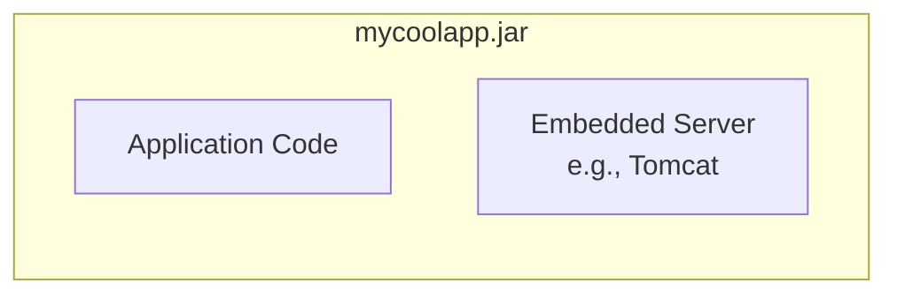

### Spring Boot 內嵌式伺服器的特性

- **[核心優勢]** 是一個自給自足的單元 (self-contained unit)
    - 不需要另外安裝額外的伺服器（如 Tomcat 或 JBoss）
    - 應用程式伺服器已作為程式碼的一部分包含在內

### 執行 Spring Boot 應用程式

- **[執行方式]** 由於應用程式包含內嵌伺服器，因此可以獨立運行 (run standalone)
    - 可以從 IDE 中執行
    - 也可以從命令列 (command line) 執行
- **[命令列執行範例]**
    - 使用 `java -jar` 指令搭配 JAR 檔名稱即可啟動

```bash
> java -jar mycoolapp.jar
```

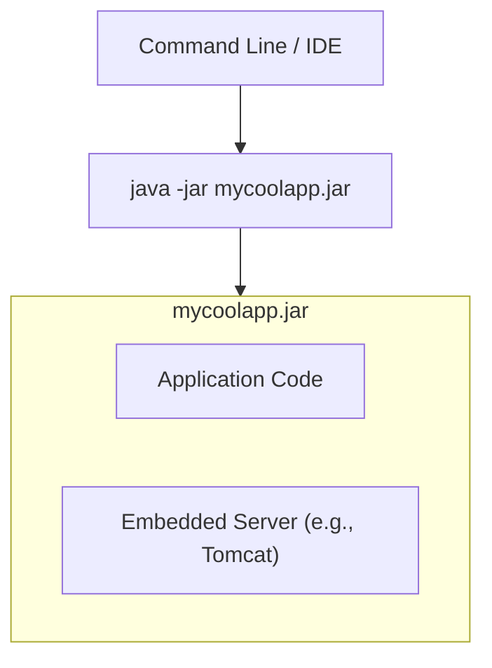

### 傳統部署方式 (WAR 部署)

- **[靈活性]** 除了內嵌式 JAR 檔，Spring Boot 應用程式也支援傳統的部署模式
- **[部署檔案]** 可以打包成 **WAR 檔 (Web Application Archive)**
- **[外部伺服器]** 可將 WAR 檔部署至企業網路中的外部伺服器，運作方式與傳統開發一致
    - 支援的伺服器包括：
        - Tomcat
        - JBoss
        - WebSphere

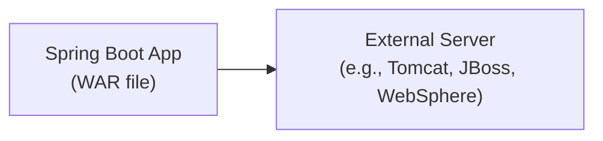

### Spring Boot 的傳統部署方式 (WAR 部署)

- **[部署格式]** 可以將 Spring Boot 應用程式打包成具有 `.war` 副檔名的 **WAR 檔 (Web Application Archive)**
- **[內容差異]** 與 JAR 檔不同，WAR 檔中**僅包含程式碼**
    - 因為是部署在傳統模式下，應用程式會使用外部已經安裝並運行中的伺服器（如 Tomcat）
    - 因此不需要在 WAR 檔中包含內嵌式伺服器
- **[多專案共存]** 在同一個外部伺服器（例如 Tomcat）上，可以同時部署多個不同的 WAR 檔
    - 例如：旅遊團隊的 `travel.war`、電子商務團隊的 `shopping.war` 等，皆可運行在同一個伺服器實例中

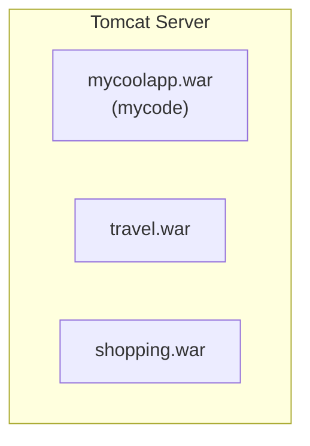

## Spring Boot 常見問題 (FAQ)

### Spring Boot 是否取代了 Spring MVC 或 Spring REST？

- **[答案]** 並非取代，兩者之間沒有競爭關係
- **[運作原理]** Spring Boot 實際上是在背景中使用這些技術
    - Spring Boot 主要是關於**配置 (configuration)** 的簡化
    - 一旦完成 Spring Boot 的配置，開發者仍可以使用常規的 Spring 程式碼進行開發

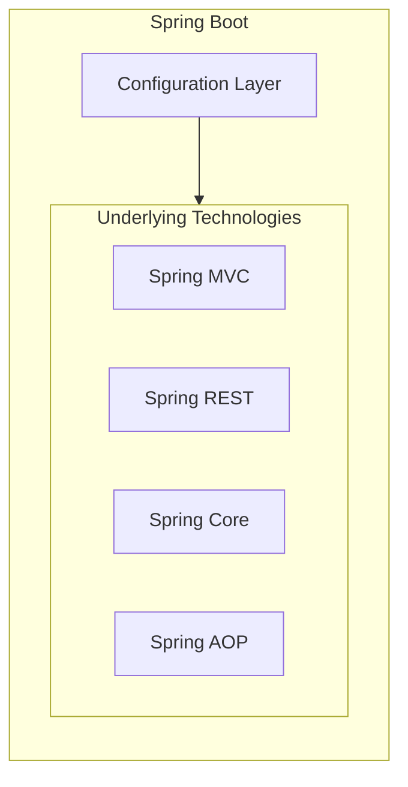

#### Spring Boot 執行效能比較

- **[答案]** 不會更快
- **[原因]** 因為在幕後 (behind the scenes)，Spring Boot 使用的是與傳統 Spring 框架完全相同的程式碼
- **[核心目標]** Spring Boot 的核心價值在於透過極小化配置來幫助開發者快速上手，而非改變執行邏輯

#### 開發工具與 IDE 的選擇

- **[答案]** 不需要特定的 IDE
- **[靈活性]** 可以使用任何主流 IDE 來開發 Spring Boot 應用程式
- **[其他選項]** 亦可僅使用純文字編輯器 (plain text editor) 進行開發

### Spring Boot 是否需要特定 IDE？

- **[答案]** 不需要
- **[開發工具選擇]** 可以使用任何 IDE 來開發 Spring Boot 應用程式
    - 甚至可以使用純文字編輯器 (plain text editor)
    - 搭配 Maven 即可在命令列進行管理
- **[Spring Tools Suite (STS)]**
    - 由 Spring 團隊提供的免費工具
    - 本質上是一組 IDE 插件 (IDE plugins)
    - **[作用]** 提供更強大、更精緻的 Spring 工具支援 (fancy Spring tooling support)
    - **[注意]** 這並非開發必要條件，開發者可以自由選擇最適合自己的工具

### Maven 簡介

- **[核心用途]** 在建置 Java 專案時，管理並引入所需的額外 JAR 檔
- **[常見範例]**
    - Spring
    - Hibernate
    - Commons Logging
    - JSON 等

### Maven 的解決方案

- **[傳統做法] 手動管理 JAR 檔**
    - 從各個專案網站下載所需的 JAR 檔
    - 手動將這些 JAR 檔加入建置路徑 (build path / classpath)
    - 雖然可行，但過程繁瑣且容易出錯
- **[Maven 做法] 自動化依賴管理**
    - **[運作流程]**

        1. 在專案中告知 Maven 你正在使用的專案名稱與依賴項 (例如：Spring, Hibernate 等)
        2. Maven 會自動前往網路下載對應的 JAR 檔
        3. Maven 會自動將這些 JAR 檔配置在編譯 (compile) 與執行 (run) 階段所需的環境中

    - **[形象比喻]** 可以把 Maven 想像成你的「親切助手」或「個人購物員」
        - 你只需要提供一份「購物清單」(依賴清單)，剩下的採買工作都由它完成

### 開發流程 (Development Process)

- **[步驟 1]** 在 Spring Initializr 網站進行專案配置
    - 網站網址：`http://start.spring.io`
- **[步驟 2]** 下載產生的 `.zip` 壓縮檔
- **[步驟 3]** 解壓縮該檔案 (Unzip the file)

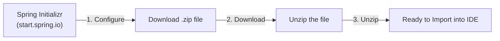

### Spring Boot 專案開發實作

- **[實作流程]** 建立專案的標準步驟

    1. 在 Spring Initializr 網站進行專案配置
    2. 下載產生的 `.zip` 壓縮檔
    3. 解壓縮該檔案
    4. 將專案匯入至 IDE (如 Eclipse, IntelliJ, NetBeans 等)

- **[Spring Initializr 配置介面]**
    - **Project (專案類型)**: 可選擇 `Maven` 或 `Gradle` (例如 `Gradle - Groovy`, `Gradle - Kotlin`)
    - **Language (程式語言)**: 可選擇 `Java`, `Kotlin` 或 `Groovy`
    - **Spring Boot 版本**: 可選擇特定的版本 (例如 `4.0.0`, `3.5.9 (SNAPSHOT)`, `3.5.8` 等)

### Spring Initializr 版本選擇

- **[版本選擇原則]** 選擇最新的正式發佈版本 (Latest released version)
    - **[避免使用]** 應避開帶有 `SNAPSHOT` 字樣的版本
    - **[原因]** Snapshot 版本屬於 alpha 或 beta 階段，尚不穩定
- **[注意]** 由於 Spring Boot 更新頻率極高，網站上顯示的版本可能會與教學影片中的版本有所不同

### 設定專案中繼資料 (Project Metadata)

- **[功能]** 設定專案的座標 (Coordinates)，用於識別與管理專案
- **[關鍵欄位]**
    - **Group**: 定義組織或群組的識別碼 (例如：`com.luv2code.springboot`)
    - **Artifact**: 定義專案本身的名稱 (例如：`demo`)
    - **Name**: 專案顯示名稱
    - **Description**: 專案描述
    - **Package name**: 自動根據 Group 與 Artifact 生成的套件名稱
    - **Packaging**: 可選擇 `Jar` 或 `War`
    - **Configuration**: 可選擇 `Properties` 或 `YAML`

### 設定專案中繼資料 (Project Metadata) 續

- **[Artifact]** 這是應用程式的實際名稱
    - 例如設定為 `mycoolapp`，最終產生的 JAR 檔名稱將會是 `mycoolapp.jar`
- **[Java 版本]** 可以根據需求選擇任何已安裝的 Java 版本
- **[Dependencies (依賴項)]** 這是選擇 Spring Boot Starter 或實際所需依賴項的地方
    - **[實作範例]** 選擇 `Web` 依賴項
        - **[功能]** 提供完整的全端 Web 開發能力，包含內嵌的 Tomcat 與 Spring MVC
        - **[檢查點]** 必須確認選中的依賴項（如 `Web`）有出現在「已選依賴項」清單中

### 專案下載與解壓縮

- **[步驟 2] 下載專案壓縮檔**
    - 在 Spring Initializr 網站配置完成後，點擊頁面底部的 **Generate** 按鈕
    - 系統會下載一個 `.zip` 格式的壓縮檔（例如：`mycoolapp.zip`）
- **[步驟 3] 解壓縮檔案**
    - 找到下載目錄中的壓縮檔
    - 執行解壓縮 (Unzip/Uncompress) 程序，將其轉換為一般的資料夾
    - 完成後即可將該資料夾準備用於匯入 IDE

### 整理與匯入專案

- **[整理專案檔案]** 建議將解壓縮後的專案從「下載」目錄移動到專門的開發目錄
    - 例如建立一個名為 `dev-spring-boot` 的資料夾來統一存放開發專案
    - 這樣可以避免「下載」目錄過於混亂，方便後續管理
- **[檢查專案結構]** 移動後，專案資料夾內應包含以下關鍵檔案與目錄
    - `pom.xml`：Maven 的專案設定檔
    - `src`：存放原始碼的目錄
    - 其他必要的設定檔與 Wrapper 檔案（如 `mvnw`）
- **[匯入 IDE]** 準備好專案資料夾後，即可開啟開發工具進行匯入
    - 開啟 IntelliJ IDEA 或其他偏好的 IDE
    - 選擇「Import Maven Project」並瀏覽至該專案資料夾

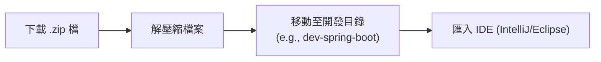

### 匯入 Maven 專案至 IDE

- **[匯入步驟]** 在 IDE 中選擇「Open」並瀏覽至 Maven 專案所在的目錄
    - 例如：`dev-spring-boot/mycoolapp`
- **[自動化流程]** 點擊開啟後，IDE 會開始匯入 Maven 專案
    - **[重要過程]** 系統會自動下載所有該專案所需的 Maven 依賴項 (dependencies)
    - 由於需要從網路下載大量檔案，匯入過程需要一定的等待時間

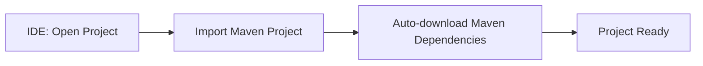

### Spring Boot 專案結構概覽

- **[專案檔案組成]** 匯入 Maven 專案後，會看到以下關鍵檔案與目錄：
    - `pom.xml`：Maven 的核心設定檔，用於管理依賴與建置流程
    - `mvnw` 與 `mvnw.cmd`：Maven Wrapper 檔案，用於在沒有安裝 Maven 的環境下執行 Maven 指令
    - `src/main/java`：存放 Java 原始碼的目錄，其中包含主程式檔案（例如：`MycoolappApplication.java`）
    - `src/main/resources`：存放資源檔案的目錄（如設定檔 `application.properties`、靜態資源等）
    - `src/test`：存放單元測試程式碼的目錄
- **[主程式檔案範例]**
    - 以 `MycoolappApplication.java` 為例，這是應用程式的進入點

```java
package com.luv2code.springboot.demo.mycoolapp;

import org.springframework.boot.SpringApplication;
import org.springframework.boot.autoconfigure.SpringBootApplication;

@SpringBootApplication
public class MycoolappApplication {

    public static void main(String[] args) {
        SpringApplication.run(MycoolappApplication.class, args);
    }
}
```

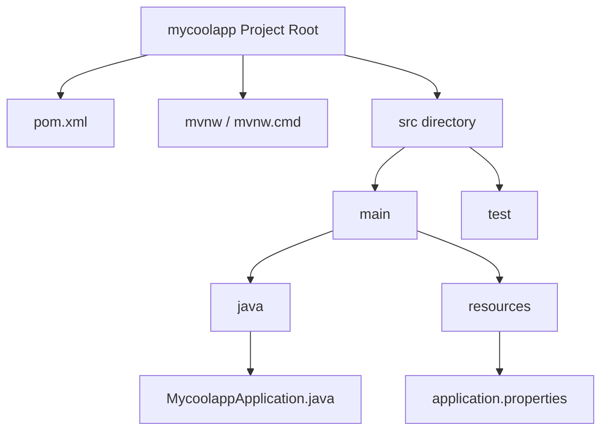

### MycoolappApplication.java 核心解析

- **[關鍵註解]** `@SpringBootApplication`
    - 這是一個特殊的 Spring Boot 註解，用於標記該類別為 Spring Boot 應用程式的進入點
    - 它會啟動 Spring Boot 的自動配置與功能
- **[啟動方法]** `SpringApplication.run()`
    - 用於引導（bootstrap）Spring Boot 應用程式的啟動流程
    - 需要傳入當前的類別名稱作為參數

```java
@SpringBootApplication
public class MycoolappApplication {

    public static void main(String[] args) {
        SpringApplication.run(MycoolappApplication.class, args);
    }
}
```

- **[執行方式]** 執行應用程式時的注意事項
    - **必須** 將其作為 **Java 應用程式 (Java application)** 來執行
    - **不要** 選擇作為伺服器 (Server) 執行
    - **[原因]** 因為 Spring Boot 已經內建了伺服器，不需要額外依賴外部伺服器環境來啟動

### 執行應用程式與查看日誌

- **[執行結果觀察]** 當以 Java 應用程式方式執行 Spring Boot 專案後，控制台會輸出啟動日誌
- **[關鍵日誌資訊]** 從日誌中可以確認內嵌式伺服器的狀態：
    - **伺服器初始化**：日誌會顯示 `Tomcat is initialized with port(s): 8080 (http)`
    - **伺服器啟動完成**：隨後會顯示 `Tomcat started on port(s): 8080 (http)`
- **[核心觀念]** 這些日誌證實了 Spring Boot 應用程式與內嵌式 Tomcat 伺服器是綑綁在一起運行的，應用程式啟動即代表伺服器也隨之啟動

```text
INFO 84111 --- [main] o.s.b.w.embedded.tomcat.TomcatWebServer : Tomcat initialized with port(s): 8080 (http)
INFO 84111 --- [main] o.s.b.w.embedded.tomcat.TomcatWebServer : Tomcat started on port(s): 8080 (http) with context path ''
```

### 驗證伺服器運作狀態

- **[測試方式]** 在瀏覽器開啟新分頁，輸入 `http://localhost:8080` 進行訪問
- **[觀察結果]** 畫面顯示 `Whitelabel Error Page` (HTTP 404 Not Found)
- **[核心結論]** 看到錯誤頁面是**正常現象**
    - **[原因]** 目前專案尚未撰寫任何實際的程式碼，例如 Controller（控制器）或 View pages（視圖頁面）
    - **[意義]** 這證明了內嵌式伺服器已經成功啟動並正在運行，開發者只需接著撰寫業務邏輯與配置即可

### 建立 REST Controller

- **[目的]** 建立一個簡單的控制器，讓應用程式能回傳特定的內容（例如 "Hello World"），取代之前的錯誤頁面
- **[實作方式]** 使用 `@RestController` 註解來定義類別
    - 這會告訴 Spring 該類別負責處理 RESTful 請求並將回傳值直接寫入 HTTP 回應主體中
- **[程式碼實作範例]**

```java
@RestController
public class FunRestController {

    // expose "/" that returns "Hello World"
    @GetMapping("/")
    public String helloWorld() {
        return "Hello World";
    }
}
```

- **[關鍵組件解析]**
        - `@RestController`：標記此類別為 REST 控制器
        - `@GetMapping("/")`：將根路徑 (`/`) 的 HTTP GET 請求對應到該方法
        - **[預期結果]** 當使用者訪問 `http://localhost:8080/` 時，瀏覽器將顯示 `Hello World!`

### 實作 Hello World 控制器

- **[實作目標]** 撰寫一個簡單的控制器方法，當使用者訪問根路徑時，回傳 "Hello World" 字串
- **[程式碼實作]**

```java
@RestController
public class FunRestController {

    // expose "/" that returns "Hello World"
    @GetMapping("/")
    public String sayHello() {
        return "Hello World";
    }
}
```

- **[關鍵組件解析]**
    - `@RestController`：定義此類別為 REST 控制器
    - `@GetMapping("/")`：**[處理 HTTP GET 請求]** 將根路徑 (`/`) 的 GET 請求對應到 `sayHello()` 方法
    - `sayHello()` 方法：回傳一個 `String` 型態的內容，即為 HTTP 回應的主體

### 專案結構管理

- **[停止運行]** 在進行新的開發或結構調整前，應先停止目前正在運行的應用程式
- **[建立套件]** 為了保持程式碼組織清晰，準備建立新的 package
    - 在專案目錄結構中，透過 IDE 的功能新增 package，例如在 `com.luv2code.springboot.demo.mycoolapp` 之下建立新的子套件

### 建立 REST 套件與控制器

- **[建立新套件]** 在目前的專案結構下，建立一個名為 `rest` 的新套件
    - 完整的套件路徑為 `com.luv2code.springboot.demo.mycoolapp.rest`
- **[建立新類別]** 在新建立的 `rest` 套件中，建立一個新的 Java 類別
    - 類別名稱：`FunRestController`
- **[程式碼初始狀態]**

```java
package com.luv2code.springboot.demo.mycoolapp.rest;

public class FunRestController {

}
```

### 實作 FunRestController

- **[開發計畫]** 建立一個處理根路徑 (`/`) 的端點，使其回傳 "Hello World"
- **[實作步驟]**
    - **[1. 定義控制器]** 使用 `@RestController` 註解來標記類別
    - **[2. 設定路徑對應]** 使用 `@GetMapping` 來處理對應路徑的 GET 請求
- **[程式碼實作]**

```java
package com.luv2code.springboot.demo.mycoolapp.rest;

import org.springframework.web.bind.annotation.GetMapping;
import org.springframework.web.bind.annotation.RestController;

@RestController
public class FunRestController {

    // expose "/" that returns "Hello World"
    @GetMapping("/")
    public String sayHello() {
        return "Hello World";
    }
}
```

### 完成 FunRestController 實作

- **[實作細節]** 在 `FunRestController` 類別中定義一個方法，用來回傳特定的字串內容
- **[程式碼實作]**

```java
package com.luv2code.springboot.demo.mycoolapp.rest;

import org.springframework.web.bind.annotation.GetMapping;
import org.springframework.web.bind.annotation.RestController;

@RestController
public class FunRestController {

    // expose "/" that return "Hello World"
    @GetMapping("/")
    public String sayHello() {
        return "Hello World";
    }
}
```

- **[後續步驟]** 程式碼撰寫完成後，即可執行應用程式以驗證功能是否正常

### 驗證 REST Controller 運行狀態

- **[檢查主控台]** 首先確認 IDE 的 Console 是否顯示應用程式已成功啟動
    - 啟動成功後，應用程式會開始監聽指定的連接埠（例如 `8080`）
- **[瀏覽器驗證]** 使用網頁瀏覽器訪問對應的 URL（例如 `http://localhost:8080/`）
- **[確認結果]** 若實作正確，瀏覽器應顯示控制器所定義的回應內容
    - **[預期輸出]** `Hello World!`

### Spring Projects

- **[定義]** 建立在 Spring 核心框架之上的額外 Spring 模組
    - 可以將其視為「擴充功能（add-ons）」
    - 開發者僅需根據需求使用所需的模組
- **[常見的 Spring Projects]**
    - `Spring Cloud`：用於雲端開發
    - `Spring Data`：用於資料庫整合
    - `Spring Batch`：用於建立批次處理程序
    - `Spring Security`：用於應用程式安全性防護
    - `Spring Web Services`：用於處理 RESTful 與 SOAP 網路服務
    - `Spring LDAP`：用於存取 LDAP 伺服器

### 探索 Spring Projects

- \*\*[資訊來源]\*\* Spring 官方網站：[spring.io](https://spring.io)
    - 在網站上可以找到所有可用的 Spring Projects 列表
    - 每個項目（或分頁）都提供簡短的文字說明（blurb），介紹該專案的功能與用途
- **[使用建議]** 這些專案皆為選用（optional），開發者應根據應用程式的具體需求來選擇使用

### 探索更多 Spring Projects

- \*\*[資訊獲取方式]\*\* 前往 [spring.io](https://spring.io) 並點選 **Projects** 分頁
- **[使用邏輯]** 閱讀每個專案的簡介，判斷其功能是否符合開發需求
- **[範例專案]** (根據網站顯示)
    - `Spring AI`：用於 AI 工程的應用框架
    - `Spring Batch`：簡化高容量批次處理作業
    - `Spring Modulith`：幫助開發者構建結構良好的 Spring Boot 應用程式
    - `Spring HATEOAS`：簡化遵循 HATEOAS 原則的 REST 表示法建立
    - `Spring Integration`：支援企業整合模式（Enterprise Integration Patterns）
    - `Spring REST Docs`：透過結合手寫文件與自動生成的程式碼片段來記錄 RESTful 服務

### Maven 速成課程

#### Spring Boot 與 Maven 的關係

- \*\*[整合方式]\*\* 使用 Spring Initializr 網站（[start.spring.io](https://start.spring.io)）生成專案時，可以直接生成 Maven 專案
- **[學習重點]** 本章節將涵蓋以下 Maven 基礎知識：
    - 在 `pom.xml` 檔案中查看依賴關係（dependencies）
    - 了解 Spring Boot Starters 在 Maven 中的作用

#### Maven 基礎概念

- **[定義]** Maven 是一種專案管理工具（Project Management tool）
- **[核心用途]** 最常見的用途包含：
    - 建置管理（Build management）
    - 依賴關係管理（Dependencies management）

### Maven 解決的問題

- **[面臨的挑戰]** 在建置 Java 專案時，通常需要額外的 JAR 檔案（依賴項）
    - **[常見範例]** `Spring`、`Hibernate`、`Commons Logging`、`JSON` 等
- **[傳統開發流程（無 Maven）]**
    - 開發者必須手動前往各個專案的官方網站下載對應的 JAR 檔案
    - 下載後，必須手動將這些檔案加入專案的建置路徑（build path）或類別路徑（classpath）

#### 無 Maven 的開發流程示意圖

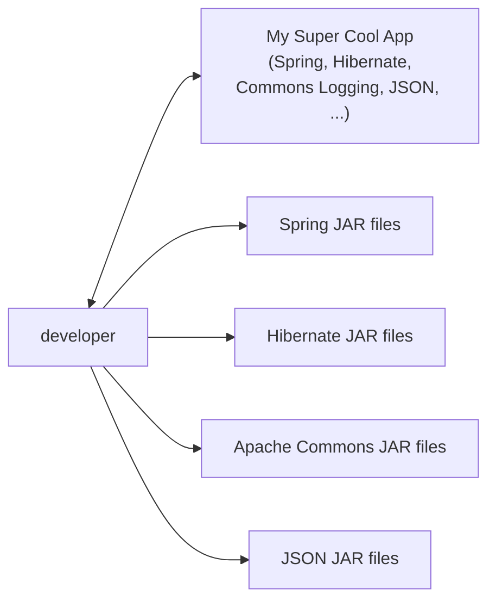

#### Maven 的運作機制

- **[運作方式]** 開發者只需告知 Maven 正在使用的專案（即依賴項，如 Spring、Hibernate 等）
    - Maven 會自動從網際網路下載對應的 JAR 檔案
    - Maven 會在編譯（compile）與執行（run）期間自動將這些 JAR 檔案加入路徑
- **[比喻]** Maven 就像是一位「個人購物員（personal shopper）」
    - 你只需要提供一份「購物清單（shopping list）」
    - 他會負責出門採購所有物品並帶回來供你使用

### Maven 的專案結構與儲存庫

- **[遠端儲存庫]** Maven Central Repository (remote)
    - 這是 Maven 用來存放與下載各種依賴項的遠端中心儲存庫

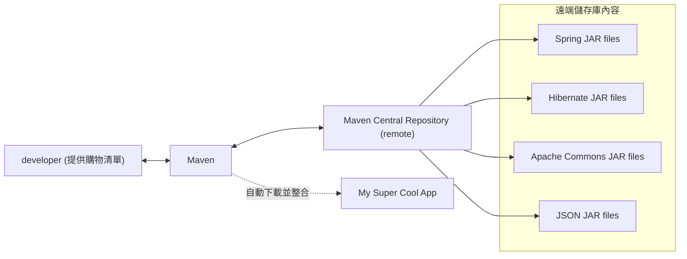

- **[開發者的工作流優化]**
    - **傳統方式**：開發者必須手動下載每一個 JAR 檔，非常耗時且容易出錯
    - **使用 Maven**：開發者只需撰寫「購物清單」，剩下的交給 Maven
        - Maven 會自動從網際網路（Maven Central Repository）抓取檔案
        - Maven 會將所有檔案下載到電腦並準備就緒
        - **[好處]** 開發者可以省下處理依賴的時間，專注於核心的程式碼撰寫

### Maven 的幕後運作流程

- **[工作流程]** Maven 透過以下步驟來管理專案的依賴關係：

    1. **讀取設定檔 (Read config file)**：Maven 會讀取專案的設定檔（即開發者提供的「購物清單」）。
    2. **檢查本地儲存庫 (Check local repo)**：Maven 會先檢查存在於開發者電腦上的「Maven Local Repository」（類似於本地快取）。
    3. **從遠端下載 (Get from remote repo)**：如果本地儲存庫中找不到所需的檔案，Maven 就會連線到網際網路，從「Maven Central Repository (remote)」將 JAR 檔下載下來。

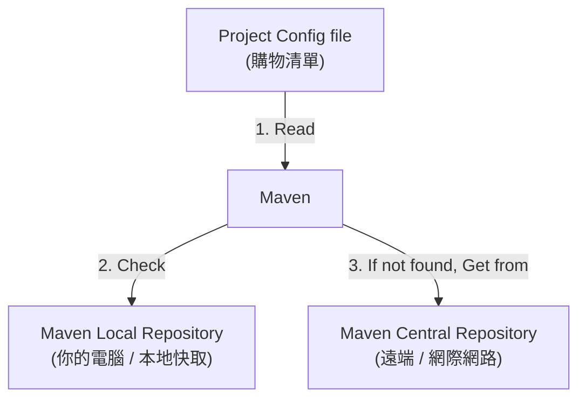

### Maven 的本地快取與自動依賴管理

- **[本地快取機制]** 當 Maven 從遠端儲存庫下載檔案後，會將這些檔案儲存在「Maven Local Repository」中
    - **[目的]** 建立本地快取，以便在下次建置或執行應用程式時，能直接從本地讀取，無需再次連線至網路
- **[處理間接依賴 (Supporting Dependencies)]** Maven 具備自動處理依賴鏈的能力
    - 當開發者要求某個專案依賴時（例如 Spring），Maven 會自動識別並下載該專案所需的所有「支援性依賴（supporting dependencies）」
    - **[範例]** 如果專案需要 `Spring`，Maven 會發現 `Spring` 依賴於 `commons-logging`，進而自動將 `commons-logging` 也一併抓取下來
    - **[好處]** 這種「自動化（automagically）」的特性讓開發者完全不需要手動去追蹤與管理複雜的依賴關係樹

### Building and Running

- **[自動化建置]** 當你建置並執行應用程式時，Maven 會自動處理 Class Path 與 Build Path
    - Maven 會根據專案的設定檔（config file）自動加入對應的 JAR 檔案
    - **[開發優勢]** 開發者不需要手動配置複雜的 Class Path，只需設定好 Maven 設定檔，剩下的工作都由 Maven 完成

### Maven 標準目錄結構

Maven 專案遵循一套標準的目錄結構，以便於管理與建置過程。以下是常見目錄及其用途：

| 目錄路徑 | 描述 |
| --- | --- |
| src/main/java | 存放 Java 原始碼 (Java source code) |
| src/main/resources | 存放應用程式使用的屬性檔或設定檔 (Properties / config files) |
| src/main/webapp | 存放 Web 資產，如 JSP 檔案、Web 設定檔、圖片、CSS 或 JS 等 |
| src/test | 存放單元測試程式碼與測試相關的資源 (Unit testing code and properties) |
| target | Maven 自動產生的目錄，用於存放編譯後的程式碼 (Destination directory for compiled code) |

#### Web 專案的資產配置

- **[Web 資產存放位置]** 若開發的是 Web 專案，相關檔案應放置在 `src/main/webapp` 目錄下
    - 例如：JSP 檔案、`WEB-INF` 資料夾、`view` 目錄等

### Maven 標準目錄結構的優點

- **[提升團隊協作效率]** 對於加入新專案的開發者來說，標準結構能讓他們快速定位關鍵檔案
    - 可以輕鬆找到 Java 原始碼、屬性檔、單元測試或 Web 資產等
    - **[重要性]** 在現實世界的即時專案中，這種結構能大幅縮短開發者熟悉環境的時間
- **[IDE 原生支援]** 大多數主流的整合開發環境 (IDE) 都內建了對 Maven 的支援
    - 例如：Eclipse、IntelliJ、NetBeans 等
    - IDE 可以輕鬆地讀取並匯入 Maven 專案，無需手動配置複雜的環境
- **[專案可移植性 (Portability)]** Maven 專案具有高度的可移植性
    - 開發者可以在不同的 IDE 之間輕鬆分享與切換專案
    - **[開發優勢]** 避免了因為開發工具不同而產生的環境配置衝突

### Maven 的額外優勢

#### 跨 IDE 的可移植性

- **[無須爭論 IDE]** 因為 Maven 專案遵循標準結構，開發者可以自由選擇適合自己的工具
    - 你可以在 NetBeans 中建立 Maven 專案，然後輕鬆地在 Eclipse 或 IntelliJ 中開啟
    - **[開發優勢]** 團隊成員不需要為了「哪種 IDE 比較好」而爭論，專案可以在不同的開發環境間無縫切換

#### 依賴管理 (Dependency Management)

- **[自動尋找 JAR 檔]** Maven 會自動為你找到專案所需的 JAR 檔案
    - **[解決痛點]** 徹底解決了「缺少 JAR 檔 (missing JARs)」的問題，不再需要手動下載與配置

### Maven 的最大價值：快速進入生產狀態

- **[降低上手門檻]** 一旦掌握 Maven 的運作邏輯，加入新專案時能立即發揮生產力
    - 透過極少的本地配置，即可直接建置並執行專案
- **[自動化流程]**
    - Maven 會自動處理所有繁瑣工作：連線網路、下載必要的 JAR 檔、將其拉取至本地電腦，最後讓你直接執行專案

### Maven 的核心價值

- **[快速上手新專案]** 一旦學會使用 Maven，就能迅速加入任何新專案並開始 productive（產出工作）
    - **[原因]** 因為專案的結構與依賴管理都是標準化的，不需要花大量時間在環境配置上
- **[極簡的本地配置]** 可以使用極少的本地配置來建置 (build) 與執行 (run) 專案
- **[企業級應用]** 這些特性使其非常適合用於大型的企業級專案 (enterprise projects)

### Maven 核心概念

#### POM 檔案 (pom.xml)

- **[定義]** 全稱為 Project Object Model 檔案
- **[功能]** 專案的設定檔 (Configuration file)
    - **[比喻]** 就像是 Maven 的「購物清單 (shopping list)」
    - 你透過此檔案告訴 Maven 專案依賴哪些組件（Dependencies），由 Maven 去負責尋找並下載
- **[存放位置]** 始終位於 Maven 專案的根目錄 (Root of your Maven project)

#### POM 檔案結構

- POM 檔案包含多個部分的資訊，主要結構包括：
    - Project metadata (專案元數據)
    - Dependencies (依賴項)
    - Plug-ins (插件)

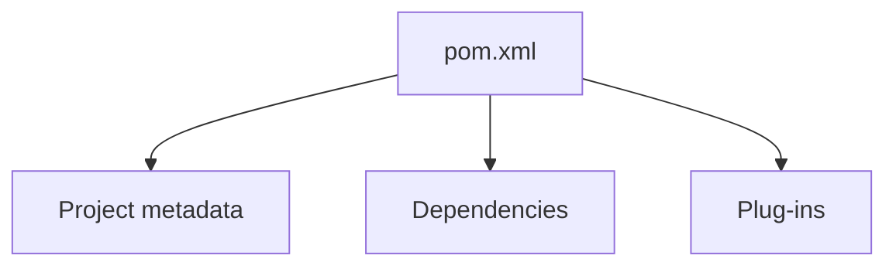

#### POM 檔案組成細節

- **Project metadata (專案元數據)**
    - 包含專案的基本資訊
    - 例如：專案名稱 (Project name)、版本號 (Version)
    - **[輸出格式]** 指定輸出的檔案類型，例如 `JAR` 或 `WAR` 等
- **Dependencies (依賴項)**
    - 列出專案所依賴的所有外部專案清單
    - 例如：若專案需要使用 Spring、Hibernate 或 JSON 處理工具，需在此列出
- **Plug-ins (插件)**
    - 用於執行額外的自定義任務 (Additional custom tasks)
    - 例如：自動生成 JUnit 單元測試報告等

### Simple POM File 範例

一個典型的 `pom.xml` 檔案結構如下：

```xml
<project ...>
    <modelVersion>4.0.0</modelVersion>
    <groupId>com.luv2code</groupId>
    <artifactId>mycoolapp</artifactId>
    <version>1.0.FINAL</version>
    <packaging>jar</packaging>

    <name>mycoolapp</name>

    <dependencies>
        <dependency>
            <groupId>org.junit.jupiter</groupId>
            <artifactId>junit-jupiter</artifactId>
            <version>5.9.1</version>
            <scope>test</scope>
        </dependency>
    </dependencies>

    <!-- add plugins for customization -->
</project>
```

### POM 檔案結構詳解

- **Project metadata (專案元數據)**
    - 定義專案的核心身份資訊
    - **包含內容**：
        - Project name (專案名稱)
        - Group ID
        - Artifact ID
        - Version number (版本號)
    - **Packaging (封裝格式)**：
        - 指定輸出的檔案類型，例如 `JAR` 或 `WAR` 等
- **Dependencies (依賴項)**
    - 列出應用程式所需的所有外部專案清單
    - **範例**：
        - `JUnit` (用於單元測試)
        - `Spring`
        - `Hibernate` 等
- **Plug-ins (插件)**
    - 用於執行額外的自定義任務 (Additional custom tasks)
    - **範例**：
        - 自動生成 JUnit 測試報告等

### Project Coordinates (專案座標)

- **定義**：透過特定的標籤組合來唯一識別一個專案
- **組成要素**：

```xml
<groupId>com.luv2code</groupId>
<artifactId>mycoolapp</artifactId>
<version>1.0.FINAL</version>
```

### Project Coordinates 的比喻理解

- **定義**：Project Coordinates 用於唯一識別一個專案，其功能類似於房屋的 GPS 座標（緯度與經度)
- **[比喻]**：若要造訪某人的住處，需要精確的資訊，這與 Maven 識別專案的方式非常相似：
    - **Group ID** $\approx$ 城市 (City)
    - **Artifact ID** $\approx$ 街道 (Street)
    - **Version** $\approx$ 門牌號碼 (House Number)

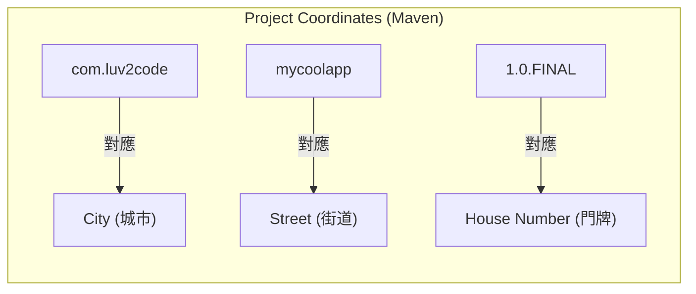

### Project Coordinates - Elements

| Name | Description |
| --- | --- |
| Group ID | 公司、群組或組織的名稱。慣例是使用反向網域名稱 (例如：com.luv2code) |

| Name | Description |
| --- | --- |
| Artifact ID | 此專案的名稱。即專案本身被稱呼的名字。 |
| Version | 專案的特定發行版本 (例如：1.0、1.6、2.0 等)。 |

- **[關於版本]**：
    - 若專案正處於積極開發階段 (Active development)，可以使用 `1.0-SNAPSHOT` 版本。
    - `SNAPSHOT` 代表該工作仍在持續進行中，並非最終完成的版本。

### 依賴項實作範例

透過觀察不同專案的座標，可以得知如何取得其對應的依賴資訊：

- **Spring 專案座標範例**：
    - Group ID: `org.springframework`
    - Artifact ID: `spring-context`
    - Version: `6.0.0`
- **Hibernate 專案座標範例**：
    - Group ID: `org.hibernate.orm`
    - Artifact ID: `hibernate-core`
    - Version: `6.1.4.Final`

### 在 POM 檔案中加入依賴 (Adding Dependencies)

若要在專案中加入對 Spring 與 Hibernate 的支援，必須將上述座標資訊放入 `<dependencies>` 區塊內：

```xml
<project ...>
    <dependencies>
        <!-- 加入 Spring Context 支援 -->
        <dependency>
            <groupId>org.springframework</groupId>
            <artifactId>spring-context</artifactId>
            <version>6.0.0</version>
        </dependency>

        <!-- 加入 Hibernate Core 支援 -->
        <dependency>
            <groupId>org.hibernate.orm</groupId>
            <artifactId>hibernate-core</artifactId>
            <version>6.1.4.Final</version>
        </dependency>
    </dependencies>
</project>
```

### 新增依賴項的關鍵要素

若要為專案新增特定的依賴項，必須提供以下資訊：

- **Group ID**
- **Artifact ID**
- **Version** (雖然在技術上是選填的，但強烈建議包含)
- **[最佳實踐]**：在 DevOps 流程中，明確指定版本號至關重要
    - **可重複建置 (Repeatable Builds)**：確保每次建置時使用的依賴項版本完全一致
    - **驗證與測試**：能夠明確指出專案是在哪個特定的版本下經過測試與驗證的，避免因依賴項自動更新導致不可預期的錯誤

### 依賴項座標的術語 (GAV)

在開發過程中，你可能會聽到其他 Java 開發者提到「GAV」，這是一個常見的縮寫，代表專案的核心座標資訊：

- **G**roup ID
- **A**rtifact ID
- **V**ersion

---

### 如何尋找依賴項座標 (How to Find Dependency Coordinates)

當你需要為專案新增依賴時，有兩種主要方式可以取得正確的座標：

#### 方法一：訪問專案官方網站

- 直接前往該技術專案的官網查詢
    - 例如：`spring.io` 或 `hibernate.org` 等

#### 方法二：訪問 Maven 中央儲存庫 (Maven Central Repository)

- **[最推薦的方法]**：直接前往 Maven 中央儲存庫網站搜尋
    - 網站：`https://central.sonatype.com`
- **[為什麼這是最佳選擇？]**：對於大型企業級專案，可能需要管理 5 到 20 個甚至更多的依賴項
    - 如果使用方法一，開發者必須造訪每一個專案的官網（例如 Spring 官網、Hibernate 官網等）來尋找座標
    - 使用方法二只需在單一網站搜尋，就能快速取得所有需要的依賴項詳細資訊，大幅提升效率

#### 方法二：訪問 Maven 中央儲存庫 (Maven Central Repository)

- 這是最簡單且推薦的方法 (easiest approach)
- 可以將其視為獲取所有依賴項座標資訊的「一站式商店」(one-stop shop)
- 訪問網址：`https://central.sonatype.com`

## Spring Boot 專案結構

由於先前透過 Spring Initializr 建立專案，因此生成的實際上是一個 Maven 專案。Spring Boot 遵循標準的 Maven 目錄結構：

### Maven 標準目錄結構

| 目錄 (Directory) | 說明 (Description) |
| --- | --- |
| src/main/java | 存放 Java 原始碼 (Your Java source code) |
| src/main/resources | 存放應用程式使用的屬性檔或設定檔 (Properties / config files used by your app) |

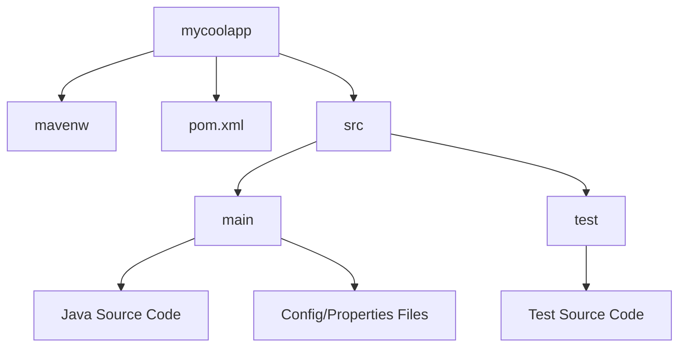

### Maven 標準目錄結構續

- `src/test/java`：用於存放單元測試 (Unit testing) 的程式碼

### Maven Wrapper 檔案

- `mvnw` 與 `mvnw.cmd` 檔案
    - 允許直接執行 Maven 專案
    - **[優點]** 使用者不需要在電腦上預先安裝 Maven，也不需要將其加入系統路徑 (PATH)
    - **[運作機制]** 當系統找不到正確版本的 Maven 時，它會自動下載正確的版本來執行

#### Maven Wrapper 執行指令

根據作業系統的不同，需使用對應的 wrapper 檔案來執行 Maven 指令：

- **Windows 系統**：使用 `mvnw.cmd`
    - 範例：

```cmd
mvnw clean compile test
```

- **Linux 或 Mac 系統**：使用 `mvnw.sh`
    - 範例：

```bash
./mvnw clean compile test
```

### Maven Wrapper 檔案的選擇性使用

- 如果電腦中已經預先安裝了 Maven
    - 可以忽略或刪除 `mvnw` 與 `mvnw.cmd` 檔案
    - 直接使用標準的 Maven 指令進行操作
        - 範例：

```bash
$ mvn clean compile test
```

### Maven POM 檔案與 Spring Initializr 的關聯

- `pom.xml` 會自動包含在 Spring Initializr 網站上所輸入的專案資訊
- **[包含內容]** 例如：
    - Group ID
    - Artifact ID
    - Version

```xml
<groupId>com.luv2code.springboot.demo</groupId>
<artifactId>mycoolapp</artifactId>
<version>0.0.1-SNAPSHOT</version>
```

### Spring Boot Starters

- 是一組 Maven 依賴項的集合 (a collection of Maven dependencies)
- **[核心作用]** 簡化開發流程並確保相容性
    - **節省開發時間**：開發者不需要逐一列出所有細微的個別依賴項
    - **確保版本相容**：自動處理並確保所有包含的依賴項具有相容的版本
- **範例：`spring-boot-starter-web`**
    - 這是一個「一站式商店」(one-stop shop)，包含了開發 Web 應用程式所需的一系列依賴，例如：
        - Spring Web MVC
        - Tomcat
        - JSON 處理工具

```xml
<dependency>
    <groupId>org.springframework.boot</groupId>
    <artifactId>spring-boot-starter-web</artifactId>
</dependency>
```

### Spring Boot Maven plugin

- 位於 `pom.xml` 檔案底部的 `<build>` 區塊中
- **[主要功能]**
    - 將專案打包成可執行的 JAR 檔（可從命令列直接執行）
    - 或建立 WAR 封裝檔 (WAR archive file)
    - 提供簡便的方式來直接執行應用程式
- **[執行指令]**
    - 使用 Maven Wrapper (`mvnw`)：
        - 打包：`./mvnw package`
        - 執行：`./mvnw spring-boot:run`
    - 若電腦已安裝 Maven，則直接使用 `mvn` 指令：
        - 打包：`mvn package`
        - 執行：`mvn spring-boot:run`

```xml
<build>
    <plugins>
        <plugin>
            <groupId>org.springframework.boot</groupId>
            <artifactId>spring-boot-maven-plugin</artifactId>
        </plugin>
    </plugins>
</build>
```

### Spring Boot 專案原始碼結構

當透過 Spring Initializr 產生專案後，主要的原始碼結構包含：

- **主應用程式類別 (Main Spring Boot application class)**
    - 由 Spring Initializr 自動建立
    - 作為應用程式的進入點 (Entry point)
- **REST 控制器 (REST Controller)**
    - 例如先前建立的 `FunRestController`
    - **[功能]** 用於暴露 (expose) 簡單的 REST API 給外部呼叫

### Application Properties

- **[預設行為]** Spring Boot 會自動從一個名為 `application.properties` 的特定檔案載入屬性設定
- **[檔案位置]** 位於專案的資源目錄下：
    - `src/main/resources/application.properties`
- **[建立方式]** 此檔案是由 Spring Initializr 在建立專案時自動產生的
- **[配置功能]** 可以透過此檔案來修改 Spring Boot 的預設設定
    - 例如：更改伺服器監聽的連接埠 (Port)

```properties
server.port=8585
```

> 透過設定 `server.port`，可以告訴 Spring Boot 不要使用預設的 8080 連接埠，而是改用指定的連接埠（如 8585）。

### 自定義屬性與讀取方法

- 除了 Spring Boot 的預設屬性（如 `server.port`），開發者也可以在 `application.properties` 中定義任何自定義的屬性
    - **[範例]**：

```properties
coach.name=Mickey Mouse
        team.name=The Mouse Crew
```

- **[如何讀取]**：可以使用 `@Value` 註解配合 Spring Expression Language (SpEL) 語法，將屬性值注入到類別的欄位中
    - **語法格式**：`@Value("${property.name}")`

#### 在 Controller 中使用 `@Value`

透過 `@Value` 註解，可以在 REST Controller 中輕鬆取得設定檔中的值，實現配置與程式碼的分離：

```java
@RestController
public class FunRestController {

    @Value("${coach.name}")
    private String coachName;

    // ... 其他程式碼
}
```

### 注入多個自定義屬性

可以重複使用 `@Value` 註解的過程，將 `application.properties` 中的多個屬性綁定到不同的類別欄位：

```java
@RestController
public class FunRestController {

    @Value("${coach.name}")
    private String coachName;

    @Value("${team.name}")
    private String teamName;

    // ... 其他程式碼
}
```

- **[運作方式]**：透過 `${property.name}` 語法，將設定檔中的值賦值給指定的變數
- **[擴展性]**：可以針對 `application.properties` 中的任何屬性重複此過程，進行多次注入

---

### 靜態內容 (Static Content)

- **[預設載入路徑]**：Spring Boot 預設會從專案中的 `/static` 目錄載入靜態資源
- **[目錄結構範例]**：

| 目錄層級 | 路徑 |
| --- | --- |
| 原始碼根目錄 | src |
| Java 程式碼 | src/main/java |
| 資源檔案 | src/main/resources |
| 設定檔 | src/main/resources/application.properties |
| 靜態資源 | src/main/resources/static |
| 模板檔案 | src/main/resources/templates |

- **[預設載入機制]** Spring Boot 會自動從 `/static` 目錄載入靜態資源
- **[常見資源類型]**
    - HTML 檔案
    - CSS 樣式表
    - JavaScript
    - 圖片 (Images)
    - PDF 檔案等

#### ⚠️ 重要警告：目錄使用限制

在使用 Spring Boot 時，必須注意封裝方式與目錄的相容性：

- **[限制條件]** 如果你的應用程式是以 **JAR** 格式進行封裝 (packaged as a JAR)，請**不要**使用 `src/main/webapp` 目錄
- **[原因]**
    - `src/main/webapp` 是 Maven 的標準目錄，但它僅適用於 **WAR** 封裝方式
    - 如果使用 JAR 封裝，大多數建置工具會直接忽略該目錄

| 封裝類型 (Packaging) | 建議使用的目錄 | 備註 |
| --- | --- | --- |
| JAR | src/main/resources/static | Spring Boot 預設且推薦的方式 |
| WAR | src/main/webapp | 傳統 Web 應用程式的標準方式 |

### 模板 (Templates)

- **[自動配置]** Spring Boot 內建了對多種模板引擎的自動配置功能
- **[支援的引擎]**
    - FreeMarker
    - Thymeleaf
    - Mustache
- **[預設存放路徑]** 預設情況下，Spring Boot 會從 `/templates` 目錄載入模板檔案

```text
src
└── main
    └── resources
        ├── static
        └── templates
```

- **[關於 Thymeleaf]** Thymeleaf 是一個非常受歡迎的模板引擎，後續課程會進行詳細教學

### 單元測試 (Unit Tests)

- **[自動生成]** Spring Initializr 會在專案中自動建立基礎的測試檔案
    - 例如：`MycoolappApplicationTests.java`
- **[初始內容]** 預設生成的測試內容非常基礎（通常僅包含一個 setup 項目），並非完整的測試邏輯
- **[擴展方式]** 開發者可以直接在這個檔案中添加自定義的單元測試，它是 Spring Boot 基礎架構的一部分

```text
src
└── test
    └── java
        └── com
            └── luv2code
                └── springboot
                    └── demo
                        └── MycoolappApplicationTests.java
```

### 專案檔案總結

- **[現狀]** 已完成對 Spring Initializr 所產生的所有檔案進行了初步檢視
- **[後續學習]** 未來的課程將會更深入地探討這些不同檔案在專案中的具體運作原理

#### 開發傳統 Spring 應用的難點

- **[核心問題]**：建構傳統 Spring 應用程式非常困難
- **[依賴項困惑]**：開發者經常面臨「我需要哪些 Maven 依賴項？」的問題
    - 例如：若要建立一個包含 Spring MVC 與 Hibernate 連線的應用程式，最少需要哪些依賴？
    - 或者，如果使用 `pom.xml`，確切的依賴清單應該是什麼？
- **[開發痛點]**：要搞清楚如何正確開始配置與管理這些複雜的依賴關係非常棘手

#### 解決方案的構想

- **[理想狀態]**：開發者需要一份簡單的 Maven 依賴清單
- **[一站式購物 (One-stop shop)]**：將相關的依賴項收集成一組（Group of dependencies），讓開發者能一次性引入，而不必逐一搜尋與配置
- **[定義]** 一份經過精選的 Maven 依賴項清單 (A curated list of Maven dependencies)
    - 它是一組被歸類在一起的依賴項集合 (A collection of dependencies grouped together)
- **[核心優點]**
    - **經過驗證**：這些依賴項都經過 Spring 開發團隊的測試與驗證 (Tested and verified by the Spring Development team)
    - **降低門檻**：讓開發者能更輕鬆地開始使用 Spring
    - **簡化配置**：大幅減少了需要進行的 Maven 配置量
    - **無需搜尋**：開發者不再需要花時間去搜尋或尋找正確的依賴項

### Spring Boot Starter 的實作案例

#### 傳統 Spring MVC 的開發需求

- **[痛點]** 在建構傳統 Spring MVC 應用程式時，開發者必須手動列出並管理多個獨立的依賴項：
    - **Spring MVC**：提供核心 Web 功能
    - **Hibernate Validator**：用於處理表單驗證 (Form validation)
    - **Web Template (如 Thymeleaf)**：用於處理網頁模板

```xml
<!-- 傳統方式需要逐一添加多個依賴 -->
<!-- Spring support -->
<dependency>
    <groupId>org.springframework</groupId>
    <artifactId>spring-webmvc</artifactId>
    <version>7.0.0</version>
</dependency>

<!-- Hibernate Validator -->
<dependency>
    <groupId>org.hibernate.validator</groupId>
    <artifactId>hibernate-validator</artifactId>
    <version>8.0.0.Final</version>
</dependency>

<!-- Web template: Thymeleaf -->
<dependency>
    <groupId>org.thymeleaf</groupId>
    <artifactId>thymeleaf-spring6</artifactId>
    <version>3.1.3.RELEASE</version>
</dependency>
```

#### Spring Boot 的解決方案：Web MVC Starter

- **[做法]** 使用 Spring Boot 提供的 `spring-boot-starter-webmvc` 作為單一入口
- **[原理]** Spring Boot Starter 是一組**版本相容 (Compatible versions)** 的 Maven 依賴集合
- **[優點]** 只需在 `pom.xml` 中添加一個條目，即可自動包含所有必要的依賴

```xml
<!-- 使用 Spring Boot Starter 簡化配置 -->
<dependency>
    <groupId>org.springframework.boot</groupId>
    <artifactId>spring-boot-starter-webmvc</artifactId>
</dependency>
```

- **[包含內容]** 此單一 Starter 實際上包含了多個核心組件，例如：
    - `spring-webmvc`
    - `json` (Jackson)
    - `tomcat` (內嵌式伺服器)

#### Spring Boot Starter 的核心價值

- **[一價多得]**：只需引入一個 Starter，即可獲得多個相關組件
    - 例如 `spring-boot-starter-webmvc` 會自動包含：
        - `spring-webmvc`
        - `json` (Jackson)
        - `tomcat` (內嵌式伺服器)
- **[開發優勢]**
    - **簡化清單**：開發者無需手動列出所有個別的依賴項
    - **版本相容性**：確保所有引入的依賴項版本皆經過測試且互相相容，避免版本衝突問題

### 使用 Spring Initializr 快速配置

- **[操作流程]**：在 Spring Initializr 網站上，只需在「Dependencies」部分搜尋並選擇 **Web** 依賴項
- **[自動化結果]**：選擇後，系統會自動在 `pom.xml` 檔案中加入對應的 Starter 配置

```xml
<!-- 透過選擇 Web 依賴項自動生成的配置 -->
<dependency>
    <groupId>org.springframework.boot</groupId>
    <artifactId>spring-boot-starter-webmvc</artifactId>
</dependency>
```

### Spring Initializr 的依賴選擇與自動化

- **[操作方式]**：在 Spring Initializr 中，開發者只需根據應用程式的需求選擇相應的依賴項（Dependencies）
    - 例如，若需要開發一個具備 Web 功能與安全驗證的 Spring 應用，則需同時選擇 **Web** 與 **Security**
    - 其他常見選擇還包括 **JPA** 與 **Thymeleaf**
- **[自動化結果]**：一旦完成配置並生成專案，Spring Initializr 會自動將這些選擇轉換為 `pom.xml` 中的 Spring Boot Starters

#### 依賴項對應範例

當在 Spring Initializr 選擇特定的功能模組時，產生的 `pom.xml` 會包含類似以下的依賴配置：

```xml
<!-- File: pom.xml -->
<dependencies>
    <!-- 對應選擇的 Web 依賴 -->
    <dependency>
        <groupId>org.springframework.boot</groupId>
        <artifactId>spring-boot-starter-webmvc</artifactId>
    </dependency>

    <!-- 對應選擇的 Security 依賴 -->
    <dependency>
        <groupId>org.springframework.boot</groupId>
        <artifactId>spring-boot-starter-security</artifactId>
    </dependency>

    <!-- 對應選擇的 JPA 依賴 -->
    <dependency>
        <groupId>org.springframework.boot</groupId>
        <artifactId>spring-boot-starter-data-jpa</artifactId>
    </dependency>

    <!-- 對應選擇的 Thymeleaf 模板引擎 -->
    <dependency>
        <groupId>org.springframework.boot</groupId>
        <artifactId>spring-boot-starter-thymeleaf</artifactId>
    </dependency>
</dependencies>
```

### Spring Boot Starters 的種類與功能

- **[豐富的生態系]**：Spring 開發團隊提供了超過 70 種不同的 Spring Boot Starters
- **常見 Starter 範例**

| Name | Description |
| --- | --- |
| spring-boot-starter-webmvc | 用於建置 Web 應用程式，包含 REST 功能，並預設使用 Tomcat 作為內嵌式伺服器 |
| spring-boot-starter-security | 提供 Spring Security 安全支援 |
| spring-boot-starter-data-jpa | 提供結合 JPA 與 Hibernate 的資料庫支援 |

### Spring Initializr 與 POM 檔案的自動化對應

- **[自動化流程]**：在 Spring Initializr 網站上選擇依賴項後，系統會自動生成對應的 `pom.xml` 配置
- **[配置對應關係範例]**
    - 在網頁選擇 **Web** $\rightarrow$ `pom.xml` 加入 `spring-boot-starter-webmvc`
    - 在網頁選擇 **Security** $\rightarrow$ `pom.xml` 加入 `spring-boot-starter-security`
    - 在網頁選擇 **JPA** $\rightarrow$ `pom.xml` 加入 `spring-boot-starter-data-jpa`
    - 在網頁選擇 **Thymeleaf** $\rightarrow$ `pom.xml` 加入 `spring-boot-starter-thymeleaf`

```xml
<!-- 根據 Initializr 選擇產生的 pom.xml 片段 -->
<dependency>
    <groupId>org.springframework.boot</groupId>
    <artifactId>spring-boot-starter-webmvc</artifactId>
</dependency>
<dependency>
    <groupId>org.springframework.boot</groupId>
    <artifactId>spring-boot-starter-security</artifactId>
</dependency>
<dependency>
    <groupId>org.springframework.boot</groupId>
    <artifactId>spring-boot-starter-data-jpa</artifactId>
</dependency>
<dependency>
    <groupId>org.springframework.boot</groupId>
    <artifactId>spring-boot-starter-thymeleaf</artifactId>
</dependency>
```

### 如何查詢 Starter 的內容

- **[常見問題]**：當加入某個 `spring-boot-starter-xyz` 時，開發者常想知道它具體包含了哪些組件
- **查詢方法：查看 POM 檔案**
    - 可以透過查看該 Starter 的 `pom.xml` 檔案來尋找資訊
    - **[缺點]**：過程較為繁瑣 (cumbersome)，因為 Starter 通常只是對其他 Starter 的引用，需要不斷地深入挖掘 (dig a bit) 才能找到底層的實際依賴項

### 利用 IDE 探索 Starter 內容

- **[更優的解決方案]**：大多數 IDE 都提供「依賴管理 (Dependency Management)」或「視圖 (View)」功能
    - 相比於手動挖掘 POM 檔案，這種方式在導覽時更加容易 (much easier to navigate)
- **Eclipse 使用者的操作流程**

    1. 打開 `pom.xml` 檔案
    2. 在下方選擇 **Dependency Hierarchy** 頁籤
    3. 展開想要查看的 Starter

- **[實例展示]**：透過 Eclipse 的層級視圖可以清晰看到 Starter 的組成結構
    - 例如 `spring-boot-starter-web` 會包含：
        - `spring-boot-starter-json`
        - `spring-boot-starter-tomcat`
        - `spring-boot-starter-webmvc` 等等

### IntelliJ IDEA 使用者的探索方法

- **[操作路徑]**：透過 IDE 的工具視窗可以直接查看依賴項的層級結構
    - 選擇選單：`View` $\rightarrow$ `Tool Windows` $\rightarrow$ `Maven Projects` $
    - 在開啟的 Maven 視窗中，展開 `Dependencies` 區塊
- **[功能說明]**：在 `Dependencies` 列表中可以展開任何一個 Starter，進而查看其內部實際包含的所有依賴組件

## Spring Boot Starter Parent

- **[定義]**：Spring Boot 提供的一個特殊 Starter，專門用於提供 Maven 的預設設定 (Maven defaults)
- **[主要功能]**\*\*：提供一系列開發常用的預設值，讓開發者無需手動配置
    - 設定預設的編譯器層級 (Default compiler levels)
    - 支援 UTF-8 原始碼編碼 (UTF-8 source encoding)
    - 提供其他相關的預設功能
- **[在 pom.xml 中的配置]**
    - 當使用 Spring Initializr 生成專案時，此配置會自動包含在 `pom.xml` 中

```xml
<parent>
    <groupId>org.springframework.boot</groupId>
    <artifactId>spring-boot-starter-parent</artifactId>
    <version>4.0.0</version>
    <relativePath><!-- lookup parent from repository --></relativePath>
</parent>
```

### Spring Boot Starter Parent 的進階配置

- **[覆寫預設值]**：可以透過在 `pom.xml` 中設定特定的 property 來覆寫 Parent 提供的預設設定
    - 例如：若要指定特定的 Java 版本，可以在 `<properties>` 區塊中設定 `java.version`

```xml
<properties>
    <java.version>25</java.version>
</properties>
```

- **[依賴項的版本管理]**
    - 對於所有以 `spring-boot-starter-*` 開頭的依賴項，**不需要**在 `<dependency>` 中手動列出 `<version>`
    - **[原因]**：這些依賴項會自動從 `spring-boot-starter-parent` 繼承對應的版本號，確保相容性

```xml
<parent>
    <groupId>org.springframework.boot</groupId>
    <artifactId>spring-boot-starter-parent</artifactId>
    <version>4.0.0</version>
    <relativePath><!-- lookup parent from repository --></relativePath>
</parent>

<dependencies>
    <!-- 不需要指定版本，會自動從 Parent 繼承 -->
    <dependency>
        <groupId>org.springframework.boot</groupId>
        <artifactId>spring-boot-starter-security</artifactId>
    </dependency>
    <dependency>
        <groupId>org.springframework.boot</groupId>
        <artifactId>spring-boot-starter-web</artifactId>
    </dependency>
</dependencies>
```

### Spring Boot Starter Parent 的優勢與插件配置

- **[依賴項版本管理]**
    - 對於 `spring-boot-starter-*` 系列的依賴，無需在 `pom.xml` 中手動列出版本號
    - **[優點]**
        - **易於維護**：減少了手動更新版本號的工作量
        - **確保相容性**：自動確保所有使用的 Spring Boot 依賴項之間是彼此相容的

```xml
<parent>
    <groupId>org.springframework.boot</groupId>
    <artifactId>spring-boot-starter-parent</artifactId>
    <version>4.0.0</version>
    <relativePath><!-- lookup parent from repository --></relativePath>
</parent>

<dependencies>
    <!-- 直接繼承版本，不需寫 <version> -->
    <dependency>
        <groupId>org.springframework.boot</groupId>
        <artifactId>spring-boot-starter-security</artifactId>
    </dependency>
    <dependency>
        <groupId>org.springframework.boot</groupId>
        <artifactId>spring-boot-starter-web</artifactId>
    </dependency>
</dependencies>
```

- **[Spring Boot Maven Plugin 預設配置]**
    - Starter Parent 會自動提供 Spring Boot 插件的預設設定
    - 在 `pom.xml` 的 `<build>` 區塊中引用該插件即可，無需額外配置

```xml
<build>
    <plugins>
        <plugin>
            <groupId>org.springframework.boot</groupId>
            <artifactId>spring-boot-maven-plugin</artifactId>
        </plugin>
    </plugins>
</build>
```

- **[快速執行應用程式]**
    - 配置完成後，可以直接透過命令列指令啟動應用程式：

```bash
> mvn spring-boot:run
```

### Spring Boot Starter Parent 的優勢

- **預設 Maven 配置**
    - 提供 Java 版本、UTF 編碼等開發常用的預設值
- **依賴項管理 (Dependency Management)**
    - 開發者只需在 Parent 中定義一次版本號
    - 所有以 `spring-boot-starter-*` 開頭的依賴項都會自動繼承該版本，確保相容性
- **預設 Spring Boot 插件配置**
    - 提供 Spring Boot Maven Plugin 的預設設定，讓開發者能輕鬆執行應用程式

```xml
<build>
    <plugins>
        <plugin>
            <groupId>org.springframework.boot</groupId>
            <artifactId>spring-boot-maven-plugin</artifactId>
        </plugin>
    </plugins>
</build>
```

> 執行指令範例：

`mvn spring-boot:run`

## Spring Boot DevTools

### 開發中的痛點

- **[手動重啟問題]**
    - 當執行 Spring Boot 應用程式時，若對原始碼進行任何修改
    - 必須手動重新啟動應用程式才能看到變更

### 解決方案：Spring Boot DevTools

- **[自動重啟功能]**
    - 當程式碼更新時，會自動重新啟動應用程式
- **[使用方式]**
    - 僅需在 Maven 的 `pom.xml` 檔案中加入 `spring-boot-devtools` 的依賴項即可
    - **[優點]**：無需撰寫額外的程式碼來實現此功能
- **[IDE 配置差異]**
    - 在許多 IDE 中此功能可直接使用（out of the box）
    - **[IntelliJ IDEA]**：需要進行額外的設定才能正常運作

### Spring Boot DevTools 的實作細節

- **[啟用方式]**：只需在 `pom.xml` 中加入對應的依賴項即可，無需撰寫額外程式碼
    - **[依賴配置]**：

```xml
<dependency>
    <groupId>org.springframework.boot</groupId>
    <artifactId>spring-boot-devtools</artifactId>
</dependency>
```

    - **[功能效果]**：當原始碼發生更新時，應用程式會自動重新啟動
- **[IntelliJ Community Edition 的額外配置]**
    - **[問題]**：此版本預設不支援 DevTools 的自動重啟功能
    - **[解決方案]**：必須手動開啟「自動建置專案」選項
    - **[設定路徑]**：

        1. 開啟 **Preferences** (偏好設定)
        2. 選擇 **Build, Execution, Deployment**
        3. 點選 **Compiler**
        4. 勾選 **Build project automatically** (自動建置專案)

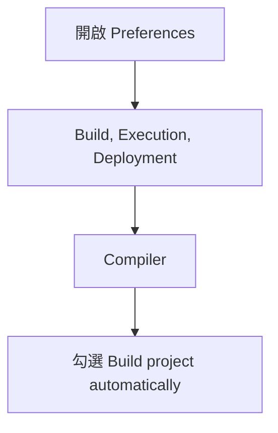

### IntelliJ Community Edition 的額外設定

除了開啟「自動建置專案」外，還需要進行一項額外的進階設定才能讓 DevTools 正常運作：

- **[進階設定路徑]**
    - 選擇 **Preferences** (偏好設定)
    - 選擇 **Advanced Settings** (進階設定)
    - 勾選 **Allow auto-make to start even if developed application is currently running** (允許在應用程式運行時啟動自動建置)

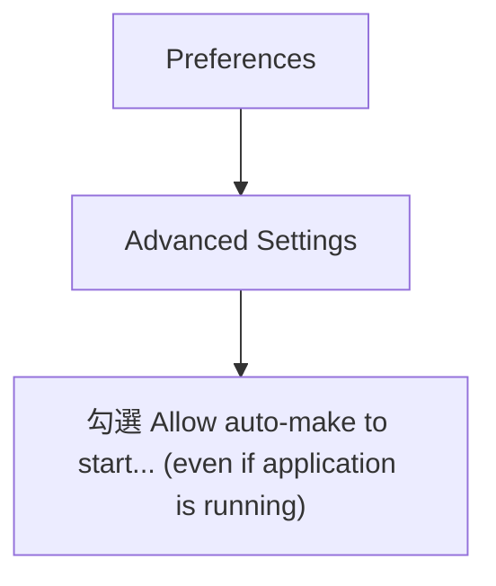

### DevTools 啟用開發流程總結

若要在 IntelliJ Community Edition 中成功使用 Spring Boot DevTools 的自動重啟功能，應遵循以下步驟：

1. **套用 IntelliJ 設定**

    - 開啟「Build project automatically"
    - 開啟「Allow auto-make to start even if developed application is currently running"

2. **編輯&#32;`pom.xml`**

    - 加入 `spring-boot-devtools` 的依賴項

### 驗證 DevTools 自動重啟流程

為了確保 Spring Boot DevTools 能如預期運作，可透過以下步驟進行實作與驗證：

1. **確認 IDE 環境設定**

    - 確保已依照先前步驟在 IntelliJ 中開啟「自動建置專案」(Build project automatically)。

2. **配置依賴項**

    - 在 `pom.xml` 中加入 `spring-boot-devtools` 依賴項。

3. **實作新功能**

    - 在專案中新增程式碼（例如：建立一個新的 REST endpoint）。

4. **觀察自動重啟**

    - 修改程式碼並儲存後，觀察應用程式是否在無需手動重新啟動的情況下，自動完成重新載入。

### 開發環境整理

- **[停止運行中的應用程式]**
    - 在進行專案結構變更或檔案管理前，應確保所有正在運行的 Spring Boot 應用程式都已停止，以避免潛在的檔案鎖定或衝突問題
- **[檔案目錄整理]**
    - 切換至檔案系統（File System）以管理專案實體檔案
    - 目標目錄：`dev-spring-boot`

### 專案目錄組織

- **[建立練習專案目錄]**
    - 為了方便管理之後所有的練習專案，建立一個新的資料夾：`01-spring-boot-overview`
- **[移動現有專案]**
    - 將原本的 `mycoolapp` 資料夾移動到新建立的 `01-spring-boot-overview` 目錄下
    - **[目前的目錄結構]**

```text
dev-spring-boot/
└── 01-spring-boot-overview/
    └── mycoolapp/
```

### 專案備份與版本管理

- **[管理技巧]**：透過複製現有的專案資料夾並重新命名，可以保留專案在不同開發階段的紀錄
    - **[操作流程]**\*\*：

        1. 複製現有的專案資料夾（例如 `01-spring-boot-demo`）
        2. 在同一目錄下貼上副本
        3. 將副本重新命名為新的開發階段名稱（例如 `02-dev-tools-demo`）

    - **[目的]**：這種「家務工作 (housekeeping)」能確保在需要回溯到特定開發點時，仍保有完整的專案副本

### 專案切換與開啟

- **[目前的目錄結構]**
    - 所有的練習專案都組織在 `dev-spring-boot` 目錄下
    - 包含不同的開發階段，例如 `01-spring-boot-demo` 與 `02-dev-tools-demo`

```text
dev-spring-boot/
└── 01-spring-boot-overview/
    ├── 01-spring-boot-demo/
    └── 02-dev-tools-demo/
```

- **[IDE 操作流程]**
    - 在 IntelliJ IDEA 中，若要切換專案：

        1. 從目前的專案中移除舊專案 (Remove project)
        2. 點選 **Open**
        3. 導航至正確的目錄路徑，例如：`dev-spring-boot` $\rightarrow$ `01-spring-boot-overview` $\rightarrow$ `02-dev-tools-demo` 並開啟

### 實作步驟 1：套用 IntelliJ 設定

- **[開啟專案]**
    - 開啟 `02-dev-tools-demo` 專案
    - 等待 IDE 完成同步與 Maven 依賴項解析 (Resolve Maven dependencies)
- **[進入編譯器設定]**
    - 開啟 **Preferences** (偏好設定)
    - 導航至 **Build, Execution, Deployment**
    - 選擇 **Compiler** 以進行後續的自動建置設定

### 實作步驟 2：套用進階設定

完成編譯器 (Compiler) 的設定後，需進行最後一項關鍵配置以確保 DevTools 的自動重啟機制在應用程式運行時仍能觸發：

1. **進入進階設定**

    - 在左側選單中點選 **Advanced Settings**

2. **啟用自動建置功能**

    - 在 **Compiler** 區塊下，勾選 **Allow auto-make to start even if developed application is currently running** (允許在應用程式運行時啟動自動建置)

**[重要提示]**：這些是 IntelliJ Community Edition 專屬的配置步驟，目的是彌補該版本在開發流程中對自動建置支援的限制，讓開發者能體驗到與專業版相似的 DevTools 自動重啟流程。

### 實作步驟 3：編輯 `pom.xml` 加入 DevTools 依賴項

為了讓 DevTools 的自動重啟功能生效，必須在專案的 Maven 設定檔中進行配置：

1. **開啟&#32;`pom.xml`**

    - 在專案目錄結構中找到並開啟 `pom.xml` 檔案。

2. **新增依賴項**

    - 在 `<dependencies>` 區塊內，新增 `spring-boot-devtools` 的依賴項設定。

**[操作範例]**

```xml
<dependencies>
    <!-- 現有的依賴項... -->

    <dependency>
        <groupId>org.springframework.boot</groupId>
        <artifactId>spring-boot-devtools</artifactId>
    </dependency>
</dependencies>
```

### 驗證 DevTools 自動重啟功能

- **[啟動應用程式]**
    - 在 `src/main/java` 目錄下找到主類別（例如 `MyCoolApp`）
    - 執行該類別以啟動 Spring Boot 應用程式
- **[測試流程]**
    - 確保應用程式已成功運行
    - 修改原始碼（Source Code）
    - 觀察 DevTools 是否會觸發自動重啟 (Automatic reloading)，使變更即時生效

### 執行並測試應用程式

- **[啟動應用程式]**
    - 找到主類別 `MycoolappApplication` 並以 Java 應用程式方式執行
    - 觀察控制台 (Console) 輸出，確認伺服器已啟動
- **[啟動狀態確認]**
    - 內嵌式 Tomcat 已在埠號 `8080` 啟動並運行
    - 應用程式顯示 `Started MycoolappApplication in ... seconds`，代表服務已就緒

```text
Tomcat started on port(s): 8080 (http) with context path ''
Started MycoolappApplication in 2.272 seconds (process running for 2.842)
```

- **[下一步計畫]**
    - 修改 `FunRestController` 以新增一個新的 REST 端點 (Endpoint)

### 測試 DevTools 自動重啟功能

- **[修改原始碼]**
    - 在 `FunRestController` 中新增一個新的 REST 端點，用以測試 DevTools 的自動重啟機制是否運作正常
- **[實作新增端點]**
    - 使用 `@GetMapping` 註解來定義新的路徑

```java
// expose a new endpoint for "workout"
@GetMapping("/workout")
public String getDailyWorkout() {
    // ...
}
```

### 驗證 DevTools 自動重啟功能實作

- **[完成程式碼修改]**
    - 在 `FunRestController` 中實作新的 REST 端點 `/workout`

```java
// expose a new endpoint for "workout"
@GetMapping("/workout")
public String getDailyWorkout() {
    return "Run a hard 5k!";
}
```

- **[觸發自動重啟]**
    - 儲存檔案後，觀察 IDE 下方的 **Console** 視窗
    - 當看到控制台有新的活動輸出時，代表 DevTools 已偵測到變更並自動重新啟動應用程式
- **[確認重啟狀態]**
    - 控制台會顯示類似以下的訊息，確認服務已重新載入：

```text
LiveReload server is running on port 35729
Tomcat started on port(s): 8080 (http) with context path ''
Started MycoolappApplication in 0.201 seconds (process running for 125.556)
```

- **[驗證結果]**
    - 此流程確認了 DevTools 的開發環境配置完全正確，開發者現在可以直接透過瀏覽器存取新的端點而無需手動重啟伺服器。

### 驗證新端點存取

- **[存取方式]**
    - 在瀏覽器輸入 `localhost:8080/workout`
- **[驗證結果]**
    - 成功看到回傳的字串 `Run a hard 5k!`，證實新端點已透過 DevTools 自動載入

### 進一步測試 DevTools 穩定性

- **[操作目的]**
    - 為了確保自動重啟機制真的完全可靠，再次進行程式碼修改
- **[實作計畫]**
    - 在 `FunRestController` 中新增另一個端點 `/fortune`

### 實作 `/fortune` 端點

- **[目的]**
    - 再次進行程式碼修改，以確保 DevTools 的自動重啟機制在多次變更後依然穩定運作
- **[程式碼實作]**
    - 在 `FunRestController` 中新增一個名為 `getDailyFortune` 的方法

```java
// expose a new endpoint for "fortune"
@GetMapping("/fortune")
public String getDailyFortune() {
    return "Today is your lucky day.";
}
```

### 驗證 `/fortune` 端點實作

- **[完成程式碼實作]**
    - 在 `FunRestController` 中新增 `/fortune` 端點並回傳字串

```java
// expose a new endpoint for "fortune"
@GetMapping("/fortune")
public String getDailyFortune() {
    return "Today is your lucky day.";
}
```

- **[觀察自動重啟]**
    - 儲存檔案後，觀察 IDE 控制台 (Console)
    - 確認看到應用程式自動重新啟動的活動輸出，代表 DevTools 偵測到變更
- **[驗證結果]**
    - 在瀏覽器存取 `localhost:8080/fortune`
    - 成功看到回傳內容：`Today is your lucky day.`
    - 此結果證實了 DevTools 能即時且穩定地將最新的程式碼變更載入到執行中的應用程式。
- **[功能驗證]**
    - 透過瀏覽器存取 `/fortune` 端點，成功看到回傳的 `Today is your lucky day.`
    - 這證實了 DevTools 已成功偵測到程式碼變更並自動重啟應用程式
- **[DevTools 的開發價值]**
    - **[為什麼推薦使用]** 只需要在 Maven 依賴檔中加入相關組件，就能在開發過程中獲得自動重載功能
    - 這能讓開發者在修改程式碼後，無需手動重啟伺服器即可看到結果，極大化開發效率

### Spring Boot Actuator

- **[面臨的問題]** 在應用程式運行期間，開發者與維運人員通常需要解決以下問題：
    - 如何監控與管理應用程式？
    - 如何檢查應用程式的健康狀態 (health)？
    - 如何獲取應用程式的度量數據 (metrics)？
- **[解決方案：Spring Boot Actuator]**
    - **功能**：自動暴露多個端點 (endpoints)，用於監控與管理應用程式
    - **價值**：無需編寫額外程式碼，即可直接獲得「開箱即用」的 DevOps 功能
    - **實作方式**：只需在 Maven 的 `pom.xml` 檔案中加入相關依賴項 (dependency)
    - **結果**：這些新的 REST 端點會自動加入到應用程式中，供開發者免費使用

### Spring Boot Actuator 的實作與端點

- **[依賴項配置]**
    - 在 Maven 的 `pom.xml` 檔案中加入以下內容即可啟用 Actuator 功能：

```xml
<dependency>
    <groupId>org.springframework.boot</groupId>
    <artifactId>spring-boot-starter-actuator</artifactId>
</dependency>
```

- **[自動暴露端點]**
    - **特性**：Actuator 會「開箱即用」(out-of-the-box) 地自動暴露用於度量 (metrics) 與監控的 REST 端點
    - **開發成本**：無需撰寫任何額外的程式碼，這些端點是免費提供的
    - **命名規則**：所有的端點都會帶有 `/actuator` 的前綴
- **[常用端點範例]**

| 端點名稱 | 描述 |
| --- | --- |
| /actuator/health | 提供應用程式的健康狀態資訊 |
| ... | 其他監控相關端點 (將在後續討論) |

### Health 端點詳解

- **功能定義**
    - `/health` 端點用於檢查應用程式的運行狀態
    - **[主要用途]** 通常由監控程式 (monitoring apps) 使用，用以判斷應用程式目前是處於「運行中」(up) 還是「已停止」(down) 的狀態
- **[狀態呈現範例]**
    - 當存取 `localhost:8080/actuator/health` 時，會回傳 JSON 格式的狀態資訊

```json
{
  "status": "UP"
}
```

- **[自定義能力]**
    - 健康狀態並非固定不變，開發者可以根據自身的業務邏輯 (business logic) 來自定義健康檢查的判斷標準

### 暴露端點的限制與擴充

- **預設暴露範圍**
    - 在預設情況下，Actuator 僅會暴露 `/health` 這個端點
- **`/info`&#32;端點**
    - 提供關於應用程式更詳細的資訊
    - 同樣可以進行自定義配置

### 暴露更多端點

- **[如何啟用 /info 端點]**
    - 預設情況下，僅 `/health` 端點是暴露的
    - 若要啟用 `/info`，必須修改 `src/main/resources/application.properties` 檔案
- **[配置步驟]**
    - 1. 使用 `management.endpoints.web.exposure.include` 屬性，並以逗號分隔列出想要暴露的端點
    - 2. 使用 `management.info.env.enabled=true` 來啟用環境資訊相關的 `/info` 功能

```properties

# application.properties
management.endpoints.web.exposure.include=health,info
management.info.env.enabled=true
```

### Info 端點詳解

- **功能**
    - `/info` 端點旨在提供關於應用程式的詳細資訊
- **[預設行為]**
    - **[預設狀態]**：在未進行額外配置前，該端點的內容預設是空的
    - **[觀察結果]**：存取 `localhost:8080/actuator/info` 時，會得到一個空的 JSON 物件 `{}`，這在預設情況下對於監控來說並不太實用

### 自定義 Info 端點內容

- **[配置方式]**
    - 透過更新 `src/main/resources/application.properties` 檔案來提供應用程式資訊
- **[命名規則]**
    - **關鍵規則**：所有以 `info.` 開頭的屬性名稱，都會被用於 `/info` 端點的 JSON 物件中
    - **[實作範例]**

```properties

# application.properties
info.app.name=My Super Cool App
info.app.description=A crazy and fun app, yohoo!
info.app.version=1.0.0
```

- **[JSON 回傳結果]**
    - 當存取 `localhost:8080/actuator/info` 時，Spring Boot 會根據上述屬性產生對應的結構
    - `info.` 之後的內容會成為 JSON 的鍵 (key)

```json
{
  "app": {
    "name": "My Super Cool App",
    "description": "A crazy and fun app, yohoo!",
    "version": "1.0.0"
  }
}
```

### Spring Boot Actuator 其他常用端點

除了 `/health` 與 `/info` 之外，Actuator 還提供了許多其他端點來協助監控與診斷應用程式：

| 端點名稱 | 描述 |
| --- | --- |
| /audit-events | 提供應用程式的審計事件 (audit events) 列表 |
| /beans | 列出所有註冊在 Spring 應用程式上下文 (application context) 中的 Bean |
| /mappings | 列出應用程式中所有的請求映射 (request mappings) 路徑 |

- **[獲取完整列表]**
    - Spring Boot Actuator 實際上擁有超過 20 個端點
    - 若需查看完整的端點清單，建議參考 Spring Boot Actuator 的官方文件

### 暴露所有 Actuator 端點

- **[預設限制]**
    - 預設情況下，僅有 `/health` 端點會透過 HTTP 暴露
- **[如何啟用所有端點]**
    - 若要透過 Web 存取所有的 Actuator 端點，可以在 `src/main/resources/application.properties` 中使用萬用字元 `*`
- **[配置方法]**

```properties

# application.properties
management.endpoints.web.exposure.include=*
```

- **[其他配置方式]**
    - 除了使用 `*` 暴露全部，也可以使用以逗號分隔的清單來指定個別端點

### 獲取 Bean 列表

- **[操作方式]**
    - 配置好端點暴露後，可以透過瀏覽器存取特定的端點來檢視應用程式資訊
- **[範例]**
    - 存取 `http://localhost:8080/actuator/beans` 即可取得該應用程式中所有註冊的 Bean 列表

### `/beans` 端點內容詳解

- **功能**
    - 存取 `http://localhost:8080/actuator/beans` 會回傳一個 JSON 格式的 dump，列出所有註冊在 Spring Application Context 中的 Bean
- **[安全性考量]**
    - **[風險]**：這些端點包含豐富的應用程式內部資訊，直接暴露在 Web 上可能導致安全性問題
    - **[解決方案]**：後續會透過加入 **Spring Security** 來保護這些端點，確保只有經過身份驗證（登入使用者 ID 與密碼）的授權使用者才能存取

### 開發流程步驟

為了在專案中實作並使用 Actuator，可以遵循以下步驟：

1. **編輯&#32;`pom.xml`**

    - 加入 `spring-boot-starter-actuator` 依賴項

2. **查看 Actuator 端點**

    - 驗證 `/health` 與 `/info` 等端點是否正常運作（這些端點在加入依賴後是「免費」提供的）

3. **自定義&#32;`/info`&#32;端點**

    - 透過編輯 `application.properties` 來提供特定的應用程式資訊
- **[環境清理]**
    - 在進行新的開發工作前，應先停止所有正在執行的 Spring Boot 應用程式
- **[專案備份]**
    - **[操作方式]**：關閉 IDE 並複製目前的專案資料夾
    - **[目的]**：這是一個選用的步驟，旨在保持專案目錄整潔，並在需要時能快速回溯到之前的版本

### 開發環境整理續

- **[環境清理]**
    - 關閉不必要的瀏覽器分頁與視窗
    - **[目的]**：減少開發時的干擾，專注於目前的專案

### 建立新的練習專案

- **[操作流程]**
    - 進入 `dev-spring-boot` 目錄下的 `01-spring-boot-overview` 資料夾
    - 複製現有的 `02-dev-tools-demo` 專案資料夾
    - 將複製後的資料夾重新命名為 `03-actuator-demo`
- **[目的]**
    - 利用既有的專案結構作為模板，快速開啟新的實驗（例如本階段的 Actuator 練習），避免從零開始配置環境。

### 開啟 Actuator 練習專案

- **[快速開啟技巧]**
    - 可以直接將專案資料夾從檔案管理器（如 Finder）**拖放 (Drag and Drop)** 到 IntelliJ IDEA 中，系統會自動完成開啟流程
- **[實作步驟 1：配置依賴項]**
    - 開啟 `pom.xml` 檔案
    - 在 `<dependencies>` 區塊中加入 `spring-boot-starter-actuator` 依賴項，以啟用 Actuator 功能

### 實作步驟 2：加入 Actuator 依賴項

- **[操作流程]**
    - 複製現有的依賴項結構（例如 `spring-boot-starter-web`）
    - 貼上至 `<dependencies>` 區塊中
    - 修改 `<artifactId>` 為 `spring-boot-starter-actuator`
- **[程式碼實作]**

```xml
<!-- 為 Spring Boot Actuator 提供支援 -->
<dependency>
    <groupId>org.springframework.boot</groupId>
    <artifactId>spring-boot-starter-actuator</artifactId>
</dependency>
```

- **[功能說明]**
    - **[自動化功能]**：加入此依賴後，系統會「免費」提供額外的 REST 端點，無需自行撰寫程式碼
    - **[核心用途]**：用於應用程式的**管理 (Management)** 與**指標監控 (Metrics)**

### `/info` 端點的配置與自定義

- **[預設行為]**
    - 預設情況下，僅 `/health` 端點是暴露出來的
- **[`/info`&#32;端點]**
    - 可以提供關於應用程式的更多資訊
    - **[自定義方式]**：可以透過修改 `application.properties` 檔案來擴充其內容

### 暴露更多 Actuator 端點

- **[配置方式]**：透過在 `application.properties` 中設定屬性來決定哪些端點可以透過 Web 存取
- **[實作程式碼]**

```properties

# 指定要暴露的端點清單，使用逗號分隔
management.endpoints.web.exposure.include=health,info

# 啟用環境資訊 (Environment info) 的顯示功能
management.info.env.enabled=true
```

- **[關鍵屬性說明]**
    - `management.endpoints.web.exposure.include`：定義一個以逗號分隔的清單，指定哪些端點需要暴露給 Web 使用
    - `management.info.env.enabled=true`：確保 `/info` 端點能夠包含環境相關的資訊

### 驗證 Actuator 端點是否生效

- **[操作流程]**
    - 以 Java 應用程式模式執行 Spring Boot 專案
    - 檢查 IDE 下方的啟動日誌 (Log)
- **[驗證結果]**
    - 在日誌中搜尋關鍵字，確認是否有類似以下的訊息：
    - `Exposing 2 endpoint(s) beneath base path '/actuator'`
    - **[意義]**：這表示系統已根據 `application.properties` 的設定，成功將指定的端點（在此範例中為 `health` 與 `info`）暴露在 `/actuator` 路徑之下。

### 驗證 Actuator 端點

- **[端點路徑規則]**
    - 所有的 Actuator 端點都會帶有 `/actuator` 前綴
    - **[URL 結構]**：`http://localhost:8080/actuator/{endpoint_name}`
- **[實作驗證]**
    - 透過瀏覽器存取以下 URL 來查看實際回應：
        - `/health` 端點：`http://localhost:8080/actuator/health`
        - `/info` 端點：`http://localhost:8080/actuator/info`

### `/health` 端點的實務用途

- **[功能說明]**
    - 回傳應用程式目前的運行狀態（例如：`{"status": "UP"}`）
- **[核心價值]**
    - **[外部監控]**：可以被外部的監控應用程式 (Monitoring apps) 使用，用來即時判斷應用程式是處於正常運作 (up) 還是故障 (down) 的狀態
    - **[可擴充性]**：開發者可以根據特定的業務需求 (business cases)，針對此端點的判斷邏輯進行自定義

### 自定義 `/info` 端點內容

- **[操作目標]**：透過在 `application.properties` 中新增自定義屬性，讓 `/info` 端點回傳更多關於應用程式的資訊
- **[實作方式]**\*\*
    - 在 `application.properties` 中定義自定義的鍵值對 (Key-Value pairs)
    - **[範例程式碼]**

```properties

# 自定義應用程式名稱
info.app.name=My Super Cool App

# 自定義應用程式描述
info.app.description=A crazy funny app
```

- **[驗證結果]**
    - 當存取 `http://localhost:8080/actuator/info` 時，回應的 JSON 會包含這些自定義的資訊項目

### 擴充 `/info` 端點的屬性規則

- **[命名規則]**
    - 只要屬性名稱是以 `info.` 開頭，就會被 `/info` 端點讀取並顯示
    - **[範例程式碼]**

```properties

# 自定義應用程式版本
info.app.version=1.0.0
```

- **[驗證結果]**
    - 存取 `http://localhost:8080/actuator/info` 時，JSON 回應會包含所有符合規則的自定義項目
    - **[範例回應]**

```json
{
  "app": {
    "name": "My Super Cool App",
    "description": "A crazy fun app, yahoo!",
    "version": "1.0.0"
  }
}
```

### Spring Boot DevTools 的自動重載功能

- **[開發體驗優化]**
    - 當修改了 `application.properties` 或程式碼並儲存後，Spring Boot 會自動重新載入應用程式
    - **[運作機制]**：這得益於專案中已配置的 **Spring Boot DevTools**，它能偵測變更並觸發應用程式重啟，無需手動停止與啟動專案

### 優化 JSON 資料的閱讀體驗

- **[問題描述]**
    - 瀏覽器預設顯示的 JSON 資料通常是擠成一團的單行字串，難以閱讀與檢查
- **[解決方案]**
    - **Chrome 使用者**：建議安裝 **JSON PrettyPrint** 插件（例如透過 `www.luv2code.com/chrome-json-formatter` 尋找相關工具）
    - **Firefox 使用者**：無需額外安裝，已內建此功能
        - **[操作步驟]**：選擇 `Raw Data` $\rightarrow$ `Pretty Print`

### Chrome JSON Formatter 實作與使用

- **[安裝步驟]**
    - 於 Chrome Web Store 找到 JSON Formatter 頁面
    - 點選「Add to Chrome」並在彈出的提示視窗中確認安裝
- **[功能說明]**
    - 安裝後，瀏覽器在顯示 JSON 資料時會提供兩種模式切換：
        - **Raw**：顯示原始、未經格式化的單行 JSON 字串
        - **Parsed**：顯示經過格式化（Pretty Print）、具有縮排與層級結構的 JSON 資料，大幅提升人類閱讀的便利性
- **[視覺對比]**
    - **Raw 模式**：`{"app":{"name":"My Super Cool App","description":"A crazy fun app, yahoo!","version":"1.0.0"}}`
    - **Parsed 模式**：

```json
{
        "app": {
          "name": "My Super Cool App",
          "description": "A crazy fun app, yahoo!",
          "version": "1.0.0"
        }
      }
```

### 自定義 `/info` 端點的驗證結果

- **[驗證結果]**
    - 透過瀏覽器存取端點，確認 JSON 資料已成功包含先前在 `application.properties` 中定義的自定義欄位
    - **[範例回應]**

```json
{
  "app": {
    "name": "My Super Cool App",
    "description": "A crazy fun app, yohoo!",
    "version": "1.0.0"
  }
}
```

- **[下一步目標]**
    - 擴充 Spring Boot Actuator，暴露更多其他的端點 (endpoints) 以進行更全面的應用程式監控
- **[配置方式]**
    - 可以使用萬用字元 `*` 來一次性暴露所有可用的端點
    - 或者使用逗號分隔的清單來指定個別端點
- **[實作設定]**
    - 在 `application.properties` 中加入以下配置：

```properties

# 使用萬用字元暴露所有端點
management.endpoints.web.exposure.include=*
```

- **[驗證結果]**
    - 設定完成並儲存後，應用程式會自動重啟
    - 從控制台 (Console) 日誌可以看到系統正在初始化內嵌式 Tomcat 伺服器，並開始暴露端點（例如：`Exposing 13 endpoint(s) beneath base path '/actuator'`）

### 探索更多 Actuator 端點

- **`/actuator/beans`&#32;端點**
    - **功能**：列出所有已在應用程式中註冊的 Spring beans
    - **包含內容**：
        - Spring Boot 的內部 beans
        - 開發者透過 `@Component` 等註解自定義的 beans
    - **[用途]**：非常適合用於**除錯配置 (debugging configuration)**，可以確認特定的 bean 是否已成功建立，或是否如預期般被應用程式使用
- **`/actuator/threaddump`&#32;端點**
    - 提供應用程式目前的執行緒狀態 (thread dump)，可用於分析執行緒阻塞或效能問題

### 更多 Actuator 端點的實務用途

- **`/actuator/threaddump`&#32;端點**
    - **功能**：提供應用程式中所有執行中執行緒 (threads) 的列表
    - **[用途]**：非常適合用於**分析與剖析 (analyzing and profiling) 應用程式的效能**，幫助找出潛在的效能瓶頸 (bottlenecks)
- **`/actuator/mappings`&#32;端點**
    - **功能**：列出應用程式中所有的請求對應 (request mappings)
    - **[用途]**：當你需要快速確認目前有哪些端點被暴露 (exposed) 或有哪些可用的請求對應時，這個端點非常有用

### Spring Boot Actuator 安全性

- **[安全性需求]**
    - 不應該將所有的 Actuator 端點資訊暴露給網路上的任何人
    - 需要保護這些端點以確保應用程式資訊的安全
- **[實作方式]**
    - 在 Maven 專案中加入 `spring-boot-starter-security` 依賴項，即可輕鬆實現端點的安全性保護

```xml
<dependency>
    <groupId>org.springframework.boot</groupId>
    <artifactId>spring-boot-starter-security</artifactId>
</dependency>
```

- **[注意事項]**
    - 加入 Spring Security 後，`/health` 端點預設仍然是可用的 (available)
    - 若有需求，可以進一步將 `/health` 端點禁用

### 受保護端點的登入機制

- **[存取行為]**
    - 當加入 Spring Security 依賴項後，存取受保護端點（例如 `/actuator/beans`）時，系統會彈出登入視窗 (Please sign in)
- **[預設登入憑證]**
    - **使用者名稱 (Username)**：預設為 `user`
    - **密碼 (Password)**：需要查看應用程式啟動時的**控制台日誌 (Console logs)**
        - 日誌中會包含類似 `Using generated security password: [一串長密碼]` 的訊息

```text

# 控制台日誌範例
Using generated security password: 78fd68a6-c190-421d-934b-df7852fc7dc2
```

### Spring Security 配置自定義

- **[覆寫預設憑證]**
    - 不想使用控制台產生的隨機密碼時，可以直接在 `application.properties` 中指定固定的使用者名稱與密碼
    - **實作範例**：

```properties

# 在 src/main/resources/application.properties 中設定
spring.security.user.name=scott
spring.security.user.password=tiger
```

- **[進階自定義能力]**
    - Spring Security 不僅限於簡單的屬性設定，可以針對 Spring Boot Actuator 進行更深層的客製化
    - **可擴充的功能包括**：
        - 使用資料庫 (Database) 來管理使用者與角色 (Roles)
        - 使用加密技術 (Encrypted passwords) 來保護密碼安全
        - 其他更複雜的驗證與授權機制

### 排除 Actuator 端點

- **[目的]** 為了安全性，可以選擇不暴露某些特定的端點，例如 `/health` 或 `/info`
- **[實作方式]** 在 `application.properties` 檔案中使用 `management.endpoints.web.exposure.exclude` 屬性，並以逗號分隔要排除的端點列表

```properties

# 在 src/main/resources/application.properties 中排除特定端點
management.endpoints.web.exposure.exclude=health,info
```

### 深入學習資源

- 若需要更詳細的 Spring Boot Actuator 技術細節，可以參考官方文件或相關教學資源（例如：`www.luv2code.com/actuator-docs`）。

### Actuator 安全性實作流程

1. **編輯&#32;`pom.xml`**

    - 加入 `spring-boot-starter-security` 依賴項，以確保 Actuator 端點受到保護

2. **驗證安全性**

    - 測試 Actuator 端點（例如 `/actuator/beans` 等）是否已成功受到安全機制保護

3. **禁用特定端點**

    - 根據需求禁用不必要的端點，例如 `/actuator/health` 與 `/actuator/info`

### 開發前的準備工作

- **[停止應用程式]**
    - 在進行新的配置或依賴項更改前，應確保目前正在執行的 Spring Boot 應用程式已停止，以避免衝突或資源佔用
- **[環境整理 (Housekeeping)]**
    - 為了保持開發環境整潔並方便管理不同版本的應用程式，建議執行以下步驟：

        1. 關閉 IDE 視窗
        2. 複製並備份專案資料夾（以便隨時回溯至先前的版本）

### 實作 Spring Security 支援

- **[步驟]** 在 `pom.xml` 中加入註解，明確標示該區塊的功能
    - **實作範例**：

```xml
<!-- ADD SUPPORT FOR SPRING SECURITY -->
<dependency>
    <groupId>org.springframework.boot</groupId>
    <artifactId>spring-boot-starter-security</artifactId>
</dependency>
```

### 更新 Maven 依賴項資訊

- **[修改 Artifact ID]** 在新增依賴項時，請務必確認 `artifactId` 的正確性，以確保專案能正確載入 Spring Security 功能。
- **[實作範例]**：

```xml
<!-- ADD SUPPORT FOR SPRING SECURITY -->
<dependency>
    <groupId>org.springframework.boot</groupId>
    <artifactId>spring-boot-starter-security</artifactId>
</dependency>
```

- **[自動化效果]** 一旦成功加入此依賴項，Spring Boot 會自動為所有的 REST 端點啟用安全性保護機制。

### 驗證 Spring Security 預設登入資訊

- **[預設憑證獲取]**
    - 當應用程式啟動後，Spring Security 會在控制台 (Console) 日誌中自動產生一組隨機密碼
    - **預設登入資訊**：
        - **User ID**: `user`
        - **Password**: 從日誌中尋找類似 `Using generated security password: <隨機字串>` 的內容
- **[安全性提醒]**
    - 預設產生的密碼僅供開發測試使用
    - **[重要]** 在實際生產環境中，必須更新安全配置，不可直接使用此類隨機密碼
- **[自定義方案]**
    - 可以利用標準的 Spring Security 技術來取代預設的隨機密碼機制，例如：
        - 使用資料庫 (Database) 管理使用者與角色
        - 使用加密技術 (Encrypted passwords) 提升安全性

### 驗證 Actuator 端點安全性

- **[測試流程]** 嘗試透過瀏覽器存取受保護的端點
    - **測試 URL 範例**：`http://localhost:8080/actuator/mappings`
- **[預期結果]** 由於已加入 Spring Security 依賴項，存取時應會跳出登入頁面 (Sign in)
- **[登入憑證]**
    - **預設使用者名稱 (User ID)**：`user`
    - **預設密碼 (Password)**：需從應用程式啟動時的控制台 (Console) 日誌中尋找，格式如下：

```text
Using generated security password: fa86b8a1-1871-40e7-a10c-0752f4a037de
```

> **注意**：此產生的密碼僅供開發環境使用，實際生產環境必須建立自定義的安全配置。

### Spring Security 驗證實作與效果

- **[登入流程]**
    - 從應用程式控制台 (Console) 複製產生的隨機密碼
    - 在瀏覽器彈出的登入對話框中輸入憑證：
        - **User ID**: `user`
        - **Password**: 從日誌中複製的隨機字串
    - 成功登入後即可查看 Actuator 端點的詳細資訊
- **[安全性效果]**
    - **保護敏感資訊**：由於 Spring Security 的介入，未經授權的使用者無法直接存取如 `/actuator/mappings` 等端點
    - **存取控制**：系統會強制要求身分驗證，確保只有獲得授權的人員能獲取應用程式的內部配置與狀態

### 停用特定的 Actuator 端點

- **[背景]** 即使啟用了 Spring Security，某些端點預設仍可能可用
- **[目的]** 為了提高安全性，可以主動停用特定的端點，例如 `/health` 或 `/info`
- **[實作方法]** 在 `application.properties` 檔案中使用 `exclude` 屬性
    - **配置規則**：使用逗號分隔的列表來指定要排除的端點
    - **實作範例**：

```properties

# 排除特定的端點
management.endpoints.web.exposure.exclude=health,info
```

### 實作排除特定 Actuator 端點

- **[操作方式]** 透過修改 `application.properties`，將原本用於包含端點的 `include` 改為 `exclude`。
- **[設定語法]** 使用 `management.endpoints.web.exposure.exclude` 並以逗號分隔想要停用的端點列表。
- **[實作範例]**：

```properties

# 排除特定的端點，使其不再可用
management.endpoints.web.exposure.exclude=health,info
```

- **[效果]** 執行此配置後，如 `/health` 與 `/info` 這兩個端點將會被排除，無法再透過瀏覽器或 API 存取。

### 驗證 Actuator 端點是否被成功排除

- **[測試流程]** 嘗試存取先前已在 `application.properties` 中排除的端點
    - **測試 URL 1**：`http://localhost:8080/actuator/health`
    - **測試 URL 2**：`http://localhost:8080/actuator/info`
- **[預期結果]** 瀏覽器應顯示 **Whitelabel Error Page**，且錯誤類型為 `type=Not Found` (404)
    - **[原因]** 因為這些端點已被配置為排除 (exclude)，在應用程式中已不再可用

### Actuator 端點的實務價值

- **[建議做法]** 在實際的即時應用程式 (real-time applications) 或專案中，應保留 `/health` 與 `/info` 端點
- **[原因]** 這兩個端點對於監控應用程式的運行狀態與基本資訊非常有用，不建議在正式開發中將其停用
- **[操作建議]** 若僅為了教學或實驗目的而停用了這些端點，實驗結束後應使用 `#` 將該行配置註解掉 (comment out)

### 恢復 Actuator 端點的實務建議

- **[開發建議]** 在進行即時專案 (real-time projects) 時，建議保留 `/health` 與 `/info` 端點
    - **[原因]** 這對 DevOps 工作流程以及應用程式的即時監控 (application monitoring) 極具價值
- **[操作方式]** 若需恢復先前被排除的端點，只需在 `application.properties` 中使用 `#` 進行註解即可
    - **實作範例**：

```properties

# 將原本的排除設定註解掉，以恢復端點存取

# management.endpoints.web.exposure.exclude=health,info
```

- **[測試結論]** 透過此操作，可以成功重新存取 `/health` 與 `/info` 端點，同時驗證了 Spring Boot Actuator 與 Spring Security 結合後，能有效地在提供監控資訊的同時兼顧安全性。

## 從命令列執行 Spring Boot

- **[開發環境 vs. 執行環境]**
    - 開發期間：大部分時間會使用 IDE (如 IntelliJ, Eclipse, NetBeans)
    - 執行時：可以選擇在 IDE 之外運行，例如直接透過命令列 (Command Line)
- **[命令列運行的優勢]**
    - **無需開啟 IDE**：執行應用程式時不需要保持 IDE 開啟或執行中，可以讓應用程式獨立 (stand alone) 運行
- **[核心機制]**
    - **內建伺服器 (Embedded Server)**：由於使用的是 Spring Boot，伺服器已經被內建在生成的 JAR 檔案中，因此可以直接執行該檔案

### 執行方式與特性

- **[自包含特性 (Self-contained)]**
    - Spring Boot 應用程式是一個自包含的單元，JAR 檔案（例如 `mycoolapp.jar`）同時包含了：
        - 應用程式程式碼 (Application code)
        - 內建伺服器 (Embedded server，如 Tomcat)
    - **[優勢]** 不需要另外安裝或單獨運行一個獨立的伺服器
- **[命令列執行選項]**
    - **選項 1**：使用 Java 指令直接執行 JAR 檔
        - `java -jar <filename>.jar`
    - **選項 2**：利用 Spring Boot Maven plugin
        - `mvnw spring-boot:run`
- **[執行選項 1]** 使用 `java -jar` 指令
    - 直接針對編譯好的 JAR 檔進行執行
    - **[範例指令]**

```bash
java -jar mycoolapp.jar
```

    - **[運作原理]** 由於 JAR 檔是自包含的單元 (self-contained unit)，執行此指令會同時：
        - 啟動應用程式 (Start our app)
        - 啟動內建伺服器 (Start embedded server，例如 Tomcat)
    - **[優勢]** 不需要安裝額外的伺服器，也不需要開啟 IDE
- **[執行選項 2]** 使用 Spring Boot Maven plugin
    - 利用 Maven Wrapper (`mvnw`) 來執行專案
    - **[範例指令]**

```bash
mvnw spring-boot:run
```

### Maven Wrapper (`mvnw`) 的功能與使用

- **[核心功能]** 讓專案可以在不預先安裝 Maven 的情況下運行
    - 如果系統中找不到正確版本的 Maven，`mvnw` 會自動下載正確的版本
- **[提供的檔案類型]** 根據作業系統提供不同的執行檔
    - `mvnw.cmd`：適用於 Microsoft Windows
    - `mvnw.sh`：適用於 Linux 或 Mac
- **[不同情境下的使用方式]**
    - **使用 Maven Wrapper**：
        - Windows: `mvnw <command>`
        - Linux/Mac: `./mvnw <command>`
        - **[範例指令]**

```bash

# Windows
> mvnw clean compile test

# Linux/Mac
$ ./mvnw clean compile test
```

    - **若已安裝 Maven**：
        - 可以直接忽略或刪除 `mvnw` 相關檔案
        - 直接使用標準的 `mvn` 指令即可
        - **[範例指令]**

```bash
$ mvn clean compile test
```

### Spring Boot Maven plugin 的用途

- **[核心功能]** 透過 `pom.xml` 中的插件配置，實現以下操作：
    - **封裝 (Package)**：將應用程式封裝成可執行的 `.jar` 或 `.war` 檔案
    - **運行 (Run)**：快速啟動應用程式進行開發與測試
- **[執行指令對照]**
    - **使用 Maven Wrapper (`mvnw`)**：
        - 封裝：`./mvnw package`
        - 運行：`./mvnw spring-boot:run`
    - **使用已安裝的 Maven (`mvn`)**：
        - 封裝：`mvn package`
        - 運行：`mvn spring-boot:run`

```xml
<build>
    <plugins>
        <plugin>
            <groupId>org.springframework.boot</groupId>
            <artifactId>spring-boot-maven-plugin</artifactId>
        </plugin>
    </plugins>
</build>
```

### 離開 IDE 後的開發流程實作

- **[實作步驟]** 離開 IDE 後，透過命令列進行以下操作：

    1. 退出 IDE
    2. 使用 Maven 打包應用程式
    3. 嘗試不同的執行方式以觀察不同情境下的運作結果

#### 應用程式打包與執行方式

- **打包應用程式**
    - 使用 Maven Wrapper 指令進行打包：

```bash
./mvnw package
```

- **執行方式 1：直接執行 JAR 檔**
    - 使用標準 Java 指令執行打包生成的檔案：

```bash
java -jar <filename>.jar
```

- **執行方式 2：使用 Spring Boot Maven plugin**
    - 利用 Maven plugin 提供的指令來啟動應用程式：

```bash
./mvnw spring-boot:run
```

### 進入 IDE 前的環境清理

- **[前置作業]** 在開始新的專案實作前，應進行環境清理以確保狀態一致：
    - 停止所有正在執行的 Spring Boot 應用程式
- **[Housekeeping 步驟]**

    1. 關閉目前的專案視窗 (Close project window)
    2. 複製專案資料夾 (Copy project folders) 以供備份或後續參考

### 簡化專案配置

- **[清理步驟]** 為了讓後續的示範更聚焦，從 `pom.xml` 中刪除與本次練習無關的依賴項：
    - `spring-boot-starter-actuator`
    - `spring-boot-starter-security`

```xml
<!-- 刪除以下依賴項以簡化示範 -->
<dependency>
    <groupId>org.springframework.boot</groupId>
    <artifactId>spring-boot-starter-actuator</artifactId>
</dependency>
<dependency>
    <groupId>org.springframework.boot</groupId>
    <artifactId>spring-boot-starter-security</artifactId>
</dependency>
```

### 選擇對應的作業系統教學影片

- 為了確保指令與操作流程的準確性，後續將針對不同作業系統提供專門的教學：
    - Microsoft Windows 使用者
    - macOS / Linux 使用者

### 在 Microsoft Windows 上透過命令列執行 Spring Boot

- **[檔案路徑注意事項]**
    - 檔案可以放置在檔案系統中的任何位置，但應確保路徑易於存取
    - **[警告]**：切勿使用包含「空格」的目錄名稱
        - 因為空格會導致 Java 執行系統 (Java runtime system) 出現問題
- **[實作路徑範例]**
    - 範例路徑：`D:\Users\luv2code\dev-spring-boot`
    - 在此路徑下，專案位於 `01` 資料夾中

### 在 Windows 上開啟命令提示字元 (Command Prompt)

- **[操作步驟]** 以準備進行命令列操作：

    1. 在檔案總管中進入目標專案目錄（例如：`05-command-line-demo`）
    2. 點擊 Windows 任務列的**搜尋圖示**
    3. 輸入 `cmd`
    4. 從搜尋結果中選擇 **Command Prompt** 應用程式

### 驗證 Java 環境配置

- **[必要前提]** 在從命令列執行 Spring Boot 應用程式之前，必須確保 Java 已正確安裝並配置。
- **檢查&#32;`JAVA_HOME`&#32;環境變數**
    - 使用以下指令來確認系統是否已識別 Java 安裝路徑：

```cmd
echo %JAVA_HOME%
```

- **檢查 Java 版本**
    - 使用以下指令來確認 Java 版本資訊：

```cmd
java --version
```

### Java 環境配置的完整性驗證

- **[成功標準]** 必須同時滿足以下兩個條件，才代表 Java 已正確安裝：
    - `JAVA_HOME` 環境變數有正確的輸出路徑
    - 執行 `java --version` 能正確顯示版本資訊
- **[錯誤處理]**
    - 若其中任何一項缺失，代表 Java 未正確安裝或配置
    - 在此情況下，必須先完成 Java 的安裝流程才能繼續進行開發

### 切換至專案目錄

- **[操作流程]** 在命令列中進入專案目錄的快速方法：

    1. 開啟檔案總管 (File Explorer) 並找到目標專案資料夾
    2. 複製該資料夾的路徑 (Copy the directory path)
    3. 切換至命令提示字元 (Command Prompt)
    4. 輸入 `cd` 指令，接著空格，然後貼上路徑

- **[小技巧]** 在 Windows 命令提示字元中，可以透過**點擊右鍵**來快速貼上複製的路徑

### 使用 Maven Wrapper 打包應用程式

- **[操作步驟]** 在專案目錄下執行打包指令：

```cmd
./mvnw package
```

- **[執行結果]**
    - Maven 會在背景執行一系列建置流程
    - 當看到 `BUILD SUCCESS` 時，代表打包完成
- **[產出物位置]**
    - 打包成功後，系統會在 `target` 目錄下生成一個新的 JAR 檔案
    - 範例檔案路徑：`target\mycoolapp-0.0.1-SNAPSHOT.jar`

### 使用 Java 指令執行打包後的 JAR 檔

- **[執行方式]** 在完成 `mvnw package` 並生成 JAR 檔後，可以使用以下指令來啟動應用程式：

```cmd
java -jar target\mycoolapp-0.0.1-SNAPSHOT.jar
```

- **[執行結果]**
    - 系統會啟動 Spring Boot 應用程式
    - 控制台會顯示應用程式已成功啟動（例如：`Starting MycoolappApplication...`）
    - 內嵌式伺服器（如 Tomcat）會隨之啟動

### 驗證應用程式運行狀態

- **[驗證步驟]** 使用瀏覽器存取應用程式的預設位址：
    - 開啟瀏覽器並輸入：`http://localhost:8080`
- **[目的]** 確認應用程式與內嵌式伺服器已正常運作，並能回應 HTTP 請求

### 驗證命令列啟動的應用程式

- **[端點測試]** 測試不同的 REST 端點以確認應用程式功能完整：
    - `http://localhost:8080/workout` $\rightarrow$ 回傳 "Run a hard 5k!"
    - `http://localhost:8080/fortune` $\rightarrow$ 回傳 "Today is your lucky day."
- **[獨立執行特性]** 證實應用程式可以完全脫離 IDE 環境，僅透過命令列即可成功啟動並運行伺服器。

### 停止與重新啟動應用程式

- **[停止應用程式]** 在命令列中，可以透過組合鍵快速停止正在運行的應用程式：
    - 使用 `CTRL + C`
- **[使用 Spring Boot Maven Plugin 啟動]** 除了直接執行 JAR 檔，還有一種更簡便的啟動方式，Spring Boot 會自動處理所有細節，開發者不需要手動輸入長串的 JAR 檔案路徑：

```cmd
./mvnw spring-boot:run
```

- **[優點]**
    - 簡化指令，無需指定 `target` 目錄下的具體檔名
    - 適合開發階段快速啟動應用程式

### 總結：命令列開發流程的獨立性

- **[運行確認]** 透過瀏覽器重新整理頁面，確認應用程式仍能正常回傳預期的結果（例如：`Today is your lucky day.`）。
- **[完全脫離 IDE 的開發流程]**
    - 可以在不開啟任何 IDE 的情況下，僅透過 Microsoft Windows 的命令列完成整個開發與執行週期。
    - 流程包含：啟動應用程式 $\rightarrow$ 瀏覽器測試端點 $\rightarrow$ 命令列停止應用程式。
- **[停止與結束作業]**
    - **停止應用程式**：在命令提示字元中使用 `CTRL + C` 停止運行的 Spring Boot 程式。
    - **退出命令列**：輸入 `exit` 指令來關閉命令提示字元視窗。
- **[核心結論]** 成功證實了 Spring Boot 應用程式具備高度的獨立性，開發者可以完全依賴命令列工具進行應用程式的啟動、測試與管理。

### 在 macOS / Linux 上從命令列執行應用程式

- **[系統適用性]** 本流程同樣適用於 macOS 與 Linux 使用者
- **[操作流程]** 準備環境與導航至專案目錄：

    1. 開啟檔案系統並導航至開發目錄（例如：`dev-spring-boot`）
    2. 進入目標專案資料夾：`05-command-line-demo`
    3. 開啟終端機 (Terminal) 視窗

- **[專案結構確認]** 在進入目錄後，確認專案內包含必要的檔案，例如：
    - `mvnw`：Maven Wrapper 執行檔
    - `pom.xml`：Maven 專案設定檔
    - `src`：原始碼目錄
- **[打包步驟]** 使用 `mvnw package` 指令來執行打包流程：
    - 首先需導航至專案根目錄（例如：`dev-spring-boot`）
    - 執行指令：

```bash
./mvnw package
```

- **[產出結果]**
    - 此指令會為應用程式建立一個 JAR 檔案
    - **[存放位置]** 生成的 JAR 檔會自動存放在專案的 `target` 子目錄中

### Maven Wrapper (`mvnw`) 的運作原理

- **[自動化功能]** `mvnw` 是一個特殊的 Wrapper 指令，其核心價值在於：
    - **自動下載**：如果電腦中找不到正確版本的 Maven，它會自動從網路下載。
    - **無需手動安裝**：開發者不需要在系統中手動安裝 Maven 即可執行 Maven 專案。
    - **版本一致性**：確保所有開發者都使用專案指定的正確 Maven 版本。
- **[使用情境]**
    - **使用 Wrapper**：在專案目錄下執行 `./mvnw package`（macOS/Linux）或 `mvnw package`（Windows）。
    - **已安裝 Maven**：如果你已經在系統中安裝並配置好 Maven，可以直接使用標準指令：

```cmd
mvn package
```

- **[執行結果]**
    - Maven 會執行建置流程（如編譯、測試、打包）。
    - 成功後，終端機會顯示 `BUILD SUCCESS`，並在 `target` 目錄下生成 JAR 檔。

### 手動執行打包後的 JAR 檔

- **[定位 JAR 檔]** 由於 Maven 打包後的產出物會存放在 `target` 子目錄中，因此需要先切換目錄：
    - 使用 `cd target` 指令進入該目錄
- **[確認檔案]** 進入目錄後，可以使用 `ls` (macOS/Linux) 或 `dir` (Windows) 來確認生成的 JAR 檔案名稱（例如：`mycoolapp-0.0.1-SNAPSHOT.jar`）。
- **[啟動應用程式]** 使用 `java -jar` 指令搭配完整的檔案名稱來啟動伺服器：

```bash
java -jar mycoolapp-0.0.1-SNAPSHOT.jar
```

- **[執行結果]**
    - 成功啟動後，終端機會顯示 Spring Boot 啟動成功的相關日誌（如 `Tomcat started on port(s): 8080`）。
    - 此時應用程式已完全在命令列環境下運行，不依賴任何 IDE。

### 驗證應用程式端點

- **[多視窗並行測試]** 同時開啟瀏覽器與命令列視窗，以便在觀察應用程式運行日誌的同時，即時驗證 Web 端點的結果。
- **[端點驗證流程]** 透過瀏覽器存取以下路徑以確認程式碼邏輯是否正確執行：
    - `http://localhost:8080`：確認預設端點回傳「Hello World」。
    - `http://localhost:8080/workout`：測試特定的業務邏輯端點（例如：`Run a hard 5k`）。
    - `http://localhost:8080/fortune`：測試另一個端點（例如：`Today is your lucky day.`）。
- **[運行狀態確認]** 在瀏覽器成功取得回傳結果時，對應的命令列視窗應持續顯示 Tomcat 伺服器運行的日誌，證明應用程式正在後台穩定執行。

### 停止應用程式與連線失效

- **[停止流程]** 在終端機中使用 `CTRL+C` 指令即可中斷並停止正在運行的 Spring Boot 應用程式
- **[連線影響]** 一旦應用程式停止，原本可正常存取的瀏覽器端點將會失效
    - **[錯誤現象]** 瀏覽器會顯示 `This site can't be reached` 或 `localhost refused to connect`
    - **[原因]** 因為後端的 Spring Boot 伺服器已不再運行，無法處理 HTTP 請求

### 使用 Spring Boot Maven plugin 啟動應用程式

- **[目錄切換]** 若要使用 Maven plugin 進行開發相關的操作，通常需要回到專案的根目錄
    - 使用 `cd ..` 指令從 `target` 目錄返回上一層
- **[啟動指令]** 準備使用 Maven Wrapper 搭配 Spring Boot plugin 來快速啟動專案：
    - 預計使用的指令格式為 `./mvnw spring-boot:run`
- **[啟動指令]** 在專案根目錄執行以下指令來啟動應用程式：

```bash
./mvnw spring-boot:run
```

- **[驗證執行狀態]** 觀察終端機日誌，確認伺服器已啟動（例如顯示 `Tomcat started on port(s): 8080`），隨即可透過瀏覽器進行驗證：
    - **[操作]** 在瀏覽器中重新整理原本的端點頁面（例如 `http://localhost:8080/fortune`）。
    - **[預期結果]** 頁面應能正確顯示業務邏輯內容，例如：`Today is your lucky day.`

### 命令列開發的優勢

- **[脫離 IDE 依賴]** 能夠完全在命令列環境下執行應用程式，不再需要開啟重量級的 IDE。
- **[自包含特性 (Self-contained)]** Spring Boot 應用程式本身已包含必要的伺服器組件（如內嵌式 Tomcat），因此：
    - **無需預裝伺服器**：不需要在作業系統中另外安裝任何 Web Server。
    - **環境一致性**：只要有 Java 環境與 Maven Wrapper，即可在任何地方輕鬆啟動專案。

### Spring Boot 自定義應用程式屬性

- **[核心問題]** 在開發應用程式時，為了避免將數值「硬編碼」（hard-coding）在程式碼中，需要一種機制讓應用程式變得可配置（configurable）。
- **[解決方案]** 使用 `application.properties` 檔案來讀取配置資訊。
- **[預設設定檔]** Spring Boot 預設會從特定的標準檔案中讀取資訊：
    - **檔案路徑**：`src/main/resources/application.properties`
    - **特性**：這是 Spring Boot 預設尋找配置的標準檔名與位置。
- **[自定義屬性]**
    - 可以在此檔案中定義任何自定義的屬性（custom properties）。
    - 應用程式可以透過 `@Value` 註解來存取這些定義好的屬性。

### 自定義屬性的開發流程

- **[核心機制]** Spring Boot 會自動載入 `application.properties` 檔案，開發者無需進行額外的編碼或配置即可使用其內容。
- **[開發步驟]** 實現自定義配置分為兩個主要階段：

    1. **定義屬性**：在 `application.properties` 檔案中定義自定義的屬性對。
    2. **注入屬性**：在 Spring Boot 應用程式中使用 `@Value` 註解將定義好的屬性注入到程式碼中。

#### 步驟 1：在 `application.properties` 中定義自定義屬性

- **[檔案位置]** `src/main/resources/application.properties`
- **[操作範例]** 在該檔案中加入自定義的 key-value 組合：

```properties

# Define custom properties
coach.name=Mickey Mouse
coach.team=ABC
```

- **[屬性靈活性]** 可以在此檔案中使用任何自定義的屬性名稱，且沒有數量限制。
- **[操作範例]** 定義多個屬性對：

```properties

# Define custom properties
coach.name=Mickey Mouse
team.name=The Mouse Club
```

#### 步驟 2：將屬性注入 Spring Boot 應用程式

- **[核心機制]** 使用 `@Value` 註解將 `application.properties` 中定義的屬性值分配給程式碼中的欄位。
- **[實作範例]** 在 `FunRestController` 中注入剛才定義的屬性：

```java
@RestController
public class FunRestController {

    // inject properties for: coach.name and team.name
    @Value("${coach.name}")
    private String coachName;

    @Value("${team.name}")
    private String teamName;

    // ... 其他程式碼
}
```

#### 步驟 2：將屬性注入 Spring Boot 應用程式（續）

- **[注入機制]** 使用 `@Value` 註解對應 `application.properties` 中的 key，Spring Boot 會自動執行以下流程：
    - 尋找指定的屬性名稱（例如 `${team.name}`）
    - 從屬性檔案中提取該值
    - 將值分配給程式碼中的對應欄位
- **[實作範例]** 在 `FunRestController` 中注入多個屬性：

```java
@RestController
public class FunRestController {

    // inject properties for: coach.name and team.name
    @Value("${coach.name}")
    private String coachName;

    @Value("${team.name}")
    private String teamName;

    // ... 其他程式碼
}
```

- **[開發便利性]**
    - **無需額外配置**：Spring Boot 會自動載入 `application.properties` 並使其在應用程式中可用。
    - **自動化處理**：開發者不需要撰寫任何額外的程式碼來讀取檔案或解析內容，只需透過 `@Value` 註解即可輕鬆存取。

### 自定義屬性使用的簡便性

- **[核心優勢]** 在 Spring Boot 中使用自定義應用程式屬性非常容易
    - **無需額外配置**：不需要撰寫額外的程式碼或進行複雜的配置設定
    - **自動化流程**：只要在 `application.properties` 定義好 key-value，並在 Java 類別中使用 `@Value` 註解，Spring Boot 就會自動完成對應關係

### 進入 IDE 操作準備

- **[前置作業]** 在切換至命令列操作之前，必須先停止 IDE 中所有正在運行的 Spring Boot 應用程式。
    - **[目的]** 確保環境乾淨，避免應用程式因埠號已被佔用而無法啟動。
- **[核心機制]** Spring Boot 允許開發者透過在 `application.properties` 中定義特定的屬性來擴充 Actuator 的 `/info` 端點內容。
- **[命名規則]** 使用 `info.` 作為屬性名稱的前綴，其後接自定義的名稱，即可將該值包含在 `/info` 端點的輸出中。
- **[實作範例]** 在 `application.properties` 中定義擴充資訊：

```properties

# Use wildcard "*" to expose all endpoints

# Can also expose individual endpoints with a comma-delimited list
management.endpoints.web.exposure.include=*
management.info.env.enabled=true

# Exclude individual endpoints with a comma-delimited list
management.endpoints.web.exposure.exclude=health,info

# 擴充 /info 端點的內容
info.app.name=My Super Cool App
info.app.description=A crazy fun app, yahoo!
info.app.version=1.0.0
```

- **[開發流程]** 再次強調定義自定義屬性的第一步：在 `application.properties` 檔案中建立自定義的 key-value 對。

### 自定義屬性的定義靈活性

- **[命名自由度]** 屬性名稱可以根據需求自定義，不限於特定格式
    - **[實作範例]** 在 `application.properties` 中定義自定義屬性：

```properties

# Define my crazy properties
coach.name=Mickey Mouse
team.name=The Mouse Club
```

- **[開發流程步驟]**
    - **步驟 1**：在 `application.properties` 中定義自定義的 key-value 對
    - **步驟 2**：在 Spring Boot 應用程式中使用 `@Value` 註解進行屬性注入

### 屬性注入實作細節

- **[實作方式]** 在 `FunRestController` 中建立對應的私有欄位，並使用 `@Value` 註解搭配 `${}` 語法來指定要注入的屬性名稱：

```java
@RestController
public class FunRestController {

    // 注入 coach.name 與 team.name 屬性
    @Value("${coach.name}")
    private String coachName;

    @Value("${team.name}")
    private String teamName;

    // ... 其他程式碼
}
```

### 擴充端點與屬性應用

- **[開發技巧]** 可以利用複製與貼上來快速建立重複性的程式碼結構
    - **實作流程**：先複製已設定好的 \`@Value("${coach.name}")` 行，貼上後再修改其中的屬性名稱為 `${team.name}\`

```java
@RestController
public class FunRestController {

    // 注入 coach.name 與 team.name 屬性
    @Value("${coach.name}")
    private String coachName;

    @Value("${team.name}")
    private String teamName;

    // 暴露 "/" 端點，回傳 "Hello World"
    @GetMapping("/")
    public String sayHello() {
        return "Hello World!";
    }

    // 預計新增一個新的端點，用來利用這些注入的屬性資訊回傳資料
}
```

### 實作 `/teaminfo` 端點

- **[開發目標]** 建立一個新的端點 `/teaminfo`，用來同時回傳教練名稱與團隊名稱的資訊
- **[實作細節]** 在 `FunRestController` 中新增一個使用 `@GetMapping("/teaminfo")` 的方法：

```java
// expose new endpoint for "teaminfo"
@GetMapping("/teaminfo")
public String getTeamInfo() {
    // 預計在此處回傳包含 coachName 與 teamName 的資訊
}
```

### 完成 `/teaminfo` 端點實作

- **[實作邏輯]** 在 `getTeamInfo()` 方法中，將注入的 `coachName` 與 `teamName` 組合為一個字串並回傳
- **[程式碼實作]**

```java
// expose new endpoint for "teaminfo"
@GetMapping("/teaminfo")
public String getTeamInfo() {
    return "Coach: " + coachName + ", Team name: " + teamName;
}
```

- **[驗證流程]** 執行應用程式後，透過瀏覽器存取該端點以確認回傳內容是否符合預期（例如：`Coach: Mickey Mouse, Team name: The Mouse Club`）

### 驗證 `/teaminfo` 端點時遇到的錯誤

- **[預期結果]** 存取 `http://localhost:8080/teaminfo` 時，應該回傳注入屬性後的內容（例如：`Coach: Mickey Mouse, Team name: The Mouse Club`）
- **[實際結果]** 瀏覽器回傳了錯誤的字串內容：
    - `Coach: ${coach.name}, Team name: ${team.name}`
- **[錯誤原因]** 程式碼中發生了複製貼上的語法錯誤（Silly typo），導致 Spring 無法正確解析屬性佔位符
    - **[錯誤細節]** 在 `@Value` 註解中漏掉了必要的花括號 `{}`

```java
// 錯誤的實作方式（缺少花括號）
@Value("$coach.name")
private String coachName;

@Value("$team.name")
private String teamName;
```

- **[正確語法]** 必須使用 `${}` 來標示要注入的屬性名稱：

```java
// 正確的實作方式
@Value("${coach.name}")
private String coachName;

@Value("${team.name}")
private String teamName;
```

### 驗證修正後的端點

- **[DevTools 自動重啟]** 修正程式碼語法錯誤並儲存後，Spring Boot DevTools 會自動重新載入伺服器，無需手動重新啟動應用程式
- **[驗證結果]** 重新整理瀏覽器頁面後，端點 `/teaminfo` 能正確回傳注入屬性後的內容：
    - `Coach: Mickey Mouse, Team name: The Mouse Club`
- **[核心機制：屬性注入]** 此次成功的端點回傳完全依賴於以下兩個要素：

    1. **自定義屬性定義**：在 `application.properties` 中定義的鍵值對

```properties
coach.name=Mickey Mouse
        team.name=The Mouse Club
```

    1. **使用&#32;`@Value`&#32;註解進行注入**：將上述屬性值綁定到 Java 變數上

```java
@Value("${coach.name}")
        private String coachName;

        @Value("${team.name}")
        private String teamName;
```

- **[開發總結]** 這是一個展示如何定義自定義屬性並在應用程式中使用這些資訊的典型範例

### Spring Boot 屬性 (Properties)

- **[核心概念]** Spring Boot 可以透過 `application.properties` 檔案進行配置，避免在程式碼中硬編碼 (hard-coding)
- **[常見配置項目]** Spring Boot 提供了超過 1,000 個屬性，常見的包括：
    - Server port (伺服器連接埠)
    - Context path (上下文路徑)
    - Actuator endpoints (Actuator 端點)
    - Security settings (安全性設定) 等
- **[資源參考]** 若需要查找常用的屬性清單，可以參考以下資源：
    - `www.luv2code.com/spring-boot-props` (會導向官方 Spring Boot 文件)

### Spring Boot 屬性的邏輯分組

- **[核心觀念]** 雖然 Spring Boot 擁有超過 1,000 個屬性，但它們並非雜亂無章，而是大致分為以下幾大邏輯類別：

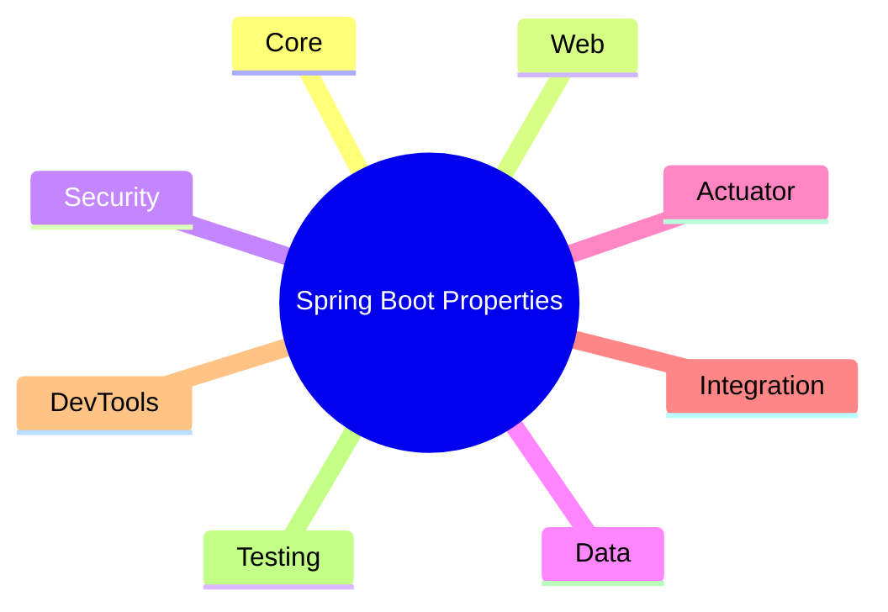

- **[學習策略]** 透過掌握這些分類，開發者可以更有效地查找與特定功能（如安全性或資料庫配置）相關的設定項目，而不必在龐大的清單中盲目搜尋。

### Spring Boot 核心屬性：日誌配置 (Logging)

- **[日誌層級設定]** 可以根據套件名稱 (package name) 來設定不同的日誌層級
    - 設定會套用到該套件及其所有子套件 (sub-packages)
    - 範例設定：

```properties

# 為 org.springframework 套件設定為 DEBUG 層級
logging.level.org.springframework=DEBUG

# 為 org.hibernate 套件設定為 TRACE 層級
logging.level.org.hibernate=TRACE

# 為自定義套件 com.luv2code 設定為 INFO 層級
logging.level.com.luv2code=INFO
```

- **[可用的日誌層級]** 從最詳細到最不詳細的順序如下：
    - `TRACE`
    - `DEBUG`
    - `INFO`
    - `WARN`
    - `ERROR`
    - `FATAL`
    - `OFF` (關閉日誌)
- **[日誌檔案輸出]** 可以將日誌輸出到特定的檔案中：

```properties

# 指定日誌檔案名稱
logging.file.name=my-crazy-stuff.log

# 或者指定日誌檔案的路徑
logging.file.path=c:/myapps/demo
```

### Spring Boot 核心屬性：Web 配置 (Web Properties)

除了日誌配置外，也可以在 `application.properties` 中設定與 Web 服務相關的屬性：

- **[更改伺服器連接埠]** 預設情況下，Spring Boot 伺服器會監聽 `8080` 連接埠，但可以透過 `server.port` 進行修改
    - 範例設定：

```properties

# 將伺服器連接埠更改為 7070
server.port=7070
```

- **[設定上下文路徑]** 可以使用 `server.servlet.context-path` 來定義應用程式的 URL 路徑前綴，這會影響所有端點的訪問路徑
    - 範例設定：

```properties

# 設定應用程式的上下文路徑
server.servlet.context-path=/my-silly-app
```

### Spring Boot 核心屬性：Web 配置 (Web Properties) 續

- **[URL 訪問結構的變化]** 當設定了上下文路徑 (`server.servlet.context-path`) 後，存取應用程式的 URL 會包含該路徑
    - **[預設情況]** 上下文路徑為 `/`
    - **[自定義範例]** 若設定為 `/my-silly-app`，且連接埠為 `7070`，則存取特定端點（如 `/fortune`）的完整 URL 為：

    `http://localhost:7070/my-silly-app/fortune`

- **[HTTP Session 逾時設定]** 可以透過 `server.servlet.session.timeout` 來設定 Session 的有效時間
    - **[時間單位簡寫]** 可以使用簡寫來表示時間，例如 `m` 代表分鐘 (minutes)
    - **[範例設定]** 設定為 15 分鐘：

```properties

# 設定 HTTP session 逾時時間為 15 分鐘
server.servlet.session.timeout=15m
```

---

### Actuator 屬性 (Actuator Properties)

- **[端點包含設定]** 可以透過屬性來指定要包含哪些 Actuator 端點，支援使用名稱或萬用字元 (wildcard)
        - 範例設定：

```properties

# 透過名稱或萬用字元來包含端點
management.endpoints.web.exposure.include=
```

### Actuator 屬性 (Actuator Properties) 續

- **[端點包含與排除]** 除了使用萬用字元包含所有端點外，也可以排除特定的端點
    - 包含所有端點：

```properties

# 使用萬用字元包含所有端點
management.endpoints.web.exposure.include=*
```

    - 排除特定端點（例如排除 `beans` 與 `mapping`）：

```properties

# 排除特定的端點
management.endpoints.web.exposure.exclude=beans,mapping
```

- **[修改 Actuator 基礎路徑]** 可以更改 Actuator 端點在 Web 上的預設路徑（預設為 `/actuator`）
    - **[預設訪問路徑]** 若連接埠為 `7070`，存取健康檢查的 URL 為：`http://localhost:7070/actuator/health`
    - **[自定義路徑範例]** 若將基礎路徑更改為 `/my-actuator`：

```properties

# 修改 Actuator 的基礎路徑
management.endpoints.web.base-path=/my-actuator
```

    - **[修改後的訪問路徑]** `http://localhost:7070/my-actuator/health`

### Spring Security 屬性 (Security Properties)

- **[安全性配置]** 可以透過設定屬性來保護 Spring Boot Actuator 的 REST 端點，確保只有授權使用者可以存取監控資訊
- **[預設使用者設定]** 可以設定 Spring Security 的預設使用者名稱

```properties

# 設定預設使用者名稱
spring.security.user.name=admin
```

- **[自定義預設帳密]** 除了使用 Spring Boot 自動產生的隨機密碼外，也可以在 `application.properties` 中手動指定預設的使用者名稱與密碼
    - 範例設定：

```properties

# 設定預設使用者名稱
spring.security.user.name=admin

# 設定預設密碼
spring.security.user.password=topsecret
```

- **[進階安全性擴充]** 屬性檔的設定僅限於基礎配置，若需要更複雜的安全機制，可以透過 Spring Security 的配置程式碼來實作
    - 可實現的功能包括：
        - 從資料庫讀取使用者資訊與角色 (Roles)
        - 使用加密後的密碼 (Encrypted passwords)
        - 設定特定的存取權限（例如：僅允許 ADMIN 使用者存取特定端點）

---

### Data Properties

- **[資料來源配置]** Spring Boot 也支援透過屬性檔來設定資料庫連線資訊
    - 範例：設定 JDBC URL

```properties

# 設定資料庫的 JDBC URL
spring.datasource.url=jdbc:mysql://localhost:3306/ecommerce
```

### Data Properties 續

- **[資料庫連線配置]** 除了 JDBC URL，也可以在屬性檔中設定資料庫的使用者名稱與密碼
    - 範例設定：

```properties

# JDBC URL of the database
spring.datasource.url=jdbc:mysql://localhost:3306/ecommerce

# Login username of the database
spring.datasource.username=scott

# Login password of the database
spring.datasource.password=tiger
```

- **[常用屬性參考]** 可以透過指定的網址查看常見的 Spring Boot 屬性清單
    - 參考網址：`www.luv2code.com/spring-boot-props`

---

### Development Process

- **[伺服器埠設定]** 開發流程中的下一步是配置伺服器監聽的連接埠 (Server Port)

### 開發流程預告 (Development Process)

- **[即將進行的實作內容]** 接下來將透過動手實作來學習如何修改 Spring Boot 配置
    - 配置伺服器連接埠 (Configure the server port)
    - 配置應用程式上下文路徑 (Configure the application context path)

### 配置伺服器連接埠 (Configure the server port)

- **[修改連接埠]** 可以透過在 `application.properties` 中設定 `server.port` 屬性來更改應用程式運行的連接埠
    - **[預設值]** Spring Boot 預設使用的連接埠為 `8080`
    - **[自定義設定]** 若要將連接埠更改為 `7070`，請在屬性檔中加入：

```properties

# Change Spring Boot embedded server port
server.port=7070
```

### 驗證配置與 DevTools 自動重啟

- **[驗證伺服器連接埠]** 修改 `server.port` 後，應檢查控制台日誌以確認 Tomcat 已在新的連接埠上啟動
    - 範例日誌內容：`Tomcat started on port(s): 7070 (http) with context path ''`
- **[DevTools 自動重啟特性]** 當在 IDE 中修改並儲存 `application.properties` 時，Spring Boot DevTools 會偵測到變更並自動重新載入應用程式，無需手動重啟
- **[驗證自定義屬性]** 透過瀏覽器存取端點（如 `/info`）來確認自定義屬性是否已成功讀取
    - 範例：若在屬性檔設定 `coach.name=Mickey Mouse`，則瀏覽器應顯示對應資訊
- **[連接埠變更後的影響]** 一旦更改了伺服器連接埠，原本的預設連接埠將失效
    - **[錯誤現象]** 若嘗試存取舊的連接埠（例如 `localhost:8080`），瀏覽器會顯示 `ERR_CONNECTION_REFUSED` 或「無法連線至此網站」的錯誤

### 驗證連接埠變更後的存取

- **[修正連線錯誤]** 若在 `application.properties` 中將連接埠從 `8080` 改為 `7070`，原本指向 `localhost:8080` 的 URL 將失效
    - **[錯誤現象]** 瀏覽器會顯示 `ERR_CONNECTION_REFUSED`（無法連線至此網站）
    - **[解決方法]** 必須將 URL 更新為正確的連接埠，例如：`http://localhost:7070/teaminfo`

### 配置應用程式上下文路徑 (Configure the application context path)

- **[開發步驟預告]** 在完成伺服器連接埠的配置後，下一步將進入配置應用程式上下文路徑的階段

### 設定應用程式上下文路徑 (Application Context Path)

- **[設定上下文路徑]** 可以透過 `server.servlet.context-path` 屬性來定義應用程式的上下文路徑
    - 範例設定：

```properties

# Set the context path of the application
server.servlet.context-path=/mycoolapp
```

- **[對請求路徑的影響]** 一旦設定了上下文路徑，該應用程式的所有請求 URL 都必須加上這個前綴
    - **[效果]** 例如，原本直接存取 `/teaminfo` 的請求，現在必須改為 `/mycoolapp/teaminfo`

### 驗證配置生效情況

- **[確認伺服器啟動狀態]** 儲存 `application.properties` 後，Spring Boot DevTools 會自動重啟伺服器，可透過控制台日誌確認配置是否生效
    - **[連接埠驗證]** 日誌顯示 `Tomcat started on port(s): 7070 (http)`，確認已成功切換至自定義連接埠
    - **[上下文路徑驗證]** 日誌顯示 `with context path '/mycoolapp'`，確認上下文路徑已成功套用
- **[瀏覽器端存取驗證]** 由於連接埠與上下文路徑皆已變更，存取網址必須反映這些新設定
    - **[正確的 URL 格式]** `http://localhost:7070/mycoolapp/teaminfo`
    - **[驗證結果]** 透過瀏覽器存取後，能正確顯示應用程式內容（例如：`Coach: Mickey Mouse, Team name: The Mouse Club`）

### 驗證上下文路徑對 URL 的影響

- **[舊 URL 失效]** 當在 `application.properties` 中設定了 `server.servlet.context-path` 後，原本的端點路徑將無法直接存取
    - **[錯誤現象]** 存取原本的 URL（例如 `localhost:7070/teaminfo`）會導致瀏覽器顯示 `HTTP Status 404 - Not Found`
- **[修正後的存取方式]** 必須在原有的端點路徑前加上設定的上下文路徑作為前綴
    - **[正確 URL 範例]** `http://localhost:7070/mycoolapp/teaminfo`
- **[連動驗證]** 設定生效後，不僅是 `/teaminfo`，其他的端點（如 `/workout` 或 `/fortune`）也同樣需要加上該前綴才能正常運作
    - **[驗證結果]** 透過正確的 URL（例如 `http://localhost:7070/mycoolapp/workout`）可以成功取得對應的資訊（例如：`Run a hard 5k!`）

### 驗證上下文路徑配置的最終結果

- **[URL 結構驗證]** 所有的請求路徑都必須包含先前設定的上下文路徑前綴 `/mycoolapp`
    - **[範例 URL]** `http://localhost:7070/mycoolapp/fortune`
- **[配置生效確認]** 透過瀏覽器存取上述 URL，若能正確顯示應用程式內容（例如：`Today is your lucky day.`），則代表 `server.servlet.context-path` 的配置已成功生效

## 控制反轉 (Inversion of Control, IoC)

- **[定義]** 一種將物件的「建構」與「管理」過程外包給其他實體的設計方法
    - **[核心思想]** 不再由開發者手動在程式碼中建立物件，而是交由外部機制來處理

### 程式開發場景範例

- **[情境描述]** 一個應用程式 (My App) 需要呼叫教練 (Coach) 的方法來獲取訓練計畫

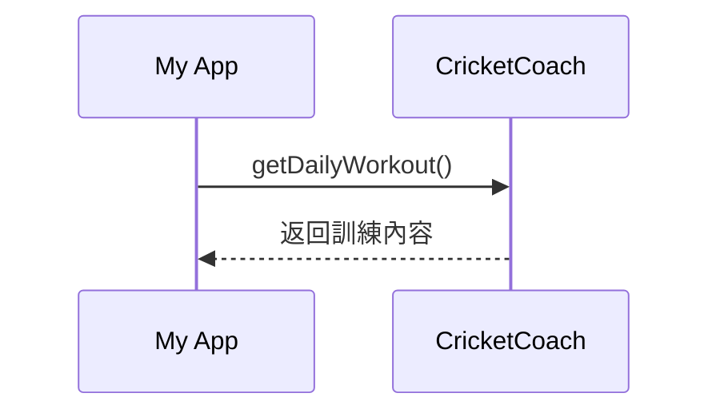

- **[設計目標]** 應用程式應該具備高度的可配置性 (Configurable)
    - **[需求]** 能夠輕易地將目前的教練更換為其他運動的教練
    - **[範例]** 棒球 (Baseball)、曲棍球 (Hockey)、網球 (Tennis) 或體操 (Gymnastics) 等

### Spring Container 的角色

- **[核心定義]** Spring Container 的運作方式就像是一個「物件工廠 (Object Factory)"
- **[運作流程]** 應用程式不再自己建立物件，而是向 Spring Container 發出請求
    - **[請求範例]** 應用程式說：「嘿，給我一個 Coach 物件」
    - **[內部機制]** Spring 會根據預先設定好的「配置 (configuration)」來決定要建立哪種具體的教練物件
    - **[結果]** Spring 建立好物件後，會將該物件的引用 (reference) 回傳給應用程式

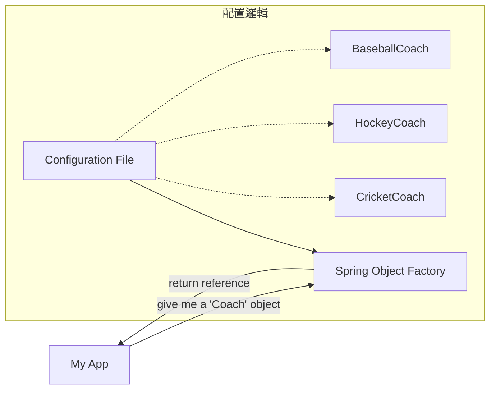

- **[優點]** 透過這種方式，應用程式可以根據不同的配置，輕鬆切換不同的實作（例如從 CricketCoach 切換到 BaseballCoach），而不需要修改應用程式本身的程式碼。

### Spring Container 的核心功能

- **[功能一]** 建立並管理物件 (Create and manage objects)
    - 透過控制反轉 (Inversion of Control, IoC) 機制實現
- **[功能二]** 注入物件依賴項 (Inject object dependencies)
    - 透過依賴注入 (Dependency Injection, DI) 機制實現

### 配置 Spring Container 的方式

- **[方式一]** XML 配置 (XML configuration)
    - 屬於舊有的技術 (legacy)，在本課程中不會深入探討
- **[方式二]** Java 註解 (Java Annotations)
    - 現代化的解決方案 (modern)
- **[方式三]** Java 原始碼 (Java Source Code)
    - 現代化的解決方案 (modern)

### 配置 Spring Container

- **[配置方式的演進]**
    - XML configuration file (legacy) ❌
        - 屬於傳統/過時的方法
    - Java Annotations (modern) ✅
        - 現代開發的首選方式
    - Java Source Code (modern) ✅
        - 同樣屬於現代化的配置手段

## Spring 依賴注入 (Dependency Injection)

- **[核心原理]** 運用「依賴反轉原則 (Dependency Inversion Principle)」
    - **[定義]** 客戶端 (Client) 將「提供其依賴項」的責任，委派給另一個物件來處理

### 汽車工廠範例 (Car Factory Example)

- **[情境說明]** 當客戶想要購買一輛汽車時，他不需要知道汽車是如何組裝的，只需要與工廠溝通
- **[運作流程]**

    1. 客戶向汽車工廠提出請求：「給我一個汽車物件 (give me a 'Car' object)"
    2. 工廠在後台負責處理複雜的組裝工作，包含各種零件的整合（如：車門、引擎、擋風玻璃等）
    3. 工廠完成組裝後，將最終的汽車物件提供給客戶

```mermaid
sequenceDiagram
    participant Client as 客戶 (Client)
    participant Factory as 汽車工廠 (Car Factory)
    participant Parts as 各種零件 (Engine, Door, etc.)

    Client->>Factory: "give me a 'Car' object"
    Factory->>Parts: 取得並組裝零件
    Parts-->>Factory: 返回組裝好的組件
    Factory-->>Client: 提供完整的汽車物件
```

### 依賴注入的核心價值

- **[核心目標]** 實現「開箱即用 (out of the box)」的體驗
    - **[機制]** 當應用程式請求一個特定物件時，注入機制會自動完成以下工作：
        - 識別該物件所需的所有組件 (components) 或輔助組件 (helper components)
        - 預先將這些依賴項組裝完成
        - 直接將一個完整的、可運行的物件交付給使用者

### 複雜依賴關係範例：教練團隊

- **[情境說明]** 在 Spring Container 中，一個主物件可能擁有一系列複雜的依賴關係
- **[實例]** 以「總教練 (Head Coach)」為例，他並非孤立存在，而是需要搭配一個專業團隊才能運作

```mermaid
graph TD
    HC["總教練 (Head Coach)"] --- Staff["教練團隊 (Staff)"]
    subgraph Staff_Members [團隊成員]
        AC[助理教練 Assistant Coaches]
        PT[體能教練 Physical Trainers]
        MS[醫療團隊 Medical Staff]
    end
    Staff --- Staff_Members
```

- **[注入邏輯]** 當應用程式向 Spring Container 請求 `Head Coach` 時，Container 不僅會建立教練實例，還會自動將 `Assistant Coaches`、`Physical Trainers` 與 `Medical Staff` 等依賴項注入到 `Head Coach` 中，確保物件在被使用時已經具備了所有必要的支援能力。

### Demo 實作範例

- **[情境設定]** 建立一個簡單的控制層與其依賴的服務層
    - **`Coach`**：負責提供每日訓練計畫 (daily workouts)
    - **`DemoController`**：需要使用 `Coach` 來執行其功能
- **[依賴關係定義]**
    - 在此架構中，`Coach` 被視為 `DemoController` 的一個**依賴項 (dependency)**
    - **[運作邏輯]** `DemoController` 不會自己建立 `Coach` 物件，而是向 Spring Container 請求，由 Container 將組裝好的 `Coach` 注入其中

```mermaid
graph LR
    DC["DemoController"] -- "needs" --> C["Coach (Dependency)"]
```

### 依賴注入類型 (Injection Types)

Spring 提供多種注入方式，其中最推薦的兩種如下：

- **建構子注入 (Constructor Injection)**
    - **[適用情境]** 當依賴項是**必要 (Required)** 的時候使用
    - **[推薦程度]** 是 Spring.io 開發團隊的首選推薦方式 (First choice)
- **Setter 注入 (Setter Injection)**
    - **[適用情境]** 當依賴項是**選配 (Optional)** 的時候使用
    - **[特性]** 如果沒有提供該依賴項，應用程式可以提供合理的預設邏輯 (Reasonable default logic)

### Spring 自動裝配 (AutoWiring)

- **[定義]** Spring 用於實現依賴注入 (Dependency Injection) 的一種機制
- **[運作原理]** Spring 會自動尋找符合條件的類別來進行注入
    - **[匹配方式]** 透過類型 (Type) 進行匹配，可以是特定的類別 (Class) 或介面 (Interface)
    - **[結果]** 一旦匹配成功，Spring 就會自動將該物件注入，此過程稱為「自動裝配 (Autowired)"

#### 自動裝配實作範例：注入 Coach 實作

- **[目標]** 為 `DemoController` 自動注入一個 `Coach` 的實作物件
- **[運作流程]**

    1. Spring 會掃描所有帶有 `@Component` 註解的組件 (Components)
    2. Spring 會檢查是否有任何類別實作了 `Coach` 介面
    3. 若找到匹配的實作，Spring 會自動完成注入

```mermaid
graph LR
    DC["DemoController"] -- "AutoWiring (by Type)" --> C["Coach (Interface/Type)"]
    C -.-> Impl["@Component Implementation (e.g., CricketCoach)"]
```

### 自動裝配 (Autowiring) 範例

- **[核心機制]** Spring 會自動掃描專案中所有標註為 `@Component` 的類別
- **[注入邏輯]** 當某個組件需要一個特定的介面實作時，Spring 會尋找該介面對應的實作物件並自動完成注入
    - **[範例情境]** `DemoController` 需要一個 `Coach` 介面的實作
    - **[執行過程]** Spring 發現 `CricketCoach` 實作了 `Coach` 介面，因此會自動將 `CricketCoach` 的實例注入到 `DemoController` 中

```mermaid
graph LR
    DC["DemoController"]
    CC["CricketCoach (Implementation)"]

    DC -- "Autowired dependency" --> CC
```

### 範例應用程式流程 (Example Application Flow)

- **[運作邏輯]** 模擬一個 Web 端點請求，透過 `DemoController` 呼叫 `Coach` 並返回結果
- **[互動流程]**

    1. 使用者透過瀏覽器訪問 `/dailyworkout` 端點
    2. `DemoController` 接收請求，並呼叫 `Coach` 的 `getDailyWorkout()` 方法
    3. `Coach` 返回訓練內容（例如："Practice fast bowling for 15 minutes"）
    4. `DemoController` 將該字串回傳給瀏覽器

```mermaid
sequenceDiagram
    participant Browser as Web Browser
    participant Controller as DemoController
    participant Coach as Coach

    Browser->>Controller: /dailyworkout
    Controller->>Coach: getDailyWorkout()
    Coach-->>Controller: "Practice fast bowling for 15 minutes"
    Controller-->>Browser: "Practice fast bowling for 15 minutes"
```

### 使用建構子注入的開發步驟 (Development Process - Constructor Injection)

若要使用建構子注入來實作上述功能，需遵循以下步驟：

1. **定義依賴介面與類別** (Define the dependency interface and class)
2. **建立 Demo REST Controller** (Create Demo REST Controller)
3. **在類別中建立用於注入的建構子** (Create a constructor in your class for injections)
4. **添加&#32;`@GetMapping`&#32;註解** (Add `@GetMapping`)

### 實作步驟一：定義依賴介面與類別

為了實現建構子注入，首先需要建立介面及其對應的實作類別：

- **定義介面** (`Coach.java`)：

```java
package com.luv2code.springcoredemo;

    public interface Coach {
        String getDailyWorkout();
    }
```

- **建立實作類別** (`CricketCoach.java`)：

```java
package com.luv2code.springcoredemo;

    import org.springframework.stereotype.Component;

    @Component
    public class CricketCoach implements Coach {

        @Override
        public String getDailyWorkout() {
            return "Practice fast bowling for 15 minutes";
        }
    }
```

### `@Component` 註解與 Spring Bean

- **`@Component`&#32;的作用**
    - 將該類別標記為一個 **Spring Bean**
    - 使該類別成為依賴注入 (Dependency Injection) 的候選物件 (Candidate)
- **什麼是 Spring Bean？**
    - Spring Bean 本質上就是一個由 Spring 容器進行管理 (Managed by Spring) 的一般 Java 類別

### 使用建構子注入的開發步驟 (續)

- **步驟二：建立 Demo REST Controller** (`DemoController.java`)
    - 使用 `@RestController` 註解將該類別標記為一個 REST 控制器

```java
package com.luv2code.springcoredemo;

import org.springframework.web.bind.annotation.RestController;

@RestController
public class DemoController {

}
```

- **步驟三：在類別中建立用於注入的建構子**
    - **[實作細節]**
        - 定義一個私有的欄位 (private field) 來存放依賴項，例如 `private Coach myCoach;`
        - 建立一個公開的建構子 (public constructor)
        - 在建構子的參數中傳入依賴項類型 (例如 `Coach theCoach`)
        - 在建構子內部將參數賦值給私有欄位
        - 使用 **`@Autowired`** 註解標記在建構子上，告訴 Spring Container 透過此建構子進行自動裝配

```java
package com.luv2code.springcoredemo;

import org.springframework.beans.factory.annotation.Autowired;
import org.springframework.web.bind.annotation.RestController;

@RestController
public class DemoController {

    private Coach myCoach;

    @Autowired
    public DemoController(Coach theCoach) {
        myCoach = theCoach;
    }
}
```

- **[運作機制]** 當 Spring Object Factory 處理此請求時，它會自動識別建構子上的 `@Autowired` 註解，並將正確的 `Coach` 實例注入到 `DemoController` 中，完成依賴項的組裝。

### `@Autowired` 註解的特性與實作細節

- **`@Autowired`&#32;的作用**
    - 告訴 Spring Container 需要注入一個依賴項 (dependency)
- **建構子上的&#32;`@Autowired`&#32;是可選的**
    - **[關鍵規則]** 如果一個類別中**只有一個建構子**，則不需要在該建構子上標記 `@Autowired`，Spring 會自動識別並進行注入
    - 雖然在這種情況下是可選的，但為了教學目的或明確表達意圖，仍可以加上
- **Spring 如何選擇要注入的物件**
    - Spring 會根據參數的**類型 (Type)** 來尋找對應的 Bean
    - **[目前的狀況]** 因為目前只有一個 `Coach` 的實作類別（`CricketCoach`），所以 Spring 可以輕易地判斷並完成注入
    - **[未來進階概念]** 當存在多個同類型的實作類別時，需要額外的配置來告訴 Spring 應該使用哪一個

### 步驟 4：新增 `@GetMapping` 端點 (`/dailyworkout`)

- **實作目的**
    - 建立一個 REST 端點，讓使用者可以透過瀏覽器存取特定的功能（例如獲取每日運動建議）
- **程式碼實作** (`DemoController.java`)

```java
package com.luv2code.springcoredemo;

import org.springframework.beans.factory.annotation.Autowired;
import org.springframework.web.bind.annotation.GetMapping;
import org.springframework.web.bind.annotation.RestController;

@RestController
public class DemoController {

    private Coach myCoach;

    @Autowired
    public DemoController(Coach theCoach) {
        myCoach = theCoach;
    }

    @GetMapping("/dailyworkout")
    public String getDailyWorkout() {
        return myCoach.getDailyWorkout();
    }
}
```

- **[運作流程]** 當使用者透過瀏覽器訪問 `/dailyworkout` 時，背後的互動邏輯如下：

```mermaid
sequenceDiagram
    participant User as 使用者 (Web Browser)
    participant Controller as DemoController
    participant Coach as Coach (Bean)

    User->>Controller: 發送 GET 請求至 /dailyworkout
    Controller->>Coach: 呼叫 getDailyWorkout()
    Coach-->>Controller: 回傳運動建議字串
    Controller-->>User: 回傳結果給瀏覽器
```

## 使用 Spring Initializr 初始化專案

- **存取網站**
    - 使用瀏覽器前往 [start.spring.io](https://start.spring.io)
- **專案設定 (Project Settings)**
    - **Project**: 選擇 `Maven` 作為專案管理工具
    - **Language**: 選擇 `Java`
    - **Spring Boot Version**: 選擇最新的正式發佈版本 (Released version)，應避免使用帶有 `SNAPSHOT` 字樣的版本
- **專案中繼資料 (Project Metadata)**
    - **Group**: 設定專案的群組識別碼 (例如 `com.luv2code`)
    - **Artifact**: 設定專案的名稱
    - **Description**: 專案的描述
    - **Package name**: 自動根據 Group 與 Artifact 生成的套件名稱
    - **Packaging**: 選擇打包方式 (例如 `Jar` 或 `War`)
    - **Java Version**: 選擇對應的 Java 版本

### 完善 Spring Initializr 專案設定

- **專案中繼資料 (Project Metadata) 設定**
    - **Artifact**: 設定為 `SpringCoreDemo`
    - **Packaging**: 務必選擇 `Jar`
    - **Java Version**: 可依需求選擇適合的版本
- **新增依賴項 (Dependencies)**
    - 透過點擊 `ADD DEPENDENCIES...` 按鈕並使用關鍵字搜尋來快速加入所需功能
    - **常用依賴項範例**
        - `Spring Boot DevTools`: 輸入 `dev` 即可找到，用於開發時的自動重啟功能
        - `Spring Web`: 輸入 `web` 即可找到，用於建立 Web 應用程式的支援

### 完成專案生成與目錄建立

- **生成專案**
    - 確認 Spring Initializr 上的所有依賴項與設定正確後，點擊 `GENERATE` 按鈕
    - 系統會下載一個 `.zip` 壓縮檔到電腦中
- **建立專案目錄結構**
    - 進入開發專用的根目錄（例如 `DevSpringBoot`）
    - 建立新的子資料夾以進行結構化管理
    - **範例目錄名稱**
        - `02-SpringBootSpringCore`

### 整理與移動練習專案

- **解壓縮專案**
    - 從下載資料夾 (Downloads) 中找到 `springcoredemo.zip` 並進行解壓縮
- **移動與重新命名**
    - 將解壓縮後的 `springcoredemo` 資料夾移動至專案根目錄（例如 `02-spring-boot-spring-core`）
    - 根據需要對資料夾進行重新命名，以符合專案管理規範

### 在 IntelliJ IDEA 中開啟 Maven 專案

- **快速開啟方式**
    - 由於該專案是一個標準的 Maven 專案，可以直接將專案資料夾拖放 (Drag and Drop) 到 IntelliJ IDEA 視窗中來進行開啟

### IntelliJ IDEA 專案初始化

- **下載與同步資產**
    - 開啟 Maven 專案後，IDE 會自動執行同步程序
    - 包含「Scanning Maven projects...」與「Downloading dependencies...」等進度
    - 必須等待資產下載與依賴項同步完成，才能進行後續開發工作

### 定義依賴項介面與類別

- **建立&#32;`Coach`&#32;介面**
    - 在指定的套件 (Package) 路徑下（例如 `com.luv2code.springcoredemo`）建立新檔案
    - 操作步驟：
        - 點擊右鍵選擇 `New`
        - 在彈出的對話框中，務必選擇 `Interface` 選項而非 `Class`
        - 將介面名稱命名為 `Coach`

### 實作 `Coach` 介面與類別

- **完善&#32;`Coach`&#32;介面**
    - 在介面中定義一個單一方法 `getDailyWorkout`
    - 該方法回傳類型為 `String`
    - 程式碼實作：

```java
package com.luv2code.springcoredemo;

      public interface Coach {
          String getDailyWorkout();
      }
```

- **建立實作類別&#32;`CricketCoach`**
    - 建立一個新的 Java 類別來實作 `Coach` 介面
    - 類別名稱命名為 `CricketCoach`
    - 實作方式：
        - 在 IDE 中選擇 `New`
        - 選擇 `Class` 選項
        - 輸入名稱 `CricketCoach`

### 實作步驟二：使用 `@Component` 註解

- **將類別標記為 Spring Bean**
    - 在實作介面的類別（例如 `CricketCoach`）上方加上 `@Component` 註解
    - **[為什麼要這樣做？]** 因為 `@Component` 會告訴 Spring 這個類別是一個 Spring Bean，使其能夠被 Spring 容器管理，並在需要時透過依賴注入（Dependency Injection）提供給其他物件使用
- **實作程式碼範例**

```java
package com.luv2code.springcoredemo;

import org.springframework.stereotype.Component;

@Component
public class CricketCoach implements Coach {

    @Override
    public String getDailyWorkout() {
        return "null";
    }
}
```

### 實作 `getDailyWorkout` 方法

- 在 `CricketCoach` 類別中完成介面方法的邏輯實作
- 程式碼範例：

```java
package com.luv2code.springcoredemo;

import org.springframework.stereotype.Component;

@Component
public class CricketCoach implements Coach {

    @Override
    public String getDailyWorkout() {
        return "Practice fast bowling for 15 minutes";
    }
}
```

### 實作步驟二：建立 Demo REST Controller

- **[目標]** 建立一個新的類別來處理 Web 請求，並作為測試依賴注入的載體
- **操作流程**
    - 在專案中點擊右鍵選擇 `New`
    - 選擇 `Java Class`
    - 將類別命名為 `DemoController`

### 實作建構子注入 (Constructor Injection)

- **步驟 1：標記為 REST Controller**
    - 在 `DemoController` 類別上方加上 `@RestController` 註解，使其具備處理 RESTful Web 請求的能力
- **步驟 2：定義私有依賴欄位**
    - 建立一個私有的欄位來存放依賴項（例如 `Coach` 介面）
    - 程式碼範例：

```java
@RestController
public class DemoController {

    // 定義依賴項的私有欄位
    private Coach myCoach;

    // ...
}
```

- **步驟 3：建立建構子進行注入**
    - 定義一個建構子，將依賴項作為參數傳入，以便 Spring 容器進行注入
    - **[為什麼要這樣做？]** 透過建構子注入可以確保依賴項在物件實例化時就已經準備就緒，是 Spring 官方推薦的注入方式

### 實作建構子注入 (Constructor Injection) 續

- **完成建構子與賦值**
    - 使用 `@Autowired` 註解來指示 Spring 進行依賴注入
    - 在建構子中接收依賴項（例如 `Coach`），並將其賦值給私有欄位
    - 程式碼範例：

```java
@RestController
public class DemoController {

    // 定義依賴項的私有欄位
    private Coach myCoach;

    // 定義建構子進行注入
    @Autowired
    public DemoController(Coach theCoach) {
        myCoach = theCoach;
    }

}
```

- **`@Autowired`&#32;註解的特性**
    - **[核心作用]** 告訴 Spring 自動將指定的依賴項注入到該位置
    - **[單一建構子情境]** 如果一個類別中**只有一個**建構子，則該建構子上的 `@Autowired` 註解是**可選的 (optional)**
        - 雖然可選，但在學習階段保留它可以幫助更清楚地理解依賴注入的流程

### 實作步驟 4：新增 `@GetMapping` 端點 (`/dailyworkout`)

- **[目標]** 建立一個新的端點，讓使用者可以透過瀏覽器獲取每日運動建議
- **請求流程圖**

```mermaid
flowchart LR
    A["Web Browser"] -- "/dailyworkout" --> B["DemoController"]
    B -- "getDailyWorkout()" --> C["Coach"]
    C -- "返回字串 (例如: Practice fast bowling...)" --> B
    B -- "返回結果" --> A
```

- **實作程式碼**

```java
@GetMapping("/dailyworkout")
    public String getDailyWorkout() {
        return myCoach.getDailyWorkout();
    }
```

### 實作 `/dailyworkout` 端點 (完成)

- **[實作細節]** 在 `@GetMapping` 方法中，直接 return 依賴項的方法呼叫，將原本的架構邏輯整合進 Web 端點
- 程式碼範例：

```java
@GetMapping("/dailyworkout")
public String getDailyWorkout() {
    return myCoach.getDailyWorkout();
}
```

- **[架構整合流程]**

```mermaid
flowchart LR
    A["Web Browser"] -- "/dailyworkout" --> B["DemoController"]
    B -- "getDailyWorkout()" --> C["Coach (CricketCoach)"]
    C -- "返回字串 (例如: Practice fast bowling...)" --> B
    B -- "返回結果" --> A
```

- **[測試準備]**
    - 啟動 Spring Boot 應用程式，準備透過瀏覽器進行驗證

### 驗證 `/dailyworkout` 端點功能

- **[測試結果]** 透過瀏覽器訪問 `http://localhost:8080/dailyworkout`，成功取得預期訊息
    - 實際回傳內容：`Practice fast bowling for 15 minutes`
- **[運作原理]** 驗證了端點與底層組件間的委派關係
    - `DemoController` 的 `getDailyWorkout()` 方法會將請求委派給注入的 `myCoach` 物件
    - 在此範例中，`myCoach` 指向的是 `CricketCoach` 實作

```mermaid
flowchart LR
    A["Web Browser"] -- "/dailyworkout" --> B["DemoController"]
    B -- "getDailyWorkout()" --> C["Coach (CricketCoach)"]
    C -- "返回字串" --> B
    B -- "返回結果" --> A
```

### 疑難排解：DevTools 自動重啟失效

- **[問題描述]** 修改程式碼（例如在字串中加入驚嘆號）並儲存後，Spring Boot DevTools 並未自動重新啟動應用程式
- **[解決方案]** 需要調整 IntelliJ IDEA 的設定以確保自動構建功能已開啟
    - **步驟 1：檢查 Advanced Settings**
        - 開啟 `Settings` -> `Advanced Settings`
        - 確保勾選了 `Allow auto-make even if developed application is currently running`
    - **步驟 2：檢查 Compiler 設定**
        - 開啟 `Settings` -> `Build, Execution, Deployment` -> `Compiler`
        - 確保勾選了 `Build project automatically`

```mermaid
flowchart TD
    A["修改程式碼並儲存"] --> B{DevTools 是否自動重啟?}
    B -- "否 (失效)" --> C["檢查 IntelliJ 設定"]
    C --> D["Advanced Settings > Allow auto-make"]
    C --> E["Compiler > Build project automatically"]
    D & E --> F["重新測試自動重啟"]
    B -- "是" --> G["開發流程順暢"]
```

### 驗證自動重啟功能是否生效

- **[最後設定步驟]**
    - 在 IntelliJ IDEA 設定中，導覽至 `Build, Execution, Deployment` > `Compiler`
    - 勾選 `Build project automatically` 並點擊 `OK`
- **[驗證結果]**
    - 修改程式碼（例如在字串中加入驚嘆號：`Practice fast bowling for 15 minutes!!!!!`）
    - 儲存程式碼後，應用程式會自動重新載入（LiveReload）
    - 重新整理瀏覽器，即可看到更新後的訊息

```mermaid
flowchart TD
    A["修改程式碼並儲存"] --> B{DevTools 是否自動重啟?}
    B -- "否 (失效)" --> C["檢查 IntelliJ 設定"]
    C --> D["Advanced Settings > Allow auto-make"]
    C --> E["Compiler > Build project automatically"]
    D & E --> F["重新測試自動重啟"]
    B -- "是" --> G["開發流程順暢"]
```

### 核心概念總結

- **[本次實作重點]** 透過實際的開發流程，驗證了 Spring 框架兩大核心機制：
    - **控制反轉 (Inversion of Control, IoC)**
    - **相依注入 (Dependency Injection, DI)**
- **[流程回顧]**
    - 透過 `@Component` 定義實作類別（如 `CricketCoach`）
    - 在 Controller 中透過建構子或屬性進行注入
    - 實現了 Controller 不需直接實例化依賴物件，而是由 Spring 容器負責管理與提供

```mermaid
flowchart LR
    A["Web Browser"] -- "/dailyworkout" --> B["DemoController"]
    B -- "getDailyWorkout()" --> C["Coach (CricketCoach)"]
    C -- "返回字串 (例如: Practice fast bowling for 15 minutes)" --> B
    B -- "返回結果" --> A
```

### 核心概念總結

- **[核心機制]** 本次實作完整展示了 Spring 框架兩大核心概念的整合應用
    - **控制反轉 (Inversion of Control, IoC)**：應用程式的控制權由開發者移交給 Spring 容器，由容器負責管理物件的生命週期
    - **相依注入 (Dependency Injection, DI)**：透過 IoC 機制，將所需的物件（如 `Coach` 的實作類別）自動注入到需要它的組件（如 `DemoController`）中
- **[實作價值]** 透過 DevTools 的自動重啟功能，可以即時觀察到程式碼變更與 IoC/DI 配置生效後的實際運作結果，大幅提升開發效率

### 處理 IDE 的 "no usages" 警告

- **[常見現象]** IDE 有時會在實作類別（例如 `@Component public class CricketCoach`）上方顯示 `no usages` 的警告
- **[為什麼會這樣？]** 因為 Spring 框架具有**動態特性 (Dynamic nature)**
    - IDE 的靜態分析工具可能無法準確判斷 Bean 在執行期 (Runtime) 是如何被注入的
    - 在開發過程中，我們通常是**針對介面進行編程 (Coding to an interface)**
        - 我們在 `DemoController` 中引用的是 `Coach` 介面，而不是具體的 `CricketCoach` 實作類別
        - 這導致 IDE 在靜態掃描程式碼時，找不到任何地方「顯式地」直接引用了該實作類別

> **[關鍵點]** 只要應用程式能正常執行並正確取得依賴物件（例如成功從 `CricketCoach` 取得訓練訊息），就代表 Spring 的 IoC 容器已正確處理了注入，無需理會 IDE 的此類警告。

### 關於 IDE 靜態分析的侷限性

- **[核心原因]** Spring 框架具有**動態特性 (Dynamic nature)**
    - Spring 會在應用程式執行期 (Runtime) 進行「幕後工作」，自動將適當的實作類別注入到需要它的組件中
    - IDE 的工具主要是進行**靜態分析 (Static analysis)**，也就是在程式碼還沒執行前就進行掃描
- **[技術限制]** 靜態分析的侷限性
    - 因為注入動作是在執行期發生的，IDE 可能無法準確判斷某個特定的類別或方法是否會在執行時被使用
    - 這會導致 IDE 在顯示程式碼時，誤以為該類別（例如標註了 `@Component` 的類別）沒有任何地方引用它，進而顯示 `no usages` 的警告

> **[結論]** 當遇到這種情況時，只要應用程式邏輯運作正常，可以直接忽略該警告。

### 建構子注入的幕後運作機制

- **[Spring 的處理流程]** 當應用程式啟動時，Spring 框架會在幕後自動執行一系列操作來管理物件的建立與關聯
    - **實例化 (Instantiation)**：Spring 會為標註了 `@Component` 的類別（例如 `CricketCoach`）建立新的實例
    - **注入 (Injection)**：Spring 會執行建構子注入，將建立好的實例（例如 `Coach` 的實作物件）注入到需要它的組件（例如 `DemoController`）中
- **[程式碼結構參考]**
    - **介面 (Interface)**: `Coach.java` 定義了行為規範
    - **實作類別 (Implementation)**: `CricketCoach.java` 標註為 `@Component` 並提供具體內容
    - **控制層 (Controller)**: `DemoController.java` 透過建構子接收 `Coach` 介面

```mermaid
sequenceDiagram
    participant Spring as Spring Framework
    participant CC as CricketCoach (Instance)
    participant DC as DemoController (Instance)

    Note over Spring: 掃描組件並建立實例
    Spring ->> CC: new CricketCoach()
    Note over Spring: 執行建構子注入
    Spring ->> DC: new DemoController(CC)
    Note over DC: 成功取得 Coach 實例
```

> **[核心概念]** 整個過程的關鍵在於，開發者不需要手動寫出 `new CricketCoach()` 或 `new DemoController(theCoach)`，而是由 Spring 容器負責這些「幕後工作」，這正是控制反轉 (IoC) 的體現。

### 為什麼需要 Spring？

- **[初步疑問]** 在小型或基礎的應用程式中，建構子注入看起來就像是手動使用 `new` 關鍵字來建立物件與建立關聯：
    - 例如：`Coach theCoach = new CricketCoach();` 以及 `DemoController demoController = new DemoController(theCoach);`
    - 這會讓人覺得：「如果我可以用 `new` 自己完成，為什麼還需要 Spring？」
- **[Spring 的核心價值]** Spring 的功能遠不止於控制反轉 (IoC) 與依賴注入 (DI)
    - 對於簡單的小型專案，Spring 的優勢可能不明顯
    - **[設計目標]** Spring 是專為**企業級應用程式 (Enterprise applications)** 所設計的，旨在處理複雜、即時且真實世界的應用場景

> **[核心觀點]** Spring 的真正威力在於它能處理大規模、複雜度極高的系統，而不僅僅是簡化物件的建立過程。

### Spring 的企業級應用特性

- **[設計定位]** Spring 專門針對企業級 (Enterprise)、即時 (Real-time) 且真實世界 (Real-world) 的應用程式進行設計
- **[核心功能範疇]** 除了 IoC 與 DI 之外，Spring 還提供了豐富的功能特性，例如：
    - 資料庫存取 (Database access) 與事務處理 (Transactions)
    - REST APIs 開發
    - Web MVC 框架
    - 安全性 (Security)
    - 以及其他許多實用的功能

> **[總結]** Spring 的價值在於它是一個完整的生態系統，能為複雜的企業需求提供全方位的解決方案。

## 組件掃描 (Component Scanning)

- **[運作原理]** Spring 會自動掃描 Java 類別，尋找特定的註解
    - 例如：`@Component` 等特殊註解
    - 掃描到符合條件的類別後，Spring 會自動將其註冊為 Spring 容器中的 **Bean**

### 專案程式碼結構範例

在一個典型的 Spring Boot 專案中，包含以下關鍵組件：

```text
src
 └── main
      └── java
           └── com.luv2code.springcoredemo
                ├── Coach.java
                ├── CricketCoach.java
                ├── DemoController.java
                └── SpringcoredemoApplication.java (主程式)
```

- **SpringcoredemoApplication.java**：由 Spring Initializr 自動產生的主應用程式類別
- **DemoController.java**：先前建立的 REST 控制器

### Spring Boot 啟動類別實作

主啟動類別使用了 `@SpringBootApplication` 註解，這是啟動 Spring Boot 應用的核心：

```java
package com.luv2code.springcoredemo;

import org.springframework.boot.SpringApplication;
import org.springframework.boot.autoconfigure.SpringBootApplication;

@SpringBootApplication
public class SpringcoredemoApplication {

    public static void main(String[] args) {
        SpringApplication.run(SpringcoredemoApplication.class, args);
    }
}
```

> **[關鍵點]** `@SpringBootApplication` 不僅僅是一個註解，它包含了啟動 Spring Boot 應用程式所需的核心配置，並會觸發組件掃描流程。

### `@SpringBootApplication` 註解深度解析

`@SpringBootApplication` 是 Spring Boot 應用的核心，它實際上是一個複合註解（composed annotation），在幕後整合了以下三個關鍵註解：

| 註解 | 功能描述 |
| --- | --- |
| @EnableAutoConfiguration | 啟用 Spring Boot 的自動配置支援 (auto-configuration support) |
| @ComponentScan | 啟用對當前套件（package）及其所有子套件的組件掃描 |
| @Configuration | 允許使用 @Bean 註冊額外的 Bean，或匯入其他的配置類別 (configuration classes) |

### Spring Boot 啟動流程 (Bootstrapping)

透過 `SpringApplication.run()` 方法可以引導 (bootstrap) Spring Boot 應用程式。在 `SpringcoredemoApplication.java` 中的實作如下：

```java
@SpringBootApplication
public class SpringcoredemoApplication {

    public static void main(String[] args) {
        SpringApplication.run(SpringcoredemoApplication.class, args);
    }
}
```

- **[幕後運作]** 當執行此方法時，Spring Boot 會在背景自動完成以下任務：
    - 建立 **Application Context** (應用程式上下文)
    - 註冊所有偵測到的 **Beans**
    - 啟動預設的 **內嵌伺服器** (例如 Tomcat)

### 組件掃描的預設機制

- **[預設行為]** Spring Boot 會從主啟動類別 (Main Spring Boot application class) 所在的套件開始進行組件掃描
    - 掃描範圍會包含該套件及其所有的子套件 (sub-packages)
    - 這種行為是**遞迴 (recursively)** 進行的
- **[隱含的基礎搜尋套件]** 這種機制隱含地定義了一個基礎搜尋套件 (base search package)
    - 開發者可以利用這個預設機制，而不需要在配置中顯式地引用基礎套件的名稱

#### 組件掃描的套件結構範例

```mermaid
mindmap
  root((com.luv2code.springcoredemo))
    common
    controller
    entity
    repository
    rest
    service
    SpringcoredemoApplication.java
```

- **基礎套件**：`com.luv2code.springcoredemo` (包含主啟動類別)
- **子套件**：開發者可以根據需求建立任何名稱的子套件（例如 `controller`, `service`, `repository` 等），Spring Boot 都會自動掃描其中的組件。

### 組件掃描的常見陷阱：不同的位置

- **[核心限制]** Spring Boot 預設僅會掃描主啟動類別 (Main Spring Boot application class) 所在的套件及其所有子套件
- **[常見錯誤範例]** 若將組件放在主啟動類別套件之外的平行套件中，Spring Boot 將無法進行組件掃描

#### 套件結構與掃描範圍對比

```mermaid
graph TD
    subgraph "Spring Boot 會掃描的範圍"
        A[com.luv2code.springcoredemo] --> B[common]
        A --> C[controller]
        A --> D[entity]
        A --> E[repository]
        A --> F[rest]
        A --> G[service]
        A --> H[SpringcoredemoApplication.java]
    end

    subgraph "Spring Boot 不會掃描的範圍"
        I[com.luv2code.demo] --> J[utils]
    end

    style A fill:#d4edda,stroke:#28a745
    style I fill:#f8d7da,stroke:#dc3545
```

- **有效掃描路徑**：從 `com.luv2code.springcoredemo` 開始，其下的所有子套件（如 `common`, `controller` 等）都會被自動偵測
- **失效掃描路徑**：例如 `com.luv2code.demo.utils`，因為它位於 `springcoredemo` 套件之外，預設情況下不會被包含在掃描範圍內

### 配置自定義組件掃描範圍

- **[問題情境]** 當需要使用位於主啟動類別套件之外的套件時（例如 `com.luv2code.util` 或 `org.acme.cart`），預設的自動掃描機制將無法偵測到這些組件。
- **[解決方案]** 可以透過在 `@SpringBootApplication` 註解中使用 `scanBasePackages` 屬性來解決。
    - 該屬性接受一個以逗號分隔的字串列表
    - 列表內容為所有希望 Spring Boot 進行掃描的基礎套件名稱

#### 使用 `scanBasePackages` 的實作範例

```java
package com.luv2code.springcoredemo;

@SpringBootApplication(scanBasePackages={
    "com.luv2code.util",
    "org.acme.cart",
    "edu.cmu.srs"
})
public class SpringcoredemoApplication {
    // ...
}
```

### 組件掃描實務建議

- **[最佳實踐]** 在大多數標準開發情境下，建議將所有組件（Controller, Service, Repository 等）都組織在主啟動類別所在的套件及其子套件中，以充分利用 Spring Boot 的**預設自動掃描機制**，避免維護複雜的 `scanBasePackages` 配置。
- **[手動配置時機]** 僅在整合第三方函式庫或處理多模組專案，且這些組件位於主套件結構之外時，才需要考慮顯式指定掃描範圍。

### 實驗環境準備

- **[環境清理]** 在開始新功能開發前，進行常規的環境整理：
    - 停止所有正在運行的應用程式
    - 關閉所有開啟的視窗
- **[建立新專案副本]** 為了進行新的功能實驗（例如組件掃描），先將現有的專案目錄進行複製與重新命名
    - 原始目錄：`01-constructor-injection`
    - 複製並重新命名為：`02-component-scanning`

### 建立新的程式碼套件

- 在 `com.luv2code.springcoredemo` 目錄下建立一個名為 `rest` 的新套件
    - 目錄路徑：`com.luv2code.springcoredemo.rest`

### 重新組織專案套件結構

- **建立新套件**：在 `com.luv2code.springcoredemo` 底下建立一個名為 `common` 的新套件
- **移動組件**：為了優化結構，將原本位於 `rest` 套件中的組件進行搬移
    - 將 `DemoController` 移入 `common` 套件
    - 將 `Coach` 與 `CricketCoach` 類別也進行移動

### 重新組織後的組件掃描驗證

- **組件移動**：將 `Coach` 與 `CricketCoach` 類別移動至 `common` 套件下
- **掃描有效性**：由於 `common` 套件仍屬於 `com.luv2code.springcoredemo` 的子套件，因此這些組件仍會被 Spring Boot 的**預設組件掃描機制**自動偵測並管理
- **[實驗結果]** 執行應用程式時遇到 `ConfigurationClassParser` 解析錯誤，需進一步排查配置問題

### 解決解析錯誤與驗證組件掃描

- **[問題排除]** 在移動套件結構後，若遇到 `ConfigurationClassParser` 相關的解析錯誤，可能是因為專案中殘留了來自舊專案的編譯程式碼 (compiled code)。
    - **[解決方案]** 對專案執行 **Rebuild Project**，以清除舊的編譯檔案並重新建立正確的類別路徑。
- **[功能驗證]** 重新編譯後，透過瀏覽器存取端點來確認組件掃描是否成功：
    - **存取路徑**：`localhost:8080/dailyworkout`
    - **驗證結果**：頁面能正常載入內容，證明即使將組件移動到子套件中，Spring Boot 的預設掃描機制依然能正確偵測並注入依賴。

### 模擬組件掃描失效情境

- **[實驗目的]** 透過人為改變套件結構，觀察 Spring Boot 是否能偵測到位於主套件之外的組件，藉此測試組件掃描的邊界。
- **[操作步驟]** 在 `java` 目錄下建立一個全新的套件
    - 新套件名稱：`com.luv2code.util`
- **[關鍵觀察點]** 注意到新建立的 `com.luv2code.util` 並**不是**當前 Spring Boot 專案套件（`com.luv2code.springcoredemo`）的子套件
    - 這意味著它位於預設的自動掃描範圍之外

### 模擬組件掃描失效（進階操作）

- **[操作步驟]** 將原本位於 `common` 套件中的組件移動到新建立的 `util` 套件中
    - 移動對象：`Coach` 與 `CricketCoach` 類別
    - 目標路徑：`com.luv2code.util`
- **[預期結果]** 由於 `com.luv2code.util` 不在 `com.luv2code.springcoredemo` 的子套件路徑下，這將會導致 Spring Boot 的預設組件掃描無法偵測到這些類別，進而引發依賴注入失敗的問題。

### 驗證組件掃描失效結果

- **[實驗結果]** 執行應用程式後，啟動失敗 (Application failed to start)。
- **[錯誤訊息分析]** 錯誤原因在於 Spring 找不到必要的 Bean：
    - **錯誤內容**：`Parameter 0 of constructor in com.luv2code.springcoredemo.rest.DemoController required a bean of type 'com.luv2code.util.Coach' but could not be found.`
    - **根本原因**：由於 `Coach` 類別被移動到了 `com.luv2code.util` 套件，而該套件不在 `com.luv2code.springcoredemo` 的預設掃描範圍內，因此 Spring Container 無法偵測到它，導致無法滿足 `DemoController` 的建構子注入需求。

### 手動指定組件掃描範圍

- **[問題情境]** 當組件位於主啟動類別所在的套件路徑之外時，預設的組件掃描機制將無法偵測到這些組件，導致依賴注入失敗。
- **[解決方案]** 可以透過修改主啟動類別上的 `@SpringBootApplication` 註解，明確地列出需要掃描的基礎套件 (base packages)。
- **實作方式**：
    - 在 `@SpringBootApplication` 註解中使用 `scanBasePackages` 屬性。
    - 範例：

```java
@SpringBootApplication(scanBasePackages = {"com.luv2code.util", "com.luv2code.springcoredemo"})
      public class SpringcoredemoApplication {
          public static void main(String[] args) {
              SpringApplication.run(SpringcoredemoApplication.class, args);
          }
      }
```

### 解決組件掃描範圍問題

- **[問題情境]** 當需要掃描的組件（如 `com.luv2code.util`）不在主啟動類別所在的套件（如 `com.luv2code.springcoredemo`）之下時，Spring Boot 的預設機制將無法偵測到這些組件。
- **[解決方案]** 使用 `@SpringBootApplication` 註解中的 `scanBasePackages` 屬性，並以逗號分隔的方式提供一個包含所有目標基礎套件的列表。
- **實作方式**：
    - 在主啟動類別中修改註解：

```java
@SpringBootApplication(scanBasePackages = {"com.luv2code.springcoredemo", "com.luv2code.util"})
public class SpringcoredemoApplication {
    public static void main(String[] args) {
        SpringApplication.run(SpringcoredemoApplication.class, args);
    }
}
```

- **[驗證結果]** 重新執行應用程式後，組件掃描成功，原本的依賴注入錯誤得以解決，應用程式可以正常啟動。

### 驗證組件掃描解決方案

- **[驗證結果]** 重新啟動應用程式後，一切運作正常：
    - 應用程式成功啟動。
    - 透過瀏覽器存取端點（如 `/dailyworkout`）可以正確取得資料。
    - **[原因]** 因為我們在 `@SpringBootApplication` 中明確列出了所有需要掃描的基礎套件。

### 恢復預設組件掃描機制

- **[操作目的]** 為了能重新利用 Spring Boot 的預設自動掃描功能，避免每次新增套件都必須手動修改 `scanBasePackages`。
- **[實作步驟]** 將組件移回原本的套件結構中：
    - 將 `Coach` 與 `CricketCoach` 類別從 `com.luv2code.util` 移回 `com.luv2code.springcoredemo.common` 套件。

### 恢復預設組件掃描配置

- **[操作目的]** 在驗證手動指定掃描範圍有效後，將配置恢復為原始狀態，以利用 Spring Boot 的預設自動掃描機制。
- **[實作方式]** 將 `@SpringBootApplication` 中的 `scanBasePackages` 屬性註解掉（或刪除）：

```java
// 註解掉以恢復預設行為
// @SpringBootApplication(scanBasePackages = {"com.luv2code.springcoredemo", "com.luv2code.util"})
@SpringBootApplication
public class SpringcoredemoApplication {
    public static void main(String[] args) {
        SpringApplication.run(SpringcoredemoApplication.class, args);
    }
}
```

- **[驗證結果]**
    - 重新啟動應用程式後，Spring Boot 依舊能正確偵測到位於預設套件路徑下的組件。
    - 瀏覽器端點（如 `/dailyworkout`）可以正常運作，確認預設掃描機制在目前的專案結構下依然有效。

## Setter 注入 (Setter Injection)

- **定義**：透過呼叫類別中的 setter 方法來注入依賴項 (dependencies)
- **[地位]**：與建構子注入 (Constructor Injection) 並列為兩種推薦的注入方式

### 自動裝配範例 (Autowiring Example)

- **目標**：注入一個 `Coach` 介面的實作 (implementation)
- **運作流程**：
    - Spring 會掃描所有標記為 `@Component` 的組件
    - Spring 會尋找是否有任何組件實作了 `Coach` 介面
    - 如果有（例如 `CricketCoach`），Spring 就會將其注入到目標類別中

```mermaid
flowchart LR
    A[DemoController] --> B[Coach]
    B -.->|實作| C[CricketCoach]
```

### Setter 注入開發流程

- **[開發步驟]**：
    - 建立 Setter 注入的開發流程 (Development Process - Step-By-Step)

### Setter 注入實作步驟

- **步驟一：在類別中建立用於注入的 setter 方法**
    - 在目標類別（例如 `DemoController`）中定義一個 setter 方法，用來接收依賴項
    - 範例程式碼：

```java
@RestController
      public class DemoController {

          private Coach myCoach;

          public void setCoach(Coach theCoach) {
              myCoach = theCoach;
          }
      }
```

- **步驟二：使用&#32;`@Autowired`&#32;註解配置依賴注入**
    - 在建立好的 setter 方法上加上 `@Autowired` 註解
    - **[運作原理]**：Spring 框架會在幕後自動執行操作，將適當的實作（implementation）注入到該方法中
    - 範例程式碼：

```java
@RestController
      public class DemoController {

          private Coach myCoach;

          @Autowired
          public void setCoach(Coach theCoach) {
              myCoach = theCoach;
          }
      }
```

### Spring 框架的幕後運作流程

- **[運作機制]** Spring 會在幕後自動執行以下步驟來完成依賴注入：
    - 實例化依賴項（例如：`CricketCoach` 的實例）
    - 實例化目標類別（例如：`DemoController` 的實例）
    - 呼叫指定的注入方法（例如：`DemoController.setCoach(theCoach)`）並將實例傳入

```mermaid
sequenceDiagram
    participant S as Spring Framework
    participant C as CricketCoach (Implementation)
    participant D as DemoController (Target)

    S->>C: 1. Create instance of CricketCoach
    S->>D: 2. Create instance of DemoController
    S->>D: 3. Call setCoach(theCoach)
    Note over S,D: Dependency Injection Complete
```

### 使用 `@Autowired` 進行彈性注入

- **[注入靈活性]** 依賴注入不一定要使用傳統的 setter 方法，可以透過類別中的**任何方法**來達成
- **[實作方式]** 只要在該方法上加上 `@Autowired` 註解，Spring 就會執行注入操作
- **範例程式碼**：

```java
@RestController
public class DemoController {

    private Coach myCoach;

    @Autowired
    public void doSomeStuff(Coach theCoach) {
        myCoach = theCoach;
    }
}
```

### 依賴注入類型之選擇

- **建構子注入 (Constructor Injection)**
    - **適用情境**：當依賴項是**必要 (required)** 的時候使用
    - **推薦程度**：這是 Spring.io 開發團隊首選且推薦的方法
- **Setter 注入 (Setter Injection)**
    - **適用情境**：當依賴項是**選用 (optional)** 的時候使用
    - **[優點]**：如果依賴項未被提供，應用程式可以提供合理的預設邏輯 (reasonable default logic)

### 依賴注入類型之選擇：開發建議總結

- **建構子注入 (Constructor Injection)**
    - **適用情境**：當你有**必要 (required)** 的依賴項時使用
    - **官方建議**：通常被 `spring.io` 開發團隊推薦作為首選 (first choice)
- **Setter 注入 (Setter Injection)**
    - **適用情境**：當你有**選用 (optional)** 的依賴項時使用
    - **[優點]**：如果沒有提供該依賴項，應用程式仍可以提供合理的預設邏輯 (reasonable default logic)

### 進入 IDE 前的環境清理

- **[開發習慣]** 在開始新的學習單元或實驗前，應進行以下清理工作：
    - 停止所有正在運行的應用程式
    - 關閉所有開啟的視窗
- **[建立新實驗環境]** 透過複製現有專案來快速建立新主題的開發目錄
    - 範例操作流程：

        1. 在檔案系統中找到現有專案目錄（例如：`02-component-scanning`）
        2. 複製並貼上該目錄
        3. 將副本重新命名為新主題名稱（例如：`03-setter-injection`）

### 實作 Setter 注入的步驟

- **步驟一**：在類別中建立用於注入的 setter 方法
- **步驟二**：使用 `@Autowired` 註解來配置該依賴項

### 開發環境優化

- **[自動重新載入]** 在 IntelliJ IDEA 中對專案進行 **Rebuild**，可以幫助 Spring Boot DevTools 更有效地執行自動重新載入 (auto-reloading) 功能

### 轉換為 Setter 注入的實作

- **[重構過程]** 為了改用 Setter 注入，必須先移除原本用於建構子注入的程式碼（包含建構子本身）
- **[實作步驟]**
    - 建立一個名為 `setCoach` 的 setter 方法
    - 在該方法上加上 `@Autowired` 註解，讓 Spring 能夠透過此方法注入依賴項
- **範例程式碼**：

```java
@RestController
public class DemoController {

    private Coach myCoach;

    @Autowired
    public void setCoach(Coach theCoach) {
        myCoach = theCoach;
    }

    @GetMapping("/dailyworkout")
    public String getDailyWorkout() {
        return myCoach.getDailyWorkout();
    }
}
```

### 完成 Setter 注入的實作

- **[實作細節]** 在 `setCoach` 方法中進行必要的賦值操作，完成依賴注入的邏輯
- **範例程式碼**：

```java
@RestController
public class DemoController {

    private Coach myCoach;

    @Autowired
    public void setCoach(Coach theCoach) {
        myCoach = theCoach;
    }

    @GetMapping("/dailyworkout")
    public String getDailyWorkout() {
        return myCoach.getDailyWorkout();
    }
}
```

### 清理與啟動應用程式

- **[清理配置]** 移除 `SpringBootApplication` 類別中先前手動設定的 `scanBasePackages` 配置，以恢復預設的組件掃描行為
- **[啟動應用程式]** 執行 Spring Boot 應用程式，確認伺服器成功啟動
- **[啟動狀態]** 觀察控制台輸出，確認 Tomcat 伺服器已在指定連接埠上啟動

### 驗證 Setter 注入是否成功

- **[驗證方法]** 透過瀏覽器訪問應用程式端點（例如 `localhost:8080/dailyworkout`）
- **[預期結果]** 若看到預期的輸出（例如：`Practice fast bowling for 15 minutes`），則代表 Setter 注入已正確執行

### 使用 Spring Boot DevTools 進行快速開發

- **[開發流程]** 修改程式碼中的內容（例如改變回傳的字串）並儲存
- **[自動重新載入]** 藉由 Spring Boot DevTools 的功能，應用程式會自動重新載入，無需手動重新啟動伺服器即可看到修改後的結果

### Setter 注入的命名彈性

- **[方法命名]** 在實作 Setter 注入時，方法名稱並不一定要遵循傳統的 `set` 開頭命名規範
    - 只要在方法上加上 `@Autowired` 註解，Spring 就會將其用於依賴注入
    - 例如，可以使用任何自定義名稱，如 `doSomeStuff`
- **範例程式碼**：

```java
@RestController
public class DemoController {

    private Coach myCoach;

    @Autowired
    public void doSomeStuff(Coach theCoach) {
        myCoach = theCoach;
    }

    @GetMapping("/dailyworkout")
    public String getDailyWorkout() {
        return myCoach.getDailyWorkout();
    }
}
```

### 驗證 Setter 注入的靈活性

- **[注入驗證]** 透過修改方法名稱（例如從 `setCoach` 改為 `doSomeStuff`）並搭配 `@Autowired` 註解，應用程式仍能正確運作並取得預期結果
    - 這證明了 Spring 注入的關鍵在於 `@Autowired` 註解，而非方法名稱本身
- **[程式碼風格建議]** 儘管命名具有彈性，但為了讓程式碼更直觀、易於閱讀與理解，建議仍應回歸傳統的 setter 方法命名規範

### 提升 Setter 注入的可讀性

- **[命名重構]** 雖然使用如 `doSomeStuff` 之類的自定義名稱仍能成功進行依賴注入，但為了符合開發規範並提升程式碼的可讀性，建議將方法名稱改回標準的 Setter 命名方式
- **範例程式碼**：

```java
@RestController
public class DemoController {

    private Coach myCoach;

    @Autowired
    public void setCoach(Coach theCoach) {
        myCoach = theCoach;
    }

    @GetMapping("/dailyworkout")
    public String getDailyWorkout() {
        return myCoach.getDailyWorkout();
    }
}
```

### Spring 注入類型比較

Spring 官方開發團隊對於不同類型的注入有不同的建議使用情境：

- **官方推薦方式**
    - **建構子注入 (Constructor Injection)**：用於處理**必要 (Required)** 的依賴項
    - **Setter 注入 (Setter Injection)**：用於處理**選擇性 (Optional)** 的依賴項
- **不推薦方式**
    - **欄位注入 (Field Injection)**：雖然在早期 Spring 專案中非常流行，但近年已不再受推崇

### 欄位注入 (Field Injection) 的缺點

- **[測試難度]** 欄位注入會讓程式碼變得**難以進行單元測試 (Unit Test)**
- **[現狀]** 由於上述原因，Spring 官方團隊目前並不建議使用這種注入方式

### 欄位注入 (Field Injection) 的原理與現況

- **[定義]** 透過直接在類別的欄位（Fields）上設定值來進行依賴注入，即使該欄位是 `private`。
- **[運作機制]** 這種注入方式是透過 **Java 反射 (Java Reflection)** 技術來實現的。
- **[現況與趨勢]**
    - 在早期 Spring 專案中非常流行，且在許多舊有的專案或網路文章中仍可見到。
    - **[不推薦原因]** Spring 官方團隊目前並不推薦使用，因為它會讓程式碼變得難以進行單元測試。
    - **[現代實務]** 現代開發建議捨棄欄位注入，轉而使用建構子注入 (Constructor Injection) 或 Setter 注入 (Setter Injection)。

### 欄位注入 (Field Injection) 的實作範例

- **[實作方式]** 透過在類別的私有欄位（`private` field）上直接加上 `@Autowired` 註解來達成注入，無需撰寫建構子或 Setter 方法。
- **範例程式碼**：

```java
@RestController
public class DemoController {

    @Autowired
    private Coach myCoach;

    @GetMapping("/dailyworkout")
    public String getDailyWorkout() {
        return myCoach.getDailyWorkout();
    }
}
```

### 欄位注入 (Field Injection) 的實作樣貌

- **[程式碼範例]** 在欄位上直接使用 `@Autowired` 註解，不需要建構子或 Setter 方法

```java
@RestController
public class DemoController {

    @Autowired
    private Coach myCoach;

    @GetMapping("/dailyworkout")
    public String getDailyWorkout() {
        return myCoach.getDailyWorkout();
    }
}
```

- **[開發建議]**
    - 雖然在舊有的遺留專案 (legacy projects) 中仍可能遇到這種寫法，但 Spring 官方開發團隊並不推薦使用這種方式
    - 主要原因在於它會增加單元測試的難度

### Annotation Autowiring

- **[運作邏輯]** 當我們要求注入一個介面（如 `Coach`）的實作時，Spring 會執行以下流程：
    - 掃描所有標記為 `@Component` 的組件
    - 檢查是否有任何組件實作了該指定的介面
    - 若有，則將該實作進行注入
- **[面臨的問題]** 如果存在多個實作類別，Spring 會面臨決策困境
    - **[衝突點]** Spring 無法單憑自動裝配 (Autowiring) 的邏輯來判斷應該選擇哪一個特定的實作來注入

#### 多個教練實作範例 (Multiple Coach Implementations)

- 當系統中存在多個不同的教練實作時，結構如下：

```mermaid
mindmap
  root((Coach Interface))
    CricketCoach
    BaseballCoach
    TrackCoach
    TennisCoach
```

### 多個實作造成的歧義問題 (Ambiguity Problem)

- **[情境]** 當我們有一個介面（如 `Coach`）以及多個標記為 `@Component` 的實作類別時：
    - `CricketCoach`
    - `BaseballCoach`
    - `TrackCoach`
    - `TennisCoach`
- **[問題]** 當 Spring 嘗試根據介面進行自動裝配時，它會發現有多個可用的 Bean，導致無法判斷應該選擇哪一個實作來注入。
- **[結果]** 應用程式將無法啟動，並拋出錯誤訊息。

#### 錯誤訊息範例 (Error Message)

當發生上述衝突時，Spring 會顯示類似以下的錯誤：

> `Parameter 0 of constructor in com.luv2code.springcoredemo.rest.DemoController required a single bean, but 4 were found:`
> - `baseballCoach`
> - `cricketCoach`
> - `tennisCoach`
> - `trackCoach`

- **[核心原因]** Spring 要求注入的是「單一 (single)」的 Bean，但發現了多個實作，這種**歧義性 (Ambiguity)** 導致 Spring 無法繼續執行。

### 使用 `@Qualifier` 解決歧義問題

- **[解決方案]** 透過使用 `@Qualifier` 註解來變得「具體 (specific)」，明確指定要注入哪一個 Bean。
- **[運作方式]** 在建構子或欄位上加上 `@Qualifier`，並在括號內填入目標 Bean 的 ID。
- **[Bean ID 的命名規則]** 預設情況下，Bean ID 與類別名稱相同，但第一個字母改為小寫。
    - 例如：類別 `CricketCoach` 的 Bean ID 為 `cricketCoach`。
- **範例程式碼**：

```java
package com.luv2code.springcoredemo.rest;

import com.luv2code.springcoredemo.common.Coach;
import org.springframework.beans.factory.annotation.Autowired;
import org.springframework.beans.factory.annotation.Qualifier;
import org.springframework.web.bind.annotation.GetMapping;
import org.springframework.web.bind.annotation.RestController;

@RestController
public class DemoController {

    @Autowired
    public DemoController(@Qualifier("cricketCoach") Coach theCoach) {
        myCoach = theCoach;
    }

    private Coach myCoach;

    @GetMapping("/dailyworkout")
    public String getDailyWorkout() {
        return myCoach.getDailyWorkout();
    }
}
```

- **[可用的其他選項]** 除了 `cricketCoach` 之外，根據專案中存在的實作，也可以指定其他的 Bean ID，例如：
    - `baseballCoach`
    - `trackCoach`
    - `tennisCoach`

### 使用 `@Qualifier` 進行 Setter 注入

- **[適用範圍]** `@Qualifier` 註解同樣可以應用於 Setter 注入方式
- **[實作方式]** 在 Setter 方法上加上 `@Autowired` 與 `@Qualifier` 註解，並指定目標 Bean ID
- **範例程式碼**：

```java
package com.luv2code.springcoredemo.rest;

import com.luv2code.springcoredemo.common.Coach;
import org.springframework.beans.factory.annotation.Autowired;
import org.springframework.beans.factory.annotation.Qualifier;
import org.springframework.web.bind.annotation.GetMapping;
import org.springframework.web.bind.annotation.RestController;

@RestController
public class DemoController {

    private Coach myCoach;

    @Autowired
    public void setCoach(@Qualifier("cricketCoach") Coach theCoach) {
        myCoach = theCoach;
    }

    @GetMapping("/dailyworkout")
    public String getDailyWorkout() {
        return myCoach.getDailyWorkout();
    }
}
```

- **[關鍵點]**
    - 指定的 Bean ID（如 `cricketCoach`）規則不變：與類別名稱相同，但第一個字母改為小寫
    - 除了 `cricketCoach`，也可以根據需求指定其他可用的 Bean ID，例如 `baseballCoach`、`trackCoach` 或 `tennisCoach`

### 建立 Qualifiers 實驗專案

- **[開發準備]** 在開啟新專案前，應先執行以下整理工作：
    - 停止所有正在運行的應用程式
    - 關閉所有開啟的視窗
- **[專案備份與重新命名]** 透過複製現有專案來建立新的實驗環境：
    - 複製 `03-setter-injection` 資料夾
    - 將副本重新命名為 `04-qualifiers`
    - 使用 IntelliJ 開啟新命名的 `04-qualifiers` 專案

### 恢復建構子注入 (Constructor Injection)

- **[操作步驟]** 在進行新的注入實驗前，先將 `DemoController` 的程式碼改回使用建構子注入的方式
- **[開發流程]**
    - 執行 **Rebuild Project**：確保 IDE 的自動載入 (auto-loading) 與編譯狀態正常
    - 修改 `DemoController.java`：將原本的 Setter 方法刪除，改用建構子來接收依賴項
- **[目前的程式碼狀態]**

```java
package com.luv2code.springcoredemo.rest;

import com.luv2code.springcoredemo.common.Coach;
import org.springframework.beans.factory.annotation.Autowired;
import org.springframework.web.bind.annotation.GetMapping;
import org.springframework.web.bind.annotation.RestController;

@RestController
public class DemoController {

    private Coach myCoach;

    @Autowired
    public DemoController(Coach theCoach) {
        myCoach = theCoach;
    }

    @GetMapping("/dailyworkout")
    public String getDailyWorkout() {
        return myCoach.getDailyWorkout();
    }
}
```

### 實作多個實作類別 (Multiple Implementations)

- **[目的]** 為了測試 `@Qualifier` 的功能，需要為 `Coach` 介面建立多個不同的實作類別
- **[目前的實作架構]**

```mermaid
mindmap
    root((Coach 介面))
        CricketCoach
        TennisCoach
        TrackCoach
        BaseballCoach
```

- **[實作步驟：建立 BaseballCoach]**
    - 切換至 `common` 套件
    - 建立新類別 `BaseballCoach` 並實作 `Coach` 介面
- **[目前的程式碼狀態]**

```java
package com.luv2code.springcoredemo.common;

public class BaseballCoach implements Coach {

    @Override
    public String getDailyWorkout() {
        return "bulls";
    }
}
```

### 實作 `BaseballCoach` 的訓練內容

- **[完成實作]** 為 `BaseballCoach` 類別實作 `getDailyWorkout` 方法，並回傳特定的字串內容
- **[目前的程式碼狀態]**

```java
package com.luv2code.springcoredemo.common;

import org.springframework.stereotype.Component;

@Component
public class BaseballCoach implements Coach {

    @Override
    public String getDailyWorkout() {
        return "Spend 30 minutes in batting practice";
    }
}
```

- **[下一步預告]** 接著將重複相同的流程，建立一個新的實作類別 `TennisCoach`

### 實作 `TennisCoach` 的訓練內容

- **[實作步驟]** 建立 `TennisCoach` 類別並實作 `Coach` 介面
- **[註解與邏輯]** 使用 `@Component` 註解使該類別成為 Spring 管理的組件，並實作 `getDailyWorkout` 方法
- **[目前的程式碼狀態]**

```java
package com.luv2code.springcoredemo.common;

import org.springframework.stereotype.Component;

@Component
public class TennisCoach implements Coach {

    @Override
    public String getDailyWorkout() {
        return "Practice";
    }
}
```

### 實作 `TrackCoach` 的訓練內容

- **[實作步驟]** 建立 `TrackCoach` 類別並實作 `Coach` 介面
- **[註解與邏輯]** 使用 `@Component` 註解使該類別成為 Spring 管理的組件，並實作 `getDailyWorkout` 方法，回傳「Run a hard 5k!」
- **[目前的程式碼狀態]**

```java
package com.luv2code.springcoredemo.common;

import org.springframework.stereotype.Component;

@Component
public class TrackCoach implements Coach {

    @Override
    public String getDailyWorkout() {
        return "Run a hard 5k!";
    }
}
```

### 執行失敗與錯誤分析

- **[錯誤現象]** 執行應用程式後顯示 `APPLICATION FAILED TO START`
- **[錯誤原因]** 依賴注入衝突：Spring 找不到唯一的 Bean 來滿足建構子需求
    - **錯誤訊息內容：**

    > `Parameter 0 of constructor in com.luv2code.springcoredemo.rest.DemoController required a single bean, but 3 were found:`

    - **具體衝突的 Bean：**
        - `baseballCoach`
        - `cricketCoach`
        - `tennisCoach`
- **[Spring 提供的解決建議]**
    - 使用 `@Primary` 標記其中一個 Bean 作為預設選擇
    - 更新消費者（Consumer）以接受多個 Bean
    - 使用 `@Qualifier` 來明確指定要注入哪一個 Bean

### 追蹤缺失的 Bean：TrackCoach

- **[問題發現]** 在原本預期有四個實作類別的情況下，錯誤訊息僅顯示偵測到三個 Bean (`baseballCoach`, `cricketCoach`, `tennisCoach`)
- **[原因分析]** 經檢查發現 `TrackCoach` 類別漏掉了 `@Component` 註解
- **[核心觀念]** `@Component` 註解的作用是將該類別標記為一個 Spring Bean
    - 如果沒有此註解，Spring 的組件掃描機制（Component Scanning）將無法找到該類別
    - 導致 Spring 容器無法將其註冊為 Bean，進而無法在進行自動裝配（Autowiring）時使用

### 驗證組件掃描與依賴衝突

- **[實驗目的]** 透過將所有實作類別（`BaseballCoach`, `CricketCoach`, `TennisCoach`, `TrackCoach`）都正確配置為 `@Component`，來觀察當存在多個實作時的行為
- **[實驗結果]** 應用程式啟動失敗，成功模擬了預期的衝突情境
- **[錯誤訊息分析]**
    - **錯誤核心：** Spring 發現了多個符合要求的 Bean，但不知道該選擇哪一個
    - **具體訊息：**

> `Parameter 0 of constructor in com.luv2code.springcoredemo.rest.DemoController required a single bean, but 4 were found:`

    - **偵測到的 Bean 列表：**
        - `baseballCoach`
        - `cricketCoach`
        - `tennisCoach`
        - `trackCoach`
- **[結論]** 當一個介面有多個實作類別且都標記為 `@Component` 時，Spring 容器在進行自動裝配（Autowiring）會因為「歧義性」（Ambiguity）而無法啟動，這正是接下來要學習如何使用 `@Qualifier` 來解決的問題

### 使用 `@Qualifier` 解決依賴注入衝突

- **[解決方案]** 當存在多個符合介面要求的 Bean 時，可以使用 `@Qualifier` 註解來識別並指定要使用的特定 Bean
- **[實作方式]** 在建構子（或 Setter 方法）的參數前加上 `@Qualifier` 註解，並傳入目標 Bean 的 ID
- **[Bean ID 命名規則]** 預設情況下，Bean 的 ID 是類別名稱，但第一個字母會變為小寫
    - 例如：`BaseballCoach` 類別對應的 Bean ID 為 `baseballCoach`
- **[DemoController 實作範例]**

```java
@RestController
public class DemoController {

    private Coach myCoach;

    @Autowired
    public DemoController(@Qualifier("baseballCoach") Coach theCoach) {

        myCoach = theCoach;
    }

    @GetMapping("/dailyworkout")
    public String getDailyWorkout() {
        return myCoach.getDailyWorkout();
    }
}
```

### 驗證 `@Qualifier` 的執行結果

- **[驗證步驟]** 啟動 Spring Boot 應用程式後，透過瀏覽器存取指定的端點
    - URL: `http://localhost:8080/dailyworkout`
- **[執行結果]** 成功取得由 `baseballCoach` 實作回傳的內容
    - 回傳訊息：`Spend 30 minutes in batting practice`
- **[結論]** 透過 `@Qualifier("baseballCoach")`，Spring 已成功排除其他實作類別的干擾，精確地將 `BaseballCoach` 注入到 `DemoController` 中

### 驗證 `@Qualifier` 切換實作與 DevTools 自動重新載入

- **[實驗步驟]** 修改 `DemoController` 中的 `@Qualifier` 值，從 `baseballCoach` 切換為 `trackCoach`
    - 程式碼變更：

```java
@Autowired
      public DemoController(@Qualifier("trackCoach") Coach theCoach) {
          myCoach = theCoach;
      }
```

- **[觀察現象]** 由於使用了 Spring Boot DevTools，修改程式碼後應用程式會自動重新載入，無需手動重啟
- **[驗證結果]** 重新整理瀏覽器端點 (`http://localhost:8080/dailyworkout`)，內容立即更新為 `TrackCoach` 的回傳值
    - 回傳訊息：`Run a hard 5k!`
- **[回歸原始設定]** 將 `@Qualifier` 改回 `cricketCoach` 以驗證其他實作
    - 回傳訊息：`Practice fast bowling for 15 minutes`

### Spring 容器的配置靈活性

- **[核心能力]** Spring 容器允許開發者根據需求進行配置，以決定：
    - 如何使用特定的 Bean
    - 如何注入特定的 Bean
- **[重要性]** 這種基於配置的注入機制，使得應用程式能夠在不修改核心程式碼的情況下，透過改變配置來切換不同的實作或行為。

### 使用 `@Primary` 註解解決衝突

- **[背景]** 當存在多個 `Coach` 實作時，除了使用 `@Qualifier` 明確指定名稱外，還有另一種替代方案
- **[核心概念]** 使用 `@Primary` 註解來指定哪一個 Bean 是「首選」的
    - **[設計哲學]** 與 `@Qualifier` 的「精確指定」不同，`@Primary` 的邏輯是：「我只需要一個 Coach，如果你們有多個，請你們自己決定誰是主要（primary）的」
    - **[運作方式]** 當 Spring 容器在進行自動裝配（Autowiring）時，如果發現多個符合介面要求的 Bean，它會自動選擇被標記為 `@Primary` 的那個實作進行注入
- **[兩種解決方案對照]**

| 特性 | @Qualifier | @Primary |
| --- | --- | --- |
| 指定方式 | 在注入點明確寫出 Bean 的名稱 | 在實作類別上標記預設實作 |

| 控制權 | 由「使用端」（Client）決定要哪一個 |

| 適用場景 | 需要在不同地方切換不同實作時 | 當大部分情況都使用同一個實作時 |

### `@Primary` 的實作與優勢

- **[實作方式]** 在其中一個實作類別上添加 `@Primary` 註解，將其定義為預設實作

```java
package com.luv2code.springdemo.common;

import org.springframework.context.annotation.Primary;
import org.springframework.stereotype.Component;

@Component
@Primary
public class TrackCoach implements Coach {

    @Override
    public String getDailyWorkout() {
        return "Run a hard 5k!";
    }
}
```

- **[優點] 簡化注入點程式碼**
    - 一旦設定了 `@Primary`，在進行自動裝配（Autowiring）時，就**不再需要使用&#32;`@Qualifier`&#32;註解**
    - 即使是使用建構子注入，Spring 也會自動選擇標記為 `@Primary` 的 Bean，使注入點的程式碼更加簡潔且不依賴特定的 Bean 名稱

```java
package com.luv2code.springdemo.rest;

import com.luv2code.springdemo.common.Coach;
import org.springframework.beans.factory.annotation.Autowired;
import org.springframework.web.bind.annotation.GetMapping;
import org.springframework.web.bind.annotation.RestController;

@RestController
public class DemoController {

    private Coach myCoach;

    @Autowired
    public DemoController(Coach theCoach) {
        myCoach = theCoach;
    }

    @GetMapping("/dailyworkout")
    public String getDailyWorkout() {
        return myCoach.getDailyWorkout();
    }
}
```

### `@Primary` 的使用限制

- **[核心規則]** 在多個實作類別中，**只能有一個**被標記為 `@Primary`
- **[若違反規則]** 如果將 `@Primary` 同時標記在多個類別上，Spring 容器在啟動時會拋出錯誤
    - **[錯誤訊息範例]** 錯誤訊息會明確指出發現了多個 primary bean，導致無法決定注入哪一個實作

```text
Unsatisfied dependency expressed through constructor parameter 0:
No qualifying bean of type 'com.luv2code.springcoredemo.common.Coach' available:
more than one 'primary' bean found among candidates:
[baseballCoach, cricketCoach, tennisCoach, trackCoach]
```

### 混合使用 `@Primary` 與 `@Qualifier`

- **[優先順序規則]** `@Qualifier` 的優先級高於 `@Primary`
    - 即使某個類別被標記為 `@Primary`，如果注入點使用了 `@Qualifier` 指定了另一個 Bean，Spring 會遵循 `@Qualifier` 的指示
    - **[設計意圖]** `@Primary` 提供一個「預設值」，而 `@Qualifier` 提供「精確指定」，精確指定自然應具備更高的權重
- **[實作範例]** 在同時存在 `@Primary` 實作與 `@Qualifier` 指定的情況下

```java
package com.luv2code.springdemo.rest;

import com.luv2code.springdemo.common.Coach;
import org.springframework.beans.factory.annotation.Autowired;
import org.springframework.beans.factory.annotation.Qualifier;
import org.springframework.web.bind.annotation.GetMapping;
import org.springframework.web.bind.annotation.RestController;

@RestController
public class DemoController {

    private Coach myCoach;

    @Autowired
    public DemoController(@Qualifier("cricketCoach") Coach theCoach) {
        myCoach = theCoach;
    }

    @GetMapping("/dailyworkout")
    public String getDailyWorkout() {
        return myCoach.getDailyWorkout();
    }
}
```

- **[執行結果]** 即使 `TrackCoach` 被標記為 `@Primary`，上述 `DemoController` 仍會使用 `CricketCoach`
    - 因為 `@Qualifier("cricketCoach")` 強制要求注入名為 `cricketCoach` 的 Bean

### `@Primary` 與 `@Qualifier` 的選擇建議

- **[@Primary] 的特性**
    - 將選擇權交給實作類別 (Implementation classes)
    - **[潛在風險]** 若同時在多個類別標記 `@Primary`，會導致 Spring 啟動錯誤
- **[@Qualifier] 的特性**
    - 允許開發者非常精確地指定想要注入哪一個 Bean
    - **[優先權]** `@Qualifier` 的優先級高於 `@Primary`
- **[開發建議]** 一般推薦使用 `@Qualifier`
    - **[原因 1]** 更具體的指定 (More specific)
    - **[原因 2]** 擁有更高的優先權 (Higher priority)

### `@Primary` 與 `@Qualifier` 的比較與建議

- **`@Primary`&#32;的特性**
    - 將選擇權交給實作類別 (implementation classes)
    - **[潛在風險]** 若有多個類別被標記為 `@Primary`，會導致錯誤
- **`@Qualifier`&#32;的特性**
    - 允許開發者非常精確地指定想要注入哪一個 Bean
- **開發建議：優先使用&#32;`@Qualifier`**
    - **更具體 (More specific)**：能明確控制注入對象
    - **更高優先級 (Higher priority)**：在衝突時具有決定權

### 建立 `@Primary` 實驗專案

- **[環境清理]** 在開始新實驗前，執行以下步驟以確保環境乾淨
    - 停止所有正在運行的應用程式
    - 關閉所有開啟的視窗
- **[建立專案流程]** 透過複製現有的專案目錄來建立新的實驗環境

    1. 找到現有的 `04-qualifiers` 目錄
    2. 進行複製與貼上 (Copy & Paste)
    3. 將複製後的目錄重新命名為 `05-primary`
    4. 使用 IntelliJ IDEA 開啟新的 `05-primary` 專案
    5. 執行專案重建 (Rebuild Project)

### 實驗前的專案清理

- **[清理檔案系統]** 刪除不再使用的舊資料夾（例如 `util` 資料夾）
- **[移除舊配置]** 進入 `DemoController` 類別，移除原有的 `@Qualifier` 註解，為接下來使用 `@Primary` 進行實驗做準備

```java
@RestController
public class DemoController {

    private Coach myCoach;

    @Autowired
    public DemoController(Coach theCoach) { // 已移除 @Qualifier("cricketCoach")
        myCoach = theCoach;
    }

    @GetMapping("/dailyworkout")
    public String getDailyWorkout() {
        return myCoach.getDailyWorkout();
    }
}
```

### 驗證 `@Primary` 的必要性

- **[實驗操作]** 移除 `DemoController` 建構子中的 `@Qualifier` 註解
- **[預期結果]** 由於目前存在多個 `Coach` 的實作類別，Spring 將無法判斷應注入哪一個
- **[實際執行結果]** 應用程式啟動失敗 (Application failed to start)

```text
Multiple implementations found. Not sure which one it should use.
```

- **[錯誤訊息分析]**
    - Spring 偵測到多個符合要求的 Bean
    - 系統要求開發者必須提供明確指示（例如使用 `@Primary` 或 `@Qualifier`）來解決歧義

### 使用 `@Primary` 解決注入歧義

- **[問題背景]** 當存在多個實作類別（例如多個 `Coach` 實作）且沒有明確指定時，Spring 會因為無法決定注入哪一個而導致應用程式啟動失敗。
- **[解決方案]** 使用 `@Primary` 註解來指定其中一個實作作為「預設」的 Bean。
- **[實作範例]** 在 `TrackCoach` 類別上加上 `@Primary` 註解，使其成為主要的實作對象：

```java
package com.luv2code.springcoredemo.common;

import org.springframework.stereotype.Component;

@Component
@Primary
public class TrackCoach implements Coach {

    @Override
    public String getDailyWorkout() {
        return "Run a hard 5k!";
    }
}
```

- **[效果]** 標記後，Spring 在進行依賴注入時會優先選擇 `TrackCoach`，即使 `DemoController` 並沒有使用 `@Qualifier` 指定特定名稱。

### 驗證 `@Primary` 的執行結果

- **[注入行為]** 在 `DemoController` 中，由於已經在 `TrackCoach` 類別上設定了 `@Primary`，因此建構子中不需要再使用 `@Qualifier`
    - Spring 會自動解析並選擇被標記為 `@Primary` 的 `TrackCoach` 作為 `Coach` 的實作
- **[執行結果]** 應用程式成功啟動 (Success)
    - 啟動過程中沒有出現任何關於「找不到對應 Bean」或「多個 Bean 衝突」的錯誤訊息
    - 伺服器正常啟動並監聽連接埠 (例如 port 8080)

### 測試多個 `@Primary` 組件的衝突情況

- **[驗證注入行為]** 訪問端點 `localhost:8080/dailyworkout`
    - 由於 `TrackCoach` 被標記為 `@Primary`，瀏覽器會成功回傳其訓練內容：`Run a hard 5k!`
- **[破壞測試：多個&#32;`@Primary`&#32;組件]** 嘗試刻意製造衝突以觀察 Spring 的反應
    - **[操作]** 在原本已是 `@Primary` 的 `TrackCoach` 之外，將另一個實作類別（例如 `CricketCoach`）也加上 `@Primary` 註解
    - **[預期問題]** 當系統中同時存在多個被標記為「主要」的組件時，Spring 將無法判斷該注入哪一個，進而導致應用程式啟動失敗

### 多個 `@Primary` 組件衝突的錯誤分析

- **[實驗操作]** 在原本已是 `@Primary` 的 `TrackCoach` 之外，將另一個實作類別（例如 `CricketCoach`）也加上 `@Primary` 註解
- **[實際執行結果]** 應用程式在重新載入時啟動失敗 (Application failed to reload)
- **[錯誤訊息分析]** 終端機顯示 `UnsatisfiedDependencyException`，具體錯誤原因如下：
    - `no qualifying bean of type 'com.luv2code.springcoredemo.common.Coach' available`：找不到符合要求的 Bean
    - `more than one 'primary' bean found among candidates`：在候選者中發現了多個 `@Primary` Bean

```text
UnsatisfiedDependencyException: Error creating bean with name 'demoController' ...
no qualifying bean of type 'com.luv2code.springcoredemo.common.Coach' available: more than one 'primary' bean found among candidates: [baseballCoach, cricketCoach, trackCoach]...
```

### 解決多個 `@Primary` 組件的衝突

- **[問題根源]** 當系統中存在多個被標記為 `@Primary` 的 Bean 時，Spring 會因為無法決定哪一個應該作為預設注入對象而導致啟動失敗
    - 錯誤訊息會指出：`more than one 'primary' bean found among candidates`
- **[解決方案]** 確保在所有的候選實作中，只有一個組件被標記為 `@Primary`
- **[實作步驟]** 移除衝突組件上的註解：
    - 找到 `CricketCoach` 類別
    - 刪除其上的 `@Primary` 註解

```java
@Component
// 移除 @Primary 註解
public class CricketCoach implements Coach {
    // ...
}
```

- **[驗證結果]** 移除後，Spring Boot 會自動重新載入 (Reload) 並成功啟動
    - 伺服器正常運作於 `port 8080`
    - 訪問端點 `localhost:8080/dailyworkout` 可正確取得預設的訓練內容：`Run a hard 5k!`

### `@Primary` 簡化注入流程

- **[自動選擇]** 在 `DemoController` 中，因為已經存在一個標記為 `@Primary` 的教練實作
    - Spring 會自動選擇該預設 Bean，因此不需要再額外使用 `@Qualifier` 註解
- **[實作確認]** 透過查看 `TrackCoach.java` 原始碼，可以確認該類別已加上 `@Primary` 註解：

```java
package com.luv2code.springcoredemo.context.annotation;

import org.springframework.stereotype.Component;
import org.springframework.context.annotation.Primary;

@Component
@Primary
public class TrackCoach implements Coach {

    @Override
    public String getDailyWorkout() {
        return "Run a hard 5k!";
    }
}
```

### 延遲初始化 (Lazy Initialization)

- **[預設行為]** 在預設情況下，當應用程式啟動時，所有的 Bean 都會被初始化
    - Spring 會掃描所有標記為 `@Component` 等註解的組件
    - Spring 會為每個組件建立一個新的實例並使其可用
- **[診斷手段]** 為了觀察 Bean 何時被初始化，可以在建構子中加入列印語句
    - 透過列印類別名稱來確認該組件是否已被 Spring 實例化

#### 診斷實作範例

在各個教練實作類別的建構子中加入以下程式碼：

```java
@Component
public class CricketCoach implements Coach {

    public CricketCoach() {
        System.out.println("In constructor: " + getClass().getSimpleName());
    }
    // ...
}
```

- **[觀察對象]** 針對以下類別進行相同的診斷設定：
    - `CricketCoach`
    - `BaseballCoach`
    - `TrackCoach`
    - `TennisCoach`

### 使用 `@Lazy` 註解進行延遲初始化

- **[預設行為]** 應用程式啟動時，Spring 會預設初始化所有的 Bean，並建立實例使其可用
    - 在 Log 中會看到類似 `In constructor: BaseballCoach` 等訊息，代表所有組件都已完成實例化
- **[延遲初始化概念]** 與其在啟動時一次性建立所有 Bean，可以指定「延遲初始化」來節省資源
- **[觸發條件]** 被標記為延遲初始化的 Bean 僅在以下兩種情況下才會被建立：
    - 當該 Bean 被需要進行**依賴注入 (Dependency Injection)** 時
    - 當該 Bean 被**顯式請求 (Explicitly requested)** 時
- **[實作方式]** 在目標類別上加上 `@Lazy` 註解

#### 實作範例：對 `TrackCoach` 使用 `@Lazy`

```java
import org.springframework.context.annotation.Lazy;
import org.springframework.stereotype.Component;

@Component
@Lazy
public class TrackCoach implements Coach {

    public TrackCoach() {
        System.out.println("In constructor: " + getClass().getSimpleName());
    }

    @Override
    public String getDailyWorkout() {
        return "Run a hard 5k!";
    }
}
```

### `@Lazy` 的運作機制與觀察

- **[核心原則]** 被標記為 `@Lazy` 的 Bean 只有在以下情況才會被初始化：
    - 需要進行**依賴注入 (Dependency Injection)** 時
    - 被**顯式請求**時
    - 如果該 Bean 在應用程式啟動過程中未被任何地方需要，它就不會被建立實例
- **[實驗觀察]** 在 `DemoController` 使用建構子注入 `CricketCoach` 的情境下：
    - **會被初始化的 Bean**：`BaseballCoach`、`CricketCoach`、`TennisCoach`（因為它們被注入或屬於預設初始化範圍）
    - **不會被初始化的 Bean**：`TrackCoach`（因為它被標記為 `@Lazy` 且目前沒有被注入到任何組件中）

#### 實驗結果對照

| 狀態 | 輸出訊息 (Constructor Log) |
| --- | --- |
| 已初始化 | In constructor: BaseballCoach\n\nIn constructor: CricketCoach\n\nIn constructor: TennisCoach |
| 未初始化 | (無 TrackCoach 的輸出訊息) |

- **[如何擴展]** 若要讓應用程式中的其他 Bean 也都採取延遲初始化，必須在每一個目標類別上都個別加上 `@Lazy` 註解。

### 全域延遲初始化 (Global Lazy Initialization)

- **[現狀問題]** 若要為大量類別設定延遲初始化，必須在每個類別上個別加上 `@Lazy` 註解，這在類別數量龐大時會變得非常繁瑣
- **[解決方案]** 可以透過設定全域配置屬性來達成，讓所有 Bean 都預設為延遲初始化

#### 實作方式

在 `application.properties` 檔案中加入以下設定：

```properties
spring.main.lazy-initialization=true
```

- **[運作行為]** 設定後，所有的 Bean（包括 `DemoController` 本身）在應用程式啟動時都不會被建立，直到它們被明確需要為止

#### 依賴解析流程 (Dependency Resolution)

當使用者存取特定的 REST 端點（例如 `/dailyworkout`）時，Spring 會觸發初始化流程：

1. **識別需求**：Spring 偵測到需要 `DemoController`
2. **解析依賴**：Spring 發現 `DemoController` 依賴於 `CricketCoach`
3. **建立實例**：

    - 首先建立 `CricketCoach` 的實例
    - 接著建立 `DemoController` 的實例，並將 `CricketCoach` 注入其中

```mermaid
sequenceDiagram
    participant User as 使用者 (Access /dailyworkout)
    participant Spring as Spring Container
    participant CC as CricketCoach
    participant DC as DemoController

    User->>Spring: 請求端點
    Note over Spring: 觸發依賴解析
    Spring->>CC: 1. 建立實例 (Create Instance)
    CC-->>Spring: 回傳 CricketCoach
    Spring->>DC: 2. 建立實例並注入 (Create & Inject)
    DC-->>Spring: 回傳 DemoController
    Spring-->>User: 回應請求
```

### 建構子注入的實作與診斷

- **[實作方式]** 在 `DemoController` 中定義私有欄位，並透過建構子將依賴項注入
- **[診斷工具]** 在建構子中加入 `System.out.println` 以觀察實例化的順序

```java
@RestController
public class DemoController {

    private Coach myCoach;

    @Autowired
    public DemoController(@Qualifier("cricketCoach") Coach theCoach) {
        System.out.println("In constructor: " + getClass().getSimpleName());
        myCoach = theCoach;
    }
}
```

- **[依賴解析順序]** 當使用者存取 `/dailyworkout` 端點時，Spring 的處理流程如下：

    1. 偵測到需要 `DemoController`
    2. 發現其依賴於 `CricketCoach`
    3. **先建立** `CricketCoach` 的實例
    4. **後建立** `DemoController` 的實例，並將 `CricketCoach` 注入其中

#### 診斷輸出範例

```text
In constructor: CricketCoach
In constructor: DemoController
```

### 延遲初始化的優點 (Advantages of Lazy Initialization)

- **[按需建立]** 只有在物件真正被需要時才會建立實例
- **[啟動優化]** 若應用程式擁有大量的 Bean，延遲初始化有助於縮短應用程式的啟動時間 (Faster startup time)

### 延遲初始化 (Lazy Initialization) 的缺點與注意事項

- **[缺點]** 可能會帶來以下問題：
    - **Web 組件延遲建立**：例如 `@RestController` 這類組件，直到第一次被請求時才會被建立，這會導致第一次請求的反應時間較長
    - **配置錯誤發現過晚**：由於 Bean 是在運行時才建立，某些配置錯誤可能不會在應用程式啟動時立即顯現，直到真正用到該組件時才報錯
    - **記憶體管理需求**：必須確保在所有 Bean 被建立後，系統仍有足夠的記憶體來承載它們
- **[預設行為]** 延遲初始化功能在 Spring Boot 中是**預設停用 (Disabled by default)** 的
- **[開發建議]**
    - **進行效能分析 (Profiling)**：在決定啟用延遲初始化之前，應先對應用程式進行效能分析，確認其優點是否真的能對你的應用程式產生實質幫助
    - **避免過早優化 (Premature Optimization)**：不要在還沒發現效能瓶頸前，就盲目地為了優化啟動時間而開啟此功能

### 延遲初始化 (Lazy Initialization) 的深入思考

- **[核心警示]** 避免過早優化的陷阱 (Avoid the common pitfall of premature optimization)
    - 不要為了優化一個實際上根本不值得優化的部分而引入複雜性
- **[實務建議]** 在配置延遲初始化之前，應先對應用程式進行分析 (profile your application)

#### 優點與缺點總結

| 特性 | 說明 |
| --- | --- |
| 優點 | 僅在需要時建立物件 (Only create objects as needed) |
|  | 若組件數量龐大，有助於縮短啟動時間 (Faster startup time) |
| 缺點 | 若有 Web 相關組件（如 @RestController），它們直到被請求時才會被建立 |
|  | 可能會太晚才發現配置問題 (Configuration issues) |
|  | 必須確保一旦所有 Bean 都被建立時，系統有足夠的記憶體 |

### 專案環境準備

- **[清理工作]** 停止所有運行的應用程式並關閉相關視窗，以確保開發環境乾淨
- **[建立新章節]** 透過複製現有的專案目錄來快速建立新實驗環境
    - 複製 `05-primary` 目錄
    - 將副本重新命名為 `06-lazy-initialization`

### 還原 `@Qualifier` 注入方式

- **[操作目標]** 將實驗程式碼改回使用 `@Qualifier` 註解，並移除先前加入的 `@Primary` 註解
    - 這是為了在移除 `@Primary` 後，觀察 Spring 是否能正確透過 `@Qualifier` 找到指定的 Bean
- **[操作步驟]**
    - 在 `DemoController` 中，將注入註解從 `@Autowired` 改為使用 `@Qualifier("cricketCoach")`，以明確要求注入 `CricketCoach` 實作
    - 開啟 `TrackCoach` 類別，並移除其上的 `@Primary` 註解
- **[驗證流程]**
    - 執行應用程式，確認在沒有 `@Primary` 預設值的情況下，Spring 仍能根據 `@Qualifier` 的指示正確地完成依賴注入並正常運作

### 驗證依賴注入結果

- **[執行結果]** 訪問端點 `localhost:8080/dailyworkout` 後，成功取得預期的輸出：
    - `cricket coach workout practice our fast bowling for 15 minutes`
- **[下一步規劃]** 為了更直觀地觀察 Bean 的建立過程，計畫在各個類別的建構子中加入診斷用的列印語句 (print line statements)
    - 目標是觀察當應用程式啟動時，哪些 Bean 被建立了，以及它們的建立順序
- **[初步操作]** 從 `BaseballCoach` 開始，準備在其建構子中加入相關程式碼

### 實作診斷用列印語句

- **[操作目的]** 在建構子中加入 `System.out.println`，藉此觀察各個 Bean 在應用程式啟動時的建立順序
- **[實作方式]** 在 `BaseballCoach` 的建構子中加入以下程式碼：

```java
public BaseballCoach() {
      System.out.println("In constructor: " + getClass().getSimpleName());
  }
```

    - 使用 `getClass().getSimpleName()` 可以動態取得並顯示該類別的名稱

### 實作各實作類別的診斷語句

- **[操作目標]** 為所有 Coach 介面的實作類別（如 `CricketCoach` 與 `TennisCoach`）加入相同的建構子列印邏輯
- **[實作細節]** 複製並修改建構子內容，確保顯示正確的類別名稱

#### CricketCoach 實作

```java
@Component
public class CricketCoach implements Coach {

    public CricketCoach() {
        System.out.println("In constructor: " + getClass().getSimpleName());
    }

    @Override
    public String getDailyWorkout() {
        return "Practice fast bowling for 15 minutes";
    }
}
```

#### TennisCoach 實作

```java
@Component
public class TennisCoach implements Coach {

    public TennisCoach() {
        System.out.println("In constructor: " + getClass().getSimpleName());
    }

    @Override
    public String getDailyWorkout() {
        return "Practice your backhand volley";
    }
}
```

- **[操作目標]** 實作另一個 `Coach` 介面的實作類別 `TrackCoach`
- **[實作細節]**
    - 使用 `@Component` 標記為 Spring 組件
    - 在建構子中加入診斷用的列印語句
    - 定義 `getDailyWorkout` 方法的回傳內容為 `"Run a hard 5k!"`

```java
package com.luv2code.springcoredemo.common;

import org.springframework.stereotype.Component;

@Component
public class TrackCoach implements Coach {

    public TrackCoach() {
        System.out.println("In constructor: " + getClass().getSimpleName());
    }

    @Override
    public String getDailyWorkout() {
        return "Run a hard 5k!";
    }
}
```

### 在 `DemoController` 加入診斷語句

- **[操作目的]** 在注入點加入列印語句，以驗證 Bean 是否被正確注入以及其建立時機
- **[實作方式]** 在 `DemoController` 的建構子中加入列印邏輯

```java
@RestController
public class DemoController {

    private Coach myCoach;

    @Autowired
    public DemoController(@Qualifier("cricketCoach") Coach theCoach) {
        myCoach = theCoach;
        System.out.println("In constructor: " + getClass().getSimpleName());
    }

    @GetMapping("/dailyworkout")
    public String getDailyWorkout() {
        return myCoach.getDailyWorkout();
    }
}
```

### 實作 `DemoController` 的診斷語句

- **[操作目標]** 為 `DemoController` 的建構子加入列印語句，以便在應用程式啟動時觀察 Bean 的建立過程
- **[實作內容]** 在建構子中使用 `System.out.println` 並結合 `getClass().getSimpleName()`：

```java
@RestController
public class DemoController {

    private Coach myCoach;

    @Autowired
    public DemoController(@Qualifier("cricketCoach") Coach theCoach) {
        System.out.println("In constructor: " + getClass().getSimpleName());
        myCoach = theCoach;
    }

    @GetMapping("/dailyworkout")
    public String getDailyWorkout() {
        return myCoach.getDailyWorkout();
    }
}
```

### 觀察 Bean 的初始化時機

- **[觀察結果]** 啟動應用程式後，控制台會印出所有已註冊 Bean 的建構子訊息（例如 `BaseballCoach`、`CricketCoach` 等）
    - 這證明了在預設情況下，所有 Bean 都會在應用程式啟動階段被建立

### 使用 @Lazy 延遲初始化

- **[操作目標]** 將特定的實作類別（如 `TrackCoach`）設定為延遲初始化
- **[實作方式]** 在類別定義上加上 `@Lazy` 註解

```java
package com.luv2code.springcoredemo.common;

import org.springframework.context.annotation.Lazy;
import org.springframework.stereotype.Component;

@Lazy
@Component
public class TrackCoach implements Coach {

    public TrackCoach() {
        System.out.println("In constructor: " + getClass().getSimpleName());
    }

    @Override
    public String getDailyWorkout() {
        return "Run a hard 5k!";
    }
}
```

### 驗證 `@Lazy` 的效果

- **[觀察結果]** 執行應用程式後，控制台輸出的 Bean 初始化順序如下：
    - `In constructor: BaseballCoach`
    - `In constructor: CricketCoach`
    - `In constructor: TennisCoach`
    - `In constructor: DemoController`
- **[關鍵發現]** `TrackCoach` 並未出現在初始化清單中
    - 這是因為 `TrackCoach` 被標記為 `@Lazy`，它會等到「真的需要它」時才被建立，而不會在應用程式啟動時就自動現身
- **[配置方式]** 在 `application.properties` 中設定以下屬性：

```properties
spring.main.lazy-initialization=true
```

- **[運作原理]** 當此屬性設為 `true` 時，所有的 Bean 都會變成延遲初始化模式
    - **[關鍵特性]** 沒有任何 Bean 會在應用程式啟動時被建立，直到它們被真正需要為止
    - **[包含對象]** 連 `DemoController` 也會被延遲初始化
- **[觀察結果]** 執行應用程式後，控制台（Console）不會印出任何 Bean 的建構子訊息或列印語句
    - 這是因為在應用程式啟動階段，這些 Bean 都還沒有被實例化或需要使用

### 驗證延遲初始化的執行流程

- **[操作流程]** 透過瀏覽器存取已設定的端點（例如 `/dailyworkout`），觸發對 `DemoController` 的請求
- **[依賴解析與實例化順序]** 當端點被觸發時，Spring 會依照依賴關係進行實例化：

    1. **首先建立依賴項**：Spring 先建立 `CricketCoach` 的實例
    2. **接著建立請求者**：接著建立 `DemoController` 的實例，並將剛建立的 `CricketCoach` 注入其中

- **[觀察結果]** 從控制台（Console）日誌可以看到以下輸出順序：
    - `In constructor: CricketCoach`
    - `In constructor: DemoController`
- **[核心結論]** 這證實了在全域延遲初始化模式下，Bean 不會在啟動時立即建立，而是在第一次被存取（即真正需要它時）才按順序完成實例化與注入

## Bean 作用域 (Bean Scopes)

- **[定義]** 作用域指的是 Bean 的生命週期 (Lifecycle)
    - Bean 能存活多久？
    - 會建立多少個實例 (Instances)？
    - Bean 如何被共享？

### 預設作用域：Singleton

- Spring 的預設作用域是 **Singleton**
- **[運作機制]**
    - Spring 容器預設只會為該 Bean 建立**唯一一個**實例
    - 該實例會被快取在記憶體中
    - 所有對該 Bean 的依賴注入 (Dependency Injection) 都會指向同一個實例
- **[核心概念]** 所有的依賴項共享同一個存在於記憶體中的單一物件

### Singleton 作用域的共享特性

- **[運作實例]** 當多個對象同時請求同一個 Bean 時，它們會獲得同一個實例
    - 例如在 `DemoController` 中，若兩個不同的變數都使用 `@Qualifier("cricketCoach")` 進行注入，它們會指向同一個 `CricketCoach` 實例

```mermaid
flowchart LR
    subgraph Spring_Container
        CC[CricketCoach Instance]
    end
    DC[DemoController] -->|myCoach| CC
    DC -->|anotherCoach| CC
```

### 顯式指定 Bean 作用域 (Explicitly Specifying Bean Scope)

- 可以使用 `@Scope` 註解來明確定義 Bean 的作用域，而不是依賴預設值
- **[實作方式]** 在類別上使用 `@Scope` 並傳入對應的常數

```java
import org.springframework.beans.factory.config.ConfigurableBeanFactory;
import org.springframework.context.annotation.Scope;
import org.springframework.stereotype.Component;

@Component
@Scope(ConfigurableBeanFactory.SCOPE_SINGLETON)
public class CricketCoach implements Coach {
    // ...
}
```

### 其他 Spring Bean 作用域

除了 Singleton 之外，Spring 還提供了多種作用域以適應不同的應用場景：

| 作用域 (Scope) | 描述 (Description) |
| --- | --- |
| singleton | 建立單一共享的 Bean 實例。這是預設的作用域。 |
| prototype | 為每次容器請求或每個注入點建立一個新的 Bean 實例。 |
| request | 作用域限定於單次 HTTP Web 請求。僅用於 Web 應用程式。 |
| session | 作用域限定於單次 HTTP Web Session。僅用於 Web 應用程式。 |
| application | 作用域限定於 Web 應用程式的 ServletContext。僅用於 Web 應用程式。 |
| websocket | 作用域限定於 WebSocket。僅用於 Web 應用程式。 |

### Prototype 作用域詳解

- **[核心特性]** 與 Singleton 完全相反，它不會共享實例
    - 每當有新的注入點 (Injection point) 需要該 Bean 時，Spring 都會建立一個全新的物件實例
- **[適用情境]** 當你需要確保每個使用者或每次操作都擁有獨立、不互相干擾的物件狀態時使用

### Prototype 作用域實作範例

- **[實作方式]** 在類別上使用 `@Scope` 並指定 `ConfigurableBeanFactory.SCOPE_PROTOTYPE`

```java
import org.springframework.beans.factory.config.ConfigurableBeanFactory;
import org.springframework.context.annotation.Scope;
import org.springframework.stereotype.Component;

@Component
@Scope(ConfigurableBeanFactory.SCOPE_PROTOTYPE)
public class CricketCoach implements Coach {
    // ...
}
```

- **[Prototype 的行為]** 在 `DemoController` 中進行多次注入時，每個注入點都會獲得一個全新的實例
    - 即使注入的是同一個 Bean 名稱，也會指向不同的記憶體位址

```java
@RestController
public class DemoController {

    private Coach myCoach;
    private Coach anotherCoach;

    @Autowired
    public DemoController(
            @Qualifier("cricketCoach") Coach theCoach,
            @Qualifier("cricketCoach") Coach theAnotherCoach) {

        myCoach = theCoach;
        anotherCoach = theAnotherCoach;
    }
}
```

```mermaid
flowchart LR
    subgraph Spring_Container
        B1[CricketCoach Instance A]
        B2[CricketCoach Instance B]
    end
    DC[DemoController]
    DC -->|myCoach| B1
    DC -->|anotherCoach| B2
```

- **[驗證方法]** 可以透過建立一個端點 (Endpoint) 來比較兩個注入的 Bean 是否相等

```java
@GetMapping("/check")
public String check() {
    return "Comparing beans: " + (myCoach == anotherCoach);
}
```

- 若為 Prototype 作用域，比較結果將會是 `false`，因為它們是不同的物件實例。

### 驗證 Bean 作用域的實作

- **[驗證邏輯]** 透過在 Controller 中實作一個方法，比較兩個被注入的 Bean 是否為同一個物件實例

```java
@GetMapping("/check")
public String check() {
    return "Comparing beans: " + (myCoach == anotherCoach);
}
```

- **[預期結果]** 比較結果取決於該 Bean 的作用域：
    - **Singleton 作用域**：回傳 `true`
        - 因為 Singleton 是共享的，所有注入點都指向同一個 Bean 實例
    - **Prototype 作用域**：回傳 `false`
        - 因為 Prototype 會為每次注入提供一個全新的實例，它們不會指向同一個物件

### 建立 Bean Scopes 實驗專案

- **[專案複製]** 透過複製現有的 `06-lazy-initialization` 目錄來建立新的實驗環境
- **[重新命名]** 將新目錄重新命名為 `07-bean-scopes`
- **[IDE 初始化]** 在 IntelliJ IDEA 中開啟專案後，執行 `Rebuild Project` 以確保環境配置正確

### 清理實驗環境以建立基準

- **[移除全域配置]** 在 `application.properties` 中刪除延遲初始化的設定
    - 移除 `spring.main.lazy-initialization=true`
- **[移除類別層級註解]** 在特定組件（如 `TrackCoach`）上移除 `@Lazy` 註解
    - 目的是將程式碼還原為預設的立即初始化狀態，以便進行新的作用域 (Scope) 實驗

### 擴充依賴注入範例

- **[新增依賴項]** 在 `DemoController` 中增加另一個 `Coach` 類型的欄位，用於測試不同的作用域或實作

```java
@RestController
public class DemoController {

    private Coach myCoach;
    private Coach anotherCoach; // 新增的欄位

    @Autowired
    public DemoController(
            @Qualifier("cricketCoach") Coach theCoach,
            @Qualifier("cricketCoach") Coach theAnotherCoach) {

        myCoach = theCoach;
        anotherCoach = theAnotherCoach;
    }
}
```

- **[注入方式]** 透過更新建構子，並配合 `@Qualifier` 註解，明確指定要注入的 Bean 名稱（例如 `cricketCoach`），以避免 Spring 在面對多個實作時產生歧義。

### Spring Bean 的預設作用域

- **預設行為**：Spring Bean 的預設作用域是 **Singleton**
    - 這意味著對於該 Bean 的所有依賴注入 (Dependency Injection)，都會引用同一個 Bean 實例
- **[對比]**：與 Prototype 作用域不同，Singleton 會在整個應用程式生命週期中共享同一個物件實例

### 實作 Bean 作用域驗證端點

- **[新增端點]** 在 `DemoController` 中新增一個 `@GetMapping` 映射到 `/check` 路徑
- **[驗證邏輯]** 使用 Java 的相等比較運算子 `==` 來檢查兩個注入的 Bean 是否為同一個實例

```java
@GetMapping("/check")
public String check() {
    return "Comparing beans: " + (myCoach == anotherCoach);
}
```

- **[預期行為]**
    - 若 Bean 為 **Singleton**：回傳 `true`（因為所有注入點都指向同一個共享實例）
    - 若 Bean 為 **Prototype**：回傳 `false`（因為每次注入都會產生全新的實例）

### 執行驗證與預期結果

- **[執行流程]** 啟動 Spring Boot 應用程式後，透過瀏覽器存取對應的端點（例如 `/check`）來觀察輸出結果。
- **[結果判斷]** 根據 Bean 的作用域 (Scope)，比較結果如下：
    - **Singleton 作用域**：回傳 `true`（確認兩個注入點指向同一個共享的 Bean 實例）。
    - **Prototype 作用域**：回傳 `false`（確認每次注入都產生了不同的實例）。

### 驗證預設 Singleton 作用域

- **[執行結果]** 存取 `localhost:8080/check` 端點後，瀏覽器顯示：
    - `Comparing beans: myCoach == anotherCoach, true`
- **[結論]** 由於 Spring Boot 預設使用 **Singleton** 作用域，因此注入到 `DemoController` 中的兩個 `Coach` 實例指向同一個記憶體位址，比較結果為 `true`。

### 實驗準備：轉換作用域為 Prototype

- **[目標]** 將 `CricketCoach` 的作用域從預設的 Singleton 修改為 **Prototype**
- **[目的]** 觀察在 Prototype 作用域下，每次注入是否會產生不同的 Bean 實例，進而驗證作用域對依賴注入行為的影響

### 將 Bean 作用域修改為 Prototype

- **[實作方法]** 使用 `@Scope` 註解並指定其值為 `"prototype"`
- **[應用對象]** 在需要改變預設 Singleton 行為的類別上加上此註解

```java
@Component
@Scope("prototype")
public class CricketCoach implements Coach {
    // ...
}
```

- **[預期效果]**
    - 修改後，Spring 容器在每次需要注入該 Bean 時，都會建立一個全新的實例
    - 這將與 Singleton 作用域（所有注入點共享同一個實例）產生明顯的差異

### 驗證 Prototype 作用域的行為

- **[Prototype 作用域特性]** 在此作用域下，Spring 容器在每次進行依賴注入時，都會建立一個全新的物件實例
    - 這意味著不同的注入點將會獲得不同的物件實例
- **[實驗驗證]** 將 `CricketCoach` 的作用域設定為 `prototype` 後，重新存取 `/check` 端點

```java
@Component
@Scope(ConfigurableBeanFactory.SCOPE_PROTOTYPE)
public class CricketCoach implements Coach {
    // ...
}
```

- **[執行結果]** 瀏覽器顯示：
        - `Comparing beans: myCoach == anotherCoach, false`
- **[結論]** 由於使用了 **Prototype** 作用域，`myCoach` 與 `anotherCoach` 指向的是兩個不同的物件實例，因此相等性比較結果為 `false`。

```mermaid
flowchart LR
    subgraph SpringContainer [Spring Container]
        direction TB
        P1[New CricketCoach Instance 1]
        P2[New CricketCoach Instance 2]
    end

    subgraph DemoController [DemoController]
        direction TB
        C1[myCoach]
        C2[anotherCoach]
    end

    P1 --> C1
    P2 --> C2

    style P1 fill:#f9f,stroke:#333
    style P2 fill:#f9f,stroke:#333
```

### 驗證 Prototype 作用域的行為

- **[執行結果]** 存取 `/check` 端點後，瀏覽器顯示：
    - `Comparing beans: myCoach == anotherCoach, false`
- **[原因分析]** 因為在 Prototype 作用域下，Spring 容器會為每一次注入需求建立兩個獨立的物件實例，它們並非指向同一個記憶體位址
- **[總結：作用域對比]**
    - **Singleton (預設)**：整個應用程式生命週期內只建立一個實例，所有注入點都共享它
    - **Prototype**：每次請求注入時，都會建立一個全新的實例

## Bean 生命週期方法

### Bean 生命週期流程

當 Spring 容器啟動並運行時，Bean 會經歷以下階段：

```mermaid
flowchart LR
    A[Container Started] --> B[Bean Instantiated]
    B --> C[Dependencies Injected]
    C --> D[Internal Spring Processing]
    D --> E[Your Custom Init Method]
    E --> F["Bean Is Ready For Use"]
    F --> G[Container Is Shutdown]
    G --> H[Your Custom Destroy Method]
    H --> I[STOP]

    style E fill:#f96,stroke:#333
    style H fill:#f66,stroke:#333
    style F fill:#9f9,stroke:#333
```

### Bean 生命週期鉤子 (Lifecycle Hooks)

**[目的]** 允許開發者在 Bean 的生命週期特定階段加入自定義程式碼。

- **初始化階段 (Bean Initialization)**
    - 可在此處執行自定義的業務邏輯方法
    - 用於設定資源的控制代碼 (Handles)，例如：
        - 資料庫 (db)
        - Socket
        - 檔案 (file) 等

### 銷毀階段 (Bean Destruction)

除了初始化，開發者也可以在 Bean 銷毀期間加入自定義程式碼：

- **[目的]** 執行自定義的業務邏輯或清理資源控制代碼 (Handles)
- **[清理對象]** 例如：資料庫 (db)、Socket、檔案 (file) 等

### 使用註解進行方法配置 (Method Configuration)

透過 Java 註解可以非常簡單地定義初始化與銷毀的觸發點：

#### 初始化方法：`@PostConstruct`

- **[功能]** 在 Bean 被建構完成後，自動執行指定的自定義初始化方法
- **[實作範例]**

```java
@Component
public class CricketCoach implements Coach {

    public CricketCoach() {
        System.out.println("In constructor: " + getClass().getSimpleName());
    }

    @PostConstruct
    public void doMyStartupStuff() {
        System.out.println("In doMyStartupStuff: " + getClass().getSimpleName());
    }
}
```

#### 銷毀方法：`@PreDestroy`

- **[功能]** 在 Bean 被銷毀（容器關閉）之前，自動執行指定的清理方法
- **[實作範例]**

```java
@Component
public class CricketCoach implements Coach {

    // ... 其他程式碼

    @PreDestroy
    public void doMyCleanupStuff() {
        System.out.println("In doMyCleanupStuff: " + getClass().getSimpleName());
    }
}
```

### Bean 生命週期開發流程

實作自定義初始化與銷毀邏輯的標準步驟：

1. **定義方法**

    - 在類別中建立用於初始化 (init) 與銷毀 (destroy) 的自定義方法
    - 方法名稱可以自由命名，例如 `doMyStartupStuff()` 或 `doMyCleanupStuff()`

2. **添加註解**

    - 在初始化方法上添加 `@PostConstruct`
    - 在銷毀方法上添加 `@PreDestroy`

**[開發流程總結]**

```mermaid
flowchart TD
    Step1["1. 定義 init 與 destroy 方法"]
    Step2["2. 添加 @PostConstruct 與 @PreDestroy 註解"]
    Step1 --> Step2
```

- **[環境清理]** 在開始新章節前，需執行以下清理工作：
    - 停止所有正在執行的應用程式 (Stop All Apps)
    - 關閉所有相關視窗 (Close All Windows)
- **[建立新專案目錄]** 透過複製現有專案來快速建立新環境：
    - 原始目錄：`07-bean-scopes`
    - 複製並重新命名為：`08-bean-lifecycle-methods`

### 建立實驗基準 (Establishing Baseline)

為了簡化後續實驗的複雜度，先將專案調整為最基本的狀態：

- **[簡化注入]** 修改程式碼，使其僅注入一個教練實例（Coach），而非多個。
- **[使用預設作用域]** 使用預設的 Singleton Scope，以確保環境單純且可預測。
- **[程式碼調整範例]** 移除 `DemoController` 中多餘的相依項：

```java
@RestController
public class DemoController {

    // 移除 anotherCoach，僅保留一個 myCoach 作為基準
    @Autowired
    @Qualifier("cricketCoach")
    private Coach myCoach;

    // ... 其他程式碼
}
```

### 調整 `DemoController` 以建立基準

為了進行後續實驗，需將 `DemoController` 簡化，移除多餘的依賴項與方法：

- **[移除多餘欄位]** 刪除 `anotherCoach` 欄位
- **[簡化建構子]** 移除建構子中針對 `anotherCoach` 的 `@Qualifier` 與賦值邏輯
- **[清理 Mapping]** 刪除原有的 `/check` 端點方法

**調整後的程式碼結構：**

```java
@RestController
public class DemoController {

    private Coach myCoach;

    @Autowired
    public DemoController(@Qualifier("cricketCoach") Coach theCoach) {
        System.out.println("In constructor: " + getClass().getSimpleName());
        myCoach = theCoach;
    }

    @GetMapping("/dailyworkout")
    public String getDailyWorkout() {
        return myCoach.getDailyWorkout();
    }
}
```

### 恢復預設 Bean 作用域

為了確保後續生命週期實驗的環境單純，需將 `CricketCoach` 的作用域從 Prototype 改回預設狀態：

- **[操作]** 刪除 `@Scope` 註解
- **[程式碼變更]**

```java
@Component
@Scope(ConfigurableBeanFactory.SCOPE_PROTOTYPE) // 刪除此行
public class CricketCoach implements Coach {
    // ...
}
```

### Bean 生命週期開發步驟 (續)

在準備好環境後，開始實作 Bean 的生命週期鉤子：

1. **Step 1: 定義方法 (Define methods)**

    - 在類別中建立用於 `init` 與 `destroy` 的自定義方法

2. **Step 2: 添加註解 (Add annotations)**

    - 在初始化方法上添加 `@PostConstruct`
    - 在銷毀方法上添加 `@PreDestroy`

### 實作 Bean 初始化方法

- **[初始化方法]** 使用 `@PostConstruct` 註解來標記一個方法，使其在 Bean 實例化並完成依賴注入後自動執行
    - **方法名稱**：可以根據需求自訂任何名稱（例如 `doMyStartupStuff`），Spring 會根據註解而非名稱來識別
- **[程式碼實作範例]**

```java
@Component
public class CricketCoach implements Coach {

    // ... 其他程式碼

    @PostConstruct
    public void doMyStartupStuff() {
        // 在這裡執行初始化邏輯
    }

    // ... 其他程式碼
}
```

### 實作 Bean 銷毀方法

除了初始化階段，也可以定義 Bean 在銷毀時執行的邏輯：

- **[銷毀方法]** 使用 `@PreDestroy` 註解來標記一個方法，使其在 Bean 被銷毀前自動執行
- **[程式碼實作範例]**

```java
@Component
public class CricketCoach implements Coach {

    // ... 其他程式碼

    @PostConstruct
    public void doMyStartupStuff() {
        System.out.println("In doMyStartupStuff: " + getClass().getSimpleName());
    }

    @PreDestroy
    public void doMyCleanupStuff() {
        System.out.println("In doMyCleanupStuff: " + getClass().getSimpleName());
    }

    // ... 其他程式碼
}
```

### 實作 Bean 銷毀方法 (續)

在 `CricketCoach` 中完成用於診斷的銷毀方法實作：

- **[程式碼實作]**

```java
@PreDestroy
public void doMyCleanupStuff() {
    System.out.println("In doMyCleanupStuff: " + getClass().getSimpleName());
}
```

- **[執行驗證]**
    - 啟動應用程式後，透過觀察控制台 (Console) 的輸出，確認 Bean 從建構子、初始化方法 (`@PostConstruct`) 到銷毀方法 (`@PreDestroy`) 的完整執行順序。

### 驗證 Bean 生命週期流程

透過在各個階段加入診斷用的列印語句，可以觀察 Bean 從建立到銷毀的完整生命週期：

- **[執行順序]**

    1. **建構子 (Constructor)**：Bean 實例化時首先執行。
    2. **初始化方法 (`@PostConstruct`)**：依賴注入完成後，自動執行標註了此註解的方法。
    3. **銷毀方法 (`@PreDestroy`)**：當應用程式停止（例如停止 Spring Boot 應用程式）時，自動執行標註了此註解的方法。

- **[控制台輸出範例]**

    當啟動並隨後停止應用程式時，控制台會依序顯示如下內容：

```text
In constructor: CricketCoach
In doMyStartupStuff: CricketCoach
In doMyCleanupStuff: CricketCoach
```

- **[程式碼結構參考]**

```java
@Component
public class CricketCoach implements Coach {

    // 1. 建構子階段
    public CricketCoach() {
        System.out.println("In constructor: " + getClass().getSimpleName());
    }

    // 2. 初始化階段
    @PostConstruct
    public void doMyStartupStuff() {
        System.out.println("In doMyStartupStuff: " + getClass().getSimpleName());
    }

    // 3. 銷毀階段
    @PreDestroy
    public void doMyCleanupStuff() {
        System.out.println("In doMyCleanupStuff: " + getClass().getSimpleName());
    }
}
```

## 使用 Java 程式碼配置 Bean (Configuring Beans with Java Code)

除了使用組件掃描（Component Scanning）之外，也可以透過純 Java 程式碼來配置 Bean。這種方式不需要在類別上使用 `@Component` 等註解。

### 實作範例：新教練 (Our New Coach)

- **[範例類別]** `SwimCoach` 實作了 `Coach` 介面，但**不使用任何特殊註解**（例如 `@Component`）
- **[程式碼結構]**

```java
package com.luv2code.springcoredemo.common;

public class SwimCoach implements Coach {
    // ... 實作內容
}
```

### 開發流程 (Development Process)

要透過 Java 程式碼完成 Bean 的配置，需遵循以下三個步驟：

```mermaid
flowchart TD
    Step1["Step 1: 建立 @Configuration 類別"] --> Step2["Step 2: 定義 @Bean 方法來配置 Bean"]
    Step2 --> Step3["Step 3: 將 Bean 注入到控制器 (Controller)"]
```

- **步驟 1：建立配置類別**
    - 建立一個 Java 類別並使用 `@Configuration` 註解，作為 Spring 容器的配置來源。

### 實作步驟一：建立 `@Configuration` 類別

- **[操作]** 建立一個 Java 類別，並使用 `@Configuration` 註解標記。
- **[目的]** 此類別作為 Spring 容器的配置來源，讓開發者能以自定義的方式配置 Spring。
- **[程式碼實作]**

```java
package com.luv2code.springcoredemo.config;

import org.springframework.context.annotation.Configuration;

@Configuration
public class SportConfig {

}
```

### 實作步驟二：定義 `@Bean` 方法

- **[操作]** 在配置類別中，建立一個標註為 `@Bean` 的方法。
- **[實作細節]**
    - 在方法內部手動建立（`new`）物件實例，並將其回傳。
    - **[Bean ID 規則]** Bean 的 ID 預設會使用該 **方法名稱**。
- **[程式碼實作範例]**

```java
package com.luv2code.springcoredemo.config;

import com.luv2code.springcoredemo.common.Coach;
import com.luv2code.springcoredemo.common.SwimCoach;
import org.springframework.context.annotation.Bean;
import org.springframework.context.annotation.Configuration;

@Configuration
public class SportConfig {\n
    @Bean
    public Coach swimCoach() {
        return new SwimCoach();
    }
}
```

    - **[注意]** 在此範例中，產生的 Bean ID 為 `swimCoach`。

### 實作步驟三：將 Bean 注入到控制器 (Inject the bean into our controller)

- **[注入方式]** 在控制器中使用 `@Qualifier` 註解來明確指定要注入的 Bean ID
- **[Bean ID 關聯]** 因為使用的是 Java 配置模式，Bean ID 預設為 `@Bean` 方法的名稱（例如 `swimCoach`）
- **[程式碼實作範例]**

```java
package com.luv2code.springcoredemo.rest;

import com.luv2code.springcoredemo.common.Coach;
import org.springframework.beans.factory.annotation.Autowired;
import org.springframework.beans.factory.annotation.Qualifier;
import org.springframework.web.bind.annotation.GetMapping;
import org.springframework.web.bind.annotation.RestController;

@RestController
public class DemoController {

    private Coach myCoach;

    @Autowired
    public DemoController(@Qualifier("swimCoach") Coach theCoach) {
        System.out.println("In constructor: " + getClass().getSimpleName());
        myCoach = theCoach;
    }

    @GetMapping("/dailyworkout")
    public String getDailyWorkout() {
        return myCoach.getDailyWorkout();
    }
}
```

---

### `@Bean` 註解的使用場景 (Use case for @Bean)

在使用 Java 配置模式時，可能會產生疑問：既然已經使用了 `new` 關鍵字，為什麼不直接在類別上使用 `@Component` 註解？

- **[思考點]**
    - 既然我們已經能手動實例化物件，是否還有必要使用 `@Bean`？
    - 在什麼樣的情境下，我們「必須」使用 `@Bean` 而不能使用 `@Component`？

使用 `@Bean` 的主要動機是為了讓**現有的第三方類別 (third-party class)** 能夠在 Spring 框架中使用。

- **[核心用途]** 將第三方類別轉換為 Spring Bean
    - 在許多情況下，你可能無法存取第三方類別的原始碼 (source code)
    - 你可能只有該類別的 `.jar` 檔案
    - 透過 `@Bean` 註解，你可以手動實例化這些類別，並讓它們成為 Spring 容器管理的一部分
- **[實際案例]** 整合外部服務
    - 例如在專案中需要使用 Amazon Web Services (AWS) 來儲存文件
    - 你可以透過 `@Bean` 配置 Amazon Simple Storage Service (Amazon S3) 的客戶端物件，使其成為一個可供注入的 Bean

### 實務案例：整合 Amazon S3

在實際專案中，我們需要使用 Amazon Web Services (AWS) 來儲存文件。

- **Amazon S3 (Simple Storage Service)**
    - 一種雲端儲存系統
    - 用於儲存 PDF 文件、圖片或任何類型的二進位物件 (binary objects) 或文字物件
    - 可視為雲端上的檔案儲存空間 (file store)
- **為什麼必須使用&#32;`@Bean`？**
    - 我們需要將 AWS S3 客戶端 (client) 作為 Spring Bean 整合進應用程式，以便進行雲端文件的儲存與檢索
    - **限制條件**：AWS S3 客戶端的程式碼屬於 AWS SDK 的一部分
    - **無法修改原始碼**：由於 SDK 是以 `.jar` 檔案或依賴 (dependency) 的形式存在，我們無法直接在該類別的原始碼上添加 `@Component` 註解
    - **解決方案**：透過 Java 配置模式並使用 `@Bean` 註解來手動實例化該客戶端，使其成為 Spring 管理的 Bean

### 使用 `@Bean` 配置 AWS S3 客戶端

在整合如 AWS SDK 等第三方工具時，我們無法在原始碼中添加 `@Component`。因此，必須透過一個配置類別 (Configuration class) 並使用 `@Bean` 註解來手動實例化物件。

- **[實作邏輯]**
    - 建立一個標記為 `@Configuration` 的類別
    - 在類別內定義一個方法，並加上 `@Bean` 註解
    - 在方法內執行第三方 SDK 的初始化流程（如設定憑證、選擇區域等）
    - 回傳建立好的客戶端實例
- **[程式碼實作範例]**

```java
package com.luv2code.springcoredemo.config;

import software.amazon.awssdk.auth.credentials.ProfileCredentialsProvider;
import software.amazon.awssdk.regions.Region;
import software.amazon.awssdk.services.s3.S3Client;

@Configuration
public class DocumentsConfig {

    @Bean
    public S3Client remoteClient() {
        // Create an S3 client to connect to AWS S3
        ProfileCredentialsProvider credentialsProvider = ProfileCredentialsProvider.create();
        Region region = Region.US_EAST_1;

        S3Client s3Client = S3Client.builder()
            .region(region)
            .credentialsProvider(credentialsProvider)
            .build();

        return s3Client;
    }
}
```

### 注入已配置的 Bean

一旦透過 `@Bean` 註解將第三方類別（例如 `S3Client`）實例化並交由 Spring 管理，該物件就成為了一個 Spring Bean。這意味著我們可以在應用程式的其他部分輕鬆地使用 `@Autowired` 來進行依賴注入。

- **[注入方式]** 使用建構子注入 (Constructor Injection)
    - 在需要使用該 Bean 的類別（如 `DocumentService`）中，定義一個私有欄位
    - 在建構子中使用 `@Autowired` 註註解，將 Spring 容器中的 Bean 注入並完成賦值
- **[程式碼實作範例]**

```java
package com.luv2code.springcoredemo.services;

import software.amazon.awssdk.services.s3.S3Client;

@Component
public class DocumentService {

    private S3Client s3Client;

    @Autowired
    public DocumentService(S3Client theS3Client) {
        s3Client = theS3Client;
    }

    // ... 其他方法
}
```

### 在 S3 中儲存文件

注入 `S3Client` 後，我們就可以在服務類別的方法中使用它來執行與雲端儲存相關的操作。

- **[實作邏輯]**
    - 建立一個方法（例如 `processDocument`）來處理文件上傳
    - 使用注入的 `s3Client` 建立一個 `PutObjectRequest`
    - 執行 `putObject` 操作，將文件內容（如 `InputStream`）傳送到指定的 S3 Bucket 中
- **[程式碼實作範例]**

```java
@Component
public class DocumentService {

    private S3Client s3Client;

    @Autowired
    public DocumentService(S3Client theS3Client) {
        s3Client = theS3Client;
    }

    public void processDocument(Document theDocument) {
        // get the document input stream and file size ...
        // Store document in AWS S3
        // Create a put request for the object
        PutObjectRequest putObjectRequest = PutObjectRequest.builder()
            .bucket(bucketName)
            .key(subDirectory + "/" + fileName)
            .acl(ObjectCannedACL.BUCKET_OWNER_FULL_CONTROL)
            .build();

        // perform the putObject operation to AWS S3 ... using our autowired bean
        s3Client.putObject(putObjectRequest, RequestBody.fromInputStream(fileInputStream, contentLength));
    }
}
```

### `@Bean` 註解總結

透過將第三方 SDK（如 Amazon S3 Client）整合進 Spring 應用程式，可以實現更強大的功能整合。

- **[核心用途]** 使現有的第三方類別（Third-party class）能夠在 Spring 框架中使用
    - 許多第三方類別本身並未標註 `@Component` 註解，因此無法透過自動組件掃描（Component Scanning）被 Spring 偵測到
    - 使用 `@Bean` 註解手動配置這些類別，將其轉化為 Spring Bean
- **[實務價值]**
    - 一旦配置完成，該物件就進入了 Spring 容器的管理範圍
    - 我們可以像使用一般的 Spring 組件一樣，透過 `@Autowired` 將其注入到應用程式的其他服務（Services）中

### 使用 `@Bean` 整合第三方類別總結

當我們需要使用一個並非由我們開發、且無法直接在原始碼中添加 `@Component` 註解的第三方類別時，可以使用 `@Bean` 進行配置。

- **[核心概念]** 將現有的第三方類別轉換為 Spring Bean
    - 許多第三方 SDK 類別（如 `S3Client`）本身並沒有被標記為 `@Component`
    - 透過在配置類別中使用 `@Bean` 方法實例化這些類別，我們可以手動將它們註冊到 Spring 容器中
- **[主要優點]** 實現第三方組件的依賴注入
    - 一旦成功配置為 Spring Bean，我們就可以像使用一般的 Spring 組件一樣，透過 `@Autowired` 將其注入到應用程式的其他服務（Services）中

### 建立 Java Configuration Bean 專案環境

- **[環境準備]** 複製並重新命名現有的範例目錄
    - 將 `08-bean-lifecycle-methods` 目錄複製並重新命名為 `09-java-config-bean`
    - 在 IntelliJ IDEA 中開啟新專案並執行 Rebuild，以確保開發環境就緒

### 建立 SwimCoach 實作類別

為了練習透過 Java 程式碼進行配置，首先建立一個不使用任何 Spring 註解的純 Java 類別，使其不被自動組件掃描偵測到。

- **[開發準備]** 清理舊有的實驗程式碼
    - 移除 `CricketCoach` 中用於演示生命週期的 `@PostConstruct` 與 `@PreDestroy` 方法與註解
- **[建立新類別]** 建立 `SwimCoach` 類別
    - 實作 `Coach` 介面
    - **[關鍵點]** 類別上方**不添加** `@Component` 註解，這樣 Spring 容器就不會透過組件掃描自動發現它

### 實作 `SwimCoach` 內容

完成 `SwimCoach` 類別的實作，使其符合 `Coach` 介面的定義。

- **[實作細節]** 實作 `getDailyWorkout` 方法
    - 方法回傳一個字串，例如：`"Swim a thousand meters as a warm-up"`

```java
package com.luv2code.springcoredemo.common;

public class SwimCoach implements Coach {

    @Override
    public String getDailyWorkout() {
        return "Swim a thousand meters as a warm-up";
    }
}
```

### 實作診斷性建構子

為了驗證 `SwimCoach` 類別是否被 Spring 容器正確建立，可以在類別中加入一個簡單的建構子進行診斷。

- **[診斷手段]** 在建構子中使用 `System.out.println` 列印類別名稱
- **[刻意設計]** 類別上方**不使用** `@Component` 註解
    - **[原因]** 這是為了確保該 Bean 是透過後續要實作的 Java Configuration（即 `@Bean` 方式）來管理，而不是依賴自動組件掃描

```java
package com.luv2code.springcoredemo.common;

public class SwimCoach implements Coach {

    public SwimCoach() {
        System.out.println("In constructor: " + getClass().getSimpleName());
    }

    @Override
    public String getDailyWorkout() {
        return "Swim 1000 meters as a warm up";
    }
}
```

### 在 DemoController 中注入 SwimCoach

嘗試將尚未透過 `@Bean` 配置的 `SwimCoach` 注入到 `DemoController` 中。

- **[實作細節]** 在 `DemoController` 中新增 `swimCoach` 欄位並使用 `@Autowired` 與 `@Qualifier`

```java
@RestController
public class DemoController {

    @Autowired
    @Qualifier("swimCoach")
    private Coach myCoach;

    // ...
}
```

- **[執行結果]** 應用程式啟動失敗
    - 由於 `SwimCoach` 尚未被註冊為 Spring Bean，Spring 無法在容器中找到符合要求的實例
    - **[錯誤訊息]** 啟動失敗並顯示類似以下的錯誤：

      > `Parameter 0 of constructor in com.luv2code.springcoredemo.rest.DemoController required a bean of type 'com.luv2code.springcoredemo.common.Coach'`

      > `The injection point has the following annotations: @org.springframework.beans.factory.annotation.Qualifier("swimCoach")`

### 驗證注入失敗的原因

在嘗試將 `SwimCoach` 注入 `DemoController` 時，應用程式會因為找不到對應的 Bean 而無法啟動。

- **[錯誤原因]** 找不到 `swimCoach`
    - 雖然在注入點使用了 `@Qualifier("swimCoach")`，但 `SwimCoach` 類別本身**沒有**加上 `@Component` 註解
    - **[結果]** Spring 容器無法透過組件掃描發現這個類別，因此無法將其視為一個可用的 Bean
- **[錯誤訊息摘要]**
    - 找不到建構子的參數 0
    - 注入點包含註解：`@org.springframework.beans.factory.annotation.Qualifier("swimCoach")`
- **[解決思路]**
    - 既然無法透過自動組件掃描來解決，我們需要使用另一種「替代方案」來將該類別註冊為 Spring Bean

### 建立 Java Configuration 方案

由於 `SwimCoach` 沒有使用 `@Component` 註解，我們將使用 Java Configuration 來手動註冊 Bean。

- **[第一步] 建立配置專用套件**
    - 在 `com.luv2code.springcoredemo` 下建立名為 `config` 的新套件
- **[第二步] 建立配置類別**
    - 在 `config` 套件中建立名為 `SportConfig` 的新類別

### Java Configuration 開發流程

透過 Java 程式碼來配置 Bean 的開發流程包含三個主要步驟：

1. **建立配置類別 (Configuration Class)**

    - 使用 `@Configuration` 註解標記該類別
    - **[注意]** 應使用 `@Configuration` 而非 `@Configurable`
    - 此類別可以放在任何套件下，名稱不限，但通常會命名為 `...Config` 以便辨識

```java
package com.luv2code.springcoredemo.config;

import org.springframework.context.annotation.Configuration;

@Configuration
public class SportConfig {

}
```

2. **定義 Bean 方法 (Define @Bean Method)**

    - 在配置類別中使用 `@Bean` 註解來定義方法
    - 該方法會負責實例化並回傳一個 Bean

```java
package com.luv2code.springcoredemo.config;

import org.springframework.context.annotation.Bean;
import org.springframework.context.annotation.Configuration;

@Configuration
public class SportConfig {

    @Bean
    // TODO: 定義 Bean 方法

}
```

3. **將 Bean 注入控制器 (Inject Bean into Controller)**

    - 透過 `@Autowired` 將配置好的 Bean 注入到需要使用的類別（如 `DemoController`）中

### 定義 Bean 方法 (Define @Bean Method)

在配置類別中，透過 `@Bean` 註解來定義具體的 Bean 實例化邏輯。

- **[實作方式]** 在方法內部手動使用 `new` 關鍵字來建構物件並回傳
- **[Bean ID 規則]** Bean 的 ID 預設會使用**方法名稱**
    - 在此範例中，方法名稱為 `swimCoach`，因此該 Bean 的 ID 即為 `swimCoach`
    - 我們可以在注入時使用這個 ID（例如在 `@Qualifier` 中使用）

```java
@Bean
public Coach swimCoach() {
    return new SwimCoach();
}
```

- **[下一步]** 完成配置後，即可執行應用程式來驗證 Bean 是否已成功註冊並注入

### 驗證 Java Configuration 注入結果

透過執行應用程式，可以確認手動配置的 Bean 已成功運作。

- **[控制台觀察]** 啟動時可以看到各個 Bean 的建構子執行訊息
    - `In constructor: SwimCoach` 表明 `SwimCoach` 已被成功實例化並注入
    - 同時也能看到 `BaseballCoach`、`CricketCoach`、`TennisCoach` 以及 `DemoController` 的建構子訊息
- **[瀏覽器驗證]** 透過訪問 `localhost:8080/dailyworkout/swim`，可以看到正確的輸出
    - 畫面顯示：`Swim 1000 meters as a warm up`
    - 這證明 `DemoController` 正確地使用了由 `SportConfig` 提供、標記為 `swimCoach` 的 Bean
- **[核心觀念回顧]**
    - `SwimCoach` 類別本身**並沒有**加上 `@Component` 註解
    - 我們是透過在 `@Configuration` 類別中使用 `@Bean` 註解來將其配置為 Spring Bean

### `@Bean` 註解的核心用途

使用 `@Bean` 註解的主要場景是將**現有的第三方類別**提供給 Spring 框架使用。

- **[應用場景]** 當你無法存取或修改第三方類別的原始碼時（例如僅持有 `.jar` 檔）
    - 你可以透過 `@Bean` 將該類別封裝（wrap）並暴露為一個 Spring Bean
    - 這樣就能在你的 Spring 應用程式中直接利用這些外部服務（例如整合 Amazon Web Services）

### 自定義 Bean ID

預設情況下，Spring 會使用 `@Bean` 方法的名稱作為 Bean 的 ID，但你可以手動指定一個自定義的 ID。

- **[實作方式]** 在 `@Bean` 註解中傳入一個字串參數

```java
@Bean("myCustomId")
public Coach swimCoach() {
    return new SwimCoach();
}
```

### 使用自定義 Bean ID 進行注入

除了使用預設的方法名稱作為 Bean ID 外，也可以在 `@Bean` 註解中明確指定一個自定義的 ID。

- **[定義自定義 ID]** 在 `@Bean` 括號內填入想要使用的名稱

```java
@Bean("aquatic")
public Coach swimCoach() {
    return new SwimCoach();
}
```

- **[在 Controller 中注入]** 使用 `@Qualifier` 配合該自定義 ID 來指定要注入的特定 Bean

```java
@RestController
public class DemoController {

    private Coach myCoach;

    @Autowired
    public DemoController(@Qualifier("aquatic") Coach theCoach) {
        myCoach = theCoach;
        System.out.println("In constructor: " + getClass().getSimpleName());
    }

}
```

- **[驗證結果]** 重新載入應用程式後，瀏覽器端點仍能正確顯示預期的內容（例如：`Swim 1000 meters as a warm up`），證明自定義 ID 的注入機制運作正常

## Hibernate / JPA 概覽

### Hibernate 定義

- 一個用於將 Java 物件持久化（persisting）或儲存到資料庫中的框架
- 在企業級 Java 專案中被廣泛使用

```mermaid
flowchart LR
    App["Your Java App"]
    Hibernate["Hibernate"]
    DB[("Database")]

    App <--> Hibernate
    Hibernate <--> DB
```

### Hibernate 的優點

- 處理所有低階的 SQL 程式碼
    - 這能大幅減少開發者需要撰寫的 JDBC 程式碼量
- 簡化物件與關聯式資料庫之間的映射工作
- 使開發儲存與檢索資料庫物件的應用程式變得更加容易

### 物件關聯映射 (ORM)

- **ORM (Object-to-Relational Mapping)** 是 Hibernate 的核心運作機制
- **[運作方式]** 開發者只需告訴 Hibernate 如何將 Java 類別（物件）映射到資料庫的資料表上

```mermaid
flowchart LR
    subgraph Java_Side [Java Class]
        direction TB
        C1["id : int"]
        C2["firstName : String"]
        C3["lastName : String"]
        C4["email : String"]
    end

    Hibernate["Hibernate (ORM)"]

    subgraph DB_Side [Database Table]
        direction TB
        T1["id INT"]
        T2["first_name VARCHAR(45)"]
        T3["last_name VARCHAR(45)"]
        T4["email VARCHAR(45)"]
    end

    Java_Side <--> Hibernate
    Hibernate <--> DB_Side
```

### 建立 Java 類別與資料表間的映射

- 開發者必須定義 Java 類別與資料庫資料表之間的映射關係
- **[映射範例]** 以 `Student` 為例，展示了屬性名稱在不同環境下的命名差異：

| Java Class (CamelCase) | Database Table (snake_case) |
| --- | --- |
| id | id (Primary Key) |
| firstName | first_name |
| lastName | last_name |
| email | email |

- **[配置方式]** 可以透過以下兩種方式來設定這種一對一的映射：
    - 使用 XML 檔案
    - 使用 Java 註解 (Java Annotations)

### JPA (Jakarta Persistence API)

- **定義**：JPA 是物件關聯映射 (ORM) 的標準 API
    - 舊稱為 Java Persistence API
- **[核心特性]** 它僅是一個**規範 (Specification)**
    - 它定義了一套介面 (Interfaces)
    - 為了讓它能實際運作，必須配對一個具體的實作 (Implementation)

### JPA 供應商實作 (Vendor Implementations)

- JPA Spec 提供標準介面，而供應商則提供具體的程式碼實作
- **[範例]** Hibernate 是 JPA 規範的一個常見實作

```mermaid
flowchart LR
    Spec["JPA Spec (Interfaces)"] -- "Requires Implementation" --> Hibernate["Hibernate (Implementation)"]
```

### JPA 供應商實作與優勢

- **JPA 供應商 (JPA Vendors)**
    - JPA 提供標準介面，不同的供應商則提供各自的實作
    - **[常見實作]**
        - Hibernate：目前最受歡迎的實作，也是 Spring Boot 的預設實作
        - EclipseLink：另一個常見的 JPA 規範實作

```mermaid
flowchart TD
    Spec["JPA Spec (Standard Interfaces)"]
    Hibernate["Hibernate (Implementation)"]
    EclipseLink["EclipseLink (Implementation)"]

    Hibernate -.-> Spec
    EclipseLink -.-> Spec
```

- **使用 JPA 的好處**
    - **避免供應商綁定 (Avoid Vendor Lock-in)**
        - 因為使用標準 API，開發者不會被限制在某個特定的供應商實作中
    - **提高程式碼的可移植性與靈活性**
        - 只要針對 JPA 規範（介面）進行編寫，程式碼就能保持高度的可移植性
        - **[核心價值]** 理論上可以輕鬆地在不同的供應商實作之間進行切換

### JPA 的優勢

- **避免供應商綁定 (Avoid Vendor Lock-in)**
    - 透過使用標準 API，開發者不會被限制在某個特定的供應商實作中
    - **[情境範例]** 如果供應商 ABC 停止支援其產品，開發者可以無縫切換到供應商 XYZ，而不需要重寫核心業務邏輯
- **維持程式碼的可移植性與靈活性**
    - 透過針對 JPA 規範（介面）進行編寫，可以確保程式碼在不同環境下的穩定性

### JPA 供應商切換流程

```mermaid
flowchart TD
    subgraph Version_2 [Version 2: 切換實作]
        App2["MyBizApp (DAO based on JPA Spec)"]
        Spec2["JPA Spec (Standard API)"]
        Vendor2["Vendor XYZ (New Implementation)"]

        App2 --> Spec2
        Spec2 --> Vendor2
    end

    subgraph Version_1 [Version 1: 初始實作]
        App1["MyBizApp (DAO based on JPA Spec)"]
        Spec1["JPA Spec (Standard API)"]
        Vendor1["EclipseLink (Original Implementation)"]

        App1 --> Spec1
        Spec1 --> Vendor1
    end
```

### JPA 的核心優勢：低耦合與易切換

- **[核心價值]** 透過針對標準規範（Specification）編寫程式碼，可以實現極小程度的程式碼變動來切換供應商
    - **[實作方式]** 切換供應商時，僅需更改配置（Configuration）來指定新的供應商實作即可
    - **[範例]** 可以輕鬆地將實作從 EclipseLink 切換為 Hibernate

### 使用 JPA 儲存 Java 物件

- **[基本流程]** 儲存物件至資料庫的第一步是建立一個標準的 Java 物件，然後使用 `EntityManager` 進行持久化

```java
// create Java object
Student theStudent = new Student("Paul", "Doe", "paul@luvcode.com");

// save it to database
entityManager.persist(theStudent);
```

### 使用 EntityManager 持久化物件

- **`EntityManager`&#32;的角色**
    - 一個特殊的 JPA 輔助物件 (Helper Object)，用於管理物件的生命週期與資料庫互動
- **持久化流程**
    - 透過呼叫 `entityManager.persist(object)`，JPA 會根據先前定義的映射規則 (Mappings)，自動將 Java 物件的資訊存入資料庫對應的資料表與欄位中
    - **[背後運作]** JPA 會在底層自動生成對應的 `SQL INSERT` 指令

```java
// 1. 建立 Java 物件
Student theStudent = new Student("Paul", "Doe", "paul@luvcode.com");

// 2. 使用 EntityManager 將其儲存至資料庫
entityManager.persist(theStudent);
```

- **JPA vs. JDBC (時代演進)**

| 特性 | JDBC (傳統方式) | JPA (現代方式) |
| --- | --- | --- |
| SQL 撰寫 | 必須手動撰寫每一行 SQL 程式碼 | 自動根據物件映射生成 SQL |
| 開發效率 | 較低，需處理大量重複的 SQL 邏輯 | 較高，專注於業務邏輯與物件操作 |

> **核心觀念**：雖然我們在程式碼中使用的是 JPA 介面，但實際執行這些工作的通常是底層的實作供應商（例如 Hibernate）。

### JPA 與 JDBC 的開發體驗對比

- **[開發差異]** JPA 透過底層實作（如 Hibernate）在背景自動處理工作，大幅簡化了開發流程
    - **JDBC (傳統方式)**
        - 必須手動撰寫 SQL 程式碼
        - 必須手動設定參數值
        - 必須手動執行 SQL 陳述句
    - **JPA (現代方式)**
        - 透過 `EntityManager` 進行操作，無需手動撰寫 `INSERT` 等 SQL 指令

### 使用 JPA 檢索 Java 物件

- **[檢索方式]** 除了多種檢索選項外，最基本的方法是利用**主鍵 (Primary Key)** 來尋找特定的物件
- **實作範例：透過主鍵檢索**

```java
// 1. 建立並儲存物件 (先前步驟)
Student theStudent = new Student("Paul", "Doe", "paul@luv2code.com");
entityManager.persist(theStudent);

// 2. 現在使用主鍵從資料庫檢索
int theId = 1;
Student myStudent = entityManager.find(Student.class, theId);
```

- **`entityManager.find()`&#32;的參數**
        - 第一個參數：目標類別 (例如 `Student.class`)
        - 第二個參數：該物件的主鍵值 (例如 `theId`)

### 使用 JPA 查詢 Java 物件

- **[查詢方式]** 除了透過主鍵檢索單一物件外，也可以檢索多個物件（例如獲取所有學生的列表）
- **JPA 查詢語言 (JPQL)**
    - JPA 提供了一套專用的查詢語言，讓開發者可以用物件導向的方式來進行資料檢索
    - **[優勢]** 這種方式不需要撰寫底層的 SQL 或 JDBC 程式碼，開發者只需專注於使用 `EntityManager` 進行操作
- **實作範例：檢索學生列表**

```java
// 1. 使用 JPQL 建立查詢 (從 Student 類別中檢索所有實例)
TypedQuery<Student> theQuery = entityManager.createQuery("from Student", Student.class);

// 2. 執行查詢並取得結果列表
List<Student> students = theQuery.getResultList();
```

- **`entityManager.createQuery()`&#32;的運作流程**
    - 接收一個 JPQL 字串（例如 `"from Student"`）作為查詢條件
    - 指定回傳結果的類別（例如 `Student.class`）
    - **[背後運作]** JPA 會在背景自動執行查詢，將資料庫中的資料轉換為 Java 物件列表並回傳

### JPQL 的進階查詢能力

- **[查詢靈活性]** 除了基本的檢索外，JPQL 還支援複雜的查詢條件
    - 可以設定特殊的 `WHERE` 子句
    - 支援 `LIKE` 條件等邏輯，用於過濾特定的資料

### JPA/Hibernate 的 CRUD 功能概述

- JPA/Hibernate 的核心任務是管理物件在資料庫中的完整生命週期，即 **CRUD** 操作：

```mermaid
flowchart LR
    App["Your Java App"] -->|Create| JPA["JPA / Hibernate"]
    App -->|Read| JPA
    App -->|Update| JPA
    App -->|Delete| JPA
    JPA <--> DB[("Database")]
```

- **CRUD 包含以下四個面向：**

        1. **Create**: 建立新的物件並持久化到資料庫
        2. **Read**: 從資料庫中讀取（檢索）現有的物件
        3. **Update**: 修改已存在的物件資訊
        4. **Delete**: 從資料庫中刪除指定的物件

### JPA/Hibernate CRUD 應用展望

- **核心目標**：實作完整的 CRUD 功能
    - **C**reate (建立物件)
    - **R**ead (讀取物件)
    - **U**pdate (更新物件)
    - **D**elete (刪除物件)
- **學習路徑**
    - 建立與資料庫的連接 (Connection)
    - 使用 `EntityManager` 進行操作
    - 透過實作程式碼範例掌握技術細節
    - **最終整合**：透過一個小型專案 (Small Project) 將所有概念串聯，建立一個完整的運作範例

```mermaid
flowchart LR
    App["Your Java App"] <--> JPA["JPA / Hibernate"] <--> DB[("Database")]
```

### Hibernate / JPA 與 JDBC 的關係

- **[核心關係]** Hibernate/JPA 實際上是建立在 JDBC 之上的另一層**抽象層 (Abstraction Layer)**
- **[運作機制]** 當應用程式使用 Hibernate/JPA 框架時，雖然開發者是透過 JPA API 來儲存與檢索物件，但所有的資料庫通訊在底層都是透過標準的 JDBC API 來完成的
- **[角色分工]** Hibernate/JPA 會自動處理許多低階 (low-level) 的工作，讓開發者不必直接面對 JDBC 的複雜細節

```mermaid
flowchart LR
    App["Your Java App"] --> JPA["JPA / Hibernate"]
    JPA --> JDBC["JDBC"]
    JDBC <--> DB[("Database")]
```

### Hibernate / JPA 與 JDBC 的底層通訊

- **[運作機制]** Hibernate / JPA 在背景中使用 JDBC 來進行所有的資料庫通訊
- **[架構關係]** 應用程式透過 JPA/Hibernate 層，最終經由 JDBC 驅動程式與資料庫進行互動

```mermaid
flowchart LR
    App["Your Java App"] <--> JPA["JPA / Hibernate"] <--> JDBC["JDBC"] <--> DB[("Database")]
```

## MySQL Database

- **[組成架構]** MySQL 系統包含兩個主要組件：
    - **MySQL Database Server**
        - 資料庫的核心引擎
        - 負責實際儲存資料
        - 提供對資料進行 CRUD 操作的功能
    - **MySQL Workbench**
        - 用於與資料庫互動的客戶端圖形化使用者介面 (GUI)
        - **[主要用途]**
            - 建立資料庫綱要 (Schemas) 與資料表 (Tables)
            - 執行 SQL 查詢以檢索資料

### MySQL Workbench 的功能

- 一個用於與資料庫互動的客戶端圖形化使用者介面 (GUI)
- **[主要用途]**
    - 建立資料庫綱要 (Schemas) 與資料表 (Tables)
    - 執行 SQL 查詢以檢索資料
    - 對資料進行新增 (Insert)、更新 (Update) 與刪除 (Delete) 操作
    - 處理管理功能，例如建立使用者等

### 安裝 MySQL 軟體步驟

在進行後續實作前，需要完成以下兩個安裝步驟：

1. **安裝 MySQL Database Server**

    - 這是資料庫的核心引擎
    - 下載網址：`https://dev.mysql.com/downloads/mysql/`

2. **安裝 MySQL Workbench**

    - 作為與伺服器互動的介面
    - 下載網址：`https://dev.mysql.com/downloads/workbench/`

### 安裝 MySQL 軟體

- **[安裝步驟]**
    - **Step 1: 安裝 MySQL Database Server**
        - 下載網址：`https://dev.mysql.com/downloads/mysql/`
    - **Step 2: 安裝 MySQL Workbench**
        - 下載網址：`https://dev.mysql.com/downloads/workbench/`

### 設定資料庫表格

為了快速開始開發，會使用位於 `00-starter-sql-scripts` 資料夾中的兩個啟動腳本：

- **01-create-user.sql**
    - 用於為應用程式建立一個新的 MySQL 使用者
    - **[登入資訊]**
        - 使用者 ID (user id): `springstudent`
        - 密碼 (password): `springstudent`
- **02-student-tracker.sql**
    - 用於建立一個新的資料庫表格：`student`
    - **[表格結構]**

| 欄位名稱 | 資料型態 |
| --- | --- |
| id | INT |
| first_name | VARCHAR(45) |
| last_name | VARCHAR(45) |
| email | VARCHAR(45) |

### `student` 資料表結構

- **建立&#32;`student`&#32;資料表**
    - 該資料表包含以下四個欄位：
        - `id`
        - `first_name`
        - `last_name`
        - `email`

### 下載與整理 SQL 啟動腳本

- **[獲取檔案]** 透過影片下方的「Resources」連結下載附件檔案
- **[檔案整理流程]**
    - 下載檔案後會存放在系統的「Downloads」資料夾中
    - 解壓縮 `00-starter-sql-scripts.zip` 檔案
    - 檔案解壓後會包含兩個腳本：
        - `01-create-user.sql`
        - `02-student-tracker.sql`
    - **[建議操作]** 將這些腳本移動至開發專案的資料夾中（例如 `dev-spring-boot`），以便後續使用

### 建立 Hibernate JPA CRUD 專案環境

- **[目錄結構建立]**
    - 建立新資料夾：`03-spring-boot-hibernate-jpa-crud`
    - 將先前下載的 `00-starter-sql-scripts` 資料夾移動至該新目錄下，以維持整潔的開發目錄結構

### 啟動 MySQL Workbench

- **[工具角色]**
    - MySQL Workbench 是與 MySQL 資料庫互動的官方圖形化使用者介面 (GUI)
    - **[主要功能]**
        - 設計、建立與瀏覽資料庫綱要 (Schemas)
        - 處理資料庫物件 (Database Objects)
        - 插入、檢索與管理資料
        - 執行 SQL 查詢指令

### 登入 MySQL 伺服器

- **[登入流程]**
    - 在 MySQL Workbench 中選擇 `root` 連線
    - 輸入安裝過程中指定的 `root` 密碼
- **[介面操作]**
    - 成功登入後即可進入 MySQL Workbench 的基本介面，準備進行後續的資料庫管理與 SQL 腳本執行操作

### 執行 SQL 腳本建立使用者

- **[執行腳本]**
    - 在 MySQL Workbench 中開啟 `01-create-user.sql` 檔案
    - 點擊工具列上的「金色閃電」圖示以執行 SQL 陳述式
- **[SQL 內容範例]**
    - 腳本會先執行 `DROP USER IF EXISTS 'springstudent'@'localhost';` 以確保環境乾淨
    - 接著執行 `CREATE USER 'springstudent'@'localhost' IDENTIFIED BY 'springstudent';`
    - 最後授予權限：`GRANT ALL PRIVILEGES ON *.* TO 'springstudent'@'localhost';`
- **[驗證使用者建立]**
    - 透過左側的 **Administration** 標籤頁
    - 選擇 **Users and Privileges**
    - 在 **User Accounts** 列表中應能看到新建立的 `springstudent` 帳戶

### 設定新的 MySQL 連線

- **[建立連線流程]**
    - 在 MySQL Workbench 中點擊「+」圖示以新增連線 (New Connection)
- **[連線參數設定]**
    - **Connection Name**: `Spring Student` (自定義名稱)
    - **Username**: `springstudent` (使用先前建立的使用者 ID)
- **[驗證連線]**
    - 點擊「Test Connection」以確認連線資訊是否正確

### 完成 Spring Student 連線設定

- **[連線驗證]**
    - 在「Connect to MySQL Server」對話框中輸入 `springstudent` 的密碼
    - 點擊「OK」完成連線設定
- **[連線管理]**
    - 成功建立名為 `Spring Student` 的新連線
    - 該連線將作為本課程中與 MySQL 互動的主要通道
- **[進入 Workbench 介面]**
    - 開啟連線後進入 MySQL Workbench 主畫面
    - 透過 **Schemas** 標籤頁查看現有的資料庫架構
    - **[目前狀態]** 預設僅顯示 `sys` 系統架構（由 MySQL 內部使用）
    - 準備透過開啟 SQL 腳本來進行後續的資料庫操作

### 執行 `02-student-tracker.sql` 建立資料庫架構

- **[執行腳本]**
    - 在 MySQL Workbench 中開啟 `02-student-tracker.sql` 檔案
    - 點擊工具列上的「金色閃電」圖示執行 SQL 指令
- **[腳本執行內容]**
    - `CREATE DATABASE IF NOT EXISTS student_tracker;`：建立名為 `student_tracker` 的資料庫綱要
    - `USE student_tracker;`：切換至該資料庫進行後續操作
    - `DROP TABLE IF EXISTS student;`：若已存在舊的 `student` 表，則先將其刪除以確保結構正確
    - `CREATE TABLE student (...)`：建立全新的 `student` 資料表
- **[student 資料表結構]**
    - 包含以下四個欄位：
        - `id`: 整數類型 (`int`)，具備自動遞增功能 (`NOT NULL AUTO_INCREMENT`)
        - `first_name`: 字串類型 (`varchar(45)`)，允許為空 (`DEFAULT NULL`)
        - `last_name`: 字串類型 (`varchar(45)`)，允許為空 (`DEFAULT NULL`)
        - `email`: 字串類型 (`varchar(45)`)，允許為空 (`DEFAULT NULL`)
- **[驗證結果]**
    - 執行完畢後，點擊左側 **Schemas** 標籤頁中的重新整理 (Refresh) 圖示
    - 在清單中應可看到新建立的 `student_tracker` 綱要及其下方的 `student` 資料表

### 檢視 `student` 資料表狀態

- **[欄位結構確認]**
    - 透過 MySQL Workbench 的 **Columns** 列表，確認 `student` 資料表包含以下四個欄位：
        - `id`
        - `first_name`
        - `last_name`
        - `email`
- **[執行初步查詢]**
    - 執行 SQL 指令：`SELECT * FROM student_tracker.student;`
    - **[查詢結果]**
        - **Result Grid** 顯示目前為空（沒有任何資料列）
        - **原因**：目前僅完成了資料表結構（Schema）的建立，尚未執行任何資料插入（Insert）操作
- **[後續步驟預告]**
    - 接下來將會透過撰寫 Java 程式碼來實作資料的插入功能，將學生資訊寫入此資料表中

## Setting Up Spring Boot Project

### Automatic Data Source Configuration

- **[JPA 實作]**
    - 在 Spring Boot 中，**Hibernate** 是 JPA (Jakarta Persistence API) 的預設實作方式
- **[核心組件：EntityManager]**
    - `EntityManager` 是來自 Jakarta Persistence API (JPA) 的主要組件
    - **[用途]**：用於執行資料庫查詢等操作
- **[自動 Bean 配置]**
    - Spring Boot 會根據設定檔 (configs) 自動建立以下 Bean：
        - `DataSource`
        - `EntityManager`
    - **[如何使用]**：開發者可以直接將這些自動建立的 Bean 注入到應用程式中，例如注入到 **DAO (Data Access Object)** 類別中進行資料操作

### 使用 Spring Initializr 建立專案

- **[建立方式]** 透過 Spring Initializr 網站：`start.spring.io`
- **[必要依賴項]**
    - **MySQL Driver**: `mysql-connector-j`
    - **Spring Data JPA**: `spring-boot-starter-data-jpa`

### Spring Boot 自動配置機制 (Auto-configuration)

- **[自動化原理]** Spring Boot 會根據 Maven `pom.xml` 中的依賴項來自動配置資料來源 (Data Source)
    - **JDBC Driver**: `mysql-connector-j`
    - **Spring Data (ORM)**: `spring-boot-starter-data-jpa`
- **[連線資訊配置]** 資料庫的具體連線資訊是從 `application.properties` 檔案中讀取的

### `application.properties` 配置範例

- **[核心配置項]** 包含資料來源的 URL、使用者名稱與密碼

```properties
spring.datasource.url=jdbc:mysql://localhost:3306/student_tracker
spring.datasource.username=springstudent
spring.datasource.password=springstudent
```

### `application.properties` 配置細節

- **[自動偵測機制]** 不需要手動指定 JDBC 驅動程式類別名稱 (JDBC driver class name)
    - Spring Boot 會根據 `spring.datasource.url` 自動偵測所需的驅動程式
- **[配置內容]**
    - URL 指向先前建立的 `student_tracker` 資料庫綱要
    - 使用者名稱與密碼皆為先前設定的 `springstudent`

```properties
spring.datasource.url=jdbc:mysql://localhost:3306/student_tracker
spring.datasource.username=springstudent
spring.datasource.password=springstudent
```

### 建立 Spring Boot 命令列應用程式 (Command Line App)

- **[開發策略]** 為了先專注於 Hibernate / JPA 的程式碼實作，將從簡單的命令列應用程式開始
- **[後續規劃]** 在掌握基礎後，會再將這些功能應用到 CRUD REST API 中

### `CommandLineRunner` 的實作與運作機制

- **[核心組件：CommandLineRunner]**
    - 來自 Spring Framework 的介面
    - **[運作機制]** 作為一個「鉤子」(hook)，允許在所有 Spring Beans 都已加載到應用程式上下文 (Application Context) 之後，自動執行特定的程式碼
- **[程式碼實作範例]**

```java
@Bean
public CommandLineRunner commandLineRunner(String[] args) {
    return runner -> {
        System.out.println("Hello world");
    };
}
```

- **[程式碼解析]**
    - `return runner -> { ... }`：這是一個 **Lambda 表達式** (Lambda expression)
    - **[用途]** 在此區塊內可以加入自定義的程式碼邏輯（例如目前的 `System.out.println`）
- **[開發階段]** 目前專案主要是在建立基礎架構與框架，後續才會加入與資料庫互動的 DAO (Data Access Object) 程式碼。
- **`CommandLineRunner`&#32;的用途**
    - 用於在應用程式啟動時執行特定的自定義程式碼
    - **[執行時機]** 會在所有的 Spring Beans 都成功載入完成後才執行
- **程式碼實作範例**

```java
@SpringBootApplication
public class CruddemoApplication {

    public static void main(String[] args) {
        SpringApplication.run(CruddemoApplication.class, args);
    }

    @Bean
    public CommandLineRunner commandLineRunner(String[] args) {
        return runner -> {
            System.out.println("Hello world");
        };
    }
}
```

- **[程式碼解析]**
    - 使用 `@Bean` 註解來定義一個 `CommandLineRunner` 型別的 Bean
    - 透過 **Lambda 表達式 (Lambda expression)** 來實作 `runner` 的邏輯
    - 範例中透過 `System.out.println` 印出 "Hello world"，作為啟動時的自定義動作
- **[訪問網站]** 前往 `start.spring.io` 開始建立專案
- **[專案基本設定]**
    - **Project**: 選擇 `Maven`
    - **Language**: 選擇 `Java`
    - **Spring Boot Version**: 選擇最新的發佈版本 (Latest released version)
        - **[注意]** 應避免使用 Snapshot 版本
- **[專案元數據 (Project Metadata) 設定]**
    - **Group**: `com.love2code`
    - **Artifact**: `cruddemo`

### Spring Initializr 專案進階設定

- **[打包方式 Packaging]**
    - 選擇 `Jar` (而非 War)
- **[關鍵依賴項 Dependencies]**
    - 為了進行資料庫相關開發，必須添加以下兩個依賴：
        - `MySQL Driver`: 用於連接 MySQL 資料庫
        - `Spring Data JPA`: 提供 ORM 功能與資料存取抽象

```text
Dependencies 檢查清單:
- MySQL Driver
- Spring Data JPA
```

### 從 Spring Initializr 匯出並導入專案

- **[專案產出]**
    - 在 Spring Initializr 完成設定後，點擊 **Generate** 按鈕
    - 系統會下載一個壓縮檔（例如 `cruddemo.zip`）
- **[導入開發環境的步驟]**

    1. **解壓縮**：將下載的 `.zip` 檔案解壓縮
    2. **移動檔案**：將解壓縮後的專案資料夾複製並移動到開發工具的專案工作目錄（例如 `DevSpring Boot Directory`）中

### 建立 JPA/Hibernate 專案環境

- **[目錄整理]** 將先前下載的專案移動至新的開發目錄中
    - 目錄路徑：`03-spring-boot-hibernate-jpa-crud`
- **[重新命名]** 為了符合專案的編號管理慣例，將專案資料夾重新命名為：
    - `01-cruddemo-student`
- **[專案內容]** 該目錄下包含開發所需的基礎檔案：
    - `pom.xml` (Maven 專案設定檔)
    - `src` (原始碼目錄)
    - 其他必要的專案結構檔案
- **[開啟專案]** 使用 **IntelliJ IDEA** 開啟重新命名後的專案資料夾，準備開始進行 CRUD 與 JPA 的開發工作。

### 建立命令列應用程式 (Command Line App)

- **[實作目標]** 建立一個能在啟動時執行的命令列應用程式
- **[實作方式]** 在 Spring Boot 主程式中定義一個 `CommandLineRunner` 型別的 Bean

```java
@SpringBootApplication
public class CruddemoApplication {

    public static void main(String[] args) {
        SpringApplication.run(CruddemoApplication.class, args);
    }

    @Bean
    public CommandLineRunner commandLineRunner(String[] args) {
        return runner -> {
            // 待實作的邏輯
        };
    }
}
```

### CommandLineRunner 的執行機制

- **[來源]** `CommandLineRunner` 屬於 Spring Boot 框架的一部分
- **[執行時機]** 該程式碼片段會在所有的 Spring Beans 都被加載 (Loaded) 之後才執行
- **[實作方式]** 可以利用 Lambda 表達式來簡化程式碼撰寫

```java
@Bean
public CommandLineRunner commandLineRunner(String[] args) {
    return runner -> {
        System.out.println("Hello World");
    };
}
```

### CommandLineRunner 的 Lambda 實作細節

- **[語法特性]** 使用 Java Lambda 表達式作為 `CommandLineRunner` 介面的實作捷徑
    - 這是一種簡化的語法，用於提供介面方法的實作內容
- **[執行時機]** 再次強調：此程式碼會在所有的 Spring Beans 都被加載 (Loaded) 之後才執行
- **[目前的實作狀態]** 目前僅作為基礎架構的設定，僅印出 "Hello World"

```java
@Bean
public CommandLineRunner commandLineRunner(String[] args) {
    return runner -> {
        System.out.println("Hello World");
    };
}
```

- **[未來擴充]** 雖然目前只是簡單的列印，但之後會在此結構中利用已建立的 Beans 來執行更複雜的自定義邏輯

### 設定資料庫連接資訊

- **[配置檔案]** 使用 `application.properties` 來管理應用程式的環境設定
- **[JDBC 設定]** 需要新增資料來源的 URL 資訊，以便 Spring Boot 能連接到指定的資料庫

```properties
spring.datasource.url=jdbc:mysql://localhost:3306/student_tracker
```

- **[參數說明]**
    - `spring.datasource.url`: 指定 JDBC 資料庫連接的屬性名稱
    - `jdbc:mysql://localhost:3306/student_tracker`: 連接到本地端（localhost）運行於 3306 埠號的 `student_tracker` 資料庫結構

### 設定資料庫連接資訊 (續)

- **[新增屬性]** 除了資料來源 URL 外，還需配置資料庫的使用者帳號與密碼
- **[配置內容]** 根據目前的實驗設定，使用者名稱與密碼相同

```properties
spring.datasource.url=jdbc:mysql://localhost:3306/student_tracker
spring.datasource.username=springstudent
spring.datasource.password=springstudent
```

- **[執行測試]** 完成上述設定後即可啟動應用程式，驗證資料庫連接是否正常

### 驗證資料庫連接與自定義程式碼

- **[資料庫連接驗證]** 透過檢查啟動日誌，確認資料來源是否成功建立連線
    - 日誌中出現 `Added connection com.mysql.cj.jdbc.ConnectionImpl...` 表示資料庫連接成功
    - 若連接失敗，日誌會顯示錯誤訊息而非成功資訊
- **[自定義程式碼執行驗證]** 確認 `CommandLineRunner` 是否依序執行
    - 日誌中出現 `Hello World`，證明先前在 `CommandLineRunner` 中設定的自定義邏輯已成功執行

```text
// 日誌範例片段
INFO 9743 --- [main] ... : Added connection com.mysql.cj.jdbc.ConnectionImpl...
INFO 9743 --- [main] ... : Hello World
```

### 驗證資料庫連接的破壞性測試

- **[測試目的]** 為了確認應用程式是否真的有連接到資料庫，故意在 `application.properties` 中輸入錯誤的密碼
- **[執行結果]** 應用程式啟動時會拋出「醜陋的異常訊息」(ugly exceptions)
    - 這證明了應用程式能正確偵測到連線失敗，而非在錯誤的狀態下繼續運行

```properties

# 故意修改錯誤的密碼以進行測試
spring.datasource.password=wrongpassword
```

- **[觀察重點]** 當配置錯誤時，Spring Boot 會在啟動階段報錯，這對於除錯（Debugging）至關重要

### 驗證資料庫連線錯誤 (Access Denied)

- **[錯誤原因]** 由於在 `application.properties` 中使用了錯誤的密碼，導致 Spring Boot 在初始化資料庫連線池 (Connection Pool) 時失敗
- **[日誌觀察]** 從控制台輸出可以看到關鍵的錯誤訊息：
    - `Exception during pool initialization`：表示在建立連線池過程中發生異常
    - `Access denied for user 'springstudent'@'localhost' (using password: YES)`：明確指出是因為使用者 `springstudent` 的密碼驗證失敗

```text
ERROR 9756 --- [main] ... : Access denied for user 'springstudent'@'localhost' (using password: YES)
```

- **[底層機制]** Spring Boot 在啟動階段會根據 `application.properties` 中的 `spring.datasource` 相關屬性，自動嘗試與指定的資料庫進行連線。若連線資訊不正確，應用程式將無法成功啟動。

### 驗證資料庫連線成功

- **[修正連線資訊]** 將 `application.properties` 中的密碼修正為正確的 `springstudent` 並儲存檔案
- **[執行結果]** 重新啟動應用程式後，日誌顯示連線成功
    - `Added connection com.mysql.cj.jdbc.ConnectionImpl...`：表示已成功建立資料庫連線池
    - `started successfully`：表示應用程式已順利啟動

```text
// 成功啟動的日誌範例
INFO 9761 --- [main] ... : Added connection com.mysql.cj.jdbc.ConnectionImpl...
INFO 9761 --- [main] ... : Started CruddemoApplication in 1.061 seconds
```

### 優化啟動輸出

- **[減少雜訊]** 在執行獨立的命令列應用程式時，Spring Boot 啟動時產生的 Banner（大型圖案字樣）會佔據較多空間
- **[優化目標]** 為了專注於執行特定操作並觀察結果，可以考慮將這個 Spring Boot Banner 關閉，以減少啟動時的「雜訊」(chatter)

### 關閉 Spring Boot Banner

- **[目的]** 減少應用程式啟動時產生的視覺雜訊 (chatter)，讓開發者能更專注於關鍵的啟動日誌
- **[實作方式]** 在 `application.properties` 檔案中加入以下配置：

```properties
spring.main.banner-mode=off
```

- **[執行結果]** 重新啟動應用程式後，控制台將不再顯示大型的 "Spring Boot" 字樣圖案，啟動流程會變得更加簡潔

### 調整日誌層級 (Logging Level)

- **[目的]** 除了關閉 Banner 外，也可以透過降低日誌層級來減少啟動時產生的背景資訊雜訊 (chatter)
- **[實作方式]** 在 `application.properties` 中設定根日誌層級 (root logging level) 為 `warn`：

```properties

# 將日誌層級設定為 warn，使其僅顯示警告與錯誤訊息
logging.level.root=warn
```

- **[效果]**
    - 設定為 `warn` 後，Spring Boot 將只會印出 `WARN` 與 `ERROR` 等級的訊息
    - 原本大量的 `INFO` 等級背景日誌（例如連線池初始化、Bean 建立過程等）將會被隱藏
- **[注意事項]**
    - 此設定僅建議用於開發獨立應用程式或特定的測試情境
    - 在**正式生產環境 (Production Environments)** 中，應根據實際的監控與除錯需求來決定是否保留 `INFO` 層級的日誌

### 降低日誌層級後的輸出觀察

- **[輸出變化]** 當將 `logging.level.root` 設定為 `warn` 後，控制台輸出會變得非常乾淨：
    - 不再顯示 Spring Boot 的 Banner
    - 不再顯示大量的 Spring Boot 啟動日誌 (INFO 層級)
    - 只會顯示應用程式本身的自定義輸出（例如：`Hello World`）
- **[安全性與除錯]** 降低日誌層級並不代表會忽略錯誤：
    - **[重要]** Spring Boot 仍然會記錄所有 `WARN` (警告) 與 `ERROR` (錯誤) 等級的訊息
    - 若應用程式發生異常（Exception），相關的錯誤資訊仍會完整顯示在控制台中，確保開發者仍具備除錯能力

### 修正連線資訊後的執行觀察

- **[修正連線]** 修正 `application.properties` 中的 `spring.datasource.password` 並儲存檔案
- **[錯誤重現]** 若連線資訊仍有誤（如密碼錯誤），重新啟動應用程式後，控制台仍會顯示 `Access denied for user 'springstudent'` 的錯誤訊息
- **[日誌層級的影響]** 即使將日誌層級設定為 `warn`：
    - **[保留重要資訊]** 應用程式仍然會顯示 `WARN` 與 `ERROR` 等級的訊息
    - **[隱藏雜訊]** 僅會隱藏 `INFO` 等級的啟動過程資訊
- **[最終成功狀態]** 當所有配置（包括資料庫密碼）都正確無誤時，應用程式能順利啟動並執行自定義程式碼：

```java
// CruddemoApplication.java 中的 CommandLineRunner 實作範例
@Bean
public CommandLineRunner commandLineRunner(String[] args) {
    return runner -> {
        System.out.println("Hello World");
    };
}
```

- **[執行結果]** 控制台最終顯示：
    - `Hello World`（代表自定義業務邏輯已成功執行）
    - 應用程式已準備就緒，可以開始開發更複雜的自定義功能

### 開發環境準備就緒

- **[目前狀態]** 基礎框架已經搭建完成，準備進入核心開發階段
- **[後續開發重點]** 將開始撰寫自定義的程式碼，包含：
    - **DAO (Data Access Object)**：負責處理資料存取的邏輯層
    - **資料庫連線**：實作與資料庫的溝通機制
    - **Hibernate/JPA 實作**：利用 ORM 技術進行物件與資料庫的映射與操作

```java
@SpringBootApplication
public class CruddemoApplication {

    public static void main(String[] args) {
        SpringApplication.run(CruddemoApplication.class, args);
    }

    @Bean
    public CommandLineRunner runner -> {
        System.out.println("Hello World");
    }
}
```

### JPA 開發流程

- **[開發步驟]** 實作 JPA 功能的主要流程包含：

    1. 為 Java 類別加上註解 (Annotate Java Class)
    2. 開發用於執行資料庫操作的 Java 程式碼 (Develop Java Code to perform database operations)

### JPA 與 Hibernate 的術語說明

- **[預設實作]** 在 Spring Boot 中，Hibernate 是 JPA 的預設實作方式
- **[術語簡化]** 由於 Hibernate 在底層扮演了 JPA 的角色，後續討論將直接使用「JPA」一詞，不再刻意區分「JPA Hibernate」或「Hibernate JPA"。

### 實體類別 (Entity Class) 與 ORM

- **實體類別 (Entity Class)**：一種被映射到資料庫表格的 Java 類別
- **物件關聯映射 (Object-to-Relational Mapping, ORM)**：利用 JPA 技術，將 Java 類別與資料庫表格進行對應的機制

#### ORM 映射範例

透過 ORM，我們可以將 Java 物件的結構與資料庫的表格結構進行同步。例如，一個 `Student` 類別可以對應到一個 `student` 資料表：

```mermaid
flowchart LR
    subgraph Java_Class [Java Class: Student]
        direction TB
        f1["id : int"]
        f2["firstName : String"]
        f3["lastName : String"]
        f4["email : String"]
    end

    subgraph JPA_Layer [JPA]
        direction TB
        P[Mapping Engine]
    end

    subgraph DB_Table [Database Table: student]
        direction TB
        c1["id INT"]
        c2["first_name VARCHAR(45)"]
        c3["last_name VARCHAR(45)"]
        c4["email VARCHAR(45)"]
    end

    Java_Class <--> JPA_Layer
    JPA_Layer <--> DB_Table
```

- **[對應細節]** 由於 Java 屬性命名（如 `firstName`）與資料庫欄位命名（如 `first_name`）可能不同，需要透過 JPA 提供對應關係

#### 實體類別的基本要求

- **[必要註解]** 實體類別至少必須加上 `@Entity` 註解，JPA 才能識別並進行管理

#### 實體類別 (Entity Class) 的進階要求

除了必須標註 `@Entity` 之外，實體類別還必須滿足以下條件：

- **必須具備無參數建構子**
    - 該建構子的存取層級必須是 `public` 或 `protected`
    - 雖然類別可以擁有其他帶參數的建構子，但無參數建構子是 JPA 運作的最低要求

#### Java 建構子機制複習 (Constructors in Java - Refresher)

在撰寫實體類別時，需特別留意 Java 對建構子的自動處理邏輯：

- **若未宣告任何建構子**
    - Java 會自動提供一個預設的無參數建構子 (no-argument constructor) 給你使用
- **若宣告了帶參數的建構子**
    - Java **不會**再自動提供預設的無參數建構子
    - **[解決方案]** 在這種情況下，你必須在類別中**顯式地 (explicitly)** 宣告一個無參數建構子，以符合 JPA 的規範

### Java 註解在 ORM 中的映射步驟

使用 Java 註解進行 ORM 映射主要分為兩個階段：

1. **步驟一：將類別映射到資料庫表格 (Map class to database table)**

    - 使用 `@Entity` 註解來標記該類別為一個實體類別
    - 使用 `@Table` 註解來指定對應的資料庫表格名稱
    - **[範例]** 若要將 `Student` 類別對應到名為 `student` 的資料表：

```java
@Entity
@Table(name="student")
public class Student {
    // ...
}
```

2. **步驟二：將欄位映射到資料庫欄位 (Map fields to database columns)**

    - 使用 `@Column` 註解來定義 Java 屬性與資料庫欄位之間的對應關係
    - 這在 Java 屬性名稱與資料庫欄位名稱不一致時非常有用

#### 欄位映射範例

透過 `@Column` 註解，可以明確指定資料庫中的欄位名稱：

```java
@Entity
@Table(name="student")
public class Student {

    @Id
    @Column(name="id")
    private int id;

    @Column(name="first_name")
    private String firstName;

    // ...
}
```

### 使用 `@Column` 進行欄位映射

透過 `@Column` 註解，可以將 Java 類別中的屬性對應到資料庫表格中特定的欄位：

- **[處理命名差異]** 當 Java 欄位名稱與資料庫欄位名稱不一致時，必須使用 `@Column(name="...")` 來明確指定對應關係
    - **範例**：將 Java 的 `firstName` 映射到資料庫的 `first_name`：

```java
@Entity
@Table(name="student")
public class Student {

    @Id
    @Column(name="id")
    private int id;

    @Column(name="first_name")
    private String firstName;

    // ...
}
```

- **`@Column`&#32;的預設行為**
    - **[可選性]** `@Column` 註解實際上是**可選的 (optional)**
    - **[自動映射]** 若未指定 `@Column` 註解，JPA 會預設使用與 Java 欄位相同的名稱作為資料庫欄位名稱

### `@Column` 與 `@Table` 預設行為的風險

雖然 `@Column` 與 `@Table` 是可選的，且 JPA 會預設使用與 Java 類別/欄位相同的名稱，但這種做法在實務上存在風險：

- **[重構風險]** 若進行 Java 程式碼重構（例如修改欄位名稱），將導致名稱與現有的資料庫欄位不匹配
    - 這會造成**破壞性變更 (Breaking Change)**
    - 開發者必須同時去更新資料庫中的欄位名稱
- **[企業級應用的影響]** 在大型企業或跨團隊開發的環境中，這種做法非常危險
    - 資料庫通常由多個團隊共用
    - 你不能隨意更改資料庫欄位，因為這會影響到所有依賴該資料庫的其他團隊

> **建議**：為了確保程式碼與資料庫結構之間的解耦，建議明確使用 `@Column` 與 `@Table` 來定義對應關係，而不是依賴預設行為。

### 資料庫術語：主鍵 (Primary Key)

- **定義**：用於唯一識別資料表中每一列 (row) 的欄位
- **特性**：
    - 必須是**唯一值 (unique value)**
    - **不能包含 NULL 值**

### MySQL 中的自動遞增 (Auto Increment)

- **目的**：為了讓資料庫自動為每一筆新記錄生成唯一的 ID，而不需要手動指定
- **實作方式**：在定義欄位時使用 `AUTO_INCREMENT` 關鍵字
- **SQL 範例**：

```sql
CREATE TABLE student (
    id int NOT NULL AUTO_INCREMENT,
    first_name varchar(45) DEFAULT NULL,
    last_name varchar(45) DEFAULT NULL,
    email varchar(45) DEFAULT NULL,
    PRIMARY KEY (id)
)
```

### JPA 中的主鍵生成策略 (JPA Identity - Primary Key)

- **[核心概念]** 當資料庫欄位設定為 `AUTO_INCREMENT` 時，我們需要告訴 JPA 如何處理這個由資料庫管理的 ID
- **使用&#32;`@GeneratedValue`&#32;註解**
    - 透過指定 `strategy = GenerationType.IDENTITY`，可以告訴 JPA 使用資料庫的自動遞增機制
    - **[優點]** 這樣一來，ID 的值將由資料庫自動生成並管理，開發者不需要在 Java 程式碼中手動追蹤或嘗試維護該 ID 的唯一性

#### JPA 實作範例

在 Java 實體類別中，對應到具有 `AUTO_INCREMENT` 特性的主鍵欄位如下：

```java
@Entity
@Table(name="student")
public class Student {

    @Id
    @GeneratedValue(strategy = GenerationType.IDENTITY)
    @Column(name="id")
    private int id;

    // ...
}
```

#### 運作流程對照

| 層級 | 負責事項 |
| --- | --- |
| MySQL 資料庫 | 透過 AUTO_INCREMENT 自動追蹤並分配唯一的 ID 值 |
| JPA / Hibernate | 使用 IDENTITY 策略，在插入資料時將生成權交給資料庫 |
| Java 應用程式 | 無需手動設定 ID，只需專注於其他業務邏輯欄位的填充 |

### JPA ID 生成策略 (ID Generation Strategies)

除了使用 `GenerationType.IDENTITY` 之外，JPA 還提供了多種策略來處理主鍵的生成：

| 策略名稱 | 說明 |
| --- | --- |
| GenerationType.AUTO | 由 JPA 自動根據所使用的資料庫選擇最合適的策略 |
| GenerationType.IDENTITY | 使用資料庫的身份欄位 (identity column) 或主鍵欄位來分配主鍵 |
| GenerationType.SEQUENCE | 使用資料庫的序列 (sequence) 來分配主鍵 |
| GenerationType.TABLE | 使用底層的資料庫表來確保唯一性，藉此分配主鍵 |
| GenerationType.UUID | 使用全域唯一識別碼 (UUID) 來分配主鍵 |

### ID 生成策略建議與擴充

- **實務建議**：在大多數使用場景下，建議團隊優先使用 `GenerationType.IDENTITY` 策略
- **自定義策略 (Custom Generation Strategy)**
    - 如果專案有非常特殊的 ID 生成需求，且 JPA 內建的策略（如 AUTO, IDENTITY, SEQUENCE, TABLE, UUID）都無法滿足時
    - 開發者可以自行定義專屬的生成策略來處理 ID 的產生

### 自定義 ID 生成策略 (Custom ID Generation Strategy)

- **[擴充點]** 當 JPA/Hibernate 內建的策略無法滿足特定專案的特殊需求時，可以建立自定義的實作方式
- **實作步驟**：
    - 建立 `org.hibernate.id.IdentifierGenerator` 介面的自定義實作
    - 覆寫 (Override) `generate` 方法
- **[運作原理]** 在 `generate` 方法內部，開發者可以撰寫自定義的業務邏輯 (Business Logic) 或企業邏輯 (Corporate Logic) 來決定如何產生該筆記錄的 ID
- **方法簽名參考**：

```java
public Serializable generate(...)
```

### 建立實體類別 (Entity Class)

- 建立一個新的套件 `com.luv2code.cruddemo.entity` 用於存放實體類別
- 在該套件下建立名為 `Student` 的新類別

### 將類別映射至資料庫表格 (Mapping Class to Database Table)

- **[核心步驟]** 要將一個 Java 類別與資料庫中的特定表格進行關聯，需要使用 JPA 提供的對應註解
- **使用&#32;`@Entity`&#32;註解**
    - 必須在類別上方標記 `@Entity`，以告知 JPA 這是一個實體類別
- **使用&#32;`@Table`&#32;註解**
    - 透過 `@Table(name="...")` 來指定該實體對應到資料庫中的哪一個表格名稱

#### 實作範例

將 `Student` 類別映射到名為 `student` 的資料表：

```java
@Entity
@Table(name="student")
public class Student {

    // ...
}
```

#### 映射關係對照

| Java 類別元素 | 對應的 JPA 註解 | 功能說明 |
| --- | --- | --- |
| 類別本身 | @Entity | 將此類別標記為 JPA 實體 |
| 資料庫表名 | @Table(name="student") | 明確指定對應到資料庫中名為 student 的表格 |

### 將欄位映射至資料庫欄位 (Mapping Fields to Database Columns)

- **[開發規劃]** 在實作實體類別時，應遵循一套清晰的結構來確保資料與資料庫的完整對應
- **實體類別的開發步驟**：

    1. 定義欄位 (Define fields)
    2. 定義建構子 (Define constructors)
    3. 定義 Getter 與 Setter (Define getters/setters)
    4. 定義 `toString()` 方法 (Define `toString()` method)

#### 欄位與資料表對應關係 (Field to Column Mapping)

透過 JPA 註解，可以建立 Java 類別與資料庫表格之間的結構化對應：

```mermaid
flowchart LR
    subgraph "Java Class (Student)"
        F1["id : int"]
        F2["first_name : String"]
        F3["last_name : String"]
        F4["email : String"]
    end

    subgraph "Database Table (student)"
        C1["id : INT"]
        C2["first_name : VARCHAR(45)"]
        C3["last_name : VARCHAR(45)"]
        C4["email : VARCHAR(45)"]
    end

    F1 <--> C1
    F2 <--> C2
    F3 <--> C3
    F4 <--> C4
```

### 配置實體類別的主鍵 (Primary Key)

- **[核心概念]** 在實體類別中，必須明確指定哪一個欄位作為該記錄的主鍵
- **使用&#32;`@Id`&#32;註解**
    - 用於標記該欄位為實體類別的主鍵
- **使用&#32;`@GeneratedValue`&#32;註解**
    - 用於定義主鍵值的產生策略
    - **`GenerationType.IDENTITY`&#32;策略**
        - **[運作原理]** 告訴 JPA 使用資料庫內建的自動遞增 (Auto-increment) 功能來產生 ID
        - 例如在 MySQL 中，這會對應到該欄位的 `AUTO_INCREMENT` 設定

#### 實作範例

在 `Student` 類別中配置 `id` 欄位：

```java
@Entity
@Table(name="student")
public class Student {

    @Id
    @GeneratedValue(strategy = GenerationType.IDENTITY)
    private int id;

    // ... 其他欄位
}
```

### 使用 `@Column` 進行精確欄位映射

- **[核心目的]** 當 Java 類別的欄位名稱與資料庫表格中的欄位名稱不完全一致時，需要使用 `@Column` 註解來建立明確的對應關係
- **使用&#32;`@Column(name="...")`&#32;註解**
    - 透過 `name` 屬性指定對應的資料庫欄位名稱
    - **常見應用場景**：處理命名風格的差異（例如 Java 使用 `firstName`，而資料庫使用 `first_name`）

#### 實作範例

將 `Student` 類別的欄位精確映射到對應的資料庫欄位：

```java
@Entity
@Table(name="student")
public class Student {

    @Id
    @GeneratedValue(strategy = GenerationType.IDENTITY)
    @Column(name="id")
    private int id;

    @Column(name="first_name")
    private String firstName;

    // ... 其他欄位
}
```

#### 命名風格對照

| Java 欄位名稱 (Camel Case) | 資料庫欄位名稱 (Snake Case) | JPA 映射方式 |
| --- | --- | --- |
| id | id | @Column(name="id") |
| firstName | first_name | @Column(name="first_name") |

### 完成 `Student` 實體類別的欄位映射

除了主鍵之外，需要定義其餘欄位並將其映射到資料庫中對應的欄位名稱：

- **定義與映射欄位**
    - `firstName` $\rightarrow$ `first_name` (使用 `@Column(name="first_name")`)
    - `lastName` $\rightarrow$ `last_name` (使用 `@Column(name="last_name")`)
    - `email` $\rightarrow$ `email` (使用 `@Column(name="email")`)

#### 實作範例

```java
@Entity
@Table(name="student")
public class Student {

    @Id
    @GeneratedValue(strategy = GenerationType.IDENTITY)
    @Column(name="id")
    private int id;

    @Column(name="first_name")
    private String firstName;

    @Column(name="last_name")
    private String lastName;

    @Column(name="email")
    private String email;

    // ... constructors, getters, setters, toString
}
```

#### 欄位對照總結

| Java 欄位名稱 | 資料庫欄位名稱 | 註解方式 |
| --- | --- | --- |
| id | id | @Column(name="id") |
| firstName | first_name | @Column(name="first_name") |
| lastName | last_name | @Column(name="last_name") |
| email | email | @Column(name="email") |

### 定義 `Student` 建構子

- **定義建構子的必要性**
    - 除了欄位定義外，還需要定義建構子來實例化物件
    - 通常會包含一個「無參數建構子 (no-argument constructor)」以及一個「全參數建構子 (constructor that accepts arguments)"
- **利用 IDE 自動生成建構子**
    - 大多數主流 IDE（如 IntelliJ, Eclipse, NetBeans）都提供根據現有欄位自動生成建構子的功能
    - 透過此功能可以快速選擇要包含在建構子中的欄位（例如 `firstName`, `lastName`, `email`），減少手動輸入錯誤與重複勞動

### 利用 IDE 自動生成樣板程式碼

在實作實體類別時，可以透過 IDE 的功能快速完成建構子與存取方法的撰寫，避免手動輸入錯誤。

- **生成特定欄位的建構子 (Constructor)**
    - **[操作方式]** 在 IDE 中選擇「Choose Fields to Initialize by Constructor」
    - **[建構子設計]** 在建立用於新增資料的建構子時，通常**不包含&#32;`id`&#32;欄位**，因為 `id` 是由資料庫自動生成的
    - **實作範例**：

```java
// 僅包含業務邏輯相關欄位的建構子
      public Student(String firstName, String lastName, String email) {
          this.firstName = firstName;
          this.lastName = lastName;
          this.email = email;
      }
```

- **生成 Getter 與 Setter 方法**
    - **[操作方式]** 使用 IDE 的 Generate 功能並選擇 `getters and setters`
    - **[選擇範圍]** 務必勾選**所有欄位**（包含 `id`、`firstName`、`lastName` 與 `email`），以確保物件的所有屬性都能被正確存取與修改

### 生成 `toString()` 方法

- **目的**：為了能夠方便地將物件的內容以字串形式列印出來，以便於開發時進行除錯與觀察物件狀態。
- **實作方式**：
    - **[操作方式]** 在 IDE 的「Generate」選單中選擇 `toString()`
    - **[自動化優勢]** IDE 會自動根據類別中已定義的所有欄位（如 `id`, `firstName`, `lastName`, `email`）來構建該方法，確保輸出的字串完整涵蓋物件的所有屬性

### 樣板程式碼管理與進階工具思考

- **關於減少樣板程式碼的工具**
    - **Lombok**：一種可以大幅減少 Java 樣板程式碼（如 Getter/Setter, Constructor, toString）的進階工具
    - **[學習建議]** 在學習基礎階段，建議先透過 IDE 功能手動生成這些程式碼，以確保能清楚理解物件結構與運作方式，待基礎穩固後再引入如 Lombok 等框架來提升開發效率
- **程式碼視覺管理**
    - **Code Folding (程式碼摺疊)**：可以利用 IDE 的摺疊功能將生成的 Getter、Setter 或建構子等冗長的程式碼區塊隱藏起來
    - **[目的]** 保持編輯器介面的整潔，讓開發者能專注於核心的業務邏輯，同時不影響程式碼的完整性

### 實體類別與資料庫表的映射 (Entity Mapping)

目前已完成 `Student` 類別與資料庫結構的完整對應，確保 Java 物件能與資料庫表進行正確的互動。

- **類別層級映射**
    - 使用 `@Entity` 標記該類別為 JPA 實體
    - 使用 `@Table(name="student")` 指定該實體對應到資料庫中的 `student` 資料表
- **欄位層級映射**
    - **主鍵 (Primary Key)**
        - 使用 `@Id` 標記為唯一識別碼
        - 使用 `@GeneratedValue(strategy = GenerationType.IDENTITY)` 設定由資料庫自動生成 ID
        - 使用 `@Column(name="id")` 指定對應資料庫的 `id` 欄位
    - **其他業務欄位**
        - 透過 `@Column(name="...")` 註解，將 Java 變數精確地對應到資料庫中使用的命名規範（例如將 `firstName` 對應到 `first_name`）

```java
@Entity
@Table(name="student")
public class Student {

    @Id
    @GeneratedValue(strategy = GenerationType.IDENTITY)
    @Column(name="id")
    private int id;

    @Column(name="first_name")
    private String firstName;

    @Column(name="last_name")
    private String lastName;

    @Column(name="email")
    private String email;

    // ... constructors, getters, setters, toString
}
```

### 儲存 Java 物件 (Save a Java Object)

實作一個範例應用程式，展示如何透過程式碼將 Java 物件儲存至資料庫。

- **應用程式功能 (CRUD)**
    - **Create**：建立新的學生資料
    - **Read**：讀取學生資料
    - **Update**：更新學生資料
    - **Delete**：刪除學生資料
- **Data Access Object (DAO) 設計模式**
    - **定義**：一種常見的設計模式，專門負責處理與資料庫之間的介面溝通
    - **角色**：將資料存取邏輯從核心業務邏輯中分離出來，由專門的 DAO 元件負責與資料庫互動

```mermaid
flowchart LR
    App["Cruddemo App"] <--> DAO["Student DAO"]
    DAO <--> DB[("Database")]
```

### Student Data Access Object (DAO) 詳細設計

DAO 扮演著應用程式與資料庫之間的「輔助類別」角色，負責處理所有與資料存取相關的邏輯。

- **核心職責**：與資料庫進行溝通，將應用程式的需求轉化為資料庫操作。
- **預期實作的方法**：
    - `save(...)`：用於儲存新的學生資料
    - `findById(...)`：根據 ID 尋找特定學生
    - `findAll()`：獲取所有學生資料
    - `findByLastName(...)`：根據姓氏尋找學生
    - `update(...)`：更新現有的學生資訊
    - `delete(...)`：刪除特定學生
    - `deleteAll()`：清除所有學生資料
- **關鍵依賴：JPA Entity Manager**
    - **[重要性]** JPA Entity Manager 是 JPA 中最核心的組件
    - **[用途]** 它是執行所有儲存（saving）與檢索（retrieving）實體（entities）操作的主要工具
    - **[關係]** 在我們的情境中，`Student DAO` 必須依賴 `JPA Entity Manager` 才能運作

### JPA Entity Manager 的運作機制

為了實現實體的儲存與檢索，`Student DAO` 需要依賴 `JPA Entity Manager`，而其底層運作涉及一系列組件的協作。

- **組件層級關係**
    - `JPA Entity Manager` 是執行實體操作的核心組件
    - **[關鍵依賴]** `JPA Entity Manager` 需要一個 **Data Source** 才能運作
    - **Data Source 的角色**：定義資料庫的連線資訊（例如 URL、使用者 ID 與密碼）

```mermaid
flowchart LR
    DAO["Student DAO"] <--> EM["Entity Manager"] <--> DS["Data Source (Supporting Component)"] <--> DB[("Database")]
```

- **Spring Boot 的自動配置流程**
    - Spring Boot 會根據以下資訊自動建立 `JPA Entity Manager` 與 `Data Source`：
        - Maven `pom.xml` 檔案中的依賴項
        - `application.properties` 中的設定（如 JDBC URL、user id、password 等）
    - **注入方式**：一旦這些組件被自動建立，我們就可以透過 `@Autowired` 將 `JPA Entity Manager` 直接注入到 `Student DAO` 中來使用

### 關於 JPA Repository 的疑問

- **背景**：在許多學習資源或實務經驗中，常會看到使用 `JPA Repository` 的做法。
- **思考點**：為什麼在本課程中選擇直接使用 `Entity Manager` 而不是使用 `JPA Repository`？（這將在後續內容中進一步探討）

### Spring Data JPA 與 `JpaRepository`

- **`JpaRepository`&#32;介面**
    - 由 Spring Data JPA 提供
    - **[優點]** 能以極少的程式碼 (minimal coding) 實現 JPA 資料庫存取功能
- **常見學習疑問**
    - **為什麼不直接使用&#32;`JpaRepository`？**
        - 學生常問為何在目前的章節中使用 `EntityManager` 而非更簡便的 `JpaRepository` 或 `CRUD Repository`
    - **`EntityManager`&#32;vs&#32;`JpaRepository`&#32;的差異**
        - 網路上許多教學會使用 `JpaRepository`，學習者需要釐清兩者在不同情境下的使用時機與差異

### EntityManager 與 JpaRepository 的選擇

針對學習者常見的疑問：

- **常見問題**：
    - `EntityManager` 與 `JpaRepository` 之間的差異為何？
    - 為什麼目前使用 `EntityManager` 而不是 `JpaRepository`？
    - 哪一個的使用情境較佳？哪一個效能更好？
- **解答與學習路徑**
    - 本課程後續會涵蓋 `JpaRepository` 的使用
    - **[學習目標]** 掌握這兩種技術並非為了二選一，而是要學習使用 JPA 的各種不同技巧
    - **[重要性]** 在未來的實際專案中，同時理解並能靈活運用 `EntityManager` 與 `JpaRepository` 會非常有幫助

### 掌握 EntityManager 與 JpaRepository 的重要性

- **[實務經驗分享]** 在顧問專案中，僅會使用 `JpaRepository` 的開發者在面對複雜問題時會處於劣勢
    - 因為他們不理解 `EntityManager` 背後的運作細節，導致難以解決深層問題或對團隊做出實質貢獻
- **[核心建議]** 建議同時學習兩者，因為這能讓開發者具備解決問題的能力並在團隊中創造價值
- **[選擇標準]** 兩者的使用時機可以簡化為：
        - **使用&#32;`EntityManager`**：當你需要**底層控制 (low-level control)** 與**靈活性 (flexibility)** 時
        - **使用&#32;`JpaRepository`**：當你需要快速開發與標準的 CRUD 操作時

### EntityManager 的具體使用情境

- **[核心價值]** 提供對資料庫操作的**低階控制 (low-level control)** 與**靈活性 (flexibility)**
- **適用場景**：
    - 需要撰寫**自定義查詢 (custom queries)** 時
    - 需要直接與 JPA 實體 (entities) 進行低階互動時
    - 處理需要進階功能的**複雜查詢**，例如：
        - 原生 SQL 查詢 (native SQL queries)
        - 預存程序呼叫 (stored procedure calls)
    - 當面臨高階抽象層 (higher-level abstractions) 無法輕易處理的**客製化需求**時

### EntityManager 與 JpaRepository 的比較

| 特性 | EntityManager | JpaRepository |
| --- | --- | --- |
| 核心價值 | 提供低階控制 (low-level control) | 提供開箱即用的 CRUD 操作 |
| 開發效率 | 需撰寫較多程式碼以處理複雜邏輯 | 大幅減少需要撰寫的程式碼量 |
| 進階功能 | 適合處理原生 SQL、預存程序等複雜需求 | 內建分頁 (pagination) 與排序 (sorting) 功能 |
| 查詢方式 | 需手動撰寫自定義查詢 | 可根據 Java 方法名稱自動生成查詢，或使用 @Query 註解 |

- **[開發建議]** 選擇哪種方式取決於應用程式的需求以及開發者的偏好
- **[實務應用]** 在同一個專案中可以同時使用這兩者，利用各自的優勢來應對不同的開發情境

### JPA 學習路徑建議

- **建議學習順序**
    - **第一階段：先掌握&#32;`EntityManager`**
        - **[目的]** 透過底層程式碼 (low-level coding) 理解 JPA 在幕後運作的機制。
    - **第二階段：再學習&#32;`JpaRepository`**
        - **[目的]** 在理解底層原理後，利用其提供的進階功能來加速開發流程。

### Student DAO 開發流程

開發 Student DAO 的步驟如下：

1. **定義 DAO 介面 (Define DAO interface)**
2. **定義 DAO 實作 (Define DAO implementation)**

    - 在此步驟中會注入 `EntityManager`

3. **更新主程式 (Update main app)**

```mermaid
flowchart LR
    A[Student DAO] <--> B[Entity Manager] <--> C[Data Source] <--> D[("Database")]
```

### 第一步：定義 DAO 介面

首先建立一個 Java 介面來定義資料存取的行為。此介面將操作 `Student` 實體（即已映射到資料庫資料表的 JPA 實體）。

```java
import com.luv2code.cruddemo.entity.Student;

public interface StudentDAO {
    void save(Student theStudent);
}
```

### 第二步：定義 DAO 實作 (Define DAO implementation)

建立 `StudentDAOImpl` 類別來實作先前定義的 `StudentDAO` 介面。

- **注入 EntityManager**
    - 使用 `@Autowired` 註解在建構子參數上，將 `EntityManager` 注入到 DAO 中
    - **[目的]** 為了能透過 `EntityManager` 來執行 JPA 的資料操作
- **實作儲存邏輯**
    - 覆寫 (Override) `save` 方法
    - 使用 `entityManager.persist(theStudent)` 來將傳入的 Java 物件儲存到資料庫

```java
import com.luv2code.cruddemo.entity.Student;
import jakarta.persistence.EntityManager;
import org.springframework.beans.factory.annotation.Autowired;

public class StudentDAOImpl implements StudentDAO {

    private EntityManager entityManager;

    @Autowired
    public StudentDAOImpl(EntityManager theEntityManager) {
        entityManager = theEntityManager;
    }

    @Override
    public void save(Student theStudent) {
        entityManager.persist(theStudent);
    }
}
```

### 第二步：定義 DAO 實作 (Define DAO Implementation)

在實作 DAO 時，除了需要注入 `EntityManager` 來將 Java 物件存入資料庫外，還需要處理事務 (Transaction) 管理。

#### 使用 `@Transactional` 註解

- **[核心功能]** Spring 提供 `@Transactional` 註解，能自動為 JPA 程式碼開啟與結束事務
- **[自動化管理]** 透過這個註解，開發者不需要在 Java 程式碼中顯式地（explicitly）撰寫事務管理邏輯，這被稱為 Spring 的「魔法 (magic)」
- **[實作方式]** 將該註解直接添加在需要執行資料庫操作的方法上（例如 `save` 方法）

```java
import com.luv2code.cruddemo.entity.Student;
import jakarta.persistence.EntityManager;
import org.springframework.beans.factory.annotation.Autowired;
import org.springframework.transaction.annotation.Transactional;

public class StudentDAOImpl implements StudentDAO {

    private EntityManager entityManager;

    @Autowired
    public StudentDAOImpl(EntityManager theEntityManager) {
        entityManager = theEntityManager;
    }

    @Override
    @Transactional
    public void save(Student theStudent) {
        entityManager.persist(theStudent);
    }
}
```

- **[開發流程總結]**
    - **注入&#32;`EntityManager`**：用於與資料庫進行互動
    - **標註&#32;`@Transactional`**：確保該方法的操作是在一個完整的事務範圍內執行，處理事務的開始與結束

### DAO 的專用註解：`@Repository`

Spring 為 DAO 提供了一個專門的註解 `@Repository`，用來標記 DAO 的實作類別。

- **[層級關係]** `@Repository` 是 `@Component` 的一種**子註解 (sub-annotation)**
    - 這意味著它繼承了 `@Component` 的所有特性，例如能被組件掃描 (component scanning) 偵測到並自動註冊為 Bean
- **[核心功能]**
    - **自動註冊**：透過組件掃描，Spring 會自動將標註了 `@Repository` 的類別實例化並加入容器
    - **例外轉換 (Exception Translation)**：Spring 會自動將任何與 JDBC 相關的例外 (JDBC related exceptions) 轉換為 Spring 的資料存取例外，這有助於在不同層級間保持一致的錯誤處理機制

```mermaid
mindmap
  root((Spring Annotations))
    @Component
      @RestController
      @Repository
        (專用於 DAO 實作)
```

#### 實作範例：定義 DAO 實作

在實作 DAO 時，除了注入 `EntityManager`，通常還會使用 `@Transactional` 來處理事務管理。

```java
import com.luv2code.cruddemo.entity.Student;
import jakarta.persistence.EntityManager;
import org.springframework.beans.factory.annotation.Autowired;
import org.springframework.transaction.annotation.Transactional;

public class StudentDAOImpl implements StudentDAO {

    private EntityManager entityManager;

    @Autowired
    public StudentDAOImpl(EntityManager theEntityManager) {
        entityManager = theEntityManager;
    }

    @Override
    @Transactional
    public void save(Student theStudent) {
        entityManager.persist(theStudent);
    }
}
```

- **`@Transactional`**：用於處理事務管理 (Handles transaction management)，確保資料操作的原子性。

### 使用 `@Repository` 註解進行 DAO 實作

針對 DAO (Data Access Object) 的實作，可以使用 Spring 提供的專門註解 `@Repository`。

- **`@Repository`&#32;的核心功能**
    - **支援組件掃描 (Component Scanning)**
        - 讓 Spring 自動偵測並註冊該 DAO 實作類別為一個 Bean
    - **JDBC 異常轉換 (Exception Translation)**
        - **[運作方式]** 將 JDBC 相關的「受檢異常 (checked exceptions)」自動轉換為 Spring 的「非受檢異常 (unchecked exceptions)」
        - **[目的]** 簡化與資料庫介面互動時的程式碼撰寫，開發者不需要被迫處理大量的 `try-catch` 區塊

```java
import com.luv2code.cruddemo.entity.Student;
import jakarta.persistence.EntityManager;
import org.springframework.beans.factory.annotation.Autowired;
import org.springframework.stereotype.Repository;
import org.springframework.transaction.annotation.Transactional;

@Repository
public class StudentDAOImpl implements StudentDAO {

    private EntityManager entityManager;

    @Autowired
    public StudentDAOImpl(EntityManager theEntityManager) {
        entityManager = theEntityManager;
    }

    @Override
    @Transactional
    public void save(Student theStudent) {
        entityManager.persist(theStudent);
    }
}
```

### 更新主應用程式 (Update main app)

為了讓應用程式在啟動時自動執行資料操作，需要更新 Spring Boot 的主程式類別，並利用 `CommandLineRunner` 進行實作。

- **實作步驟**

    1. **注入 StudentDAO**：在 `CommandLineRunner` 的 Bean 定義中，將 `StudentDAO` 作為參數注入。
    2. **定義&#32;`createStudent`&#32;方法**：在主程式中撰寫邏輯來處理實體的建立與儲存。

- **`createStudent`&#32;的執行流程**
    - 使用 `new` 關鍵字建立一個新的 `Student` 物件。
    - 呼叫 `studentDAO.save()` 將物件儲存至資料庫。
    - 印出儲存後物件的 ID，以驗證資料已成功持久化。

```java
@SpringBootApplication
public class CruddemoApplication {

    public static void main(String[] args) {
        SpringApplication.run(CruddemoApplication.class, args);
    }

    @Bean
    CommandLineRunner commandLineRunner(StudentDAO studentDAO) {
        return runner -> {
            createStudent(studentDAO);
        };
    }

    private void createStudent(StudentDAO studentDAO) {
        // create the student object
        System.out.println("Creating new student object...");
        Student tempStudent = new Student("Paul", "Doe", "paul@luv2code.com");

        // save the student object
        System.out.println("Saving the student...");
        studentDAO.save(tempStudent);

        // display id of the saved student
        System.out.println("Saved student. Generated id: " + tempStudent.getId());
    }
}
```

```mermaid
flowchart LR
    A[Cruddemo App] -->|Inject| B[Student DAO]
    B -->|save| C[("Database Table")]
    style B fill:#f9f,stroke:#333,stroke-width:2px
```

### 更新主程式以實作啟動邏輯

透過在 `CruddemoApplication` 中定義一個 `@Bean` 形式的 `CommandLineRunner`，可以在應用程式啟動時自動執行特定的業務流程，例如建立並儲存資料。

#### 實作步驟：建立並儲存學生資料

1. **注入&#32;`StudentDAO`**：在 `CommandLineRunner` 的參數中要求注入 `StudentDAO`。
2. **建立 Java 物件**：實例化一個新的 `Student` 物件。
3. **執行儲存動作**：呼叫 `studentDAO.save()` 將物件持久化。
4. **驗證結果**：列印出由 JPA 自動產生的 ID，以確認資料已成功進入資料庫。

```java
@SpringBootApplication
public class CruddemoApplication {

    public static void main(String[] args) {
        SpringApplication.run(CruddemoApplication.class, args);
    }

    @Bean
    CommandLineRunner commandLineRunner(StudentDAO studentDAO) {
        return runner -> {
            createStudent(studentDAO);
        };
    }

    private void createStudent(StudentDAO studentDAO) {
        // 1. 建立學生物件
        System.out.println("Creating new student object...");
        Student tempStudent = new Student("Paul", "Doe", "paul@luv2code.com");

        // 2. 儲存物件
        System.out.println("Saving the student...");
        studentDAO.save(tempStudent);

        // 3. 顯示產生的 ID 以供驗證
        System.out.println("Saved student. Generated id: " + tempStudent.getId());
    }
}
```

- **[驗證方式]** 除了在程式碼中列印 ID 外，也可以使用 **MySQL Workbench** 執行 SQL 查詢，直接檢查資料庫表中的實際內容，確保資料已正確寫入。

### 實作 Student DAO 介面

#### 步驟 1：定義 DAO 介面

為了將資料存取邏輯與業務邏輯分離，首先需要建立一個專門的 package 與介面：

1. **建立&#32;`dao`&#32;package**：在專案目錄中建立一個名為 `dao` 的新套件。
2. **建立&#32;`StudentDAO`&#32;介面**：在 `dao` package 下建立一個名為 `StudentDAO` 的新介面 (Interface)。

#### 建立 StudentDAO 介面

1. **建立介面**：在 `dao` package 中新增一個類型為 `Interface` 的檔案，命名為 `StudentDAO`。
2. **定義方法**：在介面中定義 `save` 方法，用於接收並儲存學生資料。

```java
package com.luv2code.cruddemo.dao;

import com.luv2code.cruddemo.entity.Student;

public interface StudentDAO {

    void save(Student theStudent);
}
```

- **[注意]** 必須匯入 `com.luv2code.cruddemo.entity.Student`，才能在方法參數中使用 `Student` 類別。

### 建立 StudentDAO 實作類別 (StudentDAOImpl)

在 `dao` package 下建立一個新的實作類別，用來承載實際的資料存取邏輯。

1. **建立類別**：在 `dao` package 中新增一個類型為 `Class` 的檔案，命名為 `StudentDAOImpl`。
2. **實作介面**：在類別定義中使用 `implements StudentDAO`，將其與先前定義的介面連結。

```java
package com.luv2code.cruddemo.dao;

import com.luv2code.cruddemo.entity.Student;

public class StudentDAOImpl implements StudentDAO {

}
```

### 使用 `@Repository` 註解

在 `StudentDAOImpl` 類別上添加 `@Repository` 註解，這能為 DAO 層提供額外的 Spring 支援：

- **支援組件掃描 (Component Scanning)**
    - 讓 Spring 能夠自動偵測並將此類別註冊為 Bean，無需手動在 `@Configuration` 中配置。
- **例外轉換 (Exception Translation)**
    - 自動將 JDBC 的底層例外 (exceptions) 轉換為 Spring 的資料存取例外，方便進行統一的錯誤處理。

```java
package com.luv2code.cruddemo.dao;

import com.luv2code.cruddemo.entity.Student;
import org.springframework.stereotype.Repository;

@Repository
public class StudentDAOImpl implements StudentDAO {

    @Override
    public void save(Student theStudent) {

    }

}
```

### 實作 StudentDAOImpl 的開發規劃

為了完成 `StudentDAOImpl` 的實作，開發流程包含以下三個核心步驟：

1. **定義&#32;`EntityManager`&#32;欄位**

    - 在類別中宣告一個 `private EntityManager` 欄位，用於與資料庫進行互動。

2. **透過建構子注入&#32;`EntityManager`**

    - 使用建構子注入 (Constructor Injection) 的方式將 `EntityManager` 注入到實作類別中。

3. **實作&#32;`save`&#32;方法**

    - 撰寫 `save` 方法的具體邏輯，利用 `EntityManager` 來執行儲存物件的操作。

```java
@Repository
public class StudentDAOImpl implements StudentDAO {

    // 1. define field for entity manager
    private EntityManager entityManager;

    // 2. inject entity manager using constructor injection

    // 3. implement save method
    @Override
    public void save(Student theStudent) {

    }

}
```

### 透過建構子注入 `EntityManager`

在 `StudentDAOImpl` 中，透過建構子將 `EntityManager` 注入到類別中：

1. **建立建構子**：建立一個接收 `EntityManager` 作為參數的建構子。
2. **賦值**：在建構子內部將參數值賦給類別的 `entityManager` 欄位。
3. **使用&#32;`@Autowired`**：雖然如果類別只有一個建構子時 `@Autowired` 是可選的，但為了增加程式碼的可讀性與易懂性，仍建議加上該註解。

```java
@Repository
public class StudentDAOImpl implements StudentDAO {

    // 1. define field for entity manager
    private EntityManager entityManager;

    // 2. inject entity manager using constructor injection
    @Autowired
    public StudentDAOImpl(EntityManager entityManager) {
        this.entityManager = entityManager;
    }

    // 3. implement save method
    @Override
    public void save(Student theStudent) {

    }

}
```

### 實作 StudentDAOImpl 的 `save` 方法

為了完成 `save` 方法的實作，需要處理交易管理並執行持久化操作：

- **添加&#32;`@Transactional`&#32;註解**
    - 因為 `save` 方法涉及對資料庫的更新操作（儲存物件），必須添加來自 `org.springframework.transaction.annotation` 套件的 `@Transactional` 註解。
    - **[為什麼需要它?]** 該註解會由 Spring 框架自動處理交易管理 (Transaction Management)，確保資料庫操作的原子性。
- **實作持久化邏輯**
    - 使用 `entityManager.persist()` 方法，將傳入的 `Student` 物件儲存到資料庫中。

```java
@Repository
public class StudentDAOImpl implements StudentDAO {

    // 1. define field for entity manager
    private EntityManager entityManager;

    // 2. inject entity manager using constructor injection
    @Autowired
    public StudentDAOImpl(EntityManager entityManager) {
        this.entityManager = entityManager;
    }

    // 3. implement save method
    @Override
    @Transactional
    public void save(Student theStudent) {

        entityManager.persist(theStudent);

    }

}
```

### 實作 StudentDAOImpl 的完整程式碼

已完成 `StudentDAOImpl` 的開發，包含透過建構子注入 `EntityManager` 以及實作 `save` 方法。為了確保資料庫操作的原子性，在 `save` 方法上添加了 `@Transactional` 註解。

```java
@Repository
public class StudentDAOImpl implements StudentDAO {

    // 1. define field for entity manager
    private EntityManager entityManager;

    // 2. inject entity manager using constructor injection
    @Autowired
    public StudentDAOImpl(EntityManager entityManager) {
        this.entityManager = entityManager;
    }

    // 3. implement save method
    @Override
    @Transactional
    public void save(Student theStudent) {
        entityManager.persist(theStudent);
    }

}
```

### 更新主應用程式

進入開發流程的第三步，需要更新主應用程式以測試 DAO 功能：

- **注入&#32;`StudentDAO`**
    - 在 `CommandLineRunner` 的 Bean 定義中，直接引用 `StudentDAO` 介面。
    - **[為什麼這樣做?]** Spring 會自動尋找實作了該介面的 Bean（即先前建立的 `StudentDAOImpl`）並完成注入。
- **準備測試邏輯**
    - 移除原本的 `System.out.println("Hello World");` 內容。
    - 準備撰寫自定義程式碼來執行建立新學生的操作。

```java
@SpringBootApplication
public class CruddemoApplication {

    // ... 其他程式碼

    @Bean
    public CommandLineRunner commandLineRunner(StudentDAO studentDAO) {
        return runner -> {
            // 準備在此處實作建立學生的邏輯
        };
    }

}
```

### 實作建立學生的邏輯

在 `CommandLineRunner` 的 Lambda 表達式中，建立一個專門處理學生建立邏輯的私有方法：

- **定義&#32;`createStudent`&#32;方法**
    - 將 `studentDAO` 作為參數傳入，以便在方法內部呼叫 DAO 的功能。
    - 目前僅建立方法的骨架（stub/skeleton），稍後會實作具體的業務邏輯。

```java
@SpringBootApplication
public class CruddemoApplication {

    // ... 其他程式碼

    @Bean
    public CommandLineRunner commandLineRunner(StudentDAO studentDAO) {
        return runner -> {
            createStudent(studentDAO);
        };
    }

    private void createStudent(StudentDAO studentDAO) {
        // TODO: 實作建立學生的邏輯
    }

}
```

在 `createStudent` 方法中，實作以下三個步驟來測試資料庫操作：

1. **建立新的學生物件**

    - 使用 `new` 關鍵字建立一個 `Student` 實例。
    - **[注意]** 建立物件時需傳入對應的參數（如姓名、電子郵件），這取決於 `Student` 類別定義的建構子。

2. **儲存學生物件**

    - 呼叫 `studentDAO.save(tempStudent)` 將物件持久化到資料庫。

3. **顯示儲存後的 ID**

    - 使用 `System.out.println` 印出 `tempStudent.getId()`。
    - **[為什麼要印出 ID?]** 因為在 JPA 中，當物件被儲存後，資料庫會自動生成主鍵（Primary Key），透過印出 ID 可以驗證物件是否已成功寫入資料庫並取得自動生成的識別碼。

```java
private void createStudent(StudentDAO studentDAO) {
    // 1. create the student object
    System.out.println("Creating new student object ...");
    Student tempStudent = new Student("Paul", "Doe", "paul@luv2code.com");

    // 2. save the student object
    studentDAO.save(tempStudent);

    // 3. display id of the saved student
    System.out.println(tempStudent.getId());
}
```

### 實作 `createStudent` 方法完整邏輯

在 `createStudent` 方法中，透過以下步驟完成學生的建立與儲存流程：

1. **建立新的學生物件**

    - 使用 `new Student(...)` 初始化物件。

2. **儲存學生物件**

    - 呼叫 `studentDAO.save(tempStudent)` 將實體持久化。
    - **[為什麼這樣做?]** `StudentDAO` 作為依賴項（dependency），封裝了與資料庫互動的複雜邏輯。

3. **顯示儲存後的 ID**

    - 使用 `System.out.println("Saved student. Generated id: " + tempStudent.getId());` 印出結果。
    - **[重點]** 這裡印出的 ID 是由資料庫在儲存時自動生成的。

```java
private void createStudent(StudentDAO studentDAO) {
    // create the student object
    System.out.println("Creating new student object ...");
    Student tempStudent = new Student("Paul", "Doe", "paul@luv2code.com");

    // save the student object
    System.out.println("Saving the student ...");
    studentDAO.save(tempStudent);

    // display id of the saved student
    System.out.println("Saved student. Generated id: " + tempStudent.getId());
}
```

### 系統架構概覽

在執行此邏輯時，應用程式與資料庫之間的互動架構如下：

```mermaid
flowchart LR
    App["Cruddemo App"] -->|"呼叫 save()"| DAO["Student DAO"]
    DAO -->|"持久化數據"| DB[("MySQL Database")]
```

接下來將透過 **MySQL Workbench** 進入資料庫端，驗證資料是否已如預期寫入。

### 驗證資料庫寫入結果

在執行完 Spring Boot 應用程式後，透過 **MySQL Workbench** 進行資料驗證：

1. **檢查資料表狀態**

    - 在 `student_tracker` 資料庫架構下選擇 `student` 表。
    - 執行查詢指令：

```sql
SELECT * FROM student_tracker.student;
```

    - **[初始狀態]** 在執行應用程式前，該資料表是空的（Empty）。

2. **執行應用程式測試**

    - 回到 IDE 執行 Spring Boot 專案。
    - 控制台輸出顯示：
    - `Creating new student object ...`
    - `Saving the student ...`
    - `Saved student. Generated id: 1`
    - **[關鍵資訊]** 這裡確認了 ID 為 `1`，代表資料已成功持久化。

3. **重新整理並確認結果**

    - 在 MySQL Workbench 中重新執行查詢或重新整理（Refresh）。
    - 觀察 `Result Grid`，確認原本為空的資料表現在已包含一筆新的紀錄，且 `id` 欄位已正確填入自動生成的數值。

### 驗證資料庫寫入結果

透過 **MySQL Workbench** 執行 `SELECT * FROM student_tracker.student;` 查詢，確認應用程式執行的結果：

- **查詢結果驗證**
    - **[成功指標]** 查詢結果顯示了預期的學生資料：
        - `id`: 1
        - `first_name`: Paul
        - `last_name`: Doe
        - `email`: paul@luv2code.com
    - **[自動遞增機制]** 觀察到 `id` 為 1，這證明了 MySQL 資料庫已成功處理 `AUTO_INCREMENT` 邏輯，為新加入的學生自動分配了主鍵。

```sql
SELECT * FROM student_tracker.student;
```

| id | first_name | last_name | email |  | :--- | :--- | :--- | :--- |  | 1 | Paul | Doe | paul@luv2code.com |

### Student 資料表綱要分析

透過查看 `student` 資料表的資訊，可以確認其欄位定義與約束條件：

| Column | Datatype | PK | NN | AI |
| --- | --- | --- | --- | --- |
| id | INT | ✅ | ✅ | ✅ |
| first_name | VARCHAR(45) |  | ✅ |  |
| last_name | VARCHAR(45) |  | ✅ |  |
| email | VARCHAR(45) |  | ✅ |  |

- **欄位屬性說明**
    - **PK (Primary Key)**: 主鍵，確保該欄位的值在資料表中是唯一且不可重複的。
    - **NN (Not Null)**: 非空值，代表該欄位必須填入資料，不能為 NULL。
    - **AI (Auto Increment)**: 自動遞增，通常用於主鍵欄位，讓資料庫在新增紀錄時自動分配下一個數值。

### 測試自動遞增功能

- **[測試目標]** 驗證 MySQL 是否能正確處理 `AUTO_INCREMENT` 邏輯，確保主鍵在新增多筆紀錄時能自動且唯一地分配數值。
- **[測試計畫]** 撰寫額外的 Java 程式碼來建立多個學生物件並將其加入資料庫，藉此觀察 `id` 欄位的變化。

```sql
SELECT * FROM student_tracker.student;
```

- **[觀察重點]**
    - 執行 `SELECT` 查詢後，確認目前已存在的紀錄。
    - 透過新增多筆資料，觀察 `id` 是否依序遞增（例如：從 1 變為 2, 3...）。

### 實作批量建立學生的邏輯

為了進一步測試資料庫功能，將原本的單一建立邏輯修改為批量建立邏輯：

1. **註解掉舊方法**

    - 將 `createStudent` 方法註解掉，避免執行單一實例的測試。

2. **新增&#32;`createMultipleStudents`&#32;方法**

    - 建立一個新的私有方法 `createMultipleStudents`。
    - **[參數傳遞]** 將 `studentDAO` 作為參數傳入，以便在方法內部呼叫持久化邏輯。

```java
// 在 CruddemoApplication.java 中
@Bean
CommandLineRunner commandLineRunner(StudentDAO studentDAO) {
    return runner -> {
        // createStudent(studentDAO);
        createMultipleStudents(studentDAO);
    };
}

private void createMultipleStudents(StudentDAO studentDAO) {
    // 準備建立多個學生的邏輯
}
```

### 實作 `createMultipleStudents` 的詳細邏輯

為了測試批量建立功能，在 `createMultipleStudents` 方法中手動建立多個不同的學生物件：

1. **建立多個學生實例**

    - 透過 `new Student(...)` 建立不同的物件，並賦予不同的姓名與 Email，以便在資料庫中輕易辨識。
    - 範例程式碼結構如下：

```java
private void createMultipleStudents(StudentDAO studentDAO) {
    // create multiple students
    System.out.println("Creating 3 student objects ...");
    Student tempStudent1 = new Student("John", "Doe", "john@luv2code.com");
    Student tempStudent2 = new Student("Mary", "Public", "mary@luv2code.com");
    Student tempStudent3 = new Student("John", "Doe", "john@luv2code.com");

    // save the student objects
    // TODO: 實作儲存邏輯
}
```

2. **[開發目標]**

    - 建立完畢後，下一步將會呼叫 `studentDAO.save()` 來將這些物件持久化至資料庫中。

### 完成 `createMultipleStudents` 的儲存邏輯

在建立完三個不同的學生物件（John, Mary, Bonita）後，需要呼叫 `studentDAO.save()` 來執行實際的資料庫寫入操作：

```java
private void createMultipleStudents(StudentDAO studentDAO) {
    // create multiple students
    System.out.println("Creating 3 student objects ...");
    Student tempStudent1 = new Student("John", "Doe", "john@luv2code.com");
    Student tempStudent2 = new Student("Mary", "Public", "mary@luv2code.com");
    Student tempStudent3 = new Student("Bonita", "Applebaum", "bonita@luv2code.com");

    // save the student objects
    studentDAO.save(tempStudent1);
    studentDAO.save(tempStudent2);
    studentDAO.save(tempStudent3);
}
```

### 驗證批量建立結果

執行應用程式後，透過 `createMultipleStudents` 方法成功將多筆資料寫入資料庫：

1. **執行流程**

    - 程式建立三個學生物件（John, Mary, Bonita）。
    - 呼叫 `studentDAO.save()` 將這些物件持久化。
    - 應用程式控制台顯示儲存成功的訊息。

2. **資料庫驗證 (MySQL Workbench)**

    - 執行 `SELECT * FROM student_tracker.student;` 查詢。
    - 結果顯示資料已成功寫入，總計有 4 筆資料（包含先前已存在的資料）。

3. **MySQL 的&#32;`auto_increment`&#32;機制**

    - **[核心特性]** `id` 欄位的遞增是由資料庫在背景自動處理的。
    - 開發者在 Java 程式碼中不需要手動設定 `id` 值，資料庫會根據現有最大值自動分配下一個唯一的識別碼。

| id | first_name | last_name | email |
| --- | --- | --- | --- |
| 1 | Paul | Doe | paul@luv2code.com |
| 2 | John | Doe | john@luv2code.com |
| 3 | Mary | Public | mary@luv2code.com |
| 4 | Bonita | Applebaum | bonita@luv2code.com |

### 修改 `auto_increment` 起始值

若不希望自動遞增從 1 開始，而是希望從特定的數字（例如 1000、5000 或 20,000）開始，可以使用 `ALTER TABLE` 語法進行修改。

- **SQL 語法範例**
    - 若要將 `student_tracker.student` 資料表的自動遞增值設定為 3000，執行以下指令：

```sql
ALTER TABLE student_tracker.student AUTO_INCREMENT = 3000;
```

### 驗證 `auto_increment` 修改結果

1. **執行 SQL 指令**

    - 在 MySQL Workbench 中執行修改指令：

```sql
ALTER TABLE student_tracker.student AUTO_INCREMENT = 3000;
```

    - 點擊黃色閃電圖示執行該指令。

2. **重新執行應用程式**

    - 回到 IDE 重新啟動應用程式。
    - 應用程式會再次執行 `createMultipleStudents` 邏輯，新增三個學生物件（John, Mary, Bonita）。

3. **查詢驗證結果**

    - 再次執行查詢指令：

```sql
SELECT * FROM student_tracker.student;
```

    - **[觀察結果]** 資料表底部出現了三筆新紀錄，且其 `id` 依照新的起始值（3000）進行遞增：

| id | first_name | last_name | email |
| --- | --- | --- | --- |
| 1 | Paul | Doe | paul@luv2code.com |
| 2 | John | Doe | john@luv2code.com |
| 3 | Mary | Public | mary@luv2code.com |
| 4 | Bonita | Applebaum | bonita@luv2code.com |
| 3000 | John | Doe | john@luv2code.com |
| 3001 | Mary | Public | mary@luv2code.com |
| 3002 | Bonita | Applebaum | bonita@luv2code.com |

### 重設 `auto_increment` 值

除了可以手動修改起始值外，若需要將 `auto_increment` 的值重新設回 1，可以使用 `TRUNCATE` 指令。

- **`TRUNCATE`&#32;指令的作用**
    - 會移除資料表中的所有資料。
    - 在背景自動將 `auto_increment` 計數器重置為 1。
- **執行範例**
    - 在 MySQL Workbench 中執行以下指令：

```sql
TRUNCATE student_tracker.student;
```

- **執行結果**
    - 執行後重新整理查詢，會發現資料表已清空，且下一次新增資料時，`id` 將會從 1 開始。

## 使用 JPA 讀取物件

### 使用 `entityManager.find()` 檢索物件

- 可以透過物件的主鍵 (primary key) 從資料庫中讀取特定的實體
- **[語法結構]** 需要提供實體類別 (Entity class) 與主鍵值

```java
// 從資料庫讀取/檢索物件，此範例使用主鍵 1 來檢索 Student
Student myStudent = entityManager.find(Student.class, 1);
```

    - `Student.class`: 指定要尋找的實體類別
    - `1`: 指定要檢索的主鍵值
- **[例外處理]**
    - 若資料庫中找不到對應主鍵的物件，`find()` 方法會回傳 `null`

### 使用 DAO 模式檢索物件的開發流程

- 實作檢索功能的標準步驟如下：

    1. 在 DAO 介面 (Interface) 中新增方法
    2. 在 DAO 實作類別 (Implementation) 中定義該方法
    3. 更新主應用程式 (Main application) 以呼叫新功能

### Step 1: 在 DAO 介面新增方法

- 在 `StudentDAO` 介面中定義用於透過 ID 尋找學生的方法

```java
import com.luv2code.cruddemo.entity.Student;

public interface StudentDAO {
    // ...
    Student findById(Integer id);
}
```

### Step 2: 定義 DAO 實作

- 在 `StudentDAOImpl` 中實作 `findById` 方法
- **[實作細節]** 使用 `entityManager.find()` 並傳入實體類別與主鍵

```java
@Override
public Student findById(Integer id) {
    return entityManager.find(Student.class, id);
}
```

- **[交易管理]** 不需要添加 `@Transactional` 註解
    - 因為這僅是一個查詢 (query) 操作，不涉及資料庫的更新或修改，屬於唯讀性質
- **[例外情況]** 若找不到對應的實體，方法會回傳 `null`

### Step 3: 更新主應用程式

- 在主應用程式（例如 `CommandLineRunner`）中呼叫新定義的 DAO 方法來執行檢索邏輯

```java
@Bean
public CommandLineRunner commandLineRunner(StudentDAO studentDAO) {
    return runner -> {
        readStudent(studentDAO);
    };
}
```

在 `CommandLineRunner` 中實作完整的檢索流程，包含建立、儲存與讀取物件：

```java
private void readStudent(StudentDAO studentDAO) {
    // 1. 建立一個新的學生物件
    System.out.println("Creating new student object...");
    Student tempStudent = new Student("Daffy", "Duck", "daffy@luv2code.com");

    // 2. 儲存該物件
    System.out.println("Saving the student...");
    studentDAO.save(tempStudent);

    // 3. 顯示儲存後自動產生的 ID
    System.out.println("Saved student. Generated id: " + tempStudent.getId());

    // 4. 使用該主鍵 (ID) 檢索學生
    System.out.println("\nRetrieving student with id: " + tempStudent.getId());
    Student myStudent = studentDAO.findById(tempStudent.getId());

    // 5. 印出檢索到的學生資訊
    System.out.println("Found the student: " + myStudent);
}
```

- **[開發邏輯流程]**
    - 建立實體物件 $\rightarrow$ 呼叫 `save()` $\rightarrow$ 取得自動生成的 ID $\rightarrow$ 使用該 ID 呼叫 `findById()` $\rightarrow$ 驗證結果

### 實作細節補充

- **[開發技巧]** 可利用 IDE 的自動生成功能 (Implement Methods) 來快速建立方法存根 (stub)，減少手動輸入程式碼的工作量。
- **[方法參數]** `entityManager.find()` 的參數配置：
    - 第一個參數：實體類別 (例如 `Student.class`)
    - 第二個參數：要檢索的主鍵值 (例如 `id`)

### StudentDAOImpl 實作細節

- **[entityManager.find() 參數解析]**
    - 第一個參數：`Student.class` (實體類別)
    - 第二個參數：`id` (傳入的主鍵值)

```java
@Override
public Student findById(Integer id) {
    return entityManager.find(Student.class, id);
}
```

---

### Step 3: 更新主應用程式 (Update main app)

- **[測試準備]** 在 `CruddemoApplication` 的 `CommandLineRunner` 中，需要調整目前的執行邏輯，以便測試新的檢索功能
- **[操作方式]** 將原本用於大量建立學生的方法呼叫進行註解 (comment out)

```java
@Bean
public CommandLineRunner commandLineRunner(StudentDAO studentDAO) {
    return runner -> {
        // createStudent(studentDAO);
        // createMultipleStudents(studentDAO);
    };
}
```

### 實作檢索測試流程

- **[呼叫檢索方法]** 在 `commandLineRunner` 中加入對 `readStudent` 方法的呼叫

```java
@Bean
public CommandLineRunner commandLineRunner(StudentDAO studentDAO) {
    return runner -> {
        // createStudent(studentDAO);
        // createMultipleStudents(studentDAO);
        readStudent(studentDAO);
    };
}
```

- **[開發流程規劃]**
    - 利用 IDE 自動生成 `readStudent` 的方法存根 (stub)
    - 在撰寫實際程式碼前，先在方法內撰寫註解以規劃開發步驟（例如：建立物件 $\rightarrow$ 儲存 $\rightarrow$ 顯示 ID $\rightarrow$ 檢索）

### `readStudent` 方法開發規劃

- **[開發策略]** 在實際撰寫程式碼邏輯前，先在方法內使用註解規劃步驟，以確保開發流程符合需求
- **[規劃步驟]**
    - 建立學生物件 (Create a student object)
    - 儲存該學生 (Save the student)
    - 顯示該學生的 ID (Display ID of the saved student)
    - 根據 ID 檢索學生 (Retrieve student based on the ID: primary key)
    - 顯示檢索到的學生資訊 (Display student)

```java
private void readStudent(StudentDAO studentDAO) {
    // create a student object
    System.out.println("Creating new student object ...");
    Student tempStudent = new Student("Daffy", "Duck", "daffy@luv2code.com");

    // save the student

    // display id of the saved student

    // retrieve student based on the id: primary key

    // display student
}
```

### `readStudent` 方法實作進度

- **[儲存學生物件]** 使用先前開發好的 `save` 方法將暫存的學生物件寫入資料庫

```java
// save the student
System.out.println("Saving the student ...");
studentDAO.save(tempStudent);
```

- **[取得並顯示 ID]** 儲存成功後，透過 `tempStudent.getId()` 取得由資料庫自動生成的 ID 並印出，以供後續檢索使用

```java
// display id of the saved student
int thaiId = tempStudent.getId();
System.out.println("Saved student, Generated id: " + thaiId);
```

### `readStudent` 方法實作完成

- **[根據 ID 檢索學生]** 使用 `studentDAO.findById` 方法，傳入先前取得的 `theId` 作為參數，藉此執行新開發的檢索功能

```java
// retrieve student based on the id: primary key
System.out.println("Retrieving student with id: " + theId);
Student myStudent = studentDAO.findById(theId);
```

- **[顯示檢索結果]** 最後將檢索到的學生物件 `myStudent` 印出，確認資料是否正確讀取

```java
// display student
System.out.println(myStudent);
```

### `readStudent` 方法邏輯總結

- **[核心開發流程]** 透過建立、儲存、檢索與顯示，完成資料操作的完整閉環
    - 建立學生物件 (Create)
    - 儲存學生物件 (Save)
    - 取得自動生成的 ID (Get ID)
    - 根據 ID 檢索學生 (Retrieve)
    - 顯示結果 (Display)

```java
private void readStudent(StudentDAO studentDAO) {
    // create a student object
    System.out.println("Creating new student object ...");
    Student tempStudent = new Student("Daffy", "Duck", "daffy@luv2code.com");

    // save the student
    System.out.println("Saving the student ...");
    studentDAO.save(tempStudent);

    // display id of the saved student
    int theId = tempStudent.getId();
    System.out.println("Saved student. Generated id: " + theId);

    // retrieve student based on the id: primary key
    System.out.println("Retrieving student with id: " + theId);
    Student myStudent = studentDAO.findById(theId);

    // display student
    System.out.println("Found the student: " + myStudent);
}
```

- **[下一步]** 執行應用程式以驗證檢索功能的正確性

### 執行與驗證結果

- **[IDE 執行結果]** 執行 `readStudent` 方法後，終端機顯示了完整的操作流程與檢索到的學生物件資訊
    - 建立新物件、儲存、取得 ID、檢索，最後印出：`Found the student: Student(id=4, firstName='Daffy', lastName='Duck', email=daffy@luv2code.com)`
- **[資料庫端驗證]** 透過 MySQL Workbench 對 `student` 資料表執行查詢，確認資料已確實持久化
    - **查詢指令**：

```sql
SELECT * FROM student_tracker.student;
```

    - **驗證結果**：在查詢結果列表中成功看到 Daffy Duck 的資料，證明程式邏輯與資料庫連動正確

```mermaid
sequenceDiagram
    participant App as Spring Boot Application
    participant DB as MySQL Database

    App->>App: 建立 Student 物件 (Daffy Duck)
    App->>DB: 執行 studentDAO.save()
    DB-->>App: 回傳自動生成的 ID (4)
    App->>DB: 執行 studentDAO.findById(4)
    DB-->>App: 回傳 Student 物件
    App->>App: 印出檢索結果
    Note over App, DB: 透過 MySQL Workbench 驗證資料存在
```

## 查詢物件 (Query Objects)

- **[進度回顧]** 目前已完成 CRUD 中的基礎單一物件讀取 (Read single object)
- **[新目標]** 學習如何查詢多個物件 (Query for multiple objects)

### JPA Query Language (JPQL)

- **[定義]** 一種用於檢索物件的查詢語言
- **[與 SQL 的關係]** 概念與 SQL 非常相似
    - 支援類似 SQL 的語法與約束條件，例如：
        - `where`
        - `like`
        - `order by`
        - `join`
        - `in` 等
- **[核心差異]**
    - SQL 是基於資料表 (Table) 與欄位 (Column) 進行操作
    - JPQL 是基於 **實體名稱 (Entity name)** 與 **實體欄位 (Entity fields)**

### JPQL 的核心原則

- **[操作對象]** 預設情況下，JPQL 使用 **實體名稱 (Entity name)** 與 **實體欄位 (Entity fields)**
    - 這與 SQL 使用資料表名稱與欄位名稱有本質上的不同
    - 所有的 JPQL 語法都是基於實體 (Entity) 進行撰寫

### 範例：檢索所有學生 (Retrieving all Students)

- 使用 `entityManager.createQuery()` 來建立查詢，並搭配 `Student.class` 確保其為類型安全 (Typed Query)

```java
TypedQuery<Student> theQuery = entityManager.createQuery("FROM Student", Student.class);
List<Student> students = theQuery.getResultList();
```

- **[語法解析]**
        - `"FROM Student"`: 這裡的 `Student` 指的是 **JPA 實體類別名稱 (Class name)**，而不是資料庫中的資料表名稱
        - `Student.class`: 作為第二個參數傳入，使查詢結果能自動映射回 `Student` 類型的物件
        - `theQuery.getResultList()`: 執行查詢並回傳包含所有匹配實體的列表

### 使用 JPQL 進行條件查詢

- **[執行查詢]** 建立 `TypedQuery` 後，透過 `getResultList()` 方法來取得符合條件的資料列表
- **[範例：根據姓氏查詢]** 檢索所有姓氏為 'Doe' 的學生

```java
TypedQuery<Student> theQuery = entityManager.createQuery("FROM Student WHERE lastName='Doe'", Student.class);
List<Student> students = theQuery.getResultList();
```

- **[關鍵細節：欄位對應]**
    - 在 `WHERE` 子句中使用的 `lastName` 是 **JPA 實體的欄位名稱 (Entity field)**
    - **[注意]** 這並非資料庫中的實際欄位名稱 (Column name)，所有的 JPQL 語法皆須基於實體定義來撰寫

### 使用 JPQL 謂詞進行進階查詢

- **[使用 OR 邏輯]** 可以結合多個條件來擴大或縮小搜尋範圍
    - **範例：** 檢索姓氏為 'Doe' **或** 名字為 'Daffy' 的學生

```java
TypedQuery<Student> theQuery = entityManager.createQuery("FROM Student WHERE lastName='Doe' OR firstName='Daffy'", Student.class);
List<Student> students = theQuery.getResultList();
```

- **[使用 LIKE 謂詞]** 用於進行模糊比對 (Pattern matching)
    - 搭配使用百分比符號 `%` 作為萬用字元 (Wildcard)，代表匹配任意長度的字元
    - **範例：** 檢索所有電子郵件以 'luv2code.com' 結尾的學生

```java
TypedQuery<Student> theQuery = entityManager.createQuery("FROM Student WHERE email LIKE '%luv2code.com'", Student.class);
List<Student> students = theQuery.getResultList();
```

- **[關鍵細節]**
    - 在 `LIKE` 語法中，`%` 放在字串前面（如 `'%luv2code.com'`）表示比對「以某字串結尾」的內容
    - 所有的條件欄位（如 `lastName`, `firstName`, `email`）依然必須使用 **JPA 實體的欄位名稱**

### JPQL 具名參數 (Named Parameters)

- **[為什麼需要它?]** 避免在查詢語句中硬編碼 (hard-coding) 特定數值（例如 `lastName='Doe'`）
    - 在實際應用中，查詢條件通常來自使用者的輸入（例如網頁表單）
    - 使用參數化查詢可以讓查詢語句具備靈活性，並能處理動態資料
- **[語法規則]** JPQL 的具名參數必須以 **冒號 (:)** 作為前綴
- **[實作流程]**

    1. 在 JPQL 字串中使用 `:parameterName` 定義佔位符
    2. 使用 `query.setParameter("parameterName", value)` 來綁定實際的數值

#### 範例：根據姓氏進行動態查詢

```java
public List<Student> findByLastName(String theLastName) {
    TypedQuery<Student> theQuery = entityManager.createQuery("FROM Student WHERE lastName=:theData", Student.class);
    theQuery.setParameter("theData", theLastName);
    return theQuery.getResultList();
}
```

- **[程式碼解析]**
        - `lastName=:theData`: 這裡的 `:theData` 是一個具名參數，它會等待被賦值
        - `theQuery.setParameter("theData", theLastName)`: 將方法傳入的參數 `theLastName` 綁定到查詢中的 `:theData` 佔位符上

### JPQL 與 SELECT 子句

- **[關於 SELECT 的省略]** 在之前的查詢範例中，並未明確指定 `SELECT` 子句（例如直接寫 `FROM Student` 而非 `SELECT s FROM Student s`）。
- **[Hibernate 的寬容性]** 背後的 Hibernate 實作非常寬容，允許這種省略寫法。
- **[HQL 的特性]** 這種不需指定 `SELECT` 的語法，實際上是利用了 **HQL (Hibernate Query Language)** 的特性。

#### 嚴格 JPQL 中的 SELECT 子句

- **[與 HQL 的差異]**
    - 雖然 Hibernate 的實作較為寬容（允許省略 `SELECT`），但若要嚴格遵守 **JPQL 標準**，則必須明確撰寫 `SELECT` 子句。
- **[語法範例]**

```java
TypedQuery<Student> theQuery = entityManager.createQuery("select s FROM Student s", Student.class);
```

#### 識別變數 (Identification Variable / Alias)

- **[定義]** 在查詢語句中（如上例中的 `s`），用於代表被檢索的實體物件。
- **[特性]**
    - **名稱自定義**：`s` 只是範例，可以使用任何名稱（如 `student`、`emp` 等），它就像一般的變數名稱。
    - **提供引用**：它為返回的實體物件提供了一個引用點。
- **[為什麼需要它?]**
    - 在處理**複雜查詢**時非常有用，例如當你需要透過 `WHERE` 子句來引用該實體的特定屬性時，必須透過這個別名來進行定位。

### 嚴格 JPQL 語法重構範例

- **[重構原則]** 若要嚴格遵守 JPQL 標準，必須包含 `SELECT` 子句，並使用識別變數來引用實體屬性。
- **[語法結構]** `select [別名] FROM [實體名稱] [別名] WHERE [別名].[欄位名稱] ...`

#### 範例：根據 Email 進行模糊比對

```java
TypedQuery<Student> theQuery = entityManager.createQuery("select s FROM Student s WHERE s.email LIKE '%luv2code.com'", Student.class);
```

- **[程式碼解析]**
    - `select s`: 指定要選取的內容，這裡的 `s` 是識別變數
    - `FROM Student s`: 從 `Student` 實體中進行查詢，並將其定義為別名 `s`
    - `WHERE s.email`: 使用 `s.email`（別名 + 點 + 欄位名稱）來指定查詢條件，這讓 JPA 知道是要比對 `Student` 實體中的 `email` 屬性

#### 嚴格 JPQL 的其他範例

- **[如何重構查詢]** 若要符合嚴格 JPQL 標準，必須包含 `SELECT` 子句，並使用別名來引用實體屬性
- **[語法結構]** 使用 `別名.欄位名稱` 的方式來存取實體上的屬性

```java
// 範例 1：根據電子郵件進行模糊比對
TypedQuery<Student> theQuery = entityManager.createQuery("select s FROM Student s WHERE s.email LIKE '%luv2code.com'", Student.class);

// 範例 2：結合具名參數進行查詢
TypedQuery<Student> theQuery = entityManager.createQuery("select s FROM Student s WHERE s.lastName=:theData", Student.class);
```

- **[語法解析]**
    - `s`: 是對 `Student` 實體的引用（別名）
    - `s.email` 或 `s.lastName`: 指向該實體類別中實際定義的欄位

---

## 開發流程 (Development Process)

### 將新功能整合至 DAO 應用程式

- **[步驟一]** 在 DAO 介面 (DAO interface) 中新增對應的方法定義

將新功能整合至 DAO 應用程式的步驟如下：

1. **步驟一：在 DAO 介面新增方法**

    - 在 `StudentDAO` 介面中定義新的方法簽章
    - **範例：**

```java
public interface StudentDAO {
         List<Student> findAll();
     }
```

2. **步驟二：定義 DAO 實作 (DAO Implementation)**

    - 在 `StudentDAOImpl` 類別中實作該方法
    - 使用 `entityManager.createQuery()` 並傳入 JPA 實體名稱
    - **[關鍵細節：關於事務註解]**
        - 在執行單純的查詢 (Query) 操作時，**不需要**添加 `@Transactional` 註解
        - 因為這屬於唯讀操作 (Read-only)，不涉及資料的更新或修改
    - **範例實作：**

```java
@Override
     public List<Student> findAll() {
         TypedQuery<Student> theQuery = entityManager.createQuery("FROM Student", Student.class);
         return theQuery.getResultList();
     }
```

3. **步驟三：更新主應用程式**

    - 在主程式 (Main application) 中呼叫新實作的方法以進行測試

### 步驟三：更新主應用程式 (Update main app)

- **[執行流程]** 在主程式的 `CommandLineRunner` 中呼叫新開發的方法來測試功能
- **[實作細節]** 建立一個 `queryForStudents` 方法來執行檢索與顯示

```java
@Bean
public CommandLineRunner commandLineRunner(StudentDAO studentDAO) {
    return runner -> {
        queryForStudents(studentDAO);
    };
}

private void queryForStudents(StudentDAO studentDAO) {
    // 1. 取得學生列表
    List<Student> theStudents = studentDAO.findAll();

    // 2. 顯示學生列表
    for (Student tempStudent : theStudents) {
        System.out.println(tempStudent);
    }
}
```

- **[程式碼解析]**
    - `studentDAO.findAll()`: 呼叫 DAO 實作中的方法，回傳 `List<Student>`
    - `for (Student tempStudent : theStudents)`: 使用增強型 `for` 迴圈遍歷取得的所有學生物件
    - `System.out.println(tempStudent)`: 將每個學生物件印出到控制台，以便確認檢索是否成功

### 步驟一：在 DAO 介面新增方法 (實作細節)

- **[開發細節]** 在定義新方法時，需確保已正確匯入 `java.util.List` 以避免編譯錯誤。

### 步驟二：定義 DAO 實作 (DAO Implementation)

- **[實作準備]** 在 `StudentDAOImpl` 類別中，利用 IDE 的輔助功能來建立新方法 `findAll()` 的存根 (stub)
- **[開發習慣]** 在開始撰寫核心邏輯之前，先寫下簡單的註解 (comments) 以確保開發思路不偏離目標

### 步驟二：定義 DAO 實作 (DAO Implementation) 實作細節

- **[實作計畫]** 建立查詢並回傳查詢結果
- **[實作流程]**

    1. 定義 `TypedQuery<Student>` 變數
    2. 使用 `entityManager.createQuery()` 執行查詢

```java
@Override
public List<Student> findAll() {
    // 建立查詢
    TypedQuery<Student> theQuery = entityManager.createQuery("FROM Student", Student.class);

    // 回傳查詢結果
    return theQuery.getResultList();
}
```

- **[程式碼解析]**
    - `TypedQuery<Student> theQuery`: 指定查詢結果的類型為 `Student` 物件，確保類型安全
    - `entityManager.createQuery("FROM Student", Student.class)`: 執行 JPQL 查詢，其中 `"FROM Student"` 是查詢語句，`Student.class` 則指定了對應的實體類別
    - `theQuery.getResultList()`: 執行查詢並將所有匹配的實體以 `List` 形式回傳

### findAll 方法實作重點

- **[JPQL 語法核心]** 在 `createQuery` 中使用的字串必須基於 **JPA 實體名稱**
    - **範例：** `"FROM Student"`
    - **[重要提醒]** `Student` 指的是 JPA 實體類別名稱 (Class name)，**並非**資料庫中的資料表名稱 (Database table name)
    - **[核心原則]** 所有的 JPQL 語法皆須基於實體名稱與實體欄位撰寫
- **[執行與回傳]** 建立查詢物件後，透過 `getResultList()` 方法取得最終結果

```java
@Override
public List<Student> findAll() {
    // 建立查詢 (使用實體名稱 Student)
    TypedQuery<Student> theQuery = entityManager.createQuery("FROM Student", Student.class);

    // 回傳查詢結果列表
    return theQuery.getResultList();
}
```

- **[程式碼解析]**
    - `theQuery.getResultList()`: 這是 `findAll` 方法的核心，負責執行查詢並將匹配的實體轉換為 `List` 形式回傳
- **[測試流程]** 更新 `CommandLineRunner` 以驗證新開發的 `findAll` 功能
- **[實作動作]**
    - 註解掉原有的 `readStudent` 方法調用
    - 新增 `queryForStudents(studentDAO)` 方法調用

```java
@Bean
public CommandLineRunner commandLineRunner(StudentDAO studentDAO) {
    return runner -> {
        // createStudent(studentDAO);
        // createMultipleStudents(studentDAO);
        // readStudent(studentDAO);
        queryForStudents(studentDAO);
    };
}
```

- **[開發技巧]** 利用 IDE 的功能自動為新方法建立存根 (stub)

### `queryForStudents` 方法實作細節

- **[開發邏輯]** 透過註解規劃方法執行的兩個主要步驟：
    - 取得學生列表 (get a list of students)
    - 顯示學生列表 (display list of students)
- **[實作程式碼]**

```java
private void queryForStudents(StudentDAO studentDAO) {
    // get a list of students
    List<Student> theStudents = studentDAO.findAll();

    // display list of students
}
```

- **[開發技巧]**
    - **[處理編譯錯誤]** 當輸入 `List<Student>` 導致 `Cannot resolve symbol 'List'` 錯誤時，可利用 IDE 的功能自動匯入 `java.util.List`。
    - **[開發流程]** 先定義變數並賦值（例如 `studentDAO.findAll()`），再處理必要的 `import` 語句，以維持開發節奏。

### `queryForStudents` 方法實作完成

- **[實作邏輯]** 使用 for-each 迴圈來顯示取得的所有學生列表
- **[程式碼實作]**

```java
private void queryForStudents(StudentDAO studentDAO) {
    // get a list of students
    List<Student> theStudents = studentDAO.findAll();

    // display list of students
    for (Student tempStudent : theStudents) {
        System.out.println(tempStudent);
    }
}
```

- **[下一步]** 執行應用程式以驗證 `findAll` 與 `queryForStudents` 的功能是否正確。

### 功能驗證與資料庫比對

- **[驗證結果]** 執行應用程式後，控制台成功印出從資料庫檢索到的四位學生資訊
- **[資料庫確認]** 使用 MySQL Workbench 執行 `SELECT * FROM student_tracker.student;`，結果顯示資料庫中的內容與應用程式顯示的完全一致，證實了 `findAll` 方法的正確性

### 下一步開發目標

- **[功能增強]** 實作按姓氏 (last name) 進行排序的功能

### 實作按姓氏排序 (Sort by Last Name)

- **[開發目標]** 修改 `findAll` 方法，讓查詢結果能依照姓氏進行字母順序排序
- **[實作方式]** 在 JPQL 語句中加入 `ORDER BY` 子句
- **[程式碼實作]**

```java
public List<Student> findAll() {
    // 建立查詢，加入 order by lastName
    TypedQuery<Student> theQuery = entityManager.createQuery("FROM Student order by lastName", Student.class);

    // 回傳查詢結果列表
    return theQuery.getResultList();
}
```

- **[關鍵注意事項]**
    - **[使用實體欄位]** 排序時使用的 `lastName` 必須是 **JPA 實體 (JPA Entity) 的欄位名稱**，而不是資料庫中的欄位名稱
    - **[對應關係]** 這裡的 `lastName` 直接對應到 Java Class 中的屬性定義

### JPQL 排序功能 (ORDER BY)

- 使用 `ORDER BY` 子句來對查詢結果進行排序
- **[重要原則]** 排序所使用的名稱必須是 **JPA 實體類別的欄位名稱** (Entity field)，而不是資料庫的欄位名稱
- **排序方式**
    - **預設排序**：如果不特別指定，預設為升冪排序 (Ascending, A to Z)
    - **降冪排序**：使用 `DESC` (Descending)
    - **升冪排序**：使用 `ASC` (Ascending)，雖然是預設，但也可以明確寫出來以增加程式碼可讀性

```java
// 範例：按姓氏進行升冪排序
TypedQuery<Student> theQuery = entityManager.createQuery("FROM Student order by lastName ASC", Student.class);
```

### 排序功能驗證

- **[執行結果]** 執行應用程式後，學生列表成功依照姓氏進行升冪排序 (A to Z)
    - 輸出順序範例：
        - Bonita Applebaum
        - John Doe
        - Daffy Duck
        - Mary Public
- **[修改為降冪排序]** 若要改為從 Z 到 A 的排序，可將 JPQL 語法中的 `ASC` 修改為 `DESC`

```java
// 修改後的降冪排序實作
public List<Student> findAll() {
    TypedQuery<Student> theQuery = entityManager.createQuery("FROM Student order by lastName desc", Student.class);
    return theQuery.getResultList();
}
```

### 排序功能最終驗證

- **[降冪排序驗證]** 執行使用 `desc` 的查詢後，結果呈現從 Z 到 A 的順序
    - **輸出結果範例**：
        - Public, Mary
        - Duck, Daffy
        - Doe, John
        - Applebum, Bonita
- **[預設排序驗證]** 若在 JPQL 語句中直接移除 `desc` 或 `asc` 關鍵字，系統會自動執行預設的升冪排序 (A to Z)

```java
// 預設排序：移除 DESC 後的寫法
TypedQuery<Student> theQuery = entityManager.createQuery("FROM Student order by lastName", Student.class);
```

### 移除排序功能

- **[修改內容]** 將 `findAll` 方法中的 `order by lastName` 部分移除，恢復為基本的查詢
- **[目的]** 為了先簡化現有的 `findAll` 方法，再專注於實作新的查詢功能

```java
// 修改後的 findAll 方法，移除排序邏輯
@Override
public List<Student> findAll() {
    // 建立查詢，不再包含 order by
    TypedQuery<Student> theQuery = entityManager.createQuery("FROM Student", Student.class);
    return theQuery.getResultList();
}
```

### 新增按姓氏查詢功能 (Find by Last Name)

- **[介面定義]** 在 `StudentDAO` 介面中新增 `findByLastName` 方法
- **[方法規格]**
    - **回傳類型**：`List<Student>` (因為同一個姓氏可能有多位學生)
    - **參數**：`String theLastName`

```java
public interface StudentDAO {
    void save(Student theStudent);
    Student findById(Integer id);
    List<Student> findAll();
    // 新增的方法：根據姓氏尋找學生列表
    List<Student> findByLastName(String theLastName);
}
```

### 實作按姓氏查詢功能 (Find by Last Name)

- **[實作步驟]** 在 `StudentDAOImpl` 中實作 `findByLastName` 方法，邏輯包含：
    - 建立查詢 (create query)
    - 設定查詢參數 (set query parameters)
    - 回傳查詢結果 (return query results)

```java
@Override
public List<Student> findByLastName(String theLastName) {
    // 1. 建立查詢
    TypedQuery<Student> theQuery = entityManager.createQuery("FROM Student s where s.lastName = :lastName", Student.class);

    // 2. 設定查詢參數
    theQuery.setParameter("lastName", theLastName);

    // 3. 回傳查詢結果
    return theQuery.getResultList();
}
```

### JPQL 參數化查詢實作細節

- **[建立查詢]** 使用 `entityManager.createQuery()` 並傳入 JPQL 字串與實體類別
    - JPQL 語法範例：`"FROM Student WHERE lastName = :lastName"`
    - 其中 `:lastName` 為參數佔位符 (parameter placeholder)
    - 必須指定實體類別作為第二個參數，例如 `Student.class`，以便讓 JPA 知道要回傳哪種類型的物件

```java
// 建立帶有參數的查詢
TypedQuery<Student> theQuery = entityManager.createQuery("FROM Student WHERE lastName = :lastName", Student.class);
```

- **[參數綁定邏輯]**
    - 透過冒號 (`:`) 在 JPQL 字串中定義參數名稱
    - 隨後使用 `theQuery.setParameter("lastName", theLastName)` 將實際的變數值綁定到該佔位符上
- **[語法規則]** JPQL 的具名參數必須以冒號 (`:`) 作為前綴
    - 冒號後接的名稱即為該參數的名稱
    - **[概念理解]** 可以將其視為一個「佔位符 (placeholder)」，在建立查詢時先佔位，稍後再填入實際數值

```java
// 建立查詢時使用 :theData 作為佔位符
TypedQuery<Student> theQuery = entityManager.createQuery("FROM Student WHERE lastName = :theData", Student.class);

// 隨後透過 setParameter 將實際變數值綁定到該佔位符
theQuery.setParameter("theData", theLastName);
```

### 實作按姓氏查詢功能 (Find by Last Name) 實作細節

- **[參數化查詢的優點]** 透過使用參數化查詢，我們不再需要將查詢條件「硬編碼 (hard coding)」在字串中（例如：`WHERE lastName = 'Doe'`）
    - 這樣做可以讓我們傳入任何動態的參數值（例如方法傳進來的 `theLastName`）
- **[完成方法實作]** 最終透過 `theQuery.getResultList()` 回傳所有符合條件的學生列表

```java
@Override
public List<Student> findByLastName(String theLastName) {
    // 1. 建立查詢
    TypedQuery<Student> theQuery = entityManager.createQuery("FROM Student WHERE lastName=:theData", Student.class);

    // 2. 設定查詢參數
    theQuery.setParameter("theData", theLastName);

    // 3. 回傳查詢結果
    return theQuery.getResultList();
}
```

---

### 準備測試新的檢索功能

- **[下一步]** 將切換至主應用程式 (`CruddemoApplication.java`) 以呼叫新開發的方法並驗證結果

### 實作檢索測試流程細節

- **[更新主應用程式]** 在 `CommandLineRunner` 中註解掉舊有的測試方法，並新增新的測試方法呼叫
    - 註解掉 `readStudent(studentDAO)`
    - 新增 `queryForStudentsByLastName(studentDAO)`
- **[規劃測試邏輯]** 在新方法 (`queryForStudentsByLastName`) 的方法存根 (stub) 中，先透過註解規劃開發步驟
    - `// get a list of students` (獲取學生列表)
    - `// display list of students` (顯示學生列表)

```java
private void queryForStudentsByLastName(StudentDAO studentDAO) {
    // get a list of students
    List<Student> theStudents = studentDAO.findByLastName("Doe");

    // display list of students
    for (Student tempStudent : theStudents) {
        System.out.println(tempStudent);
    }
}
```

### `queryForStudentsByLastName` 方法實作完成

- **[取得學生列表]** 呼叫 `studentDAO.findByLastName` 並傳入測試用的姓氏（例如 "Duck"）
- **[顯示結果]** 使用 `for-each` 迴圈遍歷取得的列表，並將每個學生物件列印至控制台

```java
private void queryForStudentsByLastName(StudentDAO studentDAO) {
    // get a list of students
    List<Student> theStudents = studentDAO.findByLastName("Duck");

    // display list of students
    for (Student tempStudent : theStudents) {
        System.out.println(tempStudent);
    }
}
```

### 執行與驗證檢索功能

- **[執行測試]** 執行 `CruddemoApplication` 以驗證 `queryForStudentsByLastName` 的實作結果
    - 控制台輸出顯示：`student ID of 4, first name Daffy, last name Duck`
    - 結果與預期查詢的姓氏（"Duck"）完全吻合
- **[資料庫驗證]** 使用 MySQL Workbench 檢查資料庫內容，確認實體資料與程式檢索結果一致
    - 確認 `Daffy Duck` 的資料確實存在於資料表中，證明 JPA 查詢與資料庫狀態同步

### 總結：JPQL 具名參數的應用成果

- **[功能驗證]** 成功利用 JPQL 具名參數（Named Parameters）在 `WHERE` 子句中進行動態查詢，並能精準回傳符合條件的學生物件。
- **[開發流程確認]** 透過從「建立、儲存、取得 ID、檢索、顯示」的完整循環測試，確保了 DAO 層與主應用程式之間的資料流動正確無誤。
- **[資料一致性]** 執行結果與 MySQL Workbench 中的資料庫內容完全吻合，證實了 JPA 查詢邏輯與底層資料庫狀態的高度同步。

### 實作物件更新 (Update)

- **[CRUD 進度]** 目前已完成 Create (新增) 與 Read (檢索)，下一步進入 Update (更新) 階段
- **[單一物件更新流程]** 更新一個實體物件需遵循以下標準步驟：

    1. **找出物件**：使用 `entityManager.find()` 根據 ID 取得目標實體
    2. **修改屬性**：直接對該物件呼叫 Setter 方法來改變其數值
    3. **同步變更**：執行 `entityManager.merge()`，告知 Entity Manager 將此物件的變更狀態更新至資料庫

- **[多個物件更新]** 除了更新單一實體外，也可以針對多個物件執行類似的更新邏輯

### 實作批量更新 (Bulk Update)

- **[批量更新邏輯]** 當需要同時修改多個物件的特定屬性時，可以使用 JPQL 的更新語法，而非逐一取出物件再進行 `merge()`
    - **範例情境**：將所有學生的姓氏 (last name) 統一修改為 "tester"
- **[JPQL 更新語法結構]**
    - 使用 `entityManager.createQuery()` 建立更新查詢
    - 語法格式：`UPDATE Student SET lastName = :someValue`
        - `Student`：指的是 **JPA 實體類別名稱** (Entity Class Name)
        - `lastName`：指的是 **JPA 實體中的欄位名稱** (Field Name)
- **[執行更新]**
    - 必須呼叫 `executeUpdate()` 方法來正式執行該 SQL/JPQL 語句
    - **[回傳值]** `executeUpdate()` 會回傳一個整數，代表**受影響的資料列數 (number of rows updated)**
        - 例如：回傳 `5` 表示有 5 筆資料被成功更新

### 更新功能 (Update) 的開發流程

- **[開發三步驟]** 實作一個完整的 DAO 功能需遵循以下流程：

    1. **DAO 介面**：定義方法名稱與參數簽章 (Method Signature)
    2. **DAO 實作類別**：撰寫具體的邏輯細節
    3. **主應用程式**：呼叫該方法以完成業務邏輯

- **[步驟一：在 DAO 介面定義方法]**
    - 在 `StudentDAO` 介面中新增 `update` 方法
    - 參數設定為傳入一個 `Student` 物件
- **[步驟二：在 DAO 實作類別撰寫邏輯]**
    - 在 `StudentDAOImpl` 中實作 `update(Student theStudent)` 方法
    - **[核心邏輯]** 使用 `entityManager.merge(theStudent)`
        - **[作用]** 將傳入的 `Student` 物件狀態同步更新至資料庫中

### 實作更新功能 (Update) 的進階細節

- **[關鍵註解] 使用&#32;`@Transactional`**
    - 在實作更新邏輯的方法上，必須加上 `@Transactional` 註解
    - **[為什麼需要？]** 因為此操作涉及對資料庫的實質修改（Modification）
    - **[對比讀取操作]** 先前的查詢（Query）與檢索（Read）屬於唯讀性質，因此不需要此註解
- **[步驟三：更新主應用程式以進行測試]**
    - 在 `CommandLineRunner` 中實作測試邏輯，驗證 `update` 功能是否正常運作
    - **[測試流程]**

        1. **定位目標**：根據學生的 ID（例如 `ID = 1`）來識別要修改的實體
        2. **檢索實體**：呼叫 `studentDao.findById(1)` 取得該學生的物件
        3. **執行更新**：將取得的物件傳遞給 `studentDao.update()` 方法進行修改同步

### 整合與測試更新功能 (Update)

- **[更新測試流程]** 在主應用程式中，透過以下步驟驗證 `studentDAO.update()` 的有效性：

    1. **修改物件屬性**：使用 Setter 方法更改現有實體物件的欄位值（例如：將學生的 `firstName` 修改為 `Scooby`）
    2. **執行 DAO 更新**：呼叫 `studentDAO.update(theStudent)`，此方法會觸發先前實作的 `entityManager.merge()` 邏輯
    3. **結果驗證**：列印更新後的物件，確認屬性變更已成功套用

### DAO 實作細節：更新邏輯的具體撰寫

- **[利用 IDE 自動生成]** 可以利用 IDE 的功能自動為介面方法生成方法存根 (method stub)，以節省手動撰寫結構的時間
- **[實作更新邏輯的具體步驟]**
    - **加上&#32;`@Transactional`&#32;註解**：在方法上方標註此註解，以確保該操作在資料庫事務中執行，允許進行資料修改
    - **執行合併操作**：在方法體內呼叫 `entityManager.merge(theStudent)`，將變更後的物件狀態同步回資料庫

### 主應用程式整合測試 (CommandLineRunner)

- **[測試環境調整]** 在 `CommandLineRunner` 中進行最後的整合測試
    - **[清理舊測試]** 註解掉先前用於測試其他功能的程式碼呼叫，以避免干擾
    - **[執行新功能]** 呼叫新實作的 `studentDao.update(theStudent)` 方法
        - **[參數傳遞]** 將先前檢索出的 `Student` 物件傳入，以完成其屬性的變更同步

### 測試邏輯的撰寫細節 (CommandLineRunner)

- **[撰寫測試步驟註解]** 在執行測試時，透過註解來規劃邏輯流程，確保測試意圖清晰：
    - **步驟一**：根據 ID（主鍵）檢索學生物件 (`retrieve student based on the id: primary key`)
    - **步驟二**：修改學生的屬性（例如：將名字改為 "Scooby"）
    - **步驟三**：執行更新操作 (`update the student`)
    - **步驟四**：顯示更新後的結果 (`display the updated student`)

```java
private void updateStudent(StudentDAO studentDAO) {
    // retrieve student based on the id: primary key
    // change first name to "Scooby"
    // update the student
    // display the updated student
}
```

### 實作 `updateStudent` 方法的具體程式碼

- **[實作邏輯]** 在 `updateStudent` 方法中，透過以下步驟來模擬完整的更新流程：
    - **定義 ID**：設定 `int studentId = 1;` 作為目標學生的識別碼
    - **檢索學生**：使用 `studentDAO.findById(studentId)` 從資料庫取得該學生物件
    - **測試流程預覽**：

        1. 顯示正在檢索的訊息：`System.out.println("Getting student with id: " + studentId);`
        2. 取得物件後存入 `myStudent` 變數
        3. 接下來將進行屬性修改（例如：`change first name to "Scooby"`）
        4. 最後執行更新並顯示結果

```java
private void updateStudent(StudentDAO studentDAO) {
    // retrieve student based on the id: primary key
    int studentId = 1;
    System.out.println("Getting student with id: " + studentId);
    Student myStudent = studentDAO.findById(studentId);

    // change first name to "Scooby"
    // update the student
    // display the updated student
}
```

### 實作 `updateStudent` 方法的完整程式碼

- **[完成更新流程]** 補完 `updateStudent` 方法中的邏輯，確保物件修改與資料庫同步的操作順序正確：
    - **修改屬性**：使用 `myStudent.setFirstName("Scooby");` 將學生的名字改為 "Scooby"
    - **執行更新**：呼叫 `studentDAO.update(myStudent);` 將變更後的狀態寫回資料庫
    - **保持邏輯一致性**：確保程式碼執行順序與先前撰寫的註解（Comments）完全對應，避免邏輯錯置

```java
private void updateStudent(StudentDAO studentDAO) {
    // retrieve student based on the id: primary key
    int studentId = 1;
    System.out.println("Getting student with id: " + studentId);
    Student myStudent = studentDAO.findById(studentId);

    // change first name to "Scooby"
    System.out.println("Updating student ...");
    myStudent.setFirstName("Scooby");

    // update the student
    studentDAO.update(myStudent);

    // display the updated student
}
```

### 實作 `updateStudent` 方法的完整程式碼

- **[完成最後步驟]** 透過 `System.out.println(myStudent);` 直接列印物件，以顯示更新後的完整狀態

```java
private void updateStudent(StudentDAO studentDAO) {
    // retrieve student based on the id: primary key
    int studentId = 1;
    System.out.println("Getting student with id: " + studentId);
    Student myStudent = studentDAO.findById(studentId);

    // change first name to "Scooby"
    System.out.println("Updating student ...");
    myStudent.setFirstName("Scooby");

    // update the student
    studentDAO.update(myStudent);

    // display the updated student
    System.out.println("Updated student: " + myStudent);
}
```

### 執行與驗證更新結果

- **[執行應用程式]** 運行 `CruddemoApplication` 以測試整合後的更新邏輯
- **[控制台輸出驗證]** 觀察執行結果，確認流程與預期相符：
    - 顯示正在檢索 ID 為 1 的學生
    - 顯示正在更新學生
    - **[關鍵結果]** 最終印出的學生物件中，`firstName` 已成功變更為 `"Scooby"`
- **[下一步計畫]** 切換至 MySQL Workbench，從資料庫底層確認資料是否已正確寫入

### 更新功能驗證與測試

- **[資料庫端驗證]** 透過 MySQL Workbench 執行查詢，確認資料庫中的實際內容與程式執行結果吻合：
    - **[驗證結果]** 學生 ID 為 1 的學生，其名字已成功從原本的值變更為 "Scooby"
    - **[對照資訊]** 資料庫顯示：`id: 1, first_name: Scooby, last_name: Doe, email:&#32;john@luv2code.com`
- **[持續性測試流程]** 為了進一步測試，可以修改主應用程式中的測試邏輯，例如將名字改回原本的名稱（如 "John"），然後重新執行應用程式以觀察資料庫的變化。

### 更新功能驗證

- **[驗證流程]** 透過比對應用程式輸出與資料庫實際狀態，確認更新操作成功：
    - **應用程式端輸出**：顯示 `Updated student: Student(id=1, firstName='John', lastName='Doe', email='john@luv2code.com')`，代表物件已在記憶體中完成修改。
    - **資料庫端驗證**：在 MySQL Workbench 中執行 `SELECT * FROM student_tracker.student;`，結果顯示 ID 為 1 的學生 `firstName` 已變更為 `John`，與預期一致。

```text
Getting student with id: 1
Updating student ...
Updated student: Student(id=1, firstName='John', lastName='Doe', email='john@luv2code.com')
```

| id | first_name | last_name | email |
| --- | --- | --- | --- |
| 1 | John | Doe | john@luv2code.com |
| 2 | Mary | Public | mary@luv2code.com |
| 3 | Bonita | Applebum | bonita@luv2code.com |
| 4 | Daffy | Duck | daffy@luv2code.com |

### 刪除物件 (Deleting an Object)

- **[CRUD 流程]** 刪除是完成 CRUD（建立、讀取、更新、刪除）開發流程的最後一個主要步驟

#### 刪除單一學生

- **[操作流程]** 透過 `entityManager.find()` 根據 ID 找到該學生，接著使用 `entityManager.remove()` 進行刪除
- **[程式碼實作]**

```java
// retrieve the student
  int id = 1;
  Student theStudent = entityManager.find(Student.class, id);

  // delete the student
  entityManager.remove(theStudent);
```

#### 根據條件進行批量刪除

- **[操作方式]** 可以使用 `entityManager.createQuery()` 搭配 JPQL 語句，根據特定條件刪除符合要求的多個學生
- **[程式碼實作]**

```java
int numRowsDeleted = entityManager.createQuery("DELETE FROM Student WHERE lastName='Smith'").executeUpdate();
```

#### 根據條件進行批量刪除（續）

- **[JPQL 語法細節]** 在執行條件刪除時，語法結構如下：
    - `Student`：指代 JPA 實體（Entity）的類別名稱
    - `lastName`：指代該實體中定義的實際欄位名稱
    - **[程式碼範例]**

```java
int numRowsDeleted = entityManager.createQuery("DELETE FROM Student WHERE lastName='Smith'").executeUpdate();
```

- **[關於&#32;`executeUpdate()`&#32;方法名稱]**
    - **[常見疑問]** 既然是在執行「刪除」操作，為何方法名稱是 `update`？
    - **[核心概念]** 在 JPA API 中，`update` 是一個通用術語，代表「**修改資料庫內容** (modifying the database)」，因此它同時適用於更新 (Update) 與刪除 (Delete) 等操作。

#### 根據條件進行批量刪除（續）

- **[方法名稱解析]** `executeUpdate()` 中的 "Update" 是一個通用術語
    - 它並不侷限於更新操作，而是代表對資料庫進行「修改」（modify）
    - 適用於 `DELETE` 或 `UPDATE` 等會改變資料庫狀態的語句
- **[回傳值意義]** 該方法會回傳一個整數，代表受影響的資料列數量
    - 例如：`int numRowsDeleted = ...` 可以讓開發者得知本次操作究竟刪除了多少筆資料
- **[JPQL 語法細節]**
    - 查詢語句中的名稱需對應 JPA 實體（Entity）及其欄位
    - 例如：`DELETE FROM Student WHERE lastName='Smith'`
        - `Student`：JPA 實體的名稱（即類別名稱）
        - `lastName`：JPA 實體的欄位名稱

#### 刪除所有學生 (Delete All Students)

- **[操作方式]** 若不加上 `WHERE` 條件，JPQL 將會執行全表刪除
- **[程式碼實作]**

```java
int numRowsDeleted = entityManager
    .createQuery("DELETE FROM Student")
    .executeUpdate();
```

### 刪除功能 (Delete) 的開發流程

將新功能整合進 DAO 應用程式的標準開發步驟如下：

```mermaid
flowchart TD
    A["步驟 1: 在 DAO 介面新增方法"] --> B["步驟 2: 在 DAO 實作類別定義邏輯"]
    B --> C["步驟 3: 更新主應用程式進行測試"]
```

#### 步驟一：在 DAO 介面新增方法

- 在 `StudentDAO` 介面中定義刪除方法，需傳入代表目標物件的 `id`
- **[程式碼實作]**

```java
public interface StudentDAO {

    void delete(Integer id);
}
```

#### 步驟二：定義 DAO 實作 (DAO Implementation)

- 在 `StudentDAOImpl` 中實作 `delete` 方法
- **[操作邏輯]**
    - 使用 `entityManager.find()` 根據傳入的 `id` 找到該學生物件
    - 使用 `entityManager.remove()` 將該物件從資料庫中移除
- **[程式碼實作]**

```java
@Override
@Transactional
public void delete(Integer id) {

    Student theStudent = entityManager.find(Student.class, id);

    entityManager.remove(theStudent);
}
```

#### 步驟二：定義 DAO 實作 (DAO Implementation) 補充

- **[重要註解]** 在實作 `delete` 方法時，必須添加 `@Transactional` 註解
    - **[原因]** 因為刪除操作會修改資料庫內容（modifying the database），需要透過事務來確保操作的完整性
- **[程式碼實作]**

```java
@Override
@Transactional
public void delete(Integer id) {
    Student theStudent = entityManager.find(Student.class, id);
    entityManager.remove(theStudent);
}
```

### 步驟三：更新主應用程式 (Update Main App)

在 `CommandLineRunner` 中整合並測試新開發的 DAO 功能：

- **[測試邏輯]** 建立一個私有方法來執行刪除動作，並透過 `studentDAO` 呼叫對應的刪除邏輯
- **[程式碼實作]**

```java
@SpringBootApplication
public class CruddemoApplication {

    @Bean
    CommandLineRunner commandLineRunner(StudentDAO studentDAO) {
        return runner -> {
            deleteStudent(studentDAO);
        };
    }

    private void deleteStudent(StudentDAO studentDAO) {
        // delete the student
        int studentId = 3;
        System.out.println("Deleting student id: " + studentId);
        studentDAO.delete(studentId);
    }
}
```

- **[開發細節]** 在實作方法時，應先添加 `@Transactional` 註解並撰寫開發註記（Comments）以確保邏輯清晰
- **[程式碼實作]**

```java
@Override
@Transactional
public void delete(Integer id) {
    // TODO: implement delete logic
}
```

#### 刪除邏輯實作細節

在 `StudentDAOImpl` 中實作刪除功能時，核心邏輯為先檢索物件再執行移除：

- **[執行步驟]**
    - 透過 `entityManager.find(Student.class, id)` 取得目標實體
    - 呼叫 `entityManager.remove(theStudent)` 執行刪除動作
- **[程式碼實作]**

```java
@Override
@Transactional
public void delete(Integer id) {

    // 檢索學生物件
    Student theStudent = entityManager.find(Student.class, id);

    // 刪除該學生物件
    entityManager.remove(theStudent);
}
```

在 `CommandLineRunner` 中整合並測試新開發的 DAO 功能：

- **[操作步驟]** 註解掉先前用於測試更新 (Update) 的程式碼，改為執行刪除測試
- **[程式碼實作]**

```java
@Bean
CommandLineRunner commandLineRunner(StudentDAO studentDAO) {
    return runner -> {
        // delete the student
        deleteStudent(studentDAO);
    };
}

private void deleteStudent(StudentDAO studentDAO) {
    // delete the student
    int studentId = 3;
    System.out.println("Deleting student id: " + studentId);
    studentDAO.delete(studentId);
}
```

### 實作檢索測試流程 (續)

在 `CommandLineRunner` 中新增 `deleteStudent` 方法來測試刪除功能：

- **[開發步驟]**
    - 使用 IDE 生成 `deleteStudent` 方法的存根 (stub)
    - 定義目標學生的 ID（例如 `int studentId = 3;`）
    - 使用 `System.out.println` 印出正在執行的動作訊息
- **[程式碼實作]**

```java
private void deleteStudent(StudentDAO studentDAO) {
    // delete the student
    int studentId = 3;
    System.out.println("Deleting student id: " + studentId);
    // TODO: implement delete logic
}
```

#### 執行刪除前的資料驗證

在執行 `deleteStudent` 方法之前，應先確認資料庫中確實存在目標資料：

- **[驗證步驟]**
    - 開啟 **MySQL Workbench**
    - 針對 `student` 資料表執行查詢：`SELECT * FROM student_tracker.student;`
- **[驗證結果]**
    - 確認 ID 為 `3` 的學生資料存在（例如：`Bonita Applebaum`），確保刪除操作有對象可執行。

### 刪除功能驗證

執行應用程式後，透過控制台輸出與資料庫查詢確認刪除結果：

- **[控制台輸出]**
    - 顯示 `Deleting student id: 3`，代表程式已啟動刪除流程
    - 隨後顯示 `Process finished with exit code 0`，代表程式執行成功且無錯誤
- **[資料庫驗證]**
    - 在 **MySQL Workbench** 中重新執行查詢語句：`SELECT * FROM student_tracker.student;`
    - **[驗證結果]** 原本 ID 為 `3` 的學生（Daffy Duck）已從結果列表中消失，確認刪除功能符合預期。

### 新增刪除所有學生的功能 (Delete All Students)

為了能夠一次清除資料庫中的所有學生紀錄，需在 `StudentDAO` 介面中定義新的方法：

- **[方法設計]**
    - 方法名稱：`deleteAll`
    - 回傳型別：`int`
    - **[為什麼回傳 int?]** 因為我們希望知道資料庫中實際被刪除了多少筆學生資料
- **[程式碼實作]**

```java
public interface StudentDAO {
    // ... 其他方法

    int deleteAll();
}
```

### 實作刪除所有學生的功能 (Delete All Students)

在 `StudentDAOImpl` 中實作 `deleteAll` 方法：

- **[開發重點]**
    - **必須加上&#32;`@Transactional`&#32;註解**：因為執行刪除操作屬於修改資料庫的行為，需要確保事務的一性。
    - **回傳值**：該方法預計回傳一個 `int`，用來表示被刪除的行數（例如 `numRowsDeleted`）。
- **[程式碼實作草稿]**

```java
@Override
@Transactional
public int deleteAll() {
    int numRowsDeleted = 0;
    // TODO: implement delete all logic
    return numRowsDeleted;
}
```

### 實作刪除所有學生的測試流程 (續)

在 `CommandLineRunner` 中新增 `deleteAllStudents` 方法來測試批量刪除功能：

- **[開發步驟]**
    - 使用 IDE 生成 `deleteAllStudents` 方法的存根 (stub)
    - **[規劃邏輯]** 透過註解先寫下預計執行的動作：`// deleting all students`
    - 加入 `System.out.println` 來印出正在執行批量刪除的訊息，以便在控制台觀察進度
- **[程式碼實作]**

```java
private void deleteAllStudents(StudentDAO studentDAO) {
    // deleting all students
    System.out.println("Deleting all students");
}
```

### 完成批量刪除測試邏輯

- **[邏輯實作]**
    - 呼叫 `studentDAO.deleteAll()` 來執行實際的刪除動作
    - 將回傳的刪除行數賦值給 `numRowsDeleted`
    - 使用 `System.out.println` 印出被刪除的行數，以便確認操作規模
- **[程式碼實作]**

```java
private void deleteAllStudents(StudentDAO studentDAO) {
    // deleting all students
    System.out.println("Deleting all students");
    int numRowsDeleted = studentDAO.deleteAll();
    System.out.println("Deleted row count: " + numRowsDeleted);
}
```

### 執行刪除前的資料驗證

- **[資料庫現況檢查]**
    - 在執行應用程式前，先回到 **MySQL Workbench** 重新整理查詢結果
    - **[當前狀態]**：目前資料庫中共有 3 名學生（John Doe, Mary Public, Daffy Duck），這將作為測試批量刪除功能的基準點。

### 批量刪除功能驗證

- **[執行結果]**
    - 控制台顯示：`Deleting all students`
    - 控制台顯示：`Deleted row count = 3`
    - **[分析]** 刪除行數為 3，與先前確認的學生總數一致
- **[資料庫最終狀態驗證]**
    - 回到 **MySQL Workbench** 重新執行查詢 `SELECT * FROM student_tracker.student;`
    - **[驗證結果]** Result Grid 為空，所有學生紀錄皆已成功刪除，確認功能完全符合預期

### 從 Java 程式碼建立資料庫資料表

- **[傳統方式]** 透過在 MySQL Workbench 中執行手動撰寫的 SQL 腳本來建立資料表
- **[Hibernate 自動化方案]** 利用 JPA/Hibernate 提供的功能，實現「自動化」建立資料表
    - **[運作原理]** 根據 Java 程式碼中的 JPA/Hibernate 註解來生成對應的資料表結構
    - **[核心流程]**

```mermaid
flowchart LR
    A[Java Code] --> B[JPA/Hibernate]
    B --> C[SQL]
    C --> D[Database]
```

    - **[優點]** 在開發（Development）與測試（Testing）階段非常實用，能大幅提升效率

### Hibernate 自動建立資料表的配置

- **[設定方式]** 在 Spring Boot 的 `application.properties` 設定檔中進行配置
- **[關鍵屬性]** `spring.jpa.hibernate.ddl-auto=create`
    - **[運作邏輯]** 當應用程式啟動時，Hibernate 會先 **drop**（刪除）現有的資料表，然後根據 Java 程式碼中的註解重新 **create**（建立）全新的資料表
    - **[適用場景]** 非常適合開發與測試階段，因為它可以確保資料庫結構與程式碼始終保持同步

### 根據 Java 程式碼生成資料表 (Creating Tables based on Java Code)

- **[核心機制]** Hibernate 會解析 Java 類別中的 JPA/Hibernate 註解，並將其轉換為對應的 SQL 指令
- **[範例實作]**

```java
@Entity
@Table(name="student")
public class Student {
    @Id
    @GeneratedValue(strategy=GenerationType.IDENTITY)
    @Column(name="id")
    private int id;

    @Column(name="first_name")
    private String firstName;

    @Column(name="last_name")
    private String lastName;

    @Column(name="email")
    private String email;

    // constructors, getters / setters
}
```

- **[註解與資料庫對應關係]**
        - `@Table(name="student")`：決定了資料庫中資料表的名稱為 `student`
        - `@Column(name="...")`：決定了資料庫中欄位的名稱
        - 透過這些註解，開發者無需手動撰寫 SQL `CREATE TABLE` 腳本，Hibernate 會在執行時「自動生成」並套用（apply on the fly）

| Java 註解 | 資料庫對應內容 |
| --- | --- |
| @Table(name="student") | 建立名為 student 的資料表 |
| @Column(name="id") | 建立名為 id 的欄位 (INT) |
| @Column(name="first_name") | 建立名為 first_name 的欄位 (VARCHAR) |
| @Column(name="last_name") | 建立名為 last_name 的欄位 (VARCHAR) |
| @Column(name="email") | 建立名為 email 的欄位 (VARCHAR) |

### Hibernate 自動生成 SQL 的機制

- **[運作邏輯]** Hibernate 會解析 Java 程式碼中的所有資訊，並在幕後自動完成從註解到 SQL 的轉換與執行
- **[轉換範例]**
    - 從 `@Table(name="student")` 與欄位註解中，自動生成如下 SQL：

```sql
create table student (id integer not null auto_increment, email varchar(255), first_name varchar(255), last_name varchar(255), primary key (id))
```

### `ddl-auto` 的不同配置值及其影響

- 透過 `spring.jpa.hibernate.ddl-auto` 屬性來控制 Hibernate 對資料表的處理行為

| 設定值 (Property Value) | 描述 (Property Description) |
| --- | --- |
| none | 不執行任何操作 |
| create | 先刪除 (drop) 現有的資料表，接著重新建立 (create) 新的資料表。注意：這會導致所有既有資料遺失 (all data is lost)。 |
| create-drop | 與 create 類似，但在應用程式關閉 (shutdown) 時，會將資料表再次刪除 (drop)。 |

### `ddl-auto` 的其他配置值及其影響

除了 `none`、`create` 與 `create-drop` 之外，還有以下選項：

| 設定值 (Property Value) | 描述 (Property Description) |
| --- | --- |
| validate | 僅驗證資料庫表結構（schema）是否與實體類別定義一致，不進行任何修改。 |
| update | 如果在實體類別中新增了欄位，Hibernate 會自動在現有的資料庫表中進行對應的更新。 |

- **[create-drop 的特性]**
    - 在應用程式啟動時會建立資料表，但在應用程式結束（finishes running）時會將資料表刪除（drop）
    - **[適用場景]** 主要用於單元測試 (unit testing)
- **[開發建議]**
    - 為了開發與測試的便利性，通常會使用 `spring.jpa.hibernate.ddl-auto=create`
    - **[運作流程]** 資料表會先被刪除 (dropped)，然後從頭開始重新建立 (created from scratch)

### `ddl-auto` 的使用警告與建議

- **[開發與測試階段]**
    - 使用 `create` 或 `create-drop` 是可以接受的，因為這能確保資料表結構與程式碼同步，且資料遺失在開發階段並非問題
- **[關於&#32;`update`&#32;配置的風險]**
    - 若希望只建立一次資料表並保留資料，可以使用 `spring.jpa.hibernate.ddl-auto=update`
    - **[警告]** 此設定會根據最新的程式碼自動「修改 (ALTER)」資料庫結構
    - **[風險]** 在複雜專案中，自動修改結構可能會影響到其他共用該資料庫的應用程式
- **[正式環境 (Production) 的禁忌]**
    - > **絕對不要在正式環境的資料庫上使用這些自動化配置！**
    - 使用 `create` 會導致所有既有資料被刪除 (dropped)，造成災難性的資料遺失
    - 使用 `update` 可能會意外改變資料庫結構，導致系統不穩定

```mermaid
flowchart TD
    A[ddl-auto 設定] --> B["create / create-drop"]
    A --> C["update"]
    A --> D[其他配置]

    B --> B1["適用於: 開發與測試 (Dev/Testing)"]
    B --> B2["風險: 資料會被刪除 (Data is lost)"]

    C --> C1["適用於: 基礎專案 (Basic Projects)"]
    C --> C2["風險: 自動修改 Schema, 可能影響其他應用程式"]

    D --> D1["正式環境 (Production): 應使用 none 或 validate"]

    style B2 fill:#f96,color:#000
    style C2 fill:#f96,color:#000
    style B1 fill:#bbf,color:#000
    style C1 fill:#bbf,color:#000
```

### 正式環境 (Production) 的資料庫管理建議

- **[嚴禁使用自動化配置]**
    - 使用 `spring.jpa.hibernate.ddl-auto=create` 會導致所有正式環境資料被刪除 (drop)
    - 這會造成災難性的後果，開發者必須面對資料遺失帶來的責任與壓力
- **[正確的管理方式]**
    - 在正式環境中，應由 **DBA (資料庫管理員)** 負責執行 SQL 腳本來管理與更新資料結構
    - **[核心原則]** 盡可能保持「不直接干預 (hands-off)」的狀態，透過受控的腳本來進行變更，以確保資料的安全性與穩定性

### 自動化資料表生成的適用情境 (Use Case)

自動化生成資料表（例如使用 `spring.jpa.hibernate.ddl-auto=create`）在以下情況非常有用：

- **資料庫整合測試**：配合使用記憶體內資料庫 (in-memory databases) 進行測試。
- **小型個人專案**：適合開發者單獨進行、規模較小且環境隔離的愛好專案 (hobby projects)。

### 專業開發建議 (Recommendation)

- **[企業級專案的風險]**
    - **不建議**在企業級即時專案 (enterprise, real-time projects) 中使用自動生成功能
    - **[原因]** 若不小心，極容易導致正式環境 (PRODUCTION) 的資料被刪除
- **[推薦做法：使用 SQL 腳本]**
    - 企業資料庫管理員 (DBAs) 更偏好使用 SQL 腳本，因為其具備以下優勢：
        - **治理與審查**：便於進行治理 (governance) 與程式碼審查 (code review)
        - **精細化控制**：可針對複雜的資料庫設計進行自定義與微調 (fine-tuned)
        - **版本控制**：腳本可以納入版本控制系統 (version control)
        - **遷移工具**：亦可配合 Liquibase 等 Schema 遷移工具使用

```mermaid
flowchart TD
    A[資料庫結構管理方式] --> B["自動化生成 (ddl-auto)"]
    A --> C["SQL 腳本 (SQL Scripts)"]

    B --> B1["適用場景: 整合測試、小型專案"]
    B --> B2["風險: 極易導致正式環境資料遺失 (☠️)"]

    C --> C1["適用場景: 企業級專案 (Enterprise)"]
    C --> C2["優點: 治理、審查、精細化設計、版本控制"]

    style B2 fill:#f96,color:#000
    style C1 fill:#bbf,color:#000
```

### 資料庫管理建議總結

- **[自動生成 (Auto Generation) 的適用範圍]**
    - 非常適合個人開發、基礎的小型專案 (hobby projects)
    - **[風險警告]** 若不小心，極容易導致正式環境 (PRODUCTION) 的資料被刪除
- **[企業級實務推薦：使用 SQL 腳本]**
    - **[治理與審查]** 企業級的 DBA (資料庫管理員) 更偏好使用 SQL 腳本，以便進行治理與程式碼審查 (code review)
    - **[高度客製化]** 腳本可以針對複雜的資料庫設計進行微調與優化
    - **[版本控制]** SQL 腳本可以納入版本控制系統 (version-controlled)
- **[Schema 遷移工具]**
    - 可以搭配專業的遷移工具來管理資料庫結構的演進
    - **[常見工具]**
        - Liquibase
        - Flyway

```mermaid
flowchart TD
    A[資料庫管理策略] --> B["個人/小型專案 (Small Projects)"]
    A --> C["企業/實務應用 (Real-world Apps)"]

    B --> B1["使用自動生成 (Auto Generation)"]
    B1 --> B2["便利、快速"]

    C --> C1["使用 SQL 腳本 (SQL Scripts)"]
    C1 --> C2["配合遷移工具 (Liquibase/Flyway)"]
    C2 --> C3["優點: 可版本控制、可審查、可客製化"]

    style B1 fill:#bbf,color:#000
    style C1 fill:#bbf,color:#000
    style B2 fill:#f96,color:#000
```

### 設定 SQL 語句日誌 (Logging SQL Statements)

- **[目的]** 觀察實際執行的 SQL 語句，協助診斷問題並加深對配置運作的理解
- **[配置方式]** 在 `application.properties` 中進行設定

```properties

# Turn off the Spring Boot banner
spring.main.banner-mode=off

# Reduce logging level. Set logging level to warn
logging.level.root=warn

# Add logging configs to display SQL statements

# (配置將在此處繼續...)
```

```properties

# Add logging configs to display SQL statements
logging.level.org.hibernate.SQL=debug
logging.level.org.hibernate.orm.jdbc.bind=trace
```

- **[顯示 SQL 語句]**
    - 設定 `logging.level.org.hibernate.SQL=debug`
    - **[作用]** 讓 Hibernate 在控制台輸出實際執行的 SQL 語句
- **[顯示 SQL 參數值]**
    - 設定 `logging.level.org.hibernate.orm.jdbc.bind=trace`
    - **[作用]** 允許我們看到被分配到這些 SQL 語句中的實際數值 (actual values)

### 測試資料庫操作 (Testing Database Operations)

- **[測試策略]** 在 `CommandLineRunner` 中透過註解 (comment out) 或取消註解 (uncomment) 不同的方法來控制執行的邏輯流程
- **[具體操作步驟]**
    - 註解掉 `deleteAllStudents(studentDAO)`，避免測試過程中清空所有資料
    - 取消註解 `createMultipleStudents(studentDAO)`，以測試批量新增學生的功能

```java
@Bean
CommandLineRunner commandLineRunner = studentDAO -> {
    // deleteAllStudents(studentDAO);
    createMultipleStudents(studentDAO);
    // readStudent(studentDAO);
    // ...
};
```

- **[執行與驗證]** 執行應用程式後，觀察控制台輸出（配合先前設定的 SQL 日誌），確認新增的學生資料已正確寫入資料庫

### 驗證 SQL 日誌輸出

- **[日誌內容檢查]** 透過控制台輸出，可以確認 `debug` 與 `trace` 設定已成功捕捉資料庫操作細節
- **[觀察重點]**
    - **SQL 語句 (DEBUG)**：顯示完整的 `insert into student` 指令
    - **綁定參數 (TRACE)**：顯示實際寫入資料庫的數值，例如：
        - `binding parameter [1] as VARCHAR - John Doe`
        - `binding parameter [1] as VARCHAR - Mary Public`
        - `binding parameter [1] as VARCHAR - Bonita Applebaum`

```text

# 範例日誌輸出結構
DEBUG org.hibernate.SQL : insert into student (email, first_name, last_name) values (?, ?, ?)
TRACE org.hibernate.orm.jdbc.bind : binding parameter [1] as VARCHAR - John Doe
TRACE org.hibernate.orm.jdbc.bind : binding parameter [2] as VARCHAR - John
TRACE org.hibernate.orm.jdbc.bind : binding parameter [3] as VARCHAR - Doe
```

### 資料庫狀態觀察與破壞測試

- **[ID 變化觀察]**
    - 由於先前多次執行應用程式（包含新增與刪除操作），資料庫中的 `id` 會因自動遞增機制而呈現不同的數值
    - 即使資料內容看似相同，其主鍵 ID 也可能因操作歷史而有所差異
- **[破壞測試計畫]**
    - **[目的]** 測試當資料表不存在時，應用程式的反應與錯誤處理能力
    - **[操作]** 在 MySQL Workbench 中對 `student` 資料表執行 `Drop Table...` 指令
    - **[預期結果]** 資料表與其包含的所有數據將被永久移除，隨後重新啟動應用程式將會發生錯誤

### 資料庫破壞性測試 (Destructive Testing)

- **[操作流程]** 使用資料庫管理工具手動執行刪除動作
    - 在 `student` 資料表上選擇 `Drop Table...`
    - 選擇 `Drop Now` 以確認永久刪除該資料表及其所有數據
- **[測試結果]** 刪除後再次執行查詢指令
    - **[錯誤訊息]** 系統會回報錯誤，提示資料表不存在
        - `Error Code: 1146. Table 'student_tracker.student' doesn't exist`
- **[觀察重點]**
    - 透過 `Refresh` 功能可以確認資料庫架構中已不再包含 `student` 資料表
    - 藉此模擬資料庫結構異常的情況，觀察 Spring Boot 應用程式的行為

### 破壞性測試結果驗證

- **[預期行為]** 執行應用程式後，系統應如預期地發生錯誤並拋出異常 (Exception)
- **[錯誤訊息內容]** 控制台顯示資料表不存在：
    - `Table 'student_tracker.student' doesn't exist`
- **[結論]** 由於先前已手動執行 `DROP TABLE`，資料表已不再存在，證實了破壞性測試成功引發了預期的錯誤反應

### 設定 Hibernate 自動建立資料表

- **[目的]** 為了簡化開發流程，讓系統在啟動時自動根據程式碼中的實體定義來建立資料庫表結構
- **[配置方式]** 在 `application.properties` 檔案中加入以下屬性：

```properties
spring.jpa.hibernate.ddl-auto=create
```

- **[注意]** 使用 `create` 模式時，應用程式每次啟動都會重新建立資料表，這在開發初期非常方便，但會導致舊有的數據被清除

### Hibernate 自動建立資料表的執行流程

- **[運作機制]** 當配置為 `create` 時，每次應用程式啟動都會經歷以下兩個關鍵步驟：
    - **步驟一：刪除舊表**
        - 執行 `drop table if exists student`，確保清理掉先前存在的舊結構。
    - **步驟二：建立新表**
        - 執行 `create table student (...)`，根據目前的 JPA 實體類 (Entity Class) 定義重新構建資料表。
- **[觀察結果]** 透過控制台日誌可以清楚看到這兩條指令的執行順序：

```text

# 執行流程範例
DEBUG org.hibernate.SQL : drop table if exists student
DEBUG org.hibernate.SQL : create table student (id integer not null auto_increment, email varchar(255), first_name varchar(255), last_name varchar(255), primary key (id))
```

- **[開發用途]** 這種機制非常適合開發階段，因為它能自動同步程式碼與資料庫結構，避免手動維護 SQL 腳本的麻煩。

### 自動化資料庫操作驗證

- **[SQL 指令執行觀察]** 應用程式啟動時，控制台顯示了 Hibernate 自動執行的完整 SQL 流程：
    - **結構調整**：執行 `drop table if exists student` 與 `create table student (...)` 以確保結構最新。
    - **資料插入**：自動執行多條 `insert into student (...) values (?, ?, ?)` 指令，將定義好的學生資料寫入資料庫。
- **[MySQL Workbench 驗證]** 在資料庫管理工具中執行 `SELECT * FROM student_tracker.student;`，結果顯示資料已正確存入：

| id | email | first_name | last_name |
| --- | --- | --- | --- |
| 1 | john@luv2code.com | John | Doe |
| 2 | mary@luv2code.com | Mary | Public |
| 3 | bonita@luv2code.com | Bonita | Applebum |

- **[核心結論]**
    - **無需手動 SQL 腳本**：透過 JPA/Hibernate 的自動化機制，開發者不需要手動撰寫 `CREATE TABLE` 或 `INSERT` 指令，系統會根據 Java 程式碼中的實體定義自動完成所有工作。

### `create` 配置對數據的影響

- **[數據遺失風險]**
    - 由於配置為 `create`，每次啟動應用程式時，Hibernate 都會執行「刪除舊表」與「建立新表」的動作
    - 這意味著**任何先前儲存的數據都會在每次啟動時被清除**
- **[驗證結果]**
    - 透過 MySQL Workbench 觀察資料庫內容：
        - 即使應用程式已多次執行，資料表中的學生數量仍維持在初始狀態（例如僅有 3 名學生）
        - 這證實了每次執行時，資料表都是從零開始重新建立的

> **開發提示**：`create` 模式非常適合用於測試全新的資料結構，但在需要保留測試數據的場景下應謹慎使用。

### 修改 `ddl-auto` 配置以保留數據

- **[修改目的]** 為了在啟動應用程式時能夠保留先前已建立的資料與數據，避免使用 `create` 模式導致的數據遺失
- **[配置變更]** 將 `application.properties` 中的屬性從 `create` 改為 `update`

```properties

# 將原本的 create 改為 update
spring.jpa.hibernate.ddl-auto=update
```

- **[預期效果]**
    - 使用 `update` 配置後，Hibernate 會根據實體類別的變動來更新資料庫結構
    - **不會**在啟動時執行 `drop table` 指令
    - 原有的數據將被保留下來，方便進行後續的整合測試

### `update` 配置下的數據保留行為

- **[運作機制]** 當配置為 `update` 時，Hibernate 的行為如下：
    - **保留舊數據**：不會執行 `drop table` 指令，現有的資料行會被完整保留在資料表中。
    - **新增數據**：在執行新增操作時，新產生的資料會直接附加在原有數據之後。
- **[驗證結果]** 透過 MySQL Workbench 觀察查詢結果，可以看到數據呈現「舊數據 + 新數據」的疊加狀態：

| id | email | first_name | last_name |
| --- | --- | --- | --- |
| 1 | john@luv2code.com | John | Doe |
| 2 | mary@luv2code.com | Mary | Public |
| 3 | bonita@luv2code.com | Bonita | Applebum |
| 4 | (新產生的 ID) | (新名字) | (新姓氏) |

- **[核心差異總結]**
    - `create` 模式：每次啟動 $\rightarrow$ 刪除舊表 $\rightarrow$ 建立新表 $\rightarrow$ **數據遺失**
    - `update` 模式：每次啟動 $\rightarrow$ 使用現有表 $\rightarrow$ 根據需求更新結構 $\rightarrow$ **數據保留**

### 數據累積驗證

- **[觀察結果]** 透過多次執行應用程式（例如兩次），資料庫中的數據會持續累積
    - 根據 MySQL Workbench 的查詢結果，原本的 3 名學生後，又新增了 3 名學生
    - 總計共有 6 名學生存在於資料表中
- **[核心機制總結]**
    - **自動化管理**：Hibernate 的配置屬性（如 `ddl-auto`）能根據 Java 原始碼（Source Code）自動建立並維護資料庫表結構
    - **開發效率**：這種機制讓開發者能專注於 Java 實體（Entity）的定義，而無需頻繁手動撰寫 SQL 指令來同步資料庫結構

## REST APIs - REST Web Services

- **[學習目標]** 本系列將著重於實作結果，帶領開發者掌握 Spring REST 開發的核心技能：
    - **建立 REST API 與 Web Services**：使用 Spring 框架進行開發
    - **核心概念理解**：討論 REST 原則、JSON 格式以及 HTTP 訊息傳遞機制
    - **工具應用**：安裝並使用 REST 客戶端工具 Postman
    - **實作開發技術**：使用 `@RestController` 來開發 REST API
    - **資料庫整合**：利用 Spring REST 建立資料庫的 CRUD（增刪查改）介面

## Spring REST 開發實作案例

### 業務問題 (Business Problem)

- **目標**：建立一個客戶端應用程式，用來提供特定城市的天氣報告
- **核心需求**：必須從**外部服務**獲取天氣數據
    - **原因**：天氣資訊隨時都在變化，無法透過本地資料庫進行靜態儲存

### 應用程式架構 (Application Architecture)

```mermaid
flowchart LR
    A["My Weather App\n(CLIENT)"] -->|"請求天氣數據"| B["Weather Service\n(EXTERNAL)"]
```

- **My Weather App**：我們正在開發的客戶端應用程式
- **Weather Service**：提供數據的外部服務

### 天氣應用程式架構

- **架構組成**
    - **My Weather App (CLIENT)**：我們正在開發的應用程式，負責發送請求
    - **Weather Service (external SERVER)**：由第三方提供的外部服務，負責處理請求並回傳數據
- **互動流程**
    - 客戶端向伺服器傳遞一個字串（例如：城市名稱 `City`）
    - 伺服器回傳對應的天氣報告 (`Weather Report`)

```mermaid
sequenceDiagram
    participant Client as My Weather App (CLIENT)
    participant Server as Weather Service (external SERVER)
    Client->>Server: City (Request)
    Server-->>Client: Weather Report (Response)
```

### REST API 開發核心問題

在開發此類應用程式時，需要解決以下技術疑問：

1. **如何連接到天氣服務？**
2. **使用哪種程式語言？**
3. **資料格式為何？** (例如：CSV, XML 或其他格式)

### 如何連接服務：REST API

- **連接方式**：透過 HTTP 協定進行 REST API 調用
- **REST 定義**：REpresentational State Transfer

### REST API 的核心特性

- **定義**：REST 代表 REpresentational State Transfer，是一種應用程式之間進行溝通的輕量級方法
- **如何連接**：可以透過 HTTP 協定進行 REST API 調用
- **語言獨立性 (Language Independent)**
    - 客戶端 (Client) 與伺服器 (Server) 可以使用任何程式語言
    - 例如：Java, C#, JavaScript, Swift, Go, PHP, Python 等
    - **[優點]**：這種特性為客戶端與伺服器的實作提供了極大的靈活性
- **資料格式 (Data Format)**
    - REST 應用程式可以使用任何資料格式
    - 常見的格式包括 XML 與 JSON

### 資料格式與實務應用

- **常見資料格式**
    - REST 應用程式可以使用任何格式
    - 常見格式包括 XML 與 JSON
    - **JSON (JavaScript Object Notation)**：目前最流行且現代化的格式
- **實務案例：使用 OpenWeatherMap.org**
    - 透過其提供的 Weather API 獲取數據
    - 資料格式可選擇 JSON、XML 或 HTML
- **如何調用天氣服務**
    - 必須遵循 API 文件提供的參數規範
    - 例如：需要傳遞目標城市的緯度 (`lat`) 與經度 (`lon`)
    - 請求 URL 範例：

      `api.openweathermap.org/data/<apiVersion>/onecall?lat={theLatitude}&lon={theLongitude}`

### 呼叫天氣服務 (Call Weather Service)

- **請求參數 (Request Parameters)**
    - 根據 API 文件，必須傳遞目標位置的緯度 (`latitude`) 與經度 (`longitude`)
    - 請求 URL 範例：

    `api.openweathermap.org/data/<apiVersion>/onecall?lat={theLatitude}&lon={theLongitude}`

- **回應格式 (Response Format)**
    - 伺服器會以 **JSON** 格式回傳天氣報告
    - **[JSON 特性]** 是一組「名稱-值對」(name-value pairs) 的集合，應用程式可以解析此字串並進行後續處理
    - 典型的回傳內容（簡化版範例）：

```json
{
      "temp": xxx,
      "feels_like": yyy,
      "humidity": zzz
    }
```

        - `temp`: 溫度
        - `feels_like`: 體感溫度
        - `humidity`: 濕度
- **第三方服務的價值**
    - 像 OpenWeather Map 這樣的服務商僅需提供數據饋送 (Data Feed)
    - **[優點]**：這使得單一服務可以支援「多個客戶端應用程式 (Multiple Client Apps)」同時使用

### REST 的語言獨立性與多客戶端架構

- **核心特性**
    - **語言獨立性 (Language Independent)**：REST 調用可以透過 HTTP 協定進行，且不限制客戶端使用的程式語言
    - **[優點]**：只要客戶端能夠處理回傳的資料格式（例如 JSON），開發者可以自由選擇最適合的技術棧
- **多客戶端應用場景 (Multiple Client Apps)**
    - 同一個外部服務可以同時支援多種不同技術的客戶端：
        - **Spring MVC (Java)**：用於開發 Web 應用程式
        - **C# App**：用於開發桌面或企業級應用程式
        - **iPhone App (Swift)**：用於開發行動裝置應用程式

```mermaid
flowchart LR
    subgraph Clients [不同類型的客戶端]
        A["My Weather<br/>Spring MVC (Java)"]
        B["My Weather<br/>C# App"]
        C["My Weather<br/>iPhone App (Swift)"]
    end

    A --> Service
    B --> Service
    C --> Service

    Service["Weather Service<br/>(External Server)"]
```

### 其他 REST 應用場景範例

#### 貨幣轉換器應用程式 (Currency Converter App)

- **互動流程**
    - 客戶端發送轉換需求（例如：將 100.00 美元轉換為印度盧比 `USD to INR, 100.00`）
    - 外部貨幣服務處理請求並回傳轉換後的數值（例如：`6,478.52 INR`）
- **[注意]** 由於匯率會隨市場波動，實際回傳的數值會不斷變化

```mermaid
sequenceDiagram
    participant Client as My Currency App
    participant Server as Currency Service (external)
    Client->>Server: USD to INR, 100.00
    Server-->>Client: 6,478.52 INR
```

#### 電影訂票應用程式 (Movie Tickets App)

- 另一個常見的 REST API 使用場景（正在介紹中）
- **互動流程**
    - 客戶端向外部服務發送查詢需求（例如：特定電影、特定地點、特定時間）
    - 外部服務回傳電影結果清單 (`Movie Results`)
- **[核心概念]** 服務端僅負責傳遞數據，客戶端可以根據需求，使用任何程式語言或平台來處理並渲染（呈現）這些結果。

```mermaid
sequenceDiagram
    participant Client as My Movie App
    participant Server as Movie Tickets Service (external)
    Client->>Server: Movie, Location, Time
    Server-->>Client: Movie Results
```

#### 客戶關係管理應用程式 (CRM App)

- **架構組成**
    - **CRM App**：客戶端應用程式
    - **CRM Service (spring-rest)**：提供客戶關係數據的外部服務

```mermaid
flowchart LR
    A["CRM App"] --> B["CRM Service\n(spring-rest)"]
```

### CRM 服務互動流程

- **互動機制**
    - **請求 (Request)**：CRM App 向 CRM Service 發送「獲取客戶清單 (Get customers)」的請求
    - **回應 (Response)**：CRM Service 回傳「客戶清單 (Customer list)"
- **數據與呈現的分離 (Separation of Data and Presentation)**
    - **伺服器端 (Server Side)**：不再直接處理 HTML、JSP 或 Web 頁面，而是僅僅回傳選擇的資料格式（例如：**JSON**）
    - **客戶端 (Client Side)**：負責根據收到的數據進行渲染 (Render)
        - 可以是 Web App
        - 可以是 Mobile App
        - 或任何其他類型的應用程式
- **實作目標**
    - 本課程將實作一個 **CRM Service (spring-rest)**，其功能是將客戶數據以 **JSON** 格式傳回給客戶端

### CRM 應用程式實作案例

- **實務案例參考：Salesforce**
    - Salesforce 是一個龐大的 CRM 平台，它透過 REST API 提供客戶數據給其他應用程式使用
    - **[價值]**：這證明了透過 REST 服務傳遞客戶數據是真實且極具規模的商業應用場景
- **實作目標**
    - 我們將為 CRM 應用程式建立一個簡化版的版本，模擬這種數據交換機制

```mermaid
flowchart LR
    A["CRM App"] -->|"Get customers"| B["CRM Service\n(spring-rest)"]
    B -->|"Customer list"| A
```

- **CRM 服務實作**
    - 我們將使用 **Spring REST (SERVER)** 來撰寫此服務的程式碼

### REST 相關術語的釐清

- **術語的多樣性**
    - 在開發過程中，可能會聽到多種稱呼，例如：
        - REST API / RESTful API
        - REST Web Services / RESTful Web Services
        - REST Services / RESTful Services
- **核心概念的一致性**
    - **[結論]** 這些術語在實務上通常可以互換使用，指的都是同一件事
    - 其核心行為包含：
        - 建立一個 API 或服務
        - 提供一個端點 (Endpoint)
        - 根據客戶端的輸入或請求來回傳數據

### REST 術語的使用慣例

- **常見稱呼**
    - REST API
    - RESTful API
    - REST Web Services
    - RESTful Web Services
    - REST Services
- **[核心概念]** 在實務開發中，這些術語通常指的都是**同一件事**：建立一個 API 或服務，並根據請求提供數據。

### JSON 基礎知識 (JSON Basics)

#### 什麼是 JSON？

- **定義**：JSON 代表 **JavaScript Object Notation**
- **核心特性**
    - **輕量級格式**：一種用於儲存與交換數據的輕量級資料格式
    - **純文字 (Plain Text)**：JSON 本質上只是純文字數據
    - **語言獨立性 (Language Independent)**
        - 它不僅限於 JavaScript 使用
        - **[原因]**：因為它只是純文字，任何程式語言都能輕易地讀取與解析
        - 可配合多種語言使用，例如：Java, C#, Python 等

### JSON 基礎知識 (JSON Basics)

- **物件定義**
    - 使用花括號 `{ }` 來定義一個 JSON 物件
- **物件成員 (Object Members)**
    - 由「名稱-值對」(name-value pairs) 組成
    - **[語法規則]**
        - **名稱 (Name)**：必須始終使用**雙引號**括起來
        - **分隔符號**：名稱與值之間使用**冒號** (`:`) 進行分隔

#### JSON 結構範例

```json
{
  "id": 14,
  "firstName": "Mario",
  "lastName": "Rossi",
  "active": true
}
```

- **範例解析**：
    - `"id"`：名稱（使用雙引號）與值 `14` 之間以冒號分隔
    - `"firstName"`：名稱與字串值 `"Mario"` 之間以冒號分隔
    - `"active"`：名稱與布林值 `true` 之間以冒號分隔

### JSON 的值類型 (JSON Values)

- **常見的資料類型**
    - **數字 (Numbers)**：不使用引號
        - 例如：`"id": 14`
    - **字串 (String)**：必須使用**雙引號** (`"`) 包裹
        - 例如：`"firstName": "Mario"`
    - **布林值 (Boolean)**：使用 `true` 或 `false`
        - 例如：`"active": true`
    - **嵌套 JSON 物件 (Nested JSON Object)**：在 JSON 中包含另一個物件
    - **陣列 (Array)**：包含一組有序的值
    - **空值 (null)**：代表指向「無」或不存在的值
        - 例如：`"courses": null`

```json
{
  "id": 14,
  "firstName": "Mario",
  "lastName": "Rossi",
  "active": true,
  "courses": null
}
```

### JSON 的進階結構

#### 嵌套 JSON 物件 (Nested JSON Objects)

- **定義**：在一個 JSON 物件的值之中，包含另一個 JSON 物件
- **實作方式**：在現有的鍵值對中，將值設定為一組新的花括號 `{ }` 結構
- **[特性]**：可以根據資料模型的複雜度，進行任意深度的多層嵌套
- **範例**：將地址資訊 (`address`) 封裝為一個獨立的物件

```json
{
  "id": 14,
  "firstName": "Mario",
  "lastName": "Rossi",
  "active": true,
  "address": {
    "street": "100 Main St",
    "city": "Philadelphia",
    "state": "Pennsylvania",
    "zip": "19103",
    "country": "USA"
  }
}
```

#### JSON 陣列 (JSON Arrays)

- **定義**：用於儲存一組有序的值
- **語法**：使用方括號 `[ ]` 來包裹元素
- **範例**：儲存一系列的程式語言

```json
{
  "id": 14,
  "firstName": "Mario",
  "lastName": "Rossi",
  "active": true,
  "languages": ["Java", "C#", "Python", "Javascript"]
}
```

### JSON 陣列 (JSON Arrays)

- **定義與語法**
    - 使用**方括號** `[ ]` 來表示一個陣列
    - 陣列內的各個項目之間使用**逗號** (`,`) 進行分隔
- **特性**
    - 可以包含任何類型的數值（例如：字串、數字、布林值等）
    - **[範例]**：一個包含多個字串的程式語言列表

```json
{
  "id": 14,
  "firstName": "Mario",
  "lastName": "Rossi",
  "active": true,
  "languages": ["Java", "C#", "Python", "Javascript"]
}
```

## REST over HTTP

- The most common way to use REST is via the HTTP protocol
- **[Mapping]** HTTP methods can be leveraged to perform CRUD operations

| HTTP Method | CRUD Operation |
| --- | --- |
| POST | Create a new entity |
| GET | Read a list of entities or a single entity |
| PUT | Update an existing entity |

### REST 請求與回應模型

- **[架構]** REST 運作涉及客戶端與伺服器之間的互動
    - 客戶端 (Client) 發送 HTTP 請求訊息 (HTTP Request Message) 給伺服器
    - 伺服器 (Server) 接收並處理請求，例如一個 CRM REST 服務

```mermaid
sequenceDiagram
    participant Client as My CRM App
    participant Server as CRM REST Service
    Client->>Server: HTTP Request Message
    Server-->>Client: HTTP Response
```

- **[CRUD 對應]** HTTP 方法負責將請求轉譯為對應的資料庫操作

| HTTP Method | CRUD Operation |
| --- | --- |
| POST | Create a new entity |
| GET | Read a list of entities or single entity |
| PUT | Update an existing entity |
| DELETE | Delete an existing entity |

## HTTP 訊息結構

- **[組成]** 一個完整的 HTTP 請求訊息包含三個主要部分

```mermaid
graph TD
    A[HTTP Request Message] --> B["Request line (請求行)"]
    A --> C["Header variables (標頭變數)"]
    A --> D["Message body (訊息體)"]
```

### HTTP 請求訊息 (HTTP Request Message) 組成

- **Request line (請求行)**
    - 包含實際的 HTTP 指令或方法 (HTTP command/method)
    - 例如：`GET`、`POST` 或 `DELETE`
- **Header variables (標頭變數)**
    - 包含請求的元數據 (Request metadata)
    - 提供關於此請求的額外資訊
- **Message body (訊息體)**
    - 包含訊息的實際內容，即負載 (Payload)
    - 例如：當新增一個實體時，訊息體會包含該實體的資料內容

### HTTP 回應訊息 (HTTP Response Message) 組成

- **[組成]** 與請求訊息類似，回應訊息也分為三個主要區域

```mermaid
graph TD
    A[HTTP Response Message] --> B["Response line (回應行)"]
    A --> C["Header variables (標頭變數)"]
    A --> D["Message body (訊息體)"]
```

- **Response line (回應行)**
    - 包含伺服器使用的協定與狀態碼 (Status code)
    - **[範例]** 常見的狀態碼包括 `200` (成功)、`404` (找不到資源) 或 `500` (伺服器錯誤)
- **Header variables (標頭變數)**
    - 提供關於回應數據的元數據 (Metadata)
    - **[範例]** 資料的內容類型 (Content type，如 XML 或 JSON) 以及資料的大小或長度
- **Message body (訊息體)**
    - 包含回應訊息的實際內容 (Contents of the message)

### HTTP 回應訊息細節

- **Message body (訊息體)**
    - 包含伺服器回傳的實際數據
    - 根據伺服器的配置，數據格式可能是 **XML** 或 **JSON**

### HTTP 狀態碼 (HTTP Status Codes)

- **[功能]** 透過狀態碼提供關於請求處理狀態的資訊
- **狀態碼範圍分類**

| Code Range | Description |
| --- | --- |
| 100 - 199 | Informational (資訊性) |
| 200 - 299 | Successful (成功) |
| 300 - 399 | Redirection (重新導向) |
| 400 - 499 | Client error (客戶端錯誤) |
| 500 - 599 | Server error (伺服器錯誤) |

- **[常見範例]**
    - `401 Authentication Required`: 需要進行身分驗證
    - `404 File Not Found`: 找不到指定的資源

### HTTP 狀態碼範例

- **[常見錯誤碼]** 伺服器在回應中回傳的狀態碼能幫助判斷請求的結果
    - `401 Authentication Required`: 需要進行身分驗證
    - `404 File Not Found`: 找不到指定的資源
    - `500 Internal Server Error`: 伺服器內部發生錯誤

### MIME 內容類型 (MIME Content Types)

- **[定義]** 用於描述訊息體 (Payload) 實際格式的標準
- **[全稱]** Multipurpose Internet Mail Extension
    - 通常直接簡稱為 **MIME**

### MIME 內容類型 (MIME Content Types) 語法與範例

- **[基本語法]** 使用 `type/subtype` 的格式來描述訊息格式
- **[功能]** 描述回傳訊息中實際內容的格式，讓客戶端知道該如何處理這些數據

#### 常見 MIME 類型範例

| MIME Type | 用途與客戶端處理方式 |
| --- | --- |
| text/html | 用於 Web 瀏覽器，瀏覽器會根據 HTML 標籤進行渲染 |
| text/plain | 用於 Web 瀏覽器，瀏覽器會直接顯示純文字 |
| application/json | 用於 RESTful 客戶端，用於處理 JSON 格式的數據 |
| application/xml | 用於處理 XML 格式的數據 |

### MIME 內容類型的作用

- **[功能]** 告知客戶端伺服器回傳的數據格式，以便客戶端能進行正確的處理
    - 例如：`application/json` 告知客戶端正在回傳 JSON 數據
    - 例如：`application/xml` 告知客戶端正在回傳 XML 數據

### 客戶端工具 (Client Tool)

- **[定義]** 用於向 REST Web Service API 發送 HTTP 請求，並檢視回傳回應的工具
- **常見工具範例**
    - `curl`: 一種命令列 (Command Line) 工具
    - `Postman`: 一種圖形使用者介面 (GUI) 工具，在實際專案中非常流行

### Postman

- **[用途]** 用於 API 開發，讓開發者能更簡單地建立與測試現代軟體

### Postman 工具介紹

- **[特性]** 使 API 開發變得簡單、直觀且易於使用
    - 在許多專案中都非常常見
- **[取得方式]** 可透過官方網站下載
    - 官方網站：`www.getpostman.com`
    - 提供**免費開發者方案 (Free developer plan)**，可用於測試與存取 REST 應用程式
- **[安裝建議]**
    - 下載時需根據自己的作業系統選擇對應版本
    - 支援的平台包括：
        - macOS
        - Windows
        - Linux

### Postman 安裝建議

- **[作業]** 安裝 Postman，為接下來測試 REST 應用程式做準備
- **下載網址**
    - [www.getpostman.com](https://www.getpostman.com)
- **支援平台**
    - Mac
    - Windows
    - Linux

### Postman 使用入門

- **[登入選項]** 啟動 Postman 時，系統可能會提示登入或建立帳號
    - **[非強制性]** 登入並非必要條件
    - **[快速進入]** 可點擊畫面下方的「Take me straight to the app」連結，直接使用應用程式而無需提供使用者 ID 或密碼

### Postman 介面概覽

- **[佈局]** 應用程式主要分為兩個核心區域
    - **上方區域**：用於設定與發送 **HTTP Request (請求)**
    - **下方區域**：用於接收並檢視 **HTTP Response (回應)**
- **HTTP 請求配置項**
    - **HTTP Method (方法)**：選擇請求類型，例如 `GET`、`POST`、`PUT` 等
    - **URL**：輸入目標伺服器的端點位址
    - **Authorization (驗證)**：設定存取權限相關資訊
    - **Headers (標頭)**：設定請求的元數據
    - **Body (主體)**：當使用 `POST` 等方法時，用於攜帶要傳送的數據內容

### 使用 JSONPlaceholder 進行 API 測試

- **[工具介紹]** JSONPlaceholder 是一個提供給開發者使用的免費線上 REST API 服務，適合用於測試與原型開發 (Testing and Prototyping)
    - 網址：`jsonplaceholder.typicode.com`
    - **[優點]** 提供多個端點 (endpoints)，且能回傳包含**巢狀物件 (nested objects)** 等較為複雜的數據結構，非常適合測試複雜的應用程式邏輯
- **[測試範例]**
    - 可以透過存取 `/users` 端點來獲取使用者列表
    - **[範例端點]** `https://jsonplaceholder.typicode.com/users`

### 使用瀏覽器與 Postman 測試 API

- **[瀏覽器檢視]** 大多數現代網頁瀏覽器（如 Chrome, Firefox）都具備智慧渲染功能，可以直接讀取並顯示 JSON 內容
    - 例如：直接在瀏覽器網址列輸入 `https://jsonplaceholder.typicode.com/users` 即可看到完整的用戶列表 JSON
- **[使用 Postman 測試]** Postman 是測試 API 的強大工具，其操作流程如下

    1. **複製 URL**：從瀏覽器或 API 文件中複製目標端點位址
    2. **設定請求**：在 Postman 中選擇正確的 **HTTP Method**（例如 `GET`）並貼上 URL
    3. **發送請求**：點擊 **Send** 按鈕
    4. **檢視回應**：在下方的 **Response** 區域查看伺服器回傳的數據

- **[Postman 的優勢]** 相比於瀏覽器，Postman 可以提供更豐富的數據與控制能力，方便開發者進行各種複雜的 API 測試

### 使用 Postman 檢視 API 回應

- **[回應狀態]** 透過 Postman 的回應區域可以觀察到伺服器的回傳結果
    - **Status**: `200 OK`（表示請求成功）
    - **Time**: 請求處理所需時間（例如 `138 ms`）
    - **Size**: 回應訊息的大小（例如 `6.27 KB`）
- **[回應標頭 (Headers)]** 伺服器會透過標頭提供關於數據的資訊
    - **Content-Type**: 決定了數據的格式，例如 `application/json`
- **[JSON 數據結構]** 實際的回應內容通常是一個大型的 JSON 結構
    - **陣列形式**: 頂層通常以方括號 `[` 開頭，表示回傳的是一個物件列表 (Array of objects)
    - **巢狀物件 (Nested Objects)**: 在單一物件內部，可以包含另一個物件，實現多層數據嵌套

```json
{
    "id": 1,
    "name": "Leanne Graham",
    "username": "Bret",
    "email": "Sincere@april.biz",
    "address": {
        "street": "Kulas Light",
        "suite": "Apt. 556",
        "city": "Gwenborough",
        "zipcode": "92998-3874",
        "geo": {
            "lat": "-37.3159",
            "lng": "81.1496"
        }
    },
    "phone": "1-770-736-8031 x56442",
    "website": "hildegard.org",
    "company": {
        "name": "Romaguera-Crona",
        "catchPhrase": "Multi-layered client-server neural-net",
        "bs": "harness real-time e-markets"
    }
}
```

### Postman GET 請求回應分析

- **[回應檢視]** 當在 Postman 發送 GET 請求後，除了查看 **Body** 區域的數據，還需檢查 **Headers** 標籤頁
- **[回應標頭 (Headers) 的重要性]** 標頭包含了與回應相關的元數據 (Metadata)，對於理解伺服器行為至關重要
- **[常見標頭範例]** 從 Postman 的回應中可以觀察到以下資訊：
    - `Access-Control-Allow-Credentials`: 處理跨來源資源共用 (CORS) 的相關設定
    - `CF-Cache-Status`: 顯示快取命中狀態 (例如：`HIT`)
    - `Cache-Control`: 控制瀏覽器或代理伺服器的快取行為 (例如：`public, max-age=14400`)
    - `Connection`: 網路連線狀態 (例如：`keep-alive`)
    - `Content-Encoding`: 數據的壓縮方式 (例如：`gzip`)
    - `Content-Type`: 宣告回應數據的格式 (例如：`application/json; charset=utf-8`)
    - `Date`: 伺服器發送回應的時間
    - `Etag`: 用於驗證資源版本的標識符
- **[後續測試規劃]** 在接下來的練習中，將使用 Postman 針對 CRUD 操作進行完整測試，包括：
    - `GET` (Read)
    - `POST` (Create)
    - `PUT` (Update)
    - `DELETE` (Delete)

## Spring REST Controller

### Spring REST Hello World 範例架構

- **[目標]** 建立一個 REST 服務，當客戶端請求 `/test/hello` 時，伺服器回傳 "Hello World"。
- **[互動模型]** 包含 REST Client 與 REST Service 的互動

### Spring REST Controller 基礎程式碼

- **[核心註解]** 使用 Spring 提供的註解來定義 REST 服務
    - `@RestController`：標記該類別為一個 REST 控制器
    - `@RequestMapping("/test")`：定義基礎的請求路徑映射

```java
@RestController
@RequestMapping("/test")
public class DemoRestController {
    // ...
}
```

### 使用 REST 客戶端測試 (Testing with REST Client)

- **使用 Postman 測試**
    - **[操作方式]** 在 Postman 中輸入目標 URL
        - **[範例 URL]** `http://localhost:8080/spring-rest-demo/test/hello`
    - **[結果]** 在下方的回應區域 (Response) 會得到預期的數據，例如 `Hello World!`
- **使用網頁瀏覽器測試**
    - **[操作方式]** 直接在瀏覽器網址列輸入端點位址
        - **[範例 URL]** `localhost:8080/test/hello`
    - **[結果]** 瀏覽器會直接顯示回應內容，例如 `Hello World!`
- **Web Browser vs Postman**
    - **[適用場景]**
        - **網頁瀏覽器**：僅適合進行簡單的 REST 測試，特別是針對 **GET** 類型的請求
        - **Postman**：功能更強大，能處理更複雜的請求類型與配置

### Web Browser vs Postman

- **[簡單測試]** 對於簡單的 REST 測試（例如僅執行 `GET` 請求），網頁瀏覽器與 Postman 的功能非常相似
- **[進階測試]** 當需要進行更複雜的 REST 測試時，Postman 提供更強大的支援
    - **支援更多 HTTP 方法**：例如 `POST`、`PUT` 等
    - **數據處理能力**：可以輕鬆地傳送 JSON 格式的數據
    - **細節控制**：
        - 設定 `Content-Type`（內容類型）
        - 傳遞 HTTP 請求標頭 (Request Headers)
        - 進行身分驗證 (Authentication)
- **[結論]** Postman 是專為 REST 客戶端測試而設計的工具，對於進階開發工作來說是不可或缺的

## Spring REST Controller 開發流程

### 開發步驟概覽

1. **新增 Maven 依賴**：加入 `Spring Boot Starter Web` 依賴。
2. **建立 Spring REST 服務**：使用 `@RestController` 註解來實作服務。

### 步驟一：新增 Maven 依賴 (Add Maven Dependency)

- **實作方式**：在專案的 `pom.xml` 檔案中加入以下依賴配置

```xml
<!-- Add Spring Boot Starter Web MVC -->
<dependency>
    <groupId>org.springframework.boot</groupId>
    <artifactId>spring-boot-starter-webmvc</artifactId>
</dependency>
```

- **[簡化方式]** 使用 **Spring Initializr** 網站
    - 在建立專案時，直接在依賴選擇清單中勾選 **"Web"** 依賴
    - 這樣在下載專案後，`pom.xml` 就會自動包含必要的配置，無需手動輸入

### 實作 Spring REST 服務 (Create Spring REST Service)

- **[核心步驟]** 建立 REST 服務的程式碼結構與對應邏輯
- **核心註解與實作**
    - `@RestController`：為類別提供 REST 支援
    - `@RequestMapping("/test")`：定義基礎的路徑映射
    - `@GetMapping("/hello")`：處理 HTTP GET 請求，並將其映射到特定的方法

```java
@RestController
@RequestMapping("/test")
public class DemoRestController {

    @GetMapping("/hello")
    public String sayHello() {
        return "Hello World!";
    }
}
```

- **[運作流程]** 當客戶端存取 `/test/hello` 時，伺服器會執行 `sayHello()` 方法並回傳 "Hello World!" 給客戶端

### 使用 Spring Initializr 配置專案

- **訪問網站**：前往 [start.spring.io](https://start.spring.io) 進行專案初始化配置
- **基本設定選項**
    - **Project**：選擇建置工具，例如 `Maven` 或 `Gradle`
    - **Language**：選擇程式語言，例如 `Java`
- **選擇 Spring Boot 版本**
    - **[重要原則]** 選擇最新的正式發佈版本 (Latest released version)
    - **[避免使用]** 應避免選擇帶有 `SNAPSHOT` 字樣的版本
        - **原因**：Snapshot 版本屬於開發中的測試版（Alpha 或 Beta 階段），不具備正式版的穩定性

### 設定專案元數據 (Project Metadata)

- **Project Metadata 設定項目**
    - **Group**：定義專案的群組識別碼（例如 `com.example`）
    - **Artifact**：定義專案的名稱（例如 `demo`）
    - **Name**：專案顯示名稱
    - **Description**：專案描述
    - **Package name**：自動生成的套件名稱（通常為 Group + Artifact）
- **Packaging 類型**
    - 選擇 `Jar`（這是最常見的選擇，用於封裝可執行的 Java 應用程式）
- **Java 版本**
    - 可根據需求選擇安裝在電腦上的 Java 版本（例如 `25`, `21`, `17` 等）

### 選擇依賴項 (Dependencies)

- **[操作方式]** 透過點擊 "ADD DEPENDENCIES" 按鈕來搜尋並加入所需的 Spring Boot Starters
- **常用依賴範例**
    - **Spring Web**：用於建立 Web 應用程式，包含 RESTful 服務與 Spring MVC 功能，並內建 Apache Tomcat 作為預設的嵌入式容器

### 完成專案生成與初始化

- **確認依賴項 (Dependencies)**
    - 在下載前，必須確保所需的依賴項（例如 `Spring Web`）已正確出現在「Dependencies」清單中
- **下載專案**
    - 點擊頁面底部的 **Generate** 按鈕來下載專案的 ZIP 壓縮檔
- **專案初始化**
    - 下載完成後，需將 ZIP 檔案解壓縮至電腦中的目標目錄，即可開始進行開發

### 專案目錄管理與組織

- **[目錄結構規劃]** 為了保持開發環境整潔，建議將不同階段或主題的專案放入專屬資料夾中
    - 建立新目錄：`04 Spring Boot REST CRUD`
    - 目錄層級範例：
        - `dev-spring-boot/`
            - `04-spring-boot-rest-crud/`
                - `demo/` (移動後的專案資料夾)

### 專案重新命名與開啟

- **[重新命名操作]** 將原本的 `demo` 資料夾重新命名為更具描述性的名稱
    - **新名稱**：`01-spring-boot-rest-crud`
- **[開啟專案]** 重新命名完成後，使用 IntelliJ IDEA 開啟該專案，準備開始新的開發階段

### 建立 REST Controller 專屬套件

- **[組織結構]** 為了將 REST 相關的控制器與其他的業務邏輯或 DAO 分開，建立一個專屬的 package
    - **新 package 名稱**：`com.luv2code.demo.rest`
- **[開發準備]** 在該 package 下建立新的 Java 類別，作為 REST Controller 的實作基礎

### 實作 `DemoRestController` 類別

- **建立新類別**
    - 在 `com.luv2code.demo.rest` 套件下建立名為 `DemoRestController` 的 Java Class
- **設定控制器基礎結構**
    - 使用 `@RestController` 註解來啟用 REST 功能
    - 使用 `@RequestMapping` 定義基礎路徑映射

```java
package com.luv2code.demo.rest;

import org.springframework.web.bind.annotation.RequestMapping;
import org.springframework.web.bind.annotation.RestController;

@RestController
@RequestMapping("/test")
public class DemoRestController {

    // TODO: add code for the "/hello" endpoint
}
```

- **[開發規劃]** 接下來將在該類別中實作 `/hello` 端點的邏輯

### 實作 `/hello` 端點

- **[開發步驟]** 在 `DemoRestController` 類別中新增一個處理 GET 請求的方法
- **核心實作內容**
    - 使用 `@GetMapping("/hello")`：將 HTTP GET 請求映射到 `/hello` 路徑
    - 定義方法：建立一個回傳型別為 `String` 的方法，例如 `sayHello()`
    - 回傳內容：直接回傳字串 `"Hello World!"`

```java
@GetMapping("/hello")
public String sayHello() {
    return "Hello World!";
}
```

- **[互動模型]** 該端點建立了一個簡單的請求-回應流程

```mermaid
sequenceDiagram
    participant Client as REST Client
    participant Service as REST Service
    Client->>Service: GET /test/hello
    Service-->>Client: "Hello World!"
```

### 驗證 REST 端點功能

- **測試方式**：使用網頁瀏覽器進行測試
    - **操作步驟**：在瀏覽器網址列輸入目標端點路徑
        - **範例路徑**：`http://localhost:8080/test/hello`
    - **[結果]** 成功取得預期的回應內容，例如 `Hello World!`

### 使用 Postman 驗證 REST 端點

- **測試流程**
    - **步驟一：複製 URL**
        - 從瀏覽器網址列複製完整的端點路徑，例如：`http://localhost:8080/test/hello`
    - **步驟二：在 Postman 中設定請求**
        - 切換至 Postman 的 **GET** 請求模式
        - 將複製的 URL 貼上至請求欄位 (Request URL)
    - **步驟三：發送並查看結果**
        - 點擊 **Send** 按鈕
        - 在下方的 **Response** 區域確認回傳內容是否正確（例如：`Hello World!`）

```mermaid
sequenceDiagram
    participant Browser as Browser (URL)
    participant Postman as Postman Client
    participant Service as REST Service
    Browser->>Postman: Copy URL
    Postman->>Service: GET /test/hello
    Service-->>Postman: "Hello World!"
    Note over Postman: Verify Response
```

### 使用 Postman 驗證結果細節

- **[觀察回應內容]** 在 Postman 的回應區域中，可以選擇不同的顯示模式
    - **Pretty 模式**：以易於閱讀的格式顯示回傳的數據
    - **Raw 模式**：顯示原始的數據格式
- **[檢查狀態碼]** 在回應區域的右側可以查看 HTTP 狀態碼
    - **200 OK**：代表請求已成功處理
- **[總結]** 透過瀏覽器與 Postman 的交叉驗證，確認第一個 REST 服務已成功運行

## Java JSON 資料繫結 (Data Binding)

### 資料繫結的概念

- **定義**：資料繫結是將 JSON 數據轉換為 Java POJO (Plain Old Java Object) 的過程，或是反向的操作。
- **[雙向轉換流程]**
    - **JSON&#32;**$\rightarrow$**&#32;Java POJO**：讀取 JSON 字串或檔案的內容，並將其數據填充 (populate) 到 Java 物件中。
    - **Java POJO&#32;**$\rightarrow$**&#32;JSON**：從 Java 物件開始，將其轉換為 JSON 字串或 JSON 檔案。

```mermaid
flowchart LR
    JSON["JSON Data"] <--> |"Data Binding"| POJO["Java POJO"]
```

### 資料繫結的其他術語

- 在網路上可能會聽到不同的稱呼，但其核心概念都是指「將一種格式轉換為另一種格式」
- 常見術語包括：
    - Mapping (映射)
    - Serialization / Deserialization (序列化 / 反序列化)
    - Marshalling / Unmarshalling (封裝 / 解封裝)

### 使用 Jackson 進行 JSON 資料繫結

- **[底層機制]** Spring 在幕後使用 **Jackson Project** 來處理資料繫結
- **[功能]** Jackson 負責處理 JSON 與 Java POJO 之間的轉換工作
- **[自動化配置]** 當專案中使用 `Spring Boot Starter Web` 時，會自動包含 Jackson 的依賴項，無需手動設定

### Jackson 專案與資料繫結

- **Jackson 的角色**：一個獨立且極受歡迎的專案，專門用於處理資料繫結
    - 支援多種格式，例如 JSON 與 XML
    - 在 Java 的 RESTful 開發領域中非常普及
- **與 Spring 的關係**：Spring 在底層使用 Jackson 來處理資料繫結
    - **[自動包含]** 當專案中加入 `Spring Boot Starter Web` 依賴時，會自動包含 Jackson 相關依賴
- **[運作機制] 透過 Getter/Setter 進行轉換**
    - **JSON&#32;**$\rightarrow$**&#32;Java POJO**：Jackson 會呼叫對應的 **setter** 方法來填充物件屬性
    - **Java POJO&#32;**$\rightarrow$**&#32;JSON**：Jackson 會呼叫對應的 **getter** 方法來讀取屬性值以生成 JSON

```json
{
  "id": 14,
  "firstName": "Mario",
  "lastName": "Rossi",
  "active": true
}
```

### JSON to Java POJO 轉換細節

- **[核心機制]** Jackson 在處理轉換時，預設會利用 Java 物件的 **getter** 與 **setter** 方法
- **JSON&#32;**$\rightarrow$**&#32;Java POJO 流程**
    - 讀取 JSON 數據（例如包含 `id`, `firstName`, `lastName`, `active` 等欄位的物件）
    - **[運作方式]** Jackson 會針對 POJO 中的對應屬性，自動呼叫其 **setter** 方法來填充數據
- **[總結]** 這種基於方法呼叫的機制，確保了 JSON 數據能精準地映射到 Java 物件的狀態中

### Jackson 轉換的自動化機制

- **[核心運作方式]** 當進行 JSON to Java POJO 的轉換時，Jackson 會自動執行以下動作：
    - 讀取 JSON 中的鍵值對 (key-value pairs)
    - 根據鍵值名稱，對應到 Java POJO 的屬性
    - **[關鍵動作]** 自動呼叫該屬性對應的 **setter** 方法來填充數值
- **轉換流程範例**
    - **輸入 (JSON)**：

```json
{
        "id": 14,
        "firstName": "Mario",
        "lastName": "Rossi",
        "active": true
      }
```

    - **執行過程**：Jackson 會依序呼叫 `setId(14)`、`setFirstName("Mario")`、`setLastName("Rossi")` 以及 `setActive(true)`
    - **輸出 (Java POJO)**：一個屬性已被完整填充的 `Student` 物件

```mermaid
flowchart LR
    JSON["JSON Data\n(id, firstName, etc.)"] -->|"Jackson 自動呼叫\nsetXXX 方法"| POJO["Java POJO\n(Student Object)"]
```

### JSON to Java POJO 轉換模式

- **[轉換核心]** Jackson 會自動根據 JSON 中的鍵值 (key) 尋找並呼叫 POJO 中對應的 **setter** 方法
- **具體對應關係範例**
    - JSON `"id": 14` $\rightarrow$ 呼叫 `setId(14)`
    - JSON `"firstName": "Mario"` $\rightarrow$ 呼叫 `setFirstName("Mario")`
    - JSON `"lastName": "Rossi"` $\rightarrow$ 呼叫 `setLastName("Rossi")`
    - JSON `"active": true` $\rightarrow$ 呼叫 `setActive(true)`
- **[開發重點]** 只要確保 Java POJO 擁有符合命名規範的 setter 方法，Jackson 就能自動完成繁瑣的資料填充工作

### Jackson 轉換的核心邏輯

- **[方法推導規則]** Jackson 會採取以下步驟來決定呼叫哪個方法：
    - 取得 JSON 中的鍵值名稱 (例如 `firstName`)
    - 取出名稱的第一個字元並轉換為大寫 (例如 `F`)
    - 在名稱前加上 `set` 字樣，組成最終的方法名稱 (例如 `setFirstName`)
- **[關鍵安全機制]** Jackson **不會**直接存取 POJO 中的 `private` 內部欄位
    - 它完全依賴於對應的 **setter 方法** 來進行數據填充
    - **[開發注意事項]** 必須確保 Java POJO 中已正確定義這些 setter 方法，且其命名與參數必須與 JSON 鍵值對應，否則資料繫結將無法完成
- **[總結]** Jackson 透過這種機制，在幕後承擔了大部分繁重的資料繫結工作，讓開發者能專注於業務邏輯而非手動解析 JSON

### Java POJO to JSON 轉換模式

- **[轉換方向]** 除了 JSON 轉 POJO，Jackson 同樣支援將 Java POJO 轉換為 JSON 格式
- **[核心機制]** 在此過程中，Jackson 會自動呼叫 POJO 中的 **getter** 方法來讀取屬性值
- **[轉換流程]**
    - **輸入 (Java POJO)**：一個包含數據的 `Student` 物件
    - **執行過程**：Jackson 透過呼叫對應的 `getXXX` 方法取得數據，並將其格式化為 JSON 字串
    - **輸出 (JSON)**：

```json
{
  "id": 14,
  "firstName": "Mario",
  "lastName": "Rossi",
  "active": true
}
```

- **[輸出方式]** Jackson 會處理所有繁瑣的工作，將生成的 JSON 字串輸出至：
    - 記憶體 (Memory)
    - 指定的檔案 (File)

```mermaid
flowchart LR
    POJO["Java POJO\n(Student Object)"] -->|"Jackson 自動呼叫\ngetXXX 方法"| JSON["JSON Data\n(String)"]
```

### Spring 與 Jackson 的整合支援

- 在建構 Spring REST 應用程式時，Jackson 提供深度的整合支援，簡化了資料序列化與反序列化的流程。

### Spring 與 Jackson 的自動整合

- **[自動化機制]** 在開發 Spring REST 應用程式時，Spring 會自動處理 Jackson 的整合工作，這一切都在幕後（behind the scenes）自動完成
- **[雙向轉換能力]**
    - **輸入 (Request)**：當 JSON 數據傳遞給 REST Controller 時，會自動轉換為 Java POJO
    - **輸出 (Response)**：當 REST Controller 回傳 Java 物件時，會自動轉換為 JSON 格式
- **[開發優勢]** 由於這種深度的整合，開發者無需撰寫額外的程式碼來進行資料序列化或反序列化，Spring 與 Jackson 的協作確保了資料流動的無縫銜接

## Spring REST 服務實作：學生管理

### 服務目標與互動流程

- **[核心功能]** 建立一個新的 Spring REST 服務，用來回傳學生列表
- **[請求與回應機制]**
    - **請求 (Request)**：客戶端對 `/api/students` 路徑發送一個 `GET` 請求
    - **回應 (Response)**：服務端會回傳一個包含學生資料的 JSON 列表
- **[架構概覽]**

```mermaid
sequenceDiagram
    participant Client as REST Client (Web Browser / Postman)
    participant Service as REST Service

    Client->>Service: GET /api/students
    Service-->>Client: JSON (List of Students)
```

### REST 服務中的資料轉換實務

- **[應用場景]** 在本實作案例中，REST 服務需要回傳一個學生物件列表 (`List<Student>`) 給客戶端。
- **[轉換角色]** 由於客戶端（如 Web 瀏覽器或 Postman）無法直接理解 Java 物件，必須透過 Jackson 將該列表轉換為 JSON 格式。
- **[開發便利性]** 藉由 Spring 與 Jackson 的整合，開發者只需在 Controller 中回傳 Java 物件，轉換過程會完全自動化，無需手動撰寫轉換邏輯。

### Student POJO 轉換實例

- **[實體定義]** 以 `Student` 類別為例，包含基本的欄位與對應的方法：

```java
class Student {
    private String firstName;
    private String lastName;

    public String getFirstName() { ... }
    public void setFirstName(String firstName) { ... }
    public String getLastName() { ... }
    public void setLastName(String lastName) { ... }
}
```

- **[Jackson 轉換機制]** Jackson 會根據 JSON 的鍵值，自動呼叫對應的 **getter** 或 **setter** 方法
- **[範例對照]**

| JSON 數據 | Jackson 動作 (對應 Student POJO) |
| --- | --- |
| "id": 14 | 呼叫 setId(14) |
| "firstName": "Mario" | 呼叫 setFirstName("Mario") |
| "lastName": "Rossi" | 呼叫 setLastName("Rossi") |
| "active": true | 呼叫 setActive(true) |

### Spring REST 服務互動機制

- **[互動流程]** 建立一個 REST 服務，讓客戶端可以透過特定端點獲取資料
    - **端點路徑**：`/api/students`
    - **回傳內容**：服務端會回傳一個包含多個學生物件的列表 (`List<Student>`)
- **[自動化轉換]** Jackson 在幕後處理資料格式的轉換
    - **轉換目標**：將 Java 的 `List<Student>` 物件列表轉換為 **JSON 陣列 (JSON array)**
    - **開發效益**：開發者只需定義好回傳的 Java 物件，Jackson 會自動完成序列化工作，讓客戶端能接收到標準的 JSON 格式

```mermaid
sequenceDiagram
    participant Client as REST Client
    participant Service as REST Service
    participant Jackson as Jackson (Behind the scenes)

    Client->>Service: GET /api/students
    Service->>Jackson: Pass List<Student>
    Jackson-->>Service: Convert to JSON Array
    Service-->>Client: JSON Array (e.g., [ { "id": 1, ... }, { "id": 2, ... } ])
```

### Spring REST 與 Jackson 的幕後協作機制

- **[運作流程]** 當 REST 客戶端向 `/api/students` 發送請求時，Spring REST 與 Jackson 會共同處理資料流動
- **[請求處理]** 若請求中包含 JSON 數據，Spring 會利用 Jackson 自動將其轉換為 Java POJO
- **[回應處理]**
    - 服務端（REST Service）會準備好一個 Java 物件列表（例如 `List<Student>`）並將其回傳
    - **[核心動作]** Jackson 會接手處理，將該 Java 列表自動轉換為 JSON 陣列 (JSON array) 供客戶端使用

```mermaid
flowchart LR
    Client["REST Client"] -->|"/api/students"| SpringREST["Spring REST"]
    SpringREST <--> Jackson["Jackson (自動轉換)"]
    SpringREST --> Service["REST Service (回傳 List<Student>)"]
```

- **[總結]** Jackson 的雙向轉換能力（JSON $\leftrightarrow$ POJO）是實現自動化 REST 服務的關鍵，讓開發者只需專注於處理 Java 物件，而無需手動操作 JSON 字串。

### REST 服務開發流程

- **[開發目標]** 建立一個完整的 Spring REST 服務，用於處理學生相關的資料請求
- **[實作步驟]**

    1. **建立 Java POJO 類別**：為 `Student` 定義資料模型
    2. **建立 Spring REST 服務**：使用 `@RestController` 註解來實作控制器

### 步驟一：建立 Student Java POJO 類別

- **[類別結構]** 根據 UML 設計，`Student` 類別應包含以下屬性與方法：
    - **屬性 (Fields)**:
        - `firstName` : `String`
        - `lastName` : `String`
    - **方法 (Methods)**:
        - `getFirstName()` : 回傳 `String`
        - `setFirstName(...)` : 接收參數並回傳 `void`
        - `getLastName()` : 回傳 `String`
        - `setLastName(...)` : 接收參數並回傳 `void`

```mermaid
classDiagram
    class Student {
        -String firstName
        -String lastName
        +getFirstName() String
        +setFirstName(String firstName) void
        +getLastName() String
        +setLastName(String lastName) void
    }
```

- **[實作內容]** 建立一個簡單且直觀的 `Student.java` 類別，包含以下基本組成部分：
    - **Fields (欄位)**：定義私有屬性（如 `firstName`, `lastName`）
    - **Constructors (建構子)**：提供預設建構子與帶參數的建構子
    - **Getters/Setters (存取方法)**：提供對應屬性的 getter 與 setter 方法

```java
public class Student {
    private String firstName;
    private String lastName;

    public Student() {
    }

    public Student(String firstName, String lastName) {
        this.firstName = firstName;
        this.lastName = lastName;
    }

    public String getFirstName() {
        return firstName;
    }

    public void setFirstName(String firstName) {
        this.firstName = firstName;
    }

    public String getLastName() {
        return lastName;
    }

    public void setLastName(String lastName) {
        this.lastName = lastName;
    }
}
```

---

### 步驟二：建立 `@RestController`

- **[架構關係]** REST 服務的運作涉及三個核心角色：

```mermaid
flowchart LR
    Client["REST Client"] <--> SpringREST["Spring REST"]
    SpringREST <--> Service["REST Service"]
```

- **[實作細節]** 建立 `StudentRestController.java` 並使用以下註解來定義服務：
    - **`@RestController`**：標記此類別為一個 REST 控制器
    - **`@RequestMapping("/api")`**：定義該控制器的基礎路徑 (base path)
    - **`@GetMapping("/students")`**：定義具體的端點，用於處理 GET 請求並回傳學生列表

```java
@RestController
@RequestMapping("/api")
public class StudentRestController {

    // define endpoint for "/students" - return list of students
    @GetMapping("/students")
    public List<Student> getStudents() {
        // ...
    }
}
```

### 實作 `getStudents` 方法

- **[開發策略]** 在開發初期，可以先使用**硬編碼 (hard-coded)** 的數據來確保功能運作，待邏輯驗證完成後再整合資料庫
- **[實作程式碼]**

```java
@RestController
@RequestMapping("/api")
public class StudentRestController {

    // 定義端點 "/students" - 回傳學生列表
    @GetMapping("/students")
    public List<Student> getStudents() {
        List<Student> theStudents = new ArrayList<>();

        theStudents.add(new Student("Poornima", "Patel"));
        theStudents.add(new Student("Mario", "Rossi"));
        theStudents.add(new Student("Mary", "Smith"));

        return theStudents;
    }
}
```

- **[開發重點]** 對於 Controller 方法而言，核心任務非常簡單：
    - 定義方法
    - 撰寫邏輯
    - **回傳 POJO 或 Java 物件**
- **[自動化轉換]** 當方法回傳 `List<Student>` 時，Jackson 會在幕後自動將該列表轉換為 JSON 陣列，並傳送給 REST 客戶端

### 實作開發流程預告

- **[核心開發步驟]** 接下來將進入實際的程式碼撰寫階段，目標是建立一個可運行的應用程式：
    - **建立&#32;`@RestController`**：定義 API 端點（例如 `/api/students`）
    - **自動化資料轉換**：利用 Spring REST 與 Jackson 的整合，讓所有 JSON 轉換過程在幕後自動完成
    - **本地執行與測試**：在本地電腦上啟動應用程式並驗證功能
- **[開發重點]** 透過 `@RestController` 註解與 `@RequestMapping` 設定，可以快速建立 RESTful 服務，並讓開發者專注於業務邏輯（如建立學生列表），而非手動處理資料格式轉換。

### 建立 POJO 類別

- **[步驟一] 建立 package**：為了組織程式碼，首先需要建立一個專門存放 POJO 類別的 package
    - 在專案結構中建立名為 `.entity` 的 package
- **[步驟二] 建立 Java POJO 類別**：在該 package 下建立一個名為 `Student` 的 Java class
    - **POJO (Plain Old Java Object)**：指一個簡單的 Java 物件，僅包含屬性與基本的 getter/setter，不依賴於特定框架的複雜特性

```java
package com.luv2code.demo.entity;

public class Student {
    // TODO: define fields for firstName and lastName
}
```

### 完善 `Student` 類別實作

- **[步驟三] 定義屬性 (Fields)**：為類別定義必要的成員變數
    - `firstName`: `String` 型別
    - `lastName`: `String` 型別
- **[步驟四] 實作建構子 (Constructors)**：
    - **無參數建構子 (No-argument constructor)**：用於基本初始化
    - **全參數建構子 (All-argument constructor)**：用於在建立物件時直接傳入 `firstName` 與 `lastName` 進行賦值
- **[步驟五] 產生 Getter 與 Setter**：
    - **[目的]** 為了符合封裝原則，透過方法來存取與修改私有屬性
    - 使用 IDE 的 `Generate` 功能自動為 `firstName` 與 `lastName` 建立對應的方法

```java
package com.luv2code.demo.entity;

public class Student {

    private String firstName;
    private String lastName;

    // No-argument constructor
    public Student() {
    }

    // Constructor with firstName and lastName
    public Student(String firstName, String lastName) {
        this.firstName = firstName;
        this.lastName = lastName;
    }

    // Getters and Setters
    public String getFirstName() {
        return firstName;
    }

    public void setFirstName(String firstName) {
        this.firstName = firstName;
    }

    public String getLastName() {
        return lastName;
    }

    public void setLastName(String lastName) {
        this.lastName = lastName;
    }
}
```

### Student POJO 類別實作總結

目前已建立一個基礎的 POJO 類別，包含以下核心組件：

- **私有屬性 (Private Fields)**：用於封裝數據
    - `private String firstName`
    - `private String lastName`
- **建構函式 (Constructors)**
    - 無參數建構函式 (No-argument constructor)
    - 帶參數建構函式 (Parameterized constructor)，用於同時初始化 `firstName` 與 `lastName`
- **存取方法 (Accessors)**
    - **Getter 方法**：用於取得屬性的值
    - **Setter 方法**：用於設定或修改屬性的值

```java
package com.luv2code.demo.entity;

public class Student {
    private String firstName;
    private String lastName;

    public Student() {
    }

    public Student(String firstName, String lastName) {
        this.firstName = firstName;
        this.lastName = lastName;
    }

    public String getFirstName() {
        return firstName;
    }

    public void setFirstName(String firstName) {
        this.firstName = firstName;
    }

    public String getLastName() {
        return lastName;
    }

    public void setLastName(String lastName) {
        this.lastName = lastName;
    }
}
```

### 建立 REST 控制器

- 在 `rest` 套件下建立新類別 `StudentRestController`
- **[目的]** 作為 REST API 的進入點，處理來自客戶端的 HTTP 請求
- 準備使用 Spring 的註解（Annotation）來定義該類別為 REST 控制器

### StudentRestController 實作細節

- **使用 Spring 註解進行配置**
    - `@RestController`：將此類別標記為 REST 控制器，用於處理 RESTful Web 服務的請求
    - `@RequestMapping("/api")`：定義此控制器的基礎請求路徑 (Base Request Mapping)
- **定義資源端點 (Endpoint)**
    - **[目的]** 建立一個路徑來取得所有學生的列表
    - 使用 `@GetMapping("/students")`：定義一個處理 GET 請求的端點，其完整路徑為 `/api/students`

```java
package com.luv2code.demo.rest;

import org.springframework.web.bind.annotation.GetMapping;
import org.springframework.web.bind.annotation.RequestMapping;
import org.springframework.web.bind.annotation.RestController;

@RestController
@RequestMapping("/api")
public class StudentRestController {

    // define endpoint for "/students" - return a list of students
    @GetMapping("/students")
    public void getStudents() {
    }
}
```

- **API 請求流程示意**

```mermaid
flowchart LR
    A["REST Client"] -- "GET /api/students" --> B["REST Service (StudentRestController)"]
```

- **[回傳類型]** `List<Student>`，因為該端點的目的是回傳學生列表
- **[目前狀態]** 暫時回傳 `null`，以便後續實作建立範例學生的邏輯

```java
@GetMapping("/students")
public List<Student> getStudents() {

    return null;
}
```

### StudentRestController 實作範例資料

- **[開發策略]** 暫時不連接資料庫，改用硬編碼 (hard-coding) 的方式來模擬資料
    - **[目的]** 讓程式能先跑起來，確認 REST 端點的邏輯正確
- **實作步驟**

    1. 建立一個新的 `ArrayList` 來存放學生物件
    2. 使用 `add()` 方法將手動建立的 `Student` 物件加入列表中

```java
@GetMapping("/students")
public List<Student> getStudents() {

    // Create a new ArrayList for students
    List<Student> theStudents = new ArrayList<>();

    // Add a new student
    theStudents.add(new Student("Poornima", "Patel"));

    return null;
}
```

### 更新端點回傳邏輯

- **擴充範例資料**
    - **[開發策略]** 透過重複使用 `add()` 方法並更改參數，快速建立多筆測試資料
    - 建立包含多位學生的列表：

        1. `Poornima Patel`
        2. `Mario Rossi`
        3. `Mary Smith`

- **更新回傳值**
    - **[關鍵變更]** 將原本回傳 `null` 的邏輯改為回傳建立好的 `theStudents` 列表
    - **[目的]** 確保 API 端點在被呼叫時，能實際回傳包含資料的物件集合

```java
@GetMapping("/students")
public List<Student> getStudents() {

    // Create a new ArrayList for students
    List<Student> theStudents = new ArrayList<>();

    // Add sample students
    theStudents.add(new Student("Poornima", "Patel"));
    theStudents.add(new Student("Mario", "Rossi"));
    theStudents.add(new Student("Mary", "Smith"));

    return theStudents;
}
```

### 端點存取與 JSON 轉換

- **端點存取路徑**
    - 可以透過 `/api/students` 路徑來存取該端點
- **[JSON 轉換機制]** Spring 會在背景自動使用 **Jackson** 函式庫
    - **[運作原理]** Jackson 會將 Java 的 POJO（Plain Old Java Object）物件轉換為 JSON 格式
    - **[目的]** 讓呼叫端的程式（REST Client）能夠接收並解析 JSON 資料

```mermaid
flowchart LR
    A["REST Client"] -- "/api/students" --> B["Spring REST Service"]
    B --> C["Jackson (轉換 POJOs to JSON)"]
    C --> A
```

### 端點測試與 JSON 驗證

- **端點存取測試**
    - **[測試方式]** 在瀏覽器網址列輸入端點路徑：`localhost:8080/api/students`
    - **[預期結果]** 瀏覽器應顯示包含所有學生資料的 JSON 陣列
- **[實際執行結果]** 成功取得包含以下學生的 JSON 資料：
    - `Poornima Patel`
    - `Mario Rossi`
    - `Mary Smith`
- **[核心機制回顧]** Spring REST 與 Jackson 的協作流程
    - Spring 會自動擷取 Java 中的 POJO 物件
    - 利用 Jackson 函式庫將這些物件轉換為標準 JSON 格式
    - 最後將 JSON 內容傳送回呼叫端（REST Client）

```mermaid
flowchart LR
    A["REST Client (Browser)"] -- "GET /api/students" --> B["Spring REST Service"]
    B --> C["Jackson (POJO $\rightarrow$ JSON)"]
    C --> A
```

### REST Web Service 開發總結

- **開發成果確認**
    - **REST 控制器運作正常**：已成功實作 `StudentRestController` 並配置好相關註解。
    - **端點功能完備**：新建立的端點（Endpoint）能夠正確處理請求並回傳學生列表。
    - **流程驗證**：從建立控制器、定義路徑、實作邏輯到最終測試，已完成一個完整的 RESTful Web Service 基礎開發循環。

### Path Variables (路徑變數)

- **[定義]** 在端點路徑中使用大括號 `{}` 包圍的佔位符，稱為路徑變數
    - **[目的]** 用於參數化路徑（Parameterizing the path），讓同一個端點能根據傳入的不同值處理不同的資源
- **實作範例：透過 ID 取得單一學生**
        - 端點定義格式：`GET /api/students/{studentId}`
        - 當 REST Client 發送請求時，會將 `{studentId}` 替換為實際的數值

| 請求路徑 | 說明 |
| --- | --- |
| /api/students/0 | 取得 ID 為 0 的學生 |
| /api/students/1 | 取得 ID 為 1 的學生 |
| /api/students/2 | 取得 ID 為 2 的學生 |

### Path Variables 的運作流程

- **[整體概念]** 透過路徑變數，Client 可以精確地請求特定的資源
- **流程示意圖**

```mermaid
sequenceDiagram
    participant Client as REST Client
    participant Service as REST Service
    participant Jackson as Jackson (Converter)

    Client ->> Service: GET /api/students/{studentId}
    Note over Service: 根據 studentId 取得對應的 Student 物件
    Service ->> Jackson: 傳遞 Student 物件
    Jackson ->> Client: 回傳 JSON 格式資料 (例如: {"firstName": "Mario", "lastName": "Rossi"})
```

- **詳細步驟說明**
    - **發送請求**：REST Client 發送帶有路徑變數的 URL，例如 `/api/students/1`
    - **服務端處理**：REST Service 會接收該變數，並在程式碼中根據此 ID 檢索或建立對應的 `Student` 物件
    - **自動轉換**：**[關鍵點]** Jackson 會負責將從 Service 取得的 Java `Student` 物件轉換為 JSON 格式，以便 Client 解析

### 路徑變數的底層運作機制

- **[運作流程]** 當 Client 使用帶有路徑變數的 URL 時，系統內部的互動流程如下：

```mermaid
flowchart LR
    A["REST Client"] -- "/api/students/{studentId}" --> B["Spring REST (Jackson)"]
    B -- "JSON Data" --> A
    B <--> C["REST Service"]

    subgraph "Spring REST 內部處理"
    B -- "Jackson will convert Student to JSON" --> B
    end

    style C fill:#bda,color:#000
    style B fill:#bfb,color:#000
    style A fill:#fbb,color:#000
```

- **詳細步驟解析**
    - **發送請求**：REST Client 發起請求，路徑包含大括號 `{}` 包圍的變數，例如 `/api/students/{studentId}`
    - **服務端處理**：Spring REST 接收請求，並與 REST Service 互動以取得對應的學生資料
    - **物件轉換**：**[核心角色]** Jackson 會將從 Service 取得的 Java `Student` POJO 物件轉換為 JSON 格式
    - **回傳結果**：最終將轉換後的 JSON 資料傳送回 REST Client

---

### 開發流程 (Development Process)

- **[實作步驟]** 開發一個新的 REST 端點流程相當直觀，第一步為：

    1. 在 Spring REST Service 中加入新的請求映射 (Request Mapping)

#### 實作步驟 1：在 Spring REST Service 中加入請求映射

- **[關鍵動作]** 使用 `@PathVariable` 註解將路徑變數與方法參數進行綁定
- **實作程式碼範例**

```java
@RestController
@RequestMapping("/api")
public class StudentRestController {

    // 定義端點：/students/{studentId} - 回傳指定索引的學生
    @GetMapping("/students/{studentId}")
    public Student getStudent(@PathVariable int studentId) {
        // ... 實作邏輯
    }
}
```

- **程式碼細節說明**
    - `@RestController` 與 `@RequestMapping("/api")`：設定控制器的基本路徑
    - `@GetMapping("/students/{studentId}")`：定義一個 GET 請求端點，並在路徑中使用 `{studentId}` 作為變數佔位符
    - `@PathVariable int studentId`：**[核心機制]** 此註解會自動將 URL 路徑中 `{studentId}` 的值提取出來，並賦值給方法參數 `studentId`

#### @PathVariable 變數綁定與實作範例

- **[變數綁定機制]** 使用 `@PathVariable` 註解將 URL 中的路徑變數分配給方法參數
    - **[重要限制]** 預設情況下，URL 中的佔位符名稱（例如 `{studentId}`）必須與方法參數的名稱（例如 `int studentId`）**完全一致**，否則綁定會失敗
- **[開發策略]** 在尚未連接正式資料庫前，可以使用 `ArrayList` 並透過路徑變數作為索引來快速測試功能，待後續實作完整的 CRUD 功能並連接資料庫後，再將此邏輯替換為正式的資料庫查詢

```java
@RestController
@RequestMapping("/api")
public class StudentRestController {

    // 定義端點：/students/{studentId} - 回傳指定索引的學生
    @GetMapping("/students/{studentId}")
    public Student getStudent(@PathVariable int studentId) {

        List<Student> theStudents = new ArrayList<>();
        // ... 填充學生資料 (populate theStudents)

        // 暫時使用 studentId 作為 List 的索引來取得學生
        return theStudents.get(studentId);
    }
}
```

### 實作總結與後續規劃

- **[當前狀態]** 已完成基礎的 REST 端點實作，雖然目前是使用硬編碼 (hard-coded) 的方式來回傳資料，但已足以啟動開發流程。
- **[核心轉換機制]** 當 `Student` 物件被回傳時：
    - **Jackson 的角色**：會自動將該 `Student` Java 物件轉換為 JSON 格式
    - **回傳流程**：轉換後的 JSON 會被傳送回呼叫端程式 (calling program)

```java
@RestController
@RequestMapping("/api")
public class StudentRestController {

    // 定義端點：/students/{studentId} - 透過索引取得學生
    @GetMapping("/students/{studentId}")
    public Student getStudent(@PathVariable int studentId) {
        List<Student> theStudents = new ArrayList<>();
        // ... 填充學生資料 (populate theStudents)

        // 暫時使用索引來模擬取得特定學生
        return theStudents.get(studentId);
    }
}
```

- **[後續開發步驟]**
    - **程式碼重構 (Refactoring)**：將整理目前的程式碼，使其更乾淨、更符合規範
    - **資料庫整合**：將目前的硬編碼邏輯替換為使用 **Hibernate** 與資料庫的正式 CRUD 操作

### 程式碼重構：優化資料初始化

- **[發現問題]** 目前的 `getStudents` 方法實作存在效能缺陷
    - **[問題點]** 每次收到 GET 請求時，程式都會執行以下操作：
        - 重新建立一個新的 `ArrayList`
        - 重新將學生資料一個個 `add` 進列表
    - **[影響]** 這在實際應用中是非常低效的，因為資料不需要隨著每次請求而重新生成

```java
// 目前存在問題的實作方式
@GetMapping("/students")
public List<Student> getStudents() {
    // ❌ 不好的做法：每次請求都重新建立並填充列表
    List<Student> theStudents = new ArrayList<>();
    theStudents.add(new Student("Poornima", "Patel"));
    theStudents.add(new Student("Mario", "Rossi"));
    theStudents.add(new Student("Mary", "Smith"));

    return theStudents;
}
```

### 程式碼重構：使用欄位與 `@PostConstruct` 初始化資料

- **[重構目標]** 避免在每個請求中重複建立列表與填充資料，改為只執行一次初始化工作
    - **[實作策略]**
        - 在類別中定義一個成員變數 (field) 來儲存學生列表
        - 使用 `@PostConstruct` 註解來載入資料
- **[關鍵註解]&#32;`@PostConstruct`**
    - **[作用]** 在指定的 Bean 被建構完成後，僅會被呼叫 **一次**
    - **[適用場景]** 非常適合用於資料庫連接初始化、快取載入或本例中的模擬資料填充

```java
@RestController
@RequestMapping("/api")
public class StudentRestController {

    // 定義欄位以儲存學生列表
    private List<Student> theStudents;

    // 使用 @PostConstruct 僅在 Bean 建構時執行一次資料載入
    @PostConstruct
    private void init() {
        theStudents = new ArrayList<>();
        theStudents.add(new Student("Poornima", "Patel"));
        theStudents.add(new Student("Mario", "Rossi"));
        theStudents.add(new Student("Mary", "Smith"));
    }

    // ... 其他端點實作
}
```

### 實作 `@PostConstruct` 資料載入

- **[重構步驟]** 將原本屬於端點方法的邏輯「剪下」並移至專門的初始化方法中
    - 定義一個具備描述性名稱的方法（例如 `loadData`）
    - 在該方法上標記 `@PostConstruct` 註解
- **[程式碼遷移過程]**
    - 從 `getStudents` 方法中剪下（Cut）建立列表與填充資料的程式碼
    - 貼上（Paste）至 `loadData` 方法中

```java
// 使用 @PostConstruct 進行資料初始化
@PostConstruct
public void loadData() {
    // 這裡執行原本在 getStudents 中的邏輯
    theStudents = new ArrayList<>();
    theStudents.add(new Student("Poornima", "Patel"));
    theStudents.add(new Student("Mario", "Rossi"));
    theStudents.add(new Student("Mary", "Smith"));
}

// 重構後的 getStudents 變得非常簡潔
@GetMapping("/students")
public List<Student> getStudents() {
    return theStudents;
}
```

### 程式碼重構：清理重複宣告

- **[關鍵動作]** 刪除方法內部的局部變數宣告
    - 因為 `theStudents` 已經在類別層級被宣告為欄位 (field)，若在方法內再次宣告 `List<Student> theStudents` 會導致邏輯錯誤或重複宣告

```java
// ❌ 錯誤的重構：在方法內又宣告了一次局部變數
@GetMapping("/students")
public List<Student> getStudents() {
    // 應該刪除這一行，因為上面已經有 private List<Student> theStudents;
    List<Student> theStudents = new ArrayList<>();
    return theStudents;
}

// ✅ 正確的重構：直接回傳類別欄位
@GetMapping("/students")
public List<Student> getStudents() {
    return theStudents;
}
```

- **[重構後的最終狀態]**
    - **初始化階段**：透過 `@PostConstruct` 的 `loadData()` 方法，將模擬資料載入至類別欄位 `theStudents` 中，且僅執行一次。
    - **請求處理階段**：`getStudents()` 方法變得極其簡潔，僅需直接回傳已載入的 `theStudents` 列表即可。

### 重構後的驗證

- **[驗證目標]** 確認資料初始化邏輯遷移至 `@PostConstruct` 後，原有的端點功能不受影響
- **[測試結果]** 透過瀏覽器與 Postman 發送請求，皆能成功取得完整的學生列表
    - **回傳內容範例：**

```json
[{"firstName":"Poornima","lastName":"Patel"},{"firstName":"Mario","lastName":"Rossi"},{"firstName":"Mary","lastName":"Smith"}]
```

- **[測試工具]**
    - **瀏覽器**：直接輸入 URL 進行快速檢驗
    - **Postman**：用於更專業的 REST API 測試與驗證

### 端點功能驗證

- **[測試流程]** 使用 Postman 發送 GET 請求至指定的 API 端點
    - **URL**: `http://localhost:8080/api/students`
    - **動作**: 點擊「Send」按鈕
- **[驗證結果]** 成功取得由 `@PostConstruct` 預先載入的所有學生資料
    - **回傳狀態**：`200 OK`
    - **回傳內容**：

```json
[
    {"firstName":"Poornima","lastName":"Patel"},
    {"firstName":"Mario","lastName":"Rossi"},
    {"firstName":"Mary","lastName":"Smith"}
]
```

- **[重構總結]**
    - 透過使用 `@PostConstruct` 進行資料初始化，提升了程式碼的執行效率
    - 避免了每次請求時都重複執行建立列表與填充資料的開銷

### 定義單一學生查詢端點

- **[目標]** 建立一個新的端點，允許使用者透過特定的 ID 來檢索單一學生資訊
- **[路徑設計]** 使用 `/students/{studentId}` 的格式
    - `{studentId}` 是一個路徑變數，代表要查詢的學生唯一識別碼
- **[實作邏輯]** 為了簡化範例，目前直接透過傳入的 ID 作為 `ArrayList` 的索引 (index) 來回傳對應的學生物件
- **[預期程式碼結構]**

```java
// 定義端點：根據 studentId 回傳對應索引的學生
@GetMapping("/students/{studentId}")
public Student getStudent(@PathVariable int studentId) {
    // 實作邏輯將會在此...
}
```

### 使用 @PathVariable 綁定路徑變數

- **[功能]** 透過 `@PathVariable` 註解，將 URL 路徑中的動態部分（路徑變數）轉換為 Java 方法的參數
- **[實作方式]**
    - 在 `@GetMapping` 的路徑中使用大括號 `{}` 包裹變數名稱，例如 `/students/{studentId}`
    - 在方法參數前加上 `@PathVariable` 註解
- **[變數名稱匹配規則]**
    - **預設行為**：路徑中的變數名稱（如 `{studentId}`）必須與方法參數的名稱（如 `int studentId`）完全一致，Spring 才能自動完成綁定

```java
// 定義端點：根據 studentId 回傳對應索引的學生
@GetMapping("/students/{studentId}")
public Student getStudent(@PathVariable int studentId) {
    return null;
}
```

### 實作單一學生查詢邏輯

- **[實作方式]** 為了保持程式碼簡單，目前直接將傳入的 `studentId` 當作 `theStudents` 列表的索引 (index)
- **[程式碼實作]**

```java
// 定義端點：根據 studentId 回傳對應索引的學生
@GetMapping("/students/{studentId}")
public Student getStudent(@PathVariable int studentId) {
    return theStudents.get(studentId);
}
```

- **[開發註記]**
    - 這種做法僅限於目前的簡化範例
    - 在實際的開發場景中，會改用更複雜的資料庫查詢邏輯來根據 ID 尋找學生

### 單一學生查詢測試結果

- **[測試流程]** 啟動伺服器後，於瀏覽器網址列輸入帶有索引值（Index）的路徑變數進行驗證
- **[測試案例與結果]**
    - **輸入**: `http://localhost:8080/api/students/0`
        - **結果**: 取得列表中的第一個學生 `Poornima Patel`
    - **輸入**: `http://localhost:8080/api/students/1`
        - **結果**: 取得列表中的第二個學生 `Mario Rossi`
    - **輸入**: `http://localhost:8080/api/students/2`
        - **結果**: 取得列表中的第三個學生 `Mary Smith`
- **[結論]** 端點運作符合預期，能正確透過路徑變數作為索引來回傳對應的學生物件

### 單一學生查詢驗證與錯誤預期

- **[功能驗證]** 使用 Postman 發送 GET 請求，確認路徑變數能正確對應到學生資料
    - **測試案例**：
        - `GET /api/students/0` $\rightarrow$ 回傳 `Poornima Patel` (第一個學生)
        - `GET /api/students/1` $\rightarrow$ 回傳 `Mario Rossi` (第二個學生)
        - `GET /api/students/2` $\rightarrow$ 回傳 `Mary Smith` (第三個學生)
- **[錯誤情境探討]** 當輸入無效的資料時（例如不存在的索引值），系統的反應值得注意
    - **測試案例**：
        - **輸入**: `http://localhost:8080/api/students/9999`
        - **結果**: 伺服器回傳 `500 Internal Server Error`
- **[潛在問題]** 目前的實作邏輯在遇到無效索引時會導致伺服器內部錯誤，這顯示了在實際開發中需要加入更完善的錯誤處理機制（Error Handling）

### 錯誤診斷：500 Internal Server Error

- **[觀察現象]** 當在 Postman 中輸入不存在的索引值（如 `/api/students/9999`）時，伺服器回傳了不友善的 `500 Internal Server Error`
- **[找出根源]** 透過查看 IDE 中的錯誤堆疊追蹤（Stack Trace），可以找到真正的問題所在
    - **根源錯誤 (Root Cause)**：`java.lang.IndexOutOfBoundsException`
    - **錯誤訊息**：`Index 9999 out of bounds for length 3`
        - 這代表程式試圖存取一個長度僅為 3 的列表中的第 9999 個元素，導致索引超出範圍
- **[後續規劃]**
    - 目前的 500 錯誤對使用者來說並不友善
    - 未來將會學習如何進行**例外處理 (Exception Handling)**，以取代這種原始的錯誤回傳，並提供自定義的錯誤訊息或回應

### Spring REST 例外處理目標

- **[現狀問題]** 當傳入無效的 ID（例如 `9999`）時，系統會拋出 `IndexOutOfBoundsException` 並回傳不友善的 `500 Internal Server Error`
- **[優化目標]** 捕捉例外並將其轉換為結構化的 **JSON 格式** 回應，提供給客戶端更具參考價值的資訊
- **[理想的 JSON 回應結構]**
    - **HTTP 狀態碼**: 使用更精確的狀態碼（例如 `404 Not Found` 而非 `500`）
    - **錯誤訊息**: 說明具體的錯誤原因（例如 `Student id not found - 9999`）
    - **時間戳記**: 紀錄錯誤發生的時間 (`timeStamp`)

```json
{
    "status": 404,
    "message": "Student id not found - 9999",
    "timeStamp": 15261496
}
```

### Spring REST 例外處理流程

- **[核心目標]** 處理例外並將錯誤以 JSON 格式回傳，而非顯示原始且不友善的 HTML 錯誤頁面
- **[處理流程圖]**

```mermaid
flowchart LR
    A["REST Client"] -- "/api/students/9999 (Bad data)" --> B["REST Service"]
    B -- "Throw exception" --> C["Handle exception & return JSON"]
```

### 例外處理開發步驟

為了達成上述目標，開發過程將分為以下三個步驟：

1. **建立自定義錯誤回應類別 (Custom Error Response Class)**

    - 用於定義回傳給客戶端的 JSON 結構（包含狀態碼、訊息與時間戳記）

2. **建立自定義例外類別 (Custom Exception Class)**

    - 用於在業務邏輯中明確拋出特定的錯誤類型

3. **更新 REST 服務 (Update REST Service)**

    - 在找不到學生資料時，主動拋出上述建立的自定義例外

### 實作開發流程更新

除了先前提到的三個步驟，完整的開發流程還包含：

1. **建立自定義錯誤回應類別 (Custom Error Response Class)**
2. **建立自定義例外類別 (Custom Exception Class)**
3. **更新 REST 服務 (Update REST Service)**，在找不到資料時主動拋出例外
4. **使用&#32;`@ExceptionHandler`&#32;註解添加例外處理方法**

---

### 第一步：建立自定義錯誤回應類別

- **[角色定義]** 這是一個 Java 類別 (POJO)，其目的是定義要回傳給客戶端的 JSON 結構
- **[自動轉換]** 會利用 **Jackson** 函式庫將此 POJO 物件自動轉換為 JSON 格式並傳回客戶端
- **[類別結構]** 類別內容可根據需求定義任何自定義欄位，目前實作包含以下三個基礎欄位：
    - `status`: int (狀態碼)
    - `message`: String (錯誤訊息)
    - `timeStamp`: long (時間戳記)

```java
// StudentErrorResponse POJO 結構範例
class StudentErrorResponse {
    private int status;
    private String message;
    private long timeStamp;

    // Getters and Setters...
}
```

- **[JSON 呈現範例]** 當此物件被轉換時，客戶端會收到如下格式的資料：

```json
{
    "status": 404,
    "message": "Student id not found - 9999",
    "timeStamp": 1526149650271
}
```

### 實作第一步：建立自定義錯誤回應類別

- **[實作細節]** 建立 `StudentErrorResponse.java` 檔案，這是一個標準的 Java POJO
- **[類別結構]** 包含三個私有欄位 (private fields)、建構子 (constructors) 以及 Getter/Setter 方法：
    - `status`: int
    - `message`: String
    - `timeStamp`: long

```java
// StudentErrorResponse.java 實作範例
public class StudentErrorResponse {
    private int status;
    private String message;
    private long timeStamp;

    // constructors
    // getters / setters
}
```

- **[擴充性]** 因為這是一個普通的 Java 類別，可以根據需求輕鬆添加任何自定義欄位來追蹤更多資訊
- **[JSON 轉換]** 當此物件被回傳時，Jackson 會自動將其轉換為對應的 JSON 格式，例如：

```json
{
    "status": 404,
    "message": "Student id not found - 9999",
    "timeStamp": 1526149650271
}
```

### 第二步：建立自定義學生例外類別 (Custom Student Exception)

- **[目的]** 建立一個專用的例外類別，供 REST 服務在使用時主動拋出

### 第二步：建立自定義學生例外類別 (StudentNotFoundException)

- **[用途]** 當 REST 服務無法找到指定的學生時，主動拋出此例外
- **[實作方式]** 建立一個名為 `StudentNotFoundException` 的類別
- **[繼承關係]** 該類別繼承自 `RuntimeException`
    - **[為什麼這樣做?]** 使用繼承可以利用現有的例外處理機制，且不需要強制要求呼叫者處理 (unchecked exception)
- **[建構子實作]** 透過建構子接收一個 `message` 參數，並使用 `super(message)` 將其傳遞給父類別 (RuntimeException)
    - **[優點]** 這是建立自定義例外非常常見且簡潔的做法，因為繼承後不需要撰寫過多冗餘的程式碼

```java
// StudentNotFoundException.java 實作範例
public class StudentNotFoundException extends RuntimeException {

    public StudentNotFoundException(String message) {
        super(message);
    }
}
```

### 第三步：更新 REST 服務以拋出例外

- **[驗證邏輯]** 在取得單一學生的方法中，需要先檢查提供的 `studentId` 是否有效
    - **[檢查條件]** 若 `studentId` 大於或等於學生列表的大小 (`students.size()`)，或者 `studentId` 小於 0，則視為無效
    - **[為什麼要檢查?]** 因為目前是透過 `studentId` 作為索引 (index) 來從 `ArrayList` 中取得資料，若索引超出範圍會導致程式出錯
- **[拋出例外]** 當上述條件成立時，主動拋出先前建立的 `StudentNotFoundException`
    - **[錯誤訊息]** 拋出時會附帶動態訊息，例如：`"Student id not found - " + studentId`
    - **[擴充思考]** 若未來改用資料庫 (DB)，則會改為檢查資料庫查詢結果是否為空，若無結果則拋出相同例外

```java
// StudentRestController.java 實作片段
@RestController
@RequestMapping("/api")
public class StudentRestController {

    @GetMapping("students/{studentId}")
    public Student getStudent(@PathVariable int studentId) {
        // check the studentId against list size
        if ((studentId >= theStudents.size()) || (studentId < 0)) {
            throw new StudentNotFoundException("Student id not found - " + studentId);
        }
        return theStudents.get(studentId);
    }
}
```

### 執行邏輯流程

- **快樂路徑 (Happy Path)**
    - 若 `studentId` 在有效範圍內，則直接透過 `theStudents.get(studentId)` 回傳學生資料
- **例外路徑 (Exception Path)**
    - 若輸入錯誤資料（例如 ID 為 9999），程式會拋出 `StudentNotFoundException`
    - **[目前的缺點]** 雖然例外已被拋出，但目前缺乏一個「例外處理器」來捕捉它，並將其轉換為客戶端可讀的 JSON 格式

```mermaid
flowchart LR
    Client["REST Client"];
    Service["REST Service"];

    Client -- "/api/students/9999 (Bad data)" --> Service;
    Service -- "Throw exception" --> Error["Unhandled Exception"];
```

### 第四步：新增例外處理方法 (Add Exception Handler Method)

- **[核心機制]** 使用 Spring 提供的 `@ExceptionHandler` 註解來定義處理特定例外的方法
- **[回傳類型]** 例外處理器會回傳一個 `ResponseEntity`
    - **[目的]** 透過 `ResponseEntity` 可以自定義回傳的 HTTP 狀態碼以及錯誤訊息的內容（如 JSON 物件）

### 理解 ResponseEntity

- **[定義]** `ResponseEntity` 是對 HTTP 回應物件 (HTTP response object) 的封裝 (wrapper)
- **[功能]** 提供對 HTTP 回應細粒度的控制權，可以用來精確指定：
    - HTTP 狀態碼 (Status code)
    - HTTP 標頭 (Headers)
    - 回應主體 (Response body)

### 實作例外處理方法 (Implementation)

- **[核心註解]** 使用 `@ExceptionHandler` 來標記該方法為例外處理器，並在括號中指定要捕捉的例外類型
- **[回傳結構]** 方法回傳 `ResponseEntity<StudentErrorResponse>`，這代表回應的主體將會是我們預先定義好的錯誤回應物件

```java
// StudentRestController.java 實作片段
@ExceptionHandler
public ResponseEntity<StudentErrorResponse> handleException(StudentNotFoundException exc) {
    // 待實作：建立錯誤回應並回傳
}
```

- **[註解設定]** 使用 `@ExceptionHandler` 並在泛型中指定回傳的錯誤回應類型
    - **[指定例外類型]** 在方法參數中宣告要捕捉的例外，例如 `StudentNotFoundException exc`。當程式拋出此類型的例外時，該方法會被自動觸發
- **[建立錯誤回應物件]** 在方法內部實作實例化與欄位賦值
    - **[實例化]** `StudentErrorResponse error = new StudentErrorResponse();`
    - **[設定狀態碼]** 使用 `HttpStatus.NOT_FOUND.value()` 來設定為 404 狀態碼
    - **[設定訊息]** 從例外物件中取得訊息：`error.setMessage(exc.getMessage());`
    - **[設定時間戳記]** 使用 `System.currentTimeMillis()` 紀錄錯誤發生的時間

```java
// StudentRestController.java 實作片段
@ExceptionHandler
public ResponseEntity<StudentErrorResponse> handleException(StudentNotFoundException exc) {
    // 建立自定義錯誤回應物件
    StudentErrorResponse error = new StudentErrorResponse();

    // 設定錯誤詳細資訊
    error.setStatus(HttpStatus.NOT_FOUND.value());
    error.setMessage(exc.getMessage());
    error.setTimestamp(System.currentTimeMillis());

    // 將錯誤物件封裝在 ResponseEntity 中回傳
    return new ResponseEntity<>(error, HttpStatus.NOT_FOUND);
}
```

#### StudentErrorResponse 結構參考

| 欄位名稱 | 型別 | 說明 |
| --- | --- | --- |
| status | int | HTTP 狀態碼 (例如 404) |
| message | String | 錯誤訊息內容 |
| timeStamp | long | 錯誤發生的時間戳記 |

### 實作例外處理方法的完整邏輯

- **[回傳機制]** 在例外處理器方法中使用 `new ResponseEntity<>(...)` 來構建回應
    - **[第一個參數：回應主體 (Body)]** 傳入建立好的自定義錯誤物件（例如 `error`，其型別為 `StudentErrorResponse`）
    - **[第二個參數：狀態碼 (Status Code)]** 傳入對應的 HTTP 狀態，例如 `HttpStatus.NOT_FOUND`（即 404 錯誤）

```java
// StudentRestController.java 實作片段
@ExceptionHandler
public ResponseEntity<StudentErrorResponse> handleException(StudentNotFoundException exc) {
    // 1. 建立錯誤回應物件
    StudentErrorResponse error = new StudentErrorResponse();

    // 2. 填充錯誤詳細資訊
    error.setStatus(HttpStatus.NOT_FOUND.value());
    error.setMessage(exc.getMessage());
    error.setTimeStamp(System.currentTimeMillis());

    // 3. 回傳封裝了錯誤物件與 404 狀態碼的 ResponseEntity
    return new ResponseEntity<>(error, HttpStatus.NOT_FOUND);
}
```

- **[資料轉換流程]**
    - **[Jackson 的角色]** Jackson 負責將 `ResponseEntity` 中的 Java 物件（Body）自動轉換為 JSON 格式
    - **[最終結果]** 客戶端（REST Client）接收到的將是結構化的 JSON 資料

```json
// 客戶端接收到的 JSON 範例
{
  "status": "404",
  "message": "Student Id not found - 9999",
  "timeStamp": 15261496
}
```

### Spring REST 例外處理流程圖

```mermaid
sequenceDiagram
    participant Client as REST Client
    participant Service as REST Service
    participant Handler as Exception Handler

    Client->>Service: 發送請求 (例如: /api/students/9999)
    Service->>Service: 找不到資源，拋出 StudentNotFoundException
    Service-->>Handler: 捕捉到例外
    Handler->>Handler: 建立 StudentErrorResponse 物件<br/>並設定 404 狀態碼
    Handler-->>Client: 回傳 ResponseEntity (JSON Body + 404 Status)
```

### Spring REST 例外處理總結

- **[核心目標]** 將原本令人恐懼的伺服器錯誤（如 HTML 格式的 500 Internal Server Error）轉換為結構化、易讀的 JSON 格式回應。
- **[整體運作流程]**
    - **1. 發送請求**：REST Client 發送帶有錯誤或無效資料的請求（例如：`/api/students/9999`）。
    - **2. 服務層處理**：請求進入 REST Service，由於資料不符預期（Bad data），程式碼會主動**拋出例外 (Throw exception)**。
    - **3. 例外捕捉**：例外被內部的 **Exception Handler** 捕捉。
    - **4. 轉換與回傳**：Exception Handler 將例外轉換為自定義的錯誤物件，並由 Jackson 格式化為 JSON，最後回傳給客戶端。

```mermaid
flowchart LR
    Client["REST Client"] -- "發送錯誤請求<br/>(/api/students/9999)" --> Service["REST Service"]
    Service -- "拋出例外<br/>(Throw exception)" --> Handler["Exception Handler"]
    Handler -- "回傳結構化 JSON<br/>(Desired output)" --> Client

    subgraph "REST Service 內部"
        Service
        Handler
    end

    style Client fill:#f96,stroke:#333,stroke-width:2px
    style Service fill:#6c6,stroke:#333,stroke-width:2px
    style Handler fill:#6cf,stroke:#333,stroke-width:2px
```

- **[預期輸出範例]**
    - **[原本的狀態]** 顯示醜陋的 Stack Trace 或 HTML 錯誤頁面。
    - **[理想的狀態]** 客戶端接收到如下格式的 JSON：

```json
{
        "status": "404",
        "message": "Student Id not found - 9999",
        "timeStamp": 15261496
      }
```

### 例外處理開發流程

為了實現結構化的錯誤回應，將遵循以下開發步驟：

```mermaid
flowchart TD
    Step1["1. 建立自定義錯誤回應類別<br/>(Create custom error response class)"] --> Step2["2. 建立自定義例外類別<br/>(Create custom exception class)"]
    Step2 --> Step3["3. 更新 REST 服務以在找不到學生時拋出例外<br/>(Update REST service to throw exception)"]
    Step3 --> Step4["4. 使用 @ExceptionHandler 加入例外處理器<br/>(Add an exception handler using @ExceptionHandler)"]

    style Step1 fill:#f9f,stroke:#333,stroke-width:2px
    style Step2 fill:#fff,stroke:#333
    style Step3 fill:#fff,stroke:#333
    style Step4 fill:#fff,stroke:#333
```

### 實作步驟規劃

- **[當前目標]** 開始執行步驟 1：建立自定義錯誤回應類別
    - 預計類別名稱：`StudentErrorResponse`

### 實作步驟 1：建立 StudentErrorResponse 類別

- 建立一個基本的 POJO 類別，用於存放錯誤回應的資料
- **[定義欄位]** 根據 UML 圖設計，包含以下三個欄位：
    - `status : int`：存放 HTTP 狀態碼
    - `message : String`：存放錯誤訊息
    - `timeStamp : long`：存放時間戳記

```java
package com.luv2code.demo.rest;

public class StudentErrorResponse {
    private int status;
    private String message;
    private long timeStamp;

    // TODO: 定義建構子 (Constructors)
}
```

- **[下一步]** 建立建構子，首先會建立一個預設的無參數建構子 (No-argument constructor)

### 實作步驟 1：建立 StudentErrorResponse 類別 (續)

- **[生成建構子]** 使用 IDE 功能根據現有欄位自動生成建構子：
    - 包含無參數建構子 (No-argument constructor)
    - 包含帶有所有欄位參數的建構子 (All-args constructor)

```java
package com.luv2code.demo.rest;

public class StudentErrorResponse {
    private int status;
    private String message;
    private long timeStamp;

    public StudentErrorResponse() {
    }

    public StudentErrorResponse(int status, String message, long timeStamp) {
        this.status = status;
        this.message = message;
        this.timeStamp = timeStamp;
    }
}
```

- **[下一步]** 生成 Getter 與 Setter 方法，以便 Jackson 能夠讀取這些欄位並將其轉換為 JSON 格式。

### 實作步驟 1：建立 StudentErrorResponse 類別 (完結)

已完成 `StudentErrorResponse` 類別的完整實作，包含：

- **[類別欄位]**：`status` (int), `message` (String), `timeStamp` (long)
- **[建構子]**：包含無參數建構子與全參數建構子
- **[存取方法]**：透過 IDE 自動生成的 Getter 與 Setter 方法，確保 Jackson 能正確進行 JSON 轉換

```java
package com.luv2code.demo.rest;

public class StudentErrorResponse {
    private int status;
    private String message;
    private long timeStamp;

    public StudentErrorResponse() {
    }

    public StudentErrorResponse(int status, String message, long timeStamp) {
        this.status = status;
        this.message = message;
        this.timeStamp = timeStamp;
    }

    public int getStatus() {
        return status;
    }

    public void setStatus(int status) {
        this.status = status;
    }

    public String getMessage() {
        return message;
    }

    public void setMessage(String message) {
        this.message = message;
    }

    public long getTimeStamp() {
        return timeStamp;
    }

    public void setTimeStamp(long timeStamp) {
        this.timeStamp = timeStamp;
    }
}
```

---

### 實作步驟 2：建立自定義例外類別

- **[目標]** 建立一個專屬的例外類別，以便在找不到學生時能精確地拋出此錯誤
- **[實作位置]** 在 `com.luv2code.demo.rest` 套件下建立新類別

### 實作第二步：建立 StudentNotFoundException

- **[建立類別]** 在 `com.luv2code.demo.rest` 套件下建立 `StudentNotFoundException` 類別
- **[繼承關係]** 讓該類別繼承 `RuntimeException`
    - **[為什麼使用 RuntimeException?]** 這樣可以獲得 Java `java.lang` 套件提供的基礎功能，且不需要在方法簽名中強制宣告 `throws`，讓程式碼更簡潔

```java
package com.luv2code.demo.rest;

public class StudentNotFoundException extends RuntimeException {

}
```

- **[實作建構子]** 使用 IDE 的功能從父類別 (Superclass) 自動生成建構子
    - **[操作流程]** 選擇 `Generate...` $\rightarrow$ `Constructors from Superclass`
    - **[目的]** 這樣可以快速建立一個能接收錯誤訊息 (String message) 並將其傳遞給父類別的建構子，以便在拋出例外時自定義錯誤內容

### 實作 StudentNotFoundException 建構子

- **[生成建構子]** 使用 IDE 的 `Generate...` $\rightarrow$ `Constructors from Superclass` 功能
    - **[選擇選項]** 選擇從 `java.lang.RuntimeException` 繼承的建構子，例如：
        - `RuntimeException(message: String)`
        - `RuntimeException(message: String, cause: Throwable)`
        - `RuntimeException(cause: Throwable)`
    - **[目的]** 雖然不一定會全部用到，但預先生成這些建構子可以增加類別的靈活性，以便未來需要傳遞更詳細的錯誤原因時使用
- **[完成後的類別結構]**

```java
package com.luv2code.demo.rest;

public class StudentNotFoundException extends RuntimeException {
    public StudentNotFoundException(String message) {
        super(message);
    }

    public StudentNotFoundException(String message, Throwable cause) {
        super(message, cause);
    }

    public StudentNotFoundException(Throwable cause) {
        super(cause);
    }
}
```

- **[實際應用]**
    - 當 REST 服務偵測到輸入的 `studentId` 是無效的（例如在列表中找不到對應的索引）時，可以直接在程式碼中拋出此例外：
        - `throw new StudentNotFoundException("Invalid student ID: " + studentId);`

### 實作開發流程進度更新

目前已完成前兩個開發步驟：

- **[目前狀態]** 自定義例外類別 `StudentNotFoundException` 已建立完成，可以根據需求拋出「找不到指定學生」的錯誤訊息。

### 實作步驟 3：更新 REST 服務以拋出例外

- **[目標]** 修改 REST 服務的邏輯，當找不到指定的學生時，主動拋出 `StudentNotFoundException`
- **[實作位置]** `StudentRestController` 類別中的 `getStudent` 方法
- **[開發流程回顧]**

    1. 建立自定義錯誤回應類別 (Custom Error Response Class)
    2. 建立自定義例外類別 (Custom Exception Class)
    3. **更新 REST 服務以拋出例外 (Update REST service to throw exception if student not found)**
    4. 使用 `@ExceptionHandler` 建立例外處理器 (Add an exception handler using `@ExceptionHandler`)

---

### 更新 StudentRestController 中的 getStudent 方法

- **[目前邏輯]** 目前的 `getStudent` 方法僅僅是根據傳入的 `studentId` 從列表中取得學生：

```java
@GetMapping("/students/{studentId}")
public Student getStudent(@PathVariable int studentId) {
    // just index into the list ... keep it simple for now
    return theStudents.get(studentId);
}
```

- **[下一步計畫]** 需要在該方法中加入判斷邏輯，檢查 `studentId` 是否有效，若無效則拋出例外。
- **[實作驗證邏輯]** 使用 `if` 語句檢查 `studentId` 是否為有效的索引值
    - **[檢查條件]**
        - `studentId >= theStudents.size()`：索引值大於或等於列表大小
        - `studentId < 0`：索引值為負數
    - **[處理方式]** 若滿足上述任一條件，則拋出 `StudentNotFoundException`

```java
@GetMapping("/students/{studentId}")
public Student getStudent(@PathVariable int studentId) {

    if (studentId >= theStudents.size() || studentId < 0) {
        throw new StudentNotFoundException("Invalid student ID: " + studentId);
    }

    return theStudents.get(studentId);
}
```

- **[開發邏輯說明]**
    - 雖然目前是使用 `ArrayList` 的索引來簡化實作，但若未來改用資料庫，邏輯會類似：先執行查詢，若查詢結果為空，則拋出該例外。
- **[邏輯流程圖]** 當請求進入 REST 服務時，會進行資料驗證：

```mermaid
flowchart LR
    A["輸入資料 (Input Data)"] --> B{"檢查 ID 是否有效?"}
    B -- "否 (Bad Data)" --> C["拋出例外 (Throw Exception)"]
    B -- "是 (Good Data)" --> D["快樂路徑 (Happy Path)"]
    D --> E["回傳資源 (Return Resource)"]
```

- **[程式碼實作細節]** 在 `getStudent` 方法中整合驗證與例外拋出邏輯：

```java
@GetMapping("/students/{studentId}")
public Student getStudent(@PathVariable int studentId) {

    // 1. 驗證邏輯：檢查 ID 是否超出範圍
    if (studentId >= theStudents.size() || studentId < 0) {
        throw new StudentNotFoundException("Student id not found - " + studentId);
    }

    // 2. 快樂路徑 (Happy Path)：若通過驗證，則直接回傳學生資料
    return theStudents.get(studentId);
}
```

- **[邏輯要點]**
    - **例外處理**：若 ID 無效，使用 `throw new StudentNotFoundException(...)` 並附帶具體的錯誤訊息（包含該無效 ID），以便後續進行錯誤回應處理。
    - **快樂路徑 (Happy Path)**：指程式在沒有發生任何錯誤的情況下，順利執行完畢並達成預期目標（在此案例中即是成功取得學生物件）的路徑。

### 實作步驟 4：使用 `@ExceptionHandler` 建立例外處理器

- **[開發進度回顧]** 目前已完成前三個開發步驟：

    1. 建立自定義錯誤回應類別 (`StudentErrorResponse`)
    2. 建立自定義例外類別 (`StudentNotFoundException`)
    3. 更新 REST 服務以在找不到學生時拋出例外

- **[目前問題]** 雖然程式碼中已經實作了「拋出例外」的邏輯，但目前的流程中缺少「處理例外」的部分。如圖所示，目前的流程僅能捕捉到錯誤，卻無法將其轉化為有意義的資訊：

```mermaid
flowchart LR
    A["Bad Data (e.g., /students/9999)"] --> B["REST Service"]
    B --> C["Throw Exception"]
    C -.-> D["??? (Missing Handler) ---"]
```

- **[下一步目標]** 在 `StudentRestController` 中加入使用 `@ExceptionHandler` 註解的方法，用來捕捉 `StudentNotFoundException` 並將其轉換為結構化的錯誤回應。

### 實作步驟 4：使用 `@ExceptionHandler` 建立例外處理器 (續)

- **[實作方式]** 使用 `@ExceptionHandler` 註解來定義一個專門處理例外的方法
- **[方法結構]** 方法需要回傳一個 `ResponseEntity`，並指定要回傳的錯誤回應類型（例如 `StudentErrorResponse`）

```java
// Add an exception handler using @ExceptionHandler
@ExceptionHandler
public ResponseEntity<StudentErrorResponse> handle...
```

- **[處理流程圖]** 當發生錯誤時，Spring 的處理機制如下：

```mermaid
flowchart LR
    A["Bad Data (例如: /students/9999)"] --> B["REST Service 偵測到錯誤"]
    B --> C["拋出 Exception"]
    C --> D["Exception Handler 捕捉例外"]
    D --> E["回傳結構化的 JSON 錯誤回應"]
```

### 實作例外處理方法的結構細節

在使用 `@ExceptionHandler` 建立處理器時，方法簽章包含以下三個核心部分：

- **`@ExceptionHandler`&#32;註解**：標記該方法為一個例外處理器。
- **回應主體類型 (Response Body Type)**：定義 `ResponseEntity` 中泛型參數所指定的類型，這決定了回傳給客戶端的 JSON 結構（例如 `StudentErrorResponse`）。
- **例外類型 (Exception Type)**：指定該方法要捕捉並處理的特定例外類別（例如 `StudentNotFoundException`）。

```java
// 建立例外處理器的基本結構
@ExceptionHandler
public ResponseEntity<StudentErrorResponse> handleException(StudentNotFoundException exc) {
    return null;
}
```

| 組成部分 | 程式碼範例 | 說明 |
| --- | --- | --- |
| 註解 | @ExceptionHandler | 告知 Spring 此方法用於處理例外 |
| 回應類型 | ResponseEntity<StudentErrorResponse> | 指定回傳給 Client 的 JSON 物件類型 |
| 捕捉的例外 | StudentNotFoundException exc | 指定此方法專門處理哪一種特定的例外 |

### 實作例外處理方法的具體邏輯

在 `handleException` 方法內部，需要完成兩個核心動作：

1. **建立錯誤回應物件**：實例化先前定義好的 `StudentErrorResponse` 物件。
2. **回傳&#32;`ResponseEntity`**：將該錯誤回應物件封裝進 `ResponseEntity` 中回傳。

```java
// Add an exception handler using @ExceptionHandler
@ExceptionHandler
public ResponseEntity<StudentErrorResponse> handleException(StudentNotFoundException exc) {
    // 1. 建立自定義錯誤回應物件
    StudentErrorResponse error = new StudentErrorResponse();

    // 2. 回傳包含該物件的 ResponseEntity
    return null; // 待完成實作
}
```

**[StudentErrorResponse 結構參考]**

根據 IDE 的提示，該類別包含以下欄位與方法：

- `status` : `int`
- `message` : `String`
- `timeStamp` : `long`
- `getStatus()` : `int`
- `setStatus(...)` : `void`

### 實作例外處理方法的具體邏輯 (續)

在建立 `StudentErrorResponse` 物件後，需要透過其 setter 方法填入相關資訊，以提供完整的錯誤上下文：

- **設定 HTTP 狀態碼**：使用 `HttpStatus.NOT_FOUND.value()` 來取得對應的 404 狀態碼。
- **設定錯誤訊息**：從捕捉到的例外物件中提取訊息，即使用 `exc.getMessage()`。
- **設定時間戳記**：使用 `System.currentTimeMillis()` 取得目前的系統時間（毫秒）。

```java
@ExceptionHandler
public ResponseEntity<StudentErrorResponse> handleException(StudentNotFoundException exc) {
    // 1. 建立自定義錯誤回應物件
    StudentErrorResponse error = new StudentErrorResponse();

    // 2. 填寫錯誤細節
    error.setStatus(HttpStatus.NOT_FOUND.value());
    error.setMessage(exc.getMessage());
    error.setTimeStamp(System.currentTimeMillis());

    // 3. 回傳包含該物件的 ResponseEntity
    return new ResponseEntity<>(error, HttpStatus.NOT_FOUND);
}
```

### 實作例外處理方法的完整邏輯 (續)

最後一步是建立並回傳 `ResponseEntity` 物件，它需要接收兩個關鍵參數：

1. **回應主體 (Body)**：即我們剛剛填好資料的 `error` 物件。
2. **HTTP 狀態碼 (Status Code)**：指定此回應的狀態，此處使用 `HttpStatus.NOT_FOUND`。

```java
@ExceptionHandler
public ResponseEntity<StudentErrorResponse> handleException(StudentNotFoundException exc) {
    // 1. 建立自定義錯誤回應物件
    StudentErrorResponse error = new StudentErrorResponse();

    // 2. 填寫錯誤細節
    error.setStatus(HttpStatus.NOT_FOUND.value());
    error.setMessage(exc.getMessage());
    error.setTimeStamp(System.currentTimeMillis());

    // 3. 回傳包含該物件的 ResponseEntity
    return new ResponseEntity<>(error, HttpStatus.NOT_FOUND);
}
```

**[執行結果範例]**

當發生錯誤時，客戶端收到的 JSON 結構如下：

```json
{
  "status": 404,
  "message": "Student id not found - 9999",
  "timeStamp": 1526149650271
}
```

> **關鍵機制**：再次強調，Jackson 會負責將這個 Java POJO 類別轉換為上述的 JSON 格式回傳給客戶端。

return new ResponseEntity<>(error, HttpStatus.NOT\_FOUND);

**[JSON 回應結果範例]**

當發生例外時，客戶端收到的 JSON 格式如下：

```json
{
  "status": 404,
  "message": "Student id not found - 9999",
  "timeStamp": 1526149650271
}
```

- **Jackson 的角色**：負責將 `StudentErrorResponse` 這個 Java POJO 自動轉換為上述結構化的 JSON 格式，確保客戶端能讀取到清晰的錯誤資訊。

### 測試 REST 服務與例外處理

透過執行應用程式並使用瀏覽器發送不同的 HTTP 請求，來驗證功能是否符合預期：

- **正常請求測試**：
    - 存取存在之 ID 的端點（例如 `localhost:8080/api/students/0` 或 `2`）
    - 確認能正常取得學生資料
- **例外處理測試 (故意破壞)**：
    - 存取不存在之 ID 的端點（例如 `localhost:8080/api/students/9999`）
    - **[預期結果]**：系統應成功捕捉例外，並回傳預期中的 JSON 錯誤回應，而非預設的 500 錯誤頁面。

**[測試結果驗證]**

當輸入不存在的 ID `9999` 時，成功獲得如下結構的 JSON 錯誤回應：

```json
{
  "status": 404,
  "message": "Student id not found - 9999",
  "timeStamp": 16754533...
}
```

### 使用 Postman 驗證例外處理

除了瀏覽器，也可以使用 Postman 來測試 API 的行為，以確保回應完全符合預期：

- **測試流程**：
    - 將端點 URL（例如 `http://localhost:8080/api/students/9999`）貼入 Postman
    - 點擊 **Send** 按鈕
- **驗證重點**：
    - **HTTP 狀態碼**：確認右上角顯示 `404 Not Found`（代表找不到該資源）
    - **回應主體 (Response Body)**：確認下方的 JSON 格式正確，包含 `status`、`message` 與 `timeStamp`

**[驗證結果]**

當發送請求至不存在的 ID 時，Postman 顯示如下結果：

```json
{
  "status": 404,
  "message": "Student id not found - 9999",
  "timeStamp": 16754533...
}
```

> **提示**：可以嘗試輸入其他無效的 ID（例如極大的數字）來進一步測試系統的穩定性與錯誤處理邏輯。

### 測試邊際情況 (Edge Cases)

在驗證例外處理功能時，除了測試不存在的 ID，還需要考慮其他可能的輸入錯誤：

- **負數 ID**：
    - 例如輸入 `-5`，系統應能透過現有的例外處理邏輯正確回應。
- **非數字字元**：
    - 例如輸入 `ABCD` 或 `XYZ` 等字串。
    - **[問題]**：這類輸入會導致系統產生預設的錯誤回應，而非我們自定義的 JSON 格式。

**[Postman 測試結果觀察]**

當輸入非數字字元時，收到的回應如下：

```json
{
  "timestamp": "19:43:08.541+00:00",
  "status": 400,
  "error": "Bad Request",
  "path": "/api/students/aljfksjfjsfflsfkjerttet"
}
```

> **觀察重點**：此回應是由 Spring Boot 預設提供的 `400 Bad Request`，因為輸入的資料類型與端點預期的 `int` 型別不符，尚未觸及我們自定義的 `StudentNotFoundException` 處理邏輯。

### 分析伺服器日誌中的錯誤

當發送無效的請求（例如輸入非數字字元）時，可以透過查看伺服器日誌來獲取更詳細的錯誤資訊：

- **日誌觀察**：
    - 日誌中會出現一條 `WARN`（警告）等級的訊息。
    - **錯誤訊息內容**：`Failed to bind a request, method argument type mismatch`
- **[錯誤原因]**：
    - 這代表請求在進行參數綁定時失敗，因為傳入的資料類型與程式碼中預期的型別（例如 `int`）不一致。

### 深入分析型別不匹配錯誤

當在端點路徑中輸入非數字字元（例如 `aljfksjfjsfflsfkjerttet`）時，伺服器日誌會顯示 `MethodArgumentTypeMismatchException`。

- **錯誤核心原因**：
    - 系統嘗試將傳入的資料型別轉換為預期型別時失敗。
    - **具體錯誤訊息**：

```text
Failed to convert value of type 'java.lang.String' to required type 'int'
```

    - **[原因分析]**：因為輸入的是字串（`java.lang.String`），而 API 端點的參數定義要求必須是整數（`int`），導致轉換失敗。

### 建立通用例外處理機制

目前的例外處理邏輯僅能處理特定的自定義例外，對於其他邊際情況（如型別不匹配）無法提供良好的 JSON 錯誤回應：

- **目前問題**：
    - 當輸入非預期型別時，系統回傳的是 Spring Boot 預設的錯誤格式，而非我們定義的 `StudentErrorResponse` JSON 結構。
- **解決方案**：
    - 需要修改程式碼，建立一個**通用例外處理器 (Generic Exception Handler)**。
    - **目標**：捕捉任何發生的例外，並統一將其轉換為一致的 JSON 格式回傳給客戶端，以確保 API 的回應行為具有一致性。

### 實作全捕獲例外處理器 (Catch-all Exception Handler)

為了處理所有未預期的邊際情況，需要在 `StudentRestController` 中新增一個通用的例外處理器：

- **實作目標**：建立一個能捕捉任何類型例外 (any type of exception) 的機制
- **預期行為**：當應用程式發生任何未經處理的錯誤時，此處理器將介入並確保回應的一致性

```java
// 在 StudentRestController 中準備新增的邏輯
// add another exception handler ... to catch any exception (catch all)
```

### 實作全捕獲例外處理方法

為了實現「全捕獲」機制，需要定義一個處理通用 `Exception` 物件的方法：

- **方法簽署 (Method Signature)**：
    - 使用 `@ExceptionHandler` 註解，並將參數指定為 `Exception.class`（而非特定的自定義例外），這樣它就能捕捉所有拋出的例外。
    - 回傳類型為 `ResponseEntity<StudentErrorResponse>`，確保回應的 Body 符合我們定義的錯誤結構。

```java
@ExceptionHandler(Exception.class)
public ResponseEntity<StudentErrorResponse> handleException(Exception exc) {
    // 實作邏輯將在此處撰寫
}
```

- **[關鍵點]**：
    - 之前的 `handleException` 是針對 `StudentNotFoundException` 進行處理，而這個新方法是針對最基礎的 `Exception` 類別，因此它扮演了最後一道防線的角色，處理所有未被特定處理器捕捉的邊際情況。

### 實作特定例外處理器 (Specific Exception Handler)

在建立通用處理器之前，需要先針對特定的自定義例外（如 `StudentNotFoundException`）實作處理邏輯：

- **使用&#32;`ResponseEntity`&#32;進行細粒度控制**
    - `ResponseEntity` 本質上是 HTTP 回應物件的一個封裝器 (Wrapper)
    - **[核心功能]** 提供對以下內容的精確控制權：
        - **HTTP 狀態碼 (Status Code)**：例如 404 或 400
        - **HTTP 標頭 (Headers)**
        - **回應主體 (Body)**：即回傳給客戶端的 JSON 資料
- **針對不同錯誤情境調整狀態碼**
    - 在實作處理器時，不應盲目使用同一個狀態碼，應根據錯誤性質反映真實情況：
        - **找不到資源**：使用 `HttpStatus.NOT_FOUND` (404)
        - **無效請求/資料錯誤**：使用 `HttpStatus.BAD_REQUEST` (400)

```java
// 範例邏輯：根據錯誤類型回傳對應的狀態碼
@ExceptionHandler(StudentNotFoundException.class)
public ResponseEntity<StudentErrorResponse> handleStudentNotFoundException(StudentNotFoundException exc) {
    // 這裡會回傳 404 Not Found
    return new ResponseEntity<>(errorResponse, HttpStatus.NOT_FOUND);
}

// 另一種情境：處理無效請求
// 應使用 HttpStatus.BAD_REQUEST (400)
```

### 實作全捕獲例外處理器 (續)

在實作全捕獲 (catch-all) 機制時，程式碼結構與處理特定例外的處理器非常相似，主要的差異在於捕捉的對象範圍：

- **實作邏輯**
    - 複製處理特定例外（如 `StudentNotFoundException`）的處理模式。
    - 使用 `ResponseEntity<StudentErrorResponse>` 作為回傳類型，以確保即使是未預期的錯誤，客戶端收到的 JSON 格式仍與自定義的錯誤回應結構保持一致。
    - **[核心目的]**：透過這種方式，無論發生什麼錯誤，API 的回應行為都能維持高度的一致性，不會突然跳回 Spring Boot 預設的錯誤格式。

```java
// 實作全捕獲處理器的邏輯架構
@ExceptionHandler(Exception.class)
public ResponseEntity<StudentErrorResponse> handleException(Exception exc) {
    // 1. 建立 StudentErrorResponse 物件
    // 2. 將其封裝進 ResponseEntity
    // 3. 設定適當的 HTTP 狀態碼 (例如 500 Internal Server Error)
    return new ResponseEntity<>(errorResponse, HttpStatus.INTERNAL_SERVER_ERROR);
}
```

- **對比總結**
    - **特定例外處理器**：針對已知問題（如 404 Not Found）提供精確的錯誤訊息與狀態碼。
    - **全捕獲處理器**：作為最後一道防線，處理所有未預期的問題（如 500 Internal Server Error），並確保回應格式統一。

### 驗證例外處理機制

透過故意輸入錯誤類型的資料來測試系統的強健性：

- **測試類型轉換錯誤 (Type Mismatch)**
    - **測試方法**：在路徑變數中輸入非數字字元（例如 `sfdafdsfadf`）而非預期的整數 ID。
    - **預期結果**：系統應捕捉到類型轉換失敗的例外，並回傳正確的錯誤回應。
- **驗證回應內容**
    - **HTTP 狀態碼**：應顯示為 `400 Bad Request`。
    - **回應格式**：必須是結構化的 JSON 資料，包含詳細的錯誤訊息。

```json
{
    "status": 400,
    "message": "Failed to convert value of type 'java.lang.String' to required type 'int'; For input string: \"sfdafdsfadf\"",
    "timeStamp": 16754544
}
```

- **[測試觀察]**：
    - 在瀏覽器或 Postman 中發送請求後，`message` 欄位會提供具體的錯誤細節，說明是因為無法將輸入的字串轉換為 `int` 類型而導致失敗。

### 自定義錯誤訊息 (Customizing Error Messages)

在例外處理器中，不一定要直接回傳例外物件原本的訊息。為了提供更好的使用者體驗，可以將其替換為更友善的純文字。

- **實作方式**
    - 在建立 `StudentErrorResponse` 物件後，透過 `setMessage()` 方法進行設定。
    - **[優點]**：可以隱藏複雜的技術細節（如類別名稱或堆疊追蹤資訊），改用直觀的文字描述。

```java
// 原本可能直接使用 exc.getMessage()
// 現在可以改為自定義的友善訊息
error.setMessage("您輸入的學生 ID 格式不正確，請重新輸入數字。");
```

- **總結目前的實作成果**
    - **特定例外處理**：已能正確捕捉 `StudentNotFoundException` 並回傳 404 狀態碼。
    - **邊際情況處理**：透過全捕獲 (catch-all) 機制，所有未預期的錯誤或類型轉換錯誤（如輸入非數字字元）皆能以統一的 JSON 格式回傳，確保 API 的穩定性與一致性。

### Spring REST 全域例外處理 (Global Exception Handling)

雖然目前已經實作了例外處理機制（當接收到錯誤資料或 REST 服務拋出例外時，能將錯誤以 JSON 格式回傳），但目前的做法存在侷限性：

- **現有做法的限制**
    - **缺乏重用性**：目前的例外處理器程式碼僅針對特定的 REST 控制器有效，無法被其他控制器共用。
    - **大型專案的挑戰**：在真實世界的開發或大型專案中，通常會包含多個不同的 REST 控制器，若每個控制器都要重複撰寫相同的例外處理邏輯，會導致程式碼冗餘且難以維護。
- **解決方案：全域例外處理器**
    - **核心目標**：建立一個全域的機制，讓所有的 REST 控制器都能統一使用同一套例外處理邏輯。
    - **[優點]**：提升開發效率，並確保整個 API 在面對各種錯誤時，回傳的錯誤回應格式都能保持高度一致性。

```mermaid
flowchart LR
    Client["REST Client"] -- "Bad data (/api/students/9999)" --> Service["REST Service"]
    Service -- "Throw exception" --> Handler["Exception Handler"]
    Handler -- "JSON Response (status: 404, etc.)" --> Client
```

### Spring `@ControllerAdvice`

為了實現全域例外處理並解決重複程式碼的問題，可以使用 Spring 提供的 `@ControllerAdvice` 註解。

- **核心功能**
    - **集中化管理**：將例外處理邏輯從個別的控制器中抽離，集中到一個地方進行管理。
    - **減少冗餘**：在大型專案中，避免在每個控制器中重複撰寫相同的例外處理程式碼。
- **運作機制**
    - 類似於 **攔截器 (Interceptor)** 或 **過濾器 (Filter)**。
    - **預處理 (Pre-process)**：可以在請求到達控制器之前進行處理。
    - **後處理 (Post-process)**：可以在回應傳回客戶端之前處理例外狀況，達成全域例外處理。
- **與 AOP 的關係**
    - `@ControllerAdvice` 是 **AOP (Aspect Oriented Programming，面向切面程式設計)** 的實際應用案例。
    - 它允許開發者將「例外處理」這種橫切關注點 (Cross-cutting concerns) 從主要的業務邏輯中分離出來。

### Spring REST 例外處理工作流程

透過 `@ControllerAdvice`，我們可以建立一個攔截機制，在請求進入服務前進行預處理，並在服務拋出例外後進行後處理。

- **[運作流程]**：
    - **REST Client**：發送請求（例如：`/api/students/9999`）。
    - **Controller Advice**：作為中間層，可以對請求進行預處理 (Pre-process)。
    - **REST Service**：執行業務邏輯。若發生錯誤，則拋出例外 (Throw exception)。
    - **Controller Advice**：捕捉到例外後進行後處理 (Post-process)，將其轉換為結構化的 JSON 回應。

```mermaid
flowchart LR
    Client["REST Client"] -- "/api/students/9999" --> Advice["Controller Advice"]
    Advice --> Service["REST Service"]
    Service -- "Throw exception" --> Advice
    Advice -- "JSON Error Response" --> Client
```

### 重構至全域例外處理

為了實現真正的全域例外處理，需要將原本位於 REST Service 中的例外處理邏輯遷移出去。

- **重構目標**
    - 將例外處理器從個別的 REST Service 中移出，並放置在 `@ControllerAdvice` 中。
    - **[優點]**：不需要在每個 REST Service 中重複撰寫相同的例外處理程式碼，只需在一個全域位置集中管理即可。
- **開發流程 (Development Process)**

    1. 建立新的 `@ControllerAdvice` 類別。
    2. 重構 (Refactor) 現有的 REST Service：從中移除原本的例外處理程式碼。
    3. 將例外處理邏輯新增至 `@ControllerAdvice` 中。

```mermaid
flowchart LR
    Client["REST Client"] -- "/api/students/9999" --> Advice["@ControllerAdvice"]
    Advice -- "(Pre-process)" --> Service["REST Service"]
    Service -- "Throw exception" --> Advice
    Advice -- "(Post-process: Global Exception Handling)" --> Client
```

### 重構至全域例外處理 (續)

實作重構的具體開發流程如下：

- **步驟 1：建立新的&#32;`@ControllerAdvice`&#32;類別**
    - 建立一個新的 Java 類別，例如 `StudentRestExceptionHandler.java`
    - 使用 Spring 框架提供的 `@ControllerAdvice` 註解來標記此類別為全域例外處理器

```java
@ControllerAdvice
    public class StudentRestExceptionHandler {
        // ...
    }
```

- **步驟 2：重構 REST Service (Refactor)**
    - 從原本的 `StudentRestController` 中移除所有的例外處理程式碼
    - **[目標]**：刪除原本標註為 `@ExceptionHandler` 的方法，將其邏輯遷移至剛建立的 `StudentRestExceptionHandler` 類別中，以達成邏輯分離。

### 實作步驟 3：將例外處理器加入 `@ControllerAdvice`

- 將原本從 REST Service 中移除的程式碼，直接放置到 `StudentRestExceptionHandler` 類別中
    - **[關鍵點]**：這僅僅是程式碼位置的遷移（Moving code from one class to another），處理邏輯本身完全不需要修改
    - 透過 `@ControllerAdvice` 註解，這些處理器會變得在整個應用程式中全域可用 (Available on a global basis)

```java
@ControllerAdvice
public class StudentRestExceptionHandler {

    @ExceptionHandler<StudentErrorResponse>
    public ResponseEntity<StudentErrorResponse> handleException(StudentNotFoundException exc) {
        StudentErrorResponse error = new StudentErrorResponse();
        error.setStatus(HttpStatus.NOT_FOUND.value());
        error.setMessage(exc.getMessage());
        error.setTimestamp(System.currentTimeMillis());

        return new ResponseEntity<>(error, HttpStatus.NOT_FOUND);
    }
}
```

### Spring REST 例外處理總結

- **[整體流程回顧]**\*\*：
        - **Client**：發送請求（例如包含錯誤資料的請求）。
        - **Controller Advice**：對請求進行預處理 (Pre-process)。
        - **REST Service**：執行業務邏輯，若發生錯誤則拋出例外 (Throw exception)。
        - **Controller Advice**：捕捉例外並轉換為結構化的 JSON 回應，而非回傳醜陋的 HTML 錯誤頁面。

```mermaid
flowchart LR
    Client["REST Client"] -- "/api/students/9999" --> Advice["Controller Advice"]
    Advice -- "(Pre-process)" --> Service["REST Service"]
    Service -- "Throw exception" --> Advice
    Advice -- "(Post-process: JSON Response)" --> Client
```

### 全域例外處理的核心價值

將例外處理從個別的 REST Service 移至 `@ControllerAdvice` 具有以下重要意義：

- **邏輯解耦 (Decoupling)**
    - 例外處理程式碼不再與具體的業務邏輯（Service 層）混雜在一起
    - 處理器現在位於 Advice 層，專門負責捕捉並轉換例外
- **提高可重用性 (Reusability)**
    - **[優點]**：多個不同的 Service 都可以拋出相同的例外，並由同一個全域例外處理器統一處理
    - 這種機制避免了在每個 Service 中重複撰寫相同的 `try-catch` 或 `@ExceptionHandler` 邏輯
- **業界最佳實踐 (Best Practice)**
    - 在實務開發與大型專案中，使用全域例外處理是標準做法，能確保整個應用程式回傳一致的錯誤格式（例如統一的 JSON 結構）

### 實作 `StudentRestExceptionHandler` 類別

- 為類別加上 `@ControllerAdvice` 註解
    - **[作用]**：讓 Spring 框架將此類別識別為全域例外處理器，使其能捕捉整個應用程式中拋出的例外

```java
package com.luv2code.demo.rest;

import org.springframework.web.bind.annotation.ControllerAdvice;

@ControllerAdvice
public class StudentRestExceptionHandler {

    // add exception handling code here
}
```

- **[後續開發計畫]**\*\*
    - **步驟 1**：建立自定義錯誤回應類別 (`StudentErrorResponse`)
    - **步驟 2**：重構 REST Service，將原本寫在 Service 裡的例外處理程式碼移除，以便統一交由 `StudentRestExceptionHandler` 處理

### 實作步驟 2：重構 REST Service 以移除例外處理程式碼

為了實現全域例外處理，必須將原本寫在 `StudentRestController` 中的例外處理邏輯移除，並轉移至 `StudentRestExceptionHandler`。

- **重構動作**：
    - 在 `StudentRestController` 中找到所有標記為 `@ExceptionHandler` 的方法。
    - 將這些方法進行「剪下 (Cut)」並「貼上 (Paste)」到 `StudentRestExceptionHandler` 類別中。
- **[目的]**：將例外處理的職責從 Controller 層級移出，交由專門的 Advice 層級統一管理，達到邏輯解耦。

在 `StudentRestExceptionHandler` 中，除了全捕獲機制外，還能針對特定的例外類型實作專屬的處理邏輯。

- **處理&#32;`StudentNotFoundException`**
    - 使用 `@ExceptionHandler(StudentNotFoundException.class)`
    - **[目的]**：當找不到學生時，回傳 `HttpStatus.NOT_FOUND` (404)
    - 實作邏輯：

```java
@ExceptionHandler(StudentNotFoundException.class)
        public ResponseEntity<StudentErrorResponse> handleException(StudentNotFoundException exc) {
            // create a StudentErrorResponse
            StudentErrorResponse error = new StudentErrorResponse();

            error.setStatus(HttpStatus.NOT_FOUND.value());
            error.setMessage(exc.getMessage());
            error.setTimestamp(System.currentTimeMillis());

            return new ResponseEntity<>(error, HttpStatus.NOT_FOUND);
        }
```

- **實作全捕獲 (Catch-all) 例外處理器**
    - 使用 `@ExceptionHandler(Exception.class)`
    - **[目的]**：捕捉所有未被特定處理器攔截的通用例外，確保系統不會回傳預設的錯誤頁面，而是統一的 JSON 格式
    - **[狀態碼]**：回傳 `HttpStatus.BAD_REQUEST` (400)
    - 實作邏輯：

```java
@ExceptionHandler(Exception.class)
        public ResponseEntity<StudentErrorResponse> handleException(Exception exc) {
            // create a StudentErrorResponse
            StudentErrorResponse error = new StudentErrorResponse();

            error.setStatus(HttpStatus.BAD_REQUEST.value());
            error.setMessage(exc.getMessage());
            error.setTimestamp(System.currentTimeMillis());

            return new ResponseEntity<>(error, HttpStatus.BAD_REQUEST);
        }
```

### 驗證例外處理功能

實作完成後，啟動應用程式並使用 REST Client（如 Postman）進行測試，確認在觸發不同錯誤情境時，伺服器能正確回傳預期的 JSON 結構與 HTTP 狀態碼。

### 驗證全域例外處理功能

透過 Postman 進行不同錯誤情境的測試，驗證重構後的 `@ControllerAdvice` 是否能正確運作：

- **情境 1：不存在的 ID (Not Found)**
    - **測試輸入**：`/api/students/9999`
    - **預期結果**：回傳 `404 Not Found` 狀態碼與自定義的錯誤訊息。
    - **實際 JSON 回應**：

```json
{
      "status": 404,
      "message": "Student id not found - 9999",
      "timeStamp": 167...
    }
```

- **情境 2：錯誤的資料類型 (Bad Request)**
    - **測試輸入**：`/api/students/afadfd...` (輸入非數字的文字字串)
    - **預期結果**：由於路徑變數無法從字串轉換為 `int`，系統應回傳 `400 Bad Request` 狀態碼。
    - **實際 JSON 回應**：

```json
{
      "status": 400,
      "message": "Failed to convert value of type 'java.lang.String' to incompatible type 'int'; For input string: \"afadfd...\"",
      "timeStamp": 167...
    }
```

- **[結論]**：
    - 兩次測試的輸出格式完全一致，證明重構後的程式碼已成功利用 `@ControllerAdvice` 實現了全域例外處理。
    - **業界最佳實踐**：在大型或即時專案中，使用 `@ControllerAdvice` 是標準做法，能確保系統在面對各種異常時，回傳給客戶端的錯誤資訊具備高度的一致性。

## Spring REST API 設計

- 在進行即時專案（real-time project）開發時，設計 API 需思考以下關鍵問題：
    - 誰會使用這個 API？
    - 他們會如何使用這個 API？
- **[設計原則]**：必須根據實際需求（requirements）來設計 API

### API 設計流程 (API Design Process)

```mermaid
flowchart TD
    Step1["1. 審查 API 需求<br/>(Review API requirements)"] --> Step2["2. 識別主要資源或實體<br/>(Identify main resource / entity)"]
    Step2 --> Step3["3. 使用 HTTP 方法來定義資源動作<br/>(Use HTTP methods to assign action on resource)"]
```

### 審查 API 需求 (Review API Requirements)

- 以「建立員工目錄系統的 REST API」為例，需求包含完整的 **CRUD** 功能：
    - 取得員工列表 (Get a list of employees)
    - 透過 ID 取得單一員工 (Get a single employee by id)
    - 新增員工 (Add a new employee)
    - 更新員工 (Update an employee)
    - 刪除員工 (Delete an employee)

### 識別主要資源或實體 (Identify main resource / entity)

- **[方法]**：在需求文件中尋找最顯著的「名詞 (noun)"
- 在此專案中，主要資源即為「員工 (employee)"

### 資源路徑命名慣例

- **[命名慣例]**：通常使用資源或實體的**複數形式** (plural form)
    - 例如：資源為 `employee`，則端點路徑建議使用 `/api/employees`

### 使用 HTTP 方法定義資源動作 (Use HTTP methods to assign action on resource)

- 透過不同的 HTTP 方法來決定對資源執行的具體操作：

| HTTP Method | CRUD Action |
| --- | --- |
| POST | 建立新實體 (Create a new entity) |
| GET | 讀取實體列表或單一實體 (Read a list of entities or single entity) |
| PUT | 更新現有實體 (Update an existing entity) |

### CRUD 端點實作範例 (Employee Real-Time Project)

透過在操作中指定正確的 HTTP 方法，可以實現完整的 CRUD 支援。這是實際專案中的最佳實踐：

| HTTP Method | Endpoint | CRUD Action |
| --- | --- | --- |
| POST | /api/employees | 建立新員工 (Create a new employee) |
| GET | /api/employees | 讀取員工列表 (Read a list of employees) |
| GET | /api/employees/{employeeId} | 讀取單一員工 (Read a single employee) |
| PUT | /api/employees/{employeeId} | 更新現有員工 (Update an existing employee) |
| DELETE | /api/employees/{employeeId} | 刪除現有員工 (Delete an existing employee) |

- **[路徑變數]**：在需要指定特定資源時，使用 `{employeeId}` 作為路徑參數 (Path Parameter)。

### 傳送資源資料的機制

- **[資料傳遞方式]**：對於需要傳送實體資料的 HTTP 方法（如 `POST` 與 `PUT`），資料會透過 **JSON 格式** 包含在 **請求訊息體 (Request Message Body)** 中進行傳送
    - 在開發與測試過程中，通常會使用 Postman 等工具來提供這些 JSON 資料

### REST 反模式 (REST Anti-Patterns)

- 需避免在設計中使用不符合 REST 原則的模式，這些被視為不良實踐 (bad practice)
- **[錯誤做法]**：在端點路徑（Endpoint）中包含動作或動詞
    - 這被視為不良實踐 (bad practice)，因為端點應該代表「資源」本身，而不是「動作」
    - 錯誤範例：
        - `/api/employeesList`
        - `/api/deleteEmployee`
        - `/api/addEmployee`
        - `/api/updateEmployee`
- **[正確做法]**：利用 HTTP 方法來分配資源動作
    - 應讓 HTTP 方法（GET, POST, PUT, DELETE）來承擔定義動作的責任，保持端點路徑簡潔且僅指向資源

```mermaid
flowchart LR
    subgraph Bad["❌ REST Anti-Pattern (包含動作)"]
        B1["/api/addEmployee"]
        B2["/api/deleteEmployee"]
    end

    subgraph Good["✅ REST Best Practice (使用 HTTP 方法)"]
        G1["POST /api/employees"]
        G2["DELETE /api/employees/{id}"]
    end

    Bad -.->|應該改為| Good
```

### Employee Real-Time Project 架構總結

- **[設計核心]**：端點路徑僅包含實體名稱或資源名稱，不應在路徑中加入行為動詞
    - 動作（Action）應透過對應的 **HTTP Method** 來定義
- **系統架構流程**：

```mermaid
flowchart LR
    Service["Employee Service<br/>(spring-rest)"] <--> DB[("Back-end Database")]
```

- **實作目標**：結合 Employee Service 與 Spring REST，為後端資料庫提供完整的 **CRUD** 功能支援

### 現實世界 API 實例：PayPal Invoicing API

觀察大型公司的 API 設計，可以發現其架構與 RESTful 原則高度一致，透過 HTTP 方法來定義對資源（如發票）的操作：

| 動作 (Action) | HTTP Method | API 端點 (Endpoint) |
| --- | --- | --- |
| 建立草稿發票 (Create draft invoice) | POST | /v1/invoicing/invoices |
| 列出發票 (List invoices) | GET | /v1/invoicing/invoices |
| 更新發票 (Update invoice) | PUT | /v1/invoicing/invoices/{invoice_id} |
| 刪除草稿發票 (Delete draft invoice) | DELETE | /v1/invoicing/invoices/{invoice_id} |
| 顯示發票詳情 (Show invoice details) | GET | /v1/invoicing/invoices/{invoice_id} |

### 現實世界 API 實例：GitHub Repositories API

GitHub 的 API 設計同樣遵循 RESTful 原則，透過路徑變數與 HTTP 方法來定義對儲存庫（Repository）的操作：

| 動作 (Action) | HTTP Method | API 端點 (Endpoint) |
| --- | --- | --- |
| 建立新儲存庫 (Create a new repository) | POST | /user/repos |
| 列出您的儲存庫 (List your repositories) | GET | /user/repos |
| 取得特定儲存庫 (Get a repository) | GET | /repos/:owner/:repo |
| 刪除儲存庫 (Delete a repository) | DELETE | /repos/:owner/:repo |

### GitHub 路徑變數表示法

- 在 GitHub API 的文件或路徑中，冒號（`:`）用來標示路徑變數
    - 例如：`/repos/:owner/:repo` 與 `/repos/{owner}/{repo}` 的含義完全相同
    - 這代表在發送請求時，可以將特定的值填入這些位置（即 Path Parameter/Path Variable）

### 現實世界 API 實例：Salesforce REST API

- Salesforce 擁有大量的 API，其中 **Industries REST API** 是其中一個重要實例
- **[設計關聯性]**：該 API 的設計邏輯與 CRM（客戶關係管理）應用程式非常契合，因為它們處於相同的業務領域

### Salesforce Industries REST API 端點設計

Salesforce 的 API 展示了如何透過標準的 HTTP 方法來對資源（Individual）進行操作：

| 動作 (Action) | HTTP Method | API 端點 (Endpoint) |
| --- | --- | --- |
| 取得所有個人 (Retrieve All Individuals) | GET | /services/apexrest/v1/individual/ |
| 取得特定個人 (Retrieve One Individual) | GET | /services/apexrest/v1/individual/{individual_id} |
| 建立個人 (Create an individual) | POST | /services/apexrest/clinic01/v1/individual/ |
| 更新個人 (Update an individual) | PUT | /services/apexrest/clinic01/v1/individual/ |

- **關於資源命名慣例**
    - **[設計觀察]**：雖然 REST 的最佳實踐建議使用**複數形式**（例如 `/individuals`），但 Salesforce 在此實例中使用了**單數形式**（`/individual`)
    - 這說明了不同的 API 在實作細節上可能會有微小差異，但其核心的 RESTful 邏輯是一致的

### 學習階段總結

- **已完成內容**
    - CRM 應用程式的設計流程 (Design Process)
    - 觀察與分析其他即時專案中的 REST API 實例
- **後續學習計畫**
    - 進行 CRM REST API 的環境設定 (Setup)
    - 開始實際建置與開發 API 功能

## Spring Boot REST API 即時專案

- 目標：開發一個使用 Spring Boot 並連接資料庫的 REST API

### API 需求：員工目錄 (Employee Directory)

- **[核心功能]**：REST 用戶端必須能夠執行基本的 CRUD 操作：
    - 取得所有員工列表 (Get a list of employees)
    - 透過 ID 取得單一員工 (Get a single employee by ID)
    - 新增一名新員工 (Add a new employee)
    - 更新員工資料 (Update an employee)
    - 刪除一名員工 (Delete an employee)

### REST API 端點設計細節

針對員工目錄系統，定義了如下的 HTTP 方法與對應的 CRUD 動作：

| HTTP Method | Endpoint | CRUD Action |
| --- | --- | --- |
| POST | /api/employees | 建立新員工 (Create a new employee) |
| GET | /api/employees | 讀取員工列表 (Read a list of employees) |
| GET | /api/employees/{employeeId} | 讀取單一員工 (Read a single employee by ID) |
| PUT | /api/employees/{employeeId} | 更新現有員工 (Update an existing employee) |
| DELETE | /api/employees/{employeeId} | 刪除現有員工 (Delete an existing employee) |

### 專案開發流程 (Development Process)

實作此專案將遵循以下逐步開發步驟：

1. 設定資料庫開發環境 (Set up Database Dev Environment)
2. 使用 Spring Initializr 建立 Spring Boot 專案 (Create Spring Boot project using Spring Initializr)
3. 實作取得員工列表功能 (Get list of employees)
4. 實作透過 ID 取得單一員工功能 (Get single employee by ID)
5. 實作新增員工功能 (Add a new employee)
6. 實作更新現有員工功能 (Update an existing employee)
7. 實作刪除員工功能 (Delete an employee)

### 開發流程 (Development Process)

實作此專案將遵循以下步驟：

1. 設定資料庫開發環境 (Set up Database Dev Environment)
2. 使用 Spring Initializr 建立 Spring Boot 專案
3. 實作取得員工列表 (Get list of employees)
4. 實作透過 ID 取得單一員工 (Get single employee by ID)
5. 實作新增員工 (Add a new employee)
6. 實作更新現有員工 (Update an existing employee)
7. 實作刪除現有員工 (Delete an existing employee)

### 應用程式架構 (Application Architecture)

系統採用分層架構來處理請求與資料存取：

```mermaid
flowchart LR
    Controller["Employee REST Controller"] <--> Service["Employee Service"]
    Service <--> DAO["Employee DAO"]
    DAO <--> DB[("Back-end Database")]
```

- **Employee REST Controller**：處理來自客戶端的 HTTP 請求
- **Employee Service**：包含業務邏輯 (Business Logic)
- **Employee DAO**：負責與資料庫進行資料存取操作 (Data Access Object)
- **Back-end Database**：儲存所有員工資料的持久化層

### 設定資料庫資料表 (Setup Database Table)

透過執行 `employee.sql` 腳本，可以自動化完成資料庫的初始建置：

- **建立&#32;`employee`&#32;資料表**
    - 包含以下四個欄位：
        - `id` (INT)
        - `first_name` (VARCHAR(45))
        - `last_name` (VARCHAR(45))
        - `email` (VARCHAR(45))
- **載入範例資料 (Load sample data)**
    - 腳本會自動填充初始數據，以便在開發過程中立即進行測試與驗證

**[取得方式]**

- 下載 `spring-boot-employee-sql-script.zip` 壓縮檔
- 該檔案位於課程影片的「Resources」區塊中

### 準備 SQL 腳本檔案

- **下載資源**
    - 從影片的「Resources」區塊中選擇並下載 `spring-boot-employee-sql-script.zip` 檔案
- **檔案配置流程**
    - 將下載的 `.zip` 壓縮檔從 `Downloads` 資料夾移動至專案工作目錄
    - **建議目錄路徑範例**：`dev-spring-boot/04-spring-boot-rest-crud/`
    - 解壓縮檔案以取得內含的 SQL 腳本，供後續設定資料庫使用

### 使用 MySQL Workbench 執行 SQL 腳本

- **[操作流程]**：
    - 開啟 **MySQL Workbench**
    - 使用特定的資料庫帳號登入（例如：`springstudent`）
    - 透過「File" > "Open SQL Script..." 選單，找到先前解壓縮的 `employee.sql` 檔案
    - 在指定的專案目錄中選取該檔案並開啟
- **[登入資訊]**：
    - 帳號：`springstudent`
    - 連線類型：Local instance (例如 `127.0.0.1:3306`)

### 詳解 `employee.sql` 腳本內容

該腳本用於自動化設定開發所需的資料庫環境，其主要步驟如下：

- **建立資料庫**
    - 使用 `CREATE DATABASE IF NOT EXISTS 'employee_directory';` 指令，確保資料庫存在且不會因為重複建立而報錯。
- **清理舊資料表**
    - 使用 `DROP TABLE IF EXISTS 'employee';` 確保在建立新表之前，舊有的同名資料表已被移除，避免結構衝突。
- **建立&#32;`employee`&#32;資料表**
    - 定義資料表結構如下：

```sql
CREATE TABLE 'employee' (
          'id' int NOT NULL AUTO_INCREMENT,
          'first_name' varchar(45) DEFAULT NULL,
          'last_name' varchar(45) DEFAULT NULL,
          'email' varchar(45) DEFAULT NULL,
          PRIMARY KEY ('id')
      );
```

- **插入範例資料 (Sample Data)**
    - 使用 `INSERT INTO 'employee' VALUES ...` 指令，預先填入五筆員工資料，以便在開發過程中進行即時測試：

    1. Leslie Andrews
    2. Emma Baumgarten
    3. Avani Gupta
    4. Yuri Petrov
    5. Juan Vega

- **執行腳本**
    - 在 MySQL Workbench 中點擊工具列上的「黃色閃電圖示」即可執行整份腳本。

### 驗證 SQL 腳本執行結果

執行完畢後，可以從 MySQL Workbench 的狀態欄與 Schema 列表確認執行狀況：

- **執行狀態確認**
    - 下方的 Action Output 會顯示綠色或黃色的狀態訊息，代表腳本已成功執行。
- **檢查資料庫結構**
    - **Schema**：確認已成功建立 `employee_directory` 資料庫。
    - **Tables**：在該資料庫下應能看到 `employee` 資料表。
- **驗證範例資料**
    - 執行查詢指令來確認資料是否正確寫入：

```sql
SELECT * FROM employee_directory.employee;
```

**[查詢結果預期]**

| id | first_name | last_name | email |
| --- | --- | --- | --- |
| 1 | Leslie | Andrews | leslie@luv2code.com |
| 2 | Emma | Baumgarten | emma@luv2code.com |
| 3 | Avani | Gupta | avani@luv2code.com |
| 4 | Yuri | Petrov | yuri@luv2code.com |
| 5 | Juan | Vega | juan@luv2code.com |

### 開發流程概覽

在實作 REST 服務之前，需遵循以下開發步驟：

1. 設定資料庫開發環境 (Set up Database Dev Environment)
2. 使用 Spring Initializr 建立 Spring Boot 專案 (Create Spring Boot project using Spring Initializr)
3. 取得員工列表 (Get list of employees)
4. 透過 ID 取得單一員工 (Get single employee by ID)
5. 新增員工 (Add a new employee)
6. 更新現有員工 (Update an existing employee)
7. 刪除現有員工 (Delete an existing employee)

### 使用 Spring Initializr 建立專案

- **[當前任務]**：利用 Spring Initializr 網站來生成專案結構
- **[操作步驟]**：
    - 開啟瀏覽器並前往 [start.spring.io](http://start.spring.io)
    - **專案配置預設值**：
        - **Project**：選擇 `Maven`
        - **Language**：選擇 `Java`

### Spring Initializr 專案配置細節

- **基礎設定**
    - **Project**: `Maven`
    - **Language**: `Java`
    - **Spring Boot**: 選擇最新穩定版本 (例如 `4.0.0`)
- **Project Metadata (專案元數據)**
    - **Group**: `com.love2code.springboot`
    - **Artifact**: `cruddemo`
    - **Name**: `cruddemo`
    - **Description**: `Demo project for Spring Boot`
    - **Package name**: `com.love2code.springboot.cruddemo`
    - **Packaging**: `Jar`
    - **Java**: `25` (或專案需求之版本)
- **Dependencies (依賴項)**
    - **[關鍵依賴]**：`Spring Web`
        - **[原因]**：因為我們正在開發一個 RESTful web 應用程式，需要 Spring Web 來處理 HTTP 請求與回應。

### Spring Initializr 依賴項配置

為了讓即時專案能夠與資料庫互動並提升開發體驗，需在「ADD DEPENDENCIES」中加入以下依賴項：

- **Spring Data JPA**
    - **[用途]**：用於處理資料庫工作，透過 Hibernate 與 ORM (Object-Relational Mapping) 技術來簡化資料存取。
- **Spring Boot DevTools**
    - **[用途]**：提供開發時的自動重載 (Automatic Reloading) 功能，修改程式碼後無需手動重啟應用程式即可生效。
- **MySQL Driver**
    - **[用途]**：由於專案使用 MySQL 資料庫，必須加入此驅動程式以允許 Spring Boot 與 MySQL 進行連線與通訊。

### 匯入 Spring Boot 專案

- **[完成專案生成]**：在 Spring Initializr 確認選取正確的依賴項後點擊 `GENERATE`
    - **[必要依賴項檢查]**：
        - `Spring Web`
        - `Spring Data JPA`
        - `Spring Boot DevTools`
        - `MySQL Driver`
- **[專案檔案獲取]**：
    - 點擊生成後，瀏覽器會自動下載一個壓縮檔 (例如 `cruddemo.zip`)
- **[匯入 IDE]**：
    - 從系統的下載目錄 (Downloads) 找到該 `.zip` 檔案
    - 將其匯入開發環境 (IDE) 以開始開發工作

### 處理下載的專案檔案

- **[檔案管理步驟]**：
    - 解壓縮下載的 `.zip` 檔案 (例如 `cruddemo.zip`)
    - 將解壓縮後的資料夾移動到指定的開發目錄
        - **[範例路徑]**：`luv2code/dev/springboot/`
        - **[備註]**：可以根據個人習慣將專案放在檔案系統中的任何位置

### 匯入 Spring Boot 專案至 IDE

- **[匯入完成]**：專案已成功匯入 IDE（例如 IntelliJ IDEA），目前呈現為 `cruddemo` 專案結構
- **[初始專案狀態]**：專案目前處於極簡狀態 (Bare bones)
    - **[內容說明]**：Spring Initializr 僅會提供一個基礎的應用程式檔案，例如 `CruddemoApplication.java`
    - **[後續規劃]**：隨著開發進度，會逐步在專案中加入更多的程式碼與功能

### 建立 Spring Boot 中的 JPA DAO

- **[核心目標]**：建立一個 DAO (Data Access Object) 層來處理 CRUD 操作
    - **[技術選型]**：將使用標準的 JPA API
- **[開發流程步驟]**\*\*：
        - 1. 設定資料庫開發環境 (Set up Database Dev Environment)
        - 2. 使用 Spring Initializr 建立 Spring Boot 專案 (Create Spring Boot project using Spring Initializr)
        - 3. 取得員工列表 (Get list of employees)
        - 4. 透過 ID 取得單一員工 (Get single employee by ID)
        - 5. 新增員工 (Add a new employee)
        - 6. 更新現有員工 (Update an existing employee)
        - 7. 刪除現有員工 (Delete an existing employee)

### DAO 實作細節

- **[實作方式]**：建立一個實作介面的類別，例如 `EmployeeDAOJpaImpl` 實作 `EmployeeDAO` 介面
- **[設計原則]**：使用相同的介面以確保 API 的一致性 (Same interface for consistent API)

```java
@Repository
public class EmployeeDAOJpaImpl implements EmployeeDAO {

}
```

### JPA 查詢實作細節

- **[依賴注入]**：使用建構子注入 (Constructor Injection) 來取得 `EntityManager`
    - **[原理]**：`EntityManager` 會由 Spring Boot 自動建立，開發者只需透過建構子接收即可使用

```java
@Repository
public class EmployeeDAOJpaImpl implements EmployeeDAO {

    private EntityManager entityManager;

    @Autowired
    public EmployeeDAOJpaImpl(EntityManager theEntityManager) {
        entityManager = theEntityManager;
    }

}
```

- **[取得員工列表]**：使用標準 JPA API 執行 JPQL 查詢
    - **[實作邏輯]**：

        1. 使用 `entityManager.createQuery` 建立查詢物件
        2. 撰寫 JPQL 語句（例如：`"from Employee"`）
        3. 指定實體類別（例如：`Employee.class`）
        4. 執行查詢並取得結果列表

```java
@Override
public List<Employee> findAll() {
    // create a query
    TypedQuery<Employee> theQuery =
        entityManager.createQuery("from Employee", Employee.class);

    // execute query and get result list
    List<Employee> employees = theQuery.getResultList();
    return employees;
}
```

### DAO 開發流程

建立 DAO 層的開發步驟如下：

1. **更新資料庫配置**：在 `application.properties` 中設定資料庫連線資訊
2. **建立實體類別 (Entity)**：建立 `Employee` 實體
3. **建立 DAO 介面**：定義 `EmployeeDAO` 介面
4. **建立 DAO 實作**：撰寫 `EmployeeDAOJpaImpl` 類別
5. **建立 REST 控制器**：建立 `EmployeeRestController` 來呼叫 DAO 提供服務

### 使用標準 JPA API 取得員工列表

透過 `EntityManager` 使用 JPQL (Java Persistence Query Language) 來執行查詢並回傳結果：

```java
@Override
public List<Employee> findAll() {
    // 建立查詢
    TypedQuery<Employee> theQuery =
        entityManager.createQuery("from Employee", Employee.class);

    // 執行查詢並取得結果列表
    List<Employee> employees = theQuery.getResultList();

    // 回傳結果
    return employees;
}
```

### IntelliJ IDEA 配置：自動編譯

- **[目的]**：配合 Spring Boot DevTools，實現開發過程中程式碼變動後的自動編譯
- **[設定路徑]**\*\*：

    1. 開啟 IntelliJ Preferences (設定)
    2. 導覽至 `Build, Execution, Deployment` > `Compiler`
    3. 勾選 `Build project automatically`
    4. 點擊 `Apply` 儲存設定

### IntelliJ IDEA 社群版進階配置

- **[目的]**：讓 IntelliJ IDEA Community Edition 能夠與 Spring Boot DevTools 配合使用
- **[設定步驟]**\*\*:

    1. 進入 `Preferences` (設定)
    2. 導覽至 `Build, Execution, Deployment` > `Compiler`
    3. 展開 `Advanced Settings` (進階設定)
    4. 勾選 `Allow auto-make to start even if developed application is currently running`

---

### 開發流程：前置作業

在開始實作專案前，需先完成以下兩個步驟：

1. **更新資料庫配置**：修改 `application.properties` 中的資料庫連線資訊
2. **建立 Employee 實體**：建立對應資料庫資料表的 `Employee` 類別

### 實作步驟 1：更新資料庫配置

- **[檔案位置]**：`application.properties` 檔案位於專案的 `src/main/resources` 目錄下
- **[用途]**：用於存放 Spring Boot 的特定屬性配置，例如資料來源 (Data Source) 的設定
- **[配置內容]**：需新增資料庫連線相關屬性，例如：
    - `spring.datasource.url`：指定資料庫的 JDBC URL

```properties

# JDBC properties
spring.datasource.url=jdbc:mysql://...
```

### 實作步驟 1：更新資料庫配置 (續)

除了 JDBC URL，還需要提供資料庫的登入憑證：

- **[配置內容]**：
    - `spring.datasource.username`：資料庫的使用者名稱
    - `spring.datasource.password`：資料庫的密碼

```properties

# JDBC properties
spring.datasource.url=jdbc:mysql://localhost:3306/employee_directory
spring.datasource.username=springstudent
spring.datasource.password=springstudent
```

> **注意**：密碼與使用者名稱需根據你的本地資料庫環境進行調整。

### 實作步驟 2：建立 Employee 實體

為了保持專案結構的整潔，需建立專門的套件來存放實體類別：

- **建立實體套件**：
    - 在根套件 (root package) 下建立一個名為 `.entity` 的新套件
- **建立實體類別**：
    - 在 `.entity` 套件中建立一個名為 `Employee` 的新 Java 類別

### 實作步驟 2：建立 Employee 實體 (續)

為了將 Java 類別與資料庫中的資料表進行對應，需使用 JPA 提供的註解：

- **`@Entity`**：標記該類別為一個實體，使其受 JPA 管理
- **`@Table(name="employee")`**：指定該實體所對應的資料庫資料表名稱

```java
package com.luv2code.springboot.cruddemo.entity;

import jakarta.persistence.Entity;
import jakarta.persistence.Table;

@Entity
@Table(name="employee")
public class Employee {

    // define fields

    // define constructors

    // define getter/setter
}
```

### 實作 Employee 實體類別 (續)

為了完成 `Employee` 類別的定義，需要實作以下組成部分：

- **欄位 (Fields)**
- **建構子 (Constructors)**
- **Getter/Setter 方法**
- **`toString()`&#32;方法**

#### 定義欄位與資料庫對應

根據資料庫結構，需要在類別中定義以下欄位，並為其加上對應的註解：

| 欄位名稱 | 資料類型 | 資料庫類型 | 說明 |
| --- | --- | --- | --- |
| id | int | INT(11) | 主鍵 ID |
| firstName | String | VARCHAR(45) | 名字 |
| lastName | String | VARCHAR(45) | 姓氏 |
| email | String | VARCHAR(45) | 電子郵件 |

```java
// 實作中的欄位定義範例
private int id;
private String firstName;
private String lastName;
private String email;
```

#### 配置主鍵與欄位映射

為了確保 Java 類別的欄位能正確對應到資料庫的結構，需要使用特定的 JPA 註解：

- **主鍵自動生成**：
    - 使用 `@Id` 標記該欄位為主鍵。
    - 使用 `@GeneratedValue(strategy = GenerationType.IDENTITY)` 來設定主鍵的生成策略，這會讓資料庫自動處理 ID 的遞增（例如 MySQL 的 `AUTO_INCREMENT`）。
- **欄位名稱映射**：
    - 使用 `@Column(name="...")` 註解來指定 Java 欄位對應到資料庫中的特定欄位名稱。
    - **[為什麼需要它？]** 因為 Java 的變數命名慣例（如 camelCase）與資料庫的欄位命名慣例（如 snake\_case）可能不一致，透過此註解可以建立明確的連結。

```java
// 實作中的主鍵與欄位定義範例
@Id
@GeneratedValue(strategy = GenerationType.IDENTITY)
private int id;

@Column(name="firstName")
private String firstName;

@Column(name="lastName")
private String lastName;

@Column(name="email")
private String email;
```

#### 修正欄位映射錯誤

在定義實體欄位時，必須確保 `@Column` 註解中的 `name` 屬性與資料庫中的實際欄位名稱完全匹配。常見的錯誤是誤用了 Java 的變數命名方式，而非資料庫的欄位命名方式：

- **錯誤範例**：使用 camelCase（如 `firstName`）
- **正確做法**：使用資料庫實際的欄位名稱（如 `first_name`）

```java
// 修正後的欄位定義範例
@Column(name="first_name")
private String firstName;

@Column(name="last_name")
private String lastName;
```

這項檢查對於確保 JPA 能正確將 Java 物件與資料庫資料表進行對應至關重要。

---

### 下一個開發階段：定義建構子

完成欄位定義後，接下來將進入實作實體類別的其他必要部分：

- **定義建構子 (Constructors)**
- **定義 Getter/Setter 方法**
- **定義&#32;`toString()`&#32;方法**

#### 定義建構子 (Constructors)

為了讓 JPA 能夠正確運作並提供便利的物件初始化方式，需要實作以下兩種建構子：

- **無參數建構子 (No-arg constructor)**
    - **[為什麼需要它？]** 因為 JPA 規範要求實體類別必須具備一個無參數的建構子，以便在從資料庫讀取資料並實例化物件時使用。
- **全參數建構子 (All-args constructor)**
    - 利用 IDE 的「Source Generate Constructor」功能來快速生成。
    - **[實作細節]** 在選擇要包含在建構子中的欄位時，**應排除&#32;`id`&#32;欄位**。
    - **原因**：因為 `id` 是透過 `@GeneratedValue` 設定由資料庫自動生成的，在手動建立新物件時不需要（也不應該）由開發者傳入。

```java
// 實作中的建構子定義範例

// 無參數建構子 (JPA 必要)
public Employee() {
}

// 使用 IDE 生成的建構子 (排除 ID)
public Employee(String firstName, String lastName, String email) {
    this.firstName = firstName;
    this.lastName = lastName;
    this.email = email;
}
```

### 實作 Getter 與 Setter 方法

- **[開發技巧]** 利用 IDE 的自動生成功能來處理 Getter 與 Setter，避免手動輸入導致的錯誤並節省時間
    - 操作流程：在程式碼區塊點擊右鍵 $\rightarrow$ `Source` $\rightarrow$ `Generate...` $\rightarrow$ `Getters and Setters`
    - 選擇所有需要生成方法的欄位（如 `id`, `firstName`, `lastName`, `email`）

```java
// 實作中的 Getter 與 Setter 範例
public int getId() {
    return id;
}

public void setId(int id) {
    this.id = id;
}

public String getFirstName() {
    return firstName;
}

public void setFirstName(String firstName) {
    this.firstName = firstName;
}

public String getLastName() {
    return lastName;
}

public void setLastName(String lastName) {
    this.lastName = lastName;
}

public String getEmail() {
    return email;
}

public void setEmail(String email) {
    this.email = email;
}
```

### 定義 `toString()` 方法

- **[實作目的]** 提供一個方便的方法，將物件的所有屬性值以字串形式呈現，這對於除錯 (debugging) 與記錄日誌 (logging) 非常有用。
- **[開發技巧]** 同樣利用 IDE 的自動生成功能來實作，避免手動拼湊字串導致的錯誤。
    - 操作流程：在程式碼區塊點擊右鍵 $\rightarrow$ `Source` $\rightarrow$ `Generate...` $\rightarrow$ `toString()`

```java
// 實作中的 toString 方法範例
@Override
public String toString() {
    return "Employee{" +
            "id=" + id +
            ", firstName='" + firstName + '\'' +
            ", lastName='" + lastName + '\'' +
            ", email='" + email + '\'' +
            '}';
}
```

在定義實體類別時，必須仔細檢查每個欄位的 `@Column` 註解，確保其指定的名稱與資料庫中的實際欄位名稱完全吻合。

- **錯誤案例**：在 `email` 欄位上誤用了 `first_name` 作為映射名稱
    - 這會導致 Spring Data JPA 在嘗試將資料寫入或讀取 `email` 欄位時，因為找不到對應的資料庫欄位而發生錯誤。
- **修正方式**：將 `@Column(name = "first_name")` 更新為正確的名稱

```java
// 修正後的 email 欄位定義
@Column(name = "email")
private String email;
```

完成此修正後，`Employee` 實體類別的所有欄位映射（`id`, `first_name`, `last_name`, `email`）皆已正確配置，實體類別實作完畢。

根據目前的進度，接下來的開發步驟如下：

```mermaid
flowchart TD
    Step1[1. 更新 application.properties 中的資料庫配置] --> Step2[2. 建立 Employee 實體類別]
    Step2 --> Step3[3. 建立 DAO 介面]
    Step3 --> Step4[4. 建立 DAO 實作]
    Step4 --> Step5[5. 建立 REST 控制器以使用 DAO]
```

### 建立 DAO 套件

為了進行步驟 3 與 4，首先需要在專案中建立一個專屬的套件：

- **建立步驟**：建立一個名為 `dao` 的新套件 (package)
    - 目標路徑範例：`com.luv2code.springboot.cruddemo.dao`

### 建立 EmployeeDAO 介面

- **[建立方式]** 在 `dao` 套件上點擊右鍵 $\rightarrow$ `New` $\rightarrow$ `Java Class` $\rightarrow$ 選擇 `Interface` $\\n- **[命名]** `EmployeeDAO`
- **[初步實作]** 為了先讓專案運作起來，目前僅定義一個方法：
    - `findAll()`：用於取得所有員工的清單

```java
package com.luv2code.springboot.cruddemo.dao;

import com.luv2code.springboot.cruddemo.entity.Employee;
import java.util.List;

public interface EmployeeDAO {
    List<Employee> findAll();
}
```

### 建立 EmployeeDAO 實作類別

- **[開發流程]** 在定義完介面後，下一步是建立對應的實作類別
    - 目標：實作 `EmployeeDAO` 介面中定義的方法
- **[實作步驟]**

    1. 回到 `dao` 套件
    2. 新增一個新的 Java 類別
    3. 將類別命名為 `EmployeeDAOJpaImpl`

```java
// EmployeeDAO 介面內容回顧
package com.luv2code.springboot.cruddemo.dao;

import com.luv2code.springboot.cruddemo.entity.Employee;
import java.util.List;

public interface EmployeeDAO {
    List<Employee> findAll();
}
```

```java
// 建立的實作類別起始結構
package com.luv2code.springboot.cruddemo.dao;

public class EmployeeDAOJpaImpl {

}
```

### 實作 EmployeeDAO 介面方法

- **[實作內容]** 在 `EmployeeDAOJpaImpl` 中實作 `findAll()` 方法
- **[初步回傳]** 目前先回傳 `null` 以確保程式碼可以編譯通過

```java
package com.luv2code.springboot.cruddemo.dao;

import com.luv2code.springboot.cruddemo.entity.Employee;
import org.springframework.stereotype.Repository;
import java.util.List;

@Repository
public class EmployeeDAOJpaImpl implements EmployeeDAO {

    @Override
    public List<Employee> findAll() {
        return null;
    }

}
```

- **[關鍵註解]** 使用 `@Repository` 註解
    - **[作用]** 標記此類別為資料存取層的組件 (Bean)
    - **[功能]** 讓 Spring 能夠識別並管理此 Repository，同時能協助處理資料庫相關的例外

### 實作 EmployeeDAOJpaImpl 的依賴注入

- **[定義欄位]** 需要定義 `EntityManager` 欄位，用於後續的資料庫操作
- **[注入方式]** 使用建構子注入 (Constructor Injection)
    - **[優點]** 透過建構子進行注入是 Spring 推薦的最佳實踐，可以確保物件在建立時就已具備必要的依賴
    - **[實作]** 使用 `@Autowired` 標記建構子，並將 `EntityManager` 作為參數傳入

```java
package com.luv2code.springboot.cruddemo.dao;

import jakarta.persistence.EntityManager;
import org.springframework.beans.factory.annotation.Autowired;
import org.springframework.stereotype.Repository;
import com.luv2code.springboot.cruddemo.entity.Employee;
import java.util.List;

@Repository
public class EmployeeDAOJpaImpl implements EmployeeDAO {

    // define field for entitymanager
    private EntityManager entityManager;

    // set up constructor injection
    @Autowired
    public EmployeeDAOJpaImpl(EntityManager theEntityManager) {

        this.entityManager = theEntityManager;

    }

    @Override
    public List<Employee> findAll() {
        return null;
    }

}
```

### 完成 EmployeeDAOJpaImpl 的建構子注入

- **[實作細節]** 在建構子中完成 `entityManager` 的賦值
- **[核心概念]** `EntityManager` 會由 Spring Boot 自動建立，開發者只需透過建構子將其注入至應用程式中即可使用

```java
@Repository
public class EmployeeDAOJpaImpl implements EmployeeDAO {

    // define field for entitymanager
    private EntityManager entityManager;

    // set up constructor injection
    @Autowired
    public EmployeeDAOJpaImpl(EntityManager theEntityManager) {

        this.entityManager = theEntityManager;

    }

    @Override
    public List<Employee> findAll() {

        return null;

    }

}
```

### 準備實作 findAll 方法

- **[下一步]** 準備在 `findAll()` 方法中撰寫查詢邏輯，包含建立查詢 (create a query) 以及執行查詢並取得結果列表 (execute query and get result list)。

### 實作 findAll 方法的查詢邏輯

- **[實作步驟]** 使用 `EntityManager` 來執行 JPQL 查詢
    - **[建立查詢]** 使用 `entityManager.createQuery("from Employee")` 來建立針對 `Employee` 實體的查詢
    - **[執行查詢]** 呼叫 `getResultList()` 方法來執行查詢並取得結果列表

```java
@Override
public List<Employee> findAll() {

    // create a query
    TypedQuery<Employee> theQuery = entityManager.createQuery("from Employee", Employee.class);

    // execute query and get result list
    List<Employee> employees = theQuery.getResultList();

    // return the results
    return employees;

}
```

### 使用標準 JPA API 總結

- **[核心流程]** 使用標準 JPA API 執行查詢的步驟非常簡單且直觀：

    1. **建立查詢 (Create a query)**：使用 `entityManager.createQuery()`
    2. **執行查詢 (Execute query)**：呼叫 `getResultList()`
    3. **回傳結果 (Return results)**：將取得的列表回傳

```java
@Override
public List<Employee> findAll() {

    // 1. 建立查詢
    TypedQuery<Employee> theQuery = entityManager.createQuery("from Employee", Employee.class);

    // 2. 執行查詢並取得結果列表
    List<Employee> employees = theQuery.getResultList();

    // 3. 回傳結果
    return employees;

}
```

### 建立 REST 控制器

- **[開發流程]** 目前進行到開發流程的第五步：建立 REST 控制器以使用 DAO

```mermaid
timeline
    title 開發流程 (Development Process)
    1 : 更新 application.properties 中的資料庫配置
    2 : 建立 Employee 實體 (Entity)
    3 : 建立 DAO 介面 (Interface)
    4 : 建立 DAO 實作 (Implementation)
    5 : 建立 REST 控制器以使用 DAO
```

- **[實作步驟]** 建立專屬套件
    - **[建立套件]** 建立一個名為 `.rest` 的新套件，用於存放所有的 REST 控制器

### 建立 EmployeeRestController

- **[實作步驟]** 在 `.rest` 套件下建立新類別
    - **[類別名稱]** `EmployeeRestController`
- **[開發策略]** 採取「快速且粗糙 (quick and dirty)」的實作方式
    - **[目前做法]** 直接將 `EmployeeDAO` 注入到控制器中，以便能立即執行範例測試
    - **[未來計畫]** 之後會進行重構，透過引入 Service 層來優化架構

```java
package com.luv2code.springboot.cruddemo.rest;

no usages
public class EmployeeRestController {

    // quick and dirty: inject employee dao
    // expose "/employees"

}
```

### 實作 EmployeeRestController

- **[實作步驟]** 加上必要的註解與欄位定義
    - **[類別註解]** 使用 `@RestController` 將此類別標記為 REST 控制器
    - **[路徑配置]** 使用 `@RequestMapping("/api")` 設定 API 的基礎路徑
    - **[依賴注入]** 定義 `EmployeeDAO` 欄位，以便後續進行資料存取

```java
@RestController
@RequestMapping("/api")
public class EmployeeRestController {

    private EmployeeDAO employeeDAO;

    // quick and dirty: inject employee dao
    // expose "/employees" and return a list of employees

}
```

### 實作 EmployeeRestController (續)

- **[實作步驟]** 使用建構子注入 `EmployeeDAO`
    - **[原因]** 雖然之前採取「快速且粗糙」的方式，但改用建構子注入是更穩健且推薦的依賴注入做法

```java
@RestController
@RequestMapping("/api")
public class EmployeeRestController {

    private EmployeeDAO employeeDAO;

    // quick and dirty: inject employee dao (use constructor injection)
    public EmployeeRestController(EmployeeDAO theEmployeeDAO) {

        employeeDAO = theEmployeeDAO;

    }

    // expose "/employees" and return a list of employees

}
```

- **[實作步驟]** 建立回傳員工列表的端點
    - **[端點定義]** 使用 `@GetMapping("/employees")` 來處理對 `/api/employees` 的 GET 請求
- **[實作步驟]** 實作 `findAll` 方法
    - **[邏輯]** 透過委派呼叫（delegate）給 `employeeDAO.findAll()` 來取得並回傳員工列表

```java
@GetMapping("/employees")
public List<Employee> findAll() {

    return employeeDAO.findAll();

}
```

- **[總結]** EmployeeRestController 的基礎程式碼結構
    - **[欄位定義]** 定義 `EmployeeDAO` 欄位
    - **[依賴注入]** 使用建構子進行注入
    - **[端點暴露]** 使用 `@GetMapping` 等註解暴露對應的 API 端點

### 驗證 EmployeeRestController 功能

- **[實作步驟]** 啟動應用程式
    - 執行 `CruddemoApplication` 作為 Spring Boot 應用程式啟動伺服器
- **[驗證方式]** 使用瀏覽器測試端點
    - 存取 URL：`http://localhost:8080/api/employees`
- **[測試結果]** 成功取得資料
    - 伺服器成功回傳員工列表的 JSON 格式資料，確認控制器與資料庫連線及資料讀取邏輯正確

```json
[
  {"id":1,"firstName":"Leslie","lastName":"Andrews","email":"leslie@luv2code.com"},
  {"id":2,"firstName":"Emma","lastName":"Baumgarten","email":"emma@luv2code.com"},
  {"id":3,"firstName":"Avani","lastName":"Gupta","email":"avani@luv2code.com"},
  {"id":4,"firstName":"Yuri","lastName":"Petrov","email":"yuri@luv2code.com"},
  {"id":5,"firstName":"Juan","lastName":"Vega","email":"juan@luv2code.com"}
]
```

### 資料一致性驗證

- **[驗證流程]** 透過資料庫工具進行二次確認
    - **[步驟]** 切換至 MySQL Workbench，針對目標資料表執行查詢指令
    - **[目的]** 確保 REST API 回傳的 JSON 資料與資料庫中儲存的真實數據完全吻合
- **[驗證結果]** 數據比對成功
    - 透過 `SELECT * FROM employee_directory.employee;` 查詢，確認 API 回傳的員工資訊（如 Leslie Andrews, Emma Baumgarten 等）皆與資料庫內容一致

```sql
SELECT * FROM employee_directory.employee;
```

| id | first_name | last_name | email |
| --- | --- | --- | --- |
| 1 | Leslie | Andrews | leslie@luv2code.com |
| 2 | Emma | Baumgarten | emma@luv2code.com |
| 3 | Avani | Gupta | avani@luv2code.com |
| 4 | Yuri | Petrov | yuri@luv2code.com |
| 5 | Juan | Vega | juan@luv2code.com |

### 引入 Service Layer

- **[架構調整]** 重構程式碼以加入 Service 層，使其位於 REST 控制器與 DAO 之間

```mermaid
flowchart LR
    A["Employee Rest Controller"] <--> B["Employee Service"]
    B <--> C["Employee DAO"]
    C <--> D[("Database")]
```

- **[Service Layer 的目的]**
    - **[設計模式]** 是 Service Facade 設計模式的一種實作
    - **[業務邏輯]** 作為處理自定義業務邏輯（custom business logic）的中間層
    - **[資料整合]** 用於整合來自多個不同來源（如多個 DAO 或 repositories）的資料

```mermaid
flowchart LR
    A["Employee Rest Controller"] <--> B["Employee Service"]
    B <--> C["Employee DAO"]
    B <--> D["Skills DAO"]
    B <--> E["Payroll DAO"]
```

- **[關鍵註解]** 使用 `@Service` 註解來定義服務類別

### 整合多個資料來源

- **[核心功能]** Service Layer 的主要任務是整合來自多個後端資料來源的資料，並為 Controller 提供一個統一的視圖 (Single View)
- **[整合範例]** 在員工目錄專案中，Service 可以同時調用多個 DAO 來彙整資訊：
    - **Employee DAO**: 取得基本資訊（如姓名、電子郵件等）
    - **Skills DAO**: 取得員工的技能列表
    - **Payroll DAO**: 取得薪資資訊

```mermaid
flowchart LR
    A["Employee Rest Controller"] <--> B["Employee Service"]
    B <--> C["Employee DAO"]
    B <--> D["Skills DAO"]
    B <--> E["Payroll DAO"]
    C <--> F[("Database")]
    D <--> G[("Database")]
    E <--> H[("Database")]
```

- **[常見架構模式]** 在較簡單的系統中，Service Layer 往往只扮演「委派 (Delegate)」的角色
    - **[運作方式]** Service 接收到請求後，直接將呼叫轉發給對應的 DAO，而不進行複雜的業務邏輯處理

```mermaid
flowchart LR
    A["Employee Rest Controller"] <--> B["Employee Service"]
    B <--> C["Employee DAO"]
    C <--> D[("Database")]
```

### 架構最佳實踐 (Best Practice)

- **[分層設計]** 建立 Service 層與 DAO 層的架構是一種業界最佳實踐
    - **[優點]** 一旦基礎架構建立完成，系統可以非常容易地進行擴充與延伸
    - **[應用場景]** 這種設計模式廣泛應用於大型規模的企業級應用程式 (Large scale enterprise applications)

### Spring `@Service` 註解

- **[定義]** Spring 提供了一種專門用於服務 (Services) 的特化註解：`@Service`
- **[註解關係]** `@Service` 是 `@Component` 的一種特化形式，與 `@RestController` 和 `@Repository` 同樣屬於 Spring 管理的組件

```mermaid
mindmap
  root((Spring Annotations))
    @Component
      @Service
      @RestController
      @Repository
```

### Employee Service 開發流程

- **[開發步驟]** 建立 Employee Service 的標準流程如下：

    1. **定義 Service 介面 (Define Service Interface)**
    2. **定義 Service 實作 (Define Service Implementation)**

        - **[依賴注入]** 在實作類別中需要注入 `EmployeeDAO`
- **[實作步驟 1]：定義 Service 介面**
    - 定義一個名為 `EmployeeService` 的公開介面，其中包含 `findAll()` 方法

```java
public interface EmployeeService {
    List<Employee> findAll();
}
```

### 實作步驟 2：定義 Service 實作類別

- **[實作目標]** 建立 `EmployeeServiceImpl` 類別來實作先前定義的 `EmployeeService` 介面
- **[關鍵組件]**
    - **`@Service`&#32;註解**
        - **[作用]** 告訴 Spring 這是一個服務組件
        - **[機制]** 透過組件掃描 (Component Scanning) 自動將該類別註冊到 Spring 容器中
    - **建構子注入 (Constructor Injection)**
        - **[目的]** 將 `EmployeeDAO` 注入到 Service 實作類別中，以便進行資料操作
- **[架構角色]** Service 層在設計中扮演「委派 (Delegate)」的角色
    - **[運作邏輯]** Service 接收來自 Controller 的請求後，直接將呼叫轉發給對應的 DAO，保持 Service 層邏輯簡潔

```java
@Service
public class EmployeeServiceImpl implements EmployeeService {

    // inject EmployeeDAO ...

    @Override
    public List<Employee> findAll() {
        return employeeDAO.findAll();
    }
}
```

```mermaid
flowchart LR
    A["Employee Rest Controller"] <--> B["Employee Service (Impl)"]
    B <--> C["Employee DAO"]
    C <--> D[("Database")]
```

### 建立 Service 套件與介面

- **[開發步驟]** 建立專門存放服務層組件的套件與介面
    - **建立&#32;`service`&#32;套件**
        - 在根套件（root package）下建立名為 `service` 的新套件
    - **建立&#32;`EmployeeService`&#32;介面**
        - 在 `service` 套件中建立一個新的 Java 介面 (Interface)
        - 命名為 `EmployeeService`

```java
package com.luv2code.springboot.cruddemo.service;

public interface EmployeeService {

}
```

### 定義 EmployeeService 介面方法

- **[實作內容]** 在 `EmployeeService` 介面中定義業務邏輯所需的方法
- **[設計觀察]** Service 層的方法定義通常與 DAO 層的方法高度相似
- **[開發細節]** 必須確保正確導入 `java.util.List` 以支援集合類型的回傳

```java
package com.luv2code.springboot.cruddemo.service;

import com.luv2code.springboot.cruddemo.entity.Employee;
import java.util.List;

public interface EmployeeService {
    List<Employee> findAll();
}
```

### 實作步驟 2：定義 Service 實作類別 (續)

- **[實作內容]** 在 `service` 套件中建立 `EmployeeServiceImpl` 類別
- **[開發細節]** 使用 `implements` 關鍵字來實作 `EmployeeService` 介面

```java
package com.luv2code.springboot.cruddemo.service;

import com.luv2code.springboot.cruddemo.entity.Employee;
import java.util.List;

public class EmployeeServiceImpl implements EmployeeService {

}
```

### 實作建構子注入 EmployeeDAO

- **[實作內容]** 在 `EmployeeServiceImpl` 中完成依賴關係的建立
- **[開發細節]** 透過建構子注入 (Constructor Injection) `EmployeeDAO` 以符合 Spring 的最佳實踐
    - **建立私有欄位**
        - 定義一個 `private` 的 `EmployeeDAO` 欄位，用於存放注入的實例
    - **建立建構子**
        - 建立一個包含 `EmployeeDAO` 參數的建構子
        - 在建構子內部將傳入的參數賦值給該私有欄位

```java
@Service
public class EmployeeServiceImpl implements EmployeeService {

    private EmployeeDAO employeeDAO;

    // 使用建構子注入 EmployeeDAO
    public EmployeeServiceImpl(EmployeeDAO theEmployeeDAO) {
        this.employeeDAO = theEmployeeDAO;
    }

    @Override
    public List<Employee> findAll() {
        return null;
    }
}
```

### Service 層的角色與實作

- **[核心職責]** Service 層的方法通常非常簡單，其主要工作是將呼叫**委派 (delegate)** 給對應的 DAO
    - 這意味著 Service 層的方法內容通常只是直接呼叫 DAO 的相同方法

```java
@Service
public class EmployeeServiceImpl implements EmployeeService {

    private EmployeeDAO employeeDAO;

    // 使用建構子注入 EmployeeDAO
    public EmployeeServiceImpl(EmployeeDAO theEmployeeDAO) {
        this.employeeDAO = theEmployeeDAO;
    }

    @Override
    public List<Employee> findAll() {
        return employeeDAO.findAll();
    }
}
```

- **[架構層級關係]** Service 層位於 REST Controller 與 DAO 之間，起到了橋樑的作用

```mermaid
flowchart LR
    A["Employee REST Controller"] <--> B["Employee Service"]
    B <--> C["Employee DAO"]
    C <--> D[("Database")]
```

### 重構 EmployeeRestController

- **[重構目的]** 移除原本「快速且不完美 (quick and dirty)」的實作方式，將 Controller 與 DAO 的直接依賴解除
- **[重構策略]** 讓 `EmployeeRestController` 改為透過 `EmployeeService` 來處理業務邏輯，而非直接呼叫 `EmployeeDAO`

```mermaid
flowchart LR
    A["Employee REST Controller"] --> B["Employee Service"]
    B --> C["Employee DAO"]
    C --> D[("Database")]
```

- **[實作動作]**
    - 刪除 `EmployeeRestController` 中原本直接注入的 `EmployeeDAO` 相關程式碼
    - 準備將依賴關係轉向 `EmployeeService`

### 完成 EmployeeRestController 的重構

- **[重構目標]** 將 `EmployeeRestController` 的依賴關係從直接使用 `EmployeeDAO` 改為使用 `EmployeeService`
- **[實作細節]**
    - **更新私有欄位**
        - 將 `private EmployeeDAO employeeDAO;` 修改為 `private EmployeeService employeeService;`
    - **更新建構子**
        - 修改建構子的參數類型與名稱，確保透過建構子注入的是 `EmployeeService` 實例
    - **更新方法邏輯**
        - 將原本直接呼叫 `employeeDAO.findAll()` 的邏輯，改為呼叫 `employeeService.findAll()`

```java
@RestController
@RequestMapping("/api")
public class EmployeeRestController {

    private EmployeeService employeeService;

    // 使用建構子注入 EmployeeService
    public EmployeeRestController(EmployeeService theEmployeeService) {
        this.employeeService = theEmployeeService;
    }

    // expose /employees and return a list of employees
    @GetMapping("/employees")
    public List<Employee> findAll() {
        return employeeService.findAll();
    }
}
```

- **[架構優勢]** 透過這種重構，Controller 現在僅與 Service 層溝通，完全不需要知道 DAO 或資料庫層的存在，符合單一職責原則與分層架構。

### 完成 EmployeeRestController 的重構 (續)

- **[最終重構動作]** 將 `EmployeeRestController` 中最後殘留的 `EmployeeDAO` 依賴改為 `EmployeeService`
- **[程式碼實作]**

```java
@RestController
    @RequestMapping("/api")
    public class EmployeeRestController {

        private EmployeeService employeeService;

        // 使用建構子注入 EmployeeService
        public EmployeeRestController(EmployeeService theEmployeeService) {
            this.employeeService = theEmployeeService;
        }

        // expose /employees and return a list of employees
        @GetMapping("/employees")
        public List<Employee> findAll() {
            return employeeService.findAll();
        }
    }
```

- **[委派機制 (Delegation)]**
    - 雖然 Controller 現在只與 Service 層溝通，但 Service 層在後端實際上仍會將呼叫委派給 DAO 來執行實際的資料庫操作

```mermaid
flowchart LR
    A["Employee REST Controller"] --> B["Employee Service"]
    B --> C["Employee DAO"]
    C --> D[("Database")]
```

### 驗證重構結果

- **[驗證流程]** 啟動 Spring Boot 應用程式，並使用瀏覽器存取 `/api/employees` 端點
- **[驗證結果]** 成功取得與先前相同的員工 JSON 資料
- **[架構確認]** 確認程式碼現在是透過 `EmployeeService` 來獲取資料，而非直接依賴 `EmployeeDAO`，證實了重構的成功

```json
[
  {"id":1,"firstName":"Leslie","lastName":"Andrews","email":"leslie@luv2code.com"},
  {"id":2,"firstName":"Emma","lastName":"Baumgarten","email":"emma@luv2code.com"},
  {"id":3,"firstName":"Avani","lastName":"Gupta","email":"avani@luv2code.com"},
  {"id":4,"firstName":"Yuri","lastName":"Petrov","email":"yuri@luv2code.com"},
  {"id":5,"firstName":"Juan","lastName":"Vega","email":"juan@luv2code.com"}
]
```

### DAO 方法開發與事務管理最佳實踐

- **[開發目標]** 實作 DAO 的基本 CRUD 功能：
    - Find (查詢)
    - Add (新增)
    - Update (更新)
    - Delete (刪除)
- **[Service 層最佳實踐]** 事務邊界 (Transactional Boundaries) 的管理責任應歸屬於 Service 層
    - **[實作方式]** 在 Service 層的方法上套用 `@Transactional` 註解
    - **[重構動作]** 若 DAO 方法中已有 `@Transactional` 註解，應將其移除，並將控制權移交給 Service 層

```mermaid
flowchart LR
    A["Employee Rest Controller"] --> B["Employee Service (Apply @Transactional here)"]
    B --> C["Employee DAO (Remove @Transactional here)"]
    C --> D[("Database")]
```

### DAO 方法開發進度

- **[開發目標]** 接下來將依序實作以下 DAO 方法：
    - Get single employee by ID (取得單一員工)
    - Add a new employee (新增員工)
    - Update an existing employee (更新員工)
    - Delete an existing employee (刪除員工)

### DAO: 取得單一員工 (Get a single employee)

- **[實作邏輯]** 使用 JPA 的 `EntityManager.find` 方法，透過傳入指定的 ID 來獲取對應的員工實體
- **[程式碼實作]**

```java
@Override
public Employee findById(int theId) {
    // get employee
    Employee theEmployee = entityManager.find(Employee.class, theId);
    return theEmployee;
}
```

### DAO: 新增或更新員工 (Add or Update employee)

- **[實作策略]** 使用一個統一的 `save` 方法來同時處理「新增」與「更新」兩種動作
- **[核心方法]** 利用 JPA 的 `entityManager.merge()` 來達成此目的
- **[運作邏輯]** `merge` 方法會根據傳入實體的 ID 值進行判斷：
    - **[新增 (Insert)]**：若實體 ID 等於 0，則視為新資料並寫入資料庫
    - **[更新 (Update)]**：若實體 ID 不等於 0，則執行更新現有資料的操作
- **[程式碼實作]**

```java
@Override
public Employee save(Employee theEmployee) {
    // save or update the employee
    Employee dbEmployee = entityManager.merge(theEmployee);
    return dbEmployee;
}
```

### `save` 方法的實作細節與回傳值規範

- **[回傳值的關鍵性]** 在 `save` 方法中，必須回傳 `entityManager.merge()` 所產生的實體（例如 `dbEmployee`），而不是傳入的原始實體
    - **[原因]** `merge` 會回傳資料庫端的最新版本，這在「新增 (Insert)」情境下尤為重要，因為資料庫會為該實體產生新的自動遞增 ID
    - **[後果]** 若回傳原始實體，程式碼將無法取得資料庫生成的最新 ID，導致後續邏輯錯誤
- **[程式碼實作細節]**

```java
@Override
public Employee save(Employee theEmployee) {
    // save or update the employee
    Employee dbEmployee = entityManager.merge(theEmployee);

    // 必須回傳由 merge 產生的最新實體，以確保包含資料庫生成的 ID
    return dbEmployee;
}
```

- **[架構提醒]** DAO 層不應使用 `@Transactional` 註解
    - **[原因]** 為了遵循最佳實踐，事務管理應統一由 Service 層處理，以確保事務邊界能正確涵蓋整個業務邏輯流程

### DAO: 刪除現有員工 (Delete an existing employee)

- **[實作邏輯]** 刪除動作分為兩個步驟：首先根據提供的 ID 找出該員工實體，接著執行移除動作
- **[程式碼實作]**

```java
@Override
public void deleteById(int theId) {
    // find the employee by id
    Employee theEmployee = entityManager.find(Employee.class, theId);

    // delete the employee
    entityManager.remove(theEmployee);
}
```

- **[事務管理提醒]** 由於刪除操作會修改資料庫狀態，同樣遵循「不應在 DAO 層使用 `@Transactional`」的原則，事務控制將交由 Service 層處理

### EmployeeDAO: 新增 CRUD 方法

- **[開發目標]** 為 `EmployeeDAO` 介面添加必要的資料存取方法，以達成完整的 CRUD (增刪查改) 支援
- **[實作內容]** 在 `EmployeeDAO.java` 中定義以下方法：
    - `findAll()`：取得所有員工列表
    - `findById(int theId)`：透過 ID 取得單一員工
    - `save(Employee theEmployee)`：新增或更新員工
    - `deleteById(int theId)`：根據 ID 刪除員工
- **[程式碼實作]**

```java
package com.luv2code.springboot.cruddemo.dao;

import com.luv2code.springboot.cruddemo.entity.Employee;
import java.util.List;

public interface EmployeeDAO {

    List<Employee> findAll();

    // 其他方法將在此處實作...
}
```

### `EmployeeDAO` 介面完整定義總結

- **[介面方法清單]** 最終在 `EmployeeDAO` 介面中定義的完整 CRUD 方法如下：
    - `List<Employee> findAll()`
    - `Employee findById(int theId)`
    - `Employee save(Employee theEmployee)`
    - `void deleteById(int theId)`

```java
package com.luv2code.springboot.cruddemo.dao;

import com.luv2code.springboot.cruddemo.entity.Employee;
import java.util.List;

public interface EmployeeDAO {

    List<Employee> findAll();

    Employee findById(int theId);

    Employee save(Employee theEmployee);

    void deleteById(int theId);
}
```

### 實作 `EmployeeDAOImpl` 中的新方法

- **[開發技巧]** 利用 IntelliJ IDEA 的快速修復功能 (Quick Fix) 來實作介面方法
    - 當 `EmployeeDAOImpl` 實作 `EmployeeDAO` 介面時，若未實作所有方法，IDE 會顯示錯誤
    - 使用 `Implement methods` 功能可以自動生成所有未實現方法的簽名 (Signature)
- **[生成的實作結構]** 自動生成的方法清單如下：

```java
@Override
public List<Employee> findAll() {
    return null;
}

@Override
public Employee findById(int theId) {
    return null;
}

@Override
public Employee save(Employee theEmployee) {
    return null;
}

@Override
public void deleteById(int theId) {
    return null;
}
```

- **[後續步驟]** 目前生成的內容僅為 `return null;` 的佔位符，接下來需針對每個方法編寫實際的 JPA 查詢邏輯

### 實作 `EmployeeDAOJpaImpl` 中的 `findById` 方法

- **[開發策略]** 在編寫實際邏輯前，先透過撰寫註解來規劃方法的功能，以確保開發流程不偏離目標
- **[邏輯規劃]**
    - 取得該 ID 對應的員工實體
    - 直接回傳該員工
- **[程式碼起步]**

```java
@Override
public Employee findById(int theId) {
    // get employee
    Employee theEmployee = entityManager.find(Employee.class, theId);

    return theEmployee;
}
```

### 實作 `EmployeeDAOJpaImpl` 中的 `findById` 方法 (完結)

- **[實作邏輯]** 使用 `EntityManager` 的 `find` 方法，傳入 `Employee.class` 與傳入的 `theId` 作為參數，藉此取得對應的員工實體
- **[程式碼實作]**

```java
@Override
public Employee findById(int theId) {
    // get employee
    Employee theEmployee = entityManager.find(Employee.class, theId);

    return theEmployee;
}
```

### 實作 `EmployeeDAOJpaImpl` 中的 `save` 方法

- **[功能說明]** `save` 方法將根據員工的 ID 來決定執行「新增 (Insert)」或「更新 (Update)」動作
- **[開發進度]** 目前僅建立方法簽名，下一步將編寫具體的儲存邏輯

### 實作 `EmployeeDAOJpaImpl` 中的 `save` 方法 (完結)

- **[實作邏輯]** 使用 `entityManager.merge()` 方法來實作一個兼具「新增」與「更新」功能的機制
- **[merge 方法的工作原理]** 根據傳入實體的 ID 值來決定動作：
    - **新增 (Insert/Save)**：如果實體的 ID 等於 0，則將該實體作為新紀錄插入資料庫
    - **更新 (Update)**：如果實體的 ID 不等於 0，則執行更新動作
- **[程式碼實作]**

```java
@Override
public Employee save(Employee theEmployee) {
    // save or update employee
    Employee dbEmployee = entityManager.merge(theEmployee);

    return dbEmployee;
}
```

### `EmployeeDAOJpaImpl` 中的 `save` 方法細節

- **[關鍵回傳值]** 在 `save` 方法中，必須回傳由 `entityManager.merge()` 產生的 `dbEmployee` 物件，而非傳入的原始參數
    - **[原因]** `dbEmployee` 是經過資料庫更新後的最新版本，它包含了資料庫自動生成的最新資訊（例如在執行新增動作時產生的新 ID）
- **[程式碼實作]**

```java
@Override
public Employee save(Employee theEmployee) {
    // save or update employee
    Employee dbEmployee = entityManager.merge(theEmployee);

    return dbEmployee;
}
```

- **[事務管理最佳實踐]** 在 DAO 層中不使用 `@Transactional` 註解
    - **[理由]** 當開發者同時使用 DAO 與 Service 時，最佳實踐是將事務管理交由 **Service 層** 負責，以確保業務邏輯的原子性

### 實作 `EmployeeDAOJpaImpl` 中的 `deleteById` 方法

- **[開發進度]** 建立 `deleteById` 方法簽名，準備撰寫刪除邏輯
- **[邏輯規劃]**
    - 接收要刪除的員工 ID (`theId`)
    - 第一步：先使用 `entityManager.find` 尋找該 ID 對應的員工實體
- **[程式碼起步]**

```java
@Override
public void deleteById(int theId) {
    // find employee by id
    Employee theEmployee = entityManager.find(Employee.class, theId);

    // remove employee
}
```

### 實作 `EmployeeDAOJpaImpl` 中的 `deleteById` 方法 (完結)

- **[實作邏輯]**
    - 首先透過 `entityManager.find()` 根據提供的 ID 尋找對應的員工實體
    - 接著使用 `entityManager.remove()` 將該實體從資料庫中移除
- **[事務管理提醒]**
    - 在 DAO 層中不使用 `@Transactional` 註解
    - **[原因]** 因為這項操作會修改資料庫，事務管理應由 Service 層統一處理
- **[程式碼實作]**

```java
@Override
public void deleteById(int theId) {
    // find employee by id
    Employee theEmployee = entityManager.find(Employee.class, theId);

    // remove employee
    entityManager.remove(theEmployee);
}
```

### 建立 `EmployeeService` 介面

- **[開發目標]** 建立 Service 層的方法，以便透過 `EmployeeService` 來存取系統功能
- **[開發流程]**
    - 根據應用程式架構建立對應的 Service 方法
    - 對部分現有程式碼進行重構 (Refactoring)
- **[實作方式]** 直接從 `EmployeeDAO` 介面複製方法定義到 `EmployeeService` 介面中，以確保功能對應
- **[程式碼起步]**

```java
package com.luv2code.springboot.cruddemo.service;

import com.luv2code.springboot.cruddemo.entity.Employee;
import java.util.List;

public interface EmployeeService {

    List<Employee> findAll();

}
```

### 更新 `EmployeeService` 介面

- **[開發動作]** 從 `EmployeeDAO` 介面複製三個核心方法到 `EmployeeService` 介面，以確保 Service 層具備完整的業務功能支援
- **[新增的方法]**
    - `Employee findById(int theId)`
    - `Employee save(Employee theEmployee)`
    - `void deleteById(int theId)`
- **[程式碼實作]**

```java
package com.luv2code.springboot.cruddemo.service;

import com.luv2code.springboot.cruddemo.entity.Employee;
import java.util.List;

public interface EmployeeService {

    List<Employee> findAll();

    Employee findById(int theId);

    Employee save(Employee theEmployee);

    void deleteById(int theId);

}
```

### 實作 `EmployeeServiceImpl` 類別

- **[開發進度]** 準備在 `EmployeeServiceImpl` 中撰寫上述方法的具體邏輯
- **[架構關係]** `EmployeeServiceImpl` 會實作 `EmployeeService` 介面，並透過注入 `EmployeeDAO` 來執行資料存取操作

### 實作 `EmployeeServiceImpl` 中的方法委派

- **[核心邏輯]** Service 層的方法非常簡單，其主要功能是將呼叫**委派 (delegate)** 給 `EmployeeDAO` 進行處理
- **[架構流程]**

```mermaid
flowchart LR
    A["Employee REST Controller"] --> B["Employee Service"]
    B --> C["Employee DAO"]
    C --> D[("Database")]
```

- **[程式碼實作]**

```java
@Service
public class EmployeeServiceImpl implements EmployeeService {

    private EmployeeDAO employeeDAO;

    // Constructor
    public EmployeeServiceImpl(EmployeeDAO theEmployeeDAO) {
        employeeDAO = theEmployeeDAO;
    }

    @Override
    public List<Employee> findAll() {
        return employeeDAO.findAll();
    }

    @Override
    public Employee findById(int theId) {
        return employeeDAO.findById(theId);
    }

    @Override
    public Employee save(Employee theEmployee) {
        return employeeDAO.save(theEmployee);
    }

    @Override
    public void deleteById(int theId) {
        employeeDAO.deleteById(theId);
    }

}
```

### 在 Service 層應用 `@Transactional`

- **[核心原則]** 當方法涉及修改資料庫（例如新增、更新或刪除）時，必須使用 `@Transactional` 註解
- **[交易管理權限]** 應由 **Service 層** 來管理交易，而不是 DAO 層
    - 這樣可以確保當一個 Service 方法內包含多個 DAO 呼叫時，整個業務邏輯能被視為一個完整的原子操作（Atomicity）
- **[程式碼實作]** 在 `EmployeeServiceImpl` 的方法上加上註解：

```java
@Transactional
@Override
public Employee save(Employee theEmployee) {
    return employeeDAO.save(theEmployee);
}
```

### Service 層的實作總結

- **[開發模式]** Service 層的實作邏輯保持高度一致性，其核心任務僅是將請求**委派 (delegate)** 給 `EmployeeDAO`。
- **[交易範圍]** 針對所有涉及修改資料庫狀態的操作（如 `save` 方法），皆已在 Service 層正確配置了 `@Transactional` 註解，以確保資料一致性。

### REST Controller 方法開發目標

- **[本次重點]** 專注於實作以下兩個 REST Controller 方法：
    - 透過 ID 取得單一員工 (Get single employee by ID)
    - 新增一名新員工 (Add a new employee)
- **[開發前提]** 相關的 Service 層與 DAO 層邏輯皆已完成，本次開發重點在於 Controller 層的實作。

### 專案進度檢點 (Real-Time Project Checkpoint)

- **[開發流程]** 遵循循序漸進的步驟進行開發：

    1. 設定資料庫開發環境
    2. 使用 Spring Initializr 建立 Spring Boot 專案
    3. 取得員工列表 (已完成)
    4. 根據 ID 取得單一員工 (本次目標)
    5. 新增新員工 (本次目標)
    6. 更新現有員工
    7. 刪除現有員工

- **[API 方法清單]** 目前已規劃的 HTTP 方法與對應的 CRUD 操作：

| HTTP Method | API Endpoint | CRUD Action |
| --- | --- | --- |
| GET | /api/employees | Read a list of employees (已完成) |
| GET | /api/employees/{employeeId} | Read a single employee |
| POST | /api/employees | Create a new employee |
| PUT | /api/employees/{employeeId} | Update an existing employee |
| DELETE | /api/employees/{employeeId} | Delete an existing employee |

### REST Client 與 Controller 的互動流程

#### 讀取單一員工 (Read a Single Employee)

- **[互動流程]** REST Client 發送 GET 請求，Controller 回傳特定的員工資料
- **[請求方式]** 使用 `GET` 方法搭配路徑變數
    - Endpoint: `/api/employees/{employeeId}`
- **[回應範例]** 成功時會回傳該員工的 JSON 格式資料

```json
{
  "id": 1,
  "firstName": "David",
  "lastName": "Adams",
  "email": "david@luv2code.com"
}
```

#### 新增新員工 (Create a New Employee)

- **[互動流程]** REST Client 發送 POST 請求，將員工資訊包含在 JSON Body 中傳送給 Controller
- **[請求方式]** 使用 `POST` 方法
    - Endpoint: `/api/employees`
- **[資料內容]** JSON Body 需包含員工的基本資訊（如 `firstName`, `lastName`, `email`）
- **[關於 ID 的處理]** 在建立新員工時，**不需要**在 JSON 中傳遞 `id` 或主鍵 (primary key)
    - **[原因]** 因為 ID 會由後端資料庫在寫入時自動生成

```json
{
  "firstName": "Juan",
  "lastName": "Perez",
  "email": "juan.perez@luv2code.com"
}
```

```mermaid
sequenceDiagram
    participant Client as REST Client
    participant Controller as Employee REST Controller

    Note over Client, Controller: Read Single Employee
    Client->>Controller: GET /api/employees/{employeeId}
    Controller-->>Client: JSON (Employee Data)

    Note over Client, Controller: Create New Employee
    Client->>Controller: POST /api/employees (JSON Body)
    Controller-->>Client: Success/Created
```

### 新增新員工的完整回應流程

- **[回應內容]** Controller 會將資料「回聲」(echo) 回傳給客戶端
    - 回應中會包含由資料庫自動生成的全新主鍵 ID

```mermaid
sequenceDiagram
    participant Client as REST Client
    participant Controller as Employee REST Controller

    Note over Client, Controller: Create New Employee
    Client->>Controller: POST /api/employees (JSON Body, no ID)
    Controller-->>Client: JSON (Response with new generated ID)
```

### 向 Spring REST Controller 發送 JSON 資料

- **[必要條件]** 必須在 HTTP Request Header 中設定正確的標頭
- **[關鍵標頭]** `Content-type: application/json`
    - **[原因]** 只有設定此標頭，Controller 才能識別並正確處理傳入的 JSON 資料

### 在 Postman 中設定 JSON 請求內容

- **[操作步驟]** 在 Postman 中發送 JSON 資料時，需透過以下配置來確保標頭正確：

    1. 點擊 **Body** 頁籤
    2. 選擇 **raw** 選項
    3. 在下拉選單中選擇 **JSON**

- **[自動化效果]** 基於上述設定，Postman 會自動為請求設定正確的 HTTP 標頭：`Content-type: application/json`

### 實作 EmployeeRESTController 方法

- **[開發步驟]** 開始實作 REST Controller 的具體方法：

    1. 根據 ID 取得單一員工 (Read single employee by ID)
    2. 新增新員工 (Add a new employee)

#### 讀取單一員工 (Read a Single Employee)

- **[實作方式]** 使用 `@GetMapping` 來處理讀取請求
- **[路徑設計]** 預計使用包含 ID 的路徑變數，例如：`/api/employees/{employeeId}`
- **[路徑設計]** 使用 `@GetMapping` 並在路徑中包含 `{employeeId}` 作為路徑變數
- **[方法簽章]** 方法需接收一個 `int` 型態的 `employeeId` 參數，並回傳 `Employee` 物件

```java
@GetMapping("/employees/{employeeId}")
public Employee getEmployee(@PathVariable int employeeId) {

}
```

- **[邏輯委派]** Controller 不直接操作資料庫，而是將請求委派給 `EmployeeService`
    - 使用 `employeeService.findById(employeeId)` 來取得員工資料
- **[例外處理]** 必須檢查回傳的員工物件是否為 `null`
    - **[原因]** 如果為 `null`，表示資料庫中不存在該 ID 的員工
    - **[做法]** 若找不到員工，則拋出 `RuntimeException`

```java
@GetMapping("/employees/{employeeId}")
public Employee getEmployee(@PathVariable int employeeId) {

    Employee theEmployee = employeeService.findById(employeeId);

    if (theEmployee == null) {
        throw new RuntimeException("Employee not found");
    }

    return theEmployee;
}
```

```mermaid
sequenceDiagram
    participant Controller as Employee REST Controller
    participant Service as Employee Service
    participant DAO as Employee DAO

    Controller->>Service: findById(employeeId)
    alt 找到員工
        Service->>DAO: findById(employeeId)
        DAO-->>Service: Employee Object
        Service-->>Controller: Employee Object
        Controller-->>Client: JSON (Employee Data)
    else 找不到員工 (null)
        Service->>DAO: findById(employeeId)
        DAO-->>Service: null
        Service-->>Controller: null
        Controller-->>Client: RuntimeException
    end
```

```java
@GetMapping("/employees/{employeeId}")
public Employee getEmployee(@PathVariable int employeeId) {

    Employee theEmployee = employeeService.findById(employeeId);

    if (theEmployee == null) {
        throw new RuntimeException("Employee id not found - " + employeeId);
    }

    return theEmployee;
}
```

- **[完成開發]** 寫完最後的 `return theEmployee;`，完成根據 ID 取得員工的邏輯
- **[下一步]** 執行應用程式 (Run as a Java application) 以進行功能測試

### 測試「根據 ID 取得單一員工」的 API

- **[測試方式]** 直接在瀏覽器輸入 API 路徑，利用瀏覽器發送 GET 請求
- **[測試案例]**
    - 訪問 `localhost:8080/api/employees/1` $\rightarrow$ 成功回傳 ID 為 1 的員工資料 (Leslie Andrews)
    - 訪問 `localhost:8080/api/employees/2` $\rightarrow$ 成功回傳 ID 為 2 的員工資料 (Emma Baumgarten)
- **[驗證結果]** API 功能運作正常，能正確根據路徑中的 ID 辨識並回傳對應的 JSON 物件

### 使用 Postman 測試 API

- **[測試流程]** 將瀏覽器中的 API URL 複製並貼上到 Postman 的請求列中
    - 例如：`http://localhost:8080/api/employees/2`
- **[驗證結果]** 發送 GET 請求後，Postman 應回傳與瀏覽器相同的 JSON 資料
    - 成功案例：對於 ID 為 2 的請求，應回傳 Emma Baumgarten 的資料

```json
{
    "id": 2,
    "firstName": "Emma",
    "lastName": "Baumgarten",
    "email": "emma@luv2code.com"
}
```

### 在 Postman 中測試「取得所有員工」的 API

- **[測試步驟]**
    - 在 Postman 中建立一個新的分頁 (Tab)
    - 將 URL 從特定 ID 的路徑（例如 `http://localhost:8080/api/employees/2`）修改為基礎路徑：`http://localhost:8080/api/employees`
    - 使用 `GET` 方法並點擊 `Send`
- **[驗證結果]**
    - 成功回傳包含所有員工的 JSON 列表（例如 Leslie, Emma 等）
    - 確認「取得所有員工」的 API 功能與瀏覽器測試結果一致

### 建立「新增員工」的 API

- **[開發目標]** 實作一個新的 API 端點，允許透過 REST API 新增（建立）一名新員工
- **[HTTP 方法]** 使用 `POST` 方法
- **[API 路徑]** `/api/employees`

### 實作「新增員工」的 API

- **[核心機制]** 使用 `@RequestBody` 註解
    - **[原因]** 因為客戶端傳送的員工資料是以 JSON 格式存在於 HTTP 請求的主體 (Request Body) 中
    - **[作用]** Spring 會自動將 JSON 資料進行綁定 (Binding)，轉換為指定的 Java 物件

```java
// add mapping for POST /employees - add new employee
@PostMapping("/employees")
public Employee addEmployee(@RequestBody Employee theEmployee) {

    // 接下來將呼叫 Service 層來實作新增邏輯

}
```

### 實作「新增員工」的邏輯細節

- **[處理 ID 衝突]** 在新增員工時，若客戶端在 JSON 中包含了 ID，必須進行處理
    - **[作法]** 手動將 `theEmployee` 的 ID 設為 0
    - **[原因]** 強制將其視為一個全新的項目，確保 JPA 執行的是 `INSERT` (新增) 而非 `UPDATE` (更新) 操作

```java
// add mapping for POST /employees - add new employee
@PostMapping("/employees")
public Employee addEmployee(@RequestBody Employee theEmployee) {

    // also just in case they pass an id in JSON ... set id to 0
    // this is to force a save of new item ... instead of update
    theEmployee.setId(0);

    // 接下來將呼叫 Service 層來實作新增邏輯

}
```

### 根據 ID 資料型別調整新增邏輯

在處理「新增員工」的邏輯時，強制將 ID 設為特定值是為了確保 JPA 執行 `INSERT` 而非 `UPDATE`。具體做法取決於 `Employee` 類別中 `id` 欄位的宣告方式：

- **若使用基本型別&#32;`int`**
    - **[作法]** 使用 `theEmployee.setId(0);`
    - **[原因]** `int` 不能為 `null`，因此使用 `0` 作為辨識新項目的基準值。
- **若使用包裝類別&#32;`Integer`**
    - **[作法]** 使用 `theEmployee.setId(null);`
    - **[原因]** `Integer` 物件可以被賦予 `null` 值，對於 JPA 而言，ID 為 `null` 的實體即代表需要執行新增操作。

### 新增邏輯的常見陷阱與正確做法

- **[核心原理]** JPA Hibernate 會檢查實體的 ID 是否為 `null` 來強制執行「新增 (Add)」操作
- **[常見陷阱]** 若資料型別選擇不當，可能會導致原本預期要新增的資料，被 JPA 誤判為更新操作
- **[實作對照表]**

| Employee 類別中的 ID 型別 | 應採用的賦值方式 | 原因 |
| --- | --- | --- |
| private int id; (基本型別) | theEmployee.setId(0); | int 不能為 null，因此使用 0 作為辨識新項目的基準值 |
| private Integer id; (包裝類別) | theEmployee.setId(null); | Integer 物件可以賦予 null 值，JPA 看到 null 就會執行新增 |

### 修正「新增員工」的 API 路徑

- **[錯誤發現]** 在實作 `addEmployee` 方法時，原本的 `@PostMapping` 路徑包含了一個不必要的變數
    - **[錯誤路徑]** `@PostMapping("/employees/{employeeId}")`
    - **[修正原因]** 因為這是一個「新增」操作，目標是建立一個全新的資源，路徑應該直接指向資源集合，不應包含特定的 ID
- **[正確路徑]** `@PostMapping("/employees")`

```java
// add mapping for POST /employees - add new employee
@PostMapping("/employees")
public Employee addEmployee(@RequestBody Employee theEmployee) {

    // also just in case they pass an id in JSON ... set id to 0
    // this is to force a save of new item ... instead of update
    theEmployee.setId(0);

    Employee dbEmployee = employeeService.save(theEmployee);

    return dbEmployee;
}
```

### 使用 Postman 測試 POST 請求

為了測試「新增員工」的 API 端點，需要將原本的 GET 請求改為 POST 請求並傳送 JSON 資料：

1. **更改 HTTP 方法**

    - 將方法從 `GET` 切換為 `POST`

2. **設定請求主體 (Body)**

    - 選擇 `Body` 頁籤
    - 選擇 `raw` 選項
    - 在右側的格式下拉選單中選擇 `JSON`
        - **[重要]** 這樣做是為了確保 Postman 會在請求中自動加入正確的 `Content-Type: application/json` 標頭，使後端 Spring Boot 能夠正確識別並解析傳送的 JSON 資料

3. **撰寫 JSON 資料**

    - 在 Body 區域中輸入要新增的員工 JSON 內容，例如：

```json
{
  "firstName": "John",
  "lastName": "Doe",
  "email": "john@example.com"
}
```

### 驗證「新增員工」功能成功

透過 Postman 發送 POST 請求後，可以確認新員工是否已成功寫入資料庫：

1. **發送請求**

    - 在 Postman 中輸入完整的 JSON 資料（包含 `firstName`, `lastName`, `email`）
    - 點擊 `Send` 按鈕

2. **檢查回應 (Response)**

    - **[結果]** 顯示 `Success!!`
    - **[關鍵觀察]** 回傳的 JSON 中會包含一個新的 `id`
        - **[原因]** 這個 ID 是由資料庫自動生成的（Auto-generated by the database），代表該筆資料已成功建立

```json
{
  "id": 6,
  "firstName": "Hector",
  "lastName": "Perez",
  "email": "hector@luv2code.com"
}
```

### 資料一致性驗證 (MySQL Workbench)

在 Postman 測試成功後，使用 MySQL Workbench 執行查詢以確認資料是否正確寫入資料庫：

1. **執行查詢**

    - 使用 SQL 指令：`SELECT * FROM employee_directory.employee;`

2. **比對結果**

    - **[驗證結果]** 資料庫中的內容與 Postman 回傳的 JSON 資料完全吻合
    - **[範例數據]**
        - `id`: 6
        - `first_name`: Hector
        - `last_name`: Perez
        - `email`: hector@luv2code.com

| id | first_name | last_name | email |
| --- | --- | --- | --- |
| 1 | Leslie | Andrews | leslie@luv2code.com |
| 2 | Emma | Baumgarten | emma@luv2code.com |
| 3 | Avani | Gupta | avani@luv2code.com |
| 4 | Yuri | Petrov | yuri@luv2code.com |
| 5 | Juan | Vega | juan@luv2code.com |
| 6 | Hector | Perez | hector@luv2code.com |

### REST 控制器方法：更新與刪除

開發流程進入最後階段，重點在於實作更新與刪除現有員工的功能。

#### 更新員工 (Update Employee)

- **HTTP 方法**：`PUT`
- **端點路徑 (Endpoint)**：`/api/employees`
- **請求主體 (Body)**：使用 `JSON` 格式，需包含員工的識別資訊與更新後的資料

**[更新請求範例]**

```json
{
  "id": 1,
  "firstName": "Daniel",
  "lastName": "Vega",
  "email": "daniel.vega@luv2code.com"
}
```

#### CRUD 操作對照表

| HTTP 方法 | 端點路徑 | CRUD 操作 | 說明 |
| --- | --- | --- | --- |
| GET | /api/employees | Read | 取得所有員工列表 |
| GET | /api/employees/{employeeId} | Read | 取得單一員工資訊 |
| POST | /api/employees | Create | 新增一名員工 |
| PUT | /api/employees | Update | 更新現有員工資訊 |
| DELETE | /api/employees/{employeeId} | Delete | 刪除一名員工 |

### REST 控制器方法：更新與刪除流程細節

#### 更新員工 (Update Employee)

當 REST 客戶端想要更新員工資訊時，其互動流程如下：

1. **發送請求**

    - **HTTP 方法**：`PUT`
    - **端點路徑**：`/api/employees`
    - **請求內容**：包含員工 ID 以及更新後的資訊（如 `firstName`, `lastName`, `email`）

2. **控制器響應**

    - **[結果]** 控制器會將更新後的資訊「回傳 (echo back)」給 REST 客戶端，作為確認更新成功的響應。

```mermaid
sequenceDiagram
    participant Client as REST Client
    participant Controller as Employee REST Controller

    Note over Client: ID of employee to update<br/>With updated info
    Client->>Controller: PUT /api/employees (JSON Body)
    Controller-->>Client: Response (Updated Info echoed)
```

#### 刪除員工 (Delete Employee)

刪除操作的流程相對簡潔：

1. **發送請求**

    - **HTTP 方法**：`DELETE`
    - **端點路徑**：`/api/employees/{employeeId}`

2. **控制器響應**

    - **[結果]** 控制器會回傳該被刪除的員工 ID (`Deleted employee id - {employeeId}`)。

```mermaid
sequenceDiagram
    participant Client as REST Client
    participant Controller as Employee REST Controller

    Client->>Controller: DELETE /api/employees/{employeeId}
    Controller-->>Client: Deleted employee id - {employeeId}
```

---

### 開發流程總結 (Development Process)

目前已完成的 REST 控制器開發步驟如下：

1. 設定資料庫開發環境 (Set up Database Dev Environment)
2. 使用 Spring Initializr 建立 Spring Boot 專案
3. 取得所有員工列表 (Get list of employees)
4. 透過 ID 取得單一員工 (Get single employee by ID)
5. 新增一名員工 (Add a new employee)
6. 更新現有員工 (Update an existing employee)
7. 刪除現有員工 (Delete an existing employee)

### 實作「更新員工」的 API

針對開發流程中的第五個步驟，開始在 `EmployeeRestController` 中實作更新功能：

- **使用註解**：使用 `@PutMapping` 來處理更新請求
- **端點路徑**：`/api/employees`

```java
// add mapping for PUT /employees - update existing employee
@PutMapping("/employees")
public Employee updateEmployee(@RequestBody Employee theEmployee) {
    // ...
}
```

#### 實作「更新員工」的邏輯細節

在 `EmployeeRestController` 中，`updateEmployee` 方法的實作如下：

- **使用&#32;`@RequestBody`**：因為員工的資料是以 JSON 格式存在於 HTTP 請求的主體 (request body) 中，所以必須使用此註解來進行資料綁定。
- **方法委派 (Delegation)**：控制器本身不處理業務邏輯，而是直接呼叫 `employeeService.save()`，將任務委派給服務層。

```java
// add mapping for PUT /employees - update existing employee
@PutMapping("/employees")
public Employee updateEmployee(@RequestBody Employee theEmployee) {
    return employeeService.save(theEmployee);
}
```

```mermaid
flowchart LR
    Client["REST Client (JSON)"] -->|"PUT /api/employees"| Controller["Employee REST Controller"]
    Controller -->|"delegate: .save()"| Service["Employee Service"]
    Service -->|"delegate: .save()"| DAO["Employee DAO"]
```

### 測試更新 API (Testing Update API)

準備使用 Postman 來驗證剛剛實作的更新功能：

- **測試目標**：確認透過 `PUT /api/employees` 發送更新後的 JSON 資料後，系統能正確回傳更新後的員工資訊。
- **操作步驟**：
    - 複製現有的測試分頁 (Duplicate tab)。
    - 將 HTTP 方法更改為 `PUT`。
    - 修改請求路徑為 `http://localhost:8080/api/employees`。
    - 在 Request Body 中填入需要更新的員工資料。

```mermaid
flowchart LR
    Postman["Postman (PUT Request)"] -->|JSON Data| Controller["Employee REST Controller"]
    Controller -->|save| Service["Employee Service"]
    Service -->|save| DAO["Employee DAO"]
    DAO -->|Update| DB[("Database")]
    DB -.->|Return Updated Entity| Postman
```

### 測試更新 API (續)

在 Postman 中進行更新測試的具體操作細節：

- **切換 HTTP 方法**：將方法從 `POST` 更改為 `PUT`，因為此操作是執行更新 (Update)。
- **設定請求內容 (Request Body)**：
    - 選擇 `raw` 並將格式設為 `JSON (application/json)`。
    - **修改特定 ID 的資料**：在 JSON 中指定要更新的員工 `id`，並修改其相關屬性（例如 `firstName` 或 `lastName`）。

```json
{
    "id": 1,
    "firstName": "Hector",
    "lastName": "Perez",
    "email": "hector@luv2code.com"
}
```

- **測試流程圖**：

```mermaid
flowchart TD
    A[Postman: 切換為 PUT 方法] --> B[設定 URL: http://localhost:8080/api/employees]
    B --> C[在 Body 填入要更新的 JSON 資料]
    C --> D[點擊 Send 發送請求]
    D --> E{檢查回應}
    E -->|Status 200 OK| F[確認回傳的 JSON 為更新後的資料]
```

### 驗證更新結果 (Verifying Update Results)

完成 Postman 請求後，需進行雙重驗證以確保資料已成功更新：

- **檢查 Postman 回應**：
    - 觀察 Response 區塊，確認回傳的 JSON 資料是否為傳入資料的「回聲」(echo)，即回傳的內容應與發送的更新內容一致。
- **使用 MySQL Workbench 進行資料庫驗證**：
    - **目的**：API 回傳正確並不代表資料庫真的改了，直接查詢資料庫是最終的真理。
    - **操作步驟**：

        1. 開啟 MySQL Workbench。
        2. 執行 SQL 查詢指令來檢查特定 ID 的資料：

```sql
SELECT * FROM employee_directory.employee WHERE id = 1;
```

        1. 比對查詢結果與預期更新後的資料是否相符。

```mermaid
flowchart TD
    A[Postman 發送 PUT 請求] --> B["檢查 Postman Response<br/>(確認回傳 JSON 是否正確)"]
    B --> C[開啟 MySQL Workbench]
    C --> D[執行 SELECT 查詢指令]
    D --> E{比對資料庫實體狀態}
    E -->|一致| F[測試通過]
    E -->|不一致| G[檢查 Service/DAO 邏輯]
```

### 驗證更新結果 (續)

透過 Postman 發送更新請求後，進行最終的資料一致性檢查：

- **資料庫狀態驗證**：
    - 再次執行 `SELECT * FROM employee_directory.employee;` 查詢指令。
    - **預期結果**：原本 ID 為 1 的員工資料（舊資料：Leslie Andrews）應已變更為新資料（Tim Patterson）。
- **測試其他 GET 端點**：
    - **取得單一員工 (Get Single Employee)**：
        - 請求路徑：`GET http://localhost:8080/api/employees/1`
        - 驗證：確認回傳的 JSON 是否為更新後的 Tim Patterson。
    - **取得所有員工 (Get All Employees)**：
        - 請求路徑：`GET http://localhost:8080/api/employees`
        - 驗證：確認回傳的清單中，該員工的資訊已反映更新後的狀態。

```mermaid
flowchart TD
    A[Postman: 發送 PUT 請求] --> B[執行 MySQL 查詢]
    B --> C{檢查 ID=1 的資料}
    C -->|顯示 Tim Patterson| D[更新成功]
    C -->|仍顯示 Leslie Andrews| E[更新失敗: 檢查邏輯]
    D --> F[測試 GET /api/employees/1]
    F --> G[確認回傳最新資料]
```

### 驗證更新 API 的最終一致性

在完成 PUT 更新請求後，透過執行 GET 請求來確認資料庫狀態：

- **驗證結果**：
    - 透過 `GET /api/employees` 取得所有員工列表。
    - 確認原本的舊資料（例如 `Leslie Andrews`）已變更為新的資料（例如 `Timothy Patterson`）。
- **核心觀察**：
    - 所有的 REST API 端點（GET, POST, PUT 等）都持續存取同一個資料庫。
    - 取得的資料與預期完全一致，證明更新操作已成功持久化到資料庫中。

```mermaid
flowchart TD
    A[執行 PUT 更新請求] --> B[確認 Postman 回應為新資料]
    B --> C[執行 GET 取得所有員工]
    C --> D{檢查回傳列表}
    D -->|包含更新後的資料| E[驗證成功: 資料一致]
    D -->|仍為舊資料| F[驗證失敗: 檢查資料庫連線或事務管理]
```

### HTTP PATCH 方法與部分更新

針對學生對於如何進行「部分更新」的詢問，新增了關於 HTTP PATCH 的內容：

- **PATCH 的用途**：
    - 用於對資源進行**部分更新 (Partial Updates)**。
    - 適合情境：當你只想修改員工資料中的某個特定欄位（例如只改 Email），而不是更換整個物件時。
- **常見陷阱 (Common Pitfall)**：
    - **錯誤做法**：若試圖使用 `PUT` 方法來進行部分更新。
    - **後果**：`PUT` 的設計邏輯是「替換整個物件」。如果只在請求主體 (Request Body) 中傳送部分欄位，使用 `PUT` 可能會導致未傳送的欄位被清除或設為預設值，而非保留原有的資料。

```mermaid
flowchart LR
    subgraph "使用 PUT (錯誤做法)"
        A[原始資料: ID, Name, Email] --> B["僅發送: {id: 5, email: 'new@demo.com'}"]
        B --> C[結果: Name 欄位可能遺失或被覆蓋]
    end

    subgraph "使用 PATCH (正確做法)"
        D[原始資料: ID, Name, Email] --> E["僅發送: {id: 5, email: 'new@demo.com'}"]
        E --> F[結果: 僅更新 Email, Name 保持不變]
    end
```

### PUT 方法與部分更新的陷阱

當我們只想進行「部分更新」（例如只修改 Email）時，若錯誤地使用 `PUT` 方法，會導致非預期的結果：

- **行為特性**：`PUT` 的設計邏輯是「替換整個資源」。
- **常見問題**：如果在請求主體 (Request Body) 中只提供了部分欄位，則未提供的欄位會被視為缺失。
- **後果**：在資料庫中，這些缺失的欄位會被更新為 `null` 或該資料類型的預設值，從而導致原本存在的資料遺失。

**錯誤範例示範：**

- **原始資料**：`id: 5, firstName: "Juan", lastName: "Vega", email: "juan@luv2code.com"`
- **發送 PUT 請求**：

```json
{
    "id": 5,
    "email": "vega.juan@demo.com"
  }
```

- **更新後的錯誤結果**：

```json
{
    "id": 5,
    "firstName": null,
    "lastName": null,
    "email": "vega.juan@demo.com"
  }
```

    - *注意：`firstName`&#32;與&#32;`lastName`&#32;因為未在請求中提供，變成了&#32;`null`。*

---

### HTTP PATCH 方法：正確的部分更新方案

為了避免上述問題，針對「部分更新」的需求，必須使用 `HTTP PATCH` 方法：

- **核心差異比較**：
        - `PUT`：替換整個資源 (Replaces the entire resource)。
        - `PATCH`：僅針對資源的特定部分進行修改 (Partial updates)。

```mermaid
flowchart LR
    subgraph "PUT (全量替換)"
        A[原始資料] --> B["僅提供部分欄位"]
        B --> C[結果: 未提供欄位變為 null]
    end

    subgraph "PATCH (部分更新)"
        D[原始資料] --> E["僅提供部分欄位"]
        E --> F[結果: 僅更新指定欄位, 其餘保持不變]
    end
```

### HTTP PATCH 的優勢

除了能實現部分更新外，使用 `PATCH` 還具有以下優點：

- **效率 (Efficiency)**：
    - 減少頻寬消耗 (Reducing bandwidth)，因為只需要傳送變動的部分，而非整個物件。
- **靈活性 (Flexibility)**：
    - 允許在單一請求中進行多次部分更新。

### PATCH 請求的設計慣例

在開發 REST API 時，針對資源的更新請求應遵循特定的結構：

- **ID 傳遞方式**：
    - 應將資源的 ID 作為**路徑變數 (Path Variable)** 傳遞，而非放在請求主體 (Request Body) 中。
- **範例流程**：

```mermaid
sequenceDiagram
    participant Client as REST Client
    participant Controller as Employee REST Controller

    Note over Client: 請求: PATCH /api/employees/5<br/>內容: {"email": "vega.juan@demo.com"}
    Client->>Controller: 發送部分更新請求
    Note over Controller: 僅修改 ID 為 5 的員工 Email 欄位
```

**實際請求範例：**

- **端點 (Endpoint)**：`PATCH /api/employees/5`
- **請求主體 (Request Body)**：

```json
{
  "email": "vega.juan@demo.com"
}
```

### PATCH 方法的實際應用

使用 `HTTP PATCH` 可以確保部分更新正確執行，不會導致其他欄位變為 `null`。

- **單一欄位更新 (Single Field Update)**：
    - 僅在請求主體中包含需要修改的欄位。
    - **範例**：
        - **端點**：`PATCH /api/employees/5`
        - **請求主體**：

```json
{
            "email": "vega.juan@demo.com"
          }
```

        - **結果**：僅更新 ID 為 5 的員工 Email，其他欄位（如 `firstName`, `lastName`）保持不變。
- **多個欄位更新 (Multiple Fields Update)**：
    - `PATCH` 同樣支援在單一請求中同時更新多個欄位，只需在 payload 中列出所有要變動的欄位即可。
    - **範例**：
        - **端點**：`PATCH /api/employees/5`
        - **請求主體**：

```json
{
            "firstName": "Daniel",
            "email": "vega@demo.com"
          }
```

### PATCH 方法的多欄位更新

HTTP PATCH 方法的靈活性不僅限於更新單一欄位，也可以在單一的 JSON 請求中同時修改多個欄位。

- **操作特性**：可以在單個請求中指定多個需要變動的欄位，而不會影響到資源中的其他資料。
- **範例流程**：
    - **原始資料**：`id: 5, firstName: "Juan", lastName: "Vega", email: "juan@luv2code.com"`
    - **發送 PATCH 請求**：
        - **端點**：`PATCH /api/employees/5`
        - **請求主體**：

```json
{
            "firstName": "Daniel",
            "email": "vega@demo.com"
          }
```

    - **更新後的結果**：
        - `firstName` 變更為 `"Daniel"`
        - `email` 變更為 `"vega@demo.com"`
        - `lastName` 仍保持原有的 `"Vega"`（未受影響）

```mermaid
flowchart LR
    subgraph "PATCH (多欄位部分更新)"
        A[原始資料: ID, Name, Email] --> B["僅提供多個欄位:<br/>{firstName: 'Daniel', email: 'new@demo.com'}"]
        B --> C[結果: 指定欄位皆成功更新, 其餘保持不變]
    end
```

### PATCH 功能的開發流程

實作 PATCH 方法的開發步驟如下：

1. **注入輔助類別：`JsonMapper`**
2. **新增對&#32;`@PatchMapping`&#32;請求方法的支援**
3. **將 PATCH 酬載 (payload) 套用到目標物件 (e)**

---

### 第一步：注入 `JsonMapper` 輔助類別

`JsonMapper` 是 Jackson 函式庫中用於 JSON 處理的輔助類別，在 Spring Boot 環境中會進行預先配置 (preconfigured)。

- **核心功能**：
    - **物件轉換**：允許在 Java 物件與 JSON 之間進行相互轉換。
    - **節點合併 (Merging of JSON nodes)**：
        - **[關鍵用途]**：這對於實作 PATCH 非常有用，因為它可以將部分更新的 JSON 內容合併到現有的物件中。
    - **類型安全 (Type safety)**：在 Java 與 JSON 之間的轉換過程中提供類型安全保障。

### 實作注入 `JsonMapper` 輔助類別

由於 `JsonMapper` 已由 Spring Boot 預先配置 (preconfigured)，我們可以輕鬆地將其注入到任何 Spring 元件（如 REST 控制器）中。

- **實作方式**：使用**建構子注入 (Constructor Injection)**
    - 在控制器中定義一個私有的 `JsonMapper` 欄位。
    - 在建構子中將 `JsonMapper` 作為參數，並透過 `@Autowired` 進行注入。
- **程式碼實作**：

```java
import tools.jackson.databind.json.JsonMapper;

@RestController
@RequestMapping("/api")
public class EmployeeRestController {

    private JsonMapper jsonMapper;

    @Autowired
    public EmployeeRestController(EmployeeService theEmployeeService, JsonMapper theJsonMapper) {
        employeeService = theEmployeeService;
        jsonMapper = theJsonMapper;
    }
}
```

- **重點筆記**：
    - **套件來源**：`JsonMapper` 來自 Jackson 函式庫 (`tools.jackson.databind.json.JsonMapper`)。
    - **自動配置**：因為 Spring Boot 會自動配置 `JsonMapper` 用於 JSON 處理，所以開發者不需要手動實例化，直接注入即可使用。

### 第二步：新增對 `@PatchMapping` 請求方法的支援

為了處理部分更新的請求，需要在控制器中新增對應的方法。

- **實作細節**：
    - 使用 `@PatchMapping` 註解來定義端點路徑，例如 `"/employees/{employeeId}"`。
    - 使用 `@PathVariable`：將 URL 路徑中的 `employeeId` 綁定到方法參數上，以便識別要更新哪一個員工。
    - 使用 `@RequestBody`：將客戶端傳送的 JSON 酬載 (payload) 轉換為一個 `Map<String, Object>`，這樣可以靈活地處理不確定的欄位組合。
- **程式碼實作**：

```java
@PatchMapping("/employees/{employeeId}")
public Employee patchEmployee(@PathVariable int employeeId, @RequestBody Map<String, Object> patchPayload) {

    // 1. 尋找現有的員工
    Employee tempEmployee = employeeService.findById(employeeId);

    // 若找不到員工則拋出異常
    if (tempEmployee == null) {
        throw new RuntimeException("Employee id not found - " + employeeId);
    }

    // 2. 檢查請求主體中是否包含 id (不允許在 PATCH 中包含 id)
    if (patchPayload.containsKey("id")) {
        throw new RuntimeException("Employee id not allowed in request body - " + employeeId);
    }

    // 3. 將部分更新套用到現有物件
    Employee patchedEmployee = jsonMapper.updateValue(tempEmployee, patchPayload);

    // 4. 儲存更新後的員工
    Employee dbEmployee = employeeService.save(patchedEmployee);

    return dbEmployee;
}
```

- **開發邏輯流程**：

```mermaid
flowchart TD
    A["接收 PATCH 請求<br/>(包含 employeeId 與 patchPayload)"] --> B["透過 employeeService.findById 取得現有員工"]
    B --> C{是否找到員工?}
    C -- 否 --> D["拋出 RuntimeException"]
    C -- 是 --> E{Payload 是否包含 'id'?}
    E -- 是 --> F["拋出 RuntimeException (不允許在 Body 傳遞 ID)"]
    E -- 否 --> G["使用 jsonMapper.updateValue 合併更新內容"]
    G --> H["呼叫 employeeService.save 儲存結果"]
    H --> I["回傳更新後的員工物件"]
```

### 實作「部分更新」的邏輯細節

在實作 `@PatchMapping` 時，開發流程如下：

- **處理 JSON 酬載**
    - 將傳入的 JSON 資料透過 `@RequestBody` 綁定為 `Map<String, Object>`
    - **[為什麼使用 Map?]** 因為部分更新僅包含部分欄位，使用 Map 可以方便地以 `key-value` 對的形式取得這些動態的更新內容。
- **執行關鍵檢查**
    - **檢查員工是否存在**
        - 首先從資料庫中檢索該員工。若找不到（`tempEmployee == null`），則拋出 `RuntimeException`，提示「Employee ID not found」。
    - **禁止修改主鍵 (ID)**
        - **[重要安全性/完整性檢查]** 必須檢查 `patchPayload` 是否包含 `"id"` 這個 key。
        - 如果客戶端試圖在 payload 中傳入 `id`，則拋出異常，禁止修改主鍵。這能確保資料庫主鍵的完整性，避免後端產生不可預期的問題。
- **程式碼實作範例**

```java
@PatchMapping("/employees/{employeeId}")
public Employee patchEmployee(@PathVariable int employeeId, @RequestBody Map<String, Object> patchPayload) {

    // 1. 取得現有員工
    Employee tempEmployee = employeeService.findById(employeeId);
    if (tempEmployee == null) {
        throw new RuntimeException("Employee id not found - " + employeeId);
    }

    // 2. 防止修改 ID (維護主鍵完整性)
    if (patchPayload.containsKey("id")) {
        throw new RuntimeException("Employee id not allowed in request body - " + employeeId);
    }

    // 3. 套用部分更新
    Employee patchedEmployee = jsonMapper.updateValue(tempEmployee, patchPayload);

    // 4. 儲存並回傳
    Employee dbEmployee = employeeService.save(patchedEmployee);
    return dbEmployee;
}
```

#### PATCH 更新流程總結

在實作 `patchEmployee` 方法時，核心邏輯在於利用 `JsonMapper` 進行物件狀態的局部更新：

- **防止主鍵篡改**：透過檢查 `patchPayload.containsKey("id")`，確保客戶端無法透過 PATCH 請求修改員工的唯一識別碼，這對於維護資料一致性至關重要。
- **局部覆蓋機制**：`jsonMapper.updateValue(tempEmployee, patchPayload)` 的作用是將 `Map` 中的鍵值對（Key-Value pairs）精準地映射並覆蓋到現有的實體物件上，而不會影響到未在 Payload 中提及的欄位。
- **持久化與同步**：更新後的物件必須再次透過 `employeeService.save()` 寫入資料庫，最後回傳由資料庫生成的最新版本（`dbEmployee`），以確保客戶端獲得的是包含資料庫狀態（如自動生成的更新時間戳等）的完整資料。

### PATCH 方法的運作流程示範

透過一個實際的請求範例，可以看到如何僅針對特定欄位進行更新：

- **請求細節**
    - **HTTP 方法**：`PATCH`
    - **端點路徑**：`/api/employees/5` (針對 ID 為 5 的員工)
    - **請求內容 (Payload)**：僅包含需要修改的欄位

```json
{
  "email": "vega.juan@demo.com"
}
```

- **執行結果**
    - **部分更新成功**：後端僅會更新該員工的 `email` 欄位，而不會影響到其他的資料（如 `firstName` 或 `lastName`）。
    - **適用性**：這種基於 JSON 映射 (Mapping) 的處理方式，可以涵蓋大部分常見的部分更新使用場景。

```mermaid
sequenceDiagram
    participant Client as REST Client
    participant Controller as Employee REST Controller

    Note over Client: PATCH /api/employees/5<br/>{"email": "vega.juan@demo.com"}
    Client->>Controller: 發送部分更新請求
    Note over Controller: 1. 取得現有員工資料<br/>2. 將 email 欄位更新為新值<br/>3. 儲存至資料庫
    Controller-->>Client: 回傳更新後的員工物件
```

### PATCH 方法的進階使用場景

- **適用範圍**
    - 目前展示的 `JsonMapper` 方式已能涵蓋大多數簡單的部分更新需求（例如更新單一欄位如姓名或電子郵件）。
- **複雜使用案例**
    - 當需求變得複雜時，簡單的欄位覆蓋可能不足以應對：
        - 處理深度巢狀的 JSON 實體 (Deeply nested JSON entities)
        - 需要執行特定的欄位操作：新增 (Add)、移動 (Move)、移除 (Remove) 或複製 (Copy) 欄位
        - 操作陣列元素 (Manipulate array elements)
        - 需要進行資料轉換或資料增強 (Data transformations / enrichment)
- **標準化解決方案 (RFCs)**
    - 在面對上述複雜需求時，建議參考以下標準規範：
        - **RFC 6902: JSON Patch**
        - **RFC 7386: JSON Merge Patch**

### PATCH 方法的 Java 實作建議

- **處理複雜需求**
    - 如果應用程式需要處理更進階的 JSON 操作，可以採用符合 RFC 標準的 Java 實作專案
    - 推薦使用的開源專案：`json-patch` (可在 GitHub 上找到)
- **總結**
    - 目前所學的 `JsonMapper` 覆蓋方式已足以應對大多數常見且簡單的部分更新場景

### 注入 JsonMapper 輔助類別

為了實作局部更新功能，需要在 `EmployeeRestController` 中引入 `JsonMapper`：

- **新增私有欄位**：在控制器類別中定義一個 `private JsonMapper jsonMapper;`
- **使用建構子注入 (Constructor Injection)**：透過建構子將 `JsonMapper` 實例注入到控制器中，這是 Spring 推薦的依賴注入方式。

```java
@RestController
@RequestMapping("/api")
public class EmployeeRestController {

    private EmployeeService employeeService;
    private JsonMapper jsonMapper;

    @Autowired
    public EmployeeRestController(EmployeeService employeeService, JsonMapper jsonMapper) {
        this.employeeService = employeeService;
        this.jsonMapper = jsonMapper;
    }

    // ... 其他方法
}
```

### PATCH 功能開發流程

- **步驟 2**：新增對 `@PatchMapping` 請求方法的支援

### 實作「更新員工」的 API (續)

- **步驟 3**：新增對 `@PatchMapping` 請求方法的支援
    - 使用 `@PatchMapping` 註解來定義處理部分更新的端點
    - 端點路徑設計為 `/employees/{employeeId}`，其中 `employeeId` 作為路徑變數 (Path Variable)
    - 透過 `@PathVariable` 註解來從 URL 路徑中擷取該 ID

```java
// add mapping for PATCH
@PatchMapping("/employees/{employeeId}")
public Employee patchEmployee(@PathVariable("employeeId") int employeeId, @RequestBody Employee theEmployee) {
    // ... 實作邏輯
}
```

### 實作「更新員工」的邏輯細節 (續)

為了處理部分更新，方法需要能夠接收不完整的 JSON 資料：

- **參數綁定**：
    - 使用 `@PathVariable` 接收 `int employeeId`，用於識別要更新的目標員工。
    - 使用 `@RequestBody` 搭配 `Map<String, Object>` 來接收 JSON 酬載 (patchPayload)。
- **為什麼使用 Map？**
    - 因為 PATCH 請求只會包含需要修改的欄位，使用 `Map` 可以動態地捕捉這些「鍵-值對」(key-value pairs)，而不會因為缺少其他欄位而導致實體物件中的欄位被設為 null。

```java
// add mapping for PATCH
@PatchMapping("/employees/{employeeId}")
public Employee patchEmployee(@PathVariable int employeeId, @RequestBody Map<String, Object> patchPayload) {
    // ... 實作邏輯
}
```

### 實作「部分更新」的邏輯細節 (續)

在進行欄位覆蓋之前，必須先執行資源檢索與驗證：

- **檢索現有員工**：利用 `employeeService.findById(employeeId)` 從資料庫中取得該員工實體。
- **存在性檢查**：
    - 檢查檢索到的員工實體是否為 `null`。
    - **若不存在**：立即拋出一個 `RuntimeException`，並附上錯誤訊息（例如「Employee ID not found」），以防止對不存在的資源進行操作。

```java
// 檢索員工並處理不存在的情況
Employee tempEmployee = employeeService.findById(employeeId);

if (tempEmployee == null) {
    throw new RuntimeException("Employee ID not found");
}
```

- **主鍵完整性保護**：
    - 檢查 `patchPayload` 是否包含名為 `id` 的鍵。
    - 若客戶端試圖在請求主體中提供 ID，系統應拋出例外（Exception），拒絕此操作。
    - 目的：確保客戶端無法透過 PATCH 請求變更主鍵，維持資料庫主鍵的完整性。

```java
// 檢查並防止修改 ID
if (patchPayload.containsKey("id")) {
    throw new RuntimeException("Employee ID not allowed in the request body");
}
```

### 禁止修改主鍵 (ID)

- **安全性與完整性**：在處理 PATCH 請求時，必須檢查 JSON 酬載中是否包含 `id` 鍵值。
- **原因**：不允許使用者修改主鍵，因為這會導致後端資料庫出現各種嚴重的邏輯問題。

```java
// 檢查 request body 是否包含 "id" 鍵
if (patchPayload.containsKey("id")) {
    throw new RuntimeException("Employee id not allowed in request body - " + employeeId);
}
```

### 步驟 3：將 PATCH 酬載套用到員工實體

- 接下來將實作如何將 `patchPayload` 中的變動應用到從資料庫檢索出的員工物件上。

### 步驟 3：將 PATCH 酬載套用到員工實體 (完結)

- **核心邏輯**：使用 Jackson 函式庫提供的 `ObjectMapper` 來執行欄位更新。
- **實作方式**：呼叫 `jsonMapper.updateValue()` 方法，將 `patchPayload` 中的值套用到從資料庫取得的 `tempEmployee` 物件上。
- **結果**：該方法會自動比對 Map 中的鍵值，並將對應的欄位更新到實體物件中，最後回傳更新後的實體。

```java
// 將 patchPayload 中的值套用到 tempEmployee 物件上
Employee patchedEmployee = jsonMapper.updateValue(tempEmployee, patchPayload);
```

- **持久化變動**：
    - `jsonMapper.updateValue()` 僅會在記憶體中產生一個更新後的物件實體（`patchedEmployee`）。
    - 必須透過 `employeeService.save()` 方法將該實體儲存回資料庫，變動才會生效。
- **回傳結果**：
    - 最後應回傳從資料庫取得的最新實體（`dbEmployee`），以確保回傳給客戶端的資料包含所有已更新的資訊。

```java
// 1. 將 patchPayload 中的值套用到 tempEmployee 物件上 (僅在記憶體中)
Employee patchedEmployee = jsonMapper.updateValue(tempEmployee, patchPayload);

// 2. 將更新後的實體儲存至資料庫
Employee dbEmployee = employeeService.save(patchedEmployee);

// 3. 回傳資料庫中的最新資料
return dbEmployee;
```

### PATCH 功能實作總結

完成 `patchEmployee` 方法的完整開發，該方法透過以下邏輯實現員工資料的部分更新：

```java
@PatchMapping("/employees/{employeeId}")
public Employee patchEmployee(@PathVariable int employeeId, @RequestBody Map<String, Object> patchPayload) {
    // 1. 檢索現有員工
    Employee tempEmployee = employeeService.findById(employeeId);

    // 2. 存在性檢查
    if (tempEmployee == null) {
        throw new RuntimeException("Employee id not found");
    }

    // 3. 防止修改主鍵 (ID)
    if (patchPayload.containsKey("id")) {
        throw new RuntimeException("Employee id not allowed in request body - " + employeeId);
    }

    // 4. 將 PATCH 酬載套用到員工實體 (僅在記憶體中)
    Employee patchedEmployee = jsonMapper.updateValue(tempEmployee, patchPayload);

    // 5. 將更新後的實體儲存至資料庫
    Employee dbEmployee = employeeService.save(patchedEmployee);

    // 6. 回傳資料庫中的最新資料
    return dbEmployee;
}
```

- **開發狀態**：程式已成功執行並啟動，準備進行實際的 JSON 請求測試。

### 資料庫環境準備

- **重設資料庫**：
    - 為了確保開發時擁有穩定的初始狀態（Steady State），需要重設資料庫內容。
    - 透過 MySQL Workbench 開啟 SQL 腳本來執行重設操作。
- **檔案路徑參考**：
    - 相關 SQL 腳本位於：`dev-spring-boot` > `04-spring-boot-rest-crud` 目錄下。

### 資料庫環境重設實作

- **執行 SQL 腳本**：
    - 找到專案目錄下的 `EmployeeDirectory.SQL` 檔案。
    - 在 MySQL Workbench 中開啟該檔案，並點擊黃色閃電圖示執行腳本。
- **重設的目的**：
    - 消除先前開發（如新增、更新操作）所產生的雜亂資料。
    - 確保開發環境處於一個已知且穩定的初始狀態（Steady State）。
- **驗證重設結果**：
    - 執行腳本後，在左側面板進行「Refresh」操作。
    - 透過 `SELECT * FROM employee;` 查詢，確認資料表已恢復為腳本定義的初始內容。

```sql
-- 腳本核心內容範例
CREATE DATABASE IF NOT EXISTS `employee_directory`;
USE `employee_directory`;

DROP TABLE IF EXISTS `employee`;
CREATE TABLE `employee` (
    `id` int NOT NULL AUTO_INCREMENT,
    `first_name` varchar(45) DEFAULT NULL,
    `last_name` varchar(45) DEFAULT NULL,
    `email` varchar(45) DEFAULT NULL,
    PRIMARY KEY (`id`)
) ENGINE=InnoDB AUTO_INCREMENT=1 DEFAULT CHARSET=latin1;
```

### 使用 Postman 測試 PATCH 請求

為了驗證實作的 PATCH 功能，使用 Postman 發送請求測試特定員工的資料更新：

- **請求設定**：
    - **HTTP 方法**：選擇 `PATCH`
    - **請求 URL**：`http://localhost:8080/api/employees/5`
        - 這裡的 `/5` 是將員工 ID 作為**路徑變數 (Path Variable)** 附加在端點路徑之後
- **測試對象範例**（來自資料庫查詢結果）：
    - **ID**：5
    - **姓名**：Juan Vega
    - **Email**：juan@luv2code.com

### Postman PATCH 請求設定細節

在 Postman 中發送 PATCH 請求以進行部分更新時，需確保以下設定正確：

- **請求主體 (Body) 設定**：
    - 必須選擇 `raw` 選項
    - 內容類型 (Content Type) 必須選擇 `JSON`
- **JSON 酬載範例**：
    - 若只想更新員工的電子郵件，JSON 內容應僅包含該欄位

```json
{
    "email": "new_email@example.com"
}
```

### Postman PATCH 請求測試驗證

執行 PATCH 請求以驗證部分更新功能是否運作正常：

- **請求內容**：
    - **URL**：`http://localhost:8080/api/employees/5`
    - **JSON 酬載**：僅包含要修改的欄位

```json
{
    "email": "vega.juan@demo.com"
}
```

- **測試結果觀察**：
    - **成功狀態**：Postman 回傳 `Success!!`
    - **部分更新效果**：
        - `email` 欄位已成功更新為 `vega.juan@demo.com`
        - 其他欄位（如 `id`, `firstName`, `lastName`）依舊保持原有的數值，未受到影響

> **結論**：PATCH 方法成功實現了「部分更新」，僅針對指定的欄位進行更動，這正是其相對於 PUT 方法的核心優勢。

### 驗證資料庫變更

在 Postman 執行 PATCH 請求後，需回到資料庫管理工具（如 MySQL Workbench）確認變更是否已實質生效：

- **操作流程**：
    - 在 MySQL Workbench 中執行 `Refresh`（或點擊黃色閃電圖示）。
    - 再次執行 `SELECT * FROM employee;` 查詢資料。
- **驗證結果**：
    - 觀察特定 ID（例如 ID 5）的資料列。
    - 確認目標欄位（如 `email`）已更新為 Postman 中發送的新值。

### 邊界條件測試：禁止在請求主體中傳入 ID

為了測試 API 的安全性與邏輯嚴謹性，將嘗試進行一項「破壞性測試」：

- **測試目標**：在 JSON 酬載中主動包含 `id` 欄位。
- **預期行為**：
    - 由於在實作邏輯中已明確禁止客戶端修改主鍵，程式碼應會偵測到 `id` 存在於 `patchPayload` 中。
    - 系統應拋出例外 (Exception)，阻止該請求繼續執行。
- **測試用的 JSON 酬載範例**：

```json
{
    "id": 5,
    "firstName": "Juan",
    "lastName": "Vega",
    "email": "vega.juan@demo.com"
}
```

### 驗證禁止修改主鍵 (ID) 的邏輯

為了確保安全性，程式碼必須檢查 JSON 酬載中是否包含 `id` 欄位，若包含則應拋出例外，以防止客戶端嘗試修改資料庫主鍵。

- **測試步驟**：
    - 在 Postman 的 Request Body 中刻意加入 `id` 欄位（例如：`"id": 2`）。
    - 發送 PATCH 請求。
- **測試結果**：
    - 程式應能正確偵測到酬載中的 `id` 欄位並攔截該請求。
    - 移除 `id` 欄位後再次發送，請求應能正常執行並成功完成更新。

> **結論**：透過此測試驗證了程式碼對於 JSON 酬載的檢查機制，確保了主鍵的完整性與安全性。

### EmployeeRestController: 新增刪除方法

為了實現刪除特定員工的功能，需在 `EmployeeRestController` 中新增對應的刪除端點：

- **HTTP 方法**：使用 `@DeleteMapping`
- **端點路徑**：`/api/employees/{employeeId}`
    - 使用 `{employeeId}` 作為路徑變數，以便從 URL 中取得目標員工的唯一識別碼
- **實作細節**：
    - 透過路徑變數傳入 `employeeId`
    - 呼叫 `employeeService.deleteEmployee(employeeId)` 來執行刪除邏輯

### EmployeeRestController: 實作刪除方法細節

在控制器中實作刪除功能時，需透過 `@PathVariable` 將 URL 路徑中的 ID 提取出來，以便傳遞給 Service 層：

```java
// add mapping for DELETE /employees/{employeeId} - delete employee
@DeleteMapping("/employees/{employeeId}")
public String deleteEmployee(@PathVariable int employeeId) {
    // 實作邏輯將在此處呼叫 service
}
```

- **關鍵註解與參數**：
    - `@DeleteMapping("/employees/{employeeId}")`：定義處理 DELETE 請求的端點，並在路徑中標註 `{employeeId}` 為變數。
    - `@PathVariable int employeeId`：將 URL 中的 `{employeeId}` 數值自動綁定 (bind) 到方法參數 `employeeId` 上，讓程式能得知要刪除哪一個特定的員工。

### 實作「更新員工」的 API 流程

在進行員工資料更新之前，必須先確認該員工是否存在於資料庫中：

1. **尋找員工**：

    - 使用 `employeeService.findById(employeeId)` 根據傳入的 ID 進行查詢。

2. **檢查是否存在**：

    - 檢查查詢結果是否為 `null`。
    - **若員工不存在**：
        - 拋出 `RuntimeException` 並附帶錯誤訊息（例如：`"Employee id not found"`），以防止對不存在的資源進行更新操作。

```java
// 實作更新邏輯的第一步
Employee tempEmployee = employeeService.findById(employeeId);

if (tempEmployee == null) {
    throw new RuntimeException("Employee id not found");
}
```

### EmployeeRestController: 實作刪除方法細節 (續)

在確認目標員工存在後，即可執行刪除操作並回傳結果：

```java
// 實作刪除邏輯
if (tempEmployee == null) {
    throw new RuntimeException("Employee id not found" + employeeId);
}

// 呼叫 service 執行刪除
employeeService.deleteById(employeeId);

// 回傳刪除成功的訊息
return "Deleted employee id " + employeeId;
```

- **執行流程**：
    - 若 `tempEmployee` 不為 `null`，則呼叫 `employeeService.deleteById(employeeId)` 將員工從資料庫中移除。
    - 最後回傳一個包含被刪除員工 ID 的字串，作為對客戶端的成功響應。

### Postman DELETE 請求設定

- **複製分頁**：為了方便測試，先複製現有的請求分頁。
- **更改 HTTP 方法**：將原本的 `PUT` 方法更改為 `DELETE`。
- **設定請求主體 (Body)**：
    - 因為 DELETE 操作不需要傳送任何資料，所以將 Body 設定為 `none`。
    - 若設為 `JSON` 或其他格式，可能會導致不必要的請求內容或錯誤。

### 驗證 DELETE 請求結果

在 Postman 中執行 DELETE 請求後，可透過以下步驟驗證刪除是否成功：

1. **檢查 Postman 回應**：

    - 請求 URL：`http://localhost:8080/api/employees/1`
    - HTTP 方法：`DELETE`
    - 預期回應內容：`Employee Deleted id = 1 Success!!!`

2. **驗證資料庫狀態**：

    - 開啟 MySQL Workbench 並執行 `SELECT * FROM employee_directory.employee;`
    - 點擊 **Refresh** (黃色閃電圖示) 重新整理資料。
    - **結果驗證**：原本 ID 為 1 的員工（例如：Timothy Patterson）應從結果集中消失，代表資料已成功從資料庫移除。

### 測試刪除 API 並驗證資料庫

- **測試步驟**：
    - 在 Postman 中設定刪除 ID 為 5 的請求。
    - 發送請求後，確認收到 `Deleted employee id - 5` 的成功回應。
    - 切換至 MySQL Workbench，執行 `SELECT * FROM employee_directory.employee;` 查詢。
    - **刷新結果**：確認 ID 為 5 的員工（Juan Vega）已從資料庫中成功移除。

### 驗證刪除與安全性檢查結果

透過 MySQL Workbench 驗證操作結果：

- **刪除成功**：資料庫顯示 `Employee Deleted: id=5 Success!!!`，確認 ID 為 5 的員工已被正確移除。
- **安全性檢查驗證**：先前測試中，若在 PATCH 請求的 JSON 酬載中包含 `id` 欄位，程式碼會正確攔截並拋出例外，確保客戶端無法透過部分更新來修改主鍵。

### Spring Data JPA 簡介

目前的應用架構是基於標準 JPA API 進行開發：

```mermaid
flowchart LR
    A[Employee REST Controller] <--> B[Employee Service]
    B <--> C["Employee DAO (Previously used JPA API)"]
    C <--> D[("Database")]
```

- **目前的挑戰 (The Problem)**：
    - 目前必須為每個實體手動定義介面並撰寫實作類別（例如 `EmployeeDAO` 介面與其實作）。
    - 若需要為其他實體（如 `Customer`、`Student`、`Product` 或 `Book`）建立 DAO，必須重複編寫大量相似的程式碼。
    - **目標**：尋找一種方式來避免這種重複性的開發工作，這正是引入 Spring Data JPA 的原因。

### DAO 開發的重複性問題

在為不同實體建立 DAO 時，會發現開發過程存在高度的模式重複性：

- **重複開發的困境**：
    - 若需要為 `Customer`、`Student`、`Product` 或 `Book` 等新實體建立 DAO，目前的做法幾乎是重複相同的程式碼（Copy-paste exercise）。
- **DAO 的實作模式**：
    - 大部分的程式碼邏輯都是相同的。
    - **唯一的差異點**在於：
        - **實體類型 (Entity type)**：例如 `Employee` 換成 `Product`。
        - **主鍵類型 (Primary key)**：例如 `int` 換成其他類型。

以 `findById` 方法為例：

```java
@Override
public Employee findById(int theId) {
    // get data
    Employee theData = entityManager.find(Employee.class, theId);
    // return data
    return theData;
}
```

- **核心差異分析**：
    - `Employee.class` $\rightarrow$ 決定了實體類型。
    - `theId` $\rightarrow$ 決定了主鍵類型。
    - 這種模式暗示了存在更簡單、更自動化的方式來處理多個實體的資料存取需求。

### DAO 開發的模式與痛點

在為不同實體建立 DAO 時，可以發現程式碼具有高度的重複性：

```java
@Override
public Employee findById(int theId) {
    // get data
    Employee theData = entityManager.find(Employee.class, theId);
    // return data
    return theData;
}
```

- **高度重複性**：大多數程式碼都是一樣的。
- **僅有的差異**：
    - **實體類型 (Entity type)**：例如 `Employee.class` 或 `Customer.class`。
    - **主鍵類型 (Primary key)**：例如 `int` 或 `String`。

### 理想的 DAO 開發模型 (My Wish)

開發者希望能夠透過一種更簡單的方式，只需告知 Spring 核心資訊，即可自動獲得所有基礎 CRUD 功能：

- **核心願景**：只要「插進 (Plug in)」實體類型與主鍵，Spring 就能免費提供所有基礎 CRUD 功能，無需為每個新實體手動撰寫重複的實作邏輯。

### Spring Data JPA：解決方案

為了應對不同實體間高度重複的 DAO 開發工作，Spring Data JPA 提供了一種自動化的解決方案。

- **核心概念**：
    - 開發者只需建立一個 DAO 並「插入」特定的**實體類型 (Entity type)** 與**主鍵類型 (Primary key)**。
    - Spring 會自動為該實體提供完整的 CRUD 方法實作（例如 `findAll()`, `findById()`, `save()`, `deleteById()` 等），無需手動撰寫實作邏輯。
- **主要優點**：
    - **減少樣板程式碼 (Minimize boilerplate code)**：大幅降低為每個新實體重複編寫相似資料存取邏輯的負擔。
    - **開發效率提升**：如同「魔法」般自動生成基礎功能。

### Spring Data JPA 的效益

使用 Spring Data JPA 可以大幅減少開發工作量：

- **大幅減少程式碼**：根據使用情境的不同，開發量可能減少超過 70%。
- **自動化程度**：若直接使用其內建功能（out of the box），減省的效果會更明顯；但若需要大量低階的自定義邏輯，減省的程度則會有所變動。

### JpaRepository 介面

Spring Data 提供了一個核心介面：`JpaRepository`。

- **功能機制**：透過繼承父類別的特性，該介面會自動暴露（expose）一系列常用的 CRUD 方法。
- **內建方法範例**：
    - `findAll()`
    - `findById(...)`
    - `save(...)`

### Spring Data JPA 的開發流程

使用 Spring Data JPA 時，開發步驟變得非常直覺且簡單：

1. **擴充介面 (Extend interface)**：

    - 建立一個介面並繼承 `JpaRepository`。
    - 在繼承時指定**實體類型 (Entity type)** 與**主鍵類型 (Primary key)**。
    - 例如：`extends JpaRepository<Employee, Integer>`。

2. **在應用程式中使用 (Use in your app)**：

    - 直接透過依賴注入 (Dependency Injection) 使用該 Repository 即可。
- **核心優勢：無需實作類別 (No implementation class needed)**
    - **[為什麼這很重要？]** 因為你不需要再寫任何 `Impl` 類別，也不需要手動撰寫 `save()`, `findById()`, `deleteById()` 等方法的具體邏輯。
    - Spring 會在執行期自動為你「魔法般地」生成這些 CRUD 方法的實作。

```mermaid
flowchart TD
    A[建立介面] --> B["繼承 JpaRepository<br/>並指定 Entity & ID Type"]
    B --> C[直接在 Service/Controller 中使用]
    C --> D{自動獲得 CRUD 功能}
    style D fill:#bbf,color:#000
```

### 使用 Spring Data JPA 的實作步驟

要利用 Spring Data JPA 的自動化功能，開發流程極其簡單，主要分為以下步驟：

1. **繼承&#32;`JpaRepository`&#32;介面**

    - 建立一個新的介面 (Interface) 並繼承 `JpaRepository`。
    - 在泛型參數中指定兩個關鍵資訊：
        - **實體類型 (Entity type)**：例如 `Employee`。
        - **主鍵類型 (Primary key type)**：例如 `Integer`。

```java
public interface EmployeeRepository extends JpaRepository<Employee, Integer> {
    // 這裡不需要寫任何程式碼！
}
```

2. **「免費」獲得 CRUD 方法**

    - 僅僅透過上述的繼承動作，Spring 就會自動為該 Repository 提供一系列內建的資料操作方法，開發者無需手動撰寫實作邏輯：
        - `findAll()`
        - `findById(...)`
        - `save(...)`
        - `deleteById(...)`
        - 以及其他常用方法
- **核心優勢**：
        - **無需實作類別 (No implementation class needed)**：不需要像傳統 DAO 那樣去寫一個具體的實作類別來處理 `EntityManager` 的邏輯，這就是 Spring Data JPA 最像「魔法」的地方。

### 在應用程式中使用 Repository

建立好 Repository 介面後，下一步就是在應用程式的邏輯層（通常是 Service 層）中使用它。

- **實作 Service 層**：
    - 在 `EmployeeServiceImpl` 中，將新建立的 `EmployeeRepository` 作為一個私有欄位 (private field)。
- **使用建構子注入 (Constructor Injection)**：
    - **[為什麼使用建構子注入？]** 這是 Spring 推薦的最佳實踐，比起直接在欄位上使用 `@Autowired`，建構子注入更易於進行單元測試，且能確保依賴關係在物件建立時就已完整初始化。

```java
@Service
public class EmployeeServiceImpl implements EmployeeService {

    private EmployeeRepository employeeRepository;

    @Autowired
    public EmployeeServiceImpl(EmployeeRepository theEmployeeRepository) {
        this.employeeRepository = theEmployeeRepository;
    }

    // ... 其他業務邏輯
}
```

- **架構角色分工**：
    - **Controller**：負責處理 HTTP 請求與回應。
    - **Service**：包含業務邏輯，並透過 Repository 與資料庫互動。
    - **Repository**：專注於資料存取的抽象層，由 Spring Data JPA 自動提供實作。

### 透過 Repository 實現極簡化開發

透過將 Repository 整合進 Service 層，可以利用 Spring Data JPA 提供的功能來極大地減少樣板程式碼 (Boilerplate code)。

- **架構層級關係**：
    - `EmployeeService` 會使用 `EmployeeRepository`。
    - `EmployeeRepository` 則利用 Spring Data JPA 提供 DAO 功能。

```mermaid
flowchart LR
    A[Employee REST Controller] <--> B[Employee Service]
    B <--> C[Employee Repository]
    C <--> D[("Database")]
    style C fill:#bbf,color:#000
```

- **使用內建的「魔法方法」**：
    - 只要繼承了 `JpaRepository`，就可以直接在 Service 層呼叫內建方法，例如 `findAll()`，而不需要撰寫任何實作邏輯。

```java
@Service
class EmployeeServiceImpl implements EmployeeService {

    private EmployeeRepository employeeRepository;

    @Autowired
    public EmployeeServiceImpl(EmployeeRepository theEmployeeRepository) {
        this.employeeRepository = theEmployeeRepository;
    }

    @Override
    public List<Employee> findAll() {
        // 這是一個透過繼承 JpaRepository 而獲得的「魔法方法」
        return employeeRepository.findAll();
    }
}
```

- **核心價值**：
    - **最小化樣板程式碼 (Minimized Boilerplate Code)**：相較於使用 Spring Data JPA 之前的開發模式，現在開發者只需專注於業務邏輯，繁瑣的資料存取實作已由框架自動處理。

### Spring Data JPA 帶來的開發效率提升

使用 Spring Data JPA 可以大幅簡化資料存取層的開發，減少需要維護的檔案數量與程式碼行數。

- **開發模式對比**：
    - **使用前 (Before Spring Data JPA)**：
        - 需要建立兩個檔案：一個定義介面 (Interface)，另一個撰寫實作類別 (Implementation class)。
        - 程式碼量大：通常需要 30 行以上的程式碼來處理基本的 CRUD 邏輯。
    - **使用後 (After Spring Data JPA)**：
        - 僅需一個檔案：直接定義一個繼承自 `JpaRepository` 的介面即可。
        - 極簡化：只需幾行程式碼，且不需要撰寫任何實作類別。

| 特性 | 使用前 (Before) | 使用後 (After) |
| --- | --- | --- |
| 檔案數量 | 2 個檔案 (Interface + Implementation) | 1 個檔案 (Interface) |
| 程式碼行數 | 30+ 行 | 約 3 行 |
| 實作方式 | 需手動撰寫 CRUD 邏輯 | 透過繼承介面自動獲得「魔法方法」 |

- **核心優勢**：
    - **消除樣板程式碼 (Eliminate Boilerplate Code)**：開發者不再需要為每個實體重複撰寫相同的資料存取邏輯，能更專注於業務邏輯本身。

### Spring Data JPA 的進階功能

除了自動生成的 CRUD 方法外，Spring Data JPA 還提供了多種進階技術來處理更複雜的查詢需求：

- **擴展自定義查詢 (Extending and adding custom queries)**
    - 可以使用 **JPQL** (Java Persistence Query Language) 來撰寫自定義查詢。
- **查詢領域特定語言 (Query Domain Specific Language / Query DSL)**
    - 提供一種更具結構化且強型別的方式來構建查詢。
- **定義自定義方法 (Defining custom methods)**
    - 當業務需求涉及較底層的特定邏輯時，可以透過定義自定義方法來達成特定目標。

### 重設資料庫環境

在進行多次資料操作（如新增、刪除、更新）後，為了確保開發環境處於穩定的初始狀態，需要重設資料庫表。

- **操作流程**：
    - 使用 MySQL Workbench 登入資料庫帳戶（例如 `springstudent`）。
    - 重新執行最初用於建立資料表與插入範例資料的 SQL 腳本。
- **目的**：
    - 建立一個標準的基準點 (Standard Baseline)，確保後續開發與測試是在預期的資料狀態下進行。

### 清理舊有的 DAO 程式碼

由於已經導入了 Spring Data JPA 並透過繼承 `JpaRepository` 獲得了 CRUD 功能，原本手動撰寫的 DAO 實作類別（Implementation classes）已不再需要。

- **清理動作**：
    - 刪除專案中舊有的 DAO 相關程式碼檔案。
- **注意事項**：
    - 刪除時需謹慎，確保不會誤刪其他重要的檔案。
    - 若擔心遺失，可以先保留專案的備份副本，因為之前的專案中仍保有這些舊有的程式碼實作。

### 第一步：建立 Spring Data JPA Repository

- 建立一個新的介面來取代舊有的 DAO 實作
    - 命名為 `EmployeeRepository`
    - 此介面將會繼承 `JpaRepository` 以獲得自動化的 CRUD 功能

### 實作 EmployeeRepository 介面

建立 `EmployeeRepository` 介面時，必須正確繼承 `JpaRepository` 並指定泛型參數：

- **繼承對象**：選擇 `JpaRepository` 介面
- **泛型參數設定**：
    - **實體類型 (Entity type)**：指定為 `Employee`
    - **主鍵類型 (Primary key type)**：指定為 `Integer`（因為 `Employee` 類別中的 ID 為 `Integer` 型別）

```java
package com.luv2code.springboot.cruddemo.dao;

import com.luv2code.springboot.cruddemo.entity.Employee;
import org.springframework.data.jpa.repository.JpaRepository;

public interface EmployeeRepository extends JpaRepository<Employee, Integer> {

}
```

### Spring Data JPA 的開發效率

- **極簡化開發**
    - 建立介面時只需指定兩個泛型參數：
        - **實體類型 (Entity type)**
        - **主鍵類型 (Primary key type)**
    - **[核心優勢]** 完全不需要撰寫任何實作類別 (Implementation class)，也不需要寫任何邏輯程式碼。
- **自動獲得的「免費」方法**
    - 只要繼承 `JpaRepository`，就能自動擁有以下常用的 CRUD 方法：
- **下一步**：在應用程式中使用這個 Repository (Step 2: Use Repository in our app)

在建立好 Repository 介面後，下一步是將其整合到應用程式的業務邏輯層（Service Layer）中。

- **重構 Service 實作類別 (`EmployeeServiceImpl`)**
    - **移除舊有的 DAO 依賴**：將原本用於資料存取的 `EmployeeDAO` 相關程式碼移除。
    - **引入新的 Repository**：改用新建立的 `EmployeeRepository` 來執行資料庫操作。

```mermaid
flowchart LR
    A[Employee REST Controller] --> B[Employee Service]
    B --> C["舊有的 EmployeeDAO (移除)"]
    B --> D["新的 EmployeeRepository (使用)"]
    D --> E[("Database")]
```

### 在應用程式中使用 Repository (續)

將新建立的 `EmployeeRepository` 整合進 Service 層的實作中，取代原本的 DAO 邏輯。

- **重構步驟**：
    - 在 `EmployeeServiceImpl` 的建構子中，將原本注入 `EmployeeDAO` 的部分改為注入 `EmployeeRepository`。
    - 將 Service 類別中所有原本呼叫 `employeeDAO` 的方法，改為呼叫 `employeeRepository`。

```java
@Service
public class EmployeeServiceImpl implements EmployeeService {

    private EmployeeRepository employeeRepository;

    @Autowired
    public EmployeeServiceImpl(EmployeeRepository theEmployeeRepository) {
        this.employeeRepository = theEmployeeRepository;
    }

    @Override
    public List<Employee> findAll() {
        return employeeRepository.findAll();
    }

    @Override
    public Employee findById(int theId) {
        return employeeRepository.findById(theId);
    }

}
```

- **移除&#32;`@Transactional`&#32;註解**
    - **[原因]** 因為 `JpaRepository` 已經在內部提供了事務處理功能 (out of the box)
    - **[做法]** 在 `EmployeeServiceImpl` 的方法上，可以安全地移除原本標註的 `@Transactional` 註解，簡化程式碼。

### Service 層實作進度檢查

目前已完成 `EmployeeServiceImpl` 的基礎設定，實現了從 Repository 獲取功能的邏輯。

- **完成事項**：
    - 定義了 `EmployeeRepository` 欄位。
    - 實作了建構子注入 (Constructor Injection)。
    - **方法委派 (Delegation)**：由於繼承了 `JpaRepository`，Service 中的方法只需直接呼叫 repository 的對應方法即可，無需撰寫額外邏輯。

```java
@Override
public List<Employee> findAll() {
    return employeeRepository.findAll();
}

@Override
public Employee findById(int theId) {
    return employeeRepository.findById(theId);
}
```

- **目前遇到的問題 (Type Mismatch)**：
    - 在第 29 行發生型別不匹配錯誤：`can't convert Optional<Employee> to Employee`。
    - **[原因]** `employeeRepository.findById(theId)` 回傳的是一個 `Optional<Employee>` 物件，而不是直接回傳 `Employee` 實體。
    - **[解決方向]** 需要對 `Optional` 進行調整（例如使用 `.get()` 或其他處理方式）以取得內部的實體值。

### 解決型別不匹配問題 (Type Mismatch)

針對 `can't convert Optional<Employee> to Employee` 的錯誤，透過將回傳結果提取為區域變數來進行處理。

- **重構做法**：
    - 將 `employeeRepository.findById(theId)` 的結果提取至一個名為 `result` 的區域變數中。
    - 變數型別為 `Optional<Employee>`。

```java
@Override
public Employee findById(int theId) {
    Optional<Employee> result = employeeRepository.findById(theId);
    if (result.isPresent()) {
        return result.get();
    }
    return null;
}
```

- **理解&#32;`Optional`&#32;模式**
    - **[定義]** Java 8 引入的一種新模式，用於取代傳統的 null 檢查。
    - **[優點]** 提供了一種更安全、更清晰的方式來判斷某個值是否存在，避免直接操作可能為 null 的物件。
    - **[常用方法]**：
        - `isPresent()`：若存在值則回傳 `true`，否則回傳 `false`。
        - `get()`：取得 `Optional` 容器內的實際值。
        - `isEmpty()`：判斷容器是否為空。
        - `stream()`：將 `Optional` 轉換為 `Stream` 以便進行進階操作。

### 解決型別不匹配問題 (續)

為了修正型別不匹配，我們在方法內部定義一個 `Employee` 型別的變數，並在確認 `Optional` 容器中有值時才進行賦值。

- **重構後的實作方式**：
    - 先宣告一個 `Employee` 變數並初始化為 `null`。
    - 使用 `if (result.isPresent())` 進行檢查。
    - 若存在值，則透過 `result.get()` 取得實際的 `Employee` 物件並賦值。

```java
@Override
public Employee findById(int theId) {
    Optional<Employee> result = employeeRepository.findById(theId);
    Employee theEmployee = null;

    if (result.isPresent()) {
        theEmployee = result.get();
    }

    return theEmployee;
}
```

- **`Optional`&#32;的常用方法總覽**
    - `isPresent()`：回傳 `boolean`，用於判斷容器內是否有值。
    - `get()`：回傳容器內的實際物件（若容器為空則會拋出例外，因此通常需搭配 `isPresent()` 使用）。
    - `orElse(Employee other)`：若容器為空，則回傳指定的預設值。
    - `orElseGet(Supplier<? extends Employee> supplier)`：若容器為空，則透過 Supplier 產生的值作為預設值。
    - `orElseThrow(Supplier<? extends X> supplier)`：若容器為空，則拋出指定的例外。
    - `stream()`：將 `Optional` 轉換為 `Stream` 以便進行進階操作（如 `filter`, `map`, `reduce` 等）。

### 處理找不到資料的情況 (Handling Missing Data)

在實作 `findById` 時，如果 `Optional` 容器中沒有值（即 `result.isPresent()` 為 `false`），代表找不到該 ID 對應的員工。

- **[處理邏輯]**：當找不到員工時，不應直接回傳 `null`（雖然可以這樣做，但拋出例外能更明確地表達錯誤狀態），而是應該拋出一個例外。
- **實作方式**：使用 `else` 區塊捕捉找不到資料的情況，並拋出 `RuntimeException`。

```java
@Override
public Employee findById(int theId) {
    Optional<Employee> result = employeeRepository.findById(theId);
    Employee theEmployee = null;

    if (result.isPresent()) {
        theEmployee = result.get();
    } else {
        // 若找不到該員工，則拋出例外
        throw new RuntimeException("Did not find employee id - " + theId);
    }

    return theEmployee;
}
```

- **[為什麼這樣做]**：
    - 透過拋出 `RuntimeException`，可以讓呼叫此方法的上層邏輯知道操作失敗，而不是帶著一個潛在的 `null` 值繼續執行，從而避免後續發生 `NullPointerException`。