# 目錄

1. [驗證 Spring Data REST 自動產生的 API(HATEOAS、Postman CRUD 測試)](#驗證-api-運作)
   概念:延續上一份筆記,示範怎麼用瀏覽器和 Postman 對 Spring Data REST 自動生成的 API 做 GET / POST / PUT / DELETE 測試,並解釋回傳資料裡 `_links` 導覽連結和分頁 metadata(size、totalElements 等)是什麼意思。

2. [自訂 REST API 的路徑、分頁與排序規則](#spring-data-rest-的開發優勢)
   概念:教你怎麼透過設定檔改掉 Spring Data REST 自動產生的網址(base path、端點命名),以及調整每頁筆數、預設分頁大小、多欄位排序等細節,拿回對 API 網址結構的控制權。

3. [用 OpenAPI / Swagger 自動產生 API 文件](#使用-openapi-與-swagger-進行-rest-api-文件化-documenting-rest-apis-with-openapi-and-swagger)
   概念:介紹 SpringDoc 這個工具,只要加一個依賴就能自動幫你的 API 產生一個可以互動測試的 Swagger 網頁,還能取得 JSON/YAML 格式的 API 規格文件,並示範怎麼自訂這些文件的路徑。

4. [Spring Security 是什麼:身分驗證 vs 授權、運作模型](#spring-boot-rest-api-安全性概覽)
   概念:用「你是誰」(Authentication)跟「你能做什麼」(Authorization)的差別來解釋 Spring Security 的核心概念,並說明它其實是靠一層一層的 Servlet Filter 去攔截每個進來的請求做檢查。

5. [啟用 Spring Security 後,所有 API 預設會被鎖起來](#配置基礎安全性-configuring-basic-security)
   概念:只要加入 Spring Security 依賴,專案裡所有網址都會自動要求登入(預設會產生一組帳密),示範怎麼覆寫這組預設帳密、以及怎麼用 In-Memory UserDetailsManager 直接把使用者名稱/密碼/角色寫在程式碼裡做測試。

6. [用角色(Role)限制誰能呼叫哪些 API,並整合成一份安全性設定](#使用-postman-進行安全性測試)
   概念:用 hasRole / hasAnyRole 規定「只有 ADMIN 能刪除員工」這類規則,把所有規則整合進一個 SecurityFilterChain 設定方法裡,順便講 CSRF 攻擊是什麼、什麼情況該關掉這個保護,最後用 Postman 模擬不同角色的使用者實際測試權限、並修掉 Spring Data REST 對 PUT/PATCH 請求授權判斷的坑。

7. [把帳號密碼從程式碼搬進資料庫(users / authorities 資料表)](#使用資料庫儲存使用者帳號)
   概念:說明 Spring Security 內建支援的資料庫驗證方式,需要哪兩張表(users 存帳密、authorities 存角色)、欄位長什麼樣子,並用 JdbcUserDetailsManager 讓 Spring Security 直接查資料庫做登入驗證,改密碼馬上生效不用重啟程式。

8. [密碼不能明文存!用 bcrypt 加密雜湊](#spring-security-密碼加密-password-encryption)
   概念:解釋為什麼資料庫裡的密碼不能直接存明文,介紹 bcrypt 這種「加鹽雜湊」演算法的概念,示範用線上工具產生 bcrypt 密碼、更新資料庫,並驗證新舊密碼登入的結果差異。

9. [公司資料庫欄位/表名不一樣?自訂 SQL 查詢語句串接 Spring Security](#配置-spring-security-使用自定義資料表)
   概念:如果既有資料庫的表名、欄位名跟 Spring Security 預設要求的不一樣,教你怎麼自己寫 SQL 查詢語句告訴它去哪裡查帳號密碼和權限,並示範排除中間踩到的 SQL 語法錯誤。

10. [認識 Thymeleaf:Spring Boot 的網頁模板引擎](#thymeleaf-與-spring-boot)
    概念:Thymeleaf 是什麼、跟 Spring MVC 怎麼搭配運作,用一個最簡單的 Controller 回傳 HTML 頁面的例子建立第一印象。

11. [建立 Spring Boot 專案,套上 CSS 與 Bootstrap 美化畫面](#使用-spring-initializr-建立專案)
    概念:用 Spring Initializr 這個工具快速產生專案骨架,寫一個回傳 Thymeleaf 頁面的 Controller,並教你 Spring Boot 找靜態資源(CSS 檔、Bootstrap 函式庫)的規則,讓網頁套上樣式。

12. [Spring MVC 的分工架構:Controller / Model / View 三兄弟](#spring-mvc-應用程式的組成元件)
    概念:用「前端控制器(DispatcherServlet)接收請求 → 分派給 Controller 處理 → 資料放進 Model → 交給 View 模板渲染」這條流程,解釋一個網頁請求進來後 Spring MVC 內部怎麼分工。

13. [Spring Model 是資料的容器:Controller 怎麼把資料傳給頁面](#spring-model)
    概念:Model 就像一個共用的置物籃,Controller 把處理好的資料(字串、物件、查資料庫的結果)放進去,View 頁面再從裡面把資料拿出來顯示,並示範讀取表單、處理、存回 Model、顯示在下一頁的完整流程。

14. [用 @RequestParam 自動接住表單欄位值](#使用-requestparam-讀取-html-表單資料)
    概念:不用自己手動從 request 物件裡一個個撈欄位值,教你用 `@RequestParam` 這個註解讓 Spring 自動把 HTML 表單送出的欄位值綁進 Controller 方法的參數。

15. [GET 與 POST 的差異,以及怎麼限制 API 只接受特定方法](#getmapping-與-postmapping)
    概念:解釋 GET(資料放在網址上、有長度限制、會被瀏覽器記錄快取)跟 POST(資料放在請求本體裡、看不到、沒有長度限制)的差別,並示範用 `@GetMapping` / `@PostMapping` 限定方法,以及踩到 405 Method Not Allowed 錯誤時怎麼修。

16. [Thymeleaf 表單標籤:th:object / th:field 怎麼把欄位跟物件屬性自動綁在一起](#spring-mvc-form-tag)
    概念:教你怎麼用 Spring 提供的表單標籤,把 HTML 表單欄位跟後端物件的屬性自動綁定(靠 getter/setter 對應),不用自己手動組資料,並用一個完整的 Student 表單 + 確認頁範例走一遍全流程。

17. [下拉式選單:選項清單怎麼從設定檔動態產生,而不是寫死在 HTML 裡](#html-select-標籤複習)
    概念:複習 HTML `<select>` 標籤,再示範用 Thymeleaf 迴圈把 Java 的清單資料轉成 `<option>` 選項,並教你把選項內容放進 `application.properties` 用 `@Value` 注入,做到改設定檔就能調整選項、不用改程式碼。

18. [單選按鈕與核取方塊:一個只能選一個、一個可以選多個](#spring-mvc-表單---單選按鈕-radio-buttons)
    概念:單選按鈕(Radio Button)的綁定方式跟下拉選單類似、一樣能動態化選項清單;核取方塊(Checkbox)因為使用者可以勾選多個,後端物件要改用陣列/List 來接資料,這段一併示範兩種綁定方式的差異。

19. [表單驗證為什麼重要:Bean Validation 常用註解一覽](#spring-mvc-表單驗證)
    概念:說明光靠前端 HTML 檔案做驗證不夠可靠,後端也要再檢查一次資料合不合規定,介紹 Java 標準 Bean Validation API 常用的驗證註解(例如必填、長度限制等)以及後續要學的路線圖。

20. [實作「必填欄位」驗證:從加註解到頁面顯示紅字錯誤訊息](#spring-mvc-表單驗證必填欄位實作)
    概念:幫 Customer 物件的欄位加上驗證註解,Controller 方法用 `BindingResult` 檢查有沒有驗證失敗,失敗就導回原本的表單頁並在欄位旁邊顯示錯誤訊息,通過才跳到確認頁,並示範一段除錯 Thymeleaf 語法錯誤的過程。

21. [邊界案例:使用者只打空白也算「有填」?用 @InitBinder 修正](#spring-mvc-驗證使用-initbinder)
    概念:預設的必填驗證只檢查欄位是不是 null 或空字串,但使用者如果打一堆空白鍵,還是會被誤判成「有填寫」,這段教你用 `@InitBinder` 註冊一個字串處理器,自動去除頭尾空白後再驗證。

22. [Spring MVC 表單驗證:修剪空白字元的漏洞](#空白字元處理-white-space)
   概念:這段開始疑似把 Java 後端課程的筆記混進同一份檔案裡,跟 TOEIC 完全無關。內容是在講一個常見的表單驗證漏洞——使用者只打空白鍵也能通過「必填」驗證,解法是用 `@InitBinder` 搭配 `StringTrimmerEditor`,先把「純空白字串」轉成 `null`,後面的驗證才抓得到這種偷吃步。

23. [Spring MVC 數字範圍驗證與 int vs Integer 的地雷](#spring-mvc-數字範圍驗證)
    概念:同一段插曲的延續。教你用 `@Min`/`@Max` 限制數字欄位只能在某個範圍內,以及一個很多新手會踩的地雷——欄位留空時如果用原始型別 `int` 接會直接噴例外(因為 int 沒辦法是 null),要改用包裝類別 `Integer` 才能讓「必填」驗證正常顯示錯誤訊息而不是系統崩潰。

24. [用正規表達式驗證郵遞區號格式](#regular-expressions)
    概念:插曲的最後一段,講正規表達式(Regex)是什麼、怎麼用 `@Pattern` 註解規定郵遞區號要剛好是 5 碼英數字,以及怎麼把系統原本又長又難懂的錯誤訊息換成自訂的好懂提示(靠一個叫 `messages.properties` 的設定檔)。

-----------------------------------------------------------

### 驗證 API 運作

- 透過瀏覽器訪問 `http://localhost:8080/employees` 即可取得員工列表數據
- 該功能由 Spring Data REST 自動實現

### HATEOAS 與數據結構

- 回傳的數據採用 **HATEOAS** 格式，不僅包含實體數據，還包含相關資源的連結（links）
    - 例如每個員工物件中都會包含 `_links` 欄位，指向該員工的詳細資訊路徑
- **分頁元數據 (Metadata)**
    - 在 JSON 的 `page` 欄位中提供分頁相關資訊，方便前端處理分頁邏輯
    - 包含以下關鍵欄位：
        - `size`: 每頁顯示的數量
        - `totalElements`: 資料總數
        - `totalPages`: 總頁數
        - `number`: 當前頁碼

```json
"page": {
    "size": 20,
    "totalElements": 5,
    "totalPages": 1,
    "number": 0
}
```

### 透過 HATEOAS 進行資源導覽

- 利用 `_links` 中的連結可以直接深入查看特定資源的詳細資訊
    - 例如點擊 `employee` 連結，可以直接跳轉至該員工的詳細資料頁面
- **[實作演示]** 透過瀏覽器點擊連結，驗證 Spring Data REST 的資源導覽功能運作正常

### 使用 Postman 驗證 API

- 在 Postman 中發送 `GET` 請求至 `http://localhost:8080/employees`
- 確認回傳的 JSON 數據與瀏覽器中看到的一致，驗證 Spring Data REST 運作正常

### 自定義端點基礎路徑 (Base Path)

- **[目的]** 為了對 API 的 URL 結構擁有更高的控制權
- **[實作方式]** 在 `application.properties` 檔案中添加 Spring Data REST 相關屬性

### 自定義 Spring Data REST 基礎路徑

- **[實作方式]** 在 `application.properties` 中設定 `base-path` 屬性
    - 設定範例：

```properties
spring.data.rest.base-path=/magic-api
```

- **[結果與影響]** 設定基礎路徑後，原本的 API 端點會被移動到新的路徑下
    - **舊路徑**：`http://localhost:8080/employees` $\rightarrow$ 會回傳 `404 Not Found`
    - **新路徑**：`http://localhost:8080/magic-api/employees` $\rightarrow$ 才能正確存取數據
- **[開發體驗]** Spring Boot 具備熱部署（Live Reload）功能，修改並儲存屬性檔案後，系統會自動重新載入設定

### 使用 Postman 新增員工 (POST)

- **[操作步驟]** 使用 `POST` 方法來新增新的員工資源
    - **步驟 1**：將請求方法切換為 `POST`
    - **步驟 2**：確保 URL 已更新為新的基礎路徑
        - 正確 URL 範例：`http://localhost:8080/magic-api/employees`
    - **步驟 3**：在 `Body` 標籤中選擇 `raw` 並將格式設定為 `JSON`
    - **步驟 4**：輸入新員工的 JSON 數據並點擊 `Send`
- **[實作範例]** 新增一名名為 Natalia 的員工

```json
{
    "firstName": "Natalia",
    "lastName": "Kublanov",
    "email": "natalia@luv2code.com"
}
```

- **[結果驗證]** 發送成功後，系統會回傳狀態碼（如 `201 Created`）並確認新資源已建立

### 使用 Postman 新增員工 (POST) 驗證

- **[結果驗證]** 發送 POST 請求後，成功新增了員工 Natalia
    - 新增的員工已獲得唯一的 ID：`6`
    - 該 ID 會反映在 HATEOAS 的元數據（metadata）中，例如 `_links.self.href` 指向 `http://localhost:8080/magic-api/employees/6`
- **[資料庫確認]** 透過 MySQL Workbench 進行資料庫查詢，確認新紀錄已正確寫入 `employee` 資料表

### 使用 Postman 更新員工 (PUT)

- **[目的]** 使用 `PUT` 方法來修改現有員工的資訊
- **[實作細節]** 更新時必須在 URL 中指定該資源的 ID
    - 例如，若要更新 ID 為 4 的員工，URL 應為：`http://localhost:8080/magic-api/employees/4`
- **[關鍵規則]** Spring Data REST 在進行更新操作時，僅透過 URL 中的 ID 來識別目標資源

### 使用 Postman 更新員工 (PUT) 的關鍵規則

- **[核心機制]** Spring Data REST 僅透過 URL 中的 ID 來識別目標資源
    - **[重要提示]** 不要在 JSON Body 中傳遞 ID
    - **[原因]** 如果在 Body 中放入 ID，系統會直接忽略它，僅以 URL 中的 ID 為準
- **[實作演示]** 更新 ID 為 4 的員工資訊
    - **正確 URL**：`http://localhost:8080/magic-api/employees/4`
    - **更新內容 (Body)**：

```json
{
    "firstName": "Pappa",
    "lastName": "Ray",
    "email": "pappa@luv2code.com"
}
```

- **[結果驗證]** 發送請求後，系統回傳 `Success!`，確認 ID 為 4 的員工資料已成功更新

### 使用 Postman 更新員工 (PUT) 的結果驗證

- **[資料庫確認]** 透過 MySQL Workbench 重新整理後，確認 ID 為 4 的員工資料已成功更新
    - **更新前**：`Yuri Petrov`
    - **更新後**：`Pappa Ray`
- **[API 回傳結果]** Postman 回傳 `200 OK`，且 JSON 內容顯示已成功更新該資源的資訊

### 使用 Postman 刪除員工 (DELETE)

- **[操作步驟]** 使用 `DELETE` 方法來移除指定的員工資源
    - **步驟 1**：將請求方法切換為 `DELETE`
    - **步驟 2**：確保 URL 已包含自定義基礎路徑與目標資源 ID
        - 正確 URL 範例：`http://localhost:8080/magic-api/employees/4`

### 使用 Postman 刪除員工 (DELETE) 的結果驗證

- **[API 回傳結果]** 發送 DELETE 請求後，系統會回傳狀態碼 `204 No Content`
    - **[特性]** 與其他請求不同，Spring Data REST 在執行刪除操作時，回應主體（Response Body）不會包含任何數據
    - **[意義]** `204` 狀態碼代表操作已成功執行，且目前沒有內容需要回傳給客戶端
- **[資料庫確認]** 透過 MySQL Workbench 重新整理後，確認目標資源已被移除
    - 原本 ID 為 `4` 的員工資料（Pappa Ray）已從資料表中消失
- **[總結]** 已成功透過 Spring Data REST 完成基本的 CRUD 操作：
    - **C**reate (POST)
    - **R**ead (GET)
    - **U**pdate (PUT)
    - **D**elete (DELETE)

### Spring Data REST 的開發優勢

- **[核心機制]** 僅需在 `pom.xml` 中加入 Spring Boot Starter Data REST 的 Maven 依賴即可啟用功能
- **[大幅減少樣板程式碼]** 透過 Spring Data REST，可以移除原本手動撰寫的程式碼，包括：
    - REST Controllers
    - Server samples
    - 其他繁瑣的基礎架構程式碼
- **[自動化生成]** 系統會自動掃描 `JpaRepository` 並為其提供 REST 端點，實現「無需撰寫程式碼（No coding required）」即可完成 CRUD 操作的開發體驗

```xml
<!-- 透過此依賴即可獲得 REST 端點 -->
<dependency>
    <groupId>org.springframework.boot</groupId>
    <artifactId>spring-boot-starter-data-rest</artifactId>
</dependency>
```

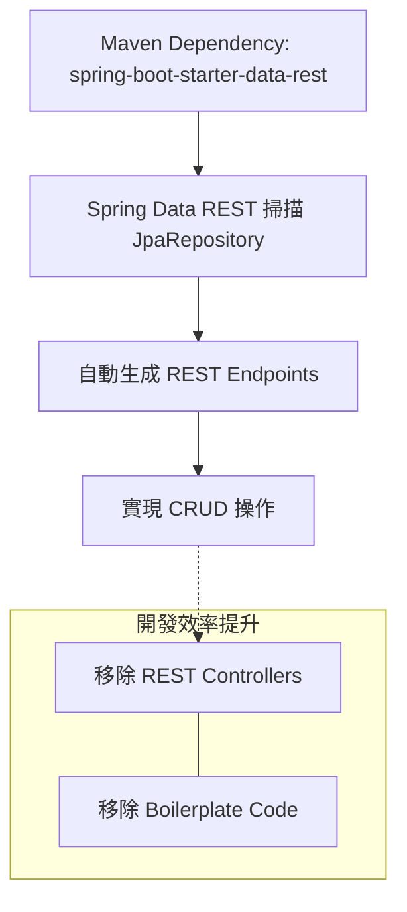

### Spring Data REST 端點命名規則

- **[預設機制]** Spring Data REST 會根據實體類型（Entity Type）自動建立端點
- **[複數化規則 (Pluralized Form)]** 採用非常簡單的邏輯：
    - 將實體類型的第一個字元轉為小寫
    - 在實體名稱後方直接加上 `s`
- **[範例]** 若實體類型為 `Employee`，則自動生成的端點路徑為 `/employees`

### Spring Data REST 複數化規則的侷限性

- **[問題點]** Spring Data REST 的複數化邏輯非常簡單（僅在實體後加 "s"），無法處理複雜的英文不規則複數形式
    - **[無法處理的範例]**

| 單數 (Singular) | 複數 (Plural) |
| --- | --- |
| Goose | Geese |
| Person | People |
| Syllabus | Syllabi |

- **[解決方案]** 當遇到上述情況，或需要暴露不同的資源名稱時（例如：不想用 `/employees`，而是想用 `/members`），必須透過**註解 (Annotation)** 來手動指定複數名稱或路徑

### 自定義 Spring Data REST 端點路徑

- **[解決方案]** 使用 `@RepositoryRestResource` 註解來手動指定複數名稱或路徑
- **[實作方式]** 在 Repository 介面上添加註解並設定 `path` 屬性

```java
@RepositoryRestResource(path="members")
public interface EmployeeRepository extends JpaRepository<Employee, Integer> {
}
```

- **[效果]** 實體原有的端點路徑會從 `/employees` 變更為 `/members`
    - 實際存取 URL：`http://localhost:8080/members`

---

### Spring Data REST 分頁功能 (Pagination)

- **[預設行為]** Spring Data REST 內建分頁機制，預設每次回傳前 20 個元素
    - **Page Size**：20
- **[分頁操作]** 可透過 URL 的查詢參數 (Query Parameters) 來切換不同的資料頁面
- **[關鍵規則]** 分頁索引是**從 0 開始 (Zero-based)**

| 需求 | URL 範例 |
| --- | --- |
| 第一頁 (Page 0) | http://localhost:8080/employees?page=0 |
| 第二頁 (Page 1) | http://localhost:8080/employees?page=1 |

### Spring Data REST 配置

- **[配置方式]** 可以在 `application.properties` 檔案中設定特定的屬性來改變 Spring Data REST 的預設行為
- **[常用配置屬性]**

| 屬性名稱 | 說明 |
| --- | --- |
| spring.data.rest.base-path | 用於暴露 Repository 資源的基礎路徑 (Base path) |
| spring.data.rest.default-page-size | 設定預設的分頁大小 (Default size of pages) |
| spring.data.rest.max-page-size | 設定分頁的最大限制 (Maximum size of pages) |

- **[設定範例]**

```properties

# application.properties
spring.data.rest.base-path=/magic-api
spring.data.rest.default-page-size=50
```

- **[效果]** 透過設定 `base-path`，所有的 REST 端點都會改從 `/magic-api` 開始存取

### Spring Data REST 排序功能 (Sorting)

- **[排序機制]** 可以透過 URL 的查詢參數 `sort` 來對回傳結果進行排序
- **[排序基準]** 排序所使用的名稱必須與實體 (Entity) 中的屬性名稱 (Property names) 完全一致
    - **[範例]** 在 `Employee` 實體中，可使用 `firstName`、`lastName` 或 `email` 作為排序欄位
- **[排序順序]**
    - **升冪 (Ascending)**：為預設值，不需額外設定
    - **降冪 (Descending)**：需在屬性名稱後方加上 `,desc`

| 需求 | URL 查詢參數範例 |
| --- | --- |
| 依姓氏排序 (升冪) | http://localhost:8080/employees?sort=lastName |
| 依名字排序 (降冪) | http://localhost:8080/employees?sort=firstName,desc |

### 多欄位排序 (Multiple Property Sorting)

- **[操作方式]** 在 `sort` 參數中使用逗號將多個排序條件連接起來
- **[語法規則]** 格式為 `sort=property1,direction1,property2,direction2`
- **[預設行為]** 若未指定方向，預設為升冪 (Ascending)

| 排序需求 | URL 查詢參數範例 |
| --- | --- |
| 依姓氏排序，再依名字排序 (皆為升冪) | http://localhost:8080/employees?sort=lastName,firstName |
| 依姓氏排序，再依名字排序 (明確指定升冪) | http://localhost:8080/employees?sort=lastName,firstName,asc |
| 依姓氏排序，再依名字降冪排序 | http://localhost:8080/employees?sort=lastName,firstName,desc |

### 修改 REST 資源路徑 (Customizing REST Resource Path)

- **[操作方式]** 在 Repository 介面上添加 `@RepositoryRestResource` 註解
- **[效果]** 可以改變該特定資源的端點路徑 (Path)
- **[程式碼實作]**

```java
@RepositoryRestResource(path = "members")
public interface EmployeeRepository extends JpaRepository<Employee, Integer> {

}
```

    - **[註]** 透過設定 `path = "members"`，原本預設的 `/employees` 路徑將會變更為 `/members`

### 驗證自定義資源路徑

- **[測試流程]** 在修改 Repository 的路徑後，需重新啟動應用程式並使用 API 測試工具（如 Postman）進行驗證
- **[驗證結果]**
    - 原本預設的端點：`http://localhost:8080/magic-api/employees`
    - 修改後的端點：`http://localhost:8080/magic-api/members`
- **[實作程式碼回顧]**

```java
@RepositoryRestResource(path="members")
public interface EmployeeRepository extends JpaRepository<Employee, Integer> {

}
```

### 驗證自定義端點路徑

- **[常見錯誤]** 若在 Repository 使用了 `@RepositoryRestResource(path = "members")`，但仍嘗試存取原本的 `/employees` 路徑，會收到 `404 Not Found` 錯誤
- **[正確驗證流程]**
    - **錯誤路徑**：`http://localhost:8080/magic-api/employees/5` $\rightarrow$ `404 Not Found`
    - **正確路徑**：`http://localhost:8080/magic-api/members/5` $\rightarrow$ `200 OK`
- **[還原預設路徑]** 若想恢復使用預設的 `/employees` 端點，需將 Repository 中的註解註解掉 (comment out)：

```java
// @RepositoryRestResource(path="members")
public interface EmployeeRepository extends JpaRepository<Employee, Integer> {

}
```

### Spring Data REST 的分頁元數據 (Pagination Metadata)

當透過 REST API 請求集合 (Collection) 時，回傳的 JSON 中會包含一個 `page` 物件，提供關於當前分頁的詳細資訊：

- **`size`**：每一頁包含的元素數量
- **`totalElements`**：資料庫中符合條件的總元素數量
- **`totalPages`**：總共分為多少頁
- **`number`**：當前所在的頁碼 (從 0 開始)

```json
"page" : {
    "size" : 20,
    "totalElements" : 5,
    "totalPages" : 1,
    "number" : 0
}
```

### 調整分頁大小 (Changing Page Size)

- **[操作方式]** 可以透過在 URL 後方附加 `size` 查詢參數來修改每一頁顯示的數量
- **[範例]** 若要將每頁顯示的數量改為 5 個，可以使用以下 URL：
    - `http://localhost:8080/magic-api/employees?size=5`

### 修改預設分頁大小 (Changing Default Page Size)

- **[操作方式]** 在 `application.properties` 檔案中設定 `spring.data.rest.default-page-size` 屬性
- **[實作程式碼]**

```properties
spring.data.rest.default-page-size=3
```

- **[效果與計算範例]**
    - 若資料庫中有 5 個元素，且設定每頁大小為 3
    - 則總頁數 (totalPages) 將會是 2 頁
    - **[重要提醒]** 分頁號碼 (page numbers) 是 **從 0 開始 (zero-based)** 的

| 參數名稱 | 說明 |
| --- | --- |
| size | 每一頁包含的元素數量 |
| totalElements | 資料庫中符合條件的總元素數量 |
| totalPages | 總共分為多少頁 |
| number | 當前所在的頁碼 (從 0 開始) |

### 使用分頁連結存取下一頁資料

- **[操作方式]** 在 Postman 的 JSON 回應中，可以找到 `_links` 區塊下的 `next` 屬性，其 `href` 連結指向下一頁的 API 路徑
- **[分頁導航範例]**
    - 點擊連結後會開啟新的 Postman 分頁，並自動填入正確的 URL：`http://localhost:8080/magic-api/employees?page=1&size=3`
    - 發送請求後，會取得剩餘的資料元素
- **[分頁結果驗證]**
    - 若總共有 5 個元素，且 `size` 設定為 3
    - **第一頁 (page 0)**：包含前 3 個元素
    - **第二頁 (page 1)**：包含剩餘的 2 個元素（例如：`Juan Vega` 與 `Natalia Kublanov`）

```json
"_links": {
    "next": {
        "href": "http://localhost:8080/magic-api/employees?page=1&size=3"
    }
}
```

### 更新預設分頁大小 (Updating Default Page Size)

- **[操作方式]** 在 `application.properties` 檔案中修改 `spring.data.rest.default-page-size` 屬性值
- **[實作範例]** 將分頁大小改為 20：

```properties
spring.data.rest.default-page-size=20
```

- **[驗證結果]** 更改設定並儲存後，透過 Postman 發送 GET 請求至 `/employees` 端點，回應中的 `page.size` 應顯示為 20，且回傳的清單包含所有符合條件的員工資料。

### Spring Data REST 排序功能 (Sorting)

- **[操作方式]** 使用 `sort` 查詢參數，並將其值設定為想要排序的實體 (Entity) 屬性名稱
- **[範例]** 若要依據姓氏 (last name) 進行排序，URL 應如下所示：
    - `http://localhost:8080/magic-api/employees?sort=lastName`
- **[注意]** 排序時使用的屬性名稱必須與實體類別中定義的欄位名稱完全一致。

### 排序功能進階操作 (Sorting Advanced)

透過在 URL 中使用 `sort` 參數，可以依照實體屬性對回傳結果進行排序。

- **[升冪排序 (Ascending)]**
    - **操作方式**：在 `sort` 參數後方接上屬性名稱
    - **範例 URL**：`http://localhost:8080/magic-api/employees?sort=lastName`
    - **結果**：資料會依照 `lastName` 從 A 到 Z 的順序排列（例如：Andrews $\rightarrow$ Baumgarten $\rightarrow$ Gupta...）
- **[降冪排序 (Descending)]**
    - **操作方式**：在屬性名稱後方加上逗號與 `desc`
    - **範例 URL**：`http://localhost:8080/magic-api/employees?sort=lastName,desc`
    - **結果**：資料會依照 `lastName` 從 Z 到 A 的順序排列（例如：Vega $\rightarrow$ Kublanov $\rightarrow$ Gupta...）

| 排序類型 | URL 參數寫法 | 說明 |
| --- | --- | --- |
| 升冪 (Ascending) | sort=propertyName | 預設行為，由小到大排序 |
| 降冪 (Descending) | sort=propertyName,desc | 使用 ,desc 指定由大到小排序 |

### 多欄位排序 (Multiple Property Sorting) 的實作結果

- **[查詢參數]** 透過在 URL 中加入 `sort` 參數來控制排序邏輯
- **[範例請求]**
    - `GET http://localhost:8080/magic-api/employees?sort=lastName,desc`
- **[執行結果]**
    - API 會根據指定的屬性（如 `lastName`）進行排序
    - 排序方向可以設定為 `desc` (降冪) 或 `asc` (升冪)
    - 在範例中，結果顯示員工資料已依照姓氏降冪排列

### 使用 OpenAPI 與 Swagger 進行 REST API 文件化 (Documenting REST APIs with OpenAPI and Swagger)

- **[面臨的問題]** 當 REST API 缺乏文件時，開發者必須採取極其低效的方式來理解 API：
    - 必須仔細查閱原始碼，以尋找所有的端點（例如 `@GetMapping`、`@PostMapping` 等）
    - 必須在理解所有端點後，才能使用 Postman 或 `curl` 指令進行測試
- **[缺乏文件的影響]**
    - 對於主要開發者來說或許尚可接受，但對於新加入的開發者或外部使用者來說，被迫閱讀所有原始碼來理解 API 是非常不理想的體驗

### SpringDoc：自動化 API 文件化解決方案

- **[核心需求]** 理想的 API 管理工具應具備以下能力：
    - 在執行時 (Run-time) 自動生成 API 文件
    - 根據 Spring 配置與註解 (Annotations) 自動檢查 API 端點
    - 提供 Web 使用者介面 (Web UI) 直接存取端點，無需手動使用 Postman 或 `curl` 進行測試
- **SpringDoc 簡介**
    - 一個獨立的開源專案 (Separate open-source project)
    - **[主要功能]** 自動生成 API 文件，解決了開發者必須查閱原始碼來尋找端點的困境

### SpringDoc 與 Swagger Web UI

- **[運作原理]** SpringDoc 會根據 Spring 的配置 (Configs) 與註解 (Annotations) 來檢查 API 端點
- **[核心優勢]** 提供一個 Web 使用者介面 (Web UI) 用於存取這些端點
    - **[無需外部工具]** 開發者可以直接透過該 Web UI 呼叫端點，不再需要安裝或使用 Postman 或 `curl`
- **[Swagger 的角色]**
    - Swagger 是 SpringDoc 提供的一個使用者介面 (User Interface)
    - 透過在應用程式中進行配置，SpringDoc 會自動根據現有的 API 生成這個 Swagger Web UI

### Documenting REST APIs

- **OpenAPI**
    - 是一個用於 API 文件化的產業標準格式 (Industry standard format)
    - 詳細資訊可參考 `www.openapis.org`
- **Swagger UI**
    - 一個基於瀏覽器的使用者介面 (Browser-based UI)，用於與 API 進行互動
    - **[運作核心]** 由 **SpringDoc-OpenAPI** 專案驅動
    - **[功能優勢]** 開發者可以直接在瀏覽器中執行各種 HTTP 請求（如 `GET`、`PUT`、`POST` 等），無需額外安裝 Postman 等軟體

### SpringDoc 的開發流程 (Development Process)

要利用 SpringDoc 在 Swagger UI 中建立 API 文件，需遵循以下開發步驟：

1. **新增 SpringDoc 的 Maven 依賴** (Add Maven dependency for Springdoc)
2. **存取 Swagger UI** (Access Swagger UI)
3. **以 JSON 或 YAML 格式檢索 API 端點** (Retrieve API endpoints as JSON or YAML)

#### 第一步：新增 SpringDoc 的 Maven 依賴

需在專案的 `pom.xml` 中加入 SpringDoc 的 Maven 座標。具體的 `groupId`、`artifactId` 與 `version` 資訊可以從 [springdoc.org](https://www.springdoc.org) 網站取得最新版本。

```xml
<dependency>
    <groupId>org.springdoc</groupId>
    <artifactId>springdoc-openapi-starter-webmvc-ui</artifactId>
    <version>x.y.z</version>
</dependency>
```

### 存取 Swagger UI (Accessing Swagger UI)

- **[預設路徑]** 在未進行任何配置的情況下，Swagger UI 的預設存取位置為：
    - `http://localhost:8080/swagger-ui/index.html`
- **[功能特性]** 進入該頁面後，系統會根據應用程式中現有的端點 (Endpoints) 自動生成使用者介面

### 配置自定義 Swagger UI 路徑 (Configuring Custom Path for Swagger UI)

- **[配置方式]** 若不想使用預設路徑，可以在 `application.properties` 檔案中進行自定義配置
- **[配置屬性]** 使用 `springdoc.swagger-ui.path` 屬性來指定新的路徑
- **[配置範例]** 若要將路徑設定為 `my-fun-ui.html`，配置如下：

```properties
springdoc.swagger-ui.path=/my-fun-ui.html
```

### 檢索 API 端點為 JSON 或 YAML (Retrieve API endpoints as JSON or YAML)

除了使用 Swagger UI 作為互動介面外，開發者也可以將 API 端點的定義以 JSON 或 YAML 格式檢索出來。

- **[主要用途]** 當開發者不需要視覺化介面，而是需要 API 的結構化文件時非常有用。
- **[整合開發工具]** 這些格式的文件對於整合其他開發工具至關重要：
    - **客戶端 SDK 生成工具** (Client SDK generation tools)：可以讀取 OpenAPI 規格文件（YAML 或 JSON）來自動生成客戶端程式碼。
    - **API 模擬** (API mocking)：用於建立模擬伺服器進行測試。
    - **合約測試** (Contract testing)：確保 API 的實作符合定義的規格。

### JSON 或 YAML 格式的語言無關性 (Language Independence)

- **[核心優勢]** JSON 與 YAML 格式是**語言無關 (Language independent)** 的
    - 這意味著不同的應用程式可以根據需求處理這些文件，而不受程式語言限制
- **[跨語言整合範例]**
    - **後端 (Backend)**：可以使用 Java (例如 Spring Boot) 撰寫
    - **前端/客戶端 (Frontend/Client)**：可以使用 JavaScript、Python、Go 或 C# 等任何語言
    - **運作流程**：客戶端可以讀取 JSON 或 YAML 規格，自動生成對應語言的 **Client SDK**，進而正確地呼叫 API 端點

### 獲取 JSON 與 YAML 格式的 API 文件

除了視覺化的 Swagger UI，開發者可以透過以下路徑直接取得結構化的 API 文件：

- **JSON 格式文件**
    - 預設路徑：`http://localhost:8080/v3/api-docs`
    - 包含內容：可用的方法 (methods)、操作 (operations)、回應 (responses) 等詳細資訊
- **YAML 格式文件**
    - 預設路徑：`http://localhost:8080/v3/api-docs.yaml`
    - **[處理方式]** 瀏覽器會直接下載該 YAML 檔案
    - **[檢視工具]** 由於 YAML 本質上是純文字檔案，可以使用任何文字編輯器（例如 VS Code）來開啟與檢視內容

### 配置自定義 API 文件路徑 (Configuring Custom API Docs Path)

可以透過在 `application.properties` 中設定屬性來更改 API 文件的預設存取路徑。

- **[配置屬性]** 使用 `springdoc.api-docs.path`
- **[配置範例]** 若要將路徑設定為 `/my-api-docs`：

```properties
springdoc.api-docs.path=/my-api-docs
```

- **[存取方式]** 設定完成後，可透過以下 URL 存取文件：
    - **JSON 格式**：`http://localhost:8080/my-api-docs` (預設格式)
    - **YAML 格式**：`http://localhost:8080/my-api-docs.yaml`

### 資料庫環境重設 (Database Refresh)

在開始新的開發步驟前，需要重設資料庫以確保環境處於穩定的初始狀態。

- **[目的]** 由於之前的練習涉及大量的更新 (updating) 與刪除 (deleting) 操作，重設資料庫可以建立一個簡單且一致的基準線 (baseline)。
- **[操作流程]**
    - 開啟 **MySQL Workbench** 並建立連線
    - 執行預先準備好的 SQL 腳本（例如 `employee.sql`）以重新初始化資料

### 資料庫環境重設實作 (Database Refresh Implementation)

透過執行 SQL 腳本來確保資料庫回到乾淨且標準的初始狀態：

1. **定位腳本**

    - 在專案目錄中找到 `spring-boot-employee-sql-script` 資料夾
    - 開啟 `employee-directory.sql` 檔案

2. **執行腳本**

    - 在 **MySQL Workbench** 中開啟該 SQL 腳本
    - 執行腳本以重新建立資料庫結構與初始資料

3. **驗證初始狀態**

    - 重新整理 (Refresh) 資料庫介面
    - 執行查詢語句以確認資料內容：

```sql
SELECT * FROM employee_directory.employee;
```

- **[驗證結果]** 執行後應顯示預設的 5 筆員工資料，作為後續開發的基準線 (baseline)。

| id | first_name | last_name | email |

### Spring Boot 4 中的 OpenAPI / Swagger 限制

- **[相容性問題]** 在 Spring Boot 4 中，OpenAPI/Swagger 目前**無法**與 **Spring Data REST** 協同工作
    - **原因**：Spring Data REST 的特性是讓 Spring Boot 在不需要撰寫任何 REST 控制器程式碼的情況下，自動為實體生成 API
    - **現狀**：這是一個已知的限制，未來版本可能會修復，但目前無法支援
- **[正常運作的情境]** OpenAPI/Swagger 對於使用常規 **`@RestController`** 的專案仍然可以正常運作

### OpenAPI / Swagger 與 @RestController 的實作演示

雖然 Spring Boot 4 與 Spring Data REST 存在相容性限制，但對於傳統開發模式仍可正常運作：

- **[實作情境]** 使用基於 **`@RestController`** 的專案（例如：手動撰寫 CRUD 邏輯的員工管理應用程式）
- **[功能驗證]** 透過此類專案可以完整演示 OpenAPI / Swagger 如何自動檢測端點並生成文件，證明其在常規 REST 控制器架構下的穩定性。

### 整合 SpringDoc 的第一步：新增 Maven 依賴項

為了在專案中啟用 OpenAPI / Swagger 功能，首先必須在 Maven 設定中加入 SpringDoc 的依賴項。

- **[專案基礎]** 本次實作將基於先前建立的 Spring Data JPA 專案作為基準線
    - 包含現有的 **REST 控制器** (REST controllers)
    - 包含 **實體類別** (Entities)
    - 包含 **服務層** (Service layer)
- **[實作步驟]**
    - **步驟 1**：在 `pom.xml` 中新增 SpringDoc 的 Maven 依賴 (Maven dependency)

### 實作 SpringDoc 依賴配置

在 `pom.xml` 檔案的 `<dependencies>` 區塊中新增 SpringDoc 相關配置，以啟用 OpenAPI 功能。

- **[實作步驟]**
    - 在依賴區塊中加入註解以標記這是 Spring Doc 依賴
    - 設定 **Group ID** 為 `org.springdoc`
    - 設定 **Artifact ID** 為 `springdoc-openapi-starter-webmvc-ui`
    - 設定 **Version**（根據畫面所示選擇適用版本，例如 `3.0.1`）
- **[Maven 依賴程式碼範例]**

```xml
<!-- Add Spring Doc dependency -->
<dependency>
    <groupId>org.springdoc</groupId>
    <artifactId>springdoc-openapi-starter-webmvc-ui</artifactId>
    <version>3.0.1</version>
</dependency>
```

### 實作 SpringDoc 依賴配置 (續)

- **[配置檢查]** 確保 `pom.xml` 中的 SpringDoc 依賴項內容與範例一致：
    - **Group ID**: `org.springdoc`
    - **Artifact ID**: `springdoc-openapi-starter-webmvc-ui`
    - **Version**: `3.0.1-SNAPSHOT` (或專案指定的版本)

```xml
<!-- Add Spring Doc dependency -->
<dependency>
    <groupId>org.springdoc</groupId>
    <artifactId>springdoc-openapi-starter-webmvc-ui</artifactId>
    <version>3.0.1-SNAPSHOT</version>
</dependency>
```

- **[關鍵步驟]** 新增依賴後，必須執行 **Maven Sync**，讓 IDE 下載並套用新的依賴項，否則無法使用相關功能。

### 驗證 OpenAPI / Swagger 介面

在完成 Maven 依賴配置並啟動應用程式後，可以透過瀏覽器直接查看自動生成的 API 文件。

- **[存取路徑]**
    - 使用以下 URL 進入 Swagger UI 介面：

      `http://localhost:8080/swagger-ui/index.html`

- **[自動化特性]**
    - **無需額外開發**：只要專案中存在 SpringDoc 依賴，系統便會自動掃描並呈現 API 端點
    - **[功能展示]** 透過介面可直接看到已定義的控制器路徑（例如：`employee-rest-controller`）及其對應的 HTTP 方法（GET, PUT, POST, DELETE）

### 使用 Swagger UI 測試 API 端點

SpringDoc 會自動檢查應用程式碼中的特殊 Spring 註解，並生成一個圖形使用者介面 (GUI)，用於列出所有支援的端點與方法。

- **[介面功能]**
    - **端點列表**：自動整理並分類所有的 API 路徑（例如：`employee-rest-controller`）。
    - **方法展示**：清楚標示每個路徑支援的 HTTP 方法（如 `GET`, `PUT`, `POST`, `DELETE`, `PATCH`）。
    - **資訊與範例**：展開特定端點後，可查看該 API 的詳細資訊與 **範例回應 (Sample Response)**。
- **[實作測試流程]**
    - **步驟 1**：在想要測試的端點（例如 `GET /api/employees`）點擊 **"Try it out"** 按鈕。
    - **步驟 2**：點擊 **"Execute"** 按鈕以實際發送請求至 REST API 端點。
    - **步驟 3**：查看下方產生的 **Responses**，確認狀態碼（如 `200 OK`）與回傳的 JSON 資料內容。

#### Swagger UI 介面結構示意

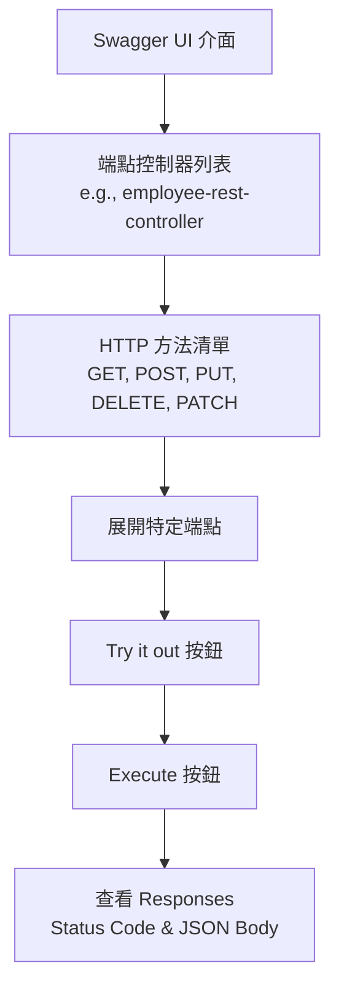

### Swagger UI 請求回應細節

當在 Swagger UI 中執行一個成功的 `GET` 請求後，介面會提供完整的技術細節，方便開發者進行測試與除錯。

- **[回應結構組成]**
    - **Curl**：提供可以直接在命令列（Command Line）執行的 `curl` 指令，方便快速重現該請求。
    - **Request URL**：顯示實際發送請求的完整端點路徑（例如：`http://localhost:8080/api/employees`）。
    - **Server Response**：
        - **Code**：伺服器回傳的 HTTP 狀態碼（例如：`200` 表示成功）。
        - **Response Body**：伺服器回傳的實際資料內容，通常為 JSON 格式。
- **[範例回應內容]**
    - 由於資料庫已重設，回傳的 JSON 內容會包含目前資料庫中所有的員工清單（例如：5 位員工）。

```json
[
  {
    "id": 1,
    "firstName": "Leslie",
    "lastName": "Andrews",
    "email": "leslie@luv2code.com"
  },
  {
    "id": 2,
    "firstName": "Emmo",
    "lastName": "Kaugerten",
    "email": "emmo@luv2code.com"
  }
  // ... 其他員工資料
]
```

- **[開發工具對照]**
    - Swagger UI 的功能與 Postman 類似，但它能直接在瀏覽器中提供自動生成的指令與結構，無需額外安裝或設定即可快速驗證 API。

### 透過 Swagger UI 執行 DELETE 請求

在完成 API 的開發與整合後，可以使用 Swagger UI 介面來驗證刪除功能是否正常運作。

- **[執行步驟]**
    - 找到對應的端點路徑：`DELETE /api/employees/{employeeId}`
    - 在 **Parameters** 區塊中，於 `employeeId` 欄位輸入想要刪除的員工 ID（例如：`1`）
    - 點擊 **Execute** 按鈕發送請求
- **[驗證結果]**
    - **HTTP 狀態碼**：確認回傳為 `200 OK`
    - **回應內容 (Response Body)**：確認回傳的訊息符合預期，例如：

      `Deleted employee id of 1`

- **[開發建議]**
    - 建議在完成功能開發後，利用 Swagger UI 提供的各種端點（GET, POST, PUT, DELETE, PATCH）進行全面的功能測試與實驗，以確保 API 的穩定性。

### 配置自定義 Swagger UI 路徑 (Customizing Swagger UI Path)

預設情況下，Swagger UI 會使用特定的預設路徑，但可以透過設定檔來更改此行為。

- **[實作方式]**：在 `application.properties` 檔案中新增以下設定：
    - `springdoc.swagger-ui.path=/my-ui.html`
- **[目的]**：允許開發者為 Swagger 介面定義一個自定義的 URL 路徑，而不必使用系統預設值。

### 驗證自定義 Swagger UI 路徑

在 `application.properties` 中完成路徑配置並重新啟動應用程式後，可以透過瀏覽器驗證設定是否生效。

- **[驗證流程]**
    - 使用配置的路徑存取：`http://localhost:8080/my-ui.html`
    - **[觀察結果]**
        - 成功載入 Swagger UI 介面，顯示所有 API 端點（如 `employee-rest-controller`）。
        - **[重定向行為]**：在背景中，系統實際上會將請求重新導向至原始的預設路徑，但使用者仍能透過自定義的 URL 正常使用介面。

### 查看 OpenAPI 定義文件 (JSON/YAML)

除了使用圖形化的 Swagger UI 介面外，開發者也可以直接存取 API 的原始定義文件。

- **[存取方式]**：在瀏覽器中輸入特定的端點路徑：
    - `http://localhost:8080/v3/api-docs`
- **[文件內容]**：
    - 此路徑會回傳符合 **OpenAPI 3.1** 規範的定義內容。
    - 內容通常以 **JSON** 或 **YAML** 格式呈現，包含了所有 API 端點、參數、請求與回應的詳細結構定義。
- **[用途]**：
    - 提供給自動化工具使用（例如產生客戶端程式碼）。
    - 方便開發者直接查閱 API 的底層定義，而不受 UI 介面的限制。

### OpenAPI 定義文件的內容與閱讀

- **[文件內容]**：瀏覽器存取的 `v3/api-docs` 會回傳一段龐大的 JSON 內容，這份文件是自動生成的，包含了：
    - **Paths**：API 可用的路徑（endpoints）。
    - **Operations**：每個路徑所支援的操作（例如 `GET`, `POST`, `PUT`, `DELETE`, `PATCH` 等）。
- **[JSON 文件的用途]**：
    - 用於其他客戶端應用程式來**自動生成客戶端 SDK**。
    - 用於 **Mock API**（模擬 API 伺服器）。
    - 用於進行 **Contract Testing**（合約測試），確保提供者與消費者之間的 API 規範一致。
- **[閱讀建議]**：
    - 由於原始 JSON 通常是壓縮成一行的長字串，閱讀起來非常困難。
    - **[解決方案]**：可以安裝瀏覽器外掛程式（例如 Chrome 或 Firefox 的 "JSON Formatter"）來實現 **Pretty Print**，讓 JSON 結構以易於閱讀的縮排格式呈現。

### 獲取 YAML 格式的 OpenAPI 文件

除了 JSON 格式外，也可以輕鬆獲取 YAML 格式的 API 定義文件。

- **[實作方式]**：在原本的 JSON 端點 URL 後方加上 `.yaml` 副檔名。
    - 例如：將 `http://localhost:8080/v3/api-docs` 改為 `http://localhost:8080/v3/api-docs.yaml`
- **[結果]**：瀏覽器不會直接顯示內容，而是會自動將該文件下載到電腦中（例如下載至 `Downloads` 資料夾）。
- **[查看方式]**：
    - 下載完成後，可以使用任何純文字編輯器（Plain text editor）開啟。
    - **[推薦工具]**：使用 **VS Code** 或其他文字編輯器可以更方便地閱讀與編輯這些結構化的文件內容。

### 獲取 YAML 格式的 OpenAPI 文件

除了 JSON 格式外，OpenAPI 定義也可以以 **YAML** 格式呈現，這對於人工閱讀與維護來說更加直觀。

- **[YAML 格式優勢]**
    - 結構清晰，易於人類閱讀。
    - 減少了 JSON 中大量的括號與引號，使文件更簡潔。
- **[文件結構範例]** (根據 `api-docs.yaml` 內容):
    - **openapi**: 指定版本，例如 `3.1.0`。
    - **servers**: 定義伺服器位址，例如 `http://localhost:8080`。
    - **paths**: 定義 API 的路徑與操作，例如：
        - `/api/employees`: 提供 `get` 操作。
        - `/api/employees/{employeeId}`: 提供 `patch` 操作，並包含路徑參數 `employeeId`。
    - **components/schemas**: 定義重複使用的資料模型（如 `Employee`），讓路徑中的 `requestBody` 或 `responses` 可以透過 `$ref` 進行引用。

### 自定義 OpenAPI 定義文件的路徑 (Customizing OpenAPI Docs Path)

預設情況下，OpenAPI 定義文件會透過預設路徑（如 `/v3/api-docs`）存取。若需要更改此路徑，可以在 `application.properties` 中進行配置。

- **[實作方式]**：在 `application.properties` 中加入以下設定：

```properties

# configure custom path for api docs
  springdoc.api-docs.path=/custom-path
```

  *(註：範例中路徑依實際需求設定，如畫面所示為&#32;`springdoc.api-docs.path=`&#32;待填寫狀態)*

- **[注意事項]**：
    - 修改此設定會改變自動生成的 JSON/YAML 定義文件的存取位置。
    - 若要同時修改 Swagger UI 的介面路徑，則需使用 `springdoc.swagger-ui.path` 設定項。

### 實作自定義 OpenAPI 定義文件路徑

- **[實作步驟]**：
    - 在 `application.properties` 中設定自定義路徑。例如，將路徑設定為 `/my-api-docs`：

```properties

# configure custom path for api docs
springdoc.api-docs.path=/my-api-docs
```

    - 重新啟動應用程式以套用設定。
    - 透過新的端點路徑存取文件：`http://localhost:8080/my-api-docs`。
- **[驗證結果]**：
    - 存取新路徑後，瀏覽器會顯示與原先相同的 OpenAPI JSON 定義內容。
    - 可以配合瀏覽器外掛程式（如 **JSON Formatter**）來進行 **Pretty Print**，使 JSON 結構更易於閱讀。

除了 JSON 格式外，也可以輕鬆獲取 YAML 格式的 API 定義文件，這對於人工閱讀與維護來說更加直觀。

- **[實作方式]**：在原本的 JSON 端點 URL 後方加上 `.yaml` 副檔名。
    - 例如：將 `http://localhost:8080/my-api-docs` 改為 `http://localhost:8080/my-api-docs.yaml`
- **[結果]**：瀏覽器會自動將該文件下載到電腦中。
- **[查看方式]**：下載完成後，可以使用任何純文字編輯器（如 **VS Code**）開啟進行閱讀。

---

### 還原自定義路徑設定

若需要取消自定義的路徑，將設定恢復為預設值，可以透過以下方式操作：

- **[實作步驟]**：
    - 在 IDE 中停止應用程式。
    - 在 `application.properties` 檔案中，將自定義路徑的設定行進行**註解**（Comment out）。

```properties

# configure custom path for api docs

# springdoc.api-docs.path=/my-api-docs

# configure custom path for swagger-ui

# springdoc.swagger-ui.path=/my-ui.html
```

- **[目的]**：這樣做可以快速將 API 文件與 Swagger UI 的存取路徑重設回系統預設的狀態。

### 驗證預設端點路徑 (Verifying Default Endpoints)

在註解掉 `application.properties` 中的自定義路徑設定並重新啟動應用程式後，系統會回到預設的存取路徑：

- **Swagger UI 預設路徑**：
    - 透過 `http://localhost:8080/swagger-ui/index.html` 存取
    - 可直接在瀏覽器中看到互動式的 API 測試介面
- **OpenAPI JSON 文件預設路徑**：
    - 透過 `http://localhost:8080/v3/api-docs` 存取
    - 提供用於自動化工具或文件生成的原始 JSON 資料

## Spring Boot REST API 安全性概覽

本章節將聚焦於 Spring Security 在日常開發中最常見的實務任務，而非作為完整的 A 到 Z 參考手冊。

### 學習目標

- **保護 API**：學習如何確保 Spring Boot REST APIs 的安全性
- **身分與權限管理**
    - 定義使用者 (Users)
    - 定義角色 (Roles)
    - 根據角色保護特定的 URL 路徑
- **使用者資料儲存**
    - 學習如何在資料庫 (DB) 中儲存使用者、密碼與角色
    - 涵蓋從**明文 (plain-text)** 轉換至**加密 (encrypted)** 格式的過程

### 學習重點與資源

- **實務導向**：重點在於處理日常專案中會遇到的常見 Spring Security 任務
- **進階參考**：若需要完整的技術細節，可查閱官方的 **Spring Security Reference Manual**

### Spring Security 模型 (Spring Security Model)

- Spring Security 提供了一個安全框架
    - 底層是透過 **Servlet Filters** 來實作
- 實作安全性的兩種方法：
    - **宣告式安全性 (Declarative security)**
    - **程式化安全性 (Programmatic security)**

### Spring Security 與 Servlet Filters

- Servlet Filters 的作用：
    - 用於 Web 請求的**預處理 (pre-process)** 與**後處理 (post-process)**
    - 可以根據安全邏輯來進行 Web 請求的路由 (route)
- Spring 提供大量的安全性功能，皆是透過 Servlet Filters 來實現

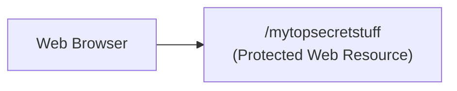

### Spring Security 運作流程 (Spring Security in Action)

當 Web 瀏覽器嘗試存取受保護的資源時，Spring Security Filters 會攔截該請求，並進行以下檢查與決策過程：

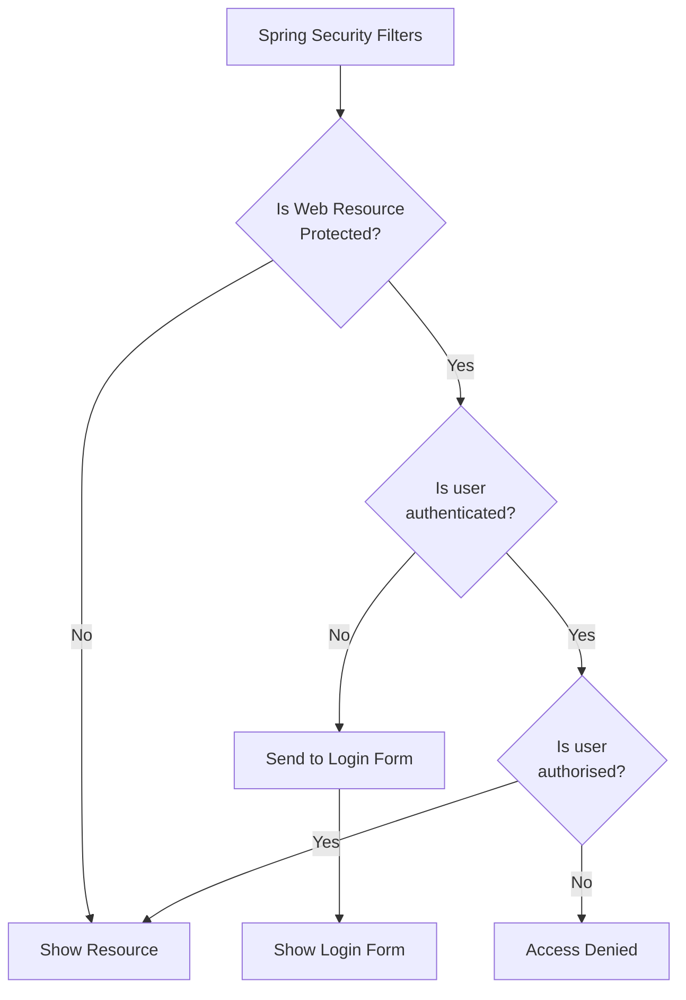

- **核心檢查機制**：
    - **攔截與預處理**：Filters 會攔截請求並檢查該 Web 資源是否受到保護
    - **身分驗證 (Authentication)**：檢查使用者是否已登入（比對使用者 ID 與密碼）
    - **權限授權 (Authorization)**：檢查使用者是否擁有存取該特定資源的角色或權限
- **決策依據**：
    - **應用程式安全配置 (App security configuration)**：定義哪些路徑需要保護
    - **資料庫資訊 (Users, passwords, roles)**：儲存於資料庫中的使用者憑證與角色資訊

### 身分驗證與權限授權的差異

在 Spring Security 的決策流程中，身分驗證與權限授權是兩個獨立且連續的檢查步驟：

1. **身分驗證 (Authentication)**

    - **目的**：確認使用者的身分是否真實有效
    - **流程**：
        - 若使用者未登入，系統會將其導向登入表單 (Show Login Form)
        - 使用者輸入使用者 ID 與密碼後，系統會根據內部儲存的資訊進行比對
        - 若驗證通過，則標記為「已身分驗證 (Authenticated)"

2. **權限授權 (Authorization)**

    - **目的**：在確認身分後，檢查該使用者是否有權存取特定資源
    - **流程**：
        - 即使使用者已成功登入，若其權限不足，系統仍會回傳「拒絕存取 (Access Denied)"
- **生活化比喻**：
    - 就像進入大學校園或辦公大樓：
        - **身分驗證**：你出示學生證或員工識別證，證明「你確實是該校/該公司的成員」
        - **權限授權**：雖然你進入了大樓，但你是否能進入「實驗室」或「主管辦公室」，則取決於你的權限等級或角色 (Role)

### Spring Security 的安全性層級

- 即使通過身分驗證，並不代表擁有所有資源的存取權
- Spring 透過 **安全角色 (Security Roles)** 提供額外的安全保障
    - 若使用者不具備指定的角色 $\rightarrow$ 回傳「拒絕存取 (Access Denied)"
    - 若使用者具備指定角色 $\rightarrow$ 允許存取受保護的資源

### 安全概念總結 (Security Concepts)

- **身分驗證 (Authentication)**
    - 核心任務：確認使用者身分
    - 運作方式：將使用者提供的 ID 與密碼，與應用程式或資料庫中儲存的憑證 (Credentials) 進行比對
- **權限授權 (Authorization)**
    - 核心任務：檢查存取權限
    - 運作方式：確認使用者是否擁有特定的授權角色 (Authorized Role)

### Spring Security 的實作方式

Spring Security 提供兩種層次的安全性實作，以應對不同的開發需求：

1. **宣告式安全性 (Declarative Security)**

    - **定義方式**：透過配置 (Configuration) 來定義應用程式的安全限制
    - **實作技術**：使用純 Java 配置，通常透過標註 `@Configuration` 的類別來完成
    - **優點**：提供**關注點分離 (Separation of Concerns)**，將安全性邏輯與核心應用程式業務邏輯 (Application Code) 分開管理

2. **程式化安全性 (Programmatic Security)**

    - **定義方式**：透過 Spring 提供的 API，直接在應用程式程式碼中進行自定義開發
    - **優點**：能針對特定應用程式的複雜需求，提供更高的客製化靈活性 (Greater Customization)

### 啟用 Spring Security (Enabling Spring Security)

當企業有特殊的業務規則或邏輯需求時，可以透過擴展框架來實作自定義的安全機制。

- **啟用步驟**：
    - 修改 `pom.xml` 檔案
    - 新增 `spring-boot-starter-security` 的 Maven 依賴項

```xml
<dependency>
    <groupId>org.springframework.boot</groupId>
    <artifactId>spring-boot-starter-security</artifactId>
</dependency>
```

- **自動化效果**：
    - 一旦加入此依賴項，Spring Boot 會**自動保護 (automagically secure)** 應用程式中的所有端點 (endpoints)
    - 在此階段不需要撰寫任何額外的程式碼即可達成基礎安全性

### Spring Security 的預設行為 (Default Behavior)

一旦啟用了 Spring Security，應用程式的所有端點都會受到保護。

- **登入提示**：當嘗試存取受保護的資源時，Spring Security 會自動彈出登入視窗 (Login Prompt)。
- **預設憑證**：
    - **預設使用者名稱 (Username)**：`user`
    - **預設密碼 (Password)**：系統會在啟動時自動生成，並顯示於**應用程式的控制台日誌 (Console Logs)** 中。
- **[注意]**：目前的預設行為僅適用於開發與測試階段。在正式環境中，通常會透過將使用者資訊儲存在資料庫中來進行更進階的管理。

### 自定義 Spring Security 配置

若需要修改預設的使用者名稱與密碼，可以透過 `application.properties` 檔案進行簡單的覆寫配置。

- **配置方法**：在 `src/main/resources/application.properties` 中新增以下屬性：

```properties
spring.security.user.name=scott
spring.security.user.password=tiger
```

- **配置項目**：
    - `spring.security.user.name`：定義自定義的使用者 ID
    - `spring.security.user.password`：定義自定義的密碼

### Spring Security 的驗證與授權選項 (Authentication and Authorization Options)

Spring Security 提供了極高的靈活性，可以根據需求選擇不同的身分驗證與授權機制來管理使用者、密碼與角色：

- **支援的實作方式**：
    - **記憶體內驗證 (In-memory authentication)**：將使用者資訊儲存在應用程式記憶體中，適合開發或小型測試環境。
    - **JDBC 驗證**：透過資料庫 (Database) 定義使用者、密碼與角色，適合需要持久化儲存使用者資料的正式應用。
    - **LDAP**：支援輕量級目錄存取協定，常用於企業級的身分管理系統。
    - **自定義/可插拔式 (Custom / Pluggable)**：可以開發自定義的插件，撰寫專屬的驗證與授權邏輯。
    - **其他 (others...)**：框架具備高度擴展性，可參考官方參考手冊查看完整列表。
- **密碼儲存策略 (Password Storage Strategies)**
    - 在資料庫中儲存密碼時，可以選擇以下兩種方式：
        - **明文 (Plain-text)**：直接儲存原始密碼（不建議用於生產環境）。
        - **加密 (Encrypted)**：對密碼進行加密處理，以提升安全性。

### 重設資料庫表格 (Refreshing the Database Table)

為了確保開發環境擁有穩定的基準點 (Baseline)，在進行新的 REST API 功能開發前，需要將資料庫重設為初始狀態。

- **操作流程**：
    - 開啟 **MySQL Workbench** 並登入資料庫帳戶。
    - 執行先前用於建立資料表 (Create Table) 與插入範例資料 (Insert Sample Data) 的 SQL 腳本。
- **目的**：
    - 清除先前教學中產生的所有變動（如已刪除、已更新或新增的資料）。
    - 確保所有開發測試都是從同一份乾淨且預期的資料集開始。

### 下載啟動程式碼 (Download Starter Code)

- **檔案說明**：
    - 專案檔案名稱：`00-spring-boot-rest-security-employee-starter-code.zip`
    - 內容包含：先前課程建立的 REST API 專案，以及新增的支援性 SQL 腳本（用於資料庫作業）。
- **取得方式**：
    - 從影片的「Resources」區塊下載該壓縮檔。
- **準備工作**：
    - 下載後解壓縮，並將專案導入開發環境（如 IntelliJ IDEA）。

### 整理啟動程式碼 (Organizing Starter Code)

- **解壓縮與移動**：
    - 將下載的 `.zip` 檔案（如 `00-spring-boot-rest-security-employee-starter-code.zip`）解壓縮。
    - 將解壓後的資料夾移動至專屬的開發目錄，例如 `dev-spring-boot`。
- **專案結構**：
    - 解壓後的專案是一個基礎的 **Maven 專案**。
    - 內容包含先前課程建立的程式碼，並整合了本次需要的新功能與 SQL 腳本。

### 專案檔案整理與導入

- **檔案移動流程**：
    - 在開發目錄中建立新的專屬資料夾，例如 `05-spring-boot-rest-security`。
    - 將下載的啟動程式碼資料夾（如 `00-spring-boot-rest-security-employee-starter-code`）複製並貼上至該新資料夾中。
- **導入 IDE**：
    - 將整理好的專案資料夾匯入 IntelliJ IDEA。
    - **[注意]**：匯入時若遇到 IntelliJ IDEA 的安全警告（Trust Project），需確認來源可靠後選擇「Trust Project」以啟動專案。

### IntelliJ IDEA 開發環境配置 (Spring Boot DevTools)

為了發揮 **Spring Boot DevTools** 的即時重載 (Reload) 功能，需要在 IDE 中進行特定的設定：

- **自動編譯設定 (Compiler Settings)**：
    - 路徑：`Build, Execution, Deployment`
        - `Compiler`
    - 勾選 `Build project automatically` 選項。
    - **[目的]**：當開發者儲存程式碼變動時，IDE 會自動進行編譯，進而觸發 DevTools 的熱部署機制。
- **進階設定 (Advanced Settings)**：
    - 路徑：`Build, Execution, Deployment`
        - `Advanced Settings`
    - 需確保相關選項已啟用，以支援開發中的自動編譯流程。

### 完成開發環境配置

- **自動編譯設定確認**：
    - 在 IntelliJ IDEA 的 `Compiler` 設定中，勾選 `Allow auto-make to start even if developed application is currently running`。
    - 點擊 `OK` 以儲存設定，確保 DevTools 的自動重載功能能正常運作。

### 專案基礎程式碼回顧

目前的專案是先前開發過的 Spring Boot CRUD 範例，其 Java 程式碼結構包含以下核心組件：

- **DAO (Data Access Object)**：負責資料庫存取邏輯。
- **Entity**：定義資料庫表格對應的實體模型。
- **REST Controller**：處理 HTTP 請求並回傳回應。
- **Service**：封裝業務邏輯層。

### 啟用 Spring Security

- **操作方式**：
    - 開啟專案根目錄下的 `pom.xml` 檔案。
    - 在 `<dependencies>` 區塊中新增一個 `<dependency>` 項目。
    - 設定相關參數以引入 Spring Boot Security 的啟動器 (Starter)。
- **Maven 依賴配置**：

```xml
<dependency>
        <groupId>org.springframework.boot</groupId>
        <artifactId>spring-boot-starter-security</artifactId>
    </dependency>
```

### 載入 Maven 變更

- 在修改完 `pom.xml` 後，必須執行 **Reload Maven Project**（通常點擊 IDE 右上角的浮動圖示或在 Maven 面板點擊重新整理），以確保新增的依賴項被正式下載並整合到專案中。

### Spring Security 的自動保護機制

- **自動安全性 (Automatic Security)**：
    - 只要專案中包含了 `spring-boot-starter-security` 依賴，Spring Boot 就會啟動預設的安全配置。
    - **[影響]**：應用程式中所有的 REST 端點（endpoints）都會被自動保護，未經授權的請求將無法直接存取。
- **驗證方式**：
    - 啟動應用程式後，觀察控制台（Console）輸出。若安全性已生效，系統會自動生成一個臨時密碼，並提示該密碼用於開發環境的身份驗證。

### 驗證 Spring Security 自動保護機制

- **確認安全性生效**：
    - 觀察控制台（Console）輸出，系統會顯示 `Using generated security password: [隨機密碼]`。
    - **[注意]**：此生成的密碼僅供開發環境使用，在正式環境中必須進行安全性配置。
- **預設登入憑證**：
    - **預設使用者名稱**：`user`
    - **密碼**：從控制台日誌中取得的隨機字串
- **自動保護行為**：
    - 當嘗試直接存取 REST API 端點（例如 `http://localhost:8080/api/employees`）時，Spring Boot 會自動攔截請求。
    - **[結果]**：瀏覽器會自動跳轉至登入頁面（Please sign in），要求輸入帳號密碼以驗證身份。

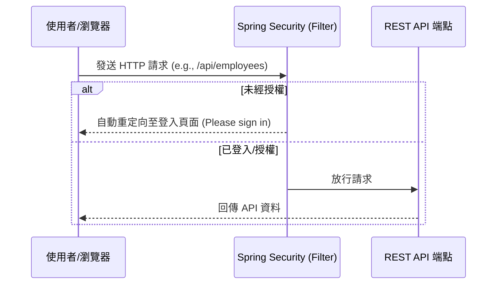

### 執行 Spring Security 登入驗證

- **登入流程**：
    - 當嘗試存取受保護的端點時，瀏覽器會顯示「Please sign in」頁面。
    - **預設使用者名稱**：`user`
    - **密碼取得方式**：從應用程式的執行日誌 (Application Logs) 中複製系統生成的隨機密碼。
- **驗證成功**：
    - 輸入正確憑證後，可以成功登入並存取 API 資料。
    - **[結果]**：原本受限的端點現在能正常回傳 JSON 內容（例如 `http://localhost:8080/api/employees?continue`）。

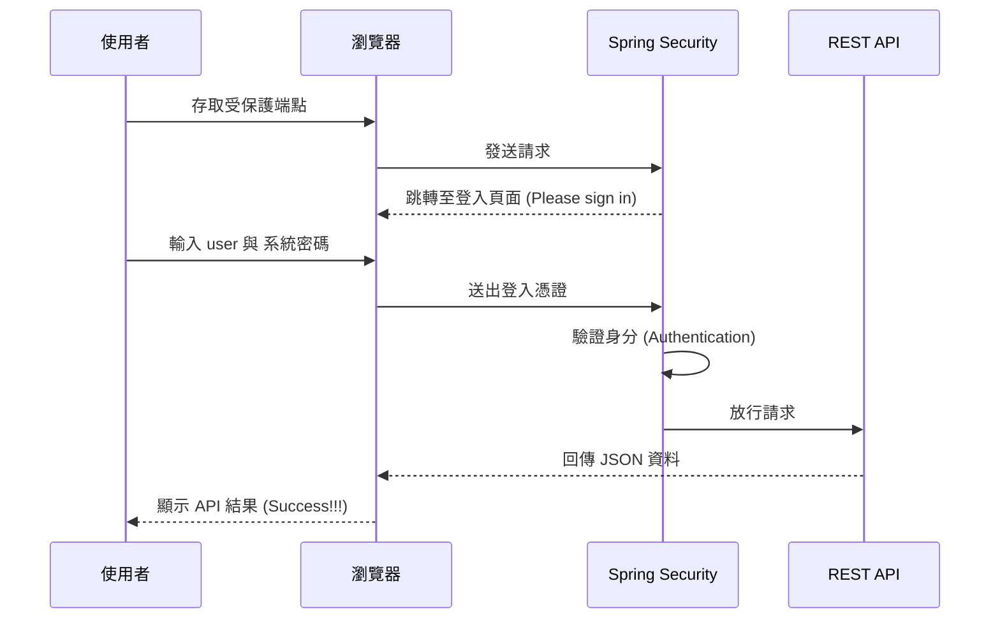

### 無痕模式下的身份驗證測試

- **模擬全新使用者狀態**：
    - 使用瀏覽器的「無痕視窗」(Incognito window) 進行測試，因為這不會保留之前的 Session 追蹤資訊。
    - **[結果]**：系統會要求重新進行登入驗證。
- **驗證錯誤憑證**：
    - 若輸入錯誤的帳號或密碼，系統會顯示「Bad credentials」錯誤訊息，阻止存取受保護的資源。
- **成功登入流程**：
    - 從伺服器控制台 (Server Console) 複製系統生成的隨機密碼。
    - 在登入頁面輸入正確的 `user` ID 與該密碼，即可成功進入應用程式。

### 覆寫預設憑證 (Override Default Credentials)

- 為了開發方便，開發者可以選擇覆寫 Spring Security 預設的 `user` 帳號與隨機密碼，以避免每次都要從日誌中尋找密碼。
- **設定方式**：
    - 在 `application.properties` 檔案中加入以下屬性來定義固定的登入帳號與密碼

```properties
spring.security.user.name=scott
spring.security.user.password=test123
```

- **[目的]**：
    - 為了開發便利性，避免每次啟動應用程式後，都必須去查看伺服器控制台 (Console) 以獲取系統自動生成的隨機密碼。

### 驗證自定義憑證配置

- **測試流程**：
    - 重新啟動應用程式後，開啟瀏覽器（或使用無痕視窗）存取 API 端點。
    - **錯誤測試**：輸入錯誤的資訊，系統會回傳「Bad credentials」訊息。
    - **正確測試**：使用在 `application.properties` 中設定的帳密進行登入。
        - **使用者名稱**：`scott`
        - **密碼**：`test123`
- **[結果]**：登入成功，並能正常存取 API 資料（顯示「Success!!!」）。

### 驗證自定義憑證生效

- **驗證結果**：
    - 使用先前在 `application.properties` 中設定的自定義帳號與密碼進行登入後，可以成功存取受保護的端點。
    - **[結果]**：瀏覽器成功回傳了員工列表的 JSON 資料，並顯示「Success!!!」狀態。

```json
[{"id":1,"firstName":"Leslie","lastName":"Andrews","email":"leslie@luv2code.com"},
{"id":2,"firstName":"Emma","lastName":"Baumgarten","email":"emma@luv2code.com"},
{"id":3,"firstName":"Avani","lastName":"Gupta","email":"avani@luv2code.com"},
{"id":4,"firstName":"Yuri","lastName":"Petrov","email":"yuri@luv2code.com"},
{"id":5,"firstName":"Juan","lastName":"Vega","email":"juan@luv2code.com"}]
```

### 配置基礎安全性 (Configuring Basic Security)

- **範例使用者設定**：
    - 可以為使用者定義不同的角色（Role），角色名稱可以根據需求自定義。
    - **範例資料表**：

| User ID | Password | Roles |
| --- | --- | --- |
| john | test123 | EMPLOYEE |
| mary | test123 | EMPLOYEE, MANAGER |
| susan | test123 | EMPLOYEE, MANAGER, ADMIN |

- **開發實作流程 (Development Process)**：

    1. 建立 Spring Security 配置類別 (使用 `@Configuration` 註解)
    2. 在配置類別中新增使用者、密碼與角色

```java
// Step 1: Create Spring Security Configuration
@Configuration
public class DemoSecurityConfig {

    // add our security configurations here ...
}
```

### 建立 Spring Security 配置類別

- 建立一個使用 `@Configuration` 註解的 Java 類別，用於定義所有的安全性設定

```java
@Configuration
public class DemoSecurityConfig {

    // 在此處添加安全配置...
}
```

### Spring Security 密碼儲存機制

- **儲存格式**：
    - Spring Security 使用一種特定的格式來儲存密碼，包含演算法 ID 與編碼後的密碼
    - 格式範例：`{id}encodedPassword`
- **常見的 ID 與描述**：

| ID | Description |
| --- | --- |
| noop | Plain text passwords (不進行任何加密或雜湊，僅用於純文字) |
| bcrypt | BCrypt password hashing (使用 BCrypt 演算法進行單向雜湊/加密) |

### Spring Security 密碼儲存格式細節

- **儲存結構**：
    - Spring Security 使用特定的格式來識別密碼的加密方式：`{id}encodedPassword`
    - `{id}`：代表加密演算法的識別碼（Encoding Algorithm ID）
    - `encodedPassword`：經過該演算法處理後的密碼內容
- **密碼範例解析**：
    - 若密碼為 `test123` 且使用 `noop` 演算法，格式為：`{noop}test123`
    - **[組成部分]**：
        - `{noop}`：演算法 ID，代表「no operation」（不進行任何操作），用於純文字密碼
        - `test123`：實際的密碼內容
- **演算法選擇建議**：
    - **開發初期**：可以使用 `noop` 來快速啟動開發，避免處理複雜的雜湊流程
    - **正式環境**：應使用更安全的演算法，例如本系列課程將會使用的 `bcrypt` 雜湊演算法

### 使用 In-Memory UserDetailsManager 定義使用者

- **實作方式**：
    - 使用 `InMemoryUserDetailsManager` 來在記憶體中儲存使用者資訊
    - 透過 `User.builder()` 模式來建立各個使用者的詳細資訊（UserDetails）
- **配置範例**：

```java
@Configuration
public class DemoSecurityConfig {

    @Bean
    public InMemoryUserDetailsManager userDetailsManager() {
        // 定義 John
        UserDetails john = User.builder()
                .username("john")
                .password("{noop}test123")
                .roles("EMPLOYEE")
                .build();

        // 定義 Mary (擁有 EMPLOYEE 與 MANAGER 角色)
        UserDetails mary = User.builder()
                .username("mary")
                .password("{noop}test123")
                .roles("EMPLOYEE", "MANAGER")
                .build();

        // 定義 Susan (擁有 EMPLOYEE, MANAGER 與 ADMIN 角色)
        UserDetails susan = User.builder()
                .username("susan")
                .password("{noop}test123")
                .roles("EMPLOYEE", "MANAGER", "ADMIN")
                .build();

        return new InMemoryUserDetailsManager(john, mary, susan);
    }
}
```

- **使用者權限對照表**：

| User ID | Password | Roles |
| --- | --- | --- |
| john | test123 | EMPLOYEE |
| mary | test123 | EMPLOYEE, MANAGER |
| susan | test123 | EMPLOYEE, MANAGER, ADMIN |

### 使用 In-Memory UserDetailsManager 定義使用者

- **實作方式**：透過 `InMemoryUserDetailsManager` 並搭配 `User.builder()` 來定義使用者資訊
- **範例實作 (`DemoSecurityConfig.java`)**：

```java
@Configuration
public class DemoSecurityConfig {

    @Bean
    public InMemoryUserDetailsManager userDetailsManager() {
        UserDetails john = User.builder()
            .username("john")
            .password("{noop}test123")
            .roles("EMPLOYEE")
            .build();

        UserDetails mary = User.builder()
            .username("mary")
            .password("{noop}test123")
            .roles("EMPLOYEE", "MANAGER")
            .build();

        UserDetails susan = User.builder()
            .username("susan")
            .password("{noop}test123")
            .roles("EMPLOYEE", "MANAGER", "ADMIN")
            .build();

        return new InMemoryUserDetailsManager(john, mary, susan);
    }
}
```

- **定義內容對照表**：

| User ID | Password | Roles |
| --- | --- | --- |
| john | test123 | EMPLOYEE |
| mary | test123 | EMPLOYEE, MANAGER |
| susan | test123 | EMPLOYEE, MANAGER, ADMIN |

- **後續擴充規劃**：
    - 目前使用記憶體儲存，未來將會加入資料庫 (DB) 支援
    - 將支援儲存純文字密碼以及使用 `bcrypt` 進行加密的密碼

### Spring Security 開發流程

- **開發步驟規劃**：
    - 1. 建立 Spring Security 設定類別 (使用 `@Configuration` 註解)
    - 2. 新增使用者、密碼與角色資訊

### 實作步驟 1：建立 Spring Security 設定類別

- **組織程式碼結構**：
    - 首先在專案中建立一個名為 `security` 的套件 (package)，用於存放所有與安全性相關的類別

### 實作步驟 2：建立 Spring Security 設定類別

- **建立設定類別**：
    - 在 `security` 套件下建立新類別 `DemoSecurityConfig`
    - 使用 `@Configuration` 註解該類別，以便 Spring 能夠識別並載入其中的設定

```java
package com.luv2code.springboot.cruddemo.security;

import org.springframework.context.annotation.Configuration;

@Configuration
public class DemoSecurityConfig {

}
```

- **下一步規劃**：
    - 實作第二步：新增使用者、密碼與角色資訊

### 實作步驟 2：實作 In-Memory 驗證邏輯

- **實作細節**：
    - 在 `DemoSecurityConfig` 類別中，透過 `@Bean` 註解建立 `InMemoryUserDetailsManager` 實例
    - 針對 `john`、`mary` 與 `susan` 三位使用者，分別建立 `UserDetails` 物件並回傳給管理器

### 使用 User.builder() 建立使用者實例

- **實作細節**：
    - 利用 `User.builder()` 提供的鏈式調用 (fluent API) 來設定使用者的屬性
    - **[關鍵點]** 使用 `{noop}` 前綴：在密碼字串前加上 `{noop}`，代表該密碼為**純文字 (plain text)**，不需經過加密演算法處理
- **範例程式碼 (`DemoSecurityConfig.java`)**：

```java
UserDetails john = User.builder()
    .username("john")
    .password("{noop}test123")
    .roles("EMPLOYEE")
    .build();
```

- **方法鏈說明**：
    - `.username("john")`：設定使用者名稱
    - `.password("{noop}test123")`：設定純文字密碼
    - `.roles("EMPLOYEE")`：指定該使用者的權限角色
    - `.build()`：最後呼叫此方法來生成最終的 `UserDetails` 物件實例

### 擴充使用者實例的實作方式

- **開發技巧**：
    - 可以透過複製現有的 `User.builder()` 程式碼區塊，再進行微調來快速建立新使用者
- **實作範例 (`DemoSecurityConfig.java`)**：
    - 針對 `mary` 與 `susan` 進行屬性更新

```java
UserDetails mary = User.builder()
    .username("mary")
    .password("{noop}test123")
    .roles("EMPLOYEE", "MANAGER")
    .build();

UserDetails susan = User.builder()
    .username("susan")
    .password("{noop}test123")
    .roles("EMPLOYEE", "MANAGER", "ADMIN")
    .build();
```

- **更新重點**：
    - 修改 `.username()` 以符合新的使用者名稱
    - 修改 `.roles()` 以分配對應的權限角色

### 完成 In-Memory UserDetailsManager 設定

- **實作細節**：
    - 在 `DemoSecurityConfig` 中，最後需要回傳一個 `InMemoryUserDetailsManager` 的實例
    - 將先前建立的所有 `UserDetails` 物件（`john`、`mary`、`susan`）作為參數傳入建構子
- **範例程式碼 (`DemoSecurityConfig.java`)**：

```java
@Bean
public InMemoryUserDetailsManager userDetailsManager() {
    return new InMemoryUserDetailsManager(john, mary, susan);
}
```

- **[重要] 使用者定義優先權**：
    - **因為**我們已經在程式碼中明確定義了使用者資訊
    - **結果**：Spring Boot 將**不會**使用 `application.properties` 檔案中設定的 `spring.security.user.name` 與 `password`

### 開始進行 API 功能測試

- **測試準備**：
    - 啟動應用程式並確保服務已正常運行
    - 使用 **Postman** 作為 REST API 客戶端進行功能驗證
    - 準備從頭開始測試，以確保測試流程的完整性

### 驗證 API 的安全性限制

- **未授權存取測試**：
    - **測試情境**：在 Postman 中建立一個新的請求，嘗試存取受保護的端點（例如 `GET http://localhost:8080/api/employees`），但不提供任何使用者 ID 或密碼。
    - **測試結果**：API 回傳 `401 Unauthorized` 狀態碼。
- **[原因]**：
    - 因為該資源受到 Spring Security 保護，而目前的請求未提供有效的身份驗證資訊，因此存取被拒絕。

### 使用 Basic Authentication 進行身份驗證

- **[解決 401 Unauthorized]**：
    - 當請求未提供任何憑證時，會因為缺乏身份驗證而遭到拒絕
    - **解決方法**：在 Postman 的 `Authorization` 頁籤中進行配置
- **配置步驟**：
    - **Type**：選擇 `Basic Auth`（這是 Spring Boot 預設使用的身份驗證方式）
    - **Username**：輸入已定義的使用者名稱，例如 `john`
    - **Password**：輸入對應的密碼，例如 `test123`
- **驗證技巧**：
    - 可以勾選 `Show Password` 來確認輸入的密碼字串是否正確

### 驗證不同使用者的存取權限

- **測試流程**：
    - 在 Postman 中切換不同的 `Basic Auth` 憑證，測試各個已定義的使用者是否能成功存取 API
- **測試結果驗證**：
    - **使用者&#32;`john`**：
        - 憑證：`user: john` / `pass: test123`
        - 結果：狀態碼 `200 OK`，成功取得 JSON 資料
    - **使用者&#32;`mary`**：
        - 憑證：`user: mary` / `pass: test123`
        - 結果：狀態碼 `200 OK`，成功取得 JSON 資料
    - **使用者&#32;`susan`**：
        - 憑證：`user: susan` / `pass: test123`
        - 結果：狀態碼 `200 OK`，成功取得 JSON 資料
- **[結論]**：
    - 所有的測試請求均回傳 `200 OK`，代表 Spring Security 的身份驗證配置正確，且不同權限的使用者皆能正常存取受保護的資源。

### 驗證錯誤憑證的安全性

- **測試情境**：
    - 在 Postman 中使用不存在的使用者名稱（例如 `zeke`）進行身份驗證測試
- **測試結果**：
    - **狀態碼**：`401 Unauthorized`
- **[原因]**：
    - 系統無法識別該使用者，因此拒絕存取，這證明了 Spring Security 的安全性機制已成功運作，能有效攔截未經授權的請求。

### 根據角色限制存取權限 (Restrict Access Based on Roles)

- **核心概念**：根據不同的 REST 端點與 HTTP 方法，將存取權限分配給特定的角色，以確保系統安全性。
- **權限分配範例**：

| HTTP Method | Endpoint | CRUD Action | Role |
| --- | --- | --- | --- |
| GET | /api/employees | Read all | EMPLOYEE |
| GET | /api/employees/{employeeId} | Read single | EMPLOYEE |
| POST | /api/employees | Create | MANAGER |
| PUT | /api/employees | Update | MANAGER |
| DELETE | /api/employees/{employeeId} | Delete employee | ADMIN |

### 限制存取權限的一般語法 (Restricting Access to Roles)

- **基本語法結構**：
    - 使用 `requestMatchers` 方法來指定要進行匹配的路徑
    - 使用 `.hasRole` 方法來指定該路徑僅限擁有特定角色的使用者存取
- **語法範例**：

```java
requestMatchers("/api/employees").hasRole("ADMIN")
```

    - `"/api/employees"`：要匹配的 API 路徑
    - `"ADMIN"`：被授權的角色名稱

### 限制存取權限的進階語法 (Advanced Restricting Access Syntax)

- **[細化控制]**：針對同一個路徑，可以根據使用的 HTTP 方法來提供不同的權限設定
- **進階語法結構**：
    - 除了指定路徑外，還需在 `requestMatchers` 中加入特定的 HTTP 方法

```java
requestMatchers(<< add HTTP METHOD to match on >>, << add path to match on >>)
    .hasRole(<< authorized roles >>)
```

- **參數說明**：
    - `<< add HTTP METHOD to match on >>`：指定要匹配的 HTTP 方法，例如 `GET`, `POST`, `PUT`, `DELETE` 等
    - `<< add path to match on >>`：要匹配的 API 路徑
    - `<< authorized roles >>`：該特定方法所允許存取的角色名稱

### 支援多角色的授權語法 (hasAnyRole)

- **[功能]**：當一個端點可以由多個不同的角色存取時，使用 `hasAnyRole` 方法，而非僅限單一角色。
- **語法結構**：
    - 使用逗號分隔（comma-delimited）的清單來列出所有獲得授權的角色。

```java
requestMatchers(<< HTTP METHOD >>, << path >>).hasAnyRole(<< comma-delimited list of roles >>)
```

### 針對特定角色授權 CRUD 操作範例

- **授權範例**：若要讓 `EMPLOYEE` 角色可以讀取所有員工資訊。
- **實作程式碼**：

```java
// 授權 GET 請求至 /api/employees 端點給 EMPLOYEE 角色
requestMatchers(HttpMethod.GET, "/api/employees").hasRole("EMPLOYEE")

// 使用 Ant 路徑模式 (**) 授權所有子路徑
// 這會包含 /api/employees/{employeeId} 等所有後續路徑
requestMatchers(HttpMethod.GET, "/api/employees/**").hasRole("EMPLOYEE")
```

### 使用 Ant 路徑模式匹配子路徑 (Using Ant Path Pattern for Sub-paths)

- **\`**\` 語法\*\*：
    - 代表「萬用字元」(wildcard)，用於匹配所有的子路徑 (all sub-paths)。
    - **[應用場景]**：當需要讓某個角色能存取特定路徑及其下所有層級的資源時（例如讀取單一員工資訊）。

```java
// 使用 ** 匹配 /api/employees/ 下的所有子路徑
requestMatchers(HttpMethod.GET, "/api/employees/**").hasRole("EMPLOYEE")
```

- **[運作原理]**：
    - 若請求路徑為 `/api/employees/123`，則會被 `**` 語法成功匹配。

### 針對 MANAGER 角色授權特定操作 (Authorizing MANAGER Role Operations)

- **核心邏輯**：MANAGER 角色被賦予執行「建立 (Create)」與「更新 (Update)」的權限，這對應到 HTTP 的 `POST` 與 `PUT` 方法。
- **實作程式碼**：

```java
// 授權 POST 請求（建立）給 MANAGER 角色
requestMatchers(HttpMethod.POST, "/api/employees").hasRole("MANAGER")

// 授權 PUT 請求（更新）給 MANAGER 角色
requestMatchers(HttpMethod.PUT, "/api/employees").hasRole("MANAGER")
```

- **權限對照表總結**：

| HTTP Method | Endpoint | CRUD Action | Role |
| --- | --- | --- | --- |
| GET | /api/employees | Read all | EMPLOYEE |
| GET | /api/employees/{employeeId} | Read single | EMPLOYEE |
| POST | /api/employees | Create | MANAGER |
| PUT | /api/employees | Update | MANAGER |
| DELETE | /api/employees/{employeeId} | Delete employee | ADMIN |

### 針對 ADMIN 角色授權刪除操作 (Authorizing ADMIN Role Deletion)

- **核心邏輯**：在目前的權限設定中，只有 `ADMIN` 角色擁有執行「刪除 (Delete)」操作的權限。
- **實作程式碼**：

```java
// 授權 DELETE 請求給 ADMIN 角色
// 使用 ** 萬用字元來匹配 /api/employees/ 下的所有子路徑（例如 /api/employees/1）
requestMatchers(HttpMethod.DELETE, "/api/employees/**").hasRole("ADMIN")
```

- **[關鍵點]**：
    - 使用 `HttpMethod.DELETE` 指定操作類型。
    - 路徑中使用 `**` 語法，確保該規則能涵蓋所有帶有員工 ID 的刪除請求（例如 `/api/employees/3`）。

### 整合安全性配置 (Pulling It All Together)

透過建立一個 `SecurityFilterChain` Bean，可以將所有的存取權限規則集中管理。主要使用 `http.authorizeHttpRequests` 來定義各個端點對應的角色權限。

- **實作程式碼範例**：

```java
@Bean
public SecurityFilterChain filterChain(HttpSecurity http) throws Exception {
    http.authorizeHttpRequests(configurer ->
        configurer
            .requestMatchers(HttpMethod.GET, "/api/employees").hasRole("EMPLOYEE")
            .requestMatchers(HttpMethod.GET, "/api/employees/**").hasRole("EMPLOYEE")
            .requestMatchers(HttpMethod.POST, "/api/employees").hasRole("MANAGER")
            .requestMatchers(HttpMethod.PUT, "/api/employees").hasRole("MANAGER")
            .requestMatchers(HttpMethod.DELETE, "/api/employees/**").hasRole("ADMIN")
    );

    // 使用 HTTP Basic authentication
    http.httpBasic(Customizer.withDefaults());

    return http.build();
}
```

- **配置邏輯解析**：
    - 使用 `configurer -> configurer.requestMatchers(...)` 的 Lambda 語法進行鏈式配置。
    - 針對不同的 `HttpMethod`（如 `GET`, `POST`, `PUT`, `DELETE`）與對應的端點路徑，分別指定 `hasRole` 權限。
    - 最後透過 `http.build()` 完成配置並回傳。

### SecurityFilterChain 配置細節

在自定義 `SecurityFilterChain` 時，除了定義各個端點的存取權限外，還必須明確指定身份驗證的方法。

- **明確指定身份驗證方式**：
    - 當我們提供自定義的 `SecurityFilterChain` Bean 時，必須顯式地告訴應用程式要使用哪種驗證機制（例如 HTTP Basic），否則系統不會自動套用預設的驗證方式。
    - 實作方式為呼叫 `http.httpBasic(Customizer.withDefaults())`。
- **配置完成與執行**：
    - 透過 `http.build()` 回傳一個 `SecurityFilterChain` 實例，這將成為 Spring Security 在處理請求時所遵循的規則鏈。
    - 配置完成後，使用者即可根據先前在 `InMemoryUserDetailsManager` 中定義的使用者 ID 與密碼進行登入存取。

### 跨站請求偽造 (CSRF)

- **[定義]** 一種攻擊方式，旨在冒充已登入的使用者進行非自願的操作。
- **Spring Security 的防禦機制**：
    - Spring Security 提供內建的保護功能來防禦 CSRF 攻擊。
    - **運作原理**：針對使用 HTML 表單的 Web 應用程式，系統會在所有的 HTML 表單中嵌入額外的身份驗證數據或 Token，以確保請求是來自於合法的來源。

### 何時使用 CSRF 保護 (When to use CSRF Protection)

Spring Security 團隊建議在以下場景使用 CSRF 保護：

- **傳統瀏覽器型 Web 請求**：
    - 適用於使用 HTML 表單的傳統 Web 應用程式
    - 使用者透過點擊或提交表單來新增、修改資料的場景
- **運作機制回顧**：
    - 在 HTML 表單中嵌入額外的身份驗證數據或 Token
    - Web 應用程式在處理後續請求前，會先驗證該 Token 是否有效

### 停用 CSRF 保護 (Disabling CSRF Protection)

對於非瀏覽器用戶端（non-browser clients）開發的 REST API，通常可以考慮停用 CSRF 保護。

- **[為什麼可以停用？]**
    - 一般而言，對於使用 `POST`、`PUT`、`DELETE` 或 `PATCH` 方法的**無狀態 (stateless) REST API**，CSRF 保護並非必要。
    - 這是 Spring 官方參考手冊（Spring Reference Manual）中所建議的實作方式。
- **實作程式碼範例**：

```java
@Bean
public SecurityFilterChain filterChain(HttpSecurity http) throws Exception {
    http.authorizeHttpRequests(configurer ->
        configurer
            .requestMatchers(HttpMethod.GET, "/api/employees").hasRole("EMPLOYEE")
            .requestMatchers(HttpMethod.GET, "/api/employees/**").hasRole("EMPLOYEE")
            .requestMatchers(HttpMethod.POST, "/api/employees").hasRole("MANAGER")
            .requestMatchers(HttpMethod.PUT, "/api/employees").hasRole("MANAGER")
            .requestMatchers(HttpMethod.DELETE, "/api/employees/**").hasRole("ADMIN")
    );

    // 使用 HTTP Basic authentication
    http.httpBasic(Customizer.withDefaults());

    // 停用 CSRF 保護
    http.csrf(csrf -> csrf.disable());

    return http.build();
}
```

### 無狀態 REST API 與 CSRF 保護

對於不使用瀏覽器的客戶端（non-browser clients），可以考慮停用 CSRF 保護。

- **適用場景**：
    - 一般而言，對於使用 `POST`、`PUT`、`DELETE` 或 `PATCH` 方法的**無狀態 (stateless) REST API**，不需要 CSRF 保護。
- **實作方式**：
    - 在 `SecurityFilterChain` 配置中，可以透過以下程式碼來停用 CSRF：

```java
// 停用跨站請求偽造 (CSRF)
http.csrf(csrf -> csrf.disable());
```

為了確保安全性，需要根據使用者的角色來限制其對特定 API 路徑的存取權限。

- **實作方式**：
    - 在配置類別（如 `DemoSecurityConfig`）中定義一個 `@Bean` 型別為 `SecurityFilterChain` 的方法。
    - 透過傳入 `HttpSecurity` 物件來進行細粒度的權限控制。

```java
@Bean
public SecurityFilterChain filterChain(HttpSecurity http) throws Exception {
    // 這裡將會添加針對不同角色與路徑的限制邏輯
    return http.build();
}
```

### 設定 HTTP 請求授權 (Authorizing HTTP Requests)

在 `SecurityFilterChain` 的配置中，使用 `authorizeHttpRequests` 來定義存取規則。

- **實作方式**：
    - 使用 `requestMatchers` 來指定特定的 HTTP 方法與路徑。
    - 結合角色權限（如 `.hasRole()`）來限制存取。
- **程式碼範例**：

```java
@Bean
public SecurityFilterChain filterChain(HttpSecurity http) throws Exception {
    http.authorizeHttpRequests(configurer ->
        configurer.requestMatchers(HttpMethod.GET, "/api/employees").hasRole("EMPLOYEE")
    );

    return http.build();
}
```

- **權限控制邏輯**：
    - `HttpMethod.GET`：指定僅針對 GET 請求進行匹配。
    - `"/api/employees"`：指定目標 API 路徑。
    - `.hasRole("EMPLOYEE")`：要求使用者必須具備 `EMPLOYEE` 角色才能存取該端點。

### 修正權限設定中的語法錯誤 (Fixing Typo in Security Configuration)

在設定 `SecurityFilterChain` 時，需注意 `requestMatchers` 內部的語法正確性。

- **錯誤範例**：
    - 在使用自動完成（Auto-complete）功能時，可能會不小心重複輸入方法名稱，例如變成 `HttpMethod.GET.GET`。
- **正確實作方式**：
    - 應確保語法為 `HttpMethod.GET`，以正確指定要匹配的 HTTP 方法。

```java
@Bean
public SecurityFilterChain filterChain(HttpSecurity http) throws Exception {
    http.authorizeHttpRequests(configurer ->
        configurer.requestMatchers(HttpMethod.GET, "/api/employees").hasRole("EMPLOYEE")
    );

    return http.build();
}
```

### 實作進階權限控制 (Implementing Advanced Access Control)

除了針對特定路徑進行限制，還可以根據 HTTP 方法的差異，為不同操作設定不同的權限規則。

- **針對單一資源與子路徑的控制**：
    - 使用通配符 `/**` 可以匹配該路徑下的所有子路徑。
    - 例如：允許 `EMPLOYEE` 角色透過 `GET` 方法讀取單一員工或其所有子資源。
- **根據 HTTP 方法區分權限**：
    - 可以針對 `GET`（讀取）、`POST`（建立）、`PUT`（更新）或 `DELETE`（刪除）設定不同的角色要求。
- **程式碼實作範例**：

```java
http.authorizeHttpRequests(configurer ->
    configurer
        // 允許 EMPLOYEE 角色透過 GET 方法讀取員工及其所有子路徑
        .requestMatchers(HttpMethod.GET, "/api/employees/**").hasRole("EMPLOYEE")
        // 針對 POST 方法設定權限（例如：僅限特定角色可以新增員工）
        .requestMatchers(HttpMethod.POST, "/api/employees").hasRole("ADMIN")
);
```

### 實作細粒度的 HTTP 方法權限控制

除了基本的路徑限制外，可以針對不同的 HTTP 操作（Create, Update, Delete）分別指定對應的角色。

- **不同操作的權限分配範例**：
    - **新增員工 (POST)**：僅限 `MANAGER` 角色執行。
    - **更新員工 (PUT)**：僅限 `MANAGER` 角色執行。
    - **刪除員工 (DELETE)**：僅限 `ADMIN` 角色執行，並使用通配符匹配所有子路徑。
- **權限配置總覽表**：

| HTTP 方法 | 路徑 (Endpoint) | 預期動作 | 角色要求 |
| --- | --- | --- | --- |
| POST | /api/employees | 新增員工 | MANAGER |
| PUT | /api/employees/{employeeId} | 更新員工 | MANAGER |
| DELETE | /api/employees/** | 刪除員工及其子資源 | ADMIN |

- **程式碼實作**：

```java
http.authorizeHttpRequests(configurer ->
    configurer
        .requestMatchers(HttpMethod.GET, "/api/employees/**").hasRole("EMPLOYEE")
        .requestMatchers(HttpMethod.POST, "/api/employees").hasRole("MANAGER")
        .requestMatchers(HttpMethod.PUT, "/api/employees/{employeeId}").hasRole("MANAGER")
        .requestMatchers(HttpMethod.DELETE, "/api/employees/**").hasRole("ADMIN")
);
```

### 啟用基本身分驗證 (Enabling Basic Authentication)

在完成端點的權限規則（Authorization Rules）設定後，必須明確告知 Spring Security 使用哪種驗證機制。為了讓客戶端能夠透過 HTTP Basic 協定進行身分驗證，需要在配置鏈中加入 `httpBasic()`。

- **實作方式**：
    - 在 `SecurityFilterChain` 的 Bean 定義中，於 `http` 物件上呼叫 `.httpBasic()`。

```java
@Bean
public SecurityFilterChain filterChain(HttpSecurity http) throws Exception {
    http.authorizeHttpRequests(configurer ->
        configurer
            .requestMatchers(HttpMethod.GET, "/api/employees/**").hasRole("EMPLOYEE")
            .requestMatchers(HttpMethod.POST, "/api/employees").hasRole("MANAGER")
            .requestMatchers(HttpMethod.PUT, "/api/employees/{employeeId}").hasRole("MANAGER")
            .requestMatchers(HttpMethod.DELETE, "/api/employees/**").hasRole("ADMIN")
    );

    // 必須啟用基本身分驗證，否則無法進行身份驗證
    http.httpBasic(Customizer.withDefaults());

    return http.build();
}
```

### 停用 CSRF 保護 (Disabling CSRF)

在開發 REST API 時，通常需要停用 CSRF (Cross-Site Request Forgery) 防護機制。

- **[為什麼需要停用？]**
    - 因為一般的 REST API 通常是**無狀態 (stateless)** 的
    - 當 API 使用 POST、PUT 或 DELETE 等方法，且不依賴瀏覽器 Cookie 進行身分驗證時，CSRF 防護通常是不必要的
- **程式碼實作**：

```java
// 停用 CSRF 防護
http.csrf(csrf -> csrf.disable());
```

### 完成安全性配置 (Finalizing Security Configuration)

在定義完權限規則、啟用基本身分驗證並停用 CSRF 後，必須完成配置鏈的建立。

- **最後步驟**：使用 `http.build()` 來產生並回傳配置好的 `SecurityFilterChain` 物件。
- **完整配置程式碼實作**：

```java
@Bean
public SecurityFilterChain filterChain(HttpSecurity http) throws Exception {
    http.authorizeHttpRequests(configurer ->
        configurer
            .requestMatchers(HttpMethod.GET, "/api/employees/**").hasRole("EMPLOYEE")
            .requestMatchers(HttpMethod.POST, "/api/employees").hasRole("MANAGER")
            .requestMatchers(HttpMethod.PUT, "/api/employees/{employeeId}").hasRole("MANAGER")
            .requestMatchers(HttpMethod.DELETE, "/api/employees/**").hasRole("ADMIN")
    );

    http.httpBasic(Customizer.withDefaults());

    http.csrf(csrf -> csrf.disable());

    return http.build();
}
```

---

### 權限規則總結 (Authorization Rules Summary)

目前的配置確保了應用程式的安全性，根據角色對不同的 HTTP 操作進行了精細的控制：

| 角色 (Role) | 允許的 HTTP 方法 | 存取路徑 (Endpoint) |
| --- | --- | --- |
| EMPLOYEE | GET | /api/employees/** |
| MANAGER | POST | /api/employees |
| MANAGER | PUT | /api/employees/{employeeId} |
| ADMIN | DELETE | /api/employees/** |

### 啟動應用程式 (Running the Application)

在完成所有安全性配置與程式碼重構後，啟動 Spring Boot 應用程式以進行功能驗證。

### 使用 Postman 進行安全性測試

在應用程式啟動後，可以使用 Postman 來驗證權限規則是否生效。

#### 測試案例：角色為 EMPLOYEE 的使用者 (John)

- **預期通過 (Pass) 的操作**：
    - `GET /api/employees` (取得所有員工)
    - `GET /api/employees/{id}` (取得單一員工)
- **預期失敗 (Fail/Unauthorized) 的操作**：
    - `POST /api/employees` (新增員工)
    - `PUT /api/employees/{id}` (更新員工)
    - `DELETE /api/employees/{id}` (刪除員工)
    - **[原因]** 因為 `EMPLOYEE` 角色不具備執行這些修改資料操作的權限。

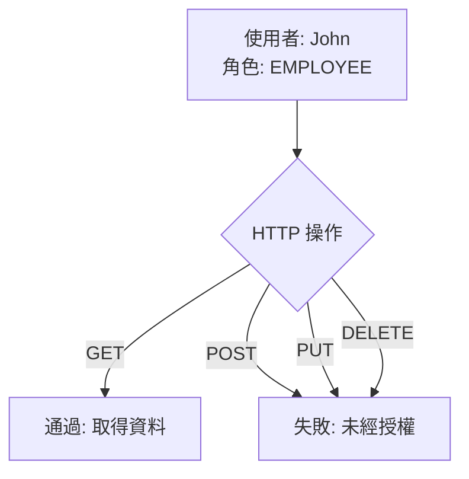

#### 測試案例：驗證取得所有員工 (Get All Employees)

使用具備 `EMPLOYEE` 角色的使用者進行測試：

- **測試設定**：
    - **端點**：`GET http://localhost:8080/api/employees`
    - **身分驗證方式**：Basic Auth
    - **帳號**：`john`
    - **密碼**：`test123`
- **測試結果**：
    - **狀態碼**：`200 OK`
    - **結論**：測試通過，該使用者已被授權存取此端點。

#### 測試案例：取得單一員工 (Get Single Employee)

接下來測試取得特定單一員工資料的端點，預期同樣會通過。

接著測試取得特定單一員工資料的端點，驗證其存取權限：

- **測試設定**：
    - **端點**：`GET http://localhost:8080/api/employees/1`
    - **身分驗證方式**：Basic Auth
        - **帳號**：`john`
        - **密碼**：`test123`
- **測試結果**：
    - **狀態碼**：`200 OK`
    - **結論**：測試通過，能夠成功存取該特定員工的資料。

#### 測試案例：驗證新增員工失敗 (Fail: Add Employee)

嘗試使用權限不足的使用者（John，角色為 EMPLOYEE）執行新增員工的操作，以驗證安全性設定是否生效。

- **測試設定**：
    - **HTTP 方法**：`POST`
    - **端點**：`http://localhost:8080/api/employees` (注意：新增資源時端點不包含特定 ID)
    - **身分驗證**：
        - **帳號**：`john`
        - **密碼**：`test123`
    - **請求主體 (Body)**：
        - 類型：`raw`
        - 格式：`JSON`
        - 內容範例：

```json
{
            "firstName": "Leslie",
            "lastName": "Andrews",
            "email": "leslie@luv2code.com"
          }
```

- **預期結果**：
    - **失敗**：因為 `EMPLOYEE` 角色僅被允許執行 `GET` 操作，不具備執行 `POST`（新增）的權限。


#### 測試案例細節：新增員工失敗之回應 (Fail: Add Employee Response)

在 Postman 中執行上述新增員工的 `POST` 請求後，觀察其回應結果：

- **狀態碼**：`403 Forbidden`
- **原因分析**：該錯誤碼表示伺服器理解請求，但拒絕執行。這證實了 Spring Security 的權限控制機制已正確攔截了不具備 `POST` 權限的 `EMPLOYEE` 角色請求。

#### 測試案例：驗證更新員工失敗 (Fail: Update employee)

延續先前的測試邏輯，接著測試使用權限不足的使用者執行更新操作，以確認其權限限制是否同樣生效。

- **測試設定**：
    - **HTTP 方法**：`PUT` (需將原有的 `POST` 改為 `PUT`)
    - **端點**：`http://localhost:8080/api/employees` (或針對特定 ID，例如 `http://localhost:8080/api/employees/1`)
    - **身分驗證**：
        - **帳號**：`john`
        - **密碼**：`test123`
- **預期結果**：
    - **失敗**：因為 `EMPLOYEE` 角色不具備執行 `PUT`（更新）的權限，預期會收到 `403 Forbidden` 錯誤。

嘗試使用權限不足的使用者（John，角色為 EMPLOYEE）執行更新操作，以確認其權限限制是否同樣生效。

- **測試設定**：
    - **HTTP 方法**：`PUT`
    - **端點**：`http://localhost:8080/api/employees`
    - **請求主體 (Body)**：
        - 類型：`raw`
        - 格式：`JSON`
        - 內容範例：

```json
{
  "id": 1,
  "firstName": "Matt",
  "lastName": "Lee",
  "email": "matt@luv2code.com"
}
```

    - **身分驗證**：
        - **帳號**：`john`
        - **密碼**：`test123`
- **預期結果**：
    - **失敗**：因為 `EMPLOYEE` 角色不具備執行 `PUT`（更新）的權限，預期會收到 `403 Forbidden` 錯誤。
- **實際結果**：
    - **狀態碼**：`403 Forbidden`
    - **原因分析**：證實了即便身分驗證成功，但由於該角色缺乏對應的授權 (Authorization)，系統仍能正確攔截未經授權的更新請求。

#### 測試案例：驗證刪除員工失敗 (Fail: Delete employee)

進行最後一個測試案例：嘗試使用不具備管理權限的使用者執行刪除操作。

- **測試設定**：
    - **HTTP 方法**：`DELETE`
    - **端點**：`http://localhost:8080/api/employees/4` (注意：執行刪除時必須在路徑中指定要刪除的資源 ID，例如 `/4`)
    - **身分驗證**：
        - **帳號**：`john`
        - **密碼**：`test123`
- **預期結果**：
    - **失敗**：因為根據安全性配置，只有 `ADMIN` 角色才被允許執行 `DELETE` 操作，`EMPLOYEE` 角色不具備此權限。

| 角色 (Role) | 允許的操作 (CRUD Actions) | 預期結果 |
| --- | --- | --- |
| EMPLOYEE | GET (Read all/single) | 通過 (Pass) |
|  | POST (Create) | 失敗 (Fail) |
|  | PUT (Update) | 失敗 (Fail) |
|  | DELETE (Delete) | 失敗 (Fail) |
| ADMIN | 所有操作 (GET, POST, PUT, DELETE) | 通過 (Pass) |

執行最後一個測試，確認權限限制在刪除操作上同樣有效。

- **測試設定**：
    - **HTTP 方法**：`DELETE`
    - **端點**：`http://localhost:8080/api/employees/4` (針對特定 ID)
    - **請求主體 (Body)**：`none` (刪除請求不需要傳送 Body)
    - **身分驗證 (Authorization)**：
        - 類型：`Basic Auth`
        - 帳號：`john`
        - 密碼：`test123`
- **預期結果**：
    - **失敗**：因為只有 `ADMIN` 角色具備刪除權限，`EMPLOYEE` 角色應該會被拒絕。
- **實際結果**：
    - **狀態碼**：`403 Forbidden`
    - **原因分析**：驗證成功，系統正確攔截了不具備 `ADMIN` 角色的使用者進行的刪除請求。

#### 測試案例：驗證 Manager 角色權限 (Test: Manager role)

測試 Manager 角色（例如使用者 Mary）在不同操作下的權限限制。

- **角色權限概覽**：
    - **Manager 角色**：
        - 允許：`GET` (所有/單一), `POST` (新增), `PUT` (更新)
        - 禁止：`DELETE` (刪除)
    - **Admin 角色**：
        - 允許：所有操作 (`GET`, `POST`, `PUT`, `DELETE`)

| 角色 (Role) | 允許的操作 (CRUD Actions) | 預期結果 |
| --- | --- | --- |
| MANAGER | GET, POST, PUT | 通過 (Pass) |
|  | DELETE | 失敗 (Fail) |
| ADMIN | 所有操作 | 通過 (Pass) |

- **測試案例：獲取所有員工 (Pass: Get all employees)**
    - **HTTP 方法**：`GET`
    - **端點**：`http://localhost:8080/api/employees`
    - **身分驗證 (Authorization)**：
        - 類型：`Basic Auth`
        - 帳號：`mary`
        - 密碼：`test123`
    - **實際結果**：
        - **狀態碼**：`200 OK`
        - **原因分析**：`MANAGER` 角色被允許執行 `GET` 操作，因此請求成功。

#### 測試案例：驗證 Manager 角色權限 (續)

繼續測試 Manager 角色（例如使用者 Mary）在其他操作下的權限限制。

- **測試案例：獲取單一員工 (Pass: Get single employee)**
    - **HTTP 方法**：`GET`
    - **端點**：`http://localhost:8080/api/employees/1` (針對特定 ID)
    - **身分驗證 (Authorization)**：
        - 類型：`Basic Auth`
        - 帳號：`mary`
        - 密碼：`test123`
    - **實際結果**：
        - **狀態碼**：`200 OK`
        - **原因分析**：`MANAGER` 角色被允許執行 `GET` 操作，因此請求成功。
- **測試案例：新增員工 (Pass: Add employee)**
    - **HTTP 方法**：`POST`
    - **端點**：`http://localhost:8080/api/employees`
    - **身分驗證 (Authorization)**：
        - 類型：`Basic Auth`
        - 帳號：`mary`
        - 密碼：`test123`
    - **實際結果**：
        - **狀態碼**：`200 OK`
        - **原因分析**：驗證 `MANAGER` 角色具備新增員工的權限。
- **測試案例：更新員工 (Pass: Update employee)**
    - **HTTP 方法**：`PUT`
    - **端點**：`http://localhost:8080/api/employees/1` (針對特定 ID)
    - **身分驗證 (Authorization)**：
        - 類型：`Basic Auth`
        - 帳號：`mary`
        - 密碼：`test123`
    - **實際結果**：
        - **狀態碼**：`200 OK`
        - **原因分析**：驗證 `MANAGER` 角色具備更新員工資訊的權限。
- **測試案例：更新員工 (Pass: Update employee)**
    - **HTTP 方法**：`PUT`
    - **端點**：`http://localhost:8080/api/employees/1`
    - **身分驗證 (Authorization)**：
        - 類型：`Basic Auth`
        - 帳號：`mary`
        - 密碼：`********`
    - **實際結果**：
        - **狀態碼**：`200 OK`
        - **原因分析**：由於使用者 `mary` 具備 `MANAGER` 角色，系統允許其執行更新操作。
- **測試案例：刪除員工 (預期失敗: Delete employee)**
    - **HTTP 方法**：`DELETE`
    - **端點**：`http://localhost:8080/api/employees/1`
    - **身分驗證 (Authorization)**：
        - 類型：`Basic Auth`
        - 帳號：`mary`
        - 密碼：`********`
    - **預期結果**：
        - **失敗**：因為 `MANAGER` 角色不具備 `ADMIN` 權限，應會被拒絕。

#### 測試案例：驗證 Admin 角色權限 (續)

切換至具有 `ADMIN` 角色的使用者進行測試，確認其能執行所有操作。

- **測試案例：刪除員工 (Fail: Delete employee)**
    - **HTTP 方法**：`DELETE`
    - **端點**：`http://localhost:8080/api/employees/1`
    - **身分驗證 (Authorization)**：
        - 類型：`Basic Auth`
        - 帳號：`mary`
        - 密碼：`********`
    - **實際結果**：
        - **狀態碼**：`403 Forbidden`
        - **原因分析**：雖然 `mary` 是 `MANAGER`，但 `MANAGER` 不具備 `ADMIN` 權限，因此無法執行刪除操作。
- **測試案例：獲取所有員工 (Pass: Get all employees)**
    - **HTTP 方法**：`GET`
    - **端點**：`http://localhost:8080/api/employees`
    - **身分驗證 (Authorization)**：
        - 類型：`Basic Auth`
        - 帳號：`susan`
        - 密碼：`test123`
    - **實際結果**：
        - **狀態碼**：`200 OK`
        - **原因分析**：`ADMIN` 角色具備所有操作權限，因此請求成功。

#### 測試案例：獲取單一員工 (Pass: Get single employee)

- **HTTP 方法**：`GET`
- **端點**：`http://localhost:8080/api/employees/1`
- **身分驗證 (Authorization)**：
    - 類型：`Basic Auth`
    - 帳號：`susan`
    - 密碼：`test123`
- **實際結果**：
    - **狀態碼**：`200 OK`
    - **原因分析**：驗證 `ADMIN` 角色具備讀取特定員工資訊的權限。

#### 測試案例：更新員工資訊 (Pass: Update employee)

- **HTTP 方法**：`PUT`
- **端點**：`http://localhost:8080/api/employees/1`
- **身分驗證 (Authorization)**：
    - 類型：`Basic Auth`
    - 帳號：`susan`
    - 密碼：`test123`
- **實際結果**：
    - **狀態碼**：`200 OK`
    - **原因分析**：成功更新了員工的 `username` 為 `Susan`。

#### 測試案例：新增員工 (準備階段)

- **準備動作**：修改請求主體 (Request Body) 以確保新增的是新員工，而非覆蓋舊資料。
- **新的請求內容 (JSON Body)**：

```json
{
    "id": 6,
    "firstName": "Matt",
    "lastName": "Lee",
    "email": "matt@luv2code.com"
  }
```

- **身分驗證設定**：
    - 帳號：`susan` (需具備 `MANAGER` 或 `ADMIN` 權限)
    - 密碼：`test123`

#### 測試案例：新增員工 (Pass: Add employee)

- **HTTP 方法**：`POST`
- **端點**：`http://localhost:8080/api/employees`
- **身分驗證 (Authorization)**：
    - 類型：`Basic Auth`
    - 帳號：`susan`
    - 密碼：`********`
- **實際結果**：
    - **狀態碼**：`201 Created`
    - **原因分析**：請求成功，新增了新員工資料。

#### 測試案例：更新員工資訊 (Pass: Update employee)

- **HTTP 方法**：`PUT`
- **端點**：`http://localhost:8080/api/employees/1`
- **身分驗證 (Authorization)**：
    - 類型：`Basic Auth`
    - 帳號：`susan`
    - 密碼：`********`
- **實際結果**：
    - **狀態碼**：`200 OK`
    - **原因分析**：成功將員工的 `username` 更新為 `Susan`。

#### 測試案例：刪除員工 (Pass: Delete employee)

- **HTTP 方法**：`DELETE`
- **端點**：`http://localhost:8080/api/employees/1`
- **身分驗證 (Authorization)**：
    - 類型：`Basic Auth`
    - 帳號：`susan`
    - 密碼：`********`
- **預期結果**：
    - **成功**：因為 `susan` 具備 `ADMIN` 角色，應能執行刪除操作。
- **實際結果**：
    - **狀態碼**：`200 OK`
    - **原因分析**：與先前 `mary`（`MANAGER` 角色）因權限不足導致 `403 Forbidden` 不同，`susan` 作為 `ADMIN` 成功執行了刪除動作。

#### 權限控制設計總結

透過一系列測試，確認了基於角色的權限限制 (Role-based access control) 已成功實作，各個角色的權限分佈如下：

| HTTP 方法 | 端點 (Endpoint) | CRUD 操作 | 允許的角色 (Roles) |
| --- | --- | --- | --- |
| GET | /api/employees | Read all | EMPLOYEE |
| GET | /api/employees/{employeeId} | Read single | EMPLOYEE |
| POST | /api/employees | Create | MANAGER |
| PUT | /api/employees/{employeeId} | Update | MANAGER |
| DELETE | /api/employees/{employeeId} | Delete employee | ADMIN |

- **設計驗證**：
    - `EMPLOYEE` 角色僅能進行讀取操作。
    - `MANAGER` 角色可進行讀取、新增與更新操作。
    - `ADMIN` 角色具備最高權限，可執行包含刪除在內的所有操作。

### Spring Data REST 的 PUT 請求注意事項

- **潛在問題**：在使用 Spring Data REST 時，執行 `PUT` 請求可能會遇到 `403 Forbidden` 錯誤
    - **原因**：在 Spring Data REST 中，資源的 ID 會直接包含在 URL 路徑中
        - URL 格式：`/api/employees/{employeeId}`
    - **影響**：由於 ID 出現在 URL 中，因此需要針對這種路徑結構修改 Spring Security 的配置
- **排除情況**：若開發者是使用本課程提供的 `RestController` 實作，則不會遇到此問題

### 解決 Spring Data REST 的 PUT 請求權限問題

- **問題背景**：在使用 Spring Data REST 時，`PUT` 請求的 URL 會包含資源 ID
    - 範例路徑：`/api/employees/{employeeId}`
    - 若安全性配置僅針對 `/api/employees`，則會導致帶有 ID 的請求被拒絕（`403 Forbidden`）
- **解決方案**：修改 `DemoSecurityConfig.java` 中的路徑匹配規則，使用 Ant 路徑匹配符 `/**`
    - **修改前**：

```java
.requestMatchers(HttpMethod.PUT, "/api/employees").hasRole("MANAGER")
```

    - **修改後**：

```java
.requestMatchers(HttpMethod.PUT, "/api/employees/**").hasRole("MANAGER")
```

    - **關鍵點**：使用 `/**` 是為了允許路徑後方帶有任何層級的 ID 或其他資訊，從而正確匹配 Spring Data REST 生成的端點

### 為 PATCH 請求新增角色權限限制

- **目標**：針對最近新增的 `PATCH` 方法（用於部分更新）實作安全性控制
- **權限設定**：僅允許具備 `MANAGER` 角色的使用者執行 `PATCH` 操作
- **實作方式**：在 `DemoSecurityConfig.java` 的 `requestMatchers` 中新增規則
    - **關鍵配置**：

```java
requestMatchers(HttpMethod.PATCH, "/api/employees/**").hasRole("MANAGER")
```

        - **為什麼要使用 \`/**\`？\*\*
            - 因為 `PATCH` 請求的端點通常會包含資源 ID（例如 `/api/employees/{employeeId}`）
            - 使用 `/**` 可以確保路徑匹配規則能覆蓋到所有層級的子路徑，否則會導致 `403 Forbidden` 錯誤

#### 權限配置對照表 (更新後)

| HTTP 方法 | 端點 (Endpoint) | CRUD 操作 | 允許的角色 (Roles) |
| --- | --- | --- | --- |
| GET | /api/employees | Read all | EMPLOYEE |
| GET | /api/employees/{employeeId} | Read single | EMPLOYEE |
| POST | /api/employees | Create | MANAGER |
| PUT | /api/employees/{employeeId} | Update | MANAGER |
| PATCH | /api/employees/{employeeId} | Partial Update | MANAGER |
| DELETE | /api/employees/{employeeId} | Delete employee | ADMIN |

### 配置 PATCH 請求的權限控制

- **目的**：確保只有具備 `MANAGER` 角色的使用者可以執行「部分更新 (Partial Update)」操作。
- **配置方式**：
    - 在 `SecurityFilterChain` 中使用 `requestMatchers` 定義 `PATCH` 方法。
    - 必須對路徑使用 `**` 語法以匹配路徑變數。

```java
requestMatchers(HttpMethod.PATCH, "/api/employees/**").hasRole("MANAGER")
```

- **關鍵技術點：\`**\` 語法\*\*
    - **功能**：用於匹配所有子路徑 (match on all sub-paths)。
    - **必要性**：由於 `PATCH` 請求通常會將 ID 作為路徑變數 (path variable) 傳送（例如 `/api/employees/1`），若僅配置 `/api/employees` 將無法匹配到這些帶有 ID 的請求，導致權限驗證失敗。

### 實作 PATCH 權限配置流程

- **實作步驟**：

    1. 開啟 `DemoSecurityConfig.java` 檔案。
    2. 定位至 `filterChain` 方法中負責授權請求 (`authorizeHttpRequests`) 的區塊。
    3. 參考現有的 `PUT` 請求配置，將其複製並修改為針對 `PATCH` 方法與對應的角色權限。

### 完成 PATCH 權限配置

- **最終配置內容**：
    - 在 `filterChain` 方法中新增了針對 `PATCH` 方法的規則。
    - 使用 `/**` 匹配所有子路徑，以支援路徑變數（如 Employee ID）。

```java
// 針對 PATCH 方法新增權限限制
.requestMatchers(HttpMethod.PATCH, "/api/employees/**").hasRole("MANAGER")
```

- **配置重點回顧**：
    - **路徑匹配**：使用 `"/api/employees/**"` 而非 `"/api/employees"`。
    - **原因**：因為 `PATCH` 請求通常會帶有 ID 作為路徑變數（例如 `/api/employees/1`），`**` 語法能確保這些子路徑也能正確匹配到權限規則。
- **下一步**：
    - 儲存檔案並執行應用程式，準備進入 Postman 測試階段。

#### 測試案例：驗證取得單一員工 (Get Single Employee)

- **測試目標**：驗證透過 GET 請求取得 ID 為 `1` 的員工資料是否成功。
- **測試配置 (Postman)**:
    - **HTTP Method**：`GET`
    - **Endpoint URL**：`http://localhost:8080/api/employees/1`
    - **Authorization (Basic Auth)**：
        - **Username**：`john`
        - **Password**：`test123`
- **權限驗證**：
    - 必須確認所使用的帳號（如 `john`）具備對應的 `EMPLOYEE` 角色，否則請求將會失敗。
- **測試目標**：驗證具備 `EMPLOYEE` 角色的使用者嘗試執行 `PATCH` 操作時，系統是否能正確攔截該請求。
- **測試配置 (Postman)**:
    - **HTTP Method**：`PATCH`
    - **Endpoint URL**：`http://localhost:8080/api/employees/1`
    - **Authorization (Basic Auth)**:
        - **Username**：`john`
        - **Password**：`test123`
- **預期結果**：
    - 請求應該會**失敗**。
    - **原因**：根據先前的權限配置，`PATCH` 請求僅允許擁有 `MANAGER` 角色的使用者執行，而 `john` 的角色僅為 `EMPLOYEE`。

#### 測試案例：驗證 PATCH 請求失敗 (Fail: Patch Employee)

- **測試目標**：驗證具備 `EMPLOYEE` 角色的使用者嘗試執行 `PATCH` 操作時，系統是否會正確攔截該請求。
- **測試配置 (Postman)**:
    - **HTTP Method**：`PATCH`
    - **Endpoint URL**：`http://localhost:8080/api/employees/1`
    - **Authorization (Basic Auth)**:
        - **Username**：`john`
        - **Password**：`test123`
    - **Body 設定**：
        - 選擇 `raw` 模式
        - 格式選擇 `JSON`
        - 內容範例：

```json
{
            "lastName": "Wally"
          }
```

- **執行結果**：
    - **狀態碼**：`403 Forbidden`
- **原因分析**：
    - 請求失敗是因為**權限不足 (Role mismatch)**。
    - 使用者 `john` 僅擁有 `EMPLOYEE` 角色，而該端點的 `PATCH` 操作要求 `MANAGER` 角色。

#### 測試案例：驗證 PATCH 請求成功 (Pass: Patch Employee)

- **測試目標**：驗證具備 `MANAGER` 角色的使用者能夠成功執行 `PATCH` 操作以更新員工資訊。
- **測試配置 (Postman)**:
    - **HTTP Method**：`PATCH`
    - **Endpoint URL**：`http://localhost:8080/api/employees/1`
    - **Authorization (Basic Auth)**:
        - **Username**：`mary` (具備 `MANAGER` 角色)
        - **Password**：`test123`
    - **Body 設定**:
        - **內容**：

```json
{
            "lastName": "Wally"
          }
```

- **執行結果**：
    - **狀態碼**：`200 OK` (或 Success)
- **原因分析**：
    - 請求成功是因為所使用的帳號 `mary` 擁有 `MANAGER` 角色，符合該端點對 `PATCH` 方法的權限要求。

| User ID | Password | Roles |
| --- | --- | --- |
| john | test123 | EMPLOYEE |
| mary | test123 | EMPLOYEE, MANAGER |
| susan | test123 | EMPLOYEE, MANAGER, ADMIN |

#### 測試案例：驗證 PATCH 請求成功 (Pass: Patch Employee)

- **測試目標**：驗證具備 `MANAGER` 角色的使用者嘗試執行 `PATCH` 操作時，系統是否能成功執行部分更新。
- **測試配置 (Postman)**:
    - **HTTP Method**：`PATCH`
    - **Endpoint URL**：`http://localhost:8080/api/employees/1`
    - **Authorization (Basic Auth)**:
        - **Username**：`mary`
        - **Password**：`test123`
    - **Body 設定**：
        - 選擇 `raw` 模式
        - 格式選擇 `JSON`
        - 內容範例：

```json
{
  "lastName": "Wally"
}
```

- **執行結果**：
    - **狀態碼**：`200 OK`
    - **回應內容**：
        - 成功執行了部分更新（partial update）。
        - 觀察回應的 JSON，員工的 `lastName` 已成功更新為 `Wally`。
- **成功原因**：
    - 使用者 `mary` 擁有 `MANAGER` 角色，符合先前為 `PATCH` 方法設定的權限要求。

## 使用資料庫儲存使用者帳號

- **目前的做法**：使用者帳號目前是硬編碼（hard-coded）在 Java 原始碼中，主要是為了保持簡單。
- **目標**：將使用者資訊移至資料庫中，實現資料庫存取（Database Access）。
- **Spring Security 的支援**：
    - Spring Security 內建支援（Out-of-the-box）從資料庫讀取使用者帳號資訊的功能。

### 回顧使用者角色 (Recall Our User Roles)

| User ID | Password | Roles |
| --- | --- | --- |
| john | test123 | EMPLOYEE |
| mary | test123 | EMPLOYEE, MANAGER |
| susan | test123 | EMPLOYEE, MANAGER, ADMIN |

### Spring Security 的資料庫支援方式

#### 預定義模式 (Out-of-the-box)

- **運作方式**：必須遵循 Spring Security 預定義的資料表結構 (predefined table schemas)
- **優點**：
    - Spring Security 會自動包含讀取資料庫所需的 JDBC 程式碼
    - 開發者幾乎不需要撰寫任何 JDBC 相關的 Java 程式碼
    - 僅需完成設定並建立對應的資料表，Spring Security 會在後台處理大部分繁重的作業

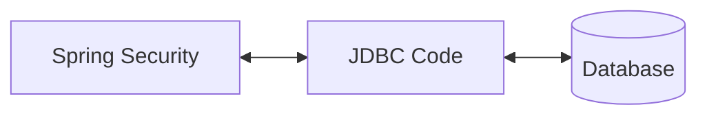

#### 自定義模式 (Customizing Database Access)

- **適用場景**：當專案有特定的自定義資料表需求時
- **開發責任**：開發者必須自行負責開發存取資料的程式碼
    - 例如使用 JDBC、JPA 或 Hibernate 等技術

### Spring Security 資料庫開發流程

為了利用 Spring Security 提供的預定義資料表結構（Out-of-the-box 功能）來讀取帳號與角色資訊，需遵循以下開發步驟：

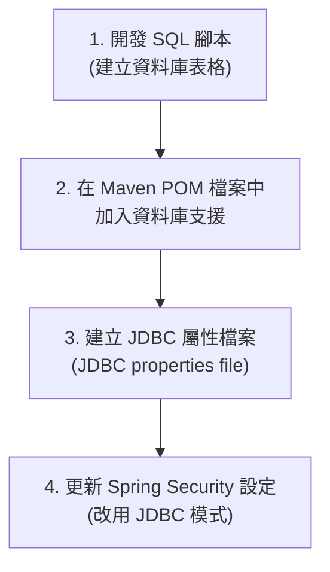

1. **開發 SQL 腳本**：建立符合 Spring Security 預定義模式的資料表結構。
2. **配置 Maven 依賴**：在 `pom.xml` 中新增相關的資料庫支援依賴項。
3. **建立 JDBC 屬性檔案**：定義資料庫連線資訊。
4. **更新安全性配置**：調整 Spring Security 的設定類別，使其透過 JDBC 存取資料庫。

### Spring Security 預定義資料表結構要求

若要使用 Spring Security 的預定義模式，必須建立兩個名稱完全一致的資料表，並包含特定的欄位：

| 資料表名稱 | 必備欄位 | 說明 |
| --- | --- | --- |
| users | username, password, enabled | 儲存使用者帳號資訊 |
| authorities | username, authority | 儲存使用者的權限/角色 |

- **關於 Authorities 的概念**
    - 在 Spring Security 的資料庫結構中，`authorities` 與我們常說的 `roles`（角色）在概念上是相同的或高度相關的。
- **嚴格性要求**
    - 資料表名稱（`users`, `authorities`）與欄位名稱必須與預定義規範完全一致，不可隨意更改。

### 開發 SQL 腳本以建立資料表

為了實作資料庫存取，需建立符合 Spring Security 規範的兩個資料表：`users` 與 `authorities`。

#### 建立 `users` 資料表

使用以下 SQL 語法建立 `users` 表，必須包含特定的欄位名稱與型態：

```sql
CREATE TABLE `users` (
    `username` varchar(50) NOT NULL,
    `password` varchar(50) NOT NULL,
    `enabled` tinyint NOT NULL,
    PRIMARY KEY (`username`)
) ENGINE=InnoDB DEFAULT CHARSET=latin1;
```

#### 插入初始使用者資料

將預先定義的使用者（John, Mary, Susan）寫入資料庫。在此範例中，密碼使用 `{noop}` 前綴，表示使用純文字形式儲存：

```sql
INSERT INTO `users`
VALUES
('john', '{noop}test123', 1),
('mary', '{noop}test123', 1),
('susan', '{noop}test123', 1);
```

- **欄位說明**
    - `username`：使用者帳號，同時作為主鍵 (Primary Key)
    - `password`：加密後或純文字的密碼
    - `enabled`：表示帳號是否啟用（1 為啟用）

### 密碼儲存格式解析

在插入使用者資料時，密碼欄位的內容由兩部分組成：

- **編碼演算法 ID (Encoding Algorithm ID)**：位於大括號 `{}` 中，告知 Spring Security 如何解碼該密碼
    - 例如 `{noop}` 表示該密碼為純文字 (Plain Text)，不需經過加密演算法處理
- **密碼內容 (The Password)**：實際的密碼字串

> **注意**：在開發初期為了方便測試，會使用 `{noop}` 儲存純文字密碼；但在正式生產環境中，應改用更安全的加密方式（如 `BCrypt`）。

### 建立 `authorities` 資料表

為了將角色/權限與使用者關聯，需建立 `authorities` 資料表。該表的核心結構如下：

| 欄位名稱 | 型態 | 說明 |
| --- | --- | --- |
| username | VARCHAR(50) | 關聯至 users 表的使用者帳號 |
| authority | VARCHAR(50) | 使用者所擁有的權限或角色名稱 |

#### 資料表約束 (Constraints)

為了確保資料的一致性與完整性，需設定以下約束：

- **唯一鍵 (Unique Key)**：針對 `username` 與 `authority` 的組合設定唯一鍵，防止同一個使用者被重複賦予相同的權限。
- **外鍵 (Foreign Key)**：
    - `username` 欄位必須作為外鍵指向 `users` 表的 `username` 欄位
    - **目的**：確保權限資料必須隸屬於一個真實存在的用戶

```sql
CREATE TABLE `authorities` (
    `username` varchar(50) NOT NULL,
    `authority` varchar(50) NOT NULL,
    UNIQUE KEY `authorities_idx_1` (`username`, `authority`),
    CONSTRAINT `authorities_ibfk_1` FOREIGN KEY (`username`) REFERENCES `users` (`username`)
) ENGINE=InnoDB DEFAULT CHARSET=latin1;
```

### 插入使用者角色 (Inserting User Roles)

在建立好 `users` 與 `authorities` 資料表後，下一步是將具體的使用者與其對應的角色關聯起來。在此情境下，`authorities` 資料表中的內容等同於我們所說的 `roles`。

#### 插入權限資料範例

透過 `INSERT INTO` 語法，將不同使用者分配至其對應的角色：

```sql
INSERT INTO `authorities`
VALUES
('john', 'ROLE_EMPLOYEE'),
('mary', 'ROLE_EMPLOYEE'),
('mary', 'ROLE_MANAGER'),
('susan', 'ROLE_EMPLOYEE'),
('susan', 'ROLE_MANAGER'),
('susan', 'ROLE_ADMIN');
```

- **角色分配細節**
    - **John**：僅具備 `EMPLOYEE` 角色
    - **Mary**：具備 `EMPLOYEE` 與 `MANAGER` 雙重角色
    - **Susan**：具備 `EMPLOYEE`、`MANAGER` 與 `ADMIN` 三種角色

#### Spring Security 的角色命名規範

- **`ROLE_`&#32;前綴**
    - 在實作時，雖然資料庫中存儲的是角色名稱，但 Spring Security 在內部處理時，會預期角色名稱帶有 `ROLE_` 前綴。
    - 例如：在資料庫存入 `ROLE_MANAGER`，Spring Security 才能正確識別其為一個角色權限。

### 實作 Spring Security 資料庫支援 (Database Support)

將使用者資訊從程式碼中的 In-Memory 模式遷移至資料庫，需遵循以下步驟：

#### Step 2: 在 Maven `pom.xml` 中新增資料庫支援

- 需加入對應資料庫的 JDBC 驅動程式依賴（例如 MySQL）
- **[範例配置]**

```xml
<!-- MySQL -->
  <dependency>
      <groupId>com.mysql</groupId>
      <artifactId>mysql-connector-j</artifactId>
      <scope>runtime</scope>
  </dependency>
```

#### Step 3: 建立 JDBC 屬性檔

- 在 `application.properties` 中定義資料庫連線資訊
- **[說明]**：由於安全相關的資料表（如 `users` 與 `authorities`）會存放在現有的員工目錄資料庫架構 (Schema) 中，因此可以直接複用現有的連線設定
- **`application.properties`&#32;內容範例**：

```properties
spring.datasource.url=jdbc:mysql://localhost:3306/employee_directory
  spring.datasource.username=springstudent
  spring.datasource.password=springstudent
```

#### Step 4: 更新 Spring Security 配置以使用 JDBC

- 修改安全性配置類別，將 `UserDetailsManager` 的實作從 In-Memory 切換為 `JdbcUserDetailsManager`
- **[實作方式]**：透過注入 `DataSource` 並回傳一個新的 `JdbcUserDetailsManager` 實例
- \`\`\`java

  @Configuration

  public class DemoSecurityConfig {

      @Bean

      public UserDetailsManager userDetailsManager(DataSource dataSource) {

          return new JdbcUserDetailsManager(dataSource);

      }

  }

  \`\`\`

### 更新 Spring Security 以使用 JDBC (Step 4: Update Spring Security to use JDBC)

透過使用 JDBC 驗證，我們可以將使用者管理從程式碼中解耦，改為從資料庫中動態讀取。

#### 實作程式碼範例

```java
@Configuration
public class DemoSecurityConfig {

    @Bean
    public UserDetailsManager userDetailsManager(DataSource dataSource) {
        return new JdbcUserDetailsManager(dataSource);
    }

}
```

- **關鍵機制**
    - **注入 DataSource**：利用 Spring Boot 自動配置的 `DataSource` 實例
    - **使用 JdbcUserDetailsManager**：告訴 Spring Security 使用 JDBC 驗證方式並傳入資料來源
- **[優點] 不再需要硬編碼使用者 (No longer hard-coding users)**
    - 系統會直接從資料庫中讀取使用者與角色資訊
    - **自動化處理**：只要我們遵循標準的資料表 Schema（包含正確的資料表名稱與欄位名稱），Spring Security 就會自動處理讀取使用者、密碼及角色等所有底層繁瑣工作

#### 實作 JDBC 身份驗證 (Implementing JDBC Authentication)

透過將 Spring Security 連結至資料庫，我們可以動態管理使用者，而不再需要在程式碼中硬編碼 (hard-coding) 使用者資訊。

- **核心實作邏輯**
    - 注入由 Spring Boot 自動配置的 `DataSource`
    - 告訴 Spring Security 使用該 `DataSource` 進行 JDBC 身份驗證
- **配置程式碼範例**

```java
@Configuration
public class DemoSecurityConfig {

    @Bean
    public UserDetailsManager userDetailsManager(DataSource dataSource) {
        // 透過注入的 dataSource 建立 JdbcUserDetailsManager
        // 這讓 Spring Security 改從資料庫讀取使用者與角色資訊
        return new JdbcUserDetailsManager(dataSource);
    }
}
```

### 執行安全性資料庫設定腳本

為了讓 Spring Security 能夠正常運作，必須先建立存放使用者與權限資訊的資料表。

- **使用的腳本檔案**
    - 檔案路徑：`sql-scripts/04-setup-spring-security-demo-database-plaintext.sql`
    - **[功能]**：此腳本會自動設定好用於 plain text（明文）密碼測試環境的資料庫表格結構
- **實作步驟**

    1. 開啟 **MySQL Workbench**
    2. 登入資料庫實例（例如 `springstudent` @ `127.0.0.1:3306`）
    3. 使用 `File` > `Open SQL Script...` 功能載入上述 `.sql` 檔案
    4. 執行腳本以完成表格建立

### 重設資料庫表格實作 (Database Refresh Implementation)

為了確保開發環境回到乾淨且穩定的初始狀態，可以使用預先準備好的 SQL 腳本來重置資料表。

- **操作流程**
    - 在 **MySQL Workbench** 中，透過 `File` > `Open SQL Script...` 開啟腳本檔案
    - 選擇目標檔案：`sql-scripts/04-setup-spring-security-demo-database-plaintext.sql`
- **腳本核心邏輯**
    - **切換資料庫**：使用 `USE `employee_directory`;\` 確保操作正確的 schema
    - **清除舊資料**：透過 `DROP TABLE IF EXISTS` 指令刪除現有的權限與使用者表格，避免結構衝突

```sql
USE `employee_directory`;

DROP TABLE IF EXISTS `authorities`;
DROP TABLE IF EXISTS `users`;

-- 接下來會建立新的表格結構
CREATE TABLE `users` (
    `username` varchar(50) NOT NULL,
    `password` varchar(50) NOT NULL,
    `enabled` tinyint NOT NULL,
    PRIMARY KEY (`username`)
);
```

### 建立使用者資料表與測試資料

為了讓 JDBC 身份驗證能正確運作，必須建立與 Spring Security 預定義 Schema 完全一致的資料表。

- **`users`&#32;資料表結構**
    - 必須包含以下欄位，且名稱必須精確匹配：
        - `username` (varchar)
        - `password` (varchar)
        - `enabled` (tinyint)

```sql
CREATE TABLE `users` (
    `username` varchar(50) NOT NULL,
    `password` varchar(50) NOT NULL,
    `enabled` tinyint NOT NULL,
    PRIMARY KEY (`username`)
) ENGINE=InnoDB DEFAULT CHARSET=latin1;
```

- **插入測試使用者與密碼格式**
    - **[關鍵] 密碼加密格式**：在 SQL 中插入密碼時，需使用 `{encoding_id}password` 的格式。例如 `{noop}test123` 代表使用 `noop`（無運算/明文）演算法。
    - **測試資料內容**

| User ID | Password (含加密 ID) |
| --- | --- |
| john | {noop}test123 |
| mary | {noop}test123 |
| susan | {noop}test123 |

```sql
INSERT INTO `users` VALUES
('john', '{noop}test123', 1),
('mary', '{noop}test123', 1),
('susan', '{noop}test123', 1);
```

### 建立權限資料表 (Authorities Table)

除了使用者資訊外，還需要建立一個用於存放權限（Authorities）的資料表。

- **`authorities`&#32;資料表結構**
    - `username`: 指向 `users` 資料表的使用者名稱
    - `authority`: 存放該使用者的權限或角色名稱
- **[關鍵概念] Authorities vs. Roles**
    - 在 Spring Security 的語境下，`authorities` 與 `roles` 的概念基本上是相同的或高度相關的。

```sql
CREATE TABLE `authorities` (
    `username` varchar(50) NOT NULL,
    `authority` varchar(50) NOT NULL,
    UNIQUE KEY `authorities_idx_1` (`username`, `authority`),
    CONSTRAINT `authorities_ibfk_1` FOREIGN KEY (`username`) REFERENCES `users` (`username`)
) ENGINE=InnoDB DEFAULT CHARSET=latin1;
```

### 插入使用者角色與前綴規則

透過插入資料來為特定使用者分配多個角色。

- **角色前綴規則 (Role Prefixing)**
    - **[重要]** Spring Security 在內部處理角色時，會自動為每個角色名稱加上 `ROLE_` 前綴。
    - 因此，在資料庫中儲存時，必須包含此前綴（例如：`ROLE_EMPLOYEE` 而非僅 `EMPLOYEE`）。
- **測試資料分配範例**

| User ID | 擁有的角色 (含 ROLE_ 前綴) |
| --- | --- |
| john | ROLE_EMPLOYEE |
| mary | ROLE_EMPLOYEE, ROLE_MANAGER |
| susan | ROLE_EMPLOYEE, ROLE_MANAGER, ROLE_ADMIN |

```sql
INSERT INTO `authorities` VALUES
('john', 'ROLE_EMPLOYEE'),
('mary', 'ROLE_EMPLOYEE'),
('mary', 'ROLE_MANAGER'),
('susan', 'ROLE_EMPLOYEE'),
('susan', 'ROLE_MANAGER'),
('susan', 'ROLE_ADMIN');
```

### 驗證資料庫建立結果

執行 SQL 腳本後，需重新整理資料庫結構以確保新建立的資料表已出現在列表中。

- **確認資料表存在**
    - 成功建立 `users` 資料表
    - 成功建立 `authorities` 資料表
- **驗證使用者資料 (`users`&#32;table)**
    - 透過查詢，確認已成功插入測試使用者：
        - `john`
        - `mary`
        - `susan`
- **驗證權限分配 (`authorities`&#32;table)**
    - 透過查詢 `authorities` 資料表，確認每個使用者皆已分配正確的角色（必須包含 `ROLE_` 前綴）。

| User ID | Roles (含 ROLE_ 前綴) |
| --- | --- |
| john | ROLE_EMPLOYEE |
| mary | ROLE_EMPLOYEE, ROLE_MANAGER |
| susan | ROLE_EMPLOYEE, ROLE_MANAGER, ROLE_ADMIN |

### 使用 MySQL Workbench 產生資料庫圖表

- **[目的]** 視覺化呈現不同資料表之間的關聯性 (Relationships)
- **[操作流程]**

    1. 在選單中選擇 `Reverse Engineer`
    2. 選擇對應的連線 (Connection) 並登入
    3. 選擇要包含的資料庫架構 (Schema)，例如 `employee_directory`
    4. 依照指示完成後，系統會自動生成資料庫圖表

### 驗證反向工程結果 (Verifying Reverse Engineering Results)

執行完畢後，透過 MySQL Workbench 的 EER Diagram 視覺化確認資料庫中的資料表結構與關聯。

- **現有的資料表**
    - `employee`: 原有的員工資料表
    - `users`: 安全性相關的使用者資料表
    - `authorities`: 存放權限資訊的資料表
- **[資料表關聯性]**
    - `users` 與 `authorities` 之間存在關聯性
    - 一個使用者可以擁有多個權限或角色 (One-to-Many relationship)

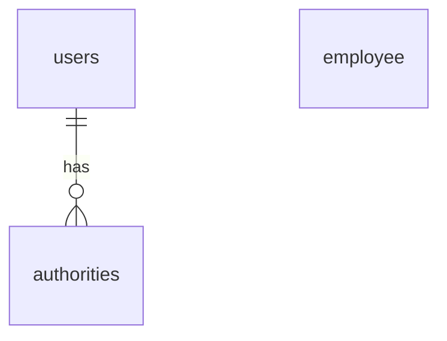

### 驗證資料庫內容

在進入程式碼實作階段前，透過 SQL 查詢確認資料庫中的使用者與權限資料已正確就緒。

- **使用者資料驗證 (`users`&#32;資料表)**
    - 確認已成功插入測試帳號：`john`、`mary`、`susan`
    - 每個帳號皆具備正確的密碼（如 `{noop}test123`）與啟用狀態 (`enabled = 1`)
- **權限分配驗證 (`authorities`&#32;資料表)**
    - 確認角色已正確關聯至對應的使用者

| username | password | enabled |
| --- | --- | --- |
| john | {noop}test123 | 1 |
| mary | {noop}test123 | 1 |
| susan | {noop}test123 | 1 |

### 更新 Spring Security 配置以使用 JDBC

- **[目標]** 將使用者管理方式從硬編碼（In-Memory）切換為透過 JDBC 從資料庫讀取
- **[實作步驟]**
    - 開啟 `DemoSecurityConfig` 類別
    - 註釋掉原本用於硬編碼使用者的程式碼段落，不再使用 `InMemoryUserDetailsManager` 來手動定義使用者資訊

```java
// 註釋掉硬編碼的使用者定義，準備改用 JDBC
/*
@Bean
public InMemoryUserDetailsManager userDetailsManager() {
    UserDetails john = User.builder()
        .username("john")
        .password("{noop}test123")
        .roles("EMPLOYEE")
        .build();

    UserDetails mary = User.builder()
        .username("mary")
        .password("{noop}test123")
        .roles("EMPLOYEE", "MANAGER")
        .build();

    UserDetails susan = User.builder()
        .username("susan")
        .password("{noop}test123")
        .roles("EMPLOYEE", "MANAGER", "ADMIN")
        .build();

    return new InMemoryUserDetailsManager(john, mary, susan);
}
*/
```

### 整理 `DemoSecurityConfig` 類別結構

- **[重構動作]** 將原本用於硬編碼使用者的 `userDetailsManager` 方法進行註釋，並將其移動到類別的最末端
    - **[目的]** 避免舊程式碼干擾主要的安全性配置邏輯，同時保留程式碼作為參考，而非直接刪除
- **[程式碼整理]**
    - 執行 `CUT` 與 `PASTE` 操作將方法移至末端
    - 重新整理檔案上方的 `import` 語句，以確保移除舊方法後不再引用不必要的類別

### 實作 JDBC 使用者管理 (Implementing JDBC User Management)

- **[開發目標]** 建立對 JDBC 的支援，以取代目前手動定義的硬編碼使用者資訊
- **[實作計畫]** 在 `DemoSecurityConfig` 類別中建立一個回傳 `UserDetailsManager` 的 `@Bean`

```java
// add support for JDBC ... no more hardcoded users :-

@Bean
public UserDetailsManager userDetailsManager() {
    // 即將在此實作 JDBC 邏輯
}
```

### 使用 `JdbcUserDetailsManager` 實作 JDBC 驗證

- **[實作方式]** 修改 `userDetailsManager` 方法，使其接收一個 `DataSource` 參數
    - **[注入機制]** 利用 Spring Boot 自動配置的 `DataSource` 來建立 JDBC 支援
    - **[關鍵類別]** 使用 `JdbcUserDetailsManager` 來取代原本的 `InMemoryUserDetailsManager`

```java
@Bean
public UserDetailsManager userDetailsManager(DataSource dataSource) {
    return new JdbcUserDetailsManager(dataSource);
}
```

- **[運作原理]** 當使用 `JdbcUserDetailsManager` 時，Spring Security 會預期資料庫中存在符合其預定義 Schema 的表格
    - **[預設表格結構]** Spring Security 會自動尋找並使用以下表格進行身分驗證與權限檢查：

| users 表格欄位 | authorities 表格欄位 |
| --- | --- |
| username (VARCHAR(50)) | username (VARCHAR(50)) |
| password (VARCHAR(50)) | authority (VARCHAR(50)) |
| enabled (TINYINT) |  |

### 使用 JDBC 管理使用者的優勢

- **[核心優點]** 擺脫硬編碼 (Hardcoding)
    - 使用 `JdbcUserDetailsManager` 後，不再需要在程式碼中手動定義使用者資訊
    - 所有使用者帳號、密碼與角色資訊都直接儲存在資料庫中，更具靈活性與擴展性

### 測試案例：獲取所有員工 (Pass: Get all employees)

- **[測試步驟]** 使用 Postman 進行身份驗證測試
    - **[請求類型]** `GET`
    - **[請求路徑]** `http://localhost:8080/api/employees`
    - **[身份驗證配置]**
        - 選擇 **Authorization** 標籤
        - 類型選擇 **Basic Auth**
        - 輸入使用者資訊：
            - Username: `john`
            - Password: `test123`
- **[測試結果]** 請求成功執行
    - **[HTTP 狀態碼]** `200 OK`
    - **[回應內容]** 成功回傳員工列表的 JSON 資料

### 驗證 JDBC 使用者管理是否生效

- **[驗證目的]** 確認 Spring Security 確實是從資料庫讀取使用者資訊，而非使用記憶體中的硬編碼資料
- **[測試步驟]** 在資料庫管理工具中手動修改使用者密碼
    - **[目標使用者]** `john`
    - **[修改動作]** 將密碼更改為 `ABC123`
    - **[執行操作]** 點擊 **Apply** 按鈕以套用變更
- **[SQL 執行結果]** 系統會生成並執行類似以下的更新語句：

```sql
UPDATE employee_directory.users SET password = 'ABC123' WHERE username = 'john';
```

- **[預期效果]** 修改後，必須使用新的密碼才能通過 Spring Security 的身份驗證，這證明了系統已成功整合 JDBC 管理機制

### 驗證 JDBC 使用者管理是否生效 (後續測試)

- **[驗證流程]** 使用修改後的密碼重新進行身份驗證測試
    - **[目標使用者]** `john`
    - **[新密碼]** `ABC123` (已透過 MySQL Workbench 套用)
    - **[測試動作]** 在 Postman 中使用**舊密碼** `test123` 再次發送請求
- **[測試結果]** 身份驗證失敗
    - **[HTTP 狀態碼]** `401 Unauthorized`
    - **[結論]** 驗證成功。這證明了 Spring Security 確實是在檢查資料庫中的最新密碼，而非使用原本記憶體中的舊資訊。

### JDBC 驗證的即時性特性

- **[核心機制]** Spring Security 在處理每次登入請求時，都會直接向資料庫發送查詢
    - **[優勢]** 修改資料庫中的使用者資訊（如密碼）後，變更會立即生效
    - **[無需重啟]** 不需要停止並重新啟動 Spring Boot 應用程式即可套用新的安全性設定

### 測試案例：驗證新密碼 (Pass: Success)

- **[測試步驟]** 使用剛剛在資料庫中更新過的密碼進行身份驗證
    - **[目標使用者]** `john`
    - **[新密碼]** `abc123` (已透過 MySQL Workbench 套用)
    - **[測試動作]** 在 Postman 中使用**新密碼** `abc123` 再次發送請求
- **[測試結果]** 身份驗證成功
    - **[HTTP 狀態碼]** `200 OK` (或成功取得資源)
    - **[結論]** 完整驗證了 Spring Security JDBC 使用者管理機制已按預期運作，系統能正確讀取資料庫中的即時資訊。

### 測試案例：驗證刪除權限 (Fail: Delete Employee)

- **[測試目的]** 確認具有 `EMPLOYEE` 角色的使用者無法執行 `DELETE` 操作
- **[測試步驟]** 使用 Postman 進行權限測試
    - **[請求類型]** `DELETE`
    - **[請求路徑]** `http://localhost:8080/api/employees/1`
    - **[身份驗證配置]**
        - **[使用者]** `john`
        - **[密碼]** `abc123` (具備 `EMPLOYEE` 角色)
- **[測試結果]** 請求被拒絕
    - **[HTTP 狀態碼]** `403 Forbidden`
- **[核心概念：身份驗證 vs. 授權]**
    - **[身份驗證 (Authenticated)]** 已通過。因為使用者提供的帳號與密碼是正確的，系統確認了「你是誰」。
    - **[授權 (Authorized)]** 未通過。雖然系統知道你是 `john`，但根據安全配置，`EMPLOYEE` 角色不具備執行 `DELETE` 的權限。只有 `ADMIN` 角色才能執行此操作。

### 測試案例：驗證 Mary 的刪除權限 (Fail: Delete Mary)

- **[測試目的]** 確認具有 `MANAGER` 角色的使用者無法執行刪除操作
- **[測試步驟]** 使用 Postman 進行權限測試
    - **[請求類型]** `DELETE`
    - **[身份驗證配置]**
        - **[使用者]** `mary`
        - **[密碼]** `test123` (具備 `MANAGER` 角色)
- **[測試結果]** 請求被拒絕
    - **[HTTP 狀態碼]** `403 Forbidden`
    - **[原因]** 因為 `MARY` 僅具備 `MANAGER` 角色，並不具備執行刪除操作所需的 `ADMIN` 角色權限

### 測試案例：驗證 Admin 角色權限 (續)

- **[測試目的]** 確認具有 `ADMIN` 角色的使用者可以成功執行刪除操作
- **[測試步驟]** 使用 Postman 進行權限測試
    - **[請求類型]** `DELETE`
    - **[身份驗證配置]**
        - **[使用者]** `susan`
        - **[密碼]** `test123` (具備 `ADMIN` 角色)
- **[預期效果]** 由於 `SUSAN` 擁有 `ADMIN` 角色，系統應允許其執行刪除動作

### 測試案例：驗證刪除權限 (Pass: Delete Employee)

- **[測試動作]** 使用具有 `ADMIN` 權限的使用者執行刪除操作
    - **[請求類型]** `DELETE`
    - **[請求路徑]** `http://localhost:8080/api/employees/1`
    - **[身份驗證配置]**
        - **[使用者]** `susan`
        - **[密碼]** `test123` (具備 `ADMIN` 角色)
- **[測試結果]** 請求成功
    - **[HTTP 狀態碼]** `200 OK`
    - **[回應內容]** `Deleted employee id - 1`

---

### 開發環境維護：重設測試密碼

- **[操作目的]** 為了方便記憶與後續測試，將測試帳號 `john` 的密碼重設為預設值
- **[執行工具]** MySQL Workbench
- **[修改步驟]**

    1. 在 `users` 資料表中找到 `username` 為 `john` 的紀錄
    2. 將 `password` 欄位的值修改為 `{noop}test123`
    3. 點擊 **Apply** 以套用變更

- **[核心進展：從硬編碼轉向 JDBC]**
    - **[舊模式]** 使用者資訊直接寫死在程式碼中 (Hard-coded)
    - **[新模式]** 使用者資訊儲存在資料庫中 (JDBC Authentication)
    - **[優勢]** 系統現在完全依賴資料庫中的 `users` 與 `authorities` 資料表來進行身分驗證與權限檢查

### JDBC 驗證的優勢

- **[核心變革]** JDBC 驗證的運作成功，實現了「不再需要硬編碼使用者 (No more hard-coded users)」
    - **[管理方式]** 使用者資訊（如帳號、密碼、角色）現在直接儲存在資料庫中
    - **[開發效益]** 這種方式讓系統更具彈性，管理員可以直接透過 SQL 操作來增刪改查使用者，而無需修改並重新部署程式碼

### Spring Security 密碼加密 (Password Encryption)

- **[現況]** 目前使用者的密碼是以明文 (plain text) 形式儲存
    - **[風險]** 這種做法僅適用於初步開發階段，不符合生產環境 (production) 的安全標準
- **[最佳實踐 (Best Practice)]** 應將密碼以加密格式 (encrypted format) 儲存於資料庫中
    - **[安全性提升]** 若資料庫遭到駭客入侵，由於密碼已被加密，駭客將無法得知原始的明文密碼

| username | password | enabled |
| --- | --- | --- |
| john | {bcrypt}$2a$10$qeS0HEh7urweMojsnwNAR.vcXJeXR1UcMRZ2WcGQ19YeuspUdgF.q | 1 |
| mary | {bcrypt}$2a$10$qeS0HEh7urweMojsnwNAR.vcXJeXR1UcMRZ2WcGQ19YeuspUdgF.q | 1 |
| susan | {bcrypt}$2a$10$qeS0HEh7urweMojsnwNAR.vcXJeXR1UcMRZ2WcGQ19YeuspUdgF.q | 1 |

- **[加密範例]** 如上表所示，密碼不再是 `{noop}test123` 這種易讀格式，而是呈現為一段無法直接還原的加密字串

### Spring Security 團隊推薦：bcrypt 演算法

- **[推薦演算法]** Spring Security 團隊建議使用廣受歡迎的 `bcrypt` 演算法
- **[bcrypt 的特性]**
    - **執行單向加密雜湊 (One-way encrypted hashing)**
        - **[特性]** 雜湊過程是不可逆的，無法從雜湊值還原出原始密碼
    - **加入隨機鹽值 (Random salt)**
        - **[目的]** 為密碼增加額外的保護層，增加破解難度
    - **具備防禦暴力破解 (Brute force attacks) 的支援**
- **[進一步學習資源]**
    - **為什麼應該使用 bcrypt 來雜湊密碼**
        - `www.luv2code.com/why-bcrypt`
    - **詳細的 bcrypt 演算法分析**
        - `www.luv2code.com/bcrypt-wiki-page`

### 如何獲取 bcrypt 密碼

- **[情境]** 當你擁有一個明文密碼 (plaintext password)，但需要將其轉換為 bcrypt 加密格式時
- **[選項 1]** 使用線上網站工具 (website utility) 來執行加密程序

### 如何獲取 bcrypt 密碼 (續)

- **[獲取密碼的兩種方式]**
    - **選項 1：使用線上工具 (Website Utility)**
        - 透過瀏覽器訪問特定的加密網站來完成轉換
    - **選項 2：撰寫 Java 程式碼 (Write Java Code)**
        - 使用程式邏輯來執行加密程序（將在後續課程中討論）
- **[使用線上工具的步驟]**

    1. 訪問網站：`www.luv2code.com/generate-bcrypt-password`
    2. 輸入您的明文密碼 (Plaintext password)
    3. 網站將自動為您生成對應的 bcrypt 加密密碼

### 使用線上工具生成 bcrypt 密碼 (實作演示)

- **[操作流程]** 使用 `www.luv2code.com/generate-bcrypt-password` 進行轉換
    - **步驟 1**：在「Enter a password for hashing」欄位輸入明文密碼（例如 `test123`）
    - **步驟 2**：點擊「Calculate」按鈕
    - **步驟 3**：從「Password hash result」欄位複製生成的加密字串
- **[範例結果]**
    - **輸入明文**：`test123`
    - **生成加密值**：`$2a$10$TccjJH0jsMFVU8xz9Xu9GqU/MdD36Jmlw6Oa2ecO16llj5HJH.`
- **[重要特性：隨機鹽值 (Random Salting)]**
    - **[現象]** 即使輸入相同的明文密碼，每次點擊「Calculate」產生的加密結果都會不同
    - **[原因]** 因為 bcrypt 在雜湊過程中會加入隨機的鹽值 (salt)，這增加了安全性，防止攻擊者使用預先計算好的雜湊表 (Rainbow Tables) 進行破解

### 密碼鹽值 (Password Salting) 的深入理解

- **[核心概念]** 鹽值 (Salting) 是指在密碼中加入一段隨機的數據 (random bits of data)
- **[作用]** 使密碼變得獨一無二 (unique)
- **[現象]** 即使使用相同的明文密碼進行多次加密，產生的結果也會不同
    - **[實作觀察]** 以 `test123` 為例，多次點擊「Calculate」按鈕會得到不同的雜湊結果
    - **[原因]** 這是因為每次生成的隨機鹽值不同，導致最終的加密字串也隨之改變

### 將 bcrypt 密碼應用於資料庫

- **[應用場景]** 將生成的加密密碼直接添加到資料庫的使用者帳戶中
- **[主要優點]** 可以直接為使用者帳戶進行「種子設定 (seeding)」，確保資料庫中的密碼從一開始就是加密過的狀態

### Spring Security 開發流程實作步驟

- **[開發重點]** 這主要是一個配置 (configuration) 的過程，不需要修改之前已經建立過的 Java 原始碼，現有的程式碼會直接支援加密功能
- **[必要步驟]**

    1. 執行包含加密密碼 (encrypted passwords) 的 SQL 腳本
    2. 修改密碼欄位的 DDL (Data Definition Language)

        - **[原因]** 因為加密後的密碼長度較長，欄位長度必須設定為 **68 個字元**

### Spring Security 密碼儲存格式

- **[儲存格式]** 在 Spring Security 中，密碼是以特定的格式儲存在資料庫中
- **[格式結構]** `{bcrypt}encodedPassword`
    - `{bcrypt}`：標示該密碼是使用 bcrypt 演算法加密的
    - `encodedPassword`：實際的加密雜湊值
- **[資料庫實例觀察]**

| username | password | enabled |
| --- | --- | --- |
| john | {bcrypt}$2a$10$qeS0HE7urweMojsnwNAR.vcXJeXR1UcMRZ2WcGQl9YeuspUdgF.q | 1 |
| mary | {bcrypt}$2a$10$qeS0HE7urweMojsnwNAR.vcXJeXR1UcMRZ2WcGQl9YeuspUdgF.q | 1 |
| susan | {bcrypt}$2a$10$qeS0HE7urweMojsnwNAR.vcXJeXR1UcMRZ2WcGQl9YeuspUdgF.q | 1 |

### 修改密碼欄位 DDL (Modify DDL for Password Field)

- **[欄位長度需求]** 密碼欄位必須至少具備 **68 個字元** 的寬度
    - **[原因]** bcrypt 的儲存格式包含兩個部分：
        - `{bcrypt}`：佔用 8 個字元
        - `encodedPassword`：實際的加密雜湊值，長度固定為 60 個字元
    - **[特性]** 無論原始明文密碼長度為何，bcrypt 生成的加密結果長度永遠是 60 個字元
- **[DDL 修改範例]**

```sql
CREATE TABLE `users` (
      `username` varchar(50) NOT NULL,
      `password` char(68) NOT NULL,
      `enabled` tinyint(1) NOT NULL,
      PRIMARY KEY (`username`)
    ) ENGINE=InnoDB DEFAULT CHARSET=latin1;
```

- **[實作目標]** 在資料庫中插入包含加密密碼的使用者紀錄
- **[SQL 插入範例]**

```sql
INSERT INTO `users`
VALUES
('john', '{bcrypt}$2a$10$qeS0HE7urweMojsnwNAR.vcXJeXR1UcMRZ2WcGQl9YeuspUdgF.q', 1),
('mary', '{bcrypt}$2a$10$eFytJDgtjbThXa80FyOOBuFdK2IwjyWefYkMpiBEF1pBwDH.5PM0K', 1),
('susan', '{bcrypt}$2a$10$eFytJDgtjbThXa80FyOOBuFdK2IwjyWefYkMpiBEF1pBwDH.5PM0K', 1);
```

- **[密碼格式拆解]**
    - **編碼演算法 ID (Encoding Algorithm ID)**：例如 `{bcrypt}`
        - **作用**：讓 Spring Security 知道該密碼是使用哪種演算法加密的
        - **對比**：在之前的範例中使用 `{noop}` 代表明文 (plain text)，而這裡使用 `{bcrypt}`
    - **加密密碼 (Encrypted Password)**：實際的雜湊值（例如針對明文 `fun123` 生成的結果）

### Spring Security 登入流程 (Spring Security Login Process)

- **[流程概述]** 使用者透過登入表單輸入明文密碼，Spring Security Filters 會攔截該請求並透過 JDBC 驗證進行處理
- **[登入流程圖]**

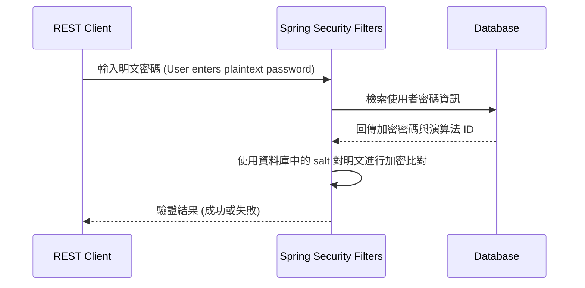

- **[JDBC 驗證的背後運作細節]**

    1. **從資料庫檢索密碼**：首先根據使用者資訊從資料庫中取出對應的密碼紀錄
    2. **讀取編碼演算法 ID**：識別密碼所使用的加密方式（例如 `{bcrypt}`）
    3. **進行加密比對 (以 bcrypt 為例)**：

        - 使用從資料庫密碼中提取的 **salt (鹽值)**
        - 將登入表單中的 **明文密碼 (plaintext password)** 進行加密
        - 將加密後的結果與資料庫中儲存的 **加密密碼 (encrypted password)** 進行比對

### Spring Security 登入流程細節 (Spring Security Login Process Details)

- **[登入比對邏輯]** 系統透過比對「來自登入表單的加密值」與「來自資料庫的加密值」來判定登入是否成功
    - **[成功條件]** 兩者匹配 (If there is a match, login successful)
    - **[失敗條件]** 兩者不匹配 (If no match, login NOT successful)
- **[核心安全原則：單向加密]**
    - **[關鍵概念]** 資料庫中的密碼**永遠不會被解密 (The password from db is NEVER decrypted)**
    - **[原因]** bcrypt 是一種單向加密演算法 (One-way encryption algorithm)，其特性決定了無法將加密後的雜湊值還原為明文
- **[完整的驗證步驟]**

    1. 從資料庫中檢索該使用者的密碼 (Retrieve password from db for the user)
    2. 讀取編碼演算法 ID，例如 `bcrypt` (Read the encoding algorithm id)
    3. **[針對 bcrypt 的處理]** 使用從資料庫密碼中提取的 salt，將登入表單中的明文密碼進行加密 (Encrypt plaintext password from login form using salt from db password)
    4. 將加密後的結果與資料庫中的加密密碼進行比對 (Compare encrypted password from login form WITH encrypted password from db)

### 執行 SQL 腳本以建立安全相關資料表

- **[操作目標]** 執行 SQL 腳本以設定用於安全性的資料庫資料表 (Set up database tables for security)
- **[檔案位置]** 腳本檔案位於專案目錄下的 `sql-scripts` 資料夾中
- **[執行流程]**

    1. 開啟 **MySQL Workbench**
    2. 透過 `File` > `Open SQL Script...` 功能選取腳本
    3. 導航至專案目錄（例如：`DevSpringBoot`）並開啟對應的 `.sql` 檔案

### 重置安全性資料庫結構 (Resetting Security Database Schema)

- **[操作目標]** 透過執行特定的 SQL 腳本來重置資料庫結構，特別是為了適應新的安全性需求（如加密後的密碼長度）。
- **[腳本選擇]** 進入 `sql-scripts` 資料夾，選擇對應的腳本檔案，例如：
    - `05-setup-spring-security-demo-database-bcrypt.sql`
- **[核心 SQL 指令]** 腳本會先執行刪除舊資料表的指令，以確保環境乾淨：

```sql
USE `employee_directory`;
  DROP TABLE IF EXISTS `authorities`;
  DROP TABLE IF EXISTS `users`;
```

- **[建立新表結構]** 隨後會重新建立包含新欄位定義的資料表，例如 `users` 表：

```sql
CREATE TABLE `users` (
    `username` varchar(50) NOT NULL,
    `password` char(68) NOT NULL,
    `enabled` tinyint NOT NULL,
    PRIMARY KEY (`username`)
  ) ENGINE=InnoDB DEFAULT CHARSET=latin1;
```

    - **[關鍵點]** 注意 `password` 欄位的長度（例如 `char(68)`），這是為了容納加密後的雜湊值（如 bcrypt 生成的結果）。

### `users` 資料表結構與資料插入

- **[資料表定義]** `users` 表的結構與先前相似，但針對 bcrypt 加密做了調整：
    - `password` 欄位長度設為 `char(68)`
        - **[原因]** 為了容納 bcrypt 加密後產生的長字串（雜湊值）
- **[資料插入範例]** 在執行 `INSERT INTO users` 時，需包含以下關鍵資訊：

```sql
INSERT INTO users (username, password, enabled)
VALUES ('john', '$2a$10$qe50HEh7urweMojsnWARvcXJXR1UcMRZ2WcQ19YeuspUdgF.q', 1);
```

- **[欄位內容解析]**
    - **加密密碼 (Encrypted Password)**：例如 `$2a$10$qe50HEh7urweMojsnWARvcXJXR1UcMRZ2WcQ19YeuspUdgF.q`，這是明文密碼（如 `fun123`）經過 bcrypt 加密後的結果。
    - **編碼演算法 ID (Encoding Algorithm ID)**：包含在加密字串的開頭（例如 `$2a$10$`），這讓 Spring Security 能夠識別該密碼是使用 **bcrypt** 演算法進行加密的，進而選擇正確的方式進行驗證。

### 驗證使用者資料 (Verifying User Data)

- **[操作流程]** 執行 SQL 查詢指令以確認資料是否正確寫入資料庫
    - 使用 `SELECT * FROM employee_directory.users;` 查詢使用者資訊
    - 點擊執行圖示（閃電符號）並重新整理結果列表
- **[查詢結果確認]** 檢查 `users` 資料表中的內容：
    - 確認已成功插入 John、Mary 與 Susan 的帳號
    - **[密碼檢查]** 確認 `password` 欄位顯示為加密後的字串（例如以 `(bcrypt)$2a$10$...` 開頭），而非明文
- **[下一步]** 準備切換至 **Postman** 進行 API 請求測試，驗證這些帳號的登入與權限功能

### Postman 身份驗證測試失敗 (Fail: Authentication Test)

- **[測試設定]** 嘗試使用 `GET` 方法存取 `/api/employees` 端點
    - **[身份驗證資訊]** 在 Postman 的 `Authorization` 頁籤中設定：
        - **Username**: `john`
        - **Password**: `abc123` (故意使用錯誤的密碼進行測試)
- **[錯誤結果]** 請求無法送出，並出現錯誤訊息：

    > `Could not send request`

    > `Oops!!! Our Spring Boot app is not running!!!`

- **[原因分析]** 由於 Spring Boot 應用程式目前處於未啟動狀態，導致 Postman 無法連接到後端伺服器進行通訊。

### 啟動 Spring Boot 應用程式

- **[解決方案]** 針對 Postman 顯示 `Could not send request` 的錯誤，需回到 IntelliJ IDEA 並執行應用程式
- **[結果]** 應用程式啟動後，Postman 即可成功與後端伺服器建立通訊

### 測試案例：驗證錯誤密碼導致身份驗證失敗 (Fail: Authentication Test with Wrong Password)

- **[測試設定]** 在應用程式運行狀態下，再次使用 Postman 進行身份驗證測試
    - **Username**: `john`
    - **Password**: `abc123` (故意使用錯誤的密碼)
- **[錯誤結果]** 請求成功送出，但回傳狀態碼為：

> `401 Unauthorized`

- **[原因分析]** 這是預期的行為，因為提供的密碼與資料庫中加密的密碼不符，Spring Security 拒絕了該請求。

### 測試案例：驗證正確密碼 (Pass: Authentication Test with Correct Password)

- **[測試設定]** 在 Postman 中使用正確的身份驗證資訊
    - **Username**: `john`
    - **Password**: `fun123`
- **[結果確認]** 請求成功，回傳狀態碼為：

> `200 OK`

- **[結論]** 這證實了資料庫中儲存的 bcrypt 加密密碼（例如 `fun123` 的雜湊值）能與 Spring Security 進行正確的比對與驗證。

### 更新資料庫密碼的準備工作

- **[目標]** 修改使用者 `john` 的密碼，並將更新後的結果反映在資料庫中
- **[工具準備]** 使用線上 bcrypt 密碼生成工具：
    - **URL**: `https://www.luv2code.com/generate-bcrypt-password`
    - **用途**: 用於生成新的 bcrypt 加密字串，以便更新 MySQL 資料庫中的密碼欄位

### 使用線上工具更新資料庫密碼

- **[工具使用]** 利用 bcrypt 密碼生成器產生新的加密字串
    - **工具網址**: `https://www.luv2code.com/generate-bcrypt-password`
    - **操作步驟**:

        1. 在工具中輸入新密碼（例如：`crazy123`）
        2. 點擊 `Calculate` 進行雜湊處理
        3. 複製生成的雜湊結果（Hash Result）

- **[資料庫更新注意事項]** 在 MySQL Workbench 中更新 `password` 欄位時，必須確保格式完整
    - **關鍵規則**：必須保留 bcrypt 的部分（包含前綴與大括號），僅替換後方的雜湊值
    - **正確格式範例**：`$2a$10$...` (需包含完整的加密字串內容)
- **[執行更新]**
    - 將複製的雜湊值貼回 `users` 資料表的 `password` 欄位
    - 透過 SQL 指令完成更新，以確保後續身份驗證測試能使用新密碼成功登入

### 完成資料庫密碼更新

- **[執行更新]** 在 MySQL Workbench 中完成 SQL 腳本的應用
    - 需點擊右下角的 `Apply` 按鈕以套用變更
    - 系統會彈出視窗供檢視即將執行的 SQL 語句（例如 `UPDATE employee_directory.users SET password = ...`）
    - 確認無誤後點擊 `Apply` 並隨後點擊 `Close`

### 測試案例：驗證舊密碼失效 (Fail: Authentication Test with Old Password)

- **[測試設定]** 在 Postman 中使用先前已失效的舊密碼進行測試
    - **Username**: `john`
    - **Password**: `fun123` (舊密碼)
- **[結果確認]** 請求失敗，並回傳狀態碼為：

> `401 Unauthorized`

- **[原因分析]** 因為資料庫中的密碼已經更新為 `crazy123` 的 bcrypt 雜湊值，原本的 `fun123` 已不再有效。

### 測試案例：驗證更新後的密碼 (Pass: Authentication Test with Updated Password)

- **[測試設定]** 在 Postman 中使用剛剛更新到資料庫的新密碼進行身份驗證
    - **Username**: `john`
    - **Password**: `crazy123`
- **[結果確認]** 請求成功，回傳狀態碼為：

> `200 OK`

- **[技術重點]**
    - **bcrypt 自動處理**：Spring Security 會在背景自動處理所有的 bcrypt 雜湊比對工作。
    - **即時生效 (On the fly)**：更新資料庫中的加密密碼後，不需要重啟 Spring Boot 應用程式，新的密碼即可立即用於身份驗證。

### 配置 Spring Security 使用自定義資料表

- **[現狀]** 目前使用的 Spring Security 預設資料庫結構 (Default Schema)
    - **[限制]** 必須使用完全相同的資料表名稱與欄位名稱才能運作
    - **預設結構範例：**

| 資料表: users | 資料表: authorities |
| --- | --- |
| username VARCHAR(50) | username VARCHAR(50) |
| password VARCHAR(50) | authority VARCHAR(50) |
| enabled TINYINT(1) |  |

- **[為什麼需要自定義？]** 在實際企業環境中，開發者往往需要適應現有的資料庫架構
    - 公司可能已經有既有的安全性資料表
    - 資料表名稱或欄位名稱可能與 Spring Security 的預設值不同
    - 大型企業的既有系統通常有其特定的資料結構規範

### 使用自定義資料表 (Using Custom Tables)

- **[核心觀念]** Spring Security 並不限制必須使用其預設的資料表結構 (Default Schema)
    - 開發者可以根據公司的需求，使用任何自定義的資料表與欄位名稱
    - **[範例結構]** 下列為一個與預設模式完全不同的自定義設計：

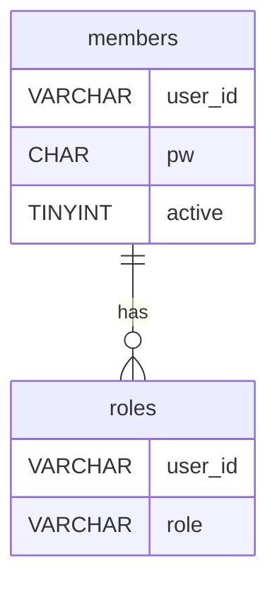

- **[如何實作整合]** 只要告訴 Spring Security 如何查詢這些自定義表格即可
    - 需要提供兩種類型的查詢語句：

        1. **根據使用者名稱查找使用者** (Find user by user name)
        2. **根據使用者名稱查找其權限或角色** (Find authorities / roles by user name)

### 自定義安全性架構的開發流程

為了讓 Spring Security 能與公司現有的資料表結構整合，需遵循以下開發步驟：

1. **使用 SQL 建立自定義資料表**

    - 根據業務需求設計特定的表格與欄位名稱

2. **更新 Spring Security 配置**

    - 提供查詢語句以查找使用者 (Find user by user name)
    - 提供查詢語句以查找該使用者的權限或角色 (Find authorities / roles by user name)

### 步驟 1：建立自定義資料表 (Step 1: Create custom tables with SQL)

由於設計的欄位與名稱皆為完全自定義，因此與 Spring Security 的預設 Schema 完全不符。


- **members 資料表**：用於儲存使用者基本資訊
        - `user_id`: 使用者的唯一識別碼
        - `pw`: 使用者的加密密碼
        - `active`: 使用者帳號是否啟用
- **roles 資料表**：用於儲存使用者對應的角色權限
        - `user_id`: 指向 members 資料表的關聯欄位
        - `role`: 角色名稱

### 自定義安全性架構的開發流程 (續)

開發流程分為兩個核心步驟：

1. **步驟 1：使用 SQL 建立自定義資料表**

    - 開發者擁有完全的自由度，可以自定義任何資料表名稱與欄位名稱
    - **[關鍵點]** 這些設計不需要符合 Spring Security 的預設 Schema
    - **範例結構：**

| members 資料表 | roles 資料表 |
| --- | --- |
| user_id VARCHAR(50) | user_id VARCHAR(50) |
| pw CHAR(68) | role VARCHAR(50) |
| active TINYINT(1) |  |

2. **步驟 2：更新 Spring Security 配置**

    - 必須修改 Spring Security 的配置程式碼（例如 `JdbcUserDetailsManager` 的實作）
    - 透過提供特定的 SQL 查詢語句，告訴框架如何從自定義資料表中讀取資訊
    - **需要實作的查詢：**
        - **查找使用者**：根據給定的使用者名稱獲取其詳細資訊
        - **查找權限/角色**：根據給定的使用者名稱獲取其對應的角色

**實作範例：配置&#32;`JdbcUserDetailsManager`**

```java
@Configuration
public class DemoSecurityConfig {

    @Bean
    public UserDetailsManager userDetailsManager(DataSource dataSource) {
        JdbcUserDetailsManager theUserDetailsManager = new JdbcUserDetailsManager(dataSource);

        // 提供查詢語句以存取自定義的 members 資料表
        theUserDetailsManager.setUsersByUsernameQuery("select user_id, pw, active from members where user_id=?");

        // 提供查詢語句以存取自定義的 roles 資料表
        theUserDetailsManager.setAuthoritiesByUsernameQuery("select user_id, role from roles where user_id=?");

        return theUserDetailsManager;
    }
}
```

### 步驟 2：更新 Spring Security 配置 (Step 2: Update Spring Security Configuration)

為了讓 Spring Security 能夠從自定義的資料表中讀取資訊，必須在配置中提供對應的 SQL 查詢語句。

- **[核心邏輯]** 使用 `JdbcUserDetailsManager` 並透過 `setUsersQueryName` 與 `setAuthoritiesByUsernameQuery` 方法來指定查詢方式
- **[參數佔位符]** SQL 語句中的問號 `?` 代表參數佔位符
    - 在登入過程中，系統會自動將使用者輸入的 `username` 作為該參數的值進行帶入

#### 配置程式碼實作

```java
@Configuration
public class DemoSecurityConfig {

    @Bean
    public UserDetailsManager userDetailsManager(DataSource dataSource) {
        JdbcUserDetailsManager theUserDetailsManager = new JdbcUserDetailsManager(dataSource);

        // 如何查找使用者 (How to find users)
        theUserDetailsManager.setUsersQueryName("select user_id, pw, active from members where user_id=?");

        // 如何查找角色 (How to find roles)
        theUserDetailsManager.setAuthoritiesByUsernameQuery("select user_id, role from roles where user_id=?");

        return theUserDetailsManager;
    }
}
```

- **[技術重點]**
    - **靈活性**：只要正確提供 SQL 語句，Spring Security 可以與任何自定義的資料表結構（如 `members` 與 `roles`）進行整合，而不必受限於預設的 Schema。

### 準備資料庫結構

為了建立用於安全驗證的自定義資料表，需要執行專案目錄下 `sql-scripts` 資料夾中的 SQL 腳本。

- **[清理舊資料表]** 在執行新腳本前，需先手動刪除（Drop）舊有的預設資料表，以確保與自定義結構不衝突：
    - `users` 表
    - `authorities` 表

#### 清理舊有的資料表 (Cleaning up old tables)

為了避免在使用自定義資料表時產生混淆，需要先在 MySQL Workbench 中手動刪除舊有的預設資料表：

- **[操作步驟]**
    - 選取 `authorities` 資料表 $\rightarrow$ 點擊 `Drop Now`
    - 選取 `users` 資料表 $\rightarrow$ 點擊 `Drop Now`
- **[保留項目]**
    - `employee` 資料表：需保留，因為它包含正常的員工資訊，與安全驗證的資料表無關
- **[後續動作]**
    - 透過 `File` $\rightarrow$ `Open SQL Script...` 來開啟準備好的 SQL 腳本，進行下一步的資料表建立與設定

為了準備實作使用自定義資料表名稱的 Spring Security 設定，需要執行專案中的 SQL 腳本來重置資料庫環境。

- **[執行路徑]** 位於專案目錄下的：
    - `05 Spring Boot REST Security` $\rightarrow$ `00 Spring Boot REST Security` $\rightarrow$ `SQL scripts`
- **[使用的腳本]** `06-setup-spring-security-demo-database-bcrypt-custom-table-names.sql`
- **[腳本首要操作]** 腳本的第一步是執行 `DROP TABLE` 指令，以清除任何先前建立的舊資料表，確保新的結構能乾淨地建立：

```sql
USE `employee_directory`;

DROP TABLE IF EXISTS `roles`;
DROP TABLE IF EXISTS `members`;
```

- **[後續步驟]** 在清理完舊表後，腳本會接著定義新的 `members` 資料表結構（包含 `user_id`, `pw`, `active` 等欄位）。

### 建立自定義安全性資料表

為了配合 Spring Security 的自定義配置，需要建立與預設 Schema 不同的資料表結構。

#### `members` 資料表結構

- 用於儲存使用者資訊的自定義資料表
- **欄位定義**：
    - `user_id`: `varchar(50)`，不可為空值 (NOT NULL)
    - `pw`: `char(68)`，不可為空值 (NOT NULL) —— **[技術重點]** 使用 `char(68)` 是為了精確匹配 bcrypt 加密後的固定長度
    - `active`: `tinyint`，不可為空值 (NOT NULL)
- **儲存引擎**：`InnoDB`

#### `roles` 資料表結構

- 用於定義使用者角色的自定義資料表
- **欄位定義**：
    - `user_id`: `varchar(50)`，不可為空值 (NOT NULL)
    - `role`: `varchar(50)`，不可為空值 (NOT NULL)
- **約束與關聯**：
    - **唯一鍵 (UNIQUE KEY)**：`authorities5_idx_1` 建立在 `(user_id, role)` 上，確保同一個使用者不會重複擁有相同的角色
    - **外鍵約束 (FOREIGN KEY)**：
        - `authorities5_ibfk_1` 將 `user_id` 指向 `members` 資料表的 `user_id`
        - 這確保了角色必須隸屬於一個存在的成員

```sql
CREATE TABLE `members` (
  `user_id` varchar(50) NOT NULL,
  `pw` char(68) NOT NULL,
  `active` tinyint NOT NULL,
  PRIMARY KEY (`user_id`)
) ENGINE=InnoDB DEFAULT CHARSET=latin1;

CREATE TABLE `roles` (
  `user_id` varchar(50) NOT NULL,
  `role` varchar(50) NOT NULL,
  UNIQUE KEY `authorities5_idx_1` (`user_id`,`role`),
  CONSTRAINT `authorities5_ibfk_1` FOREIGN KEY (`user_id`) REFERENCES `members` (`user_id`)
) ENGINE=InnoDB DEFAULT CHARSET=latin1;
```

#### 測試資料插入

- 建立三位測試使用者：`John`, `Mary`, `Susan`
- **預設密碼**：`fun123` (需加密後存入)

### 執行 SQL 腳本與驗證資料表

完成 `members` 資料表的建立後，接著執行 SQL 腳本中的 `INSERT INTO roles` 指令，為測試使用者分配角色。

- **執行動作**：點擊 MySQL Workbench 中的「閃電圖示」（Execute）來執行整個 SQL 腳本。
- **驗證步驟**：
    - 在左側 Schema 列表點擊「Refresh」以更新資料庫結構。
    - 確認出現了新的自定義資料表：`members` 與 `roles`。

#### 查詢 `members` 資料表

- 執行 `SELECT * FROM employee_directory.members;`
- **結果**：成功查看到三位使用者資訊，其欄位名稱為自定義的 `user_id`, `pw`, `active`：

| user_id | pw | active |
| --- | --- | --- |
| john | {bcrypt}$2a$10$qeS0HEh7urwe... | 1 |
| mary | {bcrypt}$2a$10$qeS0HEh7urwe... | 1 |
| susan | {bcrypt}$2a$10$qeS0HEh7urwe... | 1 |

#### 查詢 `roles` 資料表

- 執行 `SELECT * FROM employee_directory.roles;`
- **結果**：確認使用者已與角色正確關聯，欄位名稱為自定義的 `user_id`, `role`。

### 驗證角色資料表內容

執行 SQL 腳本後，確認 `roles` 資料表已正確建立並填入對應的使用者角色：

| user_id | role |
| --- | --- |
| john | ROLE_EMPLOYEE |
| mary | ROLE_EMPLOYEE |
| mary | ROLE_MANAGER |
| susan | ROLE_ADMIN |
| susan | ROLE_MANAGER |

- **[確認重點]**
    - `mary` 同時擁有 `ROLE_EMPLOYEE` 與 `ROLE_MANAGER` 角色
    - `susan` 同時擁有 `ROLE_ADMIN` 與 `ROLE_MANAGER` 角色

接下來將開始配置 Spring Security，使其能夠讀取並利用這些自定義的資料表進行驗證與授權。

為了讓 Spring Security 能讀取自定義的資料表，需要修改 `DemoSecurityConfig.java` 中的配置內容。

#### 配置 `JdbcUserDetailsManager`

- **重構目標**：將 `JdbcUserDetailsManager` 的實例化過程進行重構，將其設定為區域變數
    - **目的**：方便後續針對該物件進行進一步的查詢設定，以對應自定義的資料表結構

```java
@Configuration
public class DemoSecurityConfig {

    // add support for JDBC ... no more hardcoded users :-)
    @Bean
    public UserDetailsManager userDetailsManager(DataSource dataSource) {
        return new JdbcUserDetailsManager(dataSource);
    }

    @Bean
    public SecurityFilterChain filterChain(HttpSecurity http) throws Exception {
        http.authorizeHttpRequests(configurer ->
            configurer
                .requestMatchers(HttpMethod.GET, "/api/employees").hasRole("EMPLOYEE")
                .requestMatchers(HttpMethod.GET, "/api/employees/**").hasRole("EMPLOYEE")
                .requestMatchers(HttpMethod.POST, "/api/employees").hasRole("MANAGER")
                .requestMatchers(HttpMethod.PUT, "/api/employees/**").hasRole("MANAGER")
                .requestMatchers(HttpMethod.DELETE, "/api/employees/**").hasRole("ADMIN")
        );
        // ...
    }
}
```

#### 重構 `userDetailsManager` 方法

- 使用 IDE 的 **Refactor** $\rightarrow$ **Introduce Variable** 功能
    - 將 `new JdbcUserDetailsManager(dataSource)` 提取為區域變數 `jdbcUserDetailsManager`
    - **目的**：使程式碼更整潔，並方便後續針對該物件進行自定義查詢設定
- 在程式碼中加入註解，幫助自己追蹤開發進度

```java
@Bean
    public UserDetailsManager userDetailsManager(DataSource dataSource) {
        // 引入變數以利後續配置
        JdbcUserDetailsManager jdbcUserDetailsManager = new JdbcUserDetailsManager(dataSource);

        // TODO: 定義查詢使用者與權限的自定義 SQL

        return jdbcUserDetailsManager;
    }
```

### 配置自定義查詢語句 (Configuring Custom Queries)

由於目前使用的是自定義資料表（例如 `members` 與 `roles`），必須明確告訴 Spring Security 如何透過 SQL 語句來查找使用者資訊與權限。

- **配置目標**：使用 `JdbcUserDetailsManager` 的方法來定義自定義查詢
    - `setUsersByUsernameQuery`：定義如何根據使用者名稱（username）來查找使用者資料
    - `setAuthoritiesByUsernameQuery`：定義如何根據使用者名稱來查找其擁有的權限或角色

```java
@Bean
public UserDetailsManager userDetailsManager(DataSource dataSource) {
    // 引入變數以利後續配置
    JdbcUserDetailsManager jdbcUserDetailsManager = new JdbcUserDetailsManager(dataSource);

    // TODO: 定義查詢使用者與權限的自定義 SQL
    // 例如：
    // jdbcUserDetailsManager.setUsersByUsernameQuery("SELECT ...");
    // jdbcUserDetailsManager.setAuthoritiesByUsernameQuery("SELECT ...");

    return jdbcUserDetailsManager;
}
```

#### 邏輯流程圖：自定義資料表對應

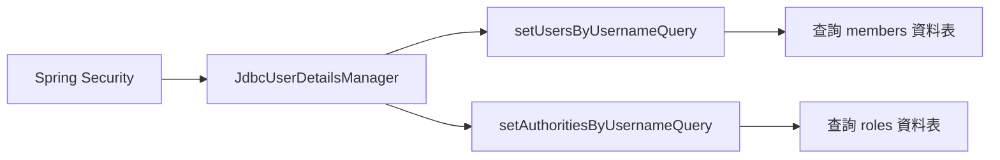

### 配置自定義使用者查詢語句 (Configuring Custom Users Query)

為了讓 `JdbcUserDetailsManager` 能從自定義的 `members` 資料表中讀取資料，必須提供符合該資料表結構的 SQL 語句。

- **SQL 查詢邏輯**：
    - 透過 `setUsersByUsernameQuery` 方法設定查詢語句
    - 查詢欄位需包含：`user_id`、`pw` (密碼) 與 `active` (狀態)
    - 使用 `WHERE user_id = ?` 來匹配使用者名稱
- **關於問號&#32;`?`&#32;的作用**：
    - 這是 SQL 的參數佔位符
    - 當使用者在登入表單輸入使用者名稱時，該值會自動傳遞並替換掉這個 `?`，以進行安全且正確的資料比對

```java
@Bean
public UserDetailsManager userDetailsManager(DataSource dataSource) {
    JdbcUserDetailsManager jdbcUserDetailsManager = new JdbcUserDetailsManager(dataSource);

    // 定義如何從 members 資料表中查找使用者
    jdbcUserDetailsManager.setUsersByUsernameQuery(
        "select user_id, pw, active from members where user_id = ?"
    );

    // TODO: 定義如何從 roles 資料表中查找權限 (下一階段實作)
    // jdbcUserDetailsManager.setAuthoritiesByUsernameQuery("...");

    return jdbcUserDetailsManager;
}
```

#### 查詢對應關係圖

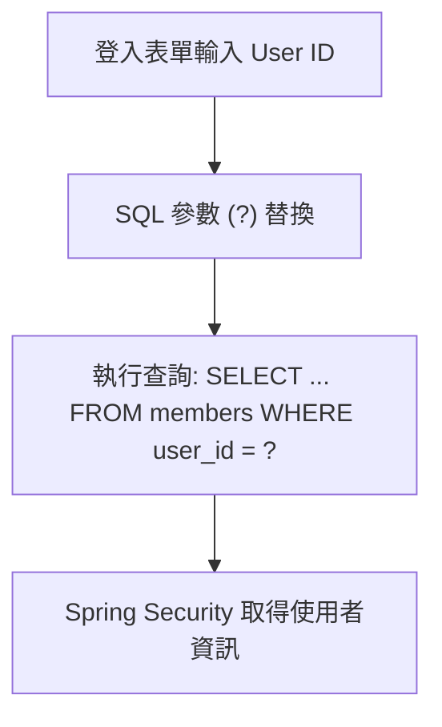

### 配置自定義權限查詢語句 (Configuring Custom Authorities Query)

除了查詢使用者基本資訊外，還必須告訴 Spring Security 如何根據使用者名稱來獲取其擁有的角色或權限。

- **SQL 查詢邏輯**：
    - 使用 `setAuthoritiesByUsernameQuery` 方法來定義查詢語句
    - 查詢目標是 `roles` 資料表
    - 查詢欄位需包含：`user_id` 與 `roles`
    - 透過 `WHERE user_id = ?` 來匹配登入時提供的使用者名稱
- **參數傳遞機制**：
    - 再次強調 `?` 是參數佔位符
    - 當使用者在登入表單輸入 `user_id` 時，該值會被自動填入此處，用以從 `roles` 表中篩選出對應的權限資料

```java
@Bean
public UserDetailsManager userDetailsManager(DataSource dataSource) {
    JdbcUserDetailsManager jdbcUserDetailsManager = new JdbcUserDetailsManager(dataSource);

    // 定義如何從 members 資料表中查找使用者
    jdbcUserDetailsManager.setUsersByUsernameQuery(
        "select user_id, pw, active from members where user_id = ?"
    );

    // 定義如何從 roles 資料表中查找權限
    jdbcUserDetailsManager.setAuthoritiesByUsernameQuery(
        "select user_id, roles from roles where user_id = ?"
    );

    return jdbcUserDetailsManager;
}
```

#### 權限獲取流程圖

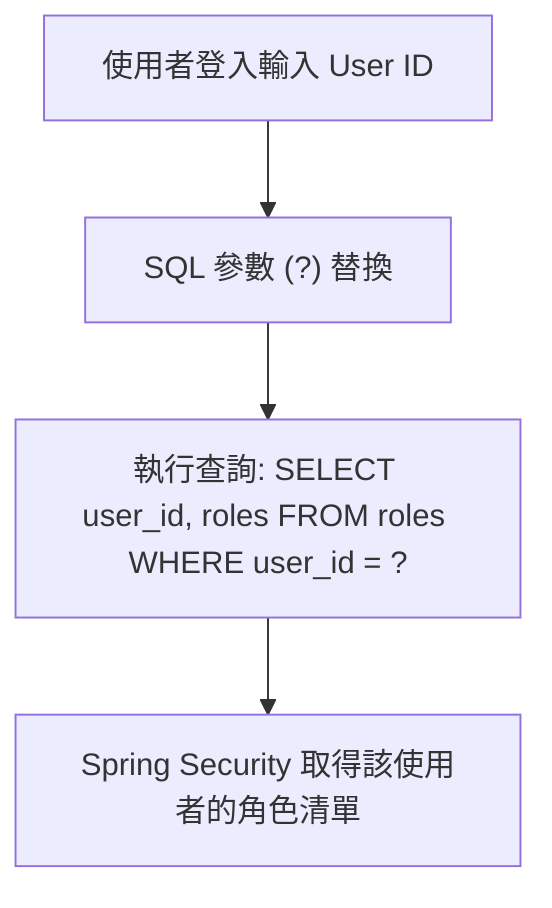

### 自定義資料表整合完成

- **配置核心**：
    - 已成功透過 `setUsersByUsernameQuery` 與 `setAuthoritiesByUsernameQuery` 提供自定義查詢語句
    - **靈活性**：由於使用的是自定義 SQL，開發者可以自由定義資料表的名稱（如 `members`、`roles`）以及欄位名稱（如 `user_id`、`pw`、`active`、`roles`）
    - **脫離硬編碼**：系統不再依賴於程式碼中寫死的測試使用者，而是完全由資料庫內容驅動

```java
@Configuration
public class DemoSecurityConfig {

    @Bean
    public UserDetailsManager userDetailsManager(DataSource dataSource) {
        JdbcUserDetailsManager jdbcUserDetailsManager = new JdbcUserDetailsManager(dataSource);

        // 定義如何從 members 資料表中查找使用者
        jdbcUserDetailsManager.setUsersByUsernameQuery(
            "select user_id, pw, active from members where user_id = ?"
        );

        // 定義如何從 roles 資料表中查找權限
        jdbcUserDetailsManager.setAuthoritiesByUsernameQuery(
            "select user_id, roles from roles where user_id = ?"
        );

        return jdbcUserDetailsManager;
    }
}
```

- **下一步動作**：啟動 Spring Boot 應用程式，並使用 Postman 進行實際的 API 存取測試。

### 測試案例：驗證身份驗證 (Fail: Authentication Test)

- **錯誤密碼測試**：
    - 使用者：`john`
    - 密碼：`afjksfjaskfjaskfj` (錯誤密碼)
    - 結果：`401 Unauthorized` (預期行為)
- **正確密碼測試**：
    - 使用者：`john`
    - 密碼：`fun123` (正確密碼)
    - 結果：`401 Unauthorized` (非預期行為)
    - **[問題點]**：儘管使用了正確的密碼，系統仍然回傳身份驗證失敗，這表示後端配置或資料庫中的密碼比對邏輯需要檢查。

### 身份驗證失敗案例分析 (Fail: Authentication Test)

- **測試情境**：使用 Postman 嘗試以使用者 `john` 進行身份驗證
    - **輸入憑證**：
        - Username: `john`
        - Password: `fun123`
- **結果**：回傳 `401 Unauthorized` 錯誤
- **問題點**：雖然資料庫中儲存的是 `fun123` 的 bcrypt 加密版本，但系統仍無法正確處理，需進一步調查密碼在資料庫中的實際儲存格式與加密狀態是否與預期一致。

### 身份驗證失敗除錯流程

- **觀察現狀**：
    - 在 Postman 測試中使用正確的憑證（`user: john`, `password: fun123`）卻依然收到 `401 Unauthorized`
    - 檢查 IDE 中的系統日誌，發現並沒有出現任何 Exception（異常），這使得問題難以直接定位
- **除錯策略：提高日誌層級**
    - **目標**：開啟 Spring Security 的 DEBUG 模式，以獲取更深入的驗證過程資訊
    - **實作方式**：修改 `application.properties` 設定檔，增加相關的 logging 配置

### 設定 Spring Security DEBUG 日誌

- **目的**：獲取更多執行時（runtime）的詳細資訊，以找出身份驗證失敗的線索
- **實作方式**：在 `application.properties` 中新增以下配置

```properties
logging.level.org.springframework.security=DEBUG
```

### 驗證身份驗證 (Fail: Authentication Test)

- **測試情境**：重新啟動應用程式後，使用 Postman 再次嘗試登入
    - **輸入憑證**：
        - Username: `john`
        - Password: `fun123`
- **結果**：依然回傳 `401 Unauthorized`
- **除錯發現**：檢查 IDE 中的系統日誌，發現了異常資訊
    - **錯誤類型**：`java.sql.SQLSyntaxErrorException`
    - **錯誤原因**：`Unknown column 'roles' in 'field list'`
    - **[核心問題]**：這表明 SQL 查詢中使用的欄位名稱 `roles` 在資料表中並不存在，導致身份驗證流程因 SQL 語法錯誤而中斷。

### 定位 SQL 錯誤原因

- **錯誤診斷**：
    - 錯誤訊息顯示 `Unknown column 'roles' in 'field list'`
    - **關鍵判斷**：這不是找不到資料表（Unknown table），而是資料表中不存在名為 `roles` 的**欄位**。這極有可能是 SQL 查詢語句中的欄位名稱拼寫錯誤（typo）。
- **定位問題方法**：
    - 透過 IDE 的堆疊追蹤（Stack Trace）查看發生異常的最後一個方法。
    - 在此案例中，問題發生在 `loadUserAuthorities` 方法，這意味著在嘗試載入使用者權限時，SQL 查詢語句中使用的欄位名稱與實際資料表結構不符。

### 修正 SQL 語法錯誤

- **錯誤原因回顧**：
    - 系統回報 `Unknown column 'roles' in 'field list'`
- **發現 Typo (拼寫錯誤)**：
    - 檢查 `DemoSecurityConfig.java` 中的 SQL 查詢語句：
        - 程式碼中使用：`select user_id, roles from roles where user_id=?`
        - 實際資料表結構（`roles` 表）：欄位名稱為 `role` (單數)，而非 `roles` (複數)
    - **修正後的程式碼片段**：

```java
// 修正後的權限查詢語句
jdbcUserDetailsManager.setAuthoritiesByUsernameQuery(
    "select user_id, role from roles where user_id=?"
);
```

- **後續動作**：
    - 儲存檔案後重新啟動應用程式，以驗證修正後的配置是否能成功完成身份驗證流程。

### 驗證身份驗證成功 (Pass: Authentication Test)

- **測試情境**：在修正 `DemoSecurityConfig.java` 中的 SQL 查詢語句後，重新啟動應用程式並使用 Postman 進行測試
    - **輸入憑證**：
        - Username: `john`
        - Password: `fun123`
- **結果**：
    - Postman 回傳 `200 OK` 狀態碼，表示身份驗證成功
    - **系統日誌檢查**：
        - 日誌顯示一切正常，沒有出現任何 Exception 或錯誤資訊
- **結論**：
    - 之前的身份驗證失敗純粹是由於 SQL 查詢語句中的拼寫錯誤（`roles` vs `role`）所導致的。修正該 typo 後，系統已能正確從資料庫中讀取使用者資訊與權限。

### 測試案例：驗證刪除權限失敗 (Fail: Delete Employee)

- **測試目的**：驗證系統是否能正確根據使用者的角色 (Role) 限制其存取權限
- **測試情境**：使用具備 `EMPLOYEE` 角色的使用者執行刪除請求
    - **HTTP 方法**：`DELETE`
    - **端點 (URL)**：`http://localhost:8080/api/employees/2`
    - **身份驗證 (Basic Auth)**：
        - Username: `john`
        - Password: `fun123`
- **預期結果**：由於 `john` 的角色僅為 `EMPLOYEE`，不具備刪除權限，請求應被拒絕

### 測試案例：驗證刪除權限成功 (Pass: Delete Employee)

- **測試目的**：驗證具備 `ADMIN` 角色的使用者是否能執行刪除操作
- **測試情境**：切換至具備 `ADMIN` 權限的使用者進行請求
    - **輸入憑證**：
        - Username: `susan`
        - Password: `fun123`
    - **HTTP 方法**：`DELETE`
    - **端點 (URL)**：`http://localhost:8080/api/employees/2`
- **結果**：
    - Postman 回傳 `200 OK` 狀態碼，表示刪除成功
- **結論**：
    - 此測試結果符合預期的權限設計：`EMPLOYEE` 角色會被拒絕（`403 Forbidden`），而 `ADMIN` 角色則能成功執行刪除操作。

### 驗證自定義資料表整合完成

- **核心成果**：確認 Spring Security 已成功透過自定義的資料表進行身分驗證與權限管理
- **整合特點**：
    - 系統已不再使用 Spring Security 的預設結構
    - **自定義配置內容**：
        - 使用自定義的**資料表名稱** (Custom table names)
        - 使用自定義的**欄位名稱** (Custom column names)
    - **運作機制**：透過先前配置的 SQL 查詢語句，Spring Security 現在能精確地從我們的資料庫架構中定位使用者及其對應的角色資訊。

### 自定義資料表整合的優勢

- **高度靈活性**：
    - 能夠針對自定義的資料表名稱與欄位名稱進行配置。
    - 透過提供自定義的 SQL 查詢語句，可以精確地定義如何根據使用者名稱來尋找其對應的權限 (Authorities/Roles)。
- **實作範例回顧**：
    - 設定使用者資訊的查詢方式。
    - 設定根據給定名稱尋找權限/角色的查詢方式。
    - 這種做法讓 Spring Security 能完美適應任何現有的資料庫設計。

## Thymeleaf 與 Spring Boot

### 什麼是 Thymeleaf?

- 一個 Java 模板引擎 (Java templating engine)
    - 是一個開源專案，官方網站為 [thymeleaf.org](https://www.thymeleaf.org)
- **[用途]** 通常用於為 Web 應用程式生成 HTML 視圖 (HTML views)
- **[特性]** 它是一個通用目的的模板引擎 (general purpose templating engine)
    - 這意味著除了 Web 應用程式，Thymeleaf 也可以在其他場景中使用

### Thymeleaf 與 Spring 的關係

- 兩者是獨立的專案
    - Thymeleaf 與 `spring.io` 無關，即使不使用 Spring，也可以建立使用 Thymeleaf 的 Java 應用程式
- **[協同效應]** 儘管彼此獨立，但兩者之間存在高度的協同作用 (synergy)
    - 這就是為什麼在許多專案中，它們經常被同時提及並搭配使用

### Thymeleaf 基礎知識

#### 發音方式

- 正確發音為 "time-leaf"
    - 「h」是不發音的 (silent)
    - 類似於 Thomas 或 Thailand 的發音規則

#### 什麼是 Thymeleaf 模板？

- 它可以是一個包含 Thymeleaf 表達式 (expressions) 的 HTML 頁面
- **[特性]** 可以包含來自 Thymeleaf 表達式的動態內容 (dynamic content)

#### Thymeleaf 模板的特性

- 透過 Thymeleaf 表達式 (expressions) 實現動態內容
    - 可以存取 Java 程式碼 (Java code)
    - 可以存取物件 (objects)
    - 可以存取 Spring beans

#### Thymeleaf 的處理流程

- **[處理位置]** 在 Web 應用程式中，Thymeleaf 是在**伺服器端 (server-side)** 進行處理
    - 處理後的結果會包含在 HTML 中，並回傳給瀏覽器
- **[運作流程]**

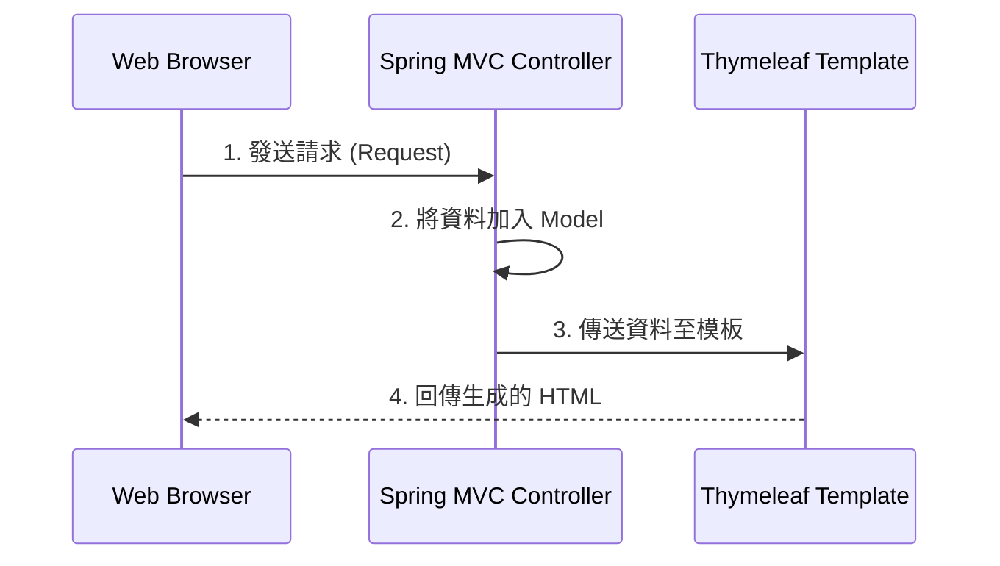

### Thymeleaf Demo 開發流程

- **[開發步驟]**

    1. 將 Thymeleaf 加入 Maven POM 檔案
    2. 開發 Spring MVC 控制器 (Controller)
    3. 建立 Thymeleaf 模板 (Template)

#### 第一步：將 Thymeleaf 加入 Maven POM 檔案

- **[配置方式]**
    - 在 `pom.xml` 中手動加入 `spring-boot-starter-thymeleaf` 的依賴項
    - 或者在 [start.spring.io](https://start.spring.io) 建立新專案時，直接搜尋並選擇 `Thymeleaf` 依賴項，系統會自動將其加入 POM 檔案中

```xml
<dependency>
    <groupId>org.springframework.boot</groupId>
    <artifactId>spring-boot-starter-thymeleaf</artifactId>
</dependency>
```

### 第二步：開發 Spring MVC 控制器

- **[自動配置]** 只要 Maven POM 檔案中包含了 Thymeleaf 的依賴項，Spring Boot 就會自動配置 (auto-configure) 使用 Thymeleaf 模板
    - 不需要額外的設定即可使用
- **[Controller 實作]** 開發流程與一般的 Spring MVC 控制器相同
    - 在方法中將資料加入 `Model`
    - 回傳模板的名稱（字串）

```java
@Controller
public class DemoController {

    @GetMapping("/")
    public String sayHello(Model theModel) {
        theModel.addAttribute("theDate", java.time.LocalDateTime.now());
        return "helloworld";
    }
}
```

- **[模板位置]** 由於 Spring Boot 的自動配置，它會自動去預設路徑尋找對應的模板檔案
    - 預設路徑為：`src/main/resources/templates/`
    - 在上述範例中，Spring 會尋找 `src/main/resources/templates/helloworld.html`

### 第三步：建立 Thymeleaf 模板

#### 模板檔案規範

- **[存放路徑]** 在 Spring Boot 中，Thymeleaf 模板檔案應放置於：
    - `src/main/resources/templates/`
- **[副檔名]** 用於 Web 應用程式的 Thymeleaf 模板使用 `.html` 擴展名

#### 使用 Thymeleaf 表達式

- **[設定 Namespace]** 為了能在 HTML 中使用 Thymeleaf 表達式，必須在 `<html>` 標籤中設定 XML namespace：
    - `xmlns:th="http://www.thymeleaf.org"`
- **[動態內容渲染]** 使用 `th:text` 屬性來將動態資料插入 HTML 元素中

```html
<!DOCTYPE HTML>
<html xmlns:th="http://www.thymeleaf.org">
<head> ... </head>
<body>
    <p th:text="'Time on the server is ' + ${theDate}" />
</body>
</html>
```

- **[執行結果範例]** 若 `theDate` 的值為當前時間，最終產出的 HTML 內容會呈現如下：
    - `Time on the server is 20xx-03-30T11:27:52.297247`

### Thymeleaf 資料來源與進階功能

#### 資料來源機制

- **[變數來源]** Thymeleaf 模板中使用的變數（例如 `${theDate}`）並非魔法術語
    - 它直接從 **Spring MVC Model** 中讀取資料
    - 當 Controller 使用 `model.addAttribute("key", value)` 時，Thymeleaf 就能透過該 `key` 存取對應的 `value` 並渲染至 HTML

#### 進階功能特性

除了基本的文字替換，Thymeleaf 還支援多種強大的功能：

- **邏輯控制**：支援迴圈 (Loops) 與條件判斷 (Conditionals)
- **前端整合**：可與 CSS 和 JavaScript 進行深度整合
- **模板重用**：支援模板佈局 (Template Layouts) 與片段 (Fragments)，方便建立一致的頁面結構
- **更多資訊**：可參考官方網站 [thymeleaf.org](https://www.thymeleaf.org) 獲取詳細技術細節

## 使用 Spring Initializr 建立專案

### 專案基本設定

- \*\*[訪問網站]\*\* 使用 [start.spring.io](https://start.spring.io) (Spring Initializr)
- **[專案類型]** 選擇 `Maven`
- **[程式語言]** 選擇 `Java`
- **[Spring Boot 版本]** 選擇最新的發行版本 (Released version)
    - **[注意]** 應避免使用 `SNAPSHOT` 版本，以確保開發環境的穩定性

### 專案元數據 (Project Metadata) 設定

- **[Group]** 設定組織名稱，例如：`com.lovetocode.springboot`
- **[Artifact]** 設定專案名稱，例如：`thymeleafdemo`
- **[Packaging]** 確保選擇 `Jar` 封裝格式

### 專案依賴項設定 (Dependencies)

- **[Java 版本]** 根據需求選擇對應的 Java 版本
- **[添加依賴項]** 透過搜尋並選擇以下關鍵依賴項來構建專案：
    - `Spring Web`：用於建立 RESTful 應用程式與 Spring MVC 支援，預設使用 Apache Tomcat 作為內嵌容器
    - `Thymeleaf`：作為伺服器端模板引擎，用於生成 HTML 視圖
    - `Spring Boot DevTools`：提供開發時的自動重啟 (automatic restart) 功能，提升開發效率

### 專案檔案的整理與放置

- **[解壓縮]** 從下載目錄 (Downloads) 將生成的 `.zip` 專案檔解壓縮
- **[移動位置]** 將解壓縮後的專案資料夾移動到專門的開發目錄中
    - 例如：將 `thymeleafdemo` 移動到 `luv2code/dev-spring-boot/` 目錄下
    - **[提示]** 專案可以放置在檔案系統中的任何位置，只要方便開發即可

### 開啟專案與初步檢查

- **[資料夾整理]** 重新命名解壓縮後的專案資料夾（例如將 `thymeleafdemo` 改名為更具描述性的名稱）
- **[開啟專案]** 使用 IntelliJ IDEA 開啟該專案資料夾
- **[初步驗證]** 開啟專案後，首要步驟是檢查 `pom.xml` 檔案，以確認依賴項 (Dependencies) 等專案資訊是否正確配置

### 驗證 Maven 依賴項

- **[檢查對象]** 開啟 `pom.xml` 檔案以核對專案配置
- **[確認依賴]** 檢查 `<dependencies>` 區塊中是否包含 Thymeleaf 的 starter

```xml
<dependency>
    <groupId>org.springframework.boot</groupId>
    <artifactId>spring-boot-starter-thymeleaf</artifactId>
</dependency>
```

- **[組織程式碼]** 建立一個新的 package 來存放控制器類別
    - Package 名稱：`.controller`
    - 完整路徑範例：`com.luv2code.springboot.thymeleafdemo.controller`

### 實作 DemoController

- **[建立類別]** 在 `.controller` package 下建立 `DemoController` 類別
- **[核心註解]**
    - 使用 `@Controller` 註解來標記該類別為 Spring MVC 控制器
    - 使用 `@GetMapping("/hello")` 來處理對應到 `/hello` 路徑的 GET 請求

```java
package com.luv2code.springboot.thymeleafdemo.controller;

import org.springframework.stereotype.Controller;
import org.springframework.web.bind.annotation.GetMapping;

@Controller
public class DemoController {

    // create a mapping for "/hello"
    @GetMapping("/hello")
    public String sayHello() {
        return "helloworld";
    }
}
```

### 實作 DemoController 的方法內容

- **[新增方法]** 在 `DemoController` 類別中新增 `sayHello` 方法
    - **[參數]** 接收一個 `Model` 物件，以便將資料傳遞至視圖 (view)
    - **[邏輯]** 使用 `model.addAttribute` 將資料放入 Model 中

```java
@GetMapping("/hello")
public String sayHello(Model theModel) {
    theModel.addAttribute("theDate", java.time.LocalDateTime.now());
    return "helloworld";
}
```

- **[重要注意事項：正確的 Import]** 在使用 `Model` 時，必須確保匯入正確的類別
    - **[正確路徑]** `org.springframework.ui.Model`
    - **[錯誤風險]** 若匯入錯誤的 `Model` 類別（例如來自 `java.lang` 或其他套件），程式將無法正常運作

### 模板回傳與自動配置機制

- **[回傳邏輯]** 在 Controller 方法中回傳的字串（例如 `"helloworld"`）即為模板名稱
- **[自動配置機制]** 由於 Maven POM 檔案中已包含 Thymeleaf 依賴項，Spring Boot 會自動配置並執行以下流程：
    - **[尋找路徑]** 當接收到回傳的模板名稱時，Spring Boot 會自動前往預設路徑搜尋對應的 `.html` 檔案
    - **[預設路徑]** `src/main/resources/templates/helloworld.html`

#### 建立初始 HTML 檔案

- **[檔案名稱]** 在 `src/main/resources/templates/` 目錄下建立 `helloworld.html`
- **[初始結構]** 首先建立一個最基本的 HTML 結構作為起點

#### 實作初始 HTML 內容

- **[建立結構]** 在 `helloworld.html` 中設定基本的 HTML 標籤，包含 `<head>` 與 `<title>`
- **[使用 Thymeleaf]** 建立一個 `<p>` 標籤，並準備使用 Thymeleaf 表達式來呈現內容

```html
<!DOCTYPE HTML>
<html xmlns:th="http://www.thymeleaf.org">
<head>
    <title>Thymeleaf Demo</title>
</head>
<body>
    <p th:text="..."></p>
</body>
</html>
```

### 實作初始 HTML 內容 (續)

- **[動態內容渲染]** 使用 `th:text` 屬性，並透過加號 (`+`) 進行字串連接 (concatenation)，將靜態文字與動態變數結合

```html
<p th:text="'Time on the server is ' + ${theDate}"></p>
```

- **[資料連結機制]**
    - Thymeleaf 模板能夠存取從 Spring MVC Model 中加入的屬性
    - 在此範例中，`${theDate}` 會對應到 Controller 中透過 `model.addAttribute("theDate", ...)` 加入的資料
- **[最終輸出結果]** 瀏覽器渲染後，該標籤會呈現如下內容：
    - `Time on the server is 20xx-03-30T11:27:52.297247`

### 驗證 Thymeleaf 渲染結果

- **[測試方式]** 啟動應用程式後，透過瀏覽器訪問對應的 URL：
    - `http://localhost:8080/hello`
- **[預期結果]** 瀏覽器應正確顯示由 Controller 傳遞的動態內容：
    - 例如：`Time on the server is 20xx-03-30T14:07:50.339905`
- **[觀察生成內容]** 可以透過瀏覽器的「檢視網頁原始碼 (View Page Source)」功能來觀察渲染後的 HTML
    - **[核心觀念]** 瀏覽器接收到的並非包含 `${theDate}` 表達式的模板，而是伺服器端已經將表達式替換為實際數值後的標準 HTML 內容

```html
<!DOCTYPE HTML>
<html xmlns:th="http://www.thymeleaf.org">
<head>
    <title>Thymeleaf Demo</title>
</head>
<body>
    <p>Time on the server is 20xx-03-30T14:07:50.339905</p>
</body>
</html>
```

### 驗證 Thymeleaf 渲染結果

- **[觀察重點]** 透過瀏覽器檢視網頁原始碼 (View Page Source)，可以觀察到 Thymeleaf 的運作機制
- **[渲染機制]** 瀏覽器接收到的並非包含 `th:text` 的模板，而是已經被伺服器處理過的結果
    - **[原始碼內容]** 原始碼中會顯示動態資料（例如時間戳記），而原本的 Thymeleaf 表達式則會消失

```html
<!-- 這是開發者在模板中撰寫的內容 -->
<p th:text="'Time on the server is ' + ${theDate}"></p>

<!-- 這是瀏覽器實際接收到的渲染結果 -->
<p>Time on the server is 20xx-03-30T14:07:50.339905</p>
```

- **[結論]** 這種動態生成資訊的能力，正是 Thymeleaf 與 Spring Boot 結合後強大的地方

### 使用 CSS 美化 Thymeleaf 輸出

- **[美化目的]** 改善原本單調、基本的 HTML 輸出，增加視覺吸引力（pizazz）
    - 例如：將文字設定為斜體（italics）或更改顏色（如綠色）
- **[CSS 引用方式]** 在 Thymeleaf 模板中，主要有兩種引入 CSS 的途徑：
    - **本地 CSS 檔案 (Local CSS file)**：將 CSS 檔案作為專案的一部分儲存在本地目錄中
    - **遠端 CSS 檔案 (Remote CSS files)**：透過 URL 引用外部伺服器上的 CSS 檔案

### 使用本地 CSS 檔案的開發流程

- **[開發步驟]** 實作本地 CSS 美化的標準流程如下：

    1. 建立 CSS 檔案
    2. 在 Thymeleaf 模板中引用該檔案
    3. 套用 CSS 樣式

- **[靜態資源存放路徑]** Spring Boot 會自動從特定的目錄尋找靜態資源
    - 核心路徑：`src/main/resources/static`
- **[目錄結構規劃]** 為了保持專案整潔，建議在 `static` 目錄下建立子目錄來分類檔案
    - 例如：建立 `css` 子目錄來存放 `.css` 檔案

```text
src
 └── main
      └── resources
           └── static
                └── css
                     └── demo.css
```

- **[靈活性]** 在 `static` 目錄下建立的子目錄名稱（如 `css`）可以根據需求自定義，不一定要叫 `css`

### 在 Thymeleaf 模板中引用 CSS

- **[第二步：引用 CSS 檔案]** 在 HTML 模板中，使用 Thymeleaf 的屬性來連結樣式表：
    - 使用 `th:href` 屬性取代標準的 `href`
    - **[語法範例]**：

```html
<link rel="stylesheet" th:href="@{/css/demo.css}">
```

- **[關鍵語法：`@{...}`]**
    - **[作用]** 使用 `@` 符號是為了引用應用程式的 **Context Path**（上下文路徑）
    - **[為什麼重要]** 這樣可以確保無論應用程式部署在伺服器的哪個路徑下，靜able 資源的路徑都能保持正確，增加程式碼的魯棒性（Robustness）

### 套用 CSS 樣式

- **[第三步：套用 CSS]** 在 HTML 模板中使用 `class` 屬性來連結 CSS 檔案中定義的樣式名稱
    - **[範例實作]** 在 `helloworld.html` 中為 `<p>` 標籤加入 `class="funny"`

```html
<!-- helloworld.html -->
<p th:text="'Time on the server is ' + ${theDate}" class="funny"></p>
```

- **[CSS 定義]** 在對應的 `demo.css` 檔案中定義該 class 的樣式

```css
/* demo.css */
.funny {
    font-style: italic;
    color: green;
}
```

- **[預期結果]** 瀏覽器渲染後的內容將會呈現斜體且顏色為綠色的文字

### Spring Boot 靜態資源搜尋路徑

- **[搜尋機制]** Spring Boot 會從特定的目錄中搜尋靜態資源，所有的搜尋路徑都是以專案根目錄為起點
- **[主要路徑]** 預設會搜尋 `/src/main/resources` 下的目錄

### Spring Boot 靜態資源搜尋機制

- **[搜尋目錄]** 除了預設路徑外，Spring Boot 會在 `/src/main/resources` 目錄下依序搜尋以下路徑：
    - `/META-INF/resources`
    - `/resources`
    - `/static`
    - `/public`
- **[搜尋順序]** 搜尋過程遵循 **由上而下 (top-down)** 的原則
- **[實務建議]** 在真實專案中，靜態資源最常被放置於 `/static` 或 `/public` 目錄下

### 整合第三方 CSS 函式庫 (以 Bootstrap 為例)

- **[本地安裝方式 (Local Installation)]**
    - **步驟**：下載 Bootstrap 的檔案，並將其新增至專案的 `static/css` 目錄中
    - **目錄結構範例**：

```text
src
 └── main
      └── resources
           └── static
                └── css
                     └── bootstrap.min.css
```

- **[在模板中引用]**
    - 使用 Thymeleaf 的 `th:href` 搭配 `@` 語法來連結下載的檔案

```html
<head>
    <!-- 引用 CSS 檔案 -->
    <link rel="stylesheet" th:href="@{/css/bootstrap.min.css}">
</head>
```

### 使用第三方 CSS 函式庫 (以 Bootstrap 為例)

在開發過程中，除了自定義 CSS，也可以使用現成的第三方 CSS 函式庫來快速美化介面。

#### 1. 本地安裝 (Local Installation)

- **[做法]** 下載 Bootstrap 的檔案，並將其加入到專案的靜態資源目錄中
    - 建議路徑：`/static/css/`
- **[實作範例]** 在 HTML 的 `<head>` 區塊中使用 `th:href` 引用本地檔案

```html
<head>
    <!-- 引用 CSS 檔案 -->
    <link rel="stylesheet" th:href="@{/css/bootstrap.min.css}">
</head>
```

- **[檔案結構範例]**

```text
src
 └── main
      └── resources
           └── static
                └── css
                     └── bootstrap.min.css
```

#### 2. 遠端引用 (Remote Files)

- **[做法]** 直接透過 URL 引用託管在網路上的 CSS 檔案（例如使用 Bootstrap 的 CDN）
- **[優點]** 不需要下載檔案到本地，直接透過 `href` 指向外部位址即可使用
- **[實作範例]**

```html
<head>
    <!-- 透過 CDN 引用遠端 Bootstrap 檔案 -->
    <link rel="stylesheet" href="https://cdn.jsdelivr.net/npm/bootstrap@5.2.3/dist/css/bootstrap.min.css">
</head>
```

- **[總結]** 開發者可以根據需求選擇：要將 Bootstrap 下載到本地管理，還是直接利用網路上的 CDN 資源。

### 建立自定義 CSS 檔案

- **[第一步：建立 CSS 目錄]** 在 `src/main/resources/static` 路徑下新增一個資料夾
    - **[範例]** 建立名為 `css` 的資料夾
    - **[提示]** 這裡的子目錄名稱可以根據個人習慣自定義，只要能保持專案結構的一致性即可
- **[第二步：建立 CSS 檔案]** 在剛建立的 `css` 目錄中新增 CSS 檔案
    - **[範例]** 建立名為 `demo.css` 的檔案
- **[預期檔案結構]**

```text
src
 └── main
      └── resources
           └── static
                └── css
                     └── demo.css
```

### 實作自定義 CSS 樣式

- **[定義樣式]** 在 `demo.css` 中撰寫 CSS 規則，例如設定字體樣式與顏色
    - **[範例]** 使用 `.funny` class 來套用樣式

```css
.funny {
    font-style: italic;
    color: green;
}
```

### 在 Thymeleaf 模板中引用 CSS

- **[第二步：引用 CSS 檔案]** 在 Thymeleaf 模板（例如 `helloworld.html`）的 `<head>` 區塊中加入引用程式碼，以便將樣式套用到 HTML 元素上

```html
<head>
    <!-- 引用 CSS 檔案 -->
    <link rel="stylesheet" th:href="@{/css/demo.css}">
</head>
```

- **[@ 符號的作用]**
    - 代表應用程式的**上下文路徑 (context path)**，也就是應用程式的根目錄 (app root)
    - 使用此語法可以確保無論應用程式部署在何種路徑下，資源引用都能正確指向正確的路由
- **[第三步：套用 CSS class]** 在 HTML 元素中使用 `class` 屬性來指定要套用的樣式名稱
    - **[實作範例]** 將 `funny` 這個 class 套用到 `<p>` 標籤上

```html
<p th:text="'Time on the server is ' + ${theDate}" class="funny"></p>
```

- **[驗證結果]** 執行應用程式並重新整理瀏覽器頁面
    - **[預期輸出]** 頁面上的文字應呈現為斜體 (italic) 且顏色為綠色 (green)，這代表 CSS 規則已成功套用

### 驗證 CSS 套用結果

- **[結果確認]** 透過瀏覽器查看頁面，確認 HTML 元素已正確套用來自 `demo.css` 的樣式
    - **[範例]** 頁面上的文字呈現為綠色且為斜體，證明 `.funny` class 已生效

```html
<!-- 模板中的 HTML 元素 -->
<p th:text="'Time on the server is ' + ${theDate}" class="funny"></p>
```

```css
/* demo.css 中的定義 */
.funny {
    font-style: italic;
    color: green;
}
```

### Spring MVC 應用程式的組成元件

- **Web 頁面 (Web Pages)**
    - 用於佈局 UI 元件的一組網頁
- **Spring Beans**
    - 用於控制與處理服務的一組 Spring 元件（例如：Controllers、Services 等）
- **Spring 配置 (Spring Configuration)**
    - 定義應用程式行為的方式，可以選擇以下三種形式之一：
        - XML
        - Annotations (註解)
        - Pure Java (純 Java 程式碼)

### Spring MVC 的運作流程

- **[運作模型]** Spring MVC 的運作涉及 Web 瀏覽器與後端元件之間的互動流程

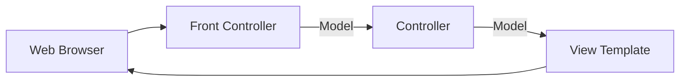

### Spring MVC Front Controller

- **[Front Controller]** 稱為 `DispatcherServlet`
    - 它是 Spring 框架的一部分，由 Spring 開發團隊預先開發完成
    - 開發者不需要自己建立，它已包含在下載的 Spring jar 檔案中
    - **[功能]** 負責接收第一個進入的請求 (incoming request)，並將其委派 (delegate) 給系統中的其他物件
- **[開發者的職責]** 開發者需要負責建立以下元件：
    - **Model objects** (對應流程圖中的橘色部分)
    - **View templates** (對應流程圖中的深綠色部分)
    - **Controller classes** (對應流程圖中的黃色部分)

### Spring MVC 開發者需建立的元件

根據 Spring MVC 的運作流程，開發者需要親自實作並負責以下三個部分：

- **Model objects** (對應流程圖中的橘色部分)
    - 包含應用程式運行所需的數據
- **View templates** (對應流程圖中的深綠色部分)
    - 用於渲染數據並生成最終 HTML 頁面
- **Controller classes** (對應流程圖中的黃色部分)
    - 包含應用程式的核心處理邏輯

### Controller 的角色與職責

- **[定義]** Controller 是由開發者親自撰寫的程式碼
- **[核心功能]** 承擔應用程式的**業務邏輯 (Business Logic)**
- **[具體任務]**
    - **處理請求 (Handle the request)**：當 Front Controller 將請求委派過來時，由 Controller 接手處理
    - **數據操作 (Store/retrieve data)**：從資料庫 (db) 或 Web Service 存取或儲存數據
    - **準備數據 (Place data in model)**：將處理好的數據放入 Model 物件中
    - **導向頁面 (Send to appropriate view template)**：將處理結果傳送至正確的 View 模板進行呈現

### Model 物件的角色

- **核心功能**：Model 是一個容器，專門用於存放應用程式的資料
    - 它本身不處理邏輯，而是作為 Controller 與 View 之間的數據傳遞媒介
- **資料來源**：Controller 負責從後端系統獲取資料
    - 資料來源可以是資料庫 (Database)
    - 可以是 Web 服務 (Web Service)
    - 也可以透過 Spring Bean 取得
- **資料格式**：Model 中可以存放任何 Java 物件或集合 (Collection)
    - 將這些物件放入 Model 後，即可傳遞給對應的 View Template 進行渲染

### View Template (檢視模板)

- **功能**：接收來自 Model 的資料，並負責將這些資料顯示給使用者
    - 開發者負責建立頁面，並定義資料在網頁上的呈現方式
- **Spring MVC 的彈性**：Spring MVC 支援多種不同的檢視模板，具有高度的靈活性
- **Thymeleaf**
    - 本課程主要使用的模板，也是最常見的選擇
    - View Template 可以讀取 Model 中的資料並將其渲染至網頁上（例如：將資料列表顯示出來）

### View Template 的功能與靈活性

- **[核心任務]** 提供數據給使用者進行視覺化呈現
    - **範例一 (數據列表)**：若後端提供學生名單或產品列表，View Template 可以將其轉換為 HTML 表格進行顯示
    - **範例二 (互動確認)**：若使用者完成註冊（如航空公司航班或電腦課程），View Template 可顯示確認訊息或確認編號
- **[高度靈活性]** Spring MVC 支援多種不同的模板引擎，開發者可以根據需求進行更換
    - **推薦使用**：Thymeleaf
    - **其他支援選項**：
        - Groovy
        - Velocity
        - FreeMarker
        - 以及其他多種類型

### 支援其他 View Templates

- **Spring MVC 具備靈活性**，支援多種 View Template 技術
    - 除了 Thymeleaf，還包括以下技術：
        - **Groovy**
        - **Velocity**
        - **Freemarker**
- **[參考資源]** 更多詳細資訊與技術比較，可參考官方資源
    - 網址：`www.luv2code.com/spring-mvc-views`

---

### 課程總結與後續預告

- **[本段回顧]** 完成了 Spring MVC 理論基礎的介紹
    - 涵蓋了 Model、View、Controller 三大核心概念
- **[未來預告]** 後續課程將進入實作階段
    - 探討 Spring MVC 的其他功能，如表單驗證 (forms validation)
    - 開始編寫更多程式碼

### 讀取表單資料 (Reading Form Data) 流程

- **[核心概念]** 學習如何透過 Spring MVC 讀取使用者輸入的表單資料
    - 這是一個貫穿 MVC 架構的完整流程，結合了先前學過的 Controller、Model 與 View
- **[高階流程] (High Level View)**
    - **步驟一：使用者輸入**
        - 使用者在瀏覽器中造訪網站 (例如輸入 URL: `/show_form`)
        - 頁面顯示表單 (由 `helloworld-form.html` 渲染) 要求輸入資料 (例如："What's your name?")
    - **步驟二：提交與處理**
        - 使用者填寫資訊並點擊 "Submit Query"
        - 資料傳送至 Spring MVC 應用程式進行處理
    - **步驟三：顯示結果**
        - 應用程式處理完請求後，導向至確認頁面 (例如: `helloworld.html`)
        - 將使用者輸入的資料 (例如："John Doe") 插入頁面並顯示
        - 最終呈現 "Hello World of Spring! Student name: John Doe" 的訊息

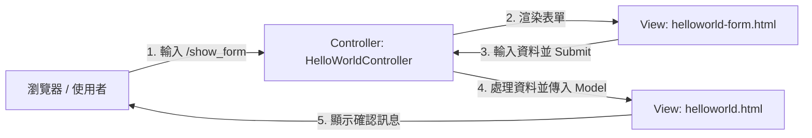

### Controller 中的多重請求映射 (Multiple Request Mappings)

- **[核心概念]** 一個單一的 Controller 可以包含多個不同的請求映射 (Request Mappings)
    - 這允許同一個 Controller 負責處理整個功能流程的不同階段（例如：顯示頁面 $\rightarrow$ 處理數據 $\rightarrow$ 顯示結果）
- **[實作範例]** 以 `HelloWorldController` 為例，它包含兩個主要的映射路徑：
    - **映射一：顯示表單**
        - 路徑：`/show_form`
        - 功能：回傳初始的表單頁面
    - **映射二：處理表單提交**
        - 路徑：`/process_form`
        - 功能：接收資料後，將資料帶入確認頁面並顯示結果

#### Controller 程式碼結構實作

```java
@Controller
public class HelloWorldController {

    // 映射一：顯示初始表單
    @GetMapping("/show_form")
    public String showForm() {
        return "helloworld-form";
    }

    // 映射二：處理提交後的邏輯 (待續)
    @GetMapping("/process_form")
    public String processForm() {
        // 處理邏輯與回傳結果頁面
        return "helloworld";
    }
}
```

### 實作表單處理方法 (Processing Form Submission)

- **[新增功能]** 除了顯示表單的方法外，還需要一個對應的方法來處理使用者提交後的請求
    - **Request Mapping**：設定為 `/process_form`，用來接收表單提交的動作
    - **回傳結果**：處理完畢後，該方法會回傳一個確認頁面（例如 `helloworld.html`），用於顯示處理後的結果（如："Hello World of Spring! Student name: [名稱]"）
- **[開發重點] 方法名稱的靈活性**
    - 在 Spring MVC 中，**方法名稱（Method Name）本身並不重要**
    - 開發者可以根據邏輯自定義名稱，例如 `showForm`、`processForm`、`doWork` 或甚至是 `foobar`
    - **關鍵在於**：透過 `@RequestMapping` 將特定的 **URL 路徑** 正確地對應到對應的處理方法上

### 表單功能開發流程 (Form Development Process)

- **[核心流程]** 建立表單功能時，需要完成以下步驟：

    1. 建立 Controller Class
    2. 建立用於顯示表單的 Controller 方法 (例如：`showForm`)
    3. 建立對應的 View 頁面 (HTML Form)
    4. 建立用於處理表單的 Controller 方法
    5. 建立用於顯示處理結果的 View 頁面

- **注意**：顯示表單與處理表單需要分別建立對應的 Controller 方法與 View 頁面。

---

**[課程預告]** 下一段影片將開始編寫實作程式碼，進入實際開發階段。

### 開始開發 Spring MVC 控制器

- **[實作準備]** 使用現有的專案作為基礎，進入 IDE 開始編寫程式碼以處理表單資料
- **[建立核心類別]** 建立第一個控制器類別
    - **類別名稱**：`HelloWorldController`
    - **用途**：作為處理表單請求與邏輯的核心組件

### Controller 實作細節與開發規劃

- **[必要註解] 宣告 Controller 身分**
    - 必須在類別上方加上 `@Controller` 註解
    - **[原因]** 這樣 Spring 框架才能辨識該類別是一個 Spring MVC 控制器，並將其納入管理，以便處理相關的 Web 請求
- **[開發思維] 邏輯規劃與註解先行**
    - 在編寫具體程式碼前，先透過程式碼註解（Comments）規劃好開發目標，有助於保持開發節奏並確保功能完整
    - 對於一個典型的表單功能，開發者應預先規劃出至少兩個核心方法：

        1. **顯示初始表單的方法**：負責將表單頁面呈現給使用者
        2. **處理表單提交的方法**：負責接收並處理使用者輸入的資料

### 實作顯示表單的方法

- **[實作步驟]** 開始建立第一個處理請求的方法：
    - **定義方法名稱**：設定為 `showForm`
    - **設定路徑映射**：使用 `@GetMapping("/show_form")`，將使用者對 `/show_form` 的請求導向此方法
    - **回傳 View 名稱**：方法回傳字串 `"helloworld-form"`
- **[運作機制]** Spring MVC 的自動化處理
    - 當方法回傳 `"helloworld-form"` 時，Spring MVC 會在後台自動尋找對應的 Thymeleaf 模板（即 `helloworld-form.html`）進行渲染

```java
@GetMapping("/show_form")
public String showForm() {
    return "helloworld-form";
}
```

### 實作顯示表單的方法 (Implementing the Show Form Method)

- **[方法邏輯]** 建立一個對應路徑為 `/show_form` 的方法，用來呈現初始表單
    - **回傳值**：回傳字串 `"helloworld-form"`
    - **[自動配置機制]** 因為專案中已包含 Thymeleaf 依賴項，Spring Boot 會自動配置並根據回傳名稱尋找對應的模板
    - **路徑對應**：回傳 `"helloworld-form"` 會讓系統自動去尋找 `helloworld-form.html` 檔案

### 建立 View 視圖頁面

- **[存放位置]** 所有的 Thymeleaf 模板檔案都必須存放在專案的特定目錄下：
    - `src/main/resources/templates`
- **[實作步驟]**

    1. 切換至 `src/main/resources/templates` 目錄
    2. 建立一個新的 HTML 檔案（例如：`helloworld-form.html`），用於建構實際的表單介面

### 建立表單模板 (HelloWorldForm.html)

- **[實作步驟]** 建立名為 `HelloWorldForm.html` 的 Thymeleaf 模板檔案
    - 檔案位置：`src/main/resources/templates/`
    - 檔案內容來源：複製自先前建立的 `HelloWorld.html`
    - **[複製內容]** 主要複製 Thymeleaf 的 XML 命名空間宣告（前兩行程式碼）
    - **目的**：確保表單頁面擁有正確的 Thymeleaf 語法支援與標籤解析能力

### 實作表單 HTML 元素

- **[定義表單]** 在 HTML 中建立 `<form>` 標籤，用來收集使用者輸入的資料
- **[設定提交路徑]** 使用 `action` 屬性來指定表單資料要傳送到哪一個 URL
    - **實作方式**：`<form action="process_form">`
    - **[運作邏輯]** 當使用者點擊提交按鈕時，瀏覽器會發送一個請求到 `/process_form` 路徑，這必須與 Controller 中處理該請求的方法（例如使用 `@PostMapping("/process_form")`）所定義的路徑完全一致

### 設定表單輸入欄位

- **[建立輸入欄位]** 在 `<form>` 標籤內部新增一個文字輸入框 (`<input>`)，用於收集使用者資料
    - **設定方法**：`method="get"`（指定以 GET 方式發送請求）
    - **設定路徑**：`action="/process_form"`（指定表單提交後請求的目標 URL）
    - **欄位名稱**：`name="studentName"`
        - **[重要性]** 此名稱作為表單欄位的 key，Spring MVC 會根據此名稱提取使用者輸入的資料
    - **提示文字**：`placeholder="What's your name?"`
        - **[用途]** 在輸入框內顯示提示文字，引導使用者輸入內容

```html
<form action="/process_form" method="get">
    <input type="text" name="studentName" placeholder="What's your name?">
</form>
```

- **[運作流程]** 當使用者輸入名字並按下提交按鈕時：

    1. 瀏覽器會發送一個 GET 請求到 `/process_form`
    2. 請求參數會包含 `studentName` 欄位及其對應的值（例如：`?studentName=Richard`）
    3. Spring MVC 會將這些資料傳遞給對應的 Controller 方法

### 實作表單 HTML 元素 (續)

- **[新增提交按鈕]** 為表單添加最後一個必要的元件，以便使用者送出資料
    - **實作方式**：使用 `<input>` 標籤並將 `type` 屬性設定為 `submit`
    - **程式碼範例**：

```html
<input type="submit">
```

- **[表單結構檢查]** 完成基礎表單開發後的最終確認清單：
    - 是否已包含基本的輸入欄位（Input fields）
    - 是否已包含提交按鈕（Submit button）
- **[Spring Boot 的自動化處理]**
    - **[自動補全機制]** 當 Controller 回傳字串時，Spring Boot 會在後台自動將該字串與 `.html` 擴展名進行組合
    - **對應關係**：回傳 `"helloworld-form"` 即對應到 `helloworld-form.html` 模板檔案

### 表單提交的連動檢查

- **[目前狀態]** 雖然表單頁面已能成功顯示，但功能尚未完整
    - **[問題點]** 目前僅完成了「呈現表單」的邏輯，尚未實作「處理提交資料」的邏輯
- **[潛在錯誤]** 若此時點擊表單中的提交按鈕，會發生 **404 Not Found** 錯誤
    - **原因**：HTML 表單中的 `action="/process_form"` 指向了一個路徑，但後端 Controller 中目前還沒有任何方法可以處理這個 `/process_form` 的請求
- **[關鍵注意事項]**
    - **路徑一致性**：HTML `action` 屬性所指定的路徑，必須與 Controller 中定義的處理路徑完全匹配
    - **大小寫敏感**：路徑對應是區分大小寫的（Case Sensitive），必須確保兩者的大小寫完全一致

### 實作處理表單提交的方法

- **[新增處理方法]** 在 Controller 類別中建立一個新的方法，專門用來接收並處理來自 HTML 表單的資料
    - **方法名稱**：可以自定義（例如：`processForm`），不影響功能運作
    - **回傳值**：回傳一個字串，代表處理完成後要顯示的 Thymeleaf 模板名稱（例如：`"helloworld"`）
- **[設定路徑映射]** 使用 `@RequestMapping` 註解來定義該方法對應的 URL 路徑
    - **實作方式**：使用 `@RequestMapping("/process_form")`
    - **[重要原則]** 此路徑必須與 HTML 表單中 `<form>` 標籤的 `action` 屬性值完全一致

```java
@RequestMapping("/process_form")
public String processForm() {
    return "helloworld";
}
```

- **[建立處理方法]** 在 Controller 中新增一個方法來接收並處理來自 HTML 表單的請求
    - **實作方式**：使用 `@RequestMapping` 註解來定義該方法對應的 URL 路徑
    - **程式碼範例**：

```java
// 需要一個 Controller 方法來處理 HTML 表單
@RequestMapping("/processForm")
public String processForm() {
    return "helloworld";
}
```

- **[核心連動機制]** 這是將前端與後端邏輯「黏合」在一起的關鍵點
    - **連動邏輯**：HTML 表單中的 `action` 屬性（例如 `<form th:action="#/processForm" ...>`）會將請求發送到指定的 URL
    - **對應關係**：該 URL 必須與 Controller 中 `@RequestMapping("/processForm")` 所定義的路徑完全一致，瀏覽器才能正確找到對應的後端處理邏輯
- **[下一步規劃]** 目前僅建立了處理請求的結構，接下來需要撰寫具體的 View Template (Thymeleaf 模板) 內容，以決定處理完請求後要回傳給使用者的頁面內容

### 建立檔案備份 (Creating a File Backup)

- **[開發習慣]** 在新增或修改程式碼之前，先為現有的檔案建立備份副本
    - **目的**：保留原始版本的程式碼，以便在開發新功能失敗或需要參考舊邏輯時使用
- **[實作步驟]** 以 `helloworld.html` 為例：

    1. 複製原始檔案 (`helloworld.html`)
    2. 貼上並重新命名為 `helloworld.backup`
    3. 關閉備份檔案，僅保留原始檔案作為開發基底

### 準備 `helloworld.html` 模板

- **[清理備份檔案]** 在進行任何修改前，先關閉備份檔（如 `helloworld.backup`），避免誤改原始碼
- **[重置模板內容]** 開啟 `helloworld.html` 並進行以下清理工作，為新功能開發騰出空間：
    - **移除 CSS 引用**：刪除 `<head>` 區塊中原有的 `<link rel="stylesheet" ...>` 標籤，因為目前不需要舊有的 CSS 樣式
    - **清空 Body 內容**：移除 `<body>` 標籤內的所有既有資訊，以便稍後重新填入新的 HTML 結構與 Thymeleaf 語法

### 顯示表單提交的資料 (Displaying Form Submission Data)

- **[實作內容]** 在 `helloworld.html` 中新增顯示表單提交資料的邏輯
    - **標題**：使用 `<h1>` 標籤顯示 "Hello World of Spring"
    - **換行**：使用 `<br>` 標籤進行排版
    - **顯示學生姓名**：使用 `<span>` 標籤搭配 Thymeleaf 表達式

```html
<body>
    Hello World of Spring!
    <br><br>
    Student name: <span th:text="${param.studentName}"></span>
</body>
```

- **[核心語法]** `th:text="${param.studentName}"`
    - **`th:text`**：Thymeleaf 屬性，用於替換元素內的文字內容
    - **`${param.studentName}`**：Spring 提供的特殊變數
        - **`param`**：代表表單提交的參數 (Request Parameters)
        - **`studentName`**：對應 HTML 表單中 `<input>` 標籤的 `name` 屬性
        - **作用**：將使用者在表單輸入的資料顯示在網頁上
- **[表單欄位名稱]** 定義 HTML 表單中的欄位名稱（例如：`studentName`）
    - **實作方式**：在 `<input>` 標籤中使用 `name` 屬性
    - \`\`\`html

      <input type="text" name="studentName" placeholder="What's your name?" />

```javascript
- **[獲取表單資料]** 透過 Thymeleaf 的 `$` 語法，精確引用表單欄位的名稱來讀取資料
    - **語法規則**：使用 `${param.欄位名稱}` 來讀取對應的表單資料
    - **關鍵原則**：`param.` 後面的名稱必須與 HTML 表單中的 `name` 屬性值完全一致
    - **範例**：
      ```html
      Student name: <span th:text="'Student name: ' + ${param.studentName}" />/
```

### 執行應用程式

- **[執行操作]** 儲存檔案後，重新執行應用程式以驗證程式碼
    - **啟動方式**：使用 IntelliJ IDEA 的綠色執行按鈕
    - **啟動結果**：系統顯示 Spring Boot 的啟動日誌，確認 Tomcat 伺服器成功啟動
- **[驗證頁面]** 在瀏覽器網址列輸入特定的 URL 路徑來測試功能
    - **操作**：在網址列輸入 `/showForm` 並按下 Enter
    - **結果**：成功載入對應的頁面（若路徑未正確對應則會顯示 Whitelabel Error Page）
- **[成功驗證]** 實際執行表單提交流程，確認 Spring MVC 能正確讀取表單資料
    - **測試步驟**：

        1. 在瀏覽器輸入學生姓名（例如：`John`）
        2. 按下 Submit 按鈕
        3. 頁面重新導向至 `/processForm` 路徑

    - **結果**：頁面成功顯示 `Hello World of Spring` 以及使用者輸入的 `Student name: John`
    - **意義**：驗證了 Spring MVC 能正確處理表單資料（Form Data），並將其傳遞至 View Template 進行渲染

### Spring Model

- **[定義]** Spring Model 是一個用來存放應用程式資料的容器 (Container)
- **[在 Controller 中的作用]** 開發者可以在 Controller 程式碼中將任何資料放入 Model 中
    - **可存放的資料類型**：
        - 字串 (Strings)
        - 物件 (Objects)
        - 從資料庫取得的資訊 (Information from database) 等等
- **[在 View 中的作用]** View 頁面可以存取並讀取 Model 中存放的資料，以便於呈現給使用者

```mermaid
flowchart LR
    Browser["Web Browser"] --> FrontController["Front Controller"]
    FrontController -->|"Model"| Controller["Controller"]
    Controller -->|"Model"| ViewTemplate["View Template"]
    ViewTemplate --> Browser
```

### 在 Controller 中處理與傳遞資料

- **[開發邏輯範例]** 建立一個處理表單資料的方法，執行以下步驟：

    1. 讀取表單資料（例如：學生的姓名）
    2. 對資料進行處理（例如：轉換為全大寫）
    3. 將處理後的結果存入 Model 中
    4. 讓 View 頁面讀取 Model 資料並顯示

- **[實作範例]** 在 Controller 方法中同時注入 `HttpServletRequest` 與 `Model` 物件

```java
@RequestMapping("/processFormVersionTwo")
public String letsShoutDude(HttpServletRequest request, Model model) {
    // 1. 從 HTML 表單讀取請求參數
    String theName = request.getParameter("studentName");

    // 2. 將資料轉換為全大寫
    theName = theName.toUpperCase();

    // 3. 建立訊息內容
    String result = "Yo! " + theName;

    // 4. 將訊息新增至 Model 中，以便 View 存取
    model.addAttribute("message", result);

    // 5. 回傳 View 的名稱
    return "helloworld";
}
```

- **[核心技術點]**
    - **`HttpServletRequest`**：用於從 HTTP 請求中讀取使用者輸入的參數（透過 `getParameter("欄位名稱")` 方法）。
    - **`Model.addAttribute("key", value)`**：將處理後的資料（`value`）與一個特定的名稱（`key`）綁定，這樣 Thymeleaf 模板就能透過該名稱找到資料。
    - **資料流向**：`Request (Form Data) -> Controller (Processing) -> Model (Storage) -> View (Display)`

### Controller 方法的參數靈活性

- **[特性]** 在 Spring MVC 中，建立控制器方法時可以傳遞非常靈活的參數
- **[常用參數]**
    - **`HttpServletRequest`**：
        - 用於在控制器程式碼中讀取 HTML 表單傳來的資料
        - 運作方式與標準的伺服器請求 (Server Request) 相同
    - **`Model`**：
        - 充當一個容器 (Container)
        - 用來存放表單資料或其他處理後的資料，以便傳遞給 View 頁面

```java
@RequestMapping("/processFormVersionTwo")
public String letsShoutDude(HttpServletRequest request, Model model) {
    // ... 方法內容
}
```

### Model 屬性綁定詳解

- **[邏輯實作範例]** 建立一個會「大喊」的訊息，將使用者輸入的名稱轉換為全大寫並組合字串

```java
@RequestMapping("/processFormVersionTwo")
public String letsShoutDude(HttpServletRequest request, Model model) {
    // 1. 讀取表單參數
    String theName = request.getParameter("studentName");

    // 2. 轉換為全大寫 (模擬大喊的效果)
    theName = theName.toUpperCase();

    // 3. 建立訊息內容 (例如: "Yo! PAULIE")
    String result = "Yo! " + theName;

    // 4. 將結果存入 Model
    model.addAttribute("message", result);

    // 5. 回傳 View 名稱
    return "helloworld";
}
```

- **[Model 屬性綁定詳解]** 使用 `model.addAttribute(name, value)` 方法進行資料傳遞
    - **`name`&#32;(屬性名稱)**：一個字串，作為 View 頁面存取資料時的「索引鍵」或「名稱」
    - **`value`&#32;(屬性值)**：實際要傳遞給 View 的資料物件（例如：處理後的字串 `result`）

| 組件 | 說明 | 範例程式碼中的內容 |
| --- | --- | --- |
| Name (Key) | 存取資料時使用的名稱 | "message" |
| Value | 實際要顯示或使用的資料內容 | result |

### Model 屬性命名的靈活性

- **[命名規則]** `model.addAttribute(name, value)` 中的 `name` (屬性名稱) 可以根據開發者需求自由命名
    - 例如：可以使用 `"foobar"`、`"funny"` 或 `"silly"` 等任何字串
    - **[關鍵原則]** 只要在應用程式的其他部分（特別是 View 模板中）保持名稱一致即可

### 從 Controller 連結至 View

- **[連結機制]** Controller 方法透過 `return` 一個字串來指定要顯示的 View 模板名稱
- **[實作範例]** 在目前的程式碼中，回傳 `"helloworld"` 會引導程式前往對應的 `helloworld` 模板進行渲染

```java
@RequestMapping("/processFormVersionTwo")
public String letsShoutDude(HttpServletRequest request, Model model) {
    // ... 處理邏輯 ...
    model.addAttribute("message", result);

    // 回傳 View 的名稱，連結至 helloworld 模板
    return "helloworld";
}
```

### 在 Thymeleaf 模板中存取 Model 資料

- **[存取語法]** 在 View 頁面中，可以使用美元符號 `$` 來存取 Model 中存放的資料
- **[Thymeleaf 實作]** 透過 `th:text` 屬性結合 `${...}` 表達式來動態顯示內容

```html
<html>
<body>
    Hello World of Spring!
    <!-- 使用 ${message} 來存取 Model 中名為 "message" 的屬性 -->
    <span th:text="${message}"></span>
</body>
</html>
```

### 在 Thymeleaf 中存取與傳遞多個 Model 屬性

- **[存取機制]** 模板中使用的名稱必須與 Controller 中設定的屬性名稱完全一致
    - 例如：若在 Controller 使用 `model.addAttribute("message", result)`
    - 則在 Thymeleaf 模板中須使用 `${message}` 來讀取該資料
- **[添加多個資料項目]** 可以透過多次呼叫 `model.addAttribute` 來向 Model 容器中放入多個不同的資料物件
    - **[實作範例]** 同時傳遞訊息、學生列表與購物車資訊

```java
// 1. 取得資料 (Get the data)
String result = ...;
List<Student> theStudentList = ...;
ShoppingCart theShoppingCart = ...;

// 2. 將多個項目添加到 Model 中
model.addAttribute("message", result);
model.addAttribute("students", theStudentList);
model.addAttribute("shoppingCart", theShoppingCart);
```

| 屬性名稱 (Attribute Name) | 對應資料 (Value) | 模板存取方式 |
| --- | --- | --- |
| message | result | ${message} |
| students | theStudentList | ${students} |
| shoppingCart | theShoppingCart | ${shoppingCart} |

### 向 Model 添加更多資料

- **[多重屬性綁定]** 可以透過多次調用 `model.addAttribute` 來向 Model 中添加任意數量的資料項目
    - 每一組資料都遵循「名稱-值」對 (name-value pair) 的原則

```java
// 1. 先獲取/準備資料
String result = ...;
List<Student> theStudentList = ...;
ShoppingCart theShoppingCart = ...;

// 2. 將多個屬性添加到 Model 中
model.addAttribute("message", result);
model.addAttribute("students", theStudentList);
model.addAttribute("shoppingCart", theShoppingCart);
```

- **[應用場景]** 這種機制允許 Controller 一次性將多種不同類型的資料（例如：單一訊息、學生清單、購物車物件）打包傳遞給 View 模板進行渲染

### 在 HelloWorldController 中新增處理邏輯

- **[開發目標]** 在 Controller 中建立一個新的方法來處理表單提交的資料，並執行以下步驟：
    - 讀取表單中的學生姓名 (Read the form data: student's name)
    - 將姓名轉換為大寫 (Convert the name to upper case)
    - 將轉換後的大寫版本添加到 Model 中 (Add the uppercase version to the model)
- **[實作範例]** 在 `HelloWorldController.java` 中新增處理表單的方法：

```java
@RequestMapping("/processForm")
public String processForm(HttpServletRequest request, Model model) {
    // 需要一個處理 HTML 表單的方法

    // 1. 讀取表單資料
    String studentName = request.getParameter("studentName");

    // 2. 將姓名轉換為大寫
    String upperCaseName = studentName.toUpperCase();

    // 3. 將大寫版本添加到 Model
    model.addAttribute("studentName", upperCaseName);

    return "helloworld";
}
```

### 實作處理表單邏輯的方法

- **[開發目標]** 實作一個新的 Controller 方法來處理表單提交的邏輯：
    - 讀取表單資料 (Read form data)
    - 將資料添加到 Model 中 (Add data to the model)
- **[實作範例]** 定義 `letsShoutDude` 方法：

```java
public String letsShoutDude(HttpServletRequest request, Model model) {
    // 待實作內容
}
```

- **[關鍵參數說明]**
    - `HttpServletRequest request`: 用於獲取來自客戶端（HTML 表單）的請求資訊與參數
    - `Model model`: 用於將資料存入容器，以便後續在 Thymeleaf 模板中進行渲染
    - **[注意]** 在 IDE 自動補全時，應確保選擇來自 `org.springframework.ui` 的 `Model` 介面
- **[更新請求映射]** 為 `letsShoutDude` 方法新增 `@RequestMapping` 註解，將其路徑設定為 `/processFormVersion2`
- **[指定回傳頁面]** 該方法將回傳字串 `"helloworld"`，這告訴 Spring MVC 在處理完邏輯後，要使用名為 `helloworld.html` 的模板來顯示結果

```java
@RequestMapping("/processFormVersion2")
public String letsShoutDude(HttpServletRequest request, Model model) {
    return "helloworld";
}
```

### 實作處理表單邏輯的開發規劃

- **[開發思維]** 在正式編寫程式碼之前，先透過註解（Comments）規劃邏輯步驟，以確保開發流程正確且不遺漏關鍵動作
- **[規劃的邏輯步驟]**

    1. 讀取來自 HTML 表單的請求參數 (Read the request parameter from the HTML form)
    2. 將資料轉換為全大寫 (Convert the data to all uppercase)
    3. 將處理後的資料加入 Model 中 (Create the message/add to the model)

- **[實作中的程式碼結構]**

```java
@RequestMapping("/processFormVersion2")
public String letsShoutDude(HttpServletRequest request, Model model) {
    // 1. read the request parameter from the HTML form
    // 2. convert the data to all caps
    // 3. create the message

    return "helloworld";
}
```

### 實作處理表單邏輯的完整程式碼

- **[實作範例]** 完成 `letsShoutDude` 方法的程式碼實作：

```java
@RequestMapping("/processFormVersion2")
public String letsShoutDude(HttpServletRequest request, Model model) {
    // 1. 讀取來自 HTML 表單的請求參數 (Read the request parameter from the HTML form)
    String theName = request.getParameter("studentName");

    // 2. 將資料轉換為全大寫 (Convert the data to all caps)
    String theNameUpper = theName.toUpperCase();

    // 3. 建立訊息並加入 Model (Create the message and add to the model)
    String message = "Yo, " + theNameUpper + "!";
    model.addAttribute("message", message);

    return "helloworld";
}
```

- **[邏輯細節]**
    - **讀取參數**: 使用 `request.getParameter("欄位名稱")` 來獲取 HTML 表單中對應的輸入值（在此例中為 `"studentName"`）
    - **資料處理**: 透過 Java 字串方法（如 `.toUpperCase()`）對取得的資料進行加工
    - **傳遞資料**: 使用 `model.addAttribute("屬性名稱", 實際值)` 將處理後的結果（例如 `message`）存入 Model 容器，以便 Thymeleaf 模板可以讀取並顯示

### 實作處理表單邏輯的方法 (續)

- **[實作細節]** 完成 `letsShoutDude` 方法的邏輯編寫：
    - **轉換資料**：使用 `toUpperCase()` 將讀取的姓名轉換為全大寫
    - **建立訊息**：組合一個自定義的字串訊息（例如："Yo! " 加上處理後的姓名）
    - **存入 Model**：使用 `model.addAttribute(attributeName, value)` 方法將資料放入容器
- **[程式碼實作]**：

```java
@RequestMapping("/processFormVersion2")
public String letsShoutDude(HttpServletRequest request, Model model) {
    // 1. read the request parameter from the HTML form
    String theName = request.getParameter("studentName");

    // 2. convert the data to all caps
    theName = theName.toUpperCase();

    // 3. create the message
    String result = "Yo! " + theName;

    // 4. add message to the model
    model.addAttribute("message", result);

    return "helloworld";
}
```

- **[Model 屬性綁定說明]**
    - `model.addAttribute("message", result);`
        - `"message"`: 這是屬性的**名稱 (Name)**，即在 Thymeleaf 模板中用來存取該資料的鍵值 (Key)
        - `result`: 這是實際要傳遞的**值 (Value)**，即處理後的字串內容

### 實作處理表單邏輯的完整程式碼 (續)

- **[完成邏輯步驟]** 實作最後兩步：建立訊息並將其存入 Model
    - 透過字串連接建立訊息：`String result = "Yo! " + studentName;`
    - 將結果存入 Model，以便 View 存取：`model.addAttribute("message", result);`
- **[指定回傳頁面]** 最後回傳 View 的名稱 `"helloworld"`，以觸發 Thymeleaf 模板渲染
- **[完整實作範例]** `letsShoutDude` 方法的最終版本：

```java
@RequestMapping("/processFormVersion2")
public String letsShoutDude(HttpServletRequest request, Model model) {
    // 1. 讀取表單資料
    String studentName = request.getParameter("studentName");

    // 2. 將姓名轉換為全大寫
    String upperCaseName = studentName.toUpperCase();

    // 3. 建立訊息並將其存入 Model
    String result = "Yo! " + upperCaseName;
    model.addAttribute("message", result);

    return "helloworld";
}
```

### 更新 View 頁面以存取 Model 資料

- **[目標]** 修改 HTML 模板（例如 `helloworld.html`），使其能夠讀取並顯示 Controller 傳遞過來的訊息。
- **[實作步驟]** 在 HTML 檔案中，使用 Thymeleaf 的表達式語法來讀取 Model 中的屬性值。
- **[範例實作]** 在 `helloworld.html` 中加入讀取訊息的程式碼：

```html
<!-- 假設要在頁面中顯示來自 Model 的 message 屬性 -->
<p th:text="${message}"></p>
```

> **註記**：透過 `${...}` 語法，Thymeleaf 可以直接存取 Model 容器中對應的鍵值（Key），並將其內容渲染到 HTML 元素中。

### 在 Thymeleaf 中讀取 Model 資料

- **[語法規則]** 使用 $\\{\\{attributeName\\}\\} 語法來存取 Model 中的屬性
    - $\\{\\{...\\}\\} 會從 Model 容器中尋找指定的鍵值 (Key)
    - 找到對應的資料後，會將其內容取出並渲染到 HTML 元素中
- **[實作範例]** 在 HTML 中顯示從 Controller 傳來的 `message` 屬性：

```html
<span th:text="${message}"></span>
```

- **[運作邏輯]**
        - 當 Controller 執行 `model.addAttribute("message", result);` 時
        - Thymeleaf 透過 `${message}` 找到 `result` 的值並填入 `<span>` 標籤內

### 更新 HTML 表單以對應新的路徑

- **[必要動作]** 當 Controller 中的 `@RequestMapping` 路徑發生變更時，必須同步更新 HTML 表單中的 `action` 屬性
- **[目的]** 確保表單提交後的請求能夠正確導向到對應的 Controller 方法，避免出現 404 Not Found 錯誤
- **[同步更新]** 必須將 Controller 中新增的 `@RequestMapping` 路徑同步更新至 HTML 表單的 `th:action` 屬性中
- **[實作方式]** 建議直接從 Controller 程式碼中複製路徑，再貼上到 HTML 檔案中
    - **[原因]** 由於 URL 路徑對**大小寫非常敏感 (Case Sensitive)**，使用複製貼上可以有效避免拼字錯誤或大小寫不一致的問題

**[更新前後對照]**

- **Controller 中的路徑：**

```java
@RequestMapping("/processFormVersionTwo")
```

- **HTML 表單中的路徑 (更新後)：**

```html
<form th:action="@{/processFormVersionTwo}" method="GET">
      <!-- ... 其他表單欄位 ... -->
  </form>
```

### 執行與測試表單處理流程

- **[測試步驟]**

    1. 啟動應用程式並開啟表單頁面 (`http://localhost:8080/showForm`)
    2. 在 `studentName` 輸入框中輸入姓名（例如：`Larry`）
    3. 點擊提交按鈕

- **[預期結果]**
    - 瀏覽器會導向處理路徑：`http://localhost:8080/processFormVersionTwo?studentName=Larry`
    - 最終顯示的頁面內容應包含：
        - 標題：`Hello World of Spring!`
        - 原始輸入：`Student name: Larry`
        - **處理後的訊息**：`The message: Yo! LARRY`
- **[邏輯驗證]**
    - 透過觀察「Yo! LARRY」可以看出，後端已成功執行了 `toUpperCase()` 轉換，並透過 `model.addAttribute("message", result)` 將結果傳遞給了前端模板進行渲染。

### 完整表單處理流程總結

- **[後端處理邏輯]** 在 Controller 中完成的資料轉換與傳遞：
    - **讀取參數**：透過 `request.getParameter("studentName")` 取得使用者輸入。
    - **資料轉換**：例如將姓名轉換為全大寫（`.toUpperCase()`）並加上前綴（`"Yo! "`）以達成「大聲喊叫」的效果。
    - **存入 Model**：使用 `model.addAttribute("message", result)` 將處理後的字串存入 Model 容器。
- **[前端渲染機制]** 如何將資料呈現於網頁：
    - **Thymeleaf 語法**：在 HTML 模板中使用 `<span th:text="${message}"></span>`。
    - **資料對應**：Thymeleaf 會根據 `${message}` 這個鍵值 (Key)，從 Model 中取出對應的 `result` 字串，並將其填入 HTML 標籤中。
- **[執行結果範例]**
    - **輸入**：`studentName = "Larry"`
    - **Controller 處理**：`result = "Yo! LARRY"`
    - **瀏覽器顯示**：
        - Student name: Larry
        - The message: **Yo! LARRY**

### 使用 @RequestParam 讀取 HTML 表單資料

- **[開發目標]** 建立一個新的方法來處理表單資料，流程如下：
    - 讀取表單中的 `studentName`
    - 將姓名轉換為大寫
    - 將大寫後的版本存入 Model 中
- **[方法對照：傳統方式 vs. Spring 註解方式]**

#### 傳統方式：使用 `HttpServletRequest`

    - 需要在方法參數中注入 `HttpServletRequest` 物件
    - 透過 `request.getParameter("parameterName")` 來手動取得值
    - **範例程式碼：**

```java
@RequestMapping("/processFormVersionTwo")
      public String letsShoutDude(HttpServletRequest request, Model model) {
          // 從 HTML 表單讀取 request parameter
          String theName = request.getParameter("studentName");
          // ... 後續處理
      }
```

#### Spring 方式：使用 `@RequestParam` 註解

    - **[優點]** 不需要直接操作 `HttpServletRequest` 物件，程式碼更簡潔
    - **[運作原理]** 直接在方法參數前加上 `@RequestParam`，Spring 會自動將對應的表單參數綁定到變數上
    - **範例程式碼：**

```java
@RequestMapping("/processFormVersionTwo")
      public String letsShoutDude(@RequestParam("studentName") String theName, Model model) {
          // 現在可以直接使用變數: theName
      }
```

### `@RequestParam` 的自動綁定機制

- **[核心功能]** 提供一種簡便的方式，讓 Spring 自動處理表單資料與 Java 變數之間的對應關係
- **[運作原理]**
    - Spring 會在後台讀取來自 HTTP 請求中的特定參數（例如 `studentName`）
    - 接著將讀取到的值自動綁定（Bind）到方法參數中指定的變數上（例如 `theName`）
- **[範例程式碼]**

```java
@RequestMapping("/processFormVersionTwo")
public String letsShoutDude(@RequestParam("studentName") String theName, Model model) {
    // Spring 會自動將請求中的 studentName 賦值給 theName 變數
    // 現在可以直接在應用程式中使用 theName
}
```

### `@RequestParam` 綁定實作示範

- **[開發策略]** 使用現有的程式碼作為模板進行快速開發
    - 複製 `processFormVersionTwo` 的完整邏輯
    - 針對新需求進行微調（例如將參數綁定方式改為 `@RequestParam`）
- **[實作邏輯]** 程式碼結構參考如下：

```java
@RequestMapping("/processFormVersionTwo")
public String letsShoutDude(HttpServletRequest request, Model model) {
    // 1. 從 HTML 表單讀取 request parameter
    String theName = request.getParameter("studentName");

    // 2. 將資料轉換為全大寫
    theName = theName.toUpperCase();

    // 3. 建立訊息
    String result = "Yo! " + theName;

    // 4. 將訊息加入 model
    model.addAttribute("message", result);

    return "helloworld";
}
```

### 更新處理邏輯版本

- **[版本迭代]** 為了進行新的功能測試，需要對現有的 Controller 方法進行修改：
    - **變更 Request Mapping**：將路徑從 `/processFormVersionTwo` 修改為 `/processFormVersionThree`
    - **重新命名方法**：將方法名稱從 `letsShoutDude` 修改為 `processFormVersionThree` 以符合新的版本需求
- **[範例程式碼]**

```java
@RequestMapping("/processFormVersionThree")
public String processFormVersionThree(HttpServletRequest request, Model model) {
    // ... 處理邏輯
}
```

### 實作 `@RequestParam` 參數綁定

- **[重構目標]** 將原本需要使用 `HttpServletRequest` 來讀取參數的方法，改為使用 Spring 的 `@RequestParam` 註解來自動綁定
- **[參數綁定邏輯]**
    - 使用 `@RequestParam("studentName")`
    - 這代表告訴 Spring：從 HTML 表單中尋找名稱為 `studentName` 的欄位，並將其值直接賦值給後續的變數（例如 `theName`）
- **[範例程式碼]**

```java
@RequestMapping("/processFormVersionThree")
public String processFormVersionThree(@RequestParam("studentName") String theName, Model model) {
    // 1. 直接使用綁定好的 theName，不再需要 request.getParameter("studentName")

    // 2. 將資料轉換為全大寫
    theName = theName.toUpperCase();

    // 3. 建立訊息
    String result = "Yo! " + theName;

    // 4. 將訊息加入 model
    model.addAttribute("message", result);

    return "helloworld";
}
```

### `@RequestParam` 的自動化優勢

- **[核心原理]** 當在參數前加上 `@RequestParam("studentName")` 時，Spring 會在幕後自動完成以下動作：
    - 讀取伺服器請求 (Server Request)
    - 從 HTML 表單中尋找名稱為 `studentName` 的參數
    - 將該值綁定到方法中指定的變數（例如 `theName`）
- **[開發效益]** 簡化程式碼，不再需要手動撰寫 `request.getParameter("studentName")` 這種冗長的邏輯
- **[程式碼重構對照]**

```java
// 重構前：需要手動讀取參數
@RequestMapping("/processFormVersionThree")
public String processFormVersionThree(HttpServletRequest request, Model model) {
    String theName = request.getParameter("studentName"); // 這行可以刪除
    // ... 其他邏輯
}

// 重構後：利用 @RequestParam 自動綁定
@RequestMapping("/processFormVersionThree")
public String processFormVersionThree(@RequestParam("studentName") String theName, Model model) {
    // Spring 會自動幫你把 studentName 的值賦值給 theName
    // 這裡可以直接開始處理 theName

    theName = theName.toUpperCase();
    String result = "Yo! " + theName;
    model.addAttribute("message", result);
    return "helloworld";
}
```

### 實作 Version 3 的處理邏輯

- **[邏輯更新]** 為了與之前的版本區隔，修改了回傳訊息的內容
- **[程式碼實作]**

```java
@RequestMapping("/processFormVersionThree")
public String processFormVersionThree(@RequestParam("studentName") String theName, Model model) {
    // 1. 將輸入的姓名轉換為全大寫
    theName = theName.toUpperCase();

    // 2. 建立一個獨特的訊息 (Version 3)
    String result = "Hey My Friend from v3! " + theName;

    // 3. 將訊息加入 model，以便在 View 中顯示
    model.addAttribute("message", result);

    // 4. 回傳 Thymeleaf 模板名稱
    return "helloworld";
}
```

- **[執行流程總結]**

    1. **讀取參數**：透過 `@RequestParam` 自動取得 HTML 表單中的 `studentName`。
    2. **資料處理**：執行 `toUpperCase()` 等邏輯操作。
    3. **存入容器**：使用 `model.addAttribute("key", value)` 將處理後的結果放入 Model 容器。
    4. **渲染視圖**：回傳模板名稱，讓 Spring Boot 自動尋找對應的 HTML 檔案進行渲染。

### 同步 HTML 表單路徑

- **[必要步驟]** 當 Controller 中的 `@RequestMapping` 路徑發生變更時，必須同步更新對應 HTML 表單的 `action` 屬性
    - 若 Controller 路徑從 `/processFormVersionTwo` 改為 `/processFormVersionThree`
    - HTML 表單也必須對應修改，以確保請求能正確導向目標方法
- **[範例程式碼]**

```html
<!-- 修改前的 action -->
<form th:action="$/processFormVersionTwo" method="GET">

<!-- 修改後的 action -->
<form th:action="$/processFormVersionThree" method="GET">
```

### 驗證 Version 3 處理流程

- **[測試步驟]**
    - 在更新後的表單中輸入姓名（例如：`Mary`）
    - 點擊提交按鈕
- **[預期結果]**
    - 頁面成功顯示處理後的訊息：`Hey My Friend from v3! MARY`
    - 驗證結果確認了兩大關鍵技術點：
        - **`@RequestParam`&#32;綁定成功**：Spring 正確從請求中讀取了 `studentName` 並賦值給變數。
        - **Model 渲染成功**：Controller 中透過 `model.addAttribute("message", result)` 存入的資料，已正確透過 Thymeleaf 模板呈現於瀏覽器上。

### 總結與驗證

- **[學習重點]** 已成功掌握如何從 HTML 表單讀取資料，並透過 Spring MVC 的 Model 機制將處理後的結果傳遞回 Thymeleaf 模板進行動態渲染。
- **[最終成果展示]**
    - **輸入**：在表單中輸入 `Mary`
    - **處理**：Controller 將其轉換為大寫 `MARY` 並組合訊息
    - **輸出**：網頁顯示 `Student name: Mary` 以及 `The message: Hey My Friend from v3! MARY`

## @GetMapping 與 @PostMapping

- **[HTTP 請求/回應模型]** 當透過 HTML 表單傳送資料時，會遵循以下流程：
    - **請求 (Request)**：由 HTML 表單發起，傳送至 Spring MVC 控制器
    - **回應 (Response)**：控制器處理請求後，回傳給客戶端

```mermaid
flowchart LR
    A["HTML Form"] -- "request" --> B["Spring MVC Controller"]
    B -- "response" --> A
```

- **[常用 HTTP 方法]**

| 方法 (Method) | 描述 (Description) |
| --- | --- |
| GET | 從給定的資源請求資料 (Requests data from given resource) |
| POST | 將資料提交至給定的資源 (Submits data to given resource) |
| others | 其他方法 (如 PUT, DELETE 等) |

### 使用 GET 方法傳送資料

- **[HTML 設定]** 在表單標籤中明確指定 `method="GET"`
    - **範例程式碼**

```html
<form th:action="@{/processForm}" method="GET"> ... </form>
```

- **[資料傳輸特性]** 表單中的資料會以「名稱/值對 (name/value pairs)」的形式，附加在 URL 的末端
    - **URL 結構範例**
    - `theUrl?field1=value1&field2=value2...`

### GET 方法的資料傳輸特性

- **[資料傳輸方式]** 表單資料會以「名稱/值對 (name/value pairs)」的形式附加在 URL 的末端
    - **URL 結構範例**
    - `theUrl?field1=value1&field2=value2...`
    - 這種長 URL 結構常見於瀏覽器的網址列，用於在網頁間傳送資料

### 處理表單提交 (Handling Form Submission)

- **[Spring MVC 處理]** 可以透過設定 `@RequestMapping` 並指定路徑來處理表單提交
- **[註解特性]** 若僅使用 `@RequestMapping` 而未指定特定方法，它預設會處理**所有**的 HTTP 方法（例如 GET, POST 等）

```java
@RequestMapping("/processForm")
public String processForm(...) {
    ...
}
```

### 限制 Request Mapping 的方法類型

- **[限制需求]** 根據應用程式結構，有時需要限制特定的路徑僅能處理特定的 HTTP 方法，以避免不必要的請求被處理。
- **[使用&#32;`@RequestMapping`&#32;進行限制]**
    - 可以透過 `method` 屬性指定要允許的 `RequestMethod`
    - **範例程式碼**

```java
@RequestMapping(path="/processForm", method=RequestMethod.GET)
public String processForm(...) {
    ...
}
```

    - **[行為]** 此映射僅處理 GET 請求；任何其他 HTTP 請求方法都會被拒絕 (Rejected)。
- **[使用註解快捷方式 (Annotation Short-Cut)]**
    - 與上述冗長的設定相比，可以直接使用專用的快捷註解，效果完全相同且程式碼更簡潔
    - **範例程式碼**

```java
@GetMapping("/processForm")
public String processForm(...) {
    ...
}
```

    - **[特性]** `@GetMapping` 僅處理 GET 方法，其他方法同樣會被拒絕。

### 使用 POST 方法傳送資料

- **[HTML 設定]** 在表單中使用 `method="POST"` 來指定傳送方式
    - **範例程式碼**

```html
<form th:action="@{/processForm}" method="POST"> ... </form>
```

- **[資料傳輸特性]** 與 GET 方法不同，POST 方法的表單資料是放在 **HTTP 請求訊息的本文 (Body)** 中傳送

```mermaid
flowchart LR
    A["HTML Form"] -- "request" --> B["HTTP Request Message"]
    subgraph B
        B1["Headers"]
        B2["Body (Form Data)"]
    end
    B2 --> C["Spring MVC Controller"]
```

### 限制 Request Mapping 為 POST 方法

- **[限制需求]** 若要確保特定路徑僅能由 POST 請求觸發，需在 `@RequestMapping` 中明確指定方法類型
- **[實作方式]** 使用 `method=RequestMethod.POST` 參數
    - **範例程式碼**

```java
@RequestMapping(path="/processForm", method=RequestMethod.POST)
public String processForm(...) {
    ...
}
```

- **[行為]** 此映射**僅**處理 POST 方法；任何其他的 HTTP 請求方法（如 GET）都會被拒絕 (Rejected)。

### 使用 `@PostMapping` 簡化配置

- **[快捷註解]** 與手動設定 `method=RequestMethod.POST` 相比，可以使用更簡潔的 `@PostMapping` 註解
    - **範例程式碼**

```java
@PostMapping("/processForm")
public String processForm(...) {
    ...
}
```

- **[行為]** 此映射同樣僅處理 POST 方法，任何其他類型的請求都會被拒絕 (Rejected)。

### GET 與 POST 方法的比較

在開發時，選擇使用哪種方法取決於應用程式的需求：

| 特性 | GET 方法 | POST 方法 |
| --- | --- | --- |
| 除錯 (Debugging) | 優點：方便除錯，因為所有參數都直接顯示在 URL 中 | - |
| 書籤與郵件 (Bookmark/Email) | 優點：可以將帶有參數的 URL 加入書籤或透過郵件傳送 | 缺點：無法直接書籤或郵件傳送 URL (因為資料不在 URL 中) |
| 資料長度限制 | 缺點：受到瀏覽器對 URL 長度的限制 | 優點：對於資料長度沒有限制 |
| 資料類型 | - | 優點：可以傳送二進位資料 (Binary data) |

### GET 與 POST 的進階考量

在選擇 HTTP 方法時，除了基本的特性外，還需考慮以下實際應用場景：

- **[資料長度限制]**
    - **GET 方法**：由於參數附著在 URL 中，會受到瀏覽器對 URL 長度的限制。一般建議資料量在 1000 個字元以內時使用 GET。
    - **POST 方法**：**[優點]** 沒有資料長度的限制，非常適合處理大型表單或大量數據。
- **[資料類型支援]**
    - **POST 方法**：**[優點]** 可以傳送二進位資料 (Binary data)，這使得 POST 成為檔案上傳 (File upload) 或附件傳送的必要選擇。
- **[總結建議]**
    - 若資料量大或需傳送檔案 $\rightarrow$ 使用 **POST**
    - 若僅是簡單的資料讀取或需要書籤功能 $\rightarrow$ 使用 **GET**

### Demo @GetMapping 與 @PostMapping

- **[功能演示]** 透過實際操作來觀察 GET 與 POST 方法之間的差異，並嘗試故意製造錯誤以觀察行為。
- **[初始路徑]** 使用 `/showForm` 路徑來處理顯示初始 HTML 表單的請求。
- **[控制器實作]** 回顧 `HelloWorldController` 中處理 `/showForm` 的程式碼：
    - **範例程式碼**

```java
@RequestMapping("/showForm")
public String showForm() {
    return "helloworld-form";
}
```

- **[關於 @RequestMapping]**
    - `@RequestMapping` 是一個通用的註解，它預設會支援任何 HTTP 請求方法（例如 GET, POST, PUT 等）。

### 限制為僅支援 GET 請求

- **[精確控制]** 若要將原本支援所有 HTTP 方法（GET, POST 等）的映射，改為僅支援 GET 請求，需使用 `@GetMapping` 註解
    - **範例程式碼**

```java
@GetMapping("/showForm")
public String showForm() {
    return "helloworld-form";
}
```

- **[行為變化]** 修改後，該路徑將**僅**接受 GET 請求；若嘗試以其他方法（如 POST）存取，將無法成功處理。

### 瀏覽器行為觀察

- **[預設行為]** 當使用者直接在瀏覽器的網址列（URL bar）輸入網址並按下 Enter 時，瀏覽器**總是會發送 GET 請求**。
- **[觀察重點]** 這種行為決定了我們在設計 API 端點時，必須考慮到使用者直接透過網址存取時的預設請求類型。

### 瀏覽器行為與請求衝突測試

- **[觀察]** 在瀏覽器網址列輸入 URL 並按下 Enter，瀏覽器**總是會發送 GET 請求**
- **[實驗：故意製造錯誤]**
    - **步驟**：將原本處理請求的方法從 `@GetMapping` 修改為 `@PostMapping`
    - **程式碼變更**

```java
@PostMapping("/showForm")
      public String showForm() {
          return "helloworld-form";
      }
```

    - **結果**：由於 Controller 現在**僅支援 POST 請求**，當使用者嘗試透過網址列（GET 請求）存取時，請求將會失敗（因為請求方法不匹配）。

### 觀察 405 Method Not Allowed 錯誤

- **[實驗結果]** 當嘗試在瀏覽器網址列輸入一個僅由 `@PostMapping` 處理的路徑時，會出現「Whitelabel Error Page」。
- **[錯誤解析]** 錯誤訊息顯示 `status=405` 且內容為 `Method 'GET' is not supported`。
- **[原因分析]**
    - **瀏覽器行為**：如前所述，在網址列輸入 URL 並按下 Enter 會發送 **GET** 請求。
    - **程式碼限制**：Controller 中的方法被明確限制為僅支援 **POST** 請求：

```java
@PostMapping("/showForm")
public String showForm() {
    return "helloworld-form";
}
```

- **[結論]** 因為請求方法 (GET) 與 Controller 預期的方法 (POST) 不符，導致伺服器拒絕處理該請求。

### 修正 405 錯誤

- **[問題回顧]** 由於 Controller 使用了 `@PostMapping("/showForm")`，但瀏覽器在網址列輸入 URL 時發送的是 **GET** 請求，因此導致了 `Method 'GET' is not supported` 的錯誤。
- **[解決方案]** 將註解從 `@PostMapping` 改回 `@GetMapping` 以支援瀏覽器的預設行為。
    - **修正後的程式碼**

```java
@GetMapping("/showForm")
public String showForm() {
    return "helloworld-form";
}
```

- **[後續步驟]** 修改完成後，重新執行應用程式即可正常透過網址列存取該頁面。

### 驗證 GET 請求的成功執行

- **[操作]** 在瀏覽器中重新整理 (Reload) 之前發生 405 錯誤的頁面。
- **[結果]** 頁面成功顯示，不再出現錯誤訊息。
- **[原因]** 瀏覽器發送的是 **GET** 請求，而 Controller 程式碼已修正為支援 GET 映射：

```java
@GetMapping("/showForm")
public String showForm() {
    return "helloworld-form";
}
```

- **[驗證]** 畫面顯示「Success! @GetMapping」，確認請求與 Controller 的邏輯已完全對接。

### 處理表單提交

- **[目標]** 處理使用者填寫完表單後的提交動作。
- **[表單路徑]** 在 HTML 表單中，提交動作會指向以下路徑：
    - `th:action="#/processFormVersionThree"`
    - `method="GET"` (此處範例使用 GET 方法)
- **[Controller 對應]** 在 `HelloWorldController` 中，需建立對應的 Request Mapping 來接收請求：

```java
@RequestMapping("/processFormVersionThree")
public String processFormVersionThree(@RequestParam("studentName") String name, Model model) {
    // 處理邏輯
    String result = "Hey My Friend from v3! " + name.toUpperCase();
    model.addAttribute("message", result);
    return "helloworld";
}
```

- **[參數接收]** 使用 `@RequestParam("studentName")` 來對應 HTML 表單中 `name="studentName"` 的輸入欄位，並將其值傳遞給 Java 變數 `name`。

### 優化 Request Mapping 的精確度

- **[現狀分析]** 原本使用的 `@RequestMapping("/processFormVersionThree")` 具有高度通用性，它會接受任何類型的 HTTP 請求（包括 GET、POST、PUT、DELETE 等）。
- **[最佳實踐]** 為了讓程式碼邏輯與 HTML 表單中的定義（`method="GET"`）完全對應，建議將註解修改為更具體的 `@GetMapping`。
- **[實作方式]**
    - **HTML 端**：確保表單使用 GET 方法：

```html
<form th:action="#/processFormVersionThree" method="GET">
```

    - **Controller 端**：將對應的路徑限制為僅支援 GET 請求：

```java
@GetMapping("/processFormVersionThree")
public String processFormVersionThree(@RequestParam("studentName") String name, Model model) {
    // convert the data to all caps
    String result = "Hey My Friend from v3! " + name.toUpperCase();
    // create the message
    model.addAttribute("message", result);
    return "helloworld";
}
```

### 執行結果驗證

- **[測試操作]** 在應用程式啟動後，透過 `showForm` 頁面進入表單，在 `studentName` 輸入欄位填入資料（例如：`nil`），然後點擊提交按鈕。
- **[最終結果]** 頁面成功顯示處理後的訊息（例如：「Success! Hey My Friend from v3! NIL」），確認 Controller 已正確接收參數並完成了邏輯處理。

### GET 請求的資料傳輸特性

- **[特性]** 當使用 GET 方法提交表單時，所有的表單資料都會被附加到 URL 的末端。
- **[格式]** 資料以 `name=value` 的配對形式呈現，並透過問號 (`?`) 與符號 (`&`) 進行分隔。
    - 結構範例：`theUrl?field1=value1&field2=value2...`
- **[實際案例]** 在目前的實作中，若輸入 `Anil`，網址列會顯示：
    - `localhost:8080/processFormVersionThree?studentName=Anil`

### 測試方法變更 (Intentional Error Test)

- **[操作]** 為了觀察不同 HTTP 方法的影響，將 HTML 表單中的 `method` 從 `GET` 修改為 `POST`：

```html
<form th:action="#/processFormVersionThree" method="POST">
```

- **[預期結果]** 由於 Controller 目前僅配置了 `@GetMapping`，此變更將導致請求被拒絕（預期會發生錯誤）。

### POST 方法提交測試與錯誤分析

- **[操作測試]** 將 HTML 表單中的 `method` 從 `GET` 修改為 `POST`：

```html
<form th:action="#/processFormVersionThree" method="POST">
```

- **[執行結果]** 提交表單後，瀏覽器顯示了錯誤頁面（Whitelabel Error Page）。
- **[錯誤原因]** 根據錯誤訊息分析，這屬於 HTTP 狀態碼 `405` 錯誤：
    - **錯誤類型**：`Method Not Allowed`
    - **具體原因**：`Request method 'POST' is not supported`
    - **根本原因**：前端表單嘗試發送 `POST` 請求，但後端 Controller 中的方法僅配置了 `@GetMapping`，無法處理此類型的請求。
- **[錯誤現象]** 當 HTML 表單設定為 `method="POST"`，但 Controller 方法僅使用 `@GetMapping` 時，瀏覽器會顯示 Whitelabel Error Page。
- **[錯誤原因]** 錯誤訊息明確指出：`type=Method Not Allowed, status=405, method POST is not supported`。這代表請求的方法（POST）與 Controller 允許的方法（GET）不一致。

### 修復方法：使用 `@PostMapping`

- **[修復策略]** 必須將 Controller 中的請求映射類型修改為與表單提交方法相符的類型。
- **[實作方式]** 使用 `@PostMapping` 註解來取代 `@GetMapping`，這樣 Controller 就能正確接收來自表單的 POST 請求：

```java
@PostMapping("/processFormVersionThree")
public String processFormVersionThree(@RequestParam("studentName") String name, Model model) {
    // convert the data to all caps
    String result = "Hey My Friend from v3! " + name.toUpperCase();
    // create the message
    model.addAttribute("message", result);
    return "helloworld";
}
```

### POST 方法的資料傳輸機制

- **[資料傳輸位置]** 當使用 POST 方法提交表單時，資料不會像 GET 方法那樣附加在 URL 的末端。
    - **[傳輸媒介]** 資料實際上是被封裝在 **HTTP 請求訊息的主體 (HTTP Request Message Body)** 中進行傳送。
- **[觀察結果]** 在瀏覽器網址列中，無法看到任何表單參數（例如 `studentName=Anil`），這使得 URL 看起來非常乾淨。
- **[驗證流程]**
    - **前端配置**：確保表單設定為 `method="POST"`。
    - **後端配置**：Controller 必須使用 `@PostMapping` 來接收請求。
    - **結果**：當兩者匹配時，應用程式能成功處理資料並渲染結果，同時保持 URL 的簡潔。

### 使用開發者工具查看 POST 資料

- **[觀察重點]** 由於 POST 方法的資料封裝在 **HTTP 請求主體 (Request Body)** 中，而非 URL 中，因此無法直接從網址列看到資訊。
- **[驗證工具]** 可以利用 Web 瀏覽器（如 Chrome）提供的 **開發者工具 (Developer Tools)** 來查看這些隱藏的表單資料。
- **[操作步驟]**

    1. 在瀏覽器頁面點擊右鍵，選擇 **「檢查」(Inspect)** 或透過選單開啟開發者工具。
    2. 切換至 **「Network」(網路)** 標籤頁。
    3. 在 Network 面板中，可以找到對應的請求，並查看其內容（如 Payload 或 Request Body），以確認表單參數是否正確傳送。

### 使用開發者工具驗證網路請求

- **[操作流程]** 透過瀏覽器開發者工具的 **Network (網路)** 標籤頁來監控瀏覽器與伺服器之間的所有數據交換。
- **[驗證步驟]**
    - 在開發者工具中切換至 **Network** 標籤。
    - 在網頁表單中輸入資料（例如 `studentName`）並按下 **Submit**。
    - 在 Network 面板底部的請求列表中，點選對應的目標 URL（例如 `processFormVersionThree`）。
- **[觀察重點]** 透過選取的請求，可以詳細查看該次提交的所有網路資訊，確認請求是否成功以及傳送的內容是否符合預期。

### 解析 POST 請求的詳細資訊

- **[核心概念]** 當透過開發者工具觀察一個 POST 請求時，可以獲得以下關鍵資訊：
    - **Request URL**：請求的目的地位址。
    - **Request Method**：請求類型（在此案例中為 `POST`）。
    - **Payload (Request Body)**：這是最重要的部分，包含了實際傳送的表單資料。
- **[Payload 與 Request Body 的關係]**
    - 在瀏覽器開發者工具中，**Payload** 即代表 **Request Body**。
    - **[為什麼重要]** 當使用 POST 方法時，資料會被封裝在 HTTP 請求訊息的主體中，因此不會出現在網址列（URL）上。透過查看 Payload，可以確認表單欄位（如 `studentName`）及其對應的值（如 `Anil`）是否正確傳送。
- **[除錯建議]**
    - **[利用工具]** Payload 是檢查表單資料是否成功送出的重要除錯工具。
    - **[跨瀏覽器操作]** 若使用的非 Chrome 瀏覽器，可透過搜尋以下關鍵字來學習如何查看 HTTP 請求內容：
        - `firefox how to view http request`
        - `microsoft edge how to view http request`

```mermaid
sequenceDiagram
    participant Browser as 瀏覽器 (Client)
    participant Server as Spring MVC Controller
    Note over Browser: 使用 POST 方法提交表單
    Browser->>Server: HTTP POST Request
    Note right of Browser: 資料封裝於 Request Body (Payload)<br/>(例如: studentName=Anil)
    Server-->>Browser: 回傳渲染後的 HTML 頁面
```

### 探索不同瀏覽器的開發者工具

- **[學習建議]** 若使用的非 Chrome 瀏覽器，可透過 Google 搜尋以下關鍵字來學習如何查看 HTTP 請求與相關資料：
    - `firefox how to view http request`
    - `microsoft edge how to view http request`

## Spring MVC Form Tag

### HTML 表單回顧

- **[基本用途]** HTML 表單是用來獲取使用者輸入 (Input) 的工具。
- **[擴充內容]** 除了基礎表單外，還會包含更多表單元素，例如：
    - 文字欄位 (Text fields)
    - 單選按鈕 (Radio buttons) 等。

### 資料綁定 (Data Binding)

- **[定義]** Spring MVC 表單可以利用「資料綁定」機制。
- **[核心功能]** 自動化地在 Java 物件 (Java Object) 或 Bean 之間進行資料的設定 (Setting) 與檢索 (Retrieving)。

### 表單處理的高階流程

- **[核心概念]** 與其使用個別的 `RequestParam` 來處理每個欄位，更好的做法是將表單資料直接映射為一個 **Java 物件**
- **[運作流程]** 如下圖所示：

```mermaid
flowchart LR
    A["student-form.html<br/>(First Name, Last Name)"] -->|"Student Object"| B["Student Controller"]
    B -->|"Student Object"| C["student-confirmation.html<br/>(顯示姓名)"]
```

### 在 Controller 中顯示表單

- **[必要步驟]** 在 Controller 顯示表單之前，必須先新增一個 **Model Attribute**
- **[用途]** 這個 Model Attribute 本質上是一個 Bean，專門用來承載表單資料，以便進行後續的資料綁定 (Data Binding)

### 在 Controller 中準備表單資料

- **[關鍵步驟]** 在顯示表單之前，必須先新增一個 **Model Attribute**
    - 這是一個 Bean，用來承載表單資料，以便進行後續的資料綁定 (Data Binding)
- **Controller 實作範例**：

```java
@GetMapping("/showStudentForm")
  public String showForm(Model theModel) {
      // 將名為 "student" 的屬性與一個新的 Student 物件進行綁定
      theModel.addAttribute("student", new Student());
      return "student-form";
  }
```

    - `"student"`：對應到 Model 中的 **name** (屬性名稱)
    - `new Student()`：對應到 Model 中的 **value** (實際的物件實例)

### 設定 HTML 表單以實現資料綁定

- **[Thymeleaf 配置]** 使用 `th:object` 與 `th:field` 來建立 HTML 欄位與 Java 物件之間的關聯
- **HTML 範例結構**：

```html
<form th:action="@{/processStudentForm}" th:object="${student}" method="POST">
      First name: <input type="text" th:field="*{firstName}" />
      <br/><br/>
      Last name: <input type="text" th:field="*{lastName}" />
      <br/><br/>
      <input type="submit" value="Submit" />
  </form>
```

    - `th:object="${student}"`：指定此表單要綁定的 Model 屬性名稱
    - `th:field="*{firstName}"`：指定該輸入欄位對應到 `student` 物件中的 `firstName` 屬性

### Thymeleaf 表單中的 `th:object` 語法

- **[核心語法]** 使用 `th:object="${attributeName}"` 來指定表單要綁定的 Model 屬性
    - 例如：`th:object="${student}"`
- **[名稱一致性]** `th:object` 中的名稱必須與 Controller 中設定的 **Model Attribute 名稱** 完全相同
    - **[關鍵關聯]** 如果 Controller 使用 `model.addAttribute("student", new Student())`，則 HTML 表單必須使用 `th:object="${student}"`
- **[重要性]** 這是 Spring MVC 與 Thymeleaf 能夠協同工作、正確進行資料綁定的基礎

### Thymeleaf 表單欄位綁定的縮寫語法

- **[命名彈性]** `th:object` 中的 Model Attribute 名稱可以自定義
    - 只要在整個應用程式中保持**一致性**即可
    - 例如：可以使用 `student`、`tempStudent` 或 `theStudent` 等任何名稱
- **[`th:field`&#32;的縮寫機制]** 使用星號括號 `*{...}` 作為欄位名稱的快捷語法
    - **[語法對照]** `th:field="*{firstName}"` 等同於 `th:field="${student.firstName}"`
    - **[原理]** 因為已經透過 `th:object` 指定了目標物件，所以使用 `*{...}` 時不需要再重複寫出完整的 `物件名稱.欄位名稱`

### Thymeleaf 表單欄位綁定的底層機制

- **[`th:field`&#32;的語法本質]** 使用星號括號 `*{...}` 是 `${...}` (dollar sign curly brace) 的快捷語法
        - 例如：`th:field="*{firstName}"` 實際上是 `th:field="${student.firstName}"`
- **[表單載入時的自動填充流程]** 當 HTML 表單被載入時，Spring MVC 會執行以下步驟來預填 (Pre-populate) 資料：

        1. 從 Model 中讀取指定的物件（例如 `student`）
        2. 根據 `th:field` 定義的欄位名稱，自動呼叫該物件對應的 **getter 方法**

```mermaid
sequenceDiagram
    participant Browser as 瀏覽器 (HTML Form)
    participant Spring as Spring MVC
    participant Model as Model Attribute (student)

    Browser->>Spring: 請求載入表單
    Spring->>Model: 讀取 student 物件
    Model-->>Spring: 回傳物件實例
    Spring->>Model: 呼叫 student.getFirstName()
    Spring->>Model: 呼叫 student.getLastName()
    Spring-->>Browser: 渲染包含預填資料的 HTML
```

- **[執行邏輯範例]** 若表單包含以下代碼：

```html
First name: <input type="text" th:field="*{firstName}" />
  Last name: <input type="text" th:field="*{lastName}" />
```

  Spring MVC 在後台會自動執行：

    - `student.getFirstName()`
    - `student.getLastName()`
    - 並將回傳值填入對應的 `<input>` 欄位中

### 表單自動填充的運作細節

- **[自動方法呼叫]** 當表單載入時，Thymeleaf 會根據 `th:field` 的定義自動對應到 Java 物件的 getter 方法
    - 例如：`th:field="*{firstName}"` 會觸發 `student.getFirstName()`
    - 例如：`th:field="*{lastName}"` 會觸發 `student.getLastName()`
- **[底層協作]** 這種自動化流程是透過 Spring MVC 與 Thymeleaf 之間的深度整合來完成的
- **[核心應用場景：資料編輯]** 這是實現「讀取並修改」流程的關鍵技術
    - **[流程範例]** 從資料庫讀取一個現有的實體 (Entity) $\rightarrow$ 將其放入 Model $\rightarrow$ 透過 Thymeleaf 預填表單 $\rightarrow$ 使用者修改內容 $\rightarrow$ 提交更新
    - **[實際應用]** 這在後續學習 Spring Data JPA 與 CRUD (增刪查改) 操作時會非常頻繁地使用

### 表單提交時的資料填充機制 (Setter Methods)

- **[運作流程]** 當使用者提交表單時，Spring MVC 會執行以下動作來完成資料綁定：

    1. 建立一個新的 Model Attribute 物件實例（例如：`new Student()`）
    2. 將該實例加入到 Model 中
    3. 根據表單欄位名稱，自動呼叫該物件對應的 **setter 方法** 以填入資料

```mermaid
sequenceDiagram
    participant Browser as 瀏覽器 (Form Submission)
    participant Spring as Spring MVC
    participant Model as Model Attribute (student)

    Browser->>Spring: 提交表單 (POST)
    Spring->>Model: 建立新的 Student 實例
    Spring->>Model: 呼叫 student.setFirstName(value)
    Spring->>Model: 呼叫 student.setLastName(value)
    Spring-->>Spring: 將填充好的物件傳遞給 Controller 方法
```

- **[對照總結]**
    - **表單載入時 (Form Loaded)** $\rightarrow$ 呼叫 **getter** 方法來「預填」欄位
    - **表單提交時 (Form Submitted)** $\rightarrow$ 呼叫 **setter** 方法來「寫入」資料

### 在 Controller 中處理表單提交

- **[實作方式]** 可以透過在 Controller 方法中使用 `@ModelAttribute` 來直接接收綁定後的物件

```java
@PostMapping("/processStudentForm")
public String processForm(@ModelAttribute("student") Student theStudent) {
    // 此時 theStudent 已經包含了表單填寫的資料
    System.out.println("theStudent: " + theStudent.getFirstName() + " " + theStudent.getLastName());

    return "student-confirmation";
}
```

### 處理表單提交後的邏輯

- **[資料的後續處理]** 一旦透過 `@ModelAttribute` 成功接收到物件（例如 `theStudent`），就可以對該物件進行任何操作
    - **[範例操作]** 進行簡單的日誌記錄 (`System.out.println`)、將資料存入資料庫、或是發送 REST API 請求
- **[目前的實作]** 在本範例中，僅透過列印物件屬性來驗證資料是否正確接收：

```java
@PostMapping("/processStudentForm")
public String processForm(@ModelAttribute("student") Student theStudent) {
    // 僅用於測試的日誌記錄
    System.out.println("theStudent: " + theStudent.getFirstName() + " " + theStudent.getLastName());

    return "student-confirmation";
}
```

### 實作確認頁面 (Confirmation Page)

- **[目的]** 在使用者提交表單後，提供一個視覺化的回饋，告知操作已成功
- **[Thymeleaf 動態呈現]** 使用 `th:text` 屬性搭配 `${...}` 表達式，並利用字串連接來組合靜態文字與動態資料

```html
<html>
<body>
    The student is confirmed: <span th:text="${student.firstName} + ' ' + ${student.lastName}"></span>
</body>
</html>
```

- **[運作原理]**
        - `th:text` 會將其內容替換為表達式計算後的結果
        - `${student.firstName}` 會從 Model 中取得 `student` 物件並呼叫其 `firstName` 屬性
        - 使用 `+ ' ' +` 來確保名字與姓氏之間有空格分隔

### 總結：從表單到確認頁面的完整流程

整個資料傳輸與處理的生命週期如下：

```mermaid
flowchart LR
    A["student-form.html<br/>(使用者填寫資料)"] -->|點擊提交| B["Student 物件<br/>(自動綁定資料)"]
    B --> C["Student Controller<br/>(處理邏輯、記錄日誌)"]
    C -->|傳遞 Model 屬性| D["student-confirmation.html<br/>(渲染結果)"]
```

1.  **表單輸入**：使用者在 `student-form.html` 中填寫名字與姓氏。
2.  **提交與綁定**：點擊提交後，資料被封裝進一個 `Student` 物件並傳送到 Controller。
3.  **Controller 處理**：Controller 接收物件，可以進行處理（例如 `System.out.println` 記錄日誌）。
4.  **結果呈現**：Controller 將處理後的物件傳回給 `student-confirmation.html` 進行最終顯示。

### Thymeleaf 渲染的底層細節

在確認頁面中，Thymeleaf 使用表達式來存取物件屬性，其背後實際上是呼叫 Java 的 getter 方法：

- **語法對照**
    - \`${student.firstName}`$\\rightarrow$ 實際執行 `student.getFirstName()`
    - \`${student.lastName}`$\\rightarrow$ 實際執行 `student.getLastName()`
- **最終 HTML 輸出範例**
    - **Thymeleaf 模板內容：**

```html
<span th:text="${student.firstName} + ' ' + ${student.lastName}"></span>
```

    - **瀏覽器看到的最終結果：**

```html
The student is confirmed: John Doe
```

### 開發流程 (Development Process)

實作一個完整的表單處理功能通常包含以下五個步驟：

```mermaid
flowchart TD
    Step1[1. 建立 Student 類別] --> Step2[2. 建立 Student Controller 類別]
    Step2 --> Step3[3. 建立 HTML 表單]
    Step3 --> Step4[4. 建立表單處理程式碼]
    Step4 --> Step5[5. 建立確認頁面]
```

### 開發流程實作：第一步

根據開發計畫，首先進行基礎架構的建立：

- **建立&#32;`model`&#32;套件**
    - **[目的]** 用於存放資料模型類別（例如 `Student` 類別）
    - **[路徑]** 建立於 `com.luv2code.springboot.thymeleafdemo.model`

```text
com.luv2code.springboot.thymeleafdemo
└── model
```

### 實作步驟 1：建立 Student 類別

在 `model` 套件中建立 `Student` 類別，作為承載表單資料的模型：

- **[位置]** `com.luv2code.springboot.thymeleafdemo.model`
- **[欄位]** 包含 `firstName` 與 `lastName` 兩個屬性

```java
package com.luv2code.springboot.thymeleafdemo.model;

public class Student {

    private String firstName;
    private String lastName;

}
```

### 實作步驟 1：完善 Student 類別

為了讓 Spring 和 Thymeleaf 能順利操作 `Student` 物件，必須完成以下標準實作：

- **新增無參數建構子 (No-argument Constructor)**
    - **[目的]** 讓框架在實例化物件時能夠使用，這是許多反射 (Reflection) 機制的要求
- **生成 Getter 與 Setter 方法**
    - **[作用]** 提供對私有屬性 `firstName` 與 `lastName` 的讀取與寫入權限

```java
package com.luv2code.springboot.thymeleafdemo.model;

public class Student {

    private String firstName;
    private String lastName;

    // 無參數建構子
    public Student() {
    }

    // Getter and Setter for firstName
    public String getFirstName() {
        return firstName;
    }

    public void setFirstName(String firstName) {
        this.firstName = firstName;
    }

    // Getter and Setter for lastName
    public String getLastName() {
        return lastName;
    }

    public void setLastName(String lastName) {
        this.lastName = lastName;
    }
}
```

### 實作步驟 2：建立 Student Controller 類別

進入開發流程的第二階段，建立負責處理 Web 請求的控制器：

- **[類別名稱]** `StudentController`
- **[角色]** 作為 Spring MVC Controller，負責處理來自前端的請求並執行對應的業務邏輯
- **[套件路徑]** 應建立於 `com.luv2code.springboot.thymeleafdemo.controller`

### 實作顯示表單的方法 (Implementing the Show Form Method)

在 `StudentController` 中建立一個方法來處理顯示表單的請求：

- **使用&#32;`@Controller`&#32;註解**
    - **[目的]** 標記該類別為 Spring MVC 控制器，使其能被 Spring 偵測並處理 Web 請求
- **建立&#32;`showForm`&#32;方法**
    - **[參數]** 需包含 `Model theModel` 參數，以便後續將資料存入並傳遞給 View
    - **[回傳值]** 回傳字串（例如 `"student-form"`），這必須與 Thymeleaf 模板的檔名對應

```java
package com.luv2code.springboot.thymeleafdemo.controller;

import org.springframework.stereotype.Controller;
import org.springframework.ui.Model;

@Controller
public class StudentController {

    public String showForm(Model theModel) {

        return "student-form";
    }

}
```

- **[注意] 匯入&#32;`Model`&#32;類別**
    - 必須確保匯入的是 `org.springframework.ui.Model`，而非其他套件中的同名類別

### 實作顯示表單的邏輯規劃

在 `showForm` 方法中，為了確保表單能夠正確載入並與後端物件進行資料綁定，開發時應遵循以下邏輯步驟：

- **[開發規劃步驟]**
    - 建立一個新的 `Student` 物件
    - 將該 `Student` 物件作為 `ModelAttribute` 加入到 `Model` 中，以便與前端表單進行資料綁定

```java
@GetMapping("/showStudentForm")
public String showForm(Model theModel) {

    // create a student object
    // add student object to the model
    return "student-form";
}
```

### 實作處理表單邏輯的方法 (續)

完成邏輯規劃後，在 `showForm` 方法中實作具體的程式碼：

- **建立 Student 物件**
    - 使用標準 Java 語法實例化新的物件
- **將物件加入 Model**
    - 使用 `theModel.addAttribute` 方法
    - **[參數解析]**
        - `attributeName`: 屬性的名稱（字串），這將成為 Thymeleaf 模板中存取資料時使用的鍵值
        - `attributeValue`: 要傳遞的實際物件內容

```java
@GetMapping("/showStudentForm")
public String showForm(Model theModel) {

    // create a student object
    Student theStudent = new Student();

    // add student object to the model
    theModel.addAttribute("student", theStudent);

    return "student-form";
}
```

| 參數名稱 | 作用 | 範例值 |
| --- | --- | --- |
| attributeName | 定義在 Model 中的鍵值 (Key) | "student" |
| attributeValue | 實際要傳遞的物件 (Value) | theStudent |

### 實作顯示表單的方法 (完成)

`showForm` 方法的完整實作流程如下：

- **[邏輯步驟]**
    - 建立一個新的 `Student` 物件實例
    - 使用 `theModel.addAttribute` 將該物件存入 Model 中，並指定屬性名稱為 `"student"`
    - 回傳字串 `"student-form"` 以指向對應的 Thymeleaf 模板

```java
@GetMapping("/showStudentForm")
public String showForm(Model theModel) {

    // create a student object
    Student theStudent = new Student();

    // add student object to the model
    theModel.addAttribute("student", theStudent);

    return "student-form";
}
```

### 實作步驟 3：建立 HTML 表單

開發流程的下一個階段是建立 HTML 表單，用於接收使用者輸入並提交資料：

- **[表單組成]** 包含輸入欄位 (input fields) 與提交按鈕 (submit button)
- **[實作動作]** 在 `templates` 目錄下建立新的 HTML 檔案
- **[檔案名稱]** `studentform.html`

### 完善 HTML 模板基礎設定

在建立 `student-form.html` 時，需要進行一些基礎的「家務工作 (housekeeping)」來確保 Thymeleaf 能正確運作並讓頁面結構完整：

- **新增 Thymeleaf 命名空間**
    - 在 `<html>` 標籤中加入 `xmlns:th="http://www.thymeleaf.org"`
    - **[為什麼需要]** 這樣瀏覽器與開發工具才能識別並正確解析 Thymeleaf 的特殊語法（如 `th:field` 或 `th:action`）
- **更新頁面標題 (Title)**
    - 將 `<title>` 內容修改為更具描述性的文字，例如 `Student Registration Form`
- **設定頁面標題 (Heading)**
    - 在 `<body>` 內加入 `<h3>` 標籤，作為表單的視覺標題

```html
<!DOCTYPE html>
<html lang="en" xmlns:th="http://www.thymeleaf.org">
<head>
    <meta charset="UTF-8">
    <title>Student Registration Form</title>
</head>
<body>

    <h3>Student Registration Form</h3>

</body>
</html>
```

### 實作 HTML 表單的資料綁定

為了讓 HTML 表單能與後端 Controller 中的 Model 物件進行互動，需使用 Thymeleaf 的特殊標籤來進行資料綁定：

- **`th:action`**
    - 用於指定表單提交時的目的地 URL 路徑
    - 範例：`th:action="#/processStudentForm"`
- **`th:object`**
    - 用於將整個表單與 Model 中的某個特定物件進行綁定
    - **[語法說明]** 使用 `${...}` 來引用 Model 中的屬性名稱
    - 範例：`th:object="${student}"`

```html
<form th:action="#/processStudentForm" th:object="${student}" method="POST">

</form>
```

### 完善 HTML 表單的資料綁定

為了讓 HTML 表單能與後端傳來的資料正確對應，需要設定 `th:object` 與 `th:field`：

- **`th:object`&#32;的對應關係**
    - **[關鍵點]** `th:object` 的值必須與 Controller 中 `theModel.addAttribute("student", theStudent)` 所使用的屬性名稱（此處為 `"student"`）完全一致
    - 如果名稱不匹配，Thymeleaf 將無法在表單中使用該物件
- **使用&#32;`th:field`&#32;進行欄位綁定**
    - 使用 `th:field="*{fieldName}"` 語法來引用表單欄位
    - **[語法說明]** `*{...}` 是一種縮寫語法，用於引用與 `th:object` 所指定的物件相關聯的屬性

```html
<form th:action="#/processStudentForm" th:object="${student}" method="POST">

    First name: <input type="text" th:field="*{firstName}" />

</form>
```

### Thymeleaf 欄位綁定的縮寫機制詳解

在使用 `th:field` 時，可以使用星號括號 `*{...}` 來簡化語法：

- **[語法本質]** `*{...}` 實際上是 `${object.field}` 的快捷方式 (shortcut syntax)
- **[運作邏輯]** 因為該表單已經透過 `th:object` 定義了綁定的物件，所以 `*{...}` 會自動從該物件中尋找指定的屬性，而不需要再次寫出完整的物件名稱

| 完整語法 (Standard) | 縮寫語法 (Shortcut) |
| --- | --- |
| ${student.firstName} | *{firstName} |
| ${student.lastName} | *{lastName} |

```html
<!-- 使用 th:object 定義範圍後，內部欄位即可使用縮寫 -->
<form th:action="#/processStudentForm" th:object="${student}" method="POST">

    First name: <input type="text" th:field="*{firstName}" />
    Last name: <input type="text" th:field="*{lastName}" />

</form>
```

### Thymeleaf 與 Spring MVC 的自動化運作機制

當表單與後端進行互動時，Spring MVC 與 Thymeleaf 會在幕後自動處理資料的讀取與寫入：

- **當表單載入時 (When form is loaded)**
    - Spring MVC 會從 Model 中讀取指定的物件（例如 `student`）
    - 自動呼叫該物件的 Getter 方法來填充輸入欄位
    - 範例流程：
        - `student.getFirstName()`
        - `student.getLastName()`
- **當表單提交時 (When form is submitted)**
    - Spring MVC 會建立一個**新的**物件實例
    - 自動呼叫該物件的 Setter 方法將表單輸入的值注入其中
    - 範例流程：
        - `student.setFirstName(...)`
        - `student.setLastName(...)`

```html
<!-- 實作提交按鈕以完成表單傳送 -->
<form th:action="${/processStudentForm}" th:object="${student}" method="POST">

    First name: <input type="text" th:field="*{firstName}" />
    <br/><br/>
    Last name: <input type="text" th:field="*{lastName}" />
    <br/><br/>
    <input type="submit" value="Submit" />

</form>
```

### 實作表單處理邏輯的規劃

#### 表單提交時的物件建立流程

當表單提交時，Spring MVC 會執行以下自動化步驟以處理資料：

1. **建立新實例**：Spring MVC 會建立一個該物件類別的新實例（例如 `new Student()`）。
2. **資料注入 (Data Binding)**：透過呼叫該物件的 Setter 方法，將表單輸入的值注入實例中。

    - 範例：`student.setFirstName(...)` 與 `student.setLastName(...)`

3. **加入 Model**：將這個填充好資料的新實例加入到 Model 中，以便後續 Controller 方法可以使用。

#### 準備開發 Controller 處理邏輯

- **目標**：回到 `StudentController.java` 中定義新的處理方法，以接收並處理表單提交的資料。

### 實作表單處理邏輯的方法 (續)

#### 設定 Post Mapping

為了接收來自 HTML 表單的 POST 請求，需要在 Controller 中定義對應的方法：

- **路徑對應**：使用 `@PostMapping` 並指定與 HTML 表單 `th:action` 中定義的路徑一致（例如 `"/processStudentForm"`）。
- **參數綁定機制**：透過 `@ModelAttribute` 註解，Spring MVC 會自動將表單提交的資料與指定的 Model 屬性進行綁定。

```java
@PostMapping("/processStudentForm")
public String processForm(@ModelAttribute("student") Student theStudent) {
    // 處理邏輯...
    return "student-form";
}
```

- **[關鍵點]** `"student"` 這個名稱必須與 HTML 表單中 `th:object="${student}"` 所使用的名稱完全相同，這樣 Spring 才能正確地將資料注入到對應的物件中。

### 利用 Spring 自動填充物件

透過 `@ModelAttribute` 註解，Spring MVC 會在後台自動完成繁瑣的工作：

- **自動填充機制**：當表單提交時，Spring 會根據表單中的資料自動填充指定的物件（例如 `Student`）。
- **無需手動處理參數**：開發者不需要再使用 `request.getParameter()` 來逐一讀取欄位值，Spring 會直接將所有資料「推入」物件中。
- **[關鍵條件]**：HTML 表單中的 `th:object="${student}"` 名稱必須與 Controller 方法中 `@ModelAttribute("student")` 的名稱（包含大小寫）完全一致。

```java
@PostMapping("/processStudentForm")
public String processForm(@ModelAttribute("student") Student theStudent) {
    // Spring 會自動將表單資料填充到 theStudent 物件中
    return "student-confirmation";
}
```

#### 完成處理流程

一旦物件被填充完成，開發者就可以對該物件進行任何邏輯操作：

- **執行業務邏輯**：例如將資料存入資料庫、呼叫 REST API 或進行資料驗證。
- **回傳 View**：在方法最後回傳對應的 View 名稱（例如 `"student-confirmation"`），以導向結果顯示頁面。

### 驗證資料綁定是否成功

為了確保 Spring MVC 確實按照預期將表單資料填充到物件中，可以在 Controller 方法內加入列印語句來檢查接收到的資料。

- **實作方式**：使用 `System.out.println` 並透過物件的 getter 方法存取屬性值。
- **目的**：將資料輸出到控制台（Console），以便開發者確認 Controller 是否正確接收到前端傳送的資訊。

```java
@PostMapping("/processStudentForm")
public String processForm(@ModelAttribute("student") Student theStudent) {

    // 驗證資料是否正確填充
    System.out.println("theStudent: " + theStudent.getFirstName() + " " + theStudent.getLastName());

    return "student-confirmation";
}
```

### 建立確認頁面

為了將使用者輸入的資訊展示在網頁上，需要建立一個專門的確認頁面。

- **建立新檔案**：建立名為 `student-confirmation.html` 的檔案。
- **實作方式**：為了節省時間並保持一致性，可以直接從現有的 `student-form.html` 複製基本的 HTML 結構內容。

### 建立確認頁面的 HTML 結構

為了快速建立新的 Thymeleaf 模板，可以從現有的表單頁面複製基礎的 HTML 結構：

- **複製與貼上**：直接從 `student-form.html` 複製 `<!DOCTYPE html>`、`<html>`、`<head>` 與 `<body>` 等基本標籤。
- **修改內容**：
    - 將 `<title>` 標籤內容從 `Student Registration Form` 修改為 `Student Confirmation`。
    - 將頁面主標題 `<h3>` 修改為 `<h3>Student Confirmation</h3>`。

這樣可以確保新頁面具備與原頁面相同的 HTML 標準與結構，同時只需專注於新增的顯示邏輯。

### 在 Thymeleaf 中顯示物件屬性

在確認頁面中，我們需要將 `Student` 物件的屬性顯示出來。這可以透過 Thymeleaf 的屬性表達式（Property Expressions）來達成。

- **語法結構**：使用 `${objectName.propertyName}`
    - 例如：\`${student.firstName}` 與 `${student.lastName}\`
- **[運作原理]**：當 Thymeleaf 看到這種語法時，它實際上是在背後呼叫該 Java 物件對應的 getter 方法：
    - \`${student.firstName}`$\\rightarrow$ `student.getFirstName()`
    - \`${student.lastName}`$\\rightarrow$ `student.getLastName()`

#### 實作範例

在 `student-confirmation.html` 中，可以使用 `<span>` 標籤搭配 `th:text` 來呈現資料：

```html
<span th:text="${student.firstName} + ' ' + ${student.lastName}"></span>
```

- **預期輸出**：若 `student` 物件的屬性值為 `John` 與 `Doe`，頁面將顯示：

  > The student is confirmed: John Doe

### 進行端到端測試

透過瀏覽器測試完整的表單提交流程，以驗證開發的功能是否符合預期：

1. **存取表單頁面**：在瀏覽器網址列輸入 `http://localhost:8080/showStudentForm` 並按下 Enter。
2. **輸入資料**：

    - First Name：`John`
    - Last Name：`Doe`

3. **提交表單**：點擊 Submit 按鈕。
4. **檢查結果**：確認瀏覽器是否成功跳轉至確認頁面（Confirmation Page），並正確顯示輸入的資訊：

    - **預期顯示內容**：`The student is confirmed: John Doe`

### Thymeleaf Demo 開發流程總結

透過逐步實作，完成了一個完整的表單處理功能。開發流程包含以下五個關鍵階段：

```mermaid
mindmap
  root((表單功能開發流程))
    1. 建立 Student 類別
    2. 建立 Student Controller 類別
    3. 建立 HTML 表單 (student-form.html)
    4. 實作表單處理邏輯 (Processing Code)
    5. 建立確認頁面 (student-confirmation.html)
```

- **驗證後端邏輯**：
    - 在 Controller 中使用 `System.out.println` 紀錄輸入資料。
    - 透過 IntelliJ IDEA 的 **Console 視窗** 檢查輸出，確認資料已正確從前端傳遞至後端物件中（例如：`theStudent: John Doe`）。

### HTML `<select>` 標籤複習

在建立 Web 表單時，常用 `<select>` 標籤來實作下拉式選單（drop-down list），讓使用者從多個選項中挑選一個（例如在電子商務結帳頁面選擇國家）。

- **基本結構**
    - 使用 `<select>` 定義選單容器
    - 使用 `name` 屬性來指定該欄位的名稱（例如 `name="country"`）
    - 使用 `<option>` 標籤來定義選單中的各個選項
        - `value` 屬性：定義傳送到後端的實際數值
        - 標籤內容：顯示在使用者介面上的文字

#### 程式碼範例

```html
<select name="country">
    <option value="Brazil">Brazil</option>
    <option value="France">France</option>
    <option value="Germany">Germany</option>
    <option value="India">India</option>
    ...
</select>
```

### HTML `<option>` 標籤的進階細節

在 `<select>` 選單中，每個 `<option>` 包含兩個層面的資訊：

- **`value`&#32;屬性**：這是表單提交時，真正會傳送到後端伺服器的「實際數值」。
- **標籤內容（Text）**：這是顯示在網頁介面上，讓使用者閱讀的「文字內容」。
- **[靈活性]**：兩者不需要完全相同。這提供了極大的彈性，例如可以使用簡短的代碼作為 `value` 以利後端處理，同時顯示完整的名稱給使用者看。

#### 實作範例：國家代碼與名稱對應

```html
<option value="BR">Brazil</option>
<option value="FR">France</option>
<option value="DE">Germany</option>
```

- **使用者看到**：`Brazil`
- **後端收到**：`BR`

### 使用 Thymeleaf 實作下拉式選單綁定

當在 Spring MVC 中結合 Thymeleaf 使用時，我們不再只是單純使用 HTML 的 `name` 屬性，而是改用 `th:field` 來達成自動化的資料綁定。

- **語法**：使用 `th:field="{propertyName}"`
- **運作方式**：`th:field` 會自動處理該欄位的 `id` 與 `name` 屬性，使其與後端 Java 類別（例如 `Student.java`）中的屬性名稱完全對應。

#### Thymeleaf `<select>` 程式碼結構

```html
<select th:field="*{country}">
    <option value="BR">Brazil</option>
    <option value="FR">France</option>
    <option value="DE">Germany</option>
</select>
```

- **`th:field="*{country}"`**：告訴 Thymeleaf 這個選單的選擇結果要綁定到 `Student` 物件中的 `country` 屬性上。

### Thymeleaf 選項值的進階處理

在實作下拉式選單時，除了使用 `th:field` 進行整體綁定，有時需要更精確地控制每個選項的 `value` 屬性。

- **`th:value`&#32;的使用**
    - 透過 `th:value` 可以動態設定每個 `<option>` 傳送到後端的實際數值。
    - 選項的顯示文字則直接寫在標籤之間，這讓開發者可以自由決定「傳輸值」與「顯示文字」的差異。

#### 程式碼範例

```html
<option th:value="BR">Brazil</option>
<option th:value="FR">France</option>
<option th:value="DE">Germany</option>
```

---

### 新功能開發流程：新增下拉式選單

當需要在現有的表單功能中加入新的欄位（例如：國家選擇）時，應遵循以下邏輯步驟以確保前後端一致性：

```mermaid
flowchart TD
    Step1["1. 更新 HTML 表單<br/>(新增 `<select>` 與 `<option>`)"] --> Step2["2. 更新 Student 類別<br/>(新增 `country` 屬性、Getter/Setter)"]
    Step2 --> Step3["3. 更新確認頁面<br/>(在模板中顯示新欄位資料)"]
```

1. **更新 HTML 表單**

    - 在 `student-form.html` 中新增 `<select>` 標籤，並使用 `th:field` 進行綁定。

2. **更新 Model (Student 類別)**

    - 在 `Student.java` 中新增對應的屬性（如 `private String country;`)
    - 務必產生對應的 **Getter** 與 **Setter** 方法，否則 Spring 無法進行資料注入與讀取。

3. **更新 View (確認頁面)**

    - 修改 `student-confirmation.html`，利用 Thymeleaf 語法將新屬性的值顯示出來。

### 進入實作階段

- 下一步將開始撰寫實際程式碼
    - 目標：實作功能以顯示使用者在表單中選擇的國家資訊

### 實作步驟一：更新 HTML 表單 (student-form.html)

開始進入實際開發階段，首先針對 HTML 表單進行修改：

- **新增國家選擇欄位**
    - 在表單中加入對應的 `<label>` 標籤，用於標示該欄位為「Country」。
    - 建立 `<select>` 結構，並準備填入選項內容。
- **整理選項內容**
    - 為了保持程式碼整潔並方便後續維護，會將原本的選項（如 `BR` 等代碼）進行排版與換行處理。

### 實作步驟一：更新 HTML 表單 (續)

完成 `<select>` 標籤的基礎結構後，需進行屬性綁定與選項設定：

- **執行屬性綁定**
    - 使用 `th:field="*{country}"`：
        - `th:field`：負責將表單欄位與後端物件進行綁定。
        - `*{...}` (星號語法)：用於引用當前選擇物件（Selection Target）中的特定屬性。
        - `country`：對應到 Java 類別（如 `Student.java`）中的屬性名稱。
- **建立選項列表**
    - 使用 `<option>` 標籤為使用者提供可選的國家清單。
    - 每個選項將會是使用者可以點選的內容，其值將透過綁定機制傳遞至後端。

### 實作選項列表 (Options List)

在完成 `th:field` 綁定後，需為 `<select>` 標籤填入具體的國家選項：

- **新增選項內容**
    - 使用 `<option>` 標籤建立多個國家選項。
    - 範例包含：`Brazil` (值為 `BR`)、`France` (值為 `FR`)、`Germany` (值為 `DE`) 以及 `India` (值為 `IN`)。

```html
<option th:value="BR">Brazil</option>
<option th:value="FR">France</option>
<option th:value="DE">Germany</option>
<option th:value="IN">India</option>
```

### 實作步驟二：更新 Student 類別

在完成 HTML 表單的 `<select>` 標籤與屬性綁定後，必須進入後端程式碼，確保資料模型能夠承接從前端傳回的新欄位資訊。

- **新增屬性 (Field)**
    - 在 `Student` 類別中定義與 HTML 表單欄位名稱對應的新私有屬性（例如：`private String country;`）。
- **實作存取方法 (Accessors)**
    - **Getter 方法**：讓 Spring MVC 在渲染 View（確認頁面）時，能夠讀取該屬性的值以進行顯示。
    - **Setter 方法**：讓 Spring MVC 的資料綁定機制（Data Binding）能夠將使用者從表單提交的數值，注入到該物件的屬性中。

> **核心原則**：前端的 UI 欄位與後端的 Model 屬性必須名稱一致，且必須具備正確的 Getter/Setter，否則資料傳輸流程將會中斷。

### 實作步驟二：更新 Student 類別 (續)

- **完成存取方法實作**
    - 建立 `getCountry()` 與 `setCountry(String country)` 方法。
    - 這些方法確保了 Spring MVC 能夠在不同階段（資料注入與資料讀取）與 `country` 屬性進行互動。

### 實作步驟三：更新確認頁面 (student-confirmation.html)

- **開發目標**
    - 修改確認頁面的模板，使其能夠正確顯示使用者在表單中選擇的國家資訊。

### 實作步驟三：更新確認頁面 (續)

在 `student-confirmation.html` 中，除了加入換行符號 `<br/>` 以外，需實作資料的顯示邏輯：

- **顯示特定屬性值**
    - 使用 `<span>` 標籤來包裝需要顯示的動態內容。
    - 使用 `${student.country}` 語法：
        - `student`：對應到 Controller 中放入 `Model` 的物件名稱。
        - `.country`：指定要讀取的屬性名稱。
    - **[運作原理]**：當 Thymeleaf 解析此語法時，會自動呼叫 `student` 物件中對應的 `getCountry()` 方法，並將回傳的數值渲染到 HTML 中。

### 應用程式測試與驗證

在完成後端邏輯與前端模板的開發後，需進行實際的功能測試：

- **執行測試流程**
    - 啟動 Spring Boot 應用程式。
    - 開啟網頁瀏覽器並存取對應的 URL 路徑（例如：`http://localhost:8080/showStudentForm`）。
- **功能檢查項目**
    - **下拉式選單 (Drop-down List)**：確認國家選項（如 Brazil, France 等）是否已正確顯示在選單中。
    - **資料輸入**：嘗試在姓名、國家等欄位輸入資訊，確保表單互動正常。
    - **資料傳遞**：確認輸入的資料能透過表單提交，並最終在確認頁面上正確呈現。

### 表單提交功能驗證

透過實際操作瀏覽器，確認整個資料傳輸流程是否完整：

- **下拉式選單測試**
    - 在表單中選擇特定國家（例如：`Germany`）。
    - 點擊提交（Submit）按鈕。
- **結果驗證**
    - 檢查確認頁面是否正確顯示所選內容。
    - **預期結果**：頁面上應顯示 `country: Germany`，證明下拉式選單的數值已成功透過表單傳遞至後端，並由 Thymeleaf 正確渲染。
- **開發總結**
    - 已成功實作從表單輸入、下拉選單選擇，到後端接收並在前端展示資訊的完整循環。

### 動態化國家清單 (Dynamic Country List)

目前的 HTML 表單中，國家選項是直接寫死（hard-coded）在 `<option>` 標籤中的。為了提高程式碼的靈活性與可維護性，應改為從外部屬性檔讀取資料。

- **開發目標**
    - 將國家清單從 HTML 移至 `application.properties`。
    - 透過 Spring 的機制將這些資訊注入到 Controller 中，並動態渲染至前端。
- **實作流程規劃**

    1. **更新配置檔**：在 `application.properties` 中新增一個包含國家清單的屬性。
    2. **注入屬性**：在 `StudentController` 中使用 `@Value` 註解將該屬性值注入到變數中。
    3. **傳遞至 Model**：將注入後的國家清單加入到 `Model` 物件中，以便 View 使用。
    4. **動態生成 HTML**：在 HTML 表單中使用 Thymeleaf 語法，根據清單內容自動生成一系列的 `<option>` 標籤。

### 實作步驟一：更新配置檔 (application.properties)

為了實現動態化國家清單，首先需要在專案的配置檔中定義資料內容：

- **定義屬性名稱與數值**
    - 使用 `key=value` 的格式來建立名稱與數值的配對。
    - 屬性名稱可以自定義（例如：`countries`）。
- **使用逗號分隔清單**
    - 將所有國家名稱寫在同一個值中，並使用**逗號 (`,`)** 作為分隔符號。
    - **[範例結構]**：

```properties
countries=Brazil,France,Germany,India,Japan
```

    - **[優點]**：這種格式非常容易擴充，只需在清單末尾新增逗號與新的國家名稱即可，不需要修改 HTML 程式碼。

### 實作步驟一：更新配置檔 (續)

- **擴充國家清單**
    - 可以在現有的 `countries` 屬性後方繼續新增國家，同樣使用逗號分隔。
    - **[範例]**：

```properties
countries=Brazil,France,Germany,India,Japan,Mexico,Spain,United States
```

    - **[提示]**：可以根據需求加入任意數量的國家，確保清單包含所有必要的選項。

### 實作步驟二：在 Controller 中注入資料

一旦配置檔準備就緒，下一步就是將這些資料從屬性檔導入到 Spring Controller 中：

- **定義接收資料的欄位**
    - 在 Controller 類別中定義一個成員變數（Field）來存放這些國家資訊。
    - **[資料型態]**：由於配置檔中的內容是以逗號分隔的清單，因此在 Java 中應將其定義為 `List<String>`，以便 Spring 自動將其轉換為集合格式。

### 實作步驟二：在 Controller 中注入資料 (續)

在 Controller 中接收來自配置檔的資料時，需注意以下技術細節：

- **正確的 Import 宣告**
    - 確保匯入的是 `java.util.List` 而非其他套件中的 List 介面
    - **[重要性]**：匯入錯誤會導致型別不匹配，進而造成應用程式啟動失敗或注入失敗。
- **使用&#32;`@Value`&#32;註解進行注入**
    - **[核心語法]**：利用 `@Value` 註解來標記需要從 `application.properties` 讀取的欄位。
    - **[注入格式]**：必須使用 `${...}` 語法（這是 Spring Expression Language 的一部分）來指定屬性的名稱。
    - **[範例實作]**：

```java
@Value("${countries}")
      private List<String> countries;
```

    - `"${countries}"`：這告訴 Spring 去尋找名為 `countries` 的配置項，並將其值轉換為 `List<String>` 格式注入到變數中。

### `@Value` 注入語法的關鍵細節

在使用 `@Value` 從 `application.properties` 注入屬性時，語法結構必須完全正確，否則 Spring 將無法識別該屬性：

- **正確的語法結構**
    - 必須將 SpEL 表達式包含在**雙引號**內。
    - 必須使用 **`$`&#32;(美元符號)** 搭配 **`{...}`&#32;(大括號)** 來指定屬性名稱。
    - **[範例]**：

```java
@Value("${countries}")
      private List<String> countries;
```

- **自動拆解機制 (Automatic Splitting)**
    - **[運作原理]**：當注入的屬性值是以**逗號 (`,`)** 分隔的字串時，Spring 會自動偵測到這一點。
    - **[結果]**：Spring 會根據逗號將字串拆解成多個獨立的項目，並自動將這些項目填充到指定的集合物件（如 `List<String>`）中。
    - **[優點]**：開發者不需要手動撰寫字串分割（split）的邏輯，Spring 框架已在底層完成了從「單一字串」到「集合物件」的轉換。

### 實作動態下拉選單 (Dynamic Dropdown)

為了避免在 HTML 中寫死（hard-code）每一項選項，可以使用 Thymeleaf 的迭代功能，根據 Model 中的資料動態產生內容：

- **移除靜態內容**
    - 刪除原本手寫的 `<option>` 標籤，改由程式碼自動生成
- **使用&#32;`th:each`&#32;進行迭代**
    - **[核心語法]**：在標籤中使用 `th:each="變數名稱 : ${集合名稱}"`
    - **[範例實作]**：

```html
<select th:field="*{country}">
    <option th:each="tempCountry : ${countries}"
            th:value="${tempCountry}"
            th:text="${tempCountry}">
    </option>
</select>
```

    - `th:each="tempCountry : ${countries}"`：這行指令會遍歷從 Model 中取得的 `countries` 集合，並在每次迴圈中將目前的元素賦值給 `tempCountry` 變數。
    - **[動態屬性綁定]**：
        - `th:value="${tempCountry}"`：將當前項目的值設定為 `<option>` 的 `value` 屬性。
        - `th:text="${tempCountry}"`：將當前項目的文字顯示在下拉選單的選項中。

### 動態生成選項的運作邏輯

透過 `th:each` 迭代 Model 中的集合，可以動態地為每個元素建立 HTML 元素：

- **迭代機制**
    - 會遍歷指定的集合（例如 `${countries}`，這是一個從 Model 傳入的 `List<String>`）。
    - **[暫存變數]**：在迭代過程中，會定義一個暫存變數（例如 `tempCountry`），代表當前迴圈所處理的單一項目。
- **動態屬性綁定**
    - 利用暫存變數來動態設定 HTML 屬性，使每個 `<option>` 都能獲得正確的內容。
    - **[實作範例]**：

```html
<option th:each="tempCountry : ${countries}"
        th:value="${tempCountry}"
        th:text="${tempCountry}">
</option>
```

    - `th:each="tempCountry : ${countries}"`：啟動迴圈，將集合中的每個元素依序賦值給 `tempCountry`。
    - `th:value="${tempCountry}"`：將當前項目的值設定為該選項的 `value` 屬性。
    - `th:text="${tempCountry}"`：將當前項目的值作為顯示在頁面上的文字內容。

### `<option>` 標籤中的屬性區別

在使用 `th:each` 動態生成下拉選單選項時，需要區分兩個關鍵屬性：

- **`th:value`**
    - **[用途]**：定義當該選項被選中並提交表單時，實際傳送到伺服器（Controller）的資料值。
    - **[視覺標記]**：這是在表單提交期間發送的內容 (Value sent during form submission)。
- **`th:text`**
    - **[用途]**：定義在網頁介面上實際顯示給使用者的文字內容。
    - **[視覺標記]**：這是顯示給使用者的標籤 (Displayed to user)。

雖然在許多情況下 `value` 與 `text` 的內容可以完全相同，但區分它們對於處理複雜資料（例如：顯示國家名稱但傳送國家代碼）至關重要。

### 驗證動態下拉選單的執行結果

透過重新整理應用程式並訪問 `/showStudentForm` 頁面，可以驗證動態生成的邏輯是否正確：

- **執行流程**

    1. 啟動 Spring Boot 應用程式。
    2. 重新整理瀏覽器中的表單頁面。
    3. 點擊國家（Country）下拉選單。

- **預期結果**
    - 下拉選單應成功顯示從 Model 中讀取到的國家列表，例如：
        - Brazil
        - France
        - Germany
        - India
        - ...

```mermaid
flowchart LR
    A["Model 中的 countries 集合"] --> B["th:each 迭代器"]
    B --> C["生成 <option> 標籤"]
    C --> D["th:value (傳送給伺服器)"]
    C --> E["th:text (顯示給使用者)"]
```

### 從 Properties 檔案讀取動態資料

除了在程式碼中手動定義集合外，也可以將資料儲存在 `properties` 檔案中，以便於管理與維護。

- **資料來源與流程**
    - **[Properties 檔案]**：定義如 `countries=Brazil,France,Germany,India,Mexico,Spain,United States` 的配置。
    - **[Controller]**：讀取該配置項並將其轉換為集合物件。
    - **[Model]**：將讀取到的集合放入 Model 中。
    - **[Thymeleaf 模板]**：從 Model 取得資料，並透過 `th:each` 動態生成下拉選單選項。
- **驗證流程**

    1. 在表單中選擇一個國家（例如：United States）。
    2. 點擊提交按鈕（Submit）。
    3. 確認頁面（Confirmation Page）成功顯示所選的國家，證明資料已正確從 properties 檔案流轉至前端。

## Spring MVC 表單 - 單選按鈕 (Radio Buttons)

- 在 HTML 表單中，單選按鈕用於讓使用者從一組互斥的選項中選擇其中一個
- **[視覺範例]**：
    - 使用者可以在「最喜歡的程式語言 (Favorite Programming Language)」選項中，從 Go、Java 或 Python 之中選擇一個

```mermaid
graph TD
    A[Student Registration Form] --> B[First Name Input]
    A --> C[Last Name Input]
    A --> D[Country Drop-down]
    A --> E[Favorite Programming Language Radio Buttons]
    E --> E1[Go]
    E --> E2[Java]
    E --> E3[Python]
```

### 單選按鈕的實作與 Thymeleaf 綁定

- 使用 `<input type="radio">` 來建立單選按鈕選項
- **Thymeleaf 屬性說明**：
    - `th:field="*{favoriteLanguage}"`：將該按鈕綁定到 `Student` 物件中的 `favoriteLanguage` 屬性
    - `th:value="..."`：定義當該選項被選中時，表單提交所攜帶的實際數值
- **程式碼範例**：

```html
Favorite Programming Language:
<input type="radio" th:field="*{favoriteLanguage}" th:value="Go">Go</input>
<input type="radio" th:field="*{favoriteLanguage}" th:value="Java">Java</input>
<input type="radio" th:field="*{favoriteLanguage}" th:value="Python">Python</input>
```

### 單選按鈕屬性細節分解

- **`th:field="*{favoriteLanguage}"`**
    - 負責將按鈕與 `Student` 物件中的 `favoriteLanguage` 屬性進行綁定
- **`th:value="..."`**
    - 定義在表單提交（form submission）時，會傳送到後端的實際數值
- **標籤內的文字內容**
    - 例如 `<input ...>Go</input>` 中的 `Go`，是最終顯示在使用者介面上的文字

---

### Spring MVC 表單處理流程

當使用者完成表單填寫並提交時，資料的流向如下：

```mermaid
sequenceDiagram
    participant Form as student-form.html
    participant Controller as Student Controller
    participant Model as Student Object
    participant View as confirmation page

    Form->>Controller: 提交表單資料
    Controller->>Model: 封裝成 Student 物件
    Controller->>View: 將物件傳遞至確認頁面
```

### 新增表單欄位的開發步驟 (Development Process)

若要在現有的表單中增加一個新欄位，需遵循以下三個步驟：

1. **更新 HTML 表單**

    - 在 `student-form.html` 中新增對應的輸入元件（如 Radio Button 或 Input）

2. **更新 Student 類別**

    - 在 Java 的 `Student` class 中新增對應的屬性
    - 為該屬性建立 `getter` 與 `setter` 方法

3. **更新確認頁面**

    - 在 `student-confirmation.html` 中新增顯示該屬性數值的程式碼

### 下拉式選單實作流程

為了在表單中新增下拉式選單，將遵循以下開發步驟：

1. **更新 HTML 表單**

    - 在 `student-form.html` 中新增對應的選單元件

2. **更新 Student 類別**

    - 在 `Student` class 中新增對應的屬性
    - 為該屬性建立 `getter` 與 `setter` 方法

3. **更新確認頁面**

    - 在 `student-confirmation.html` 中新增顯示該屬性數值的程式碼

### 更新 HTML 表單：新增 Country 下拉選單

在 `student-form.html` 中，於 `Country` 欄位下方透過複製現有的 HTML 結構來建立下拉選單：

```html
Country:
<select th:field="*{country}">
    <option th:each="tempCountry : ${countries}"
            th:value="${tempCountry}"
            th:text="${tempCountry}"></option>
</select>
```

- **`th:field="*{country}"`**：將 `<select>` 標籤與 `Student` 物件中的 `country` 屬性進行綁定
- **`th:each="tempCountry : ${countries}"`**：使用 Thymeleaf 的迴圈語法，遍歷從後端傳入的 `countries` 集合
- **`th:value="${tempCountry}"`**：將集合中的每個元素值設定為選項的 `value`
- **`th:text="${tempCountry}"`**：將集合中的每個元素值顯示為使用者看到的選項文字

### 實作單選按鈕 (Radio Button)

在 `student-form.html` 中，可以透過以下方式為「最喜歡的程式語言」新增單選按鈕：

```html
Favorite Programming Language:
<input type="radio" th:field="*{favoriteLanguage}" th:value="Go">Go
```

- **`type="radio"`**：定義輸入元件的類型為單選按鈕
- **`th:field="*{favoriteLanguage}"`**：將該按鈕與 `Student` 物件中的 `favoriteLanguage` 屬性進行資料綁定
- **`th:value="Go"`**：當使用者選擇此選項並提交表單時，後端接收到的數值將會是 `Go`
- **標籤內容 (`Go`)**：顯示在網頁介面上供使用者點選的文字內容

### 單選按鈕 (Radio Button) 屬性詳解

以單選按鈕的程式碼為例，其各個屬性的功能如下：

```html
<input type="radio" th:field="*{favoriteLanguage}" th:value="Go">Go
```

- **`th:field="*{favoriteLanguage}"`**
    - 負責將該元件與 `Student` 物件中的 `favoriteLanguage` 屬性進行綁定
- **`th:value="Go"`**
    - 定義了當使用者選擇此選項並提交表單時，實際傳送到後端的數值
- **`Go`&#32;(標籤內的文字)**
    - 這是顯示在使用者介面（網頁）上，讓使用者可以點選的文字內容

---

### 快速建立多個選項

透過複製現有的單選按鈕行並修改 `th:value`，可以快速建立其他程式語言的選項：

```html
<!-- 複製並修改後的 Java 選項 -->
<input type="radio" th:field="*{favoriteLanguage}" th:value="Java">Java
```

### 實作步驟 2：更新 Student 類別

為了讓表單中的新欄位（例如 `favoriteLanguage`）能夠正確地將資料傳遞到後端，必須在 `Student` 類別中新增對應的屬性：

1. **新增私有屬性**

    - 在 `Student` class 中定義一個新的 `private String` 屬性，名稱需與 HTML 表單中 `th:field` 所指定的名稱一致（例如 `favoriteLanguage`）。

2. **實作 Getter 與 Setter**

    - 為新增的屬性建立對應的 `get` 與 `set` 方法，以便 Spring MVC 框架能夠讀取與寫入該屬性的值。

### 實作步驟 2：更新 Student 類別 (續)

為了支援新的表單欄位，在 `Student` 類別中完成以下操作：

1. **新增私有屬性**

    - 新增 `private String favoriteLanguage;`

2. **產生 Getter 與 Setter**

    - 使用 IDE 的功能（如 IntelliJ 的 Generate 功能）為 `favoriteLanguage` 自動產生存取方法：

```java
public String getFavoriteLanguage() {
    return favoriteLanguage;
}

public void setFavoriteLanguage(String favoriteLanguage) {
    this.favoriteLanguage = favoriteLanguage;
}
```

---

### 實作步驟 3：更新確認頁面

接下來需要更新用於顯示提交結果的確認頁面，以呈現使用者選擇的語言資訊。

為了在提交表單後能顯示使用者選擇的程式語言，需要修改 `student-confirmation.html`：

1. **複製現有的顯示結構**

    - 複製原本用於顯示「國家 (Country)」的 HTML 區塊，包含 `<br>` 換行標籤以維持排版。

2. **更新文字與屬性表達式**

    - 將顯示文字從 `Country:` 修改為 `Favorite Programming Language:`。
    - 將 Thymeleaf 的屬性表達式從 \`${student.country}` 更新為 `${student.favoriteLanguage}\`。

修改後的程式碼結構如下：

```html
Favorite Programming Language: <span th:text="${student.favoriteLanguage}"></span>
```

完成所有開發步驟後，啟動應用程式並透過瀏覽器進行測試，驗證資料從表單到確認頁面的完整傳輸流程：

1. **開啟表單頁面**

    - 訪問 `http://localhost:8080/showStudentForm`

2. **填寫表單資料**

    - 輸入 `First name` 與 `Last name`
    - 從下拉選單選擇 `Country`
    - 在 `Favorite Programming Language` 區塊中選擇一個單選按鈕（例如 `Java`）

3. **提交表單**

    - 點擊 `Submit` 按鈕將資料送往後端

4. **驗證結果**

    - 檢查瀏覽器是否正確跳轉至確認頁面，並顯示剛才輸入的所有資訊

### 驗證開發成果

透過瀏覽器進行端到端測試，確認開發流程完全正確：

- **表單提交測試**
    - 在註冊表單中填寫姓名、選擇國家，並選取單選按鈕（例如 `Java`）
    - 點擊提交按鈕
- **確認頁面驗證**
    - 檢查 `Student Confirmation` 頁面是否成功載入
    - 確認顯示的資料與表單輸入一致：
        - `The student is confirmed: John Doe`
        - `Country: Brazil`
        - `Favorite Programming Language: Java`
- **開發成果總結**
    - 已成功掌握 Spring MVC 表單開發的核心要素：
        - 使用 HTML 表單與 Thymeleaf 進行前端設計
        - 使用單選按鈕 (`radio`) 與下拉選單 (`select`) 處理不同類型的輸入
        - 在 Java 類別中同步更新屬性與 Getter/Setter
        - 透過 Controller 處理請求並將資料傳遞至 View 頁面

### 動態化語言清單 (Dynamic Language List)

目前的程式語言清單（如 Java, Python, Go）是直接寫死在 HTML 檔案中的。為了提高靈活性，我們將改為從 `application.properties` 檔案動態讀取資料。

#### 開發流程 (Development Process)

要實現此功能，需遵循以下四個步驟：

```mermaid
flowchart TD
    Step1["Step 1: 在 application.properties 中<br/>新增語言清單"]
    Step2["Step 2: 在 StudentController 中<br/>使用 @Value 注入語言清單"]
    Step3["Step 3: 將語言清單<br/>新增至 Model 類別"]
    Step4["Step 4: 在 HTML 表單中<br/>根據清單動態生成 <input> 標籤"]

    Step1 --> Step2
    Step2 --> Step3
    Step3 --> Step4
```

---

### 實作步驟 1：更新 application.properties

- 將語言清單新增至 `application.properties` 檔案中，作為資料的來源。
- 在 `application.properties` 檔案中新增一個名為 `languages` 的屬性
- 使用「名稱 = 值」的格式，並以逗號分隔多個語言名稱
- 這樣做可以將原本寫死在 HTML 中的語言清單轉化為可配置的資料來源

```properties
languages=Go,Java,Python,Rust,TypeScript,JavaScript
```

### 實作步驟 2：在 StudentController 中使用 @Value 注入語言清單

- 參考先前處理「國家清單 (countries)」的邏輯，將語言清單注入到 Controller 中
- 使用 `@Value` 註解搭配屬性表達式，將 `application.properties` 中的 `languages` 屬性讀取進來

修改後的 `StudentController.java` 程式碼如下：

```java
@Controller
public class StudentController {

    @Value("${countries}")
    private List<String> countries;

    @Value("${languages}")
    private List<String> languages;

    // ... 其他程式碼
}
```

- **[關鍵點]** `@Value("${languages}")` 會自動將配置檔中以逗號分隔的字串轉換為 `List<String>` 格式，方便後續在 Model 中使用

### 實作步驟 3：將語言清單加入 Model

- 僅將屬性注入到 Controller 是無法讓前端看到的，必須將其加入到 `Model` 物件中
- 在 `showForm` 方法中，使用 `model.addAttribute` 將注入的 `languages` 列表傳遞給 View

修改後的 `StudentController.java` 相關部分如下：

```java
@GetMapping("/showStudentForm")
public String showForm(Model theModel) {
    // ... 建立 student 物件與加入 student 到 model 的程式碼 ...

    // 將國家清單加入 model
    theModel.addAttribute("countries", countries);

    // 將語言清單加入 model
    theModel.addAttribute("languages", languages);

    return "student-form";
}
```

### 實作步驟 4：在 HTML 表單中動態生成語言選項

為了避免在 HTML 中手動編寫每一個語言選項（這會導致維護困難），我們將使用 Thymeleaf 的迴圈功能，根據從 Controller 傳遞過來的 `languages` 清單來自動生成 `<input>` 標籤。

#### 實作流程

1. **清理舊程式碼**：刪除 HTML 檔案中原本寫死的（hard-coded）語言選項標籤。
2. **建立動態迴圈**：使用 Thymeleaf 的屬性來遍歷 `languages` 列表。
3. **生成單選按鈕**：針對清單中的每個元素，生成一個 `type="radio"` 的標籤。

目前的 HTML 結構初步規劃如下（以單選按鈕為例）：

```html
<p>Favorite Programming Language:</p>

<!-- 預計使用 th:each 來遍歷 languages 清單 -->
<input type="radio" th:field="*{favoriteLanguage}" th:value="Go" /> Go
<input type="radio" th:field="*{favoriteLanguage}" th:value="Java" /> Java
<input type="radio" th:field="*{favoriteLanguage}" th:value="Python" /> Python

<input type="submit" value="Submit" />
```

> **[注意]** 在實際開發中，我們會使用 `th:each="lang : ${languages}"` 語法，讓程式自動為清單中的每個 `lang` 產生對應的 `<input>` 標籤，而不是像上面這樣手動列出。

#### 實作步驟 4：在 HTML 表單中動態生成語言選項 (續)

使用 `th:each` 語法可以根據從 Controller 傳遞過來的 `languages` 清單，自動為每個語言元素產生對應的單選按鈕。

完整的 `<input>` 標籤實作如下：

```html
<input type="radio"
       th:field="*{favoriteLanguage}"
       th:each="tempLang : ${languages}"
       th:value="${tempLang}" />
```

- **`th:field="*{favoriteLanguage}"`**
    - 負責將此單選按鈕與 `Student` 物件中的 `favoriteLanguage` 屬性進行綁定
- **`th:each="tempLang : ${languages}"`**
    - 這是 Thymeleaf 的迴圈語法
    - `languages` 是從 Model 中取得的清單
    - `tempLang` 是在每次迭代中代表目前語言名稱的暫時變數
- **`th:value="${tempLang}"`**
    - 設定該單選按鈕的值為當前迭代的語言名稱
    - 當使用者勾選此選項並提交表單時，該值會被傳回後端

透過將屬性綁定與迴圈語法結合，可以精確地為每個語言選項建立對應的單選按鈕：

```html
<input type="radio"
       th:field="*{favoriteLanguage}"
       th:each="tempLang : ${languages}"
       th:value="${tempLang}" />
```

- **屬性與迴圈的組成部分**：
    - **`th:field="*{favoriteLanguage}"`**：將該輸入項綁定到 `Student` 物件的 `favoriteLanguage` 屬性。
    - **`th:each="tempLang : ${languages}"`**：遍歷從 Model 中取得的 `languages` 列表，並將當前元素暫存於 `tempLang` 變數中。
    - **`th:value="${tempLang}"`**：將當前迭代的語言名稱（即 `tempLang` 的值）設定為該單選按鈕的 `value`。

### 單選按鈕屬性的詳細拆解

在動態生成單選按鈕時，需要精確區分「提交給後端的資料」與「使用者看到的文字」：

```html
<input type="radio"
       th:field="*{favoriteLanguage}"
       th:each="tempLang : ${languages}"
       th:value="${tempLang}" />
```

- **`th:value="${tempLang}"`**
    - **功能**：定義該選項的「值 (Value)"
    - **重要性**：當使用者勾選此按鈕並點擊提交時，這個值會被傳送到後端 Controller
- **標籤內的文字 (Text Content)**
    - **功能**：顯示在網頁介面上給使用者閱讀
    - **範例**：若標籤結尾為 `/> Go`，則使用者看到的是 "Go"，而提交的值也是 "Go"

---

### 應用程式端到端驗證

透過執行應用程式並使用瀏覽器進行測試，可以確認所有開發步驟是否正確連動：

1. **重新載入頁面**：確保最新的 Thymeleaf 模板與 Controller 邏輯已生效。
2. **填寫表單**：輸入學生姓名、國家等資訊，並從動態生成的語言清單中選擇一個選項（例如 Java）。
3. **提交表單**：點擊 Submit 按鈕。
4. **驗證結果**：

    - **前端**：確認瀏覽器成功跳轉至確認頁面，並正確顯示所選的語言。
    - **後端**：檢查 IDE 的 Console 輸出，確認接收到的資料與預期一致。

> **[測試結果]** 成功！頁面正確顯示了從表單提交的動態資料。

### 最終功能驗證

透過實際操作瀏覽器，可以確認開發流程的完整性：

1. **資料來源驗證**：確認下拉選單或單選按鈕中的選項（如國家清單、語言清單）是正確地從 `application.properties` 檔案中讀取並載入的。
2. **使用者輸入與顯示連動**：

    - 在表單中選擇特定的選項（例如將「最喜歡的程式語言」選為 `TypeScript`）。
    - 點擊提交後，確認頁面能正確接收該值，並透過 Thymeleaf 顯示為：

      > Favorite Programming Language: **TypeScript**

3. **開發成功標記**：當頁面成功跳轉並顯示預期的動態內容時，代表從後端設定、Controller 邏輯到前端 Thymeleaf 模板的完整鏈條已成功串接。

### Spring MVC 表單 - 核取方塊 (Check Box)

- 核取方塊允許使用者進行**多重選擇** (multiple selections)
    - 與單選按鈕不同，使用者可以同時勾選多個選項
- **程式碼實作範例**：

```html
<input type="checkbox" th:field="*{favoriteSystems}" th:value="Linux">Linux</input>
<input type="checkbox" th:field="*{favoriteSystems}" th:value="macOS">macOS</input>
<input type="checkbox" th:field="*{favoriteSystems}" th:value='Microsoft Windows'>Microsoft Windows</input>
```

- **關鍵屬性說明**：
        - **`type="checkbox"`**：定義輸入類型為核取方塊。
        - **`th:field="*{favoriteSystems}"`**：將核取方塊群組綁定到 `Student` 物件中的 `favoriteSystems` 屬性（通常該屬性在後端為一個集合，如 `List` 或 `Set`）。
        - **`th:value`**：定義該選項被選中時傳回後端的值。
- **[重要注意事項] 處理帶有空格的值**：
        - 如果 `th:value` 的內容包含空格（例如 `Microsoft Windows`），必須使用**單引號**將值包圍起來，以確保 Thymeleaf 語法解析正確：
            - 正確寫法：`th:value='Microsoft Windows'`
            - 錯誤寫法：`th:value="Microsoft Windows"` (可能導致解析問題)

### 實作總結

#### 核取方塊語法細節

- 當 `th:value` 的內容包含空格時，需在雙引號內額外使用單引號來包圍值，以確保 Thymeleaf 正確處理特殊情況：
    - 範例：`th:value="'Microsoft Windows'"`

#### 完整的資料流向

透過以下流程，實現從表單輸入到結果顯示的完整閉環：

```mermaid
flowchart LR
    A["student-form.html<br/>(使用者填寫表單)"] --> B["Student Controller<br/>(接收並處理資料)"]
    B --> C["student-confirmation.html<br/>(顯示確認資訊)"]
```

#### 開發流程步驟 (Development Process)

當需要新增功能（例如新增一個屬性）時，必須依序完成以下開發步驟：

1. **更新 HTML 表單 (Update HTML form)**

    - 在 `student-form.html` 中新增對應的輸入標籤（如 Checkbox 或 Radio Button）。

2. **更新 Student 類別 (Update Student class)**

    - 為新屬性新增對應的 Getter 與 Setter 方法，以確保 Spring MVC 的資料綁定 (Data Binding) 能正常運作。

3. **更新確認頁面 (Update confirmation page)**

    - 在 `student-confirmation.html` 中新增顯示該新屬性資訊的 Thymeleaf 標籤。

### 實作步驟 1：更新 HTML 表單

- 開啟 `student-form.html` 並在「Favorite Programming Languages」區塊下方進行修改
- **實作方式**：利用現有的程式碼結構進行複製貼上，並將其改寫為「Favorite Operating Systems」相關內容

### 實作步驟 1：更新 HTML 表單 (續)

- **實作核取方塊 (Checkbox)**：
    - 使用 `type="checkbox"` 定義輸入類型
    - 使用 `th:field="*{favoriteSystems}"` 將欄位綁定至 `Student` 物件中的 `favoriteSystems` 屬性
    - 設定第一個選項的值：

```html
<input type="checkbox" th:field="*{favoriteSystems}" th:value="Linux">Linux</input>
```

### 核取方塊實作細節補充

- **實作技巧**：
    - 在開發過程中，可以透過複製現有的核取方塊結構並快速修改 `th:value` 與顯示文字來完成多個選項的建立。
    - 為了保持程式碼的可讀性，建議將不同的選項分行排列，避免所有標籤擠在同一行。

### 實作步驟 2：在 Student 類別中新增屬性

- **開發目標**：為了支援新增加的表單欄位（例如 `favoriteSystems`），必須在後端的 `Student` 類別中定義對應的屬性。
- **實作流程**：
    - 開啟 `Student.java` 檔案。
    - 在類別中新增私有屬性 (Private field)。
    - 建立對應的 Getter 與 Setter 方法，以便 Spring MVC 進行資料的讀取與寫入。

### 實作步驟 2：在 Student 類別中新增屬性 (續)

- **處理多選欄位**：
    - 因為「最喜歡的作業系統 (Favorite Operating Systems)」允許使用者選擇多個選項，所以該屬性必須定義為 `List<String>` 型別，而非單一的 `String`。
    - 在 `Student.java` 中新增以下程式碼：

```java
private List<String> favoriteSystems;
```

- **自動生成存取方法**：
    - 使用 IDE 功能為 `favoriteSystems` 自動生成對應的 Getter 與 Setter 方法，以確保 Spring MVC 能正確地將表單提交的多個值注入到此集合中。
- **開發目標**：更新 `student-confirmation.html`，以便將使用者在表單中選擇的新欄位資訊（例如「最喜歡的作業系統」）顯示在確認頁面上。
- **實作方式**：在 `student-confirmation.html` 中，於「Favorite Programming Language」區塊下方進行擴充
- **操作流程**：
    - 複製現有的 HTML 區塊結構
    - 修改標籤文字為 `Favorite Operating Systems`
    - 更新 Thymeleaf 屬性路徑，將原本的 `student.favoriteLanguage` 改為 `student.favoriteSystems`

```html
<!-- 範例結構 -->
Favorite Operating Systems: <span th:text="${student.favoriteSystems}"></span>
```

### 應用程式測試與驗證 (續)

- **執行端到端測試**：
    - 啟動應用程式後，透過瀏覽器訪問指定的 URL：`http://localhost:8080/showStudentForm`
- **驗證表單內容**：
    - 確認表單中已包含所有開發的欄位，例如在底部應能看到「Favorite Operating Systems」的核取方塊選項
- **多選功能測試**：
    - 在表單中勾選多個作業系統（例如：Linux 與 macOS）並提交。
    - 確認結果頁面（Confirmation Page）能正確接收並顯示多個選取的項目。
- **集合顯示的預設行為**：
    - **[觀察到的現象]**：當直接使用 `th:text` 顯示 `List<String>` 類型的屬性時，Thymeleaf 會調用該集合的預設 `toString()` 方法。
    - **顯示結果**：資料會以中括號包裹的形式呈現，例如 `[Linux, macOS]`。
- **優化顯示效果的規劃**：
    - **目標**：不希望直接顯示帶有中括號的字串，而是希望將每個作業系統以「項目清單 (Bulleted List)」的形式，逐行分開顯示，以提升使用者體驗。
- **優化集合顯示方式**：
    - **目標**：改變目前顯示為 `[Linux, macOS]` 的格式，改為更易讀的項目清單。
    - **實作方案**：利用 HTML 的列表標籤進行修改：
        - 使用 `<ul>` (Unordered List) 定義無序列表容器。
        - 使用 `<li>` (List Item) 定義清單中的每一個項目。

```html
<!-- 預計採用的 HTML 結構 -->
Favorite Operating Systems:
<ul>
    <li>...</li>
</ul>
```

### 實作動態項目清單 (Dynamic Bullet List)

- **目標**：將原本顯示為 `[Linux, macOS]` 的集合格式，優化為易讀的項目清單。
- **使用 HTML 標籤**：
    - `<ul>` (Unordered List)：定義無序列表的容器。
    - `<li>` (List Item)：定義清單中的每一個具體項目。
- **實作邏輯**：
    - 使用 `th:each` 語法對集合進行迴圈遍歷。
    - 定義一個暫存變數（如 `tempSystem`）來代表目前迭代到的單一元素。
    - 使用 `th:text` 將該暫存變數的值填入 `<li>` 標籤中。

```html
<!-- 實作程式碼 -->
Favorite Operating Systems:
<ul>
    <li th:each="tempSystem : ${student.favoriteSystems}" th:text="${tempSystem}"></li>
</ul>
```

- **語法拆解**：
    - `th:each="tempSystem : ${student.favoriteSystems}"`：遍歷 `student.favoriteSystems` 集合，並在每次迴圈中將當前元素賦值給 `tempSystem`。
    - `th:text="${tempSystem}"`：將 `tempSystem` 的內容作為該 `<li>` 元素的文字內容輸出。

### 實作成果驗證與程式碼清理

- **清理冗餘 HTML**：
    - 由於現在已改用 `<ul>` 與 `<li>` 來呈現「最喜歡的作業系統」，原本用來直接顯示集合字串的 `<span>` 標籤已不再需要。
    - **[操作]**：可以將該 `<span>` 元素及其相關內容從 `student-confirmation.html` 中刪除，以保持頁面結構簡潔。

```html
<!-- 刪除前：包含冗餘的 span -->
Favorite Operating Systems: <span th:text="${student.favoriteSystems}"></span>
<ul th:each="tempSystem : ${student.favoriteSystems}">
    <li th:text="${tempSystem}"></li>
</ul>

<!-- 刪除後：僅保留優化後的列表結構 -->
Favorite Operating Systems:
<ul>
    <li th:each="tempSystem : ${student.favoriteSystems}" th:text="${tempSystem}"></li>
</ul>
```

- **最終功能測試**：
    - 重新啟動應用程式並回到表單頁面。
    - 勾選多個作業系統（例如：Linux 與 macOS）。
    - 點擊提交（Submit）後，確認頁面已成功將資料轉換為美觀的**無序列表 (Unordered List)**，而非原本帶有中括號的字串。

### 驗證動態項目清單的呈現效果

- **呈現方式對比**：
    - **預設方式 (Out-of-the-box)**：直接顯示集合的 `toString()` 結果，格式較為生硬（如 `[Linux, macOS]`）。
    - **優化方式 (Customized)**：透過 HTML 列表標籤，將資料轉換為美觀的項目清單。
- **HTML 標籤功能回顧**：
    - `<ul>`：用於建立無序列表 (Unordered List)，即「項目清單 (Bullet List)」。
    - `<li>`：用於定義清單中的每一個具體項目 (List Item)。

```mermaid
graph TD
    A[Student Data Collection] --> B[Spring MVC Controller]
    B --> C[Thymeleaf Model]
    C --> D{Display Logic}
    D -->|Default| E["toString()\n[Item1, Item2]"]
    D -->|Optimized| F["HTML <ul><li> List\n• Item1\n• Item2"]
```

### 從設定檔動態讀取作業系統清單

- **目前問題**：作業系統的清單目前是「寫死 (hard-coded)」在應用程式中的，這不利於後續的維護與修改。
- **優化目標**：修改應用程式，使其能夠從 `application.properties` 檔案中讀取作業系統清單。

#### 實作步驟 1：在 `application.properties` 中新增系統清單

- 在 `application.properties` 檔案中定義一個名為 `systems` 的屬性。
- 使用「逗號分隔 (comma delimited)」的方式來列出多個作業系統。

```properties

# application.properties
systems=Linux,macOS,Windows
```

#### 實作步驟 2：將系統清單注入 StudentController

- **[目標]**：將剛才在 `application.properties` 中定義的 `systems` 屬性，注入到 `StudentController` 類別中，以便後續邏輯使用。
- **[技術手段]**：使用 `@Value` 註解。

```java
// 在 StudentController.java 中進行注入
@Value("${systems}")
private List<String> favoriteSystems;
```

- **[補充]**：在 `application.properties` 中，目前的 `systems` 設定如下：

```properties
systems=Linux,macOS,Microsoft Windows,Android,iOS
```

#### 實作步驟 2：將系統清單注入 StudentController (續)

- **[關鍵點]**：`@Value` 括號內的字串必須與 `application.properties` 中的屬性名稱完全一致。

```java
// 在 StudentController.java 中注入作業系統清單
@Value("${systems}")
private List<String> systems;
```

#### 實作步驟 3：將清單加入 Model

- **[目標]**：在顯示表單的 `showForm` 方法中，不僅要將 `Student` 物件放入 Model，還必須將所有動態清單（國家、語言、作業系統）一併加入，這樣 HTML 模板才能讀取這些選項。

```java
@GetMapping("/showStudentForm")
public String showForm(Model theModel) {
    // 1. 建立學生物件
    Student theStudent = new Student();
    // 2. 將學生物件加入 Model
    theModel.addAttribute("student", theStudent);

    // 3. 將動態清單加入 Model，供下拉式選單或核取方塊使用
    theModel.addAttribute("countries", countries);
    theModel.addAttribute("languages", languages);
    theModel.addAttribute("systems", systems);

    return "student-form";
}
```

- **[開發邏輯]**：
    - `theModel.addAttribute("名稱", 變數)`：第一個參數是給 Thymeleaf 模板使用的變數名稱，第二個參數則是 Controller 中的實際資料。
    - 這樣做確保了當使用者開啟表單頁面時，前端 HTML 可以透過這些名稱抓取到完整的選項清單。

#### 實作步驟 3：將系統清單加入 Model

- **[目標]**：與處理國家與語言清單的邏輯相同，必須將 `systems` 屬性也加入到 Model 中，這樣 HTML 表單才能動態生成作業系統的選項。

```java
// 在 StudentController.java 的 showForm 方法中
// 確保將 systems 加入 Model
theModel.addAttribute("systems", systems);
```

- **[注意]**：`addAttribute` 的第一個參數名稱（例如 `"systems"`）必須與後續在 HTML 模板中使用的名稱保持一致。

---

### 實作步驟 4：在 HTML 表單中生成輸入標籤清單

- **[目標]**：在 `student-form.html` 中，根據 `systems` 清單中的每個元素，動態生成對應的 `<input type="checkbox">` 標籤。

### 實作步驟 4：動態生成作業系統核取方塊清單

- **[目標]**：移除 HTML 中手動輸入 (hard-coded) 的作業系統選項，改用 `th:each` 根據從 Controller 傳入的 `systems` 清單自動生成標籤。
- **[實作方式]**：使用 `th:each` 進行迴圈迭代。

```html
<!-- 移除原本手動寫死的 input 標籤，改用動態迴圈 -->
<input type="checkbox"
       th:field="*{favoriteSystems}"
       th:each="tempSystem : ${systems}"
       th:value="${tempSystem}">
       <span th:text="${tempSystem}"></span>
```

- **[語法解析]**：
    - \`th:each="tempSystem : ${systems}"`：這是一個迭代指令。它會遍歷 `${systems}`&#32;清單中的每一個元素，並在每次迭代中將當前元素賦值給臨時變數 `tempSystem`。
    - `th:field="*{favoriteSystems}"`：將此核取方塊與 `Student` 物件中的 `favoriteSystems` 屬性進行資料綁定。
    - `th:value="${tempSystem}"`：將當前迭代的系統名稱（如 Linux, macOS 等）設定為該輸入框的 `value`。當表單提交時，這正是會被傳送到後端的實際值。
    - `th:text="${tempSystem}"`：動態顯示系統名稱作為標籤文字，讓使用者知道該選項代表什麼。

```html
<!-- 最終完成的作業系統核取方塊標籤 -->
<input type="checkbox"
       th:field="*{favoriteSystems}"
       th:each="tempSystem : ${systems}"
       th:value="${tempSystem}"
       th:text="${tempSystem}"/>
```

- **[關鍵屬性]**：
    - `th:value="${tempSystem}"`：設定該選項的數值，當表單提交時，這個值會被放入 `Student` 物件的 `favoriteSystems` 集合中。
    - `th:text="${tempSystem}"`：將當前迭代的系統名稱顯示在 HTML 元素中，作為使用者的視覺標籤（例如顯示 "Linux" 或 "macOS"）。
- **[驗證流程]**：重新整理瀏覽器中的表單頁面，確認動態生成的選項是否正確。
- **[測試結果]**：
    - 作業系統選項成功顯示了從 `application.properties` 讀取的內容（例如：`Android OS` 與 `iOS`）。
    - 這證明了從設定檔到 Controller，再到前端 Thymeleaf 模板的完整資料流（Data Flow）已正確建立。
    - 接下來可以開始填寫表單資料進行進一步測試。

### 驗證表單提交功能

- **[測試動作]**：在 `Student Registration Form` 頁面填寫資料，選擇特定的選項（如 Java 作為程式語言），並點擊 **Submit**。
- **[測試結果]**：成功跳轉至 `Student Confirmation` 頁面，顯示「SUCCESS!!」標誌。
- **[確認內容]**：
    - 確認使用者選擇的資料（如 `Favorite Programming Language: Java`）已正確呈現。
    - 確認「Favorite Operating Systems」欄位成功列出了使用者勾選的系統。
    - 確認這些作業系統選項仍是來自於 `application.properties` 中的設定值。

這證明了整個開發流程——從後端設定檔讀取資料、Controller 傳遞 Model、到 Thymeleaf 模板動態渲染——皆已正確連動並運作正常。

## Spring MVC 表單驗證

### 驗證的需求 (The Need for Validation)

- **[目的]**：確保使用者輸入的資料符合預期規則，常見的驗證情境包括：
    - 檢查必填欄位 (required fields)
    - 驗證數字是否在特定範圍內 (valid numbers in a range)
    - 驗證特定格式 (例如郵遞區號的格式)
    - 實作自定義的商業規則 (custom business rule)

### Java 標準 Bean Validation API

- Java 提供了一套標準的 Bean Validation API
    - 它定義了一個用於實體驗證 (entity validation) 的中繼資料模型 (metadata model) 與 API
- **[相容性]**：Spring Boot 與 Thymeleaf 均支援此 Bean Validation API
- **相關資源**：[https://beanvalidation.org](https://beanvalidation.org)

### 常用的驗證註解 (Validation Annotations)

- **`@NotNull`**
    - 確保給定的值不為 `null`
- **`@Min`** 與 **`@Max`**
    - 用於數值驗證，確保數字落在指定的範圍內
    - `@Min`: 數值必須 $\ge$ 指定值
    - `@Max`: 數值必須 $\le$ 指定值
- **`@Size`**
    - 確保值符合指定的長度或位數（例如字串的字元數或數字的位數）
- **`@Pattern`**
    - 使用正規表示式 (Regular Expression) 來匹配特定格式
- **`@Future`&#32;/&#32;`@Past`**
    - 驗證日期必須是在給定日期的未來或過去

### 表單驗證學習路線圖

- **[學習階段]**

    1. 設定開發環境 (Set up development environment)
    2. 驗證必填欄位 (Required field)
    3. 驗證數值範圍：使用 `@Min` 與 `@Max` (Validate number range)
    4. 使用正規表示式進行驗證 (Validate using regular expression/regexp)
    5. 自定義驗證 (Custom validation)

        - 這是進階階段，包含建立自定義的 Java 註解與驗證規則

### 未來學習路線圖 (Road Map)

- **開發環境設定** (Set up development environment)
- **必填欄位驗證** (Required field)
- **數值範圍驗證** (Validate number range: min, max)
- **正規表示式驗證** (Validate using regular expression (regexp))
- **自定義驗證** (Custom validation)

### 專案初始化設定 (Spring Initializr)

- 使用 [start.spring.io](https://start.spring.io) 進行專案設定
- **專案基本設定**
    - Project: `Maven`
    - Language: `Java`
    - Spring Boot 版本: 選擇最新的 Release 版本（避免使用 SNAPSHOT 版本）
- **專案中繼資料 (Project Metadata)**
    - Group: `com.love2code.springdemo.mvc`
    - Artifact: `validationdemo`

### 專案初始化進階設定

- **Package name 調整**
    - 建議移除不必要的後綴，使套件名稱更簡潔
    - 例如：將 `com.love2code.springdemo.mvc.validationdemo` 修改為 `com.love2code.springdemo.mvc`
- **專案打包與版本設定**
    - **Packaging**: 選擇 `Jar` (而非 War)
    - **Java Version**: 根據開發環境選擇對應的 Java 版本
- **添加依賴 (Dependencies)**
    - 透過 「ADD DEPENDENCIES" 按鈕搜尋並加入必要的模組
    - **Spring Web**: 用於建立 Web 應用程式，包含 Spring MVC、RESTful 服務以及內嵌的 Apache Tomcat 容器

### 必要的專案依賴 (Dependencies)

在 Spring Initializr 設定專案時，應加入以下核心依賴：

- **Spring Web**
    - 用於建立 Spring MVC 應用程式
    - 使用 Apache Tomcat 作為預設的內嵌容器
- **Thymeleaf**
    - 作為現代化的伺服器端 Java 模板引擎
    - 用於處理 Web 頁面的視圖 (View)
- **Spring Boot DevTools**
    - 提供開發時的自動重載 (Auto-reload) 功能，提升開發效率

### 建立與匯入專案

- **確認依賴項目 (Dependencies)**
    - 在生成專案前，務必檢查是否已正確加入所需的依賴，例如：
        - `Spring Web` (WEB)
        - `Thymeleaf` (TEMPLATE ENGINES)
        - `Validation` (IO)
        - `Spring Boot DevTools` (DEVELOPER TOOLS)
- **專案生成與配置流程**

    1. 點擊 「GENERATE」 按鈕下載 `validationdemo.zip` 壓縮檔
    2. 找到下載目錄並解壓縮檔案
    3. 將解壓縮後的專案資料夾移動至專門的開發目錄（例如：`DevSpring boot/06/`）

### 匯入與 IDE 環境設定

- **匯入專案**
    - 將解壓縮後的 `validationdemo` 資料夾移動至開發目錄（例如：`06-spring-boot-spring-mvc`）
    - 在 IntelliJ IDEA 中開啟該專案
- **專案重建 (Rebuild)**
    - 開啟專案後，執行 `Rebuild Project` 以確保所有依賴與編譯檔案正確配置
- **配置自動重載 (Auto-reload)**
    - 進入 IntelliJ IDEA 的 `Settings` (設定)
    - 進行「家務工作 (Housekeeping)」：設定 IDE 以支援開發時的自動重載功能，提升開發效率

### IntelliJ IDEA 開發環境優化設定

為了提升開發效率，需在 IDE 中開啟自動編譯與重載功能：

- **啟用自動編譯 (Build project automatically)**
    - 路徑：`Settings` > `Build, Execution, Deployment` > `Compiler`
    - 勾選 `Build project automatically` 並點擊 `Apply`
- **啟用自動重載 (Allow auto-make)**
    - 路徑：`Settings` > `Advanced Settings`
    - 確保 `Allow auto-make if developed application is currently running` 選項已勾選

---

**專案狀態總結**

- 目前專案已完成初始化與環境設定
- 準備進入下一階段：學習如何設定各種表單驗證規則 (Validations)

## Spring MVC 表單驗證：必填欄位實作

### 實作目標範例

- 建立一個客戶表單，包含「名字 (First name)」與「姓氏 (Last name)」
- **設定必填規則**：將「姓氏」設定為必填欄位
- **錯誤處理**：若使用者在未填寫姓氏的情況下點擊提交，系統需顯示錯誤訊息（例如：「Last name is required」）

### 表單驗證流程圖

```mermaid
flowchart LR
    A["customer-form.html<br/>(使用者輸入資料)"] -->|提交 Customer 物件| B["Customer Controller<br/>(執行驗證)"]
    B -->|驗證成功| C["customer-confirmation.html<br/>(顯示確認訊息)"]
    B -->|驗證失敗| A
```

- **流程說明**
    - 使用者在 `customer-form.html` 輸入資料並提交
    - 資料以 `Customer` 物件的形式傳遞至 `Customer Controller`
    - Controller 負責執行驗證邏輯
    - 若驗證通過，則導向確認頁面；若驗證失敗，則回傳至表單並顯示錯誤訊息

實作表單驗證的步驟如下：

1. **建立 Customer 類別並加入驗證規則** (Create Customer class and add validation rules)
2. **新增 Controller 程式碼以顯示 HTML 表單** (Add Controller code to show HTML form)
3. **開發 HTML 表單並加入驗證支援** (Develop HTML form and add validation support)
4. **在 Controller 類別中執行驗證** (Perform validation in the Controller class)
5. **建立確認頁面** (Create confirmation page)

---

### 第一步：建立 Customer 類別與驗證規則

為了達成將「姓氏 (last name)」設定為必填的需求，需在 `Customer.java` 類別中使用相關的驗證註解：

```java
import jakarta.validation.constraints.NotNull;
import jakarta.validation.constraints.Size;

public class Customer {

    private String firstName;

    @NotNull(message = "is required")
    @Size(min=1, message = "is required")
    private String lastName;

    // getter/setter methods ...
}
```

- **[驗證邏輯]**：
    - 使用 `@NotNull`：確保 `lastName` 不為 `null`
    - 使用 `@Size(min=1)`：確保字串長度至少為 1，防止輸入空字串
    - `message = "is required"`：當驗證失敗時，回傳給使用者的錯誤訊息內容

### 第一步：建立 Customer 類別與驗證規則 (續)

為了確保 `lastName` 不僅不為 `null`，且不能是空字串，我們結合了兩個驗證註解：

```java
import jakarta.validation.constraints.NotNull;
import jakarta.validation.constraints.Size;

public class Customer {

    private String firstName;

    @NotNull(message = "is required")
    @Size(min=1, message = "is required")
    private String lastName;

    // getter/setter methods ...
}
```

- **[驗證邏輯詳解]**：
    - `@NotNull(message = "is required")`：確保該欄位的值不為 `null`。若為 `null`，則顯示錯誤訊息 "is required"。
    - `@Size(min=1, message = "is required")`：確保字串長度至少為 1 個字元。這非常重要，因為它可以防止使用者輸入一個「空字串 (empty string)」，僅靠 `@NotNull` 是無法攔截空字串的。
    - **注意**：此範例中的 `firstName` 並未添加任何驗證註解，因此它是非必填欄位。

---

### 第二步：新增 Controller 程式碼以顯示 HTML 表單

在 `CustomerController.java` 中，我們需要建立一個對應到根路徑 (`/`) 的 `GET` 請求，以便使用者能看到表單頁面：

```java
import org.springframework.stereotype.Controller;
import org.springframework.web.bind.annotation.GetMapping;
import org.springframework.ui.Model;

@Controller
public class CustomerController {

    @GetMapping("/")
    public String showForm(Model theModel) {
        theModel.addAttribute("customer", new Customer());
        return "customer-form";
    }

}
```

- **`@GetMapping("/")`**：將根 URL 路徑映射到 `showForm` 方法。
- **`theModel.addAttribute("customer", new Customer())`**：
    - 在模型中新增一個名為 `customer` 的屬性。
    - 透過 `new Customer()` 建立一個新的物件，這能確保表單在載入時有一個空的物件可以進行資料綁定 (Data Binding)。
- **`return "customer-form"`**：指示 Spring MVC 渲染名為 `customer-form.html` 的視圖。

### 使用 Model 進行表單綁定

在 Controller 方法中使用 `Model` 物件，可以實現 Controller 與 View（如 Thymeleaf 頁面）之間的資料共享。

- **`Model`&#32;物件的作用**：
    - 允許在 Controller 中新增資訊，並讓 View 頁面能夠存取這些資料。
- **[關鍵步驟]**：實作 HTML 表單資料綁定時，必須在 Model 中提供一個屬性物件
    - 透過 `theModel.addAttribute("name", value)` 來新增屬性
    - **`name`&#32;(屬性名稱)**：非常重要，因為這是 HTML 表單以及後續處理表單資料時所引用的名稱
    - **`value`&#32;(屬性值)**：通常是該表單對應的實體物件實例 (例如 `new Customer()`)

```java
@GetMapping("/")
public String showForm(Model theModel) {
    // 為表單提供一個空的 Customer 物件，以便進行資料綁定
    theModel.addAttribute("customer", new Customer());
    return "customer-form";
}
```

- **程式碼解析**：
    - `theModel.addAttribute("customer", new Customer())`：將名為 `customer` 的屬性與一個新的 `Customer` 物件進行綁定
    - `return "customer-form"`：指向 `customer-form.html` 模板

### 第三步：開發 HTML 表單並加入驗證支援

建立 `customer-form.html` 檔案，並利用 Thymeleaf 語法來實作表單與後端資料的綁定：

```html
<form th:action="#" th:object="${customer}" method="POST">

    <label>First name:</label>
    <input type="text" th:field="*{firstName}" />
    <br/><br/>

    <label>Last name:</label>
    <input type="text" th:field="*{lastName}" />
    <br/><br/>

    <input type="submit" value="Submit" />

</form>
```

- **`th:action`**：定義表單資料提交的目的地。在實作過程中，通常會指向處理表單提交的 Controller 路徑。
- **`th:object="${customer}"`**：
    - **[關鍵]**：因為使用了 HTML 表單資料綁定 (Form Data Binding)，必須將表單與 Controller 中定義的 Model Attribute 進行關聯。
    - 此處的 `customer` 名稱必須與 Controller 中 `theModel.addAttribute("customer", ...)` 所使用的名稱完全一致。
- **`method="POST"`**：指定使用 HTTP POST 方法來傳送表單資料。
- **`th:field="*{...}"`**：
    - 用於將特定的輸入欄位 (input field) 綁定到 `customer` 物件中的屬性。
    - 例如 `th:field="*{firstName}"` 會自動對應到 `Customer` 類別中的 `firstName` 屬性。
    - 使用 `*{...}` 語法（選擇表達式 Selection Expression）是因為我們已經透過 `th:object` 定義了選擇範圍。

### 第三步：開發 HTML 表單並加入驗證支援 (續)

除了綁定輸入欄位外，還需要建立顯示驗證錯誤訊息的機制，以便在使用者輸入不符合規則（例如姓氏為空）時提供即時回饋。

- **顯示錯誤訊息的實作方式**：
    - 在輸入欄位下方新增一個元素（例如 `<span>`），專門用於呈現錯誤文字。
    - **`th:if="${#fields.hasErrors('fieldName')}"`**：
        - **[作用]**：檢查指定的欄位（例如 `lastName`）是否包含驗證錯誤。
        - **[邏輯]**：只有當該欄位確實發生驗證錯誤時，Thymeleaf 才會渲染（顯示）這個 HTML 元素。
    - **`th:errors="*{fieldName}"`**：
        - **[作用]**：自動抓取並顯示該欄位對應的驗證錯誤訊息內容。
        - **[語法]**：同樣使用 `*{...}` 選擇表達式，因為範圍已由 `th:object` 定義。
    - **`class="error"`**：
        - 透過 CSS 類別來美化錯誤訊息的視覺效果（例如將文字變為紅色）。

#### 完整的表單欄位範例（含錯誤顯示）

```html
<label>Last name:</label>
<input type="text" th:field="*{lastName}" />

<!-- 錯誤訊息顯示區塊 -->
<span th:if="${#fields.hasErrors('lastName')}" th:errors="*{lastName}" class="error"></span>
<br/><br/>
```

- **驗證流程邏輯**：

    1. 使用者提交表單 $\rightarrow$ 2. Spring MVC 執行驗證 $\rightarrow$ 3. 若 `lastName` 驗證失敗 $\rightarrow$ 4. `hasErrors('lastName')` 回傳 `true` $\rightarrow$ 5. 頁面渲染出該 `<span>` 並顯示錯誤內容。

### 第四步：在 Controller 中執行驗證

當使用者提交表單後，需要在 Controller 的處理方法中正式觸發驗證邏輯，並獲取驗證結果以決定後續流程。

在處理表單提交的方法（例如 `@PostMapping("processForm")`）中，需要新增兩個關鍵參數：

- **`@Valid`&#32;註解**：
    - **[作用]**：告訴 Spring MVC 在將表單資料綁定到物件時，必須同時執行該物件定義的所有驗證規則（例如我們之前在 `Customer` 類別中設定的 `@NotNull` 或 `@Size`）。
- **`BindingResult`&#32;物件**：
    - **[作用]**：用來存放驗證的結果。如果驗證失敗，所有的錯誤訊息都會被記錄在這個物件中。
    - **[重要規則]**：`BindingResult` 參數必須緊跟在被驗證的物件（如 `Customer`）之後，否則 Spring 無法正確將驗證結果注入。

#### Controller 驗證參數範例

```java
@PostMapping("processForm")
public String processForm(
    @Valid Customer customer,
    BindingResult bindingResult
) {
    // 驗證邏輯將在此處處理
    return "..." ;
}
```

- **背後運作機制**：
    - 當 Spring 呼叫此方法時，會先根據表單資料填充 `customer` 物件。
    - 接著根據 `@Valid` 標記，對該物件進行規則檢查。
    - 最後將檢查到的所有錯誤（如果有）存入 `bindingResult` 中，供後續判斷使用（例如檢查 `bindingResult.hasErrors()`）。

### 處理驗證結果的邏輯流程

在 Controller 的處理方法中，我們需要根據 `BindingResult` 是否包含錯誤來決定下一步的導向路徑：

- **驗證失敗時**：
    - 使用 `bindingResult.hasErrors()` 方法檢查是否有任何驗證錯誤。
    - **[處理方式]**：將使用者重新導向回原本的表單頁面（例如 `customer-form`），讓使用者修正輸入內容。
- **驗證成功時**：
    - 若沒有任何錯誤，則代表資料符合所有規則。
    - **[處理方式]**：將使用者導向至成功頁面或確認頁面（例如 `confirmation`）。

#### Controller 邏輯判斷範例

```java
@PostMapping("processForm")
public String processForm(
    @Valid Customer customer,
    BindingResult bindingResult
) {
    if (bindingResult.hasErrors()) {
        // 驗證失敗：回傳表單頁面名稱
        return "customer-form";
    }

    // 驗證成功：導向確認頁面
    return "confirmation";
}
```

---

### 第五步：建立確認頁面

當驗證通過並成功提交後，需要一個頁面來向使用者展示處理結果。

- **頁面功能**：
    - 顯示「客戶資料已確認」的訊息。
    - 展示從表單中接收到的資料（例如使用 `${customer.firstName}` 顯示客戶的名字）。

### 建立 Customer 類別

建立一個專門用來承載客戶資料的 Java 類別，作為資料傳遞的核心物件。

- **類別名稱**：`Customer`
- **基本結構**：
    - 該類別為一個簡單的 POJO，用於儲存從表單傳遞過來的資料。
    - 目前初步定義的屬性包含：`firstName` (客戶名字)。

### 建立 Customer 類別 (續)

- **屬性定義與存取方法**：
    - 除了定義 `firstName` 與 `lastName` 屬性外，必須為這些欄位生成對應的 **Getter** 與 **Setter** 方法。
    - **[原因]**：Spring MVC 在進行表單資料綁定（Data Binding）時，需要透過 Setter 方法將前端傳來的數值填入物件中，並透過 Getter 方法將物件的值讀取出來顯示在頁面上。
- **下一步規劃**：
    - 完成基礎屬性與存取方法後，接下來將開始在這些欄位上添加具體的 **驗證規則 (Validation Rules)**。

### 為 Customer 屬性添加驗證規則

在定義完屬性與 Getter/Setter 後，可以透過 Bean Validation 註解來強制執行資料檢查：

- **`@NotNull`&#32;註解**：
    - **[用途]**：確保該欄位不能為 `null`（例如將 `lastName` 設定為必填欄位）。
    - **[自定義訊息]**：可以在註解中直接指定驗證失敗時顯示的錯誤訊息，例如 `@NotNull(message = "is required")`。
- **`@Size`&#32;註解**：
    - **[用途]**：限制字串、集合或陣列的大小範圍。
    - **[範例]**：使用 `@Size(min = 1)` 可以確保輸入的字串長度至少為 1，防止使用者輸入空字串。

### 解決 IDE 警告與註解導入問題

在完成屬性與驗證註解的設定後，IDE 可能會針對程式碼提出額外的警告，需要進行微調：

- **處理非空欄位初始化警告**：
    - **[問題]**：當欄位被標記為 `@NotNull` 時，IDE 可能會提示該欄位必須被初始化。
    - **[解決方案]**：將該欄位初始化為一個空字串 `""`，以消除警告。
- **確保正確的 Annotation 導入 (Import)**：
    - **[問題]**：IDE 可能會自動建議導入 `org.jetbrains` 等非標準套件的註解。
    - **[解決方案]**：必須手動檢查並確保使用的是 **Jakarta** 註解（例如 `jakarta.validation.constraints.*`），而非 IDE 自帶的套件，以符合 Spring Boot 的標準規範。

### 確保 Jakarta Validation 的正確設定

為了確保 Bean Validation 能在 Spring MVC 中正常運作並消除 IDE 的警告，需要進行以下確認與設定：

- **設定預設 Annotation 套件**：
    - **[操作]**：在 IDE 設定中，選擇將 **Jakarta Validation** 設為預設的註解選項。
    - **[目的]**：這能避免 IDE 自動導入錯誤的套件（如 `org.jetbrains`），並確保開發時產生的註解符合 Spring Boot 的規範。
- **進行 Checkpoint（檢查點）**：
    - **[檢查項目]**：務必確認程式碼頂部的 `import` 區塊中，使用的是 `jakarta.validation.constraints.*`。
    - **[範例]**：確保像 `lastName` 欄位的必填設定是透過 Jakarta 註解實現的：

```java
@NotNull(message = "is required")
      private String lastName = "";
```

### 實作步驟 2：建立 Controller 類別

在完成 Customer 類別的定義與驗證規則設定後，下一步是建立控制器來處理請求並呈現表單。

- **開發任務**：撰寫 Controller 程式碼，以便能夠顯示先前建立的 HTML 表單。
- **實作動作**：
    - 建立一個新的 Java 類別。
    - 命名為 `CustomerController`。

### 實作步驟 2：建立 Controller 類別 (續)

為了讓 `CustomerController` 能夠處理網頁請求並呈現表單，需要進行以下設定：

- **添加 Controller 註解**：
    - 使用 `@Controller` 註解來標記該類別，使其成為一個 Spring MVC 控制器。
- **設定路由映射 (Routing Mapping)**：
    - 使用 `@GetMapping("/")` 將根路徑（Root URL）對應到特定的處理方法。
    - **[目的]**：當使用者訪問網站的首頁時，系統會自動觸發該方法並顯示 HTML 表單。
- **實作顯示表單的方法**：
    - 定義一個方法，例如 `public String showForm(Model model)`。
    - **[參數說明]**：傳入 `Model` 物件，用於在 Controller 與 View（HTML 頁面）之間傳遞資料。
    - **[回傳值]**：回傳一個字串（例如表單的名稱），用來指示 Spring MVC 應該渲染哪一個 HTML 模板。

### 深入理解 Model 物件的作用

在 Spring MVC 中，`Model` 物件扮演著極其重要的橋樑角色：

- **[核心功能]**：允許在 Controller 與 View（頁面）之間共享資訊。
- **[運作邏輯]**：
    - 在 Controller 的程式碼中將資料「添加」到 `Model` 中。
    - 隨後，View 頁面就能夠直接存取這些儲存在 `Model` 裡的資料。
- **[實作方法]**：使用 `model.addAttribute` 方法來傳遞資料。
    - **[參數結構]**：需要提供兩個部分：

        1. **屬性名稱 (Attribute Name)**：在 View 中用來識別該資料的名稱。
        2. **實際數值 (Attribute Value)**：想要傳遞的實際資料內容。

- **回傳 View 的名稱**：
    - **[實作]**：方法最後會回傳一個字串（例如 `customerForm`）。
    - **[對應關係]**：這個字串會自動對應到 `customerForm.html` 檔案，Spring MVC 即渲染該 HTML 模板作為回應。

### 實作步驟 3：建立 HTML 表單

在完成 Controller 的設定後，下一步是建立實際的 HTML 頁面，用來呈現表單介面並支援驗證功能。

- **檔案存放路徑**：
    - 必須將 HTML 檔案放置在專案的 `src/main/resources/templates` 目錄下。
    - **[原因]**：這是 Spring Boot 預設尋找 View 模板（如 Thymeleaf）的標準位置。
- **實作動作**：
    - 在 `templates` 資料夾中建立一個新的 HTML 檔案。
    - **[檔案命名]**：命名為 `customerform.html`，以便與 Controller 中回傳的字串名稱相對應。

### 實作步驟 3：建立 HTML 表單 (續)

為了在 HTML 檔案中使用 Thymeleaf 的表達式功能，需要進行以下設定：

- **設定 Thymeleaf 命名空間 (Namespace)**：
    - **[操作]**：在 `<html>` 標籤中加入 `xmlns:th="http://www.thymeleaf.org"`。
    - **[目的]**：這能讓 HTML 檔案識別並支援 Thymeleaf 的特殊屬性與表達式。
- **更新頁面標題**：
    - 根據需求更新 `<title>` 標籤的內容，以確保網頁標題能正確呈現。

為了提升使用者體驗並確保表單填寫的準確性，需要在表單中加入明確的使用者指示：

- **添加填寫說明**：
    - 在表單上方加入簡短的文字說明，告知使用者如何正確填寫。
- **標示必填欄位**：
    - **[慣例做法]**：使用星號 `*` 來標記所有必須填寫的欄位。
    - **[說明文字]**：明確告知使用者「任何帶有星號的欄位皆為必填項目 (Anything with an asterisk is required)」。

### 實作步驟 4：設定 HTML 表單的資料綁定與提交路徑

為了讓表單能夠正確地將使用者輸入的資料傳回後端，需要配置 Thymeleaf 的表單屬性：

- **設定表單綁定物件 (`th:object`)**：
    - **[操作]**：在 `<form>` 標籤中使用 `th:object="${customer}"`。
    - **[核心原則]**：這裡使用的名稱（例如 `customer`）必須與 Controller 中透過 `model.addAttribute("customer", ...)` 所設定的 **Model Attribute Name** 完全一致。
    - **[重要性]**：如果名稱不匹配，Thymeleaf 將無法將表單欄位與後端的 Java 物件進行對應綁定。
- **設定提交路徑 (`th:action`)**：
    - **[操作]**：使用 `th:action="@{/processForm}"` 來指定表單資料要發送到哪一個 URL。
    - **[流程總結]**：

        1. 使用者在表單填寫資料。
        2. 點擊提交時，資料會根據 `th:object` 指定的物件結構進行封裝。
        3. 資料透過 `th:action` 指定的路徑，以 POST 方式傳送到後端 Controller 的處理方法中。

### 實作步驟 5：建立具體的輸入欄位

開始為表單設計各個欄位的 HTML 標籤，以收集使用者輸入的資料：

- **建立姓名欄位 (First Name)**：
    - **[HTML 設定]**：使用 `<input type="text">` 作為輸入類型。
    - **[Thymeleaf 屬性綁定]**：使用 `th:field="*{firstName}"`。
        - **[關鍵語法]**：必須使用星號與花括號的組合 `*{...}`。
        - **[對應邏輯]**：括號內的 `firstName` 必須與後端 `Customer` 類別中定義的 **實際屬性名稱 (Property Name)** 完全一致。
    - **[排版處理]**：在欄位之間加入 `<br/>` 標籤以進行換行，確保表單在頁面上呈現整齊的垂直結構。

### 實作步驟 5：建立具體的輸入欄位 (續)

- **建立姓氏欄位 (Last Name)**：
    - **[操作]**：複製姓名欄位的結構，並將 `th:field` 的值更新為 `*{lastName}`。
    - **[對應邏輯]**：同樣必須確保 `lastName` 與後端 `Customer` 類別中的屬性名稱完全一致。
- **錯誤訊息處理準備**：
    - **[開發需求]**：在欄位下方需要預留位置，用來顯示驗證失敗時產生的錯誤訊息。
    - **[目的]**：如果驗證（Validation）未通過，系統應能即時告知使用者哪個欄位有誤，而非僅僅讓表單提交失敗。

### 實作步驟 5：實作欄位驗證錯誤顯示

為了在驗證失敗時提供即時回饋，需在各個輸入欄位下方加入錯誤訊息顯示邏輯：

- **判斷欄位是否存在錯誤**：
    - **[使用屬性]**：利用 `th:if` 搭配 `#fields.hasErrors('fieldName')` 來進行條件判斷。
    - **[語法結構]**：`${#fields.hasErrors('lastName')}`。此語法用於檢查特定的屬性（如 `lastName`）是否觸發了任何驗證錯誤。
- **顯示具體的錯誤訊息**：
    - **[使用屬性]**：當 `th:if` 判斷為真時，使用 `th:errors` 屬性來輸出錯誤內容。
    - **[操作範例]**：在輸入欄位下方建立一個標籤（例如 `<span>`），並設定 `th:errors="*{lastName}"`。
    - **[對應邏輯]**：使用星號 `*{...}` 語法，確保錯誤訊息能精準對應到該欄位的驗證結果。

### 實作步驟 5：為錯誤訊息添加視覺樣式

為了讓使用者能一眼辨識出錯誤，僅顯示文字是不夠的，還需要透過 CSS 來強化視覺提示：

- **使用 CSS Class 進行樣式定義**：
    - **[操作]**：在顯示錯誤訊息的標籤中加入 `class="error"`（例如 `<span th:errors="*{lastName}" class="error"></span>`）。
    - **[目的]**：透過定義一個名為 `error` 的 CSS class，可以統一控制所有錯誤訊息的外觀（例如設定為紅色字體）。
    - **[開發狀態]**：在初步實作階段，可以先將其作為一個佔位符（placeholder），稍後再於 CSS 檔案中定義具體的樣式規則。
- **樣式實作的發展**：
    - **[初階做法]**：建立簡單的 CSS rule 來改變文字顏色或字體大小。
    - **[進階做法]**：可以探索更多進階的 CSS 技巧來優化錯誤提示的呈現效果。

### 實作步驟 5：為錯誤訊息添加視覺樣式 (續)

- **實作簡單的 CSS 樣式**：
    - **[開發策略]**：為了保持開發過程的簡便，目前先不將 CSS 寫在獨立檔案中，而是直接定義在當前的 HTML 檔案內。
    - **[操作方法]**：使用 `<style>` 標籤來定義樣式規則。
    - **[樣式定義]**：
        - 定義名為 `.error` 的 class。
        - 設定 `color: red;`，使錯誤訊息以紅色字體顯示，從而提供明顯的視覺警示。
- **開發環境整理**：
    - **[操作]**：移除程式碼中多餘的空白行 (white space)。
    - **[目的]**：讓更多的程式碼能同時呈現在單一螢幕畫面中，方便開發時進行整體檢視與對照。

### 錯誤訊息顯示機制總結

- **CSS 樣式與 HTML Class 的關聯性**：
    - **[運作機制]**：在 `<style>` 標籤中定義的 `.error` 選擇器，會對應到 HTML 標籤中設定的 `class="error"`。
    - **[關鍵原則]**：名稱必須保持一致。雖然 CSS class 的名稱可以自定義，但必須確保定義處與使用處的名稱完全相同，樣式才能正確套用。
    - **[預期效果]**：一旦兩者名稱匹配，原本顯示的錯誤文字就會呈現設定好的顏色（如紅色）。
- **錯誤訊息的內容來源**：
    - **[資料流向]**：顯示在頁面上的具體錯誤訊息內容，實際上是來自於後端 `Customer` 類別中定義的 **註解 (Annotations)**。
    - **[邏輯鏈結]**：後端註解定義了驗證規則 $\rightarrow$ 驗證失敗時產生訊息 $\rightarrow$ Thymeleaf 抓取該訊息並顯示在前端。

### 實作步驟 5：建立提交按鈕

在完成所有輸入欄位與錯誤訊息的設定後，最後一步是建立讓使用者送出表單的按鈕：

- **[使用標籤]**：使用 `<input>` 標籤來建立提交按鈕。
- **[關鍵屬性]**：
    - `type="submit"`：指定此輸入項目的功能為「提交表單」。
    - `value="submit"`：定義按鈕上實際顯示的文字標籤（Label）。
- **[開發進度]**：至此，該 HTML 表單的所有基礎輸入元件與功能配置已初步完成。

### 表單欄位實作總結

目前已完成核心輸入欄位的建構，確保表單具備基本的資料輸入與錯誤回饋功能：

- **姓名欄位整合**：
    - 已建立 `firstName` 與 `lastName` 兩個欄位。
    - **[驗證機制]**：針對可能出現驗證錯誤的 `lastName` 欄位，已完成對應的錯誤訊息顯示邏輯。
- **視覺與邏輯的結合**：
    - **[樣式應用]**：利用 CSS 樣式（`.error` class）來強化錯誤訊息的視覺呈現。
    - **[功能完整性]**：透過 Thymeleaf 屬性與後端驗證註解的串聯，實現了「輸入 $\rightarrow$ 驗證 $\rightarrow$ 錯誤顯示」的完整流程。

### 開發流程：下一步規劃

根據目前的實作進度，接下來的開發重點如下：

```mermaid
mindmap
  root((開發流程))
    1. 建立 Customer 類別並添加驗證規則
    2. 在 Controller 中添加顯示 HTML 表單的程式碼
    3. 開發 HTML 表單並添加驗證支援
    4. 在 Controller 類別中執行驗證
    5. 建立確認頁面
```

- **[當前階段]**：**在 Controller 類別中執行驗證**
    - **[操作目標]**：在 `CustomerController` 中新增處理表單提交的邏輯。
    - **[實作細節]**：新增一個 `@PostMapping` 方法，其路徑（URL）需與 HTML 表單中所定義的 `action` 一致。
    - **[預期方法名稱]**：例如 `processForm`。

### Controller 處理方法定義細節

- **方法簽署 (Method Signature)**：
    - **[方法名稱]**：`processForm`
    - **[回傳類型]**：`String`（用於回傳 Thymeleaf 視圖名稱）
- **關鍵參數與註解**：
    - **`@Valid`**：
        - **[作用]**：用於觸發對傳入物件的驗證邏輯。
        - **[重要性]**：若不加上此註解，即使在 `Customer` 類別中定義了驗證規則（如 `@NotEmpty`），Spring 也不會在提交時執行這些檢查。
    - **`@ModelAttribute`**：
        - **[作用]**：將表單提交的資料自動綁定（Binding）到指定的 Java 物件上。
        - **[機制]**：它會將 HTTP 請求中的參數與物件的屬性進行對應，建立起前端表單與後端實體之間的橋樑。

### Controller 驗證參數的運作機制

在 `processForm` 方法中，透過組合特定的註解與參數，實現了從前端資料接收到後端驗證的自動化流程：

- **`@Valid`&#32;與&#32;`@ModelAttribute`&#32;的協同作用**：
    - **`@Valid`**：明確指令 Spring MVC 在處理此請求時，必須對該物件執行驗證動作。
    - **`@ModelAttribute`**：負責從 HTTP 請求中讀取表單資料，並將其填入指定的物件（如 `Customer`）中。
    - **[驗證來源]**：驗證的具體規則（例如先前設定的 `@NotNull` 或 `@Size`）並非寫在 Controller，而是直接引用 `Customer` 類別中預先定義好的驗證註解。
- **`BindingResult`&#32;參數的作用**：
    - **[功能]**：緊跟在被驗證物件之後，用來儲存驗證執行的結果。
    - **[重要性]**：它記錄了哪些欄位驗證失敗、錯誤訊息為何，是後續決定要「繼續處理資料」還是「跳回表單顯示錯誤」的關鍵判斷依據。

### BindingResult 的運作與邏輯判斷

- **[核心功能]**：`BindingResult` 實際儲存了驗證執行的所有結果
    - **[包含資訊]**：
        - 驗證是否成功或失敗
        - 若驗證失敗，具體的錯誤訊息為何
    - **[資料狀態]**：如果驗證完全通過，則 `BindingResult` 會反映出資料是正確且符合規則的
- **[決策依據]**：開發者可以根據 `BindingResult` 的內容撰寫邏輯，決定下一步的流程
    - **[情境 A：驗證失敗]** $\rightarrow$ 重新顯示表單，並將錯誤訊息呈現給使用者
    - **[情境 B：驗證成功]** $\rightarrow$ 處理資料，並將使用者導向「確認頁面」

```java
@PostMapping("/processForm")
public String processForm(@Valid @ModelAttribute("customer") Customer theCustomer, BindingResult theBindingResult) {
    // 接下來將在此處實作判斷邏輯
}
```

### Controller 驗證邏輯的實作

在 `processForm` 方法中，透過 `BindingResult` 來判斷驗證是否通過，進而決定使用者的下一步路徑：

- **[邏輯流程]**：
    - **情境 A：驗證失敗** $\rightarrow$ 使用 `theBindingResult.hasErrors()` 檢查是否有錯誤。若有錯誤，則返回原本的表單頁面（例如 `customer-form`），讓使用者修正資料。
    - **情境 B：驗證成功** $\rightarrow$ 若沒有任何錯誤，則將使用者導向成功頁面（例如 `customer-confirmation`）。

```java
@PostMapping("/processForm")
public String processForm(@Valid @ModelAttribute("customer") Customer theCustomer, BindingResult theBindingResult) {

    if (theBindingResult.hasErrors()) {
        return "customer-form";
    } else {
        return "customer-confirmation";
    }
}
```

- **關鍵方法**：
    - **`hasErrors()`**：
        - **[作用]**：檢查 `BindingResult` 中是否包含任何驗證錯誤。
        - **[回傳值]**：`boolean`（若有錯誤回傳 `true`，否則回傳 `false`）。

### 驗證流程邏輯圖解

透過 `BindingResult` 的狀態，系統能自動化地將使用者引導至正確的頁面：

```mermaid
flowchart TD
    A["提交表單"] --> B{"BindingResult<br/>是否有錯誤?"}
    B -- "是 (Has Errors)" --> C["重新顯示表單<br/>顯示錯誤訊息"]
    B -- "否 (No Errors)" --> D["導向確認頁面<br/>顯示成功訊息"]
```

### 開發流程：建立確認頁面

在完成 Customer 類別、Controller 邏輯與表單驗證後，最後一個步驟是建立確認頁面：

- **[步驟 5]**：建立確認頁面 (Create confirmation page)
- **[實作方式]**：在 `resources/templates` 目錄下新增一個 HTML 檔案
    - **檔案名稱**：`customerconfirmation.html`

### `customer-confirmation.html` 實作細節

- **[命名空間設定]**：為了在 HTML 中使用 Thymeleaf 的語法（Thymeleaf expressions），必須在 `<html>` 標籤中加入對應的命名空間
    - **實作方式**：更新 `xmlns:th` 屬性

```html
<!DOCTYPE html>
<html lang="en" xmlns:th="http://www.thymeleaf.org">
```

- **[頁面內容規劃]**：
    - **標題**：設定為 「Customer Confirmation"
    - **主要訊息**：顯示客戶已確認的資訊
    - **動態資料**：計畫透過 Thymeleaf 表達式來呈現客戶的「名字 (First Name)」與「姓氏 (Last Name)"

### `customer-confirmation.html` 的內容實作

為了在確認頁面上顯示使用者剛才輸入的資料，需要使用 Thymeleaf 的表達式語法：

- **[核心語法]**：使用 `th:text="${...}"`
    - **[作用]**：將指定的表達式結果替換到 HTML 標籤的文字內容中。
    - **[資料來源]**：透過 `${}` 存取模型（Model）中的物件屬性。
- **[動態顯示屬性]**：
    - 透過 `customer.firstName` 與 `customer.lastName` 來取得使用者填寫的姓名。
- **[字串拼接技巧]**：
    - 在表達式中加入空格，可以實作簡單的字串拼接，讓姓名之間有適當的間距。

```html
<!-- 範例：顯示確認訊息與姓名 -->
<p th:text="'Confirmed customer: ' + ${customer.firstName} + ' ' + ${customer.lastName}"></p>
```

> **[實作細節]**：在 `th:text` 內，可以使用單引號 `' '` 包裹靜態文字，並透過 `+` 號與 `${}` 表達式組合，達成如「Confirmed customer: John Doe」這樣的輸出效果。

### 應用程式測試與驗證

完成程式碼實作後，進行最後的整合測試：

- **[啟動應用程式]**：執行專案以確保伺服器正常運作。
- **[存取方式]**：使用網頁瀏覽器開啟本地端伺服器位址
    - **URL**：`http://localhost:8080`

### 偵錯與錯誤排除

在執行應用程式並存取頁面時，若發生非預期的錯誤，會出現 Stack Trace（堆疊追蹤訊息）：

- **[遇到的問題]**：頁面執行失敗，並顯示了錯誤的堆疊追蹤訊息（Stack Trace）。
- **[錯誤診斷]**：透過閱讀錯誤訊息進行「偵探工作（Detective Work）」來找出根源：
    - **關鍵錯誤訊息**：`The expression used for object selection is customer, which is not valid. Only variable expressions inside of ${...} are allowed.`
    - **[錯誤原因]**：在 Thymeleaf 表達式中，物件的存取必須完全包裹在 `${...}` 變數表達式符號內。若語法寫法不符合規範（例如遺漏了括號或符號），Thymeleaf 就無法正確解析該物件。

### 偵錯流程：利用錯誤訊息定位問題

當遇到錯誤時，Stack Trace 提供的不僅是原因，還有具體的「發生位置」，這能大幅縮短尋找問題的時間：

- **[定位關鍵資訊]**：從錯誤訊息中提取兩個核心要素
    - **檔案名稱**：指出錯誤發生在哪個檔案（例如：`customer-form.html`）
    - **行號 (Line Number)**：精確指出錯誤發生的位置（例如：`Line 15, Column 35`）
- **[偵錯實作步驟]**：

    1. **分析錯誤訊息**：找出檔案名稱與行號。
    2. **切換至 IDE**：回到開發工具中，直接跳轉至該檔案的指定行數。
    3. **檢查語法**：針對該行號附近的 Thymeleaf 表達式或 HTML 標籤進行檢查，確認是否符合語法規範。

### 實作錯誤修復：修正 Thymeleaf 語法錯誤

根據錯誤訊息提供的定位資訊（`customer-form.html` 第 15 行，第 35 欄），在 IDE 中檢查對應位置：

- **[發現錯誤]**：在 `<form>` 標籤的 `th:object` 屬性中出現了打字錯誤（Typo）。
    - **錯誤寫法**：`th:object="customer"`
    - **[原因分析]**：直接使用了 `customer` 字串，而沒有使用 Thymeleaf 的變數表達式語法，導致系統無法識別該物件。
- **[修復方式]**：必須將物件名稱包裹在 `${...}` 之中，以符合 Thymeleaf 的規範。

```html
<!-- 修正後的 form 標籤 -->
<form th:action="${/processForm}" th:object="${customer}" method="POST">
```

> **[核心教訓]**：當在使用 Thymeleaf 存取 Model 中的物件時，務必確保使用了正確的變數表達式符號 `${...}`，否則會觸發物件選擇無效的錯誤。

### 驗證修復結果

在修正 `customer-form.html` 中的 `th:object` 語法錯誤後，進行最終驗證：

- **[執行修復步驟]**：
    - 確保 `th:object` 的值已正確包裹在變數表達式中：`${customer}`
    - 儲存檔案內容
    - 重新啟動應用程式伺服器
- **[最終測試]**：
    - 回到瀏覽器並重新整理（Reload）頁面
    - **[結果]**：錯誤訊息消失，頁面成功載入，確認問題已解決。

### 表單驗證功能測試

測試表單在不同輸入情境下的行為，驗證驗證邏輯是否如預期運作：

- **[情境一：空值提交]**：
    - **操作**：不輸入任何內容（姓氏與名字皆留白），直接點擊提交。
    - **結果**：系統成功攔截並顯示錯誤訊息（例如「Last name is required」）。
    - **[背後原理]**：這是基於 `Customer` 類別中定義的註解（如 `@NotNull` 或 `@Size`）所觸發的驗證機制。
- **[情境二：完整資料提交]**：
    - **操作**：輸入完整的姓名（如 John Doe）後點擊提交。
    - **結果**：成功跳轉至確認頁面，並顯示「Confirmed customer: John Doe」。

---

### 業務流程總結：從表單到確認頁面

整個資料處理與導向的邏輯流程如下：

```mermaid
flowchart TD
    A[使用者填寫表單] --> B[提交至 Customer Controller]
    B --> C{"執行驗證<br/>BindingResult"}
    C -- 驗證失敗 --> D["回傳至 Customer Form<br/>顯示錯誤訊息"]
    C -- 驗證成功 --> E[導向 Customer Confirmation 頁面]
```

- **[核心邏輯]**：
    - **Controller 的職責**：接收資料 $\rightarrow$ 執行驗證 $\rightarrow$ 根據 `BindingResult` 的結果決定下一步路徑。
    - **成功路徑**：將資料傳遞至確認頁面展示。
    - **失敗路徑**：將使用者送回原表單，讓其修正錯誤。

### 表單驗證的邊際案例：全空格問題

目前的 Spring MVC 驗證機制雖然可以運作，但在處理特定輸入時存在漏洞：

- **[發現問題]**：若在必填欄位（如 `Last name`）中僅輸入多個空格（Whitespace），驗證仍會判定為「通過（Passed）」。
- **[預期行為]**：全空格的輸入不應被視為有效的資料，應觸發驗證錯誤。
- **[問題根源]**：現有的驗證邏輯（例如 `@NotNull`）可能只檢查了欄位是否為空，而未檢查內容是否僅由空白字元組成。
- **[後續對策]**：需要針對「全空格」情況進行額外的驗證邏輯更新或程式碼調整，以確保資料的品質。

### Spring MVC 驗證：使用 `@InitBinder`

在 Spring MVC 的開發流程中，除了基本的資料驗證外，還可以使用特定的註解來進一步控制資料綁定的行為：

- **`@InitBinder`&#32;註解**：
    - 用於在 Controller 中定義自定義的資料綁定器（WebDataBinder）。
    - **[功能]**：允許開發者在進行資料驗證之前，對輸入的參數進行預處理或設定特定的驗證規則。
    - **[應用情境]**：例如需要對特定格式的字串進行轉換，或是需要對某些欄位進行更精細的格式化控制時。

### 空白字元處理 (White Space)

- 之前的範例中存在問題：僅包含空白字元的 `last name` 欄位竟然通過了驗證
    - 這是不正確的，應該要攔截並讓其失敗
- **解決方案：修剪輸入欄位的空白字元**
    - 使用 `@InitBinder` 註解來實現
    - **[運作原理]** `@InitBinder` 扮演預處理器（preprocessor）的角色
        - 對於進入 Controller 的每一個 Web 請求，該註解標記的方法都會優先執行
        - 這讓我們可以在資料正式進入業務邏輯前，先進行清洗或格式化

### @InitBinder 的進階應用策略

- **字串修剪邏輯 (Trimming Strategy)**
    - 目標是移除所有輸入字串的前導（leading）與尾隨（trailing）空白字元
- **處理純空白字串**
    - 如果輸入的字串僅由空白字元組成，則將其修剪並轉換為 `null` 物件
    - **[為什麼要這樣做？]** 這樣可以確保當欄位內容僅有空白時，驗證機制會將其視為空值（null），從而觸發預期的驗證失敗，徹底解決空白字元通過驗證的問題

### @InitBinder 的實作細節

- **註冊自定義編輯器 (Custom Editor)**
    - 透過 `@InitBinder` 方法來註冊特定的編輯器，以處理進入 Controller 的資料
- **使用 StringTrimmerEditor**
    - 這是 Spring API 中定義的一個現成類別，專門用於修剪字串
    - **[功能]** 自動移除字串的前導（leading）與尾隨（trailing）空白字元
- **方法簽章 (Method Signature)**
    - 方法需標註 `@InitBinder`
    - 必須接受一個 `WebDataBinder` 類型的參數
    - `WebDataBinder` 是用來將處理後的編輯器與請求資料進行綁定的核心物件

```java
@InitBinder
public void initBinder(WebDataBinder binder) {
    // 註冊 StringTrimmerEditor 來自動修剪字串
    binder.registerCustomEditor(String.class, new StringTrimmerEditor());
}
```

### StringTrimmerEditor 的詳細配置

- **建構子參數的作用**
    - 在實作時，`new StringTrimmerEditor(true)` 中的 `true` 參數非常關鍵
    - **[功能]** 當此參數設為 `true` 時，如果輸入的字串完全由空白字元組成，編輯器會將其修剪（trim）並轉換為 `null` 物件
- **對資料綁定的影響**
    - 透過 `binder.registerCustomEditor(String.class, ...)` 的設定，Spring 會對所有表單資料中的 `String` 類型進行預處理
    - **[處理流程]**

        1. 接收表單中的字串資料
        2. 移除字串前導與尾隨的空白
        3. 若結果為空字串（原本僅含空白），則直接將該欄位設為 `null`

- **解決驗證漏洞的關鍵**
    - 這種處理方式能確保原本會「騙過」驗證的純空白字串，在進入驗證邏輯前就已經變成了 `null`，從而讓 `@NotBlank` 等驗證註解能如期發揮作用，攔截無效輸入

### CustomerController 除錯技巧

- 在 `processForm` 方法中加入 `System.out.println` 以觀察後端傳入的資料
    - **[除錯目的]** 使用垂直線 `|` 包裹變數，以便辨識字串中是否存在不必要的空白

```java
@PostMapping("/processForm")
public String processForm(@Valid @ModelAttribute("customer") Customer theCustomer, BindingResult theBindingResult) {
    System.out.println("|Last name: |" + theCustomer.getLastName() + "|");

    if (theBindingResult.hasErrors()) {
        return "customer-form";
    } else {
        return "customer-confirmation";
    }
}
```

### 驗證漏洞測試

- 測試情境：在姓氏（Last name）欄位中僅輸入空白字元並提交
- **[測試結果]** 驗證竟然通過了，這不符合預期
- **[原因分析]** 透過控制台（Console）觀察到的輸出顯示：
    - 姓氏內容在垂直線之間僅包含空白字元
    - 由於該字串不是 `null` 且長度大於 0，因此通過了現有的驗證邏輯

### 使用 StringTrimmerEditor 解決空白字元問題

- **[解決方案]** 使用 `StringTrimmerEditor` 來處理並修剪（trim）輸入字串中的空白字元
- **[實作計畫]** 在 `CustomerController` 中新增對以下內容的支援：
    - `@InitBinder`
    - `StringTrimmerEditor`

### 在 CustomerController 中實作 StringTrimmerEditor

- **[目標]**
    - 修剪（trim）輸入字串的前後空白
    - 解決空白字元能通過驗證的問題
- **實作方式**：使用 `@InitBinder` 註解來配置 `WebDataBinder`
    - `@InitBinder` 會在 Controller 處理請求前執行，用來設定資料綁定的規則
    - 透過 `WebDataBinder` 加入 `StringTrimmerEditor`
- **StringTrimmerEditor 的設定**
    - 屬於 Spring API 的一部分
    - 建構子參數設定為 `true`：
        - **[功能]** 當輸入字串僅包含空白時，會將其轉換為 `null`
        - **[效益]** 這樣後續的 `@NotBlank` 等驗證註解就能正確捕捉到這類無效輸入

```java
@InitBinder
public void initBinder(WebDataBinder dataBinder) {
    // 建立 StringTrimmerEditor，參數 true 表示將空字串轉為 null
    StringTrimmerEditor stringTrimmerEditor = new StringTrimmerEditor(true);
    dataBinder.addEditors(stringTrimmerEditor);
}
```

### 在 CustomerController 中註冊 StringTrimmerEditor

- **[實作步驟]** 將建立好的 `StringTrimmerEditor` 註冊到 `WebDataBinder` 中
    - 針對 `String` 類別進行註冊
    - 註冊後，該方法會在每次進入 Controller 的 Web 請求時被呼叫

```java
@InitBinder
public void initBinder(WebDataBinder dataBinder) {
    // 建立 StringTrimmerEditor，參數 true 表示將空字串轉為 null
    StringTrimmerEditor stringTrimmerEditor = new StringTrimmerEditor(true);
    // 將此自定義編輯器註冊到 dataBinder 中，指定處理 String 類別
    dataBinder.registerCustomEditor(String.class, stringTrimmerEditor);
}
```

### 驗證修剪功能是否生效

- **[測試流程]**

    1. 回到客戶註冊表單（Customer Registration Form）
    2. 在姓氏（Last name）欄位中輸入「純空白字元」
    3. 點擊提交（Submit）

- **[預期目標]** 測試 `StringTrimmerEditor` 是否能成功將純空白字串轉換為 `null`，進而觸發驗證錯誤，防止無效資料通過

## Spring MVC 數字範圍驗證

- 使用 `@Min` 與 `@Max` 註解來限制輸入數值的範圍
- **範例需求**：
    - 新增 `freePasses` 欄位於 HTML 表單
    - 限制數值範圍為 0 至 10
    - 若超出範圍，則在畫面上顯示驗證錯誤

### 開發流程

```mermaid
flowchart TD
    A[1. 在 Customer class 加入驗證規則] --> B[2. 在 HTML 表單上顯示錯誤訊息]
    B --> C[3. 在 Controller class 執行驗證]
    C --> D[4. 更新確認頁面以顯示正確資訊]
```

### Step 1: 在 Customer class 加入驗證規則

- 在實體類別中使用 `jakarta.validation.constraints` 套件提供的註解
- 透過註解定義數值邊界與錯誤訊息

```java
import jakarta.validation.constraints.Min;
import jakarta.validation.constraints.Max;

public class Customer {
    @Min(value=0, message="must be greater than or equal to zero")
    @Max(value=10, message="must be less than or equal to 10")
    private int freePasses;

    // getter/setter methods
}
```
### Customer 類別欄位更新

- 新增 `freePasses` 欄位
    - 類型為 `int`
    - 用於記錄客戶擁有的免費通行次數

```java
private int freePasses;
```

- **[自動生成方法]** 使用 IDE 功能為 `freePasses` 欄位生成 Getter 與 Setter 方法，以確保屬性的封裝性。

### 為 freePasses 新增驗證規則

- 為 `freePasses` 欄位添加驗證註解，以確保輸入的數值符合業務邏輯
    - **最小值限制**：使用 `@Min(value = 0, message = "...")` 確保免費通行次數不會為負數
    - **最大值限制**：使用 `@Max(value = 10, message = "...")` 設定次數上限

```java
@Min(value = 0, message = "must be greater than or equal to zero")
@Max(value = 10, message = "must be less than or equal to 10")
private int freePasses;
```

### HTML 表單錯誤訊息顯示

- **[步驟 2]** 在 HTML 表單中呈現驗證錯誤訊息
    - 需定義對應的表單欄位 (form field) 與錯誤訊息顯示區塊 (form errors)
    - 以 `freePasses` 為例，需在 HTML 中新增對應的輸入欄位與錯誤訊息標籤

### HTML 表單欄位與錯誤訊息映射

- **[步驟 2]** 完成 `freePasses` 的表單定義
    - 需建立輸入欄位，並使用 `th:field` 綁定至 `freePasses` 欄位
    - 需建立錯誤訊息顯示區塊，並使用 `th:errors` 綁定至 `freePasses` 欄位

```html
Free passes: <input type="text" th:field="*{freePasses}" />
<!-- Add error message (if present) -->
<span th:if="${#fields.hasErrors('freePasses')}" th:errors="*{freePasses}" class="error"></span>
```

- **[下一步]** 在 Controller 類別中執行驗證邏輯

### Controller 驗證邏輯說明

- **[無需修改]** 由於 `CustomerController.java` 中已具備處理驗證與 `BindingResult` 的標準邏輯，因此新增欄位時不需要對 Controller 進行任何修改或調整。

### 更新確認頁面 (Step 4)

- **目標**：在確認頁面（Confirmation Page）中，將使用者輸入的 `freePasses` 數值顯示出來。
- **實作方式**：在 `customer-confirmation.html` 中使用 Thymeleaf 的 `th:text` 語法來回顯該數值。

```html
<!-- 在確認頁面顯示 Free passes 的數值 -->
Free passes: <span th:text="${customer.freePasses}"></span>
```

## Regular Expressions

- 定義為一組用來定義「搜尋模式」的字元序列
    - 可以利用此模式來尋找或比對字串

### 在 Spring MVC 中應用正規表示法

- 正規表示法本身就像是一門獨立的語言，屬於進階主題
- **[應用範例] 驗證郵遞區號 (Postal Code)**
    - 在表單中新增一個 `Postal Code` 輸入欄位
    - 使用正規表示法來套用驗證規則
    - 規則：使用者只能輸入 5 個字元或數字，否則驗證將無法通過


### 為 Customer 類別新增驗證規則

- 第一步：開啟 Java 原始碼目錄下的 `Customer.java` 類別

### 在 Customer 類別中新增欄位

- 新增 `postalCode` 欄位，類型為 `String`
    - `private String postalCode;`
- 使用 IDE 功能自動產生該欄位的 Getter 與 Setter 方法

### 為 postalCode 新增驗證規則

- 準備使用正規表示式 (Regular Expression) 來實作驗證規則
- 使用 `@Pattern` 註解來定義欄位的格式要求
    - 預計格式範例：`@Pattern(regexp = "^[a-zA-Z0-9]{5}$", message = "...")`

### 為 postalCode 新增 Pattern 驗證

- 使用 `@Pattern` 註解來限制字串格式
    - 搭配 Regular Expression (Regex) 進行驗證
    - 假設讀者已了解 Regex 語法，此處直接應用
- 設定驗證規則：
    - `regexp = "^[a-zA-Z0-9]{5}"`
        - `^` 表示字串開頭
        - `[a-zA-Z0-9]` 允許大小寫字母與數字
        - `{5}` 限制必須為 5 個字元
    - `message = "only 5 chars/digits"`
        - 當驗證失敗時顯示的錯誤訊息

```java
@Pattern(regexp = "^[a-zA-Z0-9]{5}", message = "only 5 chars/digits")
private String postalCode;
```

### 在 HTML 表單中顯示錯誤訊息

- 第二步：於 HTML 表單中呈現驗證錯誤訊息
- 實作方式：
    - 複製現有的輸入欄位代碼 (Copy-paste existing field)
    - 將其貼上至表單中新欄位的位置
    - 修改該欄位的標籤 (label) 與路徑 (path)
        - 例如：將原本欄位的資訊改為適用於 `postalCode` 的輸入欄位

### 完成 HTML 表單欄位設定

- 更新 `postalCode` 輸入欄位的細節：
    - **路徑設定**：使用 `th:field="*{postalCode}"`，確保與 `Customer.java` 中的屬性名稱對應
    - **錯誤訊息顯示**：針對該欄位實作錯誤訊息的判斷邏輯

```html
Postal Code: <input type="text" th:field="*{postalCode}" />

<!-- 顯示錯誤訊息 (如果有的話) -->
<span th:if="${#fields.hasErrors('postalCode')}" th:errors="*{postalCode}" class="error"></span>
```

- **[開發技巧]** 實作這類功能時，可以透過「複製貼上 (Copy-paste)」現有的欄位代碼，再修改 `label`、`path` 與錯誤訊息的欄位名稱，以簡化開發流程

### 更新確認頁面

- 當驗證通過後，需要更新確認頁面以顯示輸入的資訊
- 第三步：更新確認頁面，確保驗證通過後的資訊能正確顯示
- 實作方式：
    - 採用「複製貼上」的方式，將現有的顯示邏輯複製到新位置
    - 加入換行符號 `<br>` 以維持版面整潔
    - 修改 Thymeleaf 的屬性路徑，對應到 `Customer` 物件中的 `postalCode` 屬性

```html
<!-- 顯示使用者輸入的郵遞區號 -->
<br><br>
Postal Code: <span th:text="${customer.postalCode}"></span>
```

### 測試表單驗證功能

- **測試必要欄位 (Required Fields)**
    - 輸入 `Last name`（因其標註為必要欄位 `*`）
    - 若未輸入，系統將無法提交表單
- **測試郵遞區號驗證 (Postal Code Validation)**
    - **情境 A：輸入正確格式**
        - 輸入符合規則的資料，表單可成功提交
    - **情境 B：輸入錯誤格式 (Invalid Data)**
        - 輸入不符合 Regex 規則的字串（例如：過長的亂碼或不符合長度要求的數字）
        - **結果**：系統會攔截提交，並顯示預設的錯誤訊息：`only 5 chars/digits`

```mermaid
flowchart TD
    A[使用者點擊 Submit] --> B{驗證是否通過?}
    B -- 是 --> C[提交資料並進入確認頁面]
    B -- 否 --> D[停留於表單頁面]
    D --> E[顯示錯誤訊息: 'only 5 chars/digits']
```

### 使整數欄位成為必填

- 目標：將 `freePasses` 欄位設定為必填，若使用者未輸入任何值，則顯示錯誤訊息
- 目前已有的驗證規則：
    - `lastName`：已設定為必填
    - `postalCode`：已設定模式比對（pattern matching）
- 實作方式：在 `Customer.java` 檔案中，針對整數欄位添加對應的驗證註解（例如 `@NotNull`）

### 為 freePasses 欄位添加必填驗證

- **實作方法**：將 `lastName` 欄位使用的 `@NotNull` 註解複製並套用到 `freePasses` 欄位上
    - 這樣當使用者未提供值時，系統會顯示自定義的錯誤訊息

```java
@NotNull(message = "is required")
@Min(value = 0, message = "must be greater than or equal to zero")
@Max(value = 10, message = "must be less than or equal to 10")
private int freePasses;
```

- **測試驗證結果**
    - 在前端表單中，將 `freePasses` 欄位留空（blank）
    - 點擊提交（Submit）按鈕
    - 預期行為：系統應攔截請求並顯示「is required」的錯誤訊息

### 遇到型別轉換錯誤

- **錯誤現象**：當 `freePasses` 欄位留空並提交時，系統顯示錯誤訊息：
    - `Failed to convert property value of type java.lang.String to required type int for property freePasses`
- **根本原因 (Root Cause)**：型別轉換錯誤 (Type Conversion Error)
    - 系統試圖將前端傳來的空字串（String）轉換為 Java 的原始型別 `int`，但 `int` 無法表示空值或 `null`

### 解決方案：重構欄位型別

- **重構方法**：將欄位的型態從原始型別 `int` 改為包裝類別 `Integer`
- **為什麼這樣有效？**
    - `int` 是原始型別，必須有一個數值，不能為 `null`
    - `Integer` 是包裝類別（Wrapper Class），可以接受 `null` 值
    - 使用 `Integer` 後，當欄位留空時，系統可以將其視為 `null`，進而觸發 `@NotNull` 的驗證規則，而不是在轉換階段就崩潰

```java
// 重構前
@NotNull(message = "is required")
@Min(value = 0, message = "must be greater than or equal to zero")
@Max(value = 10, message = "must be less than or equal to 10")
private int freePasses;

// 重構後
@NotNull(message = "is required")
@Min(value = 0, message = "must be greater than or equal to zero")
@Max(value = 10, message = "must be less than or equal to 10")
private Integer freePasses;
```

### 為什麼使用 `Integer` 能解決問題

- **處理空值的能力**
    - 當前端傳送空字串或僅含空格的內容時，透過之前設定的 `StringTrimmerEditor` 會將其轉換為 `null`
    - `Integer` 作為包裝類別，可以接受並持有 `null` 值，進而讓 `@NotNull` 驗證規則正常運作
    - 相較之下，原始型別 `int` 無法表示 `null`，會導致在轉換階段就拋出錯誤

### 同步更新 Getter 與 Setter 方法

- **必要性**：欄位型別改變後，必須確保存取該欄位的對應方法也使用相同的型別，否則會導致編譯錯誤
- **實作細節**：
    - `getFreePasses()` 的回傳型別需從 `int` 改為 `Integer`
    - `setFreePasses(Integer freePasses)` 的參數型別需從 `int` 改為 `Integer`

```java
// 更新後的 Getter 與 Setter
public Integer getFreePasses() {
    return freePasses;
}

public void setFreePasses(Integer freePasses) {
    this.freePasses = freePasses;
}
```

### 處理整數欄位的字串輸入問題

- **問題現狀**：當表單欄位定義為整數類型時，若使用者輸入非數字的字串，系統會崩潰並拋出異常
    - 例如在 `free passes` 欄位輸入 `elfkashk` 時，會出現如下錯誤訊息：

    > Failed to convert property value of type java.lang.String to required type java.lang.Integer for property freePasses. For input string: "elfkashk"

- **核心挑戰**：目前的驗證機制僅能處理「欄位是否必填」，但無法優雅地處理「類型轉換失敗」的情況

### 解決開發流程：建立自定義錯誤訊息

- **目標**：避免向使用者顯示冗長且難懂的系統錯誤訊息（如 `Failed to convert property value...`），改為顯示簡單易懂的提示，例如「無效的數字」。
- **實作步驟**：
    - 在 `src/resources` 目錄下建立一個新檔案
    - **檔案名稱**：`messages.properties`
        - **注意**：必須使用這個精確的檔案名稱，因為這是 Spring MVC 在進行驗證時會自動讀取的特殊檔案

### 定義自定義錯誤訊息的格式

- 在 `messages.properties` 中，訊息的組成結構如下：

```properties
typeMismatch.customer.freePasses=Invalid number
```

- **格式解析**：
    - `typeMismatch`：錯誤類型 (Error type)
    - `customer`：Spring Model 屬性名稱 (Spring model attribute name)
    - `freePasses`：欄位名稱 (Field name)
    - `Invalid number`：我們自定義的錯誤訊息 (Our custom message)
- **[重要] 檔案路徑規範**：
    - 檔案必須精確放置於 `src/main/resources` 目錄下
    - 檔名必須為 `messages.properties`