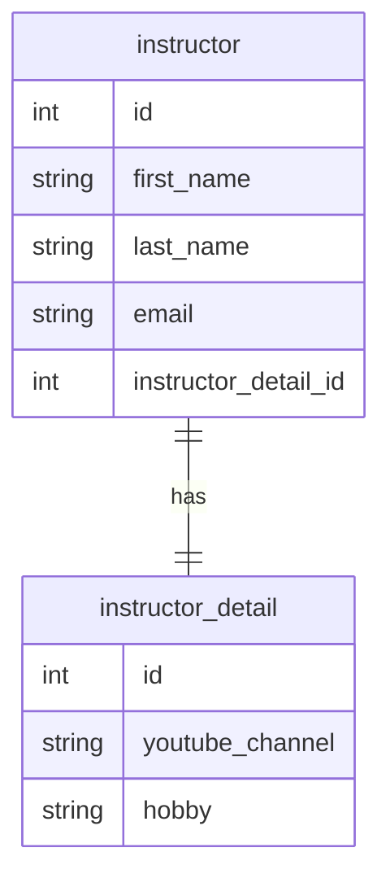
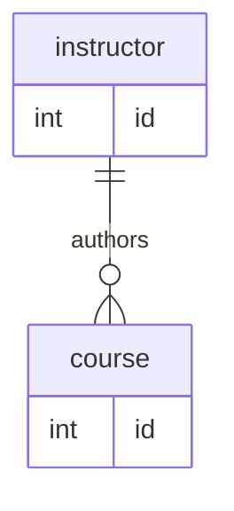
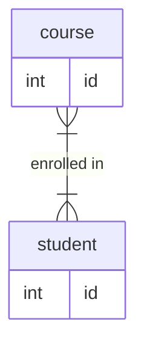
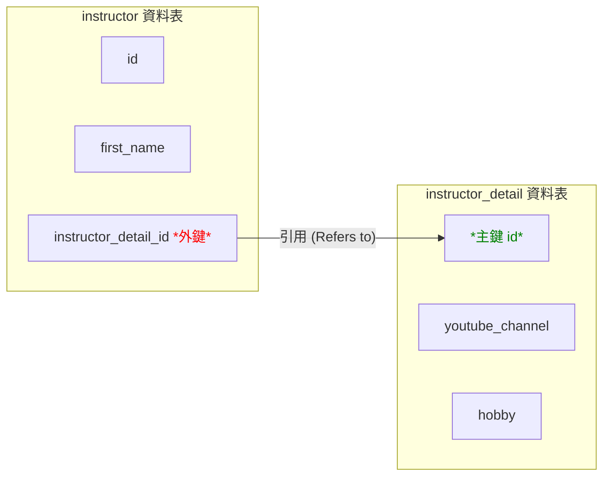

## JPA / Hibernate 進階映射

- **[進階映射的目的]** 因為在實際的資料庫中，通常不只有一個資料表，而是會有複數個資料表以及它們之間的關聯性
    - 我們需要使用 Hibernate 來對這些複雜的資料庫結構進行建模
- **[與基礎映射的差異]**
    - 基礎映射：將單一 Java Class 對應到單一 Database Table
    - 進階映射：處理多個資料表及其相互關係

### 一對一映射 (One-to-One Mapping)

- 一個實體可以擁有另一個對應的詳細資料實體
    - 例如：講師（Instructor）可以有一個「講師詳細資料」（Instructor Detail）實體
    - 這類似於建立一個「講師個人檔案」（Instructor Profile）
- **[資料結構範例]**
    - **Instructor 表**：儲存基本資訊
        - `id` (INT)
        - `first_name` (VARCHAR(45))
        - `last_name` (VARCHAR(45))
        - `email` (VARCHAR(45))
        - `instructor_detail_id` (INT) $\rightarrow$ 用於關聯到詳細資料表
    - **Instructor\_detail 表**：儲存更具體的個人資料
        - `id` (INT)
        - `youtube_channel` (VARCHAR(128))
        - `hobby` (VARCHAR(45))



### 一對多映射 (One-to-Many Mapping)

- 一個實體可以擁有複數個關聯實體
    - 例如：一名講師（Instructor）可以開設多門課程（Courses）
- **[簡化假設]** 在此範例中，假設一門課程僅由一名講師開設（實際情境中可能存在一對多或多對多關係）



### 多對一映射 (Many-to-One Mapping)

- 為了一對多映射的「反向」或「逆向」關係
    - 即從多個實體指向同一個實體的關係
- 為了一對多映射的「反向」或「逆向」關係
    - 即從多個實體指向同一個實體的關係
    - 例如：許多門課程（Many Courses）可以對應到同一位講師（One Instructor）

### 多對多映射 (Many-to-Many Mapping)

- 當兩個實體之間都存在複數關聯時使用
- **[實例：學生與課程]**
    - 一門課程可以擁有許多學生
    - 一名學生也可以選修許多門課程
- **[關係特性]**
    - 兩者之間會形成複雜的交集與配對關係



## 資料庫關聯性基礎概念

- **[學習目標]** 在深入探討 JPA 映射之前，必須先掌握資料庫中定義實體關係的核心機制
- **主鍵 (Primary Key)**
    - 用於唯一識別資料表中每一列（row）的標識符
    - 確保每一筆資料在表中都是獨一無二的
- **外鍵 (Foreign Key)**
    - 用於建立不同資料表之間的關聯
    - 指向另一個資料表中的主鍵，藉此在兩個表之間建立連結
- **級聯操作 (Cascading)**
    - 處理關聯實體之間連動變更的機制（例如：當刪除父實體時，是否自動刪除關聯的子實體）

### 資料庫關聯性核心要素

- **主鍵 (Primary Key)**
    - 用於唯一標識資料表中的每一筆記錄
- **外鍵 (Foreign Key)**
    - 用於關聯不同資料表之間的關係
    - 是一個欄位，其值指向另一個資料表的主鍵
        - 例如：`instructor` 資料表可以透過外鍵關聯到 `instructor_detail` 資料表
- **級聯操作 (Cascading)**
    - 定義當一個實體發生變更時，如何自動影響關聯的實體

### 外鍵的實務應用範例

- **外鍵的核心功能**
    - 作為建立不同資料表之間關聯的橋樑
    - 透過欄位連結，使分散在不同資料表的資訊得以串接
- **[具體範例：Instructor 與 Instructor Detail]**
    - 在 `instructor` 資料表中設定 `instructor_detail` 欄位
        - 該欄位即為外鍵，用於指向詳細資料表
    - **[關聯機制]**
        - 外鍵的值必須對應到目標資料表的主鍵
        - 例如：Darby 的 `instructor_detail_id` 設為 `100`
        - 此數值 `100` 會連結到 `instructor_detail` 資料表中 `id` 為 `100` 的那一筆資料
    - 藉此建立 Instructor 實體與其對應詳細資料實體的單一關聯（One-to-One）

## 資料庫級聯操作 (Cascading)

- **[級聯的核心定義]** 指的是將同一個操作（Operation）自動應用到所有相關聯的實體（Related Entities）上
- **[常見的操作類型]**
    - **儲存級聯 (Save Cascade)**
        - 當對父實體執行「儲存」操作時，系統會自動對其關聯的子實體執行相同的儲存動作
        - **範例**：儲存一個 `Instructor` 時，若其關聯的 `Instructor Detail` 也包含新資料，系統會一併將其寫入資料庫
    - **刪除級聯 (Delete Cascade)**
        - 當刪除一個實體時，自動刪除與之關聯的其他實體
        - **[為什麼需要刪除級聯？]** 為了維持資料的一致性與整潔，避免留下「孤立」的資料
        - **範例**：若刪除了一位 `Instructor`，由於該講師已不存在，其對應的 `Instructor Detail`（詳細資料）也失去了存在的意義，因此應一併刪除，不應保留無效的詳細資訊

### 刪除級聯 (Cascading Delete) 的運作實例

- **[運作機制]** 當對父實體執行刪除操作時，系統會自動尋找並刪除所有與之關聯的子實體，以防止資料庫中殘留無意義的孤立資料。
- **[具體範例：Instructor 與 Instructor Detail]**
    - 若從資料庫中刪除講師 `Darby`
    - 系統會自動定位到與 `Darby` 關聯的 `instructor_detail` 條目
    - 並一併將該條目刪除
- **[使用警示]** 級聯刪除必須根據具體的業務案例 (Use Case) 謹慎決定
    - 在某些複雜關係中（例如：學生與課程之間的「多對多」關係），自動刪除可能會導致非預期的資料流失
    - 必須評估刪除父實體是否真的應該連帶移除所有關聯資訊

### 級聯操作的決策邏輯

- **[核心原則]** 級聯操作的配置必須完全取決於特定的**業務案例 (Use Case)** 與應用程式邏輯，而非僅僅為了開發方便。
- **[實務決策範例：學生與課程]**
    - **場景**：若刪除一名「學生」。
    - **錯誤做法**：使用刪除級聯 (Delete Cascade) 直接刪除該學生所屬的「課程」。
        - **原因**：課程是獨立的實體，不應因為某個學生的離開而消失。
    - **正確做法**：僅將該學生從課程名單中移除（解除關聯），而非刪除課程本身。
- **[開發者的控制權]**
    - 開發者擁有**細粒度 (Fine-grained)** 的控制權，可以精確配置哪些關聯需要級聯，哪些不需要。

---

### 資料檢索策略預覽

- **[核心問題]** 當我們從資料庫檢索（Retrieve）一個實體時，應該如何處理其關聯的資料？
- **[關鍵概念]** 接下來將探討兩種主要的載入模式：
    - **及時載入 (Eager Loading)**
    - **延遲載入 (Lazy Loading)**

### 及時載入 (Eager Loading) 與 延遲載入 (Lazy Loading) 詳解

- **及時載入 (Eager Loading)**
    - **運作方式**：在一次檢索過程中，立即將所有相關聯的資料一併抓取回來。
    - **特性**：檢索實體時，關聯資料已經存在於記憶體中，不需要額外的資料庫請求。
- **延遲載入 (Lazy Loading)**
    - **運作方式**：在初次檢索時僅取得主實體，只有當程式碼明確「要求」存取關聯資料時，才會再去資料庫抓取。
    - **特性**：按需取用（On request），能有效減少不必要的資料傳輸與記憶體消耗。

### 單向關聯 (Unidirectional Relationship) 概念預覽

- **[定義]** 指的是關聯僅存在於一個方向上的關係。
- **[實務範例：Instructor 與 Instructor Detail]**
    - 關係從 `Instructor` 指向 `Instructor Detail`。
    - **流程**：開發者先載入 `Instructor` 物件，隨後可以透過該物件存取其對應的詳細資訊。
    - 此種模式下，`Instructor Detail` 本身並不直接持有指向 `Instructor` 的引用。

### 單向與雙向關聯 (Unidirectional vs. Bidirectional)

- **單向關聯 (Unidirectional)**
    - **特性**：關係僅存在於一個方向上。
    - **範例**：從 `Instructor` 物件可以存取其關聯的 `Instructor Detail`，但 `Instructor Detail` 物件本身並不持有指向 `Instructor` 的引用。
- **雙向關聯 (Bidirectional)**
    - **特性**：關係在兩個方向上都是可存取的。
    - **運作方式**：除了從 `Instructor` 存取 `Instructor Detail` 外，也可以從 `Instructor Detail` 物件中直接取得其所屬的 `Instructor` 引用。
- **[設計原則] 多樣化的設計選擇**
    - 在使用 JPA/Hibernate 處理實體關係時，**不存在唯一的「正確」映射方式**。
    - 根據具體的業務需求與系統架構，有多種有效的設計模式可以選擇。

### 資料建模的靈活性與適應性

- **[多樣化的關係模型]** 資料庫設計中存在多種建模方式，常見的包含：
    - 一對一 (One-to-One)
    - 一對多 (One-to-Many)
    - 多對一 (Many-to-One)
    - 多對多 (Many-to-Many)
- **[設計原則：以需求為導向]**
    - 範例與教學應被視為**通用指南 (General Guide)**，而非絕對的標準
    - **[如何調整]** 開發者應根據以下因素對模型進行微調、修改或重新設計：
        - 應用程式的具體功能需求
        - 業務領域的邏輯需求 (Domain Needs)

## Hibernate 一對一映射 (One-to-One Mapping)

- **[核心概念]** 指的是兩個實體之間存在一對一的關聯，即一個實體的實例僅對應另一個實體的單一實例。
- **[實務範例：講師與個人檔案]**
    - 類似於「講師 (Instructor)」與其對應的「講師詳細資料 (Instructor Detail/Profile)"
    - 一位講師擁有一份詳細的個人檔案，而該檔案也僅屬於該位講師
- **[資料庫建模]**
    - 在資料庫層級，這種關係會透過**兩個獨立的資料表**來實作

### 單向一對一關聯 (Unidirectional One-to-One)

- **[運作方式]** 關係僅從一個實體指向另一個實體。
- **[本案例的結構]**
    - 關係從 `Instructor` 出發，指向 `Instructor Detail`
    - **[特性]** 我們可以從講師物件存取其詳細資料，但無法直接從詳細資料物件反向取得所屬的講師
    - 這種模式是學習雙向關聯 (Bidirectional) 之前的基礎步驟

### 一對一映射 (One-to-One Mapping) 的開發流程

實作一對一關聯時，建議遵循以下開發步驟以確保邏輯清晰且結構正確：

1. **資料庫準備階段 (Prep Work)**

    - 定義資料庫表結構 (Database Tables)
    - 設定外鍵關聯 (Foreign Key Relationship)

2. **實體類別開發 (Entity Class Creation)**

    - 建立被關聯的子實體類別 (例如：`InstructorDetail`)
    - 建立主實體類別 (例如：`Instructor`)

3. **應用程式整合 (Application Integration)**

    - 建立主應用程式程式碼，將所有組件整合在一起

### 初始資料庫設計：Instructor Detail 表

在建立 Java 類別之前，首先需根據業務需求設計資料庫表結構。以 `Instructor Detail` 為例，其核心欄位包含：

- `id`：作為該資料表的主鍵 (Primary Key)

### 實作 `instructor_detail` 資料表腳本

為了建立 `instructor_detail` 資料表，需要撰寫 SQL 腳本並透過 MySQL Workbench 或其他資料庫管理工具執行。該資料表的結構設計如下：

- **欄位定義**
    - `id`：作為**主鍵 (Primary Key)**，並設定為**自動遞增 (Auto Increment)**，確保每筆紀錄都有唯一的識別碼。
    - `youtube_channel`：存放 YouTube 頻道名稱。
    - `hobby`：存放個人興趣嗜好。
- **SQL 腳本範例**

```sql
CREATE TABLE instructor_detail (
    id INT NOT NULL AUTO_INCREMENT,
    youtube_channel VARCHAR(255),
    hobby VARCHAR(255),
    PRIMARY KEY (id)
);
```

### `instructor` 資料表結構初步規劃

除了詳細資料表外，主實體 `instructor` 資料表也需要建立，其規劃包含以下欄位（部分展示）：

- `id`：主鍵欄位
- `first_name`：名
- (其餘欄位待續...)

### `instructor` 資料表完整結構規劃

為了建立完整的講師資訊系統，`instructor` 資料表的設計不僅包含基本個人資料，還需要預留與詳細資料表連結的欄位。

- **基本欄位定義**
    - `id`：主鍵 (Primary Key)，設定為**自動遞增 (Auto Increment)**。
    - `first_name`：名。
    - `last_name`：姓。
    - `email`：電子郵件地址。
- **關聯預留欄位**
    - `instructor_detail_id`：用於指向 `instructor_detail` 資料表的主鍵。
- **[目前的狀態：邏輯連結而非實體關聯]**
    - 目前這兩個資料表（`instructor` 與 `instructor_detail`）在資料庫層級仍是**兩個獨立的資料表**。
    - 雖然我們在 `instructor` 表中加入了 `instructor_detail_id` 作為「把手 (Handle)」，但尚未正式定義它們之間的資料庫關聯（例如設定外鍵 Foreign Key）。
    - **下一步目標**：需要透過定義關聯，將這兩個原本分離的資料表正式連結起來。

### 外鍵 (Foreign Key) 的概念與作用

- **[核心定義]** 外鍵是指在一個資料表中，有一個欄位會「引用」另一個資料表的主鍵 (Primary Key)。
- **[功能]** 外鍵的主要作用是將兩個不同的資料表連結 (Link) 在一起，建立起實體之間的關聯。

### 實作一對一關聯：以 Instructor 為例

透過外鍵，我們可以將原本獨立的兩個資料表正式對接：

1. **建立連結點**

    - 在 `instructor` 資料表中，我們使用 `instructor_detail_id` 這個欄位作為**外鍵**。

2. **引用機制**

    - 這個 `instructor_detail_id` 會指向 `instructor_detail` 資料表中的**主鍵 (Primary Key)**。

3. **運作流程**

    - 當我們需要尋找某位講師的詳細資訊時，系統會透過 `instructor` 表中的外鍵 ID，直接對應到 `instructor_detail` 表中正確的紀錄。



### 在 SQL 中實作外鍵約束 (Foreign Key Constraint)

雖然在設計階段我們已經規劃了關聯欄位（如 `instructor_detail_id`），但必須透過 SQL 的約束語法來正式建立這層關係。

- **[實作方式]** 使用 `CONSTRAINT` 關鍵字來定義外鍵規則
- **[SQL 語法結構]** 在建立資料表的腳本中加入約束定義：
    - 指定約束名稱（Constraint name）
    - 定義該約束為 `FOREIGN KEY`
    - 指定**本地欄位**（例如：`instructor_detail_id`）
    - 指定**參照目標**（例如：`instructor_detail` 資料表的 `id` 欄位）

```sql
-- 範例語法結構
CONSTRAINT fk_instructor_detail
    FOREIGN KEY (instructor_detail_id)
    REFERENCES instructor_detail(id)
```

### 參照完整性 (Referential Integrity)

定義外鍵不僅僅是建立連結，更重要的是為了確保資料庫的**參照完整性**。

- **[核心目的]** 維護資料表之間關係的穩定性與正確性。
- **[防止錯誤操作]** 透過外鍵約束，資料庫可以防止以下破壞關係的行為：
    - **孤立紀錄的產生**：防止在主表中建立一個指向不存在之 ID 的紀錄。
    - **無效的刪除**：防止刪除一個仍被其他資料表引用的主表紀錄（除非有設定級聯操作）。
- **[總結]** 參照完整性確保了「如果 A 引用了 B，那麼 B 必須真的存在」這一邏輯在資料庫層級得到強制執行。

### 外鍵約束的防禦機制

- **[資料驗證作用]** 外鍵約束能確保只有「有效」的資料能被寫入該欄位。
    - **[強制規則]** 外鍵欄位中的值，必須是另一個資料表（被引用表）中確實存在的主鍵 (Primary Key)。
- **[錯誤攔截]**
    - 若嘗試插入一個指向不存在之主鍵的無效引用，資料庫會主動拋出錯誤 (Error)。
    - **[開發者責任]** 必須嚴格遵守資料庫定義的參照規則，以維持資料庫的健康狀態。

---

### 實作進度總結與展望

- **[已完成項目]**
    - 資料庫表結構設計 (Database Table Setup)
    - 外鍵關聯定義 (Foreign Key Definition)
- **[下一步目標]**
    - 從資料庫層級的建模，轉向 **Java 程式碼層級** 的實作。
    - 學習如何使用 JPA/Hibernate 撰寫 Java 類別，以完成完整的「一對一映射 (One-to-One Mapping)」功能。

### 進入 Java 實體類別開發階段

- **[開發進度回顧]**
    - 已完成第一階段：資料庫準備工作 (Prep Work)，包含定義資料表與設定外鍵。
    - 即將開始執行第二至第四階段：建立實體類別與整合應用程式。
- **[當前任務：實作&#32;`InstructorDetail`&#32;類別]**
    - **目標**：建立對應的 Java 類別，並將其與資料庫中已存在的 `instructor_detail` 資料表進行映射 (Mapping)。
    - **核心邏輯**：Java 中的實體類別 (Entity Class) 將作為資料庫紀錄在程式碼中的代表，透過映射機制，讓開發者能以物件導向的方式操作資料庫資料。

### 實作 `InstructorDetail` 實體類別映射

在建立 Java 類別時，必須使用 JPA 提供的註解來告訴 Hibernate 這個類別與資料庫中的哪張表以及哪些欄位有關聯。

- **核心註解與用法**
    - `@Entity`：標記此 Java 類別為一個實體（Entity），使其受 JPA 管理。
    - `@Table(name = "instructor_detail")`：明確指定此實體要映射到資料庫中名稱為 `instructor_detail` 的資料表。
- **欄位映射流程**
    - **主鍵映射**：透過註解將 Java 的 `id` 屬性與資料庫的主鍵欄位連結。
    - **一般欄位映射**：將類別中的屬性（如 `youtubeChannel`、`hobby`）與資料庫對應的欄位進行對應。
- **標準 Java 結構**
    - 除了映射邏輯外，實體類別仍需包含標準的：
        - 建構函式 (Constructors)
        - Getter 與 Setter 方法

### 實作 `Instructor` 實體類別映射

完成子實體（`InstructorDetail`）後，接著為主實體 `Instructor` 建立對應的 Java 類別。

- **映射設定**
    - 使用 `@Entity` 與 `@Table(name = "instructor")` 來定義與 `instructor` 資料表的關聯。
- **[開發邏輯]**
    - 建立類別的過程本質上是在定義「Java 物件」與「資料庫紀錄」之間的對應關係，讓程式碼能以物件導向的方式操作資料表內容。

### 建立實體類別間的關聯映射

目前雖然已完成 `Instructor` 與 `InstructorDetail` 的基礎欄位映射（如姓名、電子郵件等），但這兩個類別在 Java 層級目前仍是**完全獨立**的物件。

- **[目前的狀態]**
    - `Instructor` 類別已映射到 `instructor` 資料表。
    - `InstructorDetail` 類別已映射到 `instructor_detail` 資料表。
    - **問題**：兩者之間缺乏邏輯連結，程式碼無法自動識別它們的關聯性。
- **[解決方案：使用&#32;`@OneToOne`&#32;註解]**
    - **目的**：透過 Hibernate 的註解機制，將這兩個獨立的實體類別串聯起來。
    - **實作方式**：在 `Instructor` 類別中新增一個屬性，並加上 `@OneToOne` 註解，藉此定義兩者之間的一對一關係。

### 實作關聯的連結機制 (Hooking up the Relationship)

僅僅在實體類別之間加上 `@OneToOne` 是不夠的，還必須明確告訴 Hibernate 如何在資料庫層級找到對應的紀錄。

- **[核心機制：使用&#32;`@JoinColumn`&#32;註解]**
    - **目的**：定義哪一個欄位是用來存放「關聯連結」的。
    - **實作方式**：在 `Instructor` 類別中的關聯屬性上使用 `@JoinColumn`，並指定該欄位的名稱（例如 `instructor_detail_id`）。
- **[Hibernate 的自動化運作流程]**
    - **步驟一：識別外鍵**
        - Hibernate 會讀取 `@JoinColumn` 指定的欄位值。
    - **步驟二：執行查詢**
        - 利用該外鍵值作為條件，自動前往關聯的資料表（如 `instructor_detail`）尋找對應的紀錄。
    - **步驟三：物件組裝**
        - **[結果]**：在程式執行時（In-memory），開發者拿到的 `Instructor` 物件會自動包含其關聯的 `InstructorDetail` 物件，整個關聯過程由 Hibernate 在背景自動完成。

### Hibernate 實體生命週期 (Entity Life Cycle)

在深入探討級聯類型 (Cascade Types) 之前，必須先理解 Hibernate 實體在應用程式中使用時會經歷的一系列狀態。這些狀態決定了 Hibernate 如何追蹤與管理實體的變更。

- **[核心概念]**
    - 實體生命週期是指一個 Hibernate 實體在應用程式運行期間所處的各種狀態集合。
- **游離狀態 (Detached State)**
    - **定義**：當一個實體處於游離狀態時，它不再與目前的 Hibernate Session (會話) 相關聯。
    - **[影響]**
        - 雖然實體物件仍然存在於 Java 的記憶體中，但 Hibernate 不再監控該物件的任何變動。
        - 對於此狀態下的實體進行修改，其變更不會自動同步（Persist）到資料庫中，除非重新將其與 Session 關聯。

### Hibernate 實體狀態操作方法

除了理解實體所處的狀態外，開發者還需要掌握如何透過 Hibernate Session 來切換或操作這些狀態，以確保記憶體中的物件與資料庫保持同步。

- **`merge`&#32;(重新關聯)**
    - **用途**：處理處於 **Detached (游離)** 狀態的實體。
    - **作用**：將一個已經脫離 Session 的實體重新「合併」回目前的 Session 中，使其重新獲得受管理 (Managed) 的狀態。
- **`persist`&#32;(儲存新實體)**
    - **用途**：處理全新的實體實例。
    - **作用**：將一個新的實體從暫時狀態轉變為 **Managed (受管理)** 狀態。在下一次執行 `flush` 或 `commit` 時，Hibernate 會自動將其持久化到資料庫中。
- **`remove`&#32;(刪除)**
    - **用途**：刪除現有實體。
    - **作用**：將一個處於 Managed 狀態的實體標記為刪除，並在下一次 `flush` 或 `commit` 時從資料庫中移除該紀錄。
- **`refresh`&#32;(重新整理/同步)**
    - **用途**：解決資料不一致問題。
    - **作用**：強制將記憶體中的物件與資料庫中的實際數據進行同步（Reload）。
    - **[為什麼需要它？]**：防止記憶體中出現 **Stale Data (陳舊資料)**。當資料庫中的資料已被其他程序修改，而本地記憶體中的物件仍保有舊值時，透過 `refresh` 可以確保物件內容與資料庫最新狀態一致。

### Hibernate 實體狀態轉換流程圖

對於視覺學習者來說，透過狀態轉換圖可以更直觀地理解物件在不同生命週期階段的流動與操作方式。

#### 狀態與操作細節說明

- **Transient (暫時狀態 / New)**
    - **定義**：剛使用 `new` 關鍵字建立，尚未與資料庫關聯的物件。
    - **轉換**：執行 `persist` 或 `save` 後，會進入 **Persistent** 狀態。
- **Persistent (持久化狀態 / Managed)**
    - **定義**：目前與 Hibernate Session 綁定，受 Hibernate 管理的物件。
    - **關鍵操作**：
        - **`refresh`**：當需要將記憶體中的物件與資料庫最新資訊同步時使用。
        - **`commit`**：正式將變更寫入資料庫。
        - **`rollback`**：撤銷目前的交易變更。
- **Detached (游離狀態)**
    - **定義**：原本受管理，但因為 Session 已關閉（`close`）而失去與 Hibernate 關聯的物件。
    - **轉換**：可以透過 `merge` 重新回到 **Persistent** 狀態，或直接丟棄回到 **Transient** 狀態。

### Hibernate 狀態轉換的進階細節

在執行特定的交易操作（Transaction operations）時，實體會進入更細微的狀態變化，這對於理解資料一致性至關重要。

- **`remove`&#32;(刪除) 之後的狀態**
    - 當對一個 Managed 狀態的實體執行 `remove` 操作後，該物件會進入 **Removed (已移除)** 狀態。
    - **[關鍵動作]**：執行 `commit` 後，該紀錄會從資料庫中正式刪除，此時物件會轉變為 **Transient (暫時)** 狀態。
- **`rollback`&#32;(回滾) 的影響**
    - **作用**：當交易失敗或需要撤銷變更時使用。
    - **[狀態變化]**：執行 `rollback` 會將原本處於 Managed 或 Removed 狀態的物件，重新推回 **Detached (游離)** 狀態，使其與目前的交易不再關聯。
- **學習建議**
    - **不要試圖死背所有細微的狀態轉換**
        - Hibernate 的狀態機非常複雜，包含許多邊緣案例。
    - **掌握核心概念**
        - 學習重點應放在理解「物件與 Session 的關聯性」以及「記憶體與資料庫的同步機制」等主要概念，而非所有特殊的轉換路徑。

### Hibernate 級聯操作 (Cascading) 概念

- **定義**：將對一個實體（主實體）執行的操作，自動套用到與其相關聯的實體上。
- **核心目的**：自動化管理關聯實體的生命週期，減少手動處理多個物件的繁瑣步驟。
- **實例說明**：
    - 假設存在 `Instructor` 與 `InstructorDetail` 兩個關聯實體。
    - **[級聯行為]**：當我們對 `Instructor` 執行 `save` 操作時，若設定了級聯，Hibernate 會自動同時將關聯的 `InstructorDetail` 也儲存到資料庫中。
- **應用場景**：當關聯實體在邏輯上依附於主實體存在時（例如：沒有講師就沒有講師詳細資料），級聯操作非常有用。

### Hibernate 級聯操作類型 (Cascade Types)

級聯操作允許開發者精確控制哪些實體操作會傳遞給關聯實體。這不是一個「全開或全關」的開關，而是可以根據業務邏輯選擇特定的 `CascadeType`。

#### 級聯刪除 (CascadeType.DELETE)

- **行為**：當主實體被刪除時，Hibernate 會自動刪除所有與其關聯的相關實體紀錄。
- **實例說明**：
    - 若 `Instructor` 與 `InstructorDetail` 設定了 `CascadeType.DELETE`。
    - **[動作]**：當我們刪除某位 `Instructor` 時，系統會自動從資料庫中移除對應的 `InstructorDetail` 紀錄。
    - **[目的]**：確保資料的一致性，避免在資料庫中留下「孤兒資料」（即指向不存在主實體的詳細資料）。

#### 級聯持久化 (CascadeType.PERSIST)

- **行為**：當主實體進入 **Persistent (持久化)** 狀態時，關聯實體也會同步進入該狀態。
- **實例說明**：
    - 在儲存（Save/Persist）`Instructor` 的過程中，若設定了 `CascadeType.PERSIST`。
    - **[動作]**：Hibernate 會自動將關聯的 `InstructorDetail` 也一起儲存到資料庫中。
    - **[優點]**：開發者只需呼叫一次儲存主實體的方法，即可完成整組關聯物件的持久化工作。

### Hibernate 級聯操作類型 (續)

除了前面提到的類型外，Hibernate 還提供了更全面的控制選項：

| Cascade Type | 說明 |
| --- | --- |
| REMOVE | 若主實體被移除或刪除，關聯實體也會隨之被刪除 |
| REFRESH | 若主實體進行同步（Sync），關聯實體也會同步從資料庫更新 |
| DETACH | 若主實體進入游離狀態（不再與 Session 關聯），關聯實體也會跟著游離 |
| MERGE | 若主實體進行合併（Merge），關聯實體也會進行合併 |
| ALL | 組合了上述所有的級聯操作類型 |

- **[實作範例]：使用&#32;`CascadeType.ALL`**
    - 當我們希望對主實體（如 `Instructor`）執行的任何操作，都自動套用到關聯實體（如 `InstructorDetail`）時，可以使用 `ALL`。
    - **程式碼實作**：

```java
@OneToOne(cascade = CascadeType.ALL)
    private InstructorDetail instructorDetail;
```

### Hibernate 級聯操作的配置細節

- **預設行為：無級聯 (No Cascading by default)**
    - **重要特性**：若在註解中未明確指定 `cascade` 屬性，Hibernate **不會**對任何操作進行級聯。
    - **[開發重點]**：開發者必須根據業務需求，明確地為特定的關聯指定所需的 `CascadeType`。
- **配置多種級聯類型 (Multiple Cascade Types)**
    - **目的**：為了實現更精細的控制（Finer-grained control），有時我們不需要 `ALL`，只需要其中幾種特定的行為。
    - **實作方式**：使用逗號分隔的清單（Comma-delimited list）來列出所有要套用的類型。
    - **程式碼實作範例**：

```java
// 同時套用 PERSIST 與 REMOVE，但不包含其他類型
    @OneToOne(cascade = {CascadeType.PERSIST, CascadeType.REMOVE})
    private InstructorDetail instructorDetail;
```

### 建立 Spring Boot 命令列應用程式 (Command Line App)

- **開發目標**：建立一個專門的命令列工具，以便專注於 JPA、Hibernate 以及 DAO 模式的實作與測試。
- **設計架構**：採用先前課程中學過的 **DAO (Data Access Object) 模式**，將應用程式邏輯與資料庫存取邏輯分離。
    - **Main Application**：作為程式進入點，負責執行業務邏輯。
    - **AppDAO**：作為資料存取層，負責與後端資料庫進行溝通與互動。

#### 第一步：定義 DAO 介面 (AppDAO Interface)

- **目的**：定義資料存取的標準行為，而不涉及具體的實作細節。
- **實作內容**：建立一個名為 `AppDAO` 的介面，並定義核心方法。
- **程式碼實作**：

```java
public interface AppDAO {
    public void save(Instructor theInstructor);
}
```

- **[功能說明]**：`save` 方法接受一個 `Instructor` 物件作為參數，其目標是將該講師及其所有關聯的組件（如 `InstructorDetail`）一併儲存至資料庫中。

### 實作 AppDAO 實作類別 (AppDAO Implementation)

- **開發目標**：建立 `AppDAOImpl` 類別來實作先前定義的 `AppDAO` 介面，提供具體的資料存取邏輯。
- **核心組件：EntityManager**
    - 在實作類別中定義一個 `EntityManager` 欄位。
    - **[注入方式]**：使用 **建構子注入 (Constructor Injection)** 來取得 `EntityManager` 的實例，這是一種確保依賴關係在物件建立時就已就緒的良好實作做法。
- **實作&#32;`save`&#32;方法**
    - 使用 `entityManager.persist(theInstructor)` 來執行儲存操作。
- **[關鍵行為]：級聯儲存的自動化**
    - **[原理]**：由於在 `Instructor` 實體中配置了 `CascadeType.ALL`。
    - **[結果]**：當呼叫 `entityManager.persist(theInstructor)` 時，Hibernate 不僅會儲存 `Instructor` 本身，還會自動將關聯的 `InstructorDetail` 物件一併執行 `persist` 操作並儲存至資料庫。

### 在應用程式中整合 AppDAO 與實體關聯

- **更新 Main Application 邏輯**
    - 在 `CommandLineRunner` 中注入 `AppDAO` 實例，以便在應用程式啟動時執行業務邏輯。
    - 透過建立一個專門的輔助方法（如 `createInstructor`）來封裝複雜的實體建立與關聯流程。
- **實作實體建立與關聯流程**
    - **步驟 1：建立實體物件**
        - 使用 `new Instructor()` 建立講師主實體。
        - 使用 `new InstructorDetail()` 建立講師詳細資訊實體。
    - **步驟 2：建立關聯 (Association)**
        - 將新建立的 `InstructorDetail` 物件與 `Instructor` 物件進行關聯（例如透過 `setInstructorDetail()` 方法）。
        - **[關鍵點]**：必須在呼叫 `persist` 之前完成兩者之間的關聯設定，否則 Hibernate 無法正確識別需要進行級聯操作。
    - **步驟 3：執行持久化**
        - 呼叫 `appDAO.save(theInstructor)`。
        - **[運作原理]**：由於先前已配置 `CascadeType.ALL`，僅需對主實體（Instructor）執行一次 `persist`，Hibernate 就會自動處理關聯實體（InstructorDetail）的儲存。

### 實作一對一關係的物件關聯與儲存

- **建立物件間的連結 (Connecting Objects)**
    - 在執行儲存之前，必須先透過 Setter 方法將兩個實體物件關聯起來。
    - **[實作範例]**：

```java
// 將 instructorDetail 物件與 instructor 物件進行關聯
      tempInstructor.setInstructorDetail(tempInstructorDetail);
```

    - **[重要性]**：這是建立一對一（One-to-One）關係的關鍵步驟，若未進行此設定，Hibernate 將無法得知兩個物件之間的關聯性。
- **執行儲存與級聯行為 (Cascading in Action)**
    - **[操作流程]**：呼叫 `appDAO.save(tempInstructor)`。
    - **[底層運作原理]**：
        - `AppDAOImpl` 會將此請求委派給 `EntityManager.persist()`。
        - **[關鍵機制]**：由於配置了 `CascadeType.ALL`，當 `tempInstructor` 被持久化時，Hibernate 會自動偵測到其關聯的 `instructorDetail` 物件，並自動對該關聯物件執行 `persist` 操作。
    - **[優點]**：開發者不需要分別對兩個物件執行儲存，只需對主實體進行操作，即可完成整個關聯物件樹的持久化，大幅簡化程式碼。

### 一對一單向關聯 (One-to-One Unidirectional) 的實作細節

- **關聯結構與映射**
    - 在單向關聯中，由一個實體（例如 `Instructor`）直接引用另一個實體（例如 `InstructorDetail`）。
    - **[物理映射]**：這種映射關係會直接反映在資料庫的表結構中。
- **擁有方 (Owning Side) 的概念**
    - **[定義]**：擁有方是負責定義實體間「物理映射關係」的那一方。
    - **[在本範例中的角色]**：`Instructor` 是這段關係的擁有方。
    - **[關鍵影響]**：由於 `Instructor` 是擁有方，資料庫中的**外鍵 (Foreign Key) 會存放在&#32;`instructor`&#32;資料表中**，用來指向 `instructor_detail` 的主鍵。
- **設計建議**
    - 關聯的配置（如單向或雙向）應根據應用程式的具體需求與領域模型（Domain Needs）來靈活調整，不應死守單一模式。

### 執行資料庫腳本以建立資料表

- **建立實體表結構**
    - 執行腳本以建立用於一對一關係的資料表：
        - `instructor` 表
        - `instructor_detail` 表
- **設定資料表關聯性**
    - 在 `instructor` 表中設定一個**外鍵 (Foreign Key)**，使其指向 `instructor_detail` 表。
- **實體表結構設計**
    - **`instructor`&#32;表內容**：
        - `id` (INT)
        - `first_name` (VARCHAR(45))
        - `last_name` (VARCHAR(45))
        - `email` (VARCHAR(45))
        - `instructor_detail_id` (INT) $\rightarrow$ *用於存放指向詳細資訊表的外鍵*
    - **`instructor_detail`&#32;表內容**：
        - `id` (INT)
        - `youtube_channel` (VARCHAR(128))
        - `hobby` (VARCHAR(45))

### 實作資源檔案概覽

- **解壓縮資源檔**
    - 從下載目錄中解壓縮提供的 ZIP 檔案。
- **資源內容概覽**
    - 檔案夾內包含多個子資料夾，對應不同的關聯實作範例：
        - `one-to-one` (一對一)
        - `one-to-many` (一對多)
        - `many-to-many` (多對多)
    - **[用途]**：這些資料夾將作為後續教學影片中的實作基礎。

### 建立進階 JPA 映射專案目錄

- **目錄組織與管理**
    - 在 `Dev Spring Boot` 資料夾下建立一個新的目錄，用於存放進階主題的實作內容。
    - **[新建立的目錄名稱]**：`09 Spring Boot JPA Advanced Mappings`
    - **[目的]**：將進階的 JPA 映射技術（Advanced Mappings）與之前的基礎實作進行物理隔離，確保開發環境的整潔與學習進度的條理化。

### 準備實作資源與環境

- **整合資源檔案**
    - 從下載目錄中取得 `OO starter files`（教學提供的起始程式碼檔案）。
    - 將這些檔案移動或複製到新建立的 `09 Spring Boot JPA Advanced Mappings` 目錄中，以確保開發環境完整。
- **啟動資料庫管理工具**
    - 開啟 **MySQL Workbench** 並登入資料庫服務。
    - **[下一步操作]**：準備開啟先前整理好的 SQL 腳本，以便進行資料庫結構的初始化或操作。

### 初始化資料庫架構 (Schema)

- **定位實作腳本**
    - 開啟目錄：`09 Spring Boot JPA Advanced Mappings` $\rightarrow$ `OO` $\rightarrow$ `HB01 1 to 1 uni`。
    - 選擇檔案：`createDB.SQL`。
- **Schema 的基本概念**
    - **[定義]**：Schema 本質上就是一組資料表（Collection of tables）的集合。
    - **[在本範例中的作用]**：腳本會建立一個名為 `HB01_1_to_1_Uni` 的 Schema，用來存放後續建立的 `instructor` 與 `instructor_detail` 資料表。

### 實作 SQL 腳本：重建資料表結構

- **確保腳本執行順暢的預處理**
    - **停用外鍵檢查**
        - 在執行刪除或建立動作前，先停用外鍵檢查（Disable foreign key checks）。
        - **[原因]**：避免在刪除仍被其他表參照的資料表時，觸發參照完整性錯誤導致腳本中斷。
    - **清理舊有結構**
        - 使用 `DROP TABLE IF EXISTS` 語法來刪除可能已存在的舊表（例如 `instructor_detail`），確保環境是乾淨的起始狀態。
- **建立&#32;`instructor_detail`&#32;資料表**
    - **欄位設計與屬性**\*\*：
        - `id` (INT)：設定為**自動遞增 (AUTO\_INCREMENT)**，作為該表的主鍵 (Primary Key)。
        - `youtube_channel` (VARCHAR(128))：存放講師的 YouTube 頻道資訊。
        - `hobby` (VARCHAR(45))：存放講師的興趣嗜好。
- **建立&#32;`instructor`&#32;資料表**
    - **實作邏輯**
        - 遵循類似的流程：先檢查並刪除舊表，再重新定義結構。
        - 需確保該表包含指向 `instructor_detail` 的外鍵欄位，以完成一對一的關聯映射。

### `instructor` 資料表結構詳解

- **欄位定義**
    - `id`：設定為 **Auto Increment**（自動遞增），作為主鍵使用。
    - `first_name`：儲存名。
    - `last_name`：儲存姓。
    - `email`：儲存電子郵件。
    - `instructor_detail_id`：**關鍵連結欄位**，用來指向詳細資訊表。
- **實作外鍵約束 (Foreign Key Constraint)**
    - **[原理]**：透過建立一個外鍵，將 `instructor` 表中的 `instructor_detail_id` 欄位與 `instructor_detail` 表的主鍵進行關聯。
    - **[目的]**：確保兩張表之間的資料完整性，建立物理上的邏輯連結。
    - **[SQL 實作邏輯]**

```sql
CONSTRAINT fk_instructor_detail
      FOREIGN KEY (instructor_detail_id)
      REFERENCES instructor_detail(id)
```

### 執行 SQL 腳本與結果驗證

- **執行腳本的操作**
    - 在 MySQL Workbench 工具列中點擊 **黃色閃電圖示 (Yellow Lightning Bolt)** 以執行撰寫好的 SQL 腳本。
    - **[執行後觀察]**：觀察視窗下方的 **Output (輸出)** 區域，確認腳本執行狀態。
- **解讀執行結果訊息**
    - **綠色勾選 (Green Check Marks)**：代表該指令已成功執行。
    - **黃色警告 (Yellow Warnings)**：通常可以忽略，只要沒有出現紅色錯誤，即代表資料表已成功建立。
    - **紅色錯誤 (Red Flags/Errors)**：代表執行失敗，必須修正 SQL 語法或結構問題後重新執行。
- **關於級聯操作 (Cascading) 的處理策略**
    - **[開發原則]**：雖然 SQL 中可以定義 `ON DELETE NO ACTION` 等級聯約束，但在本實作流程中，我們傾向於**不在 SQL 腳本層級定義級聯行為**。
    - **[替代方案]**：將級聯操作的邏輯交由 **Hibernate** 在應用程式層級進行管理，以獲得更高的靈活性。

### Schema 的進階概念與操作

- **更新與查看 Schema**
    - 在 MySQL Workbench 中，若執行完 SQL 腳本後未看到新建立的資料庫，需點擊 **Refresh All (重新整理)** 以更新左側的 Schema 列表。
    - **[範例結果]**：執行後應能看到名為 `HB01_1_to_1_Uni` 的新 Schema。
- **Schema 的完整定義**
    - **[廣義定義]**：雖然目前主要關注的是資料表（Tables），但一個完整的 Schema 實際上還包含：
        - **Views** (檢視表)
        - **Stored Procedures** (儲存程序)
        - **Functions** (函數)
    - **[實務操作]**：可以將新建立的 Schema 設定為 **Default Schema (預設 Schema)**，以便後續直接進行查詢操作。
- **資料表狀態檢查**
    - **[查詢方法]**：透過右鍵點擊資料表並選擇 **Select Rows** 來查看內容。
    - **[目前狀態]**：在建立結構後，若尚未執行插入資料的腳本，`instructor` 等資料表目前應為**空表 (Empty)**。

### 使用 MySQL Workbench 進行反向工程 (Reverse Engineer)

- **[目的]**：將現有的資料庫結構（Tables, Schemas）自動轉換為視覺化的資料庫圖表 (Database Diagrams)，以便直觀地查看實體間的關聯。
- **實作步驟**

    1. 在上方選單列選擇 **Database** $\rightarrow$ **Reverse Engineer**。
    2. **選擇連線 (Connection)**：選擇要進行反向工程的資料庫連線（例如 `local hbstudent`），然後點擊 **Continue**。
    3. **選擇 Schema**：在清單中勾選目標 Schema（例如 `hb-01-one-to-one-uni`），點擊 **OK**。
    4. **自動生成**：系統會讀取該 Schema 下的所有資料表，並自動繪製出圖表。

### 完成反向工程與圖表檢查

- **匯入選項確認**
    - 在執行反向工程的過程中，需確保以下兩項已勾選：
        - **Import MySQL Table Objects**：將資料表物件匯入工具。
        - **Place Objects on a Diagram**：將匯入的物件自動配置在圖表畫布上。
- **生成後的視覺化檢查**
    - **[操作]**：完成後點擊 **Execute**，隨後透過 **Continue** 與 **Close** 完成流程，即可看到自動生成的資料庫圖表（例如 `instructor` 與 `instructor_detail` 的關係圖）。
    - **[潛在問題]：關聯基數 (Cardinality) 顯示錯誤**
        - **[現象]**：MySQL Workbench 有時無法正確判讀實體間的精確關聯類型（例如將「一對一」誤判為其他關係）。
        - **[性質]**：這通常屬於**視覺上的修飾問題 (Cosmetic Issue)**，並不會影響資料庫實際的物理結構或約束條件。

### 手動修正圖表中的關聯基數 (Cardinality)

- **[修正目的]**：當自動生成的圖表無法正確判讀關聯類型（例如將一對一誤判為其他類型）時，可以手動編輯以提升圖表的可讀性與美觀。
- **實作步驟**

    1. **選擇連線**：在圖表中點擊代表實體間關係的連線線條。
    2. **進入編輯模式**：選擇 **Edit Relationship**。
    3. **設定外鍵與基數**：

        - 切換至下方的 **Foreign Key** 頁籤。
        - 在 **Cardinality** 選項中，將其更改為 **one to one**。

    1. **更新圖表**：設定完成後，圖表會即時更新為正確的一對一視覺化呈現。

- **[關鍵觀念]：視覺呈現 vs. 程式實作**
    - 圖表上的修正僅屬於**視覺上的修飾 (Cosmetic)**。
    - 實際的業務邏輯與關聯行為，仍必須依照後續的 Java 程式碼實作（例如 JPA/Hibernate 的設定）來決定，而非僅依賴圖表的顯示。

### 手動修正圖表關聯基數 (Cardinality)

- **[視覺化修正]**：若自動生成的圖表無法正確顯示「一對一」關係，可以手動進行編輯以提升圖表的可讀性。
    - **操作步驟**：

        1. 在圖表中選取代表關聯的連線（Relationship Line）。
        2. 選擇 **Edit Relationship**（編輯關聯）。
        3. 切換至底部的 **Foreign Key**（外鍵）分頁。
        4. 在 **Cardinality** 選項中，將關係類型更改為 `one-to-one`。

- **[核心觀念]：圖表 vs. 程式碼**
    - **視覺修飾 (Cosmetic)**：在 Workbench 中手動修改僅是為了讓圖表看起來符合預期，屬於視覺上的優化。
    - **邏輯定義 (Logical)**：實際的實體關係邏輯（如一對一映射）必須透過 Java 程式碼中的 `@OneToOne` 註解來實作與管理，這才是決定系統行為的關鍵。

### 使用 Spring Initializr 建立 Spring Boot 專案

- **訪問網站**：前往 [start.spring.io](https://start.spring.io)
- **專案基本設定 (Project Settings)**
    - **Project**：選擇 `Maven`
    - **Language**：選擇 `Java`
    - **Spring Boot**：選擇最新的發佈版本 (Released version)，避免選擇帶有 `(SNAPSHOT)` 字樣的版本
- **專案元數據設定 (Project Metadata)**
    - **Group**：`com.love2code`
    - **Artifact**：`cruddemo`
    - **Name**：`cruddemo`
    - **Description**：`Demo project for Spring Boot`
    - **Package name**：`com.love2code.cruddemo`
    - **Packaging**：選擇 `Jar`
    - **Java**：選擇 `25` (依據畫面顯示)

### 使用 Spring Initializr 建立 Spring Boot 專案 (續)

- **專案元數據 (Project Metadata) 設定**
    - **Artifact**: `cruddemo`
    - **Name**: `cruddemo`
    - **Description**: `Demo project for Spring Boot`
    - **Package name**: `com.luv2code.cruddemo`
    - **Packaging**: 選擇 `Jar`
    - **Configuration**: 選擇 `Properties`
    - **Java**: 根據環境選擇版本（例如 `25`）
- **新增必要的 Maven 依賴項 (Dependencies)**
    - 為了支援資料庫操作，需在 Dependencies 區塊中新增以下兩項：
        - **MySQL Driver**: 提供 MySQL JDBC 驅動程式支援
        - **Spring Data JPA**: 使用 Java Persistence API (JPA) 進行資料持久化，並結合 Hibernate
- **完成專案建立**
    - 檢查依賴項與配置無誤後，點擊 **GENERATE** 按鈕，系統將生成專案檔案並下載至本地系統。

### 專案檔案準備與配置

- **[操作流程]**：將先前下載的專案壓縮檔移動至正確的開發目錄
    - **尋找檔案**：在 `Downloads` 資料夾中找到 `cruddemo.zip`
    - **解壓縮與移動**：
        - 解壓縮 `cruddemo.zip`
        - 將解壓縮後的資料夾複製到指定的開發路徑：`DevSpringBoot` $\rightarrow$ `09` 資料夾中

### 開啟專案至 IntelliJ IDEA

- **[操作步驟]**：使用 IntelliJ IDEA 開啟已準備好的專案與應用程式
    - **開啟專案**：在 IDE 中導航至 `09-spring-boot-jpa-advanced-...` 目錄
    - **啟動應用程式**：開啟主要的 Spring Boot 應用程式檔案，準備開始開發命令列應用程式 (Command Line App)

### 建立 Command Line 應用程式 (Command Line App)

- **Command Line Runner**：來自於 Spring Boot 框架的一個介面
    - **執行時機**：當所有的 Spring Beans 都已經成功載入（loaded）之後，該介面定義的方法就會被自動執行
    - **用途**：用於在應用程式啟動時執行特定的命令列任務或初始化邏輯

```java
@Bean
public CommandLineRunner commandLineRunner(String[] args) {
    return args -> {
        // 這裡撰寫要執行的邏輯
    };
}
```

### 使用 Java Lambda 表達式實作 CommandLineRunner

- **Lambda 表達式的作用**
    - 作為實作 `CommandLineRunner` 介面的簡寫語法 (Shorthand notation)
    - 提供一種更簡潔的方式來撰寫邏輯，而不需要撰寫完整的匿名內部類別
- **執行時機提醒**
    - 該程式碼會在所有的 Spring Beans 都已經成功載入 (Loaded) 之後才執行
- **實作範例**

```java
@Bean
public CommandLineRunner commandLineRunner(String[] args) {
    return runner -> {
        System.out.println("Hello World");
    };
}
```

    - 目前僅實作簡單的 `System.out.println("Hello World")` 作為自定義代碼 (Custom code)
    - 後續將會利用已載入的 Spring Beans 來執行更複雜的業務邏輯

### 基礎架構與框架準備

- **目前的開發進度**：目前的工作重點在於建立基礎設施 (Infrastructure) 與框架 (Framework)
    - 這為後續在 Java 程式碼中進行更深入的擴充與實作提供了預備環境