# 目錄

1. [JPA/Hibernate 進階映射快速導覽](#jpa--hibernate-進階映射)
   概念:開場先說明真實世界的資料庫幾乎不會只有一張表,這門課接下來會依序教一對一、一對多、多對一、多對多這幾種資料表之間常見的關聯方式,讓你對整個章節的地圖先有個底。

2. [資料庫關聯性基礎:主鍵與外鍵](#資料庫關聯性基礎概念)
   概念:複習資料庫最基本的兩個角色——主鍵(每一列資料的身分證字號,保證獨一無二)和外鍵(某張表裡存著另一張表主鍵的欄位,像一條牽線把兩張表綁在一起),這是後面所有關聯映射的地基。

3. [級聯操作、抓取策略與單雙向關聯預告](#資料庫級聯操作-cascading)
   概念:介紹級聯(Cascading)——對父資料做的操作(存檔、刪除)要不要自動套用到子資料上;並先預告接下來會用到的及時載入/延遲載入(一次抓完 vs. 真的要用才去拿)、以及單向/雙向關聯(兩個物件是不是都能互相查到對方)這幾個之後會反覆出現的核心觀念。

4. [一對一映射:概念與資料庫層設計](#一對一映射-one-to-one-mapping-的開發流程)
   概念:用 Instructor(講師)與 Instructor Detail(講師的詳細資料)這組經典例子講解什麼是「一對一」關聯,並動手設計資料表結構、寫 SQL 加上外鍵約束(Foreign Key Constraint),讓資料庫自己就會擋掉不合法的關聯資料。

5. [建立 Spring Boot 專案與資料庫連線設定](#建立-spring-boot-命令列應用程式-command-line-app)
   概念:用 Spring Initializr 產生新專案、匯入 IntelliJ,寫一個一啟動就跑的命令列測試程式,接上 application.properties 裡的資料庫帳密,並把 Hibernate 預設會狂噴的一堆 SQL 語法用日誌等級調整成看得順眼的樣子。

6. [實作 InstructorDetail 與 Instructor 的 Entity 映射](#一對一映射開發流程建立-instructordetail-實體類別)
   概念:把 Instructor 跟 InstructorDetail 這兩個 Java 類別加上 @Entity、@Id、@Column 這些註解「貼標籤」,對應到資料庫的表跟欄位,並用 @JoinColumn 標出誰是外鍵,讓 Hibernate 知道這兩張表要透過哪個欄位串起來。

7. [建立 AppDAO、儲存與驗證一對一關聯](#建立-appdao-介面)
   概念:寫一個 DAO(資料存取物件,專門負責跟資料庫溝通的窗口)把 Instructor 跟它的 InstructorDetail 一起存進資料庫,靠級聯設定讓你存一次 Instructor,關聯的 Detail 資料就自動跟著寫入,再用 MySQL Workbench 打開資料庫確認真的存對了。

8. [查詢與刪除:一對一關聯的讀取和級聯刪除](#jpa--hibernate-一對一刪除實體)
   概念:示範怎麼依主鍵把 Instructor 連同它的 Detail 一起查回來,以及刪除 Instructor 時怎麼設定,讓 Hibernate 自動把不再需要的 Detail 資料一併清掉,不留下孤兒資料。

9. [雙向一對一映射:用 mappedBy 讓兩邊互相查得到](#單向映射-uni-directional-mapping-的限制)
   概念:前面單向關聯只能從 Instructor 查到 Detail、查不回來;這裡改成雙向,讓兩邊都能互相查到對方,關鍵是用 mappedBy 告訴 Hibernate「外鍵其實已經在另一邊定義過了,這邊不用重複建一個」,避免資料庫多長出一張不必要的表。

10. [雙向關聯的級聯刪除細節與斷開關聯](#雙向一對一關聯-bidirectional-one-to-one-的特性)
    概念:深入處理雙向關聯刪除時比較棘手的情境——怎麼調整 Cascade 類型,讓刪除 Detail 時不會連帶波及 Instructor,以及怎麼「斷開」兩個物件之間的關聯而不是直接刪掉整筆資料。

11. [JPA 一對多與多對一:資料庫設計與 mappedBy 原理](#jpa--hibernate-一對多與多對一映射)
    概念:進入這門課份量最重的單元——一個 Instructor(講師)可以教很多 Course(課程),這叫「一對多」;反過來每個 Course 只屬於一個 Instructor 就是「多對一」,這裡先講資料庫怎麼設計、Course 表的外鍵怎麼設,以及 mappedBy 在雙向關聯裡到底扮演什麼角色。

12. [完整實作 Course 與 Instructor 的一對多雙向關聯](#建立-course-實體類別)
    概念:把 Course 類別寫完整(欄位、建構子、toString),用 @ManyToOne / @OneToMany 兩個註解讓 Course 跟 Instructor 雙向互相標記對方,並寫一個 add 便利方法,讓「幫講師加一門課」的同時兩邊的關聯資料能自動維持一致,最後存進資料庫驗證關聯有沒有建對。

13. [Eager 與 Lazy Loading:抓取策略與 LazyInitializationException](#fetch-types-eager-vs-lazy-loading)
    概念:解釋查一個 Instructor 時,要不要順便把底下所有課程也一次抓出來(Eager,像是套餐直接全上)還是先不抓、真的要用才去拿(Lazy,像是單點現點現做),以及沒設定好 Lazy 導致查詢時噴出 LazyInitializationException 錯誤該怎麼排查解決。

14. [優化查詢:用 JOIN FETCH 一次撈出關聯資料](#優化查詢在單一查詢中取得講師與課程)
    概念:教你用 JPQL 的 JOIN FETCH 語法,在同一次 SQL 查詢裡就把 Instructor 跟它底下的 Course 一起撈出來,不用再靠 Lazy Loading 多發一次查詢,藉此減少資料庫來回次數、提升效能。

15. [一對多關聯的更新與刪除操作](#更新-instructor-的流程)
    概念:示範怎麼更新 Instructor 跟 Course 的資料,以及刪除時遇到的資料庫「完整性約束違反」問題——因為外鍵還指著它,不能直接刪掉父資料,必須先在程式碼裡解除關聯才能安全刪除。

16. [單向一對多關聯示範:Course 與 Review](#單向一對多關聯-onetomany-uni-directional)
    概念:換一個新例子——一門 Course 底下有很多則 Review(評論),但這次故意只做「單向」關聯(只能從 Course 查到 Review、查不回去),讓你對照體會單向跟雙向設計上的差異跟取捨。

17. [完整實作 Review 一對多關聯練習專案](#建立-review-實體類別)
    概念:延續 Review 的例子,重新走一遍完整的開發流程——資料表設計、Entity 類別、級聯儲存、用 JOIN FETCH 查詢課程跟評論、刪除課程時連帶清掉評論,把前面學到的一對多技巧整合成一個小練習專案。

18. [多對多關聯(@ManyToMany)是什麼:連接表概念](#多對多關聯-manytomany)
    概念:介紹多對多關聯要靠一張額外的「連接表(Join Table)」來記錄兩邊的對應關係(例如一個學生選很多課、一門課也有很多學生),說明這張表長什麼樣子、資料怎麼存取。

19. [多對多開發起手式:Join Table 設計與反向工程](#多對多關聯開發流程)
    概念:動手設計 course_student 這張連接表、用 MySQL Workbench 反向工程畫出 ER 圖確認結構正確,並開始建立 Student 這個 Entity 類別。

20. [完整實作 Course 與 Student 的多對多映射](#更新-course-實體類別以建立多對多關聯)
    概念:用 @JoinTable 註解把 Course 跟 Student 兩個 Entity 透過連接表串起來,搭配 mappedBy 分清楚誰是「擁有端」誰是「非擁有端」,並寫 addStudent / addCourse 便利方法維持雙向資料一致,最後存檔驗證。

21. [多對多關聯的查詢、更新與刪除操作](#透過學生查找其關聯課程)
    概念:示範怎麼分別從 Course 查它的學生、從 Student 查他修的課(雙向都要查得到),以及幫學生加選新課程的更新邏輯,還有刪除課程或學生時連接表資料要怎麼一併處理。

22. [AOP 概觀:從重複程式碼問題談起](#面向切面程式設計-aop-概觀)
    概念:用一個「幫 DAO 方法加日誌記錄、加安全性檢查」的情境,說明如果每個方法都手動加這些程式碼會多麼重複又難維護(程式碼糾結與分散),進而帶出 AOP 這種可以把這些「橫切關注點」統一抽出來管理的技術,以及它背後用代理模式(Proxy)實作的原理。

23. [Spring AOP 與 AspectJ、AOP 術語總覽](#java-aop-框架)
    概念:比較 Spring AOP 跟 AspectJ 這兩套 Java AOP 框架的差異與各自適用時機,並整理 AOP 的專有名詞(Aspect、Advice、Pointcut、Weaving 等)和不同 Advice 類型的總覽,方便後面對照學習。

24. [建立 AOP 示範專案與第一個 @Before Advice](#aop-示範專案初始化)
    概念:動手建立第一個 AOP 練習專案,加上 Spring Boot AOP 的依賴套件,寫一個 AccountDAO 當作示範目標,再用 @Before 這個最基本的 Advice 類型,讓程式在呼叫 DAO 方法「之前」自動插入一段日誌邏輯。

25. [點切點表達式(Pointcut Expression):execution 語法與萬用字元](#點切點表達式-pointcut-expressions)
    概念:拆解點切點表達式(Pointcut Expression)的語法——用 execution(...) 描述要攔截哪個套件、哪個類別、哪個方法,並用星號等萬用字元放寬或收緊攔截範圍。

26. [進階點切點比對:回傳型別、參數與套件](#根據回傳類型進行方法匹配)
    概念:繼續深入點切點表達式,教你怎麼依照方法的回傳型別、參數型態(甚至是任意數量的參數)、以及所在的套件來精確篩選要攔截的目標方法。

27. [點切點宣告(Pointcut Declaration):重用與組合](#點切點宣告-pointcut-declarations)
    概念:同一個攔截範圍常常要套用在好幾個 Advice 上,與其每次複製貼上表達式,不如用 @Pointcut 註解把它宣告成一個有名字的方法,之後所有 Advice 都可以直接引用這個名字,還能把多個點切點宣告組合起來用。

28. [在 Advice 裡存取方法參數,並攔截 Getter/Setter](#存取與顯示方法參數)
    概念:示範怎麼在 Advice 裡面拿到被攔截方法實際傳進來的參數值,並印出來看,順便展示 AOP 也能攔截到看起來很普通的 Getter/Setter 方法。

29. [@AfterReturning Advice:攔截並修改方法的回傳值](#afterreturning-advice---修改回傳值)
    概念:@AfterReturning 是在目標方法「成功執行完畢、拿到回傳值之後」才觸發的 Advice,這裡教你怎麼在裡面存取那個回傳值,甚至進一步修改要回傳給呼叫端的資料內容。

30. [@AfterThrowing 與 @After:攔截例外與收尾動作](#afterthrowing-advice)
    概念:@AfterThrowing 專門攔截方法「拋出例外」的那個時刻,可以在裡面記錄錯誤資訊;而 @After(相當於 try-finally 裡的 finally)則是不管方法成功還是失敗都一定會執行,適合拿來做收尾清理的動作。

31. [@Around Advice:效能監控與完全掌控方法執行](#around-advice)
    概念:@Around 是威力最強的 Advice,可以完全包住目標方法的執行過程,示範拿它來做效能監控(記錄方法跑了多久),並認識 ProceedingJoinPoint 這個用來手動觸發目標方法執行的物件。

32. [@Around 的例外處理:自己處理還是重新拋出](#around-advice---異常處理)
    概念:討論用 @Around 攔截到例外之後,是要自己在 Advice 裡把例外處理掉,還是要重新拋出(rethrow)讓例外繼續往上傳遞給呼叫端,兩種做法各自的影響跟怎麼選擇。

33. [實戰整合:把 AOP 日誌套進真正的 Spring MVC CRUD 專案](#aop-與-spring-mvc-的整合)
    概念:把前面學到的 AOP 技巧套進一個真正的 Spring MVC CRUD 專案裡,對 Controller、Service、DAO 這三層一次性加上 @Before(記錄請求進入)跟 @AfterReturning(記錄資料回傳)的日誌功能,完成一次端到端的實戰整合。

-----------------------------------------------------------

## JPA / Hibernate 進階映射

- **[進階映射的目的]** 因為在實際的資料庫中，通常不只有一個資料表，而是會有複數個資料表以及它們之間的關聯性
    - 我們需要使用 Hibernate 來對這些複雜的資料庫結構進行建模
- **[與基礎映射的差異]**
    - 基礎映射：將單一 Java Class 對應到單一 Database Table
    - 進階映射：處理多個資料表及其相互關係

### 一對一映射 (One-to-One Mapping)

- 一個實體可以擁有另一個對應的詳細資料實體
    - 例如：講師（Instructor）可以有一個「講師詳細資料」（Instructor Detail）實體
    - 這類似於建立一個「講師個人檔案」（Instructor Profile）
- **[資料結構範例]**
    - **Instructor 表**：儲存基本資訊
        - `id` (INT)
        - `first_name` (VARCHAR(45))
        - `last_name` (VARCHAR(45))
        - `email` (VARCHAR(45))
        - `instructor_detail_id` (INT) $\rightarrow$ 用於關聯到詳細資料表
    - **Instructor\_detail 表**：儲存更具體的個人資料
        - `id` (INT)
        - `youtube_channel` (VARCHAR(128))
        - `hobby` (VARCHAR(45))

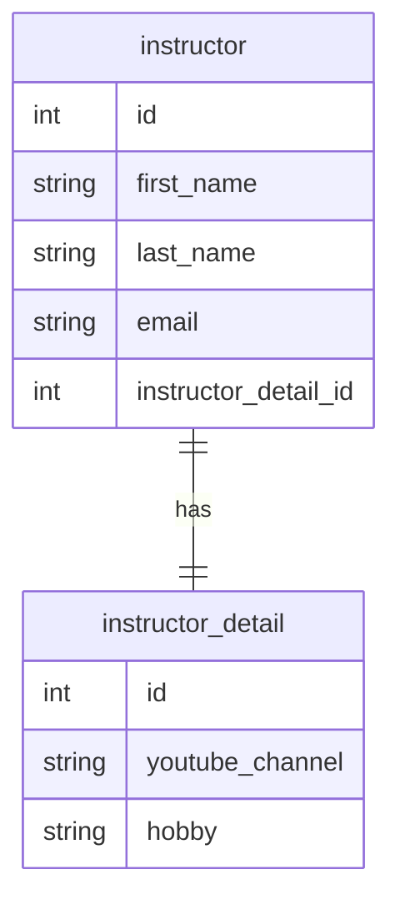

### 一對多映射 (One-to-Many Mapping)

- 一個實體可以擁有複數個關聯實體
    - 例如：一名講師（Instructor）可以開設多門課程（Courses）
- **[簡化假設]** 在此範例中，假設一門課程僅由一名講師開設（實際情境中可能存在一對多或多對多關係）

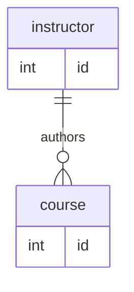

### 多對一映射 (Many-to-One Mapping)

- 為了一對多映射的「反向」或「逆向」關係
    - 即從多個實體指向同一個實體的關係
- 為了一對多映射的「反向」或「逆向」關係
    - 即從多個實體指向同一個實體的關係
    - 例如：許多門課程（Many Courses）可以對應到同一位講師（One Instructor）

### 多對多映射 (Many-to-Many Mapping)

- 當兩個實體之間都存在複數關聯時使用
- **[實例：學生與課程]**
    - 一門課程可以擁有許多學生
    - 一名學生也可以選修許多門課程
- **[關係特性]**
    - 兩者之間會形成複雜的交集與配對關係

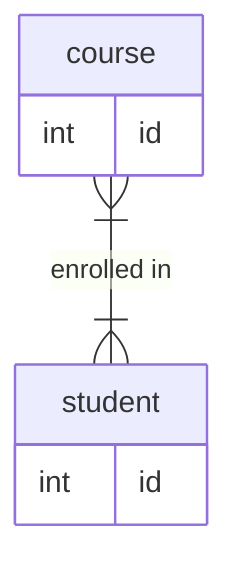

## 資料庫關聯性基礎概念

- **[學習目標]** 在深入探討 JPA 映射之前，必須先掌握資料庫中定義實體關係的核心機制
- **主鍵 (Primary Key)**
    - 用於唯一識別資料表中每一列（row）的標識符
    - 確保每一筆資料在表中都是獨一無二的
- **外鍵 (Foreign Key)**
    - 用於建立不同資料表之間的關聯
    - 指向另一個資料表中的主鍵，藉此在兩個表之間建立連結
- **級聯操作 (Cascading)**
    - 處理關聯實體之間連動變更的機制（例如：當刪除父實體時，是否自動刪除關聯的子實體）

### 資料庫關聯性核心要素

- **主鍵 (Primary Key)**
    - 用於唯一標識資料表中的每一筆記錄
- **外鍵 (Foreign Key)**
    - 用於關聯不同資料表之間的關係
    - 是一個欄位，其值指向另一個資料表的主鍵
        - 例如：`instructor` 資料表可以透過外鍵關聯到 `instructor_detail` 資料表
- **級聯操作 (Cascading)**
    - 定義當一個實體發生變更時，如何自動影響關聯的實體

### 外鍵的實務應用範例

- **外鍵的核心功能**
    - 作為建立不同資料表之間關聯的橋樑
    - 透過欄位連結，使分散在不同資料表的資訊得以串接
- **[具體範例：Instructor 與 Instructor Detail]**
    - 在 `instructor` 資料表中設定 `instructor_detail` 欄位
        - 該欄位即為外鍵，用於指向詳細資料表
    - **[關聯機制]**
        - 外鍵的值必須對應到目標資料表的主鍵
        - 例如：Darby 的 `instructor_detail_id` 設為 `100`
        - 此數值 `100` 會連結到 `instructor_detail` 資料表中 `id` 為 `100` 的那一筆資料
    - 藉此建立 Instructor 實體與其對應詳細資料實體的單一關聯（One-to-One）

## 資料庫級聯操作 (Cascading)

- **[級聯的核心定義]** 指的是將同一個操作（Operation）自動應用到所有相關聯的實體（Related Entities）上
- **[常見的操作類型]**
    - **儲存級聯 (Save Cascade)**
        - 當對父實體執行「儲存」操作時，系統會自動對其關聯的子實體執行相同的儲存動作
        - **範例**：儲存一個 `Instructor` 時，若其關聯的 `Instructor Detail` 也包含新資料，系統會一併將其寫入資料庫
    - **刪除級聯 (Delete Cascade)**
        - 當刪除一個實體時，自動刪除與之關聯的其他實體
        - **[為什麼需要刪除級聯？]** 為了維持資料的一致性與整潔，避免留下「孤立」的資料
        - **範例**：若刪除了一位 `Instructor`，由於該講師已不存在，其對應的 `Instructor Detail`（詳細資料）也失去了存在的意義，因此應一併刪除，不應保留無效的詳細資訊

### 刪除級聯 (Cascading Delete) 的運作實例

- **[運作機制]** 當對父實體執行刪除操作時，系統會自動尋找並刪除所有與之關聯的子實體，以防止資料庫中殘留無意義的孤立資料。
- **[具體範例：Instructor 與 Instructor Detail]**
    - 若從資料庫中刪除講師 `Darby`
    - 系統會自動定位到與 `Darby` 關聯的 `instructor_detail` 條目
    - 並一併將該條目刪除
- **[使用警示]** 級聯刪除必須根據具體的業務案例 (Use Case) 謹慎決定
    - 在某些複雜關係中（例如：學生與課程之間的「多對多」關係），自動刪除可能會導致非預期的資料流失
    - 必須評估刪除父實體是否真的應該連帶移除所有關聯資訊

### 級聯操作的決策邏輯

- **[核心原則]** 級聯操作的配置必須完全取決於特定的**業務案例 (Use Case)** 與應用程式邏輯，而非僅僅為了開發方便。
- **[實務決策範例：學生與課程]**
    - **場景**：若刪除一名「學生」。
    - **錯誤做法**：使用刪除級聯 (Delete Cascade) 直接刪除該學生所屬的「課程」。
        - **原因**：課程是獨立的實體，不應因為某個學生的離開而消失。
    - **正確做法**：僅將該學生從課程名單中移除（解除關聯），而非刪除課程本身。
- **[開發者的控制權]**
    - 開發者擁有**細粒度 (Fine-grained)** 的控制權，可以精確配置哪些關聯需要級聯，哪些不需要。

---

### 資料檢索策略預覽

- **[核心問題]** 當我們從資料庫檢索（Retrieve）一個實體時，應該如何處理其關聯的資料？
- **[關鍵概念]** 接下來將探討兩種主要的載入模式：
    - **及時載入 (Eager Loading)**
    - **延遲載入 (Lazy Loading)**

### 及時載入 (Eager Loading) 與 延遲載入 (Lazy Loading) 詳解

- **及時載入 (Eager Loading)**
    - **運作方式**：在一次檢索過程中，立即將所有相關聯的資料一併抓取回來。
    - **特性**：檢索實體時，關聯資料已經存在於記憶體中，不需要額外的資料庫請求。
- **延遲載入 (Lazy Loading)**
    - **運作方式**：在初次檢索時僅取得主實體，只有當程式碼明確「要求」存取關聯資料時，才會再去資料庫抓取。
    - **特性**：按需取用（On request），能有效減少不必要的資料傳輸與記憶體消耗。

### 單向關聯 (Unidirectional Relationship) 概念預覽

- **[定義]** 指的是關聯僅存在於一個方向上的關係。
- **[實務範例：Instructor 與 Instructor Detail]**
    - 關係從 `Instructor` 指向 `Instructor Detail`。
    - **流程**：開發者先載入 `Instructor` 物件，隨後可以透過該物件存取其對應的詳細資訊。
    - 此種模式下，`Instructor Detail` 本身並不直接持有指向 `Instructor` 的引用。

### 單向與雙向關聯 (Unidirectional vs. Bidirectional)

- **單向關聯 (Unidirectional)**
    - **特性**：關係僅存在於一個方向上。
    - **範例**：從 `Instructor` 物件可以存取其關聯的 `Instructor Detail`，但 `Instructor Detail` 物件本身並不持有指向 `Instructor` 的引用。
- **雙向關聯 (Bidirectional)**
    - **特性**：關係在兩個方向上都是可存取的。
    - **運作方式**：除了從 `Instructor` 存取 `Instructor Detail` 外，也可以從 `Instructor Detail` 物件中直接取得其所屬的 `Instructor` 引用。
- **[設計原則] 多樣化的設計選擇**
    - 在使用 JPA/Hibernate 處理實體關係時，**不存在唯一的「正確」映射方式**。
    - 根據具體的業務需求與系統架構，有多種有效的設計模式可以選擇。

### 資料建模的靈活性與適應性

- **[多樣化的關係模型]** 資料庫設計中存在多種建模方式，常見的包含：
    - 一對一 (One-to-One)
    - 一對多 (One-to-Many)
    - 多對一 (Many-to-One)
    - 多對多 (Many-to-Many)
- **[設計原則：以需求為導向]**
    - 範例與教學應被視為**通用指南 (General Guide)**，而非絕對的標準
    - **[如何調整]** 開發者應根據以下因素對模型進行微調、修改或重新設計：
        - 應用程式的具體功能需求
        - 業務領域的邏輯需求 (Domain Needs)

## Hibernate 一對一映射 (One-to-One Mapping)

- **[核心概念]** 指的是兩個實體之間存在一對一的關聯，即一個實體的實例僅對應另一個實體的單一實例。
- **[實務範例：講師與個人檔案]**
    - 類似於「講師 (Instructor)」與其對應的「講師詳細資料 (Instructor Detail/Profile)"
    - 一位講師擁有一份詳細的個人檔案，而該檔案也僅屬於該位講師
- **[資料庫建模]**
    - 在資料庫層級，這種關係會透過**兩個獨立的資料表**來實作

### 單向一對一關聯 (Unidirectional One-to-One)

- **[運作方式]** 關係僅從一個實體指向另一個實體。
- **[本案例的結構]**
    - 關係從 `Instructor` 出發，指向 `Instructor Detail`
    - **[特性]** 我們可以從講師物件存取其詳細資料，但無法直接從詳細資料物件反向取得所屬的講師
    - 這種模式是學習雙向關聯 (Bidirectional) 之前的基礎步驟

### 一對一映射 (One-to-One Mapping) 的開發流程

實作一對一關聯時，建議遵循以下開發步驟以確保邏輯清晰且結構正確：

1. **資料庫準備階段 (Prep Work)**

    - 定義資料庫表結構 (Database Tables)
    - 設定外鍵關聯 (Foreign Key Relationship)

2. **實體類別開發 (Entity Class Creation)**

    - 建立被關聯的子實體類別 (例如：`InstructorDetail`)
    - 建立主實體類別 (例如：`Instructor`)

3. **應用程式整合 (Application Integration)**

    - 建立主應用程式程式碼，將所有組件整合在一起

### 初始資料庫設計：Instructor Detail 表

在建立 Java 類別之前，首先需根據業務需求設計資料庫表結構。以 `Instructor Detail` 為例，其核心欄位包含：

- `id`：作為該資料表的主鍵 (Primary Key)

### 實作 `instructor_detail` 資料表腳本

為了建立 `instructor_detail` 資料表，需要撰寫 SQL 腳本並透過 MySQL Workbench 或其他資料庫管理工具執行。該資料表的結構設計如下：

- **欄位定義**
    - `id`：作為**主鍵 (Primary Key)**，並設定為**自動遞增 (Auto Increment)**，確保每筆紀錄都有唯一的識別碼。
    - `youtube_channel`：存放 YouTube 頻道名稱。
    - `hobby`：存放個人興趣嗜好。
- **SQL 腳本範例**

```sql
CREATE TABLE instructor_detail (
    id INT NOT NULL AUTO_INCREMENT,
    youtube_channel VARCHAR(255),
    hobby VARCHAR(255),
    PRIMARY KEY (id)
);
```

### `instructor` 資料表結構初步規劃

除了詳細資料表外，主實體 `instructor` 資料表也需要建立，其規劃包含以下欄位（部分展示）：

- `id`：主鍵欄位
- `first_name`：名
- (其餘欄位待續...)

### `instructor` 資料表完整結構規劃

為了建立完整的講師資訊系統，`instructor` 資料表的設計不僅包含基本個人資料，還需要預留與詳細資料表連結的欄位。

- **基本欄位定義**
    - `id`：主鍵 (Primary Key)，設定為**自動遞增 (Auto Increment)**。
    - `first_name`：名。
    - `last_name`：姓。
    - `email`：電子郵件地址。
- **關聯預留欄位**
    - `instructor_detail_id`：用於指向 `instructor_detail` 資料表的主鍵。
- **[目前的狀態：邏輯連結而非實體關聯]**
    - 目前這兩個資料表（`instructor` 與 `instructor_detail`）在資料庫層級仍是**兩個獨立的資料表**。
    - 雖然我們在 `instructor` 表中加入了 `instructor_detail_id` 作為「把手 (Handle)」，但尚未正式定義它們之間的資料庫關聯（例如設定外鍵 Foreign Key）。
    - **下一步目標**：需要透過定義關聯，將這兩個原本分離的資料表正式連結起來。

### 外鍵 (Foreign Key) 的概念與作用

- **[核心定義]** 外鍵是指在一個資料表中，有一個欄位會「引用」另一個資料表的主鍵 (Primary Key)。
- **[功能]** 外鍵的主要作用是將兩個不同的資料表連結 (Link) 在一起，建立起實體之間的關聯。

### 實作一對一關聯：以 Instructor 為例

透過外鍵，我們可以將原本獨立的兩個資料表正式對接：

1. **建立連結點**

    - 在 `instructor` 資料表中，我們使用 `instructor_detail_id` 這個欄位作為**外鍵**。

2. **引用機制**

    - 這個 `instructor_detail_id` 會指向 `instructor_detail` 資料表中的**主鍵 (Primary Key)**。

3. **運作流程**

    - 當我們需要尋找某位講師的詳細資訊時，系統會透過 `instructor` 表中的外鍵 ID，直接對應到 `instructor_detail` 表中正確的紀錄。

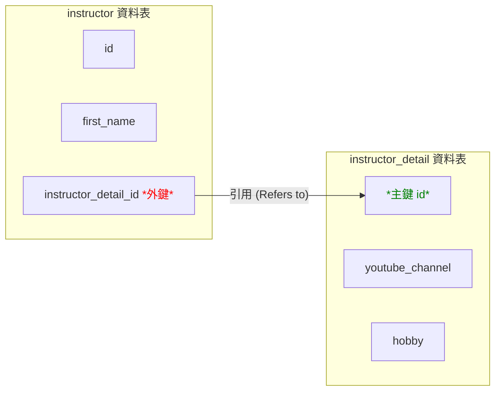

### 在 SQL 中實作外鍵約束 (Foreign Key Constraint)

雖然在設計階段我們已經規劃了關聯欄位（如 `instructor_detail_id`），但必須透過 SQL 的約束語法來正式建立這層關係。

- **[實作方式]** 使用 `CONSTRAINT` 關鍵字來定義外鍵規則
- **[SQL 語法結構]** 在建立資料表的腳本中加入約束定義：
    - 指定約束名稱（Constraint name）
    - 定義該約束為 `FOREIGN KEY`
    - 指定**本地欄位**（例如：`instructor_detail_id`）
    - 指定**參照目標**（例如：`instructor_detail` 資料表的 `id` 欄位）

```sql
-- 範例語法結構
CONSTRAINT fk_instructor_detail
    FOREIGN KEY (instructor_detail_id)
    REFERENCES instructor_detail(id)
```

### 參照完整性 (Referential Integrity)

定義外鍵不僅僅是建立連結，更重要的是為了確保資料庫的**參照完整性**。

- **[核心目的]** 維護資料表之間關係的穩定性與正確性。
- **[防止錯誤操作]** 透過外鍵約束，資料庫可以防止以下破壞關係的行為：
    - **孤立紀錄的產生**：防止在主表中建立一個指向不存在之 ID 的紀錄。
    - **無效的刪除**：防止刪除一個仍被其他資料表引用的主表紀錄（除非有設定級聯操作）。
- **[總結]** 參照完整性確保了「如果 A 引用了 B，那麼 B 必須真的存在」這一邏輯在資料庫層級得到強制執行。

### 外鍵約束的防禦機制

- **[資料驗證作用]** 外鍵約束能確保只有「有效」的資料能被寫入該欄位。
    - **[強制規則]** 外鍵欄位中的值，必須是另一個資料表（被引用表）中確實存在的主鍵 (Primary Key)。
- **[錯誤攔截]**
    - 若嘗試插入一個指向不存在之主鍵的無效引用，資料庫會主動拋出錯誤 (Error)。
    - **[開發者責任]** 必須嚴格遵守資料庫定義的參照規則，以維持資料庫的健康狀態。

---

### 實作進度總結與展望

- **[已完成項目]**
    - 資料庫表結構設計 (Database Table Setup)
    - 外鍵關聯定義 (Foreign Key Definition)
- **[下一步目標]**
    - 從資料庫層級的建模，轉向 **Java 程式碼層級** 的實作。
    - 學習如何使用 JPA/Hibernate 撰寫 Java 類別，以完成完整的「一對一映射 (One-to-One Mapping)」功能。

### 進入 Java 實體類別開發階段

- **[開發進度回顧]**
    - 已完成第一階段：資料庫準備工作 (Prep Work)，包含定義資料表與設定外鍵。
    - 即將開始執行第二至第四階段：建立實體類別與整合應用程式。
- **[當前任務：實作&#32;`InstructorDetail`&#32;類別]**
    - **目標**：建立對應的 Java 類別，並將其與資料庫中已存在的 `instructor_detail` 資料表進行映射 (Mapping)。
    - **核心邏輯**：Java 中的實體類別 (Entity Class) 將作為資料庫紀錄在程式碼中的代表，透過映射機制，讓開發者能以物件導向的方式操作資料庫資料。

### 實作 `InstructorDetail` 實體類別映射

在建立 Java 類別時，必須使用 JPA 提供的註解來告訴 Hibernate 這個類別與資料庫中的哪張表以及哪些欄位有關聯。

- **核心註解與用法**
    - `@Entity`：標記此 Java 類別為一個實體（Entity），使其受 JPA 管理。
    - `@Table(name = "instructor_detail")`：明確指定此實體要映射到資料庫中名稱為 `instructor_detail` 的資料表。
- **欄位映射流程**
    - **主鍵映射**：透過註解將 Java 的 `id` 屬性與資料庫的主鍵欄位連結。
    - **一般欄位映射**：將類別中的屬性（如 `youtubeChannel`、`hobby`）與資料庫對應的欄位進行對應。
- **標準 Java 結構**
    - 除了映射邏輯外，實體類別仍需包含標準的：
        - 建構函式 (Constructors)
        - Getter 與 Setter 方法

### 實作 `Instructor` 實體類別映射

完成子實體（`InstructorDetail`）後，接著為主實體 `Instructor` 建立對應的 Java 類別。

- **映射設定**
    - 使用 `@Entity` 與 `@Table(name = "instructor")` 來定義與 `instructor` 資料表的關聯。
- **[開發邏輯]**
    - 建立類別的過程本質上是在定義「Java 物件」與「資料庫紀錄」之間的對應關係，讓程式碼能以物件導向的方式操作資料表內容。

### 建立實體類別間的關聯映射

目前雖然已完成 `Instructor` 與 `InstructorDetail` 的基礎欄位映射（如姓名、電子郵件等），但這兩個類別在 Java 層級目前仍是**完全獨立**的物件。

- **[目前的狀態]**
    - `Instructor` 類別已映射到 `instructor` 資料表。
    - `InstructorDetail` 類別已映射到 `instructor_detail` 資料表。
    - **問題**：兩者之間缺乏邏輯連結，程式碼無法自動識別它們的關聯性。
- **[解決方案：使用&#32;`@OneToOne`&#32;註解]**
    - **目的**：透過 Hibernate 的註解機制，將這兩個獨立的實體類別串聯起來。
    - **實作方式**：在 `Instructor` 類別中新增一個屬性，並加上 `@OneToOne` 註解，藉此定義兩者之間的一對一關係。

### 實作關聯的連結機制 (Hooking up the Relationship)

僅僅在實體類別之間加上 `@OneToOne` 是不夠的，還必須明確告訴 Hibernate 如何在資料庫層級找到對應的紀錄。

- **[核心機制：使用&#32;`@JoinColumn`&#32;註解]**
    - **目的**：定義哪一個欄位是用來存放「關聯連結」的。
    - **實作方式**：在 `Instructor` 類別中的關聯屬性上使用 `@JoinColumn`，並指定該欄位的名稱（例如 `instructor_detail_id`）。
- **[Hibernate 的自動化運作流程]**
    - **步驟一：識別外鍵**
        - Hibernate 會讀取 `@JoinColumn` 指定的欄位值。
    - **步驟二：執行查詢**
        - 利用該外鍵值作為條件，自動前往關聯的資料表（如 `instructor_detail`）尋找對應的紀錄。
    - **步驟三：物件組裝**
        - **[結果]**：在程式執行時（In-memory），開發者拿到的 `Instructor` 物件會自動包含其關聯的 `InstructorDetail` 物件，整個關聯過程由 Hibernate 在背景自動完成。

### Hibernate 實體生命週期 (Entity Life Cycle)

在深入探討級聯類型 (Cascade Types) 之前，必須先理解 Hibernate 實體在應用程式中使用時會經歷的一系列狀態。這些狀態決定了 Hibernate 如何追蹤與管理實體的變更。

- **[核心概念]**
    - 實體生命週期是指一個 Hibernate 實體在應用程式運行期間所處的各種狀態集合。
- **游離狀態 (Detached State)**
    - **定義**：當一個實體處於游離狀態時，它不再與目前的 Hibernate Session (會話) 相關聯。
    - **[影響]**
        - 雖然實體物件仍然存在於 Java 的記憶體中，但 Hibernate 不再監控該物件的任何變動。
        - 對於此狀態下的實體進行修改，其變更不會自動同步（Persist）到資料庫中，除非重新將其與 Session 關聯。

### Hibernate 實體狀態操作方法

除了理解實體所處的狀態外，開發者還需要掌握如何透過 Hibernate Session 來切換或操作這些狀態，以確保記憶體中的物件與資料庫保持同步。

- **`merge`&#32;(重新關聯)**
    - **用途**：處理處於 **Detached (游離)** 狀態的實體。
    - **作用**：將一個已經脫離 Session 的實體重新「合併」回目前的 Session 中，使其重新獲得受管理 (Managed) 的狀態。
- **`persist`&#32;(儲存新實體)**
    - **用途**：處理全新的實體實例。
    - **作用**：將一個新的實體從暫時狀態轉變為 **Managed (受管理)** 狀態。在下一次執行 `flush` 或 `commit` 時，Hibernate 會自動將其持久化到資料庫中。
- **`remove`&#32;(刪除)**
    - **用途**：刪除現有實體。
    - **作用**：將一個處於 Managed 狀態的實體標記為刪除，並在下一次 `flush` 或 `commit` 時從資料庫中移除該紀錄。
- **`refresh`&#32;(重新整理/同步)**
    - **用途**：解決資料不一致問題。
    - **作用**：強制將記憶體中的物件與資料庫中的實際數據進行同步（Reload）。
    - **[為什麼需要它？]**：防止記憶體中出現 **Stale Data (陳舊資料)**。當資料庫中的資料已被其他程序修改，而本地記憶體中的物件仍保有舊值時，透過 `refresh` 可以確保物件內容與資料庫最新狀態一致。

### Hibernate 實體狀態轉換流程圖

對於視覺學習者來說，透過狀態轉換圖可以更直觀地理解物件在不同生命週期階段的流動與操作方式。

#### 狀態與操作細節說明

- **Transient (暫時狀態 / New)**
    - **定義**：剛使用 `new` 關鍵字建立，尚未與資料庫關聯的物件。
    - **轉換**：執行 `persist` 或 `save` 後，會進入 **Persistent** 狀態。
- **Persistent (持久化狀態 / Managed)**
    - **定義**：目前與 Hibernate Session 綁定，受 Hibernate 管理的物件。
    - **關鍵操作**：
        - **`refresh`**：當需要將記憶體中的物件與資料庫最新資訊同步時使用。
        - **`commit`**：正式將變更寫入資料庫。
        - **`rollback`**：撤銷目前的交易變更。
- **Detached (游離狀態)**
    - **定義**：原本受管理，但因為 Session 已關閉（`close`）而失去與 Hibernate 關聯的物件。
    - **轉換**：可以透過 `merge` 重新回到 **Persistent** 狀態，或直接丟棄回到 **Transient** 狀態。

### Hibernate 狀態轉換的進階細節

在執行特定的交易操作（Transaction operations）時，實體會進入更細微的狀態變化，這對於理解資料一致性至關重要。

- **`remove`&#32;(刪除) 之後的狀態**
    - 當對一個 Managed 狀態的實體執行 `remove` 操作後，該物件會進入 **Removed (已移除)** 狀態。
    - **[關鍵動作]**：執行 `commit` 後，該紀錄會從資料庫中正式刪除，此時物件會轉變為 **Transient (暫時)** 狀態。
- **`rollback`&#32;(回滾) 的影響**
    - **作用**：當交易失敗或需要撤銷變更時使用。
    - **[狀態變化]**：執行 `rollback` 會將原本處於 Managed 或 Removed 狀態的物件，重新推回 **Detached (游離)** 狀態，使其與目前的交易不再關聯。
- **學習建議**
    - **不要試圖死背所有細微的狀態轉換**
        - Hibernate 的狀態機非常複雜，包含許多邊緣案例。
    - **掌握核心概念**
        - 學習重點應放在理解「物件與 Session 的關聯性」以及「記憶體與資料庫的同步機制」等主要概念，而非所有特殊的轉換路徑。

### Hibernate 級聯操作 (Cascading) 概念

- **定義**：將對一個實體（主實體）執行的操作，自動套用到與其相關聯的實體上。
- **核心目的**：自動化管理關聯實體的生命週期，減少手動處理多個物件的繁瑣步驟。
- **實例說明**：
    - 假設存在 `Instructor` 與 `InstructorDetail` 兩個關聯實體。
    - **[級聯行為]**：當我們對 `Instructor` 執行 `save` 操作時，若設定了級聯，Hibernate 會自動同時將關聯的 `InstructorDetail` 也儲存到資料庫中。
- **應用場景**：當關聯實體在邏輯上依附於主實體存在時（例如：沒有講師就沒有講師詳細資料），級聯操作非常有用。

### Hibernate 級聯操作類型 (Cascade Types)

級聯操作允許開發者精確控制哪些實體操作會傳遞給關聯實體。這不是一個「全開或全關」的開關，而是可以根據業務邏輯選擇特定的 `CascadeType`。

#### 級聯刪除 (CascadeType.DELETE)

- **行為**：當主實體被刪除時，Hibernate 會自動刪除所有與其關聯的相關實體紀錄。
- **實例說明**：
    - 若 `Instructor` 與 `InstructorDetail` 設定了 `CascadeType.DELETE`。
    - **[動作]**：當我們刪除某位 `Instructor` 時，系統會自動從資料庫中移除對應的 `InstructorDetail` 紀錄。
    - **[目的]**：確保資料的一致性，避免在資料庫中留下「孤兒資料」（即指向不存在主實體的詳細資料）。

#### 級聯持久化 (CascadeType.PERSIST)

- **行為**：當主實體進入 **Persistent (持久化)** 狀態時，關聯實體也會同步進入該狀態。
- **實例說明**：
    - 在儲存（Save/Persist）`Instructor` 的過程中，若設定了 `CascadeType.PERSIST`。
    - **[動作]**：Hibernate 會自動將關聯的 `InstructorDetail` 也一起儲存到資料庫中。
    - **[優點]**：開發者只需呼叫一次儲存主實體的方法，即可完成整組關聯物件的持久化工作。

### Hibernate 級聯操作類型 (續)

除了前面提到的類型外，Hibernate 還提供了更全面的控制選項：

| Cascade Type | 說明 |
| --- | --- |
| REMOVE | 若主實體被移除或刪除，關聯實體也會隨之被刪除 |
| REFRESH | 若主實體進行同步（Sync），關聯實體也會同步從資料庫更新 |
| DETACH | 若主實體進入游離狀態（不再與 Session 關聯），關聯實體也會跟著游離 |
| MERGE | 若主實體進行合併（Merge），關聯實體也會進行合併 |
| ALL | 組合了上述所有的級聯操作類型 |

- **[實作範例]：使用&#32;`CascadeType.ALL`**
    - 當我們希望對主實體（如 `Instructor`）執行的任何操作，都自動套用到關聯實體（如 `InstructorDetail`）時，可以使用 `ALL`。
    - **程式碼實作**：

```java
@OneToOne(cascade = CascadeType.ALL)
    private InstructorDetail instructorDetail;
```

### Hibernate 級聯操作的配置細節

- **預設行為：無級聯 (No Cascading by default)**
    - **重要特性**：若在註解中未明確指定 `cascade` 屬性，Hibernate **不會**對任何操作進行級聯。
    - **[開發重點]**：開發者必須根據業務需求，明確地為特定的關聯指定所需的 `CascadeType`。
- **配置多種級聯類型 (Multiple Cascade Types)**
    - **目的**：為了實現更精細的控制（Finer-grained control），有時我們不需要 `ALL`，只需要其中幾種特定的行為。
    - **實作方式**：使用逗號分隔的清單（Comma-delimited list）來列出所有要套用的類型。
    - **程式碼實作範例**：

```java
// 同時套用 PERSIST 與 REMOVE，但不包含其他類型
    @OneToOne(cascade = {CascadeType.PERSIST, CascadeType.REMOVE})
    private InstructorDetail instructorDetail;
```

### 建立 Spring Boot 命令列應用程式 (Command Line App)

- **開發目標**：建立一個專門的命令列工具，以便專注於 JPA、Hibernate 以及 DAO 模式的實作與測試。
- **設計架構**：採用先前課程中學過的 **DAO (Data Access Object) 模式**，將應用程式邏輯與資料庫存取邏輯分離。
    - **Main Application**：作為程式進入點，負責執行業務邏輯。
    - **AppDAO**：作為資料存取層，負責與後端資料庫進行溝通與互動。

#### 第一步：定義 DAO 介面 (AppDAO Interface)

- **目的**：定義資料存取的標準行為，而不涉及具體的實作細節。
- **實作內容**：建立一個名為 `AppDAO` 的介面，並定義核心方法。
- **程式碼實作**：

```java
public interface AppDAO {
    public void save(Instructor theInstructor);
}
```

- **[功能說明]**：`save` 方法接受一個 `Instructor` 物件作為參數，其目標是將該講師及其所有關聯的組件（如 `InstructorDetail`）一併儲存至資料庫中。

### 實作 AppDAO 實作類別 (AppDAO Implementation)

- **開發目標**：建立 `AppDAOImpl` 類別來實作先前定義的 `AppDAO` 介面，提供具體的資料存取邏輯。
- **核心組件：EntityManager**
    - 在實作類別中定義一個 `EntityManager` 欄位。
    - **[注入方式]**：使用 **建構子注入 (Constructor Injection)** 來取得 `EntityManager` 的實例，這是一種確保依賴關係在物件建立時就已就緒的良好實作做法。
- **實作&#32;`save`&#32;方法**
    - 使用 `entityManager.persist(theInstructor)` 來執行儲存操作。
- **[關鍵行為]：級聯儲存的自動化**
    - **[原理]**：由於在 `Instructor` 實體中配置了 `CascadeType.ALL`。
    - **[結果]**：當呼叫 `entityManager.persist(theInstructor)` 時，Hibernate 不僅會儲存 `Instructor` 本身，還會自動將關聯的 `InstructorDetail` 物件一併執行 `persist` 操作並儲存至資料庫。

### 在應用程式中整合 AppDAO 與實體關聯

- **更新 Main Application 邏輯**
    - 在 `CommandLineRunner` 中注入 `AppDAO` 實例，以便在應用程式啟動時執行業務邏輯。
    - 透過建立一個專門的輔助方法（如 `createInstructor`）來封裝複雜的實體建立與關聯流程。
- **實作實體建立與關聯流程**
    - **步驟 1：建立實體物件**
        - 使用 `new Instructor()` 建立講師主實體。
        - 使用 `new InstructorDetail()` 建立講師詳細資訊實體。
    - **步驟 2：建立關聯 (Association)**
        - 將新建立的 `InstructorDetail` 物件與 `Instructor` 物件進行關聯（例如透過 `setInstructorDetail()` 方法）。
        - **[關鍵點]**：必須在呼叫 `persist` 之前完成兩者之間的關聯設定，否則 Hibernate 無法正確識別需要進行級聯操作。
    - **步驟 3：執行持久化**
        - 呼叫 `appDAO.save(theInstructor)`。
        - **[運作原理]**：由於先前已配置 `CascadeType.ALL`，僅需對主實體（Instructor）執行一次 `persist`，Hibernate 就會自動處理關聯實體（InstructorDetail）的儲存。

### 實作一對一關係的物件關聯與儲存

- **建立物件間的連結 (Connecting Objects)**
    - 在執行儲存之前，必須先透過 Setter 方法將兩個實體物件關聯起來。
    - **[實作範例]**：

```java
// 將 instructorDetail 物件與 instructor 物件進行關聯
      tempInstructor.setInstructorDetail(tempInstructorDetail);
```

    - **[重要性]**：這是建立一對一（One-to-One）關係的關鍵步驟，若未進行此設定，Hibernate 將無法得知兩個物件之間的關聯性。
- **執行儲存與級聯行為 (Cascading in Action)**
    - **[操作流程]**：呼叫 `appDAO.save(tempInstructor)`。
    - **[底層運作原理]**：
        - `AppDAOImpl` 會將此請求委派給 `EntityManager.persist()`。
        - **[關鍵機制]**：由於配置了 `CascadeType.ALL`，當 `tempInstructor` 被持久化時，Hibernate 會自動偵測到其關聯的 `instructorDetail` 物件，並自動對該關聯物件執行 `persist` 操作。
    - **[優點]**：開發者不需要分別對兩個物件執行儲存，只需對主實體進行操作，即可完成整個關聯物件樹的持久化，大幅簡化程式碼。

### 一對一單向關聯 (One-to-One Unidirectional) 的實作細節

- **關聯結構與映射**
    - 在單向關聯中，由一個實體（例如 `Instructor`）直接引用另一個實體（例如 `InstructorDetail`）。
    - **[物理映射]**：這種映射關係會直接反映在資料庫的表結構中。
- **擁有方 (Owning Side) 的概念**
    - **[定義]**：擁有方是負責定義實體間「物理映射關係」的那一方。
    - **[在本範例中的角色]**：`Instructor` 是這段關係的擁有方。
    - **[關鍵影響]**：由於 `Instructor` 是擁有方，資料庫中的**外鍵 (Foreign Key) 會存放在&#32;`instructor`&#32;資料表中**，用來指向 `instructor_detail` 的主鍵。
- **設計建議**
    - 關聯的配置（如單向或雙向）應根據應用程式的具體需求與領域模型（Domain Needs）來靈活調整，不應死守單一模式。

### 執行資料庫腳本以建立資料表

- **建立實體表結構**
    - 執行腳本以建立用於一對一關係的資料表：
        - `instructor` 表
        - `instructor_detail` 表
- **設定資料表關聯性**
    - 在 `instructor` 表中設定一個**外鍵 (Foreign Key)**，使其指向 `instructor_detail` 表。
- **實體表結構設計**
    - **`instructor`&#32;表內容**：
        - `id` (INT)
        - `first_name` (VARCHAR(45))
        - `last_name` (VARCHAR(45))
        - `email` (VARCHAR(45))
        - `instructor_detail_id` (INT) $\rightarrow$ *用於存放指向詳細資訊表的外鍵*
    - **`instructor_detail`&#32;表內容**：
        - `id` (INT)
        - `youtube_channel` (VARCHAR(128))
        - `hobby` (VARCHAR(45))

### 實作資源檔案概覽

- **解壓縮資源檔**
    - 從下載目錄中解壓縮提供的 ZIP 檔案。
- **資源內容概覽**
    - 檔案夾內包含多個子資料夾，對應不同的關聯實作範例：
        - `one-to-one` (一對一)
        - `one-to-many` (一對多)
        - `many-to-many` (多對多)
    - **[用途]**：這些資料夾將作為後續教學影片中的實作基礎。

### 建立進階 JPA 映射專案目錄

- **目錄組織與管理**
    - 在 `Dev Spring Boot` 資料夾下建立一個新的目錄，用於存放進階主題的實作內容。
    - **[新建立的目錄名稱]**：`09 Spring Boot JPA Advanced Mappings`
    - **[目的]**：將進階的 JPA 映射技術（Advanced Mappings）與之前的基礎實作進行物理隔離，確保開發環境的整潔與學習進度的條理化。

### 準備實作資源與環境

- **整合資源檔案**
    - 從下載目錄中取得 `OO starter files`（教學提供的起始程式碼檔案）。
    - 將這些檔案移動或複製到新建立的 `09 Spring Boot JPA Advanced Mappings` 目錄中，以確保開發環境完整。
- **啟動資料庫管理工具**
    - 開啟 **MySQL Workbench** 並登入資料庫服務。
    - **[下一步操作]**：準備開啟先前整理好的 SQL 腳本，以便進行資料庫結構的初始化或操作。

### 初始化資料庫架構 (Schema)

- **定位實作腳本**
    - 開啟目錄：`09 Spring Boot JPA Advanced Mappings` $\rightarrow$ `OO` $\rightarrow$ `HB01 1 to 1 uni`。
    - 選擇檔案：`createDB.SQL`。
- **Schema 的基本概念**
    - **[定義]**：Schema 本質上就是一組資料表（Collection of tables）的集合。
    - **[在本範例中的作用]**：腳本會建立一個名為 `HB01_1_to_1_Uni` 的 Schema，用來存放後續建立的 `instructor` 與 `instructor_detail` 資料表。

### 實作 SQL 腳本：重建資料表結構

- **確保腳本執行順暢的預處理**
    - **停用外鍵檢查**
        - 在執行刪除或建立動作前，先停用外鍵檢查（Disable foreign key checks）。
        - **[原因]**：避免在刪除仍被其他表參照的資料表時，觸發參照完整性錯誤導致腳本中斷。
    - **清理舊有結構**
        - 使用 `DROP TABLE IF EXISTS` 語法來刪除可能已存在的舊表（例如 `instructor_detail`），確保環境是乾淨的起始狀態。
- **建立&#32;`instructor_detail`&#32;資料表**
    - **欄位設計與屬性**\*\*：
        - `id` (INT)：設定為**自動遞增 (AUTO\_INCREMENT)**，作為該表的主鍵 (Primary Key)。
        - `youtube_channel` (VARCHAR(128))：存放講師的 YouTube 頻道資訊。
        - `hobby` (VARCHAR(45))：存放講師的興趣嗜好。
- **建立&#32;`instructor`&#32;資料表**
    - **實作邏輯**
        - 遵循類似的流程：先檢查並刪除舊表，再重新定義結構。
        - 需確保該表包含指向 `instructor_detail` 的外鍵欄位，以完成一對一的關聯映射。

### `instructor` 資料表結構詳解

- **欄位定義**
    - `id`：設定為 **Auto Increment**（自動遞增），作為主鍵使用。
    - `first_name`：儲存名。
    - `last_name`：儲存姓。
    - `email`：儲存電子郵件。
    - `instructor_detail_id`：**關鍵連結欄位**，用來指向詳細資訊表。
- **實作外鍵約束 (Foreign Key Constraint)**
    - **[原理]**：透過建立一個外鍵，將 `instructor` 表中的 `instructor_detail_id` 欄位與 `instructor_detail` 表的主鍵進行關聯。
    - **[目的]**：確保兩張表之間的資料完整性，建立物理上的邏輯連結。
    - **[SQL 實作邏輯]**

```sql
CONSTRAINT fk_instructor_detail
      FOREIGN KEY (instructor_detail_id)
      REFERENCES instructor_detail(id)
```

### 執行 SQL 腳本與結果驗證

- **執行腳本的操作**
    - 在 MySQL Workbench 工具列中點擊 **黃色閃電圖示 (Yellow Lightning Bolt)** 以執行撰寫好的 SQL 腳本。
    - **[執行後觀察]**：觀察視窗下方的 **Output (輸出)** 區域，確認腳本執行狀態。
- **解讀執行結果訊息**
    - **綠色勾選 (Green Check Marks)**：代表該指令已成功執行。
    - **黃色警告 (Yellow Warnings)**：通常可以忽略，只要沒有出現紅色錯誤，即代表資料表已成功建立。
    - **紅色錯誤 (Red Flags/Errors)**：代表執行失敗，必須修正 SQL 語法或結構問題後重新執行。
- **關於級聯操作 (Cascading) 的處理策略**
    - **[開發原則]**：雖然 SQL 中可以定義 `ON DELETE NO ACTION` 等級聯約束，但在本實作流程中，我們傾向於**不在 SQL 腳本層級定義級聯行為**。
    - **[替代方案]**：將級聯操作的邏輯交由 **Hibernate** 在應用程式層級進行管理，以獲得更高的靈活性。

### Schema 的進階概念與操作

- **更新與查看 Schema**
    - 在 MySQL Workbench 中，若執行完 SQL 腳本後未看到新建立的資料庫，需點擊 **Refresh All (重新整理)** 以更新左側的 Schema 列表。
    - **[範例結果]**：執行後應能看到名為 `HB01_1_to_1_Uni` 的新 Schema。
- **Schema 的完整定義**
    - **[廣義定義]**：雖然目前主要關注的是資料表（Tables），但一個完整的 Schema 實際上還包含：
        - **Views** (檢視表)
        - **Stored Procedures** (儲存程序)
        - **Functions** (函數)
    - **[實務操作]**：可以將新建立的 Schema 設定為 **Default Schema (預設 Schema)**，以便後續直接進行查詢操作。
- **資料表狀態檢查**
    - **[查詢方法]**：透過右鍵點擊資料表並選擇 **Select Rows** 來查看內容。
    - **[目前狀態]**：在建立結構後，若尚未執行插入資料的腳本，`instructor` 等資料表目前應為**空表 (Empty)**。

### 使用 MySQL Workbench 進行反向工程 (Reverse Engineer)

- **[目的]**：將現有的資料庫結構（Tables, Schemas）自動轉換為視覺化的資料庫圖表 (Database Diagrams)，以便直觀地查看實體間的關聯。
- **實作步驟**

    1. 在上方選單列選擇 **Database** $\rightarrow$ **Reverse Engineer**。
    2. **選擇連線 (Connection)**：選擇要進行反向工程的資料庫連線（例如 `local hbstudent`），然後點擊 **Continue**。
    3. **選擇 Schema**：在清單中勾選目標 Schema（例如 `hb-01-one-to-one-uni`），點擊 **OK**。
    4. **自動生成**：系統會讀取該 Schema 下的所有資料表，並自動繪製出圖表。

### 完成反向工程與圖表檢查

- **匯入選項確認**
    - 在執行反向工程的過程中，需確保以下兩項已勾選：
        - **Import MySQL Table Objects**：將資料表物件匯入工具。
        - **Place Objects on a Diagram**：將匯入的物件自動配置在圖表畫布上。
- **生成後的視覺化檢查**
    - **[操作]**：完成後點擊 **Execute**，隨後透過 **Continue** 與 **Close** 完成流程，即可看到自動生成的資料庫圖表（例如 `instructor` 與 `instructor_detail` 的關係圖）。
    - **[潛在問題]：關聯基數 (Cardinality) 顯示錯誤**
        - **[現象]**：MySQL Workbench 有時無法正確判讀實體間的精確關聯類型（例如將「一對一」誤判為其他關係）。
        - **[性質]**：這通常屬於**視覺上的修飾問題 (Cosmetic Issue)**，並不會影響資料庫實際的物理結構或約束條件。

### 手動修正圖表中的關聯基數 (Cardinality)

- **[修正目的]**：當自動生成的圖表無法正確判讀關聯類型（例如將一對一誤判為其他類型）時，可以手動編輯以提升圖表的可讀性與美觀。
- **實作步驟**

    1. **選擇連線**：在圖表中點擊代表實體間關係的連線線條。
    2. **進入編輯模式**：選擇 **Edit Relationship**。
    3. **設定外鍵與基數**：

        - 切換至下方的 **Foreign Key** 頁籤。
        - 在 **Cardinality** 選項中，將其更改為 **one to one**。

    1. **更新圖表**：設定完成後，圖表會即時更新為正確的一對一視覺化呈現。

- **[關鍵觀念]：視覺呈現 vs. 程式實作**
    - 圖表上的修正僅屬於**視覺上的修飾 (Cosmetic)**。
    - 實際的業務邏輯與關聯行為，仍必須依照後續的 Java 程式碼實作（例如 JPA/Hibernate 的設定）來決定，而非僅依賴圖表的顯示。

### 手動修正圖表關聯基數 (Cardinality)

- **[視覺化修正]**：若自動生成的圖表無法正確顯示「一對一」關係，可以手動進行編輯以提升圖表的可讀性。
    - **操作步驟**：

        1. 在圖表中選取代表關聯的連線（Relationship Line）。
        2. 選擇 **Edit Relationship**（編輯關聯）。
        3. 切換至底部的 **Foreign Key**（外鍵）分頁。
        4. 在 **Cardinality** 選項中，將關係類型更改為 `one-to-one`。

- **[核心觀念]：圖表 vs. 程式碼**
    - **視覺修飾 (Cosmetic)**：在 Workbench 中手動修改僅是為了讓圖表看起來符合預期，屬於視覺上的優化。
    - **邏輯定義 (Logical)**：實際的實體關係邏輯（如一對一映射）必須透過 Java 程式碼中的 `@OneToOne` 註解來實作與管理，這才是決定系統行為的關鍵。

### 使用 Spring Initializr 建立 Spring Boot 專案

- **訪問網站**：前往 [start.spring.io](https://start.spring.io)
- **專案基本設定 (Project Settings)**
    - **Project**：選擇 `Maven`
    - **Language**：選擇 `Java`
    - **Spring Boot**：選擇最新的發佈版本 (Released version)，避免選擇帶有 `(SNAPSHOT)` 字樣的版本
- **專案元數據設定 (Project Metadata)**
    - **Group**：`com.love2code`
    - **Artifact**：`cruddemo`
    - **Name**：`cruddemo`
    - **Description**：`Demo project for Spring Boot`
    - **Package name**：`com.love2code.cruddemo`
    - **Packaging**：選擇 `Jar`
    - **Java**：選擇 `25` (依據畫面顯示)

### 使用 Spring Initializr 建立 Spring Boot 專案 (續)

- **專案元數據 (Project Metadata) 設定**
    - **Artifact**: `cruddemo`
    - **Name**: `cruddemo`
    - **Description**: `Demo project for Spring Boot`
    - **Package name**: `com.luv2code.cruddemo`
    - **Packaging**: 選擇 `Jar`
    - **Configuration**: 選擇 `Properties`
    - **Java**: 根據環境選擇版本（例如 `25`）
- **新增必要的 Maven 依賴項 (Dependencies)**
    - 為了支援資料庫操作，需在 Dependencies 區塊中新增以下兩項：
        - **MySQL Driver**: 提供 MySQL JDBC 驅動程式支援
        - **Spring Data JPA**: 使用 Java Persistence API (JPA) 進行資料持久化，並結合 Hibernate
- **完成專案建立**
    - 檢查依賴項與配置無誤後，點擊 **GENERATE** 按鈕，系統將生成專案檔案並下載至本地系統。

### 專案檔案準備與配置

- **[操作流程]**：將先前下載的專案壓縮檔移動至正確的開發目錄
    - **尋找檔案**：在 `Downloads` 資料夾中找到 `cruddemo.zip`
    - **解壓縮與移動**：
        - 解壓縮 `cruddemo.zip`
        - 將解壓縮後的資料夾複製到指定的開發路徑：`DevSpringBoot` $\rightarrow$ `09` 資料夾中

### 開啟專案至 IntelliJ IDEA

- **[操作步驟]**：使用 IntelliJ IDEA 開啟已準備好的專案與應用程式
    - **開啟專案**：在 IDE 中導航至 `09-spring-boot-jpa-advanced-...` 目錄
    - **啟動應用程式**：開啟主要的 Spring Boot 應用程式檔案，準備開始開發命令列應用程式 (Command Line App)

### 建立 Command Line 應用程式 (Command Line App)

- **Command Line Runner**：來自於 Spring Boot 框架的一個介面
    - **執行時機**：當所有的 Spring Beans 都已經成功載入（loaded）之後，該介面定義的方法就會被自動執行
    - **用途**：用於在應用程式啟動時執行特定的命令列任務或初始化邏輯

```java
@Bean
public CommandLineRunner commandLineRunner(String[] args) {
    return args -> {
        // 這裡撰寫要執行的邏輯
    };
}
```

### 使用 Java Lambda 表達式實作 CommandLineRunner

- **Lambda 表達式的作用**
    - 作為實作 `CommandLineRunner` 介面的簡寫語法 (Shorthand notation)
    - 提供一種更簡潔的方式來撰寫邏輯，而不需要撰寫完整的匿名內部類別
- **執行時機提醒**
    - 該程式碼會在所有的 Spring Beans 都已經成功載入 (Loaded) 之後才執行
- **實作範例**

```java
@Bean
public CommandLineRunner commandLineRunner(String[] args) {
    return runner -> {
        System.out.println("Hello World");
    };
}
```

    - 目前僅實作簡單的 `System.out.println("Hello World")` 作為自定義代碼 (Custom code)
    - 後續將會利用已載入的 Spring Beans 來執行更複雜的業務邏輯

### 基礎架構與框架準備

- **目前的開發進度**：目前的工作重點在於建立基礎設施 (Infrastructure) 與框架 (Framework)
    - 這為後續在 Java 程式碼中進行更深入的擴充與實作提供了預備環境

### 設定應用程式配置 (application.properties)

- **[目的]**：在進入後續開發前，必須先設定好資料庫連線資訊，讓應用程式知道要連接到哪一個資料庫
- **設定 JDBC 連線資訊**
    - 需要在 `application.properties` 檔案中新增資料來源的 URL
    - **屬性名稱**：`spring.datasource.url`
    - **連線格式範例**：

```properties
spring.datasource.url=jdbc:mysql://localhost:3306/hb-01-one-to-one-uni
```

    - 此 URL 指向先前已建立好的資料庫 Schema (`hb-01-one-to-one-uni`)
    - 使用 `jdbc:mysql` 協定，並指定主機位址與連接埠 (3306)

### 完成資料庫連線配置

- **[新增屬性]**：除了 JDBC URL 外，必須設定資料庫的使用者身分資訊
    - `spring.datasource.username`：指定資料庫的使用者名稱
    - `spring.datasource.password`：指定資料庫的密碼
- **配置範例**

```properties
spring.datasource.url=jdbc:mysql://localhost:3306/hb-01-one-to-one-uni
spring.datasource.username=springstudent
spring.datasource.password=springstudent
```

> **註記**：在此範例中，為了教學方便，使用者名稱與密碼設定為相同的值 (`springstudent`)。

- **後續步驟**：完成配置後即可執行應用程式，驗證資料庫連線與 JDBC 驗證機制是否正常運作。

### 驗證資料庫連線與自定義程式碼執行

- **[驗證] 資料庫連線狀態**
    - 透過觀察應用程式日誌中的連線訊息來確認連線是否建立成功
    - **關鍵日誌訊息**：`Added connection com.mysql.cj.jdbc.ConnectionImpl`
        - 出現此訊息代表應用程式已成功與 MySQL 資料庫建立連線
        - 若連線失敗，日誌則會顯示相關的錯誤訊息 (Error)
- **[驗證] 自定義程式碼執行**
    - 確認在 `CommandLineRunner` 中撰寫的自定義邏輯是否正確執行
    - **執行結果**：日誌中出現 `Hello world`，代表自定義的 `System.out.println` 已成功觸發

### 優化命令列應用程式的輸出體驗

- **[問題點] 資訊過多 (Too much chatter)**
    - 當執行獨立的命令列應用程式 (Standalone application) 時，每次啟動都會看到 Spring Boot 的啟動橫幅 (Banner)
    - 對於只需執行特定操作並顯示結果的工具來說，這些資訊會造成視覺干擾
- **[解決方案] 關閉 Spring Boot Banner**
    - 目的是讓輸出結果更專注於程式碼執行後的實際結果 (e.g., 打印出的數據)
    - 透過配置可以隱藏這個橫幅，讓開發過程更簡潔

### 實作關閉 Spring Boot Banner

- **[操作方式]**：透過在 `application.properties` 檔案中新增特定的配置屬性來達成
- **配置屬性**：`spring.main.banner-mode=off`
- **實作效果**：
    - 重新執行應用程式後，啟動時將不再顯示大型的 ASCII Art Spring Boot 橫幅
    - 命令列輸出會變得更加乾淨，讓開發者能更快速地找到關鍵的程式執行結果（例如：`Hello world`）

### 降低日誌輸出層級 (Logging Level)

- **[目的]**：減少應用程式執行時產生的冗餘資訊 (Chatter)，使輸出結果更易於閱讀
- **[操作方式]**：在 `application.properties` 中設定根日誌層級 (Root Logging Level)
- **配置屬性**：`logging.level.root=warn`
- **實作效果**：
    - 系統將只會顯示 **警告 (Warning)** 與 **錯誤 (Error)** 訊息
    - 過濾掉所有正常的背景日誌資訊 (Normal background logging information)
- **[注意事項]**：
    - 此設定目前僅針對開發中的獨立應用程式 (Standalone application)
    - 在正式的生產環境 (Production environments) 中，應根據實際的應用程式需求來決定是否保留較詳細的日誌層級

### 降低日誌層級後的輸出特性

- **[輸出變化]** 當將日誌層級設定為 `warn` 時，應用程式的輸出會變得非常簡潔
    - 不再顯示 Spring Boot 的啟動橫幅 (Banner)
    - 不再顯示大量的 Spring Boot 背景日誌資訊 (Logger information)
    - 僅會顯示自定義的程式碼輸出（例如：`Hello world`）
- **[安全性保障]** 降低層級並不代表會隱藏關鍵問題
    - 系統依然會記錄並顯示 **警告 (Warnings)** 與 **錯誤 (Errors)**
    - 若程式發生異常 (Exception) 或其他嚴重問題，Spring 仍會將相關資訊輸出，確保開發者能及時發現問題

### 一對一映射開發流程：建立 InstructorDetail 實體類別

- **[開發流程] One-to-One 實作步驟**
    - 1. 準備工作 (Prep Work)
    - 2. 建立 `InstructorDetail` 類別 (Create `InstructorDetail` class)
    - 3. 建立 `Instructor` 類別 (Create `Instructor` class)
    - 4. 建立主應用程式 (Create Main App)
- **專案結構規劃**
    - **建立&#32;`entity`&#32;套件**
        - 在 `com.luv2code.cruddemo` 路徑下新增一個名為 `entity` 的新套件
        - **目的**：專門用於存放所有的實體類別 (Entity classes)，確保程式碼組織井然有序
    - **建立實體類別**
        - 在新建立的 `entity` 套件中，右鍵點選 `New` $\rightarrow$ `Java Class`
        - 建立目標類別：`InstructorDetail`

### 建立 InstructorDetail 實體類別

- **類別名稱**：`InstructorDetail`
- **目前進度**：已成功在 `com.luv2code.cruddemo.entity` 套件下建立該 Java 類別
- **後續開發計畫**：
    - 在類別上添加註解，將其標記為一個實體 (Entity)
    - 將該實體映射到特定的資料庫資料表
    - 定義類別內部的欄位 (Fields)
    - 為這些欄位添加對應的註解，以完成資料庫欄位的映射

### `InstructorDetail` 類別實作計畫

- **[實作步驟]** 為了完成該實體類別，需要執行以下開發流程：
    - **標記實體與映射**：使用註解將類別標記為 `@Entity`，並將其映射到特定的資料庫資料表
    - **定義欄位**：在類別中定義對應資料庫欄位的成員變數
    - **欄位註解**：使用註解來指定每個欄位對應的資料庫欄位名稱 (db column names)
    - **建立建構子**：建立必要的建構子 (Constructors)
    - **生成存取方法**：生成 Getter 與 Setter 方法
    - **實作&#32;`toString()`**：生成 `toString()` 方法，以便於在控制台列印或顯示該物件的詳細資訊
- **目前程式碼結構預覽**：

```java
package com.luv2code.cruddemo.entity;

public class InstructorDetail {

    // annotate the class as an entity and map to db table
    // define the fields
    // annotate the fields with db column names
    // create constructors
    // generate getter/setter methods
    // generate toString() method
}
```

### 實作 `InstructorDetail` 實體類別

- **[實作第一步] 標記實體與映射資料表**
    - 使用 `@Entity` 註解：將該 Java 類別標記為一個 JPA 實體 (Entity)
    - 使用 `@Table(name="instructor_detail")` 註解：
        - **目的**：明確指定此實體要對應到資料庫中哪一個特定的資料表
        - 若不指定，Hibernate 通常會預設使用類別名稱作為資料表名稱
- **目前的程式碼實作**：

```java
package com.luv2code.cruddemo.entity;

import jakarta.persistence.Entity;
import jakarta.persistence.Table;

@Entity
@Table(name="instructor_detail")
public class InstructorDetail {

    // annotate the class as an entity and map to db table
    // define the fields
    // annotate the fields with db column names
    // create constructors
    // generate getter/setter methods
    // generate toString() method
}
```

### 定義 `InstructorDetail` 欄位與映射

- **新增成員變數**：為實體類別定義對應資料庫結構的欄位
    - `id`：用於存放唯一識別碼
    - `youtubeChannel`：用於存放講師的 YouTube 頻道資訊
    - `hobby`：用於存放講師的興趣嗜好
- **實作欄位映射與主鍵配置**
    - **[主鍵映射]** 使用 `@Id` 註解：
        - 將 `id` 欄位標記為該實體的主鍵 (Primary Key)
    - **[自動生成策略]** 使用 `@GeneratedValue` 註解：
        - 透過 `strategy = GenerationType.IDENTITY`（或相關策略）來告訴資料庫自動處理 ID 的生成
- **目前的程式碼實作**：

```java
package com.luv2code.cruddemo.entity;

import jakarta.persistence.*;

@Entity
@Table(name="instructor_detail")
public class InstructorDetail {

    @Id
    @GeneratedValue(strategy = GenerationType.IDENTITY)
    private int id;

    @Column(name="youtube_channel")
    private String youtubeChannel;

    @Column(name="hobby")
    private String hobby;

    // create constructors
    // generate getter/setter methods
    // generate toString() method
}
```

### 完成 `InstructorDetail` 欄位映射

- **[主鍵配置]** 確保 `id` 欄位能與資料庫的自動遞增功能對接
    - 使用 `@GeneratedValue(strategy = GenerationType.IDENTITY)`：這會讓資料庫處理 `id` 的自動遞增 (auto-increment)
    - 使用 `@Column(name="id")`：明確指定映射到資料庫中的 `id` 欄位
- **[欄位映射細節]** 使用 `@Column` 註解來對應資料庫中特定的欄位名稱
    - **YouTube 頻道**：
        - Java 欄位：`youtubeChannel`
        - 資料庫欄位：`youtube_channel`
        - 實作：`@Column(name="youtube_channel")`
    - **興趣嗜好**：
        - Java 欄位：`hobby`
        - 資料庫欄位：`hobby`
        - 實作：`@Column(name="hobby")`
- **目前的程式碼實作**：

```java
package com.luv2code.cruddemo.entity;

import jakarta.persistence.*;

@Entity
@Table(name="instructor_detail")
public class InstructorDetail {

    @Id
    @GeneratedValue(strategy = GenerationType.IDENTITY)
    @Column(name="id")
    private int id;

    @Column(name="youtube_channel")
    private String youtubeChannel;

    @Column(name="hobby")
    private String hobby;

    // create constructors
    // generate getter/setter methods
    // generate toString() method
}
```

### 實作 `InstructorDetail` 建構子

- **待辦事項清單**：完成實體類別的基礎結構
    - 建立建構子 (Constructors)
    - 生成 Getter/Setter 方法
    - 生成 `toString()` 方法
- **利用 IDE 自動生成建構子**
    - **[操作方式]** 使用 IDE 的功能，根據已定義的欄位 (Fields) 自動生成對應的建構子
    - **[實作範例]** 建立一個接受參數的建構子，例如僅傳入 `youtubeChannel` 欄位的建構子
- **IDE 生成介面參考**：
    - 在「Choose Fields to Initialize by Constructor」對話框中，可以勾選想要包含在建構子參數中的欄位：
        - `id: int`
        - `youtubeChannel: String`
        - `hobby: String`

### 實作 `InstructorDetail` 基礎方法

- **生成特定欄位的建構子**
    - **[操作方式]** 在 IDE 的「Choose Fields to Initialize by Constructor」對話框中，取消勾選不需要包含在建構子參數中的欄位
    - **[實作範例]** 僅勾選 `youtubeChannel` 與 `hobby`，而不勾選 `id`，以產生如下建構子：

```java
public InstructorDetail(String youtubeChannel, String hobby) {
    this.youtubeChannel = youtubeChannel;
    this.hobby = hobby;
}
```

- **生成 Getter/Setter 與&#32;`toString()`&#32;方法**
    - **[操作方式]** 使用 IDE 的「Generate」功能，透過「Select All」一次選取所有欄位，以快速產生標準的存取方法與物件字串表示法
    - **[目的]** 減少手動撰寫重複性程式碼 (Boilerplate code) 的工作量，並確保實體類別具備完整的存取能力
- **生成 Getter/Setter 與&#32;`toString()`&#32;方法**
    - **[操作方式]** 在 IDE 的「Generate」功能中，選擇所有欄位進行生成：
        - `id: int`
        - `youtubeChannel: String`
        - `hobby: String`
    - **[目的]** 快速建立標準的存取方法與物件字串表示法，減少手動撰寫重複程式碼的工作量
- **完成&#32;`InstructorDetail`&#32;實體類別實作**
    - **[實作成果]** 透過註解與欄位定義，成功將 Java 類別與資料庫表進行對應：
        - 使用 `@Entity` 標記為實體類別
        - 使用 `@Table(name="instructor_detail")` 對應資料表
        - 使用 `@Column` 確保欄位名稱與資料庫一致（例如 `youtube_channel` 與 `hobby`）
    - **[程式碼狀態]**

```java
@Entity
@Table(name="instructor_detail")
public class InstructorDetail {

    @Id
    @GeneratedValue(strategy = GenerationType.IDENTITY)
    @Column(name="id")
    private int id;

    @Column(name="youtube_channel")
    private String youtubeChannel;

    @Column(name="hobby")
    private String hobby;

    // ... 已生成的建構子、Getter/Setter 與 toString() ...
}
```

- **[資料庫結構對照]** 實體類別的欄位與資料庫 `instructor_detail` 表完全吻合：

| 資料庫欄位 | 資料型態 | 說明 |
| --- | --- | --- |
| id | INT(11) | 主鍵，自動遞增 |
| youtube_channel | VARCHAR(128) | YouTube 頻道名稱 |
| hobby | VARCHAR(45) | 興趣嗜好 |

### `InstructorDetail` 實體類別配置完成

- **[欄位檢查]** 確認實體類別中所有對應資料庫欄位的屬性都已正確勾選並生成：
    - `id: INT(11)`
    - `youtube_channel: VARCHAR(128)`
    - `hobby: VARCHAR(45)`
- **[後續步驟]** 基礎實體結構已就緒，接下來將進入將 Spring Security 與資料庫進行整合的開發階段。

### 建立 `Instructor` 實體類別

- **[開發流程]** 實作 One-to-One 關聯的步驟如下：

    1. 準備工作 (Prep Work)
    2. 建立 `InstructorDetail` 類別
    3. 建立 `Instructor` 類別
    4. 建立主應用程式 (Main App)

- **[實作規劃]** 建立新的 `Instructor` 類別，並參考 `InstructorDetail` 的開發模式與註解結構，以確保實體類別之間的開發一致性。

### 實作 `Instructor` 實體類別

- **[開發策略]** 參考 `InstructorDetail` 的開發模式與註解結構，以確保實體類別之間的一致性
- **[實作步驟]**
    - 複製 `InstructorDetail` 的開發註解作為開發流程的指引
    - 使用 `@Entity` 註解將類別標記為實體
    - 使用 `@Table(name="instructor")` 將類別映射到指定的資料表
- **[初步程式碼結構]**

```java
@Entity
@Table(name="instructor")
public class Instructor {

    // annotate the class as an entity and map to db table
    // define the fields
    // annotate the fields with db column names
    // create constructors
    // generate getter/setter methods
    // generate toString() method
}
```

### 定義 `Instructor` 實體類別的欄位

- **[實作內容]** 為 `Instructor` 類別新增以下成員變數，以對應資料庫中的資訊：
    - `private int id`
    - `private String firstName`
    - `private String lastName`
    - `private String email`
- **[程式碼實作]**

```java
@Entity
@Table(name="instructor")
public class Instructor {

    private int id;
    private String firstName;
    private String lastName;
    private String email;

    // ... 後續將生成建構子、Getter/Setter 與 toString() ...
}
```

### 為 `Instructor` 欄位添加資料庫欄位對應

- **[實作目標]** 使用 `@Column` 註解將實體類別的屬性與資料庫中實際的欄位名稱進行綁定
- **[主鍵配置]**
    - 使用 `@Id` 標記主鍵
    - 使用 `@GeneratedValue(strategy = GenerationType.IDENTITY)`
        - **[作用]** 讓 MySQL 使用 `AUTO_INCREMENT` 機制來處理主鍵生成
    - 使用 `@Column(name="id")` 確保對應到名為 `id` 的欄位
- **[欄位對應範例]**
    - `firstName` 需對應到資料庫中的 `first_name` 欄位
    - `lastName` 需對應到資料庫中的 `last_name` 欄位
- **[程式碼實作]**

```java
@Entity
@Table(name="instructor")
public class Instructor {

    @Id
    @GeneratedValue(strategy = GenerationType.IDENTITY)
    @Column(name="id")
    private int id;

    @Column(name="first_name")
    private String firstName;

    @Column(name="last_name")
    private String lastName;

    @Column(name="email")
    private String email;

    // ... 後續將生成建構子、Getter/Setter 與 toString() ...
}
```

### 完成 `Instructor` 實體類別定義

- **[欄位對應完成]** 已完成所有成員變數的定義，並透過 `@Column` 註解完成與資料庫欄位的映射：
    - `id` $\rightarrow$ `id` (主鍵)
    - `firstName` $\rightarrow$ `first_name`
    - `lastName` $\rightarrow$ `last_name`
    - `email` $\rightarrow$ `email`
- **[下一步目標]** 設定 `Instructor` 與 `InstructorDetail` 之間的實體關聯（Mapping/Relationship)
- **[資料庫結構參考]**

| 資料表: instructor | 類型 |  |
| --- | --- | --- |
| id | INT(11) |  |
| first_name | VARCHAR(45) |  |
| last_name | VARCHAR(45) |  |
| email | VARCHAR(45) |  |

| `instructor_detail_id` | `INT(11)` | (預留用於關聯)

### 實作 Instructor 與 InstructorDetail 的一對一關聯

- **[實作目標]** 在 `Instructor` 類別中建立與 `InstructorDetail` 的一對一 (One-to-One) 關係
- **[關聯配置]**
    - 使用 `@OneToOne` 註解定義關聯類型
    - **[級聯設定]** 使用 `cascade = CascadeType.ALL`
        - **[作用]** 當對 `Instructor` 進行持久化 (Persist)、刪除 (Delete) 或更新 (Update) 等操作時，會自動對關聯的 `InstructorDetail` 物件執行相同的操作
    - **[外鍵映射]** 使用 `@JoinColumn(name="instructor_detail_id")`
        - **[作用]** 在 `instructor` 資料表中建立一個名為 `instructor_detail_id` 的欄位，用來存放指向 `InstructorDetail` 主鍵的外鍵 (Foreign Key)
- **[程式碼實作]**

```java
@OneToOne(cascade = CascadeType.ALL)
@JoinColumn(name="instructor_detail_id")
private InstructorDetail instructorDetail;
```

- **[關聯結構示意圖]**

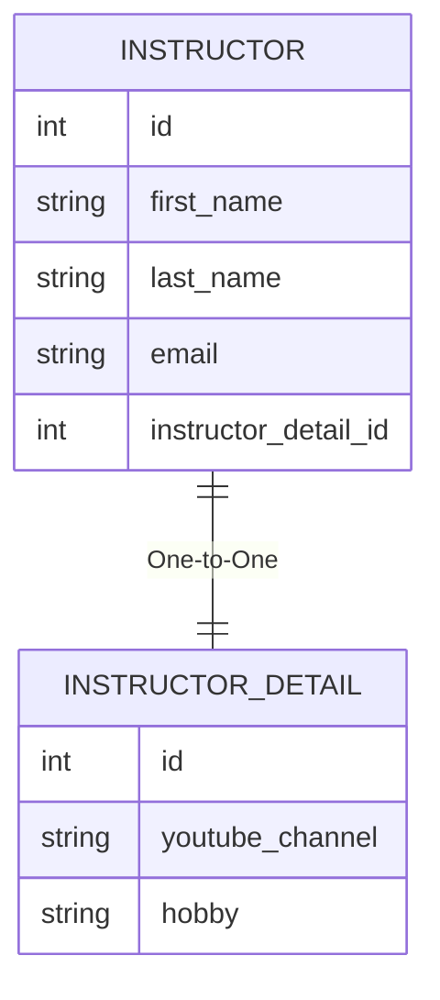

### `@JoinColumn` 與資料庫外鍵的關聯機制

- **[Java 端配置]** 使用 `@JoinColumn` 來指定用於關聯的欄位名稱
    - 在 `Instructor` 類別中，透過 `@JoinColumn(name="instructor_detail_id")` 告訴 Hibernate 使用 `instructor_detail_id` 這個欄位來進行一對一映射
- **[資料庫端對應]** Java 中的欄位名稱必須與 SQL 腳本中建立的外鍵約束一致
    - **[關聯邏輯]** 根據先前的 SQL 腳本，`instructor` 資料表中的 `instructor_detail_id` 欄位被設定為指向 `instructor_detail` 資料表的 `id` 欄位
- **[SQL 結構回顧]**

```sql
-- 建立外鍵約束的語法範例
CONSTRAINT `FK_DETAIL` FOREIGN KEY (`instructor_detail_id`) REFERENCES `instructor_detail` (`id`)
```

- **[總結]** `@JoinColumn` 的作用是作為 Hibernate 與資料庫之間的「掛鉤 (Hookup)」：
    - 它告訴 Hibernate：「請使用這個特定的欄位來執行 Join 操作，以便完成這個一對一的映射關係。」

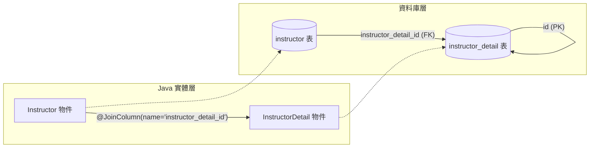

### 實作 `Instructor` 建構子

- **[開發技巧]** 利用 IDE 的「Choose Fields to Initialize by Constructor」功能來快速生成建構子
- **[建構子設計邏輯]** 在生成建構子時，通常會選擇性地排除某些欄位：
    - **排除&#32;`id`**：因為主鍵通常由資料庫自動生成 (Auto-increment)，在建立新物件時不需要手動傳入
    - **排除&#32;`instructorDetail`**：因為在實作一對一關聯時，我們希望在建立 `Instructor` 後，再透過程式碼手動設定或透過級聯 (Cascade) 來處理關聯物件，而不是在建構子中強制綁定
- **[實作範例]**
    - 選擇欄位：`firstName`, `lastName`, `email`
    - 排除欄位：`id`, `instructorDetail`

### 實作 `Instructor` 基礎方法

- **[建構子完成狀態]** 根據先前的設計，`Instructor` 的建構子僅包含基礎屬性，不包含 `id` 或關聯物件：

```java
public Instructor(String firstName, String lastName, String email) {
        this.firstName = firstName;
        this.lastName = lastName;
        this.email = email;
    }
```

- **[生成 Getter 與 Setter]**
    - **[操作流程]** 使用 IDE 的 「Generate Getters and Setters」 功能
    - **[選取策略]** 在彈出的選擇視窗中，「Select All」所有欄位，以確保應用程式能存取該實體的所有屬性
    - **[預設設定]** 使用 IDE 預設的樣板（如 `IntelliJ Default`）即可滿足大多數開發需求
- **[實作結果]** 生成後，實體類別將具備完整的存取方法，例如：

```java
public int getId() {
        return id;
    }

    public void setId(int id) {
        this.id = id;
    }
```

### 實作 `Instructor` 的 `toString()` 方法

- **[開發目的]** 產生 `toString()` 方法可以幫助在執行應用程式時，直接透過列印物件來查看其內部屬性的值，對於除錯非常有幫助。
- **[操作流程]**
    - 使用 IDE 的 「Generate toString()」 功能
    - 在彈出的視窗中，「Select All」所有欄位，以確保所有屬性都能包含在字串表示中
    - 選擇適當的樣板（例如 `String concat (+)`）
- **[實作結果]** 生成後的 `toString()` 方法會將所有欄位組合在一起：

```java
@Override
public String toString() {
    return "Instructor{" +
            "id=" + id +
            ", firstName='" + firstName + "'" +
            ", lastName='" + lastName + "'" +
            ", email='" + email + "'" +
            ", instructorDetail=" + instructorDetail +
            '}';
}
```

### `Instructor` 類別開發進度總結

目前 `Instructor` 實體類別已完成以下核心開發項目：

1. **類別註解與資料表映射**：使用 `@Entity` 與 `@Table` 完成與資料庫的對應。
2. **欄位定義**：包含 `id`, `firstName`, `lastName`, `email` 以及關聯物件 `instructorDetail`。
3. **建構子 (Constructor)**：已實作僅包含基礎屬性的建構子。
4. **存取方法**：已生成完整的 Getter 與 Setter 方法。
5. **關聯映射**：已完成與 `InstructorDetail` 的一對一映射設定（使用 `@OneToOne` 與 `@JoinColumn`）。
6. **物件表示**：已完成 `toString()` 方法的實作。

## 建立主應用程式 (Create Main App)

- **[開發流程]** 這是開發過程的最後一個階段，包含以下三個子步驟：
    - **4.1 建立 DAO 介面 (Create DAO Interface)**
    - **4.2 建立 DAO 實作 (Create DAO Impl)**
    - **4.3 組裝主應用程式 (Pulling together the main app)**

### 專案結構準備

- **[實作動作]** 為了組織程式碼，首先會建立一個專用的套件 (package) 來存放 DAO 相關元件
    - **目標套件名稱**：`dao`

### 建立 AppDAO 介面

- 在 `dao` 套件下建立一個新的 Java 介面
    - **[操作步驟]** 在 IntelliJ IDEA 中：
        - 在 `dao` 套件上點擊右鍵
        - 選擇 `New` $\rightarrow$ `Java Class`
        - 在彈出的視窗中，將類型從 `Class` 切換為 `Interface`
        - 輸入名稱：`AppDAO`
- **[初步結構]** 建立完成後的基礎程式碼如下：

```java
package com.luv2code.cruddemo.dao;

public interface AppDAO {

}
```

- **[後續計畫]** 接下來會在該介面中定義一個方法

### 完善 AppDAO 介面

- **[實作動作]** 在 `AppDAO` 介面中新增一個用於儲存 `Instructor` 物件的方法
    - **方法簽章**：`void save(Instructor theInstructor);`
- **[更新後的程式碼]**

```java
package com.luv2code.cruddemo.dao;

import com.luv2code.cruddemo.entity.Instructor;

public interface AppDAO {

    void save(Instructor theInstructor);

}
```

---

### 建立 AppDAOImpl 實作類別

- **[開發步驟]** 建立一個新的 Java 類別來實作 `AppDAO` 介面
    - **[操作步驟]** 在 IntelliJ IDEA 中：
        - 在 `dao` 套件上點擊右鍵
        - 選擇 `New` $\rightarrow$ `Java Class`
        - 輸入名稱：`AppDAOImpl`
        - 選擇類型：`Class`
- **[初步結構]** 建立類別並宣告實作該介面：

```java
package com.luv2code.cruddemo.dao;

public class AppDAOImpl implements AppDAO {

}
```

### 實作 AppDAOImpl 類別

- **[快速實作方法]** 利用 IntelliJ IDEA 的提示功能（Implement Methods）來快速生成介面方法的框架
    - **[操作步驟]** 在 `AppDAOImpl` 類別中，選擇 `Implement methods` 並選取 `save(Instructor theInstructor)`
- **[初步實作程式碼]**

```java
package com.luv2code.cruddemo.dao;

import com.luv2code.cruddemo.entity.Instructor;

public class AppDAOImpl implements AppDAO {

    @Override
    public void save(Instructor theInstructor) {

    }

}
```

- **[實作規劃]** 為了讓 DAO 能夠與資料庫互動，需要進行以下配置：
    - **定義欄位**：建立一個 `EntityManager` 的成員變數
    - **依賴注入**：使用**建構子注入 (Constructor Injection)** 的方式將 `EntityManager` 注入到類別中

### 完成 AppDAOImpl 的依賴注入

- **[實作動作]** 完成 `AppDAOImpl` 的成員變數定義與建構子注入
    - **定義欄位**：建立一個 `private EntityManager entityManager;` 用於資料庫操作
    - **依賴注入**：使用**建構子注入 (Constructor Injection)** 將 `EntityManager` 引入類別
- **[程式碼實作]**

```java
package com.luv2code.cruddemo.dao;

import com.luv2code.cruddemo.entity.Instructor;
import jakarta.persistence.EntityManager;
import org.springframework.beans.factory.annotation.Autowired;

public class AppDAOImpl implements AppDAO {

    // define field for entity manager
    private EntityManager entityManager;

    // inject entity manager using constructor injection
    @Autowired
    public AppDAOImpl(EntityManager entityManager) {
        this.entityManager = entityManager;
    }

    @Override
    public void save(Instructor theInstructor) {

    }

}
```

- **[技術細節]**
    - **@Autowired 註解**：在建構子上使用 `@Autowired` 是可選的 (Optional)，但加上它可以增加程式碼的可讀性，明確標示此處正在進行依賴注入。

### 實作 AppDAOImpl 的儲存邏輯

- **[新增註解]** 在 `save` 方法上添加 `@Transactional` 註解
    - **[原因]** 因為此操作涉及對資料庫的更新（儲存/寫入物件），必須在一個事務（Transaction）中執行
- **[實作持久化]** 使用 `EntityManager` 的 `persist` 方法來儲存實體

```java
@Override
@Transactional
public void save(Instructor theInstructor) {

    entityManager.persist(theInstructor);

}
```

- **[級聯效果]** 由於在實體類別中配置了 `CascadeType.ALL`，當執行 `entityManager.persist(theInstructor)` 時：
    - **[自動連帶]** 系統會自動將關聯的 `InstructorDetail` 物件也一併儲存到資料庫中
    - **[簡化流程]** 開發者不需要手動分別對兩個物件呼叫 `persist`

### 級聯儲存的效益

- **[核心機制]** 因為配置了 `CascadeType.ALL`，在執行 `entityManager.persist(theInstructor)` 時，會自動連帶儲存關聯的細節物件
    - **[實際效果]** 這讓我們可以用「一個價格（單一動作）」就儲存兩個物件：`Instructor` 與其對應的 `InstructorDetail`
- **[實作程式碼參考]**

```java
@Override
@Transactional
public void save(Instructor theInstructor) {
    entityManager.persist(theInstructor);
}
```

```java
// Instructor 類別中的關聯配置
@OneToOne(cascade = CascadeType.ALL)
@JoinColumn(name = "instructor_detail_id")
private InstructorDetail instructorDetail;
```

### 在主應用程式中注入 AppDAO

- **[實作動作]** 在 `CruddemoApplication` 中定義一個 `CommandLineRunner` Bean，並將 `AppDAO` 注入其中
- **[技術細節]** 使用 `@Bean` 註解而非 `@Autowired`
    - **[原因]** 因為該方法本身被標記為 `@Bean`，Spring 會自動處理該方法的執行與物件的注入，因此在方法參數中使用 `AppDAO appDAO` 即可完成依賴注入
- **[程式碼實作]**

```java
@SpringBootApplication
public class CruddemoApplication {

    // @Bean 會讓 Spring 自動管理此方法的返回值
    // 透過參數 appDAO 進行依賴注入
    @Bean
    public CommandLineRunner commandLineRunner(AppDAO appDAO) {
        return runner -> {
            // 這裡可以開始呼叫 appDAO 的方法
            // System.out.println("Hello world"); // 移除原本的測試代碼
        };
    }

}
```

- **[架構邏輯]**

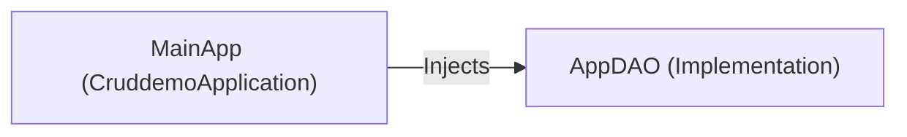

### 在主應用程式中實作初始化邏輯

- **[建立輔助方法]** 在 `CruddemoApplication` 中建立一個私有方法 `createInstructor`
    - **[參數傳遞]** 該方法接收 `AppDAO appDAO` 作為參數，以便在方法內部執行資料庫操作
    - **[IDE 技巧]** 若方法尚未定義，可先在程式碼中呼叫該方法，並利用 IDE 的建議功能（如 IntelliJ 的「Create method...」）快速生成方法存根（Stub）

```java
@Bean
public CommandLineRunner commandLineRunner(AppDAO appDAO) {
    return runner -> createInstructor(appDAO);
}

private void createInstructor(AppDAO appDAO) {
    // 待實作
}
```

- **[實作物件建立]** 在 `createInstructor` 方法內開始建立 `Instructor` 實例

```java
private void createInstructor(AppDAO appDAO) {
    // create the instructor
    Instructor tempInstructor = new Instructor();
}
```

### 實作初始化物件建立

- **[建立 Instructor 物件]** 為 `tempInstructor` 賦值新的 `Instructor` 實例，並設定其屬性（如 `firstName`、`lastName` 與 `email`）

```java
private void createInstructor(AppDAO appDAO) {
    // create the instructor
    Instructor tempInstructor = new Instructor("Chad", "Darby", "darby@luv2code.com");

    // create the instructor detail
    InstructorDetail tempInstructorDetail = new InstructorDetail();
}
```

- **[建立 InstructorDetail 物件]** 同時建立 `tempInstructorDetail` 實例，以便後續將其與 `Instructor` 進行關聯綁定

### 建立實體間的一對一關聯

- **[建立物件]** 首先分別建立兩個獨立的實體物件：`Instructor` 與 `InstructorDetail`
    - **[屬性設定]** 在建立 `InstructorDetail` 時，可以設定其屬性，例如 YouTube 頻道連結與興趣愛好

```java
private void createInstructor(AppDAO appDAO) {
    // create the instructor
    Instructor tempInstructor = new Instructor("Chad", "Darby", "darby@luv2code.com");

    // create the instructor detail
    InstructorDetail tempInstructorDetail = new InstructorDetail("http://www.luv2code.com/youtube", "luv 2 code!!!");

    // associate the objects
    tempInstructor.setInstructorDetail(tempInstructorDetail);
}
```

- **[建立關聯]** 透過呼叫 `tempInstructor.setInstructorDetail(tempInstructorDetail)` 將 `InstructorDetail` 的引用傳遞給 `Instructor`
    - **[目的]** 這樣才能在 Java 物件層級將這兩個實體關聯起來，進而讓 Hibernate 在後續儲存時能正確處理一對一的映射關係

### 實作初始化物件儲存

- **[列印資訊]** 在儲存之前，先使用 `System.out.println` 印出即將儲存的 Instructor 物件資訊，以便於開發時確認物件內容

```java
// save the instructor
System.out.println("Saving instructor: " + tempInstructor);
```

- **[執行持久化]** 透過呼叫 `appDAO.save(tempInstructor)` 將建立好的 Instructor 物件交由 DAO 進行儲存
    - **[委派操作]** 此處將儲存的責任委派給 `AppDAO` 實作，利用其內部的 `EntityManager` 來處理實際的資料庫寫入動作

```java
appDAO.save(tempInstructor);
```

- **[級聯儲存特性]** 由於設定了 `CascadeType.ALL`，當我們儲存 `Instructor` 物件時，系統會自動連帶儲存其關聯的 `InstructorDetail` 物件
    - **[開發便利性]** 這意味著我們不需要分別對兩個物件呼叫 `save` 方法，只需處理主實體即可完成整個關聯物件圖的持久化

```java
// save the instructor
// NOTE: this will ALSO save the details object because of CascadeType.ALL
System.out.println("Saving instructor: " + tempInstructor);
appDAO.save(tempInstructor);

System.out.println("Done!");
```

- **[完成流程]** 在所有儲存動作完成後，印出 "Done!" 以確認初始化與持久化流程已順利執行完畢

### 設定 JPA/Hibernate 日誌記錄

- **[目的]** 在執行應用程式之前，開啟 SQL 日誌以觀察 Hibernate 實際執行的 SQL 語句以及該語句所使用的具體數值
- **[實作方式]** 開啟 `application.properties` 設定檔，並新增以下屬性：

```properties

# Show JPA/Hibernate logging messages
logging.level.org.hibernate=debug
```

    - **[註解]** 在設定檔中使用 `#` 開頭的註解來標記該設定的作用，方便日後維護

### 進階 SQL 日誌記錄設定

- **[目的]** 除了觀察 SQL 語句本身，還需要確認這些語句中使用的具體數值（參數綁定）
- **[實作方式]** 在 `application.properties` 中新增以下設定：

```properties

# Log SQL statements
logging.level.org.hibernate.SQL=trace

# Log values that are used in those SQL statements
logging.level.org.hibernate.orm.jdbc.bind=trace
```

    - **[功能拆解]**
        - `logging.level.org.hibernate.SQL=trace`: 用於記錄實際執行的 SQL 語句
        - `logging.level.org.hibernate.orm.jdbc.bind=trace`: 用於記錄 SQL 語句中綁定的參數值

### 應用程式啟動失敗

- **[錯誤現象]** 執行應用程式時發生錯誤，導致啟動失敗
- **[錯誤訊息分析]**
    - **Description**: `Parameter 0 of method commandLineRunner in com.luv2code.cruddemo.CruddemoApplication required a bean of type 'com.luv2code.cruddemo.dao.AppDAO'`
    - **Action**: `Consider defining a bean of type 'com.luv2code.cruddemo.dao.AppDAO' in your configuration.`
- **[問題核心]** Spring 在嘗試注入 `CommandLineRunner` 的第一個參數時，找不到類型為 `AppDAO` 的 Bean
    - **[原因]** 這通常意味著 `AppDAO` 沒有被標記為 Spring 管理的組件（例如缺少 `@Repository` 或 `@Component`），或者沒有被正確掃描到

### 解決 AppDAO 注入失敗問題

- **[問題回顧]** 應用程式啟動失敗，錯誤訊息顯示 Spring 找不到類型為 `AppDAO` 的 Bean
- **[問題原因]** 雖然建立了 `AppDAOImpl` 實作類別，但漏掉了必要的註解，導致 Spring 在進行組件掃描 (Component Scanning) 時無法識別該類別為一個受管理的 Bean
- **[解決方案]** 在 `AppDAOImpl` 類別上方添加 `@Repository` 註解

```java
@Repository
public class AppDAOImpl implements AppDAO {

    // define field for entity manager
    private EntityManager entityManager;

    // inject entity manager using constructor injection
    @Autowired
    public AppDAOImpl(EntityManager entityManager) {
        this.entityManager = entityManager;
    }

    @Override
    @Transactional
    public void save(Instructor theInstructor) {
        entityManager.persist(theInstructor);
    }
}
```

    - **[註解作用]** `@Repository` 告訴 Spring 這個類別是一個資料存取層的組件，應被納入 Spring 容器的管理範圍，進而解決注入依賴時找不到 Bean 的問題

### 驗證一對一映射實作

- **[執行結果]** 應用程式成功執行，未發生崩潰
- **[日誌觀察]** 透過設定的 Hibernate 日誌，可以觀察到兩次 `insert` 語句：
    - 第一次插入：`instructor_detail` 資料表
    - 第二次插入：`instructor` 資料表
- **[核心邏輯]** Hibernate 會先插入「關聯實體」（Associated Entity），再插入「主實體」
    - **[原因]** 因為外鍵（Foreign Key）的關係，`Instructor` 需要知道 `InstructorDetail` 的 ID 才能完成關聯，所以必須先建立 `InstructorDetail` 記錄

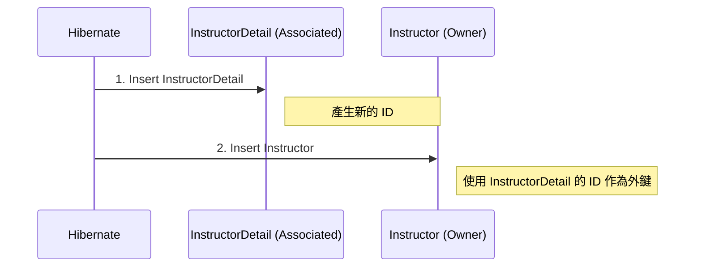

### 驗證資料庫實作結果

- **[執行狀態]** 應用程式輸出顯示 `Done!`，表示初始化邏輯已執行完成
- **[資料庫驗證]** 使用 MySQL Workbench 進行手動查詢，確認資料已正確寫入
    - **`instructor`&#32;資料表**
        - 成功查詢到 `id`、`first_name`、`last_name`、`email` 以及 `instructor_detail_id` (外鍵)
    - **`instructor_detail`&#32;資料表**
        - 成功查詢到 `id`、`youtube_channel` 與 `hobby` 欄位
- **[驗證結論]** 資料表結構與關聯內容符合預期，一對一映射實作成功

### 修改初始化邏輯以增加測試資料

- **[操作目標]** 在 `createInstructor` 方法中新增另一個 `Instructor` 物件，以進行更多樣化的測試
- **[實作方式]** 透過複製現有的物件建立區塊並進行註解，隨後修改參數以建立新的實體

```java
// 原始邏輯範例（修改中）
private void createInstructor(AppDAO appDAO) {
    // create the instructor
    Instructor tempInstructor = new Instructor("Chad", "Darby", "darby@luv2code.com");

    // create the instructor detail
    InstructorDetail tempInstructorDetail = new InstructorDetail("http://www.luv2code.com/youtube", "Luv 2 code!!");

    // associate the objects
    tempInstructor.setInstructorDetail(tempInstructorDetail);

    // save the instructor
    // NOTE: this will ALSO save the details object
    // because of CascadeType.ALL
    appDAO.save(tempInstructor);

    /* 準備複製並修改此段落以新增第二個 Instructor */
}
```

### 實作第二個測試案例

- **[操作內容]** 在 `createInstructor` 方法中，複製原有的物件建立邏輯，並修改參數以建立一個新的 `Instructor` 實體
- **[修改細節]**
    - **`Instructor`&#32;資訊**
        - `firstName`: "Madhu"
        - `lastName`: "Patel"
        - `email`: "madhu@luv2code.com"
    - **`InstructorDetail`&#32;資訊**
        - `youtubeChannel`: "http://www.luv2code.com/youtube" (保持不變)
        - `hobby`: "Guitar"

```java
// 新增的測試物件實作
Instructor tempInstructor = new Instructor("Madhu", "Patel", "madhu@luv2code.com");

InstructorDetail tempInstructorDetail = new InstructorDetail("http://www.luv2code.com/youtube", "Guitar");

tempInstructor.setInstructorDetail(tempInstructorDetail);

appDAO.save(tempInstructor);
```

### 驗證一對一映射實作結果

- **[日誌檢查]** 應用程式成功輸出儲存資訊，顯示正在儲存 `Instructor`：
    - `first_name`: Madhu
    - `last_name`: Patel
- **[資料庫驗證]** 使用 MySQL Workbench 進行查詢，確認資料已正確寫入對應資料表
    - **`instructor`&#32;資料表**
        - 成功新增 Madhu Patel 的紀錄
    - **`instructor_detail`&#32;資料表**
        - 成功新增對應的詳細資訊，其中 `hobby` 為 "Guitar"
- **[實作結論]** 成功完成一對一映射（One-to-One Mapping），實現了在儲存 `Instructor` 物件時，能同時自動儲存關聯的 `InstructorDetail` 物件。

### Spring Security 自定義配置的靈活性

- **[核心優勢]** 允許使用完全自定義的資料表結構，而不必受限於 Spring Security 的預設模式
    - 可以自定義**資料表名稱** (Table Names)
    - 可以自定義**欄位名稱** (Column Names)
- **[實作機制]** 透過配置特定的 SQL 查詢語句來引導 Spring Security
    - 定義如何透過 `username` 尋找使用者資訊
    - 定義如何透過給定的名稱尋找對應的 `authorities` (角色/權限)
- **[結論]** 這種設計提供了極高的開發自由度與靈活性，能完美適應各種不同的業務需求與資料庫設計

### 定義 DAO 實作 (Define DAO implementation)

- **[實作方法]** 在 DAO 中新增 `findInstructorById` 方法，透過 `EntityManager` 根據 ID 查找實體

```java
@Override
public Instructor findInstructorById(int theId) {
    return entityManager.find(Instructor.class, theId);
}
```

- **[一對一查詢行為]** 執行此方法不僅會回傳 `Instructor` 物件，也會同時取得關聯的 `InstructorDetail` 物件
    - **[原因]** 因為 `@OneToOne` 註解的預設抓取類型 (Fetch Type) 是 `EAGER` (立即載入)
    - **[註記]** 雖然在此案例中會自動抓取關聯物件，但未來可以根據需求調整不同的抓取類型 (Fetch Types)

### 更新 AppDAO 介面

- **[開發步驟]** 在 `AppDAO` 介面中新增一個方法，以便能夠根據 ID 查詢特定的講師實體
- **[介面更新內容]**

```java
package com.luv2code.cruddemo.dao;

import com.luv2code.cruddemo.entity.Instructor;

public interface AppDAO {

    void save(Instructor theInstructor);

    Instructor findInstructorById(int theId);
}
```

### 實作 AppDAOImpl 中的查詢方法

- **[開發技巧]** 利用 IDE 的提示功能 (IDE hint) 來快速實作介面中定義的方法（例如：Implement method 或 Implement a stub），以節省手動撰寫重複程式碼的時間。
- **[實作邏輯]** 在 `AppDAOImpl` 中實作 `findInstructorById` 方法，核心是使用 `EntityManager` 的 `find` 方法。

```java
@Override
public Instructor findInstructorById(int theId) {
    return entityManager.find(Instructor.class, theId);
}
```

- **[方法解析]**
    - `entityManager.find(Class<T> entityClass, Object primaryKey)`
    - 此方法會根據提供的類別（在此為 `Instructor.class`）與主鍵（`theId`）去資料庫中尋找對應的實體紀錄。

### 查詢行為與主程式測試準備

- **[一對一查詢特性]** 在 `AppDAOImpl` 中執行 `findInstructorById` 時，會同時回傳 `Instructor` 與其關聯的 `InstructorDetail` 物件
    - **[原因]** 因為 `@OneToOne` 的預設抓取類型 (Fetch Type) 是 `EAGER` (立即載入)
- **[進入主程式測試]** 準備在 `CruddemoApplication` 類別中撰寫程式碼，以呼叫新開發的查詢方法進行驗證

```java
@SpringBootApplication
public class CruddemoApplication {

    @Bean
    public CommandLineRunner commandLineRunner(AppDAO appDAO) {
        return runner -> {
            createInstructor(appDAO);
        };
    }

    private void createInstructor(AppDAO appDAO) {
        // ... 實作邏輯
    }
}
```

### 在主程式中實作測試方法

- **[開發步驟]** 在 `CruddemoApplication` 中新增一個 `findInstructor` 方法，並將 `appDAO` 作為參數傳入
- **[利用 IDE 功能]** 由於該方法尚未在 `AppDAO` 介面中定義，可以利用 IDE 的提示功能（如：Create method）來快速生成方法存根 (stub)

```java
private void findInstructor(AppDAO appDAO) {
    // TODO: Implement this method
}
```

- **[撰寫測試邏輯]** 在方法內設定測試用的 ID，並使用 `System.out.println` 輸出訊息以便確認執行狀況

```java
private void findInstructor(AppDAO appDAO) {
    int theId = 1;
    System.out.println("Finding instructor id: " + theId);

    // 接下來將委派給 appDAO 執行查詢
}
```

### 實作 `findInstructor` 測試邏輯

- **[實作步驟]** 在 `findInstructor` 方法中，呼叫 `appDAO` 的查詢方法，並將結果存入暫存變數，隨後進行列印驗證
- **[程式碼實作]**

```java
private void findInstructor(AppDAO appDAO) {
    int theId = 1;
    System.out.println("Finding instructor id: " + theId);

    // 透過 ID 取得 Instructor 實體
    Instructor tempInstructor = appDAO.findInstructorById(theId);

    // 列印 Instructor 物件資訊
    System.out.println("tempInstructor: " + tempInstructor);

    // 若只想單獨列印關聯的 InstructorDetail 資訊
    System.out.println("the associated instructorDetail only: " + tempInstructor.getInstructorDetail());
}
```

- **[驗證重點]**
    - 透過列印 `tempInstructor` 可以確認主實體是否成功從資料庫載入
    - 透過列印 `tempInstructor.getInstructorDetail()` 可以驗證 `@OneToOne` 關聯是否正確建立，以及預設的 `EAGER` 抓取策略是否如預期將關聯物件一併取出

### 驗證 `findInstructor` 測試結果

- **[查詢驗證方式]** 在測試方法中，可以透過兩種方式確認關聯資料是否正確載入
    - **方式一：** 直接列印整個 `Instructor` 物件（會連同其關聯的 `InstructorDetail` 一併輸出）
    - **方式二：** 僅透過 `tempInstructor.getInstructorDetail()` 取得並列印關聯物件本身
- **[執行結果觀察]** 執行應用程式後，透過控制台（Console）輸出確認實體與關聯資料的狀態

```text
Finding instructor id: 1
tempInstructor: Instructor[id=1, firstName='Chad', lastName='Darby', email='darby@luv2code.com', ...]
the associated instructorDetail only: InstructorDetail[id=1, youtubeChannel='http://www.luv2code.com', ...]

Process finished with exit code 0
```

- **[結果分析]**
    - 成功從資料庫中根據 ID `1` 取得 `Instructor` 資料
    - 關聯的 `InstructorDetail` 資訊也正確顯示，證實了 `@OneToOne` 映射與 `EAGER` 抓取策略運作正常
- **[執行結果比對]** 透過控制台輸出，確認從資料庫取得的實體內容與預期相符
    - **Instructor 資訊：** `id=1`, `firstName='Chad'`, `lastName='Darby'`, `email='darby@luv2code.com'`
    - **關聯的 InstructorDetail 資訊：** `id=1`, `youtubeChannel='http://www.luv2code.com'`, `hobby='Luv 2 code!!'`
- **[資料一致性確認]** 輸出結果與資料庫中 `instructor` 與 `instructor_detail` 資料表內的實際紀錄完全吻合

```text
Finding instructor id: 1
tempInstructor: Instructor[id=1, firstName='Chad', lastName='Darby', email='darby@luv2code.com', ...]
the associated instructorDetail only: InstructorDetail[id=1, youtubeChannel='http://www.luv2code.com', hobby='Luv 2 code!!']
```

- **[後續測試計畫]** 準備修改測試用的 `theId`（例如從 `1` 改為 `2`），以驗證系統是否能正確回傳不同 ID 對應的實體資料

### 驗證第二個測試案例結果

- **[測試目標]** 驗證不同 ID 的查詢功能，確認系統能正確回傳非預設 ID 的實體資料
- **[執行結果觀察]** 透過執行測試案例（查詢 ID 為 `2` 的實體），確認輸出內容符合資料庫紀錄
    - **Instructor 資訊：** `Madhu Patel`
    - **關聯的 InstructorDetail 資訊：** `youtubeChannel='http://www.luv2code.com'`, `hobby='Guitar'`
- **[核心結論]**
    - 證實透過一對一映射，可以藉由主實體的 ID 成功取得其關聯的詳細資訊
    - 驗證了預設的抓取策略（Fetching Strategy）能自動將關聯物件一併取出並顯示

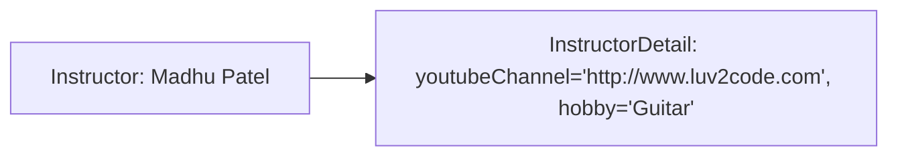

### JPA / Hibernate 一對一：刪除實體

- **[刪除流程]** 在 DAO 實作類別中，刪除一個具有一對一關聯的實體需要兩個步驟：

    1. 使用 `entityManager.find()` 根據 ID 取得該實體物件
    2. 使用 `entityManager.remove()` 傳入該物件以執行刪除

- **[級聯刪除效應]** 因為配置了 `CascadeType.ALL`，當刪除主實體（如 `Instructor`）時，系統會自動連帶刪除其關聯的實體（如 `InstructorDetail`）
    - 這與 `save` 或 `persist` 的邏輯一致：在儲存時會同時儲存兩者，在刪除時也會同時刪除兩者

```java
@Override
@Transactional
public void deleteInstructorById(int theId) {
    // retrieve the instructor
    Instructor tempInstructor = entityManager.find(Instructor.class, theId);

    // delete the instructor
    entityManager.remove(tempInstructor);
}
```

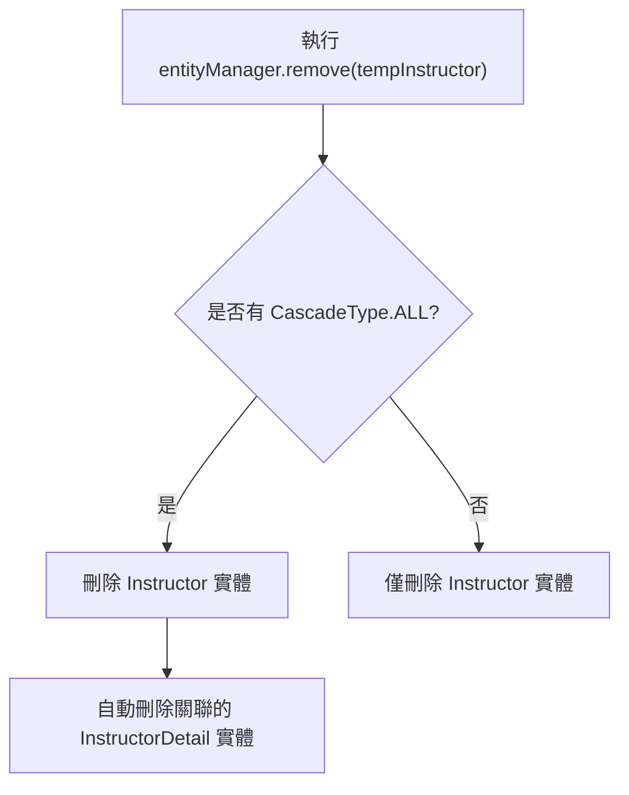

- **[開發流程]** 在實作具體的 `entityManager` 操作邏輯之前，必須先在介面中定義方法簽章：

    1. 更新 `AppDAO` 介面，加入 `deleteInstructorById(int theId)` 方法
    2. 接著才在 `AppDAOImpl` 實作類別中撰寫具體的刪除邏輯

```java
package com.luv2code.cruddemo.dao;

import com.luv2code.cruddemo.entity.Instructor;

public interface AppDAO {

    void save(Instructor theInstructor);

    Instructor findInstructorById(int theId);

    void deleteInstructorById(int theId);
}
```

- **[刪除邏輯預覽]** 在實作類別中，刪除操作會利用 `CascadeType.ALL` 的特性：
    - 當執行 `entityManager.remove(tempInstructor)` 時，系統會**同時刪除**關聯的 `InstructorDetail` 物件

### 實作 `AppDAOImpl` 邏輯

- **[開發技巧]** 利用 IDE 的功能（例如 `Implement method`）來快速為介面方法生成方法存根 (Stub)，以提高開發效率
- **[交易管理]** 在實作涉及資料庫修改（如新增或刪除）的方法時，必須使用 `@Transactional` 註解
    - **[原因]** 確保該操作在一個完整的資料庫交易中執行，若執行過程中發生錯誤，系統能進行回滾 (Rollback)，維持資料一致性

```java
@Repository
public class AppDAOImpl implements AppDAO {

    private EntityManager entityManager;

    // inject entity manager using constructor injection
    @Autowired
    public AppDAOImpl(EntityManager entityManager) {
        this.entityManager = entityManager;
    }

    @Override
    @Transactional
    public void save(Instructor theInstructor) {
        // TODO: implement
    }

    @Override
    public Instructor findInstructorById(int theId) {
        return entityManager.find(Instructor.class, theId);
    }

    @Override
    @Transactional
    public void deleteInstructorById(int theId) {
        // TODO: implement
    }
}
```

### 實作 `deleteInstructorById` 邏輯

- **[刪除流程]** 刪除一個實體需要兩個步驟：

    1. **檢索 (Retrieve)**：使用 `entityManager.find` 根據指定的 ID 找出該實體
    2. **刪除 (Delete)**：將檢索到的實體傳遞給 `entityManager.remove` 方法

```java
@Override
@Transactional
public void deleteInstructorById(int theId) {
    // retrieve the instructor
    Instructor tempInstructor = entityManager.find(Instructor.class, theId);

    // delete the instructor
    entityManager.remove(tempInstructor);
}
```

### 在 `CruddemoApplication` 中測試刪除功能

- **[測試規劃]** 在 `CommandLineRunner` 的 `run` 方法中，呼叫剛剛實作的 `deleteInstructor` 方法來驗證刪除邏輯是否如預期運作
- **[實作步驟]**
    - 註解掉原本用於查詢的 `findInstructor` 測試程式碼
    - 新增 `deleteInstructor(appDAO)` 的呼叫
    - 為該方法建立存根 (Stub) 以便後續撰寫測試內容

```java
@Bean
public CommandLineRunner commandLineRunner(AppDAO appDAO) {
    return runner -> {
        // findInstructor(appDAO);
        deleteInstructor(appDAO);
    };
}

private void deleteInstructor(AppDAO appDAO) {
    // TODO: implement
}
```

### 實作 `deleteInstructor` 測試方法

- **[測試邏輯]** 在測試方法中，指定一個已存在的 ID，呼叫 DAO 的刪除方法，並印出執行結果
- **[實作程式碼]**

```java
private void deleteInstructor(AppDAO appDAO) {
    // 指定要刪除的 instructor id
    int theId = 1;

    System.out.println("Deleting instructor id: " + theId);

    // 呼叫 DAO 進行刪除
    appDAO.deleteInstructorById(theId);

    System.out.println("Done!");
}
```

### 驗證 `deleteInstructorById` 的執行結果

- **[刪除行為分析]** 當執行刪除 ID 為 1 的 Instructor 時，觀察到的 SQL 流程如下：
    - 首先檢索 (Retrieve) 該 Instructor
    - 接著刪除 (Delete) Instructor 本身
    - **[關鍵點]** 同時自動刪除關聯的 `instructor_detail` 物件
- **[原因]** 因為在實體關聯中設定了 `CascadeType.ALL`，使得刪除操作會自動級聯到相關聯的物件

```text
Deleting instructor id: 1
select ...
binding parameter [1] as INTEGER - [1]
delete from instructor where id=?
binding parameter [1] as INTEGER - [1]
delete from instructor_detail where id=?
binding parameter [1] as INTEGER - [1]
Done!

Process finished with exit code 0
```

### 透過 MySQL Workbench 驗證刪除結果

- **[驗證流程]** 執行 SQL 查詢以確認刪除操作是否正確影響了兩張關聯的資料表
- **[檢查 Instructor 表]** 查詢 `instructor` 表，確認目標 ID（例如 ID: 1）已不存在
- **[檢查 InstructorDetail 表]** 查詢 `instructor_detail` 表，確認與該 Instructor 關聯的詳細資訊也已同步刪除

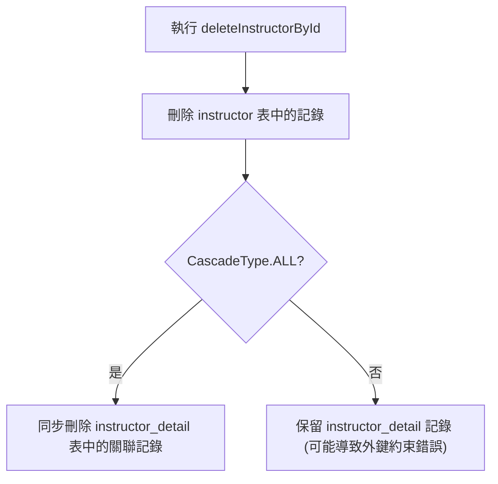

- **[實際驗證結果]**
    - `instructor` 表：ID 為 1 的記錄已成功刪除
    - `instructor_detail` 表：原本屬於該 Instructor 的記錄（例如 hobby 為 "love to code" 的資料）也已隨之刪除

## JPA / Hibernate 一對一雙向映射

### 單向映射 (Uni-directional Mapping) 的限制

- 目前的實作僅為單向映射，關係流向如下：

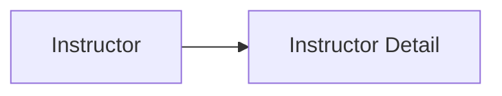

- **[問題點]** 現有的架構僅能從 `Instructor` 開始導向 `InstructorDetail`
- **[無法實現的情境]** 當我們載入一個 `InstructorDetail` 物件時，無法透過目前的關係取得其關聯的 `Instructor` 物件

### 新的使用案例 (New Use Case)

- **[需求]** 如果我們載入了一個 `InstructorDetail` 物件，我們希望能直接取得與該詳細資訊相關聯的 `Instructor`。
- **[解決方案]** 需要將目前的單向關係轉換為雙向關係，以支援從 `InstructorDetail` 反向存取 `Instructor` 的需求。

### 雙向映射 (Bi-directional Mapping) 的優勢

- **[解決方案]** 透過建立雙向關係，可以打破單向關係的限制，讓導向變得「雙向通行」
    - 不僅可以從 `Instructor` 取得 `InstructorDetail`
    - 也可以從 `InstructorDetail` 反向取得其關聯的 `Instructor`

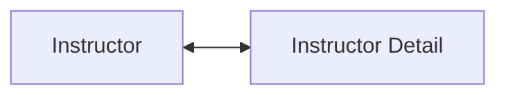

- **[關鍵優點]** 使用雙向映射可以**保留現有的資料庫架構 (database schema)**，不需要為了建立雙向關聯而重新設計資料表或欄位。

### 雙向映射的開發流程

- **[好消息]** 實作雙向映射不需要對資料庫設定進行任何更改
    - 可以繼續使用先前設定好的具有外鍵（Foreign Key）的 `instructor` 與 `instructor_detail` 資料表
- **[核心變動]** 所有的變動僅發生在 Java 程式碼層級

#### 實作 `InstructorDetail` 類別的步驟

1. 在 `InstructorDetail` 類別中新增一個用來引用 `Instructor` 的新欄位
2. 為該欄位新增對應的 getter 與 setter 方法
3. 加入 `@OneToOne` 註解，以便將關係指向原始的 `Instructor` 物件

### 實作雙向映射的具體步驟

#### 1. 更新 `InstructorDetail` 類別

- **步驟 1.1：新增引用欄位**
    - 在 `InstructorDetail` 類別中新增一個名為 `instructor` 的新欄位，用來引用 `Instructor` 物件
- **步驟 1.2：新增 Getter 與 Setter 方法**
    - 實作 `getInstructor()` 方法：用於取得與當前 `InstructorDetail` 實例關聯的 `Instructor` 物件
    - 實作 `setInstructor(Instructor instructor)` 方法：用於將特定的 `Instructor` 設定給此詳細資訊實例

```java
@Entity
@Table(name="instructor_detail")
public class InstructorDetail {

    private Instructor instructor;

    public Instructor getInstructor() {
        return instructor;
    }

    public void setInstructor(Instructor instructor) {
        this.instructor = instructor;
    }
}
```

- **步驟 1.3：添加&#32;`@OneToOne`&#32;註解**
    - 在新增的欄位上加上 `@OneToOne` 註解，以完成 Hibernate 的映射設定

#### 2. 建立主應用程式 (Main App)

- 建立一個主程式來整合並測試所有的映射邏輯與功能

#### 1.3 添加 `@OneToOne` 註解

- 在 `InstructorDetail` 類別的 `instructor` 欄位上添加 `@OneToOne` 註解
- **使用&#32;`mappedBy`&#32;屬性**
    - 語法：`@OneToOne(mappedBy="instructorDetail")`
    - **[作用]** 這是在告訴 Hibernate，這個 `instructor` 欄位的映射關係是由 `Instructor` 類別中的 `instructorDetail` 屬性所定義的

```java
@Entity
@Table(name="instructor_detail")
public class InstructorDetail {

    @OneToOne(mappedBy="instructorDetail")
    private Instructor instructor;

    public Instructor getInstructor() {
        return instructor;
    }

    public void setInstructor(Instructor instructor) {
        this.instructor = instructor;
    }
}
```

### 深入理解 `mappedBy` 的運作機制

- **`mappedBy`&#32;的核心作用**
    - 它告訴 Hibernate 去查看另一個實體類別（在此案例中為 `Instructor` 類別）中的特定屬性
    - **[目的]** 讓 Hibernate 能夠利用該屬性上定義的資訊（例如 `@JoinColumn`）來找出關聯的物件
- **運作流程範例**
    - 在 `InstructorDetail` 類別中使用 `@OneToOne(mappedBy="instructorDetail")`
    - Hibernate 會執行以下邏輯：

        1. 識別出 `mappedBy` 指向 `Instructor` 類別中的 `instructorDetail` 屬性
        2. 查看 `Instructor` 類別中該屬性的 `@JoinColumn` 配置
        3. 利用該外鍵（Foreign Key）關係來匹配並連結兩個實體

```java
// 在 InstructorDetail 類別中
@OneToOne(mappedBy="instructorDetail")
private Instructor instructor;

// 對應的 Instructor 類別配置
public class Instructor {
    @OneToOne(cascade=CascadeType.ALL)
    @JoinColumn(name="instructor_detail_id")
    private InstructorDetail instructorDetail;
}
```

- **總結**
    - `mappedBy` 實際上是在告訴 Hibernate：「這個欄位的映射關係已經由另一個類別定義好了，請直接去那裡查找對應關係。」

### 實作級聯操作 (Cascading) 支援

- **添加&#32;`CascadeType.ALL`**
    - 在 `InstructorDetail` 的 `@OneToOne` 註解中加入 `cascade=CascadeType.ALL`
    - **[作用]** 這會將所有操作（儲存、更新、刪除等）級聯到關聯的 `Instructor` 物件

```java
@Entity
@Table(name="instructor_detail")
public class InstructorDetail {

    @OneToOne(mappedBy="instructorDetail", cascade=CascadeType.ALL)
    private Instructor instructor;

    // ... getter and setter
}
```

- **級聯操作的行為範例**
    - 如果你載入了一個 `InstructorDetail` 物件並對其執行刪除操作
    - **[結果]** 由於設定了 `CascadeType.ALL`，系統會自動連帶刪除與該詳細資訊關聯的 `Instructor` 物件
- **[開發者控制權]**
    - 開發者可以進行更細粒度的控制
    - 如果不需要傳遞所有操作，可以根據需求選擇特定的級聯類型（例如僅 `CascadeType.PERSIST` 或 `CascadeType.REMOVE`）

### 定義 DAO 介面與實作

- **新增&#32;`AppDAO`&#32;介面方法**
    - 在 `AppDAO` 介面中定義新方法，用於透過 ID 查詢 `InstructorDetail`

```java
public interface AppDAO {
    InstructorDetail findInstructorDetailById(int theId);
}
```

- **實作&#32;`AppDAOImpl`&#32;查詢邏輯**
    - 使用 `entityManager.find()` 來實作查詢功能

```java
@Repository
public class AppDAOImpl implements AppDAO {

    private EntityManager entityManager;

    @Override
    public InstructorDetail findInstructorDetailById(int theId) {
        return entityManager.find(InstructorDetail.class, theId);
    }
}
```

- **[關鍵行為] 關聯物件的自動檢索**
    - 當使用 `entityManager.find` 取得 `InstructorDetail` 物件時，系統會**同時**取得其關聯的 `Instructor` 物件
    - **[原因]** 這是因為 `@OneToOne` 關聯的預設行為

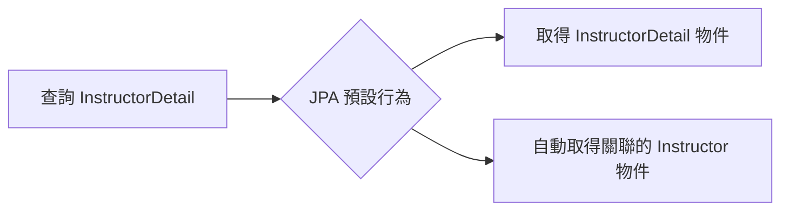

### 更新主應用程式 (Update main app)

- **注入&#32;`AppDAO`**
    - 在 `CommandLineRunner` 中注入 `AppDAO` 實例，以便在應用程式啟動時執行資料檢索測試
- **實作&#32;`findInstructorDetail`&#32;測試方法**
    - 建立一個私有方法來驗證雙向關聯的運作情況

```java
private void findInstructorDetail(AppDAO appDAO) {
    int theId = 1;
    System.out.println("Finding instructor detail id: " + theId);

    // 透過 appDAO 取得 InstructorDetail 物件
    InstructorDetail tempInstructorDetail = appDAO.findInstructorDetailById(theId);

    // 印出 InstructorDetail 本身的資訊
    System.out.println("tempInstructorDetail: " + tempInstructorDetail);

    // 驗證雙向關聯：從 InstructorDetail 取得關聯的 Instructor 物件
    System.out.println("the associated instructor: " + tempInstructorDetail.getInstructor());
}
```

- **[驗證雙向關聯]**
    - **流程**：`findInstructorDetailById(id)` $\rightarrow$ `InstructorDetail` $\rightarrow$ `getInstructor()` $\rightarrow$ `Instructor`
    - **目的**：確認當我們持有「從屬端」物件時，能夠成功導向並存取「主端」物件的資料

### 一對一雙向關聯 (One-to-One Bidirectional) 映射總結

- **映射結構概覽**
    - 關係類型：`@OneToOne` - Bidirectional
    - 外鍵位置：位於 `instructor` 資料表
- **擁有方 (Owning Side)：`Instructor`**
    - **功能**：定義實體的物理映射關係
    - **實作方式**：使用 `@OneToOne` 搭配 `@JoinColumn`
    - **資料庫影響**：在 `instructor` 表中建立外鍵欄位
- **反向端 (Inverse Side)：`InstructorDetail`**
    - **功能**：鏡像 (Mirror) 擁有方的狀態，提供指向擁有方的引用
    - **實作方式**：使用 `@OneToOne(mappedBy="instructorDetail")`
    - **[關鍵點]**：`mappedBy` 屬性用於建立回指向實際擁有方的映射

| 角色 | 實體類別 | 關鍵註解 | 說明 |
| :--- | :--- | :--- | : |
| 擁有方 | Instructor | @OneToOne + @JoinColumn | 定義物理映射與外鍵位置 |
| 反向端 | InstructorDetail | @OneToOne(mappedBy="...") | 提供對擁有方的引用，鏡像擁有方 |

### 雙向一對一映射 (Bidirectional @OneToOne) 結構總結

在雙向一對一關係中，必須明確定義誰是擁有方，誰是反向方，以確保資料庫結構與程式碼邏輯的一致性。

- **映射結構概覽**
    - **映射類型**：`@OneToOne - Bidirectional` (Instructor $\leftrightarrow$ InstructorDetails)
    - **外鍵位置 (Foreign Key Location)**：位於 `instructor` 資料表中
- **擁有方 (Owning Side)：`Instructor`&#32;實體**
    - **職責**：定義實體的物理映射關係 (Defines physical mapping of the relationship)
    - **實作方式**：使用 `@OneToOne` 搭配 `@JoinColumn` 來指定外鍵欄位
    - **程式碼範例**：

```java
@Entity
    @Table(name="instructor")
    public class Instructor {
        // ... 其他欄位
        @OneToOne
        @JoinColumn(name="instructor_detail_id")
        private InstructorDetail instructorDetail;
    }
```

- **反向方 (Inverse Side)：`InstructorDetail`&#32;實體**
    - **職責**：鏡像擁有方的關係 (Mirrors the owning side)
    - **實作方式**：使用 `@OneToOne` 並透過 `mappedBy` 屬性指向擁有方中的欄位名稱
    - **程式碼範例**：

```java
@Entity
    @Table(name="instructor_detail")
    public class InstructorDetail {
        // ... 其他欄位
        @OneToOne(mappedBy="instructorDetail")
        private Instructor instructor;
    }
```

| 角色 | 實體類別 | 關鍵註解 | 資料庫行為 |
| --- | --- | --- | --- |
| 擁有方 (Owning Side) | Instructor | @OneToOne + @JoinColumn | 在此表中建立外鍵欄位 |
| 反向方 (Inverse Side) | InstructorDetail | @OneToOne(mappedBy="...") | 不持有外鍵，僅作為關係的鏡像 |

### 一對一雙向關聯 (One-to-One Bidirectional) 開發流程

- **步驟 1：更新&#32;`InstructorDetail`&#32;類別**
    - 新增一個欄位用來引用 `Instructor`
    - 為該欄位新增 getter/setter 方法
    - 加入 `@OneToOne` 註解
- **步驟 2：建立主應用程式 (Create Main App)**

> **開發技巧**：在開始新功能前，可以先複製現有的專案並重新命名（例如從 `one-to-one-uni` 複製為 `one-to-one-by`），以便保留原始版本作為參考。

### 建立新的開發環境

- **使用現有專案作為起點**
    - 透過複製現有的單向映射專案 (`01-jpa-one-to-one-uni`) 作為備份
    - 將新專案重新命名為 `02-jpa-one-to-one-bi` (BI 代表 Bidirectional)，以便於區分與開發
    - **[目的]** 這樣做可以保留原始版本，作為後續開發過程中的參考基準

### 檢查資料庫連線配置

- 透過 `application.properties` 確認 JDBC URL 設定
    - 目前使用的資料庫 schema 為 `hb-01-one-to-one-uni`
- **[關鍵點]** 在從單向映射轉向雙向映射時，**不需要對資料庫結構 (database schema) 進行任何更改**

### 雙向映射的實作重點

- **資料庫結構無需變動**
    - 即使目前的 schema 名稱仍為 `hb-01-one-to-one-uni`，也可以直接沿用
    - **[關鍵]** 所有的映射邏輯調整僅需在 **Java 原始碼 (Java source code)** 層級完成
    - 現有的 `instructor` 與 `instructor_detail` 資料表結構已足以支援雙向關係

### 實作 `InstructorDetail` 類別的更新

- **新增引用欄位**
    - 編輯 `InstructorDetail.java`
    - 目標：新增一個新欄位，用來引用 `Instructor` 實體，以達成雙向映射
    - **[步驟]**：在類別定義中定義該欄位，隨後需進行後續的註解與方法生成（如 Getter/Setter）
- **新增引用欄位**
    - 在 `InstructorDetail.java` 中定義一個私有欄位，用來引用 `Instructor` 實體
    - **程式碼實作**：

```java
private Instructor instructor;
```

- **自動生成 Getter 與 Setter 方法**
    - **[操作步驟]**：使用 IntelliJ IDEA 的功能來自動生成方法，避免手動編寫錯誤

        1. 在欄位名稱上點擊或使用快捷鍵開啟生成選單
        2. 在「Select Fields to Generate Getters and Setters」對話框中，勾選 `instructor:Instructor` 欄位
        3. 確認 Getter 與 Setter 的模板（Template）為 `IntelliJ Default`
        4. 點擊 `OK` 完成生成

### 程式碼組織：調整方法位置

- **整理 Getter 與 Setter 方法**
    - **[目的]** 為了組織目的 (organizational purposes)，將自動生成的 Getter 與 Setter 方法從欄位定義處移至類別底部
    - **[操作步驟]**：

        1. 使用剪下 (Cut) 功能選取新生成的 `getInstructor()` 與 `setInstructor(Instructor instructor)` 方法
        2. 將游標移動至類別末端
        3. 使用貼上 (Paste) 功能將方法放置於此

**程式碼結構調整示意**：

```java
// 欄位定義區 (保持簡潔)
@Column(name="youtube_channel")
private String youtubeChannel;

@Column(name="hobby")
private String hobby;

private Instructor instructor;

// ... 其他核心邏輯 ...

// 方法區 (移動至類別底部)
public Instructor getInstructor() {
    return instructor;
}

public void setInstructor(Instructor instructor) {
    this.instructor = instructor;
}
```

### 實作雙向映射 (Bi-directional Mapping)

- **添加&#32;`@OneToOne`&#32;註解**
    - 在 `InstructorDetail` 類別的 `instructor` 欄位上添加 `@OneToOne` 註解
    - **[目的]** 藉此建立 `Instructor` 與 `InstructorDetail` 之間的雙向關聯，使兩個物件可以互相存取
    - **程式碼實作**：

```java
// 在 InstructorDetail.java 中
@OneToOne
private Instructor instructor;
```

### 配置雙向映射與級聯操作

- **使用&#32;`mappedBy`&#32;屬性**
    - 在 `Instructor` 類別的 `@OneToOne` 註解中添加 `mappedBy = "instructorDetail"`
    - **[作用]** `mappedBy` 指向 `Instructor` 類別中對應的屬性名稱（即 `instructorDetail`），這告訴 Hibernate 如何根據給定的 `InstructorDetail` 來查找正確的 `Instructor` 物件
    - **程式碼實作**：

```java
@OneToOne(mappedBy = "instructorDetail", cascade = CascadeType.ALL)
private Instructor instructor;
```

- **啟用級聯操作 (Cascading)**
    - 在註解中加入 `cascade = CascadeType.ALL`
    - **[目的]** 讓所有的操作（例如 `persist`、`remove` 等）都能自動應用到關聯的實體上
    - **[效益]** 當我們對 `Instructor` 執行操作時，系統會自動連帶對其關聯的 `InstructorDetail` 執行相同的操作

### 配置級聯操作 (Cascading)

- **使用&#32;`CascadeType.ALL`**
    - 在 `@OneToOne` 註解中加入 `cascade = CascadeType.ALL` 屬性
    - **[功能]** 實現所有操作的級聯傳遞：
        - **儲存 (Save)**：儲存 `InstructorDetail` 時，會自動儲存其關聯的 `Instructor` 物件
        - **刪除 (Delete)**：刪除 `InstructorDetail` 時，會自動刪除關聯的 `Instructor` 物件
- **程式碼實作**：

```java
@OneToOne(mappedBy = "instructorDetail", cascade = CascadeType.ALL)
private Instructor instructor;
```

### 雙向映射實作：DAO 層更新

- **開發步驟規劃**
    - **2.1: 更新 DAO 介面 (Update DAO Interface)**
    - **2.2: 更新 DAO 實作 (Update DAO Impl)**
    - **2.3: 更新主應用程式 (Update Main App)**
- **2.1: 更新 DAO 介面**
    - 在 `AppDAO` 介面中新增用於查詢關聯實體的方法，以便透過 ID 取得 `InstructorDetail` 物件
    - **新增方法**：

```java
InstructorDetail findInstructorDetailById(int id);
```

### 2.2: 更新 DAO 實作 (Update DAO Impl)

- **進入實作類別**
    - 開啟 `AppDAOImpl` 類別，準備實作在 `AppDAO` 介面中定義的新方法
- **利用 IDE 自動生成方法**
    - 使用 IntelliJ IDEA 的提示功能 (IDE hints) 來快速實作介面中要求的方法，以提高開發效率
- **實作&#32;`findInstructorDetailById`&#32;方法**
    - 使用 `EntityManager` 的 `find` 方法來執行資料檢索
    - **[邏輯]** 傳入目標實體的類別（`InstructorDetail.class`）以及要查找的 `id`
    - **程式碼實作**：

```java
@Override
public InstructorDetail findInstructorDetailById(int theId) {
    return entityManager.find(InstructorDetail.class, theId);
}
```

### 2.3: 更新主應用程式 (Update Main App)

- **更新&#32;`CommandLineRunner`&#32;邏輯**
    - 為了測試新的查詢功能，需要調整 `CruddemoApplication` 中的執行邏輯
    - **操作步驟**：
        - 註解掉原有的 `deleteInstructor(appDAO)` 呼叫，避免測試時刪除資料
        - 新增對 `findInstructorDetail(appDAO)` 的呼叫，以驗證是否能正確檢索關聯的詳細資訊
    - **程式碼實作**：

```java
@Bean
public CommandLineRunner commandLineRunner(AppDAO appDAO) {
    return runner -> {
        createInstructor(appDAO);
        findInstructor(appDAO);
        // deleteInstructor(appDAO);
        findInstructorDetail(appDAO);
    };
}
```

### 實作主程式測試邏輯

- **實作雙向檢索測試**
    - 在 `CruddemoApplication` 中新增一個方法，用來驗證雙向映射的連通性
    - **[邏輯]** 流程為：從 `InstructorDetail` 出發 $\rightarrow$ 取得關聯的 `Instructor`
    - **開發規劃**：
        - 透過 `appDAO.findInstructorDetail(appDAO, theId)` 取得詳細資訊物件
        - 接著利用該物件獲取其關聯的講師資訊
    - **程式碼草稿**：

```java
private void findInstructorDetail(AppDAO appDAO, int theId) {
    // get the instructor detail object
    InstructorDetail tempDetail = appDAO.findInstructorDetailById(theId);

    // print the instructor detail
    System.out.println("Instructor detail: " + tempDetail);

    // print the associated instructor
    System.out.println("Associated instructor: " + tempDetail.getInstructor());
}
```

- **雙向關聯架構示意**

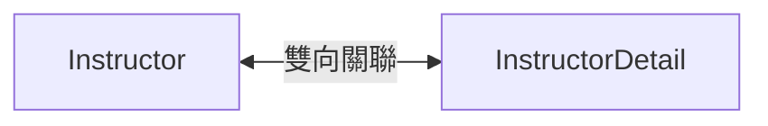

### 實作 `findInstructorDetail` 測試方法

- **檢索關聯實體**
    - 透過 `appDAO.findInstructorDetailById(theId)` 取得特定的 `InstructorDetail` 物件
    - **[測試設定]** 使用已知存在於資料庫中的 ID（例如 `int theId = 2;`）
- **驗證結果**
    - 印出 `InstructorDetail` 物件本身
    - 印出與該詳細資訊相關聯的 `Instructor` 物件，以確認雙向映射運作正常
- **程式碼實作**：

```java
private void findInstructorDetail(AppDAO appDAO) {
    // get the instructor detail object
    int theId = 2;
    InstructorDetail tempDetail = appDAO.findInstructorDetailById(theId);

    // print the instructor detail
    System.out.println("Instructor detail: " + tempDetail);

    // print the associated instructor
    System.out.println("Associated instructor: " + tempDetail.getInstructor());
}
```

- **雙向關聯的導航便利性**
    - 透過雙向映射，開發者可以從任何一方實體出發進行導航
    - **導航路徑範例**：從 `InstructorDetail` $\rightarrow$ 呼叫 `getInstructor()` $\rightarrow$ 取得關聯的 `Instructor` 物件

### 驗證資料庫中的關聯資料

- **資料庫狀態確認**
    - 透過 MySQL Workbench 執行 `SELECT * FROM instructor;` 檢視所有講師資訊
    - 透過 `SELECT * FROM instructor_detail;` 檢視所有詳細資訊
- **測試準備**
    - 從 `instructor_detail` 表中找出一個特定的 ID（例如 `ID = 2`），作為後續在 Java 程式碼中進行雙向關聯測試的基準值

### 驗證雙向關聯測試結果

- **執行測試方法**
    - 執行 `findInstructorDetail(appDAO)`，使用有效的 `InstructorDetail` ID（例如 `id=2`）
    - **[結果]** 應用程式成功執行，並在控制台輸出結果
- **觀察 SQL 執行邏輯**
    - **[關鍵觀察]** 由於設定了雙向映射，Hibernate 在查詢 `instructor_detail` 表時，會自動執行 `LEFT JOIN` 來取得關聯的 `instructor` 資料
    - **實際 SQL 語句分析**：

```sql
select
    i1_0.id,
    i1_0.hobby,
    i2_0.id,
    i2_0.email,
    i2_0.first_name,
    i2_0.last_name,
    i2_0.youtube_channel
from instructor_detail i1_0
left join instructor i2_0 on i1_0.instructor_id = i2_0.id
where i1_0.id=?
```

- **控制台輸出內容**
    - `tempInstructorDetail: InstructorDetail(id=2, youtubeChannel=http://luv2code.youtube, hobby='Guitar')`
    - `associated instructor: Instructor(id=2, firstName='Madhu', lastName='Patel', email='madhu@luv2code.com')`
    - 這證明了透過 `InstructorDetail` 物件，可以順利導航回其關聯的 `Instructor` 物件

### 雙向關聯的實務總結

- **資料一致性確認**
    - 透過控制台輸出的 `tempInstructorDetail` 與 `associated instructor` 內容，可與 MySQL 資料庫中的實際紀錄（如 `id=2`, `hobby='Guitar'`, `firstName='Madhu'`）完全對應，確保實體映射與資料庫狀態同步。
- **雙向導航的靈活性**
    - 成功實作一對一雙向關聯 (One-to-One Bidirectional)，這意味著開發者具備雙向導航的能力：
        - **路徑 A**：從 `Instructor` $\rightarrow$ 取得 `InstructorDetail`
        - **路徑 B**：從 `InstructorDetail` $\rightarrow$ 取得 `Instructor`

### 雙向一對一關聯 (Bidirectional One-to-One) 的特性

- **雙向導航 (Two-way street)**
    - 實體之間建立起互通的關係，不僅可以從主實體找到關聯實體，也可以從關聯實體反向找到主實體
- **關係結構圖**


### 實作刪除 InstructorDetail 與級聯刪除

- **級聯刪除 (Cascade Delete) 的概念**
    - 當執行刪除 `InstructorDetail` 的操作時，系統會自動連帶刪除其關聯的 `Instructor` 物件
    - **[目的]** 確保資料的一致性，避免在資料庫中留下孤立的關聯紀錄
- **更新 AppDAO 介面**
    - 在 `AppDAO` 介面中新增用於刪除詳細資訊的方法

```java
public interface AppDAO {
    // ... 其他現有方法

    void deleteInstructorById(int theId);

    InstructorDetail findInstructorDetailById(int theId);

    void deleteInstructorDetailById(int theId);
}
```

### 實作 `AppDAOImpl` 中的刪除方法

- **實作&#32;`deleteInstructorDetailById`&#32;方法**
    - 使用 IDE 自動生成方法存根 (stub)
    - **[重要]** 必須在方法上添加 `@Transactional` 註解
        - 因為刪除操作屬於資料變更，需要在事務環境下執行

```java
@Override
@Transactional
public void deleteInstructorDetailById(int theId) {
    // TODO: 實作刪除邏輯
}
```

### 實作 `AppDAOImpl` 中的查詢與刪除方法

- **實作&#32;`findInstructorDetailById`&#32;方法**
    - 使用 `entityManager.find()` 方法，傳入實體類別 (`InstructorDetail.class`) 與目標 `id` 來檢索資料

```java
@Override
public InstructorDetail findInstructorDetailById(int theId) {
    return entityManager.find(InstructorDetail.class, theId);
}
```

- **實作&#32;`deleteInstructorDetailById`&#32;方法**
    - **[步驟 1]** 先透過 `entityManager.find()` 根據 ID 取得該實體物件
    - **[步驟 2]** 使用 `entityManager.remove()` 執行刪除操作
    - **[重要]** 方法必須標註 `@Transactional` 註解，否則刪除操作將無法執行

```java
@Override
@Transactional
public void deleteInstructorDetailById(int theId) {
    // 1. 取得實體
    InstructorDetail tempInstructorDetail = entityManager.find(InstructorDetail.class, theId);

    // 2. 刪除實體
    if (tempInstructorDetail != null) {
        entityManager.remove(tempInstructorDetail);
    }
}
```

### 級聯刪除的連鎖反應

- **`CascadeType.ALL`&#32;的作用**
    - 當我們配置了 `CascadeType.ALL` 時，對其中一個實體執行的任何操作都會自動應用到關聯實體上
    - **[具體行為]** 在此範例中，當執行刪除 `InstructorDetail` 的操作時，Hibernate 會自動連帶刪除其關聯的 `Instructor` 物件

### 進入主應用程式測試

- 準備在 `CruddemoApplication` 的 `commandLineRunner` 方法中進行實作與驗證

### 在 `CruddemoApplication` 中實作測試邏輯

- **更新&#32;`commandLineRunner`&#32;內容**
    - 註解掉原本的 `findInstructorDetail` 呼叫，以避免與新的測試邏輯衝突
    - 新增 `deleteInstructorDetail` 方法的呼叫，用來測試刪除功能

```java
@Bean
public CommandLineRunner commandLineRunner(AppDAO appDAO) {
    return runner -> {
        // createInstructor(appDAO);
        // findInstructor(appDAO);
        // deleteInstructor(appDAO);
        // findInstructorDetail(appDAO);
        deleteInstructorDetail(appDAO);
    };
}
```

- **實作測試用的輔助方法**
    - 在 `CruddemoApplication` 類別中新增 `deleteInstructorDetail` 方法的 stub
    - 設定一個固定的測試 ID (`theId = 2`)，以便驗證刪除操作是否正確執行

```java
private void deleteInstructorDetail(AppDAO appDAO) {
    // get the instructor detail object
    int theId = 2;
    InstructorDetail tempInstructorDetail = appDAO.findInstructorDetailById(theId);

    // print the instructor detail
    System.out.println("Deleting instructor detail id: " + theId);
}
```

- **完成&#32;`deleteInstructorDetail`&#32;測試方法**
    - 呼叫 `appDAO.deleteInstructorDetailById(theId)` 執行刪除邏輯
    - 在操作完成後印出 "Done!" 訊息以確認流程結束

```java
private void deleteInstructorDetail(AppDAO appDAO) {
    // get the instructor detail object
    int theId = 2;
    InstructorDetail tempInstructorDetail = appDAO.findInstructorDetailById(theId);

    // print the instructor detail
    System.out.println("Deleting instructor detail id: " + theId);

    // delete the instructor detail
    appDAO.deleteInstructorDetailById(theId);

    System.out.println("Done!");
}
```

- **驗證刪除結果**
    - 使用 MySQL Workbench 執行 SQL 查詢來確認資料是否已從資料庫中移除
    - **查詢指令**

```sql
SELECT * FROM hb-01-one-to-one-uni.instructor_detail;
```

    - **[預期結果]** 查詢結果應顯示 ID 為 2 的 `instructor_detail` 記錄已被刪除

### 驗證 `deleteInstructorDetail` 測試結果

- **檢查資料庫狀態**
    - 透過 MySQL Workbench 查詢 `instructor` 表，確認與 `instructor_detail` 關聯的資料（例如 Madhu Patel）是否依然存在
    - **[查詢結果]** 根據畫面顯示，Madhu Patel 的 `instructor_id` 為 2，對應的 `instructor_detail_id` 也為 2
- **執行刪除測試**
    - 執行 `deleteInstructorDetail(appDAO)` 方法
    - **[控制台輸出]** 程式成功執行並印出 `Done!`，且應用程式正常結束（Exit code 0）
- **最終驗證流程**
    - 再次檢查資料庫，確認 `instructor_detail` 中的記錄已被移除
    - 若刪除成功，則該 ID 對應的關聯資料應不再出現在查詢結果中

### 驗證 `deleteInstructorDetail` 的執行結果

- **觀察 Hibernate 產生的 SQL 語句**
    - 執行刪除操作時，Hibernate 會依序執行針對兩個資料表的刪除指令
    - **產生的 SQL 邏輯**

```sql
delete from instructor_detail where id=?
    delete from instructor where id=?
```

    - 這證明了由於設定了級聯（Cascade），系統會同時處理關聯的 `instructor_detail` 與主實體 `instructor`
- **資料庫最終狀態驗證**
    - 使用 MySQL Workbench 進行查詢，確認資料已正確移除
    - **`instructor_detail`&#32;表**
        - 執行 `SELECT * FROM instructor_detail;`
        - **[結果]** 查詢結果為空（Empty），代表所有詳細資訊記錄已刪除
    - **`instructor`&#32;表**
        - 執行 `SELECT * FROM instructor;`
        - **[結果]** 查詢結果亦為空（Empty），確認主實體記錄也已同步被刪除
- **測試目標**
    - 透過 `findInstructorDetail` 方法，驗證是否能從 `InstructorDetail` 物件成功取得其關聯的 `Instructor` 物件
- **執行結果**
    - **[控制台輸出]** 成功印出 `instructor_detail` 的 ID 為 2，以及該物件所關聯的 `Instructor` 資訊
    - **[驗證結論]** 雙向映射配置成功，雙向檢索功能正常

### 修改級聯刪除行為

- **[目標]** 僅刪除 `InstructorDetail`，並在資料庫中保留對應的 `Instructor`
- **[實作方式]** 需要修改 `InstructorDetail` 實體類別中的 `cascade` 類型設定

### 準備測試環境

- 在進行修改前，需先在資料庫中新增一筆新的 `Instructor` 與 `InstructorDetail` 資料作為基準測試
- **操作步驟**
    - 開啟 `CruddemoApplication` (主應用程式)
    - 使用先前建立的程式碼邏輯
    - 在 `CommandLineRunner` 中進行設定，並將舊有的測試程式碼註解掉，以避免干擾新的測試流程

### 執行測試資料新增

- **[測試步驟]**
    - 取消註解 `createInstructor(appDAO)` 方法，以便在測試執行時能自動建立新資料
    - 執行應用程式，將新講師資訊寫入資料庫
- **[測試資料內容]**
    - 講師姓名：`Madhu Patel`
    - YouTube 頻道：`Madhu's Guitar`
- **[執行結果]**
    - 應用程式成功執行並印出 `Done!`
    - **[控制台輸出]**

```text
...org.hibernate.orm.jdbc.bind : binding parameter [1] as [VARCHAR] - [Madhu Patel]
...org.hibernate.orm.jdbc.bind : binding parameter [2] as [VARCHAR] - [Madhu's Guitar]
Done!
Process finished with exit code 0
```

    - 此結果確認了 `createInstructor` 邏輯與資料庫連線均正常運作，為接下來驗證「僅刪除詳細資訊」的測試做好了準備

### 驗證資料新增結果

- **檢查應用程式日誌 (Logs)**
    - 觀察 Hibernate 的輸出，確認系統已成功執行 `insert` 操作
    - **[日誌關鍵資訊]**
        - 成功對 `instructor_detail` 進行插入
        - 成功對 `instructor` 進行插入
    - 應用程式最後印出 `Done!` 並正常結束
- **使用 MySQL Workbench 進行資料驗證**
    - 透過 SQL 查詢確認資料庫中的實際內容與關聯狀態
    - **`instructor_detail`&#32;表**
        - 執行 `SELECT * FROM instructor_detail;`
        - **[結果]** 發現一筆新的記錄：`id: 3`, `email:&#32;madhu@luv2code.com`, `instructor_detail_id: 3` (此處指關聯至 instructor 的 ID)
    - **`instructor`&#32;表**
        - 執行 `SELECT * FROM instructor;`
        - **[結果]** 發現一筆新的記錄：`id: 3`, `first_name: Madhu`, `last_name: Patel`
- **確認關聯性 (Relationship Verification)**
    - 透過對比兩張表的 ID，確認雙向映射（Bi-directional mapping）運作正常
    - **[關聯邏輯]**
        - `instructor` 的 ID 為 `3`
        - `instructor_detail` 中的關聯欄位也指向 `3`
        - 這證明了 Hibernate 已正確地根據實體間的定義，將兩筆記錄在資料庫層級連結起來
- **[目標]** 實現僅刪除 `InstructorDetail`，並在資料庫中保留對應的 `Instructor`，避免因 `CascadeType.ALL` 導致的連鎖刪除
- **[實作方式]** 需要修改 `InstructorDetail` 實體類別中的 `cascade` 設定
- **[實體類別狀態]**
    - 檔案：`InstructorDetail.java`
    - 目前配置：

```java
@OneToOne(mappedBy = "instructorDetail", cascade = CascadeType.ALL)
      private Instructor instructor;
```

    - **[修改方向]** 將 `cascade = CascadeType.ALL` 修改為更精確的類型，以符合「保留 Instructor」的需求

### 修改級聯類型以保留關聯實體

- **[修改目標]** 為了避免刪除 `InstructorDetail` 時導致關聯的 `Instructor` 也被刪除，需要將 `cascade` 屬性從 `ALL` 修改為更具體的類型組合
- **[實作方式]** 使用大括號 `{}` 來包圍多個級聯類型，將其定義為一個陣列
- **[程式碼實作]**

```java
@OneToOne(mappedBy = "instructorDetail", cascade = {CascadeType.DETACH, CascadeType.MERGE, CascadeType.PERSIST, CascadeType.REFRESH})
    private Instructor instructor;
```

- **[關鍵邏輯]**
    - 排除 `CascadeType.REMOVE`：這樣當執行刪除 `InstructorDetail` 的操作時，不會觸發對 `Instructor` 的連鎖刪除
    - 保留其他級聯行為：例如 `MERGE` 或 `PERSIST` 仍能確保實體狀態的同步

### 級聯刪除的精確控制

- **[核心原則]** 為了在刪除 `InstructorDetail` 時保留對應的 `Instructor`，必須在級聯配置中排除 `REMOVE` 操作
- **[建議的級聯配置]** 不應使用 `CascadeType.ALL`，而應明確指定以下四種類型：
    - `CascadeType.DETACH`
    - `CascadeType.MERGE`
    - `CascadeType.PERSIST`
    - `CascadeType.REFRESH`
- **[實作效果]**
    - 透過這種配置，當執行刪除 `InstructorDetail` 的操作時，不會觸發對 `Instructor` 的連鎖刪除 (Cascade Delete)
    - 這樣可以確保即使詳細資訊被移除，講師的基本資料仍能保留在資料庫中

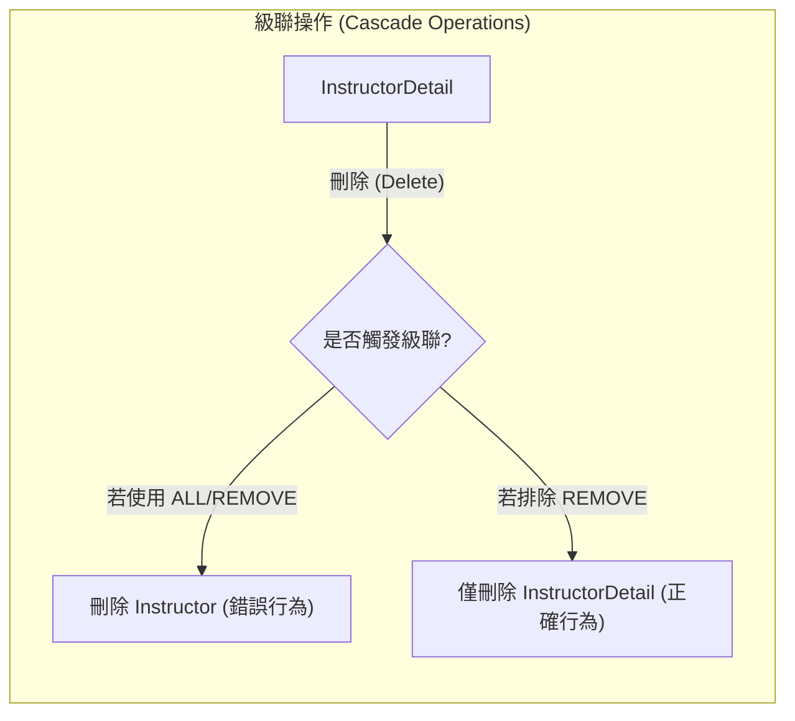

- **[下一步]** 回到 `AppDAOImpl` 進行必要的修改

### 斷開雙向關聯 (Breaking the Bi-directional Link)

- **[操作目的]** 在刪除從屬實體（如 `InstructorDetail`）時，除了執行資料庫刪除，還需要移除記憶體中主實體對該從屬實體的引用，從而切斷雙向關聯
- **[實作邏輯]**
    - 首先透過 `entityManager.find()` 取得該 `InstructorDetail` 物件
    - 接著透過 `tempInstructorDetail.getInstructor().setInstructorDetail(null)` 將主實體中的關聯欄位設為 `null`
    - 最後執行 `entityManager.remove(tempInstructorDetail)` 進行刪除
- **[程式碼實作]**

```java
@Transactional
public void deleteInstructorDetailById(int theId) {
    // 取得 instructor detail
    InstructorDetail tempInstructorDetail = entityManager.find(InstructorDetail.class, theId);

    // 移除關聯的物件引用，切斷雙向連結
    tempInstructorDetail.getInstructor().setInstructorDetail(null);

    // 刪除 instructor detail
    entityManager.remove(tempInstructorDetail);
}
```

### 測試刪除實體功能

- **[測試準備]** 調整 `CruddemoApplication` 中的 `CommandLineRunner` 邏輯
    - 註解掉 `createInstructor` 的呼叫，避免在測試刪除時又重新建立資料
    - 取消註解 `deleteInstructorDetail` 的呼叫，以執行刪除測試
- **[關鍵注意事項]** ID 的準確性
    - 必須將傳入 `deleteInstructorDetail` 的 `theId` 更新為資料庫中當前有效的 `instructor_detail` ID
    - **[注意]** 由於不同資料庫環境的自動遞增值可能不同，開發者應根據實際情況（例如本範例中新加入的記錄 ID 為 3）進行調整

### 驗證 `deleteInstructorDetailById` 的執行結果

- **[執行流程觀察]** 執行刪除 `instructor_detail` ID 為 3 的測試時，Hibernate 產生的 SQL 步驟如下：

    1. **查詢 (SELECT)**：首先查詢該 ID 的詳細資訊。
    2. **更新 (UPDATE)**：對 `instructor` 資料表執行更新操作，將其 `instructor_detail_id` 欄位設為 `null`。
    3. **刪除 (DELETE)**：最後執行 `delete from instructor_detail where id=?`。

- **[關鍵結果]**
    - **成功切斷關聯**：透過 `UPDATE` 將外鍵設為 `null`，成功實現了在記憶體與資料庫層面斷開雙向連結的需求。
    - **保留主實體**：觀察發現 `instructor` 資料表中的記錄並未被刪除，僅是關聯欄位被清空，這符合預期的邏輯（即不觸發級聯刪除）。
    - **成功移除從屬實體**：`instructor_detail` 的記錄已從資料庫中被完全移除。

```sql
-- Hibernate 實際執行的 SQL 邏輯示意
-- 1. 切斷關聯
update instructor set instructor_detail_id=null where id=?

-- 2. 刪除詳細資訊
delete from instructor_detail where id=?
```

- **[驗證步驟]** 在 MySQL Workbench 中執行查詢以確認資料庫狀態
    - 針對 `instructor_detail` 資料表進行查詢或重新整理
    - 針對 `instructor` 資料表進行查詢或重新整理
- **[驗證結果]**
    - **`instructor_detail`&#32;已刪除**：確認 ID 為 3 的記錄已不存在於資料表中，表示刪除操作成功
    - **`instructor`&#32;記錄保留**：觀察發現 `instructor` 資料表中的記錄依然存在，並未被刪除
- **[Hibernate 執行日誌觀察]** 執行 `deleteInstructorDetailById` 時，控制台顯示的關鍵 SQL 流程如下：

```sql
-- 1. 查詢該 ID 的詳細資訊
select id, youtube_channel, hobby, instructor_detail_id from instructor_detail where id=3

-- 2. 更新 instructor 資料表，將其關聯的外鍵設為 null
update instructor set email=?, first_name=?, instructor_detail_id=?, last_name=? where id=?

-- 3. 刪除 instructor_detail 的記錄
delete from instructor_detail where id=3
```

### `deleteInstructorDetailById` 實作成果總結

- **[核心目標達成]** 成功實現了「刪除 `InstructorDetail` 記錄，但保留 `Instructor` 記錄」的邏輯
    - **[運作原理]** 透過修改 `InstructorDetail` 實體上的級聯類型 (Cascade Type) 配置，並配合 `AppDAO` 的實作微調
    - **[資料庫行為]** 執行過程中，系統僅將 `instructor` 資料表中的 `instructor_detail_id` 參考值更新為 `null`，而非刪除該行記錄

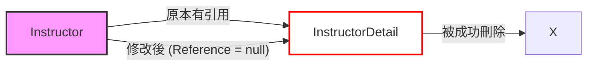

## JPA / Hibernate 一對多與多對一映射

### 一對多映射 (One-to-Many Mapping)

- 一個講師 (Instructor) 可以擁有多門課程 (Courses)
- **雙向關聯 (Bi-directional)**：
    - 可以從 `Instructor` 導向其擁有的 `Course` 列表
    - 也可以從單一 `Course` 反向導向其所屬的 `Instructor`

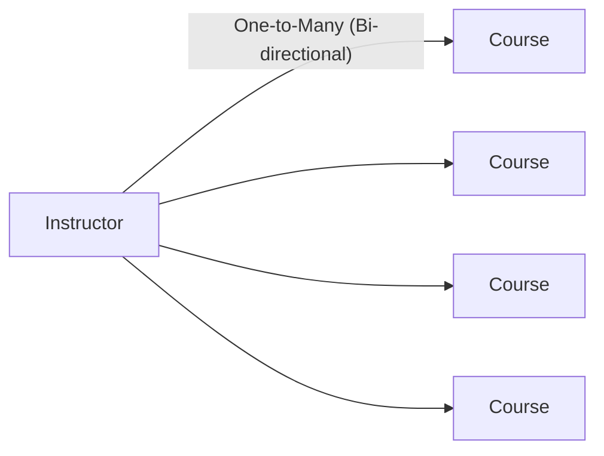

### 多對一映射 (Many-to-One Mapping)

- 這是「一對多」的逆向關係 (Inverse / Opposite)
- 多門課程 (Many Courses) 可以映射到同一個講師 (One Instructor)
- **業務邏輯約束**：
    - 一門課程最多只能擁有一位講師
    - 但一位講師可以對應到許多門課程

### 多對一映射的實務需求

- **專案需求範例**：
    - 刪除一個講師 (Instructor) 時，**不要**刪除其關聯的課程 (Course)
    - 刪除一個課程 (Course) 時，**不要**刪除其關聯的講師 (Instructor)
- **級聯操作的處理方式**：
    - **不要**套用級聯刪除 (Do not apply cascading deletes)
    - 需要對級聯類型進行「細粒度控制」(Fine-grained control)，除了 `REMOVE` 或 `DELETE` 之外，可以列出所有其他的級聯類型

### 一對多開發流程 (Development Process: One-to-Many)

1. **準備工作 (Prep Work)**：

    - 定義資料庫資料表 (Define database tables)

1. **準備工作 (Prep Work)**：

    - 定義資料庫資料表 (Define database tables)
    - 建立 `Course` 類別
    - 更新 `Instructor` 類別
    - 建立主應用程式 (Main Application) 以整合所有部分

### 步驟 1：設定資料庫資料表 (Step 1: Setting up database tables)

#### `course` 資料表設計

- 建立一個新的 `course` 資料表，包含以下欄位：
    - `id`: 整數型態，作為主鍵 (Primary Key)
    - `title`: 字串型態，用於儲存課程名稱
    - `instructor_id`: 整數型態，用於建立與講師的關聯
- **[資料完整性約束]**：
    - 使用 `UNIQUE KEY` 來確保課程標題 (`title`) 不會重複，防止同名課程被多次新增

```sql
CREATE TABLE `course` (
  `id` int(11) NOT NULL AUTO_INCREMENT,
  `title` varchar(128) DEFAULT NULL,
  `instructor_id` int(11) DEFAULT NULL,
  PRIMARY KEY (`id`),
  UNIQUE KEY `TITLE_UNIQUE` (`title`)
);
```

### 設定外鍵關聯 (Setting up Foreign Key)

- 在 `course` 資料表中建立與 `instructor` 資料表的關聯
- **外鍵設計**：
    - 在 `course` 表中使用 `instructor_id` 欄位作為外鍵
    - 此欄位會引用（Reference）`instructor` 資料表中的 `id` 欄位

```sql
CREATE TABLE `course` (
  `id` int(11) NOT NULL AUTO_INCREMENT,
  `title` varchar(128) DEFAULT NULL,
  `instructor_id` int(11) DEFAULT NULL,
  PRIMARY KEY (`id`),
  UNIQUE KEY `TITLE_UNIQUE` (`title`),
  KEY `FK_INSTRUCTOR_idx` (`instructor_id`),
  CONSTRAINT `FK_INSTRUCTOR` FOREIGN KEY (`instructor_id`) REFERENCES `instructor` (`id`)
);
```

- **[重點]** `instructor` 資料表的結構不需要進行任何變動，只需在 `course` 表中完成關聯設定即可

### 實作 `Course` 實體類別

- 建立一個 `Course` 類別來對應資料庫中的 `course` 資料表
- **基礎欄位對應**：
    - `id`: 對應資料表的主鍵
    - `title`: 對應課程標題
- **實作多對一關聯 (Many-to-One Mapping)**：
    - 使用 `@ManyToOne` 註解來定義多個課程可以對應到同一個講師的關係
    - 使用 `@JoinColumn(name="instructor_id")` 來指定資料庫中實際用於關聯的欄位名稱（即外鍵欄位）

```java
@Entity
@Table(name="course")
public class Course {

    @Id
    @GeneratedValue(strategy=GenerationType.IDENTITY)
    @Column(name="id")
    private int id;

    @Column(name="title")
    private String title;

    @ManyToOne
    @JoinColumn(name="instructor_id")
    private Instructor instructor;

    // constructors, getters / setters
}
```

### `Course` 類別實作總結

- **[關聯映射核心]** 使用 `@JoinColumn` 來建立實體間的連結
    - `@JoinColumn(name="instructor_id")` 指向 `course` 資料表中的 `instructor_id` 欄位
    - **[作用]** 這讓 Hibernate 能夠透過該欄位的值，查找到並映射回對應的 `Instructor` 物件

```java
@Entity
@Table(name="course")
public class Course {

    @Id
    @GeneratedValue(strategy=GenerationType.IDENTITY)
    @Column(name="id")
    private int id;

    @Column(name="title")
    private String title;

    @ManyToOne
    @JoinColumn(name="instructor_id")
    private Instructor instructor;

    // constructors, getters / setters
}
```

- **實作流程回顧**：

    1. 定義資料庫資料表 (Table Definition)
    2. 定義 Java 實體類別 (Class Definition)
    3. 建立實體與資料表的對應關係 (Mapping)
    4. 設定多對一 (Many-to-One) 關聯映射

### 更新 `Instructor` 實體以引用課程

- 在 `Instructor` 類別中建立一個 `List<Course>` 來儲存該講師所教授的所有課程
- **[實作]** 加入標準的 Getter 與 Setter 方法

```java
@Entity
@Table(name="instructor")
public class Instructor {

    // ... 其他欄位

    private List<Course> courses;

    public List<Course> getCourses() {
        return courses;
    }

    public void setCourses(List<Course> courses) {
        this.courses = courses;
    }
}
```

### 實作一對多 (One-to-Many) 關聯

- 使用 `@OneToMany` 註解來定義一個講師可以擁有複數個課程的關係
- **[關鍵屬性]** `mappedBy = "instructor"`
    - **[作用]** 此屬性告訴 Hibernate，這段關聯是由 `Course` 類別中的 `instructor` 屬性來管理的
    - **[目的]** 這建立了雙向關聯，同時明確指定了誰是關聯的擁有者（Mapping Owner）

```java
@OneToMany(mappedBy="instructor")
private List<Course> courses;
```

### `mappedBy` 的運作原理

- **[核心功能]** `mappedBy` 會告訴 Hibernate 去查看關聯類別（在此例中為 `Course`）中的特定屬性
    - **[運作流程]**

        1. Hibernate 會尋找 `Course` 類別中的 `instructor` 屬性
        2. 接著利用該屬性上定義的 `@JoinColumn` 資訊
        3. 最終幫助 Hibernate 找到與該 `Instructor` 相關聯的所有課程

```java
// 在 Instructor 類別中
@OneToMany(mappedBy="instructor")
private List<Course> courses;
```

```java
// 在 Course 類別中（由 mappedBy 指向此處）
@ManyToOne
@JoinColumn(name="instructor_id")
private Instructor instructor;
```

### 增加級聯操作支援 (Cascading Support)

- **[業務需求]** 在現實場景中，刪除一個講師時，通常不希望連帶刪除其教授的所有課程（反之亦然）
- **[實作方式]** 使用「細粒度」(fine-grained) 的級聯設定，明確排除 `CascadeType.REMOVE` 或 `CascadeType.ALL`，僅保留需要的操作

```java
@Entity
@Table(name="instructor")
public class Instructor {

    @OneToMany(mappedBy="instructor",
               cascade={CascadeType.PERSIST, CascadeType.MERGE,
                         CascadeType.DETACH, CascadeType.REFRESH})
    private List<Course> courses;

}
```

- **[注意]** 在此設定下，**不要**套用級聯刪除 (cascading deletes)，以確保資料完整性。

### 針對不同關聯設定精確的級聯操作

為了符合真實專案的需求，我們需要根據關聯的方向與業務邏輯，對不同的實體類別套用不同的級聯設定，以避免「連鎖刪除」導致不必要的資料遺失。

- **在&#32;`Instructor`&#32;類別中 (一對多)**：
    - **目的**：當刪除講師時，不應刪除其教授的所有課程。
    - **設定**：僅包含 `PERSIST`、`MERGE`、`DETACH` 與 `REFRESH`，**排除** `REMOVE`。
- **在&#32;`Course`&#32;類別中 (多對一)**：
    - **目的**：當刪除某門課程時，不應刪除該課程所屬的講師。
    - **設定**：同樣僅保留 `PERSIST`、`MERGE`、`DETACH` 與 `REFRESH`。

```java
// 在 Course 類別中
@Entity
@Table(name="course")
public class Course {

    @ManyToOne(cascade={CascadeType.PERSIST, CascadeType.MERGE,
                         CascadeType.DETACH, CascadeType.REFRESH})
    @JoinColumn(name="instructor_id")
    private Instructor instructor;

    // constructors, getters / setters
}
```

---

### 為雙向關聯建立便利方法 (Convenience Methods)

在雙向映射中，單純在一方（例如 `Instructor`）新增關聯物件是不夠的，我們必須確保雙方的引用（Reference）都同步更新，以維持 Java 物件模型的一致性。

- **[實作方式]** 在擁有集合的一方（如 `Instructor`）建立一個輔助方法，同時處理集合的增加與對方的設定。

```java
// 在 Instructor 類別中新增便利方法
public void addCourse(Course tempCourse) {
    // 1. 確保集合已初始化，避免 NullPointerException
    if (courses == null) {
        courses = new ArrayList<>();
    }
    // 2. 將新課程加入講師的課程清單中
    courses.add(tempCourse);
    // 3. 同步將此講師設定給該課程，完成雙向連結
    tempCourse.setInstructor(this);
}
```

### 雙向一對多映射 (Bi-directional One-to-Many) 概覽

在雙向關聯中，我們能夠從任何一方存取另一方：

- 從 `Instructor` 取得其所有的 `courses`
- 從 `Course` 取得其所屬的 `instructor`

#### 映射結構摘要

| 映射類型 | 外鍵位置 (Foreign Key location) | 擁有方 (Owning Side) | 反向方 (Inverse side) |
| --- | --- | --- | --- |
| @OneToMany, @ManyToOne (雙向) | course 資料表 | Course (@ManyToOne + @JoinColumn) | Instructor (@OneToMany(mappedBy="instructor")) |

- **[關鍵概念]** 擁有方 (Owning Side) 定義了資料庫中物理映射（Physical Mapping）的實際配置，在此案例中即為 `Course` 類別。

### 雙向一對多映射 (Bi-directional One-to-Many) 映射結構總結

在雙向一對多關係中，必須明確區分物理映射的擁有方與僅作為邏輯引用的反向方：

| 映射類型 | 外鍵位置 (Foreign Key location) | 擁有方 (Owning Side) | 反向方 (Inverse side) |
| --- | --- | --- | --- |
| @OneToMany, @ManyToOne (雙向) | course 資料表 | Course (@ManyToOne + @JoinColumn) | Instructor (@OneToMany(mappedBy="instructor")) |

- **擁有方 (Owning Side)**：
    - 定義了資料庫中的物理映射（即 `JoinColumn` 的位置）。
    - 在此案例中為 `Course` 類別，使用 `@ManyToOne` 並配合 `@JoinColumn`。
- **反向方 (Inverse Side)**：
    - 僅作為對擁有方的邏輯鏡像 (Mirrors the owning side)。
    - 在此案例中為 `Instructor` 類別，使用 `@OneToMany(mappedBy="instructor")`。
    - **[關鍵點]**：`mappedBy="instructor"` 指向的是 `Course` 類別中名為 `instructor` 的屬性，這告訴 Hibernate 該關聯的控制權在另一方。

### 一對多 (One-to-Many) 開發流程

實作一對多關聯的開發過程可分為以下四個步驟：

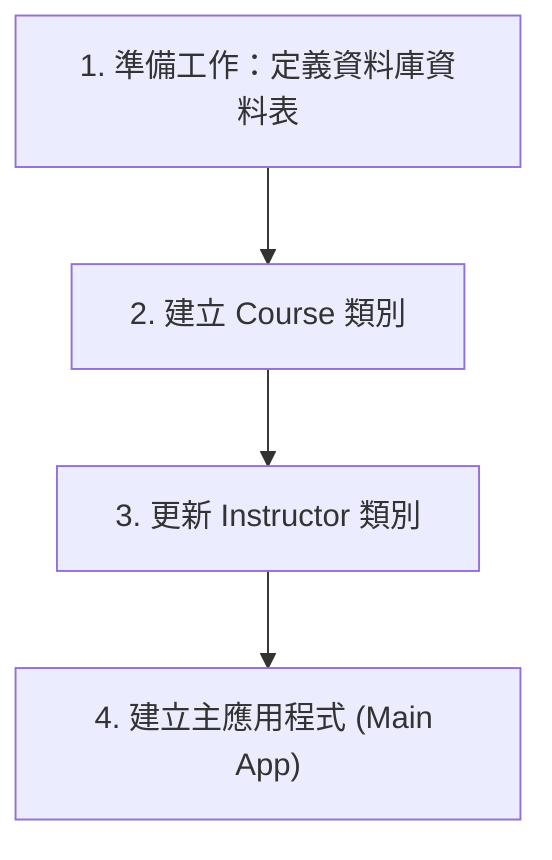

### 第一步：準備工作 - 定義資料庫資料表

- 將進入 MySQL Workbench 執行 SQL 腳本，以建立必要的資料庫結構與資料表。
- 使用現有的 SQL 腳本來建立名為 `hb03_one_to_many` 的 Schema。
- 腳本內容包含原有的 `instructor_detail` 與 `instructor` 資料表，以及新增的 `course` 資料表。

#### `course` 資料表結構

根據 SQL 腳本，`course` 資料表包含以下欄位：

| 欄位名稱 | 資料類型 | 說明 |
| --- | --- | --- |
| id | INT(11) | 主鍵 (Primary Key) |
| title | VARCHAR(128) | 課程標題 (具有唯一約束) |
| instructor_id | INT(11) | 指向講師的外鍵 (Foreign Key) |

### 執行 SQL 腳本建立 `course` 資料表

透過執行 SQL 腳本來完成 `course` 資料表的建立，確保其結構符合一對多關聯的需求：

```sql
CREATE TABLE 'course'(
    'id' int(11) NOT NULL AUTO_INCREMENT,
    'title' varchar(128) DEFAULT NULL,
    'instructor_id' int(11) DEFAULT NULL,
    PRIMARY KEY ('id'),
    UNIQUE KEY 'TITLE_UNIQUE' ('title'),
    CONSTRAINT 'FK_INSTRUCTOR' FOREIGN KEY ('instructor_id') REFERENCES 'instructor'('id')
);
```

- **主鍵 (Primary Key)**：使用 `id` 作為該資料表的主鍵。
- **唯一約束 (Unique Key)**：
    - 設定 `TITLE_UNIQUE` 對應到 `title` 欄位。
    - **[作用]**：這能防止資料庫中出現重複的課程標題。
- **外鍵關係 (Foreign Key Relationship)**：
    - 建立 `instructor_id` 欄位作為外鍵。
    - 此欄位會引用 (reference) `instructor` 資料表中的 `id` 欄位。
    - **[目的]**：建立 `course` 與 `instructor` 之間的一對多關聯。

執行方式：點擊 MySQL Workbench 工具列中的黃色閃電圖示即可執行腳本。

### 驗證資料庫結構

執行 SQL 腳本後，需在 MySQL Workbench 中確認 schema 與資料表已正確建立：

1. **重新整理 Schema 列表**：

    - 在左側 Schemas 面板執行 `Refresh All` 以取得最新狀態。
    - 確認新建立的 schema 為 `hb-03-one-to-many`。
    - 將其設定為預設 schema (Set as Default Schema)。

2. **檢查&#32;`course`&#32;資料表欄位**：

    - 確認 `course` 資料表包含以下欄位：
        - `id` (INT)
        - `title` (VARCHAR)
        - `instructor_id` (INT)
    - 確認已正確設定相關的索引 (Indexes) 與外鍵 (Foreign Keys) 約束。

### 生成資料庫圖表 (Generate Database Diagrams)

為了更直觀地觀察各個資料表之間的關聯性，可以使用 MySQL Workbench 的反向工程功能來產生資料庫圖表。

#### 反向工程步驟

1. **開啟功能**：在上方選單列選擇 `Database` $\rightarrow$ `Reverse Engineer...`。
2. **設定連線 (Connection Settings)**：

    - 在彈出的視窗中選擇現有的連線（例如 `local hbstudent`）。
    - 點擊 `Continue` 進行連線測試。

3. **選擇 Schema**：

    - 在 `Select Schemas to Reverse Engineer` 列表中，勾選想要轉換的資料庫（例如 `hb-03-one-to-many`）。
    - 點擊 `Continue` 讓系統執行分析與建模流程。

4. **完成建模**：系統會自動解析資料表、欄位及外鍵關係，並生成視覺化的圖表，顯示資料表之間的連線（如 `instructor` 與 `course` 之間的外鍵關聯）。

### 完成反向工程與圖表驗證

在 MySQL Workbench 中完成反向工程的最後步驟：

1. **匯入設定**：

    - 勾選 `Import MySQL Objects`：將資料庫物件匯入模型。
    - 勾選 `Place Imported Objects on a Diagram`：將匯入的物件直接放置在圖表上。

2. **執行與完成**：點擊 `Execute` 並完成後續的 `Continue` 流程，即可生成 EER 圖表。

#### 資料庫關聯圖 (EER Diagram)

生成的圖表視覺化了目前實體間的關係，確認了所有映射都已正確建立：

```mermaid
erDiagram
    instructor ||--|| instructor_detail : "one-to-one"
    instructor ||--o{ course : "one-to-many"
```

- **`instructor`&#32;與&#32;`instructor_detail`**：維持一對一 (One-to-One) 關係。
- **`instructor`&#32;與&#32;`course`**：建立了一對多 (One-to-Many) 關係，一個講師可以擁有複數門課程，而每門課程都對應到特定的講師。

### 下一步：開始 Hibernate 實作

- 目前已完成資料庫架構 (Schema) 的所有準備工作
    - 包括 `instructor`、`instructor_detail` 以及 `course` 資料表的建立
    - 並已透過反向工程確認了各表間的關聯性
- **[後續計畫]** 開始撰寫 Hibernate 程式碼，實際對這些資料表進行 CRUD (建立、讀取、更新、刪除) 操作

### 建立 `Course` 實體類別

- **[開發流程進度]**：已完成第一步「定義資料庫資料表」，現在進入第二步：建立 `Course` 類別
- **專案備份作業**：
    - 在開始新的開發任務前，先複製現有的專案作為備份
    - 範例操作：將 `02-jpa-one-to-one-bi` 專案複製並重新命名為新專案，以確保原始一對一的實作不受影響
- **[開發流程進度]**：進入第二步，於 `entity` 套件下建立 `Course` 類別
- **環境準備**：
    - 在 IntelliJ IDEA 中執行 `Rebuild Project`
    - **[目的]**：確保獲得一個乾淨且最新的編譯版本 (fresh compile)
- **操作步驟**：

    1. 開啟 `03-jpa-one-to-many` 專案
    2. 導覽至 `src/main/java/com.luv2code.cruddemo/entity` 套件
    3. 在該套件下建立新的 Java Class：`Course`

- **[開發流程進度]**：進入第三步，於 `entity` 套件下建立 `Course` 類別
- **實體類別配置**：
    - 使用 `@Entity` 註解將該類別標記為資料庫實體
    - 使用 `@Table(name="course")` 註解，明確指定將此類別映射到資料庫中的 `course` 資料表

```java
@Entity
@Table(name="course")
public class Course {

}
```

### `Course` 實體類別實作計畫

為了完整映射 `course` 資料表，開發流程將包含以下步驟：

1. **定義欄位 (Define fields)**

    - 根據資料庫結構建立對應的成員變數

2. **定義建構子 (Define constructors)**
3. **定義 Getter/Setter 方法**
4. **定義&#32;`toString()`&#32;方法**
5. **為欄位添加註解 (Annotate fields)**

    - 使用 JPA 註解來完成 Java 屬性與資料庫欄位的對應

#### 實作中的 `Course` 類別架構

```java
@Entity
@Table(name="course")
public class Course {

    // define our fields

    // define constructors

    // define getter setters

    // define toString

    // annotate fields
}
```

#### 對應的資料庫結構參考 (`course` table)

| 欄位名稱 | 資料型態 | 說明 |
| --- | --- | --- |
| id | INT(11) | 主鍵 |
| title | VARCHAR(128) | 課程標題 |
| instructor_id | INT(11) | 指向 instructor 的外鍵 |

### 實作 `Course` 實體類別的欄位定義

根據資料庫 `course` 資料表的結構，在 `Course` 類別中定義以下成員變數：

```java
@Entity
@Table(name="course")
public class Course {

    // define our fields
    private int id;
    private String title;
    private Instructor instructor;

    // define constructors

    // define getter setters

    // define toString

    // annotate fields
}
```

- **`id`**：對應資料庫的主鍵 (Primary Key)
- **`title`**：對應課程的標題
- **`instructor`**：用於建立與 `Instructor` 實體之間的關聯（對應資料庫中的 `instructor_id` 外鍵）

### 實作 `Course` 類別的建構子 (Constructor)

- **使用 IDE 自動生成**：
    - 在類別內點擊右鍵，選擇 `Generate...` $\rightarrow$ `Constructor`
- **建構子的設計考量**：
    - **僅選擇&#32;`title`&#32;欄位**進行建構子初始化
    - **[為什麼不包含&#32;`id`]**：因為 `id` 是由資料庫自動生成的 (Auto-generated)
    - **[為什麼不包含&#32;`instructor`]**：因為講師關聯會在稍後透過 Setter 方法或是在建立物件後再進行設定

```java
// 預期生成的建構子結構
public Course(String title) {
    this.title = title;
}
```

### 實作 `Course` 類別的 Getter 與 Setter 方法

- **使用 IntelliJ IDEA 自動生成**：
    - 在程式碼編輯區域點擊右鍵 $\rightarrow$ `Source` $\rightarrow$ `Generate...` $\rightarrow$ `Getter and Setter`
- **選擇欄位**：
    - 在彈出的視窗中勾選所有需要生成方法的欄位：
        - `id`
        - `title`
        - `instructor`
    - 點擊 `OK` 完成生成

### 下一步：實作 `toString()` 方法

- 準備為 `Course` 類別實作 `toString()` 方法，以便於在控制台印出物件內容進行除錯與驗證。

### 實作 `Course` 類別的 `toString()` 方法

- **使用 IntelliJ IDEA 自動生成**：
    - 在類別內點擊右鍵 $\rightarrow$ `Source` $\rightarrow$ `Generate...` $\rightarrow$ `toString()`
- **欄位選擇策略**：
    - **[做法]**：在生成視窗中僅勾選 `id` 與 `title`，**取消勾選** `instructor` 欄位
    - **[原因]**：為了避免在印出物件時觸發不必要的關聯物件查詢，或在複雜關聯中造成循環引用。若需要資訊，可以在程式碼中單獨列印關聯物件

```java
@Override
public String toString() {
    return "id=" + id + " " + "title=" + title;
}
```

### 實作 `Course` 實體類別的欄位註解

定義完欄位、建構子、Getter/Setter 與 `toString()` 後，下一步是使用註解將這些欄位映射到資料庫對應的欄位 (Columns)。

#### 註解 `id` 欄位

- **`id`**：對應資料庫中的 `id` 欄位
- **配置方式**：
    - 使用 `@GeneratedValue(strategy = GenerationType.IDENTITY)`：指定 `id` 的生成策略為資料庫自動遞增 (Identity)
    - 使用 `@Column(name = "id")`：明確指定映射到資料庫中名稱為 `id` 的欄位

```java
@Id
@GeneratedValue(strategy = GenerationType.IDENTITY)
@Column(name = "id")
private int id;
```

#### 對應的資料庫結構參考 (`course` table)

| 欄位名稱 | 資料型態 | 說明 |
| --- | --- | --- |
| id | INT(11) | 主鍵 |
| title | VARCHAR(128) | 課程標題 |
| instructor_id | INT(11) | 指向 instructor 的外鍵 |

#### 實作 `Course` 實體類別的 `title` 欄位註解

- **`title`**：對應資料庫中名稱為 `title` 的欄位
- **配置方式**：
        - 使用 `@Column(name = "title")` 來明確指定映射關係

```java
@Column(name = "title")
private String title;
```

### 建立 `Course` 與 `Instructor` 的多對一關聯

- **關聯類型**：`Course` 與 `Instructor` 之間存在多對一 (Many-to-One) 的關係
    - **[邏輯]**：多個課程可以隸屬於同一位講師
- **實作方式**：
        - 在 `Course` 類別中使用 `@ManyToOne` 註解來標記 `instructor` 欄位

```java
@ManyToOne
@JoinColumn(name = "instructor_id")
private Instructor instructor;
```

### 理解 `@JoinColumn` 與級聯操作 (Cascading)

#### `@JoinColumn` 的角色

- **[功能]**：定義實體中哪一個欄位對應到資料庫中的外鍵 (Foreign Key)
- **[實例]**：在 `Course` 實體中，`@JoinColumn(name = "instructor_id")` 指向 `instructor` 表中的 `id`，讓 `Course` 知道如何找到其所屬的講師

```java
@ManyToOne
@JoinColumn(name = "instructor_id")
private Instructor instructor;
```

#### 設定級聯操作以符合業務邏輯

- **[業務需求]**\*\*：如果刪除一門課程 (Course)，不應該同時刪除該課程所屬的講師 (Instructor)
- **[實作關鍵]**：需要透過設定級聯 (Cascading) 行為來達成此目的，避免預設的刪除連鎖反應導致資料遺失

```mermaid
flowchart TD
    A[刪除 Course] --> B{檢查 Cascading 設定}
    B -->|未設定 CascadeType.REMOVE| C[僅刪除 Course]
    B -->|設定 CascadeType.REMOVE| D[同時刪除關聯的 Instructor]
    style D fill:#f96,stroke:#333
```

### 精細化控制級聯操作 (Fine-grained Cascading Control)

在處理多對一 (Many-to-One) 關聯時，不應使用 `CascadeType.ALL`。

- **[原因]**：若使用 `CascadeType.ALL`，當刪除一門課程 (Course) 時，會連帶刪除該課程所屬的講師 (Instructor)，這通常不符合業務邏輯。
- **[對策]**：必須提供更精細的控制 (fine-grained control)，明確告訴 Hibernate 應該使用哪些級聯類型。

#### 常用的 `CascadeType` 選項

當在 `@ManyToOne` 註解中使用 `cascade` 屬性時，可以選擇以下類型：

| 級聯類型 | 說明 |
| --- | --- |
| ALL | 包含所有級聯操作 (不建議用於此場景) |
| PERSIST | 當儲存從屬物件時，同時儲存關聯物件 |
| MERGE | 當更新從屬物件時，同時更新關聯物件 |
| REMOVE | 當刪除從屬物件時，同時刪除關聯物件 |
| REFRESH | 當重新整理從屬物件時，同時重新整理關聯物件 |
| DETACH | 當將從屬物件從持久化上下文分離時，同時分離關聯物件 |

**[實務建議]**：在 `Course` 實體中，通常只需設定 `PERSIST` 與 `MERGE`，以確保建立或更新課程時能同步處理講師資訊，但不允許透過刪除課程來刪除講師。

### 實作 `Course` 實體的級聯設定

為了確保 `Course` 與 `Instructor` 之間的關聯符合業務需求，在設定 `@ManyToOne` 時需要進行精細的級聯控制：

- **[設定目標]**：當進行儲存、更新或重新整理課程資訊時，應同步處理關聯的講師資訊，但**不允許**透過刪除課程來連帶刪除講師。
- **[實作程式碼]**：

```java
@ManyToOne(cascade = {CascadeType.PERSIST, CascadeType.MERGE, CascadeType.DETACH, CascadeType.REFRESH})
@JoinColumn(name = "instructor_id")
private Instructor instructor;
```

- **[關鍵決策]**：
    - **包含**：`PERSIST`、`MERGE`、`DETACH`、`REFRESH`（確保資料同步性）。
    - **排除**：`CascadeType.REMOVE`
        - **[原因]**：避免當我們刪除一門課程時，系統自動觸發級聯刪除，導致關聯的講師物件也被一併從資料庫中移除。

### 一對多關聯開發流程

在實作一對多 (One-to-Many) 關聯時，遵循以下開發步驟：

```mermaid
timeline
    title One-to-Many 開發流程
    "Step 1" : Prep Work - 定義資料庫表
    "Step 2" : Create Course class
    "Step 3" : Update Instructor class
    "Step 4" : Create Main App
```

### 更新 Instructor 實體類別

目前正進入第三個步驟，準備在 `Instructor.java` 中建立與 `Course` 的關聯。

### 更新 `Instructor` 實體以建立一對多關聯

為了讓一個講師 (Instructor) 可以擁有多門課程 (Course)，需要在 `Instructor` 類別中新增一個集合屬性來代表這種一對多的關係。

- **[資料結構選擇]**：使用 `java.util.List` 作為集合類型，用以儲存與該講師關聯的多個 `Course` 物件。
- **[實作關聯]**：使用 `@OneToMany` 註解來定義一對多關係。
- **[雙向映射關鍵]**：必須使用 `mappedBy` 屬性，這告訴 Hibernate 該關聯是由 `Course` 實體中的哪一個屬性（即 `instructor`）來維護的。

```java
@OneToMany(mappedBy = "instructor")
private List<Course> courses;
```

#### 關聯結構圖解

```mermaid
flowchart LR
    A[Instructor] --> B["List<Course> courses"]
    B --> C[Course 1]
    B --> D[Course 2]
    B --> E[Course 3]
```

### 雙向映射的維護機制

在 `Instructor` 實體中使用 `@OneToMany` 時，`mappedBy` 屬性的設定至關重要：

- **`mappedBy`&#32;的指向**：它必須指向關聯實體（在此為 `Course` 類別）中負責維護該關聯的屬性名稱。
    - **實作範例**：在 `Instructor` 中設定 `mappedBy = "instructor"`，這代表 `Course` 類別中必須有一個名為 `instructor` 的屬性。

```java
// 在 Instructor.java 中
@OneToMany(mappedBy = "instructor")
private List<Course> courses;
```

```java
// 在 Course.java 中（對應的維護端）
@ManyToOne
@JoinColumn(name = "instructor_id")
private Instructor instructor;
```

- **[核心邏輯]**：`Instructor` 類別現在是透過引用 `Course` 類別中的 `instructor` 屬性來建立這種一對多關係。
- **[業務規則提醒]**：務必落實「不進行級聯刪除」的要求。在設定級聯類型時，應使用精細控制 (fine-grained control)，明確排除 `CascadeType.REMOVE`，以防止刪除講師時誤刪其名下的所有課程。

### 在 `Instructor` 實體中設定一對多級聯類型

為了保持程式碼的一致性並節省時間，可以從 `Course.java` 複製已設定好的級聯類型到 `Instructor.java` 的 `@OneToMany` 註解中。

- **[級聯設定策略]**：複製 `Course` 類別中的級聯類型，但必須**排除** `CascadeType.REMOVE`。
- **[原因]**：在這一對多的關係中，我們不希望在刪除講師時，系統自動刪除該講師名下的所有課程。

```java
// 在 Instructor.java 中實作
@OneToMany(mappedBy = "instructor", cascade = {CascadeType.PERSIST, CascadeType.MERGE, CascadeType.DETACH, CascadeType.REFRESH})
private List<Course> courses;
```

### 更新 `Instructor` 實體類別

在完成 `@OneToMany` 關聯與級聯類型 (Cascade types) 的設定後，需要完成最後的程式碼結構調整。

- **[級聯規則確認]**：確認已排除 `CascadeType.REMOVE`，以符合「不級聯刪除課程」的業務需求。
- **[生成存取方法]**：由於新增了 `courses` 集合欄位，必須為其生成對應的 Getter 與 Setter 方法。
    - **實作方式**：利用 IntelliJ IDEA 的 `Generate...` 功能（快捷鍵通常為 `Alt + Insert` 或透過右鍵選單）。
    - **選擇項目**：在彈出的視窗中勾選 `courses: List<Course>`，並使用預設的 Getter/Setter 範本進行生成。

```java
// 生成後的程式碼範例
public List<Course> getCourses() {
    return courses;
}

public void setCourses(List<Course> courses) {
    this.courses = courses;
}
```

### 實作雙向關聯的便利方法

- 為了簡化開發流程，在 `Instructor` 類別中新增一個便利方法來處理雙向關聯
- **[目的]**：方便在建立 `Instructor` 與 `Course` 的關聯時，能夠從任一端點進行操作（例如從講師端新增課程），確保雙向關係的一致性

```java
// 在 Instructor.java 中新增的方法結構
public void add(Course tempCourse) {
    // 待實作邏輯
}
```

### 實作 `add` 便利方法以維護雙向關聯

為了確保在新增課程時，`Instructor` 與 `Course` 兩端的關聯都能同步更新，需要在 `Instructor` 類別中實作 `add` 方法：

- **[初始化集合]**：首先檢查 `courses` 集合是否為 `null`，若是則建立一個新的 `ArrayList`，以避免發生 `NullPointerException`。
- **[同步雙向關係]**：在將新課程加入 `courses` 列表的同時，也必須呼叫該課程物件的 `setInstructor(this)` 方法。
    - **[核心概念]**：這就像是讓兩者「握手」並互相承認對方的存在，確保雙向映射（bi-directional relationship）在記憶體中的狀態是完全一致的。

```java
// 在 Instructor.java 中實作
public void add(Course tempCourse) {
    if (courses == null) {
        courses = new ArrayList<>();
    }
    courses.add(tempCourse);
    tempCourse.setInstructor(this);
}
```

為了確保在操作 `Instructor` 時能正確同步其關聯的 `Course` 物件，需實作一個 `add` 方法來維護雙向關係：

- **[邏輯流程]**：
    - 首先檢查 `courses` 集合是否為 `null`，若是則初始化一個新的 `ArrayList`。
    - 將傳入的 `tempCourse` 加入到 `courses` 集合中。
    - **關鍵步驟**：必須呼叫 `tempCourse.setInstructor(this)`，將當前的 `Instructor` 物件設為該課程的講師，從而完成雙向連結。

```java
// 在 Instructor.java 中實作
public void add(Course tempCourse) {
    if (courses == null) {
        courses = new ArrayList<>();
    }
    courses.add(tempCourse);
    tempCourse.setInstructor(this);
}
```

### 建立主應用程式

進入開發流程的第四個階段：建立主應用程式（Main App）。

#### 更新資料庫連線設定

由於先前已執行 SQL 腳本建立了新的資料庫結構，必須更新設定檔以指向新的 schema。

- **[操作目標]**：修改 `application.properties` 中的資料庫連線 URL。
- **[關鍵屬性]**：`spring.datasource.url`

```properties

# 需將 URL 更新為新的資料庫 schema 位址
spring.datasource.url=jdbc:mysql://localhost:3306/hb-01-one-to-one-uni
spring.datasource.username=springstudent
spring.datasource.password=springstudent
```

由於開發目標已從一對一關聯轉向一對多關聯，必須將 `application.properties` 中的資料庫連線指向新建立的一對多 schema。

- **[修改目標]**：將 `spring.datasource.url` 更新為 `hb-03-one-to-many`

```properties

# 需更新為一對多關聯的資料庫 schema
spring.datasource.url=jdbc:mysql://localhost:3306/hb-03-one-to-many
spring.datasource.username=springstudent
spring.datasource.password=springstudent
```

### 準備測試情境

在 `CruddemoApplication` 中，為了測試新的一對多關聯功能，需要調整測試邏輯：

- **[清理測試程式碼]**：先將舊有的 `deleteInstructorDetail` 方法註解掉，避免執行不相關的操作。
- **[新增測試方法]**：新增一個名為 `createInstructorWithCourses` 的私有方法，用來測試建立同時包含講師與其課程的完整資料。
- **[程式碼複用]**：為了節省時間，會參考並複製（Copy/paste）先前已經實作過的 `createInstructor` 方法邏輯，以此為基礎進行擴充。

```java
@Bean
public CommandLineRunner commandLineRunner(AppDAO appDAO) {
    return runner -> {
        // 註解掉舊方法
        // deleteInstructorDetail(appDAO);

        // 新增一對多測試方法
        createInstructorWithCourses(appDAO);

        // 其他測試方法...
        // findInstructor(appDAO);
        // deleteInstructor(appDAO);
        // findInstructorDetail(appDAO);
    };
}

// 準備實作的新方法
private void createInstructorWithCourses(AppDAO appDAO) {
    // 待實作內容
}
```

### 實作 `createInstructorWithCourses` 方法

利用先前已寫好的 `createInstructor` 邏輯來進行程式碼複用，以快速建立包含講師及其詳細資訊的測試資料。

- **[開發技巧]**：透過複製（Copy/Paste）建立 `Instructor` 與 `InstructorDetail` 的程式碼區塊，減少重複撰寫的工作量。
- **[資料更新]**：貼上程式碼後，需針對新的測試情境修改欄位資訊，例如更改講師姓名與電子郵件。

```java
private void createInstructorWithCourses(AppDAO appDAO) {
    // 複製自 createInstructor 的邏輯
    // create the instructor
    Instructor tempInstructor =
        new Instructor("Susan", "Public", "susan@luv2code.com");

    // create the instructor detail
    InstructorDetail tempInstructorDetail =
        new InstructorDetail("http://www.luv2code.com/youtube", "Guitar");

    // associate the objects
    tempInstructor.setInstructorDetail(tempInstructorDetail);

    // ... 後續邏輯
}
```

### 更新測試資料內容

為了確保測試情境具備代表性，需對建立的 `Instructor` 與 `InstructorDetail` 物件進行細節調整：

- **[更新 YouTube 頻道]**：將頻道網址簡化為 `"YouTube.com"`
- **[更新興趣愛好]**：將興趣設定為 `"Video Games"`，以模擬特定的使用者設定

```java
private void createInstructorWithCourses(AppDAO appDAO) {
    // create the instructor
    Instructor tempInstructor =
        new Instructor("Susan", "Public", "susan.public@luv2code.com");

    // create the instructor detail
    InstructorDetail tempInstructorDetail =
        new InstructorDetail("YouTube.com", "Video Games");

    // associate the objects
    tempInstructor.setInstructorDetail(tempInstructorDetail);

    // ... 後續邏輯
}
```

> **注意**：目前僅完成了講師及其詳細資訊的建立，下一步將著手處理與該講師關聯的「課程 (Courses)」部分。

### 實作 `createInstructorWithCourses`：建立課程

為了實現講師與課程之間的一對多關聯，需要先建立 `Course` 物件。

- **[關聯邏輯]**：一個講師可以擁有零個或多個課程（zero to many courses）。
- **[實作步驟]**：首先建立一個暫時的 `Course` 物件，並賦予其名稱。

```java
// create some courses
Course tempCourse1 = new Course("Air Guitar - The Ultimate Guide");
```

```mermaid
flowchart LR
    Instructor((Instructor)) -- "1 : N"
    Instructor --> Course1[Course 1]
    Instructor --> Course2[Course 2]
    Instructor --> Course3[Course N]
```

### 實作 `createInstructorWithCourses`：關聯課程

在建立完課程物件後，必須將這些課程與講師進行關聯，否始資料庫中僅會存在獨立的課程紀錄，而不會建立與講師的一對多連結。

- **[實作步驟]**：
    - 建立課程物件並賦予其標題（例如：`"Pinball Master Class"`）。
    - 使用 `tempInstructor.addCourse()` 方法，將建立好的課程物件加入到講師的課程清單中。

```java
// create the courses
Course tempCourse1 = new Course("Air Guitar - The Ultimate Guide");
Course tempCourse2 = new Course("Pinball Master Class");

// add courses to instructor
tempInstructor.addCourse(tempCourse1);
tempInstructor.addCourse(tempCourse2);
```

### 從記憶體轉換至資料庫持久化

在完成所有物件（`Instructor` 與其關聯的 `Course`）的建立與關聯後，這些資料目前僅存在於應用程式的記憶體中。

- **[現況]**：雖然物件之間的關聯已建立，但資料庫尚未更新。
- **[下一步]**：需要呼叫 DAO 方法來執行儲存動作，將這些資料持久化（Persist）到資料庫中。

```java
// save the instructor
System.out.println("Saving instructor: " + tempInstructor);
System.out.println("Courses to save: " + tempCourse1);
```

> **關鍵點**：建立物件與建立關聯只是第一步，必須明確執行「儲存」指令，資料才會真正寫入資料庫。

### 執行儲存與級聯效果

透過呼叫 `appDAO.save()`，可以將建立好的講師物件及其關聯的課程一次性儲存至資料庫。

- **[級聯儲存]**：因為我們在實體類別中配置了級聯操作 (Cascading)，所以當我們儲存 `tempInstructor` 時，系統也會自動儲存與之關聯的所有 `Course` 物件。

```java
// save the instructor
// NOTE: this will ALSO save the courses because of CascadeType.PERSIST
System.out.println("Saving instructor: " + tempInstructor);
System.out.println("The courses: " + tempInstructor.getCourses());
appDAO.save(tempInstructor);
```

### 回顧 `createInstructorWithCourses` 方法實作

該方法完整展示了如何建立具備關聯性的實體物件，並透過一次儲存動作完成所有資料的持久化。

- **[實作流程回顧]**：
    - **建立講師 (Instructor)**：建立 `tempInstructor` 物件並設定基本屬性。
    - **建立詳細資訊 (InstructorDetail)**：建立 `tempInstructorDetail` 物件並設定其屬性（如 YouTube 頻道與興趣）。
    - **建立關聯**：將 `tempInstructorDetail` 設定給 `tempInstructor`，完成一對一連結。
    - **建立並關聯課程 (Courses)**：建立多個 `Course` 物件，並使用 `addCourse()` 將其加入講師的清單中。
- **[利用級聯特性進行儲存]**：
    - 由於在實體類別中配置了 `CascadeType.PERSIST`，開發者只需呼叫一次 `save` 方法，Hibernate 就會自動處理所有關聯物件的背景工作。

```java
// associate the objects
tempInstructor.setInstructorDetail(tempInstructorDetail);

// create some courses
Course tempCourse1 = new Course("Air Guitar - The Ultimate Guide");
Course tempCourse2 = new Course("Pinball Master Class");

// add courses to instructor
tempInstructor.addCourse(tempCourse1);
tempInstructor.addCourse(tempCourse2);

// save the instructor
// NOTE: this will ALSO save the courses because of CascadeType.PERSIST
System.out.println("Saving instructor: " + tempInstructor);
System.out.println("The courses: " + tempInstructor.getCourses());
appDAO.save(tempInstructor);

System.out.println("Done!");
```

### 執行 `createInstructorWithCourses` 測試

透過執行主程式，可以驗證先前實作的 `createInstructorWithCourses` 邏輯是否正確地將講師及其關聯課程持久化到資料庫。

- **[執行結果]**：程式成功執行，並在控制台印出了儲存的講師資訊以及即將儲存的課程清單。

```text
Saving instructor: Instructor[id=0, firstName='Susan', lastName='Public', email='susan.public@luv2code.com', instructorDetail=InstructorDetail[id=0, youtubeChannel='...', hobby='...'], courses=[Course[id=0, title='Air Guitar - The Ultimate Guide'], Course[id=0, title='The Pinball Masterclass']]]
The courses: [Course[id=0, title='Air Guitar - The Ultimate Guide'], Course[id=0, title='The Pinball Masterclass']]
Done!
```

- **[關鍵觀察]**：
    - 控制台顯示了 `Instructor` 的詳細屬性。
    - `courses` 列表正確包含了兩個 `Course` 物件。
    - 由於設定了 `CascadeType.PERSIST`，這些關聯的課程物件也一併被處理並儲存。

### 驗證執行結果與 SQL 執行順序

執行 `createInstructorWithCourses` 測試後，從控制台日誌中可以觀察到 Hibernate 自動生成的 SQL 指令順序，這反映了關聯物件被持久化的邏輯流程。

- **[日誌中的 SQL 執行過程]**：
    - **插入詳細資訊**：首先執行 `insert into instructor_detail`。
    - **插入講師**：接著執行 `insert into instructor`。
    - **插入關聯課程**：最後依序執行 `insert into course`，將關聯的課程物件（如 Air Guitar 與 Pinball Masterclass）存入資料庫。

```text
insert into instructor_detail (hobby, youtube_channel) values (?, ?)
insert into instructor (email, first_name, instructor_detail_id, last_name, youtube_channel) values (?, ?, ?, ?, ?)
insert into course (instructor_id, title) values (?, ?)
insert into course (instructor_id, title) values (?, ?)
```

- **[下一步]**：切換至 MySQL Workbench，開啟 `hb-03-one-to-many` 架構，以實際查詢資料庫內容來驗證實作是否正確。

### 透過 MySQL Workbench 驗證一對多關聯

透過對各個資料表執行 `SELECT` 查詢，確認一對多關聯的實作結果符合預期。

- **[Instructor 資料表]**：
    - 成功查詢到講師資訊，例如：`Susan Public`。
- **[InstructorDetail 資料表]**：
    - 成功查詢到對應的詳細資訊，例如：`hobby` 為 `Video Games`。
- **[Course 資料表]**：
    - 成功查詢到與該講師關聯的多個課程項目。

```mermaid
graph LR
    I[Instructor] -- "1 : N" --> ID[InstructorDetail]
    I -- "1 : N" --> C[Course]
```

- **[驗證結論]**：
    - 資料庫中的資料正確呈現了 `Instructor` 與其關聯的 `InstructorDetail` 以及多個 `Course` 之間的關係，證明一對多映射實作成功。

### 關於 `course` ID 起始值的 FAQ

在觀察資料庫時，可能會發現 `course` 資料表的 `id` 欄位並非從 1 開始（例如從 10 開始）。

- **[原因]**：這取決於建立資料表時所使用的 SQL 腳本設定。
- **[檢查方法]**：查看 `create_db.sql` 檔案中關於 `create table course` 的定義。
    - 腳本中明確標註了 `id` 欄位具有 `auto_increment` 屬性。
    - `auto_increment` 會根據資料庫的設定自動遞增主鍵值，因此起始值會反映在腳本的初始狀態或先前的操作紀錄中。

```sql
CREATE TABLE course (
    id int NOT NULL AUTO_INCREMENT,
    title varchar(128) DEFAULT NULL,
    instructor_id int DEFAULT NULL,
    PRIMARY KEY ('id'),
    UNIQUE KEY 'TITLE_UNIQUE' ('title'),
    KEY 'FK_INSTRUCTOR' ('instructor_id'),
    CONSTRAINT 'FK_INSTRUCTOR' FOREIGN KEY ('instructor_id') REFERENCES 'instructor' ('id') ON DELETE NO ACTION ON UPDATE NO ACTION
) ENGINE=InnoDB AUTO_INCREMENT=10 DEFAULT CHARSET=latin1;
```

### 自定義 `auto_increment` 初始值

在建立資料表時，可以透過 SQL 腳本指定 `AUTO_INCREMENT` 的起始值，這提供了極大的靈活性。

- **[設定方式]**：在 `CREATE TABLE` 語句的結尾指定 `AUTO_INCREMENT = [數字]`。
- **[靈活性]**：起始值可以是任何數字（例如 1、10、50 或 1,000），完全取決於開發者的需求。
- **[實例觀察]**：在 `course` 資料表的定義中，設定了 `AUTO_INCREMENT=10`，因此該資料表的第一筆紀錄 ID 會從 10 開始遞增。

```sql
ENGINE=InnoDB AUTO_INCREMENT=10 DEFAULT CHARSET=latin1;
```

### 驗證一對多關聯實作

透過執行測試案例，確認 `Instructor` 與其關聯的 `Course` 列表已成功建立並儲存至資料庫。

- **[查詢結果]**：使用 `SELECT * FROM hb-03-one-to-many.course LIMIT 0, 1000;` 查詢課程資料表。
- **[資料狀態]**：
    - 成功新增了課程項目，例如：`Air Guitar - The Ultimate Guide` 與 `The Pinball Masterclass`。
    - 這些課程的 `instructor_id` 均正確指向了對應的講師 ID。

| id | title | instructor_id |
| --- | --- | --- |
| 10 | Air Guitar - The Ultimate Guide | 1 |
| 11 | The Pinball Masterclass | 1 |

### Fetch Types: Eager vs Lazy Loading

當從資料庫檢索（fetch/retrieve）資料時，需要決定是否要同時抓取所有關聯的資料。

- **Eager Loading (急迫載入)**：
    - 會一次性載入所有相關聯的依賴實體（dependent entities）。
    - 例如：同時載入 `Instructor` 及其所有的 `Course`。
- **Lazy Loading (延遲載入)**：
    - 僅在實際需要（on request）時才會從資料庫中檢索資料。

**[影響因素]**：

- 決定了 Hibernate 何時以及如何從資料庫中載入資料。
- 會直接影響應用程式的執行效能。

```mermaid
flowchart LR
    I[Instructor] -->|Eager Loading| C1[Course]
    I -->|Eager Loading| C2[Course]
    I -->|Eager Loading| C3[Course]
    I -->|Eager Loading| C4[Course]

    I -.->|"Lazy Loading (Only on request)"| C_Delayed[Course]
```

### Eager Loading 的效能風險

雖然 Eager Loading 可以透過一次資料庫查詢（one quick shot）同時取得主實體及其所有相關聯的依賴實體，但這在處理大量資料時會產生問題。

- **[效能衝擊]**：如果單個實體關聯了大量的資料，一次性載入所有內容會顯著降低應用程式的執行效能。
- **[效能噩夢範例]**：假設載入一個 `Course` 實體，並同時使用 Eager Loading 載入該課程的所有 `Student` 學生資料。若學生人數極多，這將會成為效能瓶頸。

```mermaid
flowchart LR
    C[Course] -->|Eager Loading| S1[Student]
    C -->|Eager Loading| S2[Student]
    C -->|Eager Loading| S3[Student]
    C -->|Eager Loading| S4[Student]
    C -->|Eager Loading| S5[Student]
    C -->|Eager Loading| S6[Student]
    C -->|Eager Loading| S7[Student]
    C -->|Eager Loading| S8[Student]
```

### 業界最佳實務：優先使用 Lazy Loading

在處理具有大量關聯資料的實體時，使用 Eager Loading 會對應用程式效能造成嚴重影響。

- **[效能瓶頸情境]**：假設正在執行「根據關鍵字搜尋課程」的功能，使用者僅需要課程的標題或描述。
    - **[Eager Loading 的問題]**：即使只需要課程資訊，Hibernate 也會強行載入與該課程關聯的所有學生資料（可能高達 10,000 到 50,000 名學生）。
    - **[後果]**：這種不必要的資料載入會大幅拖慢應用程式的速度。
- **[最佳實務 (Best Practice)]**：
    - **僅在絕對需要時才載入資料**
    - **優先選擇 Lazy Loading 而非 Eager Loading**

```mermaid
flowchart TD
    subgraph Eager_Loading_Problem [Eager Loading 的問題]
        direction LR
        C[Course] --> S1[Student 1]
        C --> S2[Student 2]
        C --> S3[Student 3]
        C --> S_Many[... Thousands of Students]
    end

    subgraph Lazy_Loading_Solution [Lazy Loading 的優勢]
        direction LR
        C2[Course] -.->|Only on request| S_Needed[Student Data]
    end
```

### Lazy Loading 的運作機制

- **核心原則**：僅在絕對需要時才載入資料
- **載入流程**：
    - 首先載入**主實體 (Main Entity)**
    - 只有在實際需要時，才會根據需求（on demand）從資料庫載入**依賴實體 (Dependent Entities)**

**[實例說明]**：

若有一個 `Course` 實體與多個 `Student` 學生關聯：

1. Hibernate 會先載入 `Course` 的資料。
2. 只有當程式碼明確要求取得該課程的學生列表時，才會觸發第二次查詢去載入 `Student` 資料。

```mermaid
flowchart LR
    C[Course] -->|1. 先載入| C_Loaded[Course Data Loaded]
    C_Loaded -.->|2. 只有在需要時才載入| S[Students List]
```

### 效能優化首選：Lazy Loading

在處理實體關聯時，應將 Lazy Loading 作為預設的首選方案。

- **[核心理由]**：確保應用程式能夠以最快的方式運行，避免不必要的資料載入。
- **[開發建議]**：除非有明確的效能考量或業務需求證明 Eager Loading 更合適，否則應優先選擇 Lazy Loading 以維持系統的高效能。

### 實務應用場景：Love to Code Academy

透過一個講師搜尋系統的實例，可以清楚看到如何在不同頁面切換抓取策略：

- **Master View (主列表視圖)**：
    - **功能**：顯示所有講師的高階列表（例如：姓氏、名字、Email），並提供搜尋功能。
    - **抓取策略**：使用 **Lazy Loading**
    - **原因**：使用者在此頁面僅需查看講師的基本資訊，不需要同時載入每位講師所教授的所有課程詳細資料，使用 Lazy Loading 可避免不必要的效能負擔。
- **Detail View (詳細資訊視圖)**：
    - **功能**：當使用者點擊「View Details」連結後，進入特定講師的深入頁面。
    - **抓取策略**：使用 **Eager Loading** (或在需要時抓取相關聯實體)
    - **原因**：進入詳細頁面時，使用者明確想要查看該講師及其所有相關的依賴實體（例如：該講師的所有課程），此時一次性取得完整資料是符合業務需求的。

```mermaid
flowchart TD
    subgraph UI_Views [使用者介面與抓取策略]
        direction TB
        MV["Master View<br/>講師列表"] -->|使用 Lazy Loading| MV_Data[僅載入講師基本資料]
        DV["Detail View<br/>講師詳情"] -->|使用 Eager Loading| DV_Data[載入講師 + 所有相關課程資料]
    end

    MV_Data -.->|點擊 View Details| DV
```

### Fetch Type (抓取類型)

當在實體（Entity）之間定義映射關係時，可以透過 `fetch` 屬性來指定資料的載入策略。

- **可選類型**：
    - `EAGER` (急迫載入)
    - `LAZY` (延遲載入)

**[實務案例：Detail View]**

在「詳細資訊視圖 (Detail View)」這種場景下，使用者明確希望查看特定講師及其關聯的所有課程，因此同時載入講師與其課程列表是一個非常合適的使用案例。

```mermaid
flowchart LR
    I[Instructor] -->|包含| C_List[List of Courses]
    style C_List fill:#dfd,color:#000
```

**[程式碼實作]**

在 `Instructor` 實體中，可以透過 `@OneToMany` 註解來設定抓取類型。例如，設定為 `LAZY` 如下：

```java
@Entity
@Table(name="instructor")
public class Instructor {
    // ...
    @OneToMany(fetch=FetchType.LAZY, mappedBy="instructor")
    private List<Course> courses;
    // ...
}
```

### 關聯映射的預設抓取類型 (Default Fetch Types)

在定義映射關係時，如果開發者沒有明確指定 `fetch` 屬性（例如未寫出 `fetch=FetchType.LAZY`），Hibernate 會根據關聯的類型自動套用預設值。

**[預設值對照表]**

| 映射類型 (Mapping) | 預設抓取類型 (Default Fetch Type) |
| --- | --- |
| @OneToOne | FetchType.EAGER |
| @OneToMany | FetchType.LAZY |
| @ManyToOne | FetchType.EAGER |
| @ManyToMany | FetchType.LAZY |

**[開發提醒]**

- 了解這些預設值非常重要，因為若不小心使用了預設的 `EAGER` 策略，可能會在不需要時載入大量關聯資料，進而影響效能。
- 對於集合類型的關聯（如 `@OneToMany` 與 `@ManyToMany`），預設通常是 `LAZY`，這符合大多數效能優化的需求。

### 覆寫預設抓取類型 (Overriding Default Fetch Type)

雖然 Hibernate 為不同的映射類型提供了預設的抓取策略，但開發者可以根據實際需求，透過在註解中明確指定 `fetch` 屬性來覆寫這些預設值。

**[範例：將 Many-to-One 從 EAGER 改為 LAZY]**

雖然 `@ManyToOne` 的預設類型是 `FetchType.EAGER`，但如果我們希望優化效能，可以手動將其改為 `LAZY`：

```java
@ManyToOne(fetch=FetchType.LAZY)
@JoinColumn(name="instructor_id")
private Instructor instructor;
```

---

### Lazy Loading 的技術限制

在使用 Lazy Loading 時，必須注意一個關鍵的技術前提：

- **依賴開啟的 Hibernate Session**
    - 因為資料是「按需 (on demand)」載入的，當程式碼第一次嘗試存取該關聯物件時，Hibernate 需要透過現有的資料庫連線來執行 SQL 查詢。
    - 如果此時 Hibernate Session 已經關閉，則無法成功取得資料，會導致錯誤。
    - **[核心概念]**：Lazy Loading 的資料檢索必須在一個有效的資料庫連線與 Session 環境下進行。

### Lazy Loading 的潛在風險

在使用延遲載入 (Lazy Loading) 時，必須特別注意 Session 的生命週期。

- **Session 已關閉的後果**
    - 如果嘗試在 Hibernate Session 已經關閉後，去檢索那些尚未載入的延遲資料 (lazy data)
    - Hibernate 會直接拋出異常 (Exception)
- **[重要提醒]**
    - 這是開發過程中必須警覺的行為，因為這會導致應用程式崩潰

### 更新 `CruddemoApplication` 測試邏輯

為了測試新的功能，需要修改 `CruddemoApplication.java` 中的 `CommandLineRunner` 內容。

- **修改方式**：
    - 註解掉原本用於建立資料的方法 `createInstructorWithCourses(appDAO)`。
    - 新增對新方法 `findInstructorWithCourses(appDAO)` 的呼叫，以進行查詢測試。

```java
@Bean
public CommandLineRunner commandLineRunner(AppDAO appDAO) {
    return runner -> {
        // createInstructorWithCourses(appDAO);
        findInstructorWithCourses(appDAO);

        // ... 其他測試方法
    };
}
```

### 實作 `findInstructorWithCourses` 測試方法

在 `CruddemoApplication` 中，透過實作一個測試方法來驗證能否成功查詢出包含課程列表的講師資訊。

```java
private void findInstructorWithCourses(AppDAO appDAO) {
    int theId = 1;
    System.out.println("Finding instructor id: " + theId);
    Instructor instructor = appDAO.findInstructorById(theId);
    // ... 接下來會進行列印測試
}
```

- **測試步驟**：
    - 設定目標講師的 ID（例如 `theId = 1`）。
    - 透過 `appDAO.findInstructorById(theId)` 呼叫 DAO 層的方法來取得實體。
    - 藉此確認 JPA 是否能正確處理一對多關聯的抓取。

### 驗證 `findInstructorWithCourses` 的執行結果

在測試方法中，透過 `appDAO.findInstructorById` 取得講師實體後，會觀察到 Lazy Loading 的行為特性：

```java
private void findInstructorWithCourses(AppDAO appDAO) {
    int theId = 1;
    System.out.println("Finding instructor id: " + theId);
    Instructor tempInstructor = appDAO.findInstructorById(theId);

    System.out.println("tempInstructor: " + tempInstructor);
    System.out.println("the associated courses: " + tempInstructor.getCourses());
}
```

- **[觀察重點]**：
    - `tempInstructor` 會包含講師的基本資訊與 `InstructorDetail`（因為一對一通常是 EAGER 或已載入）。
    - **[Lazy Loading 的影響]**：由於 `courses` 集合被設定為 `FetchType.LAZY`，單純的 `findInstructorById` 查詢**不會**載入課程資料。
    - 必須在執行 `tempInstructor.getCourses()` 時，Hibernate 才會嘗試去資料庫抓取關聯的課程列表（前提是此時 Session 仍處於開啟狀態）。

在執行 `findInstructorWithCourses` 測試方法時，程式發生了異常 (Exception)。

```java
private void findInstructorWithCourses(AppDAO appDAO) {
    int theId = 1;
    System.out.println("Finding instructor id: " + theId);
    Instructor tempInstructor = appDAO.findInstructorById(theId);

    System.out.println("tempInstructor: " + tempInstructor);
    System.out.println("the associated courses: " + tempInstructor.getCourses());
}
```

- **執行流程與錯誤發生點**：
    - 成功列印 `Finding instructor id: 1`。
    - 成功列印 `tempInstructor` 的資訊。
    - **[錯誤發生]**：當執行到 `tempInstructor.getCourses()` 時，程式拋出異常並崩潰。
- **錯誤類型**：`java.lang.IllegalStateException` (由 Hibernate 拋出)
- **異常核心訊息**：`org.hibernate.LazyInitializationException: could not initialize a collection when the session had been closed`
- **[原因分析]**：
    - 由於 `courses` 集合被設定為 `FetchType.LAZY`，在 `findInstructorById` 執行完畢後，課程資料並未被載入。
    - 當 `appDAO.findInstructorById` 方法結束並返回 `tempInstructor` 時，該方法內部的 Hibernate Session 也隨之關閉了。
    - 此時嘗試呼叫 `tempInstructor.getCourses()` 來獲取關聯資料，Hibernate 試圖開啟一個新的資料庫查詢，但發現 Session 已經不存在，因此拋出 `LazyInitializationException`。

### 理解 `LazyInitializationException` 的成因

當執行測試並嘗試存取關聯的課程集合時，程式拋出了 `LazyInitializationException`。這個錯誤揭示了 Hibernate 運作中的關鍵機制：

- **預設抓取策略**：
    - `@OneToMany` 的 `fetch` 類型預設為 `LAZY` (延遲載入)。
    - 這意味著當我們查詢 `Instructor` 時，Hibernate 不會立即從資料庫抓取其關聯的 `courses` 集合。
- **異常的核心原因**：
    - **[錯誤訊息]**：`could not initialize proxy - no Session`
    - **[發生流程]**：

        1. 執行 `appDAO.findInstructorById` 取得講師實體。
        2. 方法結束後，負責管理資料庫連線的 **Hibernate Session 已關閉**。
        3. 此時程式嘗試呼叫 `tempInstructor.getCourses()`，Hibernate 試圖發起新的 SQL 查詢來初始化該集合。
        4. 因為此時已經沒有開啟的 Session 可以使用，因此拋出異常。

> **核心觀念**：若要存取延遲載入的資料，必須確保該操作發生在 Session 仍然開啟的範圍內。

### 解決 `LazyInitializationException` 的快速方案

- **[快速解決方法]**：將抓取類型 (Fetch Type) 從 `LAZY` 改為 `EAGER`
    - **[原理]**：`EAGER` 會在查詢主實體時，立即一併從資料庫抓取關聯的資料，因此不會因為 Session 已關閉而無法初始化集合。
    - **[注意]**：這只是目前的一個快速解決方案，之後會探索其他更優化的處理方式。

### 回到 `Instructor` 實體類別

- 準備重新檢視 `Instructor` 類別中關於與 `Course` 實體之間的一對多 (One-to-Many) 關聯映射設定。

### 修改抓取策略以解決異常

- **[原因回顧]**：之前遇到的 `LazyInitializationException` 是因為 `@OneToMany` 的抓取類型預設為 `LAZY`。
- **[解決方案]**：將 `fetch` 屬性明確設定為 `FetchType.EAGER`。

```java
@OneToMany(mappedBy = "instructor",
           cascade = {CascadeType.PERSIST, CascadeType.MERGE,
                      CascadeType.DETACH, CascadeType.REFRESH},
           fetch = FetchType.EAGER) // 將 LAZY 改為 EAGER
private List<Course> courses;
```

- **[修改後的行為]**：
    - 當我們檢索 `Instructor` 物件時，Hibernate 會同時檢索該講師所屬的所有 `courses`。
    - 這確保了即使在 Hibernate Session 關閉後，我們仍然可以安全地存取 `courses` 集合。

### 驗證 `findInstructor` 測試結果

- **[測試結果]**：成功取得講師資訊及其關聯的課程，不再出現異常。
    - 查詢目標：`instructor` ID 為 1 的講師 (Susan Public)。
    - 關聯課程：成功印出 `Air Guitar - The Ultimate Guide` 與 `The Pinball Masterclass`。
    - **[成功關鍵]**：這歸功於將一對多 (One-to-Many) 映射的抓取策略改為 `EAGER`。
- **[資料庫驗證]**：透過 MySQL Workbench 確認資料狀態與程式輸出完全一致。
    - 講師資料：`instructor` 資料表中存在 Susan Public。
    - 課程關聯：`course` 資料表中的課程記錄正確地關聯至該講師 ID。

```mermaid
graph TD
    A[Instructor: Susan Public] -->|EAGER Fetch| B[Course: Air Guitar]
    A -->|EAGER Fetch| C[Course: Pinball Masterclass]
```

### 探索 Lazy 載入 (Lazy Loading)

- **[前情提要]：之前的解決方案 (EAGER)**
    - `EAGER` 會檢索講師的所有課程。
    - **[問題點]**：我們並非在所有情況下都需要立即取得所有課程，一次性抓取所有關聯資料可能會造成效能負擔。
- **[新的目標]：按需載入 (Load as needed)**
    - 我們希望擁有「延遲載入」的選項：先取得講師資訊，只有在後續真正需要查看課程時，才去載入這些課程。
- **[實作方式]**：將抓取類型 (Fetch Type) 改回 `LAZY`。

```java
@Entity
@Table(name="instructor")
public class Instructor {

    @OneToMany(fetch=FetchType.LAZY, mappedBy="instructor")
    private List<Course> courses;

    ...
}
```

### 將抓取策略改回 LAZY

- **[行為調整]**：將 `fetch` 屬性從 `EAGER` 改回 `LAZY`。
    - **[預設值]**：實際上 `@OneToMany` 的預設抓取類型就是 `LAZY`，因此不寫也可以。
    - **[實作目的]**：雖然是預設值，但為了程式碼的可讀性 (readability)，明確地將其列出，讓開發者一眼就能看出目前的抓取行為。

```java
@OneToMany(fetch=FetchType.LAZY, mappedBy="instructor")
private List<Course> courses;
```

### 在 AppDAOImpl 中新增查詢方法

- **[新增功能]**：實作 `findCoursesByInstructorId` 方法，以便在已知講師 ID 的情況下，直接取得該講師所有的課程。
- **[實作細節]**：使用 `EntityManager` 搭配 JPQL 語法進行查詢。

```java
@Override
public List<Course> findCoursesByInstructorId(int theId) {
    // create query
    TypedQuery<Course> query = entityManager.createQuery("from Course where instructor.id = :data", Course.class);
    query.setParameter("data", theId);

    // execute query
    List<Course> courses = query.getResultList();

    return courses;
}
```

### 實作 `findCoursesByInstructorId` 方法

- **[DAO 實作]**：在 `AppDAOImpl` 中透過 JPQL 查詢特定講師的所有課程。
    - **[查詢邏輯]**：使用 `:data` 作為命名參數 (named parameter)，並透過 `setParameter` 將傳入的 `theId` 注入。

```java
@Override
public List<Course> findCoursesByInstructorId(int theId) {
    // create query
    TypedQuery<Course> query = entityManager.createQuery("from Course where instructor.id = :data", Course.class);
    query.setParameter("data", theId);

    // execute query
    List<Course> courses = query.getResultList();

    return courses;
}
```

- **[介面更新]**：同步在 `AppDAO` 介面中宣告此方法。

### 在 `CruddemoApplication` 中測試查詢

- **[新增測試方法]**：實作 `findCoursesForInstructor` 來驗證查詢結果。
- **[執行步驟]**：

        1. 透過 `appDAO.findInstructorById(theId)` 先取得講師實體。
        2. 透過 `appDAO.findCoursesByInstructorId(theId)` 取得該講師的所有課程。
        3. **[關聯物件]**：手動將取得的課程集合設定回講師物件中 (`tempInstructor.setCourses(courses)`)，以便進行完整驗證。

```java
private void findCoursesForInstructor(AppDAO appDAO) {
    int theId = 1;
    // find the instructor
    Instructor tempInstructor = appDAO.findInstructorById(theId);
    System.out.println("tempInstructor: " + tempInstructor);

    // find courses for instructor
    List<Course> courses = appDAO.findCoursesByInstructorId(theId);

    // associate the objects
    tempInstructor.setCourses(courses);
    System.out.println("the associated courses: " + tempInstructor.getCourses());
}
```

- **[注意點]**：由於 `Course` 的抓取策略 (Fetch Type) 目前設定為 `LAZY`，因此在執行 `findInstructorById` 時，不會自動載入課程。我們必須透過上述步驟手動關聯，才能在同一個 Session 範圍內看到關聯的課程資訊。

### 實作流程總結

- **[開發目標]**：建立新方法以獲取與特定講師相關聯的所有課程。
- **[實作路徑]**：
    - 在 `AppDAOImpl` 中實作 `findCoursesByInstructorId` 方法，利用 JPQL 進行查詢。
    - 在 `CruddemoApplication` 中呼叫此方法，並手動將查詢結果與講師實體進行關聯，以克服 `LAZY` 抓取策略導致的資料未自動載入問題。
- **[修改目標]**：在 `Instructor.java` 中，將與 `Course` 的 `@OneToMany` 關聯從 `EAGER` 改為 `LAZY`。
- **[程式碼實作]**：

```java
@OneToMany(mappedBy = "instructor",
    fetch = FetchType.LAZY, // 從 EAGER 改為 LAZY
    cascade = {CascadeType.PERSIST, CascadeType.MERGE, CascadeType.DETACH, CascadeType.REFRESH})
private List<Course> courses;
```

### 更新 `Instructor` 實體抓取策略

- **[明確化設定]**：雖然 `@OneToMany` 的預設抓取策略即為 `LAZY`，但為了程式碼的可讀性與確保團隊成員理解其行為，建議明確寫出 `fetch = FetchType.LAZY`。

```java
@OneToMany(mappedBy = "instructor",
    fetch = FetchType.LAZY,
    cascade = {CascadeType.PERSIST, CascadeType.MERGE, CascadeType.DETACH, CascadeType.REFRESH})
private List<Course> courses;
```

### 準備新增查詢功能

- **[介面與實作更新]**：為了能夠根據講師取得其對應的課程，下一步需要在 `AppDAO` 介面及其實作類別 `AppDAOImpl` 中新增尋找課程的方法。

### 更新 AppDAO 介面

- **[新增方法]**：在 `AppDAO` 介面底部添加 `findCoursesByInstructorId` 方法，以便後續根據講師 ID 查詢其關聯的所有課程。
- **[方法定義]**：
    - **名稱**：`findCoursesByInstructorId`
    - **參數**：`int theId`
    - **回傳類型**：`List<Course>` (需確保已匯入 `java.util.List`)

```java
List<Course> findCoursesByInstructorId(int theId);
```

### 實作 `AppDAOImpl` 中的查詢方法

- **[自動生成方法結構]**：利用 IDE 的功能（如 `Insert @Override` 或 `Select Methods to Implement` 選單），可以快速為 `AppDAOImpl` 產生 `findCoursesByInstructorId` 的方法存根，避免手動輸入重複的宣告程式碼。
- **[開發位置]**：接下來的開發重點將集中在 `AppDAOImpl.java` 中的 `findCoursesByInstructorId(int theId)` 方法內部，以實作實際的查詢邏輯。

### 實作 `findCoursesByInstructorId` 的查詢邏輯

- **[實作步驟]**：利用 `EntityManager` 建立一個強型別查詢 (`TypedQuery`)，並使用 JPQL 語法來篩選特定講師的課程。
- **[JPQL 語法]**：
    - 查詢目標：`Course` 實體
    - 篩選條件：`instructor.id = :data`
    - 其中 `:data` 為具名參數 (named parameter)，用於接收傳入的講師 ID。
- **[程式碼實作]**：

```java
@Override
public List<Course> findCoursesByInstructorId(int theId) {
    // create query
    TypedQuery<Course> query = entityManager.createQuery("from Course where instructor.id = :data", Course.class);
    // ... 後續將會實作參數綁定與執行查詢
}
```

### 完成 `findCoursesByInstructorId` 的參數綁定

- **[參數綁定]**：必須使用 `query.setParameter` 方法，將傳入的 `theId` 賦值給 JPQL 語法中定義的具名參數 `:data`。
- **[程式碼實作]**：

```java
@Override
public List<Course> findCoursesByInstructorId(int theId) {
    // 建立查詢
    TypedQuery<Course> query = entityManager.createQuery("from Course where instructor.id = :data", Course.class);

    // 設定參數值
    query.setParameter("data", theId);

    // ... 接下來會執行查詢並回傳結果
}
```

### 完成 `findCoursesByInstructorId` 的查詢執行

- **[執行查詢]**：使用 `query.getResultList()` 方法來執行查詢，該方法會回傳一個包含所有符合條件實體的列表。
- **[回傳結果]**：將查詢結果儲存至 `List<Course>` 類型的變數中，並將其回傳。
- **[程式碼實作]**：

```java
@Override
public List<Course> findCoursesByInstructorId(int theId) {
    // create query
    TypedQuery<Course> query = entityManager.createQuery("from Course where instructor.id = :data", Course.class);

    // set parameter
    query.setParameter("data", theId);

    // execute query
    List<Course> courses = query.getResultList();

    return courses;
}
```

### 在主應用程式中使用新方法

- **[測試環境]**：在 `CruddemoApplication.java` 的 `CommandLineRunner` 中進行測試。
- **[實作步驟]**：
    - 註解掉（Comment out）原本舊有的測試程式碼。
    - 呼叫新開發的 `findCoursesByInstructor` 方法來驗證查詢邏輯是否正確。
- **[程式碼實作]**：

```java
@SpringBootApplication
public class CruddemoApplication implements CommandLineRunner {

    @Autowired
    private AppDAO appDAO;

    @Override
    public void run(String[] args) {
        // 註解掉舊程式碼
        // return runner -> {
        //     createInstructor(appDAO);
        //     ...
        // };

        // 呼叫新方法進行測試
        appDAO.findCoursesByInstructor(1);
    }
}
```

### 實作 `findCoursesForInstructor` 的初始邏輯

- **[開發技巧]**：可以透過複製（Copy-paste）現有的 DAO 方法邏輯來快速建立新功能，減少重複編寫基礎程式碼的時間。
- **[實作內容]**：初步實作包含取得講師 ID、尋找對應講師實體，並將其印出。由於課程關聯設定為 `LAZY` 載入，後續處理會與 `EAGER` 模式有所區別。
- **[程式碼實作]**：

```java
private void findCoursesForInstructor(AppDAO appDAO) {
    int theId = 1;
    System.out.println("Finding instructor id: " + theId);
    Instructor tempInstructor = appDAO.findInstructorById(theId);
    System.out.println("tempInstructor: " + tempInstructor);

    // 由於課程是 Lazy Loading，接下來將處理關聯的課程列表
}
```

### 實作 `findCoursesForInstructor` 的測試邏輯

- **[測試流程]**：在 `CruddemoApplication` 中撰寫測試方法，用以驗證 DAO 層的查詢功能是否符合預期。
- **[實作步驟]**：
    - 印出正在搜尋的講師 ID。
    - 呼叫 `appDAO.findCoursesByInstructorId(theId)` 來取得該講師關聯的所有課程列表。
    - 印出取得的課程結果。
- **[程式碼實作]**：

```java
private void findCoursesForInstructor(AppDAO appDAO) {
    int theId = 1;
    System.out.println("Finding courses for instructor id: " + theId);

    // 呼叫新建立的方法來檢索課程列表
    List<Course> courses = appDAO.findCoursesByInstructorId(theId);

    // 印出結果以進行驗證
    System.out.println("courses: " + courses);
}
```

### 建立雙向關聯的邏輯

- **[問題點]**：由於 `Course` 的抓取策略是 `LAZY`，僅透過 `findInstructorById` 取得的 `tempInstructor` 物件不會預設包含其關聯的課程列表。
- **[解決方案]**：
    - 使用 `appDAO.findCoursesByInstructorId(theId)` 專門檢索該講師的所有課程。
    - 手動將取得的課程列表與講師物件進行關聯，確保雙向關係在記憶體中成立。
- **[程式碼實作]**：

```java
private void findCoursesForInstructor(AppDAO appDAO) {
    int theId = 1;
    System.out.println("Finding instructor id: " + theId);
    Instructor tempInstructor = appDAO.findInstructorById(theId);
    System.out.println("tempInstructor: " + tempInstructor);

    // 1. 取得該講師關聯的課程列表
    List<Course> courses = appDAO.findCoursesByInstructorId(theId);

    // 2. 手動將課程與講師進行關聯 (Associate the objects)
    tempInstructor.setCourses(courses);

    // 3. 驗證雙向關聯是否成功
    System.out.println("the associated courses: " + tempInstructor.getCourses());
}
```

### 執行測試與錯誤分析

- **[測試結果]**：執行 `findCoursesForInstructor` 方法後，程式並未如預期般成功印出關聯課程，而是拋出了嚴重的例外錯誤。
- **[觀察到的異常]**：
    - 控制台顯示 `java.lang.IllegalStateException: Failed to execute CommandLineRunner`。
    - 核心錯誤原因（Caused by）為：`org.hibernate.LazyInitializationException: could not lazily initialize a collection of: com.luv2code.cruddemo.entity.Instructor`。
- **[錯誤原因分析]**：
    - 由於 `Instructor` 與 `Course` 之間的關聯設定為 `LAZY` 載入。
    - 當 `appDAO.findInstructorById(theId)` 執行完畢後，Hibernate 的 Session 就已經關閉了。
    - 當程式嘗試執行 `tempInstructor.getCourses()` 以取得課程列表時，Hibernate 試圖從資料庫抓取資料，但因為 Session 已不存在，導致無法進行延遲載入（Lazy Loading），進而觸發 `LazyInitializationException`。

### 異常現象分析

- **[預期行為]**：實作了新的 `findCoursesByInstructorId` 方法後，應該能透過獨立的查詢解決延遲載入的問題。
- **[實際結果]**：程式依然拋出了 `java.lang.IllegalStateException`，核心原因仍是 `org.hibernate.LazyInitializationException`。
- **[觀察重點]**：
    - 錯誤發生在嘗試延遲初始化 `com.luv2code.cruddemo.entity.Instructor` 的集合時。
    - 需要重新檢視 `findCoursesForInstructor` 方法中的程式碼，確認物件之間的關聯邏輯是否正確執行。

```java
// 正在檢查的測試邏輯片段
private void findCoursesForInstructor(AppDAO appDAO) {
    int theId = 1;
    System.out.println("Finding instructor id: " + theId);
    Instructor tempInstructor = appDAO.findInstructorById(theId);
    System.out.println("tempInstructor: " + tempInstructor);

    // 1. 取得該講師關聯的課程列表
    List<Course> courses = appDAO.findCoursesByInstructorId(theId);

    // 2. 手動將課程與講師進行關聯 (Associate the objects)
    tempInstructor.setCourses(courses);

    // 3. 驗證雙向關聯是否成功
    System.out.println("the associated courses: " + tempInstructor.getCourses());
}
```

### 修正 `findCoursesForInstructor` 的邏輯錯誤

- **[錯誤原因]**：
    - 雖然透過 `appDAO.findCoursesByInstructorId(theId)` 成功從資料庫檢索到了課程列表 (`courses`)。
    - 但程式碼中漏掉了將這些課程與 `tempInstructor` 物件進行關聯的步驟。
    - 這導致 `tempInstructor` 物件內部的 `courses` 集合仍然是未初始化的狀態（或仍為延遲載入狀態），當嘗試存取時，Hibernate 因為無法在已關閉的 Session 中進行初始化而拋出錯誤。
- **[解決方案]**：
    - 必須手動呼叫 setter 方法，將檢索到的課程列表與講師物件進行關聯（Associate the objects）。

```java
// 修正後的邏輯步驟
// 1. 取得該講師關聯的課程列表
List<Course> courses = appDAO.findCoursesByInstructorId(theId);

// 2. 手動將課程與講師進行關聯 (關鍵修正步驟)
// 必須將取得的 courses 集合「插回」到 instructor 物件中
tempInstructor.setCourses(courses);

// 3. 現在可以安全地驗證雙向關聯
System.out.println("the associated courses: " + tempInstructor.getCourses());
```

### 驗證 `findCoursesForInstructor` 的執行結果

- **[測試執行]**：執行修正後的測試程式碼，手動將 `courses` 列表透過 `setCourses` 方法注入到 `tempInstructor` 物件中。
- **[執行結果]**：成功執行，沒有拋出任何異常。
- **[控制台輸出分析]**：
    - 成功找到 ID 為 1 的講師：`Instructor: instructor(id=1, firstName='Susan', lastName='Public', email='susan.public@luv2code.com')`
    - 成功檢索到關聯課程：`the associated courses: [Course(id=10, title='Air Guitar - The Ultimate Guide'), Course(id=11, title='The Pinball Masterclass')]`
- **[結論]**：透過在 Session 內手動建立物件關聯，成功繞過了 Hibernate 的延遲載入限制，實現了正確的資料檢索。

### 解決 LazyInitializationException 的總結

- **[解決方案]**：將一對多 (One-to-Many) 映射的抓取類型 (Fetch Type) 從預設的 `LAZY` 改為 `EAGER`。
- **[運作原理]**：
    - 原本使用 `LAZY` 時，Hibernate 只會抓取 `Instructor` 資料，等到存取 `courses` 時才試圖去資料庫抓取，但此時 Session 已關閉。
    - 改用 `EAGER` 後，當 `Instructor` 被查詢出來時，Hibernate 會同時將關聯的 `Course` 資料一併抓取回來。
- **[執行結果驗證]**：
    - 透過控制台輸出確認不再拋出異常，並能成功列印出關聯的課程資訊。

```text
Finding instructor id: 1
tempInstructor: Instructor(id=1, firstName='Susan', lastName='Public', email='susan.public@luv2code.com')
Finding courses for instructor id: 1
the associated courses: [Course(id=10, title='Air Guitar - The Ultimate Guide'), Course(id=11, title='The Pinball Masterclass')]
Done!
Process finished with exit code 0
```

### 優化查詢：在單一查詢中取得講師與課程

- **[現有方案的缺點]**：
    - 之前的解決方案雖然可行，但效率較低，因為它需要執行額外的查詢。
    - 必須先查詢講師，隨後再進行另一次查詢來獲取其關聯的課程列表。
- **[優化目標]**：
    - 希望能夠在**單一查詢 (Single Query)** 中同時取得 `Instructor` 以及其關聯的 `courses`。
    - **[關鍵限制]**：必須保持 `LAZY` 載入選項可用，**不要**直接修改實體類別中的 `fetch type` 為 `EAGER`。
- **[實作方式]**：
    - 在 `AppDAOImpl` 中新增一個方法，利用 JPA 的 `JOIN FETCH` 功能來達成需求。

```java
// 在 AppDAOImpl.java 中新增的方法
@Override
public Instructor findInstructorByIdJoinFetch(int theId) {
    // 建立查詢：使用 JOIN FETCH 來同時抓取 instructor 與其 courses
    TypedQuery<Instructor> query = entityManager.createQuery(
        "select i from Instructor i " +
        "join fetch i.courses " +
        "where i.id = :data", Instructor.class);

    query.setParameter("data", theId);

    // 執行查詢並回傳結果
    Instructor instructor = query.getSingleResult();
    return instructor;
}
```

### 理解 `JOIN FETCH` 技術

- **[核心定義]**：一種可以在 JPQL 查詢中指定要立即抓取關聯實體的技術。
- **[關鍵優勢]**：
    - 即使實體類別中的 `@OneToMany` 關係被設定為 `fetch = FetchType.LAZY`，使用 `JOIN FETCH` 的查詢仍能同時檢索出主實體及其關聯實體。
    - **[運作效果]**：其行為效果與 `EAGER` 載入非常相似，能有效解決 `LazyInitializationException` 並減少 N+1 查詢問題。
- **[實作範例]**：

```java
// 在 AppDAOImpl.java 中實作
@Override
public Instructor findInstructorByIdJoinFetch(int theId) {
    // 使用 JOIN FETCH 關鍵字來強制抓取關聯的 courses
    TypedQuery<Instructor> query = entityManager.createQuery(
        "select i from Instructor i " +
        "join fetch i.courses " +
        "where i.id = :data", Instructor.class);

    query.setParameter("data", theId);

    // 執行查詢並回傳結果
    Instructor instructor = query.getSingleResult();
    return instructor;
}
```

- **[JPQL 語法解析]**：
    - `select i from Instructor i`：定義別名 `i` 代表 `Instructor` 實體。
    - `join fetch i.courses`：指示 Hibernate 在執行 JOIN 時，同時將 `courses` 的資料填充到 `i` 物件中。
    - `where i.id = :data`：根據傳入的參數進行過濾條件設定。

### 實作 `findInstructorByIdJoinFetch` 方法

- **[實作細節]**：
    - 使用 `query.setParameter` 設定講師 ID 參數。
    - 使用 `query.getSingleResult()` 執行查詢並取得唯一的講師物件。
- **[程式碼實作]**：

```java
// 在 AppDAOImpl.java 中
@Override
public Instructor findInstructorByIdJoinFetch(int theId) {
    // 建立查詢
    TypedQuery<Instructor> query = entityManager.createQuery(
        "select i from Instructor i " +
        "join fetch i.courses " +
        "where i.id = :data", Instructor.class);

    // 設定參數
    query.setParameter("data", theId);

    // 執行查詢
    Instructor instructor = query.getSingleResult();

    return instructor;
}
```

- **[驗證測試]**：
    - 在 `CruddemoApplication` 中建立測試方法，調用此方法並印出講師及其關聯的課程資訊。

```java
// 在 CruddemoApplication.java 中
private void findInstructorWithCoursesJoinFetch(AppDAO appDAO) {
    int theId = 1;

    // 使用 JOIN FETCH 尋找講師及其關聯課程
    Instructor tempInstructor = appDAO.findInstructorByIdJoinFetch(theId);

    System.out.println("Finding instructor id: " + theId);
    System.out.println("tempInstructor: " + tempInstructor);
    System.out.println("the associated courses: " + tempInstructor.getCourses());
    System.out.println("Done!");
}
```

> **關鍵特性**：即便 `Instructor` 實體中的 `@OneToMany` 關聯設定為 `FetchType.LAZY`，此程式碼仍能透過 `JOIN FETCH` 同時檢索出 `Instructor` 與其 `Courses`。

### 查詢策略的靈活性

- **[核心概念]**：不需要在實體（Entity）關係中硬編碼（Hard code）抓取類型，而是根據實際需求選擇不同的 DAO 方法
    - 如果只需要講師資訊，不需要課程列表 $\rightarrow$ 呼叫 `appDAO.findInstructorById(...)`
    - 如果需要講師及其關聯的所有課程 $\rightarrow$ 呼叫 `appDAO.findInstructorByIdJoinFetch(...)`
- **[優點]**：這種做法提供了極大的靈活性，能有效避免因為實體層級設定為 `EAGER` 而導致不必要的資料載入，同時在需要時仍能透過 `JOIN FETCH` 高效地一次性取得所有資料。

> **關鍵特性**：即便 `Instructor` 實體中的 `@OneToMany` 關聯設定為 `FetchType.LAZY`，透過 `JOIN FETCH` 仍能檢索出關聯的 `Courses`。

### 查詢策略的選擇

- 根據業務需求選擇合適的查詢方法：
    - **僅需要講師資訊** (不需要課程列表)：
        - 使用 `appDAO.findInstructorById(...)`
        - **[優點]** 由於關聯設定為 Lazy Loading，此方法不會額外載入課程，效能較佳。
    - **同時需要講師與其課程資訊**：
        - 使用 `appDAO.findInstructorByIdJoinFetch(...)`
        - **[原理]** 透過 `JOIN FETCH` 在單次查詢中同時抓取兩者，避免後續存取關聯資料時觸發額外的查詢或異常。

### 在 `AppDAO` 介面新增查詢方法

- **[實作目標]**：新增一個方法，利用 `JOIN FETCH` 來一次性取得講師及其關聯的課程列表。
- **[介面定義]**：
    - 在 `AppDAO.java` 的底部新增以下方法定義：

```java
Instructor findInstructorByIdJoinFetch(int theId);
```

- **[實作位置]**：在 `AppDAOImpl.java` 中實作先前於 `AppDAO` 介面定義的方法。
- **[實作內容]**：
    - 準備撰寫使用 `JOIN FETCH` 的 JPQL 查詢，以便在單一查詢中同時取得講師及其關聯的課程資訊。
    - 該方法位於 `AppDAOImpl` 類別中，緊接在其他 DAO 方法之後。

### 實作 `findInstructorByIdJoinFetch` 的 JPQL 查詢

- **[實作目標]**：在 `AppDAOImpl` 中使用 `EntityManager` 建立一個包含 `JOIN FETCH` 的查詢，以一次性取得講師及其關聯課程。
- **[JPQL 語法要點]**：
    - 使用**別名 (Alias)**：在查詢中使用 `I` 作為 `Instructor` 的別名，這是一種縮寫方式，可以簡化後續的語法。
    - **[語法細節]**：在撰寫 JPQL 字串時，建議在雙引號前添加空格，以確保查詢字串的格式正確且易於閱讀。

```java
@Override
public Instructor findInstructorByIdJoinFetch(int theId) {
    // 建立查詢，使用 I 作為 Instructor 的別名
    TypedQuery<Instructor> query = entityManager.createQuery(" select i from Instructor i join fetch i.courses where i.id = :data ");

    // 設定參數
    query.setParameter("data", theId);

    // 執行查詢並回傳結果
    return query.getSingleResult();
}
```

### JPQL 查詢語法細節與最佳實務

- **使用別名 (Alias) 簡化查詢**
    - 在 JPQL 中，可以為實體指定一個簡短的別名，例如使用 `i` 來代表 `Instructor`。
    - **[優點]**：這樣在後續的條件判斷（如 `i.id`）或關聯抓取（如 `i.courses`）時，不需要重複撰寫完整的實體名稱，使程式碼更簡潔易讀。
- **JPQL 字串格式化建議**
    - **[重要細節]**：在撰寫 JPQL 字串時，務必在雙引號 (`"`) 之前添加一個空格。
    - **[原因]**：這能確保查詢指令（如 `select`）與前面的程式碼片段之間有正確的間隔，避免因字串連接或格式問題導致語法錯誤。

```java
// 範例：在雙引號前預留空格以確保語法正確
TypedQuery<Instructor> query = entityManager.createQuery(" select i from Instructor i join fetch i.courses where i.id = :data ", Instructor.class);
```

### `JOIN FETCH` 的作用與實作

- **[核心概念]**：即便 `Instructor` 實體中的 `@OneToMany` 關聯設定為 `FetchType.LAZY`，透過 `JOIN FETCH` 仍能同時檢索出講師及其關聯的課程。
    - **[運作原理]**：`JOIN FETCH` 的效果類似於 `EAGER` 載入，它會在單次查詢中將關聯資料一併抓取回來。
- **[實作程式碼]**：在 `AppDAOImpl.java` 中，透過 `query.setParameter` 設定參數來完成查詢。

```java
@Override
public Instructor findInstructorByIdJoinFetch(int theId) {
    // 建立查詢，使用 JOIN FETCH 同時取得 Instructor 與其 courses
    TypedQuery<Instructor> query = entityManager.createQuery(" select i from Instructor i join fetch i.courses where i.id = :data ", Instructor.class);

    // 設定查詢參數
    query.setParameter("data", theId);

    // 執行查詢並回傳結果
    return query.getSingleResult();
}
```

### 完成 `findInstructorByIdJoinFetch` 實作

- **[實作流程]**：在建立並設定好 `TypedQuery` 參數後，最後需要執行查詢並回傳結果。
- **[程式碼實作]**：

```java
@Override
public Instructor findInstructorByIdJoinFetch(int theId) {
    // 建立查詢，使用 JOIN FETCH 同時取得 Instructor 與其 courses
    TypedQuery<Instructor> query = entityManager.createQuery(" select i from Instructor i join fetch i.courses where i.id = :data ", Instructor.class);

    // 設定查詢參數
    query.setParameter("data", theId);

    // 執行查詢
    Instructor instructor = query.getSingleResult();

    // 回傳講師物件
    return instructor;
}
```

- **[關鍵步驟說明]**\*\*
    - **執行查詢**：使用 `query.getSingleResult()` 方法來取得符合條件的單一實體（在此情境下為 `Instructor` 物件）。
    - **回傳結果**：將取得的 `instructor` 物件回傳給呼叫者。

### 測試 `findInstructorByIdJoinFetch` 方法

- **[測試環境]**：在 `CruddemoApplication.java` 的 `CommandLineRunner` 中進行測試
- **[測試步驟]**
    - 註解掉舊有的測試程式碼
    - 調用新實作的方法 `findInstructorWithCourse(appDAO)` (註：根據程式碼顯示為 `findInstructorWithCourse`)

```java
@Bean
CommandLineRunner commandLineRunner(AppDAO appDAO) {
    return runner -> {
        // ... 其他程式碼
        findInstructorWithCourse(appDAO);
    };
}
```

### 在主應用程式測試 `findInstructorWithCoursesJoinFetch`

- **[測試邏輯]**：在 `CruddemoApplication` 的測試方法中，依照標準流程進行驗證：
    - 設定要查詢的講師 ID (`theId`)
    - 透過 `appDAO` 呼叫 `findInstructorByIdJoinFetch` 方法
    - 使用 `System.out.println` 印出結果以確認資料是否正確抓取
- **[實作程式碼]**：

```java
private void findInstructorWithCoursesJoinFetch(AppDAO appDAO) {
    int theId = 1;
    // 尋找講師
    System.out.println("Finding instructor id: " + theId);
    Instructor tempInstructor = appDAO.findInstructorByIdJoinFetch(theId);

    // 這裡可以接著印出 instructor 以及其關聯的 courses
}
```

### 驗證 `findInstructorWithCoursesJoinFetch` 的結果

- **[驗證機制]**：由於在 `AppDAOImpl` 的實作中使用了 `JOIN FETCH` 語法，即使關聯的 `courses` 集合被設定為 `LAZY` 載入，仍能在單一查詢中同時取得講師及其關聯的課程。
- **[測試程式碼]**：

```java
private void findInstructorWithCoursesJoinFetch(AppDAO appDAO) {
    int theId = 1;
    // 尋找講師
    System.out.println("Finding instructor id: " + theId);
    Instructor tempInstructor = appDAO.findInstructorByIdJoinFetch(theId);

    // 印出講師資訊
    System.out.println("tempInstructor: " + tempInstructor);

    // 印出該講師關聯的所有課程
    System.out.println("the associated courses: " + tempInstructor.getCourses());
}
```

- **[預期結果]**\*\*
    - `tempInstructor` 會印出該講師的詳細資訊。
    - `tempInstructor.getCourses()` 會印出該講師所屬的所有課程列表，證實 `JOIN FETCH` 成功克服了 `LAZY` 載入的限制。

### 驗證 `findInstructorWithCoursesJoinFetch` 的執行結果

- **[驗證邏輯]**：呼叫先前實作的 `findInstructorByIdJoinFetch` 方法，利用 `JOIN FETCH` 查詢將講師與其關聯的課程同時抓取出來。
- **[執行結果觀察]**\*\*：
    - 應用程式成功執行，日誌顯示正在尋找 ID 為 1 的講師 (`Finding instructor id: 1`)。
    - `tempInstructor` 成功印出講師詳細資訊。
    - `tempInstructor.getCourses()` 成功印出該講師所屬的課程列表，證實了 `JOIN FETCH` 的有效性。

```text
Finding instructor id: 1
tempInstructor: Instructor{id=1, firstName='Susan', lastName='Public', email='susan.public@luv2code.com'}
the associated courses: [Course{id=10, title='Air Guitar - The Ultimate Guide'}, Course{id=11, title='The...}]
Done!
```

### 理解 Hibernate 產生的 SQL 查詢邏輯

當使用 `JOIN FETCH` 進行查詢時，Hibernate 會生成包含多個 `JOIN` 語句的 SQL，以確保能一次性抓取所有指定的關聯實體：

- **講師與課程的關聯**
    - 透過 `SELECT` 抓取 `instructor` 表的所有欄位
    - 使用 `JOIN course` 根據講師 ID 將對應的課程資訊一併取出
    - 範例 SQL 邏輯：

```sql
select il0.id, cl0.instructor_id, cl0.id, cl0.title, ...
    from instructor il0
    join course cl0 on il0.id = cl0.instructor_id
```

- **講師與詳細資訊的關聯**
    - 透過 `JOIN instructor_detail` 將講師的詳細資訊（如興趣、YouTube 頻道）與講師主表連接
    - 範例 SQL 邏輯：

```sql
select il0.id, il0.email, ...
    from instructor il0
    join instructor_detail il1_0 on il0.id = il1_0.instructor_id
```

- **總結查詢流程**
    - Hibernate 會將這些 `JOIN` 組合在一起，形成一個複雜的查詢，使得單一資料庫往返（round-trip）就能填滿整個 `Instructor` 物件及其關聯的 `Course` 集合與 `InstructorDetail` 物件。

### 優化查詢次數 (Minimizing Queries)

目前系統在執行時會產生多個獨立的查詢，這在效能上可以進一步優化：

- **目前的查詢狀況**
    - 一個用於抓取 `instructor` 與其關聯的 `courses`。
    - 另一個用於抓取 `instructor_detail`。
- **優化策略：合併查詢**
    - **[目標]**：將 `instructor_detail` 也加入到 `JOIN FETCH` 語句中。
    - **[預期效果]**：透過將所有需要的關聯（courses 與 instructor detail）都放入同一個 `JOIN FETCH` 查詢中，可以將原本多次的資料庫往返（round-trips）簡化為「單一大型查詢」（one big query），從而最小化查詢次數並提升效能。

### 實作多重 JOIN FETCH 優化

為了實現先前提到的「單一大型查詢」策略，在 `findInstructorByIdJoinFetch` 方法中加入對 `instructorDetail` 的抓取：

- **[優化動作]**：在現有的 `JOIN FETCH i.courses` 基礎上，新增 `JOIN FETCH i.instructorDetail`。
- **[實作程式碼]**：

```java
@Override
public Instructor findInstructorByIdJoinFetch(int theId) {
    // create query
    TypedQuery<Instructor> query = entityManager.createQuery(
        "select i from Instructor i " +
        "JOIN FETCH i.courses " +
        "JOIN FETCH i.instructorDetail " +
        "where i.id = :data", Instructor.class);

    query.setParameter("data", theId);

    // execute query
    Instructor instructor = query.getSingleResult();

    return instructor;
}
```

- **[預期效果]**
    - 透過此修改，Hibernate 會生成一個包含兩個 `JOIN FETCH` 的 SQL 語句。
    - 執行時將能一次性獲取 `Instructor`、其關聯的 `courses` 以及其關聯的 `instructorDetail`，有效減少資料庫往返次數並避免延遲載入異常。

### 驗證優化後的查詢結果

執行應用程式以測試 `findInstructorByIdJoinFetch` 方法，確認優化後的查詢是否如預期運作：

- **[觀察結果]**：透過在 JPQL 中加入 `JOIN FETCH i.instructorDetail`，Hibernate 成功將原本分散的查詢合併為單一查詢。
- **[生成的 SQL 結構]**：
    - `SELECT`：選取講師及關聯實體的各個欄位。
    - `FROM instructor`：從講師主表開始。
    - `JOIN course`：連接課程表。
    - `JOIN instructor_detail`：連接詳細資訊表。
- **[核心價值]**：這種「單一大型查詢」的模式有效減少了資料庫的往返次數（round-trips），是處理一對多或一對一關聯時優化效能的重要手段。

### 查詢效能優化總結

透過在 JPQL 中使用多重 `JOIN FETCH`，成功實現了高效的資料檢索：

- **[優化成果]**：將原本需要多次資料庫往返（round-trips）的查詢，優化為「單一大型查詢」（one big query）。
- **[執行結果]**：在單次查詢中即可同時取得以下資訊：
        - 講師主體資訊 (`Instructor`)
        - 關聯的課程列表 (`courses`)
        - 關聯的講師詳細資訊 (`instructorDetail`)
- **[控制台輸出範例]**：

```text
Finding instructor id: 1
  tempInstructor: Instructor(id=1, firstName='Susan', lastName='Public', email='susan.public@luv2code.com', the associated courses: [Course(id=10, title='Air Guitar - The Ultimate Guide'), Course(id=11, title='The Pinball Masterclass')])
  Done!
```

    - 觀察輸出可知，`associated courses` 已成功被抓取並印出，且沒有拋出任何異常。

### 更新 Instructor 的流程

更新一個講師實體通常遵循以下三個步驟：

1. **尋找講師**：透過 ID 找到該講師實體
2. **修改資料**：呼叫實體的 `setter` 方法來更改其屬性值
3. **執行更新**：透過 DAO 方法將變更寫回資料庫

### 在 DAO 中實作更新方法

在 `AppDAOImpl.java` 中新增一個 `update` 方法，利用 `EntityManager` 的 `merge()` 功能來處理更新動作：

```java
@Override
@Transactional
public void update(Instructor tempInstructor) {
    entityManager.merge(tempInstructor);
}
```

- **[核心機制]**：`merge()` 方法的作用是將傳入的實體狀態同步到資料庫中現有的實體，從而完成更新。

### 在主應用程式中實作 `updateInstructor` 方法

在 `CruddemoApplication.java` 中，可以建立一個專門用於測試更新功能的私有方法：

```java
private void updateInstructor(AppDAO appDAO) {
    int theId = 1;
    System.out.println("Finding instructor id: " + theId);

    // 1. 透過 DAO 取得講師實體
    Instructor tempInstructor = appDAO.findInstructorById(theId);

    // 2. 修改講師資料 (例如修改姓氏)
    System.out.println("Updating instructor id: " + theId);
    tempInstructor.setLastName("TESTER");

    // 3. 呼叫 DAO 的 update 方法將變更寫回資料庫
    appDAO.update(tempInstructor);

    System.out.println("Done!");
}
```

- **[實作步驟拆解]**
    - **定位目標**：指定要更新的講師 ID。
    - **獲取實體**：使用 `appDAO.findInstructorById(theId)` 從資料庫中取出目前的實體狀態。
    - **變更屬性**：透過 `setLastName("TESTER")` 修改實體物件的成員變數。
    - **同步資料庫**：最後必須呼叫 `appDAO.update(tempInstructor)`，這會觸發 DAO 層的 `entityManager.merge()`，確保修改後的資料能持久化到資料庫中。

---

### 下一步：更新 DAO 層

為了支援上述流程，接下來需要進入 IDE 並在 DAO 介面與實作類別中新增對應的 `update` 方法。

### 2.1: 更新 DAO 介面

為了支援講師資料的更新功能，首先需要在 `AppDAO` 介面中宣告新的 `update` 方法：

```java
public interface AppDAO {
    // ... 其他方法
    void update(Instructor tempInstructor);
}
```

- **[方法定義]**：`void update(Instructor tempInstructor)`
    - 接受一個 `Instructor` 型別的參數，代表需要被更新的實體物件。

在 `AppDAOImpl.java` 中，利用 IDE 的自動完成功能來實作 `AppDAO` 介面中定義的 `findCoursesByInstructorId` 方法：

```java
@Override
@Transactional
public List<Course> findCoursesByInstructorId(int theId) {
    return entityManager.createQuery("select c from Course c where c.instructor.id = :theId", Course.class)
            .setParameter("theId", theId)
            .getResultList();
}
```

- **[實作細節]**
    - 使用 `entityManager.createQuery()` 建立一個 JPQL 查詢。
    - **[JPQL 語法注意]**：在 JPQL 中不能使用 `select *`，必須指定別名，例如 `select c from Course c`。
    - 查詢邏輯使用 `where c.instructor.id = :theId`，透過講師 ID 進行篩選。
    - 使用 `.setParameter("theId", theId)` 將傳入的參數綁定到查詢中。
    - 最後透過 `.getResultList()` 回傳符合條件的 `Course` 物件列表。

### 實作 `AppDAOImpl` 中的 `update` 方法

在 `AppDAOImpl.java` 中完成 `update` 方法的實作：

```java
@Override
@Transactional
public void update(Instructor tempInstructor) {
    entityManager.merge(tempInstructor);
}
```

- **[關鍵註解]**：`@Transactional`
    - **[原因]**：因為此方法會對資料庫進行修改（Modify），必須在一個事務環境中執行以確保資料一致性。
- **[核心機制]**：`entityManager.merge()`
    - **[作用]**：將傳入的實體物件（`tempInstructor`）狀態同步到資料庫中現有的實體，從而完成更新操作。

---

### 下一步：更新主應用程式 (Update Main App)

### 在 `CruddemoApplication` 中實作測試邏輯

在主應用程式的 `CommandLineRunner` 中，準備測試更新講師功能的邏輯：

```java
// 註解掉舊有的測試程式碼
// createInstructorWithCourses(appDAO);
// findInstructorById(appDAO, theId);

// 呼叫新實作的更新方法
updateInstructor(appDAO);
```

- **[測試準備]**
    - **註解舊邏輯**：為了避免舊有的測試資料干擾，先將原本的建立與查詢邏輯註解掉。
    - **新增測試點**：呼叫 `updateInstructor(appDAO)`，並在下方準備好該方法的 stub (方法存根) 以便撰寫測試內容。

### 在 `CruddemoApplication` 中實作 `updateInstructor` 測試邏輯

在 `updateInstructor` 方法中，透過指定 ID 來檢索現有的講師物件，為後續的更新操作做準備：

```java
private void updateInstructor(AppDAO appDAO) {
    int theId = 1;
    // 尋找講師
    Instructor tempInstructor = appDAO.findInstructorById(theId);
    // ... 後續更新邏輯
}
```

- **[測試步驟]**
    - **設定 ID**：定義 `int theId = 1;` 作為測試目標。
    - **檢索實體**：使用 `appDAO.findInstructorById(theId)` 從資料庫中找出該講師，並將結果存入 `tempInstructor` 變數中。

### 實作 `updateInstructor` 的資料更新邏輯

在 `updateInstructor` 方法中，透過修改檢索到的實體屬性來完成更新：

```java
private void updateInstructor(AppDAO appDAO) {
    int theId = 1;
    // 尋找講師
    Instructor tempInstructor = appDAO.findInstructorById(theId);

    // 更新講師資料
    tempInstructor.setLastName("TESTER");

    // 透過 DAO 更新資料庫
    appDAO.update(tempInstructor);
}
```

- **[更新流程]**
    - **修改屬性**：使用 `tempInstructor.setLastName("TESTER")` 來變更講師的姓氏。這僅是在記憶體中修改了該物件的狀態。
    - **持久化變更**：必須呼叫 `appDAO.update(tempInstructor)`，這會觸發 Hibernate 的 `merge()` 操作，將記憶體中的變更同步至資料庫中的對應資料列。

### `CruddemoApplication` 中的更新邏輯總結

在 `CruddemoApplication.java` 中，完成更新講師功能的完整程式碼如下：

```java
private void updateInstructor(AppDAO appDAO) {
    int theId = 1;
    // 尋找講師
    Instructor tempInstructor = appDAO.findInstructorById(theId);

    // 更新講師資料
    tempInstructor.setLastName("TESTER");

    // 透過 DAO 更新資料庫
    appDAO.update(tempInstructor);
}
```

- **[執行流程]**
    - **檢索**：透過 `appDAO.findInstructorById(theId)` 取得目標講師物件。
    - **修改**：在記憶體中更改物件屬性（如 `setLastName("TESTER")`）。
    - **持久化**：呼叫 `appDAO.update(tempInstructor)` 將變更寫入資料庫。

---

### 資料驗證：使用 MySQL Workbench

為了確保測試有效，必須確認資料庫中確實存在對應 ID 的實體：

- **目標**：驗證資料庫中是否存在 `ID = 1` 的講師。
- **工具**：使用 MySQL Workbench 登入資料庫進行查詢與檢查。

### 透過 MySQL Workbench 尋找測試用的 ID

在進行資料更新測試前，需先確認資料庫中的實體狀態：

- **執行查詢**：在 MySQL Workbench 中針對 `instructor` 資料表執行查詢：

```sql
SELECT * FROM hb-03-one-to-many.instructor LIMIT 1000;
```

- **確認目標 ID**：從查詢結果中找出一個有效的講師 ID。例如，在目前的資料庫狀態下，可以找到 ID 為 `1` 的講師（姓氏為 `Public`）。
    - **注意**：實際查詢結果可能會因執行次數或測試資料的不同而有所差異，務必以當前資料庫的內容為準。

### 回到 IDE 進行更新測試

取得有效的 ID 後，將其帶回 `CruddemoApplication.java` 中的 `updateInstructor` 方法進行驗證：

```java
private void updateInstructor(AppDAO appDAO) {
    int theId = 1; // 使用從 MySQL Workbench 確認過的 ID
    // 尋找講師
    Instructor tempInstructor = appDAO.findInstructorById(theId);
    // ... 後續更新邏輯
}
```

- **測試準備**：將 `theId` 設定為剛才確認的 `1`，以確保程式能正確抓取到現有的講師記錄進行更新。

### 驗證 `updateInstructor` 的執行結果

在執行完 `updateInstructor` 方法後，透過 MySQL Workbench 檢查資料庫以確認變更是否成功持久化：

- **觀察舊資料**：
    - 執行查詢前，資料庫中的記錄為 `Susan Public`。
- **執行更新與重新整理**：
    - 程式執行輸出顯示：
        - `Finding instructor id: 1`
        - `Updating instructor id: 1`
    - 在 MySQL Workbench 中點擊重新整理（Refresh）按鈕。
- **確認新資料**：
    - 重新整理後，`instructor` 資料表中的 `last_name` 已成功變更為 `TESTER`。
    - **[驗證結論]**：這證實了透過 `tempInstructor.setLastName("TESTER")` 修改屬性後，呼叫 `appDAO.update()` 確實將變更寫入到了資料庫中。

### 驗證講師更新功能

透過執行 `updateInstructor` 方法，可以確認講師資料是否已成功更新至資料庫：

- **執行結果**：控制台顯示 `Success!!! The instructor was updated`，代表程式執行流程無誤。
- **資料庫狀態驗證**：在 MySQL Workbench 中執行查詢：

```sql
SELECT * FROM `hb-03-one-to-many`.`instructor`;
```

  從查詢結果可以看到，原本的講師資料已成功變更：

    - **ID**: `1`
    - **First Name**: `Susan`
    - **Last Name**: `TESTER` (已成功從原先的名稱更新為 `TESTER`)
    - **Email**: `susan.public@luv2code.com`
    - **Instructor Detail ID**: `1`

### 更新課程 (Update Course)

更新課程的標準作業流程包含以下三個步驟：

1. **檢索**：透過 ID 找出目標課程。
2. **修改**：呼叫 Setter 方法更改課程的資料。
3. **持久化**：使用 DAO 更新該課程。

#### 在 DAO 中實作更新方法

在 `AppDAOImpl.java` 中新增一個 `update` 方法，利用 `EntityManager` 的 `merge()` 功能來處理更新：

```java
@Override
@Transactional
public void update(Course tempCourse) {
    entityManager.merge(tempCourse);
}
```

- **[關鍵原理]**：`merge()` 方法會更新資料庫中已存在的實體。

#### 在主應用程式中執行更新

在 `CruddemoApplication.java` 中，可以透過以下邏輯來測試更新功能：

```java
private void updateCourse(AppDAO appDAO) {
    int theId = 10;
    System.out.println("Finding course id: " + theId);
    Course tempCourse = appDAO.findCourseById(theId);

    System.out.println("Updating course id: " + theId);
    tempCourse.setTitle("Enjoy the Simple Things");

    appDAO.update(tempCourse);
    System.out.println("Done");
}
```

### 在主應用程式實作 `updateCourse` 方法

更新課程的邏輯與更新講師的方法非常相似，遵循相同的開發模式：

1. **檢索課程**：使用指定的課程 ID（例如 `10`）透過 `appDAO.findCourseById()` 取得該課程實體。
2. **修改資料**：透過 Setter 方法（如 `tempCourse.setTitle()`）更改實體中的屬性值。
3. **持久化變更**：呼叫 `appDAO.update()` 將修改後的實體寫回資料庫。

#### `updateCourse` 程式碼實作

在 `CruddemoApplication.java` 中實作如下：

```java
private void updateCourse(AppDAO appDAO) {
    int theId = 10;
    System.out.println("Finding course id: " + theId);
    Course tempCourse = appDAO.findCourseById(theId);

    System.out.println("Updating course id: " + theId);
    tempCourse.setTitle("Enjoy the Simple Things");

    appDAO.update(tempCourse);
    System.out.println("Done");
}
```

- **[開發觀察]**：這種「尋找 $\rightarrow$ 修改 $\rightarrow$ 更新」的流程是處理實體資料變更的標準模式。

### 2.1: 更新 DAO 介面 (Update DAO Interface)

為了能夠操作課程 (Course) 資料，需要在 `AppDAO` 介面中定義新的方法：

#### `AppDAO.java` 方法新增

```java
public interface AppDAO {
    // ... 現有的方法

    void update(Course tempCourse);

    Course findCourseById(int theId);
}
```

- **`update(Course tempCourse)`**：接收一個 `Course` 實體參照，用於將修改後的課程資訊持久化到資料庫。
- **`findCourseById(int theId)`**：透過指定的課程 ID 檢索課程實體，這是執行更新操作前必須先進行的「檢索」步驟。

### 2.2: 更新 DAO 實作 (Update DAO Impl)

進入 `AppDAOImpl.java` 開始實作 `AppDAO` 介面中定義的所有方法。可以使用 IDE 的自動生成功能來快速建立這些方法的結構（Method Stubs）。

#### `AppDAOImpl.java` 實作框架

目前已透過 IDE 自動生成了以下方法的實作框架：

```java
@Repository
public class AppDAOImpl implements AppDAO {

    // ... 注入 EntityManager 的程式碼

    @Override
    public void update(Course tempCourse) {
        // TODO: 實作邏輯
    }

    @Override
    public Course findCourseById(int theId) {
        return null;
    }
}
```

- **[開發技巧]**：利用 IDE 自動實作介面方法可以節省重複撰寫方法簽章的時間，並確保開發過程符合介面規範。

### 實作 `AppDAOImpl` 中的查詢與更新方法

#### `update` 方法實作

為了將修改後的課程資訊寫回資料庫，需要在 `update` 方法中加入以下邏輯：

```java
@Override
@Transactional
public void update(Course tempCourse) {
    entityManager.merge(tempCourse);
}
```

- **`@Transactional`**：因為此方法涉及修改資料庫的操作，必須標記為事務性，以確保資料的一致性與完整性。
- **`entityManager.merge(tempCourse)`**：使用 `merge()` 方法來更新資料庫中已存在的實體。它會將傳入的實體狀態同步到資料庫中對應的紀錄。

#### `findCourseById` 方法實作

這是一個非常直接的查詢操作，用於根據 ID 取得特定的課程實體：

```java
@Override
public Course findCourseById(int theId) {
    return entityManager.find(Course.class, theId);
}
```

- **`entityManager.find(Course.class, theId)`**：利用 `EntityManager` 的 `find` 方法，指定要尋找的類別（`Course.class`）以及對應的主鍵 ID（`theId`）。

### 2.3: 更新主應用程式 (Update Main App)

為了測試新實作的功能，需要修改 `CruddemoApplication.java` 中的 `CommandLineRunner` 邏輯。

- **測試準備工作**：
    - 註解掉原本用於測試舊邏輯的程式碼段落。
    - 準備呼叫新開發的方法（例如 `updateInstructor`）來驗證更新功能是否正常運作。

#### 實作 `updateCourse` 測試方法

在 `CruddemoApplication.java` 中新增一個方法來測試課程的更新功能：

```java
private void updateCourse(AppDAO appDAO) {
    int theId = 10;
    // TODO: 實作邏輯
}
```

- **`int theId = 10;`**：設定測試用的課程 ID。在執行測試前，需確認此 ID 是否能在資料庫中找到對應的課程紀錄，以確保測試的有效性。

### 驗證測試用的課程 ID

在撰寫 `updateCourse` 測試邏輯前，必須確保所使用的 ID 在資料庫中是真實存在的。

- **檢查資料庫內容**：
    - 開啟 MySQL Workbench 並進入對應的 schema (例如 `hb-03-one-to-many`)。
    - 對 `course` 資料表執行查詢：

```sql
SELECT * FROM hb-03-one-to-many.course;
```

    - 從查詢結果中找出一個有效的 `id`（例如截圖中顯示的 ID 為 `10`）。
- **[注意]**：實際開發時，資料庫中的 ID 可能與教學範例不同，請務必使用你自己的資料庫中存在的有效 ID。

### 開始實作 `updateCourse` 邏輯

回到 IntelliJ IDEA，準備開始在 `updateCourse` 方法中實作尋找課程的步驟：

```java
private void updateCourse(AppDAO appDAO) {
    int theId = 10;
    // find the course
    // TODO: 實作邏輯
}
```

#### 實作 `updateCourse` 邏輯

在 `updateCourse` 方法中，首先需要透過 `appDAO` 取得對應的課程物件，接著進行更新操作：

```java
private void updateCourse(AppDAO appDAO) {
    int theId = 10;
    // find the course
    System.out.println("Finding course id: " + theId);
    Course tempCourse = appDAO.findCourseById(theId);

    // update the course
    System.out.println("Updating course id: " + theId);
    // TODO: 實作更新邏輯
}
```

- **`Course tempCourse = appDAO.findCourseById(theId);`**：使用先前實作的 `findCourseById` 方法，根據指定的 `theId` 從資料庫中抓取課程實體。
- **更新流程**：一旦成功取得 `tempCourse` 物件，接下來的步驟將是修改該物件的屬性，並呼叫 `appDAO.update(tempCourse)` 來完成持久化。

在取得 `tempCourse` 物件後，透過修改其屬性並呼叫 `appDAO.update()` 來完成資料更新：

```java
private void updateCourse(AppDAO appDAO) {
    int theId = 10;
    // find the course
    System.out.println("Finding course id: " + theId);
    Course tempCourse = appDAO.findCourseById(theId);

    // update the course
    System.out.println("Updating course id: " + theId);
    tempCourse.setTitle("Enjoy the Simple Things");
    appDAO.update(tempCourse);
}
```

- **`tempCourse.setTitle("Enjoy the Simple Things")`**：使用 Setter 方法修改實體物件中的標題屬性。
- **`appDAO.update(tempCourse)`**：呼叫 DAO 方法，利用 Hibernate 的 `merge()` 功能將修改後的實體狀態更新到資料庫中。

### 驗證 `updateCourse` 執行結果

在 `CruddemoApplication` 中執行完整的 `updateCourse` 測試流程，確認從程式邏輯到資料庫狀態的變更是否一致。

- **程式執行輸出**：
    - 執行時控制台會顯示尋找與更新課程的過程：

```text
Finding course id: 10
    Updating course id: 10
    Done!
```

- **資料庫驗證 (MySQL Workbench)**：
    - **更新前 (Old data)**：

| id | title | instructor_id |
| --- | --- | --- |
| 10 | Air Guitar - The Ultimate Guide | 1 |

    - **更新後 (Success!!!)**：
        - 重新整理 (Refresh) 資料表後，確認 `title` 已變更為預期的新值：

| id | title | instructor_id |
| --- | --- | --- |
| 10 | Enjoy the Simple Things | 1 |

### 驗證 `updateCourse` 的執行結果

透過執行 `updateCourse` 測試方法，成功完成了對實際課程資料的更新流程。

- **執行結果確認**：
    - 程式輸出顯示 `Updating course id: 10` 並成功執行了 `tempCourse.setTitle("Enjoy the Simple Things")`。
    - 透過 MySQL Workbench 查詢 `course` 資料表，確認 `id` 為 `10` 的記錄，其 `title` 已從原本的值變更為 `Enjoy the Simple Things`。

```sql
SELECT * FROM hb-03-one-to-many.course;
```

| id | title | instructor_id |
| --- | --- | --- |
| 10 | Enjoy the Simple Things | 1 |
| 11 | The Pinball Masterclass | 1 |

### 刪除 Instructor 的邏輯流程

在處理 `@OneToMany` 關聯時，若要刪除一個實體，不能直接刪除，必須遵循以下步驟以確保資料完整性：

1. **根據 ID 尋找 Instructor**：首先定位要刪除的目標實體。
2. **解除所有關聯**：遍歷該 Instructor 所有的 Courses，並將每個 Course 中的 Instructor 關聯設為 `null`。
3. **刪除 Instructor**：在解除所有關聯後，才執行刪除操作。

---

### 實作 `deleteInstructorById` DAO 方法

在 `AppDAOImpl.java` 中新增以下方法來處理刪除邏輯：

```java
@Override
@Transactional
public void deleteInstructorById(int theId) {
    // retrieve the instructor
    Instructor tempInstructor = entityManager.find(Instructor.class, theId);

    List<Course> courses = tempInstructor.getCourses();

    // break associations of all courses for instructor
    for (Course tempCourse : courses) {
        tempCourse.setInstructor(null);
    }

    // delete the instructor
    entityManager.remove(tempInstructor);
}
```

- **`tempCourse.setInstructor(null)`**：這是關鍵步驟，透過迴圈遍歷所有課程，將其 `instructor_id` 欄位清空，從而切斷與該 Instructor 的關聯。
- **`@Transactional`**：確保整個刪除過程（尋找、解除關聯、刪除）在同一個資料庫事務中完成，若中間出錯則會完整回滾。

### 刪除時解除關聯的重要性

在執行刪除操作之前，必須先切斷實體之間的關聯，否則會違反資料庫的完整性約束。

- **操作目的**：
    - 透過 `tempCourse.setInstructor(null)`，將講師從所有關聯的課程中移除。
    - 這是在告訴課程：「這個講師已經不在了」，從而解除兩者之間的連結。
- **如果不執行解除關聯會發生什麼？**
    - 會觸發 **SQL 完整性約束違反 (SQL Integrity Constraint Violation)** 錯誤。
    - 當你嘗試刪除一個仍被其他資料表（如 `course` 表）引用的父實體（如 `instructor`）時，資料庫會為了保護資料一致性而阻止該操作。

#### 錯誤範例：SQLIntegrityConstraintViolationException

當違反外鍵約束時，控制台會顯示類似以下的錯誤訊息：

```text
Caused by: java.sql.SQLIntegrityConstraintViolationException:
Cannot delete or update a parent row: a foreign key constraint fails (`hb-03-one-to-many`.`course`, CONSTRAINT `FK_INSTRUCTOR` FOREIGN KEY (`instructor_id`) REFERENCES `instructor` (`id`))
```

- **錯誤原因分析**：
    - 錯誤訊息明確指出：無法刪除或更新父列，因為外鍵約束失敗。
    - 具體來說，`course` 資料表中的 `instructor_id` 欄位正引用著你試圖刪除的 `instructor` 的 `id`。

### 深入理解 SQL 完整性約束違反

若嘗試刪除一個仍被其他資料表（如 `course` 表）引用的父實體（如 `instructor`），會觸發 **SQL 完整性約束違反 (SQL Integrity Constraint Violation)**。

- **核心邏輯**：
    - 一個講師（Instructor）如果正被某個課程（Course）引用，該講師就不能被刪除。
    - 資料庫會透過外鍵約束（Foreign Key Constraint）來保護資料的一致性。
- **錯誤訊息解析**：
    - 錯誤訊息會明確指出是哪個約束失敗。例如：`Cannot delete or update a parent row: a foreign key constraint fails...`
    - 它會顯示具體的資料表與約束名稱，例如：`hb-03-one-to-many.course` 中的 `FK_INSTRUCTOR` 約束。

### 解決方案：在程式碼中解除關聯

為了避免上述錯誤，在執行刪除操作之前，必須先手動切斷所有相關聯的連結。這正是為什麼我們在 `deleteInstructorById` 方法中需要執行以下邏輯：

```java
// 1. 取得該講師及其關聯的所有課程
List<Course> courses = tempInstructor.getCourses();

// 2. 遍歷所有課程，將其講師屬性設為 null
for (Course tempCourse : courses) {
    tempCourse.setInstructor(null);
}

// 3. 此時講師不再被任何課程引用，可以安全刪除
entityManager.remove(tempInstructor);
```

- **操作重點**：透過 `tempCourse.setInstructor(null)`，我們告訴資料庫這些課程現在不再屬於該講師，從而解除外鍵的引用關係，讓刪除父實體的動作合法化。

### 實作 `AppDAOImpl` 中的 `deleteInstructorById` 方法

在 `AppDAOImpl` 中新增刪除講師的方法，其核心邏輯在於先解除關聯，再執行刪除。

```java
@Override
@Transactional
public void deleteInstructorById(int theId) {
    // 1. 取得該講師
    Instructor tempInstructor = entityManager.find(Instructor.class, theId);

    // 2. 遍歷所有關聯的課程，解除與該講師的關聯
    List<Course> courses = tempInstructor.getCourses();
    for (Course tempCourse : courses) {
        tempCourse.setInstructor(null);
    }

    // 3. 執行刪除操作
    // 根據先前設定的級聯類型，此處只會刪除講師，不會刪除關聯的課程
    entityManager.remove(tempInstructor);
}
```

- **解除關聯的必要性**：透過迴圈執行 `tempCourse.setInstructor(null)`，確保在刪除講師前，沒有任何課程仍引用該講師的 ID。
- **級聯行為控制**：由於在 `Instructor` 實體中未設定 `CascadeType.REMOVE`，因此執行 `entityManager.remove(tempInstructor)` 時，僅會刪除講師實體，而不會連帶刪除其名下的課程資料。

### 在主應用程式中執行刪除測試

在 `CruddemoApplication` 中建立一個測試方法來驗證 `AppDAO` 的刪除功能。

```java
private void deleteInstructor(AppDAO appDAO) {
    int theId = 1;
    System.out.println("Deleting instructor id: " + theId);

    // 呼叫 DAO 方法執行刪除
    appDAO.deleteInstructorById(theId);

    System.out.println("Done!");
}
```

### 修改 DAO 實作 (Update DAO Impl)

在實作刪除講師的功能時，開發重點應放在 `AppDAOImpl` 類別，而不是 `AppDAO` 介面。

- **介面狀態**：`AppDAO` 介面中已經定義好了 `deleteInstructorById` 方法，因此不需要在介面層進行任何修改。
- **實作目標**：接下來的工作是進入 `AppDAOImpl` 類別，根據介面定義的方法簽章來撰寫具體的邏輯程式碼。

### 更新 `deleteInstructorById` 方法實作

目前的 `deleteInstructorById` 方法雖然具備基本架構，但因為存在關聯的課程（associated courses），必須進行修改以符合業務邏輯與資料庫約束。

- **修改目標**：更新 `AppDAOImpl` 中的 `deleteInstructorById` 方法，以正確處理與講師關聯的課程資料。
- **開發策略**：在程式碼中加入註解以引導開發流程，確保能順利處理關聯關係並完成刪除任務。

### 實作 `deleteInstructorById` 的步驟細節

在 `AppDAOImpl` 的 `deleteInstructorById` 方法中，目前的開發進度如下：

- **取得關聯課程**：
    - 使用 `tempInstructor.getCourses()` 來獲取該講師目前所屬的所有課程列表。
    - 將結果賦值給一個 `List<Course>` 型態的變數，以便後續進行遍歷與處理。

```java
// 1. 取得該講師
Instructor tempInstructor = entityManager.find(Instructor.class, theId);

// 2. 取得所有關聯的課程
List<Course> courses = tempInstructor.getCourses();

// 3. 接下來將進行解除關聯的動作 (break association of all courses for the instructor)
```

### 處理約束違規 (Constraint Violation) 的關鍵邏輯

在實作 `deleteInstructorById` 時，必須特別處理資料庫的外鍵約束問題，以避免執行刪除時發生異常。

- **核心問題**：若直接刪除講師而不處理其關聯的課程，會觸發 **約束違規 (Constraint Violation)** 異常。這是因為資料庫的外鍵約束不允許刪除仍被其他資料表（即 `course` 資料表）引用的主鍵資料。
- **解決方案**：透過遍歷課程列表並將其講師引用設為 `null`，主動斷開關聯。

```java
// 遍歷所有關聯課程並解除關聯
for (Course tempCourse : courses) {
    tempCourse.setInstructor(null);
}

// 確保關聯斷開後，再執行刪除
entityManager.remove(tempInstructor);
```

- **執行結果**：此做法能確保在刪除講師實體時，關聯的課程資料依然保留在資料庫中，僅是其 `instructor_id` 欄位變為 `NULL`。

### 更新主應用程式測試邏輯

為了驗證剛實作完成的刪除功能，需要修改 `CruddemoApplication` 中的測試代碼。

- **調整測試方法**：
    - 註解掉原本用於測試其他功能的 `CommandLineRunner` 方法。
    - 取消註解（或新增）對 `appDAO.deleteInstructorById` 的呼叫，以便執行刪除測試。

```java
// 在 CruddemoApplication 的 Command Line Runner 區塊中
// 註解掉舊有的測試方法，並改為呼叫新的刪除方法
// appDAO.updateInstructor(theId);
// appDAO.updateCourse(theId);

appDAO.deleteInstructorById(theId);
```

### 重用現有的測試方法

在 `CruddemoApplication` 中，可以利用先前影片中已經撰寫過的測試程式碼來進行驗證，無需重複實作相同的邏輯。

- **重用邏輯**：可以直接呼叫先前定義好的 `deleteInstructor` 方法。
- **測試實作內容**：
    - 設定要刪除的講師 ID (`theId`)。
    - 印出刪除訊息。
    - 透過 `appDAO.deleteInstructorById(theId)` 執行刪除動作。

```java
// 範例測試程式碼結構
int theId = 1;
System.out.println("Deleting instructor id: " + theId);

// 呼叫先前已寫好的 DAO 方法
appDAO.deleteInstructorById(theId);

System.out.println("Done!");
```

在撰寫刪除或更新邏輯的測試代碼之前，必須先從資料庫中確認有效的實體 ID。

- **查詢講師資料**：
    - 在 MySQL Workbench 中對 `instructor` 資料表執行查詢：

```sql
SELECT * FROM hb-03-one-to-many.instructor;
```

    - 藉此確認目標講師（例如 `Susan TESTER`）的 `id`（例如 `1`）。
- **檢查關聯課程資料**：
    - 同時檢查 `course` 資料表，確認關聯的課程記錄及其對應的 `instructor_id`：

```sql
SELECT * FROM hb-03-one-to-many.course;
```

    - **觀察重點**：確認課程資料中的 `instructor_id` 是否確實指向該講師 ID，這對於理解如何處理外鍵約束（需先將其設為 `null`）至關重要。

### 驗證 `deleteInstructorById` 執行結果

執行 `appDAO.deleteInstructorById(theId)` 的測試代碼，以確認刪除功能是否正常運作。

- **執行流程**：
    - 程式啟動並執行 `CruddemoApplication` 中的測試邏輯。
    - 控制台輸出：`Deleting instructor id: 1`。
- **資料庫驗證**：
    - 使用 MySQL Workbench 查詢 `instructor` 資料表：

```sql
SELECT * FROM hb-03-one-to-many.instructor;
```

    - **觀察結果**：確認原本存在的講師（如 `Susan TESTER`）資料已從資料表中消失，表示刪除操作已成功持久化到資料庫。

### 透過 MySQL Workbench 驗證刪除後的關聯狀態

執行 `appDAO.deleteInstructorById(1)` 後，透過 MySQL Workbench 確認資料庫的最終狀態。

- **講師資料表 (`instructor`)**：
    - 講師 ID 為 `1` 的記錄已成功從資料表中刪除。
- **課程資料表 (`course`)**：
    - 原本與該講師關聯的課程記錄（如 ID 為 `10` 和 `11` 的課程）依然存在，符合預期。
    - **關鍵觀察**：這些課程的 `instructor_id` 欄位現在皆為 `NULL`。

**[為什麼會這樣？]**

因為在執行刪除講師的操作之前，必須先完成「預備工作」，即遍歷所有關聯的課程並將其 `instructor_id` 設為 `null`。這樣做可以避免違反資料庫的外鍵約束（Constraint Violation），從而允許成功刪除講師實體，同時保留課程實體。

```mermaid
flowchart TD
    A[刪除講師實體] --> B{檢查外鍵約束}
    B -->|若有關聯課程| C[預備工作: 將課程的 instructor_id 設為 NULL]
    C --> D[執行刪除講師動作]
    D --> E[結果: 講師消失, 課程保留但 instructor_id 為 NULL]
```

### 刪除課程 (Delete Course)

刪除課程的操作相對簡單，只需透過課程的 ID 進行刪除。

#### 在 `AppDAOImpl.java` 中新增 DAO 方法

新增一個 `deleteCourseById` 方法，利用 `EntityManager` 來執行刪除動作。

```java
@Override
@Transactional
public void deleteCourseById(int theId) {
    // 取得課程
    Course tempCourse = entityManager.find(Course.class, theId);

    // 刪除課程
    entityManager.remove(tempCourse);
}
```

- **執行邏輯**：
    - 使用 `entityManager.find(Course.class, theId)` 根據 ID 尋找目標課程實體。
    - 使用 `entityManager.remove(tempCourse)` 將找到的實體從資料庫中移除。

#### 在 `CruddemoApplication.java` 中撰寫測試邏輯

在主應用程式中建立一個測試方法來驗證刪除功能是否正常。

```java
private void deleteCourseById(AppDAO appDAO) {
    int theId = 10;
    System.out.println("Deleting course id: " + theId);

    appDAO.deleteCourseById(theId);

    System.out.println("Done!");
}
```

- **測試步驟**：
    - 設定要刪除的課程 ID（例如 `10`）。
    - 印出刪除訊息以便追蹤進度。
    - 呼叫 `appDAO.deleteCourseById(theId)` 執行實際刪除。
    - 印出 "Done!" 表示測試流程結束。

### 在 `AppDAO` 介面新增刪除方法

為了能夠執行刪除課程的操作，首先需要在 `AppDAO` 介面中定義對應的方法。

```java
void deleteCourseById(int theId);
```

### 在 `AppDAOImpl` 實作刪除方法

將 `AppDAO` 介面中定義的方法移至實作類別 `AppDAOImpl` 中進行具體開發。

#### 為 `deleteCourseById` 新增 `@Transactional` 註解

由於 `deleteCourseById` 方法會對資料庫進行修改操作，因此必須加上 `@Transactional` 註解。

```java
@Override
@Transactional
public void deleteCourseById(int theId) {
    // ... 實作邏輯
}
```

- **[為什麼需要它？]** 因為該方法涉及資料庫的修改（Delete），需要確保該操作在一個事務（Transaction）中執行，以維持資料的一致性。

#### 實作細節與開發重點

- **標準 JPA 刪除流程**：此操作遵循非常直接且標準的邏輯，即「先尋找 (find)，再刪除 (remove)」。
- **開發重點**：
    - **尋找實體**：利用 `entityManager.find(Course.class, theId)` 從資料庫中檢索出目標課程物件。
    - **執行刪除**：透過 `entityManager.remove(tempCourse)` 將該物件從資料庫中移除。

### 更新主應用程式以進行測試

為了驗證 `deleteCourseById` 方法是否運作正常，需要修改 `CruddemoApplication.java` 中的測試流程。

- **修改&#32;`CommandLineRunner`**：
    - 將舊有的測試方法呼叫進行註解（comment out）。
    - 加入對 `appDAO.deleteCourseById(theId)` 的呼叫。

```java
// 在 CruddemoApplication.java 的 main 方法中
@Bean
public CommandLineRunner commandLineRunner(AppDAO appDAO) {
    return args -> {
        // 註解掉舊的測試方法
        // findInstructorWithCourses(appDAO);

        // 呼叫新的刪除課程測試方法
        deleteCourseById(appDAO);
    };
};
```

### 驗證課程 ID (Verify Course ID)

在執行刪除操作前，需要確認程式碼中所設定的 `theId` 是否確實存在於資料庫中。

- **驗證流程**：
    - 切換至 **MySQL Workbench**。
    - 針對 `course` 資料表執行查詢指令。

```sql
SELECT * FROM hb-03-one-to-many.course;
```

- **查詢結果確認**：
    - 透過查詢結果，確認資料表中存在 `id` 為 `10` 的課程紀錄。
    - 經比對，程式碼中的 `int theId = 10;` 與資料庫內容一致，可以進行後續測試。

| id | title | instructor_id |
| --- | --- | --- |
| 10 | Enjoy the Simple Things | instructor_id |
| 11 | The Pinball Masterclass | instructor_id |

### 驗證刪除結果 (Verify Deletion Result)

執行完 `deleteCourseById` 測試後，需要再次確認資料庫中的狀態。

- **驗證流程**：
    - 在 **MySQL Workbench** 中，對 `course` 資料表重新執行查詢指令：

```sql
SELECT * FROM hb-03-one-to-many.course;
```

- **結果確認**：
    - 執行前，資料表中存在 `id` 為 `10` 的課程紀錄（標題為 "Enjoy the Simple Things"）。
    - 執行後，透過重新整理（Refresh）查詢結果，確認該筆 ID 為 `10` 的紀錄已從資料表中消失，證明刪除操作成功。

### 刪除課程測試成功驗證

執行完 `deleteCourseById` 測試後，確認資料庫狀態已成功更新。

- **驗證流程**：
    - 在 **MySQL Workbench** 的查詢結果視窗中點擊 **Refresh**（重新整理）。
- **結果確認**：
    - 重新整理後，原本 `id` 為 `10` 的課程紀錄已不再顯示於結果列表中。
    - 成功證實 `deleteCourseById` 方法已正確將目標課程從資料庫中移除。

### 單向一對多關聯 (@OneToMany: Uni-Directional)

- 設定一個 `Course` 實體可以擁有許多個 `Review` 實體
- 此關係為**單向**：關聯僅從 `Course` 指向 `Review`

```mermaid
flowchart LR
    Course --> Review1
    Course --> Review2
    Course --> Review3
    Course --> Review4
```

#### 實際專案需求 (Real-World Project Requirement)

- **關聯刪除邏輯**：如果刪除了一個課程，則必須同時刪除該課程所有的評論
    - **[原因]**：因為沒有所屬課程的評論在系統中是沒有意義的 (Reviews without a course have no meaning)

### 單向一對多關聯實作細節

建立一個單向的一對多關係，由 `course` 表指向 `review` 表。

#### 資料表結構 (Table Structure)

```mermaid
erDiagram
    course ||--o{ review : "@OneToMany (uni)"
    course {
        INT id
        VARCHAR title
        INT instructor_id
    }
    review {
        INT id
        VARCHAR comment
        INT course_id
    }
```

#### 級聯刪除的需求 (Cascading Deletes)

- **[實務需求]**：如果刪除了一個課程，則必須同時對其關聯的評論套用級聯刪除 (Apply cascading deletes)
- **[原因]**：脫離了課程的評論在系統中沒有任何意義

### 專案映射關係總結

目前已成功實作多種不同的資料關聯映射，涵蓋了從簡單到複雜的各種情境：

```mermaid
erDiagram
    instructor ||--|| instructor_detail : "@OneToOne"
    instructor ||--o{ course : "@OneToMany (bi)"
    course ||--|| instructor : "@ManyToOne (bi)"
    course ||--o{ review : "@OneToMany (uni)"

    instructor {
        INT id
        VARCHAR first_name
        VARCHAR last_name
        VARCHAR email
        INT instructor_detail_id
    }
    instructor_detail {
        INT id
        VARCHAR youtube_channel
        VARCHAR hobby
    }
    course {
        INT id
        VARCHAR title
        INT instructor_id
    }
    review {
        INT id
        VARCHAR comment
        INT course_id
    }
```

#### 已實作的映射類型

- **一對一 (One-to-One)**
    - `instructor` 與 `instructor_detail` 之間的映射
- **雙向一對多與多對一 (Bi-directional One-to-Many & Many-to-One)**
    - `instructor` 與 `course` 之間的雙向關聯
- **單向一對多 (Uni-directional One-to-Many)**
    - `course` 擁有一個 `review` 集合，但評論端不持有課程的引用

### 一對多關聯的開發流程 (Development Process: One-to-Many)

實作一對多關聯時，建議遵循以下步驟：

1. **前置作業**：定義資料庫資料表 (Define database tables)
2. **建立實體**：建立 `Review` 類別 (Create `Review` class)
3. **更新關聯**：更新 `Course` 類別 (Update `Course` class)
4. **整合測試**：建立主應用程式來整合所有功能 (Pull it all together by creating a main application)

---

### 步驟 1：定義資料表 (Step 1: Define database tables)

#### `review` 資料表結構

`review` 資料表用於儲存課程的評論資訊。

- **SQL 定義** (`create-db.sql`)：

```sql
CREATE TABLE `review` (
  `id` int(11) NOT NULL AUTO_INCREMENT,
  `comment` varchar(256) DEFAULT NULL,
  `course_id` int(11) DEFAULT NULL,
  ...
);
```

- **欄位說明**：
    - `id`：主鍵，使用 `INT(11)` 並設定為 `NOT NULL` 與 `AUTO_INCREMENT`。
    - `comment`：評論內容，使用 `VARCHAR(256)`。
    - `course_id`：外鍵，指向 `course` 資料表，使用 `INT(11)`。

#### `review` 資料表結構細節

- **欄位定義**：
    - `id`：主鍵。
    - `comment`：用於儲存使用者的評論文字（例如："Wow ... this course is awesome!"）。
    - `course_id`：外鍵欄位，用於建立與課程的關聯。
- **外鍵約束 (Foreign Key Constraint)**：
    - **目的**：將每一筆評論映射回特定的課程。
    - **實作方式**：在 `review` 資料表中設定 `course_id` 為外鍵，並指向 `course` 資料表的 `id` 欄位。
    - **SQL 實作範例**：

```sql
CREATE TABLE `review` (
  `id` int(11) NOT NULL AUTO_INCREMENT,
  `comment` varchar(256) DEFAULT NULL,
  `course_id` int(11) DEFAULT NULL,
  KEY `FK_COURSE_ID_idx` (`course_id`),
  CONSTRAINT `FK_COURSE`
    FOREIGN KEY (`course_id`)
    REFERENCES `course` (`id`)
);
```

- **關聯邏輯圖解**：

```mermaid
erDiagram
    course ||--o{ review : "has"
    course {
        INT id
    }
    review {
        INT course_id
    }
```

### 步驟 2：建立 `Review` 實體類別 (Step 2: Create Review class)

將 `Review` 類別映射到資料庫中的 `review` 資料表。

- **實作程式碼**：

```java
@Entity
@Table(name="review")
public class Review {

    @Id
    @GeneratedValue(strategy=GenerationType.IDENTITY)
    @Column(name="id")
    private int id;

    @Column(name="comment")
    private String comment;

    // constructors, getters / setters
}
```

- **對應關係**：
    - `@Table(name="review")`：指定對應的資料表名稱。
    - `@Id` 與 `@GeneratedValue`：設定主鍵及其自動遞增策略。
    - `@Column(name="...")`：將類別欄位與資料庫欄位進行精確映射。

### 步驟 3：更新 `Course` 類別以引用評論 (Step 3: Update Course - reference reviews)

由於一個課程可以擁有多則評論，因此需要在 `Course` 實體中加入一個集合來持有這些評論物件。

- **實作程式碼**：

```java
@Entity
@Table(name="course")
public class Course {

    // ... 其他欄位

    private List<Review> reviews;

    // getter / setters
}
```

- **邏輯說明**：
    - 在 `Course` 類別中定義 `private List<Review> reviews;`，藉此建立從 `Course` 到多個 `Review` 的一對多關聯關係。

### 在 `Course` 實體中實作 `@OneToMany` 關聯

為了讓 `Course` 能夠持有其關聯的多則評論，需要在 `Course` 類別中定義一個集合欄位，並加上對應的 JPA 註解。

- **實作程式碼**：

```java
@Entity
@Table(name="course")
public class Course {

    // ... 其他欄位

    @OneToMany
    @JoinColumn(name="course_id")
    private List<Review> reviews;

    // getter / setters
}
```

- **註解解析**：
    - `@OneToMany`：定義此欄位是一個一對多的關聯關係。
    - `@JoinColumn(name="course_id")`：
        - **作用**：告訴 Hibernate 在哪裡可以找到這條關聯的對應資訊。
        - **具體指向**：在此情境下，它指向 `review` 資料表中的 `course_id` 欄位。
        - **運作邏輯**：Hibernate 會透過查看 `review` 表中的 `course_id` 欄位，來判斷哪些評論屬於目前的課程。

### 實作級聯操作 (Cascading)

為了符合業務需求（例如：當刪除一個課程時，應同時刪除該課程的所有評論），需要在 `@OneToMany` 註解中加入級聯設定。

- **實作程式碼**：

```java
@Entity
@Table(name="course")
public class Course {

    @OneToMany(cascade=CascadeType.ALL)
    @JoinColumn(name="course_id")
    private List<Review> reviews;

}
```

- **級聯設定解析**：
    - `cascade = CascadeType.ALL`：
        - **作用**：將所有操作（包括儲存、更新、刪除等）從主實體傳遞到關聯的實體。
        - **目的**：確保在執行刪除課程的操作時，Hibernate 會自動處理並刪除所有相關聯的評論物件。

### 關聯映射邏輯總結

透過資料庫設計與 JPA 註解的配合，可以實現完整的關聯管理：

```mermaid
erDiagram
    course ||--o{ review : "has (via course_id)"
    course {
        INT id
        STRING title
        INT instructor_id
    }
    review {
        INT id
        STRING comment
        INT course_id
    }
```

- **關聯機制**：
    - `review` 資料表中的 `course_id` 作為外鍵 (Foreign Key)。
    - `@JoinColumn(name="course_id")` 指示 Hibernate 使用該欄位來找出與特定課程相關的所有評論。

### 支援延遲載入 (Lazy Loading)

為了優化效能，可以將評論的抓取策略設定為 `LAZY`，這意味著評論資料只會在應用程式實際請求時才會從資料庫中載入。

- **實作程式碼**：

```java
@Entity
@Table(name="course")
public class Course {

    @OneToMany(fetch=FetchType.LAZY, cascade=CascadeType.ALL)
    @JoinColumn(name="course_id")
    private List<Review> reviews;

    // ...
}
```

- **邏輯說明**：
    - `fetch=FetchType.LAZY`：設定為延遲載入，資料會根據需求 (on demand) 進行載入。

### 實作 `Course` 類別的 `add` 便利方法

為了方便操作，可以在 `Course` 類別中建立一個 `add` 方法，用來將新的評論加入到現有的評論列表中。

- **實作程式碼**：

```java
public void add(Review tempReview) {
    if (reviews == null) {
        reviews = new ArrayList<>();
    }
    reviews.add(tempReview);
}
```

- **邏輯說明**：
    - **防止 NullPointerException**：在加入元素前，先檢查 `reviews` 集合是否為 `null`。如果是，則先初始化一個新的 `ArrayList`。
    - **維護集合**：將傳入的 `tempReview` 物件新增至集合中。

### `@OneToMany` 單向映射總結

對於 `Course` $\rightarrow$ `Review` 的單向一對多映射，其結構如下表所示：

| 映射類型 (Mapping) | 資料庫外鍵位置 (FK Location) | 擁有方 (Owning Side) | 反向方 (Inverse Side) |
| --- | --- | --- | --- |
| @OneToMany (Unidirectional) | review 資料表 | Course (搭配 @JoinColumn) | - |

- **核心概念**：
    - **單向性**：此映射僅由 `Course` 指向 `Review`。
    - **外鍵位置**：外鍵 `course_id` 存在於「多」的一方（即 `review` 表）中。
    - **擁有方定義**：透過在 `Course` 類別中使用 `@OneToMany` 搭配 `@JoinColumn` 來定義誰是這段關係的管理者。

### 單向一對多 (Unidirectional One-to-Many) 映射特性

在實作單向一對多關聯時，需要理解資料庫層級與 JPA 實體層級之間的對應關係：

- **外鍵位置 (Foreign Key Location)**：
    - 外鍵實際上存在於「多」的一方資料表中（在此範例中為 `review` 資料表）。
- **擁有方 (Owning Side)**：
    - 在單向一對多情境下，**`Course`&#32;是關係的擁有方**。
    - 因為我們在 `Course` 實體中使用 `@OneToMany` 搭配 `@JoinColumn` 來定義此關聯。
- **反向方 (Inverse Side)**：
    - **單向關聯不存在反向方**。
    - 「反向方」的概念僅適用於**雙向關聯 (Bidirectional relationships)**。

| 映射類型 | 資料庫外鍵位置 | 擁有方 (Owning Side) | 反向方 (Inverse Side) |
| --- | --- | --- | --- |
| @OneToMany - 單向 (Course \rightarrow Review) | review 資料表 | Course (@OneToMany + @JoinColumn) | - |

### 一對多關聯實作步驟

實作此類關聯時，建議遵循以下流程：

```mermaid
mindmap
  root((開發流程))
    Step 1: 準備工作 (Prep Work)
      定義資料庫資料表
    Step 2: 建立 Review 類別
    Step 3: 更新 Course 類別
```

### 第一步：準備資料庫 (Step 1: Prep Work)

- **目標**：定義並設定好對應的資料庫資料表。
- **執行方式**：
    - 使用 **MySQL Workbench**。
    - 透過 `File` $\rightarrow$ `Open SQL Script` 開啟現有的 SQL 腳本。
    - 執行腳本以建立正確的資料庫結構。

### 準備 SQL 腳本：建立一對多單向關聯的 Schema

為了實作一對多單向關聯，需要使用特定的 SQL 腳本來建立對應的資料庫結構。

- **使用的腳本檔案**：`hb-04-one-to-many-uni/create-db.sql`
- **腳本主要執行內容**：
    - 建立新的 Schema：`hb-04-one-to-many-uni`
    - 建立現有的資料表（保持不變）：
        - `instructor_detail`
        - `instructor`
        - `course`
    - **新增資料表**：`review` (這是實現單向一對多關聯的關鍵)

#### `review` 資料表結構

根據腳本內容，`review` 資料表的定義如下：

```sql
CREATE TABLE `review` (
  `id` int(11) NOT NULL AUTO_INCREMENT,
  `comment` varchar(256) DEFAULT NULL,
  `course_id` int(11) DEFAULT NULL,
  PRIMARY KEY (`id`),
  KEY `FK_COURSE_ID_idx` (`course_id`),
  CONSTRAINT `FK_COURSE` FOREIGN KEY (`course_id`) REFERENCES `course` (`id`)
);
```

- **邏輯說明**：
    - `course_id` 欄位作為外鍵 (Foreign Key)，用於將評論連結到特定的課程。
    - 透過 `CONSTRAINT` 定義了與 `course` 資料表的關聯關係。

### `review` 資料表建立腳本詳解

透過 SQL 腳本建立 `review` 資料表，並建立與 `course` 資料表之間的外鍵關聯。

- **`review`&#32;資料表欄位定義**：
    - `id`：`int(11)` 型態，設定為 `NOT NULL` 並具備 `AUTO_INCREMENT`（自動遞增），同時作為 `PRIMARY KEY`（主鍵）。
    - `comment`：`varchar(256)` 型態，預設為 `NULL`。
    - `course_id`：`int(11)` 型態，預設為 `NULL`，用於存放指向 `course` 資料表的外鍵。
- **建立外鍵約束 (Foreign Key Constraint)**：
    - **目的**：確保 `review` 資料表中的 `course_id` 能正確指向 `course` 資料表中的 `id` 欄位。
    - **語法實作**：

```sql
CONSTRAINT `FK_COURSE` FOREIGN KEY (`course_id`) REFERENCES `course` (`id`)
```

    - **邏輯結構**：
    - \`CONSTRAINT \`FK\_COURSE\`\`：定義約束的名稱。
    - `FOREIGN KEY (`course\_id`)`：指定目前資料表（`review`）中作為外鍵的欄位。
    - `REFERENCES `course` (`id`)`：指定該外鍵所指向的目標資料表（`course`）及其對應的主鍵欄位（`id\`）。
- **關聯關係圖示**：

```mermaid
erDiagram
    course ||--o{ review : "has"
    course {
        int id
        varchar title
        int instructor_id
    }
    review {
        int id
        varchar comment
        int course_id
    }
```

### 執行與驗證 SQL 腳本

透過 MySQL Workbench 執行腳本並確認資料庫結構是否符合預期。

- **執行腳本**：
    - 點擊工具列上的**金色閃電圖示** (Execute) 即可執行選取的腳本部分。
    - 觀察下方的 **Action Output** 面板：
        - **綠色/黃色**：代表執行成功或有警告，屬於正常狀態。
        - **紅色**：代表執行失敗，需要檢查錯誤訊息。
- **更新 Schema 列表**：
    - 在左側的 `SCHEMAS` 面板中，點擊 **Refresh All** 以顯示新建立的資料庫。
- **設定預設 Schema**：
    - 找到新建立的 Schema（例如 `hb-04-one-to-many-uni`）。
    - 透過右鍵選單選擇 **Set as Default Schema**，方便後續直接進行查詢。
- **驗證資料表結構**：
    - 確認新建立的 `review` 資料表已出現在 Tables 列表中。
    - **`review`&#32;資料表欄位檢視**：
        - `id`：`INT(11)`
        - `comment`：`VARCHAR(256)`
        - `course_id`：`INT(11)`

### 資料填充準備

- **後續步驟**：
    - 接下來將撰寫 Hibernate 程式碼來自動填充 `review` 資料表及相關資料，以便進行後續的功能驗證。

實作一對多關聯的開發流程如下：

1. **準備工作 (Prep Work)**：定義資料庫資料表 (Define database tables)
2. **建立 Review 類別**：建立對應的實體類別 (Create Review class)
3. **更新 Course 類別**：修改現有的實體類別 (Update Course class)

---

### 專案備份與開發環境準備

在開始新的實作步驟前，先對先前的專案進行備份，以確保開發過程中的安全性。

- **備份操作**：
    - 前往檔案系統中的 `dev-spring-boot` 目錄。
    - 進入 `09` 目錄。
    - 複製先前的專案資料夾（例如 `03-jpa-one-to-many`）作為備份。

### 設定新專案環境

- **重新命名備份資料夾**：
    - 將備份的資料夾從 `03-jpa-one-to-many copy` 重新命名為 `04-jpa-one-to-many-uni`
- **開啟專案**：
    - 使用 IntelliJ IDEA 開啟新的 `04-jpa-one-to-many-uni` 目錄
- **更新資料庫連線設定**：
    - 開啟 `application.properties` 檔案
    - **目的**：將專案指向新的資料庫 schema，以配合即將進行的一對多關聯實作

### 更新資料庫連線設定

- **修改資料來源 URL**：
    - 將 `spring.datasource.url` 更新為指向新建立的 Schema：`hb-04-one-to-many-uni`
    - 完整路徑範例：

```properties
spring.datasource.url=jdbc:mysql://localhost:3306/hb-04-one-to-many-uni
```

- **清理主程式碼 (Main App Cleanup)**：
    - 準備進行 `CruddemoApplication` 的重構，將過多堆積在 `main` 方法中的邏輯進行整理與移出，以維持程式碼的整潔度。

### 清理 `CruddemoApplication` 主程式

- **目的**：移除 `CommandLineRunner` 中大量被註解掉的舊程式碼，進行「家務整理 (Housekeeping)"
- **執行動作**：
    - 開啟 `CruddemoApplication.java`。
    - 找到 `CommandLineRunner` 方法。
    - 刪除所有先前用於測試或開發的註解程式碼。
- **開發策略**：
    - 由於先前已建立專案備份，因此可以安全地移除這些不再需要的程式碼。
    - 將該方法暫時保持空白，以便在後續開發過程中，根據需求逐步添加新的測試邏輯。

### 建立 `Review` 實體類別

進入 `entity` 套件並建立名為 `Review` 的新 Java 類別。

- **實體映射**：
    - 使用 `@Entity` 註解來標記該類別為 JPA 實體。
    - 將此類別對應到資料庫中的 `review` 資料表。

```java
package com.luv2code.cruddemo.entity;

import jakarta.persistence.Entity;

@Entity
public class Review {

}
```

### 實作 `Review` 實體類別的映射

- **設定資料表名稱**：
    - 使用 `@Table` 註解來指定實體對應的資料庫資料表名稱為 `review`。

```java
@Entity
@Table(name="review")
public class Review {

    // define fields
    // define constructors
    // define getter/setters
    // define toString
    // annotate fields

}
```

### 實作 `Review` 實體類別的開發計畫

為了完成 `Review` 類別，將遵循以下開發步驟：

1. **定義欄位 (Define fields)**
2. **定義建構子 (Define constructors)**
3. **定義 Getter/Setter**
4. **定義 toString 方法**
5. **對欄位進行註解 (Annotate fields)**

#### 參考資料庫結構 (Database Schema)

根據 `review` 資料表的結構，需要定義以下欄位：

| 欄位名稱 | 資料類型 |
| --- | --- |
| id | INT(11) |
| comment | VARCHAR(256) |
| course_id | INT(11) |

### 實作 `Review` 實體類別的建構子 (Constructor)

- **建立無參數建構子 (No-argument Constructor)**：
    - 在 `Review` 類別中先建立一個預設的無參數建構子，這在 JPA 實體中是必要的。

```java
public Review() {

}
```

- **利用 IntelliJ IDEA 生成帶參數建構子**：
    - 使用「Source」->「Generate..." -> "Constructor" 功能。
    - **選擇初始化欄位**：
        - 在生成對話框中，僅勾選 `comment` 欄位來作為建構子的參數。
        - **目的**：這樣可以建立一個專門用於初始化 `comment` 內容的建構子，而其他欄位（如 `id` 或 `course_id`）則由 JPA 處理或稍後設定。

```java
public Review(String comment) {
    this.comment = comment;
}
```

### 實作 `Review` 實體類別的 Getter/Setter 與 toString 方法

- **定義 Getter 與 Setter 方法**：
    - 使用 IntelliJ IDEA 的自動生成功能：`Source` $\rightarrow$ `Generate...` $\rightarrow$ `Getter and Setter`。
    - **選擇欄位**：在對話框中勾選所有需要產生方法的欄位（例如 `id` 與 `comment`），以確保實體的所有屬性都能被存取與修改。

```java
// 生成後的範例程式碼
public int getId() {
    return id;
}

public void setId(int id) {
    this.id = id;
}

public String getComment() {
    return comment;
}

public void setComment(String comment) {
    this.comment = comment;
}
```

- **定義&#32;`toString()`&#32;方法**：
    - **目的**：方便在開發過程中將實體物件轉換為字串，以便於記錄日誌 (Logging) 或進行除錯 (Debugging)。
    - **執行步驟**：使用 `Source` $\rightarrow$ `Generate...` $\rightarrow$ `toString()`。
    - **效果**：自動生成一個包含所有欄位值的字串表示形式，讓開發者能快速查看物件當前的狀態。

### 實作 `Review` 實體類別的欄位註解

在完成建構子、Getter/Setter 與 `toString()` 方法後，接下來需要對欄位進行註解，將這些欄位映射到對應的資料庫欄位。

- **對&#32;`id`&#32;欄位進行註解**：
    - 使用 `@Id` 標記該欄位為實體的主鍵。
    - 使用 `@GeneratedValue` 設定主鍵的生成策略。
    - **設定策略為&#32;`IDENTITY`**：透過 `strategy = GenerationType.IDENTITY`，讓資料庫負責自動遞增生成主鍵值。

```java
@Id
@GeneratedValue(strategy = GenerationType.IDENTITY)
private int id;
```

### 實作 `Review` 實體類別的欄位註解 (續)

- **對&#32;`comment`&#32;欄位進行註解**：
    - 使用 `@Column` 註解來進行欄位映射。
    - **指定欄位名稱**：透過 `name = "comment"` 明確告訴 JPA，這個屬性對應到資料庫中名為 `comment` 的欄位。

```java
@Column(name = "comment")
private String comment;
```

- **完成映射確認**：
    - 透過上述設定，`Review` 實體類別已成功與資料庫中的 `review` 資料表完成對應（Mapping）。

### 更新 Course 實體類別以建立一對多關聯

為了實現一個課程（Course）可以擁有複數個評論（Review）的需求，需要對 `Course.java` 進行修改。

- **新增關聯欄位**：
    - 在 `Course` 類別中新增一個私有的 `List` 欄位，用來儲存與該課程相關聯的所有 `Review` 物件。

```java
private List<Review> reviews;
```

- **開發流程概覽**：

```mermaid
flowchart LR
    A[Step 1: 定義資料庫表] --> B[Step 2: 建立 Review 類別] --> C[Step 3: 更新 Course 類別]
```

### 實作 `Course` 實體中的一對多關聯

為了讓一個課程可以包含多個評論，需要在 `Course` 類別中建立與 `Review` 的關聯。

- **定義關聯欄位**：
    - 使用 `java.util.List` 來儲存關聯的 `Review` 物件。
    - **配置&#32;`@OneToMany`&#32;註解**：
        - 使用 `cascade` 屬性設定級聯操作，例如 `CascadeType.PERSIST`, `CascadeType.MERGE`, `CascadeType.DETACH`, `CascadeType.REFRESH`。這確保了當對課程進行操作時，相關的評論也會跟著執行對應的動作。
        - 使用 `@JoinColumn` 指定關聯的對應欄位（例如 `instructor_id`）。

```java
@OneToMany(cascade = {CascadeType.PERSIST, CascadeType.MERGE, CascadeType.DETACH, CascadeType.REFRESH})
@JoinColumn(name = "instructor_id")
private List<Review> reviews;
```

- **自動生成 Getter 與 Setter**：
    - **執行步驟**：在 IntelliJ IDEA 中，對該欄位點擊右鍵 $\rightarrow$ `Source` $\rightarrow$ `Generate Getters and Setters...`。
    - **選擇欄位**：在彈出的對話框中勾選 `reviews` 欄位，然後點擊 `OK`。
    - **目的**：快速建立標準的存取方法，減少手動輸入程式碼的時間與錯誤。

```java
public List<Review> getReviews() {
    return reviews;
}

public void setReviews(List<Review> reviews) {
    this.reviews = reviews;
}
```

### 實作 `Course` 實體的便利方法

除了基本的 Getter 與 Setter 之外，在處理集合類型的關聯時，實作一個便利方法可以讓操作更加直覺。

- **新增&#32;`addReview`&#32;方法**：
    - 目的：建立一個簡單的方法來將單個 `Review` 物件加入到 `reviews` 列表中。

```java
// add a convenience method
public void addReview(Review review) {
    // 實作邏輯將在後續步驟完成
}
```

### 完成 `Course` 實體的便利方法實作

為了讓外部程式碼能更安全且方便地將評論加入課程，實作了 `addReview` 方法，並加入基本的防錯機制。

- **實作邏輯**：
    - **空值檢查 (Null Check)**：首先檢查 `reviews` 列表是否為 `null`。如果是，則先初始化一個新的 `ArrayList`，以避免在嘗試執行 `.add()` 時發生 `NullPointerException`。
    - **新增評論**：接著使用 `reviews.add(theReview)` 將傳入的評論物件加入列表中。

```java
// add a convenience method
public void addReview(Review theReview) {
    if (reviews == null) {
        reviews = new ArrayList<>();
    }
    reviews.add(theReview);
}
```

### 配置 `Course` 與 `Review` 的一對多關聯

為了建立 `Course` 與其關聯之 `Review` 物件之間的一對多關係，需在 `Course` 實體中進行以下配置：

- **使用&#32;`@OneToMany`&#32;註解**：
    - **`fetch = FetchType.LAZY`**：設定為延遲載入，確保只有在實際需要存取評論列表時，Hibernate 才會從資料庫抓取相關資料，以優化效能。
    - **`cascade = CascadeType.ALL`**：設定級聯操作為 `ALL`。因為根據業務需求，當一個課程被刪除時，所有與該課程關聯的評論也應該被一併刪除。
- **使用&#32;`@JoinColumn`&#32;註解**：
    - **`name = "instructor_id"`**：指定外鍵欄位的名稱，用來建立 `Course` 與 `Review` 之間的關聯連結。

```java
@OneToMany(fetch = FetchType.LAZY, cascade = CascadeType.ALL)
@JoinColumn(name = "instructor_id")
private List<Review> reviews;
```

```mermaid
flowchart LR
    Course[Course] -- "One-to-Many (Lazy Loading)" --> Review1[Review]
    Course --> Review2[Review]
    Course --> Review3[Review]
```

### 配置 `Course` 與 `Review` 的外鍵關聯

為了讓 Hibernate 知道如何將 `Review` 物件與特定的 `Course` 關聯起來，必須使用 `@JoinColumn` 註解來定義外鍵關係。

- **使用&#32;`@JoinColumn`&#32;指定關聯欄位**：
    - 必須告訴 Hibernate，在 `review` 資料表中，哪一個欄位是用來指向 `course` 資料表的。
    - 在此範例中，`review` 資料表中有一個名為 `course_id` 的欄位，它扮演著外鍵的角色。

```java
@OneToMany(fetch = FetchType.LAZY, cascade = CascadeType.ALL)
@JoinColumn(name = "course_id")
private List<Review> reviews;
```

- **關聯邏輯圖解**：

```mermaid
erDiagram
    Course ||--o{ Review : "has"
    Course {
        int id
        String title
    }
    Review {
        int id
        String comment
        int course_id
    }
```

- **核心概念**：
    - `@JoinColumn(name = "course_id")` 的作用是將 `review` 表中的 `course_id` 欄位與 `course` 表的主鍵進行綁定，從而建立起一對多的關聯結構。

### 在 `AppDAO` 介面新增 `save` 方法

為了能夠將新的課程實體儲存到資料庫中，首先需要在 `AppDAO` 介面中定義 `save` 方法。

- **方法定義**：
    - 方法名稱為 `save`。
    - 接收一個參數：`Course theCourse`。
    - 回傳類型為 `void`。

```java
// 在 AppDAO 介面中新增
void save(Course theCourse);
```

### 實作 `AppDAOImpl` 中的 `save` 方法

在 `AppDAOImpl` 中實作 `save` 方法時，由於該操作會修改資料庫內容，因此必須使用 `@Transactional` 註解來啟動事務管理。

- **實作細節**：
    - 使用 `entityManager.persist()` 方法來將實體持久化到資料庫。
    - 必須加上 `@Transactional` 註解，否則在執行修改操作時會拋出異常。

```java
@Override
@Transactional
public void save(Course theCourse) {
    entityManager.persist(theCourse);
}
```

在 `AppDAOImpl` 中實作 `save` 方法非常簡單，只需呼叫 `entityManager.persist()` 即可。

- **級聯儲存 (Cascading Save)**：
    - 因為在 `Course` 實體中設定了 `cascade = CascadeType.ALL`，當我們儲存一個 `Course` 物件時，Hibernate 會自動儲存與該課程關聯的所有 `Review` 物件。
    - 這避免了必須手動為每個評論建立 `persist` 呼叫的繁瑣步驟。

```java
@Override
@Transactional
public void save(Course theCourse) {
    entityManager.persist(theCourse);
}
```

- **關聯儲存流程圖解**：

```mermaid
flowchart LR
    A[儲存 Course 物件] --> B{CascadeType.ALL}
    B --> C[自動儲存關聯的 Review 1]
    B --> D[自動儲存關聯的 Review 2]
    B --> E[自動儲存關聯的 Review n]
```

### 在主應用程式中測試儲存功能

在 `CruddemoApplication` 的 `commandLineRunner` 中，可以撰寫測試邏輯來驗證儲存功能是否正常運作。

- **測試步驟**：

    1. 建立一個新的 `Course` 物件。
    2. 為該課程新增一些 `Review` 物件。
    3. 呼叫 `appDAO.save(theCourse)` 將其持久化到資料庫。

```java
// 在 CruddemoApplication 的 commandLineRunner 中
private void createCourseWithReviews(AppDAO appDAO) {
    // 建立課程並新增評論的邏輯...
    appDAO.save(tempCourse);
    System.out.println("Done!");
}
```

### 實作 `createCourseAndReviews` 測試方法

為了驗證課程與評論的關聯與儲存功能，在 `CruddemoApplication` 中新增一個專門的方法來執行這套流程。

- **開發流程規劃**：
    - 透過在方法內撰寫註解，將開發步驟拆解為：

        1. 建立課程 (create a course)
        2. 新增評論 (add some reviews)
        3. 儲存課程 (save the course)

```java
private void createCourseAndReviews(AppDAO appDAO) {
    // create a course
    // add some reviews
    // save the course
}
```

將原本的註解替換為實際的開發邏輯，以驗證課程與評論的關聯功能。

- **實作步驟**：
    - 建立一個新的 `Course` 物件，並設定其標題。
    - 使用 `addReview` 方法為該課程新增評論物件。

```java
private void createCourseAndReviews(AppDAO appDAO) {
    // create a course
    Course tempCourse = new Course("Pacman - How To Score One Million Points");

    // add some reviews
    tempCourse.addReview(new Review("Review theReview"));

    // save the course
}
```

- **建立關聯的邏輯**：
    - 透過 `tempCourse.addReview(new Review(...))`，將新建立的 `Review` 物件與 `tempCourse` 進行關聯。

### 豐富測試資料內容

為了更全面地驗證課程與評論之間的關聯，可以透過重複呼叫 `addReview` 方法來為同一個課程新增多筆不同的評論。

- **實作方式**：
    - 修正 `Review` 類別的 `import` 語句。
    - 透過複製並修改 `tempCourse.addReview(...)` 程式碼，建立包含正面與負面評價的測試資料。

```java
// 建立多筆評論以進行測試
tempCourse.addReview(new Review("Great course ... loved it!"));
tempCourse.addReview(new Review("Cool course, job well done."));
tempCourse.addReview(new Review("What a dumb course, you are an..."));
```

- **測試目的**：
    - 確保 `CascadeType.ALL` 能正確處理一對多關係中的多個子實體。
    - 驗證資料庫中是否能正確儲存不同內容的關聯記錄。

### 執行 `createCourseAndReviews` 測試

完成測試方法的最後步驟，將建立好的課程及其關聯評論進行持久化儲存，並驗證結果。

- **實作流程**：
    - 呼叫 `appDAO.save(tempCourse)` 執行儲存操作。
    - 在控制台列印相關資訊以確認儲存成功。

```java
private void createCourseAndReviews(AppDAO appDAO) { ...
    // save the course
    appDAO.save(tempCourse);
    System.out.println("Done!");
}
```

- **測試資料設計目的**：
    - 透過加入包含正面與負面情緒的評論（例如：`"What a dumb course, you are an idiot!"`），模擬真實網路環境中多樣化的內容，確保系統在處理不同字串內容的關聯資料時皆能穩定運作。

### 利用級聯操作 (Cascading) 簡化儲存流程

藉由先前在 `Course` 實體中設定的 `CascadeType.ALL`，我們不需要手動分別儲存課程與每一筆評論。

- **自動化儲存機制**：
    - 當我們呼叫 `appDAO.save(tempCourse)` 時，Hibernate 會自動偵測到 `tempCourse` 中包含的 `Review` 物件，並依序將它們也儲存到資料庫中。
- **驗證儲存結果**：
    - 儲存完成後，可以透過列印課程物件本身以及其關聯的評論列表來確認資料是否正確寫入。

```java
// save the course and leverage the cascade all
appDAO.save(tempCourse);
System.out.println("Saving the course");
System.out.println(tempCourse);
System.out.println(tempCourse.getReviews());
```

### 執行課程與評論的持久化

透過呼叫 DAO 的 `save` 方法，可以一次性完成父物件及其關聯子物件的儲存。

- **核心邏輯**：
    - 使用 `appDAO.save(tempCourse)` 來觸發儲存動作。
    - **[關鍵原理]**：得益於在 `Course.java` 的 `@OneToMany` 註解中配置了 `cascade = CascadeType.ALL`，Hibernate 會自動將 `tempCourse` 內所有的 `Review` 物件也一併儲存至資料庫，無需手動對每一筆評論呼叫 `save`。

```java
private void createCourseAndReviews(AppDAO appDAO) {
    // create a course
    Course tempCourse = new Course("Pacman - How To Score One Million Points");

    // add some reviews
    tempCourse.addReview(new Review("Great course ... loved it!"));
    tempCourse.addReview(new Review("Cool course, job well done."));
    tempCourse.addReview(new Review("What a dumb course, you are an idiot!"));

    // save the course and leverage the cascade all
    appDAO.save(tempCourse);
    System.out.println("Saving the course");
    System.out.println(tempCourse);
    System.out.println(tempCourse.getReviews());
    System.out.println("Done!");
}
```

- **關聯結構示意圖**：

```mermaid
erDiagram
    COURSE ||--o{ REVIEW : "has (CascadeType.ALL)"
    COURSE {
        String title
    }
    REVIEW {
        String comment
    }
```

### 驗證 `createCourseAndReviews` 的執行結果

執行測試方法後，可以從控制台輸出確認程式邏輯是否如預期運作。

- **控制台輸出內容**：
    - 確認顯示了 "Saving the course" 以及課程標題。
    - 確認列出了該課程所關聯的所有評論列表。
- **觀察 Hibernate SQL 偵錯資訊**：
    - 在 SQL 輸出中，可以看到針對 `course` 資料表的 `INSERT` 指令。
    - 同時也會看到針對 `review` 資料表的多次 `INSERT` 指令，這證明了級聯操作成功將關聯的評論一併寫入資料庫。

### 準備進行資料庫驗證

為了確保資料確實已持久化到資料庫中，接下來需要切換至資料庫管理工具進行檢查。

- **驗證工具**：MySQL Workbench
- **目標 Schema**：`hb-04-one-to-many`

### 透過 MySQL Workbench 進行最終資料驗證

在完成程式碼開發與測試後，透過 SQL 查詢來確認資料庫中的實體狀態與關聯關係是否符合預期。

- **驗證課程資料**：
    - 查詢 `course` 資料表，確認課程標題（例如："Pacman - How To Score One Million Points"）已正確儲存。
- **驗證關聯評論 (Reviews)**：
    - 針對 `review` 資料表執行查詢，確認與該課程關聯的所有評論內容都已成功寫入。

**SQL 查詢範例**：

```sql
-- 查詢所有評論以驗證一對多關聯結果
SELECT * FROM hb-04-one-to-many-uni.review;
```

**驗證結果摘要**：

| id | comment | course_id |
| --- | --- | --- |
| 1 | Great course ... loved it! | 10 |
| 2 | Cool course, job well done. | 10 |
| 3 | What a dumb course, you are an idiot! | 10 |

- **結論**：
    - 透過觀察 `review` 表中的 `course_id` 欄位皆為 `10`，證實了 `course` 與 `review` 之間的一對多關聯以及級聯儲存 (Cascading) 邏輯運作完全正確。

### 實作查詢課程及其評論

為了能夠在抓取課程的同時也取得其關聯的評論，需要在 `AppDAO` 介面中新增一個方法。

- **新增方法**：`findCourseAndReviewsByCourseId`
    - **參數**：`int theId` (課程的 ID)
    - **回傳值**：`Course` 物件

```java
Course findCourseAndReviewsByCourseId(int theId);
```

### 實作 `AppDAOImpl` 中的 `findCourseAndReviewsByCourseId` 方法

接下來在 `AppDAOImpl` 中具體實作介面定義的查詢邏輯。

- **開發流程規劃**：
    - 在方法內部先寫下簡單的註解（Comments）來標記實作步驟，以確保開發邏輯不偏離軌道。

```java
@Override
public Course findCourseAndReviewsByCourseId(int theId) {

    // create query
    // execute

    return null;
}
```

### 實作 `findCourseAndReviewsByCourseId` 的 JPQL 查詢

在 `AppDAOImpl` 中，透過 `entityManager.createQuery()` 並配合 JPQL 來實作查詢邏輯。

- **使用 JPQL 建立查詢**：
    - 使用 `TypedQuery<Course>` 來確保回傳結果的型別安全。
    - **[關鍵細節]** 在撰寫 JPQL 字串時，**務必在雙引號前添加一個空格**（例如 `" select ..."`），以防止與前面的方法名稱黏在一起導致語法錯誤。
    - **使用別名 (Alias)**：在 JPQL 中使用別名（如 `Course c` 中的 `c`）作為該實體的簡寫，使查詢語句更簡潔。

```java
@Override
public Course findCourseAndReviewsByCourseId(int theId) {

    // create query
    TypedQuery<Course> query = entityManager.createQuery(" select c from Course c where c.id = :theId", Course.class);

    // execute query
    // ...

    return null;
}
```

### 完成 `findCourseAndReviewsByCourseId` 的 JPQL 查詢

為了在取得課程的同時也一併抓取其關聯的評論，需要使用 `JOIN FETCH` 語法。

- **使用&#32;`JOIN FETCH`**：
    - 這樣可以在單一查詢中同時檢索 `Course` 以及其關聯的 `reviews`。
- **設定&#32;`where`&#32;子句**：
    - 使用 `:data` 作為命名參數 (Named Parameter) 來指定查詢條件。

```java
@Override
public Course findCourseAndReviewsByCourseId(int theId) {

    // create query
    TypedQuery<Course> query = entityManager.createQuery(" select c from Course c "
            + "JOIN FETCH c.reviews "
            + "where c.id = :data", Course.class);

    // execute query
    // ...

    return null;
}
```

### 完成 `findCourseAndReviewsByCourseId` 的實作

在建立好 JPQL 查詢字串後，需要完成參數綁定與執行查詢的步驟。

- **設定參數 (Set Parameter)**：
    - 使用 `query.setParameter(":data", theId)` 將傳入的 `theId` 綁定到 JPQL 中的命名參數 `:data`。
- **執行查詢 (Execute Query)**：
    - 因為根據課程 ID 查詢應該只會得到一個結果，所以使用 `query.getSingleResult()`。
    - 將結果賦值給一個 `Course` 型別的變數。
- **回傳結果**：
    - 最後直接 `return` 該課程物件。

```java
@Override
public Course findCourseAndReviewsByCourseId(int theId) {

    // create query
    TypedQuery<Course> query = entityManager.createQuery(" select c from Course c "
            + "JOIN FETCH c.reviews "
            + "where c.id = :data", Course.class);

    // set parameter
    query.setParameter(":data", theId);

    // execute query
    Course course = query.getSingleResult();

    return course;
}
```

在 `CruddemoApplication` 的 `CommandLineRunner` 中，準備進行新的功能測試。

- **準備測試環境**：
    - 註解掉先前用於測試其他功能的舊程式碼。
    - 加入對新實作方法的呼叫，以驗證 `createCourseAndReviews` 的功能是否正確。

```java
@Bean
public CommandLineRunner commandLineRunner(AppDAO appDAO) {
    return runner -> {
        // create course and reviews
        createCourseAndReviews(appDAO);
    };
}

private void createCourseAndReviews(AppDAO appDAO) {
    // ...
}
```

### 實作 `retrieveCourseAndReviews` 測試方法

在 `CruddemoApplication` 中新增一個測試方法，用來驗證能夠同時取得課程及其關聯的評論。

- **測試邏輯步驟**：
    - 建立一個暫時的課程物件 (`tempCourse`)。
    - 為該課程新增多筆評論 (`addReview`)，以模擬真實的資料關聯。
    - 呼叫 `appDAO.retrieveCourseAndReviews` 來取得資料。
    - 列印取得的課程資訊以及其關聯的評論。

```java
private void retrieveCourseAndReviews(AppDAO appDAO) {

    // create a course
    Course tempCourse = new Course("Pacman - How To Score One Million Points");

    // add some reviews
    tempCourse.addReview(new Review(comment: "Great course ... loved it!"));
    tempCourse.addReview(new Review(comment: "Cool course, job well done."));
    tempCourse.addReview(new Review(comment: "What a dumb course, you are an idiot!"));

    // get the course and reviews
    // print the course
    // print the reviews
}
```

### 完成 `retrieveCourseAndReviews` 測試邏輯

在 `CruddemoApplication` 中完成測試邏輯，驗證能夠正確取得課程及其關聯的評論。

- **取得課程與評論**：
    - 設定測試用的 `theId = 10`。
    - 呼叫 `appDAO.findCourseAndReviewsByCourseId(theId)` 來取得 `tempCourse` 物件。
    - **注意**：由於該 DAO 方法底層使用了 `JOIN FETCH`，因此執行時會同時抓取課程與其關聯的評論，避免了額外的延遲載入問題。
- **列印結果**：
    - 使用 `System.out.println(tempCourse)` 列印課程資訊。
    - 使用 `System.out.println(tempCourse.getReviews())` 列印該課程的所有評論。

```java
private void retrieveCourseAndReviews(AppDAO appDAO) {

    // get the course and reviews
    int theId = 10;
    Course tempCourse = appDAO.findCourseAndReviewsByCourseId(theId);

    // print the course
    System.out.println(tempCourse);

    // print the reviews
    System.out.println(tempCourse.getReviews());
}
```

### 驗證 `retrieveCourseAndReviews` 執行結果

執行應用程式後，控制台成功印出了預期的測試結果，確認了查詢邏輯與資料關聯的正確性。

- **執行結果輸出**：
    - 成功顯示課程資訊：`Course(id=10, title=Pacman - How To Score One Million Points)`
    - 成功顯示關聯的評論列表：
        - `Review(id=1, comment=Great course ... loved it!)`
        - `Review(id=2, comment=Cool course, job well done.)`
- **驗證重點**：
    - 證實了透過 `JOIN FETCH` 取得的課程物件中，其關聯的 `reviews` 集合已被正確填充且可直接存取。
    - 確認了測試邏輯中設定的 `theId = 10` 與資料庫中存在的課程 ID 一致。

### 準備測試刪除課程與評論的功能

在 `CruddemoApplication` 中進行功能擴展，準備測試刪除課程及其關聯評論的邏輯。

- **測試準備步驟**：
    - 在 `CommandLineRunner` 方法中，將先前用於測試查詢與更新的程式碼進行註解。
    - 新增 `deleteCourseAndReviews(appDAO)` 方法的呼叫，以進行新功能的驗證。

```java
@Bean
public CommandLineRunner commandLineRunner(AppDAO appDAO) {
    return runner -> {
        // createCourseAndReviews(appDAO);
        // retrieveCourseAndReviews(appDAO);
        deleteCourseAndReviews(appDAO);
    };
}
```

### 在主應用程式實作 `deleteCourseAndReviews` 方法

在 `CruddemoApplication` 中實作刪除課程及其關聯評論的邏輯。

- **實作細節**：
    - 設定要刪除的課程 ID 為 `10`。
    - 呼叫 `appDAO.deleteCourseById(theId)` 來執行刪除操作。
- **級聯刪除機制**：
    - **[為什麼能同時刪除評論？]** 因為在 `Course` 實體中，`reviews` 屬性配置了 `cascade = CascadeType.ALL`。
    - 當呼叫刪除課程的方法時，Hibernate 會根據級聯設定，自動將該課程所關聯的所有評論一併刪除。

```java
private void deleteCourseAndReviews(AppDAO appDAO) {

    int theId = 10;
    System.out.println("Deleting course id: " + theId);

    appDAO.deleteCourseById(theId);
}
```

```java
// Course.java 中的關聯配置
@OneToMany(fetch = FetchType.LAZY, cascade = CascadeType.ALL)
@JoinColumn(name = "course_id")
private List<Review> reviews;
```

```mermaid
flowchart TD
    A[刪除 Course 實體] -->|CascadeType.ALL| B[自動刪除關聯的 Review 實體]
    B --> C[資料庫中課程與評論皆被移除]
```

### 驗證 `deleteCourseAndReviews` 執行結果

執行應用程式後，透過控制台的 Debug 訊息確認刪除邏輯的運作情況。

- **執行流程觀察**：
    - 首先印出 `Deleting course id: 10`。
    - 接著可以看到 Hibernate 發出的多條 Debug 訊息，顯示正在執行刪除操作。
    - **[關鍵觀察]**：日誌顯示在刪除課程（Course）的同時，也自動執行了針對關聯評論（Review）的刪除動作。
- **執行結果**：
    - 最終顯示 `Done!`，代表整個刪除程序已順利完成。
    - 證實了 `CascadeType.ALL` 的設定成功讓 Hibernate 自動處理了關聯實體的生命週期。

```text
Deleting course id: 10
01:40:33.139-04:00 DEBUG 63857 --- [main] org.hibernate.SQL : select ...
01:40:33.145-04:00 TRACE 63857 --- [main] org.hibernate.jdbc.bind : ...
01:40:33.160-04:00 DEBUG 63857 --- [main] org.hibernate.SQL : delete from course where id=10
01:40:33.166-04:00 TRACE 63857 --- [main] org.hibernate.jdbc.bind : ...
01:40:33.168-04:00 DEBUG 63857 --- [main] org.hibernate.SQL : delete from review where course_id=10
...
Done!
Process finished with exit code 0
```

### 透過 MySQL Workbench 驗證刪除結果

在程式執行完成後，透過資料庫管理工具確認資料是否已被正確刪除。

- **驗證&#32;`course`&#32;資料表**：
    - 初始狀態顯示為舊有的課程資料。
    - 執行 `Refresh`（重新整理）後，確認該課程已從資料表中消失。
- **驗證&#32;`review`&#32;資料表**：
    - 初始狀態顯示關聯的評論資料。
    - 執行 `Refresh` 後，確認與該課程相關的所有評論也已一併被刪除。
- **結論**：
    - 證實了透過 `CascadeType.ALL` 設定，可以成功地在刪除主實體（Course）時，自動清理其關聯的所有子實體（Review）。

```mermaid
flowchart LR
    A[執行刪除程式碼] --> B[Hibernate 執行 SQL]
    B --> C[MySQL Workbench 重新整理]
    C --> D{檢查資料}
    D -->|Course| E[資料已消失]
    D -->|Review| F[關聯資料也已消失]
```

## 多對多關聯 (@ManyToMany)

在某些業務場景中，實體之間存在多對多的關係。例如：

- 一門**課程 (Course)** 可以包含多名**學生 (Student)**
- 一名**學生 (Student)** 同時可以修讀多門**課程 (Course)**

### 關係追蹤與連接表 (Join Table)

- **[核心問題]**：我們需要一種方式來記錄「哪位學生在哪門課程中」以及「哪門課程有哪些學生」。
- **解決方案**：使用一個特殊的**連接表 (Join Table)** 來維護這些關係。
    - 連接表充當了兩者之間的橋樑，專門儲存關聯資訊。

```mermaid
flowchart LR
    subgraph Courses
        C1[Course]
        C2[Course]
        C3[Course]
    end

    subgraph JoinTable[Join Table]
        JT1[Relationship Record]
        JT2[Relationship Record]
    end

    subgraph Students
        S1[Student]
        S2[Student]
        S3[Student]
    end

    C1 <--> JT1 <--> S1
    C1 <--> JT2 <--> S2
    C2 <--> JT1 <--> S3
```

### 連接表 (Join Table) 的定義

- **[定義]**：一種用來提供兩個資料表之間映射關係的表格。
- **運作機制**：
    - 包含指向兩個相關資料表的**外部鍵 (Foreign Keys)**。
    - 用於定義並維護兩者之間的映射關係。

### 多對多關係的資料庫結構範例

以課程 (Course) 與學生 (Student) 的關係為例，透過一個名為 `course_student` 的連接表來維護關聯：

```mermaid
erDiagram
    course ||--o{ course_student : "has"
    student ||--o{ course_student : "enrolled in"

    course {
        int id
        varchar title
        int instructor_id
    }

    student {
        int id
        varchar first_name
        varchar last_name
        varchar email
    }

    course_student {
        int course_id
        int student_id
    }
```

- **連接表結構 (`course_student`)**：
    - `course_id`：指向 `course` 表的外部鍵。
    - `student_id`：指向 `student` 表的外部鍵。

### 連接表資料運作範例

透過具體的資料內容，可以更直觀地理解連接表如何維護多對多關係：

#### 1. 資料表內容示範

- **課程表 (course)**
    - `10`: Pacman - How To Score One Million Points
    - `11`: Rubik's Cube - How to Speed Cube
    - `12`: Atari 2600 - Game Development
- **學生表 (student)**
    - `1`: John Doe
    - `2`: Mary Public
- **連接表 (course\_student)**
    - 記錄了課程 ID 與學生 ID 的對應關係，例如：
        - `course_id: 10`, `student_id: 2` (表示學生 2 參加了課程 10)
        - `course_id: 11`, `student_id: 2` (表示學生 2 參加了課程 11)
        - `course_id: 12`, `student_id: 2` (表示學生 2 參加了課程 12)

#### 2. 如何透過連接表尋找關聯資料

若要尋找「John 的課程」，查詢邏輯如下：

```mermaid
flowchart TD
    Step1[1. 在 student 表中尋找 John 的 ID] --> ID[找到 ID = 1]
    ID --> Step2[2. 在 course_student 表中尋找 student_id 為 1 的所有紀錄]
    Step2 --> Step3[3. 根據找到的 course_id 回到 course 表取得課程名稱]
```

- **[運作流程]**：透過連接表作為中繼，將原本獨立的「學生」與「課程」資訊串聯起來。

### 連接表資料檢索範例

透過連接表，可以根據特定學生的 ID 找到他所參加的所有課程。

#### 範例 1：尋找 John 的課程

1. **在&#32;`student`&#32;表中尋找 ID**：發現 John 的 `id` 為 `1`。
2. **在&#32;`course_student`&#32;表中檢索**：尋找 `student_id` 為 `1` 的所有紀錄。

    - 找到一筆紀錄：`course_id: 10`。

3. **回到&#32;`course`&#32;表取得詳細資料**：根據 `course_id: 10` 找到課程名稱為 "Pacman - How To Score One Million Points"。

#### 範例 2：尋找 Mary 的課程

1. **在&#32;`student`&#32;表中尋找 ID**：發現 Mary 的 `id` 為 `2`。
2. **在&#32;`course_student`&#32;表中檢索**：尋找 `student_id` 為 `2` 的所有紀錄。

    - 找到三筆紀錄：
        - `course_id: 10`
        - `course_id: 11`
        - `course_id: 12`

3. **回到&#32;`course`&#32;表取得詳細資料**：Mary 參加了三門課程（Pacman, Rubik's Cube, 以及 Atari 2600）。

### 多對多關係 (Many-to-Many) 開發流程

實作多對多關係時，建議遵循以下循序漸進的步驟：

1. **準備工作 (Prep Work)**：定義資料庫中的資料表（包含連接表）。
2. **更新&#32;`Course`&#32;類別**：在實體類別中加入對應的集合與映射設定。
3. **更新&#32;`Student`&#32;類別**：同樣在學生實體中建立關聯映射。

---

### 建立連接表 (`course_student`)

連接表用於維護兩個實體之間的關聯關係，其結構包含兩個主要的欄位，並以這兩個欄位的組合作為主鍵：

```sql
CREATE TABLE `course_student` (
  `course_id` int(11) NOT NULL,
  `student_id` int(11) NOT NULL,
  PRIMARY KEY (`course_id`, `student_id`),
  ...
);
```

- **`course_id`**：對應到 `course` 表的 ID。
- **`student_id`**：對應到 `student` 表的 ID。

### 設定連接表的外鍵約束 (Setting up Foreign Keys)

在建立連接表時，除了定義由 `course_id` 與 `student_id` 組成的複合主鍵外，還必須設定外鍵約束，讓連接表能正確指向對應的原始資料表。

#### SQL 實作範例

```sql
CREATE TABLE `course_student` (
  `course_id` int(11) NOT NULL,
  `student_id` int(11) NOT NULL,
  PRIMARY KEY (`course_id`, `student_id`),
  -- 設定指向 course 表的外鍵
  CONSTRAINT `FK_COURSE_05` FOREIGN KEY (`course_id`) REFERENCES `course` (`id`),
  -- 設定指向 student 表的外鍵
  CONSTRAINT `FK_STUDENT` FOREIGN KEY (`student_id`) REFERENCES `student` (`id`)
);
```

- **[外鍵的作用]**：告訴連接表如何「指向」回正確的原始資料表。
- **`course_id`&#32;的約束**：建立連接表中的 `course_id` 與 `course` 資料表的 `id` 欄位之間的連結。
- **`student_id`&#32;的約束**：建立連接表中的 `student_id` 與 `student` 資料表的 `id` 欄位之間的連結。

```mermaid
flowchart LR
    CS["course_student (連接表)"] -- "FK (course_id)" --> C["course (課程表)"]
    CS -- "FK (student_id)" --> S["student (學生表)"]
```

### 連接表的外鍵運作機制

連接表透過外鍵約束將不同的資料表串聯起來：

```sql
CREATE TABLE `course_student` (
  CONSTRAINT `FK_COURSE_05` FOREIGN KEY (`course_id`) REFERENCES `course` (`id`),
  CONSTRAINT `FK_STUDENT` FOREIGN KEY (`student_id`) REFERENCES `student` (`id`)
);
```

- **外鍵連結方式**：
    - `course_id` 欄位會指向 `course` 資料表的 `id` 欄位。
    - `student_id` 欄位會指向 `student` 資料表的 `id` 欄位。
- **[核心原理]**：這種設計確保了連接表中的每一筆紀錄，其 `course_id` 與 `student_id` 都必須在對應的原始資料表中真實存在，從而維持了資料的一致性與關聯性。

### 更新 `Course` 實體以建立多對多關聯

在 `Course` 類別中加入對 `Student` 的引用，使其能夠持有學生列表。

#### 實作步驟

1. **新增學生列表欄位**：定義一個 `List<Student>` 類型的成員變數。
2. **使用&#32;`@ManyToMany`&#32;註解**：標記該欄位為多對多關係。
3. **配置&#32;`@JoinTable`&#32;註解**：明確告訴 Hibernate 使用哪張連接表以及如何對應欄位。

#### 程式碼實作範例

```java
@Entity
@Table(name="course")
public class Course {

    @ManyToMany
    @JoinTable(
        name = "course_student",
        joinColumns = @JoinColumn(name = "course_id"),
        inverseJoinColumns = @JoinColumn(name = "student_id")
    )
    private List<Student> students;

    // getter / setters
}
```

- **`@ManyToMany`**：定義此欄位與 `Student` 實體之間的多對多映射。
- **`@JoinTable`**：
    - **`name = "course_student"`**：指定 Hibernate 在進行關聯操作時使用的連接表名稱。
    - **`joinColumns = @JoinColumn(name = "course_id")`**：指定連接表中指向當前實體（`Course`）的欄位名稱。
    - **`inverseJoinColumns = @JoinColumn(name = "student_id")`**：指定連接表中指向對應實體（`Student`）的欄位名稱。

### `@JoinTable` 的運作邏輯

`@JoinTable` 註解負責告訴 Hibernate 如何在連接表中尋找關聯資訊。在多對多關係中，它需要定義兩個方向的欄位：

- **`joinColumns`**：
    - 指向當前實體（Owner side）的欄位。
    - 例如在 `Course` 實體中，它會告訴 Hibernate 去 `course_student` 表中查找 `course_id` 欄位。
- **`inverseJoinColumns`**：
    - 指向對應實體（Inverse side）的欄位。
    - 例如在 `Course` 實體中，它會告訴 Hibernate 去 `course_student` 表中查找 `student_id` 欄位，藉此找出與該課程相關聯的所有學生。

#### 程式碼與資料表對照

```java
@ManyToMany
@JoinTable(
    name = "course_student",
    joinColumns = @JoinColumn(name = "course_id"),
    inverseJoinColumns = @JoinColumn(name = "student_id")
)
private List<Student> students;
```

```mermaid
flowchart LR
    subgraph "連接表: course_student"
        direction TB
        C_ID["course_id (joinColumns)"]
        S_ID["student_id (inverseJoinColumns)"]
    end

    C["Course 實體"] <--> C_ID
    S_ID <--> S["Student 實體"]
```

- **[核心原理]**：Hibernate 會利用這些資訊，在 `course_student` 這張中間表中，透過 `course_id` 鎖定課程，再透過 `student_id` 鎖定學生，從而完成兩者之間的關係對應。

### 理解關係中的「反向」(Inverse) 概念

在定義關聯（如 `@ManyToMany`）時，會區分關係的兩端：

- **當前端 (Current Side)**：正在撰寫程式碼的類別。例如，我們在 `Course` 類別中定義關係。
- **反向端 (Inverse Side)**：指關係中的另一方實體。在此情境下，`Student` 類別即為「反向端」。
- **[核心定義]**：「Inverse」指的就是關係的「另一邊」。

```mermaid
flowchart LR
    subgraph "關係定義位置"
        C["Course 類別 (當前端)"]
    end

    subgraph "關係的另一端"
        S["Student 類別 (Inverse Side)"]
    end

    C <-->|多對多關聯| S
```

### 多對多關聯中的擁有端與非擁有端

在每一個多對多關聯中，都會存在兩個角色：

- **擁有端 (Owning Side)**
- **反向端 / 非擁有端 (Inverse / Non-Owning Side)**

#### 雙向關聯的設定原則

如果該關聯是雙向的 (Bidirectional)，開發者可以指定其中任何一端作為擁有端。然而，對於非擁有端而言，有以下強制性要求：

- **必須使用&#32;`mappedBy`&#32;元素**：在 `@ManyToMany` 註解中使用 `mappedBy` 屬性。
- **目的**：透過 `mappedBy` 來指定擁有端所使用的關係欄位（Relationship Field）或屬性（Property)。
- **作用**：這是一種將關係「綁回」擁有端的方式，讓 Hibernate 知道這兩個實體之間的關聯是由擁有端所管理的。

### 更新 Student 實體的映射

在建立雙向多對多關聯時，需要更新 `Student` 類別以引用 `Course` 類別。

#### 使用 `mappedBy` 建立非擁有端

在 `Student` 類別中，透過 `@ManyToMany` 註解並配合 `mappedBy` 屬性來完成設定：

```java
@Entity
@Table(name="student")
public class Student {
    ...
    @ManyToMany(mappedBy="students")
    private List<Course> courses;
    ...
}
```

- **`mappedBy="students"`&#32;的含義**
    - 此處的 `"students"` 指的是 `Course` 類別中定義該關聯的**屬性名稱**（Property Name）。
    - 這告訴 Hibernate：`Student` 這一端是「非擁有端」，關於這段多對多關係的所有映射資訊（例如連接表名稱、欄位名稱等），都請參考 `Course` 類別中名為 `students` 的屬性設定。

### `mappedBy` 的運作機制

`mappedBy` 告訴 Hibernate 去查看擁有端（Owning Side）中指定的屬性，並利用該屬性所定義的連接表資訊來尋找關聯實體。

以 `Student` 與 `Course` 的雙向關聯為例：

```java
public class Student {
    // ...
    @ManyToMany(mappedBy="students")
    private List<Course> courses;
}
```

- **運作流程**：
    - Hibernate 看到 `mappedBy="students"` 後，會去 `Course` 類別中尋找名為 `students` 的屬性。
    - 接著利用 `Course` 類別中定義的 `@JoinTable` 資訊（即連接表名稱與欄位）來定位並抓取與該學生相關聯的所有課程。

```mermaid
flowchart TD
    S["Student 實體 (Inverse Side)"] -->|"mappedBy='students'"| C["Course 實體 (Owning Side)"]
    C -->|"使用 @JoinTable 定義"| JT["連接表 (course_student)"]
    JT -->|"查找關聯"| S
```

### 實務開發需求：處理級聯刪除 (Cascading Deletes)

在實際專案中，必須根據業務邏輯來決定是否應用級聯操作。一個常見的需求範例是：

- **需求描述**：如果刪除一個課程（Course），**絕對不要**刪除與其關聯的學生（Student）。
- **反之亦然**：如果刪除一個學生，也不應該刪除該學生所修讀的課程。
- **[開發重點]**：在這種情境下，**不應**在 `@ManyToMany` 註解中使用級聯刪除（例如 `CascadeType.REMOVE` 或 `CascadeType.ALL`），以確保兩邊實體的生命週期是相互獨立的。

### 雙向多對多關聯 (Bidirectional Many-to-Many) 總結

在雙向多對多關係中，關係的兩端（如 `Course` 與 `Student`）分別扮演不同的角色：

| 項目 | 擁有端 (Owning Side) | 反向端 (Inverse Side) |
| --- | --- | --- |
| 範例實體 | Course | Student |
| 主要註解 | @ManyToMany + @JoinTable | @ManyToMany(mappedBy="...") |
| 職責 | 定義物理映射 (Defines physical mapping of the relationship)，包含連接表的名稱與欄位。 | 鏡像擁有端 (Mirrors the owning side)，不負責定義物理結構，僅指向擁有端的屬性。 |

| 資料庫位置 | 外鍵位於連接表 (join table)，例如 course_student |

#### 映射邏輯對照

```mermaid
flowchart LR
    subgraph "擁有端 (Owning Side)"
        C["Course 實體<br/>使用 @JoinTable 定義連接表"]
    end

    subgraph "反向端 (Inverse Side)"
        S["Student 實體<br/>使用 mappedBy 鏡像擁有端"]
    end

    C <-->|連接表: course_student| S
```

- **[關鍵點]**：擁有端決定了資料庫中實體關係的實際物理結構（即連接表的存在與欄位配置）。

### 多對多關聯的進階功能規劃

在接下來的學習中，將會實作以下功能來完善多對多關聯：

- **延遲載入 (Lazy Loading)**
    - 針對 `Student` 與 `Course` 實體支援延遲載入機制。
- **特定的級聯策略 (Cascading Strategy)**
    - **支援級聯儲存 (Cascading Saves)**：當儲存一方實體時，能自動處理關聯實體的儲存。
    - **不支援級聯刪除 (NOT Deletes)**
        - **[原因]**：為了防止在刪除其中一方時，意外刪除與其關聯的其他實體。
        - **範例**：若刪除一個 `Course`，不應刪除其關聯的 `Student`；同理，刪除 `Student` 也不應刪除其關聯的 `Course`。

## 多對多關聯開發流程

### 步驟 1：準備工作 - 定義資料庫表

- 開啟 MySQL Workbench 並載入預先準備好的 SQL 腳本
    - 腳本路徑範例：`hb05-many-to-many/create-db.sql`
- **[開發流程概覽]**：

```mermaid
flowchart TD
    Step1["1. 準備工作：定義資料庫表"] --> Step2["2. 更新 Course 類別"]
    Step2 --> Step3["3. 更新 Student 類別"]
```

### 定義多對多連接表 (Join Table)

- 建立新的資料庫 Schema：`hb05-many-to-many`
- 建立 `course_student` 表格，作為 `Course` 與 `Student` 之間的連接表
    - **[用途]** 用於追蹤哪些學生報名了哪些課程
    - **[結構]**
        - `course_id` INT(11) NOT NULL
        - `student_id` INT(11) NOT NULL
    - **[主鍵設定]** 將 `course_id` 與 `student_id` 的組合定義為 `PRIMARY KEY`

```sql
CREATE TABLE `course_student` (
  `course_id` int(11) NOT NULL,
  `student_id` int(11) NOT NULL,
  PRIMARY KEY (`course_id`, `student_id`)
);
```

### `course_student` 連接表的詳細結構

- 連接表包含兩個外鍵，用以建立 `Course` 與 `Student` 之間的映射：
    - `course_id`：外鍵，指向 `course` 資料表，用於將學生與特定課程關聯。
    - `student_id`：外鍵，指向 `student` 資料表，用於將特定學生與課程關聯。

```sql
CREATE TABLE `course_student` (
  `course_id` int(11) NOT NULL,
  `student_id` int(11) NOT NULL,
  PRIMARY KEY (`course_id`, `student_id`),
  CONSTRAINT `FK_COURSE_05` FOREIGN KEY (`course_id`) REFERENCES `course` (`id`) ON DELETE NO ACTION ON UPDATE NO ACTION,
  CONSTRAINT `FK_STUDENT` FOREIGN KEY (`student_id`) REFERENCES `student` (`id`) ON DELETE NO ACTION ON UPDATE NO ACTION
) ENGINE=InnoDB DEFAULT CHARSET=latin1;
```

- **[執行腳本]**：在 MySQL Workbench 中點擊黃色閃電圖示執行腳本。執行成功時，底部的 Action Output 會顯示黃色與綠色的狀態訊息。

### 確認 `hb-05-many-to-many` Schema 結構

- 透過 MySQL Workbench 的 Schemas 面板確認新 Schema 已存在
- **[Schema 內容清單]**：
    - `course` 表格
    - `course_student` 連接表
    - `instructor` 表格
    - `instructor_detail` 表格
    - `review` 表格
    - `student` 表格
- **[連接表狀態]**：
    - `course_student` 目前為空，其欄位包含 `course_id` 與 `student_id`
    - **[後續步驟]**：將透過撰寫 Hibernate 程式碼來填充此表中的關聯資料

### 使用 MySQL Workbench 反向工程 (Reverse Engineer)

- **[目的]** 將現有的資料庫結構轉換為視覺化的圖表，以便直觀地查看資料表之間的關聯關係。
- **[操作步驟]**

    1. 開啟 MySQL Workbench，點擊上方選單的 `Database`。
    2. 選擇 `Reverse Engineer...`。
    3. 在連接設定視窗中，選擇儲存的連線 (Stored Connection)，例如 `local hbstudent`，然後點擊 `Continue`。
    4. 選擇目標 Schema，在此範例中選擇 `hb05-many-to-many`，接著點擊 `Continue`。
    5. **[關鍵設定]** 確保勾選以下選項以獲得完整的圖表：

        - `Import MySQL Table Objects`：匯入資料表物件。
        - `Place imported objects on a diagram`：將匯入的物件放置在圖表上。

    1. 依序點擊 `Next` 直到完成，系統將自動生成包含所有資料表及其關係的 EER 圖表。

### 完成 EER 圖表生成

- **[操作流程]**：在完成反向工程的進度視窗後，連續點擊 `Continue`，最後點擊 `Close` 即可完成。
- **[結果展示]**：系統會自動生成一個 EER (Entity-Relationship) 圖表，將所有資料表及其關聯關係視覺化。

```mermaid
classDiagram
    class course {
        id INT
        title VARCHAR(128)
        instructor_id INT
    }
    class student {
        id INT
        first_name VARCHAR(45)
        last_name VARCHAR(45)
        email VARCHAR(45)
    }
    class course_student {
        course_id INT
        student_id INT
    }
    class review {
        id INT
        comment VARCHAR(256)
        course_id INT
    }
    class instructor {
        id INT
        first_name VARCHAR(45)
        last_name VARCHAR(45)
        email VARCHAR(45)
        instructor_detail_id INT
    }
    class instructor_detail {
        id INT
        youtube_channel VARCHAR(128)
        hobby VARCHAR(45)
    }

    course "*" -- "*" student : course_student
    course "1" -- "*" review : review
    instructor "1" -- "1" instructor_detail : instructor_detail
    instructor "1" -- "*" course : course
```

- **[圖表觀察]**：
    - 可以清楚看到 `course` 與 `student` 透過 `course_student` 連接表進行多對多關聯。
    - `review` 資料表與 `course` 之間呈現一對多的關係。
    - `instructor` 與 `instructor_detail` 之間則是明確的一對一關係。

### 連接表 (Join Table) 的確認

- **[核心組件]**：`course_student` 表格已成功建立，這是實現多對多關係的關鍵。
- **[後續應用]**：該連接表將在接下來的章節中，用於處理 `course` 與 `student` 之間的「多對多」關聯邏輯。

### 專案備份 (Housekeeping)

- **[操作目的]** 在進入新的實作階段前，先對目前的專案進行備份，以防萬一。
- **[備份流程]**

    1. 開啟檔案系統 (File System)，進入 `dev-spring-boot` 目錄。
    2. 找到目前的專案目錄：`09-spring-boot-jpa-advanced-mappings`。
    3. 使用 **Copy/Paste** 功能進行複製。
    4. **[重新命名]** 將複製後的資料夾重新命名為 `05-jpa-many-to-many`，以區分原始版本與新的實驗版本。

### 更新開發環境設定

- **[操作流程]**
    - 在 IDE 中開啟新備份的專案目錄：`05-jpa-many-to-many`。
    - 開啟 `src/main/resources/application.properties` 進行設定更新。
- **[資料庫連線更新]**
    - **[原因]** 因為開發環境已切換至新的資料庫 Schema (`hb-05-many-to-many`)，必須修改連線字串以符合新的結構。
    - **[修改內容]** 更新 `spring.datasource.url`：

```properties
spring.datasource.url=jdbc:mysql://localhost:3306/hb-05-many-to-many
spring.datasource.username=springstudent
spring.datasource.password=springstudent

# 其他現有設定
spring.main.banner-mode=off
logging.level.root=warn
logging.level.org.hibernate.SQL=trace
logging.level.org.hibernate.orm.jdbc.bind=trace
```

### 清理主應用程式 (CruddemoApplication)

- **[操作目的]** 移除 `CruddemoApplication` 中大量的註解程式碼與舊有的測試邏輯，以維持程式碼整潔。
- **[清理範圍]** 專注於 `CommandLineRunner` 方法內部的內容，將其進行簡化。

### 程式碼清理 (Housekeeping)

- **[操作目的]** 進行程式碼整理，移除先前用於測試的暫時性程式碼。
- **[原因]** 因為已經有了專案備份，可以安全地刪除目前的測試邏輯，讓 `CommandLineRunner` 保持空白，以便之後逐步加入新的功能。

### 實作 Student 實體

- **[目標]** 建立一個名為 `Student` 的 Java 類別，用來對應資料庫中的 `student` 資料表。
- **[欄位對應關係]**
    - Java 類別屬性與資料庫欄位的對照如下：

| Java 屬性 (Student class) | 資料庫欄位 (student table) | 資料類型 (Data Type) |
| --- | --- | --- |
| id | id | INT |
| firstName | first_name | VARCHAR(45) |
| lastName | last_name | VARCHAR(45) |
| email | email | VARCHAR(45) |

### 配置 Student 實體類別

- **[實體對應]** 使用 `@Table` 註解將 `Student` 類別映射到資料庫中的 `student` 資料表。
- **[欄位定義]** 建立與資料庫欄位對應的私有屬性：
    - `id`: `int` 型別
    - `firstName`: `String` 型別
    - `lastName`: `String` 型別
    - `email`: `String` 型別

```java
@Entity
@Table(name = "student")
public class Student {

    private int id;
    private String firstName;
    private String lastName;
    private String email;

}
```

### 配置 Student 實體的 ID 欄位

- **[主鍵配置]** 為 `id` 欄位添加註解以對應資料庫的主鍵：
    - 使用 `@Id` 標記該欄位為主鍵。
    - 使用 `@GeneratedValue(strategy = GenerationType.IDENTITY)` 設定主鍵的生成策略為資料庫自動增量（Identity）。
    - 使用 `@Column(name = "id")` 明確指定對應的資料庫欄位名稱為 `id`。

```java
@Id
@GeneratedValue(strategy = GenerationType.IDENTITY)
@Column(name = "id")
private int id;
```

### 完成 Student 實體配置

- **[欄位映射]** 對剩餘的欄位重複相同的配置流程，使用 `@Column` 確保 Java 屬性與資料庫欄位名稱一致：
    - `firstName` $\rightarrow$ `@Column(name = "first_name")`
    - `lastName` $\rightarrow$ `@Column(name = "last_name")`
    - `email` $\rightarrow$ `@Column(name = "email")`

```java
@Column(name = "first_name")
private String firstName;

@Column(name = "last_name")
private String lastName;

@Column(name = "email")
private String email;
```

- **[建構子定義]** 為該類別定義建構子：
    - **無參數建構子 (No-argument constructor)**：這是 JPA 規範的要求，以便 Hibernate 等框架在實例化實體時使用。

```java
public Student() {

}
```

### 使用 IDE 自動生成樣板程式碼

- **生成建構子 (Generate Constructor)**
    - **[操作步驟]** 利用 IDE 的 `Source` $\rightarrow$ `Generate...` 功能，選擇 `Constructor`。
    - **[欄位選擇]** 在彈出的對話框中選擇需要包含在建構子中的欄位（例如 `firstName`, `lastName`, `email`）。
    - **[關鍵細節]** 通常會**取消勾選&#32;`id`**，因為在建立新物件時，ID 通常由資料庫自動生成，不需要在建構子中手動傳入。
- **生成 Getter 與 Setter**
    - **[操作步驟]** 再次透過 `Source` $\rightarrow$ `Generate...` 功能，選擇 `Getter and Setter`。
    - **[目的]** 為所有私有屬性 (private fields) 快速建立標準的存取方法，以符合 Java Bean 規範並允許外部存取與修改屬性值。

### 生成 Getter 與 Setter

- **[操作步驟]** 在 IDE 的對話框中選擇 `Select All`（全選），然後點擊 `OK`。
    - **[目的]** 為實體類別中的所有私有屬性快速建立標準的存取方法。

### 生成 `toString` 方法

- **[目的]** 方便將實體物件的內容直接記錄到日誌檔案 (log file) 中，便於除錯與觀察物件狀態。
- **[操作步驟]**
    - 選擇 `Generate...` $\rightarrow$ `toString`。
    - 在彈出的視窗中勾選所有欄位 (select all fields) 並點擊 `OK`。

```java
@Override
public String toString() {
    return "Student id = " + id +
           " firstName = " + firstName +
           " lastName = " + lastName +
           " email = " + email;
}
```

### 更新 Course 實體類別以建立多對多關聯

- **[開發流程]** 多對多關聯的實作步驟如下：

    1. 準備工作：定義資料庫表結構 (Prep Work)
    2. 更新 Course 類別 (Update Course class)
    3. 更新 Student 類別 (Update Student class)

```mermaid
flowchart TD
    Step1[1. Prep Work: 定義資料庫表] --> Step2[2. Update Course class]
    Step2 --> Step3[3. Update Student class]
```

- **[實作目標]** 在 `Course.java` 中設定關聯，讓一個課程可以擁有一組學生集合：
    - 需要在 `Course` 類別中新增一個 `List<Student>` 或類似的集合屬性，用來存放與該課程相關聯的學生資訊。
- **[定義關聯欄位]** 在 `Course` 類別中新增一個用來存放學生的列表：
    - 欄位名稱：`students`
    - 型別：`List<Student>`

```java
private List<Student> students;
```

- **[生成存取方法]** 使用 IDE 功能快速建立 `students` 欄位的 Getter 與 Setter：
    - **[操作步驟]** 在 `Course.java` 檔案底部（`toString` 方法之前）點擊右鍵，選擇 `Source` $\rightarrow$ `Generate...` $\rightarrow$ `Getter and Setter`。
    - **[欄位選擇]** 在彈出的視窗中勾選 `students` 欄位，然後點擊 `OK`。

### 更新 Course 實體以包含學生集合

- **[生成存取方法]** 為新建立的 `students` 欄位生成 Getter 與 Setter：
    - **[操作]** 在 IDE 中選擇 `students: List<Student>` 並執行 `Generate Getters and Setters`。

```java
public List<Student> getStudents() {
    return students;
}

public void setStudents(List<Student> students) {
    this.students = students;
}
```

- **[實作便利方法 (Convenience Method)]**
    - **[目的]** 為了簡化操作，不直接操作整個 List，而是提供一個方法來將單一學生加入到課程的學生名單中。
    - **[計畫]** 即將實作 `addStudent` 方法。

### 實作 `Course` 實體的 `addStudent` 便利方法

- **[目的]** 建立一個便利方法，簡化將單一學生加入課程學生集合的操作，並確保集合已正確初始化。
- **[實作邏輯]**
    - 接收一個 `Student` 物件作為參數。
    - **檢查 Null 值**：檢查 `students` 列表是否為 `null`。若是，則建立一個新的 `ArrayList` 以進行初始化。
    - **新增元素**：將傳入的學生物件加入到 `students` 列表中。

```java
// add a convenience method
public void addStudent(Student theStudent) {
    if (students == null) {
        students = new ArrayList<>();
    }
    students.add(theStudent);
}
```

- **[開發經驗]** 這種模式在處理 Hibernate 的進階關聯時非常常見，透過建立類似的便利方法（例如之前看到的 `addReview`），可以讓開發過程更直覺且安全。

### 配置 Course 實體的 Many-to-Many 關聯

- **[開發技巧]** 為了快速設定 `students` 列表的關聯映射，可以複製現有的 `instructor` 關聯註解並進行修改
- **[實作步驟]**
    - 複製 `instructor` 欄位上方的 `@ManyToOne` 相關註解
    - 貼上至 `students` 欄位上方
    - 將關聯類型從 `@ManyToOne` 修改為 `@ManyToMany`

```java
@ManyToMany(fetch = FetchType.LAZY, cascade = CascadeType.ALL)
@JoinTable(name="course_student",
           joinColumns = @JoinColumn(name="course_id"),
           inverseJoinColumns = @JoinColumn(name="student_id"))
private List<Student> students;
```

### 更新 Course 實體的關聯設定

- **[修改關聯類型]** 將原本與 `Student` 的一對多關聯修改為多對多關聯：
    - 將 `@OneToMany` 註解更改為 `@ManyToMany`。
- **[優化效能設定]**
    - **[設定延遲載入]** 使用 `fetch = FetchType.LAZY`。
    - **[原因]** 為了效能考量，避免在查詢課程時一次性將所有學生資料全部抓取出來。

```java
@ManyToMany(fetch = FetchType.LAZY, cascade = {CascadeType.PERSIST, CascadeType.MERGE})
private List<Student> students;
```

- **[下一步計畫]** 接下來需要設定連接表 (Join Table) 的引用資訊。

### 配置 `@JoinTable` 註解

- **[目的]** 在多對多關係中，需要透過一個獨立的連接表來管理兩個實體之間的關聯。
- **[配置要素]**
    - **連接表名稱 (`name`)**：指定用於存放關聯資料的資料表名稱。在本例中為 `course_student`。
    - **連接欄位 (`joinColumns`)**：指定目前實體（擁有端，如 `Course`）在連接表中的對應欄位。
    - **反向連接欄位 (`inverseJoinColumns`)**：指定被關聯實體（非擁有端，如 `Student`）在連接表中的對應欄位。

```java
@ManyToMany(fetch = FetchType.LAZY,
            cascade = {CascadeType.PERSIST, CascadeType.MERGE,
                        CascadeType.DETACH, CascadeType.REFRESH})
@JoinTable(name="course_student",
           joinColumns = @JoinColumn(name="course_id"),
           inverseJoinColumns = @JoinColumn(name="student_id"))
private List<Student> students;
```

- **[資料庫結構參考]**
    - 連接表 `course_student` 的欄位結構：

| 欄位名稱 | 資料型態 |
| --- | --- |
| course_id | INT(11) |
| student_id | INT(11) |

### `@JoinTable` 的欄位配置邏輯

- **[設定連接表欄位]** 在 `@JoinTable` 註解中明確指定兩組 `@JoinColumn` 來定義連接表 (`course_student`) 的結構。

```java
@JoinTable(name="course_student",
           joinColumns = @JoinColumn(name="course_id"),
           inverseJoinColumns = @JoinColumn(name="student_id"))
```

- **[區分兩側欄位]**
    - `joinColumns`：代表**擁有端 (Owning Side)** 的參考，即 `Course`。
        - 對應到 `course_student` 資料表中指向 `course` 的 `course_id` 欄位。
    - `inverseJoinColumns`：代表**反向端 (Inverse Side)** 的參考，即 `Student`。
        - 對應到 `course_student` 資料表中指向 `student` 的 `student_id` 欄位。
- **[核心觀念]** `joinColumns` 是指向當前實體（Course），而 `inverseJoinColumns` 是指向關聯的另一方實體（Student）。

### 理解連接表的欄位映射關係

- **[核心概念]** 連接表 (`course_student`) 扮演著橋樑的角色，透過兩個外鍵來建立 `Course` 與 `Student` 之間的關聯。
- **[欄位指向]**
    - `course_id`：指向當前實體（`Course`）的 ID。
    - `student_id`：指向反向端實體（`Student`）的 ID。
- **[術語解析]**
    - **Inverse (反向)**：在多對多關係中，`inverse` 指的是「另一方」。
    - 因此，`inverseJoinColumns` 設定的就是指向 `Student` 資料表中的引用資訊。

```mermaid
erDiagram
    course ||--o{ course_student : "joinColumns (course_id)"
    student ||--o{ course_student : "inverseJoinColumns (student_id)"
    course_student {
        int course_id
        int student_id
    }
```

### 更新 Student 實體以建立多對多關聯

- **[定位反向端]** 在此關聯設定中，`Student` 被視為關聯的「反向端」(inverse side)。
- **[建立關聯集合]** 需要在 `Student` 類別中建立一個存放 `Course` 集合的引用，代表學生所報名的課程清單。
- **[實作細節]** 使用 `java.util.List` 來定義該集合：

```java
private List<Course> courses;
```

### 在 Student 實體中生成 Getter 與 Setter

- **[實作動作]** 為 `courses` 集合欄位建立存取方法：
    - 使用 IntelliJ IDEA 的 `Generate` 功能。
    - 選擇 `Getter and Setter` 選項。
    - 勾選 `courses: List<Course>` 欄位進行生成。
- **[結果]** 成功產生以下兩個方法，以便於其他類別存取或修改學生所屬的課程清單：

```java
public List<Course> getCourses() {
    return courses;
}

public void setCourses(List<Course> courses) {
    this.courses = courses;
}
```

### 實作 Student 實體的 `addCourse` 便利方法

- **[目的]** 提供一個簡單的方法來將單一 `Course` 物件加入到學生的 `courses` 集合中，而不需要在外部手動處理集合的初始化。
- **[實作邏輯]**
    - 接收一個 `Course` 參數。
    - **檢查集合狀態**：檢查 `courses` 集合是否為 `null`。
    - **延遲初始化**：如果為 `null`，則先建立一個新的 `ArrayList<Course>` 實例。
    - **執行新增**：將傳入的課程加入到集合中。

```java
// add convenience method
public void addCourse(Course theCourse) {
    if (courses == null) {
        courses = new ArrayList<Course>();
    }
    courses.add(theCourse);
}
```

### 確保雙向關聯的資料一致性

- **[核心觀念]** 在雙向關聯中，僅更新其中一端的集合是不夠的，必須確保雙向的關聯資訊都已同步更新。
- **[實作方式]** 在 `Student` 實體的 `addCourse` 方法中，除了將課程加入學生的清單外，還必須呼叫該課程的 `addStudent` 方法，並將當前學生實例 (`this`) 傳入。
- **[為什麼這很重要？]**
    - **資料一致性**：確保在記憶體中的物件狀態與資料庫中的關聯是一致的。
    - **JPA/Hibernate 運作**：幫助 Hibernate 正確地偵測並持久化（persist）雙向的關聯關係。
    - **避免錯誤**：若不同步更新，可能會導致在新增、更新或刪除學生時出現資料遺失、錯誤或違反資料庫約束（constraint violations）的問題。

```java
// 在 Student 實體中的 addCourse 便利方法實作
public void addCourse(Course theCourse) {
    if (courses == null) {
        courses = new ArrayList<Course>();
    }
    courses.add(theCourse); // 更新 Student 端的集合

    // 關鍵步驟：同步更新 Course 端的集合，確保雙向關聯
    theCourse.addStudent(this);
}
```

### 建立雙向多對多關聯的開發技巧

- **[開發策略]** 為了建立雙向 (bi-directional) 的多對多關係，可以利用「複製並修改」的方法來確保配置的一致性。
- **[實作流程]**
    - 從 `Course.java` 中複製已完成的 `@ManyToMany` 與 `@JoinTable` 配置程式碼。
    - 將其貼上至 `Student.java` 中對應的欄位（例如 `courses` 列表）上方。
    - 根據 `Student` 的角色進行必要的修改，以完成雙向連結。

### 在 Student 實體中完成多對多配置

- **[移除連接表配置]** 由於 `Student` 是關聯的反向端，因此不需要在 `Student.java` 中定義 `@JoinTable`。
    - 刪除原本從 `Course.java` 複製過來的 `@JoinTable` 區塊，以避免資料庫中產生多餘的連接表。
- **[使用&#32;`mappedBy`&#32;設定反向端]** 透過 `mappedBy` 屬性來告訴 Hibernate，這個關聯是由另一端的某個欄位所管理的。
    - **[實作方式]** 在 `@ManyToMany` 註解中加入 `mappedBy = "students"`。
    - **[目的]** 這樣可以正確建立雙向關聯，並明確指出 `Student` 端的 `courses` 集合是受 `Course` 實體中的 `students` 欄位所映射的。

```java
// 在 Student.java 中的配置
@ManyToMany(fetch = FetchType.LAZY,
            cascade = {CascadeType.PERSIST, CascadeType.MERGE, CascadeType.DETACH, CascadeType.REFRESH},
            mappedBy = "students")
private List<Course> courses;
```

### `mappedBy` 的進階理解

- **[核心功能]** `mappedBy` 告訴 Hibernate 去查看擁有端（Owning Side）類別中的特定屬性。
- **[運作邏輯]**
    - 以 `Student` 類別中的 `mappedBy = "students"` 為例，這代表它指向 `Course` 類別中名為 `students` 的屬性。
    - Hibernate 會利用 `Course` 類別中定義的連接表（Join Table）資訊，來協助尋找與該學生相關聯的所有課程。
- **[目的]** 將所有的關聯資訊「綁在一起」，從而完整地支援雙向多對多（Bi-directional Many-to-Many）的關係映射。

```java
// 在 Student.java 中的配置細節
@ManyToMany(fetch = FetchType.LAZY,
            cascade = {CascadeType.PERSIST, CascadeType.MERGE, CascadeType.DETACH, CascadeType.REFRESH},
            mappedBy = "students") // 指向 Course 類別中的 students 屬性
private List<Course> courses;
```

### 整合與測試開發成果

- **[整合測試]** 在 `CruddemoApplication` 的 `commandLineRunner` 中呼叫整合方法，以驗證多對多關聯的實作是否正確。

```java
@Bean
public CommandLineRunner commandLineRunner(AppDAO appDAO) {
    return runner -> {
        createCourseAndStudents(appDAO);
    };
}
```

### 實作 `createCourseAndStudents` 方法

- **[開發準備]** 在撰寫具體程式碼之前，先在方法內建立註解作為開發路徑的規劃，以確保邏輯不遺漏。
- **[開發步驟規劃]**
    - 建立一個課程 (create a course)
    - 建立學生 (create the students)
    - 將學生加入該課程 (add students to the course)

```java
private void createCourseAndStudents(AppDAO appDAO) {
    // create a course
    // create the students
    // add students to the course
}
```

### 實作 `createCourseAndStudents` 方法細節

- **[開發流程實作]** 依照預先規劃的註解步驟，逐步撰寫程式碼以建立完整的關聯資料：
    - 1. 建立課程 (create a course)
    - 2. 建立學生 (create the students)
    - 3. 將學生加入該課程 (add students to the course)
    - 4. 儲存課程與關聯的學生 (save the course and associated students)

```java
private void createCourseAndStudents(AppDAO appDAO) {
    // create a course
    Course tempCourse = new Course("Pacman - How To Score");

    // create the students
    // create the students

    // add students to the course
    // add students to the course

    // save the course and associated students
    // save the course and associated students
}
```

- **[建立學生實例]** 在 `// create the students` 註解下方，開始建立第一個學生實例：
    - 設定 `firstName` 為 "John"
    - 設定 `lastName` 為 "Doe"
    - 設定 `email` 為 "john@luv2code.com"

```java
// create the students
Student tempStudent1 = new Student("John", "Doe", "john@luv2code.com");
```

- **[建立第二個學生實例]** 透過複製第一位學生的程式碼並修改其屬性，快速建立另一個學生：
    - 設定 `firstName` 為 "Mary"
    - 設定 `lastName` 為 "Public"
    - 設定 `email` 為 "mary@luv2code.com"

```java
// create the students
Student tempStudent1 = new Student("John", "Doe", "john@luv2code.com");
Student tempStudent2 = new Student("Mary", "Public", "mary@luv2code.com");
```

- **[將學生加入課程]** 使用 `tempCourse.addStudent()` 方法，將建立好的學生實例與課程進行關聯：

```java
// add students to the course
tempCourse.addStudent(tempStudent1);
tempCourse.addStudent(tempStudent2);
```

- **[儲存關聯資料]** 完成 `createCourseAndStudents` 方法的剩餘部分，透過 `System.out.println` 印出課程與學生資訊，並利用 `appDAO.save()` 將課程及其關聯的學生持久化到資料庫中。

```java
// save the course and associated students
System.out.println("Saving the course: " + tempCourse);
System.out.println("Associated students: " + tempCourse.getStudents());
appDAO.save(tempCourse);
```

### 執行儲存操作與級聯 (Cascade) 機制

- **[級聯儲存機制]** 當呼叫 `appDAO.save(tempCourse)` 時，Hibernate 會自動將此持久化操作 (persist operation) **級聯 (cascade)** 到該課程關聯的所有學生實體。
    - 這意味著只需一次儲存呼叫，Hibernate 就會負責將 `tempCourse` 與 `tempStudent1`、`tempStudent2` 全部寫入資料庫。

```java
// save the course and associated students
System.out.println("Saving the course: " + tempCourse);
System.out.println("associated students: " + tempCourse.getStudents());

appDAO.save(tempCourse);
```

- **[執行應用程式]** 準備好程式碼後，透過 IntelliJ IDEA 的執行按鈕運行 `CruddemoApplication` 來驗證級聯儲存是否運作正常。

### 驗證 `createCourseAndStudents` 的執行結果

- **[執行應用程式]** 成功運行應用程式，觀察控制台輸出以驗證多對多關聯的儲存流程。
    - 頂部輸出顯示正在儲存課程及其關聯的學生。
    - 底部顯示詳細的 Hibernate 除錯 (Debug) 日誌。

```javascript
Saving the course: Course{id:0, title='Pacman - How To Score One Million Points', instructor:Instructor{id:1, firstName='John', lastName='Doe'}, email='john@luv2code.com'}
associated students: [Student{id:0, firstName='John', lastName='Doe'}, Student{id:1, firstName='Mary', lastName='Public'}]
```

- **[觀察 Hibernate 生成的 SQL 語句]** 在日誌中可以看到 Hibernate 執行了多個插入操作 (insert)，這是因為配置了 `CascadeType.ALL` 的關係映射：
    - 首先插入 `course` 資料表。
    - 接著插入 `student` 資料表（對應每個學生）。
    - 最後插入 `course_student` 連接表，以建立多對多 (Many-to-Many) 的關聯。

```javascript
org.hibernate.SQL - insert into course (instructor_id, title) values (?, ?)
org.hibernate.SQL - insert into student (email, first_name, last_name) values (?, ?, ?)
org.hibernate.SQL - insert into course_student (course_id, student_id) values (?, ?)
```

### 使用 MySQL Workbench 驗證資料

- **[查詢課程資料]** 執行針對 `course` 資料表的查詢，確認課程已成功建立：
    - 目前僅有一筆課程紀錄：`id: 10`，標題為 `Pacman - How To Score One Million Points`。
- **[查詢學生資料]** 執行針對 `student` 資料表的查詢，確認學生實體已成功寫入：
    - `id: 1` $\rightarrow$ `John Doe`
    - `id: 2` $\rightarrow$ `Mary Public`

```sql
-- 驗證課程
SELECT * FROM hb-05-many-to-many.course;

-- 驗證學生
SELECT * FROM hb-05-many-to-many.student;
```

- **[驗證多對多關聯資料]** 透過 `course_student` 連接表確認多對多關聯已成功建立。
    - 觀察到 `course_id` 為 10 的課程，關聯了 `student_id` 為 1 和 2 的學生。
    - 這表示 John 和 Mary 都已成功分配至該 Pac-Man 課程，驗證了多對多關係的運作。

### 在 `AppDAO` 介面新增查詢方法

- 為了解決查詢需求，在 `AppDAO` 介面中新增一個名為 `findCourseAndStudentsByCourseId` 的方法
    - 該方法接收一個 `int theId` 作為參數
    - 回傳類型為 `Course`，這將允許我們取得該課程及其關聯的所有學生資訊

```java
public interface AppDAO {

    void save(Instructor theInstructor);

    Instructor findInstructorById(int theId);

    void deleteInstructorById(int theId);

    InstructorDetail findInstructorDetailById(int theId);

    void deleteInstructorDetailById(int theId);

    void save(Course theCourse);

    Course findCourseAndStudentsByCourseId(int theId);
}
```

### 實作 `AppDAOImpl` 類別

- 開始在 `AppDAOImpl.java` 中撰寫 `AppDAO` 介面所定義的方法實作
- 在正式開始撰寫程式碼之前，先撰寫簡單的註解來規劃實作邏輯，例如：
    - 建立查詢 (create query)
    - 設定參數 (set parameter)
    - 執行查詢 (execute query)

```java
@Repository
public class AppDAOImpl implements AppDAO {

    // ... 其他欄位與建構子

    @Override
    public Course findCourseAndStudentsByCourseId(int theId) {
        // TODO: implement this method
        return null;
    }
}
```

### 實作 `findCourseAndStudentsByCourseId` 方法

- 在 `AppDAOImpl` 中實作查詢邏輯，使用 `JOIN FETCH` 來確保關聯的學生資料能被一併載入
- **[為什麼使用 JOIN FETCH?]** 因為如果不使用 `JOIN FETCH`，當我們存取課程的學生集合時，Hibernate 會針對每一筆課程發出額外的 SQL 查詢來載入學生，這就是典型的 N+1 問題。使用 `JOIN FETCH` 可以透過一個 SQL `JOIN` 操作完成所有工作。

```java
@Override
public Course findCourseAndStudentsByCourseId(int theId) {

    // create query
    TypedQuery<Course> query = entityManager.createQuery(
        "select c from Course c"
        + " JOIN FETCH c.students"
        + " where c.id = :data", Course.class);

    query.setParameter("data", theId);

    // execute query
    Course course = query.getSingleResult();

    return course;
}
```

### 實作 `findCourseAndStudentsByCourseId` 的 JPQL 查詢

- **[建立查詢]** 使用 `entityManager.createQuery` 並搭配 `JOIN FETCH` 來確保關聯的學生資料能被一併抓取
    - **[關鍵點]** 在 JPQL 字串末尾的雙引號前必須保留一個空格，以避免語法錯誤
    - 使用 `JOIN FETCH c.students` 來預先載入學生集合

```java
@Override
public Course findCourseAndStudentsByCourseId(int theId) {
    // create query
    TypedQuery<Course> query = entityManager.createQuery(
        "select c from Course c "
        + "JOIN FETCH c.students "
        + "where c.id = :data", Course.class);

    // set parameter
    query.setParameter(":data", theId);

    // execute query
    Course course = query.getSingleResult();

    return course;
}
```

- **[執行查詢]**
    - 使用 `query.getSingleResult()` 取得查詢結果並賦值給 `course` 變數
    - 最後將 `course` 物件回傳

### 完成 `findCourseAndStudentsByCourseId` 的 JPQL 查詢

在 `AppDAOImpl` 中完成 JPQL 查詢的實作，使用 `JOIN FETCH` 來確保一次性抓取課程及其關聯的學生資料：

```java
@Override
public Course findCourseAndStudentsByCourseId(int theId) {
    // create query
    TypedQuery<Course> query = entityManager.createQuery(
        "select c from Course c "
        + "JOIN FETCH c.students "
        + "where c.id = :data", Course.class);

    // set parameter
    query.setParameter("data", theId);

    // execute query
    Course course = query.getSingleResult();

    return course;
}
```

### 更新主應用程式以進行測試

在 `CruddemoApplication` 中，將 `CommandLineRunner` 的內容進行調整，以驗證新開發的查詢功能：

1. 將先前用於建立資料的測試方法（如 `createCourseAndStudents`）註解掉。
2. 呼叫新實作的 `findCourseAndStudentsByCourseId` 方法來進行功能測試。

### 在 `CruddemoApplication` 中驗證查詢功能

- 在 `CommandLineRunner` 的實作方法中，設定要測試的課程 ID 為 10
- 呼叫 `appDAO.findCourseAndStudentsByCourseId(theId)` 來驗證是否能正確抓取該課程及其關聯的學生資訊

```java
private void createCourseAndStudents(AppDAO appDAO) {
    // set up the course ID of 10
    int theId = 10;

    // call the new DAO method
    Course course = appDAO.findCourseAndStudentsByCourseId(theId);

    // ... 後續驗證邏輯
}
```

### 實作 `createCourseAndStudents` 測試邏輯

- 在 `CruddemoApplication` 中實作測試方法，用以驗證多對多關聯的正確性
- 測試流程包含：
    - 建立一個新的課程實體 (`tempCourse`)
    - 建立多個學生實體並將其加入課程中
    - 呼叫 `appDAO.save(tempCourse)` 進行儲存
    - 透過 `appDAO.findCourseAndStudentsByCourseId` 重新取得該課程資料
    - 列印課程資訊與其關聯的學生列表以供驗證

```java
private void createCourseAndStudents(AppDAO appDAO) {

    // create a course
    Course tempCourse = new Course("Pacman - How To Score One Million Points");

    // create the students
    Student tempStudent1 = new Student("John", "Doe", "john@luv2code.com");
    Student tempStudent2 = new Student("Mary", "Public", "mary@luv2code.com");

    // add students to the course
    tempCourse.getStudents().add(tempStudent1);
    tempCourse.getStudents().add(tempStudent2);

    // save the course
    appDAO.save(tempCourse);

    // get the course
    int theId = 10;
    Course course = appDAO.findCourseAndStudentsByCourseId(theId);

    // print the data
    System.out.println("Loaded course: " + tempCourse);
    System.out.println("Students: " + tempCourse.getStudents());
}
```

### 驗證 `retrieveCourseAndReviews` 測試結果

- 測試執行成功，確認課程及其關聯學生已正確載入
- **[載入內容明細]**
    - **課程資訊**:
        - `id`: 10
        - `title`: Pacman - How To Score One Million Points
    - **關聯學生**:
        - `id: 1`, `first_name: John`, `last_name: Doe`, `email:&#32;john@luv2code.com`
        - `id: 2`, `first_name: Mary`, `last_name: Public`, `email:&#32;mary@luv2code.com`

| id | title | instructor_id |
| --- | --- | --- |
| 10 | Pacman - How To Score One Million Points | NULL |

| id | first_name | last_name | email |
| --- | --- | --- | --- |
| 1 | John | Doe | john@luv2code.com |
| 2 | Mary | Public | mary@luv2code.com |

| course_id | student_id |
| --- | --- |
| 10 | 1 |
| 10 | 2 |

### 透過學生查找其關聯課程

- 採取與先前相反的查詢方向：不再從課程出發，而是從學生出發
- **目標**：找出特定的學生，並顯示該學生所分配或關聯的所有課程列表

### 在 `AppDAO` 中定義新方法

- 在 `AppDAO` 介面中新增查詢方法，以支援從學生端進行關聯查詢

```java
Student findStudentAndCoursesByStudentId(int theId);
```

### 實作 `AppDAOImpl` 中的查詢方法

- 開始進入 DAO 實作層 (`AppDAOImpl`)，將介面中定義的抽象方法具體化
- 針對 `findStudentAndCoursesByStudentId(int theId)` 方法進行實作
    - 使用 `EntityManager` 的 `find` 方法來取得特定的 `Student` 實體
    - 該方法會根據傳入的 `theId` 從資料庫中檢索學生資料及其關聯的課程資訊
- 準備在 `AppDAOImpl` 中填充方法實作（Method stub）
- **實作流程**：遵循與先前查詢方法相同的邏輯步驟

    1. 建立查詢 (create query)
    2. 執行查詢 (execute query)

- **開發技巧**：可以複製先前已完成的方法程式碼作為模板，以加速開發過程

### 實作 `findStudentAndCoursesByStudentId` 的 JPQL 查詢

- 複製並修改先前的查詢邏輯以符合新的回傳類型與查詢目標
- **[查詢細節]**
    - 回傳類型：`TypedQuery<Student>`
    - 使用 `Student.class` 作為查詢對象
    - **JPQL 語句**：

```sql
select s from Student s join fetch s.courses where s.id = :data
```

    - **語法重點**：
        - `s` 是 `Student` 的別名 (Alias)，作為查詢中的快捷方式
        - 使用 `join fetch s.courses` 來確保在抓取學生的同時，也連同其關聯的課程資料一起抓取
- **實作程式碼片段**

```java
// create query
  TypedQuery<Student> query = entityManager.createQuery(
      "select s from Student s "
      + "join fetch s.courses "
      + "where s.id = :data", Student.class);

  query.setParameter("data", theId);

  // execute query
  Student student = query.getSingleResult();

  return student;
```

### 完成 `findStudentAndCoursesByStudentId` 的實作細節

- **[開發檢查點]** 確保 JPQL 語法與預期一致：
    - 選擇對象：`Student s`
    - 關聯抓取：`join fetch s.courses`
    - 篩選條件：`where s.id = :data`
    - 回傳類型：`Student.class`
- **實作程式碼片段**

```java
// create query
TypedQuery<Student> query = entityManager.createQuery(
    "select s from Student s "
    + "join fetch s.courses "
    + "where s.id = :data", Student.class);

// set parameter
query.setParameter("data", theId);

// execute query
Student student = query.getSingleResult();

return student;
```

### `findStudentAndCoursesByStudentId` 實作總結

- **完整方法實作**：

```java
@Override
public Student findStudentAndCoursesByStudentId(int theId) {

    // create query
    TypedQuery<Student> query = entityManager.createQuery(
        "select s from Student s "
        + "join fetch s.courses "
        + "where s.id = :data", Student.class);

    // set parameter
    query.setParameter("data", theId);

    // execute query
    Student student = query.getSingleResult();

    return student;
}
```

### 更新主應用程式以進行測試

- 切換回 `CruddemoApplication.java`
- 為了測試新的查詢功能，需要將先前用於測試其他功能的 `CommandLineRunner` 程式碼進行註解處理
- 在 `CommandLineRunner` 中呼叫新實作的方法以進行驗證
- **實作程式碼片段**

```java
private void findStudentAndCourses(AppDAO appDAO) {
    int theId = 2;
    Student tempStudent = appDAO.findStudentAndCoursesByStudentId(theId);

    System.out.println("Loaded student: " + tempStudent);
    System.out.println("Courses: " + tempStudent.getCourses());
    System.out.println("Done!");
}
```

### 驗證 `findStudentAndCoursesByStudentId` 的執行結果

- 執行 `CruddemoApplication` 中的測試方法後，控制台顯示學生資訊及其關聯課程：
    - **載入的學生**：`Student[id=2, firstName='Mary', lastName='Public', email=mary@luv2code.com]`
    - **關聯的課程**：`[Course[id=10, title='Pacman - How To Score One Million Points']]`
- **[驗證重點]**：
    - 成功抓取到 `id=2` 的學生資料
    - 成功透過 `join fetch` 抓取到該學生所屬的課程（`id=10`），證明了關聯查詢的有效性

### 在 `AppDAO` 中新增 `update` 方法

- **功能描述**：透過傳入一個 `Student` 實體，在該實體中新增課程，隨後儲存該學生以完成資料更新。
- **介面定義實作片段**

```java
void update(Student tempStudent);
```

### 實作 `AppDAOImpl` 中的 `update` 方法

- **實作細節**：
    - 在 `AppDAOImpl` 類別中實作 `AppDAO` 介面定義的 `update` 方法
    - **[關鍵註解]**：由於該方法會對資料庫進行修改（Modify the database），因此必須使用 `@Transactional` 註解
- **實作程式碼片段**

```java
@Transactional
@Override
public void update(Student tempStudent) {

}
```

- **實作細節**：
    - 使用 `entityManager.merge()` 來執行更新操作
    - **[關鍵]**：因為此操作會修改資料庫，必須加上 `@Transactional` 註解
- **實作程式碼片段**

```java
@Transactional
@Override
public void update(Student tempStudent) {

    // perform update
    entityManager.merge(tempStudent);

}
```

### 回到主應用程式進行測試

- 切換回 `CruddemoApplication.java`
- 在 `CommandLineRunner` 中，將先前用於測試其他功能的程式碼進行註解處理，以便測試新的 `update` 功能

### 實作 `addMoreCoursesForStudent` 方法細節

- 在 `CruddemoApplication` 中定義 `addMoreCoursesForStudent` 方法，用於測試為特定學生新增課程的功能
- **實作程式碼片段**

```java
private void addMoreCoursesForStudent(AppDAO appDAO) {

    int theId = 2;
    Student tempStudent = appDAO.findStudentAndCoursesByStudentId(theId);

    // 接下來將在此處實作新增課程的邏輯
}
```

- **開發流程步驟**
    - 設定學生 ID（例如 `theId = 2`）
    - 使用 `appDAO.findStudentAndCoursesByStudentId(theId)` 取得學生實體
    - 準備進行課程關聯的更新操作

### 在 `addMoreCoursesForStudent` 中建立新課程實例

- 在 `addMoreCoursesForStudent` 方法中，建立多個新的 `Course` 實例，準備將其關聯至現有的學生
- **實作程式碼片段**

```java
private void addMoreCoursesForStudent(AppDAO appDAO) {

    int theId = 2;
    Student tempStudent = appDAO.findStudentAndCoursesByStudentId(theId);

    // create more courses
    Course tempCourse1 = new Course("Rubik's Cube - How to Speed Cube");
    Course tempCourse2 = new Course("Atari 2600");

}
```

### 完成 `addMoreCoursesForStudent` 的關聯邏輯

- **實作細節**：
    - 在取得 `tempStudent` 實例後，將新建立的課程物件加入到該學生的課程集合中
    - 使用 `tempStudent.addCourse()` 方法來建立關聯
- **實作程式碼片段**

```java
private void addMoreCoursesForStudent(AppDAO appDAO) {

    int theId = 2;
    Student tempStudent = appDAO.findStudentAndCoursesByStudentId(theId);

    // create more courses
    Course tempCourse1 = new Course("Rubik's Cube - How to Speed Cube");
    Course tempCourse2 = new Course("Atari 2600 - Game Development");

    // add courses to student
    tempStudent.addCourse(tempCourse1);
    tempStudent.addCourse(tempCourse2);

    // print results
    System.out.println("Loaded student: " + tempStudent);
    System.out.println("Courses: " + tempStudent.getCourses());
}
```

### 在 `addMoreCoursesForStudent` 中執行更新

- 在完成建立關聯與列印結果後，必須呼叫 DAO 的更新方法來確保變更被寫入資料庫
- **實作程式碼片段**

```java
// ... 前略
    // add courses to student
    tempStudent.addCourse(tempCourse1);
    tempStudent.addCourse(tempCourse2);

    // print results
    System.out.println("Saving student: " + tempStudent);
    System.out.println("associated courses: " + tempStudent.getCourses());

    // 執行真正的更新工作
    appDAO.updateTempStudent(tempStudent);
```

### 更新學生及其關聯課程

- 呼叫 `appDAO.update(tempStudent)` 會執行以下動作：
    - 更新 `student` 資料表中的學生資訊
    - 同步更新該學生與其關聯課程的關係，特別是會在連接表 (join table) 中新增對應的紀錄，以完成學生與課程之間的關聯
- **[開發細節]**：由於 `tempStudent` 在資料庫中已經存在，因此在程式碼中將原本的 `save` 改為 `update` 會更符合語意，因為我們是在修改現有的資料而非建立全新的紀錄

**實作程式碼片段**

```java
// ... 前略
    // add courses to student
    tempStudent.addCourse(tempCourse1);
    tempStudent.addCourse(tempCourse2);

    // print results
    System.out.println("Updating student: " + tempStudent);
    System.out.println("associated courses: " + tempStudent.getCourses());

    // 執行真正的更新工作
    appDAO.update(tempStudent);

    System.out.println("Done!");
```

### 驗證 `addMoreCoursesForStudent` 的執行結果

- **執行結果觀察**：
    - 成功更新了 ID 為 2 的學生（Mary Public）
    - 學生關聯的課程已包含原本就存在的 Pacman 課程（ID 為 10）以及新加入的課程
- **Hibernate SQL 日誌分析**：
    - 執行過程中會產生一系列的 SQL 指令，包含 `select`、`insert` 與 `delete` 等操作，用以同步實體狀態與資料庫內容

```text
Updating student: Student(id=2, firstName='Mary', lastName='Public', email='mary@luv2code.com')
associated courses: [Course(id=10, title='Pacman - How To Score One Million Points'), Course(id=1, title='Rubik's Cube - How to Speed Cube'), Course(id=2, title='Atari 2600 - Game Development')]
Done!
```

### 觀察新課程的建立與關聯

- **ID 的變化**：
    - 新加入的課程（例如 `Rubik's Cube` 與 `Atari 2600`）在尚未儲存前，其 ID 暫時顯示為 `0`
    - 一旦執行儲存動作，資料庫會自動為這些課程分配正確的唯一 ID
- **關聯建立**：
    - 透過 Hibernate 的處理，學生與這些新課程之間的關聯已成功建立
- **驗證準備**：
    - 接下來將切換至 MySQL Workbench，透過查詢 `course` 資料表來驗證資料庫中的實際內容

### 使用 MySQL Workbench 驗證連接表 (Join Table) 資料

- **課程資料驗證**：
    - 確認 `course` 資料表已新增兩筆新課程紀錄：
        - ID 11: `Rubik's Cube - How to Speed Cube`
        - ID 12: `Atari 2600 - Game Development`
- **多對多關聯驗證**：
    - 切換至 `course_student` 連接表並重新整理 (Refresh)
    - 確認新課程與學生之間的關聯已成功建立
    - **連接表紀錄內容**：

| course_id | student_id |
| --- | --- |
| 10 | 2 |
| 11 | 2 |
| 12 | 2 |

- **結論**：
    - 學生 Mary (ID 2) 已成功與原本的 Pacman (ID 10) 以及新加入的兩門課程 (ID 11, 12) 建立關聯，證明多對多映射與更新邏輯運作正常

### 多對多關聯中的連接表 (Join Table)

- **連接表的作用**：
    - 負責持有數據 (Holding the data)
    - 維護關聯關係，即記錄哪些學生被分配到了特定的課程
- **實例驗證**：
    - 透過 MySQL Workbench 中的 `course_student` 資料表，可以即時觀察到多對多映射的運作成果

| course_id | student_id |
| --- | --- |
| 10 | 1 |
| 11 | 2 |
| 12 | 2 |

> 連接表 `course_student` 處理了多對多關係 (Join Table: course\_student handles the many-to-many relationship)

### 刪除課程與學生的關聯

- **目標**：僅刪除課程與學生之間的關聯關係 (Course-Student relationship)
    - 僅移除連接表中的紀錄
    - 不會刪除課程 (Course) 本身
    - 不會刪除學生 (Student) 本身
- **實作步驟**：
    - 在 `CommandLineRunner` 中註解掉之前的測試程式碼
    - 呼叫 `deleteCourse` 方法進行測試

### 驗證 `deleteCourse` 方法的實作

- **檢查現有實作**：
    - 程式碼中已存在 `deleteCourse` 方法，無需重新撰寫新方法
    - 實作邏輯如下：

```java
private void deleteCourse(AppDAO appDAO) {
    int theId = 10;
    System.out.println("Deleting course id: " + theId);
    appDAO.deleteCourseById(theId);
    System.out.println("Done!");
}
```

- **資料庫一致性檢查**：
    - 透過 MySQL Workbench 查詢 `course` 資料表，確認 ID 為 `10` 的課程確實存在
    - **資料庫紀錄內容**：

| id | title |
| --- | --- |
| 10 | Pacman - How To Score One Million Points |
| 11 | Rubik's Cube - How to Speed Cube |
| 12 | Atari 2600 - Game Development |

### 驗證課程刪除功能

- **執行刪除測試**：
    - 呼叫 `deleteCourse` 方法，目標為 ID 10 的 Pacman 課程
    - 執行結果顯示應用程式成功執行，控制台輸出 `Done!`
- **驗證結果**：
    - **控制台輸出**：
        - `Deleting course id: 10`
        - `Done!`
    - **資料庫狀態 (MySQL Workbench)**：
        - 執行 `SELECT * FROM hb-05-many-to-many.course;` 查詢
        - 確認 ID 10 的 Pacman 課程已從 `course` 資料表中移除
        - 剩餘課程為：
            - ID 11: `Rubik's Cube - How to Speed Cube`
            - ID 12: `Atari 2600 - Game Development`

### 刪除課程對關聯與資料庫的影響

- **連接表 (Join Table) 的處理**
    - Hibernate 會先移除連接表中的關聯紀錄 (Removes association from the join table)
    - 具體 SQL 動作：

```sql
delete from course_student where course_id=?
```

    - **[為什麼這樣做？]** 因為刪除課程意味著該課程不再與任何學生有關聯，必須先清理掉中間表的紀錄以維持資料完整性
- **實體刪除的範圍**
    - 接著會執行刪除課程本身的指令：

```sql
delete from course where id=?
```

    - **關鍵觀察**：刪除課程**不會**刪除與其關聯的學生 (It doesn't really delete the student)
        - 僅更新連接表並移除 `course` 資料表中的紀錄
        - 學生實體依然存在於資料庫中，只是失去了與該課程的關聯
- **驗證結果**
    - 透過 MySQL Workbench 重新整理 (Refresh) 即可確認課程（例如 ID 10 的 Pacman 課程）已成功從 `course` 資料表中移除

### 驗證刪除功能的最終結果

- **`course`&#32;資料表狀態**
    - 成功刪除 ID 為 `10` 的課程 (Pac-Man - How To Score One Million Points)
    - 剩餘課程紀錄如下：

| id | title | instructive_id |
| --- | --- | --- |
| 11 | Rubik's Cube - How to Speed Cube | (null) |
| 12 | Atari 2600 - Game Development | (null) |

- **連接表&#32;`course_student`&#32;狀態**
    - **[關鍵觀察]** 連接表中已不再包含任何指向 `course_id = 10` 的紀錄
    - **原因**：當執行刪除課程的操作時，Hibernate 會自動移除該課程在連接表中的所有關聯引用，以維持資料的一致性

```mermaid
flowchart TD
    subgraph Before_Deletion [刪除前]
        C10[Course ID: 10] <-->|存在關聯| CS10["Join Table: course_student<br/>course_id=10, student_id=..."]
    end

    subgraph After_Deletion [刪除後]
        C10_Gone[Course ID: 10] -.->|已移除| X[X]
        CS10_Cleaned["Join Table: course_student<br/>不再有 course_id=10 的紀錄"]
    end

    Before_Deletion -->|執行 deleteCourse| After_Deletion
```

### 刪除學生 (Delete Student)

- **在&#32;`AppDAO`&#32;介面中新增方法**
    - 在介面底部新增 `deleteStudentById` 方法，用於根據學生 ID 執行刪除操作

```java
void deleteStudentById(int theId);
```

- **實作 DAO 方法**
    - 開始在 `AppDAOImpl` 類別中實作 `AppDAO` 介面所定義的方法（Method stubs）
- **[重要] 確保資料庫修改的安全性**
    - 由於實作的方法會涉及修改資料庫（例如 `save`, `update`, `delete` 等）
    - **必須**使用 `@Transactional` 註解

```java
@Repository
public class AppDAOImpl implements AppDAO {

    // ... 定義 field ...

    @Override
    @Transactional
    public void save(Instructor theInstructor) {
        entityManager.persist(theInstructor);
    }

    // 其他方法實作...
}
```

### 實作 `deleteStudentById` 方法

- **實作邏輯規劃**
    - 為了完整執行刪除流程，需要先檢索該學生實體
    - 使用 `entityManager.find` 來取得目標學生

```java
@Override
@Transactional
public void deleteStudentById(int theId) {
    // retrieve the student
    Student tempStudent = entityManager.find(Student.class, theId);

    // get the courses
    // break association of all courses for the student
    // Now delete the student
}
```

### 實作 `deleteStudentById` 方法細節

- **開發邏輯規劃**
    - 首先，使用 `entityManager.find` 檢索目標學生實體
    - **[關鍵步驟]** 檢查學生實體是否為 `null`，以避免空指標異常 (NullPointerException)
    - 若學生存在，則需取得該學生目前所關聯的所有課程列表
    - **[重要]** 在刪除學生之前，必須先解除學生與所有課程之間的關聯（例如從連接表中移除對應紀錄），以確保刪除操作能順利執行而不違反約束
    - 最後，執行刪除學生的操作

```java
@Override
@Transactional
public void deleteStudentById(int theId) {
    // retrieve the student
    Student tempStudent = entityManager.find(Student.class, theId);

    if (tempStudent != null) {
        // get the courses
        List<Course> courses = tempStudent.getCourses();

        // break association of all courses for the student

        // Now delete the student
    }
}
```

- **解除關聯邏輯 (Breaking Associations)**
    - 為了確保刪除學生時不會違反資料庫約束，必須先讓該學生從所有關聯的課程中「退選」(unenrolling)
    - 透過迴圈遍歷學生目前所屬的所有課程
    - 對於每一門課程，從其學生列表中移除該特定學生

```java
@Override
@Transactional
public void deleteStudentById(int theId) {
    // retrieve the student
    Student tempStudent = entityManager.find(Student.class, theId);

    if (tempStudent != null) {
        // get the courses
        List<Course> courses = tempStudent.getCourses();

        // break association of all courses for the student
        for (Course tempCourse : courses) {
            tempCourse.getStudents().remove(tempStudent);
        }

        // Now delete the student
        // ...
    }
}
```

### 完成 `deleteStudentById` 方法的實作

- **執行刪除操作**
    - 在解除所有關聯後，使用 `entityManager.remove` 來正式從資料庫中刪除該學生實體

```java
@Override
@Transactional
public void deleteStudentById(int theId) {
    // retrieve the student
    Student tempStudent = entityManager.find(Student.class, theId);

    if (tempStudent != null) {
        // get the courses
        List<Course> courses = tempStudent.getCourses();

        // break association of all courses for the student
        for (Course tempCourse : courses) {
            tempCourse.getStudents().remove(tempStudent);
        }

        // Now delete the student
        entityManager.remove(tempStudent);
    }
}
```

- **方法實作總結**
    - 整個 `deleteStudentById` 方法包含了：

        1. 檢索學生 (`find`)
        2. 檢查是否存在 (`null` check)
        3. 取得關聯課程 (`getCourses`)
        4. 解除雙向關聯 (`remove` from courses' student list)
        5. 執行刪除 (`remove`)

### 在 `CruddemoApplication` 中驗證刪除功能

- **準備測試環境**
    - 在 `CommandLineRunner` 方法中，註解掉舊有的測試程式碼，以便專注於新的測試案例
    - 呼叫 `deleteStudent` 方法並設定測試用的學生 ID 為 1

```java
@Bean
CommandLineRunner commandLineRunner(AppDAO appDAO) {
    return args -> {
        // deleteStudent(appDAO, 1);
        int theId = 1;
        appDAO.deleteStudent(theId);
    };
}
```

### 執行刪除前的資料庫驗證

- **執行刪除方法**
    - 呼叫 `appDAO.deleteStudentById(theId)` 來執行刪除邏輯
- **資料庫預檢 (MySQL Workbench)**
    - 在執行應用程式之前，先手動在 MySQL Workbench 中查詢 `student` 資料表，以確認目標資料的狀態
    - 透過 SQL 指令檢查 ID 為 1 的學生資訊：

```sql
SELECT * FROM hb-05-many-to-many.student;
```

- **查詢結果**
    - 確認 ID 為 1 的學生為 `John Doe`，其電子郵件為 `john@luv2code.com`

| id | first_name | last_name | email |

### 驗證刪除結果 (Verify Deletion Result)

- **執行刪除操作**
    - 執行應用程式後，控制台顯示 `Deleting student id: 1`，表示已觸發刪除邏輯
- **資料庫驗證 (MySQL Workbench)**
    - **執行前的狀態**：查詢 `student` 資料表，確認 ID 為 1 的學生（John Doe）存在
    - **執行後的驗證**：在 MySQL Workbench 中點擊 **Refresh** 按鈕
    - **最終結果**：成功確認 ID 為 1 的學生已從資料表中移除，僅剩 ID 為 2 的學生（Mary Public）

```sql
-- 執行刪除後的查詢結果示意
SELECT * FROM hb-05-many-to-many.student;
```

| id | first_name | last_name | email |
| --- | --- | --- | --- |
| 2 | Mary | Public | mary@luv2code.com |

> **Success!!! We deleted the student, id=1**

### 驗證學生刪除結果

- **執行結果確認**
    - 成功從資料庫中刪除了 ID 為 1 的學生 (John Doe)
- **資料庫驗證 (MySQL Workbench)**
    - 透過執行 SQL 查詢：

```sql
SELECT * FROM `hb-05-many-to-many`.`student` LIMIT 1000;
```

    - **查詢結果**
        - 結果顯示為空，確認該學生實體已從資料表中移除

### Mappings 快速複習指南

本次複習旨在整理先前學過的對應關係，作為後續開發的參考基準。

#### @OneToOne 對應關係總結

| Mapping | Foreign Key 位置 (Database Table) | Owning Side (擁有方) | Inverse Side (反向方) |
| --- | --- | --- | --- |
| 單向 (Unidirectional)\n\nInstructor \rightarrow InstructorDetails | instructor 資料表 | Instructor 類別使用 @OneToOne + @JoinColumn | - |
| 雙向 (Bidirectional)\n\nInstructor \leftrightarrow InstructorDetails | instructor 資料表 | Instructor 類別使用 @OneToOne + @JoinColumn | InstructorDetail 類別使用 @OneToOne(mappedBy="instructorDetail") |

- **擁有方 (Owning Side) 的定義**
    - 負責維護資料庫中的外鍵 (Foreign Key)
    - 在單向或雙向對應中，擁有方都需要使用 `@JoinColumn` 來指定外鍵欄位
- **反向方 (Inverse Side) 的定義**
    - 僅存在於雙向對應中
    - 使用 `mappedBy` 屬性來指明關聯是由哪一個屬性（例如 `instructorDetail`）所管理的，從而避免在資料庫中建立重複的外鍵

### Mappings 快速複習指南 (續)

#### @OneToMany 對應關係總結

| Mapping | Foreign Key 位置 (Database Table) | Owning Side (擁有方) | Inverse Side (反向方) |
| --- | --- | --- | --- |

| 單向 (Unidirectional)

Course $\rightarrow$ Review | `review` 資料表 | `Course` 類別使用 `@OneToMany` + `@JoinColumn` | - |

| 雙向 (Bidirectional)

Instructor $\leftrightarrow$ Course | `course` 資料表 | `Course` 類別使用 `@ManyToOne` + `@JoinColumn` | `Instructor` 類別使用 `@OneToMany(mappedBy="course")` |

---

#### @ManyToMany 對應關係總結

| Mapping | Foreign Key 位置 (Database Table) | Owning Side (擁有方) | Inverse Side (反向方) |
| --- | --- | --- | --- |

| 雙向 (Bidirectional)

Course $\leftrightarrow$ Student | 連接表 (Join Table): `course_student` | `Course` 類別使用 `@ManyToMany` + `@JoinTable` | `Student` 類別使用 `@ManyToMany(mappedBy="courses")` |

- **@ManyToMany 實作要點**
    - 必須使用一個額外的連接表 (Join Table) 來存放兩者之間的關聯資訊
    - 在本範例中，連接表名稱為 `course_student`
    - 透過指定 `mappedBy` 來定義哪一方是反向端 (Inverse Side)，以確保關聯關係被正確管理

### 多對多（@ManyToMany）雙向關聯對應

針對 `Course` 與 `Student` 的雙向多對多關係，其對應配置如下：

| 項目 | 說明 |
| --- | --- |
| Mapping | @ManyToMany - Bidirectional (Course <-> Student) |
| Foreign Key 位置 | 連接表 (Join Table): course_student |
| 擁有方 (Owning Side) | Course 類別：使用 @ManyToMany 搭配 @JoinTable |
| 反向方 (Inverse Side) | Student 類別：使用 @ManyToMany(mappedBy="students") |

#### 程式碼實作範例

**Course 實體 (擁有方)**

```java
@Entity
public class Course {
    // ... 其他欄位

    @ManyToMany
    @JoinTable(
        name = "course_student",
        joinColumns = @JoinColumn(name = "course_id"),
        inverseJoinColumns = @JoinColumn(name = "student_id")
    )
    private List<Student> students;
    // ... Getter/Setter
}
```

**Student 實體 (反向方)**

```java
@Entity
public class Student {
    // ... 其他欄位

    @ManyToMany(mappedBy = "students")
    private List<Course> courses;
    // ... Getter/Setter
}
```

---

### 資料模型設計的靈活性

- **並非唯一的「正確」映射**
    - JPA/Hibernate 支援多種建模方式，不存在唯一的標準答案
    - 支援的關聯類型包括：`@OneToOne`、`@OneToMany`、`@ManyToOne` 以及 `@ManyToMany`
- **設計原則**
    - 網路上可能存在不同的解決方案與實作方式
    - **[建議]** 本課程提供的範例應視為「通用指南」，開發者應根據應用程式的具體業務需求 (Domain Needs) 與功能要求進行調整與優化

## 面向切面程式設計 (AOP) 概觀

### 應用架構設計

- 透過標準的分層架構來展示 AOP 的應用實例
- 架構流程如下：

```mermaid
flowchart LR
    A[Account Controller] --> B[Account Service]
    B --> C[Account DAO]
    C --> D[("Database")]
```

### 資料存取物件 (DAO) 範例

- 使用基本的 JPA/Hibernate 程式碼來執行實體儲存操作
- 範例方法：`addAccount`

```java
public void addAccount(Account theAccount, String userId) {
    entityManager.persist(theAccount);
}
```

- **[功能說明]**
    - 接收一個 `Account` 物件與一個 `userId`
    - 使用 `entityManager.persist()` 將帳戶資訊持久化至資料庫

### 面相導向程式設計 (AOP) 概念導入

- **基礎 DAO 程式碼範例**
    - 典型的 JPA/Hibernate 儲存實體方法：

```java
public void addAccount(Account theAccount, String userId) {
    entityManager.persist(theAccount);
}
```

- **新需求：新增日誌記錄 (Logging)**
    - **情境**：主管要求在所有 DAO 方法執行前，先加入日誌記錄邏輯。
    - **問題點**：如果直接在每個 DAO 方法中手動加入 `logger.info(...)`，會導致：
        - 程式碼冗餘：每個方法都要重複寫同樣的日誌邏輯。
        - 難以維護：如果日誌格式改變，必須修改每一個方法。
    - **解決方案**：使用 AOP 來處理這種「橫切關注點」(Cross-cutting Concerns)，在不更動原有業務邏輯的情況下，統一為這些方法注入日誌功能。

### 新需求：加入日誌記錄 (Logging)

- **[需求背景]** 需要在 DAO 方法中加入日誌記錄，以便追蹤操作
    - 做法是在方法開始執行前，加入相關的日誌陳述句
- **[實作方式]** 在現有的 DAO 方法中插入程式碼
    - 可以使用 `log4j`、`java.util.logging` 或簡單的 `System.out.println` 來實作
    - 以下為在 `addAccount` 方法中加入日誌程式碼的示意：

```java
public void addAccount(Account theAccount, String userId) {
    // code for logging
    entityManager.persist(theAccount);
}
```

- **[後續展望]** 除了日誌記錄，未來可能還會有安全性 (Security) 的需求
    - 例如：在執行 DAO 方法前，必須確保使用者已獲得授權

### 新需求：安全性檢查 (Security Check)

- **[需求描述]** 在執行任何 DAO 方法之前，必須確保使用者已獲得授權
- **[實作邏輯]** 利用傳入方法的參數（如 `userId`）進行驗證
    - 將 `userId` 與資料庫中的權限資訊進行比對
    - 若使用者已獲得授權，則繼續執行原本的業務邏輯
    - 若未獲得授權，則拋出異常 (Exception) 或進行其他錯誤處理
- **[程式碼範例]** 在現有的方法中插入安全性檢查邏輯：

```java
public void addAccount(Account theAccount, String userId) {
    // code for logging
    // code for security check
    entityManager.persist(theAccount);
}
```

### 分層架構中的重複性問題

- **[問題情境]** 當需要將日誌 (Logging) 或安全性檢查 (Security Check) 等功能擴展到所有層級時
    - 必須在 `Account Controller`、`Account Service` 以及 `Account DAO` 中逐一實作
- **[開發痛點]** 這種做法會導致大量重複程式碼
    - 容易陷入「複製貼上」的開發模式
    - 缺乏統一管理機制，一旦邏輯需要變更，必須修改每一層的程式碼

```mermaid
flowchart LR
    subgraph Layers
        A["Account Controller<br/>(Logging + Security)"] <--> B["Account Service<br/>(Logging + Security)"]
        B <--> C["Account DAO<br/>(Logging + Security)"]
    end
    C <--> D[("Database")]
```

### AOP 解決的開發痛點

- **[情境模擬]** 若將日誌記錄 (Logging) 或安全性檢查 (Security) 手動實作於所有類別中
    - **開發負擔**：開發者必須在系統的每一層（如所有的 Controller、Service、DAO）重複撰寫相同的邏輯
    - **維護災難**：當系統規模擴大到數百個類別時，這種重複性工作會變得極其困難且容易出錯
- **[架構影響]** 橫切關注點若未經統一管理，會散佈在整個分層架構中：

```mermaid
flowchart LR
    subgraph Layers
        direction LR
        A["Account Controller<br/>(Logging + Security)"] <--> B["Account Service<br/>(Logging + Security)"]
        B <--> C["Account DAO<br/>(Logging + Security)"]
    end
    C <--> D[("Database")]
```

- **[核心結論]** AOP 的存在就是為了避免這種「在所有層級重複實作」的窘境，讓開發者能專注於核心業務邏輯，而非重複的基礎設施需求。

### 未經 AOP 管理的兩大問題

- **程式碼糾結 (Code Tangling)**
    - **定義**：在單一業務方法中，核心邏輯與非核心邏輯（如日誌、安全性檢查）混雜在一起
    - **範例**：在 `addAccount(...)` 方法內部同時包含業務邏輯、日誌記錄與安全性驗證程式碼
- **程式碼分散 (Code Scattering)**
    - **定義**：相同的非核心邏輯散佈在系統中的多個不同類別中
    - **維護痛點**：若需要修改日誌格式或安全性邏輯，必須逐一走訪並更新所有相關的類別
        - 當系統僅有少量類別時問題不明顯
        - 當類別數量達到數百甚至數千個時，這種維護工作會變得極其痛苦且難以管理

### 其他可能的解決方案：繼承 (Inheritance)

- **[嘗試思路]** 建立一個包含安全性檢查與日誌記錄功能的「基礎類別」(Base Class)
    - 要求系統中的所有類別都繼承自這個基礎類別
- **[繼承方案的侷限性]**
    - **需要大規模修改**：開發者仍然必須逐一走訪所有現有的類別，並手動將它們修改為繼承自該基礎類別
    - **多重繼承限制**：在 Java 中，一個類別只能繼承一個父類別
        - 若某個類別已經繼承了其他的父類別，就無法再透過繼承來獲得基礎類別的功能

### 其他可能的解決方案：委派 (Delegation)

- **[嘗試思路]** 使用委派模式 (Delegation)，將日誌記錄或安全性檢查的呼叫委派給專門的管理員（例如 `LoggingManager` 或 `SecurityManager`）
- **[委派方案的侷限性]** 這種做法並未真正解決核心問題，因為：
    - **仍需修改類別**：若要新增或移除日誌/安全性功能，或者要加入新的功能（如審計 Auditing、API 管理、儀器化 Instrumentation），開發者仍然必須回到每一個類別中進行修改
    - **問題只是轉移**：我們只是將問題從一個地方移到了另一個地方，並沒有從根本上消除維護的負擔

### 面向切面程式設計 (Aspect-Oriented Programming, AOP)

- 一種基於「切面」(Aspect) 概念的程式設計技術
- **[切面 (Aspect) 的作用]**：用於封裝「橫切關注點」(Cross-cutting logic)

### 橫切關注點 (Cross-Cutting Concerns)

- **[定義]**：指那些散佈在應用程式各處的邏輯或功能性程式碼
    - 「關注點」(Concern) 在此意指「邏輯」或「功能性」(logic / functionality)
    - 通常屬於基礎設施層級的程式碼 (infrastructure code)，是所有應用程式都會需要的
- **[視覺化理解]：這些關注點會「橫切」過不同的架構層級（如 Controller、Service、DAO）**

```mermaid
flowchart LR
    subgraph Concerns [橫切關注點]
        direction TB
        L["LOGGING (日誌)"]
        S["SECURITY (安全性)"]
    end

    subgraph Layers [應用程式層級]
        direction TB
        C1["Account Controller"]
        C2["Account Service"]
        C3["Account DAO"]
    end

    L --> C1
    L --> C2
    L --> C3

    S --> C1
    S --> C2
    S --> C3
```

### 切面 (Aspect) 的本質

- **[定義]**：切面本質上就是一個類別 (Class)
- **[核心特性]**：具備高度的可重用性 (Reusability)
    - 可以將橫切關注點（如 `Logging` 或 `Security`）封裝進一個可重用的模組或類別中
    - 同一個切面類別可以根據配置，應用到系統中不同的位置或層級
- **[應用範例]**
    - 撰寫一個 `Logging Aspect`，即可同時應用於 `Account Controller`、`Product Controller` 或任何其他層級，而不需要在每個類別中重複撰寫相同的日誌邏輯

### 切面的重用性與配置

- **[核心特性]** 切面可以在多個位置重複使用
    - 同一個切面類別可以根據配置，被應用到不同的類別或層級上
- **[應用範例]**
    - 在一個地方建立「日誌切面」(Logging Aspect)，然後配置它應用於 `Account Controller`
    - 在同一個地方建立「安全性切面」(Security Aspect)，然後配置它應用於 `Account Service`

### AOP 的實作機制：代理模式 (Proxy Design Pattern)

- **[核心思路]** AOP 的底層可以透過「代理設計模式」來達成
- **[運作流程]** 主應用程式並非直接呼叫目標物件，而是透過一個代理物件進行中轉
    - **Main App**：發起方法呼叫，它完全不知道 AOP 或代理物件的存在
    - **AOP Proxy**：攔截呼叫，並在此階段注入所需的切面功能（如 Logging 或 Security）
    - **Target Object**：實際執行業務邏輯的物件

```mermaid
flowchart LR
    Main["Main App"] --> Proxy["AOP Proxy"]
    subgraph Aspects [切面功能]
        direction TB
        L["Logging Aspect"]
        S["Security Aspect"]
    end
    Proxy --- Aspects
    Proxy --> Target["Target Object"]
```

- **[直觀類比]：電話監聽**
        - 就像你撥打電話給朋友，你只是單純地在通話
        - 但在背後，電話線路可能正被「監控」著（例如被間諜監聽），這就是代理的作用
- **[程式碼層級的表現]**
    - **MainApp 的呼叫方式**（對 AOP 完全透明）：

```java
// 呼叫目標物件，但實際上是透過代理進行
    targetObj.doSomeStuff();
```

    - **TargetObject 的定義**：

```java
public void doSomeStuff() {
        // 實際的業務邏輯
    }
```

### AOP 的幕後運作機制

- **[核心概念]**：切面就像是「間諜網路」(Spy network)，在幕後默默執行任務
    - 這些「間諜」是正面的，它們負責執行日誌記錄 (Logging)、安全性檢查 (Security) 或審計 (Auditing) 等功能
    - 所有的動作都在「幕後」(Behind the scenes) 自動完成
- **[開發者的體驗]**：開發者可以保持程式碼的純粹性
    - 在 `Main App` 中撰寫正常的 Java 程式碼
    - 在 `Target Object` 中撰寫正常的業務邏輯
    - AOP 會透過代理模式自動處理橫切關注點，無需干擾原有的程式碼結構

### AOP 的優點 (Benefits of AOP)

- **[集中化管理]**：切面的程式碼被定義在單一的類別 (Single class) 中
    - 這比將邏輯散佈 (Scattered) 在應用程式的各個角落要好得多

### AOP 的優點 (Benefits of AOP) 續

- **[集中化管理]**：切面的程式碼定義在單一類別中
    - 比起將程式碼散佈 (Scattered) 在各處，這種方式更易於維護
    - 促進了程式碼的重用性 (Code reuse)，且更易於修改
- **[業務邏輯更純粹]**：使應用程式中的業務程式碼更簡潔
    - 程式碼僅專注於業務功能（例如：`addAccount` 僅負責將帳戶存入資料庫）
    - 有效降低了程式碼的複雜度 (Reduces code complexity)
- **[高度可配置性]**：可以根據配置，選擇性地將切面應用於應用程式的不同部分
    - **[重要特性]**：無需對主應用程式 (Main application) 的程式碼進行任何修改

### AOP 的常見應用場景 (Additional AOP Use Cases)

- **最常見的應用**
    - 日誌記錄 (Logging)
    - 安全性 (Security)
    - 交易管理 (Transactions)
- **審計日誌 (Audit logging)**
    - 記錄「誰 (Who)」、「做了什麼 (What)」、「何時 (When)」以及「在哪裡 (Where)」
- **異常處理 (Exception handling)**
    - 記錄異常並透過 SMS 或電子郵件通知 DevOps 團隊
- **API 管理 (API Management)**
    - 追蹤方法的呼叫次數 (How many times a method has been called)
    - 進行分析 (Analytics)：例如高峰時段、平均負載以及熱門使用者等數據

### AOP 的常見應用場景 (Additional AOP Use Cases) 續

- **審計日誌 (Audit logging)**
    - 用於記錄特定方法被呼叫時的詳細資訊
    - 包含：誰 (Who)、做了什麼 (What)、何時 (When) 以及在哪裡 (Where)
- **異常處理 (Exception handling)**
    - 當系統中發生異常時，自動執行記錄動作
    - 可透過 AOP 通知 DevOps 團隊（例如：發送 SMS 簡訊或電子郵件），具體方式可依公司需求自定義
- **API 管理 (API Management)**
    - 用於進行效能分析 (Analytics)
    - 追蹤特定使用者呼叫方法的次數
    - 分析數據：例如 API 呼叫的高峰時段、平均負載量以及熱門使用者等

### AOP 的優缺點 (Advantages and Disadvantages)

- **優點 (Advantages)**
    - **可重用的模組 (Reusable modules)**
    - **解決程式碼糾結 (Resolves code tangling)**
    - **解決程式碼分散 (Resolves code scatter)**
    - **高度可配置性**：可以根據配置選擇性地應用切面
- **缺點 (Disadvantages)**
    - **增加追蹤難度**：如果切面過多，應用程式的執行流程會變得難以理解與追蹤
        - 例如：若多個開發者各自建立大量切面並應用於系統，會很難釐清實際的呼叫順序
    - **效能成本**：在執行切面時（例如透過 run-time weaving）會產生微小的效能損耗

### AOP 的使用建議與效能考量

- **[管理建議]**：應節制地使用切面 (Use aspects in moderation)
    - **[挑戰]**：若切面過多，開發者無法僅從主程式碼判斷行為，必須去查看所有切面的配置，這會增加維護難度
    - **[解決方案]**：團隊應建立規則與治理 (Rules and governance)
        - 明確定義誰可以建立切面
        - 明確定義切面可以應用於哪些地方
- **[效能影響]**：存在微小的執行成本
    - **[原因]**：Spring AOP 使用的是「執行時編織」(Run-time weaving)
    - **[程度]**：通常是奈秒 (nanoseconds) 或毫秒 (milliseconds) 等級，對大多數應用來說影響不大
    - **[風險]**：如果切面數量過多，或者切面內部執行了非常昂貴 (expensive) 的操作，效能損耗將會變得明顯

### AOP 的使用策略與總結

- **[權衡開發成本]**：使用 AOP 時應根據系統的優缺點進行評估
    - **[核心思考]**：優點是否大於缺點？
    - **[範例]**：如果不使用 AOP，可能需要手動更新 100 或 200 個類別來加入相同的邏輯（例如日誌），這在維護上是非常沉重的負擔
- **[產業地位]**：AOP 是一項經過驗證的成熟技術 (Proven technology)
    - 在現實世界中的許多大型即時專案 (Large-scale real-time projects) 中都被廣泛使用
    - 建議在未來的專案中積極探索並應用

### AOP 術語 (AOP Terminology)

- **Aspect (切面)**
    - 用於處理橫切關注點 (cross-cutting concerns) 的程式碼模組
    - 例如：日誌記錄 (logging)、安全性 (security) 等
- **Advice (通知/建議)**
    - 定義了要採取什麼動作 (action) 以及該動作應該在何時被應用
- **Join Point (關聯點)**
    - 指程式執行期間可以應用程式碼的時間點
- **Pointcut (切點)**
    - 一種謂詞表達式 (predicate expression)，用於指定 Advice 應該應用在哪些地方

### Advice 的不同類型 (Advice Types)

- **Before advice**
    - 在目標方法實際執行之前執行程式碼
- **After finally advice**
    - 在方法結束後執行，類似於 `try-catch` 區塊中的 `finally` 動作
- **After returning advice**
    - 在方法成功執行（無異常）後執行程式碼
- **After throwing advice**
    - 在方法執行結束且拋出異常 (exception) 時執行程式碼
- **Around advice**
    - 最強大的類型，可以同時在方法執行之前與之後都執行程式碼

### 編織 (Weaving)

- **定義**：將切面 (Aspects) 與目標對象 (Target objects) 進行連接，以創建出一個受通知的對象 (Advised object)
- **編織類型**：
    - 編譯時編織 (Compile-time weaving)
    - 載入時編織 (Load-time weaving)
    - 執行時編織 (Run-time weaving)
- **[效能考量]**：執行時編織 (Run-time weaving) 的速度最慢，因為它是在程式執行過程中才進行處理

### Java AOP 框架

- Java 領域中有兩個領先的 AOP 框架：
    - **Spring AOP**
    - **AspectJ**

### Spring AOP 支援

- **內建支援**：Spring 提供開箱即用的 AOP 功能
    - Spring 框架本身就利用 AOP 來實作核心功能，例如：
        - 安全性 (Security)
        - 事務管理 (Transactions)
        - 快取 (Caching)
- **運作機制：代理模式 (Proxy Pattern)**
    - Spring 使用「執行時編織」(Run-time weaving) 技術
    - 主應用程式 (Main App) 會先與一個「AOP 代理物件」(AOP Proxy) 通訊
    - 代理物件會處理所有的切面 (Aspects)，例如日誌 (Logging) 或安全性 (Security) 檢查後，才將請求轉發給真正的「目標物件」(Target Object)

```mermaid
sequenceDiagram
    participant App as Main App
    participant Proxy as AOP Proxy
    participant Aspects as Aspects (Logging, Security, etc.)
    participant Target as Target Object

    App->>Proxy: 發送請求
    Proxy->>Aspects: 執行切面邏輯
    Aspects-->>Proxy: 完成處理
    Proxy->>Target: 呼叫目標方法
    Target-->>Proxy: 回傳結果
    Proxy-->>App: 回傳最終結果
```

### AspectJ

- **原始 AOP 框架**：最早於 2001 年發佈的 AOP 框架
- **官方網站**：`eclipse.org/aspectj`

### AspectJ

- 原始的 AOP 框架，於 2001 年發佈
- 提供對 AOP 規範的完整支援 (Complete support for AOP)
- **豐富的支援特性 (Rich support)**
    - **關聯點 (Join points)**：支援多個層級
        - 方法層級 (Method-level)
        - 建構子層級 (Constructor-level)
        - 欄位層級 (Field-level)
    - **程式碼編織 (Code weaving)**：提供多種時機
        - 編譯時編織 (Compile-time)
        - 後編譯時編織 (Post-compile-time)
        - 載入時編織 (Load-time)

### Spring AOP 與 AspectJ 之比較

#### Spring AOP

- **優點 (Advantages)**
    - 比 AspectJ 更簡單易用
    - 基於代理模式 (Proxy pattern)
    - 若使用 `@Aspect` 註解，可以輕鬆遷移至 AspectJ
- **缺點 (Disadvantages)**
    - 僅支援方法層級的關聯點 (Only supports method-level join points)
    - 只能將切面應用於由 Spring App Context 建立的 Bean
    - 存在微小的效能成本，因為它使用的是執行時編織 (Run-time weaving)

#### AspectJ

- **優點 (Advantages)**
    - 支援所有的關聯點 (Supports all join points)
    - 可與任何 POJO 協作，而不僅限於來自 App Context 的 Bean
    - 效能比 Spring AOP 更快
    - 提供完整的 AOP 支援

### AspectJ 的額外挑戰

- **缺點 (Disadvantages)**
    - **編譯成本**：使用編譯時編織 (Compile-time weaving) 時，需要額外的編譯步驟。
    - **語法複雜度**：AspectJ 的切點語法 (Pointcut syntax) 可能會迅速變得非常複雜。

### Spring AOP 與 AspectJ 快速對照

| 特性 | Spring AOP | AspectJ |
| --- | --- | --- |
| 關聯點支援 | 僅限方法層級 (Method-level) | 支援所有層級 (Full support) |
| 對象限制 | 僅限 Spring Bean | 任何 POJO |
| 效能 | 較慢 (執行時編織) | 較快 |
| 複雜度 | 低 (簡單易用) | 高 (語法複雜) |

### Spring AOP 與 AspectJ 的開發建議

- **Spring AOP 的定位**
    - 屬於 AOP 的輕量級實現 (Lightweight implementation)
    - 足以解決企業應用程式中絕大多數的常見問題
- **學習建議 (Recommendation)**
    - **優先從 Spring AOP 開始**
        - 優點是易於上手且易於理解
    - **何時轉向 AspectJ**
        - 當面臨極其複雜的需求，或 Spring AOP 的功能達到極限時，再考慮使用 AspectJ

### 學習資源 (Additional Resources)

- **Spring AOP 參考資料**
    - Spring Reference Manual: `www.spring.io`
- **AspectJ 推薦書籍**
    - 《AspectJ in Action》
        - 作者：Raminvas Laddad
    - 《Aspect-Oriented Development with Use Cases》
        - 作者：Ivar Jacobson 與 Pan-Wei Ng

### AOP 建議類型 (Advice Types)

- **Before advice**：在目標方法執行前執行
- **After returning advice**：在方法成功執行（成功回傳）後執行
- **After throwing advice**：在方法拋出異常時執行
- **After finally advice**：在方法執行結束後執行（無論成功或失敗，類似 finally 區塊）
- **Around advice**：在方法執行前後都會介入

### @Before Advice 的互動流程

- **[運作原理]** 當主應用程式呼叫目標對象的方法時，AOP 代理會先攔截請求並執行指定的切面邏輯
- **互動架構圖**

```mermaid
sequenceDiagram
    participant App as Main App
    participant Proxy as AOP Proxy
    participant Aspect as Logging/Security Aspect
    participant Target as Target Object

    App->>Proxy: 呼叫方法 (例如: targetObj.doSomeStuff())
    Proxy->>Aspect: 執行 @Before Advice
    Aspect-->>Proxy: 完成切面邏輯
    Proxy->>Target: 呼叫目標方法 (doSomeStuff)
    Target-->>Proxy: 回傳結果
    Proxy-->>App: 回傳最終結果
```

- **程式碼範例情境**
    - **MainApp**：

```java
// call target object
      targetObj.doSomeStuff();
```

    - **TargetObject**：

```java
public void doSomeStuff() {
          // 方法內容
      }
```

### @Before Advice 的實作邏輯與流程

- **核心概念**：在目標對象 (Target Object) 的方法執行之前，注入自定義的程式碼邏輯
    - 常見用途：日誌記錄 (Logging)、安全性檢查 (Security) 等
- **運作流程**
    - 當 `Main App` 呼叫目標對象的方法時，請求會先經過 `AOP Proxy`
    - 代理會先執行指定的 `Aspect` (例如 `Logging Aspect` 或 `Security Aspect`)
    - 完成切面邏輯後，才會真正呼叫 `Target Object` 的方法

```mermaid
sequenceDiagram
    participant App as Main App
    participant Proxy as AOP Proxy
    participant Aspect as Logging/Security Aspect
    participant Target as Target Object

    App->>Proxy: 呼叫方法 (例如: targetObj.doSomeStuff())
    Proxy->>Aspect: 執行 @Before Advice
    Aspect-->>Proxy: 完成切面邏輯
    Proxy->>Target: 呼叫目標方法 (doSomeStuff)
    Target-->>Proxy: 回傳結果
    Proxy-->>App: 回傳最終結果
```

- **程式碼情境範例**
    - **MainApp**：

```java
// 呼叫目標對象
    targetObj.doSomeStuff();
```

    - **TargetObject**：

```java
public void doSomeStuff() {
        // 原有的方法內容
    }
```

        - **[注入點]** 使用 `@Before` 註解，讓自定義程式碼在 `doSomeStuff()` 執行前介入

### @AfterReturning Advice 的作用

- **[定義]** 在目標對象的方法成功執行並回傳結果之後，執行自定義的程式碼
- **[用途]** 適合用於在方法處理完成後進行額外的動作，例如：
    - 進行偵錯 (Debugging)
    - 記錄方法執行後的數據 (Logging data after method process)

### Advice 的常見使用場景 (Use Cases)

- **@Before Advice 的主要應用**：
    - 日誌記錄 (Logging)
    - 安全性檢查 (Security)
    - 交易管理 (Transactions)

### @Before Advice 的進階應用場景

- **交易管理 (Transactions)**
    - **[原理]** 可以結合 `@Before` 與 `@AfterReturning` 來管理交易生命週期
        - 在方法執行前 (`@Before`)：啟動交易 (begin transaction)
        - 在方法成功回傳後 (`@AfterReturning`)：提交交易 (commit transaction)
    - **Spring 的實現**：Spring 框架在幕後正是利用 AOP 來實作 `@Transactional` 功能，自動為開發者處理交易的開啟與提交
- **審計日誌 (Audit logging)**
    - **[用途]** 追蹤系統的操作紀錄，以滿足合規性或安全性需求
    - **紀錄內容**：可以透過切面紀錄「誰 (who)」、「做了什麼 (what)」、「何時 (when)」以及「在哪裡 (where)」執行了操作
- **API 管理 (API Management)**
    - **[用途]** 監控 API 的使用狀況與效能
    - **監控指標**：
        - 方法被呼叫的次數 (How many times a method has been called)
        - 分析數據 (Analytics)：例如尖峰時段 (peak times)、平均負載 (average load) 或熱門使用者 (top user)

### AOP 範例概覽 (AOP Example Overview)

- **實作目標**：建立一個監控機制，在 `Main App` 與 `Target Object` 的互動過程中執行自定義邏輯。
- **元件角色**：
    - **Main App**：發起請求的端點。執行如 `theAccountDAO.addAccount()` 的操作。
    - **AOP Proxy**：攔截請求的中間層，負責調度切面邏輯。
    - **Logging Aspect**：注入的自定義程式碼，用於監控（例如：在呼叫目標方法**之前**執行）。
    - **Target Object (AccountDAO)**：實際執行業務邏輯的對象。

```mermaid
sequenceDiagram
    participant App as Main App
    participant Proxy as AOP Proxy
    participant Aspect as Logging Aspect
    participant Target as Target Object (AccountDAO)

    App->>Proxy: 呼叫方法 (e.g., addAccount())
    Proxy->>Aspect: 執行自定義程式碼 (Run custom code BEFORE)
    Aspect-->>Proxy: 完成監控邏輯
    Proxy->>Target: 執行目標方法 (addAccount())
    Target-->>Proxy: 回傳結果
    Proxy-->>App: 回傳最終結果
```

- **程式碼範例情境**：
    - **MainApp 呼叫方式**：

```java
// call target object
      theAccountDAO.addAccount();
```

    - **TargetObject (AccountDAO) 結構**：

```java
public void addAccount() {
          // 方法內容
      }
```

### Spring Boot AOP Starter (aspectj)

- **[設定方式]** 在 `pom.xml` 中加入 Spring Boot AOP Starter 的依賴：

```xml
<dependency>
        <groupId>org.springframework.boot</groupId>
        <artifactId>spring-boot-starter-aspectj</artifactId>
    </dependency>
```

- **[自動配置]** 只要依賴存在於 `pom.xml` 中，Spring Boot 就會**自動啟用**對 AOP 的支援
- **[與傳統專案的差異]**
    - **傳統非 Spring Boot 專案**：必須手動使用 `@EnableAspectJAutoProxy` 註解來啟用功能
    - **Spring Boot 專案**：不需要顯式使用該註解，功能會「免費」自動獲得 (get it for free)

### AOP 實作開發流程

實作 AOP 的標準開發步驟如下：

1. **建立目標物件 (Target Object)**：例如 `AccountDAO`。
2. **建立主應用程式 (Main Application)**：發起請求的端點。
3. **建立切面 (Aspect)**：使用特定的通知 (Advice)，例如 `@Before`。

#### Step 1: 建立目標物件 (AccountDAO)

首先定義 `AccountDAO` 介面，接著實作該介面的 `AccountDAOImpl` 類別。由於此類別將作為 AOP 的目標，因此需要加上 `@Component` 註解，使其成為 Spring 管理的 Bean。

```java
// AccountDAO 介面
public interface AccountDAO {
    void addAccount();
}

// AccountDAOImpl 實作類別
@Component
public class AccountDAOImpl implements AccountDAO {

    public void addAccount() {
        System.out.println("DOING MY DB WORK: ADDING AN ACCOUNT");
    }
}
```

#### Step 2: 建立主應用程式 (Create main app)

建立主應用程式作為發起請求的端點，用來測試 AOP 切面是否能正確攔截方法呼叫。

- **[核心機制]** 利用 Spring Boot 的 `CommandLineRunner` 介面，在應用程式啟動後自動執行特定的測試邏輯。
- **[依賴注入]** 透過在 `commandLineRunner` 方法參數中宣告 `AccountDAO`，Spring 會自動解析並注入對應的 Bean（在此情境下會是 AOP Proxy）。

```java
@SpringBootApplication
public class AopdemoApplication {

    public static void main(String[] args) {
        SpringApplication.run(AopdemoApplication.class, args);
    }

    @Bean
    public CommandLineRunner commandLineRunner(AccountDAO theAccountDAO) {
        return runner -> {
            demoTheBeforeAdvice(theAccountDAO);
        };
    }

    private void demoTheBeforeAdvice(AccountDAO theAccountDAO) {
        // call the business method
        theAccountDAO.addAccount();
    }
}
```

- **[實作細節]**
    - `theAccountDAO.addAccount()`：這是實際呼叫目標業務邏輯的地方。在真實開發中，這裡會執行 JPA 或其他資料庫操作，但在本範例中僅使用 `System.out.println` 作為佔位符 (stub)。
    - `demoTheBeforeAdvice`：此方法作為測試入口，用來觸發我們預期會被 `@Before` 通知攔截的行為。

### Step 3: 建立切面 (Create an Aspect with @Before advice)

這是 AOP 實作中最核心的部分，透過建立一個特殊的類別來定義要攔截的行為。

- **[核心註解]**
    - `@Component`：將該類別註冊為 Spring 管理的 Bean。
    - `@Aspect`：告訴 Spring 這個類別是一個「切面 (Aspect)」，使其具備監聽與介入其他物件通訊的能力（就像是幕後的間諜網路）。

```java
@Aspect
@Component
public class MyDemoLoggingAspect {

    // ... 之後將在此實作具體的通知邏輯

}
```

### 實作 @Before 通知與點切點 (Pointcut)

在定義了切面類別後，下一步是決定「在什麼時候」以及「針對哪些方法」執行程式碼。

- **@Before 通知**：用於指定在目標方法被呼叫「之前」要執行的程式碼。
- **點切點表達式 (Pointcut Expression)**：定義攔截規則的語法，告訴 AOP 框架要監聽哪些特定的方法或類別。

#### 實作範例

在 `MyDemoLoggingAspect` 中，我們可以使用 `@Before` 搭配點切點表達式來達成目標：

```java
@Aspect
@Component
public class MyDemoLoggingAspect {

    @Before("execution(public void addAccount())")
    public void beforeAddAccountAdvice() {
        // 當 addAccount() 方法被呼叫前，會執行這裡的程式碼
    }

}
```

- **[語法解析]** `execution(public void addAccount())`：
    - 這是一個點切點表達式。
    - 其含義是：如果在任何一個 Spring 管理的組件 (Component) 中發現了名為 `addAccount` 且回傳值為 `void` 的公開方法，則觸發此通知。
    - **[核心邏輯]** 當目標物件的方法（如 `addAccount()`）即將執行時，這段 `beforeAddAccountAdvice` 的程式碼會先被執行。

### @Before 通知中的自定義邏輯

在 `@Before` 通知方法內，可以撰寫任何自定義的 Java 程式碼。該方法的名稱可以根據需求自由命名。

- **[實作範例]** 在本範例中，我們僅使用 `System.out.println` 來在螢幕上顯示訊息，作為一個簡單的日誌記錄：

```java
@Aspect
@Component
public class MyDemoLoggingAspect {

    @Before("execution(public void addAccount())")
    public void beforeAddAccountAdvice() {
        System.out.println("Executing @Before advice on addAccount()");
    }

}
```

- **[應用潛力]** 雖然目前只是印出字串，但在實際應用中，這裡可以執行更複雜的操作：
    - 進行資料庫操作
    - 呼叫外部 Web 服務
    - 執行安全性檢查或其他自定義業務邏輯

### 切面與通知的最佳實踐 (Best Practices for Aspects and Advices)

當設計切面與通知時，應遵循以下原則，以確保系統的效能與穩定性：

- **保持輕量與高效**
    - **Keep the code small**：程式碼應保持簡潔。
    - **Keep the code fast**：執行速度要快。
    - **Avoid expensive operations**：不要在通知中執行任何昂貴或耗時的操作（如複雜的計算或長時間的 I/O）。
- **[核心目標]** 就像在間諜網路中一樣，切面的目標是「迅速進入並迅速離開 (Get in and out as QUICKLY as possible)」，以最小化對目標物件 (Target Object) 執行流程的干擾。

## AOP 示範專案初始化

使用 Spring Initializr (start.spring.io) 來建立新的專案。

### 專案基本設定

- **Project**：選擇 `Maven`
- **Language**：選擇 `Java`
- **Spring Boot Version**：選擇最新的發行版本 (Latest Release)，**避免**選擇帶有 `SNAPSHOT` 字樣的版本，因為那些是測試用的 Beta 版本。

### 專案中繼資料 (Project Metadata) 設定

在建立專案時，需正確填寫以下 Metadata 資訊：

| 欄位名稱 | 設定值範例 |
| --- | --- |
| Group | com.love2code |
| Artifact | aopdemo |
| Name | aopdemo |
| Description | Demo project for Spring Boot |
| Package name | com.love2code.aopdemo |
| Packaging | Jar |
| Java | 25 (依據環境選擇可用版本) |

### 專案生成與依賴管理

- 在 Spring Initializr 完成 Metadata 設定後，點擊 `GENERATE` 即可下載專案壓縮檔
- **[注意]** Spring Initializr 的介面中可能沒有提供 AOP 的選項
    - 若找不到 AOP 依賴，需在專案建立後，手動於 Maven 的 `pom.xml` 檔案中新增 `spring-boot-starter-aop`

### 專案檔案管理與整理

- **解壓縮專案**
    - 從下載目錄中找到 `aopdemo.zip` 並進行解壓縮
- **移動專案至開發目錄**
    - 將解壓縮後的專案資料夾移動到指定的開發工作區，例如 `dev-spring-boot` 資料夾，以維持開發環境的整潔與有序

### 建立 AOP 專案目錄

- **建立專屬資料夾**
    - 在開發目錄（如 `dev-spring-boot`）下建立一個名為 `10-spring-boot-aop` 的新資料夾
- **整理專案檔案**
    - 將解壓縮後的 `aopdemo` 資料夾移動至 `10-spring-boot-aop` 目錄內
    - 將資料夾重新命名為 `aopdemo` 以符合專案名稱

### 啟動 AOP 示範專案

- **重新命名專案資料夾**
    - 將專案資料夾重新命名為 `01-spring-boot-aop-demo` 以便識別
- **新增 AOP 依賴項**
    - 由於 Spring Initializr 可能不提供 AOP 選項，需手動在專案中加入依賴
    - 需新增的依賴名稱為：`spring-boot-starter-aspectj`

### 在 `pom.xml` 中新增 AOP 依賴

- 找到 `pom.xml` 中的 `<dependencies>` 區塊
- 複製現有的依賴項範本並進行修改，以新增 AOP 相關依賴
- 新增的依賴內容如下：

```xml
<dependency>
      <groupId>org.springframework.boot</groupId>
      <artifactId>spring-boot-starter-aspectj</artifactId>
  </dependency>
```

- **[重要] 重新載入 Maven (Reload Maven)**
    - 修改 `pom.xml` 後，必須點擊 IDE 中的「Sync Maven Changes」或重新載入按鈕
    - 這是為了確保 Maven 實際下載並載入新的依賴項，使專案結構與設定同步

### 修改 `application.properties` 以清理日誌

- **目的**：減少啟動時冗餘的日誌資訊，使控制台輸出更乾淨
- **關閉 Spring Boot 橫幅**
    - 透過在 `application.properties` 中新增配置來停用啟動時顯示的 Spring Boot banner
    - 適用於執行獨立應用程式 (standalone application) 的情境

### 進一步優化 `application.properties` 設定

- **降低日誌層級 (Logging Level)**
    - 為了讓開發者能更專注於應用程式本身的 `print` 輸出，可以將根日誌層級設定為 `warn`
    - 設定方式如下：

```properties

# Reduce logging level. Set logging level to warn
logging.level.root=warn
```

- **[目的]** 減少啟動與執行時大量的系統資訊，僅顯示警告或錯誤等級以上的訊息，使控制台輸出更具可讀性

### 使用 `CommandLineRunner` 進行功能驗證

- **目的**：在 Spring Boot 應用程式啟動後，自動執行特定的邏輯（例如測試 DAO 方法或列印結果）
- **實作方式**：在主應用程式類別中新增一個實作 `CommandLineRunner` 介面的 `@Bean`

```java
@SpringBootApplication
public class AopdemoApplication {

    public static void main(String[] args) {
        SpringApplication.run(AopdemoApplication.class, args);
    }

    @Bean
    public CommandLineRunner commandLineRunner(AppDAO appDAO) {
        return args -> {
            // 在此處撰寫測試邏輯，例如呼叫 DAO 方法並列印結果
        };
    }
}
```

    - `CommandLineRunner` 接收一個 `String[] args` 參數，代表啟動應用程式時傳入的命令列參數
    - 透過將 DAO 等服務作為參數注入到 `commandLineRunner` 方法中，可以直接在啟動時進行功能測試

### 驗證 AOP 專案基礎架構

- **建立基礎測試邏輯**
    - 在 `CommandLineRunner` 的 Lambda 表達式中加入簡單的輸出語句，以確認應用程式啟動流程與 Bean 注入正常工作

```java
@Bean
public CommandLineRunner commandLineRunner(AppDAO appDAO) {
    return runner -> {
        System.out.println("Hello world!");
    };
}
```

- **執行結果驗證**
    - 執行應用程式後，控制台應正確顯示預期的輸出內容：

```text
Hello world!
Process finished with exit code 0
```

- **後續規劃**
    - 基礎架構（Main Application 與 CommandLineRunner）已就緒，接下來將開始實作 AOP 相關功能。

### AOP 開發流程 (@Before 實作步驟)

為了實作 `@Before` 建議，開發流程分為以下三個主要步驟：

```mermaid
flowchart TD
    A["1. 建立目標對象 (Target Object): AccountDAO"]
    B["2. 建立主應用程式 (Main App)"]
    C["3. 建立包含 @Before 建議的 Aspect"]
    A --> B
    B --> C
```

### 建立 AccountDAO 目標對象

- **建立目標對象**
    - 目的是建立 `AccountDAO` 的介面 (Interface) 與實作類別 (Implementation)
- **專案結構規劃**
    - 為了保持程式碼組織良好，會先建立一個專屬的 DAO 套件 (Package)
    - 在 IDE 中透過 `New` -> `Package` 進行操作，路徑規劃為 `com.luv2code.aopdemo.dao`

### 實作 AccountDAO 介面

- **建立 DAO 套件**
    - 在 `com.luv2code.aopdemo` 路徑下新增名為 `dao` 的套件
- **建立 AccountDAO 介面**
    - 在 `dao` 套件中建立一個新的 Java 介面 (Interface)
    - 介面名稱設定為 `AccountDAO`

```java
package com.luv2code.aopdemo.dao;

public interface AccountDAO {

}
```

### 實作 AccountDAO 介面方法

- **在介面中新增方法**
    - 在 `AccountDAO` 介面中新增一個基礎方法 `addAccount`，作為後續開發的起點

```java
package com.luv2code.aopdemo.dao;

public interface AccountDAO {
    void addAccount();
}
```

### 建立 AccountDAOImpl 實作類別

- **建立實作類別**
    - 在相同的 `dao` 套件下，建立一個新的 Java Class，命名為 `AccountDAOImpl`
    - 使用 `implements AccountDAO` 來讓該類別實作 `AccountDAO` 介面所定義的方法

```java
package com.luv2code.aopdemo.dao;

public class AccountDAOImpl implements AccountDAO {

}
```

### 在 AccountDAOImpl 使用 @Repository 註解

- **添加 @Repository 註解**
    - 在開始撰寫具體實作邏輯前，需先在類別上方添加 `@Repository` 註解
    - **[為什麼要這樣做？]** 因為這會讓該類別在 Spring 的組件掃描 (Component Scanning) 過程中被發現，進而能將此實作類別注入 (Inject) 到其他需要 `AccountDAO` 的地方
    - `@Repository` 本質上是 `@Component` 註解的一個子類型 (Sub-annotation)

```java
package com.luv2code.aopdemo.dao;

import org.springframework.stereotype.Repository;

@Repository
public class AccountDAOImpl implements AccountDAO {

    @Override
    public void addAccount() {

    }

}
```

### 實作 `AccountDAOImpl` 的 `addAccount` 方法

- **實作方法邏輯**
    - 目前僅作為開發階段的佔位符 (placeholder)，實際應用中應使用 JPA 或 Hibernate 進行資料庫操作
    - 使用 `getClass()` 來取得類別名稱，並搭配字串說明操作內容

```java
@Override
public void addAccount() {
    System.out.println(getClass() + ": DOING MY DB WORK: ADDING AN ACCOUNT");
}
```

- **後續步驟**
    - 完成 DAO 層的基礎實作後，將著手更新主應用程式 (Main Application) 以進行測試

### 更新 `AopdemoApplication` 以進行測試

- **整理&#32;`CommandLineRunner`&#32;內容**
    - 移除原本用於測試的 `System.out.println("Hello world!");` 語句，為新功能騰出空間
- **準備呼叫 AOP 演示方法**
    - 預計呼叫 `demoTheBeforeAdvice` 方法，並將 `AccountDAO` 作為參數傳入
    - **注意**：此時雖然在程式碼中可以引用 `AccountDAO` 作為參數，但實際的實例化與注入將在後續步驟完成

```java
@Bean
public CommandLineRunner commandLineRunner(AccountDAO accountDAO) {
    return runner -> {
        demoTheBeforeAdvice(accountDAO);
    };
}
```

### 利用 `@Bean` 實現自動依賴注入

- **自動注入機制**
    - 在使用 `@Bean` 註解定義 Bean 時，Spring Boot 會自動檢查該方法的參數
    - **[為什麼不需要&#32;`@Autowired`？]** 因為 Spring 會識別出方法參數需要某個依賴項，並自動從容器中尋找對應的實例進行注入

```java
@Bean
public CommandLineRunner commandLineRunner(AccountDAO theAccountDAO) {
    return runner -> {
        demoTheBeforeAdvice(theAccountDAO);
    };
}
```

### 準備測試方法

- **利用 IDE 自動生成方法簽章**
    - 由於 `demoTheBeforeAdvice` 方法尚未實作，可以直接讓 IDE 自動生成該方法的定義（Method Stub），以便後續撰寫測試邏輯

```java
private void demoTheBeforeAdvice(AccountDAO theAccountDAO) {

}
```

### 實作 `demoTheBeforeAdvice` 測試邏輯

- **呼叫業務方法**
    - 在測試方法中直接呼叫 `accountDAO.addAccount()`
    - **[目前的狀態]** 此時尚未加入任何 AOP 相關邏輯，僅僅是建立好呼叫框架

```java
private void demoTheBeforeAdvice(AccountDAO theAccountDAO) {
    // call the business method
    theAccountDAO.addAccount();
}
```

- **執行測試結果**
    - 執行應用程式後，控制台會輸出目標物件（Target Object）原本的行為
    - 輸出顯示類別名稱以及預設的訊息，證明業務邏輯執行正常

```text
class com.luv2code.aopdemo.dao.AccountDAOImpl: DOING MY DB WORK: ADDING AN ACCOUNT
Process finished with exit code 0
```

### AOP 測試前的基礎驗證

- **確認基礎功能運作**
    - 在實作複雜的 AOP 切面與通知之前，必須先確保基礎的業務方法（如 `addAccount`）能夠成功執行且輸出正確
    - **[目的]** 確保基礎環境與業務邏輯正確，以便後續能明確判斷 AOP 的介入是否產生了預期的效果
- **目前的開發狀態**
    - 目前僅完成了基礎的測試框架與業務邏輯，尚未建立任何 AOP 切面 (Aspects) 或通知 (Advices)

### 使用 `@Before` 建議進行 AOP 開發

- **開發流程步驟**

    1. 建立目標物件 (Target Object)：例如 `AccountDAO`
    2. 建立主應用程式 (Main App)
    3. 建立帶有 `@Before` 建議的切面 (Aspect)

- **建立切面專用套件**
    - 為了將所有的切面邏輯集中管理，會在現有的套件結構下新增一個專屬套件
    - **新套件名稱**：`com.luv2code.aopdemo.aspect`
    - **目的**：將切面 (Aspects) 歸類在一個邏輯套件中，保持專案結構整潔

### 建立 `MyDemoLoggingAspect` 切面類別

- **建立新類別**
    - 在 `com.luv2code.aopdemo.aspect` 套件下建立一個名為 `MyDemoLoggingAspect` 的新 Java 類別
- **目前的類別結構**
    - 類別定義如下，目前僅為空的架構，後續需要加入 AOP 相關註解

```java
package com.luv2code.aopdemo.aspect;

public class MyDemoLoggingAspect {

}
```

### 配置 `MyDemoLoggingAspect` 切面

- **必要的註解**
    - `@Aspect`：標記該類別為一個切面 (Aspect)
    - `@Component`：讓 Spring 的組件掃描 (Component Scanning) 機制能夠發現並將此切面納入容器管理
    - **[為什麼需要&#32;`@Component`？]** 因為 AOP 切面本身也是一個 Spring 管理的 Bean，必須讓 Spring 知道它的存在才能進行攔截與注入

```java
package com.luv2code.aopdemo.aspect;

import org.aspectj.lang.annotation.Aspect;
import org.springframework.stereotype.Component;

@Aspect
@Component
public class MyDemoLoggingAspect {

    // 這裡將會添加所有相關的 advice (通知)

}
```

- **切面的本質**
    - 切面 (Aspect) 本質上就是一個 Java 類別
    - 它集合了多個相關的通知 (Advices)，例如在方法執行前 (Before) 或執行後 (After) 執行的邏輯

### 實作 `@Before` 建議 (Advice)

- **開始添加通知邏輯**
    - 為了測試 AOP 的功能，首先從 `@Before` 建議開始實作

```java
@Before("execution(* addAccount())")
```

- **[注意]** 程式碼目前僅為撰寫中，後續將會完善其內容

### 實作 `@Before` 建議 (Advice) 完整內容

- **定義通知與點切點**
    - 使用 `@Before` 註解來標記這是一個在目標方法執行前執行的通知
    - 在括號內提供點切點表達式 (Pointcut expression)，用來指定攔截的規則
- **使用&#32;`execution`&#32;點切點表達式**
    - **[語法邏輯]** 告訴 Spring：「對於任何符合以下簽章的方法執行時，請執行這段程式碼」
    - **範例表達式**：`"execution(public void addAccount())"`
        - `public`：指定存取修飾詞
        - `void`：指定回傳類型
        - `addAccount()`：指定方法名稱與參數列表

```java
@Before("execution(public void addAccount())")
public void beforeAddAccountAdvice() {
    // 這裡將會是執行目標方法之前的邏輯
}
```

- **AOP 運作流程簡圖**

```mermaid
sequenceDiagram
    participant App as Main App
    participant Aspect as Logging Aspect
    participant Target as Target Object (AccountDAO)

    App->>Aspect: 呼叫 addAccount()
    Note over Aspect: 觸發 @Before Advice
    Aspect->>Target: 執行真正的 addAccount() 業務邏輯
    Target-->>App: 回傳結果
```

### 在 `@Before` 通知中實作自定義邏輯

- **定義通知方法**
    - 通知方法的名稱可以根據需求自定義，例如 `beforeAddAccountAdvice`
- **加入自定義程式碼**
    - 在通知方法內部，可以撰寫任何自定義的 Java 邏輯，這段程式碼會在目標方法執行之前被觸發
    - **範例實作**：使用 `System.out.println` 並加入一些特殊符號（如 `\n====>>`）來讓輸出結果在控制台中更顯眼，方便辨識

```java
@Before("execution(public void addAccount())")
public void beforeAddAccountAdvice() {
    System.out.println("\n====>> Executing @Before advice on addAccount();");
}
```

### 第一個切面與通知的實作總結

- **實作成果**
    - 已成功建立第一個切面類別 `MyDemoLoggingAspect`
    - 已定義第一個 `@Before` 通知，用於在目標方法執行前執行特定的程式碼
- **通知執行邏輯**
    - 當符合點切點表達式（例如 `public void addAccount()`）的方法被呼叫時，系統會先執行通知中的邏輯
    - **[實作細節]** 在 `System.out.println` 中使用 `\n` 來產生換行符號（carriage return），使控制台輸出更易於閱讀

```java
@Before("execution(public void addAccount())")
public void beforeAddAccountAdvice() {
    System.out.println("\n====>> Executing @Before advice on addAccount();");
}
```

### 執行應用程式以驗證 AOP 效果

- **執行測試流程**
    - 啟動 `Main Demo App` (Spring Boot 應用程式)
    - 呼叫業務方法：`accountDAO.addAccount()`
- **觀察 AOP 的運作行為**
    - **[透明性]** 主程式 (Main App) 僅單純呼叫 `accountDAO.addAccount()`，完全不需要知道 AOP 的存在
    - **[背景監控]** 在方法執行期間，切面 (Aspect) 會像是在「監聽網路」或「監視通訊」一樣，自動觸發通知邏輯

```java
// 在 AopdemoApplication 中呼叫目標方法
private void demoTheBeforeAdvice(AccountDAO theAccountDAO) {
    // 呼叫業務方法
    theAccountDAO.addAccount();
}
```

- **控制台輸出結果**
    - 當程式執行時，控制台會先顯示由 `@Before` 通知產生的自定義訊息，證明切面已成功攔截並執行

```text
====>> Executing @Before advice on addAccount();
class com.luv2code.aopdemo.dao.AccountDAOImpl: DOING MY DB WORK: ADDING AN ACCOUNT
```

### 驗證 AOP 實際運作效果

- **驗證流程**
    - 在 `Main App` 中單純呼叫業務方法：`accountDAO.addAccount()`
    - 觀察控制台輸出，確認 AOP 是否成功攔截並執行通知
- **執行結果觀察**
    - **[攔截成功]** 控制台會先顯示 `@Before` 通知中定義的自定義訊息，證明切面已成功介入
    - **[業務執行]** 隨後才會執行目標物件（Target Object）內真正的業務邏輯程式碼

```text
====>> Executing @Before advice on addAccount();
class com.luv2code.aopdemo.dao.AccountDAOImpl: DOING MY DB WORK: ADDING AN ACCOUNT
```

- **AOP 攔截流程示意圖**

```mermaid
sequenceDiagram
    participant App as Main App
    participant Proxy as AOP Proxy
    participant Aspect as Logging Aspect
    participant Target as Target Object (AccountDAO)

    App->>Proxy: 呼叫 addAccount()
    Proxy->>Aspect: 觸發 @Before Advice
    Aspect-->>Proxy: 執行通知邏輯
    Proxy->>Target: 執行真正的 addAccount() 業務邏輯
    Target-->>App: 回傳結果
```

### 再次驗證 @Before 通知

- **測試目的**
    - 再次執行業務方法，確保 `@Before` 通知在每次呼叫時都能穩定觸發
- **實作調整**
    - 在測試方法中加入額外的 `System.out.println` 訊息，並使用 `\n` 產生換行，以便在終端機中更清晰地辨識通知執行與業務邏輯的區隔

```java
// 在 AopdemoApplication 中再次呼叫測試
private void demoTheBeforeAdvice(AccountDAO theAccountDAO) {
    // call the business method
    theAccountDAO.addAccount();

    // do it again!
    System.out.println("\n let's call it again!\n");
    theAccountDAO.addAccount();
}
```

- **執行結果觀察**
    - 每次呼叫 `addAccount()` 之前，控制台都會先印出由切面定義的自定義訊息，驗證了 AOP 的攔截效果

```text
====>> Executing @Before advice on addAccount();
class com.luv2code.aopdemo.dao.AccountDAOImpl: DOING MY DB WORK: ADDING AN ACCOUNT

 let's call it again!

====>> Executing @Before advice on addAccount();
class com.luv2code.aopdemo.dao.AccountDAOImpl: DOING MY DB WORK: ADDING AN ACCOUNT
```

### 多次執行驗證 `@Before` 通知

- **測試目的**
    - 再次呼叫業務方法，驗證切面是否在多次執行時都能正確觸發通知
- **執行流程**
    - `Main App` 呼叫 `Target Object` (業務物件)
    - `AOP Aspects` 監聽並攔截呼叫
    - 執行 `@Before` 通知邏輯
    - 執行真正的業務邏輯

```mermaid
sequenceDiagram
    participant App as Main App
    participant Proxy as AOP Proxy
    participant Aspect as Logging Aspect
    participant Target as Target Object (AccountDAO)

    App->>Proxy: 呼叫 addAccount()
    Proxy->>Aspect: 觸發 @Before Advice
    Aspect-->>Proxy: 執行通知邏輯
    Proxy->>Target: 執行真正的 addAccount() 業務邏輯
    Target-->>App: 回傳結果
```

- **控制台輸出結果**
    - 觀察到每次呼叫 `addAccount()` 之前，都會先出現由切面產生的攔截訊息

```text
====>> Executing @Before advice on addAccount();
class com.luv2code.aopdemo.dao.AccountDAOImpl: DOING MY DB WORK: ADDING AN ACCOUNT

 let's call it again!

====>> Executing @Before advice on addAccount();
class com.luv2code.aopdemo.dao.AccountDAOImpl: DOING MY DB WORK: ADDING AN ACCOUNT

Process finished with exit code 0
```

### `@Before` 通知執行機制總結

- **監聽與攔截行為**
    - 切面 (Aspects) 扮演著監聽器的角色，持續監控系統中的方法呼叫
    - 當偵測到符合條件的呼叫時，會立即觸發預先定義的自定義代碼
    - 在本案例中，自定義代碼會在實際的業務方法執行**之前**運行
- **執行流程示意圖**

```mermaid
sequenceDiagram
    participant App as Main App
    participant Proxy as AOP Proxy
    participant Aspect as Logging Aspect
    participant Target as Target Object (AccountDAO)

    App->>Proxy: 呼叫 addAccount()
    Proxy->>Aspect: 觸發 @Before Advice
    Note over Aspect: 執行自定義監控邏輯
    Aspect-->>Proxy: 返回
    Proxy->>Target: 執行真正的 addAccount() 業務邏輯
    Target-->>App: 回傳結果
```

- **後續學習重點**
    - **點切點表達式 (Pointcut Expressions)**：學習如何精確地定義攔截範圍，避免過度攔截不相關的方法
    - **其他通知類型 (Other Advice Types)**：除了 `@Before`，還會學習其他在方法執行不同階段觸發的通知方式

### 點切點表達式 (Pointcut Expressions)

- **點切點 (Pointcut) 的定義**
    - 本質上是一個**斷言式 (predicate expression)**
    - 用來告訴 Spring AOP 系統：當滿足哪些特定條件時，就執行給定的 Advice 代碼
- **表達式語言**
    - Spring AOP 使用的是 **AspectJ 的點切點表達式語言**
    - 學習重點將從 `execution` 點切點開始，這主要應用於方法的執行 (execution of methods)

#### 點切點範例觀察

在之前的程式碼中，我們看到的表達式如下：

```java
@Before("execution(public void addAccount())")
```

- **解析**
    - 這段表達式的作用是：在目標物件執行 `public void addAccount()` 方法**之前**，執行此處的程式碼

### `execution` 點切點表達式語法

- Spring AOP 使用 AspectJ 的語言來定義點切點
- `execution` 點切點主要應用於方法的執行 (execution of methods)
- **語法結構**
    - `execution(modifiers-pattern? return-type-pattern declaring-type-pattern? method-name-pattern(param-pattern) throws-pattern?)`
- **組成部分解析**
    - **修飾符模式 (Modifiers pattern)**
        - 用於匹配方法的存取修飾符
        - 例如：`public`, `protected` 或預設的 `package-visible`
    - **回傳類型模式 (Return type pattern)**
        - 用於匹配方法的回傳值類型
        - 例如：`void`, `boolean`, `String`, `List<Customer>` 等

#### `execution` 點切點表達式完整結構解析

除了修飾符與回傳類型外，完整的語法模式還包含以下部分：

- **宣告類型模式 (Declaring type pattern)**
    - 指的是該方法所屬的類別名稱 (Class name)
- **方法名稱模式 (Method name pattern)**
    - 可以指定具體的方法名稱
    - 也可以使用萬用字元 (Wildcards) 來進行模糊匹配
- **參數模式 (Param pattern)**
    - 用於根據方法的參數列表進行匹配
- **異常處理模式 (Throws pattern)**
    - 用於匹配會拋出特定異常 (Exception) 的方法

#### `execution` 語法組成總覽

```mermaid
flowchart LR
    A["execution("] --> B["modifiers-pattern?"]
    B --> C["return-type-pattern"]
    C --> D["declaring-type-pattern?"]
    D --> E["method-name-pattern"]
    E --> F["(param-pattern)"]
    F --> G["throws-pattern?"]
    G --> H[")"]
```

> **提示**：這些模式中的問號 (`?`) 表示該部分是**選用 (Optional)** 的，並非所有表達式都必須包含所有組成部分。

### `execution` 語法中的選用模式

- 在點切點表達式中，如果模式後方帶有問號 (`?`)，則表示該部分是**選用 (Optional)** 的
    - **修飾符模式 (modifiers-pattern?)**：選用
    - **宣告類型模式 (declaring-type-pattern?)**：選用
    - **異常處理模式 (throws-pattern?)**：選用
- **[為什麼這很重要？]** 因為在大多數開發場景下，我們不需要定義過於複雜的條件，只需要針對特定的方法進行攔截即可

### 點切點表達式範例：匹配方法名稱

當我們只想針對特定類別中的特定方法執行 Advice 時，可以撰寫如下表達式：

#### 範例：僅匹配 `AccountDAO` 類別中的 `addAccount()` 方法

```java
@Before("execution(public void com.luv2code.aopdemo.dao.AccountDAO.addAccount())")
```

- **解析**
        - 此表達式會檢查目標方法是否完全符合指定的修飾符 (`public`)、回傳類型 (`void`)、完整類別路徑 (`com.luv2code.aopdemo.dao.AccountDAO`) 以及方法名稱 (`addAccount()`)
        - 只有當這些條件全部滿足時，才會觸發 `@Before` 通知

### `execution` 點切點表達式組成詳解

透過對特定範例的拆解，可以更清楚地看到 `execution` 語法中各個部分的對應關係：

```java
@Before("execution(public void com.luv2code.aopdemo.dao.AccountDAO.addAccount())")
```

- **組成部分拆解**
    - **Modifier (修飾符)**: `public`
    - **Return type (回傳類型)**: `void`
    - **Declaring type (宣告類型)**: `com.luv2code.aopdemo.dao.AccountDAO`
        - 這是該方法的完整類別路徑 (Fully Qualified Class Name)，包含其所在的 package 名稱
    - **Method (方法名稱)**: `addAccount()`

**[運作原理]**：當程式碼中任何地方呼叫了 `AccountDAO` 類別裡的 `addAccount()` 方法時，都會觸發此處設定的 AOP 通知。

---

### 點切點表達式範例：匹配任何類別中的方法名稱

除了精確指定類別外，我們也可以簡化語法，讓點切點變得更具通用性。

#### 範例：匹配任何類別中的 `addAccount()` 方法

```java
@Before("execution(public void addAccount())")
```

- **解析**
    - 此表達式省略了「宣告類型 (Declaring type)」，因此它會匹配**任何類別**中符合 `public void addAccount()` 條件的方法

### 點切點表達式範例：匹配任何類別中的特定方法

透過在 `execution` 語法中省略「宣告類型 (declaring type)」，可以建立一個極具通用性的攔截器，使其能匹配任何類別中的目標方法。

#### 範例：匹配任何類別中的 `addAccount()` 方法

```java
@Before("execution(public void addAccount())")
```

- **解析**
    - **Modifier (修飾符)**: `public`
    - **Return type (回傳類型)**: `void`
    - **Method (方法名稱)**: `addAccount()`
    - **[運作機制]**：由於沒有指定具體的類別路徑，這個「間諜網路 (spy network)」會跳到任何呼叫 `addAccount()` 方法的地方，並在該方法實際執行前應用 Advice。

### 使用萬用字元 (Wildcards) 匹配方法名稱

除了精確匹配方法名稱，也可以使用萬用字元來擴大匹配的範圍，例如匹配所有以特定字串開頭的方法。

透過在方法名稱中使用星號 (`*`) 作為萬用字元，可以建立更具彈性的點切點，使其能匹配任何以特定字串開頭的方法。

#### 範例：匹配任何類別中以 `add` 開頭的方法

```java
@Before("execution(public void add*())")
```

- **解析**
    - **Modifier (修飾符)**: `public`
    - **Return type (回傳類型)**: `void`
    - **Method (方法名稱)**: `add*`
        - **[關鍵點]**：星號 (`*`) 代表萬用字元，意指只要方法名稱是以 `add` 開頭，不論後面接什麼字元，都會觸發此通知。

#### 範例：匹配任何類別中以 `processCreditCard` 開頭的方法

```java
@Before("execution(public VerificationResult processCreditCard*())")
```

- **解析**
    - **Modifier (修飾符)**: `public`
    - **Return type (回傳類型)**: `VerificationResult`
    - **Method (方法名稱)**: `processCreditCard*`
        - 此處同樣利用 `*` 來攔截所有以 `processCreditCard` 為前綴的方法，無論其完整的名稱為何。

### 使用萬用字元放寬點切點限制

為了讓點切點更具通用性，可以使用萬用字元 (`*`) 來減少對特定條件的限制。

#### 在回傳類型中使用萬用字元

若不希望限制目標方法的特定回傳類型，可以在回傳類型位置使用 `*`。

```java
@Before("execution(public * processCreditCard*())")
```

- **解析**
    - **Return type (回傳類型)**: `*`
        - **[意義]**：代表匹配**任何回傳類型**的方法。
    - **Method (方法名稱)**: `processCreditCard*`
        - 匹配任何以 `processCreditCard` 開頭的方法。

#### 省略修飾符 (Modifier)

在 `execution` 語法中，修飾符（如 `public`）是**可選的 (optional)**。如果不需要針對特定的存取權限進行過濾，可以直接省略。

```java
@Before("execution(* processCreditCard*())")
```

- **解析**
    - 此表達式同時省略了「修飾符」與「回傳類型」，使其變得極度寬鬆，只要方法名稱符合 `processCreditCard*` 的模式，無論其存取權限或回傳值為何，都會觸發通知。

### 點切點表達式總結

在撰寫 `execution` 語法時，可以透過省略不必要的資訊來簡化表達式，使其更具通用性。

#### 綜合範例：極簡化的表達式

```java
@Before("execution(* processCreditCard*())")
```

- **解析**
    - **Modifier (修飾符)**: 已省略
        - **[關鍵點]**：存取修飾符（如 `public`）是**可選的 (optional)**，不需要強制列出。
    - **Return type (回傳類型)**: `*`
        - 代表匹配**任何回傳類型**。
    - **Method (方法名稱)**: `processCreditCard*`
        - 利用星號 (`*`) 匹配所有以 `processCreditCard` 開頭的方法。

### 檢視現有的日誌切面 (Logging Aspect)

目前的 `MyDemoLoggingAspect` 類別已經實作了攔截邏輯，其核心在於點切點表達式的設定。

#### 日誌切面實作細節

```java
@Aspect
@Component
public class MyDemoLoggingAspect {

    // 此處添加所有相關的日誌通知 (advices)
    // 我們從一個 @Before 通知開始
    @Before("execution(public void addAccount())")
    public void beforeAddAccountAdvice() {
        System.out.println("\n>>>> Executing @Before advice on addAccount()");
    }
}
```

- **點切點表達式解析**
    - `execution(public void addAccount())`
        - **目標**：匹配任何類別中的 `addAccount` 方法。
        - **[運作機制]**：每當程式碼呼叫 `addAccount()` 時，此 `@Before` 通知都會在目標方法實際執行之前被觸發。
- **[設計目的]**：透過這種方式，我們可以在不修改業務邏輯程式碼的情況下，為特定的方法行為注入日誌功能。

### 驗證 AOP 運作效果

在 `AopdemoApplication.java` 中，透過 `CommandLineRunner` 進行測試，確認切面是否能如預期攔截目標方法。

#### 測試實作

```java
@Bean
public CommandLineRunner commandLineRunner(AccountDAO theAccountDAO) {
    return runner -> {
        demoTheBeforeAdvice(theAccountDAO);
        // 再次呼叫以驗證多次匹配
        demoTheBeforeAdvice(theAccountDAO);
    };
}

private void demoTheBeforeAdvice(AccountDAO theAccountDAO) {
    // 呼叫業務邏輯方法
    theAccountDAO.addAccount();

    // 再次呼叫以測試重複觸發
    System.out.println("\n let's call it again!\n");
    theAccountDAO.addAccount();
}
```

- **驗證結果**
    - 程式執行時，終端機輸出顯示 `@Before` 通知被觸發了兩次。
    - **[關鍵觀察]**：這證明了點切點表達式 `execution(public void addAccount())` 能夠成功匹配並攔截每一次對 `addAccount()` 的呼叫。

```text
>>>> Executing @Before advice on addAccount()
class com.luv2code.aopdemo.dao.AccountDAOImpl: DOING MY DB WORK: ADDING AN ACCOUNT

 let's call it again!

>>>> Executing @Before advice on addAccount()
class com.luv2code.aopdemo.dao.AccountDAOImpl: DOING MY DB WORK: ADDING AN ACCOUNT
```

- **[結論]**：只要呼叫的方法符合點切點定義的模式，切面就會在該方法執行前自動介入，實現了非侵入式的功能注入。

### 測試點切點表達式的靈活性

為了進一步驗證 AOP 的運作機制，可以嘗試修改現有的點切點表達式，觀察通知 (Advice) 是否會隨著匹配目標的改變而改變觸發對象。

#### 修改匹配目標

- **操作方式**：將原本匹配 `addAccount()` 的表達式修改為匹配 `updateAccount()`
- **[目的]**：測試切面是否能精準地根據新的定義，轉而攔截不同的業務方法

```java
// 修改前：匹配 addAccount()
@Before("execution(public void addAccount())")

// 修改後：匹配 updateAccount()
@Before("execution(public void updateAccount())")
```

- **[預期行為]**：一旦修改完成，當程式碼呼叫 `updateAccount()` 時，該 `@Before` 通知將會被觸發；反之，原本的 `addAccount()` 將不再受到此切面的攔截。

### 驗證修改後的點切點表達式

為了確認切面是否能根據點切點定義的變化而改變攔截對象，需要對現有的通知進行調整並重新執行測試。

#### 修改通知內容與匹配目標

- **更新日誌訊息**：將 `System.out.println` 中的文字修改為更具通用性的描述（例如：`"Executing @Before advice on some method"`）。
- **更換匹配方法**：將點切點表達式從原本的 `addAccount()` 修改為 `updateAccount()`
    - **程式碼實作**：

```java
@Before("execution(public void updateAccount())")
    public void beforeAddAccountAdvice() {
        System.out.println("\n>>>> Executing @Before advice on some method");
    }
```

- **[預期結果]**：由於目前的 `AccountDAO` 類別中並未實作 `updateAccount()` 方法，因此點切點表達式將無法匹配到任何目標。當執行應用程式時，該 `@Before` 通知**不應該**被觸發。

#### 執行測試與觀察

- 在 `AopdemoApplication` 中呼叫 `theAccountDAO.addAccount()`。
- **[觀察重點]**：檢查終端機輸出，確認在呼叫 `addAccount()` 時，是否仍有原本的切面邏輯執行。若點切點已成功改為 `updateAccount()`，則 `addAccount()` 的呼叫將不再觸發此通知。

### 還原點切點表達式

在測試將點切點修改為 `updateAccount()` 後，發現 `@Before` 通知並未被觸發。

- **[原因分析]**：雖然程式碼中定義了攔截 `updateAccount()` 的規則，但實際執行的業務邏輯仍然是 `addAccount()`。由於兩者不匹配，切面無法攔截到呼叫。
- **[驗證結果]**：
    - 終端機顯示：`@Before advice is never called because no calls to: updateAccount()`
    - 這證實了點切點表達式若無法匹配到實際被呼叫的方法，通知就不會執行。

為了恢復開發環境，需要將點切點表達式改回原本的版本：

```java
// 將匹配 updateAccount() 還原為匹配 addAccount()
@Before("execution(public void addAccount())")
    public void beforeAddAccountAdvice() {
        System.out.println("\n>>>> Executing @Before advice on method");
    }
```

### 驗證點切點表達式還原後的運作

在將點切點表達式還原為原本的 `addAccount()` 模式後，進行最後的完整測試以確保功能正常。

#### 執行驗證測試

- **操作流程**：再次執行應用程式，觀察控制台輸出。
- **[觀察結果]**：
    - 切面成功攔截了 `addAccount()` 的呼叫。
    - 控制台正確顯示了 `@Before` 通知訊息，證明點切點表達式與目標方法完全匹配。

```text
>>>> Executing @Before advice on method
class com.luv2code.aopdemo.dao.AccountDAOImpl: DOING MY DB WORK: ADDING AN ACCOUNT
let's call it again!
>>>> Executing @Before advice on method
class com.luv2code.aopdemo.dao.AccountDAOImpl: DOING MY DB WORK: ADDING AN ACCOUNT
```

- **[結論]**：由於目前的呼叫目標（`addAccount()`）與點切點表達式（`execution(public void addAccount())`）完全一致，因此切面功能已恢復正常運作。

### 擴展點切點匹配範圍

為了驗證點切點表達式是否能匹配任何名稱為 `addAccount` 的方法，而不僅限於原本的 `AccountDAO`，需要新增一個新的 DAO 類別進行測試。

#### 測試設計

- **目標**：建立一個新的 `MembershipDAO` 類別，並在其內部實作一個同樣名為 `addAccount()` 的方法。
- **預期行為**：由於點切點表達式設定為匹配任何 `addAccount` 方法的呼叫，因此當 `MembershipDAO.addAccount()` 被執行時，切面（Advice）也應該會被觸發。

```mermaid
flowchart LR
    subgraph "點切點匹配目標"
        A["AccountDAO<br/>addAccount()"]
        B["MembershipDAO<br/>addAccount() (New)"]
    end

    C["切面 (Advice)"] -- "攔截並執行" --> A
    C -- "攔截並執行" --> B
```

#### 實作目標

- 在 IDE 中建立 `MembershipDAO` 及其對應的實作類別。
- 確保該類別擁有的方法名稱與點切點表達式中的規則完全一致。

### 建立 MembershipDAO 以進行測試

為了驗證目前的點切點表達式是否能匹配不同類別中的方法，透過複製現有的 `AccountDAO` 結構來建立新的測試目標。

#### 建立步驟

1. **複製介面**：複製 `AccountDAO` 介面並重新命名為 `MembershipDAO`。
2. **複製實作類別**：複製 `AccountDAOImpl` 並重新命名為 `MembershipDAOImpl`。

#### 建立後的結構

- **MembershipDAO 介面**

```java
package com.luv2code.aopdemo.dao;

  public interface MembershipDAO {
      void addAccount();
  }
```

- **MembershipDAOImpl 實作類別**
    - 繼承自 `MembershipDAO`
    - 包含與 `AccountDAOImpl` 相似的方法結構，用於測試 AOP 攔截效果

#### 完成 `MembershipDAOImpl` 的實作

在複製完 `MembershipDAO` 與 `MembershipDAOImpl` 檔案後，需要進行兩項關鍵修改以確保其作為獨立測試目標的有效性：

1. **修改實作介面**：將原本複製過來的 `implements AccountDAO` 改為 `implements MembershipDAO`。
2. **修改輸出訊息**：更改 `addAccount()` 方法中的 `System.out.println` 內容，以便在執行時能清楚區分這是來自 `MembershipDAO` 的呼叫。

```java
package com.luv2code.aopdemo.dao;

import org.springframework.stereotype.Repository;

@Repository
public class MembershipDAOImpl implements MembershipDAO {

    @Override
    public void addAccount() {
        System.out.println(getClass() + ": DOING MY DB WORK: ADDING A MEMBERSHIP ACCOUNT");
    }
}
```

### 驗證點切點匹配範圍

目前的點切點表達式設定為匹配任何類別中名稱為 `addAccount` 的方法。為了驗證其有效性，需要執行 `MembershipDAOImpl.addAccount()` 並觀察切面是否被觸發。

- **預期結果**：由於 `MembershipDAOImpl` 擁有的方法符合 `execution(public void addAccount())` 的規則，切面應該會成功攔截並執行。

#### 在主應用程式中注入 MembershipDAO

為了在測試中能夠呼叫 `MembershipDAO`，必須先在 `AopdemoApplication` 的 `CommandLineRunner` 中進行依賴注入。

```java
@Bean
public CommandLineRunner commandLineRunner(AccountDAO theAccountDAO, MembershipDAO theMembershipDAO) {
    return runner -> {
        // ... 測試程式碼
    };
}
```

- **實作細節**：在 `commandLineRunner` 的參數清單中新增 `MembershipDAO theMembershipDAO`，以便 Spring 容器能將其注入並供後續測試使用。

### 在 `CommandLineRunner` 中執行測試

為了測試點切點表達式是否能正確攔截 `MembershipDAO` 中的方法，需在 `CommandLineRunner` 的 `Bean` 定義中進行依賴注入並呼叫目標方法。

#### 依賴注入與方法呼叫

- **參數注入**：利用 Spring 的 `@Bean` 機制，將 `MembershipDAO` 作為參數傳入 `commandLineRunner` 方法，Spring 會自動將該組件注入。
- **觸發切面**：切面（Advice）只有在實際呼叫符合點切點表達式（Pointcut expression）的方法時才會被觸發。

```java
@Bean
public CommandLineRunner commandLineRunner(AccountDAO theAccountDAO, MembershipDAO theMembershipDAO) {
    return runner -> {
        // 呼叫包含測試邏輯的方法
        demoTheBeforeAdvice(theAccountDAO, theMembershipDAO);
    };
}

private void demoTheBeforeAdvice(AccountDAO theAccountDAO, MembershipDAO theMembershipDAO) {
    // call the business method
    theAccountDAO.addAccount();

    // do it again!
    System.out.println("\n let's call it again!\n");

    // call the business method again
    theAccountDAO.addAccount();

    // call the member method
    theMembershipDAO.addAccount();
}
```

- **測試邏輯說明**：
    - `demoTheBeforeAdvice` 方法接收 `AccountDAO` 與 `MembershipDAO` 兩個參數。
    - 透過呼叫 `theMembershipDAO.addAccount()`，可以驗證點切點是否能成功匹配並執行對應的 `@Before` 通知。

### 驗證點切點的匹配能力

透過在測試方法中呼叫不同 DAO 的方法，可以驗證點切點表達式是否具有足夠的廣度來匹配多個目標。

- **測試流程**：
    - 呼叫 `theAccountDAO.addAccount()`
    - 呼叫 `theMembershipDAO.addAccount()`
- **匹配機制**：
    - 由於點切點定義為 `execution(public void addAccount())`，它會匹配任何類別中名稱為 `addAccount` 的公共方法。
    - 只要方法簽章符合，無論是屬於 `AccountDAOImpl` 還是 `MembershipDAOImpl`，都會觸發 `@Before` 通知。

#### 測試程式碼清理

在完成初步驗證後，應刪除測試方法中不再需要的重複程式碼，以保持程式碼整潔。

```java
private void demoTheBeforeAdvice(AccountDAO theAccountDAO, MembershipDAO theMembershipDAO) {
    // call the business method
    theAccountDAO.addAccount();

    // do it again!
    System.out.println("\n let's call it again!\n");

    // call the business method again
    theAccountDAO.addAccount();

    // call the member method
    theMembershipDAO.addAccount();
}
```

### 執行結果驗證

執行應用程式後，觀察控制台輸出以確認 AOP 的運作狀況。

- **預期輸出**：控制台應顯示切面（Aspect）中定義的訊息，證明攔截成功。

```text
>>> Executing @Before advice on method class com.luv2code.aopdemo.dao.AccountDAOImpl: DOING MY DB WORK: ADDING AN ACCOUNT
>>> Executing @Before advice on method class com.luv2code.aopdemo.dao.MembershipDAOImpl: DOING MY DB WORK: ADDING A MEMBERSHIP ACCOUNT
Process finished with exit code 0
```

- **結果分析**：
    - 輸出顯示針對 `AccountDAOImpl` 與 `MembershipDAOImpl` 的 `addAccount` 方法，皆成功執行了 `@Before` 通知。
    - 這證實了點切點表達式能精確地捕捉到預期的橫切關注點（Cross-cutting concerns）。

### 驗證點切點的跨類別匹配能力

透過測試可以確認，點切點表達式不僅能匹配單一類別，還能匹配不同類別中具有相同名稱的方法。

#### 測試結果分析

當執行 `demoTheBeforeAdvice` 時，控制台顯示了兩次 `@Before` 通知，分別針對不同的 DAO 實作：

- **匹配&#32;`AccountDAOImpl`**：
    - 輸出：`>>> Executing @Before advice on method class com.luvcode.aopdemo.dao.AccountDAOImpl: DOING MY DB WORK: ADDING AN ACCOUNT`
- **匹配&#32;`MembershipDAOImpl`**：
    - 輸出：`>>> Executing @Before advice on method class com.luvcode.aopdemo.dao.MembershipDAOImpl: DOING MY DB WORK: ADDING A MEMBERSHIP ACCOUNT`

#### 核心機制

- **點切點定義**：使用 `@Before("execution(public void addAccount())")`
- **匹配邏輯**：由於表達式中沒有指定具體的類別路徑，因此只要是 `public void addAccount()` 形式的方法，無論在哪個類別中，都會被切面攔截並執行通知。

### 精確化點切點匹配

目前的點切點表達式過於寬泛，會匹配到所有類別中名稱為 `addAccount` 的方法（例如 `AccountDAOImpl` 和 `MembershipDAOImpl`）。為了提高精確度，需要將匹配範圍限制在特定的類別上。

- **目前的匹配範圍**：
    - 匹配任何名稱為 `addAccount` 的方法
    - 導致 `AccountDAO` 與 `MembershipDAO` 的方法皆被攔截
- **目標匹配範圍**：
    - 僅匹配 `AccountDAO.addAccount`
    - 不再匹配 `MembershipDAO.addAccount`

#### 匹配邏輯對比

| 匹配類型 | 描述 | 效果 |
| --- | --- | --- |
| 廣泛匹配 | execution(public void addAccount()) | 攔截所有類別中符合簽章的方法 |
| 精確匹配 | 指定具體類別路徑 | 僅攔截特定類別中的目標方法 |

### 精確化點切點匹配實作

為了將攔截範圍從「所有類別的 `addAccount` 方法」縮小到「僅限 `AccountDAO` 的 `addAccount` 方法」，需要修改 `MyDemoLoggingAspect` 中的點切點表達式。

- **關鍵概念：完全限定類別名稱 (Fully Qualified Class Name)**
    - 定義：包含完整套件路徑 (Package Name) 的類別名稱
    - 格式：`package.name.ClassName`

#### 修改後的程式碼實作

在 `MyDemoLoggingAspect.java` 中，將原有的表達式更新為包含完整路徑的格式：

```java
@Before("execution(public void com.luv2code.aopdemo.dao.AccountDAO.addAccount())")
public void beforeAddAccountAdvice() {
    System.out.println("\n>>> Executing @Before advice on method");
}
```

- **修改重點**：
    - 原本：`execution(public void addAccount())` (太廣泛)
    - 現在：`execution(public void com.luv2code.aopdemo.dao.AccountDAO.addAccount())` (精確指向 `AccountDAO` 類別)

### 精確化點切點匹配的機制

透過在點切點表達式中使用「完全限定類別名稱」，可以將攔截範圍從廣泛的「方法名稱匹配」縮小到「特定類別的方法匹配」。

- **完全限定類別名稱 (Fully Qualified Class Name)**
    - 定義：包含完整套件路徑 (Package Name) 的類別名稱
    - 結構：`package.name.ClassName`
- **匹配效果**
    - 使用 `execution(public void com.luv2code.aopdemo.dao.AccountDAO.addAccount())` 時
    - **僅會匹配**：`AccountDAO` 類別中的 `addAccount` 方法
    - **不會匹配**：其他類別（如 `MembershipDAO`）中名稱相同的 `addAccount` 方法

#### 實作程式碼檢視

```java
@Before("execution(public void com.luv2code.aopdemo.dao.AccountDAO.addAccount())")
public void beforeAddAccountAdvice() {
    System.out.println("\n>>> Executing @Before advice on method");
}
```

- **點切點邏輯**：
    - `com.luv2code.aopdemo.dao.AccountDAO`：指定了目標類別的精確路徑
    - `.addAccount()`：指定了目標方法
    - 這種高度精確的定義確保了 AOP 通知只會在預期的業務邏輯執行前觸發，而不會干擾到其他不相關的業務流程。

### 驗證精確匹配效果

透過執行應用程式，可以觀察修改後的點切點表達式是否達到預期的攔截效果。

- **預期行為**：
    - 僅匹配 `AccountDAO.addAccount()`
    - 不會匹配 `MembershipDAO.addAccount()`
- **實際執行結果**：
    - 程式成功如預期執行，僅在呼叫 `AccountDAO` 的方法時觸發了 `@Before` 通知。

#### 執行輸出檢視

執行後的控制台輸出顯示，只有符合精確路徑的方法被攔截：

```text
>>> Executing @Before advice on method
class com.luv2code.aopdemo.dao.AccountDAOImpl: DOING MY DB WORK: ADDING AN ACCOUNT

class com.luv2code.aopdemo.dao.MembershipDAOImpl: DOING MY DB WORK: ADDING A MEMBERSHIP ACCOUNT

Process finished with exit code 0
```

- **觀察重點**：
    - `AccountDAOImpl` 的方法執行前出現了 `>>> Executing @Before advice on method`
    - `MembershipDAOImpl` 的方法執行時**沒有**出現該訊息，證實了精確匹配成功，避免了不必要的攔截。

### 總結：利用完全限定類別名稱實現精確匹配

透過在點切點表達式中使用完整的套件路徑，可以達到極高的攔截精確度。

- **核心機制**：
    - 使用 `execution(public void com.luv2code.aopdemo.dao.AccountDAO.addAccount())`
    - **匹配對象**：僅會匹配 `AccountDAO` 介面或其實現類別中的 `addAccount` 方法。
    - **排除對象**：**不會**匹配 `MembershipDAO` 中的 `addAccount` 方法，因為其類別路徑不符。

#### 匹配邏輯對照表

| 點切點表達式內容 | 匹配對象 (Match) | 不匹配對象 (Does NOT match) |
| --- | --- | --- |
| ...AccountDAO.addAccount() | AccountDAO 的 addAccount | MembershipDAO 的 addAccount |

- **實作價值**：
    - 這種做法允許開發者在不影響其他業務邏輯的前提下，針對特定的類別進行橫切關注點的注入，是確保 AOP 應用精確性的關鍵手段。

### 使用萬用字元擴大匹配範圍

除了針對特定類別進行精確匹配外，也可以利用萬用字元 (Wildcards) 來建立更具通用性的點切點規則，例如匹配所有類別中以特定字串開頭的方法。

#### 匹配任何類別中以 "add" 開頭的方法

透過移除原本的完全限定類別名稱，並在方法名稱中使用萬用字元 `*`，可以達成廣泛的攔截。

```java
@Before("execution(public void add*())")
public void beforeAddAccountAdvice() {
    System.out.println("\n>>> Executing @Before advice on method");
}
```

- **點切點邏輯解析**：
    - `execution(...)`：定義執行點切點的規則。
    - `public void`：指定方法的存取修飾詞與回傳類型。
    - `add*()`：
        - 使用 `add` 作為前綴。
        - 使用 `*` (萬用字元) 代表任何後續字元。
        - 這意味著任何以 `add` 開頭的方法（例如 `addAccount`, `addMembership`, `addStudent` 等）都會被匹配。
    - **不指定類別路徑**：由於表達式中沒有包含特定的套件路徑或類別名稱，這將會匹配**任何類別**中符合該名稱規則的方法。
- **應用場景**：
    - 當橫切關注點（如日誌記錄）適用於整個應用程式中所有「新增」類型的操作時，這種通用的匹配方式非常有效，可以避免為每個新方法重複撰寫點切點表達式。

### 驗證萬用字元匹配的廣度

為了進一步測試 `add*()` 這種萬用字元規則的強大之處，可以嘗試修改不相關的方法名稱，觀察切面是否依然能捕捉到它。

#### 測試案例：重構方法名稱

將 `MembershipDAO` 中的 `addAccount()` 方法重新命名為 `addSillyMember()`：

```java
// MembershipDAO.java
public interface MembershipDAO {
    void addSillyMember();
}
```

- **測試目的**：驗證點切點表達式是否僅依賴於完整的名稱，還是僅僅依賴於「前綴規則」。
- **預期結果**：由於 `addSillyMember()` 依然是以 `add` 開頭，根據 `execution(public void add*())` 的規則，它應該會被成功攔截。
- **結論**：這證明了使用萬用字元時，AOP 的攔截範圍非常廣泛，只要符合命名模式，無論類別或具體方法名稱如何變化，切面都會生效。

### 驗證萬用字元匹配的實際效果

回到主應用程式 (`AopdemoApplication`) 執行測試，觀察 `add*()` 規則在實際運行時的攔截行為。

#### 執行結果觀察

當執行包含不同 DAO 呼叫的程式碼時，控制台輸出如下：

```text
>>> Executing @Before advice on method
class com.luv2code.aopdemo.dao.AccountDAOImpl: DOING MY DB WORK: ADDING AN ACCOUNT

>>> Executing @Before advice on method
class com.luv2code.aopdemo.dao.MembershipDAOImpl: DOING MY DB WORK: ADDING A MEMBERSHIP ACCOUNT
```

- **匹配分析**：
    - `accountDAO.addAccount()` $\rightarrow$ **成功匹配**：符合 `add*()` 規則。
    - `membershipDAO.addSillyMember()` $\rightarrow$ **成功匹配**：雖然類別不同且方法名稱不完全相同，但依然以 `add` 開頭，因此被攔截。

#### 結論

使用 `add*()` 這種點切點表達式會導致非常廣泛的攔截範圍：

- 它會匹配**任何類別**中所有以 `add` 開頭的方法。
- 這在需要對全域「新增」操作進行統一處理（例如統一紀錄日誌）時非常方便，但也需注意避免誤攔截到不相關的類別方法。

### 萬用字元匹配的實際攔截效果驗證

透過執行應用程式，可以觀察到萬用字元 `add*()` 的實際攔截行為是否符合預期。

- **執行結果觀察**：
    - 當呼叫 `AccountDAO.addAccount()` 時，觸發了通知：
        - `>>> Executing @Before advice on method class com.luv2code.aopdemo.dao.AccountDAOImpl: DOING MY DB WORK: ADDING AN ACCOUNT`
    - 當呼叫 `MembershipDAO.addSillyMember()` 時，同樣觸發了通知：
        - `>>> Executing @Before advice on method class com.luv2code.aopdemo.dao.MembershipDAOImpl: DOING MY DB WORK: ADDING A MEMBERSHIP ACCOUNT`
- **結論**：
    - 實驗結果完全符合預期。由於點切點表達式設定為 `@Before("execution(public void add*())")`，它成功地捕捉到了不同類別中所有以 `add` 開頭的方法，證實了萬用字元的廣泛匹配能力。

### 根據回傳類型進行方法匹配

- 目前的點切點表達式主要關注方法名稱與修飾符
    - 例如：`@Before("execution(public void add*())")`
        - `public`：指定存取修飾符
        - `void`：指定**回傳類型**
        - `add*()`：指定方法名稱模式
- **[新技巧]**：可以透過修改表達式中的回傳類型，來改變攔截的範圍
    - 如果將 `void` 改為其他類型（例如 `String` 或 `int`），則切面將只會攔截那些回傳該特定類型的方法

### 優化點切點表達式語法

在 `execution` 表達式中，修飾符（如 `public`）並非強制要求。

#### 移除修飾符以增加通用性

- 可以將修飾符替換為萬用字元 `*` 來匹配任何存取修飾符
- 或者直接將修飾符從表達式中移除，使其成為可選部分

```java
// 原本精確匹配 public 方法
@Before("execution(public void add*())")

// 修改後：移除 public，匹配任何修飾符下的 void 方法
@Before("execution(void add*())")
```

- **[運作邏輯]**：當表達式改為 `execution(void add*())` 時，切面會攔截所有符合「回傳類型為 `void`」且「方法名稱以 `add` 開頭」的方法，無論該方法是 `public`、`protected` 還是 `private`。

#### 透過回傳類型進行精確過濾

- 回傳類型是點切點匹配的核心條件之一
- 如果表達式指定了 `void`，則任何回傳非 `void` 類型（例如 `String` 或 `int`）的方法都不會被攔截

### 驗證回傳類型匹配失敗的情況

透過修改 `MembershipDAOImpl` 中的方法，可以觀察回傳類型對點切點匹配的影響。

- **測試設定**：
    - 點切點表達式：`@Before("execution(void add*())")`
        - 此表達式要求方法必須回傳 `void`。
    - 目標方法：`addSillyMember()`
        - 將其回傳類型修改為 `boolean`：

```java
@Override
          public boolean addSillyMember() {
              // ...
              return true;
          }
```

- **[實驗結果]**：
    - 當呼叫 `addSillyMember()` 時，**不會**觸發 `@Before` 通知。
- **結論**：
    - 因為 `boolean` 與表達式中要求的 `void` 不匹配，所以該方法被排除在攔截範圍之外。這證明了回傳類型是點切點匹配中不可忽視的關鍵過濾條件。

### 驗證回傳類型對匹配的影響

透過執行應用程式，可以觀察到點切點表達式對於回傳類型的嚴格要求。

- **實驗觀察**：
    - 當呼叫 `AccountDAOImpl.addAccount()` 時，成功觸發通知，因為該方法的回傳類型為 `void`，符合 `@Before("execution(void add*())")` 的定義。
    - 當呼叫 `MembershipDAOImpl.addSillyMember()` 時，**沒有**觸發通知。
- **[原因分析]**：
    - `addSillyMember()` 的回傳類型是 `boolean`。
    - 由於目前的點切點表達式明確指定了回傳類型必須為 `void`，因此 `boolean` 類型的回歸結果導致匹配失敗。

### 使用萬用字元放寬匹配規則

若希望切面能夠攔截所有以 `add` 開頭的方法，無論其回傳類型為何，可以使用萬用字元來放寬限制。

- **修改後的表達式**：

```java
@Before("execution(* add*())")
```

- **[運作邏輯]**：
    - 在回傳類型位置使用 `*`（萬用字元），代表可以匹配**任何**回傳類型（例如 `void`、`boolean`、`String` 等）。
    - 這樣一來，切面就能夠更具彈性地捕捉到不同回傳類型的業務方法。

### 使用萬用字元匹配任何回傳類型

透過在 `execution` 表達式的回傳類型位置使用萬用字元 `*`，可以讓切面不再受限於特定的回傳類型，從而實現更廣泛的攔截。

- **修改後的表達式**：

```java
@Before("execution(* add*())")
```

- **[運作邏輯]**：
    - 使用 `*` 代表可以匹配**任何**回傳類型，不論是 `void`、`boolean`、`String`、`List` 或是自定義的物件類型。
    - 這大大「放寬了限制」(loosens the reins)，讓切面變得更加通用。

#### 實驗驗證結果

透過執行應用程式，可以觀察到該萬用字元表達式成功攔截了不同回傳類型的目標方法：

| 目標方法 | 回傳類型 | 是否觸發通知 | 匹配原因 |
| --- | --- | --- | --- |
| AccountDAOImpl.addAccount() | void | ✅ 是 | 符合 add* 模式且回傳類型匹配 * |
| MembershipDAOImpl.addSillyMember() | boolean | ✅ 是 | 符合 add* 模式且回傳類型匹配 * |

- **結論**：使用 `*` 作為回傳類型後，切面能夠同時處理 `void` 與 `boolean` 等不同簽章的方法，實現了預期的通用攔截效果。

### 點切點表達式的執行時機

- **[核心概念]**：點切點定義的是「規則」，但通知 (Advice) 的觸發取決於方法的**實際執行**
    - 僅僅在類別中定義了符合點切點規則的方法是不夠的
    - 必須在程式執行過程中，實際**呼叫 (Call/Execute)** 這些方法時，AOP 才會介入並套用通知
- **[關鍵點]**：由於我們使用的是 `execution` 點切點類型，因此攔截行為與方法的執行流程緊密結合

### 點切點表達式：參數模式萬用字元 (Parameter Pattern Wildcards)

除了回傳類型與方法名稱，點切點表達式也可以根據方法的**參數 (Parameters)** 結構進行匹配。

- **參數模式萬用字元**：
    - `()`：匹配**沒有任何參數**的方法
        - 例如我們先前使用的 `addAccount()` 模式
    - `(*)`：匹配**恰好只有一個參數**的方法，且該參數可以是任何類型
    - `(...)`：匹配**零個或多個參數**的方法，且參數類型可以是任何類型

### 參數模式萬用字元實例分析

除了基本的語法結構，透過不同的參數模式萬用字元，可以精確控制切面要攔截的方法簽章。

- **參數模式萬用字元複習**：
    - `()`：匹配**沒有任何參數**的方法
    - `(*)`：匹配**恰好只有一個參數**的方法（任何類型）
    - `(...)`：匹配**零個或多個參數**的方法（任何類型）

#### 實例：匹配無參數的 `addAccount` 方法

若要攔截所有回傳類型不限、方法名稱為 `addAccount` 且**不帶任何參數**的方法，表達式如下：

```java
@Before("execution(* addAccount())")
```

- **[結構分解]**：
    - `*`：**回傳類型 (Return Type)** — 代表可以匹配任何回傳類型。
    - `addAccount`：**方法名稱 (Method Name)** — 指定要匹配的方法名。
    - `()`：**參數模式 (Parameter Pattern)** — 明確指定該方法必須是**無參數**的。

透過這種組合，切面能精確地只作用於符合特定簽章（Signature）的方法上，避免誤攔截到帶有參數的同名方法。

### 點切點表達式：精確匹配方法參數

若點切點表達式中使用 `()`，則僅會匹配**沒有任何參數**的方法。如果目標方法帶有參數，則無法被攔截。

- **[問題點]**：若使用 `@Before("execution(* addAccount())")`，當 `addAccount` 方法被修改為帶有參數時，該切面將失效，因為括號內沒有定義參數模式。

#### 實例：匹配帶有特定類型參數的方法

若要精確攔截一個帶有特定參數類型（例如 `Account` 物件）的方法，必須在括號內指定該類型的**完全限定類別名稱 (Fully Qualified Class Name)**。

- **範例表達式**：

```java
@Before("execution(* addAccount(com.luv2code.aopdemo.Account))")
```

- **[結構分解]**：
    - `*`：**回傳類型** — 匹配任何回傳類型。
    - `addAccount`：**方法名稱**。
    - `(com.luv2code.aopdemo.Account)`：**參數模式** — 明確指定該方法必須帶有一個類型為 `com.luv2code.aopdemo.Account` 的參數。這樣可以確保切面只作用於參數結構完全符合要求的特定方法。

### 點切點表達式：使用萬用字元匹配參數 (Using Wildcards)

除了精確指定參數類型外，也可以使用萬用字元來增加匹配的靈活性。

#### 實例：匹配具有任意數量參數的方法

若要攔截 `addAccount` 方法，且不論該方法帶有幾個參數（從零個到多個）都要觸發通知，可以使用 `..` 模式。

- **範例表達式**：

```java
@Before("execution(* addAccount(..))")
```

- **[結構分解]**：
    - `*`：**回傳類型** — 匹配任何回傳類型。
    - `addAccount`：**方法名稱**。
    - `(..)`：**參數模式 (Wildcard Pattern)** — 代表可以匹配**零個或多個參數**，且參數類型可以是任何類型。

#### 點切點匹配模式總結

| 參數模式 | 匹配描述 |
| --- | --- |
| () | 僅匹配無參數的方法 |
| (com.package.ClassName) | 僅匹配帶有特定類型參數的方法 |
| (..) | 匹配零個或多個參數的方法 (不限類型) |

### 點切點表達式：匹配特定套件 (Match on Package)

除了針對單一方法進行匹配，點切點也可以設計為匹配整個套件路徑下的所有方法。這在需要對某一特定層級（例如所有的 DAO 物件）統一實作橫切關注點時非常有用。

#### 實例：匹配 DAO 套件中的所有方法

若要攔截 `com.luv2code.aopdemo.dao` 套件中，所有類別的所有方法，表達式如下：

```java
@Before("execution(* com.luv2code.aopdemo.dao.*.*(..))")
```

- **[表達式結構分解]**：

| 組成部分 | 語法 | 說明 |
| --- | --- | --- |
| 回傳類型 (Return Type) | * | 匹配任何回傳類型 |
| 套件 (Package) | com.luv2code.aopdemo.dao | 指定要匹配的特定套件路徑 |
| 類別 (Class) | * | 匹配該套件下的任何類別 |
| 方法 (Method) | * | 匹配該類別中的任何方法 |
| 參數類型 (Param Type) | (..) | 匹配零個或多個參數，且參數類型不限 |

- **[運作邏輯]**：
    - 此表達式會掃描指定的套件路徑。
    - 只要是在該路徑下的類別，無論其方法名稱為何，或是帶有多少個參數，都會被切面攔截。

### 實作預告：從理論到 Eclipse 實作

- 接下來將進入 Eclipse 開發環境進行實際程式碼撰寫
- **實驗設計**：
    - **快樂路徑 (Happy Path)**：展示當點切點表達式完全正確時，切面如何成功攔截並執行通知。
    - **破壞測試 (Breaking it)**：刻意修改設定使點切點不匹配，藉此觀察輸出結果的變化，藉此強化對 AOP 運作邏輯的理解。

### 實作準備：清理與建立測試類別

#### 檢查現有的日誌切面 (Logging Aspect)

在開始實作針對特定參數類型的匹配之前，需先確認目前的切面邏輯是否正確且無冗餘程式碼。

- **目前的點切點表達式**：

```java
@Before("execution(* add*())")
```

    - **[邏輯分析]**：此表達式會匹配任何以 `add` 開頭的方法，且不論其回傳類型為何。由於括號內為空，它僅能匹配**無參數**的方法。

#### 建立 `Account` 類別

為了測試如何攔截帶有特定參數類型的目標方法，需要先建立一個新的類別作為測試參數。

- **目標**：建立 `Account` 類別，以便在點切點表達式中使用其完全限定類別名稱進行精確匹配。

### 實作 `Account` 類別

在 `com.luv2code.aopdemo.aspect` 套件下建立新的 `Account` 類別，用來作為測試點切點匹配時的參數類型。

- **類別定義**：
    - 建立 `Account` 類別並定義一些私有欄位（例如 `name`），以便後續在測試中可以進行操作或驗證。

```java
package com.luv2code.aopdemo.aspect;

public class Account {
    private String name;
    // 其他欄位...
}
```

### 完成 `Account` 類別定義

建立了一個基本的 `Account` 物件，包含兩個欄位，可用作後續測試的參數。

- **欄位定義**：
    - `name` (String)
    - `level` (String)

```java
public class Account {
    private String name;
    private String level;

    public String getName() {
        return name;
    }

    public void setName(String name) {
        this.name = name;
    }

    public String getLevel() {
        return level;
    }

    public void setLevel(String level) {
        this.level = level;
    }
}
```

### 下一步：將 `Account` 加入參數類型匹配

接下來將進入 `AccountDAO` 類別，將 `Account` 作為參數類型加入到方法中，以便驗證 AOP 是否能根據特定的參數類型進行攔截。

### 更新 `AccountDAO` 介面

為了測試 AOP 是否能根據特定的參數類型進行攔截，需要修改 `AccountDAO` 介面中的 `addAccount` 方法。

- **修改步驟**：
    - 引入 `Account` 類別：`import com.luv2code.aopdemo.Account;`
    - 更新方法簽章：將 `void addAccount();` 修改為接收一個 `Account` 類型的參數。

```java
package com.luv2code.aopdemo.dao;

import com.luv2code.aopdemo.Account;

public interface AccountDAO {

    void addAccount(Account theAccount);

}
```

- **[目的]**：
    - 建立一個具有明確參數類型的目標方法，以便稍後可以使用點切點表達式（例如 `execution(* ... (com.luv2code.aopdemo.Account))`）來進行精確的攔截測試。

### 在點切點表達式中加入參數類型

為了實現更精確的攔截，可以在點切點表達式的括號中指定目標方法的參數類型。

- **實作方式**：
    - 在 `execution` 表達式的括號內，填入參數的**完全限定類別名稱 (Fully qualified class name)**。
    - **注意**：只需指定「類型」，不需要提供實際的「變數名稱」。
- **程式碼範例**：

```java
@Before("execution(* add*(com.luv2code.aopdemo.Account))")
public void beforeAddAccountAdvice() {
    System.out.println("\n>>> Executing @Before advice on method");
}
```

    - 在此範例中，`com.luv2code.aopdemo.Account` 就是參數的完全限定類別名稱，這確保了切面只會攔截那些接收 `Account` 物件作為參數的方法。

### 更新測試方法以符合參數要求

由於 `AccountDAO.addAccount` 方法現在需要接收一個 `Account` 類型的參數，因此必須在測試呼叫中建立該物件並將其傳入。

- **實作步驟**：
    - 在 `demoTheBeforeAdvice` 方法中，建立一個新的 `Account` 物件：`Account myAccount = new Account();`
    - 將該物件作為參數傳遞給 `addAccount` 方法。

```java
private void demoTheBeforeAdvice(AccountDAO theAccountDAO, MembershipDAO theMembershipDAO) {
    // call the business method
    Account myAccount = new Account();
    theAccountDAO.addAccount(myAccount);

    // call the membership business method
    theMembershipDAO.addSillyMember();
}
```

- **[點切點匹配邏輯]**：
    - 點切點表達式：`@Before("execution(* add*(com.luv2code.aopdemo.Account))")`
    - **會匹配**：`theAccountDAO.addAccount(myAccount)`，因為它的參數類型是 `com.luv2code.aopdemo.Account`。
    - **不會匹配**：`theMembershipDAO.addSillyMember()`，因為該方法不符合指定的參數類型要求。

### 驗證參數類型匹配結果

透過執行測試方法，可以觀察點切點表達式在指定參數類型後的實際攔截行為。

- **點切點表達式**：

  `@Before("execution(* add*(com.luv2code.aopdemo.Account))")`

- **執行結果分析**：
    - **匹配成功 (Matches)**：
        - `theAccountDAO.addAccount(myAccount)`
        - **原因**：該方法接收一個 `Account` 類型的參數，符合點切點定義的類型要求。
    - **不匹配 (Does NOT match)**：
        - `theMembershipDAO.addSillyMember()`
        - **原因**：該方法並沒有使用 `Account` 物件作為參數，因此不會觸發通知。

### 匹配包含多個參數的方法

目前的點切點表達式僅匹配接收單一 `Account` 物件的方法。為了處理更複雜的業務邏輯，需要修改點切點以支援多個參數。

#### 1. 更新目標介面 (DAO)

首先，必須修改目標方法（例如 `AccountDAO`）的定義，增加新的參數類型。

- **修改內容**：在 `addAccount` 方法中增加一個 `boolean` 類型的參數，用於標記是否為 VIP 客戶。
- **更新後的程式碼**：

```java
package com.luv2code.aopdemo.dao;

import com.luv2code.aopdemo.Account;

public interface AccountDAO {

    void addAccount(Account theAccount, boolean vipFlag);

}
```

#### 2. 修改點切點表達式 (Pointcut Expression)

一旦目標方法的簽章（Signature）改變，原本的點切點表達式將不再匹配。必須在 `MyDemoLoggingAspect` 中更新表達式，以包含新增的參數類型。

- **原本的表達式**：

  `@Before("execution(* add*(com.luv2code.aopdemo.Account))")`

- **新的表達式需求**：

  必須在括號內依序加入所有參數的類型，中間以逗號隔開。

    - **目標匹配模式**：`execution(* add*(com.luv2code.aopdemo.Account, boolean))`

### 更新主應用程式中的呼叫邏輯

由於 `AccountDAO.addAccount` 方法的參數已從單一 `Account` 物件變更為包含 `Account` 與 `boolean` 兩個參數，因此必須在主應用程式（`AopdemoApplication`）中更新對應的呼叫方式。

- **修改內容**：在呼叫 `addAccount` 時，除了傳入 `myAccount` 物件外，還必須傳入一個布林值（例如 `true`）作為 `vipFlag` 參數。
- **更新後的程式碼**：

```java
private void demoTheBeforeAdvice(AccountDAO theAccountDAO, MembershipDAO theMembershipDAO) {
    // call the business method
    Account myAccount = new Account();
    theAccountDAO.addAccount(myAccount, true);

    // call the membership business method
    theMembershipDAO.addSillyMember();
}
```

- **[開發重點]**：
    - 這種同步更新是必要的，因為介面（Interface）的定義改變了，實作類別與呼叫端都必須符合新的簽章要求。

### 驗證多參數情況下的匹配失效

當目標方法（如 `addAccount`）增加了新的參數（例如 `boolean vipFlag`）後，原本的點切點表達式將無法正確攔截該方法。

- **目前的點切點表達式**：

  `@Before("execution(* add*(com.luv2code.aopdemo.Account))")`

    - **失效原因**：該表達式目前僅定義了匹配「接收單一 `Account` 類型參數」的方法。由於新的 `addAccount` 方法現在接收兩個參數（`Account` 與 `boolean`），因此不符合原本的模式。
- **執行結果觀察**：
    - 執行應用程式後，控制台顯示 **No match**。
    - 這證實了點切點表達式在參數類型不匹配時，不會觸發任何通知（Advice）。
- **解決方案**：
    - 必須更新點切點表達式，以包含新的參數類型與數量，確保其與目標方法的簽章一致。

### 使用萬用字元 `..` 提升匹配彈性

當目標方法的參數數量發生變化時（例如從一個參數增加到兩個），原本精確指定參數類型的點切點表達式會失效。為了避免每次修改方法簽章都要手動更新點切點，可以使用萬用字元 `..`。

- **`..`&#32;的含義**：代表匹配「任意數量」的參數（包括零個參數）。
- **應用場景**：當你希望點切點能夠兼容目標方法在未來可能增加的參數時，使用此語法可以提高程式碼的維護性。

#### 更新點切點表達式

透過在指定的參數類型後方加入 `..`，可以讓攔截範圍變得更具彈性。

- **修改後的表達式**：

  `@Before("execution(* add*(com.luv2code.aopdemo.Account, ..))")`

    - **運作邏輯**：
        - 首先匹配 `com.luv2code.aopdemo.Account` 類型的參數。
        - 隨後使用 `..` 匹配該參數之後的「任何數量」的參數。

#### 驗證執行結果

修改完成後重新執行應用程式，觀察控制台輸出：

```text
class com.luv2code.aopdemo.dao.AccountDAOImpl: DOING MY DB WORK: ADDING AN ACCOUNT
class com.luv2code.aopdemo.dao.MembershipDAOImpl: DOING MY DB WORK: ADDING A MEMBERSHIP ACCOUNT
```

- **結果分析**：
        - 即使 `addAccount` 方法現在接收兩個參數（`Account` 與 `boolean`），切面依然能成功觸發。
        - 這證明了 `..` 成功解決了因參數數量不一致導致的匹配失敗問題。

透過執行應用程式，驗證使用萬用字元 `..` 修改後的點切點表達式是否能如預期般運作。

- **使用的點切點表達式**：

  `@Before("execution(* add*(com.luv2code.aopdemo.Account, ..))")`

- **執行結果觀察**：

  控制台輸出顯示，切面成功攔截了以下方法：

```text
>>> Executing @Before advice on method
  class com.luv2code.aopdemo.dao.AccountDAOImpl: DOING MY DB WORK: ADDING AN ACCOUNT
  class com.luv2code.aopdemo.dao.MembershipDAOImpl: DOING MY DB WORK: ADDING A MEMBERSHIP ACCOUNT
```

- **[核心原理]**：
    - 攔截成功是因為表達式現在可以接受 `Account` 物件作為第一個參數，並透過 `..` 匹配後續的「任何數量」的參數。
    - 這使得該切面不僅能匹配 `addAccount(Account, boolean)`，也能匹配其他符合 `add*` 命名規則且參數結構相容的方法。

### 匹配任何參數的方法

在之前的範例中，點切點表達式非常具體（例如必須匹配 `Account` 類型的參數）。為了讓切面更具通用性，可以放寬限制，使其能夠匹配任何傳入參數的方法。

- **修改點切點表達式**：

  透過將原本指定的參數類型替換為 `(..)`，可以實現「放寬要求」。

```java
@Before("execution(* add*(..))")
```

    - **`..`&#32;的作用**：
        - 代表可以匹配「任何參數」。
        - 這意味著無論目標方法接收的是 `Account` 物件、`boolean` 旗標，還是多個不同類型的參數，切面都能成功攔截。
- **[開發意圖]**：
    - 這種做法是為了讓開發者成為一個「好人」（be the nice guy），不再對參數類型做過於嚴格的限制，從而讓切面能夠應用於更多不同的方法。

### 驗證「匹配任何參數」的通用性

透過將點切點表達式修改為匹配任何參數，可以測試切面在不同類別與不同方法簽章下的攔截能力。

- **使用的點切點表達式**：

  `@Before("execution(* add*(..))")`

- **測試對象**：
    - `AccountDAO.addAccount(...)`
    - `MembershipDAO.addSillyMember(...)` (符合 `add*` 命名規則)
- **執行結果觀察**：

  執行 `AopdemoApplication` 後，控制台成功輸出了來自兩個不同類別的通知：

```text
>>> Executing @Before advice on method
class com.luv2code.aopdemo.dao.AccountDAOImpl: DOING MY DB WORK: ADDING AN ACCOUNT
>>> Executing @Before advice on method
class com.luv2code.aopdemo.dao.MembershipDAOImpl: DOING MY DB WORK: ADDING A MEMBERSHIP ACCOUNT
```

- **[結論]**：
    - **跨類別攔截**：切面成功攔截了 `AccountDAOImpl` 與 `MembershipDAOImpl` 的方法。
    - **參數兼容性**：由於使用了 `(..)`，無論方法接收多少個參數或什麼類型的參數，都能被正確匹配。

透過使用 `(..)`，點切點表達式可以達到極高的通用性。

- **使用的點切點表達式**：

  `@Before("execution(* add*(..))")`

- **匹配邏輯**：
    - **方法名稱**：匹配任何以 `add` 開頭的方法。
    - **參數數量與類型**：匹配「零個到多個」任何類型的參數。
- **測試案例與結果**：
    - `accountDAO.addAccount(myAccount, true)` $\rightarrow$ **成功匹配**
    - `membershipDAO.addSillyMember()` $\rightarrow$ **成功匹配**
- **[開發心態]**：
    - 這種做法被稱為「當個好人」(being the nice guy)，透過放寬限制，讓更多的目標方法都能被切面成功攔截，增加程式碼的彈性。

---

### IntelliJ Ultimate 的潛在錯誤

在使用 IntelliJ Ultimate 版本開發時，可能會遇到與 Bean 建立相關的異常錯誤。

- **錯誤類型**：`org.springframework.beans.factory.BeanCreationException`
- **錯誤訊息範例**：

  `Error creating bean with name 'mbeanExporter' defined in class path resource [org/springframework/boot/autoconfigure/jmx/JmxAutoConfiguration.class]`

### IntelliJ Ultimate 的 JMX 衝突原因

在使用 IntelliJ Ultimate 版本時，可能會遇到一個特定的錯誤，這在 IntelliJ Community Edition、其他 IDE 或命令列執行時則不會發生。

- **錯誤訊息內容**：

```text
Exception encountered during context initialization - cancelling refresh attempt:
  org.springframework.beans.factory.BeanCreationException: Error creating bean with name 'mbeanExporter' defined in class path resource [org/springframework/boot/autoconfigure/jmx/JmxAutoConfiguration.class]
```

- **[為什麼會發生？]**：
    - IntelliJ Ultimate 會為了其企業級/進階功能而額外載入一些用於 **JMX** 的類別。
    - 這會與 Spring Boot 內建的 **JMX AutoConfiguration** 產生衝突，進而導致 Bean 建立失敗。

### 使用萬用字元 (Wildcards) 的風險與建議

在 AOP 點切點表達式中使用萬用字元時必須保持謹慎。

- **[風險]**：若專案中新增了新的框架、函式庫或系統，可能會產生非預期的衝突
    - 範例：如前所述，IntelliJ Ultimate 會載入額外的 JMX 相關類別，若點切點使用過於寬泛的萬用字元，可能會意外攔截到這些類別，進而導致 Spring Boot 的 JMX AutoConfiguration 發生衝突
- **[建議做法]**：收窄 (narrow) 你的點切點表達式
    - 將匹配範圍限制在你的專案套件 (project package) 內，以避免攔截到不相關的第三方類別

### 透過縮窄點切點範圍降低風險

在使用萬用字元時，為了避免未來專案中加入新的框架或函式庫導致意外的衝突，應採取以下建議：

- **建議做法**：
        - 縮窄點切點表達式 (narrow your pointcut expressions)
        - 將匹配範圍限制在專案自身的套件內 (limit them to your project package)
- **實作方式**：
        - 避免使用過於寬泛的萬用字元來匹配所有套件
        - 在表達式中加入專案的套件路徑，例如：

```java
@Before("execution(* com.luv2code..add*(..))")
```

    - **[解析]**：透過加入 `com.luv2code..`，點切點將只會匹配該套件及其子套件下的方法，從而有效解決點切點過於寬泛 (too broad) 的問題。

### 匹配特定套件中的方法

- **概念**：將 Advice 應用於指定套件內的所有方法，確保只有該套件內的程式碼會受到切面的影響，實現最高程度的精確控制。
- **實作流程**：
    - 確認目標類別所在的套件名稱（例如從 `AccountDAO.java` 中複製 `com.luv2code.aopdemo.dao`）。
    - 將該套件路徑整合進點切點表達式中。
- **[實作範例]**：
    - 透過將套件路徑加入 `execution` 語句，可以精確鎖定範圍：

```java
@Before("execution(* com.luv2code.aopdemo.dao..*.*(..))")
```

    - **[解析]**：
        - `com.luv2code.aopdemo.dao..`：代表匹配該套件及其所有子套件。
        - `*.*(..)`：代表匹配該範圍內任何類別的任何方法，且不限參數數量。

### `execution` 點切點表達式結構解析

為了精確控制攔截範圍並避免與第三方套件衝突，可以將完整的套件路徑整合進表達式中。一個完整的表達式結構如下：

```java
@Before("execution(* com.luv2code.aopdemo.dao.*.*(..))")
```

- **組成部分拆解**：
    - `*`：**回傳類型 (Return Type)**
        - 代表匹配任何回傳類型的目標方法。
    - `com.luv2code.aopdemo.dao`：**套件路徑 (Package Name)**
        - 指定攔截範圍僅限於此特定的套件路徑。
    - `.*`：**類別 (Class)**
        - 緊接在套件路徑後的 `.*` 代表匹配該套件下的任何類別。
    - `.*`：**方法 (Method)**
        - 代表匹配該類別下的任何方法名稱。
    - `(..)`：**參數 (Params)**
        - 代表匹配任何數量、任何類型的參數結構。

#### 點切點組成結構圖

### 擴充測試案例以驗證匹配範圍

為了進一步測試點切點表達式的有效性，可以在現有的 DAO 類別中加入更多樣化的方法。

- **測試目的**：確認點切點是否能攔截與原本名稱完全不同的方法。
- **實作方式**：在 `AccountDAO` 介面中新增一個新方法：

```java
// 在 AccountDAO.java 中新增
boolean doWork();
```

    - **[預期結果]**：若點切點表達式設定為匹配該套件下的所有方法（例如使用 `*.*(..)`），則呼叫 `doWork()` 時也應會觸發 `@Before` 通知。

### 切換測試目標至 `MembershipDAO`

為了驗證點切點表達式的範圍，將測試重心從 `AccountDAO` 轉移至 `MembershipDAO`。

### 在 `MembershipDAO` 中新增測試方法

為了驗證點切點表達式是否能匹配同一個套件與類別中的多個不同方法，在 `MembershipDAO` 介面中新增一個名為 `goToSleep` 的方法：

```java
// 在 MembershipDAO.java 中新增
void goToSleep();
```

隨後在實作類別 `MembershipDAOImpl` 中實作該方法，並加入簡單的列印語句作為模擬行為：

```java
@Override
public void goToSleep() {
    System.out.println(getClass() + ": DOING MY DB WORK: GOING TO SLEEP");
}
```

### 驗證 `MembershipDAOImpl` 的多方法攔截

為了確認點切點表達式是否能有效匹配同一個套件與類別中的多個不同方法，在 `MembershipDAOImpl` 中實作了多個測試方法：

- **測試方法列表**：
    - `addSillyMember()`：模擬新增成員的操作。
    - `goToSleep()`：模擬進入睡眠狀態的操作。

```java
@Override
public boolean addSillyMember() {
    System.out.println(getClass() + ": DOING MY DB WORK: ADDING A MEMBERSHIP ACCOUNT");
    return true;
}

@Override
public void goToSleep() {
    System.out.println(getClass() + ": I'm going to sleep now...");
}
```

- **[檢查點]**：目前的 Logging Aspect 設定為匹配指定套件內的所有方法（`Match methods in a Package`），因此當在 `MainDemoApp` 中呼叫這些新方法時，應能觀察到通知（Advice）被成功觸發。

### 驗證多個新方法的攔截效果

在 `AopdemoApplication` 的測試方法 `demoTheBeforeAdvice` 中，呼叫了先前在各個 DAO 類別中新增的方法，以驗證點切點表達式的有效性。

- **測試實作**：
    - 在 `AccountDAO` 中呼叫新方法 `doWork()`。
    - 在 `MembershipDAO` 中呼叫新方法 `goToSleep()`。

```java
// 在 AopdemoApplication.java 的 demoTheBeforeAdvice 方法中
private void demoTheBeforeAdvice(AccountDAO theAccountDAO, MembershipDAO theMembershipDAO) {
    // ... 原有的 addAccount 呼叫 ...
    theAccountDAO.doWork();

    // 呼叫 membership business method
    theMembershipDAO.addSillyMember();
    theMembershipDAO.goToSleep();
}
```

- **[執行結果]**：
    - 由於點切點表達式設定為匹配指定套件內的所有方法：

      `@Before("execution(* com.luv2code.aopdemo.dao..*.*(..))")`

    - 當執行 `doWork()`、`addSillyMember()` 與 `goToSleep()` 時，皆會成功觸發 `@Before` 通知，在控制台中看到對應的日誌輸出。

### 驗證點切點的實際攔截效果

透過執行 `demoTheBeforeAdvice` 方法，可以觀察到目前的點切點表達式是否如預期般攔截了所有目標方法。

- **測試程式碼實作**：

```java
private void demoTheBeforeAdvice(AccountDAO theAccountDAO, MembershipDAO theMembershipDAO) {
      // 呼叫 AccountDAO 的方法
      Account myAccount = new Account();
      theAccountDAO.addAccount(myAccount, vipFlag: true);
      theAccountDAO.doWork();

      // 呼叫 MembershipDAO 的方法
      theMembershipDAO.addSillyMember();
      theMembershipDAO.goToSleep();
  }
```

- **[執行結果分析]**：

  由於點切點設定為匹配 `com.luv2code.aopdemo.dao` 套件下的所有方法：

  `@Before("execution(* com.luv2code.aopdemo.dao..*.*(..))")`

  在控制台中總共觀察到 **4 行** 通知（Advice）輸出，確認攔截成功：

    1. `Executing @Before advice on method class com.luv2code.aopdemo.dao.AccountDAOImpl: DOING MY DB WORK: ADDING AN ACCOUNT`
    2. `Executing @Before advice on method class com.luv2code.aopdemo.dao.AccountDAOImpl: doWork()`
    3. `Executing @Before advice on method class com.luv2code.aopdemo.dao.MembershipDAOImpl: DOING MY DB WORK: ADDING A MEMBERSHIP ACCOUNT`
    4. `Executing @Before advice on method class com.luv2code.aopdemo.dao.MembershipDAOImpl: I'm going to sleep now...`

### 點切點表達式實作總結

目前已成功建立一個點切點表達式，用於匹配特定套件中的所有方法：

```java
@Before("execution(* com.luv2code.aopdemo.dao..*.*(..))")
```

- **匹配範圍**：
    - `*`：匹配任何回傳類型。
    - `com.luv2code.aopdemo.dao..`：匹配 `com.luv2code.aopdemo.dao` 套件及其所有子套件。
    - `*.*(..)`：匹配該套件下任何類別中的任何方法，且不論參數為何。
- **執行結果驗證**：
    - 透過測試，確認此表達式能正確攔截 `AccountDAOImpl` 與 `MembershipDAOImpl` 中的多個方法（如 `addAccount`、`doWork`、`addSillyMember` 與 `goToSleep`）。

### 點切點宣告 (Pointcut Declarations)

在開發 AOP 切面時，可能會遇到需要將同一個點切點表達式應用於多個不同 Advice 的情境。

- **[面臨的問題]** 如何重複使用點切點表達式？
    - 當一個 Aspect 包含多個 Advice（例如 `@Before`、`@After` 等），且它們都需要攔截相同的目標方法時，就需要重複定義表達式。
- **[不理想的解決方案]** 複製貼上法 (Copy/Paste method)
    - 雖然可以直接將表達式複製到每個 Advice 中，但這會導致程式碼維護困難且冗餘：

```java
@Before("execution(* com.luv2code.aopdemo.dao.*.*(..))")
public void beforeAddAccountAdvice() {
    // ...
}

// 如果另一個 Advice 也需要同樣的攔截範圍，就必須再次複製貼上表達式
```

### 點切點宣告的開發流程

雖然可以使用「複製貼上」的方法將相同的點切點表達式放入多個 Advice 中，但這並非理想做法，因為一旦需要修改表達式，就必須更新所有出現的位置。

- **[理想解決方案]**：建立一個點切點宣告 (Pointcut Declaration)，然後將其應用於多個 Advice。
- **開發流程步驟**：

    1. 建立點切點宣告 (Create a pointcut declaration)
    2. 將點切點宣告應用於 Advice (Apply pointcut declaration to advice(s))

### 實作點切點宣告 (Pointcut Declaration)

實作點切點宣告的第一步是定義點切點本身，以便後續的 Advice 可以直接引用它。

- **[步驟 1] 建立點切點宣告 (Create a pointcut declaration)**
    - 使用 `@Pointcut` 註解來定義點切點
    - 在註解內填入點切點表達式 (Pointcut Expression)
    - 定義一個方法名稱，作為引用此點切點的標籤 (Reference)

#### 點切點宣告的語法結構

點切點宣告的寫法看起來有點特殊，它實際上是一個沒有參數且沒有方法體的方法：

```java
@Pointcut("execution(* com.luv2code.aopdemo.dao.*.*(..))")
private void forDaoPackage() {}
```

- **組成部分解析**：
        - `@Pointcut("...")`：這部分包含了實際的點切點表達式，決定了攔截範圍。
        - `forDaoPackage`：這是**點切點宣告的名稱**。你可以根據需求給它任何名稱，它就像是一個變數引用，之後在 Advice 中只需使用這個方法名稱即可。
        - `private void forDaoPackage() {}`：這是一個空方法，其主要作用是承載上述的 `@Pointcut` 註解，讓該表達式被命名化。

### 將點切點宣告應用於多個 Advice (Apply to Multiple Advices)

一旦完成了點切點宣告，接下來的步驟就是將該宣告引用到實際的 Advice 中。

- **[開發流程]**：

    1. 建立點切點宣告 (Create a pointcut declaration)
    2. 將點切點宣告應用於 Advice (Apply to multiple advices)

- **[實作方式]**：
    - 在 Advice 的註解（如 `@Before`）中，不再寫入完整的 `execution(...)` 表達式。
    - 直接填入先前定義的**點切點名稱**作為參數。

#### 程式碼實作範例

```java
@Aspect
@Component
public class MyDemoLoggingAspect {

    // 1. 建立點切點宣告
    @Pointcut("execution(* com.luv2code.aopdemo.dao.*.*(..))")
    private void forDaoPackage() {}

    // 2. 應用於第一個 Advice
    @Before("forDaoPackage()")
    public void beforeAddAccountAdvice() {
        // ...
    }

    // 3. 應用於第二個 Advice (實現重複使用)
    @Before("forDaoPackage()")
    public void performApiAnalytics() {
        // ...
    }
}
```

- **優點**：
    - **簡化語法**：使用 `forDaoPackage()` 取代冗長的 `execution(...)` 字符串。
    - **易於維護**：如果未來需要修改攔截範圍，只需要更改 `@Pointcut` 中的表達式，所有引用該名稱的 Advice 都會同步更新。

### 點切點宣告的優點 (Benefits of Pointcut Declarations)

使用點切點宣告可以有效解決重複撰寫冗長表達式的問題，其主要優點包括：

- **輕鬆重用點切點表達式**
    - 可以將定義好的點切點應用於多個不同的 Advice 中。
- **單點維護 (Update in one location)**
    - 當攔截範圍需要變動時，只需在點切點宣告處修改一次，所有引用的 Advice 都會自動同步更新。
- **共享與組合 (Share and combine)**
    - 點切點表達式可以被共享，並且在進階用法中可以進行組合 (Combine)，這將在後續章節中深入探討。

### 點切點宣告的實作環境

- 點切點宣告的應用與開發可在 Eclipse 等 IDE 環境中進行實作。

### AOP 開發流程 (Development Process)

實作 AOP 功能時，建議遵循以下循序漸進的步驟：

1. **建立點切點宣告 (Create a pointcut declaration)**
2. **將點切點宣告應用於 Advice (Apply pointcut declaration to advice(s))**

---

### 開發前的準備工作

在進行新的 AOP 功能開發前，應先對現有的專案進行備份，以確保開發過程中的安全性。

### 開始實作點切點宣告 (Pointcut Declaration)

在完成開發前的準備工作後，正式進入 AOP 功能開發的第一步：

1. **重新命名專案目錄**：將專案資料夾重新命名為 `02-spring-boot-aop-demo-pointcut-declarations`，以便區分不同的實作階段。
2. **進入 IDE 開發環境**：在 IntelliJ IDEA 中開啟該專案目錄。
3. **執行開發步驟**：從建立點切點宣告 (Create a pointcut declaration) 開始實作。

### 點切點宣告的程式碼實作 (Implementing Pointcut Declaration)

為了避免在多個 Advice 中重複撰寫相同的 `execution` 表達式，可以使用 `@Pointcut` 註解來建立一個命名的點切點。

- **實作步驟**：
    - 使用 `@Pointcut` 註解。
    - 將原本的 `execution(...)` 表達式貼入註解中。
    - 定義一個對應的空方法作為該點切點的名稱。

#### 程式碼實作範例

```java
@Aspect
@Component
public class MyDemoLoggingAspect {

    // 1. 建立點切點宣告，將表達式命名為 forDaoPackage
    @Pointcut("execution(* com.luv2code.aopdemo.dao.*.*(..))")
    private void forDaoPackage() {}

    // 2. 使用點切點名稱取代冗長的表達式
    @Before("forDaoPackage()")
    public void beforeAddAccountAdvice() {
        System.out.println("\n====> Executing @Before advice on method");
    }
}
```

- **[轉換重點]**：在轉換過程中，原本直接寫在 `@Before` 裡的表達式可以被這段新的宣告取代，進而簡化 Advice 的宣告方式，並提高程式碼的可讀性與維護性。

### 點切點宣告的語法與應用 (Syntax and Application of Pointcut Declarations)

在實作點切點宣告時，語法結構看起來有些特殊，其核心思想是將點切點表達式與一個方法名稱進行綁定。

- **語法結構特性**：
    - 使用 `@Pointcut("expression")` 註解來定義規則。
    - 定義一個空的 method，該 method 的名稱即為點切點的名稱。
    - 這個 method 的行為在邏輯上非常類似於「變數」，但在 AOP 中是用來代表特定的攔截規則。

#### 程式碼實作範例

```java
@Aspect
@Component
public class MyDemoLoggingAspect {

    // 1. 建立點切點宣告：將表達式命名為 forDaoPackage
    @Pointcut("execution(* com.luv2code.aopdemo.dao.*.*(..))")
    private void forDaoPackage() {}

    // 2. 應用於 Advice：直接使用點切點名稱取代冗長的表達式
    @Before("forDaoPackage()")
    public void beforeAddAccountAdvice() {
        System.out.println("\n====> Executing @Before advice on method");
    }
}
```

- **應用步驟 (Step 2: Apply pointcut declaration to advice)**：
    - 複製剛剛定義好的點切點名稱（例如 `forDaoPackage()`）。
    - 將其貼入 `@Before`（或其他 Advice 註解）的括號中，取代原本的 `execution(...)` 字串。
    - **核心目的**：確保當攔截規則需要變動時，只需修改 `@Pointcut` 處的一行程式碼，所有引用的 Advice 都會自動同步更新，大幅提升維護效率。

### 點切點宣告與 Advice 的關聯

點切點宣告的運作邏輯可以分為兩個核心步驟：

1. **宣告點切點 (Declare a pointcut declaration)**

    - 使用 `@Pointcut` 註解定義一個表達式，並將其命名為一個方法。

2. **應用點切點 (Apply the pointcut declaration)**

    - 在 Advice（如 `@Before`）的註解中直接引用該方法的名稱。
- **[同步機制]**：點切點宣告與 Advice 之間是同步的。任何對該點切點名稱的引用，都會自動套用該宣告中所定義的 `execution` 表達式。

#### 程式碼實作邏輯

```java
@Aspect
@Component
public class MyDemoLoggingAspect {

    // 1. 建立點切點宣告
    @Pointcut("execution(* com.luv2code.aopdemo.dao.*.*(..))")
    private void forDaoPackage() {}

    // 2. 將點切點應用於 Advice
    @Before("forDaoPackage()")
    public void beforeAddAccountAdvice() {
        System.out.println("\n====> Executing @Before advice on method");
    }
}
```

- **匹配範圍說明**：
    - 在上述範例中，由於點切點定義為 `com.luv2code.aopdemo.dao.*.*(..)`，這意味著該 Advice 將會匹配 `com.luv2code.aopdemo.dao` 套件下的**所有類別**以及這些類別中的**所有方法**（例如 `addAccount` 和 `doWork`）。

### 驗證點切點的匹配範圍

目前的點切點表達式 `execution(* com.luv2code.aopdemo.dao.*.*(..))` 會匹配 `dao` 套件下的所有類別及其方法。

- **匹配的目標類別與方法**：
    - `AccountDAOImpl` 中的方法：
        - `addAccount(Account theAccount, boolean vipFlag)`
        - `doWork()`
    - `MembershipDAOImpl` 中的方法：
        - `addSillyMember()`
        - `goToSleep()`
- **執行測試的驅動程式 (Driver)**：
    - 在 `AopdemoApplication` 的 `CommandLineRunner` 中，透過 `demoTheBeforeAdvice` 方法來觸發測試。
    - 該方法會建立 `Account` 物件並呼叫其 DAO 方法，同時也會呼叫 `MembershipDAO` 的方法，藉此驗證攔截行為是否正確應用於不同類別。

```java
// AopdemoApplication.java 中的測試邏輯
public class AopdemoApplication implements CommandLineRunner {

    @Bean
    CommandLineRunner commandLineRunner(AccountDAO theAccountDAO, MembershipDAO theMembershipDAO) {
        return runner -> {
            demoTheBeforeAdvice(theAccountDAO, theMembershipDAO);
        };
    }

    private void demoTheBeforeAdvice(AccountDAO theAccountDAO, MembershipDAO theMembershipDAO) {
        // 呼叫業務方法以觸發 AOP 攔截
        Account myAccount = new Account();
        theAccountDAO.addAccount(myAccount, true);
        theAccountDAO.doWork();

        theMembershipDAO.addSillyMember();
        theMembershipDAO.goToSleep();
    }
}
```

### 使用點切點宣告匹配整個套件

透過 `@Pointcut` 註解建立點切點宣告，可以將複雜的 `execution` 表達式命名，並在不同的 Advice 中重複引用，從而實現更整潔且易於維護的程式碼。

#### 點切點宣告實作

```java
// 在 MyDemoLoggingAspect 中定義
@Pointcut("execution(* com.luv2code.aopdemo.dao.*.*(..))")
private void forDaoPackage() {}
```

- **匹配邏輯**：此表達式會匹配 `com.luv2code.aopdemo.dao` 套件下所有類別中的所有方法。
- **執行結果驗證**：當執行測試程式時，所有的目標方法呼叫都會觸發 `@Before` 通知：
    - `AccountDAOImpl` 中的方法：
        - `addAccount(...)`
        - `doWork()`
    - `MembershipDAOImpl` 中的方法：
        - `addSillyMember()`
        - `goToSleep()`

#### 執行輸出範例

當程式執行時，控制台會顯示如下輸出，證明攔截器已成功套用於不同類別的方法：

```text
====> Executing @Before advice on method
class com.luv2code.aopdemo.dao.AccountDAOImpl: DOING MY DB WORK: ADDING AN ACCOUNT

====> Executing @Before advice on method
class com.luv2code.aopdemo.dao.AccountDAOImpl: doWork()

====> Executing @Before advice on method
class com.luv2code.aopdemo.dao.MembershipDAOImpl: DOING MY DB WORK: ADDING A MEMBERSHIP ACCOUNT

====> Executing @Before advice on method
class com.luv2code.aopdemo.dao.MembershipDAOImpl: I'm going to sleep now...
```

### 點切點宣告的重用性預告

- 目前已掌握點切點宣告的基本用法。
- **[核心價值]**：點切點宣告可以被**重用 (Reuse)**
    - 在接下來的學習中，將展示如何將同一個點切點宣告應用於多個不同的通知 (Advices)，從而提高程式碼的維護性與簡潔度。

### 重用點切點宣告 (Reusing Pointcut Declarations)

為了避免在多個 Advice 中重複撰寫相同的點切點表達式（例如使用「複製貼上」的方法），可以利用先前定義好的點切點宣告來達成重用。

#### 實作新增 Advice 並重用宣告

在現有的 `MyDemoLoggingAspect` 中，可以透過引用已命名的點切點（如 `forDaoPackage()`）來快速建立新的通知。例如，新增一個針對 `addAccount` 方法的 `@Before` 通知：

```java
@Aspect
@Component
public class MyDemoLoggingAspect {

    // 已定義的點切點宣告
    @Pointcut("execution(* com.luv2code.aopdemo.dao.*.*(..))")
    private void forDaoPackage() {}

    // 重用 forDaoPackage() 點切點來建立新的 Advice
    @Before("forDaoPackage() && execution(* com.luv2code.aopdemo.dao.AccountDAO.addAccount(..))")
    public void beforeAddAccountAdvice() {
        System.out.println("\n---> Executing @Before advice on method");
        System.out.println("class com.luv2code.aopdemo.dao.AccountDAO: DOING MY DB WORK: ADDING AN ACCOUNT");
    }
}
```

- **[關鍵技巧]**：使用 `&&` 運算子將已有的點切點宣告與更精確的 `execution` 表達式結合，從而實現精確攔截，同時保持程式碼的整潔與重用性。

#### 實作新的 Advice 並重用點切點宣告

除了針對 `addAccount` 的通知外，我們也可以建立另一個針對不同邏輯的通知，例如執行 API 分析 (API analytics)，並同樣重用 `forDaoPackage()` 點切點宣告：

```java
@Aspect
@Component
public class MyDemoLoggingAspect {

    @Pointcut("execution(* com.luv2code.aopdemo.dao.*.*(..))")
    private void forDaoPackage() {}

    @Before("forDaoPackage()")
    public void beforeAddAccountAdvice() {
        System.out.println("\n---> Executing @Before advice on method");
        System.out.println("class com.luv2code.aopdemo.dao.AccountDAO: DOING MY DB WORK: ADDING AN ACCOUNT");
    }

    // 使用 @Before 註解並引用 forDaoPackage() 點切點
    @Before("forDaoPackage()")
    public void performApiAnalytics() {
        System.out.println("\n---> Performing API analytics");
    }
}
```

- **[開發流程優勢]**：
    - **避免重複 (Avoid Duplication)**：不需要在每個 Advice 中都寫一遍冗長的 `execution(...)` 表達式。
    - **易於維護 (Easy Maintenance)**：如果未來需要修改點切點的匹配規則（例如改為匹配另一個套件），只需要修改 `@Pointcut` 宣告處的一行程式碼，所有引用該宣告的 Advice 都會自動同步更新，而不需要進行全域的「尋找與取代」。

透過將點切點命名為一個方法（例如 `forDaoPackage()`），可以在不同的 Advice 中直接引用該名稱，實現邏輯重用。

```java
@Aspect
@Component
public class MyDemoLoggingAspect {

    @Pointcut("execution(* com.luv2code.aopdemo.dao.*.*(..))")
    private void forDaoPackage() {}

    @Before("forDaoPackage()")
    public void beforeAddAccountAdvice() {
        System.out.println("\n---> Executing @Before advice on method");
        System.out.println("class com.luv2code.aopdemo.dao.AccountDAO: DOING MY DB WORK: ADDING AN ACCOUNT");
    }

    @Before("forDaoPackage()")
    public void performApiAnalytics() {
        System.out.println("\n---> Performing API analytics");
    }
}
```

- **[核心動機]**：這種做法是 AOP 設定的核心目的之一，旨在讓開發者能以最精簡的方式管理複雜的攔截邏輯。

---

### 驗證 AOP 匹配範圍

在主應用程式（Main Application）中測試時，點切點會根據其定義的模式，同時匹配多個不同的物件與方法。

```java
@SpringBootApplication
public class AopdemoApplication {

    public static void main(String[] args) {
        SpringApplication.run(AopdemoApplication.class, args);
    }

    @Bean
    CommandLineRunner commandLineRunner(AccountDAO theAccountDAO, MembershipDAO theMembershipDAO) {
        return runner -> {
            demoTheBeforeAdvice(theAccountDAO, theMembershipDAO);
        };
    }

    private void demoTheBeforeAdvice(AccountDAO theAccountDAO, MembershipDAO theMembershipDAO) {
        // call the business method
        Account myAccount = new Account();
        theAccountDAO.addAccount(myAccount, true);
        theAccountDAO.doWork();

        // call the membership business method
        theMembershipDAO.addSillyMember();
        theMembershipDAO.goToSleep();
    }
}
```

- **[匹配行為分析]**：
    - 當執行 `theAccountDAO.addAccount()` 時，會觸發 Advice，因為它位於 `dao` 套件中。
    - 當執行 `theMembershipDAO.addSillyMember()` 時，同樣會觸發 Advice，因為 `MembershipDAO` 也符合點切點定義的套件路徑模式。

```mermaid
flowchart TD
    subgraph "Target Calls (Main App)"
        A["theAccountDAO.addAccount()"]
        B["theMembershipDAO.addSillyMember()"]
    end

    subgraph "Pointcut Pattern: com.luv2code.aopdemo.dao.*.*(..)"
        P{Match?}
    end

    A --> P
    B --> P
    P -->|"Yes"| C["Execute @Before Advice"]
```

### 驗證將點切點宣告應用於多個 Advice

透過將定義好的點切點宣告應用於多個不同的 Advice，可以簡化程式碼並避免重複撰寫冗長的點切點表達式。

- **執行結果分析**：
    - 當呼叫符合模式的方法時，會依序觸發所有引用該點切點的 Advice。
    - 例如，在呼叫 `AccountDAOImpl.addAccount()` 時，會同時看到 `@Before` 通知與 `API analytics` 的輸出。

```text
---> Executing @Before advice on method
Performing API analytics
class com.luv2code.aopdemo.dao.AccountDAOImpl: DOING MY DB WORK: ADDING AN ACCOUNT
```

- **[匹配流程圖]**：

```mermaid
flowchart TD
    A["呼叫目標方法 (如 addAccount)"] --> B{"是否符合點切點模式?
(com.luv2code.aopdemo.dao.*.*(..))"}
    B -->|是| C["執行第一個 Advice (e.g., @Before)"]
    C --> D["執行第二個 Advice (e.g., API Analytics)"]
    D --> E["執行目標業務邏輯"]
    B -->|否| F["直接執行目標業務邏輯"]
```

- **[核心優勢]**：
    - **簡化維護**：若需要修改攔截範圍，只需更改點切點宣告處的一行程式碼，所有引用的 Advice 都會同步更新。
    - **一致性**：確保所有相關的橫切關注點（Cross-cutting concerns）都套用到相同的攔截點上。

### 點切點表達式重用的價值

- **[解決方案]**：透過定義可重用的點切點表達式，我們成功解決了重複撰寫攔截邏輯的問題。
- **[避免陷阱]**：如果不使用點切點重用，開發者在面對「將功能擴展到所有層級（Controller、Service、DAO）」的需求時，往往會陷入「複製貼上程式碼 (copy-paste programming)」的低效模式，這會大幅增加維護成本。

### 組合點切點表達式 (Combining Pointcut Expressions)

- **[核心問題]**：如何將多個點切點表達式應用於單個 Advice，以滿足特定的執行條件？
    - **範例需求**：我想對某個套件中的所有方法執行 Advice，但要「排除」所有的 getter 與 setter 方法。
- **[解決方案]**：透過使用**邏輯運算子 (Logic Operators)** 來組合不同的點切點表達式。
- **支援的邏輯運算子**：
    - `AND` (使用 `&&`)
    - `OR` (使用 `||`)
    - `NOT` (使用 `!`)

```mermaid
flowchart LR
    A["點切點 A"] --> B{"邏輯運算子<br/>(&&, ||, !)"}
    C["點切點 B"] --> B
    B --> D["組合後的點切點表達式"]
    D --> E["觸發 Advice"]
```

### 組合點切點表達式的邏輯機制

組合點切點表達式的工作原理非常類似於程式中的 `if` 敘述：

- **執行條件**：只有當組合後的表達式評估結果為 **true** 時，Advice 才會被執行。

#### 邏輯運算子範例

假設我們已經定義了兩個點切點宣告：`expressionOne()` 與 `expressionTwo()`。

- **AND (`&&`)**：
    - 只有當兩個表達式皆為 true 時，才會觸發 Advice。
    - \`\`\`java

      @Before("expressionOne() && expressionTwo()")

```javascript
- **OR (`||`)**：
    - 只要其中一個表達式為 true，就會觸發 Advice。
    - ```java
      @Before("expressionOne() || expressionTwo()")
```

- **NOT (`!`)**：
    - 用於排除特定的條件。
    - \`\`\`java

      @Before("expressionOne() && !expressionTwo()")

```javascript
```mermaid
flowchart TD
    A["點切點表達式組合"] --> B{"評估結果 (Boolean)"}
    B -->|"True"| C["執行 Advice (Execute Advice)"]
    B -->|"False"| D["跳過 Advice (Skip Advice)"]
```

### 組合點切點表達式的實務應用

- **[邏輯本質]**：組合點切點就像是在建立一個複雜的 `if` 敘述
    - 只有當表達式評估結果為 **true** 時，Advice 才會被套用到該方法
- **[實戰範例需求]**：
    - 目標：對某個套件中的「所有方法」執行 Advice
    - 排除條件：**不要**攔截 getter 與 setter 方法

### 點切點開發流程 (Development Process)

為了系統化地實作 AOP 功能，可以遵循以下三個步驟：

```mermaid
flowchart TD
    Step1["1. 建立點切點宣告<br/>(Create a pointcut declaration)"] --> Step2["2. 組合點切點宣告<br/>(Combine pointcut declarations)"]
    Step2 --> Step3["3. 將點切點宣告套用於 Advice<br/>(Apply pointcut declaration to advice(s))"]
```

### 實作點切點宣告 (Implementing Pointcut Declaration)

根據點切點開發流程，第一步是定義點切點宣告，以便後續可以將其組合或套用於不同的 Advice 中。

#### 建立基礎點切點宣告

- 使用 `@Pointcut` 註解來宣告攔截規則
- 範例：針對特定 DAO 套件下的所有方法進行攔截

```java
@Pointcut("execution(* com.luv2code.aopdemo.dao.*.*(...))")
  private void forDaoPackage() {}
```

#### 建立針對特定模式的點切點 (例如 Getter 方法)

- 可以透過在表達式中使用特定的字串模式來匹配符合命名規則的方法
- **[實作範例]**：攔截所有以 `get` 開頭的方法

```java
// create pointcut for getter methods
  @Pointcut("execution(* com.luv2code.aopdemo.dao.*.get*(...))")
  private void getter() {}
```

- **[關鍵細節]**：
    - `getter()` 是此點切點宣告的**名稱**，可以根據需求自定義任何名稱
    - `.get*()` 模式會匹配所有符合 `get` 開頭的目標方法

### 建立針對 Setter 方法的點切點宣告

除了針對 DAO package 與 getter 方法外，也可以建立針對 setter 方法的點切點：

```java
// create pointcut for setter methods
@Pointcut("execution(* com.luv2code.aopdemo.dao.*.set*(..))")
private void setter() {}
```

- **[關鍵模式]**：`.set*()` 會匹配所有以 `set` 開頭的方法

---

### Step 2: 組合點切點宣告 (Combine Pointcut Declarations)

當我們已經定義了多個基礎點切點後，可以將它們組合起來以達成更複雜的攔截目標。

#### 實作目標：攔截特定 package 但排除 getter 與 setter

透過組合 `forDaoPackage()`、`getter()` 與 `setter()` 這三個宣告，可以建立一個精確的規則：

```java
// combine pointcut: include package ... exclude getter/setter
@Pointcut("forDaoPackage() && !(getter() || setter())")
private void forDaoPackageNoGetterSetter() {}
```

- **[邏輯拆解]**：
    - `forDaoPackage()`：包含指定的 DAO 套件範圍
    - `&&`：必須同時滿足後續條件
    - `!(getter() || setter())`：
        - `(getter() || setter())`：匹配任何 getter **或** setter 方法
        - `!`：**排除**上述匹配到的方法

```mermaid
flowchart TD
    A["forDaoPackage()"] --> B{"&& (AND)"}
    C["!(getter() || setter())"] --> B
    B --> D["forDaoPackageNoGetterSetter() 攔截範圍"]

    subgraph "排除邏輯"
    E["getter()"] --- F{"|| (OR)"}
    G["setter()"] --- F
    F --> H["匹配 getter 或 setter"]
    H --> I["! (NOT)"]
    I --> J["不攔截 getter 或 setter"]
    end
```

### Step 3: 將點切點宣告套用於 Advice (Apply Pointcut Declaration to Advice(s))

一旦定義好了組合點切點，就可以將其直接套用於特定的 Advice 中，而不需要在每個 Advice 裡重複撰寫複雜的表達式。

#### 實作套用流程

- 在 Advice（例如 `@Before`）的括號內，直接填入先前宣告的點切點名稱
- **[範例]**：將組合後的點切點套用於 `beforeAddAccountAdvice` 方法

```java
// 使用先前定義的組合點切點
@Before("forDaoPackageNoGetterSetter()")
public void beforeAddAccountAdvice() {
    // Advice 邏輯
}
```

- **[開發建議]**：
    - 點切點宣告的名稱（如 `forDaoPackageNoGetterSetter`）可以自定義
    - **建議使用具描述性的名稱**：這能幫助開發者一眼看出該點切點的攔截範圍與邏輯，提升程式碼的可讀性與維護性

### 點切點宣告的實作與應用

一旦定義好點切點宣告後，下一步就是將其套用於特定的 Advice（如 `@Before`、`@After` 等），藉此實現攔截邏輯的重用。

- **實作方式**：直接在 Advice 的註解中，將點切點的**名稱**作為參數傳入。
- **[程式碼範例]**：將組合後的點切點 `forDaoPackageNoGetterSetter()` 套用於 `@Before` 通知。

```java
// combine pointcut: include package ... exclude getter/setter
@Pointcut("forDaoPackage() && !(getter() || setter())")
private void forDaoPackageNoGetterSetter() {}

@Before("forDaoPackageNoGetterSetter()")
public void beforeAddAccountAdvice() {
    // 自定義邏輯
}
```

- **[優點]**：
    - **減少重複**：不需要在每個 Advice 中重新撰寫冗長的 `execution(...)` 表達式。
    - **易於維護**：若未來需要修改攔截範圍，只需更改 `@Pointcut` 宣告處，所有引用該點切點的 Advice 都會自動同步更新。

實作 AOP 功能時，可以遵循以下三個主要步驟：

1. **建立點切點宣告 (Create a pointcut declarations)**
2. **組合點切點宣告 (Combine pointcut declarations)**
3. **將點切點宣告套用於 Advice (Apply pointcut declaration to advice(s))**

---

### 實作前的準備工作 (Prep Work)

為了測試更精細的攔截邏輯（例如排除 getter 與 setter），需要先在目標類別中增加相關欄位與方法。

- **操作目標**：在 `AccountDAO` 類別中新增欄位。
- **新增內容**：
    - 欄位（例如：`accountName`、`accountLevel` 等）
    - 對應的 **getter** 與 **setter** 方法
    - **[目的]**：這樣才能在後續的點切點表達式中，利用邏輯運算子來精確地排除這些方法，避免攔截到不必要的行為。

### 實作準備：新增欄位與方法

為了確保能測試精確的攔截邏輯（例如排除 getter 與 setter），需在 `AccountDAOImpl` 中新增屬性並生成對應方法。

- **新增欄位**：
    - `private String name;`
    - `private String serviceCode;`
- **實作方法**：
    - 透過 IDE 自動生成 **getter** 與 **setter** 方法。
    - **[目的]**：確保程式碼中會實際呼叫這些方法，以便驗證組合後的點切點（Combo Advice）是否能如預期般排除這些方法，而不攔截到它們。

```java
@Repository
public class AccountDAOImpl implements AccountDAO {
    private String name;
    private String serviceCode;

    @Override
    public void addAccount(Account theAccount, boolean vipFlag) {
        System.out.println(getClass() + ": DOING MY DB WORK: ADDING AN ACCOUNT");
    }

    @Override
    public boolean doWork() {
        System.out.println(getClass() + ": doWork()");
        return false;
    }

    public String getName() {
        return name;
    }

    public void setName(String name) {
        this.name = name;
    }

    public String getServiceCode() {
        return serviceCode;
    }

    public void setServiceCode(String serviceCode) {
        this.serviceCode = serviceCode;
    }
}
```

### 測試準備：加入列印語句以驗證呼叫

為了驗證 AOP 的攔截效果，會在 getter 與 setter 方法中加入 `System.out.println` 語句。這是一個學術性的練習，目的是確保我們能從終端機看到這些方法被實際呼叫的紀錄。

- **操作目的**：確認 Advice 是否能正確匹配並在正確的時機觸發。
- **實作方式**：在現有的 getter/setter 方法中複製並貼上列印語句。

```java
public String getName() {
    System.out.println(getClass() + ": getName()" );
    return name;
}

public void setName(String name) {
    System.out.println(getClass() + ": setName()" );
    this.name = name;
}

public String getServiceCode() {
    System.out.println(getClass() + ": getServiceCode()" );
    return serviceCode;
}

public void setServiceCode(String serviceCode) {
    System.out.println(getClass() + ": setServiceCode()" );
    this.serviceCode = serviceCode;
}
```

### 更新診斷資訊與介面宣告

- **更新列印語句**
    - 在 `getName`、`setName`、`getServiceCode` 與 `setServiceCode` 等方法中，將 `System.out.println` 的訊息內容進行微調。
    - **[目的]**：作為簡單的診斷工具，在執行應用程式時能明確辨識目前正在執行哪些程式碼以及哪些方法被呼叫。

```java
public String getName() {
    System.out.println(getClass() + ": getName()" );
    return name;
}

public void setName(String name) {
    System.out.println(getClass() + ": setName()" );
    this.name = name;
}

public String getServiceCode() {
    System.out.println(getClass() + ": getServiceCode()" );
    return serviceCode;
}

public void setServiceCode(String serviceCode) {
    System.out.println(getClass() + ": setServiceCode()" );
    this.serviceCode = serviceCode;
}
```

- **將方法宣告移至&#32;`AccountDAO`&#32;介面**
    - 動作：將上述 getter 與 setter 方法的宣告加入到 `AccountDAO` 介面中。
    - **[目的]**：允許開發者透過 `AccountDAO` 介面來呼叫這些方法，而不僅僅是透過具體的實作類別，這對於維持程式碼的抽象性與測試的一致性至關重要。

### 更新 `AccountDAO` 介面宣告

將實作類別中的 getter 與 setter 方法複製到 `AccountDAO` 介面中，並進行清理以僅保留方法簽章（method signatures）。

```java
package com.luv2code.aopdemo.dao;

import com.luv2code.aopdemo.Account;

public interface AccountDAO {
    void addAccount(Account theAccount, boolean vipFlag);
    boolean doWork();
    String getName();
    void setName(String name);
    String getServiceCode();
    void setServiceCode(String serviceCode);
}
```

### 驗證與準備工作總結

- **介面與實作的同步**
    - 透過將 getter/setter 方法宣告於 `AccountDAO` 介面中，並在 `AccountDAOImpl` 中保留對應的診斷列印語句，已完成開發環境的準備。
    - **[目的]**：確保能透過介面進行抽象化呼叫，同時利用實作類別中的 `System.out.println` 作為監控工具，以便在後續步驟中驗證 AOP 攔截是否成功觸發。

### 準備驗證 Getter 與 Setter 方法

- **測試計畫**
    - 預計在 `AopdemoApplication` 中新增對 `AccountDAO` 介面中 getter 與 setter 方法的呼叫。
    - **[目的]**：確保 AOP 通知（Advices）不僅能攔截主要的業務方法，也能正確應用於這些輔助性的 getter 與 setter 方法。

```java
// 預計在 demoTheBeforeAdvice 中新增的測試邏輯範例
// call the accountdao getter/setter methods
theAccountDAO.getName();
theAccountDAO.setName("John");
theAccountDAO.getServiceCode();
theAccountDAO.setServiceCode("ABC");
```

### 擴大測試範圍以包含 Getter 與 Setter

- **測試邏輯更新**
    - 在 `demoTheBeforeAdvice` 方法中，除了原本的業務方法（`addAccount` 與 `doWork`）之外，新增對 `AccountDAO` 的 setter 方法呼叫。
    - **[目的]**：首先確認目前的點切點表達式是否會攔截這些 getter 與 setter 方法，為後續「排除它們」的練習做準備。

```java
private void demoTheBeforeAdvice(AccountDAO theAccountDAO, MembershipDAO theMembershipDAO) {
    // call the business method
    Account myAccount = new Account();
    theAccountDAO.addAccount(myAccount, true);
    theAccountDAO.doWork();

    // call the accountdao getter/setter methods
    theAccountDAO.setName("foobar");
    theAccountDAO.setServiceCode("silver");

    // call the membership business method
    theMembershipDAO.addSillyMember();
    theMembershipDAO.goToSleep();
}
```

- **後續計畫：使用組合點切點進行排除**
    - 第一輪：展示目前的攔截結果（應包含 getter/setter）。
    - 第二輪：建立一個組合點切點，明確地將這些 getter 與 setter 方法排除在通知範圍之外。

### 驗證 Getter 與 Setter 的攔截結果

- **目前的攔截行為**
    - 執行測試後，發現 setter 方法與 getter 方法皆會被攔截。
    - **[原因]**：目前的點切點表達式非常寬鬆，它會匹配 `dao` 套件下的所有方法：

```java
@Pointcut("execution(* com.luv2code.aopdemo.dao.*.*(..))")
      private void forDaoPackage() {}
```

- **後續處理計畫**
    - 目前先保留這些攔截結果以觀察輸出。
    - 接下來將會透過建立新的通知（Advice）或修改點切點，來將這些 getter 與 setter 方法排除在攔截範圍之外。

### 檢查 Aspect 實作狀態

- **目前的 Aspect 配置 (`MyDemoLoggingAspect`)**
    - **點切點宣告 (Pointcut Declaration)**
        - 匹配 `com.luv2code.aopdemo.dao` 套件下的所有方法

```java
@Pointcut("execution(* com.luv2code.aopdemo.dao.*.*(..))")
        private void forDaoPackage() {}
```

    - **通知 (Advices)**
        - 目前兩個 `@Before` 通知都會套用到上述點切點匹配的所有方法上：
            - `beforeAddAccountAdvice`: 執行時印出 `Executing Before advice on method`
            - `performApiAnalytics`: 執行時印出 `Performing API analytics`
- **[開發策略]**
    - 目前採取「全量攔截」策略，將所有 `dao` 套件的方法都納入通知範圍。
    - **後續步驟**：計畫將這些通知重新組合，以排除特定的 getter 與 setter 方法，實現更精確的攔截控制。

### 驗證 Getter 與 Setter 的實際攔截輸出

- **執行結果觀察**
    - 執行 `demoTheBeforeAdvice` 後，控制台輸出了大量的日誌，證實了點切點的匹配範圍非常廣泛。
    - 除了原本的業務方法（如 `addAccount`、`doWork`、`addSillyMember` 等），所有的 **setter** 與 **getter** 方法也都觸發了通知。
- **具體攔截範例**
    - **Setter 方法**：
        - `setName()`
        - `setServiceCode()`
    - **Getter 方法**：
        - `getName()`
        - `getServiceCode()`
- **[結論]**
    - 目前的點切點表達式確實匹配了 `dao` 套件內的所有方法，包含這些自動生成的存取器方法。這驗證了先前對點切點範圍的理解，也為接下來學習如何「排除」這些方法提供了實作基礎。

### 下階段目標：使用組合點切點進行排除

- **開發需求**
    - 目前的點切點會攔截整個 `dao` 套件下的所有方法，包含不必要的 getter 與 setter
    - **[目標]**：修改應用程式，建立新的點切點宣告，使其能匹配 DAO 的業務方法，但明確**排除 (EXCLUDE)** getter 與 setter 方法
- **實作手段**
    - 將利用「組合點切點 (combining pointcuts)」的技術來達成精確的攔截控制

### 存取與顯示方法參數

為了讓通知（Advice）不僅僅記錄方法名稱，還能記錄傳入的參數，需要執行以下兩個步驟：

1. **取得參數**

    - 使用 `JoinPoint.getArgs()` 方法，它會回傳一個 `Object[]` 陣列，包含該方法被呼叫時傳入的所有參數。

2. **遍歷並印出參數**

    - 透過迴圈（loop）遍歷該陣列，將每個參數的值印出到控制台。
- **實作程式碼片段 (`MyDemoLoggingAspect.java`)**

```java
@Before("com.luv2code.aopdemo.aspect.LuvAopExpressions.forDaoPackageNoGetterSetter()")
public void beforeAddAccountAdvice(JoinPoint theJoinPoint) {
    // display the method signature
    MethodSignature methodSignature = (MethodSignature) theJoinPoint.getSignature();
    System.out.println("Method: " + methodSignature);

    // display method arguments
    // get args
    Object[] args = theJoinPoint.getArgs();

    // loop thru args
    // (後續步驟：實作迴圈以印出 args)
}
```

### 實作參數的遍歷與印出

- **取得參數陣列**
    - 使用 `theJoinPoint.getArgs()` 會回傳一個 `Object[]` 陣列，其中包含了該方法被呼叫時傳入的所有實際參數
- **遍歷並印出參數**
    - 使用增強型 for 迴圈遍歷 `args` 陣列，並將每個參數值印出到控制台
- **實作程式碼片段 (`MyDemoLoggingAspect.java`)**

```java
// get args
Object[] args = theJoinPoint.getArgs();

// loop thru args
for (Object tempArg : args) {
    System.out.println(tempArg);
}
```

### 針對特定參數類型進行處理

- **[問題]** 預設情況下，若參數是物件且未覆寫 `toString()` 方法，`System.out.println(tempArg)` 只會印出該物件的雜湊碼（hash code）
- **[解決方案]** 使用 `instanceof` 檢查參數類型，並進行類型轉換（downcasting）以取得具體數據
- **實作邏輯**
    - 檢查 `tempArg` 是否為 `Account` 的實例
    - 若是，則將其轉換為 `Account` 型別，以便存取其屬性
- **實作程式碼片段 (`MyDemoLoggingAspect.java`)**

```java
// loop thru args
for (Object tempArg : args) {
    System.out.println(tempArg);

    // downcast and print Account specific stuff
    if (tempArg instanceof Account) {
        // (後續步驟：進行類型轉換並印出 Account 屬性)
    }
}
```

### 執行類型轉換以存取物件屬性

- **[為什麼需要轉換]**
    - `tempArg` 在迴圈中被視為通用的 `Object` 型別
    - 若直接使用，只能進行 `Object` 類別的方法（如 `toString()`），無法存取 `Account` 特有的屬性（如 `getName()`）
- **實作類型轉換 (Downcasting)**
    - 將 `tempArg` 轉換為 `Account` 型別並賦值給新變數
- **實作程式碼片段 (`MyDemoLoggingAspect.java`)**

```java
// downcast and print Account specific stuff
Account theAccount = (Account) tempArg;
System.out.println("account name: " + theAccount.getName());
```

### 存取 Account 特定屬性

- **[進階屬性提取]** 除了名稱之外，也可以提取其他業務邏輯相關的屬性（例如等級等級 `level`）
- **實作程式碼片段 (`MyDemoLoggingAspect.java`)**

```java
// loop thru args
for (Object tempArg : args) {
    System.out.println(tempArg);

    // downcast and print Account specific stuff
    if (tempArg instanceof Account) {
        Account theAccount = (Account) tempArg;
        System.out.println("account name: " + theAccount.getName());
        System.out.println("account level: " + theAccount.getLevel());
    }
}
```

### 執行測試與觀察輸出

- **執行應用程式**
    - 執行 `AopdemoApplication` 以測試 Aspect 的攔截效果
- **分析控制台輸出**
    - 輸出顯示 Aspect 成功攔截了 `addAccount` 方法
    - **[發現問題]** 輸出結果中的 Account 屬性為 `null`

```text
>>>>>> Executing @Before advice on method
Method: boolean com.luv2code.aopdemo.dao.AccountDAOImpl.addAccount(Account, boolean)
class com.luv2code.aopdemo.Account@5942fac
account name: null
account level: null
true
```

- **[問題原因]**
    - 雖然 Aspect 成功執行了類型轉換並存取了 `getName()` 與 `getLevel()`
    - 但因為傳入的 `Account` 物件本身屬性尚未賦值，導致印出 `null`
    - 這說明 Aspect 邏輯正確，但測試用的數據（Mock Data）需要完善

### 完善測試數據以修正輸出問題

- **[問題回顧]**
    - 之前的測試顯示 Aspect 成功攔截了 `addAccount` 方法
    - 但由於傳入的 `Account` 物件是空的（未設定任何屬性），導致輸出結果為 `null`
- **[解決方案]**
    - 回到 `AopdemoApplication` 類別
    - 在呼叫 `addAccount` 方法之前，手動為 `Account` 物件設定具體的業務數據
- **實作程式碼片段 (`AopdemoApplication.java`)**

```java
// 建立一個空的 Account 物件
Account myAccount = new Account();

// 手動設定屬性，確保 Aspect 能印出真實數據
myAccount.setName("Madhu");
myAccount.setLevel("platinum");

// 執行業務方法
theAccountDAO.addAccount(myAccount, vipFlag);
```

### 完善測試數據並驗證輸出

- **[解決方案]** 在呼叫業務方法前，先為 `Account` 物件手動設定屬性值
- **實作程式碼片段 (`AopdemoApplication.java`)**

```java
// call the business method
Account myAccount = new Account();
myAccount.setName("Madhu");
myAccount.setLevel("Platinum");

theAccountDAO.addAccount(myAccount, vipFlag: true);
```

- **驗證結果**
    - 重新執行程式後，控制台輸出顯示 Aspect 已成功取得具體的參數數據
    - **[觀察輸出]**

```text
>>>>>> Executing @Before advice on method
Method: boolean com.luv2code.aopdemo.dao.AccountDAOImpl.addAccount(Account, boolean)
class com.luv2code.aopdemo.Account@27b3edb
account name: Madhu
account level: Platinum
true
```

- **[結論]** 現在無論傳遞什麼數據，Aspect 都能正確地記錄並顯示攔截到的參數內容

### 驗證 Aspect 攔截與參數日誌功能

- **[執行結果確認]**
    - 透過在 `AopdemoApplication` 中為 `Account` 物件設定真實數據（如 `name: Madhu`, `level: Platinum`）後，重新執行程式
    - 控制台成功顯示了包含真實屬性的攔截資訊
- **控制台輸出範例**

```text
>>>>>> Executing @Before advice on method
Method: void com.luv2code.aopdemo.dao.AccountDAOImpl.addAccount(Account,boolean)
class com.luv2code.aopdemo.Account@7b73ebd
account name: Madhu
account level: Platinum
true
```

- **[核心技術總結]**
    - **AOP 日誌記錄**：利用 Aspect 在特定 JoinPoint（如 `@Before` 建議）執行時自動觸發日誌動作
    - **參數提取**：透過 `JoinPoint` 物件可以存取被攔截方法的參數，結合類型轉換（Downcasting），能實現極具價值的業務參數監控與追蹤

### AOP 學習進度檢查

- **已完成內容**
    - `@Before` advice 類型
    - Pointcut 表達式 (Pointcut Expressions)
    - JoinPoints
- **後續學習計畫 (More Advice Types)**
    - `@AfterReturning`
    - `@AfterThrowing`
    - `@After`
    - `@Around`
- **學習方式**
    - 將針對每一種 Advice 類型進行逐步深入的教學
    - 提供實際可運行的程式碼範例進行實作練習

### @AfterReturning Advice

- **定義**：在目標方法成功執行完成後才執行的 advice 類型
- **執行時機**：當方法順利結束並返回結果時觸發

#### AOP 互動流程

透過 AOP Proxy，方法呼叫的生命週期如下：

```mermaid
sequenceDiagram
    participant MainApp
    participant AOPProxy as AOP Proxy
    participant Target as Target Object

    MainApp->>AOPProxy: 呼叫方法
    Note over AOPProxy: 執行 @Before advice (預處理)
    AOPProxy->>Target: 執行目標方法原始程式碼
    Target-->>AOPProxy: 方法成功執行並返回
    Note over AOPProxy: 執行 @AfterReturning advice (處理返回結果)
    AOPProxy-->>MainApp: 回傳結果
```

- **流程說明**
    - **預處理**：在進入目標方法前，可以先使用 `@Before` advice 進行攔截
    - **目標執行**：執行目標物件（Target Object）內部的業務邏輯
    - **後處理**：在方法成功完成後，利用 `@AfterReturning` 來處理返回的結果或進行後續動作

### @AfterReturning Advice 的執行機制

- **執行條件**：僅在目標方法「成功執行」（Successful execution）且「沒有拋出任何異常」（No exceptions）的情況下觸發
- **[核心概念]**：專注於處理「快樂路徑」（Happy Path）

#### Advice 互動流程圖

透過 AOP Proxy，當呼叫發生時，流程如下：

```mermaid
flowchart LR
    MainApp["MainApp"] --> AOPProxy["AOP Proxy"]
    subgraph Aspects [Aspects]
        Logging["Logging Aspect"]
        Security["Security Aspect"]
    end
    AOPProxy -->|"@Before"| TargetObject["Target Object\n(doSomeStuff())"]
    TargetObject -->|"Successful execution (no exceptions)"| AOPProxy
    AOPProxy -->|"@AfterReturning"| Logging
    AOPProxy -->|"@AfterReturning"| Security
```

- **流程細節**
    - **進入階段**：呼叫進入 Proxy 後，先執行 `@Before` advice
    - **目標執行**：執行目標物件（Target Object）的原始程式碼
    - **返回階段**：當方法順利完成並返回數據時，Proxy 會觸發 `@AfterReturning` advice，允許開發者執行自定義的後處理代碼

### @AfterReturning Advice 的應用場景

- **常見用途**
    - **日誌記錄 (Logging)**：在方法呼叫前與呼叫後分別記錄數據
    - **安全性 (Security)**：執行相關的安全檢查
    - **交易處理 (Transactions)**：例如在方法成功後執行提交 (Commit) 操作
- **審計日誌 (Audit Logging)**
    - 用於記錄詳細的操作軌跡，包含：
        - **Who** (執行者)
        - **What** (操作內容)
        - **When** (時間戳記)
        - **Where** (執行位置)
- **資料後處理 (Post-processing Data)**
    - **[核心功能]**：在資料返回給呼叫者（Caller）之前，對其進行攔截與處理
    - **處理方式**：
        - 格式化資料 (Format)
        - 增強資料 (Enrich)
        - 修改資料 (Modify)
    - **注意**：這是一個強大但需謹慎使用的功能，因為直接修改返回結果可能會影響業務邏輯

### @AfterReturning 實作範例

- **範例設定**
    - **目標物件 (Target Object)**：`AccountDAO`
    - **目標方法**：`findAccounts()`，回傳類型為 `List<Account>`
    - **目標**：在方法成功執行後，透過修改 Logging Aspect 來讀取並顯示返回的資料
- **語法結構**
    - `@AfterReturning` 的語法格式與 `@Before` 非常相似，主要的差異在於使用的註解名稱
    - 格式包含：`@AfterReturning` + `Pointcut Expression` (切點表達式)

```java
@AfterReturning("execution(* com.luv2code.aopdemo.dao.AccountDAO.findAccounts(...))")
public void afterReturningFindAccountsAdvice() {
    System.out.println("Executing @AfterReturning advice");
}
```

- **語法細節**
    - **Pointcut Expression**：定義攔截範圍的表達式（例如：攔截 `AccountDAO` 中的 `findAccounts` 方法）
    - **執行邏輯**：當 `findAccounts()` 順利完成且沒有拋出異常時，會觸發此 advice 內的程式碼

### 存取方法回傳值 (Accessing the Return Value)

- **[核心動機]**：在實際應用中，我們通常不只是想知道方法是否成功，更重要的是想查看方法「回傳了什麼」
- **範例情境**
    - **目標物件**：`AccountDAO`
    - **目標方法**：`findAccounts()`，回傳類型為 `List<Account>`
    - **應用需求**：在 Aspect 中攔截並讀取這些 `Account` 資料，以便進行日誌記錄、顯示資訊或進行後續處理

### 存取方法傳回值 (Accessing the Return Value)

- **使用&#32;`returning`&#32;屬性**
    - 在 `@AfterReturning` 註解中，除了 `pointcut` 之外，可以使用 `returning` 屬性來指定一個參數名稱
    - **[語法]**：`returning="parameterName"`
    - 這個 `parameterName` 會成為用來存放該方法傳回值的變數名稱
- **在 Advice 方法中接收值**
    - 必須在 advice 方法的參數列（parameter list）中，新增一個與 `returning` 屬性名稱一致的參數
    - 該參數的類型必須與被攔截方法的傳回類型相容

```java
@AfterReturning(
    pointcut="execution(* com.luv2code.aopdemo.dao.AccountDAO.findAccounts(...))",
    returning="result"
)
public void afterReturningFindAccountsAdvice(JoinPoint theJoinPoint, List<Account> result) {
    // 這裡可以使用 result 變數來存取方法回傳的 List<Account>
}
```

- **參數說明**
    - `theJoinPoint`：提供關於被攔截方法的元數據（metadata）
    - `result`：對應 `returning="result"` 設定的名稱，用來接收 `findAccounts()` 方法回傳的 `List<Account>` 物件
- **`returning`&#32;屬性與參數的一致性**
    - **[核心規則]**：在 `@AfterReturning` 註解中定義的 `returning` 屬性值，必須與 advice 方法參數列中的變數名稱**完全一致**
    - **範例**：
        - 如果註解寫 `returning="result"`，則參數必須命名為 `result`
        - 如果註解寫 `returning="myData"`，則參數必須命名為 `myData`
    - **命名靈活性**
        - 這個參數名稱可以**自定義**，不一定要與原始來源碼（Target Method）中的變數名稱相同
        - 只要在 Aspect 層級保持一致即可，原始程式碼如何命名其回傳變數並不影響 Aspect 的運作

```java
@AfterReturning(
    pointcut="execution(* com.luv2code.aopdemo.dao.AccountDAO.findAccounts(...))",
    returning="result"
)
public void afterReturningFindAccountsAdvice(JoinPoint theJoinPoint, List<Account> result) {
    // 這裡的 "result" 必須與註解中的 returning="result" 對應
}
```

### 存取方法傳回值的運作機制

- **[注入機制]**
    - 當使用 `returning` 屬性時，AOP 會在方法執行完成後，自動將該方法的執行結果「注入」到 advice 方法中指定的參數裡
    - 這使得我們可以在 advice 內部直接對回傳資料進行處理、檢查或記錄
- **核心規則：保持一致性**
    - 在 `@AfterReturning` 註解中定義的 `returning` 屬性名稱，必須與 advice 方法參數列中的變數名稱**完全一致**
    - **[範例]**

```java
@AfterReturning(
          pointcut="execution(* com.luv2code.aopdemo.dao.AccountDAO.findAccounts(...))",
          returning="result"
      )
      public void afterReturningFindAccountsAdvice(JoinPoint theJoinPoint, List<Account> result) {
          // AOP 會將 findAccounts() 的回傳值注入到 result 變數中
          System.out.println("\n====>> result is: " + result);
      }
```

    - **命名靈活性**
        - 參數名稱可以自定義（例如：`returning="myData"` 搭配參數 `List<Account> myData`）
        - 只要在 Aspect 內部保持一致即可，不需要與原始程式碼（Target Method）中的變數名稱相同

### `@AfterReturning` 實作開發流程

為了建立一個使用 `@AfterReturning` 的應用程式，將遵循以下步驟：

```mermaid
flowchart TD
    Step1["1. 準備工作 (Prep Work):<br/>在 Account 類別中新增建構子"]
    --> Step2["2. 新增方法:<br/>在 AccountDAO 中新增 findAccounts()"]
    --> Step3["3. 更新主程式 (Main App):<br/>呼叫新的 findAccounts() 方法"]
    --> Step4["4. 新增 Advice:<br/>加入 @AfterReturning advice"]
```

- **第一步：準備工作**
    - 在 `Account` 類別中新增建構子（constructors）

### Account 類別：新增建構子

- **新增預設建構子 (Default Constructor)**
    - 預設建構子是指不帶任何參數的建構子
    - 實作方式：

```java
public Account() {
}
```

- **[開發提示]**：在使用 IDE（如 IntelliJ IDEA）的「Generate Constructor」功能時，務必勾選所有需要初始化的欄位（例如 `name` 與 `level`）

### Account 類別：新增 `toString()` 方法

- **產生&#32;`toString()`&#32;方法**
    - 在類別底部呼叫 `Generate toString()` 功能
    - **[關鍵步驟]** 在彈出的視窗中，務必勾選所有需要包含在字串中的欄位（例如 `name` 與 `level`）

```java
@Override
public String toString() {
    return "Account{" +
           "name='" + name + '\'' +
           ", level='" + level + '\'' +
           '}';
}
```

### Account 類別：`toString()` 方法的作用

- **[用途]** 在應用程式中顯示特定帳戶的值時，會使用到此方法

---

### `@AfterReturning` 開發流程：第二步

- **目標**：在 `AccountDAO` 類別中新增一個名為 `findAccounts()` 的方法

### AccountDAO 介面：新增 `findAccounts()` 方法

- **目標**：在 `AccountDAO` 介面中定義一個新方法，以便後續能夠查詢並取得帳戶列表
- **方法定義細節**：
    - **回傳類型**：`List<Account>` (來自 `java.util.List`)
    - **方法名稱**：`findAccounts`
- **實作程式碼**：

```java
// add a new method: findAccounts()
List<Account> findAccounts();
```

### AccountDAOImpl 類別：實作 findAccounts() 方法

- **目標**：在 `AccountDAOImpl` 類別中實作 `AccountDAO` 介面所定義的 `findAccounts()` 方法
- **實作方式**：使用 IDE 的功能來快速產生方法 stub
    - 在 `AccountDAOImpl` 中，選擇介面中的 `findAccounts()` 方法
    - 使用 IDE 的「Implement Methods」功能（例如 IntelliJ IDEA 中的 `Alt + Enter` 或透過提示視窗）
- **實作結果**：

```java
@Override
public List<Account> findAccounts() {
    return null;
}
```

- **[開發提示]**：目前回傳 `null` 是因為這只是方法 stub，後續開發時需要填入實際的查詢邏輯

### AccountDAOImpl 類別：完善 findAccounts() 實作

- **實作邏輯**：將原本僅回傳 `null` 的方法改為建立並回傳一個新的 `ArrayList` 物件
- **實作程式碼**：

```java
@Override
public List<Account> findAccounts() {
    List<Account> myAccounts = new ArrayList<>();
    return myAccounts;
}
```

- **[開發步驟]**：
    - 宣告一個類型為 `List<Account>` 的變數 `myAccounts`
    - 使用 `new ArrayList<>()` 初始化該變數
    - 使用 `return` 陳述句回傳該列表

### AccountDAOImpl 類別：規劃範例資料

- **開發規劃**：為了簡化目前的方法實作，計畫手動建立一些範例帳戶並加入列表
- **實作步驟**：
    - 使用 `Account` 類別的建構子建立兩個或三個帳戶物件
    - 將這些物件新增至 `myAccounts` 列表中
- **目前的程式碼結構**：

```java
@Override
public List<Account> findAccounts() {
    List<Account> myAccounts = new ArrayList<>();

    // create sample accounts
    // add them to our accounts list

    return myAccounts;
}
```

### AccountDAOImpl 類別：新增範例帳戶資料

- **實作邏輯**：在 `findAccounts()` 方法中，利用 `Account` 類別的建構子建立三個不同的帳戶物件，並將其加入先前宣告的 `myAccounts` 列表中
- **建立的範例資料**：
    - `temp1`: 名稱為 "John"，等級為 "Silver"
    - `temp2`: 名稱為 "Madhu"，等級為 "Platinum"
    - `temp3`: 名稱為 "Luca"，等級為 "Gold"
- **完整的實作程式碼**：

```java
@Override
public List<Account> findAccounts() {
    List<Account> myAccounts = new ArrayList<>();

    // create sample accounts
    Account temp1 = new Account("John", "Silver");
    Account temp2 = new Account("Madhu", "Platinum");
    Account temp3 = new Account("Luca", "Gold");

    // add them to our accounts list
    myAccounts.add(temp1);
    myAccounts.add(temp2);
    myAccounts.add(temp3);

    return myAccounts;
}
```

### 開發流程：@AfterReturning 實作步驟

目前的開發進度如下：

### 更新 AopdemoApplication

為了測試新實作的 `findAccounts()` 方法，需要修改 `AopdemoApplication` 中的 `CommandLineRunner` 邏輯。

- **實作步驟**：
    - 在 `main` 方法中，將原本舊有的方法呼叫註解掉（comment out）
    - 新增呼叫 `demoTheAfterReturning()` 的邏輯，並將其傳遞給 `CommandLineRunner`
- **實作程式碼**：

```java
@Bean
public CommandLineRunner commandLineRunner(AccountDAO theAccountDAO, MembershipDAO theMembershipDAO) {
    return runner -> {
        // demoTheBeforeAdvice(theAccountDAO, theMembershipDAO);
        demoTheAfterReturning(theAccountDAO, theMembershipDAO);
    };
}
```

- **[開發重點]**：
    - 透過 `CommandLineRunner` 的 lambda 表達式來執行測試邏輯
    - 這是為了銜接下一步：實作 `@AfterReturning` 的 Advice 功能

### AopdemoApplication：建立測試方法存根

- **開發規劃**：建立一個新的私有方法 `demoTheAfterReturningAdvice`，用於測試 `@AfterReturning` 的功能
- **方法設計**：
    - 參數需求：僅需傳入 `AccountDAO`，不需要 `MembershipDAO`（因為此範例僅涉及帳戶操作）
    - 實作內容：計畫在方法內呼叫 `theAccountDAO.findAccounts()` 以獲取帳戶列表
- **實作程式碼（Stub）**：

```java
private void demoTheAfterReturningAdvice(AccountDAO theAccountDAO) {
    // call the method to find the accounts
    List<Account> myAccounts = theAccountDAO.findAccounts();
}
```

### AopdemoApplication：完善測試方法

- **實作邏輯**：呼叫 `findAccounts()` 並將回傳的 `List<Account>` 儲存在 `theAccounts` 變數中，隨後將其結果列印至控制台
- **實作程式碼**：

```java
private void demoTheAfterReturningAdvice(AccountDAO theAccountDAO) {
    // call method to find the accounts
    List<Account> theAccounts = theAccountDAO.findAccounts();

    // display the accounts
    System.out.println(theAccounts);
}
```

- **完善測試方法輸出**：
    - **[目的]**：為了在稍後實作 AOP 時，能清楚區分「主程式的輸出」與「AOP Advice 產生的日誌數據"
    - **實作方式**：
        - 使用 `\n` 增加換行，創造視覺上的空白間隔
        - 在列印訊息中加入明確的標記（例如 `"\nMain Program: demoTheAfterReturningAdvice"`）
    - **實作程式碼**：

```java
private void demoTheAfterReturningAdvice(AccountDAO theAccountDAO) {
    // call method to find the accounts
    List<Account> theAccounts = theAccountDAO.findAccounts();

    // display the accounts
    System.out.println("\nMain Program: demoTheAfterReturningAdvice");
    System.out.println(theAccounts);
    System.out.println("-----");
    System.out.println("\n");
}
```

### 測試結果驗證

- **執行狀態**：已完成 `AopdemoApplication` 的開發與測試方法完善
- **控制台輸出觀察**：
    - 程式執行時會先顯示先前實作的 `@Before` advice 日誌
    - 接著會出現由主程式印出的標記：`Main Program: demoTheAfterReturningAdvice`
    - 隨後列印出從 DAO 取得的帳戶列表
    - **[技術細節]**：帳戶資訊之所以能以易讀格式顯示，是因為在 `Account` 類別中覆寫（override）了 `toString()` 方法

```text
>>>> Logging to Cloud in async fashion
>>>> Executing @Before advice on method
Method: List com.luv2code.aopdemo.dao.AccountDAOImpl.findAccounts()

Performing API analytics

Main Program: demoTheAfterReturningAdvice
[Account(name=John, level=Silver), Account(name=Madhu, level=Platinum), Account(name=Luca, level=Gold)]

Process finished with exit code 0
```

### 執行結果驗證

- **控制台輸出分析**：
    - 程式執行時，會先顯示先前實作的 `@Before` Advice 產生的日誌（例如：`Executing @Before advice on method...`）
    - 接著顯示主程式的標記與數據（例如：`Main Program: demoTheAfterReturningAdvice`）
    - 最後顯示從 DAO 取得的帳戶列表數據
- **[關鍵觀察]**：
    - **日誌分離**：主程式的輸出與 AOP Advice 的日誌在視覺上有明顯區隔，這對於後續辨識 `@AfterReturning` 產生的日誌至關重要
    - **物件呈現**：帳戶列表（`Account` 物件）能以易讀的格式（如 `Account(name='John', level='Silver')`）顯示，這是因為先前已在 `Account` 類別中重寫（override）了 `toString()` 方法

```text
>>>> Executing @Before advice on method
Method: List com.luv2code.aopdemo.dao.AccountDAOImpl.findAccounts()

>>>> Performing API analytics

Main Program: demoTheAfterReturningAdvice
[Account(name='John', level='Silver'), Account(name='Madhu', level='Platinum'), Account(name='Luca', level='Gold')]

Process finished with exit code 0
```

### `@AfterReturning` 開發流程

- **開發步驟**：

    1. 準備工作：在 `Account` 類別中增加建構子 (constructors)
    2. 新增方法：在 `AccountDAO` 中新增 `findAccounts()` 方法
    3. 更新主程式：呼叫新的 `findAccounts()` 方法
    4. **新增&#32;`@AfterReturning`&#32;advice**

- **實作目標**：
    - **目標物件 (Target Object)**：`AccountDAO`
    - **目標方法**：`List<Account> findAccounts()`
    - **目的**：在該方法成功執行完畢後，記錄其回傳的數據內容

### 在 `MyDemoLoggingAspect` 中新增 `@AfterReturning` advice

- **實作目標**：針對 `findAccounts` 方法，在成功回傳數據後執行日誌記錄
- **初步定義方法結構**：
    - 先建立一個基礎的方法框架，稍後再填充具體邏輯

```java
// add a new advice for @AfterReturning on the findAccounts method
public void afterReturningFindAccountsAdvice() {

}
```

### 為 Advice 新增 `@AfterReturning` 註解

- **配置&#32;`@AfterReturning`&#32;參數**：
    - 使用 `@AfterReturning` 註解來標記該方法為回傳後的 Advice
    - **`pointcut`**：定義切點表達式，指定哪些方法會觸發此 Advice
    - **`returning`**：指定一個參數名稱，用來接收並存取目標方法回傳的數據

```java
@AfterReturning(
    pointcut = "* com.luv2code.aopdemo.dao.AccountDAO.*",
    returning = ""
)
public void afterReturningFindAccountsAdvice() {

}
```

- **[技術細節]**：在 `returning` 屬性中填入的字串，必須與 Advice 方法中用來接收回傳值的參數名稱完全一致（目前僅先建立框架，稍後會補上參數）

### `@AfterReturning` 參數與 JoinPoint 配置

- **配置&#32;`@AfterReturning`&#32;屬性**：
    - **`pointcut`**：定義切點表達式。在此例中，使用 `"* com.luv2code.aopdemo.dao.AccountDAO.findAccounts(..)"` 來精確匹配 `AccountDAO` 類別中的 `findAccounts` 方法。
    - **`returning`**：指定一個參數名稱，讓 AOP 框架將目標方法的執行結果注入到該名稱的參數中。例如設定為 `"result"`。

```java
@AfterReturning(
    pointcut = "* com.luv2code.aopdemo.dao.AccountDAO.findAccounts(..)",
    returning = "result"
)
public void afterReturningFindAccountsAdvice(JoinPoint theJoinPoint) {

}
```

- **使用&#32;`JoinPoint`**：
    - 在 Advice 方法中加入 `JoinPoint theJoinPoint` 參數
    - **作用**：`JoinPoint` 提供與當前 Advice 相關的元數據（metadata），例如方法簽章（method signature）等資訊

### 接收目標方法的回傳值

- **實作參數接收**：
    - 在 Advice 方法的參數列表中加入與 `returning` 屬性名稱相同的變數
    - **[關鍵原則]**：`@AfterReturning` 註解中的 `returning` 屬性值，必須與方法參數名稱**完全一致**，否則 AOP 框架無法正確注入數據
    - 參數名稱可以自定義（例如 `result`、`myData` 或 `foo`），但必須保持一致性

```java
@AfterReturning(
    pointcut = "* com.luv2code.aopdemo.dao.AccountDAO.findAccounts(..)",
    returning = "result"
)
public void afterReturningFindAccountsAdvice(JoinPoint theJoinPoint, List<Account> result) {

}
```

### 實作 `afterReturningFindAccountsAdvice` 的日誌內容

- **實作計畫**：
    - 印出目前正在被 Advice 攔截的方法名稱
    - 印出該方法執行後的結果數據
- **取得方法名稱**：
    - 利用 `JoinPoint` 物件的 `getSignature()` 方法來獲取方法簽章
    - 使用 `toShortString()` 來取得簡短的方法名稱字串

```java
// add a new advice for @AfterReturning on the findAccounts method
@AfterReturning(
    pointcut = "* com.luv2code.aopdemo.dao.AccountDAO.findAccounts(..)",
    returning = "result"
)
public void afterReturningFindAccountsAdvice(JoinPoint theJoinPoint, List<Account> result) {

    // print out which method we are advising on
    String method = theJoinPoint.getSignature().toShortString();
    System.out.println("Method: " + method);

    // print out the results of the method call
    // (TODO: implement this part)

}
```

### 完善 `afterReturningFindAccountsAdvice` 的日誌內容

- **實作日誌邏輯**：
    - 使用 `JoinPoint` 取得被攔截的方法名稱，並加上格式化的標籤以利閱讀
    - 印出目標方法執行後的結果數據

```java
// add a new advice for @AfterReturning on the findAccounts method
@AfterReturning(
    pointcut = "* com.luv2code.aopdemo.dao.AccountDAO.findAccounts(..)",
    returning = "result"
)
public void afterReturningFindAccountsAdvice(JoinPoint theJoinPoint, List<Account> result) {

    // print out which method we are advising on
    String method = theJoinPoint.getSignature().toShortString();
    System.out.println("\n---> Executing @AfterReturning on method: " + method);

    // print out the results of the method call
    System.out.println("\n---> result is: " + result);

}
```

### 修正 Pointcut 表達式錯誤

- **發現問題**：
    - 在 `@AfterReturning` 的 `pointcut` 屬性中，遺漏了最外層的括號
- **修正方式**：
    - 必須在 Pointcut 表達式的開頭與結尾分別加上一對括號 `()`

```java
// 錯誤的寫法 (缺少外層括號)
@AfterReturning(
    pointcut = "* com.luv2code.aopdemo.dao.AccountDAO.findAccounts(..)",
    returning = "result"
)

// 正確的寫法
@AfterReturning(
    pointcut = "(* com.luv2code.aopdemo.dao.AccountDAO.findAccounts(..))",
    returning = "result"
)
```

### 完善 `@AfterReturning` 的 Pointcut 表達式

- **發現遺漏**：
    - 除了括號之外，Pointcut 表達式還必須包含 `execution` 關鍵字，否則無法正確識別要攔截的方法執行動作
- **完整的&#32;`@AfterReturning`&#32;配置**：
    - 必須同時具備 `execution` 關鍵字以及外層的括號

```java
// 完整的正確寫法
@AfterReturning(
    pointcut = "execution(* com.luv2code.aopdemo.dao.AccountDAO.findAccounts(..))",
    returning = "result"
)
public void afterReturningFindAccountsAdvice(JoinPoint theJoinPoint, List<Account> result) {

    // print out which method we are advising on
    String method = theJoinPoint.getSignature().toShortString();
    System.out.println("\n---> Executing @AfterReturning on method: " + method);

    // print out the results of the method call
    System.out.println("\n---> result is: " + result);

}
```

### 預期執行結果

- **數據顯示位置**：執行後，帳戶列表將會出現在兩個不同的位置
    - **Aspect 內部**：透過 `@AfterReturning` advice 產生的日誌
    - **主程式 (Main Program)**：透過 `AopdemoApplication` 中的邏輯印出
- **執行流程摘要**：

    1. 主程式呼叫 `findAccounts()`
    2. 目標方法執行完畢並回傳結果
    3. `@AfterReturning` advice 被觸發，印出攔截到的結果
    4. 控制權回到主程式，繼續執行後續的 `System.out.println` 邏輯

- **控制台輸出觀察**：
    - **先前 Aspect 的影響**：控制台中仍會顯示之前開發的 `@Before` advice 所產生的日誌（例如 `Executing @Before advice on method...`）。
    - **`@AfterReturning`&#32;的介入**：當目標方法 `findAccounts()` 執行完畢後，會出現由 `@AfterReturning` advice 產生的日誌，顯示攔截到的方法名稱以及回傳的結果數據。
    - **主程式的輸出**：在所有 Aspect 日誌之後，會接著顯示主程式（Main Program）本身透過 `System.out.println` 印出的結果。
- **數據顯示的兩處位置**：
    - **Aspect 內部**：由 `@AfterReturning` advice 攔截並印出的數據。
    - **主程式 (Main Program)**：由 `AopdemoApplication` 邏輯印出的數據。

```text
// 控制台輸出範例流程
>>> Executing @Before advice on method: ...
>>> Performing API analytics
>>> Executing @AfterReturning on method: AccountDAOImpl.findAccounts()
>>> result is: [Account(name=John, level=Silver), Account(name=Madhu, level=Platinum), ...]

Main Program: demoTheAfterReturningAdvice
[Account(name=John, level=Silver), Account(name=Madhu, level=Platinum), ...]
```

執行應用程式後，控制台顯示了兩個層次的輸出，證明了 AOP Advice 與主程式邏輯的並行執行：

- **Aspect 產生的日誌**（由 `@AfterReturning` advice 觸發）：
    - 顯示執行中的方法名稱
    - 顯示攔截到的回傳結果
- **主程式的輸出**（由 `AopdemoApplication` 中的程式碼印出）：
    - 顯示由主程式直接獲取的結果

#### 控制台輸出範例

```text
>>> Logging to Cloud in async fashion
>>> Executing @Before advice on method
Method: List com.luv2code.aopdemo.dao.AccountDAOImpl.findAccounts()
>>> Performing API analytics
>>> Executing @AfterReturning on method: AccountDAOImpl.findAccounts()
>>> result is: [Account(name='John', level='Silver'), Account(name='Madhu', level='Platinum'), Account(name='Luca', level='Gold')]

Main Program: demoTheAfterReturningAdvice
[Account(name='John', level='Silver'), Account(name='Madhu', level='Platinum'), Account(name='Luca', level='Gold')]

Process finished with exit code 0
```

- **觀察重點**：
    - `@AfterReturning` 的日誌會出現在主程式印出結果之前
    - 這證實了 Advice 在目標方法回傳值送回主程式呼叫者之前，就已經先一步介入並完成了任務

## `@AfterReturning` Advice - 修改回傳值

除了常見的日誌記錄與安全檢查，`@AfterReturning` 的一個強大用途是進行**數據後處理 (Post-processing Data)**。

- **核心概念**：在目標方法執行成功並將結果送回呼叫者（caller）之前，攔截該結果並進行修改。
- **主要應用場景**：
    - **格式化數據 (Format the data)**：例如將數據轉換為公司或系統要求的標準格式。
    - **數據增強 (Enrich the data)**：在原始數據包中加入額外的元素或資訊。
- **使用建議**：雖然這功能非常強大，但必須謹慎使用，以免在攔截過程中引入非預期的副作用。

### `@AfterReturning` Advice 的常見用途

| 用途類型 | 說明 |
| --- | --- |
| 最常見 (Most common) | 日誌記錄 (logging)、安全性 (security)、交易處理 (transactions) |
| 稽核日誌 (Audit logging) | 記錄「誰 (who)、做了什麼 (what)、何時 (when)、何地 (where)」 |
| 數據後處理 (Post-processing Data) | 在回傳給呼叫者之前處理數據，如格式化或增強數據 |

### `@AfterReturning` Advice 的用途：數據後處理

- **數據後處理 (Post-processing Data)**
    - 在數據返回給呼叫者（Caller）之前進行處理
    - 可以對數據進行格式化（Format）或豐富化（Enrich）
    - **[注意]** 這種操作非常強大，但實作時必須格外小心
- **如何修改數據**
    - 透過攔截目標方法的結果（Result），可以直接對該結果進行操作
    - 常見的操作方式包括：
        - 向列表中**新增**項目 (Add items)
        - 從列表中**刪除**項目 (Remove items)
        - **更新**現有的列表內容 (Update the list)

```java
@AfterReturning(
    pointcut="execution(* com.luv2code.aopdemo.dao.AccountDAO.findAccounts(...)",
    returning="result")
public void afterReturningFindAccountsAdvice(
    JoinPoint theJoinPoint, List<Account> result) {

    // modify "result" list: add, remove, update, etc ...
}
```

- **執行流程圖解**：

```mermaid
sequenceDiagram
    participant Caller as 呼叫程式 (Caller)
    participant Target as 目標對象 (AccountDAO)
    participant Aspect as Logging Aspect

    Caller->>Target: 呼叫 findAccounts()
    Target-->>Aspect: 回傳 List<Account>
    Note over Aspect: 進行數據後處理<br/>(修改、新增、刪除)
    Aspect-->>Caller: 回傳修改後的結果
```

### 實作數據後處理範例

透過 `@AfterReturning` 註解中的 `returning` 參數，我們可以獲取目標方法的執行結果，進而對其進行修改。

- **核心實作邏輯**：
    - 在 advice 方法中定義一個與目標方法回傳類型相同的參數（例如 `List<Account> result`）。
    - 檢查回傳結果是否為空（`!result.isEmpty()`）。
    - 對結果進行操作，例如修改集合中的物件屬性。

```java
@AfterReturning(
    pointcut = "execution(* com.luv2code.aopdemo.dao.AccountDAO.findAccounts(...))",
    returning = "result"
)
public void afterReturningFindAccountsAdvice(
    JoinPoint theJoinPoint, List<Account> result) {

    // 修改 "result" list: add, remove, update, etc ...
    if (!result.isEmpty()) {
        Account tempAccount = result.get(0);
        tempAccount.setName("Daffy Duck");
    }
}
```

- **數據流向與影響**：
    - 當目標方法（如 `findAccounts`）執行成功後，Aspect 會攔截該結果。
    - Aspect 對 `result` 進行修改（例如將第一個帳戶的名字改為 "Daffy Duck"）。
    - **最終結果**：呼叫程式（Calling program）接收到的將是經過 Aspect 修改後的數據。

```mermaid
flowchart LR
    A["呼叫程式 (Calling Program)"] --> B["目標方法 (AccountDAO.findAccounts)"]
    B --> C["@AfterReturning Advice (修改數據)"]
    C --> D["回傳修改後的結果給呼叫程式"]
    D --> A
```

### `@AfterReturning` 如何影響呼叫程式

當 `AccountDAO` 的 `findAccounts()` 方法執行完畢後，`@AfterReturning` advice 會介入並修改回傳的數據。這個修改過的結果最終會被傳遞回呼叫程式。

- 呼叫程式中的程式碼：
    - 呼叫 `theAccountDAO.findAccounts()` 並取得結果。
    - 由於 `@AfterReturning` 的介入，呼叫程式接收到的 `theAccounts` 已經是經過 advice 處理過的數據。

> 這段程式碼展示了呼叫程式如何透過 AOP 無縫獲得修改後的數據，而不需要知道背後有攔截器在運作。

### AOP 開發中的透明度與潛在風險

- **潛在風險**：由於 Advice 在背景執行，它可能會悄悄攔截並修改方法的回傳值。
    - 如果開發團隊不知道 AOP 的存在，可能會將修改後的數據誤認為是系統錯誤（例如：明明應該回傳帳戶列表，卻回傳了不正確的內容）。
- **開發團隊的意識**：必須確保所有開發人員都清楚應用程式中正在使用 AOP，以及有哪些 Aspect 或 Advice 正在運行。
- **比喻：間諜網路 (Spy Network)**
    - 就像你從 Amazon 訂購了一個包裹，但在包裹送到你手上之前，它在途中被某個機構攔截並進行了處理。

```mermaid
sequenceDiagram
    participant CP as Calling Program
    participant DAO as AccountDAO
    participant A as Logging Aspect (@AfterReturning)

    CP->>DAO: findAccounts()
    DAO-->>A: 回傳原始數據
    Note over A: 攔截並修改數據 (Spying/Modifying)
    A-->>CP: 回傳修改後的結果
```

### AOP 攔截的隱蔽性與開發溝通

使用 `@AfterReturning` 修改回傳值具有高度的隱蔽性，這可能導致開發團隊對系統行為產生誤解。

- **潛在風險類比**：
    - 這就像收到一個被攔截過的包裹，有人在裡面動了手腳（可能增加了禮物卡，也可能做了惡意修改）。
    - 如果呼叫程式的開發者不知道背後有 AOP 在運作，他們會以為收到的數據本來就是那樣，從而導致難以追查的邏輯錯誤。
- **開發建議**：
    - **保持溝通**：開發團隊必須明確知道應用程式中使用了哪些 AOP 攔截器。
    - **確保透明度**：確保所有成員都清楚了解數據可能在背景被修改的過程，以避免對系統行為產生錯誤判斷。

### 實作 `@AfterReturning` 數據後處理

為了實現對回傳數據的攔截與修改，需在 `MyDemoLoggingAspect` 類別中新增一個具備 `@AfterReturning` 註解的 advice 方法。

#### 實作步驟與程式碼結構

1. **定義 Pointcut**：指定要攔截的方法，即 `com.luv2code.aopdemo.dao.AccountDAO.findAccounts(...)`。
2. **指定回傳參數**：使用 `returning = "result"`，這會將目標方法回傳的數據綁定到 advice 方法中的 `List<Account> result` 參數上。
3. **執行後處理邏輯**：在方法體內對 `result` 進行操作。

```java
@AfterReturning(
    pointcut = "execution(* com.luv2code.aopdemo.dao.AccountDAO.findAccounts(...))",
    returning = "result"
)
public void afterReturningFindAccountsAdvice(
    JoinPoint theJoinPoint, List<Account> result) {

    // 這裡可以進行數據的後處理，例如修改、過濾或記錄
    // 例如：修改 result 中的數據
    if (!result.isEmpty()) {
        Account tempAccount = result.get(0);
        tempAccount.setName("Daffy Duck");
    }
}
```

- **核心機制**：
    - `theJoinPoint`：提供關於被攔截方法（Join Point）的詳細資訊（如方法簽名）。
    - `result`：這是關鍵，它承載了目標方法執行成功後產生的實際回傳值，讓 Aspect 有機會在數據交還給呼叫者之前進行「動手腳」（Tinkering）。

#### 實作數據後處理邏輯

為了展示如何修改回傳值，目標是將所有帳戶的名稱轉換為大寫，以便在數據交還給呼叫程式前完成處理。

```java
@AfterReturning(
    pointcut = "execution(* com.luv2code.aopdemo.dao.AccountDAO.findAccounts(...))",
    returning = "result"
)
public void afterReturningFindAccountsAdvice(JoinPoint theJoinPoint, List<Account> result) {

    // 印出正在攔截的方法簽名
    String method = theJoinPoint.getSignature().toString();
    System.out.println("\n>>> Executing @AfterReturning on method: " + method);

    // 印出方法的回傳結果
    System.out.println("\n>>> result is: " + result);

    // 進行數據後處理：將帳戶名稱轉換為大寫
    // let's post-process the data ... let's modify it :-)
    for (Account account : result) {
        account.setName(account.getName().toUpperCase());
    }
}
```

- **後處理範例**：
    - 遍歷 `result` 列表中的每個 `Account` 物件。
    - 呼叫 `setName()` 並將其名稱轉換為大寫 (`toUpperCase()`)。
    - **目的**：展示 Aspect 如何在數據傳遞的過程中進行「微調」。

#### 實作數據轉換邏輯

為了保持代碼整潔並執行實際的數據轉換，在 advice 方法中呼叫了一個專門的處理方法：

```java
// 打印出正在攔截的方法簽名
String method = theJoinPoint.getSignature().toString();
System.out.println(" >>> Executing @AfterReturning on method: " + method);

// 打印出攔截到的原始結果
System.out.println(" >>> result is: " + result);

// 執行數據後處理：將帳戶名稱轉換為大寫
// let's post-process the data ... let's modify it :-)
convertAccountNamesToUpperCase(result);
```

- **數據轉換方法實作**：
    - 建立一個 `private void` 方法，接收 `List<Account>` 作為參數。
    - 該方法負責遍歷列表並修改其中的數據。

```java
private void convertAccountNamesToUpperCase(List<Account> result) {
    // 實作將帳戶名稱轉換為大寫的邏輯
}
```

為了完成將帳戶名稱轉換為大寫的目標，實作計畫如下：

1. **遍歷帳戶**：使用 `for` 迴圈遍歷傳入的 `result` 列表。
2. **取得大寫名稱**：針對每個帳戶，獲取其名稱的大寫版本。
3. **更新物件**：將轉換後的大寫名稱重新設定回該帳戶物件中。

```java
// 實作計畫摘要
// 1. loop through the accounts
// 2. get the uppercase version of the account name
// 3. update the name on the account object

for (Account tempAccount : result) {
    // 待實作邏輯
}
```

#### 實作數據轉換邏輯細節

在 `convertAccountNamesToUpperCase` 方法中，透過以下步驟實現對每個帳戶名稱的處理：

```java
private void convertAccountNamesToUpperCase(List<Account> result) {
    for (Account tempAccount : result) {
        // 1. 獲取帳戶名稱的大寫版本
        String upperName = tempAccount.getName().toUpperCase();

        // 2. 使用轉換後的新名稱更新帳戶物件
        tempAccount.setName(upperName);
    }
}
```

- **處理流程**：
    - 使用 `for` 迴圈遍歷 `result` 列表中的每一個 `tempAccount`。
    - **取得並轉換**：透過 `tempAccount.getName().toUpperCase()` 同時完成「取得原始名稱」與「轉換為大寫」兩個動作，並存入局部變數 `upperName`。
    - **寫回數據**：呼叫 `tempAccount.setName(upperName)` 將處理後的字串設定回該帳戶物件。

完成 `convertAccountNamesToUpperCase` 方法的實作，並在 `afterReturningFindAccountsAdvice` 中加入驗證邏輯：

```java
private void convertAccountNamesToUpperCase(List<Account> result) {
    for (Account tempAccount : result) {
        // 取得名稱的大寫版本並更新
        String upperName = tempAccount.getName().toUpperCase();
        tempAccount.setName(upperName);
    }
}
```

- **驗證修改結果**：
    - 在呼叫 `convertAccountNamesToUpperCase(result)` 之後，新增一個 `System.out.println` 來印出修改後的 `result`。
    - **目的**：透過控制台輸出，可以同時觀察到「修改前」與「修改後」的帳戶名稱，確保 `@AfterReturning` advice 確實發揮了作用。

### 執行測試驗證 `@AfterReturning` 效果

回到主程式 `AopdemoApplication`，透過執行 `demoTheAfterReturningAdvice` 方法來驗證整個流程：

```java
@Bean
public CommandLineRunner commandLineRunner(AccountDAO theAccountDAO, MembershipDAO theMembershipDAO) {
    return runner -> {
        // 呼叫測試方法
        demoTheBeforeAdvice(theAccountDAO, theMembershipDAO);
        demoTheAfterReturningAdvice(theAccountDAO);
    };
}

private void demoTheAfterReturningAdvice(AccountDAO theAccountDAO) {
    // 呼叫目標方法，這會觸發 @AfterReturning advice
    List<Account> theAccounts = theAccountDAO.findAccounts();

    // 顯示結果，此時結果應該已經被 Advice 修改過（名稱變大寫）
    System.out.println("\nMain Program: demoTheAfterReturningAdvice");
    System.out.println("-----");
    System.out.println(theAccounts);
}
```

- **執行邏輯**：
    - 當執行 `theAccountDAO.findAccounts()` 時，會觸發先前開發的 `@AfterReturning` advice。
    - Advice 會攔截回傳的列表，並將所有帳戶名稱轉換為大寫。
    - 接著控制權回到主程式，當主程式印出 `theAccounts` 時，看到的應該是**已經轉換為大寫**的數據。
- **控制台輸出觀察**：
    - 首先會看到 `@Before` advice 產生的日誌（例如執行方法名稱、執行 API 分析等）。
    - 接著會看到 `@AfterReturning` advice 產生的日誌（例如 `Executing @AfterReturning on method...` 以及原始的結果）。
    - 最後會看到主程式輸出的結果，驗證名稱是否已成功變更。

#### 測試結果預期

執行後，控制台應顯示類似以下的內容（注意名稱已變為大寫）：

```text
>>> Executing @Before advice on method: ...
>>> Performing API analytics

>>> Executing @AfterReturning on method: ...
>>> result is: [Account(name=JOHN, ...), Account(name=MADHU, ...)]

Main Program: demoTheAfterReturningAdvice
-----
[Account(name=JOHN, level=Silver), Account(name=MADHU, level=Platinum), ...]
```

#### 測試結果分析

透過執行程式，可以觀察到控制台輸出的兩個階段，這證明了 Advice 成功攔截並修改了數據：

1. **Advice 內部的觀察**：

    - 首先印出攔截到的原始結果（使用原始名稱）。
    - 接著印出經過 `convertAccountNamesToUpperCase` 處理後的結果（名稱已變為大寫）。

2. **呼叫程式（Main Program）的結果**：

    - 主程式接收到的數據**同樣是修改後（大寫）的版本**。
    - 這說明了 AOP 的攔截機制會直接影響到呼叫者的執行環境。

```mermaid
flowchart TD
    A["目標方法 (findAccounts)"] -->|"1. 回傳原始數據 (例如: John)"| B["@AfterReturning Advice"]
    B -->|"2. 執行後處理 (轉換為大寫)"| C["修改後的數據 (例如: JOHN)"]
    C -->|"3. 將修改後的數據傳回"| D["呼叫程式 (Main Program)"]
    style B fill:#f9f,stroke:#333,stroke-width:2px
```

- **核心結論**：
    - `@AfterReturning` 可以被用作數據後處理（Post-processing）的工具。
    - 這種機制允許在不改變目標方法原始邏輯的情況下，對回傳結果進行統一的轉換、清洗或增強。

### `@AfterThrowing` Advice

- **定義**：當目標方法執行過程中拋出異常（Exception）時，會觸發此類型的 advice
- **常見的 Advice 類型對照**：
    - `Before advice`：在方法執行前執行
    - `After returning advice`：在方法成功執行（無異常）後執行
    - `After throwing advice`：在方法拋出異常後執行
    - `After finally advice`：無論方法執行成功或失敗，最終都會執行
    - `Around advice`：在方法執行前後皆可介入

#### `@AfterThrowing` 交互流程

當主程式呼叫目標物件的方法時，若發生異常，流程如下：

```mermaid
flowchart LR
    subgraph "Main Application"
        A["呼叫 targetObj.doSomeStuff()"]
    end

    subgraph "AOP Proxy"
        B["AOP Proxy"]
        C["Logging Aspect / Security Aspect<br/>(@Before)"]
        D["Logging Aspect / Security Aspect<br/>(@AfterThrowing)"]
    end

    subgraph "Target Object"
        E["TargetObject.doSomeStuff()"]
        F["Exception (拋出異常)"]
    end

    A <--> B
    B --> C
    C --> E
    E --> F
    F --> D
    D --> B
```

- **執行順序說明**：
    - 主程式透過 Proxy 呼叫方法。
    - `@Before` advice（如 Logging 或 Security Aspect）首先介入。
    - 目標方法執行並拋出 `Exception`。
    - 觸發 `@AfterThrowing` advice 進行異常處理或記錄。
    - 最後將控制權交回 Proxy 並回到主程式。

### `@AfterThrowing` Advice - 交互流程細節

當目標方法（例如 `doSomeStuff()`）執行過程中發生錯誤並拋出異常時，流程如下：

1. **目標方法拋出異常**：目標物件執行時發生錯誤，產生一個 `Exception`。
2. **觸發 Advice**：該異常會觸發 `@AfterThrowing` advice，允許開發者根據該異常執行特定的程式碼（例如記錄錯誤日誌或進行異常後處理）。

#### `AccountDAO` 異常處理時序圖

以下展示了在使用 `AccountDAO` 的場景下，異常如何從目標物件一路傳遞到 Advice 並最終回到主程式的過程：

```mermaid
sequenceDiagram
    participant MainApp as Main App
    participant Proxy as AOP Proxy
    participant DAO as AccountDAO
    participant Advice as @AfterThrowing advice

    MainApp->>Proxy: findAccounts()
    Proxy->>DAO: findAccounts()
    DAO-->>Advice: exception
    Advice-->>Proxy: exception
    Proxy-->>MainApp: exception
```

- **流程拆解**：
    - **Main App** 發起 `findAccounts()` 呼叫。
    - **AOP Proxy** 將請求轉發給 **AccountDAO**。
    - **AccountDAO** 在執行過程中發生錯誤，將 `exception` 傳遞給 **@AfterThrowing advice**。
    - **@AfterThrowing advice** 處理完畢後，將 `exception` 再次傳回給 **AOP Proxy**。
    - 最後，**AOP Proxy** 將該異常拋回給 **Main App**。

### `@AfterThrowing` Advice - 使用場景

雖然 `@AfterThrowing` 允許我們在異常發生時介入，但該異常仍會被繼續傳遞（Propagated）回 AOP Proxy，最終回到主程式。

**常見的應用案例**：

- **記錄異常 (Log the exception)**：將錯誤資訊記錄到日誌系統中。
- **執行稽核 (Perform auditing)**：將異常事件記錄到檔案或資料庫，以便後續追蹤。
- **通知相關團隊 (Notify teams)**：例如透過 Email 或 SMS 通知 DevOps 團隊發生了錯誤。

#### `@AfterThrowing` Advice - 進階應用與注意事項

除了基本的日誌與稽核，`@AfterThrowing` 還可以用於更主動的異常處理：

- **通知相關團隊 (Notify teams)**：
    - 例如透過 Email 或 SMS 通知 DevOps 團隊，以便他們能即時處理異常。
    - **[注意事項] 使用需謹慎 (Use with care)**：
        - 應根據系統的成熟度來決定通知頻率。
        - 僅針對「非常關鍵 (Very critical)」的錯誤發送通知，避免因為系統的小型異常就對團隊造成訊息轟炸 (Spamming)。
- **功能封裝 (Encapsulation)**：
    - 可以將通知邏輯封裝在一個 AOP Aspect 中。
    - 透過定義一個匹配所有相關方法的 Pointcut 表達式，實現異常通知功能的程式碼重用 (Easy reuse)。

### `@AfterThrowing` Advice - 實作範例

建立一個 advice 的目標是在異常發生後執行特定邏輯，例如對異常物件進行後處理或執行相關工作。

**範例情境設定**：

- **目標物件 (Target Object)**：`AccountDAO`
- **目標方法**：`findAccounts()`
- **觸發條件**：當方法執行過程中發生異常時

#### `@AfterThrowing` 程式碼實作

使用 `@AfterThrowing` 註解並搭配 Pointcut 表達式來定義攔截規則：

```java
@AfterThrowing("execution(* com.luv2code.aopdemo.dao.AccountDAO.findAccounts(...))")
public void afterThrowingFindAccountsAdvice() {
    System.out.println("Executing @AfterThrowing advice");
}
```

- **`@AfterThrowing`&#32;註解**：標記此方法為異常處理 advice。
- **Pointcut 表達式**：位於註解內的字串，用於精確指定要攔截的目標方法（例如 `AccountDAO.findAccounts(...)`）。

### 存取異常物件 (Access the Exception object)

在實作 `@AfterThrowing` advice 時，僅僅知道發生了異常通常是不夠的。為了進行有效的錯誤處理或記錄，我們需要能夠存取該**異常物件 (Exception object)** 本身。

**實作方式**：

透過在 `@AfterThrowing` 註解中使用 `throwing` 屬性來實現。這與 `@AfterReturning` 中使用 `returning` 屬性的邏輯非常相似。

1. **配置&#32;`throwing`&#32;屬性**：在註解中指定 `throwing = "參數名稱"`。
2. **定義方法參數**：在 advice 方法的參數列表中，新增一個與該屬性名稱對應的參數，其類型應為 `Throwable` 或其子類。

#### 程式碼實作範例

```java
@AfterThrowing(
    pointcut = "execution(* com.luv2code.aopdemo.dao.AccountDAO.findAccounts(...))",
    throwing = "theExc")
public void afterThrowingFindAccountsAdvice(JoinPoint theJoinPoint, Throwable theExc) {
    // 現在可以存取 theExc 物件來記錄實際的錯誤資訊
}
```

- **`throwing = "theExc"`**：告訴 Spring AOP 將拋出的異常賦值給名為 `theExc` 的變數。
- **`Throwable theExc`**：方法參數，用於接收並讓開發者在 advice 內部使用該異常物件。

### 異常物件名稱的對應規則

為了在 advice 中使用拋出的異常，`@AfterThrowing` 註解中的 `throwing` 屬性值必須與 advice 方法中的參數名稱完全一致。

- **名稱一致性 (Name Consistency)**：
    - `throwing` 屬性的值（字串）必須等於方法參數的名稱。
    - 參數名稱本身可以自由命名（例如 `foo` 或 `funny`），但必須與 `throwing` 屬性保持同步。

#### 程式碼實作細節

```java
@AfterThrowing(
    pointcut="execution(* com.luv2code.aopdemo.dao.AccountDAO.findAccounts(...))",
    throwing="theExc")
public void afterThrowingFindAccountsAdvice(JoinPoint theJoinPoint, Throwable theExc) {
    // 透過 theExc 存取異常物件
    // log the exception
    System.out.println("\n====>>> The exception is: " + theExc);
}
```

- **`throwing="theExc"`**：定義了預期接收異常的變數名稱。
- **`Throwable theExc`**：實際接收異常物件的參數，其名稱必須與上述屬性值匹配。
- **使用方式**：一旦名稱匹配成功，就可以在 advice 內部透過該變數（如 `theExc`）來取得異常的詳細資訊（例如透過 `System.out.println` 印出錯誤內容）。

### `@AfterThrowing` 總結

- **存取異常的關鍵**
    - 使用 `throwing = "參數名稱"` 屬性
    - 確保該屬性值與 advice 方法中的參數名稱完全一致
    - 透過該參數即可在 advice 內部進行日誌記錄（Logging）或其他處理

### 異常傳播 (Exception Propagation)

雖然 `@AfterThrowing` advice 可以攔截並讀取異常，但這並不代表異常被「處理掉」或「消失」了。

- **攔截與傳播的區別**
    - **攔截 (Intercepting)**：advice 讀取了異常資訊（例如為了記錄 log）。
    - **傳播 (Propagation)**：異常會繼續向傳遞，最終回到呼叫程式（Calling Program）。
- **異常傳遞流程**

```mermaid
sequenceDiagram
    participant MainApp as Main App
    participant Proxy as AOP Proxy
    participant DAO as AccountDAO
    participant Advice as @AfterThrowing advice

    MainApp->>Proxy: findAccounts()
    Proxy->>DAO: findAccounts()
    DAO-->>Proxy: exception
    Proxy->>Advice: (執行 Advice)
    Advice-->>Proxy: (完成攔截)
    Proxy-->>MainApp: exception
```

> **核心觀念**：`@AfterThrowing` 只是在異常路徑上「看了一眼」並記錄資訊，異常的流向依然會經過 AOP Proxy 並回傳給主程式，導致主程式同樣會接收到該異常。

### 異常處理的限制與進階控制

- **`@AfterThrowing`&#32;的本質**
    - 它僅提供一個「窺視」異常的機會
    - 可以在異常發生時進行攔截並記錄日誌（Logging）
    - **無法阻止異常傳播**：異常仍會遵循標準的 Java 異常處理機制，繼續向上传遞給呼叫程式（Main Program）
- **如何阻止異常傳播 (Swallowing the Exception)**
    - 如果目標是讓異常「消失」，不讓主程式接收到錯誤
    - 必須使用不同的 advice 類型：`@Around` advice
    - `@Around` 允許完全控制目標方法的執行流程，包括決定是否要將異常拋回給呼叫者

### `@AfterThrowing` 開發流程

為了測試並實作 `@AfterThrowing` advice，需遵循以下步驟：

1. **在 Main App 中加入 try/catch 區塊**

    - 用於處理目標方法可能拋出的異常，確保程式在發生錯誤時能被正確捕捉。

2. **修改 AccountDAO 以模擬拋出異常**

    - 透過人工修改 DAO 的邏輯，使其在特定條件下拋出異常，以便驗證 advice 是否能成功攔截。

3. **新增&#32;`@AfterThrowing`&#32;advice**

    - 撰寫實際的 advice 程式碼來執行攔截後的邏輯。

#### 程式碼準備：主程式結構

在 `CommandLineRunner` 中，會建立一個新的測試方法來執行開發流程：

```java
@Bean
public CommandLineRunner commandLineRunner(AccountDAO theAccountDAO, MembershipDAO theMembershipDAO) {
    return runner -> {
        // ... 原有的程式碼
        demoTheAfterThrowingAdvice(theAccountDAO);
    };
}
```

### AopdemoApplication：實作測試方法

為了測試 `@AfterThrowing` advice，在 `AopdemoApplication` 中建立 `demoTheAfterThrowingAdvice` 方法。該方法會將 `demoTheAfterReturningAdvice` 的邏輯作為模板進行複製與修改：

```java
private void demoTheAfterThrowingAdvice(AccountDAO theAccountDAO) {
    // 呼叫方法以尋找帳戶
    List<Account> theAccounts = theAccountDAO.findAccounts();

    // 顯示帳戶
    System.out.println("\nMain Program: demoTheAfterThrowingAdvice");
    System.out.println("-----");
    System.out.println(theAccounts);
    System.out.println("\n");
}
```

- **實作細節**
    - 參數傳入 `AccountDAO` 物件
    - 複製原有的帳戶查詢與顯示邏輯
    - 修改 `System.out.println` 中的標籤訊息，以區分這是正在執行 `@AfterThrowing` 的測試流程

#### 實作異常處理機制

在 `demoTheAfterThrowingAdvice` 中加入 `try/catch` 區塊，以便在異常發生時捕捉它，而不是讓程式崩潰：

```java
private void demoTheAfterThrowingAdvice(AccountDAO theAccountDAO) {
    List<Account> theAccounts = null;

    try {
        // 呼叫方法以尋找帳戶
        theAccounts = theAccountDAO.findAccounts();
    } catch (Exception exc) {
        // 捕捉異常並列印資訊
        System.out.println(exc);
    }

    // 顯示帳戶
    System.out.println("\nMain Program: demoTheAfterThrowingAdvice");
    System.out.println("-----");
    System.out.println(theAccounts);
    System.out.println("\n");
}
```

- **實作細節**
    - 初始化 `theAccounts` 為 `null`
    - 在 `try` 區塊內執行 `theAccountDAO.findAccounts()`
    - 在 `catch` 區塊中捕捉 `Exception` 並使用 `System.out.println(exc)` 印出錯誤內容

#### 完善異常處理列印邏輯

為了讓測試時能更直觀地辨識捕捉到的錯誤，將 `catch` 區塊內的列印訊息進行微調：

```java
private void demoTheAfterThrowingAdvice(AccountDAO theAccountDAO) {
    List<Account> theAccounts = null;

    try {
        // 呼叫方法以尋找帳戶
        theAccounts = theAccountDAO.findAccounts();
    } catch (Exception exc) {
        // 捕捉異常並列印資訊，增加標籤以利辨識
        System.out.println("\nMain Program: ... caught exception: " + exc);
    }

    // 顯示帳戶
    System.out.println("\nMain Program: demoTheAfterThrowingAdvice");
    System.out.println("-----");
    System.out.println(theAccounts);
    System.out.println("\n");
}
```

- **實作細節**
    - 將原本單純的 `System.out.println(exc)` 修改為帶有描述性文字的格式：`"\nMain Program: ... caught exception: " + exc`
    - 這樣做可以讓開發者在控制台輸出中一眼看出該異常是由於測試流程中的 `try/catch` 捕捉到的

### 模擬異常拋出的開發流程

為了驗證 `@AfterThrowing` advice 是否能正常運作，需要修改目標方法以模擬異常發生的情境：

1. **建立模擬旗標**

    - 在測試方法中定義一個布林變數 `tripWire`
    - 設定 `tripWire = true`，用來模擬「觸發線」的概念：一旦觸發，就會發生特定事件（在此為拋出異常）

2. **修改目標方法 (`AccountDAO.findAccounts`)**

    - 修改該方法以接收一個布林參數（例如 `tripWire`）
    - **邏輯設計**：若傳入的參數為 `true`，則在方法內部手動拋出一個異常

#### 實作測試方法存根

在 `AopdemoApplication` 中，目前的實作邏輯如下：

```java
private void demoTheAfterThrowingAdvice(AccountDAO theAccountDAO) {
    // 呼叫方法以尋找帳戶，並傳入 tripWire 旗標來模擬異常
    try {
        boolean tripWire = true;
        List<Account> theAccounts = theAccountDAO.findAccounts(tripWire);
    } catch (Exception exc) {
        // 捕捉異常並列印資訊
        System.out.println("\nMain Program: ... caught exception: " + exc);
    }

    // 顯示帳戶
    System.out.println("\nMain Program: demoTheAfterThrowingAdvice");
    System.out.println("-----");
    System.out.println(theAccounts);
    System.out.println("\n");
}
```

- **實作細節**
        - 使用 `boolean tripWire = true;` 作為控制變數
        - 將 `tripWire` 作為參數傳遞給 `theAccountDAO.findAccounts(tripWire)`
        - 目標是讓 `findAccounts` 在偵測到 `true` 時，執行拋出異常的操作，進而測試 AOP 的攔截能力

### 更新 AccountDAO 介面以支援模擬異常

為了配合測試需求，需要修改 `AccountDAO` 介面，新增一個可以接收布林值參數的方法，以便在開發過程中手動控制是否要觸發異常。

- **新增方法定義**
    - 在 `AccountDAO` 介面中加入以下方法簽名：

```java
List<Account> findAccounts(boolean tripWire);
```

- **實作邏輯調整**
    - 將該方法移動至介面中較為邏輯化的位置（例如靠近原本的 `findAccounts()` 方法附近）
    - 透過這個 `tripWire` 參數，目標方法可以在偵測到 `true` 時拋出異常，從而測試 `@AfterThrowing` advice 的運作是否正常

### 實作 `AccountDAOImpl` 中的模擬方法

為了完成測試流程，需要在 `AccountDAOImpl` 中實作接受 `tripWire` 參數的新方法：

1. **遷移既有邏輯**

    - 從原本的 `findAccounts()` 方法中剪下（Cut）完整的實作程式碼。
    - 將程式碼貼上至新定義的 `findAccounts(boolean tripWire)` 方法中。

2. **方法結構預覽**

```java
@Override
public List<Account> findAccounts(boolean tripWire) {
    // 這裡將放置從原本方法剪下的邏輯
    List<Account> myAccounts = new ArrayList<>();
    // ... 建立 sample accounts 並加入 list 的邏輯
    return myAccounts;
}
```

### 實作 `findAccounts()` 的邏輯重用

為了保持程式碼的簡潔並避免重複邏輯，原本不帶參數的 `findAccounts()` 方法可以透過內部呼叫帶有 `tripWire` 參數的新方法來實作。

- **實作方式**：在原本的方法中直接回傳 `findAccounts(false)`
- **目的**：當呼叫者使用標準的 `findAccounts()` 時，會自動傳入 `false` 作為 `tripWire` 參數，確保程式以「快樂路徑」（Happy Path）執行，即正常運作而不拋出異常。

```java
@Override
public List<Account> findAccounts() {
    return findAccounts(false);
}
```

- **邏輯流向**
    - 呼叫 `findAccounts()` $\rightarrow$ 內部呼叫 `findAccounts(false)` $\rightarrow$ 執行正常邏輯（不拋出異常）
    - 呼叫 `findAccounts(true)` $\rightarrow$ 執行模擬異常的邏輯

### 實作模擬異常的邏輯

在 `AccountDAOImpl` 中，透過檢查 `tripWire` 參數的值來決定是否模擬異常拋出。

- **實作程式碼**：

```java
@Override
public List<Account> findAccounts(boolean tripWire) {
    List<Account> myAccounts = new ArrayList<>();

    // 為了教學目的，模擬一個異常
    if (tripWire) {
        throw new RuntimeException("Simulated exception");
    }

    // 建立範例帳戶
    Account temp1 = new Account("John", "Silver");
    Account temp2 = new Account("Madhu", "Platinum");
    Account temp3 = new Account("Luca", "Gold");

    // 將帳戶加入列表
    myAccounts.add(temp1);
    myAccounts.add(temp2);
    myAccounts.add(temp3);

    return myAccounts;
}
```

- **邏輯說明**
    - 如果 `tripWire` 為 `true`，則直接執行 `throw new RuntimeException(...)`，這將會觸發 AOP 中的 `@AfterThrowing` advice。
    - 如果 `tripWire` 為 `false`，則會繼續執行後續的帳戶建立與回傳邏輯（即 Happy Path）。

### 簡化布林條件判斷

- 在 Java 的 `if` 語句中，布林變數本身就可以作為判斷條件
    - 不需要顯式地寫成 `if (tripWire == true)`
    - 直接使用 `if (tripWire)` 即可，因為 `if` 會直接評估該布林值的真偽

### 實作模擬異常的簡潔寫法

- 透過簡化後的條件判斷來觸發異常

```java
@Override
public List<Account> findAccounts(boolean tripWire) {
    // ... 省略部分程式碼
    if (tripWire) {
        throw new RuntimeException("No soup for you!");
    }
    // ... 省略部分程式碼
}
```

### 執行 `demoTheAfterThrowingAdvice` 驗證模擬異常

透過在主程式中設定 `tripWire = true` 並呼叫 `findAccounts(tripWire)`，可以完整測試異常觸發與捕捉的流程。

- **測試邏輯**
    - 設定 `boolean tripWire = true`
    - 呼叫 `accountDAO.findAccounts(tripWire)` $\rightarrow$ 觸發 `RuntimeException`
    - 在 `catch` 區塊中捕捉異常並印出訊息
- **控制台輸出結果**

  當程式執行時，控制台會顯示如下資訊，證實了異常已成功被觸發並由主程式捕捉：

```text
Main Program: ... caught exception: java.lang.RuntimeException: No soup for you!!!
Main Program: demoTheAfterThrowingAdvice
--------------------
null

Process finished with exit code 0
```

- **觀察重點**
    - **異常訊息**：確認輸出的內容包含 `java.lang.RuntimeException: No soup for you!!!`，這與我們在 `AccountDAOImpl` 中定義的錯誤訊息一致。
    - **執行狀態**：即便發生了異常，因為我們在主程式中使用了 `try-catch` 進行處理，程式最終仍能以 `exit code 0` 正常結束，而不是直接崩潰。

### 驗證模擬異常的效果

透過在測試方法中將 `tripWire` 設置為 `true` 並執行應用程式，可以驗證模擬異常的完整流程。

- **執行結果觀察**
    - 控制台會先顯示由 `@Before` advice 產生的日誌（例如：`Executing @Before advice on method...`）。
    - 接著會顯示模擬的異常資訊，確認異常已成功從目標方法拋出並被捕捉。

```text
Main Program: ... caught exception: java.lang.RuntimeException: No soup for you!!!

Main Program: demoTheAfterThrowingAdvice
---
null

Process finished with exit code 0
```

- **關鍵觀察點**
    - **異常訊息內容**：確認拋出的異常訊息與程式碼中定義的 `RuntimeException` 訊息（例如 `No soup for you!`）一致。
    - **異常傳播**：觀察到雖然 `@AfterThrowing` 攔截了異常並執行了日誌記錄，但異常仍然會繼續傳遞給呼叫程式（Main Program），最終由 `catch` 區塊捕捉並印出。

### 實作 `@AfterThrowing` advice 的步驟三

在 `MyDemoLoggingAspect` 類別中新增用於處理異常的 advice 方法。

- **開發流程回顧**

    1. 在 `Main App` 中加入 `try/catch` 區塊以處理異常
    2. 修改 `AccountDAO` 以模擬拋出異常
    3. **新增&#32;`@AfterThrowing`&#32;advice**

- **建立方法結構**

    在 `MyDemoLoggingAspect.java` 中，刪除舊有的註解並撰寫新的方法定義：

```java
public void afterThrowingFindAccountsAdvice() {
    // TODO: 實作邏輯
}
```

### 實作 `@AfterThrowing` advice 的步驟四

在 `MyDemoLoggingAspect` 中為新增的方法添加 `@AfterThrowing` 註解，以定義攔截邏輯。

- **添加註解參數**
    - `pointcut`：指定要攔截的方法表達式（此處複製自先前的 `findAccounts` 切點）。
    - `throwing`：指定要捕捉的異常參數名稱。

```java
@AfterThrowing(
    pointcut = "execution(* com.luvcode.aopdemo.dao.AccountDAO.findAccounts(...)",
    throwing = "" // 待填入異常參數名稱
)
public void afterThrowingFindAccountsAdvice() {
    // TODO: 實作邏輯
}
```

### 在 `MyDemoLoggingAspect` 中實作 `@AfterThrowing` advice

為了在異常發生時能夠存取該異常的資訊，需要在 advice 方法中定義一個參數來接收它。

- **定義異常參數**
    - 在 `@AfterThrowing` 註解中使用 `throwing = "theExc"`，這告訴 Spring 該異常物件將會被注入到名為 `theExc` 的參數中。
    - 在方法簽章中，新增一個類型為 `Throwable` 的參數，其名稱必須與註解中的名稱一致。

```java
@AfterThrowing(
    pointcut = "execution(* com.luv2code.aopdemo.dao.AccountDAO.findAccounts(..))",
    throwing = "theExc"
)
public void afterThrowingFindAccountsAdvice(JoinPoint theJoinPoint, Throwable theExc) {
    // TODO: 實作邏輯
}
```

- **參數說明**
    - `JoinPoint theJoinPoint`：提供關於此 advice 執行時的元數據（metadata）。
    - `Throwable theExc`：這是被注入的異常物件。雖然參數名稱可以自定義（例如使用 `ex` 或 `error`），但必須與 `@AfterThrowing` 註解中 `throwing` 屬性的值保持一致。

### 實作 `@AfterThrowing` advice 的邏輯內容

在 `afterThrowingFindAccountsAdvice` 方法中，透過組合 `JoinPoint` 與 `Throwable` 來達成詳細的日誌記錄。

- **實作目標**
    - 印出目前正在被 advice 的方法簽章（Method Signature）。
    - 記錄所拋出的異常資訊（Exception Log）。
- **實作程式碼**

```java
@AfterThrowing(
    pointcut = "execution(* com.luv2code.aopdemo.dao.AccountDAO.findAccounts(..))",
    throwing = "theExc"
)
public void afterThrowingFindAccountsAdvice(JoinPoint theJoinPoint, Throwable theExc) {
    // print out which method we are advising on
    String method = theJoinPoint.getSignature().toString();
    System.out.println("\n>>> Executing @AfterThrowing on method: " + method);

    // log the exception
    System.out.println("\n>>> Exception: " + theExc);
}
```

### 更新 `@AfterThrowing` advice 的日誌訊息

為了在控制台中清楚辨識正在執行的 advice 類型，需要將原本的日誌訊息從 `@AfterReturning` 修改為 `@AfterThrowing`，並記錄捕捉到的異常資訊。

- **修改日誌內容**
    - 更新方法執行提示訊息，使其反映當前的 advice 類型。
    - 使用傳入的異常物件 `theExc` 來記錄錯誤詳細資訊。

```java
@AfterThrowing(
    pointcut = "execution(* com.luv2code.aopdemo.dao.AccountDAO.findAccounts(..))",
    throwing = "theExc"
)
public void afterThrowingFindAccountsAdvice(JoinPoint theJoinPoint, Throwable theExc) {
    // print out which method we are advising on
    String method = theJoinPoint.getSignature().toString();
    System.out.println("\n>>> Executing @AfterThrowing on method: " + method);

    // log the exception
    System.out.println("\n>>> The exception is: " + theExc);
}
```

在 `AopdemoApplication` 中實作 `demoTheAfterThrowingAdvice` 方法，用以驗證 `@AfterThrowing` advice 是否能正確攔截異常。

- **模擬異常機制**
    - 使用一個布林變數 `tripwire` 來控制是否觸發異常。
    - 當 `tripwire = true` 時，呼叫 `findAccounts(tripwire)` 會導致目標方法拋出異常。
- **實作測試邏輯**
    - 使用 `try/catch` 區塊包裹目標方法呼叫。
    - 在 `catch` 區塊中捕捉 `Exception`，並印出捕捉到的資訊，以確認主程式是否正確接收到異常。

```java
private void demoTheAfterThrowingAdvice(AccountDAO theAccountDAO) {
    // call method to find the accounts
    List<Account> theAccounts = null;

    try {
        // add a boolean flag to simulate exceptions
        boolean tripWire = true;
        theAccounts = theAccountDAO.findAccounts(tripWire);
    }
    catch (Exception exc) {
        // exception handler in the main program
        System.out.println("\nMain Program: ... caught exception: " + exc);
    }

    // display the accounts
    System.out.println("\nMain Program: demoTheAfterThrowingAdvice: -----");
    System.out.println(theAccounts);
}
```

### `@AfterThrowing` Advice 的執行流程與結果

當目標方法拋出異常時，`@AfterThrowing` advice 會在異常回傳給主程式（Calling program）之前先被攔截並執行。

- **執行順序與特性**
    - 異常發生 $\rightarrow$ Advice 攔截並執行 $\rightarrow$ 異常傳遞回主程式 $\rightarrow$ 主程式的 `catch` 區塊捕捉異常。
    - 這讓開發者有機會在異常到達主程式前，先進行日誌記錄、發送通知或進行其他處理。
- **執行結果觀察**
    - **Advice 端**：成功執行並印出攔截到的方法名稱與異常詳細資訊（例如 `java.lang.RuntimeException: No soup for you!!!`）。
    - **主程式端**：透過 `try/catch` 捕捉到相同的異常訊息。
    - **數據狀態**：由於異常在賦值給變數之前就已發生，因此主程式中原本預期接收的物件（如 `theAccounts`）會是 `null`。

```mermaid
sequenceDiagram
    participant Main as Main Program
    participant Proxy as AOP Proxy
    participant Target as Target Object

    Main->>Proxy: call method()
    Proxy->>Target: execute method()
    Target-->>Proxy: throw Exception
    Note over Proxy: @AfterThrowing advice executes
    Proxy-->>Main: throw Exception
    Note over Main: catch (Exception exc) executes
```

| 執行階段 | 狀態 / 結果 |
| --- | --- |
| Advice 執行 | 成功攔截並記錄異常資訊 |
| 主程式捕捉 | 成功進入 catch 區塊 |
| 回傳變數值 | null (因為異常中斷了賦值過程) |

### `@AfterThrowing` 執行結果驗證

透過執行測試，確認 `@AfterThrowing` advice 會在給定方法拋出異常時如期執行。

- **執行流程圖**

```mermaid
flowchart TD
    A[目標方法執行] --> B{是否拋出異常?}
    B -- 是 --> C["@AfterThrowing Advice 執行"]
    B -- 否 --> D[正常結束/執行 @AfterReturning]
    C --> E[異常傳遞回呼叫程式]
```

- **控制台輸出觀察**
    - 顯示 `Executing @AfterThrowing on method...`，代表 advice 已介入。
    - 顯示捕捉到的異常詳細資訊（例如：`java.lang.RuntimeException: No soup for you!!!`）。
    - 由於發生異常，主程式接收到的回傳值為 `null`。

### `@After` (After Finally) Advice

- 在方法執行完成後觸發的 advice
- **核心特性**：不論方法的執行結果為何（成功執行或拋出異常），該 advice 都**一定會執行**

#### Advice 類型對照

| Advice 類型 | 執行時機 |
| --- | --- |
| @Before | 方法執行前 |
| @AfterReturning | 方法成功執行完畢後 |
| @AfterThrowing | 方法拋出異常時 |
| @After (After Finally) | 方法執行完畢後 (無論成功或失敗) |
| @Around | 在方法執行前後皆可介入 |

#### `@After` Advice 的互動流程

```mermaid
sequenceDiagram
    participant Main as Main Application
    participant Proxy as AOP Proxy
    participant Target as Target Object

    Main->>Proxy: 呼叫方法
    Proxy->>Target: 執行方法 (可能成功或拋出異常)
    Target-->>Proxy: 回傳結果 / 拋出異常
    Note over Proxy: @After (finally) advice 執行
    Proxy-->>Main: 回傳結果 / 拋出異常
```

> `@After` advice 的執行與方法結果無關，它確保了某些清理或後續處理邏輯在方法結束後一定會被執行。

- **行為特性**：其運作邏輯與 Java 標準程式碼中的 `finally` 區塊完全相同
    - 無論目標方法是成功回傳數據，還是執行失敗拋出異常，`@After` advice 都會被觸發

#### `@After` 執行序列圖

```mermaid
sequenceDiagram
    participant Main as Main App
    participant Proxy as AOP Proxy
    participant DAO as AccountDAO
    participant Advice as @After advice

    Main->>Proxy: findAccounts()
    Proxy->>DAO: findAccounts()

    alt Success
        DAO-->>Proxy: returns data
    else Failure (Exception)
        DAO-->>Proxy: throws exception
    end

    Note over Proxy, Advice: @After advice always runs
    Proxy->>Advice: execute advice
    Advice-->>Proxy: complete

    Proxy-->>Main: returns data / exception
```

### `@After` Advice 的使用案例

- **常見應用場景**
    - 記錄異常資訊或進行審計（Auditing）
    - 確保某些程式碼無論方法執行結果如何都能執行（例如：資源清理）
    - 將此功能封裝在 AOP Aspect 中，以便在應用程式的不同部分重複使用

### `@After` Advice 實作範例預覽

- **目標**：建立一個 advice，在 `AccountDAO.findAccounts()` 方法執行完畢後（無論成功或失敗）執行特定邏輯
- **目標物件資訊**
    - **Target Object**: `AccountDAO`
    - **方法**: `List<Account> findAccounts()`

### 實作 `@After` advice

- 使用 `@After` 註解來定義 advice，並搭配 pointcut 表達式來指定目標方法
- **程式碼範例**

```java
@After("execution(* com.luv2code.aopdemo.dao.AccountDAO.findAccounts(...)")
  public void afterFinallyFindAccountsAdvice() {
      System.out.println("Executing @After (finally) advice");
  }
```

### `@After` Advice 的開發建議與限制

- **無法存取異常物件**
    - `@After` advice 本身並不具備存取拋出的異常（exception）的能力
    - **[解決方案]**：如果開發需求中需要處理或記錄異常資訊，應使用 `@AfterThrowing` advice
- **程式碼的魯棒性（Robustness）**
    - 由於 `@After` advice 會在成功或失敗的情況下都執行，因此內部的邏輯不應該依賴於特定的執行路徑
    - 程式碼不應假設目標方法一定是「成功路徑（happy path）」或「拋出異常」
- **最佳使用場景**
    - 記錄日誌（Logging）
    - 審計（Auditing）
    - 這些場景不需要根據執行結果的細節進行邏輯分支，是最簡單且適合的應用方式

### `@After` Advice - 開發建議

- **異常存取限制**
    - `@After` advice 無法存取拋出的異常物件
    - **[解決方案]**：如果需要檢查或處理異常內容，應改用 `@AfterThrowing` advice
- **設計原則**
    - 程式碼應具備通用性，能夠在成功或錯誤的情況下皆正常執行
    - **不應依賴特定路徑**：程式碼不應假設目標方法會走「快樂路徑 (happy path)」或一定會拋出異常
- **最簡單的使用場景**
    - 日誌記錄 (Logging)
    - 審計 (Auditing)

### `@AfterThrowing` Advice 測試流程

- **開發步驟**

    1. 新增 `@AfterThrowing` advice
    2. 測試失敗與異常情況 (failure/exception case)
    3. 測試成功情況 (success case)

### 更新主程式以進行測試

- 在 `AopdemoApplication` 的 `CommandLineRunner` 中，註解掉之前的測試程式碼，並新增專門用於測試 `@AfterThrowing` 的方法
- **程式碼實作**

```java
@Bean
public CommandLineRunner commandLineRunner(AccountDAO theAccountDAO, MembershipDAO theMembershipDAO) {
    return runner -> {
        // demoTheBeforeAdvice(theAccountDAO, theMembershipDAO);
        // demoTheAfterReturningAdvice(theAccountDAO);
        demoTheAfterThrowingAdvice(theAccountDAO);
    };
}

private void demoTheAfterThrowingAdvice(AccountDAO theAccountDAO) {
    // call method to find the accounts
    List<Account> theAccounts = null;
}
```

### AopdemoApplication：建立 `@After` 測試方法

- 為了測試 `@After` advice，在 `AopdemoApplication` 中建立 `demoTheAfterAdvice` 方法
- **實作方式**：複製 `demoTheAfterThrowingAdvice` 的程式碼結構，並針對新的測試目標進行微調
- **測試計畫**：

    1. 測試失敗與異常情況 (failure/exception case)
    2. 修改程式碼以模擬成功路徑
    3. 測試成功情況 (success case)

- **程式碼實作**

```java
private void demoTheAfterAdvice(AccountDAO theAccountDAO) {
    // call method to find the accounts
    List<Account> theAccounts = null;

    try {
        // add a boolean flag to simulate exceptions
        boolean tripWire = true;
        theAccounts = theAccountDAO.findAccounts(tripWire);
    }
    catch (Exception exc) {
        System.out.println("\nMain Program: ... caught exception: " + exc);
    }

    // display the accounts
    System.out.println("\nMain Program: demoTheAfterAdvice: ");
    System.out.println("-----");
    System.out.println(theAccounts);
    System.out.println("\n");
}
```

### 實作 `@After` advice 的步驟

- **建立 Advice 方法結構**
    - 在 `MyDemoLoggingAspect` 中新增 `afterFinallyFindAccountsAdvice` 方法
    - **參數設定**：需要傳入 `JoinPoint` 參數，以便獲取目標方法的資訊
- **程式碼實作**

```java
public void afterFinallyFindAccountsAdvice(JoinPoint theJoinPoint) {

}
```

### 配置 `@After` 註解與日誌邏輯

- **配置&#32;`@After`&#32;註解**
    - 需要為 `@After` 提供一個 `pointcut` 表達式，以指定哪些方法會觸發此 advice
    - **程式碼實作**

```java
@After("execution(* com.luv2code.acpdemo.dao.AccountDAO.findAccounts(...)")
public void afterFinallyFindAccountsAdvice(JoinPoint theJoinPoint) {

}
```

- **實作日誌記錄邏輯**
    - 利用 `JoinPoint` 取得目標方法的簽章，以便在控制台輸出正在執行哪個方法
    - **程式碼實作**

```java
@After("execution(* com.luv2code.acpdemo.dao.AccountDAO.findAccounts(...)")
public void afterFinallyFindAccountsAdvice(JoinPoint theJoinPoint) {
    // print out which method we are advising on
    String method = theJoinPoint.getSignature().toString();
    System.out.println("\n>>> Executing @After on method: " + method);
}
```

### `@After` Advice 的執行特性

- **執行時機**：無論目標方法（calling method）的執行結果是成功還是失敗，`@After` advice 都會執行
- **類比 Java 語法**：其行為邏輯與 Java 中的 `finally` 區塊完全一致
    - **[為什麼這樣設計？]** 因為這類 advice 通常用於不論結果如何都必須執行的清理工作或日誌記錄

### 驗證 `@After` Advice 的執行行為

- **測試情境：模擬異常發生**
    - 在 `demoTheAfterAdvice` 方法中，將 `tripWire` 旗標設定為 `true`
    - **[目的]** 藉此強制 `theAccountDAO.findAccounts(tripWire)` 拋出異常，以驗證 `@After` advice 在失敗路徑下的執行能力
- **測試結果觀察**
    - 當程式執行時，即便主程式進入了 `catch` 區塊，`@After` advice 仍會被觸發
    - **控制台輸出範例**：

```text
>>> Executing @After (finally) on method: AccountDAOImpl.findAccounts(...)
Main Program: ... caught exception: java.lang.RuntimeException: No soup for you!!!
```

- **結論**
    - `@After` advice 的行為與 Java 的 `finally` 區塊一致：不論目標方法執行成功或失敗（拋出異常），該 advice 都會執行。

### 測試成功案例 (Success Case)

- **測試設定**
    - 在 `demoTheAfterAdvice` 方法中，將 `tripWire` 旗標設為 `false`
    - **[預期行為]** 因為 `tripWire` 為 `false`，`findAccounts` 方法將正常執行，不會拋出異常
- **驗證&#32;`@After`&#32;advice 的一致性**
    - 透過測試成功案例，再次驗證 `@After` advice 的執行邏輯：
        - **失敗案例**：異常發生時會執行（已驗證）
        - **成功案例**：正常完成時也會執行
    - **結論**：`@After` advice 的執行與目標方法的結果（成功或失敗）無關，這再次印證了它與 `finally` 區塊的相似性。

### 驗證 `@After` Advice 的執行結果

- **執行觀察**
    - 在成功案例（`tripWire = false`）下，控制台顯示 `@After` advice 確實會執行
    - **執行順序**：

        1. 目標方法執行成功
        2. 觸發 `@After` advice（顯示 `Executing @After (finally) on method...`）
        3. 最後才顯示主程式（Main Program）的最終結果

- **控制台輸出範例**

```text
>>> Executing @After (finally) on method: AccountDAOImpl.findAccounts(...)

Main Program: demoTheAfterAdvice
[Account(name='JOHN', level='Silver'), Account(name='MADHU', level='Platinum'), Account(name='LUCA', level='Gold')]
```

- **總結**
    - 這是一個完整的端到端（end-to-end）範例，展示了如何使用 `@After` advice 來處理不論成功或失敗都必須執行的邏輯。

### `@Around` Advice

- **定義**：在目標方法執行**之前**與**之後**都會執行的 advice
- **Advice 類型總覽**：
    - `Before advice`：在方法執行前執行
    - `After returning advice`：在方法成功執行後執行
    - `After throwing advice`：在方法拋出異常後執行
    - `After finally advice`：在方法執行完畢後執行（不論成功或失敗）
    - `Around advice`：在方法執行前後皆執行
- **Advice 交互流程 (Advice - Interaction)**
    - 當主應用程式呼叫目標對象的方法時，請求會經過 AOP 代理 (Proxy)
    - `@Around` advice 會介入代理層，在呼叫目標對象之前與之後執行邏輯

```mermaid
sequenceDiagram
    participant Main as Main Application
    participant Proxy as AOP Proxy (@Around Advice)
    participant Target as Target Object

    Main->>Proxy: 呼叫方法
    Note over Proxy: 執行方法前的邏輯
    Proxy->>Target: 執行目標方法 (doSomeStuff)
    Target-->>Proxy: 回傳結果
    Note over Proxy: 執行方法後的邏輯
    Proxy-->>Main: 回傳最終結果
```

- **核心能力**：透過 `@Around` advice，開發者可以在實際呼叫目標方法之前，先執行自定義的程式碼。

### `@Around` Advice 的使用場景

- **核心特性**：
    - 相當於 `@Before` 與 `@After` 的結合
    - **[優勢]** 提供比其他 advice 更細粒度（fine-grained）的流程控制能力
- **常見應用案例：**
    - **基礎應用**：
        - 日誌記錄 (Logging)
        - 稽核 (Auditing)
        - 安全性控制 (Security)
    - **數據處理**：
        - 數據預處理 (Pre-processing data)
        - 數據後處理 (Post-processing data)
    - **效能分析 (Instrumentation / Profiling)**：
        - 用於測量特定程式碼區塊的執行時間
        - **實作邏輯**：

            1. 在呼叫目標方法前啟動計時器 (Start stopwatch)
            2. 執行目標方法
            3. 停止計時器並計算總執行時長 (Check duration)

### `@Around` Advice 的進階使用案例

- **效能分析 (Instrumentation / Profiling code)**
    - 用於測量一段程式碼執行所需的時間
- **異常管理 (Managing exceptions)**
    - **[核心能力]** 能夠控制異常的傳遞，不一定要將異常傳回給主程式
    - 可實作以下行為：
        - 吞掉異常 (Swallow)
        - 處理異常 (Handle)
        - 停止異常 (Stop)

---

### 實作範例預告：FortuneService

將使用先前課程中的 `FortuneService` 作為目標對象來重新實作 `@Around` advice。

- **目標物件 (Target Object)**: `FortuneService`
- **目標方法**: `String getFortune()`
    - 範例回傳值：`"Hey, today's your lucky day!"`

### `@Around` Advice 執行流程序列圖

- **執行邏輯**：
    - 在方法被呼叫之前執行程式碼。
    - 在目標方法返回結果之後執行程式碼。
    - `@Around` advice 可以對回傳結果進行日誌記錄或數據後處理。

```mermaid
sequenceDiagram
    participant Main as Main App
    participant Proxy as AOP Proxy
    participant Advice as @Around advice
    participant Target as FortuneService

    Main->>Proxy: getFortune()
    Proxy->>Advice: 進入 Advice
    Note over Advice: 執行方法前的邏輯
    Advice->>Target: call target method
    Target-->>Advice: result
    Note over Advice: 執行方法後的邏輯<br/>(日誌記錄、數據後處理)
    Advice-->>Proxy: result
    Proxy-->>Main: result
```

### `ProceedingJoinPoint` 的角色

- **定義**：在使用 `@Around` advice 時，會獲得一個指向 `ProceedingJoinPoint` 的引用
- **核心功能**：它是目標方法（target method）的一個**句柄 (handle)**
    - 開發者可以透過這個句柄在 advice 的程式碼中，主動執行目標方法

### 效能分析 (Instrumentation / Profiling) 實作計畫

- **目標**：測量一段特定程式碼區塊執行所需的總時長
- **實作範例對象**：
    - **目標物件 (Target Object)**：`FortuneService`
    - **目標方法**：`String getFortune()`
- **實作邏輯預覽**：
    - 透過 `@Around` advice 攔截呼叫
    - 使用 `ProceedingJoinPoint` 來執行 `getFortune()`
    - 計算執行前與執行後的時間差

### 實作 `@Around` 效能分析範例

- **實作目標**：針對 `FortuneService.getFortune()` 方法進行效能分析（Instrumentation/Profiling），測量該方法執行所需的總時長
- **目標方法特性**：無論目標方法是回傳硬編碼字串、存取資料庫或呼叫遠端雲端服務，`@Around` 都能捕捉其執行時間

#### `@Around` Advice 程式碼結構

```java
@Around("execution(* com.luv2code.aopdemo.service.*.getFortune(..))")
public Object afterGetFortune(ProceedingJoinPoint theProceedingJoinPoint) throws Throwable {

}
```

- **註解配置細節**：
    - `@Around(...)`：括號內定義了 **Pointcut Expression**，用於指定要攔截的方法範圍（在此範例中為 `getFortune` 方法）
- **關鍵參數**：
    - `ProceedingJoinPoint theProceedingJoinPoint`：
        - 這是 `@Around` advice 特有的參數
        - 作為目標方法的**句柄 (handle)**，允許在 advice 邏輯中主動觸發目標方法的執行

#### 實作效能分析邏輯細節

為了測量目標方法的執行時間，需要在 advice 中執行以下步驟：

1. **獲取開始時間戳**

    - 使用 `System.currentTimeMillis()` 記錄方法開始執行的毫秒數

2. **執行目標方法並接收結果**

    - 使用 `theProceedingJoinPoint.proceed()` 來觸發目標方法的執行
    - **[關鍵]** 必須將 `proceed()` 的回傳值賦值給一個變數（例如 `result`），以便最後能將此結果回傳給呼叫者

3. **獲取結束時間戳與計算時長**

    - 在方法執行完畢後，再次獲取當前的毫秒數
    - 計算 `duration = end - begin`

4. **輸出與回傳**

    - 將計算出的時長印出到控制台
    - **必須**使用 `return result;` 將目標方法的原始結果回傳，否則呼叫者將無法取得預期的數據

```java
@Around("execution(* com.luv2code.aopdemo.service.*.getFortune(..))")
public Object afterGetFortune(ProceedingJoinPoint theProceedingJoinPoint) throws Throwable {

    // get begin timestamp
    long begin = System.currentTimeMillis();

    // now, let's execute the method
    Object result = theProceedingJoinPoint.proceed();

    // get end timestamp
    long end = System.currentTimeMillis();

    // compute duration and display it
    long duration = end - begin;
    System.out.println("\n===> Duration: " + duration + " milliseconds");

    return result;
}
```

### `@Around` Advice 總結

- **回傳機制**：
    - `@Around` advice 可以接收目標方法執行後的結果
    - 這些結果會被傳遞回給呼叫程式 (calling program)
- **下一步**：
    - 將進入實際開發階段，在 Eclipse 中撰寫完整的 `@Around` 效能分析程式碼

### `@Around` 實作開發流程預覽

- **開發步驟**：

    1. 建立 `TrafficFortuneService` 服務類別
    2. 更新主程式 (Main App) 以呼叫 `TrafficFortuneService`
    3. 加入 `@Around` advice 進行效能分析

### 實作 `@Around` 第一步：建立 `TrafficFortuneService`

- **建立 Package**：
    - 在 `com.luv2code.aopdemo` 層級下建立新的 package，命名為 `service`

### 實作 `@Around` 第二步：建立 `TrafficFortuneService` 介面

- **建立介面**：
    - 在剛才建立的 `service` package 下新增一個 Java 檔案
    - 類型選擇 **Interface**
    - 命名為 `TrafficFortuneService`

### 實作 `@Around` 第三步：建立 `TrafficFortuneServiceImpl` 實作類別

- **更新&#32;`TrafficFortuneService`&#32;介面**
    - 新增一個回傳型別為 `String` 的方法 `getFortune()`

```java
package com.luv2code.aopdemo.service;

no usages
public interface TrafficFortuneService {
    String getFortune();
}
```

- **建立實作類別**
    - 在 `service` package 下建立名為 `TrafficFortuneServiceImpl` 的新 Java Class
    - 使用 `implements` 關鍵字來實作 `TrafficFortuneService` 介面

```java
package com.luv2code.aopdemo.service;

no usages
public class TrafficFortuneServiceImpl implements TrafficFortuneService {

}
```

### 實作 `@Around` 第四步：完善 `TrafficFortuneServiceImpl`

- **標記為 Spring Bean**
    - 在 `TrafficFortuneServiceImpl` 類別上添加 `@Service` 註解
    - **[原因]** 這樣 Spring 才能在啟動時透過組件掃描 (component scanning) 自動發現並管理這個類別
- **實作&#32;`getFortune()`&#32;方法**
    - 使用 `@Override` 實作介面方法
    - 加入模擬延遲的邏輯，以便觀察 `@Around` advice 捕捉到的時長

```java
package com.luv2code.aopdemo.service;

import org.springframework.stereotype.Service;

@Service
public class TrafficFortuneServiceImpl implements TrafficFortuneService {

    @Override
    public String getFortune() {
        // simulate a delay

        return a fortune;
    }
}
```

### 完善 `TrafficFortuneServiceImpl` 的延遲邏輯

- **實作模擬延遲**
    - 使用 `java.util.concurrent.TimeUnit` 來暫停執行線程
    - **[目的]** 為了模擬在交通擁堵時產生的延遲，並讓後續的效能分析（profiling）有明顯的時間差可供觀察

```java
package com.luv2code.aopdemo.service;

import org.springframework.stereotype.Service;
import java.util.concurrent.TimeUnit;

@Service
public class TrafficFortuneServiceImpl implements TrafficFortuneService {

    @Override
    public String getFortune() {
        // simulate a delay
        TimeUnit.SECONDS.sleep(5);

        return "Your fortune is coming...";
    }
}
```

### 處理 `getFortune()` 中的異常

- **[問題]** `TimeUnit.SECONDS.sleep(5)` 會拋出 `InterruptedException`，這是一個受檢異常 (checked exception)，必須被處理或宣告
- **[解決方案]** 使用 `try/catch` 區塊來包裹該方法調用
    - 捕捉 `InterruptedException`
    - 將其封裝並重新拋出為 `RuntimeException`，這樣可以簡化方法簽章，不需要在方法上宣告 `throws`

```java
@Override
public String getFortune() {
    // simulate a delay
    try {
        TimeUnit.SECONDS.sleep(5);
    } catch (InterruptedException e) {
        throw new RuntimeException(e);
    }

    return "Expect heavy traffic this morning";
}
```

### 總結 `TrafficFortuneServiceImpl` 的實作

- **類別結構**：
    - 實作了 `TrafficFortuneService` 介面
    - 使用 `@Service` 註解標記為 Spring Bean
- **`getFortune()`&#32;方法邏輯**：
    - 使用 `try-catch` 區塊處理 `InterruptedException`
    - 透過 `TimeUnit.SECONDS.sleep(5)` 模擬執行延遲
    - 若發生異常，則拋出 `RuntimeException`
    - 正常情況下回傳預設字串：`"Expect heavy traffic this morning"`

```java
@Service
public class TrafficFortuneServiceImpl implements TrafficFortuneService {

    @Override
    public String getFortune() {
        // simulate a delay
        try {
            TimeUnit.SECONDS.sleep(5);
        } catch (InterruptedException e) {
            throw new RuntimeException(e);
        }

        // return a fortune
        return "Expect heavy traffic this morning";
    }
}
```

### 更新 `AopdemoApplication` 的依賴注入

- **注入&#32;`TrafficFortuneService`**
    - 在 `AopdemoApplication` 的建構子中新增 `TrafficFortuneService` 參數
    - **[目的]** 為了在 `CommandLineRunner` 的實作方法中使用該服務

```java
@SpringBootApplication
public class AopdemoApplication {

    public AopdemoApplication(AccountDAO theAccountDAO,
                              MembershipDAO theMembershipDAO,
                              TrafficFortuneService theTrafficFortuneService) {
        this.accountDAO = theAccountDAO;
        this.membershipDAO = theMembershipDAO;
        this.trafficFortuneService = theTrafficFortuneService;
    }

    @Bean
    public CommandLineRunner commandLineRunner(AccountDAO theAccountDAO,
                                                MembershipDAO theMembershipDAO,
                                                TrafficFortuneService theTrafficFortuneService) {
        return runner -> {
            // ...
        };
    }
}
```

### AopdemoApplication：實作 `@Around` 測試方法

- **新增&#32;`demoTheAroundAdvice`&#32;方法**
    - **[目的]** 用於測試 `@Around` advice 的功能
    - **參數**：傳入 `TrafficFortuneService` 實例

```java
private void demoTheAroundAdvice(TrafficFortuneService theTrafficFortuneService) {
    System.out.println("\nMain Program: demo the around advice");
    // ...
}
```

### AopdemoApplication：完善 `@Around` 測試方法

- **實作&#32;`demoTheAroundAdvice`&#32;邏輯**
    - 呼叫 `theTrafficFortuneService.getFortune()` 獲取運勢數據
    - 將結果存入 `String data` 變數
    - 使用 `System.out.println` 將獲取的運勢內容印出到螢幕上

```java
private void demoTheAroundAdvice(TrafficFortuneService theTrafficFortuneService) {
    System.out.println("\nMain Program: demo the around advice");
    System.out.println("Calling getFortune...");

    String data = theTrafficFortuneService.getFortune();

    System.out.println("\nMy fortune is: " + data);
    System.out.println("Finished");
}
```

### AopdemoApplication：執行測試結果

- **執行原始測試方法**
    - 僅呼叫 `TrafficFortuneService` 的方法並印出結果，尚未加入任何 AOP advice
    - **[執行輸出]**

```text
Main Program: demoTheAroundAdvice
Calling getFortune()

My fortune is: Expect heavy traffic this morning
Finished

Process finished with exit code 0
```

- **後續步驟預告**
    - 將開始對此程式碼進行「儀器化」（instrumentation），即透過 `@Around` advice 來介入並修改此執行流程

### 實作 `@Around` advice 的步驟

- **在&#32;`MyDemoLoggingAspect`&#32;中定義&#32;`@Around`&#32;方法**
    - **[方法簽章]** 使用 `public Object` 作為回傳類型，因為 `@Around` advice 需要能夠回傳目標方法的執行結果
    - **[參數]** 必須包含 `ProceedingJoinPoint` 參數，這是 `@Around` advice 特有的，用來控制目標方法的執行

```java
@Around("execution(* com.luv2code.aopdemo.service.TrafficFortuneService.getFortune())")
public Object aroundGetFortune(ProceedingJoinPoint theProceedingJoinPoint) {
    // ...
}
```

### 實作 `@Around` advice 的程式碼結構

- **完善&#32;`aroundGetFortune`&#32;方法**
    - **[回傳值處理]** 為了符合 `public Object` 的回傳類型，暫時加入 `return null;` 以消除編譯錯誤（稍後會改為回傳實際數據）
    - **[註解更新]** 將原本的 `@After` 更改為 `@Around`
    - **[Pointcut 更新]** 修改 Pointcut 表達式以匹配正確的 service 套件路徑

```java
@Around("execution(* com.luv2code.aopdemo.service.*.*())")
public Object aroundGetFortune(ProceedingJoinPoint theProceedingJoinPoint) throws Throwable {
    return null;
}
```

### 更新 `@Around` advice 的 Pointcut 表達式

- **修改攔截對象**
    - 將原本針對 `AccountDAO.findAccounts()` 的表達式改為針對 `getFortune()` 方法
    - **[更新後程式碼]**

```java
@Around("execution(* com.luv2code.aopdemo.service.*.getFortune(...))")
public Object aroundGetFortune(ProceedingJoinPoint theProceedingJoinPoint) throws Throwable {
    return null;
}
```

### 規劃 `@Around` 效能分析邏輯

- **實作流程設計**
    - 為了進行方法執行的時間監控，需要按照以下步驟撰寫程式碼：

        1. 印出正在被 advice 的目標方法名稱
        2. 獲取開始時間戳 (begin timestamp)
        3. 執行目標方法 (execute the method)
        4. 獲取結束時間戳 (end timestamp)
        5. 計算執行時長 (compute duration)
        6. 顯示執行時長 (display the duration)

- **初步程式碼結構（使用註解規劃）**
    - 先建立方法框架並使用註解標記步驟，以便後續填入具體邏輯

```java
@Around("execution(* com.luv2code.aopdemo.service.*.getFortune(...))")
public Object aroundGetFortune(ProceedingJoinPoint theProceedingJoinPoint) throws Throwable {
    // print out method we are advising on

    // get begin timestamp

    // now, let's execute the method

    // get end timestamp

    // compute duration and display it

    return null;
}
```

### 修正 Pointcut 表達式語法

- **[發現問題]** 在 `@Around` 註解的 Pointcut 表達式中遺漏了外層括號
- **[修正方式]** 必須在表達式的開頭與結尾加上括號，以確保語法正確

```java
// 錯誤的寫法（缺少外層括號）
@Around("execution(* com.luv2code.aopdemo.service.getFortune(...))"

// 正確的寫法
@Around("execution(* com.luv2code.aopdemo.service.*.getFortune(...))")
```

### `@AfterThrowing` 與異常傳播 (Exception Propagation)

- **[異常處理機制]** `@AfterThrowing` advice 的運作方式與 Java 標準的異常處理流程一致
    - Advice 的作用僅在於「窺探」（peek）異常並進行記錄（log）
    - 異常在被 advice 攔截後，仍然會繼續傳遞給呼叫程式（Main Program）
- **[如何阻止異常傳播]** 若想要「吞掉」（swallow）異常，使其不回傳給主程式
    - 必須使用 `@Around` advice 而非 `@AfterThrowing`
    - 透過 `@Around` advice 的控制邏輯，可以決定是否要重新拋出異常或直接回傳其他值

### 實作 `@Around` 效能監控邏輯

- **印出目標方法名稱**
    - 為了識別目前正在執行的目標方法，可以使用 `ProceedingJoinPoint` 的簽名資訊
    - **[實作程式碼]**

```java
// print out method we are advising on
String method = theProceedingJoinPoint.getSignature().toShortString();
System.out.println("\n---> Executing @Around on method: " + method);
```

### 實作 `@Around` 效能監控邏輯（續）

- **獲取開始時間戳**
    - 使用 `System.currentTimeMillis()` 獲取當前毫秒數，作為計時開始點
    - **[實作程式碼]**

```java
// get begin timestamp
long begin = System.currentTimeMillis();
```

- **執行目標方法**
    - 透過 `theProceedingJoinPoint.proceed()` 來實際呼叫並執行被攔截的目標方法
    - **[重要觀念]** `ProceedingJoinPoint` 的 `proceed()` 方法會將控制權交還給目標方法，並回傳該方法的執行結果
    - **[實作程式碼]**

```java
// now, let's execute the method
Object result = theProceedingJoinPoint.proceed();
```

- **獲取結束時間戳**
    - 在方法執行完畢後，再次呼叫 `System.currentTimeMillis()` 以取得結束時的時間點
    - **[實作程式碼]**

```java
// get end timestamp
long end = System.currentTimeMillis();
```

- **計算執行持續時間**
    - 透過結束時間戳減去開始時間戳來得出目標方法的執行毫秒數
    - **[實作程式碼]**

```java
// compute duration and display it
long duration = end - begin;
```

- **顯示執行結果（單位轉換）**
    - 因為 `System.currentTimeMillis()` 回傳的是毫秒，為了讓結果更易讀，通常會除以 `1000.0` 將其轉換為秒
    - **[實作程式碼]**

```java
System.out.println("\n---> Duration: " + duration / 1000.0 + " seconds");
```

### `@Around` Advice 的完整執行流程

- **[控制核心]** `@Around` advice 提供了對目標方法執行的完全控制權
- **[實作邏輯]** 典型的效能監控流程如下：

    1. 設置開始時間戳 (`begin`)
    2. 執行目標方法並獲取結果 (`result`)
    3. 設置結束時間戳 (`end`)
    4. 計算持續時間 (`duration`)
    5. 將結果回傳給呼叫程式

- **[實作程式碼範例]**

```java
public Object aroundGetFortune(ProceedingJoinPoint theProceedingJoinPoint) throws Throwable {

    // print out method we are advising on
    String method = theProceedingJoinPoint.getSignature().toShortString();
    System.out.println("\n---> Executing @Around on method: " + method);

    // get begin timestamp
    long begin = System.currentTimeMillis();

    // now, let's execute the method
    Object result = theProceedingJoinPoint.proceed();

    // get end timestamp
    long end = System.currentTimeMillis();

    // compute duration and display it
    long duration = end - begin;
    System.out.println("\n---> Duration: " + duration / 1000.0 + " seconds");

    // return the fortune to the actual calling program
    return result;
}
```

### 驗證 `@Around` 執行結果

- **[測試目標]** 確認 `@Around` advice 能正確記錄並顯示目標方法的執行時間
- **[測試方法]** 在目標方法中加入模擬延遲（例如使用 `TimeUnit.SECONDS.sleep`）
    - 透過調整延遲的時間，可以驗證計時邏輯是否準確
    - **[實作範例]**

```java
public String getFortune() {
    // simulate a delay
    try {
        TimeUnit.SECONDS.sleep(timeout: 5);
    } catch (InterruptedException e) {
        // ...
    }
}
```

- **[執行觀察]**
        - 根據控制台輸出，若設定 5 秒延遲，則顯示的 `Duration` 應接近 5 秒（例如 `5.005 seconds`）
        - **[注意]** 顯示的持續時間是一個近似值（approximation）

## `@Around` Advice - 異常處理

- **[控制權]** `@Around` advice 提供了對目標方法調用的細粒度控制 (fine-grained control)
- **[處理異常的策略]** 當 `ProceedingJoinPoint` 拋出異常時，可以採取以下行動：
    - 處理、吞掉或停止該異常 (handle / swallow / stop the exception)
    - 或者單純地重新拋出該異常 (rethrow the exception)

### `@Around` Advice 執行時序圖

- 展示了從主程式發起調用到 `@Around` advice 介入目標方法執行過程中的交互關係

```mermaid
sequenceDiagram
    participant MainApp as Main App
    participant Proxy as AOP Proxy
    participant Advice as @Around advice
    participant Target as FortuneService

    MainApp->>Proxy: getFortune()
    Proxy->>Advice: getFortune()
    Advice->>Target: <call target method>
    Target-->>Advice: exception
    Advice-->>Proxy: result
    Proxy-->>MainApp: result
```

### `@Around` Advice 異常處理流程

- **[核心邏輯]** 當目標方法執行失敗並拋出異常時，`@Around` advice 可以攔截該異常並進行處理
    - 在 advice 內部使用 `try-catch` 捕捉異常
    - 記錄（Log）該異常資訊
    - 回傳一個預設的、正常的結果給 AOP Proxy，進而回傳給主程式
- **[結果]** 主程式（Main App）將接收到一個正常的結果，而完全不會知道目標方法曾經發生過異常

#### `@Around` 異常處理時序圖

```mermaid
sequenceDiagram
    participant MainApp as Main App
    participant Proxy as AOP Proxy
    participant Advice as @Around advice
    participant Target as FortuneService

    MainApp->>Proxy: getFortune()
    Proxy->>Advice: getFortune()
    Advice->>Target: <call target method>
    Target-->>Advice: exception
    Note over Advice: Handle the exception<br/>(Log & assign default value)
    Advice-->>Proxy: result (normal value)
    Proxy-->>MainApp: result
```

### 實作 `@Around` 異常處理邏輯

- **[基本架構]** 使用 `try-catch` 區塊包裹 `proceedingJoinPoint.proceed()` 的調用
    - 在 `try` 區塊中嘗試執行目標方法
    - 在 `catch` 區塊中攔截並處理可能發生的 `Exception`
- **[處理步驟]**
    - **記錄異常**：在 `catch` 區塊中進行日誌記錄（Log the exception），以便後續除錯
    - **提供預設值**：為 `result` 變數分配一個預設的、正常的結果，以確保程式流程能繼續執行
- **[程式碼範例]**

```java
@Around("execution(* com.luv2code.aopdemo.service.*.getFortune())")
public Object afterGetFortune(ProceedingJoinPoint theProceedingJoinPoint) throws Throwable {

    Object result = null;

    try {
        // let's execute the method
        result = theProceedingJoinPoint.proceed();
    } catch (Exception exc) {
        // log exception
        System.out.println("@Around advice: We have a problem " + exc);

        // handle and give default fortune ... use this approach with caution
        result = "Nothing exciting here. Move along!";
    }

    return result;
}
```

- **[注意事項]** 這種『提供預設值』的方法應謹慎使用（use this approach with caution），因為它會讓主程式完全察覺不到異常的發生。

### `@Around` 異常處理的後續影響

- **[隱藏異常的機制]** 當異常在 advice 內部被捕捉並處理後，透過 `return result` 回傳給呼叫程式
    - 由於異常已被處理，且 `result` 已被賦予一個預設值
    - **[結果]** 呼叫程式（Calling program）將會接收到該預設值，而完全不會知道原本的目標方法其實發生了異常
- **[決策考量]** 如何處理捕捉到的異常取決於具體的應用程式需求
    - **方案 A：分配預設值** (Assign a default value)
        - 適用於希望系統在遇到小錯誤時仍能繼續運行的場景
    - **方案 B：重新拋出異常** (Re-throw the exception)
        - 適用於錯誤必須被主程式察覺並處理的場景
- **[開發建議]** 這種處理方式應「謹慎使用」（use with caution），因為它會改變程式原本的錯誤傳遞邏輯，對於不了解 AOP 的開發者來說，可能會造成誤導。

### 異常處理的決策策略：自行處理 vs. 向上拋出

在 `@Around` advice 中，開發者需要根據問題的嚴重程度來決定處理方式：

- **[情境 A] 自行處理並給予預設值 (Handle it yourself)**
    - **類比**：在工作中遇到微小且瑣碎的問題，可以自己解決而不必驚動經理。
    - **目的**：確保應用程式在遇到非致命錯誤時仍能持續運作，不中斷主流程。
    - **風險**：可能會隱藏潛在的系統問題。
- **[情境 B] 將異常回傳給呼叫程式 (Pass it back / Alert the manager)**
    - **類比**：遇到重大且嚴重的問題，必須立即通報經理（Manager）以尋求解決方案。
    - **目的**：確保異常能被正確察覺，讓主程式或開發團隊能夠針對重大錯誤進行應對。
    - **重要性**：對於關鍵業務邏輯，應優先選擇這種方式以確保系統的透明度與安全性。

### 異常處理的工程實踐原則

- **[避免「補丁式」開發]** 不應僅僅在 advice 中添加「補丁」（band-aid）來解決問題
    - 如果呼叫的程式碼每次執行都會拋出異常，這是一種**程式碼異味 (code smell)**
    - 僅在 advice 中捕捉異常並回傳預設值，只是在掩蓋問題而非解決問題
- **[優先解決根本原因 (Root Cause)]**
    - 應致力於找出並解決問題的根源
    - **[建議做法]** 與負責該程式碼的開發者溝通，要求他們修復原始程式碼，使其不再頻繁拋出異常
- **[決策準則]** 處理方式應基於專業判斷
    - 沒有絕對的對錯，但應避免為了圖方便而讓系統長期處於「隱瞞錯誤」的狀態
    - 理想的開發流程是：**解決問題&#32;**$\rightarrow$**&#32;修正程式碼&#32;**$\rightarrow$**&#32;確保系統穩定**，而非 **發現問題&#32;**$\rightarrow$**&#32;在 AOP 層級補丁**

### `@Around` 異常處理的開發流程

為了測試 `@Around` advice 是否能正確捕捉並處理異常，開發流程分為以下兩個關鍵步驟：

1. **建立觸發機制 (Add trip wire to simulate an exception)**

    - 在目標方法中加入一段程式碼，用來模擬（觸發）異常的發生。

2. **修改 Advice (Modify&#32;`@Around`&#32;advice to handle exception)**

    - 調整現有的 `@Around` advice 邏輯，確保它能夠捕捉（catch）並妥善處理該異常。

### 實作 `@Around` 異常處理測試方法

- **[建立測試方法]** 在 `AopdemoApplication` 中建立 `demoTheAroundAdviceHandleException` 方法
    - 傳入參數：`TrafficFortuneService theTrafficFortuneService`
- **[程式碼實作]** 透過複製既有的測試邏輯來快速搭建結構，確保測試環境的一致性

```java
private void demoTheAroundAdviceHandleException(TrafficFortuneService theTrafficFortuneService) {
    System.out.println("\nMain Program: demoTheAroundAdvice");
    System.out.println("Calling getFortune()");
    String data = theTrafficFortuneService.getFortune();
    System.out.println("\nMy fortune is: " + data);
    System.out.println("Finished");
}
```

### 實作 `@Around` 異常處理測試方法（續）

- **[新增模擬機制]** 在測試方法中加入 `tripWire` 變數，用來模擬異常的發生
    - 宣告方式：`boolean tripWire = true;`
    - 傳遞方式：將 `tripWire` 作為參數傳入 `theTrafficFortuneService.getFortune(tripWire)`
- **[後續開發步驟]** 為了讓程式碼能編譯通過，必須修改 `TrafficFortuneService` 介面，增加接收 `boolean` 參數的方法定義

### 實作 `@Around` 第三步：建立 `TrafficFortuneServiceImpl` 實作類別

- **[完成介面定義]** 確保 `TrafficFortuneService` 介面已包含帶有 `tripWire` 參數的方法
    - 介面方法簽章：`String getFortune(boolean tripWire);`
- **[進入實作階段]** 移至 `TrafficFortuneServiceImpl` 類別
    - 目標：實作 `getFortune(boolean tripWire)` 方法，以便在測試中能夠透過 `tripWire` 參數來模擬異常發生

### 實作 `TrafficFortuneServiceImpl` 的異常模擬邏輯

在 `getFortune(boolean tripWire)` 方法中，透過判斷 `tripWire` 的狀態來決定是拋出異常還是回傳正常結果：

- **[模擬異常]** 如果 `tripWire` 為 `true`：
    - 使用 `throw new RuntimeException("Major accident! Highway is closed!");` 來強制觸發異常。
- **[正常流程]** 如果 `tripWire` 為 `false`：
    - 回傳預設的運勢字串：`return "Expect heavy traffic this morning";`

```java
@Override
public String getFortune(boolean tripWire) {
    if (tripWire) {
        throw new RuntimeException("Major accident! Highway is closed!");
    }
    return "Expect heavy traffic this morning";
}
```

### 簡化 `getFortune` 實作邏輯

為了避免重複撰寫相同的邏輯，可以將原本包含延遲與異常判斷的程式碼封裝在一個方法中，讓另一個方法直接呼叫它：

```java
@Override
public String getFortune(boolean tripWire) {
    return getFortune();
}

// 另一個包含實際延遲與異常模擬的方法
@Override
public String getFortune() {
    // ... 原有的邏輯 (包含模擬延遲與 tripWire 判斷) ...
}
```

### 準備執行異常模擬測試

在 `AopdemoApplication` 中，透過傳入 `tripWire` 參數來呼叫服務，以驗證 `@Around` advice 是否能正確捕捉並處理異常：

```java
private void demoTheAroundAdviceHandleException(TrafficFortuneService theTrafficFortuneService) {
    System.out.println("\nMain Program: demoTheAroundAdviceException");
    System.out.println("Calling getFortune() ");

    boolean tripWire = true;
    String data = theTrafficFortuneService.getFortune(tripWire);

    System.out.println("\nMy fortune is: " + data);
    System.out.println("Finished");
}
```

### 驗證 `@Around` 異常處理行為

- **[測試設定]** 在 `demoTheAroundAdviceHandleException` 方法中，將 `tripWire` 設為 `true` 以觸發異常
    - 程式碼片段：`boolean tripWire = true;`
- **[執行結果觀察]** 執行應用程式後，控制台顯示了預期的執行流程
    - 首先看到 `@Around` advice 的日誌，確認攔截成功：`Executing @Around on method: TrafficFortuneServiceImpl.getFortune()`
    - 接著目標方法拋出 `RuntimeException`，並顯示錯誤訊息：`Caused by: java.lang.RuntimeException: Major accident! Highway is closed!`

```text
Main Program: demoTheAroundAdviceHandleException
Calling getFortune()

Executing @Around on method: TrafficFortuneServiceImpl.getFortune()
Exception in thread "main" java.lang.RuntimeException: Major accident! Highway is closed!
    at com.luv2code.aopdemo.service.TrafficFortuneServiceImpl.getFortune(TrafficFortuneServiceImpl.java:29)
    at com.luv2code.aopdemo.AopdemoApplication.demoTheAroundAdviceHandleException(AopdemoApplication.java:43)
    at com.luv2code.aopdemo.AopdemoApplication.main(AopdemoApplication.java:17)
```

### 執行結果驗證：異常觸發情境

當在主程式中將 `tripWire` 設為 `true` 時，執行結果如下：

- **[執行狀態]** 程式拋出異常並中斷執行
- **[錯誤訊息]** 控制台顯示 `java.lang.RuntimeException: Major accident! Highway is closed!`
- **[觀察點]** 此結果證實了 `tripWire` 邏輯已成功觸發，接下來的重點將在於如何透過 AOP Advice 來攔截並優雅地處理這個異常，而不是讓程式直接崩潰。

為了讓 `@Around` advice 能夠優雅地處理目標方法拋出的異常，需要對 `MyDemoLoggingAspect` 中的程式碼進行修改：

- **[修改目標]** 在執行目標方法（`proceed()`）之前，先初始化存放結果的變數
- **[實作細節]** 在 `aroundGetFortune` 方法中，將 `result` 變數先設為 `null`，以避免在方法拋出異常時，後續邏輯試圖存取未初始化的變數

```java
// 在 MyDemoLoggingAspect.java 中的修改部分
@Around("execution(* com.luv2code.aopdemo.service.*.getFortune(..))")
public Object aroundGetFortune(ProceedingJoinPoint theProceedingJoinPoint) throws Throwable {
    // ... 前置邏輯 (印出方法名稱、取得開始時間) ...

    Object result = null; // 先初始化為 null，以應對可能發生的異常

    try {
        result = theProceedingJoinPoint.proceed();
    } catch (RuntimeException e) {
        // 之後將在此處實作異常處理邏輯
    }

    // ... 後置邏輯 (計算耗時、印出結束時間) ...
    return result;
}
```

為了讓 `@Around` advice 能夠優雅地處理目標方法拋出的異常，需要對 `aroundGetFortune` 方法進行修改：

- **[實作方式]** 使用 `try-catch` 區塊包裝 `theProceedingJoinPoint.proceed()`
- **[異常處理內容]** 在 `catch` 區塊中執行以下動作：
    - 記錄（Log）該異常
    - 給予使用者一個自定義的訊息（Custom message）

```java
// 在 MyDemoLoggingAspect.java 中的實作
@Around("execution(* com.luv2code.aopdemo.service.*.getFortune(..))")
public Object aroundGetFortune(ProceedingJoinPoint theProceedingJoinPoint) throws Throwable {
    // ... 前置邏輯 ...

    Object result = null;

    try {
        result = theProceedingJoinPoint.proceed();
    } catch (Exception exc) {
        // log the exception
        // give user a custom message
    }

    // ... 後置邏輯 ...
    return result;
}
```

#### 實作異常記錄與自定義回傳訊息

在 `catch` 區塊中，透過以下方式處理攔截到的異常：

- **記錄異常**：使用 `exc.getMessage()` 獲取異常訊息並列印至控制台
- **提供自定義訊息**：將 `result` 賦予一個友善的自定義字串，讓主程式接收到的是一個處理過的結果，而非直接崩潰

```java
// 在 MyDemoLoggingAspect.java 中的 catch 區塊實作
catch (Exception exc) {
    // log the exception
    System.out.println(exc.getMessage());

    // give user a custom message
    result = "Major accident! But no worries, your private AOP helicopter is on the way!";
}
```

**[設計目的]** 這樣做可以讓主程式（Main Application）在發生異常時，依然能接收到一個有效的物件（此處為字串），從而實現平滑的錯誤處理流程。

### `@Around` 異常處理對呼叫程式的影響

當 `@Around` advice 實作了異常處理邏輯（例如使用 `try-catch` 並回傳一個預設值）時，會產生以下結果：

- **隱藏異常**：因為 advice 捕捉了異常並回傳了一個正常的物件（例如一個字串），主程式（Calling program）會以為方法已成功執行
- **主程式感知不到錯誤**：主程式將直接接收到 advice 提供的新結果，而不會觸發其自身的異常處理機制

```java
// 在 AopdemoApplication.java 中的測試方法
private void demoTheAroundAdviceHandleException(TrafficFortuneService theTrafficFortuneService) {
    System.out.println("\nMain Program: demoTheAroundAdviceHandleException");

    boolean tripWire = true;
    String data = theTrafficFortuneService.getFortune(tripWire);

    System.out.println("\nMy fortune is: " + data);
    System.out.println("\nFinished");
}
```

**[關鍵觀察]** 在上述範例中，即使 `tripWire` 為 `true` 並導致 `getFortune()` 拋出異常，由於 advice 已經將其轉換為一個友善的字串訊息，`AopdemoApplication` 仍會正常印出結果並結束，完全不會察覺到異常的發生。

### 驗證 `@Around` 異常處理的實際效果

透過執行 `AopdemoApplication` 中的測試方法，可以觀察到當 `@Around` advice 介入後，程式的行為變化：

- **控制台輸出流程**：

    1. 主程式呼叫 `getFortune()`
    2. 顯示正在執行 `@Around` advice 的訊息
    3. 顯示捕捉到的異常訊息（例如：`Major accident! Highway is closed!`）
    4. 顯示 advice 回傳的自定義訊息（例如：`My fortune is: Major accident! But no worries, your private AOP helicopter is on the way!`）
    5. 程式正常結束

- **[核心結論] 異常被 Advice 攔截**
    - 由於異常是在 `@Around` advice 的 `catch` 區塊中被處理掉的，它**永遠不會被拋送給主程式**
    - 主程式（Main App）完全無法感知到異常的發生，它只會看到 advice 回傳的一個正常字串結果

### 異常處理後的執行時間疑問

- **現象觀察**：在 `@Around` advice 捕捉並處理異常後，控制台顯示的執行時間（Duration）可能為 `0.0 seconds`
- **疑問點**：既然異常發生時程式碼確實執行了一段時間，為什麼統計出的持續時間會是 0？
    - 這是許多學生在學習時會遇到的共同問題
    - 雖然程式碼確實運行了，但由於執行流程在異常點被中斷，導致時間計算邏輯可能無法正確捕捉到完整的執行週期

### 提升效能分析的精度

- **問題回饋**：學生發現當 `@Around` advice 處理異常時，顯示的持續時間為 `0.0 seconds`
    - 雖然程式確實執行了，但目前的測量單位（毫秒）精度不足以捕捉到該時間差
- **解決方案**：將時間單位從毫秒（milliseconds）改為**奈秒（nanoseconds）**
    - 透過提高測量精度，即使是極短的執行時間也能正確顯示數值

```java
// 原始邏輯（精度不足）
long begin = System.currentTimeMillis();
// ... 執行方法 ...
long end = System.currentTimeMillis();

// 建議改用奈秒以提升精度
long begin = System.nanoTime();
// ... 執行方法 ...
long end = System.nanoTime();
```

### 實作效能分析邏輯細節

為了提升測量精度的準確性，應將時間戳的獲取方式從毫秒改為奈秒：

- **開始時間戳 (Begin timestamp)**：使用 `System.nanoTime()` 取代 `System.currentTimeMillis()`
- **結束時間戳 (End timestamp)**：同樣改用 `System.nanoTime()`
- **實作建議**：可以將原本的毫秒版本程式碼註解掉，以便日後查閱或對照

```java
// get begin timestamp
// long begin = System.currentTimeMillis(); // 原始版本，保留備查
long begin = System.nanoTime();

// ... 執行目標方法 ...

// get end timestamp
// long end = System.currentTimeMillis(); // 原始版本，保留備查
long end = System.nanoTime();
```

### 更新效能分析的輸出顯示

由於已改用 `System.nanoTime()` 獲取奈秒級別的時間戳，因此在計算與顯示持續時間（duration）時，需要進行相應的調整：

- **移除單位轉換**：不再需要將結果除以 `1000.0`（原本是為了將毫秒轉換為秒）。
- **更新輸出文字**：將控制台列印語句中的單位從「seconds」改為「nanoseconds」，以符合實際數值。

```java
// 獲取結束時間戳
long end = System.nanoTime();

// 計算持續時間並顯示結果
long duration = end - begin;
System.out.println("\n==> Duration: " + duration + " nanoseconds");
```

### 執行結果驗證：效能分析精度提升

透過將時間單位從毫秒改為奈秒，實際執行測試程式後，可以觀察到精確的執行耗時：

- **執行結果觀察**：
    - 程式不再顯示 `0.0 seconds`，而是顯示出具體的奈秒數值（例如：`369166 nanoseconds`）。
    - 即使目標方法的執行時間極短，現在也能被正確捕捉並顯示出來。
- **[核心結論] 奈秒級別的必要性**
    - 在進行 AOP 攔截與效能監控時，目標方法的執行往往非常迅速，使用奈秒（nanoseconds）是確保數據有效性的關鍵。

### @Around Advice：重新拋出異常 (Rethrow Exception)

當 `proceedingJoinPoint` 拋出異常時，開發者有兩種主要的處理策略：

- **處理/吞掉異常 (Handle / Swallow / Stop)**：在 advice 內部捕捉異常並處理掉，主程式將不會感知到異常。
- **重新拋出異常 (Rethrow)**：將捕捉到的異常再次拋出，讓異常繼續向上傳遞。

#### 異常重新拋出的執行流程

當選擇重新拋出異常時，異常會沿著呼叫鏈一路回傳至主程式：

```mermaid
sequenceDiagram
    participant MainApp as Main App
    participant Proxy as AOP Proxy
    participant Advice as @Around advice
    participant Service as FortuneService

    MainApp->>Proxy: getFortune(...)
    Proxy->>Advice: getFortune(...)
    Advice->>Service: <call target method>
    Note right of Service: 方法拋出異常 (blow up)
    Service-->>Advice: exception
    Advice-->>Proxy: exception
    Proxy-->>MainApp: exception
```

### @Around Advice：記錄並重新拋出異常 (Log and Rethrow)

在 `@Around` advice 中，一種常見且強大的處理策略是：在 advice 內部捕捉異常進行記錄，然後將其重新拋出（Rethrow）。

- **[設計目的]**
    - **記錄錯誤**：透過 advice 統一記錄錯誤資訊，確保有錯誤紀錄可供追蹤。
    - **保留控制權**：將異常繼續傳遞給代理（Proxy），最終回傳給主程式，讓主程式決定如何處理該異常（例如：顯示錯誤訊息或進行重試）。

#### 執行流程圖

當選擇重新拋出異常時，流程如下：

```mermaid
sequenceDiagram
    participant MainApp as Main App
    participant Proxy as AOP Proxy
    participant Advice as @Around advice
    participant Service as FortuneService

    MainApp->>Proxy: getFortune(...)
    Proxy->>Advice: getFortune(...)
    Advice->>Service: <call target method>
    Note right of Service: 方法拋出異常 (blow up)
    Service-->>Advice: exception
    Note over Advice: Log the exception and then rethrow it
    Advice-->>Proxy: exception
    Proxy-->>MainApp: exception
```

#### 程式碼實作：重新拋出異常

實作時需使用 `try-catch` 區塊包覆 `proceed()` 方法，並在 `catch` 塊中執行記錄與重新拋出的動作：

```java
@Around("execution(* com.luv2code.aopdemo.service.*.getFortune(...))")
public Object afterGetFortune(
    ProceedingJoinPoint theProceedingJoinPoint) throws Throwable {

    try {
        // 執行目標方法
        Object result = theProceedingJoinPoint.proceed();
        return result;
    } catch (Exception exc) {
        // 1. 記錄異常資訊
        System.out.println("@Around advice: We have a problem " + exc);

        // 2. 重新拋出異常，讓主程式處理
        throw exc;
    }
}
```

#### `@Around` 實作：記錄並重新拋出異常

在 `@Around` advice 的實作中，透過 `try-catch` 區塊可以達到以下目標：

- **執行並獲取結果**：在 `try` 區塊內呼叫 `theProceedingJoinPoint.proceed()` 並將結果賦值給 `result`，最後回傳該結果。
- **建立審計追蹤 (Audit Trail)**：在 `catch` 區塊中記錄異常資訊（例如使用 `System.out.println`），確保系統留下了「問題發生過」的紀錄。
- **保留主程式的控制權**：透過 `throw exc;` 將捕捉到的異常重新拋出，讓異常繼續傳遞給呼叫端（主程式），由主程式決定最終的處理方式。

```java
@Around("execution(* com.luv2code.aopdemo.service.*.getFortune(...))")
public Object afterGetFortune(
    ProceedingJoinPoint theProceedingJoinPoint) throws Throwable {

    try {
        // 執行目標方法並獲取結果
        Object result = theProceedingJoinPoint.proceed();
        return result;
    } catch (Exception exc) {
        // 1. 記錄異常資訊，建立審計追蹤
        System.out.println("@Around advice: We have a problem " + exc);

        // 2. 重新拋出異常，將處理權交還給呼叫程式
        throw exc;
    }
}
```

### 修改 `@Around` advice 以重新拋出異常

- 為了改變異常處理的行為，需要修改 `MyDemoLoggingAspect` 中的 `afterGetFortune` 方法
    - 刪除原本在 `catch` 區塊中提供自定義訊息（例如："Major accident! But no worries..."）並回傳預設值的程式碼
    - 目標是改為在記錄完異常後，直接將該異常重新拋出 (`throw exc;`)

#### 修改前的程式碼結構（提供預設回應）

```java
try {
        Object result = theProceedingJoinPoint.proceed();
        return result;
    } catch (Exception exc) {
        // 記錄異常
        System.out.println(exc.getMessage());
        // 提供自定義訊息並回傳預設值（這會隱藏異常）
        return "Major accident! But no worries, your private AOP helicopter is on the way!";
    }
```

#### 修改後的目標邏輯

透過移除回傳預設值的邏輯，改為重新拋出異常，讓控制權回到主程式手中。

#### 實作重新拋出異常 (Re-throwing Exception)

透過在 `catch` 區塊中使用 Java 的 `throw` 關鍵字，可以改變 advice 的行為，從「隱藏異常」轉變為「通知主程式」。

```java
// ... 在 MyDemoLoggingAspect.java 中
    } catch (Exception exc) {
        // 記錄異常
        System.out.println(exc.getMessage());

        // 重新拋出異常，將決定權交給呼叫程式
        throw exc;
    }
```

- **核心邏輯**：僅需一行程式碼的改變 (`throw exc;`)
- **影響**：
    - 呼叫程式（如 `AopdemoApplication`）將能夠接收到此異常
    - 允許主程式根據業務邏輯決定如何處理該異常（例如：顯示錯誤訊息、進行重試或終止程式）

### 實作 `@Around` 重新拋出異常的測試方法

在 `AopdemoApplication` 中新增 `demoTheAroundAdviceRethrowException` 方法，以驗證當 advice 決定將異常重新拋出給呼叫者時的行為。

```java
private void demoTheAroundAdviceRethrowException(TrafficFortuneService theTrafficFortuneService) {
    System.out.println("\nMain Program: demoTheAroundAdviceRethrowException");
    System.out.println("Calling getFortune()");

    boolean tripWire = true;
    String data = theTrafficFortuneService.getFortune(tripWire);

    System.out.println("\nMy fortune is: " + data);
    System.out.println("Finished");
}
```

### 觀察異常拋出的執行結果

在 `AopdemoApplication` 中，透過將 `tripWire` 變數設定為 `true` 來模擬異常發生的情境，並觀察執行結果。

```java
private void demoTheAroundAdviceRethrowException(TrafficFortuneService theTrafficFortuneService) {
    System.out.println("\nMain Program: demoTheAroundAdviceRethrowException");
    System.out.println("Calling getFortune()");

    boolean tripWire = true;
    String data = theTrafficFortuneService.getFortune(tripWire);

    System.out.println("\nMy fortune is: " + data);
    System.out.println("Finished");
}
```

- **測試邏輯**：
    - 設定 `tripWire = true`，這將導致 `getFortune()` 方法拋出異常。
    - 執行該方法並觀察控制台輸出，確認異常是否如預期被攔截或重新拋出。

### 驗證 `@Around` 異常重新拋出的執行結果

透過執行 `demoTheAroundAdviceRethrowException` 方法，可以觀察當 advice 捕捉到異常並執行 `throw exc;` 後的連鎖反應。

- **執行流程**
    - 由於 `tripWire = true`，目標方法拋出異常
    - `@Around` advice 攔截到該異常
    - Advice 執行日誌記錄（例如：`@Around advice: We have a problem...`）
    - Advice 使用 `throw exc;` 將異常重新拋出
    - 異常回到主程式（Main Program）
- **主程式的反應**
    - 因為目前的主程式測試方法中沒有使用 `try/catch` 區塊來處理該異常
    - 異常會直接導致程式終止，並在控制台印出完整的**堆疊追蹤 (Stack Trace)**

#### 控制台輸出範例 (Stack Trace)

當異常被重新拋出後，控制台會顯示類似以下的錯誤資訊：

```text
Main Program: demoTheAroundAdviceRethrowException
Calling getFortune()
>>> Executing @Around on method: TrafficFortuneServiceImpl.getFortune()...
Major accident! Highway is closed!
08:33:48.949:00- ERROR 67340 --- [main] o.s.b.SpringApplication : Failed to execute CommandLineRunner
java.lang.IllegalStateException: Createbreakpoint: Failed to execute CommandLineRunner
    at org.springframework.boot.SpringApplication.run(SpringApplication.java:774)
    ...
Caused by: java.lang.RuntimeException: Createbreakpoint: Major accident! Highway is closed!
    at com.luvcode.aopdemo.service.TrafficFortuneServiceImpl.getFortune(TrafficFortuneServiceImpl.java:29)
    at com.luvcode.aopdemo.AopdemoApplication.demoTheAroundAdviceRethrowException(AopdemoApplication.java:17)
```

- **關鍵觀察點**
    - 異常訊息中包含了來自 Advice 的記錄資訊與原始異常的內容
    - 透過 `tripWire = true` 成功模擬了從「攔截 $\rightarrow$ 記錄 $\rightarrow$ 重新拋出 $\rightarrow$ 主程式接收」的完整生命週期

### AOP 與 Spring MVC 的整合

- **目標**：為現有的 Spring MVC CRUD 應用程式增加 AOP 日誌支援
- **Spring MVC 應用程式架構流程**
    - 使用 Mermaid 圖表理解從瀏覽器請求到資料庫交互的完整流程：

```mermaid
flowchart LR
    A["Web Browser"] -->|"1"| B["Employee Controller"]
    B -->|"2"| C["Employee Service"]
    C -->|"3"| D["Employee DAO"]
    D -->|"4"| E[("Database<br/>(JPA/Hibernate)")]
    E -->|"5"| F["Thymeleaf page"]
    F -->|"6"| A
```

- **流程說明**
        - 使用者透過 **Web Browser** 發送請求
        - 請求進入 **Employee Controller**
        - Controller 呼叫 **Employee Service**
        - Service 透過 **Employee DAO** 進行資料操作
        - DAO 使用 **JPA/Hibernate** 從 **Database** 讀取或寫入資料
        - 最後透過 **Thymeleaf page** 將資料渲染並回傳給瀏覽器

### 在 Spring MVC 中整合 AOP 日誌記錄

- **目標**：在現有的 Spring MVC 應用程式中加入 AOP 支援，以實現自動化的日誌記錄功能
- **日誌記錄策略**：在請求進入與數據回傳的完整生命週期中進行攔截
    - **請求進入時 (`@Before`)**：當請求進入 Controller、Service 與 DAO 時，分別記錄進入的資訊
    - **數據回傳時 (`@AfterReturning`)**：當數據從 DAO、Service 回傳至 Controller 時，分別記錄回傳的數據

```mermaid
flowchart LR
    subgraph "Logging Aspect (Request Path)"
        direction LR
        B1["@Before"] --> C1[Customer Controller]
        B2["@Before"] --> S1[Customer Service]
        B3["@Before"] --> D1[Customer DAO]
    end

    subgraph "Logging Aspect (Response Path)"
        direction RL
        R1["@AfterReturning"] --> C2[Customer Controller]
        R2["@AfterReturning"] --> S2[Customer Service]
        R3["@AfterReturning"] --> D2[Customer DAO]
    end

    C1 --> S1
    S1 --> D1
    D1 -.-> S2
    S2 -.-> C2
```

### AOP 日誌開發流程

1. **新增 Spring Boot AOP Starter**：將必要的 AOP 依賴加入 Maven 的 `pom.xml` 文件中
2. **建立 Aspect (面向切面程式設計組件)**：

        - 加入日誌支援功能
        - 設定切點宣告 (Pointcut declarations)
        - 加入 `@Before` advice
        - 加入 `@AfterReturning` advice

### AOP 整合開發流程

- **開發步驟總覽**
    - 1. 將 Spring Boot AOP Starter 加入 Maven `pom.xml` 檔案
    - 2. 建立 Aspect，具體包含以下子步驟：
        - 新增日誌支援 (Add logging support)
        - 設定切點宣告 (Setup pointcut declarations)
        - 加入 `@Before` advice
        - 加入 `@AfterReturning` advice
- **步驟 1：新增 Spring Boot AOP Starter (aspectj)**
    - 在 `pom.xml` 中加入以下依賴：

```xml
<dependency>
    <groupId>org.springframework.boot</groupId>
    <artifactId>spring-boot-starter-aspectj</artifactId>
</dependency>
```

    - **[為什麼這樣做？]** 因為這項依賴是 `pom.xml` 的一部分，Spring Boot 會偵測到它並**自動啟用** AOP 支援。

### 設定切點宣告 (Setup Pointcut Declarations)

- **目標**：確保日誌記錄 Aspect (Logging Aspect) 僅精確匹配到專案中特定的層級，避免攔截到不相關的 package（例如 `entity` package）
- **匹配範圍**：僅針對以下三個特定的 package 進行攔截
    - `controller` package
    - `service` package
    - `dao` package
- **實作策略**：
    - 為每個目標 package 分別建立獨立的切點宣告
    - 使用組合技術（如先前學過的切點運算子）將這些宣告整合在一起，應用於日誌記錄 Aspect

```mermaid
flowchart TD
    subgraph "Target Packages (Match Only)"
        P1["controller package"]
        P2["service package"]
        P3["dao package"]
    end

    subgraph "Excluded Packages (Do Not Match)"
        P4["entity package"]
    end

    P1 & P2 & P3 --> Aspect["Logging Aspect"]
    P4 -.->|"Ignore"| Aspect
```

### 進入端到端 (End-to-End) 整合實作階段

- 準備將目前所學的所有 AOP 知識應用於一個完整的、即時運行的應用程式中

### 實作環境準備

- **使用既有專案作為基礎**
    - 下載先前課程中建立的 `Spring MVC CRUD` 專案
    - 將此專案作為開發 AOP 功能的起始點
- **專案檔案資訊**
    - 檔案位於影片的「Resources」區塊
    - 檔案名稱：`spring-boot-mvc-crud-demo-employees.zip`

### 整理專案檔案

- 將下載的專案檔案移動至開發目錄
    - 目標路徑：`dev-spring-boot/10-spring-boot-aop`
    - 來源檔案：`spring-boot-mvc-crud-demo-employees.zip`

### 專案環境檢查與資料庫初始化

- **專案結構確認**
    - 使用先前建立的 `Spring MVC CRUD` 專案作為基礎
    - 專案包含標準的 Spring 分層結構：
        - `controller` package
        - `dao` package
        - `entity` package
        - `service` package
- **資料庫狀態重置**
    - **[目的]** 為了確保開發時有一個穩定的基準點 (baseline)
    - 透過執行 `sql-scripts` 目錄下的 `employee-directory.sql` 腳本來刷新資料庫表格

### 資料庫環境重置流程

- **使用 MySQL Workbench 進行清理**
    - **[步驟]** 登入 MySQL Workbench 後，首先刪除 (Drop) 舊有的 schema (例如：`employee_directory`)
    - **[目的]** 為了消除舊數據的干擾，確保開發環境是一個乾淨的起始點
- **重新建立資料庫**
    - 透過執行先前準備好的 SQL 腳本，從零開始重新建立所有的資料表與初始數據

### 重新執行 SQL 腳本以初始化數據

- **開啟 SQL 腳本**
    - 在 `sql-scripts` 目錄中找到 `employee-directory.sql` 並開啟
- **執行腳本內容**
    - 腳本包含建立資料庫、建立資料表以及插入初始數據的指令
    - **[關鍵動作]** 點擊 MySQL Workbench 中的「黃色閃電」圖示來執行腳本
- **驗證資料庫狀態**
    - 在左側 Schemas 面板點擊「Refresh」以更新列表
    - 確認 `employee_directory` schema 已出現
- **確認數據插入成功**
    - 展開 `employee_directory` $\rightarrow$ `Tables` $\rightarrow$ `employee`
    - 執行 `SELECT * FROM employee_directory.employee;` 查詢
    - **[預期結果]** 應能看到以下初始員工數據：

| id | first_name | last_name | email |
| --- | --- | --- | --- |
| 1 | Leslie | Andrews | leslie@luv2code.com |
| 2 | Emma | Baumgarten | emma@luv2code.com |
| 3 | Avani | Gupta | avani@luv2code.com |
| 4 | Yuri | Petrov | yuri@luv2code.com |
| 5 | Juan | Vega | juan@luv2code.com |

### 驗證應用程式基準狀態

- **執行應用程式**
    - 在 IDE 中啟動應用程式，以確認目前的 `Spring MVC CRUD` 專案仍能正常運作
    - **[檢查重點]** 確認應用程式是否能成功啟動，並能與資料庫建立連線
- **疑難排解：資料庫連線問題**
    - 如果應用程式啟動失敗，應檢查 `application.properties` 檔案
    - **[檢查項目]** 確認 MySQL 資料庫的使用者 ID (user ID) 與密碼 (password) 配置是否正確，因為不同環境的設定可能有所不同

### 驗證整合專案的運行狀態

- **確認應用程式啟動成功**
    - 透過瀏覽器訪問 `localhost:8080/employees/list`
    - **[預期結果]** 應能成功看到「Employee Directory」頁面，並顯示從資料庫載入的員工列表
- **[重要性]** 在開始將 AOP 功能整合進去之前，必須先確保現有的 Spring MVC 專案在沒有 AOP 干擾的情況下是可以正常運行的，這能幫助之後排除問題時，判斷錯誤是來自新加入的 AOP 邏輯還是原有的專案架構。

### 新增 Spring Boot AOP 依賴項

- **[步驟]** 開啟 Maven 的 `pom.xml` 檔案
- **[動作]** 在 `<dependencies>` 區塊中新增 Spring Boot AOP Starter 依賴
    - **[實作方式]** 可以透過複製現有的依賴項（例如 `spring-boot-starter-data-jpa`）並修改其 `groupId` 與 `artifactId` 來快速完成

```xml
<dependency>
    <groupId>org.springframework.boot</groupId>
    <artifactId>spring-boot-starter-aop</artifactId>
</dependency>
```

### 添加 Spring Boot AOP 依賴項

- **修改&#32;`pom.xml`**
    - 在 `<dependencies>` 區塊中新增以下依賴：

```xml
<dependency>
    <groupId>org.springframework.boot</groupId>
    <artifactId>spring-boot-starter-aop</artifactId>
</dependency>
```

- **同步 Maven 變更**
    - **[關鍵步驟]** 修改完 `pom.xml` 後，必須點擊 IDE 中的 "Reload Maven file to sync changes" 連結
    - **[目的]** 確保 IntelliJ IDEA 重新載入專案結構並正確下載 AOP 相關的函式庫

### 建立 Aspect 專用套件與類別

- **[步驟]** 建立一個新的套件 (package) 用於存放所有的 Aspect 類別
    - 套件名稱定為 `aspect`
- **[步驟]** 在該套件下建立新的 Java 類別
    - 類別名稱定為 `DemoLoggingAspect`

### 實作 `DemoLoggingAspect` 類別

- **建立類別**
    - 在 `aspect` 套件下建立名為 `DemoLoggingAspect` 的 Java 類別
- **必要的註解配置**
    - **`@Aspect`**：標記該類別為一個 Aspect，使其具備攔截與處理切點的能力
    - **`@Component`**：將該類別註冊為 Spring 管理的組件，確保 Spring Boot 在進行組件掃描時能自動發現並載入此 Aspect

```java
package com.luv2code.springboot.thymeleafdemo.aspect;

import org.aspectj.lang.annotation.Aspect;
import org.springframework.stereotype.Component;

@Aspect
@Component
public class DemoLoggingAspect {

}
```

### 實作 Logger 設定

- **初始化 Logger**
    - 使用 `java.util.logging.Logger` 來進行日誌記錄
    - **[實作方式]** 透過 `Logger.getLogger(getClass().getName())` 來取得 Logger 實例，這樣 Logger 的名稱就會自動與目前的 Aspect 類別名稱一致

```java
package com.luv2code.springboot.thymeleafdemo.aspect;

import org.aspectj.lang.annotation.Aspect;
import org.springframework.stereotype.Component;
import java.util.logging.Logger;

@Aspect
@Component
public class DemoLoggingAspect {

    // setup logger
    private Logger myLogger = Logger.getLogger(getClass().getName());

}
```

### 在 `DemoLoggingAspect` 中初始化 Logger

- **建立命名記錄器 (Named Logger)**
    - 使用 `java.util.logging.Logger` 類別來建立日誌實例
    - **[實作方式]** 透過 `Logger.getLogger(getClass().getName())` 來初始化，這樣日誌輸出中就會包含當前 Aspect 類別的名稱，便於辨識日誌來源

```java
@Aspect
@Component
public class DemoLoggingAspect {

    // setup logger
    private Logger myLogger = Logger.getLogger(getClass().getName());

}
```

### 實作 Pointcut 宣告

- **使用&#32;`@Pointcut`&#32;註解**
        - 透過此註解來定義切點，以便後續的 advice 可以引用此切點
- **撰寫 Pointcut 表達式**
        - 使用 `execution` 關鍵字來指定要匹配的方法執行規則
        - **[範例]** 匹配特定套件下的所有方法：

```java
@Pointcut("execution(* com.luv2code.springboot.thymeleafdemo.controller.* (..))")
```

    - **表達式拆解**：
        - `execution`：指定匹配方法執行的動作
        - `*`：匹配任何回傳類型
        - `com.luv2code.springboot.thymeleafdemo.controller`：指定目標套件路徑
        - `.*`：匹配該套件下的所有類別方法
        - `(..)`：匹配任何參數列表

### 切點表達式 (Pointcut Expression) 結構回顧

切點表達式用於定義 AOP 攔截的範圍。其基本組成部分如下：

- **套件路徑 (Package Listing)**：指定要匹配的套件層級
- **類別匹配 (Class Matching)**：使用 `*` 匹配套件內的任何類別
- **方法匹配 (Method Matching)**：使用 `*` 匹配類別內的任何方法
- **參數匹配 (Arguments Matching)**：使用 `..` 匹配任何數量的參數

#### 切點表達式解析範例

```java
@Pointcut("execution(* com.luv2code.springboot.thymeleafdemo.controller.*.*(..))")
```

透過以下邏輯進行匹配：

```mermaid
mindmap
  root((Pointcut Expression))
    Package
      com.luv2code.springboot.thymeleafdemo.controller
    Class
      "*" (匹配任何類別)
    Method
      "*" (匹配任何方法)
    Arguments
      ".." (匹配任何數量的參數)
```

### 實作測試用的 Pointcut 方法

為了測試上述表達式，建立一個針對 `controller` 套件的方法存根：

```java
private void forControllerPackage() {}
```

### 擴展 Pointcut 宣告範圍

- **重複使用 Pointcut 邏輯**
    - 為了保持一致性，可以複製現有的 `forControllerPackage()` 方法結構
    - 透過修改方法名稱與表達式內容，針對不同的應用層級定義切點
- **建立針對不同套件的切點方法**
    - **`forServicePackage()`**：匹配 `service` 套件下的方法
    - **`forDaoPackage()`**：匹配 `dao` 套件下的方法

```java
// do the same for service and dao
@Pointcut("execution(* com.luv2code.springboot.thymeleafdemo.service.*(..))")
private void forServicePackage() {}

@Pointcut("execution(* com.luv2code.springboot.thymeleafdemo.dao.*(..))")
private void forDaoPackage() {}
```

### 更新 Pointcut 宣告範圍

- **為不同層級建立專屬切點**
    - 根據專案結構，分別針對 `service` 與 `dao` 套件定義切點方法，以便進行精確的攔截管理

```java
@Pointcut("execution(* com.luv2code.springboot.thymeleafdemo.controller.*(..))")
private void forControllerPackage() {}

// do the same for service and dao
// no usages
@Pointcut("execution(* com.luv2code.springboot.thymeleafdemo.service.*(..))")
private void forServicePackage() {}

// no usages
@Pointcut("execution(* com.luv2code.springboot.thymeleafdemo.dao.*(..))")
private void forDaoPackage() {}
```

- **下一步：組合切點 (Combined Pointcut)**
    - 接下來將學習如何將這些獨立的切點宣告（如 controller、service、dao）合併成一個單一的、更高級的組合切點宣告，以簡化 advice 的配置。

### 實作組合切點宣告 (Combined Pointcut Declaration)

- **使用邏輯運算子&#32;`||`&#32;(OR)**
    - 可以將多個獨立的 Pointcut 宣告合併為一個，使 Advice 能同時作用於多個不同的範圍
    - **[範例]** 同時匹配 `controller`、`service` 與 `dao` 三個套件：

```java
@Pointcut("forControllerPackage() || forServicePackage() || forDaoPackage()")
private void forAppFlow() {}
```

- **組合切點的優點**
    - **簡化程式碼**：不需要為每個套件分別撰寫重複的 Advice 邏輯
    - **提高維護性**：當需要增加新的攔截範圍時，只需修改組合表達式或增加一個新的 Pointcut 方法

```mermaid
flowchart TD
    subgraph Pointcuts
        A["forControllerPackage()"]
        B["forServicePackage()"]
        C["forDaoPackage()"]
    end
    A -->|OR| Combined["forAppFlow()\n(組合切點)"]
    B -->|OR| Combined
    C -->|OR| Combined
    Combined --> Target["目標方法 (Target Methods)"]
```

### 實作 `@Before` advice

- **使用組合切點**
    - 透過 `@Before` 註解並指定先前建立的組合切點 `forAppFlow()`，可以針對 `controller`、`service` 與 `dao` 套件中的所有方法執行相同的邏輯

```java
@Before("forAppFlow()")
public void before(JoinPoint theJoinPoint) {
    // 攔截邏輯將寫在這裡
}
```

- **參數說明**
    - 方法必須接收一個 `JoinPoint` 參數，以便在 advice 執行時獲取目標方法的上下文資訊（如方法名稱、目標物件等）

### 實作 `@Before` advice 的日誌記錄邏輯

- **利用&#32;`JoinPoint`&#32;獲取元數據**
    - `JoinPoint` 提供關於被攔截方法呼叫的詳細資訊
    - **計畫記錄內容**：
        - 正在呼叫的方法名稱
        - 傳遞給該方法的參數 (arguments)

```java
@Before("forAppFlow()")
public void before(JoinPoint theJoinPoint) {
    // display method we are calling
    // display the arguments to the method
}
```

- **實作&#32;`@Before`&#32;advice 的日誌記錄邏輯**
    - **獲取方法簽名**
        - 使用 `theJoinPoint.getSignature().toShortString()` 來取得目標方法的簡短字串表示形式
        - 這能讓我們在日誌中清楚看到是哪一個方法正在被執行

```java
@Before("forAppFlow()")
public void before(JoinPoint theJoinPoint) {
    // display method we are calling
    String theMethod = theJoinPoint.getSignature().toShortString();
    myLogger.info("in @Before: calling method: " + theMethod);

    // display the arguments to the method
}
```

- **確認伺服器啟動**
    - 啟動伺服器後，應確保應用程式已成功運行，以便進行端對端的測試
- **瀏覽器測試**
    - 透過訪問 `localhost:8080` 來檢查功能是否正常
    - **[驗證目標]** 確認 Employee Directory 頁面可以正常顯示，這代表從 Controller 到 DAO 的完整流程（以及攔截的 Advice）都能正確執行

### 驗證 `@Before` Advice 的完整執行流程

- **攔截流程觀察**
    - 當應用程式執行時，`@Before` advice 會依序在各個層級被觸發
    - 執行順序如下：

        1. 呼叫 Controller 前觸發 `@Before`
        2. 呼叫 Service 前觸發 `@Before`
        3. 呼叫 DAO 前觸發 `@Before`

```mermaid
flowchart LR
    subgraph Flow [執行流程]
        direction LR
        A["Logging Aspect<br/>(@Before)"] --> B[Employee Controller]
        B --> C["Logging Aspect<br/>(@Before)"]
        C --> D[Employee Service]
        D --> E["Logging Aspect<br/>(@Before)"]
        E --> F[Employee DAO]
    end
```

- **控制台輸出驗證**
    - 從日誌中可以看到各層級方法被成功攔截的紀錄：
        - `in @Before: calling method: EmployeeController.listEmployees()...`
        - `in @Before: calling method: EmployeeServiceImpl.findAll()`
        - `in @Before: calling method: EmployeeRepository.findAllByOrderByLastNameAsc()`
    - 這證明了 AOP 日誌記錄功能已正確作用於整個應用程式流程

### 實作 `@Before` advice 的參數記錄邏輯

- **獲取並顯示方法參數**
    - 使用 `theJoinPoint.getArgs()` 取得參數陣列
    - 將結果賦值給一個 `Object[]` 型別的變數
    - 使用 `for` 迴圈遍歷陣列並將每個參數印出

```java
@Before("forAppFlow()")
public void before(JoinPoint theJoinPoint) {
    // display method we are calling
    String theMethod = theJoinPoint.getSignature().toShortString();
    myLogger.info("msg >>> in @Before: calling method: " + theMethod);

    // display the arguments to the method
    Object[] args = theJoinPoint.getArgs();
    for (Object tempArg : args) {
        myLogger.info("msg >>> in @Before: argument: " + tempArg);
    }
}
```

### 實作 `@Before` advice 的參數記錄邏輯

- **遍歷並記錄方法參數**
    - 透過 `theJoinPoint.getArgs()` 取得一個 `Object[]` 陣列，其中包含傳遞給目標方法的所有參數
    - 使用 `for` 迴圈遍歷該陣列，並將每個參數記錄到日誌中

```java
@Before("forAppFlow()")
public void before(JoinPoint theJoinPoint) {
    // display method we are calling
    String theMethod = theJoinPoint.getSignature().toShortString();
    myLogger.info("======> in @Before: calling method: " + theMethod);

    // display the arguments to the method
    Object[] args = theJoinPoint.getArgs();
    for (Object tempArg : args) {
        myLogger.info("======> argument: " + tempArg);
    }
}
```

- **驗證執行結果**
    - 啟動應用程式後，透過瀏覽器訪問 `localhost:8080` 確保服務正常運行
    - 確認日誌中能正確顯示方法名稱以及對應的參數內容

### 執行員工資料更新測試

- **操作流程**
    - 在 Employee Directory 頁面中，選擇特定員工進行更新 (Update)
    - 修改員工的資訊：
        - 第一名 (First Name)
        - 電子郵件 (Email)
    - 點擊「Save」按鈕提交變更
- **[驗證目標]** 透過此操作觀察 AOP 是否正確攔截了更新請求，並確認資料庫中的資訊已成功變更

### 透過日誌驗證 AOP 攔截流程

- **觀察更新員工（Save/Update Employee）的背景流程**
    - 透過查看控制台日誌，可以追蹤從前端請求到後端資料庫操作的完整路徑
    - 日誌顯示了 `@Before` advice 在各個層級的觸發情況與參數內容
- **日誌中的執行路徑分析**
    - `showFormForUpdate` (Controller):
            - 參數為 `4`（表示要顯示編號為 4 的員工更新表單）
    - `findById` (Service):
            - 接收到來自 Controller 的參數 `4`，準備進行查詢
    - `findById` (DAO/Repository):
            - 將參數 `4` 傳遞至底層，執行實際的資料庫查詢

```text
// 日誌範例內容
: >>>>> in @Before: calling method: EmployeeController.showFormForUpdate(...)
: >>>>> argument: 4
: >>>>> in @Before: calling method: EmployeeServiceImpl.findById(...)
: >>>>> argument: 4
: >>>>> in @Before: calling method: CrudRepository.findById(...)
: >>>>> argument: 4
```

- **驗證結果**
    - 所有層級的 `@Before` advice 均運作正常
    - 方法名稱與傳遞的參數（Arguments）皆能被正確捕捉並顯示

### 驗證端到端 (End-to-End) 攔截流程

- **執行儲存操作**
    - 在網頁介面「Save Employee」填寫資訊（例如：First Name 為 `Alex`，Last Name 為 `Petrov`）
    - 點擊「Save」按鈕提交變更
- **觀察控制台日誌**
    - 透過日誌確認 AOP 成功攔截了整個呼叫鏈，且參數傳遞正確：
        - `in @Before: calling method: EmployeeController.saveEmployee()...`
            - `argument: Employee[id=4, firstName=Alex, lastName=Petrov, email=alex@luv2code.com]`
        - `in @Before: calling method: EmployeeServiceImpl.save()...`
            - `argument: Employee[id=4, firstName=Alex, lastName=Petrov, email=alex@luv2code.com]`
        - `in @Before: calling method: CrudRepository.save()...`
            - `argument: Employee[id=4, firstName=Alex, lastName=Petrov, email=alex@luv2code.com]`
- **[結論]** 日誌顯示攔截器能精準紀錄從 Controller 進入 Service，最後到達 Repository 的完整路徑，並完整保留了物件狀態。

### 驗證 `@Before` advice 在完整業務流程中的表現

- **涵蓋完整的應用程式流程**
    - `@Before` advice 不僅能攔截單一的操作，還能處理完整的業務邏輯鏈結
    - 例如在「儲存員工」後的流程：

        1. 執行儲存操作 (Save Employee)
        2. 系統執行重新導向 (Redirect)
        3. 自動跳轉至「列出員工」頁面 (List Employees)

    - 在上述整個流程中，`@Before` advice 均能穩定運作，成功攔截並記錄各個階段的方法呼叫
- **觀察攔截路徑的連貫性**
    - 透過日誌可以清楚看到參數如何隨著呼叫鏈條向下傳遞
    - 能夠驗證從 Controller 層、Service 層到 Repository 層的方法執行順序與參數一致性

### 實作 `@AfterReturning` advice 的基礎結構

- **建立方法架構**
    - 使用 `@AfterReturning` 註解來定義 advice
    - 建立基礎的方法簽章，並為切點（Pointcut）建立存根（stub）

### 實作 `@AfterReturning` advice 的基礎結構

- **定義方法簽章**
    - 需要傳入兩個參數：
        - `JoinPoint theJoinPoint`: 用於獲取被攔截方法的執行細節（如方法名稱、參數等）
        - `Object theResult`: 用於接收目標方法執行後的實際回傳值

```java
// add @AfterReturning advice

@AfterReturning(pointcut = "", returning = "")
public void afterReturning(JoinPoint theJoinPoint, Object theResult) {

}
```

- **[下一步]** 設定 `pointcut` 與 `returning` 屬性以完成攔截邏輯的配置

### 實作 `@AfterReturning` advice 的詳細設定

- **配置&#32;`@AfterReturning`&#32;註解屬性**
    - `pointcut`：指定要攔截的切點（例如使用先前定義好的 `forAppFlow()`）
    - `returning`：**關鍵設定**，必須指定一個名稱，用來接收目標方法的傳回值
        - **[重要]** 此屬性的值必須與 advice 方法簽章中的參數名稱完全匹配
- **定義 advice 方法結構**
    - 方法參數需包含：
        - `JoinPoint theJoinPoint`：用於獲取被攔截方法的詳細資訊（如方法名稱）
        - `Object theResult`：對應於 `returning` 屬性所設定的名稱，用來接收目標方法的實際回傳結果

```java
// @AfterReturning 實作範例
@AfterReturning(
    pointcut = "forAppFlow()",
    returning = "theResult"
)
public void afterReturning(JoinPoint theJoinPoint, Object theResult) {
    // 顯示從哪個方法返回
    // display method we are returning from

    // 顯示返回的數據內容
    // display data returned
}
```

- **預期日誌輸出內容**
    - 透過 advice 可以記錄兩項重要資訊：

        1. 被攔截的方法名稱
        2. 該方法執行完成後所產生的實際數據（Result Data）

### 實作 `@AfterReturning` advice 的日誌記錄邏輯

- **顯示被攔截的方法資訊**
    - 使用 `theJoinPoint.getSignature().toString()` 來獲取方法的簽章
    - 將其轉換為字串後，放入日誌訊息中以便識別是從哪個方法返回
- **顯示回傳的數據內容**
    - 直接使用 `myLogger.info` 並傳入 `theResult` 參數
    - 這樣可以在日誌中清楚看到目標方法執行後的實際回傳結果

```java
// @AfterReturning 實作範例
@AfterReturning(
    pointcut = "forAppFlow()",
    returning = "theResult"
)
public void afterReturning(JoinPoint theJoinPoint, Object theResult) {
    // 顯示從哪個方法返回
    String theMethod = theJoinPoint.getSignature().toString();
    myLogger.info("##### in @AfterReturning: from method: " + theMethod);

    // 顯示返回的數據內容
    myLogger.info("##### result: " + theResult);
}
```

### 驗證 `@AfterReturning` advice 的執行結果

- **執行測試流程**
    - 啟動應用程式並重新整理瀏覽器中的「Employee Directory」頁面
    - 透過瀏覽器前端操作觸發目標業務方法（例如列出所有員工）
- **觀察預期結果**
    - **前端表現**：頁面應正常顯示員工列表（包含 First Name, Last Name, Email 及 Action 按鈕）
    - **後端日誌**：檢查 IDE 控制台（Console）中的日誌輸出，確認 `@AfterReturning` advice 是否成功攔截方法並記錄了以下資訊：
        - 被攔截的方法名稱
        - 方法回傳的實際數據內容